# CKA 핵심 개념 정리

> 학습 목표: CKA 5개 도메인의 핵심 개념과 내부 동작을 이해하고, 각 주제를 터미널에서 직접 풀 수 있는 수준으로 익힌다. | 도메인: 전체(Architecture 25%, Workloads 15%, Networking 20%, Storage 10%, Troubleshooting 30%) | 예상 소요: 6~8시간

> CKA(Certified Kubernetes Administrator) 시험은 실기 시험이다. 모든 문제를 터미널에서 직접 해결해야 하므로, 개념을 이해하는 것뿐 아니라 kubectl 명령어와 YAML 작성에 익숙해야 한다.

## 오늘의 학습 목표

- [ ] Control Plane / Worker Node 구성 요소와 apiserver 중심 통신 흐름을 설명한다.
- [ ] kubeadm init/join, 클러스터 업그레이드, etcd 백업/복구 절차를 순서대로 수행한다.
- [ ] RBAC(Role/RoleBinding)와 kubeconfig 컨텍스트 전환을 다룬다.
- [ ] 스케줄링(nodeSelector·Affinity·Taint/Toleration)과 리소스 관리(requests/limits·QoS·LimitRange·ResourceQuota)를 적용한다.
- [ ] Service 4종·Ingress·NetworkPolicy·CoreDNS·CNI의 역할과 동작을 구분한다.
- [ ] PV/PVC·StorageClass의 라이프사이클을 이해한다.
- [ ] 노드·Pod·네트워크·Control Plane 장애를 체계적으로 진단하고 복구한다.

## 시험 환경 사전 설정 (먼저 실행)

CKA는 시간 제약이 빡빡한 실기 시험이다. 본문의 실습 명령은 `kubectl`을 그대로 쓰지만, 실제 시험과 평소 연습에서는 아래 단축 설정을 셸 시작 시 한 번 실행해 타수를 줄인다. 본문에 `k`, `$do`가 나오면 각각 `kubectl`, `--dry-run=client -o yaml`로 읽으면 된다.

```bash
# kubectl 단축 alias 와 자동완성
alias k=kubectl
complete -o default -F __start_kubectl k

# 매니페스트 골격을 빠르게 뽑는 단축 변수
export do="--dry-run=client -o yaml"
# 사용 예: k run nginx --image=nginx $do > pod.yaml

# 즉시 삭제(graceful 대기 생략)
export now="--force --grace-period=0"
```

이 저장소에서 로컬 클러스터로 연습할 때는 대상 클러스터를 항상 명시한다(예: dev 클러스터). 본문 예시의 `kubectl` 앞에 `--kubeconfig`를 붙여 쓰면 된다.

```bash
# 로컬 tart dev 클러스터로 연습할 때 (kubeconfig 경로는 이 저장소 기준)
export KUBECONFIG=~/sideproejct/IaC_apple_sillicon/kubeconfig/dev.yaml
```

---

## 1. Cluster Architecture, Installation & Configuration (25%)

### 1.1 쿠버네티스 클러스터 아키텍처

#### 등장 배경

컨테이너 기술(Docker 등)이 보급되면서, 수백~수천 개의 컨테이너를 수동으로 배포하고 관리하는 것은 현실적으로 불가능해졌다. 초기에는 Docker Swarm, Apache Mesos 등이 오케스트레이션을 시도했으나, Docker Swarm은 단일 호스트 네트워킹 모델의 한계로 대규모 클러스터에서 확장이 어려웠고, Mesos는 범용 리소스 관리자로 설계되어 컨테이너 전용 워크플로에 최적화되지 않았다. 쿠버네티스는 Google 내부의 Borg/Omega 시스템에서 축적한 10년 이상의 대규모 컨테이너 운영 경험을 기반으로, 선언적 상태 관리(desired state)와 컨트롤러 패턴을 중심에 놓고 설계된 것이다.

쿠버네티스 클러스터는 **Control Plane**과 **Worker Node**로 구성된다.

#### Control Plane 구성 요소

| 컴포넌트 | 역할 | 기본 포트 |
|---|---|---|
| **kube-apiserver** | 모든 API 요청의 진입점이다. 인증, 인가, admission control을 수행한다. | 6443 |
| **etcd** | 클러스터의 모든 상태 데이터를 저장하는 키-값 저장소이다. | 2379(클라이언트), 2380(피어) |
| **kube-scheduler** | 새로 생성된 Pod를 적절한 노드에 배치한다. | 10259 |
| **kube-controller-manager** | 다양한 컨트롤러(Deployment, ReplicaSet, Node, Job 등)를 실행한다. | 10257 |
| **cloud-controller-manager** | 클라우드 프로바이더별 컨트롤러(로드밸런서, 노드, 라우트 등)를 실행한다. | 10258 |

apiserver는 etcd로의 쓰기 통로를 독점한다(scheduler·controller-manager·kubelet 등 다른 컴포넌트는 etcd에 직접 접근하지 못하고 apiserver를 경유한다). 따라서 apiserver가 다운되면 Pod 생성/업데이트/삭제 같은 상태 변경 작업이 전부 불가능해진다. 이미 실행 중인 Pod는 kubelet이 자체적으로 유지하므로 당장 죽지는 않지만, 새 배포·스케일링·자동 복구는 멈춘다.

위 표에서 처음 등장한 인증·인가·admission control은 apiserver가 모든 요청을 받아들이기 전에 거치는 3단계 관문이다. 각 용어의 의미는 다음과 같다.

| 단계 | 영문 | 한 줄 풀이 |
|---|---|---|
| 인증 | Authentication | "너는 누구인가"를 확인한다. 클라이언트 인증서·토큰 등으로 요청자의 신원을 식별한다. |
| 인가 | Authorization | "그 일을 할 권한이 있는가"를 검사한다. RBAC 등으로 해당 사용자가 요청한 동작이 허용되는지 판정한다. |
| Admission Control | Admission | 신원·권한 확인 후 추가 검증과 변경을 수행한다. 기본값 주입(변경)이나 정책 위반 차단(검증)이 여기서 일어난다. |

##### kube-apiserver 내부 동작

kube-apiserver는 단순한 REST API 서버가 아니다. 요청이 도착하면 다음 파이프라인을 순차적으로 거친다:

1. **인증(Authentication)**: 클라이언트 인증서, Bearer Token, OIDC 토큰, ServiceAccount 토큰 등을 통해 요청자를 식별한다. 인증 모듈은 체인 형태로 구성되며, 하나라도 성공하면 해당 사용자 정보가 요청에 부착된다.
2. **인가(Authorization)**: RBAC, ABAC, Webhook, Node Authorizer 등의 모듈이 순차적으로 요청 권한을 검사한다. 하나라도 허용하면 통과한다.
3. **Admission Control**: Mutating Admission → Validating Admission 순으로 실행된다. Mutating 단계에서 요청 객체를 변경할 수 있고(예: default ServiceAccount 주입, LimitRange 적용), Validating 단계에서 최종 검증을 수행한다. Webhook을 통해 외부 서버에 admission 판단을 위임할 수도 있다.
4. **etcd 쓰기**: 모든 검증을 통과한 요청만 etcd에 기록된다.

apiserver는 etcd와 직접 통신하는 유일한 컴포넌트이다. 다른 모든 컴포넌트(scheduler, controller-manager, kubelet 등)는 apiserver의 Watch API를 통해 상태 변경을 수신한다. 이 Watch 메커니즘은 HTTP/2 기반의 장기 연결(long-lived connection)을 사용하며, 변경이 발생할 때만 이벤트를 전달하여 폴링 대비 네트워크 부하를 크게 줄인다.

```bash
# apiserver 프로세스의 상세 옵션 확인
ps aux | grep kube-apiserver | grep -v grep
```

> **예시(참조) — 기대 출력 예시:** 개념 이해용 기대 출력 예시다(일반 placeholder 클러스터 기준). 동일·유사 명령의 **실측 스크린샷**은 CKA daily(day01~20) 및 02·03 본문 캡처에서 확인할 수 있다.

##### kube-scheduler 내부 동작

kube-scheduler는 노드가 할당되지 않은 Pod(spec.nodeName이 비어 있는 Pod)를 감지하면 다음 2단계 프로세스를 실행한다:

**1단계 - 필터링(Filtering)**: 후보 노드를 걸러낸다. 다음 플러그인들이 순차적으로 동작한다:
- `NodeResourcesFit`: 노드의 가용 CPU/메모리가 Pod의 requests를 수용할 수 있는지 검사한다.
- `NodeName`: Pod에 spec.nodeName이 지정된 경우, 해당 노드만 통과시킨다.
- `NodeAffinity`: requiredDuringSchedulingIgnoredDuringExecution 규칙을 평가하여 조건에 맞지 않는 노드를 제거한다.
- `TaintToleration`: 노드의 Taint와 Pod의 Toleration을 비교하여 tolerate하지 못하는 노드를 제거한다.
- `NodePorts`: Pod가 hostPort를 요구하는 경우, 해당 포트가 이미 사용 중인 노드를 제거한다.
- `PodTopologySpread`: maxSkew 조건을 위반하게 되는 노드를 제거한다. maxSkew는 같은 토폴로지 키 값(예: 같은 존, 같은 노드) 사이의 Pod 수 최대 허용 편차이다. 예를 들어 노드 A에 2개, 노드 B에 0개면 skew=2이며, maxSkew=1로 설정했다면 A에 추가 배치는 거부된다.
- `VolumeBinding`: Pod가 요구하는 PVC를 해당 노드에서 바인딩할 수 있는지 검사한다.
- `InterPodAffinity`: requiredDuringSchedulingIgnoredDuringExecution으로 설정된 podAffinity/podAntiAffinity 규칙을 평가한다.

**2단계 - 스코어링(Scoring)**: 필터링을 통과한 후보 노드에 점수를 매긴다 (0~100점). 다음 플러그인들이 점수를 부여한다:
- `NodeResourcesBalancedAllocation`: CPU와 메모리의 사용률 비율이 균형 잡힌 노드에 높은 점수를 부여한다. 예를 들어 CPU 60%, 메모리 60%인 노드가 CPU 90%, 메모리 10%인 노드보다 높은 점수를 받는다.
- `NodeResourcesFit` (스코어링 모드): `LeastAllocated`(가용 리소스가 많은 노드 선호), `MostAllocated`(가용 리소스가 적은 노드 선호, bin-packing), `RequestedToCapacityRatio`(사용자 정의 비율 함수) 중 하나의 전략으로 점수를 산출한다.
- `NodeAffinity`: preferredDuringSchedulingIgnoredDuringExecution 규칙에 매칭되는 노드에 weight 비례로 점수를 가산한다.
- `TaintToleration`: tolerate해야 하는 Taint가 적은 노드에 높은 점수를 부여한다.
- `InterPodAffinity`: preferredDuringSchedulingIgnoredDuringExecution으로 설정된 podAffinity/podAntiAffinity의 weight를 반영하여 점수를 부여한다.
- `ImageLocality`: Pod가 사용하는 컨테이너 이미지가 이미 노드에 캐시되어 있으면 높은 점수를 부여한다.

최종적으로 각 플러그인의 점수를 합산하여 최고 점수 노드에 Pod를 배치한다.

```bash
# scheduler의 현재 설정 프로필 확인
kubectl -n kube-system get pod kube-scheduler-controlplane -o jsonpath='{.spec.containers[0].command}' | tr ',' '\n'
```

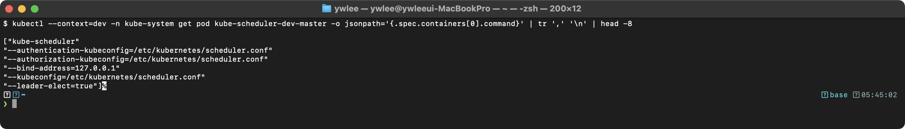

##### kube-controller-manager 내부 동작

kube-controller-manager는 단일 바이너리 안에 수십 개의 독립적인 컨트롤러 루프를 실행한다. 각 컨트롤러는 "감시(Watch) → 비교(Compare) → 조정(Reconcile)" 패턴으로 동작한다. 주요 컨트롤러와 그 역할은 다음과 같다:

- **Deployment Controller**: Deployment 객체의 spec.template이 변경되면 새 ReplicaSet을 생성하고, 이전 ReplicaSet의 replicas를 점진적으로 감소시킨다.
- **ReplicaSet Controller**: 현재 Pod 수와 desired replicas를 비교하여 Pod를 생성하거나 삭제한다.
- **Node Controller**: 노드의 heartbeat(Lease 객체)를 감시한다. `--node-monitor-grace-period`(기본 40초) 동안 heartbeat가 없으면 노드를 NotReady로 마킹한다. `--pod-eviction-timeout`(기본 5분) 이후에도 복구되지 않으면 해당 노드의 Pod에 대해 eviction을 시작한다.
- **Job Controller**: Job의 completions 수를 추적하고, 실패 시 backoffLimit까지 재시도한다.
- **EndpointSlice Controller**: Service의 selector에 매칭되는 Pod의 IP를 EndpointSlice 객체에 반영한다.
- **ServiceAccount Controller**: 새 네임스페이스가 생성되면 `default` ServiceAccount를 자동 생성한다.
- **Garbage Collector**: ownerReferences를 기반으로 고아(orphan) 리소스를 정리한다.

```bash
# controller-manager에서 실행 중인 컨트롤러 목록 확인
kubectl -n kube-system describe pod kube-controller-manager-controlplane | grep -A 2 "Command"
```

#### Worker Node 구성 요소

| 컴포넌트 | 역할 |
|---|---|
| **kubelet** | 노드에서 Pod의 생명주기를 관리한다. API 서버로부터 PodSpec을 받아 컨테이너 런타임에 지시한다. |
| **kube-proxy** | Service에 대한 네트워크 규칙을 관리한다. iptables 또는 IPVS 모드로 동작한다. |
| **Container Runtime** | 실제 컨테이너를 실행한다. containerd, CRI-O 등 CRI 호환 런타임을 사용한다. |

##### kubelet 내부 동작

kubelet은 각 노드에서 systemd 서비스로 실행되는 에이전트이다. 주요 동작은 다음과 같다:

1. **Pod 동기화**: apiserver의 Watch API를 통해 해당 노드에 할당된 Pod 목록을 수신한다. 10초(기본) 간격의 `syncLoop`에서 현재 실행 중인 컨테이너와 desired 상태를 비교하여 생성/삭제/재시작을 결정한다.
2. **컨테이너 런타임 인터페이스(CRI)**: kubelet은 gRPC를 통해 컨테이너 런타임(containerd, CRI-O)과 통신한다. gRPC는 Google이 만든 고성능 원격 프로시저 호출(RPC) 프레임워크로, HTTP/2 위에서 Protocol Buffers(바이너리 직렬화 포맷)를 써 빠른 바이너리 통신을 제공한다. kubelet은 `RuntimeService`(컨테이너 생명주기)와 `ImageService`(이미지 관리) 두 가지 gRPC 서비스를 호출한다.
3. **cgroup 관리**: kubelet은 Pod의 resources.requests/limits를 리눅스 cgroup(v1 또는 v2)에 매핑한다. CPU limits는 cgroup의 `cpu.cfs_quota_us`/`cpu.cfs_period_us`로 변환되고, 메모리 limits는 `memory.limit_in_bytes`로 설정된다.
4. **Probe 실행**: kubelet은 컨테이너의 liveness/readiness/startup probe를 직접 실행한다. HTTP probe의 경우 kubelet이 직접 HTTP GET 요청을 보내고, exec probe의 경우 컨테이너 내에서 명령을 실행한다.
5. **노드 상태 보고**: kubelet은 주기적으로(기본 10초) 노드의 상태(Ready, MemoryPressure, DiskPressure, PIDPressure)를 apiserver에 보고한다. 이 보고는 `Lease` 객체를 통해 이루어진다.

```bash
# kubelet 설정 확인
cat /var/lib/kubelet/config.yaml | head -30
```

> **예시(참조) — 기대 출력 예시:** 개념 이해용 기대 출력 예시다(일반 placeholder 클러스터 기준). 동일·유사 명령의 **실측 스크린샷**은 CKA daily(day01~20) 및 02·03 본문 캡처에서 확인할 수 있다.

##### kube-proxy 내부 동작과 iptables 체인 구조

kube-proxy는 Service 추상화를 네트워크 레벨에서 구현하는 컴포넌트이다. 기존에 리눅스에서 서비스 로드밸런싱을 구현하려면 HAProxy나 nginx 같은 사용자 공간(userspace) 프록시를 사용해야 했는데, 이 방식은 모든 패킷이 사용자 공간을 거쳐야 하므로 성능 오버헤드가 컸다. kube-proxy는 커널의 netfilter/iptables 또는 IPVS를 활용하여 커널 공간에서 패킷을 처리함으로써 이 오버헤드를 해결한다.

**iptables 모드** (기본값):

kube-proxy는 Service가 생성/변경될 때마다 다음 iptables 체인을 생성하고 갱신한다:

1. `KUBE-SERVICES` 체인: `nat` 테이블의 `PREROUTING`과 `OUTPUT` 체인에서 점프한다. 각 Service의 ClusterIP:port 조합에 대한 규칙이 여기에 등록된다.
2. `KUBE-SVC-XXXX` 체인: 각 Service마다 하나씩 생성된다. 이 체인 안에서 백엔드 Pod로의 분배가 이루어진다. Pod가 여러 개이면 `--probability` 옵션으로 확률적 로드밸런싱을 수행한다. 예를 들어 Pod 3개이면 첫 번째 규칙은 1/3 확률, 두 번째 규칙은 1/2 확률, 세 번째 규칙은 1/1 확률로 매칭된다.
3. `KUBE-SEP-XXXX` 체인: 각 엔드포인트(Pod IP:port)마다 하나씩 생성된다. 실제로 DNAT(Destination NAT) 규칙을 통해 ClusterIP를 Pod IP로 변환한다.
4. `KUBE-MARK-MASQ` 체인: 패킷에 0x4000 마크를 설정하여, `POSTROUTING` 단계에서 SNAT(Source NAT)가 적용되도록 한다.
5. `KUBE-NODEPORTS` 체인: NodePort 타입 Service에 대한 규칙이 등록된다.

iptables 모드의 제한사항:
- Service 수가 수천 개를 초과하면 iptables 규칙이 수만 개에 달하고, 규칙 갱신 시 전체 체인을 재구성해야 하므로 성능이 저하된다.
- iptables는 순차 매칭(O(n))이므로, 규칙 수에 비례하여 패킷 처리 지연이 증가한다.

**IPVS 모드**:

IPVS(IP Virtual Server)는 리눅스 커널의 L4 로드밸런서 모듈이다. 해시 테이블 기반으로 동작하므로 O(1)에 가까운 조회 성능을 제공한다. 또한 round-robin, least-connection, shortest-expected-delay 등 다양한 로드밸런싱 알고리즘을 지원한다. Service 수가 1,000개를 초과하는 대규모 클러스터에서는 IPVS 모드를 사용하는 것이 권장된다.

IPVS 모드를 사용하려면 노드에 `ip_vs`, `ip_vs_rr`, `ip_vs_wrr`, `ip_vs_sh`, `nf_conntrack` 커널 모듈이 로드되어 있어야 한다.

```bash
# kube-proxy의 모드 확인
kubectl -n kube-system get configmap kube-proxy -o jsonpath='{.data.config\.conf}' | grep mode
```

> **예시(참조) — 기대 출력 예시:** 개념 이해용 기대 출력 예시다(일반 placeholder 클러스터 기준). 동일·유사 명령의 **실측 스크린샷**은 CKA daily(day01~20) 및 02·03 본문 캡처에서 확인할 수 있다.

```bash
# iptables 규칙에서 특정 Service의 체인 확인
iptables -t nat -L KUBE-SERVICES -n | head -20
```

> **예시(참조) — 기대 출력 예시 (ClusterIP 10.96.0.1의 kubernetes Service):** 개념 이해용 기대 출력 예시다(일반 placeholder 클러스터 기준). 동일·유사 명령의 **실측 스크린샷**은 CKA daily(day01~20) 및 02·03 본문 캡처에서 확인할 수 있다.

##### Container Runtime과 CRI

쿠버네티스 초기에는 Docker를 직접 지원했으나(dockershim), Docker의 아키텍처가 과도하게 복잡했다(Docker daemon → containerd → runc의 3계층). 쿠버네티스 1.24에서 dockershim이 제거되고, CRI(Container Runtime Interface)를 직접 구현하는 containerd와 CRI-O가 표준 런타임이 되었다.

CRI는 두 가지 gRPC 서비스로 구성된다:
- `RuntimeService`: PodSandbox 생성/삭제, Container 생성/시작/중지, Exec, Attach, PortForward 등
- `ImageService`: 이미지 Pull, Remove, List, Status 등

컨테이너 런타임은 내부적으로 OCI(Open Container Initiative) 런타임 스펙을 준수하는 저수준 런타임(runc, crun, kata-containers 등)을 호출하여 실제 컨테이너 프로세스를 생성한다.

```bash
# 컨테이너 런타임 소켓 확인
ls -la /run/containerd/containerd.sock
```

> **예시(참조) — 기대 출력 예시:** 개념 이해용 기대 출력 예시다(일반 placeholder 클러스터 기준). 동일·유사 명령의 **실측 스크린샷**은 CKA daily(day01~20) 및 02·03 본문 캡처에서 확인할 수 있다.

```bash
# crictl로 런타임 정보 확인
crictl info | head -5
```

> **예시(참조) — 기대 출력 예시:** 개념 이해용 기대 출력 예시다(일반 placeholder 클러스터 기준). 동일·유사 명령의 **실측 스크린샷**은 CKA daily(day01~20) 및 02·03 본문 캡처에서 확인할 수 있다.

#### 통신 흐름

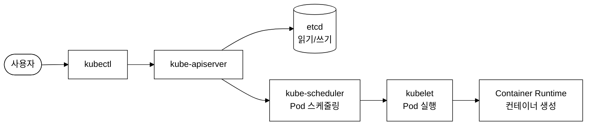
_그림 1. 클러스터 통신 흐름: 모든 컴포넌트가 apiserver를 경유한다._

모든 컴포넌트는 kube-apiserver를 통해서만 통신한다. 컴포넌트 간 직접 통신은 하지 않는다. 이 설계의 이점은 다음과 같다:
- apiserver가 유일한 etcd 클라이언트이므로, 접근 제어와 감사(audit)를 중앙 집중화할 수 있다.
- 컴포넌트 간 결합도가 낮아, 개별 컴포넌트의 교체나 업그레이드가 독립적으로 가능하다.
- Watch 기반 비동기 통신으로, 컴포넌트 일시 장애 시에도 복구 후 상태를 재동기화할 수 있다.

#### 클러스터 상태 검증 실습

```bash
# 모든 컴포넌트 상태 확인
kubectl get componentstatuses
```

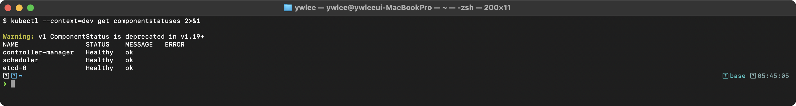

```bash
# 대안: kube-system Pod 상태로 확인
kubectl -n kube-system get pods
```

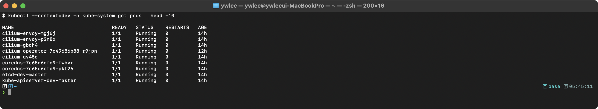

---

### 1.2 kubeadm을 이용한 클러스터 설치

#### 등장 배경

쿠버네티스 초기에는 클러스터 설치가 수십 단계의 수동 작업을 요구했다. 인증서 생성, etcd 설정, 각 컴포넌트의 systemd 유닛 파일 작성, 네트워크 설정 등을 모두 직접 수행해야 했으며, 이는 "Kubernetes the Hard Way"라는 가이드로 문서화될 정도로 복잡했다. kubeadm은 이 과정을 자동화하여, 모범 사례(best practice)에 따른 클러스터 부트스트래핑을 `init`과 `join` 두 명령으로 단순화하기 위해 설계된 것이다. kubeadm은 클러스터의 생명주기(설치, 업그레이드, 인증서 갱신)를 관리하되, 인프라 프로비저닝(VM 생성, 네트워크 구성 등)은 범위 밖으로 두어 책임 범위를 명확히 분리한다.

#### 사전 요구 사항

- 스왑(swap)을 비활성화해야 한다: `swapoff -a`
  - 스왑이 활성화되면 kubelet의 메모리 관리가 예측 불가능해진다. cgroup의 메모리 제한이 스왑 공간까지 확장되면, OOM 상황을 정확히 감지할 수 없다. 쿠버네티스 1.28부터 실험적으로 스왑을 지원하지만, CKA 시험 범위에서는 비활성화가 원칙이다.
- 필요한 커널 모듈을 로드해야 한다: `br_netfilter`, `overlay`
  - `br_netfilter`: 브리지 네트워크를 통과하는 패킷이 iptables 규칙의 적용을 받도록 한다. 이 모듈이 없으면 Pod 간 통신에서 Service IP 변환이 동작하지 않는다.
  - `overlay`: overlayfs 파일시스템을 사용하기 위한 모듈이다. containerd가 컨테이너 이미지의 레이어를 효율적으로 마운트하는 데 사용한다.
- sysctl 파라미터를 설정해야 한다:
  - `net.bridge.bridge-nf-call-iptables = 1`: 브리지 트래픽에 iptables를 적용한다.
  - `net.bridge.bridge-nf-call-ip6tables = 1`: IPv6 브리지 트래픽에 ip6tables를 적용한다.
  - `net.ipv4.ip_forward = 1`: 리눅스 커널의 IP 포워딩을 활성화한다. 이것이 비활성화되면 Pod 간 크로스노드 통신이 불가능하다.
- 컨테이너 런타임(containerd 등)을 설치해야 한다
- kubeadm, kubelet, kubectl을 설치해야 한다

```bash
# 사전 요구 사항 검증
lsmod | grep br_netfilter
lsmod | grep overlay
sysctl net.bridge.bridge-nf-call-iptables net.ipv4.ip_forward
swapon --summary
```

> **예시(참조) — 기대 출력 예시 (올바르게 설정된 경우):** 개념 이해용 기대 출력 예시다(일반 placeholder 클러스터 기준). 동일·유사 명령의 **실측 스크린샷**은 CKA daily(day01~20) 및 02·03 본문 캡처에서 확인할 수 있다.

#### kubeadm init 과정 (Control Plane 초기화)

`kubeadm init` 명령은 다음 단계를 순차적으로 수행한다:

1. **Preflight checks**: 시스템 요구사항(포트, 스왑, 커널 모듈 등)을 확인한다. 실패 시 구체적인 오류 메시지를 출력한다.
2. **인증서 생성**: `/etc/kubernetes/pki/` 디렉터리에 CA, apiserver, kubelet, etcd 등 총 10개 이상의 인증서/키 쌍을 생성한다. 인증서 유효 기간은 기본 1년, CA는 10년이다.
3. **kubeconfig 파일 생성**: admin, controller-manager, scheduler, kubelet용 kubeconfig를 `/etc/kubernetes/`에 생성한다. 각 kubeconfig에는 해당 컴포넌트의 클라이언트 인증서가 내장된다.
4. **Static Pod manifest 생성**: apiserver, controller-manager, scheduler, etcd의 매니페스트를 `/etc/kubernetes/manifests/`에 생성한다.
5. **kubelet 시작**: Static Pod를 통해 Control Plane 컴포넌트를 시작한다.
6. **Bootstrap token 생성**: Worker Node가 조인할 때 사용할 토큰을 생성한다. 토큰의 기본 유효 기간은 24시간이다.
7. **CoreDNS, kube-proxy addon 설치**: 클러스터 DNS와 네트워크 프록시를 DaemonSet/Deployment로 배포한다.

주요 옵션:
- `--pod-network-cidr`: Pod 네트워크 대역 지정 (CNI에 따라 필수. Calico 기본값: 192.168.0.0/16, Flannel: 10.244.0.0/16)
- `--apiserver-advertise-address`: API 서버의 광고 주소 지정
- `--control-plane-endpoint`: HA 구성 시 로드밸런서 주소 지정
- `--cri-socket`: 컨테이너 런타임 소켓 경로 지정
- `--kubernetes-version`: 설치할 쿠버네티스 버전 지정

```bash
# 실제 설치 예시 (dry-run으로 사전 확인)
kubeadm init --dry-run --pod-network-cidr=192.168.0.0/16
```

> **예시(참조) — 기대 출력 예시 (오류가 없는 경우):** 개념 이해용 기대 출력 예시다(일반 placeholder 클러스터 기준). 동일·유사 명령의 **실측 스크린샷**은 CKA daily(day01~20) 및 02·03 본문 캡처에서 확인할 수 있다.

```bash
# 생성된 인증서 확인
ls /etc/kubernetes/pki/
```

> **예시(참조) — 기대 출력 예시:** 개념 이해용 기대 출력 예시다(일반 placeholder 클러스터 기준). 동일·유사 명령의 **실측 스크린샷**은 CKA daily(day01~20) 및 02·03 본문 캡처에서 확인할 수 있다.

#### kubeadm join 과정 (Worker Node 추가)

Worker Node를 클러스터에 추가하는 과정이다:

1. `kubeadm init` 완료 후 출력되는 `kubeadm join` 명령을 Worker Node에서 실행한다.
2. 토큰과 CA 인증서 해시를 사용하여 apiserver에 TLS 부트스트래핑 인증을 수행한다. 토큰은 클러스터에 등록된 bootstrap-token Secret과 대조된다.
3. kubelet은 CSR(Certificate Signing Request, 인증서 서명 요청)을 apiserver에 제출하여 자신의 클라이언트 인증서를 발급받는다.
4. kubelet이 시작되고 노드가 클러스터에 등록된다.

TLS 부트스트래핑(TLS bootstrapping)은 "정식 클라이언트 인증서가 아직 없는 새 노드가, 단기 토큰만으로 신원을 인정받아 자신의 정식 인증서를 발급받는 절차"를 가리킨다. 닭-달걀 문제(인증서로 인증해야 하는데 인증서가 아직 없음)를 해소하기 위한 것이다. 흐름은 다음과 같다. ① `kubeadm init`이 만든 bootstrap-token이 `kube-system` 네임스페이스에 `bootstrap-token-<id>` Secret으로 저장된다. ② Worker의 kubelet이 join 시 이 토큰을 제시하면, apiserver가 해당 Secret과 대조해 "부트스트랩 권한이 있는 임시 사용자"로 인증한다. ③ 인증된 kubelet은 자신의 CSR을 제출하고, 이 CSR은 (kubeadm 기본 설정에서) 자동 승인되어 정식 클라이언트 인증서가 발급된다. ④ 이후 kubelet은 토큰이 아니라 이 정식 인증서로 apiserver와 통신한다. 즉 토큰은 최초 신원 확인용 1회성 자격이고, 정식 인증서가 이를 대체한다.

토큰이 만료된 경우 새 토큰을 생성할 수 있다:
```bash
kubeadm token create --print-join-command
```

> **예시(참조) — 기대 출력 예시:** 개념 이해용 기대 출력 예시다(일반 placeholder 클러스터 기준). 동일·유사 명령의 **실측 스크린샷**은 CKA daily(day01~20) 및 02·03 본문 캡처에서 확인할 수 있다.

#### 장애 시나리오: kubeadm init 실패 후 재시도

`kubeadm init`이 중간에 실패하면 부분적으로 생성된 파일이 남아 재실행 시 충돌이 발생한다. 이 경우 `kubeadm reset`을 먼저 실행하여 이전 상태를 정리한 뒤 다시 시도해야 한다.

```bash
kubeadm reset -f
# iptables 규칙 정리
iptables -F && iptables -t nat -F && iptables -t mangle -F && iptables -X
# CNI 설정 정리
rm -rf /etc/cni/net.d
# 재시도
kubeadm init --pod-network-cidr=192.168.0.0/16
```

---

### 1.3 클러스터 업그레이드 절차

#### 등장 배경과 제약 사항

쿠버네티스는 약 4개월마다 마이너 버전을 릴리스하며, 각 마이너 버전은 약 14개월간 패치 지원을 받는다. 클러스터 업그레이드는 반드시 **한 마이너 버전씩 순차적**으로 수행해야 한다 (예: 1.28 → 1.29 → 1.30). 건너뛰기(skip) 업그레이드는 지원하지 않는다. 이는 kube-apiserver가 N-1, N, N+1 버전 간 API 호환성만 보장하기 때문이다.

쿠버네티스의 버전 차이 정책(version skew policy)은 다음과 같다:
- kube-apiserver가 가장 높은 버전이어야 한다.
- kubelet은 apiserver보다 최대 2 마이너 버전까지 낮을 수 있다 (예: apiserver 1.30, kubelet 1.28).
- kube-controller-manager, kube-scheduler, cloud-controller-manager는 apiserver보다 최대 1 마이너 버전 낮을 수 있다.
- kubectl은 apiserver 대비 ±1 마이너 버전까지 호환된다.

#### 업그레이드 순서 (반드시 준수)

1. **Control Plane 노드** (먼저)
2. **Worker Node** (나중에)

#### Control Plane 업그레이드 절차

```bash
# 1. kubeadm 업그레이드
apt-mark unhold kubeadm
apt-get update && apt-get install -y kubeadm=1.30.0-1.1
apt-mark hold kubeadm

# 2. 업그레이드 가능 여부 확인
kubeadm upgrade plan
```

> **예시(참조) — 기대 출력 예시:** 개념 이해용 기대 출력 예시다(일반 placeholder 클러스터 기준). 동일·유사 명령의 **실측 스크린샷**은 CKA daily(day01~20) 및 02·03 본문 캡처에서 확인할 수 있다.

```bash
# 3. Control Plane 컴포넌트 업그레이드
kubeadm upgrade apply v1.30.0

# 4. 노드 drain
kubectl drain controlplane --ignore-daemonsets

# 5. kubelet, kubectl 업그레이드
apt-mark unhold kubelet kubectl
apt-get update && apt-get install -y kubelet=1.30.0-1.1 kubectl=1.30.0-1.1
apt-mark hold kubelet kubectl

# 6. kubelet 재시작
systemctl daemon-reload
systemctl restart kubelet

# 7. 노드 uncordon
kubectl uncordon controlplane
```

```bash
# 업그레이드 결과 확인
kubectl get nodes
```

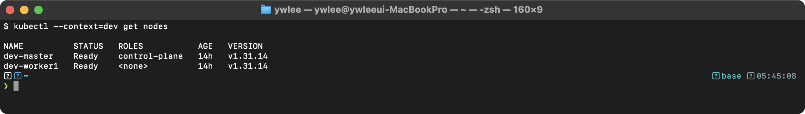

#### Worker Node 업그레이드 절차

```bash
# Control Plane에서 실행:
# 1. 노드 drain
kubectl drain node01 --ignore-daemonsets --delete-emptydir-data

# Worker Node에서 실행:
# 2. kubeadm 업그레이드
apt-mark unhold kubeadm
apt-get update && apt-get install -y kubeadm=1.30.0-1.1
apt-mark hold kubeadm

# 3. 노드 설정 업그레이드
kubeadm upgrade node

# 4. kubelet, kubectl 업그레이드
apt-mark unhold kubelet kubectl
apt-get update && apt-get install -y kubelet=1.30.0-1.1 kubectl=1.30.0-1.1
apt-mark hold kubelet kubectl

# 5. kubelet 재시작
systemctl daemon-reload
systemctl restart kubelet

# Control Plane에서 실행:
# 6. 노드 uncordon
kubectl uncordon node01
```

핵심 포인트:
- `kubectl drain`은 해당 노드의 Pod를 다른 노드로 이동(eviction)시킨다. `--ignore-daemonsets` 플래그는 DaemonSet Pod를 무시한다. `--delete-emptydir-data`는 emptyDir 볼륨을 사용하는 Pod를 강제 삭제한다.
- `kubectl cordon`은 새로운 Pod가 스케줄링되는 것만 방지한다(노드에 `node.kubernetes.io/unschedulable:NoSchedule` Taint를 추가). 기존 Pod는 그대로 유지된다.
- `kubectl uncordon`은 노드를 다시 스케줄링 가능 상태로 복원한다.
- drain 중 PodDisruptionBudget(PDB)이 설정된 Pod가 있으면, PDB 조건을 위반하는 eviction은 거부된다.

#### 장애 시나리오: 업그레이드 후 kubelet이 시작되지 않는 경우

```bash
# 증상: 노드가 NotReady 상태
kubectl get nodes
# kubelet 로그에서 원인 확인
journalctl -u kubelet --no-pager -l | tail -30
```

일반적 원인:
- `systemctl daemon-reload`를 실행하지 않아 이전 버전의 systemd 유닛 파일이 캐시되어 있는 경우
- 컨테이너 런타임의 버전이 새 kubelet과 호환되지 않는 경우
- `/var/lib/kubelet/config.yaml`의 설정이 새 버전에서 deprecated된 옵션을 포함하는 경우

---

### 1.4 etcd 백업과 복구

#### 등장 배경

분산 시스템에서 상태 저장소의 일관성 보장은 오래된 과제이다. ZooKeeper가 대표적 솔루션이었으나, Java 기반으로 메모리 사용량이 크고, 자체 바이너리 프로토콜만 지원하여 운영 도구 개발이 번거로웠다. Consul(HashiCorp)도 등장했지만 서비스 디스커버리에 초점을 맞춘 설계로, 순수 키-값 저장소로서의 성능과 단순함이 부족했다.

etcd는 CoreOS(현 Red Hat)가 2013년에 개발한 분산 키-값 저장소로, 다음 설계 목표를 가진다:
- Raft 합의 알고리즘 기반의 강한 일관성(linearizable reads/writes) 보장
- gRPC 및 HTTP/JSON API를 통한 간결한 인터페이스
- Watch API를 통한 변경 알림(쿠버네티스의 컨트롤러 패턴에 필수적)
- 단일 바이너리 배포로 운영 복잡도 최소화
- 모든 데이터를 디스크에 B+ 트리(bbolt) 구조로 저장하여, 재시작 후에도 전체 상태를 즉시 복구

etcd는 클러스터의 모든 상태 데이터를 저장하므로, 정기적인 백업은 필수이다. CKA 시험에서 자주 출제된다.

#### etcd의 데이터 구조

etcd v3는 MVCC(Multi-Version Concurrency Control) 모델을 사용한다. 모든 키에 대해 수정 이력이 revision 번호와 함께 저장되며, compaction을 통해 오래된 revision을 정리할 수 있다. 쿠버네티스의 모든 리소스는 etcd에 `/registry/<resource-type>/<namespace>/<name>` 형식의 키로 저장된다. 예를 들어 default 네임스페이스의 nginx Pod는 `/registry/pods/default/nginx` 키에 저장된다.

```bash
# etcd에 저장된 키 목록 확인 (운영 환경에서는 주의)
ETCDCTL_API=3 etcdctl get / --prefix --keys-only --limit=10 \
  --endpoints=https://127.0.0.1:2379 \
  --cacert=/etc/kubernetes/pki/etcd/ca.crt \
  --cert=/etc/kubernetes/pki/etcd/server.crt \
  --key=/etc/kubernetes/pki/etcd/server.key
```

> **예시(참조) — 기대 출력 예시:** 개념 이해용 기대 출력 예시다(일반 placeholder 클러스터 기준). 동일·유사 명령의 **실측 스크린샷**은 CKA daily(day01~20) 및 02·03 본문 캡처에서 확인할 수 있다.

#### etcd 백업 (etcdctl snapshot save)

실습 전제: 이 작업은 etcd가 Static Pod로 떠 있는 Control Plane 노드 안에서 실행한다. 이 저장소에서는 파괴 실습이 허용된 staging 클러스터의 master 노드에 SSH로 접속해(`ssh staging-master`) 수행한다. 인증서 경로 `--cacert`/`--cert`/`--key`는 etcd가 자신의 클라이언트와 TLS 통신을 검증하는 데 쓰는 파일이며(각각 CA 인증서, 서버 인증서, 서버 키), kubeadm으로 설치한 클러스터에서는 `/etc/kubernetes/pki/etcd/` 아래에 위치한다. 아래 기대 출력 블록은 실측값 예시이며, 실제 staging 클러스터에서 명령을 실행한 터미널 화면 캡처로 교체하는 것이 원칙이다(미캡처).

etcdctl은 반드시 **API 버전 3**을 사용해야 한다.

필요한 인증서 파일:
- `--cacert`: CA 인증서 (`/etc/kubernetes/pki/etcd/ca.crt`)
- `--cert`: etcd 서버 인증서 (`/etc/kubernetes/pki/etcd/server.crt`)
- `--key`: etcd 서버 키 (`/etc/kubernetes/pki/etcd/server.key`)
- `--endpoints`: etcd 엔드포인트 (`https://127.0.0.1:2379`)

인증서 경로를 모르는 경우 etcd Pod의 매니페스트에서 확인할 수 있다:

```bash
cat /etc/kubernetes/manifests/etcd.yaml | grep -E "cert-file|key-file|trusted-ca-file"
```

> **예시(참조) — 기대 출력 예시:** 개념 이해용 기대 출력 예시다(일반 placeholder 클러스터 기준). 동일·유사 명령의 **실측 스크린샷**은 CKA daily(day01~20) 및 02·03 본문 캡처에서 확인할 수 있다.

백업 명령:
```bash
ETCDCTL_API=3 etcdctl snapshot save /tmp/etcd-backup.db \
  --endpoints=https://127.0.0.1:2379 \
  --cacert=/etc/kubernetes/pki/etcd/ca.crt \
  --cert=/etc/kubernetes/pki/etcd/server.crt \
  --key=/etc/kubernetes/pki/etcd/server.key
```

> **예시(참조) — 기대 출력 예시:** 개념 이해용 기대 출력 예시다(일반 placeholder 클러스터 기준). 동일·유사 명령의 **실측 스크린샷**은 CKA daily(day01~20) 및 02·03 본문 캡처에서 확인할 수 있다.

백업 검증:
```bash
ETCDCTL_API=3 etcdctl snapshot status /tmp/etcd-backup.db --write-out=table
```

> **예시(참조) — 기대 출력 예시:** 개념 이해용 기대 출력 예시다(일반 placeholder 클러스터 기준). 동일·유사 명령의 **실측 스크린샷**은 CKA daily(day01~20) 및 02·03 본문 캡처에서 확인할 수 있다.

HASH 값이 표시되고 REVISION이 0이 아니면 백업이 정상적으로 수행된 것이다.

#### etcd 복구 (etcdctl snapshot restore)

복구 절차:
1. etcd를 중지한다 (Static Pod의 경우 매니페스트를 `/etc/kubernetes/manifests/`에서 이동).
2. 기존 데이터 디렉터리를 백업한다.
3. 스냅샷을 복구한다.
4. 새 데이터 디렉터리를 사용하도록 etcd 매니페스트를 수정한다.
5. 매니페스트를 원래 위치로 복원하여 etcd를 재시작한다.

```bash
# 1. etcd Static Pod 중지 (매니페스트 이동)
mv /etc/kubernetes/manifests/etcd.yaml /tmp/etcd.yaml.bak

# 2. 기존 데이터 디렉터리 백업
mv /var/lib/etcd /var/lib/etcd.bak

# 3. 스냅샷 복구
ETCDCTL_API=3 etcdctl snapshot restore /tmp/etcd-backup.db \
  --data-dir=/var/lib/etcd

# 4. 매니페스트 복원 (etcd 재시작)
mv /tmp/etcd.yaml.bak /etc/kubernetes/manifests/etcd.yaml

# 5. etcd Pod가 정상 기동될 때까지 대기 (약 30초~1분)
crictl ps | grep etcd
```

> **예시(참조) — 기대 출력 예시 (etcd가 정상 기동된 경우):** 개념 이해용 기대 출력 예시다(일반 placeholder 클러스터 기준). 동일·유사 명령의 **실측 스크린샷**은 CKA daily(day01~20) 및 02·03 본문 캡처에서 확인할 수 있다.

복구 후 `--data-dir` 경로를 변경한 경우에는 etcd 매니페스트(`/etc/kubernetes/manifests/etcd.yaml`)에서 `--data-dir` 플래그와 해당 hostPath 볼륨 마운트 경로를 일치시켜야 한다. 구체적으로 두 곳을 함께 바꿔야 한다. ① `spec.containers[0].command`의 `--data-dir=<경로>` 플래그, ② `spec.volumes` 중 `name: etcd-data`로 연결된 hostPath의 `path`. 이 둘이 어긋나면 etcd 컨테이너가 빈 디렉터리를 보고 기동되어 복구한 데이터가 보이지 않는다.

예를 들어 스냅샷을 `--data-dir=/var/lib/etcd-restore`로 복구했다면, ① command의 `--data-dir=/var/lib/etcd`를 `--data-dir=/var/lib/etcd-restore`로 바꾸고, ② `name: etcd-data` 볼륨의 `hostPath.path`도 `/var/lib/etcd`에서 `/var/lib/etcd-restore`로 동일하게 바꾼다. 두 값이 항상 같은 경로를 가리켜야 한다.

기본 경로(`/var/lib/etcd`)를 그대로 쓰고 싶다면, 복구 시 `--data-dir`를 따로 지정하지 않거나 `/var/lib/etcd`로 복구하면 매니페스트를 수정할 필요가 없다(시험에서는 이 방식이 단순해 실수가 적다).

#### 장애 시나리오: etcd 데이터 손상

etcd 데이터가 손상되면 apiserver가 `context deadline exceeded` 또는 `etcdserver: no leader` 오류를 반환한다. 이 경우 다음을 확인해야 한다:

```bash
# etcd 멤버 상태 확인
ETCDCTL_API=3 etcdctl member list \
  --endpoints=https://127.0.0.1:2379 \
  --cacert=/etc/kubernetes/pki/etcd/ca.crt \
  --cert=/etc/kubernetes/pki/etcd/server.crt \
  --key=/etc/kubernetes/pki/etcd/server.key \
  --write-out=table
```

> **예시(참조) — 기대 출력 예시 (정상):** 개념 이해용 기대 출력 예시다(일반 placeholder 클러스터 기준). 동일·유사 명령의 **실측 스크린샷**은 CKA daily(day01~20) 및 02·03 본문 캡처에서 확인할 수 있다.

```bash
# etcd 엔드포인트 건강 상태 확인
ETCDCTL_API=3 etcdctl endpoint health \
  --endpoints=https://127.0.0.1:2379 \
  --cacert=/etc/kubernetes/pki/etcd/ca.crt \
  --cert=/etc/kubernetes/pki/etcd/server.crt \
  --key=/etc/kubernetes/pki/etcd/server.key
```

> **예시(참조) — 기대 출력 예시 (정상):** 개념 이해용 기대 출력 예시다(일반 placeholder 클러스터 기준). 동일·유사 명령의 **실측 스크린샷**은 CKA daily(day01~20) 및 02·03 본문 캡처에서 확인할 수 있다.

---

### 1.5 RBAC (Role-Based Access Control)

#### 등장 배경

쿠버네티스 초기에는 ABAC(Attribute-Based Access Control)가 인가 메커니즘이었다. ABAC는 JSON 형식의 정책 파일을 kube-apiserver 시작 시 로드하는 방식이다. 이 접근 방식의 한계는 다음과 같았다:
- 정책 변경 시 apiserver를 재시작해야 했다. 운영 중인 클러스터에서 apiserver를 재시작하면 일시적으로 API 요청이 처리되지 않는다.
- 정책 파일이 노드의 로컬 파일시스템에 존재해야 하므로, HA 구성의 여러 Control Plane 노드 간 동기화가 수동으로 이루어져야 했다.
- 세분화된 권한 부여가 어려웠다. 사용자별, 네임스페이스별로 권한을 다르게 설정하려면 정책 파일이 급격히 비대해졌다.

RBAC는 이러한 한계를 해결하기 위해 쿠버네티스 1.6에서 도입되었다. RBAC는 권한 정의(Role/ClusterRole)와 권한 부여(RoleBinding/ClusterRoleBinding)를 쿠버네티스 API 리소스로 관리하므로, kubectl을 통해 동적으로 변경할 수 있고, apiserver 재시작이 필요 없다.

#### RBAC 리소스 구조

| 리소스 | 범위 | 설명 |
|---|---|---|
| **Role** | 네임스페이스 | 특정 네임스페이스 내 리소스에 대한 권한을 정의한다. |
| **ClusterRole** | 클러스터 전체 | 클러스터 전체 또는 비-네임스페이스 리소스에 대한 권한을 정의한다. |
| **RoleBinding** | 네임스페이스 | Role 또는 ClusterRole을 사용자/그룹/서비스어카운트에 바인딩한다. |
| **ClusterRoleBinding** | 클러스터 전체 | ClusterRole을 사용자/그룹/서비스어카운트에 바인딩한다. |

#### 핵심 개념

- **Role/ClusterRole**은 "무엇을 할 수 있는가"를 정의한다. verbs는 다음과 같다:
  - `get`: 단일 리소스 조회
  - `list`: 리소스 목록 조회
  - `watch`: 리소스 변경 감시 (Watch API)
  - `create`: 리소스 생성
  - `update`: 리소스 전체 수정
  - `patch`: 리소스 부분 수정
  - `delete`: 단일 리소스 삭제
  - `deletecollection`: 여러 리소스 일괄 삭제
- **RoleBinding/ClusterRoleBinding**은 "누가 그 권한을 가지는가"를 정의한다.
- **subjects**는 User, Group, ServiceAccount 중 하나이다.
- RoleBinding은 ClusterRole을 참조할 수 있다. 이 경우 ClusterRole의 권한이 해당 네임스페이스로 한정된다. 이를 통해 여러 네임스페이스에서 동일한 ClusterRole을 재사용하면서도 각 네임스페이스 내로 권한을 제한할 수 있다.

#### RBAC 리소스 생성 실습

```bash
# Role 생성: dev 네임스페이스에서 Pod를 조회/목록/감시할 수 있는 역할
kubectl create role pod-reader \
  --verb=get,list,watch \
  --resource=pods \
  --namespace=dev
```

> **예시(참조) — 기대 출력 예시:** 개념 이해용 기대 출력 예시다(일반 placeholder 클러스터 기준). 동일·유사 명령의 **실측 스크린샷**은 CKA daily(day01~20) 및 02·03 본문 캡처에서 확인할 수 있다.

```bash
# RoleBinding 생성: 사용자 jane에게 pod-reader 역할 부여
kubectl create rolebinding jane-pod-reader \
  --role=pod-reader \
  --user=jane \
  --namespace=dev
```

> **예시(참조) — 기대 출력 예시:** 개념 이해용 기대 출력 예시다(일반 placeholder 클러스터 기준). 동일·유사 명령의 **실측 스크린샷**은 CKA daily(day01~20) 및 02·03 본문 캡처에서 확인할 수 있다.

```bash
# 권한 테스트: jane 사용자가 dev 네임스페이스에서 Pod를 조회할 수 있는지 확인
kubectl auth can-i get pods --namespace=dev --as=jane
```

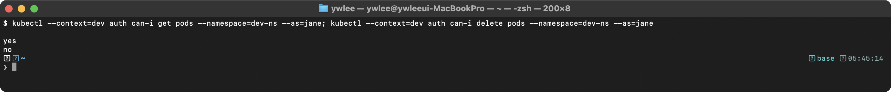

```bash
# 권한 테스트: jane 사용자가 dev 네임스페이스에서 Pod를 삭제할 수 있는지 확인
kubectl auth can-i delete pods --namespace=dev --as=jane
```

> **예시(참조) — 기대 출력 예시:** 개념 이해용 기대 출력 예시다(일반 placeholder 클러스터 기준). 동일·유사 명령의 **실측 스크린샷**은 CKA daily(day01~20) 및 02·03 본문 캡처에서 확인할 수 있다.

```bash
# 특정 사용자의 모든 권한 확인
kubectl auth can-i --list --namespace=dev --as=jane
```

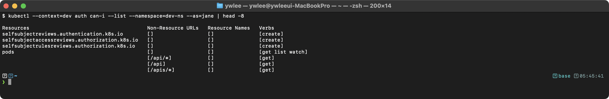

#### API Groups

- Core API (v1): pods, services, configmaps, secrets, namespaces, nodes, persistentvolumes, persistentvolumeclaims
- apps: deployments, replicasets, statefulsets, daemonsets
- batch: jobs, cronjobs
- networking.k8s.io: networkpolicies, ingresses
- rbac.authorization.k8s.io: roles, clusterroles, rolebindings, clusterrolebindings
- storage.k8s.io: storageclasses

Core API 그룹의 `apiGroups`는 `[""]`로 지정한다. 이는 Core 그룹이 `/api/v1` 경로를 사용하고, 다른 그룹은 `/apis/<group>/<version>` 경로를 사용하는 역사적 차이에서 비롯된다.

```bash
# 사용 가능한 API 리소스와 그룹 확인
kubectl api-resources --sort-by=name | head -20
```

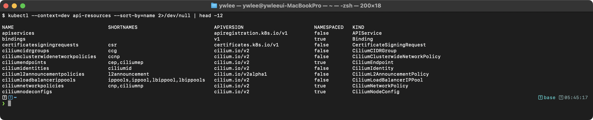

#### ServiceAccount

- 모든 네임스페이스에는 `default` ServiceAccount가 존재한다.
- Pod는 기본적으로 `default` ServiceAccount를 사용한다.
- 1.24 버전부터 ServiceAccount 생성 시 자동으로 시크릿이 생성되지 않는다. TokenRequest API를 통해 시간 제한이 있는 토큰(기본 1시간)을 발급받는다. 이 토큰은 projected volume으로 Pod에 자동 마운트된다(`/var/run/secrets/kubernetes.io/serviceaccount/token`).
- `spec.serviceAccountName`으로 Pod에 ServiceAccount를 지정한다.
- `automountServiceAccountToken: false`로 자동 마운트를 비활성화할 수 있다. 보안 관점에서 API 접근이 불필요한 Pod에는 비활성화가 권장된다.

```bash
# ServiceAccount 생성
kubectl create serviceaccount my-sa -n dev
```

> **예시(참조) — 기대 출력 예시:** 개념 이해용 기대 출력 예시다(일반 placeholder 클러스터 기준). 동일·유사 명령의 **실측 스크린샷**은 CKA daily(day01~20) 및 02·03 본문 캡처에서 확인할 수 있다.

```bash
# ServiceAccount에 대한 토큰 수동 생성 (1.24+)
kubectl create token my-sa -n dev --duration=24h
```

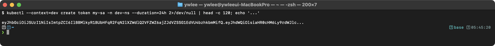

---

### 1.6 HA (High Availability) 클러스터

#### 등장 배경

단일 Control Plane 노드 구성에서는 해당 노드의 하드웨어 장애, 네트워크 분리, 커널 패닉 등이 발생하면 클러스터 전체의 관리 기능이 중단된다. 기존에 실행 중인 Pod는 계속 동작하지만, 새 Pod 생성, 스케줄링, 자동 복구 등이 불가능해진다. 프로덕션 환경에서는 이를 허용할 수 없으므로, 여러 Control Plane 노드로 구성하는 HA 클러스터가 필수적이다.

#### Stacked etcd 토폴로지

- etcd가 Control Plane 노드에 함께 실행된다.
- 설정이 간단하지만, Control Plane 노드 장애 시 etcd 멤버도 함께 영향을 받는다.
- 최소 3개의 Control Plane 노드가 필요하다 (etcd의 quorum 요구사항).

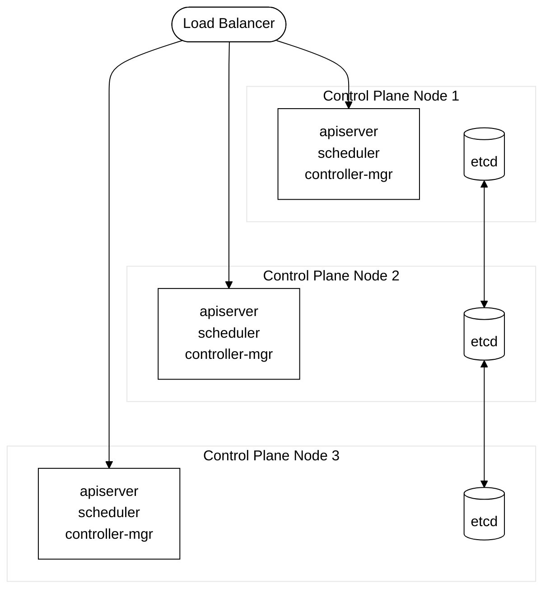
_그림 2. Stacked etcd 토폴로지: 3개 Control Plane 노드와 로드밸런서, etcd 멤버 간 복제._

HA 구성에서 scheduler와 controller-manager는 리더 선출(leader election)을 수행한다. 한 시점에 하나의 인스턴스만 활성(active) 상태이고, 나머지는 대기(standby) 상태이다. 리더가 장애 시 다른 인스턴스가 자동으로 리더를 인수한다. 리더 선출은 `kube-system` 네임스페이스의 Lease 객체를 통해 이루어진다.

```bash
# 현재 리더 확인
kubectl -n kube-system get lease kube-scheduler -o jsonpath='{.spec.holderIdentity}'
```

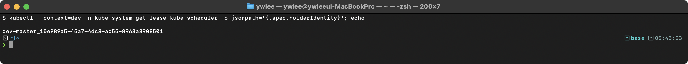

#### External etcd 토폴로지

- etcd가 별도의 노드에서 실행된다.
- Control Plane 노드 장애가 etcd에 영향을 주지 않는다.
- 더 많은 인프라가 필요하지만 안정성이 높다.
- etcd 클러스터와 Control Plane 클러스터를 독립적으로 확장할 수 있다.
- etcd 노드에 대해 별도의 백업/모니터링/디스크 최적화(SSD 권장)를 적용할 수 있다.

#### etcd Quorum

- etcd는 Raft 합의 알고리즘을 사용한다. Raft는 리더 기반 합의로, 하나의 리더가 클라이언트 요청을 받아 로그 엔트리를 생성하고, 팔로워에 복제한 후, 과반수의 확인(acknowledgment)을 받으면 커밋하는 방식이다.
- 쓰기 작업에는 과반수(quorum)의 동의가 필요하다.
- quorum = (n/2) + 1
  - 3개 노드: 1개 장애 허용 (quorum = 2)
  - 5개 노드: 2개 장애 허용 (quorum = 3)
  - 7개 노드: 3개 장애 허용 (quorum = 4)
- 짝수 개의 노드는 홀수 개와 같은 장애 허용 수를 가지므로 비효율적이다 (4개 노드도 quorum = 3이므로 1개만 허용).
- 실무에서는 대부분 3개 또는 5개 노드를 사용한다. 7개 이상은 쓰기 지연이 증가하므로 드물다.

---

### 1.7 kubeconfig 파일 구조와 컨텍스트 전환

#### 등장 배경

여러 쿠버네티스 클러스터(개발, 스테이징, 프로덕션 등)를 관리해야 하는 상황에서, 각 클러스터의 접속 정보(서버 주소, 인증서, 사용자 자격 증명)를 통일된 형식으로 관리할 필요가 있다. kubeconfig 파일은 이 정보를 구조화하여 저장하고, context를 통해 클러스터-사용자-네임스페이스 조합을 빠르게 전환할 수 있도록 설계된 것이다.

기본 위치는 `~/.kube/config`이다. `KUBECONFIG` 환경 변수로 여러 kubeconfig 파일을 콜론(`:`)으로 연결하면 kubectl이 이를 병합(merge)하여 사용한다.

#### kubeconfig 구조

```yaml
apiVersion: v1
kind: Config
current-context: my-context    # 현재 활성 컨텍스트

clusters:                       # 클러스터 접속 정보
- cluster:
    certificate-authority-data: <base64-encoded-ca-cert>
    server: https://192.168.1.100:6443
  name: my-cluster

users:                          # 사용자 인증 정보
- name: my-user
  user:
    client-certificate-data: <base64-encoded-cert>
    client-key-data: <base64-encoded-key>

contexts:                       # 클러스터 + 사용자 + 네임스페이스 조합
- context:
    cluster: my-cluster
    user: my-user
    namespace: default
  name: my-context
```

#### 컨텍스트 관련 명령어

```bash
# 현재 컨텍스트 확인
kubectl config current-context
```

> **예시(참조) — 기대 출력 예시:** 개념 이해용 기대 출력 예시다(일반 placeholder 클러스터 기준). 동일·유사 명령의 **실측 스크린샷**은 CKA daily(day01~20) 및 02·03 본문 캡처에서 확인할 수 있다.

```bash
# 사용 가능한 컨텍스트 목록
kubectl config get-contexts
```

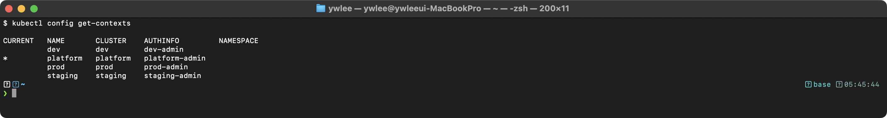

```bash
# 컨텍스트 전환
kubectl config use-context prod-context
```

> **예시(참조) — 기대 출력 예시:** 개념 이해용 기대 출력 예시다(일반 placeholder 클러스터 기준). 동일·유사 명령의 **실측 스크린샷**은 CKA daily(day01~20) 및 02·03 본문 캡처에서 확인할 수 있다.

```bash
# 특정 컨텍스트의 기본 네임스페이스 변경
kubectl config set-context --current --namespace=kube-system

# 새 컨텍스트 생성
kubectl config set-context new-context \
  --cluster=my-cluster --user=my-user --namespace=dev

# 특정 kubeconfig 파일 사용
kubectl --kubeconfig=/path/to/config get pods
# 또는
export KUBECONFIG=/path/to/config
```

CKA 시험에서는 여러 클러스터를 전환하며 문제를 풀어야 한다. 각 문제 시작 시 `kubectl config use-context <context-name>` 명령이 주어진다. 반드시 실행한 후 문제를 풀어야 한다. 컨텍스트 전환을 누락하면 다른 클러스터에서 작업을 수행하게 되어 오답 처리된다.

#### 장애 시나리오: kubeconfig 인증 실패

```bash
# 증상: 인증 오류
kubectl get pods
```

> **예시(참조) — 오류 출력 예시:** 개념 이해용 기대 출력 예시다(일반 placeholder 클러스터 기준). 동일·유사 명령의 **실측 스크린샷**은 CKA daily(day01~20) 및 02·03 본문 캡처에서 확인할 수 있다.

확인 사항:
1. kubeconfig의 server 주소가 올바른지 확인한다.
2. 인증서가 만료되지 않았는지 확인한다: `kubeadm certs check-expiration`
3. kubeconfig 내 인증서 데이터가 손상되지 않았는지 확인한다: base64 디코딩 후 `openssl x509 -noout -text`로 검증한다.

---

## 2. Workloads & Scheduling (15%)

### 2.1 Deployment 전략

#### 등장 배경

컨테이너 이전의 배포 방식에서는 새 버전을 배포할 때 서비스를 중단하고 바이너리를 교체하는 것이 일반적이었다. Blue-Green 배포나 Canary 배포는 별도의 인프라 도구(로드밸런서 설정 변경 등)를 통해 수동으로 구현해야 했다. 쿠버네티스의 Deployment는 이 과정을 선언적으로 자동화한다. 원하는 상태(이미지 버전, 레플리카 수 등)를 선언하면 Deployment Controller가 Rolling Update 또는 Recreate 전략에 따라 자동으로 Pod를 교체한다.

#### Rolling Update (기본 전략)

Pod를 점진적으로 교체하는 전략이다. 서비스 중단 없이 업데이트할 수 있다.

내부 동작: Deployment Controller는 새 ReplicaSet을 생성하고 해당 ReplicaSet의 replicas를 점진적으로 증가시키면서, 이전 ReplicaSet의 replicas를 점진적으로 감소시킨다. 이 과정에서 maxSurge와 maxUnavailable 파라미터가 동시에 존재할 수 있는 Pod의 최대/최소 수를 제어한다.

```yaml
spec:
  strategy:
    type: RollingUpdate
    rollingUpdate:
      maxSurge: 25%          # 원하는 수 대비 초과 생성할 수 있는 최대 Pod 수
      maxUnavailable: 25%    # 업데이트 중 사용 불가한 최대 Pod 수
```

- **maxSurge**: 업데이트 중 `replicas`보다 몇 개 더 생성할 수 있는지 지정한다. 백분율 또는 절대값으로 지정한다. 예를 들어 replicas=4, maxSurge=25%이면 최대 5개(4 + 1)의 Pod가 동시에 존재할 수 있다.
- **maxUnavailable**: 업데이트 중 몇 개까지 사용 불가능해도 되는지 지정한다. 예를 들어 replicas=4, maxUnavailable=25%이면 최소 3개(4 - 1)의 Pod가 항상 Ready 상태여야 한다.
- 둘 다 0으로 설정할 수는 없다. 그렇게 하면 업데이트가 진행될 수 없다.
- `spec.revisionHistoryLimit`(기본 10)은 보관할 이전 ReplicaSet의 수를 지정한다. 이 값이 너무 크면 불필요한 ReplicaSet 객체가 etcd에 누적된다.

#### Recreate

모든 기존 Pod를 먼저 제거한 후 새 Pod를 생성한다. 다운타임이 발생한다.

```yaml
spec:
  strategy:
    type: Recreate
```

같은 볼륨을 공유하는 Pod가 동시에 실행되면 안 되는 경우(예: 파일 잠금이 필요한 레거시 애플리케이션), 또는 데이터베이스 스키마 마이그레이션처럼 이전 버전과 새 버전이 동시에 동작하면 데이터 불일치가 발생하는 경우에 사용한다.

#### Rollout 관리

```bash
# 배포 상태 확인
kubectl rollout status deployment/nginx-deploy
```

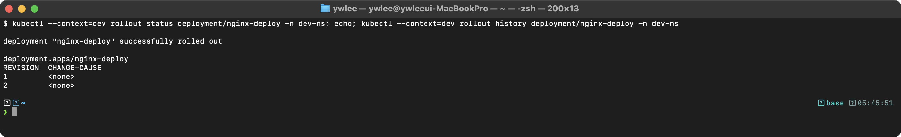

```bash
# 배포 이력 확인
kubectl rollout history deployment/nginx-deploy
```

> **예시(참조) — 기대 출력 예시:** 개념 이해용 기대 출력 예시다(일반 placeholder 클러스터 기준). 동일·유사 명령의 **실측 스크린샷**은 CKA daily(day01~20) 및 02·03 본문 캡처에서 확인할 수 있다.

```bash
# 특정 리비전 상세 확인
kubectl rollout history deployment/nginx-deploy --revision=2

# 이전 버전으로 롤백
kubectl rollout undo deployment/nginx-deploy

# 특정 리비전으로 롤백
kubectl rollout undo deployment/nginx-deploy --to-revision=2

# 배포 일시 정지 (여러 변경을 묶어서 한 번에 적용할 때)
kubectl rollout pause deployment/nginx-deploy

# 배포 재개
kubectl rollout resume deployment/nginx-deploy
```

```bash
# 롤백 후 ReplicaSet 상태 확인
kubectl get replicasets -l app=nginx-deploy
```

> **예시(참조) — 기대 출력 예시:** 개념 이해용 기대 출력 예시다(일반 placeholder 클러스터 기준). 동일·유사 명령의 **실측 스크린샷**은 CKA daily(day01~20) 및 02·03 본문 캡처에서 확인할 수 있다.

---

### 2.2 Pod 스케줄링

#### nodeSelector

가장 간단한 노드 선택 방법이다. 노드의 레이블과 매칭하여 스케줄링한다. 내부적으로 scheduler의 `NodeAffinity` 필터 플러그인이 이를 처리한다 (nodeSelector는 Node Affinity의 단순화된 인터페이스이다).

```yaml
spec:
  nodeSelector:
    disktype: ssd
    region: ap-northeast-2
```

해당 레이블이 있는 노드에만 Pod가 스케줄링된다. 매칭되는 노드가 없으면 Pod는 Pending 상태가 된다.

실습 전제: 클러스터가 가동 중이고 kubeconfig(`~/sideproejct/IaC_apple_sillicon/kubeconfig/dev.yaml` 등)가 설정되어 있어야 한다. 아래는 노드에 레이블을 부여하고, 그 레이블을 nodeSelector로 매칭하는 흐름이다. 명령과 기대 출력을 단계별로 분리해 둔다.

먼저 노드에 레이블을 부여한다.

```bash
# 노드에 레이블 추가
kubectl label nodes node01 disktype=ssd
```

> **예시(참조) — 기대 출력 예시 (레이블이 부여되면 다음과 같이 응답한다):** 개념 이해용 기대 출력 예시다(일반 placeholder 클러스터 기준). 동일·유사 명령의 **실측 스크린샷**은 CKA daily(day01~20) 및 02·03 본문 캡처에서 확인할 수 있다.

부여된 레이블이 실제로 노드에 반영되었는지 확인한다. `--show-labels`는 노드의 전체 레이블 목록을 마지막 컬럼에 출력하므로, `grep`으로 방금 추가한 `disktype` 키만 걸러서 본다.

```bash
# 레이블 확인 (disktype 레이블이 붙은 노드만 출력)
kubectl get nodes --show-labels | grep disktype
```

> **예시(참조) — 기대 출력 예시 (node01 행의 LABELS 컬럼 일부):** 개념 이해용 기대 출력 예시다(일반 placeholder 클러스터 기준). 동일·유사 명령의 **실측 스크린샷**은 CKA daily(day01~20) 및 02·03 본문 캡처에서 확인할 수 있다.

특정 노드의 레이블만 키-값 형태로 깔끔하게 보려면 `--show-labels` 대신 jsonpath로 추출하는 방법도 있다.

```bash
# node01의 레이블만 키=값 형태로 출력
kubectl get node node01 -o jsonpath='{.metadata.labels}' | tr ',' '\n'
```

> **예시(참조) — 기대 출력 예시:** 개념 이해용 기대 출력 예시다(일반 placeholder 클러스터 기준). 동일·유사 명령의 **실측 스크린샷**은 CKA daily(day01~20) 및 02·03 본문 캡처에서 확인할 수 있다.

#### Node Affinity

nodeSelector보다 유연한 노드 선택 방법이다. nodeSelector는 완전 일치(exact match)만 지원하지만, Node Affinity는 `In`, `NotIn`, `Exists`, `DoesNotExist`, `Gt`, `Lt` 등의 연산자를 지원하고, soft/hard 규칙을 구분할 수 있다.

**requiredDuringSchedulingIgnoredDuringExecution** (Hard): 반드시 만족해야 한다. 조건을 만족하는 노드가 없으면 Pod가 스케줄링되지 않는다. 이름의 "IgnoredDuringExecution" 부분은, 이미 실행 중인 Pod에는 규칙 변경이 영향을 주지 않는다는 의미이다.

```yaml
spec:
  affinity:
    nodeAffinity:
      requiredDuringSchedulingIgnoredDuringExecution:
        nodeSelectorTerms:
        - matchExpressions:
          - key: kubernetes.io/os
            operator: In
            values:
            - linux
          - key: disktype
            operator: In
            values:
            - ssd
            - nvme
```

`nodeSelectorTerms` 내 여러 항목은 OR 관계이고, 한 항목 내 여러 `matchExpressions`는 AND 관계이다.

**preferredDuringSchedulingIgnoredDuringExecution** (Soft): 가능하면 만족시키지만, 만족하는 노드가 없으면 다른 노드에도 스케줄링된다. weight(1~100)를 통해 우선 순위를 조절한다.

```yaml
spec:
  affinity:
    nodeAffinity:
      preferredDuringSchedulingIgnoredDuringExecution:
      - weight: 80
        preference:
          matchExpressions:
          - key: zone
            operator: In
            values:
            - zone-a
      - weight: 20
        preference:
          matchExpressions:
          - key: zone
            operator: In
            values:
            - zone-b
```

위 설정에서 zone-a 노드는 80점, zone-b 노드는 20점의 가산점을 받는다. 다른 스코어링 플러그인의 점수와 합산하여 최종 노드가 결정된다.

**operator 종류**: `In`, `NotIn`, `Exists`, `DoesNotExist`, `Gt`, `Lt`
- `Gt`와 `Lt`는 레이블 값을 정수로 해석하여 비교한다. 예: `key: gpu-count, operator: Gt, values: ["2"]` → gpu-count가 3 이상인 노드에만 매칭.

#### Pod Affinity / Pod Anti-Affinity

앞의 nodeSelector와 Node Affinity는 "Pod와 노드의 관계"만 정의할 수 있다. 즉 "이 Pod는 SSD 노드에 둬라" 같은 조건은 표현되지만, "이 Pod를 다른 Pod와 같이/따로 둬라" 같은 Pod 사이의 관계는 표현할 수 없다. 실전에서는 후자가 자주 필요하다. 예를 들어 웹 서버(nginx)의 응답 지연을 줄이려면 자주 조회하는 캐시 서버(redis)를 같은 노드(또는 같은 존)에 배치해 네트워크 왕복을 줄여야 한다(데이터 지역성). 반대로 같은 Deployment의 복제본을 한 노드에 몰아두면 그 노드 장애 시 전부 죽으므로, 서로 다른 노드로 흩어 놓아야 가용성이 올라간다. 이런 Pod 간 배치 의도를 코드화한 것이 podAffinity와 podAntiAffinity이다.

다른 Pod와의 관계를 기반으로 스케줄링한다. 이 기능은 데이터 지역성(data locality)이나 고가용성(HA) 분산을 구현하기 위해 사용된다.

**podAffinity**: 특정 Pod가 실행 중인 노드(또는 같은 토폴로지 도메인)에 함께 스케줄링한다. 예를 들어 웹 서버와 캐시 서버를 같은 노드에 배치하여 네트워크 지연을 최소화할 수 있다.

```yaml
spec:
  affinity:
    podAffinity:
      requiredDuringSchedulingIgnoredDuringExecution:
      - labelSelector:
          matchExpressions:
          - key: app
            operator: In
            values:
            - cache
        topologyKey: kubernetes.io/hostname
```

**podAntiAffinity**: 특정 Pod가 실행 중인 노드를 피해서 스케줄링한다. 같은 Deployment의 Pod를 서로 다른 노드에 분산시킬 때 사용한다.

```yaml
spec:
  affinity:
    podAntiAffinity:
      preferredDuringSchedulingIgnoredDuringExecution:
      - weight: 100
        podAffinityTerm:
          labelSelector:
            matchExpressions:
            - key: app
              operator: In
              values:
              - web
          topologyKey: kubernetes.io/hostname
```

`topologyKey`는 노드 레이블의 키로, 해당 레이블 값이 같은 노드를 하나의 "토폴로지 도메인"으로 취급한다. 일반적으로 `kubernetes.io/hostname`(노드 단위) 또는 `topology.kubernetes.io/zone`(존 단위)을 사용한다.

주의: podAffinity/podAntiAffinity의 계산 복잡도는 O(N^2)에 가깝다(N = 클러스터의 Pod 수). 대규모 클러스터에서 과도하게 사용하면 스케줄링 지연이 발생할 수 있다.

#### Pod Topology Spread Constraints

podAntiAffinity로도 "Pod를 흩어 놓기"는 가능하지만, 한계가 있다. requiredDuringScheduling으로 hostname 단위 anti-affinity를 걸면 "한 노드에 최대 1개"처럼 전부-아니면-전무(all-or-nothing) 규칙만 표현되고, "각 존에 가능한 한 고르게 1개 차이 이내로 분산"처럼 분산의 균등함 정도를 정량적으로 제어할 수 없다. topologySpreadConstraints는 이 균등함을 maxSkew라는 수치로 직접 제어하기 위해 도입된 것이다.

maxSkew(최대 편차)는 같은 토폴로지 키 값(예: 같은 존, 같은 노드)으로 묶이는 토폴로지 도메인들 사이에서 허용되는 Pod 수의 최대 차이이다. 앞 절 scheduler 내부 동작에서 본 필터링 단계의 `PodTopologySpread` 플러그인이 이 제약을 평가하여, 배치 결과가 maxSkew를 위반하게 되는 노드를 후보에서 제거한다(`whenUnsatisfiable: DoNotSchedule`인 경우) 또는 스코어링 단계에서 더 고르게 분산되는 노드에 높은 점수를 부여한다(`ScheduleAnyway`인 경우).

```yaml
spec:
  topologySpreadConstraints:
  - maxSkew: 1                                  # 도메인 간 Pod 수 차이는 최대 1
    topologyKey: topology.kubernetes.io/zone    # 분산 기준이 되는 노드 레이블 키(존 단위)
    whenUnsatisfiable: DoNotSchedule            # 위반 시 스케줄링 거부(Pending)
    labelSelector:                              # 분산 대상으로 셀 Pod의 레이블
      matchLabels:
        app: web
```

각 필드의 의미는 다음과 같다.

- `maxSkew`: 도메인 간 허용 편차이다. 예를 들어 존이 3개이고 Pod 6개를 배치할 때 maxSkew=1이면 (2,2,2)는 허용되지만 (4,1,1)은 거부된다(편차 3).
- `topologyKey`: 도메인을 묶는 노드 레이블 키이다. `topology.kubernetes.io/zone`(존 단위) 또는 `kubernetes.io/hostname`(노드 단위)을 주로 쓴다.
- `whenUnsatisfiable`: 제약을 만족시킬 수 없을 때의 동작이다. `DoNotSchedule`은 hard 제약으로 위반 시 Pod를 Pending으로 둔다. `ScheduleAnyway`는 soft 제약으로, 위반하더라도 가장 고르게 분산되는 노드를 스코어링으로 선호하되 일단 배치는 한다.
- `labelSelector`: skew를 계산할 때 셀 대상 Pod를 고른다. 보통 자기 자신과 같은 워크로드(같은 app 레이블)를 지정한다.

podAntiAffinity와의 구분: podAntiAffinity는 "같이 두지 마라"는 회피 규칙이고, topologySpreadConstraints는 "고르게 펴라"는 균등 분산 규칙이다. 트레이드오프로, hard(`DoNotSchedule`) 제약을 너무 빡빡하게(maxSkew를 작게) 걸면 도메인 수보다 Pod가 많을 때 추가 배치가 Pending으로 막힐 수 있으므로, 가용성 분산 목적이라면 `ScheduleAnyway`를 우선 검토한다.

---

### 2.3 Taint와 Toleration

#### 등장 배경

nodeSelector와 Node Affinity는 Pod가 "어떤 노드를 선호하는가"를 정의하는 메커니즘이다. 반대 방향, 즉 노드가 "어떤 Pod를 거부하는가"를 정의하는 메커니즘이 필요했다. 예를 들어 GPU 노드에는 GPU 워크로드만 실행하고, 일반 Pod는 거부해야 하는 경우가 있다. Taint는 이를 위해 설계된 것이다.

Taint는 노드에 설정하여 특정 조건을 만족하지 않는 Pod의 스케줄링을 거부한다. Toleration은 Pod에 설정하여 해당 Taint를 허용한다.

#### Taint Effect 종류

| Effect | 설명 |
|---|---|
| **NoSchedule** | Toleration이 없는 Pod는 해당 노드에 스케줄링되지 않는다. 이미 실행 중인 Pod에는 영향 없다. |
| **PreferNoSchedule** | 가능하면 스케줄링하지 않지만, 다른 노드가 없으면 스케줄링될 수 있다. |
| **NoExecute** | Toleration이 없는 Pod는 스케줄링되지 않고, 이미 실행 중인 Pod도 축출(evict)된다. |

NoExecute는 노드 장애 시 자동으로 적용된다. 노드가 NotReady 상태가 되면 Node Controller가 `node.kubernetes.io/not-ready:NoExecute`와 `node.kubernetes.io/unreachable:NoExecute` Taint를 추가한다. Pod에 별도의 toleration이 없으면 `pod-eviction-timeout`(기본 5분) 후 축출된다.

#### Taint 관리

```bash
# Taint 추가
kubectl taint nodes node01 gpu=true:NoSchedule
```

> **예시(참조) — 기대 출력 예시:** 개념 이해용 기대 출력 예시다(일반 placeholder 클러스터 기준). 동일·유사 명령의 **실측 스크린샷**은 CKA daily(day01~20) 및 02·03 본문 캡처에서 확인할 수 있다.

```bash
# Taint 제거 (끝에 - 추가)
kubectl taint nodes node01 gpu=true:NoSchedule-
```

> **예시(참조) — 기대 출력 예시:** 개념 이해용 기대 출력 예시다(일반 placeholder 클러스터 기준). 동일·유사 명령의 **실측 스크린샷**은 CKA daily(day01~20) 및 02·03 본문 캡처에서 확인할 수 있다.

```bash
# 노드의 Taint 확인
kubectl describe node node01 | grep -A5 Taints
```

> **예시(참조) — 기대 출력 예시:** 개념 이해용 기대 출력 예시다(일반 placeholder 클러스터 기준). 동일·유사 명령의 **실측 스크린샷**은 CKA daily(day01~20) 및 02·03 본문 캡처에서 확인할 수 있다.

#### Toleration 설정

```yaml
spec:
  tolerations:
  - key: "gpu"
    operator: "Equal"
    value: "true"
    effect: "NoSchedule"

  # 또는 Exists operator (value 불필요)
  - key: "gpu"
    operator: "Exists"
    effect: "NoSchedule"

  # 모든 Taint를 tolerate
  - operator: "Exists"
```

- `operator: Equal`은 key, value, effect가 모두 일치해야 한다.
- `operator: Exists`는 key와 effect만 일치하면 된다 (value 불필요).
- key가 비어있고 `operator: Exists`이면 모든 Taint를 tolerate한다.
- `tolerationSeconds`를 지정하면 NoExecute Taint에 대해 해당 시간(초) 동안만 tolerate한다. 시간이 지나면 Pod가 축출된다. 이는 노드 장애 시 Pod가 일정 시간 대기 후 다른 노드로 이동하도록 하는 데 사용된다.

Control Plane 노드에는 기본적으로 `node-role.kubernetes.io/control-plane:NoSchedule` Taint가 설정되어 있어 일반 Pod가 스케줄링되지 않는다. Control Plane에서도 워크로드를 실행하려면(예: 단일 노드 테스트 클러스터) 이 Taint를 제거해야 한다.

```bash
kubectl taint nodes controlplane node-role.kubernetes.io/control-plane:NoSchedule-
```

---

### 2.4 Resource 관리

#### 등장 배경

컨테이너가 노드의 리소스를 무제한으로 사용하면, 하나의 Pod가 노드의 CPU/메모리를 독점하여 다른 Pod가 정상 동작하지 못하는 "noisy neighbor" 문제가 발생한다. 리눅스 커널의 cgroup 기능을 활용하여 컨테이너별 리소스 사용량을 제한하는 것이 Resource 관리의 본질이다.

#### Requests와 Limits

```yaml
spec:
  containers:
  - name: app
    resources:
      requests:          # 스케줄링 시 보장되는 최소 리소스
        cpu: "250m"      # 0.25 CPU core
        memory: "128Mi"
      limits:            # 사용할 수 있는 최대 리소스
        cpu: "500m"
        memory: "256Mi"
```

- **requests**: 스케줄러가 Pod를 배치할 때 참고하는 값이다. 노드에 해당 리소스 여유가 있어야 스케줄링된다. requests는 cgroup의 `cpu.shares`(CPU)와 `memory.soft_limit_in_bytes`(메모리)에 매핑된다.
- **limits**: 컨테이너가 사용할 수 있는 최대값이다.
  - CPU 초과 시: cgroup의 `cpu.cfs_quota_us`에 의해 throttling된다. 프로세스가 종료되지는 않지만, CPU 시간 할당이 제한되어 성능이 저하된다.
  - 메모리 초과 시: cgroup의 `memory.limit_in_bytes`를 초과하면 커널의 OOM Killer가 해당 프로세스를 SIGKILL(exit code 137)로 종료한다.
- CPU 단위: `1` = 1 vCPU, `100m` = 0.1 vCPU (m = milli). 최소 단위는 `1m`이다.
- 메모리 단위: `Mi` (Mebibyte, 2^20), `Gi` (Gibibyte, 2^30), `M` (Megabyte, 10^6), `G` (Gigabyte, 10^9). YAML에서 숫자만 쓰면 바이트 단위이다.

#### QoS(Quality of Service) 클래스

QoS 클래스가 왜 필요한지부터 본다. 노드의 가용 메모리가 부족해지면 kubelet은 일부 Pod를 강제 종료(eviction)해서 메모리를 회수해야 한다. 이때 모든 Pod를 동등하게 취급하면 정작 중요한 워크로드가 먼저 죽을 수 있으므로, 어떤 Pod부터 희생시킬지 정하는 우선순위가 필요하다. 쿠버네티스는 Pod의 requests/limits 설정 여부를 보고 QoS 클래스를 자동으로 매긴 뒤, 이를 축출 우선순위로 삼는다. 즉 QoS 클래스는 사용자가 직접 지정하는 필드가 아니라 requests/limits 설정에서 파생되는 분류이다.

쿠버네티스는 Pod의 requests/limits 설정에 따라 QoS 클래스를 자동 할당한다. 노드의 메모리가 부족하면 낮은 QoS 클래스의 Pod부터 축출(evict)된다:

| QoS 클래스 | 조건 | 축출 우선순위 |
|---|---|---|
| **Guaranteed** | 모든 컨테이너에 CPU/메모리 requests = limits | 가장 마지막에 축출 |
| **Burstable** | 최소 하나의 컨테이너에 requests가 설정되어 있지만 Guaranteed 조건을 충족하지 않음 | 중간 |
| **BestEffort** | 어떤 컨테이너에도 requests/limits가 설정되지 않음 | 가장 먼저 축출 |

```bash
# Pod의 QoS 클래스 확인
kubectl get pod my-pod -o jsonpath='{.status.qosClass}'
```

> **예시(참조) — 기대 출력 예시:** 개념 이해용 기대 출력 예시다(일반 placeholder 클러스터 기준). 동일·유사 명령의 **실측 스크린샷**은 CKA daily(day01~20) 및 02·03 본문 캡처에서 확인할 수 있다.

#### LimitRange

네임스페이스 내에서 컨테이너/Pod 단위의 리소스 기본값과 제한을 설정한다. LimitRange는 Admission Controller 단계에서 적용된다. Pod 생성 요청이 들어오면, LimitRange Admission Controller가 해당 네임스페이스의 LimitRange를 참조하여 기본값을 주입하거나 제한을 검증한다.

```yaml
apiVersion: v1
kind: LimitRange
metadata:
  name: resource-limits
  namespace: dev
spec:
  limits:
  - type: Container
    default:           # 기본 limits (컨테이너에 limits 미지정 시 자동 적용)
      cpu: "500m"
      memory: "256Mi"
    defaultRequest:    # 기본 requests (컨테이너에 requests 미지정 시 자동 적용)
      cpu: "100m"
      memory: "128Mi"
    max:               # 최대 허용값
      cpu: "2"
      memory: "1Gi"
    min:               # 최소 허용값
      cpu: "50m"
      memory: "64Mi"
  - type: Pod
    max:
      cpu: "4"
      memory: "2Gi"
```

```bash
# LimitRange 적용 확인
kubectl -n dev describe limitrange resource-limits
```

> **예시(참조) — 기대 출력 예시:** 개념 이해용 기대 출력 예시다(일반 placeholder 클러스터 기준). 동일·유사 명령의 **실측 스크린샷**은 CKA daily(day01~20) 및 02·03 본문 캡처에서 확인할 수 있다.

#### ResourceQuota

네임스페이스 전체의 리소스 사용량을 제한한다. ResourceQuota도 Admission Controller에서 검증된다.

```yaml
apiVersion: v1
kind: ResourceQuota
metadata:
  name: compute-quota
  namespace: dev
spec:
  hard:
    requests.cpu: "4"
    requests.memory: "4Gi"
    limits.cpu: "8"
    limits.memory: "8Gi"
    pods: "20"
    services: "10"
    persistentvolumeclaims: "5"
    configmaps: "10"
    secrets: "10"
```

```bash
# ResourceQuota 사용 현황 확인
kubectl -n dev describe resourcequota compute-quota
```

> **예시(참조) — 기대 출력 예시:** 개념 이해용 기대 출력 예시다(일반 placeholder 클러스터 기준). 동일·유사 명령의 **실측 스크린샷**은 CKA daily(day01~20) 및 02·03 본문 캡처에서 확인할 수 있다.

ResourceQuota가 설정된 네임스페이스에서는 모든 Pod에 requests/limits를 지정해야 한다. 미지정 시 Pod 생성이 거부된다. 거부될 때 Admission Controller는 `Error from server (Forbidden): error when creating ...: pods "xxx" is forbidden: failed quota: compute-quota: must specify limits.cpu,limits.memory,requests.cpu,requests.memory` 형태의 오류를 반환한다(quota가 추적하는 항목을 어느 컨테이너도 명시하지 않았다는 뜻이다). 시험에서 이 메시지를 만나면 해결 흐름은 다음과 같다: 매 Pod마다 requests/limits를 손으로 써넣는 대신, 같은 네임스페이스에 LimitRange의 `defaultRequest`/`default`(앞 절 참조)를 설정해 두면 LimitRange Admission Controller가 ResourceQuota 검증보다 먼저 기본값을 주입하므로, 값을 생략한 Pod도 거부 없이 생성된다. (미캡처 — 클러스터 가동 시 day 본문에서 실측 캡처로 교체한다.)

---

### 2.5 워크로드 리소스 비교

#### DaemonSet

등장 배경: 로그 수집기나 모니터링 에이전트처럼 "모든 노드에 한 벌씩" 떠 있어야 하는 워크로드가 있다. Deployment는 replicas 개수만 맞추고 어느 노드에 둘지는 scheduler에 맡기므로, 노드마다 정확히 하나가 뜬다는 보장이 없다(여러 개가 한 노드에 몰리거나, 새 노드에 자동으로 뜨지 않는다). DaemonSet은 "노드 집합에 하나씩"을 직접 보장하여 이 요구를 충족한다.

- 모든 노드(또는 지정된 노드)에 **정확히 하나의 Pod**를 실행한다.
- 노드가 추가되면 자동으로 Pod가 생성되고, 노드가 제거되면 Pod도 삭제된다.
- 사용 사례: 로그 수집(fluentd/fluentbit), 모니터링 에이전트(prometheus node-exporter), 네트워크 플러그인(kube-proxy, CNI), 스토리지 데몬(csi-node-driver)
- `spec.selector`와 `spec.template.metadata.labels`가 일치해야 한다.
- DaemonSet은 kube-scheduler를 거치지 않고 DaemonSet Controller가 직접 spec.nodeName을 설정하여 Pod를 노드에 배치한다 (쿠버네티스 1.12 이후에는 scheduler를 통해 배치하는 방식으로 변경되었다).

```bash
# DaemonSet 상태 확인
kubectl -n kube-system get daemonset kube-proxy
```

> **예시(참조) — 기대 출력 예시:** 개념 이해용 기대 출력 예시다(일반 placeholder 클러스터 기준). 동일·유사 명령의 **실측 스크린샷**은 CKA daily(day01~20) 및 02·03 본문 캡처에서 확인할 수 있다.

#### StatefulSet

- Pod에 **고유한 순서 번호와 안정적인 네트워크 ID**를 부여한다.
- Pod 이름이 `<statefulset-name>-0`, `<statefulset-name>-1` 형태이다.
- **순서대로 생성**되고 **역순으로 삭제**된다. `spec.podManagementPolicy: Parallel`로 변경하면 병렬 생성/삭제가 가능하다.
- 각 Pod에 대해 별도의 PersistentVolumeClaim을 생성한다 (`volumeClaimTemplates`). Pod가 삭제되어도 PVC는 유지되며, 같은 번호의 Pod가 재생성되면 이전 PVC가 자동으로 재바인딩된다.
- **Headless Service**(`clusterIP: None`)가 필요하다. `<pod-name>.<service-name>.<namespace>.svc.cluster.local`로 개별 Pod에 접근한다.
- 사용 사례: 데이터베이스(MySQL, PostgreSQL), 메시지 큐(Kafka, RabbitMQ), 캐시(Redis Cluster), 분산 저장소(etcd, ZooKeeper)

StatefulSet이 필요한 이유: Deployment로 생성한 Pod는 이름이 랜덤 해시로 부여되고, 재시작 시 새 이름을 받으며, 스토리지를 공유한다. 이는 상태를 가진 애플리케이션(예: 데이터베이스 레플리카)에서 문제가 된다. 각 인스턴스가 고유한 정체성(identity)과 전용 스토리지를 가져야 하기 때문이다.

#### Job

등장 배경: Deployment/ReplicaSet은 Pod를 "항상 떠 있는 상태"로 유지하는 것이 목적이라, Pod가 정상 종료해도 계속 재시작시킨다. 그러나 배치 연산·마이그레이션·백업처럼 한 번 끝나면 종료하는 것이 정상인 일회성 작업에는 이 모델이 맞지 않는다(끝난 작업을 무한히 다시 실행한다). Job은 "지정한 횟수만큼 성공적으로 완료되면 종료"를 보장하여 이런 일회성 작업을 처리한다.

- 하나 이상의 Pod를 생성하여 **지정된 작업을 완료**할 때까지 실행한다.
- Pod가 성공적으로 완료되면 Job은 완료 상태가 된다.
- `spec.completions`: 성공적으로 완료해야 할 Pod 수
- `spec.parallelism`: 동시에 실행할 Pod 수
- `spec.backoffLimit`: 실패 시 재시도 횟수 (기본 6). 재시도 간격은 10s, 20s, 40s... 식으로 지수적으로 증가한다(exponential backoff).
- `spec.activeDeadlineSeconds`: Job의 최대 실행 시간. 이 시간을 초과하면 모든 Pod가 종료된다.
- `restartPolicy`는 `Never` 또는 `OnFailure`만 가능하다 (`Always` 불가).
  - `Never`: 실패 시 새 Pod를 생성한다. 실패한 Pod는 남아 있어 로그를 확인할 수 있다.
  - `OnFailure`: 같은 Pod 내에서 컨테이너를 재시작한다.
- `spec.ttlSecondsAfterFinished`: 완료 후 자동 삭제까지의 시간(초). 미설정 시 Job과 Pod가 수동 삭제 전까지 남아 있다.

```bash
# Job 생성 및 확인
kubectl create job pi --image=perl:5.34 -- perl -Mbignum=bpi -wle 'print bpi(2000)'
kubectl get jobs
```

> **예시(참조) — 기대 출력 예시:** 개념 이해용 기대 출력 예시다(일반 placeholder 클러스터 기준). 동일·유사 명령의 **실측 스크린샷**은 CKA daily(day01~20) 및 02·03 본문 캡처에서 확인할 수 있다.

#### CronJob

- **크론 스케줄**에 따라 주기적으로 Job을 생성한다.
- `spec.schedule`: 크론 표현식 (분 시 일 월 요일). 예: `"0 2 * * *"` = 매일 02:00
- `spec.successfulJobsHistoryLimit`: 보관할 성공 Job 수 (기본 3)
- `spec.failedJobsHistoryLimit`: 보관할 실패 Job 수 (기본 1)
- `spec.concurrencyPolicy`:
  - `Allow`(기본): 이전 Job이 완료되지 않아도 새 Job을 생성한다.
  - `Forbid`: 이전 Job이 실행 중이면 새 Job 생성을 건너뛴다.
  - `Replace`: 이전 Job을 삭제하고 새 Job을 생성한다.
- `spec.startingDeadlineSeconds`: 스케줄 시간 이후 허용되는 시작 지연 시간. 이 시간 내에 시작하지 못하면 해당 실행은 건너뛴다.
- 100번 이상 연속으로 스케줄을 놓치면 CronJob Controller가 해당 CronJob을 비활성화한다.

---

### 2.6 Static Pod

#### 등장 배경

Control Plane 컴포넌트(apiserver, scheduler, controller-manager, etcd)는 쿠버네티스 클러스터가 동작하기 전에 시작되어야 한다. 그런데 이 컴포넌트들을 쿠버네티스의 Deployment나 DaemonSet으로 배포하려면 이미 클러스터가 동작해야 한다는 순환 의존(circular dependency) 문제가 있다. Static Pod는 이를 해결하기 위해, kubelet이 apiserver 없이도 로컬 파일시스템의 매니페스트를 직접 읽어 Pod를 실행하는 메커니즘이다.

kubelet이 직접 관리하는 Pod이다. API 서버를 거치지 않는다.

- 매니페스트 파일 위치: `/etc/kubernetes/manifests/` (기본값)
- kubelet의 `--pod-manifest-path` 또는 `--config` 파일의 `staticPodPath`로 경로를 변경할 수 있다.
- 매니페스트 파일을 해당 디렉터리에 배치하면 kubelet이 자동으로 Pod를 생성한다 (kubelet은 이 디렉터리를 주기적으로 폴링한다).
- 파일을 삭제하면 Pod도 삭제된다.
- API 서버에 미러(mirror) Pod로 표시되지만, kubectl로 삭제할 수 없다. 미러 Pod의 이름은 `<pod-name>-<node-name>` 형식이다.
- Control Plane 컴포넌트(apiserver, scheduler, controller-manager, etcd)는 Static Pod로 실행된다.

Static Pod 경로 확인:
```bash
# kubelet 설정 파일에서 확인
cat /var/lib/kubelet/config.yaml | grep staticPodPath
```

> **예시(참조) — 기대 출력 예시:** 개념 이해용 기대 출력 예시다(일반 placeholder 클러스터 기준). 동일·유사 명령의 **실측 스크린샷**은 CKA daily(day01~20) 및 02·03 본문 캡처에서 확인할 수 있다.

```bash
# 또는 kubelet 프로세스에서 확인
ps aux | grep kubelet | grep -- --config
```

> **예시(참조) — 기대 출력 예시:** 개념 이해용 기대 출력 예시다(일반 placeholder 클러스터 기준). 동일·유사 명령의 **실측 스크린샷**은 CKA daily(day01~20) 및 02·03 본문 캡처에서 확인할 수 있다.

```bash
# Static Pod로 실행되는 컴포넌트 확인
ls /etc/kubernetes/manifests/
```

> **예시(참조) — 기대 출력 예시:** 개념 이해용 기대 출력 예시다(일반 placeholder 클러스터 기준). 동일·유사 명령의 **실측 스크린샷**은 CKA daily(day01~20) 및 02·03 본문 캡처에서 확인할 수 있다.

---

### 2.7 Probe (liveness / readiness / startup)

#### 등장 배경

probe(헬스체크) 이전에는 kubelet이 컨테이너의 건강 상태를 "프로세스가 살아 있는가"로만 판단했다. 즉 컨테이너의 주 프로세스(PID 1)가 종료되지 않으면 정상으로 간주했다. 그러나 프로세스는 떠 있지만 내부적으로 교착 상태(deadlock)에 빠지거나 무한 루프에 걸려 요청에 응답하지 못하는 경우가 있다. 이때 운영자가 수동으로 발견해 재시작하기 전까지 장애가 방치된다. 또한 컨테이너가 막 시작되어 아직 초기화(DB 커넥션 풀 생성, 캐시 로딩 등)가 끝나지 않았는데도 Service가 트래픽을 보내면 실패 응답이 나간다. probe는 이 두 문제(살아 있지만 응답 못 함, 떠 있지만 아직 준비 안 됨)를 kubelet이 자동으로 감지하도록 도입된 것이다.

#### 3종 probe의 차이

| probe | 무엇을 판정하나 | 실패 시 동작 |
|---|---|---|
| **liveness** | 컨테이너가 살아서 정상 동작하는가 | 컨테이너를 재시작한다(restartPolicy에 따름). |
| **readiness** | 컨테이너가 트래픽을 받을 준비가 됐는가 | Service의 Endpoints에서 해당 Pod를 제외한다(재시작은 안 함). |
| **startup** | 느린 초기화가 완료됐는가 | startup이 성공할 때까지 liveness/readiness를 보류한다. 실패가 누적되면 재시작. |

readiness와 liveness의 혼동이 가장 흔한 실수이다. liveness 실패는 "재시작"이고, readiness 실패는 "트래픽 차단(재시작 아님)"이다. 초기화가 느린 앱에 liveness만 짧게 걸면, 초기화가 끝나기 전에 liveness가 실패해 컨테이너가 무한 재시작(CrashLoopBackOff)에 빠진다. 이 경우 startup probe로 초기화 구간을 보호하거나 liveness의 initialDelaySeconds를 충분히 늘려야 한다.

#### probe 핸들러 3종과 파라미터

probe를 실행하는 방법(핸들러)은 3가지이다. 앞 절 kubelet 내부 동작에서 본 것처럼 이 검사는 apiserver가 아니라 각 노드의 kubelet이 직접 수행한다.

```yaml
spec:
  containers:
  - name: app
    image: myapp:1.0
    livenessProbe:
      httpGet:                 # HTTP GET 핸들러: 2xx/3xx 응답이면 성공
        path: /healthz
        port: 8080
      initialDelaySeconds: 10  # 컨테이너 시작 후 첫 검사까지 대기(초)
      periodSeconds: 10        # 검사 주기(초)
      timeoutSeconds: 1        # 응답 대기 한도(초)
      failureThreshold: 3      # 연속 실패 횟수가 이 값에 도달하면 실패 처리
    readinessProbe:
      tcpSocket:               # TCP 핸들러: 해당 포트로 연결되면 성공
        port: 8080
      periodSeconds: 5
    startupProbe:
      exec:                    # exec 핸들러: 명령 종료코드 0이면 성공
        command: ["cat", "/tmp/ready"]
      failureThreshold: 30     # 30회까지 재시도
      periodSeconds: 10        # 즉 최대 300초까지 초기화 대기
```

- `httpGet`: kubelet이 컨테이너 IP의 지정 경로로 HTTP GET을 보낸다. 상태 코드 200~399면 성공이다.
- `tcpSocket`: 지정 포트로 TCP 연결이 수립되면 성공이다.
- `exec`: 컨테이너 안에서 명령을 실행해 종료 코드가 0이면 성공이다.
- `initialDelaySeconds`: 컨테이너 시작 후 첫 probe까지의 유예 시간이다. 너무 짧으면 초기화 중 컨테이너가 재시작된다.
- `periodSeconds`: probe 반복 주기(기본 10초)이다.
- `failureThreshold`: 연속 실패가 몇 번 쌓이면 실패로 확정할지(기본 3)이다. startup probe에서 `failureThreshold × periodSeconds`가 곧 허용 초기화 시간이다.

트레이드오프: probe 주기를 너무 촘촘히(periodSeconds를 작게) 잡으면 kubelet과 애플리케이션에 검사 부하가 늘고, 너무 느슨하면 장애 감지가 늦어진다. liveness를 외부 의존성(DB 등)까지 검사하도록 만들면, 의존성 장애가 곧 컨테이너 무한 재시작으로 번지므로 liveness는 자기 자신의 건강만 검사하고 의존성 확인은 readiness에 둔다.

---

### 2.8 ConfigMap과 Secret

#### 등장 배경

설정값(접속 URL, 기능 플래그)이나 민감 정보(DB 비밀번호, API 키)를 컨테이너 이미지 안에 박아 넣으면, 환경(dev/prod)마다 이미지를 새로 빌드해야 하고 비밀번호가 이미지 레이어에 남아 유출 위험이 생긴다. ConfigMap은 비민감 설정을, Secret은 민감 정보를 이미지와 분리해 클러스터 리소스로 관리하기 위한 객체이다. 같은 이미지를 환경별로 다른 설정/비밀과 조합해 재사용할 수 있다.

ConfigMap과 Secret은 구조가 거의 같다. 차이는 Secret이 값을 base64로 인코딩해 저장하고(암호화가 아니라 인코딩이다 — etcd 평문 저장이 기본이므로 별도 암호화 설정 필요), RBAC로 접근을 제한하기 쉽게 분리돼 있다는 점이다.

#### 생성 (명령형)

```bash
# ConfigMap: 리터럴 값으로 생성
kubectl create configmap app-config \
  --from-literal=LOG_LEVEL=info \
  --from-literal=APP_MODE=prod

# ConfigMap: 파일에서 생성
kubectl create configmap app-config --from-file=./app.properties

# Secret(generic): 리터럴 값으로 생성 (kubectl이 자동으로 base64 인코딩)
kubectl create secret generic db-secret \
  --from-literal=DB_PASSWORD=s3cr3t
```

> **예시(참조) — 기대 출력 예시:** 개념 이해용 기대 출력 예시다(일반 placeholder 클러스터 기준). 동일·유사 명령의 **실측 스크린샷**은 CKA daily(day01~20) 및 02·03 본문 캡처에서 확인할 수 있다.

Secret 타입은 용도별로 구분된다.

| 타입 | 용도 |
|---|---|
| `Opaque`(generic) | 임의의 키-값. 가장 일반적이다. |
| `kubernetes.io/dockerconfigjson` | 프라이빗 레지스트리 인증(imagePullSecrets). |
| `kubernetes.io/tls` | TLS 인증서/키(`tls.crt`, `tls.key`). Ingress TLS에 사용한다. |
| `kubernetes.io/service-account-token` | ServiceAccount 토큰. |

#### Pod에 주입하는 두 방식

**1) 환경 변수로 주입**: 개별 키를 `valueFrom`으로 가져오거나, 전체를 `envFrom`으로 한 번에 가져온다.

```yaml
spec:
  containers:
  - name: app
    image: myapp:1.0
    env:
    - name: DB_PASSWORD               # 개별 키를 환경 변수로
      valueFrom:
        secretKeyRef:
          name: db-secret
          key: DB_PASSWORD
    envFrom:
    - configMapRef:                   # ConfigMap의 모든 키를 환경 변수로 일괄 주입
        name: app-config
```

**2) 볼륨으로 마운트**: ConfigMap/Secret의 각 키가 마운트 경로 아래 파일로 나타난다. 볼륨 마운트 방식은 ConfigMap 값이 갱신되면(약간의 지연 후) 파일도 자동 갱신되는 반면, 환경 변수 주입은 Pod 재시작 전까지 갱신되지 않는다.

```yaml
spec:
  containers:
  - name: app
    image: myapp:1.0
    volumeMounts:
    - name: config-vol
      mountPath: /etc/config         # 이 경로 아래에 키별 파일 생성
  volumes:
  - name: config-vol
    configMap:
      name: app-config
```

시험 주의: `kubectl create secret`에 `--from-literal`로 평문을 주면 kubectl이 base64 인코딩을 대신 해준다. 그러나 Secret을 YAML로 직접 작성할 때 `data:` 필드에는 **이미 base64로 인코딩한 값**을 넣어야 한다(`echo -n s3cr3t | base64`). 평문을 넣으려면 `data:` 대신 `stringData:` 필드를 쓰면 apiserver가 인코딩한다. `kubectl get secret -o yaml`로 보이는 값은 인코딩된 상태이므로, 원문 확인은 `kubectl get secret db-secret -o jsonpath='{.data.DB_PASSWORD}' | base64 -d`로 디코딩한다.

---

## 3. Services & Networking (20%)

### 3.1 Service 유형

#### 등장 배경

Pod는 일시적(ephemeral)이다. Pod가 재시작되면 새로운 IP를 받고, Deployment가 Rolling Update를 수행하면 기존 Pod가 삭제되고 새 Pod가 생성된다. 이로 인해 클라이언트가 Pod IP를 직접 사용하여 통신하는 것은 불가능하다. Service는 레이블 셀렉터를 통해 동적으로 변하는 Pod 집합에 대해 안정적인 가상 IP(ClusterIP)와 DNS 이름을 부여하는 추상화이다.

#### ClusterIP (기본값)

- 클러스터 내부에서만 접근 가능한 가상 IP를 할당한다. 이 IP는 어떤 노드의 네트워크 인터페이스에도 바인딩되지 않으며, kube-proxy가 iptables/IPVS 규칙을 통해 가상으로 구현한다.
- 외부에서 직접 접근할 수 없다.
- `selector`로 대상 Pod를 지정한다.

```yaml
apiVersion: v1
kind: Service
metadata:
  name: my-service
spec:
  type: ClusterIP
  selector:
    app: my-app
  ports:
  - port: 80          # Service 포트
    targetPort: 8080   # Pod의 컨테이너 포트
    protocol: TCP
```

```bash
# Service 생성 및 확인
kubectl get svc my-service
```

> **예시(참조) — 기대 출력 예시:** 개념 이해용 기대 출력 예시다(일반 placeholder 클러스터 기준). 동일·유사 명령의 **실측 스크린샷**은 CKA daily(day01~20) 및 02·03 본문 캡처에서 확인할 수 있다.

```bash
# Service의 엔드포인트 확인 (실제로 트래픽이 전달되는 Pod IP:port)
kubectl get endpoints my-service
```

> **예시(참조) — 기대 출력 예시:** 개념 이해용 기대 출력 예시다(일반 placeholder 클러스터 기준). 동일·유사 명령의 **실측 스크린샷**은 CKA daily(day01~20) 및 02·03 본문 캡처에서 확인할 수 있다.

#### NodePort

- 모든 노드의 특정 포트(30000-32767)로 외부에서 접근할 수 있다.
- ClusterIP를 포함한다 (내부에서도 ClusterIP로 접근 가능).
- `nodePort`를 지정하지 않으면 범위 내에서 자동 할당된다.
- 내부 동작: kube-proxy가 모든 노드에서 해당 포트에 대한 iptables 규칙(`KUBE-NODEPORTS` 체인)을 생성한다. 패킷이 NodePort로 도착하면 DNAT를 통해 백엔드 Pod IP로 변환된다.

```yaml
apiVersion: v1
kind: Service
metadata:
  name: my-nodeport-svc
spec:
  type: NodePort
  selector:
    app: my-app
  ports:
  - port: 80
    targetPort: 8080
    nodePort: 30080    # 노드에서 열리는 포트 (30000-32767)
```

접근 방법: `http://<NodeIP>:30080`

```bash
# NodePort Service 확인
kubectl get svc my-nodeport-svc
```

> **예시(참조) — 기대 출력 예시:** 개념 이해용 기대 출력 예시다(일반 placeholder 클러스터 기준). 동일·유사 명령의 **실측 스크린샷**은 CKA daily(day01~20) 및 02·03 본문 캡처에서 확인할 수 있다.

#### LoadBalancer

- 클라우드 프로바이더의 로드밸런서를 프로비저닝한다.
- NodePort와 ClusterIP를 모두 포함한다 (3계층 구조: LoadBalancer → NodePort → ClusterIP).
- 온프레미스에서는 MetalLB 같은 솔루션이 필요하다. MetalLB가 없으면 EXTERNAL-IP가 영구적으로 `<pending>` 상태에 머문다.

```yaml
apiVersion: v1
kind: Service
metadata:
  name: my-lb-svc
spec:
  type: LoadBalancer
  selector:
    app: my-app
  ports:
  - port: 80
    targetPort: 8080
```

```bash
kubectl get svc my-lb-svc
```

> **예시(참조) — 기대 출력 예시 (클라우드 환경):** 개념 이해용 기대 출력 예시다(일반 placeholder 클러스터 기준). 동일·유사 명령의 **실측 스크린샷**은 CKA daily(day01~20) 및 02·03 본문 캡처에서 확인할 수 있다.

#### ExternalName

- 외부 DNS 이름에 대한 CNAME 레코드를 생성한다.
- 프록시나 포워딩이 아닌 DNS 레벨의 리다이렉션이다. kube-proxy가 관여하지 않는다.
- selector가 없다.
- 사용 사례: 클러스터 외부의 데이터베이스, SaaS API 등을 클러스터 내부 DNS 이름으로 추상화한다. 나중에 외부 서비스를 클러스터 내부로 마이그레이션할 때 클라이언트 코드를 변경할 필요가 없다.

```yaml
apiVersion: v1
kind: Service
metadata:
  name: my-external-svc
spec:
  type: ExternalName
  externalName: my-database.example.com
```

#### Headless Service

- `clusterIP: None`으로 설정한다.
- 가상 IP를 할당하지 않고, DNS 조회 시 Pod의 IP를 직접 반환한다(A 레코드).
- StatefulSet과 함께 사용하여 개별 Pod에 DNS 이름으로 접근한다.
- selector가 있으면 EndpointSlice가 생성되고, DNS 조회 시 매칭되는 모든 Pod IP가 반환된다.

```yaml
apiVersion: v1
kind: Service
metadata:
  name: my-headless-svc
spec:
  clusterIP: None
  selector:
    app: my-app
  ports:
  - port: 80
    targetPort: 8080
```

DNS 레코드: `<pod-name>.<service-name>.<namespace>.svc.cluster.local`

```bash
# Headless Service의 DNS 조회 테스트
kubectl run test-dns --image=busybox:1.28 --rm -it --restart=Never -- nslookup my-headless-svc.default.svc.cluster.local
```

> **예시(참조) — 기대 출력 예시 (Pod IP가 직접 반환됨):** 개념 이해용 기대 출력 예시다(일반 placeholder 클러스터 기준). 동일·유사 명령의 **실측 스크린샷**은 CKA daily(day01~20) 및 02·03 본문 캡처에서 확인할 수 있다.

---

### 3.2 Ingress

#### 등장 배경

Service의 NodePort나 LoadBalancer로 외부 트래픽을 수신할 수 있지만, 서비스가 수십 개일 때 각각에 LoadBalancer를 할당하면 비용이 급증하고 관리가 복잡해진다. 또한 L4(TCP/UDP) 수준의 라우팅만 가능하여, URL 경로 기반 라우팅이나 TLS 종료 같은 L7 기능을 제공하지 못한다. Ingress는 하나의 진입점(보통 하나의 LoadBalancer)에서 호스트 이름과 URL 경로에 따라 여러 백엔드 Service로 라우팅하는 L7 수준의 트래픽 관리를 제공한다.

Ingress는 클러스터 외부에서 내부 Service로의 HTTP/HTTPS 라우팅 규칙을 정의한다.

#### 구성 요소

- **Ingress Controller**: 실제 트래픽 라우팅을 수행하는 컨트롤러이다. nginx, traefik, HAProxy, Contour, Envoy 기반 등이 있다. 클러스터에 별도로 설치해야 한다. Ingress Controller 없이 Ingress 리소스만 생성하면 아무런 효과가 없다.
- **IngressClass**: 어떤 Ingress Controller가 Ingress를 처리할지 지정한다. 여러 Ingress Controller가 설치된 클러스터에서 라우팅을 구분하는 데 사용된다.
- **Ingress 리소스**: 라우팅 규칙을 정의하는 쿠버네티스 리소스이다.

세 요소가 왜 나누어져 있는지를 먼저 잡고 가면 이후 설명이 덜 혼란스럽다. Ingress 리소스는 "어떤 경로를 어떤 Service로 보낼지"라는 규칙(데이터)일 뿐이고, 그 규칙을 실제로 읽어 트래픽을 흘려보내는 실행 주체가 Ingress Controller(클러스터 안에 도는 nginx/traefik 같은 Pod)이다. 그런데 Ingress Controller는 종류별로 따로 설치되며 한 클러스터에 둘 이상 설치될 수 있다. 이때 어떤 Ingress 리소스를 어떤 Controller가 처리할지 짝지어 주는 식별자가 IngressClass이다. 정리하면 규칙은 Ingress, 실행기는 Controller, 둘을 연결하는 라벨이 IngressClass이다.

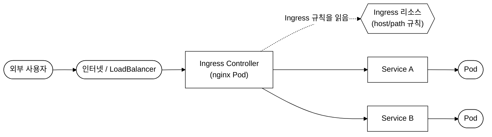
_그림. Ingress 트래픽 경로: 외부 트래픽이 하나의 진입점(Controller)으로 들어와 Ingress 리소스의 host/path 규칙에 따라 여러 Service로 분기된다._

각 Ingress Controller(nginx, traefik 등)는 클러스터에 따로 설치되어야 하며, 여러 Controller를 설치한 경우 각 Ingress 리소스의 `ingressClassName`(또는 IngressClass의 default 지정)으로 어떤 Controller가 그 규칙을 처리할지 지정한다. 이 매칭이 없으면 어느 Controller도 해당 규칙을 가져가지 않아 라우팅이 동작하지 않는다.

#### IngressClass

```yaml
apiVersion: networking.k8s.io/v1
kind: IngressClass
metadata:
  name: nginx
  annotations:
    ingressclass.kubernetes.io/is-default-class: "true"  # 기본 IngressClass
spec:
  controller: k8s.io/ingress-nginx
```

#### Ingress 리소스

**Path-based 라우팅:**

```yaml
apiVersion: networking.k8s.io/v1
kind: Ingress
metadata:
  name: my-ingress
  annotations:
    nginx.ingress.kubernetes.io/rewrite-target: /
spec:
  ingressClassName: nginx
  rules:
  - host: myapp.example.com
    http:
      paths:
      - path: /api
        pathType: Prefix
        backend:
          service:
            name: api-service
            port:
              number: 80
      - path: /web
        pathType: Prefix
        backend:
          service:
            name: web-service
            port:
              number: 80
```

**Host-based 라우팅:**

```yaml
spec:
  rules:
  - host: api.example.com
    http:
      paths:
      - path: /
        pathType: Prefix
        backend:
          service:
            name: api-service
            port:
              number: 80
  - host: web.example.com
    http:
      paths:
      - path: /
        pathType: Prefix
        backend:
          service:
            name: web-service
            port:
              number: 80
```

**TLS 설정:**

```yaml
spec:
  tls:
  - hosts:
    - myapp.example.com
    secretName: tls-secret    # tls.crt와 tls.key를 포함하는 kubernetes.io/tls 타입 Secret
  rules:
  - host: myapp.example.com
    http:
      paths:
      - path: /
        pathType: Prefix
        backend:
          service:
            name: my-service
            port:
              number: 80
```

```bash
# TLS Secret 생성
kubectl create secret tls tls-secret --cert=tls.crt --key=tls.key
```

> **예시(참조) — 기대 출력 예시:** 개념 이해용 기대 출력 예시다(일반 placeholder 클러스터 기준). 동일·유사 명령의 **실측 스크린샷**은 CKA daily(day01~20) 및 02·03 본문 캡처에서 확인할 수 있다.

**pathType 종류:**
- `Exact`: 정확히 일치하는 경로만 매칭한다. 예: `/api`는 `/api`에만 매칭, `/api/`에는 매칭하지 않는다.
- `Prefix`: 접두사 기반으로 매칭한다 (`/api`는 `/api`, `/api/v1`, `/api/users` 등과 매칭). 경로 구분자(`/`) 단위로 매칭한다. 예: `/api`는 `/api`와 `/api/v1`에 매칭하지만 `/apiVersion`에는 매칭하지 않는다.
- `ImplementationSpecific`: Ingress Controller의 구현에 따라 다르다.

```bash
# Ingress 리소스 확인
kubectl get ingress my-ingress
```

> **예시(참조) — 기대 출력 예시:** 개념 이해용 기대 출력 예시다(일반 placeholder 클러스터 기준). 동일·유사 명령의 **실측 스크린샷**은 CKA daily(day01~20) 및 02·03 본문 캡처에서 확인할 수 있다.

```bash
# Ingress 상세 확인
kubectl describe ingress my-ingress
```

> **예시(참조) — 기대 출력 예시:** 개념 이해용 기대 출력 예시다(일반 placeholder 클러스터 기준). 동일·유사 명령의 **실측 스크린샷**은 CKA daily(day01~20) 및 02·03 본문 캡처에서 확인할 수 있다.

---

### 3.3 NetworkPolicy

#### 등장 배경

쿠버네티스의 기본 네트워크 모델에서는 모든 Pod가 다른 모든 Pod와 자유롭게 통신할 수 있다. 이는 개발 편의성은 높지만, 프로덕션 환경에서는 보안 위험이 된다. 예를 들어 프론트엔드 Pod가 데이터베이스 Pod에 직접 접근하거나, 한 네임스페이스의 Pod가 다른 네임스페이스의 민감한 서비스에 접근할 수 있다. NetworkPolicy는 Pod 수준의 네트워크 방화벽을 제공하여 이를 제어한다.

NetworkPolicy는 Pod 간 네트워크 트래픽을 제어하는 규칙이다. **CNI 플러그인이 NetworkPolicy를 지원해야 한다** (Calico, Cilium, Weave Net 등 지원. Flannel은 미지원). CNI가 NetworkPolicy를 지원하지 않으면, NetworkPolicy 리소스를 생성해도 실제 트래픽 제어가 이루어지지 않는다.

내부 구현: Calico의 경우 각 노드의 Felix 에이전트가 NetworkPolicy를 감시하고, 이에 대응하는 iptables 규칙을 노드의 `filter` 테이블에 동적으로 생성한다. Cilium의 경우 eBPF 프로그램을 생성하여 커널 레벨에서 패킷을 필터링한다.

#### 기본 동작

- NetworkPolicy가 없으면 모든 트래픽이 허용된다.
- NetworkPolicy가 하나라도 적용되면, 해당 정책에서 **명시적으로 허용한 트래픽만** 통과한다.
- ingress(인바운드)와 egress(아웃바운드) 규칙을 각각 설정한다.
- NetworkPolicy는 additive(추가적)이다. 여러 NetworkPolicy가 같은 Pod에 적용되면 모든 정책의 허용 규칙이 합집합(union)으로 적용된다.

#### Default Deny 정책

보안 모범 사례로, 네임스페이스에 먼저 Default Deny 정책을 적용하고, 필요한 트래픽만 명시적으로 허용하는 "화이트리스트" 방식을 사용한다.

**모든 인바운드 트래픽 차단:**

```yaml
apiVersion: networking.k8s.io/v1
kind: NetworkPolicy
metadata:
  name: default-deny-ingress
  namespace: production
spec:
  podSelector: {}          # 네임스페이스의 모든 Pod에 적용
  policyTypes:
  - Ingress                # Ingress 규칙이 비어있으므로 모든 인바운드 차단
```

**모든 아웃바운드 트래픽 차단:**

```yaml
apiVersion: networking.k8s.io/v1
kind: NetworkPolicy
metadata:
  name: default-deny-egress
  namespace: production
spec:
  podSelector: {}
  policyTypes:
  - Egress
```

왜 egress를 막으면 멀쩡하던 통신까지 깨지는지 먼저 짚는다. 쿠버네티스에서 Pod가 다른 Service를 부를 때는 IP가 아니라 `my-svc.my-ns.svc.cluster.local` 같은 이름을 쓰고, 이 이름을 실제 ClusterIP로 바꿔 주는 것이 클러스터 DNS(CoreDNS)이다. 그런데 DNS 질의 자체가 CoreDNS Pod로 나가는 아웃바운드(egress) 트래픽이다. 따라서 모든 egress를 차단하면 이름 해석이 먼저 실패하고, 그 결과 Pod 안에서 Service 조회를 포함한 거의 모든 외부 호출이 "이름을 못 찾음" 단계에서 막힌다. IP를 직접 적어 호출하는 경우가 아니라면 사실상 통신 불능이 된다.

주의: 그러므로 egress를 차단할 때는 최소한 kube-system 네임스페이스의 CoreDNS로 향하는 DNS 트래픽(UDP/TCP 53)은 별도로 허용해야 한다. DNS(kube-system의 CoreDNS, UDP 53)에 대한 egress 허용을 별도로 추가한다:

```yaml
apiVersion: networking.k8s.io/v1
kind: NetworkPolicy
metadata:
  name: allow-dns
  namespace: production
spec:
  podSelector: {}
  policyTypes:
  - Egress
  egress:
  - to: []
    ports:
    - protocol: UDP
      port: 53
    - protocol: TCP
      port: 53
```

**모든 트래픽 차단:**

```yaml
apiVersion: networking.k8s.io/v1
kind: NetworkPolicy
metadata:
  name: default-deny-all
  namespace: production
spec:
  podSelector: {}
  policyTypes:
  - Ingress
  - Egress
```

#### 특정 트래픽 허용

```yaml
apiVersion: networking.k8s.io/v1
kind: NetworkPolicy
metadata:
  name: allow-specific
  namespace: production
spec:
  podSelector:
    matchLabels:
      app: db                  # 이 정책이 적용되는 Pod
  policyTypes:
  - Ingress
  - Egress
  ingress:
  - from:
    - podSelector:             # 같은 네임스페이스의 특정 Pod에서 오는 트래픽
        matchLabels:
          app: backend
    - namespaceSelector:       # 특정 네임스페이스의 모든 Pod에서 오는 트래픽
        matchLabels:
          env: staging
    - ipBlock:                 # 특정 IP 대역에서 오는 트래픽
        cidr: 10.0.0.0/8
        except:
        - 10.0.1.0/24
    ports:
    - protocol: TCP
      port: 3306
  egress:
  - to:
    - podSelector:
        matchLabels:
          app: cache
    ports:
    - protocol: TCP
      port: 6379
```

**OR vs AND 규칙 - 반드시 이해해야 하는 차이:**

```yaml
# OR: podSelector 또는 namespaceSelector 중 하나만 만족하면 허용
# (두 개의 별도 규칙 - '-'가 두 개)
ingress:
- from:
  - podSelector:
      matchLabels:
        app: frontend
  - namespaceSelector:
      matchLabels:
        env: production
```

이 설정은 "같은 네임스페이스에서 app=frontend 레이블을 가진 Pod"이거나 "env=production 레이블을 가진 네임스페이스의 모든 Pod"이면 허용한다.

```yaml
# AND: podSelector와 namespaceSelector를 모두 만족해야 허용
# (하나의 규칙 내 두 조건 - '-'가 하나)
ingress:
- from:
  - podSelector:
      matchLabels:
        app: frontend
    namespaceSelector:
      matchLabels:
        env: production
```

이 설정은 "env=production 레이블을 가진 네임스페이스에서, app=frontend 레이블을 가진 Pod"만 허용한다. 두 조건을 동시에 만족해야 한다.

YAML 들여쓰기에서 `-`의 위치가 차이를 결정한다. CKA 시험에서 자주 출제되는 포인트이다.

```bash
# NetworkPolicy 확인
kubectl get networkpolicy -n production
```

> **예시(참조) — 기대 출력 예시:** 개념 이해용 기대 출력 예시다(일반 placeholder 클러스터 기준). 동일·유사 명령의 **실측 스크린샷**은 CKA daily(day01~20) 및 02·03 본문 캡처에서 확인할 수 있다.

```bash
# NetworkPolicy 상세 확인
kubectl describe networkpolicy allow-specific -n production
```

> **예시(참조) — 기대 출력 예시:** 개념 이해용 기대 출력 예시다(일반 placeholder 클러스터 기준). 동일·유사 명령의 **실측 스크린샷**은 CKA daily(day01~20) 및 02·03 본문 캡처에서 확인할 수 있다.

---

### 3.4 CoreDNS

#### 등장 배경

쿠버네티스 초기에는 kube-dns(SkyDNS + dnsmasq 조합)가 클러스터 DNS를 담당했다. kube-dns는 여러 컨테이너(kubedns, dnsmasq, sidecar)로 구성되어 디버깅이 어렵고, dnsmasq의 보안 취약점이 반복적으로 발견되는 문제가 있었다. CoreDNS는 단일 바이너리의 플러그인 기반 DNS 서버로, 모듈형 아키텍처를 통해 기능을 쉽게 확장하고 커스터마이즈할 수 있다. 쿠버네티스 1.13부터 CoreDNS가 기본 DNS 서버로 채택되었다.

CoreDNS는 쿠버네티스 클러스터의 DNS 서버이다. `kube-system` 네임스페이스에서 Deployment로 실행된다(기본 2개 레플리카).

#### DNS 레코드 형식

| 리소스 | DNS 형식 |
|---|---|
| Service (ClusterIP) | `<service>.<namespace>.svc.cluster.local` → ClusterIP 반환 |
| Service (Headless) | `<service>.<namespace>.svc.cluster.local` → Pod IP들 반환 |
| Pod | `<pod-ip-dashed>.<namespace>.pod.cluster.local` |
| StatefulSet Pod | `<pod-name>.<service>.<namespace>.svc.cluster.local` |

예시:
- Service: `my-svc.default.svc.cluster.local`
- Pod (IP: 10.244.1.5): `10-244-1-5.default.pod.cluster.local`
- StatefulSet Pod: `web-0.my-headless-svc.default.svc.cluster.local`

```bash
# DNS 해석 테스트
kubectl run test-dns --image=busybox:1.28 --rm -it --restart=Never -- nslookup kubernetes.default
```

> **예시(참조) — 기대 출력 예시:** 개념 이해용 기대 출력 예시다(일반 placeholder 클러스터 기준). 동일·유사 명령의 **실측 스크린샷**은 CKA daily(day01~20) 및 02·03 본문 캡처에서 확인할 수 있다.

#### CoreDNS 설정

CoreDNS의 설정은 `kube-system` 네임스페이스의 `coredns` ConfigMap에 저장된다. Corefile 형식으로 작성된다.

```bash
kubectl -n kube-system get configmap coredns -o yaml
```

주요 플러그인:
- `kubernetes`: 쿠버네티스 Service/Pod DNS 레코드를 제공한다.
- `forward`: 클러스터 외부 도메인에 대한 DNS 조회를 업스트림 DNS 서버로 전달한다 (기본: `/etc/resolv.conf`).
- `cache`: DNS 응답을 캐시하여 성능을 향상시킨다.
- `loop`: DNS 루프 감지 시 CoreDNS를 종료한다.
- `errors`: 오류를 로그에 기록한다.

#### Pod DNS 정책

`spec.dnsPolicy`로 Pod의 DNS 해석 방식을 제어한다:

- `ClusterFirst` (기본값): 클러스터 DNS(CoreDNS)를 먼저 사용한다. 클러스터 도메인에 매칭되지 않으면 업스트림 DNS로 전달한다.
- `Default`: 노드의 DNS 설정(`/etc/resolv.conf`)을 사용한다. 클러스터 내부 Service를 DNS 이름으로 해석할 수 없다.
- `None`: `spec.dnsConfig`에서 수동으로 설정한다. nameserver, search domain 등을 완전히 사용자가 지정한다.
- `ClusterFirstWithHostNet`: `hostNetwork: true`인 Pod에서 클러스터 DNS를 사용한다. hostNetwork Pod는 기본적으로 노드의 DNS를 사용하므로, 클러스터 DNS가 필요하면 이 정책을 명시해야 한다.

#### 장애 시나리오: DNS 해석 실패

DNS 해석이 실패하면 Pod 내에서 Service 이름으로 통신할 수 없다. 진단 순서:

```bash
# 1. CoreDNS Pod 상태 확인
kubectl -n kube-system get pods -l k8s-app=kube-dns
```

> **예시(참조) — 기대 출력 예시 (정상):** 개념 이해용 기대 출력 예시다(일반 placeholder 클러스터 기준). 동일·유사 명령의 **실측 스크린샷**은 CKA daily(day01~20) 및 02·03 본문 캡처에서 확인할 수 있다.

```bash
# 2. CoreDNS 로그에서 오류 확인
kubectl -n kube-system logs -l k8s-app=kube-dns --tail=20

# 3. CoreDNS Service의 ClusterIP 확인
kubectl -n kube-system get svc kube-dns
```

> **예시(참조) — 기대 출력 예시:** 개념 이해용 기대 출력 예시다(일반 placeholder 클러스터 기준). 동일·유사 명령의 **실측 스크린샷**은 CKA daily(day01~20) 및 02·03 본문 캡처에서 확인할 수 있다.

```bash
# 4. Pod의 resolv.conf에서 DNS 서버 주소 확인
kubectl exec my-pod -- cat /etc/resolv.conf
```

> **예시(참조) — 기대 출력 예시:** 개념 이해용 기대 출력 예시다(일반 placeholder 클러스터 기준). 동일·유사 명령의 **실측 스크린샷**은 CKA daily(day01~20) 및 02·03 본문 캡처에서 확인할 수 있다.

`ndots:5`는 중요한 설정이다. 쿼리 도메인에 `.`이 5개 미만이면, search domain을 순차적으로 붙여서 먼저 시도한다. 예를 들어 `my-svc`를 조회하면 `my-svc.default.svc.cluster.local`, `my-svc.svc.cluster.local`, `my-svc.cluster.local`을 순서대로 시도한 후, 마지막으로 `my-svc` 자체를 조회한다. 외부 도메인을 자주 조회하면 불필요한 DNS 쿼리가 발생할 수 있다.

---

### 3.5 CNI (Container Network Interface)

#### 등장 배경

쿠버네티스 네트워크 모델의 핵심 요구사항은 다음 세 가지이다:
1. 모든 Pod는 NAT 없이 다른 모든 Pod와 통신할 수 있어야 한다.
2. 모든 노드는 NAT 없이 모든 Pod와 통신할 수 있어야 한다.
3. Pod가 자기 자신의 IP 주소로 보는 것과 다른 Pod가 보는 IP 주소가 같아야 한다.

이 요구사항을 구현하는 방법은 여러 가지이며(VXLAN 오버레이: 노드 간 가상 터널로 Pod 패킷을 캡슐화하는 방식, BGP 라우팅: 라우터 간 경로 교환 프로토콜로 Pod 대역을 광고하는 방식, eBPF: 커널에 안전하게 프로그램을 올려 패킷을 처리하는 기술 등), 쿠버네티스는 특정 구현을 강제하지 않는다. 대신 CNI(Container Network Interface)라는 표준 플러그인 인터페이스를 정의하여, 다양한 네트워크 플러그인이 이를 구현하도록 한다. CNI는 CNCF 프로젝트로, 컨테이너에 네트워크 인터페이스를 추가/삭제하는 최소한의 인터페이스(ADD/DEL/CHECK 명령)만 정의한다.

CNI 이전에는 어땠는가. 표준 인터페이스가 없던 시절에는 각 클라우드 제공자(AWS·GCP 등)와 온프레미스 환경이 저마다 다른 방식으로 Pod 네트워킹을 구현했고, 클러스터를 옮길 때마다 네트워크 계층을 새로 맞춰야 했다. CNI는 이 부분을 "플러그인으로 교체 가능한 표준"으로 떼어냈고, 그 결과 kubeadm은 네트워크 구현을 클러스터 설치에 묶지 않고 사용자가 골라 끼우도록 설계했다. 이것이 바로 `kubeadm init` 직후 노드가 `NotReady`로 보이는 이유다. 컨트롤 플레인은 떴지만 아직 CNI 플러그인이 없어 Pod 네트워킹이 성립하지 않은 상태이고, CNI를 설치하면 노드가 Ready로 바뀐다. 즉 CNI를 사후에 별도 설치해야 하는 것은 버그가 아니라 의도된 설계이다.

- CNI 플러그인 설정 파일 위치: `/etc/cni/net.d/`
- CNI 바이너리 위치: `/opt/cni/bin/`
- 주요 CNI 플러그인:
  - **Calico**: BGP 기반 L3 라우팅. NetworkPolicy 지원. 대규모 클러스터에서 사용. iptables 또는 eBPF 데이터플레인.
  - **Flannel**: VXLAN 오버레이. NetworkPolicy 미지원. 단순한 구성.
  - **Cilium**: eBPF 기반. L3/L4/L7 NetworkPolicy 지원. 고성능 데이터플레인.
  - **Weave Net**: VXLAN 오버레이 + 암호화. NetworkPolicy 지원.
- kubeadm으로 클러스터 설치 후 CNI 플러그인을 별도로 설치해야 한다.
- CNI가 설치되지 않으면 노드는 `NotReady` 상태이고, Pod는 네트워크를 사용할 수 없다.

```bash
# CNI 설정 확인
ls /etc/cni/net.d/
```

> **예시(참조) — 기대 출력 예시 (Calico 설치 시):** 개념 이해용 기대 출력 예시다(일반 placeholder 클러스터 기준). 동일·유사 명령의 **실측 스크린샷**은 CKA daily(day01~20) 및 02·03 본문 캡처에서 확인할 수 있다.

```bash
# 노드의 Pod 네트워크 대역 확인 (Calico 예시)
kubectl get ipamblocks -o wide
# 또는
kubectl get nodes -o jsonpath='{.items[*].spec.podCIDR}'
```

> **예시(참조) — 기대 출력 예시:** 개념 이해용 기대 출력 예시다(일반 placeholder 클러스터 기준). 동일·유사 명령의 **실측 스크린샷**은 CKA daily(day01~20) 및 02·03 본문 캡처에서 확인할 수 있다.

---

## 4. Storage (10%)

### 4.1 Volume 종류

#### 등장 배경

컨테이너의 파일시스템은 임시(ephemeral)이다. 컨테이너가 재시작되면 파일시스템이 초기 이미지 상태로 리셋된다. 이는 stateless 애플리케이션에는 적합하지만, 로그 저장, 설정 파일 공유, 데이터베이스 등의 사용 사례에서는 데이터 영속성이 필요하다. 쿠버네티스의 Volume은 Pod 수준에서 스토리지를 제공하는 추상화이며, 컨테이너 재시작에도 데이터가 유지된다.

#### emptyDir

- Pod와 생명주기를 같이 한다. Pod가 삭제되면 데이터도 삭제된다.
- 같은 Pod 내 컨테이너 간 데이터 공유에 사용한다.
- 내부 구현: 노드의 로컬 디스크에 디렉터리를 생성한다 (기본 경로: `/var/lib/kubelet/pods/<pod-uid>/volumes/kubernetes.io~empty-dir/<volume-name>/`).
- `medium: Memory`로 설정하면 tmpfs(메모리 기반 파일시스템)를 사용한다. 디스크 I/O가 없으므로 빠르지만, 노드의 메모리를 사용하며 컨테이너의 메모리 limits에 포함된다.
- `sizeLimit`으로 크기를 제한할 수 있다.

```yaml
spec:
  containers:
  - name: app
    volumeMounts:
    - name: shared-data
      mountPath: /data
  - name: sidecar
    volumeMounts:
    - name: shared-data
      mountPath: /log
  volumes:
  - name: shared-data
    emptyDir: {}
```

#### hostPath

- 노드의 파일시스템 경로를 Pod에 마운트한다.
- Pod가 재스케줄링되면 다른 노드의 데이터에 접근할 수 없다.
- 보안 위험이 있으므로 일반적으로 사용을 권장하지 않는다. hostPath로 노드의 `/`, `/etc`, `/var` 등을 마운트하면 컨테이너에서 호스트 시스템을 조작할 수 있다.
- 사용 사례: 노드의 로그 수집, 컨테이너 런타임 소켓 접근, 개발/테스트 환경에서의 단순 스토리지

```yaml
spec:
  volumes:
  - name: host-vol
    hostPath:
      path: /var/log
      type: Directory     # Directory, DirectoryOrCreate, File, FileOrCreate 등
```

`type` 필드:
- `Directory`: 경로가 이미 존재하는 디렉터리여야 한다. 없으면 Pod 시작이 실패한다.
- `DirectoryOrCreate`: 경로가 없으면 755 권한으로 생성한다.
- `File`: 경로가 이미 존재하는 파일이어야 한다.
- `FileOrCreate`: 경로가 없으면 644 권한으로 생성한다.
- `""` (빈 문자열): 아무 검증도 하지 않는다.

### 4.2 PersistentVolume (PV)과 PersistentVolumeClaim (PVC)

#### 등장 배경

emptyDir과 hostPath는 Pod 또는 노드에 종속되어 있어, 진정한 영속적 스토리지를 제공하지 못한다. NFS, iSCSI, 클라우드 블록 스토리지(EBS, GCE PD, Azure Disk) 등의 외부 스토리지를 사용하려면, Pod 정의에 스토리지 백엔드의 세부 정보(NFS 서버 주소, EBS 볼륨 ID 등)를 직접 포함해야 했다. 이는 애플리케이션 개발자가 인프라 세부 사항을 알아야 하는 문제와, Pod 정의가 특정 인프라에 종속되는 문제를 야기했다.

PV/PVC 모델은 이를 추상화한다:
- **PersistentVolume (PV)**: 관리자(또는 StorageClass)가 프로비저닝한 클러스터 수준의 스토리지 리소스이다. 네임스페이스에 속하지 않는다. 스토리지 백엔드의 세부 정보를 포함한다.
- **PersistentVolumeClaim (PVC)**: 사용자가 스토리지를 요청하는 리소스이다. 네임스페이스에 속한다. 용량과 접근 모드만 지정하면 된다.
- Pod는 PVC를 통해 PV를 사용한다. 개발자는 스토리지 백엔드를 몰라도 된다.

#### PV 정의

```yaml
apiVersion: v1
kind: PersistentVolume
metadata:
  name: my-pv
spec:
  capacity:
    storage: 10Gi
  accessModes:
  - ReadWriteOnce
  persistentVolumeReclaimPolicy: Retain
  storageClassName: manual
  hostPath:
    path: /mnt/data
```

#### PVC 정의

```yaml
apiVersion: v1
kind: PersistentVolumeClaim
metadata:
  name: my-pvc
  namespace: default
spec:
  accessModes:
  - ReadWriteOnce
  resources:
    requests:
      storage: 5Gi
  storageClassName: manual
```

#### Pod에서 PVC 사용

```yaml
spec:
  containers:
  - name: app
    volumeMounts:
    - name: data
      mountPath: /app/data
  volumes:
  - name: data
    persistentVolumeClaim:
      claimName: my-pvc
```

#### PV-PVC 바인딩 조건

PVC는 다음 조건을 만족하는 PV에 바인딩된다:
1. **Access Mode**가 일치해야 한다.
2. **Capacity**가 PVC의 요청량 이상이어야 한다. PVC가 5Gi를 요청하고 10Gi PV가 있으면 바인딩된다. 남은 5Gi는 사용할 수 없다(1:1 바인딩).
3. **StorageClass**가 일치해야 한다 (지정된 경우). `storageClassName: ""`을 명시하면 StorageClass가 없는 PV에만 바인딩된다.
4. **Label Selector**가 일치해야 한다 (지정된 경우).

조건 2에서 본 1:1 바인딩, 즉 10Gi PV에 5Gi를 요청해도 남은 5Gi를 다른 PVC가 못 쓰는 규칙이 처음엔 낭비처럼 보인다. 그러나 PV와 PVC는 각각 하나의 실제 스토리지 백엔드(예: AWS EBS 볼륨 하나, NFS share 하나)를 가리키는 핸들이다. 하나의 PV가 가리키는 백엔드 용량을 쪼개 여러 PVC에 나눠 붙이려면, 같은 디스크를 여러 워크로드가 공유하면서도 서로의 데이터를 침범하지 않도록 파티셔닝·격리·성능 보장을 스토리지 계층에서 추가로 책임져야 한다. 이는 복잡도와 장애 위험을 크게 키우므로, 쿠버네티스는 PV-PVC를 1:1로 단순하게 묶고, 용량 분할이 필요하면 더 작은 PV를 여러 개 만들거나 동적 프로비저닝으로 PVC마다 별도 볼륨을 생성하도록 설계했다. 즉 1:1 바인딩은 제약이 아니라 격리와 성능 보장을 단순하게 유지하기 위한 선택이다.

```bash
# PV와 PVC 상태 확인
kubectl get pv
kubectl get pvc
```

> **예시(참조) — 기대 출력 예시:** 개념 이해용 기대 출력 예시다(일반 placeholder 클러스터 기준). 동일·유사 명령의 **실측 스크린샷**은 CKA daily(day01~20) 및 02·03 본문 캡처에서 확인할 수 있다.

---

### 4.3 Access Modes

| 모드 | 약어 | 설명 |
|---|---|---|
| **ReadWriteOnce** | RWO | 하나의 노드에서 읽기/쓰기 마운트할 수 있다. 같은 노드의 여러 Pod는 동시에 마운트 가능하다. |
| **ReadOnlyMany** | ROX | 여러 노드에서 읽기 전용으로 마운트할 수 있다. |
| **ReadWriteMany** | RWX | 여러 노드에서 읽기/쓰기 마운트할 수 있다. NFS, CephFS, GlusterFS 등이 지원한다. |
| **ReadWriteOncePod** | RWOP | 하나의 Pod에서만 읽기/쓰기 마운트할 수 있다 (1.22+). RWO보다 엄격한 제한이다. |

모든 스토리지 백엔드가 모든 Access Mode를 지원하는 것은 아니다. 예를 들어:
- AWS EBS: RWO만 지원 (블록 스토리지는 하나의 노드에만 부착 가능)
- NFS: RWO, ROX, RWX 모두 지원
- hostPath: 실제로 RWO만 지원 (단일 노드 경로이므로)

---

### 4.4 StorageClass와 Dynamic Provisioning

#### 등장 배경

정적(static) PV 프로비저닝에서는 관리자가 PV를 미리 생성해 두어야 하고, 개발자가 PVC를 생성할 때 적합한 PV가 없으면 관리자에게 요청해야 했다. 이는 운영 오버헤드가 크고 응답 시간이 느렸다. StorageClass는 PVC 생성 시 자동으로 PV를 프로비저닝하는 동적(dynamic) 프로비저닝을 가능하게 한다.

StorageClass는 동적으로 PV를 프로비저닝하는 방법을 정의한다. PVC를 생성하면 자동으로 PV가 생성된다.

#### StorageClass 정의

```yaml
apiVersion: storage.k8s.io/v1
kind: StorageClass
metadata:
  name: fast-storage
  annotations:
    storageclass.kubernetes.io/is-default-class: "true"  # 기본 StorageClass
provisioner: kubernetes.io/aws-ebs     # 프로비저너 (CSI 드라이버의 경우: ebs.csi.aws.com)
parameters:
  type: gp3
reclaimPolicy: Delete
allowVolumeExpansion: true
volumeBindingMode: WaitForFirstConsumer
```

- `provisioner`: 스토리지를 프로비저닝하는 프로바이더이다. 인트리(in-tree) 프로비저너(`kubernetes.io/...`)는 deprecated되고 있으며, CSI(Container Storage Interface) 드라이버로 이전되고 있다.
- `reclaimPolicy`: PVC 삭제 시 PV 처리 방법이다 (`Delete` 또는 `Retain`). 프로덕션 데이터에는 `Retain`을 권장한다.
- `volumeBindingMode`:
  - `Immediate`: PVC 생성 즉시 PV를 프로비저닝한다.
  - `WaitForFirstConsumer`: Pod가 생성되어 해당 PVC를 사용할 때 PV를 프로비저닝한다. 노드의 zone을 고려하여 적절한 위치에 볼륨을 생성할 수 있다. 다중 zone 클러스터에서 권장된다.
- `allowVolumeExpansion`: 볼륨 확장 허용 여부이다. true로 설정하면 PVC의 `spec.resources.requests.storage`를 늘려 볼륨을 확장할 수 있다(축소는 불가).

```bash
# StorageClass 확인
kubectl get storageclass
```

> **예시(참조) — 기대 출력 예시:** 개념 이해용 기대 출력 예시다(일반 placeholder 클러스터 기준). 동일·유사 명령의 **실측 스크린샷**은 CKA daily(day01~20) 및 02·03 본문 캡처에서 확인할 수 있다.

---

### 4.5 PV 라이프사이클


_그림 3. PV 라이프사이클 상태 전이._

| 상태 | 설명 |
|---|---|
| **Available** | PV가 생성되어 PVC 바인딩을 기다리는 상태이다. |
| **Bound** | PVC에 바인딩된 상태이다. |
| **Released** | PVC가 삭제되었지만 PV는 아직 리소스를 회수하지 않은 상태이다. 다른 PVC에 자동 바인딩되지 않는다. |
| **Failed** | 자동 회수에 실패한 상태이다. |

#### Reclaim Policy

| 정책 | 설명 |
|---|---|
| **Retain** | PVC 삭제 후에도 PV와 데이터를 보존한다. 관리자가 수동으로 처리해야 한다. Released 상태가 된다. |
| **Delete** | PVC 삭제 시 PV와 백엔드 스토리지도 함께 삭제한다. Dynamic Provisioning의 기본값이다. |
| **Recycle** | 더 이상 사용하지 않는다 (deprecated). `rm -rf /thevolume/*`를 수행한다. |

Released 상태의 PV를 다시 Available로 만들려면 `spec.claimRef`를 삭제해야 한다:

```bash
kubectl patch pv my-pv --type=json -p='[{"op": "remove", "path": "/spec/claimRef"}]'
```

```bash
# PV 상태 전체 확인
kubectl get pv
```

> **예시(참조) — 기대 출력 예시:** 개념 이해용 기대 출력 예시다(일반 placeholder 클러스터 기준). 동일·유사 명령의 **실측 스크린샷**은 CKA daily(day01~20) 및 02·03 본문 캡처에서 확인할 수 있다.

---

## 5. Troubleshooting (30%)

CKA 시험에서 가장 높은 비중을 차지하는 도메인이다. 체계적인 트러블슈팅 접근 방식이 중요하다. 일반적인 진단 순서는 "넓은 범위에서 좁은 범위로"이다: 클러스터 수준 → 노드 수준 → Pod 수준 → 컨테이너 수준.

### 5.1 노드 트러블슈팅

#### 노드 상태 확인

```bash
kubectl get nodes
```

> **예시(참조) — 기대 출력 예시 (node01이 NotReady):** 개념 이해용 기대 출력 예시다(일반 placeholder 클러스터 기준). 동일·유사 명령의 **실측 스크린샷**은 CKA daily(day01~20) 및 02·03 본문 캡처에서 확인할 수 있다.

```bash
kubectl describe node node01
```

노드의 `Conditions` 섹션을 확인한다:

> **예시(참조) — 기대 출력 예시 (문제 있는 노드):** 개념 이해용 기대 출력 예시다(일반 placeholder 클러스터 기준). 동일·유사 명령의 **실측 스크린샷**은 CKA daily(day01~20) 및 02·03 본문 캡처에서 확인할 수 있다.

노드가 `NotReady` 상태인 경우 확인 사항:
1. **kubelet 서비스 상태**: `systemctl status kubelet`
2. **kubelet 로그**: `journalctl -u kubelet -f`
3. **인증서 만료**: `openssl x509 -in /etc/kubernetes/pki/apiserver.crt -noout -dates`
4. **컨테이너 런타임**: `systemctl status containerd`
5. **네트워크**: CNI 플러그인 상태 확인
6. **디스크 공간**: `df -h`
7. **메모리**: `free -m`

#### kubelet 문제 해결

```bash
# kubelet 상태 확인
systemctl status kubelet
```

> **예시(참조) — 기대 출력 예시 (문제 있는 경우):** 개념 이해용 기대 출력 예시다(일반 placeholder 클러스터 기준). 동일·유사 명령의 **실측 스크린샷**은 CKA daily(day01~20) 및 02·03 본문 캡처에서 확인할 수 있다.

```bash
# kubelet 재시작
systemctl restart kubelet

# kubelet 자동 시작 활성화
systemctl enable kubelet

# kubelet 설정 파일 확인
cat /var/lib/kubelet/config.yaml

# kubelet 로그 확인 (실시간)
journalctl -u kubelet -f

# kubelet 로그 확인 (최근)
journalctl -u kubelet --no-pager -l | tail -50
```

일반적인 kubelet 실패 원인:
- `/var/lib/kubelet/config.yaml`에 오타가 있는 경우 (예: 잘못된 YAML 구문)
- `/etc/kubernetes/kubelet.conf` kubeconfig에서 apiserver 주소가 잘못된 경우
- 클라이언트 인증서가 만료된 경우
- 컨테이너 런타임 소켓에 접근할 수 없는 경우

#### 인증서 관련 트러블슈팅

```bash
# 인증서 만료일 확인
kubeadm certs check-expiration
```

> **예시(참조) — 기대 출력 예시:** 개념 이해용 기대 출력 예시다(일반 placeholder 클러스터 기준). 동일·유사 명령의 **실측 스크린샷**은 CKA daily(day01~20) 및 02·03 본문 캡처에서 확인할 수 있다.

```bash
# 인증서 갱신 (모든 인증서)
kubeadm certs renew all

# 갱신 후 Control Plane 컴포넌트 재시작 필요
# Static Pod의 경우 kubelet이 매니페스트 변경을 감지하여 자동 재시작하지만,
# 감지가 안 되면 수동으로 재시작한다:
crictl ps | grep -E "apiserver|controller|scheduler|etcd"
# 해당 컨테이너의 ID로 중지 후 kubelet이 자동 재생성
crictl stop <container-id>

# 특정 인증서 정보 확인
openssl x509 -in /etc/kubernetes/pki/apiserver.crt -noout -text | grep -E "Issuer|Subject|Not Before|Not After"
```

> **예시(참조) — 기대 출력 예시:** 개념 이해용 기대 출력 예시다(일반 placeholder 클러스터 기준). 동일·유사 명령의 **실측 스크린샷**은 CKA daily(day01~20) 및 02·03 본문 캡처에서 확인할 수 있다.

#### 🛠 직접 해보기 — kubelet 중지로 NotReady 재현 후 복구

파괴 실습이 허용된 dev 클러스터의 worker 노드에서 kubelet을 의도적으로 중지해 노드를 NotReady로 만든 뒤 복구한다. `ssh dev-worker1`은 `~/.ssh/config`에 등록된 VM 별칭으로 비밀번호 없이 접속된다(처음 1회만 주석). 시험에서 "노드가 NotReady"인 문제의 진단 흐름을 손에 익히는 것이 목적이다. 제한 시간 5분을 의식한다.

```bash
# (로컬에서) 현재 노드 상태 — 모두 Ready 인지 먼저 확인
kubectl --kubeconfig ~/sideproejct/IaC_apple_sillicon/kubeconfig/dev.yaml get nodes

# (worker 노드에 접속) dev-worker1 은 ~/.ssh/config 에 등록된 VM 별칭
ssh dev-worker1

# 1. kubelet 중지 → 노드가 곧 NotReady 로 전환된다
sudo systemctl stop kubelet
exit

# 2. (로컬) NotReady 확인 — node-monitor-grace-period(기본 40초) 후 반영된다
kubectl --kubeconfig ~/sideproejct/IaC_apple_sillicon/kubeconfig/dev.yaml get nodes -w

# 3. (worker) 복구 — kubelet 재시작
ssh dev-worker1 'sudo systemctl start kubelet'

# 4. (로컬) 다시 Ready 가 될 때까지 대기
kubectl --kubeconfig ~/sideproejct/IaC_apple_sillicon/kubeconfig/dev.yaml wait --for=condition=Ready node --all --timeout=120s
```

검증 포인트: 2단계에서 STATUS가 `NotReady`로 바뀌면 노드 진단 절차(`systemctl status kubelet` → `journalctl -u kubelet`)가 의미를 갖는다. 4단계가 통과하면 복구가 완료된 것이다. 출력 캡처는 미캡처(클러스터 가동 시 day 본문에서 교체).

---

### 5.2 Pod 상태별 진단

#### Pending

Pod가 스케줄링되지 않은 상태이다.

원인:
- **리소스 부족**: 노드에 충분한 CPU/메모리가 없다. → `kubectl describe pod`의 Events에서 `Insufficient cpu` 또는 `Insufficient memory` 메시지를 확인한다. 다른 Pod의 리소스를 줄이거나 노드를 추가한다.
- **nodeSelector/Affinity 불일치**: 조건에 맞는 노드가 없다. → `FailedScheduling` 이벤트에서 `node(s) didn't match Pod's node affinity/selector` 메시지를 확인한다. 노드에 레이블을 추가하거나 조건을 수정한다.
- **Taint/Toleration 불일치**: 모든 노드에 Taint가 있고 Pod에 Toleration이 없다. → `node(s) had untolerated taint` 메시지를 확인한다. Toleration을 추가하거나 Taint를 제거한다.
- **PVC 바인딩 실패**: 요청한 PVC가 Bound 상태가 아니다. → `persistentvolumeclaim "xxx" not found` 또는 PVC가 Pending 상태인지 확인한다. PV를 생성하거나 StorageClass를 확인한다.

진단:
```bash
kubectl describe pod <pod-name>   # Events 섹션 확인
```

> **예시(참조) — 기대 출력 예시 (리소스 부족):** 개념 이해용 기대 출력 예시다(일반 placeholder 클러스터 기준). 동일·유사 명령의 **실측 스크린샷**은 CKA daily(day01~20) 및 02·03 본문 캡처에서 확인할 수 있다.

```bash
kubectl get events --sort-by='.lastTimestamp' --field-selector involvedObject.name=<pod-name>
```

#### CrashLoopBackOff

컨테이너가 반복적으로 시작하고 종료되는 상태이다. kubelet은 재시작 간격을 10s → 20s → 40s → ... → 5분(최대)으로 지수적으로 증가시킨다(exponential backoff).

원인:
- 애플리케이션 오류 (잘못된 설정, 의존성 누락)
- 잘못된 명령어 (command/args)
- 프로브(liveness/readiness) 실패
- 리소스 제한(OOM)

진단:
```bash
# 이전 컨테이너의 로그 확인 (현재 실행 중인 컨테이너 로그가 아닌, 실패한 컨테이너의 로그)
kubectl logs <pod-name> --previous
```

> **예시(참조) — 기대 출력 예시 (설정 오류):** 개념 이해용 기대 출력 예시다(일반 placeholder 클러스터 기준). 동일·유사 명령의 **실측 스크린샷**은 CKA daily(day01~20) 및 02·03 본문 캡처에서 확인할 수 있다.

```bash
kubectl describe pod <pod-name>      # Exit Code, 재시작 횟수 확인
```

> **예시(참조) — 기대 출력 예시:** 개념 이해용 기대 출력 예시다(일반 placeholder 클러스터 기준). 동일·유사 명령의 **실측 스크린샷**은 CKA daily(day01~20) 및 02·03 본문 캡처에서 확인할 수 있다.

#### ImagePullBackOff

컨테이너 이미지를 가져올 수 없는 상태이다.

원인:
- 이미지 이름/태그 오류 (오타, 존재하지 않는 태그)
- 프라이빗 레지스트리 인증 실패 (imagePullSecrets 누락)
- 네트워크 문제로 레지스트리에 접근 불가

진단:
```bash
kubectl describe pod <pod-name>   # Events에서 pull 실패 원인 확인
```

> **예시(참조) — 기대 출력 예시 (이미지 미존재):** 개념 이해용 기대 출력 예시다(일반 placeholder 클러스터 기준). 동일·유사 명령의 **실측 스크린샷**은 CKA daily(day01~20) 및 02·03 본문 캡처에서 확인할 수 있다.

#### Error

컨테이너가 오류와 함께 종료된 상태이다.

진단:
```bash
kubectl logs <pod-name>
kubectl describe pod <pod-name>   # Exit Code 확인
```

일반적인 Exit Code:
- `0`: 정상 종료
- `1`: 애플리케이션 오류 (일반 에러)
- `2`: 잘못된 인수(argument) 사용
- `126`: 명령을 실행할 수 없음 (권한 문제)
- `127`: 명령을 찾을 수 없음 (command not found)
- `128+N`: 시그널 N에 의해 종료. 예: 128+9=137(SIGKILL), 128+15=143(SIGTERM)
- `137`: SIGKILL (OOMKilled 또는 `kill -9`)
- `139`: SIGSEGV (세그멘테이션 폴트)
- `143`: SIGTERM (정상적인 종료 요청)

#### OOMKilled

컨테이너가 메모리 제한을 초과하여 종료된 상태이다. 커널의 OOM Killer가 cgroup의 메모리 한도를 초과한 프로세스를 SIGKILL로 종료한다.

진단:
```bash
kubectl describe pod <pod-name>   # "OOMKilled" 확인
```

> **예시(참조) — 기대 출력 예시:** 개념 이해용 기대 출력 예시다(일반 placeholder 클러스터 기준). 동일·유사 명령의 **실측 스크린샷**은 CKA daily(day01~20) 및 02·03 본문 캡처에서 확인할 수 있다.

해결:
- `resources.limits.memory`를 늘린다. 적정 값은 애플리케이션의 실제 메모리 사용 패턴을 모니터링하여 결정한다.
- 애플리케이션의 메모리 사용량을 최적화한다 (JVM의 경우 `-Xmx` 힙 크기를 limits에 맞게 설정).
- 메모리 누수가 있는지 프로파일링한다.

```bash
# 노드에서 Pod의 실제 메모리 사용량 확인 (metrics-server 필요)
kubectl top pod <pod-name>
```

> **예시(참조) — 기대 출력 예시:** 개념 이해용 기대 출력 예시다(일반 placeholder 클러스터 기준). 동일·유사 명령의 **실측 스크린샷**은 CKA daily(day01~20) 및 02·03 본문 캡처에서 확인할 수 있다.

---

### 5.3 네트워크 트러블슈팅

#### Service 연결 불가

확인 사항:
1. **Service의 selector와 Pod의 label이 일치하는지 확인**
   ```bash
   kubectl get svc <service-name> -o wide
   kubectl get pods --show-labels
   kubectl get endpoints <service-name>   # 엔드포인트가 비어있으면 selector 불일치
   ```

   > **예시(참조) — 엔드포인트가 비어있는 경우(문제):** `kubectl get endpoints` 결과가 비어 있으면 Service selector 와 Pod label 불일치다. 실측 Endpoints 캡처는 day11·day12·02-examples 참고.

```bash
# Pod 로그 확인
kubectl logs <pod-name>

# 특정 컨테이너 로그 (멀티 컨테이너 Pod)
kubectl logs <pod-name> -c <container-name>

# 이전 컨테이너 로그 (CrashLoopBackOff 진단에 필수)
kubectl logs <pod-name> --previous

# 실시간 로그
kubectl logs <pod-name> -f

# 최근 N줄
kubectl logs <pod-name> --tail=100

# 최근 N시간
kubectl logs <pod-name> --since=1h

# Pod 상세 정보 (Events 포함)
kubectl describe pod <pod-name>

# 클러스터 이벤트 (최근 순)
kubectl get events --sort-by='.lastTimestamp'
kubectl get events -A --sort-by='.lastTimestamp'

# 특정 리소스의 이벤트만 필터
kubectl get events --field-selector involvedObject.name=<pod-name>
```

#### 시스템 기반

```bash
# kubelet 로그
journalctl -u kubelet -f
journalctl -u kubelet --since "10 minutes ago"

# containerd 로그
journalctl -u containerd

# 시스템 로그
journalctl --no-pager -l

# 특정 시간 범위의 로그
journalctl -u kubelet --since "2024-01-15 09:00" --until "2024-01-15 10:00"
```

#### crictl (컨테이너 런타임 디버깅)

apiserver가 동작하지 않는 경우 kubectl을 사용할 수 없다. 이때 crictl로 노드의 컨테이너를 직접 조사한다.

```bash
# 컨테이너 목록
crictl ps
crictl ps -a   # 종료된 컨테이너 포함
```

> **예시(참조) — 기대 출력 예시:** 개념 이해용 기대 출력 예시다(일반 placeholder 클러스터 기준). 동일·유사 명령의 **실측 스크린샷**은 CKA daily(day01~20) 및 02·03 본문 캡처에서 확인할 수 있다.

```bash
# 컨테이너 로그
crictl logs <container-id>

# Pod 목록
crictl pods

# 이미지 목록
crictl images
```

---

### 5.4 클러스터 컴포넌트 장애

#### kube-apiserver 장애

증상: `kubectl` 명령이 응답하지 않거나 `The connection to the server was refused` 오류가 발생한다.

확인:
```bash
# Static Pod로 실행되는 경우 (apiserver가 동작하지 않으므로 kubectl 사용 불가)
crictl ps | grep apiserver
```

> **예시(참조) — 기대 출력 예시 (apiserver가 없거나 반복 재시작 중):** 개념 이해용 기대 출력 예시다(일반 placeholder 클러스터 기준). 동일·유사 명령의 **실측 스크린샷**은 CKA daily(day01~20) 및 02·03 본문 캡처에서 확인할 수 있다.

```bash
# 매니페스트 확인
cat /etc/kubernetes/manifests/kube-apiserver.yaml

# 로그 확인
crictl logs <apiserver-container-id>
# 또는 컨테이너가 없으면 kubelet 로그에서 확인
journalctl -u kubelet | grep apiserver
```

일반적 원인:
- 매니페스트 파일의 설정 오류 (잘못된 인증서 경로, 잘못된 etcd 엔드포인트, 포트 충돌 등)
- 인증서 만료
- etcd 연결 실패 (etcd가 먼저 장애난 경우)
- 잘못된 `--service-cluster-ip-range` 또는 `--service-node-port-range` 설정

#### kube-scheduler 장애

증상: 새로운 Pod가 `Pending` 상태에 머문다. `kubectl describe pod`의 Events에 `FailedScheduling`이 아닌 아무런 이벤트가 없다 (scheduler가 동작하지 않으므로 스케줄링 시도 자체가 없음).

확인:
```bash
crictl ps | grep scheduler
cat /etc/kubernetes/manifests/kube-scheduler.yaml
crictl logs <scheduler-container-id>
```

```bash
# scheduler 없이 수동으로 Pod를 노드에 배치하는 방법 (임시 조치)
# Pod YAML에 spec.nodeName을 직접 지정하면 scheduler를 거치지 않고 해당 노드에 배치된다.
```

#### kube-controller-manager 장애

증상: Deployment를 생성해도 ReplicaSet/Pod가 생성되지 않는다. 노드 상태가 갱신되지 않는다. Service의 엔드포인트가 갱신되지 않는다.

확인:
```bash
crictl ps | grep controller-manager
cat /etc/kubernetes/manifests/kube-controller-manager.yaml
crictl logs <controller-manager-container-id>
```

일반적 원인:
- 잘못된 `--cluster-signing-cert-file` 또는 `--cluster-signing-key-file` 경로
- 잘못된 `--root-ca-file` 경로
- kubeconfig 파일의 apiserver 주소 오류

#### etcd 장애

증상: 클러스터 상태 데이터에 접근할 수 없다. API 서버가 `etcdserver: leader changed`, `etcdserver: request timed out`, `context deadline exceeded` 등의 오류를 반환한다.

확인:
```bash
crictl ps | grep etcd
cat /etc/kubernetes/manifests/etcd.yaml
crictl logs <etcd-container-id>
```

```bash
# etcd 멤버 상태 확인
ETCDCTL_API=3 etcdctl member list \
  --endpoints=https://127.0.0.1:2379 \
  --cacert=/etc/kubernetes/pki/etcd/ca.crt \
  --cert=/etc/kubernetes/pki/etcd/server.crt \
  --key=/etc/kubernetes/pki/etcd/server.key
```

일반적 원인:
- `--data-dir` 경로가 잘못되었거나 디스크 공간이 부족한 경우
- 인증서 경로 오류 (`--cert-file`, `--key-file`, `--trusted-ca-file`)
- `--initial-cluster` 설정 오류 (HA 구성에서 멤버 주소가 잘못된 경우)
- 디스크 I/O 성능 저하 (etcd는 쓰기 지연에 민감하다. SSD를 권장하며, `fsync` 지연이 10ms를 초과하면 경고가 발생한다)

#### 🛠 직접 해보기 — apiserver 매니페스트 오타 주입 후 진단·복구

파괴 실습이 허용된 staging 클러스터의 master 노드에서 apiserver Static Pod 매니페스트에 의도적 오타를 넣어 apiserver를 다운시킨 뒤, crictl/journalctl로 진단하고 복구한다. apiserver가 죽으면 `kubectl`이 동작하지 않으므로, 노드에 직접 들어가 crictl로 진단하는 흐름을 익히는 것이 핵심이다. `ssh staging-master`는 `~/.ssh/config`에 등록된 VM 별칭으로 비밀번호 없이 접속된다(처음 1회만 주석). 반드시 백업을 먼저 떠 두고 시작한다.

```bash
# staging-master 는 ~/.ssh/config 에 등록된 VM 별칭
ssh staging-master

# 0. 매니페스트 백업 (복구 안전장치)
sudo cp /etc/kubernetes/manifests/kube-apiserver.yaml /tmp/kube-apiserver.yaml.bak

# 1. 오타 주입 — 컨테이너 이미지 태그를 존재하지 않는 값으로 바꾼다
#    (직접 편집: --image 또는 image: 줄의 버전을 v9.9.9 등으로 변경)
sudo vi /etc/kubernetes/manifests/kube-apiserver.yaml

# 2. 진단 — apiserver 컨테이너가 사라지거나 재시작을 반복한다
sudo crictl ps -a | grep apiserver
sudo journalctl -u kubelet --no-pager -l | grep -i apiserver | tail -20

# 3. 복구 — 백업 매니페스트로 되돌리면 kubelet 이 자동으로 재기동한다
sudo cp /tmp/kube-apiserver.yaml.bak /etc/kubernetes/manifests/kube-apiserver.yaml
exit

# 4. (로컬) apiserver 정상화 확인
kubectl --kubeconfig ~/sideproejct/IaC_apple_sillicon/kubeconfig/staging.yaml get --raw='/healthz'
```

검증 포인트: 2단계에서 `kubectl`이 `connection refused`로 막히고 crictl에서만 apiserver 상태가 보이는 것을 직접 확인한다. 4단계에서 `ok`가 반환되면 복구가 완료된 것이다. Static Pod는 kubectl로 삭제할 수 없고 매니페스트 파일이 단일 진실원(source of truth)이라는 점이 이 실습의 핵심이다. 출력 캡처는 미캡처(클러스터 가동 시 day 본문에서 교체).

---

## ✅ 자가점검

다음 질문에 답한 뒤 정답을 펼쳐 확인한다.

<details>
<summary>1. apiserver가 다운되면 이미 실행 중인 Pod는 즉시 죽는가?</summary>

즉시 죽지 않는다. 실행 중인 Pod는 각 노드의 kubelet이 자체적으로 유지하므로 계속 동작한다. 다만 새 배포·스케일링·자동 복구 같은 상태 변경 작업은 멈춘다(apiserver가 etcd 쓰기 통로를 독점하기 때문).
</details>

<details>
<summary>2. 클러스터를 1.28에서 1.30으로 한 번에 업그레이드할 수 있는가?</summary>

불가능하다. 한 마이너 버전씩 순차적으로(1.28 → 1.29 → 1.30) 올려야 한다. apiserver가 N-1, N, N+1 버전 간 API 호환성만 보장하기 때문이다. 업그레이드 순서는 Control Plane 먼저, Worker Node 나중이다.
</details>

<details>
<summary>3. etcd 노드 5개 중 몇 개까지 장애를 허용하는가?</summary>

2개까지 허용한다. quorum = (n/2)+1 = 3 이므로 3개가 살아 있으면 쓰기가 가능하다. 짝수 노드는 비효율적이라 실무에서는 3개 또는 5개를 쓴다.
</details>

<details>
<summary>4. ResourceQuota가 설정된 네임스페이스에서 requests/limits 없이 Pod를 만들면?</summary>

생성이 거부된다(예: `must specify requests.cpu`). LimitRange로 기본 requests/defaultRequest와 default limits를 설정해 두면 Admission 단계에서 값이 자동 주입되어 거부를 피할 수 있다.
</details>

<details>
<summary>5. 모든 컨테이너에 requests=limits로 지정한 Pod의 QoS 클래스는?</summary>

Guaranteed이다. 노드 메모리 부족 시 가장 마지막에 축출된다. requests만 일부 지정하면 Burstable, 아무것도 지정하지 않으면 BestEffort(가장 먼저 축출)이다.
</details>

<details>
<summary>6. Static Pod를 kubectl delete로 지울 수 있는가?</summary>

지울 수 없다. Static Pod는 kubelet이 `/etc/kubernetes/manifests/`의 매니페스트 파일을 읽어 직접 관리하므로, 매니페스트 파일을 옮기거나 삭제해야 Pod가 사라진다. apiserver에는 미러(mirror) Pod로만 보인다.
</details>

## 더 읽을거리

- 쿠버네티스 공식 문서 — Cluster Architecture: https://kubernetes.io/docs/concepts/architecture/
- kubeadm으로 클러스터 부트스트랩: https://kubernetes.io/docs/setup/production-environment/tools/kubeadm/
- etcd 운영 가이드(백업/복구): https://kubernetes.io/docs/tasks/administer-cluster/configure-upgrade-etcd/
- RBAC 인가: https://kubernetes.io/docs/reference/access-authn-authz/rbac/
- 스케줄러 동작과 플러그인: https://kubernetes.io/docs/concepts/scheduling-eviction/
- 같은 저장소 심화 문서: [../../certification/containerd/](../../certification/containerd/) (etcd 운영 심화는 위의 공식 etcd 운영 가이드 링크를 참고한다 — 저장소에 etcd 전용 디렉터리는 없다)

## 시험 팁

### 시간 관리

- 총 시험 시간: 2시간, 문제 수: 15-20문제
- 쉬운 문제부터 풀고, 어려운 문제는 나중에 돌아온다.
- 각 문제의 배점을 확인하고 우선순위를 정한다. 배점 4%짜리에 10분을 쓰는 것보다, 배점 7%짜리를 먼저 푸는 것이 효율적이다.
- 한 문제에 10분 이상 소요되면 일단 넘기고 나중에 돌아온다.
- 시험 마지막 10분은 답안을 검증하는 데 할당한다 (kubectl get으로 리소스가 정상 생성되었는지 확인).

### 필수 숙지 명령어

```bash
# 시험에서 자주 사용하는 명령어

# Pod 생성 YAML 빠른 생성
kubectl run <name> --image=<image> --dry-run=client -o yaml > pod.yaml

# Deployment 생성 YAML 빠른 생성
kubectl create deployment <name> --image=<image> --replicas=3 --dry-run=client -o yaml > deploy.yaml

# Service 노출
kubectl expose deployment <name> --port=80 --target-port=8080 --type=NodePort --dry-run=client -o yaml

# Service 생성
kubectl create service clusterip <name> --tcp=80:8080 --dry-run=client -o yaml

# 리소스 필드 확인 (공식 문서를 검색하는 것보다 빠르다)
kubectl explain pod.spec.containers
kubectl explain deployment.spec.strategy --recursive

# 빠른 편집
kubectl edit deployment <name>
kubectl set image deployment/<name> <container>=<image>
kubectl scale deployment <name> --replicas=5

# 빠른 레이블 관리
kubectl label nodes <node> <key>=<value>
kubectl label pods <pod> <key>=<value>

# 빠른 taint 관리
kubectl taint nodes <node> <key>=<value>:<effect>
kubectl taint nodes <node> <key>=<value>:<effect>-

# 빠른 RBAC 생성
kubectl create role <name> --verb=get,list,watch --resource=pods
kubectl create rolebinding <name> --role=<role> --user=<user>
kubectl create clusterrole <name> --verb=get,list,watch --resource=nodes
kubectl create clusterrolebinding <name> --clusterrole=<role> --user=<user>

# 빠른 권한 테스트
kubectl auth can-i <verb> <resource> --as=<user> -n <namespace>
```

### 시험 환경

- 허용되는 참고 자료: kubernetes.io 공식 문서 (docs, blog, GitHub)
- 복사/붙여넣기 가능
- vim/nano 에디터 사용 가능
- `kubectl` 자동 완성이 설정되어 있다
- 여러 클러스터를 전환하며 문제를 푼다 → 반드시 `kubectl config use-context` 실행
- PSI 브라우저 기반 환경이며, 외부 탭은 허용된 도메인(kubernetes.io)만 열 수 있다

### vim 기본 설정 (시험 시작 시)

```bash
echo 'set tabstop=2 shiftwidth=2 expandtab' >> ~/.vimrc
```

이 설정으로 YAML 편집 시 탭이 2칸 스페이스로 변환된다.

추가 유용한 설정:
```bash
# kubectl alias (이미 설정되어 있을 수 있음)
alias k=kubectl
complete -o default -F __start_kubectl k

# 자주 사용하는 명령에 대한 단축 설정
export do="--dry-run=client -o yaml"
# 사용 예: kubectl run nginx --image=nginx $do > pod.yaml
```
