# CKA 실전 실습 예제 모음

> 이 문서는 CKA 시험에서 출제되는 주요 실습 항목을 명령어와 YAML 예제로 정리한 것이다. 모든 예제는 **즉시 사용 가능한 형태**로 작성되어 있으며, 각 리소스의 등장 배경, 필드별 존재 이유, 생략 시 기본값, 내부 동작 원리, 장애 시나리오 및 트러블슈팅을 포함한다.

#### 실습 전제

아래 실습은 동작 중인 Kubernetes 클러스터를 전제로 한다. 이 저장소에서는 tart로 띄운 dev/staging 클러스터를 실습장으로 쓰며(파괴 실습 허용 클러스터), kubeconfig는 `kubeconfig/<클러스터>.yaml`에 있다. 따라서 문서의 `kubectl ...` 명령은 실제로는 대상 클러스터를 명시해 실행한다.

```bash
# 클러스터 기동 + 재부팅 후 IP 드리프트 복구
./scripts/boot.sh
./scripts/fix-cluster-ip-drift.sh dev

# 이후 모든 kubectl 명령에 클러스터를 명시(또는 KUBECONFIG export)
kubectl --kubeconfig kubeconfig/dev.yaml get nodes
export KUBECONFIG=kubeconfig/dev.yaml      # 이 셸에서만 dev로 고정
```

§1의 kubeadm `init`/업그레이드, etcd 백업/복구는 노드 안에서 직접 작업해야 하므로, `ssh dev-master`처럼 VM 이름 별칭으로 노드에 접속한 뒤 `/etc/kubernetes/manifests/`·`/etc/kubernetes/pki/`(인증서 디렉터리) 등을 조작한다. 이런 노드 내부 작업은 platform/prod가 아니라 dev/staging에서 한다.

> **kubectl 컨텍스트 주의:** 이 문서의 모든 `kubectl ...` 명령은 `export KUBECONFIG=kubeconfig/dev.yaml`을 실행한 셸을 가정한다. 섹션마다 별도 표기를 생략하지만, 새 터미널을 열거나 다른 섹션으로 이동할 때는 위 export를 다시 실행하거나 `--kubeconfig kubeconfig/dev.yaml`을 명시한다. staging 실습(§1.2 업그레이드, §1.3 etcd)은 `kubeconfig/staging.yaml`로 교체한다.

## 목차

- [1. 클러스터 설치 및 구성](#1-클러스터-설치-및-구성)
  - 1.1 kubeadm을 이용한 클러스터 초기화
  - 1.2 클러스터 업그레이드 (v1.30.0 → v1.31.0 예시)
  - 1.3 etcd 백업과 복구
  - 1.4 RBAC 설정
- [2. 워크로드 관리](#2-워크로드-관리)
  - 2.1 Deployment 생성 및 관리
  - 2.2 nodeSelector 예제
  - 2.3 Node Affinity 예제
  - 2.4 Pod Anti-Affinity 예제 (고가용성)
  - 2.5 Taint와 Toleration 예제
  - 2.6 이상 이후 섹션 (DaemonSet·StatefulSet·Job·CronJob·HPA 등)
- [3. 서비스 및 네트워킹](#3-서비스-및-네트워킹)
- [4. 스토리지](#4-스토리지)
- [5. 트러블슈팅 명령어 치트시트](#5-트러블슈팅-명령어-치트시트)
- [6. 시험 필수 kubectl 명령어 모음](#6-시험-필수-kubectl-명령어-모음)
- [시험 시작 시 설정](#시험-시작-시-설정)

---

## 1. 클러스터 설치 및 구성

### 1.1 kubeadm을 이용한 클러스터 초기화

#### 등장 배경

**없던 시절의 고통.** kubeadm 이전에는 Kubernetes 클러스터를 구축하려면 etcd, kube-apiserver, kube-controller-manager, kube-scheduler를 개별 바이너리로 내려받아 각각 systemd 유닛 파일을 손으로 작성해야 했다. 더 큰 문제는 인증서였다. 컨트롤 플레인 구성 요소들은 서로 TLS(전송 계층 암호화)로 통신하는데, 이를 위해 CA(Certificate Authority, 인증서를 발급·서명하는 루트 신뢰 기관)를 직접 만들고 그 CA로 apiserver 서버 인증서, etcd 인증서, 각 클라이언트 인증서를 일일이 서명해야 했다. 인증서 하나의 SAN(Subject Alternative Name, 인증서가 유효한 호스트명·IP 목록) 한 줄만 틀려도 구성 요소 간 통신이 막혔고, 원인을 찾기 어려웠다.

**직전 방식의 한계.** kubernetes.io가 배포하는 공식 바이너리를 직접 설치하거나 kops 같은 도구로 일부 자동화할 수 있었으나, 전자는 위의 수작업을 그대로 떠안았고 후자는 특정 클라우드(주로 AWS)에 묶여 있고 내부 동작이 불투명했다. 표준화된 "어디서나 같은 방식으로 단일 노드 클러스터를 올리는" 절차가 없었다.

**무엇이 나아졌나.** kubeadm은 이 과정을 선언형으로 묶는다. `kubeadm init` 한 번이면 preflight 검사(포트 충돌·스왑·커널 모듈 점검), CA와 모든 인증서 자동 생성, kubeconfig 파일 생성, 컨트롤 플레인 구성 요소를 Static Pod(kubelet이 매니페스트 파일을 직접 감시해 띄우는 Pod, API 서버 없이도 동작) 매니페스트로 배치, kubelet 부트스트랩까지 자동으로 처리한다. 메커니즘 수준에서 보면 "수동 인증서 서명 + systemd 유닛 작성"을 "preflight → 인증서 생성 → Static Pod 배치"라는 표준 파이프라인으로 대체한 것이다.

**트레이드오프.** kubeadm은 클러스터 부트스트랩만 표준화한다. CNI 설치, 다중 컨트롤 플레인 HA 구성에 필요한 외부 로드밸런서, 사내 CA를 쓰는 커스텀 인증서 구성 등은 여전히 수동이다. 즉 "단일 클러스터를 표준 절차로 올리는" 문제는 풀어 주지만, "프로덕션급 HA·관측·백업까지 갖춘 클러스터를 운영하는" 문제는 사용자 몫으로 남는다.

#### 사전 준비 (모든 노드에서 실행)

> **실습 환경:** 이 저장소의 tart VM 기준 **OS: Ubuntu 22.04 LTS, arch: arm64(Apple Silicon)**. 아래 apt 명령은 Ubuntu/Debian 계열 전용이며, tart VM에서 그대로 동작한다. 다른 배포판(Rocky Linux 등)은 `yum`/`dnf`와 패키지 이름이 다르므로 주의한다.

```bash
# 스왑 비활성화
sudo swapoff -a
sudo sed -i '/ swap / s/^/#/' /etc/fstab

# 커널 모듈 로드
cat <<EOF | sudo tee /etc/modules-load.d/k8s.conf
overlay
br_netfilter
EOF

sudo modprobe overlay
sudo modprobe br_netfilter

# sysctl 파라미터 설정
cat <<EOF | sudo tee /etc/sysctl.d/k8s.conf
net.bridge.bridge-nf-call-iptables  = 1
net.bridge.bridge-nf-call-ip6tables = 1
net.ipv4.ip_forward                 = 1
EOF

sudo sysctl --system

# containerd 설치 (Ubuntu/Debian)
sudo apt-get update
sudo apt-get install -y containerd

# containerd 기본 설정 생성
sudo mkdir -p /etc/containerd
containerd config default | sudo tee /etc/containerd/config.toml
# SystemdCgroup = true로 변경
sudo sed -i 's/SystemdCgroup = false/SystemdCgroup = true/' /etc/containerd/config.toml
sudo systemctl restart containerd
sudo systemctl enable containerd

# kubeadm, kubelet, kubectl 설치 (Ubuntu/Debian, v1.30 예시)
sudo apt-get update
sudo apt-get install -y apt-transport-https ca-certificates curl gpg

curl -fsSL https://pkgs.k8s.io/core:/stable:/v1.30/deb/Release.key | \
  sudo gpg --dearmor -o /etc/apt/keyrings/kubernetes-apt-keyring.gpg

echo 'deb [signed-by=/etc/apt/keyrings/kubernetes-apt-keyring.gpg] https://pkgs.k8s.io/core:/stable:/v1.30/deb/ /' | \
  sudo tee /etc/apt/sources.list.d/kubernetes.list

sudo apt-get update
sudo apt-get install -y kubelet=1.30.0-1.1 kubeadm=1.30.0-1.1 kubectl=1.30.0-1.1
sudo apt-mark hold kubelet kubeadm kubectl

sudo systemctl enable --now kubelet
```

**각 단계의 존재 이유:**

- **스왑 비활성화**: kubelet은 기본적으로 스왑이 활성화된 노드에서 시작을 거부한다. Kubernetes의 메모리 리소스 관리(requests/limits)는 물리 메모리 기반으로 동작하며, 스왑이 있으면 OOM Killer 동작과 QoS 보장이 예측 불가능해진다. `/etc/fstab`에서도 주석 처리해야 재부팅 후에도 스왑이 비활성 상태로 유지된다.
- **overlay 모듈**: 컨테이너 런타임이 OverlayFS를 사용하여 이미지 레이어를 효율적으로 마운트하는 데 필요하다. 이 모듈이 없으면 containerd가 컨테이너 파일시스템을 생성하지 못한다.
- **br_netfilter 모듈**: 먼저 용어부터 본다. 리눅스 bridge(브리지)는 한 노드 안에서 여러 컨테이너(Pod)를 묶어 주는 소프트웨어 스위치이며, 같은 노드의 Pod들은 이 브리지를 통해 패킷을 주고받는다. iptables는 리눅스 커널의 패킷 필터링·주소 변환 시스템으로, "이 IP로 가는 패킷은 저 IP로 바꿔라" 같은 규칙(rule)을 등록할 수 있다. kube-proxy는 Service IP(가상 IP)로 들어온 패킷을 실제 Pod IP로 바꾸는 DNAT(Destination NAT, 목적지 주소 변환) 규칙을 iptables에 등록하는 구성 요소다. 문제는 기본 상태의 리눅스에서는 같은 브리지를 통과하는 패킷이 iptables 체인을 건너뛴다는 점이다. br_netfilter 모듈을 로드하면 브리지를 지나는 패킷도 iptables 규칙의 평가를 받게 되어, kube-proxy가 등록한 Service→Pod 변환 규칙이 비로소 적용된다. 이 모듈이 없으면 Pod가 Service IP로 보낸 패킷이 변환되지 않아 Pod 간 서비스 통신이 라우팅되지 않는다. IPVS(IP Virtual Server, 커널 내장 L4 로드밸런서)를 쓰는 kube-proxy 모드에서도 같은 전제가 필요하다.
- **net.bridge.bridge-nf-call-iptables = 1**: 브리지를 통과하는 IPv4 트래픽이 iptables 체인을 거치도록 한다. kube-proxy의 서비스 라우팅이 정상 동작하려면 필수이다.
- **net.ipv4.ip_forward = 1**: 노드가 라우터 역할을 하여 Pod 네트워크 간 패킷을 전달할 수 있게 한다. 비활성화 시 다른 노드의 Pod와 통신이 불가능하다.
- **SystemdCgroup = true**: kubelet과 containerd가 동일한 cgroup 드라이버(systemd)를 사용하도록 맞춘다. 불일치 시 kubelet이 컨테이너의 리소스 제한을 올바르게 추적하지 못하며, Pod가 `CrashLoopBackOff`에 빠질 수 있다.
- **apt-mark hold**: 의도치 않은 `apt upgrade`로 kubelet/kubeadm/kubectl이 업그레이드되는 것을 방지한다. 버전 불일치는 클러스터 장애의 주요 원인이다.

**장애 시나리오 및 트러블슈팅:**

| 증상 | 원인 | 해결 |
|------|------|------|
| kubelet 시작 실패, `swap` 관련 로그 | 스왑 비활성화 누락 | `swapoff -a` 실행, `/etc/fstab` 수정 |
| Pod 간 통신 불가 | `br_netfilter` 미로드 또는 sysctl 미설정 | `modprobe br_netfilter`, sysctl 파라미터 확인 |
| containerd 시작 실패 | `config.toml` 문법 오류 | `containerd config default`로 기본 설정 재생성 |
| kubelet CrashLoop | cgroup 드라이버 불일치 | containerd의 `SystemdCgroup = true` 확인 |

#### Control Plane 초기화

```bash
# 기본 초기화
sudo kubeadm init \
  --pod-network-cidr=10.244.0.0/16 \
  --apiserver-advertise-address=192.168.1.100 \
  --kubernetes-version=v1.30.0

# kubeconfig 설정
mkdir -p $HOME/.kube
sudo cp -i /etc/kubernetes/admin.conf $HOME/.kube/config
sudo chown $(id -u):$(id -g) $HOME/.kube/config

# CNI 설치 (Calico 예시)
kubectl apply -f https://raw.githubusercontent.com/projectcalico/calico/v3.27.0/manifests/calico.yaml

# 또는 Flannel
kubectl apply -f https://github.com/flannel-io/flannel/releases/latest/download/kube-flannel.yml
```

**kubeadm init 플래그 설명:**

- `--pod-network-cidr`: Pod에 할당될 IP 대역을 지정한다. CNI 플러그인이 이 대역을 사용하여 각 노드에 서브넷을 할당한다. Flannel은 기본적으로 `10.244.0.0/16`을 기대하고, Calico는 `192.168.0.0/16`을 기본으로 사용한다. CNI 플러그인의 기대값과 불일치하면 Pod IP 할당에 실패한다.
- `--apiserver-advertise-address`: 다중 NIC 환경에서 API 서버가 사용할 IP를 명시적으로 지정한다. 생략 시 기본 게이트웨이에 연결된 인터페이스의 IP가 사용된다.
- `--kubernetes-version`: 설치할 Kubernetes 버전을 지정한다. 생략 시 kubeadm 바이너리 버전과 동일한 버전이 사용된다.

**kubeadm init의 내부 동작 순서:**
1. preflight 체크 수행 (포트 충돌, 스왑 상태, 커널 모듈 확인)
2. CA 인증서 및 API 서버/etcd/kubelet 인증서 생성 (`/etc/kubernetes/pki/`)
3. kubeconfig 파일 생성 (`admin.conf`, `controller-manager.conf`, `scheduler.conf`)
4. Static Pod 매니페스트 생성 (`/etc/kubernetes/manifests/`)
5. kubelet이 Static Pod를 감지하여 Control Plane 컴포넌트 시작
6. 부트스트랩 토큰 생성 (Worker Node 조인용)

**검증:**

```bash
# 클러스터 상태 확인
kubectl cluster-info
```

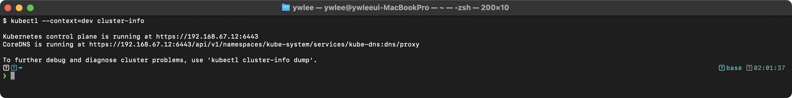

```bash
# 노드 상태 확인
kubectl get nodes
```

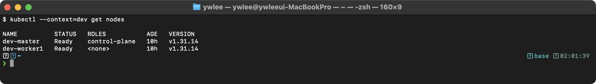

```bash
# Control Plane 컴포넌트 Pod 상태 확인
kubectl get pods -n kube-system
```

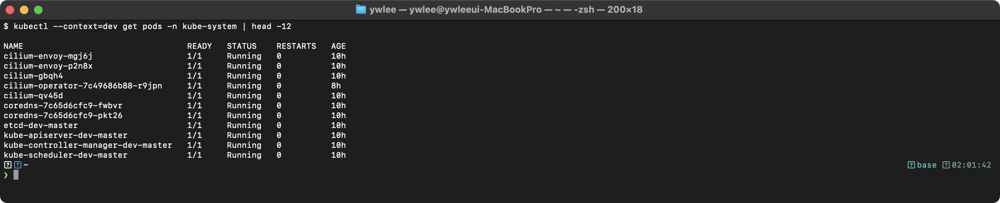

CNI가 설치되지 않은 상태에서는 CoreDNS Pod가 `Pending` 상태로 남고, 노드 상태가 `NotReady`이다. CNI 설치 후 `Ready`로 전환된다.

#### Worker Node 조인

```bash
# Control Plane 초기화 시 출력된 명령 실행
sudo kubeadm join 192.168.1.100:6443 \
  --token abcdef.0123456789abcdef \
  --discovery-token-ca-cert-hash sha256:abc123...

# 토큰이 만료된 경우 새로 생성
kubeadm token create --print-join-command

# 토큰 목록 확인
kubeadm token list
```

**토큰 관련 세부사항:**

부트스트랩 토큰의 기본 유효 기간은 24시간이다. `kubeadm token create --ttl 0`으로 만료 없는 토큰을 생성할 수 있으나, 보안상 권장되지 않는다. `--discovery-token-ca-cert-hash`는 Worker Node가 Control Plane의 CA 인증서를 검증하는 데 사용되며, MITM(Man-in-the-Middle) 공격을 방지한다.

**검증:**

```bash
# Control Plane에서 실행
kubectl get nodes -o wide
```

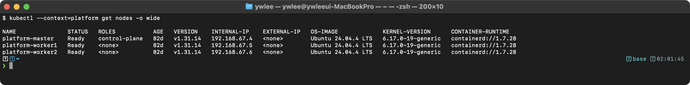

Worker Node의 ROLES이 `<none>`으로 표시된다. 역할 레이블을 부여하려면 `kubectl label node worker-1 node-role.kubernetes.io/worker=`을 실행한다.

**장애 시나리오:**

| 증상 | 원인 | 해결 |
|------|------|------|
| `join` 시 `connection refused` | API 서버 포트(6443) 방화벽 차단 | `ufw allow 6443/tcp` |
| `join` 시 `token is invalid` | 토큰 만료(24시간 경과) | `kubeadm token create --print-join-command` |
| Worker Node가 `NotReady` | CNI 미설치 또는 kubelet 미작동 | CNI 설치 확인, `journalctl -u kubelet` 확인 |

---

### 1.2 클러스터 업그레이드 (v1.30.0 → v1.31.0 예시)

#### 등장 배경

보안 패치, 버그 수정, 신규 API 추가를 위해 정기적인 업그레이드가 필요하다. 핵심은 무작정 따라 하기가 아니라 "왜 이 순서인가"를 이해하는 것이다.

**왜 Control Plane을 먼저, Worker를 나중에 올리는가 (버전 스큐 규칙).** Kubernetes는 구성 요소 간 마이너 버전 차이(version skew)에 명확한 규칙을 둔다. kubelet은 kube-apiserver와 같거나 그보다 낮을 수 있고(최근 정책은 최대 3개 마이너 버전까지 뒤처짐을 허용한다), 절대 apiserver보다 높을 수 없다. 즉 apiserver v1.31은 kubelet v1.28~1.31을 받아 주지만, kubelet v1.31에 apiserver v1.30을 붙이는 구성은 지원되지 않는다. 그래서 컨트롤 플레인(apiserver 포함)을 먼저 올려 천장을 높인 뒤, 그 아래에서 Worker의 kubelet을 따라 올린다. 역순으로 하면 Worker kubelet이 한순간이라도 apiserver보다 앞서게 되어 규칙을 위반한다. 또한 한 번에 한 마이너 버전씩만 건너뛴다(v1.30→v1.32 직행 불가).

**왜 drain을 먼저 하는가.** drain은 업그레이드 대상 노드에서 실행 중인 Pod를 다른 노드로 안전하게 옮기고 새 스케줄링을 막는 작업이다. kubelet을 재시작하는 동안 그 노드의 워크로드가 영향을 받을 수 있으므로, 미리 비워 두어 다운타임을 다른 노드가 흡수하게 한다.

**왜 daemon-reload가 필요한가.** apt로 새 kubelet 바이너리를 설치해도 systemd는 이미 메모리에 올려 둔 옛 서비스 정의를 그대로 쓴다. `systemctl daemon-reload`로 서비스 파일을 다시 읽게 한 뒤 재시작해야 새 바이너리가 실제로 구동된다. 이 단계를 빠뜨리면 패키지는 새 버전인데 실행 중인 프로세스는 옛 버전인 모순 상태가 된다.

#### Control Plane 노드 업그레이드

> **실습 클러스터 기준:** 아래 절차는 **staging 클러스터**에서 수행한다(`ssh staging-master`로 접속). 명령의 `<control-plane-node>`에 실제 노드명을 대입해야 한다. 노드명은 `kubectl --kubeconfig kubeconfig/staging.yaml get nodes`로 확인한다. 이 저장소 staging 기준 예시: `<control-plane-node>=staging-master`, `<worker-node>=staging-worker1`.

```bash
# 1단계: kubeadm 업그레이드
sudo apt-mark unhold kubeadm
sudo apt-get update
sudo apt-get install -y kubeadm=1.31.0-1.1
sudo apt-mark hold kubeadm

# 2단계: 업그레이드 계획 확인
sudo kubeadm upgrade plan

# 3단계: Control Plane 컴포넌트 업그레이드
sudo kubeadm upgrade apply v1.31.0

# 4단계: 노드 drain
kubectl drain <control-plane-node> --ignore-daemonsets --delete-emptydir-data

# 5단계: kubelet, kubectl 업그레이드
sudo apt-mark unhold kubelet kubectl
sudo apt-get install -y kubelet=1.31.0-1.1 kubectl=1.31.0-1.1
sudo apt-mark hold kubelet kubectl

# 6단계: kubelet 재시작
sudo systemctl daemon-reload
sudo systemctl restart kubelet

# 7단계: 노드 uncordon
kubectl uncordon <control-plane-node>

# 8단계: 확인
kubectl get nodes
```

**각 단계의 내부 동작:**

- **kubeadm upgrade plan**: 현재 클러스터 버전, 업그레이드 가능한 버전, 필요한 매뉴얼 작업을 표시한다. deprecated API가 있으면 경고를 출력한다.
- **kubeadm upgrade apply**: Static Pod 매니페스트(`/etc/kubernetes/manifests/`)에서 이미지 태그를 업데이트하고, 인증서를 갱신하며, CoreDNS 및 kube-proxy를 업데이트한다. kubelet이 매니페스트 변경을 감지하여 Control Plane Pod를 순차적으로 재시작한다.
- **drain**: 노드의 스케줄링을 비활성화(cordon)하고, 해당 노드에서 실행 중인 모든 evictable Pod를 안전하게 퇴거시킨다. `--ignore-daemonsets`는 DaemonSet Pod를 제외하고, `--delete-emptydir-data`는 emptyDir 볼륨 데이터 손실을 허용한다.
- **daemon-reload**: systemd가 변경된 kubelet 바이너리의 서비스 파일을 다시 읽도록 한다. 이 단계를 건너뛰면 이전 버전의 kubelet이 계속 실행된다.

**검증 - kubeadm upgrade plan 출력:**

```bash
sudo kubeadm upgrade plan
```

> **예시(참조) — kubeadm upgrade plan:** `kubeadm upgrade plan` 은 preflight·health check 후 업그레이드 가능한 버전과 수동 업그레이드 대상(kubelet/kubectl)을 출력한다. 실제 업그레이드 실습은 day04 참고(staging 에서 수행).

`kubeadm upgrade plan` 출력에서 확인해야 할 항목은 세 가지다. 첫째, **"COMPONENT"** 컬럼에서 `kube-apiserver`, `kube-controller-manager`, `kube-scheduler`, `etcd` 각각의 현재(CURRENT) 버전과 업그레이드 가능한(AVAILABLE) 버전을 확인한다. 둘째, **"Manually upgrade your CNI…"** 또는 **"Manual upgrades needed"** 섹션에 `kubelet`과 `kubectl`이 나열되는데, 이 두 컴포넌트는 `kubeadm upgrade apply`가 자동으로 올리지 않으므로 위 절차 5단계에서 직접 설치해야 한다. 셋째, deprecated API가 있으면 "API changes in v1.3x" 경고가 출력되며, 업그레이드 전에 워크로드 매니페스트를 수정해야 할 수 있다.

**검증 - 업그레이드 후 노드 버전 확인:**

```bash
kubectl get nodes
```

> **예시(참조) — 업그레이드 중 버전 스큐:** Control Plane 을 먼저 v1.31 로 올리고 worker 는 아직 v1.30 인 중간 상태. kubelet 은 apiserver 보다 높으면 안 되고 최대 2 마이너 뒤까지 허용된다. 우리 클러스터는 전부 v1.31.14 로 균일하다(day02·day19 실측).

Control Plane 노드만 v1.31.0으로 변경되고, Worker Node는 아직 v1.30.0인 것을 확인할 수 있다. VERSION 컬럼은 kubelet 버전을 표시한다. 중간 상태에서 `get nodes`를 실행하면 컨트롤 플레인 행은 v1.31.x, 워커 행은 v1.30.x로 두 버전이 공존한다. 이 상태에서도 클러스터는 정상 동작한다(버전 스큐 허용 범위 내). STATUS 컬럼이 모두 `Ready`인지 반드시 확인한다. `NotReady`가 보이면 kubelet 재시작 전 `daemon-reload` 누락을 먼저 점검한다.

#### Worker Node 업그레이드

```bash
# Control Plane에서 실행: Worker Node drain
kubectl drain <worker-node> --ignore-daemonsets --delete-emptydir-data

# Worker Node에서 실행:
# 1단계: kubeadm 업그레이드
sudo apt-mark unhold kubeadm
sudo apt-get update
sudo apt-get install -y kubeadm=1.31.0-1.1
sudo apt-mark hold kubeadm

# 2단계: 노드 설정 업그레이드
sudo kubeadm upgrade node

# 3단계: kubelet, kubectl 업그레이드
sudo apt-mark unhold kubelet kubectl
sudo apt-get install -y kubelet=1.31.0-1.1 kubectl=1.31.0-1.1
sudo apt-mark hold kubelet kubectl

# 4단계: kubelet 재시작
sudo systemctl daemon-reload
sudo systemctl restart kubelet

# Control Plane에서 실행: 노드 uncordon
kubectl uncordon <worker-node>
```

**`kubeadm upgrade node`와 `kubeadm upgrade apply`의 차이:**

- `kubeadm upgrade apply`는 첫 번째 Control Plane 노드에서만 실행하며, 클러스터 수준의 설정(ConfigMap, RBAC 등)을 업데이트한다.
- `kubeadm upgrade node`는 추가 Control Plane 노드 및 Worker Node에서 실행하며, 해당 노드의 kubelet 설정만 업데이트한다. Static Pod 매니페스트는 추가 Control Plane 노드에서만 업데이트되고, Worker Node에서는 kubelet 설정만 갱신된다.

**검증 - 전체 업그레이드 완료 후:**

```bash
kubectl get nodes
```

> **예시(참조) — 업그레이드 완료:** worker 까지 v1.31 로 올려 전 노드 버전이 일치한 상태.

완료 상태의 `get nodes` 출력에서 확인할 포인트는 두 가지다. 첫째, **VERSION 컬럼**이 모든 노드에서 동일한 버전(예: v1.31.0)으로 표시되어야 한다. 불일치가 남아 있다면 해당 Worker Node의 kubelet 업그레이드 절차를 다시 실행한다. 둘째, **STATUS 컬럼**이 모든 노드에서 `Ready`여야 한다. uncordon을 빠뜨렸으면 `kubectl uncordon <node>`를 실행한다. ROLES 컬럼에서 컨트롤 플레인 노드는 `control-plane`으로, Worker 노드는 `<none>` 또는 수동으로 부여한 역할로 표시되는지도 확인한다.

**장애 시나리오:**

| 증상 | 원인 | 해결 |
|------|------|------|
| `drain` 시 Pod가 퇴거되지 않음 | PodDisruptionBudget이 퇴거를 차단 | PDB 조건 확인, 필요시 PDB 임시 수정 |
| 업그레이드 후 kubelet 미시작 | `daemon-reload` 누락 | `systemctl daemon-reload && systemctl restart kubelet` |
| API 서버 응답 없음 | 업그레이드 중 일시적 다운타임 | Static Pod 재시작 대기 (1-2분), `crictl ps` 확인 |
| `kubeadm upgrade apply` 실패 | 클러스터 health check 실패 | `kubectl get cs`, etcd 상태 확인 |

---

### 1.3 etcd 백업과 복구

#### 등장 배경

etcd는 Kubernetes의 모든 클러스터 상태(Pod, Service, Secret, ConfigMap 등)를 저장하는 유일한 데이터 저장소이다. etcd 데이터가 손상되거나 유실되면 클러스터 전체가 복구 불가능한 상태에 빠진다. 따라서 정기적인 백업은 운영 환경에서 필수적이다. etcd는 MVCC(Multi-Version Concurrency Control) 방식으로 데이터를 관리하며, 스냅샷은 특정 시점의 전체 데이터 상태를 캡처한다.

#### etcd 백업

```bash
# etcd Pod에서 인증서 경로 확인
kubectl -n kube-system describe pod etcd-controlplane | grep -A5 "Command"

# 백업 수행
ETCDCTL_API=3 etcdctl snapshot save /opt/etcd-backup.db \
  --endpoints=https://127.0.0.1:2379 \
  --cacert=/etc/kubernetes/pki/etcd/ca.crt \
  --cert=/etc/kubernetes/pki/etcd/server.crt \
  --key=/etc/kubernetes/pki/etcd/server.key

# 백업 검증
ETCDCTL_API=3 etcdctl snapshot status /opt/etcd-backup.db --write-out=table
```

**각 플래그의 의미:**

- `ETCDCTL_API=3`: etcdctl v3 API를 사용하도록 지정한다. v2와 v3는 호환되지 않으며, Kubernetes는 v3 API만 사용한다. 이 환경 변수를 설정하지 않으면 v2 API가 기본으로 사용되어 snapshot 명령이 동작하지 않는다.
- `--endpoints`: etcd 서버의 클라이언트 리스닝 주소이다. 기본 포트는 2379이다. 다중 etcd 환경에서는 쉼표로 구분하여 여러 엔드포인트를 지정할 수 있다.
- `--cacert`: etcd CA 인증서 경로이다. etcd는 mTLS(mutual TLS)로 통신하므로, CA 인증서로 서버 인증서를 검증한다.
- `--cert`: 클라이언트 인증서 경로이다. etcd 서버가 클라이언트를 인증하는 데 사용된다.
- `--key`: 클라이언트 개인 키 경로이다. 인증서와 쌍을 이루어 클라이언트 신원을 증명한다.

**인증서 경로를 모를 때 확인하는 방법:**

```bash
# etcd Static Pod 매니페스트에서 직접 확인
cat /etc/kubernetes/manifests/etcd.yaml | grep -E "(--cert-file|--key-file|--trusted-ca-file|--listen-client-urls)"
```

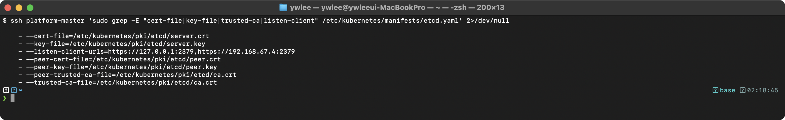

**검증 - 백업 상태 확인:**

```bash
ETCDCTL_API=3 etcdctl snapshot status /opt/etcd-backup.db --write-out=table
```

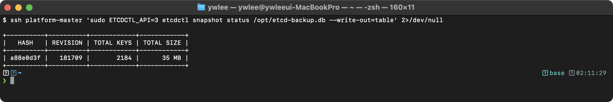

- **HASH**: 스냅샷의 무결성 검증용 해시값이다. 복구 시 이 해시를 기반으로 데이터 무결성을 확인한다.
- **REVISION**: etcd의 현재 리비전 번호이다. 모든 쓰기 연산마다 리비전이 증가한다.
- **TOTAL KEYS**: 스냅샷에 포함된 전체 키 수이다. 클러스터의 모든 리소스가 키-값 쌍으로 저장된다.
- **TOTAL SIZE**: 스냅샷 파일의 실제 크기이다.

#### etcd 복구

```bash
# 1단계: etcd 복구 (새 데이터 디렉터리로)
ETCDCTL_API=3 etcdctl snapshot restore /opt/etcd-backup.db \
  --data-dir=/var/lib/etcd-restored
```

**복구 시 새 디렉터리를 사용하는 이유**: `snapshot restore`는 새로운 etcd 멤버 ID와 클러스터 ID를 생성한다. 기존 디렉터리에 덮어쓰면 WAL(Write-Ahead Log) 파일과 스냅샷 간 불일치가 발생하여 etcd가 시작되지 않을 수 있다. 항상 새 디렉터리를 지정하는 것이 안전하다.

```bash
# 2단계: etcd 매니페스트 수정
# /etc/kubernetes/manifests/etcd.yaml에서 hostPath 수정
```

etcd.yaml 수정 부분:
```yaml
# 변경 전
  volumes:
  - hostPath:
      path: /var/lib/etcd
      type: DirectoryOrCreate
    name: etcd-data

# 변경 후
  volumes:
  - hostPath:
      path: /var/lib/etcd-restored
      type: DirectoryOrCreate
    name: etcd-data
```

```bash
# 3단계: etcd Pod가 재시작될 때까지 대기
# Static Pod이므로 매니페스트 변경 후 자동으로 재시작된다
watch crictl ps | grep etcd

# 4단계: 정상 동작 확인
kubectl get pods -A
```

**검증 - 복구 후 클러스터 상태:**

```bash
# etcd 멤버 상태 확인
ETCDCTL_API=3 etcdctl member list \
  --endpoints=https://127.0.0.1:2379 \
  --cacert=/etc/kubernetes/pki/etcd/ca.crt \
  --cert=/etc/kubernetes/pki/etcd/server.crt \
  --key=/etc/kubernetes/pki/etcd/server.key \
  --write-out=table
```

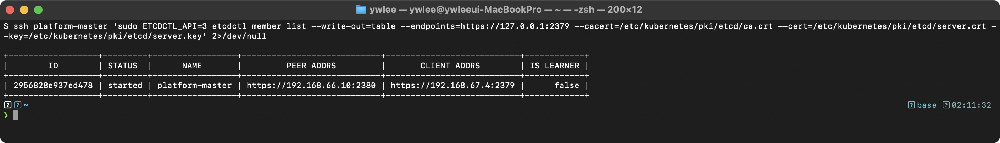

```bash
# 클러스터 리소스 복구 확인
kubectl get pods -A
kubectl get nodes
kubectl get svc -A
```

**장애 시나리오:**

| 증상 | 원인 | 해결 |
|------|------|------|
| etcd Pod가 시작되지 않음 | 복구 디렉터리 권한 문제 | `chown -R etcd:etcd /var/lib/etcd-restored` |
| API 서버가 etcd 연결 실패 | etcd 매니페스트의 data-dir 불일치 | `volumeMounts`와 `volumes`의 경로 일치 확인 |
| 복구 후 데이터 불일치 | 스냅샷 이후 생성된 리소스 유실 | 이는 정상 동작이며, 스냅샷 시점 이후의 변경은 복구 불가 |
| `snapshot restore` 시 해시 오류 | 스냅샷 파일 손상 | 다른 백업 파일 사용, 백업 자동화 및 다중 복사본 유지 |

---

### 1.4 RBAC 설정

#### 등장 배경

Kubernetes 1.6 이전에는 ABAC(Attribute-Based Access Control)이 기본 인가 방식이었다. ABAC은 정책 변경 시 API 서버 재시작이 필요했고, JSON 파일 기반이라 관리가 어려웠다. RBAC(Role-Based Access Control)은 Kubernetes API 리소스로 정책을 관리하므로, `kubectl apply`로 동적 변경이 가능하고, 네임스페이스 수준(Role/RoleBinding)과 클러스터 수준(ClusterRole/ClusterRoleBinding)의 세분화된 접근 제어를 제공한다.

**RBAC의 4가지 핵심 리소스:**

| 리소스 | 범위 | 역할 |
|--------|------|------|
| Role | 네임스페이스 | 특정 네임스페이스 내에서의 권한 정의 |
| ClusterRole | 클러스터 | 클러스터 전체 또는 비-네임스페이스 리소스의 권한 정의 |
| RoleBinding | 네임스페이스 | Role 또는 ClusterRole을 사용자/그룹/SA에 바인딩 |
| ClusterRoleBinding | 클러스터 | ClusterRole을 클러스터 전체에서 바인딩 |

RoleBinding이 ClusterRole을 참조할 수 있다는 점이 중요하다. 이 경우 ClusterRole에 정의된 권한이 RoleBinding이 속한 네임스페이스 범위로 제한된다. 이 패턴은 공통 권한 세트를 여러 네임스페이스에서 재사용할 때 유용하다.

#### kubectl 명령어로 생성

```bash
# Role 생성 (네임스페이스 범위)
kubectl create role pod-reader \
  --verb=get,list,watch \
  --resource=pods \
  -n development

# ClusterRole 생성 (클러스터 범위)
kubectl create clusterrole node-reader \
  --verb=get,list,watch \
  --resource=nodes

# RoleBinding 생성
kubectl create rolebinding pod-reader-binding \
  --role=pod-reader \
  --user=jane \
  -n development

# ClusterRoleBinding 생성
kubectl create clusterrolebinding node-reader-binding \
  --clusterrole=node-reader \
  --user=jane

# ServiceAccount에 바인딩
kubectl create rolebinding sa-binding \
  --role=pod-reader \
  --serviceaccount=development:my-sa \
  -n development

# 그룹에 바인딩
kubectl create clusterrolebinding dev-group-binding \
  --clusterrole=edit \
  --group=developers
```

#### YAML로 생성

**Role:**
```yaml
apiVersion: rbac.authorization.k8s.io/v1
kind: Role
metadata:
  name: pod-manager
  namespace: development
rules:
- apiGroups: [""]              # core API group (Pod, Service, ConfigMap 등)
  resources: ["pods"]
  verbs: ["get", "list", "watch", "create", "delete"]
- apiGroups: [""]
  resources: ["pods/log"]      # 서브리소스 (Pod 로그 조회)
  verbs: ["get"]
- apiGroups: ["apps"]          # apps API group (Deployment, StatefulSet 등)
  resources: ["deployments"]
  verbs: ["get", "list", "create", "update", "patch"]
```

**필드 상세 설명:**

- `apiGroups`: API 그룹을 지정한다. `""`는 core API group(v1)을 의미하며, Pod, Service, ConfigMap, Secret 등이 속한다. `"apps"`는 Deployment, StatefulSet, DaemonSet 등이 속하는 그룹이다. `"networking.k8s.io"`는 Ingress, NetworkPolicy 등이 속한다. 어떤 리소스가 어떤 API 그룹에 속하는지는 `kubectl api-resources`로 확인할 수 있다.
- `resources`: 접근을 허용할 리소스 종류이다. 서브리소스는 `"리소스/서브리소스"` 형태로 지정한다. `pods/log`, `pods/exec`, `pods/portforward`, `deployments/scale` 등이 대표적인 서브리소스이다.
- `verbs`: 허용할 동작을 지정한다. 사용 가능한 verb는 `get`, `list`, `watch`, `create`, `update`, `patch`, `delete`, `deletecollection`이다. `*`는 모든 verb를 의미한다.

**ClusterRole:**
```yaml
apiVersion: rbac.authorization.k8s.io/v1
kind: ClusterRole
metadata:
  name: secret-reader
rules:
- apiGroups: [""]
  resources: ["secrets"]
  verbs: ["get", "list", "watch"]
- apiGroups: [""]
  resources: ["namespaces"]
  verbs: ["get", "list"]
```

ClusterRole은 `metadata.namespace`가 없다. 클러스터 범위 리소스(nodes, namespaces, persistentvolumes)에 대한 접근 제어는 ClusterRole로만 가능하다.

**RoleBinding:**
```yaml
apiVersion: rbac.authorization.k8s.io/v1
kind: RoleBinding
metadata:
  name: pod-manager-binding
  namespace: development
subjects:
- kind: User
  name: jane
  apiGroup: rbac.authorization.k8s.io
- kind: ServiceAccount
  name: deploy-bot
  namespace: development
roleRef:
  kind: Role
  name: pod-manager
  apiGroup: rbac.authorization.k8s.io
```

**subjects 필드 상세:**

- `kind: User`: X.509 인증서의 CN(Common Name) 또는 OIDC 토큰의 사용자 이름에 매핑된다. Kubernetes에는 User 오브젝트가 존재하지 않으며, 외부 인증 시스템에 의존한다.
- `kind: Group`: X.509 인증서의 O(Organization) 또는 OIDC 토큰의 그룹 클레임에 매핑된다.
- `kind: ServiceAccount`: 클러스터 내부에서 Pod가 API 서버에 접근할 때 사용하는 서비스 계정이다. `namespace` 필드가 필수이다.
- `roleRef`는 바인딩 생성 후 변경할 수 없다. 다른 Role을 참조하려면 기존 바인딩을 삭제하고 새로 생성해야 한다.

**ClusterRoleBinding:**
```yaml
apiVersion: rbac.authorization.k8s.io/v1
kind: ClusterRoleBinding
metadata:
  name: secret-reader-global
subjects:
- kind: Group
  name: auditors
  apiGroup: rbac.authorization.k8s.io
roleRef:
  kind: ClusterRole
  name: secret-reader
  apiGroup: rbac.authorization.k8s.io
```

#### 권한 확인

```bash
# 현재 사용자의 권한 확인
kubectl auth can-i create pods
kubectl auth can-i delete deployments -n production

# 특정 사용자의 권한 확인
kubectl auth can-i get pods --as=jane -n development
kubectl auth can-i list nodes --as=jane

# ServiceAccount의 권한 확인
kubectl auth can-i get secrets --as=system:serviceaccount:development:my-sa -n development

# 모든 권한 확인
kubectl auth can-i --list --as=jane -n development
```

**검증 - RBAC 설정 후 권한 테스트:**

```bash
# jane 사용자가 development 네임스페이스에서 Pod를 조회할 수 있는지 확인
kubectl auth can-i get pods --as=jane -n development
```


```bash
# jane 사용자가 production 네임스페이스에서 Pod를 삭제할 수 있는지 확인
kubectl auth can-i delete pods --as=jane -n production
```

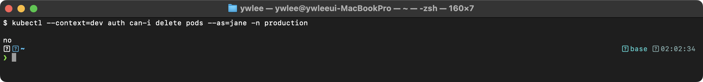

```bash
# jane 사용자의 전체 권한 목록 확인
kubectl auth can-i --list --as=jane -n development
```

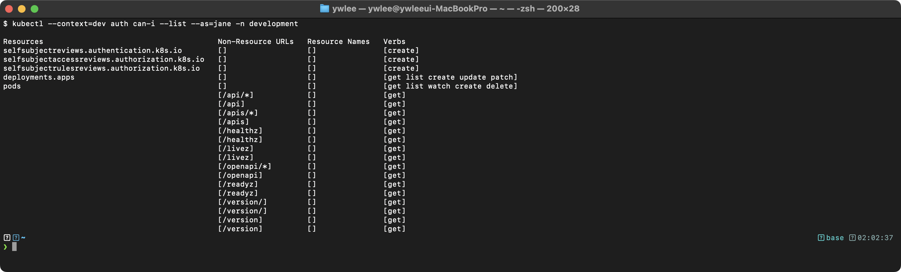

```bash
# ServiceAccount 권한 확인
kubectl auth can-i get secrets --as=system:serviceaccount:development:my-sa -n development
```

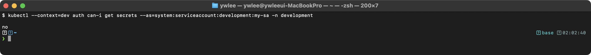

**장애 시나리오:**

| 증상 | 원인 | 해결 |
|------|------|------|
| `Forbidden` 오류 | Role/ClusterRole에 필요한 verb 누락 | `kubectl auth can-i --list --as=<user>`로 현재 권한 확인 |
| RoleBinding 생성 후에도 권한 없음 | RoleBinding의 namespace와 접근 대상 namespace 불일치 | RoleBinding이 대상 네임스페이스에 존재하는지 확인 |
| ServiceAccount 인증 실패 | `automountServiceAccountToken: false` | Pod spec에서 `automountServiceAccountToken: true` 설정 |
| 클러스터 범위 리소스 접근 불가 | Role(네임스페이스 범위)로 nodes 등에 권한 부여 시도 | ClusterRole + ClusterRoleBinding 사용 |

#### ServiceAccount 생성

```bash
# ServiceAccount 생성
kubectl create serviceaccount my-sa -n development

# Pod에서 ServiceAccount 사용
kubectl run my-pod --image=nginx --serviceaccount=my-sa -n development --dry-run=client -o yaml
```

```yaml
apiVersion: v1
kind: Pod
metadata:
  name: my-pod
  namespace: development
spec:
  serviceAccountName: my-sa
  automountServiceAccountToken: true
  containers:
  - name: app
    image: nginx
```

**ServiceAccount 관련 세부사항:**

- `serviceAccountName` 생략 시 `default` ServiceAccount가 자동으로 할당된다. `default` SA는 최소한의 권한만 가지고 있다.
- `automountServiceAccountToken: true`(기본값)이면 토큰이 `/var/run/secrets/kubernetes.io/serviceaccount/` 경로에 마운트된다. Kubernetes 1.24부터는 TokenRequest API를 통해 시간 제한이 있는 토큰이 자동 발급된다(기본 1시간, kubelet이 자동 갱신).
- 보안상 API 접근이 불필요한 Pod는 `automountServiceAccountToken: false`로 설정하여 토큰 마운트를 비활성화하는 것이 권장된다.

---

## 2. 워크로드 관리

### 2.1 Deployment 생성 및 관리

#### 등장 배경

초기 Kubernetes에서는 ReplicationController가 Pod 복제본을 관리했고, 버전을 올릴 때는 `kubectl rolling-update` 명령을 썼다. 이 방식의 결정적 한계는 롤링 업데이트 로직이 클라이언트(kubectl을 실행하는 사용자 터미널) 쪽에서 돌았다는 점이다. kubectl이 직접 새 Pod를 하나 만들고, 준비되면 옛 Pod를 하나 지우고, 다시 만들고 지우는 식으로 순차 진행했다. 따라서 업데이트가 끝나기 전에 터미널을 닫거나 네트워크가 끊기면 그 자리에서 멈췄고, 결과적으로 일부 Pod는 옛 버전·일부는 새 버전인 채로 방치되어 서비스가 불안정해졌다. 진행 상태가 서버 어디에도 기록되지 않으니 재개할 방법도 마땅치 않았다.

Deployment는 이 책임을 서버 측 컨트롤러(kube-controller-manager 안의 Deployment Controller)로 옮겼다. 사용자는 "최종 상태(원하는 이미지·복제본 수)"만 선언하고, 컨트롤러가 현재 상태와 비교하며(reconciliation, 선언한 목표와 실제를 끊임없이 일치시키는 조정 루프) 새 ReplicaSet 생성·옛 ReplicaSet 축소를 알아서 진행한다. 클라이언트가 끊겨도 컨트롤러는 계속 돌므로 업데이트가 멈추지 않는다. 그 위에 자동 롤백, 일시 정지/재개, 리비전 이력 같은 기능이 얹힌다. 트레이드오프로 추상화 계층(Deployment→ReplicaSet→Pod)이 한 단계 늘어 디버깅 시 어느 계층에서 막혔는지 추적해야 한다.

#### 생성

```bash
# 명령어로 생성
kubectl create deployment nginx-deploy \
  --image=nginx:1.24 \
  --replicas=3 \
  --dry-run=client -o yaml > nginx-deploy.yaml

# 적용
kubectl apply -f nginx-deploy.yaml
```

**YAML:**
```yaml
apiVersion: apps/v1
kind: Deployment
metadata:
  name: nginx-deploy
  labels:
    app: nginx
spec:
  replicas: 3
  selector:
    matchLabels:
      app: nginx
  strategy:
    type: RollingUpdate
    rollingUpdate:
      maxSurge: 1
      maxUnavailable: 0
  template:
    metadata:
      labels:
        app: nginx
    spec:
      containers:
      - name: nginx
        image: nginx:1.24
        ports:
        - containerPort: 80
        resources:
          requests:
            cpu: "100m"
            memory: "128Mi"
          limits:
            cpu: "200m"
            memory: "256Mi"
        readinessProbe:
          httpGet:
            path: /
            port: 80
          initialDelaySeconds: 5
          periodSeconds: 10
        livenessProbe:
          httpGet:
            path: /
            port: 80
          initialDelaySeconds: 15
          periodSeconds: 20
```

**필드별 상세 설명:**

- `replicas`: 유지할 Pod 복제본 수이다. 생략 시 기본값은 1이다. Deployment Controller가 실제 Pod 수를 이 값과 일치시키도록 지속적으로 조정한다.
- `selector.matchLabels`: Deployment가 관리할 Pod를 식별하는 레이블 셀렉터이다. 이 값은 `template.metadata.labels`의 부분 집합이어야 한다. 불일치 시 Deployment 생성이 거부된다. 생성 후 변경 불가(immutable)이다.
- `strategy.type`: `RollingUpdate`(기본값) 또는 `Recreate`를 지정한다. `Recreate`는 기존 Pod를 모두 종료한 후 새 Pod를 생성하므로 다운타임이 발생하지만, 두 버전이 동시에 실행되면 안 되는 경우(DB 스키마 마이그레이션 등)에 사용한다.
- `maxSurge`: 롤링 업데이트 중 `replicas`를 초과하여 생성할 수 있는 최대 Pod 수이다. 절대값(정수) 또는 백분율로 지정한다. 기본값은 25%이다. `maxSurge: 1`이면 replicas=3일 때 최대 4개 Pod가 동시에 존재할 수 있다.
- `maxUnavailable`: 롤링 업데이트 중 사용 불가능한 상태로 허용되는 최대 Pod 수이다. 기본값은 25%이다. `maxUnavailable: 0`이면 항상 최소 3개 Pod가 Ready 상태를 유지한다. `maxSurge`와 `maxUnavailable`이 동시에 0이 될 수 없다(업데이트가 진행되지 않음).
- `resources.requests`: 스케줄러가 Pod를 노드에 배치할 때 참조하는 최소 보장 리소스이다. "참조한다"의 구체적 의미는 다음과 같다. 스케줄러는 후보 노드를 거르는 Predicates(필터링) 단계에서, 노드의 allocatable(노드 전체 용량에서 운영체제·kubelet용으로 예약된 reserved를 뺀, Pod가 실제로 쓸 수 있는 양) 중 이미 다른 Pod들이 requests로 잡아 둔 합을 뺀 나머지와 새 Pod의 requests를 비교한다. 예를 들어 노드 allocatable 메모리가 7Gi인데 기존 Pod들의 requests 합이 5Gi라면 남은 가용량은 2Gi다. 새 Pod가 메모리 3Gi를 requests하면 2Gi에 들어가지 않으므로 이 노드는 후보에서 제외된다. requests는 실제 사용량이 아니라 "예약 장부"라는 점이 핵심이다 — Pod가 실제로 1Gi만 쓰더라도 3Gi를 requests했다면 스케줄러 장부에서는 3Gi가 빠진다.
- `resources.limits`: 컨테이너가 사용할 수 있는 최대 리소스이다. CPU limit 초과 시 CPU 스로틀링이 적용되고, 메모리 limit 초과 시 OOM Killer에 의해 컨테이너가 종료된다.
- `readinessProbe`: Pod가 트래픽을 수신할 준비가 되었는지 판단한다. 실패 시 Service의 Endpoints에서 제거되어 트래픽이 전달되지 않는다. 롤링 업데이트에서 새 Pod가 Ready가 되어야 이전 Pod가 종료되므로, readinessProbe가 없으면 준비되지 않은 Pod로 트래픽이 전달될 수 있다.
- `livenessProbe`: 컨테이너가 정상 동작 중인지 판단한다. 실패 시 kubelet이 컨테이너를 재시작한다. `initialDelaySeconds`를 너무 짧게 설정하면 애플리케이션 시작 전에 프로브가 실패하여 재시작 루프에 빠질 수 있다.

**검증 - Deployment 적용 후:**

```bash
# 배포 상태 확인
kubectl rollout status deployment/nginx-deploy
```


```bash
# ReplicaSet 확인 (Deployment가 생성한 ReplicaSet)
kubectl get rs -l app=nginx
```


```bash
# Pod 상태 확인
kubectl get pods -l app=nginx -o wide
```

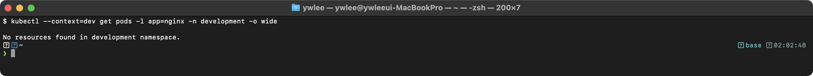

#### Rolling Update 및 Rollback

```bash
# 이미지 업데이트 (Rolling Update 트리거)
kubectl set image deployment/nginx-deploy nginx=nginx:1.25

# 또는 edit으로 수정
kubectl edit deployment nginx-deploy

# 배포 상태 확인
kubectl rollout status deployment/nginx-deploy

# 배포 이력 확인
kubectl rollout history deployment/nginx-deploy

# 특정 리비전 상세 확인
kubectl rollout history deployment/nginx-deploy --revision=2

# 이전 버전으로 롤백
kubectl rollout undo deployment/nginx-deploy

# 특정 리비전으로 롤백
kubectl rollout undo deployment/nginx-deploy --to-revision=1

# 스케일링
kubectl scale deployment nginx-deploy --replicas=5

# 배포 일시 정지/재개 (여러 변경을 한 번에 적용할 때)
kubectl rollout pause deployment/nginx-deploy
kubectl set image deployment/nginx-deploy nginx=nginx:1.25
kubectl set resources deployment/nginx-deploy -c=nginx --limits=cpu=200m,memory=512Mi
kubectl rollout resume deployment/nginx-deploy
```

**롤링 업데이트의 내부 동작 순서:**

1. `kubectl set image` 실행 시 Deployment Controller가 새로운 ReplicaSet을 생성한다.
2. 새 ReplicaSet의 replicas를 `maxSurge`만큼 증가시킨다.
3. 새 Pod가 Ready 상태가 되면 이전 ReplicaSet의 replicas를 `maxUnavailable`만큼 감소시킨다.
4. 이 과정을 반복하여 모든 Pod가 새 ReplicaSet으로 이전될 때까지 계속한다.
5. 이전 ReplicaSet은 replicas=0인 상태로 유지된다(롤백용). `revisionHistoryLimit`(기본값 10)만큼 이전 ReplicaSet이 보존된다.

**검증 - Rolling Update 중:**

```bash
kubectl rollout status deployment/nginx-deploy
```

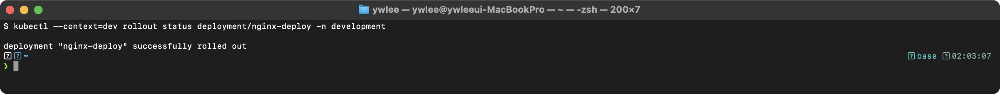

```bash
# ReplicaSet 이력 확인 (이전 RS와 새 RS 공존)
kubectl get rs -l app=nginx
```

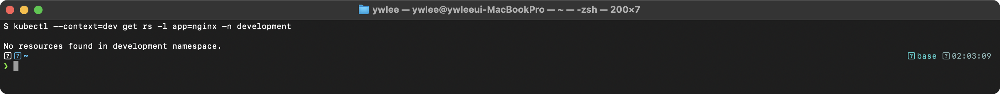

```bash
# 배포 이력 확인
kubectl rollout history deployment/nginx-deploy
```

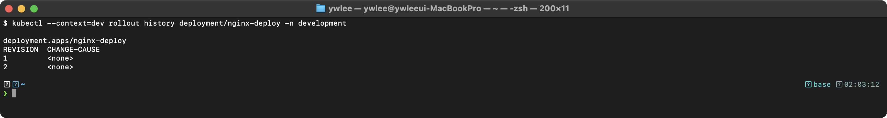

`CHANGE-CAUSE`를 기록하려면 `kubectl annotate deployment/nginx-deploy kubernetes.io/change-cause="update to nginx:1.25"`를 실행하거나, `kubectl set image` 시 `--record` 플래그를 사용한다(deprecated이지만 시험에서 여전히 유효).

**pause/resume의 사용 사례**: 이미지 변경과 리소스 변경을 동시에 적용하고 싶을 때, pause 없이 각각 실행하면 롤링 업데이트가 두 번 발생한다. pause 상태에서 여러 변경을 적용한 후 resume하면 단일 롤링 업데이트로 처리된다.

---

### 2.2 nodeSelector 예제

#### 등장 배경

**먼저 레이블(label) 개념.** Kubernetes의 모든 오브젝트(Pod, Node, Service 등)에는 `key=value` 형태의 메타데이터인 레이블을 자유롭게 붙일 수 있다(예: 노드에 `disktype=ssd`, Pod에 `app=nginx`). 레이블 자체는 의미가 없는 꼬리표일 뿐이지만, 셀렉터(selector, "이런 레이블을 가진 오브젝트만 고른다"는 조건)와 짝을 이루면 오브젝트를 조건으로 선택하는 메커니즘이 된다. Service가 어떤 Pod로 트래픽을 보낼지, Deployment가 어떤 Pod를 관리할지도 모두 이 레이블-셀렉터 매칭으로 결정된다. nodeSelector는 그중 "노드에 붙은 레이블"로 배치 노드를 고르는 경우다.

기본적으로 kube-scheduler는 리소스 가용성, Pod 분산(spread) 등의 조건으로 노드를 자동 선택한다. 그러나 특정 워크로드가 SSD 디스크, GPU, 특정 AZ(Availability Zone, 클라우드의 가용 영역) 등 특수한 하드웨어/위치를 필요로 하는 경우, 수동으로 노드를 선택해야 한다. `nodeSelector`는 가장 단순한 노드 선택 메커니즘이며, 노드 레이블의 정확한 일치(equality)를 기반으로 동작한다. 노드에 `disktype=ssd`를 붙이고 Pod의 nodeSelector에 같은 키-값을 적으면, 그 레이블을 가진 노드에만 배치된다.

```bash
# 노드에 레이블 추가
kubectl label nodes worker-1 disktype=ssd
kubectl label nodes worker-2 disktype=hdd

# 레이블 확인
kubectl get nodes --show-labels
kubectl get nodes -L disktype
```

```yaml
apiVersion: v1
kind: Pod
metadata:
  name: ssd-pod
spec:
  nodeSelector:
    disktype: ssd
  containers:
  - name: nginx
    image: nginx
```

**nodeSelector의 제한사항**: OR 조건(ssd 또는 nvme), NOT 조건(hdd가 아닌 노드), 선호도(soft) 표현이 불가능하다. 이러한 요구사항은 Node Affinity로 해결한다.

**검증:**

```bash
kubectl apply -f ssd-pod.yaml
kubectl get pod ssd-pod -o wide
```

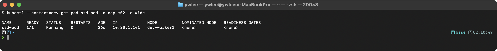

```bash
# 매칭되는 노드가 없는 경우
kubectl get pod ssd-pod
```

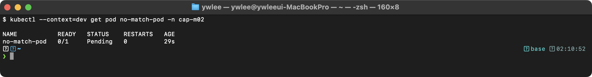

```bash
kubectl describe pod ssd-pod | grep -A3 Events
```

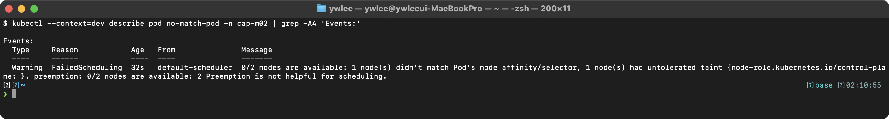

---

### 2.3 Node Affinity 예제

#### 등장 배경

nodeSelector는 단순 일치만 지원하므로, "zone-a 또는 zone-b에 배치", "가능하면 zone-a를 선호하되 불가능하면 다른 곳도 허용" 같은 표현이 불가능했다. Node Affinity는 `In`, `NotIn`, `Exists`, `DoesNotExist`, `Gt`, `Lt` 연산자를 제공하여 복잡한 조건을 표현할 수 있으며, `required`(hard)와 `preferred`(soft) 두 가지 강도를 지원한다.

```yaml
apiVersion: apps/v1
kind: Deployment
metadata:
  name: zone-aware-deploy
spec:
  replicas: 3
  selector:
    matchLabels:
      app: zone-aware
  template:
    metadata:
      labels:
        app: zone-aware
    spec:
      affinity:
        nodeAffinity:
          requiredDuringSchedulingIgnoredDuringExecution:
            nodeSelectorTerms:
            - matchExpressions:
              - key: kubernetes.io/os
                operator: In
                values:
                - linux
          preferredDuringSchedulingIgnoredDuringExecution:
          - weight: 70
            preference:
              matchExpressions:
              - key: zone
                operator: In
                values:
                - zone-a
          - weight: 30
            preference:
              matchExpressions:
              - key: zone
                operator: In
                values:
                - zone-b
      containers:
      - name: app
        image: nginx
```

**필드 상세 설명:**

- `requiredDuringSchedulingIgnoredDuringExecution`: 반드시 충족해야 하는 조건이다. 조건을 만족하는 노드가 없으면 Pod는 `Pending` 상태로 남는다. `IgnoredDuringExecution`은 이미 실행 중인 Pod는 노드 레이블이 변경되어도 퇴거하지 않는다는 의미이다.
- `preferredDuringSchedulingIgnoredDuringExecution`: 선호하지만 필수는 아닌 조건이다. 스케줄러가 가중치를 고려하여 최적의 노드를 선택하되, 조건을 만족하는 노드가 없으면 다른 노드에도 스케줄링한다.
- `weight`: 1-100 범위의 가중치이다. 스케줄러가 각 노드에 대해 모든 preferred 조건의 가중치를 합산하여 점수를 계산한다. 위 예제에서 zone-a 노드는 70점, zone-b 노드는 30점의 추가 점수를 받는다.
- `nodeSelectorTerms`: 여러 term은 OR 관계이다. 하나라도 충족하면 조건을 만족한다.
- `matchExpressions`: 하나의 term 내의 여러 expression은 AND 관계이다. 모두 충족해야 한다.

**검증:**

```bash
kubectl apply -f zone-aware-deploy.yaml
kubectl get pods -l app=zone-aware -o wide
```

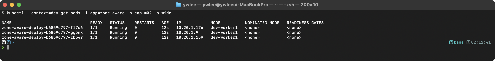

zone-a 레이블이 있는 worker-1에 2개, zone-b 레이블이 있는 worker-2에 1개가 배치된다(가중치 70:30 반영).

---

### 2.4 Pod Anti-Affinity 예제 (고가용성)

#### 등장 배경

replicas가 3인 Deployment를 생성해도, 스케줄러가 3개 Pod를 모두 동일 노드에 배치할 수 있다. 해당 노드에 장애가 발생하면 서비스 전체가 중단된다. Pod Anti-Affinity는 동일 레이블을 가진 Pod가 같은 노드(또는 같은 zone)에 배치되지 않도록 강제하여 고가용성을 확보한다.

```yaml
apiVersion: apps/v1
kind: Deployment
metadata:
  name: ha-web
spec:
  replicas: 3
  selector:
    matchLabels:
      app: ha-web
  template:
    metadata:
      labels:
        app: ha-web
    spec:
      affinity:
        podAntiAffinity:
          requiredDuringSchedulingIgnoredDuringExecution:
          - labelSelector:
              matchExpressions:
              - key: app
                operator: In
                values:
                - ha-web
            topologyKey: kubernetes.io/hostname
      containers:
      - name: web
        image: nginx
```

**topologyKey의 의미**: 동일한 `topologyKey` 레이블 값을 가진 노드를 하나의 "도메인"으로 간주한다. `kubernetes.io/hostname`을 사용하면 각 노드가 독립적인 도메인이 되어 "같은 노드에 배치하지 않음"을 의미한다. `topology.kubernetes.io/zone`을 사용하면 "같은 가용 영역(AZ)에 배치하지 않음"을 의미한다.

이 설정은 같은 Deployment의 Pod가 서로 다른 노드에 분산되도록 강제한다. 노드가 3개 미만이면 일부 Pod가 Pending 상태가 된다.

**검증:**

```bash
kubectl apply -f ha-web.yaml
kubectl get pods -l app=ha-web -o wide
```

> **예시(참조) — 3노드 환경:** worker 가 3개면 required podAntiAffinity 로 3 Pod 가 서로 다른 노드에 1개씩 배치된다. dev 는 워커 1개라 1 Running·2 Pending 으로 재현된다(위 캡처).

3개 Pod가 모두 다른 노드에 분산 배치된 것을 확인할 수 있다.

```bash
# 노드가 2개뿐인 경우 세 번째 Pod는 Pending
kubectl get pods -l app=ha-web
```

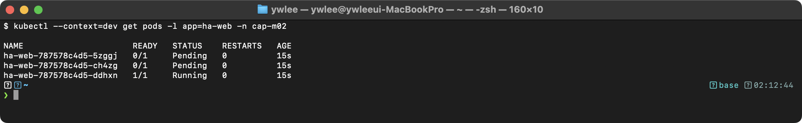

`preferred`(soft)로 변경하면 분산을 시도하되, 노드가 부족해도 Pending이 되지 않는다.

---

### 2.5 Taint와 Toleration 예제

#### 등장 배경

nodeSelector와 Node Affinity는 Pod 관점에서 "어디에 배치할지"를 지정한다. 반면 Taint는 노드 관점에서 "어떤 Pod를 거부할지"를 지정한다. GPU 전용 노드에 일반 워크로드가 스케줄링되는 것을 방지하거나, Control Plane 노드에 사용자 Pod가 배치되지 않도록 하는 데 사용된다.

```bash
# Taint 추가
kubectl taint nodes worker-1 dedicated=gpu:NoSchedule
kubectl taint nodes worker-2 environment=production:NoExecute

# Taint 확인
kubectl describe node worker-1 | grep -i taint

# Taint 제거
kubectl taint nodes worker-1 dedicated=gpu:NoSchedule-
```

**Taint effect 종류:**

| Effect | 동작 |
|--------|------|
| `NoSchedule` | Toleration이 없는 새 Pod는 이 노드에 스케줄링되지 않는다. 기존 Pod는 영향 없다. |
| `PreferNoSchedule` | 스케줄러가 이 노드를 피하려 하지만, 다른 노드가 없으면 배치한다. soft 버전이다. |
| `NoExecute` | Toleration이 없는 새 Pod 스케줄링을 거부하고, 기존 Pod도 퇴거시킨다. `tolerationSeconds`를 지정하면 해당 시간 후 퇴거된다. |

```yaml
apiVersion: v1
kind: Pod
metadata:
  name: gpu-pod
spec:
  tolerations:
  - key: "dedicated"
    operator: "Equal"
    value: "gpu"
    effect: "NoSchedule"
  containers:
  - name: gpu-app
    image: nvidia/cuda:12.0-base
  nodeSelector:
    dedicated: gpu
```

**Toleration operator:**

- `Equal`(기본값): key, value, effect가 모두 일치해야 toleration이 적용된다.
- `Exists`: key와 effect만 일치하면 value에 관계없이 toleration이 적용된다. key를 비워두면 모든 Taint를 tolerate한다.

Toleration은 해당 Taint가 있는 노드에 스케줄링을 "허용"할 뿐, 반드시 그 노드로 가는 것은 아니다. 특정 노드에만 배치하려면 `nodeSelector`나 `nodeAffinity`와 함께 사용해야 한다.

**검증:**

```bash
kubectl apply -f gpu-pod.yaml
kubectl get pod gpu-pod -o wide
```

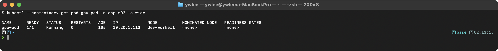

```bash
# Toleration 없는 Pod가 Taint 노드에 스케줄링 시도 시
kubectl describe pod no-toleration-pod | grep -A3 Events
```

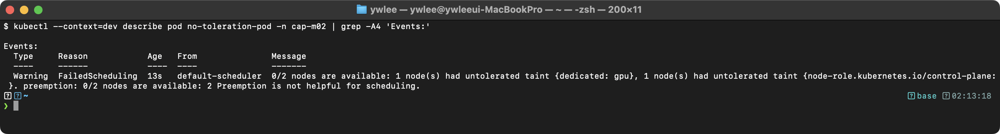

---

### 2.6 DaemonSet 예제

#### 등장 배경

로그 수집, 모니터링 에이전트, 네트워크 플러그인처럼 모든 노드(또는 특정 노드)에서 정확히 하나의 Pod가 실행되어야 하는 워크로드가 있다. Deployment로는 "모든 노드에 정확히 하나씩" 배치를 보장할 수 없다. DaemonSet은 새 노드가 추가되면 자동으로 Pod를 배치하고, 노드가 제거되면 해당 Pod를 삭제한다.

```yaml
apiVersion: apps/v1
kind: DaemonSet
metadata:
  name: log-collector
  namespace: kube-system
spec:
  selector:
    matchLabels:
      app: log-collector
  template:
    metadata:
      labels:
        app: log-collector
    spec:
      tolerations:
      - key: node-role.kubernetes.io/control-plane
        operator: Exists
        effect: NoSchedule
      containers:
      - name: fluentd
        image: fluentd:v1.16
        volumeMounts:
        - name: varlog
          mountPath: /var/log
          readOnly: true
      volumes:
      - name: varlog
        hostPath:
          path: /var/log
```

**핵심 설명:**

- `tolerations`에 Control Plane Taint를 지정한 이유: Control Plane 노드에는 기본적으로 `node-role.kubernetes.io/control-plane:NoSchedule` Taint가 설정되어 있다. 로그 수집은 Control Plane 노드에서도 필요하므로 이 Taint를 tolerate한다.
- `hostPath` 볼륨: 노드의 `/var/log` 디렉터리를 컨테이너에 마운트하여 호스트의 로그 파일에 접근한다. `readOnly: true`는 컨테이너가 호스트 파일시스템을 수정하는 것을 방지한다.
- DaemonSet은 `replicas` 필드가 없다. 대상 노드 수만큼 자동으로 Pod가 생성된다.

**검증:**

```bash
kubectl get daemonset log-collector -n kube-system
```

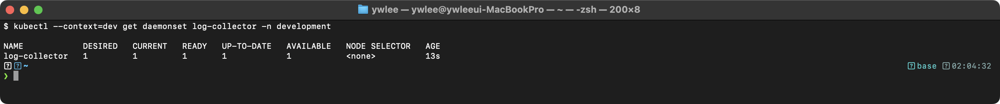

```bash
kubectl get pods -n kube-system -l app=log-collector -o wide
```

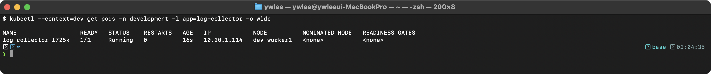

DESIRED와 CURRENT, READY가 모두 일치하면 정상이다.

---

### 2.7 Job과 CronJob 예제

#### 등장 배경

Deployment와 DaemonSet은 지속적으로 실행되는 워크로드(long-running)를 위한 것이다. 반면 배치 처리, 데이터 마이그레이션, 백업처럼 실행 후 완료되는 워크로드(one-shot)에는 Job이 적합하다. Job은 지정된 횟수만큼 성공적으로 완료되도록 Pod 실행을 보장하며, 실패 시 재시도를 관리한다. CronJob은 Job을 주기적으로 생성하는 스케줄러 역할을 한다.

**Job:**
```yaml
apiVersion: batch/v1
kind: Job
metadata:
  name: pi-calculator
spec:
  completions: 5        # 총 5번 성공해야 완료
  parallelism: 2        # 동시에 2개씩 실행
  backoffLimit: 4        # 최대 4번 재시도
  activeDeadlineSeconds: 300  # 최대 5분
  template:
    spec:
      restartPolicy: Never
      containers:
      - name: pi
        image: perl:5.34
        command: ["perl", "-Mbignum=bpi", "-wle", "print bpi(2000)"]
```

**필드 상세 설명:**

- `completions`: 총 몇 번의 성공적인 Pod 실행이 필요한지 지정한다. 생략 시 기본값은 1이다. `parallelism`과 함께 사용하여 배치 작업의 병렬도를 제어한다.
- `parallelism`: 동시에 실행할 수 있는 최대 Pod 수이다. 생략 시 기본값은 1이다. `completions: 5, parallelism: 2`이면 2개씩 실행하여 총 5번 성공할 때까지 반복한다.
- `backoffLimit`: Pod 실패 시 재시도 횟수이다. 기본값은 6이다. 재시도 간격은 지수적으로 증가한다(10s, 20s, 40s, ..., 최대 6분). 이 한도를 초과하면 Job이 `Failed` 상태가 된다.
- `activeDeadlineSeconds`: Job 전체의 실행 시간 제한이다. 이 시간을 초과하면 실행 중인 모든 Pod가 종료되고 Job이 `Failed`가 된다. `backoffLimit`보다 우선한다.
- `restartPolicy`: Job의 Pod는 `Never` 또는 `OnFailure`만 사용할 수 있다(`Always`는 불가). `Never`이면 실패 시 새 Pod를 생성하고, `OnFailure`이면 같은 Pod에서 컨테이너만 재시작한다.

```bash
# Job 상태 확인
kubectl get jobs
kubectl describe job pi-calculator

# Job이 생성한 Pod 확인
kubectl get pods --selector=job-name=pi-calculator
```

**검증:**

```bash
kubectl get job pi-calculator
```

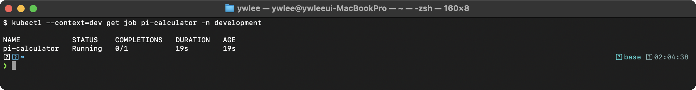

```bash
kubectl get pods --selector=job-name=pi-calculator
```

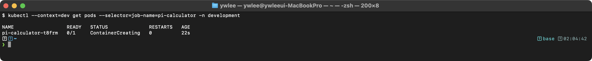

COMPLETIONS가 `5/5`이면 정상 완료이다.

**CronJob:**
```yaml
apiVersion: batch/v1
kind: CronJob
metadata:
  name: db-backup
spec:
  schedule: "0 2 * * *"         # 매일 새벽 2시
  successfulJobsHistoryLimit: 3
  failedJobsHistoryLimit: 1
  concurrencyPolicy: Forbid      # 이전 Job이 실행 중이면 새 Job을 생성하지 않음
  startingDeadlineSeconds: 200
  jobTemplate:
    spec:
      template:
        spec:
          restartPolicy: OnFailure
          containers:
          - name: backup
            image: mysql:8.0
            command:
            - /bin/sh
            - -c
            - "mysqldump -h mysql-svc -u root -p$MYSQL_PASSWORD mydb > /backup/dump.sql"
            envFrom:
            - secretRef:
                name: mysql-secret
```

**CronJob 필드 상세:**

- `schedule`: cron 표현식이다. 형식은 `분(0-59) 시(0-23) 일(1-31) 월(1-12) 요일(0-6, 0=일)`이다.
- `concurrencyPolicy`: `Allow`(기본값, 동시 실행 허용), `Forbid`(이전 Job 실행 중이면 새 Job 건너뜀), `Replace`(이전 Job을 종료하고 새 Job 생성) 중 하나를 지정한다.
- `startingDeadlineSeconds`: 예정 시각을 넘긴 후 이 시간(초) 내에 시작하지 못하면 해당 실행을 건너뛴다. 생략 시 제한 없이 지연 시작을 허용한다. 컨트롤러 재시작 등으로 인한 지연 시 유용하다.
- `successfulJobsHistoryLimit`: 보존할 성공 Job 수이다. 기본값은 3이다. 0으로 설정하면 성공 Job이 즉시 삭제된다.
- `failedJobsHistoryLimit`: 보존할 실패 Job 수이다. 기본값은 1이다.

**검증:**

```bash
kubectl get cronjob db-backup
```

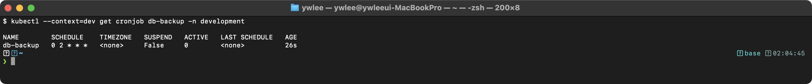

```bash
# 수동 실행으로 테스트
kubectl create job --from=cronjob/db-backup db-backup-manual-001
kubectl get jobs
```

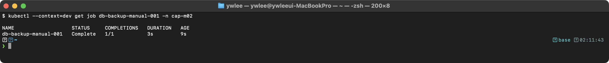

---

### 2.8 Static Pod 생성

#### 등장 배경

kubelet은 API 서버 없이도 독립적으로 Pod를 실행할 수 있다. Static Pod는 kubelet이 특정 디렉터리의 매니페스트 파일을 직접 감시하여 생성하는 Pod이다. Control Plane 컴포넌트(kube-apiserver, etcd, kube-controller-manager, kube-scheduler)가 Static Pod로 실행되는 것이 대표적인 사례이다. API 서버가 아직 시작되지 않은 부트스트랩 단계에서도 동작해야 하기 때문이다.

```bash
# Static Pod 매니페스트 경로 확인
cat /var/lib/kubelet/config.yaml | grep staticPodPath
# 출력: staticPodPath: /etc/kubernetes/manifests

# Static Pod 생성
cat <<EOF > /etc/kubernetes/manifests/static-nginx.yaml
apiVersion: v1
kind: Pod
metadata:
  name: static-nginx
  labels:
    role: static
spec:
  containers:
  - name: nginx
    image: nginx:1.24
    ports:
    - containerPort: 80
EOF

# 확인 (노드 이름이 접미사로 붙음)
kubectl get pods
# static-nginx-<node-name>

# 삭제 (매니페스트 파일 삭제)
rm /etc/kubernetes/manifests/static-nginx.yaml
```

**Static Pod의 특성:**

- kubelet이 직접 관리하며, API 서버에는 "미러 Pod"(mirror pod)로만 표시된다.
- `kubectl delete`로 미러 Pod를 삭제해도 kubelet이 즉시 재생성한다. 실제 삭제는 매니페스트 파일을 제거해야 한다.
- Pod 이름에 노드 이름이 자동 접미사로 추가된다(`static-nginx-worker-1`).
- Deployment, ReplicaSet 등 상위 컨트롤러로 관리할 수 없다.
- kubelet의 `config.yaml`에서 `staticPodPath`를 변경하면 다른 디렉터리를 사용할 수 있다. 변경 후 `systemctl restart kubelet`이 필요하다.

**검증:**

```bash
kubectl get pods -o wide | grep static
```

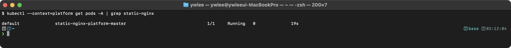

```bash
# Static Pod인지 확인 (ownerReferences가 Node를 가리킴)
kubectl get pod static-nginx-worker-1 -o jsonpath='{.metadata.ownerReferences[0].kind}'
```

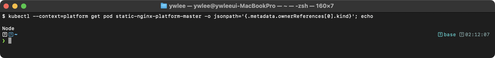

---

### 2.9 Multi-Container Pod (Sidecar 패턴)

#### 등장 배경

단일 컨테이너로 구성된 Pod에서는 애플리케이션과 보조 기능(로그 수집, 프록시, 설정 동기화 등)을 하나의 이미지에 패키징해야 했다. 이는 단일 책임 원칙을 위반하고, 컴포넌트 독립 업데이트가 불가능했다. Multi-Container Pod는 동일 네트워크 네임스페이스와 스토리지를 공유하면서도 각 컨테이너가 독립적인 라이프사이클을 가지도록 한다.

**주요 패턴:**

| 패턴 | 용도 | 예시 |
|------|------|------|
| Sidecar | 메인 컨테이너에 부가 기능 제공 | 로그 수집, 프록시, 인증서 갱신 |
| Ambassador | 외부 서비스 접근을 프록시 | 로컬 DB 프록시, API 게이트웨이 |
| Adapter | 메인 컨테이너의 출력을 표준화 | 로그 포맷 변환, 메트릭 변환 |

```yaml
apiVersion: v1
kind: Pod
metadata:
  name: multi-container-pod
spec:
  containers:
  - name: app
    image: nginx
    volumeMounts:
    - name: shared-logs
      mountPath: /var/log/nginx
  - name: log-sidecar
    image: busybox:1.36
    command: ["/bin/sh", "-c", "tail -f /var/log/nginx/access.log"]
    volumeMounts:
    - name: shared-logs
      mountPath: /var/log/nginx
      readOnly: true
  volumes:
  - name: shared-logs
    emptyDir: {}
```

**`emptyDir` 볼륨**: Pod가 노드에 배치될 때 생성되고, Pod가 삭제될 때 함께 삭제되는 임시 볼륨이다. 동일 Pod 내의 모든 컨테이너가 공유할 수 있어 사이드카 패턴에서 데이터 교환에 사용된다. `emptyDir.medium: Memory`를 지정하면 tmpfs(RAM 기반)를 사용할 수 있다.

**검증:**

```bash
kubectl apply -f multi-container-pod.yaml
kubectl get pod multi-container-pod
```

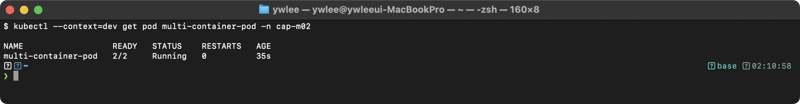

READY 컬럼이 `2/2`인 것으로 두 컨테이너가 모두 실행 중임을 확인할 수 있다.

```bash
# 사이드카 컨테이너의 로그 확인
kubectl logs multi-container-pod -c log-sidecar

# 특정 컨테이너에 접속
kubectl exec -it multi-container-pod -c app -- /bin/bash
```

---

### 2.10 Init Container 예제

#### 등장 배경

메인 애플리케이션이 시작되기 전에 선행 조건(의존 서비스 대기, 설정 파일 생성, DB 스키마 마이그레이션 등)을 충족해야 하는 경우가 있다. 이를 메인 컨테이너의 시작 스크립트에 포함하면 관심사 분리가 되지 않고, 이미지에 불필요한 도구를 포함해야 한다. Init Container는 메인 컨테이너 이전에 순차적으로 실행되며, 별도의 이미지와 권한을 사용할 수 있다.

```yaml
apiVersion: v1
kind: Pod
metadata:
  name: init-pod
spec:
  initContainers:
  - name: wait-for-service
    image: busybox:1.36
    command: ['sh', '-c', 'until nslookup my-service.default.svc.cluster.local; do echo waiting; sleep 2; done']
  - name: init-db
    image: busybox:1.36
    command: ['sh', '-c', 'echo "DB initialized" > /work-dir/init-status']
    volumeMounts:
    - name: workdir
      mountPath: /work-dir
  containers:
  - name: app
    image: nginx
    volumeMounts:
    - name: workdir
      mountPath: /app/data
  volumes:
  - name: workdir
    emptyDir: {}
```

**Init Container의 동작 규칙:**

- 순서대로 하나씩 실행되며, 이전 Init Container가 성공(exit code 0)해야 다음이 실행된다.
- 하나라도 실패하면 kubelet이 Pod의 `restartPolicy`에 따라 재시도한다.
- 모든 Init Container가 성공한 후에야 메인 컨테이너가 시작된다.
- Init Container는 `readinessProbe`를 지원하지 않는다(완료/실패만 판단).
- Init Container는 메인 컨테이너와 동일한 볼륨을 공유할 수 있어, 설정 파일이나 초기화 데이터를 전달하는 데 유용하다.

**검증:**

```bash
# my-service가 없는 상태에서 Pod 상태 확인
kubectl get pod init-pod
```

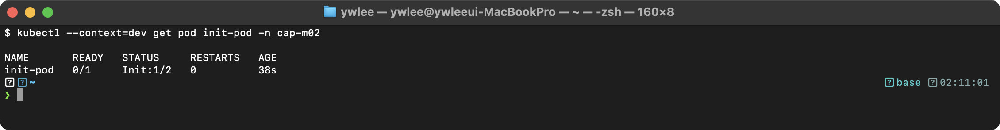

```bash
# my-service 생성 후
kubectl create service clusterip my-service --tcp=80:80
kubectl get pod init-pod -w
```

> **예시(참조) — initContainer 진행:** `kubectl get pod -w` 로 보면 Init:0/2 → Init:1/2 → PodInitializing → Running 으로 순차 전이한다. 초기 상태(Init:0/2)는 위 캡처 참고.

STATUS 컬럼의 `Init:0/2`는 2개의 Init Container 중 0개가 완료되었음을 의미한다.

---

### 2.11 ConfigMap / Secret 예제

> §2.10의 Init Container는 "사전 조건을 주입해야 한다"는 문제를 다뤘다. ConfigMap과 Secret은 그 연장선으로, 애플리케이션이 필요로 하는 설정값과 민감한 자격증명을 Pod 이미지와 분리해 주입하는 방법이다.

#### 등장 배경

**없던 시절의 고통.** 초기에는 설정값(DB 호스트, 포트, 기능 플래그)을 이미지 안에 하드코딩하거나, 컨테이너 명세의 `env` 필드에 평문으로 직접 써 넣었다. 그 결과 환경별(dev/staging/prod) 이미지를 따로 빌드해야 했고, 비밀번호가 Git 이력에 남아 보안 사고로 이어졌다.

**직전 방식의 한계.** `env` 필드에 직접 값을 쓰는 방식은 배포 YAML이 곧 비밀번호 저장소가 된다. 코드 리뷰·감사 로그·Git diff에 민감 정보가 노출된다. 또 같은 설정을 여러 Deployment에 복붙하면 변경 시 수정 위치가 여러 곳으로 분산된다.

**무엇이 나아졌나.** ConfigMap은 키-값 쌍 또는 파일 형태의 설정 데이터를 별도 오브젝트로 관리한다. Secret은 같은 구조이지만 값이 base64 인코딩되어 저장되고, etcd 암호화·RBAC 접근 제어·메모리 전용 tmpfs 마운트(노드 디스크에 평문 기록 없음)로 더 엄격하게 보호된다. Pod는 둘 다 `envFrom`(전체 키 일괄 주입), `env.valueFrom`(개별 키 선택 주입), `volumes`(파일로 마운트) 세 가지 방식으로 소비한다.

**트레이드오프.** base64는 암호화가 아니라 인코딩이다. etcd 암호화(EncryptionConfiguration)나 외부 비밀 관리 솔루션(HashiCorp Vault, Sealed Secrets)을 쓰지 않으면 etcd 접근 권한만 있으면 Secret 값을 즉시 읽을 수 있다. 즉 "Git에는 없다"는 것이지 "클러스터 내부에서 안전하다"는 보장은 별개다.

#### ConfigMap 생성

```bash
# 명령형 — 리터럴 값
kubectl create configmap app-config \
  --from-literal=APP_ENV=production \
  --from-literal=APP_PORT=8080 \
  --from-literal=LOG_LEVEL=info

# 명령형 — 파일에서 (파일명이 키, 파일 내용이 값)
kubectl create configmap nginx-conf --from-file=nginx.conf

# 명령형 — 디렉터리 (각 파일이 별도 키)
kubectl create configmap config-dir --from-file=./config/
```

**ConfigMap YAML:**
```yaml
apiVersion: v1
kind: ConfigMap
metadata:
  name: app-config
  namespace: default
data:
  APP_ENV: production      # 단순 키-값
  APP_PORT: "8080"         # 숫자도 문자열로 저장
  LOG_LEVEL: info
  config.yaml: |           # 멀티라인 파일 내용을 키로 저장
    server:
      port: 8080
      timeout: 30s
```

**필드 상세:**

- `data`: 키-값 쌍을 저장한다. 값은 항상 문자열이다. 파이프(`|`) 문자를 쓰면 멀티라인 텍스트(설정 파일 전체)를 하나의 키에 저장할 수 있다.
- `binaryData`: 바이너리 데이터를 base64 인코딩 값으로 저장한다. `data`와 동시에 사용할 수 있으나 같은 키를 중복 정의할 수 없다.

#### Secret 생성

```bash
# 명령형 — Generic(Opaque) Secret
kubectl create secret generic db-secret \
  --from-literal=username=admin \
  --from-literal=password=S3cur3P@ss!

# TLS Secret (인증서 파일이 없으면 openssl로 생성)
openssl req -x509 -nodes -days 365 -newkey rsa:2048 \
  -keyout tls.key -out tls.crt \
  -subj "/CN=myapp.example.com/O=myapp"
kubectl create secret tls my-tls-secret --cert=tls.crt --key=tls.key

# Docker Registry Secret
kubectl create secret docker-registry regcred \
  --docker-server=registry.example.com \
  --docker-username=myuser \
  --docker-password=mypassword
```

**Secret YAML (Opaque):**
```yaml
apiVersion: v1
kind: Secret
metadata:
  name: db-secret
  namespace: default
type: Opaque
data:
  username: YWRtaW4=       # echo -n 'admin'    | base64
  password: UzNjdXIzUEBzcyE=  # echo -n 'S3cur3P@ss!' | base64
stringData:
  # stringData에 평문으로 쓰면 API 서버가 자동 base64 인코딩
  api-key: plain-text-will-be-encoded
```

**data vs stringData:**

- `data`: base64 인코딩된 값을 직접 입력한다. `echo -n 'value' | base64`로 인코딩한다(`-n`은 줄바꿈 제거, 없으면 개행까지 인코딩돼 오류).
- `stringData`: 평문을 입력하면 API 서버가 자동으로 base64 인코딩 후 `data`로 저장한다. YAML 작성 시 편리하다. 같은 키가 `data`와 `stringData` 양쪽에 있으면 `stringData`가 우선한다.

#### Pod에서 ConfigMap/Secret 사용 — 세 가지 패턴

**패턴 1: envFrom — ConfigMap/Secret 전체를 환경변수로 주입**

```yaml
apiVersion: v1
kind: Pod
metadata:
  name: env-from-pod
spec:
  containers:
  - name: app
    image: nginx
    envFrom:
    - configMapRef:
        name: app-config        # ConfigMap의 모든 키→환경변수
    - secretRef:
        name: db-secret         # Secret의 모든 키→환경변수
```

- `envFrom`은 ConfigMap/Secret의 모든 키를 한 번에 환경변수로 주입한다.
- 키 이름이 환경변수 이름으로 그대로 사용된다. 키 이름이 유효한 환경변수 이름이어야 한다(영문자·숫자·`_`만 허용, 숫자로 시작 불가).
- `prefix` 필드를 추가하면 `prefix`를 앞에 붙여 충돌을 방지한다(`prefix: DB_` → `DB_username`, `DB_password`).

**패턴 2: env.valueFrom — 특정 키만 선택해 환경변수로 주입**

```yaml
apiVersion: v1
kind: Pod
metadata:
  name: env-value-from-pod
spec:
  containers:
  - name: app
    image: nginx
    env:
    - name: MY_ENV             # Pod 내부에서 쓸 환경변수 이름
      valueFrom:
        configMapKeyRef:
          name: app-config     # ConfigMap 이름
          key: APP_ENV         # ConfigMap에서 가져올 키
    - name: DB_PASSWORD        # Pod 내부에서 쓸 환경변수 이름
      valueFrom:
        secretKeyRef:
          name: db-secret      # Secret 이름
          key: password        # Secret에서 가져올 키
          optional: false      # true이면 Secret/키 부재 시 Pod 기동 허용(기본 false)
```

- `configMapKeyRef.key`와 `secretKeyRef.key`는 ConfigMap/Secret의 실제 키 이름이다.
- `name`(환경변수 이름)은 자유롭게 재정의할 수 있어, 서로 다른 ConfigMap의 같은 키를 충돌 없이 주입할 수 있다.

**패턴 3: volumes.configMap / volumes.secret — 파일로 마운트**

```yaml
apiVersion: v1
kind: Pod
metadata:
  name: volume-mount-pod
spec:
  containers:
  - name: app
    image: nginx
    volumeMounts:
    - name: config-vol
      mountPath: /etc/app/config    # ConfigMap 내용이 파일로 마운트되는 디렉터리
      readOnly: true
    - name: secret-vol
      mountPath: /etc/secrets       # Secret 내용이 파일로 마운트되는 디렉터리
      readOnly: true
  volumes:
  - name: config-vol
    configMap:
      name: app-config
      items:                        # 특정 키만 선택(생략하면 모든 키가 파일로 생성)
      - key: config.yaml
        path: app-config.yaml       # 마운트 경로 내 파일명
  - name: secret-vol
    secret:
      secretName: db-secret
      defaultMode: 0400             # 파일 권한(읽기 전용, 소유자만)
```

- `mountPath` 아래에 ConfigMap/Secret의 각 키가 **파일명**으로, 그 값이 **파일 내용**으로 마운트된다. `items`를 생략하면 ConfigMap의 모든 키가 파일로 생성된다.
- 볼륨 마운트 방식의 장점: ConfigMap이 업데이트되면 kubelet이 일정 시간(기본 ~1분) 내에 마운트된 파일을 자동으로 갱신한다(환경변수 방식은 Pod 재시작 필요).
- `defaultMode: 0400`은 8진수 파일 권한이다. Secret 파일은 최소 권한(소유자 읽기 전용)으로 설정하는 것이 권장된다.

**검증:**

```bash
# ConfigMap/Secret 생성
kubectl create configmap app-config \
  --from-literal=APP_ENV=production \
  --from-literal=APP_PORT=8080

kubectl create secret generic db-secret \
  --from-literal=username=admin \
  --from-literal=password=S3cur3P@ss!

# Pod 적용 후 환경변수 확인
kubectl apply -f env-from-pod.yaml
kubectl exec env-from-pod -- env | grep -E "APP_|LOG_"

# 볼륨 마운트 확인
kubectl apply -f volume-mount-pod.yaml
kubectl exec volume-mount-pod -- ls /etc/app/config
kubectl exec volume-mount-pod -- cat /etc/app/config/app-config.yaml
```

**장애 시나리오:**

| 증상 | 원인 | 해결 |
|------|------|------|
| Pod `CreateContainerConfigError` | 참조한 ConfigMap/Secret이 존재하지 않음 | ConfigMap/Secret을 먼저 생성하거나 `optional: true` 지정 |
| 환경변수가 주입되지 않음 | `envFrom`에서 키가 유효하지 않은 환경변수 이름 | 키 이름에 `-` 등 특수문자 확인, `env.valueFrom`으로 이름 재정의 |
| Secret 값이 `base64` 그대로 출력됨 | YAML `data` 필드에 평문을 입력 | `stringData` 사용하거나 `echo -n 'value' \| base64`로 인코딩 후 `data`에 입력 |
| 볼륨 마운트 파일이 업데이트되지 않음 | kubelet 갱신 주기(기본 ~60s) 내 아직 미적용 | `kubectl exec`로 파일 내용 재확인 또는 잠시 대기 |
| `Forbidden: secret` | RBAC으로 Secret 접근 권한 없음 | ServiceAccount에 Secret `get` 권한 부여 |

---

## 3. 서비스 및 네트워킹

### 3.1 Service 생성

#### 등장 배경

Pod는 생성/삭제될 때마다 IP가 변경된다. Deployment의 롤링 업데이트, 스케일링, 노드 장애 시 Pod가 재생성되면 IP가 달라진다. Service는 Pod 집합에 대한 안정적인 접근 엔드포인트(가상 IP + DNS 이름)를 제공하여 이 문제를 해결한다. kube-proxy가 iptables 또는 IPVS 규칙을 관리하여 Service IP로 들어오는 트래픽을 실제 Pod로 라우팅한다.

```bash
# ClusterIP Service (기본)
kubectl expose deployment nginx-deploy --port=80 --target-port=80 --name=nginx-svc

# NodePort Service
kubectl expose deployment nginx-deploy --port=80 --target-port=80 \
  --type=NodePort --name=nginx-nodeport

# 특정 NodePort 지정 (YAML 필요)
kubectl create service nodeport nginx-np --tcp=80:80 --node-port=30080 \
  --dry-run=client -o yaml > nodeport-svc.yaml

# Service 확인
kubectl get svc
kubectl describe svc nginx-svc
kubectl get endpoints nginx-svc
```

**ClusterIP YAML:**
```yaml
apiVersion: v1
kind: Service
metadata:
  name: nginx-svc
spec:
  type: ClusterIP
  selector:
    app: nginx
  ports:
  - name: http
    port: 80
    targetPort: 80
    protocol: TCP
```

**필드 상세:**

- `type`: 생략 시 기본값은 `ClusterIP`이다. `ClusterIP`는 클러스터 내부에서만 접근 가능한 가상 IP를 할당한다. `NodePort`는 클러스터 외부에서 `<NodeIP>:<NodePort>`로 접근할 수 있다. `LoadBalancer`는 클라우드 프로바이더의 로드밸런서를 프로비저닝한다. 세 타입은 포함 관계다 — NodePort는 ClusterIP를 자동으로 포함하고, LoadBalancer는 NodePort를 포함한다. 즉 상위 타입을 만들면 하위 기능도 함께 제공된다. 언제 무엇을 쓰는지는 다음과 같다.

| 타입 | 노출 범위 | 포트 | 대표 사용 사례 |
|:--|:--|:--|:--|
| ClusterIP | 클러스터 내부 전용 | 임의(1-65535) | Pod 간 통신, 내부 마이크로서비스 호출 |
| NodePort | 노드 IP를 통한 외부 노출 | 30000-32767 고정 | 개발·테스트, LB가 없는 환경에서의 외부 접근 |
| LoadBalancer | 클라우드 LB의 공인 IP | 임의(1-65535) | 프로덕션 public 서비스(클라우드 환경) |

온프레미스나 tart 같은 로컬 클러스터에는 클라우드 LB가 없으므로 `LoadBalancer` Service는 `EXTERNAL-IP`가 `<pending>`에 머문다. 이때는 MetalLB 같은 별도 컨트롤러를 설치하거나 NodePort/Ingress로 외부 노출을 대신한다.
- `selector`: 이 Service가 트래픽을 전달할 Pod를 선택하는 레이블 셀렉터이다. selector가 없으면 Endpoints가 자동 생성되지 않으며, 수동으로 Endpoints 리소스를 생성해야 한다(외부 서비스 연결 시 사용).
- `port`: Service가 노출하는 포트이다. 클러스터 내에서 `<ServiceIP>:80`으로 접근한다.
- `targetPort`: 실제 Pod의 컨테이너가 리스닝하는 포트이다. 생략 시 `port`와 동일한 값이 사용된다. 숫자 대신 Pod에서 정의한 포트 이름(`name: http`)을 사용할 수도 있다.

**NodePort YAML:**
```yaml
apiVersion: v1
kind: Service
metadata:
  name: nginx-nodeport
spec:
  type: NodePort
  selector:
    app: nginx
  ports:
  - name: http
    port: 80
    targetPort: 80
    nodePort: 30080
    protocol: TCP
```

- `nodePort`: 30000-32767 범위에서 지정한다. 생략 시 이 범위 내에서 랜덤으로 할당된다. 이 포트는 모든 노드에서 열린다.

**Headless Service YAML:**
```yaml
apiVersion: v1
kind: Service
metadata:
  name: nginx-headless
spec:
  clusterIP: None
  selector:
    app: nginx
  ports:
  - port: 80
    targetPort: 80
```

`clusterIP: None`으로 설정하면 가상 IP가 할당되지 않고, DNS 조회 시 Pod의 IP 목록이 직접 반환된다. StatefulSet에서 각 Pod에 고유한 DNS 이름(`<pod-name>.<service-name>.<namespace>.svc.cluster.local`)을 부여하는 데 필수적이다.

**검증:**

```bash
kubectl get svc
```

> **예시(참조):** `kubectl get svc` 의 일반적 출력 형식. 실제 Service 타입별 실측은 day11·day12 참고.

```bash
# Endpoints 확인 (실제 Pod IP 목록)
kubectl get endpoints nginx-svc
```

> **예시(참조):** `kubectl get endpoints` 형식. 실측은 day11·day12 참고.

```bash
# 클러스터 내부에서 Service 접근 테스트
kubectl run curl-test --image=curlimages/curl --rm -it --restart=Never -- \
  curl -s http://nginx-svc.default.svc.cluster.local
```

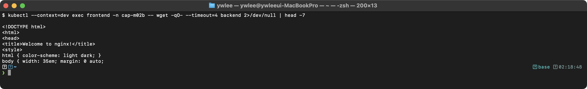

```bash
# Headless Service DNS 조회 (Pod IP 직접 반환)
kubectl run dns-test --image=busybox:1.28 --rm -it --restart=Never -- \
  nslookup nginx-headless.default.svc.cluster.local
```

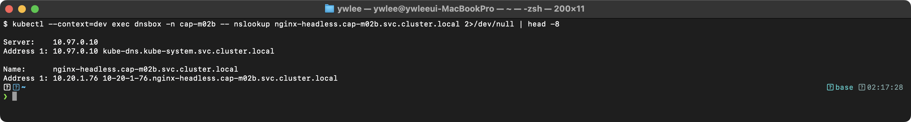

**Endpoints가 비어있는 경우 트러블슈팅:**

| 원인 | 확인 방법 | 해결 |
|------|-----------|------|
| selector와 Pod 레이블 불일치 | `kubectl get pods --show-labels`로 레이블 확인 | 레이블 수정 |
| Pod가 Ready가 아님 | `kubectl get pods`에서 READY 컬럼 확인 | readinessProbe 확인, Pod 로그 확인 |
| 다른 네임스페이스 | Service와 Pod가 같은 네임스페이스인지 확인 | 동일 네임스페이스에 생성 |

---

### 3.2 Ingress 예제

#### 등장 배경

NodePort Service는 포트 범위가 제한되고(30000-32767), 각 서비스마다 별도 포트가 필요하며, L4(전송 계층, IP·포트 단위) 수준의 라우팅만 가능하다. LoadBalancer Service는 서비스마다 별도의 로드밸런서를 프로비저닝하여 비용이 증가한다.

구체적 상황으로 보면 필요성이 분명해진다. 마이크로서비스 5개(auth, api, web, payment, admin)를 클라우드에 외부 공개한다고 하자. 각각에 LoadBalancer Service를 붙이면 공인 IP 5개와 로드밸런서 5대가 생기고, 클라우드 LB는 보통 개당 월 비용이 붙으므로 합산하면 수백 달러가 나간다. 게다가 "도메인 하나(`example.com`) 아래 경로로 서비스를 나눠 노출"하는 흔한 요구를 LoadBalancer만으로는 풀 수 없다. Ingress는 단일 진입점(L7, 응용 계층에서 HTTP 호스트명·URL 경로까지 보는 로드밸런서) 하나 뒤에 7계층 라우터를 두어 `auth.example.com → auth-svc`, `example.com/api → api-svc`처럼 호스트·경로로 분기한다. 결과적으로 공인 IP 1개와 LB 1대로 다섯 서비스를 노출하고 TLS 종료(termination, 암호화 해제)도 한곳에서 관리한다. Ingress 리소스 자체는 규칙 정의일 뿐이며, 실제 트래픽 분배는 Ingress Controller(nginx, traefik, HAProxy 등)가 수행한다.

#### Path-based Routing

```yaml
apiVersion: networking.k8s.io/v1
kind: Ingress
metadata:
  name: app-ingress
  annotations:
    nginx.ingress.kubernetes.io/rewrite-target: /$2
spec:
  ingressClassName: nginx
  rules:
  - host: myapp.example.com
    http:
      paths:
      - path: /api(/|$)(.*)
        pathType: ImplementationSpecific
        backend:
          service:
            name: api-service
            port:
              number: 8080
      - path: /web(/|$)(.*)
        pathType: ImplementationSpecific
        backend:
          service:
            name: web-service
            port:
              number: 80
```

**annotations 설명:** `rewrite-target: /$2`는 정규식 캡처 그룹의 두 번째 그룹을 백엔드 요청 경로로 사용한다. `/api/users` 요청이 api-service에 `/users`로 전달된다. 이 annotation은 nginx Ingress Controller 전용이다.

#### 단순 Path Routing (rewrite 없이)

```yaml
apiVersion: networking.k8s.io/v1
kind: Ingress
metadata:
  name: simple-ingress
spec:
  ingressClassName: nginx
  rules:
  - host: myapp.example.com
    http:
      paths:
      - path: /api
        pathType: Prefix
        backend:
          service:
            name: api-service
            port:
              number: 8080
      - path: /
        pathType: Prefix
        backend:
          service:
            name: web-service
            port:
              number: 80
```

**pathType 종류:**

- `Prefix`: 경로 접두사로 매칭한다. `/api`는 `/api`, `/api/`, `/api/users` 등과 매칭된다. 가장 긴 접두사가 우선한다.
- `Exact`: 경로가 정확히 일치해야 한다. `/api`는 `/api`와만 매칭되고, `/api/`와는 매칭되지 않는다.
- `ImplementationSpecific`: Ingress Controller의 구현에 따라 동작이 결정된다. 정규식 패턴을 사용할 때 필요하다.

#### Default Backend

```yaml
apiVersion: networking.k8s.io/v1
kind: Ingress
metadata:
  name: default-backend-ingress
spec:
  ingressClassName: nginx
  defaultBackend:
    service:
      name: default-service
      port:
        number: 80
  rules:
  - host: myapp.example.com
    http:
      paths:
      - path: /api
        pathType: Prefix
        backend:
          service:
            name: api-service
            port:
              number: 8080
```

`defaultBackend`는 어떤 rule에도 매칭되지 않는 요청을 처리하는 기본 백엔드이다. 커스텀 404 페이지를 제공하는 데 유용하다.

#### TLS Ingress

```bash
# TLS Secret 생성
kubectl create secret tls tls-secret \
  --cert=tls.crt \
  --key=tls.key
```

```yaml
apiVersion: networking.k8s.io/v1
kind: Ingress
metadata:
  name: tls-ingress
spec:
  ingressClassName: nginx
  tls:
  - hosts:
    - myapp.example.com
    secretName: tls-secret
  rules:
  - host: myapp.example.com
    http:
      paths:
      - path: /
        pathType: Prefix
        backend:
          service:
            name: web-service
            port:
              number: 80
```

**TLS 설정 세부사항:**

- `tls.hosts`와 `rules.host`가 일치해야 한다. 불일치 시 TLS가 적용되지 않는다.
- Secret은 Ingress와 같은 네임스페이스에 있어야 한다.
- Ingress Controller가 TLS 종료를 수행하며, 백엔드 Service로의 트래픽은 일반 HTTP가 된다.

**검증:**

```bash
kubectl get ingress
```

> **예시(참조) — Ingress:** Ingress 컨트롤러(ingress-nginx 등)가 설치된 환경에서는 `kubectl get/describe ingress` 의 ADDRESS 에 로드밸런서/노드 IP 가 채워지고 HOSTS·CLASS·규칙이 표시된다. 이 저장소의 dev 클러스터에는 컨트롤러가 없어 ADDRESS 가 비어 있다(day13·day14 실측 참고). 규칙(Host→Service)·pathType 동작은 동일하다.

```bash
kubectl describe ingress app-ingress
```

> **예시(참조) — describe ingress:** 컨트롤러 설치 환경에서의 출력. dev 는 컨트롤러가 없어 ADDRESS 가 비고 규칙만 표시된다(day13·day14 실측).

Backends에 Pod IP가 표시되면 Service와 Ingress가 정상적으로 연결된 것이다. `<error: endpoints "..." not found>` 등의 메시지가 표시되면 Service 이름 또는 포트를 확인해야 한다.

---

### 3.3 NetworkPolicy 예제

#### 등장 배경

기본적으로 Kubernetes 클러스터 내의 모든 Pod는 서로 제한 없이 통신할 수 있다. 이는 마이크로서비스 환경에서 보안 위험을 초래한다. 하나의 Pod가 침해되면 클러스터 내 모든 서비스로 횡적 이동(lateral movement, 공격자가 한 시스템을 발판 삼아 내부의 다른 시스템으로 옮겨 가며 권한을 넓히는 행위)이 가능하다.

구체적으로 보면 이렇다. 외부에 노출된 frontend Pod의 취약점이 뚫려 공격자가 그 Pod 안에서 명령을 실행할 수 있게 됐다고 하자. NetworkPolicy가 없으면 이 Pod에서 클러스터의 모든 Pod IP 대역(예: `10.244.x.x`)으로 자유롭게 패킷을 보낼 수 있으므로, 공격자는 database Pod의 MySQL 포트(3306)를 스캔해 접속을 시도한다. DB 비밀번호가 노출되거나 인증이 허술하면 데이터 전체가 탈취된다. frontend는 원래 DB에 직접 접근할 이유가 없는데도 네트워크가 활짝 열려 있어 막을 방법이 없는 것이 문제다.

NetworkPolicy는 네트워크 수준에서 Pod 간 트래픽을 제어하여 최소 권한 원칙(필요한 통신만 허용)을 적용한다. 위 예에서 "database Pod는 backend Pod로부터의 3306 인바운드만 허용"이라는 정책을 두면, 침해된 frontend가 DB로 보내는 패킷은 CNI 단계에서 폐기된다. NetworkPolicy는 CNI 플러그인(Container Network Interface, Pod 네트워킹을 담당하는 플러그인 규격. Calico, Cilium, Weave Net 등)이 지원해야 동작하며, Flannel은 기본적으로 지원하지 않아 정책을 만들어도 적용되지 않는다.

#### Default Deny All (Ingress)

```yaml
apiVersion: networking.k8s.io/v1
kind: NetworkPolicy
metadata:
  name: default-deny-ingress
  namespace: production
spec:
  podSelector: {}
  policyTypes:
  - Ingress
```

**필드 설명:**

- `podSelector: {}`: 빈 셀렉터는 해당 네임스페이스의 모든 Pod를 대상으로 한다.
- `policyTypes: [Ingress]`: Ingress 정책을 적용한다. `ingress` 필드가 없으므로 모든 인바운드 트래픽이 차단된다.
- 이 정책이 적용된 네임스페이스에서는 명시적으로 허용하는 NetworkPolicy가 있어야만 인바운드 트래픽을 수신할 수 있다.

#### Default Deny All (Ingress + Egress)

```yaml
apiVersion: networking.k8s.io/v1
kind: NetworkPolicy
metadata:
  name: default-deny-all
  namespace: production
spec:
  podSelector: {}
  policyTypes:
  - Ingress
  - Egress
```

이 정책은 네임스페이스 내 모든 Pod의 인바운드/아웃바운드 트래픽을 전면 차단한다. Zero-trust 네트워크 모델의 기본이 되며, 이후 필요한 트래픽만 개별 NetworkPolicy로 허용한다. DNS도 차단되므로 별도의 Egress 정책에서 DNS를 허용해야 한다.

#### 특정 Pod에서 오는 Ingress만 허용

```yaml
apiVersion: networking.k8s.io/v1
kind: NetworkPolicy
metadata:
  name: allow-frontend-to-backend
  namespace: production
spec:
  podSelector:
    matchLabels:
      tier: backend
  policyTypes:
  - Ingress
  ingress:
  - from:
    - podSelector:
        matchLabels:
          tier: frontend
    ports:
    - protocol: TCP
      port: 8080
```

이 정책은 `tier: backend` 레이블이 있는 Pod에 적용되며, `tier: frontend` 레이블이 있는 Pod에서 TCP 8080 포트로의 인바운드 트래픽만 허용한다. `from`의 `podSelector`는 동일 네임스페이스 내의 Pod만 매칭한다.

#### 특정 네임스페이스에서 오는 트래픽 허용

```yaml
apiVersion: networking.k8s.io/v1
kind: NetworkPolicy
metadata:
  name: allow-from-monitoring
  namespace: production
spec:
  podSelector:
    matchLabels:
      app: web
  policyTypes:
  - Ingress
  ingress:
  - from:
    - namespaceSelector:
        matchLabels:
          purpose: monitoring
    ports:
    - protocol: TCP
      port: 9090
```

`namespaceSelector`를 사용하려면 대상 네임스페이스에 해당 레이블이 있어야 한다. `kubectl label namespace monitoring purpose=monitoring` 명령으로 레이블을 추가한다.

#### Egress 정책 (DNS 허용 포함)

```yaml
apiVersion: networking.k8s.io/v1
kind: NetworkPolicy
metadata:
  name: backend-egress
  namespace: production
spec:
  podSelector:
    matchLabels:
      tier: backend
  policyTypes:
  - Egress
  egress:
  # DNS 허용 (필수! 그렇지 않으면 서비스 이름 해석 불가)
  - to: []
    ports:
    - protocol: UDP
      port: 53
    - protocol: TCP
      port: 53
  # 데이터베이스 접근 허용
  - to:
    - podSelector:
        matchLabels:
          tier: database
    ports:
    - protocol: TCP
      port: 3306
```

Egress 정책을 설정할 때 **DNS(포트 53)**를 허용하지 않으면 서비스 이름을 해석할 수 없으므로 주의해야 한다. `to: []`는 모든 대상에 대해 해당 포트를 허용한다는 의미이다. DNS를 특정 Pod(CoreDNS)로 제한하려면 `kube-system` 네임스페이스의 CoreDNS Pod를 지정해야 한다.

#### AND 조건과 OR 조건 비교

```yaml
# OR 조건: frontend Pod 또는 monitoring 네임스페이스의 모든 Pod 허용
apiVersion: networking.k8s.io/v1
kind: NetworkPolicy
metadata:
  name: or-example
spec:
  podSelector:
    matchLabels:
      app: backend
  policyTypes:
  - Ingress
  ingress:
  - from:
    - podSelector:           # 규칙 1
        matchLabels:
          app: frontend
    - namespaceSelector:     # 규칙 2
        matchLabels:
          team: monitoring
    ports:
    - protocol: TCP
      port: 8080
---
# AND 조건: monitoring 네임스페이스의 frontend Pod만 허용
apiVersion: networking.k8s.io/v1
kind: NetworkPolicy
metadata:
  name: and-example
spec:
  podSelector:
    matchLabels:
      app: backend
  policyTypes:
  - Ingress
  ingress:
  - from:
    - podSelector:           # 하나의 규칙에 두 조건
        matchLabels:
          app: frontend
      namespaceSelector:
        matchLabels:
          team: monitoring
    ports:
    - protocol: TCP
      port: 8080
```

**OR vs AND의 YAML 구조 차이:**

- **OR 조건**: `from` 배열에 별도의 항목(`-`로 시작)으로 나열한다. 각 항목은 독립적인 규칙이다.
- **AND 조건**: `from` 배열의 하나의 항목 내에 `podSelector`와 `namespaceSelector`를 동시에 지정한다. 두 조건을 모두 만족해야 허용된다.

이 구분은 YAML의 들여쓰기에 의해 결정되며, CKA 시험에서 자주 출제되는 주제이다.

**검증 - NetworkPolicy 동작 확인:**

```bash
# default-deny-ingress 적용 후 통신 테스트
kubectl apply -f default-deny-ingress.yaml

# frontend Pod에서 backend Pod로 통신 시도
kubectl exec -it frontend-pod -- wget -qO- --timeout=3 http://backend-svc:8080
```

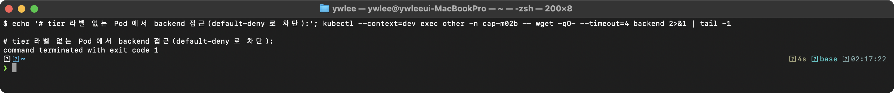

```bash
# allow-frontend-to-backend 정책 추가 후 통신 테스트
kubectl apply -f allow-frontend-to-backend.yaml

kubectl exec -it frontend-pod -- wget -qO- --timeout=3 http://backend-svc:8080
```

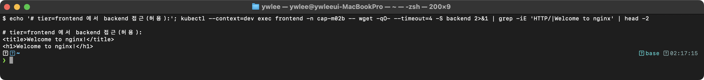

```bash
# 허용되지 않은 Pod에서 통신 시도
kubectl exec -it unauthorized-pod -- wget -qO- --timeout=3 http://backend-svc:8080
```


```bash
# NetworkPolicy 목록 확인
kubectl get networkpolicy -n production
```

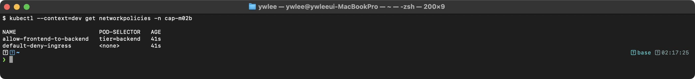

**장애 시나리오:**

| 증상 | 원인 | 해결 |
|------|------|------|
| NetworkPolicy 적용 후 모든 통신 차단 | DNS 허용 누락 | Egress에 UDP/TCP 53 허용 추가 |
| NetworkPolicy가 동작하지 않음 | CNI가 NetworkPolicy 미지원 (Flannel) | Calico, Cilium 등으로 CNI 교체 |
| 특정 네임스페이스에서 오는 트래픽 차단됨 | 네임스페이스에 레이블 미부여 | `kubectl label ns <name> <key>=<value>` |

---

## 4. 스토리지

### 4.1 PV / PVC / Pod 연동

#### 등장 배경

컨테이너 파일시스템은 컨테이너 재시작 시 초기화된다. 데이터베이스, 파일 업로드 등 영구적인 데이터 저장이 필요한 워크로드에서는 컨테이너 외부의 스토리지가 필요하다. 초기에는 Pod spec에서 직접 스토리지 유형(NFS, iSCSI, AWS EBS 등)을 지정했으나, 이는 인프라 세부사항이 애플리케이션 매니페스트에 노출되는 문제가 있었다. PV/PVC 모델은 스토리지 프로비저닝(PV, 관리자 영역)과 스토리지 요청(PVC, 개발자 영역)을 분리하여 관심사를 격리한다.

**PersistentVolume:**
```yaml
apiVersion: v1
kind: PersistentVolume
metadata:
  name: task-pv
  labels:
    type: local
spec:
  capacity:
    storage: 10Gi
  accessModes:
  - ReadWriteOnce
  persistentVolumeReclaimPolicy: Retain
  storageClassName: manual
  hostPath:
    path: /mnt/data
```

**필드 상세:**

- `capacity.storage`: PV가 제공하는 스토리지 용량이다. PVC의 requests와 비교하여 바인딩 여부가 결정된다. PV의 capacity가 PVC의 requests 이상이어야 바인딩된다.
- `accessModes`: 볼륨의 접근 모드를 지정한다.
  - `ReadWriteOnce`(RWO): 단일 노드에서 읽기/쓰기 마운트. 대부분의 블록 스토리지(AWS EBS, GCE PD)가 이 모드만 지원한다.
  - `ReadOnlyMany`(ROX): 여러 노드에서 읽기 전용 마운트.
  - `ReadWriteMany`(RWX): 여러 노드에서 읽기/쓰기 마운트. NFS, CephFS 등이 지원한다.
  - `ReadWriteOncePod`(RWOP): 단일 Pod에서만 읽기/쓰기 마운트(Kubernetes 1.27+).
- `persistentVolumeReclaimPolicy`: PVC 삭제 시 PV의 처리 방식이다.
  - `Retain`: PV와 데이터를 보존한다. 관리자가 수동으로 정리해야 한다. 프로덕션 데이터에 권장된다.
  - `Delete`: PV와 외부 스토리지를 함께 삭제한다. Dynamic Provisioning의 기본값이다.
  - `Recycle`(deprecated): 볼륨의 데이터를 삭제(`rm -rf /thevolume/*`)하고 재사용한다.
- `storageClassName`: PVC와 PV를 매칭하는 식별자이다. PVC의 `storageClassName`과 일치해야 바인딩된다. 빈 문자열(`""`)은 "어떤 StorageClass에도 속하지 않음"을 의미하며, storageClassName이 없는 PVC와만 바인딩된다.
- `hostPath`: 노드의 로컬 파일시스템 경로를 사용한다. 테스트 환경에서만 사용하며, 프로덕션에서는 NFS, iSCSI, 클라우드 스토리지 등을 사용해야 한다. Pod가 다른 노드로 이동하면 데이터에 접근할 수 없기 때문이다.

**PersistentVolumeClaim:**
```yaml
apiVersion: v1
kind: PersistentVolumeClaim
metadata:
  name: task-pvc
spec:
  accessModes:
  - ReadWriteOnce
  resources:
    requests:
      storage: 5Gi
  storageClassName: manual
```

PVC는 "5Gi 이상의 RWO 스토리지"를 요청한다. 클러스터에서 이 조건과 `storageClassName`이 일치하는 PV를 찾아 바인딩한다. 10Gi PV에 5Gi PVC가 바인딩되면, PV 전체(10Gi)가 해당 PVC에 할당되며, 나머지 5Gi를 다른 PVC에 할당할 수 없다.

**Pod:**
```yaml
apiVersion: v1
kind: Pod
metadata:
  name: task-pod
spec:
  containers:
  - name: app
    image: nginx
    volumeMounts:
    - name: task-volume
      mountPath: /usr/share/nginx/html
  volumes:
  - name: task-volume
    persistentVolumeClaim:
      claimName: task-pvc
```

**검증:**

```bash
kubectl apply -f task-pv.yaml
kubectl apply -f task-pvc.yaml
kubectl apply -f task-pod.yaml

# PV/PVC 바인딩 상태 확인
kubectl get pv,pvc
```

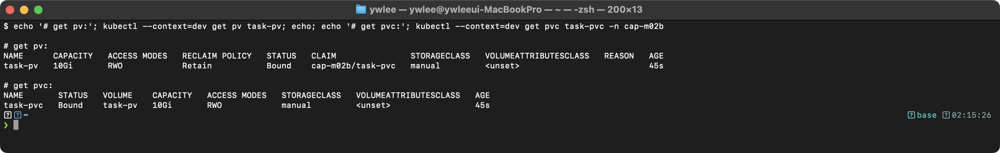

STATUS가 `Bound`이면 PV와 PVC가 정상적으로 연결된 것이다. `Pending`이면 조건에 맞는 PV가 없는 것이다.

```bash
# 상세 정보 확인
kubectl describe pv task-pv
kubectl describe pvc task-pvc
```

```bash
# Pod에서 볼륨 마운트 확인
kubectl exec task-pod -- df -h /usr/share/nginx/html
```

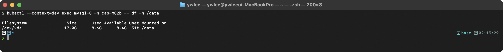

**장애 시나리오:**

| 증상 | 원인 | 해결 |
|------|------|------|
| PVC가 `Pending` 상태 | storageClassName 불일치 | PV와 PVC의 storageClassName 확인 |
| PVC가 `Pending` 상태 | accessModes 불일치 | PV와 PVC의 accessModes 일치 확인 |
| PVC가 `Pending` 상태 | PV 용량 부족 | PV capacity >= PVC requests 확인 |
| Pod가 `Pending` 상태 | PVC가 아직 Bound 아님 | PVC 상태 먼저 해결 |
| PV가 `Released` 상태에서 재사용 불가 | Retain 정책으로 인해 claimRef가 남아있음 | `kubectl edit pv task-pv`에서 `claimRef` 제거 |

---

### 4.2 StorageClass와 Dynamic Provisioning

#### 등장 배경

Static Provisioning에서는 관리자가 PV(PersistentVolume, 실제 스토리지를 추상화한 클러스터 리소스)를 미리 생성해야 하며, 개발자의 PVC(PersistentVolumeClaim, 스토리지 요청서) 요청에 맞는 PV가 없으면 수동으로 추가해야 한다.

이 수동 방식이 프로덕션에서 깨지는 지점은 분명하다. 관리자가 PV를 미리 10개 만들어 두면, 개발자가 11번째 PVC를 요청하는 순간 맞는 PV가 없어 그 PVC는 `Pending`에 머물고 관리자가 PV를 추가로 만들 때까지 Pod가 뜨지 못한다. 용량·접근 모드·StorageClass가 제각각인 요청을 사람이 일일이 예측해 미리 깔아 두는 것은 규모가 커질수록 불가능하다. Dynamic Provisioning은 PVC 생성 시 StorageClass에 정의된 provisioner가 그 PVC 사양에 딱 맞는 PV를 즉석에서 자동 생성하여 이 문제를 없앤다. 클라우드 환경에서는 AWS EBS, GCE PD, Azure Disk 등의 provisioner가 PVC 요청을 받아 실제 디스크를 생성하고 PV로 묶어 준다. 즉 관리자 개입 없이 수요에 따라 스토리지가 확장된다는 점이 프로덕션에서 Dynamic을 사실상 필수로 만든다.

```yaml
apiVersion: storage.k8s.io/v1
kind: StorageClass
metadata:
  name: fast
  annotations:
    storageclass.kubernetes.io/is-default-class: "true"
provisioner: kubernetes.io/no-provisioner   # 로컬 테스트용
reclaimPolicy: Delete
volumeBindingMode: WaitForFirstConsumer
allowVolumeExpansion: true
```

**필드 상세:**

- `provisioner`: 볼륨을 프로비저닝하는 플러그인을 지정한다. `kubernetes.io/no-provisioner`는 Dynamic Provisioning을 수행하지 않으며, 수동으로 생성한 PV와 매칭에만 사용된다. 실제 환경에서는 `kubernetes.io/aws-ebs`, `pd.csi.storage.gke.io`, `ebs.csi.aws.com` 등을 사용한다.
- `reclaimPolicy`: 이 StorageClass로 생성된 PV의 기본 Reclaim Policy이다. Dynamic Provisioning의 기본값은 `Delete`이다.
- `volumeBindingMode`:
  - `Immediate`(기본값): PVC 생성 즉시 PV를 바인딩한다. 다중 AZ 환경에서 PV가 Pod와 다른 AZ에 생성될 수 있는 문제가 있다.
  - `WaitForFirstConsumer`: Pod가 스케줄링될 때까지 PV 바인딩을 지연한다. Pod가 배치되는 노드의 AZ에 맞는 PV가 생성/바인딩되어 토폴로지 문제를 방지한다.
- `allowVolumeExpansion`: `true`이면 PVC의 `resources.requests.storage`를 증가시켜 볼륨을 온라인으로 확장할 수 있다. 축소는 지원되지 않는다.
- `storageclass.kubernetes.io/is-default-class: "true"`: 이 StorageClass를 기본으로 지정한다. PVC에서 `storageClassName`을 생략하면 이 StorageClass가 사용된다. 클러스터에 기본 StorageClass가 여러 개이면 PVC 생성이 실패한다.

Dynamic Provisioning PVC (StorageClass 사용):
```yaml
apiVersion: v1
kind: PersistentVolumeClaim
metadata:
  name: dynamic-pvc
spec:
  accessModes:
  - ReadWriteOnce
  resources:
    requests:
      storage: 20Gi
  storageClassName: fast
```

StorageClass가 지정되지 않으면(`storageClassName` 필드 없음) 기본(default) StorageClass가 사용된다. 빈 문자열(`storageClassName: ""`)을 지정하면 Dynamic Provisioning을 사용하지 않고 수동으로 PV를 바인딩해야 한다.

**검증:**

```bash
kubectl get storageclass
```

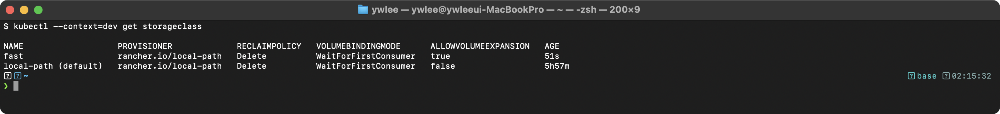

이름 옆의 `(default)`가 기본 StorageClass를 나타낸다.

---

### 4.3 StatefulSet with volumeClaimTemplates

#### 등장 배경

Deployment는 모든 Pod를 동일하게 취급한다. 그러나 데이터베이스 클러스터(MySQL, PostgreSQL), 분산 시스템(Kafka, ZooKeeper)에서는 각 인스턴스가 고유한 ID, 안정적인 네트워크 이름, 전용 스토리지를 필요로 한다. StatefulSet은 이를 제공하며, Pod가 `mysql-0`, `mysql-1`, `mysql-2`와 같이 순서대로 이름이 부여되고, 재시작/재스케줄링 시에도 동일한 이름과 스토리지가 유지된다.

```yaml
apiVersion: apps/v1
kind: StatefulSet
metadata:
  name: mysql
spec:
  serviceName: mysql-headless
  replicas: 3
  selector:
    matchLabels:
      app: mysql
  template:
    metadata:
      labels:
        app: mysql
    spec:
      containers:
      - name: mysql
        image: mysql:8.0
        ports:
        - containerPort: 3306
        env:
        - name: MYSQL_ROOT_PASSWORD
          valueFrom:
            secretKeyRef:
              name: mysql-secret
              key: password
        volumeMounts:
        - name: data
          mountPath: /var/lib/mysql
  volumeClaimTemplates:
  - metadata:
      name: data
    spec:
      accessModes:
      - ReadWriteOnce
      resources:
        requests:
          storage: 10Gi
      storageClassName: fast
---
apiVersion: v1
kind: Service
metadata:
  name: mysql-headless
spec:
  clusterIP: None
  selector:
    app: mysql
  ports:
  - port: 3306
    targetPort: 3306
```

**StatefulSet 핵심 특성:**

- `serviceName`: 반드시 Headless Service 이름과 일치해야 한다. 이를 통해 각 Pod에 `mysql-0.mysql-headless.default.svc.cluster.local` 형태의 고유한 DNS 이름이 부여된다.
- Pod 생성/삭제는 순서대로 이루어진다. `mysql-0` -> `mysql-1` -> `mysql-2` 순으로 생성되며, 역순으로 삭제된다. 각 Pod는 이전 Pod가 Ready가 되어야 다음 Pod가 생성된다.
- `volumeClaimTemplates`: 각 Pod에 대해 별도의 PVC를 자동 생성한다. `data-mysql-0`, `data-mysql-1`, `data-mysql-2`라는 이름의 PVC가 생성된다. 왜 Pod마다 전용 PVC가 필요한가. `mysql-0` Pod가 죽었다 재시작되면 StatefulSet은 같은 이름(`mysql-0`)으로 다시 띄우고, 이름이 같으니 같은 PVC(`data-mysql-0`)에 다시 바인딩한다. 따라서 재시작 전에 디스크에 써 둔 데이터를 그대로 이어받는다. 이름·스토리지가 Pod 정체성에 고정되어 있으므로 데이터베이스의 일관성과 인스턴스별 상태가 보장된다. 반면 Deployment의 Pod는 매번 무작위 이름으로 교체되고 스토리지를 공유하거나 잃으므로, 상태(stateful) 워크로드에는 부적합하다. 데이터 보호를 위해 StatefulSet을 삭제해도 PVC는 보존되며(자동 삭제되지 않음), 정리하려면 수동으로 삭제해야 한다.

각 Pod(mysql-0, mysql-1, mysql-2)에 대해 별도의 PVC(data-mysql-0, data-mysql-1, data-mysql-2)가 자동 생성된다.

**검증:**

```bash
kubectl get statefulset mysql
```

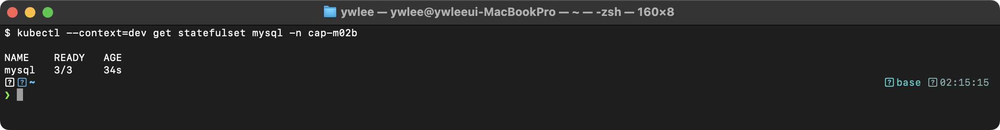

```bash
kubectl get pods -l app=mysql
```

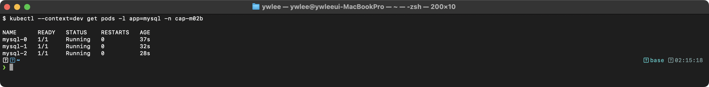

```bash
kubectl get pvc -l app=mysql
```

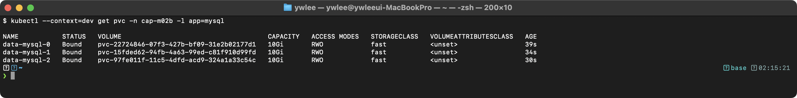

```bash
# 개별 Pod DNS 확인
kubectl run dns-test --image=busybox:1.28 --rm -it --restart=Never -- \
  nslookup mysql-0.mysql-headless.default.svc.cluster.local
```

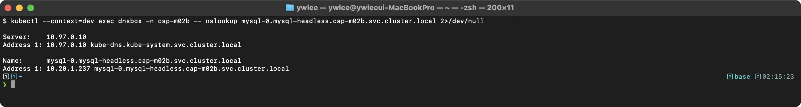

---

## 5. 트러블슈팅 명령어 치트시트

앞의 §1~§4는 각 리소스(설치·워크로드·네트워킹·스토리지)마다 끝에 "장애 시나리오" 표를 두어 그 리소스에 특화된 문제와 복구법을 정리했다. 이 섹션은 그와 달리 리소스 종류를 가리지 않고 클러스터 전체 상태를 빠르게 훑는 진단 도구 모음이다. 실기 시험에서 "어디가 고장 났는지 모르는" 상태에서 출발점으로 쓰는 명령들이며, 여기서 범위를 좁힌 뒤 §1~§4의 해당 리소스 장애 표로 내려가 구체적 원인을 짚는 흐름으로 사용한다.

#### 단계별 장애 진단 흐름 — Pod가 Pending인 경우

시험에서 "어떤 Pod가 Running이 되지 않는다"는 문제가 주어지면, 단순히 명령어 목록을 외운 것으로는 해결이 어렵다. 아래 흐름을 머릿속에 고정해두면 어떤 Pending 원인도 체계적으로 좁힐 수 있다.

**1단계 — Pod 이벤트 확인(가장 먼저):** `kubectl describe pod <pod-name> -n <ns>` 출력 맨 아래의 **Events** 섹션을 읽는다. `FailedScheduling` 이벤트가 있으면 스케줄러가 적합한 노드를 찾지 못한 것이다. 메시지 본문이 그 원인을 직접 알려준다. 예: `0/2 nodes are available: 1 Insufficient cpu, 1 node(s) had taint {node-role.kubernetes.io/control-plane:NoSchedule} that the pod didn't tolerate`.

**2단계 — 원인 분류:** Events 메시지로 다음 세 갈래 중 하나를 선택한다.
- `Insufficient cpu/memory` → 노드 리소스 부족. `kubectl describe node <node>` → **Allocatable** vs **Requests** 비교. Pod의 `resources.requests`를 낮추거나 노드를 추가한다.
- `node(s) had taint ... that the pod didn't tolerate` → Taint/Toleration 불일치. `kubectl get nodes -o custom-columns=NAME:.metadata.name,TAINTS:.spec.taints`로 각 노드의 Taint를 확인하고, Pod spec에 대응하는 `tolerations`를 추가한다.
- `node(s) didn't match pod's node affinity/selector` → nodeSelector 또는 Node Affinity 불일치. `kubectl get nodes --show-labels`로 노드 레이블을 확인한다.
- `persistentvolumeclaim ... not found / Unbound` → PVC가 없거나 PV에 바인딩되지 않았다. `kubectl get pvc -n <ns>` → `kubectl describe pvc <name>`으로 이유를 본다.

**3단계 — 수정 후 재확인:** 원인을 수정한 뒤 `kubectl get pod <pod-name> -n <ns> -w`로 실시간 상태 변화를 관찰한다. `Pending → ContainerCreating → Running` 순서로 전환되면 정상이다. `ContainerCreating`에서 멈추면 이미지 Pull 실패(`ImagePullBackOff`)나 볼륨 마운트 실패가 원인이며, 다시 `describe`로 Events를 읽는다.

이 세 단계 — **이벤트 읽기 → 원인 분류 → 수정 후 확인** — 를 지키면 시험에서 트러블슈팅 문제를 5분 이내에 처리할 수 있다.

### 5.1 클러스터 상태 확인

```bash
# 노드 상태
kubectl get nodes -o wide
kubectl describe node <node-name>
kubectl top nodes                          # 리소스 사용량 (metrics-server 필요)

# 클러스터 정보
kubectl cluster-info
kubectl cluster-info dump

# 컴포넌트 상태 (deprecated이지만 참고용)
kubectl get componentstatuses

# 모든 네임스페이스의 Pod
kubectl get pods -A -o wide

# 이벤트 확인
kubectl get events --sort-by='.lastTimestamp'
kubectl get events -A --sort-by='.lastTimestamp'
kubectl get events --field-selector reason=Failed
```

**이벤트 확인의 중요성**: Kubernetes 이벤트는 기본적으로 1시간 후 만료된다. 장애 발생 시 즉시 이벤트를 확인해야 한다. `--sort-by='.lastTimestamp'`로 최신 이벤트를 먼저 확인하는 것이 효율적이다. `--field-selector reason=Failed`로 실패 이벤트만 필터링할 수 있다.

### 5.2 Pod 디버깅

```bash
# Pod 상태 확인
kubectl get pods -o wide
kubectl describe pod <pod-name>

# Pod 로그
kubectl logs <pod-name>
kubectl logs <pod-name> -c <container-name>    # 멀티 컨테이너
kubectl logs <pod-name> --previous             # 이전 컨테이너 (CrashLoop 디버깅에 필수)
kubectl logs <pod-name> -f                     # 실시간
kubectl logs <pod-name> --tail=50              # 최근 50줄
kubectl logs <pod-name> --since=1h             # 최근 1시간

# Pod 내부 접속
kubectl exec -it <pod-name> -- /bin/sh
kubectl exec -it <pod-name> -c <container-name> -- /bin/bash

# 임시 디버깅 Pod
kubectl run debug --image=busybox:1.36 --rm -it --restart=Never -- /bin/sh
kubectl run debug --image=nicolaka/netshoot --rm -it --restart=Never -- /bin/bash

# Pod 리소스 사용량
kubectl top pods
kubectl top pods -A --sort-by=memory
```

**Pod 상태별 트러블슈팅 가이드:**

| 상태 | 의미 | 확인 사항 |
|------|------|-----------|
| `Pending` | 스케줄링 대기 | `describe pod`에서 Events 확인. 리소스 부족, nodeSelector 불일치, Taint/Toleration, PVC 미바인딩 |
| `ContainerCreating` | 컨테이너 생성 중 | 이미지 Pull 중이거나 볼륨 마운트 대기. `describe pod` 확인 |
| `ImagePullBackOff` | 이미지 Pull 실패 | 이미지 이름/태그 오타, 프라이빗 레지스트리 인증, 네트워크 문제 |
| `CrashLoopBackOff` | 컨테이너 반복 재시작 | `logs --previous`로 이전 컨테이너 로그 확인. 애플리케이션 오류, 설정 파일 누락 |
| `OOMKilled` | 메모리 초과 | `describe pod`에서 Last State 확인. memory limit 증가 필요 |
| `Evicted` | 리소스 부족으로 퇴거 | 노드의 디스크/메모리 부족. `kubectl describe node`에서 Conditions 확인 |

### 5.3 서비스/네트워크 디버깅

```bash
# Service 확인
kubectl get svc -o wide
kubectl describe svc <service-name>
kubectl get endpoints <service-name>

# DNS 테스트
kubectl run dns-test --image=busybox:1.28 --rm -it --restart=Never -- \
  nslookup <service-name>.<namespace>.svc.cluster.local

kubectl run dns-test --image=busybox:1.28 --rm -it --restart=Never -- \
  nslookup kubernetes.default

# 연결 테스트
kubectl run curl-test --image=curlimages/curl --rm -it --restart=Never -- \
  curl -s http://<service-name>:<port>

# CoreDNS 확인
kubectl -n kube-system get pods -l k8s-app=kube-dns
kubectl -n kube-system logs -l k8s-app=kube-dns
kubectl -n kube-system get configmap coredns -o yaml

# kube-proxy 확인
kubectl -n kube-system get pods -l k8s-app=kube-proxy
kubectl -n kube-system logs -l k8s-app=kube-proxy
```

**DNS 디버깅 시 busybox 버전 주의**: busybox 1.28을 사용하는 이유는 최신 버전(1.36+)에서 nslookup의 동작 방식이 변경되어 Kubernetes DNS 테스트 시 예기치 않은 결과가 발생할 수 있기 때문이다. 시험 환경에서는 1.28을 권장한다.

### 5.4 노드 디버깅 (노드에 SSH 접속 후)

```bash
# kubelet 상태
systemctl status kubelet
systemctl restart kubelet
journalctl -u kubelet -f
journalctl -u kubelet --since "5 minutes ago" --no-pager

# containerd 상태
systemctl status containerd
systemctl restart containerd

# 컨테이너 확인 (crictl)
crictl ps
crictl ps -a
crictl pods
crictl logs <container-id>
crictl inspect <container-id>

# Control Plane 컴포넌트 확인 (Static Pod)
ls /etc/kubernetes/manifests/
crictl ps | grep -E "apiserver|scheduler|controller|etcd"

# 디스크/메모리 확인
df -h
free -m

# 네트워크 확인
ip addr
ip route
ss -tlnp
```

**kubelet이 시작되지 않는 일반적인 원인:**

1. 스왑이 활성화되어 있음 -> `swapoff -a`
2. containerd가 실행되지 않음 -> `systemctl start containerd`
3. `/etc/kubernetes/manifests/`의 매니페스트에 문법 오류 -> YAML 검증
4. 인증서 만료 -> `kubeadm certs check-expiration`
5. kubelet 설정 파일 오류 -> `/var/lib/kubelet/config.yaml` 확인

### 5.5 인증서 확인

```bash
# kubeadm으로 설치된 클러스터의 인증서 만료일 확인
kubeadm certs check-expiration

# 개별 인증서 확인
openssl x509 -in /etc/kubernetes/pki/apiserver.crt -noout -dates
openssl x509 -in /etc/kubernetes/pki/apiserver.crt -noout -subject -issuer

# 인증서 갱신
kubeadm certs renew all
# 갱신 후 Static Pod를 재시작해야 한다
```

**인증서 관련 세부사항:**

- kubeadm이 생성한 인증서는 기본 유효 기간이 1년이다. CA 인증서는 10년이다.
- `kubeadm certs renew all` 후 Control Plane Static Pod를 재시작해야 새 인증서가 적용된다. 재시작 방법: 매니페스트 파일을 임시로 다른 디렉터리로 이동했다가 복귀하거나, `crictl` 명령으로 직접 컨테이너를 중지한다.
- 인증서 만료가 임박하면 API 서버 로그에 TLS 관련 오류가 기록되고, kubectl 명령이 실패한다.

**검증:**

```bash
kubeadm certs check-expiration
```

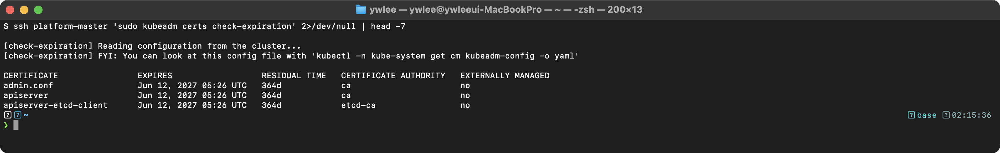

---

## 6. 시험 필수 kubectl 명령어 모음

### 6.1 빠른 리소스 생성 (Imperative)

```bash
# Pod 생성
kubectl run nginx --image=nginx

# Pod 생성 (YAML 생성만)
kubectl run nginx --image=nginx --dry-run=client -o yaml > pod.yaml

# Pod 생성 (포트, 레이블, 명령어 포함)
kubectl run nginx --image=nginx --port=80 --labels="app=web,tier=frontend"
kubectl run busybox --image=busybox --restart=Never --command -- sleep 3600

# Deployment 생성
kubectl create deployment nginx-deploy --image=nginx --replicas=3

# Service 생성
kubectl expose pod nginx --port=80 --target-port=80 --name=nginx-svc
kubectl expose deployment nginx-deploy --port=80 --type=NodePort

# ConfigMap 생성
kubectl create configmap my-config \
  --from-literal=key1=value1 \
  --from-literal=key2=value2
kubectl create configmap my-config --from-file=config.txt
kubectl create configmap my-config --from-file=my-dir/

# Secret 생성
kubectl create secret generic my-secret \
  --from-literal=username=admin \
  --from-literal=password=secret123
kubectl create secret generic my-secret --from-file=ssh-key=id_rsa

# Namespace 생성
kubectl create namespace development

# ServiceAccount 생성
kubectl create serviceaccount my-sa -n development

# Job 생성
kubectl create job my-job --image=busybox -- echo "Hello"

# CronJob 생성
kubectl create cronjob my-cron --image=busybox --schedule="*/5 * * * *" -- echo "Hello"
```

### 6.2 YAML 생성 패턴 (--dry-run=client -o yaml)

```bash
# 거의 모든 create/run 명령에 --dry-run=client -o yaml을 추가하면 YAML을 얻을 수 있다
kubectl run nginx --image=nginx --dry-run=client -o yaml > pod.yaml
kubectl create deployment web --image=nginx --replicas=3 --dry-run=client -o yaml > deploy.yaml
kubectl expose deployment web --port=80 --type=NodePort --dry-run=client -o yaml > svc.yaml
kubectl create role my-role --verb=get,list --resource=pods --dry-run=client -o yaml > role.yaml
kubectl create rolebinding my-rb --role=my-role --user=jane --dry-run=client -o yaml > rb.yaml
kubectl create job my-job --image=busybox --dry-run=client -o yaml > job.yaml
kubectl create cronjob my-cron --image=busybox --schedule="0 * * * *" --dry-run=client -o yaml > cron.yaml
```

**`--dry-run=client` vs `--dry-run=server`의 차이:**

- `--dry-run=client`: API 서버에 요청을 보내지 않고 로컬에서 YAML을 생성한다. 빠르지만 서버 측 유효성 검증(기본값, 웹훅 등)이 적용되지 않는다.
- `--dry-run=server`: API 서버에 요청을 보내되 실제 리소스는 생성하지 않는다. 서버 측 유효성 검증과 기본값이 적용된 완전한 YAML을 얻을 수 있다. 시험에서는 `--dry-run=client`가 일반적이다.

### 6.3 리소스 조회 및 필터링

```bash
# 출력 형식
kubectl get pods -o wide                    # 추가 정보 (노드, IP)
kubectl get pods -o yaml                    # 전체 YAML
kubectl get pods -o json                    # 전체 JSON
kubectl get pods -o name                    # 이름만
kubectl get pod nginx -o jsonpath='{.status.podIP}'  # 특정 필드

# 레이블 필터링
kubectl get pods -l app=nginx
kubectl get pods -l 'app in (nginx, web)'
kubectl get pods -l app!=nginx
kubectl get pods --show-labels

# 필드 셀렉터
kubectl get pods --field-selector status.phase=Running
kubectl get pods --field-selector spec.nodeName=worker-1
kubectl get events --field-selector reason=Failed

# 모든 리소스 조회
kubectl get all -n development
kubectl api-resources                        # 사용 가능한 모든 리소스 타입
kubectl api-resources --namespaced=true      # 네임스페이스 범위 리소스만
kubectl api-resources --namespaced=false     # 클러스터 범위 리소스만
```

### 6.4 리소스 필드 확인 (kubectl explain)

```bash
# 리소스 구조 확인 (시험 중 YAML 필드명을 모를 때 필수)
kubectl explain pod
kubectl explain pod.spec
kubectl explain pod.spec.containers
kubectl explain pod.spec.containers.resources
kubectl explain pod.spec.affinity.nodeAffinity
kubectl explain deployment.spec.strategy

# 재귀적으로 모든 필드 표시
kubectl explain pod.spec --recursive
kubectl explain deployment.spec.strategy --recursive

# 특정 API 버전 지정
kubectl explain ingress --api-version=networking.k8s.io/v1
```

`kubectl explain`은 시험 중 가장 유용한 명령어 중 하나이다. YAML 필드명이 기억나지 않을 때 빠르게 확인할 수 있다. `--recursive` 플래그를 사용하면 모든 하위 필드를 한 번에 볼 수 있지만, 출력량이 많으므로 특정 경로를 지정하는 것이 효율적이다.

### 6.5 레이블/어노테이션 관리

```bash
# 레이블 추가/수정
kubectl label pods nginx env=production
kubectl label pods nginx env=staging --overwrite
kubectl label nodes worker-1 disktype=ssd

# 레이블 삭제
kubectl label pods nginx env-

# 어노테이션 추가/수정
kubectl annotate pods nginx description="My nginx pod"

# 어노테이션 삭제
kubectl annotate pods nginx description-
```

**레이블과 어노테이션의 차이:**

- **레이블**: 리소스를 식별하고 선택하는 데 사용된다. selector로 필터링이 가능하다. 키/값 모두 63자 이하, 영숫자와 `-_.`만 허용된다.
- **어노테이션**: 비식별 메타데이터를 저장한다. selector로 필터링할 수 없다. 값에 길이 제한이 없으며, 빌드 정보, 책임자, Git 커밋 해시 등을 저장하는 데 사용된다. Ingress Controller의 설정(`nginx.ingress.kubernetes.io/rewrite-target` 등)도 어노테이션으로 전달된다.

### 6.6 기타 유용한 명령어

```bash
# 리소스 수정
kubectl edit deployment nginx-deploy
kubectl patch deployment nginx-deploy -p '{"spec":{"replicas":5}}'
kubectl replace -f deployment.yaml --force   # 강제 교체

# 리소스 삭제
kubectl delete pod nginx
kubectl delete pod nginx --grace-period=0 --force  # 즉시 삭제
kubectl delete pods -l app=old
kubectl delete all --all -n test                   # 네임스페이스의 모든 리소스

# 정렬
kubectl get pods --sort-by='.metadata.creationTimestamp'
kubectl get pods --sort-by='.status.containerStatuses[0].restartCount'
kubectl top pods --sort-by=cpu
kubectl top pods --sort-by=memory

# 특정 컬럼만 출력
kubectl get pods -o custom-columns=NAME:.metadata.name,STATUS:.status.phase,NODE:.spec.nodeName

# JSONPath
kubectl get nodes -o jsonpath='{.items[*].metadata.name}'
kubectl get pods -o jsonpath='{range .items[*]}{.metadata.name}{"\t"}{.status.phase}{"\n"}{end}'
kubectl get nodes -o jsonpath='{.items[*].status.addresses[?(@.type=="InternalIP")].address}'
```

**`--grace-period=0 --force`의 위험성**: Pod를 강제 삭제하면 SIGTERM 시그널을 보내지 않고 API 서버에서 즉시 제거한다. StatefulSet의 Pod를 강제 삭제하면 동일 이름의 Pod가 동시에 두 개 존재할 수 있어, 공유 스토리지의 데이터 손상 위험이 있다. 일반적인 상황에서는 사용하지 않는 것이 좋다.

**`kubectl replace --force`의 동작**: 리소스를 삭제한 후 새로 생성한다. `kubectl apply`와 달리 변경 사항의 병합이 아닌 완전 교체이다. 변경 불가능한 필드(immutable field)를 수정해야 할 때 사용한다.

---

## 시험 시작 시 설정

> **앞 섹션(§6 kubectl 치트시트)에서 다룬 명령 옵션들은 시험 환경에서도 그대로 동작한다. 단, 시험 문제마다 컨텍스트를 전환해야 한다는 점이 로컬 실습과 다르다.**

CKA 실기 시험은 단일 클러스터가 아니라 문제마다 별도 컨텍스트(클러스터)로 전환하도록 요구한다. 문제 지문 첫 줄에 `kubectl config use-context <ctx>`가 항상 제시되며, 이를 실행하지 않으면 엉뚱한 클러스터에서 작업하는 실수가 발생한다. 현재 사용 가능한 컨텍스트 목록은 `kubectl config get-contexts`로 확인한다.

```bash
# 문제마다 가장 먼저 실행 — 문제 지문에 제시된 컨텍스트를 그대로 복사
kubectl config use-context <ctx>

# 현재 컨텍스트 목록 확인 (현재 활성 컨텍스트에 * 표시)
kubectl config get-contexts

# 현재 활성 컨텍스트만 확인
kubectl config current-context
```

시험을 시작하면 다음을 먼저 실행하는 것을 권장한다:

```bash
# vim 설정 (YAML 편집용)
echo 'set tabstop=2 shiftwidth=2 expandtab' >> ~/.vimrc

# kubectl 자동 완성 (보통 이미 설정되어 있음)
source <(kubectl completion bash)

# 별칭 설정 (보통 이미 설정되어 있음, 없으면 추가)
alias k=kubectl
complete -o default -F __start_kubectl k

# 자주 사용하는 변수 (선택)
export do="--dry-run=client -o yaml"
# 사용: kubectl run nginx --image=nginx $do > pod.yaml
```

**vim 설정 설명:**

- `tabstop=2`: Tab 문자를 2칸 너비로 표시한다.
- `shiftwidth=2`: 자동 들여쓰기 시 2칸을 사용한다.
- `expandtab`: Tab 키를 누르면 실제 Tab 문자 대신 스페이스를 삽입한다. YAML은 Tab 문자를 허용하지 않으므로 이 설정이 필수적이다. Tab이 포함된 YAML 파일은 파싱 오류가 발생한다.

**시험 중 시간 절약 전략:**

1. `--dry-run=client -o yaml`로 기본 YAML을 생성한 후 필요한 부분만 수정한다.
2. `kubectl explain`을 적극 활용하여 필드명을 확인한다.
3. Imperative 명령(kubectl create, kubectl run)이 가능한 경우 YAML 작성보다 빠르다.
4. `$do` 변수를 활용하여 타이핑을 줄인다.
5. `kubectl get <resource> -o yaml`로 기존 리소스의 YAML을 참고한다.
