# CKA 모의 실기 문제

> 총 40문제이다. 실제 CKA 시험과 동일하게 **터미널에서 직접 명령어를 입력하여** 문제를 해결해야 한다. 각 문제에서 `kubectl config use-context` 명령이 주어지면 반드시 먼저 실행한 후 풀어야 한다.
>
> **공통 시간 절약 팁:**
> - `kubectl run/create/expose` 등 imperative 명령을 최대한 활용한다. YAML을 처음부터 작성하는 것보다 훨씬 빠르다.
> - `--dry-run=client -o yaml > file.yaml` 패턴으로 YAML 뼈대를 생성한 뒤 필요한 부분만 수정한다.
> - `kubectl explain <resource>.spec --recursive`로 필드 구조를 빠르게 확인한다.
> - 시험 환경에서는 `alias k=kubectl`, `export do="--dry-run=client -o yaml"` 등의 alias를 미리 설정한다.
> - **이 alias는 기본 제공되지 않는다.** 현재 CKA는 PSI Bridge 환경에서 치러지며 `alias k=kubectl`이 미리 설정되어 있지 않으므로, 시험 시작 직후 첫 명령으로 `alias k=kubectl && export do="--dry-run=client -o yaml"`을 직접 입력해야 한다. 입력하지 않으면 매번 `kubectl`을 전부 타이핑하게 되어 시간을 잃는다.
> - `kubectl config use-context`를 빠뜨리면 다른 클러스터에 작업하게 되므로 반드시 먼저 실행한다.

> **실습 전제 (이 저장소에서 풀어 볼 때).** 아래 문제의 컨텍스트 이름(`k8s-cluster1` 등)은 실제 CKA 시험 환경의 가상 이름이다. 이 저장소의 tart 클러스터로 재현하려면 컨텍스트 대신 kubeconfig 경로를 명시한다: `kubectl --kubeconfig kubeconfig/dev.yaml ...`. 클러스터는 `./scripts/boot.sh`로 기동하고, 재부팅 후라면 `./scripts/fix-cluster-ip-drift.sh dev`로 IP 드리프트를 복구한 뒤 모든 노드가 Ready인지 확인하고 시작한다. 파괴적 실습(노드 drain·etcd 복구·kubelet 수정 등)은 `dev`/`staging`에서만 하고 `platform`/`prod`는 건드리지 않는다. 노드 SSH가 필요한 문제(Static Pod·etcd·kubelet)는 `ssh dev-master`/`ssh dev-worker1`처럼 VM 이름 별칭으로 접속한다. 인증서 경로(`/etc/kubernetes/pki/etcd/`의 `ca.crt`·`server.crt`·`server.key`)는 각각 etcd CA, etcd 서버 인증서, 그 개인키를 뜻하며 etcd가 mTLS로 보호되므로 3개가 모두 필요하다.

---

## Cluster Architecture, Installation & Configuration

> **이 영역이 왜 있나 (등장 배경).** 초기 쿠버네티스는 클러스터 부트스트랩 절차가 표준화되어 있지 않았다. 인증서를 손으로 생성하고, etcd·apiserver·controller-manager·scheduler를 각각 systemd 서비스로 띄우고, kubelet 설정을 노드마다 맞추는 작업을 운영자가 직접 했다(이른바 "Kubernetes the Hard Way"). 단계가 수십 개라 한 곳만 틀려도 클러스터가 뜨지 않았고 재현도 어려웠다. `kubeadm`은 이 과정을 `init`(첫 control plane 구성)·`join`(노드 추가)·`upgrade`(버전 올리기) 명령으로 묶어 표준화했다. 인증서 발급, control plane 컴포넌트의 Static Pod 배치, kubelet 부트스트랩을 자동화한다. 트레이드오프: 자동화된 만큼 내부에서 무슨 일이 일어나는지 가려져, 장애 시 어느 단계가 깨졌는지 역추적하는 능력이 별도로 요구된다. CKA가 kubeadm 절차를 손으로 풀게 하는 이유가 이것이다.
>
> **이 영역에서 처음 나오는 용어 한 줄 풀이.**
> - **Control Plane(컨트롤 플레인)**: 클러스터의 "두뇌". apiserver(API 접수), etcd(상태 저장), controller-manager(원하는 상태로 수렴), scheduler(Pod를 노드에 배치)가 여기 속한다. Worker Node는 실제 워크로드(Pod)를 실행한다.
> - **etcd**: 클러스터의 모든 상태(Pod·Service·ConfigMap 등)를 저장하는 분산 키-값 저장소. Raft(여러 노드가 투표로 하나의 로그 순서에 합의하는 알고리즘)로 복제되며, 과반(quorum)이 살아 있어야 쓰기가 가능하다.
> - **Static Pod**: apiserver가 아니라 노드의 kubelet이 매니페스트 파일(`/etc/kubernetes/manifests`)을 보고 직접 띄우는 Pod. apiserver·etcd 자신이 죽어도 control plane을 부팅할 수 있게 하는 닭-달걀 문제 해법이다.
> - **mTLS(상호 TLS)**: 서버뿐 아니라 클라이언트도 인증서로 신원을 증명하는 방식. etcd·apiserver 통신이 이 방식이라 백업·복구 시 인증서 3종(CA·클라이언트 cert·key)이 필요하다.

### 문제 1. [클러스터 설치] kubeadm으로 Worker Node 조인

`kubectl config use-context k8s-cluster1`

클러스터 `k8s-cluster1`에 새로운 Worker Node `worker-3`을 추가해야 한다.
- Control Plane 노드에서 조인 토큰을 생성하라.
- `worker-3` 노드에 SSH 접속하여 클러스터에 조인하라.
- 노드가 `Ready` 상태인지 확인하라.

<details>
<summary>풀이 확인</summary>

**풀이:**

```bash
# Control Plane에서 조인 명령 생성
kubeadm token create --print-join-command
```

**검증 - 기대 출력:** `kubeadm join <apiserver>:6443 --token ... --discovery-token-ca-cert-hash sha256:...` 형태의 조인 명령이 출력된다. 이 명령을 워커 노드에서 실행하면 클러스터에 합류한다(dev-master 실측, 토큰·해시·IP 는 환경별 상이).
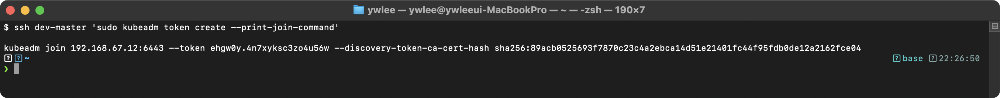

```bash
# worker-3에 SSH 접속
ssh worker-3

# 조인 명령 실행 (위에서 출력된 명령)
sudo kubeadm join 192.168.1.100:6443 \
  --token abcdef.0123456789abcdef \
  --discovery-token-ca-cert-hash sha256:abc123...

# Control Plane으로 돌아와서 확인
exit
kubectl get nodes
```

**검증:**

```bash
kubectl get nodes
```

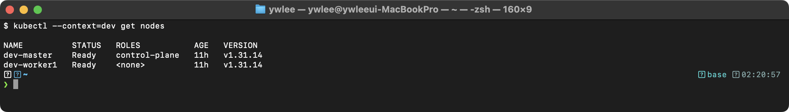

STATUS가 `Ready`이고 VERSION이 기존 노드와 동일하면 정상이다. `NotReady`인 경우 `kubectl describe node worker-3`으로 Conditions를 확인한다.

**출제 의도:** 클러스터 확장 역량을 검증한다. 실무에서 노드 증설은 빈번한 작업이며, 토큰 생성-조인-검증 흐름을 정확히 수행할 수 있는지 평가한다.

**핵심 원리:** `kubeadm token create`는 Bootstrap Token(부트스트랩 토큰: 새 노드가 아직 정식 인증서가 없을 때 API 서버에 최초로 자기를 증명하기 위한 임시 자격증명)을 생성한다. 이 토큰은 TLS Bootstrapping(새 노드의 kubelet이 임시 토큰으로 API 서버에 접속해 자신의 정식 클라이언트 인증서를 발급받는 절차)에 사용된다. `--discovery-token-ca-cert-hash`는 CA(인증서를 발급·서명하는 신뢰 기관) 인증서의 SHA256 해시로, 새 노드가 올바른 API 서버에 연결하는지 검증하는 Trust On First Use(TOFU: 첫 접속 때 받은 신원을 신뢰의 기준으로 고정하는 방식) 메커니즘이다.

**함정과 주의사항:**
- 토큰의 기본 TTL은 24시간이다. 만료된 토큰으로 조인하면 실패한다. `kubeadm token list`로 만료 시간을 확인할 수 있다.
- worker 노드에 `kubelet`, `kubeadm`, `containerd`가 미리 설치되어 있어야 한다. 설치되어 있지 않으면 조인 명령 자체가 실행되지 않는다.
- 조인 후 `NotReady` 상태가 지속되면 CNI 플러그인이 설치되지 않은 것일 수 있다. CNI는 Control Plane에서 설치하면 새 노드에도 자동 배포된다(DaemonSet).

**시간 절약 팁:** `kubeadm token create --print-join-command`는 토큰 생성과 전체 조인 명령 출력을 한 번에 수행한다. 토큰과 해시를 따로 조합할 필요가 없다.

</details>

---

### 문제 2. [클러스터 업그레이드] Control Plane 업그레이드

`kubectl config use-context k8s-upgrade`

Control Plane 노드 `controlplane`의 쿠버네티스 버전을 `v1.30.0`에서 `v1.31.0`으로 업그레이드하라.
- kubeadm, kubelet, kubectl을 모두 업그레이드하라.
- 업그레이드 중 워크로드에 영향을 최소화하라.

<details>
<summary>풀이 확인</summary>

**풀이:**

```bash
# 1. kubeadm 업그레이드
sudo apt-mark unhold kubeadm
sudo apt-get update
sudo apt-get install -y kubeadm=1.31.0-1.1
sudo apt-mark hold kubeadm

# 2. 업그레이드 계획 확인
sudo kubeadm upgrade plan

# 3. Control Plane 컴포넌트 업그레이드
sudo kubeadm upgrade apply v1.31.0

# 4. 노드 drain
kubectl drain controlplane --ignore-daemonsets --delete-emptydir-data

# 5. kubelet, kubectl 업그레이드
sudo apt-mark unhold kubelet kubectl
sudo apt-get install -y kubelet=1.31.0-1.1 kubectl=1.31.0-1.1
sudo apt-mark hold kubelet kubectl

# 6. kubelet 재시작
sudo systemctl daemon-reload
sudo systemctl restart kubelet

# 7. 노드 uncordon
kubectl uncordon controlplane

# 8. 확인
kubectl get nodes
```

**검증:**

```bash
kubectl get nodes
```

> **예시(시험 정답 형식, 참조):** 아래 형태의 출력이 정답이다 — `NAME           STATUS   ROLES           AGE   VERSION ...`. 동일 명령의 **실측 스크린샷**은 이 자격증 daily(day01~20) 및 본 문서 위쪽 캡처에서 확인할 수 있다(이 블록은 일반 placeholder 클러스터 기준 예시).

controlplane의 VERSION이 `v1.31.0`이고 STATUS가 `Ready`이면 성공이다. `SchedulingDisabled`가 남아있으면 `kubectl uncordon`을 빠뜨린 것이다.

```bash
# Control Plane 컴포넌트 버전 확인
kubectl -n kube-system get pods -l tier=control-plane -o custom-columns=NAME:.metadata.name,IMAGE:.spec.containers[0].image
```

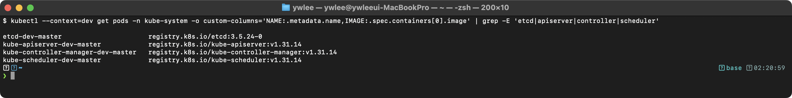

**출제 의도:** 클러스터 업그레이드는 CKA의 핵심 출제 영역이다. 순서를 틀리면 클러스터가 불안정해지므로, 정확한 절차 수행 능력을 평가한다.

**핵심 원리:** `kubeadm upgrade apply`는 kube-apiserver, kube-controller-manager, kube-scheduler, kube-proxy의 Static Pod 매니페스트를 새 버전으로 교체한다. kubelet은 매니페스트 변경을 감지하고 해당 컴포넌트를 재시작한다. kubelet 자체는 시스템 서비스이므로 `apt-get`으로 바이너리를 교체한 후 `systemctl restart`로 재시작해야 한다.

**함정과 주의사항:**
- **순서가 핵심이다.** kubeadm을 먼저 업그레이드해야 `upgrade apply`가 새 버전을 알 수 있다. kubelet/kubectl은 반드시 `upgrade apply` 이후에 업그레이드한다.
- `apt-mark hold/unhold`를 빠뜨리면 향후 `apt-get upgrade`에 의해 의도치 않은 버전 변경이 발생할 수 있다.
- drain 없이 kubelet을 재시작하면 해당 노드의 Pod가 일시적으로 중단될 수 있다.
- 마이너 버전은 한 단계씩만 올려야 한다(1.30→1.31). 1.30→1.32 같은 건 지원되지 않는다.
- **버전 스큐(version skew) 규칙.** kubelet 은 apiserver 보다 **높을 수 없고**, 최대 2 마이너 버전까지 뒤처져도 된다(예: apiserver 1.31 이면 kubelet 은 1.31·1.30·1.29 허용). 그래서 control plane(apiserver)을 먼저 올리고 그다음 노드의 kubelet 을 올리는 순서가 강제된다. 반대로 kubelet 을 먼저 올려 apiserver 보다 높아지면 지원되지 않는 조합이 된다.

**시간 절약 팁:** 전체 명령 순서를 외워두는 것이 가장 빠르다. `apt-mark unhold → apt-get install → apt-mark hold` 패턴이 kubeadm과 kubelet/kubectl에 두 번 반복되는 구조를 기억한다.

</details>

---

### 문제 3. [클러스터 업그레이드] Worker Node 업그레이드

`kubectl config use-context k8s-upgrade`

Worker Node `worker-1`의 쿠버네티스 버전을 `v1.30.0`에서 `v1.31.0`으로 업그레이드하라.

<details>
<summary>풀이 확인</summary>

**풀이:**

```bash
# Control Plane에서: 노드 drain
kubectl drain worker-1 --ignore-daemonsets --delete-emptydir-data

# worker-1에 SSH 접속
ssh worker-1

# 1. kubeadm 업그레이드
sudo apt-mark unhold kubeadm
sudo apt-get update
sudo apt-get install -y kubeadm=1.31.0-1.1
sudo apt-mark hold kubeadm

# 2. 노드 설정 업그레이드
sudo kubeadm upgrade node

# 3. kubelet, kubectl 업그레이드
sudo apt-mark unhold kubelet kubectl
sudo apt-get install -y kubelet=1.31.0-1.1 kubectl=1.31.0-1.1
sudo apt-mark hold kubelet kubectl

# 4. kubelet 재시작
sudo systemctl daemon-reload
sudo systemctl restart kubelet

# Control Plane으로 돌아와서 uncordon
exit
kubectl uncordon worker-1

# 확인
kubectl get nodes
```

Worker Node 업그레이드 시에는 `kubeadm upgrade apply` 대신 `kubeadm upgrade node`를 사용한다.

**검증:**

```bash
kubectl get nodes
```

> **예시(시험 정답 형식, 참조):** 아래 형태의 출력이 정답이다 — `NAME           STATUS   ROLES           AGE   VERSION ...`. 동일 명령의 **실측 스크린샷**은 이 자격증 daily(day01~20) 및 본 문서 위쪽 캡처에서 확인할 수 있다(이 블록은 일반 placeholder 클러스터 기준 예시).

worker-1의 VERSION이 `v1.31.0`이면 성공이다.

**출제 의도:** Worker Node 업그레이드는 Control Plane과 절차가 다르다. 차이점을 정확히 이해하고 있는지 평가한다.

**핵심 원리:** Worker Node에서 `kubeadm upgrade node`는 kubelet 설정(KubeletConfiguration)만 업데이트한다. Control Plane처럼 API 서버, etcd 등을 업그레이드하지 않는다. Worker Node는 kubelet만 올바르게 동작하면 된다.

**함정과 주의사항:**
- Worker Node에서 `kubeadm upgrade apply`를 실행하면 오류가 발생한다. 반드시 `kubeadm upgrade node`를 사용한다.
- drain은 반드시 **Control Plane에서** 실행한다. Worker Node의 SSH 세션에서 실행하면 해당 노드에 kubeconfig가 없어 실패할 수 있다.
- `exit`으로 SSH를 빠져나온 후 uncordon을 해야 한다. Worker Node 안에서 uncordon하지 않는다.

**시간 절약 팁:** Control Plane 업그레이드와 Worker Node 업그레이드의 차이점은 딱 하나다: `upgrade apply` vs `upgrade node`. 나머지 패키지 업그레이드 과정은 동일하다.

</details>

---

### 문제 4. [etcd 백업] etcd 스냅샷 생성

`kubectl config use-context k8s-cluster1`

etcd 데이터베이스의 스냅샷을 `/opt/etcd-backup-$(date +%Y%m%d).db` 경로에 저장하라. etcd는 `https://127.0.0.1:2379`에서 실행 중이다.

etcd 백업(이 문제)과 복구(문제 5)의 전체 단계는 아래와 같다. 백업은 동작 중인 etcd에서 스냅샷 파일을 떠 두는 것이고, 복구는 그 파일을 새 데이터 디렉터리로 풀어낸 뒤 etcd Static Pod가 그 디렉터리를 가리키도록 매니페스트를 고치는 것이다.

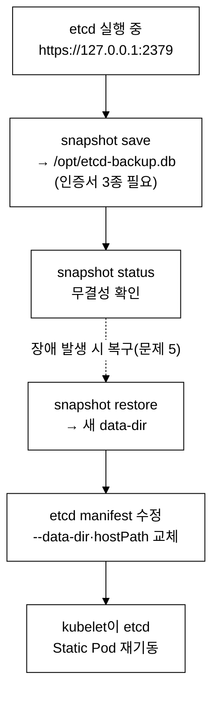

_그림. etcd 백업/복구 단계 — 백업은 save→status까지, 복구는 restore→매니페스트 수정→Static Pod 재기동까지다. 점선은 장애 시점에 백업본으로 되돌아가는 경로다._

<details>
<summary>풀이 확인</summary>

**풀이:**

```bash
# etcd Pod에서 인증서 경로 확인
kubectl -n kube-system describe pod etcd-controlplane | grep -E "cert|key|cacert"

# 스냅샷 저장
ETCDCTL_API=3 etcdctl snapshot save /opt/etcd-backup-$(date +%Y%m%d).db \
  --endpoints=https://127.0.0.1:2379 \
  --cacert=/etc/kubernetes/pki/etcd/ca.crt \
  --cert=/etc/kubernetes/pki/etcd/server.crt \
  --key=/etc/kubernetes/pki/etcd/server.key

# 검증
ETCDCTL_API=3 etcdctl snapshot status /opt/etcd-backup-$(date +%Y%m%d).db --write-out=table
```

**검증:**

```bash
ETCDCTL_API=3 etcdctl snapshot status /opt/etcd-backup-$(date +%Y%m%d).db --write-out=table
```

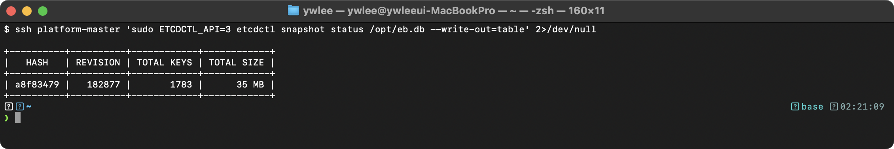

HASH, REVISION, TOTAL KEYS 값이 표시되면 스냅샷이 정상적으로 생성된 것이다. 파일 크기도 확인한다:

```bash
ls -lh /opt/etcd-backup-*.db
```

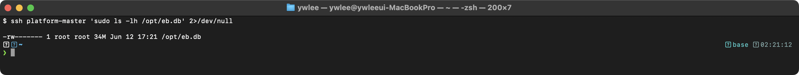

**출제 의도:** etcd 백업은 CKA 시험에서 거의 매번 출제된다. 인증서 경로를 정확히 지정하는 능력과 etcdctl 사용법을 평가한다.

**핵심 원리:** etcd는 쿠버네티스의 모든 클러스터 상태(Pod, Service, ConfigMap 등)를 저장하는 키-값 저장소이다. `snapshot save`는 etcd의 전체 데이터를 일관된 시점의 스냅샷으로 저장한다. etcd는 mTLS로 보호되므로 CA 인증서, 클라이언트 인증서, 클라이언트 키 3개가 모두 필요하다.

**함정과 주의사항:**
- `ETCDCTL_API=3`을 빠뜨리면 API v2가 사용되어 `snapshot` 명령이 동작하지 않는다.
- 인증서 경로를 외울 필요 없다. `kubectl -n kube-system get pod etcd-controlplane -o yaml | grep -E "cert|key|ca"` 명령으로 etcd Pod의 실행 인자에서 경로를 추출한다.
- 시험에서 저장 경로가 구체적으로 지정되므로 경로를 정확히 따라야 한다. 다른 경로에 저장하면 채점에서 실패한다.

**시간 절약 팁:** etcd 인증서 경로는 거의 항상 `/etc/kubernetes/pki/etcd/` 아래에 `ca.crt`, `server.crt`, `server.key`이다. 이 경로를 기억하면 인증서 확인 단계를 건너뛸 수 있다.

</details>

---

### 문제 5. [etcd 복구] etcd 스냅샷 복구

`kubectl config use-context k8s-cluster1`

`/opt/etcd-backup.db` 스냅샷 파일을 사용하여 etcd 데이터를 복구하라. 복구된 데이터 디렉터리는 `/var/lib/etcd-restored`를 사용하라.

<details>
<summary>풀이 확인</summary>

**풀이:**

```bash
# 1. 스냅샷 복구
ETCDCTL_API=3 etcdctl snapshot restore /opt/etcd-backup.db \
  --data-dir=/var/lib/etcd-restored

# 2. etcd 매니페스트 수정
sudo vi /etc/kubernetes/manifests/etcd.yaml
```

```yaml
# etcd.yaml에서 volumes 섹션의 etcd-data hostPath를 수정한다:
# 변경 전:
  volumes:
  - hostPath:
      path: /var/lib/etcd
      type: DirectoryOrCreate
    name: etcd-data

# 변경 후:
  volumes:
  - hostPath:
      path: /var/lib/etcd-restored
      type: DirectoryOrCreate
    name: etcd-data
```

```bash
# 3. etcd Pod가 재시작될 때까지 대기 (매니페스트 변경 시 자동 재시작)
watch crictl ps

# 4. 클러스터 정상 동작 확인
kubectl get pods -A
kubectl get nodes
```

`etcd.yaml` 매니페스트를 수정하면 kubelet이 변경을 감지하고 etcd Pod를 자동으로 재시작한다. 재시작에 1-2분 소요될 수 있다.

**검증:**

```bash
# etcd Pod 동작 확인
crictl ps | grep etcd

# API 서버가 etcd에 정상 연결되었는지 확인
kubectl get pods -A
kubectl get nodes
```

> **예시(시험 정답 형식, 참조):** 아래 형태의 출력이 정답이다 — `NAMESPACE     NAME                                   READY   ...`. 동일 명령의 **실측 스크린샷**은 이 자격증 daily(day01~20) 및 본 문서 위쪽 캡처에서 확인할 수 있다(이 블록은 일반 placeholder 클러스터 기준 예시).

etcd Pod가 `Running` 상태이고, `kubectl get pods -A`가 정상 출력되면 복구가 완료된 것이다.

**출제 의도:** etcd 스냅샷 복구는 백업과 쌍으로 자주 출제된다. 매니페스트의 hostPath 수정까지 정확히 수행하는 능력을 평가한다.

**핵심 원리:** `etcdctl snapshot restore`는 스냅샷 데이터를 새로운 데이터 디렉터리에 풀어놓는다. 기존 디렉터리를 덮어쓰지 않고 새 경로(`/var/lib/etcd-restored`)를 사용하는 이유는, 기존 데이터와 충돌을 방지하고 복구 실패 시 롤백할 수 있도록 하기 위함이다. etcd Static Pod 매니페스트에서 hostPath를 새 경로로 변경하면, kubelet이 변경을 감지하여 etcd Pod를 새 데이터 디렉터리로 재시작한다.

**함정과 주의사항:**
- `snapshot restore`만 실행하고 매니페스트를 수정하지 않으면 etcd는 여전히 이전 데이터 디렉터리를 사용한다. 반드시 `etcd.yaml`의 `hostPath.path`를 변경해야 한다.
- 매니페스트에서 `volumeMounts`의 `mountPath`는 변경하지 않는다. 변경하는 것은 `volumes` 섹션의 `hostPath.path`만이다.
- etcd 재시작 후 API 서버가 정상화되기까지 1-2분이 걸릴 수 있다. `crictl ps`로 etcd 컨테이너 상태를 먼저 확인한다.
- 복구 시 `--data-dir` 경로에 이미 데이터가 있으면 오류가 발생한다.

**시간 절약 팁:** `etcd.yaml`에서 수정할 부분은 `volumes` 섹션의 `hostPath.path` 하나뿐이다. `vi`에서 `/etcd-data`로 검색하면 해당 위치를 빠르게 찾을 수 있다.

</details>

---

### 문제 6. [RBAC] Role과 RoleBinding 생성

`kubectl config use-context k8s-cluster1`

네임스페이스 `development`에서 다음 RBAC 설정을 수행하라:
- `developer-role`이라는 Role을 생성하여 pods와 deployments에 대해 get, list, create, update, delete 권한을 부여하라.
- `developer-binding`이라는 RoleBinding을 생성하여 사용자 `jane`에게 `developer-role`을 바인딩하라.

RBAC의 권한 결정 흐름은 다음과 같다. 사용자(`jane`)가 API 요청을 보내면, API 서버는 그 주체에 연결된 RoleBinding을 찾고, 그 RoleBinding이 가리키는 Role의 규칙(verb·resource)을 확인해 요청을 허용/거부한다. 주체 → RoleBinding → Role → 리소스 권한의 4단 연결이다.

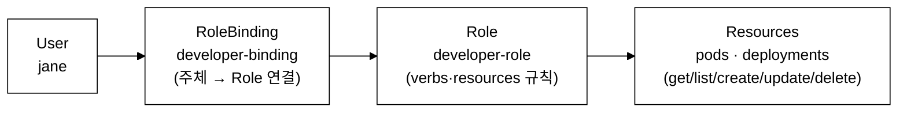

_그림. RBAC 권한 흐름 — 주체(User)에서 RoleBinding을 거쳐 Role의 규칙으로, 다시 대상 리소스로 이어진다. Role/RoleBinding은 네임스페이스 범위(`development`)에서만 유효하다._

<details>
<summary>풀이 확인</summary>

**풀이:**

```bash
# 네임스페이스 생성 (없는 경우)
kubectl create namespace development

# Role 생성
kubectl create role developer-role \
  --verb=get,list,create,update,delete \
  --resource=pods,deployments \
  -n development

# RoleBinding 생성
kubectl create rolebinding developer-binding \
  --role=developer-role \
  --user=jane \
  -n development
```

**검증:**

```bash
kubectl describe role developer-role -n development
```

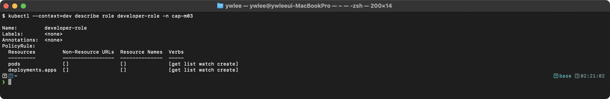

```bash
kubectl auth can-i create pods --as=jane -n development
# yes

kubectl auth can-i delete deployments --as=jane -n development
# yes

kubectl auth can-i create services --as=jane -n development
# no
```

`auth can-i` 결과에서 pods/deployments는 `yes`, services는 `no`가 나오면 정상이다.

**출제 의도:** RBAC는 CKA의 필수 출제 영역이다. Role/RoleBinding의 관계를 이해하고, imperative 명령으로 빠르게 생성할 수 있는지 평가한다.

**핵심 원리:** Role은 "무엇을 할 수 있는가"(verbs + resources)를 정의하고, RoleBinding은 "누가 그 Role을 사용하는가"(subject)를 정의한다. Role은 네임스페이스 범위이므로 해당 네임스페이스 내의 리소스에만 적용된다. 쿠버네티스는 기본적으로 deny-all 정책을 사용하므로 명시적으로 허용하지 않은 모든 작업은 거부된다.

**함정과 주의사항:**
- `deployments` 리소스의 apiGroup은 `apps`이다. YAML로 작성할 때 `apiGroups: ["apps"]`를 명시해야 한다. imperative 명령은 이를 자동 처리하므로 신경 쓸 필요 없다.
- `-n development`를 빠뜨리면 `default` 네임스페이스에 생성된다.
- `auth can-i`로 검증할 때 `--as=jane` 옵션은 impersonation 기능이며, 실제 사용자 인증과는 별개이다.

**시간 절약 팁:** RBAC는 반드시 imperative 명령으로 생성한다. `kubectl create role`과 `kubectl create rolebinding`이 YAML 작성보다 훨씬 빠르다. 시험에서 YAML을 처음부터 작성하면 시간 낭비이다.

</details>

---

### 문제 7. [RBAC] ClusterRole과 ClusterRoleBinding 생성

`kubectl config use-context k8s-cluster1`

- `node-viewer`라는 ClusterRole을 생성하여 nodes에 대해 get, list, watch 권한을 부여하라.
- `node-viewer-binding`이라는 ClusterRoleBinding을 생성하여 그룹 `ops-team`에게 `node-viewer`를 바인딩하라.

<details>
<summary>풀이 확인</summary>

**풀이:**

```bash
# ClusterRole 생성
kubectl create clusterrole node-viewer \
  --verb=get,list,watch \
  --resource=nodes

# ClusterRoleBinding 생성
kubectl create clusterrolebinding node-viewer-binding \
  --clusterrole=node-viewer \
  --group=ops-team

# 확인
kubectl describe clusterrole node-viewer
kubectl describe clusterrolebinding node-viewer-binding

# 권한 테스트
kubectl auth can-i list nodes --as-group=ops-team --as=test-user
```

**검증:**

```bash
kubectl auth can-i list nodes --as-group=ops-team --as=test-user
# yes

kubectl auth can-i delete nodes --as-group=ops-team --as=test-user
# no
```

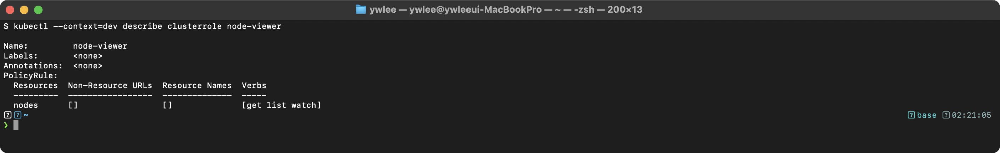

**출제 의도:** ClusterRole/ClusterRoleBinding과 Role/RoleBinding의 차이를 이해하고 있는지 평가한다. 그룹 바인딩은 조직 단위의 접근 제어를 구현하는 실무 패턴이다.

**핵심 원리:** ClusterRole은 클러스터 범위 리소스(nodes, namespaces 등)나 모든 네임스페이스의 리소스에 대한 권한을 정의한다. ClusterRoleBinding은 클러스터 전체에 걸쳐 Subject(User, Group, ServiceAccount)를 ClusterRole에 바인딩한다. `--group` 옵션은 인증 시스템(OIDC, X.509 등)에서 제공하는 그룹 정보와 매핑된다.

**함정과 주의사항:**
- ClusterRole + RoleBinding 조합도 가능하다. 이 경우 ClusterRole의 권한이 특정 네임스페이스로 제한된다.
- `--as-group`으로 테스트할 때 `--as` 플래그도 함께 필요하다. `--as-group`만 단독으로는 동작하지 않는다.
- `nodes`는 클러스터 범위 리소스이므로 일반 Role로는 권한을 부여할 수 없다.

**시간 절약 팁:** `kubectl create clusterrole`과 `kubectl create clusterrolebinding`을 사용한다. YAML 작성 대비 절반 이하의 시간이 걸린다.

</details>

---

### 문제 8. [RBAC] ServiceAccount 기반 RBAC

`kubectl config use-context k8s-cluster1`

네임스페이스 `monitoring`에서 다음을 수행하라:
- `monitoring-sa`라는 ServiceAccount를 생성하라.
- `pod-reader`라는 ClusterRole을 생성하여 모든 네임스페이스의 pods에 대해 get, list, watch 권한을 부여하라.
- `monitoring-sa`에 ClusterRoleBinding을 사용하여 `pod-reader` ClusterRole을 바인딩하라.
- `monitor-pod`라는 Pod를 생성하여 `monitoring-sa` ServiceAccount를 사용하고 `curlimages/curl` 이미지로 실행하라. 명령어는 `sleep 3600`이다.

<details>
<summary>풀이 확인</summary>

**풀이:**

```bash
# 네임스페이스 생성
kubectl create namespace monitoring

# ServiceAccount 생성
kubectl create serviceaccount monitoring-sa -n monitoring

# ClusterRole 생성
kubectl create clusterrole pod-reader \
  --verb=get,list,watch \
  --resource=pods

# ClusterRoleBinding 생성 (ServiceAccount에 바인딩)
kubectl create clusterrolebinding monitoring-sa-binding \
  --clusterrole=pod-reader \
  --serviceaccount=monitoring:monitoring-sa
```

```bash
# Pod YAML 생성 후 serviceAccountName 추가
kubectl run monitor-pod -n monitoring \
  --image=curlimages/curl \
  --dry-run=client -o yaml --command -- sleep 3600 > monitor-pod.yaml

# monitor-pod.yaml에 serviceAccountName: monitoring-sa 추가 후 적용
kubectl apply -f monitor-pod.yaml
```

**검증:**

```bash
kubectl get pod monitor-pod -n monitoring -o yaml | grep serviceAccountName
```

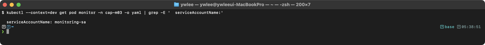

```bash
kubectl auth can-i list pods --as=system:serviceaccount:monitoring:monitoring-sa
# yes

kubectl auth can-i list pods --as=system:serviceaccount:monitoring:monitoring-sa -n kube-system
# yes (ClusterRoleBinding이므로 모든 네임스페이스에서 가능)

kubectl auth can-i delete pods --as=system:serviceaccount:monitoring:monitoring-sa
# no
```

위 `--as` 값의 `system:serviceaccount:<namespace>:<sa-name>` 형식은 쿠버네티스가 ServiceAccount를 RBAC의 주체(subject)로 참조할 때 쓰는 내부 표기 규약이다. 사용자(User)는 이름 그대로 쓰지만, SA는 어느 네임스페이스의 어떤 SA인지까지 구분해야 하므로 `system:serviceaccount:` 접두사 뒤에 네임스페이스와 이름을 콜론으로 이어 붙인다(여기서는 `monitoring` 네임스페이스의 `monitoring-sa`). `kubectl auth can-i`의 `--as`로 이 형식을 넘기면 해당 SA의 권한을 그대로 흉내 내어(impersonate) 권한을 검증할 수 있다.

**출제 의도:** ServiceAccount + ClusterRole + ClusterRoleBinding 조합은 실무에서 모니터링/로깅 에이전트가 사용하는 대표적인 패턴이다. Pod에 특정 SA를 할당하는 전체 흐름을 평가한다.

**핵심 원리:** ServiceAccount는 Pod 내부에서 API 서버에 접근할 때 사용하는 인증 주체이다. Pod에 `serviceAccountName`을 지정하면 해당 SA의 토큰이 `/var/run/secrets/kubernetes.io/serviceaccount/token`에 자동 마운트된다. ClusterRoleBinding으로 SA에 ClusterRole을 바인딩하면 Pod 내부에서 해당 권한으로 API를 호출할 수 있다.

**함정과 주의사항:**
- ServiceAccount 바인딩 형식은 `--serviceaccount=<namespace>:<sa-name>`이다. namespace를 빠뜨리면 오류가 발생한다.
- `kubectl run`으로 생성한 Pod YAML에는 `serviceAccountName`이 `default`로 설정되어 있다. 이를 직접 수정해야 한다.
- Pod의 `spec.serviceAccountName`은 생성 후 변경할 수 없다. 잘못 설정하면 삭제 후 재생성해야 한다.

**시간 절약 팁:** `kubectl run ... --dry-run=client -o yaml > file.yaml`로 뼈대를 생성한 후, `serviceAccountName` 한 줄만 `spec:` 아래에 추가한다. YAML을 처음부터 작성하는 것보다 빠르다.

</details>

---

### 문제 9. [kubeconfig] 컨텍스트 관리

`kubectl config use-context k8s-cluster1`

다음 작업을 수행하라:
- 현재 클러스터에 대해 `dev-context`라는 새 컨텍스트를 생성하라. 사용자는 기존 `kubernetes-admin`을 사용하고, 기본 네임스페이스는 `development`로 설정하라.
- `dev-context`로 전환하라.
- 현재 컨텍스트가 `dev-context`인지 확인하라.

<details>
<summary>풀이 확인</summary>

**풀이:**

```bash
# 현재 설정 확인
kubectl config get-contexts
kubectl config view --minify

# 현재 클러스터명과 사용자명 확인
kubectl config view --minify -o jsonpath='{.clusters[0].name}'
kubectl config view --minify -o jsonpath='{.users[0].name}'

# 네임스페이스 생성 (없는 경우)
kubectl create namespace development

# 새 컨텍스트 생성
kubectl config set-context dev-context \
  --cluster=kubernetes \
  --user=kubernetes-admin \
  --namespace=development

# 컨텍스트 전환
kubectl config use-context dev-context

# 확인
kubectl config current-context
# 출력: dev-context

# 기본 네임스페이스 확인
kubectl get pods
# development 네임스페이스의 Pod가 표시되어야 한다
```

`--cluster`와 `--user` 값은 현재 kubeconfig에 정의된 이름과 정확히 일치해야 한다. `kubectl config view`로 확인할 수 있다.

**검증:**

```bash
kubectl config current-context
```

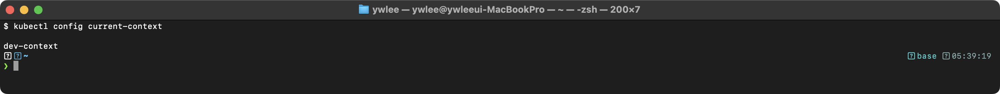

```bash
kubectl config get-contexts
```

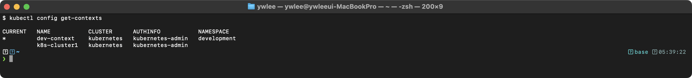

`*` 표시가 `dev-context` 옆에 있고 NAMESPACE가 `development`이면 성공이다.

**출제 의도:** kubeconfig 관리는 멀티 클러스터 환경에서 필수 역량이다. 컨텍스트를 올바르게 생성하고 전환할 수 있는지 평가한다.

**핵심 원리:** kubeconfig는 세 가지 구성 요소로 이루어진다: clusters(API 서버 주소), users(인증 정보), contexts(cluster + user + namespace 조합). 컨텍스트는 "어떤 클러스터에 어떤 사용자로 어떤 네임스페이스를 기본값으로" 접근할지를 정의한 편의 기능이다. `use-context`는 현재 활성 컨텍스트를 변경한다.

**함정과 주의사항:**
- `--cluster`와 `--user` 값은 kubeconfig에 이미 정의된 이름과 정확히 일치해야 한다. 오타가 있으면 인증 실패가 발생한다.
- 시험에서 컨텍스트 전환 문제가 나오면 반드시 `kubectl config view --minify`로 현재 클러스터/사용자 이름을 먼저 확인한다.
- 네임스페이스가 존재하지 않아도 컨텍스트는 생성된다. 하지만 해당 컨텍스트에서 `kubectl get pods`를 실행하면 "namespace not found" 오류가 발생한다.

**시간 절약 팁:** `kubectl config set-context`는 인자만 정확하면 한 줄로 끝나는 간단한 명령이다. `--cluster`, `--user` 값을 빠르게 확인하려면 `kubectl config view --minify -o jsonpath='{.clusters[0].name}'`을 사용한다.

</details>

---

### 문제 10. [HA 클러스터] Control Plane 노드 추가

`kubectl config use-context k8s-ha`

기존 HA 클러스터에 새로운 Control Plane 노드 `controlplane-3`를 추가하라. 클러스터는 stacked etcd 토폴로지를 사용한다.

<details>
<summary>풀이 확인</summary>

> **재현 제약 (이 저장소에서).** 이 문제는 Control Plane 3대로 구성된 HA 클러스터 환경이 필요해 이 저장소의 `dev`(master+worker1)·`staging`(master+worker1) 구조에서는 **완전 재현이 불가능하다**. 두 클러스터 모두 control plane이 1대뿐이라 세 번째 control plane을 조인할 대상 자체가 없다. 따라서 혼자 실습할 때는 HA 조인 전체를 흉내 내려 하지 말고, 아래 풀이 중 `sudo kubeadm init phase upload-certs --upload-certs` **명령이 정상 동작하고 certificate-key를 출력하는지**만 `staging-master`(`~/.ssh/config`에 등록된 VM 별칭, `ssh staging-master`로 접속)에서 확인한다. 이 명령은 단일 control plane에서도 실행되며, 출력된 키로 실제 조인을 시도하려면 추가 control plane VM이 필요하다(이 저장소에는 없음). HA 토폴로지 전체 실습은 별도 실습용 클러스터를 만들어야 가능하다.
>
> **전제 상황.** 이 문제는 `kubeadm init`으로 이미 구성되어 동작 중인 HA 클러스터에 세 번째 Control Plane 노드(`controlplane-3`)를 추가하는 시나리오다. 새 클러스터를 처음부터 초기화하는 것이 아니다. 따라서 아래의 `kubeadm init phase upload-certs`는 init을 다시 하는 것이 아니라, 이미 init된 클러스터의 control plane 인증서(CA·etcd·sa 키 등)를 etcd의 `kubeadm-certs` Secret에 임시로 다시 올려, 새 control plane 노드가 그 인증서를 내려받아 조인할 수 있게 하는 단계다. 이 명령은 이미 init이 끝난 클러스터에서만 의미가 있으며, init 전에는 사용할 수 없다.

**풀이:**

```bash
# 기존 Control Plane 노드에서 인증서 키 업로드
sudo kubeadm init phase upload-certs --upload-certs
# 출력에서 certificate-key 값을 복사

# 조인 명령 생성 (Control Plane용)
kubeadm token create --print-join-command
# 출력된 명령에 --control-plane --certificate-key를 추가

# controlplane-3에서 실행
ssh controlplane-3

sudo kubeadm join 192.168.1.100:6443 \
  --token abcdef.0123456789abcdef \
  --discovery-token-ca-cert-hash sha256:abc123... \
  --control-plane \
  --certificate-key <certificate-key-from-upload-certs>

# kubeconfig 설정
mkdir -p $HOME/.kube
sudo cp -i /etc/kubernetes/admin.conf $HOME/.kube/config
sudo chown $(id -u):$(id -g) $HOME/.kube/config

# 확인
exit
kubectl get nodes
```

**검증:**

```bash
kubectl get nodes
```

> **예시(시험 정답 형식, 참조):** 아래 형태의 출력이 정답이다 — `NAME              STATUS   ROLES           AGE   VERSION ...`. 동일 명령의 **실측 스크린샷**은 이 자격증 daily(day01~20) 및 본 문서 위쪽 캡처에서 확인할 수 있다(이 블록은 일반 placeholder 클러스터 기준 예시).

controlplane-3가 `Ready` 상태이고 ROLES에 `control-plane`이 표시되면 성공이다.

```bash
# etcd 멤버 확인 (stacked etcd인 경우)
ETCDCTL_API=3 etcdctl member list \
  --endpoints=https://127.0.0.1:2379 \
  --cacert=/etc/kubernetes/pki/etcd/ca.crt \
  --cert=/etc/kubernetes/pki/etcd/server.crt \
  --key=/etc/kubernetes/pki/etcd/server.key \
  --write-out=table
```

> **예시(시험 정답 형식, 참조):** 아래 형태의 출력이 정답이다 — `+------------------+---------+------------------+----------- ...`. 동일 명령의 **실측 스크린샷**은 이 자격증 daily(day01~20) 및 본 문서 위쪽 캡처에서 확인할 수 있다(이 블록은 일반 placeholder 클러스터 기준 예시).

**출제 의도:** HA 클러스터 구성은 프로덕션 환경에서 필수이다. Worker Node 조인과 Control Plane 조인의 차이를 이해하고 있는지 평가한다.

**핵심 원리:** Stacked etcd 토폴로지(각 Control Plane 노드 안에 etcd를 함께 얹는 구성. etcd를 별도 머신 군으로 분리하는 external etcd 토폴로지와 대비된다)에서는 각 Control Plane 노드가 자체 etcd 인스턴스를 실행한다. 이때 etcd 멤버 수는 홀수(3·5개)로 두어 과반(quorum)을 명확히 한다 — 그래야 한 노드가 죽어도 나머지가 과반을 이뤄 쓰기를 계속한다. `--control-plane` 플래그는 조인 시 해당 노드에 kube-apiserver, kube-controller-manager, kube-scheduler, etcd를 모두 배포하도록 지시한다. `--certificate-key`는 기존 Control Plane에서 암호화된 인증서를 가져오기 위한 복호화 키이다.

**함정과 주의사항:**
- `--certificate-key`는 2시간 후 만료된다. 만료되면 `kubeadm init phase upload-certs --upload-certs`를 다시 실행해야 한다.
- 새 Control Plane 노드에서 kubeconfig를 설정하지 않으면 해당 노드에서 `kubectl` 명령을 실행할 수 없다.
- 외부 로드밸런서를 사용하는 경우 새 Control Plane 노드의 IP를 로드밸런서 백엔드에 추가해야 한다.

**시간 절약 팁:** `kubeadm init phase upload-certs --upload-certs`의 출력과 `kubeadm token create --print-join-command`의 출력을 조합하면 된다. 두 명령을 순서대로 실행하고, 출력을 합치는 것이 핵심이다.

</details>

---

## Workloads & Scheduling

> **이 영역이 왜 있나 (등장 배경).** 컨테이너를 노드에 직접 띄우던 시절(예: `docker run`)에는 어느 컨테이너가 죽으면 누군가 알아채고 다시 띄워야 했고, 트래픽이 늘면 손으로 컨테이너 수를 늘렸으며, 새 버전 배포는 전부 내렸다가 다시 올리는 식이라 다운타임이 생겼다. 쿠버네티스는 이를 **declarative(선언형) + reconciliation(조정 루프)** 모델로 바꿨다. 운영자는 "원하는 상태"(레플리카 4개, 이미지 nginx:1.25)만 선언하고, 컨트롤러가 현재 상태와 비교해 차이를 자동으로 메운다(reconciliation loop). Deployment는 그 위에 무중단 롤링 업데이트와 롤백을, scheduler는 "어느 노드에 둘지"를 최적화한다. 트레이드오프: 추상화 계층이 많아져 "왜 이 Pod가 여기 떴는가/안 떴는가"를 이해하려면 affinity·taint·resource 같은 스케줄링 입력을 모두 읽을 수 있어야 한다.
>
> **이 영역에서 처음 나오는 용어 한 줄 풀이.**
> - **declarative / reconciliation**: 명령형("이 컨테이너를 띄워라")이 아니라 선언형("이 상태를 유지하라")으로 의도를 적고, 컨트롤러가 현재 상태를 그 의도로 끊임없이 수렴시키는 방식.
> - **ReplicaSet**: Deployment가 내부적으로 만드는 하위 오브젝트. "이 라벨의 Pod를 N개 유지"를 책임진다. 롤링 업데이트는 구·신 ReplicaSet의 Pod 수를 점진 조절하는 것이다.
> - **affinity / nodeSelector / taint·toleration**: 스케줄러에 "이 Pod를 어디에 둘지/두지 말지"를 알려주는 입력. nodeSelector는 단순 라벨 일치, affinity는 더 유연한 조건, taint는 노드 쪽의 거부 표시, toleration은 그 거부를 견디는 허가증이다.

### 문제 11. [Deployment] Rolling Update 설정

`kubectl config use-context k8s-cluster1`

다음 조건으로 Deployment를 생성하라:
- 이름: `webapp`
- 네임스페이스: `default`
- 이미지: `nginx:1.24`
- 레플리카: 4
- Rolling Update 전략: maxSurge=1, maxUnavailable=0 (zero-downtime)
- 생성 후 이미지를 `nginx:1.25`로 업데이트하라.

<details>
<summary>풀이 확인</summary>

**풀이:**

```bash
# Deployment YAML 생성
kubectl create deployment webapp --image=nginx:1.24 --replicas=4 --dry-run=client -o yaml > webapp.yaml
```

```yaml
# webapp.yaml 수정
apiVersion: apps/v1
kind: Deployment
metadata:
  name: webapp
spec:
  replicas: 4
  selector:
    matchLabels:
      app: webapp
  strategy:
    type: RollingUpdate
    rollingUpdate:
      maxSurge: 1
      maxUnavailable: 0
  template:
    metadata:
      labels:
        app: webapp
    spec:
      containers:
      - name: nginx
        image: nginx:1.24
        ports:
        - containerPort: 80
```

```bash
# 적용
kubectl apply -f webapp.yaml

# 이미지 업데이트
kubectl set image deployment/webapp nginx=nginx:1.25

# 롤아웃 상태 확인
kubectl rollout status deployment/webapp

# 이력 확인
kubectl rollout history deployment/webapp
```

`maxUnavailable: 0`은 업데이트 중 사용 불가한 Pod가 없도록 보장한다. 새 Pod가 Ready 상태가 된 후에야 기존 Pod가 종료된다.

**검증:**

```bash
kubectl rollout status deployment/webapp
```

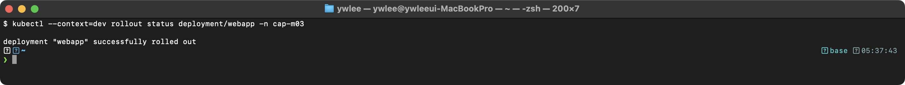

```bash
kubectl get deployment webapp -o wide
```

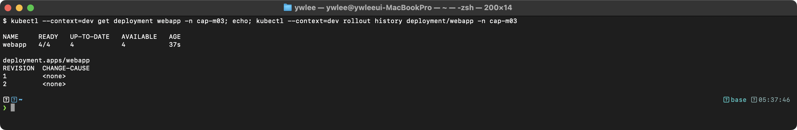

```bash
kubectl rollout history deployment/webapp
```

> **예시(시험 정답 형식, 참조):** 아래 형태의 출력이 정답이다 — `REVISION  CHANGE-CAUSE ...`. 동일 명령의 **실측 스크린샷**은 이 자격증 daily(day01~20) 및 본 문서 위쪽 캡처에서 확인할 수 있다(이 블록은 일반 placeholder 클러스터 기준 예시).

IMAGES가 `nginx:1.25`이고 READY가 `4/4`이면 성공이다. REVISION이 2개 존재하면 업데이트 이력이 정상 기록된 것이다.

**출제 의도:** Rolling Update 전략의 세부 파라미터를 이해하고, zero-downtime 배포를 구성할 수 있는지 평가한다.

**핵심 원리:** Rolling Update는 ReplicaSet을 점진적으로 교체하는 전략이다. `maxSurge=1`은 desired 수보다 최대 1개 더 많은 Pod를 동시에 실행할 수 있다는 의미이다. `maxUnavailable=0`은 업데이트 중에도 항상 desired 수만큼의 Pod가 Ready 상태여야 한다는 의미이다. 이 조합은 새 Pod가 Ready가 된 후에야 기존 Pod를 하나씩 종료하므로, zero-downtime이 보장된다.

**함정과 주의사항:**
- `maxSurge`와 `maxUnavailable`을 둘 다 0으로 설정하면 업데이트가 진행되지 않는다(deadlock). 적어도 하나는 1 이상이어야 한다.
- `kubectl set image`에서 컨테이너 이름을 정확히 지정해야 한다. `nginx=nginx:1.25`에서 앞의 `nginx`는 컨테이너 이름이다.
- strategy 필드는 `kubectl create deployment`로 생성 시 포함되지 않는다. YAML을 수정해야 한다.

**시간 절약 팁:** `kubectl create deployment --dry-run=client -o yaml`로 YAML 뼈대를 생성한 후, strategy 부분만 추가한다. 이미지 업데이트는 `kubectl set image`를 사용하면 YAML 수정 없이 한 줄로 끝난다.

</details>

---

### 문제 12. [Scheduling] nodeAffinity로 Pod 배치

`kubectl config use-context k8s-cluster1`

다음 조건으로 Deployment를 생성하라:
- 이름: `cache-deploy`
- 이미지: `redis:7`
- 레플리카: 2
- `disktype=ssd` 레이블이 있는 노드에만(required) 배치하라.
- `zone=zone-a` 레이블이 있는 노드를 선호(preferred, weight=80)하도록 설정하라.

<details>
<summary>풀이 확인</summary>

**풀이:**

```yaml
apiVersion: apps/v1
kind: Deployment
metadata:
  name: cache-deploy
spec:
  replicas: 2
  selector:
    matchLabels:
      app: cache
  template:
    metadata:
      labels:
        app: cache
    spec:
      affinity:
        nodeAffinity:
          requiredDuringSchedulingIgnoredDuringExecution:
            nodeSelectorTerms:
            - matchExpressions:
              - key: disktype
                operator: In
                values:
                - ssd
          preferredDuringSchedulingIgnoredDuringExecution:
          - weight: 80
            preference:
              matchExpressions:
              - key: zone
                operator: In
                values:
                - zone-a
      containers:
      - name: redis
        image: redis:7
```

```bash
# 노드에 레이블이 없으면 추가
kubectl label nodes worker-1 disktype=ssd
kubectl label nodes worker-1 zone=zone-a

# 적용
kubectl apply -f cache-deploy.yaml
```

**검증:**

```bash
kubectl get pods -o wide -l app=cache
```

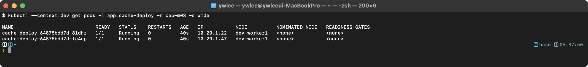

모든 Pod가 `disktype=ssd` 레이블이 있는 노드에 배치되었는지 확인한다. `zone=zone-a` 레이블도 있는 노드가 있으면 해당 노드를 우선 선택한다.

```bash
# 노드 레이블 확인
kubectl get nodes --show-labels | grep disktype
```

Pod가 `Pending` 상태이면 `disktype=ssd` 레이블이 있는 노드가 없는 것이다.

**출제 의도:** nodeAffinity의 required/preferred 구분을 정확히 이해하고 YAML을 작성할 수 있는지 평가한다. 스케줄링 제어는 CKA 핵심 영역이다.

**핵심 원리:** `requiredDuringSchedulingIgnoredDuringExecution`은 hard constraint이다. 조건을 만족하는 노드가 없으면 Pod는 Pending 상태로 남는다. `preferredDuringSchedulingIgnoredDuringExecution`은 soft constraint이다. 조건을 만족하는 노드를 선호하지만, 없으면 다른 노드에도 배치된다. weight(1~100)는 여러 preferred 규칙이 있을 때 우선순위를 결정한다. `IgnoredDuringExecution`은 이미 실행 중인 Pod에는 규칙을 적용하지 않는다는 의미이다.

**함정과 주의사항:**
- nodeAffinity의 YAML 구조가 깊어서 들여쓰기 오류가 자주 발생한다. `kubectl explain deployment.spec.template.spec.affinity.nodeAffinity --recursive`로 구조를 확인한다.
- `nodeSelector`는 단순한 label matching이고, `nodeAffinity`는 더 유연한 표현(In, NotIn, Exists, DoesNotExist, Gt, Lt)을 지원한다. 시험에서는 둘 다 출제될 수 있다.
- `nodeSelectorTerms`는 OR 관계이고, `matchExpressions`는 AND 관계이다.

**시간 절약 팁:** affinity YAML은 구조가 복잡하므로 공식 문서에서 복사-붙여넣기 하는 것이 가장 빠르다. 시험 환경에서 kubernetes.io 문서를 활용할 수 있다. "Assign Pods to Nodes" 페이지에 전체 예제가 있다.

</details>

---

### 문제 13. [Taint/Toleration] 전용 노드 설정

`kubectl config use-context k8s-cluster1`

Worker Node `worker-2`를 GPU 워크로드 전용 노드로 설정하라:
- `worker-2`에 `gpu=true:NoSchedule` Taint를 추가하라.
- `gpu-pod`라는 Pod를 생성하여 해당 Taint를 tolerate하고 `worker-2`에서만 실행되도록 하라. 이미지는 `nvidia/cuda:12.0-base`를 사용하라.

<details>
<summary>풀이 확인</summary>

**풀이:**

```bash
# Taint 추가
kubectl taint nodes worker-2 gpu=true:NoSchedule

# 노드에 레이블 추가 (nodeSelector용)
kubectl label nodes worker-2 gpu=true
```

```yaml
apiVersion: v1
kind: Pod
metadata:
  name: gpu-pod
spec:
  tolerations:
  - key: "gpu"
    operator: "Equal"
    value: "true"
    effect: "NoSchedule"
  nodeSelector:
    gpu: "true"
  containers:
  - name: cuda
    image: nvidia/cuda:12.0-base
    command: ["sleep", "3600"]
```

```bash
kubectl apply -f gpu-pod.yaml

# 확인
kubectl get pod gpu-pod -o wide
# NODE 컬럼이 worker-2여야 한다
```

Toleration만으로는 해당 노드에 "반드시" 배치되는 것이 아니다. `nodeSelector`와 함께 사용해야 해당 노드에만 배치된다.

**검증:**

```bash
kubectl get pod gpu-pod -o wide
```

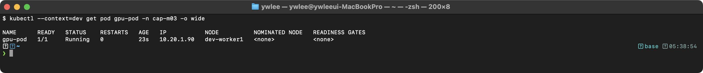

NODE가 `worker-2`이면 성공이다.

```bash
# Taint 확인
kubectl describe node worker-2 | grep Taints
```

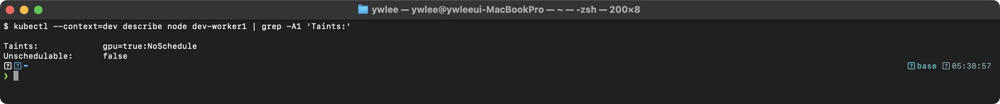

```bash
# Toleration 없는 일반 Pod가 worker-2에 스케줄링되지 않는지 확인
kubectl run normal-pod --image=nginx
kubectl get pod normal-pod -o wide
# NODE가 worker-2가 아닌 다른 노드여야 한다
```

**출제 의도:** Taint/Toleration은 특정 워크로드를 전용 노드에 격리하는 핵심 메커니즘이다. Toleration과 nodeSelector의 조합 사용을 이해하고 있는지 평가한다.

**핵심 원리:** Taint는 노드에 설정하는 "거부 표시"이다. Taint가 있는 노드에는 해당 Taint를 tolerate하는 Pod만 스케줄링된다. 하지만 Toleration은 "해당 노드에 갈 수 있다"는 의미일 뿐 "해당 노드에 반드시 간다"는 의미가 아니다. 따라서 `nodeSelector`와 함께 사용하여 해당 노드에만 배치되도록 해야 한다.

**함정과 주의사항:**
- Toleration만 설정하면 다른 노드에도 스케줄링될 수 있다. 반드시 `nodeSelector` 또는 `nodeAffinity`를 함께 사용한다.
- Taint의 effect 종류: `NoSchedule`(새 Pod 거부), `PreferNoSchedule`(가능하면 거부), `NoExecute`(기존 Pod도 퇴출). 시험에서는 주로 `NoSchedule`이 출제된다.
- `operator: Equal`은 key, value, effect가 모두 일치해야 한다. `operator: Exists`는 key만 일치하면 된다.
- Taint 제거 시에는 `kubectl taint nodes worker-2 gpu=true:NoSchedule-` (끝에 `-` 추가)을 사용한다.

**시간 절약 팁:** Taint 추가와 노드 레이블 추가는 imperative 명령으로 빠르게 처리한다. Pod YAML만 작성하면 되는데, `kubectl run --dry-run=client -o yaml`로 뼈대를 만들고 `tolerations`와 `nodeSelector`를 추가한다.

</details>

---

### 문제 14. [Resource] LimitRange와 ResourceQuota 설정

`kubectl config use-context k8s-cluster1`

네임스페이스 `restricted`에 다음을 설정하라:
- LimitRange: 컨테이너 기본 requests(cpu: 100m, memory: 128Mi), 기본 limits(cpu: 500m, memory: 256Mi)
- ResourceQuota: 전체 requests.cpu=2, requests.memory=2Gi, limits.cpu=4, limits.memory=4Gi, pods=10

<details>
<summary>풀이 확인</summary>

**풀이:**

```bash
kubectl create namespace restricted
```

```yaml
# LimitRange
apiVersion: v1
kind: LimitRange
metadata:
  name: default-limits
  namespace: restricted
spec:
  limits:
  - type: Container
    default:
      cpu: "500m"
      memory: "256Mi"
    defaultRequest:
      cpu: "100m"
      memory: "128Mi"
---
# ResourceQuota
apiVersion: v1
kind: ResourceQuota
metadata:
  name: compute-quota
  namespace: restricted
spec:
  hard:
    requests.cpu: "2"
    requests.memory: "2Gi"
    limits.cpu: "4"
    limits.memory: "4Gi"
    pods: "10"
```

```bash
kubectl apply -f limitrange-quota.yaml
```

**검증:**

```bash
kubectl describe limitrange default-limits -n restricted
```

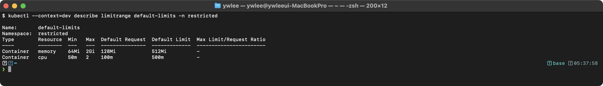

```bash
kubectl describe resourcequota compute-quota -n restricted
```

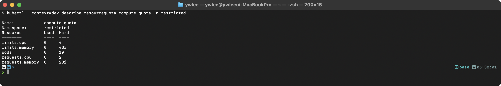

```bash
# LimitRange 동작 테스트: requests/limits 없이 Pod 생성
kubectl run test-pod --image=nginx -n restricted
kubectl get pod test-pod -n restricted -o yaml | grep -A6 resources
```

> **예시(시험 정답 형식, 참조):** 아래 형태의 출력이 정답이다 — `resources: ...`. 동일 명령의 **실측 스크린샷**은 이 자격증 daily(day01~20) 및 본 문서 위쪽 캡처에서 확인할 수 있다(이 블록은 일반 placeholder 클러스터 기준 예시).

Pod에 resource를 명시하지 않았는데도 LimitRange의 기본값이 자동 적용된 것을 확인한다.

**출제 의도:** 네임스페이스 수준의 리소스 제한은 멀티테넌트 클러스터 운영의 핵심이다. LimitRange와 ResourceQuota의 차이와 상호작용을 이해하고 있는지 평가한다.

**핵심 원리:** LimitRange는 개별 컨테이너/Pod의 기본 리소스 값과 최소/최대 범위를 설정한다. ResourceQuota는 네임스페이스 전체의 리소스 총량을 제한한다. ResourceQuota가 설정된 네임스페이스에서는 모든 Pod에 requests/limits가 반드시 있어야 한다. LimitRange의 default 값은 이 요구사항을 자동으로 충족시켜주므로, 두 리소스를 함께 사용하는 것이 일반적이다.

**함정과 주의사항:**
- ResourceQuota가 있는 네임스페이스에서 LimitRange 없이 requests/limits를 명시하지 않은 Pod를 생성하면 `must specify requests/limits` 오류가 발생한다.
- LimitRange의 `default`는 limits 기본값이고, `defaultRequest`는 requests 기본값이다. 이름이 직관적이지 않으므로 혼동하기 쉽다.
- ResourceQuota의 `Used` 값은 실제 사용량이 아니라 Pod들이 선언한 requests/limits의 합계이다.

**시간 절약 팁:** LimitRange와 ResourceQuota는 imperative 명령으로 생성할 수 없다. YAML을 직접 작성해야 한다. 공식 문서의 "LimitRange" 및 "Resource Quotas" 페이지에서 예제를 복사하는 것이 가장 빠르다.

</details>

---

### 문제 15. [Job] 병렬 Job 생성

`kubectl config use-context k8s-cluster1`

다음 조건으로 Job을 생성하라:
- 이름: `data-processor`
- 이미지: `busybox:1.36`
- 명령어: `echo "Processing data item $RANDOM" && sleep 5`
- 총 6개의 작업을 완료해야 한다 (completions=6).
- 동시에 3개씩 실행한다 (parallelism=3).
- 최대 재시도 횟수: 2

<details>
<summary>풀이 확인</summary>

**풀이:**

```yaml
apiVersion: batch/v1
kind: Job
metadata:
  name: data-processor
spec:
  completions: 6
  parallelism: 3
  backoffLimit: 2
  template:
    spec:
      restartPolicy: Never
      containers:
      - name: processor
        image: busybox:1.36
        command: ["/bin/sh", "-c", "echo Processing data item $RANDOM && sleep 5"]
```

```bash
kubectl apply -f data-processor.yaml

# 상태 확인
kubectl get jobs data-processor
kubectl get pods --selector=job-name=data-processor

# 완료 후 확인
kubectl describe job data-processor
```

`completions=6, parallelism=3`이면 3개씩 두 번에 나눠서 실행된다. 모든 6개가 성공해야 Job이 완료된다.

**검증:**

```bash
kubectl get jobs data-processor
```

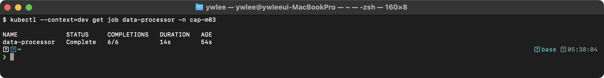

COMPLETIONS가 `6/6`이면 모든 작업이 완료된 것이다.

```bash
kubectl get pods --selector=job-name=data-processor
```

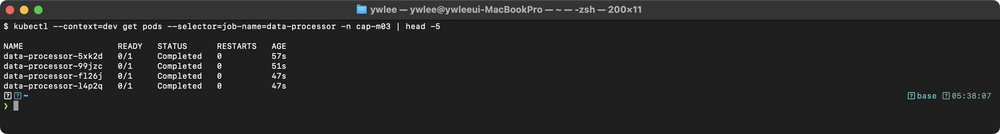

6개 Pod가 모두 `Completed` 상태이면 성공이다. 앞의 3개와 뒤의 3개가 AGE가 다른 것은 3개씩 두 배치로 실행되었기 때문이다.

**출제 의도:** Job의 completions, parallelism, backoffLimit 파라미터를 정확히 설정할 수 있는지 평가한다. 배치 작업 관리는 실무에서 자주 사용된다.

**핵심 원리:** Job 컨트롤러는 `completions` 수만큼의 Pod가 성공적으로 종료될 때까지 Pod를 생성한다. `parallelism`은 동시에 실행할 Pod 수를 제한한다. `backoffLimit`은 Pod가 실패했을 때 재시도 횟수이다. 재시도 시 exponential backoff(10초, 20초, 40초...)가 적용된다. `restartPolicy`는 Job에서 반드시 `Never` 또는 `OnFailure`여야 한다.

**함정과 주의사항:**
- `restartPolicy: Never`를 빠뜨리면 Job 생성이 실패한다. Job의 Pod는 `Always` restartPolicy를 사용할 수 없다.
- `backoffLimit: 2`로 설정하면 2번 실패 후 Job이 `Failed` 상태가 된다. 기본값은 6이다.
- `$RANDOM`은 shell variable이므로 command에서 `/bin/sh -c`로 실행해야 한다. 직접 args로 넣으면 literal string으로 처리된다.

**시간 절약 팁:** `kubectl create job data-processor --image=busybox:1.36 --dry-run=client -o yaml -- /bin/sh -c "echo Processing && sleep 5"`로 뼈대를 생성한 후 `completions`, `parallelism`, `backoffLimit`을 추가한다.

</details>

---

### 문제 16. [Static Pod] Static Pod 생성

`kubectl config use-context k8s-cluster1`

Worker Node `worker-1`에서 Static Pod를 생성하라:
- 이름: `static-web`
- 이미지: `nginx:1.25`
- 포트: 80

<details>
<summary>풀이 확인</summary>

**풀이:**

```bash
# worker-1에 SSH 접속
ssh worker-1

# Static Pod 경로 확인
cat /var/lib/kubelet/config.yaml | grep staticPodPath
# 출력: staticPodPath: /etc/kubernetes/manifests

# Static Pod 매니페스트 생성
cat <<EOF > /etc/kubernetes/manifests/static-web.yaml
apiVersion: v1
kind: Pod
metadata:
  name: static-web
  labels:
    role: static-web
spec:
  containers:
  - name: nginx
    image: nginx:1.25
    ports:
    - containerPort: 80
EOF

# Control Plane으로 돌아와서 확인
exit
kubectl get pods -o wide | grep static-web
# static-web-worker-1 이라는 이름의 Pod가 보여야 한다
```

**검증:**

```bash
kubectl get pods -o wide | grep static-web
```

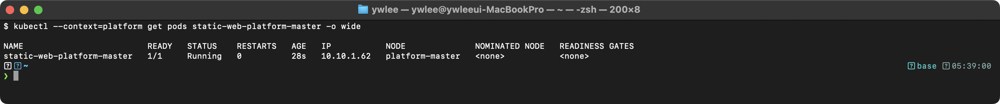

Pod 이름이 `static-web-worker-1`(매니페스트의 이름 + 노드 이름) 형식이고 `Running` 상태이면 성공이다.

```bash
kubectl describe pod static-web-worker-1 | grep "Controlled By"
```

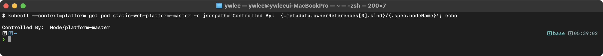

`Controlled By`가 `Node/worker-1`이면 Static Pod임이 확인된다. Deployment나 ReplicaSet이 아닌 노드가 직접 관리한다.

**출제 의도:** Static Pod의 동작 원리와 생성 방법을 이해하고 있는지 평가한다. 시험에서는 특정 노드에 SSH 접속하여 작업하는 형태로 출제된다.

**핵심 원리:** Static Pod는 kubelet이 API 서버와 독립적으로 직접 관리하는 Pod이다. kubelet은 `staticPodPath`(기본값: `/etc/kubernetes/manifests`)를 주기적으로 감시한다. 이 디렉터리에 YAML 파일이 생기면 kubelet이 자동으로 Pod를 생성하고, 파일이 삭제되면 Pod도 삭제한다. API 서버에는 Mirror Pod라는 읽기 전용 복사본이 생성되어 `kubectl get pods`로 확인할 수 있다.

**함정과 주의사항:**
- `staticPodPath`가 노드마다 다를 수 있다. 반드시 `/var/lib/kubelet/config.yaml`에서 경로를 확인한다.
- Static Pod는 `kubectl delete pod`로 삭제할 수 없다. 삭제해도 kubelet이 즉시 다시 생성한다. 매니페스트 파일을 삭제해야 한다.
- API 서버에 표시되는 이름은 `<pod-name>-<node-name>` 형식이다. 매니페스트 파일의 이름(확장자 제외)은 Pod 이름과 일치할 필요 없지만, metadata.name이 Pod 이름을 결정한다.
- Control Plane의 kube-apiserver, etcd, kube-scheduler, kube-controller-manager도 Static Pod이다.

**시간 절약 팁:** Worker Node에서 `kubectl`이 없을 수 있으므로 `cat <<EOF >` 방식으로 직접 YAML을 작성하는 것이 안전하다. 간단한 Pod YAML은 외워두면 빠르다.

</details>

---

## Services & Networking

> **이 영역이 왜 있나 (등장 배경).** Pod IP는 영구적이지 않다. Pod가 죽고 다시 뜨면 IP가 바뀌므로, 한 Pod가 다른 Pod의 IP를 직접 외워 호출하는 방식은 깨진다. Service는 이 위에 "변하지 않는 가상 IP(ClusterIP)와 이름"을 얹어, 뒤에 붙은 Pod 집합이 바뀌어도 호출 측은 같은 주소를 쓰게 한다. 초기 구현은 노드마다 **kube-proxy**가 **iptables** 규칙을 깔아 가상 IP로 온 패킷을 실제 Pod IP로 DNAT(목적지 주소 변환)하는 방식이었다. 서비스·엔드포인트가 많아지면 iptables 규칙이 선형으로 늘어 갱신·조회가 느려졌고, 그 한계 때문에 해시 테이블 기반의 **IPVS**(커널 L4 로드밸런서), 나아가 **eBPF**(커널에 안전한 코드를 끼워 패킷 경로를 직접 제어하는 기술)를 쓰는 **Cilium** 같은 CNI가 등장했다(이 저장소 클러스터의 CNI가 Cilium이다). Ingress는 그 위 L7(HTTP) 라우팅을, NetworkPolicy는 "누가 누구와 통신 가능한가"의 방화벽을 담당한다. 트레이드오프: 계층이 많아 한 단계만 끊겨도(selector 불일치, Endpoints 비어 있음, DNS 차단) 통신이 죽으므로, 트러블슈팅은 계층을 따라 내려가며 한다.
>
> **이 영역에서 처음 나오는 용어 한 줄 풀이.**
> - **CNI(Container Network Interface)**: Pod에 네트워크 인터페이스·IP를 붙여 주는 플러그인 규격. Calico·Cilium·Flannel 등이 구현체. NetworkPolicy 지원 여부가 구현체마다 다르다.
> - **kube-proxy / iptables / IPVS**: Service 가상 IP로 온 트래픽을 실제 Pod로 분산하는 데이터 평면. iptables는 규칙 사슬, IPVS는 커널 L4 로드밸런서.
> - **Endpoints**: Service의 selector와 라벨이 맞고 Ready인 Pod들의 IP:Port 목록. 이게 비어 있으면 Service는 트래픽 보낼 곳이 없다.
> - **CoreDNS**: 클러스터 내장 DNS 서버. `my-svc.ns.svc.cluster.local` 같은 이름을 ClusterIP로 변환한다. Egress 정책에서 53번 포트를 막으면 이름 해석이 막혀 통신 전체가 깨진다.

### 문제 17. [Service] ClusterIP Service 생성

`kubectl config use-context k8s-cluster1`

`default` 네임스페이스에서:
- `backend`라는 Deployment를 생성하라 (이미지: `nginx:1.25`, 레플리카: 3).
- `backend-svc`라는 ClusterIP Service를 생성하여 포트 80으로 해당 Deployment를 노출하라.
- Service의 엔드포인트가 3개의 Pod IP를 포함하고 있는지 확인하라.

<details>
<summary>풀이 확인</summary>

**풀이:**

```bash
# Deployment 생성
kubectl create deployment backend --image=nginx:1.25 --replicas=3

# Service 생성
kubectl expose deployment backend --port=80 --target-port=80 --name=backend-svc

# 확인
kubectl get svc backend-svc
kubectl get endpoints backend-svc

# 엔드포인트에 3개의 IP가 있는지 확인
kubectl get endpoints backend-svc -o jsonpath='{.subsets[0].addresses[*].ip}'

# 연결 테스트
kubectl run curl-test --image=curlimages/curl --rm -it --restart=Never -- \
  curl -s http://backend-svc
```

**검증:**

```bash
kubectl get svc backend-svc
```

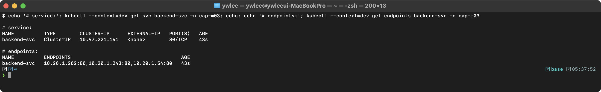

```bash
kubectl get endpoints backend-svc
```

> **예시(시험 정답 형식, 참조):** 아래 형태의 출력이 정답이다 — `NAME          ENDPOINTS                                      ...`. 동일 명령의 **실측 스크린샷**은 이 자격증 daily(day01~20) 및 본 문서 위쪽 캡처에서 확인할 수 있다(이 블록은 일반 placeholder 클러스터 기준 예시).

ENDPOINTS에 3개의 IP:Port가 표시되면 Service가 3개의 Pod에 정상 연결된 것이다.

**출제 의도:** Deployment와 Service를 연결하는 기본 흐름을 평가한다. Endpoints 확인을 통해 Service가 실제로 Pod를 발견하고 있는지 검증하는 능력을 본다.

**핵심 원리:** Service는 label selector를 사용하여 백엔드 Pod를 자동으로 발견한다. `kubectl expose`는 Deployment의 label selector와 동일한 selector로 Service를 생성한다. Service 생성 시 Endpoints Controller가 selector와 일치하는 Ready 상태의 Pod IP를 Endpoints 오브젝트에 등록한다. kube-proxy는 이 Endpoints 정보를 기반으로 iptables/IPVS 규칙을 생성하여 트래픽을 분산한다.

**함정과 주의사항:**
- `kubectl expose`는 Deployment의 Pod template에 `containerPort`가 정의되어 있어야 `--port`를 자동 감지할 수 있다. 그렇지 않으면 `--port`를 명시적으로 지정해야 한다.
- Endpoints가 비어있으면 Service의 selector와 Pod의 label이 불일치하거나, Pod가 Ready 상태가 아닌 것이다.
- `--target-port`를 생략하면 `--port`와 동일한 값이 사용된다.

**시간 절약 팁:** `kubectl create deployment` + `kubectl expose deployment`는 가장 빠른 imperative 조합이다. YAML을 작성할 필요가 전혀 없다.

</details>

---

### 문제 18. [Service] NodePort Service 생성

`kubectl config use-context k8s-cluster1`

다음 조건으로 NodePort Service를 생성하라:
- 이름: `webapp-nodeport`
- 대상 Deployment: `webapp` (이미지 `nginx`, 레플리카 2)
- Service 포트: 80
- NodePort: 30080

<details>
<summary>풀이 확인</summary>

**풀이:**

```bash
# Deployment 생성 (없는 경우)
kubectl create deployment webapp --image=nginx --replicas=2
```

```yaml
apiVersion: v1
kind: Service
metadata:
  name: webapp-nodeport
spec:
  type: NodePort
  selector:
    app: webapp
  ports:
  - port: 80
    targetPort: 80
    nodePort: 30080
    protocol: TCP
```

```bash
kubectl apply -f webapp-nodeport.yaml
```

**검증:**

```bash
kubectl get svc webapp-nodeport
```

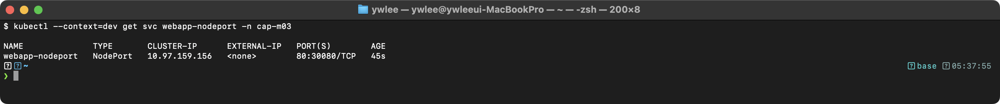

PORT(S) 컬럼에 `80:30080/TCP`가 표시되면 NodePort 30080이 정상 매핑된 것이다.

```bash
kubectl describe svc webapp-nodeport | grep -E "NodePort|Endpoints"
```

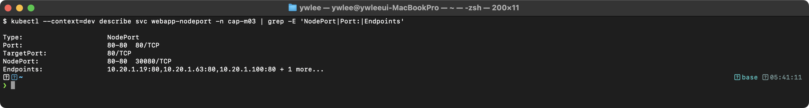

```bash
# 접근 테스트 (노드 IP 확인)
kubectl get nodes -o wide -o jsonpath='{.items[0].status.addresses[?(@.type=="InternalIP")].address}'
# curl http://<Node-IP>:30080
```

**출제 의도:** NodePort Service는 외부에서 클러스터 내부 서비스에 접근하는 기본 방법이다. 특정 NodePort를 지정하여 생성할 수 있는지 평가한다.

**핵심 원리:** NodePort Service는 ClusterIP Service의 확장이다. 모든 노드의 지정된 포트(30080)에서 수신한 트래픽을 Service의 ClusterIP를 거쳐 백엔드 Pod로 전달한다. 3단계 포트 매핑이 존재한다: NodePort(30080) → Service port(80) → targetPort(80/containerPort).

**함정과 주의사항:**
- `nodePort`를 지정하지 않으면 30000-32767 범위에서 자동 할당된다. 시험에서 특정 포트를 지정하라고 하면 YAML로 작성해야 한다.
- `kubectl expose`로 NodePort를 생성할 때 `--type=NodePort`를 지정해야 한다. 하지만 특정 nodePort 번호를 지정할 수 없으므로, 특정 NodePort가 요구되면 YAML을 사용해야 한다.
- selector의 `app: webapp`는 `kubectl create deployment webapp`이 자동 생성하는 label이다. 다른 label을 사용한 경우 selector를 맞춰야 한다.

**시간 절약 팁:** 특정 nodePort가 필요 없으면 `kubectl expose deployment webapp --type=NodePort --port=80 --name=webapp-nodeport`로 한 줄에 끝낼 수 있다. 특정 nodePort가 필요하면 YAML을 사용한다.

</details>

---

### 문제 19. [Ingress] Path-based Routing 설정

`kubectl config use-context k8s-cluster1`

다음 조건의 Ingress를 생성하라:
- 이름: `app-ingress`
- IngressClass: `nginx`
- 호스트: `myapp.example.com`
- `/api` 경로 → `api-service:8080`
- `/web` 경로 → `web-service:80`
- pathType: Prefix

<details>
<summary>풀이 확인</summary>

**풀이:**

```yaml
apiVersion: networking.k8s.io/v1
kind: Ingress
metadata:
  name: app-ingress
  annotations:
    nginx.ingress.kubernetes.io/rewrite-target: /
spec:
  ingressClassName: nginx
  rules:
  - host: myapp.example.com
    http:
      paths:
      - path: /api
        pathType: Prefix
        backend:
          service:
            name: api-service
            port:
              number: 8080
      - path: /web
        pathType: Prefix
        backend:
          service:
            name: web-service
            port:
              number: 80
```

```bash
kubectl apply -f app-ingress.yaml

# 확인
kubectl get ingress app-ingress
kubectl describe ingress app-ingress
```

Ingress가 동작하려면 Ingress Controller(예: nginx-ingress-controller)가 클러스터에 설치되어 있어야 한다. 또한 `api-service`와 `web-service`가 미리 존재해야 한다.

**Ingress Controller 설치 전제 (이 저장소 dev에서 실습 시).** 이 저장소의 `dev` 클러스터에는 nginx Ingress Controller가 기본 설치되어 있지 않다. Controller가 없으면 `kubectl apply -f app-ingress.yaml`이 성공하더라도 `kubectl get ingress`의 `ADDRESS` 칼럼이 비어 있어 라우팅이 동작하지 않는다. "내가 뭘 잘못했나"가 아니라 Controller가 없는 것이므로, 먼저 설치한다.

```bash
# dev 클러스터에 nginx Ingress Controller 설치
kubectl apply -f https://raw.githubusercontent.com/kubernetes/ingress-nginx/main/deploy/static/provider/baremetal/deploy.yaml

# 설치 확인 (Controller Pod가 Running이 될 때까지 대기)
kubectl -n ingress-nginx get pods
```

`ingress-nginx-controller` Pod가 `Running`이 된 뒤 위 Ingress를 적용해야 `ADDRESS`가 채워진다(실측 스크린샷 미캡처 — 메인이 별도 캡처). CKA 실제 시험 환경에서는 Controller가 미리 설치되어 있는 경우가 많으므로, 문제 지문에 설치 요구가 없으면 설치 단계는 건너뛴다.

**검증:**

```bash
kubectl get ingress app-ingress
```

> **예시(시험 정답 형식, 참조):** 아래 형태의 출력이 정답이다 — `NAME          CLASS   HOSTS               ADDRESS        POR ...`. 동일 명령의 **실측 스크린샷**은 이 자격증 daily(day01~20) 및 본 문서 위쪽 캡처에서 확인할 수 있다(이 블록은 일반 placeholder 클러스터 기준 예시).

```bash
kubectl describe ingress app-ingress
```

> **예시(시험 정답 형식, 참조):** 아래 형태의 출력이 정답이다 — `Name:             app-ingress ...`. 동일 명령의 **실측 스크린샷**은 이 자격증 daily(day01~20) 및 본 문서 위쪽 캡처에서 확인할 수 있다(이 블록은 일반 placeholder 클러스터 기준 예시).

Rules 섹션에서 경로와 백엔드 서비스가 올바르게 매핑되었는지 확인한다.

**출제 의도:** Ingress는 HTTP/HTTPS 라우팅의 핵심 리소스이다. path-based routing YAML을 정확히 작성할 수 있는지 평가한다.

**핵심 원리:** Ingress는 L7(HTTP) 라우팅 규칙을 선언적으로 정의하는 API 리소스이다. 실제 트래픽 처리는 Ingress Controller(nginx, traefik 등)가 담당한다. `ingressClassName`은 어떤 Ingress Controller가 이 Ingress를 처리할지 지정한다. `pathType: Prefix`는 URL 경로의 접두사가 일치하면 해당 백엔드로 라우팅한다.

**함정과 주의사항:**
- `ingressClassName`을 빠뜨리면 어떤 Ingress Controller도 이 Ingress를 처리하지 않을 수 있다.
- `pathType`은 필수 필드이다. `Prefix`, `Exact`, `ImplementationSpecific` 중 하나를 지정해야 한다.
- `rewrite-target` annotation은 nginx Ingress Controller 전용이다. 경로 재작성이 필요한지 문제를 정확히 읽어야 한다. **위 풀이 YAML의 `nginx.ingress.kubernetes.io/rewrite-target: /`는 `/api`·`/web` 요청을 모두 `/`로 바꿔 백엔드에 전달하므로 백엔드가 경로 접두사를 보지 못하게 된다. 이 문제는 경로 재작성을 요구하지 않으므로 실제로는 이 annotation을 생략해야 한다. 항상 붙이는 관용구가 아니라 경로 재작성이 명시적으로 필요한 경우에만 추가한다.**
- 백엔드 서비스의 `port.number`는 Service의 port이지 Pod의 containerPort가 아니다.

**시간 절약 팁:** Ingress YAML은 구조가 복잡하므로 공식 문서에서 복사하는 것이 빠르다. "Ingress" 페이지에서 "Simple fanout" 예제를 참고한다. `kubectl create ingress app-ingress --rule="myapp.example.com/api*=api-service:8080" --rule="myapp.example.com/web*=web-service:80" --class=nginx`로 imperative 생성도 가능하다.

</details>

---

### 문제 20. [NetworkPolicy] Default Deny 설정

`kubectl config use-context k8s-cluster1`

네임스페이스 `secure`에 모든 인바운드 트래픽을 차단하는 Default Deny NetworkPolicy를 생성하라. 이름은 `default-deny-ingress`로 하라.

<details>
<summary>풀이 확인</summary>

**풀이:**

```bash
kubectl create namespace secure
```

```yaml
apiVersion: networking.k8s.io/v1
kind: NetworkPolicy
metadata:
  name: default-deny-ingress
  namespace: secure
spec:
  podSelector: {}
  policyTypes:
  - Ingress
```

```bash
kubectl apply -f default-deny.yaml
```

**검증:**

```bash
kubectl get networkpolicy -n secure
```

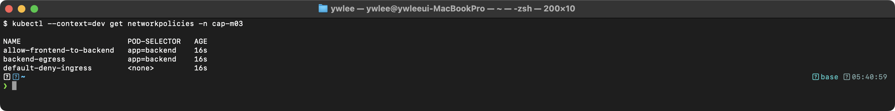

```bash
kubectl describe networkpolicy default-deny-ingress -n secure
```

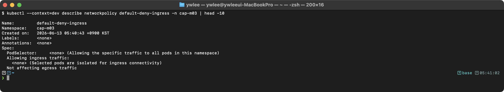

"Allowing ingress traffic: <none>"과 "Coverage: all pods in the namespace"가 표시되면 정상이다.

```bash
# 통신 차단 테스트
kubectl run test-target -n secure --image=nginx --port=80
kubectl run test-client -n secure --image=busybox:1.36 --rm -it --restart=Never -- \
  wget -qO- --timeout=3 http://test-target
# 타임아웃이 발생해야 정상이다
```

**출제 의도:** Default Deny는 Zero Trust(영 신뢰: "내부망이라 안전하다"를 가정하지 않고 모든 통신을 기본 차단한 뒤 필요한 것만 명시적으로 허용하는 보안 모델) 네트워크의 기본이다. NetworkPolicy의 기본 개념과 "명시적으로 허용하지 않으면 차단" 원칙을 이해하고 있는지 평가한다.

**핵심 원리:** 쿠버네티스의 기본 네트워크 모델은 "모든 Pod가 모든 Pod와 통신 가능"이다. NetworkPolicy가 하나라도 Pod에 적용되면, 해당 Pod는 "isolated" 상태가 되어 명시적으로 허용된 트래픽만 수신/송신할 수 있다. `podSelector: {}`는 네임스페이스의 모든 Pod를 선택한다. `policyTypes: [Ingress]`를 지정하면서 `ingress` 규칙을 비워두면, 인바운드 허용 규칙이 없으므로 모든 인바운드 트래픽이 차단된다.

**함정과 주의사항:**
- NetworkPolicy는 CNI 플러그인이 지원해야 동작한다. Calico, Cilium, Weave Net은 지원하지만 Flannel은 지원하지 않는다. 시험 환경에서는 지원된다.
- Egress를 policyTypes에 포함하지 않았으므로 아웃바운드 트래픽은 영향받지 않는다.
- 같은 네임스페이스 내부 통신도 차단된다. "같은 네임스페이스는 기본 허용"이 아니다.

**시간 절약 팁:** Default Deny YAML은 매우 짧다(약 8줄). 외워두면 가장 빠르다. `podSelector: {}`, `policyTypes: [Ingress]`, ingress 규칙 없음 — 이 3가지만 기억한다.

</details>

---

### 문제 21. [NetworkPolicy] 특정 Pod 간 통신 허용

`kubectl config use-context k8s-cluster1`

네임스페이스 `secure`에서 다음 NetworkPolicy를 생성하라:
- 이름: `allow-frontend-to-backend`
- `tier=backend` 레이블의 Pod에 적용
- `tier=frontend` 레이블의 Pod에서 오는 TCP 포트 8080 트래픽만 허용
- 그 외 모든 인바운드 트래픽은 차단

<details>
<summary>풀이 확인</summary>

**풀이:**

```yaml
apiVersion: networking.k8s.io/v1
kind: NetworkPolicy
metadata:
  name: allow-frontend-to-backend
  namespace: secure
spec:
  podSelector:
    matchLabels:
      tier: backend
  policyTypes:
  - Ingress
  ingress:
  - from:
    - podSelector:
        matchLabels:
          tier: frontend
    ports:
    - protocol: TCP
      port: 8080
```

```bash
kubectl apply -f allow-frontend.yaml

# 확인
kubectl describe networkpolicy allow-frontend-to-backend -n secure

# 테스트 (backend Pod 생성)
kubectl run backend -n secure --image=nginx --labels="tier=backend" --port=8080

# frontend Pod에서 연결 테스트
kubectl run frontend -n secure --image=busybox:1.36 --labels="tier=frontend" --rm -it --restart=Never -- \
  wget -qO- --timeout=3 http://backend:8080

# 다른 레이블의 Pod에서는 접근 불가
kubectl run other -n secure --image=busybox:1.36 --labels="tier=other" --rm -it --restart=Never -- \
  wget -qO- --timeout=3 http://backend:8080
```

**검증:**

```bash
kubectl describe networkpolicy allow-frontend-to-backend -n secure
```

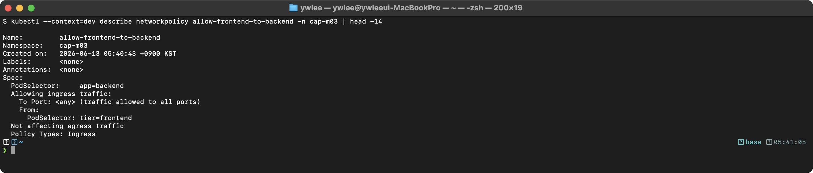

"To Port: 8080/TCP"과 "From: PodSelector: tier=frontend"가 표시되면 정상이다.

**출제 의도:** 특정 Pod 간 통신만 선택적으로 허용하는 마이크로세그멘테이션(microsegmentation: 네트워크를 워크로드 단위의 작은 구역으로 쪼개, 각 구역 간 허용 통신을 개별 규칙으로 좁히는 것) 정책을 구현할 수 있는지 평가한다. 실무에서 가장 흔히 사용하는 NetworkPolicy 패턴이다.

**핵심 원리:** NetworkPolicy에서 `podSelector`는 정책이 적용되는 대상 Pod를 지정한다. `ingress.from.podSelector`는 트래픽 출발지 Pod를 지정한다. `ports`는 허용할 포트를 지정한다. 하나의 `ingress` 규칙 안에서 `from`과 `ports`는 AND 관계이다. 즉, "지정된 출발지에서 오고 AND 지정된 포트로 들어오는" 트래픽만 허용한다.

**함정과 주의사항:**
- `ingress` 규칙의 `from`과 `ports`가 같은 레벨에 있으면 AND 관계이다. 별도의 `ingress` 항목으로 분리하면 OR 관계가 된다. YAML 들여쓰기에 주의한다.
- `podSelector`만 사용하면 같은 네임스페이스 내의 Pod만 매칭된다. 다른 네임스페이스의 Pod를 허용하려면 `namespaceSelector`를 추가해야 한다.
- NetworkPolicy는 기존 연결에 영향을 줄 수도 있고 안 줄 수도 있다. CNI 구현에 따라 다르다.

**시간 절약 팁:** NetworkPolicy YAML은 공식 문서의 "Network Policies" 페이지에 다양한 예제가 있다. 시험 중 복사-수정이 가장 빠르다.

</details>

---

### 문제 22. [NetworkPolicy] Egress 정책 (DNS 허용 포함)

`kubectl config use-context k8s-cluster1`

네임스페이스 `secure`에서 `tier=backend` Pod의 Egress 정책을 설정하라:
- 이름: `backend-egress`
- DNS 트래픽(UDP/TCP 53)을 허용하라.
- `tier=database` Pod의 TCP 3306 포트로만 트래픽을 허용하라.
- 그 외 아웃바운드 트래픽은 차단하라.

<details>
<summary>풀이 확인</summary>

**풀이:**

```yaml
apiVersion: networking.k8s.io/v1
kind: NetworkPolicy
metadata:
  name: backend-egress
  namespace: secure
spec:
  podSelector:
    matchLabels:
      tier: backend
  policyTypes:
  - Egress
  egress:
  - ports:
    - protocol: UDP
      port: 53
    - protocol: TCP
      port: 53
  - to:
    - podSelector:
        matchLabels:
          tier: database
    ports:
    - protocol: TCP
      port: 3306
```

```bash
kubectl apply -f backend-egress.yaml
```

**검증:**

```bash
kubectl describe networkpolicy backend-egress -n secure
```

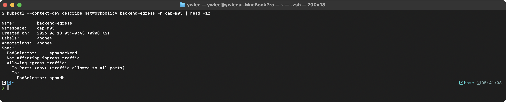

두 개의 egress 규칙이 표시된다: DNS 허용 규칙과 database 포트 허용 규칙.

**출제 의도:** Egress NetworkPolicy에서 DNS 허용을 빠뜨리지 않는지가 핵심이다. DNS 없이는 서비스 이름 기반 통신이 불가능하다는 실무적 이해를 평가한다.

**핵심 원리:** Egress 정책이 Pod에 적용되면 명시적으로 허용하지 않은 모든 아웃바운드 트래픽이 차단된다. 쿠버네티스에서 Service 이름으로 통신하려면 CoreDNS에 DNS 질의(UDP/TCP 53)를 보내야 한다. DNS를 허용하지 않으면 `tier=database` Pod의 Service 이름을 IP로 변환할 수 없어, 사실상 허용된 통신도 사용할 수 없게 된다.

**`egress` 항목의 OR/AND 파싱 규칙.** NetworkPolicy의 `egress`는 리스트이며, 항목이 여러 개이면 그 사이는 **OR**(어느 항목 하나라도 맞으면 허용)이다. 위 풀이의 두 `egress` 항목(`-`로 시작하는 두 블록)은 OR이라, "모든 목적지의 53번 포트" **또는** "database Pod의 3306 포트" 중 하나만 맞아도 통과한다. 반면 **한 항목 안에서 `to`와 `ports`는 AND**(둘 다 맞아야 허용)이다. 두 번째 항목은 목적지(`to`의 database Pod)와 포트(3306)가 모두 일치해야만 허용한다. 첫 번째 항목처럼 `to`를 아예 적지 않으면 "목적지 제한 없음"으로 해석되어 **모든 목적지 IP**에 대해 명시한 포트(53)만 열린다. 즉 `to` 생략은 "어디로든"이고, `ports` 생략은 "어떤 포트로든"을 뜻한다 — 둘 다 생략하면 모든 아웃바운드 허용이 된다.

**함정과 주의사항:**
- 첫 번째 egress 규칙에는 `to`가 없고 `ports`만 있다. 이는 모든 목적지의 53번 포트를 허용한다는 의미이다. DNS 서버는 kube-system 네임스페이스에 있으므로 목적지를 제한하지 않는 것이 일반적이다.
- 두 번째 규칙에서 `to`와 `ports`는 같은 `egress` 항목에 있으므로 AND 관계이다.
- DNS에 TCP 53도 허용해야 한다. 응답이 512바이트를 초과하면 TCP로 fallback하기 때문이다.
- Egress 정책은 응답 트래픽(return traffic)에는 영향을 주지 않는다. 이미 허용된 연결의 응답은 자동으로 허용된다 — 커널의 conntrack(connection tracking: 진행 중인 연결의 상태를 추적해, 나간 요청에 대한 되돌아오는 응답을 같은 연결로 인식하는 기능) 덕분이다.

**시간 절약 팁:** Egress 정책에서 DNS 허용 패턴은 항상 동일하다. `ports: [{protocol: UDP, port: 53}, {protocol: TCP, port: 53}]` 블록을 템플릿으로 기억해 둔다.

</details>

---

### 문제 23. [DNS] CoreDNS 트러블슈팅

`kubectl config use-context k8s-cluster1`

클러스터의 DNS가 정상적으로 동작하지 않는다. 다음을 수행하라:
- CoreDNS Pod의 상태를 확인하라.
- CoreDNS의 로그를 확인하여 문제를 진단하라.
- CoreDNS ConfigMap을 확인하라.
- DNS 해석이 정상적으로 동작하는지 테스트하라.

<details>
<summary>풀이 확인</summary>

**풀이:**

```bash
# 1. CoreDNS Pod 상태 확인
kubectl -n kube-system get pods -l k8s-app=kube-dns
kubectl -n kube-system describe pods -l k8s-app=kube-dns

# 2. CoreDNS 로그 확인
kubectl -n kube-system logs -l k8s-app=kube-dns

# 3. CoreDNS ConfigMap 확인
kubectl -n kube-system get configmap coredns -o yaml

# 4. CoreDNS Deployment 확인
kubectl -n kube-system get deployment coredns
kubectl -n kube-system describe deployment coredns

# 5. CoreDNS Service 확인
kubectl -n kube-system get svc kube-dns

# 6. DNS 테스트
kubectl run dns-test --image=busybox:1.28 --rm -it --restart=Never -- \
  nslookup kubernetes.default.svc.cluster.local

# 7. 외부 DNS 해석 테스트
kubectl run dns-test2 --image=busybox:1.28 --rm -it --restart=Never -- \
  nslookup google.com

# 일반적인 해결 방법:
# - CoreDNS Pod가 CrashLoopBackOff이면 로그를 확인한다
# - ConfigMap에 오류가 있으면 수정한다
# - CoreDNS Pod를 재시작한다
kubectl -n kube-system rollout restart deployment coredns
```

일반적인 CoreDNS 문제:
- ConfigMap(Corefile)의 구문 오류
- 업스트림 DNS 서버에 접근 불가
- CoreDNS Pod의 리소스 부족
- CoreDNS Service(kube-dns)의 endpoint가 비어 있는 경우

**검증:**

```bash
kubectl run dns-test --image=busybox:1.28 --rm -it --restart=Never -- \
  nslookup kubernetes.default.svc.cluster.local
```

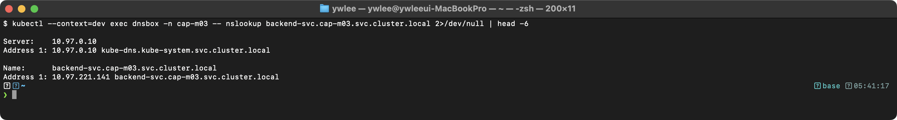

DNS 해석이 성공하고 kubernetes 서비스의 ClusterIP가 반환되면 CoreDNS가 정상 동작하는 것이다.

**출제 의도:** CoreDNS 트러블슈팅은 실무에서 자주 발생하는 문제이다. 체계적인 진단 순서(Pod 상태 → 로그 → ConfigMap → Service → 테스트)를 평가한다.

**핵심 원리:** CoreDNS는 쿠버네티스 클러스터의 내장 DNS 서버이다. Deployment로 배포되며, `kube-dns`라는 Service를 통해 접근한다. 모든 Pod의 `/etc/resolv.conf`에 이 Service의 ClusterIP가 nameserver로 설정된다. CoreDNS의 ConfigMap(Corefile)에서 라우팅 규칙을 정의한다. `kubernetes` 플러그인이 클러스터 내부 도메인(`.cluster.local`)을, `forward` 플러그인이 외부 도메인을 처리한다.

**함정과 주의사항:**
- busybox 최신 버전(1.36 등)의 nslookup은 동작이 다를 수 있다. DNS 테스트에는 `busybox:1.28`을 사용하는 것이 안전하다.
- CoreDNS ConfigMap을 수정한 후에는 `rollout restart`로 Pod를 재시작해야 변경이 반영된다.
- CoreDNS가 정상인데 DNS가 실패하면 NetworkPolicy가 DNS 트래픽(UDP/TCP 53)을 차단하고 있을 수 있다.
- kube-dns Service의 ClusterIP가 변경되면 기존 Pod의 resolv.conf가 맞지 않게 된다.

**시간 절약 팁:** DNS 문제 진단의 첫 단계는 항상 `kubectl -n kube-system get pods -l k8s-app=kube-dns`이다. Pod가 Running이 아니면 90%는 ConfigMap 오류이다.

</details>

---

### 문제 24. [Ingress] TLS Ingress 설정

`kubectl config use-context k8s-cluster1`

다음 조건으로 TLS Ingress를 생성하라:
- 이름: `secure-ingress`
- 호스트: `secure.example.com`
- TLS Secret: `tls-secret` (이미 존재한다고 가정)
- 백엔드: `secure-service:443`
- pathType: Prefix, path: /

<details>
<summary>풀이 확인</summary>

**풀이:**

```yaml
apiVersion: networking.k8s.io/v1
kind: Ingress
metadata:
  name: secure-ingress
spec:
  ingressClassName: nginx
  tls:
  - hosts:
    - secure.example.com
    secretName: tls-secret
  rules:
  - host: secure.example.com
    http:
      paths:
      - path: /
        pathType: Prefix
        backend:
          service:
            name: secure-service
            port:
              number: 443
```

```bash
# TLS Secret이 없는 경우 생성 (자체 서명 인증서)
openssl req -x509 -nodes -days 365 -newkey rsa:2048 \
  -keyout tls.key -out tls.crt -subj "/CN=secure.example.com"

kubectl create secret tls tls-secret --cert=tls.crt --key=tls.key

# Ingress 적용
kubectl apply -f secure-ingress.yaml
```

**Ingress Controller 설치 전제 (이 저장소 dev에서 실습 시).** 문제 19와 동일하게 이 저장소 `dev` 클러스터에는 nginx Ingress Controller가 기본 설치되어 있지 않다. Controller가 없으면 적용 자체는 성공해도 `ADDRESS`가 빈 채로 남고 TLS 종료가 일어나지 않는다. 미설치 상태라면 먼저 설치한 뒤 Pod가 Running인지 확인한다.

```bash
# (미설치 시) nginx Ingress Controller 설치
kubectl apply -f https://raw.githubusercontent.com/kubernetes/ingress-nginx/main/deploy/static/provider/baremetal/deploy.yaml

# 설치 확인
kubectl -n ingress-nginx get pods
```

**검증:**

```bash
kubectl get ingress secure-ingress
```

> **예시(시험 정답 형식, 참조):** 아래 형태의 출력이 정답이다 — `NAME             CLASS   HOSTS                ADDRESS        ...`. 동일 명령의 **실측 스크린샷**은 이 자격증 daily(day01~20) 및 본 문서 위쪽 캡처에서 확인할 수 있다(이 블록은 일반 placeholder 클러스터 기준 예시).

PORTS에 `443`이 포함되어 있으면 TLS가 정상 설정된 것이다.

```bash
kubectl describe ingress secure-ingress
```

> **예시(시험 정답 형식, 참조):** 아래 형태의 출력이 정답이다 — `Name:             secure-ingress ...`. 동일 명령의 **실측 스크린샷**은 이 자격증 daily(day01~20) 및 본 문서 위쪽 캡처에서 확인할 수 있다(이 블록은 일반 placeholder 클러스터 기준 예시).

TLS 섹션에 `tls-secret terminates secure.example.com`이 표시되면 성공이다.

```bash
# TLS Secret 확인
kubectl get secret tls-secret -o jsonpath='{.type}'
# kubernetes.io/tls
```

**출제 의도:** TLS Ingress 설정은 HTTPS 서비스 노출의 기본이다. TLS Secret 생성과 Ingress의 tls 섹션 설정을 정확히 수행할 수 있는지 평가한다.

**핵심 원리:** TLS Ingress에서 Ingress Controller가 TLS 종료(termination)를 수행한다. 클라이언트 ↔ Ingress Controller 구간은 HTTPS이고, Ingress Controller ↔ 백엔드 Service 구간은 HTTP(또는 설정에 따라 HTTPS)이다. TLS Secret은 `kubernetes.io/tls` 타입이며, `tls.crt`(인증서)와 `tls.key`(개인키) 두 필드를 포함한다.

**함정과 주의사항:**
- `tls` 섹션의 `hosts`와 `rules`의 `host`가 일치해야 한다. 불일치하면 TLS가 적용되지 않는다.
- TLS Secret의 타입이 `kubernetes.io/tls`가 아니면 Ingress Controller가 인식하지 못한다. `kubectl create secret tls`를 사용하면 자동으로 올바른 타입이 설정된다.
- `rules.http`는 TLS Ingress에서도 `http`이다. `https`가 아니다. 이것은 Ingress 리소스의 API 필드명이 그렇게 정의되어 있기 때문이다.

**시간 절약 팁:** `kubectl create ingress secure-ingress --rule="secure.example.com/*=secure-service:443,tls=tls-secret" --class=nginx`로 한 줄에 TLS Ingress를 생성할 수 있다.

</details>

---

## Storage

> **이 영역이 왜 있나 (등장 배경).** 컨테이너의 파일시스템은 컨테이너가 죽으면 사라진다(휘발성). DB나 로그처럼 살아남아야 하는 데이터에는 이 모델이 맞지 않는다. 초기에는 Pod 스펙 안에 NFS·hostPath 같은 스토리지를 직접 박았는데, 그러면 앱 개발자가 인프라(어느 NFS 서버, 어느 경로)를 알아야 했고 이식성이 깨졌다. 쿠버네티스는 **PV(PersistentVolume, 실제 스토리지 리소스)** 와 **PVC(PersistentVolumeClaim, 사용자의 용량·접근모드 요청)** 로 역할을 분리했다. 스토리지 관리자는 PV를(또는 StorageClass로 자동 생성 규칙을) 제공하고, 개발자는 "500Mi, RWO"만 PVC로 요청하면 둘이 조건에 맞게 바인딩된다. **StorageClass + 동적 프로비저닝**은 PV를 미리 만들어 둘 필요 없이 PVC가 생길 때 볼륨을 즉석에서 만들어 준다. 트레이드오프: 추상화 단계(Pod→PVC→PV→실제 디스크)가 늘어, 바인딩이 안 될 때 어느 조건(용량·accessMode·storageClassName)이 안 맞는지 짚는 진단력이 필요하다.
>
> **이 영역에서 처음 나오는 용어 한 줄 풀이.**
> - **accessMode (RWO/ROX/RWX)**: 볼륨을 동시에 어떻게 붙일 수 있는가. RWO=한 노드에서 읽기/쓰기, ROX=여러 노드에서 읽기 전용, RWX=여러 노드에서 읽기/쓰기.
> - **reclaimPolicy (Retain/Delete)**: PVC가 삭제됐을 때 PV와 데이터를 어떻게 처리할지. Retain=보존(수동 정리 필요), Delete=함께 삭제.
> - **volumeBindingMode (Immediate/WaitForFirstConsumer)**: PV를 PVC 생성 즉시 바인딩할지, 그 PVC를 쓰는 Pod가 스케줄될 때까지 미룰지. 후자는 Pod가 놓일 노드의 토폴로지(zone)에 맞는 볼륨을 고르려는 것이다.
> - **emptyDir**: Pod 수명과 함께 생겼다 사라지는 임시 디렉터리. 같은 Pod의 컨테이너끼리 파일을 공유하는 사이드카 패턴에 쓰인다(영속 저장이 아님).

### 문제 25. [PV/PVC] PersistentVolume과 PersistentVolumeClaim 생성

`kubectl config use-context k8s-cluster1`

다음을 생성하라:
- PV: 이름 `app-pv`, 용량 1Gi, accessMode RWO, hostPath `/mnt/app-data`, storageClassName `manual`, reclaimPolicy Retain
- PVC: 이름 `app-pvc`, 용량 500Mi, accessMode RWO, storageClassName `manual`
- Pod: 이름 `app-pod`, 이미지 `nginx`, PVC를 `/app/data`에 마운트

PV/PVC 바인딩은 다음 순서로 일어난다. 관리자가 PV(실제 스토리지)를 만들고, 개발자가 PVC(용량·accessMode·storageClassName 요청)를 만들면, 컨트롤러가 조건에 맞는 PV를 찾아 PVC에 바인딩한다. 그 후 Pod가 PVC를 볼륨으로 참조해 실제 디렉터리를 마운트한다.

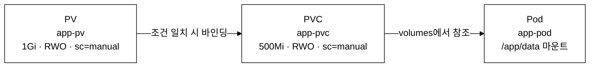

_그림. PV/PVC 바인딩 흐름 — storageClassName이 같고 PV 용량(1Gi) ≥ PVC 요청(500Mi)이며 accessMode가 호환되면 바인딩된다. Pod는 바인딩된 PVC를 통해서만 PV에 접근한다._

<details>
<summary>풀이 확인</summary>

**풀이:**

```yaml
apiVersion: v1
kind: PersistentVolume
metadata:
  name: app-pv
spec:
  capacity:
    storage: 1Gi
  accessModes:
  - ReadWriteOnce
  persistentVolumeReclaimPolicy: Retain
  storageClassName: manual
  hostPath:
    path: /mnt/app-data
---
apiVersion: v1
kind: PersistentVolumeClaim
metadata:
  name: app-pvc
spec:
  accessModes:
  - ReadWriteOnce
  resources:
    requests:
      storage: 500Mi
  storageClassName: manual
---
apiVersion: v1
kind: Pod
metadata:
  name: app-pod
spec:
  containers:
  - name: nginx
    image: nginx
    volumeMounts:
    - name: app-volume
      mountPath: /app/data
  volumes:
  - name: app-volume
    persistentVolumeClaim:
      claimName: app-pvc
```

```bash
kubectl apply -f app-pv-pvc-pod.yaml

# PV/PVC 바인딩 확인
kubectl get pv
kubectl get pvc

# Pod 상태 확인
kubectl get pod app-pod

# 마운트 확인
kubectl exec app-pod -- df -h /app/data
kubectl exec app-pod -- touch /app/data/test-file
kubectl exec app-pod -- ls /app/data
```

PV의 capacity(1Gi)가 PVC의 requests(500Mi)보다 크거나 같아야 바인딩된다. storageClassName과 accessModes도 일치해야 한다.

**검증:**

```bash
kubectl get pv,pvc
```

> **예시(시험 정답 형식, 참조):** 아래 형태의 출력이 정답이다 — `NAME                      CAPACITY   ACCESS MODES   RECLAIM  ...`. 동일 명령의 **실측 스크린샷**은 이 자격증 daily(day01~20) 및 본 문서 위쪽 캡처에서 확인할 수 있다(이 블록은 일반 placeholder 클러스터 기준 예시).

PV와 PVC의 STATUS가 모두 `Bound`이면 성공이다.

```bash
kubectl exec app-pod -- df -h /app/data
kubectl exec app-pod -- touch /app/data/test-file && echo "write OK"
```

> **예시(시험 정답 형식, 참조):** 아래 형태의 출력이 정답이다 — `Filesystem      Size  Used Avail Use% Mounted on ...`. 동일 명령의 **실측 스크린샷**은 이 자격증 daily(day01~20) 및 본 문서 위쪽 캡처에서 확인할 수 있다(이 블록은 일반 placeholder 클러스터 기준 예시).

마운트가 정상이고 파일 쓰기가 가능하면 전체 설정이 올바른 것이다.

**출제 의도:** PV/PVC/Pod의 3단계 연결 구조를 이해하고 정확히 구성할 수 있는지 평가한다. 스토리지는 CKA 시험에서 자주 출제되는 영역이다.

**핵심 원리:** PV는 클러스터 수준의 스토리지 리소스이고, PVC는 사용자의 스토리지 요청이다. PVC가 생성되면 PV Controller가 storageClassName, accessModes, capacity 조건이 일치하는 PV를 찾아 바인딩한다. Pod는 PVC를 통해 간접적으로 PV를 사용한다. 이 3단계 추상화를 통해 스토리지 관리자와 애플리케이션 개발자의 역할을 분리한다.

**함정과 주의사항:**
- PVC의 requests.storage가 PV의 capacity보다 크면 바인딩되지 않는다. PVC가 500Mi를 요청하고 PV가 1Gi이면 바인딩된다(PV가 더 큰 것은 허용).
- `storageClassName`이 일치하지 않으면 바인딩되지 않는다. PV와 PVC 모두 동일한 storageClassName을 지정해야 한다.
- `accessModes`는 배열이다. PV가 `[RWO, ROX]`를 지원하고 PVC가 `[RWO]`를 요청하면 바인딩된다.
- `Retain` reclaimPolicy는 PVC 삭제 후에도 PV와 데이터가 유지된다. 재사용하려면 수동으로 claimRef를 제거해야 한다.

**시간 절약 팁:** PV/PVC는 imperative 명령으로 생성할 수 없다. YAML을 작성해야 하므로, 하나의 파일에 `---` 구분자로 PV, PVC, Pod를 모두 넣어서 한 번에 `kubectl apply -f`로 적용한다.

</details>

---

### 문제 26. [StorageClass] WaitForFirstConsumer 바인딩 설정

`kubectl config use-context k8s-cluster1`

> **주의.** `provisioner: kubernetes.io/no-provisioner`는 PV를 자동으로 생성하지 않는다. 즉 이 StorageClass는 동적 프로비저닝(PVC를 만들면 PV가 자동 생성되는 방식)을 수행하지 않으며, 관리자가 미리 만들어 둔 PV에 바인딩하는 정적(static) 방식 전용이다. 이 문제는 동적 프로비저닝이 아니라 StorageClass 정의와 `volumeBindingMode`(PVC를 언제 PV에 바인딩할지 결정하는 모드) 개념을 실습하는 것이다. `WaitForFirstConsumer`는 PVC를 쓰는 Pod가 스케줄링되는 시점까지 바인딩을 미뤄, Pod가 배치될 노드의 토폴로지(zone·노드)에 맞는 PV를 고르게 한다. 실제 동적 프로비저닝은 AWS EBS·GCE PD 등 외부 프로비저너를 가리키는 별도 provisioner 값으로 구성한다.

다음을 설정하라:
- StorageClass `fast-storage`를 생성하라 (provisioner: `kubernetes.io/no-provisioner`, reclaimPolicy: Delete, volumeBindingMode: WaitForFirstConsumer).
- 해당 StorageClass를 사용하는 PVC `dynamic-pvc`를 생성하라 (용량: 5Gi, accessMode: RWO).

<details>
<summary>풀이 확인</summary>

**풀이:**

```yaml
apiVersion: storage.k8s.io/v1
kind: StorageClass
metadata:
  name: fast-storage
provisioner: kubernetes.io/no-provisioner
reclaimPolicy: Delete
volumeBindingMode: WaitForFirstConsumer
---
apiVersion: v1
kind: PersistentVolumeClaim
metadata:
  name: dynamic-pvc
spec:
  accessModes:
  - ReadWriteOnce
  resources:
    requests:
      storage: 5Gi
  storageClassName: fast-storage
```

```bash
kubectl apply -f fast-storage.yaml
```

**검증:**

```bash
kubectl get storageclass fast-storage
```

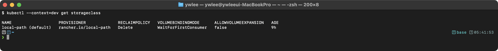

```bash
kubectl get pvc dynamic-pvc
```

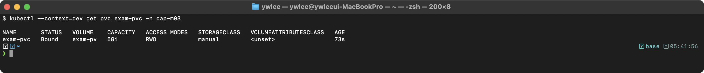

`WaitForFirstConsumer` 모드이므로 PVC가 `Pending` 상태인 것이 정상이다. Pod가 생성되어야 바인딩이 시작된다.

**이 StorageClass는 정적(static) 프로비저닝 전용이므로 PVC가 실제로 Bound가 되게 하려면 PV를 먼저 수동 생성해야 한다.** `provisioner: kubernetes.io/no-provisioner`는 PV를 자동 생성하지 않으므로, Pod를 띄워도 조건에 맞는 PV가 없으면 PVC는 계속 `Pending`에 머문다. 직접 실습으로 Bound까지 확인하려면 5Gi hostPath PV를 먼저 만든다(이 PV의 `storageClassName`은 위 PVC와 같은 `fast-storage`여야 매칭된다).

```yaml
apiVersion: v1
kind: PersistentVolume
metadata:
  name: fast-pv-1
spec:
  capacity:
    storage: 5Gi
  accessModes:
  - ReadWriteOnce
  persistentVolumeReclaimPolicy: Delete
  storageClassName: fast-storage
  hostPath:
    path: /mnt/data/fast-pv-1
```

```bash
kubectl apply -f fast-pv.yaml
```

PV를 만든 뒤 이 PVC를 사용하는 Pod를 하나 띄우면(예: 문제 25의 PVC 마운트 패턴) `WaitForFirstConsumer` 지연이 풀려 PVC가 해당 PV에 `Bound`된다. Pod 없이 PV만 만든 상태에서는 여전히 `Pending`인데, 이것이 `Immediate`와 다른 점이다.

**출제 의도:** StorageClass와 PVC의 관계, 그리고 volumeBindingMode의 동작을 이해하고 있는지 평가한다.

**핵심 원리:** StorageClass는 스토리지 프로비저닝 방법을 정의한다. `provisioner`는 볼륨을 실제로 생성하는 주체이다. `volumeBindingMode: WaitForFirstConsumer`는 PVC를 사용하는 Pod가 스케줄링될 때까지 PV 바인딩을 지연시킨다. 이를 통해 Pod가 배치되는 노드의 토폴로지(zone, region)에 맞는 PV를 선택할 수 있다. `Immediate` 모드는 PVC 생성 즉시 바인딩을 시도한다.

**함정과 주의사항:**
- `kubernetes.io/no-provisioner`는 동적 프로비저닝을 하지 않는다. PV를 수동으로 생성해야 한다. 시험에서 이 프로비저너가 지정되면 PV도 함께 생성해야 할 수 있다.
- `WaitForFirstConsumer` 모드에서 PVC가 `Pending`인 것은 오류가 아니다. Pod를 생성해야 바인딩된다.
- StorageClass의 `reclaimPolicy`는 동적으로 생성된 PV에 적용된다. 수동으로 생성한 PV에는 PV 자체의 `persistentVolumeReclaimPolicy`가 적용된다.

**시간 절약 팁:** StorageClass는 YAML로만 생성 가능하다. 필드가 적으므로 외워두면 빠르다: `provisioner`, `reclaimPolicy`, `volumeBindingMode` 3개만 기억한다.

</details>

---

### 문제 27. [Volume] emptyDir을 이용한 사이드카 패턴

`kubectl config use-context k8s-cluster1`

다음 조건으로 Multi-container Pod를 생성하라:
- 이름: `logging-pod`
- 컨테이너 1 (`app`): `busybox:1.36`, 명령어: `while true; do echo "$(date) - Log message" >> /var/log/app/app.log; sleep 5; done`
- 컨테이너 2 (`sidecar`): `busybox:1.36`, 명령어: `tail -f /var/log/app/app.log`
- 두 컨테이너가 emptyDir 볼륨을 공유하여 `/var/log/app`에 마운트

<details>
<summary>풀이 확인</summary>

**풀이:**

```yaml
apiVersion: v1
kind: Pod
metadata:
  name: logging-pod
spec:
  containers:
  - name: app
    image: busybox:1.36
    command: ["/bin/sh", "-c"]
    args:
    - >
      while true; do
        echo "$(date) - Log message" >> /var/log/app/app.log;
        sleep 5;
      done
    volumeMounts:
    - name: log-volume
      mountPath: /var/log/app
  - name: sidecar
    image: busybox:1.36
    command: ["/bin/sh", "-c", "tail -f /var/log/app/app.log"]
    volumeMounts:
    - name: log-volume
      mountPath: /var/log/app
      readOnly: true
  volumes:
  - name: log-volume
    emptyDir: {}
```

```bash
kubectl apply -f logging-pod.yaml

# 사이드카 로그 확인
kubectl logs logging-pod -c sidecar -f

# app 컨테이너의 로그 파일 확인
kubectl exec logging-pod -c app -- cat /var/log/app/app.log
```

emptyDir 볼륨은 Pod와 생명주기를 같이 하므로 Pod가 삭제되면 데이터도 삭제된다.

**검증:**

```bash
kubectl logs logging-pod -c sidecar --tail=3
```

> **예시(시험 정답 형식, 참조):** 아래 형태의 출력이 정답이다 — `Mon Mar 30 10:00:05 UTC 2026 - Log message ...`. 동일 명령의 **실측 스크린샷**은 이 자격증 daily(day01~20) 및 본 문서 위쪽 캡처에서 확인할 수 있다(이 블록은 일반 placeholder 클러스터 기준 예시).

sidecar 컨테이너가 app 컨테이너의 로그를 실시간으로 읽고 있으면 성공이다.

```bash
kubectl exec logging-pod -c app -- cat /var/log/app/app.log | tail -3
```

> **예시(시험 정답 형식, 참조):** 아래 형태의 출력이 정답이다 — `Mon Mar 30 10:00:05 UTC 2026 - Log message ...`. 동일 명령의 **실측 스크린샷**은 이 자격증 daily(day01~20) 및 본 문서 위쪽 캡처에서 확인할 수 있다(이 블록은 일반 placeholder 클러스터 기준 예시).

두 컨테이너가 동일한 파일을 공유하고 있음을 확인한다.

**출제 의도:** 사이드카 패턴은 쿠버네티스에서 가장 흔히 사용하는 멀티 컨테이너 패턴이다. emptyDir 볼륨을 통한 컨테이너 간 데이터 공유를 구현할 수 있는지 평가한다.

**핵심 원리:** emptyDir은 Pod가 노드에 할당될 때 생성되는 빈 디렉터리이다. 같은 Pod 내의 모든 컨테이너가 동일한 emptyDir을 마운트하면 파일 시스템을 통해 데이터를 공유할 수 있다. emptyDir은 Pod의 생명주기와 동일하므로, Pod가 삭제되면 데이터도 삭제된다. 사이드카 패턴에서는 메인 컨테이너가 데이터를 생성하고, 사이드카 컨테이너가 이를 수집/전송하는 역할을 한다.

**함정과 주의사항:**
- sidecar 컨테이너에서 `readOnly: true`로 마운트하면 실수로 로그 파일을 덮어쓰는 것을 방지할 수 있다.
- `command`와 `args`의 차이에 주의한다. `command`는 ENTRYPOINT를, `args`는 CMD를 오버라이드한다. shell 변수 확장(`$(date)`)이 필요하면 `/bin/sh -c`를 사용해야 한다.
- emptyDir의 `medium: Memory`를 설정하면 tmpfs(메모리 기반)를 사용한다. 기본값은 노드의 디스크를 사용한다.

**시간 절약 팁:** 멀티 컨테이너 Pod는 YAML로만 생성 가능하다. `kubectl run`으로 단일 컨테이너 뼈대를 생성한 후, 두 번째 컨테이너와 volumes 섹션을 추가하는 것이 빠르다.

</details>

---

### 문제 28. [PV] PV Reclaim 처리

`kubectl config use-context k8s-cluster1`

Released 상태의 PV `old-pv`가 있다. 이 PV를 다시 Available 상태로 변경하여 새 PVC에 바인딩할 수 있도록 하라.

<details>
<summary>풀이 확인</summary>

**풀이:**

```bash
# PV 상태 확인
kubectl get pv old-pv

# claimRef를 제거하여 Available 상태로 변경
kubectl patch pv old-pv --type json -p '[{"op": "remove", "path": "/spec/claimRef"}]'

# 또는 kubectl edit 사용
kubectl edit pv old-pv
# spec.claimRef 섹션 전체를 삭제한다
```

**검증:**

```bash
kubectl get pv old-pv
```

> **예시(시험 정답 형식, 참조):** 아래 형태의 출력이 정답이다 — `NAME     CAPACITY   ACCESS MODES   RECLAIM POLICY   STATUS   ...`. 동일 명령의 **실측 스크린샷**은 이 자격증 daily(day01~20) 및 본 문서 위쪽 캡처에서 확인할 수 있다(이 블록은 일반 placeholder 클러스터 기준 예시).

STATUS가 `Available`이고 CLAIM이 비어있으면 성공이다. 이제 새로운 PVC가 이 PV에 바인딩될 수 있다.

**출제 의도:** PV 생명주기(Available → Bound → Released)를 이해하고, Released PV를 재사용하는 방법을 아는지 평가한다.

**핵심 원리:** PV의 `spec.claimRef`는 현재 바인딩된(또는 이전에 바인딩되었던) PVC에 대한 참조이다. PVC가 삭제되면 `Retain` reclaimPolicy인 PV는 `Released` 상태가 된다. `claimRef`가 남아있기 때문에 다른 PVC에 자동 바인딩되지 않는다. `claimRef`를 제거하면 PV Controller가 해당 PV를 다시 `Available`로 전환하여 새 PVC에 바인딩 가능한 상태로 만든다.

**함정과 주의사항:**
- `Retain` 정책의 PV에서만 이 작업이 의미 있다. `Delete` 정책은 PVC 삭제 시 PV도 함께 삭제된다. `Recycle` 정책은 deprecated이다.
- `claimRef`를 제거해도 PV의 데이터는 삭제되지 않는다. 이전 PVC의 데이터가 남아있을 수 있으므로, 보안상 데이터를 수동으로 정리해야 할 수 있다.
- `kubectl patch --type json`의 `remove` 오퍼레이션은 해당 필드가 없으면 오류가 발생한다. PV에 claimRef가 있는지 먼저 확인한다.

**시간 절약 팁:** `kubectl patch pv old-pv --type json -p '[{"op": "remove", "path": "/spec/claimRef"}]'`를 외워두면 `kubectl edit`으로 수동 편집하는 것보다 빠르다.

</details>

---

## Troubleshooting

> **이 영역이 왜 있나 (등장 배경).** 쿠버네티스는 declarative·자동 복구 시스템이라 "정상일 때"는 사람이 개입할 일이 적다. 문제는 무언가 깨졌을 때다. 추상화 계층(앱→Pod→스케줄러→kubelet→컨테이너 런타임→커널)이 깊어, 증상(Pod가 Pending이다)과 실제 원인(scheduler가 죽었다, 노드 라벨이 없다, PVC가 안 묶였다)이 멀리 떨어져 있다. 그래서 CKA는 출제 비중의 약 30%를 트러블슈팅에 둔다. 핵심 기법은 **계층을 따라 아래로 내려가는 진단**이다: `kubectl describe`의 Events → `kubectl logs`(필요하면 `--previous`) → 노드에 SSH해 `systemctl status kubelet`·`journalctl -u kubelet` → control plane이 죽어 `kubectl` 자체가 안 되면 `crictl`로 컨테이너를 직접 본다. 트레이드오프 관점에서 보면, 자동화가 많을수록 "왜"를 모른 채 증상만 보게 되므로, 각 계층이 어떤 신호를 남기는지(Exit Code, Conditions, FailedScheduling 메시지)를 읽는 훈련이 별도로 필요하다.
>
> **이 영역에서 처음 나오는 용어 한 줄 풀이.**
> - **kubelet**: 각 노드에서 도는 에이전트. Pod를 띄우고, 노드가 살아 있다는 heartbeat를 apiserver에 보낸다. 약 40초간 heartbeat가 없으면 노드가 NotReady가 된다. systemd 서비스라 `journalctl -u kubelet`으로 로그를 본다.
> - **CRI(Container Runtime Interface)**: kubelet이 컨테이너 런타임(containerd 등)에 컨테이너를 띄우라고 말하는 표준 인터페이스. `crictl`은 이 CRI로 런타임을 직접 조작·조회하는 디버깅 도구다.
> - **crictl**: apiserver를 거치지 않고 노드의 컨테이너 런타임에 직접 묻는 도구. apiserver/etcd가 죽어 `kubectl`이 안 될 때 control plane 컨테이너 상태·로그를 보는 유일한 창구다.
> - **Exit Code**: 컨테이너가 종료된 코드. 1=일반 오류, 137=SIGKILL(주로 OOMKilled, 메모리 초과), 139=세그폴트, 143=SIGTERM(정상 종료 신호). CrashLoopBackOff 원인 분류의 출발점.

### 문제 29. [노드 장애] Worker Node NotReady

`kubectl config use-context k8s-cluster1`

Worker Node `worker-1`이 `NotReady` 상태이다. 원인을 파악하고 해결하라.

<details>
<summary>풀이 확인</summary>

**풀이:**

```bash
# 1. 노드 상태 확인
kubectl get nodes
kubectl describe node worker-1

# 2. worker-1에 SSH 접속
ssh worker-1

# 3. kubelet 상태 확인
sudo systemctl status kubelet

# 4. kubelet이 비활성화(stopped/failed)인 경우
sudo systemctl start kubelet
sudo systemctl enable kubelet

# 5. kubelet 로그 확인
sudo journalctl -u kubelet --no-pager -l | tail -50

# 일반적인 원인과 해결:

# 원인 1: kubelet이 중지됨
sudo systemctl restart kubelet
sudo systemctl enable kubelet

# 원인 2: kubelet 설정 파일 오류
sudo cat /var/lib/kubelet/config.yaml
# 오류를 수정한 후 kubelet 재시작

# 원인 3: containerd가 중지됨
sudo systemctl status containerd
sudo systemctl restart containerd

# 원인 4: 인증서 오류
sudo openssl x509 -in /var/lib/kubelet/pki/kubelet.crt -noout -dates
# 인증서가 만료된 경우 갱신 필요

# 원인 5: 디스크 공간 부족
df -h
# 디스크가 가득 찬 경우 불필요한 파일 삭제

# 6. Control Plane으로 돌아와서 확인
exit
kubectl get nodes
```

시험에서 `NotReady` 문제는 보통 kubelet 서비스가 중지되었거나 설정 파일에 오류가 있는 경우이다. 항상 `systemctl status kubelet`과 `journalctl -u kubelet`을 먼저 확인한다.

**검증:**

```bash
kubectl get nodes
```

> **예시(시험 정답 형식, 참조):** 아래 형태의 출력이 정답이다 — `NAME           STATUS   ROLES           AGE   VERSION ...`. 동일 명령의 **실측 스크린샷**은 이 자격증 daily(day01~20) 및 본 문서 위쪽 캡처에서 확인할 수 있다(이 블록은 일반 placeholder 클러스터 기준 예시).

worker-1의 STATUS가 `Ready`로 변경되면 복구 완료이다.

```bash
kubectl describe node worker-1 | grep -A5 "Conditions"
```

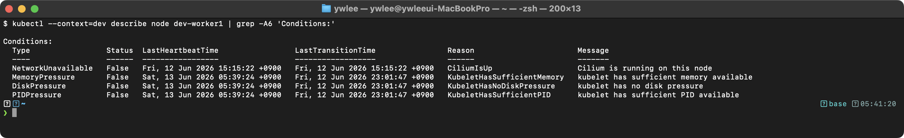

**출제 의도:** Worker Node 장애 복구는 CKA 시험에서 가장 자주 출제되는 트러블슈팅 문제이다. SSH 접속 후 체계적으로 원인을 파악하고 해결하는 역량을 평가한다.

**핵심 원리:** kubelet은 각 노드에서 Pod 관리를 담당하는 에이전트이다. kubelet이 정상 동작해야 노드가 API 서버에 heartbeat를 보내고, 이 heartbeat가 없으면 노드는 `NotReady` 상태가 된다. 기본적으로 40초 동안 heartbeat가 없으면 Node Controller가 노드를 NotReady로 표시한다.

**함정과 주의사항:**
- `systemctl status kubelet`에서 `Active: inactive (dead)`이면 단순히 서비스가 중지된 것이다. `start`와 `enable`을 모두 실행해야 재부팅 후에도 자동 시작된다.
- `journalctl -u kubelet` 로그에서 마지막 오류 메시지가 핵심이다. 스크롤하지 말고 `tail`로 마지막 부분을 먼저 본다.
- containerd가 중지된 경우 kubelet이 "container runtime is not running" 오류를 출력한다. kubelet보다 containerd를 먼저 시작해야 한다.

**시간 절약 팁:** 진단 순서를 고정한다: `systemctl status kubelet` → `journalctl -u kubelet --no-pager -l | tail -30` → 오류 메시지 기반 수정 → `systemctl restart kubelet`. 이 순서를 매번 동일하게 따르면 빠르게 해결할 수 있다.

</details>

---

### 문제 30. [Pod 장애] CrashLoopBackOff 진단 및 해결

`kubectl config use-context k8s-cluster1`

네임스페이스 `default`에 `crash-app`이라는 Pod가 `CrashLoopBackOff` 상태이다. 원인을 파악하고 해결하라.

> **혼자 실습할 때 사전 준비(고의 장애 주입).** 실제 시험에서는 이미 깨진 Pod가 주어지지만, 이 저장소에서 혼자 재현하려면 먼저 고의로 장애 상태를 만든다. `kubectl run crash-app --image=busybox --command -- /bin/sh -c 'exit 1'` — 컨테이너가 시작 직후 비정상 종료(exit code 1)하므로 kubelet이 재시작을 반복하며 `CrashLoopBackOff`로 들어간다. 실습 후에는 `kubectl delete pod crash-app`으로 정리한다.

<details>
<summary>풀이 확인</summary>

**풀이:**

```bash
# 1. Pod 상태 확인
kubectl get pod crash-app
kubectl describe pod crash-app

# 2. 이전 컨테이너 로그 확인
kubectl logs crash-app --previous

# 3. Events 섹션에서 Exit Code 확인
kubectl describe pod crash-app | grep -A5 "Last State"
# Exit Code 1: 애플리케이션 오류
# Exit Code 137: OOMKilled (메모리 부족)
# Exit Code 139: Segmentation fault

# 4. Pod 스펙 확인
kubectl get pod crash-app -o yaml

# 일반적인 원인과 해결:

# 원인 1: 잘못된 command/args
kubectl get pod crash-app -o yaml | grep -A5 command
# 올바른 명령어로 수정

# 원인 2: 환경변수/ConfigMap/Secret 누락
kubectl describe pod crash-app | grep -A10 "Environment"
# 필요한 ConfigMap/Secret을 생성

# 원인 3: OOMKilled (메모리 부족)
kubectl describe pod crash-app | grep OOMKilled
# resources.limits.memory를 늘려서 Pod를 재생성

# 원인 4: 존재하지 않는 볼륨 마운트
kubectl describe pod crash-app | grep -A5 "Volumes"
# 해당 볼륨(PVC, ConfigMap, Secret 등)이 존재하는지 확인

# 해결 후: Pod 재생성
kubectl delete pod crash-app
kubectl apply -f crash-app-fixed.yaml

# 또는 Deployment인 경우 edit
kubectl edit deployment crash-app-deploy
```

**검증:**

```bash
kubectl get pod crash-app
```

> **예시(시험 정답 형식, 참조):** 아래 형태의 출력이 정답이다 — `NAME        READY   STATUS    RESTARTS   AGE ...`. 동일 명령의 **실측 스크린샷**은 이 자격증 daily(day01~20) 및 본 문서 위쪽 캡처에서 확인할 수 있다(이 블록은 일반 placeholder 클러스터 기준 예시).

STATUS가 `Running`이고 RESTARTS가 증가하지 않으면 해결된 것이다. 1-2분 후 다시 확인하여 CrashLoopBackOff로 돌아가지 않는지 검증한다.

```bash
kubectl logs crash-app --tail=5
```

정상 로그가 출력되면 애플리케이션이 정상 동작 중인 것이다.

**출제 의도:** CrashLoopBackOff는 가장 흔한 Pod 장애 유형이다. Exit Code를 기반으로 원인을 분류하고 체계적으로 해결하는 능력을 평가한다.

**핵심 원리:** CrashLoopBackOff는 컨테이너가 시작 직후 종료되는 것이 반복되는 상태이다. kubelet은 실패한 컨테이너를 exponential backoff(10초, 20초, 40초... 최대 5분)로 재시작한다. Exit Code가 원인 파악의 핵심이다: 0(정상 종료, 명령어가 끝난 것), 1(일반 오류), 137(SIGKILL, OOMKilled 또는 외부 kill), 139(SIGSEGV), 143(SIGTERM, graceful shutdown).

**함정과 주의사항:**
- `kubectl logs crash-app`은 현재 (재시작 중인) 컨테이너의 로그를 보여준다. 이전 컨테이너의 로그를 보려면 `--previous` 플래그를 사용한다.
- Exit Code 137은 OOMKilled 외에도 `kill -9`로 종료된 경우에도 발생한다. `kubectl describe pod`의 `Reason: OOMKilled`를 확인해야 정확히 판별된다.
- Pod를 직접 수정할 수 없는 필드(image, command 등)가 있다. 이 경우 삭제 후 재생성해야 한다.
- Deployment가 관리하는 Pod라면 Pod를 직접 수정하지 말고 Deployment를 수정한다.

**시간 절약 팁:** 진단 순서를 고정한다: `describe pod`(Events, Exit Code) → `logs --previous`(오류 메시지) → `get pod -o yaml`(스펙 확인). 이 3단계로 대부분의 원인을 파악할 수 있다.

</details>

---

### 문제 31. [Pod 장애] ImagePullBackOff 해결

`kubectl config use-context k8s-cluster1`

`default` 네임스페이스의 `broken-pod`가 `ImagePullBackOff` 상태이다. 원인을 파악하고 해결하라. 올바른 이미지는 `nginx:1.25`이다.

> **혼자 실습할 때 사전 준비(고의 장애 주입).** `kubectl run broken-pod --image=nginx:99.99` — 존재하지 않는 태그(`99.99`)라 이미지 풀이 실패하며 `ErrImagePull` → `ImagePullBackOff`로 들어간다. 해결은 `kubectl set image pod/broken-pod broken-pod=nginx:1.25` 또는 Pod를 지우고 올바른 이미지로 다시 만든다(Pod는 이미지 변경이 제한적이라 보통 재생성한다). 실습 후 `kubectl delete pod broken-pod`로 정리한다.

<details>
<summary>풀이 확인</summary>

**풀이:**

```bash
# 1. Pod 상태 확인
kubectl describe pod broken-pod

# Events 섹션에서 pull 실패 원인 확인:
# - "repository does not exist": 이미지 이름 오류
# - "tag not found": 태그 오류
# - "unauthorized": 인증 필요 (imagePullSecrets)

# 2. 현재 이미지 확인
kubectl get pod broken-pod -o jsonpath='{.spec.containers[0].image}'
# 예: nginx:99.99 (존재하지 않는 태그)

# 3. 이미지를 올바른 것으로 수정
# Pod는 직접 수정할 수 없으므로 삭제 후 재생성
kubectl get pod broken-pod -o yaml > broken-pod.yaml

# YAML에서 이미지를 nginx:1.25로 수정
# vi broken-pod.yaml

kubectl delete pod broken-pod
kubectl apply -f broken-pod.yaml

# 또는 Deployment에 의해 관리되는 경우
kubectl set image deployment/<deployment-name> <container-name>=nginx:1.25

# 4. 확인
kubectl get pod broken-pod
```

Pod는 직접 이미지를 수정할 수 없으므로 삭제 후 재생성해야 한다. Deployment가 관리하는 경우 `kubectl set image`로 수정할 수 있다.

**검증:**

```bash
kubectl get pod broken-pod
```

> **예시(시험 정답 형식, 참조):** 아래 형태의 출력이 정답이다 — `NAME         READY   STATUS    RESTARTS   AGE ...`. 동일 명령의 **실측 스크린샷**은 이 자격증 daily(day01~20) 및 본 문서 위쪽 캡처에서 확인할 수 있다(이 블록은 일반 placeholder 클러스터 기준 예시).

STATUS가 `Running`이면 해결된 것이다.

```bash
kubectl describe pod broken-pod | grep "Image:"
```

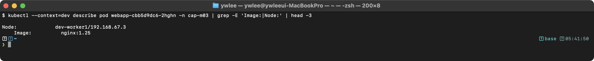

이미지가 `nginx:1.25`로 올바르게 변경되었는지 확인한다.

**출제 의도:** ImagePullBackOff 진단은 가장 기본적인 트러블슈팅 역량이다. Events에서 오류 원인을 읽고, 적절한 방법으로 수정할 수 있는지 평가한다.

**핵심 원리:** kubelet이 컨테이너 런타임에 이미지 pull을 요청하면, 런타임은 레지스트리에서 이미지를 다운로드한다. 이미지가 존재하지 않거나, 태그가 잘못되었거나, 프라이빗 레지스트리의 인증 정보가 없으면 pull이 실패한다. kubelet은 실패 후 exponential backoff로 재시도하며, 이 상태가 `ImagePullBackOff`이다.

**함정과 주의사항:**
- Pod의 `spec.containers[].image` 필드는 직접 수정할 수 없다. 반드시 삭제 후 재생성해야 한다.
- Deployment가 관리하는 Pod라면 `kubectl set image deployment/<name>`으로 수정한다. Pod를 직접 삭제하면 Deployment가 같은 잘못된 이미지로 다시 생성한다.
- 프라이빗 레지스트리의 경우 `imagePullSecrets`가 필요하다. Events에 "unauthorized"가 나오면 이 경우이다.
- `kubectl get pod -o yaml > file.yaml`로 추출한 YAML에는 status, uid, creationTimestamp 등의 필드가 포함된다. `kubectl apply` 시 이들은 무시되지만, 깔끔하게 작업하려면 불필요한 필드를 제거한다.

**시간 절약 팁:** `kubectl get pod broken-pod -o yaml > broken-pod.yaml && kubectl delete pod broken-pod && vi broken-pod.yaml`의 3단계 패턴을 사용한다. YAML에서 이미지만 수정하고 `kubectl apply -f`로 재생성한다.

</details>

---

### 문제 32. [Pod 장애] Pending Pod 해결

`kubectl config use-context k8s-cluster1`

`default` 네임스페이스의 `pending-pod`가 계속 `Pending` 상태이다. 원인을 파악하고 해결하라.

> **혼자 실습할 때 사전 준비(고의 장애 주입).** Pending은 스케줄러가 Pod를 올릴 노드를 찾지 못할 때 생긴다. 가장 간단한 재현은 노드에 없는 자원을 요구하는 것이다. 예: `kubectl run pending-pod --image=nginx --overrides='{"spec":{"containers":[{"name":"pending-pod","image":"nginx","resources":{"requests":{"memory":"1000Gi"}}}]}}'` — 어느 노드도 1000Gi 메모리를 제공할 수 없어 스케줄링이 실패하고 `Pending`에 머문다. 또는 `nodeSelector`에 존재하지 않는 라벨을 지정하는 방식도 같은 효과를 낸다. 해결은 `kubectl describe pod pending-pod`의 Events에서 원인(Insufficient memory 등)을 읽고 요청량을 줄이거나 라벨을 맞춘다. 실습 후 `kubectl delete pod pending-pod`로 정리한다.

<details>
<summary>풀이 확인</summary>

**풀이:**

```bash
# 1. Pod 상태 확인
kubectl describe pod pending-pod

# Events 섹션 확인 (일반적인 메시지):
# "Insufficient cpu/memory": 리소스 부족
# "didn't match Pod's node affinity/selector": 노드 선택 불일치
# "node(s) had taint": Taint/Toleration 불일치
# "persistentvolumeclaim not found/not bound": PVC 문제

# 2. 원인별 해결

# 원인 1: 리소스 부족
kubectl describe pod pending-pod | grep -A3 "Requests"
kubectl top nodes
# 해결: requests를 줄이거나 다른 Pod를 종료

# 원인 2: nodeSelector 불일치
kubectl get pod pending-pod -o yaml | grep -A3 nodeSelector
kubectl get nodes --show-labels
# 해결: 노드에 레이블 추가
kubectl label nodes <node-name> <key>=<value>

# 원인 3: Taint/Toleration 불일치
kubectl describe nodes | grep -A3 Taints
# 해결: Pod에 toleration 추가 또는 노드의 taint 제거
kubectl taint nodes <node-name> <key>-

# 원인 4: PVC 미바인딩
kubectl get pvc
kubectl get pv
# 해결: 적절한 PV를 생성하거나 PVC를 수정

# 3. 확인
kubectl get pod pending-pod
```

**검증:**

```bash
kubectl get pod pending-pod
```

> **예시(시험 정답 형식, 참조):** 아래 형태의 출력이 정답이다 — `NAME          READY   STATUS    RESTARTS   AGE ...`. 동일 명령의 **실측 스크린샷**은 이 자격증 daily(day01~20) 및 본 문서 위쪽 캡처에서 확인할 수 있다(이 블록은 일반 placeholder 클러스터 기준 예시).

STATUS가 `Pending`에서 `Running`으로 변경되면 해결된 것이다.

```bash
kubectl describe pod pending-pod | grep "Node:"
```

> **예시(시험 정답 형식, 참조):** 아래 형태의 출력이 정답이다 — `Node:         worker-1/192.168.1.101 ...`. 동일 명령의 **실측 스크린샷**은 이 자격증 daily(day01~20) 및 본 문서 위쪽 캡처에서 확인할 수 있다(이 블록은 일반 placeholder 클러스터 기준 예시).

Pod가 노드에 할당되었음을 확인한다.

**출제 의도:** Pending 상태의 원인은 다양하다. Events 메시지를 정확히 해석하고, 원인에 맞는 해결책을 적용할 수 있는지 평가한다.

**핵심 원리:** Pod가 Pending 상태인 것은 kube-scheduler가 Pod를 배치할 적절한 노드를 찾지 못했거나, 아직 스케줄링을 시도하지 않은 것이다. 스케줄러는 모든 노드에 대해 filtering(조건 불충족 노드 제거)과 scoring(남은 노드 점수 매기기)을 수행한다. filtering 단계에서 모든 노드가 탈락하면 Pod는 Pending 상태로 남는다. Events 섹션의 `FailedScheduling` 메시지에 탈락 이유가 상세히 기술된다.

**함정과 주의사항:**
- Events가 비어있으면 kube-scheduler 자체가 동작하지 않는 것이다. 이 경우 kube-scheduler Pod의 상태를 확인해야 한다.
- `Insufficient cpu/memory`는 노드의 allocatable 리소스에서 기존 Pod의 requests를 뺀 남은 용량이 부족한 것이다. 실제 사용량이 아니라 requests 합계 기준이다.
- nodeSelector와 Taint 문제는 동시에 발생할 수 있다. 한 가지만 해결하고 끝내지 말고, Pending이 완전히 해소되었는지 확인한다.
- PVC 문제의 경우 Pod Events 대신 PVC의 Events를 확인해야 할 수 있다.

**시간 절약 팁:** `kubectl describe pod`의 Events 섹션을 먼저 읽는다. 90% 이상의 경우 원인이 거기에 명시되어 있다. Events가 없으면 scheduler 문제를 의심한다.

</details>

---

### 문제 33. [Service 장애] Service 연결 불가

`kubectl config use-context k8s-cluster1`

`default` 네임스페이스의 `web-service`가 `web-deploy` Deployment의 Pod로 트래픽을 전달하지 못한다. 원인을 파악하고 해결하라.

> **혼자 실습할 때 사전 준비(고의 장애 주입).** Service가 Pod로 트래픽을 못 보내는 가장 흔한 원인은 Service의 `selector`가 Pod의 라벨과 어긋나는 것이다. 다음으로 재현한다: `kubectl create deployment web-deploy --image=nginx --replicas=2` (Pod 라벨은 `app=web-deploy`)로 Deployment를 만든 뒤, `kubectl expose deployment web-deploy --name=web-service --port=80 --selector='app=wrong-label'`처럼 의도적으로 틀린 셀렉터로 Service를 만든다. 그러면 `kubectl get endpoints web-service`가 비어 있어(엔드포인트 0개) 트래픽이 전달되지 않는다. 해결은 `kubectl get endpoints web-service`로 엔드포인트가 비었는지 확인하고, Service의 셀렉터를 Pod 라벨(`app=web-deploy`)에 맞게 `kubectl patch`하거나 다시 만든다. 실습 후 `kubectl delete deployment web-deploy svc web-service`로 정리한다.

<details>
<summary>풀이 확인</summary>

**풀이:**

```bash
# 1. Service 확인
kubectl get svc web-service
kubectl describe svc web-service

# 2. Endpoints 확인 (비어 있으면 selector 불일치)
kubectl get endpoints web-service
# ENDPOINTS가 <none>이면 문제

# 3. Service의 selector 확인
kubectl get svc web-service -o jsonpath='{.spec.selector}'
# 예: {"app":"web-app"}

# 4. Pod의 labels 확인
kubectl get pods --show-labels
kubectl get pods -l app=web-deploy
# selector와 Pod의 label이 일치하는지 확인

# 5. 불일치하는 경우:

# 방법 A: Service의 selector를 Pod의 label에 맞게 수정
kubectl edit svc web-service
# spec.selector를 Pod의 label과 일치하도록 수정

# 방법 B: Pod의 label을 Service의 selector에 맞게 수정
kubectl label pods -l app=web-deploy app=web-app --overwrite

# 6. port/targetPort 확인
kubectl get svc web-service -o yaml | grep -A5 ports
# targetPort가 Pod의 containerPort와 일치하는지 확인

kubectl get pod <pod-name> -o yaml | grep containerPort

# 7. 수정 후 확인
kubectl get endpoints web-service
# ENDPOINTS에 Pod IP가 표시되어야 한다

# 8. 연결 테스트
kubectl run test --image=curlimages/curl --rm -it --restart=Never -- \
  curl -s http://web-service
```

Service 트러블슈팅의 핵심은 **Endpoints**를 확인하는 것이다. Endpoints가 비어있으면 selector와 Pod label이 불일치하거나 Pod가 Ready 상태가 아닌 것이다.

**검증:**

```bash
kubectl get endpoints web-service
```

> **예시(시험 정답 형식, 참조):** 아래 형태의 출력이 정답이다 — `NAME          ENDPOINTS                                      ...`. 동일 명령의 **실측 스크린샷**은 이 자격증 daily(day01~20) 및 본 문서 위쪽 캡처에서 확인할 수 있다(이 블록은 일반 placeholder 클러스터 기준 예시).

Endpoints에 Pod IP가 표시되면 Service-Pod 연결이 복구된 것이다.

```bash
kubectl run test --image=curlimages/curl --rm -it --restart=Never -- \
  curl -s http://web-service
```

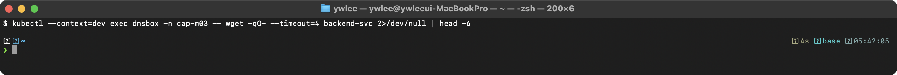

HTTP 응답이 반환되면 완전히 복구된 것이다.

**출제 의도:** Service 연결 실패 트러블슈팅은 CKA에서 자주 출제된다. selector-label 불일치를 진단하고 Endpoints를 통해 검증하는 역량을 평가한다.

**핵심 원리:** Service는 label selector로 백엔드 Pod를 발견한다. Endpoints Controller는 Service의 selector와 일치하는 Ready Pod의 IP를 Endpoints 오브젝트에 등록한다. kube-proxy는 Endpoints 정보를 기반으로 iptables/IPVS 규칙을 갱신한다. selector-label 불일치, targetPort 불일치, Pod not Ready — 이 3가지가 Service 연결 실패의 주요 원인이다.

**함정과 주의사항:**
- `kubectl get endpoints`에서 `<none>`이 나오면 selector와 label의 불일치가 가장 유력한 원인이다.
- Service의 `selector`와 Pod의 `labels`를 비교할 때, 대소문자와 하이픈(-) 등에 주의한다.
- `port`(Service가 수신하는 포트)와 `targetPort`(Pod로 전달하는 포트)가 다를 수 있다. `targetPort`가 Pod의 `containerPort`와 일치해야 한다.
- Pod가 Running이지만 Ready가 아닌 경우(readinessProbe 실패) Endpoints에 등록되지 않는다.

**시간 절약 팁:** Service 문제의 80%는 Endpoints 확인 한 줄로 원인을 파악할 수 있다. `kubectl get endpoints <svc-name>` → 비어있으면 selector 불일치 → `kubectl get svc -o yaml | grep selector` → `kubectl get pods --show-labels`로 확인.

</details>

---

### 문제 34. [컴포넌트 장애] kube-scheduler 복구

`kubectl config use-context k8s-cluster1`

새로 생성한 Pod가 모두 `Pending` 상태에 머물고 있다. `kubectl describe`를 확인하니 Events에 스케줄링 관련 메시지가 없다. kube-scheduler가 정상적으로 동작하는지 확인하고 문제를 해결하라.

> **혼자 실습할 때 사전 준비(고의 장애 주입).** 이 실습은 control plane을 멈췄다 살리므로 `dev`/`staging`에서만 한다(`platform`/`prod` 금지). kube-scheduler는 Static Pod라 매니페스트 파일을 치우면 kubelet이 곧바로 내린다. control plane 노드에 접속해(`ssh dev-master` — `~/.ssh/config`에 등록된 VM 별칭) `sudo mv /etc/kubernetes/manifests/kube-scheduler.yaml /tmp/`를 실행하면 scheduler Pod가 사라져 새 Pod가 노드에 배치되지 못하고 `Pending`에 머문다. 복구(이 문제의 정답)는 `sudo mv /tmp/kube-scheduler.yaml /etc/kubernetes/manifests/`로 매니페스트를 제자리에 돌려놓으면 kubelet이 다시 Static Pod로 띄운다.

<details>
<summary>풀이 확인</summary>

**풀이:**

```bash
# 1. kube-scheduler Pod 상태 확인
kubectl -n kube-system get pods | grep scheduler

# 2. Pod가 없거나 CrashLoopBackOff인 경우
# Static Pod 매니페스트 확인
cat /etc/kubernetes/manifests/kube-scheduler.yaml

# 3. 컨테이너 상태 확인
crictl ps -a | grep scheduler

# 4. 컨테이너 로그 확인
crictl logs <scheduler-container-id>

# 일반적인 원인:

# 원인 1: 매니페스트 파일이 삭제됨
# 해결: kube-scheduler.yaml을 다시 생성

# 원인 2: 매니페스트 파일에 오타가 있음
vi /etc/kubernetes/manifests/kube-scheduler.yaml
# 예: --kubeconfig 경로가 잘못됨, 포트가 잘못됨
# 수정 후 저장하면 kubelet이 자동으로 재시작

# 원인 3: 인증서 경로 오류
# --authentication-kubeconfig, --authorization-kubeconfig 경로 확인

# 5. 복구 확인
kubectl -n kube-system get pods | grep scheduler
# Running 상태여야 한다

# 6. 테스트 Pod 생성하여 스케줄링 확인
kubectl run test-scheduler --image=nginx
kubectl get pod test-scheduler
# Pending이 아닌 Running이어야 한다
```

Events에 스케줄링 관련 메시지가 전혀 없으면 kube-scheduler가 동작하지 않는 것이다. kube-scheduler는 Static Pod이므로 `/etc/kubernetes/manifests/kube-scheduler.yaml`을 확인해야 한다.

**원인 1(매니페스트 삭제) 보강 — 파일이 아예 없는 경우.** 위 풀이의 `cat /etc/kubernetes/manifests/kube-scheduler.yaml`은 매니페스트가 제자리에 있을 때만 동작한다. scheduler가 완전히 사라진(매니페스트가 삭제·이동된) 시나리오에서는 이 파일이 없어 `cat`이 `No such file or directory` 오류를 낸다. 따라서 먼저 디렉터리 내용을 확인하고 파일 위치를 찾는다.

```bash
# 매니페스트가 실제로 있는지 먼저 확인
ls /etc/kubernetes/manifests/

# 없으면 다른 위치로 옮겨졌는지 탐색 (위 고의 장애 주입에서는 /tmp로 옮겼음)
sudo find /tmp /etc/kubernetes -name kube-scheduler.yaml 2>/dev/null

# 찾은 파일을 원래 경로로 되돌리면 kubelet이 다시 Static Pod로 띄운다
sudo mv /tmp/kube-scheduler.yaml /etc/kubernetes/manifests/
```

처음 보는 학생은 "파일이 어디 갔는지" 모를 수 있는데, kube-scheduler 매니페스트의 정상 경로는 항상 `/etc/kubernetes/manifests/`이다. 백업본이나 다른 디렉터리에 사본이 있으면 그것을 이 경로로 복사·이동하면 된다. 파일을 어디서도 못 찾으면 다른 control plane 노드의 동일 파일을 복사하거나 `kubeadm init phase control-plane scheduler`로 재생성한다.

**검증:**

```bash
kubectl -n kube-system get pods | grep scheduler
```

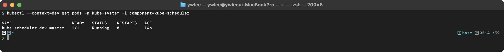

```bash
kubectl run test-scheduler --image=nginx
kubectl get pod test-scheduler
```

> **예시(시험 정답 형식, 참조):** 아래 형태의 출력이 정답이다 — `NAME             READY   STATUS    RESTARTS   AGE ...`. 동일 명령의 **실측 스크린샷**은 이 자격증 daily(day01~20) 및 본 문서 위쪽 캡처에서 확인할 수 있다(이 블록은 일반 placeholder 클러스터 기준 예시).

새 Pod가 Running 상태가 되면 스케줄러가 정상 동작하는 것이다.

**출제 의도:** Control Plane 컴포넌트 장애 복구는 CKA의 핵심 트러블슈팅 영역이다. Static Pod 매니페스트를 직접 수정하는 역량을 평가한다.

**핵심 원리:** kube-scheduler는 Pod의 `spec.nodeName`이 비어있는 Pod를 감시하다가, 적절한 노드를 선택하여 `nodeName`을 설정하는 컴포넌트이다. Static Pod로 배포되므로 `/etc/kubernetes/manifests/kube-scheduler.yaml`에 의해 kubelet이 직접 관리한다. 매니페스트에 오류가 있으면 컨테이너가 시작되지 않거나 CrashLoopBackOff에 빠진다.

**함정과 주의사항:**
- kube-scheduler가 비정상이면 `kubectl`로 Pod를 확인할 수 없을 수 있다(기존 Pod는 보이지만 scheduler Pod 자체가 Running이 아닐 수 있음). `crictl ps -a | grep scheduler`로 컨테이너를 직접 확인한다.
- 매니페스트의 일반적인 오타: `--kubeconfig` 경로 오류, `--port` 값 오류, `--authentication-kubeconfig` 경로 오류.
- 매니페스트를 수정하면 kubelet이 자동으로 Pod를 재시작하지만, 변경 감지에 수 초가 걸릴 수 있다.
- scheduler가 아닌 kube-apiserver나 etcd 장애인 경우에도 Pod가 Pending일 수 있다. 먼저 `kubectl` 명령 자체가 동작하는지 확인한다.

**시간 절약 팁:** `crictl logs <container-id>`로 오류 메시지를 빠르게 확인한다. 오류 메시지가 경로를 지목하면 해당 경로만 수정하면 된다.

</details>

---

### 문제 35. [컴포넌트 장애] kubelet 설정 오류 복구

`kubectl config use-context k8s-cluster1`

Worker Node `worker-2`가 `NotReady` 상태이다. SSH 접속하여 kubelet 로그를 확인하니 설정 파일 관련 오류가 있다. kubelet 설정을 수정하고 정상 상태로 복구하라.

> **혼자 실습할 때 사전 준비(고의 장애 주입).** 이 실습은 worker의 kubelet을 멈추므로 `dev`/`staging`에서만 한다. worker 노드에 접속해(`ssh dev-worker1` — `~/.ssh/config`에 등록된 VM 별칭) kubelet 서비스를 멈추거나(`sudo systemctl stop kubelet`) 설정 오류를 주입한다. 예를 들어 `sudo systemctl stop kubelet`만 해도 노드가 일정 시간 후 `NotReady`가 된다. 설정 파일 오류를 재현하려면 `/var/lib/kubelet/config.yaml` 같은 설정에 잘못된 값을 넣되, 먼저 `sudo cp /var/lib/kubelet/config.yaml /tmp/config.yaml.bak`로 백업해 둔다. 복구는 백업을 되돌리고 `sudo systemctl restart kubelet` 후 control plane에서 노드가 `Ready`로 돌아오는지 확인한다.

<details>
<summary>풀이 확인</summary>

**풀이:**

```bash
# 1. worker-2에 SSH 접속
ssh worker-2

# 2. kubelet 상태 확인
sudo systemctl status kubelet

# 3. kubelet 로그 확인 (오류 메시지에서 원인 파악)
sudo journalctl -u kubelet --no-pager -l | tail -30

# 일반적인 오류 메시지와 해결:

# 오류: "failed to load kubelet config file"
# 해결: 설정 파일 경로 확인
sudo cat /var/lib/kubelet/config.yaml
# YAML 구문 오류를 수정

# 오류: "unable to load client CA file"
# 해결: 인증서 파일 경로 확인 및 수정
# config.yaml의 authentication.x509.clientCAFile 경로 확인

# 오류: "node not found" 또는 "unauthorized"
# 해결: kubeconfig 파일 확인
sudo cat /etc/kubernetes/kubelet.conf
# server 주소가 올바른지 확인

# 오류: "container runtime is not running"
# 해결: containerd 재시작
sudo systemctl restart containerd

# 4. kubelet 설정 수정 후 재시작
sudo vi /var/lib/kubelet/config.yaml
# 오류를 수정

sudo systemctl daemon-reload
sudo systemctl restart kubelet
sudo systemctl enable kubelet

# 5. 상태 확인
sudo systemctl status kubelet
sudo journalctl -u kubelet -f

# 6. Control Plane에서 확인
exit
kubectl get nodes
# worker-2가 Ready 상태여야 한다
```

kubelet 설정 파일의 일반적인 오류:
- YAML 들여쓰기 오류
- 인증서 파일 경로 오류
- API 서버 주소 오류
- port 번호 오류

**검증:**

```bash
# Control Plane에서 확인
kubectl get nodes
```

> **예시(시험 정답 형식, 참조):** 아래 형태의 출력이 정답이다 — `NAME           STATUS   ROLES           AGE   VERSION ...`. 동일 명령의 **실측 스크린샷**은 이 자격증 daily(day01~20) 및 본 문서 위쪽 캡처에서 확인할 수 있다(이 블록은 일반 placeholder 클러스터 기준 예시).

worker-2의 STATUS가 `Ready`이면 복구 완료이다.

```bash
# worker-2에서 kubelet 상태 재확인
ssh worker-2 -- sudo systemctl status kubelet | head -5
```

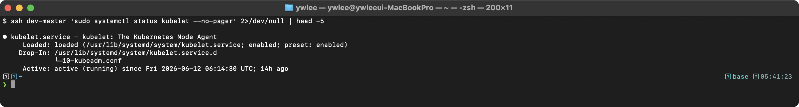

**출제 의도:** kubelet 설정 오류 복구는 노드 수준 트러블슈팅의 핵심이다. journalctl 로그를 읽고 설정 파일을 수정하는 능력을 평가한다.

**핵심 원리:** kubelet은 `--config` 플래그로 지정된 설정 파일(보통 `/var/lib/kubelet/config.yaml`)을 읽는다. 설정 파일에 YAML 구문 오류, 잘못된 인증서 경로, 잘못된 포트 등이 있으면 kubelet이 시작에 실패한다. kubelet은 systemd 서비스이므로 `journalctl -u kubelet`으로 로그를 확인하고, 설정 파일 수정 후 `systemctl restart kubelet`으로 재시작한다.

**함정과 주의사항:**
- `journalctl` 로그의 마지막 오류 메시지가 핵심이다. 로그가 길면 `tail -30`으로 끝부분만 확인한다.
- 설정 파일 수정 후 반드시 `systemctl daemon-reload` → `systemctl restart kubelet` 순서로 실행한다. `daemon-reload`를 빠뜨리면 변경이 반영되지 않을 수 있다.
- kubelet.conf(kubeconfig)와 config.yaml(kubelet 설정)은 다른 파일이다. 오류 메시지에서 어떤 파일에 문제가 있는지 정확히 확인한다.

**시간 절약 팁:** `journalctl -u kubelet --no-pager -l | tail -20`으로 오류 메시지를 빠르게 확인한다. 오류 메시지가 파일 경로를 지목하면 해당 파일만 수정하면 된다.

</details>

---

### 문제 36. [로그 분석] 특정 Pod의 로그 분석

`kubectl config use-context k8s-cluster1`

네임스페이스 `production`에서 실행 중인 `app-server` Pod가 간헐적으로 5xx 오류를 반환한다. 다음을 수행하라:
- Pod의 최근 100줄 로그를 확인하라.
- 최근 30분 이내의 로그에서 "error" 또는 "Error" 패턴을 검색하라.
- Pod의 이전 컨테이너 로그도 확인하라 (재시작 이력이 있는 경우).
- 문제 원인을 `/opt/answer/error-log.txt`에 저장하라.

<details>
<summary>풀이 확인</summary>

**풀이:**

```bash
# 1. 최근 100줄 로그 확인
kubectl logs app-server -n production --tail=100

# 2. 최근 30분 로그에서 에러 검색
kubectl logs app-server -n production --since=30m | grep -i error

# 3. 이전 컨테이너 로그 확인 (재시작된 경우)
kubectl logs app-server -n production --previous

# 4. Pod 상세 정보 확인 (재시작 횟수, Exit Code 등)
kubectl describe pod app-server -n production | grep -A10 "Last State"
kubectl describe pod app-server -n production | grep "Restart Count"

# 5. 멀티 컨테이너인 경우 각 컨테이너 로그 확인
kubectl get pod app-server -n production -o jsonpath='{.spec.containers[*].name}'
kubectl logs app-server -n production -c <container-name>

# 6. 에러 로그를 파일로 저장
mkdir -p /opt/answer
kubectl logs app-server -n production --since=30m | grep -i error > /opt/answer/error-log.txt

# 결과 확인
cat /opt/answer/error-log.txt
```

**검증:**

```bash
cat /opt/answer/error-log.txt
```

> **예시(시험 정답 형식, 참조):** 아래 형태의 출력이 정답이다 — `2026-03-30T10:15:23Z ERROR connection refused to database:54 ...`. 동일 명령의 **실측 스크린샷**은 이 자격증 daily(day01~20) 및 본 문서 위쪽 캡처에서 확인할 수 있다(이 블록은 일반 placeholder 클러스터 기준 예시).

파일에 에러 로그가 저장되어 있으면 성공이다. 파일이 비어있으면 grep 패턴이 맞지 않거나 에러가 없는 것이다.

```bash
wc -l /opt/answer/error-log.txt
```

파일의 줄 수를 확인하여 에러가 캡처되었는지 검증한다.

**출제 의도:** 로그 기반 진단 능력을 평가한다. `kubectl logs`의 다양한 옵션(--tail, --since, --previous, -c)을 정확히 사용하고, 결과를 파일로 저장하는 실무 역량을 본다.

**핵심 원리:** `kubectl logs`는 컨테이너의 stdout/stderr 출력을 조회한다. kubelet이 컨테이너 런타임에서 로그를 수집하여 노드의 `/var/log/containers/` 디렉터리에 저장한다. `--previous`는 이전 컨테이너 인스턴스(재시작 전)의 로그를 조회한다. `--since`는 지정된 시간 이후의 로그만 필터링한다. `--tail`은 마지막 N줄만 조회한다.

**함정과 주의사항:**
- `--previous`는 컨테이너가 한 번이라도 재시작된 적이 있어야 동작한다. 재시작 이력이 없으면 오류가 발생한다.
- 멀티 컨테이너 Pod에서 `-c` 없이 `kubectl logs`를 실행하면 "must specify a container" 오류가 발생한다.
- `grep -i error`는 대소문자 무시 검색이다. "Error", "ERROR", "error" 모두 매칭된다.
- 결과를 파일에 저장할 때 `>` (덮어쓰기)와 `>>` (추가)를 구분한다. 시험에서는 보통 `>`를 사용한다.

**시간 절약 팁:** `kubectl logs` 옵션을 외워둔다: `--tail=N`(마지막 N줄), `--since=Xm`(최근 X분), `--previous`(이전 컨테이너), `-c`(컨테이너 지정), `-f`(실시간 스트리밍). 파이프와 `grep`을 조합하면 대부분의 로그 분석이 가능하다.

</details>

---

### 문제 37. [컴포넌트 장애] etcd 장애 복구

`kubectl config use-context k8s-cluster1`

`kubectl get pods` 명령이 "connection refused" 오류를 반환한다. API 서버 로그를 확인하니 etcd 연결 실패 메시지가 있다. etcd를 복구하라.

<details>
<summary>풀이 확인</summary>

**풀이:**

```bash
# 1. etcd 컨테이너 상태 확인
crictl ps -a | grep etcd

# 2. etcd 로그 확인
crictl logs <etcd-container-id>

# 3. etcd 매니페스트 확인
cat /etc/kubernetes/manifests/etcd.yaml

# 일반적인 원인:

# 원인 1: etcd 매니페스트의 설정 오류
vi /etc/kubernetes/manifests/etcd.yaml
# 확인 사항:
# - --data-dir 경로가 올바른지
# - --cert-file, --key-file, --trusted-ca-file 경로가 올바른지
# - --listen-client-urls, --advertise-client-urls가 올바른지
# - volume mount 경로가 올바른지

# 원인 2: 데이터 디렉터리 손상
ls -la /var/lib/etcd/
# 디렉터리가 없거나 빈 경우, 백업에서 복구

# 원인 3: 인증서 파일 누락/오류
ls -la /etc/kubernetes/pki/etcd/
# ca.crt, server.crt, server.key가 존재하는지 확인

# 4. 매니페스트 수정 후 etcd Pod 재시작 대기
# Static Pod이므로 매니페스트 저장 시 자동 재시작

# 5. 복구 확인
crictl ps | grep etcd
kubectl get pods -A
kubectl get nodes
```

etcd가 동작하지 않으면 API 서버도 정상 동작하지 않는다. `kubectl` 명령이 실패하므로 `crictl`을 사용하여 컨테이너를 직접 확인해야 한다.

**검증:**

```bash
crictl ps | grep etcd
```

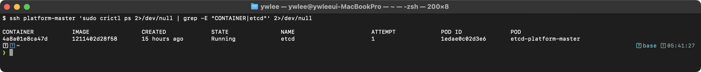

etcd 컨테이너가 `Running`이면 복구 1단계 성공이다.

```bash
kubectl get pods -A
kubectl get nodes
```

두 명령이 정상 출력되면 API 서버-etcd 연결이 복구된 것이다.

**출제 의도:** etcd 장애는 클러스터 전체 장애로 이어지는 치명적인 문제이다. `kubectl`이 동작하지 않는 상황에서 `crictl`로 진단하는 역량을 평가한다.

**핵심 원리:** etcd는 쿠버네티스의 모든 상태 데이터를 저장하는 분산 키-값 저장소이다. kube-apiserver는 모든 읽기/쓰기 작업에서 etcd를 사용한다. etcd가 중단되면 API 서버가 "connection refused" 또는 "etcd cluster is unavailable" 오류를 반환한다. etcd는 Static Pod이므로 매니페스트 파일 수정으로 복구한다.

**함정과 주의사항:**
- `kubectl`이 동작하지 않으므로 `crictl`을 사용해야 한다. `crictl ps -a`로 중지된 컨테이너까지 확인하고, `crictl logs`로 로그를 확인한다.
- 매니페스트의 인증서 경로와 실제 파일이 일치하는지 `ls -la`로 확인한다.
- etcd 데이터 디렉터리(`/var/lib/etcd`)의 권한이 올바른지 확인한다. etcd는 보통 root 권한으로 실행된다.
- 매니페스트 수정 후 etcd가 재시작되는 데 시간이 걸릴 수 있다. `watch crictl ps`로 모니터링한다.

**시간 절약 팁:** etcd 문제의 진단 순서: `crictl ps -a | grep etcd` → `crictl logs <id>` → `/etc/kubernetes/manifests/etcd.yaml` 확인 → 수정. 이 순서를 매번 동일하게 따른다.

</details>

---

### 문제 38. [네트워크 장애] Service DNS 해석 실패

`kubectl config use-context k8s-cluster1`

Pod에서 `nslookup my-service.default.svc.cluster.local` 명령이 실패한다. DNS 해석이 되지 않는 원인을 파악하고 해결하라.

<details>
<summary>풀이 확인</summary>

**풀이:**

```bash
# 1. CoreDNS Pod 상태 확인
kubectl -n kube-system get pods -l k8s-app=kube-dns

# 2. CoreDNS Pod가 Running이 아닌 경우
kubectl -n kube-system describe pods -l k8s-app=kube-dns
kubectl -n kube-system logs -l k8s-app=kube-dns

# 3. CoreDNS Service 확인
kubectl -n kube-system get svc kube-dns
kubectl -n kube-system get endpoints kube-dns

# 4. CoreDNS ConfigMap 확인
kubectl -n kube-system get configmap coredns -o yaml
# Corefile 구문 오류가 있는지 확인

# 일반적인 원인:

# 원인 1: CoreDNS Pod가 CrashLoopBackOff
# 로그 확인 후 ConfigMap(Corefile) 수정
kubectl -n kube-system edit configmap coredns
# 구문 오류를 수정한 후 CoreDNS 재시작
kubectl -n kube-system rollout restart deployment coredns

# 원인 2: CoreDNS Deployment의 replicas가 0
kubectl -n kube-system scale deployment coredns --replicas=2

# 원인 3: kube-dns Service의 ClusterIP가 변경됨
# Pod의 /etc/resolv.conf 확인
kubectl run dns-debug --image=busybox:1.28 --rm -it --restart=Never -- cat /etc/resolv.conf
# nameserver가 kube-dns Service의 ClusterIP와 일치하는지 확인

# 원인 4: NetworkPolicy가 DNS 트래픽을 차단
kubectl get networkpolicy -A
# DNS(포트 53) 트래픽을 허용하는지 확인

# 5. 해결 후 DNS 테스트
kubectl run dns-test --image=busybox:1.28 --rm -it --restart=Never -- \
  nslookup my-service.default.svc.cluster.local

kubectl run dns-test2 --image=busybox:1.28 --rm -it --restart=Never -- \
  nslookup kubernetes.default
```

DNS 문제 진단 순서: CoreDNS Pod 상태 → CoreDNS 로그 → CoreDNS ConfigMap → kube-dns Service → NetworkPolicy 순서로 확인한다.

**검증:**

```bash
kubectl run dns-test --image=busybox:1.28 --rm -it --restart=Never -- \
  nslookup my-service.default.svc.cluster.local
```

> **예시(시험 정답 형식, 참조):** 아래 형태의 출력이 정답이다 — `Server:    10.96.0.10 ...`. 동일 명령의 **실측 스크린샷**은 이 자격증 daily(day01~20) 및 본 문서 위쪽 캡처에서 확인할 수 있다(이 블록은 일반 placeholder 클러스터 기준 예시).

DNS 해석이 성공하면 복구 완료이다.

**출제 의도:** DNS 장애는 Service 기반 통신 전체를 마비시킨다. 체계적인 진단 순서로 원인을 찾고 해결하는 역량을 평가한다.

**핵심 원리:** Pod가 서비스 이름으로 통신하면, Pod 내부의 `/etc/resolv.conf`에 설정된 nameserver(CoreDNS의 ClusterIP)로 DNS 질의를 보낸다. CoreDNS는 쿠버네티스 API를 watch하여 Service/Endpoint 정보를 실시간으로 유지하고, 질의에 응답한다. DNS 실패는 CoreDNS Pod 이상, ConfigMap 오류, kube-dns Service 문제, NetworkPolicy 차단 중 하나가 원인이다.

**함정과 주의사항:**
- CoreDNS Pod가 Running이어도 ConfigMap(Corefile)에 구문 오류가 있으면 특정 도메인의 해석이 실패할 수 있다.
- CoreDNS ConfigMap을 수정한 후 `rollout restart`를 하지 않으면 변경이 반영되지 않는다. CoreDNS는 ConfigMap 변경을 자동으로 reload하지 않는 경우가 있다.
- kube-dns Service가 삭제되었거나 ClusterIP가 변경된 경우, 기존 Pod의 `/etc/resolv.conf`가 맞지 않게 된다. Pod를 재시작해야 새 nameserver를 적용한다.
- busybox 최신 버전의 nslookup 동작이 다를 수 있으므로, DNS 테스트에는 `busybox:1.28`을 사용한다.

**시간 절약 팁:** 가장 빠른 진단 경로: `kubectl -n kube-system get pods -l k8s-app=kube-dns`(Pod 상태) → Running이 아니면 `logs`로 원인 확인 → Running이면 ConfigMap과 Service 점검.

</details>

---

### 문제 39. [노드 관리] 노드 Drain과 Maintenance

`kubectl config use-context k8s-cluster1`

Worker Node `worker-1`에서 유지보수 작업을 수행해야 한다. 다음을 수행하라:
- `worker-1`을 안전하게 drain하라 (DaemonSet Pod는 무시, emptyDir 데이터가 있는 Pod도 삭제 허용).
- 유지보수 완료 후 노드를 다시 스케줄링 가능 상태로 복원하라.
- 노드 상태를 확인하라.

<details>
<summary>풀이 확인</summary>

**풀이:**

```bash
# 1. 현재 worker-1에서 실행 중인 Pod 확인
kubectl get pods -A -o wide --field-selector spec.nodeName=worker-1

# 2. 노드 drain (안전하게 Pod 이동)
kubectl drain worker-1 --ignore-daemonsets --delete-emptydir-data

# --ignore-daemonsets: DaemonSet이 관리하는 Pod는 drain 대상에서 제외
# --delete-emptydir-data: emptyDir 볼륨을 사용하는 Pod도 삭제 허용
# --force: ReplicaSet/Deployment 등에 의해 관리되지 않는 단독 Pod도 삭제

# 만약 단독 Pod(Deployment 등으로 관리되지 않는)가 있어 실패하면:
kubectl drain worker-1 --ignore-daemonsets --delete-emptydir-data --force

# 3. drain 결과 확인
kubectl get nodes
# worker-1이 Ready,SchedulingDisabled 상태

kubectl get pods -A -o wide --field-selector spec.nodeName=worker-1
# DaemonSet Pod만 남아있어야 한다

# === 유지보수 작업 수행 ===

# 4. 유지보수 완료 후 노드 복원
kubectl uncordon worker-1

# 5. 노드 상태 확인
kubectl get nodes
# worker-1이 Ready 상태 (SchedulingDisabled 없음)
```

`drain` = `cordon` + Pod 이동이다. `cordon`만 하면 새 Pod가 스케줄링되지 않지만 기존 Pod는 그대로 유지된다. `drain`은 기존 Pod도 안전하게 다른 노드로 이동시킨다.

**검증:**

```bash
# drain 후
kubectl get nodes
```

> **예시(시험 정답 형식, 참조):** 아래 형태의 출력이 정답이다 — `NAME           STATUS                     ROLES           AG ...`. 동일 명령의 **실측 스크린샷**은 이 자격증 daily(day01~20) 및 본 문서 위쪽 캡처에서 확인할 수 있다(이 블록은 일반 placeholder 클러스터 기준 예시).

drain 후 `SchedulingDisabled`가 표시된다.

```bash
# uncordon 후
kubectl get nodes
```

> **예시(시험 정답 형식, 참조):** 아래 형태의 출력이 정답이다 — `NAME           STATUS   ROLES           AGE   VERSION ...`. 동일 명령의 **실측 스크린샷**은 이 자격증 daily(day01~20) 및 본 문서 위쪽 캡처에서 확인할 수 있다(이 블록은 일반 placeholder 클러스터 기준 예시).

uncordon 후 `SchedulingDisabled`가 사라지면 복구 완료이다.

**출제 의도:** 노드 유지보수는 실무에서 빈번한 작업이다. drain/uncordon 절차를 정확히 수행하고, 필요한 플래그를 아는지 평가한다.

**핵심 원리:** `kubectl drain`은 두 가지 작업을 수행한다. 1) 노드를 cordon(SchedulingDisabled)하여 새 Pod가 스케줄링되지 않도록 한다. 2) 기존 Pod를 evict하여 다른 노드로 이동시킨다. Eviction은 PodDisruptionBudget(PDB: 자발적 중단 시에도 최소 몇 개의 Pod는 살아 있어야 하는지를 선언하는 가용성 보호 장치)을 존중하므로, PDB가 설정된 경우 최소 가용 Pod 수가 유지된다. DaemonSet Pod는 노드별로 반드시 실행되어야 하므로 drain 대상에서 제외해야 한다(`--ignore-daemonsets`).

**함정과 주의사항:**
- `--ignore-daemonsets`을 빠뜨리면 DaemonSet Pod 때문에 drain이 실패한다.
- `--delete-emptydir-data`를 빠뜨리면 emptyDir 볼륨을 사용하는 Pod 때문에 drain이 실패한다.
- `--force`는 ReplicaSet/Deployment 등에 의해 관리되지 않는 단독 Pod도 삭제한다. 단독 Pod는 다른 노드에 재생성되지 않으므로 데이터 손실이 발생할 수 있다.
- drain 후 uncordon을 빠뜨리면 노드가 계속 SchedulingDisabled 상태로 남는다.

**시간 절약 팁:** 실무적으로 가장 안전한 drain 명령은 `kubectl drain <node> --ignore-daemonsets --delete-emptydir-data`이다. 이 두 플래그를 항상 함께 사용하는 것을 습관화한다.

</details>

---

### 문제 40. [종합] 전체 클러스터 상태 점검

`kubectl config use-context k8s-cluster1`

클러스터 전체 상태를 점검하고, 발견된 모든 문제를 `/opt/answer/cluster-health.txt`에 보고하라. 다음을 확인해야 한다:
- 모든 노드의 상태
- kube-system 네임스페이스의 모든 Pod 상태
- 모든 네임스페이스에서 Running이 아닌 Pod 목록
- etcd 클러스터 상태
- CoreDNS 동작 여부

<details>
<summary>풀이 확인</summary>

**풀이:**

```bash
mkdir -p /opt/answer

# 보고서 작성 시작
cat <<'REPORT' > /opt/answer/cluster-health.txt
=== 클러스터 상태 점검 보고서 ===
REPORT

# 1. 노드 상태
echo -e "\n--- 노드 상태 ---" >> /opt/answer/cluster-health.txt
kubectl get nodes -o wide >> /opt/answer/cluster-health.txt 2>&1

# NotReady 노드 확인
echo -e "\n--- NotReady 노드 ---" >> /opt/answer/cluster-health.txt
kubectl get nodes | grep NotReady >> /opt/answer/cluster-health.txt 2>&1 || echo "없음" >> /opt/answer/cluster-health.txt

# 2. kube-system Pod 상태
echo -e "\n--- kube-system Pod 상태 ---" >> /opt/answer/cluster-health.txt
kubectl get pods -n kube-system -o wide >> /opt/answer/cluster-health.txt 2>&1

# 3. 비정상 Pod 목록 (모든 네임스페이스)
echo -e "\n--- 비정상 Pod 목록 (Running/Completed 아닌 Pod) ---" >> /opt/answer/cluster-health.txt
kubectl get pods -A --field-selector 'status.phase!=Running,status.phase!=Succeeded' >> /opt/answer/cluster-health.txt 2>&1 || echo "없음" >> /opt/answer/cluster-health.txt

# 4. etcd 클러스터 상태
echo -e "\n--- etcd 클러스터 상태 ---" >> /opt/answer/cluster-health.txt
ETCDCTL_API=3 etcdctl member list \
  --endpoints=https://127.0.0.1:2379 \
  --cacert=/etc/kubernetes/pki/etcd/ca.crt \
  --cert=/etc/kubernetes/pki/etcd/server.crt \
  --key=/etc/kubernetes/pki/etcd/server.key \
  --write-out=table >> /opt/answer/cluster-health.txt 2>&1

# etcd 엔드포인트 상태
echo -e "\n--- etcd 엔드포인트 상태 ---" >> /opt/answer/cluster-health.txt
ETCDCTL_API=3 etcdctl endpoint health \
  --endpoints=https://127.0.0.1:2379 \
  --cacert=/etc/kubernetes/pki/etcd/ca.crt \
  --cert=/etc/kubernetes/pki/etcd/server.crt \
  --key=/etc/kubernetes/pki/etcd/server.key >> /opt/answer/cluster-health.txt 2>&1

# 5. CoreDNS 동작 확인
echo -e "\n--- CoreDNS 상태 ---" >> /opt/answer/cluster-health.txt
kubectl -n kube-system get pods -l k8s-app=kube-dns >> /opt/answer/cluster-health.txt 2>&1

echo -e "\n--- DNS 테스트 ---" >> /opt/answer/cluster-health.txt
kubectl run dns-health-check --image=busybox:1.28 --rm -it --restart=Never -- \
  nslookup kubernetes.default.svc.cluster.local >> /opt/answer/cluster-health.txt 2>&1

# 6. 이벤트 확인 (최근 Warning 이벤트)
echo -e "\n--- 최근 Warning 이벤트 ---" >> /opt/answer/cluster-health.txt
kubectl get events -A --field-selector type=Warning --sort-by='.lastTimestamp' | tail -20 >> /opt/answer/cluster-health.txt 2>&1

# 보고서 확인
cat /opt/answer/cluster-health.txt
```

클러스터 점검 시 확인 순서:
1. 노드 상태 (NotReady가 없는지)
2. Control Plane 컴포넌트 (kube-system Pod)
3. 비정상 Pod (모든 네임스페이스)
4. etcd 상태
5. DNS 동작
6. Warning 이벤트

이 순서로 확인하면 대부분의 클러스터 문제를 발견할 수 있다.

**검증:**

```bash
cat /opt/answer/cluster-health.txt
```

파일에 모든 섹션(노드 상태, kube-system Pod, 비정상 Pod, etcd 상태, CoreDNS, Warning 이벤트)이 포함되어 있으면 성공이다.

```bash
wc -l /opt/answer/cluster-health.txt
```

> **예시(시험 정답 형식, 참조):** 아래 형태의 출력이 정답이다 — `45 /opt/answer/cluster-health.txt ...`. 동일 명령의 **실측 스크린샷**은 이 자격증 daily(day01~20) 및 본 문서 위쪽 캡처에서 확인할 수 있다(이 블록은 일반 placeholder 클러스터 기준 예시).

파일이 비어있지 않고 충분한 내용이 있는지 확인한다.

**출제 의도:** 클러스터 전체 상태를 종합적으로 진단하고 보고서를 작성하는 역량을 평가한다. 시험의 마지막 문제로 전체 영역을 아우르는 종합 문제 형태이다.

**핵심 원리:** 쿠버네티스 클러스터 건강 점검은 계층적으로 수행한다. 인프라 계층(노드)부터 확인하고, Control Plane 계층(kube-system Pod, etcd), 네트워크 계층(DNS), 워크로드 계층(비정상 Pod) 순서로 점검한다. 하위 계층의 문제가 상위 계층에 영향을 미치므로, 아래에서 위로 진단하는 것이 효율적이다.

**함정과 주의사항:**
- `kubectl get pods -A --field-selector 'status.phase!=Running,status.phase!=Succeeded'`에서 field selector는 정확한 Phase 값만 필터링한다. CrashLoopBackOff나 ImagePullBackOff는 Phase가 `Running`이면서 컨테이너가 비정상인 경우가 있어 이 필터로 잡히지 않을 수 있다.
- etcd 관련 명령은 인증서가 필요하다. 인증서 경로가 틀리면 명령이 실패하고 보고서에 오류가 기록된다.
- DNS 테스트용 Pod(`dns-health-check`)가 완료되지 않으면 보고서 생성이 중단될 수 있다. `--timeout` 옵션이나 `--rm`을 사용한다.
- 결과를 파일에 저장할 때 `>>` (append)를 사용해야 한다. `>`를 사용하면 이전 내용이 덮어써진다.

**시간 절약 팁:** 스크립트 전체를 하나의 shell script로 작성하여 한 번에 실행하면 빠르다. 각 명령을 `>> file 2>&1`로 리다이렉트하는 패턴을 사용한다. 시험에서는 시간이 부족할 수 있으므로, 가장 중요한 항목(노드 상태, kube-system Pod)부터 먼저 작성한다.

</details>
