# CKA Day 1: 클러스터 아키텍처 & kubeadm 기초

> 학습 목표 | CKA 도메인: Cluster Architecture, Installation & Configuration (25%) - Part 1 | 예상 소요 시간: 4시간

CKA 학습의 첫 번째 날이다. 이 문서는 이후 모든 day의 기반이 되는 클러스터 아키텍처를 다루며, day02부터 다루는 워크로드 관리·스케줄링·스토리지·네트워킹은 여기서 소개하는 컴포넌트들이 어떻게 협력하는지를 이해해야 따라갈 수 있다.

---

## 오늘의 학습 목표

- [ ] Control Plane / Worker Node 아키텍처를 완벽히 이해한다
- [ ] Static Pod의 동작 원리와 관리 방법을 숙지한다
- [ ] kubeadm의 init/join 과정을 단계별로 설명할 수 있다
- [ ] kubeconfig 파일 구조를 완벽히 이해한다
- [ ] 시험 유형별 문제 풀이 전략을 체득한다

---

## 1. 쿠버네티스 아키텍처 완벽 해부

### 1.1 쿠버네티스란 무엇인가?

#### 등장 배경

컨테이너 기술(Docker 등)이 등장하면서 애플리케이션 패키징과 배포가 편리해졌으나, 수백~수천 개의 컨테이너를 수동으로 관리하는 것은 불가능에 가까웠다. 컨테이너가 죽으면 누가 재시작하는가? 트래픽이 증가하면 누가 스케일아웃하는가? 새 버전을 무중단으로 어떻게 배포하는가? 이러한 문제를 해결하기 위해 Google이 내부에서 사용하던 Borg 시스템의 경험을 바탕으로 2014년에 오픈소스로 공개한 것이 쿠버네티스이다.

쿠버네티스(Kubernetes, 줄여서 K8s)는 컨테이너화된 애플리케이션을 자동으로 배포, 확장, 관리하는 오케스트레이션(orchestration) 플랫폼이다.

이 문장에 나오는 두 핵심 용어를 먼저 풀어 둔다. 이후 거의 모든 동작 원리가 이 둘로 설명되기 때문이다.

- **선언적 구성(declarative configuration)** — "원하는 최종 상태(desired state)를 선언만 하고, 거기까지 가는 방법(How)은 시스템이 알아서 한다"는 방식이다. 대조되는 것이 **명령형(imperative)** 으로, "이 명령 실행하고 다음 저 명령 실행하고…"처럼 절차를 사람이 일일이 지시한다. 예로 선언형은 "nginx Pod 3개가 항상 떠 있어야 한다"고 적어 두면 끝이지만, 명령형은 "Pod 만들어 → 죽으면 다시 만들어 → 부족하면 추가해"를 사람이 계속 시켜야 한다.
- **리컨실리에이션(reconciliation)** — 현재 상태(current state)와 원하는 상태(desired state)의 **차이를 감지해 자동으로 맞춰 나가는 제어 루프**다. 쿠버네티스의 거의 모든 컴포넌트가 "내가 맡은 리소스의 현재 상태 관찰 → 선언된 목표와 비교 → 차이를 메우는 동작 실행"을 무한 반복한다. 이 패턴을 §2.2의 Watch 메커니즘으로 구현한다.

즉 쿠버네티스는 선언적 구성과 리컨실리에이션 제어 루프(control loop)를 기반으로 desired state와 current state의 차이를 지속적으로 수렴시키는 아키텍처를 채택한다.

**핵심 용어 정리:**

| 용어 | 설명 | 아키텍처 역할 |
|---|---|---|
| **클러스터(Cluster)** | 쿠버네티스를 구성하는 서버(노드)들의 집합 | Control Plane + Worker Node로 구성된 분산 시스템 |
| **노드(Node)** | 클러스터를 구성하는 개별 서버(물리/가상 머신) | kubelet, container runtime, kube-proxy가 실행되는 호스트 |
| **Pod** | 쿠버네티스에서 배포 가능한 최소 단위. 하나 이상의 컨테이너를 포함 | 동일 Linux namespace(network, IPC, UTS)를 공유하는 컨테이너 그룹 |
| **컨테이너(Container)** | 애플리케이션과 실행 환경을 패키징한 격리된 프로세스 | cgroup + namespace로 격리된 프로세스 |
| **네임스페이스(Namespace)** | 클러스터 내부를 논리적으로 분리하는 가상 공간 | RBAC, ResourceQuota, NetworkPolicy의 스코프 경계 |

> **용어 충돌 주의 — "namespace"는 두 가지다.**
> - **Linux namespace** (위 Pod·컨테이너 행) — OS 커널이 제공하는 **격리 메커니즘**이다. 같은 namespace에 속한 프로세스끼리는 네트워크(IP·포트), IPC(프로세스 간 통신), 호스트명(UTS) 등을 **공유**하고, 다른 namespace의 프로세스는 서로를 **보지 못한다**. Pod 안의 컨테이너들은 동일한 network namespace를 공유하므로 `localhost`로 서로 통신할 수 있다.
> - **Kubernetes Namespace** (맨 아래 행) — 클러스터 안에서 리소스를 묶는 **논리적 칸막이**(이름표 같은 그룹)다. 커널 격리와는 무관하며 `default`, `kube-system` 등이 그 예다.
> - **cgroup** — Linux namespace와 짝을 이루는 커널 기능으로, namespace가 "무엇을 볼 수 있는가"를 격리한다면 cgroup은 CPU·메모리 등 "자원을 얼마나 쓸 수 있는가"를 제한한다. 컨테이너 = `namespace(격리) + cgroup(자원 제한)`으로 만든 프로세스다.

### 1.2 Control Plane(마스터 노드) 구성 요소 심화

Control Plane은 클러스터의 제어 계층(control plane)으로, desired state와 current state의 차이를 감지하고 reconciliation을 수행하는 모든 관리 컴포넌트가 실행된다.

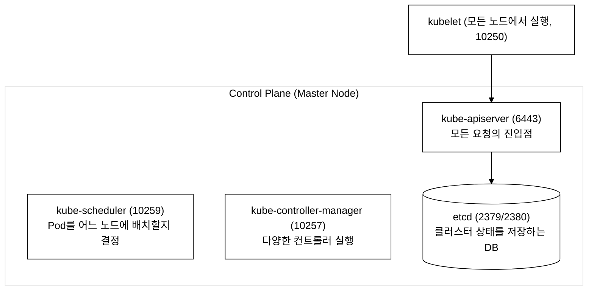
_그림 1. Control Plane 구성요소와 통신. 모든 컴포넌트는 kube-apiserver 를 거쳐 etcd 에 접근한다._

#### kube-apiserver (API 서버)

**등장 배경:** 분산 시스템에서 모든 컴포넌트가 데이터 저장소에 직접 접근하면 데이터 불일치, 인증/인가 우회, 동시 쓰기 충돌 등 심각한 문제가 발생한다. API 서버는 단일 진입점(single entry point)으로서 모든 요청을 인증, 인가, 검증한 후에만 etcd에 반영하여 이러한 문제를 원천 차단한다.

API 서버는 쿠버네티스 클러스터의 유일한 etcd 접근 게이트웨이이다. kubectl, kubelet, controller-manager, scheduler 등 모든 컴포넌트는 RESTful API를 통해 API 서버와 통신하며, etcd에 직접 접근하는 것은 API 서버뿐이다.

**내부 처리 파이프라인(요청이 처리되는 순서):**
1. **HTTP Handler**: RESTful 요청 수신 및 라우팅
2. **Authentication**: 인증 체인(X.509, Bearer Token, OIDC 등)을 순서대로 시도하여 하나라도 성공하면 통과
3. **Authorization**: 인가 모듈(Node, RBAC, Webhook)을 순서대로 평가하여 하나라도 Allow를 반환하면 통과
4. **Mutation Admission**: MutatingAdmissionWebhook이 요청 오브젝트를 변형(기본값 주입, 사이드카 주입 등)
5. **Schema Validation**: OpenAPI 스키마로 필드 유효성 검증
6. **Validation Admission**: ValidatingAdmissionWebhook이 정책 준수 여부를 최종 검증
7. **etcd Write**: 직렬화하여 etcd에 저장

**주요 역할:**
1. **인증(Authentication)**: X.509 인증서, Bearer Token, OIDC 등을 통해 요청자의 identity를 검증
2. **인가(Authorization)**: RBAC, Node, Webhook 등의 인가 모듈로 해당 리소스에 대한 verb 권한 확인
3. **Admission Control**: MutatingAdmissionWebhook, ValidatingAdmissionWebhook 등으로 정책 준수 검증 및 오브젝트 변환
4. **etcd 접근**: 검증된 요청을 etcd에 저장하거나 조회

```yaml
# kube-apiserver Static Pod 매니페스트 상세 분석
# 파일 위치: /etc/kubernetes/manifests/kube-apiserver.yaml
apiVersion: v1                    # 쿠버네티스 API 버전. v1은 핵심(core) API 그룹
kind: Pod                         # 이 YAML이 정의하는 리소스 종류. Pod = 쿠버네티스 최소 배포 단위
metadata:                         # 리소스의 메타데이터(이름, 라벨 등 식별 정보)
  name: kube-apiserver            # Pod의 이름. Static Pod이므로 뒤에 노드 이름이 자동 추가됨
  namespace: kube-system          # 이 Pod가 속하는 네임스페이스. 시스템 컴포넌트는 kube-system
  labels:                         # Pod를 분류하기 위한 키-값 쌍
    component: kube-apiserver     # 컴포넌트 이름 라벨
    tier: control-plane           # Control Plane 계층 라벨
spec:                             # Pod의 상세 사양(스펙)
  containers:                     # Pod 내부에서 실행할 컨테이너 목록
  - name: kube-apiserver          # 컨테이너 이름
    image: registry.k8s.io/kube-apiserver:v1.31.0  # 사용할 컨테이너 이미지
    command:                      # 컨테이너 시작 시 실행할 명령어
    - kube-apiserver              # apiserver 바이너리 실행
    # === 인증/인가 관련 설정 ===
    - --advertise-address=192.168.64.10   # 다른 컴포넌트에 알려줄 API 서버 IP
    - --authorization-mode=Node,RBAC      # 인가 방식: Node(kubelet용) + RBAC(역할기반)
    - --enable-admission-plugins=NodeRestriction  # 활성화할 Admission 플러그인
    # === 인증서 관련 설정 ===
    - --client-ca-file=/etc/kubernetes/pki/ca.crt              # 클라이언트 인증서 검증용 CA
    - --tls-cert-file=/etc/kubernetes/pki/apiserver.crt        # API 서버 TLS 인증서
    - --tls-private-key-file=/etc/kubernetes/pki/apiserver.key # API 서버 TLS 개인키
    - --kubelet-client-certificate=/etc/kubernetes/pki/apiserver-kubelet-client.crt  # kubelet 접속용
    - --kubelet-client-key=/etc/kubernetes/pki/apiserver-kubelet-client.key
    # === etcd 연결 설정 ===
    - --etcd-servers=https://127.0.0.1:2379      # etcd 서버 주소 (로컬)
    - --etcd-cafile=/etc/kubernetes/pki/etcd/ca.crt     # etcd CA 인증서
    - --etcd-certfile=/etc/kubernetes/pki/apiserver-etcd-client.crt  # etcd 접속용 인증서
    - --etcd-keyfile=/etc/kubernetes/pki/apiserver-etcd-client.key
    # === 서비스/네트워크 설정 ===
    - --service-cluster-ip-range=10.96.0.0/16    # Service에 할당할 가상 IP 대역
    - --service-account-key-file=/etc/kubernetes/pki/sa.pub       # ServiceAccount 토큰 검증 키
    - --service-account-signing-key-file=/etc/kubernetes/pki/sa.key  # SA 토큰 서명 키
    - --service-account-issuer=https://kubernetes.default.svc.cluster.local
    # === 프록시/기타 설정 ===
    - --proxy-client-cert-file=/etc/kubernetes/pki/front-proxy-client.crt
    - --proxy-client-key-file=/etc/kubernetes/pki/front-proxy-client.key
    - --requestheader-client-ca-file=/etc/kubernetes/pki/front-proxy-ca.crt
    - --secure-port=6443              # HTTPS 포트 (기본값)
    ports:                            # 컨테이너가 노출하는 포트
    - containerPort: 6443             # 6443 포트로 API 요청을 수신
      hostPort: 6443                  # 호스트(노드)의 6443 포트와 직접 매핑
      protocol: TCP
    volumeMounts:                     # 컨테이너에 마운트할 볼륨
    - name: k8s-certs                 # 인증서 볼륨 마운트
      mountPath: /etc/kubernetes/pki  # 컨테이너 내부 경로
      readOnly: true                  # 읽기 전용
    - name: etcd-certs
      mountPath: /etc/kubernetes/pki/etcd
      readOnly: true
  hostNetwork: true                   # 호스트 네트워크 사용 (Pod IP = 노드 IP)
  volumes:                            # Pod에 제공할 볼륨 정의
  - name: k8s-certs
    hostPath:                         # 노드의 파일시스템 경로를 마운트
      path: /etc/kubernetes/pki       # 호스트의 인증서 디렉터리
      type: DirectoryOrCreate
  - name: etcd-certs
    hostPath:
      path: /etc/kubernetes/pki/etcd
      type: DirectoryOrCreate
```

#### etcd (분산 키-값 저장소)

**등장 배경:** 쿠버네티스 같은 분산 시스템은 클러스터 전체의 상태를 하나의 일관된 저장소에 기록해야 한다. 일반적인 RDBMS는 Watch(변경 알림) 기능이 부족하고, 분산 환경에서의 일관성 보장이 어렵다. etcd는 Raft 합의 알고리즘으로 강한 일관성(strong consistency)을 보장하면서도 Watch API로 실시간 변경 알림을 제공하여 쿠버네티스의 제어 루프 아키텍처에 적합하다.

etcd는 Raft 합의 알고리즘 기반의 분산 키-값 저장소로, 모든 쿠버네티스 오브젝트(Pod, Service, Deployment 등)의 상태를 /registry 프리픽스 하위에 protobuf(Protocol Buffers: JSON보다 빠른 이진 직렬화 형식) 직렬화된 형태로 저장한다. linearizable read(읽기 시점에 가장 최신의 확정된 값을 반환, 캐시/복제 지연 없음)를 보장하며, 오직 kube-apiserver만 etcd와 직접 통신한다.

**핵심 특성:**
- Raft 합의 알고리즘(consensus algorithm) 기반 - 여러 etcd 노드 중 과반수가 동의해야 데이터가 확정됨
- 키-값(key-value) 형태로 데이터 저장 (예: `/registry/pods/default/nginx` → Pod 정보)
- API 버전 3 사용 (`ETCDCTL_API=3`)
- TLS 인증서 기반 통신 (암호화된 통신)

```yaml
# etcd Static Pod 매니페스트 상세 분석
# 파일 위치: /etc/kubernetes/manifests/etcd.yaml
apiVersion: v1
kind: Pod
metadata:
  name: etcd                          # Pod 이름
  namespace: kube-system
  labels:
    component: etcd
    tier: control-plane
spec:
  containers:
  - name: etcd
    image: registry.k8s.io/etcd:3.5.15-0
    command:
    - etcd
    # === 데이터 저장 ===
    - --data-dir=/var/lib/etcd                    # 데이터 저장 디렉터리 (시험에서 중요!)
    # === 인증서 설정 ===
    - --cert-file=/etc/kubernetes/pki/etcd/server.crt     # 서버 인증서
    - --key-file=/etc/kubernetes/pki/etcd/server.key      # 서버 개인키
    - --trusted-ca-file=/etc/kubernetes/pki/etcd/ca.crt   # 신뢰할 CA 인증서
    - --client-cert-auth=true                             # 클라이언트 인증서 인증 활성화
    # === 피어(peer) 통신 설정 (etcd 클러스터 간) ===
    - --peer-cert-file=/etc/kubernetes/pki/etcd/peer.crt
    - --peer-key-file=/etc/kubernetes/pki/etcd/peer.key
    - --peer-trusted-ca-file=/etc/kubernetes/pki/etcd/ca.crt
    # === 엔드포인트 설정 ===
    - --listen-client-urls=https://127.0.0.1:2379,https://192.168.64.10:2379
    - --advertise-client-urls=https://192.168.64.10:2379
    - --listen-peer-urls=https://192.168.64.10:2380
    - --initial-advertise-peer-urls=https://192.168.64.10:2380
    # === 스냅샷 설정 ===
    - --snapshot-count=10000                      # 10000개 변경마다 스냅샷 생성
    volumeMounts:
    - name: etcd-data                             # 데이터 볼륨
      mountPath: /var/lib/etcd                    # 컨테이너 내부 데이터 경로
    - name: etcd-certs                            # 인증서 볼륨
      mountPath: /etc/kubernetes/pki/etcd
      readOnly: true
  volumes:
  - name: etcd-data
    hostPath:
      path: /var/lib/etcd                         # 호스트의 etcd 데이터 디렉터리
      type: DirectoryOrCreate
  - name: etcd-certs
    hostPath:
      path: /etc/kubernetes/pki/etcd
      type: DirectoryOrCreate
```

#### kube-scheduler (스케줄러)

**등장 배경:** 스케줄러가 없던 초기 컨테이너 오케스트레이션에서는 운영자가 어떤 서버에 어느 컨테이너를 배치할지 수동으로 결정했다. 서버가 수십 대를 넘으면 각 서버의 현재 CPU·메모리 여유, 이미 실행 중인 컨테이너 수, 데이터 지역성 등을 사람이 파악해 결정하는 것은 불가능에 가까웠다. 배치 실수로 특정 서버에만 부하가 집중되거나, 메모리가 부족한 노드에 Pod를 배치해 OOMKill(Out-Of-Memory Kill)이 발생하는 문제가 반복됐다.

**무엇이 나아졌나:** kube-scheduler는 이 결정을 알고리즘으로 자동화한다. 두 단계(필터링·스코어링)를 거쳐 제약 조건을 위반하지 않는 노드 중 가장 적합한 노드를 선택한다. 플러그인 구조(Scheduling Framework)로 커스텀 정책을 추가할 수 있어 데이터 지역성·GPU 선호·보안 격리 요구사항도 확장으로 처리된다.

**트레이드오프:** 스케줄러는 배치 결정을 한 시점의 클러스터 스냅샷을 기반으로 내린다. 배치 이후 노드 부하가 급증해도 Pod를 자동으로 재배치하지 않는다(재배치는 Descheduler 같은 별도 컴포넌트의 영역이다). 또한 스케줄링 결정이 잘못된 경우(예: 모든 필터를 통과한 노드가 없는 상황) Pod는 `Pending` 상태로 무한히 대기한다.

스케줄러는 nodeName이 미설정된 새 Pod를 감지하여, 필터링(Filtering)과 스코어링(Scoring) 2단계 알고리즘으로 최적의 노드를 선택하고 바인딩(Binding)하는 컴포넌트이다.

**스케줄링 과정:**
1. **필터링(Filtering)**: 조건에 맞지 않는 노드를 제거 (리소스 부족, Taint 불일치, 노드 셀렉터 불일치 등)
2. **점수 매기기(Scoring)**: 남은 노드에 점수를 부여 (리소스 균형, 어피니티 등)
3. **바인딩(Binding)**: 가장 높은 점수의 노드에 Pod를 배정

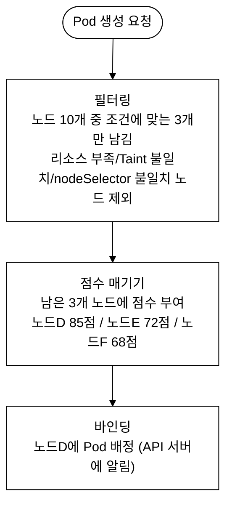
_그림 2. kube-scheduler 의 필터링-스코어링-바인딩 3단계._

#### kube-controller-manager (컨트롤러 매니저)

**등장 배경:** 선언형 구성만으로는 시스템이 스스로 원하는 상태를 유지할 수 없다. "Pod 3개를 항상 유지해라"고 선언했더라도 누군가 지속적으로 현재 상태를 감시하고 Pod가 줄어들면 새로 만드는 작업을 반복해야 한다. 초기에는 이런 감시·복구 로직을 각 기능마다 별도 데몬(프로세스)으로 만들었는데, 데몬 수가 늘어날수록 프로세스 관리·버전 관리·배포가 복잡해지는 문제가 있었다.

**무엇이 나아졌나:** kube-controller-manager는 ReplicaSet·Deployment·Node·Job 등 서로 독립적인 수십 개의 제어 루프(컨트롤러)를 하나의 바이너리로 묶어 실행한다. 각 컨트롤러는 §2.2의 Watch 메커니즘으로 자신이 담당하는 리소스 변경만 구독하므로, 서로 간섭하지 않고 각자의 reconciliation 루프를 독립적으로 수행한다. 단일 바이너리이므로 Control Plane Static Pod 하나로 관리된다.

**트레이드오프:** 모든 컨트롤러가 하나의 프로세스이므로 컨트롤러 하나에 버그가 생기면 프로세스 전체가 영향을 받을 수 있다. 쿠버네티스는 리더 선출(Leader Election) 메커니즘으로 HA 환경에서 하나의 인스턴스만 활성화되도록 보장하므로, 인스턴스가 죽으면 대기 중인 인스턴스가 리더를 이어받는다.

컨트롤러 매니저는 다수의 독립적인 제어 루프(control loop)를 단일 바이너리로 실행하는 컴포넌트이다. 각 컨트롤러는 Watch 메커니즘으로 리소스 변경을 감지하고, current state를 desired state로 수렴시키는 reconciliation 로직을 수행한다.

**내부에 포함된 주요 컨트롤러:**

| 컨트롤러 | 역할 |
|---|---|
| **ReplicaSet Controller** | 지정된 수의 Pod 레플리카가 실행 중인지 확인 |
| **Deployment Controller** | Deployment 업데이트 시 새 ReplicaSet 생성/관리 |
| **Node Controller** | 노드 상태 모니터링, NotReady 노드의 Pod 퇴거 |
| **Job Controller** | Job이 완료될 때까지 Pod 실행 관리 |
| **ServiceAccount Controller** | 새 네임스페이스에 기본 ServiceAccount 생성 |
| **Namespace Controller** | 삭제 중인 네임스페이스의 리소스 정리 |
| **EndpointSlice Controller** | Service와 Pod를 연결하는 EndpointSlice 관리 |

### 1.3 Worker Node 구성 요소

Worker Node는 kubelet, container runtime(containerd), kube-proxy(또는 eBPF 기반 CNI)가 실행되며 실제 워크로드 Pod를 호스팅하는 데이터 플레인 노드이다.

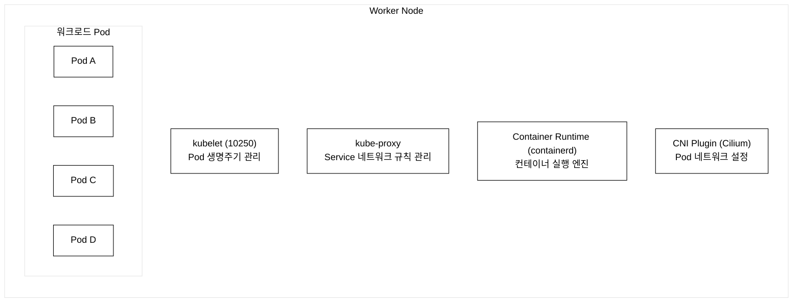
_그림 3. Worker Node 구성요소와 워크로드 Pod 배치._

#### kubelet

**등장 배경:** 컨테이너 오케스트레이터가 중앙에서 모든 노드에 컨테이너를 직접 SSH로 실행·감시하는 방식을 생각해 볼 수 있다. 그러나 수백 노드를 중앙에서 직접 제어하면 네트워크 지연·중앙 장애 시 전체 마비·동시 SSH 세션 폭증 등의 문제가 생긴다. 또한 컨테이너가 죽었을 때 중앙에서 감지→재시작 명령을 내리는 동안 수 초의 공백이 발생한다.

**무엇이 나아졌나:** kubelet은 이 제어 책임을 각 노드로 분산한다. 각 노드에 kubelet이 상주하면서 API 서버로부터 자신의 노드에 배정된 PodSpec을 Watch하고, 컨테이너 런타임을 직접 호출해 컨테이너를 실행·감시·재시작한다. 중앙 제어 없이 각 노드가 자율적으로 desired state를 유지하므로, API 서버가 일시적으로 불통이 되더라도 이미 실행 중인 컨테이너는 kubelet이 계속 감시하고 재시작한다.

**트레이드오프:** kubelet은 각 노드에 직접 설치되는 유일한 K8s 컴포넌트(Static Pod가 아닌 systemd 서비스)이다. kubelet이 죽으면 그 노드의 모든 Pod 관리가 중단되며, 노드 상태가 NotReady로 바뀐다(§6.3 트러블슈팅 참조). 또한 kubelet 업그레이드는 노드별로 순차적으로 수행해야 해 클러스터 전체 업그레이드 시 가장 시간이 많이 걸리는 단계이다.

kubelet은 각 노드에서 실행되는 에이전트로, API 서버로부터 PodSpec을 수신하여 CRI(Container Runtime Interface)를 통해 컨테이너 생명주기를 관리한다.

**주요 역할:**
- API 서버로부터 Pod 스펙을 수신하여 컨테이너 실행
- Pod의 건강 상태를 주기적으로 확인 (Liveness/Readiness Probe)
- 노드 상태를 API 서버에 보고
- Static Pod 관리 (매니페스트 파일 감시)

**설정 파일 위치:**
```bash
# kubelet 메인 설정 파일
/var/lib/kubelet/config.yaml

# kubelet 서비스 파일
/etc/systemd/system/kubelet.service.d/10-kubeadm.conf

# kubelet kubeconfig (API 서버 인증 정보)
/etc/kubernetes/kubelet.conf
```

```yaml
# kubelet 설정 파일 상세 분석
# 파일 위치: /var/lib/kubelet/config.yaml
apiVersion: kubelet.config.k8s.io/v1beta1  # kubelet 설정 API 버전
kind: KubeletConfiguration                  # 리소스 종류
# === 클러스터 DNS 설정 ===
clusterDNS:                                 # 클러스터 내부 DNS 서버 IP 목록
- 10.96.0.10                                # CoreDNS Service의 ClusterIP
clusterDomain: cluster.local                # 클러스터 도메인 이름
# === Static Pod 설정 ===
staticPodPath: /etc/kubernetes/manifests    # Static Pod 매니페스트 경로 (시험 핵심!)
# === 인증 설정 ===
authentication:
  anonymous:
    enabled: false                          # 익명 접근 불허
  webhook:
    enabled: true                           # Webhook 인증 사용
authorization:
  mode: Webhook                             # Webhook 인가 사용
# === 리소스 설정 ===
cgroupDriver: systemd                       # cgroup 드라이버 (containerd와 일치 필요)
containerRuntimeEndpoint: unix:///run/containerd/containerd.sock
# === 기타 설정 ===
rotateCertificates: true                    # 인증서 자동 갱신
```

#### kube-proxy

kube-proxy는 Service로 들어오는 트래픽을 올바른 Pod로 전달하는 네트워크 규칙을 관리하는 컴포넌트이다.

**등장 배경:** Pod는 생성/삭제될 때마다 IP가 변경된다. 클라이언트가 Pod IP를 직접 사용하면 Pod 재생성 시 접속이 불가해진다. Service는 고정된 가상 IP(ClusterIP)를 제공하고, kube-proxy가 이 가상 IP로 들어오는 트래픽을 실제 Pod IP로 DNAT(Destination NAT) 변환하는 규칙을 iptables/IPVS에 프로그래밍한다.

**직전 방식과 무엇이 나아졌나(스토리):** 쿠버네티스 이전(또는 초기)에는 개발자가 Pod IP를 직접 알아내 호출했는데, Pod가 재생성되면 IP가 바뀌어 연결이 끊기는 문제가 반복됐다. Service(고정 ClusterIP) + kube-proxy(DNAT 규칙)가 이 문제를 해결했다. 그런데 kube-proxy의 구현 방식도 세대를 거치며 바뀌었고, 각각 트레이드오프가 있다.

**동작 모드 비교:**
| 모드 | 방식 | 트레이드오프 |
|:--|:--|:--|
| **iptables**(기본) | 커널 iptables 규칙으로 트래픽 라우팅 | 규칙이 선형 리스트라 Service 수가 늘면 매칭 비용이 O(n)으로 증가. 규칙 갱신도 전체 테이블을 다시 쓰는 구조라 대규모에서 느려진다 |
| **IPVS** | 커널 IPVS(IP Virtual Server) 해시 테이블로 라우팅 | 조회가 O(1)에 가깝고 부하분산 알고리즘(rr, lc 등) 선택 가능. 대신 설정이 복잡하고 커널 모듈 의존 |
| **nftables** | 차세대 Linux 방화벽 프레임워크 | iptables 후속. 갱신 성능이 개선됐으나 비교적 신규라 환경 지원 편차 |

**그 다음 세대 — eBPF(이 저장소가 쓰는 방식):** **eBPF(extended Berkeley Packet Filter)** 는 커널을 재컴파일하거나 모듈을 올리지 않고도 **커널 내부에 안전한 프로그램을 끼워 넣어** 패킷을 처리하게 해주는 리눅스 커널 기술이다. **Cilium**은 이 eBPF를 쓰는 고성능 CNI(컨테이너 네트워크 플러그인)로, Service 라우팅을 iptables 규칙이 아니라 eBPF 맵(해시 테이블)으로 처리한다. 그래서 Service가 수천 개로 늘어도 성능이 일정(O(1))하고, kube-proxy 자체를 대체할 수 있다.

> **용어 — Cilium / eBPF / CNI**: **CNI**(Container Network Interface)는 "Pod에 네트워크를 붙이는 방법"의 표준 규격이고, **Cilium**은 그 규격을 eBPF로 구현한 플러그인이다. 이 저장소의 4개 클러스터는 전부 Cilium을 `kubeProxyReplacement=true`로 쓰므로 **kube-proxy DaemonSet이 아예 없고 Cilium이 그 역할을 대신**한다(day02·day10 실측에서 확인). 즉 위 iptables/IPVS 설명은 "전통적 kube-proxy"의 동작이고, 우리 실습 클러스터는 그 윗 세대인 eBPF로 동작한다.

#### Container Runtime (컨테이너 런타임)

컨테이너 런타임은 kubelet의 지시를 받아 실제로 컨테이너를 생성, 실행, 삭제하는 엔진이다.

**등장 배경(스토리):** 초기 쿠버네티스는 Docker를 직접 호출해 컨테이너를 관리했다. 그런데 Docker는 이미지 빌드(`docker build`), 네트워크(`docker network`), 볼륨(`docker volume`) 등 **쿠버네티스에는 필요 없는 기능까지 포함한 무거운 데몬**이었다. 쿠버네티스가 컨테이너 런타임에 바라는 건 단 하나 — "컨테이너를 만들고·실행하고·지워라"뿐이다.

**직전 한계 → 표준화 → 무엇이 나아졌나:** 이 불일치를 풀기 위해 업계는 컨테이너 표준을 만들었다. **OCI**(Open Container Initiative)가 이미지·런타임 규격을 정의했고, 쿠버네티스는 1.5에서 **CRI(Container Runtime Interface)** 라는 표준 인터페이스를 도입했다. 그 결과 런타임을 **플러그인처럼 교체**할 수 있게 됐다. 계층을 정리하면:

- **containerd** — Docker에서 "런타임 핵심"만 떼어낸 고수준 런타임. kubelet과 CRI(gRPC)로 통신하며 이미지 풀·컨테이너 수명주기를 담당한다. 이 저장소의 모든 노드가 사용(`containerd://2.2.1` 또는 `1.7.28`, day01 실측).
- **runc** — containerd가 호출하는 저수준 런타임. 실제로 Linux **namespace + cgroup**을 설정해 컨테이너 프로세스를 띄우는 OCI 표준 실행기다.
- 정리하면 `kubelet → (CRI) → containerd → runc → namespace+cgroup`. 덕분에 쿠버네티스는 containerd·CRI-O·gVisor 등 여러 런타임을 코드 수정 없이 바꿔 끼울 수 있다.

**트레이드오프:** 표준화로 유연성과 경량화를 얻었지만, 디버깅 시 `docker` 명령 대신 `crictl`(CRI 전용 도구)을 써야 하고(day01·day03 실측), Docker에 익숙한 사용자에게는 도구 체계가 한 겹 더 생긴 셈이다.

쿠버네티스는 CRI(Container Runtime Interface)를 통해 다양한 런타임을 지원한다:
- **containerd** (가장 많이 사용, Docker에서 분리된 핵심 엔진)
- **CRI-O** (Red Hat/OpenShift에서 주로 사용)

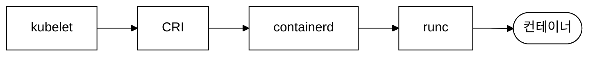
_그림 4. CRI 를 통한 컨테이너 실행 경로._

### 1.4 API 요청 처리 전체 흐름

사용자가 `kubectl apply -f deployment.yaml`을 실행하면 어떤 일이 일어날까?

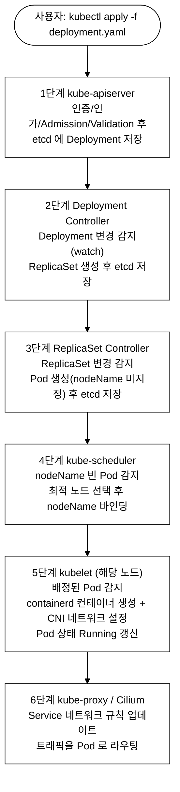
_그림 5. kubectl apply 부터 컨테이너 실행까지의 API 요청 처리 흐름._

### 1.5 Static Pod 심화

Static Pod는 kubelet이 직접 관리하는 특별한 Pod이다. API 서버 없이도 동작한다.

Static Pod는 kubelet이 API 서버를 경유하지 않고 staticPodPath 디렉터리의 매니페스트 파일을 직접 감시(inotify)하여 생성/삭제하는 Pod이다. API 서버에는 읽기 전용 mirror Pod으로 반영된다.

**핵심 특성:**
1. kubelet이 지정된 디렉터리(staticPodPath)를 주기적으로 감시한다
2. 해당 디렉터리에 YAML 파일을 추가하면 Pod가 자동 생성된다
3. 파일을 삭제하면 Pod도 자동으로 삭제된다
4. API 서버에 "미러 Pod(Mirror Pod)"로 표시된다 - 보이지만 kubectl로 삭제할 수 없다
5. Pod 이름에 노드 이름이 접미사로 붙는다 (예: `etcd-platform-master`)

**왜 중요한가?**
Control Plane의 핵심 컴포넌트(apiserver, etcd, scheduler, controller-manager)가 모두 Static Pod로 실행된다!

아래는 실측 캡처가 아닌 경로 구조 도식이다(실제 `ls /etc/kubernetes/manifests/` 출력은 §트러블슈팅 스크린샷 참조).

```
Static Pod 매니페스트 디렉터리 구조:
/etc/kubernetes/manifests/
├── etcd.yaml                          # etcd 데이터베이스
├── kube-apiserver.yaml                # API 서버
├── kube-controller-manager.yaml       # 컨트롤러 매니저
└── kube-scheduler.yaml                # 스케줄러
```

**Static Pod 경로 확인 방법 3가지:**

```bash
# 방법 1: kubelet 설정 파일에서 확인 (가장 권장)
cat /var/lib/kubelet/config.yaml | grep staticPodPath
# 출력: staticPodPath: /etc/kubernetes/manifests

# 방법 2: kubelet 프로세스 인자에서 확인
ps aux | grep kubelet | grep -- --pod-manifest-path

# 방법 3: kubelet 서비스 파일에서 확인
systemctl cat kubelet
```

**Static Pod YAML 예제:**

```yaml
# Static Pod 생성 예제
# 파일 위치: /etc/kubernetes/manifests/static-web.yaml
apiVersion: v1                # API 버전 - Pod는 core 그룹이므로 v1
kind: Pod                     # 리소스 종류 - Static Pod도 일반 Pod와 동일한 형식
metadata:                     # 메타데이터 섹션
  name: static-web            # Pod 이름 (실제로는 static-web-<노드이름>으로 표시)
  namespace: default          # 네임스페이스 (Static Pod도 네임스페이스 지정 가능)
  labels:                     # 라벨 (선택사항이지만 관리 편의를 위해 권장)
    role: static-web          # 커스텀 라벨
    tier: frontend            # 계층 라벨
spec:                         # Pod 사양
  containers:                 # 컨테이너 목록 (최소 1개 필수)
  - name: nginx               # 컨테이너 이름
    image: nginx:1.24         # 사용할 이미지 (태그까지 명시하는 것이 모범 사례)
    ports:                    # 노출할 포트
    - containerPort: 80       # 컨테이너 내부 포트
      name: http              # 포트 이름 (선택사항)
      protocol: TCP           # 프로토콜 (기본값: TCP)
    resources:                # 리소스 제한 (선택사항이지만 권장)
      requests:               # 최소 보장 리소스
        cpu: "50m"            # 50 밀리코어 (0.05 CPU)
        memory: "64Mi"        # 64 메비바이트
      limits:                 # 최대 사용 가능 리소스
        cpu: "200m"
        memory: "128Mi"
```

### 1.6 kubeadm 완벽 이해

kubeadm은 쿠버네티스 클러스터를 빠르게 설치하고 관리하기 위한 공식 도구이다.

kubeadm은 PKI 인증서 생성, kubeconfig 파일 생성, Static Pod 매니페스트 배치, Bootstrap Token 발급 등의 과정을 자동화하여 쿠버네티스 클러스터를 부트스트래핑하는 도구이다.

**등장 배경 — kubeadm 이전의 고통:** kubeadm이 없던 시절 클러스터를 직접 구축하려면 수십 단계의 수동 작업이 필요했다. CA 인증서를 직접 `openssl` 명령으로 생성하고, API 서버·etcd·scheduler·controller-manager 각각의 인증서에 올바른 SAN(Subject Alternative Name)을 수동 지정해야 했다. 그런 다음 kubelet 설정 파일과 kubeconfig 파일을 손으로 작성하고, Static Pod 매니페스트를 각 파일에 직접 배치한 뒤 kubelet을 재시작하여 Control Plane이 순차적으로 뜨기를 기다려야 했다. 인증서 경로 오타 하나, SAN 누락 하나로 API 서버가 etcd에 연결되지 않는 문제가 생겨도 오류 메시지만으로 원인을 찾기가 극도로 어려웠다. "The Hard Way"(Kelsey Hightower의 유명한 수동 설치 가이드)가 바로 이 고통을 정리한 문서이다.

**무엇이 나아졌나:** kubeadm은 이 수십 단계 절차를 단일 명령(`kubeadm init`)으로 압축했다. 인증서 생성부터 Static Pod 배치까지 7단계를 자동화하며, 각 단계에서 사전 조건(Preflight) 검사로 흔한 실수를 미리 차단한다. 새 노드 추가는 `kubeadm join` 한 줄로, 인증서 갱신은 `kubeadm certs renew` 한 줄로 처리된다.

**트레이드오프:** kubeadm은 "클러스터 부트스트랩 도구"이지 운영 자동화 도구가 아니다. 쿠버네티스 버전 업그레이드·다중 마스터(HA) 구성·클러스터 모니터링은 별도 도구(kubespray, Cluster API 등)가 필요하다. 또한 이 저장소의 클러스터처럼 tart VM 기반 환경에서는 VM 재부팅 시 IP가 바뀌면 kubeadm이 init 시점에 굳혀 놓은 IP와 불일치가 생겨 클러스터가 깨진다(`fix-cluster-ip-drift.sh`가 이를 복구한다).

#### kubeadm init 7단계 상세

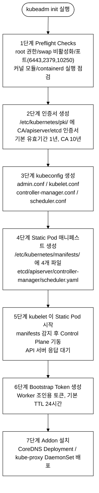
_그림 6. kubeadm init 7단계 부트스트랩 순서._

#### kubeadm 핵심 명령어

```bash
# === 클러스터 초기화 ===
kubeadm init \
  --pod-network-cidr=10.10.0.0/16 \        # Pod에 할당할 IP 대역
  --service-cidr=10.96.0.0/16 \            # Service에 할당할 IP 대역
  --kubernetes-version=v1.31.0 \           # 설치할 K8s 버전
  --control-plane-endpoint=<LB-IP>:6443 \  # 고가용성(HA) 엔드포인트
  --apiserver-advertise-address=<IP>       # API 서버 광고 주소

# === Worker Node 조인 ===
kubeadm join <apiserver>:6443 \
  --token <token> \                        # Bootstrap 토큰
  --discovery-token-ca-cert-hash sha256:<hash>  # CA 인증서 해시

# === 토큰 관리 ===
kubeadm token create --print-join-command  # 새 토큰 생성 + join 명령 출력
kubeadm token list                          # 토큰 목록 조회
kubeadm token delete <token-id>            # 토큰 삭제

# === 인증서 관리 ===
kubeadm certs check-expiration             # 인증서 만료일 확인
kubeadm certs renew all                     # 모든 인증서 갱신
kubeadm certs renew apiserver              # 특정 인증서만 갱신

# === 업그레이드 ===
# 주의: upgrade apply/node 는 반드시 kubectl drain <node> 로 노드를 비운 뒤 실행한다.
# 순서: kubectl drain → kubeadm upgrade → kubelet/kubectl apt upgrade → kubectl uncordon
# 전체 절차는 day04(클러스터 업그레이드)에서 상세히 다룬다.
kubeadm upgrade plan                        # 업그레이드 가능한 버전 확인
kubeadm upgrade apply v1.32.0              # Control Plane 업그레이드 (drain 후 실행)
kubeadm upgrade node                        # Worker Node 업그레이드 (drain 후 실행)

# === 리셋 ===
kubeadm reset                              # 클러스터 초기화 (주의! 모든 데이터 삭제)
```

### 1.7 kubeconfig 파일 완벽 이해

kubeconfig는 kubectl이 클러스터에 접속하기 위한 설정 파일이다.

kubeconfig는 cluster(API 서버 endpoint + CA 인증서), user(클라이언트 인증서/토큰), context(cluster + user + namespace 조합)의 3요소로 구성된 YAML 기반 인증 구성 파일이다.

```yaml
# kubeconfig 파일 상세 분석
apiVersion: v1                    # API 버전
kind: Config                      # kubeconfig 타입
current-context: platform         # 현재 활성 컨텍스트 (기본으로 사용할 컨텍스트)

# === 클러스터 정보 ===
# 접속할 쿠버네티스 클러스터의 주소와 CA 인증서
clusters:
- name: platform                  # 클러스터 식별 이름
  cluster:
    server: https://192.168.64.10:6443     # API 서버 주소
    certificate-authority-data: LS0tLS...  # CA 인증서 (base64 인코딩)
    # 또는 파일 경로로 지정:
    # certificate-authority: /etc/kubernetes/pki/ca.crt
- name: dev
  cluster:
    server: https://192.168.64.20:6443
    certificate-authority-data: LS0tLS...

# === 사용자 인증 정보 ===
# 클러스터에 인증할 때 사용할 인증서 또는 토큰
users:
- name: admin                     # 사용자 식별 이름
  user:
    client-certificate-data: LS0tLS...  # 클라이언트 인증서 (base64)
    client-key-data: LS0tLS...          # 클라이언트 개인키 (base64)
    # 또는 토큰 기반 인증:
    # token: eyJhbGci...
- name: dev-admin
  user:
    client-certificate-data: LS0tLS...
    client-key-data: LS0tLS...

# === 컨텍스트 (클러스터 + 사용자 + 네임스페이스 조합) ===
# "어떤 클러스터에 어떤 사용자로 어떤 네임스페이스에 접근할지" 정의
contexts:
- name: platform                  # 컨텍스트 이름
  context:
    cluster: platform             # 사용할 클러스터
    user: admin                   # 사용할 사용자
    namespace: default            # 기본 네임스페이스
- name: dev
  context:
    cluster: dev
    user: dev-admin
    namespace: demo
```

#### kubeconfig 관련 핵심 명령어

```bash
# 현재 설정 보기
kubectl config view
kubectl config view --minify    # 현재 컨텍스트 정보만 표시

# 컨텍스트 관리
kubectl config get-contexts                    # 모든 컨텍스트 나열
kubectl config current-context                  # 현재 컨텍스트 확인
kubectl config use-context dev                 # 컨텍스트 전환

# 기본 네임스페이스 변경
kubectl config set-context --current --namespace=demo

# 클러스터 API 서버 주소 확인
kubectl config view -o jsonpath='{.clusters[?(@.name=="prod")].cluster.server}'

# kubeconfig 수동 생성
kubectl config set-cluster <name> --server=https://<ip>:6443 \
  --certificate-authority=<ca-path> --kubeconfig=<file>

kubectl config set-credentials <user> \
  --client-certificate=<cert> --client-key=<key> --kubeconfig=<file>

kubectl config set-context <ctx> --cluster=<cluster> \
  --user=<user> --namespace=<ns> --kubeconfig=<file>
```

### 1.8 인증서 구조 완벽 정리

**신뢰 체계 — 누가 누구를 검증하는가:** 쿠버네티스 컴포넌트 간 통신은 mTLS(mutual TLS — 클라이언트·서버 양쪽이 인증서를 제시해 서로를 검증하는 방식)를 기반으로 한다. 모든 인증서는 클러스터 루트 CA(`ca.crt`)가 서명한다. 예를 들어 API 서버가 kubelet에 접속할 때는 `apiserver-kubelet-client.crt`를 제시하고, kubelet은 자신이 신뢰하는 CA(`ca.crt`)로 이 인증서를 검증한다. etcd도 별도 CA(`etcd/ca.crt`)를 두어 etcd 클러스터 내부 통신(peer)과 API 서버와의 통신을 분리한다.

**인증서 만료 장애 시나리오:** 기본 유효기간은 1년(CA는 10년)이다. 인증서가 만료되면 해당 통신 채널이 TLS handshake 실패로 끊기며, API 서버 인증서 만료 시 kubectl을 포함한 모든 접근이 차단된다. `kubeadm certs check-expiration` 명령으로 갱신 시점을 사전에 확인하고, `kubeadm certs renew all`로 갱신한다. 갱신 후 Static Pod(API 서버·컨트롤러 매니저·스케줄러)는 매니페스트를 잠깐 이동했다가 되돌리거나 kubelet을 재시작해 새 인증서를 로드해야 한다.

```
/etc/kubernetes/pki/
│
├── ca.crt / ca.key                        # 클러스터 루트 CA
│   └── 역할: 모든 쿠버네티스 인증서의 부모 인증서
│   └── 유효기간: 10년
│
├── apiserver.crt / apiserver.key          # API 서버 인증서
│   └── 역할: API 서버가 클라이언트에게 제시하는 신분증
│   └── SAN: kubernetes, kubernetes.default, <IP>, <hostname> 등
│
├── apiserver-kubelet-client.crt / .key    # API → kubelet 통신용
│   └── 역할: API 서버가 kubelet에 접속할 때 사용
│
├── apiserver-etcd-client.crt / .key       # API → etcd 통신용
│   └── 역할: API 서버가 etcd에 접속할 때 사용
│
├── front-proxy-ca.crt / .key             # 프론트 프록시 CA
├── front-proxy-client.crt / .key         # 프론트 프록시 클라이언트
│   └── 역할: API aggregation layer용
│         (API aggregation layer — 외부 API를 K8s API로 확장하는 레이어로, custom metrics API 등이 이를 통해 kube-apiserver에 등록된다. 상세는 day06 참조)
│
├── sa.key / sa.pub                        # ServiceAccount 서명 키쌍
│   └── 역할: ServiceAccount 토큰 발급/검증
│
└── etcd/
    ├── ca.crt / ca.key                    # etcd 전용 CA
    ├── server.crt / server.key            # etcd 서버 인증서
    ├── peer.crt / peer.key                # etcd 피어 통신 인증서
    └── healthcheck-client.crt / .key      # etcd 헬스체크용
```

---

## 2. 동작 원리 심화

### 2.1 Pod 생성 전체 흐름도

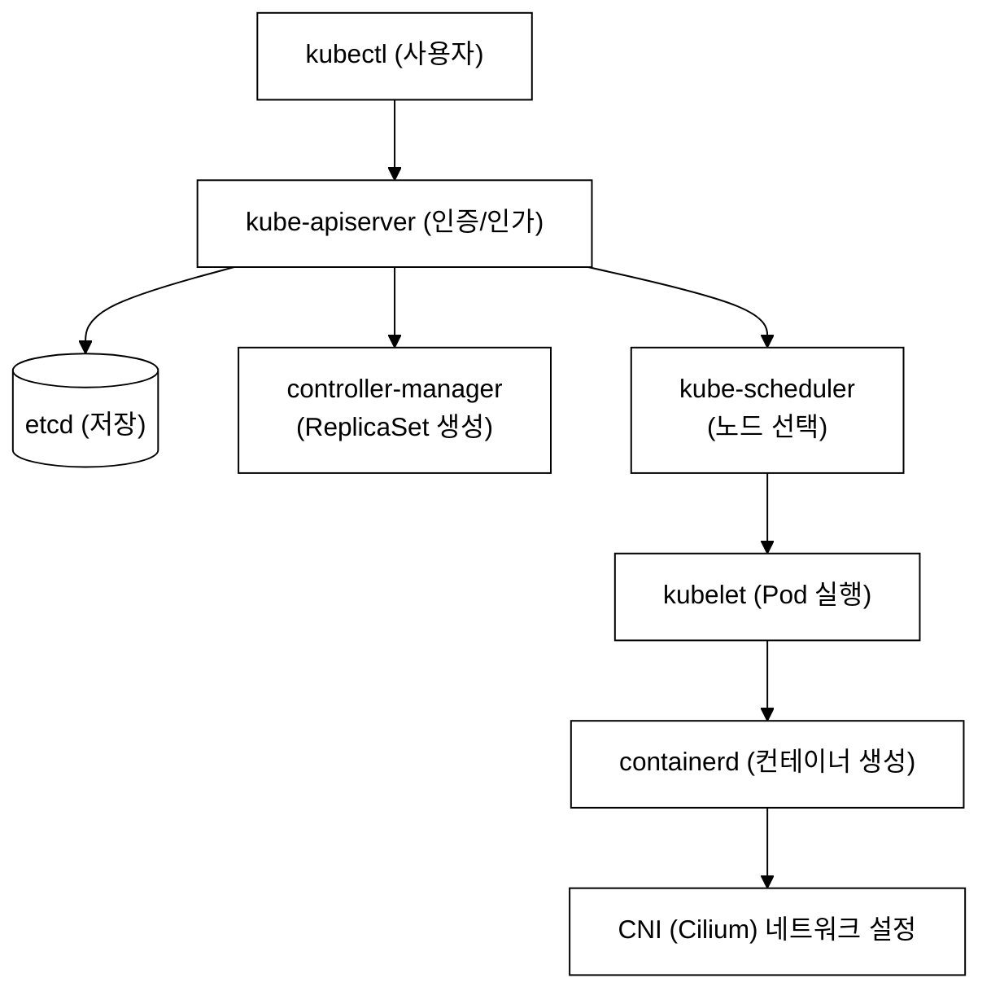
_그림 7. Pod 생성 전체 흐름: kubectl 부터 CNI 네트워크 설정까지._

### 2.2 Watch 메커니즘

**등장 배경:** Watch 이전에는 각 컴포넌트가 폴링(polling) 방식으로 API 서버에 주기적으로 "현재 상태가 어때?"를 반복 질의했다. N초마다 전체 리소스 목록을 조회하므로 컴포넌트 수가 늘수록 API 서버와 etcd에 불필요한 CPU·네트워크 부하가 선형으로 쌓이고, 변경 감지까지 최대 N초의 반응 지연이 발생했다. 수백 개의 컨트롤러가 1초마다 폴링하면 클러스터가 감당할 수 없을 정도로 부하가 치솟는다.

쿠버네티스의 핵심 동작 원리는 "Watch(감시)"이다. 각 컴포넌트는 API 서버에 Watch 요청을 보내서 관심 있는 리소스의 변경 사항을 실시간으로 받는다.

Watch는 HTTP GET 요청에 `?watch=true` 파라미터를 붙인 long-lived 연결로 동작한다. API 서버는 HTTP chunked streaming 방식으로 etcd에서 발생하는 변경 이벤트(ADDED·MODIFIED·DELETED)를 컴포넌트에 즉시 전달한다. 컴포넌트는 연결을 끊지 않고 이벤트 스트림을 계속 수신하므로, 폴링(주기적 조회) 없이도 변경을 실시간으로 반응할 수 있다.

- controller-manager → API 서버에 Watch 요청: "Deployment 변경 알려줘"
- scheduler → API 서버에 Watch 요청: "nodeName 없는 Pod 알려줘"
- kubelet → API 서버에 Watch 요청: "내 노드에 배정된 Pod 알려줘"

이 패턴을 "컨트롤 루프(Control Loop)" 또는 "Reconciliation Loop"라고 한다:
1. 현재 상태(Current State) 관찰
2. 원하는 상태(Desired State)와 비교
3. 차이가 있으면 조치

---

## 3. 시험 출제 패턴 분석

### 3.1 이 주제가 시험에서 어떻게 나오는가

CKA 시험에서 "Cluster Architecture" 관련 문제는 전체의 25%를 차지한다. 주로 다음 유형으로 출제된다:

1. **Static Pod 생성/수정** - 특정 노드에 SSH 접속하여 Static Pod 매니페스트를 생성하거나 수정하는 문제
2. **클러스터 컴포넌트 설정 확인** - API 서버의 특정 설정값을 찾아 파일에 저장하는 문제
3. **kubeconfig 관리** - 컨텍스트 전환, 새 컨텍스트 추가, 기본 네임스페이스 변경 문제
4. **kubeadm 토큰 관리** - join 명령 생성, 토큰 목록 확인 문제
5. **노드 정보 조회** - 레이블, Taint, 리소스 용량 확인 문제

### 3.2 문제의 의도

시험 출제자는 다음을 검증하려 한다:
- Static Pod의 매니페스트 경로를 찾을 수 있는가?
- kubectl과 SSH를 적절히 사용할 수 있는가?
- kubeconfig의 구조를 이해하고 있는가?
- 클러스터 컴포넌트의 설정을 조회할 수 있는가?

---

## 4. 실전 시험 문제 (5문제)

> **직접 해보기 — 시간 측정 드릴**: 각 문제는 풀이를 보기 전에 스스로 시간을 재며 풀어본다. `<details>` 안의 풀이는 직접 시도한 뒤에만 연다. 목표 시간은 CKA 시험 기준이다. 총 5문제 합계 목표: 20분 이내.

---

### 문제 1. Static Pod 생성 [7%]

> 목표 시간: **3분** — 매니페스트 경로 확인 + YAML 작성 + 검증까지

**컨텍스트:** `kubectl config use-context platform`

`platform-master` 노드에 다음 조건으로 Static Pod를 생성하라:
- Pod 이름: `static-nginx`
- 이미지: `nginx:1.24`
- 포트: `80`
- 네임스페이스: `default`

<details>
<summary>풀이 과정</summary>

**의도 분석:** Static Pod의 매니페스트 경로를 찾고, YAML 파일을 올바르게 작성할 수 있는지 확인하는 문제.

**풀이 단계:**

```bash
# Step 1: SSH 접속 (별칭은 ~/.ssh/config 에 등록된 tart VM 이름이다 — CLAUDE.md §3 참조)
ssh platform-master

# Step 2: Static Pod 매니페스트 경로 확인 (가장 중요한 첫 단계!)
cat /var/lib/kubelet/config.yaml | grep staticPodPath
# 출력: staticPodPath: /etc/kubernetes/manifests

# Step 3: Static Pod 매니페스트 생성
sudo tee /etc/kubernetes/manifests/static-nginx.yaml <<EOF
apiVersion: v1
kind: Pod
metadata:
  name: static-nginx
  namespace: default
  labels:
    role: static-nginx
spec:
  containers:
  - name: nginx
    image: nginx:1.24
    ports:
    - containerPort: 80
EOF

# Step 4: 생성 확인 (약 10~30초 대기)
# SSH에서 나온 후 kubectl로 확인
exit
kubectl --context=platform get pods -A | grep static-nginx
```

**검증 - 기대 출력:**
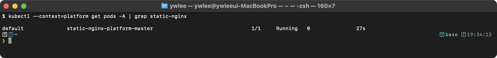

Pod 이름에 `-platform-master`가 접미사로 붙는 것을 확인한다. STATUS가 Running이 아니면 이미지 이름이나 매니페스트 문법에 오류가 있는 것이다.

**핵심 포인트:**
- Static Pod 이름에 자동으로 노드 이름이 접미사로 붙는다
- `kubectl delete pod static-nginx-platform-master`로 삭제해도 매니페스트 파일이 있으면 다시 생성된다
- 삭제하려면 반드시 SSH 접속하여 매니페스트 파일을 삭제해야 한다

**정리:**
```bash
ssh platform-master
sudo rm /etc/kubernetes/manifests/static-nginx.yaml
exit
```

</details>

---

### 문제 2. Static Pod 매니페스트 경로가 변경된 경우 [7%]

> 목표 시간: **4분** — 비표준 경로 탐색 + 동적 경로 추출 + Pod 생성까지

**컨텍스트:** `kubectl config use-context staging`

`staging-master` 노드에서 Static Pod 매니페스트 경로가 기본 경로가 아닌 다른 경로로 설정되어 있다. 올바른 경로를 찾아 Static Pod `static-httpd`(이미지: `httpd:2.4`)를 생성하라.

<details>
<summary>풀이 과정</summary>

```bash
# Step 1: SSH 접속
ssh staging-master

# Step 2: staticPodPath 확인 (핵심!)
cat /var/lib/kubelet/config.yaml | grep staticPodPath
# 출력 예: staticPodPath: /etc/kubernetes/custom-manifests
# 또는 기본값: staticPodPath: /etc/kubernetes/manifests

# Step 2-2: kubelet 프로세스에서 직접 확인 (대안)
ps aux | grep kubelet | grep -o "\-\-pod-manifest-path=[^ ]*"

# Step 2-3: kubelet 서비스 파일에서 확인 (대안)
systemctl cat kubelet | grep -i manifest

# Step 3: 확인된 경로에 매니페스트 생성
MANIFEST_PATH=$(cat /var/lib/kubelet/config.yaml | grep staticPodPath | awk '{print $2}')

sudo tee ${MANIFEST_PATH}/static-httpd.yaml <<EOF
apiVersion: v1
kind: Pod
metadata:
  name: static-httpd
spec:
  containers:
  - name: httpd
    image: httpd:2.4
    ports:
    - containerPort: 80
EOF

# Step 4: 확인
exit
kubectl --context=staging get pods | grep static-httpd
```

</details>

---

### 문제 3. kubeadm join 명령 생성 [4%]

> 목표 시간: **2분** — SSH 접속 후 명령 한 줄이면 완료

**컨텍스트:** `kubectl config use-context staging`

`staging` 클러스터에 새 Worker Node를 추가하기 위한 `kubeadm join` 명령을 생성하라. 명령을 `/tmp/join-command.txt`에 저장하라.

<details>
<summary>풀이 과정</summary>

```bash
# Step 1: staging master에 SSH 접속
ssh staging-master

# Step 2: join 명령 생성 (한 줄 명령!)
sudo kubeadm token create --print-join-command > /tmp/join-command.txt

# Step 3: 결과 확인
cat /tmp/join-command.txt
# 출력 예:
# kubeadm join 192.168.64.30:6443 --token abc123.xyz456 \
#   --discovery-token-ca-cert-hash sha256:abcdef1234567890...

# Step 4: 토큰 만료 시간 확인 (추가 확인)
sudo kubeadm token list
```

**핵심 포인트:**
- `kubeadm token create --print-join-command`는 시험에서 가장 많이 사용되는 명령 중 하나
- 기본 토큰 TTL은 24시간
- `--ttl 0`으로 만료되지 않는 토큰 생성 가능 (보안상 비권장)

</details>

---

### 문제 4. API 서버 설정 확인 [4%]

> 목표 시간: **3분** — SSH 없이 kubectl로 먼저 시도, 필요 시 SSH 전환

**컨텍스트:** `kubectl config use-context platform`

`platform` 클러스터의 kube-apiserver에서 다음 설정값을 확인하여 `/tmp/apiserver-config.txt`에 저장하라:
1. `--authorization-mode` 값
2. `--service-cluster-ip-range` 값

<details>
<summary>풀이 과정</summary>

```bash
kubectl config use-context platform

# 방법 1: kubectl로 apiserver Pod의 설정 확인 (권장)
kubectl -n kube-system get pod kube-apiserver-platform-master -o yaml | \
  grep -E "authorization-mode|service-cluster-ip-range" > /tmp/apiserver-config.txt

# 방법 2: SSH 접속하여 매니페스트 직접 확인
ssh platform-master
sudo grep -E "authorization-mode|service-cluster-ip-range" \
  /etc/kubernetes/manifests/kube-apiserver.yaml | tee /tmp/apiserver-config.txt
exit

# 결과 확인
cat /tmp/apiserver-config.txt
# 출력:
# --authorization-mode=Node,RBAC
# --service-cluster-ip-range=10.96.0.0/16
```

</details>

---

### 문제 5. kubeconfig 컨텍스트 관리 [7%]

> 목표 시간: **8분** — 4단계 순서를 정확히 지키는 것이 핵심

**컨텍스트:** 없음 (여러 클러스터 전환)

다음 작업을 수행하라:
1. 현재 설정된 모든 컨텍스트를 나열하라
2. `dev` 컨텍스트로 전환하라
3. 현재 컨텍스트의 기본 네임스페이스를 `demo`로 변경하라
4. `prod` 컨텍스트의 클러스터 API 서버 주소를 `/tmp/prod-server.txt`에 저장하라

<details>
<summary>풀이 과정</summary>

```bash
# 1. 모든 컨텍스트 나열
kubectl config get-contexts

# 2. dev 컨텍스트로 전환
kubectl config use-context dev

# 3. 기본 네임스페이스를 demo로 변경
kubectl config set-context --current --namespace=demo

# 확인
kubectl config get-contexts
# dev 컨텍스트의 NAMESPACE 열에 demo가 표시된다

# 4. prod 클러스터의 API 서버 주소 확인
kubectl config view -o jsonpath='{.clusters[?(@.name=="prod")].cluster.server}' > /tmp/prod-server.txt

# 확인
cat /tmp/prod-server.txt
```

**핵심 포인트:**
- CKA 시험에서는 매 문제마다 `kubectl config use-context <context>` 명령이 주어진다
- **반드시 컨텍스트를 먼저 전환한 후 문제를 풀어야 한다**
- 잘못된 컨텍스트에서 작업하면 0점이다

</details>

---

## 5. tart-infra 실습

### 실습 환경 설정

```bash
# 4개 클러스터 kubeconfig를 모두 로드
export KUBECONFIG=kubeconfig/platform.yaml:kubeconfig/dev.yaml:kubeconfig/staging.yaml:kubeconfig/prod.yaml

# 사용 가능한 컨텍스트 확인
kubectl config get-contexts
```

**검증 - 기대 출력:** 4개 클러스터 컨텍스트(platform/dev/staging/prod)가 모두 보이고, `*` 가 현재 컨텍스트를 가리킨다.
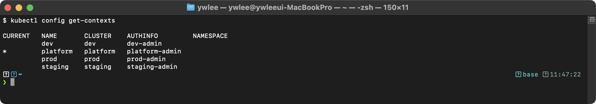

### 실습 1: Control Plane 아키텍처 직접 확인

```bash
# platform 클러스터의 Control Plane Static Pod 확인
kubectl config use-context platform
kubectl get pods -n kube-system -o custom-columns='NAME:.metadata.name,NODE:.spec.nodeName,STATUS:.status.phase'
```

**예상 출력 (platform 실측, 컨트롤플레인 + coredns 발췌):**
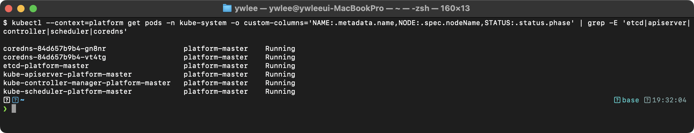
> 컨트롤플레인 4종은 Static Pod 라 master 에 고정되지만, coredns 는 일반 Deployment 라 worker 에도 스케줄된다.

**동작 원리:**
1. Static Pod는 kubelet이 `/etc/kubernetes/manifests/` 디렉터리의 YAML을 직접 읽어 생성한다
2. API Server 자체가 Static Pod이므로 API Server 없이도 부트스트랩이 가능하다
3. Pod 이름에 노드명이 접미사로 붙는다 (`etcd-platform-master`)
4. `custom-columns` 출력으로 Static Pod가 모두 Control Plane 노드에서 실행됨을 확인한다

### 실습 2: 멀티 클러스터 kubeconfig 구조 분석

```bash
# kubeconfig 내의 클러스터/유저/컨텍스트 구조 확인
kubectl config view -o jsonpath='{range .clusters[*]}{.name}{"\t"}{.cluster.server}{"\n"}{end}'
```

**예상 출력 (실측 — IP 는 tart 가 부팅마다 재할당하므로 시점에 따라 다르다):**
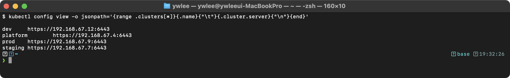

**동작 원리:**
1. `KUBECONFIG` 환경변수에 `:` 구분자로 여러 파일을 지정하면 kubectl이 자동 머지한다
2. 각 kubeconfig 파일에는 cluster(API Server 주소), user(인증 정보), context(cluster+user 조합)가 정의된다
3. `kubectl config use-context`로 활성 컨텍스트를 전환하면 이후 명령이 해당 클러스터로 전달된다

### 실습 3: Worker Node 상태 및 컴포넌트 확인

```bash
# dev 클러스터로 전환 후 노드 상세 정보 확인
kubectl config use-context dev
kubectl get nodes -o wide

# 노드의 kubelet 버전과 컨테이너 런타임 확인
kubectl get nodes -o custom-columns='NAME:.metadata.name,KUBELET:.status.nodeInfo.kubeletVersion,RUNTIME:.status.nodeInfo.containerRuntimeVersion'
```

**예상 출력 (dev 실측 — `reset-cluster.sh` 로 새로 만들어 containerd 2.2.x):**
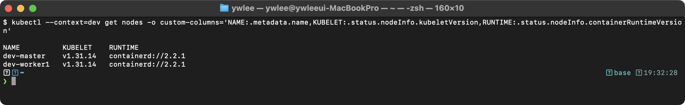
> 런타임 버전은 노드 이미지에 따라 다르다(81일 전 만든 platform/staging/prod 는 `containerd://1.7.28`). KUBELET 버전은 `K8S_VERSION=1.31` 기준 패치판 v1.31.14.

**동작 원리:**
1. kubelet은 각 노드에서 실행되며 Node 오브젝트의 `.status.nodeInfo`에 자신의 버전 정보를 보고한다
2. 컨테이너 런타임(containerd)은 CRI(Container Runtime Interface)를 통해 kubelet과 통신한다
3. `-o custom-columns`는 JSONPath 기반으로 원하는 필드만 추출하여 표시한다

---

## 6. 트러블슈팅

### 6.1 Static Pod가 생성되지 않는 경우

**증상:** 매니페스트 파일을 `/etc/kubernetes/manifests/`에 배치했으나 Pod가 나타나지 않는다.

**디버깅 절차:**

```bash
# 1. kubelet이 실행 중인지 확인
sudo systemctl status kubelet
```

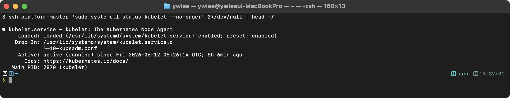

```bash
# 2. kubelet 로그에서 에러 확인
sudo journalctl -u kubelet --since "5 min ago" | grep -i error
```

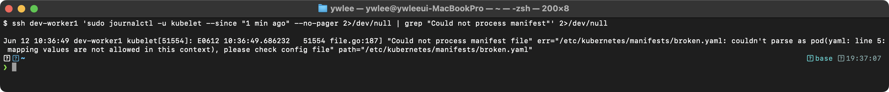

```bash
# 3. staticPodPath가 올바른지 확인
cat /var/lib/kubelet/config.yaml | grep staticPodPath
```

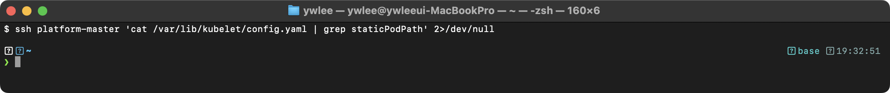

```bash
# 4. YAML 문법 검증
python3 -c "import yaml; yaml.safe_load(open('/etc/kubernetes/manifests/static-nginx.yaml'))"
```

**주요 원인:**
- YAML 들여쓰기 오류 (탭 사용 금지, 스페이스만 허용)
- staticPodPath가 기본값(`/etc/kubernetes/manifests`)이 아닌 다른 경로로 설정된 경우
- kubelet이 정지된 상태
- 매니페스트 파일의 확장자가 `.yaml` 또는 `.yml`이 아닌 경우

### 6.2 API 서버에 접속할 수 없는 경우

**증상:** `kubectl get nodes` 실행 시 `The connection to the server was refused` 에러가 발생한다.

**디버깅 절차:**

```bash
# 1. API 서버 Pod 상태 확인 (crictl은 kubelet 수준에서 동작하므로 API 서버 없이도 사용 가능)
sudo crictl ps | grep kube-apiserver
```

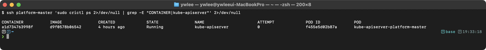

```bash
# 2. API 서버 컨테이너 로그 확인
sudo crictl logs $(sudo crictl ps -a | grep kube-apiserver | awk '{print $1}')
```

```bash
# 3. etcd 연결 확인 (API 서버가 etcd에 연결 실패하면 시작하지 못한다)
sudo crictl ps | grep etcd
```

**주요 원인:**
- etcd가 죽어 있으면 API 서버도 시작 불가
- API 서버 매니페스트(`/etc/kubernetes/manifests/kube-apiserver.yaml`)의 인증서 경로 오류
- 인증서 만료 (`kubeadm certs check-expiration`으로 확인)
- `--advertise-address`가 노드 실제 IP와 불일치

### 6.3 Worker Node가 NotReady 상태인 경우

**증상:** `kubectl get nodes`에서 특정 노드가 `NotReady` 상태이다.

```bash
# 1. 노드 상태 상세 확인
kubectl describe node <node-name> | grep -A10 Conditions
```

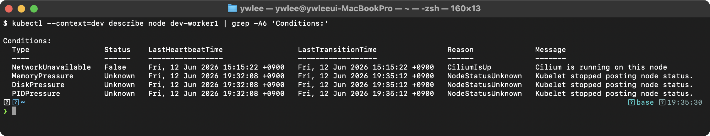

```bash
# 2. 해당 노드에 SSH 접속 후 kubelet 상태 확인
ssh <vm-별칭>
sudo systemctl status kubelet
```

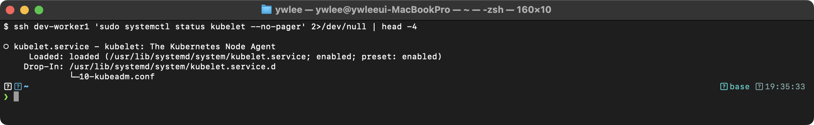

```bash
# 3. kubelet 재시작
sudo systemctl restart kubelet

# 4. containerd 상태 확인
sudo systemctl status containerd
```

**주요 원인:**
- kubelet 프로세스 비정상 종료 → `systemctl restart kubelet`으로 복구
- containerd(컨테이너 런타임) 비정상 → `systemctl restart containerd`
- 디스크 용량 부족 → `df -h`로 확인
- kubelet 인증서 만료 → `rotateCertificates: true` 설정 확인

---

## 자가점검

다음 질문에 답하고 `<details>`를 열어 정답을 확인한다.

1. Static Pod를 삭제하려면 어떻게 해야 하는가?
2. `kube-apiserver`가 유일하게 직접 접근하는 컴포넌트는 무엇인가?
3. nodeName이 비어 있는 Pod를 처리하는 컴포넌트는 무엇인가?
4. kubeadm init이 자동화하는 작업 중 3가지를 나열하라.
5. kubelet이 Static Pod를 감지하는 메커니즘은 무엇인가?
6. kube-proxy의 iptables 모드 한계는 무엇인가?
7. kubeconfig의 3요소(cluster·user·context)가 각각 어떤 정보를 담는가?
8. 인증서 만료 시 어떤 컴포넌트가 가장 먼저 장애를 일으키는가?

<details>
<summary>정답</summary>

1. 해당 노드에 SSH 접속하여 staticPodPath(`/etc/kubernetes/manifests/`) 아래의 매니페스트 파일을 삭제한다. `kubectl delete pod`로는 파일이 남아 있어 kubelet이 즉시 재생성한다.
2. etcd. 다른 모든 컴포넌트는 kube-apiserver를 통해 간접 접근한다.
3. kube-scheduler. nodeName이 없는 Pod를 Watch하여 최적 노드를 선택하고 nodeName을 바인딩한다.
4. PKI 인증서 생성, kubeconfig 파일 생성, Static Pod 매니페스트 배치, Bootstrap Token 발급, CoreDNS 및 kube-proxy Addon 설치 중 3가지.
5. kubelet이 staticPodPath 디렉터리를 inotify(파일시스템 이벤트)로 감시하며 YAML 파일 추가/삭제를 실시간 감지한다.
6. 규칙이 선형 리스트 구조이므로 Service 수가 늘면 매칭 비용이 O(n)으로 증가하고, 갱신 시 전체 테이블을 다시 쓰는 구조라 대규모 환경에서 성능이 저하된다.
7. cluster: API 서버 주소 + CA 인증서. user: 클라이언트 인증서/개인키 또는 토큰. context: 어떤 cluster에 어떤 user로 어떤 namespace에 접근할지의 조합.
8. kube-apiserver. API 서버 자체 TLS 인증서가 만료되면 모든 컴포넌트와 kubectl이 API 서버와 통신할 수 없어 클러스터 전체가 마비된다.

</details>

---

## 시험 팁

- **컨텍스트 전환 먼저**: 시험 문제마다 `kubectl config use-context <ctx>` 명령이 제시된다. 이것을 먼저 실행하지 않으면 엉뚱한 클러스터에서 작업하게 되어 0점이다.
- **속도를 높이는 alias 설정**: 시험 시작 즉시 다음 설정을 입력한다.
  ```bash
  alias k=kubectl
  export do='--dry-run=client -o yaml'
  export now='--force --grace-period=0'
  ```
- **Static Pod 경로 찾기**: 문제에서 Static Pod 경로가 명시되지 않으면 `cat /var/lib/kubelet/config.yaml | grep staticPodPath`로 먼저 확인한다. 기본값(`/etc/kubernetes/manifests`)이 아닌 경우가 시험에 자주 출제된다.
- **kubeadm join 명령**: `kubeadm token create --print-join-command` 한 줄로 즉시 생성된다. 외워 두면 4점짜리 문제를 30초 안에 풀 수 있다.
- **컴포넌트 설정 확인**: API 서버 설정은 `kubectl -n kube-system get pod kube-apiserver-<node> -o yaml`로 SSH 없이 확인 가능하다. SSH보다 빠르다.
- **SSH 접속은 VM 별칭 사용**: 이 저장소 환경에서 노드 접속은 `ssh platform-master`, `ssh dev-master` 등 `~/.ssh/config`에 등록된 별칭으로 접속한다(IP 입력 불필요).

---

## 더 읽을거리

- [Kubernetes 공식 문서 — Cluster Architecture](https://kubernetes.io/docs/concepts/architecture/)
- [Kubernetes 공식 문서 — kubeadm init](https://kubernetes.io/docs/reference/setup-tools/kubeadm/kubeadm-init/)
- [Kubernetes 공식 문서 — Configure Access to Multiple Clusters](https://kubernetes.io/docs/tasks/access-application-cluster/configure-access-multiple-clusters/)
- [Kubernetes 공식 문서 — Static Pods](https://kubernetes.io/docs/tasks/configure-pod-container/static-pod/)
- [Kubernetes 공식 문서 — PKI certificates and requirements](https://kubernetes.io/docs/setup/best-practices/certificates/)
- [Kubernetes The Hard Way (Kelsey Hightower)](https://github.com/kelseyhightower/kubernetes-the-hard-way) — kubeadm 이전 수동 설치 절차의 교과서

