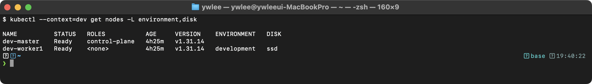
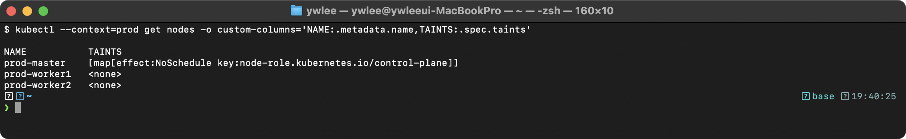
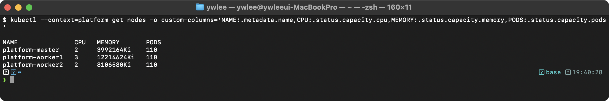
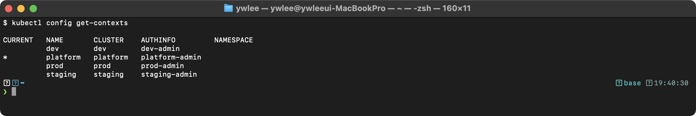
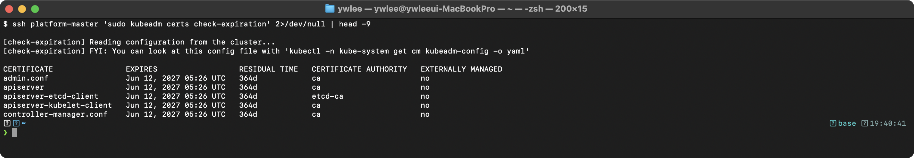
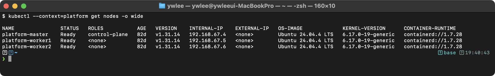
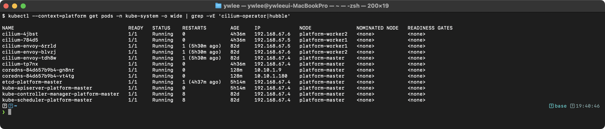
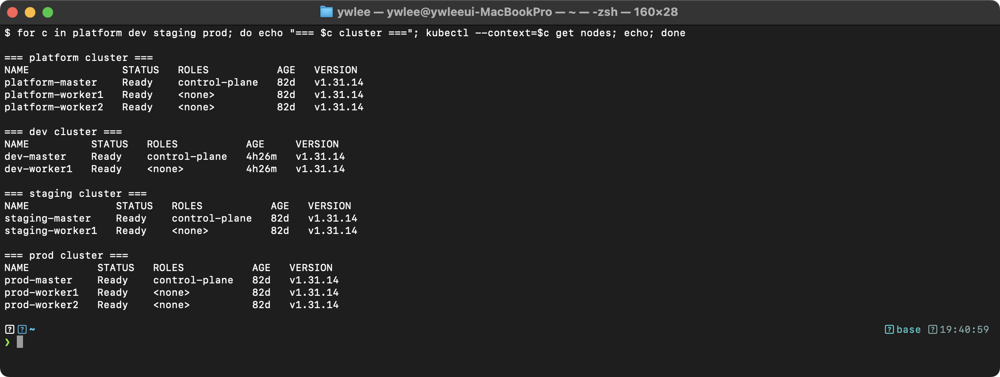
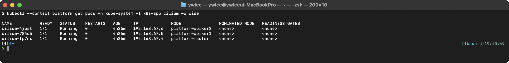

# CKA Day 2: 클러스터 아키텍처 시험 문제 & YAML 예제

> CKA 도메인: Cluster Architecture (25%) - Part 1 실전 | 예상 소요 시간: 2시간

---

## 오늘의 학습 목표

Day 1에서 클러스터 아키텍처 개념(Control Plane 컴포넌트 4종, Worker Node 컴포넌트, Static Pod, kubeadm init 7단계)과 문제 1~5(노드 구성 확인, kubeadm init 검증, Static Pod 경로, etcd 상태 확인, CNI 확인)를 다뤘다. 오늘은 그 지식을 바탕으로 문제 6~15(레이블·Taint·리소스·CIDR·인증서·kubeconfig 컨텍스트·etcd data-dir·포트)를 실전 속도로 풀고, 연관 YAML 예제 패턴을 습득한다. → [Day 1 보기](day01.md)

- [ ] 노드 레이블 추가/삭제 명령(`kubectl label nodes`)을 손으로 쓸 수 있다
- [ ] Taint 조회 3가지 방법(describe / jsonpath / custom-columns)을 구분한다
- [ ] 노드 용량(`.status.capacity`) 및 Pod CIDR(`.spec.podCIDR`)을 jsonpath로 추출한다
- [ ] `kubeadm certs check-expiration`으로 인증서 만료일을 확인하고 저장한다
- [ ] `kubectl config set-credentials / set-context`로 새 컨텍스트를 생성한다
- [ ] etcd `--data-dir` 값을 kubectl 및 SSH 두 방법으로 확인한다
- [ ] Control Plane 컴포넌트 포트 4개(6443·10259·10257·2379)를 암기하고 확인한다
- [ ] YAML 예제 5.1~5.17 패턴(리소스 제한·Probe·Init Container·SecurityContext 등)을 이해한다

> **구성 안내:** 이 문서는 실전 문제 풀이(§1) → 추가 YAML 예제(§5) → 트러블슈팅(§6) → 복습 체크리스트(§7) → 내일 예고 → **tart-infra 실습 4개** 순으로 구성된다. 내일 예고 이후에도 실습 섹션이 이어지므로 파일 끝까지 읽는다.

### 시험 환경 초기 설정

실제 CKA 시험에서 문제를 풀기 전에 터미널에 아래 설정을 먼저 입력한다. 이 설정이 없으면 `--dry-run=client -o yaml` 같은 긴 옵션을 매번 직접 타이핑해야 해 속도가 크게 떨어진다.

```bash
alias k=kubectl                          # k get pods 처럼 단축 사용
export do='--dry-run=client -o yaml'     # k run nginx --image=nginx $do > pod.yaml
export KUBE_EDITOR=nano                  # CKA 시험 환경에서 vi 대신 nano가 익숙하면 설정
```

이 설정은 터미널 세션이 살아 있는 동안만 유효하다. 새 탭을 열거나 로그인이 끊기면 다시 설정해야 한다. §7 핵심 명령어 암기에서 `$do` 변수를 사용한 패턴을 확인한다.

---

## 1. 실전 문제 풀이 (문제 6~15)

---

### 문제 6. 노드 레이블 관리 [4%]

**컨텍스트:** `kubectl config use-context dev`

**[등장 배경]** 노드 레이블은 Pod를 특정 노드에만 배치하기 위한 식별 수단이다. 레이블이 생기기 전에는 특정 노드에 워크로드를 몰아 넣으려면 노드 이름을 Pod 정의에 직접 박거나(nodeName), 운영자가 수동으로 노드를 선택해 `kubectl` 명령을 실행해야 했다. 노드가 늘거나 이름이 바뀌면 모든 Pod 정의를 다시 고쳐야 해서 관리가 불가능해진다. 레이블이 없으면 스케줄러는 모든 노드를 동일하게 취급해, GPU·SSD가 달린 노드에 그것이 필요 없는 Pod를 배치하거나 그 반대로 배치할 수 있다. 결과적으로 자원이 낭비되거나 성능이 필요한 워크로드가 느린 노드에 떨어진다. `environment`·`disk` 같은 레이블을 미리 붙여 두면, 뒤(문제 5.7 nodeSelector)에서 보는 것처럼 "SSD 노드에만", "production 노드에만" 같은 조건으로 배치를 제어할 수 있다.

다음 작업을 수행하라:
1. `dev-worker1` 노드에 `environment=development` 레이블을 추가하라
2. `dev-worker1` 노드에 `disk=ssd` 레이블을 추가하라
3. 모든 노드의 레이블을 확인하라
4. `disk` 레이블을 삭제하라

<details>
<summary>풀이 과정</summary>

```bash
kubectl config use-context dev

# 1. 레이블 추가
kubectl label nodes dev-worker1 environment=development

# 2. 레이블 추가
kubectl label nodes dev-worker1 disk=ssd

# 3. 레이블 확인
kubectl get nodes --show-labels
# 또는 특정 레이블만 확인
kubectl get nodes -L environment,disk

# 4. 레이블 삭제 (키 뒤에 - 추가)
kubectl label nodes dev-worker1 disk-

# 확인
kubectl get nodes -L disk
```

**검증 - 기대 출력 (레이블 확인):** (dev 실측, v1.31.14 — ENVIRONMENT/DISK 는 문제에서 부여한 레이블)


레이블 삭제 후 DISK 열이 비어 있으면 정상이다.

**핵심:**
- 레이블 추가: `kubectl label nodes <node> key=value`
- 레이블 변경: `kubectl label nodes <node> key=newvalue --overwrite` (`--overwrite` 없이 기존 키에 다른 값을 넣으면 에러 발생)
- 레이블 삭제: `kubectl label nodes <node> key-`

</details>

---

### 문제 7. 노드 Taint 확인 [4%]

**컨텍스트:** `kubectl config use-context prod`

**[등장 배경]** Taint(테인트)는 노드에 거는 제약 설정으로, 그 제약을 명시적으로 허용(tolerate)하는 Pod만 해당 노드에 배치될 수 있다. Taint가 없던 시절에는 스케줄러가 Control Plane 노드에도 일반 Pod를 자유롭게 배치했다. 클러스터 초기에는 노드가 적어 Control Plane과 Worker 역할을 겸하는 단일 노드로 운영하는 경우가 많았고, 대규모 클러스터에서도 Control Plane 노드의 자원을 일반 Pod가 소진해 apiserver·scheduler가 응답 불능에 빠지는 장애가 발생했다. 이를 막으려면 운영자가 직접 모든 Pod의 nodeName이나 nodeAffinity를 일일이 설정해야 했다. 레이블이 "이 노드에 와도 된다"는 끌어당기는 신호라면, Taint는 "허락받지 않은 Pod는 오지 마라"는 밀어내는 신호다. Control Plane(컨트롤 플레인: apiserver·etcd·scheduler·controller-manager 등 클러스터를 관리하는 서버 컴포넌트 그룹) 노드에 일반 워크로드가 섞여 들어와 자원을 잠식하면 클러스터 제어가 불안정해진다. 그래서 kubeadm은 Control Plane 노드에 `node-role.kubernetes.io/control-plane:NoSchedule` Taint를 자동으로 걸어, 일반 Pod가 그 노드를 침범하지 못하게 한다.

다음 작업을 수행하라:
1. `prod-master`의 모든 Taint를 확인하라
2. Taint 정보를 `/tmp/master-taints.txt`에 저장하라

<details>
<summary>풀이 과정</summary>

```bash
kubectl config use-context prod

# 방법 1: describe로 확인
kubectl describe node prod-master | grep -A5 Taints > /tmp/master-taints.txt

# 방법 2: jsonpath로 확인
kubectl get node prod-master -o jsonpath='{.spec.taints}' > /tmp/master-taints.txt

# 방법 3: custom-columns로 확인
kubectl get nodes -o custom-columns='NAME:.metadata.name,TAINTS:.spec.taints'

# 확인
cat /tmp/master-taints.txt
```

**검증 - 기대 출력:**


이 Taint가 존재하므로 일반 Pod는 Control Plane 노드에 스케줄링되지 않는다. 이 Taint가 없으면 Control Plane에도 일반 워크로드가 배치될 수 있다.

</details>

---

### 문제 8. 클러스터 노드 리소스 확인 [4%]

**컨텍스트:** `kubectl config use-context platform`

**[등장 배경]** 스케줄러는 Pod를 배치할 때 노드의 잔여 용량(CPU·Memory·Pod 슬롯)을 본다. 노드별 용량을 모르면 어느 노드가 포화 상태인지, 왜 특정 Pod가 `Pending`에 머무는지 진단할 수 없다. 실제로 노드의 Pod 슬롯이 가득 차면 CPU·메모리가 남아 있어도 더 이상 Pod가 배치되지 않는다. 이 문제는 그 용량 정보를 노드 오브젝트의 `.status.capacity`에서 읽는 절차다.

모든 노드의 CPU, Memory 용량과 Pod 수 제한을 확인하여 `/tmp/node-capacity.txt`에 저장하라.

<details>
<summary>풀이 과정</summary>

```bash
kubectl config use-context platform

# custom-columns로 깔끔하게 출력
kubectl get nodes -o custom-columns=\
'NAME:.metadata.name,CPU:.status.capacity.cpu,MEMORY:.status.capacity.memory,PODS:.status.capacity.pods' \
> /tmp/node-capacity.txt

# 확인
cat /tmp/node-capacity.txt
```

**검증 - 기대 출력:**


PODS 열은 해당 노드에서 실행 가능한 최대 Pod 수이며 기본값은 110개다(kubelet의 `--max-pods` 플래그 또는 kubelet config의 `maxPods` 필드로 조정 가능하므로, 실환경에서 110이 아닌 값을 볼 수 있다). 메모리 단위 Ki는 키비바이트(kibibyte)다(예: 8106580Ki ≈ 7.7GiB). CPU/MEMORY 값은 `clusters.json`에서 각 VM에 할당한 코어/메모리를 그대로 반영하므로 클러스터·노드마다 다르다.

</details>

---

### 문제 9. Pod CIDR 확인 [4%]

**컨텍스트:** `kubectl config use-context dev`

**[등장 배경]** Pod CIDR(Pod에 부여할 IP 주소 대역. CIDR은 `10.20.1.0/24`처럼 네트워크 주소와 비트 길이로 IP 범위를 표기하는 방식)은 각 노드가 자기 위에 뜬 Pod에게 나눠 줄 IP 풀이다. 노드마다 겹치지 않는 대역을 받아야 클러스터 전체에서 Pod IP가 유일해지고, 그래야 Pod끼리 IP로 직접 통신할 수 있다. 이 분할이 없으면 두 노드의 Pod가 같은 IP를 받아 패킷이 엉킨다. 노드마다 어떤 대역을 받았는지는 노드 오브젝트의 `.spec.podCIDR`에 기록된다.

각 노드에 할당된 Pod CIDR을 확인하여 `/tmp/pod-cidr.txt`에 저장하라.

<details>
<summary>풀이 과정</summary>

```bash
kubectl config use-context dev

kubectl get nodes -o jsonpath='{range .items[*]}{.metadata.name}{"\t"}{.spec.podCIDR}{"\n"}{end}' \
  > /tmp/pod-cidr.txt

cat /tmp/pod-cidr.txt
# 기대:
# dev-master    10.20.0.0/24
# dev-worker1   10.20.1.0/24
```

</details>

---

### 문제 10. kube-system Pod 상태 확인 [4%]

**컨텍스트:** `kubectl config use-context platform`

**[등장 배경]** `kube-system`은 클러스터를 굴리는 시스템 컴포넌트(coredns, CNI, apiserver·etcd 같은 Static Pod 등)가 모여 있는 네임스페이스다. 클러스터가 이상하게 동작할 때 가장 먼저 보는 곳이 여기다. 예를 들어 DNS가 안 되면 coredns Pod가, Pod 네트워킹이 깨졌으면 CNI Pod가 `CrashLoopBackOff`나 `Pending` 상태로 보인다. 상태별로 분류해 두면 어느 시스템 컴포넌트가 망가졌는지 한눈에 진단할 수 있다.

`kube-system` 네임스페이스의 모든 Pod를 상태(STATUS)별로 분류하여 `/tmp/kube-system-status.txt`에 저장하라.

<details>
<summary>풀이 과정</summary>

```bash
kubectl config use-context platform

kubectl get pods -n kube-system -o custom-columns=\
'NAME:.metadata.name,STATUS:.status.phase,NODE:.spec.nodeName' \
> /tmp/kube-system-status.txt

# 또는 간단하게
kubectl get pods -n kube-system > /tmp/kube-system-status.txt

cat /tmp/kube-system-status.txt
```

</details>

---

### 문제 11. 인증서 만료일 확인 [7%]

**컨텍스트:** `kubectl config use-context platform`

**[등장 배경]** kubeadm으로 만든 클러스터는 컴포넌트 간 통신을 전부 TLS 인증서로 보호한다. 이 인증서는 보안상 무기한이 아니라 기본 1년 만료로 발급된다. 만료를 넘기면 apiserver·kubelet·etcd가 서로를 신뢰하지 못해 `x509: certificate has expired` 에러로 클러스터 전체가 멎는다(§6.2 참고). 그래서 운영자는 주기적으로 만료일을 점검하고 미리 갱신해야 한다. 이 문제는 그 점검 절차다.

**[전제]** 본 실습은 이 저장소의 tart 환경이 가동돼 있고(`./scripts/boot.sh` + `./scripts/fix-cluster-ip-drift.sh platform` 완료), 노드 SSH 별칭이 설정돼 있음을 전제한다(`./scripts/setup-ssh-keys.sh platform` 으로 `~/.ssh/config`에 `platform-master` 등록, 키 `~/.ssh/tart_k8scert`). 별칭이 있으면 IP를 직접 적을 필요 없이 `ssh platform-master`로 접속된다(IP는 ProxyCommand가 `tart ip`로 실시간 조회). 인증서가 모여 있는 `/etc/kubernetes/pki/` 디렉터리는 kubeadm이 클러스터 부트스트랩 시 생성한 인증서·키 저장소다.

다음을 수행하라:
1. `kubeadm certs check-expiration`으로 모든 인증서 만료일을 확인하라
2. API 서버 인증서의 만료일을 `/tmp/cert-expiry.txt`에 저장하라

<details>
<summary>풀이 과정</summary>

```bash
# Step 1: SSH 접속 (별칭 미설정 시 ssh platform-master)
ssh platform-master

# Step 2: 모든 인증서 만료일 확인
sudo kubeadm certs check-expiration

# Step 3: API 서버 인증서 만료일만 저장
sudo openssl x509 -in /etc/kubernetes/pki/apiserver.crt -noout -enddate > /tmp/cert-expiry.txt

# 또는 kubeadm 결과에서 추출
sudo kubeadm certs check-expiration | grep apiserver | head -1 >> /tmp/cert-expiry.txt

cat /tmp/cert-expiry.txt
exit
```

</details>

---

### 문제 12. 새 kubeconfig 컨텍스트 생성 [7%]

**컨텍스트:** `kubectl config use-context dev`

**[등장 배경]** kubeconfig는 "어느 클러스터(cluster)에, 어떤 사용자(user) 자격으로, 어떤 네임스페이스에서" 접속할지를 묶은 설정이다. 이 셋의 조합이 컨텍스트(context)다. 같은 클러스터라도 권한이 다른 여러 사용자가 접근할 수 있어야 하므로, 제한된 권한의 인증서를 가진 사용자를 별도 컨텍스트로 등록해 두면 `use-context` 한 번으로 신원과 기본 네임스페이스를 통째로 전환할 수 있다. 컨텍스트가 없다면 매 명령마다 `--server`·`--client-certificate`·`--namespace`를 일일이 붙여야 한다.

kubeconfig에 다음 조건의 새 컨텍스트를 추가하라:
- 컨텍스트 이름: `dev-restricted`
- 클러스터: 현재 dev 클러스터와 동일
- 사용자: `restricted-user` (인증서 경로: `/tmp/restricted.crt`, `/tmp/restricted.key`)
- 기본 네임스페이스: `demo`

<details>
<summary>풀이 과정</summary>

```bash
kubectl config use-context dev

# 선행 조건: 실제 시험에서는 인증서 파일이 문제에서 제공된다.
# 로컬 실습 시에는 자체 서명 인증서를 아래 명령으로 직접 생성한다.
openssl req -newkey rsa:2048 -nodes \
  -keyout /tmp/restricted.key \
  -x509 -out /tmp/restricted.crt \
  -subj '/CN=restricted-user'
# /tmp/restricted.key, /tmp/restricted.crt 생성 확인 후 진행한다.

# 현재 클러스터 이름 확인
kubectl config get-contexts dev
# CLUSTER 열에서 클러스터 이름 확인 (예: dev)

# 사용자 추가
kubectl config set-credentials restricted-user \
  --client-certificate=/tmp/restricted.crt \
  --client-key=/tmp/restricted.key

# 컨텍스트 추가
kubectl config set-context dev-restricted \
  --cluster=dev \
  --user=restricted-user \
  --namespace=demo

# 확인
kubectl config get-contexts
# dev-restricted 컨텍스트가 표시되어야 함

# 테스트 (인증서가 실제로 존재해야 작동)
kubectl config use-context dev-restricted

# 원래 컨텍스트로 복원
kubectl config use-context dev
```

</details>

---

### 문제 13. etcd 매니페스트에서 데이터 디렉터리 확인 [4%]

**컨텍스트:** `kubectl config use-context platform`

**[등장 배경]** etcd는 클러스터의 모든 상태(오브젝트)를 저장하는 데이터베이스다. 그 데이터가 실제로 디스크 어디에 쌓이는지가 `--data-dir`(기본 `/var/lib/etcd`)다. Day 3에서 다룰 etcd 백업/복구는 이 디렉터리를 대상으로 하므로, 백업을 뜨려면 먼저 데이터 디렉터리 위치를 알아야 한다. etcd는 Static Pod라 그 설정이 apiserver 같은 일반 오브젝트가 아니라 `/etc/kubernetes/manifests/etcd.yaml` 매니페스트 파일에 박혀 있다.

**[전제]** 문제 11과 동일하게 tart 환경 가동·SSH 별칭(`platform-master`) 설정을 전제한다. 방법 2의 `/etc/kubernetes/manifests/etcd.yaml` 경로는 kubelet이 감시하는 Static Pod 매니페스트 디렉터리로, kubeadm 클러스터에서 표준 경로다.

etcd의 `--data-dir` 값을 확인하여 `/tmp/etcd-data-dir.txt`에 저장하라.

<details>
<summary>풀이 과정</summary>

```bash
kubectl config use-context platform

# 방법 1: kubectl로 확인
kubectl -n kube-system get pod etcd-platform-master -o yaml | \
  grep "\-\-data-dir" | awk -F= '{print $2}' > /tmp/etcd-data-dir.txt

# 방법 2: SSH로 확인 (별칭 미설정 시 ssh platform-master)
ssh platform-master
sudo grep "data-dir" /etc/kubernetes/manifests/etcd.yaml | awk -F= '{print $2}' > /tmp/etcd-data-dir.txt
exit

cat /tmp/etcd-data-dir.txt
# 기대: /var/lib/etcd
```

</details>

---

### 문제 14. 클러스터별 네임스페이스 비교 [4%]

**컨텍스트:** 모든 클러스터

각 클러스터(platform, dev, staging, prod)의 네임스페이스 목록을 `/tmp/ns-comparison.txt`에 저장하라.

<details>
<summary>풀이 과정</summary>

```bash
for ctx in platform dev staging prod; do
  echo "=== $ctx ===" >> /tmp/ns-comparison.txt
  kubectl --context=$ctx get namespaces --no-headers | awk '{print $1}' >> /tmp/ns-comparison.txt
  echo "" >> /tmp/ns-comparison.txt
done

cat /tmp/ns-comparison.txt
```

</details>

---

### 문제 15. Control Plane 컴포넌트 포트 확인 [7%]

**컨텍스트:** `kubectl config use-context platform`

**[등장 배경]** 각 Control Plane 컴포넌트는 정해진 포트로 통신한다(apiserver 6443, scheduler 10259, controller-manager 10257, etcd 2379). 이 포트를 알아야 방화벽 규칙을 열거나, 컴포넌트가 죽었을 때 `ss`로 리스닝 여부를 확인하거나, 헬스체크를 걸 수 있다. CKA 시험에서도 포트 암기는 자주 묻는다. 컴포넌트 대부분이 평문 포트를 닫고 TLS 보안 포트(secure-port)만 여는 방향으로 바뀌었으므로, 매니페스트 인자와 실제 리스닝 포트를 함께 확인한다.

**etcd 포트 구분 (시험 필수 암기):**
- **2379**: 클라이언트 포트. apiserver·etcdctl 같은 클라이언트가 etcd에 읽기/쓰기 요청을 보내는 포트(`--listen-client-urls`). `kubectl -n kube-system get pod etcd-... -o yaml | grep listen-client-urls`로 확인한다.
- **2380**: peer 포트. etcd 클러스터를 구성하는 여러 etcd 인스턴스 사이에서 Raft 합의 알고리즘(Raft: 분산 시스템에서 노드 간 합의를 맞추는 프로토콜. 데이터 복제·리더 선출에 사용)으로 로그를 복제하고 리더를 선출하는 포트(`--listen-peer-urls`). 단일 노드 클러스터에서도 이 포트는 자신(localhost)에 열려 있다.

시험에서 "etcd peer 통신 포트를 확인하라"처럼 2380을 명시적으로 물을 수 있다. `ss` 확인 시 2379만 보지 말고 2380도 함께 확인한다.

다음 Control Plane 컴포넌트의 실제 리스닝 포트를 확인하여 `/tmp/control-plane-ports.txt`에 저장하라:
1. kube-apiserver
2. kube-scheduler
3. kube-controller-manager
4. etcd

<details>
<summary>풀이 과정</summary>

```bash
kubectl config use-context platform

# 방법 1: Pod 설정에서 포트 확인
echo "=== kube-apiserver ===" > /tmp/control-plane-ports.txt
kubectl -n kube-system get pod kube-apiserver-platform-master -o yaml | \
  grep -E "secure-port|--port" >> /tmp/control-plane-ports.txt

echo "=== kube-scheduler ===" >> /tmp/control-plane-ports.txt
kubectl -n kube-system get pod kube-scheduler-platform-master -o yaml | \
  grep -E "secure-port|--port" >> /tmp/control-plane-ports.txt

echo "=== kube-controller-manager ===" >> /tmp/control-plane-ports.txt
kubectl -n kube-system get pod kube-controller-manager-platform-master -o yaml | \
  grep -E "secure-port|--port" >> /tmp/control-plane-ports.txt

echo "=== etcd ===" >> /tmp/control-plane-ports.txt
kubectl -n kube-system get pod etcd-platform-master -o yaml | \
  grep "listen-client-urls" >> /tmp/control-plane-ports.txt

cat /tmp/control-plane-ports.txt
# 기대:
# apiserver: 6443
# scheduler: 10259
# controller-manager: 10257
# etcd: 2379
```

**방법 2: SSH 접속하여 확인** (별칭 미설정 시 `ssh platform-master`)
```bash
ssh platform-master
sudo ss -tlnp | grep -E "6443|10259|10257|2379|2380"
# 2379: etcd 클라이언트 포트, 2380: etcd peer(Raft) 포트
exit
```

</details>

---

## 5. 추가 YAML 예제 모음

아래 예제는 각각 "어떤 상황에서 쓰는가"가 다르다. 단순히 구성을 외우지 말고, 각 예제 앞의 **[사용 사례]** 단락에서 "이 구성을 안 쓰면 무슨 문제가 생기는가"를 함께 읽어 둔다. 시험에서는 문제 상황을 보고 어떤 구성을 써야 할지 빠르게 판단하는 능력을 묻는다.

### 5.1 Pod 기본 예제

**[사용 사례]** 가장 단순한 단일 컨테이너 Pod다. 임시 테스트나, 더 복잡한 워크로드의 출발점으로 쓴다. 실무에서 Pod를 직접 만드는 경우는 드물고(보통 Deployment가 대신 만든다) 디버깅용 일회성 Pod에 쓴다.

```yaml
# 가장 기본적인 Pod
apiVersion: v1                    # API 버전: Pod는 core 그룹 → v1
kind: Pod                         # 리소스 종류
metadata:                         # 메타데이터
  name: basic-pod                 # Pod 이름 (필수, 네임스페이스 내에서 고유)
  namespace: default              # 네임스페이스 (생략하면 default)
  labels:                         # 라벨 (Service 연결, 검색에 사용)
    app: basic                    # 키-값 형태의 라벨
spec:                             # Pod 사양
  containers:                     # 컨테이너 목록 (최소 1개)
  - name: nginx                   # 컨테이너 이름
    image: nginx:1.24             # 컨테이너 이미지
    ports:                        # 노출 포트 (정보성, 실제 접근은 Service 필요)
    - containerPort: 80           # 컨테이너 포트
```

### 5.2 Multi-Container Pod 예제

**[사용 사례]** 한 컨테이너가 만든 데이터를 옆 컨테이너가 처리해야 할 때 쓴다(사이드카 패턴). 예: 웹 서버가 쓴 로그를 로그 수집 컨테이너가 읽어 전송한다. 두 작업을 한 컨테이너에 욱여넣으면 이미지가 비대해지고 한쪽 업데이트가 다른 쪽을 흔든다. 같은 Pod로 묶으면 둘이 같은 네트워크·볼륨을 공유하면서도 독립적으로 빌드·교체된다. emptyDir의 생명주기는 Pod 실행 중에만 존재한다 — 컨테이너가 재시작돼도 데이터는 유지되지만, Pod 자체가 삭제되면 함께 사라진다.

```yaml
# 두 개의 컨테이너가 볼륨을 공유하는 Pod (사이드카 패턴)
apiVersion: v1
kind: Pod
metadata:
  name: multi-container-pod
  namespace: default
  labels:
    app: multi-demo
spec:
  containers:
  # 메인 컨테이너: 웹 서버
  - name: web-server              # 첫 번째 컨테이너 이름
    image: nginx:1.24
    ports:
    - containerPort: 80
    volumeMounts:                  # 볼륨 마운트 설정
    - name: shared-logs            # 마운트할 볼륨 이름 (아래 volumes와 일치)
      mountPath: /var/log/nginx    # 컨테이너 내부 마운트 경로
  # 사이드카 컨테이너: 로그 수집기
  - name: log-collector           # 두 번째 컨테이너 이름
    image: busybox:1.36
    command: ["sh", "-c", "tail -f /logs/access.log"]
    volumeMounts:
    - name: shared-logs
      mountPath: /logs             # 같은 볼륨을 다른 경로에 마운트
      readOnly: true               # 읽기 전용
  volumes:                         # Pod 수준에서 볼륨 정의
  - name: shared-logs              # 볼륨 이름
    emptyDir: {}                   # emptyDir: 생명주기 = Pod 실행 중에만 존재. 컨테이너 재시작 후에도 유지되지만, Pod 삭제 시에만 제거된다
```

### 5.3 리소스 제한이 있는 Pod

**[사용 사례 + 트레이드오프]** requests와 limits는 역할이 다르다. **requests**는 스케줄링 기준이다 — 없으면 스케줄러가 노드 가용량을 0으로 보고 무작정 배치해, 실제로는 자원이 부족한 노드에 Pod가 몰려 다 같이 느려진다. **limits**는 상한이다 — 없으면 한 Pod가 노드 메모리를 전부 먹어 같은 노드의 다른 Pod가 OOMKilled되거나 evict(축출)된다. 그래서 둘 다 지정하는 것이 기본이다. 트레이드오프: limits를 너무 빡빡하게 잡으면 정상 트래픽에도 CPU 쓰로틀링·OOMKill이 발생하므로, 실제 사용량을 관측해 여유를 둬야 한다.

```yaml
# CPU/Memory 제한이 설정된 Pod
apiVersion: v1
kind: Pod
metadata:
  name: resource-limited-pod
spec:
  containers:
  - name: app
    image: nginx:1.24
    resources:
      requests:                    # 최소 보장 리소스 (스케줄링 기준)
        cpu: "100m"                # 100 밀리코어 = 0.1 CPU
        memory: "128Mi"            # 128 메비바이트
      limits:                      # 최대 허용 리소스
        cpu: "500m"                # 500 밀리코어 = 0.5 CPU
        memory: "256Mi"            # CPU 초과 → 쓰로틀링, Memory 초과 → OOMKilled
    ports:
    - containerPort: 80
```

### 5.4 환경변수가 있는 Pod

**[사용 사례]** 같은 이미지를 환경(개발/운영)마다 다르게 동작시킬 때 쓴다. 설정값을 이미지에 굽지 않고 환경변수로 주입하면, 이미지 하나로 여러 환경을 돌릴 수 있다. `valueFrom.fieldRef`(다운워드 API)는 Pod 자신의 노드 이름·IP처럼 배포 전에는 알 수 없는 런타임 값을 컨테이너에 넣어 줄 때 쓴다 — 앱이 자기가 어느 노드에 떴는지 알아야 하는 경우다.

```yaml
# 환경변수를 사용하는 Pod
apiVersion: v1
kind: Pod
metadata:
  name: env-pod
spec:
  containers:
  - name: app
    image: busybox:1.36
    command: ["sh", "-c", "echo $APP_NAME running in $APP_ENV && sleep 3600"]
    env:                           # 환경변수 목록
    - name: APP_NAME               # 환경변수 이름
      value: "my-application"      # 값을 직접 지정
    - name: APP_ENV
      value: "production"
    - name: NODE_NAME              # 다운워드 API로 노드 정보 주입
      valueFrom:
        fieldRef:
          fieldPath: spec.nodeName
    - name: POD_IP                 # Pod IP 주입
      valueFrom:
        fieldRef:
          fieldPath: status.podIP
```

### 5.5 Probe가 설정된 Pod

**[사용 사례 + 트레이드오프]** Probe가 없으면 Kubernetes는 컨테이너 프로세스가 살아 있기만 하면 "정상"으로 본다. 그러나 프로세스는 떠 있는데 응답은 멈춘 상태(데드락 등)거나, 아직 초기화 중이라 트래픽을 받으면 안 되는 상태가 있다. Probe는 이런 "겉은 멀쩡한데 실제로는 못 쓰는" 상태를 구분한다. 세 Probe가 나뉘어 있는 이유는 Pod 생명주기의 단계(시작 중 → 준비 중 → 운영 중)마다 던질 질문이 다르기 때문이다.

| Probe | 언제 검사하나 | 무엇을 확인하나 | 실패하면 | 언제 쓰나 |
|:--|:--|:--|:--|:--|
| startupProbe | 컨테이너 시작 직후, 성공할 때까지 | 앱 시작이 끝났나 | 컨테이너 재시작 | 부팅이 느린 앱(JVM, 대용량 캐시 적재 등) |
| livenessProbe | 운영 중 주기적으로 | 살아서 응답하나 | 컨테이너 재시작 | 데드락·행(hang) 상태 자동 복구 |
| readinessProbe | 운영 중 주기적으로 | 트래픽 받을 준비됐나 | Service 엔드포인트에서 제거(재시작 X) | 일시적으로 바쁘거나 백엔드 연결이 끊긴 동안 트래픽 차단 |

세 Probe의 협력이 중요하다. startupProbe가 없으면, 부팅이 느린 앱에 대해 livenessProbe가 시작 도중부터 검사를 시작해 계속 실패하고, 그때마다 컨테이너를 재시작해 무한 재시작 루프에 빠진다. startupProbe가 성공할 때까지 liveness/readiness를 잠재워 이 문제를 막는다.

```yaml
# 건강 검사(Probe)가 설정된 Pod
apiVersion: v1
kind: Pod
metadata:
  name: probe-pod
spec:
  containers:
  - name: web
    image: nginx:1.24
    ports:
    - containerPort: 80
    # 활성 프로브: 컨테이너가 살아있는지 확인
    # 실패하면 컨테이너를 재시작한다
    livenessProbe:
      httpGet:                     # HTTP GET 요청으로 확인
        path: /healthz             # 요청 경로
        port: 80                   # 요청 포트
      initialDelaySeconds: 15      # 컨테이너 시작 후 15초 대기
      periodSeconds: 10            # 10초마다 검사
      failureThreshold: 3          # 3번 연속 실패 시 재시작
    # 준비 프로브: 트래픽을 받을 준비가 되었는지 확인
    # 실패하면 Service 엔드포인트에서 제거한다
    readinessProbe:
      httpGet:
        path: /ready
        port: 80
      initialDelaySeconds: 5
      periodSeconds: 5
    # 시작 프로브: 앱이 시작 완료되었는지 확인
    # 성공할 때까지 liveness/readiness를 비활성화한다
    startupProbe:
      httpGet:
        path: /startup
        port: 80
      failureThreshold: 30         # 30번까지 허용
      periodSeconds: 10            # 30 * 10 = 300초(5분) 내에 시작 필요
```

### 5.6 hostNetwork를 사용하는 Pod

**[사용 사례 + 트레이드오프]** Pod에 독립 IP를 주지 않고 노드의 네트워크를 그대로 쓴다. 노드 자체의 네트워크를 다뤄야 하는 컴포넌트(apiserver 같은 Control Plane Static Pod, CNI 에이전트, 노드 모니터링)에 쓴다. 트레이드오프: Pod가 노드 포트를 직접 점유하므로 같은 노드에 같은 포트를 쓰는 Pod를 둘 이상 띄울 수 없고, 격리가 약해져 보안 표면이 넓어진다. 일반 앱에는 쓰지 않는다.

```yaml
# 호스트 네트워크를 사용하는 Pod
apiVersion: v1
kind: Pod
metadata:
  name: host-network-pod
spec:
  hostNetwork: true                # Pod IP = 노드 IP (Control Plane 컴포넌트가 이 방식)
  containers:
  - name: nettools
    image: nicolaka/netshoot
    command: ["sleep", "3600"]
```

### 5.7 nodeSelector가 있는 Pod

**[사용 사례 + 트레이드오프]** 문제 6에서 붙인 노드 레이블을 실제로 활용하는 부분이다. GPU·SSD가 달린 노드에만 배치해야 하는 워크로드에 쓴다. nodeSelector는 "이 레이블이 정확히 일치하는 노드에만" 배치하는 가장 단순한 방식이다. 트레이드오프: 조건이 단순 AND 일치뿐이라 "A 또는 B 노드", "가능하면 A 노드에 두되 없으면 아무 데나" 같은 유연한 표현이 안 된다. 그런 요구는 nodeAffinity(선호/필수 구분, OR·NotIn 등 연산자 지원)로 넘어간다.

```yaml
# 특정 레이블이 있는 노드에만 배치되는 Pod
apiVersion: v1
kind: Pod
metadata:
  name: nodeselector-pod
spec:
  nodeSelector:                    # 노드 선택 조건 (간단한 방식)
    disk: ssd                      # 이 레이블이 있는 노드에만 배치
    environment: production
  containers:
  - name: app
    image: nginx:1.24
```

### 5.8 Toleration이 있는 Pod

**[사용 사례]** 문제 7에서 본 Taint(노드 제약)를 허용하는 쪽이다. nodeSelector가 "끌어당기는" 조건이라면, Toleration은 "Taint로 막힌 노드의 출입증"이다. 둘은 반대 방향이라 섞어 쓴다 — Toleration만 있으면 그 노드에 갈 *수* 있을 뿐 *반드시* 가는 건 아니므로, 특정 노드에 묶고 싶으면 nodeSelector/nodeAffinity를 함께 건다. 대표 사례: Control Plane 노드에 모니터링 에이전트를 띄워야 할 때, 그 노드의 `control-plane:NoSchedule` Taint를 tolerate한다.

```yaml
# Control Plane 노드에도 배치 가능한 Pod
apiVersion: v1
kind: Pod
metadata:
  name: toleration-pod
spec:
  tolerations:                     # Taint를 허용(tolerate)하는 설정
  - key: "node-role.kubernetes.io/control-plane"  # 허용할 Taint의 키
    operator: "Exists"             # Exists: 키만 일치하면 됨(예: control-plane Taint는 값이 없어 Exists), Equal: 값까지 일치해야 함(예: gpu=true 처럼 값 있는 Taint는 value 필드와 함께 Equal 사용)
    effect: "NoSchedule"           # 허용할 효과
  containers:
  - name: app
    image: nginx:1.24
```

### 5.9 Init Container가 있는 Pod

**[사용 사례]** 메인 컨테이너가 뜨기 전에 반드시 끝나야 하는 준비 작업에 쓴다. 대표 사례: 의존하는 DB가 살아날 때까지 기다리기, 설정 파일·스키마 초기화. 이 로직을 메인 컨테이너 시작 스크립트에 넣으면 앱 코드가 인프라 대기 코드로 지저분해지고, 재시작 때마다 다시 돈다. Init Container로 분리하면 순서대로(위→아래) 실행되고 전부 성공해야 메인이 시작되므로, 준비-실행 단계가 깔끔히 나뉜다.

```yaml
# Init Container: 메인 컨테이너 실행 전에 먼저 실행되는 초기화 컨테이너
apiVersion: v1
kind: Pod
metadata:
  name: init-container-pod
spec:
  initContainers:                  # 초기화 컨테이너 목록 (순서대로 실행)
  - name: init-db-check            # 첫 번째 초기화 컨테이너
    image: busybox:1.36
    command: ['sh', '-c', 'until nslookup db-service; do echo waiting for db; sleep 2; done']
  - name: init-config              # 두 번째 초기화 컨테이너
    image: busybox:1.36
    command: ['sh', '-c', 'echo config loaded > /shared/config.txt']
    volumeMounts:
    - name: config
      mountPath: /shared
  containers:                      # 메인 컨테이너 (init 완료 후 시작)
  - name: app
    image: nginx:1.24
    volumeMounts:
    - name: config
      mountPath: /app/config
  volumes:
  - name: config
    emptyDir: {}
```

### 5.10 SecurityContext가 있는 Pod

**[사용 사례]** 컨테이너가 침해됐을 때 피해를 줄이는 보안 설정이다. 기본값으로 두면 컨테이너가 root(UID 0)로 돌아, 탈출 취약점을 만나면 노드까지 위험해진다. `runAsUser`로 비특권 사용자로 낮추고, `readOnlyRootFilesystem`으로 파일시스템 변조를 막고, `capabilities.drop: ["ALL"]`로 Linux capability(root 권한을 잘게 쪼갠 커널 권한 단위. 예: 네트워크 raw 소켓, 시스템 시각 변경)를 전부 제거한다. CKS(보안 자격증)에서 비중이 큰 부분이다.

```yaml
# 보안 컨텍스트가 설정된 Pod
apiVersion: v1
kind: Pod
metadata:
  name: security-pod
spec:
  securityContext:                 # Pod 수준 보안 설정
    runAsUser: 1000                # 컨테이너를 UID 1000으로 실행
    runAsGroup: 3000               # 그룹 GID 3000
    fsGroup: 2000                  # 볼륨 파일의 그룹을 2000으로 설정
  containers:
  - name: app
    image: busybox:1.36
    command: ["sh", "-c", "id && sleep 3600"]
    securityContext:               # 컨테이너 수준 보안 설정 (Pod 수준을 덮어씀)
      allowPrivilegeEscalation: false  # 권한 상승 불허
      readOnlyRootFilesystem: true     # 루트 파일시스템 읽기 전용
      capabilities:
        drop: ["ALL"]              # 모든 Linux capability 제거
```

### 5.11 configMap을 환경변수로 사용하는 Pod

**[선행 단계]** 아래 Pod를 `kubectl apply`하기 전에 참조할 ConfigMap을 먼저 생성한다. ConfigMap이 없으면 Pod가 `CreateContainerConfigError` 상태로 멈춘다.

```bash
kubectl create configmap app-config \
  --from-literal=special.key=hello \
  --from-literal=APP_ENV=production
```

**[사용 사례]** 5.4의 직접 지정 환경변수와 달리, 설정값을 Pod 정의 바깥의 ConfigMap 오브젝트에 모아 두고 참조한다. 같은 설정을 여러 Pod가 공유하거나, 설정만 바꿔 재배포하고 싶을 때 쓴다. 값을 매니페스트에 직접 박으면 설정이 바뀔 때마다 모든 Pod 정의를 고쳐야 하지만, ConfigMap을 쓰면 한 곳만 고치면 된다. `envFrom`은 ConfigMap의 모든 키를 한꺼번에, `configMapKeyRef`는 특정 키만 골라 주입한다.

```yaml
# ConfigMap의 값을 환경변수로 주입하는 Pod
apiVersion: v1
kind: Pod
metadata:
  name: configmap-env-pod
spec:
  containers:
  - name: app
    image: busybox:1.36
    command: ["sh", "-c", "env | sort && sleep 3600"]
    envFrom:                       # ConfigMap의 모든 키를 환경변수로 주입
    - configMapRef:
        name: app-config           # ConfigMap 이름
    env:                           # 개별 키만 선택적으로 주입
    - name: SPECIAL_KEY
      valueFrom:
        configMapKeyRef:
          name: app-config
          key: special.key         # ConfigMap의 특정 키
```

### 5.12 Secret을 사용하는 Pod

**[선행 단계]** 아래 Pod를 `kubectl apply`하기 전에 참조할 Secret을 먼저 생성한다. Secret이 없으면 볼륨 마운트·환경변수 주입이 모두 실패해 Pod가 `Pending`에서 벗어나지 못한다.

```bash
kubectl create secret generic db-secret \
  --from-literal=password=pass
```

**[사용 사례 + 트레이드오프]** 비밀번호·토큰처럼 민감한 값은 ConfigMap이 아닌 Secret에 둔다. 이유는 접근 제어(RBAC)를 별도로 걸 수 있고, etcd 저장 시 암호화(encryption-at-rest)를 적용할 수 있기 때문이다. 트레이드오프: Secret은 기본적으로 base64 인코딩일 뿐 암호화가 아니므로, etcd 암호화를 켜지 않으면 디스크에서 평문에 가깝게 읽힌다. 볼륨 마운트와 환경변수 주입 두 방식이 있는데, 환경변수는 `printenv`·프로세스 목록·크래시 로그에 노출되기 쉬워, 민감도가 높으면 볼륨 마운트(파일)를 선호한다.

```yaml
# Secret을 볼륨으로 마운트하는 Pod
apiVersion: v1
kind: Pod
metadata:
  name: secret-pod
spec:
  containers:
  - name: app
    image: busybox:1.36
    command: ["sh", "-c", "cat /secrets/password && sleep 3600"]
    volumeMounts:
    - name: secret-vol
      mountPath: /secrets          # 마운트 경로
      readOnly: true               # 읽기 전용 (보안 모범 사례)
    env:
    - name: DB_PASSWORD            # Secret의 값을 환경변수로도 주입 가능
      valueFrom:
        secretKeyRef:
          name: db-secret          # Secret 이름
          key: password            # Secret의 키
  volumes:
  - name: secret-vol
    secret:
      secretName: db-secret        # 마운트할 Secret 이름
      defaultMode: 0400            # 파일 권한 (읽기 전용)
```

### 5.13 ServiceAccount를 지정하는 Pod

**[사용 사례]** Pod 안의 앱이 Kubernetes API를 호출해야 할 때(예: 다른 Pod 목록 조회, 오브젝트 생성) 쓴다. ServiceAccount는 그 Pod의 "신원"이고, 거기에 RBAC(Role-Based Access Control: 어떤 사용자·ServiceAccount가 어떤 리소스에 어떤 동작을 할 수 있는지 정의하는 Kubernetes 권한 시스템, 상세 내용은 CKAD/CKS daily에서 다룬다)로 권한을 붙인다. 지정하지 않으면 네임스페이스의 `default` SA가 붙는데, 보안상 default에는 권한을 주지 않는 것이 원칙이라 API가 필요한 Pod는 전용 SA를 만들어 지정한다. API 호출이 전혀 필요 없는 Pod는 `automountServiceAccountToken: false`로 토큰 마운트를 꺼서 토큰 탈취 위험을 줄인다.

```yaml
# 특정 ServiceAccount로 실행되는 Pod
apiVersion: v1
kind: Pod
metadata:
  name: sa-pod
  namespace: demo
spec:
  serviceAccountName: my-sa        # 사용할 ServiceAccount 이름
  automountServiceAccountToken: true  # SA 토큰 자동 마운트 (기본값: true)
  containers:
  - name: app
    image: busybox:1.36
    command: ["sh", "-c", "cat /var/run/secrets/kubernetes.io/serviceaccount/token && sleep 3600"]
```

### 5.14 DNS 설정이 커스터마이즈된 Pod

**[사용 사례]** 보통 Pod는 클러스터 DNS(coredns)를 자동으로 쓰므로 이 설정은 필요 없다. 특정 Pod만 외부 DNS를 직접 써야 하거나, `ndots` 같은 DNS 동작을 조정해야 하는 예외적 상황에 쓴다. 참고로 `ndots:5`(기본값) 때문에 외부 도메인 조회가 여러 번의 불필요한 검색 도메인 시도를 거쳐 느려지는 문제가 있어, 외부 통신이 많은 Pod는 이 값을 낮추기도 한다.

```yaml
# DNS 설정을 커스텀하는 Pod
apiVersion: v1
kind: Pod
metadata:
  name: custom-dns-pod
spec:
  dnsPolicy: None                  # DNS 정책을 수동으로 설정
  dnsConfig:                       # 커스텀 DNS 설정
    nameservers:                   # DNS 서버 주소
    - 8.8.8.8
    - 8.8.4.4
    searches:                      # 검색 도메인
    - my-namespace.svc.cluster.local
    - svc.cluster.local
    options:                       # DNS 옵션
    - name: ndots
      value: "5"
  containers:
  - name: app
    image: busybox:1.36
    command: ["sh", "-c", "cat /etc/resolv.conf && sleep 3600"]
```

### 5.15 HostPath 볼륨을 사용하는 Pod

**[사용 사례 + 트레이드오프]** 노드 자체의 파일을 봐야 하는 인프라성 워크로드에 쓴다 — 노드 로그 수집, 노드 메트릭 수집 에이전트 등. emptyDir과 달리 노드의 실제 디렉터리를 마운트하므로 Pod가 죽어도 데이터가 노드에 남는다. 트레이드오프: 노드 파일시스템에 직접 접근하므로 보안 위험이 크고(컨테이너 탈출의 발판), Pod가 다른 노드로 옮겨가면 그 노드엔 같은 경로가 없을 수 있어 이식성이 낮다. 일반 데이터 저장에는 PV/PVC를 쓰고, hostPath는 노드 종속 작업에만 한정한다.

```yaml
# 호스트 파일시스템을 마운트하는 Pod
apiVersion: v1
kind: Pod
metadata:
  name: hostpath-pod
spec:
  containers:
  - name: app
    image: busybox:1.36
    command: ["sh", "-c", "ls /host-var-log && sleep 3600"]
    volumeMounts:
    - name: host-log
      mountPath: /host-var-log     # 컨테이너 내부 경로
      readOnly: true
  volumes:
  - name: host-log
    hostPath:
      path: /var/log               # 호스트의 /var/log 디렉터리
      type: Directory              # 타입: Directory, DirectoryOrCreate, File, FileOrCreate
```

### 5.16 Namespace 생성 예제

**[사용 사례]** 네임스페이스는 한 클러스터 안에서 리소스를 논리적으로 격리하는 단위다. 팀·환경·앱별로 나눠 이름 충돌을 막고, RBAC·ResourceQuota·NetworkPolicy를 네임스페이스 단위로 건다. 네임스페이스 없이 모든 리소스를 default에 몰아넣으면 이름이 겹치고 권한·자원 제한을 세분화할 수 없다.

```yaml
# 네임스페이스 생성
apiVersion: v1                     # 네임스페이스도 core API 그룹
kind: Namespace                    # 리소스 종류
metadata:
  name: my-namespace               # 네임스페이스 이름
  labels:
    environment: development       # 네임스페이스에도 라벨 가능 (NetworkPolicy에서 활용)
    team: backend
```

### 5.17 kubeadm ClusterConfiguration 예제

**[사용 사례]** `kubeadm init`을 명령행 플래그로 일일이 넘기는 대신, 클러스터 전체 설정을 한 파일로 선언해 두고 `kubeadm init --config`로 적용할 때 쓴다. Pod/Service CIDR, 인증서 SAN, apiserver 추가 인자, etcd 데이터 경로 등 앞 문제들에서 확인했던 값들이 모두 여기서 정해진다. 플래그 방식은 재현·버전 관리가 어렵지만, 설정 파일은 그대로 보관·재사용할 수 있다(이 저장소의 IaC 철학과 같다).

```yaml
# kubeadm init 시 사용할 클러스터 설정 파일
apiVersion: kubeadm.k8s.io/v1beta3     # kubeadm 설정 API 버전
kind: ClusterConfiguration              # 클러스터 설정
kubernetesVersion: v1.31.0              # 설치할 K8s 버전
controlPlaneEndpoint: "192.168.64.10:6443"  # Control Plane 엔드포인트
networking:
  podSubnet: "10.10.0.0/16"             # Pod CIDR (CNI에 전달)
  serviceSubnet: "10.96.0.0/16"         # Service CIDR
  dnsDomain: "cluster.local"            # 클러스터 DNS 도메인
apiServer:
  extraArgs:                             # API 서버 추가 인자
    authorization-mode: "Node,RBAC"
    audit-log-path: "/var/log/apiserver/audit.log"
  certSANs:                             # 인증서에 추가할 SAN
  - "192.168.64.10"
  - "k8s.example.com"
etcd:
  local:                                 # 로컬 etcd 사용
    dataDir: "/var/lib/etcd"             # 데이터 디렉터리
```

---

## 6. 트러블슈팅

### 6.1 kubeconfig 관련 트러블슈팅

**증상:** `kubectl config use-context dev` 실행 시 `error: no context exists with the name: "dev"` 에러가 발생한다.

```bash
# 사용 가능한 컨텍스트 확인
kubectl config get-contexts
```



`KUBECONFIG` 환경변수에 해당 kubeconfig 파일이 포함되지 않은 것이 원인이다.

```bash
# 환경변수에 추가
export KUBECONFIG=$KUBECONFIG:~/path/to/dev.yaml
kubectl config get-contexts
```

### 6.2 인증서 만료로 인한 접속 실패

**증상:** `kubectl get nodes` 실행 시 `x509: certificate has expired or is not yet valid` 에러가 발생한다.

```bash
# 인증서 만료일 확인
# (SSH 별칭. ~/.ssh/config 에 platform-master 미등록 시 ssh platform-master)
ssh platform-master
sudo kubeadm certs check-expiration
```



```bash
# 인증서 갱신
sudo kubeadm certs renew all
# API 서버 재시작 (매니페스트 파일을 잠시 이동시키면 kubelet이 Pod를 재시작한다)
sudo mv /etc/kubernetes/manifests/kube-apiserver.yaml /tmp/
sleep 5
sudo mv /tmp/kube-apiserver.yaml /etc/kubernetes/manifests/
```

### 6.3 jsonpath 쿼리 결과가 비어 있는 경우

**증상:** jsonpath로 값을 추출했으나 파일이 비어 있다.

```bash
# 먼저 전체 YAML을 확인하여 필드명을 정확히 파악한다
kubectl get node <node-name> -o yaml | less

# jsonpath 디버깅: 단계별로 경로를 좁혀 간다
kubectl get node <node-name> -o jsonpath='{.spec}'
kubectl get node <node-name> -o jsonpath='{.spec.podCIDR}'
```

흔한 실수: `.spec.podCIDR`을 `.spec.PodCIDR`(대소문자 불일치)로 적거나, 배열 인덱싱에서 `{.items[0]}` 대신 `{.items}`를 사용하는 경우이다.

---

## 7. 복습 체크리스트

### 개념 확인

- [ ] Control Plane 4개 컴포넌트(apiserver, etcd, scheduler, controller-manager)의 역할과 포트를 암기했는가?
- [ ] Worker Node 4개 컴포넌트(kubelet, kube-proxy, containerd, CNI)의 역할을 설명할 수 있는가?
- [ ] API 요청 처리 흐름(kubectl → apiserver → etcd → controller → scheduler → kubelet)을 설명할 수 있는가?
- [ ] Static Pod와 일반 Pod의 차이 5가지를 설명할 수 있는가?
- [ ] kubeadm init의 7단계를 순서대로 설명할 수 있는가?
- [ ] kubeconfig 파일의 3가지 구성 요소(clusters, users, contexts)를 이해하는가?
- [ ] 인증서 구조(/etc/kubernetes/pki/)를 파악하고 있는가?

### 시험 팁

1. **Static Pod 경로 찾기** — kubelet config.yaml의 `staticPodPath` 필드를 확인한다
2. **apiserver 설정 확인** — `kubectl -n kube-system get pod <apiserver-pod> -o yaml`로 인자를 확인한다
3. **컨텍스트 전환** — 매 문제마다 `kubectl config use-context` 명령을 반드시 실행한다
4. **kubeadm join** — `kubeadm token create --print-join-command` 하나로 전체 명령을 얻는다
5. **빠른 Pod 생성** — `kubectl run <name> --image=<image> --dry-run=client -o yaml > pod.yaml`
6. **YAML 필드 확인** — `kubectl explain pod.spec.containers` 명령으로 필드 정보를 확인한다

### 핵심 명령어 암기

```bash
# Pod 빠른 생성
kubectl run nginx --image=nginx:1.24 --port=80

# YAML 기본 틀 생성
kubectl run nginx --image=nginx:1.24 --dry-run=client -o yaml > pod.yaml

# 필드 확인
kubectl explain pod.spec
kubectl explain pod.spec.containers
kubectl explain pod.spec.containers.resources

# Static Pod 경로
cat /var/lib/kubelet/config.yaml | grep staticPodPath

# 컨텍스트 전환
kubectl config use-context <name>

# join 명령 생성
kubeadm token create --print-join-command
```

### 자가점검

아래 질문에 답한 뒤 정답을 펼쳐 확인한다.

<details>
<summary>Q1. etcd의 기본 --data-dir 경로는?</summary>

`/var/lib/etcd` — kubeadm 클러스터의 기본값이다. `/etc/kubernetes/manifests/etcd.yaml`의 `--data-dir` 인자로 확인하거나, `kubectl -n kube-system get pod etcd-<node> -o yaml | grep data-dir`로 조회한다.

</details>

<details>
<summary>Q2. Taint effect 3종과 각각의 의미를 말하라.</summary>

- `NoSchedule`: Toleration 없는 Pod는 이 노드에 **스케줄링되지 않는다**. 이미 실행 중인 Pod는 축출되지 않는다.
- `PreferNoSchedule`: Toleration 없는 Pod를 이 노드에 **가능하면 스케줄링하지 않는다**. 다른 노드에 여유가 없으면 배치될 수 있다.
- `NoExecute`: Toleration 없는 Pod는 스케줄링되지 않으며, **이미 실행 중인 Pod도 즉시 축출(Evict)**된다.

</details>

<details>
<summary>Q3. kubeconfig 파일의 3개 구성 요소는?</summary>

`clusters`(클러스터 주소·CA 인증서), `users`(클라이언트 인증서·토큰 등 자격증명), `contexts`(cluster + user + namespace의 조합). `kubectl config get-contexts`로 현재 컨텍스트 목록을 확인한다.

</details>

<details>
<summary>Q4. etcd 클라이언트 포트(2379)와 peer 포트(2380)의 차이는?</summary>

**2379**는 `--listen-client-urls`로, apiserver·etcdctl 같은 클라이언트가 etcd에 읽기/쓰기 요청을 보내는 포트다. **2380**은 `--listen-peer-urls`로, etcd 클러스터 내 여러 인스턴스가 Raft 합의로 로그를 복제하고 리더를 선출하는 포트다.

</details>

<details>
<summary>Q5. kubectl label nodes로 레이블을 추가할 때 기존 키에 다른 값을 넣으려면?</summary>

`--overwrite` 플래그가 필요하다. 예: `kubectl label nodes dev-worker1 environment=production --overwrite`. 플래그 없이 이미 존재하는 키에 다른 값을 넣으면 `error: 'environment' already has a value` 에러가 발생한다.

</details>

<details>
<summary>Q6. ConfigMap과 Secret을 환경변수로 주입할 때 전체 키 일괄 주입과 개별 키 선택 주입의 필드명 차이는?</summary>

일괄 주입은 `envFrom.configMapRef.name` (또는 `secretRef.name`), 개별 키 선택은 `env[].valueFrom.configMapKeyRef` (또는 `secretKeyRef`)를 사용한다.

</details>

---

## 내일 예고

**Day 3: etcd 백업/복구 & 클러스터 업그레이드** -- CKA에서 가장 빈출되는 etcd snapshot save/restore와 kubeadm upgrade 절차를 실습한다. etcd 인증서 옵션 4개를 반드시 암기하고 오자.

---

## tart-infra 실습

### 실습 환경 설정

```bash
# platform 클러스터에 접속 (Control Plane 구성요소 확인용)
export KUBECONFIG=~/sideproejct/IaC_apple_sillicon/kubeconfig/platform.yaml

# 노드 확인
kubectl get nodes -o wide
```

**예상 출력 (platform 실측):**

> INTERNAL-IP 는 tart 가 부팅마다 재할당하므로 실행 시점에 따라 다르다(이 캡처는 192.168.67.x).

**동작 원리:** `kubectl get nodes -o wide` 명령을 실행하면:
1. kubectl이 kubeconfig 파일에서 platform 클러스터의 API Server 주소를 읽는다
2. 클라이언트 인증서(client-certificate-data)로 TLS 핸드셰이크를 수행한다
3. API Server가 RBAC 인가를 확인한 뒤 etcd에서 Node 오브젝트 목록을 조회한다
4. `-o wide` 플래그로 인해 INTERNAL-IP, OS-IMAGE 등 추가 컬럼이 포함된다

### 실습 1: Control Plane 구성요소 확인

```bash
# kube-system 네임스페이스의 Control Plane Pod 확인
kubectl get pods -n kube-system -o wide
```

**예상 출력 (platform 실측, kube-proxy 없이 Cilium 사용 → coredns IP 는 Pod CIDR 10.10.x):**

> 컨트롤 플레인 컴포넌트(etcd/apiserver/...)의 IP 는 호스트 네트워크라 노드 INTERNAL-IP 와 같다. coredns 는 일반 Pod 라 Pod CIDR(10.10.x) IP 를 받는다.

**동작 원리:** Control Plane 구성요소(etcd, kube-apiserver, kube-controller-manager, kube-scheduler)는 Static Pod로 실행된다:
1. kubelet이 `/etc/kubernetes/manifests/` 디렉터리를 감시한다
2. 이 디렉터리에 있는 YAML 파일을 기반으로 Pod를 직접 생성한다
3. API Server를 거치지 않으므로 API Server 자체도 이 방식으로 부트스트랩된다
4. Pod 이름에 노드 이름이 접미사로 붙는다 (예: `etcd-platform-master`)

### 실습 2: 멀티 클러스터 구조 이해

```bash
# 4개 클러스터의 kubeconfig를 순회하며 노드 확인
for cluster in platform dev staging prod; do
  echo "=== $cluster cluster ==="
  KUBECONFIG=~/sideproejct/IaC_apple_sillicon/kubeconfig/${cluster}.yaml kubectl get nodes
  echo ""
done
```

**예상 출력 (4개 클러스터 실측):**

> dev 의 AGE 가 짧은 건 방금 `reset-cluster.sh` 로 새로 만들었기 때문이다(나머지는 81일 전 생성).

**동작 원리:** 각 클러스터는 독립된 kubeadm 클러스터이다:
1. 각 클러스터마다 별도의 etcd, API Server, Controller Manager, Scheduler가 실행된다
2. Pod CIDR이 서로 다르다: platform(10.10.0.0/16), dev(10.20.0.0/16), staging(10.30.0.0/16), prod(10.40.0.0/16)
3. Service CIDR도 서로 다르다: 10.96~10.99.0.0/16
4. 모든 VM은 Tart 가상화(Apple Silicon)로 Ubuntu 24.04 ARM64를 실행한다

### 실습 3: API Server 접근 과정 확인

```bash
# kubeconfig에서 API Server 주소 확인
kubectl config view --minify -o jsonpath='{.clusters[0].cluster.server}'
echo ""

# API Server에 직접 요청 (verbose 모드로 인증 과정 확인)
kubectl get nodes -v=6
```

**동작 원리:** `-v=6` 플래그는 HTTP 요청/응답을 출력한다:
1. `GET https://<master-ip>:6443/api/v1/nodes` 요청이 전송된다
2. 인증(Authentication): 클라이언트 인증서로 사용자 신원을 확인한다
3. 인가(Authorization): RBAC 정책으로 nodes 리소스 조회 권한을 확인한다
4. 어드미션 컨트롤(Admission Control): GET 요청이므로 해당 없음 (변경 요청에만 적용)
5. etcd에서 데이터를 읽어 응답한다

### 실습 4: Cilium CNI 확인

```bash
# CNI 플러그인 확인 (모든 클러스터가 Cilium 사용)
kubectl get pods -n kube-system -l k8s-app=cilium -o wide
```

**예상 출력 (platform 실측 — DaemonSet 이라 노드당 1개, 호스트 네트워크라 IP=노드 IP):**


**동작 원리:** Cilium(eBPF 기반 CNI)은 DaemonSet으로 모든 노드에 하나씩 배포된다(CNI: Container Network Interface, Pod에 네트워크를 붙여 주는 플러그인 규격. eBPF: 커널을 재빌드·재시작하지 않고 커널 안에서 안전하게 사용자 정의 프로그램을 실행하는 기술):
1. Cilium Agent가 각 노드에서 eBPF 프로그램을 커널에 로드한다
2. Pod 간 네트워킹, NetworkPolicy 적용, 로드밸런싱을 eBPF로 처리한다
3. 기존 iptables 기반 CNI보다 성능이 뛰어나다 (커널 공간에서 처리)
4. tart-infra의 모든 4개 클러스터가 Cilium을 CNI로 사용한다
