# CKA Day 3: etcd 백업/복구 & 클러스터 업그레이드

> 학습 목표 | CKA 도메인: Cluster Architecture, Installation & Configuration (25%) - Part 2 | 예상 소요 시간: 4시간

---

## 오늘의 학습 목표

- [ ] etcd의 역할과 내부 구조를 완벽히 이해한다
- [ ] etcdctl snapshot save/restore 절차를 암기한다
- [ ] kubeadm upgrade 절차를 Control Plane과 Worker Node로 구분하여 실행한다
- [ ] drain/cordon/uncordon의 차이를 정확히 이해한다
- [ ] 시험 출제 패턴에 맞는 문제 풀이 전략을 체득한다

**전제 — Day 2 연결:** Day 2에서 다룬 kubeadm 노드 구조와 Static Pod 개념을 알고 있어야 한다. etcd는 Day 2의 Control Plane 구성 요소에서 언급된 상태 저장소이며, 이번 Day 3는 그 etcd를 직접 조작(백업·복구)하고 kubeadm으로 클러스터 전체를 업그레이드하는 실기 심화 단계이다. 이 주제는 CKA Cluster Architecture, Installation & Configuration 도메인 25%의 핵심 비중을 차지한다.

---

## 1. etcd 완벽 이해

### 1.1 etcd의 역할과 내부 구조

#### 등장 배경

초기 분산 시스템에서는 ZooKeeper 같은 도구로 클러스터 상태를 관리했다. ZooKeeper는 분산 환경에서 여러 노드가 공유하는 설정·잠금·리더 선출 정보를 보관하는 코디네이션 서비스이다. 그러나 ZooKeeper는 Java(JVM) 기반이라 프로세스 시작에 JVM 부팅 시간이 들고 힙 메모리 오버헤드가 크며, 별도의 앙상블(ensemble) 구성과 튜닝이 필요해 소규모 클러스터에 얹기에는 무거웠다. CoreOS 팀은 이 부담을 줄이기 위해 Go 언어로 단일 정적 바이너리로 빌드되는(JVM 불필요) 경량 저장소를 만들었고, 합의 알고리즘으로 Raft를 채택했다. Raft는 분산 합의 알고리즘으로, 여러 노드가 서로 다른 시점에 들어온 쓰기를 동일한 순서로 적용하도록 보장해 모든 노드가 같은 상태를 갖게 한다(상태 일관성). 이렇게 만들어진 것이 etcd이다. 쿠버네티스는 설계 초기부터 etcd를 유일한 상태 저장소로 채택하여, 모든 컴포넌트가 etcd의 상태를 기준으로 동작하는 아키텍처를 구성했다. etcd가 죽으면 클러스터의 모든 제어 기능이 정지하므로, etcd 백업/복구는 클러스터 운영에서 가장 중요한 작업이다.

트레이드오프: etcd는 가볍고 빠르지만 Raft 특성상 쓰기는 과반수 노드의 디스크 동기화를 기다리므로 노드 수를 늘려도 쓰기 처리량은 늘지 않고 오히려 합의 지연이 커진다. 따라서 etcd 클러스터는 보통 3대 또는 5대 같은 홀수 소수로만 운영한다.

etcd는 쿠버네티스 클러스터의 모든 상태 데이터를 저장하는 분산 키-값 저장소(distributed key-value store)이다.

**etcd의 핵심 아키텍처:**
- Raft 합의 알고리즘 기반으로 과반수(quorum, 정족수) 노드의 합의를 통해 데이터 일관성을 보장한다. quorum은 데이터를 확정(commit)하기 위해 동의가 필요한 최소 노드 수로, 전체의 과반수를 뜻한다. 3노드 etcd 클러스터는 최소 2개 노드가 동의해야 쓰기가 확정되며, 이는 1개 노드가 죽어도 과반수(2개)가 남아 클러스터가 계속 동작하도록 하기 위함이다. 짝수 노드를 피하는 이유도 여기에 있다(4노드면 과반수가 3이라 1대 장애까지만 견디므로, 추가 1대 비용 대비 가용성 이득이 없다).
- 오직 kube-apiserver만 etcd에 gRPC로 직접 접근하며, 다른 컴포넌트는 API 서버를 경유한다. gRPC는 구글이 만든 RPC(원격 프로시저 호출) 프로토콜로, HTTP/2 위에서 동작하며 메시지를 Protocol Buffers라는 이진 형식으로 직렬화한다. 텍스트 기반 REST/JSON 대비 직렬화 크기가 작고 다중화(multiplexing)가 가능해 빠르다.
- etcd 데이터가 손실되면 모든 쿠버네티스 오브젝트 상태가 소실되어 클러스터 복구가 불가하다
- 실제 데이터는 etcd 내부에 내장된(embedded) 데이터베이스인 boltdb(b+tree 기반 키-값 파일 데이터베이스) 파일에 저장된다. 즉 etcd 데이터 디렉터리는 결국 이 boltdb 파일이며, 뒤에서 다루는 스냅샷은 이 파일을 일관된 시점으로 복사한 것이다.
- snapshot save/restore를 통해 특정 시점의 전체 상태를 백업 및 복구할 수 있다

**etcd에 저장되는 데이터:**
- 모든 쿠버네티스 오브젝트: Pod, Service, Deployment, ConfigMap, Secret 등
- 클러스터 설정: 네임스페이스, RBAC 규칙, StorageClass 등
- 인증/인가 정보: ServiceAccount, CertificateSigningRequest 등

**핵심 특성:**

| 특성 | 설명 |
|---|---|
| **분산 시스템** | 여러 etcd 노드가 데이터를 복제하여 고가용성 보장 |
| **Raft 합의** | 과반수 노드가 동의해야 데이터가 확정 (3노드면 2개 동의 필요) |
| **키-값 저장** | `/registry/pods/default/nginx` 같은 키에 JSON 값 저장 |
| **Watch 지원** | 데이터 변경을 실시간으로 구독할 수 있음 |
| **TLS 암호화** | 모든 통신이 인증서 기반으로 암호화됨 |
| **API v3** | 현재 쿠버네티스는 etcd API v3만 사용 |

### 1.2 etcd 데이터 구조

etcd에 저장된 데이터는 다음과 같은 키 구조를 가진다:

```
/registry/
├── pods/
│   ├── default/
│   │   ├── nginx-pod     → Pod 스펙 JSON
│   │   └── web-app       → Pod 스펙 JSON
│   └── kube-system/
│       ├── coredns-xxx   → Pod 스펙 JSON
│       └── kube-proxy-xx → Pod 스펙 JSON
├── deployments/
│   └── default/
│       └── nginx-deploy  → Deployment 스펙 JSON
├── services/
│   ├── default/
│   │   └── kubernetes    → Service 스펙 JSON
│   └── kube-system/
│       └── kube-dns      → Service 스펙 JSON
├── configmaps/
├── secrets/
├── namespaces/
├── clusterroles/
├── clusterrolebindings/
└── ...
```

### 1.3 etcdctl 설치 안내

etcdctl은 etcd 서버와 통신하는 별도 CLI 도구이다. kubeadm은 etcdctl을 자동으로 설치하지 않으며, CKA 시험 환경에는 `/usr/local/bin/etcdctl`에 사전 설치되어 있다. 로컬 tart 클러스터에서 재현할 때 `command not found`가 발생하면 아래 명령으로 직접 설치한다.

```bash
# 로컬 재현 시 etcdctl 설치 (ETCD_VER는 실제 클러스터 etcd 버전에 맞게 지정)
ETCD_VER=v3.5.15
curl -L https://github.com/etcd-io/etcd/releases/download/${ETCD_VER}/etcd-${ETCD_VER}-linux-arm64.tar.gz \
  | sudo tar xz -C /usr/local/bin --strip-components=1 etcd-${ETCD_VER}-linux-arm64/etcdctl
etcdctl version
```

### 1.4 etcd 인증서 경로 (시험 필수 암기!)

etcdctl 명령을 실행할 때 반드시 4가지 인증서 옵션을 지정해야 한다.

```bash
# === 반드시 암기해야 할 4가지 옵션 ===
--endpoints=https://127.0.0.1:2379     # etcd 서버 주소
--cacert=/etc/kubernetes/pki/etcd/ca.crt     # etcd CA 인증서
--cert=/etc/kubernetes/pki/etcd/server.crt   # etcd 서버 인증서
--key=/etc/kubernetes/pki/etcd/server.key    # etcd 서버 개인키
```

**기억나지 않을 때 확인하는 방법:**

```bash
# 방법 1: etcd Pod의 YAML에서 확인 (권장)
kubectl -n kube-system get pod etcd-<master-name> -o yaml | grep -E "cert|key|ca|endpoint"

# 방법 2: etcd Static Pod 매니페스트에서 직접 확인
sudo cat /etc/kubernetes/manifests/etcd.yaml | grep -E "cert-file|key-file|trusted-ca|data-dir"

# 방법 3: etcd 프로세스에서 확인
ps aux | grep etcd | grep -o "\-\-[a-z-]*=\S*"
```

### 1.5 etcdctl 환경변수

```bash
# API 버전 설정 (반드시 3으로 설정!)
export ETCDCTL_API=3

# 또는 매 명령마다 지정
ETCDCTL_API=3 etcdctl <command>
```

**왜 API v3인가?**
- 쿠버네티스 1.13부터 etcd v3만 지원한다
- v2와 v3는 데이터 모델이 완전히 다르다
- v2 명령(예: `etcdctl ls`)은 v3에서 동작하지 않는다

---

## 2. etcd 백업 (snapshot save) 완벽 가이드

### 2.1 백업이 왜 중요한가?

근본 원인부터 짚는다. 쿠버네티스의 모든 컨트롤러(scheduler, controller-manager 등)는 자신의 상태를 메모리에 들고 있지 않고 매번 etcd(를 통해 apiserver)에서 읽어 원하는 상태와 비교하며 동작한다. 따라서 etcd가 사라지면 apiserver가 읽을 상태 저장소가 없어져 클러스터의 제어 평면 전체가 정지한다. 단순히 데이터 일부가 없어지는 것이 아니라 클러스터를 운영하는 두뇌가 통째로 비는 것이다.

etcd 데이터가 손실되면:
- 모든 쿠버네티스 오브젝트가 사라진다
- Pod, Service, Deployment 등 모든 리소스가 소실된다
- 클러스터를 처음부터 다시 구성해야 한다

스냅샷 저장이 필수인 이유는 명확하다: etcd 서버 자체가 장애로 데이터(앞서 1.1절에서 설명한 boltdb 파일)를 잃었을 때, 그 상태로 클러스터를 되돌릴 수 있는 유일한 수단이 스냅샷이기 때문이다. etcd 스냅샷은 boltdb의 전체 키-값 데이터를 일관된 시점(consistent snapshot)으로 파일에 직렬화한 것이다. 이 스냅샷으로 restore하면 해당 시점의 클러스터 상태로 복원된다.

### 2.2 snapshot save 명령어 상세

```bash
# etcd 스냅샷 저장
ETCDCTL_API=3 etcdctl snapshot save <저장경로> \
  --endpoints=https://127.0.0.1:2379 \       # etcd 서버 주소
  --cacert=/etc/kubernetes/pki/etcd/ca.crt \  # CA 인증서: 서버 신뢰성 검증
  --cert=/etc/kubernetes/pki/etcd/server.crt \ # 클라이언트 인증서: "나는 권한 있는 클라이언트"
  --key=/etc/kubernetes/pki/etcd/server.key    # 클라이언트 개인키: 인증서의 짝
```

**각 옵션의 TLS 인증 역할:**

| 옵션 | 역할 | PKI 기능 |
|---|---|---|
| `--endpoints` | etcd 서버 gRPC 엔드포인트 | 대상 서버 주소 지정 |
| `--cacert` | CA 인증서 | 서버 인증서의 서명 검증(서버 identity 확인) |
| `--cert` | 클라이언트 인증서 | mTLS에서 클라이언트 identity 증명 |
| `--key` | 클라이언트 개인키 | `--cert`의 인증서와 쌍을 이루는 비밀키(private key). TLS 핸드셰이크 시 이 키로 서명해 인증서의 실제 소유자임을 증명한다 |

### 2.3 백업 검증

```bash
# 스냅샷 상태 확인 (정상적으로 저장되었는지 검증)
ETCDCTL_API=3 etcdctl snapshot status <저장경로> --write-out=table
```

**검증 - 기대 출력:** HASH·REVISION·TOTAL KEYS·TOTAL SIZE 4개 열로 스냅샷 무결성을 확인한다(platform 클러스터 실측).
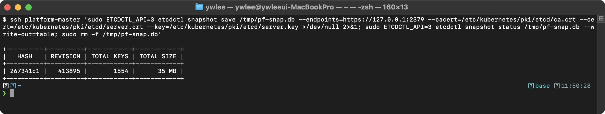

| 필드 | 의미 |
|---|---|
| HASH | 스냅샷 데이터의 해시값 (무결성 검증용) |
| REVISION | etcd의 현재 리비전 번호 |
| TOTAL KEYS | 저장된 총 키 수 |
| TOTAL SIZE | 스냅샷 파일 크기 |

### 2.4 기타 etcdctl 유용한 명령어

아래 명령들에 붙는 `--write-out=table` 옵션은 etcdctl 출력을 사람이 읽기 좋은 표 형식으로 바꾼다. 이 옵션이 없으면 기본 출력 형식으로 나와(상태 조회 계열은 JSON 등) 터미널에서 한눈에 보기 어렵다. 멤버·엔드포인트 상태를 눈으로 확인할 때는 `table`을 붙이는 것이 관례이다.

```bash
# etcd 멤버 목록 확인 (클러스터 구성 확인)
ETCDCTL_API=3 etcdctl member list \
  --endpoints=https://127.0.0.1:2379 \
  --cacert=/etc/kubernetes/pki/etcd/ca.crt \
  --cert=/etc/kubernetes/pki/etcd/server.crt \
  --key=/etc/kubernetes/pki/etcd/server.key \
  --write-out=table

# etcd 엔드포인트 상태 확인
ETCDCTL_API=3 etcdctl endpoint status \
  --endpoints=https://127.0.0.1:2379 \
  --cacert=/etc/kubernetes/pki/etcd/ca.crt \
  --cert=/etc/kubernetes/pki/etcd/server.crt \
  --key=/etc/kubernetes/pki/etcd/server.key \
  --write-out=table

# etcd 건강 상태 확인
ETCDCTL_API=3 etcdctl endpoint health \
  --endpoints=https://127.0.0.1:2379 \
  --cacert=/etc/kubernetes/pki/etcd/ca.crt \
  --cert=/etc/kubernetes/pki/etcd/server.crt \
  --key=/etc/kubernetes/pki/etcd/server.key
```

---

## 3. etcd 복구 (snapshot restore) 완벽 가이드

### 3.1 복구 전체 흐름도

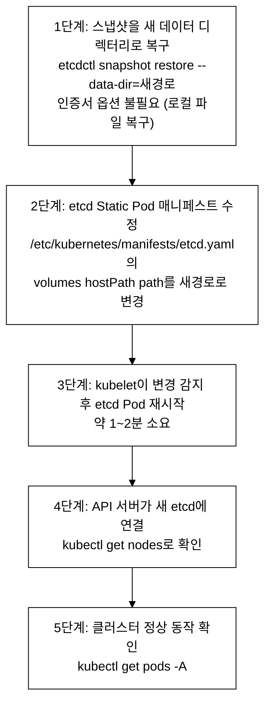
_그림 1. etcd 스냅샷 복구 전체 흐름._

### 3.2 snapshot restore 명령어 상세

```bash
# 스냅샷 복구 (인증서 옵션 불필요!)
ETCDCTL_API=3 etcdctl snapshot restore /path/to/backup.db \
  --data-dir=/var/lib/etcd-restored    # 새 데이터 디렉터리 경로 (기존 경로와 달라야!)
```

**핵심 주의사항:**
1. `snapshot save`에는 인증서가 **필요하다** (네트워크를 통해 etcd에 접근하므로)
2. `snapshot restore`에는 인증서가 **불필요하다** (로컬 파일을 복구하므로) — TLS 인증서는 네트워크를 통한 클라이언트-서버 통신의 신원 검증 수단이다. restore는 로컬 디스크의 스냅샷 파일을 직접 읽어 새 디렉터리에 쓰는 작업이므로 네트워크 연결 자체가 없고 TLS가 개입할 지점이 없다.
3. 복구 시 반드시 `--data-dir`로 **새 경로**를 지정한다 (기존 데이터 덮어쓰기 금지!)

### 3.3 etcd 매니페스트 수정 상세

먼저 Static Pod의 마운트 원리를 이해해야 두 방법의 차이가 보인다. etcd는 Static Pod(kubelet이 특정 디렉터리의 YAML을 직접 읽어 띄우는 파드, 4절에서 상술)로 떠 있고, 그 YAML에는 두 종류의 경로가 등장한다. `spec.volumes`의 `hostPath.path`는 호스트(노드)의 실제 디렉터리 경로이고, `containers[].volumeMounts`의 `mountPath`는 컨테이너 내부에서 보이는 경로이다. kubelet은 같은 `name`으로 묶인 이 둘을 매칭해, 호스트 경로를 컨테이너 내부 경로에 bind mount(같은 디렉터리를 두 위치에서 동시에 보이게 연결하는 리눅스 마운트 기법)한다. etcd 프로세스에 넘기는 `--data-dir` 인자는 컨테이너 *내부* 경로를 가리킨다.

즉 데이터가 실제로 어디에 쓰이는지는 "컨테이너 내부의 `--data-dir`이 어느 호스트 경로로 bind mount되어 있는가"로 결정된다. 아래 두 방법은 이 매핑을 바꾸는 서로 다른 방식이다.

```yaml
# /etc/kubernetes/manifests/etcd.yaml에서 수정할 부분

# === 방법 1: volumes의 hostPath만 변경 (더 간단) ===
# 변경 전:
  volumes:
  - name: etcd-data
    hostPath:
      path: /var/lib/etcd                  # ← 이 경로를 변경
      type: DirectoryOrCreate

# 변경 후:
  volumes:
  - name: etcd-data
    hostPath:
      path: /var/lib/etcd-restored         # ← 새 경로로 변경
      type: DirectoryOrCreate

# === 방법 2: --data-dir 인자도 함께 변경 (더 정확) ===
# 변경 전:
    - --data-dir=/var/lib/etcd

# 변경 후:
    - --data-dir=/var/lib/etcd-restored

# 그리고 volumes도 함께 변경:
  volumes:
  - name: etcd-data
    hostPath:
      path: /var/lib/etcd-restored
```

**방법 1과 방법 2의 차이:**
- 방법 1: 컨테이너 내부 `--data-dir`은 `/var/lib/etcd` 그대로 두고, `hostPath.path`만 새 경로로 바꾼다. 그러면 컨테이너 내부에서는 여전히 `/var/lib/etcd`로 접근하지만, bind mount 매핑이 바뀌었으므로 실제로 읽고 쓰는 호스트 디렉터리는 `/var/lib/etcd-restored`가 된다. restore로 만든 데이터가 호스트의 새 경로에 있으므로 이것만으로 복구가 동작한다.
- 방법 2: `--data-dir` 인자와 `hostPath.path`를 둘 다 새 경로로 맞춘다. 컨테이너 내부 경로와 호스트 경로 표기가 일치해 혼동의 여지가 없다.
- 둘 다 결과는 같다(복구된 데이터를 읽음). 다만 방법 1은 `--data-dir` 한 줄을 안 건드려도 되어 빠르고, 방법 2는 설정이 명시적이라 나중에 다른 사람이 읽을 때 오해가 적다. 단 방법 2에서 `--data-dir`만 바꾸고 `hostPath.path`를 안 바꾸면 컨테이너가 빈 호스트 경로를 보게 되어 데이터가 비어 보이므로(8.1절 트러블슈팅 참고), `--data-dir`을 바꿀 때는 반드시 `hostPath.path`도 함께 바꾼다.

### 3.4 sed를 이용한 빠른 수정

```bash
# sed로 한 줄로 수정 (시험에서 시간 절약)
sudo sed -i 's|path: /var/lib/etcd$|path: /var/lib/etcd-restored|' \
  /etc/kubernetes/manifests/etcd.yaml
```

### 3.5 복구 후 확인

```bash
# etcd Pod 재시작 대기 (1~2분)
watch sudo crictl ps | grep etcd

# 또는 kubectl로 확인 (API 서버 연결 후)
kubectl get pods -n kube-system | grep etcd

# 클러스터 전체 상태 확인
kubectl get nodes
kubectl get pods -A
```

---

## 4. 클러스터 업그레이드 완벽 가이드

### 4.1 업그레이드 규칙

#### 등장 배경

쿠버네티스는 약 4개월마다 새 마이너 버전을 릴리스한다. 보안 패치, 버그 수정, 새로운 기능을 적용하려면 클러스터 업그레이드가 필수이다. 그러나 버전 간 API 호환성 문제가 있으므로 한 번에 여러 버전을 건너뛸 수 없다.

왜 한 마이너 버전씩만 올려야 하는가: 쿠버네티스는 deprecated된 API를 보통 여러 릴리스에 걸쳐 단계적으로 제거한다. 한 버전씩 올리면 그 사이에 "deprecated 경고가 뜨지만 아직 동작하는" 구간이 보장되어 워크로드를 점진적으로 고칠 수 있다. 두 버전 이상 건너뛰면 그 경고 구간을 통째로 건너뛰어, 중간 버전에서 제거된 API나 기능에 의존하던 워크로드가 곧장 깨질 수 있다(예: 1.25에서 PodSecurityPolicy API가 제거되었는데 1.24→1.26으로 건너뛰면 PSP 사용 매니페스트가 경고 한 번 없이 동작 불능이 된다). 또한 컴포넌트 간 버전 스큐 정책도 인접 버전만 검증하므로, 건너뛰기는 지원 범위 밖이다.

업그레이드의 동작 메커니즘은 Static Pod에 기반한다. Control Plane 컴포넌트(apiserver, controller-manager, scheduler, etcd)는 Static Pod로 떠 있고, kubelet은 `/etc/kubernetes/manifests/` 디렉터리를 주기적으로 폴링(polling, 일정 주기로 변경을 확인)한다. 이 디렉터리의 YAML 파일이 바뀌면 kubelet이 변경을 감지해 해당 파드를 새 정의로 재시작한다. 따라서 "컴포넌트를 업그레이드한다"는 것은 결국 이 매니페스트의 컨테이너 이미지 태그를 새 버전으로 바꾸는 일이다. kubeadm은 이 복잡한 과정을 자동화하여, Static Pod 매니페스트의 이미지 태그 변경, 인증서 갱신, 애드온 업데이트 등을 일괄 처리한다.

쿠버네티스 클러스터 업그레이드에는 엄격한 규칙이 있다:

1. **한 마이너 버전씩만** 업그레이드 가능 (예: 1.30 → 1.31, 1.31 → 1.32)
2. **1.30 → 1.32로 건너뛰기 불가** (반드시 1.31을 거쳐야 함)
3. **Control Plane을 먼저**, Worker Node를 나중에 업그레이드
4. **kubelet은 kube-apiserver보다 높으면 안 된다.** 공식 버전 스큐(version skew) 정책상 kubelet은 apiserver와 같거나 최대 3 마이너 버전(이전에는 2 버전)까지 *뒤떨어질* 수 있을 뿐, 앞서서는 안 된다. 즉 "낮을 수 있다"가 아니라 "높으면 안 된다"가 규칙의 핵심이다.

왜 Control Plane(apiserver)을 먼저 올리는가: 새 기능과 API 버전은 apiserver가 먼저 제공하고, kubelet은 그것을 소비(사용)하는 쪽이다. apiserver가 kubelet보다 항상 같거나 높아야 kubelet이 apiserver가 모르는 신기능을 요청하는 일이 없다. 그래서 apiserver를 먼저 올리고 그다음에 kubelet을 따라 올린다. 순서를 거꾸로 하면 kubelet이 apiserver보다 높아져 스큐 정책을 위반한다.

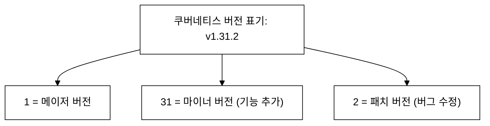
_그림 2. 쿠버네티스 버전 표기 구조._

### 4.2 업그레이드 전체 흐름도

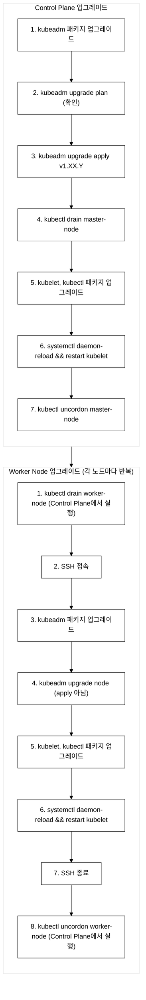
_그림 3. 클러스터 업그레이드 전체 순서 (Control Plane 먼저, Worker 나중)._

### 4.3 Control Plane 업그레이드 상세 절차

```bash
# === Control Plane Master 노드에서 실행 ===

# Step 0: apt 저장소를 업그레이드 대상 마이너 버전 채널로 전환
# 쿠버네티스 공식 패키지 저장소(pkgs.k8s.io)는 마이너 버전별로 채널이 분리되어 있다.
# 예: v1.30 채널에는 1.30.x 패키지만 있고 1.31.x는 없다. 따라서 apt-get update만 해서는
# 목표 버전이 목록에 나타나지 않아 설치가 실패한다. 채널을 먼저 전환해야 한다.
# (이 채널 분리 정책은 실수로 마이너 버전을 건너뛰는 업그레이드를 방지하기 위함이다.)
sudo apt-mark unhold kubeadm                    # 전환 전 고정 해제
# 기존 저장소 파일을 새 마이너 버전 채널로 교체한다 (예: v1.30 → v1.31)
echo "deb [signed-by=/etc/apt/keyrings/kubernetes-apt-keyring.gpg] \
  https://pkgs.k8s.io/core:/stable:/v1.31/deb/ /" \
  | sudo tee /etc/apt/sources.list.d/kubernetes.list

# Step 1: kubeadm 업그레이드
# 버전 문자열 안내: 1.31.0-1.1에서 앞 1.31.0은 쿠버네티스 버전, 뒤 1.1은 Debian 패키지 빌드 리비전이다.
# 시험 문제에서 버전이 주어지면 apt-cache madison kubeadm 으로 정확한 문자열을 조회해 복사한다.
sudo apt-get update                              # 패키지 목록 업데이트
sudo apt-get install -y kubeadm=1.31.0-1.1      # 새 버전 설치
sudo apt-mark hold kubeadm                      # 패키지 고정 (자동 업데이트 방지)

# Step 2: 업그레이드 계획 확인 (어떤 컴포넌트가 업그레이드되는지 미리 확인)
sudo kubeadm upgrade plan
# 출력 예:
# [upgrade/config] Making sure the configuration is correct:
# ...
# Components that must be upgraded manually after you have upgraded the control plane with 'kubeadm upgrade apply':
# COMPONENT   CURRENT       TARGET
# kubelet     v1.30.0       v1.31.0
#
# Upgrade to the latest version in the v1.31 series:
# COMPONENT                 CURRENT   TARGET
# kube-apiserver            v1.30.0   v1.31.0
# kube-controller-manager   v1.30.0   v1.31.0
# kube-scheduler            v1.30.0   v1.31.0
# kube-proxy                v1.30.0   v1.31.0
# CoreDNS                   v1.11.1   v1.11.3
# etcd                      3.5.12    3.5.15

# Step 3: Control Plane 컴포넌트 업그레이드 (apiserver, scheduler, controller-manager, etcd)
sudo kubeadm upgrade apply v1.31.0
# ※ Control Plane 첫 번째 노드에서만 "apply" 사용
# ※ 추가 Control Plane 노드에서는 "kubeadm upgrade node" 사용

# Step 4: 노드 drain (워크로드 퇴거)
# ※ Step 3(upgrade apply)이 끝난 뒤에 실행한다.
# upgrade apply는 Static Pod(apiserver 포함)를 새 이미지로 재시작하므로,
# 그 동안 apiserver가 잠시 응답 불가가 되어 kubectl 명령이 멈출 수 있다.
# apply 완료 후 apiserver가 정상 복구된 다음 drain을 실행해야 drain이 정상 진행된다.
# (apply 진행 중 drain을 시도하면 apiserver 미응답으로 drain이 실패할 수 있다)
kubectl drain <master-node> --ignore-daemonsets --delete-emptydir-data

# Step 5: kubelet, kubectl 업그레이드
sudo apt-mark unhold kubelet kubectl
sudo apt-get install -y kubelet=1.31.0-1.1 kubectl=1.31.0-1.1
sudo apt-mark hold kubelet kubectl

# Step 6: kubelet 재시작
sudo systemctl daemon-reload        # 서비스 설정 리로드
sudo systemctl restart kubelet       # kubelet 재시작

# Step 7: 스케줄링 재개
kubectl uncordon <master-node>

# 확인
kubectl get nodes
```

### 4.4 Worker Node 업그레이드 상세 절차

```bash
# === Control Plane에서 실행 ===

# Step 1: Worker Node drain (워크로드를 다른 노드로 이동)
kubectl drain <worker-node> --ignore-daemonsets --delete-emptydir-data

# === Worker Node에 SSH 접속 (VM 이름 별칭 사용, 예: dev-worker1 / staging-worker1) ===
ssh dev-worker1

# Step 2: apt 저장소 전환 후 kubeadm 업그레이드
# Control Plane과 동일하게 Worker 노드에서도 저장소 채널을 목표 버전으로 전환한다.
sudo apt-mark unhold kubeadm
echo "deb [signed-by=/etc/apt/keyrings/kubernetes-apt-keyring.gpg] \
  https://pkgs.k8s.io/core:/stable:/v1.31/deb/ /" \
  | sudo tee /etc/apt/sources.list.d/kubernetes.list
sudo apt-get update
sudo apt-get install -y kubeadm=1.31.0-1.1
sudo apt-mark hold kubeadm

# Step 3: 노드 설정 업그레이드
sudo kubeadm upgrade node
# ※ "upgrade apply"가 아니라 "upgrade node"!
# ※ Control Plane은 apply, Worker는 node

# Step 4: kubelet, kubectl 업그레이드
sudo apt-mark unhold kubelet kubectl
sudo apt-get install -y kubelet=1.31.0-1.1 kubectl=1.31.0-1.1
sudo apt-mark hold kubelet kubectl

# Step 5: kubelet 재시작
sudo systemctl daemon-reload
sudo systemctl restart kubelet

# === SSH 종료 ===
exit

# === Control Plane에서 실행 ===
# Step 6: 스케줄링 재개
kubectl uncordon <worker-node>

# 확인
kubectl get nodes
# 모든 노드가 v1.31.0으로 표시되어야 함
```

### 4.5 Control Plane vs Worker Node 업그레이드 차이점 정리

| 항목 | Control Plane | Worker Node |
|---|---|---|
| kubeadm 명령 | `kubeadm upgrade apply v1.XX.Y` | `kubeadm upgrade node` |
| drain 실행 위치 | 다른 터미널/노드에서 | Control Plane에서 |
| 업그레이드 대상 | apiserver, scheduler, CM, etcd | kubelet 설정만 |
| 순서 | 먼저 | 나중에 |

### 4.6 drain / cordon / uncordon 완벽 이해

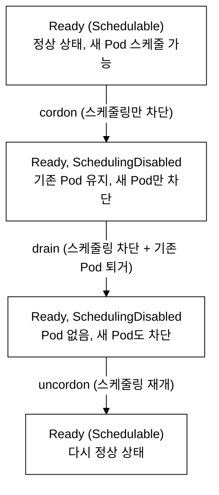
_그림 4. cordon/drain/uncordon에 따른 노드 상태 전이._

**명령어 비교:**

| 명령어 | 동작 | 기존 Pod | 새 Pod 스케줄링 |
|---|---|---|---|
| `kubectl cordon <node>` | 스케줄링만 차단 | 유지 | 차단 |
| `kubectl drain <node>` | cordon + 기존 Pod 퇴거 | 퇴거(다른 노드로 이동) | 차단 |
| `kubectl uncordon <node>` | 스케줄링 재개 | - | 허용 |

**drain 주요 옵션:**

```bash
kubectl drain <node> \
  --ignore-daemonsets \           # DaemonSet Pod는 무시 (다른 노드로 이동 불가하므로)
  --delete-emptydir-data \        # emptyDir 사용 Pod도 퇴거 (데이터 손실 경고 무시)
  --force \                       # ReplicaSet/Job 등에 속하지 않는 단독 Pod도 삭제
  --grace-period=60 \             # 종료 유예 시간 (초)
  --timeout=120s \                # drain 명령 타임아웃
  --dry-run=client                # 실제 실행하지 않고 시뮬레이션
```

`--grace-period=60`은 Pod에 종료 신호를 보낸 뒤 강제 종료까지 60초를 준다는 뜻이다. 쿠버네티스는 먼저 컨테이너 프로세스에 SIGTERM 신호(정상 종료를 요청하는 신호)를 보낸다. 애플리케이션이 이 신호를 받아 진행 중인 요청 마무리, 연결 정리, 버퍼 flush 같은 graceful shutdown(점진적 종료) 로직을 수행할 시간을 주기 위함이다. 이 유예 시간이 지나도 프로세스가 살아 있으면 SIGKILL(즉시 강제 종료, 무시 불가)로 끝낸다. graceful shutdown 처리를 구현하지 않은 애플리케이션은 유예 시간과 무관하게 사실상 강제 종료되는 셈이다.

---

## 5. 동작 원리 심화

### 5.1 etcd snapshot save 내부 동작

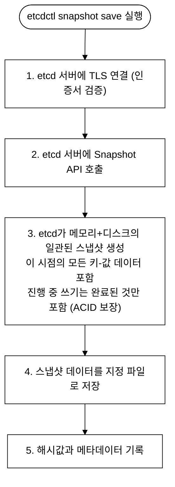
_그림 5. etcd snapshot save 내부 동작._

### 5.2 etcd snapshot restore 내부 동작

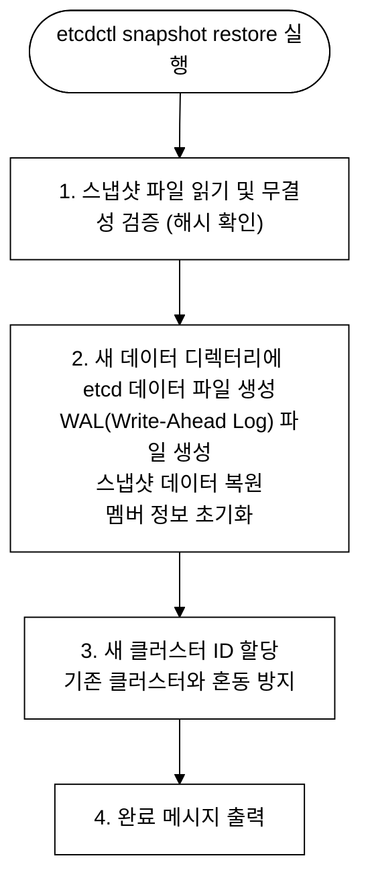
_그림 6. etcd snapshot restore 내부 동작._

위 2단계에서 생성하는 WAL(Write-Ahead Log, 선행 기록 로그)은 데이터를 boltdb 본체에 반영하기 전에 변경 내역을 먼저 디스크 로그에 순차 기록해 두는 기법이다. 프로세스가 중간에 갑자기 죽어도 이 로그를 재생(replay)해 끊긴 변경을 복구할 수 있어 데이터 손실을 막는다. restore 맥락에서 새 WAL을 만드는 이유는, 스냅샷은 특정 시점까지의 상태만 담고 있으므로 복구 이후 새로 들어올 쓰기를 기록할 깨끗한 로그가 필요하기 때문이다. 그래서 옛 WAL을 잇지 않고 새 데이터 디렉터리에 새 WAL을 초기화한다.

### 5.3 kubeadm upgrade apply 내부 동작

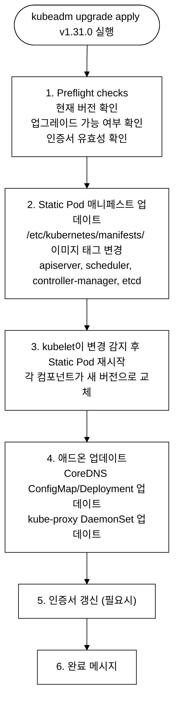
_그림 7. kubeadm upgrade apply 내부 동작._

---

## 6. 시험 출제 패턴 분석

### 6.1 이 주제가 시험에서 어떻게 나오는가

etcd 백업/복구와 클러스터 업그레이드는 CKA에서 **가장 자주 출제되는 주제**이다.

**출제 유형:**
1. **etcd 스냅샷 저장** - 인증서 경로가 주어지거나 직접 찾아야 하는 문제
2. **etcd 스냅샷 복구** - 스냅샷 파일이 주어지고 새 데이터 디렉터리로 복구하는 문제
3. **노드 drain/uncordon** - 유지보수를 위해 노드를 비우고 복구하는 문제
4. **클러스터 업그레이드** - Control Plane 또는 Worker Node를 특정 버전으로 업그레이드하는 문제

### 6.2 문제의 의도

- etcd 인증서 경로를 암기하거나 찾을 수 있는가?
- snapshot save와 restore의 차이(인증서 필요 여부)를 이해하는가?
- 복구 후 매니페스트 수정이 필요하다는 것을 아는가?
- 업그레이드 순서(Control Plane 먼저, Worker 나중)를 지키는가?
- drain과 uncordon을 적절히 사용하는가?

---

## 7. 실전 시험 문제 (8문제)

### 문제 1. etcd 스냅샷 저장 [7%]

**컨텍스트:** `kubectl config use-context platform`

etcd 데이터베이스의 스냅샷을 `/opt/etcd-snapshot.db` 경로에 저장하라.
- etcd 엔드포인트: `https://127.0.0.1:2379`
- 인증서는 etcd Pod의 설정에서 확인하라

> 풀이를 펼치기 전에 직접 손으로 시도해보라. 시험은 속도전이므로, 막히는 부분이 어디인지 먼저 체감한 뒤 풀이와 대조하는 편이 손에 남는다.

<details>
<summary>풀이 과정</summary>

**의도:** etcd 인증서 경로를 찾고 snapshot save를 실행할 수 있는지 확인

```bash
kubectl config use-context platform

# Step 1: 인증서 경로 확인 (시험에서 기억 안 날 때!)
kubectl -n kube-system get pod etcd-platform-master -o yaml | grep -E "cert|key|ca"
# 또는
kubectl -n kube-system describe pod etcd-platform-master | grep -E "cert|key|ca"

# Step 2: SSH 접속 (VM 이름 별칭 — ~/.ssh/config ProxyCommand로 등록됨, scripts/setup-ssh-keys.sh 참고)
ssh platform-master

# Step 3: 스냅샷 저장
sudo ETCDCTL_API=3 etcdctl snapshot save /opt/etcd-snapshot.db \
  --endpoints=https://127.0.0.1:2379 \
  --cacert=/etc/kubernetes/pki/etcd/ca.crt \
  --cert=/etc/kubernetes/pki/etcd/server.crt \
  --key=/etc/kubernetes/pki/etcd/server.key

# Step 4: 검증
sudo ETCDCTL_API=3 etcdctl snapshot status /opt/etcd-snapshot.db --write-out=table

exit
```

**검증 - 기대 출력:**
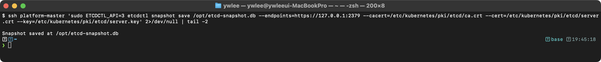

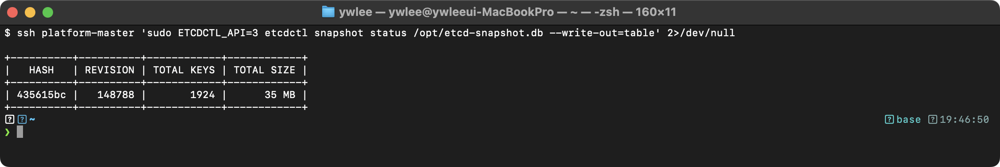

TOTAL KEYS가 0이면 스냅샷이 비어 있는 것이므로, 인증서 경로가 잘못되었거나 다른 etcd 인스턴스에 접속한 것이다.

**체크포인트:**
- `ETCDCTL_API=3`을 빠뜨리지 않았는가?
- 인증서 경로 4개가 모두 정확한가?
- sudo를 사용했는가? (인증서 파일은 root 소유)

</details>

---

### 문제 2. etcd 스냅샷 복구 [7%]

**컨텍스트:** `kubectl config use-context staging`

`/opt/etcd-backup.db` 스냅샷을 사용하여 etcd를 복구하라. 복구된 데이터 디렉터리는 `/var/lib/etcd-from-backup`을 사용하라.

> 풀이를 펼치기 전에 직접 손으로 시도해보라. 특히 restore에 인증서가 필요한지, 매니페스트의 어느 줄을 고쳐야 하는지를 먼저 떠올려본 뒤 대조한다.

<details>
<summary>풀이 과정</summary>

```bash
# Step 1: SSH 접속
ssh staging-master

# Step 2: 스냅샷 복구 (인증서 불필요!)
sudo ETCDCTL_API=3 etcdctl snapshot restore /opt/etcd-backup.db \
  --data-dir=/var/lib/etcd-from-backup

# Step 3: etcd 매니페스트 수정
sudo vi /etc/kubernetes/manifests/etcd.yaml
# volumes 섹션에서 hostPath.path를 변경:
#   path: /var/lib/etcd  →  path: /var/lib/etcd-from-backup

# 또는 sed로 빠르게 수정:
sudo sed -i 's|path: /var/lib/etcd$|path: /var/lib/etcd-from-backup|' \
  /etc/kubernetes/manifests/etcd.yaml

# Step 4: etcd Pod 재시작 대기 — until 루프로 실제 기동 여부를 확인한다
until sudo crictl ps | grep -q etcd; do sleep 5; done
sudo crictl ps | grep etcd

# Step 5: 클러스터 정상 동작 확인
kubectl get nodes
kubectl get pods -A
```

**핵심 체크:**
- `snapshot restore`에 인증서 옵션을 넣지 않았는가? (불필요!)
- `--data-dir`에 새 경로를 지정했는가?
- 매니페스트의 `hostPath.path`를 변경했는가?

</details>

---

### 문제 3. etcd 백업 + 복구 통합 문제 [7%]

**컨텍스트:** `kubectl config use-context staging`

**이 문제의 목표:** 스냅샷은 저장한 *특정 시점*의 완전한 상태 스냅샷(point-in-time consistent snapshot)이라는 점을 체득한다. 따라서 스냅샷을 찍은 *이후*에 만든 리소스는 그 스냅샷에 들어있지 않고, 복구하면 사라진다. 백업을 자동화할 때 "마지막 백업 이후의 변경은 복구되지 않는다"는 사실이 운영상 핵심이므로, 일부러 백업 후 리소스를 만들고 복구해 그 차이를 눈으로 확인한다.

1. 현재 상태의 etcd 스냅샷을 `/tmp/current-snapshot.db`에 저장하라
2. 테스트용 네임스페이스 `test-ns`를 생성하라
3. `/tmp/current-snapshot.db` 스냅샷으로 etcd를 복구하라 (data-dir: `/var/lib/etcd-test-restore`)
4. `test-ns` 네임스페이스가 사라졌는지 확인하라

> 풀이를 펼치기 전에 직접 손으로 시도해보라. 복구 후 `test-ns`가 남아 있을지 사라질지 먼저 예측해본 뒤 결과와 맞춰본다.

<details>
<summary>풀이 과정</summary>

```bash
ssh staging-master

# 1. 현재 상태 백업
sudo ETCDCTL_API=3 etcdctl snapshot save /tmp/current-snapshot.db \
  --endpoints=https://127.0.0.1:2379 \
  --cacert=/etc/kubernetes/pki/etcd/ca.crt \
  --cert=/etc/kubernetes/pki/etcd/server.crt \
  --key=/etc/kubernetes/pki/etcd/server.key

# 2. 테스트 네임스페이스 생성
kubectl create namespace test-ns
kubectl get namespace test-ns  # 확인

# 3. 백업 시점으로 복구
sudo ETCDCTL_API=3 etcdctl snapshot restore /tmp/current-snapshot.db \
  --data-dir=/var/lib/etcd-test-restore

sudo sed -i 's|path: /var/lib/etcd$|path: /var/lib/etcd-test-restore|' \
  /etc/kubernetes/manifests/etcd.yaml

# 재시작 대기 — until 루프로 etcd 컨테이너가 실제 기동될 때까지 폴링
until sudo crictl ps | grep -q etcd; do sleep 5; done

# 4. 복구 확인
kubectl get namespace test-ns
# Error from server (NotFound): namespaces "test-ns" not found
# → 백업 시점에는 test-ns가 없었으므로 사라짐!

# 정리: 원래 상태로 복원
sudo sed -i 's|path: /var/lib/etcd-test-restore|path: /var/lib/etcd|' \
  /etc/kubernetes/manifests/etcd.yaml

exit
```

</details>

---

### 문제 4. 노드 drain [4%]

**컨텍스트:** 실기 시험에서는 문제마다 지정된 context로 전환한다(예: `kubectl config use-context <문제-지정-context>`). **이 저장소에서 로컬로 재현할 때는 파괴 실습이 허용된 `staging`에서 한다(§3). platform/prod는 노드 drain 금지.**

(시험 지문 형식) 대상 worker 노드를 유지보수를 위해 스케줄링 불가 상태로 만들고, 모든 워크로드를 퇴거하라. DaemonSet은 무시하라. 노드 이름은 시험에서 지정한 것을 쓰고, 로컬 재현에서는 `staging-worker1`로 치환한다.

> 풀이를 펼치기 전에 직접 손으로 시도해보라. cordon만으로 충분한지, drain이 필요한지, 어떤 옵션이 빠지면 명령이 멈추는지 먼저 따져본다.

<details>
<summary>풀이 과정</summary>

```bash
# 로컬 재현: staging 클러스터에서만 (prod/platform에서는 하지 않는다)
# drain 실행
kubectl --kubeconfig kubeconfig/staging.yaml drain staging-worker1 --ignore-daemonsets --delete-emptydir-data

# 상태 확인
kubectl --kubeconfig kubeconfig/staging.yaml get nodes
# staging-worker1: Ready,SchedulingDisabled

# 퇴거된 Pod 위치 확인
kubectl --kubeconfig kubeconfig/staging.yaml get pods -A -o wide | grep staging-worker1
# DaemonSet Pod만 남아있어야 함

# 유지보수 완료 후 uncordon
kubectl --kubeconfig kubeconfig/staging.yaml uncordon staging-worker1

# 정상 상태 확인
kubectl --kubeconfig kubeconfig/staging.yaml get nodes
```

**핵심:**
- `--ignore-daemonsets`: DaemonSet Pod는 다른 노드로 이동 불가하므로 무시
- `--delete-emptydir-data`: emptyDir 볼륨 사용 Pod도 퇴거 (데이터 손실 허용)
- `drain` = `cordon` + 기존 Pod 퇴거
- **로컬 환경 주의:** staging은 worker가 1개(master+worker1)뿐이고 master에는 control-plane taint가 있어, 퇴거된 Deployment Pod는 재배치할 노드가 없어 `Pending` 상태가 된다. `uncordon` 후 다시 `staging-worker1`에 스케줄링되어 복구된다. 시험의 다중 worker 환경에서는 다른 worker로 즉시 이동한다.

</details>

---

### 문제 5. 업그레이드 계획 확인 [3%]

**컨텍스트:** `kubectl config use-context staging`

staging 클러스터에서 `kubeadm upgrade plan`을 실행하여 현재 버전과 업그레이드 가능한 버전을 확인하라. 어떤 컴포넌트가 업그레이드 대상인지 기록하라.

> 풀이를 펼치기 전에 직접 손으로 시도해보라. kubeadm upgrade plan을 실행하기 위해 어디서 어떤 권한으로 실행해야 하는지 먼저 생각해본다.

<details>
<summary>풀이 과정</summary>

```bash
kubectl config use-context staging

# kubeadm upgrade plan은 Control Plane(master) 노드에서 직접 실행해야 한다
ssh staging-master

# 현재 kubeadm 버전 확인
kubeadm version

# 업그레이드 계획 확인
sudo kubeadm upgrade plan
# 출력에서 확인할 항목:
#  - COMPONENT 열: 업그레이드 대상 컴포넌트 목록
#  - CURRENT: 현재 버전
#  - TARGET: 업그레이드 가능한 버전
#  - "Components that must be upgraded manually": kubelet은 kubeadm이 자동 업그레이드하지 않음을 주의

exit
```

**핵심:**
- `upgrade plan`은 실제 업그레이드를 수행하지 않는다 — 읽기 전용 사전 점검이다
- kubelet/kubectl은 "must be upgraded manually" 항목으로 별도 표시된다 — kubeadm이 자동으로 올려주지 않기 때문이다
- plan 출력에서 확인한 TARGET 버전 문자열을 그대로 `upgrade apply`에 넘긴다

</details>

---

### 문제 6. Control Plane 업그레이드 [7%]

**컨텍스트:** `kubectl config use-context staging`

staging 클러스터의 Control Plane을 현재 버전에서 한 마이너 버전 위로 업그레이드하라. (문제 5에서 확인한 TARGET 버전을 사용하라.)

> 풀이를 펼치기 전에 직접 손으로 시도해보라. kubeadm → drain → kubelet 순서를 머릿속으로 그린 뒤 대조한다.

<details>
<summary>풀이 과정</summary>

```bash
kubectl config use-context staging

# Control Plane 노드 이름 확인
kubectl get nodes

ssh staging-master

# Step 1: kubeadm 업그레이드 (버전은 문제 5에서 확인한 값 사용, 예시는 1.31.0)
sudo apt-mark unhold kubeadm
sudo apt-get update
# apt-cache madison kubeadm 으로 정확한 패키지 문자열(예: 1.31.0-1.1) 조회 후 지정
sudo apt-get install -y kubeadm=1.31.0-1.1
sudo apt-mark hold kubeadm

# Step 2: 업그레이드 계획 재확인 후 적용
sudo kubeadm upgrade apply v1.31.0
# 완료 메시지: [upgrade/successful] SUCCESS! Your cluster was upgraded to "v1.31.0".

exit

# Step 3: Control Plane 노드 drain (Control Plane 노드 외부에서 실행)
kubectl drain staging-master --ignore-daemonsets --delete-emptydir-data

ssh staging-master

# Step 4: kubelet, kubectl 업그레이드
sudo apt-mark unhold kubelet kubectl
sudo apt-get install -y kubelet=1.31.0-1.1 kubectl=1.31.0-1.1
sudo apt-mark hold kubelet kubectl

# Step 5: kubelet 재시작
sudo systemctl daemon-reload
sudo systemctl restart kubelet

exit

# Step 6: 스케줄링 재개
kubectl uncordon staging-master

# 검증: Control Plane이 새 버전으로 표시되어야 함
kubectl get nodes
```

**핵심 체크:**
- `kubeadm upgrade apply`는 Control Plane 첫 번째 노드에서만 사용한다 (추가 Control Plane은 `upgrade node`)
- drain → kubelet 업그레이드 → uncordon 순서를 반드시 지킨다
- `daemon-reload`를 빠뜨리면 kubelet이 구버전 서비스 파일을 그대로 사용할 수 있다

</details>

---

### 문제 7. Worker Node 업그레이드 [7%]

**컨텍스트:** `kubectl config use-context staging`

문제 6에서 Control Plane을 업그레이드한 뒤, staging 클러스터의 Worker Node를 동일 버전으로 업그레이드하라.

> 풀이를 펼치기 전에 직접 손으로 시도해보라. Control Plane과 Worker의 kubeadm 명령 차이(`apply` vs `node`)를 먼저 떠올려본다.

<details>
<summary>풀이 과정</summary>

```bash
kubectl config use-context staging

# Worker 노드 이름 확인
kubectl get nodes

# Step 1: Worker Node drain (Control Plane에서 실행)
kubectl drain staging-worker1 --ignore-daemonsets --delete-emptydir-data

# Step 2: Worker Node에 SSH 접속
ssh staging-worker1

# Step 3: kubeadm 업그레이드
sudo apt-mark unhold kubeadm
sudo apt-get update
sudo apt-get install -y kubeadm=1.31.0-1.1
sudo apt-mark hold kubeadm

# Step 4: 노드 설정 업그레이드 (Worker는 "upgrade node", apply 아님!)
sudo kubeadm upgrade node

# Step 5: kubelet, kubectl 업그레이드
sudo apt-mark unhold kubelet kubectl
sudo apt-get install -y kubelet=1.31.0-1.1 kubectl=1.31.0-1.1
sudo apt-mark hold kubelet kubectl

# Step 6: kubelet 재시작
sudo systemctl daemon-reload
sudo systemctl restart kubelet

exit

# Step 7: 스케줄링 재개 (Control Plane에서 실행)
kubectl uncordon staging-worker1

# 검증: 모든 노드가 동일 버전으로 표시되어야 함
kubectl get nodes
```

**Control Plane vs Worker 핵심 차이:**
- Control Plane: `kubeadm upgrade apply v1.31.0` (버전 명시 필요)
- Worker: `kubeadm upgrade node` (버전 명시 불필요 — Control Plane에서 설정을 받아옴)
- drain/uncordon은 항상 Control Plane(원격)에서 실행, kubeadm/kubelet 작업은 해당 노드에서 실행

</details>

---

### 문제 8. 업그레이드 후 버전 검증 [2%]

**컨텍스트:** `kubectl config use-context staging`

문제 6~7의 업그레이드가 완료된 후, 클러스터 모든 노드의 버전이 올바르게 업그레이드되었는지 검증하라. Control Plane 컴포넌트(apiserver, etcd 등)도 새 버전으로 동작하는지 확인하라.

> 풀이를 펼치기 전에 직접 손으로 시도해보라. 버전 검증에 쓸 수 있는 명령을 3가지 이상 떠올려본다.

<details>
<summary>풀이 과정</summary>

```bash
kubectl config use-context staging

# 노드 버전 확인
kubectl get nodes
# 모든 노드의 VERSION 열이 새 버전(예: v1.31.0)이어야 한다

# 클라이언트·서버 버전 확인
kubectl version

# Control Plane 컴포넌트 버전 확인 (Static Pod 이미지 태그로 확인)
kubectl get pods -n kube-system -o wide | grep -E "apiserver|etcd|scheduler|controller"

# 각 컴포넌트의 실제 이미지 버전 확인
kubectl get pod -n kube-system kube-apiserver-staging-master -o jsonpath='{.spec.containers[0].image}'

# kubelet 버전은 노드 정보에서 확인
kubectl get nodes -o custom-columns='NAME:.metadata.name,VERSION:.status.nodeInfo.kubeletVersion'
```

**검증 기준:**
- `kubectl get nodes`: 모든 노드 VERSION이 목표 버전과 일치
- `kubectl version`: Server Version이 새 버전
- Static Pod 이미지 태그: `registry.k8s.io/kube-apiserver:v1.31.0` 형태로 업데이트됨
- 노드 상태: 모든 노드 `Ready` (업그레이드 중 `NotReady`가 되었다 돌아와야 정상)

</details>

---

## tart-infra 실습

### 실습 환경 설정

전제 조건:
- tart 멀티클러스터가 가동 중이어야 한다. 꺼져 있으면 `./scripts/boot.sh`로 기동하고, 재부팅 후라면 IP 드리프트 복구를 위해 `./scripts/fix-cluster-ip-drift.sh <클러스터>`를 먼저 실행한다.
- kubeconfig는 `kubeconfig/<클러스터>.yaml`에 클러스터 가동 시 자동 생성된다(gitignore 대상). 본 실습은 platform과 dev 두 클러스터를 사용한다.
- etcd 인증서 경로(`/etc/kubernetes/pki/etcd/`)는 master 노드에 root 소유로 존재한다. SSH(`ssh platform-master` 등 VM 이름 별칭, §3)로 노드에 들어가 `sudo`로 접근한다.
- 노드 IP는 tart 재부팅마다 바뀌므로(IP 드리프트) `listen-client-urls` 등에 보이는 노드 IP는 환경마다 다를 수 있다. 자신의 출력이 아래 예시와 IP만 다른 것은 정상이다.

```bash
# platform 클러스터 접속 (etcd가 실행되는 클러스터)
export KUBECONFIG=kubeconfig/platform.yaml
kubectl config use-context platform
```

### 실습 1: etcd 상태 확인 및 데이터 조회

```bash
# etcd Pod 확인
kubectl get pods -n kube-system -l component=etcd

# etcd Pod의 실행 명령에서 인증서 경로 확인
kubectl describe pod etcd-platform-master -n kube-system | grep -E '(--cert-file|--key-file|--trusted-ca-file|--listen-client-urls)'
```

**검증 - 기대 출력:** etcd Pod 가 Running 이고, `describe` 의 명령 인자에서 인증서 4종 경로(`--cert-file`·`--key-file`·`--trusted-ca-file`·`--listen-client-urls`)를 확인한다. `--listen-client-urls` 의 노드 IP 는 환경별로 다르다(tart 재부팅마다 변경).
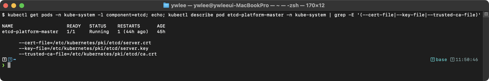

**동작 원리:**
1. etcd는 Static Pod로 Control Plane 노드에서 실행된다
2. TLS 인증서(cert-file, key-file, trusted-ca-file)를 사용해 통신을 암호화한다
3. `listen-client-urls`는 kube-apiserver가 etcd에 접속하는 엔드포인트 주소이다
4. CKA 시험에서 etcd 백업/복구 시 이 인증서 경로를 `etcdctl` 옵션에 전달해야 한다

### 실습 2: drain/cordon으로 노드 유지보수 시뮬레이션

```bash
# dev 클러스터로 전환
export KUBECONFIG=kubeconfig/dev.yaml
kubectl config use-context dev

# 실습용 네임스페이스 및 Pod 준비 (아직 없으면 생성, 이미 있으면 건너뜀)
# demo 네임스페이스가 없는 상태에서 kubectl get pods -n demo를 실행하면
# "No resources found" 또는 에러가 나 cordon 전후 분포 비교가 되지 않는다.
kubectl get ns demo &>/dev/null || kubectl create ns demo
kubectl get pod demo-app -n demo &>/dev/null || kubectl run demo-app --image=nginx -n demo
# Pod가 Running이 될 때까지 잠시 대기
kubectl wait pod demo-app -n demo --for=condition=Ready --timeout=60s

# 현재 워커 노드의 Pod 분포 확인
kubectl get pods -n demo -o wide

# 워커 노드를 cordon (스케줄링 비활성화)
kubectl cordon dev-worker1
kubectl get nodes
```

**검증 - 기대 출력:** `cordon` 직후 `dev-worker1` 의 STATUS 가 `Ready,SchedulingDisabled` 로 바뀐다(아래 캡처는 cordon→조회→uncordon 까지 한 화면, dev 실측).
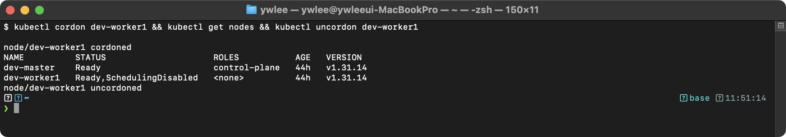

```bash
# cordon 해제 (실습 환경 복구)
kubectl uncordon dev-worker1
kubectl get nodes
```

**동작 원리:**
1. `cordon`은 노드의 `spec.unschedulable: true`를 설정하여 새 Pod 스케줄링을 차단한다
2. 기존 실행 중인 Pod에는 영향을 주지 않는다 (drain과의 차이)
3. `drain`은 cordon + 기존 Pod 퇴거(eviction)를 함께 수행한다
4. `uncordon`으로 `spec.unschedulable`을 해제하면 다시 스케줄링 대상이 된다

### 실습 3: 클러스터 버전 정보 확인

```bash
# 클러스터 버전 확인 (업그레이드 가능 여부 판단 기초)
kubectl version --short 2>/dev/null || kubectl version
kubectl get nodes -o custom-columns='NAME:.metadata.name,VERSION:.status.nodeInfo.kubeletVersion'
```

**검증 - 기대 출력:** 두 노드의 kubelet 버전이 동일(`v1.31.14`)함을 확인한다. 업그레이드 시 control-plane→worker 순서로 한 마이너 버전씩 올린다(dev 실측).
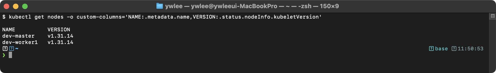

### 실습 4: staging 클러스터 etcd 스냅샷 저장 → 복구 실습

이 실습은 staging 클러스터에서 etcd snapshot save → restore → etcd.yaml 수정 → 클러스터 정상 확인까지 전 단계를 직접 수행한다. staging 클러스터는 파괴 실습이 허용된다(CLAUDE.md §3).

**전제:** `export KUBECONFIG=kubeconfig/staging.yaml`

```bash
# === 1단계: 스냅샷 저장 ===
export KUBECONFIG=kubeconfig/staging.yaml
kubectl config use-context staging

# staging-master에 SSH 접속
ssh staging-master

# etcd 인증서 경로 확인 (먼저 확인하는 습관)
sudo grep -E "(cert-file|key-file|trusted-ca-file)" /etc/kubernetes/manifests/etcd.yaml

# 스냅샷 저장 (/opt 경로는 시험에서 자주 사용됨)
sudo ETCDCTL_API=3 etcdctl snapshot save /opt/staging-etcd-snapshot.db \
  --endpoints=https://127.0.0.1:2379 \
  --cacert=/etc/kubernetes/pki/etcd/ca.crt \
  --cert=/etc/kubernetes/pki/etcd/server.crt \
  --key=/etc/kubernetes/pki/etcd/server.key

# 스냅샷 검증
sudo ETCDCTL_API=3 etcdctl snapshot status /opt/staging-etcd-snapshot.db --write-out=table
```

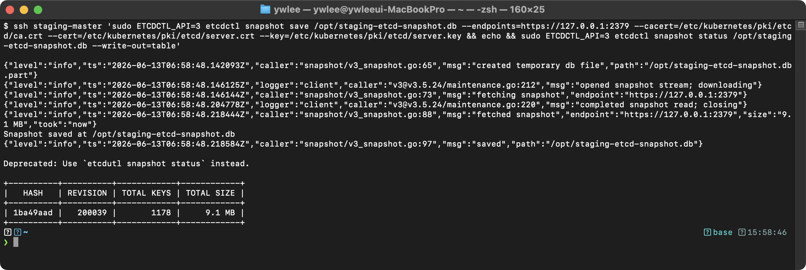

```bash
# === 2단계: 스냅샷 복구 ===
# 복구는 인증서 불필요 — 로컬 파일을 읽어 새 디렉터리에 씀
sudo ETCDCTL_API=3 etcdctl snapshot restore /opt/staging-etcd-snapshot.db \
  --data-dir=/var/lib/etcd-staging-restored

# 복구 디렉터리 생성 확인
ls -la /var/lib/etcd-staging-restored/

# === 3단계: etcd Static Pod 매니페스트 수정 ===
# volumes의 hostPath.path를 새 디렉터리로 변경
sudo sed -i 's|path: /var/lib/etcd$|path: /var/lib/etcd-staging-restored|' \
  /etc/kubernetes/manifests/etcd.yaml

# 변경 확인
sudo grep "path: /var/lib/etcd" /etc/kubernetes/manifests/etcd.yaml

# === 4단계: etcd Pod 재시작 대기 ===
# kubelet이 매니페스트 변경을 감지해 etcd Pod를 재시작함 (보통 30초~2분 소요)
until sudo crictl ps | grep -q etcd; do sleep 5; done
sudo crictl ps | grep etcd
```

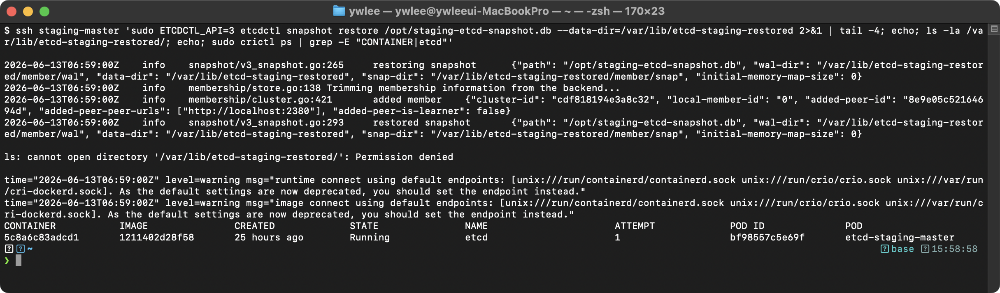

```bash
# === 5단계: 클러스터 정상 확인 ===
exit  # staging-master에서 로컬로 복귀

kubectl get nodes
kubectl get pods -A | grep -v Running
# etcd 재시작 직후 잠시 Pending이 생길 수 있으나 곧 복구됨

# === 정리: 원래 경로로 복구 (실습 환경 초기화) ===
ssh staging-master
sudo sed -i 's|path: /var/lib/etcd-staging-restored|path: /var/lib/etcd|' \
  /etc/kubernetes/manifests/etcd.yaml
until sudo crictl ps | grep -q etcd; do sleep 5; done
exit
```

**실습 체크포인트:**
- snapshot save 후 TOTAL KEYS가 0이면 인증서 경로 오류 또는 잘못된 etcd 엔드포인트이다
- restore 후 `ls /var/lib/etcd-staging-restored/member/` 가 존재해야 정상이다
- etcd.yaml 수정 후 kubelet이 변경을 감지하려면 최소 10~30초가 필요하다 — until 루프로 기다린다
- 정리 단계(원래 경로 복원)를 빠뜨리면 다음 실습에서 staging 클러스터가 비어 있는 상태처럼 보일 수 있다

---

## 8. 트러블슈팅

### 8.1 etcd 복구 후 API 서버가 시작되지 않는 경우

**증상:** etcd restore 후 `kubectl get nodes`가 응답하지 않는다.

**디버깅 절차:**

```bash
# 1. etcd 컨테이너가 실행 중인지 확인
sudo crictl ps | grep etcd
```

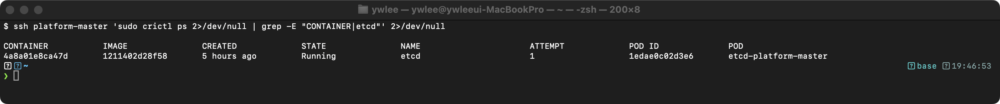

```bash
# 2. etcd 컨테이너 로그 확인
sudo crictl logs $(sudo crictl ps -a | grep etcd | awk '{print $1}' | head -1) 2>&1 | tail -20
```

**주요 원인과 해결:**
- **hostPath.path를 변경하지 않은 경우:** etcd가 이전(빈) 데이터 디렉터리를 바라보므로 클러스터 데이터가 없다. `/etc/kubernetes/manifests/etcd.yaml`의 `volumes` 섹션에서 `hostPath.path`를 restore에서 지정한 `--data-dir` 값으로 변경한다.
- **--data-dir과 hostPath.path 불일치:** `--data-dir` 인자와 실제 마운트되는 호스트 경로가 다른 디렉터리를 가리키면 etcd가 빈 디렉터리를 읽는다. 둘 다 일관되게 맞춰야 한다.
- **복구 디렉터리의 권한 문제:** restore로 생성된 디렉터리의 소유자가 etcd 프로세스와 다르면 읽기 실패한다. `sudo chown -R root:root /var/lib/etcd-restored`로 해결한다.

### 8.2 drain이 PDB로 인해 차단되는 경우

**증상:** `kubectl drain` 실행 시 `Cannot evict pod as it would violate the pod's disruption budget` 에러가 발생한다.

```bash
# PDB 확인
kubectl get pdb -A
```

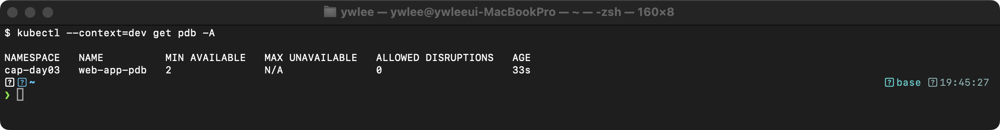

ALLOWED DISRUPTIONS가 0이면 현재 더 이상 Pod를 퇴거할 수 없다는 의미이다. replicas를 늘리거나, 다른 노드에서 추가 Pod가 Running 상태가 되어야 drain이 진행된다.

### 8.3 업그레이드 후 kubelet이 시작되지 않는 경우

**증상:** `kubectl get nodes`에서 해당 노드의 VERSION이 업데이트되지 않거나 NotReady 상태이다.

```bash
# 해당 노드에서 kubelet 상태 확인 (VM 이름 별칭 사용, 예: dev-worker1 또는 staging-worker1)
ssh dev-worker1
sudo systemctl status kubelet
```

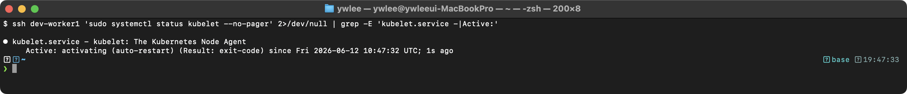

```bash
# kubelet 로그에서 에러 확인
sudo journalctl -u kubelet --since "5 min ago" | grep -i error | tail -10
```

**주요 원인:**
- `systemctl daemon-reload`를 하지 않은 경우: kubelet 서비스 파일이 변경되었으나 systemd가 이를 인식하지 못한다
- containerd와 kubelet의 cgroup 드라이버 불일치: 둘 다 `systemd`를 사용하는지 확인한다
- kubelet 버전과 kubeadm 버전 불일치: `kubeadm upgrade node` 전에 kubelet을 업그레이드하면 설정 호환성 문제가 발생한다

**동작 원리:**
1. `kubectl version`은 클라이언트(kubectl)와 서버(API Server) 버전을 모두 표시한다
2. kubeadm upgrade 시 Control Plane → Worker Node 순서로 업그레이드해야 한다
3. 모든 노드의 kubelet 버전이 동일한지 확인하는 것이 업그레이드 전 필수 점검 사항이다

---

## 자가점검

아래 질문에 답하지 못하면 해당 절로 돌아가 다시 읽는다.

<details>
<summary>Q1. etcd 인증서 4종(--cacert / --cert / --key / --endpoints)의 역할을 각각 한 줄로 서술하라.</summary>

- `--endpoints`: etcd gRPC 서버 주소. kube-apiserver가 사용하는 `https://127.0.0.1:2379`가 기본값이다.
- `--cacert`: CA 인증서. etcd 서버가 제시한 TLS 인증서를 이 CA로 서명했는지 검증해 서버의 신원을 확인한다.
- `--cert`: 클라이언트 인증서. mTLS(상호 TLS)에서 "나는 권한 있는 클라이언트"임을 etcd 서버에 증명한다.
- `--key`: 클라이언트 개인키. `--cert`의 인증서와 쌍을 이루는 비밀키로, TLS 핸드셰이크 시 이 키로 서명해 인증서의 실제 소유자임을 증명한다.

</details>

<details>
<summary>Q2. snapshot restore에 인증서 옵션이 불필요한 이유를 설명하라.</summary>

TLS 인증서는 네트워크를 통한 클라이언트-서버 통신의 신원 검증 수단이다. restore는 로컬 디스크의 스냅샷 파일을 직접 읽어 새 디렉터리에 쓰는 작업이므로 네트워크 연결 자체가 없고 TLS가 개입할 지점이 없다. 반면 snapshot save는 etcd 서버에 gRPC로 접속하는 네트워크 작업이므로 인증서가 필요하다.

</details>

<details>
<summary>Q3. Control Plane 업그레이드와 Worker Node 업그레이드에서 kubeadm 명령이 다른 이유를 설명하라.</summary>

Control Plane 첫 번째 노드는 `kubeadm upgrade apply v1.XX.Y`를 사용한다. 이 노드가 apiserver·scheduler·controller-manager·etcd의 Static Pod 매니페스트를 실제로 갱신하고, 애드온(CoreDNS, kube-proxy)과 인증서도 업데이트하는 주체이기 때문이다. Worker 노드는 `kubeadm upgrade node`를 사용한다. 이 명령은 Control Plane에서 새 kubelet 설정만 내려받아 로컬에 적용할 뿐이므로 버전 인자가 불필요하다.

</details>

<details>
<summary>Q4. drain / cordon / uncordon의 차이와 각 명령이 노드 상태에 미치는 영향을 설명하라.</summary>

- `cordon`: 노드의 `spec.unschedulable: true`를 설정해 새 Pod 스케줄링만 차단한다. 기존 실행 중인 Pod는 그대로 유지된다.
- `drain`: cordon을 수행한 뒤 노드에서 실행 중인 Pod를 다른 노드로 퇴거(eviction)한다. DaemonSet Pod는 다른 노드로 이동 불가하므로 `--ignore-daemonsets` 옵션으로 무시한다.
- `uncordon`: `spec.unschedulable: false`로 되돌려 노드를 스케줄링 대상으로 복원한다. drain으로 퇴거된 Pod가 자동으로 돌아오지는 않고, 새 Pod부터 이 노드에 스케줄될 수 있게 된다.

</details>

<details>
<summary>Q5. etcd restore 후 `kubectl get nodes`가 응답하지 않을 때 가장 먼저 확인할 것은 무엇인가?</summary>

`sudo crictl ps | grep etcd`로 etcd 컨테이너가 Running 상태인지 확인한다. etcd가 기동되지 않았다면 `/etc/kubernetes/manifests/etcd.yaml`의 `volumes.hostPath.path`가 restore에서 지정한 `--data-dir` 경로와 일치하는지 점검한다. 불일치가 원인인 경우가 가장 많다.

</details>

<details>
<summary>Q6. 패키지 버전 표기 `kubeadm=1.31.0-1.1`에서 `-1.1`이 무엇인지, 시험에서 올바른 문자열을 찾는 방법을 설명하라.</summary>

`1.31.0`은 쿠버네티스 버전이고, `-1.1`은 Debian 패키지 빌드 리비전 번호이다. 쿠버네티스 버전이 같더라도 패키지 리비전은 달라질 수 있다. 시험에서 정확한 문자열을 확인하려면 `apt-cache madison kubeadm`을 실행해 목록에서 원하는 버전의 정확한 문자열을 복사해서 사용한다.

</details>

<details>
<summary>Q7. etcd 업그레이드 순서에서 Control Plane을 Worker보다 먼저 올려야 하는 이유를 버전 스큐 정책과 연결해 설명하라.</summary>

공식 쿠버네티스 버전 스큐 정책상 kubelet은 kube-apiserver보다 높으면 안 된다. kubelet(Worker에 있음)이 apiserver보다 앞선 버전이 되면 kubelet이 apiserver가 아직 지원하지 않는 API를 사용하려 할 수 있어 동작이 정의되지 않는다. 따라서 apiserver가 포함된 Control Plane을 먼저 올린 뒤, kubelet이 있는 Worker 노드를 올린다. 이 순서를 지키면 어느 시점에도 kubelet이 apiserver를 앞서지 않는다.

</details>

---

## 시험 팁

- **etcd 백업/복구는 속도가 관건이다.** 인증서 경로 4개를 외우지 못해도 `kubectl -n kube-system get pod etcd-<master> -o yaml | grep -E "cert|key|ca"`로 30초 안에 찾을 수 있다. 이 패턴을 반사적으로 실행할 수 있게 손에 익혀 둔다.
- **restore에 인증서를 넣는 실수가 가장 흔하다.** `snapshot restore`는 인증서가 없어야 한다. 넣어도 동작하지만 불필요한 타이핑으로 시간을 낭비한다.
- **`--data-dir`과 `hostPath.path`를 반드시 함께 바꾼다.** 둘 중 하나만 바꾸면 etcd가 빈 디렉터리를 읽어 클러스터가 비어 보인다. `sed -i`로 hostPath.path를 바꾼 뒤 `grep "path: /var/lib/etcd" etcd.yaml`로 즉시 검증한다.
- **Worker 업그레이드는 `kubeadm upgrade node`다.** `apply`와 `node`를 혼동하지 않는다. `apply`는 버전 인자가 필요하고 Control Plane 첫 번째 노드에서만 쓴다.
- **drain 후 uncordon을 빠뜨리지 않는다.** 업그레이드 완료 후 uncordon하지 않으면 노드가 `Ready,SchedulingDisabled` 상태로 남아 채점 시 감점 요인이 된다.
- **패키지 버전 문자열은 `apt-cache madison kubeadm`으로 확인한다.** `1.31.0-1.1`처럼 리비전 번호까지 정확히 맞춰야 설치된다.
- **복구 후 대기는 `until` 루프를 쓴다.** `sleep 60` 같은 고정 대기는 환경에 따라 너무 짧거나 길어 오판을 유발한다.

---

## 더 읽을거리

- [etcd 공식 문서 — Disaster Recovery](https://etcd.io/docs/current/op-guide/recovery/) : snapshot save/restore의 원리와 멀티노드 클러스터 복구 절차 상세 설명
- [쿠버네티스 공식 문서 — etcd 백업](https://kubernetes.io/docs/tasks/administer-cluster/configure-upgrade-etcd/#backing-up-an-etcd-cluster) : CKA 시험에서 참조 가능한 공식 페이지
- [쿠버네티스 공식 문서 — kubeadm upgrade](https://kubernetes.io/docs/tasks/administer-cluster/kubeadm/kubeadm-upgrade/) : 업그레이드 전체 절차 및 버전별 주의사항
- [쿠버네티스 버전 스큐 정책](https://kubernetes.io/releases/version-skew-policy/) : apiserver·kubelet·kubectl 간 허용 버전 차이 규칙
- [etcd Raft 논문 (Ongaro & Ousterhout 2014)](https://raft.github.io/raft.pdf) : etcd 합의 알고리즘의 원리를 깊이 이해하려면 이 논문을 읽는다

