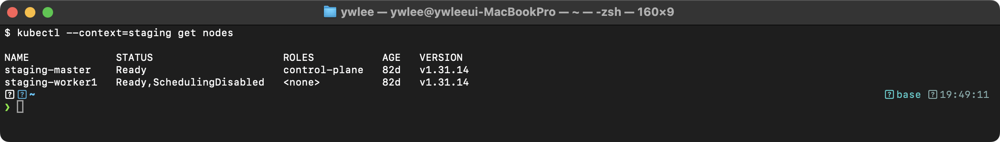
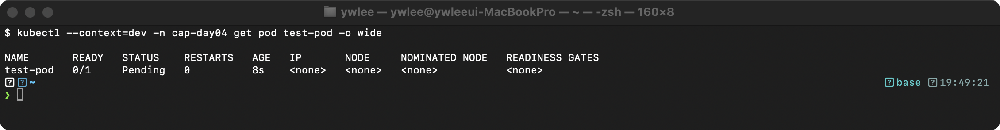
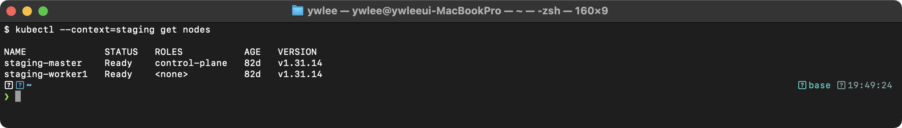
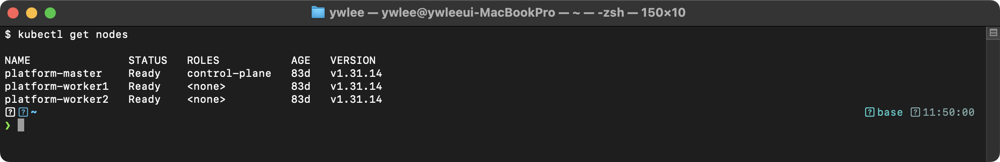
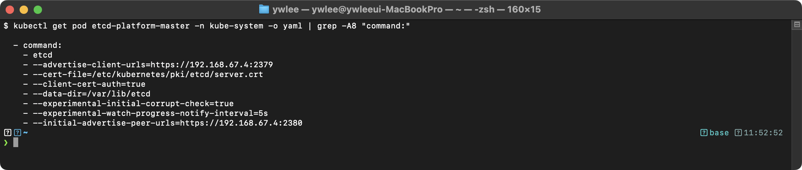
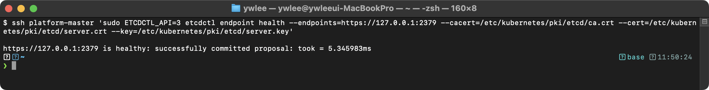
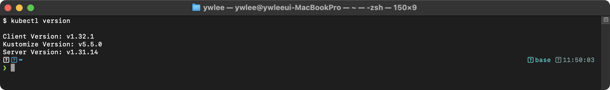
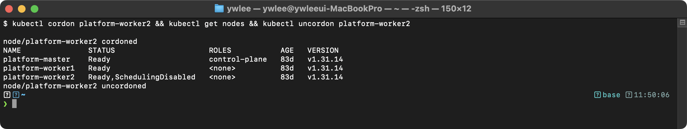
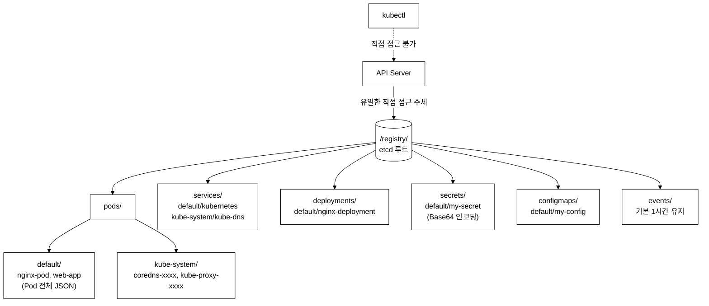
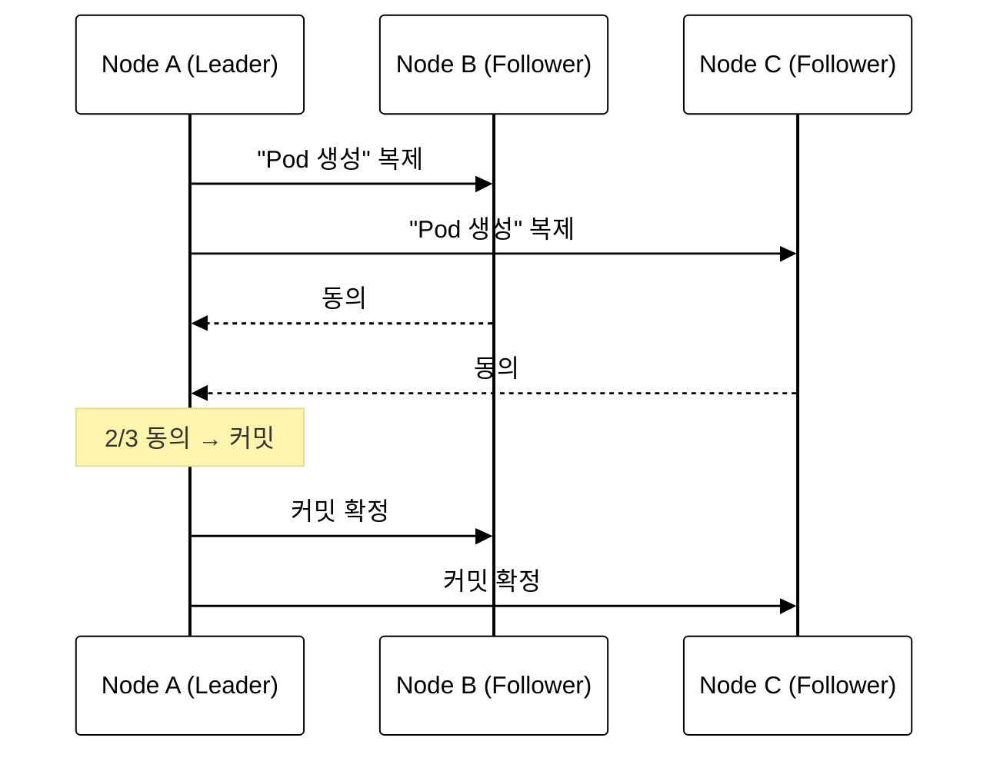

# CKA Day 4: etcd & 업그레이드 시험 문제 심화

> CKA 도메인: Cluster Architecture (25%) - Part 2 심화 | 예상 소요 시간: 2시간

> Day 3에서 etcd 스냅샷 백업/복구(문제 1~4)를 다뤘다. Day 4는 그 후속으로 클러스터 관리 심화(cordon/업그레이드/etcd 상태 확인)를 다룬다.

---

## 오늘의 학습 목표

- [ ] cordon과 uncordon의 동작 차이를 설명할 수 있다(taint 추가 메커니즘 포함)
- [ ] Control Plane 업그레이드 순서 7단계를 apt 저장소 전환 포함하여 재현할 수 있다
- [ ] `etcdctl member list` 명령에 필요한 인증서 옵션 4개(`--endpoints`, `--cacert`, `--cert`, `--key`)를 암기한다
- [ ] drain 실패 원인 4가지(단독 Pod, emptyDir, DaemonSet, PDB)를 설명하고 각 해결 플래그를 쓸 수 있다

---

## 실습 환경 설정 (먼저 읽는다)

이 Day 의 문제들은 자리표(`<staging-master-ip>` 등)로 노드를 가리킨다. 실제 환경에서 이 값을 어떻게 얻는지부터 정리한다. 이 저장소의 tart 멀티클러스터를 실습장으로 쓴다.

```bash
# 1) 대상 클러스터에 접속 (kubeconfig 경로는 가동 시 자동 생성됨)
export KUBECONFIG=~/sideproejct/IaC_apple_sillicon/kubeconfig/staging.yaml
kubectl get nodes              # 노드 이름 확인 (staging-master, staging-worker1 ...)

# 2) 실제 내부 IP 가 필요할 때 — INTERNAL-IP 컬럼에서 읽는다
kubectl get nodes -o wide      # <staging-master-ip> 자리에 INTERNAL-IP 값을 넣는다
# 또는 호스트(macOS)에서 직접:  tart ip staging-master

# 3) SSH 접속 — 전용 키가 전 노드에 배포돼 VM 이름 별칭으로 바로 들어간다
ssh staging-master             # 문서의 'ssh admin@<...-ip>' 대신 별칭으로 접속 가능
```

문제 본문은 `ssh admin@<ip>` 형태로 쓰지만, 이 저장소에서는 `ssh staging-master` 처럼 VM 이름만으로 접속된다(`~/.ssh/config` 관리 블록 + `tart ip` 기반 `ProxyCommand`). IP 자리표가 나오면 위 2)번으로 실제 값을 채우면 된다. 파괴 실습은 `dev`/`staging` 에서만 한다(platform/prod 금지).

---

### 문제 5. cordon과 uncordon [4%]

**컨텍스트:** `kubectl config use-context staging`

(사실 확인) 이 저장소의 `staging` 클러스터는 master 1 + worker 1 로 구성된다(`config/clusters.json` 기준). 즉 워크로드를 받을 수 있는 워커가 `staging-worker1` 하나뿐이다. 이 문제는 그 유일한 워커를 cordon 했을 때 새 Pod 가 갈 곳이 없어지는 상황을 다룬다. 워커가 2개 이상인 클러스터라면 cordon 후에도 다른 워커로 배치되므로, 아래 "Pending" 결과는 워커가 1개일 때의 이야기다.

(cordon 의 메커니즘) `kubectl cordon` 은 Node 오브젝트에 `node.kubernetes.io/unschedulable` 이라는 taint 를 추가하고 `.spec.unschedulable=true` 필드를 set 한다. taint(오염)는 "이 노드는 특정 조건을 만족하는 Pod 만 받는다"는 표식이고, 이를 견디겠다는 Pod 쪽 표식이 toleration(허용)이다. cordon 이 붙인 taint 에는 대응 toleration 이 없으므로 kube-scheduler 가 신규 Pod 의 후보 노드에서 이 노드를 제외한다. 이미 떠 있는 Pod 는 건드리지 않는다(퇴거는 drain 의 몫). 결과적으로 `kubectl get node -o wide` 의 STATUS 컬럼이 `Ready` 에서 `Ready,SchedulingDisabled` 로 바뀐다 — 노드는 살아 있지만(Ready) 신규 스케줄만 막힌(SchedulingDisabled) 상태다.

1. `staging-worker1` 노드를 스케줄링 불가로 설정하라 (기존 Pod는 유지)
2. 새 Pod `test-pod`(이미지: nginx)를 생성하고 어느 노드에 배치되는지 확인하라
3. `staging-worker1` 노드를 다시 스케줄링 가능으로 복원하라

<details>
<summary>풀이 과정</summary>

```bash
kubectl config use-context staging

# 1. cordon (스케줄링만 차단, 기존 Pod 유지)
kubectl cordon staging-worker1
kubectl get nodes
```

**검증 - 기대 출력 (cordon 후):**


```bash
# 2. 새 Pod 생성
kubectl run test-pod --image=nginx
kubectl get pod test-pod -o wide
```

**검증 - 기대 출력:**


worker1을 cordon 한 상태에서는 test-pod가 Pending 으로 남는다. SchedulingDisabled 상태이므로 kube-scheduler가 해당 노드를 후보에서 제외하고, control-plane 노드는 `node-role.kubernetes.io/control-plane:NoSchedule` taint 때문에 스케줄 대상이 아니다(worker가 하나뿐이면 배치할 노드가 없다). uncordon 하면 worker1로 배치된다.

```bash
# 3. uncordon (스케줄링 재개)
kubectl uncordon staging-worker1
kubectl get nodes

# 정리
kubectl delete pod test-pod
```

> platform 클러스터에서의 cordon/uncordon 실측 캡처는 아래 [tart-infra 실습 → 실습 4: drain/cordon 동작 확인](#실습-4-draincordon-동작-확인-문제-5의-platform-클러스터-재현)을 참조한다(day04-10-cordon.png).

</details>

---

### 문제 6. Control Plane 업그레이드 [7%]

**컨텍스트:** `kubectl config use-context staging`

`staging-master` 노드의 쿠버네티스를 v1.30.x에서 v1.31.0으로 업그레이드하라. kubeadm, kubelet, kubectl을 모두 업그레이드하라.

**(업그레이드가 필요한 배경)** K8s 마이너 버전은 출시 후 약 14개월간 패치 지원을 받는다. 지원 기간이 끝난 버전에는 새로운 CVE(Common Vulnerabilities and Exposures, 공개 취약점 데이터베이스 항목) 보안 패치가 제공되지 않으므로, 운영 클러스터는 현재 지원 범위 안의 마이너 버전으로 유지해야 한다. 트레이드오프로는 업그레이드 중 kubelet 재시작 구간에 해당 노드의 워크로드가 일시 불가용 상태가 되는 점을 감안해야 하고, 롤링 업그레이드 방식으로 한 노드씩 올려 전체 서비스 중단을 최소화한다.

**(왜 이 순서로 올리는가)** K8s 는 컴포넌트 버전이 제멋대로 섞이는 것을 막기 위해 버전 스큐(version skew) 정책을 둔다. 핵심 규칙은 두 가지다. ① 한 번에 마이너 버전 1개씩만 올린다(v1.30 → v1.32 같은 건너뛰기 금지, v1.30 → v1.31 → v1.32). ② kubelet 은 kube-apiserver 보다 높을 수 없고, 최대 2 마이너 버전까지 뒤처져도 된다(apiserver 가 v1.31 이면 kubelet 은 v1.31/1.30/1.29 허용). 이 규칙 때문에 Control Plane(특히 apiserver)을 먼저 올려야, 아직 옛 버전인 워커 노드의 kubelet 이 새 apiserver 와 계속 호환된다. 워커를 먼저 올리면 kubelet 이 apiserver 보다 앞서가 정책 위반이 된다.

이 제약이 그대로 작업 순서가 된다. ⓐ `kubeadm` 패키지(업그레이드를 수행하는 도구 자체)를 먼저 설치한다 — 새 버전으로 올리는 로직은 새 kubeadm 에 들어 있다. ⓑ `kubeadm upgrade plan` 으로 현재 버전에서 올릴 수 있는 대상 버전을 확인한다. ⓒ `kubeadm upgrade apply v1.31.0` 가 Control Plane 컴포넌트(kube-apiserver, kube-controller-manager, kube-scheduler, etcd)의 정적 파드(static pod) 매니페스트 이미지 태그를 새 버전으로 교체한다 — 이들은 한 노드에 함께 떠 있는 컨트롤 플레인 묶음이라 같이 올라간다. ⓓ 그 노드에서 도는 워크로드를 다른 노드로 옮기려고 `drain` 한다(서비스 중단 최소화). ⓔ 마지막으로 그 노드의 에이전트인 `kubelet`/`kubectl` 패키지를 올리고 재시작한다. 이 ⓐ→ⓔ 순서를 어기면 호환성이 깨지거나 업그레이드가 중단된다.

<details>
<summary>풀이 과정</summary>

```bash
# 현재 버전 확인
kubectl config use-context staging
kubectl get nodes

# SSH 접속 (이 저장소에서는 VM 이름 별칭으로 접속한다 — ~/.ssh/config 관리 블록)
ssh staging-master

# 0. kubernetes apt 저장소를 v1.31 용으로 전환한다
#    pkgs.k8s.io 는 마이너 버전별로 저장소가 분리돼 있어,
#    기존 v1.30 저장소에는 kubeadm=1.31.0-1.1 패키지가 존재하지 않는다.
#    저장소를 먼저 바꾸지 않으면 apt-get install 이 즉시 실패한다.
sudo sed -i 's/v1\.30/v1.31/' /etc/apt/sources.list.d/kubernetes.list
sudo apt-get update

# 1. kubeadm 업그레이드
sudo apt-mark unhold kubeadm
sudo apt-get install -y kubeadm=1.31.0-1.1
sudo apt-mark hold kubeadm

# 2. 업그레이드 계획 확인
sudo kubeadm upgrade plan

# 3. Control Plane 컴포넌트 업그레이드
sudo kubeadm upgrade apply v1.31.0

# 4. 노드 drain (다른 터미널에서)
exit
kubectl drain staging-master --ignore-daemonsets --delete-emptydir-data

# 5. kubelet, kubectl 업그레이드
ssh staging-master
sudo apt-mark unhold kubelet kubectl
sudo apt-get install -y kubelet=1.31.0-1.1 kubectl=1.31.0-1.1
sudo apt-mark hold kubelet kubectl

# 6. kubelet 재시작
sudo systemctl daemon-reload
sudo systemctl restart kubelet

# 7. uncordon
exit
kubectl uncordon staging-master

# 8. 확인
kubectl get nodes
```

**검증 - 기대 출력:**

# (예시 — 환경에 따라 다름. 파괴적 업그레이드라 실측하지 않음)

staging-master의 VERSION이 새 버전으로 변경된 것을 확인한다. Worker Node는 아직 이전 버전이다.

</details>

---

### 문제 7. Worker Node 업그레이드 [7%]

**컨텍스트:** `kubectl config use-context staging`

`staging-worker1` 노드를 `staging-master`와 동일한 버전(v1.31.0)으로 업그레이드하라.

<details>
<summary>풀이 과정</summary>

```bash
kubectl config use-context staging

# 1. drain
kubectl drain staging-worker1 --ignore-daemonsets --delete-emptydir-data

# 2. SSH 접속 (이 저장소에서는 VM 이름 별칭으로 접속한다 — ~/.ssh/config 관리 블록)
ssh staging-worker1

# 3. 저장소 전환 (Control Plane 업그레이드와 동일하게 먼저 수행)
#    pkgs.k8s.io 는 마이너 버전별 저장소가 분리돼 있어,
#    기존 v1.30 저장소에는 kubeadm=1.31.0-1.1 패키지가 존재하지 않는다.
#    이 단계를 생략하면 다음 apt-get install 이 즉시 실패한다.
sudo sed -i 's/v1\.30/v1.31/' /etc/apt/sources.list.d/kubernetes.list
sudo apt-get update

# 4. kubeadm 업그레이드
sudo apt-mark unhold kubeadm
sudo apt-get install -y kubeadm=1.31.0-1.1
sudo apt-mark hold kubeadm

# 5. 노드 설정 업그레이드 (apply가 아닌 node!)
sudo kubeadm upgrade node

# 6. kubelet, kubectl 업그레이드
sudo apt-mark unhold kubelet kubectl
sudo apt-get install -y kubelet=1.31.0-1.1 kubectl=1.31.0-1.1
sudo apt-mark hold kubelet kubectl

# 7. 재시작
sudo systemctl daemon-reload
sudo systemctl restart kubelet

# 8. uncordon
exit
kubectl uncordon staging-worker1

# 9. 확인
kubectl get nodes
```

**핵심:** Worker Node에서는 `kubeadm upgrade node` (apply가 아님!)

</details>

---

### 문제 8. etcd 멤버 상태 확인 [4%]

**컨텍스트:** `kubectl config use-context platform`

(배경) etcd 는 K8s 클러스터의 모든 상태(Pod·Service·Secret·ConfigMap 등 모든 오브젝트)를 담는 분산 key-value 저장소다. apiserver 만 etcd 에 직접 쓰며, etcd 가 멈추면 클러스터의 어떤 변경도 저장되지 않는다. etcd 는 여러 노드로 복제되는데, 데이터 일관성을 위해 Raft(노드들이 다수결로 하나의 값에 합의하는 알고리즘) 합의를 쓴다. 쓰기는 과반(quorum, 과반수)이 동의해야 커밋된다 — 3 노드면 2개, 5 노드면 3개가 살아 있어야 쓰기가 가능하다. 그래서 업그레이드나 백업처럼 위험한 작업 전에는 멤버가 모두 살아 있고 quorum 이 깨지지 않았는지부터 확인한다. 멤버 하나가 죽은 줄 모르고 작업하면 그 사이 또 하나가 죽어 quorum 을 잃고 클러스터 전체가 읽기 전용으로 멈출 수 있다.

(명령의 의미) `etcdctl` 은 etcd 클러스터를 다루는 CLI 다. `ETCDCTL_API=3` 은 etcd v3 API(현재 표준, v2 는 deprecated)를 쓰라는 환경변수다. `--endpoints=https://127.0.0.1:2379` 는 접속할 etcd 서버 주소로, master 노드 안에서 자기 자신의 클라이언트 포트(2379)를 가리킨다. etcd 는 mTLS(양쪽이 서로 인증서로 신원을 증명하는 TLS)로만 통신을 받으므로 인증서 3개가 필요하다 — `--cacert`(이 인증서를 발급한 CA 를 신뢰), `--cert`/`--key`(클라이언트인 나 자신을 증명하는 인증서와 개인키). 이 경로들은 etcd 정적 파드가 마운트하는 `/etc/kubernetes/pki/etcd` 아래에 있다.

etcd 클러스터의 멤버 상태와 엔드포인트 건강 상태를 확인하여 `/tmp/etcd-health.txt`에 저장하라.

<details>
<summary>풀이 과정</summary>

```bash
# 이 저장소에서는 VM 이름 별칭으로 접속한다 — ~/.ssh/config 관리 블록
ssh platform-master

# 멤버 목록
sudo ETCDCTL_API=3 etcdctl member list \
  --endpoints=https://127.0.0.1:2379 \
  --cacert=/etc/kubernetes/pki/etcd/ca.crt \
  --cert=/etc/kubernetes/pki/etcd/server.crt \
  --key=/etc/kubernetes/pki/etcd/server.key \
  --write-out=table > /tmp/etcd-health.txt

# 건강 상태
sudo ETCDCTL_API=3 etcdctl endpoint health \
  --endpoints=https://127.0.0.1:2379 \
  --cacert=/etc/kubernetes/pki/etcd/ca.crt \
  --cert=/etc/kubernetes/pki/etcd/server.crt \
  --key=/etc/kubernetes/pki/etcd/server.key >> /tmp/etcd-health.txt

cat /tmp/etcd-health.txt
exit
```

> platform 클러스터의 실측 출력은 아래 [tart-infra 실습 → 실습 2: etcd 스냅샷 백업 시뮬레이션](#실습-2-etcd-스냅샷-백업-시뮬레이션)의 `endpoint health` 캡처(day04-11-etcd-health.png)를 참조한다.

</details>

---

### 문제 9. 업그레이드 사전 확인 [4%]

**컨텍스트:** `kubectl config use-context staging`

다음 작업을 수행하라:
1. 현재 클러스터의 모든 노드 버전을 확인하라
2. `kubeadm upgrade plan`의 결과를 `/tmp/upgrade-plan.txt`에 저장하라
3. drain을 시뮬레이션(dry-run)하라

<details>
<summary>풀이 과정</summary>

```bash
kubectl config use-context staging

# 1. 노드 버전 확인
kubectl get nodes -o wide

# 2. 업그레이드 계획 (이 저장소에서는 VM 이름 별칭으로 접속)
ssh staging-master
sudo kubeadm upgrade plan > /tmp/upgrade-plan.txt 2>&1
cat /tmp/upgrade-plan.txt

# 3. drain 시뮬레이션
exit
kubectl drain staging-master --ignore-daemonsets --delete-emptydir-data --dry-run=client
# 주의: --dry-run=client 는 대상 Pod 목록을 나열할 뿐,
# 실제 eviction API 를 호출하지 않고 클라이언트에서만 평가한다.
# PDB(PodDisruptionBudget) 위반 여부는 dry-run 으로 확인되지 않는다.
# 실제 drain 전에 kubectl get pdb -A 로 PDB 가 있는지 별도로 확인해야 한다.
```

</details>

---

### 문제 10. etcd 데이터 디렉터리 확인 [4%]

**컨텍스트:** `kubectl config use-context platform`

(앞 단계와의 연결) 문제 8~9 에서 etcd 멤버·엔드포인트가 건강한지 확인했다. 다음으로 점검할 것은 저장 용량이다. etcd 데이터베이스는 시간이 갈수록 커진다 — Pod·Event 등 오브젝트가 누적되고, 기본적으로 과거 리비전(이력)도 일정량 보관하기 때문이다. 데이터 디렉터리가 있는 디스크가 가득 차면 etcd 는 쓰기를 거부하고(`mvcc: database space exceeded` 등) 클러스터 전체가 변경 불가 상태로 떨어진다. 업그레이드는 컨트롤 플레인 파드를 재기동하는 위험 작업이므로, 그 전에 데이터 디렉터리 경로와 현재 사용량을 확인해 여유가 있는지 본다. 이 점검이 끝나면 문제 11 의 인증서 만료 확인으로 넘어간다.

etcd의 데이터 디렉터리 경로와 사용 중인 디스크 공간을 확인하여 `/tmp/etcd-storage.txt`에 저장하라.

<details>
<summary>풀이 과정</summary>

```bash
# etcd 데이터 디렉터리 확인
kubectl -n kube-system get pod etcd-platform-master -o yaml | \
  grep "\-\-data-dir" > /tmp/etcd-storage.txt

# SSH 접속하여 디스크 사용량 확인 (이 저장소에서는 VM 이름 별칭으로 접속)
ssh platform-master
sudo du -sh /var/lib/etcd >> /tmp/etcd-storage.txt
cat /tmp/etcd-storage.txt
exit
```

</details>

---

### 문제 11. 인증서 갱신 확인 [4%]

**컨텍스트:** `kubectl config use-context platform`

모든 쿠버네티스 인증서의 만료일을 확인하고, 만료까지 30일 이내인 인증서가 있는지 확인하라.

(왜 중요한가) K8s 의 컴포넌트 간 통신은 모두 TLS 인증서로 암호화·인증된다(apiserver↔etcd, kubelet↔apiserver, controller-manager↔apiserver 등). kubeadm 으로 만든 클러스터의 이 인증서들은 기본 유효기간이 1년이라, 갱신하지 않으면 만료된 순간 해당 통신이 끊겨 클러스터가 동작 불능이 된다. `kubeadm certs check-expiration` 은 kubeadm 이 관리하는 모든 인증서의 만료일을 한 표로 보여준다. 개별 확인은 `openssl x509 -enddate` 로 인증서 파일의 만료일(notAfter)을 읽는다. 만료가 임박한 인증서가 있으면 `kubeadm certs renew all` 로 갱신한다. kubeadm 은 `kubeadm upgrade apply` 를 실행할 때 컨트롤 플레인 인증서를 자동 갱신하므로, 업그레이드 작업이 곧 인증서 갱신의 기회가 된다 — 그래서 업그레이드 전후에 만료일을 함께 점검한다.

<details>
<summary>풀이 과정</summary>

```bash
# 이 저장소에서는 VM 이름 별칭으로 접속한다 — ~/.ssh/config 관리 블록
ssh platform-master

# 모든 인증서 만료일 확인
# 출력의 EXPIRES 컬럼이 각 인증서 만료일이다.
# 현재 날짜와 비교해 30일 이내인 행을 육안으로 찾거나 아래 openssl 명령으로 자동 필터링한다.
sudo kubeadm certs check-expiration

# 개별 인증서 확인 — 만료일(notAfter) 출력
for cert in /etc/kubernetes/pki/*.crt; do
  echo "=== $cert ==="
  sudo openssl x509 -in $cert -noout -enddate
done

# 30일(= 2592000초) 이내 만료 인증서 자동 필터링
# -checkend N: 지금부터 N초 안에 만료되면 exit code 1 → 해당 인증서 경로를 출력한다
for cert in /etc/kubernetes/pki/*.crt; do
  if sudo openssl x509 -in "$cert" -noout -checkend 2592000 2>/dev/null; then
    :  # 30일 이상 남음 — 정상
  else
    echo "만료 임박(30일 이내): $cert"
  fi
done

exit
```

</details>

---

### 문제 12. drain 실패 시 해결 [7%]

**컨텍스트:** `kubectl config use-context dev`

`dev-worker1` 노드를 drain하려고 했으나 실패한다. 원인을 파악하고 해결하라.

(왜 drain 이 쉽게 실패하는가) `drain` 은 노드의 Pod 를 퇴거(eviction)시켜 노드를 비우는 작업이다. 그런데 K8s 는 데이터 손상이나 가용성 붕괴를 막기 위해 일부러 퇴거를 거부하는 안전장치를 여럿 둔다. ① 컨트롤러(ReplicaSet/Deployment/StatefulSet 등) 없이 사람이 직접 만든 단독 Pod 는 노드에서 사라지면 다시 살아날 곳이 없다 → 기본적으로 거부, `--force` 로만 강제(이 Pod 는 그냥 삭제되고 복구되지 않는다). ② `emptyDir` 등 노드 로컬 스토리지를 쓰는 Pod 는 퇴거 시 그 안의 데이터가 사라지므로 거부 → `--delete-emptydir-data` 로 데이터 손실을 명시적으로 승인해야 진행된다. ③ DaemonSet 이 만든 Pod 는 모든 노드에 하나씩 떠 있어야 하므로 퇴거 대상이 아니다 → `--ignore-daemonsets` 로 무시한다. ④ PodDisruptionBudget(PDB, 동시에 죽어도 되는 Pod 수의 하한선) 이 걸려 있으면, 퇴거가 그 한도를 깰 경우 차단된다 → PDB 를 확인·조정해야 한다. 따라서 drain 이 실패하면 에러 메시지가 위 네 원인 중 어느 것인지 알려주므로, 그에 맞는 플래그를 더하거나 PDB 를 손봐 해결한다.

<details>
<summary>풀이 과정</summary>

```bash
kubectl config use-context dev

# ── 사전 준비: 실패 상황 재현 ──────────────────────────────────────────────
# 아무것도 없는 dev-worker1 을 drain 하면 성공해버려 문제 상황을 볼 수 없다.
# drain 이 거부되는 세 가지 케이스를 직접 만든다.

# 케이스 ①: 컨트롤러(ReplicaSet/Deployment 등) 없이 직접 만든 단독 Pod
#   → drain 시 "cannot delete Pods not managed by ..." 오류를 유발한다
kubectl run solo --image=nginx --overrides='{"spec":{"nodeName":"dev-worker1"}}'

# 케이스 ②: emptyDir 볼륨을 쓰는 Pod
#   emptyDir(노드 로컬 임시 디렉터리) — 컨테이너가 재시작돼도 같은 Pod 내에서는 유지되나,
#   Pod 자체가 삭제되면 안의 데이터가 사라진다.
#   → drain 시 "cannot delete Pods with local storage" 오류를 유발한다
kubectl run emp --image=nginx \
  --overrides='{"spec":{"nodeName":"dev-worker1","volumes":[{"name":"tmp","emptyDir":{}}],"containers":[{"name":"emp","image":"nginx","volumeMounts":[{"name":"tmp","mountPath":"/tmp/data"}]}]}}'

# Pod 가 Running 이 될 때까지 대기
kubectl wait pod/solo pod/emp --for=condition=Ready --timeout=60s
# ──────────────────────────────────────────────────────────────────────────

# drain 시도 — 위 Pod 들이 있으면 아래처럼 오류 메시지가 출력된다
kubectl drain dev-worker1 --ignore-daemonsets
# 오류 발생 가능:
# "cannot delete Pods with local storage" → --delete-emptydir-data 추가
# "cannot delete Pods not managed by ReplicationController, ReplicaSet, Job, DaemonSet or StatefulSet" → --force 추가

# 해결: 필요한 옵션 추가
kubectl drain dev-worker1 --ignore-daemonsets --delete-emptydir-data --force

# 또는 문제 Pod를 먼저 확인
kubectl get pods -A -o wide | grep dev-worker1

# 확인
kubectl get nodes

# 복원
kubectl uncordon dev-worker1
```

**일반적인 drain 실패 원인:**
1. 단독 Pod (ReplicaSet 없음) → `--force` 필요
2. emptyDir 사용 Pod → `--delete-emptydir-data` 필요
3. DaemonSet Pod → `--ignore-daemonsets` 필요
4. PDB(PodDisruptionBudget) 제한 → PDB 확인/수정

</details>

---

## 추가 YAML 예제

### 8.1 etcd 백업 CronJob

(수동 백업과의 차이) 앞 문제들의 `etcdctl snapshot save` 는 사람이 그때그때 한 번 실행하는 임시 백업이다 — 업그레이드 직전처럼 특정 시점을 보존할 때 쓴다. 반면 운영 클러스터는 장애가 언제 날지 모르므로 일정 주기로 자동 백업을 남겨야 한다. 아래 CronJob 은 같은 `snapshot save` 명령을 정해진 스케줄(`schedule`)에 따라 클러스터 스스로 반복 실행하게 만든 것이다. 일회성이면 수동, 상시 운영이면 CronJob 으로 자동화한다.

```yaml
# 자동 etcd 백업을 위한 CronJob
apiVersion: batch/v1
kind: CronJob
metadata:
  name: etcd-backup
  namespace: kube-system
spec:
  schedule: "0 */6 * * *"                # 매 6시간마다 실행
  concurrencyPolicy: Forbid               # 이전 Job 실행 중이면 새 Job 생성 안 함
  successfulJobsHistoryLimit: 3            # 성공 Job 이력 3개 보존
  failedJobsHistoryLimit: 1               # 실패 Job 이력 1개 보존
  jobTemplate:
    spec:
      template:
        spec:
          hostNetwork: true                # 호스트 네트워크 사용 (etcd 접속용)
          containers:
          - name: backup
            image: registry.k8s.io/etcd:3.5.15-0
            command:
            - /bin/sh
            - -c
            - |
              ETCDCTL_API=3 etcdctl snapshot save /backup/etcd-$(date +%Y%m%d-%H%M%S).db \
                --endpoints=https://127.0.0.1:2379 \
                --cacert=/etc/kubernetes/pki/etcd/ca.crt \
                --cert=/etc/kubernetes/pki/etcd/server.crt \
                --key=/etc/kubernetes/pki/etcd/server.key
            volumeMounts:
            - name: etcd-certs
              mountPath: /etc/kubernetes/pki/etcd
              readOnly: true
            - name: backup-dir
              mountPath: /backup
          restartPolicy: OnFailure
          nodeSelector:
            node-role.kubernetes.io/control-plane: ""    # Control Plane 노드에서만 실행
          tolerations:
          - key: node-role.kubernetes.io/control-plane
            operator: Exists
            effect: NoSchedule
          volumes:
          - name: etcd-certs
            hostPath:
              path: /etc/kubernetes/pki/etcd
          - name: backup-dir
            hostPath:
              path: /opt/etcd-backups
              type: DirectoryOrCreate
```

### 8.2 PodDisruptionBudget (PDB) 예제

```yaml
# drain 시 최소 가용 Pod 수를 보장하는 PDB
apiVersion: policy/v1
kind: PodDisruptionBudget
metadata:
  name: web-app-pdb
  namespace: default
spec:
  minAvailable: 2                          # 최소 2개 Pod는 항상 가용해야 함
  # 또는: maxUnavailable: 1               # 최대 1개만 동시에 불가용 허용
  selector:
    matchLabels:
      app: web-app                         # 이 라벨을 가진 Pod에 적용
```

### 8.3 drain 시 안전한 Deployment 설정

```yaml
# drain에 안전한 Deployment 설정 예제
apiVersion: apps/v1
kind: Deployment
metadata:
  name: safe-app
spec:
  replicas: 3
  selector:
    matchLabels:
      app: safe-app
  strategy:
    type: RollingUpdate
    rollingUpdate:
      maxSurge: 1
      maxUnavailable: 0                    # 업데이트 중에도 항상 3개 유지
  template:
    metadata:
      labels:
        app: safe-app
    spec:
      # Pod Anti-Affinity: 같은 노드에 배치되지 않도록
      affinity:
        podAntiAffinity:
          preferredDuringSchedulingIgnoredDuringExecution:
          - weight: 100
            podAffinityTerm:
              labelSelector:
                matchExpressions:
                - key: app
                  operator: In
                  values:
                  - safe-app
              topologyKey: kubernetes.io/hostname
      containers:
      - name: app
        image: nginx:1.24
        resources:
          requests:
            cpu: "100m"
            memory: "128Mi"
          limits:
            cpu: "200m"
            memory: "256Mi"
        readinessProbe:
          httpGet:
            path: /
            port: 80
          initialDelaySeconds: 5
          periodSeconds: 5
```

---

## 복습 체크리스트

### 개념 확인 (Day 4 학습 목표 1:1 대응)

- [ ] cordon 이 붙이는 taint 이름(`node.kubernetes.io/unschedulable`)과 그 효과(신규 스케줄 차단, 기존 Pod 유지)를 설명할 수 있는가?
- [ ] Control Plane 업그레이드 순서 7단계(저장소 전환 → kubeadm 설치 → upgrade plan → upgrade apply → drain → kubelet/kubectl 설치·재시작 → uncordon)를 순서대로 쓸 수 있는가?
- [ ] `etcdctl member list` 에 필요한 인증서 옵션 4개(`--endpoints`, `--cacert`, `--cert`, `--key`)를 외웠는가? (환경변수 `ETCDCTL_API=3` 은 옵션이 아니라 명령 앞에 붙는 별개 항목이다)
- [ ] drain 실패 원인 4가지(단독 Pod·emptyDir·DaemonSet·PDB)와 각 해결 플래그(`--force`·`--delete-emptydir-data`·`--ignore-daemonsets`·PDB 조정)를 짝지을 수 있는가?

### 이전 내용 재확인 (Day 3)

- [ ] etcdctl snapshot save에 필요한 4개 옵션과 환경변수를 구분해 암기했는가?
- [ ] snapshot save는 인증서 필요, restore는 불필요한 이유를 설명할 수 있는가?
- [ ] etcd 복구 후 매니페스트에서 수정해야 할 부분(hostPath.path)을 정확히 알고 있는가?

### 시험 팁

1. **etcd 인증서 경로** -- 기억나지 않으면 etcd Pod의 yaml에서 확인한다
2. **snapshot restore** -- 인증서 불필요, `--data-dir`만 지정한다
3. **매니페스트 수정** -- `hostPath.path`를 새 데이터 디렉터리로 변경한다
4. **업그레이드 순서** -- kubeadm 먼저 → upgrade plan/apply → drain → kubelet → restart → uncordon
5. **Worker Node** -- `kubeadm upgrade node` (apply가 아님!)
6. **drain 옵션** -- `--ignore-daemonsets --delete-emptydir-data`는 거의 항상 필요하다
7. **시간 절약** -- `sed` 명령으로 매니페스트를 빠르게 수정한다

---

## 내일 예고

**Day 5: RBAC & 인증서 관리** -- Role, ClusterRole, Binding 구조와 kubeconfig 수동 생성, CSR 처리를 실습한다. kubectl create role/rolebinding 명령을 반드시 외워오자.

---

## tart-infra 실습

### 실습 환경 설정

```bash
# platform 클러스터에 접속 (etcd가 실행 중인 클러스터)
export KUBECONFIG=~/sideproejct/IaC_apple_sillicon/kubeconfig/platform.yaml
kubectl get nodes
```

**검증 - 기대 출력:** platform 클러스터의 3개 노드(master 1 + worker 2)가 모두 Ready 다. AGE 는 환경에 따라 다르다(platform 실측).


### 실습 1: etcd Pod 상태 및 인증서 경로 확인

```bash
# etcd Static Pod 확인
kubectl get pod etcd-platform-master -n kube-system -o yaml | grep -A5 "command:"
```

**검증 - 기대 출력 (주요 부분):** etcd 컨테이너의 `command` 인자 목록이 보인다. `--advertise-client-urls` 의 노드 IP 는 환경별로 다르다(tart 재부팅마다 변경, platform 실측).


전체 인증서 경로는 같은 yaml 에서 `grep -E "cert-file|key-file|trusted-ca|peer"` 로 확인한다: `--cert-file`/`--key-file`(server.crt/key), `--trusted-ca-file`(ca.crt), `--peer-cert-file`/`--peer-key-file`(peer.crt/key).

**동작 원리:** etcd 인증서 경로를 확인하는 이유:
1. `etcdctl snapshot save` 명령에는 `--cacert`, `--cert`, `--key` 3개 인증서 옵션이 필요하다
2. 이 경로들은 etcd Pod의 매니페스트(`/etc/kubernetes/manifests/etcd.yaml`)에서도 확인 가능하다
3. CKA 시험에서 etcd 백업 문제가 나오면 먼저 이 경로를 확인해야 한다

### 실습 2: etcd 스냅샷 백업 시뮬레이션

```bash
# etcd 엔드포인트 health 확인 (SSH로 master 노드 접속 후)
# ssh platform-master
# ETCDCTL_API=3 etcdctl endpoint health \
#   --endpoints=https://127.0.0.1:2379 \
#   --cacert=/etc/kubernetes/pki/etcd/ca.crt \
#   --cert=/etc/kubernetes/pki/etcd/server.crt \
#   --key=/etc/kubernetes/pki/etcd/server.key
```

**검증 - 기대 출력:** `is healthy` 가 나오면 etcd 가 정상이다. `took` 값은 측정마다 다르다(platform-master SSH 실측).


**동작 원리:** etcd snapshot 백업 과정:
1. `etcdctl`이 TLS 인증서로 etcd에 gRPC 연결을 맺는다
2. `snapshot save`는 etcd의 boltdb 데이터를 파일로 복사한다
3. 백업 파일에는 모든 K8s 오브젝트(Pod, Service, Secret 등)의 상태가 저장된다
4. 복구 시 `--data-dir`로 새 디렉터리를 지정하고, etcd 매니페스트의 `hostPath`를 수정한다

### 실습 3: 클러스터 버전 확인 및 업그레이드 계획

```bash
# 현재 클러스터 버전 확인
kubectl version --short 2>/dev/null || kubectl version
```

**검증 - 기대 출력:** Client/Server 버전을 확인한다. `--short` 는 1.28+ 에서 제거돼 일반 `version` 출력이 나온다(platform 실측).


```bash
# kubeadm 업그레이드 가능 버전 확인 (SSH로 master 노드 접속 후)
# ssh platform-master
# sudo kubeadm upgrade plan
```

**동작 원리:** kubeadm upgrade 절차:
1. `kubeadm upgrade plan`: 현재 버전과 업그레이드 가능한 버전을 비교한다
2. `kubeadm upgrade apply v1.x.y`: Control Plane 컴포넌트(API Server, CM, Scheduler, etcd)를 업그레이드한다
3. `kubectl drain <node>`: 워크로드를 안전하게 퇴거시킨다
4. kubelet/kubectl 패키지 업그레이드 → `systemctl restart kubelet`
5. `kubectl uncordon <node>`: 노드를 다시 스케줄 가능 상태로 전환한다

### 실습 4: drain/cordon 동작 확인 (문제 5의 platform 클러스터 재현)

```bash
# 노드 상태 확인 (SchedulingDisabled 여부)
kubectl get nodes

# cordon 테스트 (노드를 스케줄 불가 상태로 변경)
kubectl cordon platform-worker2
kubectl get nodes
```

**검증 - 기대 출력:** `cordon` 후 `platform-worker2` 의 STATUS 가 `Ready,SchedulingDisabled` 로 바뀐다(아래 캡처는 cordon→조회→uncordon 한 화면, platform 실측).


**동작 원리:** `kubectl cordon`은 노드에 `node.kubernetes.io/unschedulable` taint를 추가한다:
1. 새로운 Pod가 이 노드에 스케줄되지 않는다
2. 기존에 실행 중인 Pod는 영향을 받지 않는다
3. `kubectl drain`은 cordon + 기존 Pod 퇴거(eviction)를 함께 수행한다
4. 작업 후 반드시 `kubectl uncordon platform-worker2`로 복원한다

```bash
# 반드시 uncordon으로 복원!
kubectl uncordon platform-worker2
```

---

## (선택·발전) 추가 심화 학습: etcd 내부 구조와 Raft 합의 알고리즘

> 이 절은 시험 합격에 필수는 아닌 **발전 학습**이다. 문제 5~12 는 cordon/drain/업그레이드/etcd 상태 확인 같은 손에 익히는 기초 조작이고, 아래는 그 etcd 가 내부적으로 어떻게 데이터를 저장하고 합의하는지를 다룬다. 기초 실습이 손에 익은 뒤 읽어도 된다(처음 보는 용어가 부담되면 문제 8 의 etcd 배경 설명까지만 이해해도 시험 풀이에는 충분하다). Raft 합의의 더 깊은 내용은 Day 5 에서 이어진다.

### etcd의 데이터 저장 구조 (Key-Value 계층)


_그림 1. etcd 내부 구조 (계층적 키-값 네임스페이스). API Server만 etcd에 직접 접근한다._

### Raft 합의 알고리즘 상세 설명


_그림 2. Raft 합의 과정 (Leader-Follower 복제 프로토콜). Leader가 모든 쓰기를 처리하고 과반수(Quorum) 동의로 커밋한다. 3노드는 1노드, 5노드는 2노드 장애까지 허용하며 짝수 노드는 비추천이다._

### etcdctl 고급 명령어 YAML 예제

```yaml
# etcd 클러스터 상태 확인을 위한 스크립트
# etcd-health-check.sh

# ── etcd 엔드포인트 상태 확인 ──
# ETCDCTL_API=3: etcd v3 API를 사용한다 (v2는 deprecated)
# --endpoints: etcd 서버 주소 (기본 2379 포트)
# --cacert: etcd CA 인증서 경로
# --cert: etcd 클라이언트 인증서
# --key: etcd 클라이언트 키

# etcd 멤버 목록 확인
# ETCDCTL_API=3 etcdctl member list \
#   --endpoints=https://127.0.0.1:2379 \
#   --cacert=/etc/kubernetes/pki/etcd/ca.crt \
#   --cert=/etc/kubernetes/pki/etcd/server.crt \
#   --key=/etc/kubernetes/pki/etcd/server.key \
#   --write-out=table

# etcd 엔드포인트 건강 상태 확인
# ETCDCTL_API=3 etcdctl endpoint health \
#   --endpoints=https://127.0.0.1:2379 \
#   --cacert=/etc/kubernetes/pki/etcd/ca.crt \
#   --cert=/etc/kubernetes/pki/etcd/server.crt \
#   --key=/etc/kubernetes/pki/etcd/server.key

# etcd 엔드포인트 상세 상태 (Leader 확인)
# ETCDCTL_API=3 etcdctl endpoint status \
#   --endpoints=https://127.0.0.1:2379 \
#   --cacert=/etc/kubernetes/pki/etcd/ca.crt \
#   --cert=/etc/kubernetes/pki/etcd/server.crt \
#   --key=/etc/kubernetes/pki/etcd/server.key \
#   --write-out=table
```

### 연습 문제: etcd 백업/복구 시나리오

**문제 1:** etcd 스냅샷을 `/opt/etcd-backup.db`에 저장하시오.

```bash
# 정답:
ETCDCTL_API=3 etcdctl snapshot save /opt/etcd-backup.db \
  --endpoints=https://127.0.0.1:2379 \        # etcd 서버 주소
  --cacert=/etc/kubernetes/pki/etcd/ca.crt \   # CA 인증서 (신뢰 확인)
  --cert=/etc/kubernetes/pki/etcd/server.crt \ # 클라이언트 인증서
  --key=/etc/kubernetes/pki/etcd/server.key    # 클라이언트 키

# 스냅샷 상태 확인
ETCDCTL_API=3 etcdctl snapshot status /opt/etcd-backup.db --write-out=table
```

**동작 원리:** 각 플래그가 하는 역할:
1. `--endpoints`: etcd의 gRPC 서버에 연결할 주소. Static Pod 매니페스트의 `--listen-client-urls`와 일치해야 한다
2. `--cacert`: TLS 통신에서 서버를 신뢰할 수 있는지 확인하는 CA 인증서
3. `--cert`, `--key`: 클라이언트가 자신을 증명하는 인증서와 개인 키 (mTLS)
4. 이 세 가지 인증서 경로는 `/etc/kubernetes/manifests/etcd.yaml`에서 확인할 수 있다

**문제 2:** 위에서 저장한 스냅샷으로 etcd를 `/var/lib/etcd-restored`에 복구하시오.

```bash
# Step 1: 스냅샷 복구 (새 데이터 디렉터리에 복원)
ETCDCTL_API=3 etcdctl snapshot restore /opt/etcd-backup.db \
  --data-dir=/var/lib/etcd-restored   # 기존 디렉터리가 아닌 새 디렉터리

# Step 2: etcd Static Pod 매니페스트 수정
# /etc/kubernetes/manifests/etcd.yaml 에서 hostPath를 변경:
```

```yaml
# 수정 전
# spec.volumes에서 etcd-data의 hostPath:
volumes:
  - hostPath:
      path: /var/lib/etcd       # ← 기존 경로
      type: DirectoryOrCreate
    name: etcd-data

# 수정 후
volumes:
  - hostPath:
      path: /var/lib/etcd-restored   # ← 복구된 경로로 변경!
      type: DirectoryOrCreate
    name: etcd-data
```

**동작 원리:** 복구 절차에서 주의할 점:
1. `snapshot restore`는 기존 데이터를 덮어쓰지 않고 새 디렉터리에 복원한다
2. 반드시 etcd Static Pod의 `hostPath`를 새 디렉터리로 변경해야 한다
3. kubelet이 매니페스트 변경을 감지하면 etcd Pod를 자동 재시작한다
4. 복구 후 모든 K8s 오브젝트가 스냅샷 시점의 상태로 돌아간다

**문제 3:** `kubeadm upgrade`로 Control Plane을 v1.31.0에서 v1.32.0으로 업그레이드하시오.

```bash
# Step 1: 업그레이드 가능한 버전 확인
sudo kubeadm upgrade plan

# Step 2: kubeadm 패키지 업그레이드 (Ubuntu/Debian)
sudo apt-mark unhold kubeadm                          # hold 해제
sudo apt-get update && sudo apt-get install -y kubeadm=1.32.0-*  # 설치
sudo apt-mark hold kubeadm                            # 다시 hold

# Step 3: Control Plane 업그레이드 적용
sudo kubeadm upgrade apply v1.32.0

# Step 4: 노드 drain (워크로드 안전 퇴거)
kubectl drain <node-name> --ignore-daemonsets --delete-emptydir-data

# Step 5: kubelet, kubectl 업그레이드
sudo apt-mark unhold kubelet kubectl
sudo apt-get update && sudo apt-get install -y kubelet=1.32.0-* kubectl=1.32.0-*
sudo apt-mark hold kubelet kubectl

# Step 6: kubelet 재시작
sudo systemctl daemon-reload
sudo systemctl restart kubelet

# Step 7: uncordon (스케줄링 복원)
kubectl uncordon <node-name>
```

**동작 원리:** 업그레이드 순서가 중요한 이유:
1. kubeadm을 먼저 업그레이드 → 새 버전의 업그레이드 로직이 필요하기 때문
2. Control Plane을 먼저 → API Server가 이전 버전 kubelet과 호환 가능 (N-1 버전까지)
3. Worker Node는 하나씩 → 서비스 중단을 최소화하기 위해 rolling 방식
4. drain → upgrade → uncordon 패턴을 반드시 지킨다

### kubeadm upgrade 시 발생할 수 있는 트러블슈팅

```
문제 상황과 해결 방법
═══════════════════

문제 1: "unable to upgrade, etcd is unhealthy"
  원인: etcd Pod가 비정상 상태
  해결: crictl ps | grep etcd 로 etcd 컨테이너 상태 확인
        crictl logs <etcd-container-id> 로 에러 확인

문제 2: "connection to API Server was refused"
  원인: API Server가 업그레이드 중 일시 정지
  해결: 1-2분 대기 후 재시도 (Static Pod 재시작 중)

문제 3: drain 실패 - "cannot delete pod with local data"
  원인: emptyDir 볼륨이 있는 Pod
  해결: --delete-emptydir-data 플래그 추가

문제 4: drain 실패 - "DaemonSet-managed pod"
  원인: DaemonSet Pod는 drain 대상이 아님
  해결: --ignore-daemonsets 플래그 추가

문제 5: drain 실패 - "pod not managed by controller"
  원인: ReplicaSet/Deployment 없이 직접 생성된 Pod
  해결: --force 플래그 (단, 이 Pod는 삭제되고 복구 안 됨!)
```

### CKA 시험 팁: etcd 백업/복구 빠른 풀이 전략

```
시험 시간 절약 전략
══════════════════

1. etcd 인증서 경로 빠르게 찾기:
   cat /etc/kubernetes/manifests/etcd.yaml | grep -E "(cert|key|ca)"

2. 백업 한 줄 명령어 (복사-붙여넣기용):
   ETCDCTL_API=3 etcdctl snapshot save /path/to/backup.db \
     --endpoints=https://127.0.0.1:2379 \
     --cacert=/etc/kubernetes/pki/etcd/ca.crt \
     --cert=/etc/kubernetes/pki/etcd/server.crt \
     --key=/etc/kubernetes/pki/etcd/server.key

3. 복구 시 체크리스트:
   □ snapshot restore --data-dir=<새경로>
   □ etcd.yaml에서 volumes.hostPath.path 수정
   □ etcd Pod 재시작 확인: crictl ps | grep etcd
   □ kubectl get pods 로 클러스터 정상 동작 확인

4. 시험에서 자주 틀리는 포인트:
   - 인증서 경로를 외우지 말고, etcd.yaml에서 복사!
   - restore 후 반드시 hostPath를 새 경로로 변경!
   - 기존 /var/lib/etcd를 절대 삭제하지 마라!
```
