# CKA Day 5: RBAC & 인증서 관리 기초

> 학습 목표 | CKA 도메인: Cluster Architecture, Installation & Configuration (25%) - Part 3 | 예상 소요 시간: 4시간

day04에서는 etcd 백업·복구와 kubeadm 클러스터 업그레이드를 다뤘다. day05는 이미 동작 중인 클러스터에 "누가 무엇을 할 수 있는가"를 제어하는 RBAC과, 새로운 사용자에게 인증서를 발급하는 CSR 절차를 다룬다. CKA 도메인 'Cluster Architecture, Installation & Configuration' 25% 중 RBAC·인증서 관련 문제가 약 3~4문제 출제된다.

---

## 오늘의 학습 목표

- [ ] RBAC(Role-Based Access Control)의 4가지 리소스를 완벽히 이해한다
- [ ] kubectl로 RBAC 리소스를 빠르게 생성할 수 있다
- [ ] ServiceAccount의 동작 원리와 Pod 연동을 이해한다
- [ ] kubeconfig를 수동으로 생성할 수 있다
- [ ] CertificateSigningRequest(CSR) 처리 절차를 숙지한다

---

## 1. RBAC 완벽 이해

### 1.1 RBAC의 아키텍처와 동작 원리

#### 등장 배경

초기 쿠버네티스는 ABAC(Attribute-Based Access Control, 속성 기반 접근 제어)을 사용했다. ABAC은 요청에 담긴 속성(Attribute) 조합으로 권한을 판정한다. 예를 들어 "사용자 IP가 10.0.0.0/8 대역이고 대상 리소스 태그가 dev이면 Pod 쓰기 허용" 같이 IP·요청 시각·리소스 태그 등을 묶어 규칙을 만든다. 문제는 이 규칙을 노드의 JSON 정책 파일에 기록한다는 점이다. 정책을 한 줄 고치려면 파일을 수정한 뒤 API 서버 프로세스를 재시작해야 했고, 그동안 인가 처리가 멈췄다. 침해 사고로 특정 사용자의 권한을 즉시 박탈해야 하는 상황에서도 정책 적용까지 API 서버 재기동 시간만큼(수십 초~수 분) 지연이 생겼다.

RBAC은 Role과 Binding을 쿠버네티스 API 리소스로 관리한다. 따라서 `kubectl apply`/`kubectl delete`로 권한을 추가·회수하면 API 서버 재시작 없이 즉시 반영된다. 또한 역할(Role, 무엇을 할 수 있는가)과 주체(Subject, 누가)를 분리하여 하나의 Role을 여러 주체에 재사용하는 식으로 유연한 권한 조합을 구성할 수 있다. 쿠버네티스 1.8부터 RBAC이 기본 인가 모드로 채택되었다.

RBAC(Role-Based Access Control, 역할 기반 접근 제어)은 API 서버의 인가(Authorization) 단계에서 Subject(User, Group, ServiceAccount)가 특정 리소스에 대해 수행할 수 있는 verb를 정의하는 쿠버네티스의 권한 관리 시스템이다.

**RBAC 인가 판단 내부 흐름:**
1. API 서버가 요청을 수신한다
2. 인증(Authentication) 통과 후, 요청에서 User/Group/SA, verb, resource, namespace를 추출한다
3. 해당 Subject에 바인딩된 모든 Role/ClusterRole의 rules를 순회한다
4. rules 중 하나라도 `apiGroups`, `resources`, `verbs`가 모두 일치하면 Allow를 반환한다
5. 어떤 rule도 일치하지 않으면 Deny(기본 거부)를 반환한다

**RBAC의 4가지 리소스:**
- **Role**: 특정 네임스페이스 내에서 허용할 API 리소스와 verb의 집합(rules)을 정의
- **RoleBinding**: Role 또는 ClusterRole을 특정 Subject에 바인딩하여 네임스페이스 범위의 권한을 부여
- **ClusterRole**: 클러스터 범위 또는 비-네임스페이스 리소스(nodes, PV 등)에 대한 권한을 정의
- **ClusterRoleBinding**: ClusterRole을 클러스터 전체 범위로 Subject에 바인딩

**핵심 원칙:**
1. **Role은 "무엇을 할 수 있는가"** 를 정의한다 (권한의 집합)
2. **Binding은 "누가 그 권한을 가지는가"** 를 정의한다 (사용자에게 Role 부여)
3. 둘을 분리함으로써 유연한 권한 관리가 가능하다

### 1.2 RBAC 4가지 리소스 비교

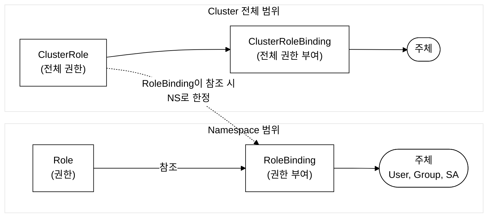
_그림 1. RBAC 4가지 리소스의 네임스페이스·클러스터 범위 구조._

| 리소스 | 범위 | 설명 | 예시 |
|---|---|---|---|
| **Role** | 네임스페이스 | 특정 네임스페이스 내 리소스 권한 정의 | "demo ns에서 Pod 읽기" |
| **ClusterRole** | 클러스터 전체 | 클러스터 전체 또는 비-네임스페이스 리소스 권한 | "모든 노드 조회" |
| **RoleBinding** | 네임스페이스 | Role/ClusterRole을 주체에 바인딩 | "jane에게 pod-reader 부여" |
| **ClusterRoleBinding** | 클러스터 전체 | ClusterRole을 전체 범위로 바인딩 | "ops-team에게 cluster-admin 부여" |

### 1.3 API Groups (시험 필수!)

RBAC에서 리소스를 지정할 때 해당 리소스가 속하는 API 그룹을 알아야 한다.

```
Core API (""):          pods, services, configmaps, secrets, namespaces,
                        nodes, persistentvolumes, persistentvolumeclaims,
                        events, endpoints, serviceaccounts

apps:                   deployments, replicasets, statefulsets, daemonsets

batch:                  jobs, cronjobs

networking.k8s.io:      networkpolicies, ingresses, ingressclasses

rbac.authorization.k8s.io: roles, clusterroles, rolebindings, clusterrolebindings

storage.k8s.io:         storageclasses, csidrivers, csinodes

certificates.k8s.io:    certificatesigningrequests

policy:                 poddisruptionbudgets
```

**핵심:** Core API 그룹의 `apiGroups`는 `[""]`(빈 문자열)로 지정한다!

```bash
# API 그룹 확인 방법
kubectl api-resources | grep pods
# NAME   SHORTNAMES   APIVERSION   NAMESPACED   KIND
# pods   po           v1           true         Pod
# → v1 = core API 그룹 ("")

kubectl api-resources | grep deployments
# NAME          SHORTNAMES   APIVERSION   NAMESPACED   KIND
# deployments   deploy       apps/v1      true         Deployment
# → apps/v1 = apps API 그룹
```

### 1.4 Verbs (동사) 목록

| Verb | 설명 | HTTP 메서드 |
|---|---|---|
| `get` | 단일 리소스 조회 | GET |
| `list` | 리소스 목록 조회 | GET (collection) |
| `watch` | 리소스 변경 실시간 감시 | GET (watch) |
| `create` | 리소스 생성 | POST |
| `update` | 리소스 전체 교체 | PUT |
| `patch` | 리소스 부분 수정 | PATCH |
| `delete` | 리소스 삭제 | DELETE |
| `deletecollection` | 리소스 일괄 삭제 (`kubectl delete pods --all`처럼 컬렉션 전체를 한 번에 삭제할 때 사용된다) | DELETE (collection) |

**`*`(와일드카드)**: 모든 동사를 허용

### 1.5 Role YAML 상세 분석

```yaml
# Role: 특정 네임스페이스 내 권한 정의
apiVersion: rbac.authorization.k8s.io/v1   # RBAC API 그룹과 버전
kind: Role                                  # 리소스 종류: 네임스페이스 범위 역할
metadata:
  name: pod-reader                          # 역할 이름 (식별자)
  namespace: demo                           # 이 역할이 적용되는 네임스페이스
rules:                                      # 권한 규칙 목록
- apiGroups: [""]                           # Core API 그룹 (pods, services 등)
  resources: ["pods"]                       # 대상 리소스 종류
  verbs: ["get", "list", "watch"]           # 허용되는 동작
- apiGroups: [""]                           # 두 번째 규칙
  resources: ["pods/log"]                   # 하위 리소스 (Pod의 로그)
  verbs: ["get"]                            # 로그 조회만 허용
- apiGroups: ["apps"]                       # apps API 그룹
  resources: ["deployments"]                # Deployment 리소스
  verbs: ["get", "list"]                    # 읽기만 허용
```

### 1.6 ClusterRole YAML 상세 분석

```yaml
# ClusterRole: 클러스터 전체 범위 권한 정의
apiVersion: rbac.authorization.k8s.io/v1
kind: ClusterRole                           # 클러스터 전체 범위 역할
metadata:
  name: node-viewer                         # 역할 이름 (네임스페이스 없음!)
rules:
- apiGroups: [""]
  resources: ["nodes"]                      # 노드는 비-네임스페이스 리소스
  verbs: ["get", "list", "watch"]
- apiGroups: [""]
  resources: ["persistentvolumes"]          # PV도 비-네임스페이스 리소스
  verbs: ["get", "list"]
```

### 1.7 RoleBinding YAML 상세 분석

```yaml
# RoleBinding: Role을 사용자에게 바인딩
apiVersion: rbac.authorization.k8s.io/v1
kind: RoleBinding
metadata:
  name: jane-pod-reader                     # 바인딩 이름
  namespace: demo                           # 이 바인딩이 적용되는 네임스페이스
subjects:                                   # 권한을 받는 주체 목록
- kind: User                               # 주체 종류: User, Group, ServiceAccount
  name: jane                                # 사용자 이름
  apiGroup: rbac.authorization.k8s.io       # User/Group은 이 apiGroup 사용
roleRef:                                    # 참조할 역할
  kind: Role                               # Role 또는 ClusterRole
  name: pod-reader                          # 참조할 역할 이름
  apiGroup: rbac.authorization.k8s.io       # 항상 이 값
```

### 1.8 ClusterRoleBinding YAML 상세 분석

```yaml
# ClusterRoleBinding: ClusterRole을 클러스터 전체에 바인딩
apiVersion: rbac.authorization.k8s.io/v1
kind: ClusterRoleBinding
metadata:
  name: ops-cluster-admin                   # 바인딩 이름 (네임스페이스 없음!)
subjects:
- kind: Group                              # 그룹에 바인딩
  name: ops-team                            # 그룹 이름
  apiGroup: rbac.authorization.k8s.io
- kind: ServiceAccount                     # ServiceAccount에도 바인딩 가능
  name: deploy-bot                          # SA 이름
  namespace: demo                           # SA의 네임스페이스 (SA는 네임스페이스에 속함)
roleRef:
  kind: ClusterRole
  name: cluster-admin                       # 기본 제공 ClusterRole
  apiGroup: rbac.authorization.k8s.io
```

### 1.9 RoleBinding이 ClusterRole을 참조하는 경우

이것은 시험에서 자주 나오는 중요한 패턴이다!

```yaml
# RoleBinding으로 ClusterRole을 참조하면:
# → ClusterRole의 권한이 RoleBinding의 네임스페이스로 한정된다
apiVersion: rbac.authorization.k8s.io/v1
kind: RoleBinding
metadata:
  name: sarah-viewer
  namespace: monitoring                     # monitoring 네임스페이스에서만 유효
subjects:
- kind: User
  name: sarah
  apiGroup: rbac.authorization.k8s.io
roleRef:
  kind: ClusterRole                        # ClusterRole을 참조! (Role이 아님)
  name: view                                # 기본 제공 'view' ClusterRole
  apiGroup: rbac.authorization.k8s.io
# 결과: sarah는 monitoring 네임스페이스에서만 view 권한을 가짐
# 다른 네임스페이스에서는 권한 없음!
```

**RoleBinding은 Role도, ClusterRole도 참조할 수 있다.** roleRef의 종류가 무엇이든 RoleBinding이 부여하는 권한의 범위는 항상 RoleBinding 자신의 네임스페이스로 한정된다. 차이는 권한의 출처뿐이다:
- **RoleBinding → Role 참조**: 그 네임스페이스에 정의된 Role의 권한을 그대로 부여한다(네임스페이스 안에서 만들고 안에서 쓰는 일반적 경우).
- **RoleBinding → ClusterRole 참조**: ClusterRole에 정의된 권한 중 네임스페이스 범위 리소스에 해당하는 부분을, RoleBinding의 네임스페이스로 한정해 부여한다. 위 예에서 `view` ClusterRole은 전 클러스터에서 쓸 수 있도록 정의되어 있지만, monitoring 네임스페이스의 RoleBinding으로 참조했으므로 sarah는 monitoring에서만 view 권한을 가진다.

**왜 이렇게 하는가?**
- `view` ClusterRole은 이미 잘 정의된 읽기 전용 권한 세트이다
- 이것을 매 네임스페이스마다 Role로 다시 만들 필요 없이, RoleBinding으로 참조하면 된다
- ClusterRole을 한 번 정의해 두고 각 네임스페이스마다 RoleBinding으로 바인딩하는, 재사용 가능한 "권한 템플릿"으로 쓴다

### 1.10 기본 제공 ClusterRole

| ClusterRole | 권한 수준 | 설명 |
|---|---|---|
| `cluster-admin` | 전체 | 클러스터 전체에 대한 모든 권한 |
| `admin` | 네임스페이스 | 네임스페이스 내 모든 리소스 관리 (RBAC 제외) |
| `edit` | 네임스페이스 | 읽기/쓰기. RBAC, 일부 설정 수정 불가 |
| `view` | 네임스페이스 | 읽기 전용. Secret 내용 조회 불가 |

---

## 2. ServiceAccount 완벽 이해

§1에서 배운 RBAC은 Subject(User·Group·ServiceAccount)를 기준으로 권한을 부여한다. 이 중 User·Group은 클러스터 외부에서 사람이 인증서·토큰으로 접속할 때의 신원이고, ServiceAccount는 Pod 내부에서 도는 프로세스가 API 서버에 접근할 때의 신원이다. 즉 ServiceAccount는 "누구인가"(신원, identity)를 정하고, RBAC의 Role/RoleBinding은 그 신원에 "무엇을 할 수 있는가"(권한)를 붙이는 메커니즘이다. 이번 절은 ServiceAccount의 동작 원리(토큰 생성·마운트)와 §1의 RBAC 바인딩이 구체적으로 어떻게 연결되는지를 다룬다.

### 2.1 ServiceAccount란?

ServiceAccount(SA)는 Pod 내부 프로세스가 API 서버에 인증할 때 사용하는 네임스페이스 범위의 리소스이다. K8s 1.24+에서는 TokenRequest API를 통해 시간 제한이 있는 bound service account token(JWT, JSON Web Token — 서명된 클레임 집합으로 신원을 증명하는 토큰)을 발급받으며, 이 토큰은 ProjectedVolume으로 Pod의 `/var/run/secrets/kubernetes.io/serviceaccount/`에 자동 마운트된다.

**토큰 발급 방식의 변천(왜 바뀌었나):** K8s 1.23 까지는 ServiceAccount를 만들면 동시에 Secret이 자동 생성되어 만료 없는(영구) 토큰을 담았다. 이 토큰은 한 번 발급되면 무기한 유효했기 때문에, 탈취당하면 계정이 무한정 악용될 수 있었고 사후에 토큰만 따로 무효화할 방법이 마땅치 않았다. 1.24+부터는 TokenRequest API를 도입하여 각 Pod마다 시간 제한(기본 1시간)이 걸린 JWT를 동적으로 발급하고, kubelet이 만료 전에 자동 갱신한다. 토큰이 탈취되어도 짧은 유효 기간 내에만 쓸 수 있으므로 장기 노출 위험이 줄었다. 트레이드오프로, 토큰이 시간·대상(audience) 등에 묶여 있어(bound) 단순히 Secret을 읽어 재사용하던 옛 방식보다 토큰을 외부 도구에 넘겨 쓰는 절차가 까다로워졌다.

**핵심 특성:**
- 네임스페이스에 속한다
- 모든 네임스페이스에는 자동으로 `default` SA가 생성된다
- K8s 1.24+에서는 SA 생성 시 자동 Secret이 생성되지 않는다
- TokenRequest API를 통해 시간 제한 토큰을 발급받는다

```yaml
# ServiceAccount 생성
apiVersion: v1
kind: ServiceAccount
metadata:
  name: deploy-bot                 # SA 이름
  namespace: demo                  # 네임스페이스
  labels:
    purpose: cicd                  # 선택적 라벨
```

### 2.2 Pod에서 ServiceAccount 사용

```yaml
# 특정 SA로 실행되는 Pod
apiVersion: v1
kind: Pod
metadata:
  name: sa-pod
  namespace: demo
spec:
  serviceAccountName: deploy-bot           # 사용할 SA 이름
  automountServiceAccountToken: true       # SA 토큰 자동 마운트 (기본: true)
                                           # API 서버 접근이 불필요한 워크로드는 false로 설정하는 것이 최소 권한 원칙에 맞다.
                                           # SA 또는 Pod spec 어느 쪽에 설정해도 Pod 단위로 적용된다.
  containers:
  - name: app
    image: busybox:1.36
    command: ["sh", "-c", "cat /var/run/secrets/kubernetes.io/serviceaccount/token && sleep 3600"]
    # 토큰은 /var/run/secrets/kubernetes.io/serviceaccount/ 디렉터리에 마운트됨
    # token: API 접근 토큰
    # ca.crt: 클러스터 CA 인증서
    # namespace: 현재 네임스페이스 이름
```

### 2.3 SA에 RBAC 바인딩

아래 예시는 §1.5에서 이미 정의한 `pod-reader` Role을 ServiceAccount에 바인딩하는 패턴이다. 실제로는 SA에 부여할 권한에 맞는 Role을 먼저 만든 뒤 바인딩한다.

```yaml
# SA에 역할을 바인딩하는 RoleBinding
apiVersion: rbac.authorization.k8s.io/v1
kind: RoleBinding
metadata:
  name: deploy-bot-binding
  namespace: demo
subjects:
- kind: ServiceAccount                     # 주체가 ServiceAccount
  name: deploy-bot                          # SA 이름
  namespace: demo                           # SA의 네임스페이스 (필수!)
roleRef:
  kind: Role
  name: pod-reader                          # §1.5에서 정의한 Role 재사용 (예시)
  apiGroup: rbac.authorization.k8s.io
```

---

## 3. kubeconfig 수동 생성

#### 등장 배경과 파일 구조

kubeconfig가 없던 시절 kubectl은 요청마다 `--server`, `--token`, `--certificate-authority` 플래그를 직접 지정해야 했다. 클러스터가 하나일 때는 감수할 수 있지만, dev/staging/prod처럼 여러 클러스터를 동시에 다루면 매 명령마다 서버 주소와 인증 정보를 타이핑하는 것이 현실적으로 불가능하다. 게다가 --token 값을 셸 히스토리에 남기면 보안 사고로 이어진다.

kubeconfig는 이 문제를 해결하기 위해 클러스터 연결 정보·인증 정보·컨텍스트를 단일 YAML 파일로 묶어 관리하는 표준 형식이다. kubectl은 기본적으로 `~/.kube/config`를 읽고, `KUBECONFIG` 환경변수나 `--kubeconfig` 플래그로 파일을 교체할 수 있다.

kubeconfig 파일은 **4개 최상위 섹션**으로 구성된다:

| 섹션 | 역할 | 주요 필드 |
|---|---|---|
| `clusters` | API 서버 주소·CA 인증서 | `server`, `certificate-authority-data` |
| `users` | 클라이언트 인증 정보 | `client-certificate-data`, `client-key-data`, `token` |
| `contexts` | cluster + user + namespace 조합 | `cluster`, `user`, `namespace` |
| `current-context` | 현재 활성 컨텍스트 이름 | — |

`kubectl config set-cluster`는 clusters 항목을, `set-credentials`는 users 항목을, `set-context`는 contexts 항목을 추가한다. `use-context`는 current-context 필드를 변경한다. 이 4단계를 거치면 이후 `kubectl get pods`만 입력해도 kubeconfig가 서버 주소·인증서·네임스페이스를 자동으로 적용한다.

### 3.1 kubeconfig 생성 전체 흐름

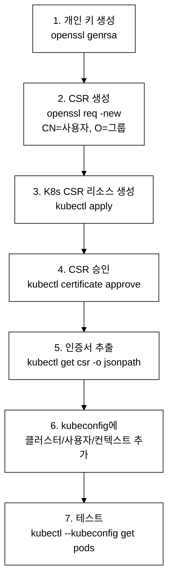
_그림 2. kubeconfig 수동 생성 전체 흐름._

### 3.2 kubectl config 명령으로 kubeconfig 생성

> **선행 파일 안내:** 아래 Step 2에서 `--client-certificate=/tmp/my-user.crt`와 `--client-key=/tmp/my-user.key`를 참조한다. 이 파일들은 섹션 4에서 CSR을 승인한 뒤 생성된다. 섹션 4를 먼저 실습한 뒤 이 절로 돌아오거나, 경로를 실제로 생성한 파일명으로 교체한다.

```bash
# === Step 1: 클러스터 정보 추가 ===
kubectl config set-cluster my-cluster \
  --server=https://192.168.64.10:6443 \          # API 서버 주소
  --certificate-authority=/etc/kubernetes/pki/ca.crt \  # CA 인증서
  --embed-certs=true \                            # 인증서를 base64로 내장
  --kubeconfig=/tmp/my-user.kubeconfig            # 출력 파일

# === Step 2: 사용자 인증 정보 추가 ===
kubectl config set-credentials my-user \
  --client-certificate=/tmp/my-user.crt \         # 사용자 인증서
  --client-key=/tmp/my-user.key \                 # 사용자 개인키
  --embed-certs=true \
  --kubeconfig=/tmp/my-user.kubeconfig

# === Step 3: 컨텍스트 추가 ===
kubectl config set-context my-context \
  --cluster=my-cluster \                          # 클러스터 이름
  --user=my-user \                                # 사용자 이름
  --namespace=default \                           # 기본 네임스페이스
  --kubeconfig=/tmp/my-user.kubeconfig

# === Step 4: 현재 컨텍스트 설정 ===
kubectl config use-context my-context \
  --kubeconfig=/tmp/my-user.kubeconfig

# === Step 5: 테스트 ===
kubectl --kubeconfig=/tmp/my-user.kubeconfig get pods
```

---

## 4. CertificateSigningRequest (CSR) 처리

### 4.1 CSR이란?

#### 등장 배경: K8s에 자체 사용자 DB가 없는 이유

쿠버네티스는 의도적으로 자체 사용자 데이터베이스를 두지 않는다. 사용자 계정을 직접 관리하면 패스워드 해싱·만료·잠금 등 인증 인프라 전체를 K8s가 떠안아야 한다. 대신 K8s는 인증을 외부 시스템(PKI, OIDC, 웹훅 등)에 위임하는 설계를 선택했다.

초기에는 `--token-auth-file`로 CSV 파일에 토큰·사용자명을 정적으로 기록하는 방식(static token file)이 있었다. 이 방식은 API 서버 재시작 없이는 사용자를 추가·삭제하지 못하고, 파일 자체가 평문 토큰을 담아 노출 시 모든 토큰을 재발급해야 하는 문제가 있었다.

X.509 클라이언트 인증서 방식은 이를 대체한다. 사용자가 자신의 개인키로 CSR(Certificate Signing Request, 인증서 서명 요청 — 공개키와 신원 정보를 담아 CA에 서명을 요청하는 표준 포맷)을 만들고, K8s API를 통해 클러스터 CA(Certificate Authority, 인증 기관 — 신뢰할 수 있는 제3자 역할을 하며 인증서에 서명하는 주체)에 서명을 요청한다. CA가 서명한 인증서는 수명 제한을 걸 수 있고, 인증서를 즉시 무효화하려면 새 CSR을 거부하면 된다. 또한 인증서를 탈취당해도 개인키가 없으면 사용할 수 없다.

PKI(Public Key Infrastructure, 공개키 기반구조)에서 인증서의 CN(Common Name) 필드는 K8s 사용자 이름으로, O(Organization) 필드는 K8s 그룹 이름으로 매핑된다. 예를 들어 `CN=alice/O=developers`로 서명된 인증서로 API 서버에 접속하면, K8s는 alice 사용자가 developers 그룹에 속한다고 인식하고 해당 그룹에 바인딩된 RBAC 권한을 적용한다.

**트레이드오프:** X.509 방식은 인증서 만료 후 갱신 절차가 필요하고, 발급된 인증서를 즉시 취소(revoke)하는 표준 메커니즘이 K8s에 내장되어 있지 않다(CRL·OCSP 미지원). 인증서를 빠르게 무효화하려면 CA 키를 교체하는 수밖에 없어 운영 부담이 생긴다. 이 때문에 장기적으로는 OIDC(OpenID Connect) 토큰 방식이 더 많이 쓰이지만, CKA 시험 범위에서는 CSR 절차를 반드시 숙지해야 한다.

CSR(CertificateSigningRequest)은 쿠버네티스 API를 통해 새 사용자의 인증서를 발급받는 절차이다.

CSR은 사용자가 개인키로 생성한 X.509 인증서 서명 요청을 API 서버에 제출하고, 클러스터 관리자가 승인(approve)하면 K8s CA가 서명하여 클라이언트 인증서를 발급하는 PKI 프로세스이다. CSR의 CN(Common Name)이 K8s 사용자 이름, O(Organization)가 그룹으로 매핑된다.

### 4.2 CSR 전체 절차

```bash
# === Step 1: 개인 키 생성 ===
openssl genrsa -out /tmp/newuser.key 2048
# 2048비트 RSA 개인 키 생성

# === Step 2: CSR 파일 생성 ===
openssl req -new -key /tmp/newuser.key -out /tmp/newuser.csr \
  -subj "/CN=newuser/O=developers"
# CN(Common Name) = 쿠버네티스 사용자 이름
# O(Organization) = 쿠버네티스 그룹 이름
# /O=system:masters → 이 그룹은 cluster-admin 권한
# -subj 에는 K8s 인가에 쓰이는 CN·O만 적으면 된다.
#   C(국가)/ST(주)/L(도시) 같은 DN 필드는 선택이라 생략해도 openssl이 정상 동작한다(실측 확인).
#   필드 구분자는 슬래시(/)이고, O를 여러 그룹으로 주려면 /O=g1/O=g2 처럼 반복한다.

# === Step 3: K8s CSR 리소스 생성 ===
cat <<EOF | kubectl apply -f -
apiVersion: certificates.k8s.io/v1          # CSR API 그룹
kind: CertificateSigningRequest             # 리소스 종류
metadata:
  name: newuser                              # CSR 이름
spec:
  request: $(cat /tmp/newuser.csr | base64 | tr -d '\n')   # CSR 내용 (base64 인코딩, 줄바꿈 제거!)
  signerName: kubernetes.io/kube-apiserver-client            # 서명자: API 서버 클라이언트용
  expirationSeconds: 86400                   # 인증서 유효기간 (초) - 24시간
  usages:                                    # 인증서 용도
  - client auth                              # 클라이언트 인증용
EOF

# 위 heredoc 안의 $(cat /tmp/newuser.csr | base64 | tr -d '\n') 은 실행 시점에 평가되어 CSR 내용을 base64로 변환한 뒤 YAML에 삽입한다.
# 치환이 제대로 되지 않으면 변수에 먼저 저장하는 2단계 방식을 사용한다:
#   CSR_B64=$(cat /tmp/newuser.csr | base64 | tr -d '\n')
#   그런 다음 heredoc 안에서 request: $CSR_B64 로 대입한다.

# === Step 4: CSR 확인 ===
kubectl get csr
# NAME      AGE   SIGNERNAME                            REQUESTOR        CONDITION
# newuser   10s   kubernetes.io/kube-apiserver-client    admin            Pending

# === Step 5: CSR 승인 ===
kubectl certificate approve newuser

# === Step 6: 인증서 추출 ===
kubectl get csr newuser -o jsonpath='{.status.certificate}' | base64 -d > /tmp/newuser.crt

# === Step 7: 인증서 확인 ===
openssl x509 -in /tmp/newuser.crt -noout -subject
# subject=CN = newuser, O = developers
```

### 4.3 CSR YAML 상세 분석

```yaml
apiVersion: certificates.k8s.io/v1         # CSR API 그룹과 버전
kind: CertificateSigningRequest            # 리소스 종류
metadata:
  name: newuser                             # CSR 이름 (kubectl certificate approve에서 사용)
spec:
  request: LS0tLS1CRUdJTi...               # openssl req으로 생성한 CSR을 base64 인코딩한 값
                                            # 반드시 줄바꿈을 제거해야 함! (tr -d '\n')
  signerName: kubernetes.io/kube-apiserver-client  # 서명자 이름
                                            # 클라이언트 인증서: kubernetes.io/kube-apiserver-client
                                            # kubelet 인증서: kubernetes.io/kubelet-serving
  expirationSeconds: 86400                  # 선택사항: 인증서 유효기간 (초)
  usages:                                   # 인증서 용도 목록
  - client auth                             # 클라이언트 인증 (사용자 인증서에 필수)
  # - digital signature                     # 디지털 서명
  # - key encipherment                      # 키 암호화
```

---

## 5. kubectl로 RBAC 빠르게 생성 (시험 필수!)

시험에서는 YAML을 직접 작성하는 것보다 kubectl 명령을 사용하는 것이 훨씬 빠르다.

**시험 환경 초기 셋업 — 터미널을 열면 가장 먼저 실행한다:**

```bash
alias k=kubectl
export do='--dry-run=client -o yaml'
source <(kubectl completion bash)
complete -o default -F __start_kubectl k
```

이후 `k get pods`, `k create role ... $do` 처럼 단축 명령을 쓸 수 있다. `$do`는 실제 생성 없이 YAML만 출력하므로 매니페스트를 파일로 받아 편집할 때 유용하다.

```bash
# === Role 생성 ===
kubectl create role <name> \
  --verb=get,list,watch \
  --resource=pods \
  -n <namespace>

# 여러 리소스에 대한 권한
kubectl create role <name> \
  --verb=get,list,watch,create,delete \
  --resource=pods,services,deployments \
  -n <namespace>

# 모든 동사 허용
kubectl create role <name> \
  --verb='*' \
  --resource=pods \
  -n <namespace>

# === ClusterRole 생성 ===
kubectl create clusterrole <name> \
  --verb=get,list,watch \
  --resource=nodes

# === RoleBinding 생성 ===
# User에게 Role 바인딩
kubectl create rolebinding <name> \
  --role=<role-name> \
  --user=<username> \
  -n <namespace>

# ServiceAccount에게 Role 바인딩
kubectl create rolebinding <name> \
  --role=<role-name> \
  --serviceaccount=<namespace>:<sa-name> \
  -n <namespace>

# ClusterRole을 RoleBinding으로 참조
kubectl create rolebinding <name> \
  --clusterrole=<clusterrole-name> \
  --user=<username> \
  -n <namespace>

# === ClusterRoleBinding 생성 ===
kubectl create clusterrolebinding <name> \
  --clusterrole=<clusterrole-name> \
  --user=<username>

kubectl create clusterrolebinding <name> \
  --clusterrole=<clusterrole-name> \
  --group=<group-name>

# === ServiceAccount 생성 ===
kubectl create serviceaccount <name> -n <namespace>

# === 권한 확인 ===
kubectl auth can-i <verb> <resource> --as=<user> -n <namespace>
kubectl auth can-i --list --as=<user> -n <namespace>
kubectl auth can-i create pods --as=system:serviceaccount:demo:deploy-bot -n demo
```

---

## 6. 시험 출제 패턴 분석

### 6.1 RBAC 관련 출제 유형

1. **Role + RoleBinding 생성** -- 특정 네임스페이스에서 특정 리소스에 대한 권한을 설정하는 문제
2. **ClusterRole을 RoleBinding으로 참조** -- 기본 제공 ClusterRole(view, edit 등)을 특정 네임스페이스에 바인딩
3. **ServiceAccount에 RBAC 바인딩** -- SA를 생성하고 적절한 권한을 부여
4. **CSR 처리** -- 새 사용자 인증서를 생성하고 CSR을 승인
5. **kubeconfig 생성** -- 새 사용자를 위한 kubeconfig 파일 작성
6. **권한 확인** -- `kubectl auth can-i`로 특정 사용자의 권한을 테스트

### 6.2 문제의 의도

- Role과 ClusterRole의 범위 차이를 이해하는가?
- RoleBinding이 ClusterRole을 참조할 수 있다는 것을 아는가?
- SA의 형식 (`system:serviceaccount:<ns>:<name>`)을 아는가?
- CSR의 base64 인코딩과 줄바꿈 제거를 정확히 하는가?

---

## 7. 실전 시험 문제 (6문제)

> 이 절에서는 RBAC 핵심 6문제를 다룬다. kubeconfig 생성과 권한 확인 집중 연습 유형 6문제는 day06에서 이어진다.

### 문제 1. Role과 RoleBinding 생성 [4%]

**컨텍스트:** `kubectl config use-context dev`

네임스페이스 `demo`에 다음 RBAC를 설정하라:
- `app-manager`라는 Role: pods, services, deployments에 대해 모든 권한
- `app-manager-binding`이라는 RoleBinding: 사용자 `tom`에게 바인딩

<details>
<summary>풀이 과정</summary>

```bash
kubectl config use-context dev

# Role 생성
kubectl create role app-manager \
  --verb='*' \
  --resource=pods,services,deployments \
  -n demo

# RoleBinding 생성
kubectl create rolebinding app-manager-binding \
  --role=app-manager \
  --user=tom \
  -n demo

# 확인
kubectl describe role app-manager -n demo
kubectl describe rolebinding app-manager-binding -n demo

# 권한 테스트
kubectl auth can-i delete pods --as=tom -n demo
kubectl auth can-i create services --as=tom -n demo
kubectl auth can-i create configmaps --as=tom -n demo
```

**검증 - 기대 출력:**
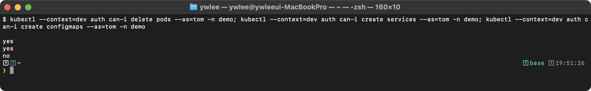

`configmaps`는 Role에 포함하지 않았으므로 `no`가 반환된다. RBAC은 화이트리스트 방식으로, 명시적으로 허용하지 않은 모든 작업은 거부된다.

</details>

---

### 문제 2. ClusterRole을 RoleBinding으로 참조 [4%]

**컨텍스트:** `kubectl config use-context platform`

네임스페이스 `monitoring`에서 사용자 `sarah`에게 `view` ClusterRole의 권한을 부여하라. RoleBinding 이름은 `sarah-viewer`로 하라.

<details>
<summary>풀이 과정</summary>

```bash
kubectl config use-context platform

# RoleBinding으로 ClusterRole 참조
kubectl create rolebinding sarah-viewer \
  --clusterrole=view \
  --user=sarah \
  -n monitoring

# 확인
kubectl auth can-i list pods --as=sarah -n monitoring      # yes
kubectl auth can-i list pods --as=sarah -n default         # no
kubectl auth can-i create pods --as=sarah -n monitoring    # no (view는 읽기 전용)
```

</details>

---

### 문제 3. ServiceAccount RBAC 바인딩 [4%]

**컨텍스트:** `kubectl config use-context dev`

1. `demo` 네임스페이스에 `cicd-bot` ServiceAccount를 생성하라
2. `cicd-bot`에게 `demo` 네임스페이스의 deployments에 대한 get, list, update, patch 권한을 부여하라

<details>
<summary>풀이 과정</summary>

```bash
kubectl config use-context dev

# SA 생성
kubectl create serviceaccount cicd-bot -n demo

# Role 생성
kubectl create role cicd-deploy-role \
  --verb=get,list,update,patch \
  --resource=deployments \
  -n demo

# RoleBinding 생성 (SA 형식: <namespace>:<sa-name>)
kubectl create rolebinding cicd-deploy-binding \
  --role=cicd-deploy-role \
  --serviceaccount=demo:cicd-bot \
  -n demo

# 확인
kubectl auth can-i update deployments \
  --as=system:serviceaccount:demo:cicd-bot -n demo    # yes
kubectl auth can-i delete deployments \
  --as=system:serviceaccount:demo:cicd-bot -n demo    # no
```

</details>

---

### 문제 4. CSR 승인 및 인증서 발급 [7%]

**컨텍스트:** `kubectl config use-context platform`

사용자 `newadmin`을 위한 인증서를 생성하고 CSR을 승인하라:
1. 개인 키 생성: `/tmp/newadmin.key`
2. CSR 생성: CN=newadmin, O=system:masters
3. Kubernetes CSR 리소스 생성 및 승인
4. 인증서 추출: `/tmp/newadmin.crt`

<details>
<summary>풀이 과정</summary>

```bash
kubectl config use-context platform

# 1. 개인 키 생성
openssl genrsa -out /tmp/newadmin.key 2048

# 2. CSR 생성
openssl req -new -key /tmp/newadmin.key -out /tmp/newadmin.csr \
  -subj "/CN=newadmin/O=system:masters"

# 3. K8s CSR 리소스 생성
cat <<EOF | kubectl apply -f -
apiVersion: certificates.k8s.io/v1
kind: CertificateSigningRequest
metadata:
  name: newadmin
spec:
  request: $(cat /tmp/newadmin.csr | base64 | tr -d '\n')
  signerName: kubernetes.io/kube-apiserver-client
  usages:
  - client auth
EOF

# 4. CSR 확인
kubectl get csr
# newadmin: Pending

# 5. CSR 승인
kubectl certificate approve newadmin

# 6. 인증서 추출
kubectl get csr newadmin -o jsonpath='{.status.certificate}' | base64 -d > /tmp/newadmin.crt

# 7. 확인
openssl x509 -in /tmp/newadmin.crt -noout -subject
# subject=CN = newadmin, O = system:masters
```

**핵심:**
- `signerName`은 `kubernetes.io/kube-apiserver-client`
- `usages`에 `client auth` 필수
- base64 인코딩 시 `tr -d '\n'`으로 줄바꿈 제거 필수!

</details>

---

### 문제 5. kubeconfig에 새 컨텍스트 추가 [7%]

**컨텍스트:** `kubectl config use-context dev`

다음 조건으로 kubeconfig에 새 컨텍스트를 추가하라:
- 컨텍스트 이름: `dev-restricted`
- 클러스터: 현재 dev 클러스터와 동일
- 사용자: `restricted-user`
- 기본 네임스페이스: `demo`

<details>
<summary>풀이 과정</summary>

```bash
kubectl config use-context dev

# 사용자 추가
kubectl config set-credentials restricted-user \
  --client-certificate=/tmp/newadmin.crt \
  --client-key=/tmp/newadmin.key

# 컨텍스트 추가
kubectl config set-context dev-restricted \
  --cluster=dev \
  --user=restricted-user \
  --namespace=demo

# 확인
kubectl config get-contexts

# 원래 컨텍스트로 복원
kubectl config use-context dev
```

</details>

---

### 문제 6. 여러 리소스에 대한 복합 Role [7%]

**컨텍스트:** `kubectl config use-context dev`

`demo` 네임스페이스에 다음 권한을 가진 Role `full-developer`를 생성하라:
- pods: get, list, watch, create, delete
- services: get, list, create
- deployments: get, list, create, update, patch
- configmaps: get, list
- secrets: get

그리고 사용자 `alex`에게 바인딩하라.

<details>
<summary>풀이 과정</summary>

**함정:** 이 문제는 `kubectl create role` 한 줄로 풀 수 없다. `kubectl create role`은 `--resource`에 나열한 리소스를 자동으로 apiGroup별로 묶어 rule을 만들지만, verb는 명령 하나에 한 세트(`--verb=...`)만 줄 수 있다. 그런데 이 문제는 리소스마다 verb가 다르다(pods는 5개, secrets는 get 1개). 게다가 pods/services/configmaps/secrets는 core API(`""`)이고 deployments는 apps API라 apiGroup도 섞여 있다. 리소스별로 다른 verb를 주려면 rule을 따로 정의해야 하므로 YAML로 작성한다.

```bash
kubectl config use-context dev

# 리소스마다 verb가 다르므로 YAML로 여러 rule을 정의한다
cat <<EOF | kubectl apply -f -
apiVersion: rbac.authorization.k8s.io/v1
kind: Role
metadata:
  name: full-developer
  namespace: demo
rules:
- apiGroups: [""]
  resources: ["pods"]
  verbs: ["get", "list", "watch", "create", "delete"]
- apiGroups: [""]
  resources: ["services"]
  verbs: ["get", "list", "create"]
- apiGroups: ["apps"]
  resources: ["deployments"]
  verbs: ["get", "list", "create", "update", "patch"]
- apiGroups: [""]
  resources: ["configmaps"]
  verbs: ["get", "list"]
- apiGroups: [""]
  resources: ["secrets"]
  verbs: ["get"]
EOF

# RoleBinding
kubectl create rolebinding alex-full-dev \
  --role=full-developer \
  --user=alex \
  -n demo

# 확인
kubectl auth can-i create pods --as=alex -n demo          # yes
kubectl auth can-i delete services --as=alex -n demo       # no
kubectl auth can-i update deployments --as=alex -n demo    # yes
kubectl auth can-i delete secrets --as=alex -n demo        # no
```

</details>

---

## tart-infra 실습

### 실습 환경 설정

전제: tart 클러스터가 가동 중이어야 한다(`./scripts/boot.sh` 로 기동, 재부팅 직후라면 `./scripts/fix-cluster-ip-drift.sh dev` 로 IP 드리프트를 복구해 노드가 Ready 인지 확인한다). kubeconfig는 클러스터 가동 시 `kubeconfig/<클러스터>.yaml` 에 자동 생성된다. 아래 실습은 파괴 실습이 허용된 dev 클러스터의 `demo` 네임스페이스를 대상으로 한다(platform/prod 에서는 하지 않는다).

```bash
# dev 클러스터 접속 (demo 네임스페이스에서 RBAC 실습)
export KUBECONFIG=kubeconfig/dev.yaml
kubectl config use-context dev
```

### 실습 1: 기존 RBAC 리소스 분석

```bash
# dev 클러스터의 ClusterRole 목록 확인
kubectl get clusterroles | head -20

# demo 네임스페이스의 RoleBinding 확인
kubectl get rolebindings -n demo

# 특정 ServiceAccount의 권한 확인
kubectl auth can-i list pods -n demo --as=system:serviceaccount:demo:default
kubectl auth can-i create deployments -n demo --as=system:serviceaccount:demo:default
```

**예상 출력:**
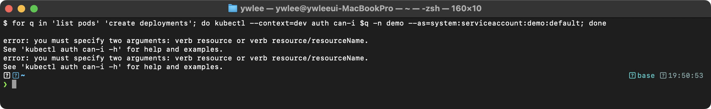

**동작 원리:**
1. `kubectl auth can-i`는 SubjectAccessReview API를 호출하여 RBAC 인가 결과를 확인한다
2. `--as` 플래그는 다른 사용자/ServiceAccount로 impersonation하여 권한을 테스트한다
3. ServiceAccount 형식은 `system:serviceaccount:<namespace>:<name>`이다
4. 기본 `default` ServiceAccount는 어떤 RoleBinding/ClusterRoleBinding도 연결돼 있지 않으므로 list pods·create deployments 모두 거부된다. RBAC은 기본 거부 방식이라 명시적으로 권한을 부여받기 전까지는 어떤 리소스 작업도 허용되지 않는다

### 실습 2: Role과 RoleBinding 생성

```bash
# demo 네임스페이스에서 Pod 읽기 전용 Role 생성
kubectl create role pod-reader \
  --verb=get,list,watch \
  --resource=pods \
  -n demo

# dev-user라는 가상 사용자에게 바인딩
kubectl create rolebinding pod-reader-binding \
  --role=pod-reader \
  --user=dev-user \
  -n demo

# 권한 확인
kubectl auth can-i get pods -n demo --as=dev-user
kubectl auth can-i delete pods -n demo --as=dev-user
kubectl auth can-i get pods -n kube-system --as=dev-user
```

**예상 출력:**
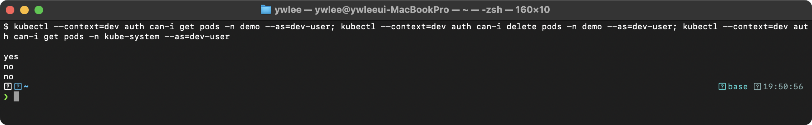

**동작 원리:**
1. Role은 네임스페이스 범위의 권한(verbs + resources)을 정의한다
2. RoleBinding은 Role을 특정 Subject(User, Group, ServiceAccount)에 연결한다
3. `pod-reader` Role은 demo 네임스페이스에서만 유효하므로 kube-system에서는 거부된다
4. 명시적으로 허용하지 않은 verb(delete)는 기본 거부(deny by default)된다

```bash
# 실습 정리
kubectl delete rolebinding pod-reader-binding -n demo
kubectl delete role pod-reader -n demo
```

### 실습 3: platform 클러스터의 ServiceAccount 확인

```bash
export KUBECONFIG=kubeconfig/platform.yaml

# Prometheus, Grafana 등 플랫폼 도구의 ServiceAccount 확인
kubectl get serviceaccounts -A | grep -E '(prometheus|grafana|jenkins|argocd)'
```

**예상 출력:**
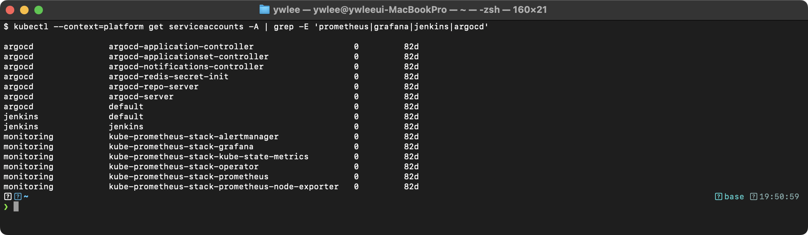
SECRETS 컬럼이 `0`인 것은 K8s 1.24+에서 SA 생성 시 자동 Secret을 만들지 않기 때문이다.

**동작 원리:**
1. 각 플랫폼 도구는 전용 ServiceAccount로 실행되어 최소 권한 원칙을 따른다
2. ServiceAccount에는 자동으로 토큰이 마운트되어 API Server와 인증한다
3. ClusterRoleBinding을 통해 Prometheus는 모든 네임스페이스의 메트릭을 수집할 권한을 부여받는다

---

## 8. 트러블슈팅

### 8.1 RBAC 권한 부족으로 API 호출이 거부되는 경우

**증상:** `Error from server (Forbidden): pods is forbidden: User "tom" cannot list resource "pods" in API group "" in the namespace "demo"`

**디버깅 절차:**

```bash
# 1. 해당 사용자에게 어떤 권한이 있는지 확인
kubectl auth can-i --list --as=tom -n demo
```

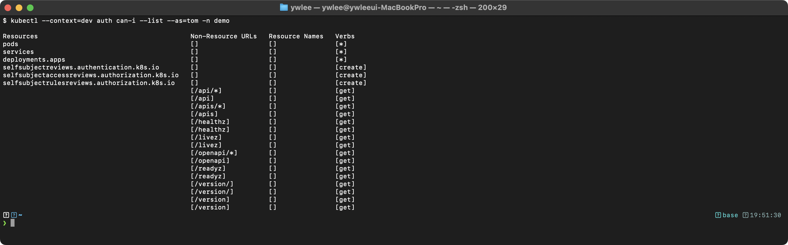

위와 같이 selfsubject*·비-리소스 헬스/버전 엔드포인트만 보이고 pods 관련 권한이 없으면 RoleBinding이 생성되지 않았거나, 잘못된 네임스페이스에 생성된 것이다.

```bash
# 2. 해당 네임스페이스의 RoleBinding 확인
kubectl get rolebindings -n demo -o wide
```

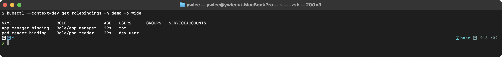

```bash
# 3. Role의 실제 rules 확인
kubectl describe role app-manager -n demo
```

`kubectl describe role` 출력에서 확인해야 할 핵심 필드는 두 가지다. 첫째, `PolicyRule.Resources` 항목에 문제에서 요구한 리소스(pods, services, deployments)가 모두 포함되어 있는지 확인한다. 둘째, `PolicyRule.Non-Resource URLs`와 `PolicyRule.APIGroups` 항목을 보고 apiGroups 값이 올바른지 확인한다(pods/services/configmaps/secrets는 `[""]`, deployments는 `["apps"]`). apiGroups를 잘못 설정하면 resources 이름이 맞아도 권한 체크에서 탈락한다.

**주요 원인:**
- RoleBinding의 네임스페이스와 실제 작업 네임스페이스가 다른 경우
- Role에서 `apiGroups`를 잘못 지정한 경우 (pods는 `[""]`, deployments는 `["apps"]`)
- verbs에 필요한 동작(예: `list`)이 빠진 경우
- ClusterRoleBinding 대신 RoleBinding을 사용하여 다른 네임스페이스에서는 권한이 없는 경우

### 8.2 CSR이 Pending 상태에서 멈추는 경우

**증상:** `kubectl get csr`에서 CONDITION이 `Pending`으로 유지된다.

```bash
kubectl get csr
```

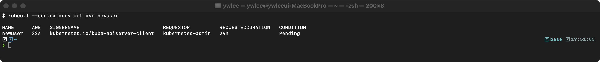

CSR은 자동 승인되지 않는다. 관리자가 명시적으로 승인해야 한다.

```bash
kubectl certificate approve newuser
kubectl get csr newuser
```

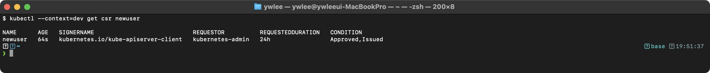

### 8.3 ServiceAccount 토큰이 Pod에 마운트되지 않는 경우

**증상:** Pod 내부에서 `/var/run/secrets/kubernetes.io/serviceaccount/token` 파일이 존재하지 않는다.

```bash
kubectl get pod <pod-name> -o yaml | grep -A2 automount
```

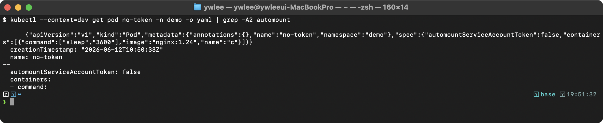

`automountServiceAccountToken: false`가 Pod spec 또는 ServiceAccount에 설정되어 있으면 토큰이 마운트되지 않는다. API 서버에 접근해야 하는 Pod는 이 값을 `true`로 변경하거나, 수동으로 projected volume을 마운트해야 한다.

---

## 자가점검

<details>
<summary>문제와 정답 펼치기</summary>

**Q1.** Role과 ClusterRole의 범위 차이를 한 문장으로 설명하라.

> Role은 특정 네임스페이스 안에서만 유효한 권한 규칙을 정의하고, ClusterRole은 클러스터 전체 범위 또는 nodes·PV 같은 비-네임스페이스 리소스에 대한 권한을 정의한다.

**Q2.** RoleBinding이 ClusterRole을 참조하면 권한 범위는 어떻게 되는가?

> ClusterRole에 정의된 권한이 RoleBinding 자신의 네임스페이스로 한정된다. 다른 네임스페이스에는 적용되지 않는다.

**Q3.** kubeconfig 파일의 4개 최상위 섹션 이름을 모두 적어라.

> `clusters`, `users`, `contexts`, `current-context`.

**Q4.** CSR 리소스 생성 시 base64 인코딩에서 줄바꿈을 반드시 제거해야 하는 이유는 무엇인가?

> kubeconfig의 YAML 필드 값은 줄바꿈이 없는 단일 문자열이어야 한다. `tr -d '\n'`을 생략하면 base64 문자열에 개행이 포함되어 YAML 파싱 오류가 발생하고 `kubectl apply`가 실패한다.

**Q5.** `kubectl auth can-i create pods --as=system:serviceaccount:demo:deploy-bot -n demo` 명령에서 `--as` 값의 형식을 설명하라.

> `system:serviceaccount:<네임스페이스>:<SA이름>` 형식이다. system:serviceaccount는 K8s가 ServiceAccount 주체를 식별하는 고정 접두사이고, 그 뒤에 SA가 속한 네임스페이스와 SA 이름을 콜론으로 구분하여 붙인다.

**Q6.** apiGroups에서 Core API 그룹(pods, services 등)을 지정하는 값은 무엇인가? 그리고 Deployment가 속하는 그룹은?

> Core API는 `[""]`(빈 문자열 배열), Deployment는 `["apps"]`.

**Q7.** K8s가 자체 사용자 DB를 두지 않는 이유를 한 문장으로 설명하라.

> 인증 인프라(패스워드 해싱·만료·잠금) 전체를 K8s가 관리하는 대신, PKI·OIDC 같은 검증된 외부 시스템에 인증을 위임함으로써 설계 범위를 클러스터 오케스트레이션에 집중한다.

</details>

---

## 시험 팁

1. **RoleBinding과 ClusterRoleBinding 혼동 금지.** 문제가 "특정 네임스페이스에서"라고 명시하면 RoleBinding이다. "클러스터 전체에서"라고 하면 ClusterRoleBinding이다. 범위를 잘못 선택하면 `kubectl auth can-i` 결과가 의도와 반대로 나온다.

2. **apiGroups를 틀리면 권한이 아예 적용되지 않는다.** `pods`는 `[""]`, `deployments`/`statefulsets`/`daemonsets`는 `["apps"]`이다. `kubectl api-resources | grep <리소스>` 로 즉석 확인이 가능하다.

3. **CSR base64 줄바꿈 제거 필수.** `cat /tmp/newuser.csr | base64 | tr -d '\n'`에서 `tr -d '\n'`을 생략하면 kubectl apply가 파싱 오류를 낸다. 시험 시간 내에 이 실수를 발견하기 어려우므로 손에 익혀둔다.

4. **SA 형식 암기.** RoleBinding subjects에서 ServiceAccount를 지정할 때 `namespace` 필드를 반드시 명시해야 한다. `--serviceaccount` 플래그는 `<네임스페이스>:<SA이름>` 형식이다.

5. **context 전환 후 작업 확인.** 문제마다 `kubectl config use-context <ctx>`로 클러스터를 전환한다. 전환을 잊으면 다른 클러스터에 리소스를 만들어 0점을 받는다. 각 문제 시작 전 `kubectl config current-context`로 확인하는 습관을 들인다.

---

## 더 읽을거리

- [쿠버네티스 공식 문서 — RBAC 인가](https://kubernetes.io/docs/reference/access-authn-authz/rbac/) : Role/ClusterRole/RoleBinding/ClusterRoleBinding 전체 스펙, 집계(aggregated) ClusterRole, 기본 제공 ClusterRole 목록.
- [쿠버네티스 공식 문서 — 인증서 서명 요청](https://kubernetes.io/docs/reference/access-authn-authz/certificate-signing-requests/) : CSR 리소스 스펙, signerName 목록, 자동 승인 정책.
- [쿠버네티스 공식 문서 — kubeconfig 구성](https://kubernetes.io/docs/concepts/configuration/organize-cluster-access-kubeconfig/) : 다중 kubeconfig 파일 병합, KUBECONFIG 환경변수, context·namespace 기본값.
- [쿠버네티스 공식 문서 — ServiceAccount 토큰 관리](https://kubernetes.io/docs/reference/access-authn-authz/service-accounts-admin/) : TokenRequest API, bound service account token, projected volume.
- [이 저장소 certification/ 심화 모음](../../../certification/) : cilium·istio 등 네트워크·보안 기술 심화. RBAC 전용 디렉터리는 없으므로 aggregated ClusterRole·impersonation·RBAC 감사 로그 분석은 위의 공식 RBAC 문서를 우선 참고한다.

