# CKA Day 6: RBAC 시험 문제 심화 & YAML 예제

> CKA 도메인: Cluster Architecture (25%) - Part 3 실전 | 예상 소요 시간: 2시간

> Day 5 까지 인증서·kubeconfig 로 "누가 클러스터에 들어오는가"(인증, authentication)를 다뤘다면, Day 6 은 들어온 주체가 "무엇을 할 수 있는가"(인가, authorization)를 RBAC 으로 다룬다. 문제 7~12 는 기본 RBAC, 섹션 8 과 추가 심화는 고급 패턴이다.

> **연속 번호 안내**: 이 파일의 실기 문제는 **문제 7~12** 로 번호가 붙어 있다. 문제 1~6 은 [day05.md](day05.md) 에 있으며, Day 6 은 그 연속이다. 섹션 번호(0, 8, 9…)는 이 파일 내의 개념·예제 섹션 번호이고, 문제 번호(7~12)와는 별개 체계다.

---

## 오늘의 학습 목표 (체크리스트)

- [ ] RBAC 4가지 리소스(Role·RoleBinding·ClusterRole·ClusterRoleBinding)의 범위 차이와 조합 규칙을 설명할 수 있다.
- [ ] ServiceAccount 토큰이 Pod 에 자동 마운트되는 경로와 구성 파일 3종(`token`·`ca.crt`·`namespace`)을 파악하고, `automountServiceAccountToken: false` 로 마운트를 비활성화하는 이유를 설명할 수 있다.
- [ ] `kubectl certificate approve / deny` 로 CSR(인증서 서명 요청)을 승인·거부하는 절차를 직접 실행할 수 있다.
- [ ] `kubectl auth can-i --list --as=<user>` 로 특정 주체의 권한 목록을 감사하고 파일로 저장할 수 있다.
- [ ] ClusterRole + RoleBinding 재사용 패턴과 Aggregated ClusterRole 의 라벨 기반 자동 병합 메커니즘을 설명할 수 있다.
- [ ] CSR 발급 전 과정(키 생성 → CSR → K8s CSR 오브젝트 → 승인 → 인증서 추출 → kubeconfig 등록)을 순서대로 실행할 수 있다.

---

## 0. RBAC 등장 배경 — 왜 권한을 쪼개야 하는가

**한 줄 요지: RBAC 은 "누가(subject) 어디서(namespace·cluster) 무엇을(resource) 어떤 동작으로(verb) 할 수 있는가"를 선언형으로 관리하는 인가 체계다.**

### 등장 배경 (없던 시절의 고통)

초기 쿠버네티스 클러스터에는 세분화된 인가 모델이 없었다. Pod 안에서 도는 애플리케이션이 API 서버와 통신하면, 그 Pod 는 사실상 클러스터 전체를 조작할 수 있는 권한을 들고 있었다. 즉 "모니터링 에이전트 하나가 탈취되면 클러스터 전체가 탈취된다". 멀티테넌트(여러 팀이 한 클러스터를 공유) 환경에서는 더 심각하다. 개발 A 팀이 실수로(또는 악의로) B 팀의 Pod 를 삭제할 수 있고, 관리자 한 명이 모든 권한을 독점하면 권한 위임도 불가능했다.

### 직전 기술의 한계 (ServiceAccount 토큰, ABAC, PSP)

- **ServiceAccount(SA) 토큰**: Pod 마다 API 서버에 인증할 신원(SA)을 줄 수는 있게 됐지만, 그 신원이 "무엇을 할 수 있는지"를 SA 별로 잘게 제한하는 수단이 부족했다. 인증은 되는데 인가가 거칠었다.
- **ABAC(Attribute-Based Access Control)**: 속성 기반 정책 파일을 API 서버 노드에 직접 두고 정책을 바꿀 때마다 API 서버를 재시작해야 했다. 동적으로 권한을 추가·회수할 수 없어 운영이 어려웠다.
- **PodSecurityPolicy(PSP)**: 보안 책임이 클러스터 수준의 정책 한 덩어리에 묶여 있어 "이 subject 에게만 이 권한"처럼 주체별로 권한을 나누지 못했다(PSP 는 v1.25 에서 제거됨).

### 무엇이 어떻게 나아졌나 (메커니즘)

RBAC(Role-Based Access Control, 역할 기반 접근 제어)은 권한을 **API 객체(Role/ClusterRole/RoleBinding/ClusterRoleBinding)** 로 표현한다. 객체이므로 `kubectl apply` 로 동적으로 추가·삭제할 수 있고(API 서버 재시작 불필요), 권한을 "역할(Role)"로 묶어 여러 주체에 재사용할 수 있다. API 서버의 인가 단계에서 요청한 subject 의 바인딩을 조회해 허용/거부를 결정한다. 이로써 "최소 권한 원칙"(필요한 권한만 부여)을 선언형(declarative, 원하는 상태를 명시하면 시스템이 그 상태로 맞춤)으로 지킬 수 있게 됐다.

### 트레이드오프

권한이 4 종류 객체로 쪼개지면서 학습 곡선이 가팔라졌다. Role 과 RoleBinding 을 따로 만들어 연결해야 하고, namespace 범위(Role)와 cluster 범위(ClusterRole)를 헷갈리면 "권한을 줬는데 안 되는" 디버깅이 잦다. 또 apiGroup·resourceNames·subresource 같은 세부 필드를 빠뜨리면 의도와 다른 권한이 만들어진다.

### 실제 클러스터의 인가 체인 — RBAC 혼자가 아니다

실제 API 서버는 `--authorization-mode=Node,RBAC` 처럼 여러 인가 모드를 **순서대로** 검사한다. 앞 단계에서 허용(allow)되면 뒤 단계는 검사하지 않고, 앞 단계에서 거부(deny)되면 뒤 단계로 넘어간다.

| 인가 모드 | 대상 주체 | 역할 |
|:--|:--|:--|
| `Node` (Node authorizer) | kubelet(system:node:\<nodeName\> 형식 사용자) | kubelet 이 자기 노드의 Pod·Secret·ConfigMap 등을 조회·수정할 수 있도록 허용. RBAC 로 표현하면 너무 복잡해지는 kubelet 전용 권한을 별도 모드로 분리한 것이다. |
| `RBAC` | 일반 사용자·ServiceAccount | Role/ClusterRole·Binding 으로 제어. kubelet 이외 모든 주체에 적용된다. |
| `Webhook` (선택) | 외부 정책 엔진 | OPA·Kyverno 같은 외부 서버에 인가 결정을 위임할 때 추가한다. |

CKA 시험 기준: Node authorizer 는 kubelet 이 CSR 승인(TLS bootstrap), Pod 상태 업데이트, 자기 노드 Secret 접근 등을 할 때 필요하다. `kubectl get clusterrole system:node` 로 확인하면 Node 전용 권한 목록이 나온다.

### 0.1 RBAC 4가지 리소스 빠른 입문

권한 객체가 왜 4 개나 되는지부터 잡고 가자. 핵심은 **"권한 정의(Role/ClusterRole)"와 "권한 부여(Binding)"를 분리**했고, 각각에 **namespace 범위 / cluster 범위** 두 변종이 있다는 것이다.

| 리소스 | 역할 | 범위 | 어디에 쓰나 (구체 사례) |
|:--|:--|:--|:--|
| `Role` | 권한 **정의** | namespace | dev NS 의 Pod 읽기 권한 |
| `RoleBinding` | 권한 **부여** | namespace | 위 Role 을 사용자 jane 에게 dev NS 에서 부여 |
| `ClusterRole` | 권한 **정의** | cluster | 노드(node)·PV 같은 비-namespace 리소스 읽기 권한 |
| `ClusterRoleBinding` | 권한 **부여** | cluster | 위 ClusterRole 을 ops 그룹에게 전 namespace 에서 부여 |

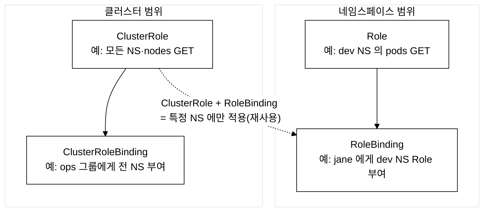
_그림 0. RBAC 4가지 리소스의 정의·부여 분리와 범위별 조합._

세 가지 핵심 조합:
- **Role + RoleBinding**: 특정 namespace 안에서만 유효. 가장 흔하다. 예) "개발팀은 자기 NS 의 Pod 만 만진다".
- **ClusterRole + ClusterRoleBinding**: 클러스터 전체에서 유효. 예) "노드 읽기 권한을 운영팀에게 전 namespace 에서 준다". 노드는 namespace 가 없는(cluster-scoped) 리소스이므로 namespace 범위 Role 로는 표현조차 불가능하다.
- **ClusterRole + RoleBinding**: ClusterRole(권한 정의)을 만들어 두고, 여러 namespace 에서 RoleBinding 으로 가져다 쓴다. "같은 정책을 여러 NS 에 재사용"할 때. 반대로 Role + ClusterRoleBinding 은 불가능하다(Role 은 namespace 범위라 클러스터 전체로 못 넓힌다).

---

### 문제 7. ClusterRoleBinding 생성 [4%]

**컨텍스트:** `kubectl config use-context platform`

`ops-team` 그룹에게 클러스터 전체에서 노드를 조회(get, list, watch)할 수 있는 권한을 부여하라.

<details>
<summary>풀이 과정</summary>

```bash
kubectl config use-context platform

# ClusterRole 생성
kubectl create clusterrole node-viewer \
  --verb=get,list,watch \
  --resource=nodes

# ClusterRoleBinding 생성
kubectl create clusterrolebinding ops-node-viewer \
  --clusterrole=node-viewer \
  --group=ops-team

# 확인
kubectl auth can-i list nodes --as=jane --as-group=ops-team
kubectl auth can-i delete nodes --as=jane --as-group=ops-team
```

**검증 - 기대 출력:**
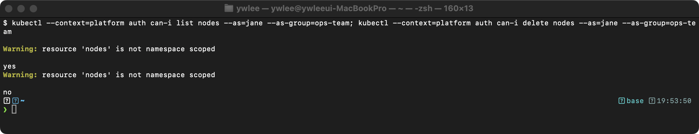

`list`와 `watch`는 허용했지만 `delete`는 허용하지 않았으므로 `no`가 반환된다.

</details>

---

### 문제 8. 기존 RBAC 분석 [4%]

**컨텍스트:** `kubectl config use-context platform`

`cluster-admin` ClusterRole의 권한 규칙을 확인하고 `/tmp/cluster-admin-rules.txt`에 저장하라.

<details>
<summary>풀이 과정</summary>

```bash
kubectl config use-context platform

kubectl describe clusterrole cluster-admin > /tmp/cluster-admin-rules.txt
# 또는
kubectl get clusterrole cluster-admin -o yaml > /tmp/cluster-admin-rules.txt

cat /tmp/cluster-admin-rules.txt
```

`kubectl describe clusterrole cluster-admin` 의 실제 출력은 tart 실습 1 절의 스크린샷(images/day06-05-cluster-admin.png) 을 참조한다.

**예상 출력 해석:** `cluster-admin` 은 K8s 가 기본 제공하는 표준 ClusterRole 이다. 첫 규칙 `*.*`(모든 apiGroup 의 모든 리소스) + `[*]`(모든 verb)은 모든 리소스를 모든 동작으로 제어할 수 있다는 뜻이고, 둘째 규칙은 모든 Non-Resource URL(`/healthz` 같은 리소스가 아닌 경로)에 대한 권한이다. 표준 kubeadm 설치(이 저장소의 dev 클러스터 포함)에서는 어느 클러스터든 동일하게 나온다. 만약 자신의 출력이 이와 다르다면 cluster-admin 이 수정됐거나 다른 ClusterRole 을 조회한 것이다.

</details>

---

### 문제 9. Pod에서 SA 토큰 확인 [4%]

**컨텍스트:** `kubectl config use-context dev`

1. `demo` 네임스페이스에 `api-checker` SA를 생성하라
2. `api-checker` SA를 사용하는 Pod `sa-test`를 생성하라 (이미지: busybox:1.36)
3. Pod 내부에서 SA 토큰 경로를 확인하라

Pod 가 생성되면 K8s 는 그 Pod 에 할당된 ServiceAccount 의 토큰을 `/var/run/secrets/kubernetes.io/serviceaccount/` 경로에 secret 볼륨으로 자동 마운트한다. 이 디렉터리에는 `token`(JWT 형태의 인증 토큰), `ca.crt`(API 서버의 CA 인증서), `namespace`(Pod 가 속한 네임스페이스 이름) 세 파일이 들어간다. 아래 매니페스트의 `sleep 3600` 은 `ls` 출력 후 컨테이너가 즉시 종료(Completed)되지 않도록 1시간 대기시켜, 이후 `kubectl exec` 로 들어가 내부를 확인할 수 있게 하는 장치다.

<details>
<summary>풀이 과정</summary>

```bash
kubectl config use-context dev

# SA 생성
kubectl create serviceaccount api-checker -n demo

# Pod 생성
cat <<EOF | kubectl apply -f -
apiVersion: v1
kind: Pod
metadata:
  name: sa-test
  namespace: demo
spec:
  serviceAccountName: api-checker
  containers:
  - name: app
    image: busybox:1.36
    command: ["sh", "-c", "ls -la /var/run/secrets/kubernetes.io/serviceaccount/ && sleep 3600"]
EOF

# 토큰 경로 확인
kubectl exec sa-test -n demo -- ls /var/run/secrets/kubernetes.io/serviceaccount/
# ca.crt  namespace  token

kubectl exec sa-test -n demo -- cat /var/run/secrets/kubernetes.io/serviceaccount/namespace
```

**검증 - 기대 출력 (ls):**
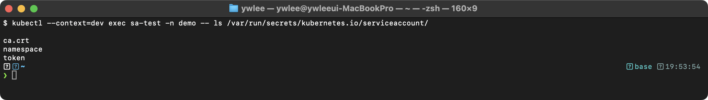

**검증 - 기대 출력 (namespace 파일 내용):**
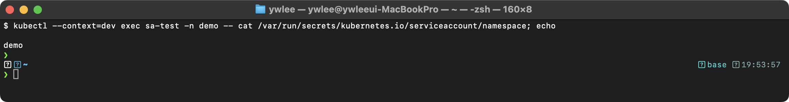

SA 토큰은 `/var/run/secrets/kubernetes.io/serviceaccount/token`에 JWT 형태로 마운트된다. `ca.crt`는 API 서버의 CA 인증서이며, Pod 내부에서 `curl --cacert`으로 API 서버에 접근할 때 사용한다.

```bash
# 정리
kubectl delete pod sa-test -n demo
kubectl delete serviceaccount api-checker -n demo
```

</details>

---

### 문제 10. 토큰 자동 마운트 비활성화 [4%]

**컨텍스트:** `kubectl config use-context dev`

`demo` 네임스페이스에 SA 토큰이 자동 마운트되지 않는 Pod를 생성하라.

문제 9 에서 본 것처럼 Pod 는 기본값(`automountServiceAccountToken: true`)으로 SA 토큰을 자동 마운트한다. 하지만 API 서버와 통신할 일이 없는 Pod(예: 외부 트래픽만 처리하는 웹 프런트엔드, 배치 연산만 하는 잡)는 토큰이 있어 봐야 공격 표면만 넓힌다. 컨테이너가 탈취되면 그 토큰으로 API 서버를 호출할 수 있기 때문이다. 따라서 토큰이 필요 없는 Pod 는 `automountServiceAccountToken: false` 로 마운트를 막는 것이 보안 모범사례(최소 권한 원칙)다.

<details>
<summary>풀이 과정</summary>

```bash
cat <<EOF | kubectl apply -f -
apiVersion: v1
kind: Pod
metadata:
  name: no-token-pod
  namespace: demo
spec:
  automountServiceAccountToken: false
  containers:
  - name: app
    image: busybox:1.36
    command: ["sh", "-c", "ls /var/run/secrets/kubernetes.io/serviceaccount/ 2>&1 || echo 'No token mounted' && sleep 3600"]
EOF

# 확인: 토큰이 마운트되지 않았는지
kubectl exec no-token-pod -n demo -- ls /var/run/secrets/kubernetes.io/serviceaccount/
```

**검증 - 기대 출력:** 토큰 디렉터리 자체가 없어 `ls` 가 `No such file or directory` 로 종료한다(`automountServiceAccountToken: false` 가 적용되면 토큰 볼륨이 마운트되지 않는다).
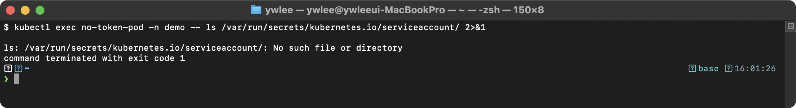

```bash
kubectl delete pod no-token-pod -n demo
```

</details>

---

### 문제 11. CSR 거부 [4%]

**컨텍스트:** `kubectl config use-context platform`

`suspicious-user`라는 이름의 CSR이 Pending 상태이다. 이 CSR을 거부(deny)하라.

CSR(CertificateSigningRequest, 인증서 서명 요청)은 새 사용자가 클러스터의 CA 에게 "내 공개키에 서명해 달라"고 요청하는 API 객체다. 제출되면 `Pending` 상태로 남고, 관리자가 검토 후 `approve`(승인) 또는 `deny`(거부)한다. 의심스러운 요청(예: 퇴사한 직원이나 출처 불명의 사용자)이면 `deny` 로 거부해야 하며, 거부된 CSR 은 서명되지 않으므로 그 사용자는 클러스터 인증서를 발급받지 못한다. 시험에서는 이렇게 Pending 인 CSR 을 승인/거부하는 문제가 자주 나온다.

<details>
<summary>풀이 과정</summary>

**실습 사전 설정** (시험 환경에서는 이미 완료돼 있으므로 이 단계를 건너뛴다. 로컬 실습 재현 시에만 실행한다.)

```bash
kubectl config use-context platform

# suspicious-user 의 개인 키 생성
openssl genrsa -out suspicious-user.key 2048

# CSR 파일 생성 (CN = suspicious-user)
openssl req -new -key suspicious-user.key \
  -out suspicious-user.csr \
  -subj "/CN=suspicious-user"

# CSR 을 base64 로 인코딩 (줄바꿈 제거 필수)
CSR_BASE64=$(cat suspicious-user.csr | base64 | tr -d '\n')

# K8s CertificateSigningRequest 오브젝트를 생성해 Pending 상태로 만든다
cat <<EOF | kubectl apply -f -
apiVersion: certificates.k8s.io/v1
kind: CertificateSigningRequest
metadata:
  name: suspicious-user
spec:
  request: ${CSR_BASE64}
  signerName: kubernetes.io/kube-apiserver-client
  usages:
    - client auth
EOF
```

```bash
kubectl config use-context platform

# CSR 확인 (CONDITION = Pending 인지 확인)
kubectl get csr

# CSR 거부
kubectl certificate deny suspicious-user

# 확인
kubectl get csr suspicious-user
```

**검증 - 기대 출력:** `certificate deny` 직후 `CONDITION` 열이 `Denied` 로 바뀐다(거부된 CSR 은 서명되지 않으므로 해당 사용자는 인증서를 발급받지 못한다).
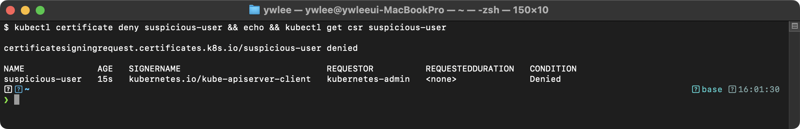

</details>

---

### 문제 12. 권한 감사 (auth can-i --list) [7%]

**컨텍스트:** `kubectl config use-context dev`

사용자 `tom`이 `demo` 네임스페이스에서 수행할 수 있는 모든 작업을 확인하여 `/tmp/tom-permissions.txt`에 저장하라.

<details>
<summary>풀이 과정</summary>

**실습 사전 설정** (시험 환경에서는 Role·RoleBinding 이 이미 존재한다. 로컬 실습에서는 아래 명령으로 사전 설정 후 본 풀이를 실행한다.)

```bash
kubectl config use-context dev

# demo 네임스페이스가 없으면 생성
kubectl get namespace demo || kubectl create namespace demo

# tom 에게 부여할 pod-reader Role 생성
kubectl create role pod-reader \
  --verb=get,list,watch \
  --resource=pods \
  -n demo \
  --dry-run=client -o yaml | kubectl apply -f -

# tom 에게 pod-reader Role 을 바인딩
kubectl create rolebinding tom-pod-reader \
  --role=pod-reader \
  --user=tom \
  -n demo \
  --dry-run=client -o yaml | kubectl apply -f -
```

```bash
kubectl config use-context dev

kubectl auth can-i --list --as=tom -n demo > /tmp/tom-permissions.txt

cat /tmp/tom-permissions.txt
```

**검증 - 기대 출력:** `auth can-i --list --as=tom` 은 RBAC 로 tom 에게 허용된 리소스·verb 목록을 표로 출력한다(아래는 트러블슈팅 절의 동일 명령 캡처). 모든 사용자에게 기본 부여되는 `selfsubjectaccessreviews`·`selfsubjectrulesreviews` 외에, RoleBinding 으로 부여한 `pods [get list watch ...]` 가 함께 보인다.
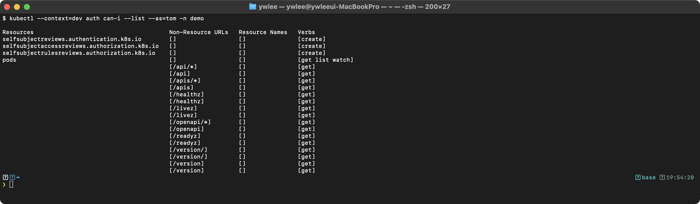

</details>

---

## 8. 추가 YAML 예제 및 고급 RBAC 패턴

문제 7~12 에서 다룬 기본 4가지 리소스(Role/RoleBinding/ClusterRole/ClusterRoleBinding)와 ServiceAccount 를 넘어선 고급 사용례를 모았다. 시험에도 자주 출제되므로 "왜 이걸 쓰는가"를 같이 익힌다. 각 예제 앞의 (CKA 출제율) 태그로 우선순위를 잡으면 된다.

### 8.1 리소스 이름 기반 제한

(CKA 출제율: 높음) 특정 이름의 리소스에만 권한을 제한하는 패턴이다. 예를 들어 "nginx-web 와 redis 라는 이름의 Pod 만 수정 가능"처럼 같은 종류 리소스 중 일부만 허용할 때 `resourceNames` 를 쓴다.

```yaml
# 특정 리소스 이름에 대해서만 권한을 부여하는 Role
apiVersion: rbac.authorization.k8s.io/v1
kind: Role
metadata:
  name: specific-pod-admin
  namespace: demo
rules:
- apiGroups: [""]
  resources: ["pods"]
  resourceNames: ["nginx-web", "redis"]    # 이 이름의 Pod에 대해서만 권한
  verbs: ["get", "update", "delete"]
- apiGroups: [""]
  resources: ["configmaps"]
  resourceNames: ["app-config"]            # 이 ConfigMap에 대해서만
  verbs: ["get", "update"]
```

### 8.2 하위 리소스(Sub-resource) 권한

```yaml
# Pod의 하위 리소스(로그, exec 등)에 대한 권한
apiVersion: rbac.authorization.k8s.io/v1
kind: Role
metadata:
  name: pod-debug
  namespace: demo
rules:
- apiGroups: [""]
  resources: ["pods"]
  verbs: ["get", "list"]
- apiGroups: [""]
  resources: ["pods/log"]                  # Pod 로그 조회
  verbs: ["get"]
- apiGroups: [""]
  resources: ["pods/exec"]                 # Pod exec 실행
  verbs: ["create"]
- apiGroups: [""]
  resources: ["pods/portforward"]          # Pod 포트 포워딩
  verbs: ["create"]
```

### 8.3 비-네임스페이스 리소스용 ClusterRole

노드·PV·StorageClass 는 특정 네임스페이스에 속하지 않는 클러스터 공유 인프라 자원이다. 노드는 클러스터 인프라 그 자체이고, PV 는 네임스페이스보다 상위의 공유 스토리지 자원이며, StorageClass 는 클러스터 전체 스토리지 정책을 정의한다. 이 리소스들은 어느 네임스페이스에도 속하지 않으므로, 네임스페이스 범위인 Role 로는 권한을 표현할 수 없다. ClusterRole 만이 이 리소스를 다룰 수 있다.

```yaml
# 비-네임스페이스 리소스(노드, PV 등)에 대한 ClusterRole
apiVersion: rbac.authorization.k8s.io/v1
kind: ClusterRole
metadata:
  name: infrastructure-viewer
rules:
- apiGroups: [""]
  resources: ["nodes"]                     # 노드 (비-네임스페이스)
  verbs: ["get", "list", "watch"]
- apiGroups: [""]
  resources: ["persistentvolumes"]         # PV (비-네임스페이스)
  verbs: ["get", "list"]
- apiGroups: ["storage.k8s.io"]
  resources: ["storageclasses"]            # StorageClass (비-네임스페이스)
  verbs: ["get", "list"]
- apiGroups: [""]
  resources: ["namespaces"]                # 네임스페이스 자체도 비-네임스페이스 리소스
  verbs: ["get", "list"]
```

### 8.4 Aggregated ClusterRole

(CKA 출제율: 중간) Aggregated ClusterRole 은 여러 ClusterRole 을 라벨로 묶어 하나의 상위 역할에 자동 합쳐 넣는 기능이다. 라벨 `rbac.authorization.k8s.io/aggregate-to-view: "true"` 는 "이 규칙을 기본 `view` ClusterRole 에 자동으로 병합(aggregate)하라"는 뜻이다. 즉 아래 ClusterRole 을 만들기만 하면, 별도 바인딩 없이도 기존에 `view` 권한을 가진 사용자가 `servicemonitors`·`prometheusrules` 까지 조회할 수 있게 된다. K8s 의 aggregation controller 가 이 라벨을 감지해 `view`(또는 `edit`/`admin`) ClusterRole 의 rules 에 자동으로 합쳐 넣는다.

```yaml
# 라벨 기반으로 자동 집계되는 ClusterRole
apiVersion: rbac.authorization.k8s.io/v1
kind: ClusterRole
metadata:
  name: monitoring-view
  labels:
    rbac.authorization.k8s.io/aggregate-to-view: "true"    # view ClusterRole에 자동 집계
rules:
- apiGroups: ["monitoring.coreos.com"]
  resources: ["servicemonitors", "prometheusrules"]
  verbs: ["get", "list", "watch"]
```

병합이 실제로 이루어졌는지 확인하려면 아래 명령으로 `view` ClusterRole 의 rules 에 `servicemonitors`·`prometheusrules` 항목이 추가됐는지 확인한다. aggregation controller 가 라벨을 감지해 반영하는 데 수 초가 걸릴 수 있으므로, 적용 직후 바로 조회하면 아직 병합 전일 수 있다.

```bash
kubectl apply -f monitoring-view-clusterrole.yaml
# 병합 확인 (monitoring.coreos.com 항목이 view 의 rules 에 나타나야 한다)
kubectl get clusterrole view -o yaml | grep -A3 monitoring.coreos.com
```

결과에 `monitoring.coreos.com` 항목이 없으면 aggregation controller 가 아직 반영하지 않은 것이다. `kubectl get clusterrole view -o yaml` 전체를 보면서 rules 배열 끝에 추가됐는지 직접 확인한다. (미실측 — 실습 클러스터에서 prometheus-operator 가 설치된 platform 클러스터 대신, CRD 없는 dev 클러스터에서는 `servicemonitors` CRD 자체가 없어 이 예제는 platform 에서만 동작한다.)

### 8.5 kubeconfig 전체 예제

```yaml
# 완전한 kubeconfig 파일 예제
apiVersion: v1
kind: Config
preferences: {}
current-context: dev-admin                  # 현재 사용할 컨텍스트

clusters:
- name: dev-cluster
  cluster:
    server: https://192.168.64.20:6443     # API 서버 주소
    certificate-authority-data: LS0tLS...   # CA 인증서 (base64)

- name: prod-cluster
  cluster:
    server: https://192.168.64.40:6443
    certificate-authority-data: LS0tLS...

users:
- name: admin
  user:
    client-certificate-data: LS0tLS...      # 클라이언트 인증서 (base64)
    client-key-data: LS0tLS...              # 클라이언트 개인키 (base64)

- name: dev-user
  user:
    token: eyJhbGciOiJSUzI1NiIs...         # Bearer 토큰 방식

contexts:
- name: dev-admin
  context:
    cluster: dev-cluster
    user: admin
    namespace: demo                         # 기본 네임스페이스

- name: prod-admin
  context:
    cluster: prod-cluster
    user: admin
    namespace: default
```

---

## 9. 복습 체크리스트

### 개념 확인

- [ ] Role과 ClusterRole의 범위 차이를 설명할 수 있는가?
- [ ] RoleBinding이 ClusterRole을 참조하면 어떻게 되는지 이해하는가?
- [ ] Core API 그룹의 apiGroups가 `[""]`인 것을 기억하는가?
- [ ] SA의 `--as` 형식 (`system:serviceaccount:<ns>:<name>`)을 암기했는가?
- [ ] CSR 처리 5단계(키생성 → CSR생성 → K8s CSR → 승인 → 인증서추출)를 외웠는가?

### 시험 팁

1. **RBAC 빠른 생성** -- `kubectl create role`과 `kubectl create rolebinding`이 YAML보다 빠르다
2. **권한 확인** -- `kubectl auth can-i --as=<user> -n <ns>`로 항상 검증한다
3. **SA 형식** -- `--as=system:serviceaccount:<ns>:<sa-name>`
4. **CSR request 필드** -- base64 인코딩 시 `tr -d '\n'` 줄바꿈 제거 필수
5. **API 그룹** -- pods/services는 `""`, deployments는 `"apps"`, networkpolicies는 `"networking.k8s.io"`

#### K8s 주요 verb 빠른 참조표

| 분류 | verb | 비고 |
|:--|:--|:--|
| 읽기 | `get`, `list`, `watch` | `get` 단건, `list` 목록, `watch` 스트림 감시 |
| 쓰기 | `create`, `update`, `patch`, `delete` | `update` 는 전체 교체, `patch` 는 부분 수정(JSON Merge·Strategic Merge·JSON Patch) |
| 일괄 삭제 | `deletecollection` | `kubectl delete --all` 처럼 조건에 맞는 전체 삭제 |
| 특수(Pod) | `exec`, `portforward` | 각각 `pods/exec`, `pods/portforward` 서브리소스로 별도 권한 필요 |
| 권한 위임 | `bind`, `escalate`, `impersonate` | `bind` = 역할 바인딩 생성 권한, `escalate` = 자신보다 높은 권한 Role 생성 허용, `impersonate` = `--as` 플래그 사용 허용 |

> 시험 팁: "Deployment 를 수정할 수 있는 Role" 요구 시 `update` + `patch` 를 모두 넣는다. `update` 만 있으면 `kubectl patch` 가 거부된다.

---

## 내일 예고

**Day 7: Deployment & Rolling Update** -- Deployment 전략, ReplicaSet 관리, 롤링업데이트/롤백을 실습한다. `kubectl create deployment --dry-run=client -o yaml`을 반드시 연습해오자.

---

## tart-infra 실습

### 실습 환경 설정

**전제:** tart 클러스터가 가동 중이어야 한다(`./scripts/boot.sh` 후 재부팅했다면 `./scripts/fix-cluster-ip-drift.sh` 로 IP 드리프트 복구). kubeconfig 는 `~/sideproejct/IaC_apple_sillicon/kubeconfig/<클러스터>.yaml` 에 클러스터별로 있다. 아래 분석·테스트(실습 1~2)는 읽기 위주라 상주 서비스가 있는 platform 에서 해도 무방하나, 네임스페이스·Role 을 만드는 실습 3 처럼 변경이 따르는 작업은 파괴 실습이 허용된 dev/staging 에서 한다(platform/prod 금지). 아래 `kubectl get nodes` 가 모든 노드 Ready 로 나오면 준비가 된 것이다.

```bash
# platform 클러스터에서 RBAC 구성 확인
export KUBECONFIG=~/sideproejct/IaC_apple_sillicon/kubeconfig/platform.yaml
kubectl get nodes
```

### 실습 1: 기존 ClusterRole 분석

```bash
# 시스템 ClusterRole 목록 확인
kubectl get clusterroles | head -20
```

**예상 출력 (dev 실측 — 앞 19줄, CNI 로 `cilium`/`cilium-operator`, kubeadm 의 `kubeadm:get-nodes` 도 보인다):**
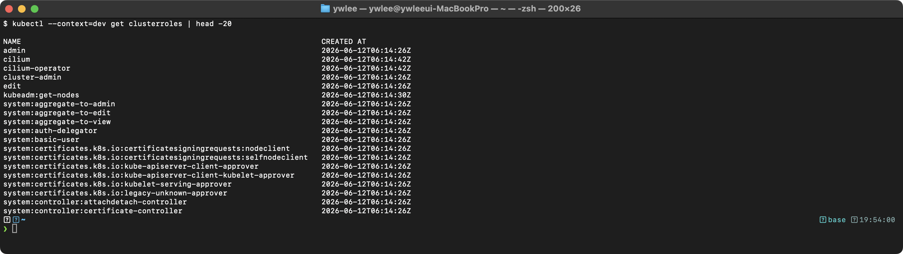

**동작 원리:** ClusterRole은 클러스터 범위의 권한 정의이다:
1. API Server가 etcd에서 ClusterRole 오브젝트 목록을 조회한다
2. `admin`, `edit`, `view`는 K8s가 기본 제공하는 aggregated ClusterRole이다
3. `cluster-admin`은 모든 리소스에 대한 모든 동작을 허용하는 최상위 권한이다
4. `system:` 접두사는 K8s 내부 구성요소가 사용하는 Role을 나타낸다

```bash
# cluster-admin의 구체적 권한 확인
kubectl describe clusterrole cluster-admin
```

**예상 출력 (dev 실측):**
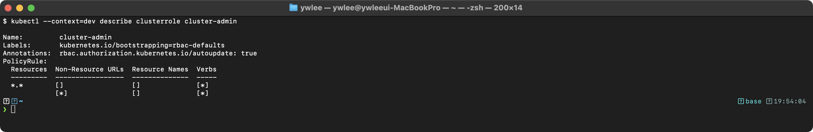
> `*.*`(모든 리소스) + `[*]`(모든 verb), 그리고 두 번째 규칙은 모든 Non-Resource URL 에 대한 권한이다. `autoupdate: true` 라 API 서버가 기본 규칙을 자동 갱신한다.

### 실습 2: RBAC 권한 테스트

```bash
# 현재 사용자의 권한 확인
kubectl auth can-i create deployments
kubectl auth can-i delete nodes

# ServiceAccount 권한 확인
kubectl auth can-i list pods --as=system:serviceaccount:kube-system:coredns -n kube-system
kubectl auth can-i list pods --as=system:serviceaccount:kube-system:coredns -n default
```

**예상 출력 (dev 실측):**
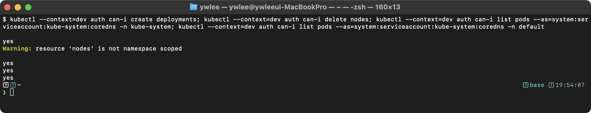
> `delete nodes` 는 `Warning: resource 'nodes' is not namespace scoped` 경고(stderr)와 함께 `yes` 가 나온다(현재 admin 컨텍스트가 cluster-admin 이므로). coredns SA 는 `-n default` 에서도 `yes` 다 — 아래 4번 참고.

**동작 원리:** `kubectl auth can-i`는 SubjectAccessReview API를 사용한다:
1. kubectl이 `/apis/authorization.k8s.io/v1/selfsubjectaccessreviews` 엔드포인트에 요청을 보낸다
2. API Server가 RBAC 인가 모듈에서 해당 사용자/SA의 Role/ClusterRole 바인딩을 확인한다
3. `--as` 플래그는 impersonation(사칭) 기능으로, 다른 사용자의 권한을 시뮬레이션한다
4. coredns SA 는 `system:coredns` **ClusterRole**(ClusterRoleBinding)로 바인딩돼 pods·endpoints·services·namespaces 를 **클러스터 전 범위**에서 list/watch 할 수 있다. 따라서 `-n default` 에서도 `yes` 다(네임스페이스 한정 Role 이 아니다). 실측으로 확인한 결과이며, 네임스페이스 경계를 가지려면 ClusterRole 대신 네임스페이스 Role 로 바인딩해야 한다.

### 실습 3: Role과 RoleBinding 생성

```bash
# 실습용 네임스페이스 생성
kubectl create namespace rbac-test

# Role 생성 (pods와 services의 get, list, watch 권한)
kubectl create role pod-reader \
  --verb=get,list,watch \
  --resource=pods,services \
  -n rbac-test

# RoleBinding 생성
kubectl create rolebinding pod-reader-binding \
  --role=pod-reader \
  --serviceaccount=rbac-test:default \
  -n rbac-test

# 권한 확인
kubectl auth can-i list pods -n rbac-test --as=system:serviceaccount:rbac-test:default
kubectl auth can-i create pods -n rbac-test --as=system:serviceaccount:rbac-test:default
```

**검증 - 기대 출력:** Role·RoleBinding 이 생성되고, default SA 가 `list pods`=yes / `create pods`=no — pod-reader 가 읽기 권한만 부여했음을 확인한다(dev 실측).
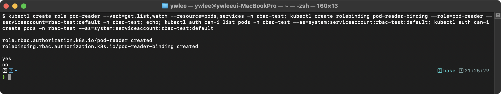

**동작 원리:** Role → RoleBinding → Subject 바인딩 흐름:
1. Role은 "어떤 리소스에 어떤 동작을 허용할지"를 정의한다 (verbs + resources)
2. RoleBinding은 Role을 특정 Subject(User, Group, ServiceAccount)에 바인딩한다
3. Role은 네임스페이스 범위이므로, rbac-test 네임스페이스에서만 유효하다
4. 같은 SA가 다른 네임스페이스의 pods를 조회하려면 해당 네임스페이스에도 별도 RoleBinding이 필요하다

```bash
# 실습 후 정리
kubectl delete namespace rbac-test
```

### 실습 4: 인증서 정보 확인

```bash
# API Server 인증서 만료일 확인 (SSH로 master 접속 후)
# tart ssh platform-master
# sudo kubeadm certs check-expiration
```

**예상 출력 (dev-master 실측 — kube-proxy 없어 `configmaps "kube-proxy" not found` 경고가 함께 나온다):**
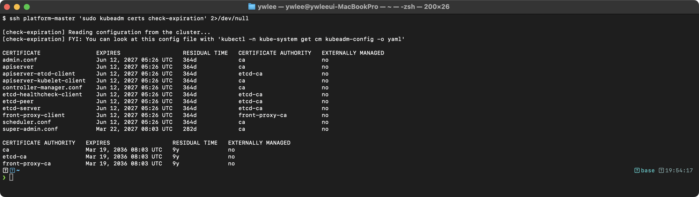
> EXPIRES 날짜는 클러스터 생성 시점 기준이다(이 dev 는 방금 `reset-cluster.sh` 로 만들어 1년 뒤인 2027-06-12). 컴포넌트별 CA(`ca`/`etcd-ca`/`front-proxy-ca`)와 `super-admin.conf`(v1.29+ 추가)까지 11개가 나온다.

**동작 원리:** kubeadm이 생성하는 인증서 체계(PKI):
1. `/etc/kubernetes/pki/ca.crt` — 클러스터 루트 CA (10년 유효)
2. 나머지 인증서 — CA가 서명한 개별 인증서 (1년 유효, kubeadm으로 갱신)
3. `kubeadm certs renew all`로 모든 인증서를 한 번에 갱신할 수 있다
4. 인증서 갱신 후 Static Pod가 자동 재시작되어 새 인증서를 로드한다

---

## 추가 심화 학습: RBAC 고급 패턴과 CSR 처리

> 읽는 순서 안내: 문제 7~12(기본 RBAC) → 섹션 8(고급 패턴 YAML) → 복습 체크리스트·시험 팁 → tart-infra 실습(실제 dev/platform 클러스터에서 손으로 검증)을 먼저 끝낸 뒤, 시험 직전 정리용으로 이 심화 단원을 본다. 여기서는 앞서 흩어져 나온 4가지 리소스 비교, ClusterRole 재사용, ServiceAccount 토큰 흐름, CSR 발급 절차를 한곳에 모아 복기한다.

### RBAC 4가지 리소스 비교표

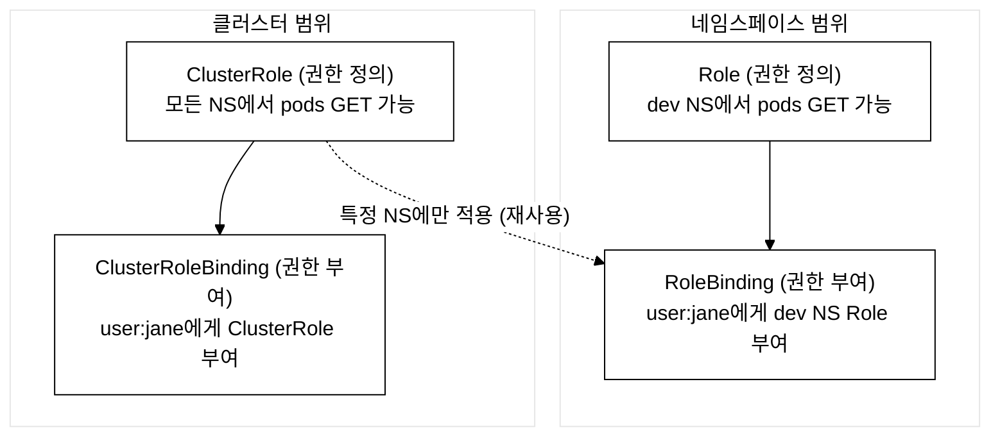
_그림 1. RBAC 리소스의 네임스페이스·클러스터 범위별 인가 구조와 조합._

중요한 조합:
- Role + RoleBinding: 특정 NS에서만 유효 (가장 일반적)
- ClusterRole + ClusterRoleBinding: 클러스터 전체에서 유효
- ClusterRole + RoleBinding: ClusterRole을 특정 NS에만 적용 (재사용)
- Role + ClusterRoleBinding: 불가능 (Role은 NS 범위이므로)

### ClusterRole + RoleBinding 재사용 패턴 (YAML 상세)

```yaml
# 하나의 ClusterRole을 여러 네임스페이스에서 재사용하는 패턴
# ── 이 패턴은 CKA 시험에서 자주 출제된다 ──

# Step 1: ClusterRole 정의 (한 번만)
apiVersion: rbac.authorization.k8s.io/v1   # RBAC API 그룹
kind: ClusterRole                          # 클러스터 범위 역할
metadata:
  name: pod-reader                         # 역할 이름
rules:
  - apiGroups: [""]         # 코어 API 그룹 (Pod, Service, ConfigMap 등)
    resources: ["pods"]     # 대상 리소스: Pod
    verbs: ["get", "watch", "list"]  # 허용 동작: 읽기만 가능
---
# Step 2: dev 네임스페이스에 RoleBinding
apiVersion: rbac.authorization.k8s.io/v1
kind: RoleBinding                          # 네임스페이스 범위 바인딩
metadata:
  name: pod-reader-binding-dev             # 바인딩 이름
  namespace: dev                           # 이 NS에서만 유효!
subjects:
  - kind: User                             # 사용자에게 부여
    name: jane                             # 사용자 이름
    apiGroup: rbac.authorization.k8s.io
roleRef:
  kind: ClusterRole                        # ClusterRole을 참조
  name: pod-reader                         # 위에서 정의한 ClusterRole
  apiGroup: rbac.authorization.k8s.io
---
# Step 3: staging 네임스페이스에도 동일 ClusterRole 재사용
apiVersion: rbac.authorization.k8s.io/v1
kind: RoleBinding
metadata:
  name: pod-reader-binding-staging
  namespace: staging                       # staging NS에서만 유효!
subjects:
  - kind: User
    name: jane
    apiGroup: rbac.authorization.k8s.io
roleRef:
  kind: ClusterRole
  name: pod-reader                         # 같은 ClusterRole 재사용!
  apiGroup: rbac.authorization.k8s.io
```

**동작 원리:** ClusterRole + RoleBinding 조합:
1. ClusterRole을 한 번 정의하면 여러 NS에서 RoleBinding으로 재사용 가능
2. ClusterRoleBinding을 쓰면 모든 NS에 적용되지만, RoleBinding은 특정 NS만
3. 이 패턴은 "최소 권한 원칙"을 지키면서 역할을 재사용하는 모범 사례

### ServiceAccount 동작 원리 상세

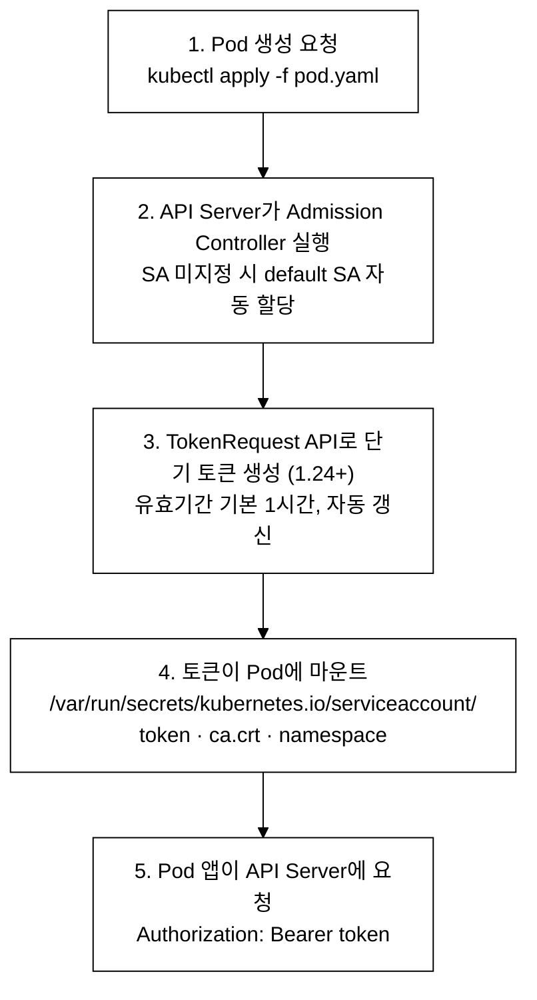
_그림 2. ServiceAccount 토큰 마운트 흐름._

### ServiceAccount YAML 상세 예제

```yaml
# ServiceAccount 생성
apiVersion: v1
kind: ServiceAccount            # 서비스 어카운트 리소스
metadata:
  name: monitoring-sa            # SA 이름
  namespace: monitoring          # 소속 네임스페이스
automountServiceAccountToken: true  # Pod에 토큰 자동 마운트 여부
---
# 이 SA에 부여할 ClusterRole
apiVersion: rbac.authorization.k8s.io/v1
kind: ClusterRole
metadata:
  name: monitoring-reader
rules:
  - apiGroups: [""]
    resources: ["pods", "nodes", "services"]  # 읽기 대상 리소스
    verbs: ["get", "list", "watch"]           # 읽기 전용
  - apiGroups: ["apps"]
    resources: ["deployments", "replicasets"] # apps 그룹 리소스
    verbs: ["get", "list", "watch"]
  - apiGroups: ["metrics.k8s.io"]             # metrics API
    resources: ["pods", "nodes"]
    verbs: ["get", "list"]
---
# SA에 ClusterRole 바인딩
apiVersion: rbac.authorization.k8s.io/v1
kind: ClusterRoleBinding
metadata:
  name: monitoring-reader-binding
subjects:
  - kind: ServiceAccount           # Subject 타입: ServiceAccount
    name: monitoring-sa            # 위에서 만든 SA
    namespace: monitoring          # SA가 속한 네임스페이스 (필수!)
roleRef:
  kind: ClusterRole
  name: monitoring-reader
  apiGroup: rbac.authorization.k8s.io
---
# SA를 사용하는 Pod
apiVersion: v1
kind: Pod
metadata:
  name: monitoring-agent
  namespace: monitoring
spec:
  serviceAccountName: monitoring-sa  # 이 SA의 토큰으로 API 인증
  containers:
    - name: agent
      image: monitoring-agent:1.0
      # Pod 내부에서 자동으로 /var/run/secrets/... 에 토큰이 마운트됨
```

### CertificateSigningRequest (CSR) 처리 절차

```bash
# CKA 시험 출제 패턴: 새로운 사용자에게 인증서를 발급하는 절차

# Step 1: 개인 키 생성
openssl genrsa -out user-jane.key 2048

# Step 2: CSR 생성 (CN = 사용자 이름, O = 그룹)
openssl req -new -key user-jane.key \
  -out user-jane.csr \
  -subj "/CN=jane/O=developers"

# Step 3: CSR을 Base64로 인코딩
CSR_BASE64=$(cat user-jane.csr | base64 | tr -d '\n')

# Step 4: CertificateSigningRequest 오브젝트 생성
cat <<EOF | kubectl apply -f -
apiVersion: certificates.k8s.io/v1
kind: CertificateSigningRequest
metadata:
  name: jane-csr
spec:
  request: ${CSR_BASE64}
  signerName: kubernetes.io/kube-apiserver-client
  # signerName: 어떤 CA 가 서명할지 지정한다.
  #   - kubernetes.io/kube-apiserver-client  → kubectl 같은 클라이언트 인증서(사용자 인증용). CKA 시험 기준 이 값을 기본으로 쓴다.
  #   - kubernetes.io/kubelet-serving        → kubelet 의 TLS 서빙 인증서(API 서버가 kubelet 에 접속할 때 사용).
  # 잘못 지정하면 CSR 이 Approved 상태가 돼도 인증서(.status.certificate)가 채워지지 않아 실패한다.
  expirationSeconds: 86400    # 24시간 유효
  usages:
    - client auth              # 클라이언트 인증용
EOF

# Step 5: CSR 승인
kubectl certificate approve jane-csr

# Step 6: 승인된 인증서 추출 (approve 후 status.certificate 에 서명된 인증서가 채워진다)
# 디코딩 옵션 환경별 차이: Linux(GNU)는 base64 -d, macOS(BSD)는 base64 -D.
# --decode 는 GNU coreutils 한정 롱옵션이라 macOS 기본 base64 에는 없다.
# 시험 환경(리눅스 노드)에서는 -d 를 쓰면 되고, 로컬 macOS 에서 재현할 때만 -D 로 바꾼다.
kubectl get csr jane-csr -o jsonpath='{.status.certificate}' | base64 -d > user-jane.crt   # macOS: base64 -D

# Step 7: kubeconfig에 사용자 추가
kubectl config set-credentials jane \
  --client-certificate=user-jane.crt \
  --client-key=user-jane.key

kubectl config set-context jane-ctx \
  --cluster=kubernetes \
  --namespace=dev \
  --user=jane
```

**동작 원리:** CSR 승인 흐름:
1. 사용자가 개인 키로 CSR을 생성 → 클러스터 CA에게 서명을 요청하는 것
2. CSR 오브젝트를 API Server에 제출 → Pending 상태
3. 관리자가 `certificate approve` → K8s CA가 인증서에 서명
4. 서명된 인증서(.crt)로 kubeconfig를 구성하면 해당 사용자로 인증 가능
5. CN(Common Name)이 사용자 이름, O(Organization)가 그룹이 된다

### 연습 문제: RBAC 시나리오

**문제 1:** `dev` 네임스페이스에서 Deployment만 생성/수정/삭제할 수 있는 Role을 만들고, 사용자 `john`에게 바인딩하시오.

```bash
# 정답 (kubectl 명령어 - 시험에서 빠른 풀이용):
kubectl create role deploy-manager \
  --verb=create,update,delete,get,list \
  --resource=deployments \
  -n dev

kubectl create rolebinding deploy-manager-binding \
  --role=deploy-manager \
  --user=john \
  -n dev

# 확인
kubectl auth can-i create deployments -n dev --as=john    # yes
kubectl auth can-i delete pods -n dev --as=john           # no (pods 권한 없음)
kubectl auth can-i create deployments -n prod --as=john   # no (dev NS만 유효)
```

**문제 2:** 모든 네임스페이스에서 Pod 로그를 볼 수 있는 ClusterRole을 만들고, 그룹 `sre-team`에 바인딩하시오.

```bash
# 정답:
kubectl create clusterrole log-reader \
  --verb=get,list \
  --resource=pods,pods/log    # pods/log = 서브리소스!

kubectl create clusterrolebinding log-reader-binding \
  --clusterrole=log-reader \
  --group=sre-team

# 확인
kubectl auth can-i get pods/log --all-namespaces --as-group=sre-team --as=test
```

**동작 원리:** 서브리소스(subresource):
1. `pods/log`: Pod 로그 접근 권한
2. `pods/exec`: Pod에 exec 접근 권한
3. `pods/portforward`: 포트포워딩 권한
4. `nodes/proxy`: 노드 프록시 접근
5. 서브리소스는 별도로 권한을 부여해야 한다 (pods 권한만으로는 logs 접근 불가)

### kubeconfig 수동 생성 (시험 대비)

```yaml
# kubeconfig 구조 상세 설명
apiVersion: v1
kind: Config
current-context: jane-ctx            # 현재 활성 컨텍스트

clusters:                            # 클러스터 목록
  - cluster:
      certificate-authority-data: LS0t...  # CA 인증서 (Base64)
      server: https://10.0.0.10:6443       # API Server 주소
    name: kubernetes                       # 클러스터 이름

users:                               # 사용자 목록
  - name: jane                       # 사용자 이름
    user:
      client-certificate-data: LS0t...  # 클라이언트 인증서 (Base64)
      client-key-data: LS0t...          # 클라이언트 키 (Base64)

contexts:                            # 컨텍스트 = 클러스터 + 사용자 + 네임스페이스
  - context:
      cluster: kubernetes            # 어떤 클러스터에
      namespace: dev                 # 어떤 네임스페이스에서
      user: jane                     # 어떤 사용자로
    name: jane-ctx                   # 컨텍스트 이름
```

**동작 원리:** kubeconfig 3요소:
1. **Cluster**: API Server 주소 + CA 인증서 (서버 신뢰)
2. **User**: 클라이언트 인증서 + 키 (사용자 증명) 또는 토큰
3. **Context**: Cluster + User + Namespace의 조합 (편의를 위한 단축키)

### CKA 시험 팁: RBAC 빠른 풀이 전략

```
RBAC 시험 풀이 체크리스트
═════════════════════════

1. 문제를 읽고 판단:
   □ 네임스페이스 범위? → Role + RoleBinding
   □ 클러스터 범위? → ClusterRole + ClusterRoleBinding
   □ 특정 NS에 ClusterRole 적용? → ClusterRole + RoleBinding

2. kubectl 명령어로 빠르게 생성 (YAML 작성보다 빠르다!):
   kubectl create role <name> --verb=<verbs> --resource=<resources> -n <ns>
   kubectl create rolebinding <name> --role=<role> --user=<user> -n <ns>

3. 확인 방법:
   kubectl auth can-i <verb> <resource> -n <ns> --as=<user>

4. 자주 실수하는 포인트:
   - apiGroups를 빠뜨림 (kubectl 명령어는 자동 설정)
   - 서브리소스(pods/log, pods/exec) 별도 권한 필요
   - RoleBinding에 namespace 빠뜨림
   - ClusterRoleBinding의 subjects에 SA namespace 빠뜨림
```

---

## 트러블슈팅 보충

### RBAC 디버깅 빠른 참조

```bash
# 특정 사용자의 전체 권한 목록 확인
kubectl auth can-i --list --as=tom -n demo
```

![auth can-i --list --as=tom — pod-reader 바인딩으로 pods [get list watch] 보유](images/day06-08-tom-list.png)

```bash
# 특정 사용자에게 바인딩된 모든 Role/ClusterRole 확인
kubectl get rolebindings -n demo -o wide | grep tom
kubectl get clusterrolebindings -o wide | grep tom
```

```bash
# Role의 rules가 올바른지 확인
kubectl get role app-manager -n demo -o yaml | grep -A20 rules
```

**자주 발생하는 실수:**
- deployments의 apiGroups를 `[""]`로 지정 → 올바른 값은 `["apps"]`
- RoleBinding을 잘못된 네임스페이스에 생성 → 해당 네임스페이스에서만 유효하므로 다른 네임스페이스에서는 권한이 없다
- ServiceAccount의 subjects에서 `namespace` 필드 누락 → SA는 네임스페이스에 종속되므로 반드시 명시해야 한다
