# CKA Day 7: Deployment & Rolling Update 기초

> 학습 목표 | CKA 도메인: Workloads & Scheduling (15%) - Part 1 | 예상 소요 시간: 4시간

---

> **학습 연속성**: 이전 학습(day06)에서 다룬 ReplicaSet·Pod 수명주기를 전제로 하며, Deployment는 그 위에서 선언적 롤링 업데이트와 롤백을 추가한 상위 컨트롤러다. 다음 학습(day08)에서는 Deployment를 기반으로 HPA(Horizontal Pod Autoscaler)를 다룬다. **Workloads & Scheduling 도메인(15%)** 흐름: ReplicaSet(day06) → **Deployment(day07)** → HPA(day08) → DaemonSet·StatefulSet(day09).

---

## 오늘의 학습 목표

- [ ] Deployment의 내부 동작 원리를 완벽히 이해한다
- [ ] RollingUpdate와 Recreate 전략의 차이를 설명할 수 있다
- [ ] maxSurge와 maxUnavailable의 의미와 계산법을 알고 있다
- [ ] rollout 상태 확인, 이력 조회, 롤백을 자유롭게 수행한다
- [ ] 시험에서 Deployment를 빠르게 생성하고 조작한다
- [ ] Deployment Controller의 내부 동작 흐름을 설명할 수 있다
- [ ] progressDeadlineSeconds와 minReadySeconds의 역할을 이해한다

**시험 시작 직후 셋업 (CKA 실기 필수):**
```bash
alias k=kubectl
export do='--dry-run=client -o yaml'
export now='--force --grace-period 0'
```
이 세 줄을 시험 시작 즉시 터미널에 등록한다. 이후 `k`로 `kubectl`을, `$do`로 `--dry-run=client -o yaml`을, `$now`로 강제 즉시 삭제를 대체한다.
예: `k create deployment web-app --image=nginx:1.24 --replicas=3 $do > /tmp/web.yaml`

---

## 1. Deployment 완벽 이해

### 1.1 Deployment의 역할과 아키텍처

#### 등장 배경

초기 쿠버네티스에서는 ReplicationController로 Pod 수를 관리했으나, 이미지 업데이트 시 수동으로 새 ReplicationController를 생성하고 이전 것을 축소하는 `kubectl rolling-update` 명령을 실행해야 했다. 이 명령은 클라이언트(kubectl)가 전체 과정을 제어하므로, 네트워크 단절이나 터미널 종료 시 롤링 업데이트가 중간에 멈추는 문제가 있었다. Deployment는 이 과정을 서버 측 컨트롤러(Deployment Controller)가 관리하도록 바꾸어, 클라이언트 연결과 무관하게 안전한 롤링 업데이트/롤백을 보장한다.

Deployment는 ReplicaSet을 관리하는 상위 컨트롤러로, Pod Template의 선언적 업데이트와 롤백을 자동화한다. Deployment Controller는 kube-controller-manager 내에서 Watch 기반 reconciliation loop를 실행하며, Pod Template 해시 변경 시 새 ReplicaSet을 생성하고 이전 ReplicaSet의 replicas를 점진적으로 0으로 축소한다.

여기서 reconciliation loop(조정 루프)란, 사용자가 선언한 원하는 상태(Desired State, 예: replicas=3, image=nginx:1.25)와 클러스터의 실제 상태(Actual State, 현재 떠 있는 Pod)를 비교해 둘이 일치할 때까지 차이를 메우는 작업을 반복하는 것을 가리킨다. 컨트롤러는 명령을 한 번 실행하고 끝나는 것이 아니라, etcd의 변경을 Watch로 감시하다 차이가 생길 때마다 다시 일치시킨다. 이 선언적(declarative) 모델 덕분에 Pod가 죽거나 노드가 빠져도 컨트롤러가 자동으로 원하는 상태로 되돌린다.

**Deployment가 관리하는 핵심 메커니즘:**
- Pod Template이 변경되면 새 ReplicaSet이 생성되고, maxSurge/maxUnavailable 파라미터에 따라 롤링 교체가 수행된다
- 이전 ReplicaSet은 replicas=0으로 유지되어 롤백 시 해당 ReplicaSet의 Pod Template을 복원한다
- revisionHistoryLimit(기본값: 10)으로 보관할 이전 ReplicaSet 수를 제한한다

**Deployment가 제공하는 기능:**
1. **원하는 수의 Pod를 유지** -- replicas 수만큼 항상 Pod가 실행됨
2. **롤링 업데이트** -- 무중단으로 새 버전 배포
3. **롤백** -- 이전 버전으로 쉽게 되돌리기
4. **스케일링** -- Pod 수를 늘리거나 줄이기
5. **자동 복구** -- Pod가 실패하면 자동으로 새 Pod 생성
6. **일시정지/재개** -- 배포를 일시정지하고 여러 변경을 한 번에 적용
7. **배포 이력 관리** -- 이전 버전 이력을 관리하고 원하는 버전으로 롤백

### 1.2 Deployment → ReplicaSet → Pod 관계

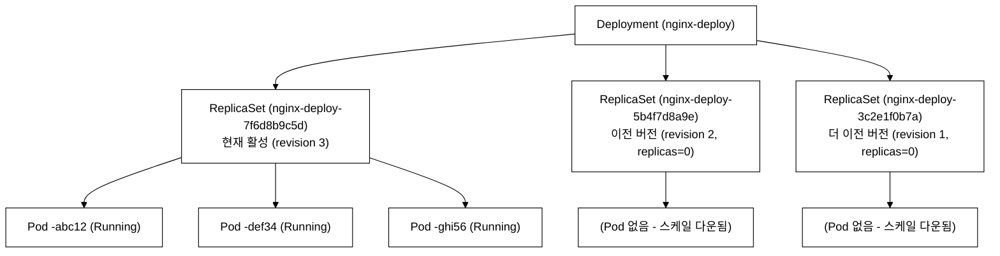
_그림 1. Deployment → ReplicaSet → Pod 관계 (이전 ReplicaSet은 롤백용으로 보관)._

**핵심:**
- Deployment는 직접 Pod를 관리하지 않는다. ReplicaSet을 통해 간접 관리한다
- 이미지 등을 업데이트하면 새 ReplicaSet이 생성되고, 이전 ReplicaSet은 replicas=0으로 유지된다
- 이전 ReplicaSet을 보관하는 이유는 **롤백**을 위해서이다
- `spec.revisionHistoryLimit`으로 보관할 ReplicaSet 수를 제한한다 (기본값: 10)

**ReplicaSet 이름 생성 규칙:**
```
ReplicaSet 이름 = Deployment 이름 + "-" + Pod Template Hash
                  nginx-deploy    +  -  + 7f6d8b9c5d

Pod Template Hash는 Pod Template(spec.template)의 내용을 해싱한 값이다.
따라서 Pod Template이 변경되면 새로운 Hash → 새로운 ReplicaSet이 생성된다.
```

여기서 해싱(hashing)이란 임의 길이의 입력(여기서는 Pod Template 전체)을 고정 길이의 짧은 문자열로 변환하는 연산이다. 같은 입력은 항상 같은 해시를, 조금이라도 다른 입력은 다른 해시를 만든다. Deployment가 이름에 해시를 붙이는 이유는 두 가지다. 첫째, ReplicaSet 이름이 서로 충돌하지 않도록(collision avoidance) 보장한다 -- 버전마다 Template이 다르면 해시도 달라 이름이 겹치지 않는다. 둘째, 롤백 편의를 위해서다 -- 같은 Pod Template으로 되돌리면 같은 해시가 나오므로, 컨트롤러가 이전 ReplicaSet을 새로 만들지 않고 보관해 둔 것을 그대로 재사용한다. 이 해시는 Pod와 ReplicaSet에 `pod-template-hash` 라벨로도 붙어, selector 충돌 없이 각 버전의 Pod를 구분하는 데 쓰인다.

**어떤 변경이 새 ReplicaSet을 트리거하는가?**
- spec.template 내부 변경 → 새 ReplicaSet 생성 (이미지, 환경변수, 명령어 등)
- spec.replicas 변경 → 새 ReplicaSet 생성 안 함 (기존 ReplicaSet의 replicas만 변경)
- metadata.labels 변경 → 새 ReplicaSet 생성 안 함

### 1.3 Deployment YAML 상세 분석

```yaml
apiVersion: apps/v1                    # API 그룹: apps, 버전: v1
                                       # Deployment는 core가 아닌 apps 그룹에 속함
                                       # kubectl api-resources | grep Deployment 로 확인 가능
kind: Deployment                       # 리소스 종류
metadata:
  name: nginx-deploy                   # Deployment 이름 (필수)
                                       # 이름은 DNS 호환 형식이어야 함 (소문자, 하이픈 허용)
  namespace: demo                      # 네임스페이스 (선택, 생략하면 default)
                                       # 네임스페이스는 한 클러스터를 논리적으로 나눈 테넌트 단위다
                                       # (리눅스 커널의 namespace와는 무관 -- 이름만 같다)
                                       # RBAC 권한, ResourceQuota, NetworkPolicy의 적용 범위가 된다
  labels:                              # Deployment 자체의 라벨 (선택)
    app: nginx-deploy                  # Deployment를 식별하기 위한 라벨
    version: v1                        # 버전 정보 라벨
  annotations:                         # 추가 메타데이터 (선택)
    description: "Nginx web server deployment"
    kubernetes.io/change-cause: "Initial deployment with nginx:1.24"
                                       # change-cause는 rollout history에 표시됨
spec:
  replicas: 3                          # 원하는 Pod 수 (기본값: 1)
                                       # → ReplicaSet이 이 수를 유지함
                                       # 0으로 설정하면 모든 Pod 삭제 (Deployment는 유지)

  revisionHistoryLimit: 10             # 보관할 이전 ReplicaSet 수 (기본값: 10)
                                       # 롤백 가능한 이력 수를 결정
                                       # 0으로 설정하면 롤백 불가!
                                       # 디스크 사용을 줄이려면 3~5 정도로 설정

  progressDeadlineSeconds: 600         # 배포 진행 타임아웃 (기본값: 600초)
                                       # 이 시간 내에 배포가 완료되지 않으면 실패로 간주
                                       # Condition: Progressing=False, Reason=ProgressDeadlineExceeded

  minReadySeconds: 0                   # 새 Pod가 Ready 후 이 시간(초)이 지나야 Available로 간주
                                       # 기본값: 0 (즉시 Available)
                                       # 프로덕션에서는 10~30초로 설정하여 안정성 확보

  selector:                            # Pod를 선택하는 조건 (필수!)
    matchLabels:                       # 이 라벨과 일치하는 Pod를 관리
      app: nginx-deploy               # ※ template.metadata.labels와 반드시 일치해야!
                                       # 일치하지 않으면 생성 시 validation 에러 발생

  strategy:                            # 배포 전략 설정
    type: RollingUpdate                # 전략 유형: RollingUpdate(기본) 또는 Recreate
    rollingUpdate:                     # RollingUpdate일 때만 사용
      maxSurge: 25%                    # replicas 대비 초과 생성 가능한 최대 Pod 수
                                       # 25% of 4 = 1 → 최대 5개까지 동시 존재
                                       # 정수(예: 2) 또는 퍼센트(예: 25%) 사용 가능
      maxUnavailable: 25%             # 업데이트 중 사용 불가한 최대 Pod 수
                                       # 25% of 4 = 1 → 최소 3개는 항상 사용 가능
                                       # 정수(예: 1) 또는 퍼센트(예: 25%) 사용 가능

  template:                            # Pod 템플릿 (Pod의 청사진)
    metadata:
      labels:                          # Pod에 적용할 라벨
        app: nginx-deploy              # ※ selector.matchLabels와 반드시 일치!
        version: v1                    # 추가 라벨 (선택)
      annotations:                     # Pod 어노테이션 (선택)
        prometheus.io/scrape: "true"   # 예: Prometheus 스크래핑 설정
    spec:                              # Pod 사양
      containers:
      - name: nginx                    # 컨테이너 이름
        image: nginx:1.24              # 컨테이너 이미지
        imagePullPolicy: IfNotPresent  # 이미지 풀 정책
                                       # Always: 항상 풀 (latest 태그 시 기본)
                                       # IfNotPresent: 없을 때만 풀 (태그 지정 시 기본)
                                       # Never: 로컬만 사용
        ports:
        - containerPort: 80            # 컨테이너 포트
          name: http                   # 포트 이름 (Service에서 참조 가능)
          protocol: TCP                # 프로토콜 (기본: TCP)
        resources:                     # 리소스 제한 (프로덕션에서 필수)
          requests:
            cpu: "50m"                 # 최소 CPU (1000m = 1 core)
            memory: "64Mi"             # 최소 메모리 (Mi = 메비바이트)
          limits:
            cpu: "200m"               # 최대 CPU (초과 시 쓰로틀링)
            memory: "128Mi"            # 최대 메모리 (초과 시 OOMKilled)
        readinessProbe:                # 준비 상태 검사 (트래픽 수신 가능 여부)
          httpGet:
            path: /
            port: 80
          initialDelaySeconds: 5       # 컨테이너 시작 후 첫 검사까지 대기
          periodSeconds: 5             # 검사 주기
          successThreshold: 1          # 성공으로 판단하기 위한 연속 성공 횟수
          failureThreshold: 3          # 실패로 판단하기 위한 연속 실패 횟수
        livenessProbe:                 # 생존 상태 검사 (컨테이너 재시작 여부)
          httpGet:
            path: /
            port: 80
          initialDelaySeconds: 15      # readinessProbe보다 길게 설정
          periodSeconds: 10
          failureThreshold: 3          # 3번 실패 시 컨테이너 재시작
      terminationGracePeriodSeconds: 30  # Pod 종료 시 유예 시간 (기본: 30초)
                                       # SIGTERM 전송 후 이 시간이 지나면 SIGKILL
```

**Probe 세 종류 — 역할 차이와 검사 방식:**

- **readinessProbe**: 실패하면 해당 Pod를 Service Endpoints에서 제거하여 트래픽을 차단한다. 컨테이너는 재시작되지 않는다. "지금 요청을 받을 준비가 됐는가"를 판단한다.
- **livenessProbe**: 실패하면 컨테이너를 재시작한다. "컨테이너가 살아 있는가(deadlock·무한루프 감지)"를 판단한다. readinessProbe보다 `initialDelaySeconds`를 길게 설정해야 초기화 중 오탐을 막는다.
- **startupProbe**: 컨테이너 초기 기동 시간이 긴 경우(예: JVM 앱)에 사용한다. startupProbe가 성공하기 전까지 liveness/readiness 검사를 시작하지 않는다. 성공 후 비활성화된다.

검사 방식은 세 Probe 모두 동일하게 세 가지를 지원한다:
- `httpGet`: 지정한 경로·포트에 HTTP GET 요청을 보내 2xx/3xx 응답이면 성공.
- `tcpSocket`: 지정한 포트에 TCP 연결이 수립되면 성공. HTTP를 제공하지 않는 DB·캐시 서버에 적합.
- `exec`: 컨테이너 내부에서 명령을 실행해 exit code 0이면 성공. 파일 존재 여부나 프로세스 상태 확인에 쓴다.

**imagePullPolicy 세 값을 언제 쓰는가:**
- `IfNotPresent` -- 노드에 이미지가 없을 때만 레지스트리에서 받는다. 한 번 받은 이미지는 캐시를 재사용하므로 네트워크 비용이 적고 Pod 시작이 빠르다. `nginx:1.24`처럼 태그를 명시한 경우의 기본값이며, 대부분의 프로덕션에서 권장된다.
- `Always` -- 매 Pod 생성마다 레지스트리에 같은 태그의 이미지가 바뀌었는지 확인하고 필요하면 다시 받는다. `latest` 태그를 쓰면 기본값이 이 정책이다. 같은 태그에 새 이미지를 덮어쓰는 운영(예: CI가 `myapp:dev`를 계속 갱신)에서 최신 이미지를 보장하지만, 매번 레지스트리를 조회하므로 네트워크 비용과 시작 지연이 늘고 레지스트리 장애 시 Pod가 못 뜬다. `latest` 태그 자체가 어떤 이미지인지 추적이 안 돼 롤백을 어렵게 하므로 프로덕션에서는 피한다.
- `Never` -- 절대 레지스트리에서 받지 않고 노드에 미리 적재된 이미지만 쓴다. 에어갭(폐쇄망) 환경이나, 노드에 사전 로드한 이미지로만 테스트할 때 사용한다. 이미지가 없으면 `ErrImageNeverPull`로 실패한다.

**왜 프로덕션에서 minReadySeconds=10~30초를 권장하는가:** ReadinessProbe가 통과했다는 것은 "그 시점에 검사 요청 하나에 응답했다"는 뜻일 뿐, 컨테이너 내부 초기화(커넥션 풀 워밍, 캐시 적재, JIT 컴파일 등)가 끝났음을 보장하지 않는다. Probe가 통과하자마자 Service Endpoints에 등록되면, 롤링 업데이트가 그 Pod를 Available로 보고 곧바로 다음 이전 Pod를 삭제하기 시작한다. 만약 새 Pod가 직후에 죽으면(예: 시작 직후 크래시) 이미 옛 Pod를 줄인 상태라 가용 Pod가 부족해진다. minReadySeconds는 "Ready가 된 뒤에도 이 시간(초)만큼 죽지 않고 살아 있어야 비로소 Available로 친다"는 보험 장치다. 이 시간을 두면 불안정하게 뜨는 Pod 때문에 롤아웃 전체가 와르르 무너지는 일을 막을 수 있다. 다만 그만큼 롤아웃이 느려지는 트레이드오프가 있어, 안정성이 중요한 워크로드에서 10~30초가 절충점으로 쓰인다.

### 1.4 Deployment 전략 상세

#### RollingUpdate (기본값) - 롤링 업데이트

Pod를 점진적으로 교체한다. **무중단 배포**가 가능하다.

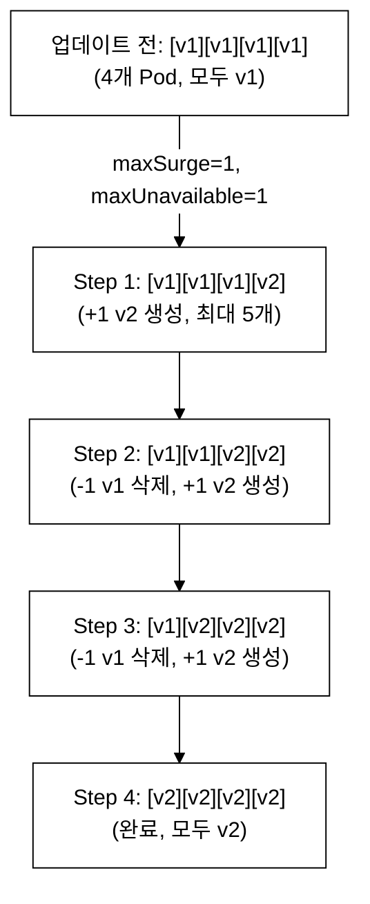
_그림 2. RollingUpdate 단계별 Pod 교체 (무중단 배포)._

**maxSurge와 maxUnavailable 계산:**

| 설정 | replicas=4 | 의미 |
|---|---|---|
| maxSurge=25% | ceil(4*0.25)=1 | 최대 5개 Pod 동시 존재 |
| maxSurge=1 | 1 | 최대 5개 Pod 동시 존재 |
| maxSurge=50% | ceil(4*0.5)=2 | 최대 6개 Pod 동시 존재 |
| maxUnavailable=25% | floor(4*0.25)=1 | 최소 3개 Pod 사용 가능 |
| maxUnavailable=0 | 0 | 항상 4개 Pod 사용 가능 |
| maxUnavailable=1 | 1 | 최소 3개 Pod 사용 가능 |

**규칙:** maxSurge와 maxUnavailable을 **둘 다 0으로 설정할 수 없다** (업데이트가 진행되지 않으므로)

**퍼센트 계산 규칙 (시험 빈출!):**
```
maxSurge: ceil() 올림     → 25% of 4 = 1.0 → ceil(1.0) = 1
maxUnavailable: floor() 내림  → 25% of 4 = 1.0 → floor(1.0) = 1

예) replicas=10, maxSurge=30%, maxUnavailable=30%
maxSurge = ceil(10*0.3) = ceil(3.0) = 3 → 최대 13개 동시 존재
maxUnavailable = floor(10*0.3) = floor(3.0) = 3 → 최소 7개 사용 가능

예) replicas=3, maxSurge=25%, maxUnavailable=25%
maxSurge = ceil(3*0.25) = ceil(0.75) = 1 → 최대 4개 동시 존재
maxUnavailable = floor(3*0.25) = floor(0.75) = 0 → 최소 3개 사용 가능
```

**다양한 전략 조합:**
```
빠른 배포 (리소스 충분):    maxSurge=50%, maxUnavailable=0
  → 추가 Pod를 많이 만들어 빠르게, 기존 Pod는 즉시 삭제하지 않음

안전한 배포 (무중단 필수): maxSurge=1, maxUnavailable=0
  → 항상 replicas만큼 사용 가능, 하나씩 추가 후 교체

공격적 배포 (속도 최우선): maxSurge=100%, maxUnavailable=50%
  → 모든 새 Pod를 한꺼번에 생성, 절반은 바로 삭제

보수적 배포 (최소 영향):   maxSurge=0, maxUnavailable=1
  → 추가 Pod 없이, 하나씩 삭제 후 교체 (리소스 절약)
```

**어떤 값을 골라야 하는가 -- 리소스 충분/부족 시나리오:**

선택의 기준은 "클러스터에 새 Pod를 더 띄울 여유(CPU/메모리/노드 슬롯)가 있는가"와 "다운타임을 어디까지 허용하는가"이다.

- **리소스 여유가 있고 무중단이 필수일 때:** maxSurge를 키우고 maxUnavailable=0으로 둔다. 새 Pod를 먼저 충분히 띄운 뒤 이전 Pod를 줄이므로 가용 Pod 수가 한 번도 replicas 아래로 내려가지 않는다. 가장 안전하지만 일시적으로 평소보다 많은 리소스를 점유한다.
- **리소스가 빠듯할 때:** maxSurge를 작게(또는 0) 두고 maxUnavailable로 교체 속도를 낸다. maxSurge=0이면 추가 Pod를 띄우지 않으므로 노드 리소스가 부족해 새 Pod가 `Pending`으로 막히는 상황을 피한다. 대신 교체 중 가용 Pod가 줄어 일시적으로 처리 용량이 낮아진다.

**maxSurge=50%의 위험성:** maxSurge=50%는 평소 대비 절반만큼 Pod를 추가로 띄운다는 뜻이다(replicas=10이면 한꺼번에 5개 추가, 총 15개). 새 버전 이미지가 메모리를 많이 쓰거나 노드 여유가 부족하면, 이 추가분이 노드 리소스를 넘겨 새 Pod가 `Pending`/`OOMKilled`로 떨어지고 롤아웃이 멈춘다. 또한 새 Pod 다수가 동시에 DB나 외부 API에 붙으면 커넥션 폭증으로 의존 서비스에 부하를 줄 수 있다. 큰 maxSurge는 "리소스가 충분하고 빠른 배포가 필요할 때"만 쓰고, 보통은 maxSurge=1 또는 25%로 시작해 부하를 보며 키운다.

#### Recreate - 재생성

모든 기존 Pod를 **먼저 삭제**한 후 새 Pod를 생성한다. **다운타임이 발생**한다.

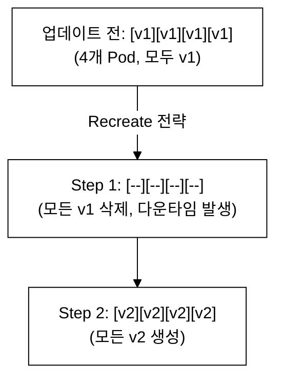
_그림 3. Recreate 전략의 Pod 교체 (다운타임 발생)._

**사용 사례:**
- **ReadWriteOnce(RWO) PVC를 마운트하는 경우**: RWO 볼륨은 한 번에 하나의 노드에서만 마운트할 수 있다. RollingUpdate 중 이전 Pod와 새 Pod가 동시에 같은 RWO PVC를 마운트하려 하면 두 번째 Pod가 `Multi-Attach error: volume is already used by pod`로 Pending 상태가 되어 롤아웃이 멈춘다. Recreate는 이전 Pod를 먼저 전부 삭제해 볼륨을 해제한 뒤 새 Pod를 띄우므로 이 문제가 생기지 않는다.
- **데이터베이스 스키마 마이그레이션 등 두 버전이 동시 실행되면 데이터 오염이 생기는 경우**: 이전 버전 앱과 새 버전 앱이 동시에 같은 DB를 쓰면 새 스키마로 마이그레이션된 데이터를 이전 버전이 읽지 못하거나, 두 버전이 서로 충돌하는 방식으로 레코드를 수정해 데이터 정합성이 깨진다. 다운타임을 감수하더라도 Recreate를 써서 두 버전이 절대 공존하지 않도록 해야 한다.
- **노드 리소스가 빠듯하여 maxSurge로 추가 Pod를 띄울 여유가 없는 경우**: maxSurge=0으로 RollingUpdate를 쓰는 것과 유사하지만, DB 마이그레이션 같은 이유가 겹칠 때는 Recreate가 더 명시적이다.

```yaml
# Recreate 전략 Deployment
spec:
  strategy:
    type: Recreate                     # RollingUpdate 설정 없음!
                                       # rollingUpdate 섹션을 포함하면 에러 발생
```

### 1.5 Deployment 동작 원리 흐름도 (동작 원리)

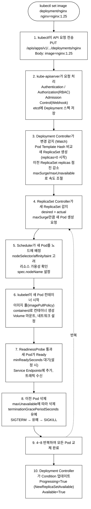
_그림 4. 이미지 변경 시 Deployment 롤링 업데이트 내부 동작 흐름._

**롤백 시 동작 원리:**
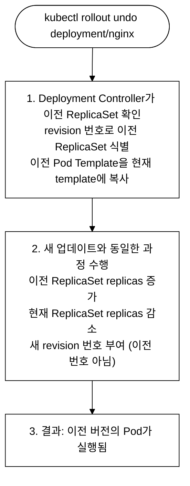
_그림 5. rollout undo(롤백) 내부 동작._

---

## 2. Rollout 관리 명령어

§1.5에서 본 것은 이미지 변경·롤백이 일어날 때 Deployment Controller, ReplicaSet Controller, Scheduler, kubelet이 내부에서 무엇을 하는지의 이론이었다. 이 절에서는 그 내부 동작을 kubectl 명령으로 직접 관찰하고 제어하는 방법을 다룬다. 즉, 앞에서 그림으로 본 흐름(새 ReplicaSet 생성 → 점진 교체 → Condition 갱신)을 `rollout status`로 들여다보고 `rollout undo`로 되돌리는 실무 도구다.

### 2.1 핵심 명령어

```bash
# === 배포 상태 확인 ===
kubectl rollout status deployment/<name>
# 배포가 완료될 때까지 대기하며 상태 출력
# 출력 예: deployment "nginx" successfully rolled out
# 실패 시: error: deployment "nginx" exceeded its progress deadline

# === 배포 이력 확인 ===
kubectl rollout history deployment/<name>
# REVISION  CHANGE-CAUSE
# 1         <none>
# 2         kubectl set image deployment/nginx nginx=nginx:1.25

# === 특정 리비전 상세 확인 ===
kubectl rollout history deployment/<name> --revision=2
# 해당 revision의 Pod Template 전체를 보여준다(describe 형태):
#   Labels, Annotations(change-cause 포함), 그리고 Containers 섹션의
#   Image / Port / Environment / Mounts 등. 즉 "그 시점에 배포된 Pod 사양"이다.
# revision=1과 revision=2를 각각 출력해 Image 줄을 비교하면
# (예: nginx:1.24 → nginx:1.25) 두 버전 사이 무엇이 바뀌었는지 확인할 수 있다.

# === 이전 버전으로 롤백 ===
kubectl rollout undo deployment/<name>
# 바로 이전 리비전으로 롤백

# === 특정 리비전으로 롤백 ===
kubectl rollout undo deployment/<name> --to-revision=1
# 리비전 1로 롤백

# === 배포 일시정지 ===
kubectl rollout pause deployment/<name>
# 일시정지 상태에서는 spec.template 변경이 새 ReplicaSet을 즉시 트리거하지 않는다.
# 아래처럼 set image를 두 번 호출해도 롤아웃이 시작되지 않는다:
#   kubectl set image deployment/<name> c1=img:v2
#   kubectl set image deployment/<name> c2=img2:v2
# resume 시 두 변경이 하나의 Pod Template으로 합쳐져 단 한 번의 롤아웃만 발생한다.
# 변경할 때마다 새 ReplicaSet이 생기지 않으므로 이력이 불필요하게 늘지 않는다.

# === 배포 재개 ===
kubectl rollout resume deployment/<name>
# 일시정지 중 누적된 template 변경을 한 번의 롤링 업데이트로 한꺼번에 적용한다

# === 재시작 (새 rollout 트리거) ===
kubectl rollout restart deployment/<name>
# 이미지 변경 없이 모든 Pod를 순차적으로 재시작
# Pod Template에 annotation이 추가되어 새 ReplicaSet이 생성됨
```

### 2.2 이미지 업데이트 방법 4가지

```bash
# 방법 1: kubectl set image (가장 빠름, 시험에서 권장)
kubectl set image deployment/nginx-deploy nginx=nginx:1.25
# 장점: 한 줄로 끝남, 빠름
# 단점: 복잡한 변경에는 부적합

# 방법 2: kubectl edit (YAML 편집기에서 수정)
kubectl edit deployment nginx-deploy
# 장점: 전체 YAML을 보면서 수정 가능
# 단점: 시험에서 시간 소모 큼, 오타 위험

# 방법 3: kubectl patch (JSON Patch)
kubectl patch deployment nginx-deploy -p \
  '{"spec":{"template":{"spec":{"containers":[{"name":"nginx","image":"nginx:1.25"}]}}}}'
# 장점: 스크립트에서 사용하기 좋음
# 단점: JSON 구문이 복잡

# 방법 4: kubectl apply (YAML 파일 수정 후 적용)
kubectl apply -f deployment.yaml
# 장점: 선언적 관리, GitOps에 적합
# 단점: 파일 수정이 필요
```

**CKA 시간 전략 -- 시험에서는 `set image`를 쓴다:** CKA는 120분에 15~20문제이므로 한 문제에 평균 6~8분밖에 못 쓴다. 이미지만 바꾸면 되는 문제에서 `kubectl edit`는 편집기를 열어 해당 줄을 찾고 고친 뒤 저장·종료까지 10초 이상 걸리고 들여쓰기 오타로 저장이 거부되는 위험까지 있다. 반면 `kubectl set image deployment/nginx nginx=nginx:1.25`는 한 줄로 1초 안에 끝난다. 한 문제에서 9초 차이는 작아 보여도, 단순 변경 문제마다 누적되면 까다로운 문제에 쓸 시간을 깎아먹는다. 따라서 "이미지 한 개 교체"는 `set image`, 여러 필드를 동시에 바꾸는 복잡한 변경만 `edit`이나 `apply`를 쓰는 것을 기본 전략으로 삼는다.

### 2.3 change-cause 기록하기

```bash
# 방법 1: --record 플래그 (deprecated, 하지만 시험에서 아직 사용 가능)
kubectl set image deployment/nginx nginx=nginx:1.25 --record

# 방법 2: annotation 직접 설정 (권장)
kubectl annotate deployment/nginx \
  kubernetes.io/change-cause="Update nginx to 1.25 for security fix"

# 이력 확인 시 CHANGE-CAUSE 컬럼에 표시됨
kubectl rollout history deployment/nginx
# REVISION  CHANGE-CAUSE
# 1         Initial deployment with nginx:1.24
# 2         Update nginx to 1.25 for security fix
```

### 2.4 Deployment 빠른 생성 (시험용)

```bash
# 기본 Deployment 생성
kubectl create deployment nginx-deploy --image=nginx:1.24 --replicas=3

# YAML 템플릿 생성 (파일로 저장 후 수정)
kubectl create deployment nginx-deploy \
  --image=nginx:1.24 \
  --replicas=3 \
  --dry-run=client -o yaml > deploy.yaml

# 포트 포함 Deployment 생성 (1.24+)
kubectl create deployment nginx-deploy \
  --image=nginx:1.24 \
  --replicas=3 \
  --port=80

# 스케일링
kubectl scale deployment nginx-deploy --replicas=5

# 자동 스케일링 (HPA)
kubectl autoscale deployment nginx-deploy --min=2 --max=10 --cpu-percent=80

# 현재 이미지 빠르게 확인
kubectl get deployment nginx-deploy -o jsonpath='{.spec.template.spec.containers[0].image}'

# ReplicaSet 확인
kubectl get rs -l app=nginx-deploy

# Deployment의 Condition 확인
kubectl get deployment nginx-deploy -o jsonpath='{.status.conditions[*].type}'
```

### 2.5 Deployment Conditions 이해

```
Deployment Status에는 3가지 Condition이 있다:

1. Available = True
   → minReadySeconds 조건을 만족하는 Pod가 충분히 존재
   → 사용자 트래픽을 처리할 수 있는 상태

2. Progressing = True
   → 배포가 진행 중이거나, 성공적으로 완료됨
   → Reason: NewReplicaSetCreated, FoundNewReplicaSet, ReplicaSetUpdated,
              NewReplicaSetAvailable
   → Reason: ProgressDeadlineExceeded (실패)

3. ReplicaFailure = True
   → ReplicaSet이 Pod를 생성하지 못함
   → 리소스 부족, 이미지 풀 실패 등
```

```bash
# Condition 확인 명령어
kubectl get deployment nginx-deploy -o jsonpath='{range .status.conditions[*]}{.type}: {.status} ({.reason}){"\n"}{end}'
```

**Condition 조합으로 상태 판단하기:** 세 Condition을 따로 보지 않고 묶어서 읽으면 Deployment가 지금 어떤 처지인지 바로 진단할 수 있다. ReplicaFailure는 문제가 있을 때만 나타나므로(정상이면 목록에 없음) 아래 표는 Available × Progressing 조합을 중심으로 정리한다.

| Available | Progressing | ReplicaFailure | 의미 / 조치 |
|:--|:--|:--|:--|
| True | True (NewReplicaSetAvailable) | (없음) | 정상 완료. 새 버전이 모두 떠 트래픽 처리 중 |
| True | True (진행 reason) | (없음) | 롤아웃 진행 중이며 기존 Pod로 서비스는 유지됨. 잠시 대기 |
| True | False (ProgressDeadlineExceeded) | (없음) | 새 버전 배포는 막혔지만 옛 Pod로 서비스는 살아 있음. 새 Pod 실패 원인 조사 후 롤백 |
| False | True | (없음) | 가용 Pod가 minReadySeconds 기준 미달. 새 Pod가 아직 Ready 안 됨, Probe·시작 시간 확인 |
| False | False (ProgressDeadlineExceeded) | (없음) | 서비스 다운 + 진행 정지. 즉시 `rollout undo`로 롤백 |
| False | True/False | True | ReplicaSet이 Pod를 못 만듦(리소스 부족·이미지 풀 실패·쿼터 초과). describe로 이벤트 확인 |
| True | False | True | 옛 Pod로 서비스는 되지만 새 Pod 생성이 막힘. 노드 리소스/이미지/쿼터 점검 |

핵심은 Available을 먼저 보는 것이다. Available=True면 사용자 트래픽은 살아 있으므로 급하지 않게 원인을 고치면 되고, Available=False면 다운타임 중이므로 우선 롤백으로 서비스를 복구한 뒤 원인을 분석한다.

---

## 3. 시험 출제 패턴 분석 (시험 출제 패턴)

### 3.1 출제 유형

1. **Deployment 생성** -- 이미지, 레플리카, 포트를 지정하여 Deployment 생성
2. **Rolling Update** -- 이미지를 변경하고 롤링 업데이트 상태 확인
3. **롤백** -- 이전 버전이나 특정 리비전으로 롤백
4. **스케일링** -- 레플리카 수 변경
5. **전략 설정** -- maxSurge, maxUnavailable을 지정하여 전략 설정
6. **Recreate 전략** -- Recreate 전략의 Deployment 생성
7. **Probe 포함 Deployment** -- readinessProbe, livenessProbe가 포함된 Deployment
8. **리소스 제한 Deployment** -- requests/limits가 포함된 Deployment
9. **Deployment와 Service 연결** -- Deployment를 Service로 노출 (day08에서 다룬다; Service 오브젝트 개념 선수 필요)

### 3.2 문제의 의도

- Deployment YAML의 필수 필드(selector, template)를 정확히 아는가?
- kubectl 명령으로 빠르게 Deployment를 조작할 수 있는가?
- maxSurge와 maxUnavailable의 의미를 이해하는가?
- rollout 명령어를 능숙하게 사용하는가?
- selector.matchLabels와 template.metadata.labels가 일치해야 함을 아는가?
- Recreate 전략에서 rollingUpdate 섹션이 없어야 함을 아는가?

### 3.3 시험에서 자주 하는 실수

§1.2에서 다룬 selector/labels 불일치는 Deployment를 *생성·apply하는 시점*에 validation으로 걸러지는 에러다(아예 만들어지지 않는다). 아래 1번이 그 경우이고, 2~5번은 만들어진 뒤 rollout이 진행되는 도중이나 이후에 드러나는 실수다. 같은 selector 얘기가 다시 나오는 이유는, 생성 단계의 함정으로서 한 번 더 짚어 두기 위함이다.

```
1. selector.matchLabels와 template.metadata.labels 불일치
   → 에러: "selector does not match template labels"

2. Recreate 전략에 rollingUpdate 필드 포함
   → 에러: "rollingUpdate should not be set when strategy type is Recreate"

3. replicas를 문자열로 입력 ("3" 대신 3)
   → YAML에서 따옴표 없이 숫자로 입력해야 함

4. --record 플래그 잊어버림
   → CHANGE-CAUSE가 <none>으로 표시됨

5. rollout undo 후 revision 번호 혼동
   → undo하면 새 revision이 생성됨 (기존 번호로 돌아가지 않음)
```

---

## 4. 실전 시험 문제 (8문제)

### 문제 1. Deployment 생성 [4%]

**컨텍스트:** `kubectl config use-context dev`

네임스페이스 `demo`에 다음 조건으로 Deployment를 생성하라:
- 이름: `web-app`
- 이미지: `nginx:1.24`
- 레플리카: 3
- 컨테이너 포트: 80

<details>
<summary>풀이 과정</summary>

```bash
kubectl config use-context dev

# 방법 1: 빠른 생성 (포트 포함은 YAML 필요)
kubectl create deployment web-app \
  --image=nginx:1.24 \
  --replicas=3 \
  -n demo \
  --dry-run=client -o yaml > /tmp/web-app.yaml

# /tmp/web-app.yaml에 ports 추가 후 apply
# 또는 직접 YAML 작성:

cat <<EOF | kubectl apply -f -
apiVersion: apps/v1
kind: Deployment
metadata:
  name: web-app
  namespace: demo
spec:
  replicas: 3
  selector:
    matchLabels:
      app: web-app
  template:
    metadata:
      labels:
        app: web-app
    spec:
      containers:
      - name: nginx
        image: nginx:1.24
        ports:
        - containerPort: 80
EOF

# 확인
kubectl get deployment web-app -n demo
kubectl get pods -n demo -l app=web-app

# 정리
kubectl delete deployment web-app -n demo
```

</details>

---

### 문제 2. Rolling Update 수행 [4%]

**컨텍스트:** `kubectl config use-context dev`

`demo` 네임스페이스의 `nginx-web` Deployment를 다음과 같이 업데이트하라:
- 이미지를 `nginx:1.25`로 변경
- 배포가 완료될 때까지 확인
- 이력 확인

<details>
<summary>풀이 과정</summary>

```bash
kubectl config use-context dev

# 사전 환경 준비 — nginx-web Deployment가 없으면 먼저 생성한다
# (문제 2·3 공통 전제 객체. 이미 존재하면 이 단계를 건너뛴다)
kubectl create deployment nginx-web --image=nginx:1.24 --replicas=3 -n demo

# 이미지 업데이트
kubectl set image deployment/nginx-web nginx=nginx:1.25 -n demo

# 배포 상태 확인
kubectl rollout status deployment/nginx-web -n demo

# 이력 확인
kubectl rollout history deployment/nginx-web -n demo

# 현재 이미지 확인
kubectl get deployment nginx-web -n demo \
  -o jsonpath='{.spec.template.spec.containers[0].image}'

# 원래 이미지로 복원
kubectl rollout undo deployment/nginx-web -n demo
```

</details>

---

### 문제 3. 특정 리비전으로 롤백 [4%]

**컨텍스트:** `kubectl config use-context dev`

`demo` 네임스페이스의 `nginx-web` Deployment를 리비전 1로 롤백하라.

<details>
<summary>풀이 과정</summary>

```bash
kubectl config use-context dev

# 사전 환경 준비 — 문제 2를 먼저 풀었다면 nginx-web이 이미 존재하고 revision이 2 이상이다.
# 독립 실행 시: Deployment 생성 → 이미지 업데이트로 revision 2를 만든 뒤 이 문제를 시작한다.
# kubectl create deployment nginx-web --image=nginx:1.24 --replicas=3 -n demo
# kubectl set image deployment/nginx-web nginx=nginx:1.25 -n demo

# 이력 확인
kubectl rollout history deployment/nginx-web -n demo

# 리비전 1 상세
kubectl rollout history deployment/nginx-web -n demo --revision=1

# 롤백
kubectl rollout undo deployment/nginx-web -n demo --to-revision=1

# 완료 확인
kubectl rollout status deployment/nginx-web -n demo

# 이미지 확인
kubectl get deployment nginx-web -n demo \
  -o jsonpath='{.spec.template.spec.containers[0].image}'
echo ""
```

</details>

---

### 문제 4. 스케일링 [4%]

**컨텍스트:** `kubectl config use-context prod`

1. `scale-test` Deployment를 이미지 `nginx:1.24`, 레플리카 2로 생성하라
2. 레플리카를 5로 스케일 업하라
3. 레플리카를 1로 스케일 다운하라

<details>
<summary>풀이 과정</summary>

```bash
kubectl config use-context prod

# 1. 생성
kubectl create deployment scale-test --image=nginx:1.24 --replicas=2

# 확인
kubectl get deployment scale-test
kubectl get pods -l app=scale-test

# 2. 스케일 업
kubectl scale deployment scale-test --replicas=5
kubectl get pods -l app=scale-test

# 3. 스케일 다운
kubectl scale deployment scale-test --replicas=1
kubectl get pods -l app=scale-test

# 정리
kubectl delete deployment scale-test
```

</details>

---

### 문제 5. 전략 설정 [7%]

**컨텍스트:** `kubectl config use-context dev`

네임스페이스 `demo`에 다음 조건으로 Deployment를 생성하라:
- 이름: `strategy-test`
- 이미지: `httpd:2.4`
- 레플리카: 4
- 전략: RollingUpdate (maxSurge=2, maxUnavailable=1)

<details>
<summary>풀이 과정</summary>

```bash
kubectl config use-context dev

cat <<EOF | kubectl apply -f -
apiVersion: apps/v1
kind: Deployment
metadata:
  name: strategy-test
  namespace: demo
spec:
  replicas: 4
  selector:
    matchLabels:
      app: strategy-test
  strategy:
    type: RollingUpdate
    rollingUpdate:
      maxSurge: 2
      maxUnavailable: 1
  template:
    metadata:
      labels:
        app: strategy-test
    spec:
      containers:
      - name: httpd
        image: httpd:2.4
        ports:
        - containerPort: 80
EOF

# 확인
kubectl get deployment strategy-test -n demo
kubectl describe deployment strategy-test -n demo | grep -A5 Strategy

# 이미지 업데이트로 전략 동작 확인
kubectl set image deployment/strategy-test httpd=httpd:2.4.58 -n demo
kubectl rollout status deployment/strategy-test -n demo

# 정리
kubectl delete deployment strategy-test -n demo
```

</details>

---

### 문제 6. Recreate 전략 [4%]

**컨텍스트:** `kubectl config use-context dev`

Recreate 전략을 사용하는 Deployment `recreate-app`을 생성하라:
- 이미지: `nginx:1.24`
- 레플리카: 3
- 네임스페이스: `demo`

<details>
<summary>풀이 과정</summary>

```bash
cat <<EOF | kubectl apply -f -
apiVersion: apps/v1
kind: Deployment
metadata:
  name: recreate-app
  namespace: demo
spec:
  replicas: 3
  selector:
    matchLabels:
      app: recreate-app
  strategy:
    type: Recreate
  template:
    metadata:
      labels:
        app: recreate-app
    spec:
      containers:
      - name: nginx
        image: nginx:1.24
EOF

# 확인
kubectl describe deployment recreate-app -n demo | grep Strategy

kubectl delete deployment recreate-app -n demo
```

</details>

---

### 문제 7. Deployment에 리소스 제한 추가 [7%]

**컨텍스트:** `kubectl config use-context dev`

다음 Deployment를 생성하라:
- 이름: `resource-app`
- 이미지: `nginx:1.24`
- 레플리카: 2
- CPU: requests=100m, limits=500m
- Memory: requests=128Mi, limits=256Mi

<details>
<summary>풀이 과정</summary>

```bash
cat <<EOF | kubectl apply -f -
apiVersion: apps/v1
kind: Deployment
metadata:
  name: resource-app
  namespace: demo
spec:
  replicas: 2
  selector:
    matchLabels:
      app: resource-app
  template:
    metadata:
      labels:
        app: resource-app
    spec:
      containers:
      - name: nginx
        image: nginx:1.24
        ports:
        - containerPort: 80
        resources:
          requests:
            cpu: "100m"
            memory: "128Mi"
          limits:
            cpu: "500m"
            memory: "256Mi"
EOF

kubectl get deployment resource-app -n demo
kubectl get pods -n demo -l app=resource-app -o jsonpath='{.items[0].spec.containers[0].resources}'

kubectl delete deployment resource-app -n demo
```

</details>

---

### 문제 8. Deployment에 환경변수 추가 [4%]

**컨텍스트:** `kubectl config use-context dev`

다음 Deployment를 생성하라:
- 이름: `env-app`
- 이미지: `busybox:1.36`
- 명령어: `sh -c "echo $APP_ENV && sleep 3600"`
- 환경변수: APP_ENV=production, LOG_LEVEL=info

<details>
<summary>풀이 과정</summary>

```bash
cat <<EOF | kubectl apply -f -
apiVersion: apps/v1
kind: Deployment
metadata:
  name: env-app
  namespace: demo
spec:
  replicas: 1
  selector:
    matchLabels:
      app: env-app
  template:
    metadata:
      labels:
        app: env-app
    spec:
      containers:
      - name: app
        image: busybox:1.36
        command: ["sh", "-c", "echo \$APP_ENV \$LOG_LEVEL && sleep 3600"]
        env:
        - name: APP_ENV
          value: "production"
        - name: LOG_LEVEL
          value: "info"
EOF

kubectl logs -n demo -l app=env-app

kubectl delete deployment env-app -n demo
```

</details>

---

## tart-infra 실습

### 실습 환경 설정

```bash
# dev 클러스터 접속 (demo 네임스페이스에 nginx 등 앱이 배포됨)
export KUBECONFIG=kubeconfig/dev.yaml
kubectl config use-context dev
```

### 실습 1: 기존 Deployment의 Rolling Update 구조 분석

```bash
# demo 네임스페이스의 Deployment 목록 확인
kubectl get deployments -n demo

# nginx Deployment의 strategy 확인
kubectl get deployment nginx -n demo -o jsonpath='{.spec.strategy}' | python3 -m json.tool

# ReplicaSet 이력 확인 (롤링 업데이트 시 생성된 RS)
# 이 저장소 demo 의 라벨은 app=nginx-web 이다(시험에선 해당 앱 라벨로 바꾼다)
kubectl get rs -n demo -l app=nginx-web --sort-by=.metadata.creationTimestamp
```

**실측 출력 (dev demo — Deployment 기본 전략):** 아래는 dev 클러스터 demo 의 `nginx-web` ReplicaSet 목록 실측이다(생성 시각 오름차순). 롤링 업데이트가 일어나면 새 RS 가 추가되고 구 RS 는 DESIRED 0 으로 남는다.

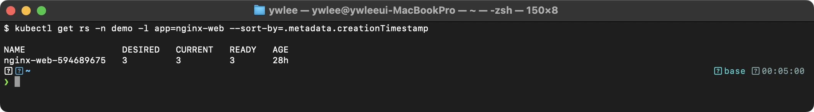

**동작 원리:**
1. `maxSurge: 25%`는 업데이트 중 desired replicas 대비 25%의 추가 Pod를 허용한다
2. `maxUnavailable: 25%`는 업데이트 중 25%의 Pod가 unavailable해도 허용한다
3. ReplicaSet 목록에서 이전 RS(replicas=0)와 현재 RS를 확인할 수 있다
4. `revisionHistoryLimit`만큼 이전 RS가 보관되어 롤백에 사용된다

### 실습 2: Rolling Update 및 Rollback 실습

```bash
# nginx 이미지 업데이트 (롤링 업데이트 발동)
kubectl set image deployment/nginx nginx=nginx:1.25 -n demo --record 2>/dev/null || \
kubectl set image deployment/nginx nginx=nginx:1.25 -n demo

# 롤아웃 상태 실시간 확인
kubectl rollout status deployment/nginx -n demo

# 롤아웃 이력 확인
kubectl rollout history deployment/nginx -n demo
```

**예상 출력 (dev 실측):**
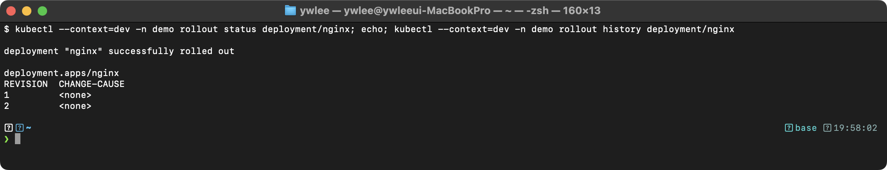
> `rollout undo` 로 롤백하면 revision 이 또 증가한다(2→3). CHANGE-CAUSE 가 `<none>` 인 건 `--record`(deprecated)나 `kubernetes.io/change-cause` 어노테이션을 안 썼기 때문이다.

```bash
# 이전 버전으로 롤백
kubectl rollout undo deployment/nginx -n demo

# 롤백 확인
kubectl rollout status deployment/nginx -n demo
kubectl get deployment nginx -n demo -o jsonpath='{.spec.template.spec.containers[0].image}'
```

**동작 원리:**
1. `set image`로 Pod Template이 변경되면 Deployment Controller가 새 ReplicaSet을 생성한다
2. 새 RS의 replicas를 점진적으로 증가시키고, 이전 RS를 점진적으로 감소시킨다
3. `rollout undo`는 이전 RS의 Pod Template을 복원하여 롤백을 수행한다
4. 롤백도 새로운 revision을 생성한다 (revision 번호가 증가함)

### 실습 3: httpbin v1/v2 Deployment 비교

```bash
# httpbin v1, v2 Deployment가 공존하는 구조 확인
kubectl get deployments -n demo -l app=httpbin -o wide

# 각 버전의 Pod Template 라벨 비교
kubectl get pods -n demo -l app=httpbin --show-labels
```

**예상 출력 (형태 예시 — `httpbin:v1/v2` 는 이 프로젝트가 빌드한 커스텀 이미지라 fresh 클러스터엔 없다. AGE 는 배포 시점 기준):**
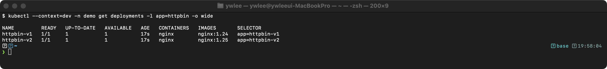
> 같은 명령 형태는 dev 에서 `kubectl create deployment` 로 검증했고(`get deploy -o wide` 컬럼 동일), 이미지/AGE 만 환경에 따라 다르다.

**동작 원리:**
1. 동일 앱의 여러 버전을 별도 Deployment로 배포하면 독립적인 롤링 업데이트가 가능하다
2. `version` 라벨로 v1/v2를 구분하고, Istio VirtualService로 트래픽 분배를 제어한다
3. 이 패턴은 Canary 배포와 A/B 테스트에 활용된다

---

## 트러블슈팅

### Deployment 롤아웃이 멈추는 경우

**증상:** `kubectl rollout status`가 계속 대기하며 완료되지 않는다.

```bash
# 1. Deployment 상태 확인
kubectl get deployment <name> -n <ns>
```

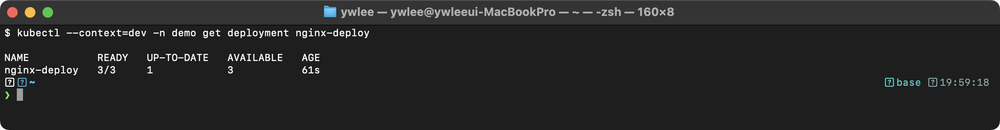

UP-TO-DATE가 desired replicas보다 작고, READY가 증가하지 않으면 새 Pod가 시작되지 못하는 것이다.

```bash
# 2. Pod 상태 확인
kubectl get pods -l app=<name> -n <ns>
```

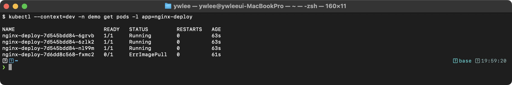

```bash
# 3. 실패 Pod의 이벤트 확인
kubectl describe pod nginx-deploy-5b4f7d8a9e-ghi56 -n <ns> | tail -10
```

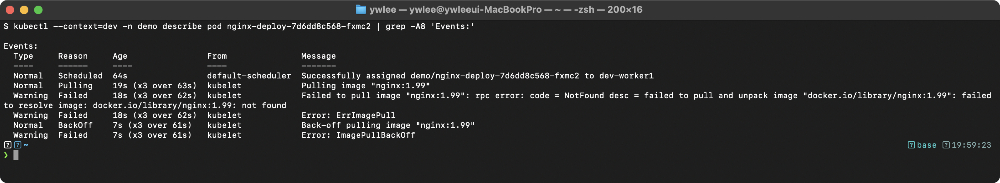

**주요 원인과 해결:**
- **이미지 이름/태그 오류:** 존재하지 않는 이미지를 지정한 경우. `kubectl rollout undo`로 롤백한다.
- **리소스 부족:** 노드에 CPU/Memory가 부족하여 새 Pod를 스케줄링할 수 없다. `kubectl describe pod`에서 `FailedScheduling` 이벤트를 확인한다.
- **ReadinessProbe 실패:** 새 Pod가 Ready 상태가 되지 않으면 롤아웃이 진행되지 않는다. Probe 설정을 확인한다.
- **progressDeadlineSeconds 초과:** 기본 600초(10분) 내에 롤아웃이 완료되지 않으면 Deployment의 Condition이 `Progressing=False`로 변경된다.

```bash
# progressDeadlineSeconds 초과 확인
kubectl get deployment <name> -n <ns> -o jsonpath='{.status.conditions[?(@.type=="Progressing")].reason}'
```

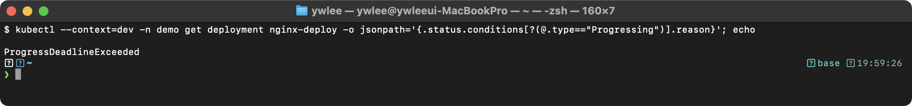

### selector와 labels 불일치

**증상:** Deployment 생성 시 `The Deployment is invalid: spec.template.metadata.labels: Invalid value` 에러가 발생한다.

`spec.selector.matchLabels`와 `spec.template.metadata.labels`가 반드시 일치해야 한다. selector에 정의한 라벨이 template의 labels에 포함되지 않으면 Deployment를 생성할 수 없다.

---

## 자가점검

스스로 답을 먼저 써 본 뒤 토글을 열어 확인한다.

<details>
<summary>Q1. replicas=4, maxSurge=25%, maxUnavailable=25% 일 때 롤링 업데이트 중 동시에 존재할 수 있는 최대 Pod 수와 최소 가용 Pod 수는?</summary>

maxSurge = ceil(4 × 0.25) = 1 → 최대 5개 동시 존재.
maxUnavailable = floor(4 × 0.25) = 1 → 최소 3개 가용.

</details>

<details>
<summary>Q2. `kubectl rollout undo deployment/nginx` 실행 후 revision 번호는 어떻게 변하는가? 이전 번호(예: 1)로 돌아가는가, 아니면 새 번호가 부여되는가?</summary>

새 revision 번호가 부여된다. 예를 들어 revision 1 → 2로 업데이트한 뒤 undo하면 revision 3이 생성되고, 그 Pod Template은 revision 1과 동일하다. 기존 번호로 되돌아가지 않는다.

</details>

<details>
<summary>Q3. `spec.revisionHistoryLimit: 0`으로 설정하면 어떤 영향이 있는가?</summary>

이전 ReplicaSet을 전혀 보관하지 않으므로 `kubectl rollout undo`로 롤백이 불가능해진다. 디스크 절약이 목적이라면 0 대신 3~5 정도를 권장한다.

</details>

<details>
<summary>Q4. `maxSurge=0, maxUnavailable=0`으로 설정하면 어떻게 되는가?</summary>

유효하지 않은 설정이다. 이 조합은 업데이트가 전혀 진행되지 않으므로 쿠버네티스가 validation 에러로 거부한다. maxSurge와 maxUnavailable을 동시에 0으로 두는 것은 금지된다.

</details>

<details>
<summary>Q5. `minReadySeconds: 30`으로 설정했을 때, readinessProbe가 통과한 직후 Pod가 바로 Available로 처리되는가?</summary>

아니다. readinessProbe 통과 후에도 30초 동안 Pod가 죽지 않고 Ready 상태를 유지해야 비로소 Available로 처리된다. 그 30초 안에 Pod가 죽으면 Available 처리되지 않으며 롤아웃이 멈춘다.

</details>

<details>
<summary>Q6. `kubectl set image`와 `kubectl edit`의 시험 시간 전략 차이는?</summary>

`kubectl set image deployment/nginx nginx=nginx:1.25`는 한 줄로 1초 안에 완료된다. `kubectl edit`는 편집기를 열고 해당 줄을 찾아 수정·저장하는 과정에서 10초 이상 걸리고 들여쓰기 오타로 저장이 거부될 위험이 있다. 이미지 한 개 교체에는 `set image`를, 여러 필드를 동시에 바꾸는 경우에만 `edit`나 `apply`를 쓴다.

</details>

<details>
<summary>Q7. Recreate 전략 YAML에 `rollingUpdate` 섹션을 함께 포함하면 어떻게 되는가?</summary>

에러가 발생한다: `rollingUpdate should not be set when strategy type is Recreate`. Recreate 전략 사용 시 `spec.strategy` 아래에는 `type: Recreate`만 두고 `rollingUpdate` 블록은 완전히 제거해야 한다.

</details>

<details>
<summary>Q8. `progressDeadlineSeconds`가 초과되면 Deployment의 어느 Condition이 어떻게 바뀌는가? 이때 서비스는 살아 있는가?</summary>

`Progressing` Condition이 `False`로 바뀌고 `reason`이 `ProgressDeadlineExceeded`가 된다. 기존 Pod(이전 버전 ReplicaSet)는 그대로 남아 있으므로 `Available=True`라면 서비스는 계속 살아 있다. 즉시 `kubectl rollout undo`로 롤백하거나 새 Pod 실패 원인(이미지 오류·리소스 부족)을 수정 후 재시도한다.

</details>

---

## 시험 팁

- **`set image` vs `edit` 시간 비교**: 이미지 교체 한 문제에서 `set image`는 1초, `edit`는 최소 10초 이상. 120분 15~20문제 시험에서 단순 교체는 무조건 `set image`.
- **change-cause 기록**: `--record` 플래그는 deprecated이므로 `kubectl annotate deployment/<name> kubernetes.io/change-cause="<설명>"`으로 기록한다. 이력 확인은 `kubectl rollout history deployment/<name>`.
- **Recreate 주의사항**: `spec.strategy`에 `type: Recreate`만 두고 `rollingUpdate` 블록을 남기면 즉시 validation 에러. YAML 생성 후 반드시 `rollingUpdate` 섹션 삭제 여부 확인.
- **롤백 후 revision 번호**: `rollout undo` 이후에는 항상 새 revision이 생성된다. `rollout history`로 확인 시 번호가 증가해 있는 것이 정상이다.
- **selector 불일치는 생성 시점 에러**: `spec.selector.matchLabels`와 `spec.template.metadata.labels`가 다르면 `apply` 또는 `create` 시점에 걸러진다. Pod가 뜨지 않는 것이 아니라 Deployment 자체가 만들어지지 않는다.
- **시험 셋업 단축어**: `alias k=kubectl`, `export do='--dry-run=client -o yaml'`, `export now='--force --grace-period 0'`을 시험 시작 직후 등록하면 매 명령에서 타이핑 시간을 절약한다.

---

## 더 읽을거리

- [Kubernetes 공식 문서: Deployments](https://kubernetes.io/docs/concepts/workloads/controllers/deployment/)
- [Kubernetes 공식 문서: Rolling Update Strategy](https://kubernetes.io/docs/concepts/workloads/controllers/deployment/#rolling-update-deployment)
- [Kubernetes 공식 문서: Rollback a Deployment](https://kubernetes.io/docs/concepts/workloads/controllers/deployment/#rolling-back-a-deployment)
- [Kubernetes 공식 문서: Pausing and Resuming a rollout of a Deployment](https://kubernetes.io/docs/concepts/workloads/controllers/deployment/#pausing-and-resuming-a-rollout-of-a-deployment)
- [Kubernetes 공식 문서: Pod Lifecycle (readiness/liveness/startup probes)](https://kubernetes.io/docs/concepts/workloads/pods/pod-lifecycle/#container-probes)

