# CKA Day 8: Deployment 시험 문제 심화 & 고급 패턴

> CKA 도메인: Workloads & Scheduling (15%) - Part 1 실전 | 예상 소요 시간: 2시간

> **전제(실습 시작 전 확인)**: Day 7 에서 다룬 Deployment·ReplicaSet·Pod 3계층 관계를 이해하고 있어야 한다. 모든 문제는 컨텍스트(`dev`/`prod`)와 `demo` 네임스페이스를 사용한다. kubeconfig 는 `kubeconfig/` 아래에 있으며, 문제마다 `kubectl config use-context <ctx>` 로 대상 클러스터를 바꾼다. `demo` 네임스페이스가 없으면 `kubectl create namespace demo` 로 먼저 만든다.

---

## 오늘의 학습 목표

> Day 7 에서 Deployment·ReplicaSet·Pod 3계층 구조를 배웠다. Day 8 은 그 위에서 "어떻게 굴릴지"를 제어하는 고급 필드들을 손으로 작성하는 실전 문제다.

이 파일을 끝까지 따라 하면 다음을 할 수 있어야 한다:

- [ ] `kubectl rollout pause/resume` 으로 여러 변경을 한 번의 롤아웃으로 묶어 적용한다
- [ ] `kubectl expose` 로 ClusterIP Service 를 만들고 Endpoints 가 Pod IP 와 일치하는지 검증한다
- [ ] `revisionHistoryLimit` 을 설정해 보관할 과거 ReplicaSet 수를 제한한다
- [ ] `readinessProbe` 와 `livenessProbe` 를 YAML 로 직접 작성한다
- [ ] `minReadySeconds` 와 `progressDeadlineSeconds` 의 차이를 설명하고 함께 설정한다
- [ ] `maxSurge=0, maxUnavailable=1` 저자원 전략의 동작 순서를 설명한다
- [ ] `kubectl rollout restart` 가 Pod Template 에 어떤 annotation 을 추가해 재시작을 유도하는지 설명한다
- [ ] `matchExpressions` 의 `In` 연산자를 `matchLabels` 와 비교해 설명한다
- [ ] 잘못된 이미지로 인한 `ImagePullBackOff` 를 진단하고 `rollout undo` 로 롤백한다
- [ ] `resources.requests/limits`, `readinessProbe`, `revisionHistoryLimit`, `minReadySeconds`, RollingUpdate 전략을 하나의 매니페스트에 조합한다
- [ ] RollingUpdate 와 Recreate 두 전략의 차이를 설명하고 각각 언제 쓰는지 판단한다
- [ ] emptyDir 볼륨과 sidecar 패턴을 이용해 같은 Pod 안 두 컨테이너가 파일을 공유하도록 설정한다

---

## 0. 문제를 풀기 전에 — Deployment 고급 동작 원리

문제 9~20 은 Deployment 의 세부 필드를 손으로 작성하는 실전 문제다. 각 필드가 "언제 필요한가"를 먼저 이해해야 명령을 외우는 대신 상황에 맞게 작성할 수 있다. 여기서 핵심 메커니즘을 먼저 정리하고, 각 문제에서 다시 짧게 연결한다. (문서 끝의 섹션 5 는 같은 내용을 그림과 시퀀스로 더 자세히 다룬다.)

### 0.1 Deployment Controller 와 reconciliation loop

Kubernetes 마스터 노드에서 실행되는 **kube-controller-manager** 는 여러 컨트롤러를 하나의 프로세스로 묶어 돌리는데, 그 중 **Deployment Controller** 가 Deployment 리소스를 담당한다. 이 컨트롤러는 **reconciliation loop**(원하는 상태 desired state 와 현재 상태 actual state 를 끊임없이 비교해 그 차이를 메우는 제어 루프)를 돌며 ReplicaSet 과 Pod 를 생성·삭제·수정한다. 사용자가 `kubectl apply` 로 "원하는 상태"만 선언하면 나머지는 이 루프가 맞춰 가는 방식을 declarative(선언형) 모델이라고 한다.

### 0.2 무엇이 새 ReplicaSet 을 만드는가

Deployment 는 자신이 직접 Pod 를 만들지 않고 **ReplicaSet** 을 통해 만든다. `spec.template`(Pod 의 설계도)이 바뀌면 Deployment Controller 는 새 ReplicaSet 을 만들고, 기존 ReplicaSet 을 줄이면서 새 것을 늘리는 rolling update 를 수행한다. 반대로 `replicas` 숫자만 바뀌면 ReplicaSet 을 새로 만들지 않고 기존 ReplicaSet 의 크기만 조정한다. 이 구분이 문제 9(pause/resume)·문제 11(revisionHistoryLimit)·문제 17(restart) 의 동작을 좌우한다.

### 0.3 등장 배경 — 왜 이런 필드들이 생겼나

Deployment 가 없던 시절에는 운영자가 ReplicaSet 을 직접 다루며 "Pod 를 하나 지우고 새 이미지로 하나 올리고"를 손으로 반복했다. 한 번 변경할 때마다 새 버전이 즉시 굴러가 중간 상태(broken state)가 노출됐고, 잘못 올리면 되돌릴 기록도 없었다. Deployment 는 이 과정을 컨트롤러에 맡기면서 다음 필드들로 "어떻게 굴릴지"를 선언하게 만들었다.

- **pause/resume**(문제 9): 여러 변경을 모아 한 번의 롤아웃으로 적용해 중간 버전 노출을 막는다.
- **revisionHistoryLimit**(문제 11): 롤백용 과거 ReplicaSet 을 몇 개까지 보관할지 제한한다.
- **readiness/liveness Probe**(문제 12): 트래픽을 받을 준비가 됐는지, 살아 있는지를 컨트롤러가 판단할 근거를 준다.
- **minReadySeconds**(문제 13): Ready 직후의 불안정 구간을 건너뛰고 안정화된 Pod 만 가용으로 친다.
- **maxSurge/maxUnavailable**(문제 16): 롤아웃 중 추가/제거 가능한 Pod 수를 조절해 리소스와 가용성을 절충한다.

트레이드오프: 선언 가능한 필드가 늘어난 만큼 매니페스트가 길어지고, 각 필드의 상호작용(예: minReadySeconds 가 길면 롤아웃이 느려짐)을 이해해야 한다. CKA 실기에서는 이 필드들을 빠르고 정확히 작성하는 손 숙련이 점수다.

### 0.4 RollingUpdate vs Recreate — 두 전략의 차이

Deployment 의 `spec.strategy.type` 은 두 가지 값을 가진다.

| 항목 | RollingUpdate | Recreate |
|:--|:--|:--|
| 동작 | 기존 Pod 를 점진적으로 교체(일부만 죽이고 새 것 띄우기 반복) | 기존 Pod 전부 삭제 → 새 Pod 전부 생성 |
| 다운타임 | 없음(maxUnavailable=0 이면) | 삭제~생성 사이 반드시 발생 |
| 중간 상태 | 구버전·신버전 Pod 가 잠깐 공존 | 공존 없음(한 버전만 존재) |
| 리소스 | maxSurge 만큼 추가 필요 | 추가 불필요(교체 중 사용량 일시 감소) |
| 사용 시점 | 일반적인 운영 배포 | DB 스키마 변경처럼 구버전·신버전이 동시에 떠 있으면 안 되는 경우, 또는 리소스 절약이 다운타임보다 중요한 경우 |

`spec.strategy.type: Recreate` 로 설정하면 `rollingUpdate` 하위 필드(`maxSurge`, `maxUnavailable`)는 의미가 없어 설정하지 않는다. 복습 체크리스트의 "RollingUpdate와 Recreate의 차이"는 이 표로 정리된다.

---

### 문제 9. Deployment 일시정지/재개 [7%]

> **이 문제의 동작 원리**: `kubectl rollout pause` 는 Deployment 의 `spec.paused=true` 로 설정한다. 이 상태에서는 `spec.template`(이미지·환경변수·리소스 등 Pod 설계도) 을 바꿔도 새 ReplicaSet 생성이 트리거되지 않는다(§0.2). 이미지·환경변수 같은 Pod Template 변경은 pause 중에 쌓아 두고, `resume` 시점에 단 하나의 ReplicaSet 으로 한 번에 적용한다. 단, `spec.replicas`(스케일) 변경은 Pod Template 변경이 아니므로 pause 중에도 즉시 적용된다(§5.3). pause 없이 template 변경을 할 때마다 롤아웃이 일어나면 중간 버전이 잠깐씩 떠 버리는데, 이를 막는 것이 이 기능의 목적이다.

**컨텍스트:** `kubectl config use-context dev`

1. `pause-test` Deployment 생성 (nginx:1.24, replicas=3)
2. 배포를 일시정지하라
3. 이미지를 nginx:1.25로 변경하라
4. 레플리카를 5로 변경하라
5. 배포를 재개하여 모든 변경을 한 번에 적용하라

<details>
<summary>풀이 과정</summary>

```bash
# 1. 생성
kubectl create deployment pause-test --image=nginx:1.24 --replicas=3 -n demo

# 2. 일시정지
kubectl rollout pause deployment/pause-test -n demo

# 3. 이미지 변경 (배포 시작되지 않음)
kubectl set image deployment/pause-test nginx=nginx:1.25 -n demo

# 4. 레플리카 변경
kubectl scale deployment/pause-test --replicas=5 -n demo

# 5. 재개 (모든 변경이 한 번에 적용)
kubectl rollout resume deployment/pause-test -n demo
kubectl rollout status deployment/pause-test -n demo

# 확인
kubectl get deployment pause-test -n demo
```

**검증 - 기대 출력:**
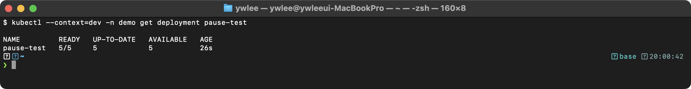

이미지가 nginx:1.25로 변경되고 레플리카가 5로 증가한 것을 확인한다. pause 상태에서 이미지를 변경해도 롤아웃이 시작되지 않았다가, resume 시 한 번의 롤아웃으로 모든 변경이 적용된다. 이 방식은 불필요한 중간 롤아웃을 방지한다.

```bash
kubectl delete deployment pause-test -n demo
```

</details>

---

### 문제 10. Deployment와 Service 연결 [7%]

> **개념 — Service 와 Endpoints**: Service 는 고정된 가상 IP(**ClusterIP**)를 하나 가진다. 그러나 Pod 는 죽고 살며 IP 가 계속 바뀐다. Service 는 이 변하는 Pod 들을 **Endpoints**(서비스 뒤를 받치는 실제 Pod IP:포트 목록)로 추적한다. Service 를 만들면 그 `selector` 라벨과 일치하는 Pod 들의 `status.podIP` 가 자동으로 Endpoints 에 등록된다. 클라이언트가 ClusterIP 로 보낸 트래픽은 노드의 kube-proxy(또는 이 저장소의 dev 클러스터처럼 kube-proxy 를 대체하는 **Cilium** — eBPF(Extended Berkeley Packet Filter, 리눅스 커널 안에서 샌드박스로 실행되는 프로그램 모델)를 이용해 iptables 없이 커널에서 직접 패킷을 분배하는 CNI. 자세한 설명은 `certification/cilium/` 참조)가 Endpoints 중 하나의 Pod IP 로 로드밸런싱한다. Endpoints 가 비어 있으면 selector 가 Pod 라벨과 안 맞는다는 뜻이고, 트래픽이 어디로도 가지 못한다.

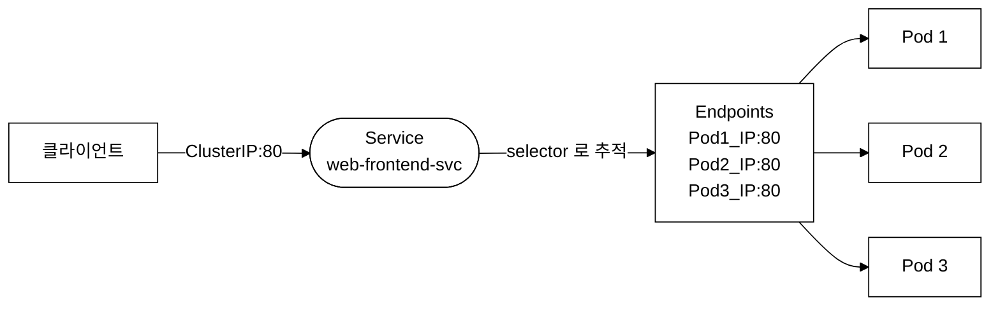
_그림 0. Service 의 ClusterIP 와 Endpoints 가 Pod 트래픽을 중재하는 구조._

**컨텍스트:** `kubectl config use-context prod`

1. `web-frontend` Deployment (nginx:1.24, replicas=3, port=80) 생성
2. 이 Deployment를 위한 ClusterIP Service `web-frontend-svc` (port=80) 생성
3. Service의 Endpoints가 올바른지 확인

<details>
<summary>풀이 과정</summary>

```bash
kubectl config use-context prod

# 1. Deployment 생성 (--port=80 으로 컨테이너 포트 80 을 명시)
kubectl create deployment web-frontend --image=nginx:1.24 --replicas=3 --port=80

# 2. Service 생성
#   --target-port=80 은 트래픽을 받을 컨테이너 포트다. 위에서 --port=80 으로
#   containerPort 80 을 선언했으므로 target-port 와 일치한다. (생략 시엔
#   --port 값과 같다고 가정하지만, 컨테이너 포트가 실제로 열려 있어야 연결된다.)
kubectl expose deployment web-frontend --port=80 --target-port=80 --name=web-frontend-svc

# 3. 확인
kubectl get svc web-frontend-svc
kubectl get endpoints web-frontend-svc
kubectl get pods -l app=web-frontend -o wide
```

**검증 - 기대 출력 (Service):**
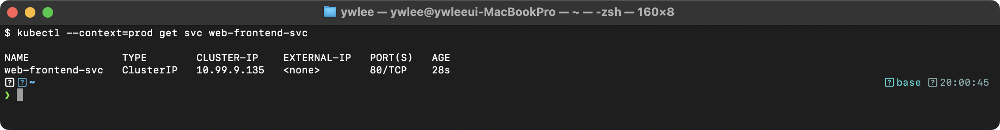

**검증 - 기대 출력 (Endpoints):**
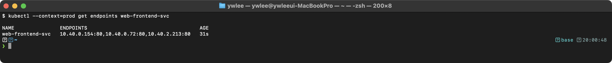

Endpoints의 IP가 Pod의 IP와 일치해야 한다. 불일치하면 Service의 selector 라벨이 Pod의 labels와 맞지 않는 것이다.

```bash
# Endpoints의 IP가 Pod의 IP와 일치하는지 확인

# 정리
kubectl delete deployment web-frontend
kubectl delete svc web-frontend-svc
```

</details>

---

### 문제 11. revisionHistoryLimit 설정 [4%]

> **왜 이 필드가 필요한가**: Deployment 는 Pod Template 이 바뀔 때마다 이전 ReplicaSet 을 `replicas: 0` 으로 줄여 두고 삭제하지 않는다(§0.2). 빠른 롤백(`kubectl rollout undo`)을 위해 과거 버전을 남겨 두는 것이다. 그러나 무한정 쌓으면 ReplicaSet 오브젝트가 계속 늘어 etcd(클러스터 상태 저장소)가 비대해지고 조회가 느려진다. `revisionHistoryLimit` 은 "롤백 여지"와 "저장소 절약"을 절충하는 상한이다. 기본값은 10 이고, 이 문제처럼 3 으로 낮추면 가장 오래된 ReplicaSet 부터 정리된다.

**컨텍스트:** `kubectl config use-context dev`

`history-test` Deployment를 생성하되, 이전 ReplicaSet을 최대 3개만 보관하도록 설정하라.

<details>
<summary>풀이 과정</summary>

```bash
cat <<EOF | kubectl apply -f -
apiVersion: apps/v1
kind: Deployment
metadata:
  name: history-test
  namespace: demo
spec:
  replicas: 2
  revisionHistoryLimit: 3
  selector:
    matchLabels:
      app: history-test
  template:
    metadata:
      labels:
        app: history-test
    spec:
      containers:
      - name: nginx
        image: nginx:1.24
EOF

kubectl describe deployment history-test -n demo | grep -i revision

kubectl delete deployment history-test -n demo
```

</details>

---

### 문제 12. Probe가 포함된 Deployment [7%]

> **왜 Probe 가 필요한가**: Pod 가 `Running` 이라는 것은 컨테이너 프로세스가 떴다는 뜻일 뿐, 앱이 요청을 처리할 준비가 됐다는 보장이 아니다. 두 가지 곤란이 생긴다. ⓐ 앱이 아직 초기화 중인데(예: nginx 가 설정을 읽고 캐시를 데우는 30초) 그 사이 Service 가 트래픽을 보내면 사용자는 에러를 받는다. ⓑ 앱이 살아 있는 척하지만 내부적으로 deadlock 에 빠져 영원히 응답하지 않을 수 있다. Probe 가 없으면 이런 불안정한 Pod 도 계속 트래픽을 받아 장애가 번진다(cascading failure).
> - **readinessProbe**: "지금 트래픽을 받을 준비가 됐나"를 검사한다. 실패하면 그 Pod 를 Service 의 Endpoints 에서 빼서(문제 10 참고) 트래픽을 보내지 않는다. 준비되면 다시 넣는다.
> - **livenessProbe**: "프로세스가 살아 있고 정상인가"를 검사한다. 실패가 누적되면 kubelet 이 컨테이너를 죽이고 재시작한다(deadlock 자동 복구).
> - **initialDelaySeconds**: 컨테이너 시작 후 첫 검사까지 기다리는 시간. nginx 초기화에 약 30초가 걸린다면 그 전에 검사해 봐야 실패만 쌓이므로, 초기화 시간만큼 미뤄 둔다. 아래 문제는 readiness 5초·liveness 15초로, "트래픽 가능 여부는 빨리, 강제 재시작은 더 신중하게" 판단하도록 차이를 둔다.

**컨텍스트:** `kubectl config use-context dev`

다음 Deployment를 생성하라:
- 이름: `probe-deploy`
- 이미지: `nginx:1.24`
- 레플리카: 2
- Readiness Probe: HTTP GET / 포트 80, 초기 대기 5초, 주기 5초
- Liveness Probe: HTTP GET / 포트 80, 초기 대기 15초, 주기 10초

<details>
<summary>풀이 과정</summary>

```bash
cat <<EOF | kubectl apply -f -
apiVersion: apps/v1
kind: Deployment
metadata:
  name: probe-deploy
  namespace: demo
spec:
  replicas: 2
  selector:
    matchLabels:
      app: probe-deploy
  template:
    metadata:
      labels:
        app: probe-deploy
    spec:
      containers:
      - name: nginx
        image: nginx:1.24
        ports:
        - containerPort: 80
        readinessProbe:
          httpGet:
            path: /
            port: 80
          initialDelaySeconds: 5
          periodSeconds: 5
        livenessProbe:
          httpGet:
            path: /
            port: 80
          initialDelaySeconds: 15
          periodSeconds: 10
EOF

kubectl get deployment probe-deploy -n demo
kubectl describe deployment probe-deploy -n demo | grep -A5 "Liveness\|Readiness"

kubectl delete deployment probe-deploy -n demo
```

</details>

---

### 문제 13. minReadySeconds 설정 [4%]

> **minReadySeconds 의 의미**: Pod 가 Ready 상태(readinessProbe 통과, 또는 Probe 가 없으면 컨테이너 기동 직후)가 된 뒤에도, 곧바로 "가용(available)"으로 치지 않고 추가로 지정한 시간(여기서는 30초)을 더 기다린다. 이 구간 동안 새 Pod 가 죽지 않고 버티면 비로소 가용으로 인정해 롤아웃을 다음 Pod 로 진행한다. Ready 직후 바로 죽어 버리는 불안정한 배포(예: 기동 직후 크래시)가 전체 교체를 끌고 가지 못하도록 막는 안전 장치다. 그래서 롤아웃 중 Pod 가 30초 간격으로 천천히 교체되는 것처럼 보인다. `progressDeadlineSeconds: 600` 은 롤아웃이 10분 안에 진척이 없으면 실패(`Progressing=False`)로 표시하는 한도다.

**컨텍스트:** `kubectl config use-context dev`

다음 Deployment를 생성하라:
- 이름: `stable-deploy`
- 이미지: `nginx:1.24`
- 레플리카: 3
- minReadySeconds: 30 (Pod가 Ready 후 30초 대기)
- progressDeadlineSeconds: 600

<details>
<summary>풀이 과정</summary>

```bash
cat <<EOF | kubectl apply -f -
apiVersion: apps/v1
kind: Deployment
metadata:
  name: stable-deploy
  namespace: demo
spec:
  replicas: 3
  minReadySeconds: 30
  progressDeadlineSeconds: 600
  selector:
    matchLabels:
      app: stable-deploy
  template:
    metadata:
      labels:
        app: stable-deploy
    spec:
      containers:
      - name: nginx
        image: nginx:1.24
        ports:
        - containerPort: 80
EOF

# minReadySeconds 확인
kubectl get deployment stable-deploy -n demo -o jsonpath='{.spec.minReadySeconds}'
echo ""

# 이미지 업데이트하여 동작 확인 (30초마다 Pod가 교체됨)
kubectl set image deployment/stable-deploy nginx=nginx:1.25 -n demo
kubectl rollout status deployment/stable-deploy -n demo

kubectl delete deployment stable-deploy -n demo
```

</details>

---

### 문제 14. 다중 컨테이너 Deployment [7%]

> **emptyDir 볼륨**: Pod 가 노드에 할당될 때 빈 디렉터리로 생성되고, 그 Pod 가 삭제될 때 함께 삭제된다. Pod 수명과 동일하며, 같은 Pod 안의 여러 컨테이너가 동일 경로를 마운트해 파일을 주고받을 수 있다. 컨테이너 하나가 재시작해도 emptyDir 내용은 유지되지만(컨테이너 재시작 != Pod 삭제), Pod 자체가 죽으면 내용이 사라진다. 영속 저장이 필요하면 PersistentVolume 을 써야 한다(Day 9 이후에서 다룬다).
>
> **sidecar 패턴**: 주 컨테이너(메인 애플리케이션)를 보조하는 컨테이너를 같은 Pod 에 함께 두는 구조 패턴이다. 주 컨테이너와 같은 네트워크 네임스페이스(localhost 공유)·볼륨을 공유하므로, 로그 수집·프록시·초기화·인증서 갱신 같은 부가 기능을 주 컨테이너 코드 수정 없이 붙일 수 있다. 이 문제에서 `sidecar` 컨테이너는 emptyDir 에 heartbeat 로그를 쓰고, `nginx` 컨테이너는 같은 볼륨을 document root 로 마운트한다.

**컨텍스트:** `kubectl config use-context dev`

다음 Deployment를 생성하라:
- 이름: `multi-container-deploy`
- 레플리카: 2
- 컨테이너 1: `nginx` (nginx:1.24, port=80)
- 컨테이너 2: `sidecar` (busybox:1.36, command: `sh -c "while true; do echo heartbeat; sleep 10; done"`)
- emptyDir 볼륨 `shared-data`를 nginx는 `/usr/share/nginx/html`, sidecar는 `/data`에 마운트

<details>
<summary>풀이 과정</summary>

```bash
cat <<EOF | kubectl apply -f -
apiVersion: apps/v1
kind: Deployment
metadata:
  name: multi-container-deploy
  namespace: demo
spec:
  replicas: 2
  selector:
    matchLabels:
      app: multi-container-deploy
  template:
    metadata:
      labels:
        app: multi-container-deploy
    spec:
      containers:
      - name: nginx
        image: nginx:1.24
        ports:
        - containerPort: 80
        volumeMounts:
        - name: shared-data
          mountPath: /usr/share/nginx/html
      - name: sidecar
        image: busybox:1.36
        command: ["sh", "-c", "while true; do echo heartbeat; sleep 10; done"]
        volumeMounts:
        - name: shared-data
          mountPath: /data
      volumes:
      - name: shared-data
        emptyDir: {}
EOF

# 확인
kubectl get deployment multi-container-deploy -n demo
kubectl get pods -n demo -l app=multi-container-deploy

# sidecar 로그 확인
POD=$(kubectl get pods -n demo -l app=multi-container-deploy -o jsonpath='{.items[0].metadata.name}')
kubectl logs $POD -c sidecar -n demo

kubectl delete deployment multi-container-deploy -n demo
```

</details>

---

### 문제 15. Deployment의 이미지 변경 이력 추적 [4%]

> **왜 change-cause 가 필요한가**: `kubectl rollout history`로 Deployment 리비전 목록을 보면 CHANGE-CAUSE 열이 기본적으로 `<none>`이다. 과거에는 `kubectl set image ... --record` 플래그로 실행 명령을 자동 기록했으나, 이 플래그는 v1.22+ 부터 deprecated(더 이상 권장하지 않는 상태)됐고 향후 제거될 예정이다. 이유는 `--record`가 명령 전체를 annotation에 그대로 기록해 버려 가독성이 낮고, 선언형(apply) 워크플로와 개념적으로 맞지 않기 때문이다. 현재 권장 방식은 `kubectl set image` 직후 `kubectl annotate deployment/<name> kubernetes.io/change-cause="설명"` 으로 직접 기록하는 것이다. 이 annotation은 해당 시점의 Deployment 오브젝트에 붙고, 그 오브젝트의 hash가 새 ReplicaSet에 연결되면서 `rollout history`의 CHANGE-CAUSE 열로 나타난다.

**컨텍스트:** `kubectl config use-context dev`

1. `track-deploy` Deployment 생성 (nginx:1.22, replicas=2)
2. 이미지를 nginx:1.23으로 업데이트 (change-cause 기록)
3. 이미지를 nginx:1.24로 업데이트 (change-cause 기록)
4. 이미지를 nginx:1.25로 업데이트 (change-cause 기록)
5. rollout history 확인
6. revision 2의 이미지를 확인하라

<details>
<summary>풀이 과정</summary>

```bash
kubectl config use-context dev

# 1. 생성
kubectl create deployment track-deploy --image=nginx:1.22 --replicas=2 -n demo
kubectl annotate deployment track-deploy -n demo \
  kubernetes.io/change-cause="Initial: nginx:1.22"

# 2. 업데이트 1
kubectl set image deployment/track-deploy nginx=nginx:1.23 -n demo
kubectl annotate deployment track-deploy -n demo \
  kubernetes.io/change-cause="Update: nginx:1.23" --overwrite

# 3. 업데이트 2
kubectl set image deployment/track-deploy nginx=nginx:1.24 -n demo
kubectl annotate deployment track-deploy -n demo \
  kubernetes.io/change-cause="Update: nginx:1.24" --overwrite

# 4. 업데이트 3
kubectl set image deployment/track-deploy nginx=nginx:1.25 -n demo
kubectl annotate deployment track-deploy -n demo \
  kubernetes.io/change-cause="Update: nginx:1.25" --overwrite

# 5. 이력 확인
kubectl rollout history deployment/track-deploy -n demo

# 6. revision 2 상세 확인
kubectl rollout history deployment/track-deploy -n demo --revision=2

# 정리
kubectl delete deployment track-deploy -n demo
```

</details>

---

### 문제 16. maxSurge=0 전략 Deployment [7%]

**컨텍스트:** `kubectl config use-context dev`

리소스가 부족한 환경에서 추가 Pod 없이 업데이트하는 Deployment를 생성하라:
- 이름: `low-resource-deploy`
- 이미지: `nginx:1.24`
- 레플리카: 4
- 전략: RollingUpdate (maxSurge=0, maxUnavailable=1)
- 이 전략이 의미하는 바를 설명하라

<details>
<summary>풀이 과정</summary>

```bash
cat <<EOF | kubectl apply -f -
apiVersion: apps/v1
kind: Deployment
metadata:
  name: low-resource-deploy
  namespace: demo
spec:
  replicas: 4
  selector:
    matchLabels:
      app: low-resource-deploy
  strategy:
    type: RollingUpdate
    rollingUpdate:
      maxSurge: 0            # 추가 Pod 생성 안 함 (리소스 절약)
      maxUnavailable: 1      # 하나씩 삭제 후 교체
  template:
    metadata:
      labels:
        app: low-resource-deploy
    spec:
      containers:
      - name: nginx
        image: nginx:1.24
        ports:
        - containerPort: 80
EOF

# 전략 의미:
# maxSurge=0 → 최대 4개 Pod (추가 없음)
# maxUnavailable=1 → 최소 3개 사용 가능
# 동작: 1개 삭제 → 1개 생성 → Ready 확인 → 1개 삭제 → ... 반복
# 장점: 리소스를 추가로 사용하지 않음
# 단점: 업데이트 속도가 느림, 업데이트 중 3/4만 가용

# 확인
kubectl describe deployment low-resource-deploy -n demo | grep -A5 Strategy

# 업데이트 테스트
kubectl set image deployment/low-resource-deploy nginx=nginx:1.25 -n demo
kubectl rollout status deployment/low-resource-deploy -n demo

kubectl delete deployment low-resource-deploy -n demo
```

</details>

---

### 문제 17. Deployment rollout restart [4%]

> **전제**: 문제 9~16 은 각자 만든 Deployment 를 `kubectl delete` 로 정리했다. `nginx-web` Deployment 는 이 파일의 tart-infra 실습 섹션을 기준으로 `demo` 네임스페이스에 존재한다고 가정한다. 직접 기동한 클러스터이거나 tart-infra 실습을 아직 하지 않았다면, 먼저 아래 명령으로 `nginx-web` 을 만든 뒤 이 문제를 풀어야 한다.
>
> ```bash
> kubectl create deployment nginx-web --image=nginx:1.25 --replicas=1 -n demo
> kubectl rollout status deployment/nginx-web -n demo
> ```

**컨텍스트:** `kubectl config use-context dev`

`demo` 네임스페이스의 `nginx-web` Deployment를 이미지 변경 없이 모든 Pod를 재시작하라.

<details>
<summary>풀이 과정</summary>

```bash
kubectl config use-context dev

# 현재 Pod 확인 (없으면 위 전제 블록의 생성 명령을 먼저 실행한다)
kubectl get pods -n demo -l app=nginx-web -o wide

# rollout restart
kubectl rollout restart deployment/nginx-web -n demo

# 상태 확인
kubectl rollout status deployment/nginx-web -n demo

# 새로운 Pod가 생성되었는지 확인 (AGE가 짧은 Pod)
kubectl get pods -n demo -l app=nginx-web -o wide

# 동작 원리:
# rollout restart는 Pod Template에 annotation을 추가함
# kubectl.kubernetes.io/restartedAt: "2026-03-19T09:00:00Z"
# 이로 인해 새 ReplicaSet이 생성되고 RollingUpdate 수행
```

</details>

---

### 문제 18. Deployment에 matchExpressions 사용 [4%]

> **matchLabels vs matchExpressions**: Deployment 의 `spec.selector` 는 어떤 Pod 를 자기 것으로 관리할지 라벨로 고른다. 두 가지 표기가 있다. ⓐ **matchLabels** — `app: web` 같은 단순 key:value 동등 비교. 가장 자주 쓰고 CKA 시험에서도 기본이다. ⓑ **matchExpressions** — `In`·`NotIn`·`Exists`·`DoesNotExist` 연산자로 복합 조건을 건다(예: `app In [web, api]`, `tier NotIn [db]`). 단순 동등 비교로는 표현 못 하는 "여러 값 중 하나" 또는 "이 라벨이 존재하기만 하면" 같은 조건이 필요할 때 쓴다. 두 방식을 함께 쓰면 AND 로 결합된다. 어느 쪽이든 `template.metadata.labels` 가 selector 조건을 만족해야 Deployment 가 자기 Pod 를 인식한다.

**컨텍스트:** `kubectl config use-context dev`

matchExpressions를 사용하는 Deployment를 생성하라:
- 이름: `expr-deploy`
- selector가 matchExpressions를 사용하여 `app In [expr-deploy]` 조건
- 이미지: `nginx:1.24`
- 레플리카: 2

<details>
<summary>풀이 과정</summary>

```bash
cat <<EOF | kubectl apply -f -
apiVersion: apps/v1
kind: Deployment
metadata:
  name: expr-deploy
  namespace: demo
spec:
  replicas: 2
  selector:
    matchExpressions:               # matchLabels 대신 matchExpressions 사용
    - key: app                      # 라벨 키
      operator: In                  # 연산자: In, NotIn, Exists, DoesNotExist
      values:                       # 값 목록
      - expr-deploy
  template:
    metadata:
      labels:
        app: expr-deploy            # matchExpressions 조건과 일치해야 함
    spec:
      containers:
      - name: nginx
        image: nginx:1.24
EOF

kubectl get deployment expr-deploy -n demo
kubectl get pods -n demo -l app=expr-deploy

kubectl delete deployment expr-deploy -n demo
```

</details>

---

### 문제 19. Deployment 업데이트 중 문제 진단 [7%]

**컨텍스트:** `kubectl config use-context dev`

1. `diag-deploy` Deployment 생성 (nginx:1.24, replicas=3)
2. 존재하지 않는 이미지 `nginx:nonexistent`로 업데이트
3. 롤아웃 상태를 확인하고 문제를 진단하라
4. 이전 버전으로 롤백하라

<details>
<summary>풀이 과정</summary>

```bash
kubectl config use-context dev

# 1. 생성
kubectl create deployment diag-deploy --image=nginx:1.24 --replicas=3 -n demo
kubectl rollout status deployment/diag-deploy -n demo

# 2. 잘못된 이미지로 업데이트
kubectl set image deployment/diag-deploy nginx=nginx:nonexistent -n demo

# 3. 문제 진단
# 롤아웃 상태 확인 (멈춰 있음)
kubectl rollout status deployment/diag-deploy -n demo --timeout=30s

# Pod 상태 확인 (ImagePullBackOff 또는 ErrImagePull)
kubectl get pods -n demo -l app=diag-deploy

# 이벤트 확인
kubectl describe deployment diag-deploy -n demo

# 새 ReplicaSet의 Pod 상세 확인
kubectl get rs -n demo -l app=diag-deploy
NEW_RS=$(kubectl get rs -n demo -l app=diag-deploy --sort-by=.metadata.creationTimestamp -o jsonpath='{.items[-1].metadata.name}')
kubectl describe rs $NEW_RS -n demo

# 4. 롤백
kubectl rollout undo deployment/diag-deploy -n demo
kubectl rollout status deployment/diag-deploy -n demo

# 이미지 확인
kubectl get deployment diag-deploy -n demo \
  -o jsonpath='{.spec.template.spec.containers[0].image}'
echo ""

kubectl delete deployment diag-deploy -n demo
```

</details>

---

### 문제 20. 복합 Deployment 생성 [7%]

**컨텍스트:** 실기 시험에서는 지정 context로 전환한다(`kubectl config use-context <문제-지정-context>`). **로컬 재현은 워크로드 생성이 허용된 `dev`에서 한다(§3). platform/prod에는 Deployment를 생성/삭제하지 않는다.**

다음 모든 조건을 만족하는 Deployment를 생성하라:
- 이름: `full-deploy`
- 이미지: `nginx:1.24`
- 레플리카: 3
- 컨테이너 포트: 80 (이름: http)
- 전략: RollingUpdate (maxSurge=1, maxUnavailable=0)
- revisionHistoryLimit: 5
- minReadySeconds: 10
- resources: requests(cpu=100m, memory=128Mi), limits(cpu=500m, memory=256Mi)
- readinessProbe: HTTP GET / 포트 80, 초기 5초, 주기 3초
- 라벨: app=full-deploy, tier=frontend, env=production

<details>
<summary>풀이 과정</summary>

```bash
# 로컬 재현: dev 클러스터 사용 (prod/platform에는 생성하지 않는다)
cat <<EOF | kubectl --kubeconfig kubeconfig/dev.yaml apply -f -
apiVersion: apps/v1
kind: Deployment
metadata:
  name: full-deploy
  labels:
    app: full-deploy
    tier: frontend
    env: production
spec:
  replicas: 3
  revisionHistoryLimit: 5
  minReadySeconds: 10
  selector:
    matchLabels:
      app: full-deploy
  strategy:
    type: RollingUpdate
    rollingUpdate:
      maxSurge: 1
      maxUnavailable: 0
  template:
    metadata:
      labels:
        app: full-deploy
        tier: frontend
        env: production
    spec:
      containers:
      - name: nginx
        image: nginx:1.24
        ports:
        - containerPort: 80
          name: http
        resources:
          requests:
            cpu: "100m"
            memory: "128Mi"
          limits:
            cpu: "500m"
            memory: "256Mi"
        readinessProbe:
          httpGet:
            path: /
            port: 80
          initialDelaySeconds: 5
          periodSeconds: 3
EOF

# 전체 확인
kubectl --kubeconfig kubeconfig/dev.yaml get deployment full-deploy -o wide
kubectl --kubeconfig kubeconfig/dev.yaml describe deployment full-deploy | head -40

# 정리
kubectl --kubeconfig kubeconfig/dev.yaml delete deployment full-deploy
```

</details>

---

## 5. Deployment 고급 동작 원리 (시각 보충 — 부록)

> 이 섹션은 섹션 0 에서 요약한 내용을 **다이어그램과 단계별 시퀀스**로 보강하는 부록이다. 문제 풀기 전에 섹션 0 을 먼저 읽고, 시각적으로 확인하고 싶을 때 여기를 참고한다. 섹션 0 과 내용이 겹치는 것은 의도적이며, 섹션 0 은 "왜(원리)", 섹션 5 는 "어떻게(단계 시퀀스)" 역할이다.

### 5.1 Deployment Controller의 Reconciliation Loop

마스터 노드에서 도는 **kube-controller-manager** 는 여러 컨트롤러를 한 프로세스로 묶어 실행하는데(§0.1), 그 중 하나가 Deployment 리소스를 담당하는 **Deployment Controller** 다. 이 컨트롤러는 지속적으로 "원하는 상태(desired state)"와 "현재 상태(actual state)"를 비교해 그 차이를 메운다(reconciliation loop). 비교 결과에 따라 ReplicaSet 을 만들거나 크기를 조정하고, 그 ReplicaSet 이 다시 Pod 를 만든다.

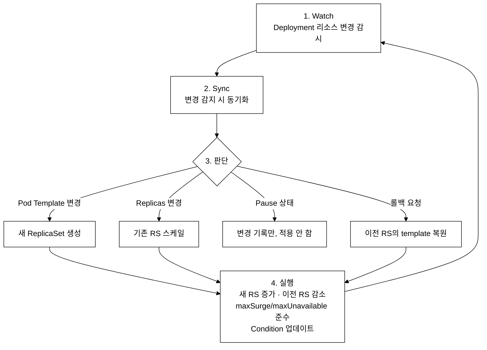
_그림 1. Deployment Controller의 reconciliation loop._

#### Deployment Conditions

reconciliation loop 가 돌 때마다 Deployment 의 `.status.conditions` 에 두 가지 Condition 이 업데이트된다. `kubectl describe deployment <name>` 의 Conditions 섹션에서 확인할 수 있다.

| Condition | 의미 | True 가 되는 조건 | `kubectl get deployment -o wide` 와의 관계 |
|:--|:--|:--|:--|
| **Available** | 가용 Pod 수가 `spec.replicas - maxUnavailable` 이상이고, `minReadySeconds` 조건까지 충족한 Pod 가 존재한다 | `availableReplicas >= desiredReplicas - maxUnavailable` | AVAILABLE 열이 0이면 Available=False |
| **Progressing** | 롤아웃이 진행 중이거나 완료됐다. `progressDeadlineSeconds` 안에 진척이 없으면 False 로 바뀐다 | 새 RS 생성·스케일, 또는 최종 desired 상태 도달 시 | 타임아웃 시 `kubectl rollout status` 가 에러 반환 |

`kubectl get deployment -o wide` 의 READY 열(`readyReplicas/replicas`)은 kubelet 이 보고하는 Raw Pod 상태이고, AVAILABLE 열은 `minReadySeconds` 까지 대기한 뒤 Deployment Controller 가 집계한 값이다. 두 숫자가 다르면 minReadySeconds 대기 중이라는 뜻이다. 복습 체크리스트의 "Deployment Conditions 의 의미를 아는가?" 는 이 두 Condition 의 판정 조건과 `kubectl get deployment` 출력 필드와의 연결을 묻는 것이다.

### 5.2 Rolling Update 상세 시퀀스 (replicas=4, maxSurge=1, maxUnavailable=1)

```
시점 0: 업데이트 시작
  Old RS: 4/4 (4개 Running)
  New RS: 0/0
  Total: 4  Available: 4

시점 1: New RS 스케일업 + Old RS 스케일다운
  Old RS: 3/4 (1개 Terminating)
  New RS: 1/1 (1개 Creating)
  Total: 5 (maxSurge=1 허용)  Available: 3 (maxUnavailable=1 허용)

시점 2: New Pod Ready
  Old RS: 3/3
  New RS: 1/1 (Ready)
  Total: 4  Available: 4

시점 3: 다음 교체
  Old RS: 2/3 (1개 Terminating)
  New RS: 2/2 (1개 Creating)
  Total: 5  Available: 3

... 반복 ...

시점 최종: 완료
  Old RS: 0/0
  New RS: 4/4
  Total: 4  Available: 4
```

### 5.3 Pause/Resume 동작 원리

```
일시정지(Pause) 시:
  - Deployment의 spec.paused = true 로 설정
  - 이후 spec.template 변경을 해도 새 ReplicaSet이 생성되지 않음
  - scale 변경은 즉시 적용됨 (pause와 무관)

재개(Resume) 시:
  - spec.paused = false 로 설정
  - 축적된 모든 template 변경이 한 번의 롤아웃으로 적용
  - 하나의 새 ReplicaSet만 생성 (중간 버전 없이)
  - revision도 1개만 증가

활용 시나리오:
  - 이미지 변경 + 리소스 변경 + 환경변수 변경을 한 번에 적용
  - 각 변경마다 rollout이 발생하면 3번의 rollout → pause/resume으로 1번
```

---

## 트러블슈팅

Day 8 실습에서 자주 만나는 실패 패턴과 복구 방법을 정리한다.

| 증상 | 원인 | 진단 명령 | 복구 방법 |
|:--|:--|:--|:--|
| Pod 가 `ImagePullBackOff` / `ErrImagePull` | 이미지 이름이 잘못됐거나 레지스트리에 없음 | `kubectl describe pod <pod> -n demo` → Events 섹션 확인 | `kubectl rollout undo deployment/<name> -n demo` 로 이전 이미지로 롤백 |
| `kubectl rollout undo` 실패 — "no rollout history" | `revisionHistoryLimit: 0` 으로 이전 RS 가 전부 정리됨 | `kubectl rollout history deployment/<name> -n demo` 로 리비전 목록 확인 | 이미지를 직접 `kubectl set image` 로 지정해 수동 복구. 이후 revisionHistoryLimit 를 0 이 아닌 값으로 설정 |
| `kubectl get endpoints <svc>` 가 비어 있음 | Service selector 라벨이 Pod 라벨과 불일치 | `kubectl get svc <svc> -o yaml` 의 `selector` 와 `kubectl get pods -n demo --show-labels` 를 대조 | Service `selector` 또는 Pod `labels` 를 수정해 일치시킴 |
| `kubectl annotate` 가 "already annotated" 오류 | 동일 annotation 키가 이미 존재하는데 `--overwrite` 없이 재실행 | — | `kubectl annotate deployment/<name> kubernetes.io/change-cause="..." --overwrite -n demo` |
| `rollout status` 가 멈추고 종료되지 않음 | readinessProbe 실패·노드 리소스 부족·이미지 오류 중 하나 | `kubectl get pods -n demo` 로 Pod 상태 확인 → describe 로 Events 확인 | 원인에 따라 이미지·Probe 설정 수정 후 재적용 또는 rollout undo |

---

## 6. 복습 체크리스트

### 개념 확인

- [ ] RollingUpdate와 Recreate의 차이를 설명할 수 있는가?
- [ ] maxSurge=25%, replicas=4일 때 최대 Pod 수를 계산할 수 있는가?
- [ ] maxSurge=25%, replicas=3일 때 최대 Pod 수를 계산할 수 있는가?
- [ ] Deployment → ReplicaSet → Pod 관계를 이해하는가?
- [ ] rollout undo와 rollout undo --to-revision의 차이를 아는가?
- [ ] selector.matchLabels와 template.metadata.labels가 일치해야 하는 이유를 아는가?
- [ ] revisionHistoryLimit의 기본값과 역할을 아는가?
- [ ] progressDeadlineSeconds의 역할을 아는가?
- [ ] minReadySeconds의 역할을 아는가?
- [ ] rollout restart의 동작 원리를 이해하는가?
- [ ] 어떤 변경이 새 ReplicaSet을 트리거하는지 아는가?
- [ ] Deployment Conditions (Available, Progressing)의 의미를 아는가?

### 시험 팁

1. **빠른 생성** -- `kubectl create deployment <name> --image=<image> --replicas=<n>`
2. **이미지 업데이트** -- `kubectl set image deployment/<name> <container>=<image>`
3. **롤백** -- `kubectl rollout undo deployment/<name>`
4. **전략 추가** -- `--dry-run=client -o yaml`로 기본 YAML 생성 후 strategy 추가
5. **상태 확인** -- `kubectl rollout status`로 배포 완료 대기
6. **이력 확인** -- `kubectl rollout history`로 리비전 목록 확인
7. **change-cause 기록** -- `kubectl annotate deployment/<name> kubernetes.io/change-cause="..."`
8. **재시작** -- `kubectl rollout restart deployment/<name>`
9. **일시정지** -- 여러 변경을 한 번에 적용할 때 `pause` → 변경 → `resume`
10. **YAML 필드 확인** -- `kubectl explain deployment.spec.strategy`로 필드 확인

**계산 팁 (maxSurge/maxUnavailable):** 퍼센트 값은 replicas 에 곱한 뒤 maxSurge 는 올림(ceil), maxUnavailable 은 내림(floor)으로 Pod 수를 구한다. 롤아웃 중 최대 Pod = replicas + surge, 최소 가용 Pod = replicas − unavailable 이다.

- maxSurge=25%, replicas=4 → surge = ceil(4 × 0.25) = 1 → 최대 Pod = 4 + 1 = **5**
- maxSurge=25%, replicas=3 → surge = ceil(3 × 0.25) = ceil(0.75) = 1 → 최대 Pod = 3 + 1 = **4**
- maxUnavailable=25%, replicas=4 → unavailable = floor(4 × 0.25) = 1 → 최소 가용 = 4 − 1 = **3**
- maxSurge=0, maxUnavailable=1, replicas=4 → 최대 Pod = 4, 최소 가용 = 3 (문제 16 의 저자원 전략)

### 자주 사용하는 kubectl explain 경로

```bash
kubectl explain deployment.spec.strategy
kubectl explain deployment.spec.strategy.rollingUpdate
kubectl explain deployment.spec.revisionHistoryLimit
kubectl explain deployment.spec.minReadySeconds
kubectl explain deployment.spec.progressDeadlineSeconds
kubectl explain deployment.spec.selector
kubectl explain deployment.spec.template.spec.containers.readinessProbe
kubectl explain deployment.spec.template.spec.containers.livenessProbe
kubectl explain deployment.spec.template.spec.containers.resources
```

---

## 자가점검

개념 확인 체크리스트의 각 항목에 대한 핵심 답변이다. 먼저 직접 답해보고 열어서 맞춰 본다.

<details>
<summary>정답 보기</summary>

**RollingUpdate vs Recreate**: RollingUpdate 는 기존 Pod 를 점진적으로 교체해 다운타임이 없고 구버전·신버전이 잠깐 공존한다. Recreate 는 기존 Pod 를 전부 삭제한 뒤 새 Pod 를 띄워 반드시 다운타임이 생기지만 두 버전이 동시에 뜨지 않는다.

**maxSurge=25%, replicas=4**: surge = ceil(4 × 0.25) = 1 → 최대 Pod 수 = 5.

**maxSurge=25%, replicas=3**: surge = ceil(3 × 0.25) = ceil(0.75) = 1 → 최대 Pod 수 = 4.

**Deployment → ReplicaSet → Pod**: Deployment 는 Pod Template 변경 시 새 ReplicaSet 을 만들고 이전 RS 를 `replicas: 0` 으로 줄인다. Pod 는 ReplicaSet 이 직접 생성한다.

**rollout undo vs rollout undo --to-revision**: `rollout undo` 는 바로 이전 리비전(revision-1)으로 롤백한다. `--to-revision=N` 은 특정 리비전 번호로 직접 롤백한다.

**selector.matchLabels 와 template.metadata.labels 일치**: Deployment Controller 가 "이 Pod 가 내 것인가"를 selector 로 판단한다. template.labels 가 selector 와 다르면 자신이 만든 Pod 를 인식하지 못해 무한 생성 루프가 생긴다.

**revisionHistoryLimit 기본값**: 10. 이 숫자만큼의 과거 ReplicaSet(replicas:0)을 보관해 rollout undo 가 가능하게 한다. 0 으로 설정하면 롤백 불가.

**progressDeadlineSeconds**: 롤아웃이 이 시간(초) 안에 진척이 없으면 Deployment 의 Progressing Condition 이 False 로 바뀌고 `rollout status` 가 에러를 반환한다. 기본값 600.

**minReadySeconds**: Pod 가 Ready 상태가 된 뒤 이 시간(초)을 더 기다려야 "가용(available)"으로 인정한다. 롤아웃 속도를 늦추되 불안정한 Pod 가 전체 교체를 이끄는 것을 막는 안전 장치.

**rollout restart 동작**: Pod Template 에 `kubectl.kubernetes.io/restartedAt` annotation 을 현재 타임스탬프로 추가해 template 해시가 바뀌게 만든다. 이로 인해 새 ReplicaSet 이 생성되고 RollingUpdate 가 수행된다.

**새 ReplicaSet 을 트리거하는 변경**: `spec.template`(이미지·환경변수·리소스·라벨 등 Pod 설계도) 변경이 새 RS 를 만든다. `spec.replicas` 변경은 기존 RS 의 크기만 조정하며 새 RS 를 만들지 않는다.

**Deployment Conditions — Available, Progressing**: Available=True 는 `minReadySeconds` 를 충족한 가용 Pod 수가 `replicas - maxUnavailable` 이상임을 의미한다. Progressing=True 는 롤아웃이 진행 중이거나 완료됐음을 의미하며, `progressDeadlineSeconds` 초과 시 False 로 바뀐다.

</details>

---

## 더 읽을거리

- [Kubernetes 공식 — Deployments](https://kubernetes.io/docs/concepts/workloads/controllers/deployment/)
- [Kubernetes 공식 — ReplicaSet](https://kubernetes.io/docs/concepts/workloads/controllers/replicaset/)
- [kube-controller-manager 소스 — Deployment Controller](https://github.com/kubernetes/kubernetes/tree/master/pkg/controller/deployment)
- Cilium 및 eBPF 기반 kube-proxy 대체 원리: `certification/cilium/` 참조

---

## 내일 예고

**Day 9: 스케줄링 심화** -- Taint/Toleration, NodeAffinity, DaemonSet, Job/CronJob, Resource 관리를 실습한다. tolerations YAML 문법을 미리 확인해오자.


---

## tart-infra 실습

### 실습 환경 설정

```bash
# dev 클러스터에 접속 (demo 앱이 배포된 클러스터)
export KUBECONFIG=kubeconfig/dev.yaml
kubectl get nodes
```

**예상 출력 (dev 실측 — AGE 는 클러스터 생성 시점 기준):**
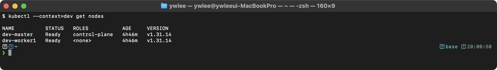

> **준비 단계 (fresh 클러스터인 경우 필수)**: 아래 실습 1~4 는 `demo` 네임스페이스에 이 프로젝트가 미리 배포해 둔 `nginx-web` Deployment 가 있다고 가정한다. 직접 기동한 깨끗한 클러스터에는 이것이 없으므로, 다음 명령으로 동일한 형태를 먼저 만든 뒤 실습한다. (이미 있으면 건너뛴다.) 그러면 아래 예상 출력 이미지와 같은 형태를 자기 화면에서 재현할 수 있다.
>
> ```bash
> kubectl create namespace demo
> kubectl create deployment nginx-web --image=nginx:1.25 --replicas=1 -n demo
> kubectl rollout status deployment/nginx-web -n demo
> ```

### 실습 1: 기존 Deployment 분석

```bash
# demo 네임스페이스의 Deployment 확인
kubectl get deployments -n demo
```

**예상 출력 (형태 예시 — `demo` 네임스페이스에 이 프로젝트가 배포한 데모 앱. fresh 클러스터엔 없으니 `kubectl create deployment` 로 만들어 동일 형태를 확인한다):**
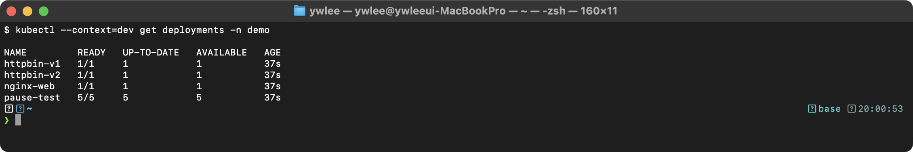

**동작 원리:** `kubectl get deployments`를 실행하면:
1. API Server가 etcd에서 apps/v1 Deployment 오브젝트를 조회한다
2. READY 필드는 `readyReplicas/replicas`를 보여준다
3. UP-TO-DATE는 최신 ReplicaSet의 Pod 수를 나타낸다
4. Deployment -> ReplicaSet -> Pod 3계층 구조로 관리된다

```bash
# nginx-web Deployment의 상세 정보 확인
kubectl describe deployment nginx-web -n demo
```

**예상 출력 (dev 실측 — nginx:1.25 로 배포한 nginx-web):**
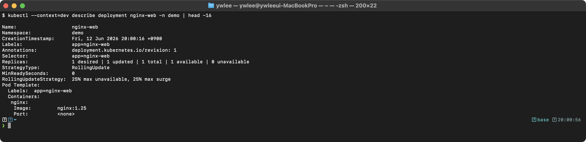
> `kubectl create deployment` 로 만들면 Port 가 `<none>` 이다. 컨테이너 포트는 `kubectl create deployment ... --port=80` 또는 매니페스트의 `ports:` 로 지정해야 표시된다.

### 실습 2: Rolling Update 실습

```bash
# 현재 이미지 확인
kubectl get deployment nginx-web -n demo -o jsonpath='{.spec.template.spec.containers[0].image}'
echo ""

# 롤아웃 이력 확인
kubectl rollout history deployment/nginx-web -n demo
```

**예상 출력 (dev 실측):**
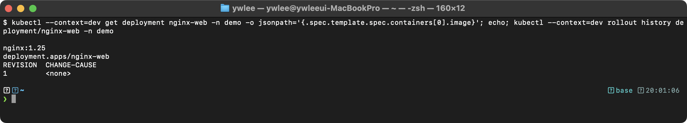

**동작 원리:** Deployment의 Rolling Update 과정:
1. 이미지를 변경하면 Deployment Controller가 새 ReplicaSet을 생성한다
2. 새 ReplicaSet의 Pod를 하나씩 올리고, 기존 ReplicaSet의 Pod를 하나씩 줄인다
3. `maxSurge`는 동시에 추가 생성할 수 있는 Pod 수를, `maxUnavailable`은 동시에 줄일 수 있는 Pod 수를 제한한다
4. 각 리비전은 별도의 ReplicaSet으로 보관되어 롤백이 가능하다

### 실습 3: ReplicaSet 관계 확인

```bash
# Deployment가 관리하는 ReplicaSet 확인
kubectl get replicasets -n demo -l app=nginx-web
```

**예상 출력 (dev 실측 — ReplicaSet 이름 = Deployment + Pod Template 해시):**
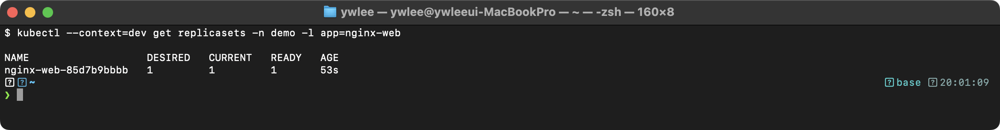

**동작 원리:** Deployment -> ReplicaSet -> Pod 관계:
1. Deployment Controller가 Pod Template의 해시를 기반으로 ReplicaSet 이름을 생성한다
2. Pod Template이 변경될 때마다 새 ReplicaSet이 생성된다
3. 기존 ReplicaSet은 `replicas: 0`으로 축소되지만 삭제되지 않는다 (롤백용)
4. `spec.revisionHistoryLimit`(기본값 10)에 따라 보관할 ReplicaSet 수가 결정된다

### 실습 4: 스케일링 테스트

```bash
# nginx-web을 3개로 스케일링
kubectl scale deployment nginx-web -n demo --replicas=3

# Pod 배포 상태 확인
kubectl get pods -n demo -l app=nginx-web -o wide

# 원래 상태로 복원
kubectl scale deployment nginx-web -n demo --replicas=1
```

**예상 출력 (dev 실측 스케일링 후 — 모두 dev-worker1, Pod IP 는 Pod CIDR 10.20.1.x):**
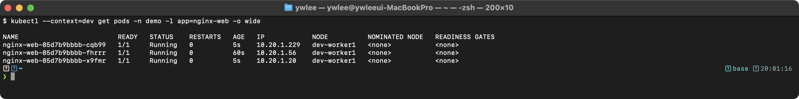

**동작 원리:** `kubectl scale`은 Deployment의 `spec.replicas`를 변경한다:
1. API Server가 Deployment 오브젝트의 replicas 필드를 업데이트한다
2. Deployment Controller가 변경을 감지하고 ReplicaSet의 replicas를 조정한다
3. ReplicaSet Controller가 부족한 Pod 수만큼 새 Pod를 생성한다
4. Scheduler가 각 Pod를 적절한 노드에 배치한다 (dev 클러스터는 worker1만 있으므로 모두 dev-worker1에 배치)
