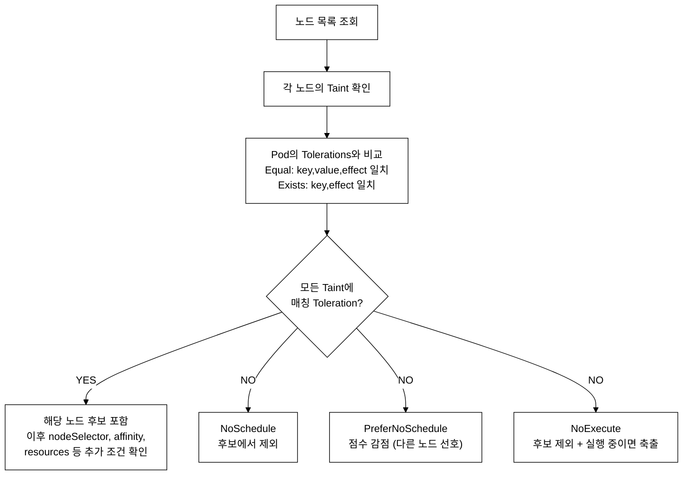
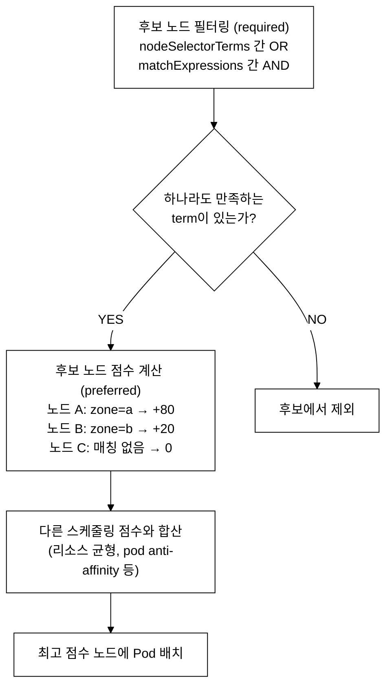
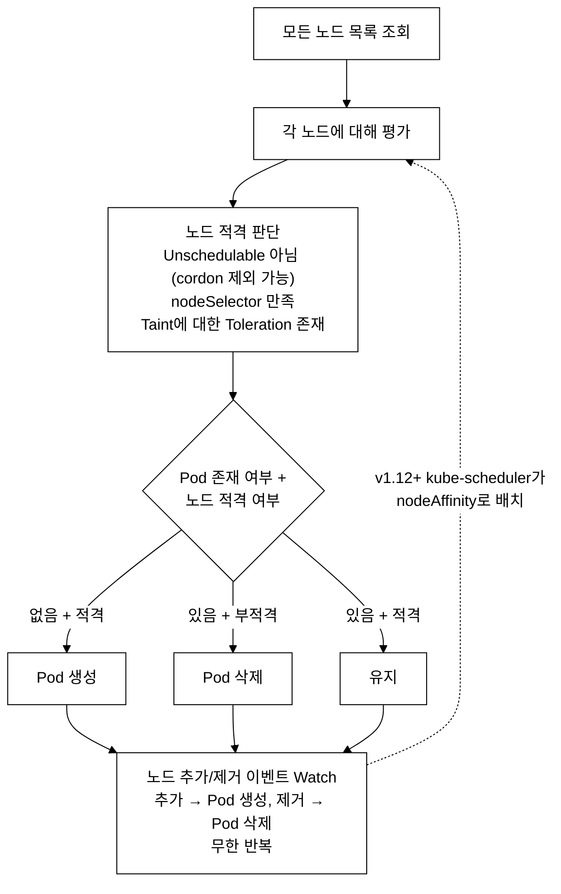
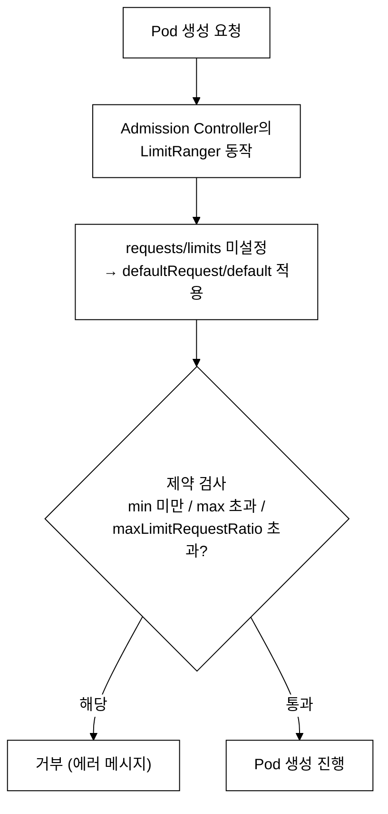
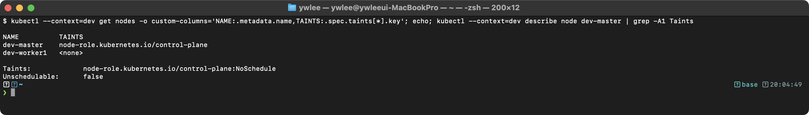
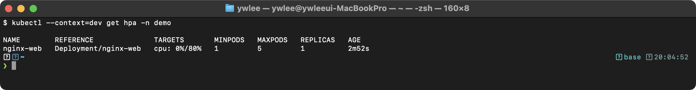
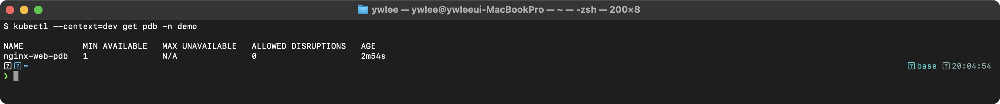
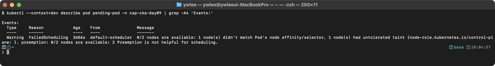
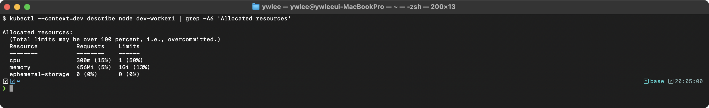
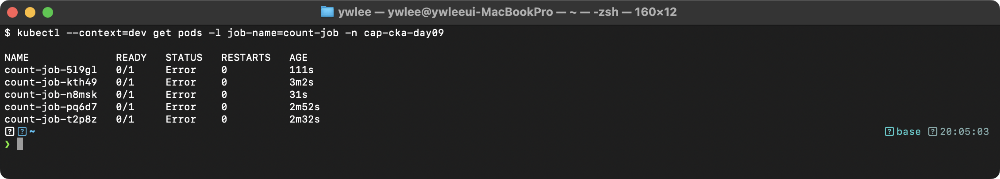

# CKA Day 9: 스케줄링 심화 - Taint/Toleration, Affinity, DaemonSet

> 학습 목표 | CKA 도메인: Workloads & Scheduling (15%) - Part 2 | 예상 소요 시간: 4시간

---

## 오늘의 학습 목표

- [ ] Taint/Toleration의 3가지 Effect를 완벽히 이해한다
- [ ] NodeSelector와 Node Affinity의 차이를 정확히 구분한다
- [ ] DaemonSet, Job, CronJob의 용도와 YAML을 숙지한다
- [ ] Resource Requests/Limits, LimitRange, ResourceQuota를 설정한다
- [ ] 시험에서 스케줄링 관련 문제를 빠르게 해결한다
- [ ] Pod Affinity/Anti-Affinity의 topologyKey를 이해한다
- [ ] Static Pod와 일반 Pod의 차이를 설명할 수 있다

오늘은 Day 8(Deployment/ReplicaSet/kube-scheduler 기본 동작)에 이어 스케줄링 심화를 다룬다. Workloads & Scheduling(15%) 도메인의 나머지 반을 완성하며, Day 8에서 익힌 "스케줄러가 노드를 선택하는 기본 흐름" 위에 Taint/Affinity라는 추가 제약 레이어와 DaemonSet·Job·Static Pod라는 특수 워크로드 컨트롤러를 쌓는다.

---

## 1. Taint와 Toleration 완벽 이해

### 1.1 Taint/Toleration의 스케줄링 메커니즘

#### 등장 배경

기본 쿠버네티스 스케줄러는 리소스 가용성만으로 노드를 선택한다. 그러나 실제 운영에서는 GPU 노드에는 GPU 워크로드만, Control Plane에는 시스템 컴포넌트만 실행해야 하는 경우가 많다.

직전 해결책은 nodeSelector였다. nodeSelector는 Pod에 "나는 이런 라벨을 가진 노드로 가겠다"고 적어 노드를 골라 배치하는 가장 단순한 방식이다(상세는 섹션 2). 그러나 nodeSelector는 Pod 쪽에서 "어디로 갈지"만 정할 뿐, 노드 쪽에서 "어떤 Pod를 받지 않을지"를 정하는 수단이 없다. 즉 GPU 노드에 라벨을 붙여 GPU Pod를 끌어올 수는 있어도, 라벨을 모르거나 nodeSelector를 안 쓴 일반 Pod가 그 노드에 들어오는 것을 막지는 못한다. 노드를 "특정 워크로드 전용"으로 보호할 방법이 없다는 것이 한계였다. 이것이 Taint의 등장 이유다.

Taint는 노드에 "이 노드에 오려면 이 조건을 tolerate해야 한다"는 제약을 건다. nodeSelector가 Pod가 노드를 당기는 인력(끌어옴)이라면, Taint는 노드가 Pod를 밀어내는 척력(밀어냄)이다. Toleration은 Pod에 "나는 이 Taint를 허용한다"고 선언하여 해당 노드에 스케줄링될 수 있게 한다. 이 조합으로 노드 전용화(node dedication)를 달성한다.

**Taint** -- 노드에 key=value:effect 형태로 설정하는 스케줄링 제약 조건. kube-scheduler가 Pod를 노드에 배치할 때 해당 Taint에 매칭되는 Toleration이 Pod에 없으면 스케줄링을 거부한다.
**Toleration** -- Pod spec에 선언하여 특정 Taint를 허용(bypass)하는 필드. key, operator(Equal/Exists), value, effect를 지정한다.

**핵심 동작 원리:**
- kube-scheduler는 각 노드의 Taint 목록과 Pod의 Tolerations를 비교하여 매칭되지 않는 Taint가 하나라도 있으면 해당 노드를 후보에서 제외한다
- Toleration은 Taint를 "통과"할 수 있을 뿐, 해당 노드로의 스케줄링을 보장하지 않는다
- 특정 노드에 강제 배치하려면 nodeSelector 또는 nodeAffinity를 함께 사용해야 한다

**핵심:** Toleration은 Taint를 "허용"할 뿐, 반드시 그 노드로 가는 것은 아니다! 특정 노드에 배치하려면 nodeSelector/nodeAffinity와 함께 사용해야 한다.

### 1.2 Taint Effect 종류

Effect는 Taint가 Pod 스케줄링에 미치는 영향 수준을 지정하는 필드다. 같은 key=value 라도 effect가 NoSchedule인지 NoExecute인지에 따라 "새 Pod만 막는다 / 기존 Pod까지 쫓아낸다"가 달라진다. 아래 세 값 중 하나를 쓴다.

| Effect | 설명 | 스케줄링 동작 |
|---|---|---|
| **NoSchedule** | 새 Pod 스케줄링 거부. 기존 Pod는 유지 | 필터링 단계에서 Toleration 없는 새 Pod를 제외 |
| **PreferNoSchedule** | 가능하면 스케줄링 안 함. 다른 노드 없으면 허용 | 스코어링 단계에서 다른 노드 후보에 더 높은 점수를 주어, 이 노드는 상대적으로 우선순위가 낮아짐 |
| **NoExecute** | 새 Pod 거부 + 기존 Toleration 없는 Pod를 eviction | 기존 Pod도 축출하며 tolerationSeconds로 유예 가능 |

**NoSchedule vs NoExecute 상세 비교:**
```
NoSchedule:
  - 새 Pod: Toleration 없으면 스케줄링 거부
  - 기존 Pod: 영향 없음 (계속 실행)
  - 사용 시나리오: 특정 노드를 새 워크로드로부터 보호

NoExecute:
  - 새 Pod: Toleration 없으면 스케줄링 거부
  - 기존 Pod: Toleration 없으면 즉시 축출
  - 기존 Pod: Toleration + tolerationSeconds → 해당 시간 후 축출
  - 사용 시나리오: 유지보수, 장애 대응

PreferNoSchedule:
  - 새 Pod: 가능하면 다른 노드에 스케줄링
  - 기존 Pod: 영향 없음
  - 사용 시나리오: 부하 분산, 선호도 표현
```

### 1.3 Taint 동작 원리 (동작 원리)

아래 흐름에서 "Equal / Exists"는 Toleration의 operator 값이다. operator는 Toleration이 Taint를 어떻게 비교할지를 정한다. Equal은 key·value·effect가 모두 일치해야 매칭되고(정확 일치), Exists는 value를 보지 않고 key(·effect)만 일치하면 매칭된다(키만 확인). 구체적 YAML은 섹션 1.5에서 다룬다.


_그림 1. Pod 스케줄링 시 Taint/Toleration 처리 흐름._

### 1.4 Taint 명령어

```bash
# === Taint 추가 ===
kubectl taint nodes <node> key=value:Effect
# 예시:
kubectl taint nodes worker1 dedicated=database:NoSchedule
kubectl taint nodes worker2 gpu=nvidia:NoExecute

# === Taint 제거 (끝에 - 추가) ===
kubectl taint nodes <node> key=value:Effect-
# 예시:
kubectl taint nodes worker1 dedicated=database:NoSchedule-

# === 특정 키의 모든 Taint 제거 ===
kubectl taint nodes worker1 dedicated-

# === 노드의 Taint 확인 ===
kubectl describe node <node> | grep -A5 Taints
# 또는
kubectl get nodes -o custom-columns='NAME:.metadata.name,TAINTS:.spec.taints'

# === 모든 노드의 Taint 한눈에 보기 ===
kubectl get nodes -o jsonpath='{range .items[*]}{.metadata.name}{"\t"}{.spec.taints[*].key}={.spec.taints[*].value}:{.spec.taints[*].effect}{"\n"}{end}'
```

### 1.5 Toleration YAML 상세

```yaml
spec:
  tolerations:
  # === Equal 연산자: key + value + effect 모두 일치해야 함 ===
  - key: "dedicated"             # Taint의 키 (필수, Exists로 key 생략 시 제외)
    operator: "Equal"            # 연산자: Equal (key+value 일치) 또는 Exists (key만 일치)
                                 # 기본값: Equal
    value: "database"            # Taint의 값 (Equal일 때만 필요)
    effect: "NoSchedule"         # Taint의 효과
                                 # 생략하면 해당 key의 모든 effect에 매칭
    # tolerationSeconds: 300     # NoExecute일 때: 이 시간(초) 후 축출 (선택)

  # === Exists 연산자: key만 일치하면 됨 (value 무시) ===
  - key: "gpu"
    operator: "Exists"           # 키만 있으면 매칭 (value 불필요)
    effect: "NoExecute"

  # === effect 생략: 해당 key의 모든 effect 매칭 ===
  - key: "special"
    operator: "Exists"           # key=special인 모든 Taint 매칭
                                 # NoSchedule, PreferNoSchedule, NoExecute 모두

  # === 모든 Taint 허용 ===
  - operator: "Exists"           # key도 생략하면 모든 Taint 매칭!
    # 이 설정으로 어떤 노드에도 배치 가능 (Control Plane 포함)
    # DaemonSet에서 자주 사용
```

**tolerationSeconds 상세:**
```yaml
# NoExecute Taint에서 tolerationSeconds 사용 예
tolerations:
- key: "node.kubernetes.io/unreachable"
  operator: "Exists"
  effect: "NoExecute"
  tolerationSeconds: 300          # 노드가 unreachable 되어도 300초(5분) 동안 유지
                                  # 300초 후 축출
                                  # tolerationSeconds 없으면 무기한 유지

# Kubernetes가 자동으로 추가하는 기본 tolerations:
# - node.kubernetes.io/not-ready:NoExecute (tolerationSeconds: 300)
# - node.kubernetes.io/unreachable:NoExecute (tolerationSeconds: 300)
```

### 1.6 Control Plane 노드의 기본 Taint

```bash
# Control Plane 노드에는 기본적으로 이 Taint가 설정됨
# 일반 Pod가 master 노드에 배치되는 것을 방지
kubectl describe node <master> | grep Taints
# Taints: node-role.kubernetes.io/control-plane:NoSchedule
```

Control Plane에서도 Pod를 실행하려면:
```yaml
tolerations:
- key: "node-role.kubernetes.io/control-plane"
  operator: "Exists"
  effect: "NoSchedule"
```

### 1.7 Taint + nodeSelector 패턴 (노드 전용화)

특정 노드를 특정 워크로드 전용으로 만들려면 Taint와 nodeSelector를 함께 사용한다:

```yaml
# Step 1: 노드에 Taint + Label 설정
# kubectl taint nodes worker2 dedicated=database:NoSchedule
# kubectl label nodes worker2 dedicated=database

# Step 2: Pod에 Toleration + nodeSelector 설정
apiVersion: v1
kind: Pod
metadata:
  name: db-pod
spec:
  tolerations:                          # Taint 허용 (이 노드에 "들어갈 수 있다")
  - key: "dedicated"
    operator: "Equal"
    value: "database"
    effect: "NoSchedule"
  nodeSelector:                         # 반드시 이 노드에 배치 ("가야 한다")
    dedicated: database
  containers:
  - name: mysql
    image: mysql:8.0
    env:
    - name: MYSQL_ROOT_PASSWORD
      value: "rootpass"
```

**왜 둘 다 필요한가?**
```
Toleration만 있으면:
  → 그 노드에 갈 수 "있지만", 다른 노드에도 갈 수 있음
  → 원하는 노드에 배치되지 않을 수 있음

nodeSelector만 있으면:
  → 그 노드에 가야 "하지만", Taint 때문에 거부당할 수 있음
  → Pod가 Pending 상태에 머무름

둘 다 있으면:
  → Toleration으로 Taint를 통과 + nodeSelector로 반드시 해당 노드에 배치
  → 완벽한 노드 전용화 달성
```

---

## 2. NodeSelector와 Node Affinity

섹션 1의 Taint/Toleration이 "노드가 어떤 Pod를 거부할지"를 다뤘다면, 이 섹션은 "Pod가 어느 노드로 갈지"를 정하는 쪽이다. 가장 단순한 도구가 nodeSelector이고, 그 한계를 넘으려고 나온 것이 Node Affinity다.

구체적으로 nodeSelector로는 다음과 같은 요구를 표현할 수 없어 한계에 부딪힌다.

- OR 조건: "zone-a 또는 zone-b 중 아무 데나" — nodeSelector는 나열한 라벨을 모두 만족(AND)하는 노드만 고르므로 "둘 중 하나"를 표현할 수 없다.
- 선호도(soft) 조건: "가능하면 SSD 노드, 없으면 아무 노드라도" — nodeSelector는 일치하는 노드가 없으면 Pod가 Pending에 머문다. "되도록"이라는 약한 선호를 표현할 수 없다.
- 부정·수치 비교: "control-plane 라벨이 없는 노드만", "disksize가 100보다 큰 노드" — 단순 일치만 되므로 NotIn·DoesNotExist·Gt/Lt 같은 비교가 불가능하다.

이 세 가지를 모두 해결하는 것이 Node Affinity다(섹션 2.2). 트레이드오프로 YAML이 길고 중첩이 깊어져 손으로 빠르게 쓰기 어렵다는 비용이 따른다.

### 2.1 nodeSelector (단순한 방식)

가장 간단한 노드 선택 방법. 라벨이 정확히 일치하는 노드에만 배치한다.

```yaml
spec:
  nodeSelector:
    disktype: ssd                       # 이 라벨이 있는 노드에만 배치
    environment: production             # AND 조건 (둘 다 만족해야 함)
```

```bash
# 노드에 라벨 추가
kubectl label nodes worker1 disktype=ssd
kubectl label nodes worker1 environment=production

# 노드 라벨 확인
kubectl get nodes --show-labels
kubectl get nodes -l disktype=ssd

# 노드 라벨 제거
kubectl label nodes worker1 disktype-
```

**nodeSelector의 한계:**
- OR 조건 불가 (zone=a 또는 zone=b)
- "선호" 표현 불가 (가능하면 zone=a, 아니면 다른 곳)
- 복잡한 조건 불가 (disksize > 100)
→ 이런 경우 Node Affinity 사용

### 2.2 Node Affinity (유연한 방식)

nodeSelector보다 훨씬 유연한 노드 선택 방법. "반드시(required)" 또는 "선호(preferred)" 조건을 지정할 수 있다.

nodeSelector는 단순 라벨 일치(equality-based) 조건만 지원하는 반면, Node Affinity는 set-based 연산자(In, NotIn, Exists, DoesNotExist, Gt, Lt)와 required/preferred 구분을 지원하여 복합적인 스케줄링 정책을 선언할 수 있다. preferred 규칙에는 weight(1-100)를 부여하여 스코어링 단계에서 노드 선호도를 수치화한다.

아래 YAML을 읽으려면 operator를 먼저 알아야 한다. operator는 노드 라벨을 어떤 방식으로 비교할지를 정하는 필드다. 입문 단계에서는 `In`(라벨 값이 values 목록 중 하나와 일치)과 `NotIn`(목록에 없으면 매칭) 두 개만 알면 예제를 따라갈 수 있다. 그 밖에 `Exists`/`DoesNotExist`(키 존재 여부만 확인), `Gt`/`Lt`(값을 숫자로 비교) 4가지가 더 있으며, 6가지 전체와 예시는 섹션 2.4의 표에서 정리한다. 아래 예제는 `In`과 `DoesNotExist`만 사용한다.

```yaml
spec:
  affinity:
    nodeAffinity:
      # === Hard 규칙: 반드시 조건을 만족해야 스케줄링 ===
      requiredDuringSchedulingIgnoredDuringExecution:       # 필수 조건
        nodeSelectorTerms:                                  # OR 조건 (여러 term 중 하나만 만족)
        - matchExpressions:                                 # AND 조건 (같은 term 내)
          - key: kubernetes.io/os       # 노드 라벨 키
            operator: In                # 연산자
            values:                     # 값 목록 (In/NotIn일 때)
            - linux
          - key: node-role.kubernetes.io/control-plane
            operator: DoesNotExist      # 이 키가 없는 노드 (= Worker Node만)

      # === Soft 규칙: 가능하면 조건을 만족하는 노드 선호 ===
      preferredDuringSchedulingIgnoredDuringExecution:      # 선호 조건
      - weight: 80                      # 가중치 (1-100, 높을수록 강하게 선호)
        preference:
          matchExpressions:
          - key: zone
            operator: In
            values:
            - zone-a
      - weight: 20                      # 낮은 가중치 = 약하게 선호
        preference:
          matchExpressions:
          - key: zone
            operator: In
            values:
            - zone-b
```

**"IgnoredDuringExecution"의 의미:**
```
requiredDuringScheduling  → 스케줄링 시 반드시 조건 만족
IgnoredDuringExecution    → 이미 실행 중인 Pod는 조건이 변해도 축출하지 않음

예: Pod가 zone=a 노드에서 실행 중인데, 노드의 zone 라벨이 제거되어도
    Pod는 계속 실행됨 (축출되지 않음)
```

**operator 종류 (6가지 전체):** 위 YAML에서는 `In`/`DoesNotExist`만 썼지만, Node Affinity가 지원하는 operator는 다음 6가지다. `Gt`/`Lt`는 라벨 값을 문자열이 아니라 정수로 해석해 비교하므로 disksize, cpu 코어 수처럼 수치 라벨에 쓴다.

| operator | 설명 | 예시 |
|---|---|---|
| `In` | 값 목록 중 하나와 일치 | zone In [a, b] |
| `NotIn` | 값 목록에 포함되지 않음 | zone NotIn [c] |
| `Exists` | 키가 존재하면 매칭 (값 무관) | gpu Exists |
| `DoesNotExist` | 키가 존재하지 않으면 매칭 | gpu DoesNotExist |
| `Gt` | 값이 숫자로 더 큼 | disksize Gt 100 |
| `Lt` | 값이 숫자로 더 작음 | disksize Lt 500 |

### 2.3 Node Affinity 동작 원리 (동작 원리)


_그림 2. kube-scheduler의 Node Affinity 처리 흐름._

### 2.4 Pod Affinity / Pod Anti-Affinity

Pod 간의 상대적 배치를 제어한다.

topologyKey는 노드에 붙어 있는 라벨의 키 이름이며, 같은 값을 가진 노드들을 하나의 그룹(도메인)으로 묶는 기준이다. 예를 들어 `kubernetes.io/hostname` 키는 노드마다 고유한 값을 가지므로 "도메인 = 노드 한 대"가 되고, `topology.kubernetes.io/zone` 키는 같은 가용 영역의 여러 노드가 동일한 값을 가지므로 "도메인 = 가용 영역 전체"가 된다.

Pod Affinity는 특정 라벨을 가진 Pod가 이미 실행 중인 토폴로지 도메인(topologyKey로 정의)과 동일한 도메인에 Pod를 배치하는 co-location(같은 노드 묶음에 함께 배치) 제약이며, Pod Anti-Affinity는 반대로 해당 도메인을 회피하여 분산 배치(spreading, 다른 노드 묶음으로 분산 배치)를 달성하는 제약이다.

```yaml
spec:
  affinity:
    # === Pod Affinity: 특정 Pod와 같은 노드에 배치 ===
    podAffinity:
      requiredDuringSchedulingIgnoredDuringExecution:
      - labelSelector:
          matchExpressions:
          - key: app
            operator: In
            values:
            - cache                    # app=cache Pod와 같은 노드
        topologyKey: kubernetes.io/hostname  # "같은 노드" 기준
        # topologyKey 옵션:
        # kubernetes.io/hostname → 같은 노드
        # topology.kubernetes.io/zone → 같은 가용 영역
        # topology.kubernetes.io/region → 같은 리전

    # === Pod Anti-Affinity: 특정 Pod와 다른 노드에 배치 ===
    podAntiAffinity:
      preferredDuringSchedulingIgnoredDuringExecution:
      - weight: 100
        podAffinityTerm:
          labelSelector:
            matchExpressions:
            - key: app
              operator: In
              values:
              - web                    # app=web Pod와 다른 노드 선호
          topologyKey: kubernetes.io/hostname
```

**topologyKey 상세:**
```
topologyKey는 "같은 위치"의 기준을 정의한다.

kubernetes.io/hostname:
  → 같은 노드 (가장 세밀)
  → Pod Affinity: 같은 노드에 배치
  → Pod Anti-Affinity: 서로 다른 노드에 분산

topology.kubernetes.io/zone:
  → 같은 가용 영역 (zone)
  → Pod Affinity: 같은 zone에 배치 (다른 노드여도 OK)
  → Pod Anti-Affinity: 서로 다른 zone에 분산 (HA 구성)

topology.kubernetes.io/region:
  → 같은 리전
  → 멀티 리전 클러스터에서 사용
```

### 2.5 nodeName으로 직접 배치

스케줄러를 우회하고 특정 노드에 직접 배치한다. 시험에서는 거의 출제되지 않지만 알아두면 좋다.

nodeName은 kube-scheduler를 완전히 건너뛰어 kubelet이 직접 Pod를 생성하게 하는 메커니즘이다. 스케줄러가 검사하는 리소스 가용성 확인, Taint/Toleration 매칭, Affinity 평가를 모두 생략한다. 따라서 노드가 이미 리소스를 초과했어도 Pod가 강제로 배치되고, 노드 장애 시 다른 노드로 자동 이동하지 않는다(재스케줄링 불가). 시험에서는 Static Pod 생성이나 특정 노드 고정 검증 문제에서 드물게 등장하며, 실무에서는 디버깅 목적 이외에는 사용을 피한다.

```yaml
spec:
  nodeName: worker1                    # 스케줄러 무시, 직접 이 노드에 배치
  containers:
  - name: nginx
    image: nginx
```

---

## 3. DaemonSet 완벽 이해

### 3.1 DaemonSet이란?

#### 등장 배경

DaemonSet이 없던 시절, 모든 노드에서 동일한 에이전트(로그 수집기, 모니터링 에이전트 등)를 실행하려면 ReplicationController(또는 초기 Deployment)를 직접 사용해야 했다. 그러나 ReplicationController는 "몇 개"를 실행할지만 지정하는 도구여서, 클러스터가 10노드일 때 replicas=10으로 맞춰도 "한 노드에 2개, 다른 노드에 0개"가 될 수 있었다. 특히 새 노드를 추가하면 관리자가 수동으로 replicas를 늘려야 했고, 특정 노드에서 죽은 에이전트가 다른 노드에서 재시작될 가능성도 있었다. "각 노드에 정확히 하나씩"을 보장하는 메커니즘이 없었다는 것이 핵심 한계다.

DaemonSet은 이 문제를 노드 단위로 원하는 상태를 정의하는 방식으로 해결한다. 노드 추가/제거 이벤트를 Watch하여 자동으로 Pod를 생성/삭제하므로 관리자 개입이 불필요하다. 트레이드오프는 nodeSelector나 toleration을 명시하지 않으면 Control Plane 노드에도 배포된다는 점이다. Control Plane 전용화를 원하면 toleration을 제거하거나 nodeSelector로 워커 노드만 지정해야 한다.

직관부터 잡는다. DaemonSet은 모든 워커 노드에 정확히 하나씩 같은 Pod를 자동으로 깔아 주는 도구다. 노드가 3대면 Pod 3개, 5대면 5개가 된다. 새 노드를 클러스터에 추가하면 DaemonSet이 그 노드에도 자동으로 Pod를 하나 생성하고, 노드를 빼면 그 Pod도 함께 사라진다. 그래서 "모든 노드에서 돌아야 하는 에이전트"에 쓴다.

정확한 정의는 다음과 같다. DaemonSet은 클러스터의 모든 적격 노드(또는 nodeSelector/toleration으로 필터링된 노드)에 정확히 하나의 Pod 복제본을 보장하는 컨트롤러이다. 여기서 컨트롤러(Controller)란 "현재 상태와 원하는 상태를 계속 비교해 차이를 메우는" 쿠버네티스의 제어 루프이며, Watch란 API 서버에 노드 추가·제거 같은 변경 이벤트를 구독해 실시간으로 통지받는 메커니즘이다. DaemonSet Controller는 노드 추가/제거 이벤트를 Watch하여 자동으로 Pod를 생성/삭제하므로, Deployment와 달리 replicas 필드를 쓰지 않고 Pod 수가 노드 수에 따라 정해진다.

**사용 사례:**
- 로그 수집 에이전트 (Fluentd, Filebeat)
- 모니터링 에이전트 (Node Exporter, Datadog Agent)
- 네트워크 플러그인 (kube-proxy, Cilium, Calico)
- 스토리지 데몬 (ceph, glusterd)

### 3.2 DaemonSet vs Deployment 차이

```
DaemonSet:
  - replicas 필드 없음 (노드 수에 따라 자동 결정)
  - 노드당 정확히 1개 Pod
  - 새 노드 추가 시 자동으로 Pod 생성
  - 노드 제거 시 자동으로 Pod 삭제
  - strategy 대신 updateStrategy 사용
  - updateStrategy에 maxSurge 없음 (노드당 1개이므로)

Deployment:
  - replicas 필드로 Pod 수 지정
  - 노드와 관계없이 원하는 수만큼 Pod 실행
  - strategy로 배포 전략 설정
  - maxSurge, maxUnavailable 모두 사용 가능
```

### 3.3 DaemonSet YAML 상세

```yaml
apiVersion: apps/v1                    # Deployment와 동일한 API 그룹
kind: DaemonSet                        # 리소스 종류
metadata:
  name: log-collector                  # DaemonSet 이름
  namespace: kube-system               # 시스템 컴포넌트는 보통 kube-system
  labels:
    app: log-collector
spec:
  selector:                            # Pod 선택자 (Deployment와 동일)
    matchLabels:
      app: log-collector
  # ※ replicas 필드 없음! (모든 노드에 1개씩 자동 배포)
  # ※ strategy 대신 updateStrategy 사용
  updateStrategy:
    type: RollingUpdate                # RollingUpdate 또는 OnDelete
    rollingUpdate:
      maxUnavailable: 1                # maxSurge 없음 (노드당 1개이므로)
                                       # 한 번에 업데이트할 최대 Pod 수
  template:
    metadata:
      labels:
        app: log-collector
    spec:
      # Control Plane 노드에도 배포하려면 toleration 추가
      tolerations:
      - key: node-role.kubernetes.io/control-plane
        operator: Exists
        effect: NoSchedule
      # 모든 Taint를 허용하려면:
      # - operator: Exists
      containers:
      - name: fluentd
        image: fluentd:v1.16
        resources:
          requests:
            cpu: "50m"
            memory: "64Mi"
          limits:
            cpu: "200m"
            memory: "256Mi"
        volumeMounts:
        - name: varlog                 # 호스트 로그 디렉터리 마운트
          mountPath: /var/log
          readOnly: true
        - name: containers
          mountPath: /var/lib/docker/containers
          readOnly: true
      volumes:
      - name: varlog
        hostPath:
          path: /var/log
      - name: containers
        hostPath:
          path: /var/lib/docker/containers
```

### 3.4 DaemonSet 동작 원리 (동작 원리)


_그림 3. DaemonSet Controller의 동작._

### 3.5 DaemonSet 빠른 생성 팁

DaemonSet은 `kubectl create` 명령으로 직접 생성할 수 없다. Deployment YAML에서 수정하는 것이 가장 빠르다:

```bash
# 1. Deployment YAML 생성
kubectl create deployment ds-template --image=busybox:1.36 \
  --dry-run=client -o yaml > /tmp/ds.yaml

# 2. YAML 수정:
#    - kind: Deployment → kind: DaemonSet
#    - replicas 삭제
#    - strategy 삭제
#    - status 삭제 (있다면)

# 3. apply
kubectl apply -f /tmp/ds.yaml
```

**updateStrategy 옵션:**
```yaml
# RollingUpdate (기본값): 하나씩 업데이트
updateStrategy:
  type: RollingUpdate
  rollingUpdate:
    maxUnavailable: 1              # 정수 또는 퍼센트

# OnDelete: Pod를 수동으로 삭제해야 업데이트
updateStrategy:
  type: OnDelete                   # 자동 업데이트 안 함
                                   # kubectl delete pod <name>으로 수동 삭제 시
                                   # 새 버전의 Pod가 생성됨
```

---

## 4. Job과 CronJob 완벽 이해

### 4.1 Job이란?

#### 등장 배경

배치 작업(DB 마이그레이션, 데이터 변환, 보고서 생성 등)을 Deployment로 실행하면 치명적인 문제가 생긴다. Deployment는 Pod가 종료되면 "장애"로 간주해 즉시 재시작하는 구조이기 때문이다. 즉 `restartPolicy: Always`가 기본값이어서, "한 번 실행하고 끝내야 하는 스크립트"가 완료(exit 0)해도 무한히 재시작된다. 이를 막으려면 restartPolicy를 바꿔야 하는데, Deployment 스펙상 Never/OnFailure는 허용되지 않는다. 결과적으로 쿠버네티스 초기에는 배치 작업을 클러스터 외부(크론탭, Jenkins)에서 별도로 실행해야 했고, "완료 보장(at-least-once)"과 "실패 시 재시도"를 K8s 오케스트레이션 레이어에서 다루지 못했다.

Job은 이 문제를 "완료(exit 0)를 성공으로, 종료(exit != 0)를 실패로 구분"하는 별도 컨트롤러를 도입해 해결한다. completions로 몇 번 성공해야 완료인지 선언하고, backoffLimit으로 최대 재시도 횟수를 제한한다. 트레이드오프는 Job이 완료돼도 Pod 오브젝트가 Completed 상태로 남아 직접 삭제하거나 ttlSecondsAfterFinished를 설정해야 한다는 점이다. 또한 실행 중 클러스터 장애가 발생하면 같은 작업이 두 번 실행될 수 있으므로(at-least-once 보장이지 exactly-once는 아님), 작업 자체를 멱등(idempotent)하게 설계해야 한다.

Job은 completions 수만큼 Pod의 성공적 종료(exit code 0)를 보장하는 일회성 작업 컨트롤러이다. Deployment가 지속적으로 Pod를 Running 상태로 유지하는 반면, Job은 Pod가 Completed 상태에 도달하면 작업을 종료한다. parallelism으로 동시 실행 Pod 수를, backoffLimit으로 실패 시 재시도 횟수를 제어한다.

### 4.2 Job YAML 상세

```yaml
apiVersion: batch/v1                   # batch API 그룹 (apps가 아님!)
kind: Job
metadata:
  name: data-migration                # Job 이름
  namespace: demo
spec:
  completions: 5                       # 총 5번 성공해야 Job 완료 (기본값: 1)
                                       # 모든 completions가 완료되어야 Job 상태가 Complete
  parallelism: 2                       # 동시에 2개 Pod 실행 (기본값: 1)
                                       # parallelism > completions이면 completions만큼만 실행
  backoffLimit: 4                      # 최대 4번 재시도 후 Job 실패 (기본값: 6)
                                       # Pod가 실패할 때마다 카운트 증가
                                       # 지수 백오프: 10초, 20초, 40초, ... 최대 6분
  activeDeadlineSeconds: 300           # 전체 Job 타임아웃: 300초
                                       # 이 시간이 지나면 실행 중인 Pod 모두 종료
                                       # backoffLimit보다 우선
  ttlSecondsAfterFinished: 100         # 완료 후 100초 뒤 자동 삭제 (Job + Pod 모두)
                                       # 이 필드가 없으면 수동 삭제 필요
  template:
    spec:
      restartPolicy: Never             # Never 또는 OnFailure만 가능!
                                       # Always는 사용 불가 (무한 재시작)
                                       # Never: 실패 시 새 Pod 생성
                                       # OnFailure: 실패 시 같은 Pod 내에서 재시작
      containers:
      - name: worker
        image: busybox:1.36
        command: ["sh", "-c", "echo Processing batch $RANDOM && sleep 5"]
```

> 셸 변수 함정: 위 command의 `$RANDOM`은 셸이 풀어 주는 변수다. 그런데 이 매니페스트를 `kubectl apply -f`로 적용하면 쿠버네티스가 환경변수 치환을 하지 않으므로, 컨테이너 안의 셸(`sh -c`)이 직접 `$RANDOM`을 해석해 정상적으로 난수가 찍힌다. 문제가 되는 것은 `kubectl create job ... -- sh -c "echo $RANDOM"`처럼 호스트 셸을 거쳐 명령을 넘길 때다. 이 경우 `$RANDOM`이 매니페스트로 들어가기 전에 호스트에서 한 번 풀려 고정된 숫자가 박힌다. 호스트 셸의 조기 치환을 막으려면 작은따옴표로 감싸거나(`'echo Processing batch '$RANDOM`) 달러를 이스케이프한다(`echo Processing batch \$RANDOM`). 문제 3의 풀이에서 `count-\$i`로 이스케이프한 것이 같은 이유다.

**restartPolicy Never vs OnFailure:**
```
Never:
  - 실패 시: 새 Pod를 생성 (기존 Pod는 유지, 로그 확인 가능)
  - 장점: 실패한 Pod의 로그를 확인할 수 있음
  - 단점: 실패한 Pod가 계속 남아있음

OnFailure:
  - 실패 시: 같은 Pod 내에서 컨테이너를 재시작
  - 장점: Pod가 쌓이지 않음
  - 단점: 이전 실패의 로그를 볼 수 없음 (덮어쓰기)
```

**completions와 parallelism 동작:**
```
completions=5, parallelism=2:

시간 → ─────────────────────────────────▶

Pod1: [█████] 완료 (1/5)
Pod2: [█████] 완료 (2/5)
Pod3:         [█████] 완료 (3/5)
Pod4:         [█████] 완료 (4/5)
Pod5:                 [█████] 완료 (5/5) → Job 완료!
```

```bash
# Job 빠른 생성
kubectl create job my-job --image=busybox:1.36 -- echo "Hello Job"

# Job 상태 확인
kubectl get jobs
kubectl describe job my-job
kubectl get pods --selector=job-name=my-job

# Job 로그
kubectl logs job/my-job
```

### 4.3 CronJob이란?

#### 등장 배경

기존 시스템 crontab은 단일 호스트에 종속되어 노드 장애 시 예약 실행이 보장되지 않는다는 근본 한계가 있었다. 예를 들어 `0 2 * * * /opt/backup.sh`를 crontab에 등록해 두어도 해당 서버가 장애 상태이면 해당 회차는 그냥 누락된다. 또한 실행 이력이 파일 시스템 로그에만 남아 K8s 레이어에서 "몇 번 성공/실패했는가"를 `kubectl`로 조회할 수 없었다.

CronJob은 이를 두 가지로 해결한다. 첫째, Job 오브젝트로 실행을 위임하므로 K8s 스케줄러와 kubelet이 재시도·상태 추적을 담당한다. 둘째, `successfulJobsHistoryLimit`·`failedJobsHistoryLimit`으로 이력 보존 정책을 선언적으로 관리한다.

트레이드오프는 두 가지다. 첫째, CronJob 컨트롤러가 다운되었다가 늦게 복구될 때, `startingDeadlineSeconds` 창 안의 missed 실행 횟수가 100회를 초과하면 CronJob이 비활성화된다. `startingDeadlineSeconds`를 100 미만으로 설정하면 이 위험이 커지므로 100 이상 권장한다. 둘째, Job이 완료되어도 Pod 오브젝트가 남으므로 `successfulJobsHistoryLimit`으로 이력 수를 제한하지 않으면 Pod 목록이 계속 쌓인다.

CronJob은 cron 스케줄 표현식(분 시 일 월 요일)에 따라 주기적으로 Job 오브젝트를 생성하는 시간 기반 스케줄링 컨트롤러이다. concurrencyPolicy로 동시 실행 정책(Allow/Forbid/Replace)을 제어하고, startingDeadlineSeconds로 "예정 시각으로부터 몇 초 안에 Job을 시작하지 못하면 그 실행을 건너뛸지"의 마감 시한을 설정한다. 즉 컨트롤러가 다운되었다가 늦게 복구되는 등의 이유로 예정 시각에서 startingDeadlineSeconds를 넘겨 버리면, 그 회차는 missed(놓친 실행)로 처리되어 실행되지 않는다. "지연을 허용한다"기보다 "이 시한을 넘긴 지연은 포기한다"는 의미다.

### 4.4 CronJob YAML 상세

```yaml
apiVersion: batch/v1
kind: CronJob
metadata:
  name: daily-backup                   # CronJob 이름
spec:
  schedule: "0 2 * * *"               # 매일 새벽 2시 실행
  # 크론 표현식: 분(0-59) 시(0-23) 일(1-31) 월(1-12) 요일(0-6, 0=일요일)
  # "*/5 * * * *"  = 매 5분마다
  # "0 */6 * * *"  = 매 6시간마다
  # "0 9 * * 1-5"  = 평일 오전 9시
  # "0 0 1 * *"    = 매월 1일 자정
  # "30 4 * * 0"   = 매주 일요일 04:30
  # "0 0 * * *"    = 매일 자정

  concurrencyPolicy: Forbid           # 이전 Job 실행 중이면 새 Job 생성 안 함
  # Allow: 동시 실행 허용 (기본값)
  # Forbid: 이전 Job 실행 중이면 스킵
  # Replace: 이전 Job을 종료하고 새 Job 시작

  successfulJobsHistoryLimit: 3        # 성공 Job 이력 3개 보존 (기본값: 3)
  failedJobsHistoryLimit: 1           # 실패 Job 이력 1개 보존 (기본값: 1)
  startingDeadlineSeconds: 200         # 스케줄 시간으로부터 200초 내에 시작해야 함
                                       # 초과하면 해당 실행은 스킵
  suspend: false                       # true로 설정하면 일시정지 (새 Job 생성 안 함)

  jobTemplate:                         # 실행할 Job의 템플릿
    spec:
      template:
        spec:
          restartPolicy: OnFailure
          containers:
          - name: backup
            image: busybox:1.36
            command: ["sh", "-c", "echo Backup at $(date) && sleep 10"]
```

**concurrencyPolicy 상세 비교:**
```
Allow (기본값):
  시간 → ────────────────────────────▶
  Job1:  [████████████████████]
  Job2:       [████████████████████]    ← 겹침 허용
  Job3:            [████████████████████]

Forbid:
  시간 → ────────────────────────────▶
  Job1:  [████████████████████]
  Job2:                        [████]   ← Job1 완료 후에야 실행
  (스킵됨)                              ← 중간 스케줄은 스킵

Replace:
  시간 → ────────────────────────────▶
  Job1:  [█████████]  ← Job2 시작 시 종료됨
  Job2:       [████████████████████]
  Job3:            [████████████████████] ← Job2 시작 시 종료됨
```

```bash
# CronJob 빠른 생성
kubectl create cronjob health-check \
  --image=busybox:1.36 \
  --schedule="*/5 * * * *" \
  -- sh -c "echo Health OK at $(date)"

# CronJob 상태 확인
kubectl get cronjobs
kubectl get jobs --selector=job-name=health-check-xxxxx

# CronJob 일시정지
kubectl patch cronjob health-check -p '{"spec":{"suspend":true}}'

# CronJob 재개
kubectl patch cronjob health-check -p '{"spec":{"suspend":false}}'

# CronJob에서 수동으로 Job 트리거
kubectl create job manual-backup --from=cronjob/daily-backup
```

---

## 5. Resource 관리

여기까지(Taint/Toleration, Affinity, DaemonSet)는 스케줄러가 "Pod를 어느 노드에 배치할지"를 정하는 도구였다. 이 섹션은 다른 축을 다룬다. 노드가 정해진 다음, 그 Pod가 "CPU/메모리를 얼마나 쓰도록 보장받고, 얼마까지만 쓸 수 있는지"를 Requests/Limits로 정한다. 두 축은 맞물려 있다. Requests 값은 스케줄러가 노드를 고를 때의 입력이기도 하므로(노드의 남은 용량과 비교), 리소스 설정은 곧 스케줄링 결과에도 영향을 준다.

### 5.1 Resource Requests와 Limits

Requests/Limits가 없던 초기 쿠버네티스에서는 모든 Pod가 BestEffort로 노드의 CPU·메모리를 선착순으로 경쟁했다. 노드 메모리가 고갈되면 리눅스 커널의 OOM Killer가 임의로 프로세스를 종료했고, 어떤 Pod가 죽을지 예측할 수 없었다. 이를 해결하기 위해 cgroups(Linux 커널이 프로세스 그룹별로 CPU·메모리 사용량을 격리하는 메커니즘) 기반 리소스 격리가 도입됐다. requests는 스케줄러에게 "이 노드에 최소 이만큼의 여유 용량이 있을 때만 나를 배치하라"는 입력값이 되고, limits는 런타임에서 cgroup의 cpu.max·memory.max를 설정해 사용량 상한을 강제한다. 트레이드오프는 모든 컨테이너에 requests=limits(Guaranteed QoS)로 설정하면 노드의 bin-packing 밀도(한 노드에 얼마나 많은 Pod를 채울 수 있는지)가 낮아져 클러스터 전체 자원 활용률이 떨어진다는 점이다.

```yaml
resources:
  requests:                            # 최소 보장 리소스 (스케줄링 기준)
    cpu: "250m"                        # 250 밀리코어 = 0.25 CPU
                                       # 1000m = 1 CPU, 500m = 0.5 CPU
                                       # 1 = 1000m = 1 vCPU/Core
    memory: "128Mi"                    # 128 메비바이트
                                       # Ki, Mi, Gi 사용 (이진 단위)
                                       # K, M, G도 가능 (십진 단위)
  limits:                              # 최대 허용 리소스
    cpu: "500m"                        # CPU 초과 → 쓰로틀링 (느려짐, 죽지는 않음)
    memory: "256Mi"                    # Memory 초과 → OOMKilled (강제 종료!)
```

**requests vs limits:**
- **requests**: "최소 이만큼은 보장해줘" -- 스케줄러가 노드 선택 시 사용
- **limits**: "최대 이만큼만 써" -- 런타임에서 리소스 사용 제한

**리소스 관리 메커니즘:**
- requests: kube-scheduler가 노드의 allocatable 리소스에서 requests 합계를 차감하여 스케줄링 가능 여부를 결정한다. 스케줄링 후에는 kubelet이 이 값을 cgroup(Linux 커널이 프로세스 그룹별로 CPU·메모리 사용량을 제한·격리하는 메커니즘)의 `cpu.shares`(경쟁 시 CPU 배분 가중치)·`memory.min`(회수되지 않고 보장되는 메모리 하한)에 설정한다
- limits: kubelet이 cgroup v2의 cpu.max와 memory.max를 설정하여 런타임에서 리소스 사용을 강제 제한한다

**QoS 클래스 (동작 원리):**
```
Pod의 QoS 클래스는 requests와 limits 설정에 따라 자동으로 결정된다:

1. Guaranteed (최우선):
   - 모든 컨테이너에 requests = limits로 설정
   - 메모리 부족 시 가장 마지막에 OOMKill

2. Burstable (중간):
   - requests < limits 또는 일부 컨테이너만 설정
   - 메모리 부족 시 Guaranteed 다음으로 OOMKill

3. BestEffort (최하):
   - requests/limits 모두 미설정
   - 메모리 부족 시 가장 먼저 OOMKill
```

### 5.2 LimitRange -- 네임스페이스 내 기본값/제한

```yaml
apiVersion: v1
kind: LimitRange
metadata:
  name: default-limits
  namespace: demo
spec:
  limits:
  - type: Container                    # 컨테이너 수준 제한
    default:                           # 기본 limits (미지정 시 적용)
      cpu: "500m"
      memory: "256Mi"
    defaultRequest:                    # 기본 requests (미지정 시 적용)
      cpu: "100m"
      memory: "128Mi"
    max:                               # 최대 허용값 (초과하면 Pod 생성 거부)
      cpu: "2"
      memory: "1Gi"
    min:                               # 최소 허용값 (미달이면 Pod 생성 거부)
      cpu: "50m"
      memory: "64Mi"
    maxLimitRequestRatio:              # limits/requests 비율 제한
      cpu: "4"                         # limits가 requests의 4배 이하여야 함
      memory: "4"
  - type: Pod                         # Pod 수준 제한 (모든 컨테이너 합계)
    max:
      cpu: "4"
      memory: "2Gi"
  - type: PersistentVolumeClaim        # PVC 크기 제한
    max:
      storage: "10Gi"
    min:
      storage: "1Gi"
```

**LimitRange 동작 원리:**

_그림 4. LimitRange Admission 처리 흐름._

### 5.3 ResourceQuota -- 네임스페이스 전체 리소스 제한

```yaml
apiVersion: v1
kind: ResourceQuota
metadata:
  name: compute-quota
  namespace: demo
spec:
  hard:
    requests.cpu: "4"                  # 전체 requests CPU 합계 최대 4 코어
    requests.memory: "4Gi"             # 전체 requests 메모리 합계 최대 4Gi
    limits.cpu: "8"                    # 전체 limits CPU 합계 최대 8 코어
    limits.memory: "8Gi"
    pods: "20"                         # 최대 Pod 수
    services: "10"                     # 최대 Service 수
    persistentvolumeclaims: "5"        # 최대 PVC 수
    configmaps: "20"                   # 최대 ConfigMap 수
    secrets: "20"                      # 최대 Secret 수
    replicationcontrollers: "10"
    services.nodeports: "3"            # 최대 NodePort Service 수
    services.loadbalancers: "2"        # 최대 LoadBalancer Service 수
```

**ResourceQuota 주의사항:**
```
ResourceQuota가 설정된 네임스페이스에서 Pod를 생성할 때:
- requests.cpu/memory가 Quota에 포함되어 있으면
  → 모든 Pod에 반드시 requests를 지정해야 함
  → 미지정 시 Pod 생성 거부
  → 해결책: LimitRange로 기본값 설정

확인 명령어:
kubectl describe resourcequota compute-quota -n demo
# Used (현재 사용량) vs Hard (제한) 표시
```

---

## 6. Static Pod 이해

### 6.1 Static Pod란?

#### 등장 배경

쿠버네티스 컨트롤 플레인 자체(kube-apiserver, etcd, kube-scheduler, kube-controller-manager)를 어떻게 실행할 것인가는 닭이 먼저냐 달걀이 먼저냐(chicken-and-egg)의 전형적인 부트스트랩 문제다. 일반적인 Pod는 API 서버를 통해 스케줄링되고, API 서버는 etcd와 통신하며, etcd가 없으면 API 서버가 뜨지 않는다. 즉 API 서버가 없는 상태에서 API 서버를 Pod로 띄울 수가 없다. 초기 해결책은 systemd 유닛 파일로 각 컨트롤 플레인 컴포넌트를 직접 데몬으로 실행하는 것이었다. 그러나 이 방식은 `kubectl get pods`로 상태를 볼 수 없고, 자동 재시작 로직이 K8s 레이어가 아닌 systemd에 분산되어 관리가 복잡해졌다.

Static Pod는 이 부트스트랩 문제를 kubelet이 API 서버 없이도 스스로 Pod를 관리할 수 있는 메커니즘으로 해결한다. kubelet은 지정 디렉터리(`/etc/kubernetes/manifests/`)를 inotify로 감시해 YAML 파일이 있으면 API 서버 없이도 Pod를 생성·재시작한다. API 서버가 뜬 이후에는 mirror Pod를 생성해 `kubectl get pods`로도 확인할 수 있다. 트레이드오프는 mirror Pod가 읽기 전용이라 `kubectl delete`로 삭제할 수 없고, 반드시 해당 노드의 파일 시스템에서 YAML 파일을 삭제해야 한다는 점이다. 또한 Static Pod는 스케줄러를 거치지 않아 특정 노드에만 존재하며 다른 노드로 이동할 수 없다.

Static Pod는 kubelet이 직접 관리하는 Pod이다. API Server를 거치지 않고 kubelet이 특정 디렉터리의 YAML 파일을 감시하여 자동으로 Pod를 생성한다.

Static Pod는 kubelet이 API 서버를 경유하지 않고 staticPodPath(기본: /etc/kubernetes/manifests/) 디렉터리의 YAML 파일을 inotify로 감시하여 직접 생성/삭제하는 Pod이다. API 서버에는 읽기 전용 mirror Pod이 생성되어 kubectl get pods로 확인할 수 있지만 kubectl delete로는 삭제할 수 없다.

```
일반 Pod:
  kubectl → API Server → etcd 저장 → Scheduler → kubelet → Pod 실행

Static Pod:
  YAML 파일 → kubelet이 직접 감시 → Pod 실행
  (API Server에 mirror Pod이 생성되지만, 읽기 전용)
```

**Static Pod 특징:**
- kube-apiserver, etcd, kube-scheduler, kube-controller-manager가 Static Pod로 실행됨
- kubelet의 `--pod-manifest-path` 또는 config의 `staticPodPath`로 경로 지정
- 기본 경로: `/etc/kubernetes/manifests/`
- API Server에서 삭제해도 kubelet이 다시 생성함

```bash
# Static Pod 경로 확인
cat /var/lib/kubelet/config.yaml | grep staticPodPath
# staticPodPath: /etc/kubernetes/manifests

# Static Pod 목록 확인 (이름에 -<nodeName> 접미사가 붙음)
kubectl get pods -n kube-system | grep -E "etcd|apiserver|scheduler|controller"
```

---

## 7. 시험 출제 패턴 분석 (시험 출제 패턴)

### 7.1 출제 유형

1. **Taint/Toleration** -- 노드에 Taint 추가하고 Toleration Pod 생성
2. **Node Affinity** -- required/preferred 조건으로 Pod 배치
3. **DaemonSet** -- 모든 노드(또는 특정 노드)에 Pod 배포
4. **Job/CronJob** -- 일회성/반복 작업 생성
5. **ResourceQuota** -- 네임스페이스 리소스 제한 설정
6. **LimitRange** -- 컨테이너 기본 리소스 설정
7. **nodeSelector** -- 특정 라벨의 노드에 Pod 배치
8. **Static Pod** -- kubelet의 manifest 디렉터리에 YAML 생성

### 7.2 문제의 의도

- Taint의 3가지 Effect를 구분할 수 있는가?
- Toleration의 YAML 문법을 정확히 아는가? (operator, key, value, effect)
- DaemonSet이 Deployment와 다른 점을 이해하는가? (replicas 없음)
- Job의 restartPolicy 제한(Never/OnFailure)을 아는가?
- CronJob의 크론 표현식을 해석할 수 있는가?
- ResourceQuota와 LimitRange의 차이를 아는가?
- nodeSelector와 Node Affinity의 차이를 아는가?

### 7.3 시험에서 자주 하는 실수

```
1. Toleration에서 operator를 Equals로 씀 (올바른 값: Equal)
2. Job/CronJob의 restartPolicy를 Always로 설정
   → Job은 Never 또는 OnFailure만 가능
3. DaemonSet에 replicas 필드 포함
   → DaemonSet에는 replicas가 없음
4. Node Affinity에서 nodeSelectorTerms를 nodeSelector로 잘못 입력
5. CronJob의 schedule에 따옴표를 빠뜨림
   → schedule: "*/5 * * * *" (따옴표 필수)
6. tolerations의 들여쓰기 위치 오류
   → spec.tolerations (spec 바로 아래)
7. Taint 제거 시 - 위치 오류
   → key=value:Effect-  (끝에 - 붙임)
```

---

## 8. 실전 시험 문제 (3문제)

### 문제 1. Taint와 Toleration [7%]

**컨텍스트:** `kubectl config use-context staging` (Taint 는 스케줄링을 차단하는 파괴적 조작이므로 platform/prod 가 아닌 staging 에서 실습한다 — CLAUDE.md §3. 시험에서는 문제가 지정한 노드/컨텍스트를 쓴다.)

1. `staging-worker1`에 `dedicated=database:NoSchedule` Taint 추가
2. 이 Taint를 tolerate하고 `staging-worker1`에만 스케줄링되는 Pod `db-pod` 생성 (이미지: mysql:8.0)

<details>
<summary>풀이</summary>

```bash
kubectl config use-context staging

# 1. Taint 추가
kubectl taint nodes staging-worker1 dedicated=database:NoSchedule

# 2. Pod 생성
cat <<EOF | kubectl apply -f -
apiVersion: v1
kind: Pod
metadata:
  name: db-pod
spec:
  tolerations:
  - key: "dedicated"
    operator: "Equal"
    value: "database"
    effect: "NoSchedule"
  nodeSelector:
    kubernetes.io/hostname: staging-worker1
  containers:
  - name: mysql
    image: mysql:8.0
    env:
    - name: MYSQL_ROOT_PASSWORD
      value: "rootpass"
EOF

kubectl get pod db-pod -o wide

# 정리
kubectl delete pod db-pod
kubectl taint nodes staging-worker1 dedicated=database:NoSchedule-
```

</details>

---

### 문제 2. DaemonSet 생성 [4%]

**컨텍스트:** `kubectl config use-context dev`

`kube-system` 네임스페이스에 모든 노드(Control Plane 포함)에서 실행되는 DaemonSet 생성:
- 이름: `node-monitor`
- 이미지: `busybox:1.36`
- 명령: `sh -c "while true; do echo monitoring; sleep 30; done"`

<details>
<summary>풀이</summary>

```bash
cat <<EOF | kubectl apply -f -
apiVersion: apps/v1
kind: DaemonSet
metadata:
  name: node-monitor
  namespace: kube-system
spec:
  selector:
    matchLabels:
      app: node-monitor
  template:
    metadata:
      labels:
        app: node-monitor
    spec:
      tolerations:
      - operator: Exists
      containers:
      - name: monitor
        image: busybox:1.36
        command: ["sh", "-c", "while true; do echo monitoring; sleep 30; done"]
EOF

kubectl get pods -n kube-system -l app=node-monitor -o wide

kubectl delete daemonset node-monitor -n kube-system
```

</details>

---

### 문제 3. Job 생성 [4%]

**컨텍스트:** `kubectl config use-context dev`

다음 Job 생성:
- 이름: `count-job`
- 이미지: `busybox:1.36`
- 명령: `sh -c "for i in 1 2 3; do echo count-$i; sleep 1; done"`
- completions: 3, parallelism: 2, backoffLimit: 2

<details>
<summary>풀이</summary>

```bash
cat <<EOF | kubectl apply -f -
apiVersion: batch/v1
kind: Job
metadata:
  name: count-job
  namespace: demo
spec:
  completions: 3
  parallelism: 2
  backoffLimit: 2
  template:
    spec:
      restartPolicy: Never
      containers:
      - name: counter
        image: busybox:1.36
        command: ["sh", "-c", "for i in 1 2 3; do echo count-\$i; sleep 1; done"]
EOF

kubectl get job count-job -n demo
kubectl logs -n demo -l job-name=count-job

kubectl delete job count-job -n demo
```

</details>

---

## tart-infra 실습

### 실습 환경 설정

```bash
# dev 클러스터 접속 (HPA, PDB, Taint 등이 설정된 환경)
export KUBECONFIG=kubeconfig/dev.yaml
kubectl config use-context dev
```

### 실습 1: 노드의 Taint와 Toleration 확인

```bash
# 모든 노드의 Taint 확인
kubectl get nodes -o custom-columns='NAME:.metadata.name,TAINTS:.spec.taints[*].key'

# Control Plane 노드의 Taint 상세 확인
kubectl describe node dev-master | grep -A5 Taints
```

**예상 출력:**


```bash
# kube-system의 DaemonSet이 Control Plane에서도 실행되는 이유 확인
kubectl get ds -n kube-system
kubectl get ds cilium -n kube-system -o jsonpath='{.spec.template.spec.tolerations}' | python3 -m json.tool
```

**동작 원리:**
1. Control Plane 노드에는 `NoSchedule` Taint가 설정되어 일반 Pod는 스케줄링되지 않는다
2. DaemonSet(cilium, kube-proxy)은 `operator: Exists` Toleration으로 모든 Taint를 허용한다
3. Toleration은 Taint를 "통과"할 뿐, 해당 노드에 스케줄링을 보장하지 않는다

### 실습 2: HPA 동작 확인

HPA(Horizontal Pod Autoscaler)는 kube-scheduler가 Pod를 배치한 이후의 레이어로, 현재 CPU·메모리 사용률에 따라 스케줄러가 배치할 Pod 수 자체를 동적으로 조정하는 오토스케일링 컨트롤러다. 이번 day09에서 다룬 Taint/Affinity로 "어느 노드에 배치할지"를 정했다면, HPA는 "몇 개를 배치할지"를 자동으로 결정하는 보완 메커니즘이다.

> **사전 준비 — fresh dev 클러스터에는 HPA 오브젝트가 없다.** 아래 절차로 metrics-server와 샘플 HPA를 직접 생성한 뒤 실습한다.

```bash
# 1. metrics-server 설치 (HPA가 CPU 사용률을 읽으려면 필수)
#    --kubelet-insecure-tls: tart 클러스터는 자체 서명 인증서를 사용하므로 TLS 검증을 비활성화
kubectl apply -f https://github.com/kubernetes-sigs/metrics-server/releases/latest/download/components.yaml
kubectl patch deployment metrics-server -n kube-system \
  --type=json \
  -p='[{"op":"add","path":"/spec/template/spec/containers/0/args/-","value":"--kubelet-insecure-tls"}]'
kubectl rollout status deployment/metrics-server -n kube-system --timeout=120s

# 2. 샘플 Deployment와 HPA 생성
kubectl create namespace demo --dry-run=client -o yaml | kubectl apply -f -
kubectl create deployment php-apache -n demo \
  --image=registry.k8s.io/hpa-example --port=80 \
  --dry-run=client -o yaml | kubectl apply -f -
kubectl autoscale deployment php-apache -n demo \
  --cpu-percent=80 --min=1 --max=5
```

```bash
# dev 클러스터에 설정된 HPA 확인
kubectl get hpa -n demo

# HPA 상세 정보 (메트릭 소스, 현재 사용량, 목표값)
kubectl describe hpa -n demo
```

**예상 출력 (예시 — fresh dev 클러스터에는 demo ns/HPA 가 없어 `No resources found in demo namespace.` 가 출력됨. 아래는 HPA 가 설정된 환경의 형태):**


**동작 원리:**
1. HPA Controller가 metrics-server에서 CPU/Memory 사용률을 주기적으로 수집한다
2. 현재 사용률(10%)이 목표값(80%)보다 낮으므로 최소 replicas(1)를 유지한다
3. 부하가 증가하면 `desiredReplicas = ceil(currentReplicas * (currentMetric / targetMetric))` 공식으로 스케일링한다
4. `--horizontal-pod-autoscaler-downscale-stabilization` (기본 5분) 동안 안정화 후 축소한다

### 실습 3: PodDisruptionBudget 확인

> **사전 준비 — fresh dev 클러스터에는 PDB 오브젝트가 없다.** 아래 절차로 PDB를 직접 생성한 뒤 실습한다. (실습 2에서 php-apache Deployment가 없으면 먼저 생성한다.)

```bash
# 샘플 PDB 생성: php-apache Deployment의 Pod가 최소 1개 이상 Running 상태를 유지하도록 보장
kubectl create poddisruptionbudget php-apache-pdb -n demo \
  --selector=app=php-apache \
  --min-available=1
```

```bash
# PDB 목록 확인
kubectl get pdb -n demo

# PDB 상세 정보
kubectl describe pdb -n demo
```

**예상 출력 (예시 — fresh dev 클러스터에는 demo ns/PDB 가 없어 `No resources found in demo namespace.` 가 출력됨. 아래는 PDB 가 설정된 환경의 형태):**


**동작 원리:**
1. PDB는 자발적 중단(voluntary disruption) 시 최소 가용 Pod 수를 보장한다
2. `minAvailable: 1`이면 drain 시 최소 1개 Pod가 Running 상태여야 퇴거를 허용한다
3. `ALLOWED DISRUPTIONS`가 0이면 현재 추가 퇴거가 불가능함을 의미한다
4. PDB는 비자발적 중단(노드 장애, OOM)에는 적용되지 않는다

---

## 트러블슈팅

### Pod가 Pending 상태에서 벗어나지 못하는 경우

**증상:** `kubectl get pods`에서 Pod STATUS가 `Pending`으로 유지된다.

```bash
# 1. Pod 이벤트 확인
kubectl describe pod <pod-name> -n <ns> | tail -15
```



**원인 분석:**
- `untolerated taint` → Pod에 해당 Taint에 대한 Toleration이 없다. tolerations를 추가한다.
- `didn't match Pod's node affinity/selector` → nodeSelector 또는 nodeAffinity 조건에 맞는 노드가 없다. 노드 라벨을 확인한다.
- `Insufficient cpu/memory` → 노드에 requests만큼의 가용 리소스가 없다. 리소스를 줄이거나 노드를 추가한다.

```bash
# 2. 노드의 allocatable 리소스 확인
kubectl describe node <node-name> | grep -A5 "Allocated resources"
```



### Job이 완료되지 않고 재시도를 반복하는 경우

**증상:** Job의 Pod가 계속 실패하고 새 Pod가 반복 생성된다.

```bash
kubectl get pods -l job-name=<job-name> -n <ns>
```



`backoffLimit`(기본값: 6)에 도달하면 Job이 Failed 상태가 된다. 원인은 컨테이너 exit code로 확인한다.

```bash
kubectl logs <pod-name> -n <ns>
kubectl describe pod <pod-name> -n <ns> | grep -A3 "Last State"
```

**주요 원인:**
- `restartPolicy: Always` 설정 → Job/CronJob은 `Never` 또는 `OnFailure`만 허용한다
- 잘못된 command → 명령어 오타 또는 존재하지 않는 바이너리
- 환경변수 누락 → 애플리케이션이 필수 환경변수 없이 시작하여 즉시 종료

### DaemonSet Pod가 특정 노드에서 실행되지 않는 경우

**증상:** DaemonSet Pod가 일부 노드에서만 실행된다.

```bash
kubectl get pods -l app=<ds-name> -n <ns> -o wide
kubectl get nodes
```

해당 노드에 Taint가 설정되어 있고 DaemonSet의 tolerations에 해당 Taint가 없으면 Pod가 생성되지 않는다. 모든 노드에서 실행하려면 `operator: Exists` Toleration을 추가한다.

---

## 자가점검

아래 문제를 풀어 본 뒤 `정답 보기`를 열어 맞춰 본다.

<details>
<summary>Q1. Taint Effect 중 기존에 실행 중인 Pod까지 축출하는 것은?</summary>

A1. `NoExecute`. `NoSchedule`은 새 Pod의 스케줄링만 거부하고 기존 Pod는 유지하지만, `NoExecute`는 Toleration이 없는 기존 Pod까지 즉시 축출한다. `tolerationSeconds`를 설정하면 유예 시간을 부여할 수 있다.

</details>

<details>
<summary>Q2. Toleration에서 operator를 Exists로 지정하고 key도 생략하면 어떤 효과가 발생하는가?</summary>

A2. 노드의 모든 Taint를 허용한다. Control Plane 포함 어느 노드에나 스케줄링이 가능해지므로, DaemonSet에서 모든 노드에 Pod를 배포할 때 사용된다.

</details>

<details>
<summary>Q3. Node Affinity의 requiredDuringSchedulingIgnoredDuringExecution에서 nodeSelectorTerms 안에 term을 두 개 나열하면 AND와 OR 중 어느 쪽으로 동작하는가?</summary>

A3. OR로 동작한다. 같은 term 안의 matchExpressions 항목들은 AND이고, term 간(nodeSelectorTerms 수준)은 OR이다. 즉 term 중 하나라도 만족하면 후보 노드로 선정된다.

</details>

<details>
<summary>Q4. DaemonSet YAML에서 반드시 제거해야 하는 Deployment 필드 두 가지는?</summary>

A4. `replicas`와 `strategy`(또는 `spec.strategy`). DaemonSet에는 노드 수에 따라 Pod 수가 결정되므로 replicas가 없고, 업데이트 전략은 `updateStrategy`를 사용한다.

</details>

<details>
<summary>Q5. Job의 restartPolicy에 Always를 설정하면 어떻게 되는가?</summary>

A5. API 서버가 해당 Pod 생성을 거부한다. Job과 CronJob의 Pod 템플릿에는 `Never` 또는 `OnFailure`만 허용된다. `Always`는 Deployment·ReplicaSet 같이 상시 실행을 전제하는 컨트롤러에서만 사용된다.

</details>

<details>
<summary>Q6. CronJob의 startingDeadlineSeconds를 100 미만으로 설정하면 어떤 위험이 있는가?</summary>

A6. CronJob 컨트롤러가 재시작되어 늦게 복구될 때, 100초 창 안에서 놓친(missed) 실행 횟수가 100회를 초과하면 CronJob이 비활성화된다. startingDeadlineSeconds는 100 이상으로 설정하는 것이 안전하다.

</details>

<details>
<summary>Q7. Static Pod를 kubectl delete pod로 삭제해도 곧 다시 생성되는 이유는?</summary>

A7. kubelet이 staticPodPath(기본 `/etc/kubernetes/manifests/`) 디렉터리를 inotify로 감시하고 있기 때문이다. kubectl delete는 API 서버의 mirror Pod만 삭제하고, kubelet은 해당 YAML 파일이 남아 있는 한 Pod를 다시 생성한다. 실제로 삭제하려면 해당 노드에서 YAML 파일 자체를 삭제해야 한다.

</details>

---

## 시험 팁

**환경 셋업 (시험 시작 즉시 설정):**

```bash
alias k=kubectl
export do='--dry-run=client -o yaml'
export now='--force --grace-period=0'
```

**리소스별 빠른 생성 명령 1줄 요약:**

```bash
# Taint 추가/제거
k taint nodes <node> key=value:Effect
k taint nodes <node> key=value:Effect-

# nodeSelector 기반 Pod 생성 (dry-run 후 수동으로 nodeSelector 추가)
k run <name> --image= $do > /tmp/pod.yaml
# /tmp/pod.yaml에 spec.nodeSelector: {key: value} 추가 후 apply

# DaemonSet (kubectl create 불가 → Deployment에서 변환)
k create deployment <name> --image= $do > /tmp/ds.yaml
# kind: DaemonSet 변경, replicas/strategy 삭제 후 apply

# Job
k create job <name> --image= -- <command>

# CronJob
k create cronjob <name> --image= --schedule="*/5 * * * *" -- <command>

# Static Pod (노드에서 직접)
# ssh dev-master 또는 ssh staging-master 후:
# cp <manifest>.yaml /etc/kubernetes/manifests/
```

**자주 하는 실수 요약:**

- Toleration의 operator는 `Equal`(대소문자 주의, `Equals` 아님)
- Job/CronJob의 restartPolicy는 반드시 `Never` 또는 `OnFailure`
- DaemonSet에는 `replicas` 필드가 없다
- CronJob의 schedule 값은 반드시 따옴표로 감싼다 (`"*/5 * * * *"`)
- Static Pod 삭제는 노드의 `/etc/kubernetes/manifests/` 파일 삭제로만 가능

---

## 더 읽을거리

- [Taint와 Toleration 공식 문서](https://kubernetes.io/docs/concepts/scheduling-eviction/taint-and-toleration/)
- [Node Affinity 공식 문서](https://kubernetes.io/docs/concepts/scheduling-eviction/assign-pod-node/#affinity-and-anti-affinity)
- [DaemonSet 공식 문서](https://kubernetes.io/docs/concepts/workloads/controllers/daemonset/)
- [Job 공식 문서](https://kubernetes.io/docs/concepts/workloads/controllers/job/)
- [CronJob 공식 문서](https://kubernetes.io/docs/concepts/workloads/controllers/cron-jobs/)
- [Resource 관리 공식 문서](https://kubernetes.io/docs/concepts/configuration/manage-resources-containers/)
- [Static Pod 공식 문서](https://kubernetes.io/docs/tasks/configure-pod-container/static-pod/)

