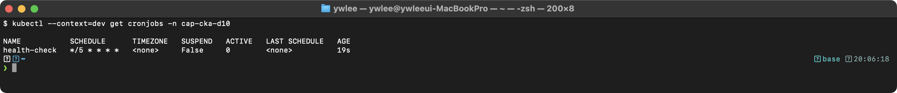
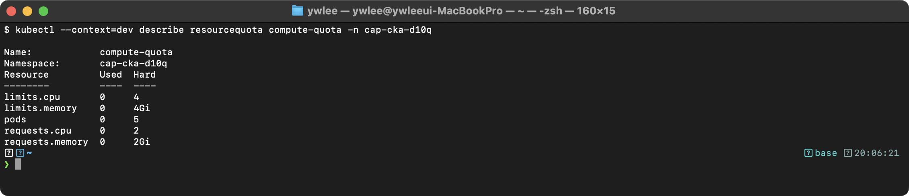
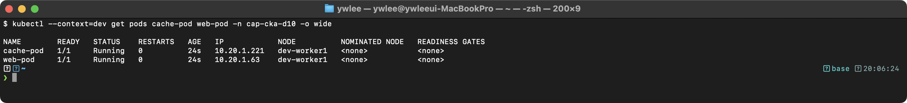
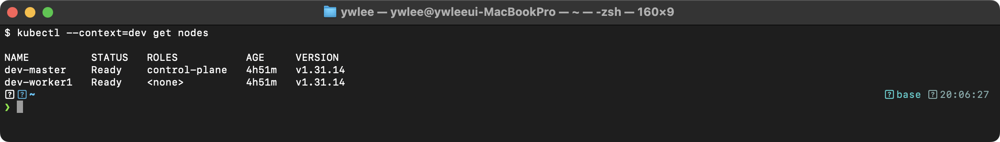
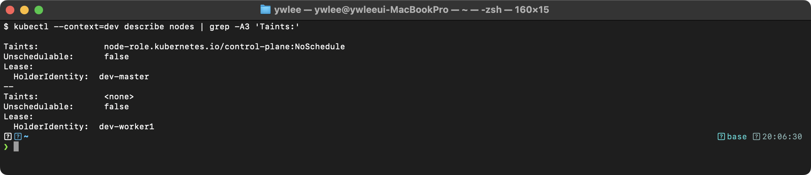
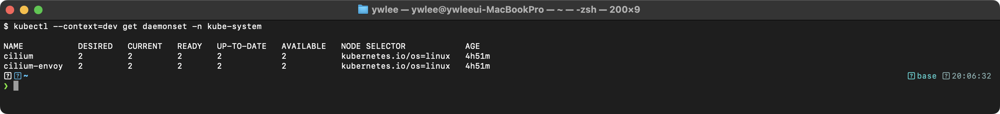
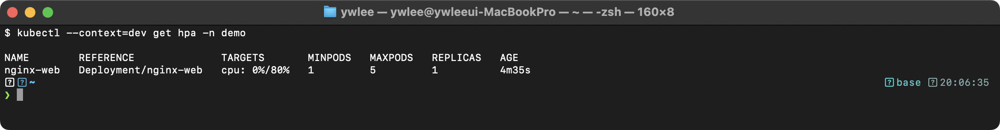
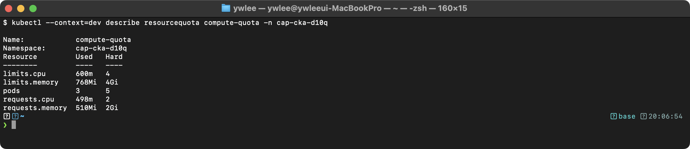
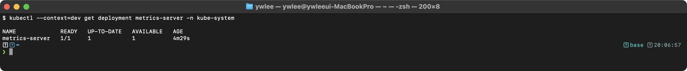

# CKA Day 10: 스케줄링 시험 문제 & Resource 관리

> CKA 도메인: Workloads & Scheduling (15%) - Part 2 실전 | 예상 소요 시간: 2시간

---

## 오늘의 학습 목표

- [ ] CronJob 을 생성하고 schedule·concurrencyPolicy 를 설정할 수 있다 (문제 4, 14)
- [ ] Node Affinity(required/preferred)와 nodeSelector 의 차이를 설명하고 매니페스트를 작성할 수 있다 (문제 5, 8)
- [ ] ResourceQuota 와 LimitRange 의 역할 차이를 설명하고 각각 생성할 수 있다 (문제 6, 7, 18)
- [ ] NoSchedule·PreferNoSchedule·NoExecute Taint 의 차이를 설명할 수 있다 (문제 9, 13, 17)
- [ ] Toleration 의 Equal/Exists 연산자를 구분하고 tolerationSeconds 를 설정할 수 있다 (문제 13, 17, 20)
- [ ] Pod Anti-Affinity 와 Pod Affinity 를 topologyKey 와 함께 작성할 수 있다 (문제 10, 15)
- [ ] DaemonSet 을 생성하고 updateStrategy(RollingUpdate/OnDelete)를 설정할 수 있다 (문제 11, 19)
- [ ] Job 의 activeDeadlineSeconds·ttlSecondsAfterFinished 를 설정할 수 있다 (문제 12, 16)

---

**복습과 연결:** day09 에서 Job(일회성 배치 작업)과 Deployment 의 기본 동작을 다뤘다. day10 은 그 기초 위에서, Job 을 주기적으로 반복 스케줄하고(CronJob), Pod 를 특정 노드에만 배치하거나 분산시키며(Affinity·Taint), 네임스페이스의 리소스 사용을 할당량으로 제한하는(ResourceQuota·LimitRange) 고급 스케줄링 기법을 실전 문제 형태로 다룬다. 문제 번호가 4 부터 시작하는 것은 day09 의 문제 1~3 에 이어지기 때문이다. 모든 문제는 CKA 도메인 "Workloads & Scheduling(15%)" 에 속한다.

**전제 네임스페이스:** 문제 7, 12, 14, 16, 18, 19 는 `demo` 네임스페이스를 사용한다. `demo` 네임스페이스는 day09 에서 생성됐다. day10 을 독립적으로 시작하거나 네임스페이스가 없다는 오류가 나면 `kubectl create namespace demo` 로 먼저 생성한다.

이 문서에서 반복적으로 쓰는 핵심 용어를 먼저 한 줄로 정리한다.
- **Taint(오염):** 노드에 붙이는 거부 표시. 대응하는 Toleration 이 없는 Pod 는 그 노드에 스케줄되지 않는다.
- **Toleration(용인):** Pod 가 특정 Taint 를 견딜 수 있음을 선언하는 설정. Taint 와 Toleration 이 짝을 이뤄야 그 노드에 배치된다.
- **Affinity(친화성):** 스케줄러에게 Pod 를 어느 노드에 둘지 알려주는 강제·선호 규칙. nodeSelector 보다 풍부한 표현식(In, NotIn, Gt, Lt, Exists 등)을 지원한다.
- **ResourceQuota / LimitRange:** 각각 네임스페이스 전체의 리소스 총량 상한과, 컨테이너 하나당 기본값·최소·최대를 정하는 객체이다.

---

### 문제 4. CronJob 생성 [4%]

**등장 배경:** day09 의 Job 은 한 번 실행하고 끝나는 일회성 작업이다. 그런데 "매일 새벽 백업", "5분마다 헬스 체크"처럼 같은 작업을 주기적으로 반복해야 하는 경우가 많다. 과거에는 노드의 Linux `cron` 데몬에 작업을 등록해야 했는데, 이러면 작업이 특정 노드에 묶이고 클러스터가 관리하지 못한다(노드가 죽으면 작업도 사라진다). CronJob 은 Linux cron 의 스케줄 표현식을 그대로 쓰되, 정해진 시각마다 Job 을 클러스터 차원에서 생성해 주는 객체이다. `schedule` 필드에 cron 표현식을 넣으면 그 주기마다 Job → Pod 가 자동 생성된다. 트레이드오프는 실행 시각이 정확히 보장되지 않는다는 점이다(스케줄러 부하·startingDeadlineSeconds 에 따라 약간 지연될 수 있다).

**cron 표현식 형식:** `schedule` 필드에는 Linux cron 과 동일한 5-필드 표현식을 쓴다. 왼쪽부터 `분(0-59) 시(0-23) 일(1-31) 월(1-12) 요일(0-7, 0·7=일요일)` 순서이다. `*`는 "모든 값", `*/N`은 "N 마다"를 뜻한다. 예를 들어 `*/5 * * * *`는 "매 5분마다"(분 필드만 `*/5`, 나머지는 `*` = 모든 시·일·월·요일), `*/1 * * * *`는 "매 1분마다"이다.

**컨텍스트:** `kubectl config use-context dev`

매 5분마다 실행되는 CronJob 생성:
- 이름: `health-check`
- 이미지: `busybox:1.36`
- 명령: `echo "Health check OK"`

<details>
<summary>풀이</summary>

```bash
kubectl create cronjob health-check \
  --image=busybox:1.36 \
  --schedule="*/5 * * * *" \
  -n demo \
  -- sh -c "echo Health check OK"

kubectl get cronjobs -n demo
```

**검증 - 기대 출력:**


`SCHEDULE` 열에 크론 표현식이 올바르게 표시되는지 확인한다. `*/5 * * * *`는 "매 5분마다"를 의미한다. LAST SCHEDULE이 `<none>`인 것은 아직 한 번도 실행되지 않았기 때문이다.

```bash
kubectl delete cronjob health-check -n demo
```

</details>

---

### 문제 5. Node Affinity [7%]

**등장 배경:** Pod 를 특정 노드에만 배치하는 가장 단순한 방법은 `spec.nodeSelector`(노드 선택자 — Pod 매니페스트에 `key: value` 쌍을 적으면 스케줄러가 그 라벨을 가진 노드에만 Pod 를 배치한다)이다. 그런데 nodeSelector 는 "이 라벨이 정확히 일치하는 노드에만 배치"라는 단순 동등(Equal) 조건만 표현할 수 있다. 실무에서는 "리눅스 노드 중 아무 곳" 또는 "SSD 노드를 선호하되 없으면 다른 곳도 허용"처럼 더 복잡한 조건이 필요하다. Node Affinity(노드 친화성)는 nodeSelector 를 일반화한 것으로, In·NotIn·Exists·DoesNotExist·Gt·Lt 같은 연산자와 강제(required)/선호(preferred) 두 단계를 표현할 수 있다. nodeSelector 가 "키=값 동등 조건"만 가능했던 한계를 풀었다. nodeSelector 자체의 문법은 더 단순해서 익히기 쉬우므로 문제 8 에서 별도로 실습한다(학습 순서: nodeSelector → Affinity 순으로 단순→복잡으로 익히는 것이 자연스럽다).

필드 이름이 길어 보이지만 그대로 뜻을 담고 있다.
- **requiredDuringSchedulingIgnoredDuringExecution(필수):** "스케줄링 시점에는 필수(Required), 실행 중에는 무시(Ignored)"라는 뜻이다. 즉 스케줄러는 이 규칙을 만족하는 노드에만 Pod 를 배치한다. 하지만 Pod 가 이미 떠 있는 상태에서 노드의 라벨이 바뀌어 규칙에 안 맞게 되더라도 실행 중인 Pod 를 쫓아내지는 않는다. 현재 K8s 는 `IgnoredDuringExecution` 변형만 지원한다. `RequiredDuringExecution`(실행 중 라벨 변경 시에도 Pod 를 추방하는 변형)은 설계는 됐지만 아직 구현되지 않은 상태라, 필드명이 길어 보여도 선택지는 `IgnoredDuringExecution` 하나뿐이다.
- **preferredDuringSchedulingIgnoredDuringExecution(선호):** 스케줄러가 가능하면 이 규칙을 만족하는 노드를 고르되, 없으면 다른 노드라도 배치한다. `weight`(1~100)로 여러 선호 규칙 간 가중치를 준다.

아래 매니페스트는 `kubernetes.io/os=linux` 를 required(리눅스 노드 필수), control-plane 이 아닌 노드를 preferred(워커 노드 선호)로 표현한다.

**컨텍스트:** `kubectl config use-context prod`

Deployment 생성:
- 이름: `cache-deploy`
- 이미지: `redis:7`
- 레플리카: 2
- Node Affinity: `kubernetes.io/os=linux` (required), Worker Node 선호 (preferred)

<details>
<summary>풀이</summary>

```bash
cat <<EOF | kubectl apply -f -
apiVersion: apps/v1
kind: Deployment
metadata:
  name: cache-deploy
spec:
  replicas: 2
  selector:
    matchLabels:
      app: cache-deploy
  template:
    metadata:
      labels:
        app: cache-deploy
    spec:
      affinity:
        nodeAffinity:
          requiredDuringSchedulingIgnoredDuringExecution:
            nodeSelectorTerms:
            - matchExpressions:
              - key: kubernetes.io/os
                operator: In
                values:
                - linux
          preferredDuringSchedulingIgnoredDuringExecution:
          - weight: 100
            preference:
              matchExpressions:
              - key: node-role.kubernetes.io/control-plane
                operator: DoesNotExist
      containers:
      - name: redis
        image: redis:7
EOF

kubectl get pods -l app=cache-deploy -o wide

kubectl delete deployment cache-deploy
```

</details>

---

### 문제 6. ResourceQuota [4%]

**등장 배경:** 한 클러스터를 여러 팀이 네임스페이스로 나눠 쓸 때, 한 팀이 Pod 를 무한정 만들거나 메모리를 독차지하면 다른 팀의 워크로드가 노드에 못 뜬다. ResourceQuota(리소스 할당량)는 네임스페이스 단위로 "이 네임스페이스 전체가 쓸 수 있는 CPU/메모리 합계, Pod 개수 상한"을 강제하는 객체이다. 과거에는 이런 격리가 없어 노드 자원을 선착순으로 빼앗는 구조였는데, ResourceQuota 가 네임스페이스별 상한선을 admission 단계(API Server 가 오브젝트 생성 요청을 etcd 에 저장하기 전, 플러그인 체인이 검증·변형하는 단계)에서 검증해 준다(상한을 넘기는 생성 요청은 거부된다).

**컨텍스트:** `kubectl config use-context dev`

`quota-test` 네임스페이스에 ResourceQuota 적용:
- Pod 수: 최대 5개
- requests.cpu: 최대 2, requests.memory: 최대 2Gi
- limits.cpu: 최대 4, limits.memory: 최대 4Gi

<details>
<summary>풀이</summary>

```bash
kubectl create namespace quota-test

cat <<EOF | kubectl apply -f -
apiVersion: v1
kind: ResourceQuota
metadata:
  name: compute-quota
  namespace: quota-test
spec:
  hard:
    pods: "5"
    requests.cpu: "2"
    requests.memory: "2Gi"
    limits.cpu: "4"
    limits.memory: "4Gi"
EOF

kubectl describe resourcequota compute-quota -n quota-test
```

**검증 - 기대 출력:**


Used가 모두 0인 것은 아직 리소스를 사용하는 Pod가 없기 때문이다. ResourceQuota 에 요청/제한 관련 항목(예: `requests.cpu`, `limits.memory`)이 하나라도 포함되면, 이 네임스페이스에서 생성하는 모든 Pod 의 모든 컨테이너에 해당하는 `resources.requests`/`resources.limits` 를 명시해야 한다(스케줄러가 quota 제약을 검증하려면 각 컨테이너의 요청·제한 값을 알아야 하기 때문이다). 컨테이너 단위로 값을 빠뜨리면 Pod 생성이 `Forbidden` 오류로 거부된다.

```bash
kubectl delete namespace quota-test
```

</details>

---

### 문제 7. LimitRange [4%]

**등장 배경:** ResourceQuota(문제 6)는 네임스페이스 "전체"의 총량 상한이라, quota 가 걸린 네임스페이스에서는 모든 컨테이너가 일일이 requests/limits 를 적어야 하는 불편이 생긴다. LimitRange(리밋 범위)는 컨테이너 "하나당" 기본값(default)·최소(min)·최대(max)를 정해 두는 객체이다. 컨테이너가 값을 생략하면 LimitRange 의 기본값이 자동 주입되고, min/max 를 벗어나는 요청은 거부된다. 즉 ResourceQuota 가 "총량 경찰"이라면 LimitRange 는 "개별 컨테이너 기준선"이다. 둘을 함께 쓰면 quota 가 있는 네임스페이스에서도 매번 resources 를 적지 않아도 된다(문제 6 의 트러블슈팅 참고).

**컨텍스트:** `kubectl config use-context dev`

`demo` 네임스페이스에 컨테이너 기본 리소스 설정:
- 기본 limits: cpu=200m, memory=128Mi
- 기본 requests: cpu=100m, memory=64Mi

<details>
<summary>풀이</summary>

```bash
cat <<EOF | kubectl apply -f -
apiVersion: v1
kind: LimitRange
metadata:
  name: default-limits
  namespace: demo
spec:
  limits:
  - type: Container
    default:
      cpu: "200m"
      memory: "128Mi"
    defaultRequest:
      cpu: "100m"
      memory: "64Mi"
EOF

kubectl describe limitrange default-limits -n demo

kubectl delete limitrange default-limits -n demo
```

</details>

---

### 문제 8. nodeSelector [4%]

**등장 배경:** Pod 를 특정 하드웨어(GPU 노드, SSD 노드)나 특정 역할(frontend 전용 노드)에만 배치하고 싶을 때, 가장 단순한 방법이 nodeSelector(노드 선택자)이다. 노드에 라벨을 붙이고 Pod 의 `spec.nodeSelector` 에 같은 키=값을 적으면, 스케줄러는 그 라벨을 가진 노드에만 Pod 를 둔다. nodeSelector 는 "키=값 동등 조건"만 표현할 수 있다는 한계가 있고, 그 한계를 넘는 복잡한 규칙이 문제 5 의 Node Affinity 이다(둘을 비교하며 익히면 좋다).

**컨텍스트:** `kubectl config use-context prod`

1. `prod-worker1`에 `tier=frontend` 라벨 추가
2. `tier=frontend` 노드에만 배치되는 Deployment `frontend-app` 생성 (nginx:1.24, replicas=3)

<details>
<summary>풀이</summary>

```bash
kubectl config use-context prod

kubectl label nodes prod-worker1 tier=frontend

cat <<EOF | kubectl apply -f -
apiVersion: apps/v1
kind: Deployment
metadata:
  name: frontend-app
spec:
  replicas: 3
  selector:
    matchLabels:
      app: frontend-app
  template:
    metadata:
      labels:
        app: frontend-app
    spec:
      nodeSelector:
        tier: frontend
      containers:
      - name: nginx
        image: nginx:1.24
EOF

kubectl get pods -l app=frontend-app -o wide

kubectl delete deployment frontend-app
kubectl label nodes prod-worker1 tier-
```

</details>

---

### 문제 9. NoExecute Taint [7%]

**등장 배경:** nodeSelector·Affinity 는 Pod 쪽에서 "어느 노드로 가고 싶다"를 표현하는 끌어당김(attract) 규칙이다. 반대로 노드 쪽에서 "아무 Pod 나 오지 마라"를 표현하는 밀어냄(repel) 장치가 Taint(오염)이다. 노드를 점검(maintenance)하거나 전용 용도로 비워둘 때, 그 노드에 Taint 를 붙이면 대응하는 Toleration 이 없는 Pod 는 거부된다. Taint 에는 세 가지 효과(effect)가 있다.
- **NoSchedule:** 새 Pod 만 차단한다. 이미 떠 있는 Pod 는 그대로 둔다.
- **PreferNoSchedule:** 가능하면 안 두지만, 다른 노드가 없으면 둔다(약한 차단).
- **NoExecute:** 새 Pod 차단에 더해, 이미 실행 중인 Pod 도 축출(eviction)한다. Toleration 이 없으면 즉시 쫓겨나고, Toleration 에 `tolerationSeconds` 가 있으면 그 시간만큼 버틴 뒤 쫓겨난다(문제 20 참고).

이 문제는 NoExecute 를 붙여 기존 Pod 가 실제로 축출되는 과정을 관찰한다.

**컨텍스트:** `kubectl config use-context staging`

1. `staging-worker1`에서 실행 중인 Pod를 확인하라
2. `maintenance=true:NoExecute` Taint 추가
3. 기존 Pod가 축출되는지 확인하라
4. Taint를 제거하라

<details>
<summary>풀이</summary>

```bash
kubectl config use-context staging

# 0. 관찰 대상 Pod 미리 생성 (Toleration 없는 일반 Pod — NoExecute 추가 후 축출 대상이 됨)
kubectl run test-evict --image=nginx -n default --overrides='{"spec":{"nodeName":"staging-worker1"}}'
kubectl get pod test-evict -n default -o wide  # staging-worker1 에 배치됐는지 확인

# 1. 현재 Pod 확인
kubectl get pods -A -o wide | grep staging-worker1

# 2. NoExecute Taint 추가
kubectl taint nodes staging-worker1 maintenance=true:NoExecute

# 3. 기존 Pod 축출 확인 (Toleration 없는 Pod는 퇴거됨 — test-evict 가 Terminating 으로 바뀐다)
kubectl get pods -A -o wide | grep staging-worker1

# 4. Taint 제거
kubectl taint nodes staging-worker1 maintenance=true:NoExecute-
```

</details>

---

### 문제 10. Pod Anti-Affinity [7%]

**등장 배경:** 고가용성(HA)을 위해 같은 앱의 replica 들을 서로 다른 노드에 흩어 놓아야 한다. 한 노드에 다 몰리면 그 노드가 죽을 때 서비스 전체가 중단되기 때문이다. Node Affinity(문제 5)가 "Pod ↔ 노드 라벨" 관계라면, Pod Affinity/Anti-Affinity 는 "Pod ↔ 다른 Pod" 관계를 본다. Pod Anti-Affinity(파드 반친화성)는 "이 라벨을 가진 Pod 가 이미 있는 곳에는 가지 마라"를 표현해 replica 분산을 유도한다.

핵심 필드는 `topologyKey` 이다. topologyKey 는 "어떤 단위로 분산을 따질지"를 정하는 노드 라벨 키이다.
- **`kubernetes.io/hostname`(기본 분산 단위):** 노드마다 고유한 호스트네임 라벨이라, 이 키로 anti-affinity 를 걸면 "같은 노드에 두지 마라" = 노드별 분산이 된다.
- **`topology.kubernetes.io/zone`:** 같은 가용영역(AZ, availability zone — 클라우드에서 물리적으로 분리된 데이터센터 구역) 단위로 분산한다. 같은 zone 이면 노드가 달라도 회피 대상이 된다.

이 문제는 `kubernetes.io/hostname` 을 써서 replica 가 서로 다른 노드에 흩어지도록 한다. `preferred`(선호)이므로 노드가 부족하면 같은 노드에 몰릴 수도 있다(강제하려면 `required` 를 쓴다).

**컨텍스트:** `kubectl config use-context prod`

Deployment `ha-app` 생성:
- nginx:1.24, replicas=3
- 같은 Deployment의 Pod가 서로 다른 노드에 배치 (preferred)

<details>
<summary>풀이</summary>

```bash
cat <<EOF | kubectl apply -f -
apiVersion: apps/v1
kind: Deployment
metadata:
  name: ha-app
spec:
  replicas: 3
  selector:
    matchLabels:
      app: ha-app
  template:
    metadata:
      labels:
        app: ha-app
    spec:
      affinity:
        podAntiAffinity:
          preferredDuringSchedulingIgnoredDuringExecution:
          - weight: 100
            podAffinityTerm:
              labelSelector:
                matchExpressions:
                - key: app
                  operator: In
                  values:
                  - ha-app
              topologyKey: kubernetes.io/hostname
      containers:
      - name: nginx
        image: nginx:1.24
EOF

kubectl get pods -l app=ha-app -o wide

kubectl delete deployment ha-app
```

</details>

---

### 문제 11. 특정 노드 전용 DaemonSet [4%]

**등장 배경:** Deployment 는 "replica 를 N 개 띄워라"라고 개수를 지정하지만, 로그 수집기·노드 모니터링 에이전트처럼 "모든 노드에 정확히 하나씩" 떠야 하는 워크로드가 있다. DaemonSet(데몬셋)은 노드마다 Pod 인스턴스를 하나씩 자동 배치하는 객체라, `replicas` 필드 자체가 없다(개수는 노드 수에 따라 자동 결정된다). 여기에 `nodeSelector` 를 붙이면 일부 노드(여기서는 `monitoring=true` 라벨이 붙은 노드)에만 배치를 한정할 수 있다. DaemonSet 의 `nodeSelector` 문법은 Deployment·Pod 의 것과 동일하며, 매칭하는 각 노드에 Pod 가 하나씩 자동으로 생성된다.

**컨텍스트:** `kubectl config use-context prod`

1. `prod-worker1`, `prod-worker2`에 `monitoring=true` 라벨 추가
2. `monitoring=true` 노드에서만 실행되는 DaemonSet `node-exporter` 생성

<details>
<summary>풀이</summary>

```bash
kubectl label nodes prod-worker1 prod-worker2 monitoring=true

cat <<EOF | kubectl apply -f -
apiVersion: apps/v1
kind: DaemonSet
metadata:
  name: node-exporter
spec:
  selector:
    matchLabels:
      app: node-exporter
  template:
    metadata:
      labels:
        app: node-exporter
    spec:
      nodeSelector:
        monitoring: "true"
      containers:
      - name: exporter
        image: prom/node-exporter:v1.7.0
        ports:
        - containerPort: 9100
EOF

kubectl get pods -l app=node-exporter -o wide

kubectl delete daemonset node-exporter
kubectl label nodes prod-worker1 prod-worker2 monitoring-
```

</details>

---

### 문제 12. activeDeadlineSeconds Job [4%]

**등장 배경:** Job 의 명령이 무한 루프에 빠지거나 외부 응답을 기다리며 영원히 끝나지 않으면, 노드 자원을 계속 점유한다. `activeDeadlineSeconds` 는 Job 이 시작된 뒤 이 초가 지나도록 완료되지 않으면 강제로 실패 처리하고 Pod 를 종료시키는 안전장치이다. `backoffLimit`(재시도 횟수 상한)과 함께 Job 의 폭주를 막는다.

**컨텍스트:** `kubectl config use-context dev`

60초 내에 완료되지 않으면 실패하는 Job 생성:
- 이름: `timeout-job`
- 이미지: `busybox:1.36`
- 명령: `sleep 120` (120초라 deadline 60 이 먼저 도래해 DeadlineExceeded 로 실패함 — activeDeadlineSeconds 발동을 관찰하는 것이 목적)

> **실습 주의:** 풀이 코드의 `command: ["sleep", "30"]` 을 `command: ["sleep", "120"]` 으로 변경해 실행한다. `sleep 30` 은 deadline 60 보다 짧아 Job 이 정상 완료(Complete)돼 버리므로 deadline 이 작동하는 것을 전혀 관찰할 수 없다.

<details>
<summary>풀이</summary>

```bash
cat <<EOF | kubectl apply -f -
apiVersion: batch/v1
kind: Job
metadata:
  name: timeout-job
  namespace: demo
spec:
  activeDeadlineSeconds: 60
  backoffLimit: 2
  template:
    spec:
      restartPolicy: Never
      containers:
      - name: worker
        image: busybox:1.36
        command: ["sleep", "30"]
EOF

kubectl get job timeout-job -n demo -w

kubectl delete job timeout-job -n demo
```

**DeadlineExceeded 확인:** `sleep 120` 으로 실행하면 약 60초 후 Job 이 강제 종료된다. 아래 명령으로 상태를 확인한다.

`kubectl describe job timeout-job -n demo | grep -A5 Conditions`

`Conditions` 항목에 `Type: Failed`, `Reason: DeadlineExceeded` 가 나타나면 `activeDeadlineSeconds` 가 정상 작동한 것이다. Job 의 `.status.conditions` 는 `ttlSecondsAfterFinished` 로 삭제되기 전까지 남아 있으므로, 삭제 명령 전에 확인한다.

</details>

---

### 문제 13. Taint Exists 연산자 [4%]

**등장 배경:** Toleration 의 `operator` 는 Taint 와 어떻게 매칭할지를 정한다.
- **Equal:** key 와 value 가 정확히 일치해야 매칭한다(value 까지 비교).
- **Exists:** key 만 있으면 value 가 무엇이든 매칭한다(value 비교 생략).

`Exists` 를 쓰면 "이 노드의 `env` 라는 키를 가진 Taint 라면 값이 staging 이든 prod 든 모두 견딘다"가 된다. 운영 중 노드의 Taint 값이 바뀌어도 Pod 를 고칠 필요가 없어 유연하다. 이 차이가 시험 팁 섹션의 "모든 Taint tolerate" 트릭(`operator: Exists` 만 적기)의 근거이다.

**컨텍스트:** `kubectl config use-context dev`

1. `dev-worker1`에 `env=staging:NoSchedule` Taint 추가
2. Exists 연산자를 사용하여 `env` 키의 모든 값에 대해 tolerate하는 Pod `flexible-pod` 생성 (nginx 이미지)

<details>
<summary>풀이</summary>

```bash
kubectl config use-context dev

# 1. Taint 추가
kubectl taint nodes dev-worker1 env=staging:NoSchedule

# 2. Pod 생성 (Exists 연산자로 value 무관하게 매칭)
cat <<EOF | kubectl apply -f -
apiVersion: v1
kind: Pod
metadata:
  name: flexible-pod
spec:
  tolerations:
  - key: "env"
    operator: "Exists"        # value를 지정하지 않음, key만 매칭
    effect: "NoSchedule"
  containers:
  - name: nginx
    image: nginx
EOF

kubectl get pod flexible-pod -o wide

# 정리
kubectl delete pod flexible-pod
kubectl taint nodes dev-worker1 env=staging:NoSchedule-
```

</details>

---

### 문제 14. CronJob concurrencyPolicy 설정 [7%]

**등장 배경:** CronJob 은 정해진 주기마다 Job 을 만든다. 그런데 작업이 주기보다 오래 걸리면(예: 1 분마다 도는데 작업이 2 분 걸리면) 이전 Job 이 아직 도는 중에 다음 스케줄이 도래한다. 이때 어떻게 할지를 `concurrencyPolicy` 가 결정한다.
- **Allow(기본값):** 동시 실행을 허용한다. 이전 Job 이 안 끝나도 새 Job 을 또 만든다.
- **Forbid:** 동시 실행을 금지한다. 이전 Job 이 아직 실행 중(완료되지 않음)이면, 다음 스케줄 사이클이 와도 새 Job 을 만들지 않고 그 사이클을 건너뛴다.
- **Replace:** 이전에 돌던 Job 을 취소하고 새 Job 으로 교체한다.

이 문제는 작업이 2 분 걸리는데 매 1 분 스케줄이라, `Forbid` 를 쓰면 동시에 두 Job 이 돌지 않는 것을 확인한다.

**컨텍스트:** `kubectl config use-context dev`

다음 CronJob을 생성하라:
- 이름: `sync-job`
- 이미지: `busybox:1.36`
- 명령: `sh -c "echo Syncing && sleep 120"` (2분 소요)
- 스케줄: 매 1분 (`*/1 * * * *`)
- concurrencyPolicy: Forbid (이전 Job 이 아직 실행 중이면 그 사이클을 건너뜀)
- successfulJobsHistoryLimit: 2
- failedJobsHistoryLimit: 1

<details>
<summary>풀이</summary>

```bash
cat <<EOF | kubectl apply -f -
apiVersion: batch/v1
kind: CronJob
metadata:
  name: sync-job
  namespace: demo
spec:
  schedule: "*/1 * * * *"
  concurrencyPolicy: Forbid
  successfulJobsHistoryLimit: 2
  failedJobsHistoryLimit: 1
  jobTemplate:
    spec:
      template:
        spec:
          restartPolicy: OnFailure
          containers:
          - name: sync
            image: busybox:1.36
            command: ["sh", "-c", "echo Syncing && sleep 120"]
EOF

# 확인 (1-2분 대기 후)
kubectl get cronjobs sync-job -n demo
# Kubernetes 1.27+에서 CronJob이 생성한 Job의 라벨 키는 batch.kubernetes.io/cronjob-name이다
kubectl get jobs -n demo -l batch.kubernetes.io/cronjob-name=sync-job  # Forbid로 인해 동시 실행되지 않음
# 1.26 이하 구버전 클러스터에서는 아래를 쓴다: kubectl get jobs -n demo -l cronjob-name=sync-job

kubectl delete cronjob sync-job -n demo
```

</details>

---

### 문제 15. Pod Affinity [7%]

**등장 배경:** 문제 10 의 Anti-Affinity 가 "떨어뜨려라"였다면, Pod Affinity(파드 친화성)는 그 반대로 "붙여라"이다. 예컨대 웹 Pod 를 캐시(redis) Pod 와 같은 노드에 두면 노드 내부 통신이라 네트워크 지연이 줄어든다. `requiredDuringSchedulingIgnoredDuringExecution` 으로 강제하면, 대상 라벨(app=cache)을 가진 Pod 가 있는 노드가 없을 경우 web Pod 는 아예 스케줄되지 않고 Pending 상태로 남는다. 여기서도 `topologyKey: kubernetes.io/hostname` 은 "같은 노드"를 분산/집합 단위로 삼는다는 의미이다.

**컨텍스트:** `kubectl config use-context prod`

1. `cache-pod` Pod 생성 (redis:7, 라벨: app=cache)
2. `cache-pod`와 같은 노드에 배치되어야 하는 Pod `web-pod` 생성 (nginx:1.24)
   - Pod Affinity (required) 사용

<details>
<summary>풀이</summary>

```bash
kubectl config use-context prod

# 1. cache Pod 생성
kubectl run cache-pod --image=redis:7 --labels="app=cache"

# 2. web Pod 생성 (cache Pod와 같은 노드)
cat <<EOF | kubectl apply -f -
apiVersion: v1
kind: Pod
metadata:
  name: web-pod
spec:
  affinity:
    podAffinity:
      requiredDuringSchedulingIgnoredDuringExecution:
      - labelSelector:
          matchExpressions:
          - key: app
            operator: In
            values:
            - cache
        topologyKey: kubernetes.io/hostname
  containers:
  - name: nginx
    image: nginx:1.24
EOF

# 같은 노드에 배치되었는지 확인
kubectl get pods cache-pod web-pod -o wide
```

**검증 - 기대 출력:**


두 Pod의 NODE 열이 동일해야 한다. Pod Affinity의 `requiredDuringScheduling`이므로 cache-pod가 없는 노드에는 web-pod가 스케줄링되지 않는다.

```bash
# 정리
kubectl delete pod cache-pod web-pod
```

</details>

---

### 문제 16. Job ttlSecondsAfterFinished [4%]

**등장 배경:** Job 은 완료된 뒤에도 Pod 와 Job 객체가 그대로 남아 결과·로그를 확인할 수 있게 한다. 하지만 CronJob 처럼 Job 이 계속 쌓이면 완료된 Job 이 클러스터에 누적돼 etcd 와 API 응답을 무겁게 한다. `ttlSecondsAfterFinished`(Time To Live)는 Job 이 완료(Complete/Failed)된 뒤 이 초가 지나면 Job 과 그 Pod 를 자동 삭제하는 필드이다. 수동으로 청소할 필요가 없어진다.

**컨텍스트:** `kubectl config use-context dev`

완료 후 30초 뒤에 자동으로 삭제되는 Job을 생성하라:
- 이름: `auto-cleanup-job`
- 이미지: `busybox:1.36`
- 명령: `echo "Done"`

<details>
<summary>풀이</summary>

```bash
cat <<EOF | kubectl apply -f -
apiVersion: batch/v1
kind: Job
metadata:
  name: auto-cleanup-job
  namespace: demo
spec:
  ttlSecondsAfterFinished: 30        # 완료 후 30초 뒤 자동 삭제
  template:
    spec:
      restartPolicy: Never
      containers:
      - name: worker
        image: busybox:1.36
        command: ["echo", "Done"]
EOF

# 완료 확인
kubectl get job auto-cleanup-job -n demo

# 30초 후 자동 삭제 확인
kubectl get job auto-cleanup-job -n demo  # 삭제되어 Not Found
```

</details>

---

### 문제 17. Multiple Tolerations [7%]

**등장 배경:** 한 노드에 여러 개의 Taint 가 동시에 붙어 있을 수 있다. 그 노드에 Pod 를 배치하려면 Pod 의 Toleration 이 그 노드의 "모든" Taint 를 각각 견뎌야 한다(하나라도 못 견디면 거부된다). 이 문제는 NoSchedule 과 NoExecute 두 종류의 Taint 를 동시에 tolerate 하는 Pod 를 만들어, Toleration 이 Taint 별로 따로 필요하다는 점을 익힌다.

**컨텍스트:** `kubectl config use-context prod`

1. `prod-worker1`에 두 개의 Taint 추가:
   - `env=production:NoSchedule`
   - `team=backend:NoExecute`
2. 두 Taint를 모두 tolerate하는 Pod `multi-taint-pod` 생성 (nginx 이미지)

<details>
<summary>풀이</summary>

```bash
kubectl config use-context prod

# 1. Taint 추가
kubectl taint nodes prod-worker1 env=production:NoSchedule
kubectl taint nodes prod-worker1 team=backend:NoExecute

# 2. Pod 생성 (두 Taint 모두 tolerate)
cat <<EOF | kubectl apply -f -
apiVersion: v1
kind: Pod
metadata:
  name: multi-taint-pod
spec:
  tolerations:
  - key: "env"
    operator: "Equal"
    value: "production"
    effect: "NoSchedule"
  - key: "team"
    operator: "Equal"
    value: "backend"
    effect: "NoExecute"
  nodeSelector:
    kubernetes.io/hostname: prod-worker1
  containers:
  - name: nginx
    image: nginx
EOF

kubectl get pod multi-taint-pod -o wide

# 정리
kubectl delete pod multi-taint-pod
kubectl taint nodes prod-worker1 env=production:NoSchedule-
kubectl taint nodes prod-worker1 team=backend:NoExecute-
```

</details>

---

### 문제 18. LimitRange min/max 설정 [4%]

**등장 배경:** 문제 7 의 LimitRange 가 기본값(default·defaultRequest)만 정했다면, 여기서는 `min`/`max` 를 추가해 컨테이너가 요청할 수 있는 리소스의 하한·상한을 강제한다. 한 컨테이너가 노드 자원을 통째로 요구하거나(상한 초과) 너무 적게 요청해 스케줄러를 오도하는 것(하한 미달)을 admission 단계에서 막는다. min/max 를 벗어나는 Pod 생성 요청은 LimitRange 가 거부한다.

**컨텍스트:** `kubectl config use-context dev`

`demo` 네임스페이스에 다음 LimitRange 생성:
- 컨테이너 최소: cpu=50m, memory=64Mi
- 컨테이너 최대: cpu=1, memory=512Mi
- 기본 limits: cpu=500m, memory=256Mi
- 기본 requests: cpu=100m, memory=128Mi

<details>
<summary>풀이</summary>

```bash
cat <<EOF | kubectl apply -f -
apiVersion: v1
kind: LimitRange
metadata:
  name: strict-limits
  namespace: demo
spec:
  limits:
  - type: Container
    min:
      cpu: "50m"
      memory: "64Mi"
    max:
      cpu: "1"
      memory: "512Mi"
    default:
      cpu: "500m"
      memory: "256Mi"
    defaultRequest:
      cpu: "100m"
      memory: "128Mi"
EOF

kubectl describe limitrange strict-limits -n demo

# 테스트: 최대값 초과 Pod 생성 시도 (거부됨)
kubectl run test-exceed --image=nginx -n demo \
  --overrides='{"spec":{"containers":[{"name":"nginx","image":"nginx","resources":{"limits":{"cpu":"2","memory":"1Gi"}}}]}}' \
  --dry-run=server 2>&1 || echo "Expected: forbidden by LimitRange"

kubectl delete limitrange strict-limits -n demo
```

</details>

---

### 문제 19. DaemonSet updateStrategy OnDelete [4%]

**등장 배경:** DaemonSet 의 이미지를 바꿀 때 기본 전략(`RollingUpdate`)은 노드마다 Pod 를 자동으로 새 버전으로 교체한다. 그러나 노드 에이전트처럼 교체 시점을 운영자가 직접 통제해야 하는 경우가 있다. `updateStrategy.type: OnDelete` 는 매니페스트의 이미지를 바꿔도 기존 Pod 를 자동 교체하지 않고, 운영자가 해당 Pod 를 수동으로 삭제할 때 비로소 새 버전 Pod 가 생성되도록 한다. 교체 타이밍을 사람이 제어한다는 트레이드오프로 안전성을 얻는다.

**컨텍스트:** `kubectl config use-context dev`

OnDelete 전략을 사용하는 DaemonSet을 생성하라:
- 이름: `manual-ds`
- 이미지: `nginx:1.24`
- updateStrategy: OnDelete

<details>
<summary>풀이</summary>

```bash
cat <<EOF | kubectl apply -f -
apiVersion: apps/v1
kind: DaemonSet
metadata:
  name: manual-ds
  namespace: demo
spec:
  selector:
    matchLabels:
      app: manual-ds
  updateStrategy:
    type: OnDelete
  template:
    metadata:
      labels:
        app: manual-ds
    spec:
      containers:
      - name: nginx
        image: nginx:1.24
EOF

kubectl get daemonset manual-ds -n demo
kubectl describe daemonset manual-ds -n demo | grep "Update Strategy"

# 이미지 업데이트 (자동으로 적용되지 않음)
kubectl set image daemonset/manual-ds nginx=nginx:1.25 -n demo

# 수동으로 Pod 삭제해야 새 버전 적용
# kubectl delete pod <pod-name> -n demo

kubectl delete daemonset manual-ds -n demo
```

</details>

---

### 문제 20. tolerationSeconds 설정 [7%]

**등장 배경:** 문제 9 에서 NoExecute Taint 는 Toleration 이 없는 Pod 를 "즉시" 축출했다. 그런데 노드를 잠깐 점검하는 동안 Pod 가 곧바로 죽으면 곤란하고, 그렇다고 영원히 버티게 두면 점검이 안 된다. `tolerationSeconds` 는 그 절충안으로, "이 NoExecute Taint 를 견디되 딱 이 초만큼만 견딘다"를 뜻한다.

**내부 동작·타이밍:** Toleration 에 `tolerationSeconds: 60` 을 주면, 노드에 매칭되는 NoExecute Taint 가 추가되는 순간부터 카운트다운이 시작된다. 60 초 동안은 Pod 가 그 노드에 그대로 남아 있다가, 60 초가 지나면 컨트롤러(taint 관리자)가 Pod 를 축출한다. tolerationSeconds 를 아예 적지 않으면(그냥 NoExecute 를 견딘다고만 하면) 무한히 견뎌 축출되지 않고, 반대로 Toleration 자체가 없으면 0 초, 즉 즉시 축출된다. 참고로 노드가 NotReady·unreachable 가 되면 쿠버네티스가 `node.kubernetes.io/not-ready:NoExecute` 같은 Taint 를 자동으로 붙이는데, 일반 Pod 에는 기본 `tolerationSeconds: 300`(5 분) Toleration 이 자동 주입되어 있어 노드가 잠깐 끊겨도 5 분간은 Pod 가 살아 있는 것이 이 메커니즘이다.

**컨텍스트:** `kubectl config use-context prod`

1. NoExecute Taint에 대해 60초 동안만 유지되는 Pod를 생성하라
   - Pod 이름: `graceful-pod`
   - 이미지: `nginx`
   - Toleration: `maintenance=true:NoExecute` (tolerationSeconds=60)
2. `prod-worker1`에 `maintenance=true:NoExecute` Taint를 추가하고 Pod 동작을 관찰하라

<details>
<summary>풀이</summary>

```bash
kubectl config use-context prod

# 1. Pod 생성
cat <<EOF | kubectl apply -f -
apiVersion: v1
kind: Pod
metadata:
  name: graceful-pod
spec:
  tolerations:
  - key: "maintenance"
    operator: "Equal"
    value: "true"
    effect: "NoExecute"
    tolerationSeconds: 60              # 60초 동안만 유지, 이후 축출
  containers:
  - name: nginx
    image: nginx
EOF

kubectl get pod graceful-pod -o wide

# 2. Taint 추가
kubectl taint nodes prod-worker1 maintenance=true:NoExecute

# Pod가 해당 노드에서 실행 중이면:
# - 즉시 축출되지 않음 (tolerationSeconds 때문)
# - 60초 후 축출됨

# 관찰
kubectl get pod graceful-pod -o wide -w

# 정리
kubectl delete pod graceful-pod --force 2>/dev/null
kubectl taint nodes prod-worker1 maintenance=true:NoExecute-
```

</details>

---

## 9. 복습 체크리스트

### 개념 확인

다음은 day10 에서 다룬 내용 중 시험에 자주 나오는 핵심이다. 마지막 두 항목(QoS, Static Pod)은 day10 범위 밖이며 day11 이후에서 학습하지만, 스케줄링 도메인과 묶여 자주 함께 출제되므로 미리 표시해 둔다.

- [ ] NoSchedule, PreferNoSchedule, NoExecute의 차이를 설명할 수 있는가?
- [ ] Toleration의 Equal과 Exists 연산자의 차이를 아는가?
- [ ] tolerationSeconds의 용도를 아는가?
- [ ] nodeSelector와 Node Affinity의 차이를 설명할 수 있는가?
- [ ] required와 preferred Affinity의 차이를 아는가?
- [ ] Pod Affinity의 topologyKey 역할을 이해하는가?
- [ ] DaemonSet에 replicas 필드가 없는 이유를 아는가?
- [ ] DaemonSet의 updateStrategy 옵션을 아는가?
- [ ] Job의 restartPolicy 제한을 아는가? (Never/OnFailure)
- [ ] CronJob의 concurrencyPolicy 3가지를 설명할 수 있는가?
- [ ] ResourceQuota와 LimitRange의 차이를 아는가?
- [ ] QoS 클래스 3가지와 결정 기준을 아는가? (day11 이후 학습)
- [ ] Static Pod의 특징과 경로를 아는가? (day11 이후 학습)

### 시험 팁

**팁 1 의 배경:** 문제 13 에서 본 대로 Toleration 의 `operator` 에는 Equal(value 까지 정확히 매칭)과 Exists(key 만 있으면 모든 value 허용)가 있다. `Exists` 를 key·value·effect 없이 단독으로 쓰면 "모든 키, 모든 값, 모든 효과의 Taint 를 견딘다"가 되어 노드의 어떤 Taint 든 전부 tolerate 한다. CKA 실기에서 특정 Taint 만 골라 견디게 할 시간이 부족할 때 이 만능 Toleration 을 쓴다.

1. **모든 Taint tolerate** -- `tolerations: [{operator: Exists}]`
2. **DaemonSet 빠른 생성** -- Deployment YAML에서 replicas/strategy 제거, kind를 DaemonSet으로
3. **Job 빠른 생성** -- `kubectl create job <name> --image=<image> -- <command>`
4. **CronJob 빠른 생성** -- `kubectl create cronjob <name> --image=<image> --schedule="<cron>" -- <command>`
5. **Node Affinity** -- `kubectl explain pod.spec.affinity.nodeAffinity`로 구조 확인
6. **Taint 확인** -- `kubectl describe node <node> | grep -A5 Taints`
7. **라벨 추가** -- `kubectl label nodes <node> key=value`
8. **ResourceQuota 확인** -- `kubectl describe resourcequota -n <ns>`
9. **CronJob 수동 트리거** -- `kubectl create job <name> --from=cronjob/<cronjob>`
10. **Static Pod 경로** -- `/etc/kubernetes/manifests/`

### 자주 사용하는 kubectl explain 경로

```bash
kubectl explain pod.spec.tolerations
kubectl explain pod.spec.nodeSelector
kubectl explain pod.spec.affinity.nodeAffinity
kubectl explain pod.spec.affinity.podAffinity
kubectl explain pod.spec.affinity.podAntiAffinity
kubectl explain daemonset.spec.updateStrategy
kubectl explain job.spec.completions
kubectl explain job.spec.parallelism
kubectl explain job.spec.backoffLimit
kubectl explain cronjob.spec.schedule
kubectl explain cronjob.spec.concurrencyPolicy
kubectl explain limitrange.spec.limits
kubectl explain resourcequota.spec.hard
```

---

## 내일 예고

**Day 11: Service 타입 & DNS** -- ClusterIP, NodePort, Headless Service, CoreDNS를 실습한다. Service DNS 형식 `<svc>.<ns>.svc.cluster.local`을 반드시 외워오자.

---

## 자가점검

<details>
<summary>정답 확인 (먼저 스스로 답해본 뒤 펼친다)</summary>

**Q1. NoSchedule, PreferNoSchedule, NoExecute 의 차이는?**
A. NoSchedule — 새 Pod 만 차단(기존 Pod 유지). PreferNoSchedule — 가능하면 안 두되 불가하면 허용(약한 차단). NoExecute — 새 Pod 차단에 더해 기존 실행 중 Pod 도 축출한다. Toleration 에 `tolerationSeconds` 를 주면 해당 초 후에 축출된다.

**Q2. Toleration 의 Equal 과 Exists 연산자의 차이는?**
A. Equal — `key`, `value`, `effect` 가 모두 일치해야 매칭. Exists — `key`(와 선택적으로 `effect`)만 있으면 `value` 와 무관하게 매칭. `{operator: Exists}` 만 적으면 모든 Taint 를 tolerate 한다.

**Q3. nodeSelector 와 Node Affinity 의 차이는?**
A. nodeSelector 는 `key=value` 동등 조건만 표현 가능하다. Node Affinity 는 In·NotIn·Exists·Gt·Lt 등 다양한 연산자와 required(필수)/preferred(선호) 두 수준을 지원한다. 둘 다 동시에 쓰면 AND 조건으로 동작한다.

**Q4. Pod Affinity 의 topologyKey 란?**
A. "어떤 단위로 분산/집합을 따질지"를 정하는 노드 라벨 키이다. `kubernetes.io/hostname` 은 "노드 단위", `topology.kubernetes.io/zone` 은 "가용영역 단위"이다.

**Q5. DaemonSet 에 replicas 필드가 없는 이유는?**
A. DaemonSet 은 "모든(또는 선택된) 노드에 정확히 하나씩" Pod 를 배치하므로, 개수는 노드 수에 따라 DaemonSet Controller 가 자동 결정한다. 따라서 사용자가 개수를 지정하는 `replicas` 필드 자체가 없다.

**Q6. CronJob 의 concurrencyPolicy 3 가지는?**
A. Allow(기본) — 동시 실행 허용. Forbid — 이전 Job 실행 중이면 그 사이클 건너뜀. Replace — 이전 Job 을 취소하고 새 Job 으로 교체.

**Q7. ResourceQuota 와 LimitRange 의 차이는?**
A. ResourceQuota — 네임스페이스 "전체"의 CPU·메모리 총량과 Pod 개수 상한. LimitRange — 컨테이너 "하나당" 기본값(default·defaultRequest)과 min·max 범위. 둘을 함께 쓰면 quota 네임스페이스에서도 컨테이너마다 resources 를 일일이 안 써도 된다.

**Q8. `tolerationSeconds: 60` 의 의미는?**
A. 매칭되는 NoExecute Taint 가 노드에 붙는 순간부터 60 초 동안은 Pod 가 그 노드에 남아 있다가, 60 초가 지나면 컨트롤러가 축출한다. `tolerationSeconds` 를 쓰지 않으면 NoExecute Taint 를 무기한 견딘다(축출 안 됨).

**Q9. `activeDeadlineSeconds` 와 `ttlSecondsAfterFinished` 의 차이는?**
A. `activeDeadlineSeconds` 는 Job 이 *실행 중*일 때의 최대 허용 시간이다. 이 시간이 지나도록 완료되지 않으면 Job 을 강제 실패(DeadlineExceeded) 처리한다. 반면 `ttlSecondsAfterFinished` 는 Job 이 *완료(Complete 또는 Failed)된 뒤* 이 초가 지나면 Job 과 그 Pod 를 자동 삭제한다. 전자는 "너무 오래 걸리는 실행을 막는 안전장치", 후자는 "완료 후 자원을 정리하는 청소 장치"이다.

**Q10. Pod Affinity 와 Pod Anti-Affinity 의 차이는?**
A. Pod Affinity(파드 친화성)는 "이 라벨을 가진 Pod 가 있는 노드(또는 토폴로지)로 가라"이다. 예컨대 웹 Pod 를 캐시 Pod 와 같은 노드에 두어 노드 내부 통신 지연을 줄인다. Pod Anti-Affinity(파드 반친화성)는 반대로 "이 라벨을 가진 Pod 가 있는 곳은 피하라"이다. 같은 Deployment 의 replica 를 서로 다른 노드에 흩어 고가용성(HA)을 확보할 때 쓴다. 둘 다 `topologyKey` 로 분산 단위(노드/AZ)를 정한다.

**Q11. DaemonSet updateStrategy 의 RollingUpdate 와 OnDelete 의 차이는?**
A. `RollingUpdate`(기본값)는 DaemonSet 매니페스트(예: 이미지)를 바꾸면 각 노드의 Pod 를 자동으로 순차 교체한다. `OnDelete` 는 매니페스트를 바꿔도 기존 Pod 를 자동 교체하지 않고, 운영자가 해당 Pod 를 수동으로 삭제할 때 비로소 새 버전 Pod 가 생성된다. 교체 타이밍을 사람이 통제해야 하는 노드 에이전트(예: 보안 패치를 순서대로 적용해야 하는 경우)에서 `OnDelete` 를 쓴다.

**Q12. Job 의 `restartPolicy` 에서 `Never` 와 `OnFailure` 의 차이는?**
A. `Never` 는 컨테이너가 실패(비정상 종료)해도 같은 Pod 를 재시작하지 않고 새 Pod 를 새로 만들어 재시도한다(backoffLimit 까지). 실패한 Pod 가 남아 있어 로그를 확인할 수 있다. `OnFailure` 는 실패 시 같은 Pod 내에서 컨테이너를 재시작한다. Pod 가 재사용되므로 로그가 덮어 써진다. 일회성 배치나 디버깅이 필요한 경우 `Never`, 재시작 오버헤드를 줄이고 싶은 경우 `OnFailure` 를 쓴다.

</details>

---

## 더 읽을거리

- [Assigning Pods to Nodes](https://kubernetes.io/docs/concepts/scheduling-eviction/assign-pod-node/) — nodeSelector, Node Affinity, Pod Affinity/Anti-Affinity 공식 문서
- [Taints and Tolerations](https://kubernetes.io/docs/concepts/scheduling-eviction/taint-and-toleration/) — Taint 3종 effect 와 tolerationSeconds, 노드 상태 자동 Taint 설명
- [Resource Quotas](https://kubernetes.io/docs/concepts/policy/resource-quotas/) — ResourceQuota 전체 필드(pods, count, storage, services 등)와 scope 설명
- [Limit Ranges](https://kubernetes.io/docs/concepts/policy/limit-range/) — Container·Pod·PersistentVolumeClaim 타입별 min/max/default 설정
- [DaemonSets](https://kubernetes.io/docs/concepts/workloads/controllers/daemonset/) — updateStrategy, Toleration 자동 주입, nodeSelector 결합
- [CronJob](https://kubernetes.io/docs/concepts/workloads/controllers/cron-jobs/) — concurrencyPolicy, startingDeadlineSeconds, successfulJobsHistoryLimit 상세

---

## tart-infra 실습

### 실습 환경 설정

**전제:** 이 저장소의 tart dev 클러스터가 가동 중이어야 한다(`./scripts/boot.sh` 로 기동, 재부팅 후라면 `./scripts/fix-cluster-ip-drift.sh dev` 로 IP 드리프트 복구). kubeconfig 는 `~/sideproejct/IaC_apple_sillicon/kubeconfig/dev.yaml` 에 가동 시 자동 생성된다(gitignore 대상이라 직접 만들지 않는다). 아래 실습은 노드 2 개(master + worker1) 구성을 가정하며, 클러스터 네트워킹은 kube-proxy 대신 Cilium 이 담당한다.

```bash
# dev 클러스터에 접속
export KUBECONFIG=~/sideproejct/IaC_apple_sillicon/kubeconfig/dev.yaml
kubectl get nodes
```

**예상 출력:**


### 실습 1: 노드 Taint 확인

```bash
# 모든 노드의 Taint 확인
kubectl describe nodes | grep -A3 "Taints:"
```

**예상 출력:**


**동작 원리:** Control Plane 노드의 Taint:
1. kubeadm이 Control Plane 노드에 `node-role.kubernetes.io/control-plane:NoSchedule` Taint를 자동 설정한다
2. 이 Taint에 대한 Toleration이 없는 Pod는 Control Plane 노드에 스케줄되지 않는다
3. kube-system의 시스템 Pod(CoreDNS 등)는 이 Taint를 tolerate하는 Toleration이 있다
4. dev-worker1에는 Taint가 없으므로 일반 워크로드가 이 노드에 배치된다

### 실습 2: DaemonSet 확인

Cilium(eBPF 기반 CNI 플러그인 — 노드마다 떠서 Pod 네트워킹과 정책을 처리하며, 이 클러스터에서는 kube-proxy 를 대체한다)은 DaemonSet 으로 배포된다. DaemonSet 의 "노드마다 하나씩" 특성이 노드 단위 네트워킹 에이전트에 딱 맞기 때문이다.

```bash
# Cilium DaemonSet 확인 (모든 노드에 하나씩 배포)
kubectl get daemonset -n kube-system
```

**예상 출력:**


**동작 원리:** DaemonSet의 스케줄링:
1. DaemonSet Controller가 각 노드에 대해 Pod를 생성한다
2. DESIRED=2인 이유: dev 클러스터에 노드가 2개(master + worker1)이다
3. Cilium은 Control Plane Taint를 tolerate하므로 master에도 배포된다
4. DaemonSet에는 `replicas` 필드가 없다 -- 노드 수에 따라 자동 결정된다

### 실습 3: Resource Request/Limit 확인

```bash
# demo 네임스페이스 Pod의 리소스 설정 확인
kubectl get pods -n demo -o custom-columns=NAME:.metadata.name,CPU_REQ:.spec.containers[0].resources.requests.cpu,CPU_LIM:.spec.containers[0].resources.limits.cpu,MEM_REQ:.spec.containers[0].resources.requests.memory,MEM_LIM:.spec.containers[0].resources.limits.memory
```

**동작 원리:** Resource Request와 Limit의 역할:
1. Request: Scheduler가 노드 배치를 결정할 때 사용한다 (예약량)
2. Limit: kubelet이 컨테이너의 실제 사용량을 제한한다
3. CPU Limit 초과 -> 쓰로틀링 (속도 저하), Memory Limit 초과 -> OOMKilled
   - 둘의 처리가 다른 이유: CPU 는 compressible(압축 가능) 자원이라 잠깐 덜 주면 프로세스가 양보하면 그만이므로 쓰로틀링(속도 제한)으로 끝난다. 반면 메모리는 incompressible(압축 불가) 자원이라 한 번 할당하면 회수할 방법이 없어, 한도를 넘기면 커널 OOM Killer 가 프로세스 자체를 죽인다(OOMKilled).
4. Request 없이 Limit만 설정하면, Request = Limit으로 자동 설정된다

### 실습 4: HPA 동작 확인

**범위 안내:** 이 실습은 day10 시험 문제 범위 밖이다. dev 클러스터에 metrics-server 가 설치된 경우 HPA 객체를 "관찰"하는 것이 목적이며, HPA 의 개념 학습과 생성 실습은 별도 day 에서 다룬다. 지금은 동작 원리를 눈으로 확인하는 것으로 충분하다.

```bash
# dev 클러스터의 HPA 확인
kubectl get hpa -n demo
```

**예상 출력 (예시 — fresh dev 클러스터에는 demo ns/HPA 와 metrics-server 가 없어 `No resources found in demo namespace.` 가 출력됨. 아래는 HPA+metrics-server 가 설정된 환경의 형태):**


**동작 원리:** HPA(Horizontal Pod Autoscaler — Pod 개수를 부하에 따라 자동으로 늘리고 줄이는 컨트롤러)의 동작 과정이다. metrics-server 는 각 노드 kubelet 에서 CPU/메모리 사용량을 모아 Metrics API 로 제공하는 경량 컴포넌트로, `kubectl top` 과 HPA 가 이 데이터를 쓴다.
1. HPA Controller가 metrics-server에서 Pod의 CPU/메모리 사용률을 주기적으로 조회한다 (기본 15초)
2. 현재 사용률(10%)이 목표(70%)보다 낮으므로 replicas=1(최소값)을 유지한다
3. 사용률이 70%를 초과하면 ceil(현재 replicas * (현재/목표)) 공식으로 필요 replicas를 계산한다
4. metrics-server가 kubelet의 /metrics/resource 엔드포인트에서 데이터를 수집한다

```bash
# metrics-server 확인
kubectl get deployment metrics-server -n kube-system
kubectl top nodes
kubectl top pods -n demo
```

---

## 트러블슈팅

### ResourceQuota가 설정된 네임스페이스에서 Pod 생성이 거부되는 경우

**증상:** `Error from server (Forbidden): pods "test" is forbidden: failed quota: compute-quota: must specify limits.cpu,limits.memory,requests.cpu,requests.memory`

```bash
# ResourceQuota 확인
kubectl describe resourcequota -n <ns>
```



ResourceQuota에 CPU/Memory 관련 항목이 있으면 해당 네임스페이스에서 생성하는 모든 Pod는 반드시 resources.requests/limits를 명시해야 한다. 해결 방법은 두 가지이다.

1. Pod YAML에 resources를 명시한다
2. LimitRange를 생성하여 기본값을 설정한다

```bash
# LimitRange로 기본값 설정 (Pod마다 resources를 지정하지 않아도 됨)
kubectl create -f - <<EOF
apiVersion: v1
kind: LimitRange
metadata:
  name: default-limits
  namespace: <ns>
spec:
  limits:
  - type: Container
    default:
      cpu: "200m"
      memory: "128Mi"
    defaultRequest:
      cpu: "100m"
      memory: "64Mi"
EOF
```

### NoExecute Taint 적용 후 Pod가 즉시 축출되는 경우

**증상:** 노드에 NoExecute Taint를 추가하자 해당 노드의 모든 Pod가 즉시 축출된다.

이는 정상 동작이다. NoExecute Taint는 기존에 실행 중인 Pod도 축출한다. Pod에 해당 Taint에 대한 Toleration이 없으면 즉시 축출되고, Toleration이 있으면 `tolerationSeconds`만큼 유지된 후 축출된다.

**축출을 방지하려면:**
- `NoSchedule`을 사용한다 (새 Pod만 차단, 기존 Pod는 유지)
- Pod에 해당 Taint에 대한 Toleration을 추가한다

### kubectl top 명령이 동작하지 않는 경우

**증상:** `error: Metrics API not available`

```bash
# metrics-server가 배포되어 있는지 확인
kubectl get deployment metrics-server -n kube-system
```



metrics-server가 없으면 HPA도 동작하지 않는다. CKA 시험 환경에서는 일반적으로 metrics-server가 설치되어 있으나, 설치되지 않은 경우 `kubectl apply -f https://github.com/kubernetes-sigs/metrics-server/releases/latest/download/components.yaml`로 설치한다.
