# CKA Day 11: Service 타입 & DNS & YAML 예제

> CKA 도메인: **Services & Networking (20%)** - Part 1 | 예상 소요 시간: 3시간

> (선수 지식: Day 10에서 학습한 ReplicaSet/Deployment 의 Pod 라이프사이클 관리를 전제한다. 이 주제는 CKA Services & Networking 도메인(20%) 1부이며, Day 12에서 Ingress/NetworkPolicy로 이어진다.)

---

## 오늘의 학습 목표

- [ ] 4가지 Service 타입(ClusterIP, NodePort, LoadBalancer, ExternalName)의 내부 동작을 완벽히 이해한다
- [ ] Headless Service의 DNS 동작 원리를 파악한다
- [ ] CoreDNS 구조와 서비스 디스커버리 메커니즘을 숙지한다
- [ ] Service가 생성될 때 kube-proxy가 iptables/IPVS 규칙을 만드는 과정을 이해한다
- [ ] 섹션 7의 YAML 예제 17개와 미니랩 3개를 통해 Service 생성/조회/수정 패턴을 손에 익힌다

---

## 1. Service란 무엇인가?

### 1.1 Service의 설계 원리

> **Service = Label Selector 기반 L4 로드밸런싱 추상화 계층**
>
> Pod는 ReplicaSet에 의해 동적으로 생성/삭제되므로 IP가 불확정적이다.
> Service는 고정된 Virtual IP(ClusterIP)를 할당하고, Label Selector로 매칭되는 Pod 집합을
> 백엔드 추적 오브젝트로 관리한다. 이 추적 오브젝트에는 두 종류가 있다.
> **Endpoints**(단일 오브젝트, v1.20 이전의 기본 방식)는 Service 하나당 모든 Pod IP:Port를 한 객체에 담는다.
> **EndpointSlice**(v1.21+ 기본 방식)는 그 목록을 여러 조각(slice, 기본 100개씩)으로 분할한다.
> 둘은 같은 역할(Service 뒤의 실제 Pod 목록 추적)을 하지만 확장성이 다르다(상세 3.1·3.2). 아래에서는 개념 설명 편의상 Endpoints로 통칭하되, 실제 신규 클러스터는 EndpointSlice를 사용한다.
>
> kube-proxy(또는 eBPF datapath)가 ClusterIP 목적지 패킷을 커널 수준에서
> DNAT 처리하여 실제 Pod IP로 전달한다. 이를 통해 서비스 디스커버리와 로드밸런싱을 투명하게 제공한다.

### 1.2 등장 배경: 왜 Service가 필요한가?

Kubernetes 이전 시대에는 로드밸런서 앞에 고정 IP를 가진 서버를 등록하는 방식이었다. 그러나 컨테이너 환경에서는 Pod가 수시로 죽고 다시 생성되며, 그때마다 IP가 바뀐다. 클라이언트가 모든 Pod의 IP를 추적하는 것은 현실적으로 불가능하다. Service는 이 문제를 해결하기 위해 고정 VIP(Virtual IP) + Label Selector 기반 동적 멤버십 모델을 도입하였다. Pod가 아무리 교체되어도 Label만 일치하면 자동으로 트래픽 대상에 포함된다.

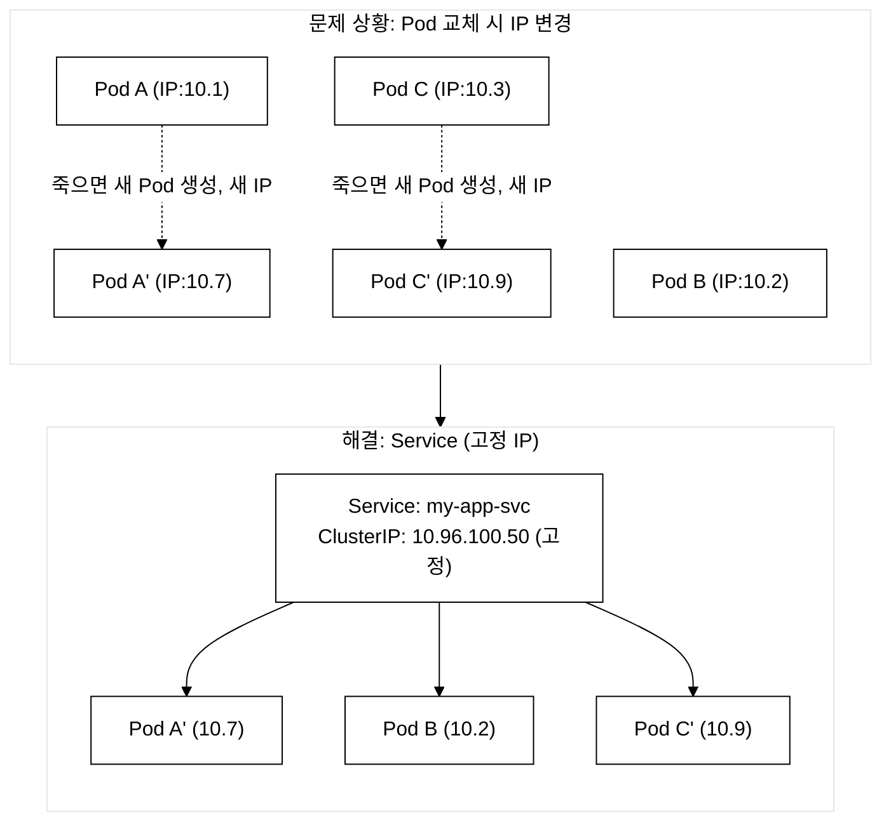
_그림 1. Pod IP 불확정 문제와 Service 고정 IP 해결._

### 1.3 Service의 내부 동작 원리

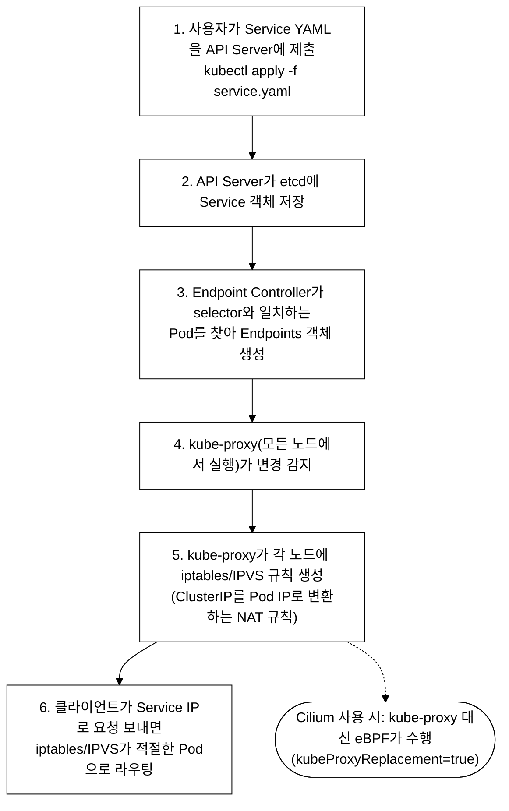
_그림 2. Service 생성 시 내부 처리 흐름._

---

## 2. Service 타입 완벽 비교

### 2.1 4가지 Service 타입 비교표

| 구분 | ClusterIP | NodePort | LoadBalancer | ExternalName |
|---|---|---|---|---|
| **접근 범위** | 클러스터 내부만 | 외부 (노드 IP) | 외부 (LB IP) | DNS CNAME |
| **IP 할당** | 가상 ClusterIP | ClusterIP + 노드포트 | ClusterIP + LB IP | 없음 |
| **포트 범위** | 임의 | 30000-32767 | 임의 | 없음 |
| **사용 사례** | 내부 마이크로서비스 | 개발/테스트 외부 접근 | 프로덕션 외부 서비스 | 외부 서비스 참조 |
| **네트워크 동작** | DNAT via iptables/eBPF | NodePort→ClusterIP 체인 | External LB→NodePort→ClusterIP | CoreDNS CNAME 레코드 반환 |

### 2.2 ClusterIP Service (기본값)

> **ClusterIP**: 클러스터 내부에서만 라우팅 가능한 Virtual IP를 할당한다. kube-proxy가 iptables DNAT 규칙 또는 IPVS virtual server를 생성하여, ClusterIP:port 목적지 패킷을 Endpoints에 등록된 Pod IP:targetPort로 분산 전달한다.

```yaml
# ClusterIP Service 전체 YAML (한 줄씩 설명)
apiVersion: v1              # Service는 핵심 API 그룹(v1)에 속한다
kind: Service               # 리소스 종류: Service
metadata:
  name: backend-svc          # Service의 이름. DNS에서 이 이름으로 조회된다
  namespace: demo            # Service가 속할 네임스페이스
  labels:                    # Service 자체에 붙는 레이블 (선택사항)
    app: backend             # 관리/조회 용도
    tier: api                # 계층 구분
spec:
  type: ClusterIP            # Service 타입. 생략하면 기본값이 ClusterIP이다
  selector:                  # 이 Service가 트래픽을 전달할 Pod를 선택하는 기준
    app: backend             # app=backend 레이블을 가진 Pod로 트래픽 전달
  ports:
  - name: http               # 포트 이름 (멀티 포트 시 필수)
    protocol: TCP            # 프로토콜 (TCP가 기본값)
    port: 80                 # Service가 노출하는 포트 (클라이언트가 접속하는 포트)
    targetPort: 8080         # Pod 컨테이너가 실제로 리스닝하는 포트
  sessionAffinity: None      # None(기본) 또는 ClientIP(같은 클라이언트→같은 Pod)
```

**ClusterIP 내부 동작 원리:**

ClusterIP는 실제 네트워크 인터페이스에 바인딩되지 않는 가상 IP이다. 이 IP로 향하는 패킷은 커널의 netfilter(iptables) 또는 eBPF 훅에서 가로채어 DNAT(Destination NAT) 처리된다. kube-proxy는 Endpoints 변경을 감시하여 iptables 체인에 확률 기반 분산 규칙(probability matching)을 삽입한다. 예를 들어 Endpoint가 3개이면 각각 33% 확률로 선택된다.

**ClusterIP 패킷 흐름:**

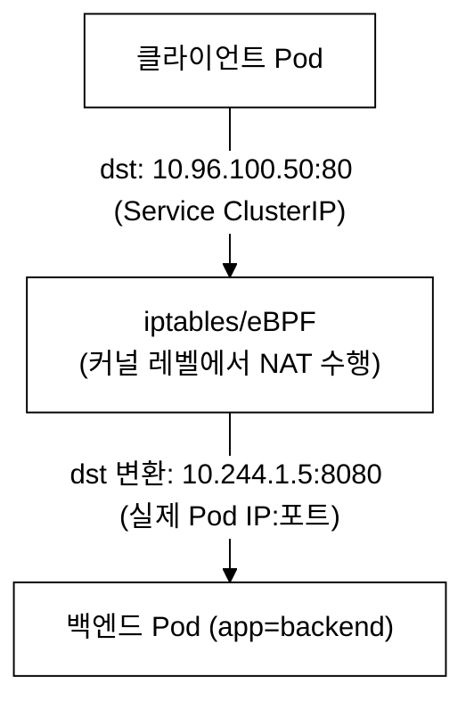
_그림 3. ClusterIP 패킷 흐름 (DNAT)._

**검증 명령어:**

```bash
# ClusterIP Service 생성 후 검증
kubectl apply -f clusterip-svc.yaml
kubectl get svc backend-svc -n demo
```

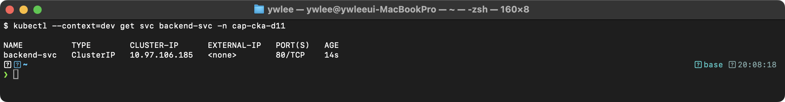

```bash
# Endpoints 확인
kubectl get endpoints backend-svc -n demo
```

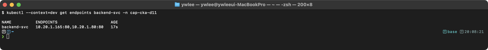

### 2.3 NodePort Service

> **NodePort**: ClusterIP를 확장하여, 모든 노드의 특정 포트(30000-32767)에서 인바운드 트래픽을 수신한다. 각 노드의 kube-proxy가 해당 NodePort로 들어온 패킷을 ClusterIP의 DNAT 체인으로 전달하므로, 어떤 노드에 요청하든 동일한 Service Endpoints로 라우팅된다.

```yaml
# NodePort Service 전체 YAML
apiVersion: v1
kind: Service
metadata:
  name: web-nodeport         # Service 이름
  namespace: default
spec:
  type: NodePort             # NodePort 타입: 외부에서 노드IP:노드포트로 접근 가능
  selector:
    app: web-app             # app=web-app 레이블을 가진 Pod 선택
  ports:
  - name: http
    protocol: TCP
    port: 80                 # 클러스터 내부에서 사용하는 Service 포트
    targetPort: 8080         # Pod 컨테이너 포트
    nodePort: 30080          # 모든 노드에서 열리는 외부 포트 (30000-32767)
                             # 생략하면 범위 내에서 자동 할당
  externalTrafficPolicy: Cluster  # Cluster(기본): 모든 노드의 Pod로 분산
                                   # Local: 해당 노드의 Pod만 응답 (소스 IP 보존)
```

**NodePort 접근 경로:**

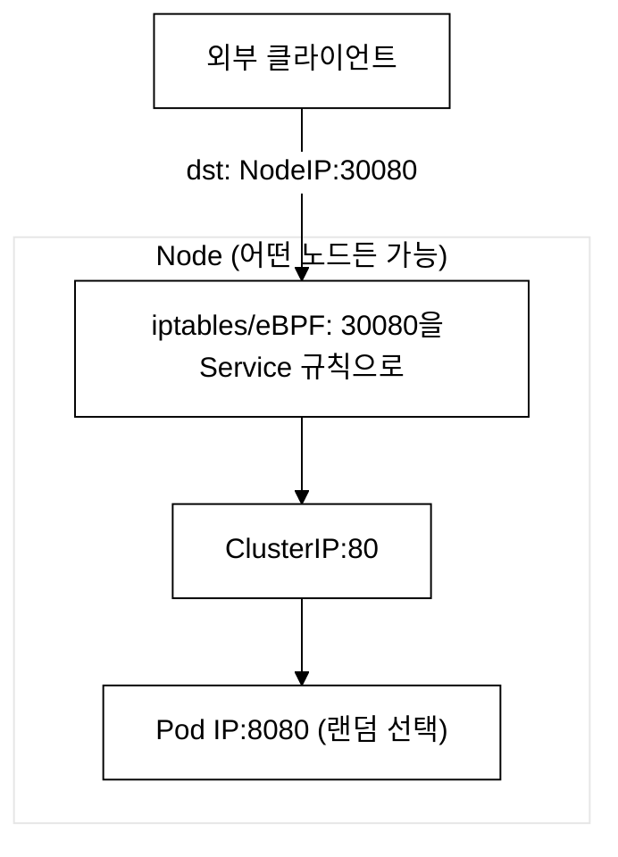
_그림 4. NodePort 접근 경로 (nodePort 30080 → port 80 → targetPort 8080)._

**externalTrafficPolicy 비교:**

| 구분 | Cluster (기본) | Local |
|---|---|---|
| 트래픽 분산 | 모든 노드의 Pod | 해당 노드의 Pod만 |
| 소스 IP | SNAT로 변경됨 | 원본 클라이언트 IP 보존 |
| 부하 분산 | 균등 | 불균등 가능 |
| Pod 없는 노드 | 다른 노드로 전달 | 연결 실패 |

### 2.4 LoadBalancer Service

> **LoadBalancer**: NodePort를 확장하여, Cloud Controller Manager가 클라우드 프로바이더 API를 호출해 외부 L4 로드밸런서(NLB/ALB 등)를 프로비저닝한다. 외부 LB는 할당된 External IP로 트래픽을 수신하고, 각 노드의 NodePort로 분산 전달한다. 즉 LoadBalancer = ClusterIP + NodePort + 외부 LB 3계층 구조이다.

```yaml
# LoadBalancer Service 전체 YAML
apiVersion: v1
kind: Service
metadata:
  name: web-lb
  namespace: production
  annotations:
    # 클라우드별 어노테이션 예시 (AWS)
    service.beta.kubernetes.io/aws-load-balancer-type: nlb
    service.beta.kubernetes.io/aws-load-balancer-internal: "false"
spec:
  type: LoadBalancer         # 외부 로드밸런서 프로비저닝 요청
  selector:
    app: web
  ports:
  - name: http
    port: 80                 # LB가 리스닝하는 포트
    targetPort: 8080         # Pod 포트
  - name: https
    port: 443
    targetPort: 8443
  loadBalancerSourceRanges:  # LB에 접근 가능한 소스 IP 제한
  - 203.0.113.0/24           # 이 CIDR에서만 접근 가능
  externalTrafficPolicy: Local  # 소스 IP 보존
```

**LoadBalancer 계층 구조:**

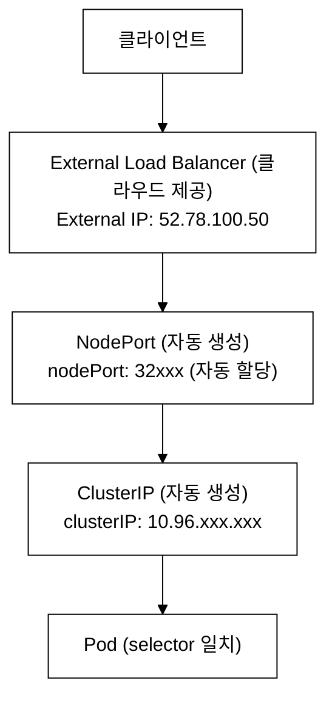
_그림 5. LoadBalancer 계층 구조 (ClusterIP + NodePort + 외부 LB)._

> **로컬/베어메탈 환경 주의**: Cloud Controller Manager(CCM)가 없는 환경(이 저장소의 tart dev/staging 클러스터 포함)에서 LoadBalancer Service를 생성하면 `EXTERNAL-IP` 컬럼이 `<pending>` 상태로 영구 유지된다. 이는 오류가 아니라 CCM이 클라우드 LB를 프로비저닝하지 못한 정상적인 결과이다. 로컬 대안으로 MetalLB(베어메탈 L4 LB)를 추가 설치하거나, 간단한 접근 테스트는 `kubectl port-forward svc/<name> <local-port>:<svc-port>`를 사용한다. CKA 시험 환경은 대부분 클라우드 기반이므로 External IP가 실제 할당된다.

### 2.5 ExternalName Service

> **ExternalName**: ClusterIP를 할당하지 않고, CoreDNS에 CNAME 레코드만 등록한다. 클러스터 내부에서 Service DNS 이름을 조회하면 spec.externalName에 지정된 외부 도메인의 CNAME이 반환되어, 별도의 프록시 없이 DNS 수준에서 외부 서비스로 리다이렉션된다.

```yaml
# ExternalName Service 전체 YAML
apiVersion: v1
kind: Service
metadata:
  name: external-db          # 클러스터 내부에서 사용할 이름
  namespace: demo
spec:
  type: ExternalName         # DNS CNAME을 생성하는 특수 타입
  externalName: db.example.com  # 외부 서비스의 실제 도메인
  # selector가 없다! Pod를 선택하지 않는다
  # ports도 없다! 포트 변환을 하지 않는다
```

**ExternalName DNS 동작:**

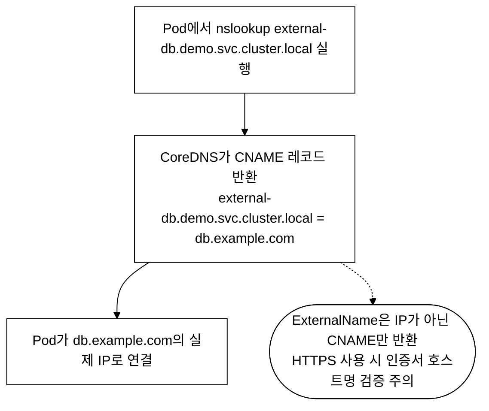
_그림 6. ExternalName Service의 DNS 동작 (CNAME 반환)._

### 2.6 Headless Service

> **Headless Service**: `clusterIP: None`으로 설정하면 Virtual IP가 할당되지 않는다. DNS A 레코드 조회 시 ClusterIP 대신 매칭된 모든 Pod의 개별 IP 주소가 반환된다. StatefulSet과 결합하면 각 Pod에 대해 `<pod-name>.<service-name>` 형식의 개별 DNS 레코드가 생성되어, 클라이언트가 특정 Pod를 직접 지정하여 통신할 수 있다.

```yaml
# Headless Service 전체 YAML
apiVersion: v1
kind: Service
metadata:
  name: db-headless           # Service 이름
  namespace: demo
spec:
  clusterIP: None             # 핵심! None으로 설정하면 Headless Service가 된다
  selector:
    app: postgres             # 일반 Service와 동일하게 Pod를 선택
  ports:
  - name: postgres
    port: 5432
    targetPort: 5432
```

**Headless vs 일반 ClusterIP 비교:**

```
일반 ClusterIP Service:
  nslookup my-svc → 10.96.100.50 (Service의 가상 IP 1개)

Headless Service (clusterIP: None):
  nslookup db-headless → 10.244.1.5   (Pod A의 실제 IP)
                          10.244.2.8   (Pod B의 실제 IP)
                          10.244.3.12  (Pod C의 실제 IP)

StatefulSet과 함께 사용 시:
  nslookup postgres-0.db-headless → 10.244.1.5  (특정 Pod에 직접 접근)
  nslookup postgres-1.db-headless → 10.244.2.8
  nslookup postgres-2.db-headless → 10.244.3.12
```

**Headless Service 사용 사례:**
- StatefulSet(데이터베이스, 메시지 큐)에서 개별 Pod에 안정적인 DNS로 접근
- 클라이언트가 직접 로드밸런싱을 수행하고 싶을 때
- 서비스 디스커버리를 위해 모든 Pod IP를 알아야 할 때

---

## 3. Service 관련 핵심 오브젝트

### 3.1 Endpoints 오브젝트

Service를 생성하면 자동으로 같은 이름의 Endpoints 오브젝트가 생성된다. Endpoints는 selector와 일치하는 Pod의 IP:Port 목록을 관리한다.

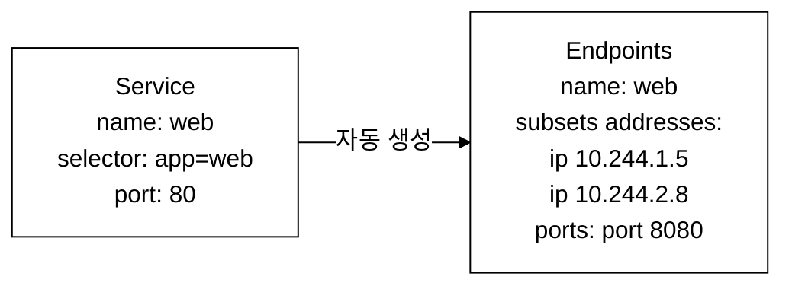
_그림 7. Service 생성 시 동일 이름의 Endpoints 자동 생성._

```yaml
# Endpoints를 수동으로 확인
# kubectl get endpoints <service-name>

# 수동 Endpoints 생성 (selector 없는 Service에 연결)
apiVersion: v1
kind: Endpoints
metadata:
  name: external-service      # Service와 같은 이름이어야 한다
  namespace: demo
subsets:
- addresses:
  - ip: 192.168.1.100         # 외부 서버 IP
  - ip: 192.168.1.101
  ports:
  - port: 3306                # 외부 서버 포트
    protocol: TCP
---
apiVersion: v1
kind: Service
metadata:
  name: external-service      # Endpoints와 같은 이름
  namespace: demo
spec:
  # selector 없음! 수동 Endpoints와 연결
  ports:
  - port: 3306
    targetPort: 3306
```

### 3.2 EndpointSlice (v1.21+)

**등장 배경:** 기존 Endpoints 오브젝트는 Service당 하나만 존재하며, Pod가 수천 개인 대규모 클러스터에서 하나의 Endpoints 오브젝트가 매우 커진다. Pod 하나만 변경되어도 전체 Endpoints 오브젝트가 업데이트되어 kube-proxy에 전파되므로 API Server와 네트워크에 큰 부하를 유발하였다. EndpointSlice는 이 문제를 해결하기 위해 도입되었다.

```
Endpoints: 하나의 오브젝트에 모든 Pod IP가 포함
  → Pod 1000개면 하나의 거대한 Endpoints 오브젝트

EndpointSlice: 여러 작은 오브젝트로 분할 (기본 100개씩)
  → Pod 1000개면 10개의 EndpointSlice 오브젝트
  → 변경 시 해당 슬라이스만 업데이트 → 네트워크 효율 향상
```

**EndpointSlice 실측 확인**: Service를 만든 뒤 아래 명령으로 실제 EndpointSlice가 생성됐는지 확인할 수 있다.

```bash
# 특정 Service의 EndpointSlice 조회
kubectl get endpointslices -n <ns> -l kubernetes.io/service-name=<svc-name>

# 예시: demo 네임스페이스의 nginx-web Service (저장소 demo 스택)
kubectl get endpointslices -n demo -l kubernetes.io/service-name=nginx-web
```

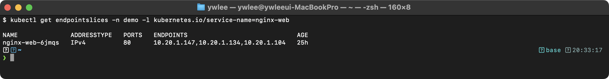

`ADDRESSTYPE=IPv4`, `PORTS=80`이고 ENDPOINTS 열에 3개 Pod IP(dev Pod CIDR 10.20.1.x)가 하나의 슬라이스에 등록돼 있다. Pod 수가 기본 100개를 넘으면 여러 EndpointSlice로 분할된다.

### 3.3 sessionAffinity

```yaml
# sessionAffinity: 같은 클라이언트의 요청을 같은 Pod으로 보내는 설정
apiVersion: v1
kind: Service
metadata:
  name: sticky-svc
spec:
  selector:
    app: web
  ports:
  - port: 80
    targetPort: 8080
  sessionAffinity: ClientIP     # 같은 클라이언트 IP → 같은 Pod
  sessionAffinityConfig:
    clientIP:
      timeoutSeconds: 10800     # 3시간 동안 유지 (기본값)
```

---

## 4. CoreDNS 구조와 서비스 디스커버리

### 4.1 CoreDNS란?

> **CoreDNS**: 클러스터 내부 DNS 서버로, Kubernetes API를 Watch하여 Service/Pod 생성·삭제 이벤트를 실시간 반영한다. `<service>.<namespace>.svc.cluster.local` 형식의 FQDN에 대해 A/AAAA 레코드(ClusterIP) 또는 SRV 레코드를 반환한다. SRV 레코드는 서비스가 사용하는 포트 번호와 프로토콜을 DNS로 공개하는 레코드 타입으로, 예를 들어 `_http._tcp.nginx-web.demo.svc.cluster.local`을 조회하면 포트 80/TCP 정보를 반환한다. gRPC 등 포트를 동적으로 알아야 하는 프로토콜에서 활용된다. kubelet이 각 Pod의 `/etc/resolv.conf`에 CoreDNS의 ClusterIP(기본 10.96.0.10)를 nameserver로 설정하여 자동으로 서비스 디스커버리가 동작한다.

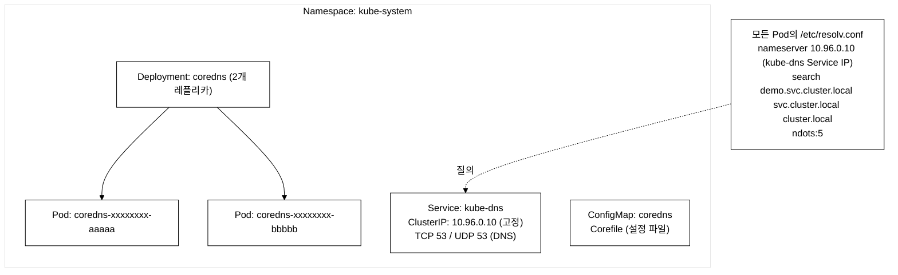
_그림 8. CoreDNS 구성 요소와 Pod resolv.conf 연결._

### 4.2 DNS 레코드 형식 (반드시 암기!)

| 리소스 | DNS 형식 | 예시 |
|---|---|---|
| **Service** | `<svc>.<ns>.svc.cluster.local` | `nginx-web.demo.svc.cluster.local` |
| **Pod** | `<pod-ip-dashed>.<ns>.pod.cluster.local` | `10-244-1-5.demo.pod.cluster.local` |
| **StatefulSet Pod** | `<pod-name>.<svc>.<ns>.svc.cluster.local` | `postgres-0.db-headless.demo.svc.cluster.local` |

```
DNS 조회 단축 규칙:
같은 네임스페이스 내:
  curl http://nginx-web                              ← 가장 짧은 형태
  curl http://nginx-web.demo                         ← 네임스페이스 명시
  curl http://nginx-web.demo.svc                     ← svc까지
  curl http://nginx-web.demo.svc.cluster.local       ← FQDN (완전한 형태)

다른 네임스페이스:
  curl http://nginx-web.other-ns                     ← 최소한 네임스페이스 필요
  curl http://nginx-web.other-ns.svc.cluster.local   ← FQDN 권장
```

### 4.3 CoreDNS ConfigMap (Corefile)

```yaml
# CoreDNS ConfigMap 구조
apiVersion: v1
kind: ConfigMap
metadata:
  name: coredns
  namespace: kube-system
data:
  Corefile: |
    .:53 {                          # 포트 53에서 모든 DNS 쿼리 처리
        errors                      # 에러 로깅
        health {                    # /health 엔드포인트 (헬스체크)
            lameduck 5s             # 종료 전 5초 대기
        }
        ready                       # /ready 엔드포인트 (readiness)
        kubernetes cluster.local in-addr.arpa ip6.arpa {
            # 클러스터 도메인(cluster.local) DNS 처리
            pods insecure           # Pod DNS 레코드 생성 (insecure 모드)
            fallthrough in-addr.arpa ip6.arpa
            ttl 30                  # DNS 캐시 TTL 30초
        }
        prometheus :9153            # Prometheus 메트릭 노출
        forward . /etc/resolv.conf {# 클러스터 외부 도메인은 상위 DNS로 전달
            max_concurrent 1000     # 최대 동시 쿼리
        }
        cache 30                    # DNS 응답 30초 캐시
        loop                        # DNS 루프 감지
        reload                      # ConfigMap 변경 시 자동 리로드
        loadbalance                 # DNS 응답의 A 레코드 순서 라운드로빈
    }
```

### 4.4 Pod DNS 정책 (dnsPolicy)

```yaml
# dnsPolicy 종류별 설명
apiVersion: v1
kind: Pod
metadata:
  name: dns-example
spec:
  dnsPolicy: ClusterFirst      # 기본값. CoreDNS를 먼저 사용
  # dnsPolicy: Default          # 노드의 /etc/resolv.conf 사용
  # dnsPolicy: None             # dnsConfig에서 수동 지정
  # dnsPolicy: ClusterFirstWithHostNet  # hostNetwork=true일 때 CoreDNS 사용

  # dnsPolicy: None일 때 수동 설정
  dnsConfig:
    nameservers:
    - 8.8.8.8                   # Google DNS
    - 1.1.1.1                   # Cloudflare DNS
    searches:
    - my-domain.com             # 검색 도메인 추가
    options:
    - name: ndots
      value: "2"                # . 이 2개 미만이면 search 도메인 추가

  containers:
  - name: app
    image: nginx
```

### 4.5 DNS 조회 흐름

```
Pod에서 "nginx-web" 접속 요청:

1. Pod의 /etc/resolv.conf 확인
   nameserver 10.96.0.10
   search demo.svc.cluster.local svc.cluster.local cluster.local
   ndots:5

2. "nginx-web"에 dot(.)이 0개 → ndots(5)보다 작으므로
   search 도메인을 차례로 추가하여 조회:
   ① nginx-web.demo.svc.cluster.local → 성공! (Service 발견)

   만약 실패하면:
   ② nginx-web.svc.cluster.local
   ③ nginx-web.cluster.local
   ④ nginx-web (절대 이름으로 조회)

3. CoreDNS가 Service의 ClusterIP 반환
   → 10.96.50.100

4. Pod가 10.96.50.100으로 TCP 연결
```

---

## 5. kube-proxy와 Service 라우팅

### 5.1 kube-proxy 동작 모드

**등장 배경과 진화 과정:** kube-proxy의 세 모드는 임의로 나열된 선택지가 아니라, Service 라우팅을 더 빠르게 만들려는 시도가 순차적으로 쌓인 결과이다.

초기 kube-proxy는 **userspace 모드**였다. 각 Service마다 kube-proxy 프로세스가 직접 TCP 소켓을 열고, 클라이언트 패킷을 사용자 공간으로 끌어올려 Pod로 다시 보냈다. 패킷 하나가 커널과 사용자 공간을 오가야 하므로 컨텍스트 스위칭 비용이 커서 처리량이 낮았다.

이를 대체한 것이 **iptables 모드**이다. kube-proxy가 직접 패킷을 나르는 대신, 커널 netfilter(리눅스 커널의 패킷 필터링·NAT 프레임워크)에 DNAT 규칙만 심어두고 패킷 처리는 커널이 한다. 사용자 공간 왕복이 사라져 빨라졌다. 그러나 iptables 규칙은 위에서 아래로 순차 평가되는 선형 리스트라서, Service·Endpoint가 N개로 늘면 규칙 매칭 비용도 O(N)으로 증가한다. 또한 규칙 하나가 바뀌어도 테이블 전체를 갱신해야 해서, 수천 개 Service 규모에서는 규칙 동기화가 수 초씩 걸린다.

다음 단계가 **IPVS 모드**이다. IPVS(IP Virtual Server, 리눅스 커널에 내장된 L4 로드밸런서)는 Service를 해시 테이블 기반 가상 서버로 관리하므로 백엔드 조회가 규칙 수와 무관하게 O(1)에 가깝다. rr(라운드로빈)·lc(least connection) 등 로드밸런싱 알고리즘 선택지도 늘었다. 대규모 클러스터에서 iptables의 O(N) 한계를 넘기 위한 선택이다.

가장 최근 단계가 **eBPF 모드**이다. eBPF(extended Berkeley Packet Filter, 커널에 안전하게 사용자 작성 프로그램을 적재해 실행하는 기술)를 쓰는 Cilium 같은 CNI는 kube-proxy 자체를 제거(kubeProxyReplacement)하고, DNAT/로드밸런싱을 커널의 네트워크 진입 지점(XDP/tc 훅)에서 직접 처리한다. iptables/IPVS 체인을 거치지 않으므로 경로가 짧아진다.

**트레이드오프:** 뒤로 갈수록 빠르고 확장성이 좋아지지만 운영 복잡도와 디버깅 난도가 올라간다. iptables는 `iptables -t nat -L`로 규칙을 눈으로 확인할 수 있지만, eBPF는 규칙이 커널 맵 안에 있어 `cilium` 전용 도구 없이는 들여다보기 어렵다. CKA 환경의 기본은 여전히 iptables이므로, 시험 대비는 iptables 모드를 기준으로 이해하면 된다.

```
kube-proxy 3가지 모드:

1. iptables 모드 (기본)
   - 각 Service/Endpoints에 대해 iptables 규칙 생성
   - 커널 레벨에서 패킷 처리 → 빠름
   - 규칙 수가 많아지면 업데이트 느림 (O(n))

2. IPVS 모드
   - 리눅스 커널 IPVS(IP Virtual Server) 사용
   - 더 많은 로드밸런싱 알고리즘 지원
   - 대규모 클러스터에 적합 (O(1) 룩업)

3. eBPF 모드 (Cilium)
   - kube-proxy 완전 대체
   - 커널 레벨에서 eBPF 프로그램으로 처리
   - tart-infra가 사용하는 방식 (kubeProxyReplacement=true)
```

### 5.2 iptables 규칙 예시

kube-proxy가 만드는 규칙은 역할이 분담된 세 단계 체인(chain, iptables 규칙들의 묶음으로 점프 가능한 단위)으로 구성된다. 각 체인의 의미는 다음과 같다.

- **KUBE-SERVICES**: 모든 Service 트래픽이 진입하는 최상위 체인이다. 목적지 IP:Port가 어떤 ClusterIP와 일치하는지 보고, 해당 Service 전용 체인(KUBE-SVC-XXXX)으로 점프(jump)시키는 라우팅 분기 역할만 한다.
- **KUBE-SVC-XXXX**: 특정 Service 하나에 대응하는 체인이다. 이 Service 뒤에 있는 여러 Endpoint 중 하나를 고르는 로드밸런싱을 담당한다. 여기서 `--probability` 옵션이 쓰인다.
- **KUBE-SEP-AAAA**: 개별 Endpoint(Service EndPoint) 하나에 대응하는 체인이다. 실제 DNAT(목적지 IP를 Pod IP:Port로 바꾸는 변환)를 수행하여 패킷을 그 Pod로 보낸다.

`--probability`는 iptables의 statistic 모듈 옵션으로, 위에서부터 순차 평가되는 규칙에 확률을 부여해 트래픽을 분산한다. 핵심은 이 확률이 "남은 트래픽 중의 비율"로 누적 계산된다는 점이다. Endpoint가 3개이면 첫 규칙은 1/3(약 0.333) 확률로 첫 Pod를 선택하고, 통과한 나머지 2/3 트래픽에 대해 둘째 규칙이 1/2(0.5) 확률로 둘째 Pod를, 마지막 규칙은 무조건 셋째 Pod를 택한다. 결과적으로 세 Pod가 각각 약 1/3씩 받는다. 단순히 모든 규칙에 0.333을 주면 균등 분산이 되지 않으므로 이렇게 보정한다.

```bash
# Service에 대한 iptables 규칙 확인
sudo iptables -t nat -L KUBE-SERVICES -n | grep <service-name>

# 예시 규칙 흐름:
# KUBE-SERVICES → KUBE-SVC-XXXX (Service 체인)
#   → KUBE-SEP-AAAA (Endpoint 1: 10.244.1.5:8080) - 33% 확률
#   → KUBE-SEP-BBBB (Endpoint 2: 10.244.2.8:8080) - 33% 확률
#   → KUBE-SEP-CCCC (Endpoint 3: 10.244.3.12:8080) - 33% 확률
```

> 참고: tart 실습 클러스터는 Cilium(eBPF, kubeProxyReplacement)을 사용하므로 노드에서 위 KUBE-* 체인이 보이지 않을 수 있다. iptables 모드 규칙을 실제로 확인하려면 kube-proxy를 iptables 모드로 쓰는 클러스터(또는 kubeProxyReplacement를 끈 환경)가 필요하다. 시험 환경은 iptables 모드가 기본이다.

### 5.3 트러블슈팅: Service 라우팅 문제

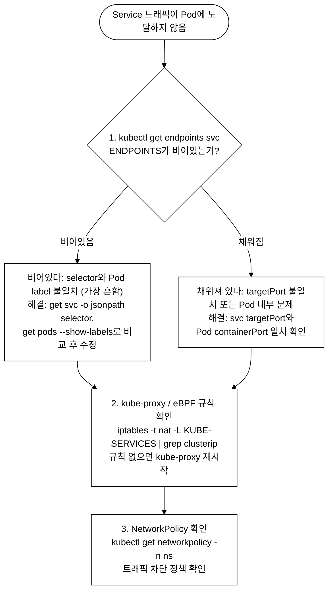
_그림 9. Service 라우팅 문제 진단 흐름._

---

## 6. Service 관련 kubectl 명령어 총정리

**시험 시작 직후 반드시 설정**: 아래 두 줄을 먼저 실행하면 이후 명령이 절반으로 줄어든다.

```bash
# 시험 필수 셋업 (첫 번째 명령으로 실행)
alias k=kubectl
export do='--dry-run=client -o yaml'

# 사용 예시: dry-run YAML 생성
# k expose deployment web-app --port=80 --type=NodePort $do > svc.yaml
```

```bash
# ===== 빠른 생성 =====
# Deployment를 Service로 노출
kubectl expose deployment web-app --port=80 --target-port=8080 --type=ClusterIP
kubectl expose deployment web-app --port=80 --target-port=8080 --type=NodePort
kubectl expose deployment web-app --port=80 --type=NodePort --name=web-svc

# Pod를 Service로 노출
kubectl expose pod my-pod --port=80 --target-port=80 --name=pod-svc

# dry-run으로 YAML 생성 (시험에서 유용!)
kubectl expose deployment web-app --port=80 --type=NodePort \
  --dry-run=client -o yaml > svc.yaml

# ===== 조회 =====
kubectl get svc                          # 현재 네임스페이스의 Service
kubectl get svc -A                       # 모든 네임스페이스의 Service
kubectl get svc -o wide                  # selector 포함
kubectl get svc -n demo -o yaml          # YAML 형식
kubectl describe svc <name>              # 상세 정보
kubectl get endpoints <name>             # Endpoints 확인 (핵심!)
kubectl get endpointslices -l kubernetes.io/service-name=<name>

# ===== 수정 =====
kubectl edit svc <name>                  # 직접 편집
kubectl patch svc <name> -p '{"spec":{"type":"NodePort"}}'
kubectl patch svc <name> --type='json' \
  -p='[{"op":"replace","path":"/spec/ports/0/nodePort","value":31080}]'

# ===== DNS 테스트 =====
kubectl run dns-test --image=busybox:1.28 --rm -it --restart=Never -- \
  nslookup <svc-name>.<namespace>.svc.cluster.local
kubectl run dns-test --image=busybox:1.28 --rm -it --restart=Never -- \
  nslookup kubernetes.default.svc.cluster.local

# ===== 접근 테스트 =====
kubectl run curl-test --image=curlimages/curl --rm -it --restart=Never -- \
  curl -s http://<svc-name>.<namespace>.svc.cluster.local
```

---

## 7. 실전 YAML 예제 모음 (17개)

### 예제 1: 기본 ClusterIP Service

```yaml
apiVersion: v1
kind: Service
metadata:
  name: api-svc
  namespace: demo
spec:
  selector:
    app: api-server
  ports:
  - port: 8080
    targetPort: 8080
```

### 예제 2: NodePort 특정 포트 지정

```yaml
apiVersion: v1
kind: Service
metadata:
  name: web-nodeport
spec:
  type: NodePort
  selector:
    app: web
  ports:
  - port: 80
    targetPort: 8080
    nodePort: 30080       # 특정 NodePort 지정
```

### 예제 3: 멀티 포트 Service

```yaml
apiVersion: v1
kind: Service
metadata:
  name: rabbitmq-svc
  namespace: demo
spec:
  selector:
    app: rabbitmq
  ports:
  - name: amqp             # 멀티 포트 시 name 필수!
    port: 5672
    targetPort: 5672
  - name: management        # 각 포트에 이름 부여
    port: 15672
    targetPort: 15672
```

### 예제 4: Headless Service + StatefulSet

```yaml
apiVersion: v1
kind: Service
metadata:
  name: postgres-headless
  namespace: demo
spec:
  clusterIP: None           # Headless!
  selector:
    app: postgres
  ports:
  - name: postgres
    port: 5432
    targetPort: 5432
---
apiVersion: apps/v1
kind: StatefulSet
metadata:
  name: postgres
  namespace: demo
spec:
  serviceName: postgres-headless   # Headless Service와 연결
  replicas: 3
  selector:
    matchLabels:
      app: postgres
  template:
    metadata:
      labels:
        app: postgres
    spec:
      containers:
      - name: postgres
        image: postgres:15
        ports:
        - containerPort: 5432
        env:
        - name: POSTGRES_PASSWORD
          value: "password"
  volumeClaimTemplates:
  - metadata:
      name: pgdata
    spec:
      accessModes: ["ReadWriteOnce"]
      resources:
        requests:
          storage: 5Gi
```

### 예제 5: ExternalName Service

```yaml
apiVersion: v1
kind: Service
metadata:
  name: external-api
  namespace: demo
spec:
  type: ExternalName
  externalName: api.external-service.com
```

### 예제 6: 수동 Endpoints (외부 서비스 연결)

```yaml
apiVersion: v1
kind: Service
metadata:
  name: legacy-db
  namespace: demo
spec:
  ports:
  - port: 3306
    targetPort: 3306
# selector 없음!
---
apiVersion: v1
kind: Endpoints
metadata:
  name: legacy-db           # Service와 동일한 이름
  namespace: demo
subsets:
- addresses:
  - ip: 192.168.1.50        # 외부 DB 서버 IP
  ports:
  - port: 3306
```

### 예제 7: sessionAffinity 활성화

```yaml
apiVersion: v1
kind: Service
metadata:
  name: sticky-web
spec:
  selector:
    app: web
  ports:
  - port: 80
    targetPort: 8080
  sessionAffinity: ClientIP
  sessionAffinityConfig:
    clientIP:
      timeoutSeconds: 3600   # 1시간 동안 같은 Pod으로
```

### 예제 8: externalTrafficPolicy: Local

```yaml
apiVersion: v1
kind: Service
metadata:
  name: web-local-traffic
spec:
  type: NodePort
  selector:
    app: web
  ports:
  - port: 80
    targetPort: 8080
    nodePort: 30090
  externalTrafficPolicy: Local  # 소스 IP 보존
```

### 예제 9: LoadBalancer 소스 IP 제한

```yaml
apiVersion: v1
kind: Service
metadata:
  name: restricted-lb
spec:
  type: LoadBalancer
  selector:
    app: secure-web
  ports:
  - port: 443
    targetPort: 8443
  loadBalancerSourceRanges:
  - 10.0.0.0/8               # 내부 네트워크만 허용
  - 203.0.113.50/32           # 특정 IP만 허용
```

### 예제 10: 포트 이름으로 targetPort 지정

```yaml
apiVersion: apps/v1
kind: Deployment
metadata:
  name: flexible-app
spec:
  replicas: 2
  selector:
    matchLabels:
      app: flexible
  template:
    metadata:
      labels:
        app: flexible
    spec:
      containers:
      - name: app
        image: my-app:v1
        ports:
        - name: http-port        # 포트에 이름 부여
          containerPort: 8080
---
apiVersion: v1
kind: Service
metadata:
  name: flexible-svc
spec:
  selector:
    app: flexible
  ports:
  - port: 80
    targetPort: http-port        # 이름으로 참조! 컨테이너 포트가 바뀌어도 Service 수정 불필요
```

### 예제 11: Pod의 dnsPolicy와 dnsConfig

```yaml
apiVersion: v1
kind: Pod
metadata:
  name: custom-dns-pod
spec:
  dnsPolicy: None
  dnsConfig:
    nameservers:
    - 8.8.8.8
    - 8.8.4.4
    searches:
    - my-company.com
    - svc.cluster.local
    options:
    - name: ndots
      value: "3"
  containers:
  - name: app
    image: nginx
```

### 예제 12: CoreDNS 커스텀 도메인 추가

```yaml
# CoreDNS ConfigMap 수정으로 커스텀 도메인 추가
apiVersion: v1
kind: ConfigMap
metadata:
  name: coredns
  namespace: kube-system
data:
  Corefile: |
    .:53 {
        errors
        health
        ready
        kubernetes cluster.local in-addr.arpa ip6.arpa {
            pods insecure
            fallthrough in-addr.arpa ip6.arpa
            ttl 30
        }
        forward . /etc/resolv.conf
        cache 30
        loop
        reload
        loadbalance
    }
    # 커스텀 도메인 추가
    example.local:53 {
        errors
        cache 30
        forward . 10.0.0.53    # 내부 DNS 서버로 전달
    }
```

### 예제 13: Service + Deployment 조합 (완전한 앱 배포)

```yaml
apiVersion: apps/v1
kind: Deployment
metadata:
  name: nginx-app
  namespace: demo
spec:
  replicas: 3
  selector:
    matchLabels:
      app: nginx-app
  template:
    metadata:
      labels:
        app: nginx-app
        version: v1
    spec:
      containers:
      - name: nginx
        image: nginx:1.24
        ports:
        - containerPort: 80
        resources:
          requests:
            cpu: 50m
            memory: 64Mi
          limits:
            cpu: 100m
            memory: 128Mi
        readinessProbe:
          httpGet:
            path: /
            port: 80
          initialDelaySeconds: 5
          periodSeconds: 5
---
apiVersion: v1
kind: Service
metadata:
  name: nginx-app-svc
  namespace: demo
spec:
  type: NodePort
  selector:
    app: nginx-app            # Deployment의 Pod 레이블과 일치
  ports:
  - name: http
    port: 80
    targetPort: 80
    nodePort: 30088
```

### 예제 14: Headless Service DNS 테스트 Pod

```yaml
apiVersion: v1
kind: Pod
metadata:
  name: dns-debug
  namespace: demo
spec:
  containers:
  - name: debug
    image: busybox:1.28
    command: ["sh", "-c", "while true; do sleep 3600; done"]
  # 이 Pod에서 다음 명령으로 DNS 테스트:
  # kubectl exec dns-debug -n demo -- nslookup nginx-web.demo.svc.cluster.local
  # kubectl exec dns-debug -n demo -- nslookup kubernetes.default.svc.cluster.local
```

### 예제 15: Service 여러 개가 같은 Pod를 가리키는 구성

```yaml
# 하나의 Pod에 여러 Service가 연결될 수 있다
apiVersion: v1
kind: Pod
metadata:
  name: multi-service-pod
  labels:
    app: web
    tier: frontend
    env: production
spec:
  containers:
  - name: web
    image: nginx
    ports:
    - containerPort: 80
    - containerPort: 443
---
# Service 1: 내부용 (ClusterIP)
apiVersion: v1
kind: Service
metadata:
  name: web-internal
spec:
  selector:
    app: web
  ports:
  - port: 80
    targetPort: 80
---
# Service 2: 외부용 (NodePort)
apiVersion: v1
kind: Service
metadata:
  name: web-external
spec:
  type: NodePort
  selector:
    app: web
    env: production       # 더 구체적인 selector
  ports:
  - port: 443
    targetPort: 443
    nodePort: 30443
```

### 예제 16: ipFamilyPolicy (IPv4/IPv6 듀얼 스택)

듀얼 스택(dual-stack)은 하나의 Service에 IPv4와 IPv6 ClusterIP를 동시에 할당하는 구성이다. IPv4 주소 고갈에 대응하거나 IPv6 전용 클라이언트와 IPv4 전용 클라이언트를 한 Service로 함께 수용해야 할 때 사용한다. 전제 조건으로 클러스터(apiserver·kube-proxy·CNI)가 듀얼 스택을 활성화한 상태여야 한다(`--service-cluster-ip-range`에 IPv4·IPv6 CIDR을 둘 다 지정). 활성화되지 않은 클러스터에서 RequireDualStack을 요청하면 Service 생성이 거부된다.

두 필드의 의미는 다음과 같다.

- **ipFamilyPolicy**: 단일/듀얼 스택 정책을 정한다. `SingleStack`(기본, IP 패밀리 1개), `PreferDualStack`(가능하면 둘 다, 클러스터가 듀얼 스택이 아니면 자동으로 단일로 폴백), `RequireDualStack`(반드시 둘 다, 불가능하면 생성 실패) 중 하나이다.
- **ipFamilies**: 어떤 IP 패밀리를 어떤 순서로 쓸지 명시한다. 목록의 첫 항목이 primary가 되어, 듀얼 스택을 인식하지 못하는 클라이언트나 도구가 받는 기본 IP가 된다. 생략하면 클러스터 기본 순서를 따른다.

**트레이드오프:** Service 하나가 ClusterIP를 2개 갖게 되므로 IP 관리·방화벽 규칙·DNS 응답(A와 AAAA 레코드)이 모두 두 배로 늘어 운영 복잡도가 증가한다. IPv6 요구가 명확하지 않다면 SingleStack(IPv4)을 유지하는 편이 단순하다. CKA에서는 필드 이름과 세 정책 값의 차이를 구분할 수 있으면 충분하다.

```yaml
apiVersion: v1
kind: Service
metadata:
  name: dual-stack-svc
spec:
  type: ClusterIP
  ipFamilyPolicy: PreferDualStack   # SingleStack, PreferDualStack, RequireDualStack
  ipFamilies:
  - IPv4
  - IPv6
  selector:
    app: web
  ports:
  - port: 80
    targetPort: 8080
```

### 예제 17: kubectl create service 명령으로 빠른 생성

```bash
# ClusterIP Service 빠른 생성
kubectl create service clusterip my-svc --tcp=80:8080

# NodePort Service 빠른 생성
kubectl create service nodeport my-np-svc --tcp=80:8080 --node-port=30080

# ExternalName Service 빠른 생성
kubectl create service externalname ext-svc --external-name=db.example.com
```

---

## tart-infra 실습

### 실습 환경 설정 및 전제조건

아래 실습은 이 저장소의 tart 기반 dev 클러스터를 실습장으로 쓴다. 명령을 실행하기 전에 다음 전제가 충족되어야 한다.

1. **클러스터 기동**: dev 클러스터 VM이 떠 있어야 한다. 꺼져 있으면 저장소 루트에서 `./scripts/boot.sh dev`로 기동한다. `boot.sh`는 VM을 부팅하고 apiserver advertise 인증서까지 복구한다.
2. **재부팅 후 IP 드리프트 복구**: tart는 재부팅마다 VM IP를 재할당하므로, 부팅 직후에는 노드가 Ready로 보여도 파드 네트워킹/DNS가 깨져 있을 수 있다. `./scripts/fix-cluster-ip-drift.sh dev`를 실행해 apiserver 인증서 SAN·control-plane 정적 파드·worker kubelet.conf·Cilium의 `KUBERNETES_SERVICE_HOST`를 새 IP로 정렬한다. 이 단계를 건너뛰면 아래 CoreDNS 조회 실습이 실패한다.
3. **kubeconfig 경로**: 클러스터별 kubeconfig는 `kubeconfig/<클러스터>.yaml`에 클러스터 기동 시 생성된다(gitignore 대상). dev 클러스터는 `dev.yaml`이다.
4. **복구 확인**: `kubectl --kubeconfig kubeconfig/dev.yaml get nodes`가 전부 Ready이고, kube-system의 cilium/coredns 파드가 Running/Ready이며, 파드에서 `nslookup kubernetes.default.svc.cluster.local`이 Service IP(dev는 10.97.0.1)로 해석되면 정상이다.

전제가 충족되면 다음으로 컨텍스트를 전환한다.

```bash
# dev 클러스터 접속 (다양한 Service 타입이 배포된 환경)
export KUBECONFIG=kubeconfig/dev.yaml
kubectl config use-context dev
```

### 실습 1: Service 타입별 실제 동작 확인

실습에서 실제로 조회할 수 있는 환경을 먼저 구성한다. fresh dev 클러스터에는 cap-cka-d11 네임스페이스와 샘플 리소스가 없으므로 아래 셋업 명령을 먼저 실행한다.

```bash
# cap-cka-d11 네임스페이스 생성
kubectl create ns cap-cka-d11

# 테스트용 Deployment 생성 (app=backend 레이블)
kubectl create deployment backend --image=nginx:1.24 -n cap-cka-d11 --replicas=2

# ClusterIP Service 생성
kubectl expose deployment backend --port=80 --target-port=80 \
  --name=backend-svc --type=ClusterIP -n cap-cka-d11

# NodePort Service 생성
# (주의: kubectl expose는 --overrides 플래그를 지원하지 않는다. expose로 Service를 만든 뒤 patch로 nodePort를 지정한다)
kubectl expose deployment backend --port=80 --target-port=80 \
  --name=nginx --type=NodePort -n cap-cka-d11
kubectl patch svc nginx -n cap-cka-d11 \
  -p '{"spec":{"ports":[{"port":80,"targetPort":80,"nodePort":30080,"protocol":"TCP"}]}}'

# 생성 확인
kubectl get svc -n cap-cka-d11 -o wide
```

```bash
# cap-cka-d11 네임스페이스의 모든 Service 확인
kubectl get svc -n cap-cka-d11 -o wide

# nginx NodePort Service 상세 확인
kubectl get svc nginx -n cap-cka-d11 -o jsonpath='{.spec.type}{"\t"}{.spec.ports[0].nodePort}{"\n"}'

# Endpoints 확인 (Service와 Pod의 연결)
kubectl get endpoints -n cap-cka-d11
```

**예상 출력 (예시 — fresh dev 클러스터에는 demo ns 와 nginx/postgresql/redis/rabbitmq/keycloak 서비스가 없다. 아래는 해당 서비스들이 배포된 환경의 형태이며, CLUSTER-IP 는 dev Service CIDR 10.97.x 대역으로 할당된다):**
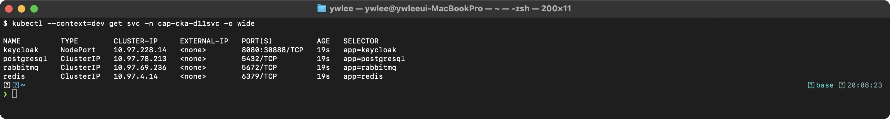

ClusterIP/NodePort 의 실제 형태는 cap-cka-d11 ns 에 동일 타입 Service 를 만들어 검증한 결과다:

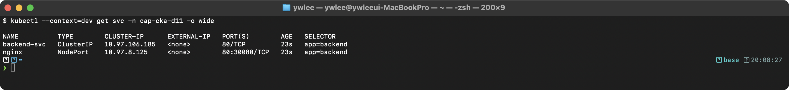

**동작 원리:**
1. ClusterIP는 클러스터 내부에서만 접근 가능한 가상 IP를 할당한다
2. NodePort는 ClusterIP에 추가로 모든 노드의 특정 포트(30080, 30888)를 열어 외부 접근을 허용한다
3. kube-proxy가 iptables/IPVS 규칙을 생성하여 ClusterIP → Pod IP로 DNAT 처리한다
4. Endpoints 오브젝트에 Label Selector와 매칭되는 Pod IP가 자동 등록된다

### 실습 2: CoreDNS와 서비스 디스커버리

실습 2는 실습 1에서 만든 cap-cka-d11 네임스페이스의 nginx NodePort Service를 대상으로 한다. 별도로 demo 네임스페이스를 구성할 필요가 없다.

```bash
# CoreDNS Pod 확인
kubectl get pods -n kube-system -l k8s-app=kube-dns

# DNS 조회 테스트 Pod 실행 (cap-cka-d11 ns의 nginx Service를 조회)
kubectl run dnstest --image=busybox:1.36 -n cap-cka-d11 --rm -it --restart=Never -- \
  nslookup nginx.cap-cka-d11.svc.cluster.local

# 다른 네임스페이스(default)에서 FQDN으로도 같은 Service를 조회할 수 있음을 확인
kubectl run dnstest2 --image=busybox:1.36 --rm -it --restart=Never -- \
  nslookup nginx.cap-cka-d11.svc.cluster.local

# kubernetes API Service DNS 조회 (클러스터 기본 Service)
kubectl run dnstest3 --image=busybox:1.36 --rm -it --restart=Never -- \
  nslookup kubernetes.default.svc.cluster.local
```

**예상 출력:**
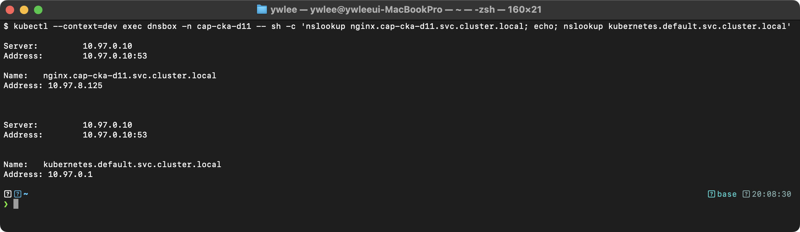

**동작 원리:**
1. CoreDNS는 kube-system에서 실행되며 모든 Service의 DNS 레코드를 자동 생성한다
2. DNS 형식: `<service>.<namespace>.svc.cluster.local`
3. 같은 네임스페이스에서는 Service 이름만으로 접근 가능하다 (search domain 자동 설정)
4. Pod의 `/etc/resolv.conf`에 CoreDNS의 ClusterIP가 nameserver로 설정된다

### 실습 3: Service와 Pod 연결 관계 추적

실습 3도 실습 1의 cap-cka-d11 네임스페이스를 기준으로 진행한다. 이전에 demo 네임스페이스의 nginx를 대상으로 작성된 명령은 셋업 없이는 "not found" 오류가 발생하므로 아래와 같이 통일한다.

```bash
# nginx Service의 Selector 확인 (-o jsonpath 사용: python3/jq 설치 없이 동작)
kubectl get svc nginx -n cap-cka-d11 -o jsonpath='{.spec.selector}{"\n"}'

# 해당 Selector에 매칭되는 Pod 확인 (app=backend 레이블 — 실습 1의 Deployment 레이블)
kubectl get pods -n cap-cka-d11 -l app=backend -o wide

# EndpointSlice 상세 확인
kubectl get endpointslices -n cap-cka-d11 -l kubernetes.io/service-name=nginx
```

**동작 원리:**
1. Service는 `spec.selector`로 대상 Pod를 동적으로 선택한다
2. Endpoints Controller가 Selector에 매칭되는 Ready Pod의 IP를 EndpointSlice에 등록한다
3. Pod가 추가/삭제되면 EndpointSlice가 자동 갱신되어 로드밸런싱 대상이 변경된다

---

## 8. 직접 해보기 (시험형 미니랩)

> **목표 시간: 7분 이내 완료** — 실제 CKA 시험에서 Service 관련 문제는 보통 3~5분 안에 처리해야 한다.

### 미니랩 1: ClusterIP + NodePort Service 생성 (3분 목표)

**문제**: `lab-ns` 네임스페이스에 `app=web` 레이블을 가진 nginx Deployment(replicas=2)를 만들고, 포트 80을 ClusterIP로 노출하라. 이름은 `web-svc`이다.

```bash
# 시험 환경 셋업 (alias/export 먼저)
alias k=kubectl
export do='--dry-run=client -o yaml'

# 네임스페이스 생성
k create ns lab-ns

# Deployment 생성
k create deployment web --image=nginx:1.24 -n lab-ns --replicas=2

# Service 노출 (명령형)
k expose deployment web --port=80 --target-port=80 --name=web-svc -n lab-ns

# 검증
k get svc web-svc -n lab-ns
k get endpoints web-svc -n lab-ns
```

### 미니랩 2: DNS 조회 확인 (2분 목표)

**문제**: 미니랩 1에서 만든 `web-svc`에 대해 다른 네임스페이스에서 DNS로 접근 가능한지 확인하라.

```bash
# 다른 네임스페이스에서 FQDN으로 DNS 조회
k run dns-check --image=busybox:1.28 --rm -it --restart=Never -- \
  nslookup web-svc.lab-ns.svc.cluster.local

# 같은 네임스페이스에서는 짧은 이름으로도 조회 가능
k run dns-check2 --image=busybox:1.28 --rm -it --restart=Never \
  -n lab-ns -- nslookup web-svc
```

### 미니랩 3: Service 타입 변경 (2분 목표)

**문제**: `web-svc`를 NodePort 타입으로 변경하고, nodePort를 30099로 지정하라.

```bash
# patch로 타입 변경
k patch svc web-svc -n lab-ns -p '{"spec":{"type":"NodePort"}}'

# nodePort 번호 지정 (json patch)
k patch svc web-svc -n lab-ns --type='json' \
  -p='[{"op":"replace","path":"/spec/ports/0/nodePort","value":30099}]'

# 검증
k get svc web-svc -n lab-ns
```

### 미니랩 정리

```bash
# 실습 리소스 정리
k delete ns lab-ns
```

---

## 9. 자가점검

<details>
<summary>Q1. Service의 ClusterIP는 실제로 어느 네트워크 인터페이스에 바인딩되는가?</summary>

**A**: ClusterIP는 어떤 실제 네트워크 인터페이스에도 바인딩되지 않는 가상 IP이다. kube-proxy(iptables 모드)가 netfilter(iptables)에 DNAT 규칙을 삽입하여, ClusterIP로 향하는 패킷을 커널이 실제 Pod IP:Port로 변환한다. IP를 조회해도 네트워크 인터페이스에 할당된 주소가 아니므로 `ip addr`에서는 볼 수 없다.

</details>

<details>
<summary>Q2. NodePort Service에서 externalTrafficPolicy: Local 설정의 장단점은?</summary>

**A**: 장점 — 소스 클라이언트 IP가 SNAT 없이 Pod에 그대로 전달된다(로그·IP 기반 접근제어에 유용). 단점 — 요청이 도달한 노드에 해당 Pod가 없으면 연결이 실패한다(다른 노드로 전달하지 않음). Pod 배치가 불균등하면 부하 분산도 불균등해진다.

</details>

<details>
<summary>Q3. Headless Service(clusterIP: None)와 일반 ClusterIP Service의 DNS 응답 차이는?</summary>

**A**: 일반 ClusterIP Service는 DNS 조회 시 ClusterIP(가상 IP) 1개를 반환한다. Headless Service는 VIP 없이 매칭된 모든 Pod의 실제 IP 목록(A 레코드)을 반환한다. StatefulSet과 함께 쓰면 `<pod-name>.<svc-name>.<ns>.svc.cluster.local` 형식으로 개별 Pod에 직접 접근하는 DNS 레코드가 생성된다.

</details>

<details>
<summary>Q4. Endpoints 오브젝트가 비어있을 때(no endpoints) 가장 먼저 확인해야 할 것은?</summary>

**A**: Service의 `spec.selector`와 Pod의 `metadata.labels`가 일치하는지 확인한다. `kubectl get svc <name> -o jsonpath='{.spec.selector}'`로 selector를 확인하고, `kubectl get pods --show-labels`로 Pod 레이블과 비교한다. 레이블이 일치해도 Endpoints가 비면 Pod가 Ready 상태인지 확인한다(readinessProbe 실패 시 Endpoints에 포함되지 않는다).

</details>

<details>
<summary>Q5. kube-proxy iptables 모드에서 백엔드 Pod가 3개일 때 트래픽 분산은 어떻게 이루어지는가?</summary>

**A**: iptables의 statistic 모듈 `--probability` 옵션을 이용한 누적 확률 방식이다. 첫 규칙은 1/3(0.333) 확률로 첫 Pod를 선택하고, 첫 규칙을 통과한 나머지 트래픽에 대해 둘째 규칙이 1/2(0.5) 확률로 둘째 Pod를, 마지막 규칙은 무조건 셋째 Pod를 택한다. 결과적으로 각 Pod에 약 33%씩 분산된다.

</details>

---

## 10. 시험 팁

- **kubectl expose가 가장 빠르다**: `kubectl expose deployment <name> --port=<p> --type=<T>` 패턴을 손에 익힌다. YAML을 직접 작성하는 것보다 2~3배 빠르다.
- **alias/export는 시험 시작 직후 가장 먼저 설정**한다: `alias k=kubectl`, `export do='--dry-run=client -o yaml'`. 이후 `k expose ... $do > svc.yaml`처럼 쓴다.
- **Endpoints 확인은 트러블슈팅 1번**: Service가 응답 없으면 `k get endpoints <svc>` 먼저. Endpoints가 비어있으면 selector/label 불일치다.
- **타입 변경은 edit보다 patch가 빠르다**: `k patch svc <name> -p '{"spec":{"type":"NodePort"}}'`
- **DNS FQDN 형식을 암기**한다: `<svc>.<ns>.svc.cluster.local`. 다른 네임스페이스에서 접근할 때는 반드시 네임스페이스를 포함해야 한다.
- **ExternalName의 함정**: ExternalName Service는 ClusterIP가 없고 kube-proxy 규칙도 없다. HTTPS 사용 시 인증서 호스트명이 externalName과 일치하는지 별도로 확인해야 한다.
- **nodePort 범위 기억**: 30000-32767. 범위를 벗어난 값으로 지정하면 API Server가 거부한다.
- **멀티 포트 Service는 name 필수**: `spec.ports` 에 두 개 이상의 포트를 정의할 때 각 포트에 `name` 필드가 없으면 Validation 에러가 발생한다.

---

## 11. 더 읽을거리

- [Kubernetes 공식 문서 — Service](https://kubernetes.io/docs/concepts/services-networking/service/) — 타입별 스펙과 동작 원리 공식 레퍼런스
- [Kubernetes 공식 문서 — DNS for Services and Pods](https://kubernetes.io/docs/concepts/services-networking/dns-pod-service/) — CoreDNS 레코드 형식 및 dnsPolicy 상세
- [EndpointSlice 공식 문서](https://kubernetes.io/docs/concepts/services-networking/endpoint-slices/) — v1.21+ 기본 방식, Endpoints 대비 확장성
- [kube-proxy iptables 동작 심화](https://kubernetes.io/docs/reference/networking/virtual-ips/) — Virtual IP와 Service 프록시 메커니즘
- Day 12 — Ingress & NetworkPolicy: Service 위에 L7 라우팅(Ingress)과 트래픽 제어 정책(NetworkPolicy)을 추가하는 방법으로 이어진다.
