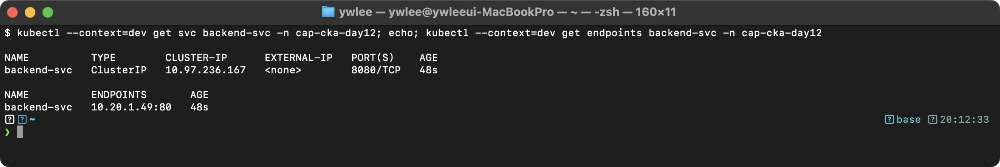
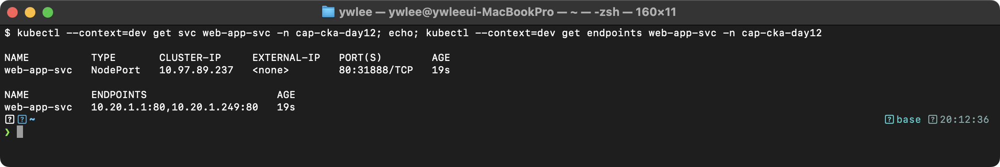
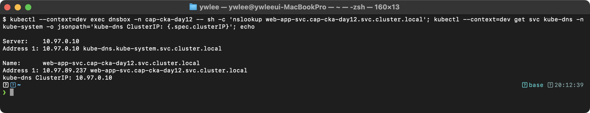
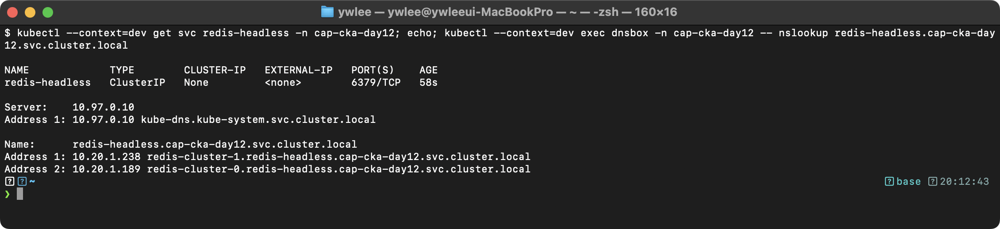
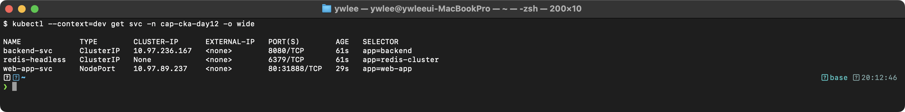
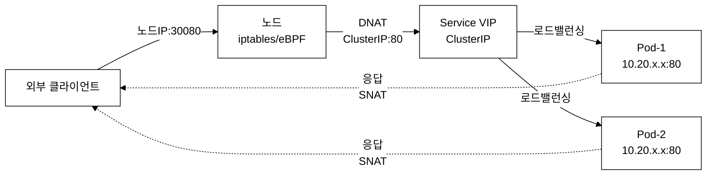
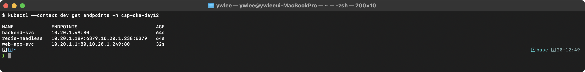
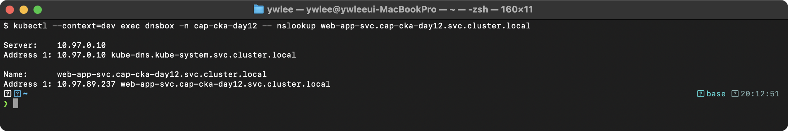
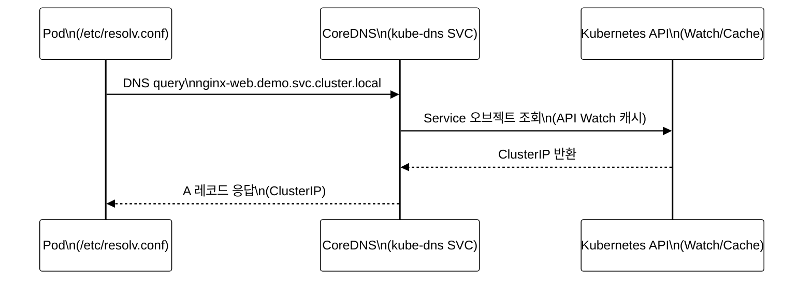

# CKA Day 12: Service 시험 패턴 & 연습 문제

> CKA 도메인: Services & Networking (20%) - Part 1 실전 | 예상 소요 시간: 2시간

---

## 오늘의 학습 목표

이 day를 마치면 다음을 할 수 있어야 한다.

- [ ] ClusterIP·NodePort·Headless·ExternalName 4가지 Service를 명령형(`kubectl expose`·YAML)으로 생성한다
- [ ] `externalTrafficPolicy: Cluster`와 `Local`의 차이(소스 IP 보존 여부·drop 조건)를 설명하고 설정한다
- [ ] `kubectl get endpoints`로 Endpoints 비어있는 원인(selector 불일치·targetPort 불일치)을 진단·수정한다
- [ ] `busybox:1.28`로 임시 Pod를 띄워 Service FQDN을 nslookup으로 조회하고 결과를 파일에 저장한다
- [ ] CoreDNS Pod·Service·ConfigMap 이름 혼용 이유를 설명하고 `kube-system` 네임스페이스에서 상태를 확인한다
- [ ] 멀티 포트 Service에서 `name` 필드가 필수인 이유를 설명한다
- [ ] 12개 연습 문제를 각 5분 이내에 완료한다

---

## 학습 흐름 (이 day의 위치)

이 day는 day 11(Service 개념)을 그대로 전제한다. day 11 에서 Service 의 4가지 타입, Endpoints, DNS 해석의 개념을 다뤘고, 이 day 는 그 개념을 실전 CKA 문제로 손에 익히는 연습이다. day 11 을 건너뛴 경우 아래 요약으로 최소 전제를 메우고 진행한다.

### 선수 개념 요약 (day 11 복습)

**Service가 필요한 이유:** Pod는 재시작·재스케줄링 때마다 IP가 바뀌므로 클라이언트가 Pod IP를 직접 추적하는 것은 불가능하다. Service는 안정적인 가상 IP(VIP)와 DNS 이름을 제공해 클라이언트가 Pod의 실제 IP와 무관하게 항상 같은 주소로 접근하게 한다.

**Service 4가지 타입**

- **ClusterIP**: 클러스터 내부 전용. Service 마다 하나의 가상 IP(VIP, Virtual IP — 실제 네트워크 인터페이스에 바인딩되지 않고 kube-proxy/Cilium 의 규칙으로만 존재하는 주소)를 받는다. 기본 타입이다.
- **NodePort**: 모든 노드의 고정 포트(30000–32767)를 열어 클러스터 외부에서 `노드IP:노드포트` 로 접근하게 한다. 내부적으로 NodePort → ClusterIP → Pod 순으로 라우팅된다.
- **LoadBalancer**: 클라우드/외부 로드밸런서를 Service 앞에 붙인다(이 저장소의 tart 클러스터에는 외부 LB 가 없어 실습 대상은 아니다).
- **ExternalName**: selector·포트 없이 외부 도메인을 CNAME(Canonical Name — 도메인 별칭 DNS 레코드)으로 매핑한다.

**Endpoints 오브젝트**: Service 를 만들면 Endpoints Controller 가 Service 의 `selector` 와 라벨이 일치하면서 Ready 상태인 Pod 들을 찾아 그 `IP:Port` 목록을 별도 Endpoints 오브젝트에 기록한다. kube-proxy(또는 Cilium)는 이 목록을 읽어 트래픽을 각 Pod 로 분배한다. 즉 `selector`(Service 가 고르는 라벨 조건)와 Pod 의 `label`(Pod 에 붙은 키=값) 이 어긋나면 Endpoints 가 비어 트래픽이 어디로도 가지 못한다.

**port vs targetPort**: `port` 는 Service 가 클라이언트에게 노출하는 포트, `targetPort` 는 그 트래픽이 실제로 도착할 Pod 컨테이너의 리스닝 포트다. 둘은 달라도 된다(예: Service 8080 → Pod 80).

이 day 의 트러블슈팅 문제(4·11번)는 결국 이 세 가지 어긋남을 진단하는 훈련이다: Endpoints 비어 있음 → selector 불일치, 접근 불가 → targetPort 불일치, DNS 조회 실패 → CoreDNS 문제.

> **이 day의 구성 안내:** 이 day는 개념 절(1~7)을 day 11에 위임하고, Service 실전 패턴과 연습 문제(섹션 8~9) 중심으로 편성된 연습 전용 day다. 개념이 필요하면 위 "선수 개념 요약"을 참고한다.

---

## 8. 시험에서 이 주제가 어떻게 출제되는가?

### 출제 패턴 분석

```
CKA 시험의 Service & DNS 관련 출제 비중:
Services & Networking 도메인 = 전체의 20%

주요 출제 유형:
1. Service 생성 (ClusterIP, NodePort) — 가장 빈출!
2. DNS 조회 (nslookup) — 자주 출제
3. Service Endpoints 문제 해결 — 트러블슈팅과 연계
4. 멀티 포트 Service — 가끔 출제
5. Headless Service — StatefulSet과 연계
6. CoreDNS 확인/수정 — 가끔 출제
7. externalTrafficPolicy — 드물지만 출제 가능

시험에서의 핵심:
- kubectl expose 명령 숙달이 시간 절약의 핵심
- Service YAML에서 selector, port, targetPort 정확히 구분
- Endpoints가 비어있는 문제 → selector-label 불일치가 99%
- DNS 테스트는 항상 busybox:1.28 이미지 사용
```

---

## 9. 시험 대비 연습 문제 (12문제)

### 문제 1. ClusterIP Service 생성 [4%]

**컨텍스트:** `kubectl config use-context dev`

네임스페이스 `demo`에서 다음 Service를 생성하라:
- 이름: `backend-svc`
- 타입: ClusterIP
- 포트: 8080 → targetPort: 80
- 셀렉터: `app=backend`

<details>
<summary>풀이</summary>

```bash
kubectl config use-context dev

# 방법 1: 빠른 생성 (추천)
# 먼저 Pod/Deployment가 있다면:
kubectl expose deployment backend --port=8080 --target-port=80 \
  --name=backend-svc -n demo

# 방법 2: YAML로 생성 (정확한 제어)
cat <<EOF | kubectl apply -f -
apiVersion: v1
kind: Service
metadata:
  name: backend-svc
  namespace: demo
spec:
  type: ClusterIP            # 생략 가능 (기본값)
  selector:
    app: backend
  ports:
  - port: 8080               # Service 포트
    targetPort: 80            # Pod 컨테이너 포트
    protocol: TCP
EOF

# 검증
kubectl get svc backend-svc -n demo
kubectl describe svc backend-svc -n demo
kubectl get endpoints backend-svc -n demo
```

**검증 기대 출력:**



```bash
# 정리
kubectl delete svc backend-svc -n demo
```

**핵심 포인트:**
- `port`는 Service가 노출하는 포트 (클라이언트가 접속하는 포트)
- `targetPort`는 Pod 컨테이너가 실제로 리스닝하는 포트
- `selector`의 레이블이 Pod의 레이블과 정확히 일치해야 한다

</details>

---

### 문제 2. NodePort Service 생성 및 외부 접근 [4%]

**컨텍스트:** `kubectl config use-context prod`

**전제:** 컨텍스트를 `prod` 로 바꾼 뒤 `default` 네임스페이스에서 작업한다(이 문제는 ns 를 명시하지 않으므로 모든 리소스가 `default` 로 생성된다). Deployment 는 이 문제에서 직접 만든다. 시험에서 특정 ns 가 지정되면 모든 명령에 `-n <ns>` 를 붙여야 한다.

1. Deployment `web-app`을 이미지 `nginx:1.24`, 레플리카 2로 생성하라
2. NodePort Service `web-app-svc`를 생성하라 (포트 80, NodePort 31080)

<details>
<summary>풀이</summary>

```bash
kubectl config use-context prod

# 1. Deployment 생성
kubectl create deployment web-app --image=nginx:1.24 --replicas=2

# 2. NodePort Service 생성
# nodePort를 특정 값으로 지정하려면 YAML 사용
cat <<EOF | kubectl apply -f -
apiVersion: v1
kind: Service
metadata:
  name: web-app-svc
spec:
  type: NodePort
  selector:
    app: web-app             # Deployment가 생성한 Pod의 레이블
  ports:
  - port: 80                 # Service 포트
    targetPort: 80            # Pod 포트
    nodePort: 31080           # 외부 접근 포트 (30000-32767)
EOF

# 검증
kubectl get svc web-app-svc
kubectl get endpoints web-app-svc
kubectl get pods -l app=web-app -o wide
```

**검증 기대 출력:**



```bash
# 접근 테스트 (노드 IP로)
# curl http://<node-ip>:31080

# 정리
kubectl delete deployment web-app
kubectl delete svc web-app-svc
```

**핵심 포인트:**
- `kubectl create deployment`으로 생성한 Pod는 `app=<deployment-name>` 레이블을 가진다
- nodePort를 특정 값으로 지정하려면 YAML을 사용해야 한다
- `kubectl expose` 명령으로는 nodePort를 지정할 수 없다

**트러블슈팅:** NodePort Service를 생성했는데 외부에서 접근이 안 되는 경우:
1. 방화벽에서 30000-32767 포트 범위가 열려 있는지 확인한다
2. `kubectl get endpoints`로 Endpoints가 비어 있지 않은지 확인한다
3. Pod가 Ready 상태인지 확인한다 (`kubectl get pods -l app=web-app`)

**externalTrafficPolicy — Cluster vs Local:**

NodePort(및 LoadBalancer) Service에는 `externalTrafficPolicy` 필드가 있다. 기본값은 `Cluster`이며, `Local`로 바꾸면 동작이 크게 달라진다.

| 값 | 동작 | 소스 IP | 단점 |
|:--|:--|:--|:--|
| `Cluster`(기본) | 트래픽을 수신한 노드와 무관하게 클러스터 전체의 Pod에 균등 분배한다. 요청을 받은 노드에 해당 Pod가 없으면 다른 노드로 SNAT(출발지 IP를 노드 IP로 바꾸는 변환)해 전달한다. | 클라이언트 원본 IP가 Pod에서 **보이지 않는다** (SNAT로 가려짐). | IP 기반 감사·속도제한이 어렵다. |
| `Local` | 트래픽을 수신한 **해당 노드에 있는 Pod에만** 전달한다. 해당 노드에 Pod가 없으면 연결을 **drop**한다. SNAT를 하지 않으므로 원본 IP가 그대로 Pod에 전달된다. | 클라이언트 원본 IP가 Pod에서 **보인다**. | 노드 간 부하가 불균등해질 수 있다(Pod가 없는 노드는 아예 실패). |

**언제 `Local`을 쓰나:** 클라이언트 IP를 기반으로 속도 제한(rate-limit), 접근 제어, 감사 로그를 남겨야 할 때 사용한다. 예를 들어 웹 방화벽(WAF) 또는 nginx의 `$remote_addr` 기반 제한을 올바르게 동작시키려면 `Local`이 필요하다.

```bash
# externalTrafficPolicy 확인
kubectl get svc web-app-svc -o jsonpath='{.spec.externalTrafficPolicy}'

# Local로 변경
kubectl patch svc web-app-svc \
  -p '{"spec":{"externalTrafficPolicy":"Local"}}'
```

</details>

---

### 문제 3. DNS 조회 테스트 [4%]

**컨텍스트:** `kubectl config use-context dev`

**전제:** `demo` 네임스페이스에 `nginx-web` 라는 Service 가 이미 있다고 가정한다(없으면 `kubectl create deployment nginx-web --image=nginx -n demo` 후 `kubectl expose deployment nginx-web --port=80 -n demo` 로 먼저 만든다). CoreDNS(클러스터 내부 DNS 서버)가 정상 동작 중이어야 한다.

다음 작업을 수행하고 결과를 저장하라:
1. `demo` 네임스페이스의 `nginx-web` Service의 FQDN을 nslookup으로 조회하라
2. 결과를 `/tmp/dns-output.txt`에 저장하라
3. `kube-system` 네임스페이스의 `kube-dns` Service IP를 `/tmp/dns-output.txt`에 추가하라

<details>
<summary>풀이</summary>

```bash
kubectl config use-context dev

# 1+2. nslookup 결과 저장
kubectl run dns-lookup --image=busybox:1.28 -n demo --rm -it --restart=Never -- \
  nslookup nginx-web.demo.svc.cluster.local > /tmp/dns-output.txt

# 3. kube-dns Service IP 추가
echo "---" >> /tmp/dns-output.txt
kubectl get svc kube-dns -n kube-system \
  -o jsonpath='kube-dns ClusterIP: {.spec.clusterIP}{"\n"}' >> /tmp/dns-output.txt

# 결과 확인
cat /tmp/dns-output.txt
```

**검증 기대 출력:**



**내부 동작 원리:** DNS 조회가 실행되면 Pod의 `/etc/resolv.conf`에 설정된 nameserver(kube-dns Service의 ClusterIP)로 쿼리가 전달된다. CoreDNS는 Kubernetes API를 Watch(API 서버의 변경을 실시간 구독)하여 Service 객체의 ClusterIP를 A 레코드(도메인 → IPv4 매핑 DNS 레코드)로 반환한다. `busybox:1.28`을 쓰는 이유는 단순하다. CKA 시험 환경이 이 버전 기준이며, 최신 busybox(1.35+)의 `nslookup` 은 search 도메인을 붙여 재시도하는 동작이 달라 시험과 결과가 어긋날 수 있어서다. 시험·실습 모두 1.28 로 통일한다.

**리다이렉트 위치 주의:** 위 1+2 명령의 `> /tmp/dns-output.txt` 는 `kubectl run ...` 전체의 표준출력을 **호스트(내 노트북)의** `/tmp/dns-output.txt` 로 보내는 것이지 Pod 내부에 쓰는 것이 아니다. `--rm` 으로 사라질 임시 Pod 의 출력을 호스트로 받아내려는 의도이므로 이 경우엔 정확하다. 만약 결과를 **Pod 내부 파일**에 써야 한다면 리다이렉트를 셸로 감싸야 한다: `... -- sh -c "nslookup nginx-web.demo.svc.cluster.local > /tmp/result.txt"`.

**핵심 포인트:**
- DNS 테스트에는 항상 `busybox:1.28` 이미지를 사용한다 (최신 버전은 nslookup 동작이 다르다)
- `--rm`은 Pod 자동 삭제, `--restart=Never`는 Job이 아닌 일반 Pod으로 생성한다
- FQDN 형식: `<service>.<namespace>.svc.cluster.local`

</details>

---

### 문제 4. Service Endpoints 문제 해결 [7%]

**컨텍스트:** `kubectl config use-context dev`

`demo` 네임스페이스에 `broken-svc` Service가 있다. 이 Service의 Endpoints가 비어있다. 원인을 찾고 수정하라.

**전제:** 실제 CKA 시험에서는 이런 고장난 리소스가 채점 환경에 미리 배포되어 있다. 혼자 연습할 때는 그 상황이 없으므로 아래 풀이의 첫 블록(`# 문제 시뮬레이션`)으로 고장 상태를 직접 재현한 뒤 진단·수정을 연습한다. 즉 시뮬레이션 블록은 "출제자가 깔아둔 환경"을 흉내 내는 부분이고, `=== 진단 시작 ===` 이후가 실제로 풀어야 할 작업이다.

<details>
<summary>풀이</summary>

```bash
kubectl config use-context dev

# 문제 시뮬레이션 (출제 환경 재현 — 시험에서는 이미 깔려 있는 부분)
kubectl run test-app --image=nginx --labels="app=test-app" -n demo
cat <<EOF | kubectl apply -f -
apiVersion: v1
kind: Service
metadata:
  name: broken-svc
  namespace: demo
spec:
  selector:
    app: wrong-label          # Pod 레이블과 불일치!
  ports:
  - port: 80
    targetPort: 80
EOF

# === 진단 시작 ===

# 1. Endpoints 확인 (첫 번째로 확인할 것!)
kubectl get endpoints broken-svc -n demo
# ENDPOINTS: <none> → 연결된 Pod가 없다

# 2. Service의 selector 확인
kubectl get svc broken-svc -n demo -o jsonpath='{.spec.selector}'
# {"app":"wrong-label"}

# 3. 해당 selector로 Pod 검색
kubectl get pods -n demo -l app=wrong-label
# No resources found → 이 레이블을 가진 Pod가 없다!

# 4. 네임스페이스의 모든 Pod 레이블 확인
kubectl get pods -n demo --show-labels | grep test-app
# test-app ... app=test-app

# 5. selector 수정
kubectl patch svc broken-svc -n demo \
  -p '{"spec":{"selector":{"app":"test-app"}}}'

# 6. 검증
kubectl get endpoints broken-svc -n demo
# Endpoints에 Pod IP가 표시됨

# 접근 테스트
kubectl run curl-test --image=curlimages/curl -n demo --rm -it --restart=Never -- \
  curl -s http://broken-svc.demo.svc.cluster.local

# 정리
kubectl delete svc broken-svc -n demo
kubectl delete pod test-app -n demo
```

**진단 체크리스트:**
1. `kubectl get endpoints` → 비어있으면 selector 문제
2. Service의 selector와 Pod의 labels 비교
3. targetPort가 Pod의 containerPort와 일치하는지 확인
4. Pod가 Running 상태이고 readinessProbe를 통과했는지 확인

</details>

---

### 문제 5. 멀티 포트 Service 생성 [4%]

**컨텍스트:** `kubectl config use-context dev`

`demo` 네임스페이스의 `rabbitmq` Pod를 위한 Service를 생성하라:
- 이름: `rabbitmq-svc`
- AMQP 포트: 5672 (targetPort: 5672)
- Management 포트: 15672 (targetPort: 15672)
- 셀렉터: `app=rabbitmq`

<details>
<summary>풀이</summary>

```bash
kubectl config use-context dev

cat <<EOF | kubectl apply -f -
apiVersion: v1
kind: Service
metadata:
  name: rabbitmq-svc
  namespace: demo
spec:
  selector:
    app: rabbitmq
  ports:
  - name: amqp               # 멀티 포트일 때 name 필수!
    port: 5672
    targetPort: 5672
    protocol: TCP
  - name: management          # 각 포트에 고유한 이름
    port: 15672
    targetPort: 15672
    protocol: TCP
EOF

# 검증
kubectl get svc rabbitmq-svc -n demo
kubectl describe svc rabbitmq-svc -n demo

# 정리
kubectl delete svc rabbitmq-svc -n demo
```

**멀티 포트는 왜 `name`이 필수인가:** 단일 포트 Service 는 포트가 하나뿐이라 "이 트래픽이 어느 포트인지"가 자명하다. 하지만 포트가 둘 이상이면 Service 내부적으로 각 포트를 서로 구분할 식별자가 필요하다. Endpoints·헬스체크·다른 리소스(Ingress 등)가 "5672 쪽"인지 "15672 쪽"인지를 포트 번호가 아니라 이름으로 참조하기 때문이다. 그래서 API 서버는 멀티 포트일 때 각 항목에 고유한 `name` 을 강제한다. AMQP(메시지 큐 프로토콜) 5672 와 관리 UI 15672 처럼 용도가 다른 포트를 한 Service 에 묶을 때 이름으로 의도가 드러나는 부수 효과도 있다.

**핵심 포인트:**
- **멀티 포트 Service에서는 각 포트에 `name` 필드가 필수이다!**
- name이 없으면 `spec.ports: Invalid value: ... must specify a port name` 에러 발생
- 단일 포트 Service에서는 name 생략 가능

</details>

---

### 문제 6. Headless Service 생성 [7%]

**컨텍스트:** `kubectl config use-context dev`

StatefulSet `redis-cluster`를 위한 Headless Service를 생성하고, 각 Pod의 DNS 이름을 확인하라:
- Service 이름: `redis-headless`
- 네임스페이스: `demo`
- 포트: 6379
- selector: `app=redis-cluster`

<details>
<summary>풀이</summary>

```bash
kubectl config use-context dev

# Headless Service 생성
cat <<EOF | kubectl apply -f -
apiVersion: v1
kind: Service
metadata:
  name: redis-headless
  namespace: demo
spec:
  clusterIP: None             # Headless Service의 핵심!
  selector:
    app: redis-cluster
  ports:
  - name: redis
    port: 6379
    targetPort: 6379
EOF

# Service 확인
kubectl get svc redis-headless -n demo
# CLUSTER-IP이 None으로 표시됨

# --- Headless DNS 동작 재현을 위한 최소 StatefulSet ---
# StatefulSet redis-cluster가 없으면 nslookup이 빈 결과를 반환한다.
# 아래 블록으로 최소 StatefulSet(replicas 2)을 만들어 개별 Pod DNS를 검증한다.
cat <<EOF | kubectl apply -f -
apiVersion: apps/v1
kind: StatefulSet
metadata:
  name: redis-cluster
  namespace: demo
spec:
  serviceName: redis-headless  # Headless Service 이름과 반드시 일치. Pod DNS(<pod>.<serviceName>.<ns>.svc.cluster.local) 등록에 사용된다
  replicas: 2
  selector:
    matchLabels:
      app: redis-cluster
  template:
    metadata:
      labels:
        app: redis-cluster
    spec:
      containers:
      - name: redis
        image: redis:7-alpine
        ports:
        - containerPort: 6379
EOF

# Pod가 Running 상태가 될 때까지 대기
kubectl wait --for=condition=Ready pod -l app=redis-cluster -n demo --timeout=60s

# DNS 테스트 (Headless Service는 모든 Pod IP를 반환)
kubectl run dns-test --image=busybox:1.28 -n demo --rm -it --restart=Never -- \
  nslookup redis-headless.demo.svc.cluster.local

# StatefulSet Pod별 DNS 테스트 (각 Pod에 고유 DNS가 생성된다)
kubectl run dns-test2 --image=busybox:1.28 -n demo --rm -it --restart=Never -- \
  nslookup redis-cluster-0.redis-headless.demo.svc.cluster.local

kubectl run dns-test3 --image=busybox:1.28 -n demo --rm -it --restart=Never -- \
  nslookup redis-cluster-1.redis-headless.demo.svc.cluster.local

# 정리
kubectl delete statefulset redis-cluster -n demo
kubectl delete svc redis-headless -n demo
```

**검증 기대 출력:**



**등장 배경:** 일반 ClusterIP Service는 가상 IP 하나만 반환하므로 클라이언트가 개별 Pod를 구분할 수 없다. 데이터베이스 클러스터(PostgreSQL primary/replica)나 메시지 큐(Kafka broker)처럼 각 인스턴스를 직접 지정해야 하는 경우에는 Pod 개별 DNS가 필요하다. Headless Service는 이 문제를 해결하기 위해 VIP 없이 Pod IP를 직접 A 레코드로 반환하는 메커니즘을 제공한다.

**핵심 포인트:**
- `clusterIP: None`이 Headless Service의 핵심 설정이다
- 일반 Service: DNS 조회 시 ClusterIP(1개)를 반환한다
- Headless Service: DNS 조회 시 모든 Pod IP를 반환한다
- StatefulSet과 함께 사용하면 `<pod-name>.<service-name>` 형태의 DNS를 제공한다

</details>

---

### 문제 7. ExternalName Service 생성 및 DNS 확인 [4%]

**컨텍스트:** `kubectl config use-context dev`

외부 데이터베이스 `database.example.com`을 가리키는 ExternalName Service를 생성하라:
- 이름: `external-db`
- 네임스페이스: `demo`

<details>
<summary>풀이</summary>

```bash
kubectl config use-context dev

# ExternalName Service 생성
cat <<EOF | kubectl apply -f -
apiVersion: v1
kind: Service
metadata:
  name: external-db
  namespace: demo
spec:
  type: ExternalName
  externalName: database.example.com
EOF

# 검증
kubectl get svc external-db -n demo
# TYPE이 ExternalName으로 표시

# DNS 확인 (CNAME 반환)
kubectl run dns-test --image=busybox:1.28 -n demo --rm -it --restart=Never -- \
  nslookup external-db.demo.svc.cluster.local
# database.example.com의 CNAME이 반환됨

# 정리
kubectl delete svc external-db -n demo
```

**ExternalName은 어디에 쓰나:** 클러스터 안의 앱이 외부 서비스(매니지드 DB, 외부 API 도메인 등)를 호출할 때, 코드에 `database.example.com` 같은 실제 외부 주소를 박아두면 환경(dev/staging/prod)마다 주소가 바뀔 때 코드를 고쳐야 한다. ExternalName Service 를 두면 앱은 늘 `external-db` 라는 클러스터 내부 이름으로만 접근하고, 실제로 어느 외부 도메인을 가리킬지는 Service 정의 한 곳에서 바꾼다. 즉 외부 주소를 클러스터 안의 안정적인 별칭 뒤로 숨기는 간접 계층이다. ClusterIP 와 달리 자체 IP·프록시가 없고 순수하게 DNS 단계에서 CNAME 으로 바꿔치기만 하므로, 프로토콜·포트 라우팅은 관여하지 않는다.

**핵심 포인트:**
- ExternalName은 CNAME DNS 레코드를 생성한다
- selector와 ports가 필요 없다
- 클러스터 내부에서 외부 서비스를 이름으로 접근할 때 사용

</details>

---

### 문제 8. CoreDNS 상태 확인 및 진단 [7%]

**컨텍스트:** `kubectl config use-context dev`

CoreDNS의 상태를 점검하고 다음 정보를 `/tmp/coredns-info.txt`에 저장하라:
1. CoreDNS Pod 수와 상태
2. CoreDNS Service(kube-dns)의 ClusterIP
3. CoreDNS ConfigMap의 forward 설정

<details>
<summary>풀이</summary>

```bash
kubectl config use-context dev

# 1. CoreDNS Pod 상태
echo "=== CoreDNS Pods ===" > /tmp/coredns-info.txt
kubectl -n kube-system get pods -l k8s-app=kube-dns -o wide >> /tmp/coredns-info.txt
echo "" >> /tmp/coredns-info.txt

# 2. kube-dns Service ClusterIP
echo "=== kube-dns Service ===" >> /tmp/coredns-info.txt
kubectl -n kube-system get svc kube-dns >> /tmp/coredns-info.txt
echo "" >> /tmp/coredns-info.txt

# 3. CoreDNS ConfigMap의 forward 설정
echo "=== CoreDNS forward config ===" >> /tmp/coredns-info.txt
kubectl -n kube-system get configmap coredns -o jsonpath='{.data.Corefile}' | \
  grep -A2 "forward" >> /tmp/coredns-info.txt

# 결과 확인
cat /tmp/coredns-info.txt

# 추가 진단 명령어
# CoreDNS 로그 확인
kubectl -n kube-system logs -l k8s-app=kube-dns --tail=20

# DNS 해석 테스트
kubectl run dns-test --image=busybox:1.28 -n demo --rm -it --restart=Never -- \
  nslookup kubernetes.default.svc.cluster.local
```

**CoreDNS 등장 배경 — 이름이 두 가지인 이유:**

Kubernetes 초기(1.3 이전)에는 `kube-dns`라는 이름의 DNS 서버가 사용됐다. 이 서버는 SkyDNS를 기반으로 했으며, 플러그인 없이 고정된 기능만 제공했다. 로드밸런싱·캐싱·Prometheus 메트릭·외부 forwarding 등을 추가하려면 소스 코드를 수정해야 했다. CoreDNS는 플러그인 체인 아키텍처로 이 한계를 해결했다. Corefile 한 줄로 기능을 켜고 끌 수 있어 운영자가 코드 없이 동작을 조합할 수 있다. Kubernetes 1.13부터 기본 DNS 서버가 CoreDNS로 교체됐다. 단, Service 이름 `kube-dns`는 기존 설정·문서와의 하위 호환성을 위해 그대로 유지됐다. 그 결과 Pod 이름은 `coredns-*`, Service 이름은 `kube-dns`, ConfigMap 이름은 `coredns`로 혼용되는 상황이 됐다. 트레이드오프: CoreDNS는 Go로 작성된 단일 바이너리라 메모리 사용이 kube-dns(etcd 포함 3-컨테이너 구조)보다 낮지만, Corefile 문법을 별도로 익혀야 한다.

**핵심 포인트:**
- CoreDNS Pod는 `k8s-app=kube-dns` 레이블을 가진다
- CoreDNS Service 이름은 `kube-dns`이다 (Pod는 coredns, Service는 kube-dns)
- ConfigMap 이름은 `coredns`이다

</details>

---

### 문제 9. Service 타입 변경 [4%]

**컨텍스트:** `kubectl config use-context dev`

`demo` 네임스페이스의 기존 ClusterIP Service `web-svc`를 NodePort 타입으로 변경하고, nodePort를 30200으로 설정하라.

<details>
<summary>풀이</summary>

```bash
kubectl config use-context dev

# 시뮬레이션: ClusterIP Service 생성
kubectl run web --image=nginx -n demo
kubectl expose pod web --port=80 --name=web-svc -n demo

# 현재 타입 확인
kubectl get svc web-svc -n demo
# TYPE: ClusterIP

# 타입 변경 방법 1: kubectl patch
kubectl patch svc web-svc -n demo \
  -p '{"spec":{"type":"NodePort","ports":[{"port":80,"targetPort":80,"nodePort":30200}]}}'

# 타입 변경 방법 2: kubectl edit
kubectl edit svc web-svc -n demo
# spec.type을 NodePort로, ports[0].nodePort를 30200으로 변경

# 검증
kubectl get svc web-svc -n demo
# TYPE: NodePort, PORT(S): 80:30200/TCP

# 정리
kubectl delete svc web-svc -n demo
kubectl delete pod web -n demo
```

**등장 배경 — 왜 타입을 변경하는가:** 앱을 처음 배포할 때는 내부 마이크로서비스 통신만 필요해 ClusterIP로 충분하다. 이후 외부 사용자에게 직접 노출이 필요해지면(예: 임시 데모, 로드밸런서가 없는 온프레미스 환경) ClusterIP를 NodePort로 변경한다. 기존 Service를 지우고 새로 만들면 ClusterIP가 바뀌어 내부 서비스 연결이 끊기므로, 기존 Service를 유지한 채 타입만 바꾸는 `kubectl patch`가 실전에서 선호된다.

**핵심 포인트:**
- `kubectl patch`로 Service 타입 변경 가능
- ClusterIP → NodePort → LoadBalancer 순서로 변경 가능
- NodePort → ClusterIP로 변경 시 nodePort 필드를 제거해야 한다

</details>

---

### 문제 10. kubectl expose 빠른 사용법 [4%]

**컨텍스트:** `kubectl config use-context prod`

다음 3개의 Service를 가능한 빠르게 생성하라:
1. Pod `api-server`를 ClusterIP Service로 노출 (포트 8080, 이름: `api-svc`)
2. Deployment `web-app`을 NodePort Service로 노출 (포트 80, 이름: `web-svc`)
3. Pod `redis`를 ClusterIP Service로 노출 (포트 6379, 이름: `redis-svc`)

<details>
<summary>풀이</summary>

```bash
kubectl config use-context prod

# 시뮬레이션: 리소스 생성
kubectl run api-server --image=nginx --port=8080
kubectl create deployment web-app --image=nginx --replicas=2
kubectl run redis --image=redis --port=6379

# 1. api-server Pod를 ClusterIP로 노출
kubectl expose pod api-server --port=8080 --name=api-svc

# 2. web-app Deployment를 NodePort로 노출
kubectl expose deployment web-app --port=80 --target-port=80 \
  --type=NodePort --name=web-svc

# 3. redis Pod를 ClusterIP로 노출
kubectl expose pod redis --port=6379 --name=redis-svc

# 검증
kubectl get svc api-svc web-svc redis-svc

# 정리
kubectl delete svc api-svc web-svc redis-svc
kubectl delete pod api-server redis
kubectl delete deployment web-app
```

**`kubectl expose` vs YAML — 속도 트레이드오프:** `kubectl expose`는 기존 리소스(Pod·Deployment·ReplicaSet)를 참조해 selector와 포트를 자동으로 채워주므로, YAML을 처음부터 작성하는 것보다 30~60초 빠르다. 반면 nodePort 값 지정, 멀티 포트, externalTrafficPolicy 등 세부 설정은 YAML 없이 표현할 수 없다. CKA 시험에서 단순 노출은 `kubectl expose`, 포트·정책을 정확히 지정해야 할 때는 `--dry-run=client -o yaml`로 뼈대를 뽑아 수정하는 패턴을 쓴다.

**주의 — `kubectl run --port`는 containerPort 힌트만 준다:** `kubectl run api-server --image=nginx --port=8080`에서 `--port=8080`은 Pod spec의 `containerPort: 8080`을 기록하는 것이지, nginx가 실제로 8080 포트를 리스닝하게 만들지 않는다. nginx 기본 이미지는 80번 포트를 리스닝하므로, expose 시 `--port`를 이미지 실제 포트(80)와 일치시켜야 접근이 된다. 포트가 어긋나면 Service는 만들어지지만 HTTP 연결이 거부된다.

**시험 팁:**
- `kubectl expose`는 YAML 없이 가장 빠르게 Service를 생성하는 방법
- Pod의 `--port` 옵션은 containerPort 힌트만 기록하며 실제 앱 포트를 바꾸지 않는다. 이미지 기본 포트(nginx=80)와 일치해야 한다
- target-port를 생략하면 port와 같은 값으로 설정됨

</details>

---

### 문제 11. Service와 Pod 연결 진단 [7%]

**컨텍스트:** `kubectl config use-context dev`

`demo` 네임스페이스에서 `app-service`로 접근이 되지 않는다. 다음 사항을 모두 확인하고 문제를 수정하라:
1. Service의 selector와 Pod의 label이 일치하는지
2. Service의 targetPort와 Pod의 containerPort가 일치하는지
3. Pod가 Ready 상태인지

<details>
<summary>풀이</summary>

```bash
kubectl config use-context dev

# 장애 시뮬레이션
kubectl run app-pod --image=nginx --labels="app=myapp" --port=80 -n demo
cat <<EOF | kubectl apply -f -
apiVersion: v1
kind: Service
metadata:
  name: app-service
  namespace: demo
spec:
  selector:
    app: wrong-app            # 문제 1: selector 불일치
  ports:
  - port: 80
    targetPort: 8080          # 문제 2: targetPort 불일치 (Pod는 80)
EOF

# === 체계적 진단 ===

# Step 1: Service 정보 확인
kubectl get svc app-service -n demo -o wide
# SELECTOR 컬럼에서 app=wrong-app 확인

# Step 2: Endpoints 확인 (가장 중요!)
kubectl get endpoints app-service -n demo
# ENDPOINTS: <none> → Pod와 연결 안 됨

# Step 3: Service selector 확인
kubectl get svc app-service -n demo -o jsonpath='{.spec.selector}'
# {"app":"wrong-app"}

# Step 4: Pod 레이블 확인
kubectl get pods -n demo --show-labels | grep app-pod
# app=myapp → 불일치!

# Step 5: Pod의 containerPort 확인
kubectl get pod app-pod -n demo -o jsonpath='{.spec.containers[0].ports[0].containerPort}'
# 80

# Step 6: 수정 — selector와 targetPort 모두 수정
kubectl patch svc app-service -n demo \
  -p '{"spec":{"selector":{"app":"myapp"},"ports":[{"port":80,"targetPort":80}]}}'

# Step 7: 검증
kubectl get endpoints app-service -n demo
# Pod IP가 표시됨

kubectl run curl-test --image=curlimages/curl -n demo --rm -it --restart=Never -- \
  curl -s http://app-service.demo.svc.cluster.local
# nginx 응답 확인

# 정리
kubectl delete svc app-service -n demo
kubectl delete pod app-pod -n demo
```

**Service 연결 진단 순서:**
```
1. kubectl get endpoints → 비어있으면 selector 문제
2. Service selector vs Pod labels 비교
3. Service targetPort vs Pod containerPort 비교
4. Pod Status = Running & Ready 확인
5. NetworkPolicy가 트래픽을 차단하는지 확인
```

</details>

---

### 문제 12. 서비스 디스커버리 종합 [7%]

**컨텍스트:** `kubectl config use-context dev`

다음 작업을 수행하라:
1. `demo` 네임스페이스에 Deployment `web-discovery`를 생성하라 (nginx:1.24, 레플리카 2)
2. ClusterIP Service `web-discovery-svc`를 생성하라 (포트 80)
3. 테스트 Pod에서 다음 3가지 방법으로 Service에 접근하고 결과를 `/tmp/discovery-test.txt`에 저장하라:
   - 서비스 이름만으로 접근: `web-discovery-svc`
   - 네임스페이스 포함: `web-discovery-svc.demo`
   - FQDN: `web-discovery-svc.demo.svc.cluster.local`

<details>
<summary>풀이</summary>

```bash
kubectl config use-context dev

# 1. Deployment 생성
kubectl create deployment web-discovery --image=nginx:1.24 --replicas=2 -n demo

# 2. Service 생성
kubectl expose deployment web-discovery --port=80 --name=web-discovery-svc -n demo

# 3. 접근 테스트
kubectl run discovery-test --image=curlimages/curl -n demo --rm -it --restart=Never -- \
  sh -c '
echo "=== Short name ===" > /tmp/result.txt
curl -s -o /dev/null -w "%{http_code}" http://web-discovery-svc >> /tmp/result.txt
echo "" >> /tmp/result.txt

echo "=== With namespace ===" >> /tmp/result.txt
curl -s -o /dev/null -w "%{http_code}" http://web-discovery-svc.demo >> /tmp/result.txt
echo "" >> /tmp/result.txt

echo "=== FQDN ===" >> /tmp/result.txt
curl -s -o /dev/null -w "%{http_code}" http://web-discovery-svc.demo.svc.cluster.local >> /tmp/result.txt
echo "" >> /tmp/result.txt

cat /tmp/result.txt
'

# 또는 호스트에서 결과 저장
kubectl run discovery-test --image=busybox:1.28 -n demo --rm -it --restart=Never -- sh -c '
echo "=== nslookup short name ==="
nslookup web-discovery-svc
echo ""
echo "=== nslookup with namespace ==="
nslookup web-discovery-svc.demo
echo ""
echo "=== nslookup FQDN ==="
nslookup web-discovery-svc.demo.svc.cluster.local
' > /tmp/discovery-test.txt

cat /tmp/discovery-test.txt

# 정리
kubectl delete deployment web-discovery -n demo
kubectl delete svc web-discovery-svc -n demo
```

**핵심 포인트:**
- 같은 네임스페이스 내에서는 서비스 이름만으로 접근 가능 (`web-discovery-svc`)
- 다른 네임스페이스의 서비스는 최소한 `<svc>.<namespace>`로 접근해야 함
- FQDN은 항상 `<svc>.<ns>.svc.cluster.local`

</details>

---

## 자가점검

12개 문제를 풀고 난 뒤 아래 질문에 답할 수 있는지 확인한다.

<details>
<summary>Q1. NodePort Service에서 externalTrafficPolicy를 Local로 설정하면 어떤 부작용이 생기는가?</summary>

해당 NodePort로 들어온 요청은 그 노드에 Pod가 없으면 drop된다. Pod가 없는 노드는 트래픽을 다른 노드로 전달하지 않기 때문이다. 부하가 Pod가 있는 노드에만 집중돼 노드 간 불균형이 생길 수 있다.

</details>

<details>
<summary>Q2. kubectl get endpoints 결과가 &lt;none&gt;이다. 가장 먼저 확인해야 할 것은?</summary>

Service의 `selector`와 Pod의 `labels`가 일치하는지 확인한다. `kubectl get svc <name> -o jsonpath='{.spec.selector}'`로 selector를 조회하고, `kubectl get pods --show-labels`로 실제 Pod 레이블과 비교한다. 일치하더라도 Pod가 Not Ready 상태이면 Endpoints에 등록되지 않으므로 `kubectl get pods`로 상태도 확인한다.

</details>

<details>
<summary>Q3. CoreDNS Pod 이름은 coredns-*인데 Service 이름이 kube-dns인 이유는?</summary>

1.13 이전에 사용하던 kube-dns를 CoreDNS로 교체할 때, 기존 설정·문서·애플리케이션 코드가 `kube-dns`라는 Service 이름을 하드코딩하는 경우가 있어 하위 호환성을 위해 Service 이름을 그대로 유지했다.

</details>

<details>
<summary>Q4. Headless Service(clusterIP: None)와 일반 ClusterIP Service의 DNS 응답 차이는?</summary>

일반 ClusterIP Service의 DNS 조회는 ClusterIP(가상 IP, VIP) 하나를 반환한다. Headless Service는 VIP가 없으므로 DNS 조회 시 selector와 매칭된 모든 Pod IP를 A 레코드로 직접 반환한다. StatefulSet과 함께 쓰면 `<pod-name>.<svc-name>.<ns>.svc.cluster.local` 형식으로 개별 Pod를 직접 지정할 수 있다.

</details>

<details>
<summary>Q5. 멀티 포트 Service에서 각 포트에 name 필드가 없으면 어떤 에러가 발생하는가?</summary>

`spec.ports: Invalid value: ...: must specify a port name` 에러가 발생하며 apply가 거부된다. 포트가 두 개 이상이면 Endpoints·Ingress 등 다른 리소스가 포트를 이름으로 참조하기 때문에 API 서버가 각 포트 항목에 고유한 `name`을 강제한다.

</details>

---

## 10. 복습 체크리스트

### 개념 확인

- [ ] ClusterIP, NodePort, LoadBalancer, ExternalName 4가지 타입의 차이를 설명할 수 있는가?
- [ ] NodePort 범위(30000-32767)를 기억하는가?
- [ ] Headless Service(`clusterIP: None`)의 DNS 동작을 이해하는가?
- [ ] Service DNS 형식(`<svc>.<ns>.svc.cluster.local`)을 암기했는가?
- [ ] Endpoints가 비어있을 때 진단 순서를 알고 있는가?
- [ ] externalTrafficPolicy의 Cluster와 Local 차이를 이해하는가?
- [ ] 멀티 포트 Service에서 name이 필수인 이유를 아는가?
- [ ] CoreDNS ConfigMap(Corefile)의 핵심 설정을 이해하는가?

### kubectl 명령어 확인

- [ ] `kubectl expose deployment <name> --port=80 --type=NodePort`
- [ ] `kubectl run test --image=busybox:1.28 --rm -it --restart=Never -- nslookup <svc>`
- [ ] `kubectl get endpoints <name>`
- [ ] `kubectl get svc -o wide` (selector 확인)
- [ ] `kubectl patch svc <name> -p '{"spec":{"type":"NodePort"}}'`

### 시험 핵심 팁

**시험 시작 직후 실행할 셋업 명령 (속도 향상 필수):**

```bash
alias k=kubectl
source <(kubectl completion bash)
export do='--dry-run=client -o yaml'
# 사용 예: k run test --image=nginx $do > pod.yaml
```

1. **Service 빠른 생성** — `kubectl expose`가 가장 빠르다. 특정 nodePort가 필요하면 YAML 사용
2. **DNS 테스트** — `busybox:1.28` 이미지의 `nslookup` 명령 사용
3. **Endpoints 확인** — Service 연결 문제의 첫 번째 진단 포인트는 항상 `kubectl get endpoints`
4. **멀티 포트** — 여러 포트가 있으면 각 포트에 `name` 필드 필수
5. **CoreDNS** — Pod 이름: coredns, Service 이름: kube-dns, ConfigMap 이름: coredns

---

## 내일 예고

**Day 13: NetworkPolicy & Ingress** — NetworkPolicy의 ingress/egress 규칙, OR/AND 조건 구분, Default Deny 패턴, Ingress 리소스 생성, CNI 플러그인 구조를 학습한다.

---

## tart-infra 실습

위 12개 연습 문제는 가상의 리소스를 직접 만들어 푸는 형태였다. 여기서부터는 이 저장소에 실제로 떠 있는 dev 클러스터에서 같은 개념(Service 타입·Endpoints·DNS·NodePort)을 실측으로 확인한다. 문제 풀이로 익힌 진단 흐름이 진짜 클러스터에서 어떤 출력으로 나타나는지 눈으로 맞춰보는 단계다.

### 실습 환경 설정

**전제:** dev 클러스터가 가동 중이어야 한다(`./scripts/boot.sh` 후 재부팅 직후면 `./scripts/fix-cluster-ip-drift.sh dev` 로 IP 드리프트 복구). kubeconfig 는 저장소 루트의 `kubeconfig/dev.yaml` 에 있다. 아래는 저장소 루트(`IaC_apple_sillicon/`)에서 실행하는 것을 전제로 상대 경로를 쓴다. 다른 위치에서 실행한다면 `REPO_ROOT` 를 저장소 루트로 맞춘다.

```bash
# 저장소 루트 기준 (다른 위치라면 REPO_ROOT 를 실제 경로로 지정)
REPO_ROOT=$(git rev-parse --show-toplevel 2>/dev/null || pwd)

# dev 클러스터에 접속 (demo 앱의 Service 확인)
export KUBECONFIG="${REPO_ROOT}/kubeconfig/dev.yaml"
kubectl get nodes
```

### 실습 전 준비 — cap-cka-day12 네임스페이스에 실습 리소스 배포

fresh dev 클러스터에는 demo 네임스페이스 서비스가 없다. 아래 명령으로 실습 전용 네임스페이스와 최소 리소스를 만든 뒤 실습 1~4를 진행한다.

```bash
# 실습 전용 네임스페이스 생성
kubectl create namespace cap-cka-day12

# ClusterIP 예시 앱 (nginx-web)
kubectl create deployment nginx-web --image=nginx:1.24 --replicas=2 -n cap-cka-day12
kubectl expose deployment nginx-web --port=80 --name=nginx-web -n cap-cka-day12

# NodePort 예시 앱 (httpbin, nodePort 30080)
kubectl create deployment httpbin --image=kennethreitz/httpbin --replicas=1 -n cap-cka-day12
cat <<EOF | kubectl apply -f -
apiVersion: v1
kind: Service
metadata:
  name: httpbin
  namespace: cap-cka-day12
spec:
  type: NodePort
  selector:
    app: httpbin
  ports:
  - port: 80
    targetPort: 80
    nodePort: 30080
EOF

# 준비 완료 확인
kubectl get pods,svc -n cap-cka-day12
```

이후 실습 1~4의 `-n demo`를 `-n cap-cka-day12`로 대체하거나 `KUBECONFIG` 환경변수를 유지한 채 실행한다.

### 실습 1: Service 타입별 확인

```bash
# cap-cka-day12 네임스페이스의 모든 Service 확인
kubectl get svc -n cap-cka-day12 -o wide
```

**예상 출력 (예시 — fresh dev 클러스터에는 demo ns 와 httpbin/keycloak/nginx-web 등 프로젝트 서비스가 없다. 위 준비 명령으로 cap-cka-day12 에 직접 만든 리소스를 확인한다. CLUSTER-IP 는 dev Service CIDR 10.97.x 대역으로 할당된다):**


**NodePort 라우팅 흐름:**



_그림 1. NodePort 트래픽 라우팅 — 외부 요청이 iptables/eBPF를 거쳐 ClusterIP VIP로 DNAT된 뒤 Pod에 분배된다._

**동작 원리:** Service 타입별 차이:
1. **ClusterIP** (postgres, redis, rabbitmq): 클러스터 내부에서만 접근 가능하다. kube-proxy(또는 Cilium — eBPF 기반 CNI 플러그인, 아래 풀이)가 iptables/eBPF 규칙으로 Pod에 트래픽을 분배한다. iptables 는 리눅스 커널의 패킷 필터링·NAT 규칙 테이블이고, eBPF(extended Berkeley Packet Filter)는 커널에 안전하게 프로그램을 주입해 패킷을 처리하는 기술로, 규칙이 많아질수록 느려지는 iptables 의 한계를 넘기 위해 Cilium 이 채택한 방식이다
2. **NodePort** (nginx-web:30080, keycloak:30888): 모든 노드의 해당 포트로 외부에서 접근 가능하다. NodePort → ClusterIP → Pod 순으로 라우팅된다
3. Service의 CLUSTER-IP는 가상 IP(VIP)로, 실제 네트워크 인터페이스에 바인딩되지 않는다

### 실습 2: Endpoints 확인

```bash
# Service와 연결된 Endpoints 확인
kubectl get endpoints -n demo
```

**예상 출력 (예시 — fresh dev 클러스터에는 demo ns 서비스가 없다. 아래는 해당 앱들이 배포된 환경의 형태이며, Pod IP 는 dev Pod CIDR 10.20.x 대역이다):**


**동작 원리:** Endpoints 오브젝트의 생성 과정:
1. Endpoints Controller가 Service의 `selector`와 매칭되는 Pod를 찾는다
2. 매칭된 Pod 중 Ready 상태인 Pod의 IP:Port를 Endpoints에 등록한다
3. httpbin에 2개의 Endpoints가 있는 이유: httpbin-v1과 httpbin-v2 모두 `app=httpbin` 라벨을 가진다
4. Pod가 Not Ready 상태가 되면 Endpoints에서 자동 제거된다 (Readiness Probe 연동)

### 실습 3: DNS 해석 확인

```bash
# 임시 Pod에서 DNS 조회
kubectl run dns-test --image=busybox:1.28 --rm -it --restart=Never -n demo -- nslookup nginx-web.demo.svc.cluster.local
```

**예상 출력 (fresh dev 에는 nginx-web.demo 가 없어 cap-cka-day12 ns 의 web-app-svc 로 실측. CoreDNS = 10.97.0.10):**


**CoreDNS 해석 흐름:**



_그림 2. CoreDNS DNS 해석 흐름 — Pod의 resolv.conf nameserver가 kube-dns SVC IP를 가리키고, CoreDNS는 API Watch 캐시로 Service ClusterIP를 응답한다._

**동작 원리:** CoreDNS 해석 과정:
1. Pod 내부의 `/etc/resolv.conf`에 `nameserver 10.97.0.10` (kube-dns Service IP)이 설정된다
2. `nslookup nginx-web.demo.svc.cluster.local` 쿼리가 CoreDNS로 전달된다
3. CoreDNS가 K8s API를 통해 Service 오브젝트의 ClusterIP를 조회한다
4. 같은 네임스페이스 내에서는 `nginx-web`만으로도 접근 가능하다 (search 도메인에 `demo.svc.cluster.local` 포함)

### 실습 4: NodePort 외부 접근 테스트

```bash
# NodePort로 nginx 접근 (dev-worker1의 IP 사용)
DEV_WORKER_IP=$(kubectl get node dev-worker1 -o jsonpath='{.status.addresses[0].address}')
echo "nginx URL: http://${DEV_WORKER_IP}:30080"

# curl로 접근 테스트
curl -s http://${DEV_WORKER_IP}:30080 | head -5
```

**동작 원리:** NodePort 트래픽 흐름:
1. 외부 클라이언트가 `dev-worker1:30080`으로 요청을 보낸다
2. Cilium(또는 kube-proxy)이 eBPF/iptables 규칙으로 트래픽을 수신한다
3. Service의 ClusterIP를 거쳐 실제 Pod IP(10.20.x.x:80)로 DNAT(Destination NAT — 패킷의 목적지 주소를 실제 Pod IP 로 바꾸는 변환)된다
4. 응답은 역순으로 SNAT(Source NAT — 출발지 주소를 되돌리는 변환)되어 클라이언트에 반환된다
