# CKA Day 13: NetworkPolicy & Ingress 기초

> CKA 도메인: **Services & Networking (20%)** - Part 2 | 예상 소요 시간: 3시간

---

> **이 Day 가 전제하는 것(Part 1 = Day 12).** Day 12 에서 Service(ClusterIP·NodePort·LoadBalancer)와 서비스 이름으로 통신하는 방식을 다뤘다고 가정한다. Service 가 없으면 `postgres.demo.svc.cluster.local` 같은 FQDN(전체 도메인 이름)이 무엇을 가리키는지 읽기 어렵다. 두 기술의 역할은 명확히 다르다. **Service 는 트래픽을 여러 Pod 로 나눠 보내는 로드밸런싱**이고, **NetworkPolicy 는 누가 누구에게 접근할 수 있는지를 정하는 화이트리스트 필터링**이다. NetworkPolicy 는 Service 가 이미 동작하는 상태 위에 L3/L4 접근 제어를 덧붙이는 기술이다.

---

## 학습 목표

- [ ] NetworkPolicy의 ingress/egress 규칙을 완벽히 이해한다
- [ ] AND 조건과 OR 조건의 차이를 YAML 들여쓰기로 정확히 구분할 수 있다
- [ ] Default Deny 패턴을 즉시 작성할 수 있다
- [ ] Egress 정책에서 DNS(포트 53) 허용의 중요성을 이해한다
- [ ] Ingress 리소스(path-based, host-based, TLS)를 생성한다
- [ ] CNI 플러그인의 역할과 확인 방법을 숙지한다
- [ ] 시험 패턴 12개 이상을 시간 내에 해결한다

---

## 1. NetworkPolicy란 무엇인가?

### 1.1 NetworkPolicy의 설계 원리

> **NetworkPolicy = Pod 수준 L3/L4 트래픽 필터링 규칙**
>
> Kubernetes 네트워크 모델은 기본적으로 모든 Pod 간 통신을 허용(Default Allow)한다.
> NetworkPolicy는 podSelector로 대상 Pod를 지정하고, Ingress/Egress 규칙을 통해
> 허용할 소스/목적지를 명시적으로 선언하는 화이트리스트 방식의 접근 제어를 수행한다.
>
> - Ingress 규칙: 지정된 Pod로 유입되는 인바운드 트래픽의 소스(Pod/Namespace/CIDR)와 포트를 제한
> - Egress 규칙: 지정된 Pod에서 나가는 아웃바운드 트래픽의 목적지와 포트를 제한
>
> 핵심 원칙: **하나 이상의 NetworkPolicy가 Pod에 적용되면 해당 방향의 트래픽은
> 명시적으로 허용된 것만 통과**하며, 매칭되는 NetworkPolicy가 없는 Pod는 여전히 Default Allow 상태이다.
> 실제 패킷 필터링은 CNI 플러그인(Cilium, Calico 등)이 eBPF 또는 iptables 규칙으로 구현한다.
> 여기서 eBPF(extended Berkeley Packet Filter)는 사용자가 작성한 작은 프로그램을 리눅스 커널 안에서 직접 실행시켜 패킷을 검사·필터링하는 메커니즘이고, iptables는 리눅스 커널에 내장된 방화벽 규칙 테이블이다. 둘 다 커널 수준에서 패킷이 통과할지 차단할지를 결정한다는 점은 같으나, eBPF 는 규칙이 수천 개로 늘어도 해시 조회로 처리해 iptables(규칙을 위에서부터 순차 비교)보다 대규모 클러스터에서 지연이 적다.

### 1.2 등장 배경: 왜 NetworkPolicy가 필요한가?

Kubernetes의 기본 네트워크 모델은 모든 Pod 간 통신을 허용(Flat Network)한다. 이는 개발 편의성에는 좋지만, 프로덕션 환경에서는 보안 위험이다. 예를 들어 frontend Pod가 해킹당하면 database Pod에 직접 접근할 수 있다. 전통적인 방화벽 규칙은 IP 기반이므로 Pod IP가 동적으로 변경되는 Kubernetes 환경에 적합하지 않다.

구체적인 고통 사례를 보자. frontend Pod 가 IP `1.2.3.4`로 떠 있어 방화벽에 `allow 1.2.3.4`를 등록했다고 하자. 이 Pod 가 노드 장애로 재시작되거나 다른 노드로 옮겨지거나 스케일 아웃으로 복제되면 IP 가 `1.2.3.5`로 바뀐다. 그 순간 기존 `allow 1.2.3.4` 규칙은 죽은 IP 를 가리키게 되어 통신이 끊기고, 관리자가 매번 손으로 규칙을 새 IP 로 수정해야 한다. Pod 가 수시로 죽고 다시 뜨는 환경에서 이런 수동 수정은 사실상 불가능하다. NetworkPolicy 는 IP 대신 Label Selector(예: `app=frontend`)로 대상을 지정한다. Label 은 Pod 가 재시작·이전·복제되어 IP 가 바뀌어도 그대로 유지되므로, 정책을 한 번 작성하면 이후 Pod 가 어떤 IP 로 다시 떠도 자동으로 적용된다.

### 1.3 NetworkPolicy 핵심 원칙

```
NetworkPolicy 기본 규칙:

1. NetworkPolicy가 없으면 → 모든 트래픽 허용 (Default Allow)
2. NetworkPolicy가 하나라도 적용되면 → 명시적으로 허용한 트래픽만 통과
3. NetworkPolicy는 네임스페이스 수준 리소스이다
4. CNI 플러그인이 NetworkPolicy를 지원해야 한다
   지원: Cilium, Calico, Weave Net
   미지원: Flannel (NetworkPolicy 생성은 가능하지만 실제 적용 안 됨)

5. NetworkPolicy는 "화이트리스트" 방식이다
   → 정책이 있으면 기본 차단, 명시된 것만 허용
   → 정책이 없으면 전부 허용
```

### 1.4 NetworkPolicy의 내부 동작 원리

NetworkPolicy 객체 자체는 트래픽을 필터링하지 않는다. CNI 플러그인이 API Server를 Watch하여 NetworkPolicy 변경을 감지하고, 이를 실제 네트워크 규칙으로 변환한다. Cilium의 경우 eBPF 프로그램으로 변환하여 커널에 로드하고, Calico의 경우 iptables 체인을 생성한다. 여러 NetworkPolicy가 같은 Pod에 적용되면 모든 정책의 허용 규칙이 UNION(합집합)으로 결합된다. 즉, 어느 하나의 정책이라도 허용하면 트래픽은 통과한다. 반대로, 정책이 하나라도 적용되면 해당 방향의 기본 동작은 "전부 차단"으로 변경되며, 명시적으로 허용된 트래픽만 통과한다.

### 1.5 NetworkPolicy의 구조 (한 줄씩 설명)

```yaml
apiVersion: networking.k8s.io/v1    # NetworkPolicy API 그룹
kind: NetworkPolicy                  # 리소스 종류
metadata:
  name: backend-policy               # 정책 이름
  namespace: demo                    # 이 정책이 적용되는 네임스페이스
spec:
  podSelector:                       # ★ 이 정책이 "적용되는" Pod를 선택
    matchLabels:                     # 비어있으면({}) 네임스페이스의 모든 Pod
      app: backend                   # app=backend 레이블을 가진 Pod에 적용

  policyTypes:                       # ★ 정책 방향 (Ingress, Egress, 또는 둘 다)
  - Ingress                          # 인바운드(들어오는) 트래픽 제어
  - Egress                           # 아웃바운드(나가는) 트래픽 제어

  ingress:                           # ★ 인바운드 규칙 목록
  - from:                            # 트래픽 소스 정의
    - podSelector:                   # 소스 Pod 조건
        matchLabels:
          app: frontend              # app=frontend Pod에서 오는 트래픽 허용
    - namespaceSelector:             # 소스 네임스페이스 조건
        matchLabels:
          env: monitoring            # env=monitoring 네임스페이스에서 오는 트래픽 허용
    ports:                           # 허용할 포트
    - protocol: TCP
      port: 8080                     # TCP 8080 포트만 허용

  egress:                            # ★ 아웃바운드 규칙 목록
  - to:                              # 트래픽 대상 정의
    - podSelector:
        matchLabels:
          app: postgres              # app=postgres Pod로 나가는 트래픽 허용
    ports:
    - protocol: TCP
      port: 5432                     # TCP 5432 포트만 허용
  - to: []                           # to 필드 자체를 생략하면 모든 목적지 허용 — to: []와 to 생략의 동작은 구현마다 다를 수 있으므로 시험에서는 to를 생략하는 방식을 쓴다
    ports:
    - protocol: UDP
      port: 53                       # DNS(UDP 53) 허용
    - protocol: TCP
      port: 53                       # DNS(TCP 53) 허용
```

---

## 2. OR 조건 vs AND 조건 (CKA 최빈출!)

### 2.1 이것이 가장 중요하다

> CKA 시험에서 NetworkPolicy 문제가 나오면, OR 조건과 AND 조건의 구분을 정확히 해야 한다.
> YAML에서 `-` (대시) 하나의 차이로 완전히 다른 의미가 된다.

이 구분은 단순한 암기 규칙이 아니라 Kubernetes API 설계 철학에서 나온다. `from`(또는 `to`) 필드는 YAML 배열이다. 배열의 각 항목(`-`로 시작하는 원소)은 서로 독립적인 "허용 소스 후보"이며, 트래픽은 그중 **하나라도** 만족하면 통과한다. 즉 배열 = "또는(OR)", 여러 선택지 중 택1이다. 반면 같은 배열 항목 안에 나란히 쓰인 여러 필드(예: 한 항목 안의 `podSelector`와 `namespaceSelector`)는 **모두** 만족해야 그 항목이 매칭된다. 즉 같은 항목 내 필드 = "그리고(AND)", 동시에 충족해야 하는 필수 조건이다. 한 문장으로: **배열 항목(`-`)은 선택지(OR), 항목 내부 필드는 필수 조건(AND)** 이다.

### 2.2 OR 조건 (from 배열에 별도 항목)

```yaml
# OR 조건: "frontend Pod" 또는 "monitoring 네임스페이스의 모든 Pod"
# → 2개의 독립적인 규칙
ingress:
- from:
  - podSelector:                 # ← 첫 번째 규칙 (독립)
      matchLabels:
        app: frontend
  - namespaceSelector:           # ← 두 번째 규칙 (독립)
      matchLabels:
        env: monitoring
  ports:
  - protocol: TCP
    port: 8080
```

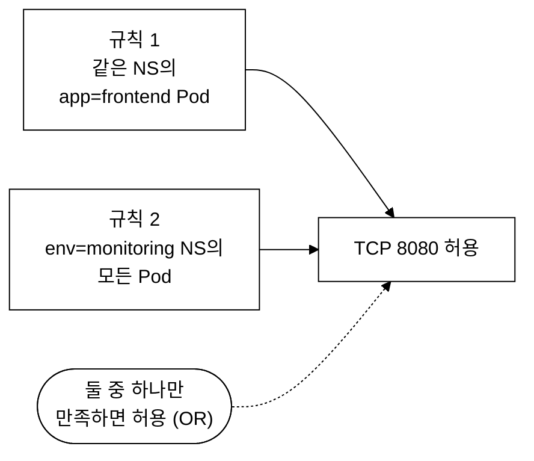
_그림 1. OR 조건: 독립 규칙 중 하나만 만족해도 허용._

### 2.3 AND 조건 (from 배열 내 하나의 항목)

```yaml
# AND 조건: "monitoring 네임스페이스"의 "frontend Pod"만
# → 1개의 규칙에 2개 조건
ingress:
- from:
  - podSelector:                 # ← 하나의 규칙에
      matchLabels:               #    두 조건이 결합
        app: frontend
    namespaceSelector:           # ← 들여쓰기 주의! `-` 없음!
      matchLabels:
        env: monitoring
  ports:
  - protocol: TCP
    port: 8080
```

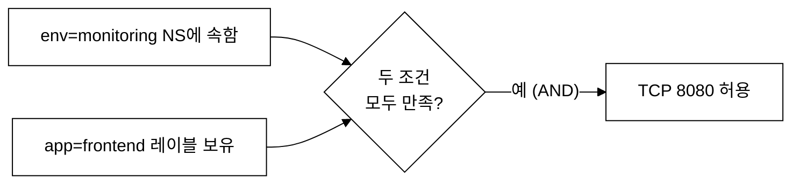
_그림 2. AND 조건: 하나의 규칙 내 두 조건을 모두 만족해야 허용._

### 2.4 시각적 비교

```yaml
# ===== OR 조건 =====
from:
- podSelector:         # ← '-' 있음 (독립 규칙 1)
    matchLabels:
      app: frontend
- namespaceSelector:   # ← '-' 있음 (독립 규칙 2)
    matchLabels:
      env: monitoring

# ===== AND 조건 =====
from:
- podSelector:         # ← '-' 있음 (규칙 시작)
    matchLabels:
      app: frontend
  namespaceSelector:   # ← '-' 없음! (같은 규칙 내 추가 조건)
    matchLabels:
      env: monitoring
```

> **암기법**: `-`가 2개이면 OR(또는), `-`가 1개이면 AND(그리고)

---

## 3. Default Deny 패턴 (시험 필수 암기!)

### 3.1 모든 인바운드 차단

```yaml
# 네임스페이스의 모든 Pod로 들어오는 모든 트래픽을 차단
apiVersion: networking.k8s.io/v1
kind: NetworkPolicy
metadata:
  name: deny-all-ingress        # 정책 이름
  namespace: demo                # 적용 네임스페이스
spec:
  podSelector: {}               # {} = 모든 Pod에 적용
  policyTypes:
  - Ingress                     # Ingress 방향만 제어
  # ingress 규칙을 비워둠 → 모든 인바운드 차단!
```

**검증 명령어 + 기대 출력:**

```bash
kubectl apply -f deny-all-ingress.yaml
kubectl describe networkpolicy deny-all-ingress -n demo
```

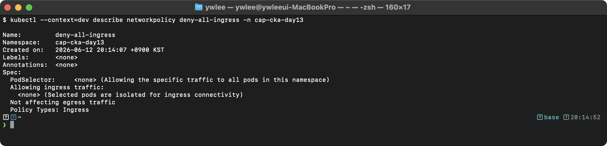

**트러블슈팅:** Default Deny를 적용한 후 모든 통신이 안 된다면, 이 정책 위에 허용 정책을 추가해야 한다. NetworkPolicy는 UNION이므로 deny-all 위에 allow 정책을 추가하면 해당 트래픽만 허용된다.

### 3.2 모든 아웃바운드 차단

```yaml
# 네임스페이스의 모든 Pod에서 나가는 모든 트래픽을 차단
apiVersion: networking.k8s.io/v1
kind: NetworkPolicy
metadata:
  name: deny-all-egress
  namespace: demo
spec:
  podSelector: {}
  policyTypes:
  - Egress                      # Egress 방향만 제어
  # egress 규칙을 비워둠 → 모든 아웃바운드 차단!
  # 주의: DNS도 차단되므로 서비스 이름 해석 불가!
```

### 3.3 모든 트래픽 차단 (인바운드 + 아웃바운드)

```yaml
apiVersion: networking.k8s.io/v1
kind: NetworkPolicy
metadata:
  name: deny-all
  namespace: demo
spec:
  podSelector: {}
  policyTypes:
  - Ingress
  - Egress
  # 양방향 모두 차단
```

### 3.4 특정 Pod만 격리

```yaml
# app=sensitive 레이블을 가진 Pod만 격리 (나머지는 영향 없음)
apiVersion: networking.k8s.io/v1
kind: NetworkPolicy
metadata:
  name: isolate-sensitive
  namespace: demo
spec:
  podSelector:
    matchLabels:
      app: sensitive            # 이 레이블을 가진 Pod만 격리
  policyTypes:
  - Ingress
  - Egress
  # 규칙 없음 → app=sensitive Pod는 모든 트래픽 차단
```

---

## 4. Egress에서 DNS 허용 (절대 잊지 마라!)

### 4.1 왜 DNS를 허용해야 하는가?

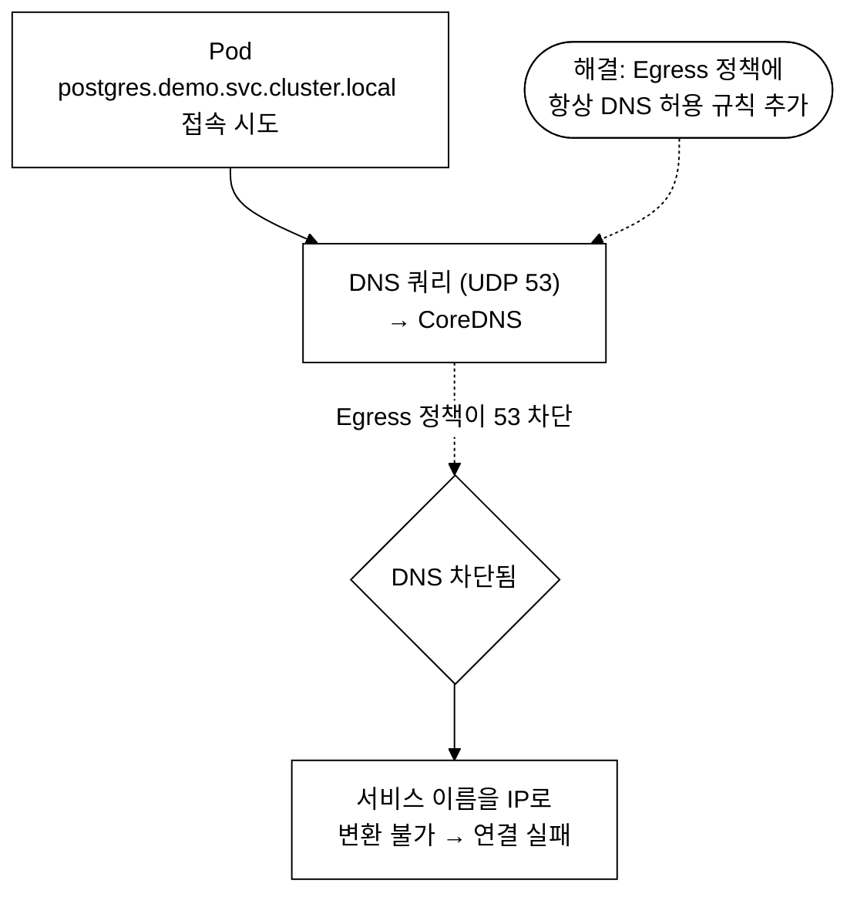
_그림 3. Egress 정책에서 DNS(53)를 허용하지 않으면 서비스 이름 해석이 실패한다._

다이어그램이 보여주는 흐름을 단계로 풀면 다음과 같다. 모든 Pod 는 생성 시 `/etc/resolv.conf` 파일에 `nameserver 10.96.0.10`(CoreDNS Service 의 ClusterIP, 클러스터마다 다를 수 있음)을 자동으로 주입받는다. CoreDNS 는 클러스터 내부 DNS 서버로, `postgres.demo.svc.cluster.local` 같은 서비스 이름(FQDN)을 실제 IP 로 변환해 준다.

1. **이름 해석 시도** — Pod 의 애플리케이션이 `postgres.demo.svc.cluster.local`로 접속을 시도한다. 이 이름은 IP 가 아니므로 먼저 IP 로 바꿔야 한다.
2. **DNS 쿼리 발송(Egress)** — Pod 는 `resolv.conf`의 nameserver(CoreDNS)로 UDP 53 포트로 "이 이름의 IP 가 뭐냐"는 쿼리를 보낸다. 이 패킷은 Pod 에서 **나가는** 트래픽이므로 Egress 규칙의 통제를 받는다.
3. **DNS 응답 수신** — CoreDNS 가 매칭되는 Pod IP 를 응답으로 돌려준다. 이 응답은 2단계에서 나간 쿼리에 대한 회신이므로, Egress 의 DNS 규칙만 허용되어 있으면 별도의 Ingress 규칙 없이 같은 연결로 돌아온다.
4. **실제 연결** — 받은 IP 로 PostgreSQL 의 TCP 5432 포트에 연결한다.

핵심은 2단계다. **Egress 정책이 UDP 53 을 차단하면 2단계에서 쿼리가 나가지 못해, 이름을 IP 로 바꾸지 못하고 멈춘다.** 그러면 4단계의 실제 연결은 시작조차 못 한다. 이름이 아니라 IP 를 직접 쓰는 트래픽만 Egress 에 허용했더라도, 서비스 이름을 쓰는 한 DNS(53) 허용 규칙이 없으면 통신이 실패하는 이유가 이것이다.

### 4.2 DNS 허용 패턴

```yaml
egress:
# 규칙 1: DNS 허용 (필수!)
- ports:
  - protocol: UDP
    port: 53
  - protocol: TCP
    port: 53
  # to를 생략하면 모든 대상으로의 DNS 쿼리 허용

# 규칙 2: 실제 허용할 트래픽
- to:
  - podSelector:
      matchLabels:
        app: postgres
  ports:
  - protocol: TCP
    port: 5432
```

### 4.3 kube-system 네임스페이스의 CoreDNS로만 제한

```yaml
# 더 안전한 방법: CoreDNS Pod로만 DNS 쿼리 허용
egress:
- to:
  - namespaceSelector:
      matchLabels:
        kubernetes.io/metadata.name: kube-system
    podSelector:
      matchLabels:
        k8s-app: kube-dns
  ports:
  - protocol: UDP
    port: 53
  - protocol: TCP
    port: 53
```

---

## 5. NetworkPolicy 실전 패턴

### 5.1 특정 Pod 간 통신만 허용

```yaml
# web → backend → database 3계층 아키텍처
# database는 backend에서만 접근 가능

apiVersion: networking.k8s.io/v1
kind: NetworkPolicy
metadata:
  name: db-access-policy
  namespace: demo
spec:
  podSelector:
    matchLabels:
      tier: database             # database Pod에 적용
  policyTypes:
  - Ingress
  ingress:
  - from:
    - podSelector:
        matchLabels:
          tier: backend          # backend Pod에서만 접근 허용
    ports:
    - protocol: TCP
      port: 5432                 # PostgreSQL 포트만 허용
```

### 5.2 네임스페이스 간 통신 허용

```yaml
# monitoring 네임스페이스에서 demo 네임스페이스의 메트릭 수집 허용
apiVersion: networking.k8s.io/v1
kind: NetworkPolicy
metadata:
  name: allow-monitoring
  namespace: demo
spec:
  podSelector: {}               # demo의 모든 Pod에 적용
  policyTypes:
  - Ingress
  ingress:
  - from:
    - namespaceSelector:
        matchLabels:
          kubernetes.io/metadata.name: monitoring  # monitoring NS에서
      podSelector:
        matchLabels:
          app: prometheus        # prometheus Pod만 (AND 조건!)
    ports:
    - protocol: TCP
      port: 9090                 # 메트릭 포트만
```

### 5.3 외부(인터넷) 접근 제한

```yaml
# 특정 CIDR 대역만 접근 허용
apiVersion: networking.k8s.io/v1
kind: NetworkPolicy
metadata:
  name: allow-external-cidr
  namespace: demo
spec:
  podSelector:
    matchLabels:
      app: web
  policyTypes:
  - Ingress
  ingress:
  - from:
    - ipBlock:
        cidr: 0.0.0.0/0          # 모든 IP에서
        except:
        - 10.0.0.0/8             # 단, 내부 네트워크 제외
    ports:
    - protocol: TCP
      port: 443
```

### 5.4 ipBlock 사용법

```yaml
# ipBlock: IP 주소 대역으로 트래픽 제어
from:
- ipBlock:
    cidr: 172.17.0.0/16          # 이 CIDR에서 오는 트래픽 허용
    except:                      # 단, 이 범위는 제외
    - 172.17.1.0/24              # 이 서브넷은 차단

# 주의: ipBlock은 Pod-to-Pod 트래픽에는 보통 사용하지 않는다
#        외부(클러스터 밖) IP를 제어할 때 사용한다
```

### 5.5 여러 포트 허용

```yaml
ingress:
- from:
  - podSelector:
      matchLabels:
        app: client
  ports:
  - protocol: TCP
    port: 8080                   # HTTP
  - protocol: TCP
    port: 8443                   # HTTPS
  - protocol: TCP
    port: 9090                   # 메트릭
    endPort: 9099                # 포트 범위 (9090-9099)
```

---

## 6. Ingress 리소스

### 6.1 Ingress란?

> **Ingress**: 클러스터 외부의 HTTP(S) 트래픽을 내부 Service로 라우팅하는 L7 규칙 선언 리소스이다.
> Host 헤더 기반 가상 호스트 라우팅과 URI Path 기반 라우팅을 지원하며,
> TLS termination, 경로 재작성 등 L7 기능을 선언적으로 정의한다.
>
> Ingress 리소스 자체는 규칙 정의에 불과하며, 실제 트래픽 처리는
> Ingress Controller(NGINX, Traefik, HAProxy 등)가 Ingress 오브젝트를 Watch하여
> 리버스 프록시 설정을 동적으로 생성·적용함으로써 수행된다.

**등장 배경:** NodePort나 LoadBalancer Service만으로는 경로 기반 라우팅(`/api` → api-svc, `/web` → web-svc)이 불가능하다. 그 근본 이유는 동작 계층이 다르기 때문이다. NodePort·LoadBalancer 는 L4(전송 계층, TCP/UDP 포트 단위)에서 동작하므로 패킷의 출발지·도착지 포트만 보고 전달할 뿐, HTTP 요청 안의 Host 헤더나 `/api` 같은 URL 경로는 들여다보지 못한다. Ingress 는 L7(애플리케이션 계층, HTTP)에서 동작해 요청 내용을 해석하므로 Host·Path 기준으로 분기할 수 있다.

| 방식 | 동작 계층 | 노출 방식 | 비용 | 적합한 상황 |
|:--|:--|:--|:--|:--|
| NodePort | L4 | 클러스터 모든 노드의 같은 포트를 개방, 클라이언트가 `노드IP:포트`로 직접 접근 | 없음 | 학습·테스트 |
| LoadBalancer | L4 | 클라우드 벤더가 외부 로드밸런서와 외부 IP 1개를 Service마다 할당 | 외부 IP·LB 마다 과금 | 단일 서비스 프로덕션 |
| Ingress | L7 | 진입점(IP·포트) 1개에서 Host/Path 기준으로 여러 Service 로 분기 | 진입점 1개분(낮음) | 마이크로서비스 프로덕션 |

비용 차이가 두드러지는 시나리오: 100개의 API 마이크로서비스를 각각 LoadBalancer 로 노출하면 외부 IP 와 로드밸런서가 100개 필요해 비용이 100배로 늘어난다. Ingress 를 쓰면 외부 진입점 1개(IP·포트 하나)에서 Host 헤더와 URI Path 를 기준으로 100개 서비스에 트래픽을 나눠 보낼 수 있어 비용이 한 자릿수로 줄어든다. Ingress 는 하나의 진입점에서 여러 Service 에 트래픽을 분배하는 L7 라우팅을 제공한다.

**트레이드오프:** Ingress 를 도입하면 Ingress Controller Pod 자체가 단일 장애점(SPOF, Single Point of Failure)이 된다. Controller 가 다운되면 그 뒤에 연결된 모든 Service 로의 외부 진입이 막히므로, 프로덕션에서는 Ingress Controller 를 복수 레플리카로 HA(고가용성) 구성해야 한다. 또한 Controller 마다 지원하는 annotation 이 달라(nginx 의 `nginx.ingress.kubernetes.io/*` 와 traefik 의 `traefik.ingress.kubernetes.io/*` 등) 이식성 문제가 있다. Controller 를 교체하면 annotation 을 모두 재작성해야 한다. 마지막으로, Ingress 리소스는 외부 진입점 자체를 만들어 주지 않는다. Ingress Controller 를 외부에 노출하는 LoadBalancer Service 나 NodePort 가 반드시 별도로 존재해야 클라이언트가 클러스터에 도달할 수 있다.

### 6.2 Ingress 구성 요소

```
Ingress 관련 3가지 리소스:

1. Ingress Controller (실제 트래픽 라우팅 수행하는 Pod)
   - nginx-ingress-controller
   - traefik
   - HAProxy
   - 등등
   ※ 반드시 설치해야 Ingress가 동작한다!

2. IngressClass (어떤 Controller가 처리할지 지정)
   - nginx, traefik 등의 클래스 정의
   - 기본 IngressClass 설정 가능

3. Ingress (라우팅 규칙 정의)
   - 호스트 기반, 경로 기반 라우팅
   - TLS 종료

외부 트래픽 흐름:
  클라이언트 → Load Balancer → Ingress Controller Pod
      → Ingress 규칙에 따라 → 적절한 Service → Pod
```

### 6.3 Ingress 전체 YAML (한 줄씩 설명)

```yaml
apiVersion: networking.k8s.io/v1    # Ingress API 그룹 (v1, 정식 버전)
kind: Ingress                        # 리소스 종류
metadata:
  name: app-ingress                  # Ingress 이름
  namespace: demo                    # 네임스페이스
  annotations:                       # Controller별 추가 설정
    nginx.ingress.kubernetes.io/rewrite-target: /  # URL 재작성
    nginx.ingress.kubernetes.io/ssl-redirect: "false"  # HTTPS 리다이렉트 비활성
spec:
  ingressClassName: nginx            # 사용할 IngressClass (어떤 Controller가 처리)
  tls:                               # TLS/HTTPS 설정
  - hosts:
    - myapp.example.com              # TLS가 적용될 호스트
    secretName: tls-secret           # TLS 인증서가 저장된 Secret
  rules:                             # 라우팅 규칙
  - host: myapp.example.com         # 호스트 기반 라우팅 (생략하면 모든 호스트)
    http:
      paths:
      - path: /api                   # 경로 기반 라우팅
        pathType: Prefix             # 매칭 방식: Prefix, Exact, ImplementationSpecific
        backend:
          service:
            name: api-svc            # 트래픽을 전달할 Service 이름
            port:
              number: 80             # Service 포트
      - path: /                      # 기본 경로 (다른 규칙에 매칭되지 않으면)
        pathType: Prefix
        backend:
          service:
            name: web-svc            # 웹 프론트엔드 Service
            port:
              number: 80
  defaultBackend:                    # 어떤 규칙에도 매칭되지 않을 때
    service:
      name: default-svc
      port:
        number: 80
```

### 6.4 pathType 종류

```
pathType 비교:

1. Exact: 정확히 일치
   path: /api → /api만 매칭
                /api/ 매칭 안 됨
                /api/v1 매칭 안 됨

2. Prefix: 접두사 매칭 (가장 많이 사용)
   path: /api → /api 매칭
                /api/ 매칭
                /api/v1 매칭
                /api/v1/users 매칭
                /apiv2 매칭 안 됨 (/ 단위로 매칭)

3. ImplementationSpecific: Controller 구현에 따라 다름
   → 시험에서는 거의 사용하지 않음

시험에서는 대부분 Prefix를 사용한다!
```

### 6.5 Ingress 검증 방법

```bash
# Ingress 생성 후 검증
kubectl get ingress app-ingress -n demo
```

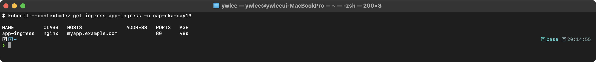

```bash
# Ingress 상세 확인
kubectl describe ingress app-ingress -n demo
```

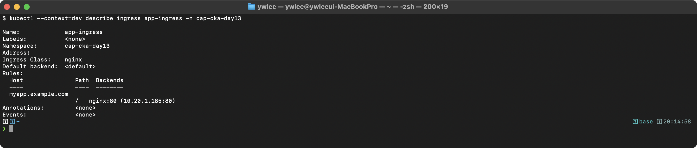

**트러블슈팅:** Ingress를 생성했는데 ADDRESS가 비어 있으면 Ingress Controller가 설치되어 있지 않거나, ingressClassName이 잘못 지정된 것이다. `kubectl get pods -n ingress-nginx`로 Controller Pod가 Running인지 확인하고, `kubectl get ingressclass`로 사용 가능한 IngressClass 목록을 확인한다.

### 6.6 호스트 기반 라우팅

```yaml
# 여러 도메인을 다른 Service로 라우팅
apiVersion: networking.k8s.io/v1
kind: Ingress
metadata:
  name: multi-host-ingress
spec:
  ingressClassName: nginx
  rules:
  - host: api.example.com           # api 도메인
    http:
      paths:
      - path: /
        pathType: Prefix
        backend:
          service:
            name: api-service
            port:
              number: 80
  - host: admin.example.com         # admin 도메인
    http:
      paths:
      - path: /
        pathType: Prefix
        backend:
          service:
            name: admin-service
            port:
              number: 80
  - host: "*.example.com"           # 와일드카드 도메인
    http:
      paths:
      - path: /
        pathType: Prefix
        backend:
          service:
            name: default-service
            port:
              number: 80
```

### 6.7 TLS Ingress

```yaml
# TLS 인증서 Secret 생성
# kubectl create secret tls tls-secret \
#   --cert=tls.crt --key=tls.key -n demo

apiVersion: networking.k8s.io/v1
kind: Ingress
metadata:
  name: tls-ingress
  namespace: demo
spec:
  ingressClassName: nginx
  tls:
  - hosts:
    - secure.example.com          # TLS 적용 호스트
    secretName: tls-secret        # kubernetes.io/tls 타입 Secret
  rules:
  - host: secure.example.com
    http:
      paths:
      - path: /
        pathType: Prefix
        backend:
          service:
            name: secure-svc
            port:
              number: 443
```

### 6.8 IngressClass

Kubernetes 1.18 이전에는 `kubernetes.io/ingress.class` annotation 으로 어떤 Controller 가 이 Ingress 를 처리할지 지정했다. 이 방식은 deprecated 됐다. CKA 시험 환경(1.28~1.31)에서는 `spec.ingressClassName` 필드를 사용해야 하며, IngressClass 리소스가 클러스터에 존재해야 한다. annotation 방식의 예시를 본다면 오래된 문서나 레거시 환경임을 인식한다.

```yaml
# IngressClass 정의
apiVersion: networking.k8s.io/v1
kind: IngressClass
metadata:
  name: nginx
  annotations:
    ingressclass.kubernetes.io/is-default-class: "true"  # 기본 IngressClass
spec:
  controller: k8s.io/ingress-nginx    # Controller 이름
  parameters:                          # 추가 파라미터 (선택사항)
    apiGroup: k8s.example.net
    kind: IngressParameters
    name: external-lb
```

### 6.9 kubectl create ingress (빠른 생성)

```bash
# Path-based Ingress 빠른 생성
kubectl create ingress app-ingress \
  --rule="myapp.example.com/api*=api-svc:80" \
  --rule="myapp.example.com/*=web-svc:80" \
  -n demo

# 여러 호스트 Ingress
kubectl create ingress multi-ingress \
  --rule="api.example.com/*=api-svc:80" \
  --rule="web.example.com/*=web-svc:80"

# TLS Ingress
kubectl create ingress tls-ingress \
  --rule="secure.example.com/*=web-svc:443,tls=tls-secret"

# dry-run으로 YAML 생성
kubectl create ingress app-ingress \
  --rule="myapp.example.com/api*=api-svc:80" \
  --dry-run=client -o yaml > ingress.yaml
```

---

## 7. CNI 플러그인

### 7.1 CNI란?

> **CNI(Container Network Interface)**: CNCF 표준 인터페이스 사양으로, 컨테이너 런타임이 Pod 생성/삭제 시 호출하는 네트워크 플러그인 바이너리의 규격을 정의한다. CNI 플러그인은 Pod에 veth pair를 생성하고 IP를 할당(IPAM)하며, Pod 간 라우팅 경로를 구성한다. CNI 플러그인이 설치되지 않으면 Pod는 네트워크 인터페이스를 갖지 못해 NotReady 상태에 머문다.
>
> 여기서 veth pair(virtual ethernet pair)는 양쪽 끝이 서로 연결된 가상 네트워크 케이블이라고 보면 된다. 한쪽 끝은 Pod 내부에, 다른 끝은 노드의 네트워크에 꽂혀 Pod 안팎으로 패킷이 오간다. IPAM(IP Address Management)은 어느 Pod 에 어떤 IP 를 줄지 중복 없이 관리·할당하는 기능이다.

**왜 CNI 라는 별도 도구가 필요한가.** 컨테이너 런타임(containerd, Docker 등 — Pod 안의 컨테이너 프로세스를 실제로 띄우는 소프트웨어)은 프로세스를 생성하고 그 프로세스를 리눅스 namespace(같은 호스트 안에서 프로세스의 PID·파일시스템·네트워크 등을 서로 격리하는 커널 기능)로 격리하는 일까지만 책임진다. 그런데 격리된 Pod 에 네트워크 인터페이스를 꽂고, IP 를 붙이고, 라우팅 테이블을 채우는 작업은 OS 커널 수준의 네트워킹 조작이라 런타임의 범위를 벗어난다. 이 빈 자리를 채우는 것이 CNI 플러그인이다. 즉 "프로세스를 만든다"(런타임)와 "그 프로세스를 네트워크에 연결한다"(CNI)는 책임이 분리되어 있다. kubelet 은 Pod 를 띄울 때 먼저 런타임에 컨테이너 생성을 요청하고, 그 다음 `/opt/cni/bin/`에 설치된 CNI 바이너리를 호출해 네트워크를 초기화한다.

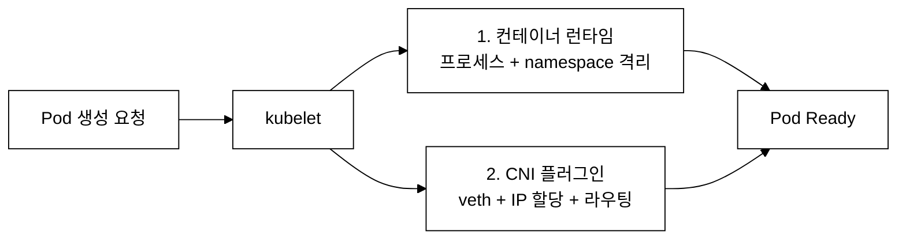
_그림 4. kubelet 은 런타임으로 프로세스를, CNI 로 네트워크를 각각 구성한 뒤 Pod 를 Ready 로 만든다._

CNI 플러그인의 역할:

1. Pod 에 IP 주소 할당
2. Pod 간 네트워크 연결 설정
3. NetworkPolicy 적용 (지원하는 CNI 만)

주요 CNI 플러그인:

| CNI | NetworkPolicy | 특징 | 사용처 |
|:--|:--|:--|:--|
| Cilium | 지원 (L3-L7) | eBPF 기반 | 이 저장소 |
| Calico | 지원 (L3-L4) | BGP 지원 | 많은 기업 |
| Weave | 지원 (L3-L4) | 간단한 설정 | 소규모 |
| Flannel | 미지원 | 가장 간단 | 테스트용 |

**무엇이 나아졌나(메커니즘 수준):** CNI 표준화 이전에는 Docker 자체 브리지 네트워크(`docker0`)가 컨테이너 네트워킹을 담당했다. 이 방식은 단일 호스트에서는 동작하지만 멀티호스트 클러스터에서는 컨테이너들이 서로 다른 호스트에 분산되면 라우팅이 없어 직접 통신이 불가능했다. 호스트 간 통신을 위해 포트 매핑(`-p 8080:80`)을 수동으로 관리하거나 오버레이 네트워크 도구를 별도로 설치해야 했다. CNI 인터페이스가 도입되면서 kubelet 이 Pod 를 생성할 때 `/opt/cni/bin/` 의 플러그인 바이너리를 호출하는 표준 방식이 확립됐다. 플러그인은 veth pair 생성, IP 할당, 라우팅 설정을 일관된 방식으로 처리하고, 멀티호스트 라우팅은 플러그인마다 BGP(Calico), VXLAN 오버레이(Flannel, Cilium 기본), eBPF 직접 라우팅(Cilium native routing) 등 다양한 방법으로 해결한다.

**트레이드오프:**
- **Cilium(eBPF)**: 커널 내 해시맵으로 패킷을 처리해 iptables 방식보다 대규모 클러스터에서 지연이 적고 L7 정책(HTTP 메서드·경로 수준 제어)을 지원한다. 단, eBPF 는 리눅스 커널 4.9 이상이 필요하고 권장 커널은 5.10 이상이다. eBPF 프로그램 디버깅은 `bpftool`·`cilium-dbg` 등 전용 도구가 필요해 일반 iptables 트러블슈팅보다 진입 장벽이 높다.
- **Calico**: BGP 모드에서는 오버레이 없이 실제 IP 로 라우팅하므로 오버헤드가 적고 레이턴시가 낮다. 반면 BGP 설정이 필요해 온프레미스 라우터와의 BGP 피어링을 운영팀이 관리해야 한다. VXLAN 모드로 전환하면 BGP 없이도 동작하지만 오버레이 캡슐화 오버헤드가 생긴다.
- **Flannel**: 설정이 가장 단순하고 장애가 적어 학습·테스트 환경에 적합하다. NetworkPolicy 를 구현하지 않아 보안 정책이 필요한 프로덕션에는 사용할 수 없다.

### 7.2 CNI 관련 파일 위치

```bash
# CNI 설정 파일 위치 (노드에서 확인)
ls -la /etc/cni/net.d/
# 예: 05-cilium.conflist, 10-calico.conflist

# CNI 바이너리 위치
ls /opt/cni/bin/
# 예: cilium-cni, calico, bridge, host-local, loopback

# kubelet의 CNI 설정 확인
cat /var/lib/kubelet/config.yaml | grep -A2 cni
```

### 7.3 CNI 장애 증상

```
CNI가 설치되지 않거나 장애가 발생하면:

증상 1: 노드가 NotReady 상태
  kubectl get nodes
  → <node>  NotReady  <roles>  <age>  <version>

증상 2: Pod가 ContainerCreating에서 멈춤
  kubectl get pods
  → <pod>  0/1  ContainerCreating  0  5m

증상 3: Pod 이벤트에 CNI 관련 에러
  kubectl describe pod <name>
  → "network plugin is not ready: cni config uninitialized"

진단:
  ssh <node>
  ls /etc/cni/net.d/         # CNI 설정 파일 있는지
  ls /opt/cni/bin/            # CNI 바이너리 있는지
  systemctl status kubelet    # kubelet 로그에 CNI 에러
  crictl ps                   # 컨테이너 상태 확인
```

---

## 8. 실전 YAML 예제 모음 (9개) + 미니랩 4개

> 아래 예제 1~9 는 참고용 템플릿이다. 예제 1·3·5·6 에는 시험 실전 형식의 **미니랩(제한 시간 명시)**을 함께 달았다. 미니랩은 예제를 보지 않고 먼저 스스로 작성하고, 시간 내 완료 여부를 기록한 뒤 예제와 비교한다. 학습 목표에 "시험 패턴 시간 내 해결"이 포함되어 있으므로 반드시 직접 시도한다.

### 예제 1: Default Deny All Ingress

```yaml
apiVersion: networking.k8s.io/v1
kind: NetworkPolicy
metadata:
  name: default-deny-ingress
  namespace: production
spec:
  podSelector: {}
  policyTypes:
  - Ingress
```

> **미니랩 A (목표 2분)**: `production` 네임스페이스의 모든 Pod 에 대해 인바운드를 전부 차단하는 NetworkPolicy 를 명령형 또는 YAML 로 작성하고 `kubectl apply` 한 뒤, `kubectl run tester --image=busybox:1.36 -n production --rm -it --restart=Never -- wget -qO- --timeout=3 <any-svc>` 가 타임아웃되는지 검증한다.

### 예제 2: Default Deny All Egress

```yaml
apiVersion: networking.k8s.io/v1
kind: NetworkPolicy
metadata:
  name: default-deny-egress
  namespace: production
spec:
  podSelector: {}
  policyTypes:
  - Egress
```

### 예제 3: 특정 Pod → 특정 Pod (Ingress)

```yaml
apiVersion: networking.k8s.io/v1
kind: NetworkPolicy
metadata:
  name: allow-frontend-to-backend
  namespace: demo
spec:
  podSelector:
    matchLabels:
      tier: backend
  policyTypes:
  - Ingress
  ingress:
  - from:
    - podSelector:
        matchLabels:
          tier: frontend
    ports:
    - protocol: TCP
      port: 8080
```

> **미니랩 B (목표 3분)**: `demo` 네임스페이스에 `tier=backend` 레이블 Pod 와 `tier=frontend` 레이블 Pod 를 각각 nginx 와 busybox 로 생성하고, 위 정책을 적용한 뒤 frontend → backend TCP 8080 은 허용되고, 레이블 없는 Pod → backend 는 차단되는지 `wget` 으로 대조 확인한다. 기대 소요 시간: 3분 이내.

### 예제 4: 다른 네임스페이스에서 접근 허용 (OR 조건)

```yaml
apiVersion: networking.k8s.io/v1
kind: NetworkPolicy
metadata:
  name: allow-monitoring-or-backend
  namespace: demo
spec:
  podSelector:
    matchLabels:
      app: redis
  policyTypes:
  - Ingress
  ingress:
  - from:
    - namespaceSelector:             # OR: monitoring NS의 모든 Pod
        matchLabels:
          kubernetes.io/metadata.name: monitoring
    - podSelector:                   # OR: 같은 NS의 tier=backend Pod
        matchLabels:
          tier: backend
    ports:
    - protocol: TCP
      port: 6379
```

### 예제 5: 다른 네임스페이스의 특정 Pod만 허용 (AND 조건)

```yaml
apiVersion: networking.k8s.io/v1
kind: NetworkPolicy
metadata:
  name: allow-prometheus-only
  namespace: demo
spec:
  podSelector:
    matchLabels:
      app: api-server
  policyTypes:
  - Ingress
  ingress:
  - from:
    - namespaceSelector:             # AND: monitoring NS
        matchLabels:
          kubernetes.io/metadata.name: monitoring
      podSelector:                   # AND: 그 중 prometheus Pod만
        matchLabels:
          app: prometheus
    ports:
    - protocol: TCP
      port: 9090
```

> **미니랩 C (목표 4분)**: 위 정책을 보지 않고 "monitoring 네임스페이스의 prometheus Pod 에서만 demo 네임스페이스의 api-server Pod TCP 9090 인바운드를 허용"하는 정책을 YAML 로 처음부터 작성한다. 작성 후 `kubectl apply --dry-run=server -f np.yaml` 로 문법 오류를 확인하고, `namespaceSelector`+`podSelector` 가 같은 `-` 항목 아래 동일 들여쓰기로 선언됐는지(AND 조건) 검토한다.

### 예제 6: Egress + DNS 허용

```yaml
apiVersion: networking.k8s.io/v1
kind: NetworkPolicy
metadata:
  name: api-egress-policy
  namespace: demo
spec:
  podSelector:
    matchLabels:
      role: api
  policyTypes:
  - Egress
  egress:
  - ports:                           # DNS 허용 (필수!)
    - protocol: UDP
      port: 53
    - protocol: TCP
      port: 53
  - to:                              # database로만 접근 허용
    - podSelector:
        matchLabels:
          tier: database
    ports:
    - protocol: TCP
      port: 5432
```

> **미니랩 D (목표 4분)**: `demo` 네임스페이스에서 `role=api` Pod 를 busybox 로 생성(`kubectl run api-pod --image=busybox:1.36 -n demo --labels=role=api --rm -it --restart=Never -- sh`)하고, 위 정책을 적용한 후 (1) `nslookup kubernetes.default.svc.cluster.local` 이 성공하는지(DNS 허용 확인), (2) `wget -qO- --timeout=3 <tier=database가 아닌 서비스>` 가 타임아웃되는지(Egress 차단 확인) 각각 실행하고 결과를 기록한다.

### 예제 7: ipBlock으로 외부 IP 제어

```yaml
apiVersion: networking.k8s.io/v1
kind: NetworkPolicy
metadata:
  name: allow-external-access
  namespace: demo
spec:
  podSelector:
    matchLabels:
      app: public-api
  policyTypes:
  - Ingress
  ingress:
  - from:
    - ipBlock:
        cidr: 0.0.0.0/0
        except:
        - 10.0.0.0/8
        - 172.16.0.0/12
        - 192.168.0.0/16
    ports:
    - protocol: TCP
      port: 443
```

### 예제 8: Ingress + Egress 동시 설정

```yaml
apiVersion: networking.k8s.io/v1
kind: NetworkPolicy
metadata:
  name: full-policy
  namespace: demo
spec:
  podSelector:
    matchLabels:
      app: secure-app
  policyTypes:
  - Ingress
  - Egress
  ingress:
  - from:
    - podSelector:
        matchLabels:
          app: gateway
    ports:
    - protocol: TCP
      port: 8080
  egress:
  - ports:
    - protocol: UDP
      port: 53
    - protocol: TCP
      port: 53
  - to:
    - podSelector:
        matchLabels:
          app: cache
    ports:
    - protocol: TCP
      port: 6379
  - to:
    - podSelector:
        matchLabels:
          app: database
    ports:
    - protocol: TCP
      port: 5432
```

### 예제 9: 모든 Pod에서 특정 Pod로의 접근 허용

```yaml
apiVersion: networking.k8s.io/v1
kind: NetworkPolicy
metadata:
  name: allow-all-to-dns
  namespace: demo
spec:
  podSelector:
    matchLabels:
      app: dns-proxy
  policyTypes:
  - Ingress
  ingress:
  - from: []                        # 모든 소스 허용
    ports:
    - protocol: TCP
      port: 53
    - protocol: UDP
      port: 53
```

---

## tart-infra 실습

> 여기서 **tart**는 이 저장소가 Apple Silicon 위에서 가상머신으로 띄우는 4개 멀티클러스터(platform/dev/staging/prod) 실습 환경을 가리킨다. 아래 실습은 그중 파괴 실습이 허용된 `dev` 클러스터에서 한다.

**전제 조건:**
- dev 클러스터가 가동 중이어야 한다(`./scripts/boot.sh` 후 IP 드리프트가 있으면 `./scripts/fix-cluster-ip-drift.sh dev`).
- 아래 `KUBECONFIG` 경로는 저장소 root 기준이다. 저장소를 다른 위치에 clone 했다면 `~/sideproejct/IaC_apple_sillicon` 부분을 본인의 저장소 경로로 바꾼다(예: 저장소 root 에서 `export KUBECONFIG=$PWD/kubeconfig/dev.yaml`).
- 실습 2·3 은 `demo` 네임스페이스를 사용한다. fresh dev 클러스터에는 `demo` 가 없으므로 먼저 생성해 둔다:
  ```bash
  kubectl create namespace demo
  # namespaceSelector 로 demo 를 가리킬 때 쓰는 기본 레이블(보통 자동 부여되나 명시해 둔다)
  kubectl label namespace demo kubernetes.io/metadata.name=demo --overwrite
  ```

### 실습 환경 설정

```bash
# [세션 시작 시 필수] CKA 실기 속도 셋업 — 매 세션마다 실행한다
alias k=kubectl
complete -F __start_kubectl k          # k 명령에도 탭 자동완성 적용
export do='--dry-run=client -o yaml'   # 예: k create deploy web --image=nginx $do > web.yaml
export KUBECONFIG=~/sideproejct/IaC_apple_sillicon/kubeconfig/dev.yaml

# dev 클러스터로 컨텍스트 전환 (CiliumNetworkPolicy 11개가 적용된 환경)
kubectl config use-context dev
```

### 실습 1 사전 구성: demo 네임스페이스 리소스 생성

실습 1 은 deny-all + allow 정책의 동작을 확인하는 것이 목표이지만, fresh dev 클러스터에는 해당 정책과 nginx Deployment, Service 가 없다. 아래 단계로 실습 환경을 먼저 구성한다.

```bash
# 1. nginx Deployment 생성
kubectl create deployment nginx --image=nginx:1.25 -n demo --replicas=1

# 2. nginx ClusterIP Service 노출
kubectl expose deployment nginx --port=80 --target-port=80 -n demo

# 3. deny-all Ingress 정책 적용
kubectl apply -n demo -f - <<'EOF'
apiVersion: networking.k8s.io/v1
kind: NetworkPolicy
metadata:
  name: deny-all-ingress
  namespace: demo
spec:
  podSelector: {}
  policyTypes:
  - Ingress
EOF

# 4. app=netclient 레이블을 가진 Pod 에서만 nginx 접근 허용 정책 적용
kubectl apply -n demo -f - <<'EOF'
apiVersion: networking.k8s.io/v1
kind: NetworkPolicy
metadata:
  name: allow-nginx-from-access
  namespace: demo
spec:
  podSelector:
    matchLabels:
      app: nginx
  policyTypes:
  - Ingress
  ingress:
  - from:
    - podSelector:
        matchLabels:
          access: "true"
    ports:
    - protocol: TCP
      port: 80
EOF

# 5. 정책 적용 확인
kubectl get networkpolicies -n demo
```

### 실습 1: CiliumNetworkPolicy 분석

```bash
# dev 클러스터에 적용된 NetworkPolicy 확인
kubectl get networkpolicies -n demo
kubectl get ciliumnetworkpolicies -n demo
```

**예상 출력 (예시 — fresh dev 클러스터에는 demo ns 와 프로젝트 CiliumNetworkPolicy 들이 없다. 아래는 정책이 적용된 환경의 형태):**
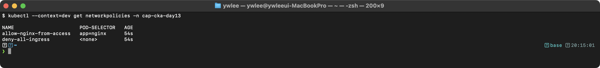

아래 스크린샷은 `cap-cka-day13` 네임스페이스에서 사전 캡처한 것이며, 독자는 `demo` 네임스페이스에서 동일하게 재현할 수 있다. `kubectl get networkpolicies` / `kubectl get ciliumnetworkpolicies` 의 실제 출력 컬럼(CiliumNetworkPolicy 는 NAME/AGE/VALID 컬럼):

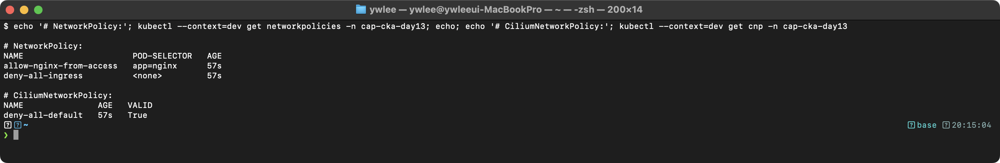

```bash
# 특정 정책 상세 확인 (PostgreSQL 접근 제한 정책)
kubectl describe ciliumnetworkpolicy allow-postgresql-from-apps -n demo
```

**동작 원리:**
1. `deny-all-default` 정책이 기본적으로 모든 ingress/egress를 차단한다 (Default Deny)
2. 이후 개별 정책으로 필요한 트래픽만 허용한다 (화이트리스트 방식)
3. CiliumNetworkPolicy는 표준 NetworkPolicy의 상위 호환으로 L7 정책도 지원한다
4. Cilium은 eBPF를 사용하여 커널 수준에서 패킷 필터링을 수행한다

### 실습 2: 네트워크 정책 동작 테스트

실습 1 사전 구성에서 `allow-nginx-from-access` 정책을 적용했다. 이 정책은 `access=true` 레이블을 가진 Pod 에서만 nginx 에 접근을 허용하고 나머지는 차단한다. 허용 케이스와 차단 케이스를 각각 별도 Pod 로 띄워 대조해야 두 결과가 의미 있다.

```bash
# [차단 케이스] 레이블 없는 Pod — deny-all-ingress 정책에 의해 차단된다
kubectl run nettest-denied --image=busybox:1.36 -n demo --rm -it --restart=Never -- \
  wget -qO- --timeout=3 nginx.demo.svc.cluster.local
# 기대: wget: download timed out (또는 connection refused)

# [허용 케이스] access=true 레이블을 가진 Pod — allow-nginx-from-access 정책에 의해 허용된다
kubectl run nettest-allowed --image=busybox:1.36 -n demo \
  --labels=access=true --rm -it --restart=Never -- \
  wget -qO- --timeout=3 nginx.demo.svc.cluster.local
# 기대: nginx 기본 HTML 페이지 출력(<!DOCTYPE html> ...)
```

위 두 명령의 유일한 차이는 `--labels=access=true` 유무다. 첫 번째 Pod 는 레이블이 없어 `allow-nginx-from-access`의 `podSelector: {matchLabels: {access: "true"}}` 에 매칭되지 않고, `deny-all-ingress` 에 의해 차단된다. 두 번째 Pod 는 해당 레이블을 달고 있어 허용 정책에 매칭되어 트래픽이 통과한다.

**예상 출력:**
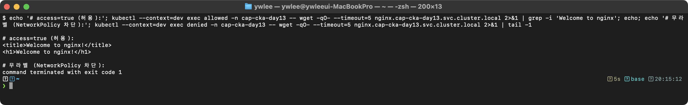

**동작 원리:**
1. NetworkPolicy의 `from` 필드에 `namespaceSelector`가 있으면 지정된 네임스페이스에서만 접근을 허용한다
2. 정책이 없는 네임스페이스에서의 요청은 Default Deny에 의해 차단된다
3. DNS(포트 53) egress가 허용되어야 Service 이름 해석이 가능하다

### 실습 3 (참고 — 이 클러스터에는 미설치): Istio mTLS와 네트워크 보안 계층

> 이 dev 클러스터는 Cilium 기반이며 Istio 가 설치되어 있지 않아 아래 명령은 재현되지 않는다(`peerauthentications` CRD 가 없어 에러가 난다). 이 실습은 "Istio 서비스 메시가 설치된 프로덕션 환경에서 NetworkPolicy(L3/L4) 위에 mTLS(L7) 보안을 한 겹 더 쌓는 패턴"을 개념으로 이해하기 위한 참고 자료다. 실제 mTLS 강제 실습은 CKS 범위이며, 여기서는 명령 형태와 계층 관계만 확인한다.

```bash
# Istio PeerAuthentication 정책 확인 (mTLS 설정)
kubectl get peerauthentication -n demo

# Istio sidecar가 주입된 Pod 확인
kubectl get pods -n demo -o jsonpath='{range .items[*]}{.metadata.name}{"\t"}{range .spec.containers[*]}{.name}{" "}{end}{"\n"}{end}'
```

**예상 출력 (예시 — fresh dev 클러스터에는 Istio(peerauthentications CRD)와 demo ns 가 없어 이 실습은 재현 불가. 아래는 Istio sidecar 가 주입된 환경의 형태):**
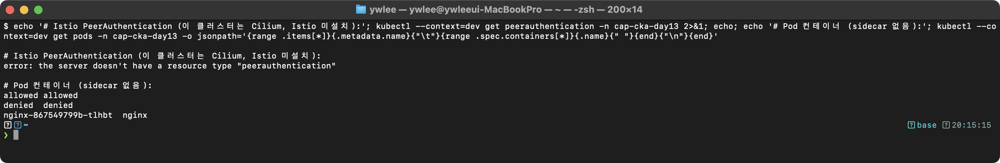

**동작 원리:**
1. Istio의 `PeerAuthentication` STRICT 모드는 모든 Pod 간 통신에 mTLS를 강제한다
2. istio-proxy(Envoy sidecar)가 투명하게 TLS 암호화/복호화를 처리한다
3. NetworkPolicy(L3/L4)와 Istio mTLS(L7)는 서로 다른 계층에서 보안을 제공한다

---

## ✅ 자가점검

<details>
<summary>Q1. NetworkPolicy가 없는 Pod는 어떤 상태인가?</summary>

모든 트래픽이 허용(Default Allow)되는 상태이다. NetworkPolicy 가 하나라도 Pod 에 매칭되는 순간, 해당 방향(Ingress 또는 Egress)의 기본 동작이 "전부 차단"으로 바뀌고 명시적으로 허용한 것만 통과한다.

</details>

<details>
<summary>Q2. OR 조건과 AND 조건을 YAML 에서 어떻게 구분하는가?</summary>

`from`(또는 `to`) 배열에서 `-` 가 두 번 등장하면 OR 조건이다(각 항목이 독립적인 허용 규칙). 하나의 `-` 항목 안에 `podSelector` 와 `namespaceSelector` 가 나란히(들여쓰기 동일하게) 있으면 AND 조건이다(둘 다 만족해야 허용).

</details>

<details>
<summary>Q3. Egress 정책에 DNS 허용이 왜 필수인가?</summary>

Pod 가 서비스 이름(FQDN)으로 접속하려면 CoreDNS 에 UDP/TCP 53 포트로 DNS 쿼리를 보내야 한다. 이 쿼리는 Pod 에서 나가는 Egress 트래픽이므로, Egress 정책에 포트 53 허용 규칙이 없으면 이름을 IP 로 변환할 수 없어 서비스 통신 전체가 실패한다.

</details>

<details>
<summary>Q4. Default Deny All Ingress 정책의 핵심은 무엇인가?</summary>

`podSelector: {}` 로 네임스페이스의 모든 Pod 를 선택하고, `policyTypes: [Ingress]` 만 선언한 뒤 `ingress:` 규칙을 아예 작성하지 않는다. 규칙이 없으면 해당 방향 트래픽 전체가 차단된다.

</details>

<details>
<summary>Q5. 여러 NetworkPolicy 가 같은 Pod 에 적용되면 어떻게 동작하는가?</summary>

모든 정책의 허용 규칙이 UNION(합집합)으로 결합된다. 하나의 정책이라도 허용하면 트래픽이 통과한다. 정책 간에 충돌이나 우선순위는 없다.

</details>

<details>
<summary>Q6. Ingress 리소스가 동작하려면 무엇이 반드시 설치돼 있어야 하는가?</summary>

Ingress Controller 가 설치돼 있어야 한다. Ingress 리소스 자체는 라우팅 규칙 선언에 불과하고, 실제 트래픽 처리는 nginx-ingress-controller, traefik 등의 Controller Pod 가 수행한다. Controller 가 없으면 Ingress 를 생성해도 ADDRESS 가 비어 있고 트래픽이 라우팅되지 않는다.

</details>

<details>
<summary>Q7. CNI 플러그인이 설치되지 않으면 어떤 증상이 나타나는가?</summary>

노드가 NotReady 상태이거나, Pod 가 ContainerCreating 에서 멈추며, `kubectl describe pod` 의 이벤트에 "network plugin is not ready: cni config uninitialized" 메시지가 나타난다.

</details>

<details>
<summary>Q8. pathType Prefix 와 Exact 의 차이는 무엇인가?</summary>

`Exact` 는 경로가 정확히 일치해야 매칭된다(`/api` 만 매칭, `/api/v1` 은 매칭 안 됨). `Prefix` 는 경로가 지정한 접두사로 시작하면 매칭된다(`/api`, `/api/`, `/api/v1`, `/api/v1/users` 모두 매칭). 시험에서는 대부분 `Prefix` 를 사용한다.

</details>

<details>
<summary>Q9. Flannel 이 프로덕션 NetworkPolicy 환경에 부적합한 이유는 무엇인가?</summary>

Flannel 은 NetworkPolicy 를 구현하지 않는다. `kubectl apply` 로 NetworkPolicy 리소스를 만들 수 있지만 실제 패킷 필터링은 적용되지 않는다. NetworkPolicy 가 필요하면 Cilium, Calico, Weave 를 사용해야 한다.

</details>

<details>
<summary>Q10. TLS Ingress 에서 secretName 이 가리키는 Secret 의 타입은 무엇인가?</summary>

`kubernetes.io/tls` 타입이다. `kubectl create secret tls <name> --cert=tls.crt --key=tls.key` 로 생성하며, Secret 안에 `tls.crt`(인증서) 와 `tls.key`(개인키) 두 개의 키가 저장된다.

</details>

<details>
<summary>Q11 (시험형 미니랩). demo 네임스페이스에 있는 app=db Pod 에 대해 다음 조건을 만족하는 NetworkPolicy 를 작성하라: (1) 같은 네임스페이스의 app=api Pod 에서만 TCP 5432 인바운드 허용, (2) 아웃바운드는 DNS 만 허용, (3) 나머지 모든 인바운드·아웃바운드 차단.</summary>

```yaml
apiVersion: networking.k8s.io/v1
kind: NetworkPolicy
metadata:
  name: db-policy
  namespace: demo
spec:
  podSelector:
    matchLabels:
      app: db
  policyTypes:
  - Ingress
  - Egress
  ingress:
  - from:
    - podSelector:
        matchLabels:
          app: api
    ports:
    - protocol: TCP
      port: 5432
  egress:
  - ports:
    - protocol: UDP
      port: 53
    - protocol: TCP
      port: 53
```

핵심 체크포인트: `policyTypes` 에 Ingress 와 Egress 를 모두 선언해야 양방향이 차단 기본이 된다. Egress 규칙을 추가하지 않으면 아웃바운드 전체가 차단되므로 DNS 허용 규칙을 반드시 포함한다.

</details>

---

## 시험 팁

**시간 배분(CKA 실기 기준):**
- NetworkPolicy 문제(1~2개): 문제당 5~8분 목표. YAML 처음부터 작성하지 말고 `kubectl create networkpolicy --help` 또는 공식 문서의 예제를 복사해 수정한다.
- Ingress 문제(1개): `kubectl create ingress` 명령형 생성 후 `kubectl edit` 로 세부 조정하면 3~5분 내 완료 가능하다.

**`kubectl create networkpolicy` 명령형 구문 — 시험장에서 알아야 할 플래그:**

`kubectl create networkpolicy` 는 단순 구조의 정책은 명령형으로 생성할 수 있지만 기능에 제약이 있다.

```bash
# 기본 구문
kubectl create networkpolicy <이름> [--pod-selector=<k=v>] \
  [--ingress-rule=<proto>:<포트>] [--egress-rule=<proto>:<포트>] \
  -n <namespace> [--dry-run=client -o yaml]

# 예시 1: 모든 Pod 에 대해 TCP 8080 인바운드만 허용 (소스 무제한)
kubectl create networkpolicy allow-8080 \
  --pod-selector=app=web \
  --ingress-rule="tcp:8080" \
  -n demo $do > np.yaml

# 예시 2: 아웃바운드를 TCP 5432 와 DNS(UDP 53) 만 허용
kubectl create networkpolicy api-egress \
  --pod-selector=role=api \
  --egress-rule="tcp:5432" \
  --egress-rule="udp:53" \
  -n demo $do > np.yaml
```

| 플래그 | 설명 |
|:--|:--|
| `--pod-selector=k=v` | 이 정책이 적용될 Pod 레이블. 비우면 `{}` (모든 Pod) |
| `--ingress-rule=proto:port` | Ingress 허용 규칙. 반복 가능. 소스(from)를 지정할 수 없어 YAML 편집 필요 |
| `--egress-rule=proto:port` | Egress 허용 규칙. 반복 가능. 대상(to)을 지정할 수 없어 YAML 편집 필요 |

**한계 — 시험에서 피해야 하는 함정**: `kubectl create networkpolicy` 는 `from`(소스 Pod/네임스페이스/CIDR)과 `to`(목적지) 지정을 지원하지 않는다. 즉 "A 네임스페이스의 B Pod 에서만 허용"처럼 소스를 특정해야 하는 문제에서는 명령형으로는 뼈대만 만들고(`$do > np.yaml`), YAML 을 편집해 `from` 절을 수동으로 추가해야 한다. 또한 Ingress 와 Egress 를 동시에 선언하는 경우 `policyTypes` 가 올바르게 생성됐는지 `$do` 출력으로 반드시 확인한다.

**함정 패턴:**
1. **OR/AND 혼동**: `from` 배열에서 `-` 개수로 판단한다. 문제에 "A 네임스페이스의 B Pod"라고 나오면 AND 조건이므로 `-` 는 한 개이고 `namespaceSelector` 와 `podSelector` 가 같은 항목 안에 들여쓰기 동일하게 위치해야 한다.
2. **Egress DNS 누락**: Egress 정책을 작성할 때 DNS 허용을 빠뜨리면 서비스 이름으로의 접근이 전부 실패한다. Egress 정책이 있으면 항상 UDP/TCP 53 규칙을 먼저 작성한다.
3. **policyTypes 누락**: `policyTypes` 필드를 생략하면 Kubernetes 가 규칙 내용으로 자동 추론하는데, `egress:` 규칙만 있고 `policyTypes: [Egress]` 를 명시하지 않으면 Ingress 방향이 차단되지 않는다. 항상 명시한다.
4. **ingressClassName 누락**: Ingress 리소스에 `spec.ingressClassName` 을 지정하지 않으면 기본 IngressClass 가 없을 경우 Controller 가 이 Ingress 를 처리하지 않는다. `kubectl get ingressclass` 로 클러스터에 있는 클래스 이름을 먼저 확인한다.
5. **CNI 미지원 환경**: 시험 클러스터에 Flannel 이 설치된 경우 NetworkPolicy 를 만들어도 실제로 적용되지 않는다. CNI 종류를 `kubectl get pods -n kube-system` 으로 확인한다.
6. **네임스페이스 레이블 누락**: `namespaceSelector` 로 특정 네임스페이스를 지정할 때 해당 네임스페이스에 레이블이 없으면 매칭이 안 된다. `kubectl get namespace --show-labels` 로 레이블을 확인하고, 없으면 `kubectl label namespace <name> kubernetes.io/metadata.name=<name>` 으로 추가한다.

---

## 더 읽을거리

- [Kubernetes 공식 문서 — Network Policies](https://kubernetes.io/docs/concepts/services-networking/network-policies/)
- [Kubernetes 공식 문서 — Ingress](https://kubernetes.io/docs/concepts/services-networking/ingress/)
- [Kubernetes 공식 문서 — IngressClass](https://kubernetes.io/docs/concepts/services-networking/ingress/#ingress-class)
- [Cilium 공식 문서 — Network Policy](https://docs.cilium.io/en/stable/security/policy/)
- [Calico 공식 문서 — Network Policy](https://docs.tigera.io/calico/latest/network-policy/)
- [CNI 사양 GitHub](https://github.com/containernetworking/cni)
- [Kubernetes 공식 문서 — Declare Network Policy (튜토리얼)](https://kubernetes.io/docs/tasks/administer-cluster/declare-network-policy/)
