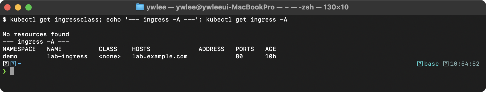
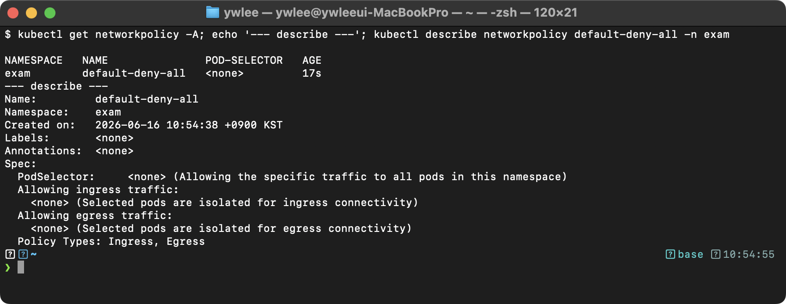
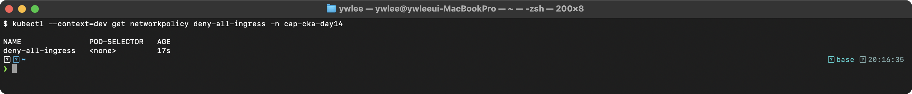
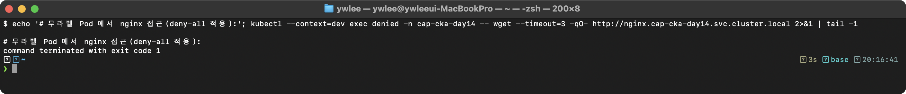
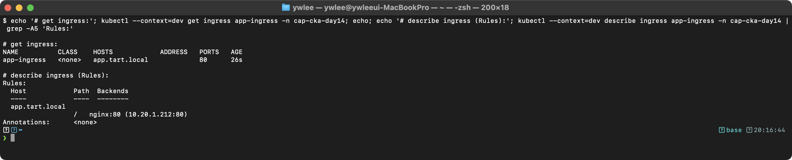
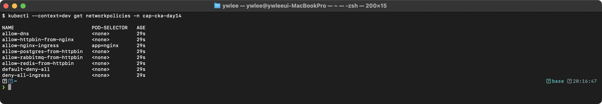
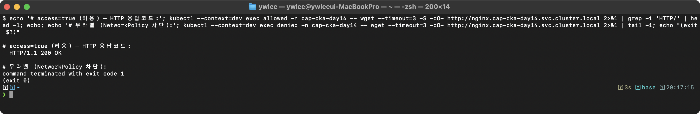

# CKA Day 14: NetworkPolicy & Ingress 실전 & 시험 문제

> CKA 도메인: Services & Networking (20%) - Part 2 실전 | 예상 소요 시간: 2시간

---

## 오늘의 학습 목표 (체크리스트)

- [ ] Ingress 등장 배경과 Service NodePort/LoadBalancer 대비 L7 라우팅의 차이를 설명할 수 있다
- [ ] `ingressClassName`, `pathType: Prefix/Exact`, TLS 블록, `defaultBackend`의 역할을 안다
- [ ] `kubectl create ingress` 명령으로 빠르게 Ingress를 생성할 수 있다
- [ ] NetworkPolicy의 OR 조건(`-` 2개)과 AND 조건(`-` 1개)을 YAML 들여쓰기로 구분할 수 있다
- [ ] Default Deny Ingress/Egress YAML을 즉시 작성할 수 있다
- [ ] Egress 정책에서 DNS(포트 53) 허용이 필요한 이유를 설명할 수 있다
- [ ] CNI 플러그인이 없으면 NetworkPolicy가 무시되는 이유를 설명할 수 있다
- [ ] 시험 환경 셋업(`alias k=kubectl`, `export do=...`)을 첫 입력으로 처리할 수 있다

---

## 1. Ingress

### 등장 배경·스토리

Day 13에서 Service(ClusterIP/NodePort/LoadBalancer)로 Pod 간 통신 경로를 만들었다. Service만으로 외부 노출을 하려면 두 가지 선택지가 있었다: NodePort는 노드의 30000~32767 고포트를 직접 개방하고, LoadBalancer는 서비스마다 클라우드 LB를 하나씩 할당한다. 두 방법 모두 L4(TCP/UDP 포트) 수준까지만 알기 때문에 `shop.example.com`과 `api.example.com`을 같은 IP로 받아 호스트명으로 갈라 보내거나, `/api`는 API 서비스로 `/`는 프론트로 보내는 경로 기반 분기가 불가능하다. HTTP Host 헤더와 URL 경로는 L7(애플리케이션 계층)에 있는 정보이기 때문이다.

Ingress는 이 L7 정보를 읽어 라우팅하는 역방향 프록시(주로 nginx·Traefik)를 K8s 리소스로 선언하게 해, 하나의 외부 진입점에서 호스트·경로별로 여러 Service에 분배한다.

**트레이드오프:** Ingress 리소스 자체는 규칙 선언일 뿐이고, 실제로 트래픽을 처리하는 Ingress 컨트롤러(Pod)가 클러스터에 따로 설치돼 있어야 동작한다. 컨트롤러가 없으면 Ingress 리소스를 `apply`해도 ADDRESS 필드가 비어 있고 실제 라우팅이 일어나지 않는다.

### 개념·내부 동작

클라이언트 요청이 Ingress를 통과하는 흐름은 다음과 같다.

1. DNS가 도메인을 Ingress 컨트롤러의 외부 IP(NodePort 또는 LoadBalancer)로 해석한다.
2. 패킷이 Ingress 컨트롤러 Pod에 도달한다.
3. 컨트롤러는 HTTP Host 헤더와 URL 경로를 읽어 Ingress 리소스의 rules와 매칭한다.
4. 매칭된 backend Service로 요청을 전달한다(프록시).
5. Service가 대상 Pod의 IP:포트로 패킷을 보낸다.

TLS 종료(복호화)는 컨트롤러에서 일어나고, 이후 컨트롤러 → Service 구간은 평문 또는 재암호화로 전달한다. 이를 TLS termination at the edge라 한다.

### 실측 검증

```bash
export KUBECONFIG=kubeconfig/dev.yaml

# 1. 클러스터에 등록된 IngressClass 확인
kubectl get ingressclass
# IngressClass 오브젝트: spec.controller 가 어떤 컨트롤러 구현이 담당하는지 나타낸다.
# is-default-class: "true" 어노테이션이 있으면 ingressClassName 생략 시 이 클래스가 자동 적용된다.
kubectl describe ingressclass nginx 2>/dev/null || echo "(IngressClass nginx 없음 — dev 클러스터에는 Ingress 컨트롤러 미설치)"

# 2. Ingress 리소스 목록 (컨트롤러 없으면 ADDRESS 비어 있음)
kubectl get ingress -A
```

아래는 `dev` 클러스터 실측이다. dev에는 Ingress 컨트롤러가 없어 IngressClass 조회가 비어 있고(`No resources found`), `lab-ingress` 리소스는 존재하지만 컨트롤러가 없어 `ADDRESS` 가 빈 상태로 남는다 — Ingress 리소스와 컨트롤러가 분리돼 있음을 보여주는 정상 동작이다.



### 직접 해보기 (시험형 미니랩)

> 목표: 10분 이내에 경로 기반 Ingress를 생성하고 spec을 검증한다.

```bash
export KUBECONFIG=kubeconfig/dev.yaml
kubectl create namespace demo --dry-run=client -o yaml | kubectl apply -f -

# 명령형으로 빠르게 Ingress 생성
kubectl create ingress lab-ingress \
  --rule="lab.tart.local/api*=api-svc:8080" \
  --rule="lab.tart.local/*=web-svc:80" \
  -n demo

# 검증: rules 와 backend 확인
kubectl describe ingress lab-ingress -n demo

# 정리
kubectl delete ingress lab-ingress -n demo
```

---

## 2. NetworkPolicy

### 등장 배경·스토리

K8s의 기본값은 default allow다. NetworkPolicy를 하나도 만들지 않으면 같은 클러스터 안의 모든 Pod이 다른 모든 Pod에 자유롭게 접근할 수 있다. 단일 팀 환경에서는 편하지만, 여러 팀·고객이 한 클러스터를 공유하는 멀티테넌트 환경이나 보안 요구가 높은 환경에서는 프론트엔드가 탈취당하면 곧장 DB까지 닿는 문제가 된다.

NetworkPolicy는 "이 Pod에는 이런 출처에서만 들어올 수 있다"를 명시적 허용 목록으로 선언하게 해, 기본 차단 후 필요한 경로만 여는 Zero Trust(아무것도 기본 신뢰하지 않음) 모델을 가능하게 한다.

**직전 기술과의 차이:** NetworkPolicy 이전에는 노드 수준 iptables 규칙을 직접 관리하는 방법이 있었다. 그런데 Pod는 재시작할 때마다 새 IP를 할당받는다. 즉 iptables 규칙에 하드코딩한 IP는 Pod가 재시작하는 순간 무의미해지고, 수백 개 Pod 규칙을 사람이 직접 유지하는 것은 현실적으로 불가능하다. NetworkPolicy는 IP 대신 레이블 셀렉터로 Pod를 지정하고, CNI 플러그인이 레이블 변화를 추적해 iptables(또는 eBPF) 규칙을 자동으로 갱신한다.

**트레이드오프:** NetworkPolicy는 선언만으로 작동하지 않고, 이를 실제 패킷 필터링으로 변환하는 CNI(Container Network Interface, Pod에 네트워크를 붙이는 플러그인 규격) 플러그인이 있어야만 커널에서 강제된다. Cilium·Calico·Weave 등은 지원하지만, 일부 단순 CNI는 정책을 무시해 차단이 동작하지 않는다.

### 실측 검증

```bash
export KUBECONFIG=kubeconfig/dev.yaml

# 현재 적용된 NetworkPolicy 목록
kubectl get networkpolicy -A

# Default Deny 정책 직접 확인
kubectl describe networkpolicy -n demo 2>/dev/null || echo "(demo ns 에 NetworkPolicy 없음)"
```

아래는 `dev` 클러스터 실측이다. `exam` 네임스페이스에 적용한 `default-deny-all` NetworkPolicy가 목록에 보이고, `describe` 출력에서 `PodSelector: <none>`(네임스페이스 전체 Pod 대상)과 `Allowing ingress/egress traffic:` 가 비어 있음(전면 차단)을 확인할 수 있다.



### 직접 해보기 (시험형 미니랩)

> 목표: 8분 이내에 Default Deny 후 특정 허용 조합을 완성한다.

```bash
export KUBECONFIG=kubeconfig/dev.yaml
kubectl create namespace demo --dry-run=client -o yaml | kubectl apply -f -

# Step 1: Default Deny
kubectl apply -f - <<EOF
apiVersion: networking.k8s.io/v1
kind: NetworkPolicy
metadata:
  name: lab-deny-all
  namespace: demo
spec:
  podSelector: {}
  policyTypes:
  - Ingress
EOF

# Step 2: app=web 에서만 app=db 로 5432 허용
kubectl apply -f - <<EOF
apiVersion: networking.k8s.io/v1
kind: NetworkPolicy
metadata:
  name: lab-allow-web-db
  namespace: demo
spec:
  podSelector:
    matchLabels:
      app: db
  policyTypes:
  - Ingress
  ingress:
  - from:
    - podSelector:
        matchLabels:
          app: web
    ports:
    - protocol: TCP
      port: 5432
EOF

# 검증
kubectl describe networkpolicy lab-deny-all -n demo
kubectl describe networkpolicy lab-allow-web-db -n demo

# 정리
kubectl delete networkpolicy lab-deny-all lab-allow-web-db -n demo
```

---

## 3. 시험 환경 설정

CKA 실기 시험 시작 직후 아래 셋업을 먼저 입력한다. 이 두 줄이 없으면 타이핑 량이 크게 늘어난다.

```bash
alias k=kubectl
export do='--dry-run=client -o yaml'
```

사용 예:

```bash
# Ingress 스캐폴드 YAML을 파일로 빠르게 생성
kubectl create ingress app-ingress \
  --rule="app.tart.local/api*=httpbin:8000" \
  --rule="app.tart.local/*=nginx-web:80" \
  -n demo $do > app-ingress.yaml

# 확인 후 적용
k apply -f app-ingress.yaml
```

---

## 4. 이 Day의 두 주제 — 맥락과 YAML 예제

- **Ingress**: 외부에서 들어오는 HTTP/HTTPS 트래픽을 호스트·경로 규칙에 따라 내부 Service로 라우팅하는 L7(애플리케이션 계층) 프록시 리소스다.
- **NetworkPolicy**: Pod 간 트래픽을 명시적으로 허용/차단하는 방화벽 정책 리소스다. L3(IP)~L4(포트) 수준에서 동작한다.

### Day 13에서 여기까지 — 왜 이 두 주제가 이어지는가

Day 13에서 Service(ClusterIP/NodePort/LoadBalancer)로 Pod 간 통신 경로를 만들었다. Day 14는 그 Service를 (a) 외부에 어떻게 노출할지(Ingress)와 (b) 어떤 Pod가 어떤 Pod에 접근할 수 있는지(NetworkPolicy)를 다룬다. 즉 Day 13이 "연결을 만든다"였다면 Day 14는 그 연결의 "진입점 관리"와 "접근 제어"를 더한 L3~L7 네트워크 제어 계층이다. 각 주제의 등장 배경과 내부 동작은 위 §1·§2에서 다룬다.

---

**IngressClass 오브젝트.** `ingressClassName` 필드가 참조하는 실체가 IngressClass 오브젝트다. `kubectl get ingressclass`로 클러스터에 등록된 Ingress 구현 목록을 확인할 수 있다. IngressClass의 `spec.controller` 필드는 이 클래스를 처리할 구현체(예: `k8s.io/ingress-nginx`)를 나타낸다. `ingressclass.kubernetes.io/is-default-class: "true"` 어노테이션이 달린 IngressClass는 Ingress 리소스에 `ingressClassName`을 생략했을 때 자동 적용된다. 시험에서 `ingressClassName`이 없는 Ingress 리소스가 동작하지 않는다면 클러스터에 defaultIngressClass가 설정되어 있는지 확인한다.

### 예제 10: 경로 기반 Ingress

아래 Ingress의 각 필드 의미는 다음과 같다.

- `ingressClassName: nginx` — 이 규칙을 처리할 Ingress 컨트롤러를 지정한다. 한 클러스터에 nginx·Traefik 등 여러 컨트롤러가 동시에 설치돼 있을 때, 어느 컨트롤러가 이 Ingress를 담당할지 이 필드로 결정한다.
- `host` — 요청의 HTTP Host 헤더(도메인)가 이 값과 일치할 때만 규칙을 적용한다.
- `path` + `pathType: Prefix` — URL 경로 매칭 방식이다. `Prefix`는 지정 경로로 시작하는 모든 하위 경로를 매칭한다. 즉 `/api`는 `/api`, `/api/v1`, `/api/health`를 모두 포함한다. 더 구체적인 경로(`/api`, `/admin`)를 먼저, 포괄 경로(`/`)를 뒤에 두어 우선순위를 잡는다.
- `backend.service` — 매칭된 요청을 전달할 대상 Service 이름과 포트(Service의 `spec.ports[].port`)다.

```yaml
apiVersion: networking.k8s.io/v1
kind: Ingress
metadata:
  name: path-based-ingress
  namespace: demo
spec:
  ingressClassName: nginx
  rules:
  - host: myapp.example.com
    http:
      paths:
      - path: /api
        pathType: Prefix
        backend:
          service:
            name: api-svc
            port:
              number: 8080
      - path: /admin
        pathType: Prefix
        backend:
          service:
            name: admin-svc
            port:
              number: 8080
      - path: /
        pathType: Prefix
        backend:
          service:
            name: frontend-svc
            port:
              number: 80
```

### 예제 11: 호스트 기반 Ingress

같은 IP·포트로 들어온 트래픽을 Host 헤더(도메인)만으로 다른 Service에 분배하는 예다. `api.tart.local`로 온 요청은 `api-svc`로, `web.tart.local`로 온 요청은 `web-svc`로 보낸다. 두 도메인이 같은 Ingress 컨트롤러 IP를 가리키도록 DNS(또는 `/etc/hosts`)가 설정돼 있어야 한다.

```yaml
apiVersion: networking.k8s.io/v1
kind: Ingress
metadata:
  name: host-based-ingress
  namespace: demo
spec:
  ingressClassName: nginx
  rules:
  - host: api.tart.local
    http:
      paths:
      - path: /
        pathType: Prefix
        backend:
          service:
            name: api-svc
            port:
              number: 80
  - host: web.tart.local
    http:
      paths:
      - path: /
        pathType: Prefix
        backend:
          service:
            name: web-svc
            port:
              number: 80
```

### 예제 12: TLS Ingress

**선행 단계 — tls-secret 생성.** `tls` 블록의 `secretName`이 가리키는 Secret이 해당 네임스페이스에 없으면 Ingress 컨트롤러가 인증서를 찾지 못해 HTTPS가 동작하지 않는다. Ingress를 적용하기 전에 반드시 Secret을 먼저 만든다.

```bash
# 1. 자체서명 인증서 생성 (시험 환경에서는 openssl이 이미 설치돼 있다)
openssl req -x509 -nodes -days 365 -newkey rsa:2048 \
  -keyout tls.key -out tls.crt \
  -subj "/CN=secure.tart.local/O=tart"

# 2. TLS Secret 생성 (타입이 반드시 kubernetes.io/tls 여야 한다)
kubectl create secret tls tls-secret \
  --cert=tls.crt --key=tls.key \
  -n demo
```

`tls` 블록은 지정한 호스트로 들어오는 HTTPS 트래픽의 인증서를 `secretName`이 가리키는 Secret(타입 `kubernetes.io/tls`, 인증서·키 포함)에서 가져온다. `nginx.ingress.kubernetes.io/ssl-redirect: "true"` 어노테이션은 HTTP로 들어온 요청을 HTTPS로 강제 리다이렉트한다. TLS 종료(복호화)는 Ingress 컨트롤러에서 일어나고, 이후 컨트롤러 → Service 구간은 아래 `backend`의 포트로 평문 또는 재암호화되어 전달된다.

```yaml
apiVersion: networking.k8s.io/v1
kind: Ingress
metadata:
  name: tls-ingress
  namespace: demo
  annotations:
    nginx.ingress.kubernetes.io/ssl-redirect: "true"
spec:
  ingressClassName: nginx
  tls:
  - hosts:
    - secure.tart.local
    secretName: tls-secret
  rules:
  - host: secure.tart.local
    http:
      paths:
      - path: /
        pathType: Prefix
        backend:
          service:
            name: secure-svc
            port:
              number: 443       # Service의 spec.ports[].port 값(노드 포트가 아니다). secure-svc가 443에 listen 중이어야 한다. 예: Service port=443, targetPort=8443
```

### 예제 13: defaultBackend가 있는 Ingress

`defaultBackend`는 `rules`의 어떤 host·path에도 매칭되지 않은 요청을 받아낼 기본 목적지다. 이게 없으면 매칭 실패 시 컨트롤러의 기본 404 페이지가 응답한다. 잘못된 경로를 안내 페이지나 단일 백엔드로 모으고 싶을 때 쓴다.

```yaml
apiVersion: networking.k8s.io/v1
kind: Ingress
metadata:
  name: with-default-backend
  namespace: demo
spec:
  ingressClassName: nginx
  defaultBackend:                   # 규칙에 매칭되지 않는 모든 요청
    service:
      name: default-svc
      port:
        number: 80
  rules:
  - host: myapp.example.com
    http:
      paths:
      - path: /api
        pathType: Prefix
        backend:
          service:
            name: api-svc
            port:
              number: 80
```

### 예제 14: Exact pathType Ingress

`pathType: Exact`는 경로가 글자 그대로 정확히 일치할 때만 매칭한다. 아래에서 `/healthz`는 `/healthz` 요청만 받고, `/healthz/`나 `/healthz/check`는 매칭하지 않는다(이들은 `pathType: Prefix`인 `/` 규칙으로 빠진다). 반면 앞 예제들의 `Prefix`는 시작 부분만 일치하면 하위 경로를 모두 포함한다. 정확히 한 엔드포인트만 분리하고 싶을 때 `Exact`, 트리 전체를 받을 때 `Prefix`를 쓴다.

```yaml
apiVersion: networking.k8s.io/v1
kind: Ingress
metadata:
  name: exact-path-ingress
spec:
  ingressClassName: nginx
  rules:
  - host: myapp.example.com
    http:
      paths:
      - path: /healthz              # 정확히 /healthz만 매칭
        pathType: Exact
        backend:
          service:
            name: health-svc
            port:
              number: 80
      - path: /                      # 나머지 모든 경로
        pathType: Prefix
        backend:
          service:
            name: web-svc
            port:
              number: 80
```

### 예제 15: 포트 범위를 사용하는 NetworkPolicy

`ports`에서 `port`만 쓰면 단일 포트를 허용한다. `port`와 `endPort`를 함께 쓰면 두 값 사이의 연속 포트 범위를 한 번에 허용한다(아래는 8000~8100). 포트마다 규칙을 나열하지 않아도 되므로 여러 포트를 여는 애플리케이션에 쓴다. `endPort`는 CNI 플러그인이 이 기능을 지원해야 동작한다(Cilium·Calico는 지원).

```yaml
apiVersion: networking.k8s.io/v1
kind: NetworkPolicy
metadata:
  name: allow-port-range
  namespace: demo
spec:
  podSelector:
    matchLabels:
      app: multi-port-app
  policyTypes:
  - Ingress
  ingress:
  - from:
    - podSelector:
        matchLabels:
          role: client
    ports:
    - protocol: TCP
      port: 8000
      endPort: 8100               # 8000-8100 포트 범위 허용
```

---

## 5. 시험에서 이 주제가 어떻게 출제되는가?

### 출제 패턴 분석

CKA 시험의 NetworkPolicy & Ingress 관련 출제:

**NetworkPolicy 출제 비중:** 높음 (Services & Networking 20% 중 상당 부분)

**주요 출제 유형:**

1. Default Deny 정책 생성 — 매우 빈출
2. 특정 Pod 간 통신 허용 — 빈출
3. 네임스페이스 간 통신 허용 — 빈출
4. OR vs AND 조건 구분 — 난이도 있는 문제
5. Egress + DNS 허용 — 빈출
6. Ingress 리소스 생성 — 빈출
7. CNI 플러그인 확인 — 가끔 출제

**시험에서의 핵심:**

- Default Deny YAML을 암기하고 즉시 작성할 수 있어야 한다
- OR vs AND: YAML 들여쓰기의 `-` 하나 차이를 정확히 구분한다
- Egress 정책에서 DNS(53) 허용을 빠뜨리지 않는다
- Ingress는 `kubectl create ingress` 명령으로 빠르게 생성한다
- CNI 확인: `/etc/cni/net.d/` 경로를 기억한다

### OR vs AND 조건 구분 (가장 자주 틀리는 부분)

`from`(또는 `to`) 배열에서 `-`(리스트 항목)의 개수가 조건의 논리를 바꾼다.

```yaml
# OR 조건 — 배열 항목이 2개 이상(- 가 2개):
ingress:
- from:
  - podSelector:                 # 규칙 1: app=web Pod에서
      matchLabels:
        app: web
  - podSelector:                 # 규칙 2: app=gateway Pod에서 (둘 중 하나만 만족해도 허용)
      matchLabels:
        app: gateway
```

```yaml
# AND 조건 — 하나의 배열 항목 안에 셀렉터 2개(- 가 1개):
ingress:
- from:
  - namespaceSelector:           # 조건 A: monitoring 네임스페이스이고
      matchLabels:
        ns: monitoring
    podSelector:                 # 조건 B: 그 안에서 app=prometheus Pod이며 (둘 다 만족해야 허용)
      matchLabels:
        app: prometheus
```

해석: OR은 web Pod 또는 gateway Pod 중 하나라도 출처면 허용한다. AND는 monitoring 네임스페이스의 prometheus Pod만 허용하고, 같은 monitoring 네임스페이스의 다른 Pod나 다른 네임스페이스의 prometheus는 모두 차단한다. 핵심 판별법: `namespaceSelector`와 `podSelector` 앞에 `-`가 각각 붙어 있으면 OR, 한 `-` 아래 같은 들여쓰기로 나란히 있으면 AND다. 이 한 칸 들여쓰기 차이가 정책의 의미를 완전히 바꾼다(문제 3·4에서 실습).

---

## 6. 시험 대비 연습 문제 (12문제)

### 문제 1. Default Deny Ingress [4%]

**컨텍스트:** `kubectl config use-context prod`

`default` 네임스페이스에 모든 인바운드 트래픽을 차단하는 NetworkPolicy `deny-all-ingress`를 생성하라.

<details>
<summary>풀이</summary>

```bash
kubectl config use-context prod

cat <<EOF | kubectl apply -f -
apiVersion: networking.k8s.io/v1
kind: NetworkPolicy
metadata:
  name: deny-all-ingress
  namespace: default
spec:
  podSelector: {}
  policyTypes:
  - Ingress
EOF

# 검증
kubectl get networkpolicy deny-all-ingress
kubectl describe networkpolicy deny-all-ingress
```

**검증 기대 출력:**



```bash
# 통신 차단 테스트
kubectl run test-pod --image=busybox:1.28 --rm -it --restart=Never -- \
  wget --timeout=3 -qO- http://<any-svc>
```



```bash
# 정리
kubectl delete networkpolicy deny-all-ingress
```

**핵심:**
- `podSelector: {}`는 네임스페이스의 모든 Pod에 적용한다
- `policyTypes: [Ingress]`만 지정하고 ingress 규칙을 비워두면 모든 인바운드가 차단된다
- egress는 영향받지 않는다 (policyTypes에 Egress가 없으므로)

</details>

---

### 문제 2. 특정 Pod 간 통신 허용 [7%]

**컨텍스트:** `kubectl config use-context dev`

`demo` 네임스페이스에서 다음 NetworkPolicy를 생성하라:
- 이름: `allow-web-to-db`
- 대상: `tier=database` 레이블을 가진 Pod
- 허용: `tier=web` 레이블을 가진 Pod에서 TCP 5432 포트로의 인바운드
- 그 외 인바운드는 차단

<details>
<summary>풀이</summary>

```bash
kubectl config use-context dev

cat <<EOF | kubectl apply -f -
apiVersion: networking.k8s.io/v1
kind: NetworkPolicy
metadata:
  name: allow-web-to-db
  namespace: demo
spec:
  podSelector:
    matchLabels:
      tier: database            # database Pod에 적용
  policyTypes:
  - Ingress                     # 인바운드 제어
  ingress:
  - from:
    - podSelector:
        matchLabels:
          tier: web             # web Pod에서만 허용
    ports:
    - protocol: TCP
      port: 5432                # PostgreSQL 포트만
EOF

# 검증
kubectl describe networkpolicy allow-web-to-db -n demo

# 테스트 (Web Pod에서 접근 가능, 다른 Pod에서 차단)
# kubectl run web-test --image=busybox --labels="tier=web" -n demo --rm -it -- \
#   nc -zv <db-pod-ip> 5432

# 정리
kubectl delete networkpolicy allow-web-to-db -n demo
```

</details>

---

### 문제 3. 네임스페이스 간 통신 (OR 조건) [7%]

**컨텍스트:** `kubectl config use-context dev`

`demo` 네임스페이스의 `app=redis` Pod에 대해:
- `monitoring` 네임스페이스에서 오는 TCP 6379 포트 인바운드를 허용하라
- 같은 네임스페이스의 `tier=backend` Pod에서 오는 TCP 6379 포트 인바운드를 허용하라
- 그 외 인바운드는 차단하라

<details>
<summary>풀이</summary>

```bash
kubectl config use-context dev

# [사전 확인] monitoring 네임스페이스에 실제 어떤 레이블이 있는지 먼저 확인한다.
# K8s 1.21+ 는 kubernetes.io/metadata.name: <ns-이름> 레이블을 자동으로 부여한다.
kubectl get ns monitoring --show-labels 2>/dev/null || echo "(monitoring 네임스페이스 없음 — 필요 시 kubectl create ns monitoring)"

# purpose=monitoring 레이블을 임의 지정하는 경우 위 출력에 없으면 아래 명령으로 추가한다.
# kubernetes.io/metadata.name: monitoring 레이블(자동 부여)을 쓰면 레이블 추가 없이도 동작한다.
kubectl label namespace monitoring purpose=monitoring --overwrite 2>/dev/null || true

cat <<EOF | kubectl apply -f -
apiVersion: networking.k8s.io/v1
kind: NetworkPolicy
metadata:
  name: redis-access
  namespace: demo
spec:
  podSelector:
    matchLabels:
      app: redis
  policyTypes:
  - Ingress
  ingress:
  - from:
    - namespaceSelector:           # 규칙 1: monitoring NS (OR)
        matchLabels:
          purpose: monitoring
          # 대안: kubernetes.io/metadata.name: monitoring (레이블 추가 불필요, K8s 1.21+)
    - podSelector:                 # 규칙 2: 같은 NS의 backend (OR)
        matchLabels:
          tier: backend
    ports:
    - protocol: TCP
      port: 6379
EOF

# 검증
kubectl describe networkpolicy redis-access -n demo

# 정리
kubectl delete networkpolicy redis-access -n demo
```

**핵심:** `from` 배열에 `-`가 2개이므로 OR 조건. monitoring NS의 모든 Pod 또는 같은 NS의 backend Pod 중 하나만 만족하면 허용.

**주의:** `purpose=monitoring` 레이블을 임의 지정했는데 네임스페이스에 해당 레이블이 없으면 정책이 전혀 동작하지 않는다. 정책 적용 후 예상한 허용이 안 된다면 `kubectl get ns monitoring --show-labels`로 레이블을 먼저 확인한다. K8s 1.21 이상에서는 자동으로 붙는 `kubernetes.io/metadata.name: monitoring`을 쓰는 방법이 더 안전하다.

</details>

---

### 문제 4. AND 조건 NetworkPolicy [7%]

**컨텍스트:** `kubectl config use-context dev`

`demo` 네임스페이스의 `app=api` Pod에 대해:
- `monitoring` 네임스페이스의 `app=prometheus` Pod에서만 TCP 9090 인바운드를 허용하라
- (monitoring 네임스페이스의 다른 Pod는 차단해야 한다)

<details>
<summary>풀이</summary>

```bash
kubectl config use-context dev

cat <<EOF | kubectl apply -f -
apiVersion: networking.k8s.io/v1
kind: NetworkPolicy
metadata:
  name: allow-prometheus-only
  namespace: demo
spec:
  podSelector:
    matchLabels:
      app: api
  policyTypes:
  - Ingress
  ingress:
  - from:
    - namespaceSelector:           # AND 조건! (- 가 1개)
        matchLabels:
          kubernetes.io/metadata.name: monitoring
      podSelector:                 # 같은 규칙 내 추가 조건
        matchLabels:
          app: prometheus
    ports:
    - protocol: TCP
      port: 9090
EOF

# 검증
kubectl describe networkpolicy allow-prometheus-only -n demo

# 정리
kubectl delete networkpolicy allow-prometheus-only -n demo
```

**핵심:** `namespaceSelector`와 `podSelector`가 같은 `-` 아래에 있으므로 AND 조건이다. monitoring NS이면서 prometheus Pod인 경우에만 허용한다.

**내부 동작 원리:** CNI 플러그인(Cilium 등)은 from 배열의 각 항목을 독립적인 규칙으로 처리한다. 하나의 항목 안에 namespaceSelector와 podSelector가 함께 있으면 두 조건을 모두 만족하는 트래픽만 허용한다. 별도의 `-` 항목이면 각각 독립적으로 평가하여 하나라도 만족하면 허용한다.

</details>

---

### 문제 5. Egress 정책 + DNS 허용 [7%]

**컨텍스트:** `kubectl config use-context prod`

`default` 네임스페이스의 `role=api` Pod에 대해:
- DNS 조회를 허용하라 (UDP/TCP 53)
- `tier=database` Pod로의 TCP 3306 접근을 허용하라
- 그 외 아웃바운드는 차단하라

<details>
<summary>풀이</summary>

```bash
kubectl config use-context prod

cat <<EOF | kubectl apply -f -
apiVersion: networking.k8s.io/v1
kind: NetworkPolicy
metadata:
  name: api-egress
  namespace: default
spec:
  podSelector:
    matchLabels:
      role: api
  policyTypes:
  - Egress
  egress:
  - ports:                         # DNS 허용 (필수!)
    - protocol: UDP
      port: 53
    - protocol: TCP
      port: 53
  - to:                            # database로만 접근
    - podSelector:
        matchLabels:
          tier: database
    ports:
    - protocol: TCP
      port: 3306
EOF

# 검증
kubectl describe networkpolicy api-egress

# 정리
kubectl delete networkpolicy api-egress
```

**핵심:** DNS 규칙에서 `to`를 생략하면 모든 대상으로의 DNS 쿼리를 허용한다. Egress 정책에서 DNS를 빠뜨리면 서비스 이름 해석이 불가능하다.

**트러블슈팅:** Egress 정책 적용 후 Pod에서 Service 이름으로 접근이 안 되는 경우, 대부분 DNS(포트 53) 허용을 빠뜨린 것이다. `kubectl exec <pod> -- nslookup <svc>` 명령으로 DNS 해석이 되는지 먼저 확인한다. timeout이 발생하면 DNS 허용 규칙을 추가해야 한다.

</details>

---

### 문제 6. 경로 기반 Ingress 생성 [7%]

**컨텍스트:** `kubectl config use-context dev`

다음 조건의 Ingress를 생성하라:
- 이름: `app-ingress`
- 네임스페이스: `demo`
- 호스트: `app.tart.local`
- `/api` 경로 → `httpbin` Service (포트 8000)
- `/` 경로 → `nginx-web` Service (포트 80)
- pathType: Prefix

<details>
<summary>풀이</summary>

```bash
kubectl config use-context dev

# 방법 1: YAML
cat <<EOF | kubectl apply -f -
apiVersion: networking.k8s.io/v1
kind: Ingress
metadata:
  name: app-ingress
  namespace: demo
spec:
  rules:
  - host: app.tart.local
    http:
      paths:
      - path: /api
        pathType: Prefix
        backend:
          service:
            name: httpbin
            port:
              number: 8000
      - path: /
        pathType: Prefix
        backend:
          service:
            name: nginx-web
            port:
              number: 80
EOF

# 방법 2: kubectl create ingress (빠른 방법)
kubectl create ingress app-ingress \
  --rule="app.tart.local/api*=httpbin:8000" \
  --rule="app.tart.local/*=nginx-web:80" \
  -n demo

# 검증
kubectl get ingress app-ingress -n demo
kubectl describe ingress app-ingress -n demo
```

**검증 기대 출력:**



```bash
# 정리
kubectl delete ingress app-ingress -n demo
```

**핵심:** 더 구체적인 경로(`/api`)를 먼저 정의해야 한다. Prefix 매칭이므로 `/api`는 `/api`, `/api/v1` 등과 매칭된다.

</details>

---

### 문제 7. 호스트 기반 Ingress [4%]

**컨텍스트:** `kubectl config use-context dev`

다음 Ingress를 생성하라:
- 이름: `multi-host`
- `api.tart.local` → `api-svc:8080`
- `web.tart.local` → `web-svc:80`
- 네임스페이스: `demo`

<details>
<summary>풀이</summary>

```bash
kubectl config use-context dev

cat <<EOF | kubectl apply -f -
apiVersion: networking.k8s.io/v1
kind: Ingress
metadata:
  name: multi-host
  namespace: demo
spec:
  rules:
  - host: api.tart.local
    http:
      paths:
      - path: /
        pathType: Prefix
        backend:
          service:
            name: api-svc
            port:
              number: 8080
  - host: web.tart.local
    http:
      paths:
      - path: /
        pathType: Prefix
        backend:
          service:
            name: web-svc
            port:
              number: 80
EOF

# 검증
kubectl get ingress multi-host -n demo
kubectl describe ingress multi-host -n demo

# 정리
kubectl delete ingress multi-host -n demo
```

</details>

---

### 문제 8. Default Deny + 특정 허용 조합 [7%]

**컨텍스트:** `kubectl config use-context dev`

`demo` 네임스페이스에서:
1. 모든 Pod의 인바운드를 차단하는 Default Deny 정책을 생성하라 (이름: `default-deny`)
2. `app=web` Pod에 대해서만 `app=gateway` Pod에서 TCP 80 인바운드를 허용하라 (이름: `allow-gateway`)

<details>
<summary>풀이</summary>

```bash
kubectl config use-context dev

# 1. Default Deny
cat <<EOF | kubectl apply -f -
apiVersion: networking.k8s.io/v1
kind: NetworkPolicy
metadata:
  name: default-deny
  namespace: demo
spec:
  podSelector: {}
  policyTypes:
  - Ingress
EOF

# 2. 특정 허용 (Default Deny 위에 추가)
cat <<EOF | kubectl apply -f -
apiVersion: networking.k8s.io/v1
kind: NetworkPolicy
metadata:
  name: allow-gateway
  namespace: demo
spec:
  podSelector:
    matchLabels:
      app: web
  policyTypes:
  - Ingress
  ingress:
  - from:
    - podSelector:
        matchLabels:
          app: gateway
    ports:
    - protocol: TCP
      port: 80
EOF

# 검증
kubectl get networkpolicy -n demo
kubectl describe networkpolicy allow-gateway -n demo

# 정리
kubectl delete networkpolicy default-deny allow-gateway -n demo
```

**핵심:** NetworkPolicy는 OR 방식으로 결합된다. Default Deny가 있어도 allow-gateway 정책이 web Pod에 대한 인바운드를 허용한다. 같은 Pod에 여러 NetworkPolicy가 적용될 때, 모든 정책의 허용 규칙이 합산(UNION)된다.

</details>

---

### 문제 9. Egress Default Deny + DNS + 특정 Pod 허용 [7%]

**컨텍스트:** `kubectl config use-context dev`

`demo` 네임스페이스의 `role=worker` Pod에 대해:
- 모든 아웃바운드를 차단하되
- DNS(포트 53)는 허용하고
- `app=cache` Pod의 TCP 6379 포트만 허용하라
- 이름: `worker-egress`

<details>
<summary>풀이</summary>

```bash
kubectl config use-context dev

cat <<EOF | kubectl apply -f -
apiVersion: networking.k8s.io/v1
kind: NetworkPolicy
metadata:
  name: worker-egress
  namespace: demo
spec:
  podSelector:
    matchLabels:
      role: worker
  policyTypes:
  - Egress
  egress:
  # DNS 허용
  - ports:
    - protocol: UDP
      port: 53
    - protocol: TCP
      port: 53
  # cache Pod로만 접근 허용
  - to:
    - podSelector:
        matchLabels:
          app: cache
    ports:
    - protocol: TCP
      port: 6379
EOF

# 검증
kubectl describe networkpolicy worker-egress -n demo

# 정리
kubectl delete networkpolicy worker-egress -n demo
```

</details>

---

### 문제 10. CNI 플러그인 확인 [4%]

**컨텍스트:** `kubectl config use-context dev`

NetworkPolicy는 CNI(Container Network Interface, Pod에 네트워크를 붙이는 플러그인 규격) 플러그인이 지원해야만 커널에서 실제 패킷 필터링이 이뤄진다. 앞 문제들에서 만든 정책도 결국 이 CNI가 강제한다. Cilium·Calico·Weave 등은 NetworkPolicy를 지원하지만, 일부 단순 CNI(예: 정책 없는 Flannel 단독)는 정책을 무시해 차단이 동작하지 않는다. 그래서 트러블슈팅 시 "정책은 맞는데 차단이 안 된다"면 CNI가 무엇인지 먼저 확인한다. 이 문제는 현재 클러스터의 CNI를 식별하는 실습이다.

다음 정보를 `/tmp/cni-info.txt`에 저장하라:
1. 사용 중인 CNI 플러그인의 이름
2. CNI 설정 파일 경로

<details>
<summary>풀이</summary>

```bash
kubectl config use-context dev

# CNI 플러그인 확인 방법 1: kube-system의 CNI Pod 확인
kubectl get pods -n kube-system | grep -E "cilium|calico|flannel|weave" > /tmp/cni-info.txt

# CNI 플러그인 확인 방법 2: 노드에서 직접 확인 (SSH 접속 후)
# ssh dev-master  (← ~/.ssh/config 등록 별칭; ProxyCommand가 tart ip로 실시간 IP 조회)
# ls /etc/cni/net.d/
# cat /etc/cni/net.d/*.conflist

# Cilium 상태 확인 (tart-infra는 Cilium 사용)
echo "=== Cilium Pods ===" >> /tmp/cni-info.txt
kubectl get pods -n kube-system -l k8s-app=cilium >> /tmp/cni-info.txt
echo "" >> /tmp/cni-info.txt
echo "CNI Config Path: /etc/cni/net.d/" >> /tmp/cni-info.txt
echo "CNI Binary Path: /opt/cni/bin/" >> /tmp/cni-info.txt

cat /tmp/cni-info.txt
```

**핵심 포인트:**
- CNI 설정: `/etc/cni/net.d/`
- CNI 바이너리: `/opt/cni/bin/`
- Cilium Pod: `k8s-app=cilium` 레이블

</details>

---

### 문제 11. Ingress에 defaultBackend 설정 [4%]

**컨텍스트:** `kubectl config use-context dev`

다음 Ingress를 생성하라:
- 이름: `catch-all-ingress`
- `/api`로 들어오는 트래픽은 `api-svc:80`으로
- 나머지 모든 트래픽은 `default-svc:80`으로 (defaultBackend)
- 네임스페이스: `demo`

<details>
<summary>풀이</summary>

```bash
kubectl config use-context dev

cat <<EOF | kubectl apply -f -
apiVersion: networking.k8s.io/v1
kind: Ingress
metadata:
  name: catch-all-ingress
  namespace: demo
spec:
  defaultBackend:
    service:
      name: default-svc
      port:
        number: 80
  rules:
  - http:
      paths:
      - path: /api
        pathType: Prefix
        backend:
          service:
            name: api-svc
            port:
              number: 80
EOF

# 검증
kubectl get ingress catch-all-ingress -n demo
kubectl describe ingress catch-all-ingress -n demo

# 정리
kubectl delete ingress catch-all-ingress -n demo
```

**핵심:** `defaultBackend`는 어떤 규칙에도 매칭되지 않는 트래픽을 처리한다. host를 생략하면 모든 호스트에 적용된다.

</details>

---

### 문제 12. NetworkPolicy 트러블슈팅 [7%]

**컨텍스트:** `kubectl config use-context dev`

`demo` 네임스페이스에서 `app=backend` Pod가 `app=database` Pod의 TCP 5432에 접근하지 못한다. 다음 단계로 문제를 진단하고 해결하라:
1. 현재 적용된 NetworkPolicy를 확인하라
2. database Pod에 적용된 정책이 backend에서의 접근을 허용하는지 확인하라
3. 필요하다면 정책을 수정하라

<details>
<summary>풀이</summary>

```bash
kubectl config use-context dev

# 시뮬레이션: 잘못된 NetworkPolicy 생성
kubectl run db-pod --image=postgres:15 --labels="app=database" -n demo \
  --env="POSTGRES_PASSWORD=test" --port=5432
kubectl run backend-pod --image=busybox --labels="app=backend" -n demo -- sleep 3600

cat <<EOF | kubectl apply -f -
apiVersion: networking.k8s.io/v1
kind: NetworkPolicy
metadata:
  name: db-policy
  namespace: demo
spec:
  podSelector:
    matchLabels:
      app: database
  policyTypes:
  - Ingress
  ingress:
  - from:
    - podSelector:
        matchLabels:
          app: frontend        # backend가 아닌 frontend만 허용!
    ports:
    - protocol: TCP
      port: 5432
EOF

# === 진단 ===

# 1. NetworkPolicy 확인
kubectl get networkpolicy -n demo
kubectl describe networkpolicy db-policy -n demo

# 2. 정책 분석
# Allowing ingress traffic:
#   To Port: 5432/TCP
#   From: PodSelector: app=frontend  ← backend가 아니라 frontend!

# 3. 접근 테스트 (실패)
kubectl exec backend-pod -n demo -- nc -zv -w 3 db-pod 5432
# timeout!

# 4. 수정: backend도 허용하도록 정책 업데이트
cat <<EOF | kubectl apply -f -
apiVersion: networking.k8s.io/v1
kind: NetworkPolicy
metadata:
  name: db-policy
  namespace: demo
spec:
  podSelector:
    matchLabels:
      app: database
  policyTypes:
  - Ingress
  ingress:
  - from:
    - podSelector:
        matchLabels:
          app: frontend
    - podSelector:                # backend 추가 (OR 조건)
        matchLabels:
          app: backend
    ports:
    - protocol: TCP
      port: 5432
EOF

# 5. 검증
kubectl exec backend-pod -n demo -- nc -zv -w 3 db-pod 5432
# 연결 성공!

# 정리
kubectl delete networkpolicy db-policy -n demo
kubectl delete pod db-pod backend-pod -n demo
```

**진단 체크리스트:**
1. `kubectl get networkpolicy -n <ns>` — 어떤 정책이 있는지
2. `kubectl describe networkpolicy <name>` — 허용 규칙 확인
3. Pod의 레이블과 정책의 from/to selector 비교
4. 포트가 정확한지 확인
5. Egress 정책이 있다면 DNS(53)가 허용되는지 확인

</details>

---

## 7. 복습 체크리스트

### 개념 확인

- [ ] NetworkPolicy의 OR 조건(`-`가 2개)과 AND 조건(`-`가 1개)의 차이를 정확히 구분할 수 있는가?
- [ ] Default Deny Ingress/Egress YAML을 즉시 작성할 수 있는가?
- [ ] Egress 정책에서 DNS(포트 53)를 반드시 허용해야 하는 이유를 설명할 수 있는가?
- [ ] Ingress 리소스의 pathType(Exact, Prefix)의 차이를 아는가?
- [ ] IngressClass의 역할을 이해하는가?
- [ ] CNI 플러그인의 역할과 NetworkPolicy 지원 여부를 알고 있는가?
- [ ] 여러 NetworkPolicy가 같은 Pod에 적용될 때 어떻게 결합되는지 (UNION) 이해하는가?

### kubectl 명령어 확인

- [ ] `kubectl get networkpolicy -n <namespace>`
- [ ] `kubectl describe networkpolicy <name>`
- [ ] `kubectl create ingress <name> --rule="host/path=svc:port"`
- [ ] `kubectl get ingress -n <namespace>`

### 시험 핵심 팁

1. **Default Deny 먼저** — 문제에서 "그 외 차단"이 요구되면 policyTypes에 해당 방향을 명시하고 규칙을 비워두면 됨
2. **OR vs AND** — YAML의 `-` 들여쓰기를 정확히 확인. 실수하면 완전히 다른 정책이 된다
3. **Egress + DNS** — Egress 정책 문제에서는 반드시 DNS(UDP/TCP 53) 허용 추가
4. **Ingress 빠른 생성** — `kubectl create ingress` 명령이 시험에서 시간 절약
5. **CNI** — `/etc/cni/net.d/` 경로와 `/opt/cni/bin/` 경로 기억
6. **NetworkPolicy 합산** — 여러 정책이 같은 Pod에 적용되면 허용 규칙이 합산(UNION)됨

---

## ✅ 자가점검

<details>
<summary>Q1. NetworkPolicy에서 OR 조건과 AND 조건을 구분하는 YAML 표현 차이는 무엇인가?</summary>

`from` 배열에서 `-`가 두 개 이상 별개 항목으로 나열되면 OR 조건이다. 한 `-` 항목 안에 `namespaceSelector`와 `podSelector`가 같은 들여쓰기로 나란히 있으면 AND 조건이다. 한 칸 들여쓰기 차이가 정책 의미를 완전히 바꾼다.

</details>

<details>
<summary>Q2. TLS Ingress를 생성할 때 `tls-secret`을 먼저 만들어야 하는 이유는?</summary>

Ingress 컨트롤러는 TLS 핸드셰이크 시 `secretName`이 가리키는 Secret에서 인증서와 개인 키를 읽는다. Secret이 없으면 컨트롤러가 인증서를 제공하지 못해 HTTPS 연결이 성립하지 않는다. `kubectl create secret tls <이름> --cert=tls.crt --key=tls.key`로 먼저 생성해야 한다.

</details>

<details>
<summary>Q3. Egress 정책에서 DNS(포트 53)를 반드시 허용해야 하는 이유는?</summary>

Egress 정책이 적용된 Pod는 명시적으로 허용된 트래픽만 내보낼 수 있다. DNS 쿼리도 아웃바운드 트래픽(UDP/TCP 53)이므로, DNS를 허용하지 않으면 Service 이름으로 접근이 불가능하다. IP로는 직접 접근이 되더라도 Service 이름 해석이 실패한다.

</details>

<details>
<summary>Q4. CNI 플러그인 없이 NetworkPolicy를 생성하면 어떻게 되는가?</summary>

정책 리소스 자체는 API 서버에 저장되지만, 실제 패킷 필터링이 일어나지 않는다. 즉 정책이 있어도 차단이 동작하지 않아 default allow 상태가 유지된다. CNI가 NetworkPolicy를 지원해야만(Cilium, Calico 등) 커널에서 강제된다.

</details>

<details>
<summary>Q5. `pathType: Prefix`와 `pathType: Exact`의 차이는?</summary>

`Prefix`는 지정 경로로 시작하는 모든 하위 경로를 매칭한다(`/api`는 `/api`, `/api/v1`, `/api/health` 포함). `Exact`는 경로가 글자 그대로 정확히 일치할 때만 매칭한다(`/healthz`는 `/healthz/`나 `/healthz/check`를 매칭하지 않는다).

</details>

---

## 시험 팁

1. **시험 시작 2줄 먼저** — `alias k=kubectl`과 `export do='--dry-run=client -o yaml'`을 입력한다. 이 두 줄로 명령 길이가 절반으로 줄어든다.
2. **Default Deny 패턴 암기** — `podSelector: {}`와 `policyTypes`만 있고 `ingress:`/`egress:` 규칙을 비우면 해당 방향 전체가 차단된다.
3. **OR vs AND 확인법** — YAML 편집 후 반드시 `kubectl describe networkpolicy <이름>`으로 "Allowing ingress traffic" 출력을 읽어 의도와 일치하는지 확인한다.
4. **TLS Ingress 순서** — Secret 생성 → Ingress 생성 순서를 지킨다. Secret 타입이 `kubernetes.io/tls`여야 한다.
5. **컨텍스트 전환 잊지 말 것** — 문제마다 `kubectl config use-context <ctx>`가 지정되어 있다. 이를 빠뜨리면 다른 클러스터에 정책이 생성된다.
6. **`kubectl create ingress` 활용** — `--rule="host/path*=svc:port"` 형식으로 빠르게 Ingress를 생성한다. `*`는 Prefix pathType에 해당한다.

---

## 더 읽을거리

- [Kubernetes 공식 문서 — Network Policies](https://kubernetes.io/docs/concepts/services-networking/network-policies/)
- [Kubernetes 공식 문서 — Ingress](https://kubernetes.io/docs/concepts/services-networking/ingress/)
- [Kubernetes 공식 문서 — Ingress Controllers](https://kubernetes.io/docs/concepts/services-networking/ingress-controllers/)
- [Cilium NetworkPolicy 문서](https://docs.cilium.io/en/stable/security/policy/) — eBPF 기반 정책 상세 동작
- [NetworkPolicy Editor (시각화 도구)](https://editor.networkpolicy.io/) — YAML 작성 전 규칙을 시각적으로 설계할 때 유용

---

## 내일 예고

**Day 15: Storage** — PV, PVC, StorageClass, Volume Mount를 학습하고, hostPath/emptyDir/configMap 볼륨 타입을 실습한다.

---

## tart-infra 실습

**전제.** 이 실습은 dev 클러스터가 가동 중이어야 한다(`./scripts/boot.sh` 이후 재부팅했다면 `./scripts/fix-cluster-ip-drift.sh dev`로 IP 드리프트를 복구해 둔다). kubeconfig는 `kubeconfig/dev.yaml`에 있고, 이를 `KUBECONFIG`에 지정해 사용한다. dev 클러스터의 CNI는 Cilium(eBPF 기반 CNI)이므로 NetworkPolicy의 확장형인 CiliumNetworkPolicy(CRD)도 함께 쓸 수 있다. 아래 출력 예시 중 일부는 demo 네임스페이스·앱이 미리 떠 있는 환경 기준이며, fresh dev 클러스터에는 없을 수 있다(각 캡션에 명시).

### 실습 환경 설정

```bash
# dev 클러스터에 접속 (CiliumNetworkPolicy가 적용된 클러스터)
export KUBECONFIG=kubeconfig/dev.yaml
kubectl get nodes
```

### 실습 전 안내

아래 실습 1·2는 demo 네임스페이스와 nginx-web·httpbin·postgres-svc Pod이 미리 떠 있는 환경을 전제한다. **fresh dev 클러스터에는 이 앱들이 없어 curl·exec 명령이 즉시 오류가 난다.** 이 경우 실습 1·2를 건너뛰고 위의 시험 대비 연습 문제(문제 1~12)로 대체한다. 아래에 최소 앱을 직접 만들어 실습하려면 다음 명령을 먼저 실행한다.

```bash
# 최소 실습 환경 생성 (fresh 클러스터용)
kubectl create namespace demo --dry-run=client -o yaml | kubectl apply -f -
kubectl run nginx-web --image=nginx:alpine -n demo --labels="app=nginx-web" --port=80
kubectl run httpbin --image=kennethreitz/httpbin -n demo --labels="app=httpbin" --port=8000
kubectl expose pod nginx-web --port=80 --name=nginx-web -n demo
kubectl expose pod httpbin --port=8000 --name=httpbin -n demo
```

### 실습 A: fresh 클러스터에서 NetworkPolicy 직접 검증 (재현 보장)

실습 1·2가 재현되지 않는 fresh 클러스터에서 NetworkPolicy의 실제 차단·허용 동작을 다음 절차로 직접 확인한다. 위 "최소 실습 환경 생성" 명령을 먼저 실행한 뒤 아래를 따른다.

```bash
export KUBECONFIG=kubeconfig/dev.yaml

# 문제 1-12 에서 이미 다룬 NetworkPolicy를 직접 apply -> describe -> delete 하여 동작을 검증한다
# 예시: Default Deny + 특정 허용 조합

kubectl apply -f - <<EOF
apiVersion: networking.k8s.io/v1
kind: NetworkPolicy
metadata:
  name: fresh-deny-all
  namespace: demo
spec:
  podSelector: {}
  policyTypes:
  - Ingress
EOF

# 정책 적용 확인
kubectl describe networkpolicy fresh-deny-all -n demo

# 통신 차단 테스트: httpbin에서 nginx-web으로 연결 시도 (타임아웃 기대)
kubectl exec -n demo httpbin -- wget --timeout=3 -qO- http://nginx-web:80 2>&1 || echo "차단됨(기대 동작)"

# 특정 허용 추가
kubectl apply -f - <<EOF
apiVersion: networking.k8s.io/v1
kind: NetworkPolicy
metadata:
  name: fresh-allow-httpbin
  namespace: demo
spec:
  podSelector:
    matchLabels:
      app: nginx-web
  policyTypes:
  - Ingress
  ingress:
  - from:
    - podSelector:
        matchLabels:
          app: httpbin
    ports:
    - protocol: TCP
      port: 80
EOF

# 허용 후 재테스트
kubectl exec -n demo httpbin -- wget --timeout=3 -qO- http://nginx-web:80 | head -3

# 정리
kubectl delete networkpolicy fresh-deny-all fresh-allow-httpbin -n demo
```

> (미캡처 — 추후 실측 캡처 예정: fresh 클러스터 NetworkPolicy 차단/허용 실측)

### 실습 1: CiliumNetworkPolicy 확인

```bash
# dev 클러스터에 적용된 CiliumNetworkPolicy 목록
kubectl get ciliumnetworkpolicies -n demo
```

**예상 출력 (예시 — fresh dev 클러스터에는 demo ns 와 프로젝트 CiliumNetworkPolicy 들이 없다. 아래는 정책이 적용된 환경의 형태):**


**동작 원리:** CiliumNetworkPolicy는 표준 NetworkPolicy의 확장판이다(eBPF는 커널을 수정·재컴파일하지 않고 검증된 작은 프로그램을 커널 안에서 실행시키는 기술로, 패킷 처리·관측을 커널 공간에서 직접 한다):
1. Cilium Agent가 정책을 eBPF 프로그램으로 변환하여 커널에 로드한다
2. 패킷이 커널 공간에서 직접 필터링되므로 iptables보다 성능이 뛰어나다
3. L3/L4뿐만 아니라 L7(HTTP 경로, 메서드) 수준의 정책도 지원한다
4. `default-deny-all`이 모든 트래픽을 차단하고, 나머지 정책이 허용 규칙을 추가한다 (Zero Trust)

```bash
# default-deny-all 정책 상세 확인
kubectl get ciliumnetworkpolicy default-deny-all -n demo -o yaml
```

### 실습 2: NetworkPolicy 동작 테스트

```bash
# nginx에서 httpbin으로의 통신 테스트
kubectl exec -n demo deploy/nginx-web -- curl -s -o /dev/null -w "%{http_code}" http://httpbin:8000/get

# nginx에서 postgres로의 직접 통신 테스트 (차단되어야 함)
kubectl exec -n demo deploy/nginx-web -- curl -s --connect-timeout 3 http://postgres-svc:5432 || echo "Connection blocked by NetworkPolicy"
```

**예상 출력 (예시 — fresh dev 에는 demo ns 와 nginx-web/httpbin/postgres-svc 가 없어 이 실습은 재현 불가. 아래는 해당 앱 + Zero Trust 정책이 적용된 환경의 형태. NetworkPolicy 실제 차단 동작은 day13 실습 2 에서 dev 실측으로 검증함):**


**동작 원리:** Zero Trust 네트워크 정책의 동작:
1. `default-deny-all`이 demo 네임스페이스 내 모든 ingress/egress를 차단한다
2. `allow-httpbin-from-nginx`가 nginx → httpbin 통신만 허용한다
3. nginx → postgres 직접 통신 정책이 없으므로 Cilium eBPF가 패킷을 DROP한다
4. 허용된 경로: nginx → httpbin → postgres (httpbin이 중간 계층 역할)

### 실습 3: Ingress 컨트롤러 없는 환경에서 Service 직접 테스트

dev 클러스터에는 nginx Ingress 컨트롤러가 설치돼 있지 않아 Ingress ADDRESS가 비어 있다. 이 상황에서 백엔드 Service가 실제로 동작하는지 확인할 때는 NodePort 직접 접근 또는 `kubectl port-forward`로 대체한다.

> **참고:** Istio Gateway/VirtualService는 이 day14의 표준 K8s Ingress와 별개인 서비스 메시(service mesh) 도구다. dev 클러스터에는 Istio가 설치돼 있지 않으므로 관련 CRD가 없다. Istio 카나리 라우팅은 CKS·CKAD 심화 범위이며, CKA 시험 범위에 포함되지 않는다.

```bash
export KUBECONFIG=kubeconfig/dev.yaml

# 방법 1: Service NodePort로 직접 curl
# (Service를 NodePort 타입으로 노출한 경우)
NODE_IP=$(kubectl get nodes -o jsonpath='{.items[0].status.addresses[?(@.type=="InternalIP")].address}')
NODE_PORT=$(kubectl get svc nginx-web -n demo -o jsonpath='{.spec.ports[0].nodePort}' 2>/dev/null || echo "NodePort 없음")
echo "Node IP: $NODE_IP, NodePort: $NODE_PORT"

# 방법 2: port-forward — 컨트롤러 없이 Service를 로컬에서 테스트
kubectl port-forward svc/nginx-web 8080:80 -n demo &
PF_PID=$!
curl -s http://localhost:8080/ | head -5
kill $PF_PID 2>/dev/null || true
```

**동작 원리:** `port-forward`는 kubectl과 API 서버 사이의 터널로 로컬 포트를 Pod/Service 포트에 직접 연결한다. Ingress 컨트롤러를 거치지 않으므로 L7 라우팅 규칙은 검증하지 못하지만, 백엔드 Service와 Pod가 정상 동작하는지는 확인할 수 있다.

### 실습 4: CNI 플러그인 구조 확인

```bash
# Cilium 상태 확인
kubectl get pods -n kube-system -l k8s-app=cilium -o wide

# Cilium CLI로 상태 확인 (SSH로 노드 접속 후)
# ssh dev-master
# cilium status
```

**동작 원리:** CNI 플러그인 구조:
1. kubelet이 Pod 생성 시 CNI 바이너리(`/opt/cni/bin/cilium-cni`)를 호출한다
2. CNI 설정 파일(`/etc/cni/net.d/05-cilium.conflist`)에서 플러그인 정보를 읽는다
3. Cilium이 veth pair(가상 이더넷 쌍 — Pod 쪽 끝과 노드 쪽 끝이 한 쌍으로 묶여 패킷을 커널 네트워크 스택으로 전달하는 가상 NIC)를 생성하여 Pod를 노드 네트워크에 연결한다
4. eBPF 프로그램이 패킷 포워딩과 정책 적용을 커널 공간에서 처리한다
