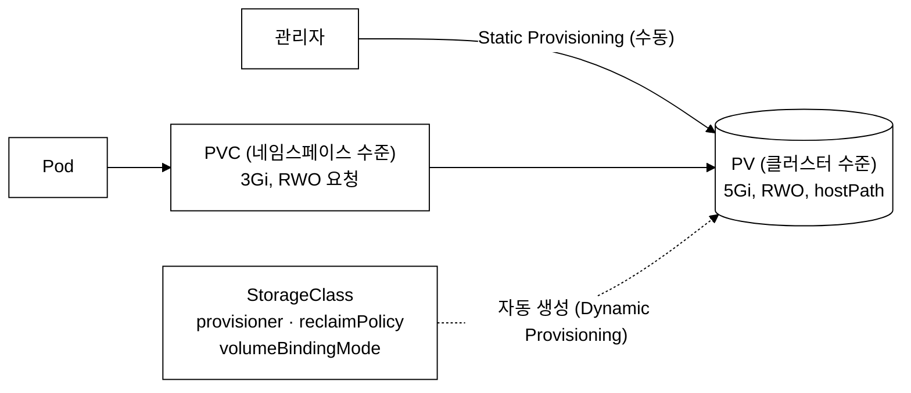
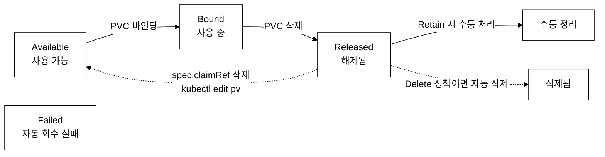
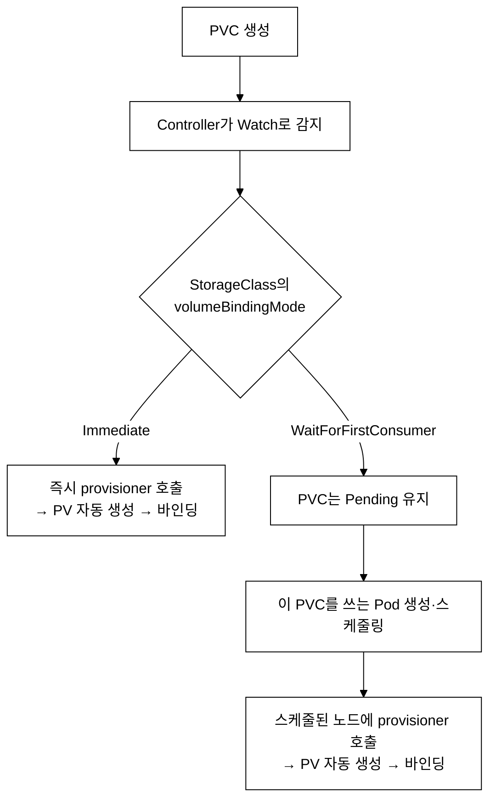
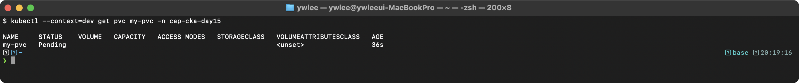
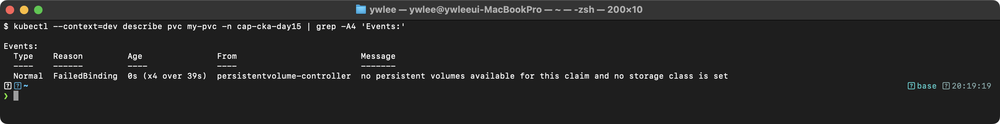
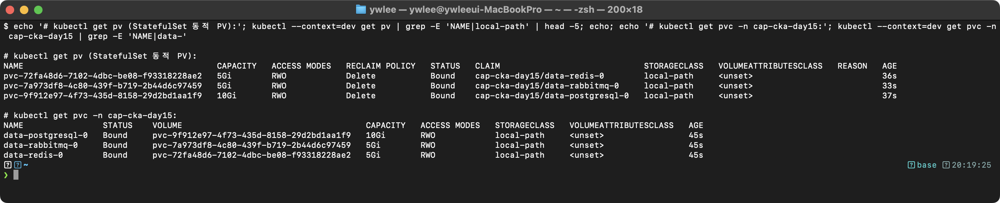
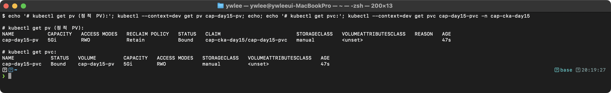
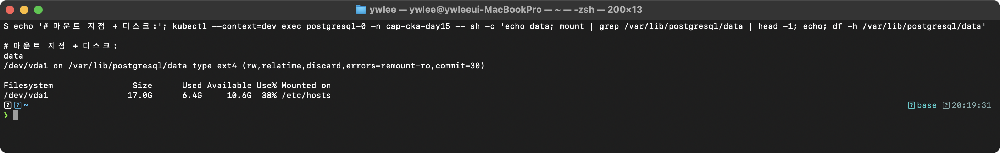
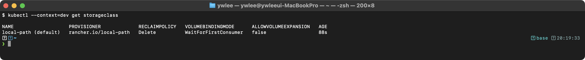

# CKA Day 15: Storage - PV, PVC, StorageClass & 볼륨 타입

> CKA 도메인: **Storage (10%)** | 예상 소요 시간: 3시간

> **연결:** day14에서 다룬 ConfigMap·Secret 기반 구성 주입을 전제로 하며, day15의 PV/PVC/StorageClass는 day16에서 다룰 StatefulSet 영속 스토리지 설계의 기반이 된다.

---

## 학습 목표

- [ ] PV, PVC, StorageClass의 관계와 바인딩 조건을 완벽히 이해한다
- [ ] hostPath, emptyDir, configMap/secret 볼륨 타입을 숙지한다
- [ ] Dynamic Provisioning과 volumeBindingMode를 이해한다
- [ ] PV 라이프사이클(Available → Bound → Released)을 파악한다
- [ ] subPath, readOnly, volumeMode 등 세부 옵션을 안다
- [ ] 시험 패턴 12개 이상을 시간 내에 해결한다

---

## 1. 스토리지란 무엇인가?

### 1.1 등장 배경: 왜 PV/PVC가 필요한가?

컨테이너는 기본적으로 휘발성이다. Pod가 재시작되면 컨테이너 파일시스템의 모든 데이터가 사라진다. 데이터베이스처럼 영속 데이터가 필요한 워크로드에서는 이것이 치명적이다. 초기에는 Pod YAML에 직접 NFS 서버 주소나 AWS EBS 볼륨 ID를 하드코딩하였으나, 이는 인프라 세부사항이 애플리케이션 매니페스트에 노출되는 문제가 있었다. PV/PVC 모델은 스토리지의 프로비저닝(관리자)과 소비(개발자)를 분리하여, 개발자가 인프라 세부사항을 몰라도 스토리지를 사용할 수 있게 한다.

### 1.2 스토리지 추상화 아키텍처

> **PV/PVC = 스토리지 리소스의 프로비저닝-소비 분리 모델**
>
> PV(PersistentVolume)는 클러스터 수준의 스토리지 리소스 오브젝트로, 실제 백엔드 스토리지(NFS, iSCSI, CSI 볼륨 등)의 용량, 접근 모드(RWO/RWX/ROX), Reclaim Policy를 선언한다.
>
> PVC(PersistentVolumeClaim)는 네임스페이스 수준의 스토리지 요청 오브젝트로, 필요한 용량과 접근 모드를 명시한다. PV Controller가 PVC 요구사항과 일치하는 PV를 바인딩(Bound)한다.
>
> StorageClass는 Dynamic Provisioning을 위한 프로비저너(CSI driver) 및 파라미터를 정의한다. CSI(Container Storage Interface)는 스토리지 벤더가 자신의 스토리지를 K8s에 연결하는 플러그인을 표준화한 인터페이스다. 과거에는 EBS·GCE-PD 같은 드라이버 코드가 쿠버네티스 본체 안에 들어가 있었으나(in-tree provisioner), 이는 새 스토리지를 지원할 때마다 K8s 자체를 수정·재배포해야 하는 한계가 있었다. CSI는 이 드라이버를 본체 밖의 외부 플러그인으로 분리해, 벤더가 독립적으로 드라이버를 배포할 수 있게 했다. provisioner 필드에는 `kubernetes.io/aws-ebs`(in-tree) 또는 `rancher.io/local-path`(CSI driver) 같은 값을 쓴다. PVC 생성 시 StorageClass를 지정하면 프로비저너가 자동으로 백엔드 볼륨을 생성하고 PV 오브젝트를 생성하여 바인딩한다.
>
> Pod는 spec.volumes에서 PVC를 참조하고, volumeMounts로 컨테이너 파일시스템에 마운트하여 영속 스토리지에 접근한다.

### 1.3 스토리지 리소스 관계


_그림 1. PV/PVC/StorageClass의 프로비저닝-소비 관계._

핵심 관계:
- PV: 실제 스토리지 리소스 (네임스페이스에 속하지 않는다)
- PVC: 사용자의 스토리지 요청 (네임스페이스에 속한다)
- StorageClass: PV 자동 생성 방법 정의
- Pod: PVC를 마운트하여 스토리지 사용

**누가 먼저 PV를 만드는가 — 두 가지 흐름:**
- **Static Provisioning(정적):** 관리자가 먼저 PV를 만든다(storageClassName 지정) → 사용자가 같은 storageClassName 으로 PVC를 만든다 → Controller가 조건에 맞는 PV를 찾아 바인딩한다. PV를 손으로 미리 준비해 둔다. §7 예제 1 이 이 흐름이다.
- **Dynamic Provisioning(동적):** 사용자가 PVC만 만든다(storageClassName 지정) → 해당 StorageClass의 provisioner가 그때 백엔드 볼륨과 PV를 자동 생성 → 자동 바인딩한다. 관리자가 PV를 미리 만들 필요가 없다. §7 예제 2 가 이 흐름이다.

즉 "PV를 먼저 만드느냐 PVC를 먼저 만드느냐"는 정적/동적 중 어느 흐름을 쓰는지에 달려 있다. StorageClass 가 있고 PVC 가 그것을 지정하면 동적, PV 를 손으로 만들어 두면 정적이다.

---

## 2. PersistentVolume (PV) 완벽 분석

### 2.1 PV 전체 YAML (한 줄씩 설명)

```yaml
apiVersion: v1                       # PV는 핵심 API 그룹(v1)에 속한다
kind: PersistentVolume               # 리소스 종류: PersistentVolume
metadata:
  name: my-pv                        # PV 이름 (네임스페이스 없음! 클러스터 수준)
  labels:                            # PV에 레이블 추가 (PVC selector로 매칭 가능)
    type: local
    environment: dev
spec:
  capacity:
    storage: 10Gi                    # PV의 총 용량 (필수!)
  accessModes:                       # 접근 모드 (필수!)
  - ReadWriteOnce                    # RWO: 단일 노드에서 읽기/쓰기
  persistentVolumeReclaimPolicy: Retain  # PVC 삭제 시 PV 처리 방법 (상세는 §2.3)
                                          # Retain: PV 보존 (수동 처리)
                                          # Delete: PV와 데이터 함께 삭제
  storageClassName: manual           # StorageClass 이름 (PVC와 매칭 기준)
                                     # 빈 문자열("")이면 어떤 SC에도 속하지 않음
  volumeMode: Filesystem             # Filesystem(기본) 또는 Block
  mountOptions:                      # 마운트 옵션 (선택사항)
  - hard
  - nfsvers=4.1
  hostPath:                          # 볼륨 타입: hostPath (노드의 로컬 디렉터리)
    path: /mnt/data                  # 노드의 디렉터리 경로
    type: DirectoryOrCreate          # 디렉터리가 없으면 자동 생성
```

### 2.2 Access Modes (접근 모드)

| 모드 | 약어 | 설명 | 사용 사례 |
|---|---|---|---|
| **ReadWriteOnce** | RWO | 단일 노드에서 읽기/쓰기 | 일반 데이터베이스 |
| **ReadOnlyMany** | ROX | 여러 노드에서 읽기 전용 | 공유 설정 파일 |
| **ReadWriteMany** | RWX | 여러 노드에서 읽기/쓰기 | NFS, 공유 스토리지 |
| **ReadWriteOncePod** | RWOP | 단일 Pod에서만 읽기/쓰기 (v1.22+) | 중요 데이터 독점 접근 |

```
주의:
- hostPath는 RWO만 지원한다 (로컬 디스크이므로)
- NFS는 RWO, ROX, RWX 모두 지원한다
- 클라우드 디스크(EBS, PD)는 보통 RWO만 지원한다
- RWO는 "하나의 노드"를 의미한다 (하나의 Pod가 아님!)
  → 같은 노드의 여러 Pod는 RWO 볼륨을 동시에 마운트할 수 있다
```

### 2.3 Reclaim Policy (회수 정책) — §2.1 persistentVolumeReclaimPolicy 상세

§2.1 PV YAML 의 `persistentVolumeReclaimPolicy` 한 줄이 결정하는 동작을 여기서 자세히 본다.

```
PVC가 삭제되면 PV는 어떻게 되는가?

1. Retain (보존)
   - PV와 데이터가 보존된다
   - PV 상태: Released (다른 PVC에 바인딩할 수 없음)
   - 관리자가 수동으로 PV를 정리하거나 재사용해야 한다
   - 데이터 보호가 중요한 프로덕션 환경에서 사용

2. Delete (삭제)
   - PV와 연결된 스토리지가 함께 삭제된다
   - Dynamic Provisioning의 기본 정책
   - 임시 데이터나 재생성 가능한 데이터에 사용

3. Recycle (재활용) — 더 이상 사용하지 않음 (deprecated)
   - rm -rf /volume/* 실행 후 PV를 Available로 복귀
   - Dynamic Provisioning으로 대체됨

프로덕션 권장:
- 중요 데이터: Retain
- 임시 데이터: Delete
```

**Released PV 를 Available 로 복구하는 절차 (시험 빈출):**

PVC 를 삭제하면 Retain 정책의 PV 는 `Released` 상태가 된다. `Released` PV 는 `spec.claimRef` 에 이전 PVC 정보가 남아 있어 다른 PVC 에 자동 바인딩되지 않는다. 다시 `Available` 로 만들려면 이 `claimRef` 블록을 제거해야 한다.

```bash
# 방법 1: kubectl edit 으로 spec.claimRef 블록 전체를 직접 삭제
kubectl edit pv <pv-name>
# 편집기에서 spec.claimRef 키와 그 하위 필드(apiVersion, kind, name, namespace, resourceVersion, uid) 를 모두 삭제 후 저장

# 방법 2: patch 로 claimRef 를 null 로 덮어쓰기 (한 줄 명령, 시험에서 더 빠름)
kubectl patch pv <pv-name> -p '{"spec":{"claimRef":null}}'

# 복구 확인 — STATUS 가 Available 로 바뀌면 다른 PVC 가 바인딩 가능
kubectl get pv <pv-name>
```

`claimRef` 를 제거한 뒤에도 PV 에 연결된 실제 스토리지 데이터(hostPath 디렉터리, NFS 마운트 등)는 그대로 남는다. 데이터를 완전히 비우려면 수동으로 정리(`rm -rf <path>/*`)한 뒤 재사용한다.

### 2.4 PV 라이프사이클


_그림 2. PV 라이프사이클 상태 흐름._

### 2.5 hostPath 타입 종류

```yaml
# hostPath의 type 필드
hostPath:
  path: /mnt/data
  type: DirectoryOrCreate    # 디렉터리가 없으면 생성 (0755 권한)
  # type: Directory          # 디렉터리가 반드시 존재해야 함
  # type: FileOrCreate       # 파일이 없으면 생성
  # type: File               # 파일이 반드시 존재해야 함
  # type: Socket             # 유닉스 소켓이 존재해야 함
  # type: CharDevice         # 문자 디바이스가 존재해야 함
  # type: BlockDevice        # 블록 디바이스가 존재해야 함
  # type: ""                 # 아무 확인도 하지 않음 (기본값)
```

---

## 3. PersistentVolumeClaim (PVC)

### 3.1 PVC 전체 YAML (한 줄씩 설명)

```yaml
apiVersion: v1                        # PVC도 핵심 API 그룹(v1)
kind: PersistentVolumeClaim           # 리소스 종류
metadata:
  name: my-pvc                        # PVC 이름
  namespace: demo                     # PVC가 속할 네임스페이스 (PV와 달리!)
spec:
  accessModes:                        # 요청하는 접근 모드
  - ReadWriteOnce                     # PV의 accessModes와 일치해야 바인딩
  resources:
    requests:
      storage: 5Gi                    # 요청하는 최소 용량
                                      # PV의 capacity ≥ 이 값이어야 바인딩
  storageClassName: manual            # PV의 storageClassName과 일치해야 바인딩
                                      # 빈 문자열(""):  SC 없는 PV에만 바인딩
                                      # 생략: 기본 SC 사용 (Dynamic Provisioning)
  selector:                           # 특정 PV를 지정하여 바인딩 (선택사항)
    matchLabels:
      type: local                     # PV의 labels와 일치
    matchExpressions:
    - key: environment
      operator: In
      values:
      - dev
      - staging
  volumeName: my-pv                   # 특정 PV 이름으로 바인딩 (선택사항)
  volumeMode: Filesystem              # PV의 volumeMode와 일치해야 함
```

### 3.2 PV-PVC 바인딩 내부 동작 원리

PV Controller(kube-controller-manager 내부)는 PVC 생성 이벤트를 Watch한다. 새로운 PVC가 생성되면 Controller는 Available 상태의 모든 PV를 순회하며 바인딩 조건을 확인한다. 조건이 일치하는 PV를 찾으면 PV의 `spec.claimRef`에 PVC 정보를 기록하고 PVC의 `spec.volumeName`에 PV 이름을 기록하여 양방향 바인딩을 완성한다.

**조건을 만족하는 PV 가 여러 개면 어느 것을 고르나?** Controller 는 PVC 요청 용량보다 크거나 같은 PV 중에서 가장 가까운(낭비가 적은) 용량의 PV 를 우선 고른다. 즉 5Gi 요청에 6Gi·10Gi PV 가 모두 후보면 6Gi 가 선택된다. 같은 조건의 PV 가 여럿이면 그중 어느 것이 선택될지는 보장되지 않는다. 학생 입장에서는 "조건을 만족하는 PV 하나가 선택되며, 용량 낭비가 적은 쪽이 우선" 정도로 이해하면 된다.

**Dynamic Provisioning 의 PV 는 누가 언제 만드나?** PVC 가 생성되고 그 PVC 의 storageClassName 이 동적 프로비저닝용 StorageClass 를 가리키면, Controller 가 그 StorageClass 의 provisioner 를 호출한다. provisioner 가 실제 백엔드 스토리지를 만들고 그에 대응하는 PV 객체를 자동 생성한 뒤 PVC 와 바인딩한다. 즉 PV 는 미리 존재하지 않고 PVC 생성을 계기로 만들어진다. 다만 이 호출 시점은 StorageClass 의 `volumeBindingMode` 에 따라 다르다(§4.2):


_그림 3. Dynamic Provisioning 의 PV 생성 시점(volumeBindingMode 별)._

### 3.3 PV-PVC 바인딩 조건 (시험 핵심!)

```
PVC가 PV에 바인딩되려면 다음 4가지 조건을 모두 만족해야 한다:

1. Access Mode 일치
   PVC: ReadWriteOnce  → PV도 ReadWriteOnce를 포함해야 함

2. Capacity ≥ PVC 요청량
   PVC: 5Gi 요청      → PV는 5Gi 이상이어야 함 (10Gi PV에 5Gi PVC 가능)

3. StorageClass 일치
   PVC: manual         → PV도 storageClassName: manual이어야 함
   PVC: "" (빈문자열)  → PV도 storageClassName이 없어야 함
   PVC: 생략           → 기본 StorageClass 사용 (Dynamic Provisioning)

4. Selector 일치 (지정된 경우)
   PVC: selector.matchLabels: type=local → PV에 type=local 레이블 필요

바인딩 실패 시 PVC는 Pending 상태로 유지된다.
```

### 3.4 바인딩 문제 진단 (트러블슈팅)

**실습 전제:** dev 클러스터가 가동 중이어야 한다(`./scripts/boot.sh` + `./scripts/fix-cluster-ip-drift.sh dev`). 명령은 `export KUBECONFIG=~/sideproejct/IaC_apple_sillicon/kubeconfig/dev.yaml` 로 dev 를 가리킨 상태를 가정한다. 아래 절차는 ⓐ 매칭되는 PV 가 없거나 storageClassName 이 어긋난 PVC 를 일부러 만들어 Pending 으로 두고 진단한 뒤, ⓑ 조건을 맞춘 PV 를 만들어 Bound 로 전환하는 흐름이다. 각 이미지는 이 절차를 dev 클러스터에서 실제로 실행한 터미널 화면이며, 학생이 자기 환경에서 같은 명령을 쳤을 때 나와야 하는 참고 화면이다(컬럼·STATUS·이벤트 문구가 일치해야 정상).

```bash
# PVC가 Pending인 원인 찾기

# 1. PVC 상태 확인
kubectl get pvc <name>
```



```bash
# 2. PVC 이벤트 확인
kubectl describe pvc <name>
```



```bash
# 3. PV 목록 확인
kubectl get pv
# storageClassName, capacity, accessModes, STATUS 비교

# 4. 일반적인 원인과 해결:
# - storageClassName 불일치 → PV와 PVC의 storageClassName을 맞춘다
# - accessModes 불일치 → PVC의 accessModes를 PV가 지원하는 것으로 수정한다
# - PV capacity가 PVC 요청량보다 작음 → 더 큰 PV를 생성한다
# - 모든 PV가 이미 Bound 상태 → 새 PV를 생성한다
# - WaitForFirstConsumer인데 아직 Pod가 없음 → Pod를 생성한다
```

---

## 4. StorageClass와 Dynamic Provisioning

### 4.1 StorageClass 전체 YAML (한 줄씩 설명)

```yaml
apiVersion: storage.k8s.io/v1         # StorageClass API 그룹
kind: StorageClass                     # 리소스 종류
metadata:
  name: fast                           # StorageClass 이름
  annotations:
    storageclass.kubernetes.io/is-default-class: "true"
    # ↑ 기본 StorageClass로 설정. PVC에서 SC를 지정하지 않으면 이것을 사용
provisioner: rancher.io/local-path     # 프로비저너 (어떤 방식으로 PV를 생성할지)
                                       # tart-infra: rancher.io/local-path
                                       # AWS: kubernetes.io/aws-ebs
                                       # GCP: kubernetes.io/gce-pd
                                       # Azure: kubernetes.io/azure-disk
reclaimPolicy: Delete                  # PVC 삭제 시 PV 처리 (Delete 또는 Retain)
volumeBindingMode: WaitForFirstConsumer # PV 프로비저닝 시점
                                        # Immediate: PVC 생성 즉시 PV 생성
                                        # WaitForFirstConsumer: Pod가 사용할 때 생성
allowVolumeExpansion: true             # PVC 용량 확장 허용 여부
parameters:                            # 프로비저너별 파라미터
  type: gp3                            # AWS EBS 볼륨 타입 예시
  iopsPerGB: "50"                      # IOPS 설정 예시
```

### 4.2 volumeBindingMode 비교

**등장 배경:** Immediate 모드에서는 PVC 생성 즉시 PV가 프로비저닝된다. 여기서 "로컬 스토리지(hostPath, local-path provisioner)"가 문제가 된다. 로컬 스토리지로 만든 PV 는 특정 노드의 로컬 디스크에만 존재하는 물리 데이터다(NFS 처럼 네트워크로 공유되는 게 아니다). 따라서 그 PV 의 데이터에 접근하려면 Pod 가 반드시 그 디스크가 달린 노드에서 돌아야 한다 — 다른 노드에서는 그 디스크 자체가 보이지 않기 때문이다.

그래서 Immediate 모드로 PVC 생성 즉시 PV 를 nodeA 에 만들어 버리면, 정작 Pod 는 nodeAffinity·resource request 같은 다른 스케줄링 조건 때문에 nodeB 로 가야 할 수도 있는데, PV 가 이미 nodeA 에 고정돼 있어 스케줄러가 Pod 를 nodeA 로 강제하거나 스케줄링 자체가 막히는 충돌이 생긴다. WaitForFirstConsumer 는 이 순서를 뒤집는다: PV 를 미리 만들지 않고 Pod 가 먼저 스케줄될 노드를 정하게 한 뒤, 그 노드에 PV 를 만든다. 그러면 PV 의 위치가 Pod 의 노드 선택을 따라가므로 충돌이 사라진다.

```
Immediate (즉시):
  PVC 생성 → 즉시 PV 프로비저닝 → Pod 스케줄링
  문제: 특정 노드에 PV가 생성되면 Pod가 그 노드에만 스케줄링됨

WaitForFirstConsumer (첫 소비자 대기):
  PVC 생성 → Pending 상태 → Pod 생성 → Pod의 스케줄링 노드에 PV 생성
  장점: Pod의 노드 선택을 고려하여 PV를 적절한 노드에 생성

tart-infra의 local-path StorageClass:
  volumeBindingMode: WaitForFirstConsumer
  → PVC만 생성하면 Pending, Pod가 사용해야 Bound로 변경
```

**검증 명령어:**

전제: dev 클러스터 가동 + `KUBECONFIG` 가 dev 를 가리킴(위 §3.4 전제와 동일). local-path provisioner 가 설치되어 있으면 아래처럼 StorageClass 가 1개 이상 보이고, 이름 옆에 `(default)` 표시와 `WaitForFirstConsumer` 바인딩 모드가 나타난다. provisioner 가 없는 fresh 클러스터에서는 `No resources found` 가 나오므로, 그 경우 §실습 3 의 안내대로 local-path 를 먼저 설치한다.

```bash
kubectl get storageclass
```


### 4.3 기본 StorageClass

```bash
# 기본 StorageClass 확인
kubectl get storageclass
# 이름 옆에 (default) 표시

# 기본 StorageClass 설정
kubectl patch storageclass <name> -p \
  '{"metadata":{"annotations":{"storageclass.kubernetes.io/is-default-class":"true"}}}'

# 기본 StorageClass 해제
kubectl patch storageclass <name> -p \
  '{"metadata":{"annotations":{"storageclass.kubernetes.io/is-default-class":"false"}}}'
```

---

## 5. 볼륨 타입 완벽 정리

### 5.1 볼륨 타입 비교표

| 볼륨 타입 | 수명 | 사용 사례 | PV 필요 |
|---|---|---|---|
| **emptyDir** | Pod 수명과 같음 | 컨테이너 간 임시 데이터 공유 | 아니오 |
| **hostPath** | 노드 수명과 같음 | 노드 로그 접근, 테스트용 | PV로 사용 가능 |
| **configMap** | ConfigMap 수명 | 설정 파일 주입 | 아니오 |
| **secret** | Secret 수명 | 인증 정보 주입 | 아니오 |
| **PVC** | PV의 Reclaim Policy에 따름 | 영구 데이터 저장(Retain 가정) | 예 |
| **nfs** | NFS 서버 수명 | 공유 스토리지 | PV로 사용 가능 |
| **projected** | Pod 수명 | 여러 볼륨을 하나로 결합 | 아니오 |
| **downwardAPI** | Pod 수명 | Pod 메타데이터 접근 | 아니오 |

※ PVC 자체가 정해진 수명을 갖는 것이 아니라, PVC 가 바인딩한 PV 의 Reclaim Policy(§2.3)가 데이터 지속 여부를 결정한다. Retain 이면 PVC 를 지워도 PV·데이터가 보존되고, Delete 이면 PVC 삭제 시 PV·데이터가 함께 사라진다.

### 5.2 emptyDir (임시 볼륨)

**등장 배경:** 같은 Pod 내 여러 컨테이너가 파일을 공유해야 하는 경우(사이드카 패턴)가 있다. 예를 들어 main 컨테이너가 로그를 파일로 기록하고 sidecar 컨테이너가 이를 수집하여 외부 시스템으로 전송하는 구조이다. 각 컨테이너의 파일시스템은 독립적이므로, 공유 볼륨 없이는 이러한 패턴을 구현할 수 없다. emptyDir는 PV 생성 없이 Pod 수준에서 즉시 사용 가능한 공유 볼륨을 제공한다.

> **emptyDir**: Pod 생성 시 노드의 로컬 디스크(또는 tmpfs)에 빈 디렉터리를 할당하는 임시 볼륨이다. Pod 내 모든 컨테이너가 동일 경로를 마운트하여 IPC나 캐시 공유 용도로 사용하며, Pod 삭제 시 데이터가 함께 제거된다. `medium: Memory` 설정 시 tmpfs(RAM-backed filesystem)로 동작하여 디스크 I/O 없이 고속 접근이 가능하다.

```yaml
apiVersion: v1
kind: Pod
metadata:
  name: emptydir-pod
spec:
  containers:
  - name: writer                     # 데이터를 쓰는 컨테이너
    image: busybox:1.36
    command: ["sh", "-c", "while true; do date >> /shared/log.txt; sleep 5; done"]
    volumeMounts:
    - name: shared-data              # 볼륨 이름 (아래 volumes와 매칭)
      mountPath: /shared             # 컨테이너 내 마운트 경로
  - name: reader                     # 데이터를 읽는 컨테이너
    image: busybox:1.36
    command: ["sh", "-c", "tail -f /shared/log.txt"]
    volumeMounts:
    - name: shared-data
      mountPath: /shared
      readOnly: true                 # 읽기 전용으로 마운트
  volumes:
  - name: shared-data                # 볼륨 정의
    emptyDir: {}                     # 빈 디렉터리 (디스크 사용)
    # emptyDir:
    #   medium: Memory               # tmpfs 사용 (RAM 기반, 더 빠름)
    #   sizeLimit: 100Mi             # 최대 용량 제한
```

위 `command` 의 `["sh", "-c", "while true; do ...; done"]` 는 한 줄짜리 완전한 셸 명령이다. JSON/YAML 배열의 3번째 원소(`"while..."` 문자열) 전체가 `sh -c` 의 인자 하나로 그대로 전달되므로, 안에서 추가 따옴표 이스케이프를 할 필요가 없다(작은따옴표·큰따옴표를 더 섞지만 않으면 된다). 이 매니페스트는 dev 클러스터에서 `kubectl apply -f` 로 적용해 두 컨테이너가 같은 `/shared` 를 공유하는 것을 검증한 예제다.

```
emptyDir 특징:
- Pod가 생성될 때 빈 디렉터리로 시작
- Pod가 삭제되면 데이터도 삭제됨
- 같은 Pod의 여러 컨테이너가 공유 가능
- medium: Memory → RAM 기반 (빠르지만 Pod 메모리 제한에 포함)
- 사용 사례: 사이드카 패턴, 임시 캐시, 컨테이너 간 데이터 전달
```

### 5.3 hostPath (노드 로컬 볼륨)

```yaml
apiVersion: v1
kind: Pod
metadata:
  name: hostpath-pod
spec:
  containers:
  - name: app
    image: nginx
    volumeMounts:
    - name: host-logs
      mountPath: /var/log/host       # 컨테이너 내 마운트 경로
      readOnly: true                 # 읽기 전용 (안전)
    - name: host-data
      mountPath: /data
  volumes:
  - name: host-logs
    hostPath:
      path: /var/log                 # 노드의 실제 디렉터리
      type: Directory                # 디렉터리가 반드시 존재해야 함
  - name: host-data
    hostPath:
      path: /opt/app-data
      type: DirectoryOrCreate        # 없으면 자동 생성
```

```
hostPath 주의사항:
- Pod가 다른 노드에 스케줄링되면 데이터에 접근할 수 없다
- 보안 위험: 노드의 파일 시스템에 직접 접근
- 프로덕션에서는 권장하지 않음 (시험용/테스트용)
- CKA 시험에서 PV 생성 시 자주 사용됨
```

### 5.4 configMap 볼륨

```yaml
# ConfigMap 생성
apiVersion: v1
kind: ConfigMap
metadata:
  name: app-config
  namespace: demo
data:
  app.properties: |            # 파일로 마운트됨
    server.port=8080
    log.level=INFO
  database.url: jdbc:postgresql://db:5432/mydb
---
apiVersion: v1
kind: Pod
metadata:
  name: config-pod
  namespace: demo
spec:
  containers:
  - name: app
    image: nginx
    volumeMounts:
    - name: config-vol
      mountPath: /etc/config       # ConfigMap 전체가 이 디렉터리에 마운트
    - name: config-single
      mountPath: /etc/app.properties  # 특정 키만 마운트
      subPath: app.properties         # subPath로 특정 키 지정
  volumes:
  - name: config-vol
    configMap:
      name: app-config             # ConfigMap 이름
  - name: config-single
    configMap:
      name: app-config
      items:                       # 특정 키만 마운트 (선택사항)
      - key: app.properties
        path: app.properties       # 마운트될 파일 이름
```

```
configMap 볼륨 특징:
- ConfigMap의 각 key가 파일 이름이 되고, value가 파일 내용이 된다
- /etc/config/app.properties → "server.port=8080\nlog.level=INFO"
- /etc/config/database.url → "jdbc:postgresql://db:5432/mydb"
- ConfigMap 업데이트 시 마운트된 파일도 자동 업데이트 (약간의 지연)
- subPath로 마운트하면 자동 업데이트가 동작하지 않음!
```

자동 업데이트와 subPath 의 관계 — 왜 그런가: subPath 없이 디렉터리째 마운트하면, Kubelet 은 해당 ConfigMap 전체를 감시하다가 변경이 생기면 마운트 지점의 심볼릭 링크를 통째로 새 버전으로 교체한다(그래서 디렉터리 안 파일들이 함께 갱신된다). 그런데 subPath 는 ConfigMap 의 특정 파일 하나만 마운트 지점에 직접 연결(bind)하는 방식이라, Kubelet 이 통째로 교체하는 그 갱신 경로를 타지 않는다. 이 차이로 subPath 로 마운트한 ConfigMap/Secret 파일은 ConfigMap 을 바꿔도 Pod 안에서 갱신되지 않는다(현재까지 미구현, kubernetes/kubernetes#50345 등 참조). 따라서 subPath + ConfigMap 은 재시작 전까지 바뀌지 않아도 되는 정적 설정에만 적합하다.

### 5.5 secret 볼륨

```yaml
# Secret 생성
apiVersion: v1
kind: Secret
metadata:
  name: db-creds
  namespace: demo
type: Opaque
data:
  username: YWRtaW4=             # base64 인코딩: echo -n 'admin' | base64
  password: c2VjcmV0MTIz         # base64 인코딩: echo -n 'secret123' | base64
---
apiVersion: v1
kind: Pod
metadata:
  name: secret-pod
  namespace: demo
spec:
  containers:
  - name: app
    image: nginx
    volumeMounts:
    - name: secret-vol
      mountPath: /secrets          # Secret이 마운트되는 경로
      readOnly: true               # 읽기 전용 (보안)
  volumes:
  - name: secret-vol
    secret:
      secretName: db-creds        # Secret 이름
      defaultMode: 0400           # 파일 권한 (읽기 전용)
```

```
secret 볼륨 특징:
- Secret의 data가 base64 디코딩되어 파일로 마운트
- /secrets/username → "admin" (디코딩된 값)
- /secrets/password → "secret123" (디코딩된 값)
- 기본적으로 tmpfs(RAM)에 저장됨
- defaultMode로 파일 권한 설정 가능
```

### 5.6 projected 볼륨

**등장 배경:** 애플리케이션이 ConfigMap(설정파일)·Secret(인증정보)·Pod 메타데이터(downwardAPI)·ServiceAccount 토큰을 모두 파일로 참조해야 할 때, 각각을 별도 볼륨으로 선언하면 `spec.volumes` 항목과 `volumeMounts` 항목이 소스 수만큼 늘어나고 마운트 경로가 여러 곳으로 흩어진다. 이 복잡성을 해결하기 위해 projected 볼륨이 도입됐다. projected 볼륨은 ConfigMap·Secret·downwardAPI·serviceAccountToken 같은 여러 소스를 단일 마운트 경로 하나로 통합하여, 컨테이너 입장에서는 하나의 디렉터리만 참조하면 여러 소스의 파일을 모두 읽을 수 있게 한다.

```yaml
# 여러 볼륨 소스를 하나의 디렉터리에 합침
apiVersion: v1
kind: Pod
metadata:
  name: projected-pod
spec:
  containers:
  - name: app
    image: nginx
    volumeMounts:
    - name: all-in-one
      mountPath: /etc/projected
  volumes:
  - name: all-in-one
    projected:
      sources:
      - configMap:
          name: app-config
          items:
          - key: app.properties
            path: app.properties
      - secret:
          name: db-creds
          items:
          - key: password
            path: db-password
      - downwardAPI:
          items:
          - path: pod-name
            fieldRef:
              fieldPath: metadata.name
      - serviceAccountToken:
          path: token
          expirationSeconds: 3600
```

---

## 6. Pod에서 볼륨 사용하기

### 6.1 PVC 마운트 (기본 패턴)

```yaml
apiVersion: v1
kind: Pod
metadata:
  name: data-pod
  namespace: demo
spec:
  containers:
  - name: app
    image: nginx
    volumeMounts:
    - name: data                   # volumes의 name과 매칭
      mountPath: /app/data         # 컨테이너 내 마운트 경로
      readOnly: false              # 읽기/쓰기 (기본값)
  volumes:
  - name: data                    # 볼륨 이름 (Pod 내에서 고유)
    persistentVolumeClaim:
      claimName: my-pvc           # 사용할 PVC 이름
      readOnly: false             # 읽기/쓰기
```

### 6.2 subPath 사용

subPath 는 "하위 디렉터리"만이 아니라 볼륨(또는 PVC/ConfigMap/Secret) 내부의 특정 경로 하나(파일 또는 디렉터리)만 골라 마운트하는 옵션이다. subPath 값이 디렉터리면 그 디렉터리 전체를, 파일이면 그 파일 하나만 mountPath 에 마운트한다. 아래 예제의 `app1-data`·`app2-data` 는 디렉터리이고, §5.4·§6.3 의 `app.properties`·`custom.conf` 는 파일이다.

```yaml
# subPath: 볼륨 내부의 특정 경로(파일 또는 디렉터리)만 마운트
apiVersion: v1
kind: Pod
metadata:
  name: subpath-pod
spec:
  containers:
  - name: app1
    image: nginx
    volumeMounts:
    - name: shared
      mountPath: /app/data
      subPath: app1-data           # app1-data가 디렉터리이므로 그 디렉터리 전체를 마운트
  - name: app2
    image: nginx
    volumeMounts:
    - name: shared
      mountPath: /app/data
      subPath: app2-data           # 볼륨의 app2-data 하위 디렉터리만 마운트
  volumes:
  - name: shared
    persistentVolumeClaim:
      claimName: shared-pvc

# subPath를 사용하면:
# - 같은 PVC를 여러 컨테이너가 다른 하위 디렉터리로 사용 가능
# - ConfigMap/Secret의 특정 파일만 마운트할 때 유용
# - 기존 디렉터리를 덮어쓰지 않고 특정 파일만 추가 가능
```

### 6.3 ConfigMap을 subPath로 특정 파일만 마운트

```yaml
# /etc/nginx/conf.d/ 디렉터리의 기존 파일을 유지하면서
# custom.conf 파일만 추가하려면 subPath 사용
apiVersion: v1
kind: Pod
metadata:
  name: nginx-custom
spec:
  containers:
  - name: nginx
    image: nginx
    volumeMounts:
    - name: nginx-conf
      mountPath: /etc/nginx/conf.d/custom.conf   # 특정 파일 경로
      subPath: custom.conf                        # ConfigMap의 특정 키
  volumes:
  - name: nginx-conf
    configMap:
      name: nginx-config

# subPath 없이 마운트하면:
# /etc/nginx/conf.d/ 전체가 ConfigMap으로 덮어씌워진다!
# → 기존 default.conf 파일이 사라짐

# subPath로 마운트하면:
# /etc/nginx/conf.d/default.conf → 기존 파일 유지
# /etc/nginx/conf.d/custom.conf  → ConfigMap에서 추가
```

### 6.4 볼륨 권한 설정

```yaml
apiVersion: v1
kind: Pod
metadata:
  name: permission-pod
spec:
  securityContext:
    fsGroup: 1000                  # 마운트된 볼륨의 그룹 ID
    # Kubelet 이 볼륨을 마운트한 직후, 해당 디렉터리 전체에 chown :1000 을 적용한다.
    # 이로써 컨테이너 프로세스(runAsGroup 기준)가 볼륨 내 파일을 읽고 쓸 수 있다.
    # runAsUser/runAsGroup 은 프로세스의 UID/GID 를 결정하고,
    # fsGroup 은 마운트된 스토리지 파일의 소유 그룹을 강제하는 별도 메커니즘이다.
  containers:
  - name: app
    image: nginx
    securityContext:
      runAsUser: 1000              # 컨테이너 실행 사용자 ID
      runAsGroup: 1000             # 컨테이너 실행 그룹 ID
    volumeMounts:
    - name: data
      mountPath: /app/data
  volumes:
  - name: data
    persistentVolumeClaim:
      claimName: my-pvc
```

---

## 7. 실전 YAML 예제 모음 (11개)

### 예제 1: Static Provisioning (PV + PVC + Pod)

```yaml
# PV 생성
apiVersion: v1
kind: PersistentVolume
metadata:
  name: static-pv
  labels:
    type: local
spec:
  capacity:
    storage: 5Gi
  accessModes:
  - ReadWriteOnce
  persistentVolumeReclaimPolicy: Retain
  storageClassName: manual
  hostPath:
    path: /opt/static-data
    type: DirectoryOrCreate
---
# PVC 생성
apiVersion: v1
kind: PersistentVolumeClaim
metadata:
  name: static-pvc
  namespace: demo
spec:
  accessModes:
  - ReadWriteOnce
  resources:
    requests:
      storage: 3Gi
  storageClassName: manual
---
# Pod에서 PVC 사용
apiVersion: v1
kind: Pod
metadata:
  name: static-pod
  namespace: demo
spec:
  containers:
  - name: app
    image: nginx
    volumeMounts:
    - name: data
      mountPath: /usr/share/nginx/html
  volumes:
  - name: data
    persistentVolumeClaim:
      claimName: static-pvc
```

### 예제 2: Dynamic Provisioning (StorageClass + PVC + Pod)

```yaml
# PVC만 생성하면 StorageClass가 자동으로 PV를 생성
apiVersion: v1
kind: PersistentVolumeClaim
metadata:
  name: dynamic-pvc
  namespace: demo
spec:
  accessModes:
  - ReadWriteOnce
  resources:
    requests:
      storage: 2Gi
  storageClassName: local-path      # tart-infra의 기본 StorageClass
---
apiVersion: v1
kind: Pod
metadata:
  name: dynamic-pod
  namespace: demo
spec:
  containers:
  - name: app
    image: nginx
    volumeMounts:
    - name: data
      mountPath: /data
  volumes:
  - name: data
    persistentVolumeClaim:
      claimName: dynamic-pvc
```

### 예제 3: emptyDir로 사이드카 패턴

```yaml
apiVersion: v1
kind: Pod
metadata:
  name: sidecar-pod
  namespace: demo
spec:
  containers:
  - name: main
    image: nginx
    volumeMounts:
    - name: logs
      mountPath: /var/log/nginx
  - name: log-shipper
    image: busybox:1.36
    command: ["sh", "-c", "tail -f /logs/access.log"]
    volumeMounts:
    - name: logs
      mountPath: /logs
      readOnly: true
  volumes:
  - name: logs
    emptyDir: {}
```

### 예제 4: emptyDir Memory 모드

```yaml
apiVersion: v1
kind: Pod
metadata:
  name: tmpfs-pod
spec:
  containers:
  - name: app
    image: nginx
    volumeMounts:
    - name: cache
      mountPath: /cache
  volumes:
  - name: cache
    emptyDir:
      medium: Memory              # RAM 기반 (tmpfs)
      sizeLimit: 256Mi            # 최대 256Mi
```

### 예제 5: ConfigMap을 환경변수 + 볼륨으로 동시 사용

```yaml
apiVersion: v1
kind: ConfigMap
metadata:
  name: multi-use-config
  namespace: demo
data:
  APP_ENV: production
  APP_PORT: "8080"
  config.yaml: |
    server:
      port: 8080
      host: 0.0.0.0
    database:
      host: postgres
      port: 5432
---
apiVersion: v1
kind: Pod
metadata:
  name: multi-use-pod
  namespace: demo
spec:
  containers:
  - name: app
    image: nginx
    envFrom:
    - configMapRef:
        name: multi-use-config     # 환경변수로 주입
    volumeMounts:
    - name: config-file
      mountPath: /etc/app/config.yaml
      subPath: config.yaml         # config.yaml 파일만 마운트
  volumes:
  - name: config-file
    configMap:
      name: multi-use-config
```

### 예제 6: Secret을 볼륨으로 마운트 (특정 키만)

```yaml
apiVersion: v1
kind: Secret
metadata:
  name: tls-certs
  namespace: demo
type: kubernetes.io/tls
data:
  tls.crt: LS0tLS1CRUdJTi...       # base64 인코딩된 인증서
  tls.key: LS0tLS1CRUdJTi...       # base64 인코딩된 키
---
apiVersion: v1
kind: Pod
metadata:
  name: tls-pod
  namespace: demo
spec:
  containers:
  - name: nginx
    image: nginx
    volumeMounts:
    - name: tls
      mountPath: /etc/nginx/ssl
      readOnly: true
  volumes:
  - name: tls
    secret:
      secretName: tls-certs
      defaultMode: 0400            # 읽기 전용 권한
```

### 예제 7: 여러 볼륨을 하나의 Pod에서 사용

```yaml
apiVersion: v1
kind: Pod
metadata:
  name: multi-volume-pod
  namespace: demo
spec:
  containers:
  - name: app
    image: nginx
    volumeMounts:
    - name: config
      mountPath: /etc/config
      readOnly: true
    - name: secrets
      mountPath: /etc/secrets
      readOnly: true
    - name: data
      mountPath: /app/data
    - name: cache
      mountPath: /tmp/cache
    - name: host-logs
      mountPath: /var/log/host
      readOnly: true
  volumes:
  - name: config
    configMap:
      name: app-config
  - name: secrets
    secret:
      secretName: app-secrets
  - name: data
    persistentVolumeClaim:
      claimName: app-data-pvc
  - name: cache
    emptyDir:
      sizeLimit: 100Mi
  - name: host-logs
    hostPath:
      path: /var/log
      type: Directory
```

### 예제 8: PV를 레이블 selector로 바인딩

```yaml
apiVersion: v1
kind: PersistentVolume
metadata:
  name: labeled-pv
  labels:
    app: database
    env: production
spec:
  capacity:
    storage: 20Gi
  accessModes:
  - ReadWriteOnce
  storageClassName: ""             # SC 없이 직접 바인딩
  hostPath:
    path: /data/db
---
apiVersion: v1
kind: PersistentVolumeClaim
metadata:
  name: labeled-pvc
spec:
  accessModes:
  - ReadWriteOnce
  resources:
    requests:
      storage: 10Gi
  storageClassName: ""
  selector:
    matchLabels:
      app: database
      env: production              # PV의 레이블과 일치해야 바인딩
```

### 예제 9: PVC 용량 확장

```yaml
# StorageClass에 allowVolumeExpansion: true가 설정되어 있어야 함
# 기존 PVC의 용량을 늘릴 수 있다 (줄이는 것은 불가)
apiVersion: v1
kind: PersistentVolumeClaim
metadata:
  name: expandable-pvc
spec:
  accessModes:
  - ReadWriteOnce
  resources:
    requests:
      storage: 10Gi                # 기존 5Gi에서 10Gi로 확장
  storageClassName: local-path

# kubectl edit pvc expandable-pvc
# spec.resources.requests.storage를 더 큰 값으로 변경
```

### 예제 10: StatefulSet + VolumeClaimTemplate

```yaml
apiVersion: apps/v1
kind: StatefulSet
metadata:
  name: postgres
  namespace: demo
spec:
  serviceName: postgres-headless
  replicas: 3
  selector:
    matchLabels:
      app: postgres
  template:
    metadata:
      labels:
        app: postgres
    spec:
      containers:
      - name: postgres
        image: postgres:15
        ports:
        - containerPort: 5432
        env:
        - name: POSTGRES_PASSWORD
          value: password
        - name: PGDATA
          value: /var/lib/postgresql/data/pgdata
        volumeMounts:
        - name: pgdata
          mountPath: /var/lib/postgresql/data
  volumeClaimTemplates:              # 각 Pod마다 별도의 PVC가 자동 생성
  - metadata:
      name: pgdata
    spec:
      accessModes: ["ReadWriteOnce"]
      storageClassName: local-path
      resources:
        requests:
          storage: 5Gi
# 결과:
# pgdata-postgres-0 (PVC) → postgres-0 Pod
# pgdata-postgres-1 (PVC) → postgres-1 Pod
# pgdata-postgres-2 (PVC) → postgres-2 Pod
```

### 예제 11: ReadOnlyMany PV (NFS 예시)

```yaml
apiVersion: v1
kind: PersistentVolume
metadata:
  name: nfs-pv
spec:
  capacity:
    storage: 100Gi
  accessModes:
  - ReadWriteMany                   # NFS는 RWX 지원
  - ReadOnlyMany
  persistentVolumeReclaimPolicy: Retain
  storageClassName: nfs
  nfs:
    server: 192.168.1.100           # NFS 서버 IP
    path: /exports/shared           # NFS 경로
```

---

## tart-infra 실습

### 실습 환경 설정

**전제:** dev 클러스터가 가동 중이어야 한다(`./scripts/boot.sh` 후 재부팅했다면 `./scripts/fix-cluster-ip-drift.sh dev`). kubeconfig 는 가동 시 `kubeconfig/dev.yaml` 에 생성된다. 아래 경로는 이 저장소를 `~/sideproejct/IaC_apple_sillicon` 에 둔 기준이며, 다른 위치에 clone 했다면 그 위치에 맞춰 `KUBECONFIG` 값을 바꾼다(저장소 루트의 `kubeconfig/dev.yaml` 을 가리키면 된다).

```bash
# dev 클러스터 접속
# 저장소를 둔 위치에 맞춰 경로를 조정한다 (예: $(git rev-parse --show-toplevel)/kubeconfig/dev.yaml)
export KUBECONFIG=~/sideproejct/IaC_apple_sillicon/kubeconfig/dev.yaml
kubectl config use-context dev

# CKA 실기 필수 단축 설정 (시험장에서도 동일하게 적용한다)
alias k=kubectl
export do='--dry-run=client -o yaml'   # PV/PVC YAML 뼈대 생성에 활용
# 사용 예: k get pvc $do > pvc.yaml  → 편집 후 apply
```

> 아래 실습 1~3 은 demo 네임스페이스에 PostgreSQL/Redis 같은 앱이 미리 배포돼 있지 않아도 따라 할 수 있도록, §7 예제 1 의 static provisioning(hostPath PV + 수동 PVC)을 기준으로 재구성했다. 캡처 화면 중 일부는 StatefulSet 의 volumeClaimTemplate 으로 동적 프로비저닝된 환경의 형태를 함께 보여 주지만, 학생이 직접 검증하는 경로는 demo 앱 없이도 재현 가능한 static PV 흐름이다. 끝에서 만든 리소스는 정리한다(`kubectl delete -f ...`).

### 실습 1: PV/PVC 바인딩 상태 확인

```bash
# 클러스터의 PV 목록 확인
kubectl get pv

# demo 네임스페이스의 PVC 목록 확인
kubectl get pvc -n demo
```

**참고 화면 (StatefulSet 의 volumeClaimTemplate 으로 동적 프로비저닝된 환경의 형태 — demo ns 에 PostgreSQL/Redis 가 배포돼 있을 때 PV/PVC 가 어떻게 보이는지):**


demo 앱이 없는 fresh dev 클러스터에서도 학생이 직접 재현하려면 §7 예제 1 의 static PV + PVC 를 적용하면 된다. §7 예제 1 의 YAML 을 `static-pv.yaml` 로 저장한 뒤 아래 순서로 실행한다:

```bash
# §7 예제 1 YAML 적용 (네임스페이스 demo 를 먼저 생성한다)
kubectl create namespace demo --dry-run=client -o yaml | kubectl apply -f -
kubectl apply -f static-pv.yaml

# PV·PVC 상태 확인 — STATUS 가 Bound 여야 정상
kubectl get pv,pvc -n demo
```

아래 화면은 그 흐름을 cap-cka-day15 네임스페이스에서 실제로 실행해 hostPath static PV 와 수동 PVC 가 Bound 되는 것을 검증한 결과다(v1.31 부터 PV/PVC 출력에 VOLUMEATTRIBUTESCLASS 컬럼이 추가된다):



**동작 원리:**
1. PVC가 생성되면 PV Controller가 요구 조건(capacity, accessModes, storageClassName)에 맞는 PV를 찾아 바인딩한다
2. `STATUS: Bound`는 PVC와 PV가 1:1로 연결되어 사용 중임을 의미한다
3. `RECLAIM POLICY: Delete`이면 PVC 삭제 시 PV와 백엔드 볼륨도 함께 삭제된다
4. StatefulSet의 `volumeClaimTemplates`로 생성된 PVC는 Pod 이름에 연동된 이름을 가진다

### 실습 2: Pod의 볼륨 마운트 구조 분석

**전제:** demo 네임스페이스에 PostgreSQL 이 없어도 재현 가능한 경로를 기준으로 한다. 실습 1 에서 적용한 §7 예제 1 의 `static-pod`(PVC 를 `/usr/share/nginx/html` 에 마운트한 nginx)를 사용한다. 예제 1 을 아직 적용하지 않았다면 먼저 적용한다.

```bash
# static-pod 의 볼륨 마운트 구조 확인 (§7 예제 1 기준)
kubectl get pod static-pod -n demo \
  -o jsonpath='{range .spec.containers[0].volumeMounts[*]}{.name}{"\t"}{.mountPath}{"\n"}{end}'

# Pod 내부에서 마운트 지점과 디스크 용량 확인
kubectl exec -n demo static-pod -- df -h /usr/share/nginx/html
```

**참고 화면 (PostgreSQL 이 PVC 를 마운트한 환경의 형태 — demo ns 에 앱이 있을 때):**


위 캡처는 PostgreSQL 이 배포된 환경에서 찍은 참고 화면이다. `static-pod` 로 재현할 경우 마운트 경로는 `/usr/share/nginx/html` 이지만 `df -h` 출력 형식(Filesystem·Size·Mounted on 컬럼)은 동일하다.

**동작 원리:**
1. `volumeMounts`는 PVC로 바인딩된 볼륨을 컨테이너의 특정 경로에 마운트한다
2. PostgreSQL은 `/var/lib/postgresql/data`에 데이터를 영속 저장한다
3. Pod가 재시작되어도 PVC가 같은 PV에 바인딩되어 데이터가 유지된다

### 실습 3: StorageClass 확인

```bash
# 사용 가능한 StorageClass 확인
kubectl get storageclass

# StorageClass 상세 정보
kubectl describe storageclass local-path
```

**참고 화면 (local-path provisioner 가 설치된 환경의 형태):**


fresh dev 클러스터에서 `kubectl get storageclass` 가 `No resources found` 를 내면 local-path provisioner 가 아직 없는 것이다. 동적 프로비저닝을 직접 실습하려면 다음으로 설치한 뒤(설치 후 dev/staging 에서만) 위 명령을 다시 실행한다. 설치가 어려우면 §7 예제 1 의 static PV 경로만으로도 PV/PVC 바인딩 개념은 모두 검증할 수 있다.

```bash
# local-path provisioner 설치 (dev/staging 에서만, 실습 후 정리)
kubectl apply -f https://raw.githubusercontent.com/rancher/local-path-provisioner/master/deploy/local-path-storage.yaml
# 기본 StorageClass 로 지정
kubectl patch storageclass local-path -p \
  '{"metadata":{"annotations":{"storageclass.kubernetes.io/is-default-class":"true"}}}'
```

**동작 원리:**
1. `local-path` StorageClass는 노드의 로컬 디스크에 볼륨을 프로비저닝한다
2. `WaitForFirstConsumer`는 PVC를 사용하는 Pod가 스케줄링될 때까지 PV 생성을 지연한다
3. 이를 통해 Pod와 PV가 같은 노드에 위치하도록 보장한다 (로컬 스토리지의 제약)
4. `(default)` 표시는 StorageClass를 지정하지 않은 PVC가 이 클래스를 사용함을 의미한다

---

## 8. 직접 해보기 — 시험형 미니랩

> **시간 제약:** 각 문제를 15분 이내에 해결한다. 명령형(imperative) 풀이를 우선한다(`alias k=kubectl`, `export do='--dry-run=client -o yaml'`).

### 미니랩 1: Static PV + PVC 바인딩 (10분)

시험 조건: dev 클러스터, `lab-storage` 네임스페이스를 생성한 뒤 다음을 완성한다.

1. 이름 `lab-pv`, 용량 `2Gi`, accessMode `ReadWriteOnce`, reclaimPolicy `Retain`, storageClassName `lab-sc`, hostPath `/opt/lab-data`(`DirectoryOrCreate`)인 PV를 생성한다.
2. 이름 `lab-pvc`, 네임스페이스 `lab-storage`, 용량 `1Gi`, accessMode `ReadWriteOnce`, storageClassName `lab-sc`인 PVC를 생성한다.
3. PVC 상태가 `Bound`로 전환됐는지 확인한다.
4. 이름 `lab-pod`, 이미지 `nginx`, PVC `lab-pvc`를 `/data`에 마운트하는 Pod를 생성한다.

```bash
# 네임스페이스 생성
k create namespace lab-storage

# PV 뼈대 생성 후 편집 — PVC는 imperative 명령이 없으므로 dry-run으로 뼈대를 만든다
# (PV/PVC는 kubectl create pv/pvc 명령이 없으므로 YAML 직접 작성이 표준)

# 적용 후 상태 확인
k get pv,pvc -n lab-storage

# Pod 생성 — dry-run으로 뼈대 후 volumes/volumeMounts 추가
k run lab-pod --image=nginx $do -n lab-storage > lab-pod.yaml
# lab-pod.yaml 편집 후:
k apply -f lab-pod.yaml

# 정리
k delete namespace lab-storage
k delete pv lab-pv
```

### 미니랩 2: PVC Pending 원인 진단 (5분)

시험 조건: 아래 PVC를 생성하면 `Pending` 상태가 된다. 원인을 찾고 `Bound`로 전환시킨다.

- PVC: 이름 `debug-pvc`, storageClassName `nonexistent-sc`, 용량 `1Gi`, accessMode `ReadWriteOnce`

```bash
# PVC 적용 후 원인 파악
k describe pvc debug-pvc   # Events 의 FailedBinding 메시지 확인

# 해결: storageClassName 을 실제 존재하는 SC 로 수정하거나
# storageClassName: "" + 동일 조건의 PV 를 수동 생성한다
k get storageclass         # 사용 가능한 SC 확인
```

### 미니랩 3: Dynamic Provisioning — PVC Pending → Pod 연결 → Bound 전환 (15분)

**CKA 시험 빈출 태스크**: StorageClass 를 지정한 PVC 를 생성하고, Pod 를 붙여 `WaitForFirstConsumer` 흐름으로 Bound 가 되는 과정을 손으로 확인한다.

전제: dev 클러스터에 `local-path` StorageClass 가 있어야 한다. `kubectl get storageclass` 로 먼저 확인하고, 없으면 위 실습 3 의 설치 명령을 먼저 실행한다(`kubectl apply -f https://raw.githubusercontent.com/rancher/local-path-provisioner/master/deploy/local-path-storage.yaml`).

```bash
# 0. 실습 네임스페이스 생성
k create namespace lab-dynamic

# 1. PVC 생성 — storageClassName: local-path, 1Gi, RWO
# (아래 YAML 을 dynamic-pvc.yaml 로 저장 후 apply)
k apply -f - <<'EOF'
apiVersion: v1
kind: PersistentVolumeClaim
metadata:
  name: dynamic-lab-pvc
  namespace: lab-dynamic
spec:
  accessModes:
  - ReadWriteOnce
  resources:
    requests:
      storage: 1Gi
  storageClassName: local-path
EOF

# 2. PVC 가 Pending 인지 확인 — WaitForFirstConsumer 이므로 Pod 없이는 Pending 유지
k get pvc -n lab-dynamic dynamic-lab-pvc

# 3. watch 로 상태 변화 관찰 (별도 터미널에서 실행)
k get pvc -n lab-dynamic -w

# 4. nginx Pod 를 PVC 에 붙여 생성
k run dynamic-lab-pod --image=nginx -n lab-dynamic \
  --dry-run=client -o yaml > dynamic-pod.yaml
# dynamic-pod.yaml 에 아래 volumes/volumeMounts 를 추가한 뒤 apply:
#   spec.volumes:
#   - name: data
#     persistentVolumeClaim:
#       claimName: dynamic-lab-pvc
#   spec.containers[0].volumeMounts:
#   - name: data
#     mountPath: /data
k apply -f dynamic-pod.yaml

# 5. Pod 가 스케줄링되면 PVC 가 Bound 로 전환된다 (watch 창에서 확인)
k get pvc,pv -n lab-dynamic

# 6. 정리
k delete namespace lab-dynamic
```

**동작 원리 요약**: PVC 생성 시 `WaitForFirstConsumer` 설정 때문에 Controller 가 provisioner 를 즉시 호출하지 않는다(step 2 의 Pending). Pod 가 생성되어 스케줄러가 노드를 결정하면(step 4), 그 노드에 맞춰 provisioner 가 볼륨과 PV 를 생성하고 PVC 가 Bound 로 전환된다(step 5). 시험에서 PVC 가 Pending 이면 `kubectl describe pvc` 의 Events 에서 `WaitForFirstConsumer` 메시지를 확인하고 Pod 생성 여부를 점검한다.

---

## ✅ 자가점검

<details>
<summary>Q1. PVC가 Pending 상태를 유지하는 가장 흔한 원인 3가지는?</summary>

1. `storageClassName` 불일치 — PVC 와 PV 의 storageClassName 이 다르다.
2. `accessModes` 불일치 — PVC 가 요청하는 접근 모드를 PV 가 지원하지 않는다.
3. 용량 부족 — PVC 요청 용량보다 큰 Available 상태의 PV 가 없다.

추가: `WaitForFirstConsumer` StorageClass 를 사용하는 PVC 는 이 모드가 정상 동작이므로 Pending 이 오류가 아니다.
</details>

<details>
<summary>Q2. PV reclaimPolicy Retain 과 Delete 의 차이는?</summary>

- **Retain**: PVC 가 삭제돼도 PV 와 데이터가 보존된다. PV 상태는 `Released` 로 바뀌며, 다른 PVC 에 자동 바인딩되지 않는다. 관리자가 수동으로 `spec.claimRef` 를 지우거나 PV 를 재생성해야 재사용할 수 있다.
- **Delete**: PVC 가 삭제되면 PV 오브젝트와 백엔드 스토리지(EBS 볼륨, 로컬 디렉터리 등)가 함께 삭제된다. Dynamic Provisioning 의 기본값이다.
</details>

<details>
<summary>Q3. volumeBindingMode: WaitForFirstConsumer 는 언제 사용하고, 왜 필요한가?</summary>

로컬 스토리지(hostPath, local-path provisioner) 처럼 특정 노드에 종속된 볼륨을 사용할 때 필요하다. `Immediate` 모드는 PVC 생성 즉시 PV 를 특정 노드에 프로비저닝하므로, 이후 Pod 가 다른 노드 스케줄링 조건(nodeAffinity, resource request 등)을 가지면 PV 위치와 충돌이 생긴다. `WaitForFirstConsumer` 는 Pod 가 먼저 스케줄링될 노드를 결정하도록 기다린 뒤, 그 노드에 PV 를 프로비저닝하여 충돌을 방지한다.
</details>

<details>
<summary>Q4. subPath 로 ConfigMap 파일을 마운트하면 ConfigMap 업데이트가 자동 반영되지 않는 이유는?</summary>

subPath 없이 디렉터리째 마운트하면 Kubelet 이 심볼릭 링크 교체 방식으로 전체 디렉터리를 갱신한다. subPath 는 ConfigMap 의 특정 파일 하나를 마운트 경로에 직접 bind 하는 방식이라 Kubelet 의 심볼릭 링크 갱신 경로를 타지 않는다. 따라서 ConfigMap 을 수정해도 Pod 안의 파일이 갱신되지 않으며, Pod 재시작 후에만 새 값이 적용된다.
</details>

<details>
<summary>Q5. RWO(ReadWriteOnce) 접근 모드에서 여러 Pod 가 동시에 같은 PV 를 마운트할 수 있는가?</summary>

같은 노드에 있는 여러 Pod 는 RWO PV 를 동시에 마운트할 수 있다. RWO 는 "하나의 Pod" 가 아니라 "하나의 노드" 에서의 읽기/쓰기를 허용하는 모드이기 때문이다. 단, 다른 노드에서는 동시 마운트가 불가능하다.
</details>

---

## 시험 팁

- **PV/PVC YAML 뼈대는 외운다.** `kubectl create pv/pvc` 명령은 없으므로 YAML 을 직접 작성해야 한다. 최소 필드(`apiVersion: v1`, `kind: PersistentVolume/PersistentVolumeClaim`, `spec.capacity.storage`, `spec.accessModes`, `spec.storageClassName`, `spec.hostPath`)를 5분 안에 작성할 수 있어야 한다.
- **바인딩 실패 시 `kubectl describe pvc` 를 먼저 본다.** Events 의 `FailedBinding` 메시지가 원인을 직접 알려준다(`no persistent volumes available`, `no storage class` 등).
- **storageClassName 빈 문자열(`""`)과 생략의 차이를 구분한다.** `""` 는 SC 없는 PV 에만 바인딩, 생략은 기본 SC 를 통한 Dynamic Provisioning 을 시도한다.
- **StatefulSet 의 `volumeClaimTemplates`** 는 선언형으로만 작성한다(imperative 명령 없음). replicas 수만큼 PVC 가 자동 생성된다(`<template-name>-<pod-name>` 형식).
- **emptyDir 는 Pod 스펙에서 직접 정의한다.** PV/PVC 불필요, `kubectl run` + `$do` 로 뼈대 생성 후 `volumes`/`volumeMounts` 를 추가하는 패턴을 연습한다.
- **`kubectl get pv,pvc` 한 줄로 두 리소스를 동시 확인한다.** 상태 컬럼(CAPACITY·ACCESS MODES·RECLAIM POLICY·STATUS·CLAIM·STORAGECLASS)을 한눈에 비교할 수 있다.

---

## 더 읽을거리

- [Kubernetes 공식 문서 — Persistent Volumes](https://kubernetes.io/docs/concepts/storage/persistent-volumes/)
- [Kubernetes 공식 문서 — Storage Classes](https://kubernetes.io/docs/concepts/storage/storage-classes/)
- [Kubernetes 공식 문서 — Volumes](https://kubernetes.io/docs/concepts/storage/volumes/)
- [rancher/local-path-provisioner GitHub](https://github.com/rancher/local-path-provisioner) — tart-infra 에서 사용하는 Dynamic Provisioning 구현체
- [CSI 표준 명세 (container-storage-interface)](https://github.com/container-storage-interface/spec/blob/master/spec.md) — in-tree 드라이버를 외부 플러그인으로 분리한 배경과 인터페이스 정의

