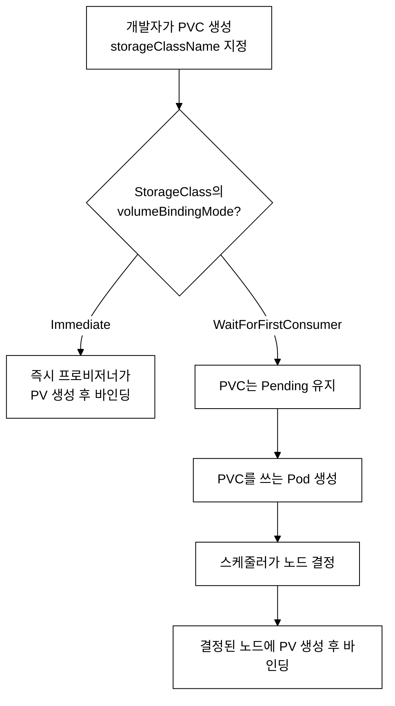
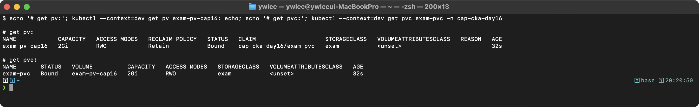
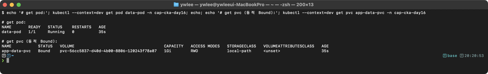
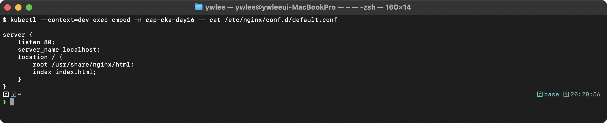
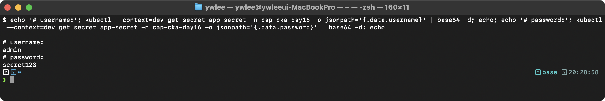
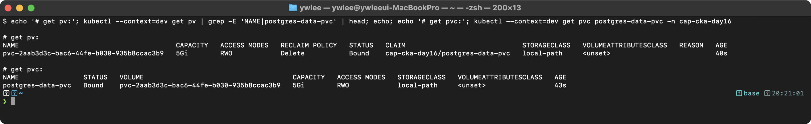
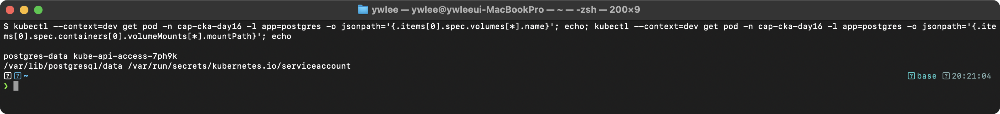

# CKA Day 16: Storage 실전 YAML & 시험 문제

> CKA 도메인: Storage (10%) 실전 | 예상 소요 시간: 2시간

> **이 Day의 성격**: Day 15에서 개념과 내부 동작을 다뤘으므로, Day 16은 예제 YAML(예제 12~18)과 시험형 문제(12문제) 실전편이다. 개념 복습이 필요하면 [day15.md](day15.md)를 먼저 읽는다.

---

## 오늘의 학습 목표

- [ ] downwardAPI 볼륨으로 Pod 메타데이터를 파일로 노출하는 YAML을 직접 작성할 수 있다
- [ ] initContainer와 emptyDir을 조합해 볼륨을 초기화하는 패턴을 이해한다
- [ ] hostPath 볼륨의 타입(Socket, DirectoryOrCreate 등)과 보안 주의점을 설명할 수 있다
- [ ] PV를 `volumeName`으로 직접 지정해 바인딩하는 방법과 Dynamic Provisioning의 차이를 안다
- [ ] StorageClass의 `volumeBindingMode`(Immediate vs WaitForFirstConsumer) 동작을 설명할 수 있다
- [ ] Retain 정책 PV가 Released 상태가 되는 원인과 Available로 되돌리는 절차를 수행할 수 있다
- [ ] 시험형 문제 12개를 제한시간(문제당 5~7분)을 의식하며 풀 수 있다

---

## 0. 이번 Day의 위치와 흐름

Day 15에서 PV(PersistentVolume)·PVC(PersistentVolumeClaim)의 기초 개념을 다뤘다면, Day 16은 그 개념을 실제 YAML과 시험 문제로 손에 익히는 실전 회차이다. Storage 도메인은 CKA 전체의 10%이지만, PV/PVC 바인딩과 볼륨 마운트는 다른 도메인(워크로드·트러블슈팅) 문제에도 끼어들기 때문에 손 숙련을 확보해 둘 가치가 있다.

### 등장 배경: 스토리지가 컨테이너와 분리된 이유

컨테이너는 본래 휘발성이다. Pod가 재시작되거나 다른 노드로 옮겨지면 컨테이너 파일시스템은 초기 이미지 상태로 되돌아가고, 그 안에 쌓인 데이터는 사라진다. 데이터베이스나 로그처럼 살아남아야 하는 상태(state)를 다루려면 컨테이너 수명과 무관하게 존재하는 스토리지가 필요했다.

초기에는 Pod 스펙 안에 `hostPath`나 클라우드 디스크 ID를 직접 박아 넣었다. 이 방식은 두 가지 문제가 있었다. 첫째, 애플리케이션 개발자가 "AWS EBS냐 GCP PD냐, 디스크 ID는 무엇이냐" 같은 인프라 세부사항을 알아야 했다. 둘째, Pod 스펙이 특정 인프라에 묶여 다른 클러스터로 이식할 수 없었다.

PV/PVC는 이 결합을 끊기 위해 등장한 추상화다. **PV는 클러스터 관리자가 제공하는 실제 스토리지(인프라 측)**, **PVC는 개발자가 "1Gi, 읽기/쓰기 가능한 볼륨이 필요하다"고 요청하는 명세(애플리케이션 측)**로 역할을 나눈다. 개발자는 PVC만 작성하고, 시스템이 조건에 맞는 PV를 찾아 연결(바인딩)한다. 인프라 세부사항이 PV 쪽으로 숨겨져 Pod 스펙의 이식성이 생긴다.

트레이드오프: 추상화 계층이 하나 늘어 바인딩 조건(아래 4가지)이 어긋나면 PVC가 Pending에 머무는 새로운 장애 유형이 생겼다. 이번 Day의 트러블슈팅 문제(문제 7)가 바로 이 지점을 다룬다.

### 복습: PV-PVC 바인딩 조건 4가지

PVC가 PV에 바인딩되려면 다음 4가지가 모두 충족돼야 한다(Day 15 핵심). 하나라도 어긋나면 PVC는 Pending에 머문다.

| 조건 | 내용 | 이번 Day에서 |
|:--|:--|:--|
| accessModes | PVC가 요구한 모드(RWO/ROX/RWX/RWOP)를 PV가 제공해야 함. RWO=ReadWriteOnce(단일 노드에서 읽기/쓰기), ROX=ReadOnlyMany(다중 노드 읽기 전용), RWX=ReadWriteMany(다중 노드 읽기/쓰기), RWOP=ReadWriteOncePod(단일 Pod에서만 읽기/쓰기, Kubernetes 1.29 GA). RWO는 단일 노드 단위이므로 같은 노드의 여러 Pod가 동시에 마운트할 수 있는 반면, RWOP는 클러스터 전체에서 하나의 Pod만 마운트할 수 있다. | 문제 1·7에서 RWO 일치 확인 |
| capacity | PV 용량 >= PVC 요청량 | 문제 1에서 PV 2Gi >= PVC 1Gi |
| storageClassName | PVC와 PV의 값이 일치해야 함(빈 문자열 `""`도 하나의 값으로 취급) | 문제 7의 바인딩 실패 원인 |
| selector | PVC가 `matchLabels`로 PV를 지정하면 라벨이 매칭돼야 함(선택적) | 예제 15의 `volumeName` 직접 지정과 비교 |

이번 Day의 예제 12~18과 문제 1~12는 이 4조건을 전제로 한다. PVC가 Pending이면 항상 이 표를 위에서부터 대조하는 것이 진단 순서다.

### 실습 환경 설정

> 전제: tart 멀티클러스터(dev·staging·platform)가 가동 중이어야 한다. 꺼져 있으면 `./scripts/boot.sh` 후 `./scripts/fix-cluster-ip-drift.sh <클러스터>`로 정상화한다(CLAUDE.md §3). kubeconfig는 가동 시 `~/sideproejct/IaC_apple_sillicon/kubeconfig/<클러스터>.yaml`에 생성된다.

문제마다 `kubectl config use-context <ctx>`로 클러스터를 바꾸므로, 먼저 세 클러스터의 kubeconfig를 한 번에 로드해 컨텍스트 전환이 가능하게 한다.

```bash
# 시험 환경 단축키 설정 (속도 훈련 필수 — 시험 시작 직후 첫 번째로 실행)
alias k=kubectl
export do='--dry-run=client -o yaml'
complete -F __start_kubectl k   # k 에도 자동완성 활성화

# 세 클러스터 kubeconfig를 동시에 로드 (콜론으로 연결)
export KUBECONFIG=~/sideproejct/IaC_apple_sillicon/kubeconfig/dev.yaml:~/sideproejct/IaC_apple_sillicon/kubeconfig/staging.yaml:~/sideproejct/IaC_apple_sillicon/kubeconfig/platform.yaml

# 사용 가능한 컨텍스트 확인
kubectl config get-contexts

# 실습용 demo 네임스페이스 생성 (dev 클러스터, 문제 2~5·8·10·11에서 사용)
kubectl config use-context dev
kubectl create namespace demo --dry-run=client -o yaml | kubectl apply -f -
```

주의: `kubectl config use-context`로 바꾼 컨텍스트는 kubeconfig 파일에 기록되므로 같은 `KUBECONFIG` 값을 유지하는 한 터미널을 닫았다 열어도 마지막 컨텍스트가 유지된다. 다만 `KUBECONFIG` 환경변수는 셸 세션에 묶이므로, 터미널을 새로 열면 위 `export`를 다시 실행해야 한다. 각 문제 풀이는 첫 줄에서 `kubectl config use-context <ctx>`로 대상 클러스터를 명시하므로, 그 줄부터 순서대로 복사해 실행하면 컨텍스트가 맞춰진다. demo 네임스페이스를 쓰는 문제는 위에서 미리 만든 `demo` ns가 존재한다고 가정한다.

---

> Day 15 예제 1~11에서 PV·PVC·emptyDir·configMap 기초와 내부 동작을 다뤘다. Day 16은 예제 12번부터 이어지며, 심화 볼륨 타입(downwardAPI·initContainer 초기화·hostPath 소켓·직접 바인딩)과 Dynamic Provisioning, Retain 재사용 절차를 실전 YAML로 손에 익힌다.

### 예제 12: downwardAPI 볼륨

downwardAPI 볼륨은 Pod 자신의 메타데이터(라벨·이름·네임스페이스)와 컨테이너의 리소스 요청/제한 값을 컨테이너 파일시스템에 파일로 노출하는 방식이다. "downward(아래로)"는 클러스터(API 서버)가 가진 Pod 정보를 컨테이너 쪽으로 내려보낸다는 뜻이다. 같은 정보를 환경변수로 주입할 수도 있지만, 환경변수는 컨테이너 시작 시점에 고정되는 반면 downwardAPI 볼륨은 라벨처럼 값이 바뀔 수 있는 항목을 kubelet이 주기적으로 갱신해 파일에 반영한다. 애플리케이션이 자신의 Pod 이름이나 네임스페이스를 코드 변경 없이 알아내야 할 때 쓴다.

아래 예제는 `metadata.labels`·`metadata.name`·`metadata.namespace`와 `requests.cpu`를 각각 `/etc/podinfo/` 아래 파일로 마운트한다.

> **주의**: `resourceFieldRef`로 `requests.cpu`를 노출하려면 컨테이너 스펙에 `resources.requests.cpu`가 반드시 설정돼 있어야 한다. 요청값이 설정되지 않은 컨테이너에 `resourceFieldRef`를 사용하면 kubelet이 해당 필드를 노출하지 못해 Pod가 기동되지 않거나 에러를 반환한다. 아래 예제는 `resources.requests.cpu: 100m`을 명시해 이 조건을 충족한다.

```yaml
apiVersion: v1
kind: Pod
metadata:
  name: downward-pod
  labels:
    app: test
spec:
  containers:
  - name: app
    image: busybox
    command: ["sh", "-c", "cat /etc/podinfo/labels && sleep 3600"]
    resources:
      requests:
        cpu: "100m"      # resourceFieldRef requests.cpu 노출을 위해 필수
      limits:
        cpu: "200m"
    volumeMounts:
    - name: podinfo
      mountPath: /etc/podinfo
  volumes:
  - name: podinfo
    downwardAPI:
      items:
      - path: labels
        fieldRef:
          fieldPath: metadata.labels
      - path: name
        fieldRef:
          fieldPath: metadata.name
      - path: namespace
        fieldRef:
          fieldPath: metadata.namespace
      - path: cpu-request
        resourceFieldRef:
          containerName: app
          resource: requests.cpu
```

### 예제 13: initContainer에서 볼륨 초기화

initContainer(초기화 컨테이너)는 앱 컨테이너가 시작되기 전에 순서대로 실행되고 종료되는 전용 컨테이너다. emptyDir과 조합하면 앱 컨테이너가 필요로 하는 파일이나 디렉터리 구조를 미리 준비할 수 있다. 앱 컨테이너는 initContainer가 모두 성공적으로 종료된 뒤에야 기동되므로, "볼륨이 초기화돼 있다는 보장" 위에서 시작할 수 있다. 대표적인 사용 사례는 DB 마이그레이션 스크립트 실행, 외부 설정 파일 다운로드, 권한 설정 등이다.

```yaml
apiVersion: v1
kind: Pod
metadata:
  name: init-volume-pod
spec:
  initContainers:
  - name: init
    image: busybox:1.36
    command: ["sh", "-c", "echo 'initialized' > /data/init.flag"]
    volumeMounts:
    - name: app-data
      mountPath: /data
  containers:
  - name: app
    image: nginx
    volumeMounts:
    - name: app-data
      mountPath: /app/data
  volumes:
  - name: app-data
    emptyDir: {}
```

### 예제 14: hostPath로 Docker 소켓 마운트

hostPath 소켓 마운트는 Pod에서 노드(호스트)의 컨테이너 런타임에 직접 접근해야 할 때 사용한다. 가장 흔한 사례는 CI 파이프라인의 빌드 에이전트 Pod다. 에이전트 Pod가 `docker build`나 `docker push` 같은 명령을 실행해야 하는데, 이때 Pod 안에 별도 Docker 데몬을 띄우는 Docker-in-Docker(DinD) 방식 대신 호스트 데몬의 Unix 소켓을 직접 공유하는 방식이다. 소켓이 마운트된 컨테이너는 호스트 런타임과 동일한 권한 경계에서 작동한다는 점에서 보안 영향이 크다(아래 [보안 주의] 참조).

```yaml
# Docker/containerd 소켓을 마운트하여 호스트의 컨테이너 런타임 접근
apiVersion: v1
kind: Pod
metadata:
  name: docker-socket-pod
spec:
  containers:
  - name: docker-cli
    image: docker:24-cli
    command: ["sleep", "3600"]
    volumeMounts:
    - name: docker-sock
      mountPath: /var/run/docker.sock
  volumes:
  - name: docker-sock
    hostPath:
      path: /var/run/docker.sock
      type: Socket
```

> **[보안 주의]** docker.sock을 마운트한 컨테이너는 호스트의 모든 컨테이너를 실행·삭제하고 `--privileged` 컨테이너를 띄울 수 있다. 이는 사실상 호스트 root 권한과 동등하며, 해당 컨테이너가 탈출(container escape)하면 노드 전체가 침해된다. 프로덕션 클러스터에서는 PodSecurity Admission(Restricted 프로파일)이나 OPA/Gatekeeper 정책으로 hostPath 소켓 마운트를 차단한다. tart-infra 실습에서는 dev/staging 클러스터에서만 사용하고, platform/prod에서는 이 패턴을 적용하지 않는다.

### 예제 15: PV를 volumeName으로 직접 지정

`volumeName`은 PVC가 라벨 셀렉터 없이 특정 PV 하나를 이름으로 직접 지목하는 방식이다. `selector.matchLabels`는 조건에 맞는 여러 PV 중 하나를 선택하는 반면, `volumeName`은 이름이 정확히 일치하는 PV 하나만 바인딩 대상으로 고정한다. 이름을 알고 있는 PV를 독점적으로 예약하고 싶을 때 유용하다. 단, `volumeName`을 지정하더라도 `storageClassName`·`accessModes`·`capacity` 조건은 여전히 충족돼야 바인딩이 성공한다.

```yaml
apiVersion: v1
kind: PersistentVolume
metadata:
  name: specific-pv
spec:
  capacity:
    storage: 10Gi
  accessModes:
  - ReadWriteOnce
  storageClassName: ""
  hostPath:
    path: /data/specific
---
apiVersion: v1
kind: PersistentVolumeClaim
metadata:
  name: specific-pvc
spec:
  accessModes:
  - ReadWriteOnce
  resources:
    requests:
      storage: 5Gi
  storageClassName: ""
  volumeName: specific-pv           # 이 특정 PV에 바인딩
```

### StorageClass와 Dynamic Provisioning: Static의 한계를 넘다

지금까지 예제 15까지는 **Static Provisioning**이다. 관리자가 PV를 미리 손으로 만들어 두고, 개발자의 PVC가 그중 조건에 맞는 것을 골라 바인딩한다. 이 방식은 PVC가 들어올 때마다 관리자가 적절한 크기의 PV를 미리 준비해 둬야 한다는 한계가 있다. 요청량을 예측하기 어렵거나 PVC가 수시로 생기는 환경에서는 PV가 부족하거나(Pending 발생) 과잉 준비되는 낭비가 생긴다.

**Dynamic Provisioning**은 이 문제를 해결한다. PVC가 `storageClassName`을 지정하면, 해당 StorageClass에 연결된 **프로비저너(provisioner)**가 PVC 요청에 맞는 PV를 그 즉시 자동으로 만들어 바인딩한다. 관리자는 PV를 미리 만들 필요 없이 "어떤 종류의 스토리지를 어떤 프로비저너로 만들지"만 StorageClass로 한 번 정의해 두면 된다.



_그림 1. Static 대신 Dynamic Provisioning에서 PVC가 PV로 바인딩되는 경로. `volumeBindingMode`가 분기점이다._

`volumeBindingMode`는 프로비저너가 PV를 **언제** 만들지 결정한다.
- `Immediate`: PVC가 생성되는 즉시 PV를 만든다. 다만 어느 노드에 Pod가 뜰지 모르는 상태에서 PV가 특정 노드에 묶이면, 나중에 Pod가 다른 노드로 스케줄링될 때 그 PV를 쓸 수 없는 문제가 생길 수 있다.
- `WaitForFirstConsumer`: PVC를 쓰는 Pod가 생겨 스케줄링 노드가 정해진 **다음에** PV를 만든다. 그래서 PV가 Pod와 같은 노드에 생성되도록 보장된다. local-path처럼 노드 로컬 디스크를 쓰는 프로비저너에서 필수적이다. 단점은 Pod가 생기기 전까지 PVC가 Pending에 머물러, 처음 보는 학생이 "왜 안 바인딩되지?"라고 오해하기 쉽다는 점이다(문제 2·11에서 이 동작을 확인한다).

아래 예제는 tart 클러스터의 local-path 프로비저너를 기본 StorageClass로 정의한다.

### 예제 16: StorageClass 정의 (local-path)

```yaml
apiVersion: storage.k8s.io/v1
kind: StorageClass
metadata:
  name: local-path
  annotations:
    storageclass.kubernetes.io/is-default-class: "true"
provisioner: rancher.io/local-path
reclaimPolicy: Delete
volumeBindingMode: WaitForFirstConsumer
```

### Retain 정책의 동작: Released 상태와 수동 재사용

PV의 `persistentVolumeReclaimPolicy`는 바인딩된 PVC가 삭제됐을 때 PV와 그 데이터를 어떻게 처리할지 정한다.
- `Delete`: PVC가 삭제되면 프로비저너가 PV와 실제 스토리지를 함께 삭제한다. 동적 프로비저닝의 기본값이며, 임시 데이터에 적합하다.
- `Retain`: PVC가 삭제돼도 PV와 데이터를 보존한다. 데이터베이스처럼 실수로 지우면 안 되는 데이터에 쓴다.

`Retain` PV는 PVC가 삭제되면 상태가 **Released**로 바뀐다. Released는 "원래 바인딩됐던 PVC는 사라졌지만, PV에는 이전 PVC를 가리키는 참조(`spec.claimRef`)가 남아 있는" 상태다. 이 참조가 남아 있는 한 PV는 다른 PVC에 다시 바인딩되지 않는다(혹시 모를 데이터 노출을 막기 위한 안전장치). 그래서 같은 PV를 재사용하려면 `claimRef`를 수동으로 제거해 상태를 **Available**로 되돌려야 한다. 아래 예제가 이 절차다(문제 9에서 실습한다).

### 예제 17: Retain 정책 PV의 재사용

```bash
# Released 상태의 PV를 다시 Available로 만들기
kubectl get pv my-pv
# STATUS: Released

# claimRef 삭제
kubectl patch pv my-pv --type json -p '[{"op":"remove","path":"/spec/claimRef"}]'

kubectl get pv my-pv
# STATUS: Available (다시 바인딩 가능)
```

### 예제 18: kubectl 명령으로 빠른 PVC 관련 조회

```bash
# PV/PVC 조회
kubectl get pv                           # 모든 PV (클러스터 수준)
kubectl get pvc -A                       # 모든 네임스페이스의 PVC
kubectl get pvc -n demo                  # 특정 네임스페이스의 PVC
kubectl describe pv <name>              # PV 상세
kubectl describe pvc <name> -n <ns>     # PVC 상세

# StorageClass 조회
kubectl get storageclass                 # 모든 StorageClass
kubectl describe storageclass <name>     # SC 상세

# PV-PVC 관계 확인
# custom-columns는 '컬럼이름:리소스 필드 경로' 쌍을 콤마로 나열해 출력 표를 직접 구성한다.
# 필드 경로(jsonpath 선택자)는 kubectl get <리소스> -o yaml 로 본 구조를 점(.)으로 따라간 것이다.
#   .metadata.name       = 리소스 이름
#   .spec.capacity.storage = PV가 제공하는 용량(스펙에 적은 값)
#   .status.phase        = 현재 상태(Available/Bound/Released)
#   .spec.claimRef.name  = 이 PV에 바인딩된 PVC 이름
# 경로를 모를 때는 kubectl explain pv.spec.capacity 처럼 explain으로 필드를 찾을 수 있다.
kubectl get pv -o custom-columns='NAME:.metadata.name,CAPACITY:.spec.capacity.storage,ACCESS:.spec.accessModes[0],STATUS:.status.phase,CLAIM:.spec.claimRef.name,SC:.spec.storageClassName'

# PVC 상태 확인
kubectl get pvc -n demo -o custom-columns='NAME:.metadata.name,STATUS:.status.phase,VOLUME:.spec.volumeName,CAPACITY:.status.capacity.storage,SC:.spec.storageClassName'
```

---

## 1. 시험에서 이 주제가 어떻게 출제되는가?

### 출제 패턴 분석

```
CKA 시험의 Storage 관련 출제:
Storage 도메인 = 전체의 10%

주요 출제 유형:
1. PV + PVC 생성 및 바인딩 — 가장 빈출!
2. PVC를 사용하는 Pod 생성 — 빈출
3. emptyDir 볼륨 (Multi-Container Pod) — 빈출
4. ConfigMap/Secret 볼륨 마운트 — 빈출
5. StorageClass 확인/이해 — 가끔 출제
6. PVC Pending 문제 해결 — 트러블슈팅 연계

핵심:
- PV와 PVC의 바인딩 조건 4가지를 정확히 이해
- Pod에서 PVC를 마운트하는 YAML 구조 암기
- emptyDir로 Multi-Container Pod 구성 가능
- StorageClass의 volumeBindingMode(WaitForFirstConsumer) 이해
```

---

## 2. 시험 대비 연습 문제 (12문제)

### 문제 1. PV와 PVC 생성 [7%]

**컨텍스트:** `kubectl config use-context staging`

다음 PV와 PVC를 생성하라:
- PV: 이름 `exam-pv`, 용량 2Gi, accessMode RWO, hostPath `/opt/exam-data`, storageClassName `exam`
- PVC: 이름 `exam-pvc`, 요청 1Gi, accessMode RWO, storageClassName `exam`

<details>
<summary>풀이</summary>

```bash
kubectl config use-context staging

# PV 생성
cat <<EOF | kubectl apply -f -
apiVersion: v1
kind: PersistentVolume
metadata:
  name: exam-pv
spec:
  capacity:
    storage: 2Gi               # PVC 요청(1Gi)보다 크거나 같아야 함
  accessModes:
  - ReadWriteOnce              # PVC와 일치
  persistentVolumeReclaimPolicy: Retain
  storageClassName: exam       # PVC와 일치
  hostPath:
    path: /opt/exam-data
    type: DirectoryOrCreate
EOF

# PVC 생성
cat <<EOF | kubectl apply -f -
apiVersion: v1
kind: PersistentVolumeClaim
metadata:
  name: exam-pvc
spec:
  accessModes:
  - ReadWriteOnce              # PV와 일치
  resources:
    requests:
      storage: 1Gi             # PV capacity(2Gi) 이하
  storageClassName: exam       # PV와 일치
EOF

# 바인딩 확인
kubectl get pv exam-pv
kubectl get pvc exam-pvc
```

**검증 기대 출력:**



```bash
# 정리
kubectl delete pvc exam-pvc
kubectl delete pv exam-pv
```

**바인딩 확인 포인트:**
- accessModes 일치 (둘 다 RWO)
- capacity(2Gi) >= request(1Gi)
- storageClassName 일치 (둘 다 exam)

**트러블슈팅:** PVC가 Pending 상태로 남아 있으면 `kubectl describe pvc exam-pvc`의 Events를 확인한다. "no persistent volumes available"이면 바인딩 조건 4가지(accessModes, capacity, storageClassName, selector)를 하나씩 대조한다.

</details>

---

### 문제 2. PVC를 사용하는 Pod 생성 [4%]

**컨텍스트:** `kubectl config use-context dev`

`demo` 네임스페이스에 다음 Pod를 생성하라:
- 이름: `data-pod`
- 이미지: `nginx`
- PVC `app-data-pvc`(1Gi, RWO, StorageClass: local-path)를 `/usr/share/nginx/html`에 마운트

<details>
<summary>풀이</summary>

```bash
kubectl config use-context dev

# PVC 생성
cat <<EOF | kubectl apply -f -
apiVersion: v1
kind: PersistentVolumeClaim
metadata:
  name: app-data-pvc
  namespace: demo
spec:
  accessModes:
  - ReadWriteOnce
  resources:
    requests:
      storage: 1Gi
  storageClassName: local-path
EOF

# Pod 생성
cat <<EOF | kubectl apply -f -
apiVersion: v1
kind: Pod
metadata:
  name: data-pod
  namespace: demo
spec:
  containers:
  - name: nginx
    image: nginx
    volumeMounts:
    - name: web-data               # volumes의 name과 매칭
      mountPath: /usr/share/nginx/html
  volumes:
  - name: web-data
    persistentVolumeClaim:
      claimName: app-data-pvc      # PVC 이름
EOF

# 확인
kubectl get pod data-pod -n demo
kubectl get pvc app-data-pvc -n demo
```

**검증 기대 출력:**



**내부 동작 원리:** `storageClassName: local-path`를 지정하면 Dynamic Provisioning이 작동한다. `local-path` StorageClass는 `volumeBindingMode: WaitForFirstConsumer`이므로, PVC만 생성하면 Pending 상태로 유지된다. Pod가 생성되어 스케줄링이 결정된 후에야 해당 노드에 PV가 자동 생성되고 바인딩된다.

```bash
# 정리
kubectl delete pod data-pod -n demo
kubectl delete pvc app-data-pvc -n demo
```

</details>

---

### 문제 3. emptyDir 볼륨으로 Multi-Container Pod [4%]

**컨텍스트:** `kubectl config use-context dev`

두 개의 컨테이너가 emptyDir 볼륨을 공유하는 Pod를 생성하라:
- Pod 이름: `sidecar-pod`, 네임스페이스: `demo`
- 컨테이너 1: `main` (nginx), 볼륨을 `/var/log/nginx`에 마운트
- 컨테이너 2: `sidecar` (busybox:1.36), 볼륨을 `/logs`에 읽기 전용 마운트
  - 명령: `tail -f /logs/access.log`

<details>
<summary>풀이</summary>

```bash
kubectl config use-context dev

cat <<EOF | kubectl apply -f -
apiVersion: v1
kind: Pod
metadata:
  name: sidecar-pod
  namespace: demo
spec:
  containers:
  - name: main
    image: nginx
    volumeMounts:
    - name: logs
      mountPath: /var/log/nginx
  - name: sidecar
    image: busybox:1.36
    command: ["sh", "-c", "tail -f /logs/access.log"]
    volumeMounts:
    - name: logs
      mountPath: /logs
      readOnly: true               # 읽기 전용
  volumes:
  - name: logs
    emptyDir: {}                   # Pod와 수명이 같은 임시 볼륨
EOF

# 확인
kubectl get pod sidecar-pod -n demo
kubectl logs sidecar-pod -c sidecar -n demo

# 정리
kubectl delete pod sidecar-pod -n demo
```

</details>

---

### 문제 4. ConfigMap을 볼륨으로 마운트 [4%]

**컨텍스트:** `kubectl config use-context dev`

1. `demo` 네임스페이스에 `nginx-config` ConfigMap 생성 (key: `default.conf`, value: nginx 설정)
2. 이 ConfigMap을 Pod의 `/etc/nginx/conf.d/`에 마운트하라

<details>
<summary>풀이</summary>

```bash
kubectl config use-context dev

# ConfigMap 생성
cat <<'EOF' | kubectl apply -f -
apiVersion: v1
kind: ConfigMap
metadata:
  name: nginx-config
  namespace: demo
data:
  default.conf: |
    server {
        listen 80;
        server_name localhost;
        location / {
            root /usr/share/nginx/html;
            index index.html;
        }
    }
EOF

# Pod 생성 — ConfigMap을 볼륨으로 마운트
cat <<EOF | kubectl apply -f -
apiVersion: v1
kind: Pod
metadata:
  name: nginx-custom
  namespace: demo
spec:
  containers:
  - name: nginx
    image: nginx
    volumeMounts:
    - name: nginx-conf
      mountPath: /etc/nginx/conf.d     # ConfigMap이 마운트될 디렉터리
  volumes:
  - name: nginx-conf
    configMap:
      name: nginx-config               # ConfigMap 이름
EOF

# 확인
kubectl exec nginx-custom -n demo -- cat /etc/nginx/conf.d/default.conf
```

**검증 기대 출력:**



**내부 동작 원리:** ConfigMap 볼륨 마운트 시, ConfigMap의 각 key가 마운트 디렉터리 내 파일 이름이 되고, value가 파일 내용이 된다. kubelet이 ConfigMap 변경을 감지하면 마운트된 파일도 자동으로 업데이트된다(단, subPath 사용 시에는 자동 업데이트되지 않는다).

```bash
# 정리
kubectl delete pod nginx-custom -n demo
kubectl delete configmap nginx-config -n demo
```

</details>

---

### 문제 5. Secret을 볼륨으로 마운트 [4%]

**컨텍스트:** `kubectl config use-context dev`

1. Secret `db-credentials` 생성: username=admin, password=secret123
2. Pod `secret-test`에서 이 Secret을 `/etc/db-creds`에 읽기 전용으로 마운트하라

<details>
<summary>풀이</summary>

> 컨텍스트 확인: 문제 2~4를 이어서 풀었더라도 셸을 새로 열었을 수 있으므로 `kubectl config use-context dev`를 다시 실행한다. Secret과 Pod 모두 `demo` 네임스페이스에 만들어야 Pod가 같은 ns의 Secret을 찾을 수 있다(create 명령에 `-n demo`가 빠지면 default ns에 생성되어 마운트 실패).

```bash
kubectl config use-context dev
kubectl config current-context        # dev 인지 확인

# Secret 생성 (-n demo 필수: Pod와 같은 네임스페이스여야 마운트됨)
kubectl create secret generic db-credentials \
  --from-literal=username=admin \
  --from-literal=password=secret123 \
  -n demo

# Pod 생성
cat <<EOF | kubectl apply -f -
apiVersion: v1
kind: Pod
metadata:
  name: secret-test
  namespace: demo
spec:
  containers:
  - name: app
    image: busybox:1.36
    command: ["sh", "-c", "cat /etc/db-creds/username && echo '' && cat /etc/db-creds/password && sleep 3600"]
    volumeMounts:
    - name: db-creds
      mountPath: /etc/db-creds
      readOnly: true
  volumes:
  - name: db-creds
    secret:
      secretName: db-credentials
      defaultMode: 0400               # 읽기 전용 권한
EOF

# 확인
kubectl exec secret-test -n demo -- cat /etc/db-creds/username
kubectl exec secret-test -n demo -- cat /etc/db-creds/password
```

**검증 기대 출력:**



**내부 동작 원리:** Secret은 etcd에 base64 인코딩되어 저장된다. kubelet이 Secret을 볼륨으로 마운트할 때 tmpfs(RAM 기반 파일시스템)에 디코딩된 값을 기록한다. `defaultMode: 0400`은 파일 권한을 읽기 전용(owner만)으로 설정한다. Secret이 업데이트되면 kubelet이 약 1분 내로 마운트된 파일도 갱신한다(subPath 사용 시 제외).

```bash
# 정리
kubectl delete pod secret-test -n demo
kubectl delete secret db-credentials -n demo
```

</details>

---

### 문제 6. StorageClass 확인 및 PVC 문제 해결 [7%]

**컨텍스트:** `kubectl config use-context platform`

> **전제**: platform 클러스터에 kube-prometheus-stack(Prometheus·Grafana)이 배포돼 있어야 monitoring 네임스페이스에 PVC가 존재한다. 배포되지 않은 환경에서는 `kubectl get pvc -n monitoring`이 빈 목록을 반환한다.
>
> **대안 (platform PVC 없는 경우 — 독립 재현)**: 아래 두 줄로 staging 클러스터에 임시 PVC를 즉석 생성해 동일 명령을 연습한다. 문제 1 풀이 결과가 남아 있을 필요가 없다.
> ```bash
> kubectl config use-context staging
> kubectl create namespace monitoring --dry-run=client -o yaml | kubectl apply -f - && kubectl apply -f - <<'EOF'
> apiVersion: v1
> kind: PersistentVolumeClaim
> metadata:
>   name: demo-pvc
>   namespace: monitoring
> spec:
>   accessModes: [ReadWriteOnce]
>   resources:
>     requests:
>       storage: 1Gi
>   storageClassName: exam
> EOF
> ```
> 이후 아래 풀이의 `-n monitoring` 명령을 staging 컨텍스트 그대로 실행하면 된다. 실습 후 `kubectl delete ns monitoring --context staging`으로 정리한다.

`monitoring` 네임스페이스의 PVC 상태를 확인하고 다음 질문에 답하라:
1. PVC 이름과 용량을 `/tmp/pvc-info.txt`에 저장하라
2. 해당 PVC가 사용하는 StorageClass의 provisioner 이름을 확인하라

<details>
<summary>풀이</summary>

> 주의: `status.capacity.storage`는 PVC가 **Bound** 상태일 때만 값이 채워진다. Pending 상태의 PVC는 이 필드가 비어 있어 표의 CAPACITY 칸이 공란으로 나온다. 따라서 먼저 PVC가 Bound인지 확인한 뒤 용량을 수집한다.

```bash
kubectl config use-context platform

# 0. 먼저 PVC 상태 확인 (Bound여야 capacity가 채워짐)
kubectl get pvc -n monitoring

# 1. PVC 정보 확인 및 저장
kubectl get pvc -n monitoring \
  -o custom-columns='NAME:.metadata.name,CAPACITY:.status.capacity.storage,STORAGECLASS:.spec.storageClassName' \
  > /tmp/pvc-info.txt

cat /tmp/pvc-info.txt

# 2. StorageClass provisioner 확인
SC_NAME=$(kubectl get pvc -n monitoring -o jsonpath='{.items[0].spec.storageClassName}')
echo "" >> /tmp/pvc-info.txt
echo "StorageClass: $SC_NAME" >> /tmp/pvc-info.txt
kubectl get storageclass $SC_NAME -o jsonpath='Provisioner: {.provisioner}' >> /tmp/pvc-info.txt
echo "" >> /tmp/pvc-info.txt

cat /tmp/pvc-info.txt
```

</details>

---

### 문제 7. PV-PVC 바인딩 실패 문제 해결 [7%]

**컨텍스트:** `kubectl config use-context staging`

PVC `pending-pvc`가 Pending 상태이다. 원인을 찾고 바인딩이 성공하도록 수정하라.

<details>
<summary>풀이</summary>

```bash
kubectl config use-context staging

# 문제 시뮬레이션
cat <<EOF | kubectl apply -f -
apiVersion: v1
kind: PersistentVolume
metadata:
  name: test-pv
spec:
  capacity:
    storage: 5Gi
  accessModes:
  - ReadWriteOnce
  storageClassName: fast                # SC: fast
  hostPath:
    path: /data/test
---
apiVersion: v1
kind: PersistentVolumeClaim
metadata:
  name: pending-pvc
spec:
  accessModes:
  - ReadWriteOnce
  resources:
    requests:
      storage: 3Gi
  storageClassName: slow                # SC: slow → 불일치!
EOF

# === 진단 ===

# 1. PVC 상태 확인
kubectl get pvc pending-pvc
# STATUS: Pending

# 2. PVC 이벤트 확인
kubectl describe pvc pending-pvc
# Events: no persistent volumes available for this claim

# 3. PV 확인
kubectl get pv test-pv
# STORAGECLASS: fast

# 4. 비교
# PVC storageClassName: slow ≠ PV storageClassName: fast

# 5. 수정: PVC의 storageClassName을 fast로 변경
# PVC의 storageClassName은 수정할 수 없으므로 재생성
kubectl delete pvc pending-pvc
cat <<EOF | kubectl apply -f -
apiVersion: v1
kind: PersistentVolumeClaim
metadata:
  name: pending-pvc
spec:
  accessModes:
  - ReadWriteOnce
  resources:
    requests:
      storage: 3Gi
  storageClassName: fast               # PV와 일치하도록 수정
EOF

# 6. 검증
kubectl get pvc pending-pvc
# STATUS: Bound

kubectl get pv test-pv
# STATUS: Bound, CLAIM: default/pending-pvc

# 정리
kubectl delete pvc pending-pvc
kubectl delete pv test-pv
```

**진단 순서:**
1. `kubectl describe pvc` → 이벤트 확인
2. PVC의 storageClassName, accessModes, storage 요청량 확인
3. PV의 storageClassName, accessModes, capacity 확인
4. 불일치 항목 수정

</details>

---

### 문제 8. 여러 볼륨 타입을 사용하는 Pod [7%]

**컨텍스트:** `kubectl config use-context dev`

다음 Pod를 생성하라:
- 이름: `multi-vol-pod`, 네임스페이스: `demo`
- 이미지: `nginx`
- ConfigMap `app-settings` (APP_ENV=production)를 `/etc/config`에 마운트
- Secret `app-secret` (api-key=my-secret-key)를 `/etc/secrets`에 읽기 전용 마운트
- emptyDir를 `/tmp/cache`에 마운트

<details>
<summary>풀이</summary>

```bash
kubectl config use-context dev

# ConfigMap 생성
kubectl create configmap app-settings \
  --from-literal=APP_ENV=production -n demo

# Secret 생성
kubectl create secret generic app-secret \
  --from-literal=api-key=my-secret-key -n demo

# Pod 생성
cat <<EOF | kubectl apply -f -
apiVersion: v1
kind: Pod
metadata:
  name: multi-vol-pod
  namespace: demo
spec:
  containers:
  - name: nginx
    image: nginx
    volumeMounts:
    - name: config
      mountPath: /etc/config
    - name: secrets
      mountPath: /etc/secrets
      readOnly: true
    - name: cache
      mountPath: /tmp/cache
  volumes:
  - name: config
    configMap:
      name: app-settings
  - name: secrets
    secret:
      secretName: app-secret
  - name: cache
    emptyDir: {}
EOF

# 검증
kubectl exec multi-vol-pod -n demo -- cat /etc/config/APP_ENV
# production
kubectl exec multi-vol-pod -n demo -- cat /etc/secrets/api-key
# my-secret-key
kubectl exec multi-vol-pod -n demo -- ls /tmp/cache
# (빈 디렉터리)

# 정리
kubectl delete pod multi-vol-pod -n demo
kubectl delete configmap app-settings -n demo
kubectl delete secret app-secret -n demo
```

</details>

---

### 문제 9. hostPath PV + Retain 정책 [4%]

**컨텍스트:** `kubectl config use-context staging`

Retain 정책의 PV를 생성하고, PVC 삭제 후 PV 상태를 확인하라:
- PV: `retain-pv`, 3Gi, RWO, hostPath `/opt/retain-data`
- PVC: `retain-pvc`, 1Gi, RWO

<details>
<summary>풀이</summary>

```bash
kubectl config use-context staging

# PV 생성
cat <<EOF | kubectl apply -f -
apiVersion: v1
kind: PersistentVolume
metadata:
  name: retain-pv
spec:
  capacity:
    storage: 3Gi
  accessModes:
  - ReadWriteOnce
  persistentVolumeReclaimPolicy: Retain   # Retain 정책
  storageClassName: retain-class
  hostPath:
    path: /opt/retain-data
---
apiVersion: v1
kind: PersistentVolumeClaim
metadata:
  name: retain-pvc
spec:
  accessModes:
  - ReadWriteOnce
  resources:
    requests:
      storage: 1Gi
  storageClassName: retain-class
EOF

# 확인
kubectl get pv retain-pv
kubectl get pvc retain-pvc
# 둘 다 Bound

# PVC 삭제
kubectl delete pvc retain-pvc

# PV 상태 확인
kubectl get pv retain-pv
# STATUS: Released (Retain 정책이므로 PV가 보존됨)

# PV 재사용을 위해 claimRef 제거
kubectl patch pv retain-pv --type json \
  -p '[{"op":"remove","path":"/spec/claimRef"}]'

kubectl get pv retain-pv
# STATUS: Available (다시 바인딩 가능)

# 정리
kubectl delete pv retain-pv
```

</details>

---

### 문제 10. ConfigMap을 subPath로 특정 파일만 마운트 [4%]

**컨텍스트:** `kubectl config use-context dev`

nginx Pod에서 `/etc/nginx/conf.d/` 디렉터리의 기존 파일을 유지하면서 ConfigMap의 `custom.conf` 파일만 추가하라.

<details>
<summary>풀이</summary>

```bash
kubectl config use-context dev

# ConfigMap 생성
cat <<'EOF' | kubectl apply -f -
apiVersion: v1
kind: ConfigMap
metadata:
  name: custom-nginx-conf
  namespace: demo
data:
  custom.conf: |
    server {
        listen 8080;
        server_name custom.local;
        location / {
            return 200 'Custom server\n';
        }
    }
EOF

# Pod 생성 — subPath로 특정 파일만 마운트
cat <<EOF | kubectl apply -f -
apiVersion: v1
kind: Pod
metadata:
  name: nginx-subpath
  namespace: demo
spec:
  containers:
  - name: nginx
    image: nginx
    volumeMounts:
    - name: custom-conf
      mountPath: /etc/nginx/conf.d/custom.conf
      subPath: custom.conf              # ConfigMap의 특정 키만 마운트
  volumes:
  - name: custom-conf
    configMap:
      name: custom-nginx-conf
EOF

# 확인: 기존 default.conf도 유지되고 custom.conf도 추가됨
kubectl exec nginx-subpath -n demo -- ls /etc/nginx/conf.d/
# custom.conf  default.conf

# 정리
kubectl delete pod nginx-subpath -n demo
kubectl delete configmap custom-nginx-conf -n demo
```

**핵심:** subPath 없이 마운트하면 디렉터리 전체가 덮어씌워진다. subPath를 사용하면 특정 파일만 추가된다.

</details>

---

### 문제 11. Dynamic Provisioning 테스트 [7%]

**컨텍스트:** `kubectl config use-context dev`

Dynamic Provisioning으로 PVC를 생성하고 Pod에서 데이터를 쓴 후 확인하라:
1. PVC `dynamic-test-pvc` (1Gi, RWO, StorageClass: local-path)
2. Pod `dynamic-test-pod`에서 PVC를 `/data`에 마운트
3. Pod 내에서 `/data/test.txt`에 "Hello Dynamic PV" 저장
4. 파일 내용을 확인하라

<details>
<summary>풀이</summary>

```bash
kubectl config use-context dev

# PVC 생성 (StorageClass가 자동으로 PV 생성)
cat <<EOF | kubectl apply -f -
apiVersion: v1
kind: PersistentVolumeClaim
metadata:
  name: dynamic-test-pvc
  namespace: demo
spec:
  accessModes:
  - ReadWriteOnce
  resources:
    requests:
      storage: 1Gi
  storageClassName: local-path
EOF

# PVC 상태 확인 (WaitForFirstConsumer이므로 Pending)
kubectl get pvc dynamic-test-pvc -n demo
# STATUS: Pending

# Pod 생성
cat <<EOF | kubectl apply -f -
apiVersion: v1
kind: Pod
metadata:
  name: dynamic-test-pod
  namespace: demo
spec:
  containers:
  - name: app
    image: busybox:1.36
    command: ["sh", "-c", "echo 'Hello Dynamic PV' > /data/test.txt && sleep 3600"]
    volumeMounts:
    - name: data
      mountPath: /data
  volumes:
  - name: data
    persistentVolumeClaim:
      claimName: dynamic-test-pvc
EOF

# Pod가 Running이 되면 PVC도 Bound로 변경됨
kubectl get pvc dynamic-test-pvc -n demo
# STATUS: Bound

# 자동 생성된 PV 확인
kubectl get pv | grep dynamic-test-pvc

# 데이터 확인
kubectl exec dynamic-test-pod -n demo -- cat /data/test.txt
# Hello Dynamic PV

# 정리
kubectl delete pod dynamic-test-pod -n demo
kubectl delete pvc dynamic-test-pvc -n demo
```

</details>

---

### 문제 12. PV/PVC 정보 수집 [4%]

**컨텍스트:** `kubectl config use-context platform`

> **전제**: monitoring 네임스페이스의 PVC 수집 항목(2번)은 platform 클러스터에 kube-prometheus-stack이 배포돼 있어야 결과가 나온다. 배포되지 않은 경우 2번 명령은 빈 목록을 반환한다.
>
> **대안 (platform PVC 없는 경우 — 독립 재현)**: 아래 명령으로 dev 클러스터에 즉석 PVC를 생성한다. 이전 문제 풀이 결과(문제 1의 PVC 등)가 남아 있을 필요가 없다.
> ```bash
> kubectl config use-context dev
> kubectl create namespace monitoring --dry-run=client -o yaml | kubectl apply -f - && kubectl apply -f - <<'EOF'
> apiVersion: v1
> kind: PersistentVolumeClaim
> metadata:
>   name: info-demo-pvc
>   namespace: monitoring
> spec:
>   accessModes: [ReadWriteOnce]
>   resources:
>     requests:
>       storage: 1Gi
>   storageClassName: local-path
> EOF
> ```
> 이후 아래 풀이의 `platform` 컨텍스트 대신 `dev`를 사용하고, `-n monitoring`을 그대로 적용한다. 실습 후 `kubectl delete ns monitoring --context dev`로 정리한다.

다음 정보를 `/tmp/storage-info.txt`에 저장하라:
1. 클러스터의 기본 StorageClass 이름과 provisioner
2. `monitoring` 네임스페이스의 모든 PVC 이름, 상태, 용량

<details>
<summary>풀이</summary>

```bash
kubectl config use-context platform

# 1. 기본 StorageClass 정보
echo "=== Default StorageClass ===" > /tmp/storage-info.txt
kubectl get storageclass -o custom-columns='NAME:.metadata.name,PROVISIONER:.provisioner,DEFAULT:.metadata.annotations.storageclass\.kubernetes\.io/is-default-class' >> /tmp/storage-info.txt
echo "" >> /tmp/storage-info.txt

# 2. monitoring PVC 정보
echo "=== Monitoring PVCs ===" >> /tmp/storage-info.txt
kubectl get pvc -n monitoring \
  -o custom-columns='NAME:.metadata.name,STATUS:.status.phase,CAPACITY:.status.capacity.storage' \
  >> /tmp/storage-info.txt

cat /tmp/storage-info.txt
```

</details>

---

## 3. 복습 체크리스트

### 개념 확인

- [ ] PV-PVC 바인딩의 4가지 조건(accessMode, capacity, storageClassName, selector)을 설명할 수 있는가?
- [ ] RWO, ROX, RWX, RWOP의 차이를 아는가?
- [ ] Retain과 Delete Reclaim Policy의 차이를 이해하는가?
- [ ] WaitForFirstConsumer volumeBindingMode의 동작을 설명할 수 있는가?
- [ ] emptyDir, hostPath, configMap, secret 볼륨의 차이를 설명할 수 있는가?
- [ ] subPath의 용도를 아는가?
- [ ] PV는 클러스터 수준, PVC는 네임스페이스 수준임을 기억하는가?
- [ ] Released PV를 Available로 되돌리는 방법을 아는가?

### kubectl 명령어 확인

- [ ] `kubectl get pv` / `kubectl get pvc -n <ns>`
- [ ] `kubectl describe pv <name>` / `kubectl describe pvc <name>`
- [ ] `kubectl get storageclass`
- [ ] `kubectl create configmap <name> --from-literal=key=value`
- [ ] `kubectl create secret generic <name> --from-literal=key=value`

### 시험 핵심 팁

1. **PV/PVC 바인딩 실패** — storageClassName, accessModes, capacity 순서로 확인
2. **Dynamic Provisioning** — storageClassName을 지정하면 PV가 자동 생성
3. **ConfigMap 볼륨** — 파일 이름 = ConfigMap의 key, 파일 내용 = value
4. **subPath** — 기존 디렉터리를 유지하면서 특정 파일만 추가할 때
5. **emptyDir** — Multi-Container Pod에서 컨테이너 간 데이터 공유
6. **hostPath 타입** — DirectoryOrCreate를 사용하면 디렉터리가 없어도 생성됨

---

## ✅ 자가점검

<details>
<summary>질문 1. PVC가 Pending인 채로 멈춰 있다. 어떤 순서로 진단하는가?</summary>

1. `kubectl describe pvc <이름>` → Events 항목에서 "no persistent volumes available" 또는 "storageclass not found" 같은 메시지를 확인한다.
2. `kubectl get pv` → Status, StorageClass, AccessModes, Capacity를 조회해 바인딩 조건 4가지(accessModes·capacity·storageClassName·selector)를 PVC와 대조한다.
3. WaitForFirstConsumer StorageClass라면 PVC만 생성한 경우 정상 Pending이다. PVC를 사용하는 Pod를 생성해야 PV가 만들어지고 바인딩된다.
4. 조건 불일치라면 PVC를 삭제 후 조건을 맞춰 재생성한다(PVC의 storageClassName은 생성 후 변경 불가).

</details>

<details>
<summary>질문 2. Retain 정책 PV가 PVC 삭제 후 다른 PVC와 다시 바인딩되지 않는 이유와 해결 방법은?</summary>

PVC가 삭제되면 PV 상태가 Released로 바뀐다. Released 상태에서는 이전 PVC를 가리키는 `spec.claimRef` 참조가 PV에 남아 있다. 이 참조가 남아 있는 한 새 PVC가 조건을 충족해도 바인딩이 거부된다(의도치 않은 데이터 노출 방지). 해결 방법: `kubectl patch pv <이름> --type json -p '[{"op":"remove","path":"/spec/claimRef"}]'` 로 claimRef를 제거하면 PV 상태가 Available로 복귀해 새 PVC와 바인딩할 수 있다.

</details>

<details>
<summary>질문 3. subPath로 ConfigMap을 마운트했을 때 ConfigMap 변경이 자동으로 파일에 반영되지 않는 이유는?</summary>

일반 ConfigMap 볼륨 마운트는 kubelet이 심볼릭 링크를 통해 ConfigMap 갱신을 추적해 주기적으로 파일을 업데이트한다. 그러나 subPath를 사용하면 심볼릭 링크 추적 방식이 아니라 파일을 직접 바인드 마운트하므로 kubelet이 변경을 감지하지 못한다. 따라서 ConfigMap이 업데이트돼도 Pod를 재시작하기 전까지 마운트된 파일의 내용은 갱신되지 않는다.

</details>

---

## 시험 팁

1. **PV/PVC 바인딩 4조건 암기 순서**: accessModes → capacity → storageClassName → selector. `kubectl describe pvc`의 Events 메시지가 어느 조건을 어겼는지 직접 알려 주므로 Events를 먼저 읽는 것이 가장 빠르다.
2. **storageClassName은 생성 후 변경 불가**: 불일치라면 PVC를 삭제 후 재생성해야 한다.
3. **WaitForFirstConsumer의 정상 Pending**: dynamic provisioning 문제에서 PVC가 Pending이면 먼저 StorageClass의 volumeBindingMode를 확인한다. Pod 없이 PVC만 만든 경우 Pending은 정상 동작이다.
4. **downwardAPI resourceFieldRef 주의**: 컨테이너에 `resources.requests.cpu`가 선언돼 있지 않으면 적용이 거부된다. 시험에서 이 필드를 쓴다면 반드시 resources 블록을 함께 작성한다.
5. **Released PV 재사용**: `kubectl patch pv <이름> --type json -p '[{"op":"remove","path":"/spec/claimRef"}]'` 한 줄로 Available 복귀. 이 명령은 외워 두면 시험에서 즉시 쓸 수 있다.
6. **단축키 설정(속도 훈련)**: 시험 시작 직후 반드시 실행한다.
   ```bash
   alias k=kubectl
   export do='--dry-run=client -o yaml'
   complete -F __start_kubectl k
   ```

---

## 더 읽을거리

- [Kubernetes 공식 — Configure a Pod to Use a PersistentVolume](https://kubernetes.io/docs/tasks/configure-pod-container/configure-persistent-volume-storage/)
- [Kubernetes 공식 — Expose Pod Information to Containers Through Files (downwardAPI)](https://kubernetes.io/docs/tasks/inject-data-application/downward-api-volume-expose-pod-information/)
- [Kubernetes 공식 — Storage Classes](https://kubernetes.io/docs/concepts/storage/storage-classes/)
- [Kubernetes 공식 — Persistent Volumes — Reclaiming](https://kubernetes.io/docs/concepts/storage/persistent-volumes/#reclaiming)
- tart-infra 실습 환경의 local-path 프로비저너: [rancher/local-path-provisioner](https://github.com/rancher/local-path-provisioner)

---

## 내일 예고

**Day 17: Troubleshooting** — CKA에서 가장 높은 비중(30%)을 차지하는 트러블슈팅 도메인을 집중 실습한다.

---

## tart-infra 실습

> 전제: 아래 실습 1~5는 dev 클러스터에 PostgreSQL·Redis 같은 스토리지 사용 애플리케이션이 **이미 배포된 환경**을 가정한다. 갓 생성한(fresh) dev 클러스터에는 `demo` 네임스페이스의 PostgreSQL PVC/PV나 Pod가 없어 그대로 재현되지 않는다. 그 경우 명령 자체의 출력 형식을 확인하는 용도로 보거나, 해당 앱을 먼저 배포한 뒤 실행한다(앱 배포는 별도 day 가이드 참고). 각 실습 아래 "예상 출력" 이미지는 앱이 배포된 환경에서 캡처한 형태다.

### 실습 환경 설정

```bash
# dev 클러스터에 접속 (PostgreSQL, Redis 등 스토리지를 사용하는 앱)
export KUBECONFIG=~/sideproejct/IaC_apple_sillicon/kubeconfig/dev.yaml
kubectl get nodes
```

### 실습 1: PV/PVC 현황 확인

```bash
# PersistentVolume 확인
kubectl get pv

# demo 네임스페이스의 PersistentVolumeClaim 확인
kubectl get pvc -n demo
```

**예상 출력 (예시 — fresh dev 클러스터에는 demo ns 의 PostgreSQL PVC 와 PV 가 없다. 아래는 해당 앱이 배포된 환경의 형태. static PV/PVC 바인딩의 실제 출력 컬럼은 문제 1·day15 실습 1 의 dev 실측 참고):**


**동작 원리:** PV/PVC 바인딩 과정:
1. PV(PersistentVolume)는 클러스터 관리자가 생성한 실제 스토리지 리소스이다
2. PVC(PersistentVolumeClaim)는 개발자가 요청한 스토리지 명세이다
3. PV Controller가 PVC의 요구사항(capacity, accessModes, storageClassName)과 일치하는 PV를 찾아 바인딩한다
4. STATUS가 `Bound`이면 PV와 PVC가 성공적으로 연결된 것이다

```bash
# PV 상세 정보 확인
kubectl describe pv postgres-pv 2>/dev/null || kubectl get pv -o yaml
```

### 실습 2: Pod의 Volume Mount 확인

```bash
# PostgreSQL Pod의 볼륨 마운트 확인
kubectl get pod -n demo -l app=postgres -o jsonpath='{.items[0].spec.volumes[*].name}' && echo ""
kubectl get pod -n demo -l app=postgres -o jsonpath='{.items[0].spec.containers[0].volumeMounts[*].mountPath}' && echo ""
```

**예상 출력 (예시 — fresh dev 클러스터에는 demo ns 의 PostgreSQL Pod 가 없어 재현 불가. 아래는 PostgreSQL 이 PVC 볼륨을 마운트한 환경의 형태):**


**동작 원리:** Volume Mount 흐름:
1. Pod spec의 `volumes` 필드가 PVC를 참조한다
2. `volumeMounts` 필드가 컨테이너 내부 경로(`/var/lib/postgresql/data`)에 볼륨을 마운트한다
3. kubelet이 PV의 실제 스토리지를 노드에 마운트하고, 컨테이너에 바인드 마운트한다
4. Pod가 삭제되어도 PVC/PV의 데이터는 유지된다 (persistentVolumeReclaimPolicy에 따라)

### 실습 3: ConfigMap 볼륨 마운트 확인

> (미캡처) — dev 클러스터에 ConfigMap을 사용하는 앱이 배포된 환경에서 캡처 예정. 문제 4 풀이 후 `nginx-custom` Pod가 남아 있다면 아래 명령으로 직접 확인할 수 있다.

```bash
# demo 네임스페이스의 ConfigMap 목록
kubectl get configmap -n demo

# ConfigMap을 사용하는 Pod 확인
kubectl get pods -n demo -o jsonpath='{range .items[*]}{.metadata.name}{"\t"}{range .spec.volumes[*]}{.configMap.name}{" "}{end}{"\n"}{end}'
```

**동작 원리:** ConfigMap을 볼륨으로 마운트하면:
1. ConfigMap의 각 key가 파일 이름이 되고, value가 파일 내용이 된다
2. ConfigMap이 업데이트되면 마운트된 파일도 자동으로 갱신된다 (약 1분 소요)
3. 단, 환경 변수로 주입한 ConfigMap은 Pod 재시작 전까지 갱신되지 않는다
4. `subPath`로 마운트하면 자동 갱신이 동작하지 않는다

### 실습 4: emptyDir 활용 사례 확인

> **선행 조건**: 아래 명령은 Istio와 httpbin이 dev 클러스터 demo 네임스페이스에 배포된 환경을 가정한다. Istio와 httpbin이 없는 fresh dev 클러스터에서는 결과가 비어 있다. Istio가 없는 환경에서는 문제 3에서 만든 `sidecar-pod`(emptyDir + busybox)로 대체 확인하거나, 아래 명령으로 fresh dev 클러스터에서도 재현 가능한 방법을 사용한다.
>
> **대안 (fresh dev 클러스터)**: 문제 3 풀이에서 생성한 `sidecar-pod`를 대상으로 `kubectl get pod sidecar-pod -n demo -o jsonpath='{range .spec.volumes[*]}{.name}{"\t"}{.emptyDir}{"\n"}{end}'` 를 실행하면 emptyDir 볼륨 이름과 설정을 확인할 수 있다.

```bash
# Istio sidecar가 주입된 httpbin Pod의 볼륨 확인 (Istio 환경 전용)
kubectl get pod -n demo -l app=httpbin,version=v1 -o jsonpath='{range .items[0].spec.volumes[*]}{.name}{"\t"}{.emptyDir}{"\n"}{end}'
```

**동작 원리:** emptyDir의 용도:
1. Istio sidecar(envoy)와 앱 컨테이너가 emptyDir을 통해 데이터를 공유한다
2. emptyDir은 Pod가 생성될 때 빈 디렉터리로 시작된다
3. 같은 Pod의 모든 컨테이너가 이 디렉터리에 읽기/쓰기 가능하다
4. Pod가 삭제되면 emptyDir의 데이터도 함께 삭제된다
5. `medium: Memory`를 설정하면 tmpfs(RAM)를 사용하여 더 빠른 I/O를 제공한다

### 실습 5: StorageClass 확인

> (미캡처) — dev 클러스터에서 직접 실행 후 캡처 예정.

```bash
# StorageClass 목록
kubectl get storageclass
```

**동작 원리:** StorageClass의 역할:
1. StorageClass는 Dynamic Provisioning을 위한 "스토리지 클래스" 정의이다
2. PVC에 storageClassName을 지정하면 해당 프로비저너가 자동으로 PV를 생성한다
3. tart-infra에서는 hostPath/local 기반 스토리지를 사용한다 (클라우드 프로비저너 없음)
4. 클라우드 환경에서는 AWS EBS, GCP PD 등이 StorageClass 프로비저너로 동작한다
