# CKA Day 17: Troubleshooting 방법론 & 장애 시나리오

> CKA 도메인: **Troubleshooting (30%)** | 예상 소요 시간: 3시간

---

## 학습 목표

- [ ] Pod 상태별 진단 방법(CrashLoopBackOff, ImagePullBackOff, Pending, OOMKilled)을 숙지한다
- [ ] Node 장애 복구와 kubelet 문제 해결 절차를 익힌다
- [ ] Control Plane 컴포넌트(apiserver, scheduler, controller-manager, etcd) 장애를 진단한다
- [ ] DNS 장애와 네트워크 문제 해결 능력을 갖춘다
- [ ] Service 연결 문제를 체계적으로 해결한다
- [ ] 로그 분석 도구(kubectl logs, journalctl, crictl)를 능숙하게 사용한다
- [ ] 시험 패턴 12개 이상을 시간 내에 해결한다

---

## 0. 들어가기 전에 — 선수 지식

이 문서는 다음 개념이 몸에 익은 상태를 전제로 한다. 막히면 해당 day로 돌아가 복습한다.

- **Pod 생명주기와 컨테이너 상태(day 03~04)**: Pending → ContainerCreating → Running → Terminated의 단계, 재시작 정책(restartPolicy), Exit Code의 의미.
- **kubelet · Node · Control Plane(day 02)**: 각 노드의 kubelet이 무엇을 하고, API Server·scheduler·controller-manager·etcd가 각각 어떤 역할인지.
- **kubectl 기본(day 01)**: `get`/`describe`/`logs`/`exec`와 `-n`(네임스페이스), `-o`(출력 형식) 옵션.
- **네임스페이스·레이블 선택자(day 05)**: Service가 selector로 Pod를 고르는 방식, Endpoints가 어떻게 채워지는지.

트러블슈팅은 위 개념들이 **무너졌을 때** 그 원인을 거꾸로 추적하는 작업이다. 따라서 정상 동작을 모르면 비정상도 진단할 수 없다.

---

## 1. 트러블슈팅이 왜 가장 중요한가?

### 1.1 등장 배경: 왜 체계적 트러블슈팅이 필요한가?

Kubernetes 클러스터는 다수의 분산 컴포넌트(API Server, etcd, kubelet, kube-proxy, CNI, CSI 등)로 구성된다. 장애 증상 하나가 여러 원인에 의해 발생할 수 있다. 예를 들어 Pod가 Pending인 이유는 리소스 부족, Taint 불일치, PVC 미바인딩, 노드 SchedulingDisabled 등 다양하다. 경험 기반으로 "이것 아닐까?" 하고 추측하면 시간을 낭비하게 된다. 계층별로 상태를 확인하고 증거를 수집하는 체계적 접근법이 필수적이다.

**경험 기반 추측이 실패하는 구체적 사례:** 운영 경험이 쌓이면 "Pod가 Pending이면 보통 리소스 부족이다"라는 직관이 생긴다. 그러나 같은 증상이 전혀 다른 원인에서 나올 수 있다. 예를 들어 테스트 클러스터에서 `kubectl get nodes`가 모두 Ready를 보이고 리소스도 충분해 보이는데 Pod가 계속 Pending인 경우, 경험 기반으로 노드를 재시작하거나 `requests`를 낮춰도 해결되지 않는다. `kubectl describe pod`의 Events를 보면 "node(s) had taint `node-role.kubernetes.io/control-plane:NoSchedule`"이라고 나온다. 즉 워커 노드가 없고 마스터 노드에만 해당 Taint가 걸린 클러스터였던 것이다. 경험이 많은 운영자도 이 경우 Events를 먼저 확인하지 않으면 수십 분을 낭비한다. 체계적 접근법의 핵심은 "직관을 가져도 증거(Events, Conditions, 로그)를 먼저 읽는다"는 규칙이다.

### 1.2 체계적 장애 분석 프레임워크

> **트러블슈팅 = 계층적 상태 검증 및 근본 원인 분석(RCA) 프로세스**
>
> Kubernetes 장애 대응은 다음 단계를 순차적으로 수행한다:
> 1. **상태 수집**: `kubectl get`, `kubectl describe`로 리소스 Status/Conditions 필드와 Events를 확인
> 2. **로그 분석**: `kubectl logs`, `journalctl`로 컨테이너 및 시스템 컴포넌트의 에러 로그를 추적
> 3. **근본 원인 식별**: 수집된 데이터를 기반으로 장애 원인을 분류 (설정 오류, 리소스 부족, 네트워크 단절, 인증 실패 등)
> 4. **수정 적용**: 매니페스트 수정, 서비스 재시작, 인증서 갱신 등 원인에 맞는 조치 수행
> 5. **검증**: 수정 후 정상 동작 확인 및 동일 장애 재발 방지를 위한 모니터링 설정

### 1.3 CKA에서 트러블슈팅은 30%

```
CKA 시험 도메인별 비중:
├── Cluster Architecture    25% ███████████████
├── Workloads & Scheduling  15% █████████
├── Services & Networking   20% ████████████
├── Storage                 10% ██████
└── Troubleshooting         30% ██████████████████  ← 가장 큰 비중!

트러블슈팅이 30%라는 것은:
- 17문제 중 약 5~6문제가 트러블슈팅
- 합격선(66%)을 넘으려면 트러블슈팅을 잘해야 함
- 다른 도메인(Storage, Service 등)의 문제도 트러블슈팅 요소 포함
```

---

## 2. 체계적 트러블슈팅 방법론

### 2.1 5단계 접근법

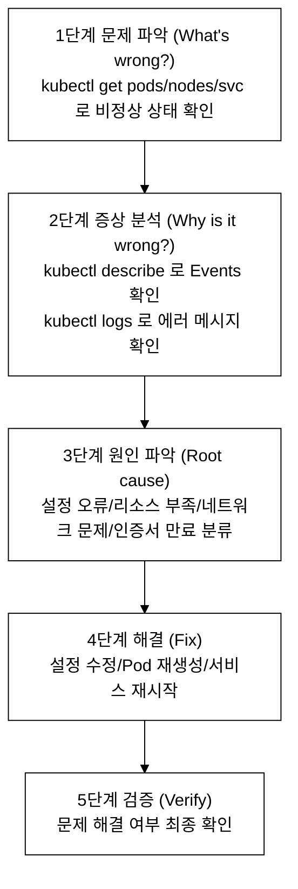
_그림 1. 체계적 트러블슈팅 5단계 접근법._

### 2.2 핵심 진단 명령어 총정리

**가장 먼저 실행하는 명령 3개(시험 필수):** `kubectl get pods -A` (전체 상태 파악) → `kubectl describe pod <name>` (Events 확인) → `kubectl logs <name> --previous` (재시작 전 로그).

```bash
# ===== Pod 진단 =====
kubectl get pods -o wide                    # Pod 상태, 노드, IP 확인
kubectl get pods -A                         # ★ 시험 필수: 모든 네임스페이스 전체 파악
kubectl describe pod <name>                 # ★ 시험 필수: 상세 정보 (Events가 핵심!)
kubectl logs <name>                         # 현재 컨테이너 로그
kubectl logs <name> --previous              # ★ 시험 필수: 이전(재시작 전) 컨테이너 로그
kubectl logs <name> -c <container>          # 특정 컨테이너 로그
kubectl logs <name> --tail=50               # 마지막 50줄만
kubectl logs <name> -f                      # 실시간 로그 스트리밍
kubectl exec <name> -- <command>            # Pod 내에서 명령 실행
kubectl exec -it <name> -- sh              # Pod 셸 접속

# ===== 이벤트 확인 =====
kubectl get events --sort-by='.lastTimestamp'          # 시간순 정렬
kubectl get events -A --sort-by='.lastTimestamp'       # 모든 네임스페이스
kubectl get events --field-selector type=Warning       # Warning만

# ===== Node 진단 =====
kubectl get nodes                           # 노드 상태
kubectl describe node <name>               # 노드 상세 (Conditions 핵심!)
kubectl top nodes                          # 리소스 사용량
kubectl top pods [-A]                      # Pod 리소스 사용량
# 전제: metrics-server 설치 필요. 없으면 "Metrics API not available" 오류 발생.
# kubectl apply -f https://github.com/kubernetes-sigs/metrics-server/releases/latest/download/components.yaml

# ===== 노드 SSH 후 진단 =====
systemctl status kubelet                   # kubelet 상태
journalctl -u kubelet -f                   # kubelet 실시간 로그
journalctl -u kubelet --since "10 min ago" --no-pager  # 최근 10분 로그
systemctl status containerd                # containerd 상태
crictl ps [-a]                             # 컨테이너 목록
crictl logs <container-id>                 # 컨테이너 로그
crictl inspect <container-id>              # 컨테이너 상세

# ===== 네트워크 진단 =====
kubectl get svc,endpoints                  # Service와 Endpoints
kubectl get svc -o wide                    # selector 포함
kubectl run debug --image=nicolaka/netshoot --rm -it --restart=Never -- bash
# → nslookup, curl, dig, traceroute 등 네트워크 도구 사용 가능

# ===== Control Plane 진단 =====
kubectl get pods -n kube-system            # Control Plane Pod 상태
kubectl logs -n kube-system <component>    # 컴포넌트 로그
# SSH 접속 후:
ls /etc/kubernetes/manifests/              # Static Pod 매니페스트
crictl ps | grep -E "apiserver|scheduler|controller|etcd"
```

---

## 3. Pod 상태별 진단 가이드

### 3.0 왜 Pod는 비정상 상태에 빠지는가

Pod의 상태(STATUS)는 단일 값이 아니라 **여러 컴포넌트가 합의한 결과**다. 스케줄러가 노드를 정하고, kubelet이 그 노드에서 컨테이너 런타임(containerd)에 이미지 풀과 컨테이너 생성을 지시하고, 컨테이너 안의 프로세스가 실제로 돈다. 이 사슬 중 어느 고리가 끊기면 그 지점에 대응하는 상태로 멈춘다.

- **Pending**: 스케줄러가 아직 노드를 못 정함. 즉 사슬의 첫 단계에서 막힘. 리소스 부족, Taint 불일치, PVC 미바인딩, 모든 노드 cordon 등이 원인이다.
- **ContainerCreating / ImagePullBackOff**: 노드는 정해졌으나 kubelet이 이미지를 끌어오거나 컨테이너를 만드는 단계에서 막힘.
- **CrashLoopBackOff / Error**: 컨테이너는 떴으나 안의 프로세스가 종료됨. 즉 사슬의 마지막 단계인 애플리케이션 자체의 문제다.
- **OOMKilled**: 프로세스가 limits.memory를 초과해 커널 OOM Killer(메모리 부족 시 프로세스를 강제 종료하는 리눅스 커널 기능)에 의해 SIGKILL(Exit Code 137)로 죽음.

따라서 상태 값 자체가 "사슬의 어느 고리에서 막혔는지"를 알려주는 1차 진단 정보다. 아래 표는 그 매핑을 정리한 것이다.

### 3.1 Pod 상태 전체 비교표

| 상태 | 원인 | 핵심 진단 | 해결 방법 |
|---|---|---|---|
| **Pending** | 스케줄링 실패 | `describe pod` Events | 리소스/노드/PV 확인 |
| **ContainerCreating** | 이미지 풀링 중/CNI 문제 | `describe pod` Events | 이미지/CNI/Secret 확인 |
| **Running** | 정상 | - | - |
| **CrashLoopBackOff** | 컨테이너 반복 크래시 | `logs --previous` | 명령어/설정 수정 |
| **ImagePullBackOff** | 이미지 풀 실패 | `describe pod` Events | 이미지명/레지스트리 수정 |
| **Error** | 컨테이너 비정상 종료 | `logs`, Exit Code | 코드/설정 확인 |
| **OOMKilled** | 메모리 초과 | `describe pod` | limits.memory 증가 |
| **Terminating** | 삭제 진행 중 | `describe pod` | 강제 삭제 필요시 |
| **Unknown** | 노드 통신 불가 | 노드 상태 확인 | kubelet/네트워크 복구 |
| **Completed** | Job 정상 완료 | - | 정상 상태 |

### 3.2 Pending Pod 진단

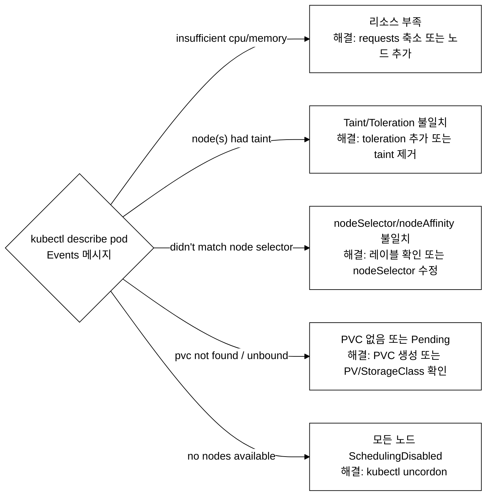
_그림 2. Pending Pod 원인 분기 흐름도._

```yaml
# Pending Pod 진단 예시
# 1. Pod 상태 확인
# kubectl get pod pending-pod -n demo
# NAME          READY   STATUS    RESTARTS   AGE
# pending-pod   0/1     Pending   0          5m

# 2. 이벤트 확인
# kubectl describe pod pending-pod -n demo
# Events:
#   Type     Reason            Message
#   ----     ------            -------
#   Warning  FailedScheduling  0/3 nodes are available:
#            1 node(s) had taint, 2 Insufficient cpu

# 3. 노드 리소스 확인
# kubectl describe node <name> | grep -A5 "Allocated resources"
# kubectl top nodes
```

### 3.3 CrashLoopBackOff 진단

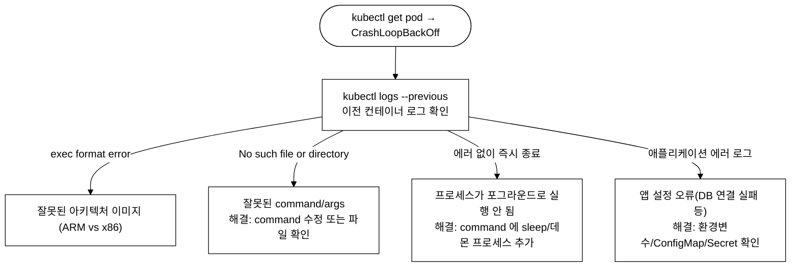
_그림 3. CrashLoopBackOff 진단 분기 흐름._

| Exit Code | 의미 |
|:--|:--|
| 0 | 정상 종료 (CronJob 에서는 정상) |
| 1 | 애플리케이션 오류 (가장 흔함) |
| 126 | 권한 문제 (실행 불가) |
| 127 | 명령어 없음 (command not found) |
| 128+N | 시그널 N 으로 종료 |
| 137 | SIGKILL (OOMKilled 또는 kill -9) |
| 139 | SIGSEGV (세그멘테이션 폴트) |
| 143 | SIGTERM (정상 종료 요청) |

### 3.4 ImagePullBackOff 진단

**내부 동작 원리:** kubelet이 컨테이너 런타임(containerd)에 이미지 풀을 요청한다. 풀이 실패하면 kubelet은 exponential backoff(지수적 재시도 대기: 10초, 20초, 40초처럼 실패할수록 대기 시간이 두 배씩 늘어나는 방식, 최대 5분)로 재시도한다. 이 재시도 대기 상태가 ImagePullBackOff이다. ErrImagePull은 최초 실패 직후 상태이고, ImagePullBackOff는 backoff 대기 중인 상태이다.

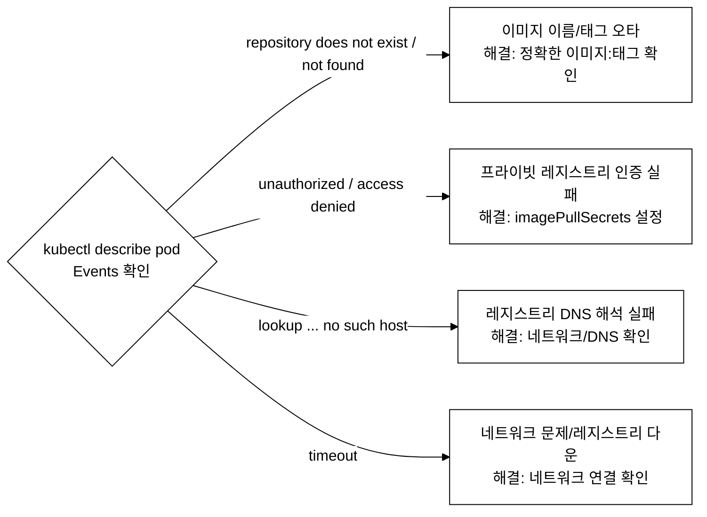
_그림 4. ImagePullBackOff 원인 분기 흐름._

**검증 명령어:**

```bash
kubectl describe pod broken-image -n demo | grep -A10 Events
```

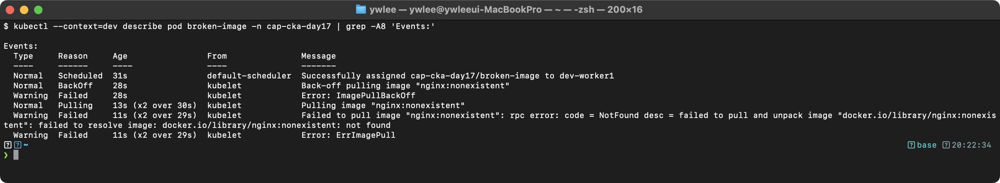

### 3.5 OOMKilled 진단

```yaml
# OOMKilled 확인
# kubectl describe pod <name>
#   State:       Terminated
#     Reason:    OOMKilled
#     Exit Code: 137

# 해결: memory limits 증가
apiVersion: v1
kind: Pod
metadata:
  name: oom-fix
spec:
  containers:
  - name: app
    image: my-app
    resources:
      requests:
        memory: "256Mi"         # 기본 요청량
      limits:
        memory: "512Mi"         # 최대 사용량 (이전보다 증가)
```

---

## 4. Node 문제 진단

### 4.0 왜 노드가 NotReady가 되는가

노드의 Ready 상태는 그 노드의 kubelet이 API Server에 "나 살아있고 정상이다"라고 보고하는지에 달려 있다. kubelet은 주기적으로 하트비트를 보내는데, 이 보고가 끊기거나 kubelet이 스스로 비정상을 감지하면 노드가 NotReady로 떨어진다. 끊기는 원인은 크게 세 갈래다.

- **kubelet 자체가 죽음**: 설정 파일 오류, 인증서 만료, 의존하는 containerd 다운 등으로 kubelet 프로세스가 멈추면 하트비트가 끊긴다.
- **노드 자원 고갈**: 디스크(DiskPressure)·메모리(MemoryPressure)·프로세스 수(PIDPressure)가 한계에 닿으면 kubelet이 스스로 Condition을 True로 올리고, 심하면 kubelet 자신이 크래시한다.
- **노드와의 통신 단절**: 네트워크가 끊겨 하트비트가 API Server에 도달하지 못하면 Ready=Unknown이 된다.

즉 노드 진단은 "kubelet이 왜 보고를 못 하는가"를 추적하는 작업이며, 그래서 kubectl로 안 풀리면 SSH로 노드에 직접 들어가 kubelet·containerd 로그를 봐야 한다.

### 4.1 Node 상태 확인

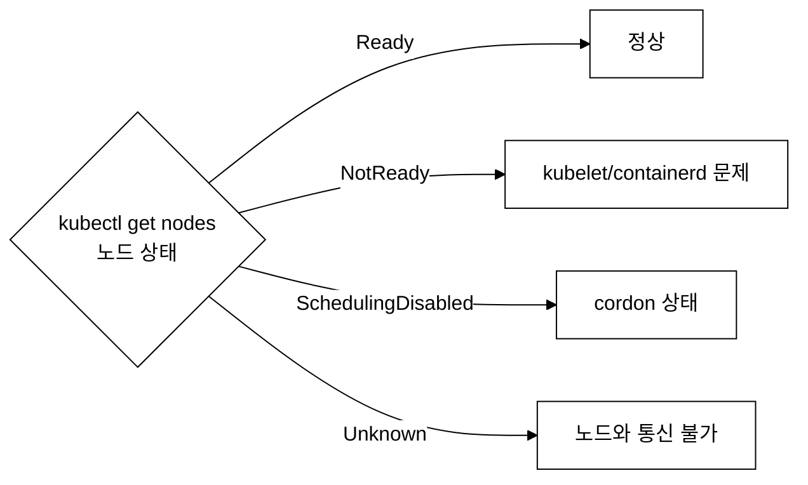
_그림 5. kubectl get nodes 상태별 분기._

`kubectl describe node <name>` → Conditions 섹션 해석:

| Condition | 의미 |
|:---|:---|
| Ready=True | 정상 |
| Ready=False | kubelet 문제 |
| Ready=Unknown | 노드 통신 불가 |
| MemoryPressure=True | 메모리 부족 |
| DiskPressure=True | 디스크 부족 |
| PIDPressure=True | 프로세스 수 초과 |
| NetworkUnavailable | 네트워크/CNI 문제 |

이 Condition들은 **상호 배타적이지 않다 — 여러 개가 동시에 True가 될 수 있다**. 오히려 동시 발생이 인과관계를 드러내는 경우가 많다. 예를 들어 메모리가 고갈되면 먼저 `MemoryPressure=True`가 뜨고, 그 상태가 심해져 kubelet 프로세스 자체가 죽으면 하트비트가 끊겨 `Ready=False`(또는 통신까지 끊기면 `Ready=Unknown`)가 함께 나타난다. 따라서 `Ready=False`만 보지 말고 같은 Conditions 블록의 나머지 항목을 함께 읽어 근본 원인(자원 고갈인지 단순 kubelet 중지인지)을 가린다.

### 4.2 kubelet 장애 복구

**내부 동작 원리:** kubelet은 각 노드에서 실행되는 에이전트로, API Server에 주기적으로 하트비트(NodeLease)를 보낸다. 기본 40초(node-status-update-frequency 10초 x lease-duration-seconds 40초) 동안 하트비트가 없으면 Node Controller가 노드를 NotReady로 표시한다. 5분 이상 NotReady가 지속되면 해당 노드의 Pod에 Taint가 추가되어 퇴거(eviction)가 시작된다.

```bash
# SSH로 노드 접속 — 이 저장소에서는 VM 이름 별칭으로 접속한다
# (예: ssh dev-master, ssh dev-worker1, ssh platform-master 등,
#  ~/.ssh/config 에 ProxyCommand로 등록된 별칭; 처음 1회는 ./scripts/setup-ssh-keys.sh dev 실행)
ssh dev-master

# 1. kubelet 상태 확인
sudo systemctl status kubelet
# Active: inactive (dead) → kubelet 중지됨
# Active: failed → kubelet 오류

# 2. kubelet 로그 확인
sudo journalctl -u kubelet --no-pager -n 50
sudo journalctl -u kubelet --since "5 min ago"

# 일반적인 kubelet 에러:
# - "failed to load kubelet config file" → config.yaml 문제
# - "unable to load bootstrap kubeconfig" → kubeconfig 문제
# - "failed to run Kubelet: unable to determine runtime API" → containerd 문제
# - "certificate has expired" → 인증서 만료

# 3. 복구
sudo systemctl restart kubelet
# 또는
sudo systemctl enable --now kubelet

# 4. containerd 확인 (kubelet이 의존)
sudo systemctl status containerd
sudo systemctl restart containerd  # 필요시
sudo systemctl restart kubelet     # containerd 재시작 후 kubelet도 재시작

# 5. 상태 확인
sudo systemctl status kubelet
# Active: active (running)
```

### 4.3 디스크/메모리/인증서 문제

```bash
# 디스크 확인
df -h
# /dev/sda1  20G  19G  1G  95% /  → 디스크 거의 꽉 참!
# 해결: 불필요한 이미지/컨테이너 정리
sudo crictl rmi --prune
sudo journalctl --vacuum-size=100M

# 메모리 확인
free -m
# total  used  free  shared  buff/cache  available
# 4096   3900  100   50      96          96  → 메모리 부족!

# 인증서 만료 확인
sudo kubeadm certs check-expiration
# 또는
sudo openssl x509 -in /etc/kubernetes/pki/apiserver.crt -noout -dates
# notAfter=Mar 15 00:00:00 2025 GMT → 만료일 확인

# 인증서 갱신
sudo kubeadm certs renew all
sudo systemctl restart kubelet
```

**인증서 갱신이 실제로 적용되는 흐름:** kubeadm(클러스터를 부트스트랩·운영하는 공식 도구)으로 만든 클러스터에서 갱신은 다음 순서로 전파된다.

1. `kubeadm certs renew all` 이 `/etc/kubernetes/pki/` 아래의 인증서 파일(apiserver.crt, apiserver-kubelet-client.crt 등)을 새 만료일로 다시 발급한다.
2. apiserver·controller-manager·scheduler·etcd는 Static Pod이므로, 이들을 담당하는 컨테이너는 인증서 파일을 시작 시점에 읽는다. 따라서 파일만 바꿔서는 이미 떠 있는 컴포넌트가 새 인증서를 쓰지 않는다.
3. `systemctl restart kubelet` 으로 kubelet을 재시작하면 kubelet이 `/etc/kubernetes/manifests/` 를 다시 읽어 Static Pod를 재조정(재생성)하고, 새로 뜬 컨테이너가 갱신된 인증서 파일을 읽어 들인다. (필요하면 각 manifest를 잠시 옮겼다 되돌려 강제 재생성한다.)
4. 추가로 kubelet 자신이 쓰는 `/etc/kubernetes/kubelet.conf` 의 클라이언트 인증서는 보통 자동 갱신(rotate-certificates)되지만, 수동 환경에서는 별도 갱신이 필요할 수 있다.
5. `kubectl get nodes` 가 정상 응답하면 Control Plane이 새 인증서로 복구된 것이다.

핵심은 "파일 갱신"과 "프로세스 재시작"이 별개라는 점이다. 갱신만 하고 재시작을 빠뜨리면 만료된 인증서를 든 컴포넌트가 계속 실패한다.

---

## 5. Control Plane 컴포넌트 장애

### 5.0 Static Pod — Control Plane이 뜨는 방식

여기서 닭과 달걀 문제가 하나 생긴다. 일반 Pod는 API Server에 요청해 만든다. 그런데 **API Server 자신**은 누가 띄우는가? API Server가 떠야 Pod를 만들 수 있는데, API Server를 Pod로 만들려면 이미 API Server가 떠 있어야 한다. 이 순환을 끊기 위한 장치가 Static Pod다.

- **Static Pod 정의**: kubelet이 `/etc/kubernetes/manifests/` 디렉터리를 직접 감시해 그 안의 YAML 파일대로 띄우는 Pod다. **API Server를 거치지 않는다.** 그래서 API Server가 죽어 있어도 kubelet 혼자 띄울 수 있고, 바로 이 점 때문에 apiserver·scheduler·controller-manager·etcd 같은 Control Plane 컴포넌트의 기동에 쓰인다.
- **동작(watch 루프)**: kubelet은 짧은 주기(기본 약 20초, 환경에 따라 더 짧게)로 manifests 디렉터리를 다시 스캔한다. 파일 내용이 바뀌면 해당 Static Pod를 재생성한다. 즉 `vi`로 매니페스트를 고치고 저장하기만 하면, 별도 명령 없이 kubelet이 변경을 감지해 컨테이너를 새로 띄운다. 반대로 파일에 문법 오류가 있으면 Pod가 아예 안 뜨거나 CrashLoop에 빠진다.
- **API Server와의 관계**: Static Pod는 API Server 없이도 돌지만, kubelet은 떠 있는 Static Pod를 "미러 Pod(mirror pod)"로 API Server에 등록해 `kubectl get pods -n kube-system`에서도 보이게 한다. 그래서 API Server가 살아 있으면 kubectl로도 관찰되지만, **API Server가 죽으면 kubectl 자체가 응답하지 않으므로** 이때는 SSH로 노드에 들어가 `crictl`로 직접 봐야 한다.

이 메커니즘을 이해해야 §5.2~5.3에서 "파일을 고치면 자동 재시작된다"가 마법이 아니라 kubelet의 정해진 감시 루프임을 알 수 있다.

**Static Pod의 트레이드오프:** API Server 없이도 Control Plane을 부팅할 수 있다는 장점의 반대편에는 몇 가지 제약이 있다. 첫째, Static Pod는 etcd에 저장되지 않으므로 `kubectl edit pod` 또는 `kubectl delete pod`로 내용을 바꾸거나 삭제할 수 없다. kubectl 명령은 미러 Pod(API Server가 Static Pod를 관찰하기 위해 etcd에 등록하는 읽기 전용 복사본)에만 반영되고, kubelet이 곧 다시 원래 매니페스트 파일대로 Pod를 재생성한다. 실제 변경은 `/etc/kubernetes/manifests/` 파일을 직접 수정하거나 삭제해야만 적용된다. 둘째, 매니페스트 파일에 YAML 문법 오류가 있으면 kubelet이 파싱 실패로 Pod를 아예 띄우지 않거나 CrashLoop에 빠뜨리는데, API Server가 이미 죽은 상황이면 `kubectl`로는 그 상태를 볼 수 없어 `crictl ps -a`로만 확인할 수 있다. 셋째, Static Pod는 스케줄러의 배치 결정을 받지 않고 항상 kubelet이 실행 중인 노드에 고정된다. 마스터 노드가 죽으면 Static Pod도 함께 죽으며, 다른 노드로 자동 이동하지 않는다.

### 5.1 컴포넌트별 장애 증상

| 컴포넌트 | 장애 증상 | 진단 방법 |
|:---|:---|:---|
| kube-apiserver | kubectl 응답 없음 / "connection refused" | `crictl ps \| grep api` → `crictl logs <id>` → `/etc/kubernetes/manifests/kube-apiserver.yaml` 확인 |
| kube-scheduler | 새 Pod가 계속 Pending / "no nodes available" | `crictl ps \| grep sched` → `kubectl logs -n kube-system kube-scheduler-<node>` |
| kube-controller-manager | Deployment 업데이트 안 됨 / ReplicaSet 미생성 / Endpoints 업데이트 안 됨 | `crictl ps \| grep ctrl` → `kubectl logs -n kube-system kube-controller-manager-<node>` |
| etcd | 데이터 접근 불가 / apiserver 장애 연쇄 발생 | `crictl ps \| grep etcd` → `etcdctl endpoint health` |

### 5.2 Static Pod 매니페스트 문제

```bash
# Control Plane 컴포넌트는 Static Pod로 실행된다
# 매니페스트 위치: /etc/kubernetes/manifests/

ls /etc/kubernetes/manifests/
# etcd.yaml
# kube-apiserver.yaml
# kube-controller-manager.yaml
# kube-scheduler.yaml

# 파일을 수정하면 kubelet이 자동으로 Pod를 재시작한다

# 일반적인 Static Pod 문제:
# 1. YAML 문법 오류 (들여쓰기, 오타)
# 2. 잘못된 인증서 경로
# 3. 잘못된 포트 번호
# 4. 잘못된 etcd 엔드포인트
# 5. 잘못된 플래그/옵션

# 진단 예시:
sudo cat /etc/kubernetes/manifests/kube-apiserver.yaml | grep -E "cert|key|port|etcd"

# crictl로 컨테이너 상태 확인
sudo crictl ps -a | grep -E "apiserver|scheduler|controller|etcd"
# Exited 상태면 → crictl logs <container-id>로 에러 확인
```

### 5.3 kube-apiserver 장애 복구 예시

**등장 배경:** Control Plane 컴포넌트(apiserver, scheduler, controller-manager, etcd)는 kubeadm으로 설치한 클러스터에서 Static Pod로 실행된다. Static Pod는 kubelet이 `/etc/kubernetes/manifests/` 디렉터리를 감시하여 YAML 파일을 직접 관리한다. 따라서 매니페스트 파일에 오타가 있으면 컴포넌트가 시작되지 않고, API Server가 멈추면 kubectl 자체가 동작하지 않으므로 SSH로 직접 노드에 접속하여 디버깅해야 한다.

```bash
# 증상: kubectl 명령이 응답하지 않음
# The connection to the server was refused

# SSH 접속 (VM 이름 별칭 사용)
ssh dev-master

# 1. apiserver 컨테이너 확인
sudo crictl ps -a | grep apiserver
# 상태가 Exited면 장애

# 2. 로그 확인
APISERVER_ID=$(sudo crictl ps -a | grep apiserver | head -1 | awk '{print $1}')
sudo crictl logs $APISERVER_ID 2>&1 | tail -20

# 3. 일반적인 에러 메시지와 해결:
# "open /etc/kubernetes/pki/apiserver.crt: no such file" → 인증서 경로 오류
# "bind: address already in use" → 포트 충돌
# "dial tcp 127.0.0.1:2379: connect: connection refused" → etcd 연결 실패

# 4. 매니페스트 확인 및 수정
sudo cat /etc/kubernetes/manifests/kube-apiserver.yaml
# 오류 찾기
sudo vi /etc/kubernetes/manifests/kube-apiserver.yaml
# 수정 후 저장 → kubelet이 자동 재시작

# 5. 복구 확인 (30초 정도 대기)
sleep 30
sudo crictl ps | grep apiserver
# Running 상태 확인

# SSH 종료 후
kubectl get nodes
# 정상 응답
```

**왜 `sleep 30`인가:** 매니페스트를 저장한 순간 바로 재시작되는 게 아니다. kubelet의 감시 루프가 다음 스캔 주기에 변경을 감지하고(§5.0), 기존 컨테이너를 정리한 뒤 새 컨테이너를 띄우고, apiserver가 자신의 의존(etcd 연결, 인증서 로드, `/healthz` 통과)을 마칠 때까지 시간이 걸린다. 그 합이 대략 수십 초이므로 30초 정도 기다린 뒤 `crictl ps`로 Running을 확인한다. 바로 안 떴다고 매니페스트를 또 고치지 말고, 먼저 `crictl logs`로 새 컨테이너가 무슨 에러를 내는지 본다.

### 5.4 etcdctl로 etcd 상태 진단하기

5.1의 표에 `etcdctl endpoint health`가 등장하지만, etcdctl은 인증서 없이 실행하면 "connection refused" 또는 인증 오류가 난다. kubeadm으로 구성된 클러스터에서 etcd는 mTLS(클라이언트와 서버 모두 인증서를 제시하는 상호 TLS 인증)로 보호되어 있기 때문이다.

```bash
# SSH로 마스터 노드 접속
ssh dev-master

# etcdctl 사용을 위한 환경변수 설정
# (kubeadm 클러스터에서 인증서는 아래 경로에 있다)
export ETCDCTL_API=3
export ETCDCTL_ENDPOINTS=https://127.0.0.1:2379
export ETCDCTL_CACERT=/etc/kubernetes/pki/etcd/ca.crt
export ETCDCTL_CERT=/etc/kubernetes/pki/etcd/server.crt
export ETCDCTL_KEY=/etc/kubernetes/pki/etcd/server.key

# etcd 건강 상태 확인
sudo -E etcdctl endpoint health
# 정상: 127.0.0.1:2379 is healthy: successfully committed proposal: took = ...

# 클러스터 멤버 목록 확인
sudo -E etcdctl member list

# etcd 응답 시간 측정 (느리면 distr 처리 지연 → apiserver 응답도 느려짐)
sudo -E etcdctl endpoint status --write-out=table
```

위 환경변수를 매번 입력하기 번거롭다면 `/root/.bashrc`에 추가해두거나, 인라인으로 `sudo ETCDCTL_API=3 etcdctl --endpoints=... --cacert=... --cert=... --key=... endpoint health`처럼 플래그로 직접 전달해도 된다. CKA 시험에서는 플래그 방식이 더 안전하다(환경변수가 sudo에 전파되지 않을 수 있다).

---

## 6. DNS 문제 진단

### 6.0 등장 배경: CoreDNS가 필요한 이유

Kubernetes 1.11 이전에는 kube-dns(SkyDNS 기반)가 클러스터 내 DNS를 담당했다. kube-dns는 dnsmaq·sidecar·healthz 세 개의 컨테이너가 하나의 Pod에 묶인 구조라 개별 컴포넌트를 독립적으로 업데이트하거나 장애를 격리하기 어려웠고, 플러그인 확장도 코드 수정 없이는 불가능했다. CoreDNS(2017년 CNCF 합류, 2018년 Kubernetes 기본 DNS로 채택)는 단일 Go 바이너리에 플러그인 체인(Corefile에 선언한 순서대로 요청을 처리하는 미들웨어 파이프라인) 방식을 도입해 재컴파일 없이 기능을 추가할 수 있다. 트레이드오프는 Corefile 문법 오류 하나가 CoreDNS 전체를 CrashLoopBackOff로 빠뜨린다는 점이다. kube-dns는 문법 오류가 있어도 해당 플러그인만 비활성화됐지만, CoreDNS는 파싱 단계에서 전체 프로세스가 종료된다. 따라서 ConfigMap을 편집할 때는 반드시 `kubectl -n kube-system logs -l k8s-app=kube-dns`로 파싱 오류 여부를 확인해야 한다.

### 6.1 DNS 진단 흐름

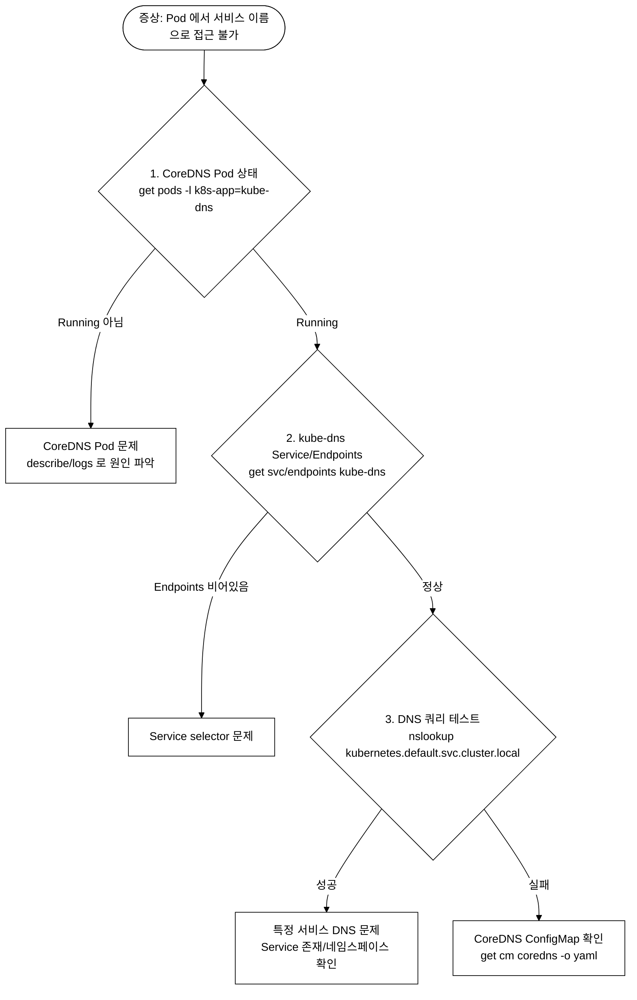
_그림 6. DNS 장애 단계별 진단 흐름._

### 6.2 CoreDNS 문제 해결

```bash
# CoreDNS Pod 상태 확인
kubectl -n kube-system get pods -l k8s-app=kube-dns
# CrashLoopBackOff → ConfigMap 오류 가능성

# CoreDNS 로그 확인
kubectl -n kube-system logs -l k8s-app=kube-dns --tail=30

# CoreDNS ConfigMap 확인
kubectl -n kube-system get configmap coredns -o yaml
# Corefile 문법 오류가 있는지 확인

# CoreDNS 재시작
kubectl -n kube-system rollout restart deployment coredns

# DNS 테스트
kubectl run dns-test --image=busybox:1.28 --rm -it --restart=Never -- \
  nslookup kubernetes.default.svc.cluster.local

# Pod의 /etc/resolv.conf 확인
kubectl exec <pod> -- cat /etc/resolv.conf
# nameserver 10.96.0.10 ← kube-dns ClusterIP와 일치해야 함
```

---

## 7. Service 연결 문제 진단

### 7.0 등장 배경: Service와 Endpoints 오브젝트의 역할

Pod는 재시작될 때마다 IP가 바뀐다. 따라서 Pod IP를 직접 참조하는 클라이언트는 재시작 후 항상 연결이 끊긴다. Service는 이 문제를 해결하기 위해 안정적인 가상 IP(ClusterIP)와 DNS 이름을 제공한다. Service는 `spec.selector`로 대상 Pod를 선택하고, EndpointSlice 컨트롤러(구버전에서는 Endpoints 컨트롤러)가 그 selector와 일치하는 Running·Ready 상태의 Pod IP 목록을 `Endpoints` 오브젝트(또는 `EndpointSlice`)에 채운다. kube-proxy(또는 Cilium 같은 CNI가 kube-proxy를 대체)는 이 Endpoints를 읽어 노드별 iptables/eBPF 규칙을 갱신하고, 실제 트래픽을 Pod IP로 분산한다. 즉 Service → Endpoints → Pod라는 세 계층이 모두 정상이어야 연결이 성립한다. Service 연결 문제를 진단할 때 `kubectl get endpoints`를 가장 먼저 확인하는 이유가 여기에 있다.

### 7.1 Service 연결 진단 체크리스트

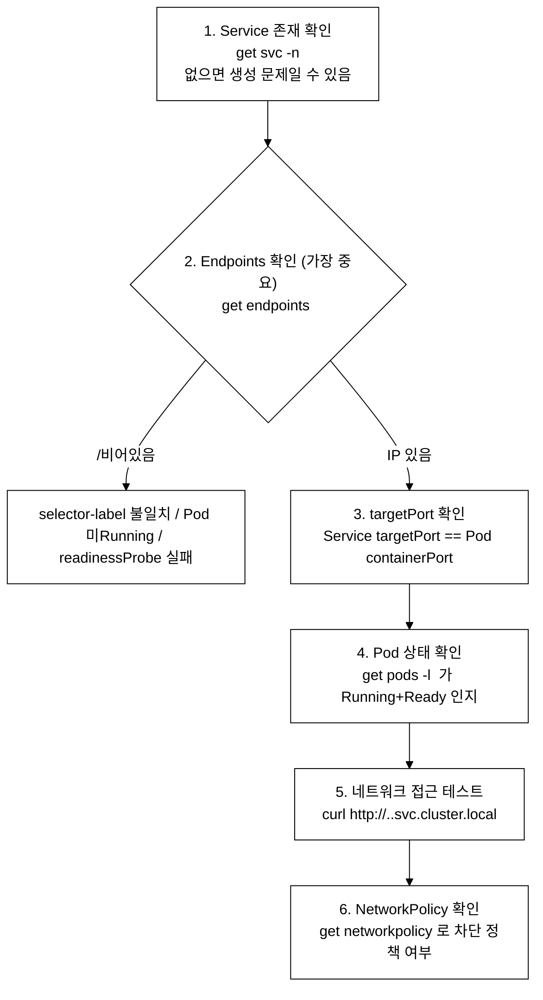
_그림 7. Service 접근 불가 진단 순서._

### 7.2 Endpoints 디버깅

```bash
# Endpoints가 비어있는 원인 찾기

# 1. Service의 selector 확인
kubectl get svc <name> -o jsonpath='{.spec.selector}'
# {"app":"web"} → app=web인 Pod를 찾음

# 2. 해당 selector로 Pod 검색
kubectl get pods -l app=web
# → Pod가 없거나 Running이 아니면 Endpoints가 비어있음

# 3. Pod의 label 확인
kubectl get pods --show-labels
# → selector와 일치하지 않으면 수정

# 4. Pod의 Ready 상태 확인
kubectl get pods -l app=web -o jsonpath='{range .items[*]}{.metadata.name}{"\t"}{.status.conditions[?(@.type=="Ready")].status}{"\n"}{end}'
# → Ready=False면 readinessProbe 확인
```

---

## 8. 실전 장애 시나리오 (15개)

### 8.0 셋업 — 시나리오 실행 전제

아래 시나리오들은 **`demo` 네임스페이스가 존재하는 dev(또는 staging) 클러스터**를 가정한다. fresh 클러스터에는 `demo` 네임스페이스도, 거기에 사용하는 Pod도 없으므로 먼저 만들어야 한다.

```bash
# 전제: 클러스터 가동 + IP 드리프트 복구 완료
#   ./scripts/boot.sh && ./scripts/fix-cluster-ip-drift.sh dev
export KUBECONFIG=kubeconfig/dev.yaml

# 시나리오 공통 네임스페이스 생성
kubectl create namespace demo

# 작업 후 정리 (파괴 실습이므로 dev/staging 에서만, 끝나면 통째로 삭제)
# kubectl delete namespace demo
```

각 시나리오의 YAML/명령은 이미 `-n demo`를 명시하고 장애 대상을 스스로 생성하므로(예: 시나리오 1의 `broken-image` Pod), 위 네임스페이스만 미리 만들면 그대로 재현된다. **platform/prod에서는 실행하지 않는다**(CLAUDE.md §3 — 파괴 실습은 dev/staging 한정). 노드를 멈추는 시나리오 9·10·12는 dev 마스터/워커를 일시 중단하므로, 실습이 끝나면 반드시 원복하거나 `./scripts/fix-cluster-ip-drift.sh dev`로 정상화한다.

### 시나리오 1: ImagePullBackOff

```yaml
# 장애 생성
apiVersion: v1
kind: Pod
metadata:
  name: broken-image
  namespace: demo
spec:
  containers:
  - name: app
    image: nginx:nonexistent-tag-12345    # 존재하지 않는 태그

# 진단
# kubectl get pod broken-image -n demo
# STATUS: ImagePullBackOff
# kubectl describe pod broken-image -n demo | grep -A5 Events
# "Failed to pull image"

# 복구
# kubectl set image pod/broken-image app=nginx:1.24 -n demo
# 또는 Pod 재생성
```

### 시나리오 2: CrashLoopBackOff (잘못된 명령어)

```yaml
apiVersion: v1
kind: Pod
metadata:
  name: crash-cmd
  namespace: demo
spec:
  containers:
  - name: app
    image: busybox:1.36
    command: ["sh", "-c", "exit 1"]       # 항상 실패

# 진단: kubectl logs crash-cmd --previous
# 복구: command를 정상 명령으로 변경
```

### 시나리오 3: CrashLoopBackOff (파일 없음)

```yaml
apiVersion: v1
kind: Pod
metadata:
  name: crash-file
  namespace: demo
spec:
  containers:
  - name: app
    image: busybox:1.36
    command: ["sh", "-c", "cat /config/app.conf"]  # 파일 없음

# 진단: kubectl logs crash-file --previous
# "cat: can't open '/config/app.conf': No such file or directory"
# 복구: ConfigMap 볼륨 추가 또는 command 수정
```

### 시나리오 4: Pending (리소스 부족)

```yaml
apiVersion: v1
kind: Pod
metadata:
  name: resource-heavy
  namespace: demo
spec:
  containers:
  - name: app
    image: nginx
    resources:
      requests:
        cpu: "100"                        # 100 CPU 요청 (불가능!)
        memory: "100Gi"                    # 100Gi 메모리 요청

# 진단: kubectl describe pod resource-heavy
# "0/3 nodes are available: insufficient cpu"
# 복구: requests를 적절한 값으로 수정
```

### 시나리오 5: Pending (nodeSelector 불일치)

```yaml
apiVersion: v1
kind: Pod
metadata:
  name: wrong-selector
  namespace: demo
spec:
  nodeSelector:
    gpu: "true"                           # 이 레이블을 가진 노드가 없음
  containers:
  - name: app
    image: nginx

# 진단: kubectl describe pod wrong-selector
# "node(s) didn't match Pod's node affinity/selector"
# 복구: nodeSelector 제거 또는 노드에 레이블 추가
```

### 시나리오 6: Pending (PVC 미바인딩)

```yaml
apiVersion: v1
kind: Pod
metadata:
  name: pvc-pending
  namespace: demo
spec:
  containers:
  - name: app
    image: nginx
    volumeMounts:
    - name: data
      mountPath: /data
  volumes:
  - name: data
    persistentVolumeClaim:
      claimName: nonexistent-pvc          # 존재하지 않는 PVC

# 진단: kubectl describe pod pvc-pending
# "persistentvolumeclaim "nonexistent-pvc" not found"
# 복구: PVC 생성
```

### 시나리오 7: OOMKilled

```yaml
apiVersion: v1
kind: Pod
metadata:
  name: oom-pod
  namespace: demo
spec:
  containers:
  - name: app
    image: progrium/stress
    command: ["stress", "--vm", "1", "--vm-bytes", "256M"]
    resources:
      limits:
        memory: "128Mi"                   # 128Mi 제한에 256Mi 사용 시도

# 진단: kubectl describe pod oom-pod
# "OOMKilled", Exit Code: 137
# 복구: limits.memory 증가
```

### 시나리오 8: Service Endpoints 비어있음

```bash
# 장애 생성
kubectl run web --image=nginx --labels="app=web" -n demo
kubectl expose pod web --port=80 --name=broken-svc -n demo

# selector 수정하여 불일치 생성
kubectl patch svc broken-svc -n demo -p '{"spec":{"selector":{"app":"wrong"}}}'

# 진단
kubectl get endpoints broken-svc -n demo  # <none>
kubectl get svc broken-svc -n demo -o jsonpath='{.spec.selector}'
kubectl get pods -n demo --show-labels

# 복구
kubectl patch svc broken-svc -n demo -p '{"spec":{"selector":{"app":"web"}}}'
```

### 시나리오 9: kubelet 중지

```bash
# SSH 접속 후
sudo systemctl stop kubelet

# 다른 터미널에서
kubectl get nodes  # NotReady 상태

# 복구
sudo systemctl start kubelet
# 40초 후 Ready 상태로 복귀
```

### 시나리오 10: kube-apiserver 매니페스트 오류

```bash
# SSH 접속 후
# 매니페스트에 오타 삽입
sudo sed -i 's/--secure-port=6443/--secure-port=6444/' \
  /etc/kubernetes/manifests/kube-apiserver.yaml

# kubectl 명령 실패
# "The connection to the server was refused"

# 복구
sudo sed -i 's/--secure-port=6444/--secure-port=6443/' \
  /etc/kubernetes/manifests/kube-apiserver.yaml
# kubelet이 자동으로 apiserver 재시작
```

### 시나리오 11: CoreDNS CrashLoopBackOff

```bash
# CoreDNS ConfigMap의 Corefile에 구체적인 문법 오류를 삽입한다.
# 아래는 'errors' 플러그인을 'erros'로 오타 내는 방법이다.
# (CoreDNS는 알 수 없는 플러그인 이름을 만나면 시작을 거부하고 CrashLoopBackOff에 빠진다.)
kubectl -n kube-system get configmap coredns -o jsonpath='{.data.Corefile}'
# 현재 Corefile 내용 확인 — 정상이면 'errors' 플러그인이 있다.

# 오타를 삽입하여 장애를 생성한다.
# (sed로 'errors' → 'erros' 교체 후 패치)
kubectl -n kube-system get configmap coredns -o json | \
  python3 -c "import sys,json; d=json.load(sys.stdin); d['data']['Corefile']=d['data']['Corefile'].replace('errors\n','erros\n',1); print(json.dumps(d))" | \
  kubectl apply -f -

# 또는 'kubectl -n kube-system edit configmap coredns' 로 직접 열어
# Corefile 내의 'errors' 한 줄을 'erros' 로 고쳐 저장한다.

# ConfigMap 적용 후 CoreDNS를 재시작하여 오류를 발동시킨다.
kubectl -n kube-system rollout restart deployment coredns

# CoreDNS Pod가 CrashLoopBackOff 상태인지 확인
kubectl -n kube-system get pods -l k8s-app=kube-dns
# 로그에서 "unknown plugin 'erros'" 등의 파싱 오류 메시지 확인
kubectl -n kube-system logs -l k8s-app=kube-dns --tail=20

# 복구: ConfigMap의 오타를 되돌린다.
kubectl -n kube-system get configmap coredns -o json | \
  python3 -c "import sys,json; d=json.load(sys.stdin); d['data']['Corefile']=d['data']['Corefile'].replace('erros\n','errors\n',1); print(json.dumps(d))" | \
  kubectl apply -f -
kubectl -n kube-system rollout restart deployment coredns
# CoreDNS 가 Running 으로 복귀하는지 확인
kubectl -n kube-system get pods -l k8s-app=kube-dns
```

### 시나리오 12: containerd 장애

```bash
# SSH 접속 후
sudo systemctl stop containerd

# kubectl에서 노드 NotReady, Pod 상태 Unknown

# 복구
sudo systemctl start containerd
sudo systemctl restart kubelet
```

### 시나리오 13: NetworkPolicy에 의한 차단

`podSelector: {}`(빈 셀렉터)는 해당 네임스페이스의 모든 Pod를 선택한다. 특정 레이블을 지정하지 않고 빈 매핑을 사용하면 네임스페이스 내 어떤 Pod에도 매칭된다는 뜻이다. `ingress` 규칙 없이 `policyTypes: [Ingress]`만 선언하면 "모든 Pod에 대해 모든 인바운드 허용 규칙 없음 = 전부 차단"이 된다.

```bash
# 모든 인바운드 차단
cat <<EOF | kubectl apply -f -
apiVersion: networking.k8s.io/v1
kind: NetworkPolicy
metadata:
  name: deny-all
  namespace: demo
spec:
  podSelector: {}
  policyTypes:
  - Ingress
EOF

# 서비스 접근 불가 → NetworkPolicy 확인
kubectl get networkpolicy -n demo
kubectl describe networkpolicy deny-all -n demo

# 해결: 정책 삭제 또는 허용 규칙 추가
```

### 시나리오 14: Taint에 의한 Pending

```bash
# 모든 노드에 Taint 추가
kubectl taint nodes --all special=true:NoSchedule

# 새 Pod가 Pending
# 진단: kubectl describe pod → taint toleration 관련 메시지

# 해결: Taint 제거
kubectl taint nodes --all special=true:NoSchedule-
```

### 시나리오 15: readinessProbe 실패로 Endpoints 제외

```yaml
apiVersion: v1
kind: Pod
metadata:
  name: unready-pod
  namespace: demo
  labels:
    app: unready
spec:
  containers:
  - name: app
    image: nginx
    readinessProbe:
      httpGet:
        path: /healthz              # 이 경로가 없으면 503
        port: 80
      initialDelaySeconds: 5
      periodSeconds: 5

# Pod는 Running이지만 Ready=0/1
# Service Endpoints에서 제외됨
# 진단: kubectl describe pod → Readiness probe failed
```

---

## 직접 해보기 — 시험형 미니랩

> CKA 실기는 속도전이다. 아래 문제는 각각 5~8분 내에 명령형(imperative) 풀이로 해결하는 것을 목표로 한다.

**셋업 — 모든 문제 풀기 전 먼저 실행한다:**

```bash
alias k=kubectl
export do='--dry-run=client -o yaml'
export KUBECONFIG=kubeconfig/dev.yaml
kubectl create namespace lab17 2>/dev/null || true

# 문제 1 재현을 위한 CrashLoopBackOff Pod 생성
# (lab17이 비어 있으면 문제 1의 "비정상 Pod를 찾아라" 자체가 성립하지 않는다)
kubectl run crash-lab -n lab17 --image=busybox:1.36 --command -- sh -c 'exit 1'
```

---

**문제 1 (5분)**: `lab17` 네임스페이스에서 현재 비정상 상태인 Pod를 모두 찾아 이름과 STATUS를 출력하라. 그 중 `CrashLoopBackOff` 상태인 Pod가 있다면 이전 컨테이너 로그(--previous)를 출력하고, 로그에서 확인한 종료 원인을 한 줄로 서술하라.

<details>
<summary>풀이 힌트</summary>

```bash
k get pods -n lab17
# 비정상 Pod 확인
k get pods -n lab17 --field-selector=status.phase!=Running,status.phase!=Succeeded
# CrashLoopBackOff 발견 시
k logs -n lab17 <pod-name> --previous
```

</details>

---

**문제 2 (5분)**: `lab17` 네임스페이스에 아래 조건의 Pod를 만들어라. Pod가 `Pending` 상태가 되는 이유를 `kubectl describe`에서 찾아 서술하고, Pending을 해소하려면 무엇을 수정해야 하는지 답하라(실제 수정은 하지 않는다).

- 이름: `resource-test`
- 이미지: `nginx:1.25`
- CPU requests: `50` (50코어)

<details>
<summary>풀이 힌트</summary>

```bash
k run resource-test -n lab17 --image=nginx:1.25 $do | \
  sed 's/resources: {}/resources:\n      requests:\n        cpu: "50"/' | k apply -f -
# 또는 YAML 직접 작성 후 apply
k describe pod resource-test -n lab17 | grep -A5 Events
# Events: "0/N nodes are available: insufficient cpu"
# 해소: requests.cpu 를 실제 클러스터 여유 core 수 이내로 줄인다
```

</details>

---

**문제 3 (8분)**: `lab17` 네임스페이스에 `selector-broken` 이라는 Service가 있다(없다면 아래 명령으로 생성한다). Endpoints가 비어 있는 원인을 찾고, Pod의 레이블을 Service selector와 일치시켜 Endpoints가 채워지는 것을 확인하라.

```bash
# 장애 환경 생성 (없다면 실행)
k run backend -n lab17 --image=nginx --labels="tier=backend"
k expose pod backend -n lab17 --name=selector-broken --port=80
k patch svc selector-broken -n lab17 -p '{"spec":{"selector":{"tier":"front"}}}'
```

<details>
<summary>풀이 힌트</summary>

```bash
k get endpoints selector-broken -n lab17        # <none> 확인
k get svc selector-broken -n lab17 -o jsonpath='{.spec.selector}'
# {"tier":"front"} — Pod 레이블 tier=backend 와 불일치
k get pods -n lab17 --show-labels
# 복구: selector 를 실제 Pod 레이블에 맞게 수정
k patch svc selector-broken -n lab17 -p '{"spec":{"selector":{"tier":"backend"}}}'
k get endpoints selector-broken -n lab17        # IP가 채워짐
```

</details>

---

**문제 4 (8분)**: `dev-master` 노드에 SSH 접속하여 kubelet 서비스 상태를 확인하고 가장 최근 10줄 로그를 출력하라. 그런 다음 kubelet을 재시작한 뒤 노드가 Ready 상태로 유지되는지 확인하라.

```bash
# ~/.ssh/config 에 dev-master 별칭이 등록돼 있어 아래처럼 접속한다
# (처음 1회: ./scripts/setup-ssh-keys.sh dev 로 키 배포)
ssh dev-master
```

<details>
<summary>풀이 힌트</summary>

```bash
# 노드 안에서
sudo systemctl status kubelet
sudo journalctl -u kubelet --no-pager -n 10
sudo systemctl restart kubelet
sudo systemctl status kubelet   # Active: running 확인
exit
# 로컬에서
k get nodes   # dev-master Ready 확인
```

</details>

---

**문제 5 (5분)**: `lab17` 네임스페이스에 `deny-all` NetworkPolicy가 적용돼 모든 인바운드가 차단된 상황이다(없다면 §8 시나리오 13 명령으로 생성). 이 정책을 식별하고 삭제하여 접근이 복원되는지 확인하라.

<details>
<summary>풀이 힌트</summary>

```bash
k get networkpolicy -n lab17
k describe networkpolicy deny-all -n lab17
# podSelector: {} → 모든 Pod, policyTypes: Ingress → 인바운드 전 차단
k delete networkpolicy deny-all -n lab17
k get networkpolicy -n lab17   # 비어있음
```

</details>

---

**정리 — 실습 후 네임스페이스 삭제:**

```bash
kubectl delete namespace lab17
```

---

## tart-infra 실습

### 실습 환경 설정

**전제:** dev 클러스터가 가동 중이고(`./scripts/boot.sh` + `./scripts/fix-cluster-ip-drift.sh dev`로 IP 드리프트까지 복구됨), kubeconfig는 `kubeconfig/dev.yaml`에 있다. 아래 실습은 `demo` 네임스페이스에 nginx 등의 워크로드가 있다고 가정하므로, fresh 클러스터라면 진단 대상부터 만들어야 한다(없으면 명령은 빈 결과를 낸다).

```bash
# dev 클러스터 접속 (실제 워크로드가 실행 중인 환경에서 트러블슈팅)
export KUBECONFIG=kubeconfig/dev.yaml
kubectl config use-context dev
```

```bash
# (fresh 클러스터일 때만) 진단 대상 셋업 — 정상/비정상 Pod 혼재 상태를 만든다
kubectl create namespace demo
kubectl -n demo run healthy-nginx --image=nginx --labels="app=nginx"   # 정상
kubectl -n demo run broken-image  --image=nginx:nonexistent-tag-12345  # ImagePullBackOff
# Istio sidecar(istio-proxy) 관련 명령은 메시가 주입된 환경에서만 동작한다.
```

### 실습 1: Pod 상태 체계적 진단

```bash
# 모든 네임스페이스에서 비정상 Pod 확인
kubectl get pods -A --field-selector=status.phase!=Running,status.phase!=Succeeded

# demo 네임스페이스 Pod 상태 상세 확인
kubectl get pods -n demo -o custom-columns='NAME:.metadata.name,STATUS:.status.phase,READY:.status.containerStatuses[0].ready,RESTARTS:.status.containerStatuses[0].restartCount'

# 특정 Pod의 이벤트 확인 (장애 원인 파악의 핵심)
kubectl describe pod -n demo $(kubectl get pods -n demo -o name | head -1) | tail -20
```

**예상 출력 (셋업 블록 실행 후 기준 — healthy-nginx 는 Running, broken-image 는 ImagePullBackOff 로 표시된다):**
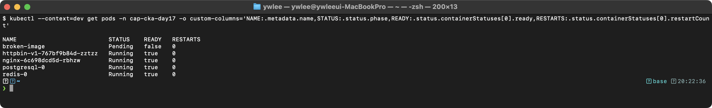

**동작 원리:**
1. `--field-selector`로 서버 측 필터링을 수행하여 비정상 Pod만 빠르게 찾는다
2. `RESTARTS` 수치가 높으면 CrashLoopBackOff를 의심한다
3. `kubectl describe`의 Events 섹션이 가장 중요한 진단 정보를 제공한다
4. Events는 시간순으로 정렬되며, Warning 타입에 장애 원인이 기록된다

### 실습 2: 로그 분석과 컨테이너 디버깅

```bash
# nginx Pod 로그 확인
kubectl logs -n demo -l app=nginx --tail=10

# (Istio mesh 환경에서만 유효, CKA 시험 범위 외)
# kubectl logs -n demo -l app=nginx -c istio-proxy --tail=5

# Pod 내부 접속하여 네트워크 상태 확인
kubectl exec -n demo -it $(kubectl get pod -n demo -l app=nginx -o name | head -1) -- \
  sh -c "curl -s localhost:80 > /dev/null && echo 'nginx OK' || echo 'nginx FAIL'"
```

**예상 출력 (셋업 블록 실행 후 기준 — healthy-nginx 가 Running 상태일 때 logs 와 exec 모두 정상 응답한다):**
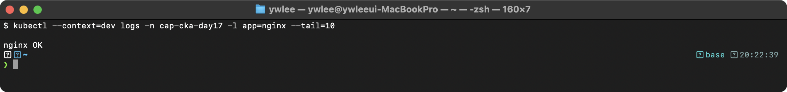

**동작 원리:**
1. `-c` 플래그로 멀티 컨테이너 Pod에서 특정 컨테이너의 로그를 선택한다
2. `--tail=N`으로 최근 N줄만 출력하여 로그 양을 제한한다
3. `kubectl exec`로 Pod 내부에서 직접 연결을 테스트하여 네트워크 문제를 분리한다
4. localhost 접근이 성공하면 컨테이너 자체는 정상이고 네트워크/Service 설정을 확인해야 한다

### 실습 3: platform 클러스터 Control Plane 건강 확인

```bash
export KUBECONFIG=kubeconfig/platform.yaml

# Control Plane 컴포넌트 상태 확인
kubectl get componentstatuses 2>/dev/null || echo "componentstatuses deprecated, checking pods..."
kubectl get pods -n kube-system -o custom-columns='COMPONENT:.metadata.name,STATUS:.status.phase,RESTARTS:.status.containerStatuses[0].restartCount'

# API Server 응답 시간 측정
kubectl get --raw /healthz
kubectl get --raw /readyz
```

**예상 출력:**
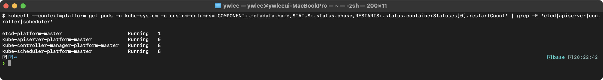

**동작 원리:**
1. `/healthz`와 `/readyz` 엔드포인트로 API Server의 건강 상태를 빠르게 확인한다
2. Control Plane Pod의 RESTARTS가 0이 아니면 장애 이력이 있으므로 로그를 확인해야 한다
3. `kubectl logs -n kube-system kube-apiserver-platform-master`로 API Server 에러 로그를 추적한다
4. etcd 장애 시 API Server 응답이 느려지거나 실패하므로 etcd 상태를 우선 점검한다

---

## 자가점검

<details>
<summary>문제 1: CrashLoopBackOff와 Error 상태의 차이는?</summary>

CrashLoopBackOff는 컨테이너가 시작되었다가 반복적으로 종료되는 상태다. kubelet이 exponential backoff(지수적 재시도 대기) 주기로 재시작을 시도하며, 재시도 사이의 대기 시간이 점점 길어진다. Error는 컨테이너가 비정상 Exit Code(0 이외)로 한 번 종료된 직후 상태로, 아직 backoff 대기에 들어가기 전이다. 즉 같은 원인이라도 재시작이 반복되면 Error → CrashLoopBackOff 순으로 상태가 바뀐다.

</details>

<details>
<summary>문제 2: kubectl이 "connection refused"를 반환할 때 첫 진단 명령은?</summary>

kube-apiserver가 응답하지 않는 상황이므로 kubectl 자체가 동작하지 않는다. 마스터 노드에 SSH로 직접 접속(`ssh dev-master`)한 뒤 `sudo crictl ps -a | grep apiserver`로 apiserver 컨테이너 상태를 확인한다. 컨테이너가 Exited 상태이면 `sudo crictl logs <id>`로 오류 메시지를 확인하고, `/etc/kubernetes/manifests/kube-apiserver.yaml`에 문법 오류나 잘못된 경로가 있는지 검토한다.

</details>

<details>
<summary>문제 3: kubectl describe node에서 Ready=False와 MemoryPressure=True가 동시에 나타났다. 어느 것이 근본 원인에 가까운가?</summary>

MemoryPressure=True가 근본 원인에 가깝다. MemoryPressure는 노드의 가용 메모리가 kubelet이 설정한 임계값 아래로 떨어졌음을 의미하며, 이 상태가 심해져 kubelet 프로세스 자체가 메모리 부족으로 죽으면 하트비트가 끊겨 Ready=False로 이어진다. 따라서 Ready=False만 보고 kubelet 설정 문제로 단정하지 말고 Conditions 블록 전체를 읽어야 한다.

</details>

<details>
<summary>문제 4: Service의 Endpoints가 &lt;none&gt;일 때 가장 먼저 확인할 것은?</summary>

Service의 `spec.selector`와 Pod의 `metadata.labels`가 완전히 일치하는지 확인한다. `kubectl get svc <name> -o jsonpath='{.spec.selector}'`로 selector를 확인한 뒤, `kubectl get pods --show-labels`로 Pod 레이블과 비교한다. 레이블이 일치해도 Endpoints가 비면 Pod의 Ready 상태(readinessProbe 결과)와 targetPort가 실제 컨테이너 포트와 맞는지를 추가로 확인한다.

</details>

<details>
<summary>문제 5: Static Pod는 etcd에 저장되는가? kubectl delete로 삭제하면 어떻게 되는가?</summary>

Static Pod는 etcd에 저장되지 않는다. kubelet이 `/etc/kubernetes/manifests/` 디렉터리를 직접 감시하여 관리한다. `kubectl delete pod`로 삭제 명령을 내리면 API Server의 미러 Pod(mirror pod)는 잠깐 사라지지만, 매니페스트 파일이 디렉터리에 남아 있는 한 kubelet이 곧 다시 생성한다. 실제로 영구 삭제하려면 노드에 SSH 접속하여 `/etc/kubernetes/manifests/` 아래의 해당 YAML 파일을 삭제해야 한다.

</details>

<details>
<summary>문제 6: ImagePullBackOff에서 "unauthorized: access denied" 메시지가 Events에 보인다. 원인과 해결 방법은?</summary>

프라이빗 컨테이너 레지스트리 인증에 실패한 것이다. 레지스트리 자격증명을 담은 Secret을 생성하고, Pod spec의 `imagePullSecrets`에 해당 Secret 이름을 지정해야 한다. `kubectl create secret docker-registry regcred --docker-server=<registry> --docker-username=<user> --docker-password=<pass>` 로 Secret을 만든 뒤 Pod YAML에 `imagePullSecrets: [{name: regcred}]`를 추가한다.

</details>

<details>
<summary>문제 7: OOMKilled와 Exit Code 137의 관계를 설명하라.</summary>

OOMKilled는 컨테이너 프로세스가 `limits.memory`를 초과했을 때 리눅스 커널의 OOM Killer(메모리 부족 시 프로세스를 강제 종료하는 커널 기능)가 SIGKILL 시그널을 보내 프로세스를 종료한 상태다. SIGKILL의 시그널 번호는 9이고, Exit Code는 128 + 시그널번호 = 128 + 9 = 137이다. 따라서 Exit Code 137이 보이면 OOMKilled이거나 외부에서 `kill -9`를 받은 것이다. `kubectl describe pod`의 `Reason: OOMKilled`로 어느 쪽인지 구분한다.

</details>

---

## 시험 팁

- **트러블슈팅은 30%**: CKA 전체 문제의 약 5~6문제가 트러블슈팅이다. 다른 도메인 문제에도 트러블슈팅 요소가 섞이므로 이 절차를 손에 익혀야 합격선을 넘는다.
- **첫 명령은 `kubectl get pods -A`**: 어떤 문제가 주어지든 전체 Pod 상태를 먼저 파악한다. 비정상 Pod가 보이면 `kubectl describe pod <name>` → Events 섹션이 핵심이다.
- **kubectl이 안 되면 SSH**: API Server 장애나 노드 NotReady 문제는 `kubectl`이 동작하지 않으므로 `ssh <vm-별칭>`(예: `ssh dev-master`)으로 노드에 직접 접속하여 `crictl`과 `journalctl`을 사용한다.
- **--previous 옵션 기억**: CrashLoopBackOff 문제에서 현재 로그가 비어있거나 보이지 않으면 `kubectl logs <pod> --previous`로 이전 컨테이너 로그를 본다.
- **Static Pod 수정 후 기다려라**: `/etc/kubernetes/manifests/`를 수정한 뒤에는 kubelet이 재감지하고 컨테이너가 다시 뜰 때까지 20~30초 대기한다. 즉시 안 됐다고 반복해서 수정하지 말고 `crictl ps`로 상태를 확인한다.
- **Events는 시간순**: `kubectl get events --sort-by='.lastTimestamp'` 또는 `kubectl describe`의 Events 섹션 맨 아래가 가장 최근 이벤트다. 순서를 파악하면 인과관계를 읽을 수 있다.
- **alias 셋업**: 시험 시작 즉시 `alias k=kubectl`과 `export do='--dry-run=client -o yaml'`을 설정한다. CKA 시험 환경에 미리 alias가 있는 경우도 있으나, 없을 때를 대비해 손에 익혀 둔다.

---

## 더 읽을거리

- [Kubernetes 공식: Application Introspection and Debugging](https://kubernetes.io/docs/tasks/debug/debug-application/) — Pod 상태별 진단 공식 가이드.
- [Kubernetes 공식: Debug Running Pods](https://kubernetes.io/docs/tasks/debug/debug-application/debug-running-pod/) — `kubectl exec`, `kubectl debug` 사용법.
- [Kubernetes 공식: Troubleshoot Clusters](https://kubernetes.io/docs/tasks/debug/debug-cluster/) — 노드·Control Plane 장애 공식 진단 절차.
- [Kubernetes 공식: Debugging DNS Resolution](https://kubernetes.io/docs/tasks/administer-cluster/dns-debugging-resolution/) — CoreDNS 진단 단계별 가이드.
- [Kelsey Hightower: Kubernetes The Hard Way](https://github.com/kelseyhightower/kubernetes-the-hard-way) — kubeadm 없이 처음부터 설치하며 각 컴포넌트의 역할과 장애 지점을 이해한다.
- [etcd 공식 운영 가이드](https://etcd.io/docs/v3.5/op-guide/) — etcd 백업·복구·클러스터 건강 진단.
- 이 저장소: `certification/` 디렉터리의 containerd·cilium 문서 — kubelet이 의존하는 컨테이너 런타임과 CNI의 내부 동작을 더 깊이 이해할 수 있다.

