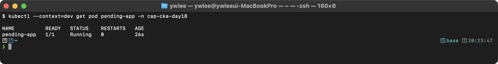
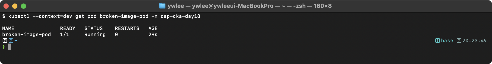
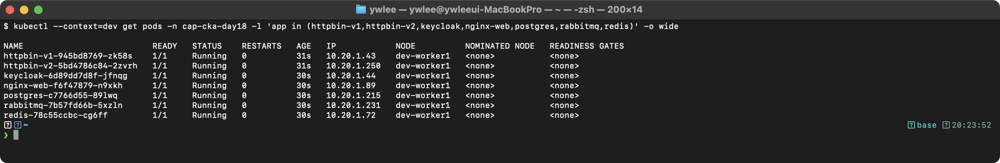
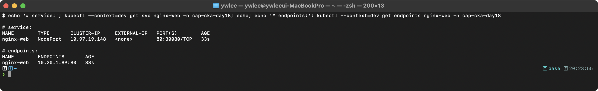
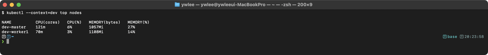

# CKA Day 18: Troubleshooting 시험 문제 & 빠른 참조

> CKA 도메인: Troubleshooting (30%) 실전 | 예상 소요 시간: 2시간

> **이전 Day와의 연결:** Day 17까지 Pod·Service·Deployment·스케줄링·Static Pod·etcd 등 개별 구성 요소를 정상 상태로 만드는 법을 익혔다. Day 18은 이미 배운 그 구성 요소들이 **고장 났을 때** 증상을 보고 원인을 역추적하는 능력을 다룬다. 즉 새 개념을 배우기보다 앞 Day의 지식을 진단 절차로 재조립한다. Day 19는 이 Day의 진단 절차를 시간 제한(120분) 모의시험에서 통째로 적용한다.

---

## 오늘의 학습 목표

- [ ] 12문제 전체를 직접 장애 생성 → 진단 → 복구 순서로 완료한다.
- [ ] Exit Code 표(0·1·127·137·143)를 보지 않고 각 의미를 말할 수 있다.
- [ ] Node NotReady 의 일반적인 원인 5가지를 나열할 수 있다.
- [ ] `kubectl describe pod` Events, `kubectl logs --previous`, `kubectl get endpoints`, `systemctl status kubelet`, `crictl ps -a` 를 맥락에 맞게 선택해 쓸 수 있다.
- [ ] tart 실습 5개를 완료하고 각 동작 원리를 한 문장으로 설명할 수 있다.

---

## 1. 이 Day를 위한 기초 개념 복습

이 Day의 문제들은 아래 용어가 사전지식이라고 가정하고 진행한다. 처음 보는 용어가 있으면 먼저 정의를 확인한다.

- **kube-scheduler:** Control Plane 컴포넌트. 아직 노드가 배정되지 않은(Pending) Pod를 보고 어느 노드에 올릴지 결정하는 프로그램이다. 적합한 노드를 못 찾으면 Pod는 Pending 으로 남는다.
- **kubelet:** 각 노드에서 도는 에이전트. apiserver 가 시킨 대로 컨테이너를 실제로 띄우고, 노드/Pod 상태를 apiserver 에 보고한다. kubelet 이 멈추면 그 노드는 NotReady 가 된다.
- **nodeSelector:** Pod spec 에 적는 노드 라벨 조건. "이 라벨이 붙은 노드에만 배치하라"는 제약이다. 존재하지 않는 라벨을 지정하면 어떤 노드도 조건을 못 맞춰 스케줄링이 실패한다.
- **Pending:** Pod 가 아직 노드에 배치되지 못한 상태. 원인은 대개 리소스 부족, nodeSelector/affinity 불일치, Taint, 바인딩 안 된 PVC 다.
- **CrashLoopBackOff:** 컨테이너가 시작 직후 종료되기를 반복하자 kubelet 이 재시작 간격을 점점 늘려(backoff) 대기 중인 상태. 컨테이너 자체가 떠 있는지가 아니라 "떴다가 죽기를 반복"한다는 뜻이다.
- **ImagePullBackOff:** kubelet 이 컨테이너 이미지를 레지스트리에서 받지 못해(이미지명/태그 오타, 사설 레지스트리 인증 실패 등) 재시도 대기 중인 상태.
- **Static Pod:** apiserver 가 아니라 노드의 kubelet 이 `/etc/kubernetes/manifests/` 디렉터리의 YAML 파일을 직접 읽어 띄우는 Pod. kube-apiserver·etcd·controller-manager·scheduler 가 이 방식으로 뜬다. 매니페스트 파일을 고치면 kubelet 이 감지해 해당 Pod 를 재기동한다.
- **Endpoints:** Service 의 selector 와 라벨이 일치하고 Ready 상태인 Pod 들의 IP 목록을 담은 오브젝트. 비어 있으면 Service 로 트래픽이 흘러갈 대상이 없다는 뜻이다.
- **crictl:** 노드에 SSH 로 들어가 컨테이너 런타임(containerd)을 직접 조회하는 CLI. apiserver 가 죽어 `kubectl` 이 안 먹힐 때 Static Pod 컨테이너의 상태와 로그를 보는 수단이다. (CRI = Container Runtime Interface, kubelet 과 컨테이너 런타임 사이의 표준 규격이다.)

### 컨테이너 Exit Code 표

컨테이너가 종료될 때 남기는 정수 코드다. `kubectl describe pod` 의 `Last State: Exit Code` 필드에 나타나며 원인을 즉시 좁힐 수 있다.

| Exit Code | 의미 | K8s 에서 보이는 상황 |
|:--:|:--|:--|
| **0** | 정상 종료 | 컨테이너가 의도대로 완료됨. Job/CronJob 에서는 성공. 일반 Deployment 에서는 CrashLoopBackOff 처럼 보이지만 의도된 종료다. |
| **1** | 일반 오류 | 애플리케이션이 명시적으로 `exit(1)` 을 호출하거나 예외가 처리되지 않아 프로세스가 죽은 경우. 로그에 오류 메시지가 남아 있는 경우가 대부분. |
| **2** | 잘못된 사용/설정 오류 | 셸 내장 명령 오용, 잘못된 플래그 조합. 시작 스크립트 문법 오류에서 자주 발생. |
| **127** | 명령어를 찾을 수 없음 | 컨테이너 `command` 에 적은 바이너리가 이미지 안에 없을 때. `exec /app: no such file or directory` 메시지와 함께 나타남. |
| **137** | SIGKILL(신호 9)로 강제 종료 | OOM Killer(메모리 초과)·`kubectl delete pod --grace-period=0`·Liveness Probe 실패(kubelet 이 컨테이너를 강제 종료) 등. `kubectl describe pod` 의 `OOMKilled: true` 와 함께 나타나면 메모리 limit 조정이 필요. |
| **143** | SIGTERM(신호 15)으로 정상 종료 요청 후 종료 | kubelet 이 Pod 를 정상 종료(graceful shutdown)할 때 먼저 SIGTERM 을 보낸다. 앱이 SIGTERM 을 처리해 종료하면 143. 무시하면 `terminationGracePeriodSeconds` 후 SIGKILL(→ 137) 이 온다. |

계산 규칙: Unix 에서 신호 N 에 의한 종료 코드는 128 + N 이다. SIGKILL = 9 이므로 128+9 = 137, SIGTERM = 15 이므로 128+15 = 143.

### Node NotReady 원인 5가지

노드가 NotReady 로 바뀌는 일반적인 원인은 다섯 가지다. 진단 시 아래 순서로 좁혀간다.

1. **kubelet 정지** — 가장 흔하다. `systemctl status kubelet` 으로 확인. 로그(`journalctl -u kubelet`)에 설정 오류나 인증서 오류가 찍힌다.
2. **containerd(컨테이너 런타임) 정지** — kubelet 이 런타임과 통신을 못 해 노드를 NotReady 로 보고한다. `systemctl status containerd` 로 확인.
3. **디스크·메모리 Pressure** — 노드의 남은 디스크 또는 메모리가 kubelet 의 임계값 아래로 떨어지면 Condition `DiskPressure=True` / `MemoryPressure=True` 가 되고 kubelet 이 새 Pod 를 거부한다. 극단적으로는 Ready=Unknown 으로 전이. `kubectl describe node` 의 Conditions 블록에서 확인.
4. **네트워크 파티션** — 노드와 컨트롤 플레인 사이의 네트워크가 끊기면 apiserver 가 kubelet 으로부터 heartbeat 를 받지 못한다. `node-monitor-grace-period`(기본 40 초) 경과 후 Ready=Unknown, `pod-eviction-timeout`(기본 5분) 경과 후 NotReady 로 전이. kubelet 자체는 노드 안에서 정상이지만 컨트롤 플레인은 알 수 없다.
5. **인증서 만료** — kubelet 이 apiserver 에 인증서로 연결한다. 이 인증서가 만료되면 kubelet 은 실행 중이지만 apiserver 에 인증 실패 → heartbeat 중단 → NotReady. `journalctl -u kubelet | grep certificate` 로 확인. `kubeadm certs renew all` 로 갱신.

---

## 2. Troubleshooting 이 왜 CKA 의 30% 인가 — 등장 배경

CKA 시험에서 Troubleshooting 은 단일 도메인 중 가장 큰 30% 다. 단순히 "고장을 고치는 잡무"가 아니라, 분산 시스템 운영의 본질이 진단이기 때문이다.

**없던 시절의 고통.** K8s 이전, 또는 K8s 1.0 초기에 여러 머신에 걸친 애플리케이션을 운영하던 운영자는 "왜 안 되는지"를 알아낼 표준 절차가 없었다. 프로세스가 죽었는지, 네트워크가 막혔는지, 디스크가 찼는지를 서버마다 직접 SSH 로 들어가 `ps`·`netstat`·`df` 를 일일이 돌려 추측했다. 장애 원인이 한 머신이 아니라 머신 사이의 상호작용(예: 노드 A 의 Pod 가 노드 B 의 Service 에 못 붙음)에 있으면, 어디서부터 봐야 할지조차 막막했다.

**K8s 가 무엇을 바꿨나(메커니즘 수준).** K8s 는 모든 상태 변화를 apiserver 에 중앙 집중시키고, 각 컴포넌트가 자신이 한 일과 실패를 **Event 오브젝트**와 **상태(Status)** 로 기록하게 만들었다. 그 결과 "왜 이 Pod 가 안 뜨는가"라는 질문이 `kubectl describe pod` 한 줄로 환원된다. scheduler 가 노드를 못 찾으면 `FailedScheduling` Event 가, 이미지를 못 받으면 `Failed to pull image` Event 가, Probe 가 실패하면 `Unhealthy` Event 가 남는다. 즉 K8s 의 선언적(declarative) 모델 — "원하는 상태를 적으면 컨트롤러가 현재 상태를 거기에 맞춰 수렴(reconciliation)시킨다" — 덕분에, "원하는 상태"와 "현재 상태"의 차이와 그 차이를 못 메운 이유가 항상 기록으로 남는다.

**그래서 진단은 단계별 스택 추적이다.** 증상(Pod 가 Pending)에서 출발해 → 상위 컴포넌트(scheduler)의 Event 를 보고 → 더 아래(kubelet, 컨테이너 런타임, 노드 커널)로 한 단계씩 내려가며 원인을 좁힌다. CKA 가 이 능력에 30% 를 배정한 이유는, 실무에서 클러스터를 새로 까는 일보다 도는 클러스터의 고장을 고치는 일이 압도적으로 많기 때문이다.

**트레이드오프.** 중앙 집중과 풍부한 Event 는 진단을 쉽게 만들지만, 그 자체가 새로운 단일 장애점을 만든다. apiserver·etcd 가 죽으면 `kubectl` 자체가 안 먹혀 Event 도 못 본다. 이때는 노드에 SSH 로 들어가 `crictl`·`journalctl`·Static Pod 매니페스트를 직접 보는, K8s 이전 방식으로 한 겹 내려가야 한다. 문제 3·6 이 그 경우를 다룬다.

---

## 3. 시험에서 이 주제가 어떻게 출제되는가?

### 출제 패턴 분석

```
CKA 시험의 Troubleshooting 관련 출제:
Troubleshooting 도메인 = 전체의 30% (최대 비중!)

주요 출제 유형:
1. Pod 장애 복구 (CrashLoopBackOff, ImagePullBackOff) — 매우 빈출!
2. Node NotReady 복구 (kubelet 재시작) — 빈출
3. Service Endpoints 문제 해결 — 빈출
4. Control Plane 컴포넌트 복구 (Static Pod 수정) — 빈출
5. 로그 수집/분석 — 빈출
6. DNS 문제 해결 — 가끔 출제
7. 이벤트 필터링/수집 — 가끔 출제
8. PVC Pending 해결 — Storage 도메인과 연계

핵심 전략:
- kubectl describe의 Events 섹션을 가장 먼저 확인
- CrashLoopBackOff는 kubectl logs --previous 필수
- Service 문제는 kubectl get endpoints 먼저
- Node 문제는 SSH → systemctl status kubelet
- Static Pod 문제는 /etc/kubernetes/manifests/ 확인
```

---

## 4. 시험 대비 연습 문제 (12문제)

### 실습 전 필수 준비 (모든 문제 공통 전제)

아래 12문제는 각자 `kubectl config use-context <ctx>` 로 컨텍스트를 바꾼 뒤, 풀이 안의 "장애 생성" 블록으로 고장을 **직접 만든 다음** 그것을 진단·복구하는 구조다. 시험과 달리 장애를 스스로 심으므로, 그 장애가 의도한 증상(Pending, CrashLoopBackOff 등)으로 실제로 나오려면 클러스터가 정상 상태여야 한다. 시작 전 다음을 확인한다.

```bash
# 1) 클러스터 가동 + IP 드리프트 복구 (재부팅했다면 필수)
./scripts/boot.sh
./scripts/fix-cluster-ip-drift.sh dev
./scripts/fix-cluster-ip-drift.sh staging

# 2) kubeconfig 등록 — 컨텍스트 이름으로 전환할 수 있게 한다
export KUBECONFIG=kubeconfig/dev.yaml:kubeconfig/staging.yaml:kubeconfig/platform.yaml
kubectl config get-contexts        # dev / staging / platform 이 보여야 한다

# 3) 노드가 전부 Ready 인지 확인 (NotReady 면 장애 재현이 깨진다)
kubectl --context dev get nodes
kubectl --context staging get nodes

# 4) 문제들이 쓰는 demo 네임스페이스를 미리 만든다 (없으면 apply 가 실패한다)
kubectl --context dev create namespace demo --dry-run=client -o yaml | kubectl --context dev apply -f -
```

**컨텍스트와 kubeconfig 의 관계:** `kubectl config use-context dev` 는 "지금부터 dev 클러스터·dev 사용자·기본 네임스페이스를 쓰겠다"는 선택이다. 그 컨텍스트가 가리키는 접속 정보(apiserver 주소, 클라이언트 인증서)는 위에서 `KUBECONFIG` 로 합쳐 등록한 파일들 안에 들어 있다. 문제마다 컨텍스트를 명시하므로, 직전 문제에서 바꾼 컨텍스트가 다음 문제에 새지 않도록 각 문제 첫 줄의 `use-context` 를 항상 다시 실행한다. SSH 가 필요한 문제(3·6)는 `~/.ssh/config` 에 노드 별칭이 등록돼 있어야 한다(`./scripts/setup-ssh-keys.sh dev staging` 로 배포).

> 참고: 위 `<staging-worker1-ip>`·`<staging-master-ip>` 같은 자리표시자는 별칭 SSH(`ssh staging-worker1`)로 대체할 수 있다. tart 는 재부팅마다 IP 가 바뀌므로 IP 를 직접 적기보다 별칭을 쓰는 편이 안전하다(문제 3·6 참조).

---

### 문제 1. Pending Pod 진단 및 복구 [4%]

**컨텍스트:** `kubectl config use-context dev`

`demo` 네임스페이스의 `pending-app` Pod가 Pending 상태이다. 원인을 찾아 `/tmp/pending-reason.txt`에 기록하고, Pod가 Running 되도록 수정하라.

<details>
<summary>풀이</summary>

```bash
# 사전 체크: 노드가 Ready 여야 nodeSelector 불일치만으로 Pending 이 재현된다.
#   (노드가 NotReady 이면 다른 이유로도 Pending 이 되어 진단이 흐려진다.)
kubectl config use-context dev
kubectl get nodes                     # 전부 Ready 확인
kubectl get ns demo || kubectl create ns demo   # demo 네임스페이스 보장

# 장애 생성
cat <<EOF | kubectl apply -f -
apiVersion: v1
kind: Pod
metadata:
  name: pending-app
  namespace: demo
spec:
  nodeSelector:
    nonexistent-label: "true"
  containers:
  - name: app
    image: nginx
EOF

# 진단
kubectl get pod pending-app -n demo
# STATUS: Pending

kubectl describe pod pending-app -n demo | grep -A5 Events
# "node(s) didn't match Pod's node affinity/selector"

# 원인 기록
echo "nodeSelector에 존재하지 않는 레이블(nonexistent-label=true)이 지정되어 스케줄링 실패" \
  > /tmp/pending-reason.txt

# 복구: nodeSelector 제거 (Pod 재생성 필요)
kubectl delete pod pending-app -n demo
kubectl run pending-app --image=nginx -n demo

# 확인
kubectl get pod pending-app -n demo
```

**실제 터미널 캡처 — nodeSelector 제거 후 Pod Running 복구:**



**내부 동작 원리:** kube-scheduler는 Pod를 노드에 배치할 때 Filtering(nodeSelector, taints, resources) → Scoring(node affinity, pod topology spread) 순서로 처리한다. Filtering 단계에서 모든 노드가 탈락하면 Pod는 Pending 상태로 유지된다. `kubectl describe pod`의 Events에 FailedScheduling 메시지가 기록되며, 이 메시지가 원인 파악의 핵심이다.

```bash
# 정리
kubectl delete pod pending-app -n demo
```

</details>

---

### 문제 2. CrashLoopBackOff 복구 [4%]

**컨텍스트:** `kubectl config use-context dev`

`demo` 네임스페이스의 `crash-app` Pod가 CrashLoopBackOff 상태이다. 로그를 확인하여 원인을 파악하고 수정하라.

<details>
<summary>풀이</summary>

```bash
kubectl config use-context dev

# 장애 생성
cat <<EOF | kubectl apply -f -
apiVersion: v1
kind: Pod
metadata:
  name: crash-app
  namespace: demo
spec:
  containers:
  - name: app
    image: busybox:1.36
    command: ["sh", "-c", "cat /config/app.conf"]
EOF

# 진단
kubectl get pod crash-app -n demo
# STATUS: CrashLoopBackOff

kubectl logs crash-app -n demo --previous
# "cat: can't open '/config/app.conf': No such file or directory"

kubectl describe pod crash-app -n demo | grep "Exit Code"
# Exit Code: 1

# 복구: 정상 명령으로 재생성
kubectl delete pod crash-app -n demo
cat <<EOF | kubectl apply -f -
apiVersion: v1
kind: Pod
metadata:
  name: crash-app
  namespace: demo
spec:
  containers:
  - name: app
    image: busybox:1.36
    command: ["sh", "-c", "echo 'App running' && sleep 3600"]
EOF

kubectl get pod crash-app -n demo
# STATUS: Running

# 정리
kubectl delete pod crash-app -n demo
```

**핵심:** CrashLoopBackOff는 `kubectl logs --previous`로 이전 컨테이너의 로그를 확인하는 것이 핵심이다. `--previous` 플래그 없이 `kubectl logs`를 실행하면 현재 컨테이너(재시작 직후)의 빈 로그만 보이므로 원인을 파악할 수 없다.

`--previous` 의 내부 동작: 컨테이너 런타임(containerd)은 컨테이너의 stdout/stderr 를 노드의 파일에 쌓는다. 이 파일은 노드의 `/var/log/pods/<ns>_<pod>_<uid>/<container>/0.log`, `1.log` … 처럼 **재시작마다 번호를 올려가며** 보존되고, kubelet 이 같은 내용을 `/var/log/containers/` 아래에 심볼릭 링크로 노출한다. 현재 도는 컨테이너의 로그는 가장 큰 번호 파일이고, 직전에 죽은 컨테이너의 로그는 그 바로 이전 번호 파일이다. `kubectl logs --previous` 는 이 "직전 번호" 파일을 읽어 온다. 따라서 컨테이너가 한 번도 재시작되지 않았으면 `--previous` 는 가져올 이전 로그가 없어 에러가 난다.

</details>

---

### 문제 3. Node NotReady 복구 [7%]

**컨텍스트:** `kubectl config use-context staging`

`staging-worker1` 노드가 NotReady 상태이다. SSH로 접속하여 원인을 파악하고 복구하라.

> **Static Pod 와 crictl 선행 개념:** 이 문제는 노드에 직접 SSH 로 들어간다. 노드의 kubelet 은 `/etc/kubernetes/manifests/` 의 매니페스트를 읽어 Control Plane 컴포넌트를 Static Pod 로 띄우고, 그 컨테이너의 상태/로그는 `kubectl` 이 아니라 `crictl`(컨테이너 런타임 직접 조회 CLI)로 본다. NotReady 노드는 보통 kubelet 자체가 멈춘 경우라 `systemctl`·`journalctl` 로 진단한다.

> **SSH 접속 — IP 직접 입력 vs VM 별칭:** 두 가지 방법이 있다.
> - 방법 1(IP): `kubectl get nodes -o wide` 의 INTERNAL-IP 를 보고 `ssh admin@<그 IP>`. tart 는 재부팅마다 IP 가 바뀌므로 매번 다시 확인해야 한다.
> - 방법 2(별칭, 권장): `./scripts/setup-ssh-keys.sh staging` 로 키를 배포해 두면 `ssh staging-worker1` 처럼 VM 이름으로 접속된다. `ProxyCommand` 가 `tart ip` 로 IP 를 실시간 조회하므로 IP 가 바뀌어도 동작한다. 아래 풀이의 `<staging-worker1-ip>` 자리에 별칭을 쓰면 된다.

<details>
<summary>풀이</summary>

```bash
kubectl config use-context staging

# === 장애 생성 ===
# staging-worker1 에 SSH 로 들어가 kubelet 을 직접 정지한다.
# (ssh staging-worker1: ~/.ssh/config 에 등록된 VM 별칭. ./scripts/setup-ssh-keys.sh staging 으로 사전 배포.)
ssh staging-worker1 "sudo systemctl stop kubelet"

# 30~40초 대기 — apiserver 의 node-monitor-grace-period(기본 40s) 후 NotReady 전이
sleep 45

# 노드 상태 확인 — NotReady 를 눈으로 확인한 뒤 진단을 시작한다
kubectl get nodes
# staging-worker1  NotReady

kubectl describe node staging-worker1 | grep -A10 Conditions
# Ready=False 또는 Ready=Unknown

# === 진단 ===
# SSH 접속 (IP 직접 입력 대신 VM 별칭 사용; tart 재부팅마다 IP 가 바뀌므로 별칭이 안전)
ssh staging-worker1

# kubelet 상태 확인
sudo systemctl status kubelet
# Active: inactive (dead) 또는 failed

# kubelet 로그 확인
sudo journalctl -u kubelet --no-pager -n 30

# containerd 상태 확인 (kubelet 이 런타임 없이 뜰 수 없다)
sudo systemctl status containerd

# === 복구 ===
# 복구 시도 1: kubelet 재시작
sudo systemctl restart kubelet

# containerd가 문제인 경우 순서대로 재시작
sudo systemctl restart containerd
sudo systemctl restart kubelet

# kubelet이 시작되지 않는 경우: 설정 확인
sudo cat /var/lib/kubelet/config.yaml
# 설정 오류가 있는지 확인

# 상태 확인
sudo systemctl status kubelet
# Active: active (running)

exit

# 노드 상태 확인 (NotReady → Ready 에 최대 40s 소요)
kubectl get nodes
# staging-worker1  Ready
```

**핵심 — journalctl 출력에서 무엇을 찾는가:**

이 실습은 `systemctl stop kubelet` 으로 단순 정지했으므로 `journalctl -u kubelet` 에는 `Stopped Kubernetes Kubelet` 한 줄만 찍힌다. 시험 환경에서는 kubelet 이 실행 중이어도 오류로 멈출 수 있으므로 아래 패턴을 보고 원인을 특정한다.

| 로그 패턴 | 의미 | 복구 방법 |
|:--|:--|:--|
| `x509: certificate has expired` | 클라이언트 인증서 만료 | `kubeadm certs renew all` 후 kubelet 재시작 |
| `failed to parse kubelet flag` | `/var/lib/kubelet/config.yaml` 문법 오류 | 해당 파일 수정 후 재시작 |
| `failed to connect to CRI endpoint` | containerd 정지 또는 소켓 경로 불일치 | `systemctl restart containerd` 후 kubelet 재시작 |
| `node not found` | apiserver 에서 이 노드 오브젝트가 없음 | 노드 재등록 필요(`kubeadm join` 재실행) |

단순 정지 실습에서는 위 패턴이 보이지 않는다. 시험에서 이 패턴들을 보고 원인을 특정하는 연습은 별도로 각 시나리오를 만들어 진행한다.

</details>

---

### 문제 4. Service 연결 문제 해결 [7%]

**컨텍스트:** `kubectl config use-context dev`

`demo` 네임스페이스의 `app-service`로 접근이 안 된다. 원인을 찾고 수정하라.

<details>
<summary>풀이</summary>

```bash
kubectl config use-context dev

# 장애 생성
kubectl run app-pod --image=nginx --labels="app=myapp" --port=80 -n demo
cat <<EOF | kubectl apply -f -
apiVersion: v1
kind: Service
metadata:
  name: app-service
  namespace: demo
spec:
  selector:
    app: wrong-app
  ports:
  - port: 80
    targetPort: 8080
EOF

# === 체계적 진단 ===

# 1. Service 확인
kubectl get svc app-service -n demo

# 2. Endpoints 확인 (핵심!)
kubectl get endpoints app-service -n demo
# ENDPOINTS: <none>

# 3. selector 확인
kubectl get svc app-service -n demo -o jsonpath='{.spec.selector}'
# {"app":"wrong-app"}

# 4. Pod label 확인
kubectl get pods -n demo --show-labels | grep app-pod
# app=myapp

# 5. Pod containerPort 확인
kubectl get pod app-pod -n demo -o jsonpath='{.spec.containers[0].ports[0].containerPort}'
# 80 (Service targetPort 8080과 불일치)

# 6. 수정
kubectl patch svc app-service -n demo \
  -p '{"spec":{"selector":{"app":"myapp"},"ports":[{"port":80,"targetPort":80}]}}'

# 7. 검증
kubectl get endpoints app-service -n demo
# Pod IP 표시됨

kubectl run curl-test --image=curlimages/curl -n demo --rm -it --restart=Never -- \
  curl -s http://app-service.demo.svc.cluster.local

# 정리
kubectl delete svc app-service -n demo
kubectl delete pod app-pod -n demo
```

**핵심 — selector 불일치와 targetPort 불일치는 Endpoints 에 미치는 영향이 다르다:**

- **selector 불일치(`app: wrong-app` vs `app: myapp`):** kube-controller-manager 내부의 EndpointSlice 컨트롤러가 Service 의 selector 와 Pod 의 라벨을 주기적으로 비교해 일치하는 Pod IP 목록을 Endpoints 오브젝트에 기록한다. selector 가 맞지 않으면 일치하는 Pod 가 0개라 Endpoints 자체가 비어(`<none>`) 트래픽을 보낼 대상이 아예 없다.
- **targetPort 불일치(`8080` vs Pod 실제 포트 `80`):** Endpoints 에는 Pod IP 가 올바르게 들어오지만(selector 는 맞으므로), kube-proxy(또는 Cilium)가 DNAT 를 걸 때 Pod 의 `8080` 번 포트로 전달한다. Pod 컨테이너가 실제로 `8080` 을 열고 있지 않으면 "연결 거부(Connection refused)"가 발생한다. 즉 Endpoints 는 채워지지만 실제 통신은 실패한다.
- **patch 한 줄로 두 필드를 동시에 수정하는 이유:** `kubectl patch` 는 JSON Merge Patch 를 한 번의 API 호출로 적용한다. selector 와 ports 는 같은 `spec` 하위에 있으므로 하나의 patch body 에 묶어 전송하면 apiserver 가 두 필드를 원자적으로 업데이트한다. 두 번 나눠 patch 해도 결과는 같지만 한 번이 더 효율적이다.

</details>

---

### 문제 5. 로그 수집 [4%]

**컨텍스트:** `kubectl config use-context platform`

`monitoring` 네임스페이스에서 재시작 횟수가 1 이상인 Pod를 찾아 `/tmp/restarted-pods.txt`에 기록하라.

<details>
<summary>풀이</summary>

```bash
kubectl config use-context platform

# 재시작 횟수가 0보다 큰 Pod 찾기
kubectl get pods -n monitoring \
  -o custom-columns='NAME:.metadata.name,RESTARTS:.status.containerStatuses[0].restartCount' | \
  awk 'NR==1 || $2 > 0' > /tmp/restarted-pods.txt

# 또는 jsonpath 사용
kubectl get pods -n monitoring \
  -o jsonpath='{range .items[*]}{.metadata.name}{"\t"}{.status.containerStatuses[0].restartCount}{"\n"}{end}' | \
  awk '$2 > 0' > /tmp/restarted-pods.txt

cat /tmp/restarted-pods.txt
```

</details>

---

### 문제 6. kube-apiserver 복구 [7%]

**컨텍스트:** `kubectl config use-context staging`

kube-apiserver가 동작하지 않는다. SSH로 접속하여 문제를 찾고 수정하라.

> **왜 kubectl 이 아니라 SSH·crictl 인가:** kube-apiserver 는 `kubectl` 명령이 통하는 유일한 창구다. 그 apiserver 자체가 죽으면 `kubectl` 도 함께 먹통이 된다(§0.5 트레이드오프). 따라서 노드에 SSH 로 직접 들어가, apiserver 를 Static Pod 로 띄우는 매니페스트(`/etc/kubernetes/manifests/kube-apiserver.yaml`)와 그 컨테이너 상태를 `crictl`(런타임 직접 조회 CLI)로 본다. 매니페스트를 고치면 kubelet 이 변경을 감지해 자동으로 Static Pod 를 재기동한다 — 별도의 apply 가 필요 없다.
> SSH 접속은 문제 3 과 동일하게 IP 직접 입력 또는 VM 별칭(`ssh staging-master`)을 쓸 수 있다.

<details>
<summary>풀이</summary>

```bash
# === 장애 생성 ===
# staging-master 에 SSH 로 들어가 kube-apiserver 매니페스트의 포트를 잘못 바꾼다.
# (ssh staging-master: ~/.ssh/config 에 등록된 VM 별칭)
# 먼저 원본을 백업해 두고 sed 로 --secure-port 를 6443→6444 로 변경한다.
ssh staging-master "sudo cp /etc/kubernetes/manifests/kube-apiserver.yaml /tmp/kube-apiserver.yaml.bak && sudo sed -i 's/--secure-port=6443/--secure-port=6444/' /etc/kubernetes/manifests/kube-apiserver.yaml"

# kubelet 이 변경을 감지해 apiserver 를 재기동하는 동안 잠시 대기
sleep 30

# kubectl 이 응답하지 않는 것을 확인한 뒤 진단을 시작한다
kubectl config use-context staging
kubectl get nodes
# Error from server: ... 또는 무응답

# === 진단 ===
# kubectl 이 먹통이므로 직접 SSH 접속 (IP 직접 입력 대신 VM 별칭 사용)
ssh staging-master

# apiserver 컨테이너 확인
sudo crictl ps -a | grep apiserver
# Exited 상태

# 로그 확인
APISERVER_ID=$(sudo crictl ps -a | grep apiserver | head -1 | awk '{print $1}')
sudo crictl logs $APISERVER_ID 2>&1 | tail -30

# 에러 메시지에 따라 매니페스트 확인
sudo cat /etc/kubernetes/manifests/kube-apiserver.yaml

# 일반적인 수정 대상:
# 1. 잘못된 포트 → 6443으로 수정  ← 이번 장애
# 2. 잘못된 인증서 경로 → 올바른 경로로 수정
# 3. 잘못된 etcd 엔드포인트 → https://127.0.0.1:2379
# 4. YAML 문법 오류 → 수정

# === 복구 ===
sudo vi /etc/kubernetes/manifests/kube-apiserver.yaml
# --secure-port=6444 → --secure-port=6443 으로 수정 후 저장
# (또는: sudo cp /tmp/kube-apiserver.yaml.bak /etc/kubernetes/manifests/kube-apiserver.yaml)

# kubelet이 자동으로 apiserver를 재시작 (최대 30~60초 소요)
# sleep 40 대신 until 루프로 실제 기동 완료를 확인한다 (환경마다 소요 시간이 다르다)
until sudo crictl ps | grep -q apiserver; do sleep 3; done
sudo crictl ps | grep apiserver
# Running 상태 확인

exit

# kubectl 테스트 — apiserver 가 복구됐는지 확인
kubectl config use-context staging
kubectl get nodes
```

</details>

---

### 문제 7. DNS 문제 해결 [4%]

**컨텍스트:** `kubectl config use-context dev`

Pod에서 Service 이름으로 접근이 안 된다. DNS 문제를 진단하고 해결하라.

> **장애 생성이 필요한 이유:** CoreDNS 가 정상 동작 중인 클러스터에서는 `nslookup` 이 성공하므로 "문제를 찾고 수정하라"는 시나리오가 재현되지 않는다. 반드시 아래 장애 생성 블록을 실행해 실제 실패 상황을 만든 뒤 진단한다.

<details>
<summary>풀이</summary>

```bash
kubectl config use-context dev

# === 장애 생성 ===
# CoreDNS Deployment 를 0으로 내려 DNS 응답이 없는 상태를 만든다.
kubectl -n kube-system scale deployment coredns --replicas=0

# CoreDNS Pod 가 모두 종료될 때까지 대기
until [ "$(kubectl -n kube-system get pods -l k8s-app=kube-dns --no-headers 2>/dev/null | wc -l)" -eq 0 ]; do sleep 2; done

# DNS 장애 확인 — nslookup 이 실패해야 진단을 시작할 수 있다
kubectl run dns-fail-check --image=busybox:1.28 -n demo --rm -it --restart=Never -- \
  nslookup kubernetes.default.svc.cluster.local
# server can't find kubernetes.default.svc.cluster.local: NXDOMAIN 또는 timeout

# === 진단 ===

# 1. CoreDNS Pod 상태 확인
kubectl -n kube-system get pods -l k8s-app=kube-dns
# Pod 가 0개 — Deployment replicas=0 이 원인

# 2. CoreDNS Deployment 상태 확인
kubectl -n kube-system get deployment coredns
# DESIRED: 0

# 3. CoreDNS 로그 확인 (Pod 가 있을 때 가능)
# kubectl -n kube-system logs -l k8s-app=kube-dns --tail=20

# 4. kube-dns Service 와 Endpoints 확인
kubectl -n kube-system get svc kube-dns
kubectl -n kube-system get endpoints kube-dns
# Endpoints 가 비어 있음 → CoreDNS Pod 가 없어서

# 5. CoreDNS ConfigMap 확인 (설정 오류 여부)
kubectl -n kube-system get configmap coredns -o yaml
# plugins: errors, health, ready, kubernetes, prometheus, forward, cache, loop, reload, loadbalance 순 확인

# === 복구 ===

# replicas 를 원래대로 복구 (kubeadm 클러스터 기본값 2)
kubectl -n kube-system scale deployment coredns --replicas=2

# CoreDNS Pod 가 Running 이 될 때까지 대기
kubectl -n kube-system rollout status deployment coredns

# === 검증 ===
kubectl run dns-test --image=busybox:1.28 -n demo --rm -it --restart=Never -- \
  nslookup kubernetes.default.svc.cluster.local
# 성공: Server: 10.96.0.10 (또는 클러스터 DNS IP)

kubectl run dns-test2 --image=busybox:1.28 -n demo --rm -it --restart=Never -- \
  nslookup nginx-web.demo.svc.cluster.local
```

**핵심:** CoreDNS 장애의 두 가지 주요 원인과 확인 방법:
1. **replicas=0 (이번 실습)** — `kubectl -n kube-system get deployment coredns` 로 DESIRED 값 확인. `scale --replicas=2` 로 복구.
2. **ConfigMap 문법 오류** — `kubectl -n kube-system get configmap coredns -o yaml` 로 Corefile 블록 확인. `kubectl -n kube-system rollout restart deployment coredns` 로 설정 재로드.

CoreDNS 의 kube-dns Service IP(기본 10.96.0.10) 는 `/etc/resolv.conf` 의 `nameserver` 에 Pod 가 사용하는 DNS 서버로 등록된다. Pod 에서 `cat /etc/resolv.conf` 를 실행하면 이 IP 가 보인다. kube-dns Endpoints 가 비어 있으면 Pod 들의 DNS 요청이 어디서도 처리되지 않아 전체 Service 이름 해석이 실패한다.

</details>

---

### 문제 8. Warning 이벤트 수집 [4%]

**컨텍스트:** `kubectl config use-context platform`

클러스터 전체에서 Warning 타입 이벤트를 찾아 `/tmp/warning-events.txt`에 저장하라.

<details>
<summary>풀이</summary>

```bash
kubectl config use-context platform

# Warning 이벤트 필터링
kubectl get events -A --field-selector type=Warning \
  --sort-by='.lastTimestamp' > /tmp/warning-events.txt

cat /tmp/warning-events.txt
```

</details>

---

### 문제 9. ImagePullBackOff 복구 [4%]

**컨텍스트:** `kubectl config use-context dev`

`demo` 네임스페이스의 `broken-image-pod`가 ImagePullBackOff 상태이다. 이미지를 `nginx:1.24`로 수정하라.

<details>
<summary>풀이</summary>

```bash
kubectl config use-context dev

# 장애 생성
kubectl run broken-image-pod --image=nginx:nonexistent-12345 -n demo

# 진단
kubectl get pod broken-image-pod -n demo
# ImagePullBackOff

kubectl describe pod broken-image-pod -n demo | grep -A5 "Events"
# "Failed to pull image"

# 복구
kubectl set image pod/broken-image-pod broken-image-pod=nginx:1.24 -n demo

# 확인
kubectl get pod broken-image-pod -n demo
```

**실제 터미널 캡처 — 이미지 태그 수정(nginx:1.24) 후 Pod Running 복구:**



**트러블슈팅 팁:** `kubectl set image`로 Pod의 이미지를 직접 변경할 수 있다. 단, Pod 이름 뒤의 컨테이너 이름을 정확히 지정해야 한다. 컨테이너 이름은 `kubectl get pod <name> -o jsonpath='{.spec.containers[*].name}'`으로 확인한다.

```bash
# 정리
kubectl delete pod broken-image-pod -n demo
```

</details>

---

### 문제 10. Control Plane 컴포넌트 진단 [7%]

**컨텍스트:** `kubectl config use-context platform`

Control Plane 컴포넌트의 상태를 점검하고 다음 정보를 `/tmp/cp-status.txt`에 저장하라:
1. 모든 Control Plane Pod의 이름과 상태
2. kube-apiserver의 `--service-cluster-ip-range` 값
3. kube-scheduler의 최근 5줄 로그

> **왜 이 정보가 필요한가:** 운영 이슈 발생 시 Control Plane 이 정상임을 증거로 제출하거나, 네트워킹 문제 분석 시 Service CIDR 과 실제 할당 IP 를 대조하기 위해 수집한다. 시험에서도 "현재 상태를 파일로 저장하라"는 형태로 출제된다.

<details>
<summary>풀이</summary>

```bash
kubectl config use-context platform

# 1. Control Plane Pod 상태
echo "=== Control Plane Pods ===" > /tmp/cp-status.txt
kubectl get pods -n kube-system \
  -l tier=control-plane \
  -o custom-columns='NAME:.metadata.name,STATUS:.status.phase,RESTARTS:.status.containerStatuses[0].restartCount' \
  >> /tmp/cp-status.txt
echo "" >> /tmp/cp-status.txt

# 2. service-cluster-ip-range
echo "=== Service CIDR ===" >> /tmp/cp-status.txt
kubectl -n kube-system get pod -l component=kube-apiserver \
  -o jsonpath='{.items[0].spec.containers[0].command}' | \
  tr ',' '\n' | grep service-cluster-ip-range >> /tmp/cp-status.txt
echo "" >> /tmp/cp-status.txt

# 3. kube-scheduler 로그
echo "=== Scheduler Logs (last 5 lines) ===" >> /tmp/cp-status.txt
kubectl -n kube-system logs -l component=kube-scheduler --tail=5 >> /tmp/cp-status.txt

cat /tmp/cp-status.txt
```

</details>

---

### 문제 11. Multi-Container Pod 트러블슈팅 [7%]

**컨텍스트:** `kubectl config use-context dev`

`demo` 네임스페이스의 `multi-pod`의 sidecar 컨테이너가 CrashLoopBackOff 상태이다. 원인을 찾고 수정하라.

<details>
<summary>풀이</summary>

```bash
kubectl config use-context dev

# 장애 생성
cat <<EOF | kubectl apply -f -
apiVersion: v1
kind: Pod
metadata:
  name: multi-pod
  namespace: demo
spec:
  containers:
  - name: main
    image: nginx
    volumeMounts:
    - name: logs
      mountPath: /var/log/nginx
  - name: sidecar
    image: busybox:1.36
    command: ["sh", "-c", "cat /nonexistent/file"]
    volumeMounts:
    - name: logs
      mountPath: /logs
  volumes:
  - name: logs
    emptyDir: {}
EOF

# 진단
kubectl get pod multi-pod -n demo
# READY: 1/2 (sidecar가 Running이 아님)

# sidecar 컨테이너 로그 확인
kubectl logs multi-pod -c sidecar -n demo --previous
# "cat: can't open '/nonexistent/file': No such file or directory"

# 수정: Pod 재생성 (command 수정)
kubectl delete pod multi-pod -n demo
cat <<EOF | kubectl apply -f -
apiVersion: v1
kind: Pod
metadata:
  name: multi-pod
  namespace: demo
spec:
  containers:
  - name: main
    image: nginx
    volumeMounts:
    - name: logs
      mountPath: /var/log/nginx
  - name: sidecar
    image: busybox:1.36
    # access.log 는 nginx 가 첫 요청을 받을 때 생성된다.
    # 파일 생성 전에 tail -f 를 호출하면 busybox 1.36 의 tail 은 즉시 exit 1 로 종료해
    # CrashLoopBackOff 가 재발한다. while 루프로 파일이 생길 때까지 대기한다.
    command: ["sh", "-c", "while [ ! -f /logs/access.log ]; do sleep 1; done && tail -f /logs/access.log"]
    volumeMounts:
    - name: logs
      mountPath: /logs
      readOnly: true
  volumes:
  - name: logs
    emptyDir: {}
EOF

# 확인
kubectl get pod multi-pod -n demo
# READY: 2/2

# 정리
kubectl delete pod multi-pod -n demo
```

**핵심:** Multi-Container Pod에서는 `-c <container-name>`으로 특정 컨테이너의 로그를 확인해야 한다.

**emptyDir 초기화 주의:** emptyDir 볼륨은 Pod 가 노드에 배치될 때 빈 디렉터리로 생성된다. nginx 의 `access.log` 는 첫 HTTP 요청이 들어와야 파일이 만들어지므로, sidecar 가 먼저 기동하면 `/logs/access.log` 가 아직 없다. busybox 1.36 의 `tail -f <없는 파일>` 은 파일 미존재 에러를 내고 즉시 exit 1 로 종료해 CrashLoopBackOff 가 재발한다. `while [ ! -f ... ]; do sleep 1; done` 패턴으로 파일 생성을 대기한 뒤 `tail -f` 를 실행하면 이 경쟁 조건(race condition)을 피할 수 있다.

</details>

---

### 문제 12. 종합 트러블슈팅 [7%]

**컨텍스트:** `kubectl config use-context dev`

`demo` 네임스페이스에서 다음 문제를 모두 해결하라:
1. `web-deploy` Deployment의 Pod가 Pending 상태
2. `web-svc` Service의 Endpoints가 비어있음
3. DNS로 `web-svc`에 접근 불가

> **해결 순서 전략:** 세 증상은 독립이 아니라 **의존 사슬**이다. 무작정 셋을 동시에 건드리지 말고 아래 순서로 푼다.
> 1. **Pod 부터 살린다.** Pod 가 Pending 이면 Ready Pod 가 0개라 Endpoints 도 당연히 비고, DNS 로 붙어도 보낼 대상이 없다. nodeSelector 를 고쳐 Pod 를 먼저 Running 으로 만든다. 이 단계를 건너뛰면 2·3 을 고쳐도 검증이 실패한다.
> 2. **그다음 Service 의 selector 를 맞춘다.** Pod 가 Running 이어도 Service selector 가 Pod 라벨과 다르면 Endpoints 는 여전히 빈다. selector 를 Pod 라벨에 맞추면 Endpoints 가 채워진다.
> 3. **마지막에 DNS 를 검증한다.** 사실 DNS 자체는 고장 난 게 아니다. 1·2 가 끝나 Service 가 정상이면 `web-svc.demo.svc.cluster.local` 이름 해석과 접근이 자동으로 된다. 3 은 별도 수리가 아니라 1·2 의 결과를 확인하는 단계다.
> 즉 "증상 3개 = 수리 3개"가 아니라 "근본 수리 2개(Pod·selector) + 검증 1개"다. 진단 비용을 줄이려면 항상 데이터 평면의 가장 아래(Pod 존재) → 위(Service → DNS) 순으로 올라간다.

<details>
<summary>풀이</summary>

```bash
kubectl config use-context dev

# 장애 생성
cat <<EOF | kubectl apply -f -
apiVersion: apps/v1
kind: Deployment
metadata:
  name: web-deploy
  namespace: demo
spec:
  replicas: 2
  selector:
    matchLabels:
      app: web-deploy
  template:
    metadata:
      labels:
        app: web-deploy
    spec:
      nodeSelector:
        fake-label: "true"          # 문제 1: 존재하지 않는 nodeSelector
      containers:
      - name: nginx
        image: nginx:1.24
        ports:
        - containerPort: 80
---
apiVersion: v1
kind: Service
metadata:
  name: web-svc
  namespace: demo
spec:
  selector:
    app: wrong-label                # 문제 2: selector 불일치
  ports:
  - port: 80
    targetPort: 80
EOF

# === 진단 & 해결 ===

# 문제 1: Pending Pod
kubectl get pods -n demo -l app=web-deploy
# STATUS: Pending

kubectl describe pod -n demo -l app=web-deploy | grep -A3 Events
# "node(s) didn't match Pod's node affinity/selector"

# 해결: nodeSelector 제거
kubectl patch deployment web-deploy -n demo --type=json \
  -p='[{"op":"remove","path":"/spec/template/spec/nodeSelector"}]'

# Pod가 Running이 될 때까지 대기
kubectl rollout status deployment web-deploy -n demo

# 문제 2: Endpoints 비어있음
kubectl get endpoints web-svc -n demo
# <none>

kubectl get svc web-svc -n demo -o jsonpath='{.spec.selector}'
# {"app":"wrong-label"}

kubectl get pods -n demo --show-labels | grep web-deploy
# app=web-deploy

# 해결: selector 수정
kubectl patch svc web-svc -n demo \
  -p '{"spec":{"selector":{"app":"web-deploy"}}}'

kubectl get endpoints web-svc -n demo
# Pod IP 표시

# 문제 3: DNS 접근 테스트
kubectl run dns-check --image=busybox:1.28 -n demo --rm -it --restart=Never -- \
  nslookup web-svc.demo.svc.cluster.local
# 성공

kubectl run curl-check --image=curlimages/curl -n demo --rm -it --restart=Never -- \
  curl -s http://web-svc.demo.svc.cluster.local
# nginx 응답

# 정리
kubectl delete deployment web-deploy -n demo
kubectl delete svc web-svc -n demo
```

</details>

---

## 5. 트러블슈팅 빠른 참조 카드

```
┌──────────────────────────────────────────────────────────┐
│              CKA Troubleshooting Quick Reference          │
├──────────────────────────────────────────────────────────┤
│                                                          │
│ Pod 문제:                                                │
│   Pending     → describe pod → Events → 리소스/노드/PVC  │
│   Crash       → logs --previous → 명령어/설정 확인       │
│   ImagePull   → describe pod → 이미지명/태그/Secret      │
│   OOMKilled   → describe pod → limits.memory 증가        │
│                                                          │
│ Service 문제:                                            │
│   접근 불가   → get endpoints → selector/label 비교      │
│   DNS 실패    → kube-system coredns Pod/ConfigMap 확인   │
│                                                          │
│ Node 문제:                                               │
│   NotReady    → SSH → systemctl status kubelet           │
│               → journalctl -u kubelet                    │
│               → systemctl restart kubelet                │
│                                                          │
│ Control Plane:                                           │
│   kubectl 불가 → SSH → crictl ps -a | grep apiserver     │
│               → /etc/kubernetes/manifests/ 확인           │
│               → crictl logs <container-id>                │
│                                                          │
│ 핵심 명령어:                                             │
│   kubectl describe pod   → Events 확인                   │
│   kubectl logs --previous → 이전 로그                    │
│   kubectl get endpoints  → Service-Pod 연결              │
│   systemctl status kubelet → kubelet 상태                │
│   crictl ps -a           → Static Pod 컨테이너           │
│   journalctl -u kubelet  → kubelet 로그                  │
└──────────────────────────────────────────────────────────┘
```

---

## 6. 자가점검

아래 질문에 스스로 답한 뒤 정답 블록을 열어 확인한다. 막힌 항목은 해당 풀이 절로 돌아가 다시 읽는다.

- [ ] Pod 상태별(Pending, CrashLoopBackOff, ImagePullBackOff, OOMKilled) 진단 절차를 설명할 수 있는가?

<details>
<summary>정답</summary>

- **Pending:** `kubectl describe pod` → Events 의 `FailedScheduling` 메시지에서 원인 확인(nodeSelector 불일치, 리소스 부족, Taint, 미바인딩 PVC).
- **CrashLoopBackOff:** `kubectl logs <pod> --previous` 로 직전 컨테이너 로그 확인 → Exit Code 해석(1=일반 오류, 127=명령어 없음, 137=OOM/SIGKILL).
- **ImagePullBackOff:** `kubectl describe pod` Events 의 `Failed to pull image` 메시지 → 이미지명·태그·레지스트리 인증 확인.
- **OOMKilled:** `kubectl describe pod` 의 `OOMKilled: true` + Exit Code 137 확인 → `resources.limits.memory` 증가.

</details>

- [ ] Exit Code(0, 1, 127, 137, 143)의 의미를 알고 있는가?

<details>
<summary>정답</summary>

| Exit Code | 의미 |
|:--:|:--|
| 0 | 정상 종료 |
| 1 | 애플리케이션 일반 오류(exit(1) 호출 또는 미처리 예외) |
| 127 | 명령어를 찾을 수 없음(이미지 안에 바이너리 없음) |
| 137 | SIGKILL(128+9) — OOM Killer 또는 `kubectl delete --grace-period=0` |
| 143 | SIGTERM(128+15) — kubelet 이 graceful shutdown 요청, 앱이 정상 처리 후 종료 |

계산 공식: 신호 N 에 의한 종료 코드 = 128 + N.

</details>

- [ ] Node NotReady의 일반적인 원인 5가지를 나열할 수 있는가?

<details>
<summary>정답</summary>

1. kubelet 정지 (`systemctl status kubelet`)
2. containerd(컨테이너 런타임) 정지 (`systemctl status containerd`)
3. 디스크·메모리 Pressure (`kubectl describe node` 의 Conditions 블록)
4. 네트워크 파티션(노드-컨트롤플레인 간 heartbeat 중단)
5. 인증서 만료 (`journalctl -u kubelet | grep certificate`, `kubeadm certs renew all`)

</details>

- [ ] Control Plane 컴포넌트별 장애 증상을 구분할 수 있는가?

<details>
<summary>정답</summary>

- **kube-apiserver 장애:** `kubectl` 명령 전체 불응 → SSH + `crictl ps -a | grep apiserver` → 매니페스트(`/etc/kubernetes/manifests/kube-apiserver.yaml`) 수정.
- **kube-scheduler 장애:** Pod 가 Pending 으로 묶여 더 이상 노드에 배치되지 않음. 기존 Running Pod 는 정상. `kubectl -n kube-system get pods -l component=kube-scheduler` 확인.
- **kube-controller-manager 장애:** Deployment/ReplicaSet 의 Pod 수가 조정되지 않음(replicas 변경이 반영 안 됨). `kubectl -n kube-system get pods -l component=kube-controller-manager` 확인.
- **etcd 장애:** apiserver 도 동작 불능(apiserver 가 etcd 를 백엔드로 사용). `crictl ps | grep etcd`, 로그 확인.

</details>

- [ ] Static Pod 매니페스트의 위치(`/etc/kubernetes/manifests/`)를 기억하는가?

<details>
<summary>정답</summary>

`/etc/kubernetes/manifests/` — kubelet 이 이 디렉터리를 감시(inotify)하다가 YAML 파일이 추가·변경·삭제되면 해당 Static Pod 를 자동으로 기동·재기동·삭제한다. `kubectl apply` 없이 파일 수정만으로 Control Plane 컴포넌트를 제어하는 이유가 이 때문이다.

</details>

- [ ] Service Endpoints가 비어있는 주요 원인을 3가지 이상 말할 수 있는가?

<details>
<summary>정답</summary>

1. **selector 불일치** — Service 의 `spec.selector` 와 Pod 의 `metadata.labels` 가 다름. `kubectl get svc -o jsonpath='{.spec.selector}'` vs `kubectl get pods --show-labels` 비교.
2. **Pod 가 Ready 상태가 아님** — Readiness Probe 실패 시 Endpoints 에서 제외. `kubectl get pods` 의 READY 컬럼 확인.
3. **Pod 가 아예 없음** — Deployment replicas=0 이거나 모든 Pod 가 Pending/CrashLoopBackOff. `kubectl get pods -l <selector>` 로 확인.
4. **targetPort 불일치** — Endpoints 에 IP 는 있지만 실제 Pod 포트와 다름 → 연결 거부. `kubectl get svc -o jsonpath='{.spec.ports}'` 와 `kubectl get pod -o jsonpath='{.spec.containers[0].ports}'` 비교.

</details>

- [ ] `kubectl describe pod <name>` → Events 확인 방법을 알고 있는가?

<details>
<summary>정답</summary>

`kubectl describe pod <이름> -n <네임스페이스>` 출력의 맨 아래 `Events:` 섹션에 Scheduler·kubelet·컨트롤러 등 각 컴포넌트가 기록한 이벤트가 시간순으로 나온다. `grep -A10 Events` 로 잘라낼 수 있다. 가장 최근 이벤트가 현재 원인이다.

</details>

---

## 시험 팁

1. **첫 번째 확인** — `kubectl describe pod` 의 Events 섹션이 가장 중요하다. 시험에서 Pod 문제를 받으면 무조건 여기서 시작한다.
2. **이전 로그** — CrashLoopBackOff 는 반드시 `kubectl logs --previous` 로 확인한다. `--previous` 없이 보면 재시작 직후 빈 로그만 보인다.
3. **Endpoints** — Service 연결 문제는 `kubectl get endpoints <서비스명>` 으로 시작한다. 비어 있으면 selector/label 불일치, 채워져 있으면 targetPort 또는 NetworkPolicy 문제다.
4. **kubelet** — Node NotReady 문제는 SSH 접속 후 `systemctl status kubelet` 과 `journalctl -u kubelet --no-pager -n 50` 이 핵심 두 명령이다.
5. **Static Pod** — apiserver 등 Control Plane 문제는 `ssh <master-별칭>` 으로 들어가 `/etc/kubernetes/manifests/` 안의 YAML 파일을 수정한다. 파일을 저장하면 kubelet 이 자동 재기동한다.
6. **crictl** — apiserver 가 죽어 `kubectl` 이 먹통일 때 `crictl ps -a` 와 `crictl logs <id>` 로 컨테이너 상태를 확인한다.
7. **컨텍스트 실수 방지** — 문제마다 첫 줄에 `kubectl config use-context <ctx>` 를 반드시 실행한다. 이전 문제의 컨텍스트가 남아 있어 엉뚱한 클러스터에 명령을 내리는 실수가 시험에서 흔하다.

---

## 더 읽을거리

- [K8s 공식 — Troubleshooting Applications](https://kubernetes.io/docs/tasks/debug/debug-application/) — Pod·Service·Deployment 장애 진단 공식 절차
- [K8s 공식 — Troubleshooting Clusters](https://kubernetes.io/docs/tasks/debug/debug-cluster/) — 노드·컨트롤플레인 장애 및 로그 수집 공식 가이드
- [K8s 공식 — crictl 사용법](https://kubernetes.io/docs/tasks/debug/debug-cluster/crictl/) — `kubectl` 없이 컨테이너 런타임을 직접 조회하는 CLI 레퍼런스
- [K8s 공식 — CoreDNS 커스터마이즈](https://kubernetes.io/docs/tasks/administer-cluster/dns-custom-nameservers/) — CoreDNS ConfigMap 수정, 포워딩 규칙 변경

---

## 내일 예고

**Day 19: CKA 모의시험** — 120분 시간 제한 모의시험으로 전 도메인을 종합 테스트한다.

---

## tart-infra 실습

### 실습 환경 설정

```bash
# dev 클러스터에 접속 (실제 앱이 동작 중인 환경에서 트러블슈팅 연습)
export KUBECONFIG=kubeconfig/dev.yaml
kubectl get nodes
```

### 실습 1: Pod 상태 진단

```bash
# demo 네임스페이스의 모든 Pod 상태 확인
kubectl get pods -n demo -o wide
```

**예상 출력 (예시 — fresh dev 클러스터에는 demo ns 의 httpbin/keycloak/nginx-web/postgres/rabbitmq/redis 워크로드가 없다. 아래는 해당 앱들이 배포된 환경의 형태이며, Pod IP 는 dev Pod CIDR 10.20.x 대역이다):**


**동작 원리:** READY 컬럼 해석:
1. `2/2`(httpbin): 앱 컨테이너 + Istio sidecar(envoy) = 2개 컨테이너가 모두 Ready
2. `1/1`(nginx 등): 앱 컨테이너만 실행 중 (Istio sidecar 미주입 또는 별도 설정)
3. `0/1` Running: 컨테이너는 실행 중이지만 Readiness Probe가 실패
4. CrashLoopBackOff: 컨테이너가 시작 후 즉시 종료되어 반복 재시작 중

### 실습 2: 이벤트 기반 진단

```bash
# demo 네임스페이스의 최근 이벤트 확인
kubectl get events -n demo --sort-by='.lastTimestamp' | tail -10

# Warning 이벤트만 필터링
kubectl get events -n demo --field-selector type=Warning
```

**동작 원리:** K8s Event 오브젝트:
1. 각 컴포넌트(Scheduler, kubelet, Controller 등)가 중요한 상태 변경을 Event로 기록한다
2. Event는 기본 1시간 후 자동 삭제된다 (TTL 설정 가능)
3. `FailedScheduling`: Scheduler가 적합한 노드를 찾지 못함 (리소스 부족, Taint 등)
4. `BackOff`: kubelet이 CrashLoopBackOff 상태의 컨테이너를 재시작 대기 중
5. `Unhealthy`: Probe 실패 — Liveness면 컨테이너 재시작, Readiness면 Endpoints에서 제거

### 실습 3: 로그 기반 트러블슈팅

```bash
# nginx Pod의 로그 확인
kubectl logs -n demo deploy/nginx-web --tail=10

# httpbin Pod의 특정 컨테이너(envoy sidecar) 로그
kubectl logs -n demo -l app=httpbin,version=v1 -c istio-proxy --tail=5
```

**동작 원리:** `kubectl logs`의 내부 동작:
1. kubectl이 API Server에 로그 요청을 보낸다
2. API Server가 해당 Pod가 실행 중인 노드의 kubelet에 요청을 프록시한다
3. kubelet이 컨테이너 런타임(containerd)에서 로그 파일을 읽어 반환한다
4. 로그 파일은 노드의 `/var/log/containers/` 디렉터리에 JSON 형태로 저장된다
5. `--previous` 플래그: CrashLoopBackOff 시 이전에 종료된 컨테이너의 로그를 확인한다

### 실습 4: Service 연결 문제 진단

```bash
# Service와 Endpoints 매핑 확인
kubectl get svc,endpoints -n demo -l app=nginx-web
```

**예상 출력 (예시 — fresh dev 클러스터에는 demo ns 의 nginx-web Service 가 없다. 아래는 해당 앱이 배포된 환경의 형태. CLUSTER-IP 는 dev Service CIDR 10.97.x, Endpoint Pod IP 는 Pod CIDR 10.20.x 이며, day11/day12 실습에서 동일 형태를 dev 실측으로 검증함):**


**동작 원리:** Service 연결 문제 진단 순서:
1. `kubectl get endpoints`: Endpoints가 비어있으면 selector와 Pod label 불일치
2. `kubectl get pods -l <selector>`: selector에 매칭되는 Pod가 있는지 확인
3. Pod가 있지만 Endpoints가 없으면: Pod가 Ready 상태가 아니거나 포트가 다름
4. Endpoints가 있지만 접근 불가: NetworkPolicy가 트래픽을 차단하고 있을 수 있음

### 실습 5: 노드 상태 진단

```bash
# 노드 상태 상세 확인
kubectl describe node dev-worker1 | grep -A5 "Conditions:"

# 노드 리소스 사용량
kubectl top node
```

**예상 출력 (예시 — fresh dev 클러스터에는 metrics-server 가 없어 `kubectl top node` 는 `error: Metrics API not available` 를 출력한다. 아래는 metrics-server 가 설치된 환경의 형태):**


**동작 원리:** 노드 진단 시 확인할 Conditions:
1. `Ready=True`: kubelet이 정상 동작 중
2. `MemoryPressure=True`: 노드 메모리 부족 — kubelet이 Pod eviction 시작
3. `DiskPressure=True`: 디스크 용량 부족 — 이미지, 로그, emptyDir 정리 필요
4. `PIDPressure=True`: 프로세스 수 초과 — 컨테이너 수를 줄이거나 PID 제한 조정
5. kubelet 문제: `systemctl status kubelet`, `journalctl -u kubelet -f`로 확인
