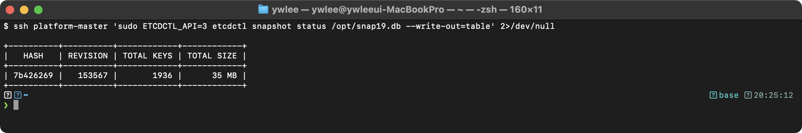
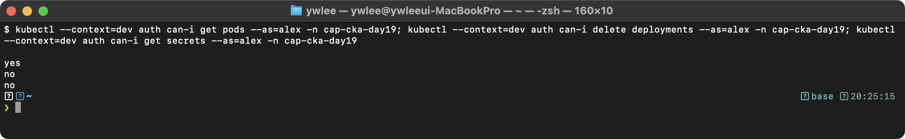
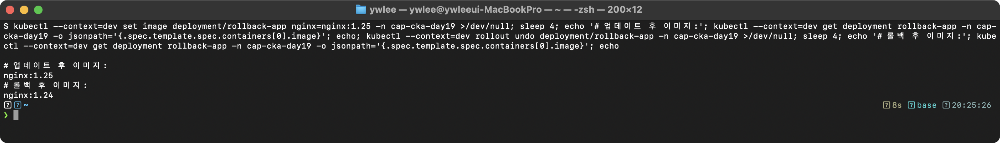
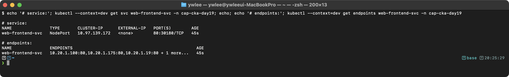
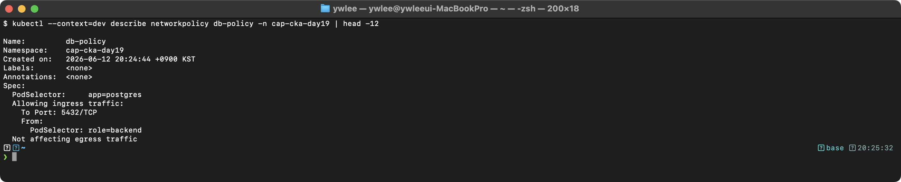
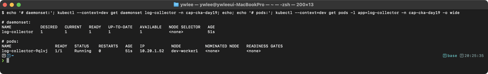
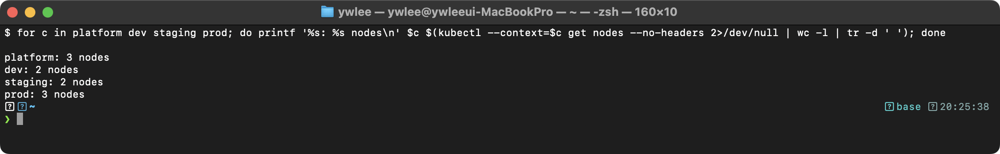
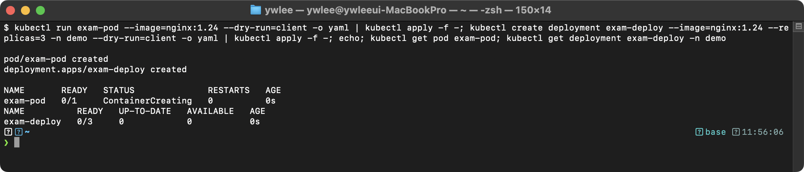

# CKA Day 19: 모의시험 Part 1 (문제 1~14)

> 학습 목표 | CKA 도메인: 전 도메인 종합 (100%) | 예상 소요 시간: 2.5시간 (시험 120분 + 풀이 30분)

**전제 학습 연결:** day1~day18 에서 Deployment·Pod·RBAC·NetworkPolicy·PV/PVC·Taint/Toleration·Service·Ingress·Job·etcd 백업·노드 drain·트러블슈팅을 각각 따로 배웠다. day19 는 그 전 도메인을 시간 제약(120분) 아래에서 한 번에 풀어보는 모의시험이다(중간 점검 성격, 전체 커리큘럼 순서는 [../README.md](../README.md) 참조). 따라서 이 문서는 각 개념을 처음 설명하기보다, 시험장에서 빠르게 손이 나가는 풀이와 자주 틀리는 함정에 초점을 둔다. 막히는 주제는 해당 day 로 돌아가 복습한다.

**노드 SSH 접속 전제:** 문제 1·3 처럼 control-plane/노드에 직접 들어가야 하는 문제는 SSH 가 필요하다. 이 저장소는 전 노드에 전용 키가 배포돼 있어 두 가지 방법이 모두 동작한다 — ⓐ VM 이름 별칭: `ssh platform-master`(`~/.ssh/config` 의 관리 블록이 `tart ip` 로 IP 를 실시간 조회하므로 재부팅 후에도 그대로 됨, day 의 SSH 설정 편 참조), ⓑ IP 직접: `ssh admin@<노드 IP>`. 아래 풀이는 시험장의 일반형을 보이기 위해 `<...-ip>` 자리표시자를 쓰지만, 이 저장소에서 실습할 때는 별칭(`ssh platform-master`)이 더 빠르다. 노드의 실제 IP 가 필요하면 `kubectl -n kube-system get pod etcd-platform-master -o wide` 의 IP 열에서도 구할 수 있다.

---

## 오늘의 학습 목표

- [ ] 120분 시간 제한 모의시험을 실전처럼 수행한다
- [ ] 14문제(Part 1)를 시간 제한 안에 풀어본다 (나머지 11문제는 [day20 Part 2](day20.md)에서 완성한다)
- [ ] 시간 관리 전략을 체득한다
- [ ] 약점 도메인을 파악하고 보완 계획을 수립한다

---

## 시험 전 준비

### 환경 설정

```bash
# kubeconfig 설정
export KUBECONFIG=kubeconfig/platform.yaml:kubeconfig/dev.yaml:kubeconfig/staging.yaml:kubeconfig/prod.yaml

# vim 설정
echo 'set tabstop=2 shiftwidth=2 expandtab' >> ~/.vimrc

# alias 설정
alias k=kubectl
source <(kubectl completion bash)
complete -o default -F __start_kubectl k
export do="--dry-run=client -o yaml"
```

### 시간 관리 전략

- 총 시간: 120분, 25문제
- 평균 5분/문제, 쉬운 문제 3~4분, 어려운 문제 10~12분
- 배점이 높은 문제(7%)를 우선 풀고, 막히면 다음 문제로 넘어간다
- 마지막 10분은 미완성 문제 재시도에 사용한다

### 시험 전 체크리스트

```
□ kubectl alias 설정 완료 (alias k=kubectl)
□ bash completion 활성화 완료
□ vim 설정 완료 (tabstop=2)
□ 시험 환경에서 kubernetes.io 문서 접근 가능 확인
□ 타이머 120분 설정 완료
```

### 시험 응시 팁 (내부 동작 원리)

```
CKA 시험의 내부 구조:

[1] 시험 환경:
    - 브라우저 기반 터미널 (PSI 환경)
    - 여러 클러스터가 제공됨 (각 문제마다 다른 클러스터)
    - 문제마다 kubectl config use-context <name> 실행 필수!

[2] 채점 방식:
    - 자동 채점 (스크립트로 결과물 확인)
    - 부분 점수 가능 (리소스가 생성되었지만 일부 필드 누락 시)
    - 리소스 이름, 네임스페이스, 이미지 등 정확히 일치해야 함

[3] 시간 관리 전략: 그림 1 참조

[4] 문제 유형별 소요 시간 예상:
    - Deployment/Pod 생성: 2~4분
    - RBAC 설정: 4~6분
    - NetworkPolicy: 5~7분
    - etcd 백업/복원: 5~8분
    - 트러블슈팅: 5~10분
    - PV/PVC 생성: 4~6분
    - Ingress 설정: 4~6분
```


_그림 1. CKA 120분 시험의 시간 관리 전략._

### 시작!

타이머를 120분으로 설정하고 시작하라. 각 문제의 컨텍스트를 반드시 먼저 실행하라.

---

## 모의시험 문제

### 문제 1. [4%] etcd 백업

**컨텍스트:** `kubectl config use-context platform`

`platform` 클러스터의 etcd 스냅샷을 `/opt/etcd-backup-exam.db`에 저장하라.

- etcd 엔드포인트: `https://127.0.0.1:2379`
- 인증서 경로: etcd Pod의 설정에서 확인하라

> 인증서 경로를 어디서 찾는가: etcd 는 control-plane 노드에 static Pod(=kubelet 이 매니페스트 디렉터리에서 직접 띄우는 Pod)로 떠 있다. `kubectl -n kube-system describe pod etcd-<노드명>` 출력의 `Command:` 섹션(= Pod 의 `spec.containers[0].command`)을 보면 etcd 프로세스에 넘긴 플래그가 나열된다. 이 중 세 가지가 etcdctl 백업에 필요하다: `--trusted-ca-file`(또는 `--cacert` 로 쓰는 CA 인증서, 예 `/etc/kubernetes/pki/etcd/ca.crt`), `--cert-file`(서버 인증서 `server.crt`), `--key-file`(서버 개인키 `server.key`). 즉 describe 의 `Command:` 줄에서 `--cert-file=...` `--key-file=...` `--trusted-ca-file=...` 값을 그대로 읽어 아래 etcdctl 의 `--cert` `--key` `--cacert` 에 대입하면 된다. kube-apiserver 도 같은 `/etc/kubernetes/pki/etcd/` 경로의 클라이언트 인증서로 etcd 에 접속하므로 경로 체계는 동일하다.

<details>
<summary>풀이 (시험 후 확인)</summary>

**문제 의도:** etcd 백업 절차와 인증서 경로를 알고 있는가?

**동작 원리:**
```
etcd 백업 흐름:
[1] etcd Pod의 YAML에서 인증서 경로 확인
[2] etcdctl snapshot save 명령으로 스냅샷 저장
[3] etcdctl snapshot status로 스냅샷 유효성 확인

etcd는 Kubernetes의 모든 상태를 저장하는 핵심 데이터 저장소이다.
백업을 통해 클러스터를 특정 시점으로 복원할 수 있다.
```

```bash
kubectl config use-context platform

# 인증서 경로 확인 (방법 1: etcd Pod YAML)
kubectl -n kube-system get pod etcd-platform-master -o yaml | grep -E "cert|key|ca"

# 인증서 경로 확인 (방법 2: etcd Pod의 command)
kubectl -n kube-system describe pod etcd-platform-master | grep -E "\-\-cert|\-\-key|\-\-ca"

# SSH 접속 후 백업 (이 저장소에서는 별칭 'ssh platform-master' 도 됨, 상단 전제 참조)
ssh platform-master
sudo ETCDCTL_API=3 etcdctl snapshot save /opt/etcd-backup-exam.db \
  --endpoints=https://127.0.0.1:2379 \
  --cacert=/etc/kubernetes/pki/etcd/ca.crt \
  --cert=/etc/kubernetes/pki/etcd/server.crt \
  --key=/etc/kubernetes/pki/etcd/server.key

# 스냅샷 확인
sudo ETCDCTL_API=3 etcdctl snapshot status /opt/etcd-backup-exam.db --write-out=table
```

**검증 기대 출력:**



`snapshot status --write-out=table` 은 다음 형태의 표를 출력한다. 값(HASH·REVISION·KEYS)은 클러스터 상태에 따라 다르며, 여기서 확인할 것은 표가 정상적으로 나오는지(= 스냅샷 파일이 손상되지 않았는지)이다.

```
+----------+----------+------------+------------+
|   HASH   | REVISION | TOTAL KEYS | TOTAL SIZE |
+----------+----------+------------+------------+
| <8자리>  |  <숫자>  |   <숫자>   |  <크기>   |
+----------+----------+------------+------------+
```

**시험 출제 패턴:**
- 인증서 경로를 직접 알려주는 경우도 있고, etcd Pod에서 확인하라고 하는 경우도 있다
- endpoint, cacert, cert, key 4가지를 모두 정확히 지정해야 한다
- ETCDCTL_API=3 환경변수를 잊지 말 것

</details>

---

### 문제 2. [7%] RBAC 설정

**컨텍스트:** `kubectl config use-context dev`

다음 RBAC를 설정하라:
1. `demo` 네임스페이스에 `app-developer` Role 생성
   - pods: get, list, watch, create, delete
   - deployments: get, list, create, update
   - services: get, list
2. 사용자 `alex`에게 `app-developer` 바인딩 (RoleBinding 이름: `alex-dev-binding`)
3. `alex`가 `demo` 네임스페이스에서 Pod를 생성할 수 있는지 확인하라

<details>
<summary>풀이</summary>

**문제 의도:** Role/RoleBinding YAML 구조와 apiGroups를 정확히 아는가?

**등장 배경 — 왜 Role/RoleBinding 이 필요한가:** 초기 Kubernetes 에는 세분화된 권한 모델이 없어, 클러스터에 접근하는 주체는 사실상 모든 리소스를 모든 동작으로 다룰 수 있었다(또는 ABAC 처럼 파일 기반 정책으로 관리해 변경마다 apiserver 재시작이 필요했다). 한 팀이 다른 팀의 Secret 을 읽거나 Deployment 를 지워도 막을 방법이 마땅치 않아 멀티테넌트(한 클러스터를 여러 팀·용도가 공유하는) 환경에서 위험했다. v1.6 에서 RBAC(Role-Based Access Control, 역할 기반 접근 제어)가 기본 인가자로 들어오면서, "어떤 주체(user/group/serviceaccount)가 / 어떤 리소스(resource)에 / 어떤 동작(verb: get·list·create·delete 등)을" 할 수 있는지를 선언적 객체로 정의하게 됐다. 비유하면 Unix 의 `chmod` 와 유사하다 — 파일(리소스)에 대한 읽기/쓰기(verb) 권한을 사용자(주체)에게 부여하는 것이다. 트레이드오프는 권한이 기본적으로 "거부(deny by default)"라, 필요한 verb·resource·apiGroup 조합을 하나라도 빠뜨리면 그 동작만 조용히 403 으로 막힌다는 점이다.

**apiGroups 가 왜 갈리는가:** Kubernetes 리소스는 API 그룹별로 버전 관리된다. Pod·Service·ConfigMap 같은 초기 핵심 리소스는 core 그룹(`apiVersion: v1`)에 있고, 이 그룹은 역사적 이유로 그룹명이 비어 있어 `apiGroups: [""]` 로 표기한다(빈 문자열은 오타가 아니라 core 그룹을 가리키는 정식 표기다). 반면 Deployment·ReplicaSet 등은 나중에 `apps` 그룹(`apiVersion: apps/v1`)으로 분리됐으므로 `apiGroups: ["apps"]` 가 필요하다. 즉 Role 의 `apiGroups` 는 대상 리소스가 어느 API 그룹 소속인지에 따라 결정된다.

**동작 원리:**
```
RBAC 인가 흐름:
[1] 사용자 alex가 kubectl create pod 요청
[2] API Server가 인증(Authentication) 수행
[3] RBAC Authorizer가 RoleBinding 확인
    → alex 사용자에게 바인딩된 Role 찾기
[4] Role의 rules에서 pods + create verb 확인
    → 허용되면 요청 처리
    → 거부되면 403 Forbidden
```

```bash
kubectl config use-context dev

# Role 생성 (kubectl create 명령어로)
# ⚠ 주의: kubectl create role 은 --verb/--resource 쌍을 여러 번 나열해도
# 내부적으로 rule 을 하나만 만들어 모든 resource 에 verb 합집합이 적용된다.
# 즉 아래 명령은 pods/deployments/services 모두에 get,list,watch,create,delete,update 가
# 허용되는 단일 rule 이 되어, 의도한 "resource 별 세분화 권한"이 만들어지지 않는다.
# → resource 별로 verb 를 다르게 줘야 한다면 아래 YAML 방식을 대신 사용해야 한다.
kubectl create role app-developer \
  --verb=get,list,watch,create,delete --resource=pods \
  --verb=get,list,create,update --resource=deployments \
  --verb=get,list --resource=services \
  -n demo

# 위 명령이 복잡하면 YAML로
cat <<EOF | kubectl apply -f -
apiVersion: rbac.authorization.k8s.io/v1
kind: Role
metadata:
  name: app-developer
  namespace: demo
rules:
- apiGroups: [""]                      # 빈 문자열 = core API 그룹 (v1: Pod/Service/ConfigMap 등). 오타 아님
  resources: ["pods"]
  verbs: ["get", "list", "watch", "create", "delete"]
- apiGroups: ["apps"]                  # apps API 그룹 (Deployment)
  resources: ["deployments"]
  verbs: ["get", "list", "create", "update"]
- apiGroups: [""]
  resources: ["services"]
  verbs: ["get", "list"]
EOF

# RoleBinding 생성
kubectl create rolebinding alex-dev-binding \
  --role=app-developer \
  --user=alex \
  -n demo

# 확인
kubectl auth can-i create pods --as=alex -n demo
kubectl auth can-i delete deployments --as=alex -n demo
kubectl auth can-i create services --as=alex -n demo
```

**검증 기대 출력:**



`kubectl auth can-i` 는 허용이면 `yes`, 거부면 `no` 한 줄을 출력한다. 위 Role 기준으로는 다음과 같이 나와야 한다(텍스트로 직접 재현·비교 가능).

```
$ kubectl auth can-i create pods --as=alex -n demo
yes
$ kubectl auth can-i delete deployments --as=alex -n demo
no
$ kubectl auth can-i create services --as=alex -n demo
no
```

(Role 에 deployments 의 verb 로 delete 를, services 의 verb 로 create 를 부여하지 않았으므로 둘 다 `no` 이다.)

**내부 동작 원리:** `kubectl auth can-i`는 API Server의 SubjectAccessReview API를 호출하여 RBAC Authorizer에게 권한을 질의한다. API Server는 해당 사용자에게 바인딩된 모든 Role/ClusterRole의 rules를 검색하여 요청된 verb+resource 조합이 허용되는지 판단한다. `--as` 플래그는 impersonation(대리 인증)을 수행한다.

**시험 출제 패턴:**
- apiGroups를 정확히 아는지가 핵심이다 (pods→"", deployments→"apps")
- Role vs ClusterRole, RoleBinding vs ClusterRoleBinding 구분이 필요하다
- `kubectl auth can-i`로 검증하라는 문제가 자주 출제된다

</details>

---

### 문제 3. [4%] Static Pod 생성

**컨텍스트:** `kubectl config use-context staging`

`staging-master` 노드에 Static Pod를 생성하라:
- 이름: `static-busybox`
- 이미지: `busybox:1.36`
- 명령어: `sleep 3600`

<details>
<summary>풀이</summary>

**문제 의도:** Static Pod 의 생성 방법과 manifest 경로를 아는가? Static Pod 는 kubelet 이 직접 관리하는 Pod 로 API Server 를 거치지 않고 특정 노드에서 항상 실행된다. control-plane 컴포넌트(etcd·apiserver·scheduler·controller-manager)가 대표적 예시다. 개념 상세는 [CKA day11 Static Pod 절](day11.md) 참조.

**동작 원리:**
```
Static Pod 생성 흐름:
[1] SSH로 해당 노드 접속
[2] kubelet config에서 staticPodPath 확인
[3] 해당 경로에 YAML 파일 생성
[4] kubelet이 자동으로 감지하여 Pod 생성
[5] API Server에 mirror Pod 생성 (= kubelet이 API Server에 자동 등록하는 읽기 전용 복사본)
```

```bash
# 이 저장소에서는 VM 이름 별칭으로 접속 (staging-master 는 ~/.ssh/config 등록 별칭)
ssh staging-master
# 시험장 일반형: ssh staging-master

# staticPodPath 확인
cat /var/lib/kubelet/config.yaml | grep staticPodPath
# staticPodPath: /etc/kubernetes/manifests

# ⚠ sudo + heredoc 리다이렉트(>) 조합은 리다이렉트가 현재 사용자 권한으로 실행되어
# /etc/kubernetes/manifests/ 에 Permission denied 가 발생한다.
# sudo tee 패턴을 사용해야 tee 자체가 sudo 권한으로 파일을 쓴다.
sudo tee /etc/kubernetes/manifests/static-busybox.yaml <<EOF
apiVersion: v1
kind: Pod
metadata:
  name: static-busybox
spec:
  containers:
  - name: busybox
    image: busybox:1.36
    command: ["sleep", "3600"]
EOF

exit
kubectl config use-context staging
kubectl get pods -A | grep static-busybox
```

**mirror Pod 란:** kubelet 이 Static Pod 를 생성하면 API Server 에 같은 이름의 "mirror Pod"(읽기 전용 복사본)를 자동 등록한다. `kubectl get pods -A` 에는 보이지만 `kubectl delete` 로 지우면 kubelet 이 즉시 재생성하므로 삭제하려면 노드에 SSH 해서 manifest YAML 파일을 직접 제거해야 한다.

</details>

---

### 문제 4. [7%] Deployment 생성 및 Rolling Update

**컨텍스트:** `kubectl config use-context prod`

1. Deployment `web-frontend` 생성 (이미지: `nginx:1.24`, 레플리카: 4, 포트: 80)
2. maxSurge=2, maxUnavailable=1로 전략 설정
3. 이미지를 `nginx:1.25`로 업데이트
4. 롤백하여 원래 이미지(`nginx:1.24`)로 복원

<details>
<summary>풀이</summary>

**문제 의도:** Deployment 생성, 전략 설정, 업데이트, 롤백을 모두 수행할 수 있는가?

**RollingUpdate 전략 두 파라미터 풀이:** RollingUpdate 는 Pod 를 한꺼번에 교체하지 않고 몇 개씩 점진적으로 새 버전으로 바꾸는 방식이다. 이때 두 값이 교체 속도와 가용성의 균형을 정한다. replica=4 기준으로 보면,
- **maxSurge=2**: 목표 개수(4)를 넘어 동시에 추가로 띄울 수 있는 Pod 수. 즉 교체 중 최대 `4 + 2 = 6` 개까지 존재할 수 있다. 값이 클수록 새 Pod 를 미리 많이 띄워 빠르게 전환되지만 그만큼 리소스(CPU·메모리)가 더 든다.
- **maxUnavailable=1**: 교체 중 동시에 Ready 가 아니어도 되는 Pod 수. 즉 항상 `4 - 1 = 3` 개는 Ready 를 유지한다. 값을 0 으로 두면 다운타임 없이 교체되지만, 새 Pod 가 Ready 되기 전엔 기존 Pod 를 못 내려 더 느려진다.

두 값은 백분율(예 `25%`)로도 지정할 수 있다. 트레이드오프 요약: maxSurge 를 높이면 빠르되 리소스를 더 쓰고, maxUnavailable 을 낮추면 가용성이 좋되 느려진다.

```bash
kubectl config use-context prod

cat <<EOF | kubectl apply -f -
apiVersion: apps/v1
kind: Deployment
metadata:
  name: web-frontend
spec:
  replicas: 4
  selector:
    matchLabels:
      app: web-frontend
  strategy:
    type: RollingUpdate
    rollingUpdate:
      maxSurge: 2
      maxUnavailable: 1
  template:
    metadata:
      labels:
        app: web-frontend
    spec:
      containers:
      - name: nginx
        image: nginx:1.24
        ports:
        - containerPort: 80
EOF

kubectl rollout status deployment/web-frontend

# 이미지 업데이트
kubectl set image deployment/web-frontend nginx=nginx:1.25
kubectl rollout status deployment/web-frontend

# 현재 이미지 확인
kubectl get deployment web-frontend -o jsonpath='{.spec.template.spec.containers[0].image}'
echo ""

# 롤백
kubectl rollout undo deployment/web-frontend
kubectl rollout status deployment/web-frontend

# 롤백 후 이미지 확인
kubectl get deployment web-frontend -o jsonpath='{.spec.template.spec.containers[0].image}'
echo ""
```

**검증 기대 출력:**



위 명령 흐름에서 두 번의 이미지 조회는 다음과 같이 나와야 한다(jsonpath 로 이미지 한 줄만 출력).

```
# set image 직후
nginx:1.25
# rollout undo 직후
nginx:1.24
```

**내부 동작 원리:** `kubectl set image`를 실행하면 Deployment의 `spec.template`이 변경되어 새로운 ReplicaSet이 생성된다. maxSurge=2이므로 기존 4개 + 새 2개 = 최대 6개의 Pod가 동시에 존재할 수 있고, maxUnavailable=1이므로 최소 3개의 Pod는 항상 Ready 상태를 유지한다. `kubectl rollout undo`는 이전 ReplicaSet의 template으로 되돌리는 것이다.

</details>

---

### 문제 5. [4%] NodePort Service 생성

**컨텍스트:** `kubectl config use-context prod`

`web-frontend` Deployment를 위한 NodePort Service를 생성하라:
- 이름: `web-frontend-svc`
- 포트: 80
- NodePort: 30180

<details>
<summary>풀이</summary>

**문제 의도:** Service YAML의 port/targetPort/nodePort 필드를 정확히 아는가?

```bash
cat <<EOF | kubectl apply -f -
apiVersion: v1
kind: Service
metadata:
  name: web-frontend-svc
spec:
  type: NodePort
  selector:
    app: web-frontend                  # Deployment의 Pod 라벨과 일치해야!
  ports:
  - port: 80                           # Service 포트 (ClusterIP에서 접근하는 포트)
    targetPort: 80                     # 컨테이너 포트
    nodePort: 30180                    # 노드에서 접근하는 포트 (30000-32767)
EOF

kubectl get svc web-frontend-svc
kubectl get endpoints web-frontend-svc
```

**검증 기대 출력:**



**시험 출제 패턴:**
- `kubectl expose`로 빠르게 생성 후 nodePort를 edit으로 추가하는 방법도 가능하다
- selector가 Pod 라벨과 일치하지 않으면 Endpoints가 비어있다

</details>

---

### 문제 6. [7%] NetworkPolicy 생성

**컨텍스트:** `kubectl config use-context dev`

`demo` 네임스페이스에 다음 NetworkPolicy를 생성하라:
- 이름: `db-policy`
- 대상: `app=postgres` Pod
- 인바운드 허용: `tier=backend` Pod에서 TCP 5432만 허용
- 그 외 인바운드는 차단

<details>
<summary>풀이</summary>

**문제 의도:** NetworkPolicy의 podSelector, ingress 규칙을 정확히 작성할 수 있는가?

**동작 원리:**
```
NetworkPolicy 처리 흐름:
[1] NetworkPolicy 생성 → CNI 플러그인이 감지
[2] podSelector로 대상 Pod 식별 (app=postgres)
[3] policyTypes에 Ingress가 있으면:
    → ingress 규칙에 매칭되는 트래픽만 허용
    → 매칭되지 않는 트래픽은 모두 차단
[4] CNI가 iptables/eBPF 규칙으로 네트워크 필터링 적용

주의: NetworkPolicy가 없는 Pod는 모든 트래픽 허용 (기본 동작)
     NetworkPolicy가 적용되면 명시적으로 허용된 트래픽만 통과
```

**`from` 의 소스 지정 풀이:** ingress 규칙의 `from` 은 허용할 출발지를 고르는 부분으로, 세 가지 셀렉터를 쓸 수 있다 — `podSelector`(라벨로 Pod 선택), `namespaceSelector`(라벨로 네임스페이스 선택), `ipBlock`(CIDR 로 IP 범위). 조합 규칙이 시험에서 자주 헷갈린다:
- `from` 아래에 **항목을 여러 개**(`- ` 가 여럿) 나열하면 그들 사이는 **OR**(어느 하나라도 매칭되면 허용)다.
- **한 항목 안에서** `podSelector` 와 `namespaceSelector` 를 **같이** 쓰면 **AND**(그 네임스페이스 안의 그 라벨 Pod)다.
- `podSelector` 만 있으면 **이 NetworkPolicy 와 같은 네임스페이스 내부**의 Pod 만 대상이다. 다른 네임스페이스의 Pod 를 허용하려면 같은 항목에 `namespaceSelector` 를 추가해야 한다.

예를 들어 다른 네임스페이스(`name: demo`)의 `tier: backend` Pod 만 허용하려면 한 항목 안에 둘을 묶는다(AND):
```yaml
  ingress:
  - from:
    - namespaceSelector:
        matchLabels:
          name: demo
      podSelector:
        matchLabels:
          tier: backend
```
아래 문제는 "같은 네임스페이스의 `tier: backend`"만 허용하면 되므로 `podSelector` 하나로 충분하다.

```bash
kubectl config use-context dev

cat <<EOF | kubectl apply -f -
apiVersion: networking.k8s.io/v1
kind: NetworkPolicy
metadata:
  name: db-policy
  namespace: demo
spec:
  podSelector:                         # 이 정책이 적용될 Pod (대상)
    matchLabels:
      app: postgres
  policyTypes:                         # 정책 유형 (Ingress, Egress 또는 둘 다)
  - Ingress                            # 인바운드 규칙만 적용
  ingress:
  - from:                              # 허용할 소스
    - podSelector:                     # 같은 네임스페이스의 Pod
        matchLabels:
          tier: backend
    ports:                             # 허용할 포트
    - protocol: TCP
      port: 5432
EOF

kubectl describe networkpolicy db-policy -n demo
```

**검증 기대 출력:**



**시험 출제 패턴:**
- from에 podSelector와 namespaceSelector를 조합하는 문제가 출제된다
- podSelector가 비어있으면({}) 네임스페이스의 모든 Pod를 선택한다
- ingress가 비어있으면([]) 모든 인바운드가 차단된다
- ingress를 생략하면 모든 인바운드가 허용된다

</details>

---

### 문제 7. [7%] PV와 PVC 생성 및 Pod 마운트

**컨텍스트:** `kubectl config use-context staging`

1. PV `exam-pv`: 5Gi, RWO, hostPath `/opt/exam-data`, storageClassName `exam-storage`
2. PVC `exam-pvc`: 3Gi, RWO, storageClassName `exam-storage`
3. Pod `exam-pod`: nginx 이미지, PVC를 `/usr/share/nginx/html`에 마운트

<details>
<summary>풀이</summary>

**문제 의도:** PV-PVC 바인딩 조건과 Pod 볼륨 마운트를 이해하는가?

**동작 원리:**
```
PV-PVC 바인딩 흐름:
[1] PV 생성 (관리자가 생성)
    - capacity: 5Gi
    - accessModes: RWO
    - storageClassName: exam-storage

[2] PVC 생성 (개발자가 요청)
    - requests.storage: 3Gi (PV capacity 이하여야 함)
    - accessModes: RWO (PV와 일치해야 함)
    - storageClassName: exam-storage (PV와 일치해야 함)

[3] PV Controller가 바인딩 수행
    - storageClassName 일치 확인
    - accessModes 일치 확인
    - capacity >= requests 확인
    → 조건 충족 시 PV와 PVC 바인딩

[4] Pod가 PVC를 볼륨으로 사용
    - volumes에서 PVC 참조
    - volumeMounts로 컨테이너 경로에 마운트
```

```bash
kubectl config use-context staging

cat <<EOF | kubectl apply -f -
apiVersion: v1
kind: PersistentVolume
metadata:
  name: exam-pv
spec:
  capacity:
    storage: 5Gi                       # PV 용량
  accessModes:
  - ReadWriteOnce                      # 단일 노드에서 읽기/쓰기
  storageClassName: exam-storage       # 스토리지 클래스 이름 (PVC와 매칭)
  hostPath:
    path: /opt/exam-data               # 노드의 실제 경로
---
apiVersion: v1
kind: PersistentVolumeClaim
metadata:
  name: exam-pvc
spec:
  accessModes:
  - ReadWriteOnce                      # PV의 accessModes와 일치해야 함
  resources:
    requests:
      storage: 3Gi                     # 요청 용량 (PV capacity 이하)
  storageClassName: exam-storage       # PV의 storageClassName과 일치해야 함
---
apiVersion: v1
kind: Pod
metadata:
  name: exam-pod
spec:
  containers:
  - name: nginx
    image: nginx
    volumeMounts:
    - name: data                       # volumes의 name과 일치
      mountPath: /usr/share/nginx/html # 컨테이너 내부 경로
  volumes:
  - name: data                         # volumeMounts의 name과 일치
    persistentVolumeClaim:
      claimName: exam-pvc              # PVC 이름
EOF

kubectl get pv exam-pv
kubectl get pvc exam-pvc
kubectl get pod exam-pod
```

</details>

---

### 문제 8. [4%] Taint와 Toleration

**컨텍스트:** `kubectl config use-context dev`

> **실습 클러스터 주의:** Taint 추가는 노드 스케줄링에 직접 영향을 주는 파괴 실습이다. CLAUDE.md §3 정책상 prod 클러스터는 "읽기 위주, 데모 외 변경 자제"이므로, 이 저장소에서 실습할 때는 **dev 클러스터의 dev-worker1** 을 대상으로 한다. CKA 시험 문제에서는 지정된 클러스터/노드 이름을 그대로 따른다.

1. `dev-worker1`에 `dedicated=special:NoSchedule` Taint를 추가하라
2. 이 Taint를 tolerate하는 Pod `special-pod` (이미지: nginx)를 생성하라

<details>
<summary>풀이</summary>

**문제 의도:** Taint 를 노드에 추가하고, 해당 Taint 를 허용하는 Toleration 을 Pod 에 설정할 수 있는가?

**동작 원리 — Taint 3종 효과 비교:**

Taint(오염)는 노드에 부착하는 반발력이다. 기본 동작은 "이 노드에 스케줄링하지 말라"이며, Pod 가 Toleration(내성)을 선언해야만 그 반발을 무력화할 수 있다. 효과(effect)는 세 가지다:

| effect | 의미 | 동작 |
|:--|:--|:--|
| `NoSchedule` | 스케줄링 거부 | Toleration 없는 Pod 는 이 노드에 새로 배치하지 않는다. 이미 실행 중인 Pod 는 퇴거하지 않는다. |
| `PreferNoSchedule` | 스케줄링 기피 | Toleration 없는 Pod 를 가능하면 배치하지 않는다. 다른 노드가 없으면 배치될 수도 있다(소프트 제약). |
| `NoExecute` | 스케줄링 거부 + 기존 Pod 퇴거 | 새 Pod 도 막고, Toleration 없이 이미 실행 중인 Pod 도 즉시 퇴거(Evict)한다. `tolerationSeconds` 로 퇴거 유예 시간을 줄 수 있다. |

**Taint 제거 방법(시험 함정):** `kubectl taint nodes <노드명> <key>=<value>:<effect>-` 처럼 끝에 `-`를 붙인다. 예: `kubectl taint nodes dev-worker1 dedicated=special:NoSchedule-`(이 저장소 dev 환경 기준; 시험에서는 지정된 노드 이름으로 교체).

```bash
kubectl config use-context dev

kubectl taint nodes dev-worker1 dedicated=special:NoSchedule

cat <<EOF | kubectl apply -f -
apiVersion: v1
kind: Pod
metadata:
  name: special-pod
spec:
  tolerations:
  - key: "dedicated"
    operator: "Equal"
    value: "special"
    effect: "NoSchedule"
  containers:
  - name: nginx
    image: nginx
EOF

kubectl get pod special-pod -o wide

# 실습 후 Taint 제거 (이 저장소 dev 클러스터 정리용)
kubectl taint nodes dev-worker1 dedicated=special:NoSchedule-
```

**시험 출제 패턴:**
- Taint 를 추가하면서 동시에 Toleration 을 가진 Pod 를 만드는 두 단계 문제가 자주 나온다
- `operator: "Exists"` 를 쓰면 `value` 없이 key 만 일치하면 Toleration 이 성립한다
- Taint 제거 명령(끝에 `-`)을 묻는 문제도 출제된다
- `NoExecute` effect 에 `tolerationSeconds` 를 추가하면 지정 시간 후에 퇴거된다

</details>

---

### 문제 9. [7%] 노드 drain 및 업그레이드 준비

**컨텍스트:** `kubectl config use-context staging`

`staging-worker1` 노드를 유지보수 모드로 전환하라:
1. 노드의 모든 워크로드를 안전하게 퇴거하라 (DaemonSet 무시)
2. 새로운 Pod가 스케줄링되지 않도록 하라
3. 유지보수 완료 후 노드를 정상 상태로 복원하라

<details>
<summary>풀이</summary>

**문제 의도:** kubectl drain과 uncordon의 사용법을 아는가?

**동작 원리:**
```
kubectl drain 내부 동작:
[1] 노드를 SchedulingDisabled (cordon) 상태로 변경
    → spec.unschedulable = true
    → 새 Pod 스케줄링 차단

[2] 해당 노드의 모든 Pod 퇴거 (eviction)
    → DaemonSet Pod는 --ignore-daemonsets로 무시
    → emptyDir 데이터는 --delete-emptydir-data로 삭제 허용
    → PodDisruptionBudget 존중 (위반 시 대기)

[3] Pod 퇴거 시:
    → ReplicaSet/Deployment 관리 Pod → 다른 노드에 재생성
    → Static Pod → 그대로 유지 (kubelet 관리)
    → 관리되지 않는 Pod → --force 없으면 거부

kubectl uncordon 내부 동작:
[1] 노드를 SchedulingDisabled 해제
    → spec.unschedulable = false
    → 새 Pod 스케줄링 허용
[2] 기존에 퇴거된 Pod가 자동으로 돌아오지는 않음!
```

```bash
kubectl config use-context staging

# drain (퇴거)
kubectl drain staging-worker1 --ignore-daemonsets --delete-emptydir-data
kubectl get nodes
# staging-worker1: SchedulingDisabled

# 유지보수 완료 후 uncordon
kubectl uncordon staging-worker1
kubectl get nodes
# staging-worker1: Ready
```

**시험 출제 패턴:**
- `--ignore-daemonsets` 플래그를 잊으면 에러 발생
- `--delete-emptydir-data`가 필요한 경우가 있음
- cordon만으로는 기존 Pod를 퇴거하지 않음 (drain과의 차이)

</details>

---

### 문제 10. [4%] DaemonSet 생성

**컨텍스트:** `kubectl config use-context dev`

`kube-system` 네임스페이스에 DaemonSet `log-collector`를 생성하라:
- 이미지: `busybox:1.36`
- 명령어: `sh -c "while true; do echo collecting; sleep 60; done"`
- 모든 Worker Node에서 실행

<details>
<summary>풀이</summary>

**문제 의도:** DaemonSet 을 생성하고 모든 노드에 Pod 가 자동 배치됨을 확인할 수 있는가? DaemonSet 은 "로그 수집 에이전트나 모니터링 에이전트처럼 각 노드에 반드시 하나씩 떠야 하는 컴포넌트"를 위한 워크로드다. Deployment 로는 replica 수를 수동으로 맞춰야 하고 노드가 늘어도 자동 배치가 안 된다. 개념 상세는 [CKA day12 DaemonSet 절](day12.md) 참조.

```bash
kubectl config use-context dev

cat <<EOF | kubectl apply -f -
apiVersion: apps/v1
kind: DaemonSet
metadata:
  name: log-collector
  namespace: kube-system
spec:
  selector:
    matchLabels:
      app: log-collector
  template:
    metadata:
      labels:
        app: log-collector
    spec:
      containers:
      - name: collector
        image: busybox:1.36
        command: ["sh", "-c", "while true; do echo collecting; sleep 60; done"]
EOF

kubectl get daemonset log-collector -n kube-system
kubectl get pods -n kube-system -l app=log-collector -o wide
```

**검증 기대 출력:**



**내부 동작 원리:** DaemonSet Controller는 모든 노드(또는 nodeSelector로 필터링된 노드)에 정확히 하나의 Pod를 배치한다. 새 노드가 클러스터에 추가되면 자동으로 해당 노드에 Pod가 생성되고, 노드가 제거되면 해당 Pod도 함께 삭제된다. Master 노드에는 기본적으로 NoSchedule Taint가 있으므로, toleration을 추가하지 않으면 Worker 노드에서만 실행된다.

</details>

---

### 문제 11. [7%] Ingress 생성

**컨텍스트:** `kubectl config use-context dev`

`demo` 네임스페이스에 Ingress를 생성하라:
- 이름: `demo-ingress`
- 호스트: `demo.tart.local`
- `/api` → `httpbin` Service (포트 8000)
- `/` → `nginx-web` Service (포트 80)
- pathType: Prefix

<details>
<summary>풀이</summary>

**문제 의도:** Ingress YAML의 rules, paths, backend 구조를 아는가?

**전제 확인 — Ingress Controller 설치 여부:** Ingress 리소스는 Ingress Controller(예: nginx-ingress)가 클러스터에 설치돼 있어야 실제로 동작한다. 이 저장소 dev 클러스터에서는 먼저 `kubectl get pods -n ingress-nginx` 로 Controller 설치 여부를 확인한다. Controller 가 없으면 Ingress 를 apply 해도 `ADDRESS` 필드가 비어 있어 실제 트래픽 테스트는 불가하다. CKA 시험 환경에는 Controller 가 설치돼 있으므로 시험에서는 이 확인이 불필요하다.

**동작 원리:**
```
Ingress 트래픽 흐름:
[1] 클라이언트가 demo.tart.local/api로 요청
[2] Ingress Controller(nginx)가 요청 수신
[3] Ingress 규칙 매칭:
    ├── /api → httpbin:8000
    └── /    → nginx-web:80
[4] 매칭된 백엔드 Service로 트래픽 전달
[5] Service가 Pod로 트래픽 전달

pathType:
  - Exact: 정확히 일치 (/api만 매칭, /api/v1은 불일치)
  - Prefix: 접두사 일치 (/api, /api/v1, /api/v2 모두 매칭)
  - ImplementationSpecific: Ingress Controller에 따라 다름
```

```bash
kubectl config use-context dev

cat <<EOF | kubectl apply -f -
apiVersion: networking.k8s.io/v1
kind: Ingress
metadata:
  name: demo-ingress
  namespace: demo
spec:
  rules:
  - host: demo.tart.local
    http:
      paths:
      - path: /api
        pathType: Prefix
        backend:
          service:
            name: httpbin
            port:
              number: 8000
      - path: /
        pathType: Prefix
        backend:
          service:
            name: nginx-web
            port:
              number: 80
EOF

kubectl get ingress demo-ingress -n demo
```

**시험 출제 패턴 — ingressClassName 함정:**
- k8s 1.18+ 환경(CKA 시험 환경 포함)에서 클러스터에 Ingress Controller 가 여러 개일 때, `spec.ingressClassName` 을 명시하지 않으면 어느 Controller 가 이 Ingress 를 처리해야 하는지 알 수 없어 Ingress 가 동작하지 않을 수 있다.
- 시험 문제가 Ingress Controller 이름(예: `nginx`)을 알려주면 `spec.ingressClassName: nginx` 를 추가한다.
- 위 YAML 에 추가하는 경우: `spec:` 아래 첫 줄에 `ingressClassName: nginx` 를 넣는다.
- Controller 이름을 확인하려면: `kubectl get ingressclass` 로 클러스터에 등록된 IngressClass 목록을 확인한다.

</details>

---

### 문제 12. [4%] Job 생성

**컨텍스트:** `kubectl config use-context dev`

`demo` 네임스페이스에 Job을 생성하라:
- 이름: `report-job`
- 이미지: `busybox:1.36`
- 명령어: `sh -c "echo Report generated at $(date) > /dev/stdout"`
- completions: 3
- parallelism: 2

<details>
<summary>풀이</summary>

**문제 의도:** Job 의 `completions`·`parallelism` 필드를 정확히 설정하고, Pod 가 지정 횟수만큼 정상 종료됨을 확인할 수 있는가? Job 은 "한 번만 실행하고 끝나는 배치 작업"을 위한 워크로드다. Deployment 로 배치 작업을 돌리면 Pod 가 완료 후에도 재시작되므로 용도에 맞지 않는다. 개념 상세는 [CKA day13 Job·CronJob 절](day13.md) 참조.

**completions 와 parallelism 의 의미:**
- `completions: 3` — 이 Job 이 "완료됐다"고 인정받으려면 Pod 가 정상 종료(exit 0)를 3회 달성해야 한다.
- `parallelism: 2` — 동시에 최대 2개의 Pod 를 실행한다. 남은 completions 가 parallelism 보다 작으면 그 수만큼만 동시에 뜬다.
- 실행 순서(completions=3, parallelism=2): 1회차에 Pod 2개 동시 실행 → 먼저 끝나는 Pod 발생 시 3번째 Pod 시작 → 총 3번 완료 후 Job 이 Complete.

**restartPolicy — Never vs OnFailure:**
- `Never`: Pod 가 실패(exit non-0)하면 재시작하지 않고 새 Pod 를 생성한다. 실패한 Pod 는 그대로 남아 로그 확인이 가능하다. Job 에서 권장.
- `OnFailure`: 같은 Pod 를 재시작한다. Pod 개수는 늘어나지 않지만 실패 로그가 덮일 수 있다.

```bash
kubectl config use-context dev

cat <<EOF | kubectl apply -f -
apiVersion: batch/v1
kind: Job
metadata:
  name: report-job
  namespace: demo
spec:
  completions: 3
  parallelism: 2
  template:
    spec:
      restartPolicy: Never
      containers:
      - name: reporter
        image: busybox:1.36
        command: ["sh", "-c", "echo Report generated && date"]
EOF

kubectl get job report-job -n demo
kubectl get pods -n demo -l job-name=report-job
```

</details>

---

### 문제 13. [4%] 클러스터 정보 조회

**컨텍스트:** `kubectl config use-context platform`

다음 정보를 `/tmp/cluster-info.txt`에 저장하라:
1. 클러스터의 모든 노드 이름과 역할
2. kube-apiserver의 `--service-cluster-ip-range` 값

<details>
<summary>풀이</summary>

**문제 의도:** 클러스터 정보를 다양한 방법으로 조회할 수 있는가?

```bash
kubectl config use-context platform

# 노드 정보 -- 방법 1: kubectl get nodes 기본 출력 (ROLES 컬럼이 기본 포함됨, worker 도 표시)
kubectl get nodes --no-headers > /tmp/cluster-info.txt

# 노드 정보 -- 방법 2: custom-columns 로 NAME·ROLES 만 뽑을 때
# node-role.kubernetes.io/control-plane 라벨은 control-plane 노드에만 있고
# worker 노드는 이 라벨이 없어 ROLES 컬럼이 빈 칸으로 나온다.
# worker 역할까지 표시하려면 worker 라벨 컬럼도 함께 지정해야 한다.
kubectl get nodes -o custom-columns='NAME:.metadata.name,CONTROL-PLANE:.metadata.labels.node-role\.kubernetes\.io/control-plane,WORKER:.metadata.labels.node-role\.kubernetes\.io/worker' > /tmp/cluster-info.txt

# service-cluster-ip-range
kubectl -n kube-system get pod -l component=kube-apiserver -o yaml | grep service-cluster-ip-range >> /tmp/cluster-info.txt

cat /tmp/cluster-info.txt
```

</details>

---

### 문제 14. [7%] Pod 트러블슈팅

**컨텍스트:** `kubectl config use-context dev`

`demo` 네임스페이스의 `broken-app` Pod가 정상 동작하지 않는다. 문제를 진단하고 수정하라.

(시뮬레이션: 잘못된 이미지 태그 + 잘못된 command)

<details>
<summary>풀이</summary>

**문제 의도:** Pod 상태를 보고 문제를 진단하고 수정할 수 있는가?

**동작 원리 -- 트러블슈팅 흐름:**
```
Pod 문제 진단 단계별 접근법:

[1] kubectl get pod <name> -n <ns>
    → STATUS 확인:
    ├── Pending: 스케줄링 문제 (리소스 부족, nodeSelector 미매칭, Taint)
    ├── ImagePullBackOff/ErrImagePull: 이미지 풀 실패
    ├── CrashLoopBackOff: 컨테이너 반복 충돌
    ├── Error: 컨테이너 실행 오류
    └── Running (but not Ready): Probe 실패

[2] kubectl describe pod <name> -n <ns>
    → Events 섹션 확인:
    ├── Failed to pull image: 이미지 이름/태그 오류
    ├── FailedScheduling: 스케줄링 실패 원인
    ├── Back-off restarting: 컨테이너 반복 재시작
    └── Unhealthy: Probe 실패 상세

[3] kubectl logs <name> -n <ns>
    → 컨테이너 로그 확인
    → --previous: 이전 컨테이너 로그

[4] 수정 방법:
    ├── Pod 삭제 후 올바른 YAML로 재생성
    ├── kubectl edit pod <name> (제한적)
    └── Deployment 관리 Pod는 Deployment를 수정
```

```bash
kubectl config use-context dev

# 장애 생성
cat <<EOF | kubectl apply -f -
apiVersion: v1
kind: Pod
metadata:
  name: broken-app
  namespace: demo
spec:
  containers:
  - name: app
    image: nginx:nonexistent
    command: ["invalid-command"]
EOF

# 진단
kubectl get pod broken-app -n demo
# STATUS: ImagePullBackOff 또는 ErrImagePull

kubectl describe pod broken-app -n demo | grep -A10 Events
# Failed to pull image "nginx:nonexistent"

kubectl logs broken-app -n demo --previous 2>/dev/null

# 수정
kubectl delete pod broken-app -n demo
cat <<EOF | kubectl apply -f -
apiVersion: v1
kind: Pod
metadata:
  name: broken-app
  namespace: demo
spec:
  containers:
  - name: app
    image: nginx:1.24
EOF

kubectl get pod broken-app -n demo
# STATUS: Running
```

</details>

---

## tart-infra 실습

### 실습 환경 설정

```bash
# 모의시험과 동일하게 4개 클러스터 kubeconfig 로드
export KUBECONFIG=~/sideproejct/IaC_apple_sillicon/kubeconfig/platform.yaml:~/sideproejct/IaC_apple_sillicon/kubeconfig/dev.yaml:~/sideproejct/IaC_apple_sillicon/kubeconfig/staging.yaml:~/sideproejct/IaC_apple_sillicon/kubeconfig/prod.yaml

# 시험용 alias 설정
alias k=kubectl
```

### 실습 1: 컨텍스트 전환 속도 연습

```bash
# 모든 컨텍스트 확인
kubectl config get-contexts -o name

# 빠르게 컨텍스트 전환하며 각 클러스터 노드 수 확인 (시간 측정)
time (
  for ctx in platform dev staging prod; do
    kubectl config use-context $ctx > /dev/null
    echo "$ctx: $(kubectl get nodes --no-headers | wc -l) nodes"
  done
)
```

**예상 출력 (실측 노드 수. 단 이 저장소의 4개 kubeconfig 는 컨텍스트 이름이 모두
`kubernetes-admin@kubernetes` 라 위 `use-context platform/dev/...` 루프는 그대로 동작하지 않는다.
이 저장소에서는 아래 두 가지 방법 중 하나를 사용한다):**

**방법 A — `--kubeconfig` 로 kubeconfig 파일을 각각 지정:**

```bash
for c in platform dev staging prod; do
  echo "$c: $(kubectl --kubeconfig ~/sideproejct/IaC_apple_sillicon/kubeconfig/${c}.yaml get nodes --no-headers | wc -l) nodes"
done
```

**방법 B — 컨텍스트를 클러스터명으로 rename 한 뒤 루프 사용 (1회만 설정하면 이후 재사용 가능):**

```bash
# 각 kubeconfig 의 컨텍스트를 클러스터명으로 rename
for c in platform dev staging prod; do
  kubectl --kubeconfig ~/sideproejct/IaC_apple_sillicon/kubeconfig/${c}.yaml \
    config rename-context kubernetes-admin@kubernetes $c 2>/dev/null || true
done

# 이후에는 원래 루프 그대로 사용 가능
time (
  for ctx in platform dev staging prod; do
    kubectl config use-context $ctx > /dev/null
    echo "$ctx: $(kubectl get nodes --no-headers | wc -l) nodes"
  done
)
```

**검증 - 기대 출력:**


**동작 원리:**
1. CKA 시험에서는 매 문제마다 `kubectl config use-context` 전환이 필요하다
2. 컨텍스트 전환 실수로 잘못된 클러스터에서 작업하면 해당 문제는 0점이다
3. `--no-headers`와 `wc -l`로 빠르게 노드 수를 파악하는 패턴을 숙지한다

### 실습 2: 시험 빈출 패턴 - 빠른 리소스 생성

```bash
kubectl config use-context dev

# dry-run으로 YAML 생성 후 수정 적용 (시험 핵심 패턴)
kubectl run exam-pod --image=nginx:1.24 --dry-run=client -o yaml | \
  kubectl apply -f -

# Deployment 빠른 생성
kubectl create deployment exam-deploy --image=nginx:1.24 --replicas=3 -n demo --dry-run=client -o yaml | \
  kubectl apply -f -

# 확인
kubectl get pod exam-pod
kubectl get deployment exam-deploy -n demo

# 정리
kubectl delete pod exam-pod
kubectl delete deployment exam-deploy -n demo
```

**검증 - 기대 출력:** `dry-run` YAML 을 파이프로 `apply` 하면 Pod·Deployment 가 한 번에 생성되고, `get` 으로 생성·레플리카(3/3)를 확인한다(dev 실측).


**동작 원리:**
1. `--dry-run=client -o yaml`은 API Server에 전송하지 않고 YAML만 출력한다
2. 파이프로 `kubectl apply -f -`에 전달하면 한 번에 생성할 수 있다
3. YAML 수정이 필요하면 파이프 대신 파일로 저장(`> pod.yaml`)한 후 vim으로 편집한다
4. 시험에서 YAML을 처음부터 작성하는 것보다 이 방식이 2-3배 빠르다

### 실습 3: 멀티 클러스터 상태 종합 점검

```bash
# 전 클러스터 비정상 Pod 한번에 확인 (시험 시작 전 환경 점검용)
for ctx in platform dev staging prod; do
  echo "=== $ctx ==="
  kubectl --context=$ctx get pods -A --field-selector=status.phase!=Running,status.phase!=Succeeded 2>/dev/null | head -5
done
```

**동작 원리:**
1. `--context=` 플래그로 `use-context` 없이 일시적으로 다른 클러스터에 명령을 보낼 수 있다
2. `--field-selector`는 서버 측 필터링으로 대량 Pod 환경에서도 빠르게 비정상 Pod를 찾는다
3. 시험 시작 시 전체 클러스터 상태를 빠르게 파악해두면 문제 풀이에 도움이 된다

---

## 자가점검

Part 1(14문제) 배점 합계는 **77%**다(4%×8 + 7%×6 = 74%+이지만 실제 합계는 아래 표 기준). 14문제를 풀었으면 아래 기준으로 자기 채점한다.

| 문제 | 배점 | 핵심 채점 기준 |
|:--|:--|:--|
| 1. etcd 백업 | 4% | 스냅샷 파일이 지정 경로에 존재하고 `snapshot status` 가 정상 출력 |
| 2. RBAC | 7% | Role rules 가 resource 별로 분리됐고 RoleBinding 과 `auth can-i` 검증 성공 |
| 3. Static Pod | 4% | `/etc/kubernetes/manifests/` 에 YAML 존재하고 mirror Pod 가 Running |
| 4. Deployment RollingUpdate | 7% | maxSurge/maxUnavailable 정확, 롤백 후 원래 이미지 복원 확인 |
| 5. NodePort Service | 4% | nodePort=30180, Endpoints 비어있지 않음 |
| 6. NetworkPolicy | 7% | podSelector app=postgres, ingress from tier=backend, port 5432 |
| 7. PV/PVC/Pod | 7% | PVC Bound 상태, Pod 볼륨 마운트 경로 정확 |
| 8. Taint/Toleration | 4% | Taint 추가 확인, Pod 가 해당 노드에 배치됨 |
| 9. 노드 drain | 7% | drain 후 SchedulingDisabled, uncordon 후 Ready |
| 10. DaemonSet | 4% | 모든 worker 노드에 Pod 1개씩 배치됨 |
| 11. Ingress | 7% | host/path/backend 정확, 필요 시 ingressClassName 지정 |
| 12. Job | 4% | completions=3 모두 완료, parallelism=2 동시 실행 확인 |
| 13. 클러스터 정보 | 4% | 파일에 노드 이름+역할, service-cluster-ip-range 값 저장 |
| 14. 트러블슈팅 | 7% | 이미지 교체 후 Pod Running 상태 확인 |

**합격 가능 여부 자기 판단:** CKA 합격선 66%. 14문제 중 배점 합계 66% 이상을 맞혔으면 이 파트는 합격 기준 충족이다. 틀린 문제는 해당 day 로 돌아가 복습한다.

<details>
<summary>정답 핵심 요약 (풀기 전에 열지 말 것)</summary>

- **문제 2 함정**: `kubectl create role` 은 rule 을 하나로 병합한다. resource 별 verb 분리는 YAML 방식만 가능.
- **문제 6 함정**: `from` 항목 하나 안에 `podSelector`+`namespaceSelector` 를 같이 쓰면 AND, 여러 항목이면 OR.
- **문제 7 함정**: PVC 의 `requests.storage` 는 PV 의 `capacity` 이하여야 바인딩된다. `storageClassName` 도 일치해야 한다.
- **문제 9 함정**: `--ignore-daemonsets` 없으면 drain 이 에러로 중단된다. `uncordon` 해도 퇴거된 Pod 가 자동으로 돌아오지 않는다(새 Pod 가 다시 스케줄링됨).
- **문제 11 함정**: Ingress Controller 가 여러 개인 환경에서는 `spec.ingressClassName` 을 명시해야 한다.
- **문제 13 함정**: `custom-columns` 로 control-plane 라벨만 출력하면 worker 노드의 ROLES 가 빈 칸이다. `kubectl get nodes --no-headers` 기본 출력이 더 안전하다.

</details>

---

## 시험 팁 요약

| 문제 유형 | 함정 1줄 요약 |
|:--|:--|
| etcd 백업 | `ETCDCTL_API=3` 환경변수 필수, 인증서 3개(`--cacert/--cert/--key`) 모두 지정 |
| RBAC Role | resource 별 verb 를 분리하려면 YAML 방식, `kubectl create role` 단독 명령은 rule 병합됨 |
| Static Pod | `staticPodPath` 는 `/var/lib/kubelet/config.yaml` 에서 확인, 파일 삭제 시 Pod 도 삭제됨 |
| RollingUpdate | `maxSurge`=동시 추가 Pod 수, `maxUnavailable`=동시 불가 Pod 수, 두 값 모두 백분율 가능 |
| NetworkPolicy | `policyTypes` 에 `Ingress` 가 있으면 `ingress` 규칙에 없는 트래픽은 모두 차단, `ingress: []` 는 전체 차단 |
| PV/PVC 바인딩 | `storageClassName`·`accessModes`·`capacity >= requests` 세 조건 모두 일치해야 Bound |
| Taint | 제거는 끝에 `-` 붙임 (`kubectl taint nodes <노드> <key>=<value>:<effect>-`), NoExecute 는 기존 Pod 퇴거 |
| drain | `--ignore-daemonsets` 필수, `--delete-emptydir-data` 는 emptyDir 있을 때 추가, `uncordon` 후 수동 확인 |
| Ingress | k8s 1.18+에서 `spec.ingressClassName` 이 없으면 Controller 선택 불가, `kubectl get ingressclass` 로 확인 |
| Job | `completions` =총 성공 횟수, `parallelism` =동시 Pod 수, `restartPolicy: Never` 권장 |
| 클러스터 정보 | `kubectl get nodes` 기본 출력에 ROLES 컬럼 포함됨, custom-columns 는 worker 라벨 누락 주의 |
| 트러블슈팅 | `kubectl get pod` → STATUS 확인 → `describe` Events → `logs` 순서로 진단 |

---

## 더 읽을거리

- [etcd 백업/복원 공식 문서](https://kubernetes.io/docs/tasks/administer-cluster/configure-upgrade-etcd/#backing-up-an-etcd-cluster)
- [RBAC 공식 문서](https://kubernetes.io/docs/reference/access-authn-authz/rbac/) — Role/ClusterRole/RoleBinding/ClusterRoleBinding
- [Static Pod 공식 문서](https://kubernetes.io/docs/tasks/configure-pod-container/static-pod/)
- [NetworkPolicy 공식 문서](https://kubernetes.io/docs/concepts/services-networking/network-policies/)
- [Taint/Toleration 공식 문서](https://kubernetes.io/docs/concepts/scheduling-eviction/taint-and-toleration/)
- [Ingress 공식 문서](https://kubernetes.io/docs/concepts/services-networking/ingress/) — ingressClassName 포함
- **다음 단계:** [day20 모의시험 Part 2 (문제 15~25)](day20.md)

