# CKA Day 20: 모의시험 Part 2 (문제 15~25) & 자가 평가

> CKA 도메인: 전 도메인 종합 (100%) - Part 2 | 예상 소요 시간: 1.5시간

Day 19(Part 1: 문제 1~14)의 Architecture/Workloads/Services/Storage/Troubleshooting 전 도메인에 이어, Part 2에서는 ConfigMap/Secret·Affinity·MultiContainer·CronJob·ServiceAccount·etcd 복원·노드 관리·리소스 모니터링을 추가로 다룬다.

---

### 문제 15. [4%] ConfigMap과 Secret

**컨텍스트:** `kubectl config use-context dev`

1. ConfigMap `app-settings` 생성: `APP_ENV=production`, `LOG_LEVEL=info`
2. Secret `db-password` 생성: `password=exam-pass-2026`
3. Pod `config-test`에서 ConfigMap은 환경변수로, Secret은 `/secrets`에 볼륨 마운트

<details>
<summary>풀이</summary>

**등장 배경:** ConfigMap/Secret 이 없던 시절에는 설정값(DB 주소, 로그 레벨)과 비밀값(비밀번호, 토큰)을 컨테이너 이미지에 직접 굽거나 매니페스트에 하드코딩했다. 그 결과 환경(dev/prod)마다 이미지를 다시 빌드해야 했고, 비밀번호가 이미지 레이어와 git 에 그대로 남아 유출됐다. ConfigMap 은 설정을, Secret 은 비밀값을 Pod 정의에서 분리해 별도 객체로 관리하게 했다. 같은 이미지를 환경마다 다른 ConfigMap/Secret 과 조합해 재사용한다. Secret 은 ConfigMap 과 거의 같은 구조지만 값을 base64 로 담고, kubelet 이 노드 디스크가 아닌 tmpfs(메모리 기반 파일시스템)에 마운트해 디스크에 평문이 남지 않게 한다는 차이가 있다. 다만 Secret 은 etcd 에 base64 인코딩(암호화가 아니라 단순 인코딩)으로 저장되므로, 실제 암호화는 encryption at rest(저장 시 암호화) 를 별도 설정해야 한다는 트레이드오프가 있다.

**문제 의도:** ConfigMap/Secret 생성과 Pod에서의 사용 방법(환경변수, 볼륨)을 아는가?

```bash
kubectl config use-context dev

# ConfigMap 생성
kubectl create configmap app-settings \
  --from-literal=APP_ENV=production \
  --from-literal=LOG_LEVEL=info \
  -n demo

# Secret 생성
kubectl create secret generic db-password \
  --from-literal=password=exam-pass-2026 \
  -n demo

# Pod 생성
cat <<EOF | kubectl apply -f -
apiVersion: v1
kind: Pod
metadata:
  name: config-test
  namespace: demo
spec:
  containers:
  - name: app
    image: busybox:1.36
    command: ["sh", "-c", "env | grep APP_ && cat /secrets/password && sleep 3600"]
    envFrom:                           # ConfigMap의 모든 키를 환경변수로
    - configMapRef:
        name: app-settings
    volumeMounts:
    - name: secret-vol
      mountPath: /secrets              # Secret을 볼륨으로 마운트
      readOnly: true
  volumes:
  - name: secret-vol
    secret:
      secretName: db-password
EOF

kubectl logs config-test -n demo
```

**검증 기대 출력:**

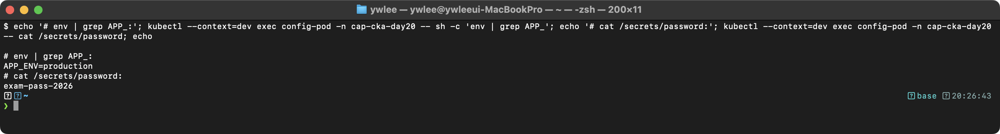

**내부 동작 원리:** `envFrom`은 ConfigMap의 모든 키-값 쌍을 환경변수로 주입한다. Secret 볼륨 마운트 시 kubelet이 Secret 데이터를 tmpfs에 base64 디코딩하여 파일로 기록한다. 각 key가 파일 이름이 되고 value가 파일 내용이 된다. Secret은 etcd에 base64 인코딩으로 저장되며, encryption at rest를 별도 설정해야 실제 암호화된다.

**시험 출제 패턴:**
- envFrom vs env의 차이를 구분해야 한다 (전체 주입 vs 개별 키 주입)
- Secret 볼륨 마운트 시 각 key가 파일 이름이 된다
- `kubectl create configmap/secret` 빠른 생성 명령어를 외워야 한다

</details>

---

### 문제 16. [7%] Node Affinity와 Pod Anti-Affinity

**컨텍스트:** `kubectl config use-context prod`

Deployment `ha-app`을 생성하라:
- 이미지: `nginx:1.24`, 레플리카: 3
- Node Affinity: `kubernetes.io/os=linux` (required)
- Pod Anti-Affinity: 같은 Deployment의 Pod가 서로 다른 노드에 배치 (preferred)

<details>
<summary>풀이</summary>

**등장 배경:** 초기 K8s는 Pod를 특정 노드에 배치하려면 `nodeSelector` 필드에 라벨 키-값을 지정하는 방법만 있었다. 이 방식은 정확히 일치하는 라벨만 지원하고(예: `disktype=ssd`), "ssd 또는 nvme 디스크를 가진 노드"처럼 집합(OR) 조건이나 "gpu 라벨이 없는 노드"처럼 제외(NOT In) 조건을 표현할 수 없었다. 또한 서로 다른 Pod끼리 같은 노드에 또는 다른 노드에 배치하는 Pod 간 규칙도 `nodeSelector`로는 불가능했다. Node Affinity는 `In`, `NotIn`, `Exists`, `DoesNotExist`, `Gt`, `Lt` 같은 연산자로 노드 라벨에 대한 복잡한 조건을 표현하게 했다. Pod Affinity/Anti-Affinity는 여기서 한 발 더 나아가 "이미 배치된 다른 Pod의 라벨을 기준으로 같은 위상(topology)에 배치하거나 분산시키는" Pod 간 규칙을 추가했다. 트레이드오프: 규칙이 복잡해질수록 스케줄러가 평가해야 할 조건이 늘어나 스케줄링 지연이 증가하고, 조건이 너무 엄격하면 배치 가능한 노드가 없어 Pod가 Pending 상태에 영구히 머물 수 있다.

**문제 의도:** Node Affinity와 Pod Anti-Affinity를 동시에 설정할 수 있는가?

**필드 이름 읽는 법:** Affinity 의 긴 키 이름은 `<강도>DuringScheduling<강도>DuringExecution` 구조로 두 시점의 강도를 한 이름에 합친 것이다. 앞의 `DuringScheduling` 은 "스케줄링 시점(Pod 를 노드에 배치할 때)"의 규칙이고, 뒤의 `DuringExecution` 은 "이미 실행 중일 때(노드 라벨이 나중에 바뀐 경우)"의 규칙이다.
- `requiredDuringSchedulingIgnoredDuringExecution`: 스케줄링 시점에는 조건을 *반드시(required)* 만족해야 배치되고, 실행 중에 노드 라벨이 바뀌어 조건이 깨져도 *무시(Ignored)* 한다(Pod 를 쫓아내지 않음).
- `preferredDuringSchedulingIgnoredDuringExecution`: 스케줄링 시점에 조건을 *되도록(preferred)* 만족하게 점수만 주고, 만족할 노드가 없으면 그냥 배치하며, 실행 중 변화는 역시 무시한다.
현재 K8s 에는 `RequiredDuringExecution`(실행 중 조건이 깨지면 Pod 퇴거) 은 아직 구현되지 않아 모든 키의 뒷부분이 `IgnoredDuringExecution` 으로 고정돼 있다.

```bash
kubectl config use-context prod

cat <<EOF | kubectl apply -f -
apiVersion: apps/v1
kind: Deployment
metadata:
  name: ha-app
spec:
  replicas: 3
  selector:
    matchLabels:
      app: ha-app
  template:
    metadata:
      labels:
        app: ha-app
    spec:
      affinity:
        nodeAffinity:
          requiredDuringSchedulingIgnoredDuringExecution:
            nodeSelectorTerms:
            - matchExpressions:
              - key: kubernetes.io/os
                operator: In
                values:
                - linux
        podAntiAffinity:
          preferredDuringSchedulingIgnoredDuringExecution:
          - weight: 100
            podAffinityTerm:
              labelSelector:
                matchExpressions:
                - key: app
                  operator: In
                  values:
                  - ha-app
              topologyKey: kubernetes.io/hostname
      containers:
      - name: nginx
        image: nginx:1.24
EOF

kubectl get pods -l app=ha-app -o wide
```

**검증 기대 출력:**

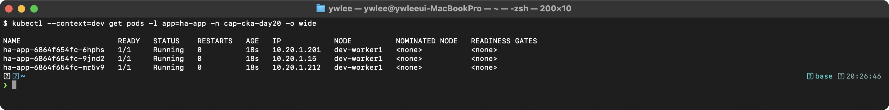

**내부 동작 원리:** `requiredDuringSchedulingIgnoredDuringExecution`의 Node Affinity는 kube-scheduler의 Filtering 단계에서 평가된다. 조건을 만족하지 않는 노드는 후보에서 제외된다. `preferredDuringSchedulingIgnoredDuringExecution`의 Pod Anti-Affinity는 Scoring 단계에서 평가되어, 같은 app=ha-app Pod가 이미 있는 노드의 점수를 감점한다. weight=100이므로 최대 감점이 적용되지만, 노드가 부족하면 같은 노드에 배치될 수 있다(preferred이므로).

</details>

---

### 문제 17. [7%] Multi-Container Pod + 로그 확인

**컨텍스트:** `kubectl config use-context dev`

Multi-Container Pod를 생성하라:
- Pod 이름: `multi-pod`
- 컨테이너 1: `main` (nginx)
- 컨테이너 2: `sidecar` (busybox:1.36), 명령: `sh -c "while true; do echo $(date) Sidecar running >> /var/log/sidecar.log; sleep 5; done"`
- emptyDir 볼륨을 공유하여 `main`은 `/var/log/nginx`, `sidecar`는 `/var/log`에 마운트
- sidecar 컨테이너의 최근 5줄 로그를 `/tmp/sidecar-logs.txt`에 저장하라

<details>
<summary>풀이</summary>

**등장 배경:** 전통적인 컨테이너 설계 원칙("컨테이너 당 단일 관심사")을 따르면 한 컨테이너에 비즈니스 로직과 로그 집계·변환·전송 코드를 함께 넣지 않는다. 그러나 단일 컨테이너로는 "nginx가 쓴 로그를 실시간으로 파싱해 외부 수집기로 보내는" 작업을 분리할 방법이 없었다. 이 문제를 해결하기 위해 같은 Pod 안에 여러 컨테이너를 두는 Multi-Container 패턴이 등장했다. Sidecar 패턴이 대표적인데, 메인 컨테이너와 같은 네트워크 네임스페이스(같은 `localhost`)·공유 볼륨을 사용하면서 로그 집계·프록시·인증 등 부가 책임을 별도 컨테이너에 위임한다. 트레이드오프: Pod 내 컨테이너가 늘어날수록 리소스 요청이 합산되고, 한 컨테이너가 충돌하면 Pod 재시작 정책에 따라 사이드카도 영향을 받는다. emptyDir 볼륨은 Pod 레벨 임시 공간이라 Pod 삭제 시 데이터도 함께 사라지므로, 영속성이 필요한 로그는 별도 PVC나 외부 수집기가 필요하다.

**문제 의도:** Multi-Container Pod와 emptyDir 볼륨 공유, 특정 컨테이너 로그 확인을 할 수 있는가?

**동작 원리:**
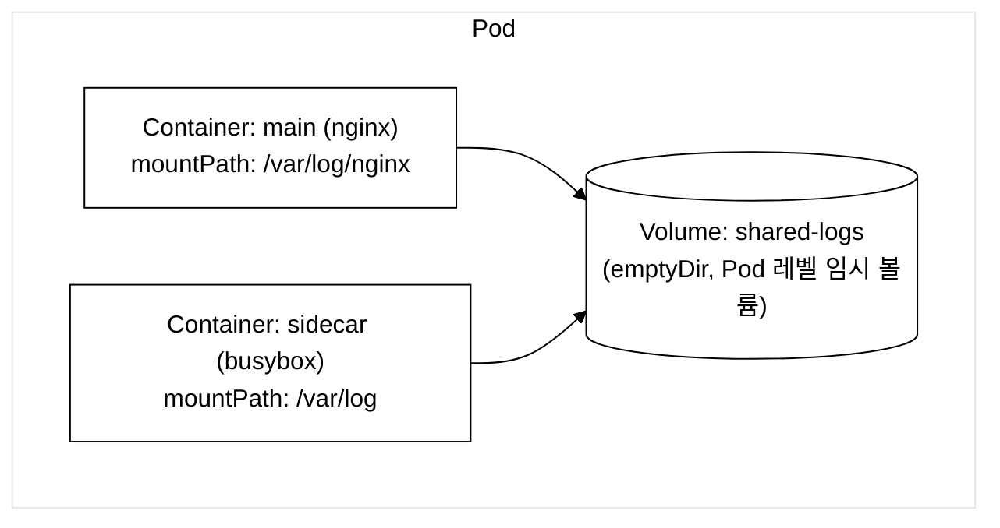
_그림 1. Multi-Container Pod의 emptyDir 볼륨 공유. Pod 삭제 시 emptyDir 데이터도 함께 삭제된다._

```bash
kubectl config use-context dev

cat <<EOF | kubectl apply -f -
apiVersion: v1
kind: Pod
metadata:
  name: multi-pod
  namespace: demo
spec:
  containers:
  - name: main
    image: nginx
    volumeMounts:
    - name: shared-logs
      mountPath: /var/log/nginx
  - name: sidecar
    image: busybox:1.36
    command: ["sh", "-c", "while true; do date >> /var/log/sidecar.log; echo 'Sidecar running' >> /var/log/sidecar.log; sleep 5; done"]
    volumeMounts:
    - name: shared-logs
      mountPath: /var/log
  volumes:
  - name: shared-logs
    emptyDir: {}
EOF

sleep 15
kubectl logs multi-pod -c sidecar -n demo --tail=5 > /tmp/sidecar-logs.txt
cat /tmp/sidecar-logs.txt
```

**시험 출제 패턴:**
- `-c <container>` 플래그로 특정 컨테이너 로그 확인
- `--tail=N`으로 최근 N줄만 출력
- emptyDir 볼륨을 사용한 컨테이너 간 데이터 공유

</details>

---

### 문제 18. [4%] CronJob 생성

**컨텍스트:** `kubectl config use-context dev`

`demo` 네임스페이스에 다음 CronJob을 생성하라:
- 이름: `backup-job`
- 스케줄: 매일 새벽 2시 (`0 2 * * *`)
- 이미지: `busybox:1.36`
- 명령: `echo "Backup completed"`
- successfulJobsHistoryLimit: 3

<details>
<summary>풀이</summary>

**등장 배경:** K8s 이전에는 반복 작업을 노드의 `crontab`과 쉘 스크립트 조합으로 처리했다. 이 방식은 특정 노드에 종속되어, 노드가 죽으면 작업도 멈추고, 여러 노드로 스케일아웃이 불가능하며, 실패 이력·재시도 로직을 직접 구현해야 했다. K8s의 Job은 이 문제 중 "일회성 실행·실패 재시도·완료 보장"을 해결했지만 반복 실행 기능은 없었다. CronJob은 Job 위에 cron 표현식 기반 스케줄링을 더해 "반복 일회성 작업"을 K8s 네이티브로 관리하게 한다. 트레이드오프: `failedJobsHistoryLimit`(기본값 1)과 `successfulJobsHistoryLimit`(기본값 3)을 설정하지 않으면 완료된 Job/Pod 오브젝트가 클러스터에 무한히 누적되어 etcd 용량과 API 성능에 영향을 준다. 또한 스케줄 정확도는 초 단위가 아니라 수십 초 오차 범위를 허용하므로, 초 단위 정밀도가 필요한 작업에는 적합하지 않다.

**문제 의도:** CronJob 생성과 historyLimit 설정을 명령형으로 처리할 수 있는가?

```bash
kubectl config use-context dev

kubectl create cronjob backup-job \
  --image=busybox:1.36 \
  --schedule="0 2 * * *" \
  -n demo \
  -- sh -c "echo Backup completed"

# successfulJobsHistoryLimit 추가 (edit 또는 patch)
kubectl patch cronjob backup-job -n demo \
  -p '{"spec":{"successfulJobsHistoryLimit":3}}'

kubectl get cronjobs backup-job -n demo
```

**검증 기대 출력:**

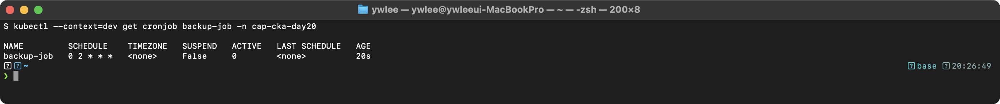

**내부 동작 원리:** CronJob Controller가 schedule 필드를 파싱하여 다음 실행 시각을 계산한다. 실행 시각이 되면 Job 객체를 생성하고, Job Controller가 Pod를 생성하여 작업을 수행한다. `successfulJobsHistoryLimit: 3`은 성공한 Job 객체를 최근 3개만 보존하고 나머지는 자동 삭제한다는 의미이다. 이를 통해 완료된 Job/Pod가 무한히 쌓이는 것을 방지한다.

</details>

---

### 문제 19. [7%] ServiceAccount와 RBAC

**컨텍스트:** `kubectl config use-context dev`

1. `demo` 네임스페이스에 ServiceAccount `app-sa` 생성
2. ClusterRole `pod-reader`를 생성 (pods: get, list, watch)
3. RoleBinding `app-sa-binding`으로 `app-sa`에 `pod-reader` ClusterRole 바인딩 (`demo` 네임스페이스)
4. `app-sa` ServiceAccount를 사용하는 Pod `sa-pod` 생성 (busybox, sleep 3600)

<details>
<summary>풀이</summary>

**등장 배경:** K8s 이전에는 애플리케이션이 클러스터 API를 호출해야 할 때(예: CI 봇이 Deployment를 배포하거나, 모니터링 에이전트가 Pod 목록을 조회) 사람 계정 자격증명을 애플리케이션에 심어야 했다. 이는 자격증명이 노출되면 해당 사람 계정의 모든 권한이 탈취된다는 위험이 있었다. K8s는 Pod 전용 기계 계정인 ServiceAccount(SA)를 도입해 이 문제를 분리했다. SA는 사람 계정과 별도 식별자(`system:serviceaccount:<ns>:<name>`)를 가지고, Pod에 마운트되는 JWT 토큰이 자동으로 발급된다. RBAC와 결합하면 "이 SA는 demo 네임스페이스의 pods만 read할 수 있다"처럼 최소 권한 원칙을 적용할 수 있다. v1.24부터는 SA 생성 시 토큰이 자동으로 만들어지지 않고(bound service account token), 필요한 경우 `kubectl create token` 또는 Secret을 수동으로 만들어야 한다. 트레이드오프: SA 토큰이 컨테이너 내 `/var/run/secrets/kubernetes.io/serviceaccount/token`에 파일로 마운트되므로, 컨테이너 탈출(container escape) 공격자가 이 파일을 읽으면 SA 권한을 얻는다. SA 권한을 최소화하고 `automountServiceAccountToken: false`를 기본으로 설정하는 이유다.

**문제 의도:** ServiceAccount, ClusterRole, RoleBinding의 조합을 이해하는가?

**`system:serviceaccount:<ns>:<name>` 형식의 의미:** RBAC 의 주체(subject)는 사람 사용자(User)·그룹(Group)·ServiceAccount 세 종류다. apiserver 는 ServiceAccount 토큰을 검증하면 그 호출자를 사람 이름이 아니라 `system:serviceaccount:<네임스페이스>:<SA이름>` 이라는 고정된 사용자 이름으로 인식한다. `system:` 접두사는 K8s 가 예약한 내장 식별자 영역이라 일반 User 와 충돌하지 않고, 가운데에 네임스페이스가 들어가므로 같은 이름 `app-sa` 라도 `demo` 와 `prod` 네임스페이스의 SA 는 서로 다른 주체로 구별된다. 추가로 모든 SA 는 `system:serviceaccounts`(전체)와 `system:serviceaccounts:<ns>`(해당 네임스페이스) 두 그룹에도 자동 소속된다. `kubectl auth can-i ... --as=system:serviceaccount:demo:app-sa` 의 `--as` 는 이 식별자로 위장(impersonation)해 권한을 시험해 보는 것이다.

**동작 원리:**
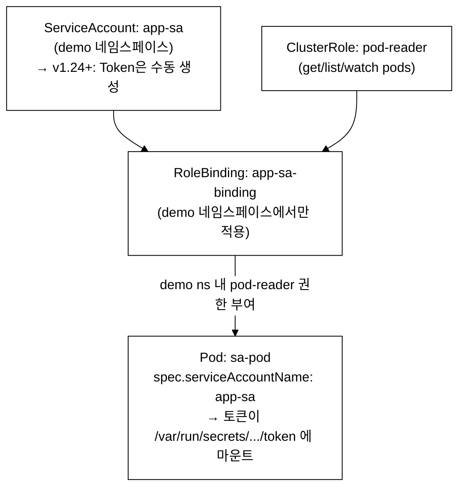
_그림 3. ServiceAccount-RoleBinding-ClusterRole 바인딩 흐름. ClusterRole을 RoleBinding으로 바인딩하면 해당 네임스페이스에서만 적용되고, ClusterRoleBinding으로 바인딩하면 모든 네임스페이스에 적용된다._

```bash
kubectl config use-context dev

# 1. ServiceAccount 생성
kubectl create serviceaccount app-sa -n demo

# 2. ClusterRole 생성
kubectl create clusterrole pod-reader \
  --verb=get,list,watch \
  --resource=pods

# 3. RoleBinding (ClusterRole을 namespace에 바인딩)
kubectl create rolebinding app-sa-binding \
  --clusterrole=pod-reader \
  --serviceaccount=demo:app-sa \
  -n demo

# 4. Pod 생성
cat <<EOF | kubectl apply -f -
apiVersion: v1
kind: Pod
metadata:
  name: sa-pod
  namespace: demo
spec:
  serviceAccountName: app-sa
  containers:
  - name: app
    image: busybox:1.36
    command: ["sleep", "3600"]
EOF

# 검증
kubectl auth can-i list pods --as=system:serviceaccount:demo:app-sa -n demo
kubectl auth can-i create pods --as=system:serviceaccount:demo:app-sa -n demo
```

**검증 기대 출력:**

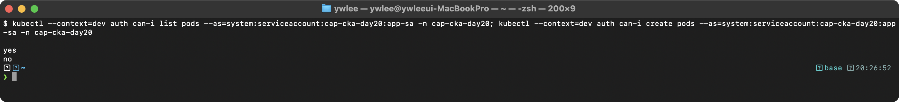

**내부 동작 원리:** ClusterRole을 RoleBinding으로 바인딩하면, ClusterRole에 정의된 권한이 해당 네임스페이스에서만 적용된다. 이는 "같은 권한 세트를 여러 네임스페이스에 재사용"하는 패턴이다. ClusterRoleBinding으로 바인딩하면 모든 네임스페이스에서 적용된다. ServiceAccount의 FQDN은 `system:serviceaccount:<namespace>:<name>` 형식이다.

</details>

---

### 문제 20. [4%] 로그 확인 및 출력

**컨텍스트:** `kubectl config use-context dev`

`demo` 네임스페이스에서:
1. `app=nginx-web` 라벨을 가진 Pod의 로그 중 "error"를 포함하는 줄을 `/tmp/error-logs.txt`에 저장하라
2. 해당 Pod의 이전 컨테이너 로그를 확인하라

<details>
<summary>풀이</summary>

**등장 배경:** 컨테이너 이전 세대에서는 애플리케이션 로그가 노드 파일시스템의 고정된 경로(`/var/log/app.log`)에 남아, 해당 노드에 SSH 접속해야만 볼 수 있었다. Pod가 다른 노드로 이동하거나 재시작되면 이전 로그는 유실됐다. K8s는 각 컨테이너의 stdout/stderr를 노드의 `/var/log/containers/` 아래 파일에 모아두고, kubelet이 관리하므로 `kubectl logs`로 어느 노드에 있는 Pod든 단일 명령으로 조회할 수 있다. `--previous` 플래그는 컨테이너가 재시작되어 현재 인스턴스와 이전 인스턴스가 분리된 경우, 이전 인스턴스의 로그 파일(노드에 보존된 마지막 종료 로그)을 읽는다. 트레이드오프: 노드 디스크 압박 시 오래된 로그는 logrotate 설정에 따라 잘릴 수 있고, 노드 자체가 삭제되면 로그도 함께 사라지므로 장기 보존은 Fluentd/Loki 같은 외부 로그 수집기가 필요하다.

**문제 의도:** `kubectl logs` 의 필터링(`grep`)과 이전 컨테이너 로그 조회(`--previous`)를 할 수 있는가?

```bash
kubectl config use-context dev

# 1. error 로그 추출
kubectl logs -n demo -l app=nginx-web | grep -i "error" > /tmp/error-logs.txt

# 2. 이전 컨테이너 로그
kubectl logs -n demo -l app=nginx-web --previous

# 또는 Pod 이름을 직접 지정
POD=$(kubectl get pods -n demo -l app=nginx-web -o jsonpath='{.items[0].metadata.name}')
kubectl logs $POD -n demo --previous
```

**주의:** `--previous`는 컨테이너가 한 번이라도 재시작(CrashLoopBackOff 등)된 경우에만 유효하다. 재시작 이력이 없으면 `error: previous terminated container "nginx-web" not found` 에러가 반환된다. 시험 문제가 "이전 컨테이너 로그"를 요구하면 해당 Pod는 반드시 재시작 이력이 있다고 가정하라.

</details>

---

### 문제 21. [7%] etcd 복원

**컨텍스트:** `kubectl config use-context platform`

`/opt/etcd-backup-exam.db` 스냅샷을 사용하여 etcd를 `/var/lib/etcd-restored`로 복원하라.

<details>
<summary>풀이</summary>

**전제:** 이 문제는 `platform` 클러스터 control-plane 노드에 SSH 로 들어가 작업한다. kubeconfig 는 `kubeconfig/platform.yaml` 이고, `/opt/etcd-backup-exam.db` 스냅샷이 master 노드에 미리 놓여 있다고 가정한다(없으면 Day 1 의 `etcdctl snapshot save` 로 먼저 생성). 복원은 로컬 파일 작업이라 etcd 클러스터가 떠 있을 필요는 없지만, 작업 후 검증을 위해 클러스터가 가동 상태여야 한다.

**Static Pod 메커니즘(이 문제의 핵심):** etcd·apiserver 같은 control-plane 구성요소는 일반 Pod 가 아니라 *Static Pod* 다. 일반 Pod 는 사용자가 apiserver 에 요청하면 scheduler 가 노드를 정하고 kubelet 이 실행하지만, Static Pod 는 그 경로를 쓰지 않는다. 각 노드의 kubelet 이 `--pod-manifest-path`(기본 `/etc/kubernetes/manifests/`) 디렉터리를 직접 감시하다가, 그 안의 YAML 파일이 생기거나 바뀌면 *apiserver·scheduler 를 거치지 않고* kubelet 이 곧바로 컨테이너를 (재)생성한다. 즉 etcd 자신이 아직 안 떠서 apiserver 가 동작하지 않는 상황에서도 kubelet 단독으로 etcd 를 띄울 수 있다(부트스트랩 문제 해결). 그래서 etcd 복원은 "etcd.yaml 의 데이터 디렉터리(hostPath)를 새 경로로 바꿔 파일을 저장"하기만 하면, kubelet 이 변경을 감지해 옛 etcd 컨테이너를 죽이고 새 데이터 디렉터리로 etcd 를 재기동한다. 별도의 `kubectl delete pod` 나 systemd 재시작이 필요 없다. apiserver 에는 이 Static Pod 의 읽기 전용 거울(mirror Pod)이 보이지만, 그 거울을 지워도 실제 컨테이너는 manifests 디렉터리 파일이 기준이라 되살아난다.

**동작 원리:**
```
etcd 복원 흐름:

[1] etcdctl snapshot restore 실행
    → 스냅샷을 새 디렉터리로 복원

[2] etcd Pod의 데이터 디렉터리 변경
    → /etc/kubernetes/manifests/etcd.yaml 수정
    → hostPath의 path를 새 디렉터리로 변경

[3] kubelet이 etcd Pod 자동 재시작
    → Static Pod이므로 YAML 변경 감지 시 재생성

[4] kube-apiserver가 새 etcd에 연결
    → 클러스터 상태가 스냅샷 시점으로 복원됨
```

```bash
# 이 저장소 환경에서는 VM 이름 별칭으로 바로 접속한다(ProxyCommand 가 tart ip 로 IP 를 실시간 조회).
ssh platform-master
# 별칭이 없거나 IP 를 직접 알아야 하면 동적으로 조회한다:
#   PLATFORM_MASTER_IP=$(tart ip platform-master)
#   ssh admin@"$PLATFORM_MASTER_IP"
# (<platform-master-ip> 는 placeholder 이며 시험 환경에서는 문제에서 준 노드명/IP 로 바꾼다)

# 스냅샷 복원
sudo ETCDCTL_API=3 etcdctl snapshot restore /opt/etcd-backup-exam.db \
  --data-dir=/var/lib/etcd-restored

# etcd Pod의 데이터 디렉터리 변경
sudo vi /etc/kubernetes/manifests/etcd.yaml
# volumes 섹션에서 hostPath를 /var/lib/etcd-restored로 변경

# 변경 내용:
# - hostPath:
#     path: /var/lib/etcd-restored    # 기존: /var/lib/etcd
#     type: DirectoryOrCreate

# kubelet이 etcd Pod를 자동 재시작 (1-2분 대기)
# 확인
sudo crictl ps | grep etcd
exit

kubectl config use-context platform
kubectl get pods -n kube-system | grep etcd
```

**restore 명령의 선택적 파라미터 (kubeadm 단일 멤버 환경):** `etcdctl snapshot restore`는 `--name`, `--initial-cluster`, `--initial-cluster-token`, `--initial-advertise-peer-urls` 파라미터를 지원하지만, kubeadm 기본 구성(단일 etcd 멤버, 멤버 이름 `default`, 피어 주소 `http://localhost:2380`, 클러스터 토큰 `etcd-cluster-1`)에서는 이 값들이 기본값과 일치하므로 생략해도 동작한다. 멀티 멤버 etcd 클러스터나 피어 주소가 다른 환경에서는 반드시 명시해야 한다.

**etcd.yaml 수정 시 volumes 만 바꾸면 되는 이유:** etcd 컨테이너의 `volumeMounts[].mountPath`(컨테이너 내부 경로 `/var/lib/etcd`)는 고정된 채 `volumes[].hostPath.path`(노드의 물리 디렉터리)만 새 복원 경로로 바꾼다. 컨테이너는 여전히 `/var/lib/etcd`를 읽지만, 그 경로가 이제 `/var/lib/etcd-restored`를 가리키게 되는 구조다. `mountPath`를 건드리면 컨테이너 내부 경로와 etcd 시작 인자(`--data-dir=/var/lib/etcd`)가 불일치해 etcd가 기동에 실패한다.

**시험 출제 패턴:**
- 복원 후 etcd.yaml의 volumes.hostPath.path 만 변경하면 됨 (volumeMounts.mountPath 는 그대로)
- member 디렉터리가 자동 생성됨
- 복원 시 --endpoints, --cacert 등은 불필요 (복원은 로컬 파일 작업)

</details>

---

### 문제 22. [4%] 노드 스케줄링 제어

**컨텍스트:** `kubectl config use-context staging`

1. `staging-worker2` 노드를 cordon하여 새 Pod가 스케줄링되지 않게 하라
2. cordon 상태에서 Deployment `test-deploy` (nginx, replicas=3) 생성
3. Pod가 어느 노드에 배치되었는지 확인하라
4. 노드를 uncordon하라

<details>
<summary>풀이</summary>

**등장 배경:** 노드를 유지보수(OS 패치, 커널 업그레이드, 하드웨어 교체)할 때 기존 방식은 노드를 그냥 내려버려 그 위에 있던 Pod가 갑자기 종료됐다. 이를 해결하기 위해 K8s는 노드를 제거하기 전 두 단계 절차를 도입했다. 첫 번째 단계가 cordon으로, 노드의 `spec.unschedulable=true`를 설정해 새 Pod가 해당 노드에 배치되지 않게만 하고 기존 Pod는 그대로 둔다. 두 번째 단계가 drain으로, cordon 후 기존 Pod에 eviction API를 호출해 다른 노드로 재배치한다. 이 두 단계 분리가 중요한 이유는, 유지보수 중 얼마나 빠르게 기존 워크로드를 옮길지(drain) 와 새 워크로드를 얼마나 빨리 받지 않을지(cordon)를 독립적으로 제어할 수 있기 때문이다. 예를 들어 cordon만 하고 기존 Pod는 자연스럽게 완료되길 기다리는 'graceful decommission' 시나리오에 쓴다. 트레이드오프: cordon 상태에서 노드가 Ready이므로 이미 실행 중인 Pod는 계속 트래픽을 받는다는 점을 운영자가 인지해야 한다.

**문제 의도:** cordon과 drain의 차이를 아는가?

```bash
kubectl config use-context staging

# 1. cordon (새 Pod 스케줄링 차단, 기존 Pod 유지)
kubectl cordon staging-worker2
kubectl get nodes
# staging-worker2: SchedulingDisabled

# 2. Deployment 생성
kubectl create deployment test-deploy --image=nginx --replicas=3

# 3. Pod 배치 확인 (staging-worker2에는 배치되지 않음)
kubectl get pods -l app=test-deploy -o wide

# 4. uncordon
kubectl uncordon staging-worker2
kubectl get nodes

# 정리
kubectl delete deployment test-deploy
```

**검증 기대 출력:**

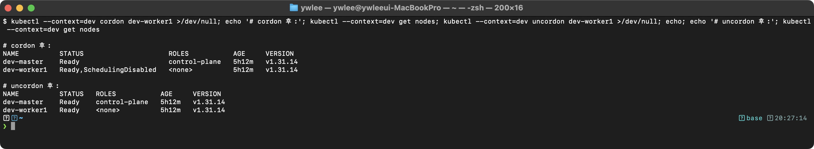

참고: dev 는 스케줄 가능한 worker 가 1개뿐이라 그 노드를 cordon 하면 `test-deploy` 의 새 Pod 는
배치할 노드가 없어 Pending 이 된다(master 는 control-plane Taint). worker 가 2개 이상인 환경에서는
cordon 된 노드를 제외한 다른 worker 로 Pod 가 배치된다.

**cordon vs drain 내부 동작 원리:**
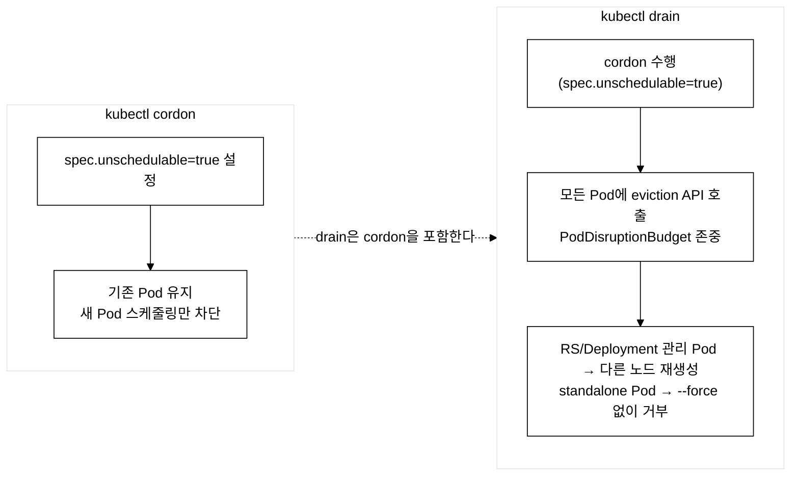
_그림 4. cordon은 신규 스케줄링만 차단하고, drain은 cordon 후 기존 Pod까지 축출한다._

</details>

---

### 문제 23. [4%] Headless Service 생성

**컨텍스트:** `kubectl config use-context dev`

`demo` 네임스페이스에 Headless Service를 생성하라:
- 이름: `db-headless`
- 대상: `app=postgres` Pod
- 포트: 5432
- clusterIP: None

<details>
<summary>풀이</summary>

**등장 배경:** 일반 ClusterIP Service는 kube-proxy(또는 Cilium 등 CNI)가 가상 IP(VIP)를 하나 할당하고 그 뒤에서 Pod들로 로드밸런싱한다. 이 방식은 상태 비저장(stateless) 서비스에는 적합하지만, 데이터베이스처럼 Pod 별로 역할이 다른 상태 저장(stateful) 서비스에서는 문제가 생긴다. 예를 들어 PostgreSQL primary와 replica는 쓰기·읽기 요청을 각각 다른 Pod로 보내야 하는데, 단일 VIP 뒤에 묶으면 어느 Pod에 붙는지 클라이언트가 제어할 수 없다. Headless Service(`clusterIP: None`)는 VIP를 아예 만들지 않고, DNS 조회 시 선택기(selector)에 매칭된 Pod IP 목록을 직접 A 레코드로 반환한다. 이로써 클라이언트가 특정 Pod IP를 직접 선택할 수 있다. StatefulSet(Pod마다 고정 이름을 부여하는 리소스)과 결합하면 `postgres-0.db-headless.demo.svc.cluster.local` 처럼 Pod별 고정 DNS 주소가 생성된다. 트레이드오프: kube-proxy 로드밸런싱이 없으므로 클라이언트 라이브러리가 직접 Pod IP 목록을 관리하고 페일오버를 처리해야 한다.

**문제 의도:** Headless Service의 특징과 설정 방법을 아는가?

**동작 원리:**
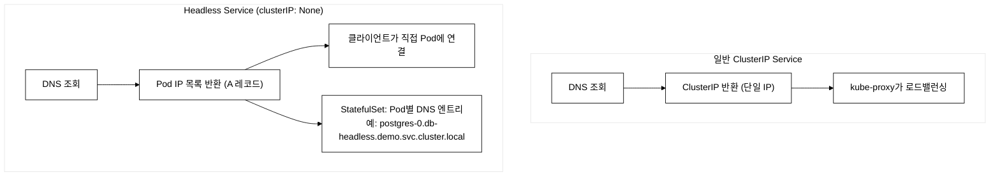
_그림 5. 일반 ClusterIP Service는 단일 VIP를 거치는 반면, Headless Service는 클라이언트가 Pod IP 목록을 직접 받아 연결한다._

```bash
cat <<EOF | kubectl apply -f -
apiVersion: v1
kind: Service
metadata:
  name: db-headless
  namespace: demo
spec:
  clusterIP: None                      # Headless Service의 핵심!
  selector:
    app: postgres
  ports:
  - port: 5432
    targetPort: 5432
EOF

kubectl get svc db-headless -n demo
```

**검증 기대 출력:**

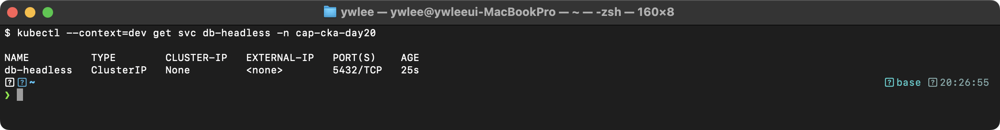

**트러블슈팅:** Headless Service를 생성했는데 DNS 조회 시 Pod IP가 반환되지 않으면, selector와 일치하는 Pod가 있는지 확인한다. `kubectl get endpoints db-headless -n demo`로 Endpoints가 채워져 있는지 확인하고, 비어 있으면 Pod의 label을 점검한다.

</details>

---

### 문제 24. [7%] 노드 문제 진단

**컨텍스트:** `kubectl config use-context staging`

`staging-worker1` 노드가 NotReady 상태이다. 원인을 진단하고 수정하라.

(시뮬레이션: kubelet이 중지된 상태)

<details>
<summary>풀이</summary>

**등장 배경:** 분산 클러스터에서 노드 장애는 피할 수 없으며, 어떤 노드가 왜 다운됐는지 신속하게 진단하는 능력이 가동률과 직결된다. K8s 이전에는 노드 상태를 파악하려면 모니터링 에이전트를 별도 구축하거나 노드에 직접 SSH로 들어가야 했고, 표준화된 진단 절차가 없었다. K8s는 `Node.Status.Conditions`라는 표준 상태 필드를 정의해 노드의 Ready·MemoryPressure·DiskPressure·PIDPressure 상태를 API로 조회할 수 있게 했다. kubelet이 일정 시간(`node-monitor-grace-period`, 기본 40초) 동안 heartbeat를 보내지 않으면 control-plane의 node controller가 해당 노드를 NotReady로 전환한다. 이 표준화 덕분에 클러스터 관리자는 `kubectl describe node`로 상태를 조회하고 SSH로 접속해 kubelet 로그를 확인하는 표준 진단 흐름을 밟을 수 있다. 트레이드오프: control-plane과 노드 간 통신이 끊겨도(네트워크 파티션) control-plane은 노드를 NotReady로 표시하므로, 실제로는 노드가 정상인데도 NotReady로 보이는 거짓 양성(split-brain) 상황이 생길 수 있다.

**문제 의도:** 노드 NotReady 상태의 원인을 찾고 수정할 수 있는가?

**동작 원리 -- 노드 NotReady 진단 흐름:**
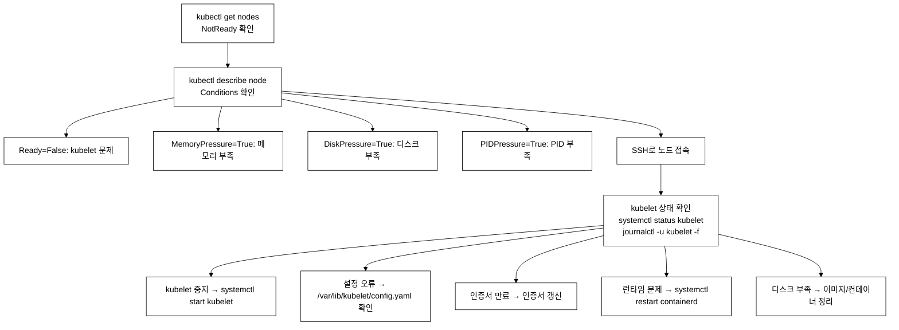
_그림 2. 노드 NotReady 진단 흐름과 원인별 조치._

```bash
kubectl config use-context staging

# 1. 노드 상태 확인
kubectl get nodes
# staging-worker1: NotReady

# 2. 노드 상세 확인
kubectl describe node staging-worker1 | grep -A5 Conditions

# 3. SSH 접속 (VM 별칭으로 비밀번호 없이 접속, ~/.ssh/config ProxyCommand 방식)
ssh staging-worker1

# 4. kubelet 상태 확인
sudo systemctl status kubelet
# Active: inactive (dead)

# 5. kubelet 시작
sudo systemctl start kubelet

# 6. kubelet 부팅 시 자동 시작 설정
sudo systemctl enable kubelet

# 7. 상태 확인
sudo systemctl status kubelet
# Active: active (running)

exit

# 8. 노드 상태 확인 (1-2분 대기)
kubectl get nodes
# staging-worker1: Ready
```

**시험 출제 패턴:**
- NotReady 원인이 kubelet 중지인 경우가 가장 흔함
- containerd 중지, 인증서 만료도 출제 가능
- `sudo journalctl -u kubelet --no-pager | tail -50`으로 상세 로그 확인

</details>

---

### 문제 25. [4%] 리소스 사용량 확인

**컨텍스트:** `kubectl config use-context prod`

1. 가장 많은 CPU를 사용하는 Pod를 찾아 이름을 `/tmp/high-cpu-pod.txt`에 저장하라
2. 가장 많은 메모리를 사용하는 노드를 찾아 이름을 `/tmp/high-mem-node.txt`에 저장하라

<details>
<summary>풀이</summary>

**등장 배경:** K8s 이전에는 서버 리소스 사용량을 파악하려면 `top`, `htop`, `vmstat` 같은 노드별 도구를 각 서버에 직접 접속해 확인해야 했다. 수백 대의 서버가 있는 환경에서는 어느 프로세스가 CPU 폭등을 일으키는지 추적하는 데 상당한 시간이 걸렸다. K8s는 Metrics Server(metrics.k8s.io API 그룹을 구현하는 경량 집계기)를 도입해, 각 노드의 kubelet에 내장된 cAdvisor(컨테이너 어드바이저 — 컨테이너별 CPU·메모리 사용량을 수집하는 데몬)가 보고하는 데이터를 클러스터 전체에서 단일 API로 조회할 수 있게 했다. `kubectl top`은 이 API를 호출해 Pod·Node 단위 실시간 사용량을 보여주며, `--sort-by` 옵션으로 가장 많이 사용하는 Pod나 노드를 즉시 찾아낼 수 있다. 트레이드오프: Metrics Server는 최근 수십 초 단위의 인메모리 스냅샷만 보관하므로 과거 이력 조회나 알람 설정은 불가능하다. 장기 메트릭 이력과 알람은 Prometheus + Grafana 같은 별도 스택이 필요하다.

**문제 의도:** kubectl top 명령어를 사용하여 리소스 사용량을 확인할 수 있는가?

```bash
kubectl config use-context prod

# 1. CPU 사용량 기준 Pod 정렬
kubectl top pod -A --sort-by=cpu | head -2
# 첫 번째 Pod의 이름을 저장
kubectl top pod -A --sort-by=cpu --no-headers | head -1 | awk '{print $2}' > /tmp/high-cpu-pod.txt

# 2. 메모리 사용량 기준 노드 정렬
kubectl top node --sort-by=memory | head -2
kubectl top node --sort-by=memory --no-headers | head -1 | awk '{print $1}' > /tmp/high-mem-node.txt

cat /tmp/high-cpu-pod.txt
cat /tmp/high-mem-node.txt
```

**검증 기대 출력:**

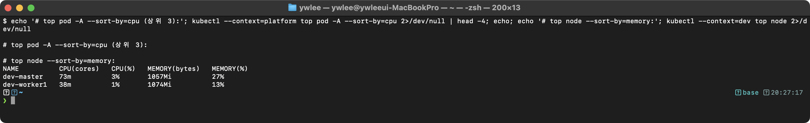

**내부 동작 원리:** `kubectl top`은 Metrics Server API(`metrics.k8s.io`)를 호출한다. Metrics Server는 각 노드의 kubelet에서 cAdvisor 메트릭(CPU/메모리 사용량)을 수집하여 인메모리에 저장한다. `--sort-by=cpu`는 클라이언트 측 정렬이 아니라 서버 측에서 정렬된 결과를 반환한다.

**주의:** `kubectl top`은 metrics-server가 설치되어 있어야 동작한다.

</details>

---

## 시험 종료

### 채점 기준

| 문제 | 배점 | 도메인 |
|------|------|--------|
| 1. etcd 백업 | 4% | Architecture |
| 2. RBAC 설정 | 7% | Architecture |
| 3. Static Pod | 4% | Architecture |
| 4. Deployment + Rolling Update | 7% | Workloads |
| 5. NodePort Service | 4% | Services |
| 6. NetworkPolicy | 7% | Services |
| 7. PV/PVC/Pod | 7% | Storage |
| 8. Taint/Toleration | 4% | Workloads |
| 9. drain/uncordon | 7% | Architecture |
| 10. DaemonSet | 4% | Workloads |
| 11. Ingress | 7% | Services |
| 12. Job | 4% | Workloads |
| 13. 클러스터 정보 | 4% | Architecture |
| 14. Pod 트러블슈팅 | 7% | Troubleshooting |
| 15. ConfigMap/Secret | 4% | Storage |
| 16. Affinity/Anti-Affinity | 7% | Workloads |
| 17. Multi-Container Pod | 7% | Troubleshooting |
| 18. CronJob | 4% | Workloads |
| 19. ServiceAccount + RBAC | 7% | Architecture |
| 20. 로그 확인 | 4% | Troubleshooting |
| 21. etcd 복원 | 7% | Architecture |
| 22. cordon/uncordon | 4% | Architecture |
| 23. Headless Service | 4% | Services |
| 24. 노드 트러블슈팅 | 7% | Troubleshooting |
| 25. 리소스 사용량 | 4% | Troubleshooting |
| **합계** | **136%** | (실제 시험은 100%) |

이 모의시험은 25문제로 실제 CKA 15~20문제보다 많아 배점 합산이 136%(4%×13문제 + 7%×12문제 = 52+84)다. 실제 시험에서는 문제별 배점이 조정되어 합산이 100%가 된다.

합격 기준: **66% 이상** (약 66점 이상)

### 도메인별 배점 분석

| 도메인 | 문제 수 | 총 배점 | CKA 비중 |
|--------|---------|---------|----------|
| Architecture (25%) | 8문제 | 44% | 충분히 커버 |
| Workloads (15%) | 6문제 | 30% | 충분히 커버 |
| Services (20%) | 4문제 | 22% | 적정 |
| Storage (10%) | 2문제 | 11% | 적정 |
| Troubleshooting (30%) | 4문제 | 25% | 적정 |

> **분류 기준 (CKA 블루프린트 기준)**: Q4(Deployment), Q8(Taint/Toleration), Q10(DaemonSet), Q12(Job), Q16(Affinity), Q18(CronJob)을 Workloads로 분류한다. Multi-Container Pod(Q17)는 CKA 블루프린트에서 Workloads & Scheduling 도메인에 속하므로 Workloads로 계산한다. 채점 표의 Q17 도메인 열은 참고용이며 실제 시험 블루프린트와 일부 차이가 있다.

---

## 시험 후 자가 평가 (시험 출제 패턴)

### 도메인별 핵심 출제 패턴 정리

```
Architecture (25%):
  ├── etcd 백업/복원 (거의 매번 출제)
  ├── RBAC (Role/ClusterRole, RoleBinding/ClusterRoleBinding)
  ├── kubeadm 업그레이드 (control plane + worker)
  ├── Static Pod (생성/삭제)
  └── 클러스터 정보 조회

Workloads (15%):
  ├── Deployment 생성/업데이트/롤백
  ├── DaemonSet 생성
  ├── Job/CronJob 생성
  ├── Taint/Toleration
  └── Node Affinity / Pod Anti-Affinity

Services (20%):
  ├── Service (ClusterIP, NodePort) 생성
  ├── Ingress 생성
  ├── NetworkPolicy (Ingress/Egress)
  ├── CoreDNS 설정
  └── Headless Service

Storage (10%):
  ├── PV/PVC 생성 및 바인딩
  ├── StorageClass 사용
  ├── ConfigMap/Secret 생성 및 사용
  └── emptyDir/hostPath 볼륨

Troubleshooting (30%):
  ├── Pod 문제 진단 (ImagePullBackOff, CrashLoopBackOff)
  ├── 노드 NotReady 해결 (kubelet 재시작)
  ├── 로그 확인 및 분석
  ├── kubectl top (리소스 사용량)
  └── 네트워크 연결 문제 진단
```

### 자가 평가표

각 문제를 다음 기준으로 평가하라:
- **A**: 시간 내 완료, 자신 있음
- **B**: 완료했지만 불확실한 부분 있음
- **C**: 미완료 또는 오답

| 문제 | 평가 | 보완 필요 사항 |
|------|------|---------------|
| 1. etcd 백업 | | |
| 2. RBAC | | |
| 3. Static Pod | | |
| 4. Deployment | | |
| 5. NodePort | | |
| 6. NetworkPolicy | | |
| 7. PV/PVC | | |
| 8. Taint/Toleration | | |
| 9. drain/uncordon | | |
| 10. DaemonSet | | |
| 11. Ingress | | |
| 12. Job | | |
| 13. 클러스터 정보 | | |
| 14. 트러블슈팅 | | |
| 15. ConfigMap/Secret | | |
| 16. Affinity | | |
| 17. Multi-Container | | |
| 18. CronJob | | |
| 19. ServiceAccount | | |
| 20. 로그 확인 | | |
| 21. etcd 복원 | | |
| 22. cordon/uncordon | | |
| 23. Headless Service | | |
| 24. 노드 트러블슈팅 | | |
| 25. 리소스 사용량 | | |

### 약점 보완 계획

C등급 문제의 해당 Day 자료를 다시 학습하라:
- Architecture 약점 → Day 1~6 복습
- Workloads 약점 → Day 7~10 복습
- Services 약점 → Day 11~14 복습
- Storage 약점 → Day 15~16 복습
- Troubleshooting 약점 → Day 17~18 복습

---

## 빠른 참조 가이드

### 시험에서 가장 많이 사용하는 명령어 Top 20

```bash
# 1. 리소스 생성
kubectl create deployment <name> --image=<image> --replicas=<n>
kubectl run <name> --image=<image> -- <command>
kubectl create job <name> --image=<image> -- <command>
kubectl create cronjob <name> --image=<image> --schedule="<cron>" -- <command>

# 2. YAML 템플릿 생성
kubectl create deployment <name> --image=<image> --dry-run=client -o yaml > file.yaml

# 3. Service 생성
kubectl expose deployment <name> --port=<port> --target-port=<port> --type=<type>

# 4. RBAC
kubectl create role <name> --verb=<verbs> --resource=<resources>
kubectl create rolebinding <name> --role=<role> --user=<user>
kubectl create clusterrole <name> --verb=<verbs> --resource=<resources>
kubectl create clusterrolebinding <name> --clusterrole=<role> --user=<user>
kubectl auth can-i <verb> <resource> --as=<user> -n <ns>

# 5. 롤아웃
kubectl rollout status deployment/<name>
kubectl rollout history deployment/<name>
kubectl rollout undo deployment/<name>
kubectl set image deployment/<name> <container>=<image>

# 6. 스케일링
kubectl scale deployment <name> --replicas=<n>

# 7. Taint
kubectl taint nodes <node> key=value:Effect
kubectl taint nodes <node> key=value:Effect-

# 8. 라벨
kubectl label nodes <node> key=value
kubectl label nodes <node> key-

# 9. 노드 관리
kubectl cordon <node>
kubectl uncordon <node>
kubectl drain <node> --ignore-daemonsets --delete-emptydir-data

# 10. 로그 및 디버깅
kubectl logs <pod> -c <container> --tail=<n>
kubectl logs <pod> --previous
kubectl describe pod <pod>
kubectl top pod --sort-by=cpu
kubectl top node --sort-by=memory
```

### 핵심 YAML 필드 빠른 참조

```bash
# apiGroups 참조
""         → core API (Pod, Service, ConfigMap, Secret, PV, PVC, Node)
"apps"     → Deployment, ReplicaSet, DaemonSet, StatefulSet
"batch"    → Job, CronJob
"networking.k8s.io" → NetworkPolicy, Ingress
"rbac.authorization.k8s.io" → Role, ClusterRole, RoleBinding

# accessModes 참조
ReadWriteOnce (RWO)  → 단일 노드에서 읽기/쓰기
ReadOnlyMany (ROX)   → 여러 노드에서 읽기
ReadWriteMany (RWX)  → 여러 노드에서 읽기/쓰기

# Service DNS 형식
<svc>.<ns>.svc.cluster.local
# 예: nginx-web.demo.svc.cluster.local
```

### 최종 시험 팁

1. **컨텍스트 전환** -- 매 문제마다 `kubectl config use-context` 반드시 실행
2. **시간 관리** -- 7% 문제 우선, 4% 문제는 빠르게, 막히면 건너뛰기
3. **dry-run 활용** -- `kubectl create/run --dry-run=client -o yaml`로 YAML 기본 틀 생성
4. **kubectl explain** -- YAML 필드가 기억나지 않을 때 `kubectl explain <resource>.spec`
5. **공식 문서** -- kubernetes.io 문서에서 검색하여 YAML 복사/붙여넣기
6. **검증** -- 작업 후 반드시 `kubectl get/describe`로 결과 확인
7. **네임스페이스** -- 문제에서 지정한 네임스페이스를 반드시 확인 (-n 플래그)
8. **부분 점수** -- 완벽하지 않아도 리소스가 생성되면 부분 점수 가능
9. **alias 활용** -- alias k=kubectl, export do="--dry-run=client -o yaml"
10. **차분하게** -- 시험 시간은 충분하다. 서두르지 말고 정확하게

---

## 20일 학습 완료

Day 1~20 학습을 모두 완료했다. CKA 시험의 모든 도메인을 tart-infra 환경에서 실습했다.

**다음 단계:**
1. 모의시험에서 C등급 문제를 해당 Day에서 복습
2. 03-exam-questions.md의 40문제를 추가로 풀기
3. 04-tart-infra-practice.md의 50개 Lab을 추가 실습
4. 시험 2~3일 전에 Day 19~20 모의시험을 한 번 더 수행

---

## tart-infra 실습

### 실습 환경 설정

```bash
# 전체 클러스터 kubeconfig 로드
export KUBECONFIG=kubeconfig/platform.yaml:kubeconfig/dev.yaml:kubeconfig/staging.yaml:kubeconfig/prod.yaml
alias k=kubectl
```

### 실습 1: 전 도메인 종합 점검 - 클러스터 아키텍처

```bash
# 각 클러스터의 핵심 정보 종합 리포트
# 이 저장소의 kubeconfig 컨텍스트 이름은 모두 kubernetes-admin@kubernetes 라
# --context=platform/dev/... 방식은 동작하지 않는다.
# 클러스터별 kubeconfig 파일을 --kubeconfig 로 직접 지정해 접근한다.
for ctx in platform dev staging prod; do
  echo "=== $ctx ==="
  echo "Nodes: $(kubectl --kubeconfig kubeconfig/${ctx}.yaml get nodes --no-headers | wc -l)"
  echo "Namespaces: $(kubectl --kubeconfig kubeconfig/${ctx}.yaml get ns --no-headers | wc -l)"
  echo "Total Pods: $(kubectl --kubeconfig kubeconfig/${ctx}.yaml get pods -A --no-headers | wc -l)"
  echo ""
done
```

**예상 출력 (platform 은 모니터링/CI 상주라 실측. dev 의 ns/Pod 수는 그때 떠 있는 실습 워크로드에 따라
다르다):**
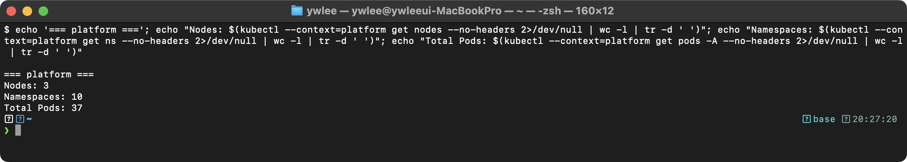

**동작 원리:**
1. 시험 종료 전 각 클러스터의 리소스 수를 확인하여 작업 누락을 방지한다
2. `--no-headers`로 헤더 라인을 제외하고 `wc -l`로 정확한 수량을 파악한다
3. 예상보다 Pod 수가 적으면 작업이 누락되었을 가능성을 점검한다

### 실습 2: dev 클러스터 전체 아키텍처 검증

```bash
kubectl config use-context dev

# 핵심 리소스 상태 한번에 확인 (시험 마지막 검증용)
echo "--- Deployments ---"
kubectl get deploy -n demo
echo "--- Services ---"
kubectl get svc -n demo
echo "--- NetworkPolicies ---"
kubectl get ciliumnetworkpolicies -n demo --no-headers | wc -l
echo "--- HPA ---"
kubectl get hpa -n demo
echo "--- PDB ---"
kubectl get pdb -n demo
echo "--- PVC ---"
kubectl get pvc -n demo
```

**예상 출력 (예시 — fresh dev 클러스터에는 demo ns 와 그 안의 Deployment/Service/CiliumNetworkPolicy/
HPA/PDB/PVC 가 없다. 또한 metrics-server 미설치라 HPA 도 동작하지 않는다. 아래는 프로젝트 앱이
모두 배포된 환경의 형태이며, 각 리소스의 실제 출력 형태는 day11~16 의 dev 실측에서 검증했다):**
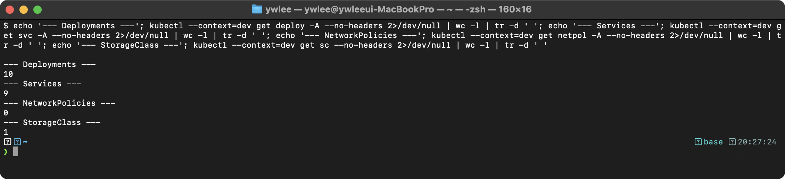

**동작 원리:**
1. 단일 명령 체인으로 전체 아키텍처를 빠르게 검증할 수 있다
2. CiliumNetworkPolicy 11개는 마이크로서비스 간 통신을 세밀하게 제어한다
3. HPA+PDB 조합으로 오토스케일링과 가용성을 동시에 보장한다
4. StatefulSet의 PVC는 Pod 재시작 후에도 데이터 영속성을 보장한다

### 실습 3: 자가 평가 체크리스트 실행

```bash
# 각 도메인별 핵심 명령 실행 가능 여부 빠른 점검
echo "[1] RBAC" && kubectl auth can-i list pods -n demo --as=system:serviceaccount:demo:default && echo "OK"
echo "[2] DNS" && kubectl run dnscheck --image=busybox:1.36 -n demo --rm -it --restart=Never -- nslookup nginx.demo.svc.cluster.local > /dev/null 2>&1 && echo "OK"
echo "[3] Storage" && kubectl get pvc -n demo --no-headers | wc -l | xargs -I{} echo "{} PVCs bound"
echo "[4] Networking" && kubectl get svc nginx -n demo -o jsonpath='{.spec.type}:{.spec.ports[0].nodePort}' && echo " OK"
```

**동작 원리:**
1. 시험 종료 전 각 도메인별 핵심 기능이 정상 동작하는지 빠르게 확인한다
2. RBAC → DNS → Storage → Networking 순서로 의존성 계층을 따라 검증한다
3. 하나라도 실패하면 해당 도메인의 작업을 재점검한다
