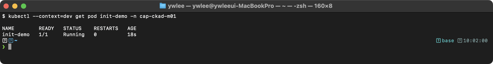
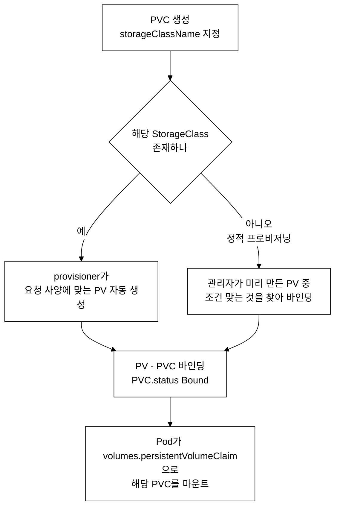
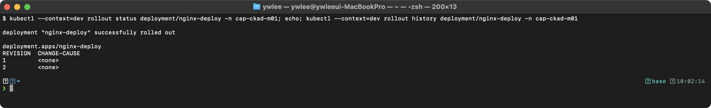
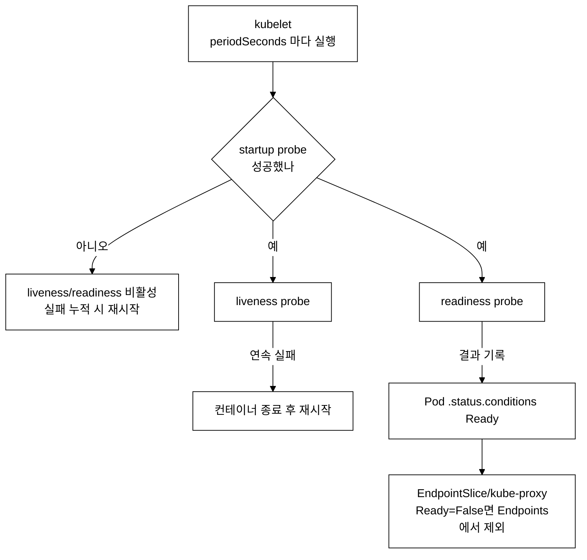

# CKAD 핵심 개념 정리

> 학습 목표: CKAD 5개 도메인의 핵심 개념을 이해하고 실습을 직접 재현한다. | 도메인·비중: 애플리케이션 설계·빌드 20% · 배포 20% · 관측·유지보수 15% · 환경·구성·보안 25% · 서비스·네트워킹 20%(시험별 정확한 비중은 [README.md](README.md) 참조) | 예상 소요 시간: 8~10시간
>
> CKAD(Certified Kubernetes Application Developer)는 Kubernetes 환경에서 애플리케이션을 설계, 빌드, 배포, 운영하는 능력을 검증하는 실기 시험이다.
> 시험 시간은 2시간이며, 실제 클러스터에서 kubectl을 사용하여 문제를 풀어야 한다.

**시험 시작 즉시 실행할 셋업**

실기는 속도전이므로(§3③), 문제를 풀기 전 단축키와 변수를 먼저 설정한다. 시험 환경에서 `alias k=kubectl`은 기본 제공되지만, 자동완성과 자주 쓰는 옵션 변수는 직접 설정하는 편이 빠르다. 아래 블록을 시험 시작 직후 한 번 붙여 넣는다(이 저장소에서 실습할 때도 동일하게 쓰며, 실습 시에는 대상 클러스터를 `export KUBECONFIG=$HOME/sideproejct/IaC_apple_sillicon/kubeconfig/dev.yaml`로 고정한다).

```bash
source <(kubectl completion bash)      # kubectl 자동완성 활성화
alias k=kubectl                        # 시험 환경엔 기본 제공되나 명시적으로 설정
complete -o default -F __start_kubectl k  # alias k에도 자동완성 적용
export do='--dry-run=client -o yaml'   # 매니페스트 골격 생성: k run x --image=nginx $do > x.yaml
export now='--force --grace-period=0'  # 즉시 삭제: k delete pod x $now
```

이후 본문 실습은 `kubectl`을 그대로 쓰지만, 시험장에서는 `k`로 줄여 입력 시간을 줄인다. `$do`는 명령형으로 리소스 골격 YAML을 만들 때(§1.4·§2.1 등 실습에서 사용), `$now`는 잘못 만든 리소스를 빠르게 지울 때 쓴다.

---

## 1. Application Design and Build (20%)

애플리케이션을 컨테이너 이미지로 빌드하고, 멀티 컨테이너 패턴을 활용하여 Pod를 설계하는 영역이다.

### 1.1 Dockerfile 최적화

컨테이너 이미지 크기를 줄이고 보안을 강화하는 것이 목표이다. Docker 이미지는 레이어 기반 파일시스템(UnionFS)으로 구성되며, 각 Dockerfile 명령이 하나의 레이어를 생성한다. UnionFS(union filesystem)는 여러 디렉토리(레이어)를 위로 겹쳐 쌓아 하나의 파일시스템처럼 보이게 하는 기술이다. `FROM` 이후의 각 `RUN`/`COPY`/`ADD` 명령마다 직전 상태와의 차이분(diff)이 새 레이어로 쌓이며, 한 번 쌓인 레이어는 불변(immutable)이다. 따라서 어떤 레이어에서 빌드 중간 산출물이나 캐시 파일을 만들면, 뒤 레이어에서 그 파일을 `rm` 으로 지워도 이전 레이어에는 그대로 남아 이미지 전체 크기를 부풀린다. 레이어 수가 많거나 각 레이어가 무거울수록 이미지 크기가 커지고 레지스트리에서 내려받는(pull) 시간이 늘어난다.

**멀티스테이지 빌드**

멀티스테이지 빌드가 등장하기 전에는 빌드 도구와 런타임 환경이 하나의 이미지에 혼재되는 문제가 있었다. 예를 들어 Go 애플리케이션을 빌드하려면 Go 컴파일러(약 500MB)가 필요하지만, 실행에는 바이너리(약 10MB)만 있으면 된다. 이를 해결하기 위해 빌드 환경과 런타임 환경을 분리하는 멀티스테이지 빌드가 Docker 17.05에서 도입되었다.

- 1단계(builder): 소스 코드 컴파일, 의존성 설치 등 빌드 작업을 수행한다.
- 2단계(runtime): 빌드 결과물만 `COPY --from=builder`로 복사하여 경량 베이스 이미지 위에서 실행한다.
- 빌드 도구, 소스 코드, 중간 산출물이 최종 이미지에 포함되지 않으므로 이미지 크기가 대폭 줄어든다.

```dockerfile
# 1단계: 빌드
FROM golang:1.21 AS builder
WORKDIR /app
COPY go.mod go.sum ./
RUN go mod download
COPY . .
RUN CGO_ENABLED=0 GOOS=linux go build -o /app/server .

# 2단계: 런타임
FROM gcr.io/distroless/static:nonroot
COPY --from=builder /app/server /server
USER 65534:65534
ENTRYPOINT ["/server"]
```

**.dockerignore**

빌드 컨텍스트에서 불필요한 파일을 제외하여 빌드 속도를 높이고 이미지에 민감 정보가 포함되는 것을 방지한다. Docker CLI는 빌드 시 현재 디렉토리의 모든 파일을 Docker 데몬에 전송하므로, 대용량 파일이나 불필요한 파일이 빌드 컨텍스트에 포함되면 빌드가 느려진다.

- `.git`, `node_modules`, `*.md`, `.env`, `__pycache__` 등을 제외하는 것이 일반적이다.

**이미지 크기 최적화 전략**

- 경량 베이스 이미지 사용: `alpine`(약 5MB), `distroless`(셸 미포함, 공격 표면 최소화), `scratch`(빈 이미지, 정적 바이너리 전용)
- RUN 명령 체이닝: 여러 명령을 `&&`로 연결하여 레이어 수를 줄인다. 각 RUN이 별도 레이어를 생성하므로, 패키지 설치와 캐시 정리를 같은 RUN에서 수행해야 캐시가 레이어에 남지 않는다.
- 불필요한 패키지 설치 금지: `--no-install-recommends` 옵션 활용
- 캐시 정리: `apt-get clean && rm -rf /var/lib/apt/lists/*`
- 레이어 순서 최적화: 변경 빈도가 낮은 명령(패키지 설치)을 상위에, 변경 빈도가 높은 명령(소스 복사)을 하위에 배치하여 캐시 활용률을 높인다.

**베이스 이미지 선택의 트레이드오프**

작은 이미지가 항상 정답은 아니다. 베이스를 작게 깎을수록 디버깅 도구·표준 라이브러리·셸이 사라져, 런타임 호환성 문제나 운영 중 디버깅 곤란으로 되돌아온다. 아래는 자주 쓰는 베이스의 선택 기준이다.

| 베이스 이미지 | 대략 크기 | 장점 | 주의점(트레이드오프) |
|:--|:--|:--|:--|
| `ubuntu`/`debian` | 수십~수백 MB | 셸·패키지·디버깅 도구 완비, glibc 동적 링크 그대로 동작 | 이미지가 크고 불필요한 패키지가 공격 표면이 된다 |
| `alpine` | 약 5MB | 매우 작고 apk로 패키지 추가 가능, 셸(`/bin/sh`) 있음 | C 표준 라이브러리가 glibc가 아닌 musl libc라, glibc에 의존하는 바이너리(예: 일부 Python wheel, Go의 cgo 빌드)가 런타임에 깨질 수 있다 |
| `distroless` | 수~수십 MB | 셸·패키지 매니저 제거로 공격 표면 최소, glibc 포함 | `sh`/`exec`로 셸 접속이 불가능해 디버깅이 어렵다 → `kubectl debug`(ephemeral container, §3.6)로 별도 도구 컨테이너를 붙여야 한다 |
| `scratch` | 0(빈 이미지) | 가장 작음, 정적 바이너리 단독 배포에 적합 | 셸·라이브러리·CA 인증서까지 전혀 없어, glibc 동적 링크 바이너리는 실행 불가(정적 링크 필요). TLS 통신 시 `ca-certificates`를 직접 COPY해야 한다 |

Go의 경우 위 멀티스테이지 예시처럼 `CGO_ENABLED=0`으로 정적 바이너리를 만들면 distroless나 scratch에 올릴 수 있다. 반면 musl 비호환 라이브러리를 쓰는 애플리케이션을 alpine에 올리면 빌드는 되지만 실행 중 `Segmentation fault`나 `not found` 같은 형태로 실패할 수 있어, 베이스는 "최소 크기"가 아니라 "실행 호환성을 만족하는 가장 작은 것"으로 골라야 한다.

**실습: 멀티스테이지 빌드로 이미지 크기 비교**

전제: 로컬에 `docker`가 설치되어 있어야 한다(이 실습은 클러스터가 아니라 빌드 호스트에서 수행한다). 빌드 결과 화면은 CLAUDE.md §4① 규약에 따라 실제 터미널 캡처로 대체해야 한다(현재 미캡처).

단일 스테이지(빌드 도구가 그대로 남는 이미지)와 멀티스테이지(런타임 결과물만 남는 이미지)를 같은 소스로 빌드해 크기를 비교한다.

```bash
# 단일 스테이지: golang 베이스가 그대로 최종 이미지가 된다
cat > Dockerfile.single <<EOF
FROM golang:1.21
WORKDIR /app
COPY . .
RUN CGO_ENABLED=0 go build -o /server .
ENTRYPOINT ["/server"]
EOF
docker build -t myapp:single -f Dockerfile.single .

# 멀티스테이지: 위 1.1의 Dockerfile(builder + distroless)을 사용
docker build -t myapp:multi -f Dockerfile .

# 두 이미지 크기 비교
docker images myapp
```

> **예시(참조) — myapp single 약 800MB / myapp multi 약 15MB:** 단일 스테이지는 Go 컴파일러·소스·캐시가 그대로 남아 수백 MB이고, 멀티스테이지는 distroless 위에 바이너리만 복사해 수십 MB 이하로 줄어든다. 정확한 크기는 베이스 버전·바이너리 크기에 따라 다르며, 실측 화면은 미캡처.

### 1.2 Init Container

**등장 배경과 기존 한계점**

Init Container가 도입되기 전에는 메인 컨테이너 내부에 초기화 로직을 포함시켜야 했다. 이 방식에는 다음과 같은 문제가 있다:

- 메인 이미지에 초기화 전용 도구(curl, git, mysql-client 등)를 포함해야 하므로 이미지 크기가 증가한다.
- 초기화 스크립트 실패 시 메인 프로세스의 시작 로직과 얽혀 디버깅이 어려워진다.
- 초기화 단계에서만 필요한 보안 권한(예: 네트워크 설정을 위한 NET_ADMIN capability)을 메인 컨테이너에도 부여해야 한다.
- 초기화 완료 여부를 메인 프로세스가 직접 판단해야 하므로, 애플리케이션 코드에 인프라 관련 로직이 침투한다.

이러한 문제를 해결하기 위해 Kubernetes 1.5에서 Init Container가 도입되었다.

**동작 메커니즘**

Pod가 노드에 배치되기까지의 흐름을 먼저 정리한다. 사용자가 `kubectl apply`로 Pod를 생성하면 매니페스트는 API server에 저장되고 아직 어느 노드에도 묶이지 않은 상태(`Pending`, `nodeName` 비어 있음)가 된다. scheduler가 이 Pod를 감지해 자원·제약 조건을 평가한 뒤 적절한 노드를 골라 `spec.nodeName`에 기록한다(바인딩). 각 노드의 kubelet은 API server를 watch하다가 자신에게 바인딩된 Pod의 spec을 수신하고, 그때부터 다음 순서로 컨테이너를 관리한다:

1. kubelet은 `spec.initContainers` 배열을 순회하며, 인덱스 0부터 하나씩 컨테이너를 시작한다.
2. 각 init container는 반드시 exit code 0으로 종료되어야 다음 init container가 시작된다.
3. init container가 0이 아닌 exit code로 종료되면, `restartPolicy`에 따라 동작이 달라진다:
   - `restartPolicy: Always` (기본값): kubelet이 실패한 init container를 재시작한다. 성공할 때까지 반복하며, 반복 간격은 exponential backoff(10s, 20s, 40s, ... 최대 5분)로 증가한다.
   - `restartPolicy: Never`: Pod가 Failed 상태로 전환되며 재시도하지 않는다.
   - `restartPolicy: OnFailure`: 실패한 init container를 재시작한다.
4. 모든 init container가 성공적으로 완료되면 kubelet이 `spec.containers` 배열의 메인 컨테이너를 시작한다.

init container는 메인 컨테이너와 동일한 volume mount, 네트워크 네임스페이스를 공유하지만, probe(liveness, readiness, startup)는 지원하지 않는다. init container가 실행되는 동안 Pod의 상태는 `Init:N/M` (N: 완료된 init container 수, M: 전체 init container 수)으로 표시된다.

**주요 용도**

- 외부 서비스가 준비될 때까지 대기 (예: DB가 올라올 때까지 wait)
- 설정 파일 생성 또는 다운로드
- 데이터베이스 스키마 마이그레이션
- Git 저장소에서 소스 코드 클론
- 보안 토큰 획득
- 파일 시스템 권한 설정 (메인 컨테이너가 non-root로 실행되는 경우)

**실습: Init Container로 외부 서비스 대기**

```yaml
# init-container-demo.yaml
apiVersion: v1
kind: Pod
metadata:
  name: init-demo
spec:
  initContainers:
  - name: wait-for-service
    image: busybox:1.36
    command: ['sh', '-c', 'until nslookup myservice.default.svc.cluster.local; do echo "Waiting for myservice..."; sleep 2; done']
  - name: init-config
    image: busybox:1.36
    command: ['sh', '-c', 'echo "config initialized at $(date)" > /work-dir/config.txt']
    volumeMounts:
    - name: workdir
      mountPath: /work-dir
  containers:
  - name: app
    image: busybox:1.36
    command: ['sh', '-c', 'cat /work-dir/config.txt && sleep 3600']
    volumeMounts:
    - name: workdir
      mountPath: /work-dir
  volumes:
  - name: workdir
    emptyDir: {}
```

```bash
# Pod 생성
kubectl apply -f init-container-demo.yaml

# Init Container 상태 확인 - myservice가 없으므로 첫 번째 init에서 대기한다
kubectl get pod init-demo
```



```bash
# Init Container 로그 확인
kubectl logs init-demo -c wait-for-service
```

> **예시(참조) — Server:    10.96.0.10:** 개념 이해용 기대 출력 예시. 동일·유사 명령 실측은 CKAD daily(day01~14) 및 위 캡처 참고.

```bash
# myservice를 생성하여 init container가 통과하도록 한다
kubectl create service clusterip myservice --tcp=80:80

# 잠시 후 Pod 상태 재확인
kubectl get pod init-demo
```

> **예시(참조) — NAME        READY   STATUS    RESTARTS   AGE:** 개념 이해용 기대 출력 예시. 동일·유사 명령 실측은 CKAD daily(day01~14) 및 위 캡처 참고.

```bash
# 두 번째 init container가 생성한 설정 파일 확인
kubectl exec init-demo -- cat /work-dir/config.txt
```

> **예시(참조) — config initialized at Mon Jan 15 09:23:45 UTC 2024:** 개념 이해용 기대 출력 예시. 동일·유사 명령 실측은 CKAD daily(day01~14) 및 위 캡처 참고.

**장애 시나리오 및 트러블슈팅**

- `Init:CrashLoopBackOff`: init container가 반복적으로 실패하고 있다. `kubectl logs <pod> -c <init-container-name>`으로 에러 원인을 확인한다.
- `Init:Error`: init container가 0이 아닌 exit code로 종료되었다. `kubectl describe pod <pod>`의 `Last State` 섹션에서 exit code를 확인한다.
- init container가 완료되지 않으면 메인 컨테이너는 절대 시작되지 않는다. `kubectl describe pod`의 Events 섹션에서 init container 관련 이벤트를 확인한다.

### 1.3 Sidecar Container

**등장 배경과 기존 한계점**

모놀리식 컨테이너 설계에서는 애플리케이션의 모든 기능(로깅, 프록시, 설정 동기화 등)을 단일 이미지에 포함시켰다. 이 방식에는 다음과 같은 문제가 있다:

- 이미지 크기 증가: 로그 수집 에이전트, 프록시 바이너리 등 보조 기능의 의존성이 모두 포함된다.
- 독립 업데이트 불가: 로그 에이전트만 업데이트하려 해도 전체 이미지를 재빌드해야 한다.
- 관심사 분리 위반: 비즈니스 로직과 인프라 관련 코드가 혼재한다.
- 언어/런타임 제약: 메인 애플리케이션이 Java면 사이드카 로직도 Java로 작성하거나, 별도 프로세스를 이미지에 포함시켜야 한다.

이를 해결하기 위해 보조 기능을 별도 컨테이너로 분리하는 Sidecar 패턴이 등장했다. 동일 Pod 내 컨테이너는 네트워크 네임스페이스(localhost 통신), 볼륨, IPC 네임스페이스를 공유하므로, 밀접하게 협력하면서도 독립적으로 배포/업데이트가 가능하다.

**기존 Sidecar vs KEP-753 (Native Sidecar)**

Kubernetes 1.28에서 KEP-753으로 native sidecar container 기능이 도입되었다(beta). 기존 방식과의 차이는 다음과 같다:

| 항목 | 기존 Sidecar (일반 container) | Native Sidecar (KEP-753) |
|------|------------------------------|--------------------------|
| 정의 위치 | `spec.containers[]` | `spec.initContainers[]` + `restartPolicy: Always` |
| 시작 시점 | 모든 init container 완료 후 | init container 순서에서 시작, 이후 계속 실행 |
| 종료 시점 | 메인 컨테이너와 동시에 SIGTERM 수신 | 메인 컨테이너 종료 후 역순으로 종료 |
| 종료 순서 보장 | 보장되지 않음 (동시 종료) | 보장됨 (메인 먼저, sidecar 나중) |
| Probe 지원 | 지원 | startup/liveness probe 지원 |
| Job 호환성 | sidecar가 종료되지 않으면 Job이 완료되지 않는 문제 | sidecar는 메인 완료 후 자동 종료 |

기존 방식에서는 sidecar 컨테이너를 `spec.containers`에 넣었기 때문에, Job이 완료되어도 sidecar가 종료되지 않아 Job이 Completed 상태로 전환되지 않는 문제가 있었다. KEP-753은 이 문제를 해결한다.

이 차이를 메커니즘 수준에서 구체적으로 보면 다음과 같다. Job의 완료 판정은 "Pod 안의 **메인(일반) 컨테이너가 모두** exit 0이 되었는가"가 아니라, 기존 방식에서는 "`spec.containers`의 **모든** 컨테이너가 종료되었는가"를 본다. 그래서 배치 작업 컨테이너(`worker`)를 `spec.containers`에, 로그 수집 sidecar(`tail -F`처럼 끝나지 않는 프로세스)를 같은 `spec.containers`에 두면, worker가 exit 0 해도 sidecar는 계속 떠 있어 Pod가 영영 Running에 머물고 Job은 Complete가 되지 않는다(1.6 Job의 completions가 채워지지 않는다). 과거에는 worker가 끝나면 공유 파일에 신호를 써서 sidecar가 스스로 죽도록 스크립트를 짜는 우회책을 썼는데, 이는 두 컨테이너의 종료 로직을 사람이 직접 동기화해야 했다. KEP-753은 sidecar를 `spec.initContainers`에 두고 `restartPolicy: Always`를 붙여 "init 순서에서 시작하지만 이후 계속 실행되는 컨테이너"로 만든다. kubelet은 이 native sidecar를 Job 완료 판정 대상에서 제외하고, 메인 컨테이너가 모두 끝나면 sidecar를 역순으로 자동 종료시킨다. 결과적으로 worker가 exit 0 하면 kubelet이 sidecar를 정리하고 Pod가 Completed가 되어 Job도 Complete로 전환된다 — 사용자가 종료 동기화 스크립트를 짤 필요가 없어진 것이 핵심 개선이다.

```yaml
# native-sidecar-example.yaml (Kubernetes 1.28+)
apiVersion: v1
kind: Pod
metadata:
  name: native-sidecar-demo
spec:
  initContainers:
  - name: log-collector
    image: busybox:1.36
    restartPolicy: Always   # 이 설정이 native sidecar를 만든다
    command: ['sh', '-c', 'tail -F /var/log/app/app.log 2>/dev/null || true']
    volumeMounts:
    - name: log-volume
      mountPath: /var/log/app
  containers:
  - name: app
    image: busybox:1.36
    command: ['sh', '-c', 'while true; do echo "$(date) - app running" >> /var/log/app/app.log; sleep 5; done']
    volumeMounts:
    - name: log-volume
      mountPath: /var/log/app
  volumes:
  - name: log-volume
    emptyDir: {}
```

**Sidecar 패턴**

메인 컨테이너의 기능을 확장하거나 보강하는 패턴이다.

- 로그 수집 에이전트: 메인 앱이 파일에 쓴 로그를 수집하여 외부 시스템으로 전송한다.
- 파일 동기화: Git 저장소와 로컬 볼륨을 주기적으로 동기화한다.
- Istio envoy proxy: 서비스 메시의 사이드카로 트래픽을 가로채어 mTLS, 라우팅 등을 처리한다.

**Ambassador 패턴**

메인 컨테이너를 대신하여 외부 서비스에 대한 연결을 프록시하는 패턴이다.

- 메인 앱은 localhost로 요청하고, ambassador 컨테이너가 실제 외부 서비스로 라우팅한다.
- 예: localhost:6379로 요청하면 ambassador가 적절한 Redis 샤드로 라우팅한다.
- 메인 애플리케이션은 외부 서비스의 주소, 인증 방식, 커넥션 풀링 등을 알 필요가 없다. 프록시 컨테이너가 이를 추상화한다.

**Adapter 패턴**

메인 컨테이너의 출력을 표준화하거나 변환하는 패턴이다.

- 다양한 형식의 로그를 통일된 형식으로 변환한다.
- 메트릭 데이터를 Prometheus가 수집할 수 있는 형식으로 변환한다(exporter 패턴).
- 예: Redis 자체에는 Prometheus 메트릭 엔드포인트가 없으므로, redis-exporter sidecar가 Redis INFO 명령 결과를 Prometheus 형식으로 변환하여 `/metrics` 엔드포인트로 노출한다.

**실습: Sidecar 로그 수집 패턴**

```yaml
# sidecar-logging.yaml
apiVersion: v1
kind: Pod
metadata:
  name: sidecar-log-demo
spec:
  containers:
  - name: app
    image: busybox:1.36
    command: ['sh', '-c', 'i=0; while true; do echo "$i: $(date) log entry" >> /var/log/app.log; i=$((i+1)); sleep 3; done']
    volumeMounts:
    - name: log-volume
      mountPath: /var/log
  - name: log-collector
    image: busybox:1.36
    command: ['sh', '-c', 'tail -F /var/log/app.log']
    volumeMounts:
    - name: log-volume
      mountPath: /var/log
  volumes:
  - name: log-volume
    emptyDir: {}
```

```bash
kubectl apply -f sidecar-logging.yaml

# 메인 컨테이너가 파일에 쓴 로그를 sidecar가 stdout으로 출력하는 것을 확인
kubectl logs sidecar-log-demo -c log-collector -f
```

> **예시(참조) — 0: Mon Jan 15 09:30:00 UTC 2024 log entry:** 개념 이해용 기대 출력 예시. 동일·유사 명령 실측은 CKAD daily(day01~14) 및 위 캡처 참고.

```bash
# 두 컨테이너 모두 Running 상태인지 확인
kubectl get pod sidecar-log-demo -o jsonpath='{range .status.containerStatuses[*]}{.name}: {.state}{"\n"}{end}'
```

> **예시(참조) — app: map[running:map[startedAt:2024-01-15T09:30:00:** 개념 이해용 기대 출력 예시. 동일·유사 명령 실측은 CKAD daily(day01~14) 및 위 캡처 참고.

### 1.4 Volume

**등장 배경과 기존 한계점**

컨테이너는 본래 이미지 위에 얇은 쓰기 가능 레이어(writable layer)를 얹어 실행되는데, 이 레이어는 컨테이너와 수명을 같이한다. 즉 컨테이너가 죽고 재시작되면(예: liveness probe 실패) 쓰기 레이어가 폐기되고 이미지 상태로 되돌아가 그동안 쓴 데이터가 모두 사라진다. 또한 쓰기 레이어는 컨테이너 단위로 격리되므로, 같은 Pod 안의 다른 컨테이너가 그 파일을 볼 수 없다(직전 1.3 Sidecar에서 로그 수집 sidecar가 메인 컨테이너의 로그 파일을 읽으려면 무언가 공유 수단이 필요하다는 문제와 직결된다). 컨테이너 파일시스템만으로는 ⓐ 컨테이너 재시작 후 데이터 보존, ⓑ 같은 Pod 내 컨테이너 간 파일 공유 두 가지를 모두 할 수 없다.

Volume은 이 한계를 넘기 위해 도입된 추상화로, 컨테이너가 아니라 Pod의 수명(또는 그 이상)에 묶이는 저장소를 컨테이너 파일시스템의 특정 경로에 마운트한다. 컨테이너가 재시작되어도 Volume은 유지되고, 여러 컨테이너가 같은 Volume을 마운트하면 파일을 공유한다. 트레이드오프로, Volume 종류마다 수명·접근 범위가 달라 선택을 잘못하면(예: 영속 데이터에 emptyDir 사용) 데이터를 잃는다. 아래는 CKAD에서 자주 쓰는 Volume 종류와 각각의 수명·용도다.

Pod 내 컨테이너 간 데이터를 공유하거나, 컨테이너 재시작 시에도 데이터를 보존하기 위한 저장소이다. 컨테이너의 파일시스템은 컨테이너가 재시작되면 초기 이미지 상태로 복원되므로, 영속적이거나 공유되는 데이터에는 Volume이 필요하다.

**emptyDir**

- Pod가 생성될 때 빈 디렉토리가 만들어지고, Pod가 삭제되면 함께 삭제된다.
- 동일 Pod 내 컨테이너 간 임시 데이터 공유에 사용한다.
- `medium: Memory`를 지정하면 tmpfs(RAM 기반)로 마운트된다. 이 경우 노드의 메모리를 사용하며 `sizeLimit`으로 크기를 제한할 수 있다.
- 기본(디스크 기반) emptyDir은 노드의 로컬 디스크를 사용하며, Pod가 노드에서 제거되면 데이터가 삭제된다.

**configMap Volume**

- ConfigMap의 데이터를 파일로 마운트한다.
- 각 key가 파일명이 되고, value가 파일 내용이 된다.
- `subPath`를 사용하면 특정 key만 단일 파일로 마운트할 수 있다. 단, `subPath` 사용 시 ConfigMap 업데이트 시 자동 갱신이 되지 않는다. 그 이유는 마운트 방식의 차이에 있다. `subPath` 없이 디렉토리로 마운트하면 kubelet은 실제 데이터를 숨김 디렉토리(`..data`)에 두고 각 key 파일을 그 디렉토리로 향하는 심볼릭 링크로 만든다. ConfigMap이 바뀌면 kubelet이 새 데이터 디렉토리를 만든 뒤 `..data` 심볼릭 링크를 원자적으로 교체(rename)하므로, 마운트 경로의 파일 내용이 한 번에 새 값으로 갱신된다. 반면 `subPath`는 이 심볼릭 링크 구조를 거치지 않고 컨테이너 파일시스템의 한 경로에 단일 파일을 직접(bind mount) 꽂는 방식이라, 심볼릭 링크 교체에 기반한 갱신이 작동하지 않아 Pod를 재시작하기 전까지 옛 값이 유지된다.
- `subPath` 없이 마운트하면 마운트 지점이 ConfigMap 내용으로 덮여 기존 디렉토리의 원래 파일들이 가려진다(overlay — 한 디렉토리 위에 다른 내용을 겹쳐 올려 아래를 가리는 것). 예를 들어 `/etc/nginx`에 디렉토리로 마운트하면 ConfigMap에 든 파일만 보이고 이미지에 있던 다른 설정 파일은 사라진 것처럼 보인다. 기존 파일을 유지하면서 특정 파일 하나만 주입하려면 `subPath`로 그 파일만 꽂아야 한다. 즉 자동 갱신 가능성(`subPath` 없음)과 기존 파일 보존(`subPath` 사용)은 서로 맞바꿔야 하는 트레이드오프다.

**secret Volume**

- Secret의 데이터를 파일로 마운트한다.
- 기본적으로 tmpfs에 마운트되어 디스크에 기록되지 않는다.
- `defaultMode`로 파일 권한을 설정할 수 있다 (기본값: 0644).

**PersistentVolumeClaim (PVC)**

- PersistentVolume(PV)에 대한 사용 요청이다.
- `accessModes`: ReadWriteOnce(RWO), ReadOnlyMany(ROX), ReadWriteMany(RWX)
- `storageClassName`을 지정하여 동적 프로비저닝을 활용할 수 있다. StorageClass에 정의된 provisioner가 자동으로 PV를 생성한다.
- Pod가 삭제되어도 PVC와 PV는 유지된다. PV의 `persistentVolumeReclaimPolicy`에 따라 PVC 삭제 시 PV의 운명이 결정된다:
  - `Retain`: PV와 데이터가 보존된다. 관리자가 수동으로 정리해야 한다.
  - `Delete`: PV와 기반 스토리지(예: EBS 볼륨)가 함께 삭제된다.
  - `Recycle` (deprecated): 데이터를 삭제(`rm -rf /thevolume/*`)하고 PV를 재사용 가능 상태로 전환한다.

**PV / PVC / StorageClass 관계와 동적 프로비저닝 흐름**

emptyDir·configMap·secret 볼륨은 Pod 수명에 묶이므로 Pod가 삭제되면 데이터가 사라진다. DB·업로드 파일처럼 Pod보다 오래 살아야 하는 데이터를 위해 Kubernetes는 저장소 자체를 별도 오브젝트로 분리한다. PersistentVolume(PV — 실제 스토리지(EBS·NFS·로컬 디스크 등)를 클러스터에 등록한 오브젝트)은 "쓸 수 있는 저장 공간"을 나타내고, PersistentVolumeClaim(PVC — 사용자가 "용량 X, accessMode Y의 저장소가 필요하다"고 요청하는 오브젝트)은 그에 대한 요청이다. 애플리케이션 개발자는 PVC만 작성하고, 실제 어떤 스토리지가 붙는지는 신경 쓰지 않는다.

PV를 관리자가 미리 만들어 두는 방식(정적 프로비저닝)은 수요 예측이 어렵다. 이를 해결하는 것이 StorageClass(어떤 provisioner로 어떤 종류의 PV를 자동 생성할지 정의하는 오브젝트)를 통한 동적 프로비저닝이다. PVC가 `storageClassName`을 지정하면, StorageClass에 연결된 provisioner(외부 스토리지 컨트롤러)가 요청 사양에 맞는 PV를 즉시 생성해 PVC에 바인딩한다. 트레이드오프로, 동적 프로비저닝은 클러스터에 해당 StorageClass와 provisioner(CSI 드라이버 등)가 설치되어 있어야 하며, `accessModes`(RWO/ROX/RWX)는 기반 스토리지가 지원하는 범위로 제한된다(예: 블록 스토리지는 보통 RWX 불가).



_그림 1. 동적 프로비저닝 흐름 — PVC가 트리거가 되어 StorageClass provisioner가 PV를 만들고, 바인딩된 PVC를 Pod가 마운트한다._

**실습: PVC를 생성해 Pod에 마운트**

전제: dev 클러스터가 가동 중이어야 한다(`./scripts/boot.sh` 후 재부팅했다면 `./scripts/fix-cluster-ip-drift.sh dev`). kubeconfig는 `~/sideproejct/IaC_apple_sillicon/kubeconfig/dev.yaml`을 사용한다. 아래 명령은 가독성을 위해 `--kubeconfig`와 `-n`을 생략했으나, 실제 실행 시에는 `kubectl --kubeconfig kubeconfig/dev.yaml -n default ...` 형태로 명시한다. 클러스터에 기본 StorageClass가 있으면 `storageClassName`을 생략해도 동적 프로비저닝이 동작한다(`kubectl get storageclass`로 default 표시를 확인한다). 명령 실행 화면은 CLAUDE.md §4① 규약에 따라 실제 터미널 캡처로 대체해야 한다(현재 미캡처).

```yaml
# pvc-demo.yaml
apiVersion: v1
kind: PersistentVolumeClaim
metadata:
  name: data-pvc
spec:
  accessModes:
  - ReadWriteOnce
  resources:
    requests:
      storage: 1Gi
---
apiVersion: v1
kind: Pod
metadata:
  name: pvc-pod
spec:
  containers:
  - name: app
    image: busybox:1.36
    command: ['sh', '-c', 'echo "persisted data" > /data/file.txt && sleep 3600']
    volumeMounts:
    - name: data
      mountPath: /data
  volumes:
  - name: data
    persistentVolumeClaim:
      claimName: data-pvc
```

```bash
kubectl apply -f pvc-demo.yaml

# PVC가 Bound 상태가 되고, 동적으로 생성된 PV에 연결됐는지 확인
kubectl get pvc data-pvc
```

> **예시(참조) — data-pvc   Bound   pvc-xxxx   1Gi   RWO:** StorageClass provisioner가 PV를 자동 생성해 PVC와 바인딩하면 STATUS가 `Bound`, VOLUME 열에 자동 생성된 PV 이름(`pvc-`로 시작)이 나타난다. default StorageClass가 없으면 `Pending`에 머문다. 실측 화면은 미캡처.

```bash
# Pod가 마운트한 경로에 파일이 쓰였는지 확인
kubectl exec pvc-pod -- cat /data/file.txt
```

> **예시(참조) — persisted data:** Pod가 PVC로 마운트한 `/data`에 쓴 파일을 그대로 읽는다. emptyDir과 달리 이 데이터는 PVC/PV 수명에 묶이므로 Pod를 삭제하고 다시 같은 PVC를 마운트하면 데이터가 보존된다. 실측 화면은 미캡처.

**실습: emptyDir로 컨테이너 간 데이터 공유**

```bash
kubectl run vol-demo --image=busybox:1.36 --dry-run=client -o yaml -- sh -c 'echo "hello from writer" > /data/message.txt && sleep 3600' > vol-demo.yaml
```

생성된 YAML을 수정하여 볼륨과 두 번째 컨테이너를 추가한 후 적용한다:

```yaml
# vol-demo.yaml
apiVersion: v1
kind: Pod
metadata:
  name: vol-demo
spec:
  containers:
  - name: writer
    image: busybox:1.36
    command: ['sh', '-c', 'echo "hello from writer" > /data/message.txt && sleep 3600']
    volumeMounts:
    - name: shared
      mountPath: /data
  - name: reader
    image: busybox:1.36
    command: ['sh', '-c', 'sleep 5 && cat /data/message.txt && sleep 3600']
    volumeMounts:
    - name: shared
      mountPath: /data
  volumes:
  - name: shared
    emptyDir: {}
```

```bash
kubectl apply -f vol-demo.yaml
kubectl logs vol-demo -c reader
```

> **예시(참조) — hello from writer:** 개념 이해용 기대 출력 예시. 동일·유사 명령 실측은 CKAD daily(day01~14) 및 위 캡처 참고.

### 1.5 Multi-container Pod 패턴 상세

하나의 Pod에 여러 컨테이너를 배치하는 이유와 패턴을 이해해야 한다.

**공유 리소스**

동일 Pod 내 컨테이너가 공유하는 리소스와 그 기반 기술은 다음과 같다:

- 네트워크: 동일 Pod 내 컨테이너는 같은 network namespace에 속하며, 같은 IP 주소와 포트 공간을 공유한다. `localhost`로 상호 통신이 가능하다. 이 때문에 두 컨테이너가 같은 포트를 bind하면 충돌이 발생한다.
- 볼륨: `volumes`에 정의한 볼륨을 여러 컨테이너가 마운트하여 데이터를 공유한다.
- 프로세스 네임스페이스: `shareProcessNamespace: true`를 설정하면 PID namespace를 공유하여 다른 컨테이너의 프로세스 목록을 볼 수 있다. 디버깅 시 유용하다.
- IPC namespace: 동일 Pod 내 컨테이너는 기본적으로 IPC namespace를 공유하므로, POSIX 공유 메모리나 세마포어를 사용한 프로세스 간 통신이 가능하다.

**설계 원칙**

- 단일 책임 원칙: 각 컨테이너는 하나의 역할만 담당한다.
- 밀접한 결합: 함께 배포, 스케일링, 관리되어야 하는 경우에만 같은 Pod에 배치한다.
- 독립적 운영이 가능한 서비스는 별도 Pod로 분리하는 것이 원칙이다. "이 컨테이너들을 독립적으로 스케일링할 필요가 있는가?"라는 질문에 "예"이면 별도 Pod로 분리해야 한다.

**실습: Multi-container Pod에서 공유 리소스 확인**

```bash
# 두 컨테이너가 같은 IP를 공유하는지 확인
kubectl apply -f - <<EOF
apiVersion: v1
kind: Pod
metadata:
  name: multi-net-demo
spec:
  containers:
  - name: web
    image: nginx:1.25
    ports:
    - containerPort: 80
  - name: sidecar
    image: busybox:1.36
    command: ['sh', '-c', 'sleep 5 && wget -qO- http://localhost:80 && sleep 3600']
EOF

# sidecar가 localhost로 nginx에 접근한 결과 확인
kubectl logs multi-net-demo -c sidecar
```

> **예시(참조) — <!DOCTYPE html>:** 개념 이해용 기대 출력 예시. 동일·유사 명령 실측은 CKAD daily(day01~14) 및 위 캡처 참고.

### 1.6 Job / CronJob

**등장 배경과 기존 한계점**

앞의 1.1~1.5에서 다룬 Deployment/ReplicaSet은 "Pod를 항상 N개 살려 둔다"를 전제로 한다. Pod의 프로세스가 종료되면 `restartPolicy: Always`로 곧바로 재시작되며, "끝났다(완료)"라는 개념 자체가 없다. 그러나 DB 마이그레이션, 배치 집계, 백업, 이메일 일괄 발송처럼 **한 번 실행되어 성공하면 끝나는 일회성 태스크**도 필요하다. 이런 작업을 Deployment로 돌리면 프로세스가 정상 종료(exit 0)해도 컨테이너가 계속 재시작되어, 작업이 끝났는지 추적할 수 없고 자원만 낭비된다.

Job은 이 한계를 "완료(completion)"라는 개념으로 넘어선다. Job은 지정한 횟수만큼 Pod를 성공적으로 완료시키는 것을 목표로 하며, Pod가 exit 0으로 끝나면 그 Pod를 완료로 기록하고 더 이상 재시작하지 않는다. CronJob은 그 Job을 cron 스케줄에 맞춰 주기적으로 생성하는 상위 오브젝트다(Deployment가 ReplicaSet을 만들 듯, CronJob이 시각이 되면 Job을 만든다). 트레이드오프로, Job의 Pod는 `restartPolicy`를 `Always`로 둘 수 없고(완료 개념과 모순) `OnFailure` 또는 `Never`만 허용되며, 완료된 Job·Pod는 자동 삭제되지 않아 `ttlSecondsAfterFinished`나 `successfulJobsHistoryLimit`로 정리하지 않으면 누적된다.

**Job 주요 spec 필드**

- `completions`: 성공적으로 완료되어야 하는 Pod 수. 기본값 1. 이 수만큼 Pod가 exit 0이 되면 Job이 Complete가 된다.
- `parallelism`: 동시에 실행할 Pod 수. 기본값 1(순차). `completions`와 조합해 실행 패턴이 결정된다.
- `backoffLimit`: Pod 실패 시 재시도 횟수 상한. 기본값 6. 이를 초과하면 Job이 Failed가 된다. 재시도 간격은 exponential backoff(10s, 20s, …)로 증가한다.
- `activeDeadlineSeconds`: Job 전체의 실행 시간 상한. 초과하면 실행 중인 Pod를 종료하고 Failed 처리한다.
- `ttlSecondsAfterFinished`: Job이 완료/실패한 뒤 자동 삭제되기까지의 시간. 미설정 시 수동 정리가 필요하다.

**병렬/순차 실행 패턴**

- 단일 실행: `completions` 미지정(=1), `parallelism` 미지정(=1) → Pod 하나가 성공하면 끝. 마이그레이션처럼 한 번만 도는 작업.
- 고정 완료 수: `completions: 5`, `parallelism: 2` → 총 5개를 완료할 때까지 최대 2개씩 동시에 돌린다. 작업 큐의 항목 수가 정해진 배치에 쓴다.
- 작업 큐 방식: `completions` 미지정 + `parallelism: N` → 외부 큐가 빌 때까지 N개 워커를 병렬로 돌리고, 한 Pod가 "큐가 비었다"며 exit 0 하면 전체를 완료로 본다.

**CronJob 스케줄 문법과 주요 필드**

`schedule` 필드는 표준 cron 표현식(`분 시 일 월 요일`)을 쓴다. 예: `*/5 * * * *`(5분마다), `0 2 * * *`(매일 02:00), `0 0 * * 0`(매주 일요일 0시).

- `concurrencyPolicy`: 이전 Job이 아직 안 끝났는데 다음 스케줄이 도래했을 때의 처리. `Allow`(기본, 동시 실행 허용)·`Forbid`(이전이 끝날 때까지 새 실행 건너뜀)·`Replace`(이전을 종료하고 새로 시작).
- `startingDeadlineSeconds`: 스케줄 시각을 놓쳤을 때(컨트롤러 다운 등) 몇 초까지 지각 실행을 허용할지.
- `successfulJobsHistoryLimit` / `failedJobsHistoryLimit`: 보관할 완료/실패 Job 이력 수(기본 3 / 1). 초과분은 자동 삭제된다.
- `suspend: true`: 스케줄을 일시 중지한다(이미 실행 중인 Job에는 영향 없음).

**실습: Job과 CronJob 생성**

전제: dev 클러스터가 가동 중이어야 한다(필요 시 `./scripts/fix-cluster-ip-drift.sh dev`). kubeconfig는 `~/sideproejct/IaC_apple_sillicon/kubeconfig/dev.yaml`을 사용하며, 아래 명령은 가독성을 위해 `--kubeconfig`/`-n`을 생략했다(실제 실행 시 `kubectl --kubeconfig kubeconfig/dev.yaml -n default ...`로 명시). 명령 실행 화면은 CLAUDE.md §4① 규약에 따라 실제 터미널 캡처로 대체해야 한다(현재 미캡처). 더 자세한 실습은 [04-tart-infra-practice.md](04-tart-infra-practice.md) Lab 1.7 참고.

```bash
# 명령형으로 일회성 Job 생성 (3초 슬립 후 종료)
kubectl create job hello-job --image=busybox:1.36 -- sh -c 'echo "job done at $(date)"; sleep 3'

# Job이 완료(Completions 1/1)되는지 확인
kubectl get job hello-job
```

> **예시(참조) — hello-job   1/1   5s   10s:** COMPLETIONS 열이 `1/1`이면 지정한 completions(기본 1)만큼 Pod가 성공해 Job이 완료된 것이다. Deployment와 달리 완료 후 Pod가 재시작되지 않는다. 실측 화면은 미캡처.

```bash
# Job이 만든 Pod의 로그 확인
kubectl logs job/hello-job
```

> **예시(참조) — job done at ...:** Job이 생성한 Pod의 stdout이다. `kubectl logs job/<name>`은 그 Job에 속한 Pod의 로그를 조회한다. 실측 화면은 미캡처.

```bash
# 명령형으로 CronJob 생성 (매분 실행)
kubectl create cronjob hello-cron --image=busybox:1.36 --schedule='*/1 * * * *' -- sh -c 'date; echo from cronjob'

# 스케줄·마지막 실행 시각 확인
kubectl get cronjob hello-cron
```

> **예시(참조) — hello-cron   */1 * * * *   False   0   <none>   10s:** SCHEDULE 열에 cron 표현식, SUSPEND가 `False`이면 활성 상태다. 1분이 지나면 CronJob이 Job을 하나 생성하고 LAST SCHEDULE 시각이 채워진다. 실측 화면은 미캡처.

---

## 2. Application Deployment (20%)

애플리케이션의 배포 전략, 업데이트, 롤백을 관리하는 영역이다.

### 2.1 Deployment 전략

Deployment는 내부적으로 ReplicaSet을 생성하고 관리한다. ReplicaSet은 "이 template으로 만든 Pod를 N개 유지하라"만 책임지는 하위 컨트롤러이고, Deployment는 그 위에서 버전 전환(롤링 업데이트·롤백)을 지휘하는 상위 컨트롤러이다. Deployment가 ReplicaSet을 직접 다루지 않고 중간 객체로 끼워 두는 이유는, **template 버전마다 별도의 ReplicaSet을 만들어 Pod 묶음의 이력을 버전별로 분리 보관**하기 위해서다. Deployment의 `.spec.template`이 변경되면 새 template 해시를 가진 새 ReplicaSet이 생성되고, 이전 ReplicaSet의 replica 수를 점진적으로 줄이면서 새 ReplicaSet의 replica 수를 늘리는 방식으로 롤링 업데이트가 수행된다. 즉 두 버전의 Pod가 ReplicaSet 단위로 공존하면서 서서히 교체된다. 롤백은 이 구조 덕분에 단순하다 — 직전 ReplicaSet은 replica를 0으로 줄였을 뿐 정의가 그대로 남아 있으므로, 그 ReplicaSet의 replica를 다시 늘리기만 하면 이전 버전으로 즉시 되돌아간다. 이전 ReplicaSet은 `revisionHistoryLimit`(기본값 10)에 지정된 수만큼 보존되어 롤백에 사용된다.

**Rolling Update (기본값)**

Pod를 점진적으로 교체하는 전략이다. 다운타임 없이 업데이트가 가능하다.

- `maxSurge`: 업데이트 중 desired 수 대비 추가로 생성할 수 있는 최대 Pod 수이다. 기본값은 25%이다. 정수 또는 백분율로 지정한다.
- `maxUnavailable`: 업데이트 중 사용 불가능한 최대 Pod 수이다. 기본값은 25%이다.
- 예: replicas=4, maxSurge=1, maxUnavailable=1이면 업데이트 중 최소 3개, 최대 5개 Pod가 존재한다.
- `maxSurge=0, maxUnavailable=1`: 추가 리소스 없이 하나씩 교체. 리소스가 부족한 환경에서 사용한다.
- `maxSurge=100%, maxUnavailable=0`: 새 Pod를 전부 먼저 생성한 후 이전 Pod를 제거. blue-green과 유사한 동작.

Deployment Controller의 롤링 업데이트 내부 동작:

1. 새로운 ReplicaSet을 생성하고 maxSurge 수만큼 Pod를 시작한다.
2. 새 Pod가 Ready 상태가 되면, 이전 ReplicaSet의 Pod를 maxUnavailable 수만큼 종료한다.
3. 이 과정을 모든 Pod가 새 버전으로 교체될 때까지 반복한다.

**Recreate**

모든 기존 Pod를 먼저 삭제한 후 새 Pod를 생성하는 전략이다.

- 다운타임이 발생한다.
- 구버전과 신버전이 동시에 존재하면 안 되는 경우에 사용한다 (예: 호환되지 않는 DB 스키마 변경, 싱글톤 프로세스).

**Rollback**

- `kubectl rollout undo deployment/<name>`: 직전 버전으로 롤백한다. 실제로는 이전 ReplicaSet의 Pod template으로 새 ReplicaSet을 생성하는 것이다.
- `kubectl rollout undo deployment/<name> --to-revision=N`: 특정 리비전으로 롤백한다.
- `kubectl rollout history deployment/<name>`: 리비전 히스토리를 확인한다.
- `kubectl rollout status deployment/<name>`: 롤아웃 진행 상태를 확인한다.

**실습: Rolling Update와 롤백**

```bash
# Deployment 생성
kubectl create deployment nginx-deploy --image=nginx:1.24 --replicas=3

# 이미지 업데이트 (Rolling Update 발생)
kubectl set image deployment/nginx-deploy nginx=nginx:1.25

# 롤아웃 상태 확인
kubectl rollout status deployment/nginx-deploy
```



```bash
# ReplicaSet 확인 - 이전 RS(replica 0)와 새 RS(replica 3)가 존재한다
kubectl get rs -l app=nginx-deploy
```

> **예시(참조) — NAME                          DESIRED   CURRENT   :** 개념 이해용 기대 출력 예시. 동일·유사 명령 실측은 CKAD daily(day01~14) 및 위 캡처 참고.

```bash
# 리비전 히스토리 확인
kubectl rollout history deployment/nginx-deploy
```

> **예시(참조) — deployment.apps/nginx-deploy:** 개념 이해용 기대 출력 예시. 동일·유사 명령 실측은 CKAD daily(day01~14) 및 위 캡처 참고.

```bash
# 롤백 실행
kubectl rollout undo deployment/nginx-deploy

# 롤백 후 이미지 확인
kubectl describe deployment nginx-deploy | grep Image
```

> **예시(참조) — Image:        nginx:1.24:** 개념 이해용 기대 출력 예시. 동일·유사 명령 실측은 CKAD daily(day01~14) 및 위 캡처 참고.

### 2.2 Blue-Green 배포

**등장 배경**

Rolling Update는 업데이트 중 구버전과 신버전이 동시에 존재하는 시간이 발생한다. API 호환성이 보장되지 않는 업데이트에서는 이것이 문제가 된다. 또한 전체 신버전 인스턴스가 트래픽을 받기 전에 통합 테스트를 실행하고 싶은 경우, Rolling Update로는 불가능하다. Blue-Green 배포는 이러한 요구사항을 해결하기 위해 등장했다.

구버전(Blue)과 신버전(Green) 두 환경을 동시에 운영하고, Service의 selector를 전환하여 트래픽을 한 번에 이동시키는 방식이다.

**구현 방법**

1. Blue Deployment (현재 버전)가 Service에 연결되어 트래픽을 처리한다.
2. Green Deployment (새 버전)를 별도로 배포한다.
3. Green이 정상 동작하는지 확인한다 (별도 테스트용 Service로 검증 가능).
4. Service의 `selector` label을 Green으로 변경하여 트래픽을 전환한다.
5. Blue를 유지하다가 문제가 없으면 삭제한다.

**장점**: 즉각적인 롤백이 가능하다 (selector만 다시 변경).
**단점**: 두 배의 리소스가 필요하다. 전환 순간 기존 연결이 끊어질 수 있다.

**실습: Blue-Green 배포**

```bash
# Blue Deployment 생성
kubectl create deployment web-blue --image=nginx:1.24 --replicas=3
kubectl label deployment web-blue version=blue

# Service 생성 - Blue를 가리킨다
kubectl apply -f - <<EOF
apiVersion: v1
kind: Service
metadata:
  name: web-svc
spec:
  selector:
    app: web-blue
  ports:
  - port: 80
    targetPort: 80
EOF

# Green Deployment 생성
kubectl create deployment web-green --image=nginx:1.25 --replicas=3

# Green이 Ready 상태인지 확인
kubectl get pods -l app=web-green
```

> 위 `kubectl label deployment web-blue version=blue` 명령은 **Deployment 오브젝트 자체의 메타데이터 label에만** `version=blue`를 붙일 뿐, 그 아래 Pod template이나 실제 Pod의 label에는 영향이 없다. 따라서 이 명령은 Blue-Green 동작에 필수가 아니며(관리용 태깅일 뿐), Service selector와 혼동하지 않아야 한다. Blue-Green의 핵심은 Service의 `selector`를 `app: web-blue` ↔ `app: web-green`으로 전환해 트래픽을 한 번에 옮기는 것이다. 이때 selector가 매칭하는 Pod label `app=web-blue`/`app=web-green`은 `kubectl create deployment <name>`이 자동으로 Pod template에 `app=<deployment-name>`을 붙여 주므로 별도로 지정할 필요가 없다(그래서 `-l app=web-green`으로 Pod 조회가 된다).

> **예시(참조) — NAME                         READY   STATUS    RES:** 개념 이해용 기대 출력 예시. 동일·유사 명령 실측은 CKAD daily(day01~14) 및 위 캡처 참고.

```bash
# 트래픽 전환: Service의 selector를 Green으로 변경
kubectl patch service web-svc -p '{"spec":{"selector":{"app":"web-green"}}}'

# 전환 확인
kubectl describe svc web-svc | grep Selector
```

> **예시(참조) — Selector:          app=web-green:** 개념 이해용 기대 출력 예시. 동일·유사 명령 실측은 CKAD daily(day01~14) 및 위 캡처 참고.

```bash
# 문제 발생 시 롤백: selector를 다시 Blue로 변경
kubectl patch service web-svc -p '{"spec":{"selector":{"app":"web-blue"}}}'
```

### 2.3 Canary 배포

**등장 배경**

한 번에 전체를 배포하면(big-bang deployment) 새 버전에 결함이 있을 경우 전체 서비스가 영향을 받는다. Rolling Update는 점진적이지만, 트래픽 비율을 정밀하게 제어할 수 없으며 중간에 멈출 수 없다. Canary 배포는 신버전을 소수의 사용자에게만 먼저 노출하여 실제 트래픽에서의 동작을 검증한 후 점진적으로 확대하는 방식이다. "canary in a coal mine"(탄광의 카나리아)에서 이름이 유래했다.

**Kubernetes 네이티브 방식**

- 동일한 label을 가진 두 Deployment를 생성하되 replica 비율로 트래픽을 조절한다.
- 트래픽 비율이 replica 비율과 일치하는 이유는 Service의 동작 방식에 있다. Service는 selector에 맞는 모든 Pod의 IP를 Endpoints(EndpointSlice)에 나열하고, kube-proxy는 그 IP들 사이에서 들어오는 연결을 거의 균등하게(round-robin에 가깝게) 분배한다. 이때 어느 Deployment 소속인지는 구분하지 않고 개별 Pod IP 단위로만 분배한다.
- 예: stable(v1) 9개 + canary(v2) 1개 = 총 10개 Pod IP가 같은 Endpoints에 들어가고, kube-proxy가 10개에 균등 분배하므로 canary 1개에 약 10%(1/10)의 트래픽이 향한다.
- 한계: 트래픽 비율이 replica 수에 종속되므로 정밀한 제어가 어렵다. 1% 트래픽을 v2로 보내려면 v1을 99개, v2를 1개 실행해야 한다.

**Istio VirtualService 방식**

- `weight` 필드를 사용하여 정밀한 트래픽 비율을 지정할 수 있다.
- replica 수와 무관하게 트래픽 비율을 제어할 수 있다.
- HTTP 헤더, 쿠키 등 조건 기반 라우팅도 가능하다.

**실습: Kubernetes 네이티브 Canary**

```bash
# Stable Deployment (v1)
kubectl apply -f - <<EOF
apiVersion: apps/v1
kind: Deployment
metadata:
  name: app-stable
spec:
  replicas: 9
  selector:
    matchLabels:
      app: myapp
      track: stable
  template:
    metadata:
      labels:
        app: myapp
        track: stable
    spec:
      containers:
      - name: app
        image: nginx:1.24
EOF

# Canary Deployment (v2)
kubectl apply -f - <<EOF
apiVersion: apps/v1
kind: Deployment
metadata:
  name: app-canary
spec:
  replicas: 1
  selector:
    matchLabels:
      app: myapp
      track: canary
  template:
    metadata:
      labels:
        app: myapp
        track: canary
    spec:
      containers:
      - name: app
        image: nginx:1.25
EOF

# Service는 app=myapp label만으로 선택하므로 양쪽 Deployment의 Pod를 모두 포함한다
kubectl apply -f - <<EOF
apiVersion: v1
kind: Service
metadata:
  name: myapp-svc
spec:
  selector:
    app: myapp
  ports:
  - port: 80
    targetPort: 80
EOF

# Endpoints 확인 - 10개의 Pod IP가 보인다
kubectl get endpoints myapp-svc
```

> **예시(참조) — NAME        ENDPOINTS                             :** 개념 이해용 기대 출력 예시. 동일·유사 명령 실측은 CKAD daily(day01~14) 및 위 캡처 참고.

```bash
# Canary가 안전하다면 stable의 이미지를 업데이트하고 canary를 삭제한다
kubectl set image deployment/app-stable app=nginx:1.25
kubectl delete deployment app-canary
```

### 2.4 Helm 기본

**등장 배경과 기존 한계점**

앞의 2.1~2.3에서는 단일 Deployment·Service를 직접 `kubectl apply`로 배포했다. 그러나 실제 애플리케이션 하나는 Deployment·Service·ConfigMap·Ingress·HPA 등 여러 매니페스트로 구성되고, 이를 dev/staging/prod 환경별로 다른 값(replica 수, 이미지 태그, 도메인)으로 배포해야 한다. Helm 이전에는 환경마다 YAML을 복사해 일부 값만 손으로 바꾸는 방식(복붙 관리)이 일반적이었는데, 이는 ⓐ 환경 간 파일이 점점 달라져 어디가 의도된 차이이고 어디가 실수인지 추적이 안 되고, ⓑ 공통 변경(예: label 추가)을 모든 환경 파일에 일일이 반영해야 하며, ⓒ 한 애플리케이션을 구성하는 매니페스트 묶음을 하나의 버전으로 설치·업그레이드·롤백할 단위가 없다는 문제가 있었다.

Helm은 이 한계를 매니페스트를 변수화한 템플릿(Chart)과, 환경별 값(values)을 주입해 설치한 결과 단위(release)로 넘어선다. release는 설치 이력(revision)을 가지므로 `helm rollback` 한 번으로 묶음 전체를 이전 버전으로 되돌린다. 다만 Helm 2에서는 클러스터 안에 Tiller라는 서버 컴포넌트가 상주하며 광범위한 권한으로 매니페스트를 적용했는데, 이 Tiller가 보안 취약점(과도한 권한·RBAC 우회)으로 지적되었다. Helm 3에서는 Tiller를 완전히 제거하고 클라이언트가 사용자의 kubeconfig 권한으로 직접 API server에 적용하도록 바꿔 이 문제를 해소했다. 트레이드오프로, Go 템플릿 문법({{ }})이 끼어들어 원본 매니페스트의 가독성이 떨어지고, 템플릿 오류는 렌더링해 보기 전까지 드러나지 않는다(이 가독성 문제를 다른 방식으로 푸는 것이 2.5 Kustomize다).

Kubernetes 패키지 매니저이다. Chart를 사용하여 애플리케이션을 템플릿화하고 배포한다.

**Chart 구조**

```
mychart/
  Chart.yaml          # 차트 메타데이터 (name, version, appVersion)
  values.yaml         # 기본 설정값
  templates/          # Kubernetes 매니페스트 템플릿
    deployment.yaml
    service.yaml
    _helpers.tpl      # 템플릿 헬퍼 함수
  charts/             # 의존성 차트
```

**주요 명령어**

- `helm install <release> <chart>`: 차트를 설치한다.
- `helm upgrade <release> <chart>`: 릴리스를 업그레이드한다.
- `helm rollback <release> <revision>`: 특정 리비전으로 롤백한다.
- `helm uninstall <release>`: 릴리스를 삭제한다.
- `helm list`: 설치된 릴리스 목록을 확인한다.
- `helm repo add/update/list`: 차트 저장소를 관리한다.
- `helm template <chart>`: 렌더링된 매니페스트를 미리 확인한다. 클러스터(API server)에 접속하지 않고 로컬에서만 렌더링을 수행한다. Helm 3에서는 Tiller(Helm 2의 서버 측 컴포넌트 — Helm 3에서 완전히 제거됨)가 존재하지 않으므로 모든 명령이 서버리스로 동작한다.

**Values 오버라이드**

- `--set key=value`: 명령줄에서 개별 값을 지정한다.
- `-f custom-values.yaml`: 사용자 정의 values 파일을 지정한다.
- 우선순위: `--set` > `-f` 파일 > 기본 `values.yaml`

**실습: Helm 기본 워크플로우**

```bash
# 차트 저장소 추가 및 업데이트
helm repo add bitnami https://charts.bitnami.com/bitnami
helm repo update

# 차트 검색
helm search repo bitnami/nginx

# 설치 전 렌더링 결과 확인
helm template my-nginx bitnami/nginx --set service.type=ClusterIP

# 설치
helm install my-nginx bitnami/nginx --set service.type=ClusterIP

# 릴리스 확인
helm list
```

> **예시(참조) — NAME      NAMESPACE  REVISION  UPDATED            :** 개념 이해용 기대 출력 예시. 동일·유사 명령 실측은 CKAD daily(day01~14) 및 위 캡처 참고.

```bash
# 릴리스 상태 확인
helm status my-nginx

# 사용된 values 확인
helm get values my-nginx
```

### 2.5 Kustomize

**등장 배경과 기존 한계점**

직전 2.4 Helm은 환경별 배포 문제를 풀었지만, 원본 매니페스트에 Go 템플릿 문법({{ .Values.replicaCount }})이 섞여 들어가 더 이상 그 파일을 그대로 `kubectl apply` 할 수 없고, 변수가 많아질수록 사람이 읽기 어려워지는 한계가 있었다. 또한 템플릿 엔진·차트 저장소 같은 별도 도구 체계를 익혀야 한다. "환경별 차이는 주고 싶지만 원본 YAML은 유효한 그대로 두고 싶다"는 요구가 남아 있었다.

Kustomize는 이를 패치(patch) 방식으로 넘어선다. 변하지 않는 공통 매니페스트(base)는 완전한 유효 YAML 그대로 두고, 환경별로 달라지는 부분만 별도 파일(overlay)에 차이분으로 기술한 뒤 둘을 합쳐(merge) 최종 매니페스트를 만든다. 템플릿 문법이 없으므로 base 파일은 단독으로도 `kubectl apply -f` 가 되고, 환경별 차이가 overlay 디렉토리에 격리되어 "무엇이 환경 고유 설정인지" 한눈에 드러난다. Kustomize는 `kubectl`에 내장(`kubectl apply -k`)되어 별도 설치도 필요 없다. 트레이드오프로, 변수 치환·조건 분기·반복 같은 동적 로직은 표현할 수 없어(템플릿이 아니므로), 환경마다 구조 자체가 크게 다른 복잡한 패키지 배포는 Helm이 더 적합하다.

별도의 템플릿 엔진 없이 Kubernetes 매니페스트를 환경별로 커스터마이징하는 도구이다. Helm과 달리 원본 YAML을 수정하지 않고 패치 방식으로 오버레이를 적용하므로, 원본 매니페스트의 가독성이 유지된다.

**base/overlay 구조**

```
kustomize/
  base/
    kustomization.yaml    # resources 목록
    deployment.yaml
    service.yaml
  overlays/
    dev/
      kustomization.yaml  # bases 참조 + patches
      patch.yaml
    prod/
      kustomization.yaml
      patch.yaml
```

**kustomization.yaml 주요 필드**

- `resources`: 기본 매니페스트 파일 목록
- `patches`: Strategic Merge Patch 또는 JSON Patch를 적용한다.
- `namePrefix`, `nameSuffix`: 리소스 이름에 접두사/접미사를 추가한다.
- `commonLabels`: 모든 리소스에 공통 label을 추가한다.
- `configMapGenerator`: ConfigMap을 자동 생성한다. 내용이 변경되면 해시 접미사가 바뀌어 자동으로 롤링 업데이트가 트리거된다.
- `secretGenerator`: Secret을 자동 생성한다.
- `images`: 이미지 이름이나 태그를 변경한다.

**Patch 유형**

- Strategic Merge Patch: 원본 리소스와 동일한 구조로 변경할 부분만 작성한다. 배열 요소는 key 필드(예: name)로 매칭된다.
- JSON Patch: `op`, `path`, `value`를 사용하여 정밀하게 수정한다. 배열 인덱스로 특정 요소를 지정할 수 있다.

**적용 명령**

- `kubectl apply -k overlays/dev/`: kustomize를 적용한다.
- `kubectl kustomize overlays/dev/`: 렌더링 결과를 미리 확인한다.

**실습: base/overlay 구조를 만들어 dev 오버레이 적용**

전제: dev 클러스터가 가동 중이어야 한다(`./scripts/boot.sh` 후 재부팅했다면 `./scripts/fix-cluster-ip-drift.sh dev`). kubeconfig는 `~/sideproejct/IaC_apple_sillicon/kubeconfig/dev.yaml`을 사용한다. 아래 명령은 가독성을 위해 `--kubeconfig`와 `-n`을 생략했으나, 실제 실행 시에는 `kubectl --kubeconfig kubeconfig/dev.yaml -n default ...` 형태로 대상 클러스터와 네임스페이스를 명시한다. `kubectl apply -k`는 현재 컨텍스트에 적용되므로, `--kubeconfig`를 매번 붙이지 않으려면 실습 시작 시 한 번 `export KUBECONFIG=$HOME/sideproejct/IaC_apple_sillicon/kubeconfig/dev.yaml`로 대상을 고정한 뒤 진행한다(다른 클러스터에 의도치 않게 반영되는 사고를 막는다). 명령 실행 화면은 CLAUDE.md §4① 규약에 따라 실제 터미널 캡처로 대체해야 한다(현재 미캡처).

먼저 base 디렉토리에 공통 매니페스트와 kustomization.yaml을 만든다. base의 deployment.yaml은 템플릿 문법이 없는 완전한 유효 YAML이므로 단독으로도 적용 가능하다.

```bash
mkdir -p kustomize-demo/base kustomize-demo/overlays/dev

# base/deployment.yaml
cat > kustomize-demo/base/deployment.yaml <<EOF
apiVersion: apps/v1
kind: Deployment
metadata:
  name: web
spec:
  replicas: 1
  selector:
    matchLabels:
      app: web
  template:
    metadata:
      labels:
        app: web
    spec:
      containers:
      - name: nginx
        image: nginx:1.24
EOF

# base/kustomization.yaml - 관리할 리소스 목록
cat > kustomize-demo/base/kustomization.yaml <<EOF
apiVersion: kustomize.config.k8s.io/v1beta1
kind: Kustomization
resources:
- deployment.yaml
EOF
```

다음으로 dev overlay에서 base를 참조하고, dev 환경 고유의 차이(이름 접두사, replica 수 증가, 이미지 태그 변경)만 기술한다.

```bash
# overlays/dev/kustomization.yaml
cat > kustomize-demo/overlays/dev/kustomization.yaml <<EOF
apiVersion: kustomize.config.k8s.io/v1beta1
kind: Kustomization
namePrefix: dev-
resources:
- ../../base
images:
- name: nginx
  newTag: "1.25"
replicas:
- name: web
  count: 3
EOF

# 적용 전에 합쳐진 최종 매니페스트를 미리 확인 (클러스터 변경 없음)
kubectl kustomize kustomize-demo/overlays/dev/
```

> **예시(참조) — name: dev-web / replicas: 3 / image: nginx:1.25:** `kubectl kustomize`는 base의 deployment.yaml에 overlay의 차이를 합쳐, 이름은 `dev-web`, replicas는 3, 이미지는 `nginx:1.25`로 렌더링된 결과를 stdout으로 출력한다. 클러스터에는 아직 아무것도 적용되지 않는다. 실측 화면은 미캡처.

```bash
# 실제 클러스터에 적용
kubectl apply -k kustomize-demo/overlays/dev/

# 적용 결과 확인 - 이름에 dev- 접두사가 붙고 replica가 3개다
kubectl get deployment dev-web
```

> **예시(참조) — dev-web   3/3   3   3:** namePrefix가 적용되어 Deployment 이름이 `dev-web`이 되고, overlay의 `replicas` 설정에 따라 3개의 Pod가 뜬다. base는 replicas 1·이미지 nginx:1.24였으나 overlay가 이를 덮어쓴 것이다. 실측 화면은 미캡처.

---

## 3. Application Observability and Maintenance (15%)

애플리케이션의 상태를 모니터링하고, 문제를 진단하며, 로그를 관리하는 영역이다.

### 3.0 세 가지 Probe의 공통 메커니즘 (먼저 읽기)

liveness·readiness·startup 세 probe는 검사 방식(`httpGet`/`tcpSocket`/`exec`/`grpc`)과 kubelet이 주기적으로 실행한다는 점은 모두 같고, **"검사 결과를 누가 보고 무엇을 하느냐"만 다르다.** 아래 3.1~3.3에서 각 probe를 따로 설명하기 전에, 공통 골격을 한 번 정리한다.

- 공통: kubelet이 `periodSeconds`마다 컨테이너 밖에서 probe를 실행해 성공/실패를 판정한다.
- liveness: 연속 실패가 `failureThreshold`에 도달하면 kubelet이 컨테이너를 죽이고 `restartPolicy`에 따라 재시작한다. Endpoints에는 직접 영향이 없다.
- readiness: 결과를 Pod의 `.status.conditions[]`의 `Ready`에 기록한다. EndpointSlice controller/kube-proxy가 이를 watch하여 `Ready=False`인 Pod IP를 Service에서 빼 트래픽을 끊는다. 컨테이너는 죽이지 않는다.
- startup: 성공 전까지 liveness·readiness를 **막아 두는** 게이트 역할만 한다. 성공하면 더는 실행되지 않고 나머지 두 probe가 활성화된다.



_그림 2. 세 probe의 결과가 흘러가는 경로 — startup이 게이트, liveness는 재시작, readiness는 Endpoints 제어로 갈라진다._

### 3.1 Liveness Probe

컨테이너가 정상 동작 중인지 확인하는 검사이다. 실패하면 kubelet이 컨테이너를 재시작한다.

**kubelet의 Probe 실행 메커니즘**

kubelet은 각 컨테이너의 probe를 독립적인 goroutine에서 실행한다. probe 실행 주기(`periodSeconds`)마다 kubelet이 직접 검사를 수행하며, 컨테이너 내부에서 실행되는 것이 아니다.

probe 결과가 무엇으로 이어지는지는 probe 종류마다 다르다는 점을 먼저 구분해야 한다. **liveness probe의 결과는 "컨테이너를 재시작할지" 판단에만 쓰이며, Pod의 `Ready` 상태나 Service Endpoints에는 영향을 주지 않는다.** kubelet은 liveness 결과를 내부적으로 보관하다가 연속 실패가 임계치에 도달하면 컨테이너를 죽이고 재시작한다. 반면 트래픽 차단(Endpoints 제외)은 readiness probe의 몫이다 — readiness 결과는 kubelet이 Pod의 `.status.conditions[]` 중 `Ready` condition에 기록하고, EndpointSlice controller와 kube-proxy가 그 필드를 watch하여 `Ready=False`인 Pod의 IP를 Service의 EndpointSlice/iptables 규칙에서 빼는 식으로 동작한다(자세한 흐름은 §3.2). 따라서 "liveness 실패 = 트래픽 차단"으로 오해하면 안 된다. liveness 실패는 재시작이고, 재시작 도중 컨테이너가 죽어 있는 동안에만 간접적으로 트래픽을 못 받을 뿐이다.

- `httpGet`: kubelet 프로세스가 컨테이너의 IP와 지정된 포트로 직접 HTTP GET 요청을 보낸다. kubelet은 Go의 net/http 클라이언트를 사용하며, 응답 코드가 200~399이면 성공으로 판정한다. kubelet이 요청을 보내므로 컨테이너 내부에 curl이나 wget이 없어도 동작한다.
- `tcpSocket`: kubelet이 컨테이너의 IP와 지정된 포트에 TCP 3-way handshake를 시도한다. 연결이 수립되면 즉시 닫고 성공으로 판정한다.
- `exec`: kubelet이 container runtime(containerd)에 명령 실행을 요청하여, 컨테이너의 namespace 안에서 지정된 명령을 실행한다. exit code가 0이면 성공이다.
- `grpc` (Kubernetes 1.27+ stable): kubelet이 컨테이너의 gRPC health check endpoint에 요청을 보낸다. `grpc_health_v1.HealthCheckResponse_SERVING` 상태이면 성공이다.

**Liveness Probe 실패 시 동작**

1. `failureThreshold` 횟수만큼 연속으로 probe가 실패한다.
2. kubelet이 컨테이너를 종료한다 (SIGTERM 전송 후 `terminationGracePeriodSeconds` 대기, 이후 SIGKILL).
3. `restartPolicy`에 따라 컨테이너를 재시작한다. `restartPolicy: Always`이면 항상 재시작한다.
4. 재시작 횟수가 Pod의 `.status.containerStatuses[].restartCount`에 기록된다.
5. 반복 실패 시 CrashLoopBackOff 상태로 전환되며, backoff 간격이 10s, 20s, 40s, ... 최대 5분까지 증가한다.

**사용 시나리오**

- 애플리케이션이 데드락에 빠져 응답하지 않는 경우
- 메모리 누수로 인해 정상 동작하지 않는 경우
- 재시작하면 복구 가능한 장애 상황

**실습: Liveness Probe가 실패하여 컨테이너가 재시작되는 과정 확인**

```yaml
# liveness-demo.yaml
apiVersion: v1
kind: Pod
metadata:
  name: liveness-demo
spec:
  containers:
  - name: app
    image: busybox:1.36
    command: ['sh', '-c', 'touch /tmp/healthy && sleep 20 && rm /tmp/healthy && sleep 600']
    livenessProbe:
      exec:
        command: ['test', '-f', '/tmp/healthy']
      initialDelaySeconds: 5
      periodSeconds: 5
      failureThreshold: 3
```

```bash
kubectl apply -f liveness-demo.yaml

# 처음 20초간은 /tmp/healthy가 존재하므로 probe가 성공한다
kubectl get pod liveness-demo -w
```

> **예시(참조) — NAME            READY   STATUS    RESTARTS   AGE:** 개념 이해용 기대 출력 예시. 동일·유사 명령 실측은 CKAD daily(day01~14) 및 위 캡처 참고.

```bash
# describe로 Liveness probe 실패 이벤트 확인
kubectl describe pod liveness-demo | grep -A 5 "Events:"
```

> **예시(참조) — Events::** 개념 이해용 기대 출력 예시. 동일·유사 명령 실측은 CKAD daily(day01~14) 및 위 캡처 참고.

### 3.2 Readiness Probe

컨테이너가 트래픽을 받을 준비가 되었는지 확인하는 검사이다. 실패하면 해당 Pod를 Service의 Endpoints에서 제외한다.

**동작 메커니즘**

kubelet이 readiness probe 결과를 Pod의 `.status.conditions[]`에 `Ready` condition으로 기록한다. kube-proxy와 EndpointSlice controller가 이 condition을 감시하여, Ready가 아닌 Pod의 IP를 Service의 EndpointSlice에서 제거한다. 결과적으로 kube-proxy가 관리하는 iptables/ipvs 규칙에서 해당 Pod가 빠지므로 트래픽이 전달되지 않는다.

**사용 시나리오**

- 애플리케이션 초기화 중 (캐시 워밍업, DB 연결 풀 생성 등)
- 일시적 과부하로 요청을 처리할 수 없는 상태
- 외부 의존성(DB, 캐시)이 사용 불가능한 상태

**Liveness와의 차이**

| 항목 | Liveness Probe | Readiness Probe |
|------|---------------|----------------|
| 실패 시 동작 | 컨테이너 재시작 | Service에서 제외 (재시작하지 않음) |
| 목적 | 복구 불가능한 상태 감지 | 일시적으로 트래픽을 받을 수 없는 상태 감지 |
| 실패 시 트래픽 | 재시작 중 트래픽 불가 | 트래픽만 차단, 컨테이너는 계속 실행 |
| successThreshold 기본값 | 1 | 1 |

두 Probe를 함께 사용하는 것이 일반적이다. Liveness는 "재시작해야 하는가?", Readiness는 "트래픽을 보내도 되는가?"를 판단한다.

**실습: Readiness Probe 실패 시 Endpoints에서 제외되는 과정**

```yaml
# readiness-demo.yaml
apiVersion: v1
kind: Pod
metadata:
  name: readiness-demo
  labels:
    app: readiness-test
spec:
  containers:
  - name: app
    image: nginx:1.25
    readinessProbe:
      httpGet:
        path: /ready
        port: 80
      periodSeconds: 3
      failureThreshold: 1
---
apiVersion: v1
kind: Service
metadata:
  name: readiness-svc
spec:
  selector:
    app: readiness-test
  ports:
  - port: 80
```

```bash
kubectl apply -f readiness-demo.yaml

# /ready 경로가 존재하지 않으므로 404가 반환되어 readiness probe가 실패한다
kubectl get pod readiness-demo
```

> **예시(참조) — NAME             READY   STATUS    RESTARTS   AGE:** 개념 이해용 기대 출력 예시. 동일·유사 명령 실측은 CKAD daily(day01~14) 및 위 캡처 참고.

```bash
# Endpoints가 비어 있는 것을 확인 - 트래픽이 이 Pod로 전달되지 않는다
kubectl get endpoints readiness-svc
```

> **예시(참조) — NAME            ENDPOINTS   AGE:** 개념 이해용 기대 출력 예시. 동일·유사 명령 실측은 CKAD daily(day01~14) 및 위 캡처 참고.

```bash
# /ready 경로를 생성하여 probe가 성공하도록 만든다
kubectl exec readiness-demo -- sh -c 'echo ok > /usr/share/nginx/html/ready'

# 잠시 후 READY 상태 변경 확인
kubectl get pod readiness-demo
```

> **예시(참조) — NAME             READY   STATUS    RESTARTS   AGE:** 개념 이해용 기대 출력 예시. 동일·유사 명령 실측은 CKAD daily(day01~14) 및 위 캡처 참고.

```bash
kubectl get endpoints readiness-svc
```

> **예시(참조) — NAME            ENDPOINTS        AGE:** 개념 이해용 기대 출력 예시. 동일·유사 명령 실측은 CKAD daily(day01~14) 및 위 캡처 참고.

### 3.3 Startup Probe

컨테이너가 시작 완료되었는지 확인하는 검사이다. Startup Probe가 성공할 때까지 Liveness/Readiness Probe는 비활성화된다.

**등장 배경**

시작에 수 분이 걸리는 레거시 애플리케이션(예: Java 애플리케이션의 JVM warmup, 대용량 데이터 로딩)의 경우, Liveness Probe의 `initialDelaySeconds`를 충분히 크게 설정해야 한다. 그러나 이렇게 하면 정상 운영 중 장애 감지 시간도 그만큼 늦어진다. Startup Probe는 시작 단계와 운영 단계의 probe를 분리하여 이 문제를 해결한다.

**동작 순서**

1. 컨테이너 시작 후 startup probe가 먼저 실행된다.
2. startup probe가 성공할 때까지 liveness/readiness probe는 실행되지 않는다.
3. startup probe가 `failureThreshold * periodSeconds` 시간 내에 성공하지 못하면 kubelet이 컨테이너를 종료하고 restartPolicy에 따라 재시작한다.
4. startup probe가 성공하면 그 이후부터 liveness/readiness probe가 활성화된다. startup probe는 더 이상 실행되지 않는다.

**설정 예시**

- `failureThreshold: 30`, `periodSeconds: 10`이면 최대 300초(5분)까지 시작을 기다린다.
- Startup Probe 성공 후 Liveness Probe가 활성화되어, 운영 중에는 짧은 주기(`periodSeconds: 5`)로 장애를 감지할 수 있다.

```yaml
# startup-probe-demo.yaml
apiVersion: v1
kind: Pod
metadata:
  name: startup-demo
spec:
  containers:
  - name: app
    image: nginx:1.25
    startupProbe:
      httpGet:
        path: /
        port: 80
      failureThreshold: 30
      periodSeconds: 10
    livenessProbe:
      httpGet:
        path: /
        port: 80
      periodSeconds: 5
      failureThreshold: 3
    readinessProbe:
      httpGet:
        path: /
        port: 80
      periodSeconds: 3
```

```bash
kubectl apply -f startup-probe-demo.yaml
kubectl describe pod startup-demo | grep -A 20 "Conditions:"
```

> **예시(참조) — Conditions::** 개념 이해용 기대 출력 예시. 동일·유사 명령 실측은 CKAD daily(day01~14) 및 위 캡처 참고.

### 3.4 Probe 공통 파라미터

| 파라미터 | 기본값 | 설명 |
|---------|-------|------|
| `initialDelaySeconds` | 0 | 컨테이너 시작 후 첫 검사까지 대기 시간(초) |
| `periodSeconds` | 10 | 검사 주기(초) |
| `timeoutSeconds` | 1 | 검사 응답 대기 시간(초). 이 시간 내에 응답이 없으면 실패로 판정 |
| `successThreshold` | 1 | 실패 후 성공으로 전환되기 위한 연속 성공 횟수. Liveness/Startup Probe는 반드시 1 |
| `failureThreshold` | 3 | 실패로 판단하기 위한 연속 실패 횟수 |

**Probe 설정 시 주의사항**

- `timeoutSeconds`를 너무 짧게 설정하면, 정상이지만 응답이 느린 상황에서 불필요한 재시작이 발생한다.
- `periodSeconds`가 너무 짧으면 kubelet과 대상 컨테이너에 부하가 가중된다. 일반적으로 5~15초가 적절하다.
- Liveness Probe의 경우 `initialDelaySeconds`를 애플리케이션의 최소 시작 시간보다 크게 설정해야 한다. 그렇지 않으면 시작이 완료되기 전에 컨테이너가 재시작되는 무한 루프에 빠질 수 있다. Startup Probe를 사용하면 이 문제를 회피할 수 있다.
- Readiness Probe에 외부 의존성(DB, 외부 API) 확인을 포함하면, 해당 의존성 장애 시 모든 Pod가 Not Ready 상태가 되어 전체 서비스 중단으로 이어질 수 있다. 외부 의존성 검사는 신중하게 설계해야 한다.

### 3.5 로깅

**로깅 등장 배경과 동작 구조**

3.1~3.4의 probe가 "컨테이너가 살아 있고 트래픽을 받을 수 있는가"를 판정했다면, 로그는 그 컨테이너 안에서 무슨 일이 있었는지를 사후에 들여다보는 수단이다. 단일 호스트에서 도커를 쓰던 시절에는 `docker logs <컨테이너>`로 그 호스트의 컨테이너 로그를 봤지만, 클러스터에서는 Pod가 어느 노드에 떠 있는지 매번 알아내 그 노드에 SSH로 들어가 `docker logs`를 칠 수 없다. `kubectl logs`는 이 문제를 API server를 경유한 간접 조회로 푼다.

동작 구조는 다음과 같다. 컨테이너의 stdout/stderr 출력은 컨테이너 런타임(containerd)이 가로채 노드의 `/var/log/containers/<pod>_<ns>_<container>-<id>.log` 파일(실제로는 `/var/log/pods/...` 아래 실파일을 가리키는 심볼릭 링크)에 기록한다. `kubectl logs`를 실행하면 요청이 API server로 가고, API server는 그 Pod가 떠 있는 노드의 kubelet에게 로그를 요청하며, kubelet이 위 파일을 읽어 되돌려준다. 즉 `docker logs`가 로컬 파일을 직접 읽는 것과 달리, `kubectl logs`는 "API server → 해당 노드 kubelet → 런타임 로그 파일"의 경로를 거친다. 이 구조의 한계로, Pod가 삭제되면 로그 파일도 함께 사라지므로(`--previous`로도 직전 컨테이너까지만 조회 가능), 영구 보관이 필요하면 Fluent Bit·Loki 같은 로그 수집기를 노드에 DaemonSet으로 띄워 `/var/log/containers/`를 외부로 내보내야 한다.

**kubectl logs**

- `kubectl logs <pod>`: Pod의 로그를 확인한다. 단일 컨테이너 Pod에서 사용한다.
- `kubectl logs <pod> -c <container>`: 멀티 컨테이너 Pod에서 특정 컨테이너 로그를 확인한다.
- `kubectl logs <pod> --previous`: 이전에 종료된 컨테이너의 로그를 확인한다. CrashLoopBackOff 상태의 Pod를 디버깅할 때 유용하다.
- `kubectl logs <pod> -f`: 실시간으로 로그를 스트리밍한다.
- `kubectl logs <pod> --tail=100`: 마지막 100줄만 확인한다.
- `kubectl logs -l app=nginx`: label selector로 여러 Pod의 로그를 확인한다.
- `kubectl logs <pod> --since=1h`: 최근 1시간 이내의 로그만 확인한다.

내부적으로 kubelet은 컨테이너 런타임이 생성한 로그 파일(`/var/log/containers/`)을 읽어서 반환한다. 컨테이너의 stdout/stderr 출력은 컨테이너 런타임(containerd)에 의해 파일로 저장된다.

**Sidecar Logging 패턴**

메인 컨테이너가 파일에 로그를 쓰면, sidecar 컨테이너가 해당 파일을 읽어 stdout으로 출력하거나 외부 시스템으로 전송한다. emptyDir 볼륨을 공유하여 구현한다. 이 패턴을 사용하면 `kubectl logs`로 메인 컨테이너가 파일에 쓴 로그도 확인할 수 있다.

### 3.6 디버깅

**kubectl exec**

- `kubectl exec -it <pod> -- /bin/sh`: 컨테이너에 셸로 접속한다.
- `kubectl exec <pod> -- cat /etc/config/app.conf`: 단일 명령을 실행한다.
- `kubectl exec <pod> -c <container> -- command`: 특정 컨테이너에서 명령을 실행한다.

**kubectl debug**

- `kubectl debug <pod> -it --image=busybox --target=<container>`: 임시 디버그 컨테이너를 추가한다. `--target`으로 지정한 컨테이너의 process namespace를 공유하므로, 대상 컨테이너의 프로세스를 볼 수 있다.
- `kubectl debug node/<node> -it --image=ubuntu`: 노드에 디버그 Pod를 생성한다. 노드의 파일시스템이 `/host`에 마운트된다.
- `kubectl debug <pod> --copy-to=debug-pod --image=busybox -it`: Pod의 복사본을 생성하여 디버깅한다. 원본 Pod에 영향을 주지 않는다.

**Ephemeral Containers**

- 실행 중인 Pod에 임시 컨테이너를 추가하여 디버깅한다.
- distroless 이미지처럼 셸이 없는 컨테이너를 디버깅할 때 유용하다.
- Pod를 재시작하지 않고도 디버깅 도구를 사용할 수 있다.
- Ephemeral Container는 리소스 요청/제한을 설정할 수 없고, port를 노출할 수 없으며, probe도 사용할 수 없다.

**실습: Ephemeral Container로 디버깅**

```bash
# 셸이 없는 distroless 이미지 기반 Pod 생성
kubectl run distroless-app --image=gcr.io/distroless/static:nonroot -- /pause

# exec로는 셸 접속이 불가능하다
kubectl exec -it distroless-app -- sh
```

> **예시(참조) — error: Internal error occurred: error executing co:** 개념 이해용 기대 출력 예시. 동일·유사 명령 실측은 CKAD daily(day01~14) 및 위 캡처 참고.

```bash
# ephemeral container를 추가하여 디버깅
kubectl debug distroless-app -it --image=busybox:1.36 --target=distroless-app

# busybox 셸에서 대상 컨테이너의 프로세스 확인 가능
ps aux
```

> **예시(참조) — PID   USER     TIME  COMMAND:** 개념 이해용 기대 출력 예시. 동일·유사 명령 실측은 CKAD daily(day01~14) 및 위 캡처 참고.

### 3.7 리소스 모니터링

- `kubectl top pods`: Pod의 CPU/Memory 사용량을 확인한다.
- `kubectl top nodes`: Node의 CPU/Memory 사용량을 확인한다.
- `kubectl top pods --sort-by=cpu`: CPU 사용량 기준으로 정렬한다.
- `kubectl top pods --sort-by=memory`: Memory 사용량 기준으로 정렬한다.
- `kubectl top pods -A`: 모든 네임스페이스의 Pod를 확인한다.
- metrics-server가 설치되어 있어야 사용 가능하다. metrics-server는 각 노드의 kubelet에서 cAdvisor를 통해 수집된 메트릭을 aggregation하여 제공한다.

**실습: 리소스 사용량 확인**

```bash
kubectl top pods -n default --sort-by=memory
```

> **예시(참조) — NAME                            CPU(cores)   MEMOR:** 개념 이해용 기대 출력 예시. 동일·유사 명령 실측은 CKAD daily(day01~14) 및 위 캡처 참고.

```bash
kubectl top nodes
```

> **예시(참조) — NAME           CPU(cores)   CPU%   MEMORY(bytes)  :** 개념 이해용 기대 출력 예시. 동일·유사 명령 실측은 CKAD daily(day01~14) 및 위 캡처 참고.

---

## 4. Application Environment, Configuration and Security (25%)

가장 비중이 큰 영역이다. 설정 관리, 보안 컨텍스트, 리소스 관리를 다룬다.

### 4.1 ConfigMap

애플리케이션의 설정 데이터를 키-값 쌍으로 저장하는 리소스이다. 민감하지 않은 설정에 사용한다. ConfigMap을 사용하면 설정을 컨테이너 이미지에서 분리할 수 있어, 동일한 이미지를 환경별(dev/staging/prod)로 다른 설정으로 실행할 수 있다.

**생성 방법**

- `kubectl create configmap <name> --from-literal=key=value`: 명령줄에서 직접 값을 지정한다.
- `kubectl create configmap <name> --from-file=<path>`: 파일 내용을 ConfigMap으로 생성한다. 파일명이 key, 파일 내용이 value가 된다.
- `kubectl create configmap <name> --from-env-file=<path>`: `.env` 형식(KEY=VALUE) 파일에서 생성한다.
- YAML 매니페스트로 직접 작성하여 `kubectl apply`로 적용할 수도 있다.

**사용 방법**

- `env`: 개별 key를 환경 변수로 주입한다. `configMapKeyRef`를 사용한다.
- `envFrom`: ConfigMap의 모든 key를 환경 변수로 일괄 주입한다. `configMapRef`를 사용한다.
- `volume`: ConfigMap을 파일로 마운트한다. 각 key가 파일명, value가 파일 내용이 된다.

**자동 갱신 메커니즘**

- volume mount된 ConfigMap 파일은 kubelet의 sync 주기(기본 60초)에 따라 자동 갱신된다. kubelet은 주기적으로 API server에서 ConfigMap의 최신 버전을 가져와 로컬 캐시를 갱신하고, 심볼릭 링크를 원자적으로 전환하여 업데이트한다.
- 환경 변수로 주입된 값은 Pod를 재시작해야 반영된다. 환경 변수는 프로세스 시작 시 설정되므로 런타임 중 변경이 불가능하다.
- `subPath`로 마운트한 경우 심볼릭 링크 기반 갱신이 아닌 직접 파일 마운트이므로 자동 갱신이 되지 않는다.

**실습: ConfigMap 생성 및 사용**

전제: dev 클러스터가 가동 중이어야 한다(`./scripts/boot.sh` 후 재부팅했다면 `./scripts/fix-cluster-ip-drift.sh dev`). kubeconfig는 `~/sideproejct/IaC_apple_sillicon/kubeconfig/dev.yaml`을 사용한다. 아래 명령은 가독성을 위해 `--kubeconfig`와 `-n`을 생략했으나, 실제 실행 시에는 `kubectl --kubeconfig kubeconfig/dev.yaml -n default ...` 형태로 대상 클러스터와 네임스페이스를 명시한다. 아래 ` ```text ` 블록은 예상 출력이며, CLAUDE.md §4① 규약에 따라 실제 실행 화면은 추후 `images/configmap-result.png` 등의 터미널 캡처로 대체해야 한다(현재 미캡처).

```bash
# 리터럴로 ConfigMap 생성
kubectl create configmap app-config --from-literal=APP_ENV=production --from-literal=LOG_LEVEL=info

# 생성된 ConfigMap 확인
kubectl get configmap app-config -o yaml
```

> **예시(참조) — apiVersion: v1:** 개념 이해용 기대 출력 예시. 동일·유사 명령 실측은 CKAD daily(day01~14) 및 위 캡처 참고.

```bash
# ConfigMap을 환경 변수로 사용하는 Pod 생성
kubectl apply -f - <<EOF
apiVersion: v1
kind: Pod
metadata:
  name: cm-env-demo
spec:
  containers:
  - name: app
    image: busybox:1.36
    command: ['sh', '-c', 'echo "ENV=$APP_ENV, LOG=$LOG_LEVEL" && sleep 3600']
    envFrom:
    - configMapRef:
        name: app-config
EOF

kubectl logs cm-env-demo
```

> **예시(참조) — ENV=production, LOG=info:** 개념 이해용 기대 출력 예시. 동일·유사 명령 실측은 CKAD daily(day01~14) 및 위 캡처 참고.

### 4.2 Secret

민감한 데이터(패스워드, 토큰, 인증서 등)를 저장하는 리소스이다.

**유형**

- `Opaque`: 기본 유형. 임의의 키-값 쌍을 저장한다.
- `kubernetes.io/dockerconfigjson`: 컨테이너 레지스트리 인증 정보를 저장한다. `imagePullSecrets`에 사용한다.
- `kubernetes.io/tls`: TLS 인증서와 개인 키를 저장한다. `tls.crt`와 `tls.key` 필드를 가진다.
- `kubernetes.io/basic-auth`: 기본 인증 정보를 저장한다. `username`과 `password` 필드를 가진다.
- `kubernetes.io/ssh-auth`: SSH 인증 정보를 저장한다. `ssh-privatekey` 필드를 가진다.

**생성 방법**

- `kubectl create secret generic <name> --from-literal=key=value`: 명령줄에서 생성한다.
- `kubectl create secret docker-registry <name> --docker-server=... --docker-username=... --docker-password=...`: 레지스트리 인증 정보를 생성한다.
- `kubectl create secret tls <name> --cert=<path> --key=<path>`: TLS Secret을 생성한다.

**사용 방법**

ConfigMap과 동일하게 `env` (secretKeyRef), `envFrom` (secretRef), `volume`으로 사용한다.

**보안 관련 내부 동작**

- Secret의 `data` 필드 값은 base64로 인코딩된다. base64는 암호화가 아니라 바이너리를 텍스트로 표현하기 위한 **가역(reversible) 인코딩**일 뿐이다. 키 없이 누구나 `base64 -d` 한 번으로 원문을 복원할 수 있으므로 보안 효과는 전혀 없고, 단지 YAML에 임의 바이트(개행·널문자 등)를 안전하게 담기 위한 표현 형식이다. `stringData`를 사용하면 평문으로 작성할 수 있고, API server가 저장 시 자동으로 base64 인코딩한다.
- 기본적으로 etcd에 base64 인코딩된 채로 저장되는데, 위에서 보았듯 이는 사실상 평문과 같다. 따라서 etcd 데이터 파일이나 etcd 백업, 또는 노드 디스크에 접근할 수 있는 사람은 `base64 -d`로 모든 Secret 원문을 그대로 복구할 수 있다. 이 위험을 막으려면 `EncryptionConfiguration`(kube-apiserver의 `--encryption-provider-config` 옵션으로 지정하는 설정 파일로, 어떤 리소스를 어떤 알고리즘 — `aescbc`·`aesgcm`·`secretbox` 등 — 으로 etcd에 저장할지 정의한다. CKAD가 아니라 CKS 범위의 주제다)으로 etcd 저장 시점 암호화(encryption at rest)를 활성화하거나, HashiCorp Vault 같은 외부 비밀 저장소를 사용해야 한다. base64 인코딩 자체는 보호 수단이 아니다.
- kubelet은 Secret을 tmpfs에 마운트하므로 노드의 디스크에 기록되지 않는다.
- RBAC으로 Secret 접근을 제한하는 것이 중요하다. Secret에 대한 list 권한이 있으면 네임스페이스의 모든 Secret 내용을 조회할 수 있다.

**실습: Secret 생성 및 사용**

```bash
# Secret 생성
kubectl create secret generic db-secret --from-literal=DB_PASSWORD=myS3cur3P@ss --from-literal=DB_USER=admin

# Secret 내용 확인 - base64 인코딩되어 있다
kubectl get secret db-secret -o jsonpath='{.data.DB_PASSWORD}'
```

> **예시(참조) — bXlTM2N1cjNQQHNz:** 개념 이해용 기대 출력 예시. 동일·유사 명령 실측은 CKAD daily(day01~14) 및 위 캡처 참고.

```bash
# base64 디코딩하여 원본 확인
kubectl get secret db-secret -o jsonpath='{.data.DB_PASSWORD}' | base64 -d
```

> **예시(참조) — myS3cur3P@ss:** 개념 이해용 기대 출력 예시. 동일·유사 명령 실측은 CKAD daily(day01~14) 및 위 캡처 참고.

### 4.3 ServiceAccount

Pod가 Kubernetes API 서버와 통신할 때 사용하는 인증 주체이다.

- 모든 네임스페이스에는 `default` ServiceAccount가 자동 생성된다.
- Pod에 `serviceAccountName`을 지정하지 않으면 `default` ServiceAccount가 사용된다.
- 별도의 ServiceAccount를 생성하고 RBAC(Role/RoleBinding)과 연결하여 최소 권한 원칙을 적용한다.
- `automountServiceAccountToken: false`로 설정하면 API 서버 접근 토큰이 마운트되지 않는다. API 서버에 접근할 필요가 없는 Pod에 설정하여 보안을 강화한다.

Kubernetes 1.24 이전에는 ServiceAccount를 만들면 그에 묶인 Secret이 자동 생성되고, 그 안에 만료가 없는 영구 토큰(JWT)이 담겨 Pod에 마운트되었다. 이 영구 토큰은 한 번 유출되면 회수 전까지 무기한 유효하고, 어떤 클러스터·서비스를 향한 토큰인지 구분이 없어 탈취 시 광범위하게 악용될 수 있었다.

Kubernetes 1.24부터는 이 방식이 폐기되어 ServiceAccount 생성 시 자동으로 Secret이 생성되지 않는다. 대신 kubelet이 TokenRequest API(Pod가 시작될 때 kubelet이 API server에 "이 SA용 단기 토큰을 발급해 달라"고 요청하는 API)를 호출해 단기 토큰(bound service account token)을 발급받아 Pod에 projected volume으로 마운트한다. projected volume은 여러 소스(SA 토큰, ConfigMap, Secret, downward API 등)를 하나의 디렉토리로 합쳐 마운트하는 볼륨 유형이다. 이렇게 받은 토큰은 ⓐ 특정 audience(이 토큰을 받아들일 대상 식별자)에 묶이고 ⓑ 유효 기간(기본 1시간 등)이 제한되며 ⓒ 해당 Pod의 수명에 묶여, kubelet이 만료 전 자동으로 갱신한다. 결과적으로 토큰이 유출되어도 짧은 시간·특정 대상으로 영향이 제한된다. 트레이드오프로, 클라이언트가 토큰을 한 번 읽고 캐시해 두는 옛 코드는 토큰 회전(rotation)에 맞춰 파일을 다시 읽도록 고쳐야 한다.

**생성 및 사용**

```bash
# ServiceAccount 생성
kubectl create serviceaccount app-sa

# Pod에서 사용
kubectl apply -f - <<EOF
apiVersion: v1
kind: Pod
metadata:
  name: sa-demo
spec:
  serviceAccountName: app-sa
  automountServiceAccountToken: true
  containers:
  - name: app
    image: busybox:1.36
    command: ['sh', '-c', 'cat /var/run/secrets/kubernetes.io/serviceaccount/token && sleep 3600']
EOF

# 마운트된 토큰 확인
kubectl exec sa-demo -- ls /var/run/secrets/kubernetes.io/serviceaccount/
```

> **예시(참조) — ca.crt:** 개념 이해용 기대 출력 예시. 동일·유사 명령 실측은 CKAD daily(day01~14) 및 위 캡처 참고.

#### 4.3.1 RBAC 기초 (Role/RoleBinding)

위에서 ServiceAccount를 "최소 권한 원칙으로 RBAC과 연결한다"고 했는데, 그 RBAC(Role-Based Access Control — 역할 기반 접근 제어, 누가 무엇에 어떤 동작을 할 수 있는지를 역할 단위로 정의하는 권한 모델)이 무엇인지 여기서 정리한다. CKAD에서는 ServiceAccount + Role + RoleBinding을 묶어 Pod에 권한을 부여하는 흐름이 출제된다.

RBAC는 두 부분으로 나뉜다. ⓐ **무엇을 할 수 있는가**를 정의하는 권한 묶음(Role/ClusterRole)과, ⓑ **그 권한을 누구에게 주는가**를 연결하는 바인딩(RoleBinding/ClusterRoleBinding)이다. 권한 자체에는 주체(subject) 정보가 없고, 바인딩이 주체(User·Group·ServiceAccount)와 권한을 이어 붙인다.

- **Role**: 특정 네임스페이스 안에서만 유효한 권한 묶음이다. `rules`에 `apiGroups`·`resources`·`verbs`(get, list, watch, create, update, delete 등)를 나열한다.
- **ClusterRole**: 네임스페이스에 묶이지 않는 권한이다. 클러스터 범위 리소스(nodes, persistentvolumes 등)나, 여러 네임스페이스에서 재사용할 권한에 쓴다.
- **RoleBinding**: Role(또는 ClusterRole)을 특정 네임스페이스의 주체에게 연결한다.
- **ClusterRoleBinding**: ClusterRole을 클러스터 전체 범위로 주체에게 연결한다.

권한은 항상 누적(additive)이며 명시적으로 허용한 것만 가능하다. "거부(deny)" 규칙은 없고, 어떤 Role에도 허용되지 않은 동작은 기본적으로 금지된다.

선언형 예시(default 네임스페이스에서 Pod를 읽을 수 있는 권한을 app-sa에 부여):

```yaml
# rbac-demo.yaml
apiVersion: rbac.authorization.k8s.io/v1
kind: Role
metadata:
  namespace: default
  name: pod-reader
rules:
- apiGroups: [""]          # "" = core API group (pods, services 등)
  resources: ["pods"]
  verbs: ["get", "list", "watch"]
---
apiVersion: rbac.authorization.k8s.io/v1
kind: RoleBinding
metadata:
  namespace: default
  name: read-pods
subjects:
- kind: ServiceAccount
  name: app-sa
  namespace: default
roleRef:
  kind: Role
  name: pod-reader
  apiGroup: rbac.authorization.k8s.io
```

시험에서는 속도를 위해 명령형(imperative) 패턴이 우선이다(§3③). 위와 동일한 권한을 다음 두 줄로 만든다.

```bash
# Role 생성: default 네임스페이스에서 pods를 get/list/watch
kubectl create role pod-reader --verb=get,list,watch --resource=pods -n default

# RoleBinding 생성: pod-reader Role을 ServiceAccount app-sa에 연결
kubectl create rolebinding read-pods --role=pod-reader --serviceaccount=default:app-sa -n default

# 권한이 실제로 적용됐는지 확인 (해당 SA가 pods를 list할 수 있는가)
kubectl auth can-i list pods --as=system:serviceaccount:default:app-sa -n default
```

> **예시(참조) — yes:** `kubectl auth can-i ... --as=<주체>`는 특정 주체가 어떤 동작을 할 수 있는지 클러스터에 직접 물어보는 명령으로, RBAC 디버깅의 1순위 도구다. 권한이 있으면 `yes`, 없으면 `no`를 출력한다. 실측 화면은 미캡처.

ClusterRole/ClusterRoleBinding이 필요한 경우(예: 모든 네임스페이스의 secrets 읽기)는 `kubectl create clusterrole`·`kubectl create clusterrolebinding`을 같은 형식으로 사용한다. ClusterRole을 RoleBinding으로 묶으면 그 ClusterRole의 권한이 해당 네임스페이스 범위로만 적용되는 점도 자주 출제된다.

### 4.4 SecurityContext

Pod 또는 컨테이너 수준에서 보안 설정을 정의한다.

**Pod 수준 (spec.securityContext)**

- `runAsUser: <UID>`: Pod의 모든 컨테이너를 지정된 UID로 실행한다.
- `runAsGroup: <GID>`: Pod의 모든 컨테이너를 지정된 GID로 실행한다.
- `fsGroup: <GID>`: 마운트된 볼륨의 소유 그룹을 지정한다. 볼륨 내 파일의 그룹이 이 GID로 설정되고, 새로 생성되는 파일도 이 GID를 상속받는다.
- `supplementalGroups`: 컨테이너의 프로세스에 추가 그룹 멤버십을 부여한다.

**컨테이너 수준 (containers[].securityContext)**

- `runAsNonRoot: true`: root 사용자로 실행되는 것을 방지한다. 이미지의 USER가 root(UID 0)이면 컨테이너가 시작되지 않는다.
- `readOnlyRootFilesystem: true`: 컨테이너의 루트 파일시스템을 읽기 전용으로 설정한다. 쓰기가 필요한 경로에는 emptyDir 등을 별도로 마운트해야 한다.
- `allowPrivilegeEscalation: false`: `setuid` 비트나 `no_new_privs` 플래그를 통한 권한 상승을 방지한다.
- `capabilities.add`: 추가할 Linux capability 목록 (예: NET_ADMIN, SYS_TIME).
- `capabilities.drop`: 제거할 Linux capability 목록 (예: ALL).
- `seccompProfile`: seccomp 프로파일을 지정한다. `RuntimeDefault` 프로파일은 컨테이너 런타임이 제공하는 기본 시스템 콜 필터링을 적용한다.

**컨테이너 수준 설정이 Pod 수준 설정보다 우선한다.** 예를 들어 Pod 수준에서 `runAsUser: 1000`을 설정하고, 특정 컨테이너에서 `runAsUser: 2000`을 설정하면 해당 컨테이너는 UID 2000으로 실행된다.

**보안 모범 사례**

- `runAsNonRoot: true` + `readOnlyRootFilesystem: true` + `allowPrivilegeEscalation: false`를 함께 설정한다.
- `capabilities.drop: ["ALL"]`로 모든 capability를 제거한 후 필요한 것만 추가한다.
- 쓰기가 필요한 경로에만 emptyDir을 마운트한다.
- `seccompProfile.type: RuntimeDefault`를 설정하여 불필요한 시스템 콜을 차단한다.

**실습: SecurityContext 적용 및 검증**

```yaml
# security-context-demo.yaml
apiVersion: v1
kind: Pod
metadata:
  name: sec-demo
spec:
  securityContext:
    runAsUser: 1000
    runAsGroup: 3000
    fsGroup: 2000
  containers:
  - name: app
    image: busybox:1.36
    command: ['sh', '-c', 'id && ls -la /data && sleep 3600']
    securityContext:
      allowPrivilegeEscalation: false
      readOnlyRootFilesystem: true
      capabilities:
        drop: ["ALL"]
    volumeMounts:
    - name: data
      mountPath: /data
    - name: tmp
      mountPath: /tmp
  volumes:
  - name: data
    emptyDir: {}
  - name: tmp
    emptyDir: {}
```

```bash
kubectl apply -f security-context-demo.yaml
kubectl logs sec-demo
```

> **예시(참조) — uid=1000 gid=3000 groups=2000:** 개념 이해용 기대 출력 예시. 동일·유사 명령 실측은 CKAD daily(day01~14) 및 위 캡처 참고.

```bash
# root 파일시스템이 읽기 전용인지 확인
kubectl exec sec-demo -- touch /test-file
```

> **예시(참조) — touch: /test-file: Read-only file system:** 개념 이해용 기대 출력 예시. 동일·유사 명령 실측은 CKAD daily(day01~14) 및 위 캡처 참고.

```bash
# emptyDir로 마운트된 경로에는 쓰기 가능
kubectl exec sec-demo -- touch /data/test-file
kubectl exec sec-demo -- ls -la /data/test-file
```

> **예시(참조) — -rw-r--r--    1 1000     2000             0 Jan 15:** 개념 이해용 기대 출력 예시. 동일·유사 명령 실측은 CKAD daily(day01~14) 및 위 캡처 참고.

### 4.5 Resource requests/limits

컨테이너가 사용하는 CPU와 메모리 리소스를 관리한다.

**requests**

- 컨테이너가 보장받는 최소 리소스량이다.
- 스케줄러(kube-scheduler)가 Pod를 배치할 때 requests를 기준으로 노드를 선택한다. 노드의 allocatable 리소스에서 기존 Pod의 requests 합계를 뺀 값이 새 Pod의 requests보다 큰 노드에만 스케줄링한다.
- 예: `cpu: 100m` (0.1 CPU), `memory: 128Mi`
- CPU requests는 CFS(Completely Fair Scheduler) bandwidth에서의 가중치로 사용된다. 노드에 여유 CPU가 있으면 requests 이상을 사용할 수 있다.

**limits**

- 컨테이너가 사용할 수 있는 최대 리소스량이다.
- CPU limit 초과 시: CFS throttling이 발생한다. 컨테이너가 종료되지는 않지만 CPU 시간이 제한되어 성능이 저하된다. `/sys/fs/cgroup/cpu/cpu.stat`의 `nr_throttled` 값으로 throttling 발생 여부를 확인할 수 있다.
- Memory limit 초과 시: 커널의 OOM Killer가 컨테이너 프로세스를 종료하며, 컨테이너가 OOMKilled 상태가 된다. `kubectl describe pod`의 `Last State`에서 `Reason: OOMKilled`를 확인할 수 있다.

**QoS 클래스**

Kubernetes는 노드의 메모리가 부족하면 QoS 클래스에 따라 Pod를 축출(evict)한다.

| 클래스 | 조건 | 축출 우선순위 |
|-------|------|-------------|
| **Guaranteed** | 모든 컨테이너에 requests == limits가 설정됨 | 가장 낮음 (마지막에 축출) |
| **Burstable** | 최소 하나의 컨테이너에 requests가 설정되고 Guaranteed 조건을 충족하지 않음 | 중간 |
| **BestEffort** | requests와 limits가 모두 설정되지 않음 | 가장 높음 (먼저 축출) |

**리소스 단위**

- CPU: `1` = 1 vCPU = 1000m, `100m` = 0.1 vCPU, `500m` = 0.5 vCPU
- Memory: `128Mi` = 128 MiB (2^20), `1Gi` = 1 GiB (2^30), `256M` = 256 MB (10^6). Mi와 M은 다른 단위이므로 주의해야 한다.

**실습: QoS 클래스 확인**

```bash
# Guaranteed QoS Pod
kubectl apply -f - <<EOF
apiVersion: v1
kind: Pod
metadata:
  name: qos-guaranteed
spec:
  containers:
  - name: app
    image: nginx:1.25
    resources:
      requests:
        cpu: 100m
        memory: 128Mi
      limits:
        cpu: 100m
        memory: 128Mi
EOF

kubectl get pod qos-guaranteed -o jsonpath='{.status.qosClass}'
```

> **예시(참조) — Guaranteed:** 개념 이해용 기대 출력 예시. 동일·유사 명령 실측은 CKAD daily(day01~14) 및 위 캡처 참고.

```bash
# BestEffort QoS Pod
kubectl run qos-besteffort --image=nginx:1.25

kubectl get pod qos-besteffort -o jsonpath='{.status.qosClass}'
```

> **예시(참조) — BestEffort:** 개념 이해용 기대 출력 예시. 동일·유사 명령 실측은 CKAD daily(day01~14) 및 위 캡처 참고.

### 4.6 LimitRange

네임스페이스 수준에서 개별 컨테이너/Pod의 리소스 사용량을 제한한다. LimitRange는 Admission Controller로 구현되어, Pod 생성 요청 시 자동으로 기본값을 주입하거나 범위를 초과하는 요청을 거부한다.

- `default`: 컨테이너에 limits가 지정되지 않은 경우 적용되는 기본 limits 값
- `defaultRequest`: 컨테이너에 requests가 지정되지 않은 경우 적용되는 기본 requests 값
- `min`: 허용되는 최소 리소스량. 이보다 작은 requests/limits는 거부된다.
- `max`: 허용되는 최대 리소스량. 이보다 큰 requests/limits는 거부된다.
- `type`: Container, Pod, PersistentVolumeClaim

**실습: LimitRange 적용**

```bash
kubectl apply -f - <<EOF
apiVersion: v1
kind: LimitRange
metadata:
  name: cpu-mem-limit
spec:
  limits:
  - default:
      cpu: 500m
      memory: 256Mi
    defaultRequest:
      cpu: 100m
      memory: 128Mi
    max:
      cpu: "1"
      memory: 512Mi
    min:
      cpu: 50m
      memory: 64Mi
    type: Container
EOF

# limits/requests를 지정하지 않고 Pod 생성
kubectl run lr-test --image=nginx:1.25

# 자동으로 기본값이 주입된 것을 확인
kubectl get pod lr-test -o jsonpath='{.spec.containers[0].resources}' | python3 -m json.tool
```

> **예시(참조) — {:** 개념 이해용 기대 출력 예시. 동일·유사 명령 실측은 CKAD daily(day01~14) 및 위 캡처 참고.

### 4.7 ResourceQuota

네임스페이스 수준에서 전체 리소스 총량을 제한한다. ResourceQuota도 Admission Controller로 구현되어, 쿼타를 초과하는 리소스 생성 요청을 거부한다.

- `requests.cpu`, `requests.memory`: 네임스페이스 내 모든 Pod의 requests 합계 제한
- `limits.cpu`, `limits.memory`: 네임스페이스 내 모든 Pod의 limits 합계 제한
- `pods`: 생성 가능한 최대 Pod 수
- `configmaps`, `secrets`, `services`, `persistentvolumeclaims`: 각 리소스의 최대 개수

ResourceQuota가 설정된 네임스페이스에서 compute 리소스(cpu, memory) 쿼타가 있으면, 모든 Pod는 반드시 requests/limits를 지정해야 한다. 그렇지 않으면 Pod 생성이 거부된다. 이를 보완하기 위해 LimitRange와 함께 사용하여 기본값을 자동 주입하는 것이 일반적이다.

**실습: ResourceQuota 적용 및 초과 시 동작 확인**

```bash
# 테스트 네임스페이스 생성
kubectl create namespace quota-test

# ResourceQuota 적용
kubectl apply -n quota-test -f - <<EOF
apiVersion: v1
kind: ResourceQuota
metadata:
  name: compute-quota
spec:
  hard:
    pods: "3"
    requests.cpu: 500m
    requests.memory: 512Mi
EOF

# 쿼타 현황 확인
kubectl get resourcequota compute-quota -n quota-test
```

> **예시(참조) — NAME            AGE   REQUEST                     :** 개념 이해용 기대 출력 예시. 동일·유사 명령 실측은 CKAD daily(day01~14) 및 위 캡처 참고.

```bash
# requests를 지정한 Pod 3개 생성
for i in 1 2 3; do
  kubectl run pod-$i --image=nginx:1.25 -n quota-test --requests='cpu=100m,memory=128Mi'
done

# 4번째 Pod 생성 시도 - 쿼타 초과로 거부된다
kubectl run pod-4 --image=nginx:1.25 -n quota-test --requests='cpu=100m,memory=128Mi'
```

> **예시(참조) — Error from server (Forbidden): pods "pod-4" is for:** 개념 이해용 기대 출력 예시. 동일·유사 명령 실측은 CKAD daily(day01~14) 및 위 캡처 참고.

---

## 5. Services and Networking (20%)

Pod 간 통신, 외부 노출, 네트워크 정책을 다루는 영역이다.

### 5.1 Service 종류

**등장 배경과 기존 한계점**

2장에서 Deployment가 Pod를 점진적으로 교체하거나 스케일링하면, 그때마다 Pod가 삭제·생성되며 Pod IP가 바뀐다. 클라이언트가 Pod IP를 직접 알아내 연결한다면, ⓐ replica가 여러 개일 때 어디로 보낼지 직접 부하분산해야 하고, ⓑ 롤링 업데이트나 재시작으로 IP가 바뀌면 연결이 끊기며, ⓒ Pod가 준비되기 전 IP로 트래픽을 보내 실패한다. 즉 "수시로 바뀌고 여러 개인 Pod 집합"을 클라이언트가 직접 추적하는 것은 비현실적이다.

Service는 이 문제를 Pod 앞에 둔 고정된 가상 엔드포인트로 넘어선다. label selector로 묶인 Pod 집합에 대해 변하지 않는 ClusterIP와 DNS 이름을 부여하고, 그 뒤의 실제 Pod IP 목록(EndpointSlice)은 컨트롤러가 Pod의 생성·삭제·Ready 상태에 맞춰 자동으로 갱신한다. 클라이언트는 Service 이름만 알면 되고, kube-proxy가 노드의 iptables/ipvs 규칙으로 들어온 트래픽을 살아 있는 Pod IP들로 분배한다(3.2 readiness probe가 Ready=False Pod를 이 목록에서 빼는 흐름과 연결된다). 트레이드오프로, Service는 기본적으로 L4(TCP/UDP) 수준 분배만 하므로 HTTP 경로·호스트 기반 라우팅이나 TLS 종료 같은 L7 기능은 제공하지 않는다(이를 보완하는 것이 5.2 Ingress다).

Service는 Pod 집합에 대한 안정적인 네트워크 엔드포인트를 제공한다. Pod는 생성/삭제될 때마다 IP가 바뀌지만, Service는 고정된 ClusterIP와 DNS 이름을 제공하여 서비스 디스커버리를 가능하게 한다. kube-proxy가 각 노드에서 iptables/ipvs 규칙을 관리하여 Service IP로 들어온 트래픽을 실제 Pod IP로 전달한다.

**ClusterIP (기본)**

- 클러스터 내부에서만 접근 가능한 가상 IP를 할당한다.
- Pod 간 내부 통신에 사용한다.
- kube-proxy가 iptables DNAT 규칙을 생성하여, ClusterIP:port로 들어온 패킷을 endpoint Pod의 IP:port로 변환한다.

**NodePort**

- ClusterIP에 더하여 모든 노드의 특정 포트(30000~32767)로 외부 접근을 허용한다.
- `nodePort`를 지정하지 않으면 범위 내에서 자동 할당된다.
- 트래픽 흐름: 외부 -> Node의 NodePort -> kube-proxy(iptables) -> Pod IP

**LoadBalancer**

- NodePort에 더하여 클라우드 프로바이더의 로드밸런서를 자동 생성한다.
- 외부 IP가 할당되어 인터넷에서 직접 접근할 수 있다.
- 베어메탈 환경에서는 MetalLB 같은 구현체가 필요하다.

**Headless Service (ClusterIP: None)**

- ClusterIP를 할당하지 않고, DNS 조회 시 각 Pod의 IP를 A 레코드로 직접 반환한다.
- StatefulSet과 함께 사용하여 각 Pod에 고유한 DNS 이름을 부여한다.
- 예: `pod-0.headless-svc.namespace.svc.cluster.local`
- 클라이언트가 직접 특정 Pod에 연결해야 하는 경우(예: 데이터베이스 읽기/쓰기 분리, 특정 파티션 접근)에 사용한다.

**실습: Service 생성 및 DNS 확인**

```bash
# Deployment와 ClusterIP Service 생성
kubectl create deployment web --image=nginx:1.25 --replicas=2
kubectl expose deployment web --port=80

# Service 확인
kubectl get svc web
```

> **예시(참조) — NAME   TYPE        CLUSTER-IP     EXTERNAL-IP   PO:** 개념 이해용 기대 출력 예시. 동일·유사 명령 실측은 CKAD daily(day01~14) 및 위 캡처 참고.

```bash
# DNS 확인 - 임시 Pod에서 Service 이름으로 접근
kubectl run dns-test --image=busybox:1.36 --rm -it -- nslookup web.default.svc.cluster.local
```

> **예시(참조) — Server:    10.96.0.10:** 개념 이해용 기대 출력 예시. 동일·유사 명령 실측은 CKAD daily(day01~14) 및 위 캡처 참고.

### 5.2 Ingress

**등장 배경과 기존 한계점**

직전 5.1에서 본 것처럼, 클러스터 밖에서 서비스를 노출하려면 NodePort나 LoadBalancer 타입 Service를 쓴다. 그러나 ⓐ NodePort는 30000~32767의 비표준 포트를 외부에 열어야 하고, ⓑ LoadBalancer는 Service 하나마다 클라우드 로드밸런서(공인 IP)를 따로 생성해 비용이 선형으로 늘며, ⓒ Service는 L4 분배만 하므로 `app.example.com`은 web으로, `/api`는 api로 보내는 식의 HTTP 호스트·경로 기반 라우팅이나 한 인증서로 여러 도메인의 TLS를 종료하는 일을 할 수 없다. 여러 HTTP 서비스를 하나의 진입점(80/443)으로 모으는 수단이 없었다.

Ingress는 이를 L7(HTTP) 라우팅 규칙과 그 규칙을 실행하는 Ingress Controller로 넘어선다. Ingress 리소스는 "어떤 host·path를 어떤 Service로 보낼지"를 선언하고, 클러스터에 상주하는 Ingress Controller(nginx, traefik 등 — 보통 그 자신이 하나의 LoadBalancer Service로 노출됨)가 이 규칙을 감시해 프록시 설정으로 변환한다. 결과적으로 로드밸런서 하나(IP 하나) 뒤에 수십 개의 HTTP 서비스를 호스트·경로로 갈라 붙이고 TLS도 한 곳에서 종료할 수 있다. 트레이드오프로, Ingress 리소스만으로는 아무 일도 일어나지 않는다 — Controller가 설치되어 있어야 하며(미설치 시 ADDRESS가 비어 트래픽이 흐르지 않음), HTTP/HTTPS에 한정되고, Controller마다 지원하는 annotation·기능이 달라 이식성이 떨어진다.

HTTP/HTTPS 트래픽을 클러스터 내부 Service로 라우팅하는 규칙이다. Ingress Controller(예: nginx, traefik)가 필요하다. Ingress Controller는 Ingress 리소스의 변경을 감시하고, 이를 기반으로 프록시 설정(예: nginx.conf)을 동적으로 업데이트한다.

**pathType**

- `Prefix`: 경로 접두사로 매칭한다. `/api`는 `/api`, `/api/v1`, `/api/users` 등과 매칭된다. 후행 슬래시 유무를 구분하지 않는다.
- `Exact`: 정확히 일치하는 경로만 매칭한다. `/api`는 `/api`만 매칭되고 `/api/`는 매칭되지 않는다.
- `ImplementationSpecific`: Ingress Controller 구현에 따라 다르다.

**Host-based Routing**

- `host` 필드를 사용하여 도메인 기반 라우팅을 설정한다.
- 예: `app.example.com`은 app-service로, `api.example.com`은 api-service로 라우팅한다.

**TLS**

- `tls` 섹션에서 Secret(tls 유형)을 참조하여 HTTPS를 활성화한다.
- `hosts`에 TLS를 적용할 도메인을 지정한다.

**IngressClass**

- `ingressClassName` 필드로 사용할 Ingress Controller를 지정한다.
- 클러스터에 여러 Ingress Controller가 있을 때 구분하기 위해 사용한다.

**실습: Ingress 생성**

```yaml
# ingress-demo.yaml
apiVersion: networking.k8s.io/v1
kind: Ingress
metadata:
  name: app-ingress
spec:
  ingressClassName: nginx
  rules:
  - host: app.example.com
    http:
      paths:
      - path: /
        pathType: Prefix
        backend:
          service:
            name: web
            port:
              number: 80
      - path: /api
        pathType: Prefix
        backend:
          service:
            name: api-svc
            port:
              number: 8080
```

```bash
kubectl apply -f ingress-demo.yaml
kubectl get ingress app-ingress
```

> **예시(참조) — NAME          CLASS   HOSTS             ADDRESS   :** 개념 이해용 기대 출력 예시. 동일·유사 명령 실측은 CKAD daily(day01~14) 및 위 캡처 참고.

### 5.3 NetworkPolicy

**등장 배경**

Kubernetes의 기본 네트워크 모델은 flat network이다. 모든 Pod가 다른 모든 Pod와 제한 없이 통신할 수 있다. 이는 개발 편의성에는 좋지만, 보안 관점에서는 심각한 문제이다:

- 하나의 Pod가 침해되면 클러스터 내 모든 다른 Pod에 접근할 수 있다(lateral movement).
- 민감한 데이터를 다루는 Pod(DB, 인증 서비스)에 대한 접근 제한이 없다.
- 네임스페이스 간 격리가 네트워크 수준에서 제공되지 않는다.

NetworkPolicy는 이러한 문제를 해결하기 위해 Pod 간 네트워크 트래픽을 제어하는 방화벽 규칙을 제공한다. CNI 플러그인(Calico, Cilium 등)이 NetworkPolicy를 지원해야 한다. flannel 등 일부 CNI는 NetworkPolicy를 지원하지 않으며, 이 경우 NetworkPolicy 리소스를 생성해도 적용되지 않는다.

**spec 구조**

- `podSelector`: 정책이 적용될 대상 Pod를 선택한다. 빈 selector(`{}`)는 네임스페이스의 모든 Pod를 선택한다.
- `policyTypes`: `Ingress`, `Egress` 또는 둘 다 지정한다.
- `ingress`: 허용할 인바운드 트래픽 규칙이다. `ingress` 규칙이 하나라도 있으면 명시적으로 허용된 트래픽만 들어올 수 있다.
- `egress`: 허용할 아웃바운드 트래픽 규칙이다.

**selector 종류**

- `podSelector`: label로 특정 Pod를 선택한다.
- `namespaceSelector`: label로 특정 네임스페이스의 모든 Pod를 선택한다.
- `ipBlock`: CIDR 범위로 IP 대역을 지정한다. `except`로 특정 IP를 제외할 수 있다.
- `ports`: 프로토콜(TCP/UDP)과 포트 번호를 지정한다.

**주의사항: AND vs OR 조건**

`ingress.from` 배열에서 `podSelector`와 `namespaceSelector`를 같은 요소에 넣으면 AND 조건이고, 별도 요소에 넣으면 OR 조건이다:

```yaml
# AND: namespace가 team-a이면서 role=db인 Pod에서 오는 트래픽만 허용
ingress:
- from:
  - namespaceSelector:
      matchLabels:
        team: team-a
    podSelector:
      matchLabels:
        role: db

# OR: namespace가 team-a인 모든 Pod 또는 role=db인 Pod에서 오는 트래픽 허용
ingress:
- from:
  - namespaceSelector:
      matchLabels:
        team: team-a
  - podSelector:
      matchLabels:
        role: db
```

이 차이는 CKAD에서 단골 함정이다. 들여쓰기 한 칸 차이(`-` 하이픈 위치)가 의미를 뒤집기 때문이다. 위 AND 예시는 `from` 배열의 **한 요소** 안에 `namespaceSelector`와 `podSelector`가 함께 있으므로, "team-a 네임스페이스에 속하고 동시에 role=db인 Pod"만 허용한다 — 다른 네임스페이스의 role=db Pod나, team-a의 role=web Pod는 차단된다. OR 예시는 두 selector가 `from` 배열의 **서로 다른 요소**(각각 `-`로 시작)이므로, "team-a의 모든 Pod" 또는 "어느 네임스페이스든 role=db인 Pod" 중 하나만 만족해도 허용된다. 실제 동작 검증은 위 default-deny/allow-from-client 실습과 같은 방식으로, 허용 대상과 비허용 대상 두 Pod에서 각각 `wget`을 실행해 한쪽은 응답, 한쪽은 timeout 되는지 확인한다(검증 화면은 미캡처).

**Default Deny 정책**

NetworkPolicy가 없으면 모든 트래픽이 허용된다. Default deny 정책을 먼저 적용한 후 필요한 트래픽만 허용하는 것이 보안 모범 사례이다.

- Default deny ingress: `podSelector: {}`, `policyTypes: [Ingress]`, `ingress` 규칙 없음
- Default deny egress: `podSelector: {}`, `policyTypes: [Egress]`, `egress` 규칙 없음

**실습: NetworkPolicy 적용 및 트래픽 차단 확인**

```bash
# 테스트 환경 구성
kubectl create namespace netpol-test
kubectl run web --image=nginx:1.25 -n netpol-test --labels="app=web" --port=80
kubectl expose pod web --port=80 -n netpol-test

# 정책 적용 전: 통신 가능
kubectl run test-pod --image=busybox:1.36 -n netpol-test --rm -it -- wget -qO- --timeout=3 http://web.netpol-test.svc.cluster.local
```

> **예시(참조) — <!DOCTYPE html>:** 개념 이해용 기대 출력 예시. 동일·유사 명령 실측은 CKAD daily(day01~14) 및 위 캡처 참고.

```bash
# Default deny ingress 정책 적용
kubectl apply -n netpol-test -f - <<EOF
apiVersion: networking.k8s.io/v1
kind: NetworkPolicy
metadata:
  name: default-deny-ingress
spec:
  podSelector: {}
  policyTypes:
  - Ingress
EOF

# 정책 적용 후: 통신 차단됨
kubectl run test-pod2 --image=busybox:1.36 -n netpol-test --rm -it -- wget -qO- --timeout=3 http://web.netpol-test.svc.cluster.local
```

> **예시(참조) — wget: download timed out:** 개념 이해용 기대 출력 예시. 동일·유사 명령 실측은 CKAD daily(day01~14) 및 위 캡처 참고.

```bash
# 특정 label을 가진 Pod에서만 접근 허용
kubectl apply -n netpol-test -f - <<EOF
apiVersion: networking.k8s.io/v1
kind: NetworkPolicy
metadata:
  name: allow-from-client
spec:
  podSelector:
    matchLabels:
      app: web
  policyTypes:
  - Ingress
  ingress:
  - from:
    - podSelector:
        matchLabels:
          role: client
    ports:
    - protocol: TCP
      port: 80
EOF

# role=client label이 있는 Pod에서는 접근 가능
kubectl run allowed-client --image=busybox:1.36 -n netpol-test --labels="role=client" --rm -it -- wget -qO- --timeout=3 http://web.netpol-test.svc.cluster.local
```

> **예시(참조) — <!DOCTYPE html>:** 개념 이해용 기대 출력 예시. 동일·유사 명령 실측은 CKAD daily(day01~14) 및 위 캡처 참고.

```bash
# role=client label이 없는 Pod에서는 여전히 차단됨
kubectl run denied-client --image=busybox:1.36 -n netpol-test --rm -it -- wget -qO- --timeout=3 http://web.netpol-test.svc.cluster.local
```

> **예시(참조) — wget: download timed out:** 개념 이해용 기대 출력 예시. 동일·유사 명령 실측은 CKAD daily(day01~14) 및 위 캡처 참고.

**NetworkPolicy 트러블슈팅**

- `kubectl describe networkpolicy <name>`: 정책 내용을 확인한다.
- `kubectl get pods --show-labels`: Pod의 label이 정책의 selector와 일치하는지 확인한다.
- CNI 플러그인이 NetworkPolicy를 지원하는지 확인한다. `kubectl get pods -n kube-system`에서 CNI 관련 Pod를 확인한다.
- Calico 사용 시 `calicoctl get networkpolicy`로 실제 적용된 정책을 확인할 수 있다.

### 5.4 DNS

**등장 배경과 기존 한계점**

5.1에서 Service가 고정 ClusterIP를 제공한다고 했지만, 이 ClusterIP 자체도 Service를 만들 때마다 클러스터가 자동 할당하는 값이라 사람이나 다른 Pod가 미리 알 수 없다. 클라이언트가 ClusterIP를 매니페스트에 하드코딩하면, Service를 다시 만들 때 IP가 바뀌어 연결이 깨진다. 이름이 아니라 IP로 서비스를 찾는 한, Service가 준 안정성이 반쪽짜리가 된다.

클러스터 DNS는 이를 이름 기반 서비스 디스커버리로 넘어선다. 모든 Service에 `<service>.<namespace>.svc.cluster.local` 형식의 안정적인 DNS 이름을 부여하고, Pod의 `/etc/resolv.conf`가 클러스터 DNS 서버를 가리키도록 자동 설정해, Pod가 IP를 몰라도 이름으로 Service에 접근하게 한다. 초기 구현은 kube-dns(dnsmasq 기반)였으나, 플러그인 구조·설정 유연성·성능 문제로 Kubernetes 1.13부터 기본 DNS가 CoreDNS로 교체되었다. CoreDNS는 Corefile로 플러그인을 조합하는 구조라 stub domain·캐시·재작성 등을 유연하게 설정할 수 있다. 트레이드오프로, 아래에서 다루는 `ndots:5`와 search 도메인 때문에 짧은 이름 한 번을 조회해도 여러 번의 DNS 질의가 발생해, 고QPS 환경에서는 CoreDNS가 병목이 될 수 있다(완화책으로 FQDN 사용이나 NodeLocal DNSCache가 쓰인다).

Kubernetes 클러스터 내부 DNS는 CoreDNS가 담당한다. CoreDNS는 kube-system 네임스페이스에서 Pod로 실행되며, kube-dns Service(기본 ClusterIP: 10.96.0.10)를 통해 접근한다. 모든 Pod의 `/etc/resolv.conf`에 이 DNS 서버가 nameserver로 설정된다.

**Service DNS**

- 형식: `<service-name>.<namespace>.svc.cluster.local`
- 같은 네임스페이스에서는 `<service-name>`만으로 접근 가능하다. `/etc/resolv.conf`의 `search` 도메인에 `<namespace>.svc.cluster.local`이 포함되어 있기 때문이다.
- 다른 네임스페이스의 서비스에 접근하려면 `<service-name>.<namespace>` 또는 FQDN을 사용한다.

**Pod DNS**

- 형식: `<pod-ip-with-dashes>.<namespace>.pod.cluster.local`
- 예: Pod IP가 10.244.1.5이면 `10-244-1-5.namespace.pod.cluster.local`이다.
- 일반적으로 Pod DNS는 직접 사용하지 않고 Service를 통해 접근한다.

**Headless Service의 Pod DNS**

- StatefulSet과 함께 사용 시: `<pod-name>.<service-name>.<namespace>.svc.cluster.local`
- 예: `web-0.nginx-headless.default.svc.cluster.local`
- SRV 레코드도 생성되어 포트 정보를 조회할 수 있다.

**실습: DNS 조회 확인**

```bash
# DNS 조회 테스트
kubectl run dns-test --image=busybox:1.36 --rm -it -- nslookup kubernetes.default.svc.cluster.local
```

> **예시(참조) — Server:    10.96.0.10:** 개념 이해용 기대 출력 예시. 동일·유사 명령 실측은 CKAD daily(day01~14) 및 위 캡처 참고.

```bash
# Pod의 resolv.conf 확인
kubectl run resolv-test --image=busybox:1.36 --rm -it -- cat /etc/resolv.conf
```

> **예시(참조) — nameserver 10.96.0.10:** 개념 이해용 기대 출력 예시. 동일·유사 명령 실측은 CKAD daily(day01~14) 및 위 캡처 참고.

`ndots:5` 설정은 도메인 이름에 점(.)이 5개 미만이면 search 도메인을 순차적으로 붙여서 조회한다는 의미이다. 따라서 `web`으로 조회하면 `web.default.svc.cluster.local`, `web.svc.cluster.local`, `web.cluster.local` 순서로 DNS 질의가 발생한다.

---

## 자가점검

각 질문에 답한 뒤 정답을 펼쳐 확인한다.

1. 멀티스테이지 빌드에서 최종 이미지 크기가 줄어드는 이유는 무엇인가?
<details><summary>정답</summary>
빌드 단계(컴파일러·소스·중간 산출물)와 런타임 단계를 분리하고, 런타임 단계에서는 빌드 결과물만 `COPY --from=builder`로 가져오기 때문이다. 빌드 도구가 포함된 무거운 레이어가 최종 이미지에 남지 않는다(§1.1).
</details>

2. Init Container가 0이 아닌 exit code로 종료되고 `restartPolicy: Always`이면 어떻게 되는가?
<details><summary>정답</summary>
kubelet이 해당 init container를 성공할 때까지 재시작하며, 재시도 간격은 exponential backoff(10s, 20s, 40s … 최대 5분)로 증가한다. 모든 init container가 성공해야 메인 컨테이너가 시작된다(§1.2).
</details>

3. `subPath`로 마운트한 ConfigMap이 자동 갱신되지 않는 이유는?
<details><summary>정답</summary>
일반 마운트는 `..data` 심볼릭 링크를 원자적으로 교체해 갱신하지만, `subPath`는 그 심볼릭 링크 구조를 거치지 않고 단일 파일을 직접 bind mount하므로 링크 교체 기반 갱신이 작동하지 않는다. Pod 재시작 전까지 옛 값이 유지된다(§1.4, §4.1).
</details>

4. Liveness Probe 실패와 Readiness Probe 실패의 결과는 각각 무엇인가?
<details><summary>정답</summary>
Liveness 실패는 kubelet이 컨테이너를 재시작한다. Readiness 실패는 Pod를 Service의 EndpointSlice에서 제외해 트래픽만 끊고 컨테이너는 죽이지 않는다(§3.1~3.2).
</details>

5. ServiceAccount `app-sa`가 default 네임스페이스에서 pods를 list할 수 있게 하려면 명령형으로 어떻게 만드는가?
<details><summary>정답</summary>
`kubectl create role pod-reader --verb=get,list,watch --resource=pods -n default` 로 Role을 만들고, `kubectl create rolebinding read-pods --role=pod-reader --serviceaccount=default:app-sa -n default` 로 연결한다. `kubectl auth can-i list pods --as=system:serviceaccount:default:app-sa -n default` 로 검증한다(§4.3.1).
</details>

6. NetworkPolicy의 `from` 배열에서 `namespaceSelector`와 `podSelector`를 같은 `-` 요소에 두는 것과 별도 요소로 나누는 것의 차이는?
<details><summary>정답</summary>
같은 요소면 AND(둘 다 만족), 별도 요소면 OR(하나만 만족)이다. 하이픈 위치 한 칸 차이로 의미가 뒤집힌다(§5.3).
</details>

7. `web`이라는 짧은 이름으로 DNS 조회 시 여러 번 질의가 발생하는 이유는?
<details><summary>정답</summary>
`/etc/resolv.conf`의 `ndots:5`와 search 도메인 때문이다. 점이 5개 미만인 이름은 search 도메인(`default.svc.cluster.local` 등)을 순차적으로 붙여 조회하므로 한 이름에 여러 질의가 나간다(§5.4).
</details>

## 시험 팁

- **시간 관리**: 2시간 동안 15~20문제를 풀어야 한다. 문제당 평균 6~8분이다.
- **kubectl 자동완성**: 시험 환경에서 bash completion이 활성화되어 있다.
- **alias 설정**: `alias k=kubectl`은 기본 제공된다.
- **--dry-run=client -o yaml**: 매니페스트를 빠르게 생성하는 방법이다. `kubectl run nginx --image=nginx --dry-run=client -o yaml > pod.yaml`처럼 사용한다.
- **kubectl explain**: 필드 구조를 확인할 때 `--recursive` 옵션이 유용하다. 예: `kubectl explain pod.spec.containers.livenessProbe --recursive`
- **공식 문서 참조 가능**: kubernetes.io 공식 문서를 시험 중에 참조할 수 있다.
- **쉬운 문제부터**: 점수가 낮은 어려운 문제에 시간을 낭비하지 말고 쉬운 문제부터 풀어야 한다.
- **컨텍스트 전환 주의**: 각 문제마다 클러스터와 네임스페이스가 다를 수 있다. 문제 상단의 `kubectl config use-context` 명령을 반드시 실행해야 한다.
- **검증 습관**: 리소스를 생성한 후 반드시 `kubectl get`, `kubectl describe` 등으로 의도한 대로 생성되었는지 확인한다.

## 더 읽을거리

- Kubernetes 공식 문서 — Pods, Init Containers, Configure Liveness/Readiness/Startup Probes: <https://kubernetes.io/docs/concepts/workloads/pods/>
- Kubernetes 공식 문서 — ConfigMaps, Secrets, RBAC Authorization: <https://kubernetes.io/docs/concepts/configuration/>, <https://kubernetes.io/docs/reference/access-authn-authz/rbac/>
- Kubernetes 공식 문서 — Services, Ingress, Network Policies, DNS for Services and Pods: <https://kubernetes.io/docs/concepts/services-networking/>
- Helm 공식 문서(Helm 3): <https://helm.sh/docs/> · Kustomize 공식 문서: <https://kubectl.docs.kubernetes.io/references/kustomize/>
- 이 저장소의 CKAD daily(day01~14)와 `02-examples.md`에서 위 개념들의 실제 클러스터 실행·검증 출력을 확인한다.
