# CKAD 실전 실습 예제 모음

> 시험에서 자주 출제되는 유형별 YAML 매니페스트와 kubectl 명령어를 정리한 문서이다.
> `--dry-run=client -o yaml`로 빠르게 기본 구조를 생성한 뒤 수정하는 것이 효율적이다.

---

## 1. Dockerfile 멀티스테이지 빌드

### 등장 배경

초기 Docker 사용 시에는 단일 Dockerfile에서 빌드 도구와 런타임을 모두 포함했다. 이로 인해 이미지 크기가 수백 MB에서 수 GB까지 증가했고, 빌드 도구(gcc, make 등)가 프로덕션 이미지에 남아 공격 표면이 넓어지는 보안 문제가 발생했다. 멀티스테이지 빌드는 Docker 17.05에서 도입되어 하나의 Dockerfile 내에서 여러 FROM을 사용해 빌드 단계와 런타임 단계를 분리할 수 있게 했다. 빌드 산출물만 최종 이미지로 복사하므로 이미지 크기가 수십 MB 수준으로 줄어든다.

### Go 애플리케이션 예제

```dockerfile
# Stage 1: 빌드 환경
FROM golang:1.21-alpine AS builder
WORKDIR /app
COPY go.mod go.sum ./
RUN go mod download
COPY . .
RUN CGO_ENABLED=0 GOOS=linux go build -o /app/server .

# Stage 2: 런타임 환경
FROM alpine:3.18
RUN apk --no-cache add ca-certificates
COPY --from=builder /app/server /usr/local/bin/server
RUN adduser -D -u 1000 appuser
USER appuser
EXPOSE 8080
ENTRYPOINT ["server"]
```

**필드별 설명:**

| 지시어 | 역할 | 생략 시 기본 동작 |
|---|---|---|
| `AS builder` | 빌드 스테이지에 이름 부여. `COPY --from=builder`로 참조 가능 | 인덱스(0, 1, ...)로만 참조 가능 |
| `CGO_ENABLED=0` | C 라이브러리 의존성 제거. 정적 바이너리 생성. cgo(Go와 C의 상호호출 기능)를 비활성화하면 C 표준 라이브러리(libc)를 동적 링크하지 않으므로, alpine처럼 libc가 없는 최소 런타임 이미지에서도 실행 가능하다. | cgo 활성화 상태로 빌드되어 alpine에서 실행 실패 가능 |
| `GOOS=linux` | 타겟 OS 지정. OS마다 바이너리 포맷(ELF vs Mach-O 등)과 시스템 콜 인터페이스가 다르기 때문에, macOS에서 빌드한 바이너리는 그대로 linux에서 실행될 수 없다. | 빌드 호스트의 OS를 따름 (macOS에서 빌드하면 linux에서 실행 불가) |
| `USER appuser` | 비루트 사용자로 프로세스 실행 | root(UID 0)로 실행되어 보안 취약 |
| `ENTRYPOINT` vs `CMD` | ENTRYPOINT는 항상 실행되는 명령, CMD는 기본 인자 | CMD만 있으면 `docker run <image> <cmd>`로 완전 대체 가능 |

**실무에서 흔한 실수:**

- `COPY . .`를 `go mod download` 이전에 배치하면, 소스 코드 변경 시마다 의존성을 재다운로드한다. Docker 레이어 캐시를 활용하려면 의존성 파일(go.mod, go.sum)을 먼저 복사해야 한다.
- `ca-certificates`를 설치하지 않으면 HTTPS 요청 시 `x509: certificate signed by unknown authority` 오류가 발생한다.
- scratch 이미지를 사용할 경우 셸이 없어 디버깅이 불가능하다. 프로덕션에서는 alpine을 권장한다.

**검증 명령:**

```bash
docker build -t go-app:v1 .
docker images go-app:v1
```

> **예시(참조) — REPOSITORY   TAG       IMAGE ID       CREATED     :** 개념/예제용 기대 출력(docker 빌드·JSON 내용·로그 등 환경 의존). 실측은 CKAD daily 및 위 캡처 참고.

```bash
docker run -d --name test-app -p 8080:8080 go-app:v1
docker ps --filter name=test-app
curl http://localhost:8080/healthz
```

### Node.js 애플리케이션 예제

```dockerfile
FROM node:20-alpine AS builder
WORKDIR /app
COPY package*.json ./
RUN npm ci --only=production
COPY . .

FROM node:20-alpine
WORKDIR /app
COPY --from=builder /app .
RUN addgroup -S appgroup && adduser -S appuser -G appgroup
USER appuser
EXPOSE 3000
CMD ["node", "index.js"]
```

**`npm ci` vs `npm install`:** `npm ci`는 `package-lock.json`을 기준으로 정확한 버전을 설치한다. `npm install`은 `package.json`의 semver 범위에 따라 다른 버전이 설치될 수 있어 재현성이 보장되지 않는다. CI/CD 환경에서는 반드시 `npm ci`를 사용한다.

**`COPY --from=builder /app .` 범위 주의:** builder 스테이지에서 `/app` 전체를 복사하면 `npm ci --only=production`으로 설치했음에도 불구하고, builder 스테이지에서 `COPY . .`로 복사된 소스 파일 전체(테스트 파일, 개발용 스크립트 등)가 포함된다. 복사 범위를 `/app/node_modules`(프로덕션 의존성)와 실행에 필요한 소스 파일만으로 제한하려면 `COPY --from=builder /app/node_modules ./node_modules`와 `COPY --from=builder /app/index.js ./` 형태로 명시적으로 지정한다. devDependencies가 최종 이미지에 남아도 실행은 되지만 이미지 크기가 불필요하게 커진다.

**검증 명령:**

```bash
docker build -t node-app:v1 .
docker images node-app:v1
```

> **예시(참조) — REPOSITORY   TAG   IMAGE ID   SIZE:** 개념/예제용 기대 출력(docker 빌드·JSON 내용·로그 등 환경 의존). 실측은 CKAD daily 및 위 캡처 참고.

```bash
# 단일 스테이지 대비 이미지 크기 비교를 위해 node:20-alpine 기반 단일 스테이지 빌드와 비교한다
# 멀티스테이지 빌드 결과가 단일 스테이지보다 작아야 정상이다
docker run -d --name test-node -p 3000:3000 node-app:v1
docker ps --filter name=test-node
```

### .dockerignore 예제

```
.git
.gitignore
node_modules
*.md
.env
.env.*
Dockerfile
docker-compose.yml
.dockerignore
```

`.dockerignore`가 없으면 `COPY . .` 시 `.git` 디렉토리(수백 MB), `node_modules`(수백 MB)가 빌드 컨텍스트에 포함되어 빌드 시간이 수십 초에서 수 분으로 증가한다. `.env` 파일이 이미지에 포함되면 민감 정보가 레이어에 영구 저장된다.

---

## 2. Multi-container Pod

### 등장 배경

쿠버네티스 이전에는 하나의 프로세스에서 로깅, 프록시, 설정 로딩 등을 모두 처리하는 모놀리식 구조가 일반적이었다. 이 방식은 단일 책임 원칙을 위반하고, 각 기능의 독립적인 업데이트와 스케일링이 불가능했다. Multi-container Pod 패턴은 관련 프로세스를 동일 네트워크 네임스페이스와 스토리지를 공유하는 Pod 내에 배치하되, 각 컨테이너가 단일 책임을 가지도록 분리한다.

Pod 내 컨테이너는 다음을 공유한다:
- **네트워크 네임스페이스**: localhost로 상호 통신 가능. 동일 IP 주소를 가짐.
- **IPC 네임스페이스**: 프로세스 간 통신(shared memory, semaphore) 가능.
- **Volume**: `emptyDir` 등을 통해 파일 시스템 공유.

컨테이너 간 CPU/메모리는 공유하지 않으며, 각각 독립된 파일 시스템을 가진다.

### Init Container 예제

Init Container는 메인 컨테이너가 실행되기 전에 순서대로 실행되는 컨테이너이다. 모든 Init Container가 성공적으로 완료(exit code 0)되어야 메인 컨테이너가 시작된다. Init Container가 실패하면 kubelet은 Pod의 `restartPolicy`에 따라 재시도한다.

Init Container가 필요한 이유: 메인 애플리케이션 이미지에 curl, nslookup 같은 유틸리티를 포함시키면 이미지 크기가 증가하고 공격 표면이 넓어진다. Init Container를 사용하면 유틸리티가 포함된 이미지를 초기화 시에만 사용하고, 메인 이미지는 최소한으로 유지할 수 있다.

```yaml
apiVersion: v1
kind: Pod
metadata:
  name: app-with-init
spec:
  initContainers:
    - name: wait-for-db
      image: busybox:1.36
      command:
        - sh
        - -c
        - |
          until nslookup postgres-svc.default.svc.cluster.local; do
            echo "Waiting for postgres..."
            sleep 2
          done
    - name: init-config
      image: busybox:1.36
      command:
        - sh
        - -c
        - |
          echo '{"db_host": "postgres-svc", "db_port": 5432}' > /config/app.json
      volumeMounts:
        - name: config-vol
          mountPath: /config
  containers:
    - name: app
      image: nginx:1.25
      ports:
        - containerPort: 80
      volumeMounts:
        - name: config-vol
          mountPath: /etc/app
          readOnly: true
  volumes:
    - name: config-vol
      emptyDir: {}
```

**필드별 설명:**

| 필드 | 역할 | 생략 시 기본 동작 |
|---|---|---|
| `initContainers` | 메인 컨테이너 이전에 순차 실행 | Init 단계 없이 바로 메인 컨테이너 시작 |
| `emptyDir: {}` | Pod 수명과 동일한 임시 볼륨 생성 | 볼륨 없이는 컨테이너 간 파일 공유 불가 |
| `readOnly: true` | 볼륨을 읽기 전용으로 마운트 | 읽기/쓰기 모두 가능 (기본값: false) |

**내부 동작 원리:**
1. kubelet이 `initContainers` 배열의 첫 번째 컨테이너(`wait-for-db`)를 시작한다.
2. `wait-for-db`가 exit code 0으로 종료되면, 두 번째 Init Container(`init-config`)를 시작한다.
3. 모든 Init Container가 성공하면, `containers` 배열의 컨테이너를 동시에 시작한다.
4. Init Container 중 하나라도 실패하면 kubelet은 Pod의 `restartPolicy`에 따라 처리한다. `restartPolicy: Always`(기본값)이면 전체 Pod를 재시작하여 Init Container부터 다시 실행한다(의존 서비스가 계속 없으면 무한 재시도 가능). `restartPolicy: Never`이면 Pod가 `Failed` 상태로 멈추고 재시도하지 않는다. `restartPolicy: OnFailure`이면 `backoffLimit`까지 재시도 후 `Failed`로 전환된다.

**실무 실수 및 트러블슈팅:**

- Init Container에서 DNS 조회 실패: CoreDNS Pod가 아직 Ready 상태가 아닌 경우 발생. `kubectl get pods -n kube-system -l k8s-app=kube-dns`로 CoreDNS 상태를 확인한다.
- Init Container가 무한 루프에 빠진 경우: `kubectl describe pod app-with-init`에서 Init Container의 상태가 `Running`으로 계속 표시된다. `kubectl logs app-with-init -c wait-for-db`로 로그를 확인한다.

**검증 명령:**

```bash
kubectl apply -f app-with-init.yaml
kubectl get pod app-with-init -w
```

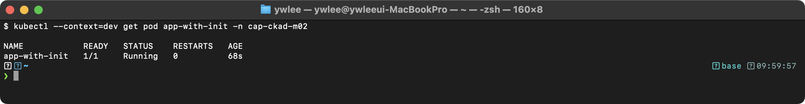

```bash
# Init Container 로그 확인
kubectl logs app-with-init -c wait-for-db

# 설정 파일이 정상적으로 마운트되었는지 확인
kubectl exec app-with-init -- cat /etc/app/app.json
```

> **예시(참조) — {"db_host": "postgres-svc", "db_port": 5432}:** 개념/예제용 기대 출력(docker 빌드·JSON 내용·로그 등 환경 의존). 실측은 CKAD daily 및 위 캡처 참고.

### Sidecar 등장 배경

Init Container는 메인 컨테이너 실행 전에 순차 완료된다. 반면 Sidecar 컨테이너는 메인 컨테이너와 함께 계속 실행되며 보조 기능을 담당한다. Sidecar 패턴이 필요한 핵심 이유는 쿠버네티스 컨테이너 런타임의 로그 수집 구조에 있다. 컨테이너 런타임(containerd 등)은 컨테이너의 stdout/stderr를 노드 파일시스템(`/var/log/containers/`)에 JSON 형식으로 기록한다. fluentd·fluent-bit 같은 로그 에이전트는 이 경로를 DaemonSet으로 감시하여 수집한다. 즉, "파일에 로그를 쓰는" 레거시 애플리케이션은 이 파이프라인에 포함되지 않는다. Sidecar가 파일 로그를 읽어 자신의 stdout으로 출력하면, 런타임이 그 stdout을 노드 파일에 기록하고 로그 에이전트가 수집할 수 있게 된다. 애플리케이션 코드를 변경하지 않고 로그 수집 체계에 편입시키는 것이 핵심 가치다.

### Sidecar Logging 예제

메인 앱이 파일에 로그를 쓰고, sidecar가 해당 로그를 stdout으로 출력하는 패턴이다. 쿠버네티스의 로그 수집 시스템(fluentd, fluent-bit 등)은 컨테이너의 stdout/stderr만 수집한다. 따라서 파일에 로그를 쓰는 레거시 애플리케이션의 로그를 수집하려면 sidecar 컨테이너가 파일 로그를 stdout으로 전달해야 한다.

```yaml
apiVersion: v1
kind: Pod
metadata:
  name: app-with-sidecar
spec:
  containers:
    - name: app
      image: busybox:1.36
      command:
        - sh
        - -c
        - |
          while true; do
            echo "$(date) - Application log entry" >> /var/log/app.log
            sleep 5
          done
      volumeMounts:
        - name: log-vol
          mountPath: /var/log
    - name: log-agent
      image: busybox:1.36
      command:
        - sh
        - -c
        - tail -f /var/log/app.log
      volumeMounts:
        - name: log-vol
          mountPath: /var/log
          readOnly: true
  volumes:
    - name: log-vol
      emptyDir: {}
```

**`emptyDir`의 동작 원리:** Pod가 노드에 스케줄링되면 kubelet이 해당 노드의 디스크에 빈 디렉토리를 생성한다. Pod 내 모든 컨테이너가 이 디렉토리를 마운트할 수 있다. Pod가 삭제되면 `emptyDir`의 데이터도 영구 삭제된다. `emptyDir.medium: Memory`를 설정하면 tmpfs(RAM)를 사용하여 I/O 성능이 향상되지만, 메모리 제한에 포함되므로 OOMKill 가능성이 있다.

**검증 명령:**

```bash
kubectl apply -f app-with-sidecar.yaml
kubectl get pod app-with-sidecar
```

> **예시(참조) — NAME                READY   STATUS    RESTARTS   A:** 개념/예제용 기대 출력(docker 빌드·JSON 내용·로그 등 환경 의존). 실측은 CKAD daily 및 위 캡처 참고.

```bash
# sidecar 컨테이너의 stdout에서 로그 확인
kubectl logs app-with-sidecar -c log-agent -f
```

> **예시(참조) — Mon Jan  1 00:00:00 UTC 2024 - Application log ent:** 개념/예제용 기대 출력(docker 빌드·JSON 내용·로그 등 환경 의존). 실측은 CKAD daily 및 위 캡처 참고.

```bash
# READY 칼럼이 2/2인지 확인 (두 컨테이너 모두 Running)
kubectl get pod app-with-sidecar -o jsonpath='{.status.containerStatuses[*].name}'
```

> **예시(참조) — app log-agent:** 개념/예제용 기대 출력(docker 빌드·JSON 내용·로그 등 환경 의존). 실측은 CKAD daily 및 위 캡처 참고.

### Adapter 패턴 예제

로그 형식을 변환하는 adapter 컨테이너이다. 레거시 애플리케이션이 비구조화된 텍스트 로그를 출력할 때, 중앙 로그 시스템(Elasticsearch, Loki 등)이 요구하는 JSON 형식으로 변환하는 역할을 한다. 애플리케이션 코드를 수정하지 않고 로그 형식을 표준화할 수 있다는 것이 핵심이다.

```yaml
apiVersion: v1
kind: Pod
metadata:
  name: app-with-adapter
spec:
  containers:
    - name: app
      image: busybox:1.36
      command:
        - sh
        - -c
        - |
          while true; do
            echo "$(date +%s) ERROR something failed" >> /var/log/app.log
            sleep 10
          done
      volumeMounts:
        - name: log-vol
          mountPath: /var/log
    - name: log-adapter
      image: busybox:1.36
      command:
        - sh
        - -c
        - |
          tail -f /var/log/app.log | while read line; do
            timestamp=$(echo "$line" | awk '{print $1}')
            level=$(echo "$line" | awk '{print $2}')
            message=$(echo "$line" | cut -d' ' -f3-)
            echo "{\"timestamp\": $timestamp, \"level\": \"$level\", \"message\": \"$message\"}"
          done
      volumeMounts:
        - name: log-vol
          mountPath: /var/log
          readOnly: true
  volumes:
    - name: log-vol
      emptyDir: {}
```

**검증 명령:**

```bash
kubectl apply -f app-with-adapter.yaml
kubectl logs app-with-adapter -c log-adapter -f
```

> **예시(참조) — {"timestamp": 1704067200, "level": "ERROR", "messa:** 개념/예제용 기대 출력(docker 빌드·JSON 내용·로그 등 환경 의존). 실측은 CKAD daily 및 위 캡처 참고.

---

## 3. Probe (Health Check)

지금까지 여러 컨테이너를 한 Pod 안에 함께 배포하는 방법을 살펴봤다. 그런데 컨테이너가 실행 중이라고 해서 애플리케이션이 정상 동작하는 것은 아니다. 데드락, 메모리 누수, 외부 서비스 장애 등으로 프로세스는 살아 있지만 요청을 처리하지 못하는 상태가 발생한다. Probe는 이런 "살아 있지만 비정상" 상태를 감지하여 자동으로 복구하거나 트래픽을 차단하는 쿠버네티스 헬스 체크 메커니즘이다.

### 등장 배경

컨테이너 프로세스가 실행 중이라고 해서 애플리케이션이 정상 동작하는 것은 아니다. 데드락, 메모리 누수, 외부 의존성 장애 등으로 프로세스는 살아있으나 요청을 처리할 수 없는 상태가 발생한다. Probe가 없으면 kubelet은 프로세스의 존재 여부만 확인하므로, 이런 장애를 감지하지 못하고 트래픽이 비정상 Pod로 계속 라우팅된다.

쿠버네티스는 세 가지 Probe를 제공한다:

| Probe | 목적 | 실패 시 동작 |
|---|---|---|
| `startupProbe` | 애플리케이션 초기화 완료 감지 | 컨테이너 재시작. 성공 전까지 liveness/readiness 비활성화 |
| `livenessProbe` | 컨테이너 정상 동작 여부 | 컨테이너 재시작 (restartPolicy에 따라) |
| `readinessProbe` | 트래픽 수신 가능 여부 | Service 엔드포인트에서 제거 (재시작하지 않음) |

**Probe 실행 주체:** kubelet이 각 노드에서 직접 Probe를 실행한다. API 서버나 controller-manager가 아닌 kubelet이 담당한다는 점이 중요하다. kubelet은 각 노드의 컨테이너 런타임 옆에서 실행되므로 Pod 네트워크에 직접 접근할 수 있고, Probe 결과를 API 서버에 보고한다. 만약 중앙의 API 서버가 모든 Pod에 Probe를 보내는 방식이었다면 클러스터 규모가 커질수록 네트워크 비용과 지연이 크게 증가했을 것이다. kubelet은 `periodSeconds` 간격으로 Probe를 수행하고, `failureThreshold`만큼 연속 실패하면 해당 동작을 트리거한다.

### Liveness Probe -- httpGet

```yaml
apiVersion: v1
kind: Pod
metadata:
  name: liveness-http
spec:
  containers:
    - name: web
      image: nginx:1.25
      ports:
        - containerPort: 80
      livenessProbe:
        httpGet:
          path: /healthz
          port: 80
          httpHeaders:
            - name: X-Custom-Header
              value: "health-check"
        initialDelaySeconds: 10
        periodSeconds: 5
        timeoutSeconds: 3
        failureThreshold: 3
        successThreshold: 1
```

**필드별 설명:**

| 필드 | 역할 | 기본값 |
|---|---|---|
| `initialDelaySeconds` | 컨테이너 시작 후 첫 Probe까지 대기 시간 | 0 |
| `periodSeconds` | Probe 실행 간격 | 10 |
| `timeoutSeconds` | Probe 응답 대기 시간. 초과하면 실패 처리 | 1 |
| `failureThreshold` | 연속 실패 허용 횟수. 초과하면 동작 트리거 | 3 |
| `successThreshold` | 실패 후 성공으로 전환되기 위한 연속 성공 횟수 | 1 (liveness는 반드시 1) |

**httpGet Probe의 성공 판정:** HTTP 상태 코드 200~399를 성공으로 판정한다. 400 이상은 실패이다.

**실무 실수:**

- `initialDelaySeconds`를 너무 짧게 설정하면 애플리케이션이 아직 시작되지 않은 상태에서 Probe가 실패하여 무한 재시작 루프에 빠진다. 이 문제를 해결하기 위해 `startupProbe`가 도입되었다.
- `/healthz` 엔드포인트가 실제로 존재하지 않으면 nginx는 404를 반환하여 liveness 실패가 되고, Pod가 반복 재시작된다.
- `timeoutSeconds`를 기본값(1초)으로 두면 부하가 높은 상황에서 정상 Pod가 재시작될 수 있다.

**검증 명령:**

```bash
kubectl apply -f liveness-http.yaml
kubectl describe pod liveness-http | grep -A 10 "Liveness"
```

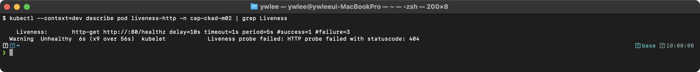

```bash
# Probe 실패 시 이벤트 확인
kubectl get events --field-selector involvedObject.name=liveness-http
```

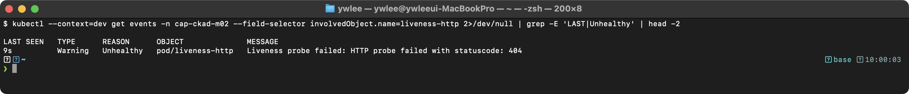

### Readiness Probe -- tcpSocket

```yaml
apiVersion: v1
kind: Pod
metadata:
  name: readiness-tcp
spec:
  containers:
    - name: redis
      image: redis:7
      ports:
        - containerPort: 6379
      readinessProbe:
        tcpSocket:
          port: 6379
        initialDelaySeconds: 5
        periodSeconds: 10
        failureThreshold: 3
```

**tcpSocket Probe의 동작:** kubelet이 지정된 포트로 TCP 연결을 시도한다. 3-way handshake가 성공하면 Probe 성공이다. 데이터를 주고받지는 않는다. HTTP 엔드포인트를 제공하지 않는 데이터베이스, 메시지 큐 등에 적합하다.

**Readiness 실패 시 동작:** Pod가 재시작되지 않는다. 대신 해당 Pod의 IP가 Service의 Endpoints 오브젝트에서 제거되어 트래픽이 라우팅되지 않는다. Readiness가 다시 성공하면 Endpoints에 재추가된다.

**검증 명령:**

```bash
kubectl apply -f readiness-tcp.yaml
kubectl get pod readiness-tcp -o wide
```

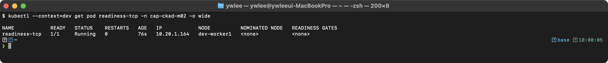

```bash
# Endpoints에 Pod IP가 포함되어 있는지 확인 (Service가 있는 경우)
kubectl get endpoints <service-name>

# Readiness 상태 직접 확인
kubectl get pod readiness-tcp -o jsonpath='{.status.conditions[?(@.type=="Ready")].status}'
```

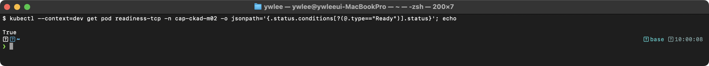

### Startup Probe -- exec

```yaml
apiVersion: v1
kind: Pod
metadata:
  name: startup-exec
spec:
  containers:
    - name: app
      image: busybox:1.36
      command:
        - sh
        - -c
        - |
          sleep 30 && touch /tmp/ready && sleep 3600
      startupProbe:
        exec:
          command:
            - cat
            - /tmp/ready
        initialDelaySeconds: 0
        periodSeconds: 5
        failureThreshold: 12
      livenessProbe:
        exec:
          command:
            - cat
            - /tmp/ready
        periodSeconds: 10
        failureThreshold: 3
```

**startupProbe의 등장 배경:** Java 기반 애플리케이션처럼 초기화에 수 분이 걸리는 컨테이너에서, `livenessProbe`의 `initialDelaySeconds`를 충분히 크게 설정해야 했다. 그러나 이는 실제 장애 감지도 그만큼 지연시키는 문제가 있었다. `startupProbe`는 초기화 완료 여부만 판단하고, 성공 후에는 비활성화되어 `livenessProbe`가 즉시 동작하도록 한다.

**exec Probe의 동작:** 컨테이너 내부에서 지정된 명령을 실행하고 exit code를 확인한다. exit code 0이면 성공, 그 외는 실패이다. `cat /tmp/ready`는 파일이 존재하면 0, 존재하지 않으면 1을 반환한다.

**이 예제의 시간 계산:** `failureThreshold(12) * periodSeconds(5) = 60초` 동안 startupProbe가 실패를 허용한다. 애플리케이션이 30초 후에 `/tmp/ready` 파일을 생성하므로, 7번째 체크(35초 시점)에서 성공한다. 이후 livenessProbe가 활성화된다.

**검증 명령:**

```bash
kubectl apply -f startup-exec.yaml
kubectl get pod startup-exec -w
```


```bash
kubectl describe pod startup-exec | grep -A 5 "Startup"
```

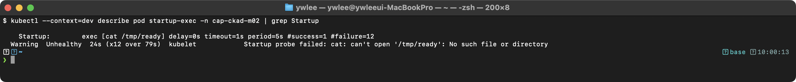

### 세 가지 Probe를 모두 사용하는 예제

```yaml
apiVersion: v1
kind: Pod
metadata:
  name: full-probes
spec:
  containers:
    - name: app
      image: nginx:1.25
      ports:
        - containerPort: 80
      startupProbe:
        httpGet:
          path: /
          port: 80
        failureThreshold: 30
        periodSeconds: 10
      livenessProbe:
        httpGet:
          path: /
          port: 80
        periodSeconds: 10
        failureThreshold: 3
      readinessProbe:
        httpGet:
          path: /
          port: 80
        periodSeconds: 5
        failureThreshold: 3
```

**Probe 실행 순서:**
1. Pod 시작 시 startupProbe만 활성화된다.
2. startupProbe 성공 시(최대 `30 * 10 = 300초` 허용) liveness와 readiness가 활성화된다.
3. livenessProbe는 10초 간격으로 헬스 체크를 수행한다. 3번 연속 실패하면 컨테이너를 재시작한다.
4. readinessProbe는 5초 간격으로 트래픽 수신 가능 여부를 확인한다. 실패하면 Service Endpoints에서 제거한다.

**검증 명령:**

```bash
kubectl apply -f full-probes.yaml
kubectl describe pod full-probes | grep -E "(Startup|Liveness|Readiness)"
```

> **예시(참조) — Startup:        http-get http://:80/ delay=0s time:** 개념/예제용 기대 출력(docker 빌드·JSON 내용·로그 등 환경 의존). 실측은 CKAD daily 및 위 캡처 참고.

```bash
# Pod 조건 확인
kubectl get pod full-probes -o jsonpath='{range .status.conditions[*]}{.type}={.status}{"\n"}{end}'
```

> **예시(참조) — Initialized=True:** 개념/예제용 기대 출력(docker 빌드·JSON 내용·로그 등 환경 의존). 실측은 CKAD daily 및 위 캡처 참고.

---

## 4. ConfigMap

### 등장 배경

컨테이너 이미지에 설정값을 하드코딩하면, 환경(dev/staging/prod)마다 별도 이미지를 빌드해야 하고, 설정 변경 시 이미지를 재빌드해야 한다. 환경 변수를 Pod spec에 직접 기입하는 방식은 동일 설정을 여러 Pod에서 중복 관리해야 하는 문제가 있다. ConfigMap은 설정을 별도 오브젝트로 분리하여, 이미지와 설정을 독립적으로 관리할 수 있게 한다.

3절에서 다룬 Probe는 컨테이너가 살아있는지 확인하는 메커니즘이다. Probe가 동작하려면 애플리케이션이 헬스 엔드포인트 경로나 DB 호스트 정보를 알아야 하는데, 이 설정값을 이미지에 굳히지 않고 주입하는 수단이 ConfigMap이다.

**트레이드오프:** ConfigMap은 평문 데이터만 저장한다. 패스워드나 API 키처럼 민감한 값은 ConfigMap에 넣으면 안 된다(Secret을 사용해야 한다). 또한 환경 변수로 주입한 ConfigMap 값은 Pod 생성 시점에 스냅샷되므로, ConfigMap을 수정해도 실행 중인 Pod의 환경 변수는 변경되지 않는다. 볼륨 마운트 방식은 kubelet이 주기적으로(기본 60초) 갱신하므로 이 한계를 일부 완화할 수 있다.

### 생성 -- kubectl 명령어

```bash
# from-literal
kubectl create configmap app-config \
  --from-literal=DB_HOST=postgres \
  --from-literal=DB_PORT=5432 \
  --from-literal=LOG_LEVEL=info

# from-file (파일 내용 전체가 하나의 key-value가 됨)
kubectl create configmap nginx-conf --from-file=nginx.conf

# from-env-file (.env 형식 파일)
kubectl create configmap env-config --from-env-file=app.env
```

**`--from-file` vs `--from-env-file`의 차이:**
- `--from-file=nginx.conf`: key는 파일명(`nginx.conf`), value는 파일 전체 내용. 바이너리 데이터도 가능.
- `--from-env-file=app.env`: 파일 내 각 `KEY=VALUE` 라인이 개별 key-value 쌍으로 저장. `#` 주석과 빈 줄은 무시.

**검증 명령:**

```bash
kubectl create configmap app-config \
  --from-literal=DB_HOST=postgres \
  --from-literal=DB_PORT=5432 \
  --from-literal=LOG_LEVEL=info

kubectl get configmap app-config -o yaml
```

> **예시(참조) — apiVersion: v1:** 개념/예제용 기대 출력(docker 빌드·JSON 내용·로그 등 환경 의존). 실측은 CKAD daily 및 위 캡처 참고.

### 생성 -- YAML

```yaml
apiVersion: v1
kind: ConfigMap
metadata:
  name: app-config
data:
  DB_HOST: postgres
  DB_PORT: "5432"
  LOG_LEVEL: info
  app.properties: |
    server.port=8080
    server.context-path=/api
    logging.level.root=INFO
```

**주의:** `DB_PORT`의 값 `"5432"`는 반드시 문자열로 지정해야 한다. ConfigMap의 `data` 필드는 모든 value를 문자열로 저장한다. 따옴표 없이 `5432`로 작성하면 YAML 파서가 정수로 해석하여 오류가 발생한다.

**`data` vs `binaryData`:** `data`는 UTF-8 문자열만 저장할 수 있다. 바이너리 파일(인증서, 키스토어 등)은 `binaryData` 필드에 base64 인코딩하여 저장한다.

### 사용 -- 환경 변수 (env)

```yaml
apiVersion: v1
kind: Pod
metadata:
  name: pod-env
spec:
  containers:
    - name: app
      image: nginx:1.25
      env:
        - name: DATABASE_HOST
          valueFrom:
            configMapKeyRef:
              name: app-config
              key: DB_HOST
        - name: DATABASE_PORT
          valueFrom:
            configMapKeyRef:
              name: app-config
              key: DB_PORT
```

**`configMapKeyRef`에서 존재하지 않는 key를 참조하면:** Pod가 `CreateContainerConfigError` 상태로 실패한다. `optional: true`를 설정하면 key가 없어도 Pod가 시작되고, 해당 환경 변수는 설정되지 않는다.

**검증 명령:**

```bash
kubectl apply -f pod-env.yaml
kubectl exec pod-env -- env | grep DATABASE
```

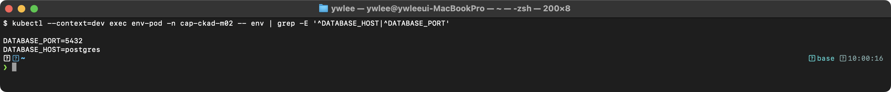

**환경 변수 방식의 한계:** ConfigMap을 업데이트해도 이미 실행 중인 Pod의 환경 변수는 변경되지 않는다. Pod를 재시작해야 새 값이 반영된다.

### 사용 -- 환경 변수 일괄 주입 (envFrom)

```yaml
apiVersion: v1
kind: Pod
metadata:
  name: pod-envfrom
spec:
  containers:
    - name: app
      image: nginx:1.25
      envFrom:
        - configMapRef:
            name: app-config
          prefix: APP_
```

**`prefix` 필드:** ConfigMap의 모든 key 앞에 지정된 접두사를 추가한다. 예를 들어 `DB_HOST`는 `APP_DB_HOST`가 된다. 서로 다른 ConfigMap의 key가 충돌하는 것을 방지하는 데 유용하다. prefix를 생략하면 ConfigMap의 key가 그대로 환경 변수명이 된다.

**검증 명령:**

```bash
kubectl apply -f pod-envfrom.yaml
kubectl exec pod-envfrom -- env | grep APP_
```

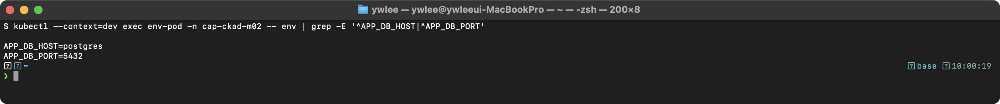

**주의:** `app.properties`처럼 환경 변수명으로 유효하지 않은 key(`.` 포함)는 건너뛰거나 예기치 않은 동작을 유발할 수 있다. 환경 변수명은 `[a-zA-Z_][a-zA-Z0-9_]*` 규칙을 따라야 한다.

### 사용 -- Volume Mount

```yaml
apiVersion: v1
kind: Pod
metadata:
  name: pod-vol
spec:
  containers:
    - name: app
      image: nginx:1.25
      volumeMounts:
        - name: config-vol
          mountPath: /etc/config
          readOnly: true
  volumes:
    - name: config-vol
      configMap:
        name: app-config
        items:
          - key: app.properties
            path: application.properties
```

**Volume Mount 방식의 장점:** ConfigMap이 업데이트되면, kubelet이 주기적으로(기본 약 60초) 마운트된 파일을 갱신한다. 애플리케이션이 파일 변경을 감지(inotify 등)할 수 있다면 Pod 재시작 없이 설정을 반영할 수 있다.

**`items`를 생략하면:** ConfigMap의 모든 key가 각각 파일로 마운트된다. `items`를 지정하면 선택한 key만 지정한 파일명으로 마운트된다.

**`subPath` 사용 시 주의:** `subPath`를 사용하면 ConfigMap 업데이트가 자동으로 반영되지 않는다. 기존 디렉토리의 다른 파일을 보존하면서 특정 파일만 마운트할 때 `subPath`를 사용하지만, 자동 갱신이 필요하면 사용하지 않아야 한다.

**검증 명령:**

```bash
kubectl apply -f pod-vol.yaml
kubectl exec pod-vol -- ls /etc/config/
```

> **예시(참조) — application.properties:** 개념/예제용 기대 출력(docker 빌드·JSON 내용·로그 등 환경 의존). 실측은 CKAD daily 및 위 캡처 참고.

```bash
kubectl exec pod-vol -- cat /etc/config/application.properties
```

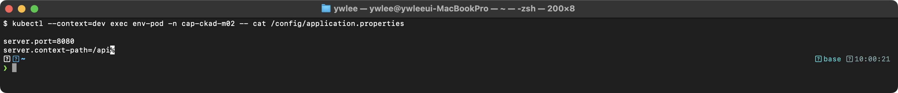

---

## 5. Secret

### 등장 배경

ConfigMap은 데이터를 평문으로 저장하므로 패스워드, API 키, TLS 인증서 같은 민감 정보를 저장하기에 부적합하다. Secret은 민감 데이터를 base64 인코딩하여 저장하고, etcd에서 암호화(EncryptionConfiguration 설정 시)할 수 있으며, RBAC으로 접근을 제한할 수 있다.

**중요:** base64 인코딩은 암호화가 아니다. Secret의 보안은 etcd 암호화, RBAC, Pod의 ServiceAccount 권한 제한 등을 조합하여 확보한다.

**트레이드오프:** Secret의 보안 모델에는 여러 한계가 있다. 첫째, base64는 단순 인코딩이므로 `kubectl get secret -o yaml` 명령 한 줄로 원문이 노출된다. etcd에 저장된 Secret을 보호하려면 kube-apiserver에 `EncryptionConfiguration`(AES-CBC 또는 AES-GCM 알고리즘으로 at-rest 암호화)을 별도로 설정해야 하며, 기본 설치에는 이 설정이 없다. `EncryptionConfiguration`이 없으면 `etcdctl get` 명령으로 etcd 덤프를 뜨는 것만으로 모든 Secret 값이 평문으로 추출된다. 둘째, RBAC이 적절히 설정되지 않으면 클러스터의 모든 ServiceAccount가 `kubectl get secret`을 실행할 수 있어, 네임스페이스 내 모든 Secret이 노출된다. 최소 권한 원칙에 따라 특정 Secret 이름을 명시한 `resourceNames` 기반 RBAC 정책을 사용해야 한다. 셋째, Secret을 환경 변수로 주입하면 `ps -e` 명령이나 `/proc/<pid>/environ` 파일로 값이 노출될 수 있다. 볼륨 마운트와 `defaultMode: 0400`(소유자만 읽기) 조합이 더 안전하다.

### 생성 -- kubectl 명령어

```bash
# generic (Opaque)
kubectl create secret generic db-secret \
  --from-literal=username=admin \
  --from-literal=password='S3cur3P@ss!'

# docker-registry
kubectl create secret docker-registry regcred \
  --docker-server=registry.example.com \
  --docker-username=user \
  --docker-password=pass \
  --docker-email=user@example.com

# tls
kubectl create secret tls tls-secret \
  --cert=tls.crt \
  --key=tls.key
```

**Secret 타입별 용도:**

| 타입 | 용도 | data 필드의 필수 key |
|---|---|---|
| `Opaque` | 범용. 임의의 key-value 저장 | 없음 |
| `kubernetes.io/dockerconfigjson` | 컨테이너 레지스트리 인증 | `.dockerconfigjson` |
| `kubernetes.io/tls` | TLS 인증서/키 저장 | `tls.crt`, `tls.key` |
| `kubernetes.io/service-account-token` | ServiceAccount 토큰 (자동 생성) | `token`, `ca.crt`, `namespace` |

**검증 명령:**

```bash
kubectl create secret generic db-secret \
  --from-literal=username=admin \
  --from-literal=password='S3cur3P@ss!'

kubectl get secret db-secret -o yaml
```

> **예시(참조) — apiVersion: v1:** 개념/예제용 기대 출력(docker 빌드·JSON 내용·로그 등 환경 의존). 실측은 CKAD daily 및 위 캡처 참고.

```bash
# 디코딩하여 원본 값 확인
kubectl get secret db-secret -o jsonpath='{.data.password}' | base64 -d
```

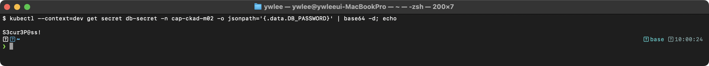

### 생성 -- YAML

```yaml
apiVersion: v1
kind: Secret
metadata:
  name: db-secret
type: Opaque
data:
  username: YWRtaW4=          # echo -n 'admin' | base64
  password: UzNjdXIzUEBzcyE=  # echo -n 'S3cur3P@ss!' | base64
---
# stringData를 사용하면 base64 인코딩 없이 평문으로 작성 가능하다
apiVersion: v1
kind: Secret
metadata:
  name: db-secret-plain
type: Opaque
stringData:
  username: admin
  password: "S3cur3P@ss!"
```

**`data` vs `stringData`:** `data`는 base64 인코딩된 값을 요구하고, `stringData`는 평문을 받아 쿠버네티스가 자동으로 base64 인코딩한다. 동일 key가 `data`와 `stringData`에 모두 존재하면 `stringData`의 값이 우선한다. `stringData`는 YAML 작성 시 편의를 위한 것이며, 저장된 Secret을 `kubectl get -o yaml`로 조회하면 항상 `data` 필드에 base64 인코딩된 값으로 표시된다.

**실무 실수:**
- `echo 'admin' | base64`는 줄바꿈 문자(`\n`)가 포함되어 `YWRtaW4K`가 된다. 반드시 `echo -n 'admin' | base64`로 줄바꿈을 제거해야 한다. 줄바꿈이 포함된 패스워드로 DB 인증을 시도하면 인증 실패가 발생한다.

### 사용 -- Pod에서 참조

```yaml
apiVersion: v1
kind: Pod
metadata:
  name: pod-with-secret
spec:
  containers:
    - name: app
      image: nginx:1.25
      env:
        - name: DB_USERNAME
          valueFrom:
            secretKeyRef:
              name: db-secret
              key: username
        - name: DB_PASSWORD
          valueFrom:
            secretKeyRef:
              name: db-secret
              key: password
      volumeMounts:
        - name: secret-vol
          mountPath: /etc/secrets
          readOnly: true
  volumes:
    - name: secret-vol
      secret:
        secretName: db-secret
        defaultMode: 0400
```

**`defaultMode: 0400`:** 마운트된 Secret 파일의 퍼미션을 설정한다. `0400`은 소유자만 읽기 가능(r--------)이다. 생략하면 기본값 `0644`가 적용되어 같은 Pod 내 다른 사용자도 읽을 수 있다. 보안을 위해 항상 최소 권한을 설정해야 한다.

**검증 명령:**

```bash
kubectl apply -f pod-with-secret.yaml
kubectl exec pod-with-secret -- env | grep DB_
```

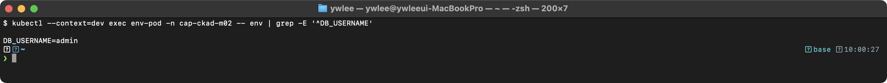

```bash
kubectl exec pod-with-secret -- ls -la /etc/secrets/
```

> **예시(참조) — total 0:** 개념/예제용 기대 출력(docker 빌드·JSON 내용·로그 등 환경 의존). 실측은 CKAD daily 및 위 캡처 참고.

```bash
kubectl exec pod-with-secret -- cat /etc/secrets/username
```

> **예시(참조) — admin:** 개념/예제용 기대 출력(docker 빌드·JSON 내용·로그 등 환경 의존). 실측은 CKAD daily 및 위 캡처 참고.

---

## 6. SecurityContext

### 등장 배경

컨테이너는 기본적으로 root(UID 0)로 실행된다. 컨테이너 런타임의 격리가 완벽하지 않으므로, 컨테이너 탈출(container escape) 공격 시 호스트에서 root 권한을 획득할 수 있다. SecurityContext는 Pod 및 컨테이너 수준에서 Linux 보안 기능(UID/GID, capabilities, seccomp, AppArmor 등)을 제어하여 공격 표면을 최소화한다.

### 컨테이너 수준 SecurityContext

```yaml
apiVersion: v1
kind: Pod
metadata:
  name: secure-pod
spec:
  securityContext:
    runAsUser: 1000
    runAsGroup: 3000
    fsGroup: 2000
  containers:
    - name: app
      image: nginx:1.25
      securityContext:
        runAsNonRoot: true
        readOnlyRootFilesystem: true
        allowPrivilegeEscalation: false
        capabilities:
          drop:
            - ALL
          add:
            - NET_BIND_SERVICE
      volumeMounts:
        - name: tmp
          mountPath: /tmp
        - name: cache
          mountPath: /var/cache/nginx
        - name: run
          mountPath: /var/run
  volumes:
    - name: tmp
      emptyDir: {}
    - name: cache
      emptyDir: {}
    - name: run
      emptyDir: {}
```

**Pod 수준 vs 컨테이너 수준 SecurityContext:**

| 필드 | Pod 수준 (`spec.securityContext`) | 컨테이너 수준 (`spec.containers[].securityContext`) |
|---|---|---|
| `runAsUser` | Pod 내 모든 컨테이너에 적용 | 해당 컨테이너에만 적용 (Pod 수준 재정의) |
| `runAsGroup` | 모든 컨테이너의 기본 그룹 | 해당 컨테이너에만 적용 |
| `fsGroup` | 볼륨 마운트 시 파일 소유 그룹 설정 | Pod 수준에서만 설정 가능 |
| `capabilities` | Pod 수준에서 설정 불가 | 컨테이너 수준에서만 설정 가능 |

**필드별 상세 설명:**

| 필드 | 역할 | 생략 시 기본 동작 |
|---|---|---|
| `runAsNonRoot: true` | UID 0으로 실행되면 컨테이너 시작 차단 | 검증 없이 실행 허용 |
| `readOnlyRootFilesystem: true` | 루트 파일 시스템 쓰기 차단 | 쓰기 가능 |
| `allowPrivilegeEscalation: false` | setuid 비트를 통한 권한 상승 차단 | true (권한 상승 가능) |
| `capabilities.drop: [ALL]` | 모든 Linux capability 제거 | 기본 capability 세트 유지 |
| `capabilities.add: [NET_BIND_SERVICE]` | 1024 미만 포트 바인딩 허용. Linux capability는 root(UID 0)가 가진 막대한 권한을 세분화한 단위로, `NET_BIND_SERVICE` 하나만 부여하면 낮은 포트 바인딩 권한만 허용하고 나머지는 차단할 수 있다. | drop ALL 시 바인딩 불가 |

**`readOnlyRootFilesystem` 사용 시:** nginx는 `/var/cache/nginx`(캐시 파일)와 `/var/run`(PID 파일, 소켓)에 쓰기가 필수이다. `/tmp`는 일부 버전에서 임시 버퍼로 사용하므로 마운트해 두는 것이 권장된다. 루트 파일 시스템을 읽기 전용으로 설정하면 이 경로에 쓰기가 불가능하므로, `emptyDir` 볼륨을 마운트하여 쓰기 가능 영역을 제공해야 한다. 이를 누락하면 nginx가 `[emerg] mkdir() "/var/cache/nginx" failed (30: Read-only file system)` 오류로 시작에 실패한다.

**트레이드오프:** SecurityContext는 보안 강화를 위한 표준 수단이지만, 적용에는 이미지 수준의 재설계 비용이 따른다. `readOnlyRootFilesystem: true`를 적용하면 모든 쓰기 경로를 `emptyDir`로 별도 매핑해야 하므로, 레거시 이미지는 재설계가 필요하다. `capabilities.drop: [ALL]`은 공격 표면을 최소화하지만, 앱이 의존하는 기능(예: `NET_ADMIN`, `SYS_PTRACE`)을 하나씩 파악하여 명시적으로 `add`에 추가해야 한다. 이 파악 과정이 생략되면 앱이 런타임에 Permission denied로 실패한다. `runAsNonRoot: true`는 UID 0 실행을 원천 차단하지만, 이미지의 `USER` 지시어가 없거나 `root`로 설정된 레거시 이미지는 컨테이너 시작 자체가 실패한다.

**`fsGroup: 2000`의 동작:** Pod에 마운트된 볼륨의 파일 소유 그룹이 GID 2000으로 설정된다. 컨테이너 내 프로세스는 supplementary group으로 GID 2000을 가지게 되어, 해당 볼륨의 파일을 읽고 쓸 수 있다.

### Capabilities 확인 명령

```bash
# 컨테이너 내부에서 capabilities 확인
kubectl exec secure-pod -- cat /proc/1/status | grep Cap

# Pod의 securityContext 확인
kubectl get pod secure-pod -o jsonpath='{.spec.containers[0].securityContext}'
```

**`/proc/1/status | grep Cap` 출력 해석:** `/proc/1/status`의 `Cap*` 행은 16진수 비트마스크로 현재 프로세스의 capability 집합을 나타낸다. Linux capability(리눅스 커널이 root 권한을 세분화한 독립 단위)는 네 가지 집합으로 구성된다.

| 필드 | 이름 | 역할 |
|---|---|---|
| `CapPrm` | Permitted | 프로세스가 활성화할 수 있는 capability 허용 집합. CapEff는 CapPrm의 부분집합이어야 한다. |
| `CapEff` | Effective | 커널이 권한 검사 시 실제로 참조하는 현재 활성 capability 집합. |
| `CapBnd` | Bounding | 프로세스가 획득할 수 있는 capability의 상한선. 이 집합에 없는 capability는 절대 얻을 수 없다. |
| `CapInh` | Inheritable | `execve()` 시 자식 프로세스에게 상속 가능한 capability 집합. |

예를 들어 `CapEff: 0000000000000400`이 나오면, 이 값이 어떤 capability인지 `capsh --decode` 명령으로 해석한다(capsh는 `libcap2-bin` 패키지에 포함된다).

```bash
# capsh로 16진수 비트마스크 해석 (컨테이너 내부 또는 호스트에서 실행)
capsh --decode=0000000000000400
# 출력 예: 0x0000000000000400=cap_net_bind_service
```

`capabilities.drop: [ALL]` 후 `add: [NET_BIND_SERVICE]`만 추가하면 `CapEff`가 `0x0000000000000400`이 된다. 이 값이 예상 capability와 일치하는지 확인하면 SecurityContext가 올바르게 적용되었음을 검증할 수 있다. `CapPrm`(Permitted), `CapEff`(Effective), `CapBnd`(Bounding), `CapInh`(Inheritable) 네 가지 집합 모두 0이면 capability가 완전히 제거된 상태이다.

**검증 명령:**

```bash
kubectl apply -f secure-pod.yaml
kubectl get pod secure-pod
```

> **예시(참조) — NAME         READY   STATUS    RESTARTS   AGE:** 개념/예제용 기대 출력(docker 빌드·JSON 내용·로그 등 환경 의존). 실측은 CKAD daily 및 위 캡처 참고.

```bash
# 프로세스 UID 확인
kubectl exec secure-pod -- id
```

> **예시(참조) — uid=1000 gid=3000 groups=2000,3000:** 개념/예제용 기대 출력(docker 빌드·JSON 내용·로그 등 환경 의존). 실측은 CKAD daily 및 위 캡처 참고.

```bash
# 루트 파일 시스템 쓰기 불가 확인
kubectl exec secure-pod -- touch /test-file
```

> **예시(참조) — touch: /test-file: Read-only file system:** 개념/예제용 기대 출력(docker 빌드·JSON 내용·로그 등 환경 의존). 실측은 CKAD daily 및 위 캡처 참고.

```bash
# emptyDir 볼륨에는 쓰기 가능
kubectl exec secure-pod -- touch /tmp/test-file
kubectl exec secure-pod -- ls -la /tmp/test-file
```

> **예시(참조) — -rw-r--r--    1 1000     2000             0 Jan  1:** 개념/예제용 기대 출력(docker 빌드·JSON 내용·로그 등 환경 의존). 실측은 CKAD daily 및 위 캡처 참고.

---

## 7. Deployment -- 생성, 업데이트, 롤백

### 등장 배경

Pod를 직접 생성하면 노드 장애 시 자동 복구가 되지 않는다. ReplicaSet(지정된 수의 Pod 복제본을 항상 유지하는 쿠버네티스 오브젝트)은 Pod의 복제본 수를 유지하지만, 이미지 업데이트 시 롤링 업데이트를 수동으로 관리해야 했다. Deployment는 ReplicaSet을 관리하여 선언적 업데이트, 자동 롤링 업데이트, 롤백 기능을 제공한다.

**트레이드오프:** Deployment의 롤링 업데이트는 무중단 배포를 가능하게 하지만, 업데이트 중 두 버전의 Pod가 동시에 실행되는 구간이 존재한다. 데이터베이스 스키마 변경처럼 두 버전이 동시에 실행될 수 없는 경우에는 `strategy.type: Recreate`를 사용해야 하며, 이 경우 다운타임이 발생한다. `revisionHistoryLimit`(기본 10)이 크면 이전 ReplicaSet이 여러 개 남아 있어 리소스를 차지하지만, 너무 작게 설정하면 롤백 가능한 버전이 제한된다.

**Deployment의 내부 동작 흐름:**
1. 사용자가 Deployment를 생성하면 API 서버가 etcd에 저장한다.
2. kube-controller-manager(모든 내장 컨트롤러가 실행되는 단일 프로세스)의 Deployment controller가 이를 감지하고 ReplicaSet을 생성한다.
3. ReplicaSet controller가 지정된 replicas 수만큼 Pod를 생성한다.
4. kube-scheduler가 각 Pod를 적절한 노드에 할당한다.
5. 해당 노드의 kubelet이 컨테이너 런타임을 통해 컨테이너를 시작한다.

이미지를 업데이트하면:
1. Deployment controller가 새로운 ReplicaSet을 생성한다.
2. 새 ReplicaSet의 replicas를 점진적으로 증가시키고, 이전 ReplicaSet의 replicas를 감소시킨다.
3. `maxSurge`와 `maxUnavailable` 설정에 따라 동시에 몇 개의 Pod를 교체할지 결정한다.
4. 이전 ReplicaSet은 replicas=0으로 유지되어 롤백 시 재사용된다.

### 빠른 생성 (dry-run)

```bash
# Deployment YAML 생성
kubectl create deployment nginx-app \
  --image=nginx:1.24 \
  --replicas=3 \
  --port=80 \
  --dry-run=client -o yaml > deployment.yaml
```

### Deployment YAML

```yaml
apiVersion: apps/v1
kind: Deployment
metadata:
  name: nginx-app
spec:
  replicas: 3
  selector:
    matchLabels:
      app: nginx-app
  strategy:
    type: RollingUpdate
    rollingUpdate:
      maxSurge: 1
      maxUnavailable: 1
  template:
    metadata:
      labels:
        app: nginx-app
    spec:
      containers:
        - name: nginx
          image: nginx:1.24
          ports:
            - containerPort: 80
          resources:
            requests:
              cpu: 100m
              memory: 128Mi
            limits:
              cpu: 200m
              memory: 256Mi
          readinessProbe:
            httpGet:
              path: /
              port: 80
            initialDelaySeconds: 5   # readiness는 트래픽을 빨리 시작하기 위해 짧게 설정
            periodSeconds: 10
          livenessProbe:
            httpGet:
              path: /
              port: 80
            initialDelaySeconds: 10  # liveness는 오정탐(false positive)을 줄이기 위해 더 길게 설정. 실무에서는 애플리케이션 초기화 시간에 맞춰 조정한다.
            periodSeconds: 15
```

**필드별 설명:**

| 필드 | 역할 | 생략 시 기본값 |
|---|---|---|
| `replicas` | Pod 복제본 수 | 1 |
| `selector.matchLabels` | 이 Deployment가 관리하는 Pod를 식별하는 레이블 셀렉터 | 필수 필드 (생략 불가) |
| `strategy.type` | 업데이트 전략. `RollingUpdate` 또는 `Recreate` | `RollingUpdate` |
| `maxSurge` | 롤링 업데이트 시 desired 대비 추가 생성 가능한 Pod 수 | 25% |
| `maxUnavailable` | 롤링 업데이트 시 동시에 사용 불가능한 Pod 최대 수 | 25% |
| `resources.requests` | 스케줄링 시 노드에 요청하는 최소 리소스 | 없음 (BestEffort QoS) |
| `resources.limits` | 컨테이너가 사용할 수 있는 최대 리소스 | 없음 (무제한) |

**`selector.matchLabels`과 `template.metadata.labels`의 관계:** selector의 레이블이 template의 레이블과 일치해야 한다. 불일치하면 Deployment 생성이 거부된다. 이 셀렉터는 Deployment 생성 후 변경(immutable)할 수 없다.

**`resources.requests` vs `resources.limits`:**
- `requests`: kube-scheduler가 Pod를 노드에 배치할 때 사용. 노드의 allocatable 리소스가 requests 이상이어야 스케줄링된다.
- `limits`: kubelet이 런타임에 enforcement. CPU limit 초과 시 throttling, memory limit 초과 시 OOMKill이 발생한다.
- `requests`만 설정하고 `limits`를 생략하면 Burstable QoS가 되어, 노드 리소스 부족 시 BestEffort Pod 다음으로 eviction 대상이 된다.

**strategy.type 비교:**

| 전략 | 동작 | 적합한 경우 |
|---|---|---|
| `RollingUpdate` | 새 Pod를 점진적으로 생성하면서 이전 Pod를 제거 | 무중단 배포 필요 시 (대부분의 경우) |
| `Recreate` | 모든 기존 Pod를 먼저 제거한 후 새 Pod를 생성 | 두 버전이 동시 실행 불가능한 경우 (DB 마이그레이션, 볼륨 독점 접근 등) |

**검증 명령:**

```bash
kubectl apply -f deployment.yaml
kubectl rollout status deployment/nginx-app
```

> **예시(참조) — Waiting for deployment "nginx-app" rollout to fini:** 개념/예제용 기대 출력(docker 빌드·JSON 내용·로그 등 환경 의존). 실측은 CKAD daily 및 위 캡처 참고.

```bash
kubectl get deployment nginx-app
```

> **예시(참조) — NAME        READY   UP-TO-DATE   AVAILABLE   AGE:** 개념/예제용 기대 출력(docker 빌드·JSON 내용·로그 등 환경 의존). 실측은 CKAD daily 및 위 캡처 참고.

```bash
# Deployment가 생성한 ReplicaSet 확인
kubectl get rs -l app=nginx-app
```

> **예시(참조) — NAME                   DESIRED   CURRENT   READY  :** 개념/예제용 기대 출력(docker 빌드·JSON 내용·로그 등 환경 의존). 실측은 CKAD daily 및 위 캡처 참고.

```bash
# Pod 목록 확인
kubectl get pods -l app=nginx-app
```

> **예시(참조) — NAME                         READY   STATUS    RES:** 개념/예제용 기대 출력(docker 빌드·JSON 내용·로그 등 환경 의존). 실측은 CKAD daily 및 위 캡처 참고.

### Rolling Update 실행

```bash
# 이미지 업데이트 (Rolling Update 트리거)
kubectl set image deployment/nginx-app nginx=nginx:1.25

# 롤아웃 상태 확인
kubectl rollout status deployment/nginx-app

# 롤아웃 히스토리 확인
kubectl rollout history deployment/nginx-app

# 특정 리비전 상세 확인
kubectl rollout history deployment/nginx-app --revision=2
```

**Rolling Update 중 검증:**

```bash
kubectl set image deployment/nginx-app nginx=nginx:1.25
kubectl get rs -l app=nginx-app -w
```

> **예시(참조) — NAME                   DESIRED   CURRENT   READY  :** 개념/예제용 기대 출력(docker 빌드·JSON 내용·로그 등 환경 의존). 실측은 CKAD daily 및 위 캡처 참고.

이 출력에서 새 ReplicaSet의 replicas가 점진적으로 증가하고, 이전 ReplicaSet의 replicas가 감소하는 것을 확인할 수 있다(ReplicaSet 이름 뒤의 해시는 실행 환경마다 다르게 생성된다).

### Rollback

```bash
# 직전 버전으로 롤백
kubectl rollout undo deployment/nginx-app

# 특정 리비전으로 롤백
kubectl rollout undo deployment/nginx-app --to-revision=1

# 롤아웃 일시 중지/재개
kubectl rollout pause deployment/nginx-app
kubectl rollout resume deployment/nginx-app
```

**롤백의 내부 동작:** `rollout undo`는 이전 ReplicaSet의 Pod template을 현재 Deployment의 template으로 복원한다. 이전 ReplicaSet(replicas=0 상태로 보존되어 있던)을 scale up하는 것이 아니라, 새로운 revision으로 기록된다. `revisionHistoryLimit`(기본값 10)이 보존하는 이전 ReplicaSet 수를 결정한다.

**`rollout pause` 사용 시나리오:** 여러 변경(이미지, 리소스, 환경 변수)을 한 번에 적용하고 싶을 때 pause → 변경 → resume으로 단일 롤아웃으로 처리할 수 있다. pause 상태에서는 변경을 적용해도 새 Pod가 생성되지 않는다.

**검증 명령:**

```bash
kubectl rollout undo deployment/nginx-app
kubectl rollout status deployment/nginx-app
```

> **예시(참조) — deployment "nginx-app" successfully rolled out:** 개념/예제용 기대 출력(docker 빌드·JSON 내용·로그 등 환경 의존). 실측은 CKAD daily 및 위 캡처 참고.

```bash
kubectl rollout history deployment/nginx-app
```

> **예시(참조) — REVISION  CHANGE-CAUSE:** 개념/예제용 기대 출력(docker 빌드·JSON 내용·로그 등 환경 의존). 실측은 CKAD daily 및 위 캡처 참고.

### Deployment 스케일링

```bash
kubectl scale deployment/nginx-app --replicas=5
```

**검증 명령:**

```bash
kubectl scale deployment/nginx-app --replicas=5
kubectl get deployment nginx-app
```

> **예시(참조) — NAME        READY   UP-TO-DATE   AVAILABLE   AGE:** 개념/예제용 기대 출력(docker 빌드·JSON 내용·로그 등 환경 의존). 실측은 CKAD daily 및 위 캡처 참고.

---

## 8. Service

### 등장 배경

Pod는 생성/삭제될 때마다 새로운 IP를 할당받는다. Deployment가 Pod를 재생성하면 IP가 변경되므로, 다른 Pod가 특정 Pod의 IP를 직접 참조하면 통신이 끊어진다. Service는 레이블 셀렉터로 선택된 Pod 집합에 대해 안정적인 IP(ClusterIP)와 DNS 이름을 제공한다. kube-proxy가 iptables 또는 IPVS 규칙을 관리하여 Service IP로 향하는 트래픽을 실제 Pod IP로 분산한다.

**트레이드오프:** Service는 L4(TCP/UDP 포트) 수준에서만 라우팅하므로, HTTP Host 헤더나 URL 경로로 트래픽을 분기하려면 Ingress가 필요하다. ClusterIP는 클러스터 외부에서 접근 불가능하므로, 외부 노출이 필요하면 NodePort 또는 LoadBalancer 타입으로 변경해야 한다. kube-proxy의 iptables 모드는 Pod가 수천 개로 늘어나면 규칙 수가 선형 증가하여 지연이 발생하는데, 이 저장소 클러스터는 Cilium이 kube-proxy를 대체하여 eBPF 기반으로 O(1) 조회를 제공한다.

**ClusterIP DNS와 resolv.conf:** `nginx-svc.default.svc.cluster.local` 형식이 기본 FQDN이다. Pod 내부의 `/etc/resolv.conf`에는 `search default.svc.cluster.local svc.cluster.local cluster.local` search domain 목록이 CoreDNS에 의해 자동 삽입된다. 따라서 같은 네임스페이스 안에서는 단축명 `nginx-svc`만 입력해도 DNS가 search domain을 순서대로 붙여가며 조회를 시도한다.

### ClusterIP Service

```bash
# 빠른 생성
kubectl expose deployment nginx-app --port=80 --target-port=80 --type=ClusterIP
```

```yaml
apiVersion: v1
kind: Service
metadata:
  name: nginx-svc
spec:
  type: ClusterIP
  selector:
    app: nginx-app
  ports:
    - port: 80
      targetPort: 80
      protocol: TCP
```

**필드별 설명:**

| 필드 | 역할 | 기본값 |
|---|---|---|
| `type` | Service 유형 | `ClusterIP` |
| `selector` | 트래픽을 라우팅할 Pod를 레이블로 선택 | 없으면 수동으로 Endpoints 생성 필요 |
| `port` | Service가 노출하는 포트 | 필수 |
| `targetPort` | Pod 내 컨테이너의 실제 포트 | `port`와 동일 |
| `protocol` | TCP, UDP, SCTP | TCP |

**ClusterIP의 DNS:** `nginx-svc.default.svc.cluster.local` 형식으로 클러스터 내부에서 접근 가능하다. 같은 네임스페이스에서는 `nginx-svc`만으로 접근할 수 있다.

**검증 명령:**

```bash
kubectl apply -f nginx-svc.yaml
kubectl get svc nginx-svc
```

> **예시(참조) — NAME        TYPE        CLUSTER-IP      EXTERNAL-I:** 개념/예제용 기대 출력(docker 빌드·JSON 내용·로그 등 환경 의존). 실측은 CKAD daily 및 위 캡처 참고.

```bash
# Endpoints 확인 (연결된 Pod IP 목록)
kubectl get endpoints nginx-svc
```

> **예시(참조) — NAME        ENDPOINTS                             :** 개념/예제용 기대 출력(docker 빌드·JSON 내용·로그 등 환경 의존). 실측은 CKAD daily 및 위 캡처 참고.

```bash
# 클러스터 내부에서 Service 접근 테스트
kubectl run test --image=busybox -it --rm --restart=Never -- wget -qO- http://nginx-svc
```

> **예시(참조) — <!DOCTYPE html>:** 개념/예제용 기대 출력(docker 빌드·JSON 내용·로그 등 환경 의존). 실측은 CKAD daily 및 위 캡처 참고.

**Endpoints가 비어있는 경우 트러블슈팅:**
1. `kubectl get pods -l app=nginx-app`으로 selector와 일치하는 Pod가 있는지 확인한다.
2. Pod가 있으나 Endpoints에 없으면, Pod의 readinessProbe가 실패하고 있는 것이다.
3. Service의 `selector`와 Pod의 `labels`가 정확히 일치하는지 확인한다.

### NodePort Service

```bash
# 빠른 생성
kubectl expose deployment nginx-app --port=80 --target-port=80 --type=NodePort
```

```yaml
apiVersion: v1
kind: Service
metadata:
  name: nginx-nodeport
spec:
  type: NodePort
  selector:
    app: nginx-app
  ports:
    - port: 80
      targetPort: 80
      nodePort: 30080
      protocol: TCP
```

**NodePort의 동작:** 클러스터의 모든 노드에서 `nodePort`(30080)로 들어오는 트래픽을 Service의 Pod로 라우팅한다. `nodePort`를 생략하면 30000-32767 범위에서 자동 할당된다. 외부에서 `<노드IP>:30080`으로 접근 가능하다.

**ClusterIP와의 관계:** NodePort Service는 ClusterIP를 포함한다. 즉, 클러스터 내부에서는 ClusterIP로도, 외부에서는 NodePort로도 접근할 수 있다.

**검증 명령:**

```bash
kubectl apply -f nginx-nodeport.yaml
kubectl get svc nginx-nodeport
```

> **예시(참조) — NAME              TYPE       CLUSTER-IP      EXTER:** 개념/예제용 기대 출력(docker 빌드·JSON 내용·로그 등 환경 의존). 실측은 CKAD daily 및 위 캡처 참고.

```bash
# 노드 IP 확인
kubectl get nodes -o wide

# 외부에서 접근 테스트
curl http://<NODE_IP>:30080
```

### Headless Service

```yaml
apiVersion: v1
kind: Service
metadata:
  name: nginx-headless
spec:
  clusterIP: None
  selector:
    app: nginx-app
  ports:
    - port: 80
      targetPort: 80
```

**Headless Service의 동작:** `clusterIP: None`을 설정하면 Service에 ClusterIP가 할당되지 않는다. DNS 조회 시 Service의 IP가 아닌 Pod의 IP가 직접 반환된다. StatefulSet에서 각 Pod에 고유한 DNS 이름(`<pod-name>.<service-name>`)을 부여하는 데 사용된다.

**검증 명령:**

```bash
kubectl apply -f nginx-headless.yaml
kubectl get svc nginx-headless
```

> **예시(참조) — NAME              TYPE        CLUSTER-IP   EXTERNA:** 개념/예제용 기대 출력(docker 빌드·JSON 내용·로그 등 환경 의존). 실측은 CKAD daily 및 위 캡처 참고.

```bash
# DNS 조회 시 개별 Pod IP가 반환되는지 확인
kubectl run test --image=busybox -it --rm --restart=Never -- nslookup nginx-headless
```

> **예시(참조) — Server:    10.96.0.10:** 개념/예제용 기대 출력(docker 빌드·JSON 내용·로그 등 환경 의존). 실측은 CKAD daily 및 위 캡처 참고.

---

## 9. Ingress

### 등장 배경

NodePort는 각 Service마다 별도 포트를 노출해야 하므로, 수십 개의 Service가 있으면 포트 관리가 복잡해진다. LoadBalancer 타입은 클라우드 환경에서 Service마다 별도 로드밸런서를 생성하므로 비용이 증가한다. 더 근본적인 한계도 있다. Service는 L4(전송 계층) 기반으로 port/targetPort만 분석하기 때문에, HTTP 요청에 담긴 Host 헤더나 URL 경로를 인식하지 못한다. 결과적으로 포트 80 하나를 여러 도메인이나 경로로 분리할 방법이 없다. HTTP는 애플리케이션 계층(L7) 프로토콜로, 모든 요청에 Host 헤더와 경로가 포함된다. Ingress는 이 HTTP 메타데이터를 직접 파싱하여 호스트명과 경로 기반으로 라우팅하므로, 단일 공개 IP(80/443) 하나로 무수히 많은 서비스를 운영할 수 있다.

Ingress 자체는 라우팅 규칙을 정의하는 오브젝트이고, 실제 트래픽 처리는 Ingress Controller(nginx, traefik, haproxy 등)가 담당한다. Ingress Controller가 클러스터에 설치되어 있지 않으면 Ingress 오브젝트를 생성해도 동작하지 않는다.

**사전 조건 — Ingress Controller 설치 확인:** Ingress 오브젝트는 Ingress Controller가 클러스터에 설치되어 있어야 동작한다. 이 저장소의 dev 클러스터에서 실습 전 아래 명령으로 ingress-nginx 설치 여부를 확인한다.

```bash
# dev 클러스터에 ingress-nginx가 설치되어 있는지 확인
kubectl --kubeconfig kubeconfig/dev.yaml get pods -n ingress-nginx

# 없으면 Helm으로 설치 (bitnami 저장소 필요)
helm repo add ingress-nginx https://kubernetes.github.io/ingress-nginx
helm repo update
helm install ingress-nginx ingress-nginx/ingress-nginx \
  --namespace ingress-nginx --create-namespace \
  --kubeconfig kubeconfig/dev.yaml

# 설치 완료 확인
kubectl --kubeconfig kubeconfig/dev.yaml -n ingress-nginx \
  wait --for=condition=Ready pod -l app.kubernetes.io/component=controller --timeout=120s
```

Ingress Controller Pod가 `Running` 상태가 확인된 후 아래 예제를 진행한다.

### Path-based Routing

```yaml
apiVersion: networking.k8s.io/v1
kind: Ingress
metadata:
  name: app-ingress
  annotations:
    nginx.ingress.kubernetes.io/rewrite-target: /
spec:
  ingressClassName: nginx
  rules:
    - host: app.example.com
      http:
        paths:
          - path: /api
            pathType: Prefix
            backend:
              service:
                name: api-svc
                port:
                  number: 80
          - path: /web
            pathType: Prefix
            backend:
              service:
                name: web-svc
                port:
                  number: 80
```

**필드별 설명:**

| 필드 | 역할 | 생략 시 동작 |
|---|---|---|
| `ingressClassName` | 사용할 Ingress Controller 지정 | 클러스터의 기본 IngressClass 사용 |
| `host` | 호스트명 기반 라우팅 | 모든 호스트명에 매칭 |
| `pathType: Prefix` | 경로 접두사 매칭 (`/api`는 `/api`, `/api/v1` 등에 매칭) | 필수 필드 |
| `pathType: Exact` | 정확한 경로만 매칭 (`/api`는 `/api`에만 매칭) | - |
| `rewrite-target: /` | 백엔드로 전달 시 경로를 재작성 | 원래 경로 그대로 전달 |

**`rewrite-target` 주의사항:** `/api/users` 요청이 들어오면, `rewrite-target: /` 설정에 의해 백엔드에는 `/users`가 아닌 `/`로 전달된다. 경로의 캡처 그룹을 사용하려면 `nginx.ingress.kubernetes.io/rewrite-target: /$1`과 `path: /api(/|$)(.*)`을 조합해야 한다.

**검증 명령:**

```bash
kubectl apply -f app-ingress.yaml
kubectl get ingress app-ingress
```

> **예시(참조) — NAME          CLASS   HOSTS             ADDRESS   :** 개념/예제용 기대 출력(docker 빌드·JSON 내용·로그 등 환경 의존). 실측은 CKAD daily 및 위 캡처 참고.

```bash
kubectl describe ingress app-ingress
```

> **예시(참조) — Name:             app-ingress:** 개념/예제용 기대 출력(docker 빌드·JSON 내용·로그 등 환경 의존). 실측은 CKAD daily 및 위 캡처 참고.

```bash
# ADDRESS가 비어있으면 Ingress Controller가 없거나 아직 처리 중인 것이다.
# Ingress Controller Pod 상태 확인
kubectl get pods -n ingress-nginx
```

### Host-based Routing with TLS

```yaml
apiVersion: networking.k8s.io/v1
kind: Ingress
metadata:
  name: multi-host-ingress
spec:
  ingressClassName: nginx
  tls:
    - hosts:
        - app.example.com
        - api.example.com
      secretName: tls-secret
  rules:
    - host: app.example.com
      http:
        paths:
          - path: /
            pathType: Prefix
            backend:
              service:
                name: web-svc
                port:
                  number: 80
    - host: api.example.com
      http:
        paths:
          - path: /
            pathType: Prefix
            backend:
              service:
                name: api-svc
                port:
                  number: 8080
```

**TLS 설정의 동작:** `tls.secretName`에 지정된 Secret은 `kubernetes.io/tls` 타입이어야 하며, `tls.crt`(인증서)와 `tls.key`(개인 키) 필드를 포함해야 한다. Ingress Controller가 이 Secret을 읽어 HTTPS를 종단한다. 클라이언트와 Ingress Controller 간은 HTTPS, Ingress Controller와 백엔드 Service 간은 HTTP가 기본이다.

**검증 명령:**

```bash
kubectl apply -f multi-host-ingress.yaml
kubectl describe ingress multi-host-ingress
```

> **예시(참조) — Name:             multi-host-ingress:** 개념/예제용 기대 출력(docker 빌드·JSON 내용·로그 등 환경 의존). 실측은 CKAD daily 및 위 캡처 참고.

---

## 10. NetworkPolicy

### 등장 배경

쿠버네티스의 기본 네트워크 모델은 "모든 Pod가 모든 Pod와 통신 가능"이다. 이는 개발 편의성은 높지만, 프로덕션 환경에서는 보안 위험이다. 예를 들어 웹 서버가 해킹당하면 데이터베이스에 직접 접근할 수 있다. NetworkPolicy는 Pod 수준의 방화벽 규칙을 정의하여, 허용된 트래픽만 통과시키는 zero-trust 네트워크를 구현한다.

**전제 조건:** NetworkPolicy는 CNI 플러그인(Calico, Cilium, Weave Net 등)이 지원해야 한다. 기본 CNI(kubenet)나 Flannel은 NetworkPolicy를 지원하지 않는다. NetworkPolicy를 생성해도 CNI가 이를 이행(enforce)하지 않으면 아무 효과가 없으므로 주의해야 한다.

**이 저장소의 클러스터 환경:** dev/staging/prod 클러스터는 모두 Cilium CNI를 사용하므로 NetworkPolicy가 이행된다. Cilium은 NetworkPolicy를 `CiliumNetworkPolicy`(CRD)로도 확장 지원하지만, 이 파일의 예제는 표준 `NetworkPolicy`만 사용한다. 정책이 실제로 Cilium에 인식되었는지 확인하려면 아래 명령을 사용한다.

```bash
# Cilium이 NetworkPolicy를 인식했는지 확인 (dev 클러스터 기준)
kubectl --kubeconfig kubeconfig/dev.yaml get ciliumnetworkpolicies -n production

# Cilium 에이전트가 해당 파드에 정책을 적용했는지 확인
kubectl --kubeconfig kubeconfig/dev.yaml -n kube-system exec -it \
  $(kubectl --kubeconfig kubeconfig/dev.yaml get pods -n kube-system -l k8s-app=cilium -o jsonpath='{.items[0].metadata.name}') \
  -- cilium policy get
```

### Default Deny -- 모든 Ingress 차단

```yaml
apiVersion: networking.k8s.io/v1
kind: NetworkPolicy
metadata:
  name: default-deny-ingress
  namespace: production
spec:
  podSelector: {}
  policyTypes:
    - Ingress
```

**동작 원리:** `podSelector: {}`는 해당 네임스페이스의 모든 Pod를 선택한다. `policyTypes: [Ingress]`를 지정하고 `ingress` 규칙을 정의하지 않으면, 선택된 모든 Pod로의 인입 트래픽이 차단된다. 이 정책은 "기본 차단, 명시적 허용" 패턴의 기반이 된다.

**검증 명령:** 아래 명령은 이 저장소의 dev 클러스터(`kubeconfig/dev.yaml`)를 대상으로 한다. NetworkPolicy 파괴 실습은 dev/staging에서만 수행한다(CLAUDE.md §3).

```bash
kubectl --kubeconfig kubeconfig/dev.yaml create namespace production
kubectl --kubeconfig kubeconfig/dev.yaml apply -f default-deny-ingress.yaml

# 테스트용 Pod 배포
kubectl --kubeconfig kubeconfig/dev.yaml run web --image=nginx -n production --port=80
kubectl --kubeconfig kubeconfig/dev.yaml expose pod web --port=80 -n production

# 같은 네임스페이스에서 접근 시도 (차단됨)
kubectl --kubeconfig kubeconfig/dev.yaml run test --image=busybox -n production -it --rm --restart=Never -- wget --timeout=3 -qO- http://web
```

> **예시(참조) — wget: download timed out:** 개념/예제용 기대 출력(docker 빌드·JSON 내용·로그 등 환경 의존). 실측은 CKAD daily 및 위 캡처 참고.

### Default Deny -- 모든 Egress 차단

```yaml
apiVersion: networking.k8s.io/v1
kind: NetworkPolicy
metadata:
  name: default-deny-egress
  namespace: production
spec:
  podSelector: {}
  policyTypes:
    - Egress
```

**주의:** Egress를 전부 차단하면 DNS 조회도 불가능해진다. Pod가 Service 이름으로 다른 Pod에 접근하려면 CoreDNS(UDP 53)로의 Egress가 허용되어야 한다.

**검증 명령:**

```bash
kubectl apply -f default-deny-egress.yaml

# DNS 조회 시도 (차단됨)
kubectl run test --image=busybox -n production -it --rm --restart=Never -- nslookup kubernetes
```

> **예시(참조) — ;; connection timed out; no servers could be reach:** 개념/예제용 기대 출력(docker 빌드·JSON 내용·로그 등 환경 의존). 실측은 CKAD daily 및 위 캡처 참고.

### 특정 트래픽만 허용

```yaml
apiVersion: networking.k8s.io/v1
kind: NetworkPolicy
metadata:
  name: allow-web-to-api
  namespace: production
spec:
  podSelector:
    matchLabels:
      app: api
  policyTypes:
    - Ingress
  ingress:
    - from:
        - podSelector:
            matchLabels:
              app: web
        - namespaceSelector:
            matchLabels:
              name: monitoring
      ports:
        - protocol: TCP
          port: 8080
```

**이 정책의 의미:** `app: api` 레이블이 있는 Pod에 대해, `app: web` 레이블이 있는 Pod 또는(OR) `name: monitoring` 네임스페이스의 모든 Pod로부터 TCP 8080 포트 접근을 허용한다.

**검증 명령:**

```bash
# 사전 준비: api Deployment와 Service가 없으면 먼저 생성한다
# (default-deny-ingress 검증 블록에서 web Pod만 생성했으므로 api는 별도 생성 필요)
kubectl --kubeconfig kubeconfig/dev.yaml create deployment api \
  --image=nginx -n production --port=8080
kubectl --kubeconfig kubeconfig/dev.yaml expose deployment api \
  --port=8080 --target-port=80 --name=api-svc -n production
kubectl --kubeconfig kubeconfig/dev.yaml wait --for=condition=Available \
  deployment/api -n production --timeout=60s
```

```bash
kubectl apply -f allow-web-to-api.yaml

# web Pod에서 api로의 접근 확인 (허용됨)
kubectl run web --image=busybox -n production -l app=web -it --rm --restart=Never \
  -- wget --timeout=3 -qO- http://api-svc:8080

# 레이블이 없는 Pod에서 접근 시도 (차단됨)
kubectl run rogue --image=busybox -n production -it --rm --restart=Never \
  -- wget --timeout=3 -qO- http://api-svc:8080
```

> **예시(참조) — wget: download timed out:** 개념/예제용 기대 출력(docker 빌드·JSON 내용·로그 등 환경 의존). 실측은 CKAD daily 및 위 캡처 참고.

### Egress 제한 (DNS + 특정 서비스만 허용)

```yaml
apiVersion: networking.k8s.io/v1
kind: NetworkPolicy
metadata:
  name: api-egress
  namespace: production
spec:
  podSelector:
    matchLabels:
      app: api
  policyTypes:
    - Egress
  egress:
    # DNS 허용
    - to: []
      ports:
        - protocol: UDP
          port: 53
        - protocol: TCP
          port: 53
    # DB 접근 허용
    - to:
        - podSelector:
            matchLabels:
              app: postgres
      ports:
        - protocol: TCP
          port: 5432
```

**`to: []`의 의미:** 빈 배열은 "모든 대상"을 의미한다. 즉, 포트 53(DNS)에 대해서는 대상 제한 없이 모든 곳으로의 Egress를 허용한다. CoreDNS가 어떤 네임스페이스에 있든 접근 가능하다.

**검증 명령:**

```bash
kubectl apply -f api-egress.yaml

# api Pod에서 DNS 확인 (허용됨)
kubectl exec -n production deploy/api -- nslookup postgres-svc

# api Pod에서 postgres 접근 (허용됨)
kubectl exec -n production deploy/api -- nc -zv postgres-svc 5432
```

> **예시(참조) — postgres-svc (10.244.0.10) open:** 개념/예제용 기대 출력(docker 빌드·JSON 내용·로그 등 환경 의존). 실측은 CKAD daily 및 위 캡처 참고.

```bash
# api Pod에서 외부 인터넷 접근 (차단됨)
kubectl exec -n production deploy/api -- wget --timeout=3 -qO- http://example.com
```

> **예시(참조) — wget: download timed out:** 개념/예제용 기대 출력(docker 빌드·JSON 내용·로그 등 환경 의존). 실측은 CKAD daily 및 위 캡처 참고.

### NetworkPolicy에서 from 배열의 AND/OR 로직

```yaml
# OR 로직: 두 조건 중 하나라도 만족하면 허용
ingress:
  - from:
      - podSelector:
          matchLabels:
            app: web
      - namespaceSelector:
          matchLabels:
            name: monitoring

# AND 로직: 두 조건 모두 만족해야 허용
ingress:
  - from:
      - podSelector:
          matchLabels:
            app: web
        namespaceSelector:
          matchLabels:
            name: production
```

> 주의: `from` 배열의 각 항목(하이픈으로 시작하는 항목)은 OR 관계이다. 하나의 항목 안에 여러 selector를 넣으면(하이픈 없이 같은 들여쓰기) AND 관계가 된다. 이 차이를 정확히 이해해야 한다. CKAD 시험에서 자주 출제되는 함정 문제이다.

**OR 로직 해석:** `app: web` Pod이거나, `name: monitoring` 네임스페이스의 어떤 Pod이면 허용.
**AND 로직 해석:** `name: production` 네임스페이스에 있으면서 동시에 `app: web` 레이블을 가진 Pod만 허용.

---

## 11. Helm

### 등장 배경

쿠버네티스 매니페스트를 직접 관리할 때의 문제점:
- 환경별(dev/staging/prod)로 거의 동일한 YAML 파일을 중복 관리해야 한다.
- 여러 리소스(Deployment, Service, ConfigMap, Secret 등)를 하나의 논리적 단위로 배포/롤백할 수 없다.
- 커뮤니티에서 개발한 애플리케이션(nginx, prometheus 등)을 설치하려면 수십 개의 YAML을 직접 작성해야 한다.

Helm은 쿠버네티스의 패키지 매니저로서, Chart(패키지 형식), Release(설치 인스턴스), Repository(Chart 저장소) 개념을 도입하여 이 문제들을 해결한다. Go template으로 YAML을 동적으로 생성하고, values.yaml로 환경별 설정을 분리한다.

### Chart 설치

```bash
# 저장소 추가
helm repo add bitnami https://charts.bitnami.com/bitnami
helm repo update

# 기본 설치
helm install my-nginx bitnami/nginx

# values 파일 지정
helm install my-nginx bitnami/nginx -f custom-values.yaml

# --set으로 값 지정
helm install my-nginx bitnami/nginx \
  --set replicaCount=3 \
  --set service.type=NodePort \
  --namespace web --create-namespace

# 설치 전 렌더링 결과 확인
helm template my-nginx bitnami/nginx -f custom-values.yaml
```

**`helm install` vs `helm template`:** `helm install`은 클러스터에 실제 배포하고 릴리스를 생성한다. `helm template`은 렌더링된 YAML을 stdout으로 출력할 뿐 클러스터에 반영하지 않는다. CI/CD에서 렌더링 결과를 검증하거나 `kubectl apply`와 조합할 때 사용한다.

**`-f` vs `--set`의 우선순위:** `--set`이 `-f`보다 우선한다. 두 가지를 동시에 사용하면 `-f`의 값을 `--set`이 덮어쓴다. 복잡한 설정은 `-f`, 단일 값 오버라이드는 `--set`을 사용한다.

**검증 명령:**

```bash
helm install my-nginx bitnami/nginx --set replicaCount=2
helm list
```

> **예시(참조) — NAME      NAMESPACE   REVISION   UPDATED          :** 개념/예제용 기대 출력(docker 빌드·JSON 내용·로그 등 환경 의존). 실측은 CKAD daily 및 위 캡처 참고.

```bash
kubectl get all -l app.kubernetes.io/instance=my-nginx
```

> **예시(참조) — NAME                            READY   STATUS    :** 개념/예제용 기대 출력(docker 빌드·JSON 내용·로그 등 환경 의존). 실측은 CKAD daily 및 위 캡처 참고.

### 업그레이드 및 롤백

```bash
# 업그레이드
helm upgrade my-nginx bitnami/nginx --set replicaCount=5

# 릴리스 히스토리 확인
helm history my-nginx

# 롤백
helm rollback my-nginx 1

# 삭제
helm uninstall my-nginx
```

**검증 명령:**

```bash
helm upgrade my-nginx bitnami/nginx --set replicaCount=5
helm history my-nginx
```

> **예시(참조) — REVISION   UPDATED                    STATUS      :** 개념/예제용 기대 출력(docker 빌드·JSON 내용·로그 등 환경 의존). 실측은 CKAD daily 및 위 캡처 참고.

```bash
helm rollback my-nginx 1
helm history my-nginx
```

> **예시(참조) — REVISION   UPDATED                    STATUS      :** 개념/예제용 기대 출력(docker 빌드·JSON 내용·로그 등 환경 의존). 실측은 CKAD daily 및 위 캡처 참고.

### 릴리스 조회

```bash
# 설치된 릴리스 목록
helm list
helm list -A              # 모든 네임스페이스
helm list -n web          # 특정 네임스페이스

# 릴리스 상태 확인
helm status my-nginx

# 릴리스에 적용된 values 확인
helm get values my-nginx
helm get values my-nginx --all  # 기본값 포함

# 릴리스의 매니페스트 확인
helm get manifest my-nginx
```

**`helm get values` vs `helm get values --all`:** `--all` 없이 실행하면 사용자가 오버라이드한 값만 표시한다. `--all`을 추가하면 Chart의 기본값을 포함한 모든 값을 표시한다. 트러블슈팅 시 실제 적용된 전체 설정을 확인하려면 `--all`을 사용한다.

### 로컬 Chart 생성 및 설치 (네트워크 없이 실습 가능)

bitnami 저장소 접근이 불가능한 오프라인 환경이나 시험 환경에서는 `helm create`로 로컬 Chart를 직접 만들어 실습할 수 있다.

```bash
# Chart 스캐폴딩 생성
helm create my-local-chart

# 생성된 디렉토리 구조 확인
ls my-local-chart/
# Chart.yaml  charts/  templates/  values.yaml

# 기본 값으로 로컬 설치 (레지스트리 불필요 — nginx:stable 이미지만 필요)
helm install local-release ./my-local-chart

# 설치 확인
helm list
kubectl get pods -l app.kubernetes.io/name=my-local-chart

# 값을 오버라이드하여 재설치
helm upgrade local-release ./my-local-chart --set replicaCount=3

# 정리
helm uninstall local-release
rm -rf my-local-chart
```

`helm create`로 생성된 Chart는 `nginx:stable` 이미지를 사용하는 Deployment, Service, ServiceAccount, HPA, Ingress를 포함한다. bitnami 저장소 없이도 Chart 구조·values 오버라이드·업그레이드·롤백 흐름 전체를 로컬에서 실습할 수 있다.

**트레이드오프:** Helm의 장점(패키지 재사용, 환경별 values 분리, rollback)에는 유지보수 비용이 따른다. Chart의 values 구조는 메이저 버전마다 breaking change가 발생할 수 있으므로, upstream Chart를 업그레이드할 때 values.yaml 호환성을 반드시 검토해야 한다. 또한 `helm template`으로 렌더링된 YAML에 오류가 있을 때 Go template 오류 메시지는 직관적이지 않아 디버깅이 어렵다. `--debug` 플래그를 추가하면 렌더링 중간 상태를 확인할 수 있다.

---

## 12. Kustomize

### 등장 배경

Helm은 Go template 문법을 사용하여 러닝 커브가 있고, Chart를 유지보수해야 하는 부담이 있다. 단순히 환경별로 replicas 수, 이미지 태그, 네임스페이스만 다른 경우에는 Helm이 과도한 추상화이다. Kustomize는 기존 YAML을 수정 없이 두고, 패치(patch)를 오버레이하여 환경별 변형을 생성한다. kubectl에 내장(`kubectl apply -k`)되어 있어 별도 도구 설치가 필요 없다.

**트레이드오프:** Kustomize는 원본 YAML을 그대로 유지하므로 가독성이 높지만, 복잡한 조건부 렌더링(예: 환경에 따라 리소스를 완전히 다르게 생성)은 표현하기 어렵다. 이 경우에는 Helm의 `if/else` 블록이 더 적합하다. `commonLabels`를 나중에 변경하면 Deployment의 immutable selector가 바뀌어 업데이트가 실패하므로, 초기 설계 시 레이블 구조를 신중히 결정해야 한다. 또한 Kustomize는 릴리스 히스토리(Helm의 `helm history`)나 자동 롤백 기능이 없으므로, 배포 이력 관리가 필요하면 GitOps(ArgoCD 등) 도구와 조합해야 한다.

**Helm vs Kustomize:**

| 항목 | Helm | Kustomize |
|---|---|---|
| 접근 방식 | 템플릿 기반 (Go template) | 패치 기반 (overlay) |
| 복잡도 | 높음 (template 함수, 헬퍼 등) | 낮음 (원본 YAML + 패치) |
| 재사용 | Chart 패키징/배포 | base/overlay 디렉토리 구조 |
| 도구 설치 | helm CLI 필요 | kubectl 내장 |
| 적합한 경우 | 커뮤니티 패키지, 복잡한 매개변수화 | 자체 애플리케이션의 환경별 변형 |

### 디렉토리 구조

```
kustomize-demo/
  base/
    kustomization.yaml
    deployment.yaml
    service.yaml
  overlays/
    dev/
      kustomization.yaml
      replica-patch.yaml
    prod/
      kustomization.yaml
      replica-patch.yaml
```

**base:** 모든 환경에서 공통으로 사용되는 기본 매니페스트를 포함한다.
**overlays:** 환경별 변형을 정의한다. base를 참조하고 패치를 적용한다.

### base/kustomization.yaml

```yaml
apiVersion: kustomize.config.k8s.io/v1beta1
kind: Kustomization
resources:
  - deployment.yaml
  - service.yaml
commonLabels:
  app: my-app
```

**`commonLabels`의 동작:** 모든 리소스의 `metadata.labels`에 레이블을 추가한다. Deployment의 경우 `spec.selector.matchLabels`와 `spec.template.metadata.labels`에도 자동 추가된다. 주의: `commonLabels`를 나중에 변경하면 Deployment의 immutable selector가 변경되어 업데이트가 실패한다.

### base/deployment.yaml

```yaml
apiVersion: apps/v1
kind: Deployment
metadata:
  name: my-app
spec:
  replicas: 1
  selector:
    matchLabels:
      app: my-app
  template:
    metadata:
      labels:
        app: my-app
    spec:
      containers:
        - name: app
          image: my-app:latest
          ports:
            - containerPort: 8080
```

### overlays/dev/kustomization.yaml

```yaml
apiVersion: kustomize.config.k8s.io/v1beta1
kind: Kustomization
resources:
  - ../../base
namePrefix: dev-
namespace: development
patches:
  - path: replica-patch.yaml
configMapGenerator:
  - name: app-config
    literals:
      - LOG_LEVEL=debug
      - ENV=development
images:
  - name: my-app
    newTag: dev-latest
```

**필드별 설명:**

| 필드 | 역할 |
|---|---|
| `namePrefix: dev-` | 모든 리소스 이름 앞에 `dev-` 접두사 추가. Service의 selector도 자동 업데이트 |
| `namespace: development` | 모든 리소스의 네임스페이스를 `development`로 설정 |
| `configMapGenerator` | ConfigMap을 자동 생성하고, 내용의 해시를 이름에 추가(`app-config-abc123`) |
| `images` | 이미지 이름과 태그를 오버라이드. YAML을 직접 수정하지 않아도 됨 |

**`configMapGenerator`의 해시 접미사:** ConfigMap 내용이 변경되면 해시가 달라져 이름이 바뀌고, 이를 참조하는 Deployment의 Pod template도 변경되어 자동으로 Rolling Update가 트리거된다. 이 우회 방식이 필요한 이유는 4절 "환경 변수 방식의 한계"에서 설명한 것처럼, `kubectl apply`로 ConfigMap을 수정해도 이미 실행 중인 Pod의 환경 변수는 변경되지 않기 때문이다(환경 변수는 Pod 생성 시점에 스냅샷됨). 볼륨 마운트 방식은 kubelet이 약 60초 주기로 갱신하므로 이 한계를 일부 완화하지만, 환경 변수 방식을 쓰는 경우에는 `configMapGenerator`의 해시 이름 변경 → Deployment spec 변경 → Rolling Update 트리거라는 우회 경로가 유일한 해결책이다.

### overlays/dev/replica-patch.yaml (Strategic Merge Patch)

```yaml
apiVersion: apps/v1
kind: Deployment
metadata:
  name: my-app
spec:
  replicas: 2
  template:
    spec:
      containers:
        - name: app
          resources:
            requests:
              cpu: 100m
              memory: 128Mi
            limits:
              cpu: 200m
              memory: 256Mi
```

**Strategic Merge Patch의 동작:** base의 Deployment와 패치를 병합한다. 패치에 명시된 필드만 덮어쓰고, 나머지는 base의 값을 유지한다. `containers` 배열은 `name` 필드를 key로 사용하여 기존 컨테이너를 찾아 병합한다(배열 전체를 교체하지 않음). 이것이 JSON Merge Patch와의 핵심 차이점이다.

### overlays/prod/kustomization.yaml

```yaml
apiVersion: kustomize.config.k8s.io/v1beta1
kind: Kustomization
resources:
  - ../../base
namePrefix: prod-
namespace: production
patches:
  - path: replica-patch.yaml
configMapGenerator:
  - name: app-config
    literals:
      - LOG_LEVEL=warn
      - ENV=production
images:
  - name: my-app
    newTag: v1.2.3
```

### Kustomize 적용 명령

```bash
# 렌더링 결과 확인 (적용하지 않음)
kubectl kustomize overlays/dev/

# 적용
kubectl apply -k overlays/dev/

# 삭제
kubectl delete -k overlays/dev/
```

**검증 명령:**

```bash
kubectl kustomize overlays/dev/
```

> **예시(참조) — apiVersion: v1:** 개념/예제용 기대 출력(docker 빌드·JSON 내용·로그 등 환경 의존). 실측은 CKAD daily 및 위 캡처 참고.

렌더링 결과에서 `namePrefix`, `namespace`, `images`, `configMapGenerator`가 모두 적용된 것을 확인할 수 있다.

```bash
kubectl apply -k overlays/dev/
kubectl get all -n development
```

> **예시(참조) — NAME                              READY   STATUS  :** 개념/예제용 기대 출력(docker 빌드·JSON 내용·로그 등 환경 의존). 실측은 CKAD daily 및 위 캡처 참고.

---

## 13. 시험 꿀팁 -- 필수 단축 명령 및 테크닉

> 본 섹션은 앞에서 다룬 개념들을 CKAD 시험 환경(2시간, 15~20문제)에서 빠르게 적용하는 테크닉을 다룬다. 개념 이해가 우선이며, 여기서는 속도와 정확성을 높이는 명령형 패턴과 단축키를 정리한다.

### alias 및 자동완성 설정

```bash
# 시험 환경에서 기본 제공되지만 확인할 것
alias k=kubectl
complete -o default -F __start_kubectl k

# 추가 유용한 alias
export do="--dry-run=client -o yaml"
export now="--force --grace-period 0"
```

**alias 설정의 이유:** CKAD 시험은 2시간에 15~20문제를 풀어야 하므로, 타이핑 시간을 절약하는 것이 중요하다. `kubectl`을 `k`로 줄이면 한 문제당 수십 번의 타이핑을 절약할 수 있다. `$do`는 YAML 생성 시, `$now`는 Pod 즉시 삭제 시 사용한다.

### 빠른 리소스 생성 (dry-run)

```bash
# Pod 생성
k run nginx --image=nginx:1.25 --port=80 $do > pod.yaml

# Deployment 생성
k create deployment nginx --image=nginx:1.25 --replicas=3 $do > deploy.yaml

# Service 생성 (ClusterIP)
k expose deployment nginx --port=80 --target-port=80 $do > svc.yaml

# Job 생성
k create job my-job --image=busybox -- echo "hello" $do > job.yaml

# CronJob 생성
k create cronjob my-cron --image=busybox --schedule="*/5 * * * *" -- echo "hi" $do > cron.yaml

# ConfigMap 생성
k create configmap myconfig --from-literal=key1=val1 $do > cm.yaml

# Secret 생성
k create secret generic mysecret --from-literal=pass=1234 $do > secret.yaml

# ServiceAccount 생성
k create sa my-sa $do > sa.yaml

# Ingress 생성
k create ingress my-ingress --rule="host.com/path=svc:80" $do > ingress.yaml

# NetworkPolicy (YAML 직접 작성 필요 -- dry-run 지원 없음)
```

**dry-run 활용 전략:** 시험에서 YAML을 처음부터 작성하지 않는다. `--dry-run=client -o yaml`로 기본 구조를 생성한 후, 필요한 필드만 추가/수정한다. 특히 NetworkPolicy는 dry-run이 지원되지 않으므로, `kubectl explain networkpolicy.spec --recursive`를 활용하여 필드 구조를 확인한다.

**`--dry-run=client` vs `--dry-run=server`:** `client`는 API 서버에 요청하지 않고 로컬에서만 YAML을 생성한다. `server`는 API 서버에 요청을 보내 서버 측 검증(admission webhook 등)까지 수행하되 실제 생성하지 않는다. 시험에서는 속도를 위해 `client`를 사용한다.

### kubectl explain 활용

```bash
# 리소스 최상위 필드 확인
k explain pod.spec

# 재귀적으로 모든 필드 확인
k explain pod.spec --recursive

# 특정 필드 상세 확인
k explain pod.spec.containers.livenessProbe
k explain deployment.spec.strategy
k explain networkpolicy.spec.ingress
```

**`kubectl explain`이 중요한 이유:** CKAD 시험에서 공식 문서(kubernetes.io/docs)를 참고할 수 있지만, 페이지를 찾아 이동하는 시간이 소요된다. `kubectl explain`은 터미널에서 즉시 필드 이름, 타입, 설명을 확인할 수 있어 훨씬 빠르다. `--recursive` 옵션으로 전체 필드 트리를 한눈에 파악할 수 있다.

### 빠른 조회 및 디버깅

```bash
# Pod 상세 정보 (이벤트 포함)
k describe pod <pod-name>

# 특정 필드만 추출
k get pod <pod-name> -o jsonpath='{.spec.containers[*].name}'
k get pods -o jsonpath='{range .items[*]}{.metadata.name}{"\t"}{.status.phase}{"\n"}{end}'

# 모든 네임스페이스에서 조회
k get pods -A

# label로 필터링
k get pods -l app=nginx
k get pods -l 'app in (nginx, httpbin)'

# Pod 즉시 삭제 (시험에서 시간 절약)
k delete pod <pod-name> $now

# 임시 Pod로 테스트
k run test --image=busybox -it --rm --restart=Never -- wget -qO- http://nginx-svc

# 리소스 사용량 확인
k top pods --sort-by=memory
k top pods --sort-by=cpu
```

**`-o jsonpath` 활용 시나리오:** 시험에서 "Pod의 이미지를 출력하라", "특정 조건의 Pod 이름을 나열하라" 같은 문제가 나온다. jsonpath 문법을 숙지하면 빠르게 답을 구할 수 있다.

**임시 Pod 패턴 분석:**
- `--rm`: Pod 종료 후 자동 삭제. 테스트 후 정리할 필요 없음.
- `--restart=Never`: restartPolicy를 Never로 설정하여 Pod(Job이 아닌)가 생성됨.
- `-it`: stdin 연결 + TTY 할당. 대화형 명령 실행 가능.

**트러블슈팅 순서:**
1. `kubectl get pod <pod>` - STATUS 확인 (CrashLoopBackOff, ImagePullBackOff, Pending 등)
2. `kubectl describe pod <pod>` - Events 섹션에서 원인 확인
3. `kubectl logs <pod>` - 컨테이너 로그 확인 (이전 컨테이너: `--previous`)
4. `kubectl exec <pod> -- <cmd>` - 컨테이너 내부 상태 확인

### YAML 편집 팁

```bash
# 실행 중인 리소스 편집
k edit deployment nginx

# 기존 리소스에서 YAML 추출
k get deployment nginx -o yaml > nginx-deploy.yaml

# YAML 적용
k apply -f manifest.yaml

# 변경 사항을 적용하기 전에 diff 확인
k diff -f manifest.yaml
```

**`kubectl edit`의 동작:** 기본 에디터(환경 변수 `KUBE_EDITOR` 또는 `EDITOR`)로 리소스의 현재 상태를 열고, 저장 시 변경 사항을 API 서버에 전송한다. 시험 환경에서는 `export KUBE_EDITOR=vim`이 기본 설정인 경우가 대부분이다.

**`kubectl apply` vs `kubectl create`:** `create`는 리소스가 이미 존재하면 오류를 반환한다. `apply`는 리소스가 없으면 생성하고, 있으면 업데이트한다. 시험에서는 `apply`를 권장하되, YAML 없이 명령형으로 생성할 때는 `create`를 사용한다.

**`kubectl diff`의 활용:** 매니페스트를 적용하기 전에 현재 클러스터 상태와의 차이를 확인한다. 의도하지 않은 변경을 사전에 발견할 수 있다. 시험에서 시간 여유가 있을 때 사용하면 실수를 줄일 수 있다.

---

## 14. Job / CronJob

### 등장 배경

Deployment는 상주 프로세스(데몬)를 위한 워크로드다. Pod가 종료되면 즉시 재시작한다. 배치 처리(데이터 변환, DB 마이그레이션, 보고서 생성 등)는 반대로 "특정 작업을 완료하고 종료"해야 한다. 쿠버네티스 초기에는 이런 배치 작업을 Deployment로 돌리면 완료 후 재시작을 반복하는 문제가 있었다. Job은 Pod가 성공적으로 완료(exit code 0)되는 것을 목표로 하며, 실패 시에만 `backoffLimit` 횟수까지 재시도한다. CronJob은 Job을 cron 표현식 일정에 따라 주기적으로 생성한다.

**직전 기술 한계:** `restartPolicy: Never`를 가진 단독 Pod를 배치 작업에 쓰면 노드 장애 시 재스케줄링이 되지 않는다. Job은 kube-controller-manager의 Job controller가 관리하므로 노드 장애 시에도 다른 노드에서 Pod를 재생성한다.

**트레이드오프:** `completions`가 크고 `parallelism`이 낮으면 순차 실행으로 시간이 오래 걸린다. `parallelism`을 높이면 동시 실행되지만 클러스터 리소스를 많이 소비한다. `backoffLimit`을 0으로 설정하면 한 번 실패 시 즉시 포기하므로 일시적 오류(네트워크 단절 등)에 취약하다. 완료된 Job의 Pod는 자동 삭제되지 않으므로 `ttlSecondsAfterFinished`를 설정하지 않으면 클러스터에 종료된 Pod가 누적된다.

### Job 예제

```yaml
apiVersion: batch/v1
kind: Job
metadata:
  name: pi-calculator
spec:
  completions: 3        # 성공적으로 완료해야 하는 Pod 수
  parallelism: 2        # 동시에 실행할 Pod 수
  backoffLimit: 4       # 전체 실패 허용 횟수 (초과 시 Job Failed)
  ttlSecondsAfterFinished: 300  # 완료 300초 후 Job과 Pod 자동 삭제
  template:
    spec:
      restartPolicy: Never   # Job Pod는 반드시 Never 또는 OnFailure
      containers:
        - name: pi
          image: busybox:1.36
          command:
            - sh
            - -c
            - |
              echo "scale=100; 4*a(1)" | bc -l
              echo "Pi calculation complete"
```

**필드별 설명:**

| 필드 | 역할 | 기본값 |
|---|---|---|
| `completions` | 성공 완료 횟수. 이 수만큼 Pod가 성공적으로 종료되어야 Job이 Complete | 1 |
| `parallelism` | 동시 실행 Pod 수. `completions`보다 크면 completions로 제한됨 | 1 |
| `backoffLimit` | 연속 실패 허용 횟수. 초과 시 Job이 Failed 상태로 전환 | 6 |
| `ttlSecondsAfterFinished` | 완료/실패 후 자동 삭제까지의 대기 시간(초). 0이면 즉시 삭제 | 없음(수동 삭제 필요) |
| `restartPolicy` | `Never` 또는 `OnFailure`만 허용. `Always`는 Job에서 금지 | 없음(필수 필드) |

**`restartPolicy: Never` vs `OnFailure`:**
- `Never`: 컨테이너가 실패하면 새 Pod를 생성하여 재시도. 실패한 Pod는 로그 확인을 위해 보존됨. 실패 Pod가 누적되므로 `backoffLimit`과 `ttlSecondsAfterFinished`를 함께 설정하는 것이 권장된다.
- `OnFailure`: 같은 Pod에서 컨테이너를 재시작. Pod가 새로 생성되지 않으므로 이전 실패 로그가 덮어씌워진다.

**검증 명령:**

```bash
kubectl apply -f pi-calculator-job.yaml
kubectl get job pi-calculator -w
```

> **예시(참조) — NAME            COMPLETIONS   DURATION   AGE:** 개념/예제용 기대 출력(docker 빌드·JSON 내용·로그 등 환경 의존). 실측은 CKAD daily 및 위 캡처 참고.

```bash
# Job이 생성한 Pod 확인
kubectl get pods -l job-name=pi-calculator

# 완료된 Pod 로그 확인
kubectl logs -l job-name=pi-calculator --tail=5
```

> **예시(참조) — Pi calculation complete:** 개념/예제용 기대 출력(docker 빌드·JSON 내용·로그 등 환경 의존). 실측은 CKAD daily 및 위 캡처 참고.

### CronJob 예제

```yaml
apiVersion: batch/v1
kind: CronJob
metadata:
  name: cleanup-job
spec:
  schedule: "*/10 * * * *"          # 매 10분마다 실행
  concurrencyPolicy: Forbid          # 이전 Job이 실행 중이면 새 Job을 생성하지 않음
  successfulJobsHistoryLimit: 3      # 성공한 Job 보존 수
  failedJobsHistoryLimit: 1          # 실패한 Job 보존 수
  startingDeadlineSeconds: 60        # 스케줄 시점 기준 60초 이내에 시작 못하면 missed 처리
  jobTemplate:
    spec:
      backoffLimit: 2
      template:
        spec:
          restartPolicy: OnFailure
          containers:
            - name: cleanup
              image: busybox:1.36
              command:
                - sh
                - -c
                - |
                  echo "$(date): Cleaning up old files..."
                  find /tmp -mtime +7 -delete
                  echo "Cleanup complete"
```

**필드별 설명:**

| 필드 | 역할 | 기본값 |
|---|---|---|
| `schedule` | cron 표현식(`분 시 일 월 요일`). `*/10`은 "10의 배수마다" | 필수 필드 |
| `concurrencyPolicy` | `Allow`(중복 실행 허용) / `Forbid`(이전 완료 후 실행) / `Replace`(이전 Job 삭제 후 새 Job 생성) | `Allow` |
| `successfulJobsHistoryLimit` | 보존할 성공 Job 수. 0이면 즉시 삭제 | 3 |
| `failedJobsHistoryLimit` | 보존할 실패 Job 수 | 1 |
| `startingDeadlineSeconds` | 스케줄 시점으로부터 이 시간 내에 Job이 시작되지 않으면 missed로 기록. 100회 이상 missed되면 CronJob이 중단됨 | 없음 |

**cron 표현식 예시:**

| 표현식 | 의미 |
|---|---|
| `0 * * * *` | 매 시간 정각 |
| `0 9 * * 1-5` | 평일 오전 9시 |
| `*/5 * * * *` | 5분마다 |
| `0 0 1 * *` | 매월 1일 자정 |
| `@daily` | 매일 자정 (= `0 0 * * *`) |

**검증 명령:**

```bash
kubectl apply -f cleanup-cronjob.yaml
kubectl get cronjob cleanup-job

# 수동으로 Job 즉시 트리거 (시험에서 자주 사용)
kubectl create job --from=cronjob/cleanup-job manual-run

# CronJob이 생성한 Job 목록 확인
kubectl get jobs -l app.kubernetes.io/created-by  # 또는
kubectl get jobs
```

> **예시(참조) — NAME          SCHEDULE      SUSPEND   ACTIVE   LAST SCHEDULE:** 개념/예제용 기대 출력(docker 빌드·JSON 내용·로그 등 환경 의존). 실측은 CKAD daily 및 위 캡처 참고.

---

## 15. PersistentVolumeClaim / StorageClass

### 등장 배경

`emptyDir`은 Pod와 생명주기를 함께하므로 Pod가 삭제되면 데이터도 사라진다. 데이터베이스처럼 Pod 재생성 후에도 데이터를 보존해야 하는 워크로드는 Pod 외부의 스토리지가 필요하다. 쿠버네티스는 스토리지를 PersistentVolume(PV)·PersistentVolumeClaim(PVC)·StorageClass 세 계층으로 추상화한다.

- **PV(PersistentVolume):** 관리자가 프로비저닝한 실제 스토리지 조각(NFS, EBS, local 디스크 등). 클러스터 수준 리소스(네임스페이스 없음).
- **PVC(PersistentVolumeClaim):** 개발자가 필요한 스토리지 용량·접근 모드를 선언하는 요청서. 네임스페이스 리소스.
- **StorageClass:** 스토리지 유형(SSD, HDD, NFS 등)을 정의하고 동적 프로비저닝을 담당하는 프로비저너를 지정한다. PVC가 `storageClassName`을 참조하면 StorageClass의 프로비저너가 자동으로 PV를 생성한다.

**직전 기술 한계:** `emptyDir`과 `hostPath`는 데이터를 노드 디스크에 저장하는데, Pod가 다른 노드로 재스케줄링되면 이전 노드의 데이터에 접근할 수 없다. PV는 네트워크 스토리지(또는 로컬 스토리지를 `nodeAffinity`로 특정 노드에 고정)를 사용하여 이 문제를 해결한다.

**트레이드오프:** `accessModes: ReadWriteOnce`(단일 노드 읽기/쓰기)는 대부분의 블록 스토리지(EBS, local 디스크)가 지원하지만 여러 노드에서 동시 쓰기는 불가능하다. `ReadWriteMany`(여러 노드 동시 읽기/쓰기)는 NFS, CephFS 같은 파일 시스템 스토리지가 필요하며, 데이터 일관성을 애플리케이션이 직접 관리해야 한다. 동적 프로비저닝은 편리하지만 잘못된 StorageClass를 참조하면 PVC가 `Pending` 상태에 머물고 오류 메시지가 직관적이지 않을 수 있다.

### PVC 생성 및 Pod에서 사용

```yaml
apiVersion: v1
kind: PersistentVolumeClaim
metadata:
  name: db-pvc
  namespace: default
spec:
  accessModes:
    - ReadWriteOnce    # 단일 노드에서만 읽기/쓰기
  resources:
    requests:
      storage: 1Gi
  storageClassName: standard  # StorageClass 이름 (없으면 기본 StorageClass 사용)
```

**accessModes 비교:**

| 모드 | 약어 | 의미 | 지원 스토리지 예 |
|---|---|---|---|
| `ReadWriteOnce` | RWO | 단일 노드에서 읽기/쓰기 | EBS, local, hostPath |
| `ReadOnlyMany` | ROX | 여러 노드에서 읽기만 | NFS, CephFS |
| `ReadWriteMany` | RWX | 여러 노드에서 읽기/쓰기 | NFS, CephFS, Azure Files |
| `ReadWriteOncePod` | RWOP | 단일 Pod에서만 읽기/쓰기 (k8s 1.22+) | CSI 드라이버 지원 필요 |

**PVC를 Pod에서 사용하는 예제:**

```yaml
apiVersion: v1
kind: Pod
metadata:
  name: db-pod
spec:
  containers:
    - name: postgres
      image: postgres:15
      env:
        - name: POSTGRES_PASSWORD
          value: "example"
      volumeMounts:
        - name: db-storage
          mountPath: /var/lib/postgresql/data
  volumes:
    - name: db-storage
      persistentVolumeClaim:
        claimName: db-pvc    # 위에서 생성한 PVC 이름
```

**검증 명령:**

```bash
kubectl --kubeconfig kubeconfig/dev.yaml apply -f db-pvc.yaml
kubectl --kubeconfig kubeconfig/dev.yaml get pvc db-pvc
```

> **예시(참조) — NAME     STATUS   VOLUME   CAPACITY   ACCESS MODES:** 개념/예제용 기대 출력(docker 빌드·JSON 내용·로그 등 환경 의존). 실측은 CKAD daily 및 위 캡처 참고.

```bash
# PVC가 Pending 상태면 StorageClass 확인
kubectl --kubeconfig kubeconfig/dev.yaml get storageclass
kubectl --kubeconfig kubeconfig/dev.yaml describe pvc db-pvc
```

**PVC가 `Pending` 상태인 이유:**
- `storageClassName`에 지정한 StorageClass가 존재하지 않는 경우
- StorageClass의 프로비저너가 설치되지 않은 경우
- 요청한 용량이 가용 PV 크기보다 큰 경우(정적 프로비저닝 시)

```bash
kubectl --kubeconfig kubeconfig/dev.yaml apply -f db-pod.yaml
kubectl --kubeconfig kubeconfig/dev.yaml get pod db-pod
kubectl --kubeconfig kubeconfig/dev.yaml exec db-pod -- ls /var/lib/postgresql/data
```

> **예시(참조) — PG_VERSION base global pg_hba.conf pg_ident.conf:** 개념/예제용 기대 출력(docker 빌드·JSON 내용·로그 등 환경 의존). 실측은 CKAD daily 및 위 캡처 참고.

---

## 16. ResourceQuota / LimitRange

### 등장 배경

단일 팀이 클러스터를 사용하면 리소스 독점 문제가 없다. 그러나 멀티테넌트 환경(여러 팀/프로젝트가 하나의 클러스터를 공유)에서는 한 팀이 CPU·메모리를 과다 요청하면 다른 팀의 워크로드가 스케줄링되지 못한다. 또한 개별 컨테이너에 `resources.requests/limits`를 지정하지 않으면 BestEffort QoS로 동작하여 노드 리소스 부족 시 가장 먼저 축출(eviction)된다. ResourceQuota와 LimitRange는 이 두 문제를 네임스페이스 단위로 통제한다.

- **ResourceQuota:** 네임스페이스 전체에서 사용할 수 있는 리소스(CPU, 메모리, Pod 수, PVC 수 등)의 합계 상한선을 설정한다.
- **LimitRange:** 네임스페이스 내 개별 Pod·컨테이너·PVC에 적용되는 기본값(default)과 허용 범위(min/max)를 정의한다. `resources.limits`를 지정하지 않은 컨테이너에 LimitRange의 `defaultLimit`이 자동으로 주입된다.

**트레이드오프:** ResourceQuota를 엄격하게 설정하면 컨테이너 배포 시 `resources.requests`를 반드시 지정해야 하므로 개발자에게 부담이 된다. LimitRange로 기본값을 지정하면 이 부담을 줄일 수 있지만, 지나치게 낮은 기본값은 애플리케이션 성능 저하로 이어진다. ResourceQuota와 실제 사용량의 차이를 주기적으로 모니터링(Prometheus `kube_resourcequota` 메트릭)하지 않으면 할당은 넉넉해 보여도 실제 사용은 꽉 찬 상황을 놓칠 수 있다.

### ResourceQuota 예제

```yaml
apiVersion: v1
kind: ResourceQuota
metadata:
  name: team-quota
  namespace: team-a
spec:
  hard:
    requests.cpu: "4"          # 네임스페이스 전체 CPU requests 합계 상한
    requests.memory: 8Gi       # 네임스페이스 전체 메모리 requests 합계 상한
    limits.cpu: "8"            # 네임스페이스 전체 CPU limits 합계 상한
    limits.memory: 16Gi        # 네임스페이스 전체 메모리 limits 합계 상한
    pods: "20"                 # 네임스페이스 내 Pod 수 상한
    persistentvolumeclaims: "5" # PVC 수 상한
    services: "10"             # Service 수 상한
    secrets: "30"              # Secret 수 상한
```

**ResourceQuota가 설정된 네임스페이스에서 `resources`를 지정하지 않으면:** Pod 생성이 `Error from server (Forbidden): ... must specify requests` 오류로 거부된다. ResourceQuota가 있는 네임스페이스에서는 모든 컨테이너에 `resources.requests`와 `resources.limits`를 명시해야 한다. 이를 자동화하려면 LimitRange의 `defaultRequest/defaultLimit`을 함께 설정한다.

**검증 명령:**

```bash
kubectl --kubeconfig kubeconfig/dev.yaml create namespace team-a
kubectl --kubeconfig kubeconfig/dev.yaml apply -f team-quota.yaml
kubectl --kubeconfig kubeconfig/dev.yaml describe resourcequota team-quota -n team-a
```

> **예시(참조) — Name: team-quota ... Used ... Hard:** 개념/예제용 기대 출력(docker 빌드·JSON 내용·로그 등 환경 의존). 실측은 CKAD daily 및 위 캡처 참고.

### LimitRange 예제

```yaml
apiVersion: v1
kind: LimitRange
metadata:
  name: team-limits
  namespace: team-a
spec:
  limits:
    - type: Container
      default:            # limits를 지정하지 않은 컨테이너에 적용되는 기본 limits
        cpu: 500m
        memory: 256Mi
      defaultRequest:     # requests를 지정하지 않은 컨테이너에 적용되는 기본 requests
        cpu: 100m
        memory: 128Mi
      max:                # 컨테이너가 지정할 수 있는 limits 최대값
        cpu: "2"
        memory: 2Gi
      min:                # 컨테이너가 지정할 수 있는 requests 최솟값
        cpu: 50m
        memory: 64Mi
    - type: PersistentVolumeClaim
      max:
        storage: 10Gi
      min:
        storage: 1Gi
```

**필드별 설명:**

| 필드 | 역할 | 적용 대상 |
|---|---|---|
| `default` | 컨테이너에 `limits`가 없을 때 자동 주입 | `Container` 타입 |
| `defaultRequest` | 컨테이너에 `requests`가 없을 때 자동 주입 | `Container` 타입 |
| `max` | 허용되는 최대 limits 값. 초과 시 Pod 생성 거부 | `Container`, `PVC` |
| `min` | 허용되는 최소 requests 값. 미달 시 Pod 생성 거부 | `Container`, `PVC` |

**검증 명령:**

```bash
kubectl --kubeconfig kubeconfig/dev.yaml apply -f team-limits.yaml

# LimitRange 확인
kubectl --kubeconfig kubeconfig/dev.yaml describe limitrange team-limits -n team-a

# resources를 지정하지 않은 Pod 생성 후 실제 주입된 값 확인
kubectl --kubeconfig kubeconfig/dev.yaml run test-lr --image=nginx -n team-a
kubectl --kubeconfig kubeconfig/dev.yaml get pod test-lr -n team-a -o jsonpath='{.spec.containers[0].resources}'
```

> **예시(참조) — {"limits":{"cpu":"500m","memory":"256Mi"},"requests":{"cpu":"100m","memory":"128Mi"}}:** 개념/예제용 기대 출력(docker 빌드·JSON 내용·로그 등 환경 의존). 실측은 CKAD daily 및 위 캡처 참고.

```bash
# ResourceQuota 사용량 확인
kubectl --kubeconfig kubeconfig/dev.yaml describe resourcequota team-quota -n team-a
```

> **예시(참조) — Name: team-quota ... Used cpu 100m ... Hard cpu 4:** 개념/예제용 기대 출력(docker 빌드·JSON 내용·로그 등 환경 의존). 실측은 CKAD daily 및 위 캡처 참고.
