# CKAD 모의 실기 문제

> 총 40문제이다. 실제 시험과 유사한 형식으로 구성되어 있다.
> 각 문제는 시나리오와 태스크로 구성되어 있으며, 풀이는 접힌 상태로 제공된다.
> 시험 환경을 가정하여 kubectl 명령어와 YAML 매니페스트를 함께 작성해야 한다.

**도메인별 배분:**
- Application Design and Build: 8문제 (1~8)
- Application Deployment: 8문제 (9~16)
- Application Observability and Maintenance: 6문제 (17~22)
- Application Environment, Configuration and Security: 10문제 (23~32)
- Services and Networking: 8문제 (33~40)

> 각 대도메인 시작에 `학습 목표 | 예상 소요 | 전제 지식`을 한 줄로 명시한다. 도메인 사이의 학습 순서와 기술 간 관계도 함께 표기하므로, 문제를 고립된 토막으로 풀지 말고 "왜 이 기술이 이 자리에 오는가"를 의식하며 진행한다.

---

## Application Design and Build

> 학습 목표: 컨테이너 이미지 최적화, 멀티 컨테이너 패턴(Init/Sidecar/Ambassador/Adapter), 볼륨·배치 작업 기초 이해 | 예상 소요: 120분 | 전제 지식: Docker Dockerfile 기본 문법, Pod/컨테이너 개념, YAML 들여쓰기
>
> 학습 순서와 관계: 1(이미지 빌드) → 2~3, 5(멀티 컨테이너 패턴) → 4, 6~7(볼륨과 설정 주입) → 8(배치 작업). Pod는 "여러 컨테이너를 한 묶음으로 스케줄링하는 최소 단위"이고, 이 도메인은 그 묶음을 어떻게 구성하는지를 다룬다.

### 등장 배경 -- 왜 이 묶음의 기술들이 생겼나

직전 시대(Docker 단독 시대)에는 컨테이너 하나에 빌드 도구·런타임·앱이 전부 들어가 이미지가 수백 MB로 비대했고, 컨테이너 하나가 곧 하나의 호스트처럼 다뤄져 로그 수집·프록시·초기화 같은 횡단 관심사(cross-cutting concern, 여러 서비스에 공통으로 끼어드는 부가 기능)를 앱 코드 안에 직접 넣어야 했다. Kubernetes의 Pod는 이 한계를 "여러 컨테이너가 네트워크·볼륨을 공유하는 한 묶음"으로 해결한다. 멀티스테이지 빌드(문제 1)는 빌드 도구를 최종 이미지에서 떼어내고, Init Container(문제 2)는 시작 순서 의존성을, Sidecar/Ambassador/Adapter(문제 3·5)는 횡단 관심사를 앱과 분리한다. 트레이드오프는 Pod 단위의 복잡도 증가다. 컨테이너가 늘면 네임스페이스 공유 규칙(네트워크는 공유, 파일시스템은 격리)을 정확히 이해하지 않으면 디버깅이 어려워진다.

> 실습 전제: 아래 모든 문제는 가동 중인 클러스터에서 직접 풀어 손에 익히는 것을 전제로 한다. dev 클러스터를 쓴다(파괴 실습 허용, platform/prod 금지). kubeconfig 경로는 `~/sideproejct/IaC_apple_sillicon/kubeconfig/dev.yaml`이다. **터미널을 새로 열면 가장 먼저 `export KUBECONFIG=~/sideproejct/IaC_apple_sillicon/kubeconfig/dev.yaml`을 실행한다.** 이 환경변수를 설정하지 않으면 아래 풀이의 `kubectl` 명령들이 기본 컨텍스트(다른 클러스터)나 비어 있는 kubeconfig를 바라보아 `The connection to the server ... was refused`나 엉뚱한 클러스터 조작이 발생한다. 풀이의 검증 코드블록에는 지면상 `--kubeconfig`를 매번 붙이지 않으므로, 이 export가 선행되어 있다는 전제로 따라 친다. 더 명시적으로 가려면 셋업에 `alias k='kubectl --kubeconfig ~/sideproejct/IaC_apple_sillicon/kubeconfig/dev.yaml'`을 선언해 모든 명령에 클러스터가 박히게 한다. 재부팅 후 네트워킹이 깨졌으면 `./scripts/fix-cluster-ip-drift.sh dev`로 복구한 뒤 시작한다. 시험 셋업을 흉내 내려면 `alias k=kubectl`, `export do='--dry-run=client -o yaml'`을 먼저 선언한다. 노드에 직접 들어가야 하는 작업은 `ssh dev-master` 같은 VM 이름 별칭으로 접속한다(별칭은 `~/.ssh/config`에 등록돼 있다).

### 문제 1. [Design & Build] Dockerfile 멀티스테이지 빌드

다음 요구사항을 만족하는 Dockerfile을 작성하라.

- Go 애플리케이션(`main.go`)을 빌드하는 멀티스테이지 Dockerfile이다.
- 빌드 스테이지는 `golang:1.21-alpine` 이미지를 사용한다.
- 런타임 스테이지는 `alpine:3.18` 이미지를 사용한다.
- 최종 이미지에서 비루트 사용자(UID 1000)로 실행한다.
- 포트 8080을 노출한다.

<details><summary>풀이 확인</summary>

**풀이:**

```dockerfile
FROM golang:1.21-alpine AS builder
WORKDIR /app
COPY go.mod go.sum ./
RUN go mod download
COPY . .
RUN CGO_ENABLED=0 GOOS=linux go build -o server .

FROM alpine:3.18
RUN adduser -D -u 1000 appuser
COPY --from=builder /app/server /usr/local/bin/server
USER 1000
EXPOSE 8080
ENTRYPOINT ["server"]
```

**검증 전 선결 파일:** 위 Dockerfile은 `COPY go.mod go.sum ./`와 `go build`를 수행하므로, 빌드 컨텍스트(Dockerfile과 같은 디렉터리)에 최소한 `go.mod`와 `main.go`가 있어야 빌드가 끝까지 진행된다. 두 파일이 없으면 `COPY go.mod go.sum ./` 단계에서 "no such file or directory"로 빌드가 즉시 실패한다. 아래는 빌드만 통과시키기 위한 최소 예시다. 외부 의존성이 없으므로 `go.sum`은 비어 있어도 되고, `RUN go mod download`도 받을 것이 없어 그냥 통과한다(`go.sum`이 없으면 빈 파일로 `touch go.sum`을 만들어 둔다).

main.go:
```go
package main

import (
	"fmt"
	"net/http"
)

func main() {
	http.HandleFunc("/", func(w http.ResponseWriter, r *http.Request) {
		fmt.Fprintln(w, "Hello, World")
	})
	http.ListenAndServe(":8080", nil)
}
```

go.mod:
```go
module myapp

go 1.21
```

**검증:**

```bash
docker build -t myapp:test .
docker inspect myapp:test --format '{{.Config.User}}'
docker inspect myapp:test --format '{{.Config.ExposedPorts}}'
docker history myapp:test
```

> **예시(참조):** CKAD 실습/보충 기대 출력(istio sidecar·버전·tart 환경값 등 placeholder, 환경 의존). 재현 가능 핵심은 CKAD daily(day01~14) 및 본문 02·03 캡처 참고.

**출제 의도:** 컨테이너 이미지 최적화 능력을 검증한다. 멀티스테이지 빌드로 최종 이미지 크기를 최소화하고, 비루트 사용자 실행으로 보안을 강화하는 실무 역량을 평가한다.

**핵심 원리:** 멀티스테이지 빌드에서 각 `FROM`은 독립적인 빌드 스테이지를 생성한다. `COPY --from=builder`는 이전 스테이지의 파일시스템에서 지정된 파일만 복사한다. 최종 이미지에는 마지막 스테이지의 레이어만 포함되므로, 빌드 도구(golang SDK 등)가 제외되어 이미지 크기가 수백 MB에서 수십 MB로 줄어든다. `CGO_ENABLED=0`은 C 라이브러리 의존성을 제거하여 glibc가 없는 alpine/scratch에서도 바이너리가 실행 가능하다.

**함정과 주의사항:**
- `USER 1000`을 `COPY` 이전에 배치하면 파일 복사 시 권한 오류가 발생할 수 있다. `USER`는 반드시 `COPY` 이후에 선언한다.
- `EXPOSE`는 문서화 목적이며 실제 포트를 열지 않는다. `docker run -p`로 매핑해야 한다.
- `adduser -D`에서 `-D`는 비밀번호 없이 생성하는 alpine 전용 옵션이다. Debian 계열에서는 `--disabled-password`를 사용한다.
- `go.sum` 파일이 없으면 `COPY go.mod go.sum ./`에서 빌드 실패한다.

**시간 절약 팁:** CKAD 시험에서 Dockerfile 문제는 YAML이 아니므로 imperative 생성이 불가능하다. 기본 템플릿을 외워두면 빠르게 작성할 수 있다. `FROM ... AS builder` / `COPY --from=builder` / `USER` / `EXPOSE` 4개 키워드가 핵심이다.

</details>

---

### 문제 2. [Design & Build] Init Container

다음 조건을 만족하는 Pod를 생성하라.

- Pod 이름: `app-pod`
- 네임스페이스: `exam`
- Init container: `init-svc-check` (이미지: `busybox:1.36`)
  - `myservice`라는 Service가 DNS에서 조회될 때까지 2초 간격으로 대기한다.
- 메인 컨테이너: `app` (이미지: `nginx:1.25`, 포트: 80)

<details><summary>풀이 확인</summary>

**풀이:**

```bash
kubectl create namespace exam --dry-run=client -o yaml | kubectl apply -f -
```

```yaml
apiVersion: v1
kind: Pod
metadata:
  name: app-pod
  namespace: exam
spec:
  initContainers:
    - name: init-svc-check
      image: busybox:1.36
      command:
        - sh
        - -c
        - |
          until nslookup myservice.exam.svc.cluster.local; do
            echo "Waiting for myservice..."
            sleep 2
          done
  containers:
    - name: app
      image: nginx:1.25
      ports:
        - containerPort: 80
```

**검증:**

```bash
kubectl get pod app-pod -n exam -o jsonpath='{.status.initContainerStatuses[0].state}'
kubectl get pod app-pod -n exam
```

> **예시(참조):** CKAD 실습/보충 기대 출력(istio sidecar·버전·tart 환경값 등 placeholder, 환경 의존). 재현 가능 핵심은 CKAD daily(day01~14) 및 본문 02·03 캡처 참고.

**출제 의도:** Pod 초기화 패턴에 대한 이해를 검증한다. 마이크로서비스 환경에서 의존 서비스가 준비될 때까지 대기하는 실무 패턴을 구현하는 능력을 평가한다.

**개념 입문:** 마이크로서비스는 여러 서비스가 서로를 호출하는 구조이고, 의존성은 "A가 동작하려면 B가 먼저 준비돼 있어야 한다"는 관계다. 예전에는 앱 코드 안에 "DB가 뜰 때까지 재시도하는" 로직을 직접 넣었는데, 이는 앱마다 중복되고 실패 처리가 제각각이었다. Init Container는 메인 컨테이너가 뜨기 전에 실행되는 "환경 체크용 임시 컨테이너"로, 의존 서비스가 준비될 때까지 대기하는 일을 앱 코드 밖으로 분리한다. nslookup으로 Service의 DNS(도메인 이름 -> IP 변환) 조회가 성공할 때까지 기다리는 패턴이 대표적이다.

**핵심 원리:** Init container는 Pod의 메인 컨테이너 시작 전에 순차적으로 실행된다. 모든 init container가 성공(exit 0)해야 메인 컨테이너가 시작된다. init container가 실패하면 kubelet은 `restartPolicy`에 따라 재시도한다. init container는 메인 컨테이너와 동일한 볼륨을 공유할 수 있지만, probe는 지원하지 않는다.

**함정과 주의사항:**
- `nslookup`에서 FQDN(`myservice.exam.svc.cluster.local`)을 사용해야 한다. 짧은 이름(`myservice`)은 init container의 DNS search domain 설정에 따라 실패할 수 있다.
- `initContainers`는 `containers`와 같은 레벨에 위치한다. 들여쓰기를 잘못하면 파싱 오류가 발생한다.
- init container에는 `readinessProbe`를 설정할 수 없다. 설정하면 validation 오류로 Pod 생성이 거부된다.
- 네임스페이스 `exam`을 먼저 생성해야 한다. 누락하면 Pod 생성 자체가 실패한다.

**시간 절약 팁:** `kubectl run app-pod --image=nginx:1.25 --port=80 -n exam --dry-run=client -o yaml > pod.yaml`로 기본 Pod YAML을 생성한 후, `initContainers` 섹션만 수동으로 추가하는 것이 가장 빠르다. init container는 imperative 명령으로 생성할 수 없으므로 YAML 편집이 필수이다.

</details>

---

### 문제 3. [Design & Build] Sidecar Container -- 로그 수집

다음 조건을 만족하는 Pod를 생성하라.

- Pod 이름: `logging-pod`
- 컨테이너 1 (`app`): 이미지 `busybox:1.36`, `/var/log/app.log` 파일에 5초마다 로그를 기록한다.
- 컨테이너 2 (`log-collector`): 이미지 `busybox:1.36`, `/var/log/app.log` 파일을 tail하여 stdout으로 출력한다.
- 두 컨테이너는 emptyDir 볼륨을 공유한다.

<details><summary>풀이 확인</summary>

**풀이:**

```yaml
apiVersion: v1
kind: Pod
metadata:
  name: logging-pod
spec:
  containers:
    - name: app
      image: busybox:1.36
      command:
        - sh
        - -c
        - |
          while true; do
            echo "$(date) - Log entry" >> /var/log/app.log
            sleep 5
          done
      volumeMounts:
        - name: shared-logs
          mountPath: /var/log
    - name: log-collector
      image: busybox:1.36
      command: ["sh", "-c", "tail -f /var/log/app.log"]
      volumeMounts:
        - name: shared-logs
          mountPath: /var/log
          readOnly: true
  volumes:
    - name: shared-logs
      emptyDir: {}
```

**검증:**

```bash
kubectl get pod logging-pod
kubectl logs logging-pod -c log-collector --tail=5
kubectl exec logging-pod -c app -- ls -la /var/log/app.log
```

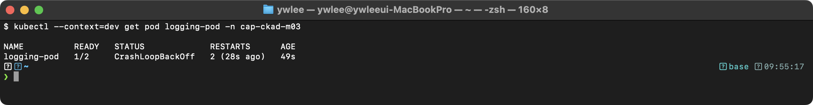

**출제 의도:** 사이드카 패턴의 이해와 emptyDir 볼륨을 통한 컨테이너 간 데이터 공유 능력을 검증한다. 로그 수집 아키텍처(Fluentd/Filebeat 패턴)의 기초가 되는 실무 역량을 평가한다.

**핵심 원리:** 동일 Pod 내 컨테이너는 네트워크 네임스페이스(localhost)와 IPC 네임스페이스를 공유하지만, 파일시스템은 격리되어 있다. emptyDir 볼륨은 Pod가 노드에 할당될 때 생성되고, Pod가 삭제되면 함께 제거된다. `tail -f`는 파일에 새 내용이 추가될 때마다 실시간으로 stdout에 출력한다. 이 stdout 출력은 `kubectl logs`로 수집 가능하다.

**함정과 주의사항:**
- READY 열이 `2/2`인지 확인해야 한다. `1/2`이면 한 컨테이너가 실패한 것이다.
- sidecar 컨테이너의 로그를 볼 때 반드시 `-c log-collector`로 컨테이너를 지정해야 한다. 생략하면 기본 컨테이너(첫 번째)의 로그가 출력된다.
- `readOnly: true`를 sidecar에 설정하지 않아도 동작하지만, 시험에서 "읽기 전용"이라는 조건이 있으면 반드시 포함해야 한다.
- `>>` (append)와 `>` (overwrite)를 혼동하면 로그가 누적되지 않는다.

**시간 절약 팁:** 멀티 컨테이너 Pod는 imperative 명령으로 생성할 수 없다. `kubectl run logging-pod --image=busybox:1.36 --dry-run=client -o yaml > pod.yaml`로 단일 컨테이너 YAML을 생성한 후, 두 번째 컨테이너와 볼륨을 수동으로 추가하는 것이 가장 빠르다.

</details>

---

### 문제 4. [Design & Build] PersistentVolumeClaim

다음 PersistentVolumeClaim과 이를 사용하는 Pod를 생성하라.

- PVC 이름: `data-pvc`, StorageClass: `standard`, AccessMode: `ReadWriteOnce`, 용량: `1Gi`
- Pod 이름: `data-pod`, 이미지: `nginx:1.25`
- PVC를 `/usr/share/nginx/html`에 마운트한다.

<details><summary>풀이 확인</summary>

**풀이:**

```yaml
apiVersion: v1
kind: PersistentVolumeClaim
metadata:
  name: data-pvc
spec:
  accessModes:
    - ReadWriteOnce
  storageClassName: standard
  resources:
    requests:
      storage: 1Gi
---
apiVersion: v1
kind: Pod
metadata:
  name: data-pod
spec:
  containers:
    - name: nginx
      image: nginx:1.25
      volumeMounts:
        - name: data-vol
          mountPath: /usr/share/nginx/html
  volumes:
    - name: data-vol
      persistentVolumeClaim:
        claimName: data-pvc
```

**검증:**

```bash
kubectl get pvc data-pvc
kubectl get pod data-pod
kubectl exec data-pod -- df -h /usr/share/nginx/html
kubectl exec data-pod -- touch /usr/share/nginx/html/test.txt && echo "write OK"
```

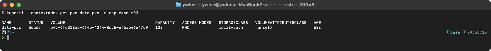

**출제 의도:** 영구 스토리지 관리 능력을 검증한다. PVC와 Pod의 연결 관계, StorageClass를 통한 동적 프로비저닝 이해도를 평가한다.

**핵심 원리:** PVC는 스토리지 요청서이고, PV는 실제 스토리지 자원이다. StorageClass가 지정되면 동적 프로비저닝으로 PV가 자동 생성된다. PVC 상태가 `Bound`가 되어야 Pod에서 사용 가능하다. AccessMode `ReadWriteOnce`는 단일 노드에서만 읽기/쓰기가 가능하다는 의미이다. Pod가 삭제되어도 PVC와 PV는 유지되므로 데이터가 보존된다.

**함정과 주의사항:**
- **이 저장소의 dev 클러스터(tart + rancher local-path-provisioner)에는 `standard`라는 StorageClass가 없다.** 위 YAML을 그대로 적용하면 동적 프로비저닝 대상 StorageClass를 찾지 못해 PVC가 `Pending`에 머물고 Pod도 영원히 `ContainerCreating`이 된다. 먼저 `kubectl get storageclass`로 실제 이름을 확인하라. dev 클러스터의 이름은 `local-path`이므로, 직접 실습할 때는 `storageClassName` 값을 `local-path`로 바꾸거나 해당 줄을 삭제해 default StorageClass를 쓴다(실제 시험 환경은 보통 `standard`가 존재하므로 시험에서는 문제 지시대로 둔다).
- `storageClassName`을 생략하면 클러스터의 default StorageClass가 사용된다. 시험에서 명시적으로 지정하라고 하면 반드시 포함해야 한다.
- `volumes[].persistentVolumeClaim.claimName`에서 PVC 이름을 정확히 지정해야 한다. 오타가 나면 Pod가 `Pending` 상태에 머문다.
- PVC의 `accessModes`는 리스트 형태(`- ReadWriteOnce`)이다. 문자열로 쓰면 파싱 오류가 발생한다.
- PVC 상태가 `Pending`이면 StorageClass가 존재하지 않거나 프로비저너가 없는 것이다.

**시간 절약 팁:** PVC는 imperative 명령이 없으므로 YAML을 직접 작성해야 한다. 시험 중에는 kubernetes.io/docs에서 PVC 예제를 복사하여 수정하는 것이 빠르다. Pod 부분은 `kubectl run data-pod --image=nginx:1.25 --dry-run=client -o yaml`로 생성 후 volumeMounts만 추가한다.

</details>

---

### 문제 5. [Design & Build] Multi-container Pod -- Ambassador 패턴

다음 조건을 만족하는 Pod를 생성하라.

- Pod 이름: `ambassador-pod`
- 컨테이너 1 (`app`): 이미지 `nginx:1.25`, 포트 80
- 컨테이너 2 (`ambassador`): 이미지 `haproxy:2.8`, 포트 8080
- 두 컨테이너 모두 `/etc/shared-config`에 configMap `proxy-config`를 마운트한다.

<details><summary>풀이 확인</summary>

**풀이:**

```yaml
apiVersion: v1
kind: Pod
metadata:
  name: ambassador-pod
spec:
  containers:
    - name: app
      image: nginx:1.25
      ports:
        - containerPort: 80
      volumeMounts:
        - name: config
          mountPath: /etc/shared-config
          readOnly: true
    - name: ambassador
      image: haproxy:2.8
      ports:
        - containerPort: 8080
      volumeMounts:
        - name: config
          mountPath: /etc/shared-config
          readOnly: true
  volumes:
    - name: config
      configMap:
        name: proxy-config
```

**검증:**

```bash
kubectl get pod ambassador-pod
kubectl describe pod ambassador-pod | grep -A 3 "Containers:"
kubectl exec ambassador-pod -c app -- wget -qO- http://localhost:8080 2>&1 || echo "ambassador port reachable"
```

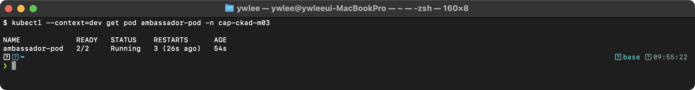

**출제 의도:** 멀티 컨테이너 디자인 패턴 중 Ambassador 패턴의 이해를 검증한다. ConfigMap 볼륨 공유와 Pod 내부 컨테이너 간 네트워크 통신 구조를 평가한다.

**개념 입문:** 프록시는 클라이언트와 서버 사이에 끼어 요청을 대신 주고받는 중개자다. 두 가지를 구분하면 패턴이 명확해진다. 로드밸런싱은 같은 역할을 하는 여러 대상에 요청을 골고루 나눠 보내는 것(부하 분산)이고, 라우팅은 요청의 경로·내용에 따라 서로 다른 대상으로 보내는 것(길 안내)이다. Ambassador 패턴은 앱이 항상 `localhost`의 프록시(haproxy 등)에만 말하게 하고, 그 프록시가 실제 외부 엔드포인트로의 연결·재시도·암호화·로드밸런싱을 떠맡는 구조다. 앱은 외부 주소가 바뀌어도 코드 수정 없이 그대로 둘 수 있다.

**핵심 원리:** Ambassador 패턴에서 프록시 컨테이너는 메인 앱 대신 외부 서비스와의 통신을 중개한다. 동일 Pod 내 컨테이너는 동일한 네트워크 네임스페이스를 공유하므로 `localhost`로 상호 접근 가능하다. 메인 앱은 `localhost:8080`으로 ambassador에 요청하고, ambassador가 실제 외부 엔드포인트로 라우팅한다. ConfigMap을 공유 볼륨으로 마운트하면 두 컨테이너가 동일한 설정 파일을 참조할 수 있다.

**함정과 주의사항:**
- `configMap.name: proxy-config`이 실제로 존재해야 Pod가 정상 시작된다. 존재하지 않으면 Pod가 `Pending` 또는 `CreateContainerConfigError` 상태가 된다.
- 두 컨테이너가 같은 포트를 사용하면 충돌이 발생한다. app(80)과 ambassador(8080)는 반드시 다른 포트를 사용해야 한다.
- `readOnly: true`는 configMap 볼륨에 설정하는 것이 보안 모범 사례이다. 시험에서 명시적으로 요구하지 않아도 추가하면 좋다.
- Sidecar, Ambassador, Adapter 패턴의 차이를 이해해야 한다. Ambassador는 외부 통신 프록시, Sidecar는 보조 기능, Adapter는 출력 형식 변환이다.

**시간 절약 팁:** `kubectl run ambassador-pod --image=nginx:1.25 --dry-run=client -o yaml`로 기본 Pod를 생성한 후 두 번째 컨테이너, 볼륨, volumeMounts를 수동 추가한다. ConfigMap은 `kubectl create configmap proxy-config --from-file=haproxy.cfg`로 imperative하게 생성할 수 있다.

</details>

---

### 문제 6. [Design & Build] emptyDir 볼륨과 medium: Memory

다음 Pod를 생성하라.

- Pod 이름: `cache-pod`
- 이미지: `redis:7`
- emptyDir 볼륨을 RAM 기반(`medium: Memory`)으로 생성하고, 최대 크기를 `256Mi`로 제한한다.
- `/data`에 마운트한다.

<details><summary>풀이 확인</summary>

**풀이:**

```yaml
apiVersion: v1
kind: Pod
metadata:
  name: cache-pod
spec:
  containers:
    - name: redis
      image: redis:7
      volumeMounts:
        - name: cache-vol
          mountPath: /data
  volumes:
    - name: cache-vol
      emptyDir:
        medium: Memory
        sizeLimit: 256Mi
```

**검증:**

```bash
kubectl get pod cache-pod
kubectl exec cache-pod -- df -h /data
kubectl exec cache-pod -- mount | grep /data
```

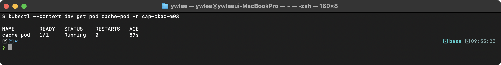

**출제 의도:** emptyDir 볼륨의 고급 옵션인 메모리 기반 스토리지 설정 능력을 검증한다. 캐시 레이어 구성 시 디스크 vs 메모리 성능 차이를 이해하는 실무 역량을 평가한다.

**개념 입문:** 일반 파일은 디스크(SSD/HDD)에 저장되어 전원이 꺼져도 남지만, 읽고 쓸 때 디스크 I/O 지연(수십 마이크로초~밀리초)이 든다. tmpfs는 디스크가 아니라 RAM 위에 만들어지는 임시 파일시스템이다. 파일처럼 보이지만 실제 데이터는 메모리에 있으므로 접근 지연이 RAM 수준(나노초~수 마이크로초)으로 짧고, 대신 전원이 꺼지거나 Pod가 사라지면 내용이 함께 소멸한다. 캐시(redis 등)처럼 "빠르되 잃어도 되는" 데이터에 적합하다. emptyDir에 `medium: Memory`를 주면 이 tmpfs로 마운트된다.

**핵심 원리:** `medium: Memory`를 설정하면 emptyDir이 tmpfs(메모리 파일시스템)로 마운트된다. 디스크 I/O가 아닌 RAM 접근이므로 지연 시간이 마이크로초 단위로 감소한다. `sizeLimit`을 초과하면 Pod가 eviction 대상이 된다. tmpfs에 저장된 데이터는 Pod 재시작 시 소멸된다. 메모리 기반 emptyDir은 컨테이너의 메모리 사용량에 합산되어 cgroup 제한에 포함된다.

**함정과 주의사항:**
- `sizeLimit`을 설정하지 않으면 노드 메모리의 50%까지 사용 가능하다. 반드시 제한을 설정해야 한다.
- `medium: Memory` 볼륨 사용량은 컨테이너의 `resources.limits.memory`에 포함된다. limits 없이 대량 데이터를 쓰면 OOMKilled가 발생할 수 있다.
- `medium` 필드를 `"Memory"`(문자열)로 정확히 써야 한다. 소문자 `memory`는 인식되지 않는다.
- 일반 emptyDir(디스크 기반)은 `medium` 필드를 생략하거나 `""`로 설정한다.

**시간 절약 팁:** `kubectl run cache-pod --image=redis:7 --dry-run=client -o yaml`로 기본 Pod를 생성한 후 volumes/volumeMounts만 추가한다. emptyDir의 `medium`과 `sizeLimit` 두 필드만 기억하면 된다.

</details>

---

### 문제 7. [Design & Build] ConfigMap을 Volume으로 마운트 (subPath)

ConfigMap `app-properties`의 `application.yaml` key만 컨테이너의 `/etc/app/application.yaml` 경로에 단일 파일로 마운트하는 Pod를 생성하라. 기존 `/etc/app` 디렉토리의 다른 파일은 보존되어야 한다.

- Pod 이름: `subpath-pod`
- 이미지: `nginx:1.25`

<details><summary>풀이 확인</summary>

**풀이:**

```yaml
apiVersion: v1
kind: Pod
metadata:
  name: subpath-pod
spec:
  containers:
    - name: nginx
      image: nginx:1.25
      volumeMounts:
        - name: config-vol
          mountPath: /etc/app/application.yaml
          subPath: application.yaml
          readOnly: true
  volumes:
    - name: config-vol
      configMap:
        name: app-properties
```

**검증:**

```bash
kubectl exec subpath-pod -- cat /etc/app/application.yaml
kubectl exec subpath-pod -- ls /etc/app/
```

> **예시(참조):** CKAD 실습/보충 기대 출력(istio sidecar·버전·tart 환경값 등 placeholder, 환경 의존). 재현 가능 핵심은 CKAD daily(day01~14) 및 본문 02·03 캡처 참고.

**출제 의도:** ConfigMap 볼륨 마운트의 고급 옵션인 subPath 사용법을 검증한다. 기존 디렉토리를 덮어쓰지 않고 특정 설정 파일만 주입하는 실무 패턴을 평가한다.

**핵심 원리:** 일반 ConfigMap 볼륨 마운트는 마운트 포인트 디렉토리 전체를 ConfigMap 내용으로 대체한다. `subPath`를 사용하면 디렉토리 내 특정 파일 하나만 마운트하여 기존 파일을 보존한다. 이는 Linux의 bind mount 메커니즘을 사용하여 단일 파일을 오버레이한다. 단, subPath 마운트는 kubelet의 ConfigMap 자동 갱신(atomic update) 메커니즘에서 제외된다.

**함정과 주의사항:**
- subPath로 마운트한 파일은 ConfigMap이 업데이트되어도 자동으로 갱신되지 않는다. 갱신이 필요하면 Pod를 재시작해야 한다. 이것이 시험에서 가장 자주 출제되는 포인트이다.
- `mountPath`는 파일 경로(`/etc/app/application.yaml`)이고, `subPath`는 ConfigMap 내의 key 이름(`application.yaml`)이다. 둘을 혼동하면 안 된다.
- ConfigMap에 해당 key가 없으면 Pod 시작 시 오류가 발생한다.
- subPath 없이 `/etc/app`에 마운트하면 nginx의 기존 설정 파일이 모두 사라져 서비스가 동작하지 않는다.

**시간 절약 팁:** subPath는 imperative 명령으로 설정할 수 없으므로 반드시 YAML을 직접 작성해야 한다. `volumeMounts`에 `mountPath`, `subPath`, `readOnly` 세 필드를 기억하면 된다. kubernetes.io/docs에서 "projected volume subpath" 검색으로 예제를 빠르게 찾을 수 있다.

</details>

---

### 문제 8. [Design & Build] Job과 CronJob

1. 이미지 `perl:5.38`을 사용하여 원주율을 2000자리까지 계산하는 Job을 생성하라.
   - Job 이름: `pi-job`, 명령: `perl -Mbignum=bpi -wle 'print bpi(2000)'`
   - 완료 후 30초 뒤 자동 삭제 (`ttlSecondsAfterFinished: 30`)
2. 위 Job을 매 5분마다 실행하는 CronJob을 생성하라.
   - CronJob 이름: `pi-cron`

<details><summary>풀이 확인</summary>

**풀이:**

Job:
```bash
kubectl create job pi-job --image=perl:5.38 -- perl -Mbignum=bpi -wle 'print bpi(2000)'
```

또는 YAML:
```yaml
apiVersion: batch/v1
kind: Job
metadata:
  name: pi-job
spec:
  ttlSecondsAfterFinished: 30
  template:
    spec:
      containers:
        - name: pi
          image: perl:5.38
          command: ["perl", "-Mbignum=bpi", "-wle", "print bpi(2000)"]
      restartPolicy: Never
  backoffLimit: 4
```

CronJob:
```bash
kubectl create cronjob pi-cron --image=perl:5.38 --schedule="*/5 * * * *" \
  -- perl -Mbignum=bpi -wle 'print bpi(2000)'
```

또는 YAML:
```yaml
apiVersion: batch/v1
kind: CronJob
metadata:
  name: pi-cron
spec:
  schedule: "*/5 * * * *"
  jobTemplate:
    spec:
      template:
        spec:
          containers:
            - name: pi
              image: perl:5.38
              command: ["perl", "-Mbignum=bpi", "-wle", "print bpi(2000)"]
          restartPolicy: Never
```

**검증:**

```bash
kubectl get job pi-job
kubectl get pods -l job-name=pi-job
kubectl logs job/pi-job
kubectl get cronjob pi-cron
```

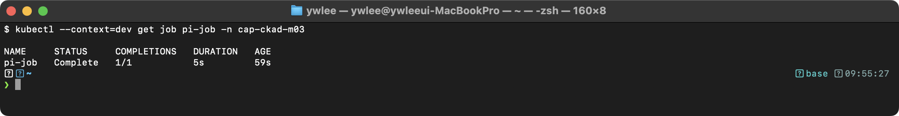

**출제 의도:** 배치 작업(Job)과 스케줄링(CronJob)의 생성 및 설정 능력을 검증한다. `ttlSecondsAfterFinished`, `backoffLimit`, `restartPolicy` 등 세부 옵션의 이해도를 평가한다.

**핵심 원리:** Job은 하나 이상의 Pod를 생성하여 지정된 작업이 성공적으로 완료될 때까지 실행한다. `restartPolicy: Never`이면 실패 시 새 Pod를 생성하고, `OnFailure`이면 같은 Pod를 재시작한다. `backoffLimit`은 최대 재시도 횟수이다. `ttlSecondsAfterFinished`는 Job 완료 후 자동 삭제까지 대기 시간이다. CronJob은 지정된 스케줄에 따라 Job을 자동 생성하는 상위 리소스이다.

**함정과 주의사항:**
- Job의 `restartPolicy`는 `Always`를 사용할 수 없다. `Never` 또는 `OnFailure`만 허용된다. `Always`를 쓰면 validation 오류가 발생한다.
- `ttlSecondsAfterFinished`는 imperative `kubectl create job` 명령으로 설정할 수 없다. YAML로 직접 추가해야 한다.
- CronJob의 `schedule` 형식은 리눅스 cron과 동일하다. `*/5 * * * *`는 5분마다 실행을 의미한다. 잘못된 cron 표현식은 생성 자체가 거부된다.
- CronJob에서 `concurrencyPolicy`를 설정하지 않으면 기본값 `Allow`로 이전 Job이 완료되지 않아도 새 Job이 생성된다.

**시간 절약 팁:** Job과 CronJob은 imperative 명령으로 빠르게 생성할 수 있다. `kubectl create job pi-job --image=perl:5.38 -- perl -Mbignum=bpi -wle 'print bpi(2000)'`과 `kubectl create cronjob pi-cron --image=perl:5.38 --schedule="*/5 * * * *" -- ...`를 사용한다. `ttlSecondsAfterFinished`만 YAML에서 추가하면 된다. imperative 생성 후 `kubectl edit`으로 수정하는 것도 방법이다.

</details>

> 도메인 전환: 여기까지가 **Application Design and Build(문제 1~8)** 이다. 다음은 **Application Deployment(문제 9~16)** -- 만든 앱을 무중단으로 배포·갱신·롤백하는 전략과 도구를 다룬다.

---

## Application Deployment

> 학습 목표: 무중단 배포 전략(Rolling/Canary/Blue-Green) 비교, 롤백, 패키지·설정 도구(Helm/Kustomize) 활용, HPA 자동 스케일링 이해 | 예상 소요: 120분 | 전제 지식: Deployment/ReplicaSet/Pod 관계, label/selector 개념
>
> 학습 순서와 관계: 9~12는 업데이트 전략의 스펙트럼이다 -- Rolling(점진 교체) → Canary(소수에 먼저 노출) → Blue-Green(통째로 전환). 13~16은 그 위에 얹는 운영 도구다 -- Helm/Kustomize(매니페스트 패키징), HPA(부하 기반 자동 증감), annotation(변경 이력 기록).

### 등장 배경 -- 무중단 배포는 왜 여러 전략으로 갈라지나

배포의 근본 문제는 "구버전을 끄고 새버전을 켜는 그 순간"이다. 가장 단순한 방식(전부 끄고 새로 켜기, Recreate)은 그 사이 서비스가 멈춘다. Rolling Update는 새 Pod를 조금씩 늘리고 구 Pod를 조금씩 줄여 멈춤을 없앴지만, 새버전에 버그가 있으면 점진적으로 모든 트래픽이 그 버그에 노출되고 교체 속도에 따라 순간적으로 특정 버전에 트래픽이 몰릴 수 있다. Canary는 이 한계를 "전체 교체 전에 일부 Pod(예 10%)만 새버전으로 먼저 띄워 실제 트래픽으로 검증"하는 방식으로 보완한다. Blue-Green은 신·구 두 환경을 통째로 동시에 띄워 두고 Service의 selector만 바꿔 100%를 한 번에 전환·롤백한다. 트레이드오프는 비용이다. Canary는 버전 관리(label)가 늘고, Blue-Green은 두 배의 리소스를 잠시 점유한다. 9~12번은 이 스펙트럼을 손으로 구현하며 차이를 체득하는 묶음이다.

등장 배경 -- Helm/Kustomize는 왜 생겼나(13~14번 전제): 앱 하나를 배포하려면 Deployment·Service·ConfigMap·Secret·Ingress·HPA 등 매니페스트(manifest, 클러스터에 적용하는 선언 YAML 파일)가 금세 수십 개로 늘어난다. 여기에 dev·staging·prod 환경별로 replicas·이미지 태그·도메인만 다른 거의 같은 YAML을 세 벌씩 복사해 두면, 공통 부분을 한 곳 고칠 때 모든 사본을 똑같이 손봐야 해서 버전 관리와 변경 추적이 어려워진다. 두 도구가 이 중복 문제를 서로 다른 방식으로 푼다. Helm은 매니페스트를 변수가 들어간 템플릿으로 만들고(Chart = 템플릿+기본값 패키지), `values.yaml`로 환경별 값만 주입해 설치 단위(Release)로 관리한다 -- 즉 "패키지 매니저"처럼 install/upgrade/rollback이 한 명령으로 된다. Kustomize는 템플릿 문법 없이 원본(base) YAML을 그대로 두고, 환경별 차이(overlay)를 patch로 덧씌워 합성한다 -- 즉 "YAML을 YAML로 덧칠"한다. 선택 기준: 외부에서 받은 패키지를 값만 바꿔 설치하거나 install/rollback 라이프사이클·의존성 관리가 필요하면 Helm, 내가 가진 YAML을 환경별로 약간씩만 변형하고 템플릿 문법 학습 비용을 피하고 싶으면 Kustomize(kubectl 내장이라 별도 설치 불필요)가 적합하다. 트레이드오프: Helm은 Go 템플릿 문법과 Chart 의존성·릴리스 상태(Secret 저장) 같은 학습·운영 비용이 추가되고, Kustomize는 템플릿이 없어 단순한 대신 조건문·반복 같은 동적 생성은 못 한다.

### 문제 9. [Deployment] Rolling Update 전략 설정

다음 조건의 Deployment를 생성하라.

- 이름: `web-deploy`, 이미지: `nginx:1.24`, replicas: 4
- Rolling Update 전략: maxSurge=2, maxUnavailable=1
- 이후 이미지를 `nginx:1.25`로 업데이트하고, 롤아웃 상태를 확인하라.

<details><summary>풀이 확인</summary>

**풀이:**

```bash
# Deployment 생성
kubectl create deployment web-deploy --image=nginx:1.24 --replicas=4 \
  --dry-run=client -o yaml > web-deploy.yaml
```

YAML을 수정하여 strategy를 추가한다:

```yaml
apiVersion: apps/v1
kind: Deployment
metadata:
  name: web-deploy
spec:
  replicas: 4
  selector:
    matchLabels:
      app: web-deploy
  strategy:
    type: RollingUpdate
    rollingUpdate:
      maxSurge: 2
      maxUnavailable: 1
  template:
    metadata:
      labels:
        app: web-deploy
    spec:
      containers:
        - name: nginx
          image: nginx:1.24
```

```bash
kubectl apply -f web-deploy.yaml

# 이미지 업데이트
kubectl set image deployment/web-deploy nginx=nginx:1.25

# 롤아웃 상태 확인
kubectl rollout status deployment/web-deploy

# 히스토리 확인
kubectl rollout history deployment/web-deploy
```

**검증:**

```bash
kubectl get deployment web-deploy
kubectl describe deployment web-deploy | grep -A 5 "Strategy"
kubectl rollout status deployment/web-deploy
kubectl get rs -l app=web-deploy
```

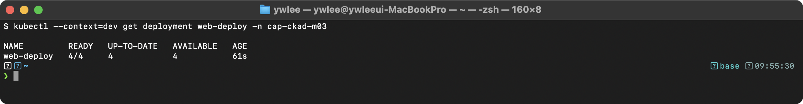

**출제 의도:** Rolling Update 전략의 세부 파라미터(maxSurge, maxUnavailable) 설정 능력과 롤아웃 관리 명령어 숙련도를 검증한다. 무중단 배포의 핵심 메커니즘을 이해하는 실무 역량을 평가한다.

**핵심 원리:** Rolling Update는 새 ReplicaSet를 생성하고, 점진적으로 새 Pod를 늘리면서 구 Pod를 줄인다. `maxSurge=2`이면 replicas(4) + 2 = 최대 6개 Pod가 동시에 존재할 수 있다. `maxUnavailable=1`이면 replicas(4) - 1 = 최소 3개 Pod가 항상 가용해야 한다. 두 파라미터를 조합하면 업데이트 속도와 가용성의 균형을 조절할 수 있다. `kubectl set image`는 Deployment의 PodTemplate을 변경하여 새 ReplicaSet을 트리거한다.

**함정과 주의사항:**
- `strategy` 섹션은 `spec` 바로 아래에 위치한다. `template.spec` 아래가 아니다. 위치를 잘못 지정하면 무시된다.
- `maxSurge`와 `maxUnavailable`은 정수 또는 백분율(문자열 `"25%"`)로 지정할 수 있다. 둘 다 0으로 설정하면 오류가 발생한다.
- `kubectl set image`에서 컨테이너 이름(`nginx`)을 정확히 지정해야 한다. 잘못된 컨테이너 이름을 쓰면 오류 없이 무시되거나 새 컨테이너가 추가될 수 있다.
- `kubectl rollout status`는 롤아웃이 완료될 때까지 블로킹된다. 실패하면 timeout으로 종료된다.

**시간 절약 팁:** `kubectl create deployment web-deploy --image=nginx:1.24 --replicas=4 --dry-run=client -o yaml > web-deploy.yaml`로 기본 YAML을 생성한 후 `strategy` 섹션만 추가하는 것이 가장 빠르다. 이미지 업데이트는 `kubectl set image`로 imperative하게 수행한다. strategy를 제외한 나머지는 모두 imperative로 처리 가능하다.

</details>

---

### 문제 10. [Deployment] Rollback

Deployment `web-deploy`를 리비전 1로 롤백하라. 롤백 전후의 이미지를 확인하라.

<details><summary>풀이 확인</summary>

**선결: 문제 9 완료가 전제다.** 이 문제는 문제 9에서 만든 `web-deploy`(nginx:1.24 -> nginx:1.25로 업데이트해 리비전이 2개 이상 쌓인 상태)를 대상으로 한다. 문제 9를 건너뛰면 `web-deploy`가 없어 `Error from server (NotFound)`가 나거나, 리비전이 1개뿐이라 롤백할 대상이 없다. 문제 9를 먼저 끝낸 뒤 같은 네임스페이스에서 진행한다.

**풀이:**

```bash
# 현재 이미지 확인
kubectl describe deployment web-deploy | grep Image

# 리비전 히스토리 확인
kubectl rollout history deployment/web-deploy

# 특정 리비전 상세 확인
kubectl rollout history deployment/web-deploy --revision=1

# 리비전 1로 롤백
kubectl rollout undo deployment/web-deploy --to-revision=1

# 롤백 완료 확인
kubectl rollout status deployment/web-deploy

# 이미지 확인
kubectl describe deployment web-deploy | grep Image
```

**검증:**

```bash
kubectl rollout history deployment/web-deploy
kubectl describe deployment web-deploy | grep Image
```

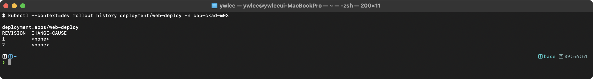

**출제 의도:** Deployment 롤백 능력과 리비전 관리 이해도를 검증한다. 프로덕션 환경에서 문제 발생 시 신속하게 이전 버전으로 복원하는 실무 역량을 평가한다.

**핵심 원리:** Deployment는 변경이 발생할 때마다 새 ReplicaSet을 생성하고 리비전 번호를 부여한다. `rollout undo`는 지정된 리비전의 PodTemplate으로 새 ReplicaSet을 생성하는 것이다. 롤백 자체도 새 리비전을 생성한다. 따라서 리비전 1로 롤백하면 리비전 1이 사라지고 리비전 3이 생성된다. `revisionHistoryLimit`(기본값 10)으로 보관할 ReplicaSet 수를 제한할 수 있다.

**함정과 주의사항:**
- `--to-revision=1`에서 리비전 번호는 `rollout history`로 반드시 먼저 확인해야 한다. 존재하지 않는 리비전 번호를 지정하면 오류가 발생한다.
- 롤백 후 리비전 번호가 재배치된다. 리비전 1로 롤백하면 리비전 1이 삭제되고 새 리비전(3)이 생성되므로, 다시 같은 명령을 실행할 수 없다.
- `rollout history`에서 `CHANGE-CAUSE`가 `<none>`이면 annotation이 설정되지 않은 것이다.
- `kubectl rollout undo` 뒤에 `rollout status`로 완료를 확인해야 한다.

**시간 절약 팁:** 롤백은 100% imperative로 처리 가능하다. `kubectl rollout history` → `kubectl rollout undo --to-revision=N` → `kubectl rollout status` 세 명령어를 순서대로 실행하면 된다. YAML 편집이 전혀 필요 없으므로 시간을 절약할 수 있다.

</details>

---

### 문제 11. [Deployment] Canary 배포 (Kubernetes 네이티브)

`app: myapp` label을 공유하는 두 Deployment를 생성하여 canary 배포를 구현하라.

- Stable: `myapp-stable`, 이미지: `nginx:1.24`, replicas: 9
- Canary: `myapp-canary`, 이미지: `nginx:1.25`, replicas: 1
- Service `myapp-svc`를 생성하여 `app: myapp`으로 트래픽을 분배한다.

<details><summary>풀이 확인</summary>

**풀이:**

```yaml
apiVersion: apps/v1
kind: Deployment
metadata:
  name: myapp-stable
spec:
  replicas: 9
  selector:
    matchLabels:
      app: myapp
      version: stable
  template:
    metadata:
      labels:
        app: myapp
        version: stable
    spec:
      containers:
        - name: nginx
          image: nginx:1.24
---
apiVersion: apps/v1
kind: Deployment
metadata:
  name: myapp-canary
spec:
  replicas: 1
  selector:
    matchLabels:
      app: myapp
      version: canary
  template:
    metadata:
      labels:
        app: myapp
        version: canary
    spec:
      containers:
        - name: nginx
          image: nginx:1.25
---
apiVersion: v1
kind: Service
metadata:
  name: myapp-svc
spec:
  selector:
    app: myapp
  ports:
    - port: 80
      targetPort: 80
```

**검증:**

```bash
kubectl get pods -l app=myapp --show-labels
kubectl get endpoints myapp-svc
kubectl get svc myapp-svc
```

> **예시(참조):** CKAD 실습/보충 기대 출력(istio sidecar·버전·tart 환경값 등 placeholder, 환경 의존). 재현 가능 핵심은 CKAD daily(day01~14) 및 본문 02·03 캡처 참고.

**출제 의도:** Kubernetes 네이티브 방식의 Canary 배포 구현 능력을 검증한다. Service selector를 활용한 트래픽 분배와 replica 비율 기반 가중치 조절을 이해하는 실무 역량을 평가한다.

**개념 입문:** 직전 문제(9)의 Rolling Update는 새버전으로 "전부" 교체하므로, 새버전에 숨은 버그가 있으면 교체가 진행될수록 점점 더 많은 트래픽이 그 버그를 맞는다. Canary(탄광의 카나리아 새에서 유래)는 이 위험을 줄이려고 새버전을 소수의 Pod에만 먼저 띄워 전체 트래픽의 일부만 흘려보내고, 지표(에러율·지연)를 관찰한 뒤 문제가 없으면 비중을 늘린다. 즉 Rolling이 "속도로 안전을 산다면" Canary는 "노출 범위를 좁혀 안전을 산다". Kubernetes 네이티브 방식에서는 stable과 canary 두 Deployment가 같은 `app` label을 공유하게 만들고, replica 개수 비율(예 9:1)로 트래픽 비중을 근사한다.

**핵심 원리:** Kubernetes Service는 selector에 매칭되는 모든 Pod에 균등하게 트래픽을 분배한다. 두 Deployment가 동일한 `app: myapp` label을 가지면, Service의 Endpoints에 모든 Pod가 포함된다. replica 비율 9:1은 약 10%의 트래픽이 canary로 향하는 것을 의미한다. 이는 iptables/ipvs의 라운드로빈 방식으로 동작하므로 정확한 10%는 아니지만 근사치이다.

**함정과 주의사항:**
- `selector.matchLabels`에 `version: stable`과 `version: canary`를 포함해야 한다. 이것이 없으면 두 Deployment의 ReplicaSet이 서로의 Pod를 관리하려고 충돌한다.
- Service의 selector는 `app: myapp`만 사용해야 한다. `version`까지 포함하면 하나의 Deployment Pod만 선택된다.
- canary를 확대하려면 canary replicas를 늘리고 stable replicas를 줄인다. 총 replica 수를 유지하면 트래픽 비율이 변경된다.
- Kubernetes 네이티브 canary는 HTTP 헤더나 쿠키 기반 라우팅이 불가능하다. 세밀한 제어가 필요하면 Istio/Argo Rollouts를 사용해야 한다.

**시간 절약 팁:** Deployment는 `kubectl create deployment`로 빠르게 생성하되, `--dry-run=client -o yaml`로 YAML을 뽑아 label을 수정한다. Service는 `kubectl expose deployment myapp-stable --name=myapp-svc --port=80`로 생성 후 `kubectl edit svc myapp-svc`에서 selector의 `version` label을 제거하는 것이 빠르다.

</details>

---

### 문제 12. [Deployment] Blue-Green 배포

Blue-Green 배포를 구현하라.

1. Blue Deployment (`myapp-blue`, 이미지: `nginx:1.24`, replicas: 3)를 생성하고 Service `myapp-svc`에 연결한다.
2. Green Deployment (`myapp-green`, 이미지: `nginx:1.25`, replicas: 3)를 생성한다.
3. Service의 selector를 변경하여 트래픽을 Green으로 전환한다.

<details><summary>풀이 확인</summary>

**풀이:**

```yaml
# Blue Deployment
apiVersion: apps/v1
kind: Deployment
metadata:
  name: myapp-blue
spec:
  replicas: 3
  selector:
    matchLabels:
      app: myapp
      version: blue
  template:
    metadata:
      labels:
        app: myapp
        version: blue
    spec:
      containers:
        - name: nginx
          image: nginx:1.24
---
# Green Deployment
apiVersion: apps/v1
kind: Deployment
metadata:
  name: myapp-green
spec:
  replicas: 3
  selector:
    matchLabels:
      app: myapp
      version: green
  template:
    metadata:
      labels:
        app: myapp
        version: green
    spec:
      containers:
        - name: nginx
          image: nginx:1.25
---
# Service (처음에는 Blue를 가리킴)
apiVersion: v1
kind: Service
metadata:
  name: myapp-svc
spec:
  selector:
    app: myapp
    version: blue
  ports:
    - port: 80
      targetPort: 80
```

```bash
# Green으로 전환
kubectl patch service myapp-svc -p '{"spec":{"selector":{"version":"green"}}}'

# 롤백 (다시 Blue로)
kubectl patch service myapp-svc -p '{"spec":{"selector":{"version":"blue"}}}'
```

**검증:**

```bash
# Green 전환 후 확인
kubectl get svc myapp-svc -o jsonpath='{.spec.selector}'
kubectl get endpoints myapp-svc
kubectl run test --image=busybox:1.36 --rm -it --restart=Never -- wget -qO- http://myapp-svc
```

> **예시(참조):** CKAD 실습/보충 기대 출력(istio sidecar·버전·tart 환경값 등 placeholder, 환경 의존). 재현 가능 핵심은 CKAD daily(day01~14) 및 본문 02·03 캡처 참고.

**출제 의도:** Blue-Green 배포 전략의 구현 능력과 즉각적 트래픽 전환 메커니즘을 검증한다. 서비스 중단 없이 배포하고, 문제 발생 시 즉시 롤백하는 실무 역량을 평가한다.

**핵심 원리:** Blue-Green 배포에서 두 환경은 동시에 실행되지만, Service의 selector가 하나만 가리킨다. `kubectl patch`로 selector를 변경하면 Service의 Endpoints가 즉시 갱신되어 트래픽이 전환된다. Canary와 달리 100% 트래픽이 한 번에 전환되므로 점진적 검증이 불가능하지만, 롤백도 selector 변경만으로 즉각적이다. Blue 환경은 즉시 삭제하지 않고 유지하여 롤백 대기 상태로 둔다.

**함정과 주의사항:**
- `kubectl patch`에서 JSON 경로가 정확해야 한다. `{"spec":{"selector":{"version":"green"}}}`는 기존 selector에 merge되므로 `app: myapp`은 유지된다.
- Green Deployment의 Pod가 모두 Ready 상태인지 확인한 후 전환해야 한다. 준비되지 않은 상태에서 전환하면 서비스 중단이 발생한다.
- Blue 환경을 삭제하기 전에 Green의 안정성을 충분히 확인해야 한다.
- selector의 label은 Deployment의 `template.metadata.labels`에 반드시 포함되어야 한다. `.metadata.labels`만으로는 부족하다.

**시간 절약 팁:** `kubectl patch`는 한 줄로 selector를 변경할 수 있어 시험에서 매우 빠르다. YAML 전체를 수정할 필요 없이 `kubectl patch service myapp-svc -p '{"spec":{"selector":{"version":"green"}}}'`만 실행하면 된다. Deployment 생성은 `kubectl create deployment`로 imperative하게 처리하고, label만 YAML에서 수정한다.

</details>

---

### 문제 13. [Deployment] Helm 설치 및 커스터마이징

Helm을 사용하여 nginx를 설치하라.

1. bitnami 저장소를 추가하라.
2. `web` 네임스페이스에 릴리스 이름 `my-web`으로 설치하라 (replicas=2, service.type=NodePort).
3. replicas를 3으로 업그레이드하라.
4. 리비전 1로 롤백하라.

<details><summary>풀이 확인</summary>

**풀이:**

```bash
# 저장소 추가
helm repo add bitnami https://charts.bitnami.com/bitnami
helm repo update

# 설치
helm install my-web bitnami/nginx \
  --namespace web --create-namespace \
  --set replicaCount=2 \
  --set service.type=NodePort

# 확인
helm list -n web
kubectl get pods -n web

# 업그레이드
helm upgrade my-web bitnami/nginx \
  --namespace web \
  --set replicaCount=3 \
  --set service.type=NodePort

# 히스토리 확인
helm history my-web -n web

# 롤백
helm rollback my-web 1 -n web

# 확인
helm status my-web -n web
```

**검증:**

```bash
helm list -n web
helm history my-web -n web
kubectl get pods -n web
helm get values my-web -n web
```

> **예시(참조):** CKAD 실습/보충 기대 출력(istio sidecar·버전·tart 환경값 등 placeholder, 환경 의존). 재현 가능 핵심은 CKAD daily(day01~14) 및 본문 02·03 캡처 참고.

**출제 의도:** Helm 패키지 매니저의 전체 라이프사이클(install, upgrade, rollback) 관리 능력을 검증한다. values 오버라이드와 릴리스 버전 관리를 이해하는 실무 역량을 평가한다.

**핵심 원리:** Helm은 Chart(패키지)를 릴리스(인스턴스)로 설치한다. 각 install/upgrade는 새 리비전을 생성하고, Secret 기반 스토리지에 릴리스 상태를 저장한다. `--set`으로 전달한 값은 Chart의 `values.yaml`을 오버라이드한다. `helm rollback`은 지정된 리비전의 values와 Chart 버전으로 새 리비전을 생성한다. `--create-namespace`는 네임스페이스가 없으면 자동 생성한다.

**함정과 주의사항:**
- **`helm repo add bitnami`는 인터넷(charts.bitnami.com)에 접근 가능해야 동작한다.** 오프라인 실습 환경이나 방화벽 뒤에서는 `helm repo add`/`helm install bitnami/nginx`가 timeout 또는 `could not find protocol handler`로 실패한다. 인터넷이 되는 환경에서 미리 차트를 내려받아 두면 오프라인에서도 로컬 설치가 가능하다: `helm pull bitnami/nginx --untar`로 현재 디렉터리에 `nginx/` 차트를 풀어 둔 뒤, `helm install my-web ./nginx --namespace web --create-namespace --set replicaCount=2`처럼 로컬 경로로 설치한다(이후 upgrade/rollback 명령의 차트 인자도 `./nginx`로 바꾼다).
- `helm upgrade` 시 이전에 `--set`으로 지정한 값이 초기화된다. `--reuse-values`를 사용하거나 모든 값을 다시 지정해야 한다. 이것이 가장 흔한 실수이다.
- `helm repo add` 후 반드시 `helm repo update`를 실행해야 최신 차트 목록을 받는다.
- `helm rollback my-web 1 -n web`에서 네임스페이스(`-n web`)를 누락하면 default 네임스페이스에서 릴리스를 찾아 실패한다.
- Helm 3에서는 Tiller가 없으므로 `helm init`이 필요 없다. Helm 2 문법과 혼동하지 않아야 한다.

**시간 절약 팁:** Helm 명령어는 모두 imperative이므로 YAML 편집이 필요 없다. `helm install`, `helm upgrade`, `helm rollback`, `helm list`, `helm history` 5개 명령만 기억하면 대부분의 문제를 해결할 수 있다. 복잡한 values는 `--set` 대신 `-f values.yaml` 파일을 사용하면 오타를 줄일 수 있다.

</details>

---

### 문제 14. [Deployment] Kustomize 오버레이 적용

base 디렉토리에 Deployment와 Service가 있다. dev 오버레이를 만들어 다음을 변경하라.

- namespace를 `development`로 설정
- replicas를 3으로 변경
- namePrefix를 `dev-`로 설정
- 이미지 태그를 `dev-latest`로 변경

<details><summary>풀이 확인</summary>

**선결조건(base 디렉터리 구성):** 이 문제는 `base/`에 `my-app` 이름의 Deployment·Service가 이미 있다고 가정한다. 직접 실습하려면 먼저 아래 세 파일을 만들어 둔다(`base/kustomization.yaml`이 두 리소스를 묶는다). overlay의 `images[].name`·`patches[].target.name`이 base의 `my-app`을 가리키므로 이름이 정확히 일치해야 한다.

base/deployment.yaml:
```yaml
apiVersion: apps/v1
kind: Deployment
metadata:
  name: my-app
spec:
  replicas: 1
  selector:
    matchLabels:
      app: my-app
  template:
    metadata:
      labels:
        app: my-app
    spec:
      containers:
        - name: my-app
          image: my-app:latest
          ports:
            - containerPort: 80
```

base/service.yaml:
```yaml
apiVersion: v1
kind: Service
metadata:
  name: my-app
spec:
  selector:
    app: my-app
  ports:
    - port: 80
      targetPort: 80
```

base/kustomization.yaml:
```yaml
apiVersion: kustomize.config.k8s.io/v1beta1
kind: Kustomization
resources:
  - deployment.yaml
  - service.yaml
```

**풀이:**

아래 `patches`는 JSON Patch(RFC 6902) 형식을 쓴다. 세 필드로 한 줄 변경을 표현한다 -- `op`는 연산 종류(`replace` 교체 / `add` 추가 / `remove` 삭제), `path`는 변경할 YAML 위치를 슬래시(`/`)로 구분해 적은 경로(`/spec/replicas`는 `spec.replicas`를 뜻함), `value`는 새로 넣을 값이다. 즉 아래 patch는 "Deployment my-app의 `spec.replicas`를 3으로 교체하라"는 의미다.

overlays/dev/kustomization.yaml:
```yaml
apiVersion: kustomize.config.k8s.io/v1beta1
kind: Kustomization
resources:
  - ../../base
namespace: development
namePrefix: dev-
patches:
  - target:
      kind: Deployment
      name: my-app
    patch: |
      - op: replace
        path: /spec/replicas
        value: 3
images:
  - name: my-app
    newTag: dev-latest
```

```bash
# 렌더링 확인
kubectl kustomize overlays/dev/

# 적용
kubectl apply -k overlays/dev/
```

**검증:**

```bash
kubectl kustomize overlays/dev/
kubectl apply -k overlays/dev/ --dry-run=client
kubectl get deployment -n development
```

> **예시(참조):** CKAD 실습/보충 기대 출력(istio sidecar·버전·tart 환경값 등 placeholder, 환경 의존). 재현 가능 핵심은 CKAD daily(day01~14) 및 본문 02·03 캡처 참고.

**출제 의도:** Kustomize를 사용한 환경별(dev/staging/prod) 오버레이 관리 능력을 검증한다. base/overlay 구조에서 원본을 수정하지 않고 환경별 차이점만 오버라이드하는 실무 역량을 평가한다.

**핵심 원리:** Kustomize는 base 리소스에 overlay를 적용하여 최종 매니페스트를 생성한다. `namespace`, `namePrefix`, `nameSuffix`는 전역 transformer로 모든 리소스에 적용된다. `images`는 이미지 이름/태그를 변경하는 전용 transformer이다. `patches`는 JSON Patch(`op: replace`) 또는 Strategic Merge Patch로 특정 필드를 변경한다. `kubectl kustomize`로 렌더링 결과를 미리 확인할 수 있다.

**함정과 주의사항:**
- `resources` 경로(`../../base`)는 kustomization.yaml 파일 기준 상대 경로이다. 디렉토리 구조가 다르면 경로를 조정해야 한다.
- `images` 필드의 `name`은 base YAML에서 사용된 이미지 이름과 정확히 일치해야 한다. 태그를 포함하면 안 된다.
- JSON Patch의 `path`는 YAML 구조와 정확히 일치해야 한다. `/spec/replicas`에서 슬래시를 빠뜨리면 실패한다.
- `namePrefix`는 Service 이름에도 적용되므로, 다른 리소스에서 Service를 참조하는 경우 이름이 맞지 않을 수 있다. Kustomize가 자동으로 참조를 업데이트하지만, 외부 참조는 수동으로 수정해야 한다.

**시간 절약 팁:** `kubectl apply -k`는 kustomize를 내장하고 있으므로 별도 설치가 필요 없다. 시험에서는 `kubectl kustomize <dir>`로 먼저 렌더링 결과를 확인한 후 `kubectl apply -k`로 적용하는 2단계 접근이 안전하다. kustomization.yaml 예제는 kubernetes.io/docs에서 "kustomize" 검색으로 빠르게 찾을 수 있다.

</details>

---

### 문제 15. [Deployment] Deployment 스케일링 및 HPA

1. Deployment `cpu-app`을 생성하라 (이미지: `nginx:1.25`, replicas: 2, resources.requests.cpu: 100m).
2. HPA를 생성하여 CPU 사용률 50% 기준으로 2~10개로 자동 스케일링하라.

<details><summary>풀이 확인</summary>

**풀이:**

```yaml
apiVersion: apps/v1
kind: Deployment
metadata:
  name: cpu-app
spec:
  replicas: 2
  selector:
    matchLabels:
      app: cpu-app
  template:
    metadata:
      labels:
        app: cpu-app
    spec:
      containers:
        - name: nginx
          image: nginx:1.25
          resources:
            requests:
              cpu: 100m
            limits:
              cpu: 200m
```

```bash
# HPA 생성
kubectl autoscale deployment cpu-app \
  --min=2 --max=10 --cpu-percent=50

# HPA 확인
kubectl get hpa cpu-app
```

**검증:**

```bash
kubectl get hpa cpu-app
kubectl describe hpa cpu-app
kubectl get deployment cpu-app
```

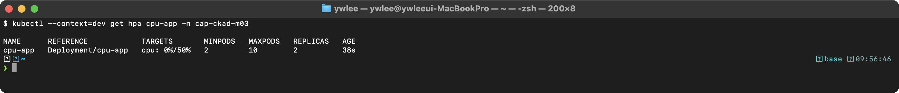

**출제 의도:** HPA(Horizontal Pod Autoscaler)의 설정과 동작 원리를 검증한다. 리소스 기반 자동 스케일링 메커니즘과 사전 조건(metrics-server, resource requests)을 이해하는 실무 역량을 평가한다.

**핵심 원리:** HPA는 별도 컨트롤러가 아니라 kube-controller-manager 안의 루프이며, 다음 단계로 동작한다. (1) metrics-server가 약 15초마다 각 노드 kubelet의 cAdvisor(컨테이너 리소스 사용량을 수집하는 kubelet 내장 컴포넌트)에서 CPU/메모리 실사용량을 긁어 `metrics.k8s.io` API로 노출한다. (2) HPA 컨트롤러가 약 15초 주기로 이 API를 조회해 대상 Deployment에 속한 Pod들의 현재 사용량을 모은다. (3) 공식 `desiredReplicas = ceil(currentReplicas * (currentMetricValue / targetMetricValue))`로 목표 replica를 계산한다. 예: 현재 4개 Pod의 평균 CPU가 80%, 목표가 50%면 ceil(4 * 80/50) = ceil(6.4) = 7개. (4) Deployment의 `spec.replicas`를 7로 패치하면 ReplicaSet이 Pod를 추가하고 스케줄러·kubelet이 새 Pod를 띄운다. 여기서 사용률은 항상 `resources.requests.cpu` 대비 실사용량의 백분율로 계산되므로(requests가 분모), requests가 없으면 분모가 없어 `<unknown>`이 뜨고 스케일링이 멈춘다.

**함정과 주의사항:**
- `resources.requests.cpu`가 반드시 설정되어 있어야 한다. 누락하면 HPA가 `<unknown>/50%`를 표시하며 스케일링이 동작하지 않는다.
- metrics-server가 설치되어 있어야 한다. `kubectl top pods`가 동작하지 않으면 metrics-server를 확인해야 한다.
- HPA의 `--cpu-percent`는 requests 대비 백분율이다. requests=100m, 실제 사용량=60m이면 60%이다.
- HPA와 `spec.replicas`를 동시에 수동으로 변경하면 충돌이 발생할 수 있다. HPA가 활성화된 상태에서는 `kubectl scale`을 사용하지 않는 것이 좋다.
- scale down은 기본 5분의 안정화 기간(stabilization window)이 있다. 즉시 축소되지 않는다.

**시간 절약 팁:** `kubectl autoscale deployment cpu-app --min=2 --max=10 --cpu-percent=50`은 한 줄로 HPA를 생성할 수 있는 imperative 명령이다. YAML을 작성할 필요가 전혀 없다. Deployment 생성도 `kubectl create deployment`로 가능하지만, `resources.requests`는 YAML에서 추가해야 한다.

</details>

---

### 문제 16. [Deployment] Deployment의 annotation으로 변경 사유 기록

Deployment `web-deploy`의 이미지를 `nginx:1.25`로 업데이트하면서 변경 사유를 annotation에 기록하라.

<details><summary>풀이 확인</summary>

**선결: 문제 9 완료가 전제다.** 대상 `web-deploy`는 문제 9에서 생성한 Deployment이다. 없으면 `kubectl set image`가 `Error from server (NotFound)`로 실패하므로 문제 9를 먼저 끝내고 같은 네임스페이스에서 진행한다.

**풀이:**

```bash
# 이미지 업데이트
kubectl set image deployment/web-deploy nginx=nginx:1.25

# annotation으로 기록
kubectl annotate deployment/web-deploy kubernetes.io/change-cause="Update nginx to 1.25 for security patch"

# 히스토리에서 확인
kubectl rollout history deployment/web-deploy
```

**검증:**

```bash
kubectl rollout history deployment/web-deploy
kubectl describe deployment web-deploy | grep change-cause
kubectl get deployment web-deploy -o jsonpath='{.metadata.annotations}'
```

> **예시(참조):** CKAD 실습/보충 기대 출력(istio sidecar·버전·tart 환경값 등 placeholder, 환경 의존). 재현 가능 핵심은 CKAD daily(day01~14) 및 본문 02·03 캡처 참고.

**출제 의도:** Deployment 변경 이력 관리 능력을 검증한다. `--record`가 deprecated된 이후의 올바른 변경 사유 기록 방식을 이해하는 실무 역량을 평가한다.

**핵심 원리:** `kubernetes.io/change-cause` annotation은 Deployment의 메타데이터에 저장되며, `rollout history`에서 CHANGE-CAUSE 열에 표시된다. 이 annotation은 현재 리비전에 연결된다. 새 롤아웃이 발생하면 이전 리비전에 해당 시점의 annotation이 기록된다. `--record`는 v1.24부터 deprecated되었으며, 향후 제거될 예정이다.

**함정과 주의사항:**
- `--record` 플래그를 사용하면 동작은 하지만 deprecated 경고가 출력된다. 시험에서는 annotation 방식을 사용하는 것이 올바르다.
- `kubectl annotate`는 이미지 업데이트 이후에 실행해야 한다. 순서가 바뀌면 이전 리비전에 annotation이 기록된다.
- 기존 annotation을 덮어쓰려면 `--overwrite` 플래그가 필요하다. 이미 annotation이 있는 상태에서 새 값을 쓰면 오류가 발생한다.
- annotation 값에 특수문자가 포함되면 따옴표로 감싸야 한다.

**시간 절약 팁:** 100% imperative로 처리 가능하다. `kubectl set image` + `kubectl annotate` 두 명령이면 완료된다. YAML 편집이 전혀 필요 없으므로 30초 이내에 풀 수 있다.

</details>

> 도메인 전환: 여기까지가 **Application Deployment(문제 9~16)** 이다. 다음은 **Application Observability and Maintenance(문제 17~22)** -- 배포한 앱이 살아 있는지·준비됐는지 관측하고(probe·로그·메트릭) 장애를 디버깅하는 영역을 다룬다.

---

## Application Observability and Maintenance

> 학습 목표: Probe(Liveness/Readiness/Startup)로 상태를 알리는 법, 로그·리소스 사용량 조회, 실패 Pod 디버깅 워크플로우 숙련 | 예상 소요: 90분 | 전제 지식: Pod 라이프사이클, Service-Endpoints 관계, 컨테이너 stdout 로그 개념
>
> 학습 순서와 관계: 17~18은 "내가 살아있고 준비됐음을 어떻게 알리는가"(Probe), 19~22는 "문제가 생겼을 때 어떻게 들여다보는가"(logs, top, debug, 실패 분석)이다. 앞 도메인의 무중단 배포(Rolling/Canary)는 Readiness Probe가 정확해야 의도대로 동작하므로, 이 도메인은 9~16의 전제이기도 하다.

### 등장 배경 -- 컨테이너의 "살아있음"과 "준비됨"을 왜 따로 보나

초기 오케스트레이션은 프로세스가 떠 있으면 "정상"으로 봤다. 그러나 프로세스는 떠 있어도 내부적으로 교착(deadlock)에 빠져 응답을 못 하거나, 떠 있긴 한데 아직 캐시 로딩 중이라 요청을 받으면 안 되는 상태가 있다. 단순 "프로세스 생존" 판정으로는 이 둘을 구분할 수 없어, 죽지도 않았는데 트래픽을 받아 에러를 내거나 멀쩡한데 재시작당하는 일이 잦았다. Kubernetes는 이를 두 질문으로 분리했다. Liveness("되살려야 하나?" -> 실패 시 컨테이너 재시작)와 Readiness("트래픽을 줘도 되나?" -> 실패 시 Service Endpoints에서만 제외, 재시작은 안 함)다. Startup Probe는 느린 레거시 앱이 시작 도중 Liveness에 걸려 무한 재시작되는 문제를 풀기 위해 나중에 추가됐다(시작이 끝날 때까지 다른 Probe를 잠재운다). 트레이드오프는 Probe 설정 오류 자체가 장애 원인이 된다는 점이다. delay·threshold를 잘못 잡으면 정상 앱이 재시작 루프에 빠진다.

### 문제 17. [Observability] Liveness/Readiness Probe 설정

다음 Probe가 설정된 Pod를 생성하라.

- Pod 이름: `probe-pod`, 이미지: `nginx:1.25`
- Liveness Probe: HTTP GET `/healthz`, 포트 80, 10초 후 시작, 5초 간격, 실패 3회
- Readiness Probe: HTTP GET `/ready`, 포트 80, 5초 후 시작, 3초 간격, 실패 2회

<details><summary>풀이 확인</summary>

**풀이:**

```yaml
apiVersion: v1
kind: Pod
metadata:
  name: probe-pod
spec:
  containers:
    - name: nginx
      image: nginx:1.25
      ports:
        - containerPort: 80
      livenessProbe:
        httpGet:
          path: /healthz
          port: 80
        initialDelaySeconds: 10
        periodSeconds: 5
        failureThreshold: 3
      readinessProbe:
        httpGet:
          path: /ready
          port: 80
        initialDelaySeconds: 5
        periodSeconds: 3
        failureThreshold: 2
```

**검증:**

```bash
kubectl get pod probe-pod
kubectl describe pod probe-pod | grep -A 10 "Liveness"
kubectl describe pod probe-pod | grep -A 10 "Readiness"
```

> **예시(참조):** CKAD 실습/보충 기대 출력(istio sidecar·버전·tart 환경값 등 placeholder, 환경 의존). 재현 가능 핵심은 CKAD daily(day01~14) 및 본문 02·03 캡처 참고.

**출제 의도:** Pod 상태 관리의 핵심인 Probe 설정 능력을 검증한다. Liveness와 Readiness의 동작 차이, 각 파라미터의 의미를 정확히 이해하는 실무 역량을 평가한다.

**핵심 원리:** Liveness Probe는 컨테이너가 살아있는지 확인한다. 실패하면 kubelet이 컨테이너를 재시작한다. Readiness Probe는 트래픽을 받을 준비가 되었는지 확인한다. 실패하면 Service의 Endpoints에서 제외되어 트래픽이 전달되지 않는다. `initialDelaySeconds`는 첫 번째 probe 실행까지 대기 시간, `periodSeconds`는 probe 간격, `failureThreshold`는 연속 실패 횟수이다. Liveness 실패로 재시작이 트리거되는 시간은 `initialDelaySeconds + periodSeconds * failureThreshold`이다.

**함정과 주의사항:**
- Liveness의 `initialDelaySeconds`가 너무 짧으면 앱이 시작되기 전에 probe가 실패하여 무한 재시작 루프에 빠진다. 충분한 시작 시간을 확보해야 한다.
- `httpGet`의 `port`는 컨테이너 포트 번호(정수) 또는 포트 이름(문자열)을 사용할 수 있다.
- probe의 기본 `timeoutSeconds`는 1초이다. 응답이 느린 엔드포인트는 timeout을 늘려야 한다.
- Readiness Probe가 실패하면 Pod는 `Running`이지만 `READY`가 `0/1`이다. 이 상태에서 Service endpoint에서 제외된다.
- Liveness와 Readiness를 같은 엔드포인트로 설정하면, Readiness 실패 시 트래픽만 차단되어야 하는 상황에서 컨테이너가 불필요하게 재시작될 수 있다.

**시간 절약 팁:** `kubectl run probe-pod --image=nginx:1.25 --port=80 --dry-run=client -o yaml > pod.yaml`로 기본 YAML을 생성한 후 probe 섹션만 추가한다. probe 필드 구조(`httpGet`, `initialDelaySeconds`, `periodSeconds`, `failureThreshold`)를 외워두면 docs 참조 없이 빠르게 작성할 수 있다.

</details>

---

### 문제 18. [Observability] Startup Probe 설정

시작에 최대 5분이 걸릴 수 있는 레거시 앱의 Pod를 생성하라.

- Pod 이름: `slow-start-pod`, 이미지: `my-legacy-app:1.0`
- Startup Probe: HTTP GET `/started`, 포트 8080, 10초 간격, 실패 30회
- Liveness Probe: HTTP GET `/healthz`, 포트 8080, 5초 간격, 실패 3회

<details><summary>풀이 확인</summary>

**풀이:**

```yaml
apiVersion: v1
kind: Pod
metadata:
  name: slow-start-pod
spec:
  containers:
    - name: app
      image: my-legacy-app:1.0
      ports:
        - containerPort: 8080
      startupProbe:
        httpGet:
          path: /started
          port: 8080
        periodSeconds: 10
        failureThreshold: 30
      livenessProbe:
        httpGet:
          path: /healthz
          port: 8080
        periodSeconds: 5
        failureThreshold: 3
```

**검증:**

```bash
kubectl describe pod slow-start-pod | grep -A 5 "Startup"
kubectl describe pod slow-start-pod | grep -A 5 "Liveness"
kubectl get pod slow-start-pod -w  # 시작 과정 실시간 관찰
```

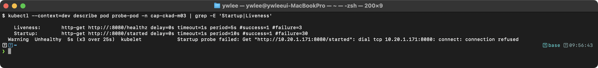

**출제 의도:** 느리게 시작하는 애플리케이션에 대한 Startup Probe 설정 능력을 검증한다. Startup, Liveness, Readiness 세 가지 Probe의 상호 관계를 이해하는 실무 역량을 평가한다.

**핵심 원리:** Startup Probe가 설정되면 Liveness와 Readiness Probe는 Startup Probe가 성공할 때까지 비활성화된다. 이는 느리게 시작하는 레거시 앱이 Liveness Probe에 의해 불필요하게 재시작되는 것을 방지한다. 최대 대기 시간은 `periodSeconds * failureThreshold`로 계산된다. 10초 * 30회 = 300초(5분)이다. Startup Probe가 한 번 성공하면 이후 Liveness/Readiness Probe가 활성화되고, Startup Probe는 더 이상 실행되지 않는다.

**함정과 주의사항:**
- Startup Probe에는 `initialDelaySeconds`를 설정하지 않는 것이 일반적이다. Startup Probe 자체가 시작 대기 역할을 하기 때문이다. 생략하면 `initialDelaySeconds`의 기본값은 0이므로(검증 출력의 `delay=0s`가 이것이다) 컨테이너 시작 직후 첫 probe가 곧바로 실행되고, 이후 `periodSeconds` 간격으로 `failureThreshold`회까지 재시도하며 대기 창을 만든다. 따라서 최대 대기 시간은 `initialDelaySeconds(=0) + periodSeconds * failureThreshold = 0 + 10 * 30 = 300초`이다.
- `failureThreshold * periodSeconds`의 곱이 앱의 최대 시작 시간보다 커야 한다. 부족하면 앱이 시작되기 전에 Pod가 재시작된다.
- Startup Probe가 실패하면 Liveness와 동일하게 컨테이너가 재시작된다 (종료 코드 137).
- Startup Probe를 사용하면 Liveness의 `initialDelaySeconds`를 0으로 설정해도 안전하다.

**시간 절약 팁:** Startup Probe 구조는 Liveness/Readiness와 동일하다 (`startupProbe` 키 이름만 다름). Liveness YAML을 복사하여 키 이름과 파라미터만 변경하면 빠르게 작성할 수 있다. `failureThreshold`와 `periodSeconds`의 곱으로 최대 대기 시간을 계산하는 패턴을 기억한다.

</details>

---

### 문제 19. [Observability] 로그 분석

다음 작업을 수행하라.

1. `web` 네임스페이스에서 label `app=nginx`를 가진 Pod의 마지막 50줄 로그를 확인하라.
2. 해당 Pod에 여러 컨테이너가 있다면, `nginx` 컨테이너의 로그만 확인하라.
3. 이전에 비정상 종료된 컨테이너의 로그를 확인하라.

<details><summary>풀이 확인</summary>

**풀이:**

```bash
# 1. 마지막 50줄 로그
kubectl logs -l app=nginx -n web --tail=50

# 2. 특정 컨테이너 로그
POD=$(kubectl get pods -l app=nginx -n web -o jsonpath='{.items[0].metadata.name}')
kubectl logs $POD -c nginx -n web

# 3. 이전 컨테이너 로그
kubectl logs $POD -c nginx -n web --previous
```

**검증:**

```bash
kubectl logs -l app=nginx -n web --tail=50
kubectl logs $POD -c nginx -n web --previous
```

> **예시(참조):** CKAD 실습/보충 기대 출력(istio sidecar·버전·tart 환경값 등 placeholder, 환경 의존). 재현 가능 핵심은 CKAD daily(day01~14) 및 본문 02·03 캡처 참고.

**출제 의도:** Pod 로그 분석 능력을 검증한다. 멀티 컨테이너 환경에서 특정 컨테이너의 로그를 선택적으로 조회하고, 크래시된 컨테이너의 이전 로그를 복원하는 실무 역량을 평가한다.

**핵심 원리:** `kubectl logs`는 컨테이너의 stdout/stderr 출력을 조회한다. kubelet은 각 컨테이너의 로그를 노드의 `/var/log/containers/` 디렉토리에 JSON 형식으로 저장한다. `--previous`는 이전에 종료된 컨테이너 인스턴스의 로그를 조회한다. 이는 kubelet이 마지막 종료된 컨테이너의 로그 파일을 보관하기 때문에 가능하다. `-l` 옵션은 label selector에 매칭되는 모든 Pod의 로그를 동시에 출력한다.

**함정과 주의사항:**
- `-l` 옵션으로 여러 Pod의 로그를 조회할 때, 로그가 섞여 어떤 Pod의 출력인지 구분이 어렵다. `--prefix` 플래그를 추가하면 Pod 이름이 접두사로 표시된다.
- `--previous`는 이전 컨테이너 인스턴스가 있어야 동작한다. Pod가 한 번도 재시작되지 않았으면 오류가 발생한다.
- 멀티 컨테이너 Pod에서 `-c`를 생략하면 기본 컨테이너의 로그가 출력된다. 시험에서 특정 컨테이너가 지정되면 반드시 `-c` 옵션을 사용해야 한다.
- `--tail=50`은 마지막 50줄만 출력한다. 생략하면 전체 로그가 출력되어 시간이 오래 걸릴 수 있다.

**시간 절약 팁:** 로그 관련 명령은 100% imperative이다. `kubectl logs <pod> --tail=N`, `kubectl logs <pod> -c <container>`, `kubectl logs <pod> --previous` 세 패턴만 기억하면 된다. `-l` 옵션으로 label 기반 조회도 가능하므로 Pod 이름을 일일이 확인할 필요가 없다.

</details>

---

### 문제 20. [Observability] kubectl debug로 디버깅

`distroless-pod` Pod는 distroless 이미지를 사용하여 셸이 없다. 이 Pod를 디버깅하기 위해 ephemeral container를 추가하라.

- 디버그 이미지: `busybox:1.36`
- 대상 컨테이너: `app`

<details><summary>풀이 확인</summary>

**풀이:**

```bash
# ephemeral container 추가
kubectl debug -it distroless-pod --image=busybox:1.36 --target=app

# 디버그 컨테이너 내부에서 진단
# 프로세스 확인
ps aux
# 네트워크 확인
wget -qO- http://localhost:8080/healthz
# DNS 확인
nslookup kubernetes.default.svc.cluster.local
# 파일시스템 확인 (대상 컨테이너의 파일시스템이 보임)
ls /proc/1/root/
```

**검증:**

```bash
kubectl describe pod distroless-pod | grep -A 5 "Ephemeral Containers"
kubectl get pod distroless-pod -o jsonpath='{.spec.ephemeralContainers[*].name}'
```

> **예시(참조):** CKAD 실습/보충 기대 출력(istio sidecar·버전·tart 환경값 등 placeholder, 환경 의존). 재현 가능 핵심은 CKAD daily(day01~14) 및 본문 02·03 캡처 참고.

**출제 의도:** 프로덕션 환경에서 실행 중인 Pod를 디버깅하는 능력을 검증한다. Ephemeral container를 사용하여 디버그 도구가 없는 컨테이너를 진단하는 실무 역량을 평가한다.

**핵심 원리:** Ephemeral container는 기존 Pod에 임시로 추가되는 컨테이너이다. `--container`로 이름을 직접 주지 않으면 `kubectl debug`가 `debugger-XXXXX`(끝 5자리는 임의 문자) 형식의 이름을 자동 생성한다. 위 검증 출력의 `debugger-abc12`가 그 예이며, 실제 값은 실행할 때마다 달라진다. 이 컨테이너는 Pod의 `spec.ephemeralContainers`에 추가되고 `describe pod`의 Ephemeral Containers 섹션에서 확인된다. `--target` 옵션으로 대상 컨테이너의 프로세스 네임스페이스를 공유하면, 대상 컨테이너의 프로세스를 `ps`로 볼 수 있고, `/proc/1/root/`를 통해 파일시스템에 접근할 수 있다. Ephemeral container는 Pod spec에서 제거할 수 없으며, Pod가 삭제될 때 함께 제거된다. restart되지 않으며, probe나 port를 가질 수 없다.

**함정과 주의사항:**
- `kubectl debug`는 Kubernetes v1.25 이상에서 stable 기능이다. 이전 버전에서는 `--feature-gates=EphemeralContainers=true`가 필요하다.
- `--target` 옵션을 생략하면 프로세스 네임스페이스가 공유되지 않아 대상 컨테이너의 프로세스를 볼 수 없다.
- Ephemeral container에서 네트워크는 Pod 전체와 공유되므로 `localhost`로 대상 컨테이너의 포트에 접근 가능하다.
- 한 번 추가된 ephemeral container는 삭제할 수 없다. Pod를 삭제해야만 제거된다.
- `kubectl debug`는 Pod 복사 모드(`--copy-to`)도 지원한다. 원본 Pod를 변경하지 않고 디버그하려면 이 옵션을 사용한다.

**시간 절약 팁:** `kubectl debug -it <pod> --image=busybox:1.36 --target=<container>` 한 줄이면 된다. 100% imperative 명령이므로 YAML 편집이 필요 없다. busybox 이미지에는 `ps`, `nslookup`, `wget`, `ls`, `cat` 등 기본 디버깅 도구가 포함되어 있다.

</details>

---

### 문제 21. [Observability] 리소스 사용량 확인

다음 작업을 수행하라.

1. `demo` 네임스페이스에서 CPU 사용량이 가장 높은 Pod를 확인하라.
2. 노드별 리소스 사용량을 확인하라.

<details><summary>풀이 확인</summary>

**풀이:**

```bash
# 1. CPU 기준 정렬
kubectl top pods -n demo --sort-by=cpu

# Memory 기준 정렬
kubectl top pods -n demo --sort-by=memory

# 2. 노드 리소스 확인
kubectl top nodes
```

**검증:**

```bash
kubectl top pods -n demo --sort-by=cpu
kubectl top nodes
```

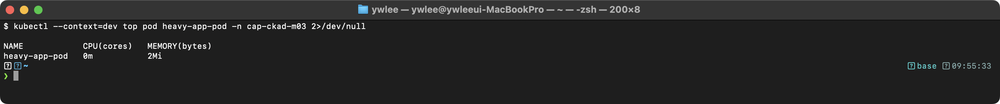

**출제 의도:** 클러스터 리소스 모니터링 능력을 검증한다. Pod와 노드의 CPU/메모리 사용량을 빠르게 파악하여 병목 지점을 식별하는 실무 역량을 평가한다.

**핵심 원리:** `kubectl top`은 metrics-server API(`metrics.k8s.io/v1beta1`)를 호출하여 현재 리소스 사용량을 조회한다. metrics-server는 kubelet의 cAdvisor에서 수집한 메트릭을 집계한다. CPU는 밀리코어(m) 단위, 메모리는 바이트 단위로 표시된다. 이 데이터는 약 15초 간격으로 갱신되며, 실시간이 아닌 근사치이다. HPA도 동일한 metrics-server 데이터를 사용한다.

**함정과 주의사항:**
- metrics-server가 설치되어 있지 않으면 `kubectl top`이 `error: Metrics API not available` 오류를 반환한다.
- `--sort-by`의 값은 `cpu` 또는 `memory`만 허용된다. `--sort-by=CPU`(대문자)는 오류가 발생한다.
- `kubectl top pods`에서 보이는 CPU 사용량은 `resources.requests`나 `resources.limits`와 무관한 실제 사용량이다.
- Pod가 방금 생성되었으면 메트릭이 아직 수집되지 않아 `<unknown>`이 표시될 수 있다. 약 30초~1분 대기해야 한다.

**시간 절약 팁:** `kubectl top pods -n <namespace> --sort-by=cpu`는 한 줄로 CPU 사용량이 가장 높은 Pod를 찾을 수 있다. 시험에서 "가장 높은 리소스를 사용하는 Pod를 찾아라"는 문제는 이 명령 하나로 해결된다. 결과를 파일에 저장하라는 요구가 있으면 `> /path/to/file`을 추가한다.

</details>

---

### 문제 22. [Observability] 실패하는 Pod 디버깅

Pod `failing-pod`가 `CrashLoopBackOff` 상태이다. 원인을 분석하라.

<details><summary>풀이 확인</summary>

**풀이:**

```bash
# 1. Pod 상태 확인
kubectl get pod failing-pod

# 2. Pod 이벤트 및 상세 정보 확인
kubectl describe pod failing-pod

# 3. 컨테이너 로그 확인
kubectl logs failing-pod

# 4. 이전 크래시 로그 확인
kubectl logs failing-pod --previous

# 5. Pod YAML에서 설정 확인
kubectl get pod failing-pod -o yaml

# 일반적인 원인:
# - 이미지가 존재하지 않음 (ImagePullBackOff)
# - 명령어 오류 (잘못된 command/args)
# - 리소스 부족 (OOMKilled)
# - Probe 실패
# - 설정 오류 (ConfigMap/Secret 누락)
# - 권한 문제 (SecurityContext)
```

**검증:**

```bash
kubectl get pod failing-pod
kubectl describe pod failing-pod | tail -20
kubectl logs failing-pod --previous
```

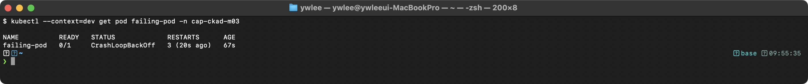

**출제 의도:** 실패하는 Pod의 근본 원인을 체계적으로 분석하는 능력을 검증한다. 프로덕션 환경에서 장애 대응 시 필요한 디버깅 워크플로우를 평가한다.

**핵심 원리:** CrashLoopBackOff는 컨테이너가 반복적으로 시작 후 종료되는 상태이다. kubelet은 지수 백오프(10s, 20s, 40s, ... 최대 5분)로 재시작 간격을 늘린다. 디버깅 순서는 (1) `get pod`으로 상태/재시작 횟수 확인, (2) `describe pod`로 이벤트(이미지 풀 실패, 스케줄링 실패 등) 확인, (3) `logs`로 앱 로그 확인, (4) `logs --previous`로 이전 크래시 로그 확인이다. 이벤트에는 kubelet, scheduler, controller-manager 등의 메시지가 시간순으로 기록된다.

**함정과 주의사항:**
- `CrashLoopBackOff`는 `kubectl get pod`의 STATUS 열에 표시되지만, 엄밀히는 Pod의 phase(상태)가 아니라 컨테이너의 재시작 대기 상태를 나타내는 값이다. Pod 자체의 `status.phase`는 `Running`이고, 문제가 있는 것은 그 안의 컨테이너로, `status.containerStatuses[].lastState.terminated.reason`(직전 종료 이유)과 함께 컨테이너가 종료->백오프 대기->재시작을 반복하는 중이다. kubectl이 이 컨테이너 상태를 Pod의 STATUS 열에 요약해 보여주기 때문에 "상태 열에 뜨는데 Pod 상태는 아니다"라는 혼동이 생긴다. 즉 컨테이너가 정상 시작 후 비정상 종료되기를 반복하는 상황이다.
- `logs --previous`는 이전 컨테이너 인스턴스가 있어야 동작한다. RESTARTS가 0이면 사용할 수 없다.
- `ImagePullBackOff`와 `CrashLoopBackOff`는 다른 문제이다. 전자는 이미지 다운로드 실패, 후자는 컨테이너 실행 실패이다.
- `describe` 출력의 Events 섹션은 시간 역순으로 표시된다. 최근 이벤트가 가장 아래에 있다.
- OOMKilled는 `describe` 출력의 `Last State: Terminated, Reason: OOMKilled`로 확인할 수 있다.

**시간 절약 팁:** 디버깅 문제는 100% imperative 명령으로 해결한다. `kubectl get pod` → `kubectl describe pod` → `kubectl logs` → `kubectl logs --previous` 순서를 기계적으로 따르면 대부분의 원인을 30초 이내에 파악할 수 있다. `kubectl get pod -o yaml`은 전체 spec을 확인할 때 유용하지만, 먼저 events와 logs를 확인하는 것이 효율적이다.

</details>

> 도메인 전환: 여기까지가 **Application Observability and Maintenance(문제 17~22)** 이다. 다음은 **Application Environment, Configuration and Security(문제 23~32)** -- ConfigMap·Secret으로 설정을 주입하고 SecurityContext·ServiceAccount로 권한을 제한하는, 가장 문항이 많은(10문제) 영역을 다룬다.

---

## Application Environment, Configuration and Security

> 학습 목표: 설정·비밀의 분리 주입(ConfigMap/Secret/Downward API), 컨테이너·API 권한 최소화(SecurityContext/ServiceAccount), 자원 통제(QoS/LimitRange/ResourceQuota) 이해 | 예상 소요: 150분 | 전제 지식: 환경 변수·볼륨 마운트, Linux 사용자/권한 개념, 네임스페이스
>
> 학습 순서와 관계: 23~24, 30~32는 "설정과 비밀을 코드 밖으로 빼 주입"(ConfigMap/Secret/Immutable), 25~26은 "권한을 최소로"(컨테이너 보안 + API 권한), 27~29는 "자원을 공정하게 통제"(QoS/LimitRange/ResourceQuota), 31은 Pod 자기 정보 참조(Downward API)다. 특히 25(컨테이너가 무엇을 할 수 있나)와 26(Pod가 API 서버에 무엇을 요청할 수 있나)은 같은 최소 권한 원칙(least privilege, "필요한 만큼만 권한을 준다")의 두 면이다.

### 등장 배경 -- 설정을 코드에서 떼고, 권한을 최소로

직전 시대에는 DB 비밀번호·환경 플래그가 이미지 안에 하드코딩되거나 앱 코드에 박혀 있었다. 그러면 dev/prod마다 이미지를 다시 빌드해야 했고, 비밀이 이미지 레이어에 남아 유출 위험이 컸다. ConfigMap/Secret은 설정과 비밀을 리소스로 분리해 같은 이미지를 환경별로 재사용하게 했다. 또한 컨테이너를 root로 돌리는 관행은 컨테이너 탈출 시 노드 전체를 위협했고, 모든 Pod에 API 토큰을 무조건 마운트하던 기본값은 공격 표면을 넓혔다. SecurityContext(UID/GID/capability/읽기전용 루트)와 ServiceAccount 토큰 비활성화는 이 위험을 "기본은 거부, 필요한 것만 허용"으로 좁힌다. 트레이드오프는 깐깐함이다. root 가정으로 만든 이미지는 비루트 전환 시 쓰기 디렉토리(예 nginx의 `/var/cache/nginx`)를 별도 볼륨으로 열어줘야 하는 등 손이 더 간다.

### 문제 23. [Config & Security] ConfigMap 생성 및 사용

1. 다음 ConfigMap을 생성하라.
   - 이름: `webapp-config`
   - 데이터: `APP_ENV=production`, `APP_PORT=8080`, `APP_LOG_LEVEL=warn`
2. 이 ConfigMap을 환경 변수로 사용하는 Pod `webapp`을 생성하라 (이미지: `nginx:1.25`).
   - `envFrom`으로 모든 값을 주입하라.

<details><summary>풀이 확인</summary>

**풀이:**

```bash
# ConfigMap 생성
kubectl create configmap webapp-config \
  --from-literal=APP_ENV=production \
  --from-literal=APP_PORT=8080 \
  --from-literal=APP_LOG_LEVEL=warn
```

```yaml
apiVersion: v1
kind: Pod
metadata:
  name: webapp
spec:
  containers:
    - name: nginx
      image: nginx:1.25
      envFrom:
        - configMapRef:
            name: webapp-config
```

```bash
# 환경 변수 확인
kubectl exec webapp -- env | grep APP_
```

**검증:**

```bash
kubectl exec webapp -- env | grep APP_
kubectl get configmap webapp-config -o yaml
```

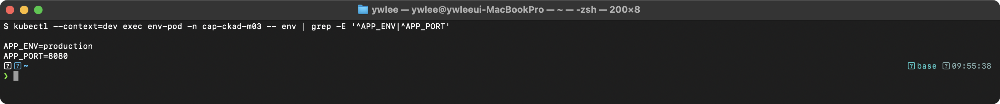

**출제 의도:** ConfigMap 생성과 Pod에 환경 변수로 주입하는 능력을 검증한다. `envFrom`과 `env`의 차이를 이해하고, 상황에 맞게 선택하는 실무 역량을 평가한다.

**핵심 원리:** ConfigMap은 비밀이 아닌 설정 데이터를 key-value 형태로 저장한다. `envFrom`은 ConfigMap의 모든 key-value를 한 번에 환경 변수로 주입한다. Pod 시작 시점에 환경 변수가 설정되므로, ConfigMap이 업데이트되어도 실행 중인 Pod의 환경 변수는 변경되지 않는다. Pod를 재시작해야 새 값이 적용된다. `envFrom`에 `prefix` 필드를 추가하면 모든 환경 변수에 접두사가 붙는다.

**함정과 주의사항:**
- ConfigMap이 존재하지 않으면 Pod 시작이 실패한다. `optional: true`를 설정하면 ConfigMap이 없어도 Pod가 시작된다.
- ConfigMap의 key에 환경 변수로 사용할 수 없는 문자(하이픈 `-` 등)가 포함되면 `envFrom`에서 해당 key가 무시된다. 경고 이벤트가 생성된다.
- `envFrom`의 `configMapRef`와 `env`의 `configMapKeyRef`를 혼동하지 않아야 한다. 전자는 전체 주입, 후자는 개별 key 선택이다.
- `--from-literal`에서 값에 `=`이 포함되면 첫 번째 `=`만 구분자로 사용된다.

**시간 절약 팁:** ConfigMap은 `kubectl create configmap`으로 imperative하게 생성한다. Pod YAML에서 `envFrom` 섹션은 3줄이면 된다. `kubectl run webapp --image=nginx:1.25 --dry-run=client -o yaml`로 기본 Pod를 생성한 후 `envFrom`만 추가한다.

</details>

---

### 문제 24. [Config & Security] Secret 생성 및 Volume 마운트

1. TLS Secret을 생성하라 (이름: `app-tls`, cert: `tls.crt`, key: `tls.key`).
2. 이 Secret을 `/etc/tls`에 읽기 전용으로 마운트하는 Pod를 생성하라.
   - Pod 이름: `tls-pod`, 이미지: `nginx:1.25`
   - 파일 권한: `0400`

<details><summary>풀이 확인</summary>

**선결조건(인증서 파일 생성):** `kubectl create secret tls`는 `--cert`/`--key`로 실제 PEM 파일을 읽어 Secret을 만든다. 시험에서는 보통 이 파일이 제공되지만, 직접 실습할 때는 자체 서명 인증서를 먼저 만들어 둔다(아래 한 줄이면 `tls.crt`와 `tls.key`가 현재 디렉터리에 생성된다).

```bash
# 자체 서명 인증서/키 생성 (직접 실습 시 선행)
openssl req -x509 -nodes -days 365 -newkey rsa:2048 -keyout tls.key -out tls.crt -subj "/CN=test"
```

**풀이:**

```bash
# TLS Secret 생성 (위에서 만든 인증서 파일 사용)
kubectl create secret tls app-tls --cert=tls.crt --key=tls.key
```

```yaml
apiVersion: v1
kind: Pod
metadata:
  name: tls-pod
spec:
  containers:
    - name: nginx
      image: nginx:1.25
      volumeMounts:
        - name: tls-vol
          mountPath: /etc/tls
          readOnly: true
  volumes:
    - name: tls-vol
      secret:
        secretName: app-tls
        defaultMode: 0400
```

**검증:**

```bash
kubectl get pod tls-pod
kubectl exec tls-pod -- ls -la /etc/tls/
kubectl exec tls-pod -- stat -c '%a %n' /etc/tls/tls.crt
kubectl exec tls-pod -- mount | grep tls
```

> **예시(참조):** CKAD 실습/보충 기대 출력(istio sidecar·버전·tart 환경값 등 placeholder, 환경 의존). 재현 가능 핵심은 CKAD daily(day01~14) 및 본문 02·03 캡처 참고.

**출제 의도:** TLS Secret의 생성과 안전한 볼륨 마운트 능력을 검증한다. 파일 권한 설정과 읽기 전용 마운트를 통한 보안 강화 실무 역량을 평가한다.

**핵심 원리:** `kubectl create secret tls`는 `kubernetes.io/tls` 유형의 Secret을 생성한다. 이 Secret은 `tls.crt`와 `tls.key` 두 개의 key를 가진다. Secret 볼륨은 기본적으로 tmpfs(메모리 파일시스템)에 마운트되어 디스크에 기록되지 않는다. `defaultMode`는 8진수로 파일 권한을 설정한다. 0400은 소유자만 읽기 가능(r--------)이다. Secret 데이터는 etcd에 base64 인코딩으로 저장되며, 암호화가 필요하면 EncryptionConfiguration을 설정해야 한다.

**함정과 주의사항:**
- `defaultMode`의 값은 8진수이다. YAML에서 `0400`으로 쓰면 8진수로 해석되지만, `400`으로 쓰면 10진수 400(= 8진수 0620)으로 잘못 해석된다. 반드시 `0`을 접두사로 붙여야 한다.
- `readOnly: true`는 volumeMount 레벨에서 설정한다. 볼륨 자체가 아니라 마운트 포인트를 읽기 전용으로 만든다.
- TLS Secret 생성 시 인증서 파일(`tls.crt`, `tls.key`)이 실제로 존재해야 한다. 시험에서는 파일이 제공되거나, 사전에 생성하라는 지시가 있다.
- Secret 볼륨의 파일은 심볼릭 링크로 구성된다. `ls -la`에서 `-> ..data/tls.crt` 형태로 보인다.

**시간 절약 팁:** `kubectl create secret tls app-tls --cert=tls.crt --key=tls.key`로 Secret을 imperative하게 생성한다. Pod YAML에서 `volumes[].secret`과 `volumeMounts` 섹션만 추가하면 된다. `defaultMode: 0400`과 `readOnly: true`를 잊지 않도록 주의한다.

</details>

---

### 문제 25. [Config & Security] SecurityContext -- runAsNonRoot

다음 보안 설정이 적용된 Pod를 생성하라.

- Pod 이름: `secure-app`
- 이미지: `nginx:1.25`
- UID 1000, GID 3000으로 실행
- root 실행 금지
- 읽기 전용 루트 파일시스템
- 모든 capabilities 제거 후 `NET_BIND_SERVICE`만 추가
- `/tmp`에 emptyDir 마운트 (쓰기 가능하도록)

<details><summary>풀이 확인</summary>

**풀이:**

```yaml
apiVersion: v1
kind: Pod
metadata:
  name: secure-app
spec:
  securityContext:
    runAsUser: 1000
    runAsGroup: 3000
    fsGroup: 3000
  containers:
    - name: nginx
      image: nginx:1.25
      securityContext:
        runAsNonRoot: true
        readOnlyRootFilesystem: true
        allowPrivilegeEscalation: false
        capabilities:
          drop:
            - ALL
          add:
            - NET_BIND_SERVICE
      volumeMounts:
        - name: tmp
          mountPath: /tmp
        - name: cache
          mountPath: /var/cache/nginx
        - name: run
          mountPath: /var/run
  volumes:
    - name: tmp
      emptyDir: {}
    - name: cache
      emptyDir: {}
    - name: run
      emptyDir: {}
```

**검증:**

```bash
kubectl get pod secure-app
kubectl exec secure-app -- id
kubectl exec secure-app -- cat /proc/1/status | grep -i cap
kubectl exec secure-app -- touch /test.txt 2>&1
kubectl exec secure-app -- touch /tmp/test.txt && echo "tmp write OK"
```

> **예시(참조):** CKAD 실습/보충 기대 출력(istio sidecar·버전·tart 환경값 등 placeholder, 환경 의존). 재현 가능 핵심은 CKAD daily(day01~14) 및 본문 02·03 캡처 참고.

**출제 의도:** 컨테이너 보안 설정(SecurityContext)의 종합적인 구성 능력을 검증한다. Pod 레벨과 컨테이너 레벨의 보안 설정 차이, Linux capabilities 관리, 읽기 전용 파일시스템 운용 능력을 평가한다.

**개념 입문:** Linux는 모든 사용자를 숫자 UID(user ID), 모든 그룹을 숫자 GID(group ID)로 식별하며 UID 0이 root(전권)다. capability는 root의 전권을 잘게 쪼갠 권한 조각으로, "root냐 아니냐"의 이분법 대신 "1024 미만 포트에 바인딩만 허용(NET_BIND_SERVICE)" 같은 식으로 필요한 조각만 켤 수 있다. SecurityContext는 컨테이너가 어떤 UID/GID로 돌고 어떤 capability를 갖는지를 매니페스트로 지정한다. `drop: ["ALL"]`로 전부 떼고 `add`로 꼭 필요한 한두 개만 다시 붙이는 것이 최소 권한 원칙의 전형이다.

**핵심 원리:** SecurityContext는 Pod 레벨과 컨테이너 레벨 두 곳에서 설정 가능하다. Pod 레벨의 `runAsUser`, `runAsGroup`, `fsGroup`은 모든 컨테이너에 적용된다. 컨테이너 레벨의 `runAsNonRoot`는 UID 0 실행을 차단한다. `readOnlyRootFilesystem`은 컨테이너의 루트 파일시스템을 읽기 전용으로 만든다. `capabilities.drop: ["ALL"]`은 모든 Linux capability를 제거하고, `add`로 필요한 것만 추가한다. `fsGroup`은 마운트된 볼륨의 그룹 소유권을 설정한다.

**함정과 주의사항:**
- nginx는 `/var/cache/nginx`, `/var/run`에 쓰기가 필요하다. `readOnlyRootFilesystem`을 설정하면 이 디렉토리에 emptyDir을 마운트해야 한다. 누락하면 nginx가 시작되지 않는다.
- `runAsNonRoot: true`와 `runAsUser: 0`을 동시에 설정하면 Pod 생성이 거부된다.
- `capabilities`는 컨테이너 레벨에서만 설정 가능하다. Pod 레벨에서는 설정할 수 없다.
- `allowPrivilegeEscalation: false`는 `setuid` 비트를 무시하여 권한 상승을 방지한다. 보안 강화를 위해 항상 설정하는 것이 좋다.
- `fsGroup`을 설정하면 Pod가 시작될 때 볼륨의 모든 파일 소유 그룹이 변경된다. 대용량 볼륨에서는 시작 시간이 길어질 수 있다.
- 검증 출력의 `CapBnd: 0000000000000400` 해석법: capability는 0번부터 번호가 매겨진 비트 마스크다(0=CAP_CHOWN, 1=CAP_DAC_OVERRIDE, ..., 10=CAP_NET_BIND_SERVICE). 16진수 `0x400`은 10진수 1024 = 2^10, 즉 "10번째 비트만 켜짐"을 뜻하고 그 10번이 NET_BIND_SERVICE다. 따라서 `drop: ALL` 후 `add: NET_BIND_SERVICE`만 한 결과가 정확히 `0x400`으로 나온다. 다른 capability가 섞이면 비트가 더 켜져 값이 커진다.

**시간 절약 팁:** SecurityContext 문제는 declarative(YAML)로만 풀 수 있다. `kubectl run`으로 기본 Pod를 생성하고, `securityContext`, `volumeMounts`, `volumes` 세 섹션을 수동으로 추가한다. Pod 레벨 vs 컨테이너 레벨 필드 위치를 정확히 기억하는 것이 핵심이다. kubernetes.io/docs에서 "security context" 검색으로 예제를 빠르게 찾을 수 있다.

</details>

---

### 문제 26. [Config & Security] ServiceAccount 생성 및 연결

1. 네임스페이스 `app`에 ServiceAccount `app-sa`를 생성하라.
2. 이 ServiceAccount를 사용하는 Pod를 생성하되, API 서버 토큰 자동 마운트를 비활성화하라.
   - Pod 이름: `sa-pod`, 이미지: `nginx:1.25`

<details><summary>풀이 확인</summary>

**풀이:**

```bash
kubectl create namespace app
kubectl create serviceaccount app-sa -n app
```

```yaml
apiVersion: v1
kind: Pod
metadata:
  name: sa-pod
  namespace: app
spec:
  serviceAccountName: app-sa
  automountServiceAccountToken: false
  containers:
    - name: nginx
      image: nginx:1.25
```

```bash
# 확인
kubectl get pod sa-pod -n app -o jsonpath='{.spec.serviceAccountName}'
# API 토큰이 마운트되지 않았는지 확인
kubectl exec sa-pod -n app -- ls /var/run/secrets/kubernetes.io/serviceaccount/ 2>&1
```

**검증:**

```bash
kubectl get sa app-sa -n app
kubectl get pod sa-pod -n app -o jsonpath='{.spec.serviceAccountName}'
kubectl exec sa-pod -n app -- ls /var/run/secrets/kubernetes.io/serviceaccount/ 2>&1
```

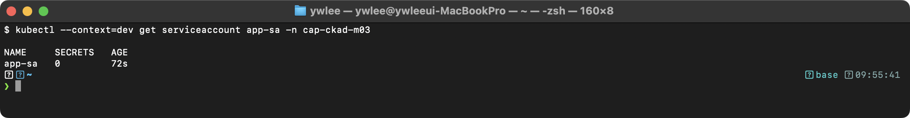

**출제 의도:** ServiceAccount 관리와 토큰 자동 마운트 비활성화 능력을 검증한다. 최소 권한 원칙(Least Privilege)에 따른 보안 구성 실무 역량을 평가한다.

**개념 입문:** 직전 문제(25)가 "컨테이너가 OS 안에서 무엇을 할 수 있나"를 좁혔다면, 이 문제는 "Pod가 Kubernetes API 서버에 무엇을 요청할 수 있나"를 좁힌다. 둘 다 같은 최소 권한 원칙의 적용이다. 기본값으로 모든 Pod에는 API 토큰(API 서버에 자신을 증명하는 출입증)이 자동으로 마운트되는데, API를 쓸 일이 없는 앱(단순 nginx 등)에 이 토큰이 들어 있으면 컨테이너가 탈취당했을 때 클러스터 API로 가는 통로가 그냥 열려 있는 셈이다. `automountServiceAccountToken: false`는 그 통로를 애초에 막는다.

**핵심 원리:** ServiceAccount는 Pod가 API 서버와 통신할 때 사용하는 ID이다. 기본적으로 모든 Pod에 `default` ServiceAccount가 할당되고, API 토큰이 `/var/run/secrets/kubernetes.io/serviceaccount/token`에 자동 마운트된다. `automountServiceAccountToken: false`를 설정하면 이 토큰 마운트가 비활성화되어, Pod에서 `kubectl`이나 API 호출이 불가능해진다. Kubernetes 1.24부터 ServiceAccount 토큰은 `TokenRequest API`로 시간 제한 토큰이 자동 생성된다.

**함정과 주의사항:**
- `automountServiceAccountToken`은 Pod spec과 ServiceAccount 양쪽에서 설정 가능하다. Pod spec에서 설정하면 해당 Pod에만 적용된다. ServiceAccount에서 설정하면 해당 SA를 사용하는 모든 Pod에 적용된다.
- `serviceAccountName`(올바른 필드)과 `serviceAccount`(deprecated)를 혼동하지 않아야 한다. 전자를 사용해야 한다.
- 네임스페이스를 먼저 생성해야 한다. `kubectl create namespace app` 후 ServiceAccount를 생성한다.
- API 서버 접근이 필요한 Pod(모니터링 에이전트 등)에는 토큰 마운트를 비활성화하면 안 된다.

**시간 절약 팁:** `kubectl create sa app-sa -n app`으로 ServiceAccount를 imperative하게 생성한다. Pod YAML에서 `serviceAccountName`과 `automountServiceAccountToken` 두 필드만 추가하면 된다. `kubectl run sa-pod --image=nginx:1.25 --dry-run=client -o yaml`로 기본 YAML을 생성한 후 수정한다.

</details>

---

### 문제 27. [Config & Security] Resource Requests/Limits 및 QoS

다음 세 가지 QoS 클래스를 가진 Pod를 각각 생성하라.

1. Guaranteed: `qos-guaranteed` (cpu requests=limits=200m, memory requests=limits=256Mi)
2. Burstable: `qos-burstable` (cpu requests=100m, memory requests=128Mi, limits 없음)
3. BestEffort: `qos-besteffort` (requests/limits 없음)

<details><summary>풀이 확인</summary>

**풀이:**

```yaml
# Guaranteed
apiVersion: v1
kind: Pod
metadata:
  name: qos-guaranteed
spec:
  containers:
    - name: app
      image: nginx:1.25
      resources:
        requests:
          cpu: 200m
          memory: 256Mi
        limits:
          cpu: 200m
          memory: 256Mi
---
# Burstable
apiVersion: v1
kind: Pod
metadata:
  name: qos-burstable
spec:
  containers:
    - name: app
      image: nginx:1.25
      resources:
        requests:
          cpu: 100m
          memory: 128Mi
---
# BestEffort
apiVersion: v1
kind: Pod
metadata:
  name: qos-besteffort
spec:
  containers:
    - name: app
      image: nginx:1.25
```

```bash
# QoS 클래스 확인
kubectl get pod qos-guaranteed -o jsonpath='{.status.qosClass}'
kubectl get pod qos-burstable -o jsonpath='{.status.qosClass}'
kubectl get pod qos-besteffort -o jsonpath='{.status.qosClass}'
```

**검증:**

```bash
kubectl get pod qos-guaranteed -o jsonpath='{.status.qosClass}'
kubectl get pod qos-burstable -o jsonpath='{.status.qosClass}'
kubectl get pod qos-besteffort -o jsonpath='{.status.qosClass}'
```

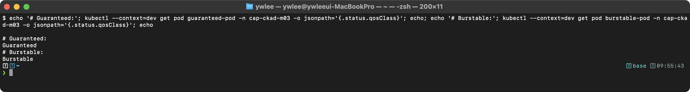

**출제 의도:** Kubernetes QoS(Quality of Service) 클래스의 결정 조건과 의미를 검증한다. 리소스 설정에 따른 Pod 스케줄링 우선순위와 eviction 순서를 이해하는 실무 역량을 평가한다.

**핵심 원리:** QoS 클래스는 Pod의 리소스 설정에 의해 자동으로 결정된다. Guaranteed는 모든 컨테이너의 CPU/메모리 requests와 limits가 동일할 때 부여된다. BestEffort는 어떤 컨테이너에도 requests/limits가 설정되지 않았을 때 부여된다. 그 외는 모두 Burstable이다.

QoS가 왜 중요한지는 축출(eviction) 순서로 드러난다. 노드 메모리가 부족해지면(memory pressure) kubelet은 노드를 살리려고 일부 Pod를 강제로 내쫓는데, 이때 우선순위는 "약속을 얼마나 했는가"로 정해진다. BestEffort는 requests로 아무것도 약속하지 않았으니 가장 먼저, Burstable은 requests만큼만 약속했으니 그다음, Guaranteed는 requests=limits로 정확히 약속하고 그만큼만 쓰니 가장 나중에 쫓겨난다. 내부적으로 kubelet은 각 Pod에 oom_score_adj(리눅스 커널 OOM 킬러가 참고하는 점수)를 QoS에 따라 다르게 매겨, 커널 차원에서도 BestEffort가 먼저 죽도록 만든다. 같은 QoS 안에서는 "requests 대비 실제 메모리 초과량"이 큰 Pod, 즉 약속보다 많이 쓰는 Pod가 먼저 축출된다. 즉 QoS는 단순 라벨이 아니라 자원 경합 시 생존 우선순위를 결정하는 스케줄링/축출 정책이다.

**함정과 주의사항:**
- Guaranteed 조건: 모든 컨테이너에 CPU와 메모리의 requests와 limits가 설정되어야 하고, 각각 같은 값이어야 한다. CPU만 설정하고 메모리를 누락하면 Burstable이 된다.
- limits만 설정하고 requests를 생략하면, Kubernetes가 requests를 limits와 동일하게 자동 설정한다. 따라서 limits만 설정해도 Guaranteed가 될 수 있다.
- BestEffort Pod에는 어떤 리소스 설정도 없어야 한다. requests나 limits 중 하나라도 있으면 Burstable이다.
- QoS 클래스는 `kubectl describe pod`의 `QoS Class` 필드 또는 `jsonpath='{.status.qosClass}'`로 확인한다.

**시간 절약 팁:** 세 Pod 모두 `kubectl run`으로 생성 가능하다. BestEffort는 `kubectl run qos-besteffort --image=nginx:1.25`로 바로 생성한다. Guaranteed와 Burstable은 `--dry-run=client -o yaml`로 YAML을 뽑아 resources 섹션을 추가한다. QoS 확인은 `kubectl get pod <name> -o jsonpath='{.status.qosClass}'` 한 줄이다.

</details>

---

### 문제 28. [Config & Security] LimitRange 생성

네임스페이스 `restricted`에 다음 LimitRange를 생성하라.

- 컨테이너 기본 limits: cpu=500m, memory=512Mi
- 컨테이너 기본 requests: cpu=100m, memory=128Mi
- 컨테이너 최대 limits: cpu=1, memory=1Gi
- 컨테이너 최소 requests: cpu=50m, memory=64Mi

<details><summary>풀이 확인</summary>

**풀이:**

```bash
kubectl create namespace restricted
```

```yaml
apiVersion: v1
kind: LimitRange
metadata:
  name: default-limits
  namespace: restricted
spec:
  limits:
    - type: Container
      default:
        cpu: 500m
        memory: 512Mi
      defaultRequest:
        cpu: 100m
        memory: 128Mi
      max:
        cpu: "1"
        memory: 1Gi
      min:
        cpu: 50m
        memory: 64Mi
```

```bash
# 확인
kubectl describe limitrange default-limits -n restricted

# LimitRange가 적용된 Pod 생성 테스트
kubectl run test-lr --image=nginx:1.25 -n restricted
kubectl get pod test-lr -n restricted -o yaml | grep -A 10 resources
```

**검증:**

```bash
kubectl describe limitrange default-limits -n restricted
kubectl run test-lr --image=nginx:1.25 -n restricted
kubectl get pod test-lr -n restricted -o jsonpath='{.spec.containers[0].resources}'
```

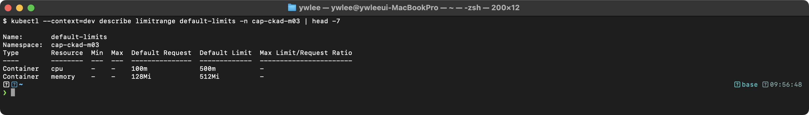

**출제 의도:** LimitRange를 사용한 네임스페이스 수준의 리소스 제어 능력을 검증한다. 기본값 자동 적용과 최소/최대 범위 제한을 통한 클러스터 자원 관리 실무 역량을 평가한다.

**핵심 원리:** LimitRange는 Admission Controller에 의해 동작하는 네임스페이스 수준의 정책이다. `default`는 limits 기본값, `defaultRequest`는 requests 기본값이다. 리소스를 명시하지 않은 컨테이너에 자동으로 적용된다. `min`/`max`는 허용 범위를 정의한다. 이 범위를 벗어나는 requests/limits를 가진 Pod는 생성이 거부된다. LimitRange는 Pod 생성 시점에만 검증하며, 이미 실행 중인 Pod에는 영향을 주지 않는다.

**함정과 주의사항:**
- `default`는 limits 기본값이다. `defaultRequest`는 requests 기본값이다. 이름이 혼동되기 쉽다. `default`가 requests가 아니라 limits임을 기억해야 한다.
- `min`보다 작거나 `max`보다 큰 리소스를 요청하면 Pod 생성이 거부된다. 오류 메시지는 `forbidden: ... is not within the allowed range`이다.
- LimitRange는 기존 Pod에 소급 적용되지 않는다. LimitRange 생성 전에 만들어진 Pod는 영향을 받지 않는다.
- `type: Container`는 개별 컨테이너에 적용된다. `type: Pod`로 설정하면 Pod 전체에 적용된다. `type: PersistentVolumeClaim`도 가능하다.
- ResourceQuota와 함께 사용할 때, ResourceQuota가 있으면 모든 Pod에 requests/limits가 필수이다. LimitRange가 기본값을 자동 설정하므로 이 요구를 충족시킬 수 있다.

**시간 절약 팁:** LimitRange는 imperative 명령이 없으므로 YAML을 직접 작성해야 한다. kubernetes.io/docs에서 "limitrange" 검색으로 예제를 복사하여 수정하는 것이 가장 빠르다. 핵심 필드는 `default`, `defaultRequest`, `max`, `min` 네 가지이다.

</details>

---

### 문제 29. [Config & Security] ResourceQuota 생성

네임스페이스 `team-a`에 다음 ResourceQuota를 생성하라.

- CPU requests 총합: 4, CPU limits 총합: 8
- Memory requests 총합: 4Gi, Memory limits 총합: 8Gi
- 최대 Pod 수: 20
- 최대 ConfigMap 수: 10, 최대 Secret 수: 10

<details><summary>풀이 확인</summary>

**풀이:**

```bash
kubectl create namespace team-a
```

```yaml
apiVersion: v1
kind: ResourceQuota
metadata:
  name: team-a-quota
  namespace: team-a
spec:
  hard:
    requests.cpu: "4"
    limits.cpu: "8"
    requests.memory: 4Gi
    limits.memory: 8Gi
    pods: "20"
    configmaps: "10"
    secrets: "10"
```

```bash
# 사용량 확인
kubectl describe resourcequota team-a-quota -n team-a
```

**검증:**

```bash
kubectl describe resourcequota team-a-quota -n team-a
```

> **예시(참조):** CKAD 실습/보충 기대 출력(istio sidecar·버전·tart 환경값 등 placeholder, 환경 의존). 재현 가능 핵심은 CKAD daily(day01~14) 및 본문 02·03 캡처 참고.

**출제 의도:** ResourceQuota를 사용한 네임스페이스 수준의 총량 제한 능력을 검증한다. 멀티테넌트 클러스터에서 팀별 리소스 할당량을 관리하는 실무 역량을 평가한다.

**핵심 원리:** ResourceQuota는 네임스페이스 내 리소스의 총합 상한을 정의한다. Pod가 생성될 때 Admission Controller가 현재 사용량 + 요청량이 quota를 초과하는지 검증한다. 초과하면 Pod 생성이 거부된다. `requests.cpu`와 `limits.cpu`를 별도로 제한할 수 있다. `pods`, `configmaps`, `secrets` 등 오브젝트 수도 제한 가능하다. 사용량은 실시간으로 추적되며, `kubectl describe resourcequota`로 확인할 수 있다.

**함정과 주의사항:**
- ResourceQuota에 CPU/메모리 quota가 설정되면, 해당 네임스페이스의 모든 Pod에 requests/limits가 필수이다. 리소스를 명시하지 않은 Pod는 생성이 거부된다.
- LimitRange를 함께 설정하면 기본값이 자동 적용되므로, 리소스를 명시하지 않아도 Pod가 생성된다.
- `secrets`의 기본 사용량이 1인 이유는 Kubernetes가 자동으로 ServiceAccount Secret을 생성하기 때문이다.
- quota를 초과하면 오류 메시지는 `forbidden: exceeded quota`이다. Deployment의 Pod가 생성되지 않으면 `kubectl get events -n team-a`로 확인한다.
- ResourceQuota는 이미 존재하는 리소스에 소급 적용되지 않는다.

**시간 절약 팁:** `kubectl create quota team-a-quota -n team-a --hard=requests.cpu=4,limits.cpu=8,requests.memory=4Gi,limits.memory=8Gi,pods=20,configmaps=10,secrets=10`으로 imperative하게 생성할 수 있다. 한 줄 명령이지만 파라미터가 많으므로 오타에 주의한다. YAML 대비 시간 차이가 크지 않다면 YAML을 사용하는 것이 안전하다.

</details>

---

### 문제 30. [Config & Security] ConfigMap을 환경 변수의 개별 key로 사용

ConfigMap `db-config`에서 `DB_HOST`와 `DB_PORT` key만 선택하여 환경 변수로 주입하되, 환경 변수 이름을 `DATABASE_HOST`와 `DATABASE_PORT`로 변경하라.

- Pod 이름: `selective-env-pod`, 이미지: `nginx:1.25`

<details><summary>풀이 확인</summary>

**풀이:**

```bash
# ConfigMap 생성
kubectl create configmap db-config \
  --from-literal=DB_HOST=postgres.default.svc.cluster.local \
  --from-literal=DB_PORT=5432 \
  --from-literal=DB_NAME=myapp \
  --from-literal=DB_MAX_CONN=100
```

```yaml
apiVersion: v1
kind: Pod
metadata:
  name: selective-env-pod
spec:
  containers:
    - name: app
      image: nginx:1.25
      env:
        - name: DATABASE_HOST
          valueFrom:
            configMapKeyRef:
              name: db-config
              key: DB_HOST
        - name: DATABASE_PORT
          valueFrom:
            configMapKeyRef:
              name: db-config
              key: DB_PORT
```

**검증:**

```bash
kubectl exec selective-env-pod -- env | grep DATABASE
kubectl exec selective-env-pod -- env | grep DB_
```

> **예시(참조):** CKAD 실습/보충 기대 출력(istio sidecar·버전·tart 환경값 등 placeholder, 환경 의존). 재현 가능 핵심은 CKAD daily(day01~14) 및 본문 02·03 캡처 참고.

**출제 의도:** ConfigMap에서 특정 key만 선택적으로 환경 변수에 매핑하고, 이름을 변경하는 능력을 검증한다. `envFrom`과 `env[].valueFrom`의 차이를 이해하는 실무 역량을 평가한다.

**핵심 원리:** `env[].valueFrom.configMapKeyRef`는 ConfigMap의 특정 key 하나를 환경 변수 하나에 매핑한다. `env[].name`으로 환경 변수 이름을 자유롭게 지정할 수 있다. `envFrom`은 모든 key를 환경 변수로 주입하므로 이름 변경이 불가능하다. `configMapKeyRef`의 `optional: true`를 설정하면 key가 없어도 Pod가 시작된다.

**함정과 주의사항:**
- `configMapKeyRef.key`는 ConfigMap 내의 key 이름이고, `env.name`은 Pod 내에서 사용할 환경 변수 이름이다. 둘을 혼동하면 잘못된 값이 주입된다.
- ConfigMap이 존재하지 않거나 지정된 key가 없으면 Pod 시작이 실패한다. `optional: true`로 이를 방지할 수 있다.
- `env`와 `envFrom`을 동시에 사용할 수 있다. 이름이 충돌하면 `env`가 우선한다.
- `secretKeyRef`도 동일한 구조이다. ConfigMap 대신 Secret에서 값을 가져올 때 사용한다.

**시간 절약 팁:** `kubectl run selective-env-pod --image=nginx:1.25 --dry-run=client -o yaml`로 기본 YAML을 생성한 후 `env` 섹션만 추가한다. `valueFrom.configMapKeyRef` 구조가 3단계 중첩이므로 들여쓰기에 주의한다. 2개 key를 매핑하는 것이므로 YAML 편집 시간은 약 1분이다.

</details>

---

### 문제 31. [Config & Security] 환경 변수에서 Pod 정보 참조 (Downward API)

Pod의 이름, 네임스페이스, 노드 이름, Pod IP를 환경 변수로 주입하라.

- Pod 이름: `downward-pod`, 이미지: `busybox:1.36`
- 명령: `env` 실행 후 1시간 대기

<details><summary>풀이 확인</summary>

**풀이:**

```yaml
apiVersion: v1
kind: Pod
metadata:
  name: downward-pod
spec:
  containers:
    - name: app
      image: busybox:1.36
      command: ["sh", "-c", "env && sleep 3600"]
      env:
        - name: POD_NAME
          valueFrom:
            fieldRef:
              fieldPath: metadata.name
        - name: POD_NAMESPACE
          valueFrom:
            fieldRef:
              fieldPath: metadata.namespace
        - name: NODE_NAME
          valueFrom:
            fieldRef:
              fieldPath: spec.nodeName
        - name: POD_IP
          valueFrom:
            fieldRef:
              fieldPath: status.podIP
        - name: CPU_REQUEST
          valueFrom:
            resourceFieldRef:
              containerName: app
              resource: requests.cpu
```

**검증:**

```bash
kubectl logs downward-pod | grep -E "POD_NAME|POD_NAMESPACE|NODE_NAME|POD_IP"
```

> **예시(참조):** CKAD 실습/보충 기대 출력(istio sidecar·버전·tart 환경값 등 placeholder, 환경 의존). 재현 가능 핵심은 CKAD daily(day01~14) 및 본문 02·03 캡처 참고.

**출제 의도:** Downward API를 사용하여 Pod 메타데이터와 리소스 정보를 컨테이너에 전달하는 능력을 검증한다. 애플리케이션이 자신의 실행 환경을 인식해야 하는 실무 시나리오를 평가한다.

**핵심 원리:** Downward API는 Pod의 메타데이터와 spec 정보를 환경 변수 또는 파일로 컨테이너에 전달하는 메커니즘이다. 참조원이 두 종류라는 점이 핵심이다. `fieldRef`는 Pod 오브젝트 자체의 필드(`metadata.name`, `metadata.namespace`, `spec.nodeName`, `status.podIP` 등 Pod 수준 정보)를 `fieldPath`로 가리킨다. `resourceFieldRef`는 컨테이너의 리소스 설정값(`requests.cpu`, `limits.memory` 등)을 가리키며, 어느 컨테이너의 값인지 `containerName`으로 지정하고 `resource`로 항목을 고른다. 한 문장으로 구분하면 "fieldRef = Pod의 정체성/위치 정보, resourceFieldRef = 컨테이너에 할당된 자원 수치"다. 이 정보는 Pod 시작 시점에 확정되며, 런타임 중 변경되지 않는다.

**함정과 주의사항:**
- `fieldRef`로 참조 가능한 필드는 제한되어 있다. `metadata.name`, `metadata.namespace`, `metadata.uid`, `metadata.labels`, `metadata.annotations`, `spec.nodeName`, `spec.serviceAccountName`, `status.podIP`, `status.hostIP` 등이다.
- `resourceFieldRef`에서 `containerName`은 멀티 컨테이너 Pod에서 필수이다. 단일 컨테이너에서는 생략 가능하다.
- `metadata.labels`와 `metadata.annotations`는 환경 변수로는 주입할 수 없고, 볼륨 파일(`downwardAPI` volume)로만 사용 가능하다.
- `status.podIP`는 Pod가 스케줄링된 후에 할당되므로, init container에서 참조하면 빈 값일 수 있다.

**시간 절약 팁:** Downward API는 YAML로만 구성 가능하다. `fieldRef.fieldPath`의 값을 정확히 기억해야 한다. 자주 사용되는 5개 (`metadata.name`, `metadata.namespace`, `spec.nodeName`, `status.podIP`, `status.hostIP`)를 외워두면 docs 참조 없이 빠르게 작성할 수 있다.

</details>

---

### 문제 32. [Config & Security] Immutable ConfigMap/Secret

변경 불가능한 ConfigMap과 Secret을 생성하라. 생성 후 값 변경이 가능한지 확인하라.

<details><summary>풀이 확인</summary>

**풀이:**

```yaml
apiVersion: v1
kind: ConfigMap
metadata:
  name: immutable-config
data:
  APP_MODE: production
immutable: true
---
apiVersion: v1
kind: Secret
metadata:
  name: immutable-secret
type: Opaque
stringData:
  api-key: "super-secret-key"
immutable: true
```

```bash
# 적용
kubectl apply -f immutable.yaml

# 변경 시도 (실패해야 함)
kubectl edit configmap immutable-config
# Error: "immutable" field is immutable

# 삭제 후 재생성만 가능
kubectl delete configmap immutable-config
```

**검증:**

```bash
kubectl get configmap immutable-config -o yaml | grep immutable
kubectl get secret immutable-secret -o yaml | grep immutable
# 변경 시도
kubectl patch configmap immutable-config -p '{"data":{"APP_MODE":"staging"}}' 2>&1
```

> **예시(참조):** CKAD 실습/보충 기대 출력(istio sidecar·버전·tart 환경값 등 placeholder, 환경 의존). 재현 가능 핵심은 CKAD daily(day01~14) 및 본문 02·03 캡처 참고.

**출제 의도:** Immutable ConfigMap/Secret의 생성과 동작 원리를 검증한다. 대규모 클러스터에서 성능 최적화를 위한 불변 설정 패턴을 이해하는 실무 역량을 평가한다.

**핵심 원리:** `immutable: true`가 설정된 ConfigMap/Secret은 data 필드를 변경할 수 없다. kubelet은 불변 ConfigMap에 대해 API 서버로의 watch 요청을 생성하지 않는다. 이는 대규모 클러스터(수천 개의 ConfigMap)에서 API 서버와 kubelet의 부하를 크게 줄인다. 불변 ConfigMap을 변경하려면 삭제 후 새 이름으로 재생성하고, Pod도 재배포해야 한다. `immutable` 필드 자체도 변경할 수 없으므로, 한 번 true로 설정하면 되돌릴 수 없다.

**함정과 주의사항:**
- `immutable: true`를 설정한 후에는 `data`뿐 아니라 `immutable` 필드 자체도 변경할 수 없다. `immutable: false`로 되돌리는 것이 불가능하다.
- 불변 ConfigMap을 참조하는 Pod는 ConfigMap을 삭제할 때 영향을 받는다. 삭제 전에 Pod를 먼저 업데이트하거나 삭제해야 한다.
- `kubectl edit`으로 수정을 시도하면 저장 시점에 오류가 발생한다. `kubectl patch`로도 동일하게 거부된다.
- 불변 Secret도 동일한 방식으로 동작한다. `immutable` 필드는 ConfigMap과 Secret 모두에 적용 가능하다.

**시간 절약 팁:** Immutable ConfigMap은 YAML로 작성해야 한다. `kubectl create configmap`으로 먼저 생성한 후 `kubectl patch configmap immutable-config -p '{"immutable":true}'`로 불변으로 전환하는 것도 가능하다. 단, 이 방법은 2단계가 필요하므로 처음부터 YAML에 `immutable: true`를 포함하는 것이 빠르다.

</details>

> 도메인 전환: 여기까지가 **Application Environment, Configuration and Security(문제 23~32)** 이다. 다음은 마지막 영역 **Services and Networking(문제 33~40)** -- Service·Ingress로 트래픽을 받고 NetworkPolicy로 통제하며 DNS/Headless로 찾는 네트워킹을 다룬다.

---

## Services and Networking

> 학습 목표: 트래픽 수신(Service/Ingress)과 트래픽 제어(NetworkPolicy), 서비스 디스커버리(DNS/Headless) 이해 | 예상 소요: 120분 | 전제 지식: TCP/UDP·포트 개념, label/selector, Pod IP가 임시(ephemeral)라는 점
>
> 학습 순서와 관계: 33~35는 "트래픽을 어떻게 받아 안으로 보내는가"(Service로 Pod 묶기 -> Ingress로 HTTP 라우팅/TLS), 36~37은 "그 트래픽을 누가 누구에게 보내도 되는가"(NetworkPolicy로 허용/차단), 38~40은 "이름으로 어떻게 찾는가"(DNS, Headless/StatefulSet, Endpoints)이다. 33의 Service가 만드는 트래픽 경로와 36의 NetworkPolicy가 막는 트래픽 경로는 같은 길이다. Service는 "어디로 보낼지"를, NetworkPolicy는 "보내도 되는지"를 정한다.

### 등장 배경 -- Pod IP가 자꾸 바뀌는데 어떻게 연결하나

Pod는 죽고 다시 뜨면 IP가 바뀐다(ephemeral). 그래서 앱이 다른 앱의 Pod IP를 직접 박아 두면 재배포 때마다 연결이 끊긴다. Service는 변하지 않는 가상 IP(ClusterIP)와 이름을 앞에 세워 이 문제를 푼다. 뒤에서 어떤 Pod가 죽고 살든 Service는 현재 살아있는 Pod 집합(Endpoints)으로 트래픽을 넘긴다. 트래픽이 클러스터 안에서 어느 노드의 어느 Pod로 가야 하는지는 예전엔 kube-proxy가 호스트의 iptables(리눅스 커널 패킷 필터/NAT 규칙) 또는 ipvs 규칙을 갱신해 처리했고, 이 저장소처럼 Cilium을 쓰면 eBPF(커널에 안전하게 코드를 주입해 패킷을 처리하는 기술)로 같은 일을 더 효율적으로 한다. CNI(Container Network Interface, Pod에 IP와 네트워크를 붙여주는 플러그인 규격)가 이 네트워킹을 구현하며, NetworkPolicy도 CNI가 지원해야 동작한다. Ingress는 Service들 앞에 L7(애플리케이션 계층, HTTP) 라우터를 두어 도메인·경로별로 트래픽을 나눈다. 트레이드오프는 추상화 계층이 늘면서 "왜 연결이 안 되나"의 원인이 Service selector·Endpoints·NetworkPolicy·DNS 중 어디인지 추적할 지점이 많아진다는 점이다.

### 문제 33. [Networking] Service 생성 -- ClusterIP, NodePort

Deployment `backend`에 대해 다음 Service를 생성하라.

1. ClusterIP Service: `backend-internal` (포트 80 -> 대상 포트 8080)
2. NodePort Service: `backend-external` (포트 80 -> 대상 포트 8080, nodePort: 30088)

<details><summary>풀이 확인</summary>

**선결조건:** `kubectl expose`는 대상 Deployment가 없으면 `Error from server (NotFound)`로 즉시 실패한다. 이 문제를 직접 실습하려면 먼저 대상이 될 `backend` Deployment를 만들어 둔다. `kubectl create deployment backend --image=nginx:1.25 --replicas=2`로 생성한 뒤 풀이를 진행한다(nginx는 8080이 아니라 80을 듣지만, 여기서는 Service 생성과 selector 매핑 연습이 목적이므로 무방하다. Endpoints가 채워지는지까지 확인하려면 8080을 듣는 이미지로 바꾸거나 `--target-port=80`으로 맞춘다).

**풀이:**

```bash
# ClusterIP
kubectl expose deployment backend --name=backend-internal \
  --port=80 --target-port=8080 --type=ClusterIP

# NodePort
kubectl expose deployment backend --name=backend-external \
  --port=80 --target-port=8080 --type=NodePort \
  --dry-run=client -o yaml > np-svc.yaml
```

NodePort를 지정하려면 YAML을 수정해야 한다:

```yaml
apiVersion: v1
kind: Service
metadata:
  name: backend-external
spec:
  type: NodePort
  selector:
    app: backend
  ports:
    - port: 80
      targetPort: 8080
      nodePort: 30088
      protocol: TCP
```

```bash
kubectl apply -f np-svc.yaml

# 확인
kubectl get svc backend-internal backend-external
```

**검증:**

```bash
kubectl get svc backend-internal backend-external
kubectl get endpoints backend-internal backend-external
kubectl run test --image=busybox:1.36 --rm -it --restart=Never -- wget -qO- http://backend-internal
```

> **예시(참조):** CKAD 실습/보충 기대 출력(istio sidecar·버전·tart 환경값 등 placeholder, 환경 의존). 재현 가능 핵심은 CKAD daily(day01~14) 및 본문 02·03 캡처 참고.

**출제 의도:** Service 유형(ClusterIP, NodePort)의 차이와 생성 방법을 검증한다. port, targetPort, nodePort의 관계를 이해하는 실무 역량을 평가한다.

**핵심 원리:** ClusterIP는 클러스터 내부에서만 접근 가능한 가상 IP를 할당한다. NodePort는 ClusterIP에 추가로 모든 노드의 특정 포트(30000-32767)를 열어 외부 접근을 허용한다. `port`는 Service가 수신하는 포트, `targetPort`는 Pod가 수신하는 포트, `nodePort`는 노드에서 열리는 포트이다. Service는 selector에 매칭되는 Pod의 IP를 Endpoints에 등록하고, kube-proxy가 iptables/ipvs 규칙으로 트래픽을 분배한다.

**함정과 주의사항:**
- `kubectl expose`에서 `--target-port`를 생략하면 `--port`와 동일한 값이 사용된다. 문제에서 두 값이 다르면(80 -> 8080) 반드시 `--target-port`를 지정해야 한다.
- `nodePort`는 `kubectl expose`로 지정할 수 없다. YAML을 수정하거나 `kubectl patch`로 추가해야 한다.
- nodePort 범위는 기본 30000-32767이다. 이 범위를 벗어나면 오류가 발생한다.
- Service의 `selector`는 Deployment의 `spec.template.metadata.labels`와 일치해야 한다 (`spec.selector.matchLabels`가 아님).
- `kubectl expose deployment`는 Deployment의 Pod template labels를 자동으로 selector에 사용한다.

**시간 절약 팁:** ClusterIP Service는 `kubectl expose deployment backend --name=backend-internal --port=80 --target-port=8080`으로 한 줄 생성이 가능하다. NodePort도 `kubectl expose`로 기본 생성 후 `kubectl patch svc backend-external -p '{"spec":{"ports":[{"port":80,"targetPort":8080,"nodePort":30088}]}}'`로 nodePort만 추가하면 빠르다.

</details>

---

### 문제 34. [Networking] Ingress -- Path-based Routing

다음 Ingress를 생성하라.

- 이름: `app-ingress`
- 호스트: `myapp.example.com`
- `/api` -> `api-svc:8080` (Prefix)
- `/web` -> `web-svc:80` (Prefix)
- IngressClass: `nginx`

<details><summary>풀이 확인</summary>

**선결조건:** Ingress 규칙이 가리키는 백엔드 Service(`api-svc`, `web-svc`)가 먼저 존재해야 한다. 없으면 Ingress는 생성되지만 요청이 들어왔을 때 `503 Service Temporarily Unavailable`이 반환된다. 직접 실습할 때는 두 Deployment와 Service를 미리 만든다: `kubectl create deployment api --image=nginx:1.25 && kubectl expose deployment api --name=api-svc --port=8080 --target-port=80` 그리고 `kubectl create deployment web --image=nginx:1.25 && kubectl expose deployment web --name=web-svc --port=80`. 또한 dev 클러스터에 nginx Ingress Controller가 설치돼 있어야 ADDRESS가 채워진다(없으면 규칙만 등록되고 실제 라우팅은 동작하지 않는다).

**풀이:**

```bash
kubectl create ingress app-ingress \
  --rule="myapp.example.com/api=api-svc:8080" \
  --rule="myapp.example.com/web=web-svc:80" \
  --class=nginx \
  --dry-run=client -o yaml > ingress.yaml
```

또는 YAML:

```yaml
apiVersion: networking.k8s.io/v1
kind: Ingress
metadata:
  name: app-ingress
spec:
  ingressClassName: nginx
  rules:
    - host: myapp.example.com
      http:
        paths:
          - path: /api
            pathType: Prefix
            backend:
              service:
                name: api-svc
                port:
                  number: 8080
          - path: /web
            pathType: Prefix
            backend:
              service:
                name: web-svc
                port:
                  number: 80
```

**검증:**

```bash
kubectl get ingress app-ingress
kubectl describe ingress app-ingress
```

> **예시(참조):** CKAD 실습/보충 기대 출력(istio sidecar·버전·tart 환경값 등 placeholder, 환경 의존). 재현 가능 핵심은 CKAD daily(day01~14) 및 본문 02·03 캡처 참고.

**출제 의도:** Ingress를 사용한 HTTP 라우팅 설정 능력을 검증한다. Path-based routing과 IngressClass 설정을 이해하는 실무 역량을 평가한다.

**핵심 원리:** Ingress는 클러스터 외부에서 내부 Service로의 HTTP/HTTPS 라우팅 규칙을 정의한다. Ingress Controller(nginx, traefik 등)가 실제 트래픽 처리를 담당한다. `pathType: Prefix`는 URL 경로의 접두사 매칭으로, `/api`는 `/api`, `/api/v1`, `/api/users` 등을 모두 매칭한다. `pathType: Exact`는 정확히 지정된 경로만 매칭한다. `ingressClassName`은 어떤 Ingress Controller가 이 규칙을 처리할지 지정한다.

**함정과 주의사항:**
- `ingressClassName`을 생략하면 클러스터의 default IngressClass가 사용된다. 시험에서 명시적으로 지정하라고 하면 반드시 포함해야 한다.
- `pathType`은 필수 필드이다. 생략하면 validation 오류가 발생한다.
- `Prefix` 매칭에서 `/api`와 `/api/`는 다르게 동작할 수 있다. 트레일링 슬래시 처리는 Ingress Controller에 따라 다르다.
- `backend.service.port`에서 `number`(포트 번호) 또는 `name`(포트 이름)을 사용할 수 있다. 문제에서 지정된 방식을 따라야 한다.
- Ingress Controller가 설치되어 있어야 Ingress가 동작한다. Controller 없이 Ingress만 생성하면 ADDRESS가 비어 있다.

**시간 절약 팁:** `kubectl create ingress app-ingress --rule="myapp.example.com/api=api-svc:8080" --rule="myapp.example.com/web=web-svc:80" --class=nginx`로 imperative하게 생성할 수 있다. 이 방식은 `pathType: Prefix`가 기본으로 설정된다. TLS나 annotation이 필요하면 `--dry-run=client -o yaml`로 YAML을 뽑아 수정한다.

</details>

---

### 문제 35. [Networking] Ingress -- TLS 설정

문제 34의 Ingress에 TLS를 추가하라.

- Secret `myapp-tls`를 사용한다.
- `myapp.example.com` 호스트에 TLS를 적용한다.

<details><summary>풀이 확인</summary>

**선결조건:** 문제 34의 백엔드 Service(`api-svc`, `web-svc`)와 Ingress가 이미 있다는 전제다(문제 34 선결조건 참조). 그리고 아래 `kubectl create secret tls`는 `tls.crt`·`tls.key` 파일이 현재 디렉터리에 있어야 한다. 시험·실습용 자체 서명 인증서는 `openssl req -x509 -nodes -days 365 -newkey rsa:2048 -keyout tls.key -out tls.crt -subj "/CN=myapp.example.com"` 한 줄로 미리 만들어 둔다.

**풀이:**

```yaml
apiVersion: networking.k8s.io/v1
kind: Ingress
metadata:
  name: app-ingress
spec:
  ingressClassName: nginx
  tls:
    - hosts:
        - myapp.example.com
      secretName: myapp-tls
  rules:
    - host: myapp.example.com
      http:
        paths:
          - path: /api
            pathType: Prefix
            backend:
              service:
                name: api-svc
                port:
                  number: 8080
          - path: /web
            pathType: Prefix
            backend:
              service:
                name: web-svc
                port:
                  number: 80
```

```bash
# TLS Secret 생성 (인증서 파일 필요)
kubectl create secret tls myapp-tls --cert=tls.crt --key=tls.key
```

**검증:**

```bash
kubectl get ingress app-ingress
kubectl describe ingress app-ingress | grep -A 3 "TLS"
kubectl get secret myapp-tls -o jsonpath='{.type}'
```

> **예시(참조):** CKAD 실습/보충 기대 출력(istio sidecar·버전·tart 환경값 등 placeholder, 환경 의존). 재현 가능 핵심은 CKAD daily(day01~14) 및 본문 02·03 캡처 참고.

**출제 의도:** Ingress에 TLS를 설정하여 HTTPS 트래픽을 처리하는 능력을 검증한다. TLS Secret 생성과 Ingress 통합을 이해하는 실무 역량을 평가한다.

**핵심 원리:** Ingress의 `tls` 섹션은 TLS 종료(termination)를 설정한다. Ingress Controller가 TLS를 처리하고, 백엔드 Service에는 평문 HTTP로 전달한다. `secretName`으로 지정된 Secret은 `kubernetes.io/tls` 유형이어야 하며, `tls.crt`(인증서)와 `tls.key`(개인키)를 포함해야 한다. `hosts` 목록에 포함된 호스트에만 TLS가 적용된다. 클라이언트가 HTTPS로 접근하면 Ingress Controller가 Secret의 인증서를 사용하여 TLS 핸드셰이크를 수행한다.

**함정과 주의사항:**
- `tls` 섹션의 `hosts`와 `rules`의 `host`가 일치해야 한다. 불일치하면 TLS가 적용되지 않거나 인증서 오류가 발생한다.
- TLS Secret은 Ingress와 동일한 네임스페이스에 있어야 한다. 다른 네임스페이스의 Secret은 참조할 수 없다.
- `kubectl create secret tls`에서 `--cert`와 `--key` 파일이 유효한 PEM 형식이어야 한다. 잘못된 형식이면 Secret 생성은 되지만 Ingress Controller에서 오류가 발생한다.
- PORTS 열에 `443`이 표시되면 TLS가 올바르게 설정된 것이다.

**시간 절약 팁:** TLS Ingress는 기존 Ingress YAML에 `tls` 섹션만 추가하면 된다. `tls.hosts`와 `tls.secretName` 두 필드만 기억한다. Secret 생성은 `kubectl create secret tls myapp-tls --cert=tls.crt --key=tls.key` 한 줄이다.

</details>

---

### 문제 36. [Networking] NetworkPolicy -- Default Deny + 특정 허용

네임스페이스 `production`에 다음 NetworkPolicy를 생성하라.

1. 모든 ingress/egress 트래픽을 차단하는 default deny 정책
2. `app=frontend` Pod에서 `app=backend` Pod의 포트 8080으로의 ingress만 허용
3. `app=backend` Pod에서 DNS(UDP 53)와 `app=database` Pod의 포트 5432로의 egress만 허용

<details><summary>풀이 확인</summary>

**풀이:**

```yaml
# 1. Default Deny (Ingress + Egress)
apiVersion: networking.k8s.io/v1
kind: NetworkPolicy
metadata:
  name: default-deny-all
  namespace: production
spec:
  podSelector: {}
  policyTypes:
    - Ingress
    - Egress
---
# 2. Frontend -> Backend 허용
apiVersion: networking.k8s.io/v1
kind: NetworkPolicy
metadata:
  name: allow-frontend-to-backend
  namespace: production
spec:
  podSelector:
    matchLabels:
      app: backend
  policyTypes:
    - Ingress
  ingress:
    - from:
        - podSelector:
            matchLabels:
              app: frontend
      ports:
        - protocol: TCP
          port: 8080
---
# 3. Backend -> DNS + Database 허용
apiVersion: networking.k8s.io/v1
kind: NetworkPolicy
metadata:
  name: backend-egress
  namespace: production
spec:
  podSelector:
    matchLabels:
      app: backend
  policyTypes:
    - Egress
  egress:
    - to: []
      ports:
        - protocol: UDP
          port: 53
        - protocol: TCP
          port: 53
    - to:
        - podSelector:
            matchLabels:
              app: database
      ports:
        - protocol: TCP
          port: 5432
```

**검증:**

```bash
kubectl get networkpolicy -n production
kubectl describe networkpolicy default-deny-all -n production
kubectl describe networkpolicy allow-frontend-to-backend -n production
kubectl describe networkpolicy backend-egress -n production
```

> **예시(참조):** CKAD 실습/보충 기대 출력(istio sidecar·버전·tart 환경값 등 placeholder, 환경 의존). 재현 가능 핵심은 CKAD daily(day01~14) 및 본문 02·03 캡처 참고.

**출제 의도:** NetworkPolicy를 사용한 마이크로서비스 간 통신 제어 능력을 검증한다. Default deny + 선택적 허용 패턴과 DNS egress 처리를 이해하는 실무 역량을 평가한다.

**개념 입문:** 기본 상태의 Kubernetes는 모든 Pod가 서로 자유롭게 통신한다(flat network). 이는 편하지만, 침해당한 한 Pod가 같은 네트워크의 DB·다른 서비스로 곧장 옆걸음질(lateral movement)할 수 있어 위험하다. NetworkPolicy는 방화벽 규칙(ACL, Access Control List = 누가 어디에 접근 가능한지 허용 목록)을 Pod 단위로 거는 장치다. 다만 NetworkPolicy 오브젝트 자체는 "의도 선언"일 뿐이고, 실제 패킷 차단은 CNI 플러그인(이 저장소는 Cilium)이 노드의 eBPF/iptables 규칙으로 집행한다. 그래서 NetworkPolicy를 지원하지 않는 CNI에서는 만들어도 무시된다.

ingress는 "들어오는" 트래픽, egress는 "나가는" 트래픽이다. L3/L4는 OSI 계층 구분으로 L3은 IP 주소 수준, L4는 TCP/UDP 포트 수준을 뜻하며, NetworkPolicy는 이 L3/L4까지만 다룬다(HTTP 경로 같은 L7은 못 본다).

**핵심 원리:** NetworkPolicy는 Pod의 ingress/egress 트래픽을 제어한다. `podSelector: {}`는 네임스페이스의 모든 Pod를 선택한다. `policyTypes`에 Ingress/Egress를 명시하면서 규칙을 비워두면 default deny가 된다. NetworkPolicy는 허용(whitelist) 방식으로 동작한다. 여러 정책이 한 Pod에 함께 걸리면 그 합집합(OR)이 허용 범위가 된다(한 정책이라도 허용하면 통과). AND/OR 규칙은 한 단계 더 들어가야 정확하다. (1) 한 ingress 규칙 안에서 `from` 리스트의 여러 항목(서로 다른 `- podSelector`/`- namespaceSelector`)은 OR이다 -- "이 중 누구든 출발지면 허용". (2) 같은 `from` 항목 안에 `podSelector`와 `namespaceSelector`를 함께 쓰면 AND이다 -- "그 네임스페이스에 속하면서 동시에 그 label인 Pod만". (3) 한 규칙의 `from`(누가)과 `ports`(어디로)는 AND이다 -- "허용된 출발지가 + 허용된 포트로" 와야 통과. egress의 `to`/`ports`도 대칭으로 같다. CNI 플러그인(Calico, Cilium 등)이 NetworkPolicy를 지원해야 한다.

**함정과 주의사항:**
- DNS egress(UDP/TCP 53)를 허용하지 않으면 Pod에서 Service 이름으로 접근이 불가능하다. IP 주소로만 접근 가능하다. 이것이 가장 흔히 빠뜨리는 규칙이다.
- DNS egress의 `to: []`(빈 리스트)는 "목적지를 제한하지 않음 = 모든 대상 허용"이라는 의미이다. 처음 보면 빈 리스트를 "아무 것도 허용 안 함"으로 오해하기 쉬우나 정반대다. 이 규칙에서는 `to` 필드를 아예 생략한 것과 동일하게 동작한다(즉 위 YAML의 `- to: []` 줄을 지우고 `ports`만 남겨도 결과가 같다). 빈 리스트가 헷갈리면 `to` 필드를 생략하는 쪽이 의도가 더 분명하다. 단 `to: [{}]`(빈 객체를 담은 리스트)와는 다르고, 일부 CNI는 `to` 생략과 `to: []`를 동일하게 처리하므로 표현을 섞지 말고 한 가지로 통일한다. CoreDNS Pod의 IP가 변경될 수 있으므로 DNS 목적지는 이렇게 제한하지 않는 것이 일반적이다.
- 같은 `from` 항목에 `podSelector`와 `namespaceSelector`를 넣으면 AND 조건이다. 별도 항목(리스트의 다른 요소)으로 넣으면 OR 조건이다.
- default deny를 적용하면 같은 네임스페이스 내 Pod 간 통신도 차단된다. 필요한 통신을 모두 명시적으로 허용해야 한다.
- Flannel과 같은 일부 CNI는 NetworkPolicy를 지원하지 않는다. 시험 환경에서는 지원된다고 가정한다.

**시간 절약 팁:** NetworkPolicy는 YAML로만 작성 가능하다. default deny는 짧은 YAML(약 8줄)이므로 외워두면 빠르다. kubernetes.io/docs에서 "network policy" 검색으로 예제를 찾아 수정하는 것이 효율적이다. ingress와 egress 규칙의 구조가 대칭적이므로 하나만 익히면 다른 하나도 작성할 수 있다.

</details>

---

### 문제 37. [Networking] NetworkPolicy -- 네임스페이스 간 통신

`monitoring` 네임스페이스의 Pod에서 `production` 네임스페이스의 모든 Pod의 메트릭 포트(9090)에 접근할 수 있도록 NetworkPolicy를 생성하라.

<details><summary>풀이 확인</summary>

**풀이:**

```bash
# monitoring 네임스페이스에 label 추가 (필요 시)
kubectl label namespace monitoring name=monitoring
```

```yaml
apiVersion: networking.k8s.io/v1
kind: NetworkPolicy
metadata:
  name: allow-monitoring-metrics
  namespace: production
spec:
  podSelector: {}
  policyTypes:
    - Ingress
  ingress:
    - from:
        - namespaceSelector:
            matchLabels:
              name: monitoring
      ports:
        - protocol: TCP
          port: 9090
```

**검증:**

```bash
kubectl get networkpolicy allow-monitoring-metrics -n production
kubectl describe networkpolicy allow-monitoring-metrics -n production
kubectl get namespace monitoring --show-labels
```

> **예시(참조):** CKAD 실습/보충 기대 출력(istio sidecar·버전·tart 환경값 등 placeholder, 환경 의존). 재현 가능 핵심은 CKAD daily(day01~14) 및 본문 02·03 캡처 참고.

**출제 의도:** 네임스페이스 간 NetworkPolicy 설정 능력을 검증한다. `namespaceSelector`를 사용한 크로스 네임스페이스 트래픽 제어와 네임스페이스 label 관리를 평가한다.

**핵심 원리:** `namespaceSelector`는 특정 label을 가진 네임스페이스의 모든 Pod를 소스/대상으로 선택한다. NetworkPolicy는 항상 자신이 위치한 네임스페이스의 Pod에 적용된다. 따라서 `production` 네임스페이스에 정책을 생성하여 `monitoring` 네임스페이스로부터의 ingress를 허용한다. Kubernetes 1.22부터 네임스페이스에 `kubernetes.io/metadata.name` label이 자동으로 추가되므로, 커스텀 label 없이도 네임스페이스를 선택할 수 있다.

**함정과 주의사항:**
- 네임스페이스에 매칭할 label이 있어야 한다. `kubectl label namespace monitoring name=monitoring`으로 label을 추가해야 한다.
- Kubernetes 1.22+에서는 `kubernetes.io/metadata.name=monitoring` label이 자동으로 존재하므로 별도 label 추가 없이 `namespaceSelector`에서 이를 사용할 수 있다.
- `namespaceSelector`와 `podSelector`를 같은 `from` 항목에 넣으면 AND 조건(해당 네임스페이스의 특정 Pod)이 된다. 별도 항목으로 넣으면 OR 조건이 된다.
- `podSelector: {}`를 NetworkPolicy의 적용 대상으로 설정하면 네임스페이스의 모든 Pod에 적용된다. 특정 Pod에만 적용하려면 label을 지정해야 한다.
- NetworkPolicy는 대상 네임스페이스에 생성해야 한다. `monitoring` 네임스페이스가 아닌 `production` 네임스페이스에 생성한다.

**시간 절약 팁:** 네임스페이스 label 확인 → NetworkPolicy YAML 작성 순서로 진행한다. `kubectl get ns --show-labels`로 기존 label을 먼저 확인한다. Kubernetes 1.22+ 환경이면 `kubernetes.io/metadata.name` label을 사용하여 별도의 label 추가 없이 작성 가능하다.

</details>

---

### 문제 38. [Networking] DNS 테스트

busybox Pod를 생성하여 다음 DNS 조회를 수행하라.

1. `default` 네임스페이스의 `kubernetes` Service DNS 조회
2. `kube-system` 네임스페이스의 `kube-dns` Service DNS 조회
3. 현재 Pod의 `/etc/resolv.conf` 확인

<details><summary>풀이 확인</summary>

**풀이:**

```bash
# 임시 busybox Pod 생성 및 DNS 테스트
kubectl run dns-test --image=busybox:1.36 --rm -it --restart=Never -- sh -c '
echo "=== 1. kubernetes Service ==="
nslookup kubernetes.default.svc.cluster.local

echo "=== 2. kube-dns Service ==="
nslookup kube-dns.kube-system.svc.cluster.local

echo "=== 3. resolv.conf ==="
cat /etc/resolv.conf
'
```

**검증:**

```bash
kubectl run dns-test --image=busybox:1.36 --rm -it --restart=Never -- nslookup kubernetes.default.svc.cluster.local
```

> **예시(참조):** CKAD 실습/보충 기대 출력(istio sidecar·버전·tart 환경값 등 placeholder, 환경 의존). 재현 가능 핵심은 CKAD daily(day01~14) 및 본문 02·03 캡처 참고.

**출제 의도:** Kubernetes 클러스터 내부 DNS 동작 원리와 서비스 디스커버리 능력을 검증한다. DNS 이름 해석 규칙과 resolv.conf 설정을 이해하는 실무 역량을 평가한다.

**핵심 원리:** CoreDNS는 클러스터 내부 DNS 서버로, Service와 Pod의 DNS 레코드를 관리한다. Service의 FQDN은 `<service>.<namespace>.svc.cluster.local`이다. Pod의 `/etc/resolv.conf`에는 CoreDNS의 ClusterIP가 nameserver로 설정된다. `search` 도메인 목록에 의해 짧은 이름(`kubernetes`)도 FQDN으로 해석된다. `ndots:5`는 이름에 점(.)이 5개 미만이면 search 도메인을 먼저 시도한다는 의미이다.

**함정과 주의사항:**
- 같은 네임스페이스에서는 `<service>` 이름만으로 접근 가능하지만, 다른 네임스페이스의 Service는 `<service>.<namespace>` 형태로 접근해야 한다.
- `ndots:5`는 외부 도메인(예: `google.com`, 점 1개) 조회 시 먼저 search 도메인을 추가하여 `google.com.default.svc.cluster.local` 등을 시도한 후 원본 이름을 시도한다. 이로 인해 외부 DNS 조회가 느려질 수 있다.
- `busybox:1.36`의 `nslookup`은 간소화된 버전으로, 출력 형식이 `bind-utils`의 `nslookup`과 다르다.
- `--rm -it --restart=Never`를 함께 사용하면 일회성 디버그 Pod가 생성되고, 완료 후 자동 삭제된다.
- Headless Service(clusterIP: None)는 A 레코드가 아닌 개별 Pod IP를 반환한다.

**시간 절약 팁:** DNS 테스트는 `kubectl run dns-test --image=busybox:1.36 --rm -it --restart=Never -- <command>` 패턴으로 한 줄에 실행할 수 있다. 여러 명령을 실행하려면 `-- sh -c '...'`로 래핑한다. 이 패턴을 외워두면 네트워크 디버깅에 매우 유용하다.

</details>

---

### 문제 39. [Networking] Headless Service와 StatefulSet

Headless Service와 StatefulSet을 생성하고, 각 Pod의 고유 DNS 이름을 확인하라.

- Headless Service 이름: `web-headless`
- StatefulSet 이름: `web`, replicas: 3, 이미지: `nginx:1.25`

<details><summary>풀이 확인</summary>

**등장 배경 -- StatefulSet은 왜 필요한가:** Deployment가 만드는 Pod는 이름이 무작위 해시(`web-7d8f...`)라 매번 바뀌고 서로 구분되지 않으며, 모두 같은 볼륨을 공유하거나 임시 볼륨을 쓴다. 이는 stateless 웹 서버에는 문제없지만, DB·메시지 큐·etcd처럼 멤버끼리 서로를 고정된 이름으로 찾아야 하고(예 `mysql-0`은 primary, `mysql-1`은 replica) 각자 자기만의 디스크를 영구히 가져야 하는 앱에는 쓸 수 없다. StatefulSet은 이 한계를 두 가지로 푼다. (1) 순번이 붙은 고정 이름(`web-0`/`web-1`/`web-2`)과 그에 묶인 고유 DNS 이름을 부여해 멤버를 안정적으로 식별하게 하고, (2) Pod마다 별도 PVC를 만들어 재시작·재스케줄 후에도 같은 디스크가 같은 순번에 다시 붙게 한다. 또 0번부터 순차 생성·역순 삭제해 클러스터형 앱의 부팅·종료 순서를 보장한다. 트레이드오프는 운영 복잡도다 -- 순차 생성 탓에 롤아웃이 느리고, PVC가 Pod와 함께 자동 삭제되지 않아 정리를 따로 해야 한다.

**풀이:**

```yaml
apiVersion: v1
kind: Service
metadata:
  name: web-headless
spec:
  clusterIP: None
  selector:
    app: web
  ports:
    - port: 80
      targetPort: 80
---
apiVersion: apps/v1
kind: StatefulSet
metadata:
  name: web
spec:
  serviceName: web-headless
  replicas: 3
  selector:
    matchLabels:
      app: web
  template:
    metadata:
      labels:
        app: web
    spec:
      containers:
        - name: nginx
          image: nginx:1.25
          ports:
            - containerPort: 80
```

```bash
# 적용
kubectl apply -f statefulset.yaml

# 각 Pod의 DNS 확인
kubectl run dns-test --image=busybox:1.36 --rm -it --restart=Never -- sh -c '
nslookup web-0.web-headless.default.svc.cluster.local
nslookup web-1.web-headless.default.svc.cluster.local
nslookup web-2.web-headless.default.svc.cluster.local
'
```

**검증:**

```bash
kubectl get statefulset web
kubectl get pods -l app=web
kubectl run dns-test --image=busybox:1.36 --rm -it --restart=Never -- sh -c '
nslookup web-0.web-headless.default.svc.cluster.local
nslookup web-1.web-headless.default.svc.cluster.local
nslookup web-headless.default.svc.cluster.local
'
```

> **예시(참조):** CKAD 실습/보충 기대 출력(istio sidecar·버전·tart 환경값 등 placeholder, 환경 의존). 재현 가능 핵심은 CKAD daily(day01~14) 및 본문 02·03 캡처 참고.

**출제 의도:** Headless Service와 StatefulSet의 연동, 그리고 개별 Pod의 고유 DNS 이름 구조를 검증한다. 상태를 유지하는 애플리케이션(데이터베이스, 메시지 큐 등)의 배포 패턴을 평가한다.

**핵심 원리:** Headless Service(`clusterIP: None`)는 가상 IP를 할당하지 않고, DNS 조회 시 Pod IP 목록을 직접 반환한다. StatefulSet은 `serviceName`으로 Headless Service를 참조하며, 각 Pod에 `<pod-name>.<service-name>.<namespace>.svc.cluster.local` 형식의 고유 DNS 이름을 부여한다. Pod는 `web-0`, `web-1`, `web-2`와 같이 순서가 보장된 이름을 가지며, 0번부터 순차적으로 생성되고 역순으로 삭제된다. PVC도 `<pvc-template-name>-<pod-name>` 형태로 개별 생성되어 Pod에 영구적으로 바인딩된다.

**함정과 주의사항:**
- `serviceName` 필드는 StatefulSet spec에 필수이다. 누락하면 validation 오류가 발생한다.
- Headless Service의 `clusterIP`는 반드시 `None`이어야 한다. 일반 ClusterIP Service와 혼동하면 안 된다.
- StatefulSet Pod는 순서대로 생성된다. `web-0`이 Running이 되어야 `web-1`이 생성된다. 하나가 실패하면 나머지도 생성되지 않는다.
- Headless Service의 selector는 StatefulSet의 Pod template labels와 일치해야 한다.
- StatefulSet을 삭제해도 PVC는 자동으로 삭제되지 않는다. 데이터를 보존하기 위한 안전 조치이다.

**시간 절약 팁:** StatefulSet은 YAML로만 생성 가능하다. Headless Service도 YAML이 필수이다(`clusterIP: None`은 imperative로 설정 불가). kubernetes.io/docs에서 "statefulset" 검색으로 예제를 복사하여 수정하는 것이 가장 빠르다. Headless Service는 일반 Service YAML에서 `clusterIP: None`만 추가하면 된다.

</details>

---

### 문제 40. [Networking] Service 엔드포인트 확인 및 트래픽 테스트

다음 작업을 수행하라.

1. Deployment `web-app` (이미지: `nginx:1.25`, replicas: 3)을 생성하라.
2. ClusterIP Service `web-svc`를 생성하라 (포트 80).
3. Service의 Endpoints를 확인하라.
4. 임시 Pod에서 Service로 요청을 보내 응답을 확인하라.

<details><summary>풀이 확인</summary>

**풀이:**

```bash
# 1. Deployment 생성
kubectl create deployment web-app --image=nginx:1.25 --replicas=3

# 2. Service 생성
kubectl expose deployment web-app --name=web-svc --port=80 --target-port=80

# 3. Endpoints 확인
kubectl get endpoints web-svc
kubectl describe endpoints web-svc

# 또는
kubectl get ep web-svc -o yaml

# 4. 트래픽 테스트
kubectl run curl-test --image=busybox:1.36 --rm -it --restart=Never -- \
  wget -qO- http://web-svc

# 여러 번 요청하여 로드밸런싱 확인
kubectl run curl-test --image=busybox:1.36 --rm -it --restart=Never -- sh -c '
for i in $(seq 1 10); do
  wget -qO- http://web-svc 2>/dev/null | head -1
done
'
```

**검증:**

```bash
kubectl get deployment web-app
kubectl get svc web-svc
kubectl get endpoints web-svc
kubectl run curl-test --image=busybox:1.36 --rm -it --restart=Never -- wget -qO- http://web-svc
```

> **예시(참조):** CKAD 실습/보충 기대 출력(istio sidecar·버전·tart 환경값 등 placeholder, 환경 의존). 재현 가능 핵심은 CKAD daily(day01~14) 및 본문 02·03 캡처 참고.

**출제 의도:** Service와 Endpoints의 관계를 이해하고, 트래픽 흐름을 검증하는 능력을 평가한다. Deployment-Service-Endpoints-Pod의 전체 연결 구조를 파악하는 실무 역량을 검증한다.

**핵심 원리:** Service는 selector에 매칭되는 Pod의 IP를 Endpoints 오브젝트에 등록한다. Endpoints Controller가 Pod의 생성/삭제/Ready 상태 변경을 감지하여 Endpoints를 자동 업데이트한다. kube-proxy는 Endpoints를 기반으로 iptables/ipvs 규칙을 생성하여 트래픽을 분배한다. Pod가 Ready가 아니면(Readiness Probe 실패 등) Endpoints에서 제외되어 트래픽이 전달되지 않는다. Service의 ClusterIP는 이 규칙의 진입점이며, 실제 목적지는 Endpoints에 등록된 Pod IP이다.

**함정과 주의사항:**
- Endpoints에 Pod IP가 없으면 Service로의 요청이 실패한다. `kubectl get endpoints`로 확인하여 IP 목록이 비어있다면 selector가 일치하지 않거나 Pod가 Ready가 아닌 것이다.
- `kubectl expose deployment`는 Deployment의 Pod template labels를 자동으로 selector에 사용한다. 수동으로 Service를 생성할 때는 selector를 정확히 지정해야 한다.
- `kubectl get ep`는 `kubectl get endpoints`의 단축형이다.
- `wget -qO-`에서 `-q`는 quiet 모드, `-O-`는 stdout 출력이다. busybox에는 `curl`이 없으므로 `wget`을 사용한다.
- `--rm -it --restart=Never` 조합을 사용하면 일회성 테스트 Pod가 종료 후 자동 삭제된다.

**시간 절약 팁:** 전체 과정이 imperative 명령으로 처리 가능하다. `kubectl create deployment` → `kubectl expose deployment` → `kubectl get endpoints` → `kubectl run --rm -it ... -- wget` 순서로 4개 명령이면 완료된다. YAML 편집이 전혀 필요 없으므로 2분 이내에 풀 수 있다.

</details>
