# CKAD Day 1: Pod 기초와 Dockerfile 멀티스테이지 빌드

> 전제 지식: 없음(Day 1 = 과정 시작) | CKAD Application Design and Build(20%) 중 Pod 기초 및 컨테이너 이미지 최적화 | 다음 Day 2: 멀티컨테이너 패턴(사이드카/어댑터)

---

## 오늘의 학습 목표

- [ ] Pod의 개념과 내부 동작 원리를 이해한다
- [ ] Pod YAML 매니페스트의 각 필드를 정확히 설명할 수 있다
- [ ] Dockerfile 멀티스테이지 빌드의 원리와 최적화 기법을 이해한다

---

## 0. 시험 환경 설정(터미널 단축 설정)

CKAD 실기는 120분 안에 15~20문제를 풀어야 하는 속도전이다. 매번 `kubectl`을 전부 입력하거나 `--dry-run=client -o yaml`을 타이핑하면 시간을 낭비한다. 시험 시작 직후 아래 4줄을 터미널에 입력하는 것을 습관으로 만든다. 이 파일의 모든 `k` 명령은 이 alias를 전제한다.

```bash
alias k=kubectl
complete -F __start_kubectl k          # bash 자동완성을 k alias에도 적용
export do='--dry-run=client -o yaml'   # dry-run + YAML 출력 단축
export now='--force --grace-period=0'  # 즉시 삭제 단축
```

사용 예시: `k run test --image=nginx $do > pod.yaml`로 YAML 파일을 1초 만에 뽑은 뒤 편집하고 `k apply -f pod.yaml`로 제출하는 것이 CKAD의 표준 풀이 흐름이다.

---

## 1. Pod 기초 - 쿠버네티스의 가장 작은 단위

### 1.1 Pod란 무엇인가?

**등장 배경:**
Docker만으로 컨테이너를 운영하면 하나의 호스트에서 여러 컨테이너 간 네트워크 공유, 볼륨 공유, 생명주기 동기화를 수동으로 관리해야 한다. docker-compose가 이 문제를 일부 해결하지만, 멀티 노드 스케줄링은 지원하지 않는다. Pod는 "함께 배포되고 함께 실행되어야 하는 컨테이너 그룹"을 하나의 원자적 단위로 추상화하여 스케줄러가 일관된 배치 결정을 내리도록 한다. 이 설계 덕분에 사이드카, 어댑터 등 멀티컨테이너 패턴을 네이티브로 지원한다.

**공학적 정의:**
Pod는 쿠버네티스의 최소 스케줄링 단위로, 하나 이상의 컨테이너가 동일한 Linux Network Namespace, IPC Namespace, UTS Namespace를 공유하는 cgroup 격리 단위이다.

여기서 등장하는 리눅스 커널 용어를 먼저 정리한다.
- **Namespace(네임스페이스)**: OS 레벨에서 프로세스가 보는 자원(네트워크 인터페이스·PID·마운트·호스트명 등)을 격리하는 리눅스 커널 기능이다. Network Namespace는 네트워크 스택(인터페이스·IP·라우팅 테이블)을, IPC Namespace는 프로세스 간 통신 자원(공유 메모리·세마포어)을, UTS Namespace는 호스트명을 분리한다. 같은 Namespace에 속한 프로세스끼리는 해당 자원을 공유한다. (쿠버네티스의 Namespace 리소스와는 다른 개념이다. 이쪽은 리눅스 커널의 격리 단위다.)
- **cgroup(control group)**: 프로세스 그룹의 CPU·메모리·I/O 사용량을 측정하고 제한하는 리눅스 커널 메커니즘이다. 컨테이너의 리소스 limits는 이 cgroup으로 강제된다.
- **veth pair(virtual ethernet pair)**: 양 끝이 연결된 가상 네트워크 인터페이스 쌍이다. 한 끝은 컨테이너의 Network Namespace 안에, 다른 끝은 호스트 쪽에 두어 컨테이너 트래픽이 호스트 네트워크로 빠져나가는 통로가 된다.

Pod 내 컨테이너들은 동일한 veth pair를 통해 할당된 Pod IP를 공유하므로 loopback(127.0.0.1)으로 상호 통신하며, 동일한 Volume mount point를 통해 파일시스템을 공유할 수 있다. Pod의 생명주기는 kubelet이 관리하며, Pod 삭제 시 해당 cgroup 하위의 모든 프로세스가 SIGTERM -> SIGKILL 순서로 종료된다.

**내부 동작 원리 심화:**
Pod 생성 시 kubelet은 먼저 pause 컨테이너(infra container)를 생성한다. pause 컨테이너는 네트워크 네임스페이스를 보유하는 유일한 컨테이너로, 나머지 앱 컨테이너들이 이 네임스페이스에 합류(join)한다. pause 컨테이너가 존재하는 이유는 앱 컨테이너가 재시작되더라도 네트워크 네임스페이스(IP, 포트 바인딩)가 유지되도록 하기 위함이다. CNI(Container Network Interface, 컨테이너에 네트워크를 연결하는 표준 플러그인 인터페이스) 플러그인은 pause 컨테이너의 네임스페이스에 veth pair를 생성하고 Pod IP를 할당한다.

**왜 이 설계인가 (대안과 트레이드오프):**
만약 pause 컨테이너 없이 각 앱 컨테이너가 자기만의 Network Namespace를 가진다고 하자. 그러면 앱 컨테이너가 크래시로 재시작될 때마다 Namespace가 새로 만들어지고 Pod IP도 새로 할당된다. Service나 다른 Pod는 이전 IP로 트래픽을 계속 보내므로 연결이 끊긴다. 이 문제를 피하려고, Namespace를 소유하는 역할을 아무 일도 하지 않는 pause 컨테이너에 맡긴다. pause 컨테이너는 Pod 수명 내내 거의 죽지 않고(반영구 존속) Namespace를 붙들고 있으며, 앱 컨테이너는 이 Namespace에 합류했다가 빠지기를 반복한다. 따라서 앱 컨테이너가 몇 번을 재시작해도 Pod IP는 그대로 유지된다. 트레이드오프는 Pod마다 실제 일을 하지 않는 컨테이너가 하나씩 더 떠 있다는 점이지만, pause 이미지는 수백 KB 수준이고 거의 CPU를 쓰지 않으므로 비용이 작다.

**핵심 특징:**
- 같은 Pod 안의 컨테이너들은 같은 IP 주소를 공유한다 (localhost로 서로 통신 가능)
- 같은 Pod 안의 컨테이너들은 볼륨(Volume)을 공유할 수 있다
- Pod가 삭제되면 안의 모든 컨테이너도 함께 삭제된다
- Pod는 일반적으로 직접 생성하지 않고, Deployment 같은 상위 리소스를 통해 관리한다

### 1.2 Pod YAML 상세 해부

```yaml
# --- Pod 매니페스트(Manifest) 상세 설명 ---
apiVersion: v1                # API 버전. Pod는 core API group에 속하므로 "v1"
                              # Deployment는 "apps/v1", Job은 "batch/v1" 등
                              # kubectl api-resources 명령으로 확인 가능

kind: Pod                     # 리소스 종류. "이것은 Pod이다"라고 선언
                              # 대소문자 정확히 지켜야 함 (pod가 아닌 Pod)

metadata:                     # 리소스의 메타데이터(이름표 정보)
  name: my-first-pod          # Pod의 이름. 같은 네임스페이스에서 유일해야 함
                              # DNS 호환 이름 (소문자, 하이픈 사용 가능, 253자 이하)
  namespace: default          # Pod가 속할 네임스페이스. 생략하면 "default"
                              # 네임스페이스(Namespace)는 "폴더"와 비슷한 논리적 분리 단위
  labels:                     # 레이블(Label): 리소스를 분류하는 키-값 쌍
    app: web                  # Service, Deployment 등이 이 레이블로 Pod를 찾음
    tier: frontend            # 여러 레이블을 붙여 다양한 기준으로 분류 가능
    environment: production   # 운영 환경 구분에 활용
  annotations:                # 어노테이션(Annotation): 추가 정보 저장 (선택적 메타데이터)
    description: "웹 서버 Pod" # 사람이 읽기 위한 설명
    owner: "team-alpha"       # 도구나 시스템이 사용하는 정보

spec:                         # 스펙(Spec): Pod의 원하는 상태를 정의
                              # "이런 상태로 Pod를 만들어라"라는 요청서

  restartPolicy: Always       # 컨테이너 재시작 정책
                              # Always(기본값): 항상 재시작 — 웹서버·API처럼 상주 서비스
                              # OnFailure: 실패(exit code != 0)시만 재시작
                              #   → 배치 작업(성공할 때까지 재시도해야 하는 Job)에 적합
                              # Never: 재시작하지 않음
                              #   → 실패 시 수동으로 로그를 확인하고 재실행할 Pod에 사용
                              #   → Job의 기본값은 Never가 아니라 OnFailure임에 주의
                              # Deployment/DaemonSet/StatefulSet은 Always만 허용

  containers:                 # 컨테이너 목록 (최소 1개 필수)
    - name: nginx             # 컨테이너 이름. Pod 내에서 유일해야 함
                              # kubectl logs <pod> -c <name> 으로 특정 컨테이너 로그 조회
      image: nginx:1.25       # 컨테이너 이미지. 레지스트리/이름:태그 형식
                              # 태그 생략 시 :latest가 사용됨 (비추천)
      ports:                  # 컨테이너가 노출하는 포트 목록 (문서화 목적)
        - containerPort: 80   # 실제 방화벽 역할은 하지 않음. 참조 정보
          protocol: TCP       # TCP(기본값) 또는 UDP
      env:                    # 환경 변수 목록
        - name: APP_ENV       # 환경 변수 이름
          value: "production" # 환경 변수 값 (문자열)
      resources:              # 리소스 요청량과 제한량
        requests:             # 최소 보장 리소스. 스케줄링 기준
          cpu: 100m           # 100 밀리코어 = 0.1 CPU
          memory: 128Mi       # 128 메비바이트
        limits:               # 최대 사용 가능 리소스
          cpu: 200m           # 이 이상 CPU 사용 시 쓰로틀링(throttling)
          memory: 256Mi       # 이 이상 메모리 사용 시 OOMKilled
```

**requests와 limits 동작 원리 심화:**
`requests`는 스케줄링 단계에서만 사용된다. Scheduler는 각 노드에서 이미 요청된 CPU/메모리 합산이 `requests`를 수용할 수 있는지 계산해 배치 노드를 결정한다. 일단 Pod가 실행되면 `requests`는 커널 수준에서 강제되지 않는다. 즉 컨테이너가 `requests.cpu=100m`을 선언해도 노드에 여유가 있다면 그 이상 CPU를 쓸 수 있다.

`limits`는 실행 중에 커널(cgroup)이 강제한다. 강제 방식이 CPU와 메모리가 다르다.
- **CPU throttling**: 컨테이너가 `limits.cpu`를 초과하면 커널이 해당 cgroup의 CPU 할당 시간을 삭감한다. 프로세스는 죽지 않고 속도가 느려진다.
- **OOMKill(Out-Of-Memory Kill)**: 컨테이너가 `limits.memory`를 초과하면 커널 OOM killer가 해당 컨테이너의 프로세스를 강제 종료한다(`reason: OOMKilled`). Pod의 `restartPolicy`에 따라 재시작된다.

`limits`를 설정하지 않은 Pod는 노드 메모리를 전부 소진해 같은 노드의 다른 Pod를 OOMKill시킬 수 있다. 이 때문에 프로덕션에서는 `requests == limits`로 설정해 버스트 없이 예측 가능한 리소스 사용을 보장하는 경우가 많다.

**QoS 클래스(Quality of Service Class)**: 쿠버네티스는 Pod의 requests/limits 설정 방식에 따라 세 가지 QoS 클래스를 자동으로 부여한다. QoS 클래스는 노드 메모리가 부족해질 때 kubelet이 어떤 Pod를 먼저 축출(evict)하거나 OOMKill할지 결정하는 기준이 된다.

- **Guaranteed**: 모든 컨테이너에서 `requests == limits`이고 CPU/메모리 둘 다 설정된 경우. 가장 높은 우선순위로 보호되며 OOMKill을 가장 마지막에 당한다.
- **Burstable**: Guaranteed 조건을 만족하지 않고, 최소 한 컨테이너에 requests 또는 limits 중 하나라도 설정된 경우. 중간 우선순위.
- **BestEffort**: 모든 컨테이너에서 requests/limits를 전혀 설정하지 않은 경우. 가장 낮은 우선순위로, 노드 메모리 압박 시 가장 먼저 OOMKill 대상이 된다.

따라서 OOMKill 발생 순서는 BestEffort → Burstable → Guaranteed 순이다. 시험에서 "이 Pod가 먼저 종료되는 이유"를 묻는 문제가 나오면 QoS 클래스를 확인하는 것이 첫 번째 단계다.

### 1.3 Pod 내부 동작 원리

**전제 — 쿠버네티스 아키텍처 한눈에 보기:**
아래 흐름을 읽기 전에 등장하는 컴포넌트의 역할을 정리한다. 쿠버네티스 클러스터는 control-plane(제어부)과 worker node(작업 노드)로 나뉜다.
- **control-plane** — 클러스터의 두뇌다. **API Server**는 모든 요청(kubectl·컨트롤러·kubelet)이 거쳐 가는 단일 진입점이자 etcd(클러스터 상태 저장소) 앞단의 게이트웨이다. **Scheduler**는 새로 만들어진 Pod를 어느 worker node에 배치할지 결정한다. **Controller Manager**는 "원하는 상태"와 "현재 상태"의 차이를 줄이는 제어 루프(예: Deployment가 원하는 복제 수를 유지)를 돈다.
- **worker node** — 실제 컨테이너가 도는 곳이다. **kubelet**은 각 노드의 에이전트로, 자기 노드에 배정된 Pod를 컨테이너 런타임에 만들라고 지시하고 상태를 보고한다. **container runtime**(containerd·CRI-O 등)은 실제로 컨테이너 프로세스를 띄운다.

아래는 `kubectl apply` 한 번이 이 컴포넌트들을 차례로 거쳐 Pod가 실행되기까지의 내부 흐름이다.

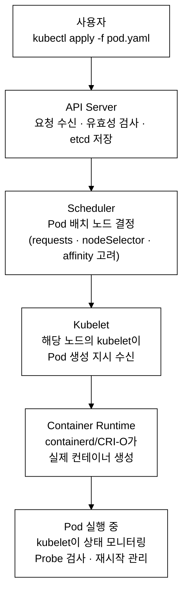

_그림 1. kubectl apply 이후 Pod 생성 흐름._

---

## 2. Dockerfile 멀티스테이지 빌드

### 2.1 멀티스테이지 빌드란?

**등장 배경:**
멀티스테이지 빌드 이전에는 빌드 환경과 실행 환경을 분리하려면 **빌더 패턴(builder pattern)** 을 사용해야 했다. 빌더 패턴은 빌드용 Dockerfile과 런타임용 Dockerfile을 별도로 유지하고, 셸 스크립트로 두 이미지를 연결하는 방식이다.

구체적으로는 다음 순서로 동작했다.

```bash
# 1. 빌드 이미지 생성 (build.Dockerfile)
# FROM golang:1.21-alpine / COPY . . / RUN go build -o /app/server .
docker build -f build.Dockerfile -t build-image .

# 2. 컨테이너를 잠깐 띄워 바이너리를 호스트로 추출
docker create --name extractor build-image
docker cp extractor:/app/server ./server
docker rm extractor

# 3. 런타임 이미지 생성 (runtime.Dockerfile)
# FROM alpine:3.18 / COPY ./server /usr/local/bin/server
docker build -f runtime.Dockerfile -t final-image .

# 4. 빌드 이미지·추출 파일 정리
rm ./server
docker rmi build-image
```

이 방식의 문제는 (1) Dockerfile 두 개를 동시에 유지해야 하고, (2) docker cp로 호스트 파일시스템을 거쳐야 하며, (3) docker build를 두 번 실행하고, (4) CI 파이프라인에 정리 스크립트가 추가로 필요하다는 것이다. 실수로 `docker rmi build-image`를 빼먹으면 수백 MB짜리 빌드 이미지가 CI 서버에 쌓였다.

Docker 17.05에서 도입된 멀티스테이지 빌드는 이 모든 것을 단일 Dockerfile 안에서 해결한다. `docker cp`·중간 컨테이너·정리 스크립트가 필요 없어지고, CI 파이프라인은 `docker build` 한 번으로 끝난다.

**공학적 정의:**
멀티스테이지 빌드는 단일 Dockerfile 내에서 복수의 FROM 명령을 사용하여 빌드 타임 의존성(컴파일러, SDK, 빌드 도구 체인)과 런타임 의존성(실행 바이너리, 런타임 라이브러리)을 분리하는 Docker 이미지 최적화 기법이다. 빌드 스테이지에서 생성된 아티팩트만 COPY --from 지시어로 최종 스테이지에 복사함으로써, 최종 이미지의 공격 표면(attack surface — 공격자가 컨테이너 침투 시 악용할 수 있는 도구·라이브러리·바이너리의 총량. gcc·npm·pip 등 빌드 도구가 없으면 공격자가 내부에서 악성코드를 컴파일하거나 의존성을 설치하기 어려워진다)을 줄이고 이미지 레이어 크기를 최소화한다.

**내부 동작 원리 심화:**
Docker는 각 FROM을 독립된 빌드 스테이지로 취급한다. 각 스테이지는 고유한 레이어 스택을 갖고, 최종 이미지에는 마지막 FROM 이후의 레이어만 포함된다. `COPY --from=builder`는 빌더 스테이지의 파일시스템에서 직접 파일을 복사하며, 빌더 스테이지의 중간 이미지는 빌드 캐시에만 존재하고 최종 이미지에 포함되지 않는다. BuildKit을 사용하면 독립적인 스테이지를 병렬 빌드할 수 있어 빌드 시간이 단축된다.

**핵심 원리:**
- 1단계(builder): 소스 코드 컴파일, 의존성 설치 등 빌드 작업 수행
- 2단계(runtime): 빌드 결과물만 복사하여 경량 베이스 이미지 위에서 실행
- 빌드 도구, 소스 코드, 중간 산출물이 최종 이미지에 포함되지 않음

### 2.2 Go 애플리케이션 멀티스테이지 빌드

```dockerfile
# ===== Stage 1: 빌드 환경 =====
FROM golang:1.21-alpine AS builder
# golang:1.21-alpine: Go 컴파일러가 포함된 이미지 (~300MB)
# AS builder: 이 스테이지에 "builder"라는 이름을 부여

WORKDIR /app
# 작업 디렉토리 설정. 없으면 자동 생성
# 이후 모든 명령은 이 디렉토리 기준으로 실행

COPY go.mod go.sum ./
# go.mod, go.sum만 먼저 복사 (의존성 정보 파일)
# 이렇게 하면 의존성이 바뀌지 않는 한 캐시가 유지됨

RUN go mod download
# 의존성 다운로드. go.mod/go.sum이 바뀌지 않으면 캐시 사용

COPY . .
# 나머지 소스 코드 전체 복사

RUN CGO_ENABLED=0 GOOS=linux go build -o /app/server .
# CGO_ENABLED=0: C 라이브러리(glibc, OpenSSL 등) 의존성을 제거해 정적 바이너리를 생성.
#   (glibc: 대부분의 Linux 배포판이 사용하는 표준 C 라이브러리. alpine은 musl libc라는
#    경량 대체 구현을 사용하며 glibc와 ABI 호환이 안 된다.)
#   정적 바이너리 = 실행에 필요한 모든 코드가 바이너리 한 파일에 포함된 형태.
#   이후 alpine:3.18(C 라이브러리가 musl libc로 glibc와 다름)에서도 실행 가능.
#   CGO_ENABLED=1(기본값)로 빌드하면 glibc에 동적 링크되어 alpine에서 세그폴트 발생.
# GOOS=linux: Linux용으로 빌드 (macOS에서 크로스 컴파일할 때 필요)
# -o /app/server: 출력 바이너리 경로
# 결과: 단일 실행 파일 (~10MB), 외부 라이브러리 의존성 없음

# ===== Stage 2: 런타임 환경 =====
FROM alpine:3.18
# alpine:3.18: 초경량 Linux 이미지 (~5MB)
# 빌드 도구가 전혀 없는 깨끗한 환경

RUN apk --no-cache add ca-certificates
# HTTPS 통신을 위한 CA 인증서만 설치

COPY --from=builder /app/server /usr/local/bin/server
# builder 스테이지에서 빌드된 바이너리만 복사
# --from=builder: "builder"라는 이름의 스테이지에서 파일을 가져옴

RUN adduser -D -u 1000 appuser
# 비루트 사용자 생성 (보안 모범 사례)
# -D: 비밀번호 없이 생성, -u 1000: UID 지정

USER appuser
# 이후 모든 명령과 컨테이너 실행을 appuser로 수행

EXPOSE 8080
# 문서화용: 이 컨테이너가 8080 포트를 사용함을 명시

ENTRYPOINT ["server"]
# 컨테이너 시작 시 실행할 명령
```

### 2.3 Node.js 멀티스테이지 빌드

Node.js 프로젝트에서 멀티스테이지가 필요한 핵심 이유는 `node_modules` 크기 문제다. 개발 시에는 테스트 프레임워크(jest, mocha), 타입 정의(@types/*), 빌드 도구(webpack, tsc) 등 devDependencies가 `node_modules`를 수백 MB로 부풀린다. 런타임에는 실제 앱 코드를 실행할 프로덕션 의존성(`--only=production`)과 빌드 결과물(`dist/`)만 필요하다. `npm ci`는 `npm install`과 달리 `package-lock.json`을 그대로 재현하므로 CI 환경에서 재현성이 보장된다.

**주의 — Stage 1의 `--only=production` 함정**: 아래 Dockerfile 예시의 Stage 1에서 `npm ci --only=production`은 devDependencies(webpack·tsc 등 빌드 도구)를 제외하고 설치한다. 그런데 바로 다음 줄 `npm run build`는 webpack·tsc 등 devDependencies에 의존하는 경우가 대부분이라 `devDependencies`가 없으면 빌드가 실패한다. 실무 권장 패턴은 Stage 1에서 `npm ci`(전체 의존성 설치)로 빌드한 뒤, Stage 2에서 `COPY --from=builder /app/dist`만 복사하거나 `npm prune --production`으로 devDependencies를 제거하는 것이다. 아래 예시는 구조 이해용이므로 실제 프로젝트에서 그대로 사용할 경우 이 점을 반드시 수정한다.

```dockerfile
# Stage 1: 의존성 설치 및 빌드
FROM node:20-alpine AS builder
WORKDIR /app
COPY package.json package-lock.json ./
RUN npm ci --only=production
# npm ci: package-lock.json 기반으로 정확한 버전 설치
# --only=production: devDependencies 제외
COPY . .
RUN npm run build

# Stage 2: 런타임
FROM node:20-alpine
WORKDIR /app
RUN adduser -D -u 1000 nodeuser
COPY --from=builder /app/dist ./dist
COPY --from=builder /app/node_modules ./node_modules
COPY --from=builder /app/package.json ./
USER nodeuser
EXPOSE 3000
CMD ["node", "dist/index.js"]
```

### 2.4 Python 멀티스테이지 빌드

Python에서 멀티스테이지가 필요한 이유는 두 가지다. 첫째, `pip install`은 패키지 빌드 중 생성되는 캐시 파일(`__pycache__`, `.pyc`, pip 캐시 디렉터리)을 이미지 레이어에 남긴다. `--no-cache-dir` 옵션을 써도 빌드 의존성(gcc, python3-dev 등 C 확장을 컴파일하는 데 필요한 헤더·컴파일러)이 이미지에 잔류한다. 둘째, `--prefix=/install` 패턴은 설치된 패키지를 `/install` 디렉터리 하나에 격리해 두어, 런타임 스테이지에서 `COPY --from=builder /install /usr/local` 한 줄로 패키지 전체를 깔끔하게 옮길 수 있게 한다. 빌드 의존성은 builder 스테이지에만 남고 최종 이미지에는 포함되지 않는다.

```dockerfile
# Stage 1: 빌드
FROM python:3.11-slim AS builder
WORKDIR /app
COPY requirements.txt .
RUN pip install --no-cache-dir --prefix=/install -r requirements.txt
# --prefix=/install: 특정 디렉토리에 패키지 설치 (나중에 복사하기 쉽게)

# Stage 2: 런타임
FROM python:3.11-slim
WORKDIR /app
COPY --from=builder /install /usr/local
# 설치된 Python 패키지만 복사
COPY . .
RUN useradd -m -u 1000 appuser
USER appuser
EXPOSE 8000
CMD ["python", "-m", "uvicorn", "main:app", "--host", "0.0.0.0", "--port", "8000"]
```

### 2.5 이미지 크기 최적화 전략 비교

| 전략 | 설명 | 크기 절감 | 예시 |
|------|------|----------|------|
| 경량 베이스 이미지 | alpine, distroless, scratch 사용 | 80-95% | `FROM alpine:3.18` |
| RUN 명령 체이닝 | 레이어 수 감소 | 10-30% | `RUN apt-get update && apt-get install -y curl && rm -rf /var/lib/apt/lists/*` |
| .dockerignore | 빌드 컨텍스트에서 불필요 파일 제외 | 빌드 속도 향상 | `.git`, `node_modules`, `*.md`, `.env` |
| 비루트 사용자 | 보안 강화 (크기 무관) | - | `USER 1000` |
| 멀티스테이지 | 빌드 도구 제외 | 50-90% | `COPY --from=builder` |

**베이스 이미지 종류 심화:**
- **alpine**: busybox 기반 초경량 Linux 배포판(~5MB). musl libc·ash 셸·apk 패키지 매니저를 포함한다. 대부분의 앱을 실행하기에 충분하지만, glibc에 의존하는 바이너리는 실행되지 않는다.
- **distroless** (`gcr.io/distroless/*`): Google이 관리하는 이미지로, 특정 런타임(Java·Node·Python·Go 정적 바이너리 등) 실행에 꼭 필요한 파일(libc·ca-certificates·timezone 데이터)만 포함한다. 패키지 매니저·셸(`/bin/sh`)·빌드 도구가 전혀 없어 공격자가 내부에서 추가 도구를 설치하거나 셸을 실행할 수 없다. 단, `kubectl exec <pod> -- /bin/sh`로 디버깅이 불가능해 운영 중 트러블슈팅이 어렵다.
- **scratch**: Docker의 완전 빈 베이스 이미지. 레이어가 0개이며, 정적으로 링크된 바이너리(`CGO_ENABLED=0`으로 빌드된 Go 바이너리 등)만 실행 가능하다. ca-certificates도 없으므로 HTTPS 통신이 필요하면 직접 추가해야 한다. 이미지 크기가 바이너리 하나 크기와 같다.

**RUN 명령 체이닝 원리:**
Dockerfile의 `RUN`은 실행할 때마다 새로운 레이어를 생성한다. 레이어는 이전 레이어 대비 변경된 파일시스템 스냅샷을 압축한 것이다. 임시 파일을 생성한 뒤 삭제하더라도 각 `RUN`이 별도 레이어이면, 삭제 이전 레이어에 임시 파일이 남아 최종 이미지 크기에 누적된다.

```dockerfile
# 잘못된 예 — 3개 레이어, /var/lib/apt/lists/* 가 두 번째 레이어에 영구 보존
RUN apt-get update
RUN apt-get install -y curl
RUN rm -rf /var/lib/apt/lists/*

# 올바른 예 — 1개 레이어, 임시 파일이 같은 레이어에서 삭제되어 최종 이미지에 남지 않음
RUN apt-get update && apt-get install -y curl && rm -rf /var/lib/apt/lists/*
```

---

## 3. 트러블슈팅

### 3.1 Pod가 Pending 상태에 머무는 경우

**증상:** `kubectl get pod`에서 STATUS가 Pending으로 변하지 않는다.

**원인과 디버깅:**

```bash
# 이벤트 확인
kubectl describe pod <pod-name> -n <namespace>
```

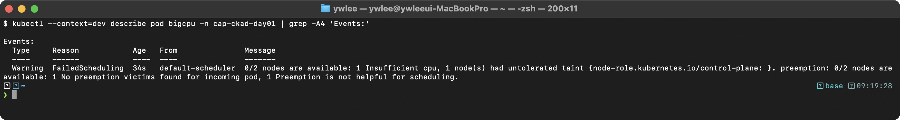

주요 원인:
- **리소스 부족**: requests.cpu/memory가 가용 노드 용량을 초과한다. `kubectl describe node`로 Allocatable과 Allocated를 비교한다.
- **nodeSelector/affinity 불일치**: 매칭되는 노드가 없다.
- **PVC 바인딩 실패**: PVC가 Pending 상태이면 Pod도 Pending이 된다. `kubectl get pvc`로 확인한다.

### 3.2 Pod가 CrashLoopBackOff 상태인 경우

**증상:** Pod가 반복적으로 시작과 종료를 반복한다.

**CrashLoopBackOff 발생 원리:**
kubelet은 컨테이너가 종료되면 즉시 재시작하지 않고 **지수 백오프(exponential backoff)** 를 적용한다. 첫 번째 재시작은 10초 대기, 두 번째는 20초, 세 번째는 40초, ... 최대 300초(5분)까지 늘어난다. 이 대기 상태가 외부에서 `CrashLoopBackOff`로 보인다. 컨테이너가 10분 이상 정상 상태를 유지하면 백오프 카운터가 초기화된다. `kubectl get pod`의 `RESTARTS` 열 숫자가 높을수록 이미 여러 번 백오프를 겪었다는 의미다.

```bash
# 로그 확인 (이전 크래시 포함)
kubectl logs <pod-name> --previous

# 컨테이너 종료 사유 확인
kubectl get pod <pod-name> -o jsonpath='{.status.containerStatuses[0].lastState.terminated}'
```

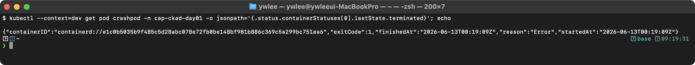

주요 원인:
- **잘못된 command/args**: ENTRYPOINT 또는 CMD가 즉시 종료되는 명령이다.
- **환경 변수 누락**: 앱이 필수 환경 변수를 찾지 못하고 종료한다.
- **OOMKilled**: limits.memory를 초과하여 커널이 프로세스를 종료한다. `reason` 필드에 "OOMKilled"가 표시된다.

### 3.3 이미지 Pull 실패

```bash
kubectl describe pod <pod-name> | grep -A5 "Events:"
```

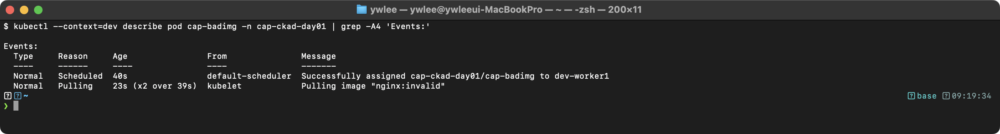

원인: 이미지 태그 오타, 프라이빗 레지스트리 인증 미설정(imagePullSecrets 누락), 네트워크 문제 등이다.

---

## 4. 복습 체크리스트

- [ ] Pod YAML의 `apiVersion`, `kind`, `metadata`, `spec` 각 필드를 설명할 수 있다
- [ ] 멀티스테이지 빌드에서 `COPY --from=builder`의 역할을 설명할 수 있다
- [ ] .dockerignore에 포함해야 하는 대표적인 항목을 나열할 수 있다
- [ ] Pod 생성 흐름(API Server -> Scheduler -> Kubelet -> Container Runtime)을 설명할 수 있다

---

## 5. tart-infra 실습

### 사전 준비 (전제 조건)

아래 실습은 이 저장소의 `dev` 클러스터가 가동 중이고, `demo` 네임스페이스에 nginx Deployment가 배포돼 있다고 전제한다. 다른 환경에서 따라 한다면 자신의 kubeconfig 경로로 바꾼다. 절차는 다음과 같다.

```bash
# 1. dev 클러스터 가동 + 재부팅 후 IP 드리프트 복구 (저장소 루트에서)
./scripts/boot.sh
./scripts/fix-cluster-ip-drift.sh dev

# 2. kubeconfig 지정 (이 저장소 기준 경로. 본인 환경이면 자신의 경로로 교체)
export KUBECONFIG=~/sideproejct/IaC_apple_sillicon/kubeconfig/dev.yaml
kubectl get nodes   # 전 노드 Ready 확인

# 3. demo 네임스페이스가 없으면 생성하고 nginx 배포
kubectl get namespace demo || kubectl create namespace demo
kubectl create deployment nginx --image=nginx:1.25 -n demo
kubectl expose deployment nginx --type=NodePort --port=80 -n demo
```

노드 SSH가 필요한 경우(예: 노드 내부 확인) `ssh dev-master`, `ssh dev-worker1` 별칭으로 비밀번호 없이 접속된다.

### 실습 환경 설정

```bash
export KUBECONFIG=~/sideproejct/IaC_apple_sillicon/kubeconfig/dev.yaml
kubectl get nodes
```

검증:
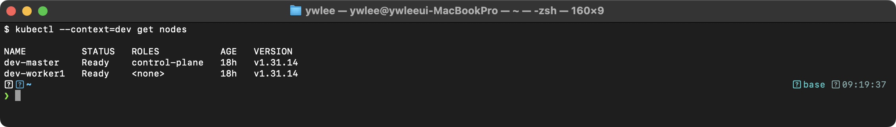

```bash
kubectl get pods -n demo
```

검증:
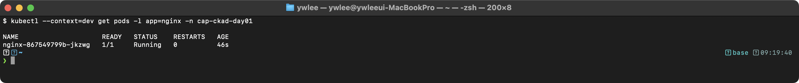

### 실습 1: dev 클러스터의 Pod 구조 분석

dev 클러스터에서 실행 중인 nginx Pod의 YAML을 분석한다.

```bash
# nginx Pod 확인
kubectl get pods -n demo -l app=nginx
```

검증:


```bash
# Pod YAML 상세 조회
kubectl get pod -n demo -l app=nginx -o yaml | head -60
```

**동작 원리:** `kubectl get pod -o yaml`로 출력되는 YAML에는 사용자가 작성한 spec 외에 kubelet이 채운 status 필드, scheduler가 채운 nodeName, 그리고 API Server가 추가한 metadata(uid, creationTimestamp, resourceVersion)가 포함된다. 이 필드들을 구분할 수 있어야 한다.

### 실습 2: Pod 생성과 리소스 명세 작성

demo 네임스페이스에 테스트 Pod를 생성하고 삭제한다.

```bash
# dry-run으로 YAML 생성
kubectl run ckad-test --image=nginx:1.25 --port=80 \
  -n demo --dry-run=client -o yaml

# 실제 생성
kubectl run ckad-test --image=nginx:1.25 --port=80 -n demo
```

검증:
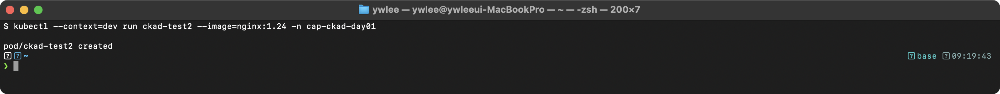

```bash
# 상태 확인
kubectl get pod ckad-test -n demo -o wide
```

검증:
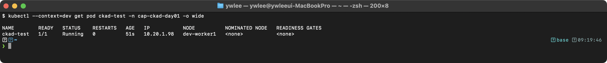

```bash
# Pod 내부 접속 테스트
kubectl exec ckad-test -n demo -- curl -s localhost:80 | head -5
```

검증:
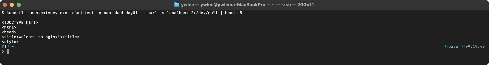

```bash
# 정리
kubectl delete pod ckad-test -n demo
```

검증:
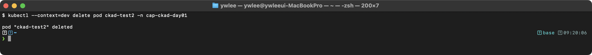

**동작 원리:** `kubectl run`은 내부적으로 Pod 매니페스트를 생성하여 API Server에 POST 요청을 보낸다. `--dry-run=client`는 API Server에 요청을 보내지 않고 클라이언트 측에서 YAML만 생성한다. CKAD 시험에서 YAML을 빠르게 생성하는 핵심 기법이다.

### 실습 3: 기존 서비스의 Pod-Service 연결 확인

```bash
# demo 네임스페이스의 Service와 Endpoints 확인
kubectl get svc -n demo
```

검증:
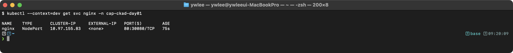

```bash
kubectl get endpoints -n demo
```

검증:
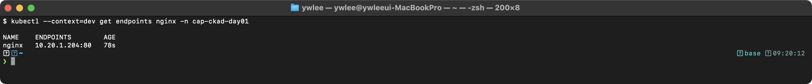

```bash
# nginx 서비스의 NodePort로 외부 접근 테스트
curl -s http://localhost:30080 | head -5
```

검증:
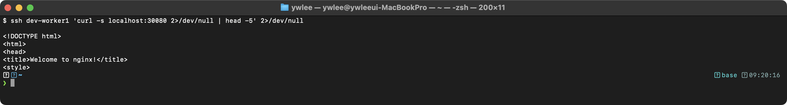

**동작 원리:** Service는 label selector로 Pod를 선택하고, Endpoints 컨트롤러가 매칭되는 Pod IP를 Endpoints 리소스에 등록한다. NodePort(30080)는 모든 노드에서 해당 포트로 들어오는 트래픽을 Service로 전달한다. Endpoints가 비어있으면 selector에 매칭되는 Pod가 없거나, Pod가 Ready 상태가 아닌 것이다.

---

## 자가점검

스스로 답을 떠올려 본 뒤 펼쳐 확인한다.

<details>
<summary>Q1. pause 컨테이너(infra container)가 존재하는 이유는 무엇인가?</summary>

앱 컨테이너가 크래시로 재시작될 때마다 Network Namespace가 새로 만들어지면 Pod IP가 바뀐다. pause 컨테이너는 Network Namespace를 소유하는 역할을 전담해 Pod 수명 내내 Namespace를 보유한다. 앱 컨테이너는 이 Namespace에 합류(join)하기 때문에, 앱 컨테이너가 몇 번을 재시작해도 Pod IP는 변하지 않는다.
</details>

<details>
<summary>Q2. limits.memory를 초과했을 때 발생하는 현상과 그 원인을 설명하라.</summary>

커널 OOM killer가 해당 컨테이너의 프로세스를 강제 종료한다(상태: OOMKilled). CPU 초과 시 쓰로틀링(느려짐)으로 처리하는 것과 달리, 메모리는 "빌려 쓰기"가 불가능하므로 커널이 프로세스를 죽이는 방식으로 강제한다. `kubectl get pod -o yaml`의 `status.containerStatuses[*].lastState.terminated.reason` 필드에 "OOMKilled"가 표시된다.
</details>

<details>
<summary>Q3. Dockerfile에서 COPY --from=builder가 하는 일을 설명하라.</summary>

단일 Dockerfile 내 이전 스테이지(여기서는 "builder"라는 이름의 FROM 블록)의 파일시스템에서 지정한 경로의 파일을 현재 스테이지로 복사한다. builder 스테이지 전체 레이어(컴파일러, SDK, 중간 산출물 포함)는 최종 이미지에 포함되지 않고, 복사한 파일만 현재 스테이지의 레이어에 추가된다.
</details>

<details>
<summary>Q4. CrashLoopBackOff 상태에서 지수 백오프(exponential backoff)의 대기 간격을 순서대로 나열하라.</summary>

10초 → 20초 → 40초 → 80초 → 160초 → 300초(최대). 컨테이너가 10분 이상 정상 상태를 유지하면 백오프 카운터가 초기화된다. `kubectl get pod`의 RESTARTS 숫자가 높을수록 이미 여러 번 백오프를 겪은 것이다.
</details>

<details>
<summary>Q5. kubectl apply -f pod.yaml 실행 시 내부적으로 컴포넌트가 처리하는 순서를 설명하라.</summary>

① 사용자 → API Server: 요청 수신, 유효성 검사, etcd 저장.
② API Server → Scheduler: 새 Pod를 감지한 Scheduler가 requests, nodeSelector, affinity 등을 고려해 배치 노드를 결정하고, Pod의 nodeName 필드를 갱신.
③ API Server → Kubelet: 해당 노드의 kubelet이 자신에게 배정된 Pod를 감지하고 container runtime에 생성 지시.
④ Container Runtime: pause 컨테이너 생성(Network Namespace 확보) → CNI 플러그인이 Pod IP 할당 → 앱 컨테이너 생성.
⑤ Kubelet: Pod 상태를 주기적으로 API Server에 보고, Probe 검사, 재시작 관리.
</details>

<details>
<summary>Q6. Go 바이너리 빌드 시 CGO_ENABLED=0이 필요한 이유는 무엇인가?</summary>

CGO_ENABLED=1(기본값)로 빌드하면 바이너리가 glibc에 동적 링크된다. alpine 이미지는 glibc 대신 musl libc를 사용하며 두 라이브러리는 ABI 호환이 안 된다. alpine 컨테이너에서 glibc에 동적 링크된 바이너리를 실행하면 세그폴트가 발생한다. CGO_ENABLED=0으로 빌드하면 외부 C 라이브러리 의존성 없이 모든 코드가 바이너리 한 파일에 포함된 정적 바이너리가 생성되어 musl libc 환경에서도 실행 가능하다.
</details>

<details>
<summary>Q7. requests와 limits의 차이를 스케줄링과 런타임 강제 관점에서 설명하라.</summary>

requests는 스케줄링 단계에서만 사용된다. Scheduler가 노드의 사용 가능 자원을 계산할 때 기준이 되며, 일단 Pod가 실행되면 커널 수준에서 강제되지 않는다. limits는 실행 중 커널(cgroup)이 강제한다. CPU 초과 시 쓰로틀링(프로세스 종료 없음), 메모리 초과 시 OOMKill(프로세스 강제 종료)이 발생한다.
</details>

---

## 시험 팁

- **alias 먼저**: 시험 시작 직후 `alias k=kubectl`, `export do='--dry-run=client -o yaml'`, `export now='--force --grace-period=0'`을 설정한다. 이 3줄이 120분을 좌우한다.
- **dry-run + redirect 패턴**: `k run mypod --image=nginx $do > pod.yaml` → `vi pod.yaml`(필드 추가) → `k apply -f pod.yaml`. 빈 YAML을 손으로 치지 않는다.
- **컨텍스트 전환 필수**: 문제마다 `kubectl config use-context <ctx>`로 클러스터를 바꾼다. 틀린 클러스터에 적용하면 0점이다.
- **네임스페이스 `-n` 항상 명시**: 문제에서 지정한 네임스페이스를 빼먹으면 오답이다. `k get pod -n <ns>`처럼 명시적으로 쓴다.
- **멀티스테이지는 이미지 크기 문제로 출제**: "이미지 크기를 줄여라" 유형 문제에서 멀티스테이지 빌드와 경량 베이스 이미지(alpine, distroless) 적용이 핵심 답안이다.
- **Pod YAML 필드 암기보다 `--dry-run=client -o yaml`**: 정확한 필드 이름을 외우기보다, `k run/create` 명령으로 뼈대 YAML을 뽑은 뒤 필요한 부분을 추가하는 게 빠르고 오타가 없다.

---

## 더 읽을거리

- [Kubernetes 공식: Pod](https://kubernetes.io/docs/concepts/workloads/pods/) — Pod 개념, 생명주기, pause 컨테이너 동작.
- [Kubernetes 공식: 컨테이너 리소스 관리](https://kubernetes.io/docs/concepts/configuration/manage-resources-containers/) — requests/limits/QoS 클래스(Guaranteed·Burstable·BestEffort) 상세.
- [Docker 공식: 멀티스테이지 빌드](https://docs.docker.com/build/building/multi-stage/) — `COPY --from`, BuildKit 병렬 빌드, 특정 스테이지만 빌드하는 `--target` 옵션.
- [Google distroless 이미지](https://github.com/GoogleContainerTools/distroless) — 셸 없는 최소 런타임 이미지의 구성과 디버깅 방법(`-debug` 태그 활용).
- [CKA/CKAD 시험 환경 설명](https://docs.linuxfoundation.org/tc-docs/certification/tips-cka-and-ckad) — 공식 허용 북마크, 터미널 환경, alias 설정 가이드.
