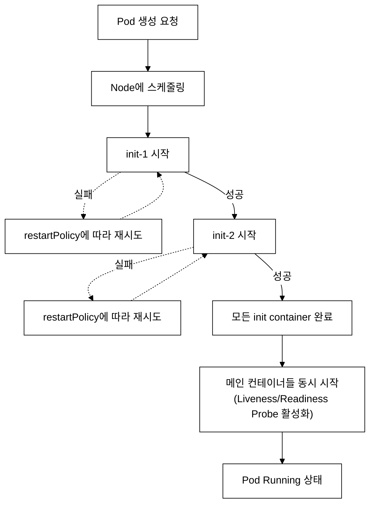
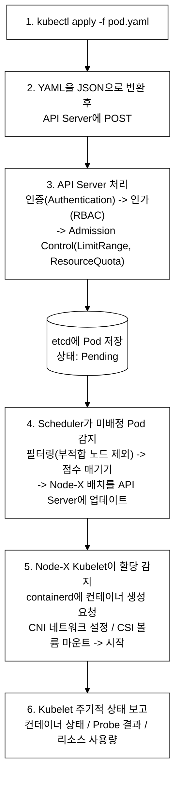
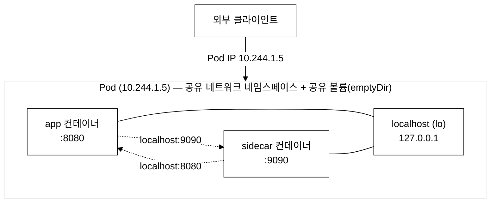
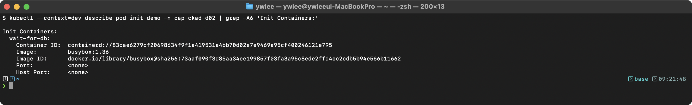
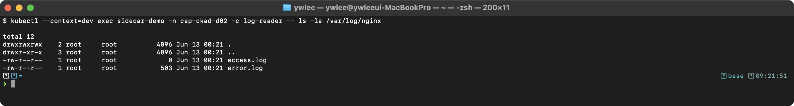
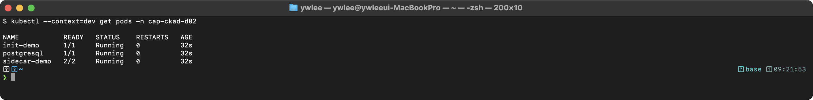
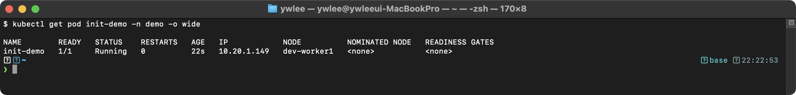
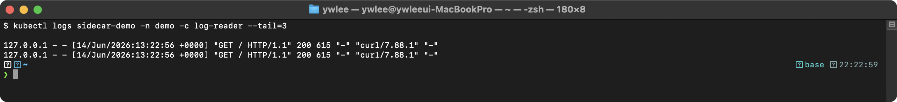
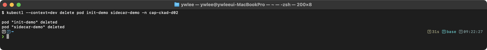

# CKAD Day 2: Init Container와 Multi-container Pod 패턴

> CKAD 도메인: Application Design and Build (20%) - Part 1b | 예상 소요 시간: 1시간

Day 1에서 단일 컨테이너 Pod와 Dockerfile 멀티스테이지 빌드를 다뤘다. Day 2는 Pod 내부 구조를 심화하여 Init Container와 멀티컨테이너 패턴(Sidecar·Ambassador·Adapter)을 다룬다.

> **Day 1 선행 지식**: `spec.containers[]` 기본 구조(name·image·command·ports·resources·volumeMounts 필드), `kubectl run` 으로 Pod를 생성하는 명령형 패턴, image pull 동작(imagePullPolicy·registry 조회·containerd 레이어 캐시). 이 개념이 익숙하지 않으면 [day01.md](day01.md) 를 먼저 읽는다.

---

## 오늘의 학습 목표

- [ ] Init Container의 동작 원리와 주요 용도를 숙지한다
- [ ] Multi-container Pod 패턴(Sidecar, Ambassador, Adapter)을 구분한다
- [ ] Pod 생성 흐름과 Multi-container 내부 네트워크를 이해한다
- [ ] 시험 출제 패턴을 파악한다

---

## 1. Init Container (초기화 컨테이너)

### 1.1 Init Container란?

**등장 배경:**
컨테이너화된 앱을 배포할 때, 앱 시작 전에 DB가 준비되어 있는지, 설정 파일이 존재하는지 등 사전 조건을 확인해야 하는 경우가 빈번하다. 이전에는 이런 초기화 로직을 Dockerfile의 `RUN` 명령이나 컨테이너 시작 시 호출되는 entrypoint 스크립트(컨테이너가 켜질 때 가장 먼저 실행되는 스크립트)에 섞어 넣어 처리했다. 그러나 이 방식은 앱 컨테이너가 재시작될 때마다 불필요한 초기화가 매번 반복되고, 초기화가 끝나기 전까지 앱 컨테이너 자체가 떠 있어야 하므로 단계 분리가 어렵다. 또한 이를 앱 컨테이너 내부에 넣으면 앱 이미지가 비대해지고, 초기화 로직과 비즈니스 로직이 결합된다. Init Container는 이 문제를 해결하기 위해 초기화 전용 컨테이너를 분리한 것이다. 초기화와 실행을 서로 다른 이미지, 서로 다른 보안 컨텍스트로 수행할 수 있다.

**공학적 정의:**
Init Container는 Pod spec의 initContainers 필드에 정의되며, 메인 컨테이너(containers 필드) 실행 이전에 순차적으로(sequentially) 실행되는 초기화 전용 컨테이너이다. 각 Init Container는 exit code 0으로 종료되어야 다음 Init Container가 실행되며, 하나라도 실패하면 kubelet은 restartPolicy에 따라 Pod를 재시작한다. 주요 용도는 외부 의존성 대기(DNS 조회, TCP 연결 확인), 설정 파일 사전 생성, DB 스키마 마이그레이션 등 선행 조건 충족이다.

**내부 동작 원리 심화:**
kubelet은 initContainers 배열의 인덱스 순서대로 컨테이너를 실행한다. 각 init container는 독립된 cgroup에서 실행되며, exit code 0으로 종료되면 kubelet이 해당 컨테이너를 정리하고 다음 init container를 시작한다. init container의 resources(requests/limits)는 메인 컨테이너와 별도로 계산되며, Pod의 effective request는 init container와 메인 컨테이너의 max 값이 된다. 이는 init container가 일시적으로 더 많은 리소스를 필요로 할 수 있기 때문이다.

**특징:**
- 모든 init container가 성공적으로 완료되어야 메인 컨테이너가 시작된다
- 여러 init container가 있으면 정의된 순서대로 **하나씩** 실행된다 (동시 실행 불가)
- init container가 실패하면 Pod의 `restartPolicy`에 따라 재시도한다
- init container는 `spec.initContainers` 배열에 정의한다

**트레이드오프:**
- **리소스 계산 방식**: Pod의 effective resource request는 `max(init container 최대값, 메인 컨테이너 합산값)`으로 계산된다(§1.1 심화 참조). init container가 일시적으로 대용량 메모리를 요구하면(예: DB 마이그레이션), 메인 컨테이너 실행 중에는 그 메모리가 필요 없더라도 스케줄러는 그 크기의 노드 자원을 예약한다. 실제 사용량보다 많은 자원을 잡아두는 오버프로비저닝이 발생할 수 있다. 예를 들어 init container가 `memory: 512Mi`, 메인 컨테이너 두 개의 합산이 `256Mi`이면 Pod effective request는 `max(512Mi, 256Mi) = 512Mi`가 된다. 메인 컨테이너가 실제로 256Mi만 쓰더라도 스케줄러는 512Mi를 예약해 놓는다.
- **실패 시 전체 Pod 재시작**: init container 하나가 반복 실패하면 Pod 전체가 `Init:CrashLoopBackOff` 상태로 머문다. 외부 서비스(DB, 메시지 큐)가 아예 없는 환경이라면 Init Container는 영원히 성공하지 못하고 리소스를 낭비한다. 외부 의존성이 확실히 존재하는지 사전 확인이 필요하다.
- **restartPolicy 선택의 영향**: `restartPolicy: Never`인 Pod에서 init container가 실패하면 kubelet은 재시도하지 않고 Pod가 `Failed`로 종료된다. Job/CronJob에서 Init Container를 쓸 때 이 점을 반드시 고려해야 한다.

### 1.2 Init Container 실행 순서 흐름도

초기화 단계들이 동시 실행이 아니라 순차적으로 실행되는 이유는, 뒤 단계가 앞 단계의 결과에 의존할 수 있기 때문이다. 예를 들어 두 번째 init이 첫 번째 init의 DB 연결 확인 결과에 기대고, DB 스키마 마이그레이션은 DB 준비 완료가 확인된 뒤에야 실행되어야 한다. 순서를 보장하면 이런 의존성을 단순한 인덱스 순서로 해결할 수 있다.


_그림 1. Init Container 순차 실행과 메인 컨테이너 기동 흐름._

### 1.3 Init Container YAML 상세

```yaml
apiVersion: v1
kind: Pod
metadata:
  name: init-demo
  namespace: demo
  labels:
    app: init-demo            # Service가 이 Pod를 찾을 때 사용하는 레이블
spec:
  initContainers:             # 초기화 컨테이너 목록 (순서대로 실행)
    - name: wait-for-db       # 첫 번째 init container: DB 대기
      image: busybox:1.36     # 경량 유틸리티 이미지
      command:                # 실행할 명령어 배열
        - sh                  # 셸 실행
        - -c                  # 다음 문자열을 명령으로 실행
        - |                   # 여러 줄 명령 (YAML 리터럴 블록)
          echo "Waiting for postgres to be ready..."
          until nslookup postgres.demo.svc.cluster.local; do
            # nslookup: DNS 조회 명령
            # postgres.demo.svc.cluster.local: Service의 FQDN
            #   형식: <서비스명>.<네임스페이스>.svc.cluster.local
            #   K8s CoreDNS가 Service 생성 시 이 이름으로 A 레코드를 자동 등록한다.
            #   같은 네임스페이스 내에서는 서비스명(postgres)만으로도 조회되지만,
            #   Init Container처럼 다른 네임스페이스에서 접근할 경우 FQDN이 필요하다.
            # until: 명령이 성공할 때까지 반복
            echo "postgres is not available yet - sleeping 2s"
            sleep 2
          done
          echo "postgres is available!"
      # init container에는 Probe를 설정하지 않음
      # 명령이 종료 코드 0으로 끝나면 성공

    - name: init-config       # 두 번째 init container: 설정 파일 생성
      image: busybox:1.36
      command:
        - sh
        - -c
        - |
          # JSON 설정 파일 생성
          # << 'CONF' ... CONF 는 heredoc(히어독) 문법이다.
          # heredoc: 여러 줄 문자열을 파일로 리다이렉트하는 쉘 문법.
          # 'CONF'처럼 구분자를 작은따옴표로 감싸면 $변수 치환 없이 그대로 파일에 기록된다.
          cat > /config/app.json << 'CONF'
          {
            "db_host": "postgres.demo.svc.cluster.local",
            "db_port": 5432,
            "log_level": "info"
          }
          CONF
          echo "Config file created at /config/app.json"
      volumeMounts:           # 볼륨 마운트: 이 컨테이너에서 볼륨을 사용
        - name: config-vol    # volumes에 정의된 볼륨 이름 참조
          mountPath: /config  # 컨테이너 내 마운트 경로

  containers:                 # 메인 컨테이너 (init 완료 후 시작)
    - name: app
      image: nginx:1.25
      ports:
        - containerPort: 80
      volumeMounts:
        - name: config-vol
          mountPath: /etc/app # 같은 볼륨을 다른 경로에 마운트 가능
          readOnly: true      # 읽기 전용으로 마운트

  volumes:                    # Pod 수준 볼륨 정의
    - name: config-vol        # 볼륨 이름 (initContainers, containers에서 참조)
      emptyDir: {}            # 빈 디렉토리 볼륨 (Pod 생명주기와 동일)
```

### 1.4 Init Container 주요 용도별 예제

**예제 1: Git 저장소에서 코드 클론**

```yaml
apiVersion: v1
kind: Pod
metadata:
  name: git-sync-init
spec:
  initContainers:
    - name: git-clone
      image: alpine/git:latest
      command:
        - git
        - clone
        - "https://github.com/example/webapp.git"
        - /app/source
      volumeMounts:
        - name: app-source
          mountPath: /app/source
  containers:
    - name: web
      image: nginx:1.25
      volumeMounts:
        - name: app-source
          mountPath: /usr/share/nginx/html
          readOnly: true
  volumes:
    - name: app-source
      emptyDir: {}
```

**예제 2: 데이터베이스 스키마 마이그레이션**

```yaml
apiVersion: v1
kind: Pod
metadata:
  name: migration-pod
spec:
  initContainers:
    - name: db-migrate
      image: myapp:latest
      command: ["python", "manage.py", "migrate"]
      env:
        - name: DATABASE_URL
          valueFrom:
            secretKeyRef:
              name: db-secret
              key: url
  containers:
    - name: app
      image: myapp:latest
      command: ["python", "manage.py", "runserver", "0.0.0.0:8000"]
      env:
        - name: DATABASE_URL
          valueFrom:
            secretKeyRef:
              name: db-secret
              key: url
```

**예제 3: 파일 권한 설정**

```yaml
apiVersion: v1
kind: Pod
metadata:
  name: permission-init
spec:
  initContainers:
    - name: fix-permissions
      image: busybox:1.36
      command: ["sh", "-c", "chmod -R 777 /data && chown -R 1000:1000 /data"]
      volumeMounts:
        - name: data-vol
          mountPath: /data
      securityContext:
        runAsUser: 0          # root로 실행해서 권한 변경
  containers:
    - name: app
      image: nginx:1.25
      securityContext:
        runAsUser: 1000       # 비루트로 실행
      volumeMounts:
        - name: data-vol
          mountPath: /data
  volumes:
    - name: data-vol
      emptyDir: {}
```

---

## 2. Multi-container Pod 패턴

### 2.1 패턴 개요

**등장 배경:**
모놀리식 컨테이너에 로깅, 프록시, 모니터링 등 부가 기능을 모두 넣으면 이미지가 비대해지고, 부가 기능 업데이트 시 앱 전체를 재빌드해야 한다. 또한 팀 간 책임 분리가 어렵다. 멀티컨테이너 패턴은 마이크로서비스 원칙을 Pod 내부에도 적용하여, 각 컨테이너가 하나의 역할만 담당하도록 분리한다.

**공학적 정의:**
멀티컨테이너 Pod 패턴은 동일 Pod 내에서 역할을 분리하여 단일 책임 원칙(SRP, Single Responsibility Principle — 각 컴포넌트가 하나의 기능만 담당하도록 설계하는 소프트웨어 설계 원칙)을 적용하는 분산 시스템 설계 패턴이다.
- **Sidecar(사이드카)**: 메인 컨테이너와 동일한 생명주기를 가지며, 로그 수집(Fluentd/Filebeat), 프록시(Envoy), 설정 동기화 등 보조 기능을 수행한다. 주로 emptyDir 볼륨(Pod 생명주기와 동일하게 살고 죽는 임시 공유 스토리지)을 통해 메인 컨테이너와 데이터를 공유한다. 다만 emptyDir이 유일한 선택지는 아니다. 컨테이너가 종료돼도 데이터가 남아야 하면 PVC(PersistentVolumeClaim, 영구 스토리지)나 hostPath(노드의 실제 디렉터리)도 같은 방식으로 여러 컨테이너가 마운트해 공유할 수 있다.
- **Ambassador(앰버서더)**: 메인 컨테이너의 외부 통신을 프록시하는 패턴이다. 메인 컨테이너는 localhost로만 통신하고, Ambassador 컨테이너가 서비스 디스커버리, 연결 풀링, 프로토콜 변환 등을 처리한다.
- **Adapter(어댑터)**: 메인 컨테이너의 출력 데이터를 표준화된 형식으로 변환하는 패턴이다. 이기종 시스템의 메트릭/로그를 Prometheus exposition format 등 통일된 인터페이스로 변환한다.

**트레이드오프:**
멀티컨테이너 Pod는 편의성 뒤에 구체적인 비용이 따른다.
- **장애 전파**: Pod 내 한 컨테이너가 OOM(Out of Memory)으로 종료되면 kubelet은 restartPolicy에 따라 **Pod 전체**를 재시작한다. 즉 정상 작동 중인 다른 컨테이너도 강제 중단된다.
- **emptyDir 데이터 소실**: 컨테이너 간 데이터 공유에 가장 많이 쓰이는 emptyDir 볼륨은 Pod가 삭제·재시작되면 **내용이 사라진다**. 로그·체크포인트 데이터를 영속 보관해야 한다면 PVC로 교체해야 한다.
- **포트 충돌 위험**: 네트워크 네임스페이스를 공유하므로 두 컨테이너가 동일 포트를 listen하면 두 번째 컨테이너가 `address already in use`로 시작 실패한다. 각 컨테이너의 `containerPort` 목록을 명시적으로 관리해야 한다.
- **디버깅 복잡도 증가**: `kubectl logs <pod>`는 여러 컨테이너 중 하나만 출력한다. `-c <container>` 플래그를 매번 지정해야 하며, 컨테이너 간 타이밍 의존 버그는 개별 로그만으로 추적하기 어렵다.

**공유 리소스:**
- 네트워크: 동일 Pod 내 컨테이너는 Linux 네트워크 네임스페이스(프로세스·네트워크 인터페이스·라우팅 테이블·방화벽 규칙을 프로세스 그룹별로 격리하는 OS 커널 메커니즘)를 공유한다. 따라서 같은 Pod IP와 같은 포트 번호 공간을 보며, 컨테이너끼리 `localhost`로 상호 통신 가능. 같은 포트 공간을 공유하므로 한 Pod 내 두 컨테이너가 같은 포트 번호를 동시에 listen 할 수는 없다.
- 볼륨: `volumes`에 정의한 볼륨을 여러 컨테이너가 마운트하여 데이터 공유
- 프로세스 네임스페이스: `shareProcessNamespace: true` 설정 시 프로세스 목록 공유

### 2.2 Sidecar 패턴 - 로그 수집

동일 Pod 내 두 컨테이너가 같은 볼륨명을 각자의 `mountPath`로 지정하면, kubelet은 두 컨테이너의 `/var/log`를 호스트의 동일한 물리 디렉터리에 bind mount(호스트의 한 디렉터리를 컨테이너 안 경로에 그대로 끼워 넣는 마운트)한다. 결과적으로 app 컨테이너가 `/var/log/app.log`에 쓴 내용은 같은 물리 파일이므로, log-collector 컨테이너가 `tail -f`로 즉시 같은 내용을 읽는다. 파일을 복사하거나 네트워크로 전송하는 것이 아니라 동일 파일을 양쪽이 보는 구조다.

```yaml
apiVersion: v1
kind: Pod
metadata:
  name: sidecar-logging
  labels:
    app: sidecar-logging
    pattern: sidecar         # 패턴을 명시하는 레이블 (운영 편의)
spec:
  containers:
    # --- 메인 컨테이너: 애플리케이션 ---
    - name: app
      image: busybox:1.36
      command:
        - sh
        - -c
        - |
          # 메인 앱이 파일에 로그를 기록
          i=0
          while true; do
            echo "$(date '+%Y-%m-%d %H:%M:%S') [INFO] Request $i processed" >> /var/log/app.log
            i=$((i+1))
            sleep 3
          done
      volumeMounts:
        - name: log-vol          # 로그 볼륨 마운트
          mountPath: /var/log    # 로그 파일 저장 경로

    # --- 사이드카 컨테이너: 로그 수집기 ---
    - name: log-collector
      image: busybox:1.36
      command: ["sh", "-c", "tail -f /var/log/app.log"]
      # tail -f: 파일 끝에서 실시간으로 새 내용을 읽어 stdout으로 출력
      # kubectl logs <pod> -c log-collector 로 로그 확인 가능
      volumeMounts:
        - name: log-vol
          mountPath: /var/log
          readOnly: true         # 사이드카는 읽기만 함 (쓰기 불필요)

  volumes:
    - name: log-vol
      emptyDir: {}               # Pod와 생명주기를 같이 하는 임시 볼륨
```

### 2.3 Sidecar 패턴 - Git Sync

아래 `GITSYNC_*` 환경 변수는 쿠버네티스 표준 필드가 아니라 `registry.k8s.io/git-sync` 이미지가 자체적으로 정의한 설정값이다. 즉 사용자가 새로 만드는 변수가 아니라, git-sync 컨테이너가 시작 시 읽도록 약속된 변수에 Pod 매니페스트의 `env`로 값을 주입하는 것이다. `GITSYNC_REPO`(클론할 저장소 URL), `GITSYNC_ROOT`(컨테이너 내 작업 루트 경로), `GITSYNC_DEST`(루트 아래 체크아웃 결과 디렉터리명), `GITSYNC_PERIOD`(동기화 주기)를 git-sync가 해석해 주기적으로 `git pull`을 수행한다.

```yaml
apiVersion: v1
kind: Pod
metadata:
  name: git-sync-sidecar
spec:
  containers:
    - name: web
      image: nginx:1.25
      volumeMounts:
        - name: web-content
          mountPath: /usr/share/nginx/html
          readOnly: true
    - name: git-sync
      image: registry.k8s.io/git-sync/git-sync:v4.0.0
      env:
        - name: GITSYNC_REPO
          value: "https://github.com/example/static-site.git"
        - name: GITSYNC_ROOT
          value: "/tmp/git"
        - name: GITSYNC_DEST
          value: "html"
        - name: GITSYNC_PERIOD
          value: "30s"            # 30초마다 git pull
      volumeMounts:
        - name: web-content
          mountPath: /tmp/git
  volumes:
    - name: web-content
      emptyDir: {}
```

### 2.4 Ambassador 패턴 - DB 프록시

**등장 배경:**
Ambassador 패턴이 없던 환경에서는 앱 코드가 직접 서비스 디스커버리와 연결 관리를 담당해야 했다. 예를 들어 Redis에 접속하는 앱은 환경마다 다른 Redis 호스트 주소를 코드 또는 설정 파일에 하드코딩하거나, 환경 변수로 주입받아 분기 처리해야 했다. 연결이 끊겼을 때 재시도 로직, 커넥션 풀 관리, 읽기/쓰기 라우팅 분리 등 인프라 관심사가 앱 비즈니스 로직과 뒤섞였다. 이 상태에서 Redis를 Redis Cluster로 교체하거나 Sentinel 구성을 추가하면 앱 코드를 수정하고 재빌드해야 했다. Ambassador 패턴은 이 문제를 컨테이너 분리로 해결한다. 메인 컨테이너는 항상 `localhost:<고정포트>`만 바라보고, Ambassador 컨테이너가 실제 대상 서비스 주소 변환·재시도·풀링을 전담한다. 인프라 토폴로지가 바뀌어도 앱 코드는 변경 없이 Ambassador 컨테이너 설정만 교체한다.

아래 예제는 HAProxy(고성능 TCP/HTTP 로드 밸런서 및 프록시 소프트웨어)를 Ambassador로 사용한다. `haproxy:2.9` 이미지는 `/usr/local/etc/haproxy/haproxy.cfg` 파일에서 프록시 규칙을 읽는다. 이 예제에서는 `redis-proxy-config`라는 ConfigMap이 사전에 존재해야 하며, 실제 운영에서는 `frontend localhost:6379` → `backend real-redis-host:6379` 형태의 HAProxy 설정을 담아야 한다. 개념 학습 목적이라면 HAProxy 설정의 상세는 고급 주제이므로, Ambassador 패턴의 핵심인 **메인 컨테이너가 localhost만 알면 된다**는 추상화 원칙에 집중하는 것으로 충분하다.

```yaml
apiVersion: v1
kind: Pod
metadata:
  name: ambassador-demo
spec:
  containers:
    # 메인 앱: localhost:6379로 요청
    - name: app
      image: myapp:latest
      env:
        - name: REDIS_HOST
          value: "localhost"       # ambassador를 통해 접근
        - name: REDIS_PORT
          value: "6379"

    # Ambassador: Redis 프록시
    - name: redis-proxy
      image: haproxy:2.9
      ports:
        - containerPort: 6379
      volumeMounts:
        - name: haproxy-config
          mountPath: /usr/local/etc/haproxy
  volumes:
    - name: haproxy-config
      configMap:
        name: redis-proxy-config
```

### 2.5 Adapter 패턴 - 로그 형식 변환

```yaml
apiVersion: v1
kind: Pod
metadata:
  name: adapter-demo
  labels:
    app: adapter-demo
spec:
  containers:
    # 메인 앱: 자체 형식으로 로그 생성
    - name: app
      image: busybox:1.36
      command:
        - sh
        - -c
        - |
          while true; do
            echo "$(date +%s) ERROR connection timeout to redis" >> /var/log/app.log
            sleep 5
            echo "$(date +%s) INFO request processed successfully" >> /var/log/app.log
            sleep 5
          done
      volumeMounts:
        - name: log-vol
          mountPath: /var/log

    # Adapter: 로그를 JSON 형식으로 변환
    - name: log-adapter
      image: busybox:1.36
      command:
        - sh
        - -c
        - |
          tail -f /var/log/app.log | while read line; do
            timestamp=$(echo "$line" | awk '{print $1}')
            level=$(echo "$line" | awk '{print $2}')
            message=$(echo "$line" | cut -d' ' -f3-)
            echo "{\"timestamp\": $timestamp, \"level\": \"$level\", \"message\": \"$message\"}"
          done
      volumeMounts:
        - name: log-vol
          mountPath: /var/log
          readOnly: true

  volumes:
    - name: log-vol
      emptyDir: {}
```

---

## 3. 쿠버네티스 내부 동작 원리

### 3.1 Pod 생성 흐름 상세


_그림 2. kubectl apply부터 컨테이너 기동까지의 Pod 생성 흐름._

**Admission Control 단계 상세:**
그림의 3단계 중 Admission Control은 API Server가 요청을 etcd에 저장하기 직전에 실행하는 플러그인 체인이다. 이 단계에서 대표적으로 다음 조건을 검사한다.
- **LimitRange**: 네임스페이스 내 개별 Pod·컨테이너의 CPU·메모리 요청/상한의 허용 범위를 정의한다. 예를 들어 `max.cpu: 2`이면 컨테이너가 CPU limit 2 이상을 요청할 때 거부된다.
- **ResourceQuota**: 네임스페이스 전체가 사용 가능한 리소스 총량(CPU·메모리·Pod 수 등)을 제한한다. 기존 사용량과 합산하여 초과하면 Pod 생성 자체를 거부한다.
- **PodSecurityAdmission(PSA)**: 네임스페이스에 보안 정책을 강제하는 Admission 플러그인이다(CKS에서 상세 다룬다). Pod의 보안 프로필(특권 컨테이너 허용 여부, hostPID 사용 등)이 네임스페이스에 설정된 보안 정책을 위반하면 거부하거나 경고를 발생시킨다. 보안 정책 수준은 세 가지이며, CKAD 범위에서는 두 가지가 자주 등장한다: **Baseline**(기본 위험 방지 — `hostPID·hostNetwork·privileged` 등 명백히 위험한 설정만 차단하며, 대부분의 워크로드가 통과됨)과 **Restricted**(최소 권한 강제 — root 실행 금지·seccompProfile 필수·allowPrivilegeEscalation 금지 등 가장 엄격한 제약 적용). 예를 들어 네임스페이스에 `Restricted` 정책이 설정되면 `runAsNonRoot: true`와 `seccompProfile` 없이 Pod를 생성하려 할 때 거부된다.

**Scheduler 단계 상세:**
4단계의 필터링/점수 매기기는 두 단계로 동작한다. 먼저 **필터링(filtering)** 단계에서 노드 리소스 부족(`NodeResourcesFit`), taint/toleration 불일치(`TaintToleration`), affinity 조건 불충족 등으로 부적합한 노드를 후보에서 제외한다. 그런 다음 **점수 매기기(scoring)** 단계에서 남은 후보 노드에 가중치를 부여(예: 리소스 여유가 클수록 높은 점수)하여 가장 점수가 높은 노드를 선택한다.

### 3.2 Multi-container Pod 내부 네트워크


_그림 3. Multi-container Pod의 localhost 공유 네트워크 구조._

---

## 4. 트러블슈팅

### 4.1 Init Container가 완료되지 않는 경우

**증상:** Pod 상태가 `Init:0/2` 또는 `Init:CrashLoopBackOff`로 머문다.

```bash
# Init Container 로그 확인
kubectl logs <pod-name> -c <init-container-name>

# Pod 이벤트 확인
kubectl describe pod <pod-name> | grep -A20 "Init Containers:"
```

**`kubectl get pod` STATUS 열과 `kubectl describe` 구분:**
`kubectl get pod`의 STATUS 열은 Pod 전체 상태를 축약해서 보여준다. init container가 아직 완료되지 않았다면 `Init:0/1`(1개 중 0개 완료), init container가 반복 실패하면 `Init:CrashLoopBackOff`로 표시된다. 이것은 단일 문자열이며 내부 상태를 알 수 없다. 반면 `kubectl describe pod`는 각 init container의 개별 상태(`Running`, `Terminated`, `Waiting`)를 상세하게 보여준다. 즉 **Pod STATUS가 `Init:0/1`일 때, describe로 보면 해당 init container가 `Running`(조건 충족을 기다리며 계속 실행 중)인지 `Waiting`(시작 대기 중)인지 구분할 수 있다.**

검증 (대기 중인 경우 — describe 출력 예시):


주요 원인:
- **서비스 DNS 미등록**: nslookup 대상 서비스가 아직 생성되지 않았다. `kubectl get svc`로 확인한다.
- **네트워크 정책 차단**: NetworkPolicy가 init container의 아웃바운드 트래픽을 차단한다.
- **command 오류**: 셸 명령 문법 오류로 즉시 실패하고 반복 재시작한다.

### 4.2 Sidecar 컨테이너가 로그를 읽지 못하는 경우

> **Pod 이름 안내**: 이 절의 트러블슈팅 예시는 tart-infra 실습 2에서 생성한 `sidecar-demo` Pod(namespace: `demo`)를 기준으로 한다. 2.2절에서 다룬 개념 설명용 Pod는 `sidecar-logging`이라는 이름을 사용하며, 실습 Pod와는 이름이 다르다. 트러블슈팅 명령을 실행할 때는 실제로 클러스터에 존재하는 Pod 이름을 `kubectl get pods -n demo`로 확인한 뒤 사용한다.

**증상:** `kubectl logs <pod> -c log-reader`가 빈 출력이다.

```bash
# 볼륨 마운트 확인 (실습 Pod 이름: sidecar-demo, 네임스페이스: demo)
kubectl describe pod sidecar-demo -n demo | grep -A5 "Mounts:"

# 파일 존재 확인
kubectl exec sidecar-demo -n demo -c log-reader -- ls -la /var/log/nginx/
```

검증:


주요 원인:
- **mountPath 불일치**: writer와 reader의 mountPath가 다르다.
- **볼륨 이름 불일치**: volumeMounts.name이 volumes에 정의된 이름과 다르다.
- **파일 미생성**: writer 컨테이너의 command가 올바르게 로그 파일을 생성하지 않는다.

---

## 5. 시험 출제 패턴

### 5.1 이 주제가 시험에서 어떻게 나오는가

CKAD 시험에서 Application Design and Build 도메인은 전체의 **20%**를 차지한다. 다음과 같은 유형으로 출제된다:

1. **Pod 생성**: 특정 조건의 Pod를 YAML로 작성하여 생성
2. **Multi-container Pod**: Sidecar, Init Container 패턴을 정확히 구현
3. **Dockerfile**: 멀티스테이지 빌드 이해 (개념 문제)

**문제의 의도:**
- YAML 구조를 정확히 알고 있는지 (들여쓰기, 필드 위치)
- kubectl 명령어를 빠르게 사용할 수 있는지
- 리소스 간 참조 관계를 이해하는지

### 5.2 시험 팁

```bash
# Pod YAML 빠른 생성 (dry-run)
kubectl run my-pod --image=nginx:1.25 --port=80 --dry-run=client -o yaml > pod.yaml

# 필드 구조 확인
kubectl explain pod.spec.initContainers
kubectl explain pod.spec.volumes.emptyDir
```

---

## 6. 복습 체크리스트

- [ ] Init Container와 Sidecar Container의 차이를 설명할 수 있다
- [ ] Sidecar, Ambassador, Adapter 패턴을 각각 한 문장으로 설명할 수 있다
- [ ] `initContainers` 필드의 위치와 `containers` 필드와의 관계를 안다
- [ ] Pod 생성 흐름(API Server -> Scheduler -> Kubelet -> Container Runtime)을 설명할 수 있다
- [ ] Multi-container Pod 내부에서 localhost로 통신하는 원리를 안다

<details>
<summary>정답 보기</summary>

**Init Container vs Sidecar Container 차이:**
Init Container는 메인 컨테이너 시작 전에 순차 실행되고 exit 0으로 종료되어야 하는 초기화 전용 컨테이너이다. Sidecar Container는 메인 컨테이너와 동일한 생명주기로 함께 실행되며(Pod이 살아있는 동안 계속 실행), 로그 수집·프록시·설정 동기화 등 보조 역할을 담당한다. Init은 `spec.initContainers`, Sidecar는 일반 `spec.containers`에 정의한다.

**세 패턴 한 문장 정의:**
- Sidecar: 메인 컨테이너와 볼륨이나 네트워크를 공유하며, 로깅·모니터링·설정 동기화 등 보조 기능을 수행하는 동반 컨테이너이다.
- Ambassador: 메인 컨테이너가 localhost만 바라보고 외부 통신은 Ambassador 컨테이너가 프록시·서비스 디스커버리·연결 풀링을 대행하는 패턴이다.
- Adapter: 메인 컨테이너가 자체 형식으로 출력하는 로그·메트릭을 외부 시스템이 요구하는 표준 형식(예: Prometheus exposition format)으로 변환하는 컨테이너이다.

**`initContainers` vs `containers` 필드 위치:**
`spec.initContainers[]`가 `spec.containers[]` 보다 먼저 정의되며, kubelet은 initContainers 배열 인덱스 순서대로 순차 실행 후 모두 완료되면 containers를 동시에 시작한다.

**Pod 생성 흐름:**
`kubectl apply` → API Server(인증·인가·Admission Control) → etcd 저장(Pending) → Scheduler(필터링·점수 매기기·노드 배정) → 대상 노드 kubelet 감지 → containerd 컨테이너 생성 + CNI 네트워크 + CSI 볼륨 → Init Container 순차 실행 → 메인 컨테이너 기동(Running).

**localhost 통신 원리:**
같은 Pod의 모든 컨테이너는 동일한 Linux 네트워크 네임스페이스를 공유한다. 따라서 Pod에는 하나의 가상 이더넷 인터페이스(veth)와 루프백(lo)이 있고, 컨테이너 A가 listen하는 포트를 컨테이너 B가 `localhost:<포트>`로 접근하면 같은 네트워크 스택을 거쳐 통신된다. 별도 네트워크 설정 없이 컨테이너 간 통신이 가능한 이유가 여기에 있다.

</details>

---

## 7. 시험형 미니랩

CKAD 실기는 속도전이다. 아래 문제를 시간 제한 내에 alias·dry-run 없이 푸는 것을 목표로 한다.

**셋업 (시험 시작 시 항상 실행)**

```bash
alias k=kubectl
export do='--dry-run=client -o yaml'
export KUBECONFIG=kubeconfig/dev.yaml
```

---

**문제 1 — Init Container (제한 시간: 5분)**

> namespace `minilab`에 Pod `db-wait`를 생성하라.
> - Init Container: 이름 `check-db`, 이미지 `busybox:1.36`, 명령 `sh -c "until nc -z mydb.minilab.svc.cluster.local 5432; do sleep 2; done"`
> - 메인 컨테이너: 이름 `app`, 이미지 `nginx:1.25`
> - Pod가 `Init:0/1` 상태에서 `Running`으로 전환됨을 확인하라 (단, mydb 서비스가 없으면 Init Container는 대기 상태로 머문다 — 이 상태 자체가 정답 동작이다).

```bash
# 1. namespace 생성
k create namespace minilab

# 2. Pod YAML 생성 후 편집
k run db-wait --image=nginx:1.25 -n minilab $do > /tmp/db-wait.yaml
# vi /tmp/db-wait.yaml 에서 spec: 아래, containers: 위에 아래 블록을 삽입한다.
# 다음 블록을 "spec:" 바로 아래 줄에 추가하고, "containers:" 줄이 그 아래에 오도록 한다:
#
#   initContainers:
#     - name: check-db
#       image: busybox:1.36
#       command: ['sh', '-c', 'until nc -z mydb.minilab.svc.cluster.local 5432; do sleep 2; done']
#
# 삽입 후 /tmp/db-wait.yaml 의 spec 부분은 다음과 같아야 한다:
#
# spec:
#   initContainers:
#     - name: check-db
#       image: busybox:1.36
#       command: ['sh', '-c', 'until nc -z mydb.minilab.svc.cluster.local 5432; do sleep 2; done']
#   containers:
#     - name: db-wait
#       image: nginx:1.25

# 3. 적용 및 상태 확인
k apply -f /tmp/db-wait.yaml
k get pod db-wait -n minilab -w
```

**문제 2 — Sidecar 패턴 (제한 시간: 5분)**

> namespace `minilab`에 Pod `log-sidecar`를 생성하라.
> - 메인 컨테이너: 이름 `writer`, 이미지 `busybox:1.36`, 명령 `sh -c "while true; do date >> /shared/out.log; sleep 3; done"`
> - Sidecar 컨테이너: 이름 `reader`, 이미지 `busybox:1.36`, 명령 `sh -c "tail -f /shared/out.log"`
> - 두 컨테이너는 `emptyDir` 볼륨 `shared-log`를 `/shared`에 마운트한다.
> - `k logs log-sidecar -n minilab -c reader`로 날짜 출력이 실시간으로 나오는지 확인하라.

```bash
k run log-sidecar --image=busybox:1.36 -n minilab $do > /tmp/log-sidecar.yaml
# vi /tmp/log-sidecar.yaml 에서 두 번째 컨테이너와 volumes 블록을 추가한다
k apply -f /tmp/log-sidecar.yaml
k logs log-sidecar -n minilab -c reader
```

<details>
<summary>문제 2 완성 YAML 보기</summary>

`k run` 으로 생성된 뼈대에 `reader` 컨테이너와 `volumes` 블록을 추가한 완성 상태는 다음과 같다. `writer` 컨테이너의 `command`와 `mountPath`도 문제 조건에 맞게 수정해야 한다.

```yaml
apiVersion: v1
kind: Pod
metadata:
  name: log-sidecar
  namespace: minilab
spec:
  containers:
    - name: writer
      image: busybox:1.36
      command: ['sh', '-c', 'while true; do date >> /shared/out.log; sleep 3; done']
      volumeMounts:
        - name: shared-log
          mountPath: /shared
    - name: reader
      image: busybox:1.36
      command: ['sh', '-c', 'tail -f /shared/out.log']
      volumeMounts:
        - name: shared-log
          mountPath: /shared
  volumes:
    - name: shared-log
      emptyDir: {}
```

`k run` 이 생성하는 단일 컨테이너 스켈레톤과 이 완성 YAML의 차이는 다음과 같다.
- `containers[0].name` 을 `log-sidecar` → `writer` 로 변경하고 `command` 를 문제 조건으로 교체한다.
- `containers[0].volumeMounts` 블록을 추가한다.
- `containers[1]` (`reader`) 블록 전체를 새로 추가한다.
- `volumes` 블록을 `spec` 아래에 추가한다.
- 볼륨명(`shared-log`)과 mountPath(`/shared`)가 `writer` · `reader` 양쪽에서 일치해야 공유가 동작한다.

</details>

**정리**

```bash
k delete namespace minilab
```

---

## tart-infra 실습

### 실습 환경 설정

실습 전 `demo` 네임스페이스와 postgresql 서비스가 클러스터에 존재해야 한다. Day 1 이후 이미 생성되어 있다면 아래 create 명령은 건너뛴다(`kubectl get ns demo`로 확인).

```bash
export KUBECONFIG=kubeconfig/dev.yaml

# demo 네임스페이스 생성 (이미 있으면 오류 무시)
kubectl create namespace demo --dry-run=client -o yaml | kubectl apply -f -

# postgresql 서비스 및 Deployment 배포 (Init Container 실습 1의 대기 대상)
# 없으면 실습 1의 wait-for-postgres init container가 무한 대기한다
kubectl apply -n demo -f - <<'EOF'
apiVersion: v1
kind: Service
metadata:
  name: postgresql
  namespace: demo
spec:
  selector:
    app: postgresql
  ports:
    - port: 5432
      targetPort: 5432
---
apiVersion: apps/v1
kind: Deployment
metadata:
  name: postgresql
  namespace: demo
spec:
  replicas: 1
  selector:
    matchLabels:
      app: postgresql
  template:
    metadata:
      labels:
        app: postgresql
    spec:
      containers:
        - name: postgres
          image: postgres:15
          ports:
            - containerPort: 5432
          env:
            - name: POSTGRES_PASSWORD
              value: "devpassword"
EOF

# postgresql Pod가 Running이 될 때까지 대기
kubectl wait --for=condition=Available deployment/postgresql -n demo --timeout=120s

kubectl get pods -n demo
```

검증:


### 실습 1: Init Container로 서비스 대기 패턴 구현

PostgreSQL 서비스가 준비될 때까지 대기하는 Init Container를 작성한다.

```bash
cat <<'EOF' | kubectl apply -f -
apiVersion: v1
kind: Pod
metadata:
  name: init-demo
  namespace: demo
spec:
  initContainers:
    - name: wait-for-postgres
      image: busybox:1.36
      command: ['sh', '-c', 'until nc -z postgresql.demo.svc.cluster.local 5432; do echo "waiting for postgres..."; sleep 2; done']
  containers:
    - name: app
      image: nginx:1.25
      ports:
        - containerPort: 80
EOF

# Init Container 상태 확인
kubectl get pod init-demo -n demo -w

# Init Container 로그 확인
kubectl logs init-demo -n demo -c wait-for-postgres
```

**검증 - 기대 출력:** Init Container 가 postgresql(5432) 연결에 성공하면 `Init:0/1`→`PodInitializing`→`1/1 Running` 으로 전이한다. 아래는 완료 후 Running 상태 캡처다(dev 실측, postgresql 은 postgres 서비스를 가리키는 ExternalName).


**동작 원리:** Init Container는 `nc -z`(zero I/O mode)로 PostgreSQL 5432 포트에 TCP 연결을 시도한다. 연결 성공 시 exit 0으로 종료되고, kubelet이 메인 컨테이너를 시작한다. 실제 환경에서 DB 의존성이 있는 앱 시작 순서를 제어하는 표준 패턴이다.

### 실습 2: Sidecar 패턴 - nginx 접근 로그 수집

nginx 로그를 Sidecar 컨테이너가 실시간으로 읽는 Multi-container Pod를 구성한다.

```bash
cat <<'EOF' | kubectl apply -f -
apiVersion: v1
kind: Pod
metadata:
  name: sidecar-demo
  namespace: demo
spec:
  containers:
    - name: nginx
      image: nginx:1.25
      volumeMounts:
        - name: logs
          mountPath: /var/log/nginx
    - name: log-reader
      image: busybox:1.36
      command: ['sh', '-c', 'tail -f /var/log/nginx/access.log']
      volumeMounts:
        - name: logs
          mountPath: /var/log/nginx
  volumes:
    - name: logs
      emptyDir: {}
EOF

# 트래픽 생성 후 Sidecar 로그 확인
kubectl exec sidecar-demo -n demo -c nginx -- curl -s localhost
kubectl logs sidecar-demo -n demo -c log-reader --tail=3
```

**검증 - 기대 출력:** nginx 가 emptyDir 에 기록한 access.log 를 log-reader 사이드카가 `tail -f` 로 읽어, curl 요청(GET / 200)이 실시간으로 보인다(dev 실측).


**동작 원리:** 두 컨테이너는 동일한 Pod 내에서 emptyDir 볼륨을 공유한다. nginx가 `/var/log/nginx/`에 기록한 로그를 log-reader 컨테이너가 `tail -f`로 실시간 스트리밍한다. 이것이 CKAD에서 자주 출제되는 Sidecar 로깅 패턴이다.

### 정리

```bash
kubectl delete pod init-demo sidecar-demo -n demo
```

검증:

