# CKAD Day 3: Volume, Job/CronJob

> CKAD 도메인: Application Design and Build (20%) - Part 2a | 예상 소요 시간: 1시간

---

## 오늘의 학습 목표

- [ ] Pod 내부 볼륨(emptyDir, PVC) 공유 방식을 이해한다
- [ ] Job과 CronJob의 동작 원리와 주요 필드를 숙지한다
- [ ] cron 스케줄 형식을 작성할 수 있다

Day 2에서 멀티컨테이너(사이드카·앰배서더) 패턴의 컨테이너 간 파일 공유 필요성을 다뤘다. Day 3에서는 그 공유 방법인 Volume을 상세히 다루고, 일회성 작업 실행을 위한 Job/CronJob으로 확장한다.

오늘 다루는 세 기술은 모두 "Pod를 넘어 클러스터 수준의 리소스 관리"를 다룬다. ⓐ Volume은 "컨테이너가 재시작되어도 데이터를 유지하려면"의 답이고, ⓑ Job은 "한 번 완료된 작업은 재시작하지 않으려면"의 답이며, ⓒ CronJob은 "Job을 시간 기준으로 자동 반복하려면"의 답이다. 세 가지를 함께 익히면 실제 애플리케이션(주기적 DB 백업, 데이터 파이프라인, 로그 클린업)의 전체 패턴을 구성할 수 있다.

---

## 1. Volume - Pod 내 데이터 공유

### 1.1 emptyDir 볼륨

**등장 배경:**
컨테이너의 파일시스템은 기본적으로 컨테이너 레이어에 기록되며, 컨테이너가 재시작되면 모든 데이터가 사라진다. 또한 같은 Pod 내 여러 컨테이너가 파일을 공유할 방법이 없다. emptyDir은 이 두 문제를 해결하는 가장 단순한 볼륨 유형이다. Pod 수준에서 디렉토리를 생성하므로 컨테이너 재시작에는 살아남지만, Pod 삭제 시에는 함께 소멸한다.

**공학적 정의:**
emptyDir은 Pod 생성 시 노드의 로컬 디스크(또는 tmpfs)에 빈 디렉토리를 생성하는 임시 볼륨이다. Pod 내 여러 컨테이너가 동일 볼륨을 마운트하여 파일시스템을 통해 데이터를 공유하며, Pod가 삭제되면 볼륨 데이터도 함께 소멸한다. medium 필드를 "Memory"로 설정하면 tmpfs(RAM 디스크)를 사용하여 I/O 성능이 향상되지만 메모리 사용량이 증가한다.

**내부 동작 원리 심화:**
emptyDir은 노드의 `/var/lib/kubelet/pods/<pod-uid>/volumes/kubernetes.io~empty-dir/<volume-name>/` 경로에 물리적으로 생성된다. `medium: Memory`를 사용하면 tmpfs로 마운트되며, sizeLimit를 설정하지 않으면 노드 메모리의 50%까지 사용 가능하다. sizeLimit를 초과하면 kubelet이 Pod를 evict한다. emptyDir의 디스크 사용량은 kubelet의 eviction manager가 모니터링한다.

```yaml
apiVersion: v1
kind: Pod
metadata:
  name: emptydir-demo
spec:
  containers:
    - name: writer
      image: busybox:1.36
      command: ["sh", "-c", "echo 'shared data' > /data/message && sleep 3600"]
      volumeMounts:
        - name: shared-vol
          mountPath: /data
    - name: reader
      image: busybox:1.36
      command: ["sh", "-c", "cat /data/message && sleep 3600"]
      volumeMounts:
        - name: shared-vol
          mountPath: /data
          readOnly: true
  volumes:
    - name: shared-vol
      emptyDir: {}               # Pod 생명주기와 동일한 임시 볼륨
      # emptyDir:
      #   medium: Memory         # RAM 디스크 사용 (빠르지만 메모리 사용)
      #   sizeLimit: 100Mi       # 크기 제한
```

**트레이드오프:**
- Pod 삭제 시 볼륨 데이터가 함께 소멸한다. 노드 재시작이나 Pod eviction에도 데이터가 유실된다.
- `medium: Memory`(tmpfs) 사용 시 노드 메모리를 직접 소비하므로, 고빈도 I/O Pod가 많으면 노드 메모리 압박으로 OOMKill 위험이 증가한다.
- 멀티노드 클러스터에서 동일 emptyDir을 여러 노드의 Pod가 공유하는 것은 불가능하다. 노드 로컬 볼륨이기 때문이다.

**공유 검증 방법:**
위 Pod에서 writer 컨테이너는 `/data/message`에 "shared data"를 기록하고, reader 컨테이너는 같은 emptyDir 볼륨을 마운트하므로 동일 파일을 읽는다. 두 컨테이너가 실제로 같은 파일을 보는지는 다음 명령으로 확인한다. 전제: dev 클러스터 가동 + `export KUBECONFIG=~/sideproejct/IaC_apple_sillicon/kubeconfig/dev.yaml` 후 위 매니페스트를 `kubectl apply -f emptydir-demo.yaml`로 생성한다.

```bash
# reader 컨테이너에서 writer가 쓴 파일을 읽는다
kubectl exec emptydir-demo -c reader -- cat /data/message
```

reader 컨테이너가 "shared data"를 출력하면, 별개 컨테이너가 emptyDir을 통해 같은 파일시스템을 공유한다는 것이 증명된다. writer가 새 값을 쓰면 reader도 즉시 그 값을 읽는다(같은 디렉토리를 가리키므로 복제가 아니라 동일 inode를 공유한다).

### 1.2 PersistentVolumeClaim (PVC)

**등장 배경:**
emptyDir은 Pod 삭제 시 데이터가 소멸하므로 DB, 파일 스토리지 등 영속적 데이터를 저장할 수 없다. 초기에는 Pod YAML에 NFS, iSCSI 등 스토리지 유형을 직접 명시했는데, 이는 인프라 세부사항이 앱 매니페스트에 노출되는 문제가 있었다. PV/PVC 추상화는 스토리지 프로비저닝(PV, StorageClass)과 스토리지 사용(PVC)을 분리하여 관심사의 분리를 달성한다.

**StorageClass란:**
StorageClass는 "어떤 스토리지 유형(로컬 디스크·NFS·클라우드 블록 스토리지)과 어떤 설정(용량·보관 정책)을 쓸지"를 정의하는 템플릿이다. PVC가 StorageClass 이름을 지정하면, 쿠버네티스가 그 정의에 맞춰 PV를 자동 생성한다(동적 프로비저닝). 이때 실제로 스토리지를 만드는 외부 컴포넌트를 provisioner라 한다(예: AWS EBS CSI 드라이버, NFS provisioner). 반대로 정적 방식은 관리자가 PV를 미리 만들어 두고, PVC가 생성되면 조건이 맞는 기존 PV를 찾아 묶는다(바인딩). 즉 동적은 "요청하면 PV가 자동으로 생긴다", 정적은 "이미 있는 PV에 연결된다"의 차이다.

**공학적 정의:**
PVC는 사용자가 스토리지를 요청하는 선언적 API 오브젝트로, StorageClass를 통해 PV(PersistentVolume)를 동적 프로비저닝하거나 기존 PV에 바인딩된다. Pod가 삭제되어도 PVC에 바인딩된 PV의 데이터는 유지되며, reclaimPolicy(Retain, Delete)에 따라 PVC 삭제 시 데이터 처리가 결정된다.

**트레이드오프:**
- RWO 볼륨(블록 스토리지)은 단일 노드에만 attach되므로 Pod가 다른 노드로 재스케줄되면 해당 노드에 볼륨이 attach될 때까지 Pending 상태가 지속된다. 노드 장애 시 새 노드 attach 까지 서비스 중단이 발생한다.
- 동적 프로비저닝은 CSI(Container Storage Interface, 컨테이너 스토리지 표준 인터페이스) 드라이버가 설치되어 있어야 하므로 클러스터 환경에 따라 StorageClass가 존재하지 않을 수 있다. tart(macOS 기반 가상화 도구, 이 저장소의 로컬 실습 클러스터 환경) 로컬 클러스터에서는 `standard` StorageClass가 없어 PVC가 Pending에 머무는 경우가 흔하다.
- PVC 삭제 후 reclaimPolicy가 `Retain`이면 PV 데이터가 남아 과금/용량 낭비가 생기고, `Delete`이면 데이터가 즉시 소멸한다.

PVC는 accessMode로 "몇 개 노드가, 어떤 권한으로" 볼륨에 접근할지 선언한다. 세 가지가 있다.

| accessMode | 설명 | 대표 스토리지 |
|:--|:--|:--|
| RWO(ReadWriteOnce) | 단일 노드에서만 읽기/쓰기 | 블록 스토리지(AWS EBS, Cinder) |
| RWX(ReadWriteMany) | 여러 노드에서 동시 읽기/쓰기 | 공유 파일시스템(NFS, GlusterFS) |
| ROX(ReadOnlyMany) | 여러 노드에서 읽기 전용 | 설정·정적 파일 배포 |

블록 스토리지는 한 번에 한 노드에만 attach되므로 RWO만 지원하고, 여러 노드가 같은 볼륨에 동시에 쓰려면 NFS 같은 공유 파일시스템(RWX)이 필요하다.

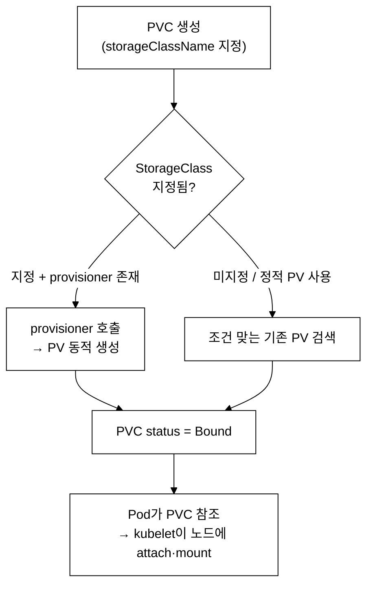
_그림 1. PVC가 동적 프로비저닝 또는 정적 바인딩을 거쳐 PV에 묶이고 Pod에 마운트되는 흐름._

**내부 동작 원리 심화:**
PVC가 생성되면 PV Controller가 매칭되는 PV를 찾거나, StorageClass의 provisioner를 호출하여 새 PV를 동적 생성한다. 바인딩이 완료되면 PVC status가 Bound로 변경된다. Pod가 PVC를 참조하면 kubelet이 CSI 드라이버를 통해 노드에 볼륨을 attach하고 mount한다. accessMode RWO는 단일 노드에서만 읽기/쓰기가 가능하므로, 다른 노드의 Pod가 같은 PVC를 사용하려 하면 스케줄링이 실패한다.

```yaml
# PVC 생성
apiVersion: v1
kind: PersistentVolumeClaim
metadata:
  name: app-data
  namespace: demo
spec:
  accessModes:
    - ReadWriteOnce              # RWO: 단일 노드에서 읽기/쓰기
                                 # ReadWriteMany(RWX): 여러 노드에서 읽기/쓰기
                                 # ReadOnlyMany(ROX): 여러 노드에서 읽기 전용
  storageClassName: standard     # StorageClass 이름
  resources:
    requests:
      storage: 1Gi               # 요청 용량

---
# Pod에서 PVC 사용
apiVersion: v1
kind: Pod
metadata:
  name: pvc-pod
spec:
  containers:
    - name: app
      image: nginx:1.25
      volumeMounts:
        - name: data-vol
          mountPath: /data
  volumes:
    - name: data-vol
      persistentVolumeClaim:
        claimName: app-data      # PVC 이름 참조
```

---

## 2. Job (잡) - 일회성 작업 실행

### 2.1 Job이란?

**등장 배경:**
Pod는 기본적으로 `restartPolicy: Always`로 동작한다. 즉, 컨테이너 프로세스가 exit 0(정상 종료)으로 끝나도 kubelet이 자동으로 재시작한다. 이는 nginx 같은 서버를 "항상 실행 중"으로 유지할 때는 올바른 동작이지만, 백업 스크립트처럼 "한 번 돌아서 끝"인 작업에는 문제다. 작업이 성공해도 무한 재시작 루프에 빠지고, 실패하면 로그가 누적되면서 원인 파악도 어려워진다.

Deployment/ReplicaSet은 "항상 N개의 Pod가 실행되어야 한다"는 장수(long-running) 워크로드를 위한 컨트롤러이므로, 이런 일회성 작업을 담기에는 근본적으로 맞지 않는다. Job은 이 문제를 해결하기 위해 등장한 워크로드 유형으로, 지정한 횟수만큼 작업이 성공적으로 완료되면 Pod를 더 이상 재시작하지 않는다.

**공학적 정의:**
Job은 batch/v1 API 그룹의 워크로드 컨트롤러로, `completions` 개수만큼의 Pod가 exit code 0으로 종료될 때까지 Pod를 계속 생성하여 실행을 관리한다. completions 필드로 필요한 성공 완료 수를, parallelism 필드로 동시 실행 Pod 수를, backoffLimit 필드로 누적 실패 재시도 한도를, activeDeadlineSeconds로 전체 실행 시간 제한을 설정한다.

**내부 동작 원리 심화:**
Job Controller는 `completions`와 현재 성공 Pod 수를 비교하여 부족하면 새 Pod를 생성한다. 실패한 Pod의 재시도 간격은 지수 백오프(10s, 20s, 40s, ... 최대 6분)로 증가한다. `backoffLimit`는 연속 실패 횟수가 아니라 **누적 실패 횟수**이다. 구체적인 예를 들면: `completions=2, parallelism=1, backoffLimit=2`로 설정했을 때, Pod-1이 두 번 실패하면 누적 실패가 2이고, 이후 Pod-2가 한 번만 실패해도 누적이 3이 되어 backoffLimit 2를 초과한다 — 이 시점에 Job은 Failed 상태가 된다. "연속"이 아니라 "모든 Pod의 실패 횟수 합계"임을 주의한다. `restartPolicy: OnFailure`를 사용하면 같은 Pod 내에서 컨테이너를 재시작하고, `Never`를 사용하면 새 Pod를 생성한다.

### 2.2 Job YAML 상세

```yaml
apiVersion: batch/v1             # Job은 batch API 그룹
kind: Job
metadata:
  name: backup-job
  namespace: demo
spec:
  completions: 1                 # 필요한 성공 완료 수 (기본값: 1)
  parallelism: 1                 # 동시 실행 Pod 수 (기본값: 1)
  backoffLimit: 3                # 실패 시 재시도 횟수 (기본값: 6)
  activeDeadlineSeconds: 120     # 최대 실행 시간 (초과 시 Job 종료)
  ttlSecondsAfterFinished: 300   # 완료 후 자동 삭제까지 시간 (초)

  template:                      # Pod 템플릿
    spec:
      restartPolicy: Never       # Never 또는 OnFailure
                                 # Always는 Job에서 사용 불가!
      containers:
        - name: backup
          image: busybox:1.36
          command:
            - sh
            - -c
            - |
              echo "Backup started at $(date)"
              # 실제 백업 작업 수행
              echo "Backup completed!"
```

### 2.3 Job 실행 패턴

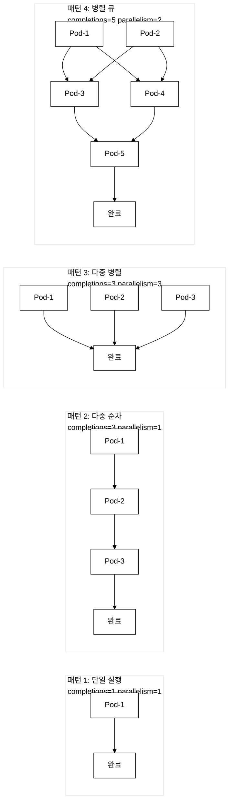
_그림 2. Job completions/parallelism 4가지 조합 패턴. 패턴 2는 Pod를 순차적으로, 패턴 3은 동시에, 패턴 4는 parallelism 단위 배치로 실행한다._

```bash
# Job 빠른 생성
kubectl create job backup-job --image=busybox:1.36 -- sh -c "echo backup done"
```

검증:
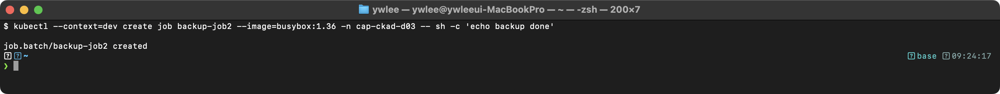

```bash
# Job 상태 확인
kubectl get jobs
```

검증:
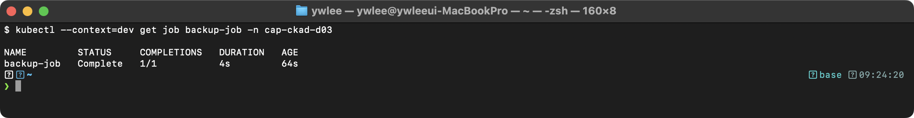

```bash
# Job의 Pod 로그 확인
kubectl logs job/backup-job
```

검증:
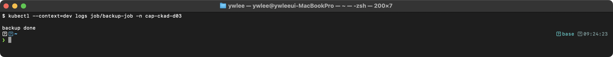

**Job Pod 상태 전이:**
Pod가 실패할 때마다 `backoffLimit` 카운터가 1씩 올라간다. backoffLimit는 "연속 실패"가 아니라 해당 Job의 **누적 실패 합계**이므로 주의한다.

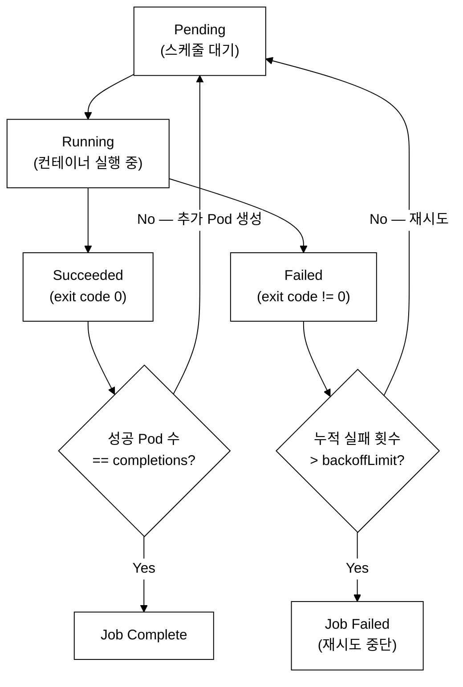
_그림 3. Job의 Pod 상태 전이. backoffLimit는 누적 실패 합계이며, completions를 모두 채워야 Job Complete 상태가 된다._

---

## 3. CronJob (크론잡) - 스케줄 기반 반복 작업

### 3.1 CronJob이란?

**등장 배경:**
Job은 일회성 작업만 처리한다. 로그 정리, 주기적 백업, 상태 점검 등 반복 작업을 위해서는 외부 cron 스케줄러나 별도의 오케스트레이션 도구(Linux cron, Jenkins 등)가 필요했다. 그러나 외부 cron은 ⓐ 클러스터 밖에서 실행되므로 Kubernetes API 인증/권한(RBAC) 관리가 별도로 필요하고, ⓑ 클러스터 네트워크 장애 시 스케줄이 실행되지 않으며, ⓒ 모니터링·알림이 Kubernetes와 분리되어 운영 복잡도가 높다는 한계가 있다. CronJob은 클러스터 내부의 apiserver를 통해 직접 Job을 생성하므로, RBAC 권한과 Pod 상태 추적이 Kubernetes 생태계와 통합되어 관리 포인트를 줄인다.

**공학적 정의:**
CronJob은 batch/v1 API 그룹의 스케줄 기반 Job 컨트롤러로, UNIX cron 형식의 schedule 필드에 따라 주기적으로 Job 오브젝트를 생성한다. concurrencyPolicy(Allow/Forbid/Replace)로 동시 실행을 제어하고, successfulJobsHistoryLimit/failedJobsHistoryLimit로 완료된 Job 보관 수를 관리한다.

**내부 동작 원리 심화:**
CronJob Controller는 약 10초 간격으로 schedule을 확인하고, 실행 시점이 도래하면 Job 오브젝트를 생성한다. `startingDeadlineSeconds`가 설정되어 있으면, 스케줄 시점 이후 해당 시간 내에만 Job 생성을 시도한다. "누락(missed)"이란 스케줄 시점이 도래했는데 Job이 생성되지 않은 경우를 말한다. 예를 들어 CronJob이 1분마다 실행되어야 하는데 클러스터 장애로 10분간 Job을 생성하지 못하면 10번이 누락된다. CronJob Controller는 누락 횟수를 누적 카운트하며, 100회 이상 누락되면 안전 장치로 "TooManyMissedSchedules" 경고를 로깅하고 더 이상 Job을 생성하지 않는다. 이 상태가 되면 CronJob을 수정(suspend를 일시적으로 true로 바꿨다가 false로 되돌리거나, CronJob을 삭제 후 재생성)해야 스케줄이 다시 동작한다. `concurrencyPolicy: Forbid`는 이전 Job이 아직 실행 중이면 새 Job 생성을 건너뛴다.

### 3.2 CronJob YAML 상세

```yaml
apiVersion: batch/v1
kind: CronJob
metadata:
  name: daily-backup
  namespace: demo
spec:
  schedule: "0 2 * * *"         # cron 형식: 분 시 일 월 요일
                                 # "0 2 * * *" = 매일 새벽 2시
                                 # "*/5 * * * *" = 5분마다
                                 # "0 */6 * * *" = 6시간마다
                                 # "30 3 * * 1" = 매주 월요일 3:30

  concurrencyPolicy: Forbid      # 동시 실행 정책
                                 # Allow: 동시 실행 허용 (기본값)
                                 # Forbid: 이전 Job 실행 중이면 새 Job 스킵
                                 # Replace: 이전 Job을 종료하고 새 Job 시작

  successfulJobsHistoryLimit: 3  # 성공 Job 보관 수 (기본: 3)
  failedJobsHistoryLimit: 1      # 실패 Job 보관 수 (기본: 1)

  startingDeadlineSeconds: 200   # 스케줄 시간을 놓쳤을 때 시작 허용 시간

  suspend: false                 # true로 설정하면 일시 중지

  jobTemplate:                   # Job 템플릿
    spec:
      activeDeadlineSeconds: 120
      backoffLimit: 2
      template:
        spec:
          restartPolicy: OnFailure
          containers:
            - name: backup
              image: busybox:1.36
              command: ["sh", "-c", "echo 'Backup at $(date)' && sleep 10"]
```

**`startingDeadlineSeconds` 동작 상세:**
이 필드는 "스케줄 시점 이후 이 초(second) 범위 내에 Job이 생성되지 않으면, 해당 스케줄은 영구 누락으로 간주한다"는 의미이다. 예를 들어 매일 02:00에 실행되는 CronJob에 `startingDeadlineSeconds: 600`이 설정되어 있고 클러스터 장애로 02:12에 복구됐다면, 12분(720초) > 600초이므로 그 날 02:00 스케줄은 누락된 것으로 처리하고 Job을 생성하지 않는다. 반면 `startingDeadlineSeconds: 3600`이라면 02:12는 아직 1시간 안이므로 복구 직후 늦게라도 Job을 생성한다(단, `concurrencyPolicy`에 따라 동시 실행 여부가 결정된다). 실행 주기가 짧은 CronJob(매 5분 이하)은 30~300초, 일 1회 이상 CronJob은 수백 초 이상으로 여유 있게 설정하는 것이 일반적이다.

### 3.3 Cron 스케줄 형식


_그림 1. Cron 5개 필드의 위치별 의미 (좌->우: 분 시 일 월 요일)._

| 스케줄 | 의미 |
|:--|:--|
| `*/5 * * * *` | 매 5분마다 |
| `0 * * * *` | 매 시간 정각 |
| `0 2 * * *` | 매일 새벽 2시 |
| `30 3 * * 1` | 매주 월요일 03:30 |
| `0 0 1 * *` | 매월 1일 자정 |
| `*/1 * * * *` | 매 분마다 (테스트·디버그용) |

```bash
# CronJob 빠른 생성
kubectl create cronjob daily-backup --image=busybox:1.36 \
  --schedule="0 2 * * *" -- sh -c "echo backup"
```

검증:
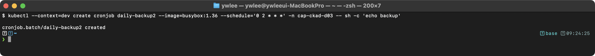

```bash
# CronJob 상태 확인
kubectl get cronjobs
```

검증:
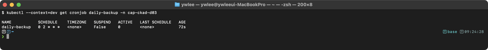

```bash
# CronJob이 생성한 Job 확인 (스케줄 시점 이후)
kubectl get jobs -l job-name
```

---

## 4. 시험 출제 패턴과 팁

### 4.1 시험 팁

시험 시작 직후 아래 셋업을 터미널에 먼저 입력한다. `k`와 `$do`를 쓰면 타이핑 횟수가 줄고 오타 위험이 낮아진다.

```bash
# 시험 환경 초기 셋업 (세션마다 1회)
alias k=kubectl
export do='--dry-run=client -o yaml'

# 사용 예
k run my-pod --image=nginx:1.25 $do > pod.yaml
k create job my-job --image=busybox:1.36 $do -- echo hello > job.yaml
```

CKAD 시험은 손 숙련과 속도가 합격의 핵심이다. 이 섹션의 명령형 방식(`kubectl run/create/expose ... --dry-run=client -o yaml`)은 "암기해야 하는 주문"이 아니라 "시험장에서 시간을 절약하는 패턴"이다. 각 명령은 `kubectl run --help`, `kubectl create job --help` 등으로 언제든 옵션을 확인할 수 있으므로, "어떤 상황에 어느 명령을 쓰는지"를 파악하는 것이 먼저이고 세부 문법은 도움말에 의존해도 된다. 또한 `--port` 플래그는 Pod spec의 `containers[].ports[].containerPort` 필드를 채우며, 실제 트래픽 노출과는 무관하다(Service를 별도 생성해야 트래픽이 전달된다).

```bash
# Pod YAML 빠른 생성 (dry-run)
kubectl run my-pod --image=nginx:1.25 --port=80 --dry-run=client -o yaml > pod.yaml

# Job 빠른 생성
kubectl create job my-job --image=busybox:1.36 -- echo "hello"

# CronJob 빠른 생성
kubectl create cronjob my-cron --image=busybox:1.36 --schedule="*/5 * * * *" -- echo "hello"

# 필드 구조 확인
kubectl explain job.spec
kubectl explain cronjob.spec
kubectl explain pod.spec.volumes.emptyDir
kubectl explain pod.spec.volumes.persistentVolumeClaim
```

---

## 5. 트러블슈팅

### 5.1 PVC가 Pending 상태에 머무는 경우

```bash
kubectl get pvc -n <namespace>
kubectl describe pvc <pvc-name> -n <namespace>
```

검증 (Pending 상태):
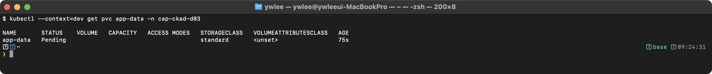

주요 원인:
- **StorageClass 미존재**: `kubectl get sc`로 사용 가능한 StorageClass를 확인한다.
- **용량 부족**: 요청한 storage가 가용 PV보다 크다.
- **accessModes 불일치**: 기존 PV가 요청한 accessMode를 지원하지 않는다.

### 5.2 Job이 Failed 상태인 경우

```bash
kubectl describe job <job-name>
kubectl get pods -l job-name=<job-name>
kubectl logs <pod-name>
```

검증:
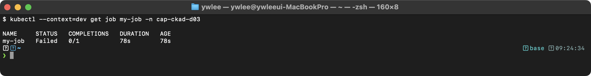

주요 원인:
- **backoffLimit 초과**: Pod가 반복 실패하여 재시도 한도에 도달했다.
- **activeDeadlineSeconds 초과**: Job이 시간 제한을 초과했다. Events에 "DeadlineExceeded"가 표시된다.
- **restartPolicy 설정 오류**: Job에 `restartPolicy: Always`를 사용하면 API Server가 거부한다.

### 5.3 CronJob이 실행되지 않는 경우

```bash
kubectl get cronjob <name> -o jsonpath='{.spec.suspend}'
kubectl describe cronjob <name> | grep -A5 "Events:"
```

주요 원인:
- **suspend: true**: CronJob이 일시 중지 상태이다.
- **startingDeadlineSeconds 초과**: 스케줄 시점을 너무 오래 놓쳤다.
- **concurrencyPolicy: Forbid + 이전 Job 실행 중**: 이전 Job이 완료되지 않아 새 Job이 생성되지 않는다.

---

## 6. 복습 체크리스트

- [ ] emptyDir과 PVC의 차이를 설명할 수 있다
- [ ] emptyDir의 medium: Memory 옵션과 sizeLimit을 이해한다
- [ ] PVC의 accessModes (RWO, RWX, ROX)를 구분할 수 있다
- [ ] Job의 completions, parallelism, backoffLimit 필드를 설명할 수 있다
- [ ] Job의 restartPolicy가 Never 또는 OnFailure만 가능한 이유를 안다
- [ ] CronJob의 schedule 형식(분 시 일 월 요일)을 작성할 수 있다
- [ ] CronJob의 concurrencyPolicy (Allow, Forbid, Replace)를 구분할 수 있다
- [ ] `kubectl create job`, `kubectl create cronjob` 명령을 사용할 수 있다

---

## 7. 직접 해보기 (제한 시간 5분)

CKAD 실기 시험은 문제당 평균 5~8분이 주어진다. 아래 과제를 **5분 안에** imperative 명령 위주로 해결하는 것을 목표로 한다.

**과제 1 — PVC 생성 + Pod 마운트 (2분)**

`dev` 클러스터의 `default` 네임스페이스에 다음 조건을 만족하는 리소스를 생성한다.
- PVC 이름: `task-pvc`, 용량: 100Mi, accessMode: ReadWriteOnce, storageClassName: standard
- Pod 이름: `task-pod`, 이미지: `nginx:1.25`, PVC를 `/usr/share/nginx/html`에 마운트

```bash
# imperative 방식: YAML scaffold 생성 후 편집
kubectl run task-pod --image=nginx:1.25 --dry-run=client -o yaml > task-pod.yaml
# task-pod.yaml 에 volumes + volumeMounts + PVC 블록을 추가한 뒤 apply
kubectl apply -f task-pod.yaml
kubectl get pvc task-pvc && kubectl get pod task-pod
```

**과제 2 — Job completions=3 실행 (2분)**

`default` 네임스페이스에 `completions=3, parallelism=1, backoffLimit=2` 조건의 Job을 생성하고 3개 Pod가 모두 Completed 상태임을 확인한다.

```bash
kubectl create job count-job --image=busybox:1.36 -- sh -c "echo done"
# completions/parallelism은 생성 후 YAML로 patch 하거나 --dry-run=client -o yaml 편집 후 apply
kubectl get jobs count-job && kubectl get pods -l job-name=count-job
```

**과제 3 — CronJob suspend 토글 (1분)**

`default` 네임스페이스에 `schedule="*/1 * * * *"` 인 CronJob `test-cron`을 생성하고, 즉시 `suspend: true`로 일시 중지한 뒤 다시 `false`로 재개한다.

```bash
kubectl create cronjob test-cron --image=busybox:1.36 --schedule="*/1 * * * *" -- echo hi
kubectl patch cronjob test-cron -p '{"spec":{"suspend":true}}'
kubectl get cronjob test-cron -o jsonpath='{.spec.suspend}'
kubectl patch cronjob test-cron -p '{"spec":{"suspend":false}}'
```

---

## ✅ 자가점검

<details>
<summary>복습 체크리스트 정답 (클릭해서 펼치기)</summary>

**Q. emptyDir과 PVC의 차이는?**
emptyDir은 Pod 수명에 묶인 임시 볼륨으로, Pod 삭제 시 데이터가 소멸한다. PVC는 StorageClass를 통해 독립적인 PV에 바인딩되므로 Pod가 삭제되어도 데이터가 유지된다. emptyDir은 동일 Pod 내 컨테이너 간 파일 공유에 적합하고, PVC는 DB처럼 Pod 재생성 후에도 데이터를 보존해야 하는 경우에 사용한다.

**Q. PVC accessMode RWO와 RWX의 차이는?**
RWO(ReadWriteOnce)는 단일 노드에서만 읽기/쓰기가 가능한 모드로, AWS EBS 같은 블록 스토리지가 한 번에 하나의 노드에만 attach될 수 있기 때문이다. RWX(ReadWriteMany)는 여러 노드에서 동시에 읽기/쓰기가 가능하며, NFS 같은 공유 파일시스템이 이를 지원한다. RWO Pod가 다른 노드로 재스케줄되면 볼륨 re-attach 때까지 Pending 상태가 된다.

**Q. Job backoffLimit의 의미는?**
Job의 모든 Pod가 시도한 실패 횟수의 합계 한도다. "연속 실패"가 아니라 누적 실패다. 예를 들어 `backoffLimit=2`이면, 어떤 Pod든 실패 횟수의 합이 2를 초과하는 순간 Job 전체가 Failed로 표시된다.

**Q. CronJob concurrencyPolicy Forbid 동작은?**
이전 Job이 아직 실행 중인 상태에서 스케줄 시간이 도래하면 새 Job을 생성하지 않고 건너뛴다. 배치 작업이 지연될 경우 중복 실행을 방지하는 데 사용한다. Allow(기본값)는 동시 실행을 허용하고, Replace는 이전 Job을 종료하고 새 Job을 시작한다.

**Q. Job에서 restartPolicy: Always가 불가능한 이유는?**
Job은 "작업이 완료되면 Pod를 재시작하지 않는다"는 전제로 동작한다. `Always`로 설정하면 exit 0(정상 완료)에도 kubelet이 컨테이너를 재시작하여 Job이 완료 상태로 전환될 수 없다. Kubernetes API Server는 Job spec에 `restartPolicy: Always`를 허용하지 않고 validation error를 반환한다.

</details>

---

## 더 읽을거리

- [Kubernetes Volumes 공식 문서](https://kubernetes.io/docs/concepts/storage/volumes/) — emptyDir, hostPath, configMap 등 전체 볼륨 유형 목록
- [Persistent Volumes 공식 문서](https://kubernetes.io/docs/concepts/storage/persistent-volumes/) — PV/PVC 바인딩 메커니즘, reclaimPolicy 상세
- [Jobs 공식 문서](https://kubernetes.io/docs/concepts/workloads/controllers/job/) — completions/parallelism 조합 패턴, Pod failure policy(v1.26+)
- [CronJob 공식 문서](https://kubernetes.io/docs/concepts/workloads/controllers/cron-jobs/) — TooManyMissedSchedules 동작, timezone 지원(v1.27+ GA)
- [CSI(Container Storage Interface) 명세](https://github.com/container-storage-interface/spec) — 스토리지 드라이버가 Kubernetes와 어떻게 통신하는지 프로토콜 수준 설명

---

## tart-infra 실습

### 실습 환경 설정

```bash
# dev 클러스터에 접속
export KUBECONFIG=~/sideproejct/IaC_apple_sillicon/kubeconfig/dev.yaml
kubectl get nodes
```

검증:
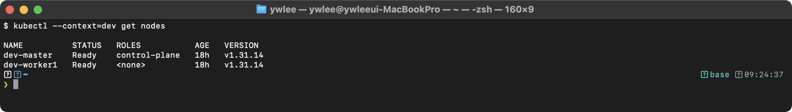

### 실습 1: Volume 공유 패턴 확인

```bash
# demo 네임스페이스에서 멀티 컨테이너 Pod 확인
kubectl get pods -n demo -o jsonpath='{range .items[*]}{.metadata.name}{"\t"}{range .spec.containers[*]}{.name}{" "}{end}{"\n"}{end}'
```

**동작 원리:** emptyDir 볼륨의 생명주기:
1. Pod 생성 시 노드의 `/var/lib/kubelet/pods/<pod-uid>/volumes/kubernetes.io~empty-dir/` 경로에 디렉토리가 생성된다
2. Pod 내 모든 컨테이너가 동일 볼륨을 마운트하여 데이터를 공유한다
3. Pod가 삭제되면 해당 디렉토리와 데이터도 함께 삭제된다
4. `medium: Memory`를 사용하면 tmpfs에 저장되어 I/O가 빠르지만 메모리 사용량이 증가한다

### 실습 2: Job/CronJob 상태 확인

```bash
# 기존 Job 확인
kubectl get jobs -A 2>/dev/null | head -10
```

검증:
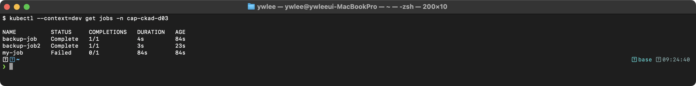

```bash
# CronJob 확인
kubectl get cronjobs -A 2>/dev/null | head -10
```

검증:
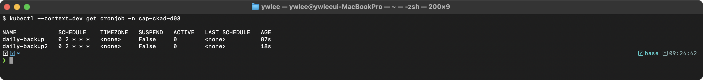

**동작 원리:** Job Controller의 동작:
1. Job Controller는 `completions` 수만큼의 Pod가 성공적으로 종료(exit 0)될 때까지 Pod를 생성한다
2. `parallelism`에 따라 동시에 실행되는 Pod 수를 제한한다
3. Pod가 실패하면 `backoffLimit`까지 재시도하고, 초과하면 Job을 Failed로 표시한다
4. CronJob Controller는 `schedule`에 따라 주기적으로 Job 오브젝트를 생성한다

---

> **다음 날:** Day 4 - ConfigMap/Secret과 환경 변수 주입 패턴 — Job/CronJob이 실행하는 컨테이너에 설정값을 어떻게 안전하게 전달하는지를 다룬다.
