# CKAD Day 4: Volume/Job/CronJob 실전 문제

> CKAD 도메인: Application Design and Build (20%) - Part 2b | 예상 소요 시간: 1시간

Day 3에서는 emptyDir 볼륨 기초, Job/CronJob 개념과 기본 YAML 구조를 다뤘다. Day 4는 그 내용을 실전 문제로 통합한다. 다루는 CKAD 도메인 Application Design and Build의 세부 항목은 Multi-container Pod 패턴(Sidecar·Ambassador·Adapter), Volumes(emptyDir·PVC), Jobs·CronJobs의 선언·병렬화·생명주기 제어다.

---

## 오늘의 학습 목표

- [ ] Day 1~3 내용을 실전 문제로 종합 연습한다
- [ ] Pod, Init Container, Multi-container, Volume, Job, CronJob 문제를 풀 수 있다
- [ ] 쿠버네티스 내부 동작 원리를 복습한다

---

## 1. 쿠버네티스 내부 동작 원리

### 1.1 Pod 생성 흐름 상세

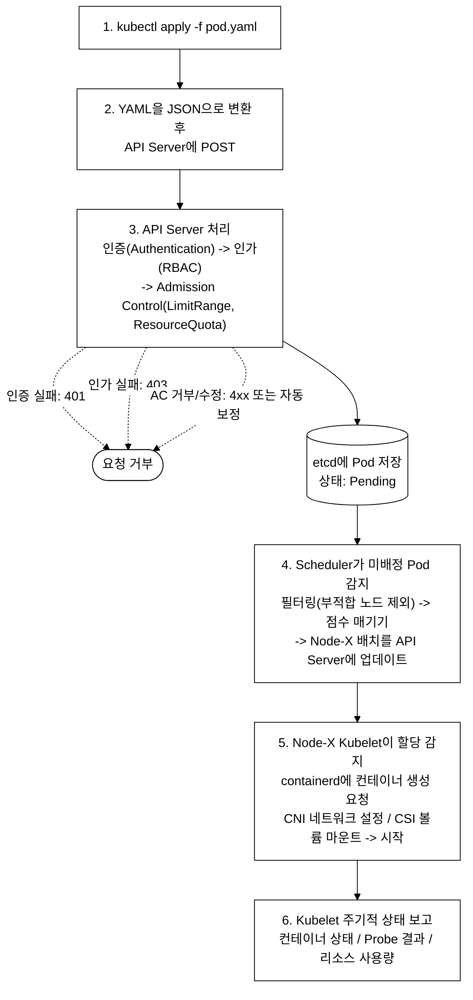
_그림 1. kubectl apply부터 컨테이너 기동까지의 Pod 생성 흐름._

3단계의 세 관문은 순서대로 통과해야 한다. 각 관문의 의미와 실패 시 동작은 다음과 같다.

- **인증(Authentication)**: 요청자가 누구인지 확인한다. 인증서·토큰·서비스어카운트 토큰 등으로 신원을 검증하며, 실패하면 `401 Unauthorized`로 거부된다.
- **인가(RBAC)**: 그 신원이 해당 동작(예: `exam` 네임스페이스에 Pod 생성)을 할 권한이 있는지 확인한다. RBAC(Role-Based Access Control, 역할 기반 접근 제어)는 Role/RoleBinding으로 "누가 무엇을 할 수 있나"를 정의한다. 권한이 없으면 `403 Forbidden`이다.
- **Admission Control(승인 제어)**: 인증·인가를 통과한 요청을 etcd에 저장하기 직전, 추가 정책으로 검사·변형한다. 두 종류가 있다. 검증형(validating)은 규칙 위반 시 요청을 거부하고(예: ResourceQuota 초과 시 `403`), 변형형(mutating)은 요청을 자동 보정한다(예: LimitRange가 누락된 리소스 기본값을 채워 넣음). 거부되면 보통 `4xx` 응답이 돌아오며, 어떤 어드미션 웹훅이 막았는지는 에러 메시지에 표기된다. 세부 동작은 CKA 트러블슈팅 장에서 다룬다.

### 1.2 Multi-container Pod 내부 네트워크

```
+------ Pod (10.244.1.5) ------+
|                               |
|  +-------+     +-------+     |
|  | app   |     | sidecar|    |
|  | :8080 |     | :9090  |    |
|  +---+---+     +---+----+   |
|      |             |         |
|  +---+-------------+----+   |
|  |    localhost (lo)     |   |
|  |    127.0.0.1          |   |
|  +-----------------------+   |
|                               |
|  공유 네트워크 네임스페이스     |
|  공유 볼륨 (emptyDir 등)      |
+-------------------------------+

- app은 localhost:9090으로 sidecar에 접근 가능
- sidecar는 localhost:8080으로 app에 접근 가능
- 외부에서는 Pod IP(10.244.1.5)로 접근
```

**왜 컨테이너끼리 localhost로 통신되나**: 한 Pod 안의 모든 컨테이너는 같은 네트워크 네임스페이스(network namespace)를 공유한다. 네트워크 네임스페이스란 리눅스 커널이 프로세스 그룹에 독립된 네트워크 스택(인터페이스·IP·포트 공간·라우팅 테이블)을 격리해 주는 기능이다. 컨테이너들이 같은 네임스페이스에 들어가므로 동일한 `lo`(루프백) 인터페이스와 IP를 공유하고, 서로를 `localhost`로 부를 수 있다.

**포트 충돌 주의**: 같은 네트워크 네임스페이스를 공유하므로, 한 Pod 안의 두 컨테이너가 **같은 포트를 동시에 listen할 수 없다**. 예를 들어 app과 sidecar가 둘 다 8080을 열려고 하면 나중 컨테이너가 bind 실패로 기동되지 않는다. 멀티컨테이너 Pod를 설계할 때 컨테이너별 포트를 겹치지 않게 배정해야 하는 이유다.

---

## 2. 실전 시험 문제 (12문제)

### 문제 1. Pod 생성 + Label + 환경변수

다음 조건의 Pod를 생성하라.

- Pod 이름: `exam-pod`, 네임스페이스: `exam`
- 이미지: `nginx:1.25`, 포트: 80
- Label: `app=web`, `tier=frontend`
- 환경 변수: `APP_ENV=production`

<details><summary>풀이</summary>

```bash
kubectl create namespace exam
kubectl run exam-pod -n exam \
  --image=nginx:1.25 --port=80 \
  --labels="app=web,tier=frontend" \
  --env="APP_ENV=production"
```

검증:
```bash
kubectl get pod exam-pod -n exam --show-labels
```

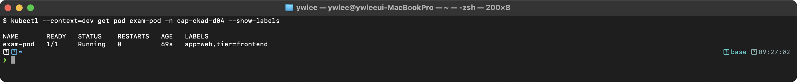

```bash
kubectl exec exam-pod -n exam -- env | grep APP_ENV
```

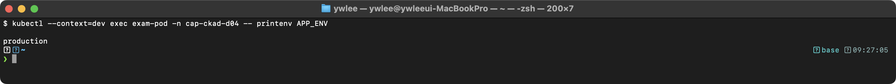

**핵심**: `kubectl run`으로 빠르게 생성. `--labels`, `--env` 옵션을 사용한다.

</details>

---

### 문제 2. Init Container + emptyDir

> **Init Container란**: Pod가 main container를 실행하기 **전에** 한 번 실행되고 완료(exit 0)되어야 하는 컨테이너다. 설정 파일 생성, 데이터 준비, 디렉터리 퍼미션 조정, 의존 서비스 기동 대기 등 "본 앱이 뜨기 전에 끝나야 하는 준비 작업"에 쓴다. 여러 개를 정의하면 순서대로 실행되며, 하나라도 실패하면 main container는 시작되지 않고 Pod는 `Init:Error`로 멈춘다. main container와 달리 항상 종료되는(run-to-completion) 점이 핵심이다.

다음 조건의 Pod를 생성하라.

- Pod 이름: `init-pod`, 네임스페이스: `exam`
- Init container `setup` (busybox:1.36): `/work/config.txt`에 `ready=true` 기록
- Main container `app` (nginx:1.25): `/etc/app/` 에 같은 볼륨 마운트 (readOnly)
- emptyDir 볼륨 `work-vol` 사용

<details><summary>풀이</summary>

```yaml
apiVersion: v1
kind: Pod
metadata:
  name: init-pod
  namespace: exam
spec:
  initContainers:
    - name: setup
      image: busybox:1.36
      command: ["sh", "-c", "echo 'ready=true' > /work/config.txt"]
      volumeMounts:
        - name: work-vol
          mountPath: /work
  containers:
    - name: app
      image: nginx:1.25
      volumeMounts:
        - name: work-vol
          mountPath: /etc/app
          readOnly: true
  volumes:
    - name: work-vol
      emptyDir: {}
```

검증:
```bash
kubectl get pod init-pod -n exam
kubectl exec init-pod -n exam -- cat /etc/app/config.txt
```


**핵심**: Init Container와 Main Container가 같은 볼륨을 공유한다. `readOnly: true`로 보안 강화.

> **Init Container와 볼륨의 연결**: Init Container가 `/work/config.txt`를 기록한 뒤 종료되면, 같은 `emptyDir` 볼륨을 마운트한 main container가 그 파일을 읽을 수 있다. 이것이 Init → main 부팅 순서와 emptyDir 데이터 공유를 결합한 핵심 패턴이다. Init Container가 준비한 설정·인증서·데이터를 main container가 시작 시점에 바로 참조한다.

</details>

---

### 문제 3. Sidecar 로깅 패턴

다음 조건의 Pod를 생성하라.

- Pod 이름: `sidecar-pod`
- 컨테이너 `app`: busybox:1.36, `/var/log/app.log`에 5초마다 로그 기록
- 컨테이너 `logger`: busybox:1.36, `tail -f /var/log/app.log` 실행
- emptyDir 볼륨으로 로그 공유

<details><summary>풀이</summary>

```yaml
apiVersion: v1
kind: Pod
metadata:
  name: sidecar-pod
spec:
  containers:
    - name: app
      image: busybox:1.36
      command:
        - sh
        - -c
        - |
          while true; do
            echo "$(date) - App log entry" >> /var/log/app.log
            sleep 5
          done
      volumeMounts:
        - name: log-vol
          mountPath: /var/log
    - name: logger
      image: busybox:1.36
      command: ["sh", "-c", "tail -f /var/log/app.log"]
      volumeMounts:
        - name: log-vol
          mountPath: /var/log
          readOnly: true
  volumes:
    - name: log-vol
      emptyDir: {}
```

검증:
```bash
kubectl logs sidecar-pod -c logger --tail=3
```

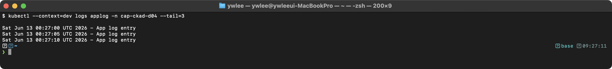

</details>

---

### 문제 4. Job 생성

> **Job 등장 배경**: Job 이전에는 배치 작업을 실행하려면 Pod를 직접 생성하고, 완료 여부를 폴링하고, 실패 시 수동으로 재생성하고, 병렬 실행이 필요하면 스크립트로 여러 Pod를 루프로 만들어야 했다. Pod는 "계속 실행 중"이라는 상태를 목표로 설계되어 있어, "정확히 N번 성공적으로 완료"라는 개념 자체가 없었다. Job 객체는 `completions`(목표 완료 횟수)·`parallelism`(동시 실행 Pod 수)·`backoffLimit`(자동 재시도 횟수)을 선언하면 Job 컨트롤러가 Pod 생명주기를 자동 관리한다. 트레이드오프: Job은 완료된 Pod를 자동 삭제하지 않으므로 `ttlSecondsAfterFinished`를 설정하지 않으면 오래된 완료 Pod가 클러스터에 남는다.

다음 조건의 Job을 생성하라.

- Job 이름: `math-job`, 네임스페이스: `exam`
- 이미지: `busybox:1.36`
- 명령: `echo "2 + 3 = $((2+3))"`
- backoffLimit: 2, completions: 1

<details><summary>풀이</summary>

```yaml
apiVersion: batch/v1
kind: Job
metadata:
  name: math-job
  namespace: exam
spec:
  completions: 1
  backoffLimit: 2
  template:
    spec:
      restartPolicy: Never
      containers:
        - name: calc
          image: busybox:1.36
          command: ["sh", "-c", "echo \"2 + 3 = $((2+3))\""]
```

검증:
```bash
kubectl get job math-job -n exam
kubectl logs job/math-job -n exam
```

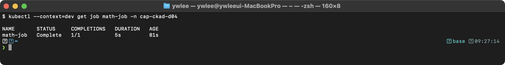

> **필드 해설**: `backoffLimit: 2`는 Job 컨트롤러가 실패한 Pod를 최대 2번 다시 생성 시도한다는 의미다. 초과하면 Job은 `Failed` 상태가 되고 더 이상 Pod를 생성하지 않는다. `completions: 1`은 Pod가 성공적으로 1번 완료되면 Job이 `Complete`가 된다는 뜻이다. `restartPolicy: Never`(재시작 없이 새 Pod 생성)와 `restartPolicy: OnFailure`(같은 Pod를 kubelet이 재시작)의 차이도 실기에서 자주 나온다.

**빠른 풀이(imperative)**: 시험에서는 YAML을 처음부터 작성하는 것보다 기본 틀을 생성 후 편집하는 것이 빠르다.
```bash
kubectl create job math-job -n exam --image=busybox:1.36 \
  --dry-run=client -o yaml -- sh -c 'echo "2 + 3 = $((2+3))"' \
  > math-job.yaml
# spec.backoffLimit: 2 를 파일에 추가 편집 후
kubectl apply -f math-job.yaml
```

</details>

---

### 문제 5. CronJob 생성

> **CronJob 등장 배경**: 리눅스 `cron`은 노드별로 독립 실행되어, 노드 장애 시 작업이 누락되고, 실행 히스토리가 사라지고, 스케일아웃 환경에서는 여러 노드가 동시에 같은 작업을 돌리는 중복 실행 문제가 있었다. CronJob은 Kubernetes 제어 평면(컨트롤러)이 스케줄을 관리하므로 노드에 종속되지 않으며, `successfulJobsHistoryLimit`·`failedJobsHistoryLimit`로 실행 이력을 보관하고, `concurrencyPolicy`(Allow·Forbid·Replace)로 중복 실행 정책을 선언적으로 제어한다. 트레이드오프: CronJob 컨트롤러는 1분 미만 간격을 지원하지 않는다(최소 단위 = 분).

다음 조건의 CronJob을 생성하라.

- 이름: `log-cleanup`, 네임스페이스: `exam`
- 매 10분마다 실행
- 이미지: `busybox:1.36`, 명령: `echo "Cleanup at $(date)"`
- successfulJobsHistoryLimit: 3
- concurrencyPolicy: Forbid

<details><summary>풀이</summary>

```yaml
apiVersion: batch/v1
kind: CronJob
metadata:
  name: log-cleanup
  namespace: exam
spec:
  schedule: "*/10 * * * *"   # cron 형식: 분 시 일 월 요일. */10(분) = 매 10분마다. 예: "0 3 * * *"은 매일 오전 3시
  concurrencyPolicy: Forbid  # 이전 Job이 아직 실행 중이면 새 Job 생성 건너뜀. Allow(기본)=중복 허용, Replace=이전 것 종료 후 새로 시작
  successfulJobsHistoryLimit: 3
  jobTemplate:
    spec:
      template:
        spec:
          restartPolicy: OnFailure
          containers:
            - name: cleanup
              image: busybox:1.36
              command: ["sh", "-c", "echo \"Cleanup at $(date)\""]
```

**빠른 풀이(imperative)**:
```bash
kubectl create cronjob log-cleanup -n exam \
  --image=busybox:1.36 \
  --schedule="*/10 * * * *" \
  --dry-run=client -o yaml \
  -- sh -c 'echo "Cleanup at $(date)"' \
  > log-cleanup.yaml
# concurrencyPolicy, successfulJobsHistoryLimit 추가 편집 후
kubectl apply -f log-cleanup.yaml
```

</details>

---

### 문제 6. 병렬 Job

다음 조건의 Job을 생성하라.

- 이름: `parallel-job`
- 5개의 작업을 동시에 2개씩 병렬 실행
- 이미지: `busybox:1.36`, 명령: `echo "Task complete" && sleep 5`

<details><summary>풀이</summary>

```yaml
apiVersion: batch/v1
kind: Job
metadata:
  name: parallel-job
spec:
  completions: 5
  parallelism: 2
  template:
    spec:
      restartPolicy: Never
      containers:
        - name: worker
          image: busybox:1.36
          command: ["sh", "-c", "echo 'Task complete' && sleep 5"]
```

검증:
```bash
kubectl get job parallel-job -w
```

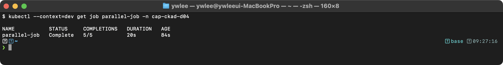

**핵심**: `completions=5`, `parallelism=2`이면 2개씩 동시 실행하여 총 5개를 완료한다.

</details>

---

### 문제 7. PVC + Pod

> **emptyDir vs PVC 비교**: 두 볼륨 타입의 근본 차이는 데이터 생명주기와 범위다.

| 항목 | `emptyDir` | `PersistentVolumeClaim(PVC)` |
|:---|:---|:---|
| 생명주기 | Pod와 동일 — Pod 삭제 시 데이터 소멸 | Pod와 독립 — Pod가 없어도 데이터 유지 |
| 영속성 | 없음(임시) | 있음(StorageClass·PV에 따라 결정) |
| 공유 범위 | 같은 Pod 내 컨테이너 간만 | 다른 Pod 간 공유 가능(accessMode 따라) |
| 선언 방식 | `volumes[].emptyDir: {}` — 추가 오브젝트 불필요 | PVC 오브젝트를 별도 생성 후 참조 |
| 사용 사례 | Sidecar 로그 공유, Init 데이터 전달, 임시 캐시 | DB 데이터, 애플리케이션 영속 파일, 로그 보존 |

> `PVC`(PersistentVolumeClaim): 사용자가 원하는 스토리지 조건(크기·accessMode·storageClass)을 선언하면, 컨트롤러가 이를 만족하는 `PV`(PersistentVolume — 실제 디스크 자원)에 바인딩한다. `StorageClass`는 동적으로 PV를 생성하는 방식(프로비저너·설정)을 정의한다. `standard` StorageClass는 로컬 클러스터에서 기본 제공되는 경우가 많다.

> **accessModes 세 종류**: PVC는 스토리지를 어떤 방식으로 마운트할지 `accessModes`로 선언한다.
> - `ReadWriteOnce`(RWO): 단일 노드에서만 읽기/쓰기 마운트 가능. 대부분의 블록 스토리지(EBS·로컬 디스크)가 이 모드를 지원한다.
> - `ReadWriteMany`(RWX): 다수 노드에서 동시에 읽기/쓰기 마운트 가능. NFS·CephFS 같은 네트워크 파일 시스템이 필요하다.
> - `ReadOnlyMany`(ROX): 다수 노드에서 읽기 전용으로 마운트 가능. 공통 설정 파일 배포 등에 쓴다.
> 로컬 `standard` StorageClass는 일반적으로 RWO만 지원한다. RWX가 필요하면 NFS 프로비저너 등을 별도로 구성해야 한다.

다음 조건으로 PVC와 Pod를 생성하라.

- PVC: `data-pvc`, storageClassName=standard, RWO, 500Mi
- Pod: `data-pod` (busybox:1.36), PVC를 `/data`에 마운트
- `/data/hello.txt`에 "Hello CKAD" 기록 후 sleep

<details><summary>풀이</summary>

```yaml
apiVersion: v1
kind: PersistentVolumeClaim
metadata:
  name: data-pvc
spec:
  accessModes:
    - ReadWriteOnce
  storageClassName: standard
  resources:
    requests:
      storage: 500Mi
---
apiVersion: v1
kind: Pod
metadata:
  name: data-pod
spec:
  containers:
    - name: app
      image: busybox:1.36
      command: ["sh", "-c", "echo 'Hello CKAD' > /data/hello.txt && sleep 3600"]
      volumeMounts:
        - name: data-vol
          mountPath: /data
  volumes:
    - name: data-vol
      persistentVolumeClaim:
        claimName: data-pvc
```

검증:
```bash
kubectl get pvc data-pvc
kubectl get pod data-pod
kubectl exec data-pod -- cat /data/hello.txt
```

PVC가 `Pending` 상태에서 벗어나지 않으면 동적 프로비저너가 없거나 StorageClass가 미설치된 경우다. 아래 명령으로 이벤트를 확인한다.
```bash
kubectl describe pvc data-pvc
```
`Events` 섹션에 `no persistent volumes available` 또는 `storageclass "standard" not found` 메시지가 있으면 클러스터에 해당 StorageClass가 없는 것이다. dev 클러스터에서는 `kubectl get storageclass`로 가용 클래스를 먼저 확인하고, 없으면 `storageClassName: ""` + 수동 PV 생성 또는 local-path-provisioner 설치 후 재시도한다.

</details>

---

### 문제 8. Multi-container + Volume

다음 조건의 Pod를 생성하라.

- Pod 이름: `multi-vol`
- 컨테이너 `writer` (busybox:1.36): `/shared/data.txt`에 3초마다 타임스탬프 기록
- 컨테이너 `reader` (busybox:1.36): `/shared/data.txt`를 tail -f로 stdout 출력
- emptyDir 볼륨 `shared` 사용

<details><summary>풀이</summary>

```yaml
apiVersion: v1
kind: Pod
metadata:
  name: multi-vol
spec:
  containers:
    - name: writer
      image: busybox:1.36
      command:
        - sh
        - -c
        - |
          while true; do
            date >> /shared/data.txt
            sleep 3
          done
      volumeMounts:
        - name: shared
          mountPath: /shared
    - name: reader
      image: busybox:1.36
      command: ["sh", "-c", "tail -f /shared/data.txt"]
      volumeMounts:
        - name: shared
          mountPath: /shared
          readOnly: true
  volumes:
    - name: shared
      emptyDir: {}
```

검증:
```bash
kubectl logs multi-vol -c reader --tail=5
```

`writer`가 `/shared/data.txt`에 타임스탬프를 기록하고, `reader`가 `tail -f`로 읽어 stdout에 출력한다. 위 명령으로 reader 컨테이너의 최근 5줄 로그를 확인한다. Pod 기동 직후에는 writer가 첫 번째 타임스탬프를 기록하기까지 3초가 걸리므로, 로그가 비어 있으면 잠시 후 다시 실행한다.

</details>

---

### 문제 9. Job with activeDeadlineSeconds

120초 내에 완료되지 않으면 종료되는 Job을 생성하라.

- 이름: `timeout-job`
- 이미지: `busybox:1.36`, 명령: `echo "start" && sleep 30 && echo "done"`
- activeDeadlineSeconds: 120

<details><summary>풀이</summary>

```yaml
apiVersion: batch/v1
kind: Job
metadata:
  name: timeout-job
spec:
  activeDeadlineSeconds: 120
  backoffLimit: 2
  template:
    spec:
      restartPolicy: Never
      containers:
        - name: worker
          image: busybox:1.36
          command: ["sh", "-c", "echo 'start' && sleep 30 && echo 'done'"]
```

**핵심**: `activeDeadlineSeconds`는 Job spec 수준에 위치한다.

</details>

---

### 문제 10. Ambassador 패턴

> **Ambassador 패턴**: main 컨테이너가 외부 서비스(DB·캐시·API)에 직접 연결하면, 연결 주소·인증·TLS 설정이 main 코드에 박히고 외부 서비스가 바뀔 때마다 main을 재빌드해야 한다. Ambassador 패턴은 main 컨테이너가 항상 `localhost:<port>`로만 통신하고, 별도 ambassador 컨테이너가 실제 외부 서비스로 프록시하는 구조다. 같은 Pod 안에서 네트워크 네임스페이스를 공유하므로 `localhost`로 통신이 가능하다(§1.2 참조). 장점: main 컨테이너 코드와 네트워크 로직 분리, ambassador 교체만으로 연결 대상 변경. 트레이드오프: Pod 내 컨테이너 수 증가로 리소스 사용량 증가, ambassador 장애가 main에도 영향.

다음 Ambassador 패턴 Pod를 생성하라.

- Pod 이름: `ambassador-pod`
- 메인 컨테이너 `app` (busybox:1.36): localhost:6379로 요청하는 앱
- Ambassador 컨테이너 `proxy` (haproxy:2.9): 외부 Redis로 프록시

<details><summary>풀이</summary>

```yaml
apiVersion: v1
kind: Pod
metadata:
  name: ambassador-pod
spec:
  containers:
    - name: app
      image: busybox:1.36
      command: ["sh", "-c", "while true; do echo 'Request to localhost:6379'; sleep 10; done"]
      env:
        - name: REDIS_HOST
          value: "localhost"
        - name: REDIS_PORT
          value: "6379"
    - name: proxy
      image: haproxy:2.9
      ports:
        - containerPort: 6379
```

**핵심**: Ambassador 패턴에서 메인 컨테이너는 localhost로만 통신하고, Ambassador 컨테이너가 외부 서비스로 프록시한다.

> **주의 — 개념 설명용 예시**: 위 YAML의 `proxy` 컨테이너는 haproxy:2.9를 사용하지만, haproxy는 `/usr/local/etc/haproxy/haproxy.cfg` 설정 파일이 없으면 즉시 종료(CrashLoopBackOff)된다. 이 예시는 Ambassador 패턴의 구조(같은 Pod, localhost 통신, 포트 위임)를 설명하기 위한 것이며, 실제 구동하려면 아래 두 가지 중 하나를 선택한다.
> - **방법 A(ConfigMap)**: `frontend`/`backend` 블록이 포함된 `haproxy.cfg`를 ConfigMap으로 만들고 `/usr/local/etc/haproxy/haproxy.cfg`에 마운트한다.
> - **방법 B(nginx 교체)**: haproxy 대신 `nginx:1.25` + ConfigMap(`nginx.conf` 리버스 프록시 설정)으로 대체하면 실습 환경에서 바로 동작 확인이 가능하다.
> 시험에서는 Ambassador 패턴 YAML 구조(컨테이너 2개, localhost 통신, 공유 네트워크 네임스페이스)가 평가 대상이며, haproxy 설정 파일 세부 내용은 범위 밖이다.

</details>

---

### 문제 11. Adapter 패턴

> **Adapter 패턴**: 레거시 애플리케이션이나 서드파티 컴포넌트는 자체 로그 형식(날짜 포맷·필드 구조)을 가진다. 이 출력을 표준 형식(JSON·OpenTelemetry·Prometheus metrics)으로 변환하기 위해 main 코드를 수정하면, 비즈니스 로직과 관측 로직이 뒤섞인다. Adapter 패턴은 main 컨테이너 출력을 표준 형식으로 변환하는 adapter 컨테이너를 같은 Pod에 배치한다. emptyDir 볼륨으로 로그 파일을 공유하거나 stdout을 파이프로 처리한다. 트레이드오프: Ambassador와 동일하게 컨테이너 수 증가·리소스 비용 발생. 변환 로직이 복잡하면 adapter가 단일 장애 점이 될 수 있다.

다음 Adapter 패턴 Pod를 생성하라.

- Pod 이름: `adapter-pod`
- 컨테이너 `app`: busybox, 자체 형식으로 `/var/log/app.log`에 로그 생성
- 컨테이너 `adapter`: busybox, 로그를 JSON 형식으로 변환하여 stdout 출력
- emptyDir 공유

<details><summary>풀이</summary>

```yaml
apiVersion: v1
kind: Pod
metadata:
  name: adapter-pod
spec:
  containers:
    - name: app
      image: busybox:1.36
      command:
        - sh
        - -c
        - |
          while true; do
            echo "$(date +%s) INFO request processed" >> /var/log/app.log
            sleep 5
          done
      volumeMounts:
        - name: log-vol
          mountPath: /var/log
    - name: adapter
      image: busybox:1.36
      command:
        - sh
        - -c
        - |
          tail -f /var/log/app.log | while read line; do
            ts=$(echo "$line" | awk '{print $1}')
            level=$(echo "$line" | awk '{print $2}')
            msg=$(echo "$line" | cut -d' ' -f3-)
            echo "{\"timestamp\":$ts,\"level\":\"$level\",\"message\":\"$msg\"}"
          done
      volumeMounts:
        - name: log-vol
          mountPath: /var/log
          readOnly: true
  volumes:
    - name: log-vol
      emptyDir: {}
```

</details>

---

### 문제 12. CronJob 일시 중지/재개

기존 CronJob `log-cleanup`을 일시 중지하고, 다시 재개하라.

<details><summary>풀이</summary>

```bash
# 일시 중지
kubectl patch cronjob log-cleanup -n exam -p '{"spec":{"suspend":true}}'

# 확인
kubectl get cronjob log-cleanup -n exam
# SUSPEND 컬럼이 True

# 재개
kubectl patch cronjob log-cleanup -n exam -p '{"spec":{"suspend":false}}'
```

검증:
```bash
kubectl get cronjob log-cleanup -n exam -o jsonpath='{.spec.suspend}'
```

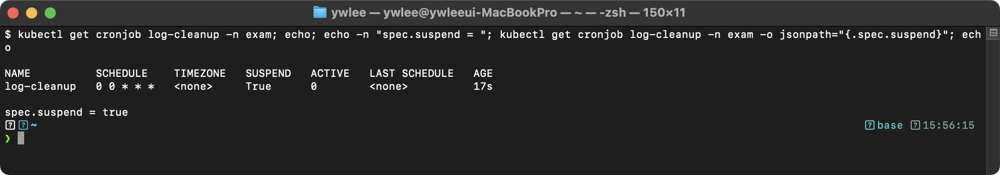

**핵심**: `spec.suspend`를 true/false로 토글하여 CronJob을 일시 중지/재개한다.

> **주의**: `suspend: true`는 새 Job 생성을 막는 것이며, 이미 실행 중인 Job은 완료될 때까지 계속 동작한다. 실행 중인 Job을 즉시 종료하려면 별도로 `kubectl delete job <job-name> -n exam`을 실행해야 한다.

</details>

---

## 3. 트러블슈팅 시나리오

### 3.1 Volume 마운트 관련 장애

**시나리오:** emptyDir을 사용하는 멀티 컨테이너 Pod에서 reader 컨테이너가 파일을 읽지 못한다.

```bash
# 볼륨 마운트 상태 확인
kubectl describe pod <pod-name> | grep -A3 "Mounts:"

# 컨테이너 내부에서 파일 확인
kubectl exec <pod-name> -c reader -- ls -la /shared/
kubectl exec <pod-name> -c writer -- ls -la /shared/
```

검증 (정상):
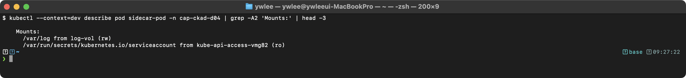

디버깅 체크리스트:
- 두 컨테이너의 `volumeMounts.name`이 동일한지 확인한다.
- `volumeMounts.mountPath`가 의도한 경로인지 확인한다.
- writer가 실제로 파일을 생성하고 있는지 확인한다.

### 3.2 Job Pod가 반복 실패하는 경우

```bash
# 실패 원인 확인
kubectl get pods -l job-name=<job-name> -o wide
kubectl describe pod <failed-pod-name> | tail -20
kubectl logs <failed-pod-name>
```

검증 (실패 Pod 목록):
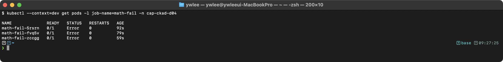

원인: command 오류, 이미지 내 바이너리 부재, 환경 변수 미설정 등이다. `backoffLimit` 초과 시 Job은 Failed 상태가 되고 더 이상 Pod를 생성하지 않는다.

---

## 4. 복습 체크리스트

다음 항목들은 이 장에서 다룬 내용이다. 각 항목을 스스로 소리 내어 설명할 수 있는지 확인한다. 막히면 괄호 안의 섹션으로 돌아간다.

- [ ] emptyDir과 PVC의 생명주기·영속성·공유 범위 차이를 설명할 수 있다 (문제 7 도입부 비교표)
- [ ] Job의 `completions`, `parallelism`, `backoffLimit` 필드 각각의 역할을 설명할 수 있다 (문제 4·6)
- [ ] CronJob의 `schedule` cron 형식(분·시·일·월·요일 순서)을 직접 작성할 수 있다 (문제 5)
- [ ] `concurrencyPolicy: Forbid/Allow/Replace` 각각의 동작을 구분할 수 있다 (문제 5)
- [ ] Sidecar·Ambassador·Adapter 패턴의 목적과 차이를 설명하고 YAML로 구현할 수 있다 (문제 3·10·11)
- [ ] Init Container가 종료된 후 main container가 데이터를 이어받는 원리(볼륨 공유)를 설명할 수 있다 (문제 2)
- [ ] `kubectl create job`, `kubectl create cronjob --dry-run=client -o yaml` 패턴으로 빠르게 기본 틀을 생성할 수 있다 (문제 4·5 빠른 풀이)
- [ ] `suspend: true`가 기존 실행 중 Job에 미치는 영향을 설명할 수 있다 (문제 12)

---

## tart-infra 실습

### 실습 환경 설정

**전제 조건**: 아래 실습을 시작하기 전에 다음을 확인한다.
- dev 클러스터가 가동 중이어야 한다(`./scripts/boot.sh` 후 `./scripts/fix-cluster-ip-drift.sh dev`).
- kubeconfig 경로: `kubeconfig/dev.yaml`
- 노드 SSH: `ssh dev-master`(별칭, `~/.ssh/config` ProxyCommand 방식)
- 실습 1~2는 `demo` 네임스페이스에 PostgreSQL·Redis·RabbitMQ 서비스가 있어야 한다. 실습 전 먼저 확인한다.

```bash
export KUBECONFIG=kubeconfig/dev.yaml
# 클러스터 정상 여부 확인
kubectl get nodes
# demo 네임스페이스 서비스 확인
kubectl get pod -n demo
kubectl get svc -n demo | grep -E 'postgres|redis|rabbit'
# nc 도구 가용 여부 확인(busybox:1.36 기준)
kubectl run nc-test --image=busybox:1.36 -n demo --restart=Never --rm -it -- sh -c 'which nc && echo "nc available" || echo "nc not found"'
```

> **nc 대안**: 특정 busybox 이미지 버전에 따라 `nc`(netcat)가 포함되지 않을 수 있다. `nc`를 찾을 수 없으면 `wget -q --spider <host>:<port>` 또는 `curl -s --connect-timeout 3 <host>:<port>`로 대체한다.

```bash
kubectl get pods -n demo
```

검증:
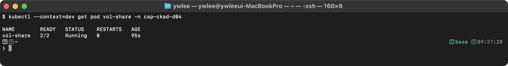

### 실습 1: Job으로 PostgreSQL 연결 테스트

demo 네임스페이스의 PostgreSQL에 연결을 확인하는 Job을 생성한다.

```bash
kubectl create job pg-check -n demo \
  --image=busybox:1.36 \
  -- sh -c 'nc -z postgresql.demo.svc.cluster.local 5432 && echo "PostgreSQL is reachable" || echo "FAILED"'

# Job 상태 확인
kubectl get job pg-check -n demo
kubectl logs job/pg-check -n demo
```

**검증 - 기대 출력:** Job 이 `Complete`(1/1)되고, 로그에 `PostgreSQL is reachable` 이 출력된다 — Job Pod 가 exit 0 으로 끝나 Job 이 완료된 것이다(dev 실측).
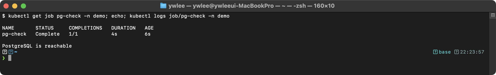

**동작 원리:** Job 컨트롤러는 Pod를 생성하고 `completions`(기본 1) 수만큼 성공적으로 완료될 때까지 관리한다. Pod가 exit 0으로 종료되면 Job이 Complete 상태가 된다. `backoffLimit`(기본 6) 초과 시 Job은 Failed 상태가 된다.

### 실습 2: CronJob으로 주기적 상태 점검

demo 네임스페이스의 주요 서비스를 매분 점검하는 CronJob을 생성한다.

```bash
kubectl create cronjob svc-check -n demo \
  --image=busybox:1.36 \
  --schedule="*/1 * * * *" \
  -- sh -c 'echo "=== Service Check ===" && nc -z redis-master.demo 6379 && echo "Redis: OK" && nc -z rabbitmq.demo 5672 && echo "RabbitMQ: OK"'

# CronJob 확인
kubectl get cronjob svc-check -n demo

# 1분 후 생성된 Job 확인
kubectl get jobs -n demo -l job-name -w
```

**검증 - 기대 출력:** CronJob 이 생성되고 SCHEDULE(`*/1 * * * *`)·SUSPEND(False) 등이 보인다. K8s 1.31 은 TIMEZONE 컬럼을 포함한다(dev 실측).
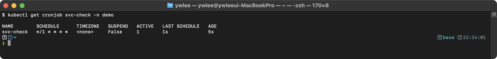

**동작 원리:** CronJob 컨트롤러는 schedule에 따라 Job 객체를 생성한다. `successfulJobsHistoryLimit`(기본 3)과 `failedJobsHistoryLimit`(기본 1)에 의해 오래된 Job은 자동 정리된다. `concurrencyPolicy`(기본 Allow)로 동시 실행 정책을 제어할 수 있다.

### 실습 3: emptyDir 볼륨 공유 패턴

nginx와 컨텐츠 생성기가 볼륨을 공유하는 Multi-container Pod를 구성한다.

```bash
cat <<'EOF' | kubectl apply -f -
apiVersion: v1
kind: Pod
metadata:
  name: vol-share
  namespace: demo
spec:
  containers:
    - name: writer
      image: busybox:1.36
      command: ['sh', '-c', 'echo "<h1>tart-infra dev cluster</h1>" > /data/index.html && sleep 3600']
      volumeMounts:
        - name: shared
          mountPath: /data
    - name: nginx
      image: nginx:1.25
      volumeMounts:
        - name: shared
          mountPath: /usr/share/nginx/html
  volumes:
    - name: shared
      emptyDir: {}
EOF

# 확인
kubectl exec vol-share -n demo -c nginx -- curl -s localhost
```

**예상 출력:**
```html
<!-- dev 실측 (cap-ckad-d04 ns) -->
<h1>tart-infra dev cluster</h1>
```

**동작 원리:** emptyDir은 Pod가 노드에 스케줄될 때 빈 디렉토리로 생성되며, Pod 내 모든 컨테이너가 공유할 수 있다. Pod가 삭제되면 emptyDir 데이터도 함께 삭제된다. PVC와 달리 영속성이 없으므로 임시 데이터 교환에만 사용한다.

### 정리

```bash
kubectl delete job pg-check -n demo
kubectl delete cronjob svc-check -n demo
kubectl delete pod vol-share -n demo
```

검증:
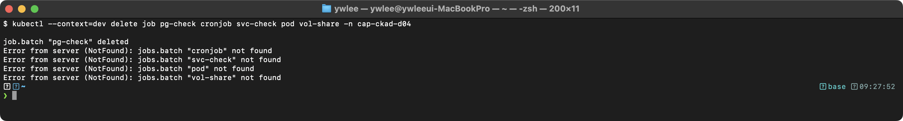

---

## ✅ 자가점검

<details>
<summary>1. Job/CronJob Pod 템플릿에 허용되는 restartPolicy와, Never vs OnFailure의 차이는?</summary>

`Never` 또는 `OnFailure`만 허용된다(`Always`는 검증 오류). `Never`는 실패 시 **새 Pod를 생성**해 실패한 Pod가 남는다(로그 보존 유리). `OnFailure`는 kubelet이 **같은 Pod를 재시작**해 Pod 수가 늘지 않는다.
</details>

<details>
<summary>2. completions와 parallelism의 관계는?</summary>

`completions`는 성공해야 할 총 Pod 수, `parallelism`은 동시에 실행할 Pod 수다. 둘은 독립이며 `completions` 미설정 시 기본값은 1이다.
</details>

<details>
<summary>3. CronJob의 concurrencyPolicy 3종과 각 의미는?</summary>

`Allow`(동시 실행 허용, 기본), `Forbid`(이전 실행 미완 시 새 실행 건너뜀), `Replace`(이전 실행 취소 후 새로 시작). `suspend: true`는 새 Job 생성을 막을 뿐 실행 중 Pod를 종료하지 않는다.
</details>

<details>
<summary>4. emptyDir 볼륨은 컨테이너 재시작·Pod 삭제 시 각각 어떻게 되나?</summary>

emptyDir은 **Pod 생명주기**에 묶인다. 컨테이너 재시작에는 유지되지만 **Pod 삭제·재스케줄 시 사라진다**. 영속 저장은 PVC를 쓴다. 사이드카 컨테이너 간 파일 공유에 흔히 쓴다.
</details>

<details>
<summary>5. activeDeadlineSeconds와 backoffLimit의 차이, 그리고 activeDeadlineSeconds의 위치는?</summary>

`backoffLimit`은 재시도 횟수 상한(기본 6), `activeDeadlineSeconds`는 시작 후 경과 시간 상한이다. 먼저 도달하는 쪽에서 Job이 실패 처리된다. `activeDeadlineSeconds`는 **Job spec 수준**(`spec.activeDeadlineSeconds`) 필드다(Pod spec 아님).
</details>

## 시험 팁

CKAD 실기에서 이 장의 주제가 자주 나오는 함정 패턴을 정리한다.

- **`restartPolicy` 혼동**: Job/CronJob Pod 템플릿에는 `restartPolicy: Never` 또는 `restartPolicy: OnFailure`만 허용된다. `restartPolicy: Always`(Deployment 기본값)를 그대로 쓰면 `kubectl apply` 시 검증 오류가 난다. `Never`는 실패 시 새 Pod를 생성하고(Pod 수 증가), `OnFailure`는 kubelet이 같은 Pod를 재시작한다(Pod 수 유지). 로그 보존이 필요하면 `Never`가 유리하다.
- **`completions` 미설정 시 기본값**: `completions`를 명시하지 않으면 기본값은 `1`이다. `parallelism`만 설정하면 completions도 parallelism 값으로 따라가는 것이 아니라 각각 독립이다. 혼동하지 않도록 두 필드를 함께 명시하는 습관을 들인다.
- **CronJob `schedule` 필드 순서 암기법**: `분 시 일 월 요일` — "분시일월요" 또는 영어로 "minute hour day-of-month month day-of-week". `*/10 * * * *`은 "매 10분마다", `0 3 * * *`은 "매일 오전 3시"다. 시험에서 틀리는 가장 흔한 실수는 분/시 순서를 바꾸는 것이다.
- **`activeDeadlineSeconds` 위치**: Job spec 수준(`spec.activeDeadlineSeconds`)이지 Pod spec 수준이 아니다. Pod 수준에는 없는 필드다.
- **`suspend: true` 의미**: 새 Job 생성을 막는 것이지 이미 실행 중인 Pod를 종료하지 않는다. 즉시 중단이 필요하면 실행 중인 Job을 별도로 삭제해야 한다.
- **Ambassador/Adapter 패턴 YAML 작성 속도**: 두 패턴 모두 `kubectl run --dry-run=client -o yaml`로 단일 컨테이너 Pod 틀을 뽑은 뒤 `spec.containers` 배열에 컨테이너를 추가하는 것이 가장 빠르다. 처음부터 멀티컨테이너 YAML을 타이핑하면 들여쓰기 오류가 생기기 쉽다.
- **haproxy 같은 설정 파일 의존 이미지**: 시험에서 Ambassador 패턴 구현이 요구될 때 이미지 지정이 없으면 `nginx:1.25`나 `busybox:1.36`으로 구현한다. haproxy처럼 별도 ConfigMap이 필수인 이미지는 시험 시간을 소모한다.

---

## 더 읽을거리

공식 문서와 레퍼런스 링크다. 시험 중에도 접근 가능한 공식 문서를 익혀두면 YAML 필드를 검색하는 시간이 단축된다.

- [Kubernetes 공식 — Jobs](https://kubernetes.io/docs/concepts/workloads/controllers/job/): `completions`, `parallelism`, `backoffLimit`, `activeDeadlineSeconds`, `ttlSecondsAfterFinished` 전체 필드 참조
- [Kubernetes 공식 — CronJob](https://kubernetes.io/docs/concepts/workloads/controllers/cron-jobs/): `schedule`, `concurrencyPolicy`, `suspend`, `startingDeadlineSeconds` 설명
- [Kubernetes 공식 — Init Containers](https://kubernetes.io/docs/concepts/workloads/pods/init-containers/): Init Container 실행 순서·실패 동작·볼륨 공유 패턴
- [Kubernetes 공식 — Volumes](https://kubernetes.io/docs/concepts/storage/volumes/): `emptyDir`, `hostPath`, `persistentVolumeClaim` 타입별 동작
- [Kubernetes 공식 — PersistentVolumeClaims](https://kubernetes.io/docs/concepts/storage/persistent-volumes/): `accessModes`, `storageClassName`, 바인딩 사이클
- [Kubernetes 블로그 — Multi-Container Pod Design Patterns](https://kubernetes.io/blog/2015/06/the-distributed-system-toolkit-patterns/): Sidecar·Ambassador·Adapter 패턴 원문
