# CKAD Day 5: Deployment와 배포 전략 (RollingUpdate, Recreate)

> CKAD 도메인: Application Deployment (20%) - Part 1a | 예상 소요 시간: 1시간

> **흐름 연속성:** 이전 [day04 — Service와 Endpoints](day04.md) 에서 Pod를 외부에 노출하는 방법을 배웠다. day05는 그 Pod 묶음을 관리하는 Deployment — 선언적 배포·업데이트·롤백 — 를 다룬다. 다음 [day06 — HPA/VPA](day06.md) 는 Deployment에 자동 스케일링을 붙이는 내용으로 이어진다.

---

## 오늘의 학습 목표

- [ ] Deployment의 개념과 YAML 구조를 이해한다
- [ ] ReplicaSet과 Deployment의 관계를 설명할 수 있다
- [ ] RollingUpdate와 Recreate 전략의 차이를 숙지한다
- [ ] maxSurge, maxUnavailable 파라미터를 설정할 수 있다
- [ ] kubectl rollout 명령어로 롤백을 수행할 수 있다

---

> **실습 선행 준비:** 아래 이론 섹션을 읽기 전에 dev 클러스터 접속 확인이 필요하다. 클러스터 기동 및 네임스페이스·Deployment 준비 절차는 문서 하단 **"실습 환경설정 - dev 클러스터 접속 (day05)"** 섹션을 먼저 수행한다. `export KUBECONFIG=kubeconfig/dev.yaml`을 설정해 두면 이하 모든 `kubectl` 명령을 그대로 쓸 수 있다.

---

## 1. Deployment (디플로이먼트) - 선언적 애플리케이션 관리

### 1.1 Deployment란?

**등장 배경:**
Pod를 직접 생성하면 Pod가 삭제되었을 때 자동 복구가 되지 않는다. ReplicaSet은 Pod 수를 유지해 주지만, 이미지 업데이트의 자동화는 제공하지 않는다. ReplicaSet으로 관리하는 앱을 새 버전 이미지로 올리려면, 쿠버네티스가 새 ReplicaSet을 자동으로 만들어 주지 않으므로 사람이 직접 이전 RS의 replicas를 0으로 줄이고 새 RS를 만들어 replicas를 원하는 수로 늘려야 한다. 이 수작업 도중 순서를 잘못 잡거나 새 RS가 준비되기도 전에 이전 RS를 0으로 줄이면 그 순간 트래픽을 받을 Pod가 사라져 서비스 중단(downtime)이 발생한다. 즉 "버전 교체"라는 흔한 작업이 사람 실수에 그대로 노출된다.

Deployment는 이 교체 절차 전체를 자동화한다. spec.template(Pod 사양)이 바뀌면 자동으로 새 ReplicaSet을 생성하고, spec.strategy(RollingUpdate/Recreate)에 따라 이전 Pod를 새 Pod로 교체하며, 문제가 생기면 이전 revision으로 빠르게 롤백한다. 즉 Deployment는 ReplicaSet 위에 추가 추상화 계층을 제공하여, 업데이트 전략·롤백·일시 정지 등을 선언적(declarative)으로 관리한다. 쿠버네티스에서 stateless(상태를 Pod 내부에 저장하지 않아 Pod가 재생성돼도 데이터가 유지되는 방식; DB처럼 영속 데이터를 Pod에 저장하는 stateful 앱은 StatefulSet을 사용) 워크로드를 배포하는 표준 방법이다.

**공학적 정의:**
Deployment는 apps/v1 API 그룹의 워크로드 컨트롤러로, ReplicaSet을 관리하여 선언적(declarative) 방식으로 Pod의 원하는 상태(desired state)를 유지한다. Deployment Controller는 spec.template의 변경을 감지하여 새 ReplicaSet을 생성하고, spec.strategy에 따라 이전 ReplicaSet의 Pod를 새 ReplicaSet의 Pod로 점진적(RollingUpdate) 또는 일괄(Recreate) 교체한다. 각 업데이트는 revision으로 기록되어 rollback이 가능하다.

**내부 동작 원리 심화:**
Deployment Controller는 spec.template의 내용을 해시 함수로 요약한 값(pod-template-hash)을 계산하여 ReplicaSet 이름의 접미사로 사용한다(예: `web-deploy-5977bf794c`의 `5977bf794c`). 이 해시는 "어떤 Pod 사양이 어떤 ReplicaSet에 대응되는가"를 식별하기 위한 장치다. template이 같으면 같은 해시가, 다르면 다른 해시가 나오므로 컨트롤러는 이 값만 보고 새 template인지 이미 있던 template인지 빠르게 판정한다.

이 메커니즘 덕분에, 이미 만든 적 있는 template(예: 직전 버전)으로 되돌리면 같은 해시를 가진 이전 ReplicaSet이 그대로 존재하므로 새로 만들지 않고 그 RS의 replicas만 키워 재사용할 수 있다(롤백이 빠른 이유). 반대로 template이 바뀌어 새 해시가 나왔는데 대응하는 ReplicaSet이 없으면 새로 생성한다. 이전 ReplicaSet은 replicas=0으로 보존되며, template이 달라 더 이상 쓰지 않는 오래된 RS는 `revisionHistoryLimit`(기본 10)에 따라 오래된 것부터 삭제된다. spec.template 외의 변경(replicas, strategy 등)은 해시를 바꾸지 않으므로 새 ReplicaSet을 생성하지 않는다.

**핵심 특징:**
- Pod의 원하는 수(replicas)를 자동으로 유지
- 이미지 업데이트 시 자동 롤링 업데이트 (명령형 방식인 `kubectl run`·`kubectl delete` 같은 단발 명령이 아니라, Deployment 매니페스트에 desired state를 선언하면 Deployment Controller가 현재 상태를 지속적으로 desired와 일치시키는 것이 선언적(declarative) 관리다)
- 업데이트 이력(revision) 관리 및 롤백
- 스케일링(수평 확장/축소)

### 1.2 Deployment YAML 상세

```yaml
apiVersion: apps/v1              # apps API 그룹
kind: Deployment
metadata:
  name: web-deploy               # Deployment 이름
  namespace: demo
  labels:
    app: web                     # Deployment 자체의 레이블

spec:
  replicas: 3                    # 원하는 Pod 수

  selector:                      # 관리할 Pod를 선택하는 레이블
    matchLabels:
      app: web                   # template.metadata.labels와 반드시 일치!

  revisionHistoryLimit: 10       # 보관할 이전 ReplicaSet 수 (기본: 10)

  strategy:                      # 업데이트 전략
    type: RollingUpdate          # RollingUpdate(기본) 또는 Recreate
    rollingUpdate:
      maxSurge: 1                # 추가 허용 Pod 수 (3+1=4개까지)
      maxUnavailable: 1          # 동시 비가용 허용 수 (3-1=2개 최소 유지)

  template:                      # Pod 템플릿
    metadata:
      labels:
        app: web                 # selector.matchLabels와 일치해야 함!
    spec:
      containers:
        - name: nginx
          image: nginx:1.25
          ports:
            - containerPort: 80
```

### 1.3 Deployment와 ReplicaSet의 관계

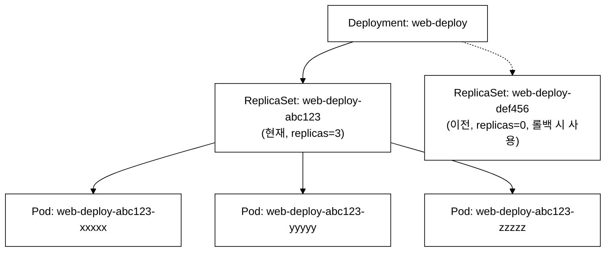
_그림 1. Deployment-ReplicaSet-Pod 소유 관계 (점선=replicas=0 이전 RS)._

```bash
# Deployment 빠른 생성
kubectl create deployment web-deploy --image=nginx:1.25 --replicas=3
```

검증:
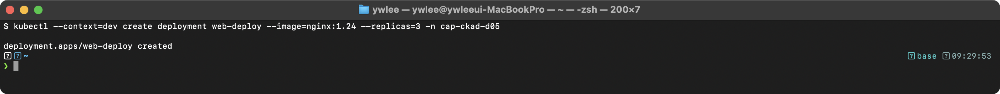

```bash
# Deployment 확인
kubectl get deployments -n demo
```

검증:
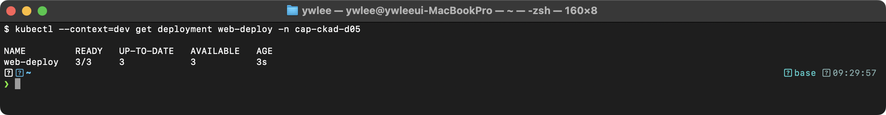

```bash
kubectl get replicasets -n demo    # Deployment가 관리하는 RS 확인
```

검증:
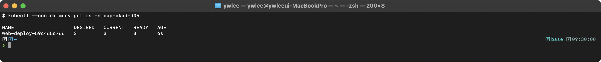

```bash
# 스케일링
kubectl scale deployment web-deploy --replicas=5 -n demo
kubectl get deployment web-deploy -n demo
```

검증:
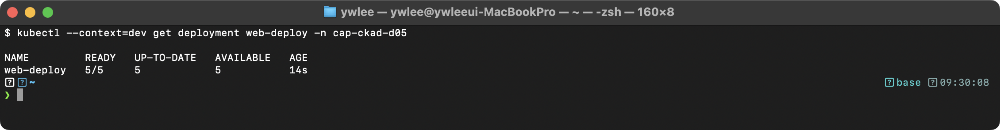

---

## 2. Deployment 업데이트 전략

### 2.1 RollingUpdate (기본)

**공학적 정의:**
RollingUpdate는 Deployment Controller가 새 ReplicaSet의 Pod를 점진적으로 생성하면서 동시에 이전 ReplicaSet의 Pod를 종료하여 다운타임 없이 업데이트를 수행하는 전략이다. maxSurge와 maxUnavailable 파라미터로 동시 작업량을 제어한다.

```yaml
strategy:
  type: RollingUpdate
  rollingUpdate:
    maxSurge: 1                # replicas(3) + maxSurge(1) = 최대 4개 Pod
                               # 정수 또는 퍼센트(25%) 가능
    maxUnavailable: 1          # replicas(3) - maxUnavailable(1) = 최소 2개 가용
                               # 정수 또는 퍼센트(25%) 가능
```

**RollingUpdate 과정 (replicas=3, maxSurge=1, maxUnavailable=1):**

제약 조건을 먼저 계산한다:
- `maxUnavailable=1` → 최소 `3 - 1 = 2`개 Pod가 항상 Ready 상태여야 한다
- `maxSurge=1` → 최대 `3 + 1 = 4`개 Pod까지 동시 존재할 수 있다

이 두 제약이 교체 순서를 결정한다. 각 Step은 새 Pod가 Ready 상태가 된 것을 확인한 후 다음 이전 Pod를 종료하는 방식으로 진행되며, 최소 2개 가용 조건이 유지된다.

| 단계 | Old RS 상태 | New RS 상태 | 가용(Ready) Pod 수 | 비고 |
|:-----|:------------|:------------|:------------------:|:-----|
| 초기 | Pod-1 Running, Pod-2 Running, Pod-3 Running | (없음) | 3 | replicas=3 정상 |
| Step 1 | Pod-1 Running, Pod-2 Running, Pod-3 Terminating | Pod-4 Creating | 2 | maxSurge 허용으로 총 4개 허용; Pod-3 종료·Pod-4 생성 동시 시작; 가용 최소 2개 유지 |
| Step 2 | Pod-1 Running, Pod-2 Terminating | Pod-4 Running, Pod-5 Creating | 2 | Pod-4가 Ready 확인된 뒤에만 Pod-2 종료(maxUnavailable 제약 준수) |
| Step 3 | (replicas=0, Pod 없음) | Pod-4 Running, Pod-5 Running, Pod-6 Running | 3 | 교체 완료 |

**실측 데모 — RollingUpdate 교체 과정 직접 관찰:**

아래 두 명령을 터미널 창 두 개에서 동시에 실행한다. 한 창에서 `kubectl get pods -w`로 상태 변화를 지켜보고, 다른 창에서 이미지를 변경해 롤아웃을 트리거한다.

```bash
# 창 1: Pod 상태 실시간 감시 (롤아웃 시작 전부터 실행)
kubectl get pods -w -n demo
```

```bash
# 창 2: 이미지 변경으로 RollingUpdate 트리거
kubectl set image deployment/web-deploy nginx=nginx:1.26 -n demo
```

검증:
> (미캡처 — 추후 실측 캡처 예정: RollingUpdate Pod Terminating→ContainerCreating→Running 전환)

위 캡처에서 이전 Pod가 `Terminating` 상태로 진입하는 동안 새 Pod가 `ContainerCreating → Running` 으로 올라오는 것을 확인할 수 있다. `maxUnavailable=1` 이므로 항상 최소 2개의 Ready Pod가 유지된다.

### 2.2 Recreate

**공학적 정의:**
Recreate 전략은 이전 ReplicaSet의 모든 Pod를 먼저 종료한 후 새 ReplicaSet의 Pod를 생성한다. 업데이트 중 서비스 중단(다운타임)이 발생하지만, 이전 버전과 새 버전이 동시에 실행되면 안 되는 경우(예: 스키마 마이그레이션)에 사용한다.

**트레이드오프:**
- 다운타임 발생: 이전 Pod가 모두 종료된 뒤 새 Pod가 준비될 때까지 서비스가 중단된다. 단, 이 기간 동안 두 버전이 동시에 트래픽을 처리하는 상황(split-brain — 두 버전의 인스턴스가 같은 데이터를 서로 다른 규칙으로 동시에 읽고 써 데이터 상태가 갈라지는 현상)은 완전히 차단된다.
- maxSurge 비용 없음: RollingUpdate처럼 교체 중 추가 Pod를 생성할 필요가 없으므로 업데이트 중 리소스 사용량이 replicas만큼만 유지된다. 클러스터 여유 용량이 부족할 때 유리하다.
- 단일 버전 보장: 어느 시점에도 이전 버전과 새 버전이 같은 Service 뒤에서 동시에 응답하지 않는다. DB 스키마 마이그레이션 외에도, 싱글톤 프로세스(리더 선출 없이 단 하나만 실행돼야 하는 워커), 파일 잠금을 쓰는 앱, 포트를 독점하는 레거시 앱 등에서 Recreate가 더 안전하다.

```yaml
strategy:
  type: Recreate              # 모든 이전 Pod 종료 후 새 Pod 생성
  # rollingUpdate 필드 사용 불가
```

**Recreate 과정:**

```
초기 상태:
  Old RS: [Pod-1] [Pod-2] [Pod-3]

Step 1: 모든 이전 Pod 종료
  Old RS: [Terminating] [Terminating] [Terminating]
  서비스 중단!

Step 2: 모든 새 Pod 생성
  New RS: [Pod-4] [Pod-5] [Pod-6]
  서비스 복구!
```

**실측 데모 — Recreate 과정 직접 관찰:**

Recreate 전략을 적용한 Deployment에 이미지를 변경하면, 이전 Pod 전부가 `Terminating`으로 떨어진 뒤 새 Pod가 일괄 생성된다.

```bash
# 창 1: Pod 상태 실시간 감시
kubectl get pods -w -n demo
```

```bash
# 창 2: Recreate 전략 Deployment에 이미지 변경 적용
kubectl apply -f recreate.yaml
```

검증:
> (미캡처 — 추후 실측 캡처 예정: Recreate 전략: 모든 Pod Terminating 후 일괄 Running)

위 캡처에서 이전 3개 Pod가 동시에 `Terminating`으로 전환되어 서비스 중단이 발생하고, 이후 새 3개 Pod가 일괄 `ContainerCreating → Running`으로 올라오는 것을 확인할 수 있다.

### 2.3 RollingUpdate vs Recreate 비교

| 항목 | RollingUpdate | Recreate |
|------|-------------|----------|
| 다운타임 | 없음 (Zero-downtime) | 있음 |
| 리소스 사용 | 일시적으로 더 많은 Pod | 동일 |
| 버전 공존 | 일시적으로 두 버전 공존 | 한 버전만 실행 |
| 사용 시나리오 | 일반적인 웹 앱 | DB 스키마 변경, 호환성 문제 |
| 속도 | 느림 (점진적) | 빠름 (일괄) |

---

## 3. Rollback과 Rollout 관리

### 3.1 이미지 업데이트

```bash
# 방법 1: kubectl set image
kubectl set image deployment/web-deploy nginx=nginx:1.25 -n demo
# 컨테이너 이름=새이미지

# 방법 2: kubectl edit
kubectl edit deployment web-deploy -n demo
# spec.template.spec.containers[0].image를 수정

# 방법 3: kubectl patch
kubectl patch deployment web-deploy -n demo \
  -p '{"spec":{"template":{"spec":{"containers":[{"name":"nginx","image":"nginx:1.25"}]}}}}'
```

> **주의 — 컨테이너 이름 일치 필수:** `kubectl set image deployment/<name> <container-name>=<image>` 문법에서 `<container-name>`은 해당 Deployment의 `spec.template.spec.containers[*].name`과 **정확히** 일치해야 한다. 위 YAML 예제(§1.2)는 `name: nginx`이므로 `kubectl set image deployment/web-deploy nginx=nginx:1.25`가 된다. 실습 섹션의 `nginx-web` Deployment는 컨테이너 이름도 `nginx`로 생성된 경우이므로 동일하다. YAML에서 컨테이너 이름을 `app-container`처럼 다르게 지정했다면 `kubectl set image deployment/web-deploy app-container=nginx:1.25`로 맞춰야 한다.

### 3.2 Rollout 이력 조회(history)와 롤백(undo)

```bash
# 롤아웃 상태 확인
kubectl rollout status deployment/web-deploy -n demo
```

검증:
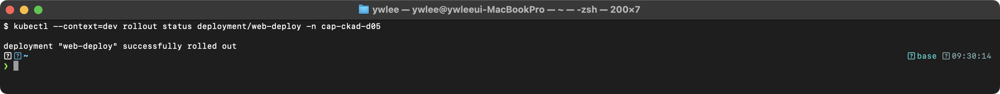

```bash
# 롤아웃 이력 확인
kubectl rollout history deployment/web-deploy -n demo
```

검증:
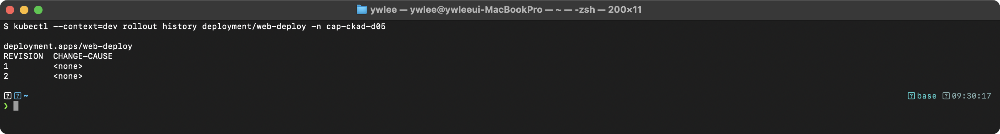

```bash
# 특정 revision 상세 확인
kubectl rollout history deployment/web-deploy -n demo --revision=2
```

**플래그 구분 — `--revision` vs `--to-revision`:**
- `history --revision=N`: `history` 서브커맨드의 플래그로, 해당 revision에 대응하는 ReplicaSet의 Pod template 전체(컨테이너 이미지·환경변수·volumes 등) 상세를 출력한다. `history` 단독 실행(플래그 없음)은 `REVISION | CHANGE-CAUSE` 요약 표만 출력한다.
- `undo --to-revision=N`: `undo` 서브커맨드의 플래그로, 지정한 revision의 Pod template으로 되돌린다. `--to`가 포함된 `--to-revision`이라는 점에 주의한다. `--revision` 단독(앞에 `--to-` 없음)으로 쓰면 undo에서는 인식되지 않는다.

### 3.3 Rollback (롤백)

```bash
# 이전 버전으로 롤백
kubectl rollout undo deployment/web-deploy -n demo

# 특정 revision으로 롤백
kubectl rollout undo deployment/web-deploy -n demo --to-revision=1

# 일시 정지/재개
kubectl rollout pause deployment/web-deploy -n demo
kubectl rollout resume deployment/web-deploy -n demo
```

**pause/resume 사용 시나리오:** 이미지 업데이트와 환경 변수 변경을 한 번에 atomic하게 적용해야 할 때 사용한다. `pause` 없이 `kubectl set image`와 `kubectl set env`를 순서대로 실행하면 첫 번째 변경(이미지만 바뀐 중간 상태)만 반영된 롤아웃이 즉시 시작된다. `pause` → 두 변경 적용 → `resume` 순으로 진행하면 두 변경이 합쳐진 최종 spec이 한 번의 롤아웃으로 배포된다. pause 중에는 spec 변경만 기록되고 Pod 교체는 진행되지 않는다.

### 3.4 change-cause 기록

```bash
# 업데이트 시 이유 기록 (--record는 deprecated, annotation 사용)
kubectl annotate deployment web-deploy \
  kubernetes.io/change-cause="Update to nginx:1.25 for security patch" \
  -n demo

# 또는 YAML에서
metadata:
  annotations:
    kubernetes.io/change-cause: "Initial deployment"
```

`kubernetes.io/change-cause` annotation은 `Deployment.metadata.annotations`에 저장된다. `kubectl rollout history`는 각 revision에 대응하는 ReplicaSet의 이 annotation 값을 읽어 `CHANGE-CAUSE` 열에 표시한다. annotation을 달기 전에 이미 생성된 revision은 `<none>`으로 표시된다. 다음 명령으로 annotation이 실제로 history에 반영되는지 확인한다:

```bash
kubectl rollout history deployment/web-deploy -n demo
# CHANGE-CAUSE 열에 annotation 값이 나타난다
```

---

## 4. 시험 출제 패턴과 팁

Application Deployment 도메인은 CKAD의 **20%**를 차지한다:

1. **Deployment 생성**: replicas, strategy 설정
2. **이미지 업데이트**: kubectl set image 또는 YAML 수정
3. **RollingUpdate 파라미터**: maxSurge, maxUnavailable 설정
4. **Rollback**: kubectl rollout undo --to-revision

> **실행 환경:** 아래 명령은 dev 클러스터의 `demo` 네임스페이스에서 실행한다. kubeconfig 경로는 `kubeconfig/dev.yaml`이다. `export KUBECONFIG=kubeconfig/dev.yaml`을 먼저 설정하거나 각 명령에 `--kubeconfig kubeconfig/dev.yaml`을 붙인다. 네임스페이스는 `-n demo`로 명시한다.

```bash
# Deployment 빠른 생성
kubectl create deployment web --image=nginx:1.25 --replicas=3 --dry-run=client -o yaml > dep.yaml

# 이미지 업데이트
kubectl set image deployment/web nginx=nginx:1.25

# 롤아웃 관리
kubectl rollout status deployment/web
kubectl rollout history deployment/web
kubectl rollout undo deployment/web --to-revision=1

# 필드 구조 확인
kubectl explain deployment.spec.strategy
kubectl explain deployment.spec.strategy.rollingUpdate
```

---

## 5. 트러블슈팅

### 5.1 Deployment 롤아웃이 멈추는 경우

**증상:** `kubectl rollout status`가 완료되지 않고 대기한다.

```bash
kubectl rollout status deployment/web-deploy -n demo --timeout=60s
kubectl get rs -n demo
kubectl describe deployment web-deploy -n demo | tail -20
```

검증 (멈춘 상태):
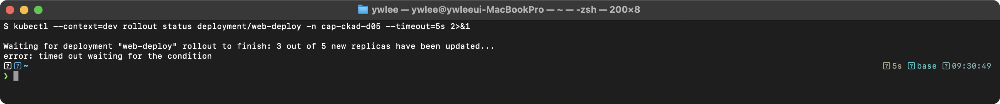

주요 원인:
- **이미지 Pull 실패**: 잘못된 이미지 태그로 새 Pod가 ImagePullBackOff 상태이다.
- **Readiness Probe 실패**: 새 Pod의 Readiness Probe(주기적 헬스체크)가 실패하면 Ready 상태로 전환되지 않아 rollingUpdate가 다음 단계로 진행되지 않는다.
- **리소스 부족**: 새 Pod를 위한 CPU/메모리가 부족하여 Pending 상태이다.

해결:
```bash
# 잘못된 이미지 롤백
kubectl rollout undo deployment/web-deploy -n demo

# 또는 올바른 이미지로 재설정
kubectl set image deployment/web-deploy nginx=nginx:1.25 -n demo
```

### 5.2 selector와 label 불일치

**증상:** Deployment를 생성하면 API Server가 거부한다.

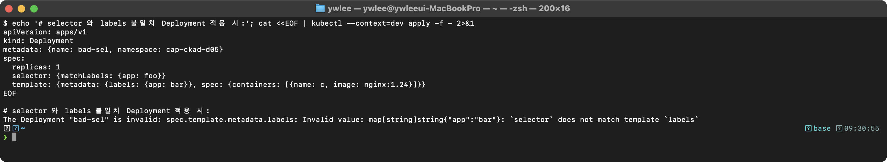

원인: `spec.selector.matchLabels`와 `spec.template.metadata.labels`가 일치하지 않는다. Deployment는 이 두 값이 반드시 일치해야 하며, 생성 후 selector는 변경할 수 없다(immutable).

### 5.3 ReplicaSet이 누적되는 경우

```bash
kubectl get rs -n demo
```

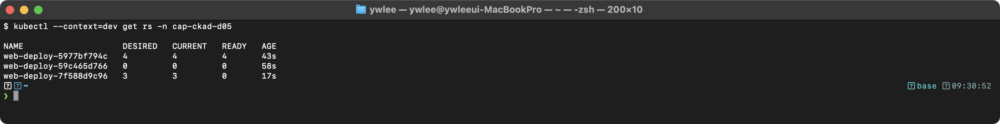

원인: `revisionHistoryLimit`가 크게 설정되어 있거나 기본값(10)이 적용된 상태이다. 과도한 RS는 etcd 용량을 소모한다. 필요에 따라 `revisionHistoryLimit`을 줄인다.

---

## 6. 복습 체크리스트

- [ ] Deployment의 spec.selector.matchLabels와 template.metadata.labels가 일치해야 하는 이유를 안다
- [ ] Deployment -> ReplicaSet -> Pod의 관계를 설명할 수 있다
- [ ] RollingUpdate의 maxSurge와 maxUnavailable 파라미터를 설정할 수 있다
- [ ] Recreate 전략의 특성과 사용 시나리오를 안다
- [ ] `kubectl set image`로 이미지를 업데이트할 수 있다
- [ ] `kubectl rollout status/history/undo` 명령을 사용할 수 있다
- [ ] 특정 revision으로 롤백하는 방법을 안다
- [ ] `kubectl rollout pause/resume`으로 여러 변경을 한 번에 적용할 수 있다
- [ ] revisionHistoryLimit의 역할을 안다

---

## 시험형 미니랩 — 직접 해보기

**시나리오 A (제한 시간 5분):** `dev` 클러스터 `exam` 네임스페이스에 `webserver` Deployment를 nginx:1.24 이미지, replicas=2로 생성하라. 생성 후 nginx:1.25로 롤링 업데이트하고, 히스토리를 확인한 다음 revision 1(nginx:1.24)로 롤백하라.

```bash
# 힌트 — 순서
# 1. kubectl create namespace exam ...
# 2. kubectl create deployment webserver --image=nginx:1.24 --replicas=2 -n exam ...
# 3. kubectl set image deployment/webserver nginx=nginx:1.25 -n exam ...
# 4. kubectl rollout history deployment/webserver -n exam
# 5. kubectl rollout undo deployment/webserver --to-revision=1 -n exam
# 6. kubectl rollout status deployment/webserver -n exam
```

**시나리오 B (제한 시간 3분):** 위 `webserver` Deployment의 maxSurge를 25%, maxUnavailable을 0으로 변경하라. 변경 후 적용된 전략을 `kubectl get deployment`로 확인하라.

```bash
# 힌트 — kubectl patch 또는 kubectl edit 사용
# kubectl patch deployment webserver -n exam \
#   -p '{"spec":{"strategy":{"rollingUpdate":{"maxSurge":"25%","maxUnavailable":0}}}}'
```

**검증 포인트:** `maxUnavailable=0`이면 새 Pod가 Ready 상태가 된 후에만 이전 Pod를 종료한다. `kubectl get pods -w -n exam`으로 롤아웃을 관찰하면, 새 Pod가 `Running`(Ready) 상태로 전환된 뒤에야 이전 Pod가 `Terminating`으로 바뀌는 순서를 확인할 수 있다. `maxSurge=25%`이므로 replicas=2 기준으로 최대 1개(ceil(2×0.25)=1)의 추가 Pod가 허용되어, 교체 중 최대 3개 Pod가 동시에 존재한다.

---

## 자가점검

<details>
<summary>정답 보기</summary>

**Q1. Deployment가 ReplicaSet을 여러 개 보관하는 이유는?**
롤백 시 이전 Pod template에 대응하는 ReplicaSet을 재사용하기 위해서다. 같은 `pod-template-hash`를 가진 RS가 이미 있으면 새로 만들지 않고 그 RS의 replicas를 늘린다. `revisionHistoryLimit`(기본 10)으로 보관 수를 제한한다.

**Q2. maxSurge=1, maxUnavailable=0, replicas=3일 때 롤링 업데이트 중 동시에 존재할 수 있는 최대 Pod 수는?**
3 + 1 = 4개. maxSurge=1이므로 replicas에 1개를 추가로 허용한다. maxUnavailable=0이므로 기존 Pod를 종료하기 전에 반드시 새 Pod가 Ready 상태여야 한다.

**Q3. `kubectl rollout history deployment/web --revision=2`와 `kubectl rollout undo deployment/web --to-revision=2`의 차이는?**
`history --revision=2`는 revision 2의 Pod template 상세(이미지·환경변수 등)를 **조회**한다. `undo --to-revision=2`는 revision 2의 template으로 **되돌린다**. `--revision`은 history의 플래그이고, `--to-revision`은 undo의 플래그이다.

**Q4. Recreate 전략이 RollingUpdate보다 적합한 상황은?**
이전 버전과 새 버전이 동시에 트래픽을 처리하면 안 되는 경우다. 대표 사례: 데이터베이스 스키마 마이그레이션(두 버전이 같은 스키마를 서로 다르게 해석하면 데이터 손상), 단일 포트를 하드코딩한 레거시 앱(포트 충돌 방지).

**Q5. `kubectl rollout pause`를 쓰는 대표적인 시나리오는?**
이미지 변경과 환경 변수 변경을 한 번에 atomic하게 적용할 때다. pause 없이 하나씩 변경하면 각 변경마다 롤아웃이 트리거되어 중간 상태(이미지만 바뀐 버전)가 배포될 수 있다. pause → 두 변경 모두 적용 → resume 하면 최종 상태가 한 번에 롤아웃된다.

</details>

---

## 실습 환경설정 - dev 클러스터 접속 (day05)

이 섹션의 모든 실습은 **dev 클러스터의 `demo` 네임스페이스**에서 진행한다. day05를 시작하기 전에 클러스터가 정상 상태인지 확인한다.

> **선행 오브젝트 준비:** 아래 실습 1~3은 `demo` 네임스페이스와 `nginx-web` Deployment가 이미 존재한다고 전제한다. 처음 실행하는 경우 또는 클러스터를 재생성한 경우에는 아래 명령으로 먼저 생성한다.

```bash
# demo 네임스페이스 생성 (이미 있으면 무시)
kubectl create namespace demo --kubeconfig kubeconfig/dev.yaml

# nginx-web Deployment 생성 (nginx:1.25, replicas=1)
kubectl create deployment nginx-web --image=nginx:1.25 --replicas=1 \
  -n demo --kubeconfig kubeconfig/dev.yaml

# 생성 확인
kubectl get deployment nginx-web -n demo \
  --kubeconfig kubeconfig/dev.yaml
```

- kubeconfig 경로: 이 저장소의 `kubeconfig/dev.yaml` (절대 경로: `kubeconfig/dev.yaml`)
- 노드 SSH: `ssh dev-master`, `ssh dev-worker1` (ProxyCommand 방식, 재부팅 후 IP 변경에도 동작)
- 클러스터 재부팅 후 IP 드리프트가 발생한 경우: `./scripts/fix-cluster-ip-drift.sh dev` 먼저 실행

### 실습 환경 설정

```bash
# dev 클러스터에 접속
export KUBECONFIG=kubeconfig/dev.yaml
kubectl get nodes
```

검증:
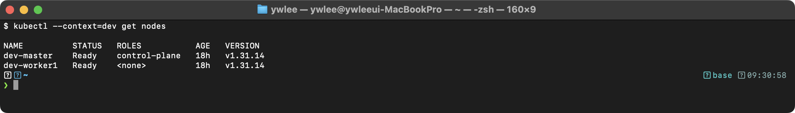

### 실습 1: Deployment 상태 확인

```bash
# demo 네임스페이스의 Deployment 확인
kubectl get deployments -n demo -o wide
```

검증:
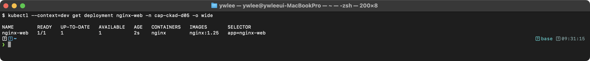

```bash
# ReplicaSet 확인 (Deployment가 관리하는 RS)
kubectl get rs -n demo
```

검증:
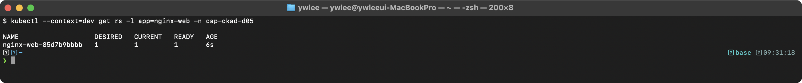

```bash
# Deployment 상세 정보
kubectl describe deployment nginx-web -n demo | head -30
```

**동작 원리:** Deployment의 업데이트 과정:
1. Deployment Controller가 spec.template 변경을 감지한다
2. 새 ReplicaSet을 생성하고 strategy에 따라 Pod를 교체한다
3. 이전 ReplicaSet은 replicas=0으로 유지되어 롤백 시 재사용된다
4. revisionHistoryLimit으로 보관할 RS 수를 제한한다

### 실습 2: Rollout 이력 확인

```bash
# nginx-web의 롤아웃 이력
kubectl rollout history deployment/nginx-web -n demo
```

검증:
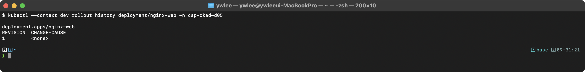

```bash
# 현재 롤아웃 상태
kubectl rollout status deployment/nginx-web -n demo
```

검증:


**동작 원리:** Rollout 과정에서의 Pod 생명주기:
1. 새 ReplicaSet의 Pod가 생성되면 Scheduler가 노드에 배치한다
2. kubelet이 컨테이너를 시작하고 Readiness Probe(컨테이너가 트래픽을 받을 준비가 됐는지 주기적으로 확인하는 헬스체크)가 성공하면 Ready 상태가 된다
3. Ready 상태가 되어야 Service Endpoints에 등록되어 트래픽을 수신한다
4. 이전 ReplicaSet의 Pod는 graceful shutdown(프로세스가 현재 처리 중인 요청을 완료한 뒤 스스로 종료하는 절차) 방식으로 종료된다 — kubelet이 컨테이너에 SIGTERM(프로세스에 정상 종료를 요청하는 Unix 시그널, 프로세스가 잡아서 처리 가능)을 보내고, `terminationGracePeriodSeconds`(기본 30초) 이내에 종료하지 않으면 SIGKILL(강제 종료 시그널, 프로세스가 무시할 수 없음)로 강제 종료한다

### 실습 3: Scale 테스트

```bash
# nginx-web 스케일링
kubectl scale deployment nginx-web --replicas=2 -n demo
```

검증:
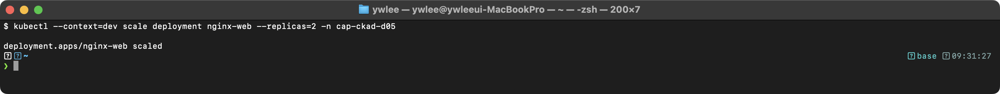

```bash
kubectl get pods -n demo -l app=nginx-web
```

검증:
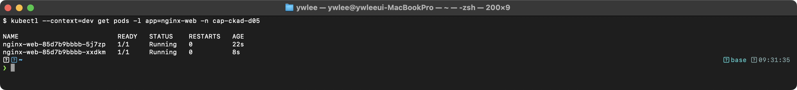

```bash
# 원래대로 복구
kubectl scale deployment nginx-web --replicas=1 -n demo
```

**동작 원리:** Scale 동작:
1. kubectl scale은 Deployment의 spec.replicas를 변경한다
2. ReplicaSet Controller가 현재 Pod 수와 desired를 비교한다
3. 부족하면 새 Pod를 생성하고, 초과하면 Pod를 종료한다
4. HPA(Horizontal Pod Autoscaler)도 이 메커니즘을 사용한다

---

## 더 읽을거리

- [Deployments — kubernetes.io 공식 문서](https://kubernetes.io/docs/concepts/workloads/controllers/deployment/) — RollingUpdate 알고리즘, maxSurge/maxUnavailable 계산, revision history 상세
- [kubectl rollout 레퍼런스](https://kubernetes.io/docs/reference/generated/kubectl/kubectl-commands#rollout) — status/history/undo/pause/resume 각 서브커맨드 플래그
- [다음: day06 — HPA와 VPA](day06.md) — Deployment의 replicas를 부하에 따라 자동으로 조정하는 HorizontalPodAutoscaler와 VerticalPodAutoscaler
