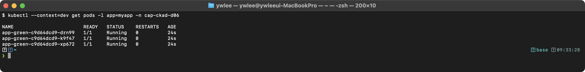
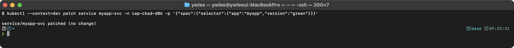
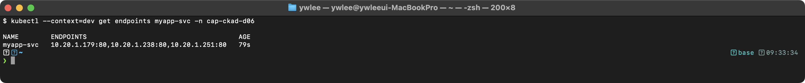
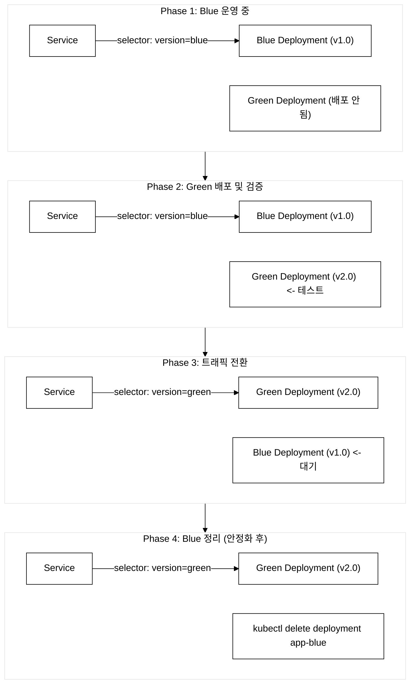
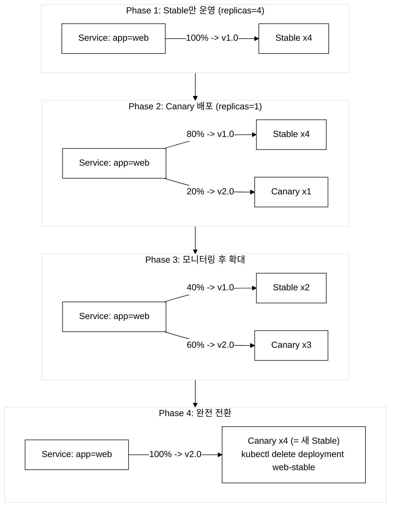
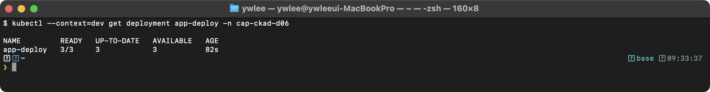
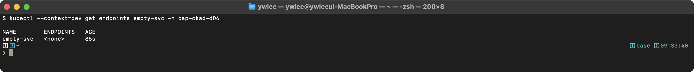
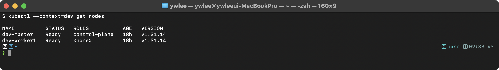
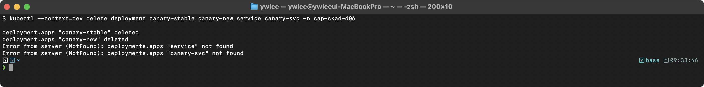

# CKAD Day 6: Blue/Green, Canary 배포와 Deployment 실전 문제

> CKAD 도메인: Application Deployment (20%) - Part 1b | 예상 소요 시간: 1시간

---

## 오늘의 학습 목표

> **이전 학습(Day 5)**: Deployment 기본 개념과 RollingUpdate·Recreate 전략(업데이트 중 Pod를 점진적으로 교체하는 방식). 오늘은 Part 1b로, 이미 알고 있는 Deployment 위에 Blue/Green과 Canary 두 가지 고급 배포 전략을 더하고, 12문제 실전 풀이로 손 숙련을 높인다.

- [ ] Blue/Green 배포 전략을 Service selector 변경으로 구현할 수 있다
- [ ] Canary 배포를 두 Deployment + 공통 label Service로 구현할 수 있다
- [ ] Deployment 관련 실전 문제를 풀 수 있다

---

## 1. Blue/Green 배포

### 1.1 Blue/Green이란?

**등장 배경:**
RollingUpdate는 업데이트 중 이전 버전과 새 버전이 일시적으로 공존한다. API 변경이 있거나 DB 스키마가 달라지면 두 버전이 동시에 트래픽을 처리하는 것이 문제가 된다. Blue/Green 배포는 새 버전을 완전히 준비하고 검증한 뒤, 트래픽을 한 번에 전환하여 이 문제를 해결한다. 전환이 실패하면 selector만 되돌리면 되므로 롤백이 즉시 가능하다.

**공학적 정의:**
Blue/Green 배포는 동일한 프로덕션 환경을 두 벌(Blue=현재, Green=신규) 유지하고, Service의 selector를 변경하여 트래픽을 즉시 전환하는 릴리스 전략이다. 전환이 즉시 이루어지므로 다운타임이 없고, 문제 발생 시 selector를 원래 값으로 변경하여 즉시 롤백이 가능하다.

**선수개념 — Service와 Endpoints:**
Service는 여러 Pod의 IP:Port를 하나의 가상 주소(예: 10.97.0.5:80)로 추상화한 객체다. Pod는 죽고 살아나며 IP가 바뀌지만, Service IP는 고정이다. Service의 `selector` 필드는 라벨(label) 매칭 조건이며, 이 조건에 맞는 Pod들의 IP:Port 목록이 Endpoints 객체에 담긴다. 즉 selector가 매칭한 결과물이 Endpoints다. 클라이언트가 Service IP로 요청을 보내면 Endpoints에 등록된 Pod 중 하나로 로드 밸런싱된다. 따라서 selector를 바꾸면 → Endpoints가 즉시 재계산되고 → 트래픽이 다른 Pod 집합으로 전달된다. Blue/Green의 "selector만 바꾸면 즉시 전환"은 바로 이 인과관계에 기댄다.

**내부 동작 원리 심화:**
Service의 selector를 변경하면 Endpoints Controller(Pod 라벨 변화를 감시해 Endpoints를 갱신하는 control-plane 컴포넌트)가 즉시 매칭되는 Pod IP 목록을 재계산한다. kube-proxy는 Endpoints 변경을 감지하여 iptables 또는 IPVS 규칙을 업데이트한다. 여기서 iptables/IPVS는 일반 kube-proxy가 트래픽을 Pod로 분배하는 두 가지 구현 모드다. 이 저장소의 dev 클러스터는 kube-proxy 대신 Cilium(eBPF 기반, 커널에서 패킷을 처리하는 방식)을 사용하므로 내부 메커니즘은 다르지만, 최종 효과(Service IP가 새 Pod 집합으로 재라우팅됨)는 동일하다. 이 과정은 수 초 내에 완료되지만, 기존 TCP 연결은 즉시 끊기지 않는다. 예를 들어 클라이언트가 Blue Pod와 이미 TCP 연결을 맺고 있었다면, selector를 Green으로 바꿔도 그 연결은 바로 끊기지 않는다. 응용 프로그램이 연결을 정상 종료(graceful shutdown)하거나 terminationGracePeriodSeconds 타임아웃이 지날 때까지 기다린 뒤, 다음 새 요청부터 Green으로 간다. 기존 연결이 빠져나가기를 기다리는 이 과정을 connection drain이라 한다.

**트레이드오프:**
Blue/Green의 핵심 비용은 리소스다. 두 버전의 Deployment를 동시에 실행하므로 Pod 수가 2배 필요하다. Green이 안정화되어 Blue를 삭제하기 전까지 비용이 두 배로 나간다. 상태가 있는 애플리케이션(세션 쿠키, 로컬 캐시)은 전환이 복잡하다. 예를 들어 사용자가 Blue Pod와 세션을 맺은 상태에서 selector를 Green으로 바꾸면, 새 요청은 Green으로 가지만 기존 세션 데이터는 Blue에 남아 있어 세션 불일치가 발생한다. 이를 방지하려면 세션을 외부 스토어(Redis 등)에 저장하거나, Sticky Session을 고려해야 한다. 마지막으로 Blue/Green은 두 버전이 동시에 트래픽을 받지 않으므로 데이터베이스 스키마 변경이 있을 때 유용하지만, Green이 새 스키마를 쓰는데 Blue가 롤백 중 구 스키마로 쓰는 상황도 설계에 포함해야 한다.

### 1.2 Blue/Green 구현

> **전제**: 아래 예제는 `demo` 네임스페이스를 사용한다. dev 클러스터(`export KUBECONFIG=kubeconfig/dev.yaml`)가 가동 중이어야 하며, 먼저 네임스페이스를 생성한다(이미 있으면 에러 무시).
>
> ```bash
> kubectl create namespace demo
> ```

```yaml
# Blue Deployment (현재 운영)
apiVersion: apps/v1
kind: Deployment
metadata:
  name: app-blue
  namespace: demo
spec:
  replicas: 3
  selector:
    matchLabels:
      app: myapp
      version: blue
  template:
    metadata:
      labels:
        app: myapp
        version: blue
    spec:
      containers:
        - name: app
          image: myapp:v1.0
          ports:
            - containerPort: 80
---
# Green Deployment (새 버전)
apiVersion: apps/v1
kind: Deployment
metadata:
  name: app-green
  namespace: demo
spec:
  replicas: 3
  selector:
    matchLabels:
      app: myapp
      version: green
  template:
    metadata:
      labels:
        app: myapp
        version: green
    spec:
      containers:
        - name: app
          image: myapp:v2.0
          ports:
            - containerPort: 80
---
# Service (Blue를 가리킴)
apiVersion: v1
kind: Service
metadata:
  name: myapp-svc
  namespace: demo
spec:
  selector:
    app: myapp
    version: blue               # Blue를 가리킴
  ports:
    - port: 80
      targetPort: 80
```

```bash
# 1. Green Deployment 배포 및 검증
kubectl get pods -l version=green -n demo
```

검증:


```bash
# 2. 트래픽 전환: Blue -> Green
kubectl patch service myapp-svc -n demo \
  -p '{"spec":{"selector":{"version":"green"}}}'
```

검증:


```bash
# 3. Endpoints 확인 (Green Pod IP가 표시되어야 한다)
kubectl get endpoints myapp-svc -n demo
```

검증:


```bash
# 4. 문제 시 롤백: Green -> Blue
kubectl patch service myapp-svc -n demo \
  -p '{"spec":{"selector":{"version":"blue"}}}'
```

### 1.3 Blue/Green 배포 흐름


_그림 1. Blue/Green 배포의 단계별 트래픽 전환._

---

## 2. Canary 배포

### 2.1 Canary란?

**등장 배경:**
Blue/Green은 100% 트래픽을 한 번에 전환하므로, 새 버전에 잠재적 문제가 있으면 전체 사용자에게 영향을 준다. Canary 배포는 "탄광의 카나리아"에서 이름을 딴 전략으로, 소수의 사용자에게만 새 버전을 노출하여 위험을 최소화한다. 문제가 없으면 점진적으로 새 버전의 비율을 높이고, 문제가 발견되면 Canary Pod만 제거하면 된다.

**공학적 정의:**
Canary 배포는 새 버전(Canary)을 소수의 Pod로 배포하고, Service selector가 기존 버전과 새 버전 Pod를 모두 선택하도록 하여 트래픽의 일부(Pod 비율에 따라)를 새 버전으로 전달하는 점진적 릴리스 전략이다. Canary Pod의 메트릭을 모니터링하여 문제가 없으면 점진적으로 확대하고, 문제가 있으면 Canary를 즉시 제거한다.

**내부 동작 원리 심화:**
순수 쿠버네티스 Canary에서 트래픽 비율은 Endpoints에 등록된 Pod 수에 의존한다. 표준 kube-proxy(iptables 모드) 환경에서는 random probability를 사용하여 Endpoints 중 하나를 선택하므로, stable 4개 + canary 1개면 약 80/20 비율이 된다. 이 저장소의 dev 클러스터는 Cilium이 kube-proxy를 대체하므로 내부 구현(eBPF map 기반 로드 밸런싱)은 다르지만, Pod 수 비율에 따른 확률 분배 결과는 동일하다. 단, 이 비율은 확률적이므로 요청 수가 적으면 정확하지 않다. 정밀한 트래픽 제어가 필요하면 Istio VirtualService의 weight 필드를 사용한다.

**트레이드오프:**
Canary의 본질적 위험은 새 버전이 실사용자에게 즉시 노출된다는 점이다. 모니터링 인프라(에러율·레이턴시 대시보드·알림)가 갖춰지지 않은 환경에서는 Canary Pod의 이상을 늦게 발견하여 일부 사용자가 실패 응답을 받는 시간이 길어진다. 테스트가 불충분한 상태에서 Canary를 배포하면 실사용자가 테스터가 되는 셈이다. 또한 트래픽 비율이 순수 쿠버네티스에서는 Pod 수 비율에만 의존하므로, 정밀한 1% 단위 제어가 필요하면 Istio 같은 서비스 메시가 필요하다. 인프라 복잡도가 그만큼 높아진다.

**선택 기준 — Blue/Green vs Canary:**
두 전략 중 어떤 것을 쓸지는 리소스 여유와 모니터링 인프라에 달려 있다. Blue/Green은 두 버전을 동시에 완전히 띄우므로 리소스가 2배 필요하다. 대신 테스트가 완료되면 selector 한 줄 변경으로 즉시·안전하게 전환되고, 문제 시 selector를 되돌리는 것만으로 롤백된다. 인프라 변경·DB 스키마 변경처럼 두 버전이 동시에 트래픽을 받으면 안 되는 상황에 적합하다. Canary는 Canary Pod 수만큼만 추가되므로 리소스를 덜 쓰지만, 새 버전이 실시간으로 일부 사용자에게 노출된다. 따라서 에러율·레이턴시 대시보드와 자동 롤백 인프라가 갖춰져 있어야 안전하다. 시험 문제에서 "리소스는 제한적이고 모니터링 도구가 있다" → Canary, "즉시 안전한 전환이 필요하고 리소스가 충분하다" → Blue/Green으로 판단한다.

### 2.2 Canary 구현

```yaml
# Stable Deployment (기존 운영)
apiVersion: apps/v1
kind: Deployment
metadata:
  name: web-stable
  namespace: demo
spec:
  replicas: 4                    # 안정 버전 4개
  selector:
    matchLabels:
      app: web
      version: stable
  template:
    metadata:
      labels:
        app: web                 # Service selector와 일치
        version: stable
    spec:
      containers:
        - name: app
          image: myapp:v1.0
          ports:
            - containerPort: 80
---
# Canary Deployment (새 버전, 소수)
apiVersion: apps/v1
kind: Deployment
metadata:
  name: web-canary
  namespace: demo
spec:
  replicas: 1                    # Canary 1개 = 20% 트래픽 (확률 기반, 요청이 적으면 편차 있음)
  selector:
    matchLabels:
      app: web
      version: canary
  template:
    metadata:
      labels:
        app: web                 # Service selector와 일치 (같은 app 레이블)
        version: canary
    spec:
      containers:
        - name: app
          image: myapp:v2.0
          ports:
            - containerPort: 80
---
# Service: app=web만 selector (version 포함 안 함!)
apiVersion: v1
kind: Service
metadata:
  name: web-svc
  namespace: demo
spec:
  selector:
    app: web                     # version을 포함하지 않아 양쪽 모두 선택
  ports:
    - port: 80
      targetPort: 80
```

### 2.3 Canary 배포 흐름


_그림 2. Canary 배포의 단계별 트래픽 비율 확대._

```bash
# Canary 확대
kubectl scale deployment web-canary --replicas=2 -n demo
kubectl scale deployment web-stable --replicas=3 -n demo

# Canary 제거 (문제 발생 시)
kubectl delete deployment web-canary -n demo

# Canary 완전 전환
kubectl scale deployment web-canary --replicas=4 -n demo
kubectl delete deployment web-stable -n demo
```

---

## 3. 배포 전략 비교

### 3.1 RollingUpdate vs Blue/Green vs Canary

| 항목 | RollingUpdate | Blue/Green | Canary |
|------|-------------|------------|--------|
| 다운타임 | 없음 | 없음 | 없음 |
| 리소스 사용 | 1x + maxSurge | 2x (두 벌) | 1x + 소수 |
| 롤백 속도 | 느림 (재배포) | 즉시 (selector 변경) | 빠름 (Canary 삭제) |
| 트래픽 제어 | 불가 | 즉시 전환 | Pod 비율로 제어 |
| 복잡도 | 낮음 (내장) | 중간 | 중간 |
| 시험 출제 | 높음 | 중간 | 중간 |

---

## 4. 실전 시험 문제 (12문제)

### 문제 1. Deployment 생성

다음 조건의 Deployment를 생성하라.

- 이름: `app-deploy`, 네임스페이스: `exam`
- 이미지: `nginx:1.24`, replicas: 3
- Label: `app=web`

<details><summary>풀이</summary>

```bash
kubectl create namespace exam
kubectl create deployment app-deploy \
  --image=nginx:1.24 --replicas=3 -n exam
```

검증:
```bash
kubectl get deployment app-deploy -n exam
```



**핵심**: `kubectl create deployment`은 자동으로 selector와 template label을 설정한다.

</details>

---

### 문제 2. RollingUpdate 전략 설정

`app-deploy`에 다음 전략을 설정하라.

- type: RollingUpdate
- maxSurge: 2
- maxUnavailable: 1

<details><summary>풀이</summary>

```bash
kubectl patch deployment app-deploy -n exam -p \
  '{"spec":{"strategy":{"type":"RollingUpdate","rollingUpdate":{"maxSurge":2,"maxUnavailable":1}}}}'
```

```bash
kubectl get deployment app-deploy -n exam -o jsonpath='{.spec.strategy}'
```

</details>

---

### 문제 3. 이미지 업데이트

`app-deploy`의 이미지를 `nginx:1.25`로 업데이트하고 롤아웃 상태를 확인하라.

<details><summary>풀이</summary>

```bash
kubectl set image deployment/app-deploy nginx=nginx:1.25 -n exam
kubectl rollout status deployment/app-deploy -n exam
```

```bash
kubectl get deployment app-deploy -n exam -o jsonpath='{.spec.template.spec.containers[0].image}'
# nginx:1.25
```

</details>

---

### 문제 4. Rollback

`app-deploy`를 `nginx:invalid`로 업데이트한 후 이전 버전으로 롤백하라.

<details><summary>풀이</summary>

```bash
# 잘못된 이미지로 업데이트
kubectl set image deployment/app-deploy nginx=nginx:invalid -n exam

# 실패 확인
kubectl rollout status deployment/app-deploy -n exam --timeout=30s

# 이력 확인
kubectl rollout history deployment/app-deploy -n exam

# 롤백
kubectl rollout undo deployment/app-deploy -n exam

# 성공 확인
kubectl rollout status deployment/app-deploy -n exam
kubectl get deployment app-deploy -n exam -o jsonpath='{.spec.template.spec.containers[0].image}'
# nginx:1.25
```

</details>

---

### 문제 5. 특정 Revision으로 롤백

`app-deploy`의 revision 1으로 롤백하라.

<details><summary>풀이</summary>

```bash
# revision 확인
kubectl rollout history deployment/app-deploy -n exam

# revision 1로 롤백
kubectl rollout undo deployment/app-deploy --to-revision=1 -n exam

# 확인
kubectl rollout status deployment/app-deploy -n exam
kubectl get deployment app-deploy -n exam -o jsonpath='{.spec.template.spec.containers[0].image}'
# nginx:1.24
```

</details>

---

### 문제 6. Recreate 전략

Recreate 전략을 사용하는 Deployment를 생성하라.

- 이름: `batch-deploy`, replicas: 2
- 이미지: `busybox:1.36`, 명령: `sleep 3600`
- strategy: Recreate

<details><summary>풀이</summary>

```yaml
apiVersion: apps/v1
kind: Deployment
metadata:
  name: batch-deploy
  namespace: exam
spec:
  replicas: 2
  selector:
    matchLabels:
      app: batch-deploy
  strategy:
    type: Recreate
  template:
    metadata:
      labels:
        app: batch-deploy
    spec:
      containers:
        - name: app
          image: busybox:1.36
          command: ["sh", "-c", "sleep 3600"]
```

</details>

---

### 문제 7. Blue/Green 배포

Blue/Green 배포를 구현하라.

- Blue: `app-blue` (nginx:1.24, replicas=2, labels: app=myapp, version=blue)
- Green: `app-green` (nginx:1.25, replicas=2, labels: app=myapp, version=green)
- Service `myapp-svc`: 처음에 Blue를 가리키고, Green으로 전환하라

<details><summary>풀이</summary>

```yaml
apiVersion: apps/v1
kind: Deployment
metadata:
  name: app-blue
  namespace: exam
spec:
  replicas: 2
  selector:
    matchLabels:
      app: myapp
      version: blue
  template:
    metadata:
      labels:
        app: myapp
        version: blue
    spec:
      containers:
        - name: app
          image: nginx:1.24
---
apiVersion: apps/v1
kind: Deployment
metadata:
  name: app-green
  namespace: exam
spec:
  replicas: 2
  selector:
    matchLabels:
      app: myapp
      version: green
  template:
    metadata:
      labels:
        app: myapp
        version: green
    spec:
      containers:
        - name: app
          image: nginx:1.25
---
apiVersion: v1
kind: Service
metadata:
  name: myapp-svc
  namespace: exam
spec:
  selector:
    app: myapp
    version: blue
  ports:
    - port: 80
      targetPort: 80
```

```bash
# 트래픽 전환
kubectl patch service myapp-svc -n exam \
  -p '{"spec":{"selector":{"version":"green"}}}'
```

> **Strategic Merge Patch 동작 원리**: 위 `-p` 값에는 `version` 키만 있고 `app: myapp`은 생략되어 있다. `kubectl patch`의 기본 방식은 Strategic Merge Patch이므로, 지정한 키(`version`)만 갱신하고 기존 키(`app: myapp`)는 그대로 유지된다. 두 키를 명시적으로 모두 보내려면 `-p '{"spec":{"selector":{"app":"myapp","version":"green"}}}'`처럼 작성한다. JSON Merge Patch(RFC 7386)와 달리 Strategic Merge Patch는 중첩 객체를 덮어쓰지 않고 병합한다는 점을 구분한다.

</details>

---

### 문제 8. Canary 배포

Canary 배포를 구현하라.

- Stable: `web-stable` (nginx:1.24, replicas=4, labels: app=web)
- Canary: `web-canary` (nginx:1.25, replicas=1, labels: app=web)
- Service `web-svc`: app=web selector (양쪽 Pod 모두 선택)
- Endpoints에 5개 Pod IP가 있는지 확인

<details><summary>풀이</summary>

```yaml
apiVersion: apps/v1
kind: Deployment
metadata:
  name: web-stable
  namespace: exam
spec:
  replicas: 4
  selector:
    matchLabels:
      app: web
      version: stable
  template:
    metadata:
      labels:
        app: web
        version: stable
    spec:
      containers:
        - name: nginx
          image: nginx:1.24
          ports:
            - containerPort: 80
---
apiVersion: apps/v1
kind: Deployment
metadata:
  name: web-canary
  namespace: exam
spec:
  replicas: 1
  selector:
    matchLabels:
      app: web
      version: canary
  template:
    metadata:
      labels:
        app: web
        version: canary
    spec:
      containers:
        - name: nginx
          image: nginx:1.25
          ports:
            - containerPort: 80
---
apiVersion: v1
kind: Service
metadata:
  name: web-svc
  namespace: exam
spec:
  selector:
    app: web
  ports:
    - port: 80
      targetPort: 80
```

```bash
kubectl get endpoints web-svc -n exam
# 5개 Pod IP:80 확인
```

```bash
# Service selector 확인 — version이 없어야 양쪽 Pod 모두 선택됨
kubectl get service web-svc -n exam -o jsonpath='{.spec.selector}'
# {"app":"web"} 확인 (version 키 없음)
```

**핵심**: Service selector에 `version`을 포함하지 않아 양쪽 Pod를 모두 선택한다. 트래픽 비율은 Pod 수 비율(4:1 = 80:20)에 따른다.

**주의 — matchLabels vs Service selector 혼동 방지**: 위 YAML에서 `web-stable`의 `spec.selector.matchLabels`에는 `version: stable`이, `web-canary`에는 `version: canary`가 있다. 이는 Deployment가 자기 Pod만 관리하기 위한 식별자다. Service의 `spec.selector`는 별도로 `app: web`만 지정하여 두 Deployment의 Pod를 모두 선택한다. 만약 Service selector에 `version: stable`을 추가하면 stable Pod만 선택되어 Canary Pod로 트래픽이 전달되지 않는다. `matchLabels`와 Service `selector`는 독립적인 필드임을 반드시 구분한다.

</details>

---

### 문제 9. Scale

`app-deploy`를 5개로 스케일링하라.

<details><summary>풀이</summary>

```bash
kubectl scale deployment app-deploy --replicas=5 -n exam
kubectl get deployment app-deploy -n exam
# READY: 5/5
```

</details>

---

### 문제 10. Rollout 일시정지/재개

`app-deploy`의 롤아웃을 일시정지하고, 이미지와 리소스를 동시에 변경한 뒤 재개하라.

<details><summary>풀이</summary>

```bash
# 일시정지
kubectl rollout pause deployment/app-deploy -n exam

# 여러 변경을 한 번에 적용
kubectl set image deployment/app-deploy nginx=nginx:1.25 -n exam
kubectl set resources deployment/app-deploy \
  --requests=cpu=100m,memory=128Mi -n exam

# 재개 (한 번의 롤아웃으로 모든 변경이 적용됨)
kubectl rollout resume deployment/app-deploy -n exam
kubectl rollout status deployment/app-deploy -n exam
```

**핵심**: pause 상태에서는 여러 변경을 해도 롤아웃이 시작되지 않는다. resume 시 모든 변경이 한 번에 적용된다.

</details>

---

### 문제 11. Deployment 정보 추출

`app-deploy`의 다음 정보를 추출하라.
1. 현재 이미지
2. strategy 타입
3. 현재 replicas
4. 사용 가능한 replicas

<details><summary>풀이</summary>

```bash
# 이미지
kubectl get deployment app-deploy -n exam \
  -o jsonpath='{.spec.template.spec.containers[0].image}'

# strategy
kubectl get deployment app-deploy -n exam \
  -o jsonpath='{.spec.strategy.type}'

# replicas
kubectl get deployment app-deploy -n exam \
  -o jsonpath='{.spec.replicas}'

# availableReplicas
kubectl get deployment app-deploy -n exam \
  -o jsonpath='{.status.availableReplicas}'
```

</details>

---

### 문제 12. revisionHistoryLimit

`app-deploy`의 revisionHistoryLimit을 5로 설정하라.

<details><summary>풀이</summary>

```bash
kubectl patch deployment app-deploy -n exam \
  -p '{"spec":{"revisionHistoryLimit":5}}'

# 확인
kubectl get deployment app-deploy -n exam \
  -o jsonpath='{.spec.revisionHistoryLimit}'
# 5
```

**핵심**: revisionHistoryLimit은 보관할 이전 ReplicaSet 수를 제한한다. 기본값은 10이다. 너무 많으면 etcd 저장 공간을 차지한다. 각 ReplicaSet의 메타데이터 자체는 작지만, 배포가 잦은 환경에서 수십 개가 쌓이면 etcd 누적 부담이 생긴다. 배포가 자주 일어나는 CI/CD 환경에서는 3~5로 낮추고, 롤백 히스토리가 불필요하면 0으로 설정한다(단, 0이면 undo 시 직전 버전으로만 복구 가능).

</details>

---

## 5. 트러블슈팅

### 5.1 Blue/Green 전환 후 트래픽이 전달되지 않는 경우

```bash
kubectl get endpoints myapp-svc -n demo
kubectl get pods -l version=green -n demo
```

검증 (Endpoints 비어있음):


주요 원인:
- **selector label 오타**: `kubectl get svc myapp-svc -o jsonpath='{.spec.selector}'`로 selector를 확인한다.
- **Green Pod가 Ready 아님**: Pod가 Running이지만 Readiness Probe 실패로 Endpoints에 등록되지 않는다.
- **네임스페이스 불일치**: Service와 Pod가 다른 네임스페이스에 있다.

### 5.2 Canary 배포에서 트래픽 비율이 기대와 다른 경우

**증상:** stable 4개, canary 1개인데 canary에 트래픽이 거의 오지 않는다.

원인: kube-proxy의 iptables 모드는 확률 기반 분배이므로 요청 수가 적으면 편차가 크다. 충분한 요청(100+ 이상)을 보내면 Pod 수 비율에 수렴한다. 정확한 비율 제어가 필요하면 Istio VirtualService를 사용한다.

---

## 6. 복습 체크리스트

- [ ] Blue/Green 배포를 Service selector 변경으로 구현할 수 있다
- [ ] Canary 배포를 두 Deployment + 공통 label Service로 구현할 수 있다
- [ ] Canary에서 Service selector에 version을 포함하지 않는 이유를 안다
- [ ] `kubectl rollout pause/resume`으로 여러 변경을 일괄 적용할 수 있다
- [ ] revisionHistoryLimit의 역할을 안다
- [ ] RollingUpdate, Blue/Green, Canary의 장단점을 비교할 수 있다
- [ ] Blue/Green 전환 후 트래픽이 전달되지 않을 때 원인을 파악하고 복구할 수 있다
- [ ] Canary의 트래픽 비율이 예상과 다른 이유(확률 기반 편차)를 설명할 수 있다

---

## tart-infra 실습

### 실습 환경 설정

```bash
export KUBECONFIG=kubeconfig/dev.yaml
kubectl get nodes
```

검증:


### 실습 1: httpbin Canary 배포 확인

dev 클러스터에는 httpbin v1/v2가 Istio VirtualService를 통해 80/20 canary 배포되어 있다. 이를 확인한다.

```bash
# httpbin 배포 현황 확인
kubectl get deploy -n demo -l app=httpbin
kubectl get pods -n demo -l app=httpbin --show-labels

# Istio VirtualService canary 설정 확인
kubectl get virtualservice -n demo -o yaml | grep -A 10 "route:"

# 트래픽 분배 테스트 전: curl 요청을 보낼 nginx Deployment가 demo 네임스페이스에 있는지 확인한다.
# 없으면 아래 임시 Pod를 대신 사용한다:
#   kubectl run tmp-curl --rm -it --image=curlimages/curl -n demo -- sh
# 있으면 그대로 진행한다.
kubectl get deploy nginx -n demo

# 트래픽 분배 테스트 (10회 요청)
for i in $(seq 1 10); do
  kubectl exec -n demo deploy/nginx -- curl -s httpbin.demo:8000/headers | grep -o '"Host":.*' &
done; wait
```

검증 1 — httpbin Deployment 현황 (`kubectl get deploy -n demo -l app=httpbin`): (미캡처 — dev 클러스터 실행 후 스크린샷으로 교체한다.)

검증 2 — VirtualService route 설정 (`kubectl get virtualservice -n demo -o yaml | grep -A 10 "route:"`): (미캡처 — dev 클러스터 실행 후 스크린샷으로 교체한다.)

> **VirtualService route 필드 구조 참고:** Istio VirtualService의 `route` 필드는 아래와 같이 `destination.subset`과 `weight`로 트래픽 비율을 L7 수준에서 정밀하게 지정한다. `subset`은 DestinationRule에 정의된 Pod label 그룹을 가리킨다.
>
> ```yaml
> route:
>   - destination:
>       host: httpbin
>       subset: v1
>     weight: 80
>   - destination:
>       host: httpbin
>       subset: v2
>     weight: 20
> ```

검증 3 — for 루프 트래픽 테스트 결과 (약 80/20 비율로 Host 헤더 출력): (미캡처 — dev 클러스터 실행 후 스크린샷으로 교체한다.)

**동작 원리:** Istio VirtualService는 L7에서 트래픽 비율을 정밀하게 제어한다. 순수 쿠버네티스의 Canary(Deployment replica 비율)는 Pod 수에 의존하지만, Istio는 weight 필드로 정확한 퍼센트 기반 분배가 가능하다. CKAD 시험에서는 순수 쿠버네티스 방식을 주로 출제한다.

### 실습 2: 순수 쿠버네티스 Canary 배포 구현

Istio 없이 두 Deployment + 공통 label Service로 Canary를 구현한다.

```bash
# Stable (4 replicas)
kubectl create deploy canary-stable --image=nginx:1.24 -n demo --replicas=4
# 주의: kubectl label deploy <name> app=canary-app 은 Deployment 오브젝트의
# metadata.labels만 갱신하고 spec.template.metadata.labels(Pod 라벨)는 변경하지 않는다.
# kubectl create deploy 가 생성한 Pod template label은 {app: canary-stable}이므로
# Service selector {app: canary-app}에 매칭되는 Pod가 없어 Endpoints가 비게 된다.
# 아래처럼 json patch로 Pod template label을 명시적으로 변경해야 한다.
kubectl patch deploy canary-stable -n demo --type=json \
  -p '[{"op":"replace","path":"/spec/template/metadata/labels/app","value":"canary-app"}]'
kubectl rollout restart deploy canary-stable -n demo

# Canary (1 replica)
kubectl create deploy canary-new --image=nginx:1.25 -n demo --replicas=1
kubectl patch deploy canary-new -n demo --type=json \
  -p '[{"op":"replace","path":"/spec/template/metadata/labels/app","value":"canary-app"}]'
kubectl rollout restart deploy canary-new -n demo

# 공통 label로 Service 생성
# --selector=app=canary-app: expose 기본 동작은 Deployment 이름(canary-stable)을 selector로 쓰므로
# 두 Deployment Pod를 모두 포함하는 공통 라벨(app=canary-app)로 명시적으로 덮어씀
kubectl expose deploy canary-stable -n demo --name=canary-svc \
  --port=80 --target-port=80 --selector=app=canary-app

# 트래픽 분배 확인 (약 80/20 비율)
kubectl get endpoints canary-svc -n demo
```

> **Pod template label 패치가 필요한 이유:** `kubectl create deploy`로 생성된 Deployment의 `spec.template.metadata.labels`는 `{app: <deploy-name>}`으로 자동 설정된다. `kubectl label deploy <name> key=val`은 Deployment 자체의 `metadata.labels`만 갱신하고 Pod template labels에는 영향을 주지 않는다. Service의 selector는 **Pod의 labels**를 기준으로 Endpoints를 구성하므로, Pod template label이 바뀌지 않으면 selector 불일치로 Endpoints가 비어 있게 된다. `--type=json` patch의 `/spec/template/metadata/labels/app` 경로가 Pod template label을 직접 겨냥하는 이유가 여기에 있다.

검증 (Endpoints 5개 Pod IP 확인): (미캡처 — dev 클러스터 실행 후 `kubectl get endpoints canary-svc -n demo` 결과 스크린샷으로 교체한다.)

**동작 원리:** Service selector가 `app=canary-app`이므로 두 Deployment의 Pod 모두 Endpoints에 등록된다. 5개 Pod 중 4개가 stable, 1개가 canary이므로 약 80/20 비율로 트래픽이 분배된다. replica 수를 조절하여 비율을 변경한다.

### 정리

```bash
kubectl delete deploy canary-stable canary-new -n demo
kubectl delete svc canary-svc -n demo
```

검증:


---

## 7. 자가점검

<details><summary>Q. Service selector를 변경하면 기존 TCP 연결은 즉시 끊기는가?</summary>

A. 끊기지 않는다. selector 변경은 Endpoints를 즉시 재계산하지만, 이미 맺어진 TCP 연결은 connection drain 동안 유지된다. 기존 연결이 정상 종료되거나 terminationGracePeriodSeconds가 만료된 뒤, 새 요청부터 새 Pod로 전달된다.

</details>

<details><summary>Q. Blue/Green에서 kubectl patch service 로 selector를 변경할 때 기존 키(app: myapp)는 사라지는가?</summary>

A. 사라지지 않는다. `kubectl patch`의 기본 방식은 Strategic Merge Patch이므로 지정한 키(`version`)만 갱신하고 나머지 키(`app: myapp`)는 그대로 유지된다. JSON Merge Patch(RFC 7386)와 달리 중첩 객체를 덮어쓰지 않는다. 두 키를 모두 명시적으로 보내려면 `-p '{"spec":{"selector":{"app":"myapp","version":"green"}}}'`처럼 작성한다.

</details>

<details><summary>Q. kubectl create deploy 로 만든 Deployment에 kubectl label deploy 를 실행하면 어떤 라벨이 바뀌는가?</summary>

A. Deployment 오브젝트 자체의 `metadata.labels`만 바뀐다. `spec.template.metadata.labels`(Pod 라벨)는 변경되지 않는다. Service selector는 Pod 라벨을 기준으로 Endpoints를 구성하므로, Pod 라벨을 변경하려면 `kubectl patch deploy <name> --type=json -p '[{"op":"replace","path":"/spec/template/metadata/labels/app","value":"<new-value>"}]'`를 사용해야 한다.

</details>

<details><summary>Q. Canary 배포에서 stable 4개, canary 1개일 때 트래픽 비율이 정확히 80/20이 되지 않는 이유는?</summary>

A. 순수 쿠버네티스 Canary는 Endpoints에 등록된 Pod 수 비율에 따른 확률 기반 분배를 사용한다. 요청 수가 적으면 확률적 편차가 커서 실제 비율이 80/20과 크게 다를 수 있다. 요청 수가 늘어날수록 Pod 수 비율에 수렴한다. 정밀한 비율 제어가 필요하면 Istio VirtualService의 `weight` 필드를 사용한다.

</details>

<details><summary>Q. Canary 배포에서 Service selector에 version 라벨을 포함하지 않는 이유는?</summary>

A. Service selector에 `version`을 포함하면 특정 버전의 Pod만 선택된다. Canary의 핵심은 하나의 Service가 stable과 canary Pod를 모두 선택하여 트래픽을 비율에 따라 분배하는 것이므로, selector에서 `version`을 제외하고 두 Deployment가 공유하는 라벨(`app: web`)만 사용한다. Deployment의 `spec.selector.matchLabels`에는 `version`이 포함되어 각 Deployment가 자기 Pod만 관리하지만, Service selector는 독립적으로 `app: web`만 지정한다.

</details>

---

## 8. 시험 팁

**실기 단축키 셋업 (시험 시작 즉시 입력):**

```bash
alias k=kubectl
export do='--dry-run=client -o yaml'
export KUBECONFIG=kubeconfig/dev.yaml
```

**이 주제의 출제 패턴:**

- **Blue/Green 문제 패턴**: "Service selector를 변경하여 트래픽을 Blue에서 Green으로 전환하라" → `kubectl patch service <svc> -n <ns> -p '{"spec":{"selector":{"version":"green"}}}'`
- **Canary 문제 패턴**: "Stable 4개, Canary 1개로 약 80/20 비율의 Canary 배포를 구성하라" → 두 Deployment + 공통 label Service. Service selector에 `version` 제외가 핵심.
- **함정**: `kubectl create deploy`로 생성된 Pod template label은 `{app: <deploy-name>}`이다. Service selector와 불일치하면 Endpoints가 비어 있게 된다. Endpoints가 비어 있으면 반드시 `kubectl get endpoints <svc> -n <ns>`와 `kubectl get pods --show-labels -n <ns>`를 비교한다.
- **Rollback 함정**: `kubectl rollout undo`는 직전 ReplicaSet으로 돌아간다. 특정 revision으로 돌아가려면 `--to-revision=<N>` 플래그가 필요하다.
- **revisionHistoryLimit**: 기본값 10. `kubectl patch deploy <name> -p '{"spec":{"revisionHistoryLimit":<N>}}'`으로 변경. 시험에서 "이전 ReplicaSet이 몇 개 유지되는가"를 물으면 이 값이다.

---

## 9. 더 읽을거리

- [Kubernetes 공식 문서: Deployments](https://kubernetes.io/docs/concepts/workloads/controllers/deployment/) — RollingUpdate·Recreate 전략 설명 및 `.spec.strategy` 필드 레퍼런스.
- [Istio 공식 문서: Traffic Management](https://istio.io/latest/docs/concepts/traffic-management/) — VirtualService의 `weight` 기반 정밀 Canary 제어 원리.
- [Kubernetes Endpoints Controller 소스](https://github.com/kubernetes/kubernetes/blob/master/pkg/controller/endpoint/endpoints_controller.go) — selector 변경 시 Endpoints 재계산이 어떻게 트리거되는지 코드 레벨 확인.
- [certification/cilium/](../../../certification/cilium/) — 이 저장소 dev 클러스터의 Cilium(eBPF 기반 kube-proxy 대체) 심화. iptables와 eBPF의 패킷 처리 경로 차이.
- [Argo Rollouts](https://argoproj.github.io/argo-rollouts/) — 순수 쿠버네티스의 Pod 수 비율 Canary를 넘어 자동 analysis·step 기반 progressive delivery를 제공하는 CNCF 프로젝트. CKA/CKAD 시험 범위는 아니지만 실무 참고용.
