# CKAD Day 7: Helm 패키지 매니저 기초

> CKAD 도메인: Application Deployment (20%) - Part 2a | 예상 소요 시간: 1시간

---

> **Day 6에서 Deployment 업데이트 전략(BlueGreen/Canary)을 배웠다.** 이 전략들을 실제로 운영하려면 Deployment·Service·ConfigMap 등 여러 YAML을 환경별로 조율해야 하는데, Day 7에서는 이 문제를 구조적으로 해결하는 Helm을 학습한다.

## 오늘의 학습 목표

- [ ] Helm의 개념과 아키텍처를 이해한다
- [ ] Chart 구조(Chart.yaml, values.yaml, templates/)를 학습한다
- [ ] helm install/upgrade/rollback 명령을 숙지한다
- [ ] Go 템플릿 기초 문법({{ .Values }}, {{ .Release }})을 이해한다

---

## 1. Helm (헬름) - 쿠버네티스 패키지 매니저

### 1.1 Helm이란?

**등장 배경:**
쿠버네티스에 앱을 배포하려면 Deployment, Service, ConfigMap, Secret, Ingress 등 여러 YAML 파일을 작성해야 한다. 환경별(dev, staging, prod)로 값만 다른 YAML을 중복 관리하면 유지보수가 어렵고, 여러 리소스를 한 번에 설치/삭제하기 불편하다. Helm은 이 문제를 해결하기 위해 "Chart"라는 패키지 단위로 리소스를 템플릿화하고, values 파일로 환경별 값을 분리한다. Linux의 apt/yum과 유사한 역할을 쿠버네티스에서 수행한다.

직전 방식인 "손으로 환경별 YAML 복사 관리"의 한계는 구체적 사고로 드러난다. 예를 들어 prod 배포 시 dev용 YAML을 복사한 뒤 image tag, replicaCount, service.type, 리소스 limit 등 10개 항목을 손으로 고쳐야 하는데, image tag 한 줄을 빠뜨려 이전 버전 이미지가 떠 메모리 누수 장애가 발생한다. 사람이 여러 파일에서 값을 동기화하면 빠뜨림이 필연적으로 생긴다. Helm은 이 모든 환경별 값을 `values-prod.yaml` 한 파일로 모으고 템플릿은 한 벌만 유지하므로, "값과 구조의 분리"로 이런 누락을 구조적으로 차단한다. 트레이드오프는 Go 템플릿이라는 새 문법을 배워야 하고, 렌더링 단계가 끼어들어 "이 값이 실제로 어떤 YAML이 되는가"를 `helm template`으로 한 번 더 확인해야 한다는 점이다.

**공학적 정의:**
Helm은 쿠버네티스 리소스 매니페스트를 Chart라는 패키지 단위로 템플릿화하여 관리하는 패키지 매니저이다. Go 템플릿 엔진을 사용하여 values.yaml의 파라미터를 templates/ 디렉토리의 YAML 매니페스트에 주입하고, Release 단위로 설치/업그레이드/롤백을 관리한다. Helm 3는 Tiller를 제거하고 클라이언트 사이드에서 직접 쿠버네티스 API Server와 통신하며, Release 정보를 해당 네임스페이스의 Secret으로 저장한다.

**내부 동작 원리 심화:**
`helm install` 실행 시 Helm CLI는 다음 순서로 동작한다. (1) Chart를 로드하고 values.yaml, -f 파일, --set 값을 우선순위에 따라 병합한다(--set > -f > values.yaml). (2) Go 템플릿 엔진으로 templates/ 디렉토리의 파일을 렌더링한다. (3) 렌더링된 매니페스트를 쿠버네티스 API Server에 전송한다. (4) Release 정보(revision, values, manifest)를 해당 네임스페이스에 Secret(`sh.helm.release.v1.<name>.v<revision>`)으로 저장한다. 이 Secret에 이전 상태가 기록되므로 `helm rollback`이 가능하다.

**핵심 개념:**

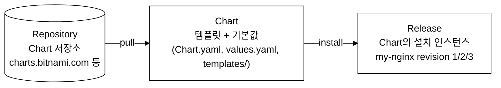
_그림 1. Helm의 Chart-Release-Repository 관계._

**왜 Helm이 필요한가?**
- 여러 YAML 파일을 하나의 패키지로 관리
- 환경별 설정(dev, staging, prod)을 values 파일로 분리
- 배포 이력 관리와 롤백
- 커뮤니티 Chart로 복잡한 애플리케이션을 쉽게 설치

### 1.2 Helm 아키텍처 (v3)

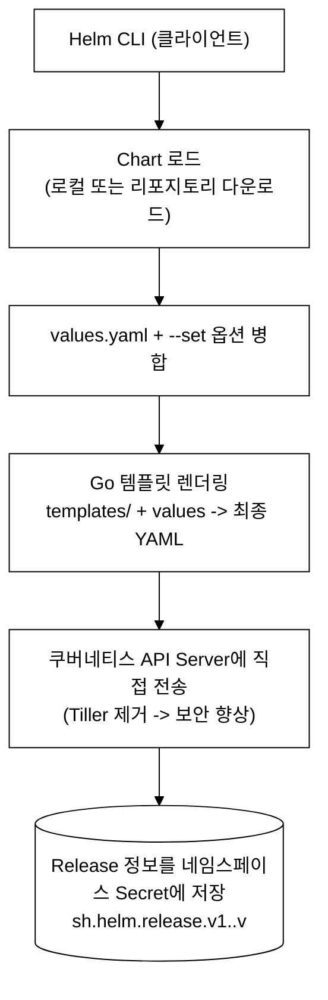
_그림 2. Helm v3 CLI의 렌더링-적용 동작._

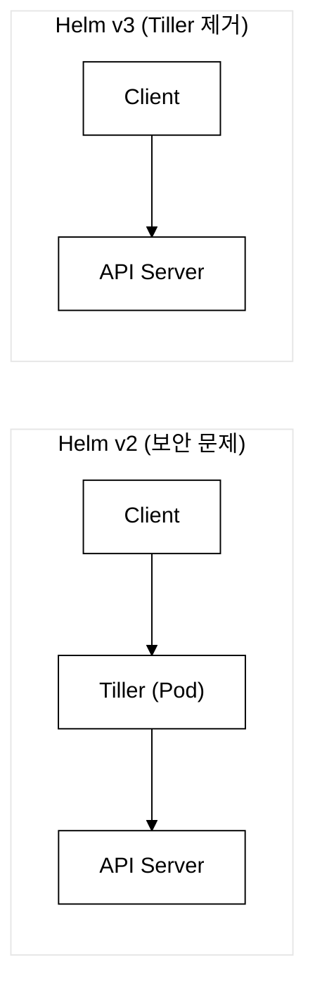
_그림 3. Helm v2와 v3의 통신 경로 비교._

### 1.3 Chart 구조

```
mychart/
├── Chart.yaml           # Chart 메타데이터 (이름, 버전, 설명)
├── Chart.lock           # 의존성 잠금 파일
├── values.yaml          # 기본 설정값
├── values-dev.yaml      # 환경별 오버라이드 (선택)
├── values-prod.yaml     # 환경별 오버라이드 (선택)
├── charts/              # 의존성 Chart
├── templates/           # 쿠버네티스 매니페스트 템플릿
│   ├── NOTES.txt        # 설치 후 출력 메시지
│   ├── _helpers.tpl     # 공통 템플릿 함수
│   ├── deployment.yaml
│   ├── service.yaml
│   ├── ingress.yaml
│   ├── configmap.yaml
│   ├── secret.yaml
│   ├── hpa.yaml
│   └── tests/           # helm test 스크립트
│       └── test-connection.yaml
└── .helmignore          # 패키징 시 제외 파일
```

### 1.4 Chart.yaml 상세

```yaml
apiVersion: v2                    # Helm 3는 v2 사용
name: myapp                       # Chart 이름
version: 1.2.0                    # Chart 버전 (SemVer: MAJOR.MINOR.PATCH 형식, 하위 호환 유지 시 PATCH·MINOR 올림)
appVersion: "2.0.0"               # 애플리케이션 버전
description: My Web Application   # Chart 설명
type: application                 # application 또는 library
keywords:
  - web
  - nginx
maintainers:
  - name: devops-team
    email: devops@example.com
dependencies:                     # 의존성 Chart
  - name: postgresql
    version: "12.x.x"
    repository: "https://charts.bitnami.com/bitnami"
    condition: postgresql.enabled  # values에서 활성화/비활성화
```

**version vs appVersion 구분:** `version`은 Chart 자체의 배포 이력 버전이고, `appVersion`은 Chart가 배포하는 애플리케이션(예: nginx 1.25)의 버전이다. Chart 템플릿·values를 수정할 때마다 `version`을 올리고, 배포할 앱 이미지 태그가 바뀌면 `appVersion`을 업데이트한다. 예를 들어 `values.yaml`의 `image.tag`를 `1.25`에서 `1.26`으로 바꾸면 `appVersion`을 `"1.26"`으로 올리고, Chart 템플릿 자체는 바뀌지 않았으므로 `version`은 그대로 유지할 수 있다. 두 값이 독립적으로 관리되기 때문에, `helm history`로 보이는 Chart revision은 Chart 변경 횟수를 나타내고, `appVersion`은 배포된 앱의 출처를 나타낸다.

### 1.5 values.yaml 상세

```yaml
# 이미지 설정
image:
  repository: nginx
  tag: "1.25"
  pullPolicy: IfNotPresent

# 레플리카 수
replicaCount: 3

# 서비스 설정
service:
  type: ClusterIP
  port: 80
  targetPort: 8080

# Ingress 설정
ingress:
  enabled: true
  className: nginx
  hosts:
    - host: app.example.com
      paths:
        - path: /
          pathType: Prefix

# 리소스 설정
resources:
  requests:
    cpu: 100m
    memory: 128Mi
  limits:
    cpu: 200m
    memory: 256Mi

# 환경 변수
env:
  APP_ENV: production
  LOG_LEVEL: info

# ConfigMap 데이터
config:
  database:
    host: postgres
    port: "5432"
```

---

## 2. Helm 핵심 명령어

### 2.1 리포지토리 관리

```bash
# 리포지토리 추가
helm repo add bitnami https://charts.bitnami.com/bitnami
```

검증:
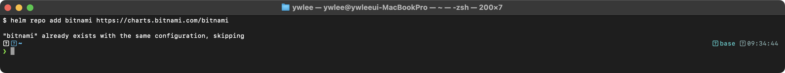

```bash
# 리포지토리 목록
helm repo list
```

검증:
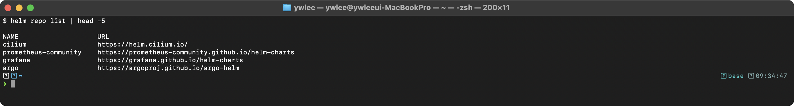

```bash
# 리포지토리 업데이트 (최신 Chart 정보 갱신)
helm repo update
```

검증:
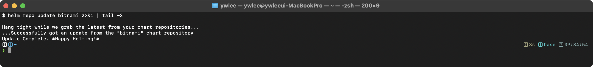

```bash
# Chart 검색
helm search repo nginx                  # 리포지토리에서 검색
```

검증:
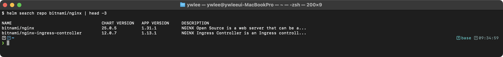

### 2.2 Chart 설치/관리

> 이 절은 명령 레퍼런스로, 전체 옵션을 한눈에 확인하기 위한 참조용이다. 각 명령의 실제 실행 흐름과 출력 결과는 **실습 2(실습 2-3 참조)**에서 단계별로 확인한다.

```bash
# === 설치 ===
helm install <release-name> <chart> [options]

# 기본 설치
helm install my-nginx bitnami/nginx

# 네임스페이스 지정 + 네임스페이스 생성
helm install my-nginx bitnami/nginx -n web --create-namespace

# values 파일로 설정 오버라이드
helm install my-nginx bitnami/nginx -f values-prod.yaml

# --set으로 개별 값 오버라이드
helm install my-nginx bitnami/nginx \
  --set replicaCount=3 \
  --set service.type=NodePort \
  --set image.tag=1.25

# dry-run (실제 설치 없이 렌더링 결과 확인)
helm install my-nginx bitnami/nginx --dry-run --debug
# --dry-run: 실제 API Server에 요청을 보내지 않고 렌더링 결과만 출력한다.
# --debug를 함께 쓰면 렌더링 중간 단계의 변수 치환 과정도 볼 수 있다.

# === 업그레이드 ===
helm upgrade my-nginx bitnami/nginx --set replicaCount=5
helm upgrade my-nginx bitnami/nginx -f values-prod.yaml
helm upgrade --install my-nginx bitnami/nginx  # 없으면 설치, 있으면 업그레이드

# === 롤백 ===
helm rollback my-nginx 1              # revision 1로 롤백
helm rollback my-nginx                # 이전 revision으로 롤백

# === 삭제 ===
helm uninstall my-nginx
helm uninstall my-nginx -n web        # 네임스페이스 지정
```

### 2.3 Release 관리

```bash
# Release 목록
helm list -A
```

검증:
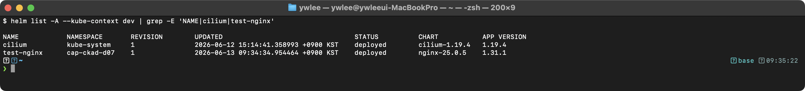

```bash
# Release 히스토리 (revision 목록)
helm history my-nginx
```

검증:
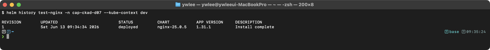

```bash
# Release의 현재 values 확인
helm get values my-nginx
```

검증:
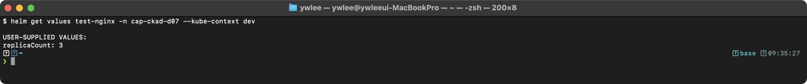

```bash
# Release가 생성한 매니페스트 확인
helm get manifest my-nginx
```

### 2.4 Chart 정보 확인

```bash
# Chart 기본값 확인
helm show values bitnami/nginx         # values.yaml 내용
helm show chart bitnami/nginx          # Chart.yaml 내용
helm show readme bitnami/nginx         # README 내용
helm show all bitnami/nginx            # 모든 정보

# Chart 다운로드 (설치 없이)
helm pull bitnami/nginx                # .tgz 다운로드
helm pull bitnami/nginx --untar        # 압축 해제
```

### 2.5 템플릿 렌더링 (디버깅)

```bash
# 로컬 Chart 렌더링 (설치 없이 최종 YAML 확인)
helm template my-release ./mychart
helm template my-release ./mychart -f values-prod.yaml
helm template my-release ./mychart --set image.tag=1.26

# 특정 템플릿만 렌더링
helm template my-release ./mychart -s templates/deployment.yaml

# 린트 (문법 검사)
helm lint ./mychart
```

---

## 3. Go 템플릿 기초

### 3.1 내장 객체

```yaml
# templates/deployment.yaml
apiVersion: apps/v1
kind: Deployment
metadata:
  # .Release: Release 정보
  name: {{ .Release.Name }}-deploy      # Release 이름
  namespace: {{ .Release.Namespace }}    # 설치된 네임스페이스
  labels:
    # .Chart: Chart.yaml 정보
    chart: {{ .Chart.Name }}-{{ .Chart.Version }}
    app.kubernetes.io/managed-by: {{ .Release.Service }}
spec:
  # .Values: values.yaml + --set 값
  replicas: {{ .Values.replicaCount }}
  selector:
    matchLabels:
      app: {{ .Release.Name }}
  template:
    metadata:
      labels:
        app: {{ .Release.Name }}
    spec:
      containers:
        - name: {{ .Chart.Name }}
          image: "{{ .Values.image.repository }}:{{ .Values.image.tag }}"
          imagePullPolicy: {{ .Values.image.pullPolicy }}
          ports:
            - containerPort: {{ .Values.service.targetPort }}
```

### 3.2 주요 템플릿 함수

**파이프(`|`) 문법:** `{{ .값 | 함수1 | 함수2 }}` 형태로 왼쪽 결과를 오른쪽 함수의 입력으로 체인처럼 연결한다. 예를 들어 `{{ "hello" | upper }}`는 `"HELLO"`를 출력하고, `{{ .Values.resources | toYaml | nindent 12 }}`는 resources 맵을 YAML 문자열로 변환한 뒤 12칸 들여쓰기까지 한 번에 처리한다.

**공백 제어(`{{-` / `-}}`):** 기본 `{{ }}` 는 앞뒤 공백·줄바꿈을 그대로 유지한다. `{{-`는 해당 태그 앞의 줄바꿈·공백을 제거하고, `-}}`는 태그 뒤의 공백을 제거한다. YAML은 들여쓰기가 의미를 가지므로, 조건문·반복문에서 불필요한 빈 줄이 삽입되지 않도록 `{{- if ... }}` / `{{- end }}`처럼 대시를 붙여 쓴다.

```yaml
# 기본값 설정
image: "{{ .Values.image.repository }}:{{ .Values.image.tag | default "latest" }}"
# tag가 없으면 "latest" 사용
# 참고: 따옴표 안의 "latest"는 Go 템플릿 문자열 리터럴(고정값)이다.
#      변수 참조는 따옴표 없이 {{ .Values.xxx }} 형태로 표기한다.

# 문자열 따옴표
name: {{ .Values.name | quote }}       # "my-app" (큰따옴표)

# 들여쓰기
{{ .Values.resources | toYaml | nindent 12 }}
# values의 resources 블록을 YAML로 변환하고 12칸 들여쓰기

# 조건문
{{- if .Values.ingress.enabled }}
apiVersion: networking.k8s.io/v1
kind: Ingress
...
{{- end }}

# 반복문
{{- range .Values.env }}
  - name: {{ .name }}
    value: {{ .value | quote }}
{{- end }}

# 필수값 검증
{{ required "image.repository is required" .Values.image.repository }}
```

### 3.3 _helpers.tpl (명명된 템플릿)

```yaml
# templates/_helpers.tpl
{{- define "mychart.fullname" -}}
{{ .Release.Name }}-{{ .Chart.Name }}
{{- end -}}

{{- define "mychart.labels" -}}
app.kubernetes.io/name: {{ .Chart.Name }}
app.kubernetes.io/instance: {{ .Release.Name }}
app.kubernetes.io/version: {{ .Chart.AppVersion | quote }}
app.kubernetes.io/managed-by: {{ .Release.Service }}
{{- end -}}

# templates/deployment.yaml에서 사용
metadata:
  name: {{ include "mychart.fullname" . }}
  labels:
    {{- include "mychart.labels" . | nindent 4 }}
```

### 3.4 실습: helm create로 Chart 골격 생성 후 렌더링 확인

3.1~3.3의 Go 템플릿 문법이 실제로 어떻게 동작하는지 `helm create`로 골격 Chart를 만들어 직접 확인한다.

```bash
# Chart 골격 생성
helm create mychart

# 기본 생성 파일 확인
ls mychart/templates/
```

values.yaml의 `replicaCount`를 2로 수정한다.

```bash
# mychart/values.yaml의 replicaCount 줄 확인 후 값 변경
grep -n replicaCount mychart/values.yaml
```

이후 templates/deployment.yaml에서 `{{ .Values.replicaCount }}`가 어떻게 연결되는지 확인하고 렌더링한다.

```bash
# 렌더링 결과 확인 — replicaCount: 2가 실제 YAML에 나타나는지 검증
helm template my-release ./mychart | grep -A 3 "replicas:"
```

검증:
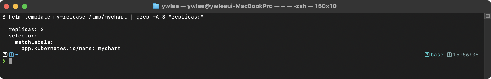

**핵심 확인 포인트:** 렌더링된 Deployment YAML에서 `replicas: 2`가 출력되면, `values.yaml` → `{{ .Values.replicaCount }}` → 최종 YAML 주입 흐름이 정상이다. `helm template`은 API Server에 전송하지 않으므로 클러스터 없이도 렌더링 검증이 가능하다.

---

## 4. CKAD에서의 Helm 출제 범위

CKAD 시험에서 Helm은 다음 수준으로 출제된다:

```
1. helm install/upgrade/rollback 명령어 사용
2. --set으로 값 오버라이드
3. -f로 values 파일 지정
4. helm list, helm status, helm history로 Release 확인
5. helm uninstall로 삭제
6. Chart 구조 이해 (Chart.yaml, values.yaml, templates/)
7. 기본적인 Go 템플릿 이해 ({{ .Values.xxx }})
```

**시험 팁:**
```bash
# 자주 사용하는 Helm 명령 패턴
helm install <name> <chart> -n <ns> --create-namespace
helm upgrade <name> <chart> --set key=value
helm rollback <name> <revision>
helm list -A
helm history <name>
helm get values <name>
helm uninstall <name> -n <ns>
```

### 직접 해보기 — 10분 미션

CKAD 실기는 120분 안에 15~20문제를 풀어야 하는 속도전이다. 아래 미션을 10분 이내에 완료하는 것을 목표로 한다.

**목표 상태:**
1. dev 클러스터의 `demo` 네임스페이스에 `bitnami/nginx`를 `replicaCount=2`로 설치한다.
2. `replicaCount=3`으로 업그레이드한다.
3. revision 1로 롤백한다.
4. `helm history`로 revision 3(롤백)이 생성됐는지 확인한다.

**성공 기준:** `helm history mq-nginx -n demo` 출력에서 revision 1(install)·2(upgrade)·3(rollback) 세 줄이 보이고, `helm get values mq-nginx -n demo`의 `replicaCount`가 `2`(revision 1 값)로 복구된 것을 확인한다.

```bash
export KUBECONFIG=kubeconfig/dev.yaml
kubectl create namespace demo 2>/dev/null || true
helm install mq-nginx bitnami/nginx -n demo --set replicaCount=2
helm upgrade mq-nginx bitnami/nginx -n demo --set replicaCount=3
helm rollback mq-nginx 1 -n demo
helm history mq-nginx -n demo
helm get values mq-nginx -n demo
helm uninstall mq-nginx -n demo   # 정리
```

> **시간 초과 시 진단:** `helm install`이 수분 이상 걸리면 repo 캐시가 오래된 것이다. `helm repo update` 후 재시도한다. `helm history`에 revision 3이 없다면 `helm rollback`이 실패한 것이므로 `helm list -n demo`로 STATUS를 확인한다.

---

## 5. 트러블슈팅

### 5.1 helm install 실패

**증상:** `helm install`이 에러로 종료된다.

```bash
helm install my-release ./mychart 2>&1
```

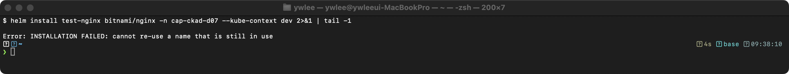

원인: 동일한 Release 이름이 이미 존재한다.

해결:
```bash
# 기존 Release 확인
helm list -A | grep my-release

# 삭제 후 재설치
helm uninstall my-release
helm install my-release ./mychart

# 또는 upgrade --install 사용 (없으면 설치, 있으면 업그레이드)
helm upgrade --install my-release ./mychart
```

**CKAD 시험 팁 — uninstall 지연:** 시험 환경(120분)에서 `helm uninstall`이 Finalizer 또는 리소스 삭제 대기로 오래 걸리는 경우, Release 메타데이터를 직접 제거해 빠르게 정리할 수 있다.
```bash
# Release Secret을 직접 삭제해 helm 메타데이터만 제거 (파드 등 실제 리소스는 별도 삭제)
kubectl delete secret -n <namespace> -l owner=helm,name=<release-name>
```
이 방법은 helm 상태를 초기화할 뿐이므로, 남은 Deployment·Service 등 실제 리소스는 `kubectl delete` 로 수동 정리한다.

### 5.2 템플릿 렌더링 오류

**증상:** 설치 시 YAML 문법 오류가 발생한다.

```bash
helm template my-release ./mychart --debug
```

> **예시(참조) — 차트 문법 오류:** 차트 템플릿의 YAML 이 잘못되면 `helm install` 이 `Error: YAML parse error on .../deployment.yaml` 를 낸다. 조치: `helm lint` 또는 `helm template` 로 렌더 결과를 먼저 검증한다.

디버깅 순서:
1. `helm lint ./mychart`로 기본 문법 검사를 수행한다.
2. `helm template ./mychart --debug`로 렌더링 결과를 확인한다.
3. 주로 `nindent` 값 오류(들여쓰기 불일치), 닫히지 않은 `{{ }}` 구문, `toYaml` 파이프라인 누락이 원인이다.

### 5.3 Release가 pending-install 상태에 걸린 경우

```bash
helm list -A
```

> **예시(참조) — pending-install:** 설치가 중단되면 release 가 `pending-install` STATUS 로 남는다. 조치: `helm uninstall` 후 재설치하거나 `helm rollback`.

원인: 설치 중 타임아웃 또는 리소스 생성 실패로 Release가 불완전한 상태이다.

해결:
```bash
# 강제 삭제
helm uninstall my-release

# 남은 리소스 확인 및 수동 정리
kubectl get all -n demo -l app.kubernetes.io/instance=my-release
```

---

## 6. 복습 체크리스트

- [ ] Helm의 핵심 개념(Chart, Release, Repository)을 설명할 수 있다
- [ ] Chart 구조(Chart.yaml, values.yaml, templates/)를 안다
- [ ] `helm install/upgrade/rollback/uninstall` 명령을 사용할 수 있다
- [ ] `--set`과 `-f`로 values를 오버라이드할 수 있다
- [ ] `helm list/history/get values` 명령으로 Release를 관리할 수 있다
- [ ] Go 템플릿 기본 문법(`{{ .Values }}`, `{{ .Release }}`)을 이해한다

---

## tart-infra 실습

### 실습 환경 설정

```bash
export KUBECONFIG=kubeconfig/platform.yaml
kubectl get nodes
```

검증:
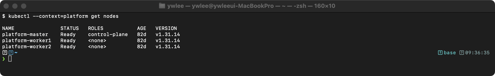

### 실습 1: platform 클러스터의 Helm Release 관리

platform 클러스터에 설치된 Helm Release를 확인하고 관리한다.

> **사전 조건:** `export KUBECONFIG=kubeconfig/platform.yaml` 이 설정된 상태에서 실행한다(위 환경 설정 블록 참고). Helm CLI는 `KUBECONFIG` 환경 변수를 그대로 사용하므로 별도 `--kubeconfig` 플래그가 없어도 platform 클러스터를 대상으로 동작한다.

```bash
# 전체 네임스페이스의 Helm Release 확인
helm list -A

# 특정 Release의 상세 정보
helm history prometheus -n monitoring 2>/dev/null || echo "Release 이름을 helm list로 확인한다"

# Release에 적용된 values 확인
helm get values prometheus -n monitoring 2>/dev/null || helm list -A | head -10
```

**platform 실측 (helm list -A):**

(미캡처)

**동작 원리:** `helm list -A`는 모든 네임스페이스의 Release를 조회한다. Helm 3는 Release 정보를 해당 네임스페이스의 Secret(type: helm.sh/release.v1)으로 저장한다. `helm history`로 revision 이력을 확인하고, `helm get values`로 사용자가 커스텀한 값을 확인할 수 있다.

### 실습 2: dev 클러스터에서 Helm Chart 설치/업그레이드/롤백

> **사전 조건:**
> 1. dev 클러스터가 가동 중이어야 한다(`ssh dev-master`로 접속 가능, `kubectl get nodes` Ready 상태).
> 2. kubeconfig 경로: `kubeconfig/dev.yaml`
> 3. demo 네임스페이스가 없으면 아래에서 직접 생성한다.

```bash
export KUBECONFIG=kubeconfig/dev.yaml

# 사전 조건: demo 네임스페이스 생성 (이미 있으면 무시)
kubectl create namespace demo 2>/dev/null || true

# 테스트용 Chart 설치
helm repo add bitnami https://charts.bitnami.com/bitnami 2>/dev/null
helm repo update

# nginx Chart 설치 (dry-run으로 확인)
helm install test-nginx bitnami/nginx -n demo \
  --set service.type=ClusterIP \
  --dry-run

# 실제 설치
helm install test-nginx bitnami/nginx -n demo \
  --set service.type=ClusterIP

# Release 확인
helm list -n demo
```

검증:
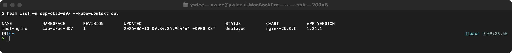

> **참고:** 위 검증 출력에서 네임스페이스가 `cap-ckad-d07`로 표기된 것은 실측 당시 `demo` 네임스페이스가 없어 대체 네임스페이스를 사용했기 때문이다. `kubectl create namespace demo` 후 실행하면 NAMESPACE 컬럼이 `demo`로 나온다.

```bash
helm get values test-nginx -n demo
```

검증:
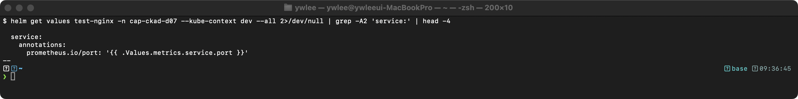

**동작 원리:** `--dry-run`은 서버에 매니페스트를 보내지 않고 렌더링 결과만 출력한다. `--set`으로 values.yaml의 기본값을 오버라이드할 수 있다. CKAD 시험에서는 `helm install`, `helm upgrade --set`, `helm rollback` 흐름을 숙지해야 한다.

#### 실습 2-1: Chart 다운로드 및 구조 확인

`helm pull --untar`로 Chart 파일을 로컬에 내려받아 Chart.yaml, values.yaml, templates/ 디렉토리를 직접 확인한다.

```bash
# Chart를 로컬에 압축 해제하여 다운로드
helm pull bitnami/nginx --untar

# Chart 구조 확인
ls -l nginx/
cat nginx/Chart.yaml
# values.yaml의 앞부분만 확인 (전체는 수백 줄)
head -60 nginx/values.yaml
```

#### 실습 2-2: 템플릿 렌더링 검증

설치 전에 `helm template`으로 실제로 어떤 YAML이 생성되는지 확인한다. 이 단계는 CKAD 시험에서 Chart 구조를 이해하고 값이 제대로 주입되는지 검증할 때 핵심이다.

```bash
# 렌더링 결과를 파일로 저장
helm template test-nginx bitnami/nginx \
  --set service.type=ClusterIP \
  -n demo > /tmp/rendered-nginx.yaml

# 렌더링된 Deployment만 확인
grep -A 30 "kind: Deployment" /tmp/rendered-nginx.yaml | head -35

# 린트로 Chart 문법 검사 (로컬 Chart 디렉토리 대상)
helm lint ./nginx
```

#### 실습 2-3: helm upgrade / history / rollback

학습 목표 3번(helm install/upgrade/rollback 명령 숙지)에 따라 install 이후의 lifecycle을 실습한다. Helm은 upgrade할 때마다 revision을 하나씩 올리고, 이전 revision을 Secret에 보존하므로 rollback이 가능하다.

```bash
# 1단계: replicaCount를 1→3으로 업그레이드
helm upgrade test-nginx bitnami/nginx \
  --set replicaCount=3 \
  -n demo
```

검증:
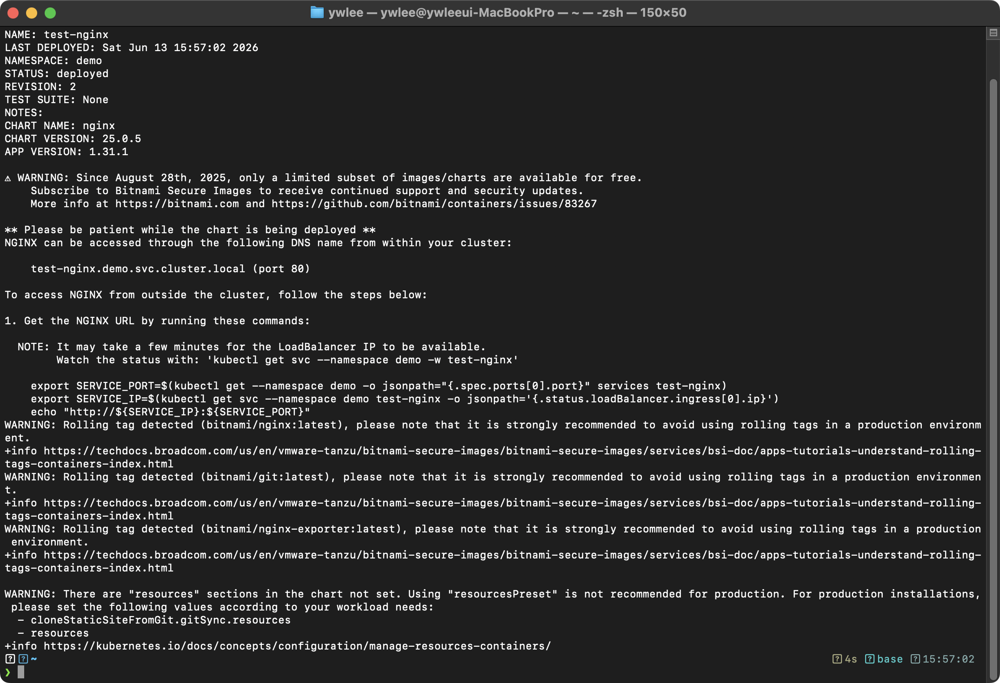

```bash
# 2단계: revision 이력 확인
helm history test-nginx -n demo
```

검증:
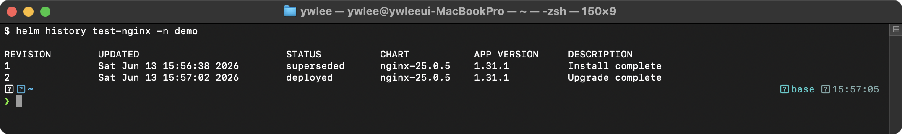

```bash
# 3단계: revision 1(최초 설치 상태)로 롤백
helm rollback test-nginx 1 -n demo

# 롤백 후 상태 확인 — revision 3이 추가되고 values가 replicaCount=1로 돌아온다
helm history test-nginx -n demo
helm get values test-nginx -n demo
```

**동작 원리:** `helm upgrade`는 새 revision Secret을 생성하고 기존 매니페스트에 3-way merge patch를 적용한다. 3-way merge patch란 이전 릴리스 매니페스트(A) - 현재 클러스터 상태(B) - 새 매니페스트(C) 세 가지를 비교해, B에서 사용자가 직접 바꾼 값(A↔B 차이)을 C에 보존하는 방식이다. 단순히 C를 덮어쓰는 2-way diff(`kubectl apply` 기본 동작)와 달리, 클러스터에서 직접 수정한 값(예: 운영자가 수동으로 올린 replicaCount)이 upgrade 시 유실되지 않는다. `helm rollback`은 지정한 revision의 매니페스트를 다시 적용하는데, 이 역시 새 revision을 하나 더 생성한다(이전 상태로 되돌리는 것이 아니라 "해당 상태로 forward"한다는 점이 핵심이다). `helm history`로 revision 목록과 각 revision의 DESCRIPTION을 확인할 수 있다.

### 정리

```bash
helm uninstall test-nginx -n demo
```

검증:
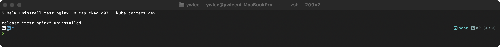

```bash
# Release가 삭제되었는지 확인
helm list -n demo
```

검증:
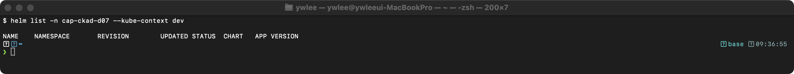

### 실습 검증: CKAD 출제 범위 체크

4절에서 나열한 7가지 출제 범위 중 본 실습(실습 1 + 실습 2)이 커버한 항목을 확인한다.

| # | 범위 | 실습 커버 여부 | 해당 명령 |
|:--|:--|:--:|:--|
| 1 | `helm install` | O | 실습 2 `helm install test-nginx bitnami/nginx` |
| 2 | `--set`으로 값 오버라이드 | O | 실습 2 `--set service.type=ClusterIP` |
| 3 | `-f`로 values 파일 지정 | X | `helm install ... -f values-prod.yaml` 직접 실행 필요 |
| 4 | `helm list`, `helm history`, `helm status` | 부분 | 실습 1·2 `helm list -A`, `helm history` 실행. `helm status <release> -n <ns>`는 직접 실행 필요(REVISION·LAST_DEPLOYED·STATUS 출력 형식 숙지 권장) |
| 5 | `helm uninstall` | O | 실습 2 정리 `helm uninstall test-nginx` |
| 6 | Chart 구조 이해 | O | 실습 2-1 `helm pull --untar`, `cat Chart.yaml` |
| 7 | 기본 Go 템플릿 (`{{ .Values.xxx }}`) | 부분 | 실습 2-2 `helm template` 렌더링으로 간접 확인 |

3번(`-f` values 파일 지정)은 아래 단계로 직접 실습한다. 7번(Go 템플릿 직접 작성)은 3.4절의 `helm create` + `helm template` 렌더링으로 확인한다.

**범위 3번 추가 실습 — `-f` values 파일 지정:**

```bash
# values-dev.yaml 생성 (service.type을 NodePort로 오버라이드)
printf 'service:\n  type: NodePort\n' > /tmp/values-dev.yaml

# -f로 values 파일 지정해 설치
helm install test-nginx bitnami/nginx \
  -f /tmp/values-dev.yaml \
  -n demo

# service.type이 NodePort로 반영됐는지 확인
helm get values test-nginx -n demo
```

검증:
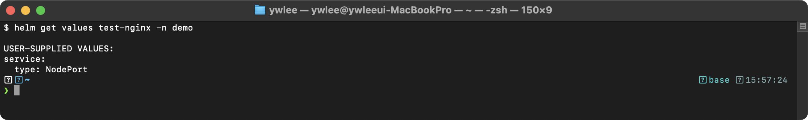

---

## 자가점검

<details>
<summary>정답 보기</summary>

**Q1. `helm upgrade --install my-nginx bitnami/nginx`는 `helm install`과 어떻게 다른가?**

Release `my-nginx`가 존재하지 않으면 신규 install을 수행하고, 이미 존재하면 upgrade를 수행한다. 이 패턴은 CI/CD 파이프라인에서 "있으면 업그레이드, 없으면 설치" 로직을 단일 명령으로 처리할 때 쓴다.

---

**Q2. Helm 3에서 Release 정보가 저장되는 위치는 어디인가?**

Release가 설치된 네임스페이스의 Secret에 저장된다. Secret 이름 형식은 `sh.helm.release.v1.<release-name>.v<revision>` 이다. `helm rollback`이 가능한 이유는 각 revision의 매니페스트와 values가 이 Secret에 직렬화(base64 gzip)되어 보존되기 때문이다.

---

**Q3. values 우선순위는 어떻게 되는가?**

`--set` > `-f <파일>` > `values.yaml` 순이다. 즉 `--set`이 가장 높은 우선순위를 가지며, `-f`로 지정한 파일이 기본 values.yaml을 덮어쓴다. 여러 `-f` 파일을 지정하면 나중에 등장한 파일이 이전 파일을 덮어쓴다.

---

**Q4. `helm rollback my-nginx 1`을 실행하면 revision 번호는 어떻게 변하는가?**

rollback도 새 revision을 생성한다. revision 1로 rollback하면 revision 3이 생성되고, 그 내용은 revision 1과 동일하다. `helm history`로 확인하면 DESCRIPTION 컬럼에 `Rollback to 1`이 표기된다.

---

**Q5. `helm template`과 `helm install --dry-run`의 차이는 무엇인가?**

`helm template`은 클러스터 연결 없이 순수하게 로컬에서 Go 템플릿을 렌더링만 한다. `helm install --dry-run`은 렌더링 후 API Server에 유효성 검사 요청을 보내므로 서버 사이드 검증(CRD 존재 여부 등)도 포함된다. 클러스터가 없는 환경에서 문법만 확인할 때는 `helm template`을 쓴다.

---

**Q6. `helm lint ./mychart`는 어떤 오류를 잡는가?**

Chart.yaml의 필수 필드 누락, values.yaml YAML 문법 오류, templates/ 내 Go 템플릿 문법 오류, `required` 함수로 선언된 필수 값 미설정 등을 검사한다. 단, Kubernetes 리소스 스펙 자체의 의미적 오류(예: 잘못된 API 버전)는 `helm template --validate` 또는 `helm install --dry-run`으로 확인해야 한다.

---

**Q7. `helm uninstall`이 오래 걸릴 때 빠르게 Release 메타데이터만 제거하는 방법은?**

```bash
kubectl delete secret -n <namespace> -l owner=helm,name=<release-name>
```

이 명령은 Helm 상태(메타데이터)만 제거한다. Deployment·Service 등 실제 쿠버네티스 리소스는 별도로 `kubectl delete`로 정리해야 한다.

</details>

---

## 더 읽을거리

- [Helm 공식 문서 — Using Helm](https://helm.sh/docs/intro/using_helm/) — install/upgrade/rollback/uninstall 명령 레퍼런스
- [Helm 공식 문서 — Chart Template Guide](https://helm.sh/docs/chart_template_guide/) — Go 템플릿 함수·파이프라인·`_helpers.tpl` 심화
- [Bitnami nginx Chart](https://github.com/bitnami/charts/tree/main/bitnami/nginx) — 실제 상용 Chart 구조 참고(values.yaml 주석·conditions·hooks 활용 사례)
- [Helm Best Practices](https://helm.sh/docs/chart_best_practices/) — NOTES.txt 작성, 레이블 컨벤션, values 설계 지침
