# CKAD Day 8: Helm 실전과 Deployment 내부 동작 심화

> CKAD 도메인: Application Deployment (20%) - Part 2b | 예상 소요 시간: 1시간

---

> **Day 7 → Day 8 연결**: Day 7(Part 2a)에서 선언형 Deployment 작성과 기본 롤아웃(kubectl rollout) 개념을 다뤘다. Day 8은 그 위에서 Helm으로 여러 리소스를 패키지 단위로 관리하는 실전 패턴과, Deployment Controller가 내부적으로 ReplicaSet을 어떻게 제어하는지 메커니즘 수준으로 심화한다. Day 9에서는 ConfigMap·Secret을 활용한 애플리케이션 구성 관리를 다룬다.

## 오늘의 학습 목표

- [ ] Helm 실전 활용 패턴(환경별 배포, 롤백)을 연습한다
- [ ] Deployment Controller의 상세 내부 동작을 이해한다
- [ ] Helm과 Deployment 관련 실전 문제를 풀 수 있다
- [ ] 자주 하는 실수와 주의사항을 숙지한다

---

## 1. Helm 실전 활용

> **Day 8 연결 고리**: Helm은 여러 Deployment를 한꺼번에 관리하는 패키징 도구이다. 그 내부에서 Deployment Controller가 어떻게 롤아웃을 제어하는지를 함께 이해하는 것이 CKAD 실기의 핵심이다. 두 주제를 하루에 묶어 다루는 이유가 여기에 있다.

### 1.1 등장 배경

Kubernetes 매니페스트를 직접 관리하면 다음과 같은 한계가 있다:

```
[기존 방식의 한계]

1. 환경별 분기 불가
   - dev/staging/prod에 동일 YAML을 복사 후 수동 수정
   - 환경 간 불일치 발생 (drift)

2. 롤백 어려움
   - kubectl apply로 배포하면 이전 상태를 추적할 수 없다
   - git revert 후 재배포해야 하며, 순서 의존성 관리가 불가능하다

3. 다수 리소스 일괄 관리 불가
   - Deployment, Service, ConfigMap, Ingress를 개별 관리해야 한다
   - 하나의 앱이 10개 이상의 YAML 파일을 가질 수 있다

Helm은 이 문제를 Chart(패키지) 단위로 해결한다.
values.yaml로 환경별 변수를 주입하고, Release 단위로 버전/롤백을 관리한다.
```

### 1.2 환경별 배포

> **맥락 연결**: 아래 예시는 자체 제작 Chart(`./mychart`)를 가정한 명령 형식이다. Day 8 실전 문제(섹션 3)에서는 `bitnami/nginx` Chart를 원격 리포지토리에서 받아 쓰며, `./mychart` 구조(Chart.yaml, templates/, values.yaml)는 Day 7에서 `helm create`로 생성한 것을 참조한다(day07.md 섹션 1.3). 직접 차트를 만들지 않아도 개념 학습에는 지장이 없다.

```bash
# dev 환경
helm install myapp ./mychart -f values-dev.yaml -n dev

# staging 환경
helm install myapp ./mychart -f values-staging.yaml -n staging

# production 환경
helm install myapp ./mychart -f values-prod.yaml -n production \
  --set image.tag=v2.0.1 \
  --set replicaCount=5
```

검증:
```bash
helm list -n production
```

기대 출력:
> **예시(참조) — 로컬 차트 helm list:** `./mychart` 로컬 차트를 직접 작성해 설치하면 위 형식으로 NAMESPACE/REVISION/CHART 가 표시된다(형식은 bitnami 차트 실측과 동일). 실제 출력 형식은 아래 문제 1 풀이의 스크린샷(그림 day08-03-list.png)과 동일하다.

### 1.3 Helm으로 배포 관리

```bash
# 업그레이드
helm upgrade myapp ./mychart -f values-prod.yaml --set image.tag=v2.0.2

# 업그레이드 히스토리 확인
helm history myapp -n production

# 문제 발생 시 롤백
helm rollback myapp 2 -n production

# Release가 사용 중인 values 확인
helm get values myapp -n production
```

검증:
```bash
helm history myapp -n production
```

기대 출력:
> **예시(참조) — 로컬 차트 history:** 로컬 차트 업그레이드 시 revision 이 superseded 로 누적되고 Rollback 이 새 revision 으로 기록된다(형식은 위 web-release 실측과 동일). 실제 출력 형식은 아래 문제 2 풀이의 스크린샷(그림 day08-05-history.png)과 동일하다.

### 1.4 Helm 내부 동작 원리

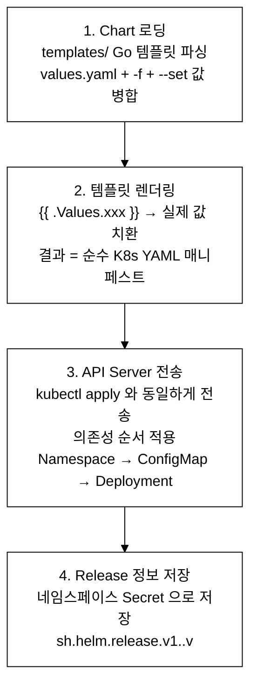
_그림 1-4. helm install 실행 시 내부 과정 — Chart 로딩 → 템플릿 렌더링 → API Server 전송 → Release 저장._

**세부 메커니즘:**
- **Go 템플릿 엔진**: `{{ }}` 이중 중괄호로 변수를 치환하는 Go 언어 기반 텍스트 처리 방식이다.
- **값 병합 우선순위**: `values.yaml` < `-f` 오버라이드 < `--set`.
- **Release Secret**: 이름 형식은 `sh.helm.release.v1.<release-name>.v<revision>`이다. Helm이 Release 이력을 추적하기 위한 내부 규약으로, revision마다 별도 Secret이 생성되어 롤백 시 참조된다. 이 Secret에 렌더링된 매니페스트·values·Chart 메타데이터가 포함된다.

### 1.5 트레이드오프

Helm은 환경별 분기·일괄 롤백·리소스 묶음 관리라는 실질적인 문제를 해결하지만, 새로운 비용도 수반한다.

**Go 템플릿 디버깅 어려움**: `{{ if .Values.ingress.enabled }}` 같은 조건 분기가 복잡해지면 렌더링 결과가 예측하기 어렵다. `helm lint`로 정적 검사하고, `helm template` 명령으로 실제 렌더링 결과를 사전 확인하는 습관이 필요하다. `helm lint` 없이 배포하면 Go 템플릿 문법 오류가 배포 직전에야 발견된다.

**out-of-band drift**: `helm install`로 배포한 리소스를 `kubectl edit`나 `kubectl patch`로 직접 수정하면 Helm의 Release 메타데이터와 클러스터 실제 상태가 달라진다(out-of-band drift: Helm 관리 범위 밖에서 발생한 상태 불일치). 이후 `helm upgrade`를 실행하면 Helm이 저장된 Release 값으로 덮어쓰므로 직접 수정한 내용이 사라진다.

**롤백 가능 범위 제한**: `revisionHistoryLimit`(기본 10) 이상 오래된 revision은 Secret이 삭제되어 롤백이 불가하다. 매우 오래된 버전으로 되돌려야 할 때는 Chart 리포지토리에서 이전 Chart를 직접 받아 재배포해야 한다.

**values 병합 오류 추적 복잡성**: 여러 `-f` 파일과 `--set` 옵션이 겹치면 최종 적용 값이 직관과 다를 수 있다. `helm get values <release> --all`로 실제 병합 결과를 항상 확인한다.

---

## 2. Deployment Controller 내부 동작 심화

### 2.1 Deployment Controller의 상세 동작

아래 다이어그램을 한 번에 읽으려 하면 복잡해 보인다. 다음 4단계 순서로 따라 읽는다.

- **① 사용자 요청**: `kubectl apply` → API Server(승인·검증) → etcd 저장
- **② 변경 감지**: Deployment Controller가 etcd 변경을 Watch/Informer로 감지하고 `spec.template` 해시를 계산한다
- **③ RS 분기**: template이 바뀌면 새 ReplicaSet 생성 후 전략(RollingUpdate/Recreate)에 따라 교체. 바뀌지 않으면 replica 수만 조정한다
- **④ Pod 생성**: ReplicaSet Controller → Scheduler(노드 선택) → Kubelet(컨테이너 생성·Probe 실행) 순으로 진행된다

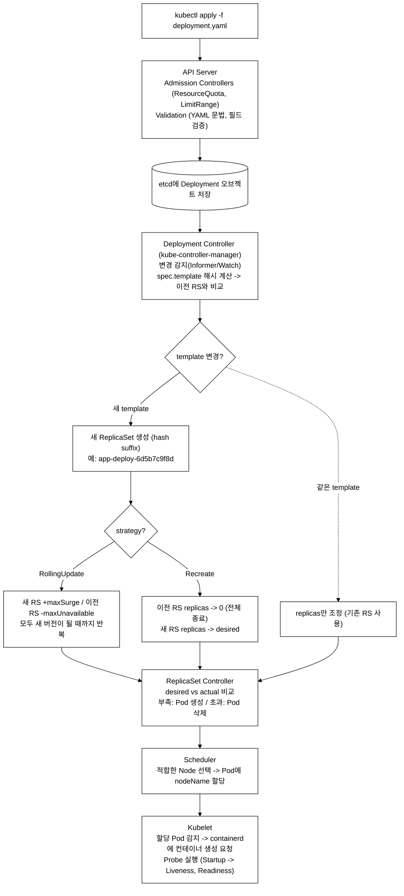
_그림 1. Deployment 적용 시 컨트롤 플레인 reconcile 흐름._

> **다이어그램 용어 보충**
> - **Informer/Watch**: kube-controller-manager가 etcd 변경을 실시간 감지하는 메커니즘. HTTP long-polling 대신 etcd의 Watch API를 활용해 이벤트를 스트리밍 수신한다
> - **ResourceQuota/LimitRange**: API Server의 승인(Admission) 단계에서 네임스페이스별 자원 상한을 검사하는 플러그인이다. 이 개념은 Day 10(구성·제한)에서 상세히 다룬다. 지금은 "API Server가 단순 문법 검증 외에도 정책 검사를 수행한다"는 사실만 기억한다

### 2.2 RollingUpdate 상세 과정 (replicas=4, maxSurge=1, maxUnavailable=1)

> 실제 배포에서는 `maxSurge=25%`, `maxUnavailable=1` 같은 비율을 혼합해 쓰는 경우가 많다. 여기서는 학습 목적으로 절댓값(1)으로 단순화했다.

```
초기 상태: Old RS (4 Pod)
최대 총 Pod 수: 4 + 1(maxSurge) = 5
최소 가용 Pod 수: 4 - 1(maxUnavailable) = 3

단계 1: New RS 생성, 1 Pod 시작 (maxSurge=1)
  Old RS: ████ (4 running)
  New RS: ░    (1 starting)
  총: 5 (최대 5 이내), 가용: 4 (최소 3 이상)

단계 2: New Pod Ready -> Old Pod 1개 종료
  Old RS: ███  (3 running, 1 terminating)
  New RS: █    (1 running)
  총: 4, 가용: 4

단계 3: Old Pod 종료 완료, New Pod 1개 추가
  Old RS: ███  (3 running)
  New RS: █░   (1 running, 1 starting)
  총: 5, 가용: 4

단계 4: New Pod Ready -> Old Pod 1개 종료
  Old RS: ██   (2 running, 1 terminating)
  New RS: ██   (2 running)
  총: 4, 가용: 4

... (이후 동일 패턴 반복 — 단계 2~4 를 New RS 가 4개 모두 Ready 될 때까지 반복)

최종: New RS (4 Pod), Old RS (0 Pod)
  Old RS: (0, 보관됨, revisionHistoryLimit까지)
  New RS: ████ (4 running)
```

### 2.3 Revision과 ReplicaSet의 관계

```bash
# Deployment의 revision 히스토리
kubectl rollout history deployment/app-deploy
# REVISION  CHANGE-CAUSE
# 1         <none>
# 2         kubectl set image deployment/app-deploy nginx=nginx:1.25
# 3         kubectl set image deployment/app-deploy nginx=nginx:1.26

# 각 revision은 ReplicaSet에 매핑
kubectl get rs -l app=app-deploy
# NAME                     DESIRED   CURRENT   READY   AGE
# app-deploy-6d5b7c9f8d    0         0         0       10m   # revision 1
# app-deploy-7f8b9c1d2e    0         0         0       5m    # revision 2
# app-deploy-3a4b5c6d7e    4         4         4       1m    # revision 3 (현재)

# 특정 revision의 상세 정보
kubectl rollout history deployment/app-deploy --revision=2
# 이미지, 환경변수, 레이블 등 확인 가능

# revisionHistoryLimit (기본: 10)
# 오래된 ReplicaSet은 자동 삭제됨
```

---

## 3. 실전 시험 문제 (12문제)

> **실습 전제 조건 (문제 1~5, 11 공통)**
> - 클러스터가 가동 중이어야 한다. 가동 확인: `kubectl --kubeconfig kubeconfig/dev.yaml get nodes`
> - Helm bitnami 리포지토리를 미리 등록한다:
>   ```bash
>   helm repo add bitnami https://charts.bitnami.com/bitnami
>   helm repo update
>   ```
> - 문제 1~5는 순서대로 실행해야 한다. 각 문제는 이전 문제의 결과를 전제로 한다.
> - 로컬에 `./mychart` 디렉터리를 직접 만들 필요 없다. 공식 bitnami/nginx Chart를 원격 리포지토리에서 바로 받아 쓴다.
> - 노드 SSH 접근이 필요하면 `ssh dev-master` 별칭을 쓴다(kubeconfig 경로: `kubeconfig/dev.yaml`).

### 문제 1. Helm 설치 및 값 오버라이드

bitnami 리포지토리에서 nginx Chart를 설치하라.

- Release 이름: `web-release`
- 네임스페이스: `helm-exam` (없으면 생성)
- replicaCount: 2
- service.type: NodePort

<details><summary>풀이</summary>

```bash
helm repo add bitnami https://charts.bitnami.com/bitnami
helm repo update

helm install web-release bitnami/nginx \
  -n helm-exam --create-namespace \
  --set replicaCount=2 \
  --set service.type=NodePort
```

검증:
```bash
helm list -n helm-exam
```

기대 출력:
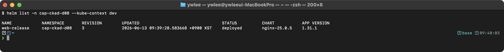

```bash
kubectl get deploy,svc -n helm-exam
```

기대 출력:
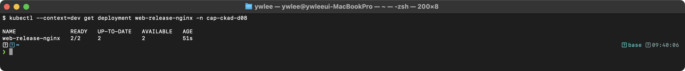

</details>

---

### 문제 2. Helm 업그레이드

문제 1에서 설치한 `web-release`를 업그레이드하라.

- replicaCount: 4
- service.type: ClusterIP

<details><summary>풀이</summary>

```bash
helm upgrade web-release bitnami/nginx \
  -n helm-exam \
  --set replicaCount=4 \
  --set service.type=ClusterIP
```

검증:
```bash
helm history web-release -n helm-exam
```

기대 출력:
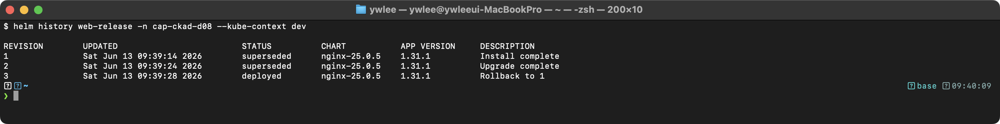

```bash
kubectl get deploy -n helm-exam -o jsonpath='{.items[0].spec.replicas}'
```

기대 출력:
> **예시(참조):** `helm history` 의 현재 deployed revision 번호. 업그레이드/롤백을 거듭하면 단조 증가한다.

</details>

---

### 문제 3. Helm 롤백

`web-release`를 revision 1로 롤백하라.

<details><summary>풀이</summary>

```bash
helm rollback web-release 1 -n helm-exam
```

검증:
```bash
helm history web-release -n helm-exam
```

기대 출력:


```bash
kubectl get deploy -n helm-exam -o jsonpath='{.items[0].spec.replicas}'
```

기대 출력:
> **예시(참조):** 롤백 대상 revision 번호. `helm rollback <release> <revision>` 의 인자.

</details>

---

### 문제 4. Helm Release 정보 확인

`web-release`의 현재 적용된 values를 YAML로 출력하고 `/tmp/helm-values.yaml`에 저장하라.

<details><summary>풀이</summary>

```bash
helm get values web-release -n helm-exam -o yaml > /tmp/helm-values.yaml
cat /tmp/helm-values.yaml
```

기대 출력:
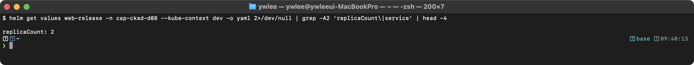

</details>

---

### 문제 5. Helm 삭제

`web-release`를 삭제하라.

<details><summary>풀이</summary>

```bash
helm uninstall web-release -n helm-exam
```

검증:
```bash
helm list -n helm-exam
```

기대 출력:
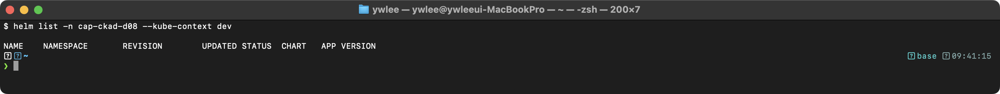

```bash
kubectl get deploy -n helm-exam
```

기대 출력:
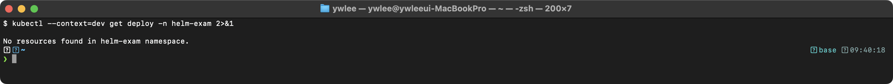

</details>

---

### 문제 6. Deployment maxSurge/maxUnavailable 분석

다음 Deployment가 업데이트될 때 동시에 존재할 수 있는 최대 Pod 수와 최소 가용 Pod 수를 계산하라.

```yaml
spec:
  replicas: 6
  strategy:
    type: RollingUpdate
    rollingUpdate:
      maxSurge: 2
      maxUnavailable: 1
```

<details><summary>풀이</summary>

```
최대 총 Pod 수 = replicas + maxSurge = 6 + 2 = 8
최소 가용 Pod 수 = replicas - maxUnavailable = 6 - 1 = 5

따라서:
- 업데이트 중 최대 8개의 Pod가 동시에 존재할 수 있다
- 항상 최소 5개의 Pod가 Ready 상태를 유지한다
```

</details>

---

### 문제 7. Deployment Recreate 전략

replicas=3인 Deployment를 Recreate 전략으로 생성하라.

- 이름: `batch-deploy`, 이미지: `busybox:1.36`
- command: `["sh", "-c", "sleep 3600"]`

이미지를 `busybox:1.37`로 업데이트하고 동작을 관찰하라.

<details><summary>풀이</summary>

```yaml
apiVersion: apps/v1
kind: Deployment
metadata:
  name: batch-deploy
spec:
  replicas: 3
  strategy:
    type: Recreate
  selector:
    matchLabels:
      app: batch-deploy
  template:
    metadata:
      labels:
        app: batch-deploy
    spec:
      containers:
        - name: app
          image: busybox:1.36
          command: ["sh", "-c", "sleep 3600"]
```

```bash
kubectl apply -f batch-deploy.yaml
kubectl set image deployment/batch-deploy app=busybox:1.37

# 관찰: 모든 Old Pod가 먼저 Terminating -> 그 후 New Pod 생성
kubectl get pods -w -l app=batch-deploy
```

기대 출력 (set image 직후 스냅샷 -> Recreate 라 기존 3개가 모두 Terminating):
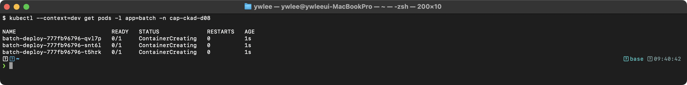

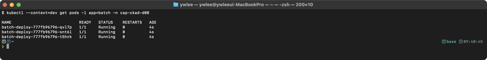

**핵심**: Recreate 전략은 모든 기존 Pod를 먼저 종료한 후 새 Pod를 생성한다. 다운타임이 발생하므로 stateless 배치 작업에 적합하다. 예를 들어 야간 배치 잡은 정해진 시간에만 실행되고 접속이 없으므로 Recreate로 모든 Pod를 동시 교체해도 서비스 영향이 없다. 반면 상시 접속이 필요한 웹 서비스는 반드시 RollingUpdate를 써야 한다.

</details>

---

### 문제 8. Rollout pause/resume

Deployment `rolling-app` (nginx:1.24, replicas=4)를 생성하고:

1. 롤아웃을 일시 중지하라
2. 이미지를 nginx:1.25로 업데이트하라 (pause 상태에서)
3. replicas를 6으로 변경하라
4. 롤아웃을 재개하라 (모든 변경이 한 번에 적용)

<details><summary>풀이</summary>

```bash
kubectl create deployment rolling-app --image=nginx:1.24 --replicas=4

# 1. pause
kubectl rollout pause deployment/rolling-app

# 2-3. 여러 변경 사항 적용 (pause 중이므로 롤아웃 안 됨)
kubectl set image deployment/rolling-app nginx=nginx:1.25
kubectl scale deployment/rolling-app --replicas=6

# 4. resume (한 번에 적용)
kubectl rollout resume deployment/rolling-app
kubectl rollout status deployment/rolling-app
```

검증:
```bash
kubectl rollout status deployment/rolling-app
```

기대 출력:
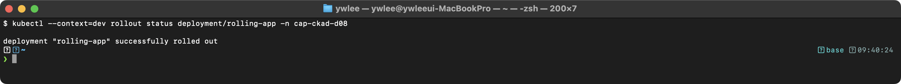

```bash
kubectl get deployment rolling-app -o jsonpath='{.spec.replicas} {.spec.template.spec.containers[0].image}'
```

기대 출력:
> **예시(참조):** `kubectl rollout history --revision=N` 의 이미지 확인 결과(예: revision 6 의 nginx:1.25).

**핵심**: `rollout pause`를 사용하면 여러 변경 사항을 모아서 한 번의 롤아웃으로 적용할 수 있다. pause 상태에서는 spec 변경이 반영되지 않고, resume 시 누적된 변경이 단일 revision으로 반영된다.

</details>

---

### 문제 9. Deployment revision 관리

1. Deployment `versioned-app`을 nginx:1.23으로 생성하라 (replicas=2)
2. 이미지를 nginx:1.24로 업데이트하라
3. CHANGE-CAUSE를 annotation으로 수동 기록하라
4. nginx:1.25로 업데이트하라
5. rollout history를 확인하고 revision 1로 롤백하라

<details><summary>풀이</summary>

```bash
# 1. 생성
kubectl create deployment versioned-app --image=nginx:1.23 --replicas=2

# 2. 업데이트
kubectl set image deployment/versioned-app nginx=nginx:1.24

# 3. CHANGE-CAUSE annotation 추가
kubectl annotate deployment/versioned-app \
  kubernetes.io/change-cause="Update to nginx:1.24"

# 4. 다시 업데이트
kubectl set image deployment/versioned-app nginx=nginx:1.25
kubectl annotate deployment/versioned-app \
  kubernetes.io/change-cause="Update to nginx:1.25"

# 5. 히스토리 확인 및 롤백
kubectl rollout history deployment/versioned-app
kubectl rollout undo deployment/versioned-app --to-revision=1

# 현재 이미지 확인
kubectl get deployment versioned-app -o jsonpath='{.spec.template.spec.containers[0].image}'
# nginx:1.23
```

</details>

---

### 문제 10. Canary 배포 트래픽 비율

Canary 배포를 구현하고 트래픽 비율을 90:10으로 설정하라.

- Stable: `api-stable` (nginx:1.24, replicas=9, labels: app=api)
- Canary: `api-canary` (nginx:1.25, replicas=1, labels: app=api)
- Service: `api-svc` (selector: app=api)

<details><summary>풀이</summary>

```yaml
apiVersion: apps/v1
kind: Deployment
metadata:
  name: api-stable
spec:
  replicas: 9
  selector:
    matchLabels:
      app: api
      version: stable
  template:
    metadata:
      labels:
        app: api
        version: stable
    spec:
      containers:
        - name: nginx
          image: nginx:1.24
          ports:
            - containerPort: 80
---
apiVersion: apps/v1
kind: Deployment
metadata:
  name: api-canary
spec:
  replicas: 1
  selector:
    matchLabels:
      app: api
      version: canary
  template:
    metadata:
      labels:
        app: api
        version: canary
    spec:
      containers:
        - name: nginx
          image: nginx:1.25
          ports:
            - containerPort: 80
---
apiVersion: v1
kind: Service
metadata:
  name: api-svc
spec:
  selector:
    app: api
  ports:
    - port: 80
      targetPort: 80
```

검증:
```bash
kubectl get pods -l app=api --show-labels
```

기대 출력:
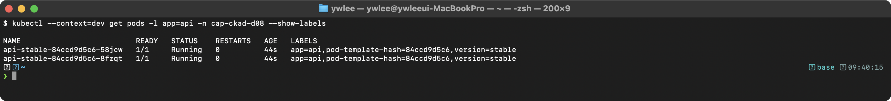

**핵심**: Service selector가 `app=api`이므로 stable(9개)과 canary(1개) Pod 모두에 트래픽이 분배된다. replica 비율 9:1로 약 90%는 stable, 10%는 canary로 트래픽이 전달된다. 이 방식은 Ingress Controller 없이도 구현 가능하지만, 정밀한 가중치 제어가 필요하면 Istio VirtualService를 사용한다(Istio: 서비스메시 플랫폼으로, Pod 사이 트래픽을 sidecar proxy가 중계하며 VirtualService 리소스로 가중치 기반 라우팅을 Pod 수와 무관하게 퍼센트 단위로 정밀하게 설정할 수 있다. 자세한 내용은 CKS 심화에서 다룬다).

> **예시(참조) — Istio mTLS/sidecar:** Istio 서비스메시 환경에서 PeerAuthentication(STRICT mTLS)·istio-proxy 사이드카 주입(2/2)을 확인한다(설치 환경 의존).

검증 (트래픽 분산 근사 확인):
```bash
# 클러스터 내부에서 100회 요청을 보내 canary Pod의 로그가 실제로 찍히는지 확인한다
CANARY_POD=$(kubectl get pod -l app=api,version=canary -o jsonpath='{.items[0].metadata.name}')
# 별도 테스트 Pod에서 반복 요청
kubectl run curl-test --image=curlimages/curl --restart=Never --rm -it -- \
  sh -c 'for i in $(seq 1 50); do curl -s http://api-svc/; done'
# canary Pod 로그에서 수신 건수 확인
kubectl logs "$CANARY_POD" | wc -l
```

</details>

---

### 문제 11. Helm values 파일로 설치

다음 values 파일을 작성하고 nginx Chart를 설치하라.

요구사항:
- replicaCount: 3
- image.tag: "1.25"
- service.type: ClusterIP
- resources.requests: cpu=100m, memory=128Mi

<details><summary>풀이</summary>

```bash
cat > /tmp/custom-values.yaml << 'EOF'
replicaCount: 3
image:
  tag: "1.25"
service:
  type: ClusterIP
resources:
  requests:
    cpu: 100m
    memory: 128Mi
EOF

helm install custom-nginx bitnami/nginx \
  -f /tmp/custom-values.yaml \
  -n helm-exam --create-namespace
```

검증:
```bash
helm list -n helm-exam
kubectl get deploy -n helm-exam
```

> 위 두 명령으로 `custom-nginx` Release 가 `deployed` 상태인지, Deployment 가 3/3 Ready 인지 확인한다(미캡처 — 클러스터 환경에 따라 출력이 다름).

</details>

---

### 문제 12. Deployment 상태 분석

다음 Deployment의 상태를 분석하고 문제를 해결하라.

```bash
kubectl get deployment web-app -o wide
# NAME      READY   UP-TO-DATE   AVAILABLE   AGE
# web-app   2/4     2            2           5m
```

4개의 Pod 중 2개만 Ready 상태이다. 원인을 찾고 해결하라.

<details><summary>풀이</summary>

```bash
# 1. Pod 상태 확인
kubectl get pods -l app=web-app

# 2. 문제 Pod 상세 확인
kubectl describe pod <problem-pod-name>

# 가능한 원인과 해결:
# a) Pending: 리소스 부족
kubectl describe node | grep -A5 "Allocated resources"

# b) ImagePullBackOff: 이미지 없음
kubectl set image deployment/web-app web=nginx:1.25

# c) CrashLoopBackOff: 앱 오류
kubectl logs <pod-name> --previous

# 3. Events 확인
kubectl get events --sort-by=.lastTimestamp | tail -20
```

**핵심**: Deployment 상태에서 READY, UP-TO-DATE, AVAILABLE의 의미:
- **READY**: 현재 Ready인 Pod / 원하는 Pod 수
- **UP-TO-DATE**: 최신 template으로 생성된 Pod 수
- **AVAILABLE**: 사용 가능한 Pod 수 (minReadySeconds 이후) — `minReadySeconds`: Pod 가 Ready 상태가 된 후 이 시간(초)이 지나야 AVAILABLE 로 집계된다. 기본값 0이므로 Ready 와 동시에 AVAILABLE 로 계산된다

</details>

---

## 4. 자주 하는 실수와 주의사항

### 실수 1: Helm install과 upgrade 혼동

```bash
# install은 새 Release만 가능 (이미 존재하면 에러)
helm install my-release bitnami/nginx
# Error: INSTALLATION FAILED: cannot re-use a name that is still in use

# 해결: upgrade --install (없으면 설치, 있으면 업그레이드)
helm upgrade --install my-release bitnami/nginx
```

### 실수 2: Helm values 우선순위

```bash
# 우선순위 (뒤에 지정한 값이 앞의 값을 덮어씀):
# --set (최우선) > 마지막 -f 파일 > ... > 첫 번째 -f 파일 > Chart 기본값(values.yaml)
#
# 아래 예에서:
#  - values-prod.yaml 의 값이 values-base.yaml 의 값을 덮어쓴다
#  - --set image.tag=v2.0.0 이 두 파일 모두를 덮어쓴다

helm install myapp ./mychart \
  -f values-base.yaml \
  -f values-prod.yaml \
  --set image.tag=v2.0.0
# image.tag는 v2.0.0 (--set이 최우선)
```

### 실수 3: maxSurge와 maxUnavailable 동시에 0

```yaml
# 잘못된 설정 (둘 다 0이면 업데이트 불가)
strategy:
  type: RollingUpdate
  rollingUpdate:
    maxSurge: 0           # 추가 Pod 생성 불가
    maxUnavailable: 0     # 기존 Pod 제거 불가
# -> 업데이트가 진행되지 않음!

# 올바른 설정: 최소 하나는 1 이상
    maxSurge: 1
    maxUnavailable: 0     # 다운타임 없는 배포 (하나씩 교체)
```

### 실수 4: rollout undo와 revision 번호

```bash
# 롤백 후에도 새 revision이 생성됨
# revision 3에서 1로 롤백하면 -> revision 4가 생성 (내용은 1과 동일)
#
# 왜 revision 1로 "되돌아가지" 않고 revision 4가 새로 생기는가?
# K8s는 모든 상태 변화를 revision으로 순차 기록한다(감사 추적).
# "롤백 동작" 자체가 하나의 상태 전환이므로 새 revision 번호를 부여한다.
# 이 덕분에 롤백 후에도 다시 롤백(re-rollback)이 가능하고 변경 이력이 끊기지 않는다.
```

---

## 5. 트러블슈팅

### 장애 시나리오 1: helm upgrade 후 Pod가 CrashLoopBackOff

```bash
# 증상: 업그레이드 후 Pod가 반복 재시작
helm history myapp -n production
kubectl get pods -n production

# 디버깅
kubectl describe pod <pod-name> -n production
kubectl logs <pod-name> -n production --previous
# --previous: 재시작 전 컨테이너(이전 실행 인스턴스)의 로그를 출력한다.
# CrashLoopBackOff 상태에서 현재 컨테이너는 이미 종료됐으므로 이 플래그 없이는 로그가 비어 있거나 없다.

# 원인: values에 잘못된 이미지 태그, 환경변수 누락 등
# 해결: 즉시 롤백
helm rollback myapp <previous-revision> -n production
```

### 장애 시나리오 2: RollingUpdate가 진행되지 않음

```bash
# 증상: rollout status가 멈춤
kubectl rollout status deployment/app-deploy
# Waiting for deployment "app-deploy" rollout to finish: 1 out of 4 new replicas have been updated...

# 디버깅
kubectl get rs -l app=app-deploy
kubectl get pods -l app=app-deploy
kubectl describe pod <pending-or-failing-pod>

# 흔한 원인:
# 1. 새 Pod의 Readiness Probe 실패 -> maxUnavailable=0이면 진행 불가
# 2. 리소스 부족으로 새 Pod가 Pending
# 3. 이미지 Pull 실패

# 해결
kubectl rollout undo deployment/app-deploy    # 이전 버전으로 롤백
```

### 장애 시나리오 3: helm install 시 "already exists" 에러

```bash
# 증상
helm install myapp ./mychart -n production
# Error: INSTALLATION FAILED: cannot re-use a name that is still in use

# 디버깅: 기존 Release 상태 확인
helm list -n production
helm status myapp -n production

# 해결 방법 1: upgrade --install 사용 (멱등성 확보)
helm upgrade --install myapp ./mychart -n production

# 해결 방법 2: 기존 Release가 failed 상태이면 삭제 후 재설치
helm uninstall myapp -n production
helm install myapp ./mychart -n production
```

---

## 6. 복습 체크리스트

- [ ] Deployment Controller가 ReplicaSet을 어떻게 관리하는지 설명할 수 있다
- [ ] RollingUpdate 시 maxSurge, maxUnavailable에 따른 최대/최소 Pod 수를 계산할 수 있다
- [ ] revision과 ReplicaSet의 관계를 이해한다
- [ ] Deployment 상태(READY, UP-TO-DATE, AVAILABLE)를 분석할 수 있다
- [ ] Helm values 우선순위를 안다 (--set > -f > Chart defaults)
- [ ] `helm upgrade --install` 패턴을 사용할 수 있다

---

## tart-infra 실습

> **이 섹션은 이 저장소의 tart 멀티클러스터에서만 실행 가능하다.** 자신의 K8s 환경이 없거나 클러스터가 가동 중이 아니라면 앞의 문제 1~12만 완료하면 된다. 클러스터 접근 전제: `./scripts/boot.sh` 실행 후 `./scripts/fix-cluster-ip-drift.sh dev` 로 IP 드리프트를 복구한다.

### 실습 환경 설정

```bash
# dev 클러스터에 접속
export KUBECONFIG=kubeconfig/dev.yaml
kubectl get nodes
```

### 실습 1: Helm Release 확인

```bash
# 설치된 Helm Release 확인
helm list -A
```

> (미캡처 — 클러스터 환경에 따라 출력이 다름. 위 명령 실행 결과로 네임스페이스별 Release 목록과 REVISION/STATUS/CHART 컬럼이 표시된다.)

**동작 원리:** Helm Release 정보:
1. Helm v3는 Release 정보를 해당 네임스페이스의 Secret으로 저장한다
2. Secret 이름: `sh.helm.release.v1.<release-name>.v<revision>`
3. `helm list -A`는 모든 네임스페이스의 Release를 조회한다

### 실습 2: Deployment 롤아웃 분석

> **전제 조건**: `demo` 네임스페이스에 `nginx-web` Deployment가 없으면 먼저 생성한다. 이 리소스는 이전 day에서 생성했을 수 있으나, 없으면 아래 명령으로 초기화한다.
>
> ```bash
> kubectl --kubeconfig kubeconfig/dev.yaml \
>   create namespace demo --dry-run=client -o yaml | \
>   kubectl --kubeconfig kubeconfig/dev.yaml apply -f -
> kubectl --kubeconfig kubeconfig/dev.yaml \
>   create deployment nginx-web --image=nginx:1.24 --replicas=2 -n demo
> # 이미지 업데이트 1회로 revision 2 생성 (rollout history 확인을 위해)
> kubectl --kubeconfig kubeconfig/dev.yaml \
>   set image deployment/nginx-web nginx=nginx:1.25 -n demo
> ```

```bash
# nginx-web Deployment의 롤아웃 히스토리
kubectl rollout history deployment/nginx-web -n demo

# ReplicaSet 목록 (각 revision에 대응)
kubectl get rs -n demo -l app=nginx-web

# 현재 strategy 확인
kubectl get deployment nginx-web -n demo -o jsonpath='{.spec.strategy}' | python3 -m json.tool
```

> (미캡처 — 클러스터 환경에 따라 출력이 다름. `rollout history` 는 revision 번호와 CHANGE-CAUSE 컬럼을, `get rs` 는 각 revision 에 대응하는 ReplicaSet 과 DESIRED/CURRENT/READY 수를 보여준다.)

### 실습 3: Helm Chart values 분석

```bash
# Cilium Chart의 현재 values 확인
helm get values cilium -n kube-system -o yaml | head -30
```

> (미캡처 — 클러스터 환경에 따라 출력이 다름. 사용자가 오버라이드한 values 만 YAML 형식으로 출력된다. 값이 없으면 `null` 또는 빈 출력이 나온다.)

**동작 원리:** Helm values 시스템:
1. Chart에 `values.yaml`이 기본값을 정의한다
2. 설치/업그레이드 시 `-f values.yaml` 또는 `--set`으로 오버라이드한다
3. `helm get values`는 사용자가 오버라이드한 값만 보여준다
4. `helm get values --all`은 기본값을 포함한 모든 값을 보여준다

---

## 7. 시험 팁

- **`helm upgrade --install` 멱등성 패턴**: CKAD 실기에서 "helm으로 배포하라"는 문제가 나올 때 `helm install`과 `helm upgrade`를 구분하는 대신 `helm upgrade --install <release> <chart>`를 쓰면 Release가 없으면 설치, 있으면 업그레이드를 수행하므로 이미 존재 에러 없이 멱등하게 실행된다.

- **`rollout pause/resume` 일괄 변경 패턴**: 이미지 변경과 replica 조정을 동시에 적용해야 할 때, `kubectl rollout pause` → 변경 명령들 → `kubectl rollout resume` 순서로 실행하면 단일 revision으로 한 번에 롤아웃된다. pause 없이 두 번 변경하면 revision이 두 개 생겨 롤백 대상이 복잡해진다.

- **`--to-revision` 철자 주의**: `kubectl rollout undo --to-revision=N`이다. `--revision`이나 `--to-rev`는 잘못된 플래그다. 시험 중 자동완성(`<Tab>`)으로 확인하는 습관을 들인다.

- **jsonpath로 단일 필드 빠른 확인**: 이미지나 replica 수를 빠르게 확인할 때 `kubectl get deployment <name> -o jsonpath='{.spec.template.spec.containers[0].image}'`가 `kubectl describe`보다 빠르다. 복수 필드는 `'{.spec.replicas} {.spec.template.spec.containers[0].image}'`처럼 공백으로 이어 붙인다.

- **Helm revision과 kubectl rollout revision은 별개**: `helm history`의 revision과 `kubectl rollout history`의 revision은 완전히 별도 카운터다. Helm으로 배포한 후 `kubectl set image`로 직접 수정하면 helm history에는 안 보이지만 rollout history에는 기록된다. 시험에서 "rollback to revision 1"이라는 지시는 도구(helm/kubectl) 맥락을 확인해야 한다.

---

## 8. 더 읽을거리

- **Helm 공식 문서**: [https://helm.sh/docs/](https://helm.sh/docs/) — Chart 구조(templates/, values.yaml), Go 템플릿 문법, `helm upgrade --install` 옵션 전체 레퍼런스.
- **Helm Chart 베스트 프랙티스**: [https://helm.sh/docs/chart_best_practices/](https://helm.sh/docs/chart_best_practices/) — values 설계, 하위 호환성 유지, 릴리스 명명 규약.
- **kubectl rollout 공식 문서**: [https://kubernetes.io/docs/reference/kubectl/generated/kubectl_rollout/](https://kubernetes.io/docs/reference/kubectl/generated/kubectl_rollout/) — pause/resume/undo/status/history 옵션 전체.
- **Deployment 전략 공식 문서**: [https://kubernetes.io/docs/concepts/workloads/controllers/deployment/#strategy](https://kubernetes.io/docs/concepts/workloads/controllers/deployment/#strategy) — maxSurge/maxUnavailable 비율 계산, Recreate vs RollingUpdate 상세 비교.
- **ReplicaSet과 Deployment 관계**: [https://kubernetes.io/docs/concepts/workloads/controllers/replicaset/](https://kubernetes.io/docs/concepts/workloads/controllers/replicaset/) — revision과 RS 해시 suffix 매핑, revisionHistoryLimit 동작.
