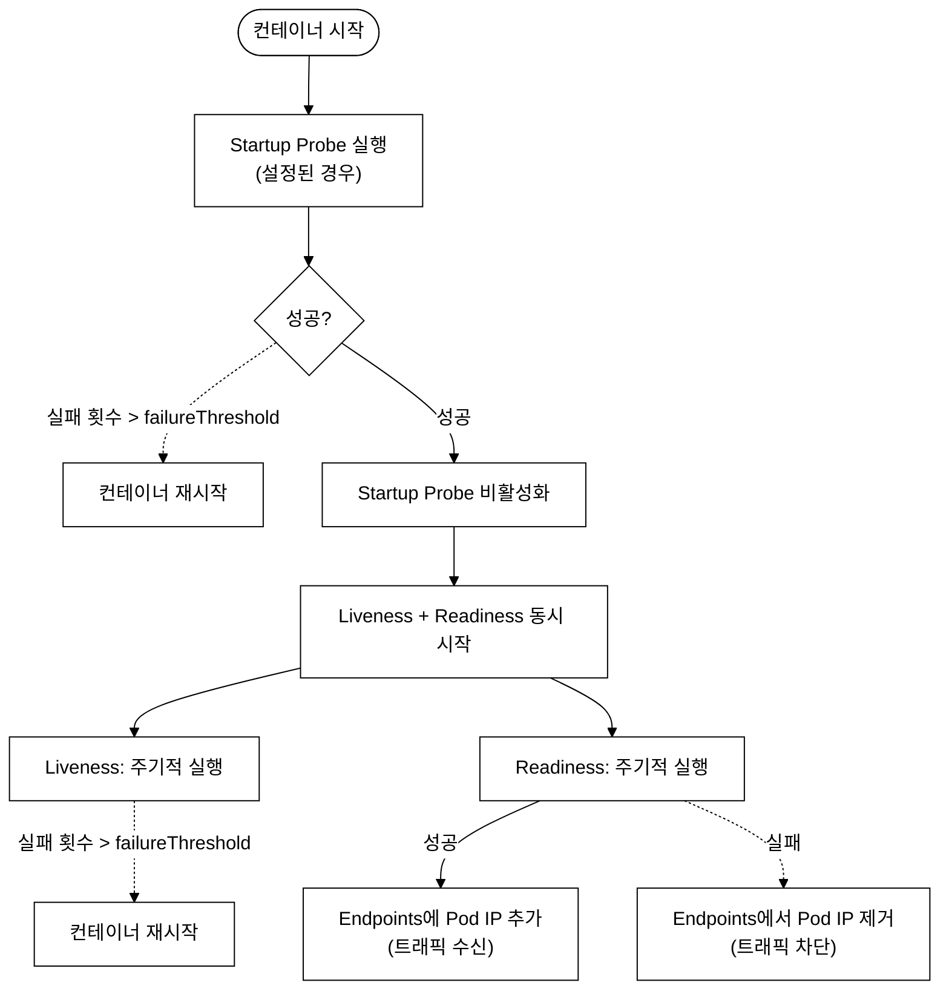
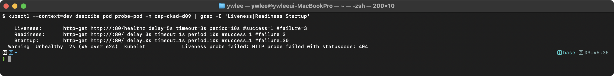
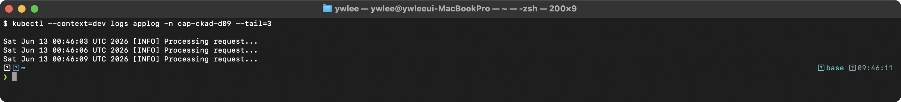
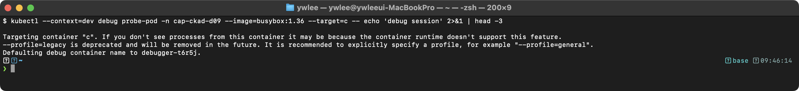
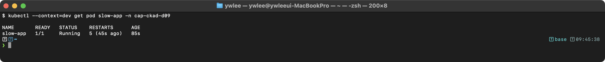
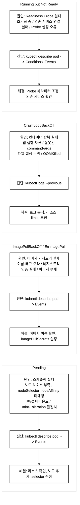
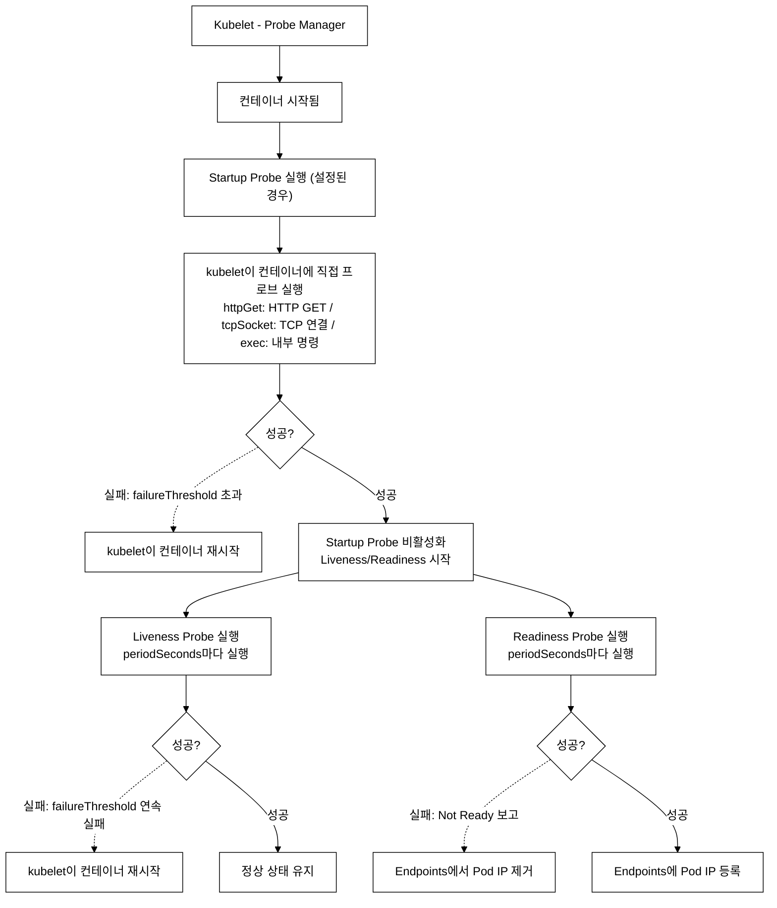
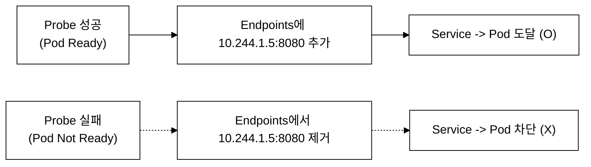
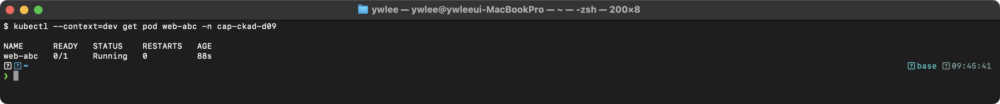
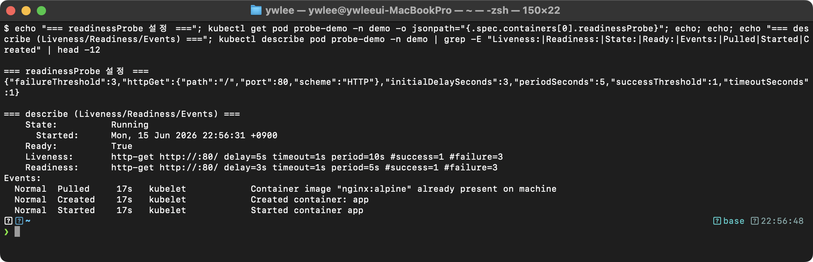

# CKAD Day 9: Probe, 로깅, 디버깅 이론

> CKAD 도메인: Application Observability and Maintenance (15%) - Part 1a | 예상 소요 시간: 1시간

이전(Day 8)에서 Deployment 배포 전략(RollingUpdate/Recreate)을 학습했다. Day 9에서는 배포된 앱이 실제로 살아있는지, 트래픽을 받을 준비가 됐는지를 kubelet이 어떻게 감시하는지(Probe)와 문제가 생겼을 때 진단하는 방법(Logging/Debugging)을 다룬다. Day 10에서 이 주제의 실전 문제를 다룬다.

---

## 오늘의 학습 목표

- [ ] Liveness, Readiness, Startup Probe의 차이와 용도를 이해한다
- [ ] httpGet, tcpSocket, exec 3가지 체크 방식을 숙지한다
- [ ] Probe 파라미터(initialDelaySeconds, periodSeconds, failureThreshold)를 설정할 수 있다
- [ ] kubectl logs와 Sidecar 로깅 패턴을 학습한다
- [ ] kubectl exec, kubectl debug로 컨테이너를 디버깅할 수 있다

---

## 1. Probe (프로브) - 컨테이너 상태 감시

### 1.1 등장 배경

```
[Probe 이전의 한계]

기존 방식: 컨테이너 프로세스의 종료 코드만으로 상태를 판단한다.
- 프로세스가 살아있지만 교착 상태(deadlock)인 경우 감지 불가
- 프로세스가 살아있지만 의존 서비스 연결이 끊긴 경우 감지 불가
- 앱 초기화 중에 트래픽이 유입되어 5xx 에러 발생

Probe는 이 한계를 해결한다:
- Liveness: 프로세스가 아닌 "앱 로직"의 생존을 확인한다
- Readiness: 트래픽을 받을 준비가 되었는지 별도로 확인한다
- Startup: 초기화가 느린 앱에서 Liveness가 조기 재시작하는 것을 방지한다
```

### 1.2 Probe란?

Probe는 kubelet이 컨테이너의 상태를 주기적으로 진단하는 메커니즘이다. kubelet은 컨테이너에 대해 3가지 프로브를 독립적으로 실행하며, 각 프로브는 httpGet/tcpSocket/exec 중 하나의 핸들러(handler)로 상태를 확인한다. Probe 결과는 3가지다:

- **Success**: 컨테이너가 정상 동작 중(httpGet은 200-399 응답, exec는 종료 코드 0, tcpSocket은 연결 성공)
- **Failure**: 컨테이너가 비정상(조건 미충족)
- **Unknown**: 프로브 결과 자체를 판정할 수 없는 상태. exec 명령이 타임아웃을 초과하거나, tcpSocket 연결 시 네트워크 unreachable이 발생하거나, httpGet 요청이 반환조차 안 될 때 발생한다. kubelet은 Unknown을 Failure로 간주해 `failureThreshold` 카운트에 포함시킨다. 실제 디버깅에서 Unknown을 만나면 네트워크 정책(NetworkPolicy)이나 `timeoutSeconds` 설정을 먼저 확인한다.

결과에 따라 kubelet이 컨테이너 재시작(Liveness), Endpoints 제거/등록(Readiness), 또는 다른 프로브 시작 지연(Startup)을 수행한다.

**3가지 Probe:**

| Probe | 목적 | 실패 시 동작 | 언제 사용? |
|-------|------|------------|----------|
| **Startup** | 앱 초기화 완료 확인 | 컨테이너 재시작 | 시작이 느린 앱 |
| **Liveness** | 앱이 살아있는지 확인 | 컨테이너 재시작 | 교착 상태 감지 |
| **Readiness** | 트래픽 받을 준비 확인 | Endpoints에서 제거 | 트래픽 제어 |

### 1.3 Probe 실행 순서


_그림 1. Probe 생애주기: Startup 통과 후 Liveness/Readiness 동시 동작._

### 1.4 httpGet 체크

```yaml
apiVersion: v1
kind: Pod
metadata:
  name: http-probe-pod
spec:
  containers:
    - name: app
      image: nginx:1.25
      ports:
        - containerPort: 80

      # Startup Probe: 앱 초기화 완료 대기
      startupProbe:
        httpGet:
          path: /                    # HTTP GET 요청 경로
          port: 80                   # 요청 포트
        failureThreshold: 30         # 최대 실패 횟수
        periodSeconds: 2             # 체크 주기 (초)
        # 최대 대기 시간: 30 * 2 = 60초

      # Liveness Probe: 앱이 살아있는지 확인
      livenessProbe:
        httpGet:
          path: /healthz             # 헬스체크 전용 경로
          port: 80
        initialDelaySeconds: 5       # 첫 체크 전 대기 시간
        periodSeconds: 10            # 10초마다 체크
        timeoutSeconds: 3            # 응답 대기 시간 (기본: 1초)
        failureThreshold: 3          # 3번 연속 실패 시 재시작
        successThreshold: 1          # 1번 성공하면 건강 (기본값)

      # Readiness Probe: 트래픽 수신 준비 확인
      readinessProbe:
        httpGet:
          path: /ready               # 준비 상태 확인 경로
          port: 80
        initialDelaySeconds: 5
        periodSeconds: 5             # 5초마다 체크
        failureThreshold: 3          # 3번 실패 시 Endpoints에서 제거
        successThreshold: 1
```

**httpGet 응답 코드:**
- **200-399**: Success (건강)
- **400 이상**: Failure (비정상)

검증:
```bash
kubectl apply -f http-probe-pod.yaml
kubectl describe pod http-probe-pod | grep -A 3 "Liveness\|Readiness\|Startup"
```

기대 출력:


### 1.5 tcpSocket 체크

```yaml
# TCP 연결만 확인 (HTTP 서버가 아닌 경우)
livenessProbe:
  tcpSocket:
    port: 5432                     # TCP 포트에 연결 시도
  initialDelaySeconds: 15
  periodSeconds: 20

readinessProbe:
  tcpSocket:
    port: 5432
  initialDelaySeconds: 5
  periodSeconds: 10
```

**용도:** 데이터베이스(PostgreSQL, MySQL, Redis), 메시지 큐(RabbitMQ) 등 HTTP가 아닌 서비스

### 1.6 exec 체크

```yaml
# 컨테이너 내부에서 명령 실행
livenessProbe:
  exec:
    command:                       # 종료 코드 0 = 성공
      - cat
      - /tmp/healthy               # 파일 존재 여부로 상태 확인
  initialDelaySeconds: 5
  periodSeconds: 5

# 복잡한 헬스체크 스크립트
livenessProbe:
  exec:
    command:
      - /bin/sh
      - -c
      - pg_isready -U postgres     # PostgreSQL 상태 확인
  periodSeconds: 10
```

**용도:** 커스텀 헬스체크 스크립트, 파일 기반 상태 확인, CLI 도구로 상태 확인

### 1.7 Probe 파라미터 상세

```
initialDelaySeconds: 0     # 컨테이너 시작 후 첫 프로브까지 대기 (기본: 0)
periodSeconds: 10          # 프로브 실행 주기 (기본: 10)
timeoutSeconds: 1          # 응답 대기 시간 (기본: 1)
failureThreshold: 3        # 연속 실패 횟수 (기본: 3)
successThreshold: 1        # 연속 성공 횟수 (기본: 1, Liveness/Startup은 1만 가능)

Startup Probe 최대 대기 시간 = failureThreshold * periodSeconds
예: failureThreshold=30, periodSeconds=2 -> 최대 60초

Liveness Probe가 재시작을 트리거하기까지:
- 컨테이너 시작 후 initialDelaySeconds 경과 → 첫 번째 프로브 실행
- 이후 매 periodSeconds마다 프로브 실행, 연속으로 failureThreshold번 실패하면 재시작
- **중간에 한 번이라도 성공하면 실패 카운트가 0으로 리셋된다**

최악 시나리오(첫 프로브부터 연속 실패):
  initialDelaySeconds + (failureThreshold * periodSeconds)
  예: initialDelaySeconds=5, periodSeconds=10, failureThreshold=3 → 5 + (3 * 10) = 35초

실제 시나리오(중간 성공 포함):
  예: 20초 시점에 한 번 성공하면 카운트 리셋 → 다시 연속 3번 실패까지 30초를 더 기다려야 재시작
  단순 공식으로 계산된 35초와 실제 타이밍이 다를 수 있다
```

### 1.8 Liveness vs Readiness 차이 시각화

```
[Liveness Probe 실패 시]
Pod 상태: Running -> Container 재시작 -> Running
  ※ "컨테이너 재시작"은 containers[] 배열 중 해당 컨테이너 하나만 재시작하는 것이다.
     Pod 자체는 Running 상태를 유지하며, kubectl get pod의 RESTARTS 카운터만 증가한다.
     멀티컨테이너 Pod라면 다른 컨테이너는 영향을 받지 않는다.
     (restartPolicy: Pod spec에 설정하는 컨테이너 재시작 정책. Always(기본)/OnFailure/Never 세 가지이며, Always이면 kubelet이 컨테이너 종료 즉시 재시작한다. 기본값이 Always이므로 kubelet이 자동 재시작한다)
Endpoints: 변화 없음 (재시작 중 잠깐 제거될 수 있음)
효과: 컨테이너가 재시작되어 문제 해결 시도

[Readiness Probe 실패 시]
Pod 상태: Running (변화 없음)
Endpoints: Pod IP 제거 -> 트래픽 수신 중단
효과: 문제가 해결될 때까지 트래픽만 차단, 재시작 안 함

시나리오:
  Liveness: "앱이 죽었다 -> 재시작해야 한다"
  Readiness: "앱이 바쁘다/아직 준비 안됨 -> 트래픽만 빼자"
```

---

## 2. Container Logging (컨테이너 로깅)

### 2.1 kubectl logs 기본

**--previous가 필요한 이유 — CrashLoopBackOff 진단 시나리오**

Pod가 `CrashLoopBackOff` 상태로 계속 재시작되면, 현재 살아있는 컨테이너의 로그(`kubectl logs`)는 가장 최근 재시작 이후의 내용만 보여준다. 재시작 직전 실패 원인(OOM 킬, 잘못된 설정 로드, 파일 누락 등)은 이미 사라진 이전 컨테이너에 있다. `--previous` 플래그는 n-1번째 컨테이너, 즉 마지막으로 종료된 컨테이너의 로그를 조회해 재시작 원인을 파악하는 첫 번째 진단 명령이다.

```bash
# 단일 컨테이너 Pod 로그
kubectl logs <pod-name>
kubectl logs <pod-name> -n <namespace>

# 특정 컨테이너 로그 (Multi-container Pod)
kubectl logs <pod-name> -c <container-name>

# 실시간 로그 스트리밍 (-f: follow)
kubectl logs -f <pod-name>

# 마지막 N줄만
kubectl logs <pod-name> --tail=100

# 최근 시간 기준 로그
kubectl logs <pod-name> --since=1h       # 최근 1시간
kubectl logs <pod-name> --since=5m       # 최근 5분

# 이전 컨테이너 로그 (CrashLoopBackOff 디버깅)
kubectl logs <pod-name> --previous

# 타임스탬프 포함
kubectl logs <pod-name> --timestamps

# Label selector로 여러 Pod 로그
kubectl logs -l app=web --tail=10
kubectl logs -l app=web --all-containers
```

### 2.2 Sidecar Logging 패턴

레거시 앱 또는 사내 표준 로그 라이브러리가 stdout이 아닌 파일(`/var/log/app.log`)에 로그를 기록하도록 설계된 경우, `kubectl logs`로는 해당 로그를 볼 수 없다. 12-Factor App 원칙을 따르지 않는 앱이나 운영 환경에서 로그 파일 경로가 고정된 앱이 그 대표 사례다. 앱 코드를 수정하지 않고 컨테이너 외부에서 로그를 수집하기 위한 패턴이 Sidecar Logging이다.

메인 앱이 파일로 로그를 출력하고, Sidecar 컨테이너가 이를 stdout으로 전달하는 패턴이다.

```yaml
apiVersion: v1
kind: Pod
metadata:
  name: sidecar-logging
spec:
  containers:
    # 메인 앱: 파일에 로그 기록
    - name: app
      image: busybox:1.36
      command: ["sh", "-c"]
      args:
        - |
          while true; do
            echo "$(date) [INFO] Processing request..." >> /var/log/app/app.log
            sleep 5
          done
      volumeMounts:
        - name: log-vol
          mountPath: /var/log/app

    # Sidecar: 로그 파일을 stdout으로 스트리밍
    - name: log-streamer
      image: busybox:1.36
      command: ["sh", "-c", "tail -f /var/log/app/app.log"]
      volumeMounts:
        - name: log-vol
          mountPath: /var/log/app
          readOnly: true

  volumes:
    - name: log-vol
      emptyDir: {}
```

검증:
```bash
kubectl apply -f sidecar-logging.yaml
kubectl logs sidecar-logging -c log-streamer --tail=3
```

기대 출력:


```bash
# app 컨테이너의 stdout에는 로그가 없다
kubectl logs sidecar-logging -c app
```

기대 출력:


**Sidecar Logging이 필요한 이유:**
- `kubectl logs`는 stdout/stderr만 수집한다
- 앱이 파일에 로그를 기록하면 `kubectl logs`로 볼 수 없다
- Sidecar가 파일 로그를 stdout으로 변환한다

**내부 동작 원리:** emptyDir 볼륨은 Pod의 라이프사이클에 바인딩된다. 두 컨테이너가 같은 emptyDir을 마운트하면 동일한 디스크(또는 메모리) 영역을 공유한다. app 컨테이너가 파일에 쓴 데이터를 log-streamer 컨테이너가 `tail -f`로 실시간 읽는 구조이다.

---

## 3. Debugging (디버깅)

### 3.1 kubectl exec

```bash
# 실행 중인 컨테이너에서 명령 실행
kubectl exec <pod-name> -- <command>

# 인터랙티브 셸
kubectl exec -it <pod-name> -- /bin/sh

# 실용적인 디버깅 명령
kubectl exec <pod> -- env               # 환경 변수 확인
kubectl exec <pod> -- cat /etc/resolv.conf   # DNS 설정 확인
kubectl exec <pod> -- curl -s localhost:8080  # 로컬 접근 테스트
kubectl exec <pod> -- nslookup svc-name       # DNS 해석 확인
```

### 3.2 kubectl debug (Ephemeral Container)

**등장 배경 — exec의 한계와 Ephemeral Container의 등장**

`kubectl exec`는 컨테이너 내부에 `/bin/sh` 같은 셸이 존재해야 동작한다. 그런데 Go 바이너리를 scratch(완전히 빈 이미지) 또는 Distroless(구글이 만든 최소화 이미지로, 셸·패키지 관리자·디버깅 도구를 일체 포함하지 않는다)로 패키징하면 `exec`로 진입할 수단 자체가 없다.

Kubernetes 1.16에서 alpha, **1.23에서 GA(General Availability)**된 Ephemeral Container(임시 컨테이너)는 이 문제를 해결한다. 실행 중인 Pod에 디버깅 전용 컨테이너를 **임시**로 주입하며, Pod spec에 영구 기록되지 않는다. Pod를 재시작하면 임시 컨테이너도 사라진다.

**트레이드오프:** Ephemeral Container는 resources(CPU/메모리 limits)·ports·livenessProbe·readinessProbe 필드를 지정할 수 없다. 또한 emptyDir 이외의 볼륨을 임의로 마운트하는 것에 제약이 있으므로, 퍼시스턴트 스토리지를 직접 조회하려면 `--copy-to` 방식을 써야 한다.

**모드 선택 기준 — 상황별 어느 명령을 쓰나**

| 상황 | 권장 모드 | 이유 |
|------|----------|------|
| scratch/Distroless 이미지로 빌드된 Pod, 셸 없음 | `--target=<container>` (Ephemeral 추가) | 원본 Pod에 임시 셸 컨테이너를 주입해 프로세스 네임스페이스 공유 |
| 노드 커널·호스트 파일시스템 진단(cgroup, /proc 등) | `node/<node-name>` | 호스트 네임스페이스로 접근하는 디버그 Pod를 노드에 배치 |
| 원본 Pod 영향 없이 설정·환경변수 변경 후 확인 | `--copy-to=<debug-pod-name>` | Pod를 복제해 별도 디버그 Pod 생성, 원본은 그대로 |

```bash
# Ephemeral container를 추가하여 디버깅
kubectl debug -it <pod-name> \
  --image=busybox:1.36 \
  --target=<container-name>

# 디버깅용 Pod를 Node에 생성
kubectl debug node/<node-name> -it --image=busybox:1.36

# 기존 Pod를 복사하여 디버깅 (원본에 영향 없음)
kubectl debug <pod-name> -it \
  --copy-to=debug-pod \
  --image=busybox:1.36 \
  --share-processes
```

검증:
```bash
# Ephemeral Container가 추가되었는지 확인
kubectl get pod <pod-name> -o jsonpath='{.spec.ephemeralContainers[*].name}'
```

기대 출력:


### 3.3 kubectl top (리소스 사용량)

`kubectl top`은 Metrics API(`metrics.k8s.io`)를 통해 실시간 CPU·메모리 사용량을 조회한다. 이 API는 클러스터에 **metrics-server**가 배포되어 있어야 제공된다. metrics-server가 없으면 `error: Metrics API not available` 에러가 발생한다.

**metrics-server가 없을 때 대체 진단법:**
- `kubectl describe node <name>` → `Allocated resources` 섹션에서 requests/limits 대비 할당 현황 확인 가능
- `kubectl describe pod <name>` → `OOMKilled` 여부는 `Last State` 필드에서 확인
- 노드에 직접 SSH 접속(`ssh dev-master` 등)하여 `top` 또는 `cat /proc/meminfo` 로 호스트 수준 리소스 확인

```bash
# Pod 리소스 사용량 (metrics-server 필요)
kubectl top pods -n demo
kubectl top pods --sort-by=cpu -n demo
kubectl top pods --sort-by=memory -n demo

# Node 리소스 사용량
kubectl top nodes
```

### 3.4 Pod 상태별 트러블슈팅


_그림 2. Pod 상태별 원인-진단-해결 트러블슈팅 트리._

### 3.5 체계적 디버깅 절차

```bash
# 1. Pod 상태 확인
kubectl get pods -n <ns> -o wide

# 2. 상세 정보 확인 (Events가 가장 중요!)
kubectl describe pod <pod-name> -n <ns>

# 3. 로그 확인
kubectl logs <pod-name> -n <ns>
kubectl logs <pod-name> -n <ns> --previous  # 이전 컨테이너

# 4. 이벤트 확인 (시간순 정렬)
kubectl get events -n <ns> --sort-by='.lastTimestamp'

# 5. 컨테이너 내부 확인
kubectl exec -it <pod-name> -n <ns> -- /bin/sh

# 6. 리소스 사용량 확인
kubectl top pods -n <ns>
```

---

## 4. 쿠버네티스 내부 동작

### 4.1 Kubelet의 Probe 실행 과정 — 내부 구현 관점

*1.3의 다이어그램은 사용자가 관찰하는 외부 생애주기(Startup → Liveness/Readiness 순서)를 보여준다. 이 절은 kubelet 내부의 Probe Manager가 각 핸들러를 어떻게 실행하는지, 그리고 Liveness와 Readiness가 병렬로 동시 실행된다는 구현 상세를 다룬다.*

kubelet의 Probe Manager는 각 컨테이너당 Liveness·Readiness·Startup 세 개의 워커(goroutine — Go 언어의 경량 병렬 실행 단위. OS 스레드보다 가벼워 kubelet 내부에서 수천 개를 동시 실행한다)를 독립 실행한다. 핸들러 종류별 실행 방식은 다음과 같다:

- **httpGet**: kubelet이 컨테이너 IP:Port에 HTTP GET 요청 → 200-399면 성공
- **tcpSocket**: kubelet이 TCP 3-way handshake(SYN→SYN-ACK→ACK) 시도 → 연결 성립이면 성공
- **exec**: kubelet이 CRI(Container Runtime Interface — kubelet과 컨테이너 런타임 사이의 gRPC 표준 API)를 통해 컨테이너 내부에서 지정 명령 실행 → 종료 코드 0이면 성공

Liveness와 Readiness는 Startup이 성공한 뒤 **별도 goroutine(각자 독립된 경량 실행 흐름)으로 병렬 실행**된다. 두 프로브의 periodSeconds가 달라도 서로 독립적으로 동작하므로, Liveness가 성공해도 Readiness가 실패하면 Pod는 Running 상태를 유지하면서 Endpoints에서는 제거된다.


_그림 3. kubelet Probe Manager의 프로브 실행 경로._

### 4.2 Service Endpoints와 Readiness Probe의 관계


_그림 4. Readiness 결과에 따른 Endpoints 변화와 트래픽 흐름._

---

## 5. 트러블슈팅

### 장애 시나리오 1: Liveness Probe가 너무 빨리 재시작을 유발

```bash
# 증상: Pod가 반복 재시작, RESTARTS 수가 계속 증가
kubectl get pods
```



```bash
# 디버깅: Probe 설정 확인
kubectl describe pod slow-app | grep -A 3 "Liveness"
# Liveness:   http-get http://:8080/healthz delay=0s timeout=1s period=10s #failure=3

# 원인: 앱 초기화에 30초 소요되나 initialDelaySeconds=0
# 해결: Startup Probe 추가 또는 initialDelaySeconds 증가
```

### 장애 시나리오 2: Readiness Probe 실패로 Service가 트래픽 전달 불가

```bash
# 증상: Pod는 Running이지만 READY=0/1
kubectl get pods -l app=web
```


```bash
# 디버깅
kubectl describe pod web-abc | grep -A 5 "Readiness"
kubectl describe endpoints web-svc
# Endpoints가 비어 있으면 Readiness 실패가 원인

# 컨테이너 내부에서 Probe 경로 테스트
kubectl exec web-abc -- curl -s localhost:8080/ready
# 404 또는 connection refused -> 앱이 해당 경로를 제공하지 않는다

# 해결: Probe path를 앱이 실제 응답하는 경로로 변경
```

### 장애 시나리오 3: 로그가 보이지 않음

```bash
# 증상: kubectl logs가 빈 출력
kubectl logs myapp-pod
# (빈 출력)

# 디버깅: 앱이 stdout이 아닌 파일에 로그를 기록하는 경우
kubectl exec myapp-pod -- ls /var/log/
kubectl exec myapp-pod -- cat /var/log/app.log

# 해결: Sidecar 로깅 패턴 적용 또는 앱의 로그 출력을 stdout으로 변경
```

---

## 6. 복습 체크리스트

- [ ] Liveness, Readiness, Startup Probe의 차이를 설명할 수 있다
- [ ] httpGet, tcpSocket, exec 3가지 체크 방식의 차이를 안다
- [ ] Startup Probe가 왜 필요한지 설명할 수 있다
- [ ] initialDelaySeconds, periodSeconds, failureThreshold를 설정할 수 있다
- [ ] Startup Probe 최대 대기 시간을 계산할 수 있다 (failureThreshold * periodSeconds)
- [ ] Liveness 실패 시 재시작, Readiness 실패 시 Endpoints 제거를 이해한다
- [ ] `kubectl logs -c <container>`, `--previous`, `--tail` 옵션을 사용할 수 있다
- [ ] Sidecar 로깅 패턴의 YAML을 작성할 수 있다
- [ ] `kubectl exec`으로 컨테이너 내부 명령을 실행할 수 있다
- [ ] Pod 상태(Pending, CrashLoopBackOff, ImagePullBackOff)별 원인을 알고 있다

---

## tart-infra 실습

### 실습 환경 설정

```bash
export KUBECONFIG=kubeconfig/dev.yaml
kubectl get pods -n demo
```

### 실습 1: 기존 서비스의 Probe 설정 분석

**선결조건:**
```bash
# kubeconfig 설정
export KUBECONFIG=kubeconfig/dev.yaml

# demo 네임스페이스에 nginx Deployment가 없으면 먼저 생성한다
kubectl get deploy nginx -n demo 2>/dev/null || \
  kubectl create deployment nginx --image=nginx:1.25 -n demo

# Pod가 Running 상태가 될 때까지 대기
kubectl wait --for=condition=available deployment/nginx -n demo --timeout=60s
```

dev 클러스터에서 실행 중인 서비스들의 Probe 설정을 확인한다.

```bash
# nginx Pod의 Probe 설정 확인
kubectl get deploy -n demo -o jsonpath='{range .items[*]}{.metadata.name}{"\n"}{end}'

# 각 Deployment의 Probe 확인
kubectl get deploy nginx -n demo -o jsonpath='{.spec.template.spec.containers[0].livenessProbe}' | python3 -m json.tool 2>/dev/null || echo "livenessProbe 미설정"
kubectl get deploy nginx -n demo -o jsonpath='{.spec.template.spec.containers[0].readinessProbe}' | python3 -m json.tool 2>/dev/null || echo "readinessProbe 미설정"
```

기대 출력: dev 클러스터의 demo 워크로드(nginx-web·httpbin 등)는 Probe 가 정의돼 있지 않아 위 명령은 `livenessProbe 미설정`/`readinessProbe 미설정` 을 출력한다. Probe 가 실제로 설정된 형태는 바로 아래 실습 2에서 만든 `probe-demo` 의 실측(실습 3 캡처)을 참고한다.

**동작 원리:** 프로덕션 워크로드에서 Probe 누락은 장애 시 자동 복구 불가(Liveness) 또는 준비 안 된 Pod에 트래픽 유입(Readiness)을 의미한다. 기존 서비스의 Probe 설정을 분석하여 개선점을 파악하는 것이 중요하다.

### 실습 2: Probe가 포함된 Pod 생성과 동작 확인

```bash
cat <<'EOF' | kubectl apply -f -
apiVersion: v1
kind: Pod
metadata:
  name: probe-demo
  namespace: demo
spec:
  containers:
    - name: app
      image: nginx:1.25
      ports:
        - containerPort: 80
      startupProbe:
        httpGet:
          path: /
          port: 80
        failureThreshold: 3
        periodSeconds: 5
      livenessProbe:
        httpGet:
          path: /
          port: 80
        periodSeconds: 10
        failureThreshold: 3
      readinessProbe:
        httpGet:
          path: /
          port: 80
        periodSeconds: 5
        failureThreshold: 2
EOF

# Probe 이벤트 확인
kubectl describe pod probe-demo -n demo | grep -A 5 "Events:"

# Readiness 실패 시뮬레이션 (index.html 삭제)
kubectl exec probe-demo -n demo -- rm /usr/share/nginx/html/index.html

# 상태 변화 관찰
kubectl get pod probe-demo -n demo -w
```

**예상 출력 — 시간축으로 변화를 관찰한다 (`kubectl get pod probe-demo -n demo -w`):**

실제 실행 결과: (미캡처) — 아래는 상태 변화 흐름을 설명하기 위한 참고 텍스트이며, 실제로는 dev 클러스터에서 직접 실행해 터미널 화면을 확인한다.

```
NAME         READY   STATUS    RESTARTS   AGE
probe-demo   1/1     Running   0          30s    ← 초기: Probe 통과, Ready
probe-demo   0/1     Running   0          35s    ← Readiness 실패 시작: Endpoints에서 제거
probe-demo   0/1     Running   1          70s    ← Liveness failureThreshold(3) 도달 → 컨테이너 재시작, RESTARTS 증가
probe-demo   1/1     Running   1          80s    ← 재시작 후 nginx 복구, Ready 복원
```

위 타임라인에서 두 가지를 주목한다:
- `0/1 Running 0` 구간: Readiness만 실패, Pod는 살아있으나 트래픽 차단
- `0/1 Running 1`로 RESTARTS가 증가하는 순간: Liveness도 같은 경로(`/`)이므로 failureThreshold(3)×periodSeconds(10)=30초 후 kubelet이 컨테이너를 재시작

**동작 원리:** index.html을 삭제하면 httpGet Probe가 404를 반환하여 Readiness 실패(0/1)가 된다. Readiness 실패 시 Endpoints에서 제거되어 트래픽이 차단되지만, Liveness도 같은 경로이므로 `failureThreshold`(3) 도달 시 컨테이너가 재시작된다. 재시작 후 nginx 기본 이미지에 index.html이 복원되어 다시 Ready 상태가 된다.

### 실습 3: Pod 로그 디버깅 실습

```bash
# 컨테이너 로그 확인
kubectl logs probe-demo -n demo --tail=10

# 이전 컨테이너(재시작 전) 로그 확인
kubectl logs probe-demo -n demo --previous 2>/dev/null || echo "이전 컨테이너 없음"

# Pod 이벤트로 Probe 실패 원인 파악
kubectl describe pod probe-demo -n demo | tail -20
```

아래는 dev 클러스터에 띄운 `probe-demo` Pod 의 실측이다. `readinessProbe` 설정(JSON)과 `kubectl describe` 의 Liveness/Readiness 라인(`http-get http://:80/ delay=.. period=.. #failure=3`)·State/Ready·Events 가 보인다. 재시작이 일어난 경우 `kubectl logs --previous` 로 이전 컨테이너 로그를 확인한다.



**동작 원리:** `--previous` 플래그는 재시작 이전 컨테이너의 로그를 조회한다. CrashLoopBackOff 상태의 Pod를 디버깅할 때 핵심 명령이다. `kubectl describe`의 Events 섹션에서 Probe 실패 메시지와 재시작 기록을 확인할 수 있다.

### 정리

```bash
kubectl delete pod probe-demo -n demo
```

---

## 시험 팁

CKAD 실기에서 Probe 관련 빈출 패턴을 숙지한다.

1. **명령형으로 Pod 생성 후 Probe 추가**: `kubectl run` 명령은 Probe 플래그를 직접 지원하지 않는다. `kubectl run myapp --image=nginx --dry-run=client -o yaml > pod.yaml` 으로 YAML을 뽑아낸 뒤 `livenessProbe`/`readinessProbe` 필드를 직접 삽입하는 흐름이 실기 표준이다. `alias k=kubectl`, `export do='--dry-run=client -o yaml'` 로 속도를 높인다.

2. **Probe 파라미터 암기 필수값**: 재시작까지 최대 대기 시간 = `failureThreshold × periodSeconds`. Startup Probe의 `failureThreshold × periodSeconds` 이 Liveness Probe가 시작되기 전 최대 유예 시간이다. 시험 문제에서 "앱이 초기화에 최대 120초가 필요하다"고 하면 `failureThreshold=30, periodSeconds=4` (또는 같은 곱을 주는 조합) 로 설정한다.

3. **CrashLoopBackOff 첫 진단 명령은 `kubectl logs --previous`**: 현재 살아있는 컨테이너 로그(`kubectl logs`)는 재시작 이후의 내용만 보여준다. 재시작 원인은 직전 컨테이너에 있으므로 `kubectl logs <pod> --previous` 를 첫 번째로 실행한다.

4. **Readiness 실패 확인 경로**: Pod가 Running인데 트래픽이 안 가면 `kubectl describe endpoints <svc>` 로 Endpoints가 비어있는지 확인한다. 비어있으면 Readiness Probe 실패가 원인이다.

5. **`successThreshold`는 Liveness·Startup에서 1만 가능**: Readiness Probe만 `successThreshold > 1`로 설정할 수 있다. Liveness/Startup에서 `successThreshold: 2` 등을 쓰면 `kubectl apply` 시 유효성 검사 오류가 발생한다.

---

## 자가점검

<details>
<summary>Q1. Startup Probe가 아직 통과되지 않은 상태에서 Liveness Probe가 실행되는가?</summary>

실행되지 않는다. Startup Probe가 성공(Success)을 반환할 때까지 Liveness Probe와 Readiness Probe는 모두 시작되지 않는다. Startup Probe가 `failureThreshold`를 초과하면 컨테이너가 재시작되고, 성공하면 그 시점부터 Liveness/Readiness가 동시에 시작된다.

</details>

<details>
<summary>Q2. Readiness Probe가 실패하면 Pod는 어떻게 되는가?</summary>

Pod 자체는 Running 상태를 유지하며 컨테이너는 재시작되지 않는다. kubelet이 해당 Pod의 IP를 Service의 Endpoints에서 제거하여 트래픽이 들어오지 않도록 차단한다. Readiness Probe가 다시 성공하면 Endpoints에 IP가 재등록된다.

</details>

<details>
<summary>Q3. `kubectl logs --previous`는 언제 사용하며, 데이터는 어디에 있는가?</summary>

CrashLoopBackOff 상태처럼 컨테이너가 반복 재시작될 때 사용한다. 재시작 이전(n-1번째) 컨테이너의 로그를 조회한다. 로그 데이터는 노드의 `/var/log/pods/<namespace>_<pod>_<uid>/<container>/` 경로에 회전 파일로 저장되며, kubelet이 이전 컨테이너 로그를 일정 기간 보존한다.

</details>

<details>
<summary>Q4. `kubectl debug` 가 `kubectl exec` 와 다른 가장 중요한 차이는?</summary>

`kubectl exec`는 대상 컨테이너 내부에 셸(`/bin/sh` 등)이 존재해야 한다. scratch 또는 Distroless 이미지로 빌드된 컨테이너에는 셸이 없어 `exec`가 동작하지 않는다. `kubectl debug`는 실행 중인 Pod에 Ephemeral Container(임시 컨테이너)를 주입하여 디버깅 도구가 포함된 별도 이미지로 진단할 수 있다. Ephemeral Container는 Pod 재시작 후 사라진다.

</details>

<details>
<summary>Q5. `initialDelaySeconds=10, periodSeconds=5, failureThreshold=3` 으로 설정된 Liveness Probe가 첫 프로브부터 연속 실패하면 컨테이너 재시작까지 최소 몇 초가 걸리는가?</summary>

`initialDelaySeconds + (failureThreshold × periodSeconds) = 10 + (3 × 5) = 25초`. 컨테이너 시작 후 10초 대기, 이후 5초 간격으로 3번 연속 실패하면 재시작이 트리거된다.

</details>

---

## 더 읽을거리

- [Kubernetes 공식 문서 — Configure Liveness, Readiness, and Startup Probes](https://kubernetes.io/docs/tasks/configure-pod-container/configure-liveness-readiness-startup-probes/)
- [Kubernetes 공식 문서 — Ephemeral Containers](https://kubernetes.io/docs/concepts/workloads/pods/ephemeral-containers/)
- [Kubernetes 공식 문서 — Logging Architecture](https://kubernetes.io/docs/concepts/cluster-administration/logging/)
- [kubectl debug 명령 참조](https://kubernetes.io/docs/reference/generated/kubectl/kubectl-commands#debug)
