# CKAD Day 10: Probe, 로깅, 디버깅 실전 문제

> CKAD 도메인: Application Observability and Maintenance (15%) - Part 1b | 예상 소요 시간: 1시간

Day 9(Part 1a)에서 Probe의 세 가지 종류와 내부 동작 원리를 다뤘다. Day 10은 그 연장선에서 실전 시험 문제 풀이와 Distroless 이미지 디버깅 패턴을 집중적으로 다룬다.

---

## 오늘의 학습 목표

- [ ] Probe 관련 실전 문제를 풀 수 있다
- [ ] 로깅/디버깅 관련 실전 문제를 풀 수 있다
- [ ] 실전 시나리오(Distroless 디버깅)를 이해한다
- [ ] 자주 하는 실수와 주의사항을 숙지한다

---

## 1. 실전 시험 문제 (12문제)

### Probe가 왜 필요한가 — 등장 배경

**(배경)** Kubernetes는 자동 복구를 약속한다. 그런데 "언제 Pod이 준비되었는가", "언제 Pod이 죽었는가"를 Kubernetes는 어떻게 알 수 있는가? 컨테이너 프로세스가 살아있다는 것만으로는 충분하지 않다. 예를 들어 nginx는 프로세스가 기동되어 있어도 포트 80에 실제로 응답하기까지 수 초가 걸릴 수 있다. JVM 기반 애플리케이션은 프로세스가 떴지만 클래스 로딩이 끝나기 전까지 요청을 처리할 수 없다.

**(직전 방식의 한계)** Docker 단독 시절에는 `HEALTHCHECK` 지시자를 Dockerfile에 직접 써야 했고, 운영자가 `docker ps`와 `docker logs`를 주기적으로 확인하거나 cron으로 감시 스크립트를 돌렸다. 자동 복구는 없었고, 죽은 컨테이너를 외부 감시자가 발견해서 수동으로 재시작해야 했다.

**(무엇이 나아졌나)** Kubernetes의 Probe는 kubelet이 직접 컨테이너 상태를 주기적으로 검사한다. 실패가 누적되면 kubelet이 자동으로 컨테이너를 재시작(Liveness)하거나 Service 엔드포인트에서 제거(Readiness)한다. 세 가지 종류는 서로 다른 관점에서 동작한다.

- **Startup Probe**: 앱이 처음 기동될 때까지 기다린다. 느리게 시작하는 앱이 Liveness 실패로 무한 재시작되는 것을 방지한다.
- **Liveness Probe**: 앱이 교착 상태·무한 루프 등으로 응답 불능이 되었을 때 재시작한다. "살아있는가?"
- **Readiness Probe**: 앱이 트래픽을 받을 준비가 되었는지 판단한다. 실패하면 재시작 없이 Service 엔드포인트에서만 제거된다. "서비스할 준비가 되었는가?"

**(트레이드오프)** Probe 자체가 앱에 HTTP 요청을 보내거나 명령을 실행하므로 앱 응답성에 영향을 준다. 설정을 잘못하면 false negative(정상인 앱이 느려서 Probe 실패 → 불필요한 재시작)가 발생한다. `timeoutSeconds`, `failureThreshold`, `periodSeconds` 세 값을 앱 특성에 맞게 조정해야 한다.

---

### 실습 전제 조건

이 섹션의 문제 1~12를 실제로 실행하려면 다음 조건이 갖춰져야 한다.

```bash
# 1. dev 클러스터 kubeconfig 설정 (tart-infra 기준)
export KUBECONFIG=~/sideproejct/IaC_apple_sillicon/kubeconfig/dev.yaml

# 2. CKAD 속도전 셋업 — 매 세션 시작 시 실행
alias k=kubectl
export do='--dry-run=client -o yaml'
# 이후 'kubectl'을 'k'로 축약하고, 매니페스트 생성 시 'k run ... $do > x.yaml'로 빠르게 초안을 뽑는다.

# 3. 노드 정상 여부 확인
k get nodes
# 재부팅 후 IP가 바뀌었다면: ./scripts/fix-cluster-ip-drift.sh dev

# 4. 노드 SSH 접속 예시 (필요 시)
# ssh dev-master   또는   ssh staging-master
# (~/.ssh/config 의 VM 별칭, ProxyCommand가 tart ip를 실시간 조회하므로 재부팅 후에도 그대로 쓸 수 있다)
```

문제 5처럼 nginx가 `/healthz`, `/ready` 경로를 제공하지 않는 상황도 의도된 실습이다. Pod이 Not Ready나 재시작 상태가 되는 것이 **정상적인 기대 결과**이다. 자신의 출력과 비교할 때 `kubectl describe pod <이름> | grep -A 10 "Events:"` 또는 `| grep "Unhealthy"`로 Probe 실패 메시지를 확인한다.

---

### 문제 1. Liveness Probe (httpGet)

다음 조건의 Pod를 생성하라.

- Pod 이름: `liveness-pod`, 이미지: `nginx:1.25`, 포트: 80
- Liveness Probe: httpGet, path=/, port=80
- initialDelaySeconds=5, periodSeconds=10, failureThreshold=3

<details><summary>풀이</summary>

```yaml
apiVersion: v1
kind: Pod
metadata:
  name: liveness-pod
spec:
  containers:
    - name: nginx
      image: nginx:1.25
      ports:
        - containerPort: 80
      livenessProbe:
        httpGet:
          path: /
          port: 80
        initialDelaySeconds: 5
        periodSeconds: 10
        failureThreshold: 3
```

검증:
```bash
kubectl apply -f liveness-pod.yaml
kubectl describe pod liveness-pod | grep -A 3 "Liveness"
```

기대 출력:
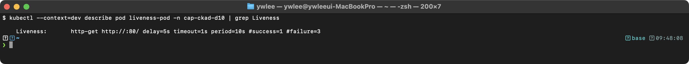

```bash
kubectl get pod liveness-pod
```

기대 출력:
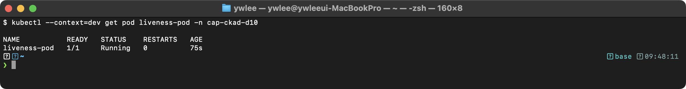

**Probe 파라미터 의미**

| 파라미터 | 이 설정 값 | 의미 |
|:---|:---:|:---|
| `initialDelaySeconds` | 5 | 컨테이너 기동 후 첫 Probe까지 5초 대기. 앱이 충분히 시작될 시간을 준다. |
| `periodSeconds` | 10 | 10초마다 한 번 Probe를 실행한다. |
| `failureThreshold` | 3 | 3번 연속 실패 시 컨테이너를 재시작한다. 즉 최악의 경우 5초(initial) + 10 × 3초(period × threshold) = **35초 후 재시작**. |
| `timeoutSeconds` | 기본 1초 | Probe 요청에 대한 대기 시간. 1초 안에 응답 없으면 실패로 판정한다. 앱이 느리면 이 값을 늘려야 false negative를 방지할 수 있다. |
| `successThreshold` | 기본 1 | 실패 후 몇 번 연속 성공해야 정상으로 복귀하는지. Liveness는 1이 강제이고 Readiness는 조정 가능하다. |

</details>

---

### 문제 2. Readiness Probe (tcpSocket)

다음 조건의 Pod를 생성하라.

- Pod 이름: `readiness-tcp`, 이미지: `redis:7`, 포트: 6379
- Readiness Probe: tcpSocket, port=6379
- periodSeconds=5, failureThreshold=3

<details><summary>풀이</summary>

```yaml
apiVersion: v1
kind: Pod
metadata:
  name: readiness-tcp
spec:
  containers:
    - name: redis
      image: redis:7
      ports:
        - containerPort: 6379
      readinessProbe:
        tcpSocket:
          port: 6379
        periodSeconds: 5
        failureThreshold: 3
```

검증:
```bash
kubectl apply -f readiness-tcp.yaml
kubectl get pod readiness-tcp
```

기대 출력:


```bash
kubectl describe pod readiness-tcp | grep -A 2 "Readiness"
```

기대 출력:
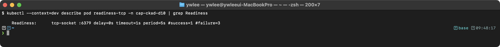

</details>

---

### 문제 3. Startup Probe

시작이 느린 앱을 위한 Pod를 생성하라.

- Pod 이름: `slow-app`, 이미지: `nginx:1.25`
- Startup Probe: httpGet, path=/, port=80
- 최대 120초 대기 (failureThreshold * periodSeconds)
- Startup 성공 후 Liveness Probe: httpGet, periodSeconds=10

<details><summary>풀이</summary>

```yaml
apiVersion: v1
kind: Pod
metadata:
  name: slow-app
spec:
  containers:
    - name: app
      image: nginx:1.25
      ports:
        - containerPort: 80
      startupProbe:
        httpGet:
          path: /
          port: 80
        failureThreshold: 24
        periodSeconds: 5
        # 24 * 5 = 120초 대기
      livenessProbe:
        httpGet:
          path: /
          port: 80
        periodSeconds: 10
        failureThreshold: 3
```

검증:
```bash
kubectl apply -f slow-app.yaml
kubectl describe pod slow-app | grep -A 3 "Startup\|Liveness"
```

기대 출력:
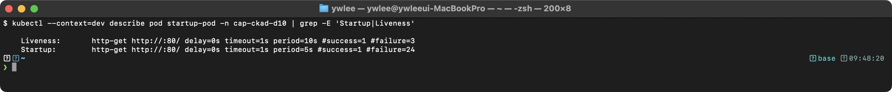

**핵심**: Startup Probe가 성공할 때까지 Liveness Probe는 실행되지 않는다. 최대 대기 시간 = 24 * 5 = 120초이다.

</details>

---

### 문제 4. exec Probe

다음 조건의 Pod를 생성하라.

- Pod 이름: `exec-probe`, 이미지: `busybox:1.36`
- command: `["sh", "-c", "touch /tmp/healthy && sleep 3600"]`
- Liveness Probe: exec, `cat /tmp/healthy`
- periodSeconds=5, failureThreshold=3

<details><summary>풀이</summary>

```yaml
apiVersion: v1
kind: Pod
metadata:
  name: exec-probe
spec:
  containers:
    - name: app
      image: busybox:1.36
      command: ["sh", "-c", "touch /tmp/healthy && sleep 3600"]
      livenessProbe:
        exec:
          command:
            - cat
            - /tmp/healthy
        periodSeconds: 5
        failureThreshold: 3
```

검증:
```bash
kubectl apply -f exec-probe.yaml
kubectl get pod exec-probe
```

기대 출력:
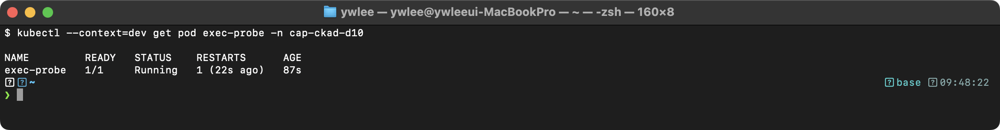

```bash
# /tmp/healthy 삭제하면 Liveness 실패 -> 컨테이너 재시작
kubectl exec exec-probe -- rm /tmp/healthy

# 15~20초 후 확인 (failureThreshold=3, periodSeconds=5이므로 최대 15초 후 재시작)
kubectl get pod exec-probe
```

기대 출력:
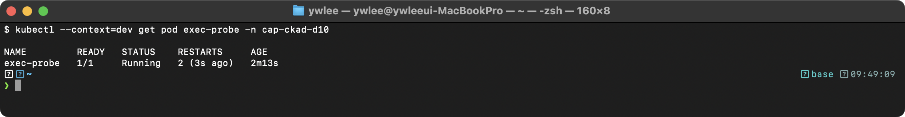

</details>

---

### 3가지 Probe의 실행 순서와 상태

문제 1~4에서 각 Probe를 개별로 배웠다. 세 가지를 동시에 쓸 때 어떤 순서로 동작하는지 이해해야 문제 5를 올바르게 해석할 수 있다.

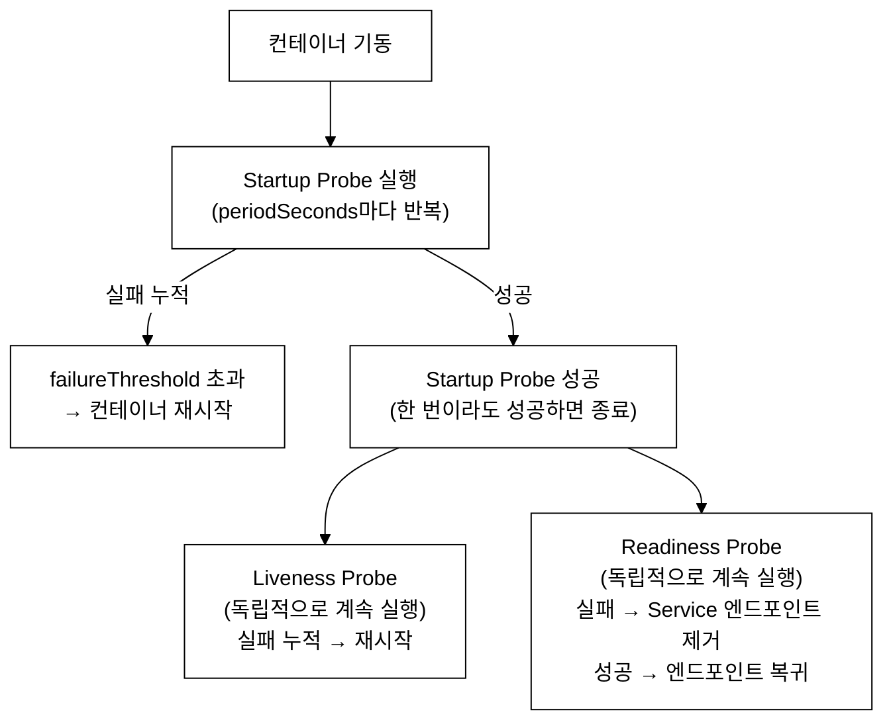
_그림 1. 3가지 Probe 실행 순서._

**핵심 규칙**:
- Startup Probe가 성공할 때까지 Liveness와 Readiness는 모두 일시 중지된다. 이 덕분에 느리게 시작하는 앱이 Liveness 실패로 재시작 루프에 빠지지 않는다.
- Startup 성공 후, Liveness와 Readiness는 서로 **독립적으로** 병렬 실행된다. 한쪽 실패가 다른 쪽에 영향을 주지 않는다.
- Liveness 실패 → 컨테이너 재시작 → Startup Probe가 다시 처음부터 시작된다.
- Readiness 실패 → 재시작 없음, 해당 Pod는 Service의 엔드포인트 목록에서 제거되어 트래픽을 받지 않는다.

---

### 문제 5. 3가지 Probe 종합

다음 조건의 Pod를 생성하라.

- Pod 이름: `full-probe`, 이미지: `nginx:1.25`, 포트: 80
- Startup: httpGet /, port 80, failureThreshold=12, periodSeconds=5
- Liveness: httpGet /healthz, port 80, periodSeconds=10
- Readiness: httpGet /ready, port 80, periodSeconds=5

<details><summary>풀이</summary>

```yaml
apiVersion: v1
kind: Pod
metadata:
  name: full-probe
spec:
  containers:
    - name: nginx
      image: nginx:1.25
      ports:
        - containerPort: 80
      startupProbe:
        httpGet:
          path: /
          port: 80
        failureThreshold: 12
        periodSeconds: 5
      livenessProbe:
        httpGet:
          path: /healthz
          port: 80
        periodSeconds: 10
        failureThreshold: 3
      readinessProbe:
        httpGet:
          path: /ready
          port: 80
        periodSeconds: 5
        failureThreshold: 3
```

검증:
```bash
kubectl apply -f full-probe.yaml
kubectl describe pod full-probe | grep -A 2 "Startup\|Liveness\|Readiness"
```

기대 출력:
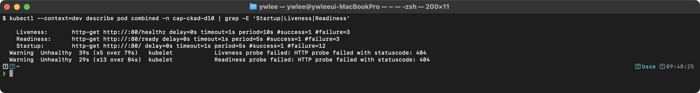

**주의**: nginx는 기본적으로 `/healthz`와 `/ready` 경로를 제공하지 않는다. 이 Pod에서 Startup Probe는 `/`로 성공하지만, Liveness(`/healthz`)와 Readiness(`/ready`)는 404를 반환하여 결국 재시작과 Not Ready 상태가 된다. 실제 운영에서는 앱이 해당 경로를 구현해야 한다.

</details>

---

### 문제 6. Sidecar 로깅 패턴

메인 앱이 `/var/log/app.log`에 로그를 쓰고, Sidecar가 이를 stdout으로 출력하는 Pod를 생성하라.

**`emptyDir` 이란**: Pod 내 여러 컨테이너가 파일을 공유하기 위한 임시 저장소다. Pod이 살아있는 동안만 존재하고, Pod이 삭제되거나 노드가 재시작되면 데이터도 함께 사라진다(이름이 "empty"인 이유는 Pod 기동 시 빈 디렉터리로 시작하기 때문이다). `PersistentVolume`처럼 노드 간 데이터를 보존하지 않으므로, 임시 캐시나 컨테이너 간 파일 공유에만 적합하다. 이 문제에서는 `app` 컨테이너가 `/var/log`에 로그를 쓰고, `log-streamer` Sidecar가 같은 경로를 `readOnly: true`로 마운트해 로그를 stdout으로 스트림한다. Sidecar는 로그를 읽기만 하므로 읽기 전용으로 마운트하는 것이 의도치 않은 덮어쓰기를 방지하는 올바른 설계다.

<details><summary>풀이</summary>

```yaml
apiVersion: v1
kind: Pod
metadata:
  name: sidecar-log
spec:
  containers:
    - name: app
      image: busybox:1.36
      command: ["sh", "-c", "while true; do echo \"$(date) log message\" >> /var/log/app.log; sleep 5; done"]
      volumeMounts:
        - name: logs
          mountPath: /var/log
    - name: log-streamer
      image: busybox:1.36
      command: ["sh", "-c", "tail -f /var/log/app.log"]
      volumeMounts:
        - name: logs
          mountPath: /var/log
          readOnly: true
  volumes:
    - name: logs
      emptyDir: {}
```

```bash
kubectl apply -f sidecar-log.yaml
kubectl logs sidecar-log -c log-streamer --tail=3
```

기대 출력:
> **예시(참조) — 컨테이너 로그:** `kubectl logs` 로 애플리케이션 표준출력 로그를 본다(타임스탬프 형식은 앱마다 다름). 실측 로그 캡처는 day04·day09 참고.

</details>

---

### 문제 7. 특정 컨테이너 로그

Multi-container Pod `multi-log`가 있다. `app` 컨테이너의 마지막 20줄 로그를 `/tmp/app-logs.txt`에 저장하라.

<details><summary>풀이</summary>

```bash
kubectl logs multi-log -c app --tail=20 > /tmp/app-logs.txt
```

</details>

---

### 문제 8. 이전 컨테이너 로그

Pod `crash-pod`가 CrashLoopBackOff 상태이다. 이전 컨테이너의 로그를 확인하고 `/tmp/crash-log.txt`에 저장하라.

<details><summary>풀이</summary>

```bash
kubectl logs crash-pod --previous > /tmp/crash-log.txt
cat /tmp/crash-log.txt
```

**핵심**: `--previous` 옵션은 재시작 이전의 컨테이너 로그를 보여준다. CrashLoopBackOff 디버깅에 필수!

</details>

---

**디버깅 전략 비교 — `logs --previous` vs `exec`**

Pod 상태에 따라 사용하는 도구가 달라진다.

| 상태 | 사용 도구 | 이유 |
|:---|:---|:---|
| `CrashLoopBackOff` | `kubectl logs --previous` | 현재 컨테이너가 이미 종료되어 `exec`로 진입 불가. 이전 시도의 stdout/stderr를 본다. |
| `Running` (이상 동작) | `kubectl exec` | 컨테이너가 살아있으므로 내부에 진입해 프로세스·DNS·포트·파일을 직접 확인한다. |
| `Pending` | `kubectl describe pod` | 스케줄되지 않은 상태이므로 컨테이너가 없다. Events 섹션에서 원인을 찾는다. |

`--previous`의 "이전"은 **동일 Pod 내에서 직전에 종료된 컨테이너 실행 인스턴스**를 의미한다. Pod이 삭제되고 재생성된 경우(롤링 업데이트 등)는 해당되지 않는다. Pod이 동일 오브젝트로 여러 번 재시작된 경우(`RESTARTS` 카운터가 1 이상)에만 유효하다.

---

### 문제 9. kubectl exec 디버깅

Pod `debug-pod` (nginx:1.25)에서 다음을 확인하라.

1. 실행 중인 프로세스 목록
2. /etc/resolv.conf 내용
3. localhost:80에 HTTP 요청

<details><summary>풀이</summary>

```bash
# 1. 프로세스 목록
kubectl exec debug-pod -- ps aux
```

기대 출력:
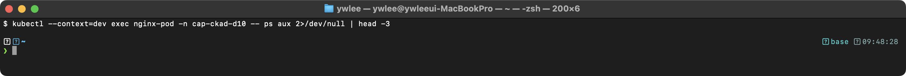

```bash
# 2. DNS 설정
kubectl exec debug-pod -- cat /etc/resolv.conf
```

기대 출력:
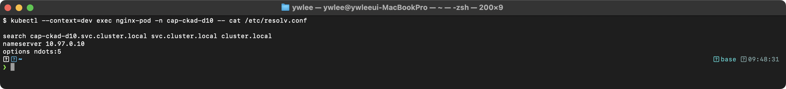

```bash
# 3. HTTP 요청
kubectl exec debug-pod -- curl -s localhost:80 | head -5
```

기대 출력:
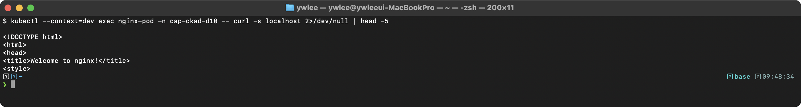

</details>

---

### 문제 10. Pod 상태 분석

Pod `analysis-pod`가 Pending 상태이다. 원인을 파악하고 `/tmp/pending-reason.txt`에 기록하라.

<details><summary>풀이</summary>

```bash
# 상세 정보에서 Events 확인
kubectl describe pod analysis-pod | tail -20

# Events에서 원인 파악
# 예: "0/3 nodes are available: 3 Insufficient cpu"

# 원인 기록
kubectl describe pod analysis-pod | grep -A5 "Events:" > /tmp/pending-reason.txt
```

**핵심**: Pending 상태의 주요 원인:
- Insufficient cpu/memory: 노드에 리소스 부족
- Unbound PVC: PVC가 바인드되지 않음
- Taints/Tolerations: 노드에 taint가 있고 Pod에 toleration이 없음

</details>

---

### 문제 11. 이벤트 기반 디버깅

네임스페이스 `exam`에서 최근 이벤트를 시간순으로 정렬하여 마지막 10개를 `/tmp/events.txt`에 저장하라.

<details><summary>풀이</summary>

```bash
# .lastTimestamp 는 jsonpath 표기. 따옴표는 쉘이 점(.)을 glob으로 해석하지 못하게 막는다.
kubectl get events -n exam --sort-by='.lastTimestamp' | tail -10 > /tmp/events.txt
```

</details>

---

### 문제 12. Deployment Probe 추가

기존 Deployment `web-deploy`에 다음 Probe를 추가하라.

- Liveness: httpGet, path=/, port=80, periodSeconds=10
- Readiness: httpGet, path=/, port=80, periodSeconds=5

**(선행 조건)** `web-deploy`가 이미 존재한다고 가정한다. 없으면 먼저 생성한다.

```bash
kubectl create deployment web-deploy --image=nginx:1.25
```

<details><summary>풀이</summary>

**방법 A — kubectl edit (시험에서 가장 실용적)**

`kubectl patch`로 Probe를 통째로 넣으려면 JSON 문자열 이스케이핑이 복잡해진다. 시험 환경에서는 `kubectl edit`로 에디터를 열고 `spec.template.spec.containers[0]` 아래에 직접 붙여 넣는 것이 빠르고 실수가 적다.

```bash
kubectl edit deployment web-deploy
# 에디터가 열리면 containers 섹션을 찾아 아래 블록을 추가한 뒤 저장(:wq)
```

추가할 YAML:
```yaml
      livenessProbe:
        httpGet:
          path: /
          port: 80
        periodSeconds: 10
        failureThreshold: 3
      readinessProbe:
        httpGet:
          path: /
          port: 80
        periodSeconds: 5
        failureThreshold: 3
```

**방법 B — kubectl patch (명령형, 스크립트 자동화에 적합)**

`kubectl patch`는 대화형 에디터 없이 명령 한 줄로 적용한다. 단, Probe 전체를 JSON으로 기술해야 하므로 시험장 타이핑 오류 가능성이 높다. 스크립트나 CI에서는 이 방법이 유리하다.

```bash
kubectl patch deployment web-deploy --type='json' -p='[
  {"op":"add","path":"/spec/template/spec/containers/0/livenessProbe","value":{"httpGet":{"path":"/","port":80},"periodSeconds":10,"failureThreshold":3}},
  {"op":"add","path":"/spec/template/spec/containers/0/readinessProbe","value":{"httpGet":{"path":"/","port":80},"periodSeconds":5,"failureThreshold":3}}
]'
```

Probe를 추가하면 Pod 템플릿(`spec.template`)이 변경되므로 Kubernetes가 자동으로 롤링 업데이트를 시작한다. 기존 Pod를 순차적으로 교체하며 새 Probe 설정이 적용된 Pod를 띄운다.

```bash
kubectl rollout status deployment/web-deploy
```

기대 출력:
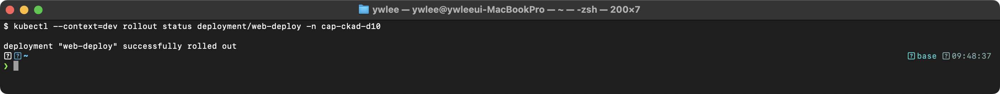

```bash
kubectl describe deployment web-deploy | grep -A 3 "Liveness\|Readiness"
```

기대 출력:
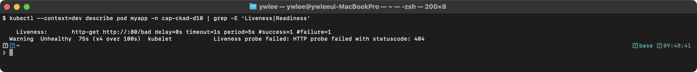

</details>

---

## 2. 실전 시나리오

### 시나리오 A: Distroless 이미지 디버깅

**Distroless 이미지란**: 운영체제 레이어·셸·패키지 관리자(`apt`, `yum`)·coreutils 같은 불필요한 도구를 모두 제거하고, 앱 바이너리와 런타임 라이브러리만 남긴 최소 이미지다(예: `gcr.io/distroless/nodejs`, `gcr.io/distroless/java`). 이미지 크기를 줄이고 공격 표면(attack surface)을 최소화하는 것이 목적이다. 셸이 없으므로 `kubectl exec -- /bin/sh`로는 진입할 수 없다.

대신 **Ephemeral Container(임시 컨테이너)** 를 사용한다. Ephemeral Container는 Kubernetes 1.25부터 GA(안정, Stable) 기능이다. 1.24 이하 클러스터에서는 `--feature-gates=EphemeralContainers=true` 플래그 없이는 동작하지 않으므로, 구버전 환경에서 `kubectl debug --target` 명령이 거부될 경우 클러스터 버전을 먼저 확인한다(`kubectl version --short`). `kubectl debug` 명령이 실행 중인 Pod에 새 컨테이너를 삽입하는데, 이 컨테이너는 busybox처럼 풀 OS 도구를 갖출 수 있다. `--target=app` 옵션을 주면 삽입된 컨테이너가 `app` 컨테이너의 **프로세스 네임스페이스를 공유**하므로 `ps aux`로 앱 프로세스를 직접 볼 수 있다. Ephemeral Container는 Pod 삭제 없이 추가되고, Pod 재시작 시 사라진다.

```bash
# Distroless 이미지에는 셸이 없어 kubectl exec 불가
# kubectl debug로 Ephemeral Container 사용

# 1. 기존 Pod에 디버그 컨테이너 추가
kubectl debug -it distroless-pod \
  --image=busybox:1.36 \
  --target=app \
  -- /bin/sh

# 2. 프로세스 네임스페이스 공유로 앱 프로세스 확인
ps aux

# 3. 네트워크 디버깅
wget -qO- localhost:8080
nslookup api-svc
```

### 시나리오 B: Pod 상태별 대응 플로우차트

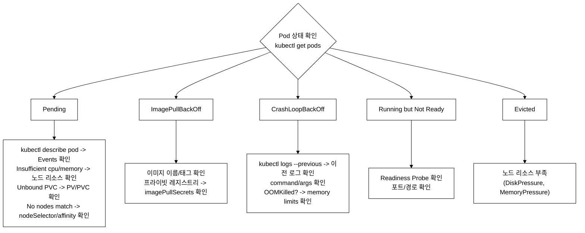
_그림 2. Pod 상태별 대응 플로우차트._

---

## 3. 트러블슈팅

**트러블슈팅 철학**: Probe·로깅·디버깅은 긴밀하게 연결되어 있다. Pod이 자주 재시작된다면 Probe 실패가 원인일 가능성이 높고, 그 로그는 `kubectl logs --previous`로 본다. 앱이 Not Ready 상태라면 Readiness Probe 실패이므로 `kubectl exec` 또는 `kubectl debug`로 내부 상태를 확인한다. 여기서 발생하는 오류의 대부분은 개념 이해 부족이 아니라 ① 도구 옵션(`--previous`, `--share-processes`)을 모르거나 ② Probe 파라미터(`timeoutSeconds` vs `failureThreshold`)를 혼동해서 생긴다. 다음 두 시나리오가 그 대표 사례다.

### 장애 시나리오 1: Probe 타임아웃으로 인한 false negative

```bash
# 증상: Pod가 정상인데 간헐적으로 재시작
kubectl get pod myapp
```

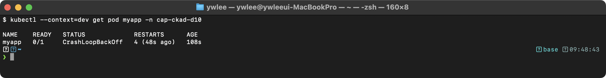

```bash
# 디버깅
kubectl describe pod myapp | grep -A 5 "Events:" | grep "Unhealthy"
# Warning  Unhealthy  Liveness probe failed: Get "http://10.244.1.5:8080/healthz": context deadline exceeded

# 원인: timeoutSeconds=1(기본값)인데 앱이 1초 내에 응답하지 못함
# 해결: timeoutSeconds를 3~5초로 증가
```

**Probe 타임아웃 파라미터 구분**: `timeoutSeconds`와 `failureThreshold`는 전혀 다른 역할이다. 혼동하면 엉뚱한 값을 수정해 문제가 더 심해진다.

- `timeoutSeconds`(기본값 **1초**): Probe 요청 하나에 대한 최대 대기 시간이다. `context deadline exceeded` 에러는 앱이 이 시간 안에 응답하지 못했다는 뜻이므로 `timeoutSeconds`를 늘린다(예: 3~5초). 이 값을 늘리면 각 Probe 시도가 더 오래 기다린다.
- `failureThreshold`(기본값 3): 몇 번 연속 실패해야 재시작(또는 Not Ready)으로 판정하는지 재시도 횟수이다. `failureThreshold`를 늘리면 재시작 판정이 더 오래 걸릴 뿐, 개별 Probe 시도 자체의 응답 속도 문제는 해결되지 않는다.

요약: 앱 응답이 느리면 → `timeoutSeconds` 증가. 일시적 불안정이 잦으면 → `failureThreshold` 증가.

### 장애 시나리오 2: kubectl debug 시 process namespace sharing 미설정

**`--copy-to` vs `--target` 차이**: 두 옵션은 debug 컨테이너를 삽입하는 방식이 다르다.

| 옵션 | 동작 | 용도 |
|:---|:---|:---|
| `--target=<컨테이너명>` | 실행 중인 기존 Pod에 Ephemeral Container를 직접 삽입. Pod 이름·IP가 그대로 유지된다. | 프로덕션 Pod를 멈추지 않고 프로세스·네트워크를 확인할 때 |
| `--copy-to=<새Pod명>` | 기존 Pod의 스펙을 복사해 새 이름의 Pod를 생성하고 거기에 debug 컨테이너를 추가한다. 원본 Pod는 그대로 남는다. | Distroless처럼 Ephemeral Container를 지원하지 않는 환경, 또는 `shareProcessNamespace`를 Pod 레벨에서 켜야 할 때 |

```bash
# 증상: debug 컨테이너에서 대상 컨테이너의 프로세스가 보이지 않음
kubectl debug -it myapp --image=busybox --target=app -- ps aux
# PID 1만 보이고 대상 앱 프로세스가 안 보임

# 원인: --share-processes 없이 copy-to를 사용한 경우
# (--copy-to는 새 Pod를 복사 생성하므로 기본적으로 프로세스 네임스페이스가 분리되어 있다)
# 해결: --share-processes 옵션 추가
kubectl debug myapp -it --copy-to=debug-pod --image=busybox --share-processes
```

---

## 4. 자주 하는 실수와 주의사항

### 실수 1: Liveness Probe에서 앱 의존성 체크

```yaml
# 잘못된 예: 외부 DB 연결을 Liveness Probe로 체크
# pg_isready: PostgreSQL 서버가 접속 가능한 상태인지 확인하는 도구
livenessProbe:
  exec:
    command: ["pg_isready", "-h", "postgres-svc"]
# DB가 다운되면 앱이 계속 재시작됨 -> 복구 불가!

# 올바른 예: 앱 자체의 생존 여부만 체크
livenessProbe:
  httpGet:
    path: /healthz     # 앱이 살아있는지만 확인
    port: 8080
readinessProbe:
  httpGet:
    path: /ready       # DB 연결 포함 종합 상태
    port: 8080
```

**왜 이것이 문제인가**: Liveness Probe가 외부 의존성(DB·캐시·메시지큐)을 체크하면, 그 의존성이 일시적으로 다운될 때 앱이 정상 동작 중임에도 Probe 실패 → 컨테이너 재시작 → 재시작 후에도 의존성은 여전히 다운 → 무한 재시작(CrashLoopBackOff)이 된다. 앱을 재시작해도 DB가 복구되지 않으므로 상황이 나아지지 않는다. 따라서 Liveness는 앱 프로세스 자체의 교착·응답 불능(`/healthz`)만, Readiness는 의존성 포함 전체 준비도(`/ready`)를 검사해야 한다.

### 실수 2: Startup Probe 없이 긴 initialDelaySeconds

```yaml
# 잘못된 예
livenessProbe:
  initialDelaySeconds: 120   # 2분 대기 -> 진짜 문제도 2분 후에야 감지

# 올바른 예: Startup Probe 사용
startupProbe:
  httpGet:
    path: /
    port: 80
  failureThreshold: 24
  periodSeconds: 5       # 최대 120초 대기, 빨리 되면 빨리 통과
livenessProbe:
  httpGet:
    path: /
    port: 80
  periodSeconds: 10      # Startup 후 바로 시작
```

### 실수 3: Multi-container Pod 로그 조회 시 -c 누락

```bash
# 에러: Multi-container Pod에서 -c 없이 로그 조회
kubectl logs multi-pod
# Error: a container name must be specified

# 올바른 예:
kubectl logs multi-pod -c app
kubectl logs multi-pod --all-containers    # 모든 컨테이너
```

---

## 5. 복습 체크리스트

- [ ] Probe 실전 문제를 시간 내에 풀 수 있다
- [ ] `kubectl logs --previous`로 CrashLoopBackOff를 디버깅할 수 있다
- [ ] `kubectl debug`로 Ephemeral Container를 사용할 수 있다
- [ ] `kubectl describe pod`의 Events로 문제를 진단할 수 있다
- [ ] Liveness Probe에서 외부 의존성을 체크하면 안 되는 이유를 안다

---

## tart-infra 실습

**(선행 조건)** 이 섹션은 dev 클러스터의 `demo` 네임스페이스와 `nginx-web` Deployment가 실행 중인 상태를 전제한다. day1~day9에서 생성한 자원을 그대로 사용한다. 아직 없으면 먼저 생성한다.

```bash
kubectl create ns demo
kubectl create deployment -n demo nginx-web --image=nginx --replicas=2
```

### 실습 환경 설정

```bash
export KUBECONFIG=~/sideproejct/IaC_apple_sillicon/kubeconfig/dev.yaml
k get nodes
```

### 실습 1: Probe 확인

```bash
# demo 네임스페이스 Pod의 Probe 확인
# jsonpath는 JSON 경로 필터(Day 9 참조). 전체 확인은 -o yaml로도 가능.
kubectl get pod -n demo -l app=nginx-web -o jsonpath='{.items[0].spec.containers[0].livenessProbe}' | python3 -m json.tool 2>/dev/null || echo "No Liveness Probe"
```

### 실습 2: 로그 및 리소스 확인

```bash
# nginx-web 로그 확인
kubectl logs -n demo deploy/nginx-web --tail=5

# Pod 리소스 사용량 확인
# 참고: kubectl top은 metrics-server(보통 kube-system에 설치)가 필요하다.
# 설치 확인: kubectl get deployment -n kube-system | grep metrics
kubectl top pods -n demo --sort-by=memory
```

`kubectl top`이 `error: Metrics API not available` 또는 `No metrics` 오류를 반환하면 dev 클러스터에 metrics-server가 설치되어 있지 않은 것이다. 이 경우 다음 대안 명령으로 노드·Pod의 리소스 할당 현황을 확인한다.

```bash
# metrics-server 미설치 시 대안 1: 노드 Allocated 리소스 확인
kubectl describe node dev-master | grep -A 10 "Allocated resources"
kubectl describe node dev-worker1 | grep -A 10 "Allocated resources"

# 대안 2: Pod의 리소스 요청/한도 확인 (실제 사용량이 아닌 선언값)
kubectl get pod -n demo -o custom-columns="NAME:.metadata.name,CPU-REQ:.spec.containers[*].resources.requests.cpu,MEM-REQ:.spec.containers[*].resources.requests.memory"
```

`Allocated resources` 출력의 `(%)` 칸이 시험에서 노드 리소스 포화 여부를 판단할 때 쓰는 수치와 같다. metrics-server 없이도 스케줄링 압박을 파악할 수 있다.

```bash
# kubectl exec 실습
kubectl exec -n demo deploy/nginx-web -- cat /etc/resolv.conf
```

---

## 자가점검

아래 질문에 먼저 스스로 답한 뒤 정답을 확인한다.

1. Liveness Probe와 Readiness Probe의 차이를 한 문장으로 설명하라.
2. `failureThreshold=3, periodSeconds=10, initialDelaySeconds=5` 인 Liveness Probe가 처음으로 재시작을 유발하는 최악의 경우 소요 시간은?
3. Startup Probe가 성공하기 전에 Liveness Probe가 실행되는가?
4. `kubectl logs crash-pod --previous`에서 `--previous`는 정확히 무엇을 의미하는가?
5. Distroless 이미지에 `kubectl exec -- /bin/sh`로 진입할 수 없는 이유와 대안은?
6. `kubectl debug --target=app` vs `--copy-to=<이름>` 차이는?
7. Liveness Probe에서 외부 DB 연결을 체크하면 안 되는 이유는?

<details><summary>정답 확인</summary>

1. Liveness는 컨테이너를 재시작할지 결정한다(실패 → 재시작). Readiness는 Service 엔드포인트 포함 여부를 결정한다(실패 → 엔드포인트 제거, 재시작 없음).
2. `5(initial) + 10×3(period×threshold) = 35초`. 처음 5초 대기 후, 10초 간격으로 3번 연속 실패하면 재시작한다.
3. 아니다. Startup Probe가 성공할 때까지 Liveness와 Readiness는 모두 일시 중지된다.
4. 동일 Pod 오브젝트 내에서 직전에 종료된 컨테이너 실행 인스턴스의 로그를 본다. Pod이 삭제·재생성된 경우나 `RESTARTS`가 0인 경우에는 유효하지 않다.
5. Distroless 이미지에는 셸(`/bin/sh`)이 없어 exec 진입이 불가능하다. 대안은 `kubectl debug -it <pod> --image=busybox --target=<container>` 로 Ephemeral Container를 삽입하는 것이다(Kubernetes 1.25+ GA).
6. `--target`은 실행 중인 기존 Pod에 Ephemeral Container를 직접 삽입하고 Pod IP·이름이 유지된다. `--copy-to`는 기존 Pod 스펙을 복사해 새 Pod를 생성하며, `--share-processes`를 함께 써야 프로세스 네임스페이스가 공유된다.
7. DB가 일시 다운될 때 앱 자체는 정상인데도 Liveness 실패 → 재시작 → 재시작 후에도 DB 다운 → 무한 재시작(CrashLoopBackOff)이 된다. DB 연결 포함 종합 상태는 Readiness Probe에서 체크해야 한다.

</details>

---

## 시험 팁

**시간 배분 목표** (문제당 평균 120초, 총 15~20문제 / 120분)

| 문제 유형 | 목표 시간 | 근거 |
|:---|:---:|:---|
| Probe 단일 설정(httpGet/tcpSocket) | 90초 | `k run ... $do > x.yaml` 후 Probe 블록 붙여넣기 |
| 3가지 Probe 종합 | 2분 | startupProbe·livenessProbe·readinessProbe 세 블록 순서 주의 |
| `kubectl logs --previous` | 30초 | 옵션 한 개 추가 |
| `kubectl debug` Ephemeral Container | 2분 | `--target` vs `--copy-to` 판단 포함 |
| 이벤트 시간순 정렬 | 60초 | `--sort-by='.lastTimestamp'` 따옴표 잊지 말 것 |

**자주 틀리는 함정**

- `failureThreshold`와 `timeoutSeconds`를 혼동해 엉뚱한 값을 수정한다. 앱이 느려서 Probe가 죽는 것은 `timeoutSeconds`를 늘린다. 재시작 판정을 늦추려면 `failureThreshold`를 늘린다.
- Multi-container Pod에서 `-c <container>` 없이 `kubectl logs`를 실행하면 오류가 난다. `-c` 또는 `--all-containers`를 붙인다.
- `kubectl exec` 대상이 Deployment면 `deploy/<이름>`으로 지정한다. 특정 Pod를 지정하면 롤아웃 중 Pod 이름이 바뀌어 실패할 수 있다.
- Startup Probe의 `failureThreshold × periodSeconds`가 앱 최대 기동 시간을 충분히 커버하는지 계산하는 문제가 출제된다. 계산식을 습관화한다.
- `--sort-by` 뒤 jsonpath에서 따옴표를 빠뜨리면 쉘이 점을 glob으로 해석해 오류가 난다.

---

## 더 읽을거리

- [Configure Liveness, Readiness and Startup Probes](https://kubernetes.io/docs/tasks/configure-pod-container/configure-liveness-readiness-startup-probes/) — 공식 문서. 파라미터 전체 레퍼런스와 예제.
- [Ephemeral Containers](https://kubernetes.io/docs/concepts/workloads/pods/ephemeral-containers/) — Kubernetes 1.25 GA. `kubectl debug` 사용법과 제한사항.
- [Debugging Running Pods](https://kubernetes.io/docs/tasks/debug/debug-application/debug-running-pod/) — `kubectl exec`, `kubectl debug`, `--copy-to` 패턴별 사용 시나리오.
- [kubectl Cheat Sheet — Logs](https://kubernetes.io/docs/reference/kubectl/cheatsheet/#interacting-with-running-pods) — `--previous`, `--all-containers`, `--since` 옵션 요약.

Day 11에서는 Job·CronJob·Init Container 패턴을 다룬다. Probe에서 배운 "컨테이너 생명주기 제어" 관점이 Init Container의 순차 실행 보장 메커니즘을 이해하는 데 직접 연결된다.
