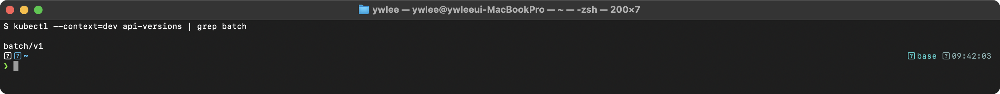
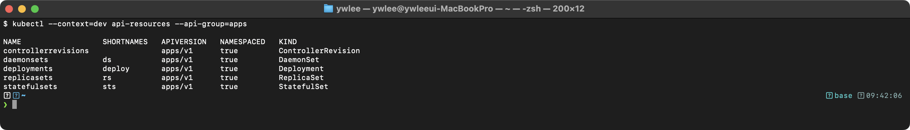
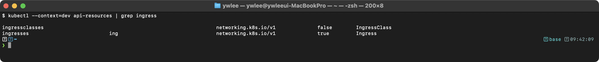
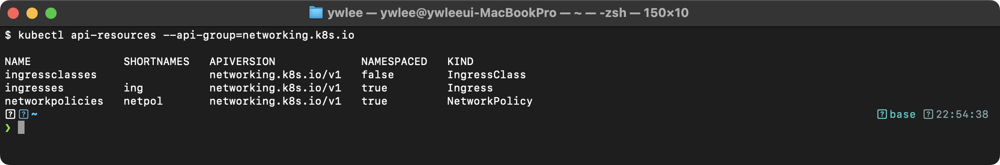
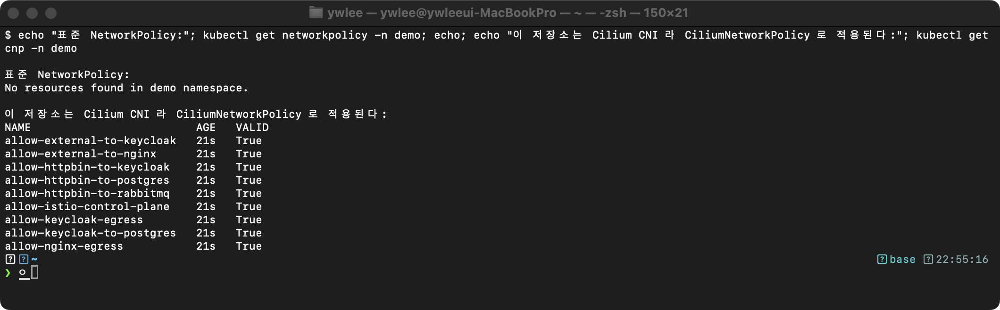

# CKAD Day 11: API Deprecation과 버전 관리

> CKAD 도메인: Application Observability and Maintenance (15%) - Part 2a | 예상 소요 시간: 1시간

day10에서 Probe와 로깅으로 실행 중인 앱의 상태를 관측하는 방법을 다뤘다. Observability & Maintenance 도메인의 또 다른 핵심은 클러스터 업그레이드 시 API 변경에 대응하는 것이다. API Deprecation을 모르면 업그레이드 후 기존 매니페스트가 일괄 실패해 운영 중단으로 이어진다.

---

## 오늘의 학습 목표

- [ ] Kubernetes API 버전 단계(alpha/beta/stable)를 이해한다
- [ ] API Deprecation 정책과 버전 변경 이력을 숙지한다
- [ ] `kubectl api-versions`, `kubectl api-resources` 명령을 활용할 수 있다
- [ ] Deprecated 매니페스트를 최신 API로 마이그레이션할 수 있다
- [ ] `kubectl convert` 플러그인을 사용할 수 있다

---

## 1. Kubernetes API 버전 체계

### 1.1 등장 배경

```
[API Deprecation 정책이 필요한 이유]

Kubernetes는 빠르게 진화한다. 새로운 기능이 추가되면서 API 구조가 변경된다.
그러나 기존 사용자의 매니페스트를 즉시 무효화하면 운영 장애가 발생한다.

기존 방식의 한계:
- API를 변경하면 모든 사용자가 즉시 업데이트해야 한다
- 하위 호환성 없이 변경하면 CI/CD 파이프라인이 깨진다
- Helm Chart, Operator 등 생태계 전체에 파급 효과가 있다

해결:
- Alpha -> Beta -> GA 3단계로 API를 성숙시킨다
- Deprecation 후 일정 기간(최소 2~3 릴리스) 유지 후 제거한다
- 이 기간 동안 Warning 헤더로 사용자에게 마이그레이션을 안내한다
```

**구체적 사례 — K8s 1.22 Ingress 붕괴 사건**

K8s 1.15 기반 실운영 클러스터가 Ingress를 `extensions/v1beta1`로 배포 중인 상황을 생각한다. 팀은 Helm Chart를 사용하고 있었고, 차트 내부의 Ingress 매니페스트도 `extensions/v1beta1`을 참조한다. 2021년 K8s 1.22가 릴리스되면서 `extensions/v1beta1` Ingress가 완전히 제거됐다. 클러스터를 1.22로 업그레이드하는 순간 — 모든 Ingress 리소스가 한꺼번에 적용 불가 상태가 됐다. `helm upgrade`도 "current release manifest contains removed kubernetes API(s)"로 실패했다. 결과는 트래픽 차단과 수 시간 운영 중단이었다.

이 사태를 막으려면 deprecated 기간(1.14~1.21, 약 7개 마이너 릴리스) 동안 점진적 마이그레이션이 필수였다. Kubernetes의 Deprecation 정책은 이 "안전한 이전 기간"을 보장하기 위해 존재한다.

### 1.2 API 버전 단계

Kubernetes API는 Alpha -> Beta -> Stable(GA) 3단계 성숙도 모델을 따른다. 각 API 리소스는 특정 API 그룹과 버전의 조합(예: `apps/v1`, `batch/v1`)으로 식별되며, 상위 버전으로의 승격(promotion) 과정에서 하위 버전은 Deprecation 정책에 따라 제거된다. Kubernetes는 Deprecation 후 최소 N개의 마이너 릴리스 동안 해당 API를 유지한 후 제거하며, 이 기간은 버전 단계에 따라 다르다.

```
[API 버전 단계]

1. Alpha (예: v1alpha1)
   - 기본 비활성화 (feature gate 필요)
     * feature gate = Kubernetes 옵션으로 신기능을 미리 활성화/비활성화하는 메커니즘.
       kube-apiserver 기동 시 --feature-gates=<기능명>=true 형태로 설정한다.
   - 언제든 변경/제거 가능
   - 프로덕션 사용 금지
   - 다음 릴리스에서 호환성 보장 없음

2. Beta (예: v1beta1, v2beta1)
   - 기본 활성화
   - 스키마 변경 가능하나 마이그레이션 경로 제공
   - Deprecation 후 3개 마이너 릴리스 유지 (v1.22+)
   - 프로덕션 사용 가능하나 주의 필요

3. Stable/GA (예: v1, v2)
   - 항상 활성화
   - 호환성 보장
   - Deprecation 후 12개월 또는 3개 마이너 릴리스 중 더 긴 기간 유지 (v1.19+ 정책)
     * Beta의 "3개 마이너 릴리스" 고정 규칙과 달리, GA는 12개월과 릴리스 수 중 더 긴 쪽이 적용된다.
   - 프로덕션 권장
```

**트레이드오프**

Deprecation 정책이 안전망을 제공하는 대신 다음 비용이 따른다.

- **API Server 복잡도 증가**: Deprecation 기간 동안 구 버전과 신 버전을 동시에 처리하는 변환 로직이 유지된다. 버전이 누적될수록 API Server의 변환 코드 경로가 늘어나고, 테스트 행렬이 커진다.
- **alpha API 의존 팀의 마이그레이션 비용**: alpha API는 호환성 보장이 없으므로, GA 승격 시 스키마가 바뀌면 해당 팀은 N+1 릴리스 전에 매니페스트·Helm chart·Operator를 모두 수정해야 한다. 선행 투자 없이 "나중에 하겠다"는 전략은 대규모 업그레이드 시 기술 부채로 돌아온다.
- **Helm Release와 클러스터 버전 간 동기화 비용**: Helm이 Release 매니페스트를 Secret에 저장하는데, 이 매니페스트가 구 API를 참조하면 `helm upgrade` 자체가 실패한다(1.22 Ingress 사건 참조). 차트 작성자가 Kubernetes 버전별 분기를 Helm `Capabilities.KubeVersion`으로 처리하지 않으면 사용자가 직접 `helm-mapkubeapis` 같은 도구로 Release를 수리해야 한다.

### 1.3 API 그룹

```
[주요 API 그룹]

Core (레거시)    ""          -> v1
                              Pod, Service, ConfigMap, Secret,
                              Namespace, Node, PersistentVolume

apps            "apps"      -> apps/v1
                              Deployment, ReplicaSet, StatefulSet,
                              DaemonSet

batch           "batch"     -> batch/v1
                              Job, CronJob (v1.21+)

networking      "networking.k8s.io" -> networking.k8s.io/v1
                              Ingress (v1.19+), NetworkPolicy

rbac            "rbac.authorization.k8s.io" -> rbac.authorization.k8s.io/v1
                              Role, ClusterRole, RoleBinding

autoscaling     "autoscaling" -> autoscaling/v2
                              HorizontalPodAutoscaler

policy          "policy"    -> policy/v1
                              PodDisruptionBudget (v1.21+)
```

### 1.4 주요 API 버전 변경 이력

```
[중요한 API 변경 이력]

Kubernetes 1.16 (2019):
  - Deployment:    extensions/v1beta1 -> apps/v1 (제거)
  - ReplicaSet:    extensions/v1beta1 -> apps/v1 (제거)
  - DaemonSet:     extensions/v1beta1 -> apps/v1 (제거)
  - StatefulSet:   apps/v1beta1       -> apps/v1 (제거)

Kubernetes 1.21 (2021):
  - CronJob:       batch/v1beta1              -> batch/v1 승격
                   (batch/v1beta1 deprecated 알림 표시 시작)

Kubernetes 1.22 (2021):
  - Ingress:       extensions/v1beta1         -> networking.k8s.io/v1 (제거)
  - Ingress:       networking.k8s.io/v1beta1  -> networking.k8s.io/v1 (제거)
  - CronJob:       batch/v1beta1              여전히 사용 가능 (deprecated 경고만)

Kubernetes 1.25 (2022):
  - CronJob:       batch/v1beta1      -> batch/v1 (제거됨 — 이 시점부터 사용 불가)
  - PodDisruptionBudget: policy/v1beta1 -> policy/v1 (제거)
  - EndpointSlice: discovery.k8s.io/v1beta1 -> discovery.k8s.io/v1 (제거)

Kubernetes 1.29 (2023):
  - FlowSchema:    flowcontrol.apiserver.k8s.io/v1beta2 -> v1beta3 (제거)
```

---

### 1.5 API 버전 변환의 내부 동작

```
[API Server의 버전 변환 메커니즘]

핵심 용어 먼저:
  - 내부 버전(internal version, __internal):
      K8s가 모든 API 리소스를 통일된 포맷으로 메모리와 etcd에 저장할 때 사용하는
      표준 내부 표현. 클라이언트가 v1alpha1/v1beta1/v1 중 어느 버전으로 요청해도
      API Server는 이 내부 형식으로 변환해 처리한다. 버전 제거 시 etcd 마이그레이션
      없이 클라이언트 요청만 거부하면 되므로 하위 호환성을 오래 지탱하는 이유다.
  - Admission Controller(접수 제어기):
      리소스 생성/수정 요청이 etcd에 저장되기 직전, 정책 검증(Validating)과
      자동 수정(Mutating)을 수행하는 플러그인 체인. 예: 이미지 정책 강제, 기본값 주입.
  - preferred version:
      API 그룹에서 API Server가 etcd 저장 시 사용하는 "최신 안정 버전".
      예: apps 그룹의 preferred version은 apps/v1.

API Server는 리소스를 "내부 버전(internal version)"으로 처리한다.
클라이언트가 특정 API 버전으로 요청하면 자동 변환이 발생한다.

1. 요청 수신: extensions/v1beta1 Deployment
2. 디코딩: v1beta1 스키마로 파싱
3. 내부 변환: internal version으로 변환
4. Admission: Admission Controller 실행
5. 저장: etcd에 "preferred version"(apps/v1)으로 인코딩하여 저장
6. 응답: 요청된 API 버전으로 다시 변환하여 응답

따라서 v1beta1로 생성한 Deployment도 etcd에는 apps/v1 형식으로 저장된다.
해당 API 버전이 제거되면 v1beta1 형식의 요청 자체가 거부된다.
```

**API 버전 제거 시 etcd 데이터는 어떻게 되는가**

API 버전 제거 후 etcd에 남아 있는 데이터에는 별도 마이그레이션이 필요하지 않다. 이유는 위 6단계 흐름에서 이미 설명됐다. API Server는 리소스를 항상 preferred version(예: `apps/v1`)으로 인코딩해 etcd에 저장한다. 즉, 사용자가 `extensions/v1beta1`로 Deployment를 생성했더라도 etcd에는 처음부터 `apps/v1` 형식으로 기록된다. `v1beta1` 포맷의 데이터가 etcd에 존재한 적이 없으므로, `v1beta1` API 경로를 API Server에서 제거해도 etcd 안의 기존 데이터는 전혀 영향을 받지 않는다. 클러스터 운영자가 해야 할 일은 etcd 마이그레이션이 아니라 `v1beta1`을 참조하는 클라이언트(매니페스트·Helm chart·CI 파이프라인)를 `apps/v1`으로 업데이트하는 것이다.

---

## 2. API 버전 확인 명령어

### 2.1 kubectl api-versions

```bash
# 클러스터에서 지원하는 모든 API 버전 확인
kubectl api-versions
# 출력 예:
# admissionregistration.k8s.io/v1
# apps/v1
# batch/v1
# networking.k8s.io/v1
# v1
# ...

# 특정 API 그룹 필터링
kubectl api-versions | grep apps
# apps/v1

kubectl api-versions | grep batch
# batch/v1

kubectl api-versions | grep networking
# networking.k8s.io/v1
```

### 2.2 kubectl api-resources

```bash
# 모든 리소스 확인 (이름, shortname, API 그룹, 종류)
kubectl api-resources
# NAME          SHORTNAMES  APIVERSION              NAMESPACED  KIND
# pods          po          v1                      true        Pod
# services      svc         v1                      true        Service
# deployments   deploy      apps/v1                 true        Deployment
# ingresses     ing         networking.k8s.io/v1    true        Ingress

# 특정 API 그룹의 리소스만 확인
kubectl api-resources --api-group=apps
# NAME          SHORTNAMES  APIVERSION  NAMESPACED  KIND
# deployments   deploy      apps/v1     true        Deployment
# replicasets   rs          apps/v1     true        ReplicaSet
# statefulsets  sts         apps/v1     true        StatefulSet
# daemonsets    ds          apps/v1     true        DaemonSet

# Namespaced 리소스만 확인
kubectl api-resources --namespaced=true

# 특정 verb를 지원하는 리소스 확인
kubectl api-resources --verbs=list,watch

# 특정 리소스의 API 버전 확인
kubectl explain deployment | head -5
# KIND:     Deployment
# VERSION:  apps/v1
```

### 2.3 리소스별 API 버전 확인

```bash
# 특정 리소스의 상세 스키마 확인
kubectl explain pod.spec.containers
kubectl explain deployment.spec.strategy
kubectl explain ingress.spec.rules

# 재귀적 필드 확인
kubectl explain pod.spec --recursive | head -50
```

---

## 3. Deprecated 매니페스트 마이그레이션

### 마이그레이션 공통 체크리스트

세 리소스 모두 마이그레이션 절차는 동일한 패턴을 따른다. 리소스마다 외울 필요 없이 아래 표의 차이점만 파악하면 된다.

| 항목 | Ingress | CronJob | Deployment |
|:---|:---|:---|:---|
| 구 apiVersion | `extensions/v1beta1`, `networking.k8s.io/v1beta1` | `batch/v1beta1` | `extensions/v1beta1` |
| 신 apiVersion | `networking.k8s.io/v1` | `batch/v1` | `apps/v1` |
| 스키마 변경 | 많음 (annotation→spec, backend 구조 변경) | 없음 (apiVersion만 변경) | selector 필드 추가 |
| 신규 필수 필드 | `pathType` (Prefix/Exact 중 선택) | 없음 | `spec.selector.matchLabels` |
| 제거된 릴리스 | 1.22 | 1.25 | 1.16 |

### 3.1 Ingress 마이그레이션 (가장 자주 출제)

```yaml
# === 이전 버전 (extensions/v1beta1) - 제거됨 ===
apiVersion: extensions/v1beta1
kind: Ingress
metadata:
  name: my-ingress
  annotations:
    kubernetes.io/ingress.class: nginx    # annotation으로 class 지정
spec:
  rules:
    - host: app.example.com
      http:
        paths:
          - path: /
            backend:
              serviceName: web-svc        # 옛 필드명
              servicePort: 80             # 옛 필드명

# === 현재 버전 (networking.k8s.io/v1) ===
apiVersion: networking.k8s.io/v1
kind: Ingress
metadata:
  name: my-ingress
spec:
  ingressClassName: nginx                 # annotation 대신 spec 필드
  rules:
    - host: app.example.com
      http:
        paths:
          - path: /
            pathType: Prefix              # 필수 필드 추가
            backend:
              service:                    # 구조 변경
                name: web-svc
                port:
                  number: 80
```

**핵심 변경점:**
```
1. apiVersion: extensions/v1beta1 -> networking.k8s.io/v1
2. annotation kubernetes.io/ingress.class -> spec.ingressClassName
3. pathType 필드 추가 — v1에서 필수(없으면 apply 거부됨)
   - Prefix: 접두어 매칭. /api는 /api, /api/v1, /api/users 모두 포함.
             시험에서 대부분 이 값 사용.
   - Exact:  정확한 경로만. /api는 /api에만 매칭되고 /api/v1은 매칭 안 됨.
             "특정 경로만 허용"이라는 조건이 시험에 나오면 Exact 사용.
   - ImplementationSpecific: nginx/traefik 등 Ingress Controller의 자체 방식.
                             컨트롤러 구현체에 따라 동작이 달라진다.
4. backend 구조 변경:
   serviceName -> service.name
   servicePort -> service.port.number (또는 service.port.name)
   # 변경 이유: v1에서는 포트를 이름(service.port.name)으로도 참조 가능하도록
   # 구조를 중첩(service.port.number/name)으로 확장해 유연성을 확보했다.
   # 기존 servicePort는 수치만 지원했으므로 서비스 포트 이름 참조 시 한계가 있었다.
```

### 3.2 CronJob 마이그레이션

```yaml
# === 이전 버전 (batch/v1beta1) - 제거됨 ===
apiVersion: batch/v1beta1
kind: CronJob
metadata:
  name: backup-job

# === 현재 버전 (batch/v1) ===
apiVersion: batch/v1
kind: CronJob
metadata:
  name: backup-job
# 나머지 spec은 동일
```

### 3.3 Deployment 마이그레이션

```yaml
# === 이전 버전 (extensions/v1beta1) - 제거됨 ===
apiVersion: extensions/v1beta1
kind: Deployment
metadata:
  name: web-deploy
spec:
  replicas: 3
  template:
    # selector가 자동 생성됨 (옛 방식)
    metadata:
      labels:
        app: web
    spec:
      containers:
        - name: web
          image: nginx:1.25

# === 현재 버전 (apps/v1) ===
apiVersion: apps/v1
kind: Deployment
metadata:
  name: web-deploy
spec:
  replicas: 3
  selector:               # selector 필수!
    matchLabels:
      app: web
  template:
    metadata:
      labels:
        app: web
    spec:
      containers:
        - name: web
          image: nginx:1.25
```

**핵심 변경점:**
```
1. apiVersion: extensions/v1beta1 -> apps/v1
2. spec.selector 필수 (matchLabels 명시)
3. selector는 불변(immutable) - 생성 후 변경 불가
   # 불변인 이유: selector가 생성 후 변경되면 기존 Pod가 새 selector에 매칭되지 않아
   # orphan(고아) 상태가 되고, 컨트롤러가 동일 레이블의 Pod를 중복 생성할 수 있다.
   # 따라서 API Server가 selector 수정 요청을 거부한다.
   # selector를 바꾸려면 Deployment를 삭제하고 새로 생성해야 한다.
   # (replicas는 언제든 변경 가능)
```

---

## 4. kubectl convert 플러그인

### 4.1 설치 및 사용

krew(kubectl 플러그인 패키지 매니저)가 설치돼 있어야 `kubectl krew install convert`가 동작한다. krew가 없으면 `command not found: krew` 오류가 난다.

> **CKAD 시험 환경 참고 (2024 기준)**: CKAD 실기 시험 환경(killer.sh 기준)에는 `kubectl-convert` 바이너리가 `/usr/local/bin`에 사전 설치돼 있다. 시험장에서 krew를 별도 설치할 필요가 없다. 설치 여부는 `kubectl convert --help`로 즉시 확인한다. 출력이 나오면 플러그인이 정상 동작하는 것이다.

```bash
# krew 설치 여부 확인
kubectl krew version 2>/dev/null || echo "krew 미설치"

# krew 미설치 시 — macOS(Homebrew) 기준 설치
brew install krew

# 설치 후 PATH 추가 (아직 추가하지 않은 경우, ~/.zshrc 또는 ~/.bashrc에 영구 추가)
export PATH="${KREW_ROOT:-$HOME/.krew}/bin:$PATH"

# 공식 설치 가이드: https://krew.sigs.k8s.io/docs/user-guide/setup/install/
```

```bash
# kubectl-convert 플러그인 설치 (krew 사용)
kubectl krew install convert

# 또는 직접 바이너리 설치
curl -LO "https://dl.k8s.io/release/$(curl -L -s https://dl.k8s.io/release/stable.txt)/bin/linux/amd64/kubectl-convert"
chmod +x kubectl-convert
sudo mv kubectl-convert /usr/local/bin/

# 사용법: 이전 API 버전의 매니페스트를 최신 버전으로 변환
kubectl convert -f old-ingress.yaml --output-version networking.k8s.io/v1

# 파일에 저장
kubectl convert -f old-ingress.yaml \
  --output-version networking.k8s.io/v1 > new-ingress.yaml

# Deployment 변환
kubectl convert -f old-deploy.yaml --output-version apps/v1

# 변환 후 적용
kubectl convert -f old-manifest.yaml --output-version apps/v1 | kubectl apply -f -
```

### 4.2 Deprecation Warning 확인

```bash
# kubectl 사용 시 Deprecation Warning 확인
kubectl apply -f old-manifest.yaml
# Warning: extensions/v1beta1 Ingress is deprecated in v1.14+,
# unavailable in v1.22+; use networking.k8s.io/v1 Ingress

# 클러스터의 deprecated API 사용 현황 확인
# /metrics = API Server가 노출하는 Prometheus 메트릭스 엔드포인트.
# deprecated API 사용 횟수를 apiserver_requested_deprecated_apis 메트릭으로 추적한다.
# 일부 클러스터에서는 비활성화되어 있을 수 있으므로, dev 클러스터에서 먼저 확인 후 실행한다.
kubectl get --raw /metrics | grep apiserver_requested_deprecated_apis
```

---

## 5. 실전 시험 문제 (6문제)

### 문제 1. API 버전 확인

클러스터에서 지원하는 `batch` 그룹의 API 버전을 확인하고 `/tmp/batch-versions.txt`에 저장하라.

<details><summary>풀이</summary>

```bash
kubectl api-versions | grep batch > /tmp/batch-versions.txt
cat /tmp/batch-versions.txt
```

기대 출력:


</details>

---

### 문제 2. API 리소스 확인

`apps` API 그룹에 속한 모든 리소스를 확인하고 `/tmp/apps-resources.txt`에 저장하라.

<details><summary>풀이</summary>

```bash
kubectl api-resources --api-group=apps > /tmp/apps-resources.txt
cat /tmp/apps-resources.txt
```

기대 출력:


</details>

---

### 문제 3. Ingress 마이그레이션

다음 `extensions/v1beta1` Ingress를 `networking.k8s.io/v1`로 변환하여 `/tmp/new-ingress.yaml`에 저장하라.

```yaml
apiVersion: extensions/v1beta1
kind: Ingress
metadata:
  name: app-ingress
  annotations:
    kubernetes.io/ingress.class: nginx
spec:
  rules:
    - host: app.example.com
      http:
        paths:
          - path: /api
            backend:
              serviceName: api-svc
              servicePort: 8080
          - path: /
            backend:
              serviceName: web-svc
              servicePort: 80
```

<details><summary>풀이</summary>

```yaml
# /tmp/new-ingress.yaml
apiVersion: networking.k8s.io/v1
kind: Ingress
metadata:
  name: app-ingress
spec:
  ingressClassName: nginx
  rules:
    - host: app.example.com
      http:
        paths:
          - path: /api
            pathType: Prefix
            backend:
              service:
                name: api-svc
                port:
                  number: 8080
          - path: /
            pathType: Prefix
            backend:
              service:
                name: web-svc
                port:
                  number: 80
```

**핵심 변경 사항:**
1. `apiVersion` 변경
2. `annotation` -> `ingressClassName`
3. `pathType: Prefix` 추가 (필수)
4. `backend` 구조 변경 (`serviceName/servicePort` -> `service.name/service.port.number`)

</details>

---

### 문제 4. Deployment API 버전 확인

다음 명령으로 Deployment의 올바른 API 버전과 필수 필드를 확인하라.

<details><summary>풀이</summary>

```bash
# API 버전 확인
kubectl explain deployment | head -3
# KIND:     Deployment
# VERSION:  apps/v1

# 필수 필드 확인
kubectl explain deployment.spec
# selector는 Required 필드임을 확인

# selector 상세
kubectl explain deployment.spec.selector
```

**핵심**: `apps/v1`에서 `spec.selector`는 필수이며 불변(immutable)이다.

</details>

---

### 문제 5. 특정 리소스의 API 정보

Pod에서 사용 가능한 `volumes` 타입을 `kubectl explain`으로 확인하라.

<details><summary>풀이</summary>

```bash
kubectl explain pod.spec.volumes
# emptyDir, hostPath, configMap, secret, persistentVolumeClaim 등

# 특정 볼륨 타입 상세
kubectl explain pod.spec.volumes.configMap
kubectl explain pod.spec.volumes.secret
```

</details>

---

### 문제 6. CronJob 마이그레이션

`batch/v1beta1` CronJob 매니페스트를 `batch/v1`로 변환하라.

```yaml
apiVersion: batch/v1beta1
kind: CronJob
metadata:
  name: log-cleanup
spec:
  schedule: "0 3 * * *"
  jobTemplate:
    spec:
      template:
        spec:
          containers:
            - name: cleanup
              image: busybox:1.36
              command: ["sh", "-c", "echo cleanup done"]
          restartPolicy: OnFailure
```

<details><summary>풀이</summary>

```yaml
apiVersion: batch/v1          # v1beta1 -> v1
kind: CronJob
metadata:
  name: log-cleanup
spec:
  schedule: "0 3 * * *"
  jobTemplate:
    spec:
      template:
        spec:
          containers:
            - name: cleanup
              image: busybox:1.36
              command: ["sh", "-c", "echo cleanup done"]
          restartPolicy: OnFailure
```

**핵심**: CronJob의 경우 `apiVersion`만 변경하면 된다. spec 구조는 동일하다.

</details>

---

### 문제 7. 시험형 미니랩 (15분)

> 제한 시간을 의식하며 수행한다. 시계를 보고 시작한다.

**시나리오**: dev 클러스터에 `extensions/v1beta1` Ingress를 apply하려고 한다. 에러를 확인하고 올바른 API로 마이그레이션하여 apply에 성공하라.

**단계:**
1. (2분) `extensions/v1beta1` Ingress 매니페스트를 `/tmp/lab-old-ingress.yaml`로 작성한다.
2. (3분) dev 클러스터에 apply하여 에러를 확인한다. `no matches for kind` 메시지를 읽고 원인을 파악한다.
3. (5분) `kubectl convert` 또는 수동 편집으로 `networking.k8s.io/v1`로 변환한다. `pathType`, `ingressClassName`, `backend` 구조 변경을 모두 반영한다.
4. (3분) 변환된 매니페스트를 `/tmp/lab-new-ingress.yaml`에 저장하고 `--dry-run=server`로 검증한다.
5. (2분) dev 클러스터에 실제 apply하여 성공을 확인한다.

<details><summary>풀이</summary>

```bash
# 1단계 — 구 매니페스트 작성
export KUBECONFIG=kubeconfig/dev.yaml

cat > /tmp/lab-old-ingress.yaml << 'EOF'
apiVersion: extensions/v1beta1
kind: Ingress
metadata:
  name: lab-ingress
  annotations:
    kubernetes.io/ingress.class: nginx
spec:
  rules:
    - host: lab.example.com
      http:
        paths:
          - path: /
            backend:
              serviceName: lab-svc
              servicePort: 80
EOF

# 2단계 — 에러 확인 (dev 클러스터가 1.22+ 이면 아래 에러가 나야 정상)
kubectl apply -f /tmp/lab-old-ingress.yaml
# error: no matches for kind "Ingress" in version "extensions/v1beta1"

# 3단계 — kubectl convert로 변환
kubectl convert -f /tmp/lab-old-ingress.yaml \
  --output-version networking.k8s.io/v1 > /tmp/lab-new-ingress.yaml

# 4단계 — dry-run 검증
kubectl apply -f /tmp/lab-new-ingress.yaml --dry-run=server

# 5단계 — 실제 apply
kubectl apply -f /tmp/lab-new-ingress.yaml

# 결과 확인
kubectl get ingress lab-ingress
```

**(미캡처)** dev 클러스터 기동 후 각 단계 터미널 출력을 스크린샷으로 교체한다.

**체크포인트:**
- 2단계에서 `no matches for kind` 에러가 나지 않는다면 dev 클러스터 버전이 1.22 미만이거나 extensions API가 활성화된 것이다. `kubectl version`으로 서버 버전을 확인한다.
- 5단계 apply 성공 후 `kubectl get ingress lab-ingress`에서 `networking.k8s.io/v1`이 표시되면 마이그레이션 완료다.
- 15분 안에 끝내지 못했다면 단계 중 어디서 막혔는지 기록하고 다음 실습에서 재시도한다.

</details>

---

## 6. 트러블슈팅

### 장애 시나리오 1: kubectl apply 시 "no matches for kind" 에러

```bash
# 증상
kubectl apply -f old-ingress.yaml
# error: resource mapping not found for name: "my-ingress" namespace: ""
# from "old-ingress.yaml": no matches for kind "Ingress" in version "extensions/v1beta1"

# 원인: 클러스터 버전이 1.22 이상이고 extensions/v1beta1 Ingress가 제거됨
# 디버깅: 현재 지원되는 Ingress API 확인
kubectl api-resources | grep ingress
```



```bash
# 해결: apiVersion을 networking.k8s.io/v1로 변경하고 스키마도 수정
# pathType 추가, backend 구조 변경, ingressClassName 사용
```

### 장애 시나리오 2: Helm Chart 업그레이드 시 deprecated API 에러

```bash
# 증상: helm upgrade 실행 시 에러
helm upgrade myrelease ./mychart
# Error: UPGRADE FAILED: current release manifest contains removed kubernetes API(s)
# for this kubernetes version and it is therefore unable to build the kubernetes objects

# 원인: 이전에 설치된 Release의 매니페스트가 제거된 API를 사용
# 디버깅
helm get manifest myrelease | grep apiVersion

# 해결: helm-mapkubeapis 플러그인으로 Release 매니페스트 업데이트
helm plugin install https://github.com/helm/helm-mapkubeapis
helm mapkubeapis myrelease
```

### 장애 시나리오 3: kubectl explain 결과와 실제 YAML 불일치

```bash
# 증상: kubectl explain에 표시된 필드를 사용했는데 에러
kubectl explain hpa.spec.metrics
# VERSION:  autoscaling/v2

kubectl apply -f hpa.yaml
# error: the API version in the data (autoscaling/v1) does not match the expected API version (autoscaling/v2)

# 원인: YAML의 apiVersion이 v1인데 v2 전용 필드(metrics)를 사용
# 해결: apiVersion을 autoscaling/v2로 변경
```

---

## 7. 복습 체크리스트

- [ ] API 버전 3단계(alpha/beta/stable)의 특성을 설명할 수 있다
- [ ] `kubectl api-versions`와 `kubectl api-resources`를 사용할 수 있다
- [ ] Ingress 마이그레이션(extensions/v1beta1 -> networking.k8s.io/v1) 변경점을 안다
- [ ] `pathType` 필드가 필수인 이유를 안다
- [ ] `kubectl explain`으로 리소스 스키마를 확인할 수 있다
- [ ] `kubectl convert`로 deprecated 매니페스트를 변환할 수 있다

---

## tart-infra 실습

### 실습 전제 조건

아래 실습은 다음 환경이 갖춰진 상태를 전제한다.

| 항목 | 값 |
|:--|:--|
| 클러스터 | dev (파괴 실습 허용 클러스터) |
| kubeconfig 경로 | `kubeconfig/dev.yaml` |
| 노드 SSH 별칭 | `ssh dev-master`, `ssh dev-worker1` |
| 클러스터 기동 확인 | `./scripts/boot.sh` → `./scripts/fix-cluster-ip-drift.sh dev` |

클러스터가 재부팅 후 IP 드리프트 상태라면 `fix-cluster-ip-drift.sh dev`를 먼저 실행해야 `kubectl`이 정상 응답한다.

> **스크린샷 규칙**: 모든 명령 출력은 실제 터미널 스크린샷 이미지로 첨부해야 한다(CLAUDE.md §4①). 현재 클러스터 미가동 상태로 캡처 불가한 항목은 **(미캡처)** 로 표기한다. 텍스트 출력 블록은 학습용 참고 형식이며 실제 출력과 다를 수 있다.

### 실습 환경 설정

```bash
export KUBECONFIG=kubeconfig/dev.yaml
kubectl version --short 2>/dev/null || kubectl version
```

### 실습 1: 클러스터의 API 버전 및 리소스 확인

dev 클러스터에서 지원하는 API 버전과 리소스를 확인한다.

```bash
# 지원 API 버전 목록
kubectl api-versions | sort

# 주요 리소스의 API 그룹 확인
kubectl api-resources | grep -E "^(deployments|ingresses|cronjobs|networkpolicies|poddisruptionbudgets)"

# 특정 리소스의 preferred version 확인
kubectl api-resources --api-group=batch
kubectl api-resources --api-group=networking.k8s.io
```

아래는 dev 클러스터에서 `kubectl api-resources --api-group=networking.k8s.io` 를 실행한 실측이다. 각 리소스의 `APIVERSION`(networking.k8s.io/v1)·SHORTNAMES(ing/netpol)·NAMESPACED 여부를 한눈에 확인한다. `--api-group=batch` 로 바꾸면 cronjobs(cj)·jobs 가 `batch/v1` 로 나온다.



**동작 원리:** `kubectl api-resources`는 API Server의 discovery endpoint(`/apis`)를 조회하여 지원 리소스 목록을 반환한다. `--api-group` 플래그로 특정 그룹만 필터링할 수 있다. CKAD 시험에서 올바른 apiVersion을 빠르게 찾는 핵심 명령이다.

### 실습 2: kubectl explain으로 리소스 스키마 탐색

```bash
# Ingress의 현재 API 스키마 확인
kubectl explain ingress.spec.rules.http.paths

# HPA의 API 스키마 확인 (dev 클러스터에 HPA 설정 존재)
kubectl explain hpa.spec.metrics

# 실제 HPA 리소스의 apiVersion 확인
kubectl get hpa -n demo -o yaml 2>/dev/null | grep apiVersion || echo "HPA가 없으면 manifests/hpa/ 확인"
```

**(미캡처)** 아래는 v1.31 클러스터에서의 참고용 출력 형식이다. 실제 실행 후 터미널 스크린샷으로 교체한다.

`kubectl explain ingress.spec.rules.http.paths` 출력에서 주목할 점은 `pathType <string> -required-` 항목이다. `-required-` 표시가 있는 필드는 매니페스트에 반드시 기재해야 하며, 없으면 apply가 거부된다. `kubectl explain`으로 필드의 필수 여부를 확인하는 습관이 시험에서 실수를 막는다.

**동작 원리:** `kubectl explain`은 API Server의 OpenAPI 스키마를 조회하여 각 필드의 타입, 필수 여부, 설명을 보여준다. `.`으로 중첩 필드를 탐색할 수 있다. 시험에서 YAML 필드명이 기억나지 않을 때 즉시 확인하는 방법이다.

### 실습 3: 실제 리소스의 API 버전 검증

```bash
# demo 네임스페이스의 모든 리소스와 API 버전 확인
kubectl get deploy,svc,ingress,networkpolicy -n demo -o jsonpath='{range .items[*]}{.apiVersion}{" "}{.kind}{" "}{.metadata.name}{"\n"}{end}'

# NetworkPolicy API 확인 (tart-infra에 설정 존재)
kubectl get networkpolicy -n demo -o yaml 2>/dev/null | grep -E "apiVersion|kind|name" | head -9
```

아래 실측은 표준 `NetworkPolicy` 는 demo 에 없고(`No resources found`), 이 저장소가 Cilium CNI 라 `CiliumNetworkPolicy`(cnp)로 정책이 적용돼 있음을 보여준다(`manifests/network-policies/` 적용 결과). 표준 NetworkPolicy 가 필요한 시험에서는 `networking.k8s.io/v1` 의 `NetworkPolicy` 를 직접 만든다.



**동작 원리:** 클러스터에 배포된 리소스들의 apiVersion을 확인하면 해당 클러스터가 지원하는 API 수준을 파악할 수 있다. deprecated API를 사용하는 매니페스트가 있으면 클러스터 업그레이드 시 오류가 발생할 수 있으므로 사전 점검이 중요하다.

### 실습 4: kubectl convert로 매니페스트 변환

kubectl convert가 실제로 동작하는지 설치 확인부터 변환 실행까지 전체 흐름을 검증한다.

```bash
# 1단계 — 설치 확인
kubectl convert --help

# 2단계 — 변환할 구 Ingress 파일 준비
# (day11 섹션 3.1의 extensions/v1beta1 예제를 파일로 저장)
cat > /tmp/old-ingress.yaml << 'EOF'
apiVersion: extensions/v1beta1
kind: Ingress
metadata:
  name: day11-ingress
  annotations:
    kubernetes.io/ingress.class: nginx
spec:
  rules:
    - host: day11.example.com
      http:
        paths:
          - path: /
            backend:
              serviceName: web-svc
              servicePort: 80
EOF

# 3단계 — networking.k8s.io/v1 로 변환
kubectl convert -f /tmp/old-ingress.yaml \
  --output-version networking.k8s.io/v1

# 4단계 — 변환 결과를 파일로 저장
kubectl convert -f /tmp/old-ingress.yaml \
  --output-version networking.k8s.io/v1 > /tmp/new-ingress-converted.yaml

# 5단계 — 변환 전후 apiVersion 비교
grep apiVersion /tmp/old-ingress.yaml /tmp/new-ingress-converted.yaml

# 6단계 — dev 클러스터에서 변환된 매니페스트 dry-run 검증
kubectl --kubeconfig kubeconfig/dev.yaml \
  apply -f /tmp/new-ingress-converted.yaml --dry-run=server
```

**(미캡처)** 클러스터 기동 후 각 단계의 터미널 출력을 스크린샷으로 교체한다.

**검증 포인트:**
- `kubectl convert --help` 출력에서 `--output-version` 플래그가 보이면 플러그인이 정상 설치된 것이다. 없으면 `command not found: kubectl-convert`가 나오고 §4.1의 설치 단계를 먼저 수행해야 한다.
- 변환 후 `/tmp/new-ingress-converted.yaml`에 `pathType: Prefix`와 `service.port.number` 구조가 자동 삽입됐는지 확인한다. kubectl convert는 스키마 변경까지 자동으로 처리한다.
- `--dry-run=server`가 에러 없이 통과하면 변환된 매니페스트가 클러스터 버전과 호환됨이 증명된다.

---

## 자가점검

<details><summary>Q1. Kubernetes API 버전 단계 3가지를 순서대로 말하고, 각 단계의 프로덕션 사용 가능 여부를 설명하라.</summary>

Alpha → Beta → Stable(GA). Alpha는 기본 비활성화이며 호환성 보장 없음(프로덕션 금지). Beta는 기본 활성화이며 deprecation 후 3개 마이너 릴리스 유지(주의 사용 가능). Stable은 항상 활성화이며 장기 호환성 보장(프로덕션 권장).

</details>

<details><summary>Q2. extensions/v1beta1 Ingress가 networking.k8s.io/v1로 마이그레이션될 때 추가해야 할 필수 필드 이름은 무엇이고 어떤 값을 주로 사용하는가?</summary>

`pathType` 필드가 필수로 추가됐다. 시험에서는 주로 `Prefix`를 사용한다. `Exact`는 정확한 경로만 허용할 때, `ImplementationSpecific`은 Ingress Controller 구현에 따를 때 사용한다.

</details>

<details><summary>Q3. kubectl api-resources 명령에서 --api-group 플래그를 사용해 batch 그룹의 리소스를 확인하는 명령을 작성하라.</summary>

`kubectl api-resources --api-group=batch`

</details>

<details><summary>Q4. extensions/v1beta1 Ingress의 backend.serviceName / servicePort 가 networking.k8s.io/v1에서 어떤 구조로 바뀌었는가?</summary>

`service.name`과 `service.port.number`(또는 `service.port.name`)로 중첩 구조가 됐다. 변경 이유는 포트를 이름으로도 참조할 수 있도록 유연성을 확보하기 위해서다.

</details>

<details><summary>Q5. Helm upgrade 시 "current release manifest contains removed kubernetes API(s)" 에러가 나는 원인과 해결책을 설명하라.</summary>

원인: Helm이 이전 release 매니페스트를 Secret에 저장해 두는데, 그 매니페스트가 현재 클러스터에서 제거된 API를 참조하기 때문이다. 해결: `helm-mapkubeapis` 플러그인(`helm plugin install https://github.com/helm/helm-mapkubeapis`)을 설치한 뒤 `helm mapkubeapis <release>` 로 Release 매니페스트를 현재 API로 업데이트한다.

</details>

---

## 시험 팁

- **apiVersion을 빠르게 찾는 3가지 방법**: ① `kubectl api-resources | grep <리소스명>` — APIVERSION 컬럼에서 즉시 확인. ② `kubectl explain <리소스>` — 첫 줄 VERSION 필드. ③ `kubectl api-versions | grep <그룹명>` — 그룹 지원 여부 확인. 시험에서 apiVersion이 기억나지 않으면 즉시 ①번을 쓴다.
- **Ingress 변환 암기 포인트**: `pathType: Prefix`(필수), `ingressClassName`(annotation 대신), `service.name` + `service.port.number`(backend 구조). 이 세 가지를 손으로 작성할 수 있어야 한다.
- **CronJob은 apiVersion만 바꾸면 된다**: `batch/v1beta1` → `batch/v1`. spec 구조는 그대로다. 시험에서 CronJob 문제가 나오면 이 한 줄만 바꾸면 된다.
- **kubectl explain에서 `-required-` 확인**: 필드 필수 여부를 모를 때 `kubectl explain <리소스>.<필드경로>`로 확인한다. `-required-` 표시가 있으면 반드시 포함해야 한다.
- **deprecated API 에러 메시지 패턴**: `no matches for kind "X" in version "Y"` → Y 버전이 현재 클러스터에서 제거됐다는 의미다. `kubectl api-resources | grep <리소스>` 로 현재 지원 버전을 확인한다.

---

## 더 읽을거리

- [Kubernetes API Deprecation Policy 공식 문서](https://kubernetes.io/docs/reference/using-api/deprecation-policy/) — 버전별 유지 기간 규칙과 정책 세부 사항.
- [Deprecated API Migration Guide](https://kubernetes.io/docs/reference/using-api/deprecation-guide/) — 버전별 제거된 API와 마이그레이션 방법 일람표. 시험 전 한 번 통독 권장.
- [kubectl convert 플러그인 설치 가이드](https://kubernetes.io/docs/tasks/tools/install-kubectl-linux/#install-kubectl-convert-plugin) — 바이너리 직접 설치 방법(krew 없이도 설치 가능).
- [krew 공식 설치 가이드](https://krew.sigs.k8s.io/docs/user-guide/setup/install/) — macOS/Linux 설치 방법과 PATH 설정.
- [Ingress v1 스키마 변경 상세](https://kubernetes.io/docs/concepts/services-networking/ingress/) — `pathType`, `ingressClassName` 등 v1 전용 필드 설명.
