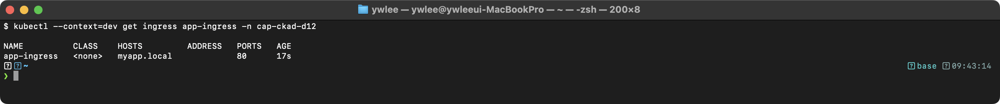
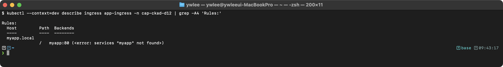
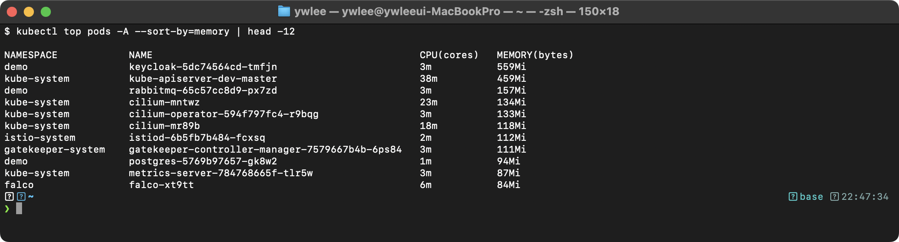
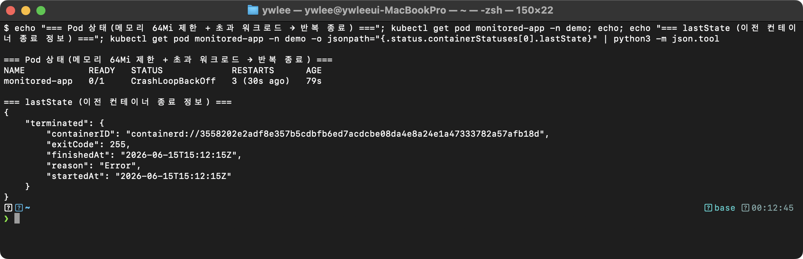
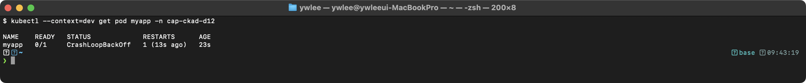
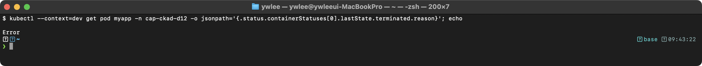

# CKAD Day 12: API Deprecation 실전 문제와 Observability 심화

> CKAD 도메인: Application Observability and Maintenance (15%) - Part 2b | 예상 소요 시간: 1시간

**Day 11 복습 연결.** Day 11(Part 2a)에서 deprecated API 제거 시간표와 `kubectl convert` 플러그인을 다뤘다. Day 12는 그 내용을 바탕으로 실전 문제 형식으로 적용 연습을 하고, Observability(관측성) 심화로 확장한다.

---

## 오늘의 학습 목표

- [ ] API Deprecation 관련 실전 문제를 풀 수 있다
- [ ] Observability(관측성) 개념과 구성 요소를 이해한다
- [ ] 컨테이너 리소스 모니터링(kubectl top)을 활용할 수 있다
- [ ] 실전 시나리오 기반 트러블슈팅을 수행할 수 있다

### 시험 환경 빠른 셋업

CKAD 실기 시험은 속도전이다. 세션 시작 직후 아래 alias·export를 설정하면 반복 타이핑을 줄일 수 있다.

```bash
alias k=kubectl
export do='--dry-run=client -o yaml'
export KUBECONFIG=kubeconfig/dev.yaml
```

단축 사용 예시:

```bash
# Ingress 틀 생성
k create ingress web-ingress --class=nginx \
  --rule="web.example.com/app=app-svc:8080" $do > web-ingress.yaml

# Pod 틀 생성
k run myapp --image=nginx:1.25 $do > pod.yaml

# 특정 네임스페이스에서 top 확인
k top pods -n demo --sort-by=cpu
```

---

## 1. 실전 시험 문제 (6문제)

### 왜 API 버전이 바뀌나

Kubernetes API는 기능을 추가·개선하면서 기존 API 구조에 호환되지 않는 변경이 생길 때마다 새 API 그룹 버전을 도입하고 이전 버전을 deprecated(더 이상 권장하지 않음) 처리한다. `extensions/v1beta1`은 초기 Kubernetes가 Deployment·Ingress·DaemonSet 등 핵심 워크로드 리소스를 하나의 그룹에 몰아넣어 제공하던 임시 그룹이다. 이후 각 리소스가 성숙하면서 `apps/v1`, `networking.k8s.io/v1` 같은 전용 그룹으로 이관되었고, `extensions/v1beta1`은 Kubernetes 1.16에서 Deployment·DaemonSet·ReplicaSet 제거, 1.22에서 Ingress 제거 등 단계적으로 삭제되었다.

**마이그레이션하지 않으면 어떻게 되나.** 클러스터를 업그레이드하면 API 서버가 삭제된 버전의 요청을 거부한다. `extensions/v1beta1`으로 작성된 매니페스트를 그대로 적용하면 `no kind "Deployment" is registered for version "extensions/v1beta1"` 같은 오류가 발생하며 리소스가 생성되지 않는다. Helm Chart나 CI/CD 파이프라인에 구형 버전이 남아 있으면 업그레이드 후 전체 배포가 중단되는 장애로 이어진다.

**deprecated API 제거 시간표 (주요 사례):**

| 제거 버전 | 제거된 API | 대체 API |
|-----------|------------|----------|
| v1.16 | extensions/v1beta1 Deployment, DaemonSet, ReplicaSet | apps/v1 |
| v1.22 | extensions/v1beta1 Ingress | networking.k8s.io/v1 |
| v1.25 | policy/v1beta1 PodSecurityPolicy | Policy Admission(PSA)으로 대체 |

따라서 클러스터 업그레이드 전에 현재 사용 중인 API 버전을 점검하고 마이그레이션하는 것이 장애 예방의 핵심이다.

### 문제 1. Deprecated API 식별

클러스터에서 실행 중인 리소스 중 deprecated API를 사용하는 것이 있는지 확인하라.

<details><summary>풀이</summary>

```bash
# 방법 1: kubectl get으로 Warning 확인
kubectl get ingress -A 2>&1 | grep -i warning

# 방법 2: audit log 확인 (클러스터 관리자)
# API Server의 --audit-log-path에서 deprecated API 호출 확인

# 방법 3: API Server metrics 확인
kubectl get --raw /metrics | grep apiserver_requested_deprecated_apis

# 방법 4: 특정 리소스의 API 버전 확인
kubectl get deployment -A -o jsonpath='{range .items[*]}{.metadata.name}{"\t"}{.apiVersion}{"\n"}{end}'
```

</details>

---

### 문제 2. kubectl explain 활용

`Ingress`의 `spec.rules.http.paths.backend` 구조를 `kubectl explain`으로 확인하고, 필수 필드를 파악하라.

<details><summary>풀이</summary>

```bash
# backend 구조 확인
kubectl explain ingress.spec.rules.http.paths.backend
# service 필드가 있음을 확인

# service 하위 구조 확인
kubectl explain ingress.spec.rules.http.paths.backend.service
# name: required
# port: required

# port 구조 확인
kubectl explain ingress.spec.rules.http.paths.backend.service.port
# name: string (서비스 포트 이름)
# number: int32 (서비스 포트 번호)
# name 또는 number 중 하나 필수

# pathType 확인
kubectl explain ingress.spec.rules.http.paths.pathType
# Required: true
# Prefix, Exact, ImplementationSpecific
```

**핵심**: `kubectl explain`은 시험에서 YAML 구조를 모를 때 필수 도구이다.

</details>

---

### 문제 3. API 그룹별 리소스 분류

다음 리소스들이 어떤 API 그룹에 속하는지 확인하라: Pod, Deployment, Job, Ingress, NetworkPolicy

<details><summary>풀이</summary>

```bash
# 각 리소스의 API 그룹 확인
kubectl api-resources | grep -E "^pods |^deployments |^jobs |^ingresses |^networkpolicies "

# 결과:
# pods          po    v1                          true   Pod
# deployments   deploy apps/v1                    true   Deployment
# jobs                 batch/v1                   true   Job
# ingresses     ing    networking.k8s.io/v1       true   Ingress
# networkpolicies netpol networking.k8s.io/v1     true   NetworkPolicy
```

**정리:**
| 리소스 | API 그룹 | apiVersion |
|--------|----------|------------|
| Pod | core (빈 문자열) | v1 |
| Deployment | apps | apps/v1 |
| Job | batch | batch/v1 |
| Ingress | networking.k8s.io | networking.k8s.io/v1 |
| NetworkPolicy | networking.k8s.io | networking.k8s.io/v1 |

Pod의 API 그룹이 "빈 문자열"인 이유: Kubernetes 초기에 만들어진 핵심 리소스(Pod·Service·ConfigMap·PersistentVolume 등)는 `/api/v1` 경로를 사용해 그룹 이름이 별도로 지정되지 않았다. 이를 "core 그룹" 또는 "legacy 그룹"이라 부르며, `apiVersion: v1`으로 표기한다. 이후 등장한 리소스는 `/apis/<group>/<version>` 경로를 사용하므로 그룹 이름이 명시된다.

</details>

---

### 문제 4. Ingress 생성 (현재 API)

다음 조건의 Ingress를 생성하라.

- 이름: `web-ingress`, 네임스페이스: `exam`
- ingressClassName: `nginx`
- 호스트: `web.example.com`
- `/app` -> `app-svc:8080` (Prefix)
- `/api` -> `api-svc:3000` (Prefix)

<details><summary>풀이</summary>

```bash
# 선행: exam 네임스페이스가 없으면 생성한다(없으면 Ingress apply 시 namespace not found 오류 발생)
kubectl create namespace exam
```

```yaml
apiVersion: networking.k8s.io/v1
kind: Ingress
metadata:
  name: web-ingress
  namespace: exam
spec:
  ingressClassName: nginx
  rules:
    - host: web.example.com
      http:
        paths:
          - path: /app
            pathType: Prefix
            backend:
              service:
                name: app-svc
                port:
                  number: 8080
          - path: /api
            pathType: Prefix
            backend:
              service:
                name: api-svc
                port:
                  number: 3000
```

```bash
# 명령형 생성 (기본 틀만)
kubectl create ingress web-ingress \
  --class=nginx \
  --rule="web.example.com/app=app-svc:8080" \
  --rule="web.example.com/api=api-svc:3000" \
  -n exam
```

검증:
```bash
kubectl get ingress web-ingress -n exam
```



```bash
kubectl describe ingress web-ingress -n exam | grep -A 5 "Rules:"
```

`<error: services "app-svc" not found>`는 app-svc 서비스가 존재하지 않아 나타나는 정상 메시지이며 Ingress 자체는 정상 생성된 것이다.



</details>

---

### 문제 5. HPA API 버전 확인

HorizontalPodAutoscaler(HPA)의 현재 API 버전을 확인하고, `autoscaling/v1`과 `autoscaling/v2`의 차이를 설명하라.

<details><summary>풀이</summary>

```bash
# HPA API 버전 확인
kubectl api-versions | grep autoscaling
# autoscaling/v1
# autoscaling/v2

kubectl explain hpa | head -3
# KIND:     HorizontalPodAutoscaler
# VERSION:  autoscaling/v2
```

**HPA가 v1에서 v2로 진화한 이유**

`autoscaling/v1`은 CPU 사용률 하나만으로 Pod 수를 조정한다. 이 방식은 두 가지 한계가 있다. 첫째, 메모리 고갈 상황(예: 메모리 누수가 있는 앱이 CPU는 낮으나 메모리는 한계에 달함)을 감지하지 못한다. 둘째, 요청 처리량이나 큐 깊이 같은 비즈니스 메트릭으로 스케일링할 수 없다. 예를 들어 온라인 게임 매치메이킹 서버는 CPU가 낮아도 대기 큐가 쌓이면 Pod를 늘려야 하는데, v1으로는 이를 표현할 수 없다.

`autoscaling/v2`는 Memory·Custom·External 메트릭을 함께 지정할 수 있고, 복수 조건 중 가장 높은 스케일 요구를 채택하는 방식으로 동작한다. 또한 `behavior` 필드로 스케일 업/다운 속도를 독립적으로 제어할 수 있어(예: 스케일 업은 즉시, 스케일 다운은 5분 안정화 후) 진동(flapping) 문제를 방지한다.

**차이점:**

| 항목 | autoscaling/v1 | autoscaling/v2 |
|------|---------------|----------------|
| CPU 메트릭 | O | O |
| Memory 메트릭 | X | O |
| Custom 메트릭 | X | O |
| 여러 메트릭 | X | O |
| 동작 제어 (behavior) | X | O |

```yaml
# autoscaling/v2 예시
apiVersion: autoscaling/v2
kind: HorizontalPodAutoscaler
metadata:
  name: web-hpa
spec:
  scaleTargetRef:
    apiVersion: apps/v1
    kind: Deployment
    name: web-deploy
  minReplicas: 2
  maxReplicas: 10
  metrics:
    - type: Resource
      resource:
        name: cpu
        target:
          type: Utilization
          averageUtilization: 70
    - type: Resource
      resource:
        name: memory
        target:
          type: Utilization
          averageUtilization: 80
```

</details>

---

### 문제 6. 복합 마이그레이션

다음 deprecated 매니페스트의 모든 API 버전을 현재 버전으로 수정하라.

```yaml
apiVersion: extensions/v1beta1
kind: Deployment
metadata:
  name: web
spec:
  replicas: 2
  template:
    metadata:
      labels:
        app: web
    spec:
      containers:
        - name: web
          image: nginx:1.25
          ports:
            - containerPort: 80
---
apiVersion: extensions/v1beta1
kind: Ingress
metadata:
  name: web-ingress
  annotations:
    kubernetes.io/ingress.class: nginx
spec:
  rules:
    - host: web.example.com
      http:
        paths:
          - path: /
            backend:
              serviceName: web-svc
              servicePort: 80
```

<details><summary>풀이</summary>

```yaml
apiVersion: apps/v1                     # extensions/v1beta1 -> apps/v1
kind: Deployment
metadata:
  name: web
spec:
  replicas: 2
  selector:                             # selector 추가 (필수)
    matchLabels:
      app: web
  template:
    metadata:
      labels:
        app: web
    spec:
      containers:
        - name: web
          image: nginx:1.25
          ports:
            - containerPort: 80
---
apiVersion: networking.k8s.io/v1        # extensions/v1beta1 -> networking.k8s.io/v1
kind: Ingress
metadata:
  name: web-ingress
spec:
  ingressClassName: nginx               # annotation -> spec 필드
  rules:
    - host: web.example.com
      http:
        paths:
          - path: /
            pathType: Prefix            # pathType 추가 (필수)
            backend:
              service:                  # backend 구조 변경
                name: web-svc
                port:
                  number: 80
```

</details>

---

## 2. Observability (관측성) 심화

### 2.1 등장 배경

**전통적 모니터링의 한계.** CPU·메모리처럼 사전에 알려진 메트릭만 감시하는 전통적 모니터링은 "무엇이 고장났는지"는 알 수 있지만 "왜 고장났는지"는 알 수 없다. 마이크로서비스 환경에서는 서비스 간 호출 관계가 복잡하여 단일 메트릭만으로는 근본 원인을 파악할 수 없다.

**Observability(관측성)**란 시스템 내부 상태를 외부 출력으로 추론할 수 있는 능력이다. 세 가지 데이터 유형(Metrics·Logs·Traces)을 조합해야 장애의 근본 원인을 파악할 수 있다.

- Metrics: "얼마나"에 대한 수치 데이터 (시계열)
- Logs: "무엇이 일어났는지"에 대한 이벤트 기록
- Traces: "어디서 느려졌는지"에 대한 요청 경로 추적

**구체 장애 시나리오: 주문 완료까지 30초 걸리는 문제**

전자상거래 서비스에서 "주문 완료" 버튼을 누르면 30초 이상 소요된다는 이슈가 접수되었다. 이 서비스는 `order → payment → inventory → notification` 순서로 4개의 마이크로서비스를 호출한다.

전통적 모니터링(CPU·메모리 시계열 대시보드)으로는 각 Pod의 리소스 사용량이 정상 범위 안에 있어 어느 서비스가 느린지 알 수 없다. Observability 3요소를 조합하면 다음과 같이 근본 원인을 찾는다.

1. **Metrics**: `kubectl top pods -n commerce --sort-by=cpu` 로 이상 Pod 후보를 좁힌다.
2. **Logs**: `kubectl logs inventory-pod --since=5m` 로 inventory 서비스에서 DB connection pool exhausted 메시지를 발견한다.
3. **Traces**: Jaeger/OpenTelemetry로 요청 경로를 추적하면 `order → inventory` 구간에서 22초가 소비됨을 확인한다.

결론: inventory 서비스의 DB connection pool 크기가 너무 작아 대기 시간이 발생한 것이다. Metrics만으로는 "inventory CPU가 낮다"는 사실만 알 수 있고, Logs와 Traces를 결합해야 "connection pool 대기"라는 근본 원인을 파악할 수 있다.

### 2.2 관측성의 3대 요소

**1. Metrics (메트릭)**

수치화된 시계열 데이터로 "얼마나?"에 대한 답을 제공한다. CPU/Memory 사용량, 요청 처리량, 에러율 등이 대표 예이다. 도구는 Prometheus·kubectl top·Metrics Server가 있다. 트레이드오프: Metrics는 수치를 집계하므로 개별 요청의 맥락이 소실된다. 특정 요청이 왜 느렸는지는 Metrics만으로 파악할 수 없다.

**2. Logs (로그)**

이벤트 기반의 텍스트 데이터로 "무엇이 일어났나?"에 대한 답을 제공한다. 애플리케이션 출력·에러 메시지·감사 로그 등이 해당하며, kubectl logs·Fluentd·Loki를 사용한다. 트레이드오프: 대용량 서비스에서는 로그 저장 비용이 상당하며, 구조화되지 않은 자유 형식 로그는 검색·파싱에 추가 처리가 필요하다.

**3. Traces (추적)**

요청의 전체 경로를 추적하여 "어디서 느려졌나?"에 대한 답을 제공한다. 마이크로서비스 간 호출 관계와 구간별 지연 시간을 시각화하며, Jaeger·Zipkin·OpenTelemetry를 사용한다. 트레이드오프: 각 서비스 코드에 계측 라이브러리(instrumentation)를 심어야 하므로 레거시 앱에 적용 비용이 높다.

### 2.3 Metrics Server와 kubectl top

**Metrics Server 내부 동작**

1. 각 Node의 kubelet은 cAdvisor(Container Advisor: Google이 개발한 컨테이너 리소스 수집 데몬으로, kubelet 내부에 내장돼 있다)를 내장하고 있다. cAdvisor는 `/sys/fs/cgroup` 파일을 읽어 프로세스별 CPU·메모리 사용량을 집계한다. cgroup(Control Group)은 Linux 커널이 프로세스 그룹별로 자원 사용량을 추적하고 제한하는 메커니즘이다.
2. cAdvisor가 수집한 컨테이너별 CPU/메모리 데이터를 kubelet이 `/metrics/resource` 엔드포인트로 노출한다.
3. Metrics Server가 각 kubelet의 `/metrics/resource` 엔드포인트를 주기적으로(~15초) 조회한다.
4. 수집한 데이터를 메모리에 저장한다(디스크 저장 없음, 최근값만 보관).
5. `kubectl top`이 Metrics API(`/apis/metrics.k8s.io/v1beta1`)를 통해 데이터를 조회한다.

HPA는 이 15초 주기 데이터를 기반으로 Pod 수 증감을 판단하므로 순간 스파이크에는 즉각 반응하지 않는다. `--horizontal-pod-autoscaler-sync-period`(기본 15초)로 kube-controller-manager에서 조정 가능하다.

Metrics Server는 HPA(Horizontal Pod Autoscaler)의 CPU/메모리 기반 스케일링에도 사용된다. 단, HPA autoscaling/v2의 Custom·External 메트릭 타입은 Metrics Server가 아닌 별도 커스텀 metrics provider(예: Prometheus adapter, custom-metrics-apiserver)가 필요하다. CKAD 시험에서는 Resource 타입(CPU/Memory) 스케일링이 주로 출제되므로 Metrics Server 기반 HPA를 우선 익힌다.

**Metrics Server와 Prometheus의 역할 구분**

두 도구 모두 컨테이너 메트릭을 다루지만 목적과 저장 방식이 다르다.

| 항목 | Metrics Server | Prometheus |
|------|---------------|------------|
| 저장 방식 | 메모리 (디스크 저장 없음) | 디스크 (TSDB, 장기 보존) |
| 보존 기간 | 최근 ~1분(수 분) | 설정에 따라 수 주~수 개월 |
| 주 용도 | HPA 스케일링 판단, `kubectl top` | 모니터링·알림·그래프 분석 |
| 쿼리 언어 | 없음 (API 직접 호출) | PromQL |
| 설치 복잡도 | 단순 (단일 Deployment) | 복잡 (Prometheus + Grafana + Alertmanager) |

따라서 "현재 CPU 사용률"처럼 즉각적인 실시간 값은 `kubectl top`(Metrics Server 기반)이 빠르다. "지난 1시간 CPU 사용률 추이"나 "특정 임계값 초과 시 알림"은 Prometheus로만 구현 가능하다. Metrics Server가 없으면 HPA가 동작하지 않으므로 클러스터 설치 후 반드시 Metrics Server를 확인한다.

```bash
# Metrics Server 설치 확인
kubectl get pods -n kube-system | grep metrics-server

# 노드 리소스 사용량
kubectl top nodes

# Pod 리소스 사용량
kubectl top pods -n demo
kubectl top pods -n demo --sort-by=cpu
kubectl top pods -n demo --sort-by=memory

# 특정 Pod의 컨테이너별 사용량
kubectl top pod my-pod --containers -n demo

# 모든 네임스페이스의 Pod 리소스 (메모리 순)
kubectl top pods -A --sort-by=memory | head -10
```

아래는 dev 클러스터에서 `kubectl top pods -A --sort-by=memory` 를 실행한 실제 화면이다(metrics-server 설치 환경). 네임스페이스별 Pod 의 실시간 CPU(cores)·MEMORY(bytes)가 메모리 내림차순으로 정렬돼 나온다.



### 2.4 리소스 요청/제한과 모니터링

```yaml
# 리소스 설정과 모니터링의 관계
apiVersion: v1
kind: Pod
metadata:
  name: monitored-app
spec:
  containers:
    - name: app
      image: nginx:1.25
      resources:
        requests:                    # 스케줄링 기준
          cpu: 100m                  # 0.1 CPU
          memory: 128Mi              # 128 MiB
        limits:                      # 최대 사용량
          cpu: 200m                  # 0.2 CPU
          memory: 256Mi              # 256 MiB (초과 시 OOMKilled)
```

```bash
# 리소스 사용량 vs 요청/제한 비교
kubectl top pod monitored-app

# OOMKilled 확인
kubectl get pod monitored-app -o jsonpath='{.status.containerStatuses[0].lastState}'
```

아래는 dev 에서 메모리 64Mi 로 제한한 Pod 가 반복 종료(CrashLoopBackOff)된 뒤 `lastState`(이전 컨테이너 종료 정보) JSON 을 조회한 실측이다. `terminated` 의 `reason`·`exitCode`·`finishedAt` 이 보인다(이 캡처는 `reason: Error`/`exitCode 255`; 메모리 한계를 실제로 초과해 커널 cgroup 이 죽이면 `reason: OOMKilled`/`exitCode 137` 로 나타난다).



---

## 3. 실전 시나리오

### 시나리오 A: API 마이그레이션 체크리스트

```
[Kubernetes 업그레이드 전 API 마이그레이션 체크리스트]

1. 현재 클러스터의 deprecated API 사용 확인
   kubectl get --raw /metrics | grep apiserver_requested_deprecated_apis

2. 각 네임스페이스의 리소스 API 버전 확인
   kubectl get deploy,ing,cronjob -A -o yaml | grep "apiVersion:"

3. Helm Chart의 API 버전 확인
   helm get manifest <release> | grep "apiVersion:"

4. CI/CD 파이프라인의 매니페스트 확인
   grep -r "apiVersion:" ./manifests/ | grep -v "apps/v1\|v1\|networking.k8s.io/v1"

5. kubectl convert로 변환
   kubectl convert -f old-manifest.yaml --output-version <new-version>
   # (kubectl convert는 기본 내장 명령이 아닌 krew 플러그인이다. Day 11 섹션 4 참조)

6. 테스트 환경에서 먼저 적용
   kubectl apply -f new-manifest.yaml --dry-run=server
```

### 시나리오 B: Observability 기반 트러블슈팅 흐름

```
[문제 감지 및 진단 흐름]

1. 증상 확인
   kubectl get pods -A | grep -v Running
   kubectl get events -A --sort-by='.lastTimestamp' | tail -20

2. 메트릭 확인
   kubectl top nodes              # 노드 리소스 확인
   kubectl top pods -A --sort-by=memory  # 메모리 상위 Pod 확인

3. 로그 확인
   kubectl logs <pod> --tail=50   # 최근 로그
   kubectl logs <pod> --previous  # 이전 컨테이너 로그
   kubectl logs <pod> --since=5m  # 5분 내 로그

4. 상세 분석
   kubectl describe pod <pod>     # Events, Conditions 확인
   kubectl get pod <pod> -o yaml  # 전체 스펙 확인

5. 실시간 디버깅
   kubectl exec -it <pod> -- /bin/sh
   kubectl debug -it <pod> --image=busybox
```

---

## 4. 트러블슈팅

### 장애 시나리오 1: kubectl top에서 메트릭이 안 보임

**실습 전제**: dev 클러스터 가동 상태, `export KUBECONFIG=kubeconfig/dev.yaml`, metrics-server가 미설치된 상태에서 재현 가능. 노드 접근이 필요한 경우 `ssh dev-master`.

> (미캡처) 아래 각 명령의 실제 출력은 dev 클러스터에서 직접 실행한 터미널 스크린샷으로 대체해야 한다.

```bash
# 증상
kubectl top pods -n demo
# error: Metrics API not available

# 디버깅
kubectl get pods -n kube-system | grep metrics-server
kubectl logs -n kube-system -l k8s-app=metrics-server --tail=20

# 흔한 원인:
# 1. Metrics Server가 설치되지 않음
# 2. Metrics Server가 kubelet에 TLS 연결 실패 (--kubelet-insecure-tls 필요)
# 3. Metrics Server Pod가 CrashLoopBackOff

# 해결: Metrics Server 설치 또는 재배포
kubectl apply -f https://github.com/kubernetes-sigs/metrics-server/releases/latest/download/components.yaml
```

### 장애 시나리오 2: OOMKilled 반복 발생

**OOMKilled(Out of Memory Killed)**란 Pod에 설정된 `memory limits`(예: 256Mi)를 컨테이너 프로세스가 초과하는 순간 Linux 커널의 OOM(Out Of Memory) killer가 해당 프로세스를 강제 종료하는 상태이다. Kubernetes는 cgroup(Control Group, 리눅스 커널의 프로세스별 자원 격리 메커니즘)으로 컨테이너별 메모리 상한을 설정하며, 상한을 넘으면 cgroup이 커널에 OOM kill을 요청한다. 컨테이너가 종료되면 kubelet이 Pod를 재시작하고, 재시작이 반복되면 `CrashLoopBackOff` 상태가 된다.

```bash
# 증상
kubectl get pod myapp
```



```bash
# 디버깅: 이전 컨테이너 상태 확인
kubectl get pod myapp -o jsonpath='{.status.containerStatuses[0].lastState.terminated.reason}'
```



```bash
# 리소스 사용량과 limits 비교
kubectl describe pod myapp | grep -A 3 "Limits\|Requests"
# 메모리 limits가 실제 사용량보다 작으면 OOMKilled 발생

# 해결: memory limits 증가 또는 앱의 메모리 사용 최적화
kubectl set resources deployment/myapp --limits=memory=512Mi
```

---

## 5. 자주 하는 실수와 주의사항

### 실수 1: pathType 누락

**pathType이 v1에서 필수가 된 이유.** `extensions/v1beta1` 시절 경로 매칭 방식은 구현체(ingress controller)마다 달랐다. nginx ingress controller는 접두어 매칭으로 해석하고, 다른 controller는 정규식으로 해석하는 등 controller에 따라 동작이 달라 이식성 문제가 있었다. `networking.k8s.io/v1`에서는 `pathType`을 필수 필드로 지정해 어떤 controller를 쓰더라도 경로 해석 방식이 매니페스트에 명시적으로 고정되도록 강제했다.

`pathType` 세 가지 동작:
- **Prefix**: 경로 접두어 매칭. `/api`는 `/api`, `/api/user`, `/api/v2/items` 모두 매칭.
- **Exact**: 정확히 일치해야 매칭. `/api`는 `/api`만 매칭, `/api/user`는 매칭 안 됨.
- **ImplementationSpecific**: controller에 위임. controller가 자체 규칙으로 해석(이식성 낮음).

`pathType`을 누락하면 `networking.k8s.io/v1` API 서버가 즉시 validation 오류를 반환하며 리소스가 생성되지 않는다.

```yaml
# 잘못된 예 (networking.k8s.io/v1에서 에러)
paths:
  - path: /
    backend:
      service:
        name: web-svc
        port:
          number: 80

# 올바른 예
paths:
  - path: /
    pathType: Prefix        # 필수!
    backend:
      service:
        name: web-svc
        port:
          number: 80
```

### 실수 2: Deployment selector 누락

```yaml
# 잘못된 예 (apps/v1에서 에러)
apiVersion: apps/v1
kind: Deployment
spec:
  replicas: 3
  template:               # selector 없음 -> 에러
    metadata:
      labels:
        app: web

# 올바른 예
apiVersion: apps/v1
kind: Deployment
spec:
  replicas: 3
  selector:               # 필수!
    matchLabels:
      app: web
  template:
    metadata:
      labels:
        app: web
```

### 실수 3: kubectl top 사용 시 Metrics Server 미설치

```bash
# Metrics Server가 없으면 에러 발생
kubectl top pods
# error: Metrics API not available

# 해결: Metrics Server 설치
kubectl apply -f https://github.com/kubernetes-sigs/metrics-server/releases/latest/download/components.yaml

# 또는 Helm으로 설치
helm install metrics-server metrics-server/metrics-server -n kube-system
```

---

## 6. 복습 체크리스트

- [ ] Deprecated API를 현재 버전으로 마이그레이션할 수 있다
- [ ] `kubectl explain`으로 리소스 스키마를 탐색할 수 있다
- [ ] Observability의 3대 요소(Metrics, Logs, Traces)를 설명할 수 있다
- [ ] `kubectl top`으로 노드/Pod 리소스를 모니터링할 수 있다
- [ ] API 마이그레이션 체크리스트를 수행할 수 있다
- [ ] Ingress의 `pathType` 필드가 필수인 것을 안다

---

## tart-infra 실습

### 실습 환경 설정

**전제**: dev 클러스터가 가동 중이어야 한다(`./scripts/boot.sh` 및 `./scripts/fix-cluster-ip-drift.sh dev` 실행 후). kubeconfig 경로는 `kubeconfig/dev.yaml`. 노드 접근이 필요한 경우 `ssh dev-master` 또는 `ssh dev-worker1` 별칭을 사용한다.

```bash
export KUBECONFIG=kubeconfig/dev.yaml
kubectl get nodes
```

### 실습 1: API 버전 확인

> 이 실습 후 달성 가능: 클러스터에서 지원하는 API 그룹 목록을 조회하고, 특정 리소스(Deployment, Job, Ingress)가 어떤 API 그룹에 속하는지 즉시 확인할 수 있다. deprecated API 사용 여부를 점검하는 업그레이드 전 체크리스트를 독립적으로 수행할 수 있다.

```bash
# 클러스터의 API 버전 확인
kubectl api-versions | sort

# 주요 리소스의 API 그룹 확인
kubectl api-resources --api-group=apps
kubectl api-resources --api-group=batch
kubectl api-resources --api-group=networking.k8s.io
```

### 실습 2: 리소스 모니터링

> 이 실습 후 달성 가능: `kubectl top`으로 노드·Pod의 현재 CPU·메모리 사용량을 조회하고 이상 Pod를 빠르게 특정할 수 있다. OOMKilled가 반복되는 Pod를 발견하고 memory limits 조정 방향을 판단할 수 있다.

```bash
# 노드 리소스 사용량
kubectl top nodes

# Pod 리소스 사용량 (demo 네임스페이스)
kubectl top pods -n demo --sort-by=memory

# 컨테이너별 사용량
kubectl top pods -n demo --containers
```

### 실습 3: kubectl explain 활용

> 이 실습 후 달성 가능: 시험장에서 YAML 필드 구조를 모를 때 `kubectl explain`으로 실시간으로 스키마를 탐색할 수 있다. pathType·selector처럼 필수 필드를 누락하는 실수를 사전에 방지할 수 있다.

```bash
# Ingress 구조 확인
kubectl explain ingress.spec.rules.http.paths --recursive

# Deployment selector 확인
kubectl explain deployment.spec.selector
```

---

## 시험 팁

1. **pathType은 networking.k8s.io/v1 Ingress에서 필수**다. 누락하면 `ValidationError` 로 즉시 거부된다. `Prefix` / `Exact` 중 `Prefix`가 가장 많이 쓰이며, 시험 문제에 별도 지정이 없으면 `Prefix`를 사용한다.
2. **apps/v1 Deployment에는 `spec.selector`가 필수**다. `extensions/v1beta1`에서 마이그레이션할 때 selector 누락이 가장 흔한 실수다. `matchLabels`의 키-값이 `spec.template.metadata.labels`와 일치해야 한다.
3. **kubectl convert는 기본 내장 명령이 아니다.** krew로 설치해야 동작한다. 시험 환경에서 설치 여부를 먼저 `kubectl convert --help`로 확인한다.

---

## 자가점검

<details><summary>정답 확인</summary>

**Q1.** `networking.k8s.io/v1` Ingress에서 `pathType`을 누락하면 어떻게 되나?
**A.** API 서버가 즉시 ValidationError를 반환하며 리소스가 생성되지 않는다. `pathType: Prefix` 또는 `Exact`를 명시해야 한다.

**Q2.** `kubectl top pods` 실행 시 `error: Metrics API not available`이 나타나는 주된 원인 두 가지는?
**A.** ① Metrics Server가 클러스터에 설치되지 않은 경우. ② Metrics Server Pod가 kubelet에 TLS 연결 실패(`--kubelet-insecure-tls` 플래그 누락)로 CrashLoopBackOff인 경우.

**Q3.** `autoscaling/v1` HPA가 `autoscaling/v2`로 진화한 핵심 이유는?
**A.** v1은 CPU 메트릭만 지원하므로 메모리 고갈이나 커스텀 비즈니스 메트릭 기반 스케일링이 불가능했다. v2는 Memory·Custom·External 메트릭과 `behavior`(스케일 속도 제어) 필드를 추가해 이 한계를 극복했다.

**Q4.** Observability 3요소(Metrics·Logs·Traces)를 한 가지씩 담당하는 kubectl 명령은?
**A.** Metrics: `kubectl top`, Logs: `kubectl logs`, Traces: kubectl 단독으로는 불가(Jaeger·OpenTelemetry 같은 별도 도구 필요).

**Q5.** `extensions/v1beta1` Ingress의 `backend.serviceName`/`servicePort`는 `networking.k8s.io/v1`에서 어떻게 바뀌었나?
**A.** `backend.service.name`과 `backend.service.port.number`(또는 `port.name`)로 구조가 변경됐다. 평탄한 두 필드에서 `service` 오브젝트로 중첩 깊이가 한 단계 늘었다.

</details>

---

## 더 읽을거리

- [Kubernetes API 버전 변경 정책](https://kubernetes.io/docs/reference/using-api/deprecation-policy/)
- [Ingress networking.k8s.io/v1 공식 문서](https://kubernetes.io/docs/concepts/services-networking/ingress/)
- [Metrics Server GitHub](https://github.com/kubernetes-sigs/metrics-server)
- [HorizontalPodAutoscaler autoscaling/v2 레퍼런스](https://kubernetes.io/docs/reference/kubernetes-api/workload-resources/horizontal-pod-autoscaler-v2/)
- [OpenTelemetry — Traces 개요](https://opentelemetry.io/docs/concepts/signals/traces/)
