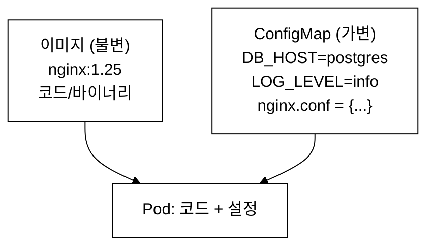
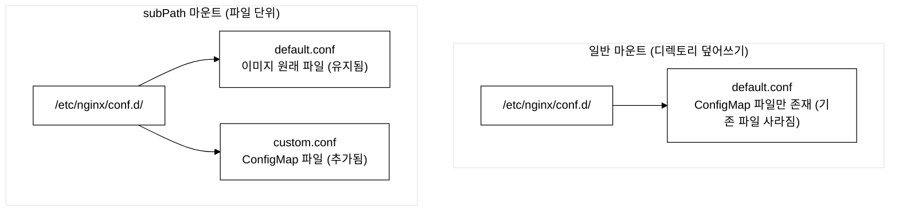
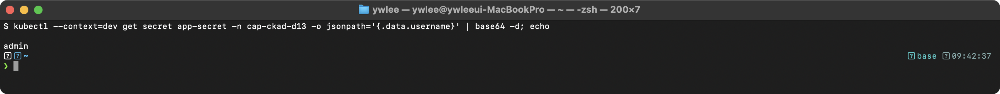
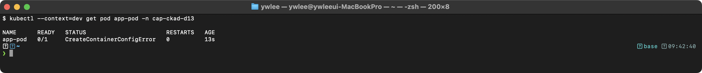
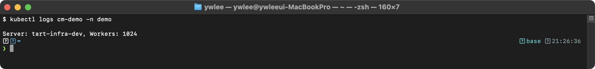
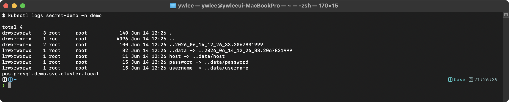

# CKAD Day 13: ConfigMap과 Secret 기초

> CKAD 도메인: Application Environment, Configuration and Security (25%) - Part 1a | 예상 소요 시간: 1시간

---

## 오늘의 학습 목표

> Day 12(Resources·LimitRange)에서 Pod 자원 제한(CPU·메모리 상한)을 다뤘다. Day 13은 그 Pod에 주입할 설정·비밀 데이터 관리로 이어진다. ConfigMap과 Secret은 CKAD 도메인 "Application Environment, Configuration and Security"(25%)의 핵심 출제 영역이다.

- [ ] ConfigMap의 4가지 생성 방법을 숙지한다
- [ ] ConfigMap의 3가지 사용 방법(env, envFrom, volume)을 이해한다
- [ ] subPath 마운트와 일반 마운트의 차이를 안다
- [ ] ConfigMap 업데이트 동작을 이해한다
- [ ] Secret의 종류와 생성/사용 방법을 숙지한다
- [ ] data vs stringData 차이를 이해한다

---

## 1. ConfigMap (컨피그맵) - 설정 데이터 관리

### 1.1 등장 배경

```
[ConfigMap 이전의 한계]

기존 방식: 설정값을 컨테이너 이미지에 포함한다.
- 환경별(dev/staging/prod) 설정이 다르면 이미지를 각각 빌드해야 한다
- 설정 변경 시 이미지를 다시 빌드하고 배포해야 한다
- 12-Factor App 원칙("설정을 코드에서 분리")을 위반한다

대안: 환경 변수를 Pod spec에 하드코딩한다.
- 설정이 많아지면 YAML이 비대해진다
- 여러 Pod가 같은 설정을 사용하면 중복이 발생한다
- 설정 변경 시 모든 Pod spec을 수정해야 한다

ConfigMap은 설정 데이터를 독립 리소스로 관리하여 이 문제를 해결한다.
이미지와 설정을 분리하고, 여러 Pod가 같은 ConfigMap을 참조할 수 있다.
```

### 1.2 ConfigMap이란?

ConfigMap은 쿠버네티스의 API 리소스로, 키-값 쌍의 비밀이 아닌 설정 데이터를 Pod의 컨테이너 이미지와 분리하여 저장한다. etcd에 평문으로 저장되며, 환경 변수(env/envFrom), 볼륨 마운트(volume), 또는 컨테이너 명령 인수로 Pod에 주입할 수 있다. ConfigMap의 최대 크기는 1MiB이다.


_그림 1. 이미지(불변)와 ConfigMap(가변)을 분리해 Pod에 결합._

### 1.3 ConfigMap 생성 (4가지 방법)

#### 방법 1: --from-literal (키-값 직접 지정)

```bash
kubectl create configmap app-config \
  --from-literal=DB_HOST=postgres \
  --from-literal=DB_PORT=5432 \
  --from-literal=LOG_LEVEL=info
```

검증:
```bash
kubectl get configmap app-config -o yaml
```

```yaml
# 기대 출력
apiVersion: v1
kind: ConfigMap
metadata:
  name: app-config
data:
  DB_HOST: postgres
  DB_PORT: "5432"        # 숫자도 문자열로 저장
  LOG_LEVEL: info
```

#### 방법 2: --from-file (파일 내용을 값으로)

```bash
# 파일 생성
echo "worker_processes auto;
events { worker_connections 1024; }
http {
    server {
        listen 80;
        location / { root /usr/share/nginx/html; }
    }
}" > nginx.conf

# 파일명이 키, 파일 내용이 값
kubectl create configmap nginx-config --from-file=nginx.conf
# 결과: data.nginx.conf = "worker_processes auto;..."

# 키 이름 지정
kubectl create configmap nginx-config --from-file=config=nginx.conf
# 결과: data.config = "worker_processes auto;..."
```

#### 방법 3: --from-env-file (env 파일)

`--from-env-file`은 파일의 각 줄을 개별 키-값으로 파싱하여 ConfigMap의 `data`에 저장한다. 키가 여럿일 때 `--from-literal`을 반복하는 대신 파일 한 개로 처리하므로 명령이 간결해진다.

```bash
# env 파일 형식 규칙
# - KEY=VALUE (KEY는 영문·숫자·밑줄, 하이픈 불가)
# - # 으로 시작하는 줄은 주석으로 무시됨
# - 빈 줄은 무시됨
# - 값에 따옴표 불필요 (따옴표를 쓰면 따옴표 문자 자체가 값에 포함됨)
# - export KEY=VALUE 형식은 인식하지 못함 (앞의 export 가 키명에 포함됨)
cat > app.env << EOF
# 데이터베이스 설정
DB_HOST=postgres
DB_PORT=5432

# 애플리케이션 설정
LOG_LEVEL=info
CACHE_TTL=300
EOF

kubectl create configmap app-config --from-env-file=app.env
# 결과: data에 각 줄이 개별 키-값으로 저장 (주석·빈 줄 제외)
```

**--from-literal vs --from-env-file 선택 기준:** 설정 항목이 1~3개라면 `--from-literal`로 충분하다. 항목이 4개 이상이거나 동일 파일을 여러 환경(dev/staging/prod)에 재사용하는 경우에는 `--from-env-file`이 적합하다. `--from-env-file`은 명령 한 줄로 파일 전체를 처리하므로 오타가 줄어든다.

#### 방법 4: YAML 매니페스트

```yaml
apiVersion: v1
kind: ConfigMap
metadata:
  name: app-config
  namespace: demo
data:
  # 단순 키-값
  DB_HOST: postgres
  DB_PORT: "5432"
  LOG_LEVEL: info

  # 파일 형태 (멀티라인)
  nginx.conf: |
    worker_processes auto;
    events { worker_connections 1024; }
    http {
        server {
            listen 80;
            location / { root /usr/share/nginx/html; }
        }
    }

  application.yaml: |
    spring:
      datasource:
        url: jdbc:postgresql://postgres:5432/mydb
      jpa:
        hibernate:
          ddl-auto: update
```

**`application.yaml` 키의 용도:** Spring Boot는 클래스패스의 `application.yaml`을 자동으로 읽는다. 이 파일을 ConfigMap에 키로 저장한 뒤, 볼륨으로 `/app/config/application.yaml` 경로에 마운트하면, 이미지에 설정을 고정하지 않고 ConfigMap 수정만으로 런타임 동작(DB 주소, JPA DDL 모드 등)을 변경할 수 있다. 단, 이 방식은 Spring Boot 전용 패턴이며, 일반적인 애플리케이션에서는 key=value 형식(방법 3) 또는 env 주입(§1.4 방법 1·2)이 더 범용적이다.

### 1.4 ConfigMap 사용 (3가지 방법)

#### 방법 1: env (개별 환경 변수)

```yaml
apiVersion: v1
kind: Pod
metadata:
  name: app-pod
spec:
  containers:
    - name: app
      image: nginx:1.25
      env:
        - name: DATABASE_HOST        # 컨테이너 내 환경 변수 이름
          valueFrom:
            configMapKeyRef:
              name: app-config        # ConfigMap 이름
              key: DB_HOST            # ConfigMap의 키
        - name: DATABASE_PORT
          valueFrom:
            configMapKeyRef:
              name: app-config
              key: DB_PORT
```

#### 방법 2: envFrom (ConfigMap 전체를 환경 변수로)

```yaml
apiVersion: v1
kind: Pod
metadata:
  name: app-pod
spec:
  containers:
    - name: app
      image: nginx:1.25
      envFrom:
        - configMapRef:
            name: app-config          # ConfigMap의 모든 키-값이 환경 변수로
        - configMapRef:
            name: db-config
          prefix: DB_                 # 접두사 추가 (DB_HOST, DB_PORT 등)
```

**prefix 동작 상세:** `prefix: DB_`를 지정하면 `db-config` ConfigMap의 모든 키 앞에 `DB_`가 붙는다. 예를 들어 `db-config`에 `HOST=postgres`·`PORT=5432`가 있으면 컨테이너에는 `DB_HOST=postgres`·`DB_PORT=5432`로 주입된다. 같은 Pod에서 두 ConfigMap을 `envFrom`으로 동시에 주입할 때 prefix가 없으면 동일 키명이 충돌할 수 있다. 이때 **나중에 선언된 `configMapRef`의 값이 앞서 선언된 값을 덮어쓴다**. prefix를 달리 지정하면 키 이름 자체가 달라지므로 충돌을 방지할 수 있다.

```bash
# 검증
kubectl exec app-pod -- env | sort
# DB_HOST=postgres
# DB_PORT=5432
# LOG_LEVEL=info
```

**주의: 환경변수명 유효성 — 하이픈 키는 무시된다.** Linux 환경변수명은 `[a-zA-Z_][a-zA-Z0-9_]*` 패턴만 허용된다(숫자로 시작 불가, 하이픈·점·특수문자 불가). ConfigMap에 `app-name: myapp` 처럼 하이픈이 포함된 키가 있으면, `envFrom`으로 주입해도 그 키는 **조용히 무시**되어 환경 변수 목록에 나타나지 않는다. "분명히 ConfigMap에 값이 있는데 env에서 안 보인다"면 키명에 유효하지 않은 문자가 있는지 먼저 확인한다.

```bash
# 잘못된 예: 하이픈 포함 키
kubectl create configmap bad-keys --from-literal=app-name=myapp --from-literal=VALID_KEY=ok
# envFrom으로 주입하면 VALID_KEY=ok 는 나타나지만 app-name 은 무시됨
```

#### 방법 3: volume (파일로 마운트)

```yaml
apiVersion: v1
kind: Pod
metadata:
  name: nginx-pod
spec:
  containers:
    - name: nginx
      image: nginx:1.25
      volumeMounts:
        - name: config-volume
          mountPath: /etc/nginx/conf.d  # 디렉토리에 마운트
          readOnly: true
  volumes:
    - name: config-volume
      configMap:
        name: nginx-config
        # items로 특정 키만 선택 가능
        items:
          - key: nginx.conf
            path: default.conf        # 마운트될 파일명 변경
```

```bash
# 검증
kubectl exec nginx-pod -- ls /etc/nginx/conf.d/
# default.conf

kubectl exec nginx-pod -- cat /etc/nginx/conf.d/default.conf
# nginx.conf 내용 출력
```

### 1.5 subPath 마운트

```yaml
# 일반 volume 마운트: 기존 디렉토리 내용이 덮어쓰기됨
volumeMounts:
  - name: config-volume
    mountPath: /etc/nginx/conf.d     # conf.d 안의 기존 파일 사라짐!

# subPath 마운트: 기존 파일 유지, 특정 파일만 추가/교체
volumeMounts:
  - name: config-volume
    mountPath: /etc/nginx/conf.d/custom.conf  # 단일 파일 경로
    subPath: nginx.conf                       # ConfigMap의 키
```

**핵심 비교:**


_그림 2. 일반 마운트와 subPath 마운트의 디렉토리 결과 차이._

**주의**: subPath로 마운트된 파일은 ConfigMap 업데이트 시 자동 갱신되지 않는다!

**내부 동작 원리:** 일반 볼륨 마운트는 심볼릭 링크 구조(`..data` -> `..timestamp_dir`)를 사용한다. ConfigMap이 업데이트되면 kubelet이 새 타임스탬프 디렉토리를 생성하고 `..data` 심볼릭 링크를 atomic하게 교체한다. 반면 subPath는 직접 바인드 마운트(`mount --bind`)이므로 kubelet의 symlink 교체 메커니즘이 적용되지 않는다. 마운트 포인트가 inode 수준에서 원본 파일을 직접 가리키기 때문에, ConfigMap 오브젝트가 변경되어도 이미 바인드된 파일에는 영향을 주지 못한다.

**검증: subPath 갱신 불가 직접 확인**

아래 절차로 "갱신 안 됨"을 직접 눈으로 확인한다(dev 클러스터 사용, 사전에 `export KUBECONFIG=kubeconfig/dev.yaml` 실행):

```bash
# 1단계: ConfigMap 생성 (v1)
kubectl create configmap subpath-test -n demo \
  --from-literal=app.conf="version=v1"

# 2단계: subPath로 파일을 마운트하는 파드 생성
cat <<'EOF' | kubectl apply -f -
apiVersion: v1
kind: Pod
metadata:
  name: subpath-demo
  namespace: demo
spec:
  containers:
    - name: app
      image: busybox:1.36
      command: ['sh', '-c', 'sleep 3600']
      volumeMounts:
        - name: cfg
          mountPath: /etc/app/app.conf   # 단일 파일 경로
          subPath: app.conf              # ConfigMap 키
  volumes:
    - name: cfg
      configMap:
        name: subpath-test
EOF

kubectl wait pod subpath-demo -n demo --for=condition=Ready --timeout=30s

# 3단계: 현재 파일 내용 확인 (v1 출력 예상)
kubectl exec subpath-demo -n demo -- cat /etc/app/app.conf
# version=v1

# 4단계: ConfigMap 값 변경 (v2로 패치)
kubectl patch configmap subpath-test -n demo \
  --type merge -p '{"data":{"app.conf":"version=v2"}}'

# 5단계: 60초 이상 대기 후 다시 읽기 (kubelet sync period 경과)
kubectl exec subpath-demo -n demo -- sleep 65 2>/dev/null || true
kubectl exec subpath-demo -n demo -- cat /etc/app/app.conf
# version=v1  <-- 여전히 v1! (갱신 안 됨)

# 6단계: 비교 — subPath 없이 일반 마운트한 경우
# (ConfigMap 업데이트 후 ~60초 내에 자동 반영됨, §1.6 표 참고)

# 정리
kubectl delete pod subpath-demo -n demo
kubectl delete configmap subpath-test -n demo
```

| 마운트 방식 | ConfigMap 업데이트 반영 | 기존 디렉토리 파일 보존 |
|:---|:---:|:---:|
| 일반 volume 마운트 (디렉토리) | 자동 (~60초) | 아니오 (덮어쓰임) |
| subPath 마운트 (단일 파일) | **수동 재시작 필요** | 예 (기존 파일 유지) |

**결론**: subPath는 기존 디렉토리 파일을 보존하는 장점이 있지만, 자동 갱신이 되지 않는 트레이드오프가 따른다. 설정 파일을 런타임 중 동적으로 변경해야 하는 경우에는 subPath를 피하거나, 파드 재시작을 감수해야 한다.

### 1.6 ConfigMap 업데이트 동작

```
[ConfigMap 업데이트 시 동작]

1. 환경 변수 (env/envFrom)
   -> Pod 재시작 필요 (자동 갱신 안 됨)
   -> kubectl rollout restart deployment/<name>

2. Volume 마운트 (일반)
   -> 자동 갱신됨 (kubelet sync period: ~60초)
   -> 심볼릭 링크 기반: ..data -> ..2024_01_01_00_00_00.123456789

3. Volume 마운트 (subPath)
   -> 자동 갱신 안 됨! Pod 재시작 필요

4. Immutable ConfigMap
   -> 변경 자체가 불가능 (삭제 후 재생성 필요)
```

**Immutable ConfigMap 상세**

`immutable: true`(쿠버네티스 v1.21 GA)를 선언한 ConfigMap은 `data`·`binaryData` 필드 변경이 API 서버에서 거부된다. 장점은 대규모 클러스터에서 kubelet이 ConfigMap 변경 여부를 주기적으로 감시(watch)하는 부하를 없앤다는 점이다. 노드가 수백 개인 환경에서 ConfigMap watch 트래픽이 apiserver 부하의 상당 비중을 차지하기 때문에 실무에서 불변 설정에는 `immutable: true`를 권장한다.

```yaml
apiVersion: v1
kind: ConfigMap
metadata:
  name: app-config-v1
  namespace: demo
immutable: true          # 이후 data 변경 시도 시 오류 발생
data:
  DB_HOST: postgres
  LOG_LEVEL: info
```

변경 시도 시 발생하는 오류:
```bash
kubectl patch configmap app-config-v1 -n demo \
  --type merge -p '{"data":{"LOG_LEVEL":"debug"}}'
# Error from server (Forbidden): ... field is immutable
```

변경이 필요한 경우의 처리 순서: 기존 ConfigMap 삭제 → 새 버전으로 재생성 → 참조 Pod 재시작.

```bash
# 삭제 후 재생성 패턴
kubectl delete configmap app-config-v1 -n demo
kubectl create configmap app-config-v2 -n demo \
  --from-literal=DB_HOST=postgres \
  --from-literal=LOG_LEVEL=debug
# Pod spec의 configMapRef.name을 app-config-v2로 수정 후 재시작
kubectl rollout restart deployment/app-deploy -n demo
```

```bash
# ConfigMap 수정
kubectl edit configmap app-config

# 또는
kubectl create configmap app-config \
  --from-literal=DB_HOST=new-postgres \
  --from-literal=DB_PORT=5432 \
  --dry-run=client -o yaml | kubectl apply -f -

# Pod 재시작 (환경 변수 갱신용)
kubectl rollout restart deployment/app-deploy
```

**왜 이런 차이가 생기나?**

- **env/envFrom (자동 갱신 안 됨):** 환경 변수는 컨테이너 프로세스가 `execve()` 시스템 콜로 시작될 때 OS가 초기화하는 프로세스 속성이다. 프로세스 실행 중에는 부모가 전달한 환경 변수 목록이 고정되며, 외부에서 변경할 수 없다(`/proc/<pid>/environ`은 읽기 전용). 따라서 ConfigMap이 변경되어도 기존 컨테이너 프로세스에 전달되지 않고, 새 파드를 띄울 때만 반영된다.

- **volume 일반 마운트 (자동 갱신됨):** kubelet은 `--sync-frequency`(기본 1분) 주기로 마운트된 ConfigMap/Secret 볼륨을 갱신한다. 갱신 방식은 새 타임스탬프 디렉토리를 생성하고 `..data` 심볼릭 링크를 atomic하게 교체(rename)하는 것이다. 컨테이너 프로세스는 파일 경로를 열 때마다 심볼릭 링크를 따라가므로, 링크가 교체되면 자동으로 새 내용을 읽는다. 단, 애플리케이션이 파일을 캐시하지 않고 매번 다시 열어야 변경이 반영된다.

- **subPath 마운트 (자동 갱신 안 됨):** subPath는 `mount --bind`(바인드 마운트)로 특정 파일 inode를 직접 마운트 포인트에 연결한다. 심볼릭 링크 구조를 거치지 않으므로 kubelet의 `..data` 교체가 이 마운트에 영향을 미치지 못한다.

---

## 2. Secret (시크릿) - 민감 데이터 관리

### 2.1 등장 배경과 내부 동작

```
[Secret이 ConfigMap과 분리된 이유]

ConfigMap에 비밀번호를 저장해도 기능적으로는 동일하게 동작한다.
그러나 보안 측면에서 다음과 같은 차이가 있다:

1. RBAC 분리: Secret과 ConfigMap에 서로 다른 접근 권한을 부여할 수 있다
   - 개발자는 ConfigMap에 접근 가능하지만 Secret에는 접근 불가하게 설정
2. etcd 암호화: Secret만 선택적으로 Encryption at Rest를 적용할 수 있다
3. tmpfs 마운트: Secret은 메모리 기반 파일시스템에 마운트되어 디스크에 기록되지 않는다
4. 감사 로깅: Secret 접근을 별도로 audit log에 기록할 수 있다

주의: Base64는 인코딩이지 암호화가 아니다.
echo 'YWRtaW4=' | base64 -d 만으로 원문을 복원할 수 있다.
실제 보안은 RBAC + etcd 암호화 + 네트워크 정책으로 확보해야 한다.
```

**[Secret만 분리된 이유 — 보안 정책 관점]**

ConfigMap과 Secret은 저장소 기술 측면에서 같은 etcd에 저장된다. Encryption at Rest를 설정하지 않으면 Secret도 etcd에 Base64 인코딩 상태(사실상 평문)로 남는다. 그렇다면 왜 별도 리소스 타입으로 분리했는가?

답은 **접근 권한의 의도적 차별화**이다. 금융회사 환경을 예로 들면, 개발자는 DB 호스트·포트(ConfigMap)를 알아야 하지만 DB 비밀번호(Secret)는 DBA만 조회할 수 있어야 한다. Kubernetes RBAC는 리소스 종류(`resources`)별로 권한을 부여하는 구조이므로, Secret이라는 별도 리소스 타입이 있으면 아래처럼 정책을 표현할 수 있다:

```yaml
# DBA 전용 Role 예시
rules:
- apiGroups: [""]
  resources: ["secrets"]       # Secret만 허용
  verbs: ["get", "list"]
- apiGroups: [""]
  resources: ["configmaps"]    # ConfigMap은 별도 Role에서 더 넓게 허용
  verbs: []                    # 이 Role에서는 불허
```

ConfigMap만 존재했다면 "이 ConfigMap은 민감하니 접근 제한"이라는 의미를 RBAC으로 표현하는 방법이 없다(리소스 타입이 같으면 권한도 같이 묶인다).

컴플라이언스 관점에서도 Secret 접근 이벤트만 audit log에 필터링해 기록하고, etcd 암호화(EncryptionConfiguration)도 Secret에만 선택적으로 적용할 수 있다. **결론: Secret은 기능 추가가 아니라 보안 정책 표현 도구이다.** 기술적으로 더 강한 것이 아니라, 조직의 접근 권한 경계를 Kubernetes 리소스 모델 안에서 선언하는 수단이다.

### 2.2 Secret이란?

Secret은 쿠버네티스의 API 리소스로, 패스워드, 토큰, 키 등 민감한 데이터를 Base64 인코딩하여 저장한다. etcd에 저장되며(Encryption at Rest 설정 가능), tmpfs(메모리 기반 파일시스템 — Linux의 파일시스템 유형 중 하나로, 실제 블록 장치 대신 RAM을 저장 매체로 사용한다)에 마운트되어 디스크에 기록되지 않는다. ConfigMap과 구조적으로 유사하지만, 접근 제어(RBAC)를 별도로 적용하여 보안을 강화할 수 있다.

**tmpfs와 디스크 차이 — 왜 중요한가:** 일반 파일시스템(ext4, xfs 등)은 OS 페이지 캐시를 통해 디스크에 데이터를 영속 기록하므로, 컨테이너가 종료된 뒤에도 노드 디스크에 흔적이 남을 수 있다. tmpfs는 저장 매체 자체가 메모리이므로, 마운트 포인트가 언마운트되거나 파드가 종료되면 데이터가 메모리에서 함께 해제된다. 실제로 kubelet이 Secret 볼륨을 마운트한 디렉토리(`/var/lib/kubelet/pods/<uid>/volumes/kubernetes.io~secret/<volume-name>`)는 tmpfs 타입으로 마운트되며, 파드 종료 시 kubelet이 이 마운트를 해제해 메모리도 회수한다. 반면 ConfigMap 볼륨은 일반 디렉토리 기반이라 OS 페이지 캐시에 남을 수 있다.

```bash
# 노드 SSH 접속 후 확인 (ssh staging-master 또는 ssh dev-master)
mount | grep 'kubernetes.io~secret'
# tmpfs on /var/lib/kubelet/pods/.../volumes/kubernetes.io~secret/... type tmpfs (rw,relatime,size=<N>k)
```

```
[ConfigMap vs Secret]

ConfigMap                          Secret
- 비밀이 아닌 설정 데이터          - 민감한 데이터
- data에 평문 저장                 - data에 Base64 인코딩
- etcd에 평문                      - etcd에 Base64 (암호화 설정 가능)
- 디스크에 마운트 가능              - tmpfs에 마운트 (메모리)
- 최대 1MiB                        - 최대 1MiB
```

### 2.3 Secret 종류

```
[Secret Types]

1. Opaque (기본)                     generic
   - 임의의 키-값 데이터
   - kubectl create secret generic

2. kubernetes.io/dockerconfigjson    docker-registry
   - 도커 레지스트리 인증 정보
   - kubectl create secret docker-registry

3. kubernetes.io/tls                  tls
   - TLS 인증서와 키
   - kubectl create secret tls

4. kubernetes.io/basic-auth          (YAML로 생성)
   - username/password
   - HTTP Basic 인증이 필요한 외부 서비스(예: 사내 레지스트리, CI 도구)에 연결할 때 사용한다.

5. kubernetes.io/ssh-auth            (YAML로 생성)
   - SSH 인증 키
   - Git 리포지터리나 원격 서버에 SSH 키 인증으로 접근할 때 사용한다(예: GitOps 파이프라인에서 소스 리포 클론).

6. kubernetes.io/service-account-token  (자동 생성)
   - ServiceAccount 토큰
   - ServiceAccount 생성 시 자동 발급되며, 파드가 API 서버에 인증할 때 사용한다.
     v1.24 이전에는 영구 토큰 Secret이 자동 생성됐으나, v1.24+ 에서는 TokenRequest API로
     대체되어 시간 제한·대상 한정 토큰을 발급한다(기존 Secret 방식은 여전히 수동 생성 가능).
```

### 2.4 Secret 생성

#### 방법 1: --from-literal

```bash
kubectl create secret generic db-secret \
  --from-literal=username=admin \
  --from-literal=password='S3cur3P@ss!'
```

검증:
```bash
kubectl get secret db-secret -o jsonpath='{.data.username}' | base64 -d
```

기대 출력:


#### 방법 2: --from-file

```bash
echo -n 'admin' > username.txt
echo -n 'S3cur3P@ss!' > password.txt

kubectl create secret generic db-secret \
  --from-file=username=username.txt \
  --from-file=password=password.txt

# 파일 정리
rm username.txt password.txt
```

#### 방법 3: YAML 매니페스트 (data - Base64)

```yaml
apiVersion: v1
kind: Secret
metadata:
  name: db-secret
type: Opaque
data:
  username: YWRtaW4=           # echo -n 'admin' | base64
  password: UzNjdXIzUEBzcyE=  # echo -n 'S3cur3P@ss!' | base64
```

```bash
# Base64 인코딩/디코딩
echo -n 'admin' | base64          # YWRtaW4=
echo 'YWRtaW4=' | base64 -d       # admin
```

#### 방법 4: YAML 매니페스트 (stringData - 평문)

```yaml
apiVersion: v1
kind: Secret
metadata:
  name: db-secret
type: Opaque
stringData:                        # 평문으로 작성 -> 자동 Base64 인코딩
  username: admin
  password: S3cur3P@ss!
```

**핵심**: `stringData`는 편의를 위한 쓰기 전용 필드이다. 저장 후 `kubectl get secret -o yaml`로 보면 `data` 필드에 Base64로 저장되어 있다.

**주의: stringData는 쓰기 전용(write-only) 필드이다.** YAML에 `stringData`를 작성해 `kubectl apply`하면, Kubernetes API 서버가 내부적으로 Base64 인코딩을 수행한 뒤 `data` 필드에 저장한다. 저장 완료 후 `kubectl get secret -o yaml`로 조회하면 `stringData` 필드 자체가 사라지고, `data` 필드만 남는다. 이 "사라짐"은 정상 동작이다.

아래 흐름을 이해해야 자격증에서 혼동하지 않는다:

```bash
# 1) stringData로 Secret 생성
cat <<'EOF' | kubectl apply -f -
apiVersion: v1
kind: Secret
metadata:
  name: str-test
  namespace: demo
type: Opaque
stringData:
  password: plaintext-value
EOF

# 2) 조회 — stringData 필드가 없고 data만 존재
kubectl get secret str-test -n demo -o yaml
# 기대 출력(data만 있음):
#   data:
#     password: cGxhaW50ZXh0LXZhbHVl   <- Base64
#   (stringData 필드 없음)

# 3) 디코딩으로 원문 확인
kubectl get secret str-test -n demo -o jsonpath='{.data.password}' | base64 -d
# plaintext-value

# 정리
kubectl delete secret str-test -n demo
```

또 다른 함정: `data` 필드에 이미 Base64로 인코딩된 값을 다시 한번 Base64로 넣으면 **이중 인코딩**이 발생한다. 예를 들어 `echo -n 'admin' | base64` 결과(`YWRtaW4=`)를 다시 `echo -n 'YWRtaW4=' | base64`로 인코딩한 값을 `data`에 넣으면, 파드에서 읽으면 `admin` 대신 `YWRtaW4=`가 보인다. `stringData`를 사용하면 인코딩 횟수가 Kubernetes 내부 1회로 고정되므로 이중 인코딩 실수를 방지한다.

### 2.5 Secret 사용

#### 환경 변수로 사용

```yaml
apiVersion: v1
kind: Pod
metadata:
  name: app-pod
spec:
  containers:
    - name: app
      image: nginx:1.25
      env:
        - name: DB_USERNAME
          valueFrom:
            secretKeyRef:              # configMapKeyRef 대신 secretKeyRef
              name: db-secret
              key: username
        - name: DB_PASSWORD
          valueFrom:
            secretKeyRef:
              name: db-secret
              key: password
              optional: true           # Secret 또는 키가 없어도 Pod 기동 허용
      envFrom:
        - secretRef:                   # configMapRef 대신 secretRef
            name: db-secret
```

**`optional: true` — 참조 대상 부재 시 동작 차이**

`optional` 필드를 지정하지 않거나 `false`로 설정하면, 참조 대상 Secret(또는 ConfigMap)이 존재하지 않거나 지정된 키가 없을 때 Pod가 `Pending` 상태에 머물고 컨테이너가 시작되지 않는다(`CreateContainerConfigError`). `optional: true`를 설정하면 참조 대상이 없어도 Pod가 정상 기동하며, 해당 환경변수는 빈 값으로 처리된다.

CKAD 실기에서 "Secret이 아직 생성되지 않은 상태에서도 Pod를 실행하라"는 요구가 나오면 `optional: true`를 추가하면 된다. `configMapKeyRef`에도 동일하게 적용된다.

#### 볼륨으로 마운트

```yaml
apiVersion: v1
kind: Pod
metadata:
  name: app-pod
spec:
  containers:
    - name: app
      image: nginx:1.25
      volumeMounts:
        - name: secret-volume
          mountPath: /etc/secrets     # 디렉토리에 마운트
          readOnly: true
  volumes:
    - name: secret-volume
      secret:
        secretName: db-secret
        defaultMode: 0400             # 파일 권한 (읽기 전용)
```

```bash
# 검증
kubectl exec app-pod -- ls /etc/secrets/
# username
# password

kubectl exec app-pod -- cat /etc/secrets/username
# admin (Base64 디코딩된 평문)
```

### 2.6 Docker Registry Secret

```bash
# Docker 레지스트리 인증 Secret 생성
kubectl create secret docker-registry regcred \
  --docker-server=https://index.docker.io/v1/ \
  --docker-username=myuser \
  --docker-password=mypass \
  --docker-email=user@example.com
```

```yaml
# Pod에서 사용
apiVersion: v1
kind: Pod
metadata:
  name: private-app
spec:
  containers:
    - name: app
      image: myregistry.com/private-app:v1.0
  imagePullSecrets:                    # 프라이빗 레지스트리 인증
    - name: regcred
```

### 2.7 TLS Secret

TLS Secret(타입: `kubernetes.io/tls`)은 인증서(`tls.crt`)와 개인 키(`tls.key`)를 저장한다. Ingress 컨트롤러가 HTTPS 종료(TLS termination)에 사용한다.

실습 환경에서는 자체 서명 인증서(self-signed certificate — 공인 CA 없이 직접 서명한 인증서, 브라우저가 신뢰하지 않으나 내부 테스트에 사용)를 생성해 사용한다.

```bash
# 선행: 자체 서명 인증서와 개인 키 생성
openssl req -x509 -nodes -newkey rsa:2048 \
  -keyout server.key \
  -out server.crt \
  -days 365 \
  -subj "/CN=app.example.com/O=tart-infra"
# -x509: CSR 없이 자체 서명 인증서 직접 생성
# -nodes: 개인 키에 패스프레이즈 없이 저장 (no DES)
# -newkey rsa:2048: 2048비트 RSA 키 생성
# -days 365: 유효 기간 1년

# TLS Secret 생성
kubectl create secret tls tls-secret \
  --cert=server.crt \
  --key=server.key

# 생성 확인
kubectl describe secret tls-secret
# Type: kubernetes.io/tls
# Data: tls.crt / tls.key

# 임시 파일 정리
rm server.crt server.key

# Ingress에서 사용
```

**TLS termination 흐름:** 클라이언트가 HTTPS(443) 요청을 보내면, Ingress 컨트롤러(dev 클러스터에는 `ingressClassName: nginx`로 설치된 nginx ingress-controller가 동작 중)가 TLS 핸드셰이크를 처리하고 `tls.crt`/`tls.key`를 TLS Secret에서 로드해 복호화한다. 복호화된 HTTP 트래픽을 내부 Service(백엔드)로 전달하므로, 백엔드 Pod는 일반 HTTP로 트래픽을 받는다. 즉 암호화·복호화 부담은 Ingress 컨트롤러가 전담하고, 클러스터 내부 통신은 HTTP로 유지된다.

```yaml
apiVersion: networking.k8s.io/v1
kind: Ingress
metadata:
  name: tls-ingress
spec:
  ingressClassName: nginx
  tls:
    - hosts:
        - app.example.com
      secretName: tls-secret          # TLS Secret 참조
  rules:
    - host: app.example.com
      http:
        paths:
          - path: /
            pathType: Prefix
            backend:
              service:
                name: web-svc
                port:
                  number: 80
```

---

## 3. Secret 보안 모범 사례 (CKA·CKS 심화)

다음은 CKAD 범위를 벗어난 CKA·CKS 심화 내용이다. **CKAD 시험에서 묻는 것은 ① Secret을 env/volume으로 주입하는 방법 ② data(Base64)와 stringData(평문 쓰기 전용)의 차이** 두 가지이다. 이 절은 실무·인프라 관점의 배경 지식으로 읽기 바란다.

아래 항목들은 CKS(보안 실기) 준비 시 상세히 다루므로, **지금은 용어와 목적만 파악한다.** 각 항목이 왜 필요한지를 한 줄로 이해하는 것이 이 단계의 목표이다.

```
[Secret 보안 체크리스트]

1. etcd 암호화 활성화
   - 목적: etcd에 저장된 Secret 데이터를 AES-GCM/AES-CBC 알고리즘으로 암호화해 etcd 파일에
     직접 접근해도 원문을 볼 수 없게 한다.
   - API Server에 --encryption-provider-config 설정
   - EncryptionConfiguration 리소스로 AES-CBC/AES-GCM 암호화

2. RBAC으로 접근 제한
   - 목적: "Secret 조회 권한"을 꼭 필요한 ServiceAccount·사용자에게만 부여해 내부 접근 표면을 줄인다.
   - Secret에 대한 get/list/watch 권한을 최소한으로 부여
   - Role/ClusterRole에서 resourceNames로 특정 Secret만 허용

3. 외부 Secret 관리 도구 사용
   - 목적: Secret 원본을 Kubernetes etcd 밖(전용 볼트)에 두고, 필요할 때만 동적으로 주입해
     노출 면적을 최소화한다.
   - HashiCorp Vault: Secret 원본을 별도 Vault 서버에 저장하고 파드 기동 시 주입한다.
   - External Secrets Operator: AWS Secrets Manager·GCP Secret Manager 등 클라우드 Secret 저장소와
     Kubernetes Secret을 동기화하는 컨트롤러이다.

4. Secret을 Git에 커밋하지 않기
   - 목적: Secret YAML이 Git에 들어가면 히스토리에 영구 기록되어 삭제해도 복원 가능하다.
   - .gitignore에 추가
   - Sealed Secrets: 공개 키로 Secret을 암호화한 SealedSecret YAML을 Git에 안전하게 커밋할 수
     있게 해주는 컨트롤러이다. 복호화는 클러스터 내 컨트롤러만 할 수 있다.
   - SOPS(Secrets OPerationS): age·PGP·KMS 키로 YAML/JSON 파일 내 값을 암호화해 Git에 커밋하는
     Mozilla 오픈소스 도구이다.

5. 불필요한 Secret 정리
   - 목적: 사용하지 않는 Secret은 공격 표면이다. 최소 권한 원칙을 리소스에도 적용한다.
   - 사용하지 않는 Secret 삭제
   - imagePullSecrets은 ServiceAccount에 연결
```

---

## 4. 트러블슈팅

### 장애 시나리오 1: Pod가 ConfigMap을 찾지 못해 시작 실패

```bash
# 증상
kubectl get pod app-pod
```



```bash
# 디버깅
kubectl describe pod app-pod | grep -A 3 "Events:"
# Warning  Failed  Error: configmaps "app-confg" not found

# 원인: ConfigMap 이름 오타 또는 ConfigMap이 다른 네임스페이스에 있음
# 해결: ConfigMap 이름과 네임스페이스 확인
kubectl get configmap -n <namespace>
# Pod spec의 configMapKeyRef.name 수정
```

### 장애 시나리오 2: Secret 볼륨 마운트 후 파일 내용이 깨져 보임

```bash
# 증상: Secret 파일에 예상과 다른 내용
kubectl exec app-pod -- cat /etc/secrets/password
# bXlwYXNzd29yZA==    <- Base64 인코딩된 값이 그대로 보임

# 원인: YAML의 data 필드에 이미 Base64인 값을 넣었는데,
#        그 값을 다시 Base64 인코딩하여 이중 인코딩 발생
# 디버깅
kubectl get secret db-secret -o jsonpath='{.data.password}' | base64 -d
# bXlwYXNzd29yZA==   <- 디코딩해도 여전히 Base64 형식

# 해결: stringData를 사용하거나, data에는 한 번만 Base64 인코딩한 값을 넣는다
```

**왜 이렇게 되는가:** `data` 필드는 "이미 Base64로 인코딩된 값"을 받는다고 API 명세에 정의되어 있다. YAML을 파싱할 때 Kubernetes는 `data` 값을 그대로 저장하고, 파드에 마운트할 때 한 번만 Base64 디코딩해서 파일로 만든다. 따라서 원래 값을 Base64로 한 번 인코딩한 것을 다시 한 번 Base64로 인코딩한 값(`base64(base64(원문))`)을 `data`에 넣으면, 마운트된 파일에는 `base64(원문)` 형태(즉 Base64 문자열)가 보인다. `stringData`를 사용하면 Kubernetes가 내부적으로 인코딩을 1회 수행하므로 이 실수를 방지한다.

### 장애 시나리오 3: ConfigMap 볼륨 마운트로 기존 파일이 사라짐

```bash
# 증상: nginx가 기본 설정 파일을 찾지 못해 시작 실패
kubectl logs nginx-pod
# nginx: [emerg] open() "/etc/nginx/conf.d/default.conf" failed (2: No such file or directory)

# 원인: ConfigMap을 /etc/nginx/conf.d에 마운트하면 기존 파일이 모두 덮어쓰기됨
# 해결: subPath를 사용하여 단일 파일만 추가하거나,
#        ConfigMap에 필요한 모든 파일을 포함시킨다
```

**왜 subPath가 해결책인가:** 일반 볼륨 마운트는 대상 디렉토리 자체를 ConfigMap 내용으로 덮어쓰는 `mount` 동작이다. 마운트 후에는 이미지에 원래 있던 디렉토리 파일이 보이지 않는다(언마운트하면 다시 나타난다). subPath 마운트는 단일 파일 inode를 바인드 마운트하는 방식이므로, 디렉토리의 다른 파일에 영향을 주지 않는다. 이미지의 기존 `default.conf`가 살아있고, ConfigMap에서 온 파일만 추가된다(§1.5 비교 그림 참고).

---

## 직접 해보기 (10분 제한)

> CKAD 실기 감각을 익히는 타임박스 미니랩이다. 아래 문제를 **10분 내**에 명령형(`kubectl create/run $do`)으로 풀어라. 힌트를 보기 전에 먼저 직접 시도한다.

**전제 조건**

```bash
export KUBECONFIG=kubeconfig/dev.yaml
alias k=kubectl
export do='--dry-run=client -o yaml'
kubectl create namespace lab13 --dry-run=client -o yaml | kubectl apply -f -
```

---

### 문제 1 — ConfigMap → env 주입 (3분 목표)

`app-config` ConfigMap을 생성하고(`APP_ENV=production`, `LOG_LEVEL=warn`), `busybox:1.36` Pod(`lab-pod-1`)를 만들어 두 키를 각각 환경변수 `APP_ENV`, `LOG_LEVEL`로 주입한 뒤, Pod 로그에서 두 값이 출력되는지 확인하라. 네임스페이스는 `lab13`.

<details>
<summary>모범 답안 (3분 기준)</summary>

```bash
# ConfigMap 생성
k create configmap app-config -n lab13 \
  --from-literal=APP_ENV=production \
  --from-literal=LOG_LEVEL=warn

# Pod 생성 (dry-run → apply)
k run lab-pod-1 -n lab13 --image=busybox:1.36 $do \
  --command -- sh -c 'echo "APP_ENV=$APP_ENV LOG_LEVEL=$LOG_LEVEL" && sleep 1' \
  > /tmp/lab13-pod1.yaml
```

생성된 YAML의 `spec.containers[0]` 아래에 아래 블록을 추가한 뒤 apply한다.

```yaml
      env:
        - name: APP_ENV
          valueFrom:
            configMapKeyRef:
              name: app-config
              key: APP_ENV
        - name: LOG_LEVEL
          valueFrom:
            configMapKeyRef:
              name: app-config
              key: LOG_LEVEL
```

```bash
kubectl apply -f /tmp/lab13-pod1.yaml
kubectl logs lab-pod-1 -n lab13
# 기대 출력: APP_ENV=production LOG_LEVEL=warn
```

**소요 기준:** 3분 이내 완료가 CKAD 속도 기준이다.

</details>

---

### 문제 2 — Secret → volume 마운트 (4분 목표)

`db-secret` Secret을 생성하고(`username=admin`, `password=s3cr3t`), `busybox:1.36` Pod(`lab-pod-2`)를 만들어 `/etc/db-creds`에 볼륨으로 마운트하라. Pod 기동 후 `/etc/db-creds/username` 파일 내용을 확인하라. 네임스페이스는 `lab13`.

<details>
<summary>모범 답안 (4분 기준)</summary>

```bash
# Secret 생성
k create secret generic db-secret -n lab13 \
  --from-literal=username=admin \
  --from-literal=password=s3cr3t

# Pod YAML 생성
k run lab-pod-2 -n lab13 --image=busybox:1.36 $do \
  --command -- sh -c 'cat /etc/db-creds/username && sleep 3600' \
  > /tmp/lab13-pod2.yaml
```

`spec` 아래에 `volumes`와 `volumeMounts`를 추가한 뒤 apply한다.

```yaml
      volumeMounts:
        - name: db-creds
          mountPath: /etc/db-creds
          readOnly: true
  volumes:
    - name: db-creds
      secret:
        secretName: db-secret
```

```bash
kubectl apply -f /tmp/lab13-pod2.yaml
kubectl wait pod lab-pod-2 -n lab13 --for=condition=Ready --timeout=30s
kubectl logs lab-pod-2 -n lab13
# 기대 출력: admin
```

**소요 기준:** 4분 이내 완료가 CKAD 속도 기준이다.

</details>

---

### 문제 3 (optional) — optional: true 동작 확인 (3분 목표)

존재하지 않는 Secret `missing-secret`을 `secretKeyRef`로 참조하는 Pod(`lab-pod-3`)를 생성하라. `optional: true` 없이 만들면 어떻게 되는지 확인하고, `optional: true`를 추가해 Pod가 정상 기동되는지 비교하라.

<details>
<summary>모범 답안</summary>

```bash
# optional: false (기본) — Pod Pending 예상
cat <<'EOF' | kubectl apply -f -
apiVersion: v1
kind: Pod
metadata:
  name: lab-pod-3-fail
  namespace: lab13
spec:
  containers:
    - name: app
      image: busybox:1.36
      command: ['sh', '-c', 'sleep 3600']
      env:
        - name: MISSING_KEY
          valueFrom:
            secretKeyRef:
              name: missing-secret
              key: somekey
EOF

kubectl get pod lab-pod-3-fail -n lab13
# STATUS: Pending — CreateContainerConfigError

# optional: true — Pod Running 예상
cat <<'EOF' | kubectl apply -f -
apiVersion: v1
kind: Pod
metadata:
  name: lab-pod-3-ok
  namespace: lab13
spec:
  containers:
    - name: app
      image: busybox:1.36
      command: ['sh', '-c', 'sleep 3600']
      env:
        - name: MISSING_KEY
          valueFrom:
            secretKeyRef:
              name: missing-secret
              key: somekey
              optional: true
EOF

kubectl get pod lab-pod-3-ok -n lab13
# STATUS: Running
```

**결론:** `optional: true`는 참조 대상 Secret이 없어도 Pod를 기동시킨다.

</details>

---

### 정리

```bash
kubectl delete namespace lab13
```

---

## 5. 복습 체크리스트

- [ ] ConfigMap을 4가지 방법(--from-literal, --from-file, --from-env-file, YAML)으로 생성할 수 있다
- [ ] ConfigMap을 3가지 방법(env, envFrom, volume)으로 사용할 수 있다
- [ ] subPath 마운트와 일반 마운트의 차이(기존 파일 보존, 자동 갱신 안 됨)를 안다
- [ ] ConfigMap 업데이트 시 env vs volume의 동작 차이를 안다
- [ ] Secret을 생성(generic, docker-registry, tls)할 수 있다
- [ ] data(Base64)와 stringData(평문)의 차이를 안다
- [ ] Secret을 env와 volume으로 Pod에 주입할 수 있다
- [ ] imagePullSecrets의 사용법을 안다

---

## tart-infra 실습

### 실습 환경 설정

```bash
export KUBECONFIG=kubeconfig/dev.yaml
# CKAD 시험과 동일한 속도 셋업
alias k=kubectl
export do='--dry-run=client -o yaml'
source <(kubectl completion bash)
complete -F __start_kubectl k
kubectl get pods -n demo
```

### 실습 1: ConfigMap으로 nginx 설정 주입

dev 클러스터의 nginx에 커스텀 설정 파일을 ConfigMap으로 주입한다.

```bash
# ConfigMap 생성 (nginx 설정)
kubectl create configmap nginx-custom-conf -n demo \
  --from-literal=server-name=tart-infra-dev \
  --from-literal=worker-connections=1024

# ConfigMap 확인
kubectl get configmap nginx-custom-conf -n demo -o yaml

# ConfigMap을 환경변수로 사용하는 Pod 생성
cat <<'EOF' | kubectl apply -f -
apiVersion: v1
kind: Pod
metadata:
  name: cm-demo
  namespace: demo
spec:
  containers:
    - name: app
      image: busybox:1.36
      command: ['sh', '-c', 'echo "Server: $SERVER_NAME, Workers: $WORKER_CONN" && sleep 3600']
      envFrom:
        - configMapRef:
            name: nginx-custom-conf
      env:
        - name: SERVER_NAME
          valueFrom:
            configMapKeyRef:
              name: nginx-custom-conf
              key: server-name
        - name: WORKER_CONN
          valueFrom:
            configMapKeyRef:
              name: nginx-custom-conf
              key: worker-connections
EOF

# 환경변수 확인
kubectl logs cm-demo -n demo
```

**검증 - 기대 출력:** ConfigMap 의 `server-name`·`worker-connections` 값이 환경변수로 주입돼 `Server: tart-infra-dev, Workers: 1024` 가 출력된다(dev 실측).


**동작 원리:** `envFrom`은 ConfigMap의 모든 키를 환경변수로 주입한다(키에 `-`가 있으면 유효하지 않은 변수명이 되어 무시됨). `env.valueFrom`은 개별 키를 원하는 변수명으로 매핑한다. 두 방식의 차이를 이해하는 것이 중요하다.

### 실습 2: Secret 생성과 볼륨 마운트

PostgreSQL 접속 정보를 Secret으로 관리하고 볼륨으로 마운트한다.

```bash
# Secret 생성
kubectl create secret generic db-credentials -n demo \
  --from-literal=username=postgres \
  --from-literal=password=mysecretpw \
  --from-literal=host=postgresql.demo.svc.cluster.local

# Secret 확인 (Base64 인코딩 확인)
kubectl get secret db-credentials -n demo -o jsonpath='{.data.username}' | base64 -d; echo
kubectl get secret db-credentials -n demo -o jsonpath='{.data.password}' | base64 -d; echo

# Secret을 볼륨으로 마운트하는 Pod
cat <<'EOF' | kubectl apply -f -
apiVersion: v1
kind: Pod
metadata:
  name: secret-demo
  namespace: demo
spec:
  containers:
    - name: app
      image: busybox:1.36
      command: ['sh', '-c', 'ls -la /etc/db-creds/ && cat /etc/db-creds/host && echo && sleep 3600']
      volumeMounts:
        - name: db-creds
          mountPath: /etc/db-creds
          readOnly: true
  volumes:
    - name: db-creds
      secret:
        secretName: db-credentials
EOF

kubectl logs secret-demo -n demo
```

**검증 - 기대 출력:** Secret 볼륨이 `/etc/db-creds/` 에 마운트되어 각 키(host·password·username)가 파일로 보인다. 실제로는 `..data` symlink 구조이며, `host` 파일 내용은 `postgresql.demo.svc.cluster.local` 이다(dev 실측).


**동작 원리:** Secret을 볼륨으로 마운트하면 각 키가 파일로 생성된다. 실제로는 symlink 구조(`..data` -> `..timestamp` -> 파일)로 되어 있어 Secret 업데이트 시 kubelet이 atomic하게 교체한다. `readOnly: true`로 컨테이너에서 수정을 방지한다.

### 정리

```bash
kubectl delete pod cm-demo secret-demo -n demo
kubectl delete configmap nginx-custom-conf -n demo
kubectl delete secret db-credentials -n demo
```

---

## 자가점검

<details>
<summary>Q1. ConfigMap을 생성하는 4가지 명령형/선언형 방법을 나열하라.</summary>

**A.** `--from-literal`(키-값 직접 지정), `--from-file`(파일 내용을 값으로), `--from-env-file`(KEY=VALUE 형식 파일), YAML 매니페스트(`apiVersion: v1 / kind: ConfigMap`).

</details>

<details>
<summary>Q2. ConfigMap을 envFrom으로 주입했는데 일부 키가 환경변수에 보이지 않는다. 원인은?</summary>

**A.** Linux 환경변수명은 `[a-zA-Z_][a-zA-Z0-9_]*` 패턴만 허용한다. 하이픈(-)·점(.) 등 특수문자가 포함된 키는 `envFrom` 주입 시 조용히 무시된다. `kubectl get configmap -o yaml`로 키명을 확인하고, 특수문자가 있는 키는 `env.valueFrom.configMapKeyRef`로 개별 매핑해야 한다.

</details>

<details>
<summary>Q3. subPath 마운트는 일반 볼륨 마운트와 어떻게 다르며, ConfigMap 업데이트 시 각각 어떻게 동작하는가?</summary>

**A.** 일반 볼륨 마운트는 대상 디렉토리 전체를 ConfigMap 내용으로 교체(기존 파일 사라짐)하고, kubelet이 `..data` 심볼릭 링크를 atomic하게 교체하므로 약 60초 내 자동 갱신된다. subPath 마운트는 `mount --bind`로 단일 파일 inode를 직접 연결하므로 기존 디렉토리 파일을 보존하지만, 심볼릭 링크 교체 메커니즘이 적용되지 않아 ConfigMap 변경 후 Pod 재시작 전까지 갱신되지 않는다.

</details>

<details>
<summary>Q4. Secret의 data 필드와 stringData 필드의 차이는 무엇인가?</summary>

**A.** `data`는 Base64로 인코딩된 값을 받는다. 직접 `echo -n 'admin' | base64` 결과를 넣어야 하며, 이중 인코딩에 주의해야 한다. `stringData`는 평문을 받는 쓰기 전용(write-only) 필드로, Kubernetes API 서버가 내부적으로 Base64 인코딩한 뒤 `data` 필드에 저장한다. 저장 후 `kubectl get secret -o yaml`로 조회하면 `stringData` 필드는 사라지고 `data`만 남는다.

</details>

<details>
<summary>Q5. Immutable ConfigMap이란 무엇이며, 변경이 필요할 때 어떻게 처리하는가?</summary>

**A.** `immutable: true`를 선언한 ConfigMap은 `data`·`binaryData` 필드 변경이 API 서버 수준에서 차단된다(`kubectl apply` 시 "field is immutable" 오류). 변경이 필요하면 기존 ConfigMap을 삭제하고 새로 생성해야 한다. 이를 참조하는 Pod도 재시작해야 새 ConfigMap을 반영한다. 장점은 대규모 클러스터에서 kubelet의 ConfigMap watch 부하를 줄일 수 있다는 점이다.

</details>

<details>
<summary>Q6. secretKeyRef에서 참조 대상 Secret이 존재하지 않을 때 Pod는 어떻게 되는가? optional: true를 설정하면 어떻게 달라지는가?</summary>

**A.** 기본값(`optional` 미설정 또는 `false`)이면 Pod가 `Pending` 상태로 멈추고 컨테이너가 시작되지 않는다(`CreateContainerConfigError`). `optional: true`를 설정하면 참조 대상 Secret이 없어도 Pod가 정상 기동하며, 해당 환경변수는 빈 값으로 처리된다.

</details>

---

## 시험 팁

**시험 시작 직후 셋업 (30초)**

```bash
alias k=kubectl
export do='--dry-run=client -o yaml'
source <(kubectl completion bash)
# 위 alias 뒤 completion 재활성화
complete -F __start_kubectl k
```

**ConfigMap/Secret 자주 쓰는 패턴**

```bash
# ConfigMap 빠른 생성
k create cm <name> --from-literal=KEY=val $do > cm.yaml

# Secret 빠른 생성
k create secret generic <name> --from-literal=KEY=val $do > sec.yaml

# Pod에서 환경변수 확인
k exec <pod> -- env | grep KEY

# Secret 값 디코딩
k get secret <name> -o jsonpath='{.data.KEY}' | base64 -d
```

**실기 출제 패턴 요약**

| 유형 | 핵심 명령/필드 |
|:---|:---|
| CM → env 개별 주입 | `env.valueFrom.configMapKeyRef.name/key` |
| CM → env 전체 주입 | `envFrom.configMapRef.name` |
| CM → volume 마운트 | `volumes.configMap.name` + `volumeMounts.mountPath` |
| Secret → env 주입 | `secretKeyRef` (configMapKeyRef와 동일 구조) |
| Secret → volume 마운트 | `volumes.secret.secretName` |
| 참조 대상 없어도 기동 | `optional: true` |
| Immutable 선언 | `immutable: true` (변경 불가, 삭제 후 재생성) |
| TLS Secret 생성 | `k create secret tls <name> --cert=tls.crt --key=tls.key` |
| Docker registry | `k create secret docker-registry <name> --docker-server=... --docker-username=... --docker-password=...` |

**자주 하는 실수**

- `data` 필드에 평문을 그대로 넣음 → Base64 인코딩 1회 적용하거나 `stringData` 사용
- `--from-env-file` 파일에 `export KEY=val` 형식 사용 → `KEY=val` 형식만 유효
- 하이픈 포함 키를 `envFrom`으로 주입 → 조용히 무시됨, `configMapKeyRef`로 개별 매핑 필요
- subPath 마운트 후 ConfigMap 변경 → Pod 재시작 없이는 갱신 안 됨

---

## 더 읽을거리

- [ConfigMap 공식 문서](https://kubernetes.io/docs/concepts/configuration/configmap/)
- [Secret 공식 문서](https://kubernetes.io/docs/concepts/configuration/secret/)
- [Secret 유형 목록](https://kubernetes.io/docs/concepts/configuration/secret/#secret-types)
- [Immutable ConfigMap/Secret](https://kubernetes.io/docs/concepts/configuration/configmap/#configmap-immutable)
- [Pod에서 Secret 사용 (optional 필드 포함)](https://kubernetes.io/docs/concepts/configuration/secret/#using-secrets-as-environment-variables)
- [subPath 마운트 제한사항](https://kubernetes.io/docs/concepts/storage/volumes/#using-subpath)
