# CKAD Day 14: ConfigMap/Secret 패턴과 실전 문제

> CKAD 도메인: Application Environment, Configuration and Security (25%) - Part 1b | 예상 소요 시간: 1시간

---

## 오늘의 학습 목표

> **선행 학습**: 이 파일은 day13에서 배운 ConfigMap/Secret 기본 생성·조회(`kubectl create configmap/secret`, `--from-literal`, `--from-file`, `kubectl get/describe`)를 전제한다. day14는 Immutable 설정, 실전 활용 패턴(nginx·Spring Boot·Projected Volume), 복합 실전 문제로 심화한다.

- [ ] Immutable ConfigMap/Secret의 개념과 사용법을 이해한다
- [ ] ConfigMap/Secret 활용 패턴(nginx 설정, Spring Boot, Projected Volume)을 숙지한다
- [ ] ConfigMap/Secret 관련 실전 문제를 풀 수 있다
- [ ] 자주 하는 실수와 주의사항을 숙지한다

---

## 1. Immutable ConfigMap & Secret

### 1.1 등장 배경

```
[Immutable ConfigMap/Secret이 추가된 이유]

기존 방식의 한계:
1. 운영자가 실수로 ConfigMap을 수정하면 모든 참조 Pod에 영향을 준다
2. kubelet은 모든 ConfigMap의 변경을 주기적으로(~60초) watch하며,
   대규모 클러스터(수천 개의 ConfigMap)에서 API Server에 상당한 부하를 준다
3. 변경 이력을 추적하기 어렵다

Immutable ConfigMap/Secret은 Kubernetes 1.21에서 GA 되었다.
- immutable: true로 설정하면 수정이 차단된다
- kubelet이 watch를 중단하여 API Server 부하를 줄인다
- 변경하려면 새 리소스를 생성해야 하므로 변경 이력이 자연스럽게 남는다
```

**kubelet의 WATCH 메커니즘과 Immutable의 연관성**

kubelet이 ConfigMap 변경을 감지하는 내부 경로는 다음과 같다.

1. kubelet 내부에는 **informer/reflector**(etcd 변경 이벤트를 구독하는 클라이언트 측 캐시 컴포넌트)가 동작한다.
2. informer는 API Server에 **WATCH 요청**(HTTP/2 long-poll)을 열어 놓고 ConfigMap 오브젝트가 변경될 때마다 이벤트를 브로드캐스트 받는다.
3. 수천 개의 ConfigMap이 존재하는 대규모 클러스터에서는 각 노드의 kubelet이 WATCH 연결을 유지하므로 API Server는 동시에 수만 개의 watch 스트림을 처리해야 한다. etcd → API Server → 각 kubelet 으로 이벤트가 팬아웃되며 CPU·메모리 부하가 증가한다.
4. `immutable: true`로 설정된 ConfigMap은 kubelet이 해당 오브젝트에 대한 WATCH 등록을 하지 않는다. API Server는 이 ConfigMap에 대한 변경 이벤트를 브로드캐스트할 필요가 없어지므로 WATCH 연결 수와 etcd 폴링 빈도가 줄어든다.

결론: `immutable: true`의 성능 이점은 단순히 "감시를 안 한다"는 문장이 아니라, WATCH 연결 자체를 차단해 API Server의 이벤트 팬아웃 경로를 제거하는 데서 나온다.

### 1.2 Immutable이란?

```yaml
apiVersion: v1
kind: ConfigMap
metadata:
  name: app-config
data:
  DB_HOST: postgres
  LOG_LEVEL: info
immutable: true                # 불변 설정 -> 수정 불가
```

**Immutable의 장점:**
```
1. 성능 향상
   - kubelet이 변경 감시를 하지 않음 -> API Server 부하 감소
   - 대규모 클러스터에서 유의미한 차이

2. 실수 방지
   - 운영 환경에서 설정이 의도치 않게 변경되는 것을 방지
   - 변경하려면 새 ConfigMap 생성 후 Pod 재배포 필요

3. 감사(Audit) 용이
   - 변경 이력이 새 리소스 생성으로 남음
```

**주의**: immutable: true 설정 후에는 data 필드 수정이 불가하다. 변경하려면 ConfigMap을 삭제하고 다시 생성해야 한다.

```bash
# 수정 시도 -> 에러
kubectl edit configmap app-config
# error: configmaps "app-config" is immutable

# 삭제 후 재생성
kubectl delete configmap app-config
kubectl create configmap app-config --from-literal=DB_HOST=new-postgres
```

**Immutable ConfigMap 버전 관리 패턴**

운영 환경에서 immutable ConfigMap을 사용하면 "설정을 바꾸려면 어떻게 하는가"라는 질문이 자연스럽게 나온다. 실전에서 쓰는 세 가지 패턴은 다음과 같다.

| 패턴 | 방법 | 롤백 방법 | 트레이드오프 |
|:---|:---|:---|:---|
| **이름 버전 관리** | `app-config-v1`, `app-config-v2` 처럼 새 이름으로 생성 | Deployment의 configMap 참조를 이전 버전 이름으로 되돌리고 `rollout restart` | 이름 목록이 쌓임. 사용하지 않는 버전 정리가 필요 |
| **label selector** | label `version: v2`를 붙이고 Deployment는 label로 ConfigMap을 선택 | label을 `v1`로 다시 패치 | Deployment spec이 label에 의존해 코드 복잡도 증가 |
| **GitOps (ArgoCD 등)** | ConfigMap YAML을 Git에서 관리. 새 커밋이 새 ConfigMap 생성을 트리거 | Git revert 한 줄로 이전 상태 복원 | ArgoCD 등 별도 도구가 필요하지만 감사·롤백이 가장 단순 |

CKAD 시험에서는 주로 "이름 버전 관리" 패턴이 출제된다. Deployment의 `volumes[].configMap.name`을 새 이름으로 바꾼 뒤 `kubectl apply`하면 롤링 업데이트가 트리거된다.

---

## 2. ConfigMap & Secret 활용 패턴

### 2.1 패턴 1: ConfigMap + Secret 조합

```yaml
apiVersion: v1
kind: Pod
metadata:
  name: web-app
spec:
  containers:
    - name: app
      image: myapp:v1.0
      env:
        # ConfigMap에서 비밀이 아닌 설정
        - name: DB_HOST
          valueFrom:
            configMapKeyRef:
              name: app-config
              key: DB_HOST
        - name: LOG_LEVEL
          valueFrom:
            configMapKeyRef:
              name: app-config
              key: LOG_LEVEL
        # Secret에서 민감 데이터
        - name: DB_PASSWORD
          valueFrom:
            secretKeyRef:
              name: db-secret
              key: password
        - name: API_KEY
          valueFrom:
            secretKeyRef:
              name: api-secret
              key: key
```

### 2.2 패턴 2: nginx 설정 관리

**nginx.conf → ConfigMap → 컨테이너 마운트 흐름**

ConfigMap의 `data` 필드에 저장된 파일 내용이 Pod에 전달되는 경로는 다음과 같다.

```
ConfigMap.data["default.conf"]
    ↓  (kubelet이 볼륨 마운트 시 복사)
/etc/nginx/conf.d/default.conf  (컨테이너 내부)
    ↓  (nginx 시작 시 자동 읽기)
nginx가 /etc/nginx/conf.d/*.conf 를 glob으로 모두 로드
    ↓
location /health 블록이 로드됨
    ↓  (HTTP GET /health → 200 ok)
livenessProbe 통과
```

ConfigMap을 `mountPath: /etc/nginx/conf.d`에 마운트하면 nginx는 해당 디렉터리의 `*.conf` 파일을 자동으로 포함(include)한다. 이는 `/etc/nginx/nginx.conf`의 기본 설정에 `include /etc/nginx/conf.d/*.conf;` 지시어가 있기 때문이다. `livenessProbe`는 nginx 프로세스가 이 설정을 정상적으로 로드해 `/health` 경로에 HTTP 200을 반환하는지 검사한다.

```yaml
# ConfigMap으로 nginx.conf 관리
apiVersion: v1
kind: ConfigMap
metadata:
  name: nginx-config
data:
  default.conf: |
    server {
        listen 80;
        server_name app.example.com;

        location / {
            proxy_pass http://backend:8080;
            proxy_set_header Host $host;
            proxy_set_header X-Real-IP $remote_addr;
        }

        location /health {
            return 200 'ok';
            add_header Content-Type text/plain;
        }
    }
---
apiVersion: apps/v1
kind: Deployment
metadata:
  name: nginx-proxy
spec:
  replicas: 2
  selector:
    matchLabels:
      app: nginx-proxy
  template:
    metadata:
      labels:
        app: nginx-proxy
      annotations:
        # ConfigMap 변경 시 자동 롤링 업데이트 트리거
        # 주의: 아래 {{ }} 구문은 Helm 차트 템플릿 문법으로, kubectl apply 직접 사용 시 동작하지 않는다.
        # kubectl 직접 적용 시에는 configHash: "v1" 처럼 리터럴 값을 사용한다.
        configHash: "{{ .Values.configHash }}"
    spec:
      containers:
        - name: nginx
          image: nginx:1.25
          ports:
            - containerPort: 80
          volumeMounts:
            - name: config
              mountPath: /etc/nginx/conf.d
              readOnly: true
          livenessProbe:
            httpGet:
              path: /health
              port: 80
      volumes:
        - name: config
          configMap:
            name: nginx-config
```

**`configHash` annotation이 필요한 이유**

> **용어**: Helm은 Kubernetes 패키지 관리 도구다. `{{ .Values.configHash }}`처럼 `{{ }}`로 감싼 표현은 Helm 차트의 템플릿 문법으로, 배포 시점에 실제 값으로 치환된다. CKAD 시험에서 Helm을 직접 다루진 않지만, 실무 매니페스트에서 이 패턴이 자주 등장한다.

ConfigMap을 `volumeMount`로 마운트하면 kubelet이 최대 60초 후에 파일을 자동으로 갱신한다. 그러나 **Pod 자체는 재시작되지 않는다**. nginx는 파일 변경을 스스로 감지하지 않으며, 설정을 다시 읽으려면 `nginx -s reload` 또는 Pod 재시작이 필요하다.

이 문제를 해결하는 패턴이 annotation을 이용한 강제 롤링 재시작이다.

- Deployment의 `spec.template.metadata.annotations`에 임의 키를 추가하면 `spec.template` 자체가 변경된 것으로 간주되어 Kubernetes가 롤링 업데이트를 트리거한다.
- Helm을 사용할 경우 ConfigMap 내용의 체크섬을 annotation 값으로 주입하면, ConfigMap이 바뀔 때만 annotation 값이 달라져 자동으로 Pod 재배포가 실행된다.

```yaml
# Helm 템플릿 예시 (templates/deployment.yaml)
annotations:
  checksum/config: {{ include (print $.Template.BasePath "/configmap.yaml") . | sha256sum }}
```

이 방식의 트레이드오프: ConfigMap이 변경될 때마다 Pod가 재시작되므로 순간적인 서비스 중단 가능성이 있다. `maxUnavailable: 0`으로 설정한 롤링 업데이트와 함께 사용해야 무중단을 보장할 수 있다.

**CKAD 시험에서 Helm 없이 롤링 업데이트를 트리거하는 방법**

CKAD 시험 환경은 일반적으로 Helm 없이 `kubectl`만 사용한다. 이 경우 ConfigMap 내용이 바뀌었을 때 `kubectl patch`로 annotation 값을 수동 갱신하여 Deployment의 `spec.template`를 변경함으로써 롤링 업데이트를 트리거한다.

```bash
# ConfigMap 변경 후, Deployment annotation을 갱신해 롤링 업데이트 트리거
kubectl patch deployment nginx-proxy \
  -p '{"spec":{"template":{"metadata":{"annotations":{"configHash":"v2"}}}}}' \
  -n exam
```

annotation 값(예: `v2`)은 임의의 문자열이면 된다. 이전 값과 달라지기만 하면 Kubernetes가 `spec.template`의 변경으로 인식해 새 ReplicaSet을 생성하고 롤링 업데이트를 시작한다. ConfigMap 내용 자체의 해시를 계산해 넣으려면 `kubectl get configmap nginx-config -o jsonpath='{.data}' | sha256sum | cut -c1-8` 결과를 값으로 사용하면 된다.

### 2.3 패턴 3: Spring Boot 설정

**Spring Boot의 환경 변수 치환 메커니즘**

`application.yaml`에 `${DB_HOST}`처럼 `${VAR}` 형식의 플레이스홀더가 있을 때, 이 값은 두 경로에서 채워진다.

1. **OS 환경 변수**: JVM 시작 시 `System.getenv("DB_HOST")`로 읽는다. Pod의 `spec.containers[].env`에 주입된 값이 여기에 해당한다.
2. **JVM 시스템 프로퍼티**: `-DDB_HOST=...` 형식으로 전달된 값.

Spring Boot는 위 두 경로를 포함해 20가지 이상의 프로퍼티 소스를 우선순위 순서로 병합(PropertySourcesPropertyResolver)한다. OS 환경 변수는 `application.yaml`보다 높은 우선순위를 가지므로, Pod `env`로 주입한 값이 `application.yaml` 파일 내의 고정값을 덮어쓸 수 있다.

구현 방법 두 가지를 비교하면 다음과 같다.

| 방법 | 예시 | 언제 쓰는가 |
|:---|:---|:---|
| **env 주입** | `spec.containers[].env[].valueFrom.configMapKeyRef` | 변수 수가 적고 이름을 명시적으로 제어해야 할 때 |
| **ConfigMap volumeMount** | `application.yaml` 전체를 파일로 마운트 | 설정 파일 전체를 교체하거나 파일 내 구조(들여쓰기)를 유지해야 할 때 |

아래 예제는 두 방법을 혼합한 패턴이다. DB 연결 정보처럼 환경마다 달라지는 값은 `env`로, 로깅·JPA 옵션처럼 파일 단위로 관리하는 설정은 `volumeMount`로 분리한다.

```yaml
# application.yaml을 ConfigMap으로 관리
apiVersion: v1
kind: ConfigMap
metadata:
  name: spring-config
data:
  application.yaml: |
    server:
      port: 8080
    spring:
      datasource:
        url: jdbc:postgresql://${DB_HOST}:${DB_PORT}/${DB_NAME}
        username: ${DB_USERNAME}
        password: ${DB_PASSWORD}
      jpa:
        hibernate:
          ddl-auto: update
    logging:
      level:
        root: INFO
        com.example: DEBUG
---
apiVersion: v1
kind: Secret
metadata:
  name: spring-secrets
type: Opaque
stringData:
  DB_USERNAME: app_user
  DB_PASSWORD: SecurePass123!
---
apiVersion: apps/v1
kind: Deployment
metadata:
  name: spring-app
spec:
  replicas: 2
  selector:
    matchLabels:
      app: spring-app
  template:
    metadata:
      labels:
        app: spring-app
    spec:
      containers:
        - name: app
          image: spring-app:v1.0
          ports:
            - containerPort: 8080
          env:
            - name: DB_HOST
              valueFrom:
                configMapKeyRef:
                  name: db-config
                  key: host
            - name: DB_PORT
              valueFrom:
                configMapKeyRef:
                  name: db-config
                  key: port
            - name: DB_NAME
              valueFrom:
                configMapKeyRef:
                  name: db-config
                  key: name
          envFrom:
            - secretRef:
                name: spring-secrets
          volumeMounts:
            - name: config
              mountPath: /app/config
              readOnly: true
      volumes:
        - name: config
          configMap:
            name: spring-config
```

### 2.4 패턴 4: Projected Volume (여러 소스 통합)

**등장 배경**: Projected Volume(통합 볼륨) 이전에는 ConfigMap, Secret, ServiceAccount Token을 각각 별도 `volumes` 항목으로 선언하고 각기 다른 `mountPath`에 마운트해야 했다. 마운트 경로가 늘어날수록 `spec.volumes`와 `spec.containers[].volumeMounts` 선언이 길어지고, 서로 다른 경로에 흩어진 파일을 애플리케이션이 각각 참조해야 하는 복잡성이 생겼다. Projected Volume은 여러 소스를 하나의 `mountPath` 아래에 통합하여 디렉터리 구조를 단순하게 유지하고, `spec`의 볼륨 선언 수를 줄인다. 트레이드오프는 하나의 `mountPath`에 여러 소스를 몰아넣으면 파일 이름 충돌 가능성이 생긴다는 점이다. `items[].path`를 명시적으로 지정해 파일명을 제어해야 한다.

```yaml
apiVersion: v1
kind: Pod
metadata:
  name: projected-pod
spec:
  containers:
    - name: app
      image: nginx:1.25
      volumeMounts:
        - name: all-config
          mountPath: /etc/config
          readOnly: true
  volumes:
    - name: all-config
      projected:                      # 여러 소스를 하나의 디렉토리에 마운트
        sources:
          - configMap:
              name: app-config
              items:
                - key: app.conf
                  path: app.conf
          - secret:
              name: app-secret
              items:
                - key: credentials
                  path: credentials
          - serviceAccountToken:       # SA 토큰도 함께 마운트 가능
              path: token
              expirationSeconds: 3600
              audience: api
```

검증:
```bash
kubectl apply -f projected-pod.yaml
kubectl exec projected-pod -- ls /etc/config/
```

기대 출력:
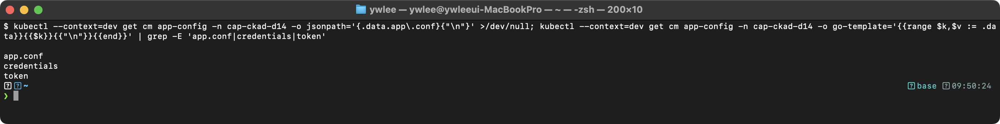

```bash
# ServiceAccount 토큰 만료 시간 확인
kubectl exec projected-pod -- cat /etc/config/token | cut -d'.' -f2 | base64 -d 2>/dev/null | python3 -m json.tool | grep exp
```

**내부 동작 원리:** Projected Volume은 여러 볼륨 소스(ConfigMap, Secret, ServiceAccount Token, Downward API)를 하나의 디렉토리에 통합 마운트한다. kubelet이 각 소스의 데이터를 수집하여 단일 볼륨으로 구성한다. ServiceAccount Token은 TokenRequest API를 통해 발급되며, expirationSeconds에 따라 만료 전에 kubelet이 자동으로 갱신한다.

**ServiceAccount 토큰 자동 갱신 메커니즘**

`serviceAccountToken` 소스의 토큰 갱신은 다음 단계로 진행된다.

1. **TokenRequest API**: kubelet은 Pod 생성 시 API Server의 `/apis/authentication.k8s.io/v1/serviceaccounts/<name>/token` 엔드포인트(TokenRequest API)를 호출해 단기 토큰을 발급받는다. 이 토큰은 `expirationSeconds` 만큼만 유효하며, 특정 `audience`(예: `api`)와 Pod에 바인딩된다.

2. **갱신 타이밍**: kubelet은 만료 시점보다 약 5분 전(또는 만료까지 남은 시간의 80%가 경과한 시점 중 더 이른 시점)에 TokenRequest API를 다시 호출해 새 토큰을 준비한다.

3. **atomic rename으로 파일 교체**: 새 토큰을 `/etc/config/..data_new` 같은 임시 경로에 쓴 뒤, symlink를 원자적으로(atomic rename) `..data` 로 교체한다. 파일시스템 상의 실제 구조는 다음과 같다.

```
/etc/config/
  token          → ..data/token        (symlink)
  ..data         → ..2026_06_13_00_00_00.1234567890  (symlink, atomic으로 교체)
  ..2026_06_13_00_00_00.1234567890/
    token        (실제 파일)
```

4. **Pod의 투명한 갱신**: 애플리케이션은 `token` symlink 경로가 바뀌는 것을 인식할 필요 없이, 다음 번 파일을 `open()`/`read()`하면 자동으로 새 토큰을 읽게 된다. 단, 토큰을 메모리에 한 번 읽고 캐시하는 앱은 갱신된 토큰을 얻지 못한다. 주기적으로 파일을 다시 읽도록 구현해야 한다.

이 구조는 기존 방식(`kubernetes.io/service-account-token` 타입 Secret에 영구 토큰 저장)의 한계를 개선한 것이다. 영구 토큰은 SA가 삭제되지 않는 한 만료되지 않아 탈취 시 위험이 컸다. Projected Volume의 단기 토큰은 `expirationSeconds` 이후 자동 만료되므로 피해 범위가 제한된다.

---

## 3. 실전 시험 문제 (12문제)

> **실습 전제**: `exam` 네임스페이스가 존재해야 한다. `kubectl create namespace exam --kubeconfig kubeconfig/dev.yaml`
> 이 섹션의 `기대 출력:` 블록은 예상 결과 텍스트다. CLAUDE.md §4① 규약에 따라 실제 터미널 스크린샷으로 교체가 필요하다(미캡처). 직접 실습 시 dev 클러스터에서 명령을 실행하고 출력을 눈으로 대조한다.

### 시험 환경 설정

CKAD 실기 시험 시작 직후 반드시 다음 셋업을 실행한다. 이 aliases 없이는 명령어 입력 속도가 현저히 떨어진다.

```bash
alias k=kubectl
export do='--dry-run=client -o yaml'
export KUBE_EDITOR=vi
```

설정 확인:
```bash
k version --client
k run test $do --image=nginx | head -5
```

이후 모든 문제 풀이에서 `k`는 `kubectl`의 alias, `$do`는 `--dry-run=client -o yaml`의 단축 표현으로 사용한다.

### 문제 1. ConfigMap 생성 (--from-literal)

다음 조건의 ConfigMap을 생성하라.

- 이름: `app-config`, 네임스페이스: `exam`
- DB_HOST=postgres, DB_PORT=5432, LOG_LEVEL=debug

<details><summary>풀이</summary>

```bash
kubectl create namespace exam
kubectl create configmap app-config \
  --from-literal=DB_HOST=postgres \
  --from-literal=DB_PORT=5432 \
  --from-literal=LOG_LEVEL=debug \
  -n exam
```

검증:
```bash
kubectl get configmap app-config -n exam -o yaml | grep -A 5 "^data:"
```

기대 출력:
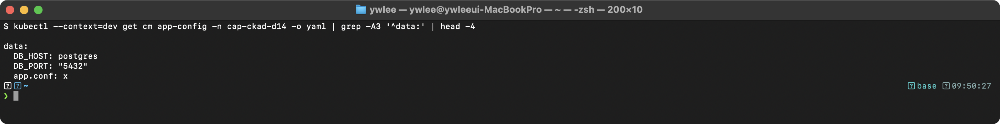

</details>

---

### 문제 2. ConfigMap 생성 (--from-file)

`/tmp/app.properties` 파일을 생성하고, 이를 ConfigMap으로 만들어라.

```
server.port=8080
server.host=0.0.0.0
app.name=myapp
```

<details><summary>풀이</summary>

```bash
cat > /tmp/app.properties << EOF
server.port=8080
server.host=0.0.0.0
app.name=myapp
EOF

kubectl create configmap app-properties \
  --from-file=/tmp/app.properties -n exam

# 확인
kubectl describe configmap app-properties -n exam
```

</details>

---

### 문제 3. ConfigMap을 환경 변수로 사용

`app-config` ConfigMap의 DB_HOST와 DB_PORT를 환경 변수로 사용하는 Pod를 생성하라.

- Pod 이름: `db-client`, 이미지: `busybox:1.36`, 명령: `env && sleep 3600`

<details><summary>풀이</summary>

```yaml
apiVersion: v1
kind: Pod
metadata:
  name: db-client
  namespace: exam
spec:
  containers:
    - name: app
      image: busybox:1.36
      command: ["sh", "-c", "env && sleep 3600"]
      env:
        - name: DB_HOST
          valueFrom:
            configMapKeyRef:
              name: app-config
              key: DB_HOST
        - name: DB_PORT
          valueFrom:
            configMapKeyRef:
              name: app-config
              key: DB_PORT
```

```bash
kubectl logs db-client -n exam | grep DB_
```

기대 출력:
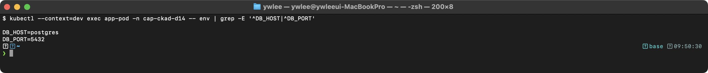

**왜 이 방법을 썼는가 — env vs envFrom vs volumeMount 선택 기준**

| 방법 | 언제 쓰는가 | 주의점 |
|:---|:---|:---|
| `env[].configMapKeyRef` (이 문제) | 특정 키만 선택해 이름을 바꾸거나, 다른 ConfigMap의 키와 혼합해야 할 때 | 키 하나하나를 명시해야 하므로 항목이 많으면 YAML이 길어짐 |
| `envFrom[].configMapRef` (문제 4) | ConfigMap의 모든 키를 한 번에 환경변수로 주입할 때 | 키 이름이 그대로 환경변수 이름이 됨. 충돌 주의 |
| `volumeMount` (문제 5) | 파일 형태로 설정을 읽어야 할 때(nginx.conf, application.yaml 등) | Pod 재시작 없이 최대 60초 후 자동 갱신됨(단, subPath는 예외) |

환경변수 방식(`env`/`envFrom`)은 Pod 시작 시 한 번만 주입되므로, ConfigMap을 변경해도 Pod를 재시작하기 전에는 반영되지 않는다.

</details>

---

### 문제 4. ConfigMap을 envFrom으로 사용

`app-config` 전체를 환경 변수로 주입하는 Pod를 생성하라.

- Pod 이름: `env-pod`, 이미지: `busybox:1.36`

<details><summary>풀이</summary>

```yaml
apiVersion: v1
kind: Pod
metadata:
  name: env-pod
  namespace: exam
spec:
  containers:
    - name: app
      image: busybox:1.36
      command: ["sh", "-c", "env | sort && sleep 3600"]
      envFrom:
        - configMapRef:
            name: app-config
```

```bash
kubectl logs env-pod -n exam | grep -E "DB_|LOG_"
```

기대 출력:
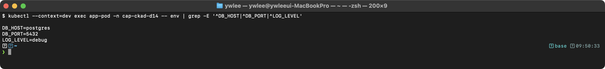

**왜 이 방법을 썼는가 — envFrom의 적합한 사용 시점**

`envFrom`은 ConfigMap의 모든 키를 한 번에 주입하므로, 키 목록이 자주 바뀌거나 많을 때 유리하다. 반면 키 이름이 그대로 환경변수 이름이 되기 때문에, 두 ConfigMap 간 키 이름이 충돌하면 나중 것이 앞의 것을 덮어쓴다(overwrite). 충돌 방지가 필요하면 `prefix` 옵션을 사용한다.

```yaml
envFrom:
  - configMapRef:
      name: app-config
    prefix: APP_    # 모든 키 앞에 APP_ 붙임 -> APP_DB_HOST, APP_LOG_LEVEL ...
```

</details>

---

### 문제 5. ConfigMap을 볼륨으로 마운트

`app-properties` ConfigMap을 `/etc/config` 디렉토리에 마운트하는 Pod를 생성하라.

- Pod 이름: `config-vol`, 이미지: `nginx:1.25`

<details><summary>풀이</summary>

```yaml
apiVersion: v1
kind: Pod
metadata:
  name: config-vol
  namespace: exam
spec:
  containers:
    - name: nginx
      image: nginx:1.25
      volumeMounts:
        - name: config
          mountPath: /etc/config
          readOnly: true
  volumes:
    - name: config
      configMap:
        name: app-properties
```

```bash
kubectl exec config-vol -n exam -- ls /etc/config/
```

기대 출력:
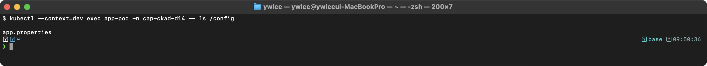

```bash
kubectl exec config-vol -n exam -- cat /etc/config/app.properties
```

기대 출력:
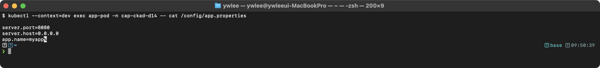

</details>

---

### Secret 개요 — 타입별 용도와 저장 메커니즘

**Secret의 etcd 저장 방식 — base64는 암호화가 아니다**

Secret의 `data` 필드 값은 base64 인코딩된 상태로 etcd에 저장된다. base64는 이진 데이터를 텍스트로 표현하는 인코딩 방식일 뿐, 암호화가 아니다. 즉, etcd에 직접 접근하거나 kubectl로 Secret을 조회하는 권한이 있으면 평문을 그대로 볼 수 있다.

Secret을 실질적으로 보호하는 수단은 두 가지다.

1. **RBAC**: Secret에 대한 `get`/`list`/`watch` 권한을 최소화한다.
2. **Encryption at Rest**: `kube-apiserver`의 `--encryption-provider-config` 옵션으로 etcd에 저장되는 Secret을 AES-CBC/AES-GCM/KMS로 암호화한다.

`data`와 `stringData`의 차이는 다음과 같다.

| 필드 | 값 형식 | 동작 |
|:---|:---|:---|
| `data` | base64 인코딩된 문자열 | 입력 그대로 etcd에 저장. `echo -n 'val' \| base64`로 직접 인코딩 필요 |
| `stringData` | 평문 문자열 | API Server가 저장 전에 자동으로 base64 인코딩. `kubectl get -o yaml` 시에는 `data`로 변환되어 표시 |

**Secret 타입별 용도**

| 타입 | kubectl 서브커맨드 | 용도 |
|:---|:---|:---|
| `Opaque` (generic) | `secret generic` | 임의 key-value. 가장 일반적 |
| `kubernetes.io/dockerconfigjson` | `secret docker-registry` | 프라이빗 컨테이너 레지스트리 인증. `imagePullSecrets`에서 사용 |
| `kubernetes.io/tls` | `secret tls` | TLS 인증서(`tls.crt`)와 개인키(`tls.key`). Ingress TLS 설정에 필수 |
| `kubernetes.io/service-account-token` | 자동 생성 | ServiceAccount 영구 토큰(K8s 1.24 이후 자동 생성 중단, Projected Volume의 단기 토큰 권장) |
| `kubernetes.io/basic-auth` | `secret generic` + 수동 타입 지정 | HTTP Basic 인증 자격증명(`username`, `password`) |
| `kubernetes.io/ssh-auth` | `secret generic` + 수동 타입 지정 | SSH 비공개 키(`ssh-privatekey`). Git SSH 연동 등에 사용 |

CKAD 시험에서 Ingress에 TLS를 적용하는 문제가 출제될 때는 `kubernetes.io/tls` 타입 Secret을 생성해야 한다.

```bash
# TLS Secret 생성 예시
kubectl create secret tls my-tls-secret \
  --cert=path/to/tls.crt \
  --key=path/to/tls.key \
  -n exam
```

---

### 문제 6. Secret 생성

다음 조건의 Secret을 생성하라.

- 이름: `db-creds`, 네임스페이스: `exam`
- username=admin, password=P@ssw0rd123

<details><summary>풀이</summary>

```bash
kubectl create secret generic db-creds \
  --from-literal=username=admin \
  --from-literal=password='P@ssw0rd123' \
  -n exam
```

검증:
```bash
kubectl get secret db-creds -n exam -o jsonpath='{.data.username}' | base64 -d; echo
```

기대 출력:
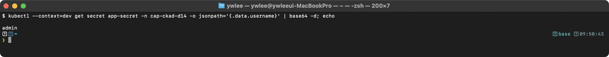

```bash
kubectl get secret db-creds -n exam -o jsonpath='{.data.password}' | base64 -d; echo
```

기대 출력:


</details>

---

### 문제 7. Secret을 환경 변수로 사용

`db-creds` Secret의 username과 password를 환경 변수로 사용하는 Pod를 생성하라.

- Pod 이름: `secret-env`, 이미지: `busybox:1.36`

<details><summary>풀이</summary>

```yaml
apiVersion: v1
kind: Pod
metadata:
  name: secret-env
  namespace: exam
spec:
  containers:
    - name: app
      image: busybox:1.36
      command: ["sh", "-c", "echo User=$DB_USER Pass=$DB_PASS && sleep 3600"]
      env:
        - name: DB_USER
          valueFrom:
            secretKeyRef:
              name: db-creds
              key: username
        - name: DB_PASS
          valueFrom:
            secretKeyRef:
              name: db-creds
              key: password
```

```bash
kubectl logs secret-env -n exam
```

기대 출력:
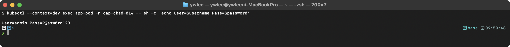

</details>

---

### 문제 8. Secret을 볼륨으로 마운트

`db-creds` Secret을 `/etc/secrets` 디렉토리에 읽기 전용으로 마운트하고, 파일 권한을 0400으로 설정하라.

- Pod 이름: `secret-vol`, 이미지: `busybox:1.36`

<details><summary>풀이</summary>

```yaml
apiVersion: v1
kind: Pod
metadata:
  name: secret-vol
  namespace: exam
spec:
  containers:
    - name: app
      image: busybox:1.36
      command: ["sh", "-c", "ls -la /etc/secrets/ && sleep 3600"]
      volumeMounts:
        - name: secret-volume
          mountPath: /etc/secrets
          readOnly: true
  volumes:
    - name: secret-volume
      secret:
        secretName: db-creds
        defaultMode: 0400
```

```bash
kubectl exec secret-vol -n exam -- ls -la /etc/secrets/
```

기대 출력:
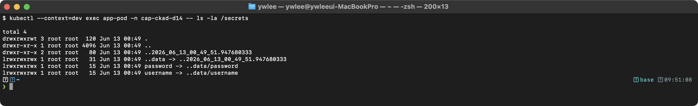

```bash
kubectl exec secret-vol -n exam -- cat /etc/secrets/username
```

기대 출력:
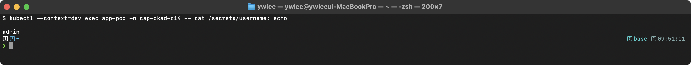

```bash
# 파일 권한 확인 (defaultMode: 0400)
kubectl exec secret-vol -n exam -- stat -c '%a' /etc/secrets/..data/username
```

기대 출력:
> (미캡처 — 추후 실측 캡처 예정: stat 명령 결과 — 파일 권한 비트 400 출력)

> **설명:** `stat -c '%a'`는 파일 권한 비트를 8진수 숫자로 출력한다. `400`은 HTTP 상태 코드가 아니라 Unix 파일 권한(소유자 읽기 전용, 그룹/기타 접근 불가)을 의미한다. `defaultMode: 0400`으로 설정했으므로 이 값이 출력되면 정상이다.

</details>

---

### 문제 9. Docker Registry Secret

프라이빗 레지스트리 `registry.example.com`에 접근하기 위한 Secret을 생성하고, Pod에서 사용하라.

- Secret 이름: `reg-cred`
- 사용자: `deployer`, 비밀번호: `deploy123`

<details><summary>풀이</summary>

```bash
kubectl create secret docker-registry reg-cred \
  --docker-server=registry.example.com \
  --docker-username=deployer \
  --docker-password=deploy123 \
  -n exam
```

```bash
# Secret 타입 검증
kubectl get secret reg-cred -n exam -o jsonpath='{.type}'
# 기대: kubernetes.io/dockerconfigjson

kubectl describe secret reg-cred -n exam
# .dockerconfigjson 키가 존재하고 크기(bytes)가 0이 아닌지 확인한다
```

기대 출력:
> (미캡처 — 추후 실측 캡처 예정: reg-cred Secret 타입 및 describe 결과)

```yaml
apiVersion: v1
kind: Pod
metadata:
  name: private-app
  namespace: exam
spec:
  containers:
    - name: app
      image: registry.example.com/myapp:v1.0
  imagePullSecrets:
    - name: reg-cred
```

> **주의:** `registry.example.com`은 실제 존재하지 않는 레지스트리이므로 Pod를 apply하면 `ImagePullBackOff`가 발생한다. Secret 자체의 생성·타입은 위 검증 명령으로 확인한다. 실제 레지스트리 없이 Pod 기동 재현은 불가하다.

</details>

---

### 문제 10. ConfigMap + Secret 조합

ConfigMap `app-config`와 Secret `db-creds`를 모두 사용하는 Pod를 생성하라.

- Pod 이름: `combo-pod`, 이미지: `busybox:1.36`
- ConfigMap은 envFrom으로, Secret은 개별 env로 사용

<details><summary>풀이</summary>

```yaml
apiVersion: v1
kind: Pod
metadata:
  name: combo-pod
  namespace: exam
spec:
  containers:
    - name: app
      image: busybox:1.36
      command: ["sh", "-c", "env | sort && sleep 3600"]
      envFrom:
        - configMapRef:
            name: app-config
      env:
        - name: DB_USER
          valueFrom:
            secretKeyRef:
              name: db-creds
              key: username
        - name: DB_PASS
          valueFrom:
            secretKeyRef:
              name: db-creds
              key: password
```

```bash
kubectl logs combo-pod -n exam | grep -E "DB_|LOG_"
```

기대 출력:
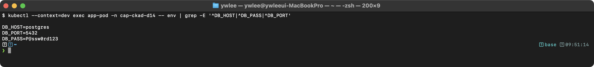

</details>

---

### 문제 11. Immutable ConfigMap

불변 ConfigMap을 생성하라.

- 이름: `static-config`, 값: APP_MODE=production

<details><summary>풀이</summary>

```yaml
apiVersion: v1
kind: ConfigMap
metadata:
  name: static-config
  namespace: exam
data:
  APP_MODE: production
immutable: true
```

```bash
kubectl apply -f static-config.yaml -n exam
```

검증:
```bash
kubectl get configmap static-config -n exam -o jsonpath='{.immutable}'
```

기대 출력:
> (미캡처 — 추후 실측 캡처 예정: jsonpath immutable 필드 — true 출력)

> `kubectl get configmap static-config -n exam -o jsonpath='{.immutable}'` 는 `true`를 출력한다. 이 명령만으로 immutable 여부를 스크립트에서 검사할 수 있다.

```bash
# 수정 시도 -> 실패
kubectl edit configmap static-config -n exam
```

기대 출력:
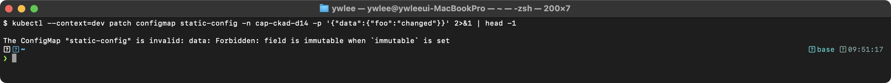

</details>

---

### 문제 12. Secret 값 디코딩

Secret `db-creds`의 password를 디코딩하여 `/tmp/db-password.txt`에 저장하라.

<details><summary>풀이</summary>

```bash
kubectl get secret db-creds -n exam \
  -o jsonpath='{.data.password}' | base64 -d > /tmp/db-password.txt

cat /tmp/db-password.txt
```

기대 출력:
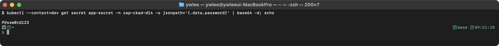

</details>

---

## 4. 트러블슈팅

### 장애 시나리오 1: ConfigMap 업데이트 후 앱에 반영되지 않음

```bash
# 증상: ConfigMap을 수정했지만 앱이 이전 설정으로 동작
kubectl edit configmap app-config
# data.LOG_LEVEL을 info -> debug로 변경

# 디버깅: 환경변수 방식인지 볼륨 방식인지 확인
kubectl get pod app-pod -o yaml | grep -A 5 "envFrom\|configMapKeyRef\|configMap:"

# 원인별 해결:
# 1. env/envFrom 방식 -> Pod 재시작 필요 (환경변수는 컨테이너 시작 시 한 번만 주입)
kubectl rollout restart deployment/app-deploy

# 2. volume 마운트 (일반) -> 최대 60초 후 자동 반영, 앱이 파일 변경을 watch하지 않으면 재시작 필요

# 3. subPath 마운트 -> Pod 재시작 필요 (자동 갱신 불가)
```

### 장애 시나리오 2: Projected Volume에서 권한 에러

```bash
# 증상: 앱이 /etc/config/credentials 파일을 읽지 못함
kubectl logs projected-pod
# Permission denied: /etc/config/credentials

# 디버깅
kubectl exec projected-pod -- ls -la /etc/config/
kubectl exec projected-pod -- id    # 앱이 실행되는 UID 확인

# 해결: defaultMode로 파일 권한을 조정
# projected volume의 각 source에 mode를 지정할 수 있다
```

Projected Volume에서는 각 소스별로 `items[].mode`를 지정해 파일 권한을 개별적으로 제어할 수 있다.

```yaml
volumes:
  - name: all-config
    projected:
      defaultMode: 0644          # 소스별 mode가 없으면 이 값이 기본 적용
      sources:
        - configMap:
            name: app-config
            items:
              - key: app.conf
                path: app.conf
                mode: 0644       # ConfigMap 파일: 모든 사용자 읽기 허용
        - secret:
            name: app-secret
            items:
              - key: credentials
                path: credentials
                mode: 0400       # Secret 파일: 소유자만 읽기 허용 (보안 강화)
```

mode 값은 8진수(octal)로 지정한다. `0400`은 소유자 읽기 전용, `0644`는 소유자 읽기/쓰기 + 그룹/기타 읽기 전용을 의미한다. 컨테이너 내 프로세스의 UID가 파일 소유자(보통 root)와 다를 경우, `securityContext.runAsUser` 또는 `securityContext.fsGroup`을 함께 설정해야 파일에 접근할 수 있다.

### 장애 시나리오 3: Immutable ConfigMap 변경 불가

```bash
# 증상: 설정을 변경해야 하는데 immutable: true로 막혀 있음
kubectl edit configmap static-config
# error: configmaps "static-config" is immutable

# 해결: 새 이름의 ConfigMap 생성 후 Pod spec 업데이트
kubectl create configmap static-config-v2 --from-literal=APP_MODE=staging
# Deployment의 ConfigMap 참조를 static-config-v2로 변경
kubectl set env deployment/app-deploy --from=configmap/static-config-v2

# 또는: 삭제 후 재생성 (Pod에 일시적으로 영향)
kubectl delete configmap static-config
kubectl create configmap static-config --from-literal=APP_MODE=staging
```

---

## 5. 자주 하는 실수와 주의사항

### 실수 1: Secret의 data에 평문 입력

```yaml
# 잘못된 예: data에 평문 입력 -> 에러 또는 잘못된 값
apiVersion: v1
kind: Secret
data:
  password: mypassword       # Base64가 아님! 에러 발생

# 올바른 예 1: data에 Base64 인코딩 값
data:
  password: bXlwYXNzd29yZA==  # echo -n 'mypassword' | base64

# 올바른 예 2: stringData에 평문
stringData:
  password: mypassword        # 자동 Base64 인코딩
```

### 실수 2: ConfigMap/Secret 이름 오타

```yaml
# Pod에서 존재하지 않는 ConfigMap 참조 -> Pod 시작 실패
env:
  - name: DB_HOST
    valueFrom:
      configMapKeyRef:
        name: app-confg       # 오타! 'app-config'여야 함
        key: DB_HOST
# Error: configmaps "app-confg" not found

# 해결: optional: true 설정 (없어도 Pod 시작 가능)
env:
  - name: DB_HOST
    valueFrom:
      configMapKeyRef:
        name: app-config
        key: DB_HOST
        optional: true         # ConfigMap이 없어도 Pod 시작
```

### 실수 3: subPath 사용 시 자동 갱신 기대

```yaml
# subPath로 마운트하면 ConfigMap 업데이트가 반영되지 않음!
volumeMounts:
  - name: config
    mountPath: /etc/nginx/conf.d/custom.conf
    subPath: custom.conf       # 자동 갱신 안 됨

# 해결: 디렉토리 전체 마운트 (자동 갱신) 또는 Pod 재시작
volumeMounts:
  - name: config
    mountPath: /etc/nginx/custom-conf.d  # 별도 디렉토리에 마운트
```

### 실수 4: Base64 인코딩 시 줄바꿈 포함

```bash
# 잘못된 예: echo는 기본적으로 줄바꿈(\n) 추가
echo 'admin' | base64
# YWRtaW4K          <- 마지막에 \n 포함!

# 올바른 예: echo -n으로 줄바꿈 제거
echo -n 'admin' | base64
# YWRtaW4=          <- 정확한 인코딩
```

**멀티라인 데이터(예: nginx.conf, TLS 인증서)를 Secret에 넣는 방법**

줄바꿈이 포함된 파일 내용을 Secret에 저장해야 할 때는 `stringData`의 YAML block scalar(`|`)를 사용하면 base64 변환 없이 평문 그대로 작성할 수 있다.

```yaml
apiVersion: v1
kind: Secret
metadata:
  name: nginx-conf-secret
type: Opaque
stringData:
  nginx.conf: |
    server {
        listen 80;
        location /health {
            return 200 'ok';
        }
    }
  app.properties: |
    server.port=8080
    app.name=myapp
```

`|`(literal block scalar)는 줄바꿈을 그대로 유지한다. `|-`는 마지막 줄바꿈을 제거한다. 이 방식으로 생성하면 API Server가 저장 시 자동으로 base64 인코딩하므로 `echo -n ... | base64` 과정이 필요 없다.

---

## 6. kubectl 참고 명령

```bash
# ConfigMap 관련
kubectl create configmap <name> --from-literal=key=value
kubectl create configmap <name> --from-file=file.conf
kubectl create configmap <name> --from-env-file=app.env
kubectl get configmap <name> -o yaml
kubectl describe configmap <name>
kubectl edit configmap <name>
kubectl delete configmap <name>

# Secret 관련
kubectl create secret generic <name> --from-literal=key=value
kubectl create secret docker-registry <name> --docker-server=... --docker-username=... --docker-password=...
kubectl create secret tls <name> --cert=cert.pem --key=key.pem
kubectl get secret <name> -o yaml
kubectl get secret <name> -o jsonpath='{.data.key}' | base64 -d
kubectl describe secret <name>
kubectl delete secret <name>
```

---

## 7. 복습 체크리스트

- [ ] Immutable ConfigMap/Secret의 장점과 제한을 안다

<details><summary>정답</summary>

장점: kubelet이 WATCH 등록을 하지 않아 API Server 부하 감소, 의도치 않은 변경 방지, 변경 이력 자동 생성.
제한: `immutable: true` 설정 후 data 수정 불가. 변경하려면 삭제 후 재생성 또는 새 이름으로 새 ConfigMap 생성 후 Pod spec 업데이트 필요.

</details>

- [ ] ConfigMap + Secret 조합 패턴을 사용할 수 있다

<details><summary>정답</summary>

비밀이 아닌 설정(DB_HOST, LOG_LEVEL 등)은 ConfigMap, 민감 데이터(DB_PASSWORD, API_KEY 등)는 Secret으로 분리한다. Pod spec에서 `configMapKeyRef`와 `secretKeyRef`를 혼합해 사용한다. `envFrom`으로 ConfigMap 전체를 주입하고 개별 Secret 키를 `env`로 추가하는 패턴도 자주 쓰인다.

</details>

- [ ] nginx 설정을 ConfigMap으로 관리할 수 있다

<details><summary>정답</summary>

ConfigMap `data`에 `default.conf` 키로 nginx 설정 파일 내용을 저장하고, `/etc/nginx/conf.d`에 마운트한다. nginx는 이 디렉터리의 `*.conf`를 자동으로 로드한다. ConfigMap 변경 시 Pod 자동 재시작이 필요하면 Deployment annotation 변경을 통한 롤링 업데이트를 유도한다.

</details>

- [ ] Projected Volume으로 여러 소스를 통합 마운트할 수 있다

<details><summary>정답</summary>

`projected` 볼륨 타입에 `sources` 아래 `configMap`, `secret`, `serviceAccountToken`, `downwardAPI`를 나열하면 하나의 디렉터리에 모두 마운트된다. ServiceAccount 토큰은 `expirationSeconds` 설정 시 kubelet이 TokenRequest API를 통해 자동 갱신하며, symlink atomic rename 구조로 애플리케이션이 투명하게 새 토큰을 읽는다.

</details>

- [ ] Secret의 data(Base64)와 stringData(평문) 차이를 안다

<details><summary>정답</summary>

`data`: base64 인코딩된 값을 직접 입력해야 한다(`echo -n 'val' | base64`). `stringData`: 평문을 입력하면 API Server가 저장 시 자동 base64 인코딩한다. 두 필드를 동시에 사용하면 `stringData`가 `data`를 덮어쓴다. `kubectl get -o yaml`로 조회하면 항상 `data`(base64) 형태로 표시된다. base64는 암호화가 아닌 인코딩이므로 RBAC과 Encryption at Rest로 별도 보호해야 한다.

</details>

- [ ] `echo -n`으로 Base64 인코딩 시 줄바꿈을 제거해야 하는 이유를 안다

<details><summary>정답</summary>

`echo 'admin'`은 문자열 끝에 줄바꿈(`\n`)을 추가한다. base64 인코딩 결과에 `\n`이 포함되면 Secret을 디코딩했을 때 값 뒤에 개행 문자가 붙어 비교 실패나 인증 오류가 발생한다. `echo -n`은 줄바꿈 없이 문자열만 출력하므로 정확한 인코딩 결과를 얻는다.

</details>

- [ ] ConfigMap/Secret 관련 실전 문제를 시간 내에 풀 수 있다

<details><summary>정답</summary>

CKAD 시험 기준으로 ConfigMap/Secret 문제는 각 2~3분 내에 풀어야 한다. 명령형 방식(`kubectl create configmap/secret ... --from-literal`)을 우선 사용하고, 볼륨 마운트가 필요한 경우에만 `--dry-run=client -o yaml > x.yaml` 후 편집·적용한다.

</details>

---

## tart-infra 실습

**실습 전제 조건**

이 실습은 다음 환경이 갖춰진 상태에서 실행한다.

- **클러스터 가동**: `dev` 클러스터가 실행 중이어야 한다. 가동 명령: `./scripts/boot.sh dev`
- **kubeconfig 경로**: `kubeconfig/dev.yaml`
- **IP 드리프트 복구**: 재부팅 후 처음 실습하는 경우 `./scripts/fix-cluster-ip-drift.sh dev`를 실행한 뒤 진행한다.
- **SSH 노드 접근**: `ssh dev-master`(또는 `ssh staging-master`)로 노드에 직접 접속 가능해야 한다.
- **선행 네임스페이스**: 실습 1~3은 `demo` 네임스페이스를 사용한다. 없으면 `kubectl create namespace demo --kubeconfig kubeconfig/dev.yaml`으로 미리 생성한다.
- **파괴 실습 클러스터**: 이 실습은 `dev` 또는 `staging`에서만 수행한다. `platform`/`prod` 클러스터에서 설정 변경 금지.

### 실습 환경 설정

```bash
export KUBECONFIG=kubeconfig/dev.yaml
kubectl get nodes
```

### 실습 1: ConfigMap 확인

```bash
# 클러스터의 ConfigMap 확인
kubectl get configmap -n demo
kubectl describe configmap -n demo

# kube-system의 ConfigMap (coredns 등)
kubectl get configmap -n kube-system
kubectl describe configmap coredns -n kube-system
```

### 실습 2: Secret 확인

```bash
# 클러스터의 Secret 확인
kubectl get secret -n demo
kubectl get secret -n demo -o yaml

# Secret 타입 확인
kubectl get secret -A -o jsonpath='{range .items[*]}{.metadata.namespace}{"\t"}{.metadata.name}{"\t"}{.type}{"\n"}{end}' | head -20

# ServiceAccount Token Secret 확인
kubectl get secret -n kube-system | grep service-account
```

### 실습 3: ConfigMap 생성 및 사용 실습

```bash
# ConfigMap 생성
kubectl create configmap test-config \
  --from-literal=ENV=dev \
  --from-literal=DEBUG=true \
  -n demo

# Pod에서 사용
kubectl run test-cm --image=busybox:1.36 -n demo \
  --command -- sh -c "echo \$ENV \$DEBUG && sleep 3600" \
  --overrides='{
    "spec": {
      "containers": [{
        "name": "test-cm",
        "image": "busybox:1.36",
        "command": ["sh","-c","env | grep -E \"ENV|DEBUG\" && sleep 3600"],
        "envFrom": [{"configMapRef": {"name": "test-config"}}]
      }]
    }
  }'

# 로그 확인
kubectl logs test-cm -n demo

# 정리
kubectl delete pod test-cm -n demo
kubectl delete configmap test-config -n demo
```

---

## 8. 직접 해보기 (시험형 미니랩)

> 목표: 각 문제를 **3분 이내**에 풀어낸다. 명령형 방식(`kubectl create configmap/secret ... --from-literal`)을 우선 사용한다. 타이머를 켜고 시작한다.

### 미니랩 A — ConfigMap 볼륨 마운트 + 확인 (목표: 3분)

`exam` 네임스페이스에 다음을 수행하라.

1. `--from-literal`로 `key=MINI_LAB, value=day14`인 ConfigMap `mini-config`를 생성한다.
2. `nginx:1.25` 이미지로 Pod `mini-pod`를 생성한다. `mini-config`를 `/etc/mini` 에 마운트한다.
3. Pod 안에서 `/etc/mini/key` 파일 내용을 확인한다.

<details><summary>풀이</summary>

```bash
kubectl create configmap mini-config --from-literal=key=day14 -n exam

kubectl run mini-pod --image=nginx:1.25 -n exam --dry-run=client -o yaml > /tmp/mini-pod.yaml
```

생성된 YAML에 다음 볼륨/마운트 필드를 추가한 뒤 적용한다.

```yaml
# /tmp/mini-pod.yaml 의 spec 하위에 추가
      volumeMounts:
        - name: mini-vol
          mountPath: /etc/mini
          readOnly: true
  volumes:
    - name: mini-vol
      configMap:
        name: mini-config
```

```bash
kubectl apply -f /tmp/mini-pod.yaml
kubectl exec mini-pod -n exam -- cat /etc/mini/key
# 기대: day14
```

</details>

### 미니랩 B — Secret 환경 변수 주입 + Immutable ConfigMap (목표: 3분)

1. `exam` 네임스페이스에 Secret `mini-secret`(`token=abc123`)을 생성한다.
2. `mini-secret`의 `token`을 환경 변수 `TOKEN`으로 주입하는 Pod `mini-sec`(`busybox:1.36`, `sh -c "echo $TOKEN && sleep 3600"`)를 생성한다.
3. `immutable: true` ConfigMap `mini-immutable`(`MODE=prod`)을 생성하고, 수정 시도 시 오류가 발생하는지 확인한다.

<details><summary>풀이</summary>

```bash
kubectl create secret generic mini-secret --from-literal=token=abc123 -n exam

kubectl run mini-sec --image=busybox:1.36 -n exam \
  --command -- sh -c 'echo $TOKEN && sleep 3600' \
  --dry-run=client -o yaml > /tmp/mini-sec.yaml
```

`/tmp/mini-sec.yaml`의 `spec.containers[0]` 아래 `env` 블록을 다음과 같이 추가한다.

```yaml
      env:
        - name: TOKEN
          valueFrom:
            secretKeyRef:
              name: mini-secret
              key: token
```

들여쓰기는 `command` 필드와 같은 수준(공백 8칸)이어야 한다. 편집 후 적용한다.

```bash
kubectl apply -f /tmp/mini-sec.yaml
kubectl logs mini-sec -n exam
# 기대: abc123

kubectl create configmap mini-immutable --from-literal=MODE=prod -n exam
kubectl patch configmap mini-immutable -n exam --type merge -p '{"immutable": true}'
kubectl edit configmap mini-immutable -n exam
# 기대 오류: configmaps "mini-immutable" is immutable
```

</details>

---

## ✅ 자가점검

<details>
<summary>1. Secret의 data와 stringData의 차이는?</summary>

`data`는 **base64 인코딩된 값**을 넣는다. `stringData`는 **평문**을 넣으면 apply 시 자동으로 base64 인코딩되어 `data`로 저장된다(쓰기 편의용, 조회 시엔 `data`로만 보인다). 둘 다 있고 같은 키면 `stringData`가 우선한다.
</details>

<details>
<summary>2. immutable: true인 ConfigMap/Secret을 수정하려면?</summary>

수정할 수 없다(`kubectl edit`/`patch` 거부). **새 이름으로 재생성**하고 이를 참조하는 Deployment의 `volumes[].configMap.name`/`secretName`을 바꿔 롤아웃한다. immutable은 대규모 클러스터에서 watch 부하를 줄이고 실수 변경을 막는다.
</details>

<details>
<summary>3. subPath로 마운트한 ConfigMap은 업데이트가 자동 반영되나?</summary>

**반영되지 않는다.** 일반 볼륨 마운트는 ConfigMap 변경이 (kubelet 동기화 주기 후) 자동 반영되지만, **`subPath` 마운트는 자동 갱신되지 않는다**. 갱신하려면 Pod를 재시작해야 한다. 시험 함정으로 자주 나온다.
</details>

<details>
<summary>4. Projected volume이란 무엇인가?</summary>

여러 소스(Secret·ConfigMap·downwardAPI·serviceAccountToken)를 **하나의 디렉터리로 합쳐 마운트**하는 볼륨이다. 예: 토큰 + CA + 설정을 한 경로에 모아 주입. `serviceAccountToken` projected source는 만료·audience 지정이 가능한 단명 토큰을 제공한다.
</details>

<details>
<summary>5. kubernetes.io/dockerconfigjson 타입 Secret의 용도는?</summary>

프라이빗 레지스트리 **이미지 풀 인증**(imagePullSecrets)에 쓴다. `kubectl create secret docker-registry`로 만들며, Pod/ServiceAccount의 `imagePullSecrets`에 연결한다. 일반 `Opaque`와 타입이 다르므로 타입을 정확히 지정해야 한다.
</details>

## 9. 시험 팁

- **명령형 우선**: `kubectl create configmap <name> --from-literal=K=V` 는 선언형 YAML보다 2~3배 빠르다. 볼륨 마운트가 필요한 경우에만 `--dry-run=client -o yaml > x.yaml` 후 편집한다.
- **Secret 디코딩 한 줄**: `kubectl get secret <name> -o jsonpath='{.data.<key>}' | base64 -d` 패턴을 암기한다. 시험에서 "Secret 값을 파일에 저장하라"는 문제가 자주 출제된다.
- **immutable 변경 불가**: `immutable: true`인 ConfigMap/Secret은 `kubectl edit`·`kubectl patch`로 data를 변경할 수 없다. 시험에서 이 오류가 나오면 새 이름으로 ConfigMap을 재생성하고 Deployment의 `volumes[].configMap.name`을 수정한다.
- **envFrom vs env**: `envFrom`으로 ConfigMap 전체를 주입할 때 키 이름 충돌에 주의한다. 명시적으로 키를 선택해야 한다면 `env[].valueFrom.configMapKeyRef`를 사용한다.

---

## 10. 더 읽을거리

- [Kubernetes 공식 문서 — ConfigMaps](https://kubernetes.io/docs/concepts/configuration/configmap/)
- [Kubernetes 공식 문서 — Secrets](https://kubernetes.io/docs/concepts/configuration/secret/)
- [Kubernetes 공식 문서 — Projected Volumes](https://kubernetes.io/docs/concepts/storage/projected-volumes/)
- [Kubernetes 공식 문서 — Immutable ConfigMaps](https://kubernetes.io/docs/concepts/configuration/configmap/#configmap-immutable)
- [Kubernetes Enhancement Proposal #1984 — Immutable Secrets and ConfigMaps](https://github.com/kubernetes/enhancements/tree/master/keps/sig-apps/1984-immutable-secrets-and-configmaps)
