# CKS 핵심 개념 정리

> 학습 목표: CKS 6개 도메인의 핵심 개념과 실습 패턴을 이 문서만으로 이해·재현한다 | 도메인·비중: Cluster Setup 10% · Cluster Hardening 15% · System Hardening 15% · Minimize Microservice Vulnerabilities 20% · Supply Chain Security 20% · Monitoring·Logging·Runtime Security 20% | 예상 소요: 통독 4~5시간(실습 별도)

CKS 시험의 6개 도메인에 해당하는 모든 핵심 개념을 정리한 문서이다. 각 도메인의 출제 비율과 세부 토픽을 체계적으로 다룬다. CKS는 쿠버네티스 자격증 중 가장 어려운 실기 시험으로, 보안 도구 생태계에 대한 깊이 있는 이해가 필수적이다. 선수과목은 CKA이며, RBAC·스케줄링·etcd 등 CKA 개념을 전제한다.

## 실습 전 필수 셋업

CKS는 제한 시간(120분) 안에 15~20문제를 푸는 속도전이다. 매 문제 `kubectl`을 그대로 치면 시간이 부족하므로, 시험 시작 직후 다음 단축 설정을 한 번 잡아 두고 시작한다. (아래는 입력 명령 예시이며, 시험 환경의 bash에 그대로 붙여 넣는다.)

```bash
# kubectl 단축 alias
alias k=kubectl
# 매니페스트 골격을 빠르게 뽑는 dry-run 옵션
export do='--dry-run=client -o yaml'
# 삭제 즉시 적용(graceful 대기 생략)
export now='--force --grace-period=0'
# k 에도 bash 자동완성 적용
source <(kubectl completion bash)
complete -o default -F __start_kubectl k
```

이 문서의 실습 명령은 이 저장소의 tart 클러스터에서 검증한다. kubeconfig 경로는 `~/sideproejct/IaC_apple_sillicon/kubeconfig/<클러스터>.yaml`이며, CKS 파괴 실습은 dev/staging 클러스터에서만 한다(platform/prod 금지). 노드에 SSH로 들어가는 실습(AppArmor·seccomp·Falco 등)은 VM 별칭(예: `ssh dev-master`)으로 접속한다(`~/.ssh/config`에 등록된 별칭, 비밀번호 없이 접속).

---

## 1. Cluster Setup (10%)

클러스터의 기본 보안 설정을 다루는 도메인이다. 출제 비율은 낮지만, 기본적인 내용이므로 반드시 득점해야 하는 영역이다.

### 1.1 NetworkPolicy로 클러스터 접근 제어

NetworkPolicy는 Pod 간 네트워크 트래픽을 제어하는 쿠버네티스 리소스이다. CKS에서 가장 빈번하게 출제되는 주제 중 하나이다.

**등장 배경: flat 네트워크의 위협과 직전 해결책의 한계:**

쿠버네티스의 기본 네트워크 모델은 "모든 Pod가 NAT 없이 서로 직접 통신할 수 있다"는 flat 네트워크다(같은 클러스터의 어떤 Pod든 다른 Pod의 IP로 곧장 패킷을 보낼 수 있다). 이 모델은 개발 편의는 높지만 보안 관점에서는 위협이다. 프런트엔드 Pod 하나가 침해되면, 공격자는 그 Pod에서 데이터베이스 Pod·내부 관리 API 등 클러스터 안의 모든 Pod로 자유롭게 횡적 이동(lateral movement)할 수 있다. 즉 침해 1건이 클러스터 전체로 번진다. NetworkPolicy가 없던 시절의 직전 해결책은 노드마다 관리자가 iptables 규칙을 손으로 작성해 트래픽을 막는 것이었는데, Pod IP가 스케줄링·재시작마다 바뀌고 노드가 수십 대로 늘면 규칙을 사람이 일관되게 유지하기가 사실상 불가능했다. NetworkPolicy는 이 문제를 "Pod를 IP가 아니라 라벨로 지목하고, 허용 규칙을 선언적 매니페스트로 적으면 CNI가 각 노드에 자동 반영"하는 방식으로 해결한다.

**동작 원리:**

NetworkPolicy는 CNI 플러그인(Calico, Cilium 등)이 실제 구현을 담당한다. API server는 NetworkPolicy 오브젝트를 etcd에 저장하고, CNI 플러그인의 컨트롤러가 이를 watch하여 각 노드의 iptables 또는 eBPF 맵에 패킷 필터링 규칙을 삽입한다. Calico의 경우 Felix 에이전트가 iptables 체인을 구성하고, Cilium의 경우 eBPF 프로그램을 veth 인터페이스에 attach하여 커널 레벨에서 패킷을 필터링한다. Flannel은 순수 overlay 네트워크만 제공하므로 NetworkPolicy를 지원하지 않는다.

**핵심 개념:**
- NetworkPolicy는 네임스페이스 단위로 적용된다
- NetworkPolicy가 없으면 모든 트래픽이 허용된다 (default allow all)
- NetworkPolicy가 하나라도 적용되면, 해당 정책에 명시되지 않은 트래픽은 차단된다
- `podSelector: {}`는 해당 네임스페이스의 모든 Pod를 선택한다
- Ingress(인바운드)와 Egress(아웃바운드)를 각각 또는 동시에 제어할 수 있다

**NetworkPolicy 구성 요소:**
- `spec.podSelector`: 정책이 적용될 대상 Pod를 라벨로 선택한다
- `spec.policyTypes`: Ingress, Egress, 또는 둘 다 지정한다
- `spec.ingress`: 허용할 인바운드 트래픽 소스를 정의한다
- `spec.egress`: 허용할 아웃바운드 트래픽 대상을 정의한다
- `from`/`to` 내에 `podSelector`, `namespaceSelector`, `ipBlock`을 사용할 수 있다

**주의 사항:**
- NetworkPolicy는 CNI 플러그인이 지원해야 동작한다 (Calico, Cilium, Weave Net 등)
- Flannel은 NetworkPolicy를 지원하지 않는다
- `namespaceSelector`와 `podSelector`를 같은 `from` 항목에 넣으면 AND 조건이다
- 별도의 `from` 항목으로 분리하면 OR 조건이다

**Default Deny All 전략:**
- 보안의 기본 원칙은 "기본 차단, 필요한 것만 허용"이다
- 모든 네임스페이스에 default deny all ingress/egress 정책을 먼저 적용하고, 필요한 트래픽만 개별적으로 허용하는 것이 권장된다
- DNS(포트 53) 트래픽을 허용하지 않으면 서비스 디스커버리가 작동하지 않으므로 주의해야 한다

**Default Deny All 정책 예시:**
```yaml
apiVersion: networking.k8s.io/v1
kind: NetworkPolicy
metadata:
  name: default-deny-all
  namespace: secure-ns
spec:
  podSelector: {}
  policyTypes:
  - Ingress
  - Egress
```

**DNS 트래픽 허용 정책:**
```yaml
apiVersion: networking.k8s.io/v1
kind: NetworkPolicy
metadata:
  name: allow-dns
  namespace: secure-ns
spec:
  podSelector: {}
  policyTypes:
  - Egress
  egress:
  - to:
    - namespaceSelector: {}
    ports:
    - protocol: UDP
      port: 53
    - protocol: TCP
      port: 53
```

**실습 검증: NetworkPolicy의 누적(AND) 효과 단계별 확인**

전제 조건: CKS 파괴 실습은 dev/staging 클러스터에서만 수행한다(§3 표). NetworkPolicy를 실제로 강제하는 CNI(Calico/Cilium)가 깔린 클러스터여야 하며, 이 저장소의 dev/staging은 Cilium을 사용하므로 적합하다. 명령에는 항상 대상 클러스터의 kubeconfig(`~/sideproejct/IaC_apple_sillicon/kubeconfig/dev.yaml`)와 네임스페이스를 명시한다.

NetworkPolicy는 "여러 정책의 허용 규칙이 합집합(OR)으로 누적되지만, 한 Pod에 Egress 정책이 하나라도 걸리면 명시되지 않은 모든 아웃바운드는 차단(default deny)"되는 구조이다. 이 때문에 default deny를 건 뒤에는 DNS와 목적지 포트를 각각 허용해 줘야 통신이 복구된다. 아래 흐름으로 이 누적 효과를 단계적으로 검증한다.

```bash
# 별칭 가정: k=kubectl, 모든 명령에 --kubeconfig 와 -n netpol-test 명시
KC=~/sideproejct/IaC_apple_sillicon/kubeconfig/dev.yaml

# 1. 테스트 네임스페이스와 server Pod 생성 (선행 리소스)
kubectl --kubeconfig=$KC create namespace netpol-test
kubectl --kubeconfig=$KC -n netpol-test run server --image=nginx --port=80
kubectl --kubeconfig=$KC -n netpol-test expose pod server --port=80
kubectl --kubeconfig=$KC -n netpol-test wait --for=condition=Ready pod/server --timeout=60s

# 2. 정책 적용 전: 통신 가능 확인 (DNS 해석 + HTTP 모두 성공해야 함)
kubectl --kubeconfig=$KC -n netpol-test run client --rm -it --image=busybox --restart=Never -- wget -qO- --timeout=3 http://server

# 3. default deny all 정책 적용
kubectl --kubeconfig=$KC apply -f default-deny-all.yaml

# 4. 정책 적용 후: 통신 차단 확인 (DNS 조차 막혀 server 이름 해석 실패)
kubectl --kubeconfig=$KC -n netpol-test run client --rm -it --image=busybox --restart=Never -- wget -qO- --timeout=3 http://server

# 5. DNS 트래픽 허용 정책 추가 적용 (포트 53 egress 허용)
kubectl --kubeconfig=$KC apply -f allow-dns.yaml

# 6. DNS 해석만 복구되었는지 확인 (이름은 풀리지만 HTTP 80 은 여전히 막힘)
kubectl --kubeconfig=$KC -n netpol-test run client --rm -it --image=busybox --restart=Never -- nslookup server

# 7. server 로의 HTTP 80 egress 를 허용하는 정책 추가
kubectl --kubeconfig=$KC apply -f allow-http-to-server.yaml

# 8. 다시 HTTP 통신 성공 확인 (DNS 허용 + HTTP 허용이 모두 누적되어야 통함)
kubectl --kubeconfig=$KC -n netpol-test run client --rm -it --image=busybox --restart=Never -- wget -qO- --timeout=3 http://server
```

7단계에서 적용하는 server 대상 HTTP egress 허용 정책은 다음과 같다(client Pod 에 `app=client` 라벨을 붙여 대상을 좁힌다):
```yaml
apiVersion: networking.k8s.io/v1
kind: NetworkPolicy
metadata:
  name: allow-http-to-server
  namespace: netpol-test
spec:
  podSelector: {}
  policyTypes:
  - Egress
  egress:
  - to:
    - podSelector:
        matchLabels:
          run: server
    ports:
    - protocol: TCP
      port: 80
```

기대 출력 (2단계, 정책 적용 전 — DNS·HTTP 모두 성공):
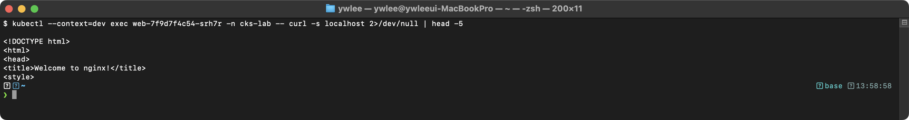

기대 출력 (4단계, default deny 적용 후 — DNS 해석 단계부터 실패):
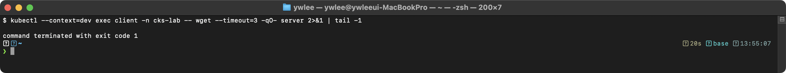

기대 출력 (6단계, DNS 허용 후 — 이름은 풀리지만 HTTP 는 아직 차단):
> **예시(참조) — Server:		10.96.0.10:** CKS 보안 기대 출력(도구/설정/환경 의존). 재현 가능한 핵심은 CKS daily(day01~14) 및 본 문서 캡처 참고.

기대 출력 (8단계, HTTP egress 까지 허용 — 통신 재개):


이 흐름은 "Egress 정책이 걸린 순간 DNS(53)부터 막히고, DNS를 허용해도 목적지 포트(80)를 따로 열기 전까지는 통신이 안 된다"는 NetworkPolicy의 누적 차단을 몸으로 보여준다. 4단계 출력이 `download timed out`이 아니라 `bad address`로 바뀌는 이유는, busybox의 wget이 호스트명 해석(DNS) 단계에서 먼저 실패하기 때문이다. DNS 허용을 빠뜨리면 거의 모든 실습이 이 지점에서 막히므로, default deny 다음에는 항상 DNS 허용을 먼저 추가하는 습관을 들인다.

### 1.2 CIS Benchmark (kube-bench)

CIS(Center for Internet Security) Benchmark는 쿠버네티스 클러스터의 보안 설정을 점검하는 표준 가이드라인이다. kube-bench는 CIS Benchmark를 자동으로 점검하는 도구이다.

**등장 배경: 수작업 점검의 한계:**

CIS Benchmark는 수백 개의 점검 항목(API server 플래그, kubelet 설정, 파일 권한 등)으로 이루어진 문서다. 이를 사람이 직접 점검하려면 각 노드에 들어가 설정 파일과 프로세스 인자를 일일이 읽고 기준값과 대조해야 하는데, 항목 수가 많고 쿠버네티스 버전마다 권장값이 달라 누락·오판이 잦았다. 또 클러스터를 업그레이드하거나 매니페스트를 고칠 때마다 전체를 다시 점검해야 하므로 수작업으로는 반복 점검이 현실적이지 않았다. kube-bench는 이 점검을 코드로 자동화해, 한 번의 실행으로 모든 항목을 PASS/FAIL/WARN으로 판정하고 버전별 기준 파일을 자동 선택한다.

**CKS 시험 환경에서의 실행:**

CKS 시험에서는 kube-bench 바이너리가 노드에 이미 설치돼 있거나, kube-bench를 실행하는 Job/Pod 매니페스트가 제공되는 형태로 출제된다. 따라서 직접 설치할 필요는 없고, 문제에 안내된 방식(바이너리 직접 실행 또는 `kubectl apply`로 Job 배포 후 로그 확인)으로 실행한다. 이 저장소의 tart 노드에는 기본적으로 kube-bench가 없으므로, 직접 실습하려면 노드에 접속(예: `ssh dev-master` — `~/.ssh/config`에 등록된 VM 별칭, 비밀번호 없이 접속)해 바이너리를 내려받거나 공식 Job 매니페스트(`kubectl apply -f job.yaml` 후 `kubectl logs job/kube-bench`)로 실행한다.

**동작 원리:**

kube-bench는 각 노드에서 실행되며, kubelet/API server/etcd/scheduler/controller-manager의 설정 파일과 프로세스 인자를 파싱한다. CIS Benchmark의 각 항목(check)에 대해 설정값을 비교하고 PASS/FAIL/WARN을 판정한다. 점검 항목은 YAML 형식의 정의 파일(`cfg/` 디렉토리)에 정의되어 있으며, 쿠버네티스 버전별로 다른 정의 파일을 사용한다.

**kube-bench 사용법:**
```bash
# 마스터 노드 점검
kube-bench run --targets master

# 워커 노드 점검
kube-bench run --targets node

# 특정 체크 항목만 점검
kube-bench run --targets master --check 1.2.1,1.2.2

# JSON 형식으로 결과 출력
kube-bench run --targets master --json
```

**주요 체크 항목 (시험 빈출):**

| 체크 ID | 내용 | 관련 설정 |
|---------|------|-----------|
| 1.2.1 | anonymous-auth 비활성화 | `--anonymous-auth=false` |
| 1.2.2 | basic-auth 비활성화 | `--basic-auth-file` 제거 |
| 1.2.6 | kubelet 인증서 인증 | `--kubelet-certificate-authority` |
| 1.2.16 | admission controller 활성화 | `--enable-admission-plugins` |
| 1.2.18 | insecure-bind-address 비활성화 | `--insecure-bind-address` 제거 |
| 1.2.19 | insecure-port 비활성화 | `--insecure-port=0` |
| 1.2.20 | audit-log 활성화 | `--audit-log-path` |
| 1.2.29 | etcd TLS 설정 | `--etcd-certfile`, `--etcd-keyfile` |
| 4.2.1 | kubelet anonymous auth | `authentication.anonymous.enabled: false` |
| 4.2.2 | kubelet authorization mode | `authorization.mode: Webhook` |

**kube-bench 결과 해석:**
- `[PASS]`: 보안 기준을 충족한다
- `[FAIL]`: 보안 기준을 충족하지 않는다. 수정이 필요하다
- `[WARN]`: 수동 점검이 필요하다
- `[INFO]`: 참고 정보이다

**실습 검증: kube-bench 실행 및 FAIL 항목 수정**

```bash
# 1. kube-bench 실행 (마스터 노드)
kube-bench run --targets master 2>&1 | head -50
```

기대 출력 (FAIL 항목 예시):
> **예시(참조) — kube-bench CIS 점검 — PASS(준수):** [INFO] 1 Master Node Security Configuration ... (도구/설정 의존, 해당 도구 설치·구성 환경에서 재현).

FAIL 항목 수정 후 재검증:
```bash
# 2. API server 매니페스트에서 문제 항목 수정
vi /etc/kubernetes/manifests/kube-apiserver.yaml
# --basic-auth-file 인자를 제거한다

# 3. API server 재시작 대기 후 재검증
sleep 30
kube-bench run --targets master --check 1.2.2
```

기대 출력 (수정 후):
> **예시(참조) — kube-bench CIS 점검 — PASS(준수):** [PASS] 1.2.2 Ensure that the --basic-auth-file a ... (도구/설정 의존, 해당 도구 설치·구성 환경에서 재현).

**CKS 시험에서의 활용:**
- kube-bench를 실행하고 실패한 항목을 수정하는 문제가 출제된다
- 주로 API server, kubelet의 설정 파일을 수정해야 한다
- 수정 후 서비스를 재시작하고 kube-bench를 다시 실행하여 PASS를 확인해야 한다

### 1.3 Ingress TLS 설정

Ingress 리소스에 TLS를 적용하여 외부 트래픽을 암호화하는 설정이다. (앞 1.2에서 노드/컴포넌트 자체의 설정을 점검했다면, 여기서는 클러스터 외부로 나가는 입구의 트래픽 암호화를 다룬다.)

**등장 배경: 평문 HTTP 노출 문제와 직전 방식의 한계:**

쿠버네티스에서 서비스를 외부로 노출하는 직전 방식은 NodePort(노드의 고정 포트를 모든 노드에서 여는 방식)나 LoadBalancer(클라우드 L4 로드밸런서 할당)였다. 두 방식 모두 L4(전송 계층)에서 트래픽을 그대로 전달할 뿐 암호화를 책임지지 않으므로, 애플리케이션이 평문 HTTP로 노출되면 사용자 인증 토큰·세션 쿠키·요청 본문이 네트워크 경로에서 그대로 도청(sniffing)될 수 있었다. 또 서비스마다 별도의 외부 IP·포트가 필요해 TLS 종료(TLS termination, 암호화된 연결을 복호화해 평문으로 백엔드에 전달하는 지점)를 서비스 개수만큼 중복 구성해야 했다. Ingress는 L7(애플리케이션 계층) 라우팅 지점을 한 곳으로 모아 호스트/경로 기반으로 여러 서비스를 분기하고, 그 입구에서 TLS를 한 번에 종료한다. 인증서·키를 `kubernetes.io/tls` 타입 Secret으로 선언하면 Ingress 컨트롤러가 이를 로드해 외부 구간을 HTTPS로 강제한다. 트레이드오프로는 TLS 종료가 Ingress 컨트롤러에서 일어나므로 컨트롤러부터 백엔드 Pod까지의 클러스터 내부 구간은 별도 설정(예: mTLS·서비스 메시) 없이는 다시 평문이 되며, 인증서 만료·갱신을 운영자가 관리해야 한다는 점이 있다.

**설정 절차:**
1. TLS 인증서와 키를 생성한다 (또는 기존 것을 사용한다)
2. 인증서와 키를 쿠버네티스 Secret으로 생성한다 (type: kubernetes.io/tls)
3. Ingress 리소스에 TLS 설정을 추가한다

```bash
# 자체 서명 인증서 생성
openssl req -x509 -nodes -days 365 -newkey rsa:2048 \
  -keyout tls.key -out tls.crt -subj "/CN=myapp.example.com"

# TLS Secret 생성
kubectl create secret tls myapp-tls --cert=tls.crt --key=tls.key -n default
```

```yaml
apiVersion: networking.k8s.io/v1
kind: Ingress
metadata:
  name: myapp-ingress
spec:
  tls:
  - hosts:
    - myapp.example.com
    secretName: myapp-tls
  rules:
  - host: myapp.example.com
    http:
      paths:
      - path: /
        pathType: Prefix
        backend:
          service:
            name: myapp-svc
            port:
              number: 80
```

**핵심 포인트:**
- Secret 타입은 `kubernetes.io/tls`이어야 한다
- Secret에는 `tls.crt`와 `tls.key` 키가 있어야 한다
- Ingress의 `spec.tls[].secretName`에 Secret 이름을 지정한다
- `spec.tls[].hosts`에 TLS를 적용할 호스트명을 지정한다
- TLS Secret은 Ingress와 같은 네임스페이스에 있어야 한다

**실습 검증: TLS Secret과 핸드셰이크 확인**

전제: 이 검증의 1~2단계(Secret·인증서 확인)는 Ingress controller 없이도 가능하지만, 3단계 이후의 실제 HTTPS 핸드셰이크 확인은 클러스터에 Ingress controller(예: ingress-nginx)가 설치돼 있어야 한다. 이 저장소의 dev/staging 클러스터에는 Ingress controller가 기본 설치돼 있지 않으므로, controller가 없으면 3단계 이후는 controller 설치 후에만 재현 가능하다(없으면 결과를 "(미설치)"로 표기한다).

```bash
# kubeconfig 별칭 (dev 클러스터, 파괴 실습은 dev/staging 에서만 — §3 표)
KC=~/sideproejct/IaC_apple_sillicon/kubeconfig/dev.yaml

# 1. TLS Secret 이 생성됐고 타입이 kubernetes.io/tls 인지 확인
kubectl --kubeconfig=$KC get secret myapp-tls -o jsonpath='{.type}'; echo
kubectl --kubeconfig=$KC get secret myapp-tls -o jsonpath='{.data}' | grep -o 'tls.crt\|tls.key'

# 2. Secret 에 담긴 인증서의 CN(주체 이름)과 유효기간 확인
kubectl --kubeconfig=$KC get secret myapp-tls -o jsonpath='{.data.tls\.crt}' \
  | base64 -d | openssl x509 -noout -subject -dates

# 3. Ingress 의 외부 주소(또는 controller Service 의 IP) 확인
kubectl --kubeconfig=$KC get ingress myapp-ingress

# 4. curl 로 TLS 핸드셰이크와 서버 인증서 확인
#    -k: 자체서명 인증서 검증 생략, --resolve: 호스트명을 Ingress IP 로 강제 매핑
curl -vk --resolve myapp.example.com:443:<INGRESS_IP> https://myapp.example.com/ 2>&1 | head -25
```

2단계에서 `subject=CN = myapp.example.com`이 보이면 Secret이 의도한 인증서를 담고 있다는 뜻이고, 4단계의 `-v` 출력에서 `SSL connection using TLSv1.3` 같은 핸드셰이크 줄과 `subject: CN=myapp.example.com` 인증서 정보가 나오면 Ingress가 그 Secret을 종단(termination)에 사용하고 있다는 신호다. (controller 미설치 환경에서는 4단계 출력 미캡처)

### 1.4 노드 메타데이터 보호

클라우드 환경(AWS, GCP, Azure)에서 실행되는 쿠버네티스 노드는 클라우드 인스턴스 메타데이터 API에 접근할 수 있다. 이 메타데이터에는 IAM 자격 증명, 네트워크 설정 등 민감한 정보가 포함되어 있으므로 Pod에서의 접근을 차단해야 한다.

**공격 시나리오:**

컨테이너 내부에서 `curl http://169.254.169.254/latest/meta-data/iam/security-credentials/` 요청을 보내면 노드에 할당된 IAM 역할의 임시 자격 증명(Access Key, Secret Key, Session Token)을 탈취할 수 있다. 이를 통해 S3 버킷 접근, EC2 인스턴스 조작 등 클라우드 리소스에 대한 권한 상승 공격이 가능하다.

위 `curl` 호출은 이미 컨테이너 내부에 침입한 공격자(예: RCE로 셸을 획득한 상태)가 직접 명령을 실행하는 경우다. 그러나 셸이 없어도, 애플리케이션이 가진 SSRF(Server-Side Request Forgery, 서버가 외부 입력으로 받은 URL을 대신 fetch하도록 유도하는 취약점) 결함을 악용하면 외부 공격자가 같은 결과를 얻을 수 있다. SSRF 공격의 흐름은 다음 단계로 진행된다:

1. 웹 애플리케이션이 사용자 입력 URL을 검증 없이 서버 측에서 fetch하는 기능을 노출한다(예: "이미지 URL을 넣으면 미리보기를 만들어 줌").
2. 공격자가 그 입력 칸에 정상 URL 대신 클라우드 메타데이터 주소 `http://169.254.169.254/latest/meta-data/iam/security-credentials/`를 넣는다.
3. 애플리케이션 서버(Pod)가 그 URL을 그대로 fetch하여 메타데이터 응답을 받아 화면이나 응답 본문에 노출한다. 결과적으로 IAM 자격 증명이 외부 공격자에게 전달된다.

즉, 단순 `curl`은 "내부에 이미 들어온 공격자가 메타데이터에 접근하는 것"이고, SSRF는 "외부 공격자가 애플리케이션의 URL fetch 기능을 디딤돌 삼아 같은 접근을 원격에서 트리거하는 기법"이라는 점에서 구분된다. NetworkPolicy로 메타데이터 대역을 egress 차단하면 두 경로 모두 막을 수 있다.

**클라우드별 메타데이터 엔드포인트:**
- AWS: `http://169.254.169.254/latest/meta-data/`
- GCP: `http://metadata.google.internal/` 또는 `http://169.254.169.254/`
- Azure: `http://169.254.169.254/metadata/`

**차단 방법 (NetworkPolicy):**
```yaml
apiVersion: networking.k8s.io/v1
kind: NetworkPolicy
metadata:
  name: deny-cloud-metadata
  namespace: default
spec:
  podSelector: {}
  policyTypes:
  - Egress
  egress:
  - to:
    - ipBlock:
        cidr: 0.0.0.0/0
        except:
        - 169.254.169.254/32
```

**실습 검증:**
```bash
# 정책 적용 후 메타데이터 접근 차단 확인
kubectl apply -f deny-cloud-metadata.yaml
kubectl run test --rm -it --image=busybox --restart=Never -- wget -qO- --timeout=3 http://169.254.169.254/latest/meta-data/
```

기대 출력:


### 1.5 Dashboard 보안, GUI 접근 제한

Kubernetes Dashboard는 웹 기반 UI로, 보안 설정이 미흡하면 심각한 보안 위협이 된다. 2018년 Tesla 클라우드 침해 사건에서 인터넷에 노출된 Kubernetes Dashboard를 통해 공격자가 클러스터 전체를 장악한 사례가 있다.

**등장 배경: 인증 없는 GUI 입구의 위협:**

초기 Dashboard 배포 가이드는 사용 편의를 위해 인증을 건너뛰는 `--enable-skip-login`을 허용하고, Dashboard의 ServiceAccount에 `cluster-admin`(클러스터 전체 관리자 권한)을 손쉽게 바인딩하는 형태가 흔했다. Tesla 사건이 보여준 문제가 바로 이 조합이다. 인증 없이 접근 가능한 Dashboard가 NodePort/LoadBalancer로 공인망에 노출되면, 누구든 그 GUI를 거쳐 cluster-admin 권한으로 클러스터를 조작할 수 있다(공격자는 Tesla 사례에서 그 권한으로 암호화폐 채굴 컨테이너를 띄웠다). 현재 권고는 이 한계를 두 축으로 보완한다. 첫째, 노출면을 줄여 Dashboard를 공인망에 직접 노출하지 않고 `kubectl proxy`를 통해 로컬에서만 접근한다. 둘째, 권한을 최소화해 토큰 기반 로그인을 강제(skip-login 제거)하고 ServiceAccount에 필요한 최소 권한만 부여한다. 트레이드오프로는 매번 `kubectl proxy`를 띄우고 토큰을 발급·입력해야 하므로 즉시 접근 편의가 줄고, RBAC을 세밀하게 짜는 운영 비용이 늘어난다.

**보안 권장사항:**
- Dashboard를 인터넷에 직접 노출하지 않아야 한다
- `--enable-skip-login` 플래그를 제거하여 로그인 우회를 방지해야 한다
- Dashboard의 ServiceAccount에 최소 권한만 부여해야 한다 (cluster-admin 바인딩 금지)
- NodePort 대신 ClusterIP 타입으로 서비스를 노출하고 kubectl proxy를 사용해야 한다
- Dashboard에 접근 가능한 네임스페이스를 제한해야 한다

### 1.6 바이너리 검증

kubelet, kubectl 등 쿠버네티스 바이너리의 무결성을 sha512sum으로 검증하는 방법이다. 공격자가 바이너리를 변조하여 백도어를 삽입하는 공급망 공격에 대한 방어 기법이다.

**검증 절차:**
```bash
# 1. 바이너리의 해시값 계산
sha512sum /usr/bin/kubelet

# 2. 공식 릴리스의 해시값 다운로드
curl -LO https://dl.k8s.io/v1.29.0/bin/linux/amd64/kubelet.sha512

# 3. 해시값 비교
echo "$(cat kubelet.sha512)  /usr/bin/kubelet" | sha512sum --check
```

**실습 검증:**
```bash
# 정상 바이너리 검증
echo "$(cat kubelet.sha512)  /usr/bin/kubelet" | sha512sum --check
```

정상 케이스와 변조 케이스는 `sha512sum --check`의 마지막 줄 표시로 구분한다. 해시가 일치하면 `/usr/bin/kubelet: OK`가 출력되고 종료 코드는 0이다. 한 바이트라도 다르면 `/usr/bin/kubelet: FAILED`와 함께 `sha512sum: WARNING: 1 computed checksum did NOT match` 경고가 출력되고 종료 코드는 1이 된다. 즉 두 상태는 같은 화면이 아니라 끝줄의 `OK`/`FAILED` 토큰과 종료 코드로 명확히 갈린다.

기대 출력 (정상 — `OK`, 종료 코드 0):
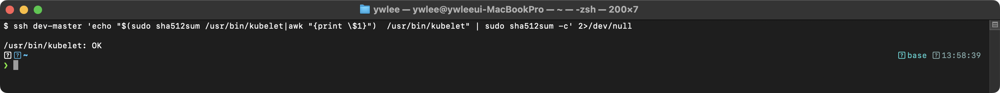

기대 출력 (변조됨 — `FAILED` + `did NOT match` 경고, 종료 코드 1):


**CKS 시험에서의 활용:**
- 특정 바이너리가 변조되었는지 확인하는 문제가 출제된다
- `sha512sum`으로 계산한 해시값을 공식 해시값과 비교해야 한다
- 해시값이 다르면 바이너리가 변조된 것이므로, 공식 바이너리로 교체해야 한다

---

## 2. Cluster Hardening (15%)

클러스터 접근 제어와 강화를 다루는 도메인이다. RBAC과 ServiceAccount 보안이 핵심이다.

### 2.1 RBAC 최소 권한 원칙 (Least Privilege)

RBAC(Role-Based Access Control)은 쿠버네티스에서 인증된 사용자/서비스의 권한을 제어하는 메커니즘이다. CKS에서는 "최소 권한 원칙"에 따라 RBAC을 설정하는 능력을 평가한다.

**인증(Authentication)과 인가(Authorization) 파이프라인:**

API server에 요청이 도달하면 다음 순서로 처리된다:
1. **인증(Authentication)**: 요청자가 누구인지 확인한다. X.509 클라이언트 인증서, Bearer Token, OIDC Token 등의 방식이 있다. 인증에 실패하면 401 Unauthorized를 반환한다.
2. **인가(Authorization)**: 인증된 사용자가 해당 작업을 수행할 권한이 있는지 확인한다. API server는 `--authorization-mode` 플래그에 나열된 순서대로 각 모드(예: `Node,RBAC,Webhook`)를 평가한다. 평가 규칙은 "첫 번째 명시적 allow에서 멈춤"이다 — 어떤 모드가 `allow`를 반환하면 즉시 요청을 허용하고 뒤의 모드는 보지 않는다. 어떤 모드도 명시적 `allow`를 반환하지 않거나 모든 모드가 `deny`를 반환하면 403 Forbidden이다. 여기서 각 모드의 "no opinion"(해당 요청에 대해 판단하지 않음)은 거부가 아니라 "다음 모드로 넘김"을 의미한다는 점이 중요하다.

   - **Node 인가 모드**: kubelet이 보내는 요청 전용 모드로, 각 kubelet이 자기 노드와 그 노드에서 실행 중인 Pod에 관련된 리소스(해당 노드에 마운트된 Secret/ConfigMap, 자기 노드 객체 등)만 읽고 쓸 수 있도록 제한한다. 보통 `Node,RBAC` 순서로 두어, kubelet 요청은 Node 모드가 먼저 판정하고, 일반 사용자/SA 요청은 Node 모드가 no opinion을 반환하므로 RBAC이 이어서 판정한다.
3. **Admission Control**: 요청의 내용을 검증하거나 변형한다 (후술).

**RBAC 4가지 리소스:**

| 리소스 | 범위 | 용도 |
|--------|------|------|
| Role | 네임스페이스 | 특정 네임스페이스 내 권한 정의 |
| ClusterRole | 클러스터 전체 | 클러스터 전체 또는 비네임스페이스 리소스 권한 정의 |
| RoleBinding | 네임스페이스 | Role/ClusterRole을 사용자/그룹/SA에 바인딩 |
| ClusterRoleBinding | 클러스터 전체 | ClusterRole을 클러스터 전체에 바인딩 |

**최소 권한 원칙 적용:**
- `*` (와일드카드) 사용을 피하고, 필요한 verb와 resource만 명시적으로 지정한다
- `cluster-admin` ClusterRole 바인딩은 최소화한다
- 가능하면 ClusterRoleBinding보다 RoleBinding을 사용하여 범위를 제한한다
- `resourceNames`를 사용하여 특정 리소스에만 접근을 허용할 수 있다

**주요 verb 목록:**
- `get`: 특정 리소스 조회
- `list`: 리소스 목록 조회
- `watch`: 리소스 변경 감시
- `create`: 리소스 생성
- `update`: 리소스 수정
- `patch`: 리소스 부분 수정
- `delete`: 리소스 삭제
- `deletecollection`: 리소스 일괄 삭제

**실습 검증: 과도한 권한 식별 및 수정**

```bash
# 1. 현재 ClusterRoleBinding에서 cluster-admin 바인딩 확인
kubectl get clusterrolebindings -o wide | grep cluster-admin

# 2. 특정 ServiceAccount의 권한 확인
kubectl auth can-i --list --as=system:serviceaccount:default:mysa

# 3. 와일드카드 권한이 있는 Role/ClusterRole 식별
kubectl get clusterroles -o json | jq '.items[] | select(.rules[]?.verbs[]? == "*") | .metadata.name'

# 4. 특정 동작에 대한 권한 확인
kubectl auth can-i create pods --as=system:serviceaccount:default:mysa
kubectl auth can-i '*' '*' --as=system:serviceaccount:kube-system:default
```

기대 출력 (`can-i` 명령):
> **예시(참조) — yes:** CKS 보안 기대 출력(도구/설정/환경 의존). 재현 가능한 핵심은 CKS daily(day01~14) 및 본 문서 캡처 참고.
또는:
> **예시(참조) — no:** CKS 보안 기대 출력(도구/설정/환경 의존). 재현 가능한 핵심은 CKS daily(day01~14) 및 본 문서 캡처 참고.

기대 출력 (`can-i --list` 명령):
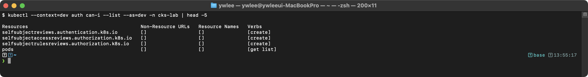

### 2.2 ServiceAccount 보안

ServiceAccount는 Pod 내에서 실행되는 프로세스가 API server와 통신할 때 사용하는 자격 증명이다. 보안을 위해 불필요한 ServiceAccount 토큰 마운트를 비활성화해야 한다.

**공격 벡터:**

Pod에 자동 마운트된 ServiceAccount 토큰(`/var/run/secrets/kubernetes.io/serviceaccount/token`)은 컨테이너가 침해되었을 때 API server에 대한 횡적 이동(lateral movement)에 사용된다. 공격자는 이 토큰으로 `kubectl` 또는 직접 API 호출을 통해 Secret 조회, Pod 생성 등의 작업을 수행할 수 있다.

**핵심 설정:**

1. **automountServiceAccountToken: false**
   - ServiceAccount 또는 Pod에서 이 필드를 `false`로 설정하면 토큰이 자동 마운트되지 않는다
   - Pod에서의 설정이 ServiceAccount에서의 설정보다 우선한다
   - API server에 접근할 필요가 없는 Pod에는 반드시 비활성화해야 한다

2. **default ServiceAccount 사용 금지**
   - 모든 네임스페이스에는 `default` ServiceAccount가 자동 생성된다
   - `default` SA에는 추가 권한을 부여하지 않아야 한다
   - 워크로드별로 전용 ServiceAccount를 생성하고 최소 권한만 부여해야 한다

3. **TokenRequestAPI 사용 (Bound Service Account Token)**
   - K8s 1.22+에서는 시간 제한이 있는 바운드 토큰이 기본으로 사용된다
   - projected volume으로 토큰의 만료 시간과 audience를 설정할 수 있다

   **전환 배경 — 시크릿 기반 토큰의 한계:** K8s 1.21 이하에서는 ServiceAccount를 만들면 그 토큰이 별도의 Secret 오브젝트에 저장되고, Pod에 그 Secret이 그대로 마운트됐다. 이 토큰은 만료 시간(`exp` 클레임)이 없어 한 번 발급되면 무기한 유효했고, 특정 audience(수신 대상)에 묶이지도 않아 어떤 서비스에든 그대로 쓸 수 있었다. 문제는 토큰이 유출됐을 때다. 만료가 없으므로 공격자가 토큰을 손에 넣으면 영구적으로 API server에 접근할 수 있고, 토큰 값을 바꾸지 않는 한 개별 revoke(무효화)할 방법도 없어 ServiceAccount 자체를 지우는 것 외에 차단 수단이 없었다.

   **무엇이 나아졌나 — Bound Token:** 1.22+의 Bound Service Account Token은 TokenRequest API로 동적 발급되며 ⓐ 만료 시간이 있어(기본 1시간) 유출돼도 곧 무효가 되고, ⓑ audience가 지정돼 의도한 수신자에게만 유효하며, ⓒ 특정 Pod(객체)에 바인딩돼 그 Pod가 삭제되면 함께 무효화되고, ⓓ kubelet이 projected volume의 토큰을 만료 전에 자동 갱신한다. 트레이드오프로, 토큰이 수명이 짧아졌으므로 클라이언트는 파일에서 토큰을 재읽기하도록 만들어야 하며(메모리에 한 번 캐시하고 재사용하면 만료 후 401을 받는다), 이는 옛 SDK·스크립트 호환성에 영향을 줄 수 있다.

**실습 검증: 토큰 마운트 비활성화 확인**

```bash
# 1. automountServiceAccountToken: false 가 적용된 Pod에서 토큰 확인
kubectl exec -it no-token-pod -- ls /var/run/secrets/kubernetes.io/serviceaccount/
```

기대 출력:
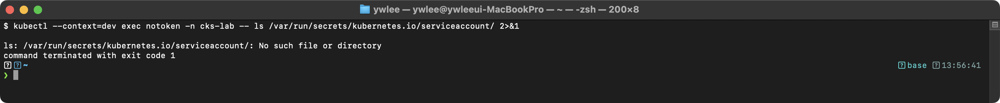

```bash
# 2. 토큰이 마운트된 Pod에서 토큰 확인 (비교)
kubectl exec -it normal-pod -- cat /var/run/secrets/kubernetes.io/serviceaccount/token
```

기대 출력:
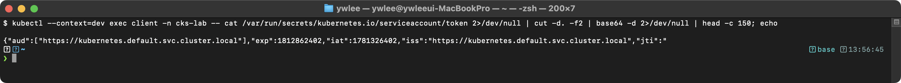

### 2.3 API Server 접근 제한

API Server는 쿠버네티스 클러스터의 중심 컴포넌트로, 모든 요청이 이곳을 거친다. 보안 강화를 위해 다양한 설정을 적용해야 한다.

**Admission Controller 처리 파이프라인 상세:**

API server에 요청이 인증 및 인가를 통과하면 Admission Controller 체인을 거친다. 이 체인은 두 단계로 구성된다:

1. **Mutating Admission**: 요청 오브젝트를 수정할 수 있다. 예를 들어, 사이드카 컨테이너 주입, 기본값 설정, 라벨 추가 등을 수행한다. Mutating webhook은 순서대로 실행되며, 각 webhook이 오브젝트를 수정하면 수정된 결과가 다음 webhook에 전달된다.
2. **Validating Admission**: 요청 오브젝트를 검증만 하고, 수정하지 않는다. 하나라도 거부하면 요청 전체가 거부된다. OPA Gatekeeper, Pod Security Admission 등이 이 단계에서 동작한다.

Mutating이 Validating보다 먼저 실행되는 이유는, Mutating 단계에서 오브젝트가 변형된 최종 상태를 Validating 단계에서 검증해야 하기 때문이다. 순서가 반대이면 Mutating이 검증을 우회하는 변형을 삽입할 수 있다.

**핵심 설정 플래그:**

| 플래그 | 권장 값 | 설명 |
|--------|---------|------|
| `--anonymous-auth` | `false` | 익명 요청 거부 |
| `--authorization-mode` | `Node,RBAC` | Node/RBAC 인가 모드 사용 |
| `--enable-admission-plugins` | (아래 참조) | Admission Controller 활성화 |
| `--insecure-port` | `0` | 비암호화 포트 비활성화 |
| `--profiling` | `false` | 프로파일링 비활성화 |
| `--audit-log-path` | `/var/log/audit.log` | 감사 로그 경로 |
| `--audit-log-maxage` | `30` | 감사 로그 보존 일수 |
| `--audit-log-maxbackup` | `10` | 감사 로그 백업 수 |
| `--audit-log-maxsize` | `100` | 감사 로그 최대 크기(MB) |
| `--kubelet-certificate-authority` | (CA 경로) | kubelet 인증서 검증 |

**필수 Admission Controller:**
- `NodeRestriction`: kubelet이 자신의 노드와 해당 노드에서 실행 중인 Pod만 수정할 수 있도록 제한한다
- `PodSecurity`: Pod Security Standards를 적용한다
- `ImagePolicyWebhook`: 이미지 정책 검증을 위한 외부 웹훅을 호출한다

**설정 수정 방법:**
```bash
# 1. API server 매니페스트 백업
cp /etc/kubernetes/manifests/kube-apiserver.yaml /tmp/kube-apiserver.yaml.bak

# 2. 매니페스트 수정
vi /etc/kubernetes/manifests/kube-apiserver.yaml

# 3. API server 자동 재시작 대기 (static pod이므로 kubelet이 감지)
watch crictl ps | grep kube-apiserver

# 4. API server 정상 동작 확인
kubectl get nodes
```

### 2.4 업그레이드를 통한 보안 패치 적용

쿠버네티스는 주기적으로 보안 패치를 포함한 업데이트를 릴리스한다. 최신 보안 패치를 적용하기 위해 클러스터를 업그레이드하는 방법을 알아야 한다.

**등장 배경: n-day 취약점과 수동 패치의 한계:**

쿠버네티스 컴포넌트(API server·kubelet 등)에서 CVE(공개된 취약점 식별번호)가 공표되면, 그 시점부터 공격자가 해당 취약점을 노릴 수 있는 n-day 취약점(공개되어 있으나 아직 패치하지 않아 노출된 취약점) 상태가 된다. 즉 패치가 나온 뒤에도 클러스터를 올리지 않으면 위험 창(window of exposure)이 계속 열려 있다. 업그레이드 도구가 없던 시절의 직전 방식은 운영자가 각 노드에 SSH로 들어가 바이너리를 손으로 교체하고 인증서·kubeconfig·컴포넌트 설정을 직접 맞추는 수동 패치였다. 이 방식은 노드마다 적용 순서·버전이 어긋나기 쉬워(컨트롤 플레인은 1.29인데 일부 kubelet은 1.27 등) skew 정책 위반과 일관성 문제를 일으켰고, 작업 중 정족수(etcd quorum)나 인증서를 잘못 건드리면 클러스터 전체가 멈췄다. `kubeadm upgrade`는 이 과정을 "plan으로 적용 가능 버전을 점검 → apply가 컨트롤 플레인 컴포넌트와 인증서·정적 파드 매니페스트를 일괄 교체 → 노드별로 drain·kubelet 교체·uncordon"이라는 정해진 순서로 자동화해, 사람이 빠뜨리던 단계와 버전 skew를 줄인다. 트레이드오프로는 한 번에 한 마이너 버전씩만 올릴 수 있어(버전 skew 정책 때문) 여러 버전을 건너뛰지 못하고, drain 과정에서 워크로드가 재스케줄링되는 동안 일시적 가용성 저하가 발생하며, 업그레이드 자체가 실패하면 복구를 위해 사전 etcd 백업이 사실상 필수라는 점이 있다.

**kubeadm 업그레이드 절차:**
```bash
# 1. 업그레이드 가능 버전 확인
kubeadm upgrade plan

# 2. kubeadm 업그레이드 (컨트롤 플레인 노드)
apt-get update
apt-get install -y kubeadm=1.29.x-*
kubeadm upgrade apply v1.29.x

# 3. 노드 드레인
kubectl drain <node-name> --ignore-daemonsets --delete-emptydir-data

# 4. kubelet, kubectl 업그레이드
apt-get install -y kubelet=1.29.x-* kubectl=1.29.x-*
systemctl daemon-reload
systemctl restart kubelet

# 5. 노드 uncordon
kubectl uncordon <node-name>
```

**핵심 포인트:**
- 한 번에 한 마이너 버전씩만 업그레이드해야 한다 (예: 1.28 -> 1.29)
- 컨트롤 플레인 노드를 먼저 업그레이드한 후 워커 노드를 업그레이드한다
- 업그레이드 전 etcd 백업을 권장한다

### 2.5 kubeconfig 보안 관리

kubeconfig 파일은 클러스터 접근 자격 증명을 포함하고 있으므로 보안 관리가 중요하다.

**등장 배경: 평문 자격 증명 파일의 위협:**

kubeconfig에는 클라이언트 인증서·키 또는 토큰이 인라인(base64)이나 파일 참조 형태로 들어 있어, 사실상 클러스터에 접속하는 "열쇠"다. 이 파일이 권한이 느슨한 채(예: 모든 사용자가 읽을 수 있는 `644`) 노드나 CI 러너, 개발자 노트북에 방치되면, 같은 호스트의 다른 계정·프로세스가 그대로 읽어 클러스터에 접속할 수 있다. 게다가 X.509 클라이언트 인증서 기반 자격 증명은 K8s 자체에 폐기(revocation) 목록 메커니즘이 없어, 한 번 유출되면 인증서 만료 시점까지 강제로 무효화하기 어렵다(서명한 CA를 교체하지 않는 한). 그래서 권고는 ⓐ 파일 권한을 `600`(소유자만)으로 좁혀 노출면을 줄이고, ⓑ 불필요한 context를 지워 한 파일이 여러 클러스터의 만능 열쇠가 되지 않게 하며, ⓒ 인증서·토큰을 짧은 주기로 갱신해 유출 시 노출 창을 줄이는 방향으로 보완한다. 트레이드오프는 갱신·회전을 자동화하지 않으면 운영 부담이 늘고, 인증서 교체 시 이를 쓰던 자동화·사용자가 일시적으로 접속을 잃을 수 있다는 점이다.

**보안 권장사항:**
- kubeconfig 파일의 권한을 `600`(소유자만 읽기/쓰기)으로 설정한다
- 클라이언트 인증서/키를 파일로 참조할 때 해당 파일의 권한도 제한한다
- 불필요한 context는 제거한다
- kubeconfig에 인라인으로 포함된 인증서/키를 주기적으로 갱신한다
- kubeconfig 파일을 버전 관리 시스템(Git)에 커밋하지 않아야 한다

---

## 3. System Hardening (15%)

운영체제와 시스템 수준의 보안 강화를 다루는 도메인이다. 리눅스 보안 모듈(AppArmor, seccomp)에 대한 이해가 핵심이다.

### 3.1 OS 최소 설치, 불필요한 패키지/서비스 제거

쿠버네티스 노드에는 필요한 최소한의 패키지와 서비스만 설치해야 한다. 공격 표면(Attack Surface)을 줄이는 것이 목적이다.

**점검 및 제거 방법:**
```bash
# 불필요한 서비스 확인
systemctl list-units --type=service --state=running

# 서비스 중지 및 비활성화
systemctl stop <service-name>
systemctl disable <service-name>

# 불필요한 패키지 제거
apt-get remove --purge <package-name>

# 열려 있는 포트 확인
ss -tlnp
netstat -tlnp

# 불필요한 사용자 확인
cat /etc/passwd
```

**주요 원칙:**
- 노드에서 실행되는 서비스는 kubelet, container runtime, kube-proxy 등 필수 서비스로 제한한다
- SSH 접근은 필요한 경우에만 허용하고, 키 기반 인증만 사용한다
- 불필요한 커널 모듈은 비활성화한다

### 3.2 AppArmor 프로파일 작성 및 적용

AppArmor는 리눅스 커널 보안 모듈로, 프로그램별로 파일, 네트워크, 프로세스 등에 대한 접근을 제한한다. CKS에서 자주 출제되는 주제이다.

**한 문장 직관:**

AppArmor는 리눅스 커널 내부의 주요 작업 지점(파일 열기, 프로세스 실행, 소켓 생성 등)마다 "이 프로세스가 지금 이 작업을 해도 되나?"를 묻는 검사점을 설치하는 보안 모듈이다. 프로세스마다 AppArmor 프로파일이라는 "허용/거부 규칙 목록"이 붙어 있고, 커널은 작업을 실제로 수행하기 직전에 그 규칙을 확인해 허용하거나 거부한다. 즉 애플리케이션을 고치지 않고도, 바깥의 커널이 "이 프로세스는 /etc 에 쓰지 못한다" 같은 제약을 강제하는 구조다.

**(고급) 커널/OS 레벨 내부 동작:**

위 "검사점"의 실체는 리눅스 커널의 LSM(Linux Security Module) 프레임워크다. LSM은 커널 내부의 주요 접근 제어 지점에 콜백 함수를 삽입(후킹, hooking)할 수 있게 하는 프레임워크이며, AppArmor는 이 LSM 후크에 자신의 검사 함수를 등록한다. 프로세스가 시스템콜을 호출하면, 커널은 해당 작업을 수행하기 전에 LSM 후크를 호출한다. AppArmor의 후크 함수는 현재 프로세스에 연결된 프로파일을 조회하고, 요청된 작업이 프로파일에서 허용되는지 판단한다. 허용되지 않으면 `-EACCES`(권한 없음 오류 코드)를 반환하여 작업을 차단한다.

AppArmor 프로파일은 커널 공간에 로드되며, 각 프로세스를 표현하는 커널 자료구조(`task_struct`)에 "이 프로세스가 어떤 프로파일에 묶여 있는지"를 가리키는 포인터가 연결된다. 이 때문에 같은 노드의 프로세스라도 서로 다른 보안 정책을 가질 수 있다. SELinux가 시스템 전체에 대해 타입(레이블) 기반 강제 접근 제어(MAC, Mandatory Access Control)를 적용하는 것과 달리, AppArmor는 파일 경로 기반으로 동작하므로 프로파일 작성이 상대적으로 단순하다.

**AppArmor 모드:**
- `enforce`: 정책을 강제 적용한다. 위반 시 차단하고 로그를 기록한다
- `complain`: 위반 시 로그만 기록하고 차단하지 않는다 (디버깅용)
- `unconfined`: AppArmor 정책이 적용되지 않는다

**프로파일 작성 예시:**
```
#include <tunables/global>

profile k8s-deny-write flags=(attach_disconnected) {
  #include <abstractions/base>

  file,

  # 모든 파일 쓰기 거부
  deny /** w,

  # /tmp에만 쓰기 허용
  /tmp/** rw,
}
```

**프로파일 관리 명령어:**
```bash
# 프로파일 로드 (enforce 모드)
apparmor_parser -r /etc/apparmor.d/k8s-deny-write

# 프로파일 로드 (complain 모드)
apparmor_parser -C /etc/apparmor.d/k8s-deny-write

# 로드된 프로파일 확인
aa-status

# 프로파일 제거
apparmor_parser -R /etc/apparmor.d/k8s-deny-write
```

**Pod에 AppArmor 적용 (K8s 1.30+):**
```yaml
apiVersion: v1
kind: Pod
metadata:
  name: secure-pod
spec:
  securityContext:
    appArmorProfile:
      type: Localhost
      localhostProfile: k8s-deny-write
  containers:
  - name: app
    image: nginx
```

**Pod에 AppArmor 적용 (K8s 1.29 이하, annotation 방식):**
```yaml
apiVersion: v1
kind: Pod
metadata:
  name: secure-pod
  annotations:
    container.apparmor.security.beta.kubernetes.io/app: localhost/k8s-deny-write
spec:
  containers:
  - name: app
    image: nginx
```

**실습 검증: AppArmor 프로파일 적용 후 파일 쓰기 차단 확인**

```bash
# 1. 프로파일 로드 확인
aa-status | grep k8s-deny-write
```

기대 출력:
> **예시(참조) — k8s-deny-write:** CKS 보안 기대 출력(도구/설정/환경 의존). 재현 가능한 핵심은 CKS daily(day01~14) 및 본 문서 캡처 참고.

```bash
# 2. AppArmor 프로파일이 적용된 Pod에서 파일 쓰기 시도
kubectl exec -it secure-pod -- sh -c 'echo test > /etc/test.txt'
```

기대 출력:
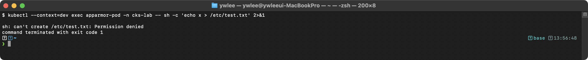

```bash
# 3. /tmp에는 쓰기 가능 확인
kubectl exec -it secure-pod -- sh -c 'echo test > /tmp/test.txt && echo "write success"'
```

기대 출력:
> **예시(참조) — write success:** CKS 보안 기대 출력(도구/설정/환경 의존). 재현 가능한 핵심은 CKS daily(day01~14) 및 본 문서 캡처 참고.

```bash
# 4. 호스트의 syslog에서 AppArmor deny 로그 확인
grep "apparmor=\"DENIED\"" /var/log/syslog | tail -3
```

기대 출력:
> **예시(참조) — AppArmor DENIED 커널 감사로그(dmesg/journalctl -k, 환경따라 노출 차이):** Mar 15 10:23:45 node1 kernel: [12345.678] audit: ... (도구/설정 의존, 해당 도구 설치·구성 환경에서 재현).

**중요 포인트:**
- AppArmor 프로파일은 Pod가 스케줄링되는 **노드**에 로드되어 있어야 한다
- 프로파일이 로드되지 않은 노드에서 Pod가 실행되면 에러가 발생한다
- K8s 1.30부터 securityContext 방식이 GA로 승격되었다. 시험 버전에 따라 annotation 방식 또는 securityContext 방식을 사용한다

### 3.3 seccomp 프로파일

seccomp(Secure Computing Mode)는 컨테이너에서 사용할 수 있는 시스템콜(syscall, 프로세스가 커널 기능을 요청하는 진입점)을 제한하는 리눅스 커널 기능이다.

**등장 배경: AppArmor와 무엇이 다르고 왜 추가로 필요한가:**

앞 3.2의 AppArmor는 "이 프로세스가 어떤 파일 경로·네트워크·capability를 쓸 수 있는가"를 경로/리소스 단위로 통제하는 MAC(Mandatory Access Control, 강제 접근 제어)이다. 그러나 AppArmor는 컨테이너가 호출하는 개별 시스템콜 번호 수준까지는 막지 못한다. 예를 들어 컨테이너 탈출(container escape)에 악용되는 `unshare`(새 네임스페이스 생성)·`ptrace`(다른 프로세스 메모리 조작)·`keyctl` 같은 syscall은 특정 파일 경로 접근이 아니라 커널 인터페이스 자체를 호출하는 것이라 경로 기반 통제로는 걸러지지 않는다. 컨테이너 워크로드가 실제로 쓰는 syscall은 전체(약 300여 개) 중 일부에 불과한데, 나머지 수백 개가 모두 열려 있으면 그만큼 커널 공격 표면(attack surface)이 넓어진다. seccomp는 이 빈틈을 메우려고 도입됐다. syscall 진입 시점에 번호와 인자를 검사해 허용 목록(allowlist) 밖의 호출을 errno 반환이나 프로세스 종료로 차단함으로써, 경로 기반의 AppArmor와 직교(orthogonal)하게 커널 호출 차원에서 공격 표면을 좁힌다. 둘은 대체 관계가 아니라 함께 적용하는 보완 관계다. 트레이드오프로는, 너무 좁은 프로파일은 애플리케이션이 정상 동작에 필요한 syscall까지 막아 런타임 오류(예: 차단된 syscall에서 `EPERM`)를 일으키므로, 실제 워크로드를 관찰해(예: `SECCOMP_RET_LOG` 또는 audit) 필요한 syscall을 추려 프로파일을 만드는 작업 비용이 든다는 점이 있다.

**커널/OS 레벨 동작 원리:**

seccomp는 리눅스 커널의 BPF(Berkeley Packet Filter) 필터를 사용하여 시스템콜을 필터링한다. 구체적으로 seccomp-bpf(seccomp mode 2)가 사용된다. 프로세스가 `prctl(PR_SET_SECCOMP, SECCOMP_MODE_FILTER, ...)` 시스템콜을 호출하면, BPF 프로그램이 커널에 설치된다. 이후 해당 프로세스(및 자식 프로세스)가 시스템콜을 호출할 때마다, 커널은 시스템콜 진입 시점에서 BPF 프로그램을 실행하여 시스템콜 번호와 인자를 검사한다.

BPF 프로그램은 각 시스템콜에 대해 다음 판정 중 하나를 반환한다:
- `SECCOMP_RET_ALLOW`: 시스템콜 실행을 허용한다
- `SECCOMP_RET_ERRNO`: 시스템콜을 차단하고 지정된 errno를 반환한다
- `SECCOMP_RET_KILL`: 시스템콜을 차단하고 프로세스를 SIGSYS로 종료한다
- `SECCOMP_RET_LOG`: 시스템콜을 허용하되 audit 로그에 기록한다
- `SECCOMP_RET_TRACE`: 디버거(ptrace)에 통지한다

컨테이너 런타임(containerd, CRI-O)은 OCI 런타임 스펙에 정의된 seccomp 프로파일 JSON을 파싱하여 BPF 프로그램으로 변환하고, 컨테이너 프로세스 생성 시 커널에 설치한다.

**seccomp 프로파일 타입:**

| 타입 | 설명 |
|------|------|
| `RuntimeDefault` | 컨테이너 런타임의 기본 프로파일 사용 (권장) |
| `Localhost` | 노드의 로컬 프로파일 파일 사용 |
| `Unconfined` | seccomp 미적용 (비권장) |

**RuntimeDefault 프로파일:**

containerd의 RuntimeDefault 프로파일은 약 300개 이상의 시스템콜 중 50여 개의 위험한 시스템콜을 차단한다. 차단 대상에는 `mount`, `umount2`, `ptrace`, `reboot`, `settimeofday`, `swapon`, `swapoff`, `unshare`, `pivot_root`, `acct`, `kexec_load` 등이 포함된다. 대부분의 일반 워크로드는 RuntimeDefault로 충분하다.

**프로파일 구조 (JSON):**
```json
{
  "defaultAction": "SCMP_ACT_ERRNO",
  "architectures": ["SCMP_ARCH_X86_64"],
  "syscalls": [
    {
      "names": ["read", "write", "open", "close", "stat", "fstat", "mmap", "mprotect", "exit_group"],
      "action": "SCMP_ACT_ALLOW"
    }
  ]
}
```

**프로파일 액션:**
- `SCMP_ACT_ALLOW`: 시스템콜 허용
- `SCMP_ACT_ERRNO`: 시스템콜 차단 (에러 반환)
- `SCMP_ACT_LOG`: 시스템콜 로그 기록 (허용)
- `SCMP_ACT_KILL`: 시스템콜 차단 (프로세스 종료)

**Pod에 seccomp 적용:**
```yaml
apiVersion: v1
kind: Pod
metadata:
  name: secure-pod
spec:
  securityContext:
    seccompProfile:
      type: RuntimeDefault
  containers:
  - name: app
    image: nginx
```

**Localhost 프로파일 사용:**
```yaml
spec:
  securityContext:
    seccompProfile:
      type: Localhost
      localhostProfile: profiles/my-profile.json
```
- Localhost 프로파일 파일은 노드의 `/var/lib/kubelet/seccomp/` 디렉토리에 위치해야 한다
- `localhostProfile`은 해당 디렉토리의 상대 경로이다

**실습 검증: seccomp 프로파일 적용 후 시스콜 차단 확인**

`unshare` 시스템콜을 차단하는 커스텀 프로파일을 적용한 뒤 검증한다:

```bash
# 1. 커스텀 프로파일 생성 (노드에서 실행)
cat > /var/lib/kubelet/seccomp/profiles/deny-unshare.json <<'EOF'
{
  "defaultAction": "SCMP_ACT_ALLOW",
  "syscalls": [
    {
      "names": ["unshare"],
      "action": "SCMP_ACT_ERRNO",
      "errnoRet": 1
    }
  ]
}
EOF

# 2. Pod 생성 (Localhost 프로파일 적용)
kubectl apply -f - <<'EOF'
apiVersion: v1
kind: Pod
metadata:
  name: seccomp-test
spec:
  securityContext:
    seccompProfile:
      type: Localhost
      localhostProfile: profiles/deny-unshare.json
  containers:
  - name: app
    image: busybox
    command: ["sleep", "3600"]
EOF

# 3. unshare 시스콜 실행 시도
kubectl exec -it seccomp-test -- unshare --user --pid --fork --mount-proc /bin/sh
```

기대 출력:
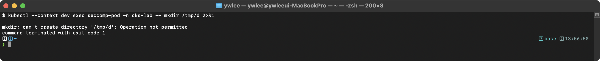

```bash
# 4. RuntimeDefault 프로파일 적용 Pod에서 seccomp 상태 확인
kubectl exec -it secure-pod -- grep Seccomp /proc/1/status
```

기대 출력:


Seccomp 값 2는 `SECCOMP_MODE_FILTER`(BPF 필터 활성 상태)를 의미한다. 0은 미적용, 1은 strict 모드이다.

### 3.4 Syscall 제한 원리와 공격 방어 매핑

시스템콜(Syscall)은 프로세스가 커널에 서비스를 요청하는 인터페이스이다. 불필요한 시스템콜을 차단하면 공격 표면을 줄일 수 있다.

**주요 시스템콜 카테고리:**
- **파일 관련**: `open`, `read`, `write`, `close`, `stat`, `chmod`, `chown`
- **프로세스 관련**: `fork`, `execve`, `exit`, `kill`, `ptrace`
- **네트워크 관련**: `socket`, `bind`, `listen`, `accept`, `connect`
- **시스템 관련**: `mount`, `umount`, `reboot`, `sethostname`

**위험한 시스템콜 (차단 권장):**
- `ptrace`: 다른 프로세스 디버깅/추적 (컨테이너 이스케이프에 악용 가능)
- `mount`: 파일시스템 마운트 (호스트 파일시스템 접근에 악용 가능)
- `reboot`: 시스템 재부팅
- `sethostname`: 호스트명 변경
- `unshare`: 네임스페이스 생성 (권한 상승에 악용 가능)

**공격 시나리오와 방어 기법 매핑:**

| 공격 시나리오 | 공격 벡터 | 방어 기법 조합 |
|--------------|----------|---------------|
| Container Escape | `ptrace` + `CAP_SYS_PTRACE`로 호스트 프로세스에 attach | seccomp(`ptrace` 차단) + `capabilities.drop: ALL` |
| Container Escape | `mount` + `CAP_SYS_ADMIN`으로 호스트 파일시스템 마운트 | seccomp(`mount` 차단) + `readOnlyRootFilesystem: true` + `runAsNonRoot: true` |
| 권한 상승 | `unshare`로 새 user namespace를 만들어 root 획득 | seccomp(`unshare` 차단) + `allowPrivilegeEscalation: false` |
| 호스트 커널 공격 | 커널 취약점을 통한 코드 실행 | seccomp(화이트리스트 모드) + gVisor(시스콜 인터셉트) |
| 민감 파일 접근 | `/etc/shadow`, `/proc/kcore` 읽기 | AppArmor(경로 기반 접근 제어) + `readOnlyRootFilesystem: true` |
| Reverse Shell | `socket` + `connect`로 외부 C2 서버 연결 | NetworkPolicy(egress 차단) + seccomp(특정 소켓 타입 차단) |

**왜 한 공격에 여러 기법을 겹치는가 (다중 방어, defense in depth):**

각 방어 기법은 막는 지점이 다르므로 한 가지만으로는 우회 경로가 남는다. 표의 각 조합을 역할 분담 관점으로 풀면 다음과 같다.

- **Container Escape(mount)에 `seccomp(mount 차단)` + `readOnlyRootFilesystem` + `runAsNonRoot`를 함께 거는 이유**: `readOnlyRootFilesystem: true`는 루트 파일시스템 쓰기를 막지만, Pod에는 보통 `/tmp` 같은 쓰기 가능한 emptyDir가 남아 있어 공격자가 거기에 바이너리를 떨굴 수 있다. 그래서 `runAsNonRoot`로 root 권한을 빼앗아 특권 작업의 발판을 줄이고, 그래도 mount 시스템콜 자체가 호출되면 `seccomp`이 커널 진입 단계에서 차단한다. 한 겹이 뚫려도 다음 겹이 받쳐 주는 구조다.
- **권한 상승(`unshare`)에 `seccomp(unshare 차단)` + `allowPrivilegeEscalation: false`를 함께 거는 이유**: `allowPrivilegeEscalation: false`는 setuid 바이너리를 통한 권한 상승을 막지만, `unshare`로 새 user namespace를 만들어 그 안에서 root가 되는 경로는 별개다. seccomp으로 `unshare` 시스템콜을 막아 이 우회로를 닫는다.
- **호스트 커널 공격에 `seccomp(화이트리스트)` + `gVisor`를 함께 두는 이유**: seccomp은 "허용 목록에 없는 시스템콜"을 막지만, 허용한 시스템콜에 커널 취약점이 있으면 그 경로로 공격이 들어온다. gVisor는 시스템콜을 사용자 공간에서 가로채 호스트 커널 도달 자체를 줄이므로, seccomp이 놓치는 영역을 보완한다.

**종합 방어 Pod 설정 예시:**
```yaml
apiVersion: v1
kind: Pod
metadata:
  name: hardened-pod
spec:
  automountServiceAccountToken: false
  securityContext:
    runAsNonRoot: true
    runAsUser: 1000
    runAsGroup: 1000
    seccompProfile:
      type: RuntimeDefault
    appArmorProfile:
      type: Localhost
      localhostProfile: k8s-deny-write
  containers:
  - name: app
    image: myregistry.io/app:v1.2.3
    securityContext:
      readOnlyRootFilesystem: true
      allowPrivilegeEscalation: false
      capabilities:
        drop: ["ALL"]
    volumeMounts:
    - name: tmp
      mountPath: /tmp
  volumes:
  - name: tmp
    emptyDir: {}
```

이 설정은 다음 공격 벡터를 차단한다:
- `runAsNonRoot: true` + `runAsUser: 1000`: root 권한으로 인한 커널 취약점 악용을 방지한다
- `readOnlyRootFilesystem: true`: 악성 바이너리 설치, crontab 수정 등을 차단한다
- `allowPrivilegeEscalation: false`: setuid 바이너리를 통한 root 획득을 차단한다
- `capabilities.drop: ALL`: 커널 기능(mount, ptrace, net_raw 등)에 대한 접근을 제거한다
- seccomp RuntimeDefault: 위험 시스콜(unshare, mount, ptrace 등)을 차단한다
- AppArmor: 경로 기반으로 파일 접근을 제한한다
- `automountServiceAccountToken: false`: SA 토큰 탈취를 통한 API server 접근을 차단한다

### 3.5 IAM 역할 관리, 최소 권한

클라우드 환경에서 쿠버네티스 노드와 Pod에 할당되는 IAM(Identity and Access Management) 역할을 최소 권한으로 관리해야 한다.

**원칙:**
- 노드 IAM 역할에는 필수 권한만 부여한다 (EC2, ECR, ELB 관련)
- Pod별로 서로 다른 IAM 역할이 필요하면 IRSA(IAM Roles for Service Accounts) 또는 Workload Identity를 사용한다
- 노드 IAM 역할에 S3, DynamoDB 등 애플리케이션 레벨 권한을 부여하지 않아야 한다
- 정기적으로 미사용 IAM 역할과 정책을 검토하고 제거해야 한다

**IRSA(IAM Roles for Service Accounts) 동작 원리:**

IRSA는 AWS EKS 전용 메커니즘이며, 같은 역할을 GCP는 Workload Identity, Azure는 Azure AD Workload Identity가 한다(세 곳 모두 "Pod의 ServiceAccount를 클라우드 IAM 역할에 OIDC로 매핑"하는 동일한 아이디어다). 기존에는 노드의 IAM 역할이 모든 Pod에 공유되어, 하나의 Pod만 침해되어도 노드 수준의 클라우드 권한이 탈취되는 문제가 있었다. IRSA는 다음 메커니즘으로 이를 해결한다:

1. EKS 클러스터에 OIDC provider를 설정한다. OIDC provider는 클러스터가 발급한 ServiceAccount 토큰(JWT)의 서명을 외부에서 검증할 수 있게 공개키를 노출하는 신원 공급자이며, AWS는 이 provider를 신뢰 대상으로 등록한다
2. IAM 역할의 trust policy(그 역할을 누가 맡을 수 있는지 정의하는 신뢰 정책)에 해당 OIDC provider와 특정 ServiceAccount를 조건으로 추가한다
3. Pod 내부의 projected service account token(JWT)에 audience 클레임이 포함된다
4. AWS SDK가 이 JWT를 AWS STS(Security Token Service, 임시 자격 증명을 발급하는 AWS 서비스)에 제출하여, 만료 시간이 있는 임시 자격 증명을 받아온다

이로써 Pod 단위로 IAM 역할을 분리할 수 있다.

---

## 4. Minimize Microservice Vulnerabilities (20%)

마이크로서비스의 취약점을 최소화하는 도메인이다. 전체 출제 비율의 20%를 차지하며, Pod Security, OPA Gatekeeper, Secret 관리 등 다양한 주제를 다룬다.

### 4.1 Pod Security Standards (Privileged/Baseline/Restricted)

Pod Security Standards는 쿠버네티스에서 Pod의 보안 수준을 정의하는 세 가지 정책 레벨이다.

**등장 배경과 기존 PodSecurityPolicy(PSP)의 한계:**

PodSecurityPolicy(PSP)는 Kubernetes 1.25에서 제거(deprecated → removed)되었다. PSP가 deprecated된 주요 이유는 다음과 같다:

1. **Mutation과 Validation의 혼재**: PSP는 동시에 요청을 변형(mutate)하고 검증(validate)했다. 이로 인해 어떤 PSP가 Pod를 변형했는지 추적하기 어렵고, 변형 결과가 다른 PSP의 검증과 충돌하는 예측 불가능한 상황이 발생했다.
2. **바인딩 모델의 복잡성**: PSP는 RBAC을 통해 ServiceAccount 또는 사용자에게 바인딩되었는데, Pod를 생성하는 주체(사용자 또는 컨트롤러)와 Pod를 실행하는 주체(ServiceAccount)가 다를 경우 어떤 PSP가 적용되는지 결정 로직이 비직관적이었다.
3. **Namespace 단위 제어 불가**: PSP는 클러스터 전체 리소스(ClusterScoped)로, 특정 namespace에만 선택적으로 적용하려면 복잡한 RBAC 조합이 필요했다.
4. **Dry-run 부재**: PSP를 적용하기 전에 기존 워크로드에 미치는 영향을 사전 평가할 방법이 없었다.

Pod Security Standards(PSS)와 Pod Security Admission(PSA)은 이러한 한계를 해결하기 위해 설계되었다. PSA는 검증만 수행하고 변형하지 않으며, namespace 라벨을 통해 namespace 단위로 적용되고, audit/warn 모드로 사전 영향 평가가 가능하다.

**세 가지 레벨:**

| 레벨 | 설명 | 사용 사례 |
|------|------|-----------|
| **Privileged** | 제한 없음. 모든 권한 허용 | 시스템 데몬, CNI 플러그인 |
| **Baseline** | 알려진 위험한 설정만 차단. 최소한의 보안 | 일반 워크로드 기본 정책 |
| **Restricted** | 가장 엄격한 보안 정책. Pod 강화 모범 사례 적용 | 보안에 민감한 워크로드 |

**Baseline 레벨에서 차단하는 항목:**

각 항목은 특정 컨테이너 이스케이프·정보 노출 경로를 막기 위해 차단된다. 어떤 위협을 닫는지 함께 본다.

- `hostNetwork: true` (위협: Pod이 호스트 네트워크 네임스페이스를 공유 → 호스트로 들어오는 트래픽을 스니핑하거나 호스트 포트와 충돌시킬 수 있고, NetworkPolicy로 격리되지 않는다)
- `hostPID: true` (위협: 호스트의 프로세스 목록(PID 네임스페이스)을 공유 → 호스트 프로세스를 `ps`로 들여다보거나 `kill`/`ptrace`로 조작할 수 있다)
- `hostIPC: true` (위협: 호스트의 IPC 네임스페이스를 공유 → 공유 메모리·세마포어를 통해 호스트 프로세스의 데이터에 접근할 수 있다)
- `privileged: true` (위협: 사실상 모든 Linux capabilities와 디바이스 접근을 획득 → 호스트 디스크 마운트·커널 모듈 로드 등 컨테이너 이스케이프의 디딤돌이 된다)
- `hostPath` 볼륨 (위협: 호스트 파일시스템의 임의 경로를 Pod에 마운트 → `/etc`나 `/var/run/docker.sock` 같은 민감 경로를 읽거나 변조할 수 있다)
- 위험한 capabilities (NET_RAW 제외한 추가 capabilities) (위협: `SYS_ADMIN`·`SYS_PTRACE` 등을 추가하면 mount·디버깅 같은 특권 작업이 가능해진다)
- hostPort 사용 (위협: 호스트 포트를 직접 점유 → 노드 단위로 노출되어 네트워크 격리 정책을 우회하고 포트를 선점할 수 있다)

**Restricted 레벨에서 추가로 요구하는 항목:**
- `runAsNonRoot: true` 필수
- `allowPrivilegeEscalation: false` 필수
- `seccompProfile.type: RuntimeDefault` 또는 `Localhost` 필수
- capabilities를 `ALL` drop 후 필요한 것만 add
- 볼륨 타입 제한 (configMap, emptyDir, secret 등만 허용)

### 4.2 Pod Security Admission (enforce/audit/warn 모드)

Pod Security Admission은 Pod Security Standards를 네임스페이스 단위로 적용하는 빌트인 Admission Controller이다. PodSecurityPolicy(PSP)의 후속 메커니즘이다.

**세 가지 모드:**

| 모드 | 동작 |
|------|------|
| `enforce` | 위반하는 Pod 생성을 **거부**한다 |
| `audit` | 위반을 감사 로그에 기록하지만 Pod 생성은 허용한다 |
| `warn` | 사용자에게 경고 메시지를 표시하지만 Pod 생성은 허용한다 |

**네임스페이스에 적용:**
```yaml
apiVersion: v1
kind: Namespace
metadata:
  name: secure-ns
  labels:
    pod-security.kubernetes.io/enforce: restricted
    pod-security.kubernetes.io/enforce-version: latest
    pod-security.kubernetes.io/audit: restricted
    pod-security.kubernetes.io/warn: restricted
```

**실습 검증: Pod Security Admission 적용 후 위반 Pod 거부 확인**

```bash
# 1. restricted 레벨이 적용된 namespace에 위반 Pod 생성 시도
kubectl apply -f - <<'EOF'
apiVersion: v1
kind: Pod
metadata:
  name: privileged-pod
  namespace: secure-ns
spec:
  containers:
  - name: app
    image: nginx
    securityContext:
      privileged: true
EOF
```

기대 출력:
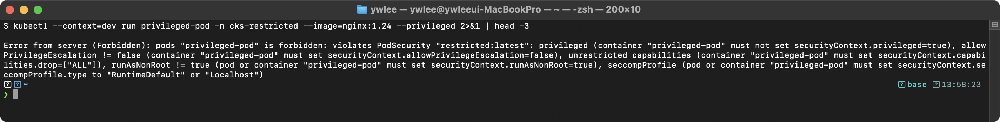

```bash
# 2. 정상적인 restricted 호환 Pod 생성
kubectl apply -f - <<'EOF'
apiVersion: v1
kind: Pod
metadata:
  name: compliant-pod
  namespace: secure-ns
spec:
  securityContext:
    runAsNonRoot: true
    runAsUser: 1000
    seccompProfile:
      type: RuntimeDefault
  containers:
  - name: app
    image: nginx
    securityContext:
      allowPrivilegeEscalation: false
      capabilities:
        drop: ["ALL"]
EOF
```

기대 출력:
> **예시(참조) — pod/compliant-pod created:** CKS 보안 기대 출력(도구/설정/환경 의존). 재현 가능한 핵심은 CKS daily(day01~14) 및 본 문서 캡처 참고.

**핵심 포인트:**
- 라벨 형식: `pod-security.kubernetes.io/<mode>: <level>`
- 버전 고정 가능: `pod-security.kubernetes.io/<mode>-version: v1.29`
- `latest`를 사용하면 클러스터 버전에 따라 자동으로 최신 기준이 적용된다
- enforce 모드를 적용하기 전에 audit/warn 모드로 먼저 테스트하는 것이 권장된다
- kube-system 등 시스템 네임스페이스에는 privileged를 유지해야 한다

### 4.3 OPA Gatekeeper (ConstraintTemplate, Constraint)

OPA(Open Policy Agent) Gatekeeper는 쿠버네티스에서 정책을 코드로 정의하고 적용하는 Admission Controller이다. Rego 언어로 정책을 작성한다.

**등장 배경과 기존 한계:**

쿠버네티스의 빌트인 Admission Controller(PodSecurity, NodeRestriction, LimitRanger 등)는 사전 정의된 정책만 적용할 수 있다. "특정 레지스트리의 이미지만 허용", "모든 Deployment에 특정 라벨이 있어야 한다", "Ingress에 중복 호스트명을 사용할 수 없다" 등의 조직 고유 정책은 빌트인 컨트롤러로 구현할 수 없다. 이전에는 커스텀 Admission Webhook을 직접 개발하여 배포해야 했으나, 각 정책마다 별도의 웹 서비스를 개발/운영하는 것은 비용이 크다.

OPA Gatekeeper는 범용 정책 엔진(OPA)을 쿠버네티스 Admission Webhook으로 통합하여, Rego 언어로 정책을 선언적으로 작성하고 CRD(ConstraintTemplate, Constraint)를 통해 적용할 수 있게 한다. 정책을 추가할 때마다 코드를 배포할 필요 없이, YAML 매니페스트를 apply하는 것만으로 정책이 활성화된다.

**아키텍처:**
- **ConstraintTemplate**: 정책의 "템플릿"을 정의한다. Rego 코드와 파라미터 스키마를 포함한다
- **Constraint**: ConstraintTemplate을 기반으로 실제 정책 인스턴스를 생성한다. 파라미터 값과 적용 대상을 지정한다

**ConstraintTemplate 예시 (허용된 레지스트리 제한):**
```yaml
apiVersion: templates.gatekeeper.sh/v1
kind: ConstraintTemplate
metadata:
  name: k8sallowedrepos
spec:
  crd:
    spec:
      names:
        kind: K8sAllowedRepos
      validation:
        openAPIV3Schema:
          type: object
          properties:
            repos:
              type: array
              items:
                type: string
  targets:
  - target: admission.k8s.gatekeeper.sh
    rego: |
      package k8sallowedrepos

      violation[{"msg": msg}] {
        container := input.review.object.spec.containers[_]
        satisfied := [good | repo = input.parameters.repos[_] ; good = startswith(container.image, repo)]
        not any(satisfied)
        msg := sprintf("container <%v> has an invalid image repo <%v>, allowed repos are %v", [container.name, container.image, input.parameters.repos])
      }

      violation[{"msg": msg}] {
        container := input.review.object.spec.initContainers[_]
        satisfied := [good | repo = input.parameters.repos[_] ; good = startswith(container.image, repo)]
        not any(satisfied)
        msg := sprintf("initContainer <%v> has an invalid image repo <%v>, allowed repos are %v", [container.name, container.image, input.parameters.repos])
      }
```

**Constraint 예시:**
```yaml
apiVersion: constraints.gatekeeper.sh/v1beta1
kind: K8sAllowedRepos
metadata:
  name: require-trusted-repos
spec:
  match:
    kinds:
    - apiGroups: [""]
      kinds: ["Pod"]
  parameters:
    repos:
    - "myregistry.io/"
    - "gcr.io/my-project/"
```

**Rego 기본 문법:**
```rego
package k8srequiredlabels

violation[{"msg": msg}] {
  provided := {label | input.review.object.metadata.labels[label]}
  required := {label | label := input.parameters.labels[_]}
  missing := required - provided
  count(missing) > 0
  msg := sprintf("필수 라벨 누락: %v", [missing])
}
```

**Rego violation 블록 읽는 법:**

Gatekeeper는 `violation`이라는 이름의 규칙을 평가해, 그 본문이 모두 참이면 "위반"으로 보고 admission을 거부한다. 규칙은 머리(head)와 본문(body)으로 나뉜다. 머리 `violation[{"msg": msg}]`는 "위반이 성립하면 이 형태의 결과(메시지를 담은 객체)를 집합에 추가한다"는 출력 형식이고, 중괄호 `{ ... }` 안의 본문은 모든 줄이 동시에 참이어야 위반이 성립하는 AND 조건들이다. 본문 안의 `:=`는 변수 바인딩(값 대입)이며, 마지막 `count(missing) > 0` 같은 비교식이 거짓이면 그 규칙은 위반을 만들지 않는다.

검사 대상 리소스는 항상 `input.review.object` 아래에 들어온다. 즉 admission에 들어온 쿠버네티스 오브젝트 전체가 이 경로에 매핑되므로, 거기서 원하는 필드를 점(`.`)으로 따라 내려가면 된다. 자주 쓰는 접근 패턴은 다음과 같다(시험에서 직접 수정·작성 대상):

```rego
input.review.object.metadata.labels[label]   # 라벨 맵에서 키 순회 (위 예시)
input.review.object.spec.containers[_].image  # 모든 컨테이너의 image 값 순회
input.review.object.kind                       # 리소스 종류 (Pod, Deployment 등)
```

여기서 `[_]`는 "배열의 모든 원소를 하나씩 순회"하라는 와일드카드 인덱스이고, 집합 연산에서 본 `required - provided`의 `-`는 차집합(required에는 있는데 provided에는 없는 라벨, 즉 누락 라벨)을 구한다.

**실습 검증: OPA Gatekeeper Constraint 적용 후 위반 Pod 거부 확인**

```bash
# 1. ConstraintTemplate과 Constraint 적용
kubectl apply -f constrainttemplate-allowedrepos.yaml
kubectl apply -f constraint-require-trusted-repos.yaml

# 2. Constraint 상태 확인 (enforcementAction 확인)
kubectl get constraint require-trusted-repos -o yaml | grep -A5 status
```

기대 출력:
> **예시(참조) — audit 로그/정책(설정 필요):** status: ... (도구/설정 의존, 해당 도구 설치·구성 환경에서 재현).

```bash
# 3. 허용되지 않은 레지스트리의 이미지로 Pod 생성 시도
kubectl run bad-pod --image=docker.io/nginx:latest
```

기대 출력:


```bash
# 4. 허용된 레지스트리의 이미지로 Pod 생성
kubectl run good-pod --image=myregistry.io/nginx:1.25
```

기대 출력:
> **예시(참조) — pod/good-pod created:** CKS 보안 기대 출력(도구/설정/환경 의존). 재현 가능한 핵심은 CKS daily(day01~14) 및 본 문서 캡처 참고.

**CKS 시험에서의 활용:**
- ConstraintTemplate과 Constraint를 작성하는 문제가 출제된다
- 주로 허용된 레지스트리 제한, 필수 라벨 검증 등의 정책이 출제된다
- Rego 문법을 완벽히 외울 필요는 없지만, 기본 구조는 이해해야 한다
- `input.review.object`가 검사 대상 쿠버네티스 리소스를 나타낸다는 것을 알아야 한다

### 4.4 Secret 관리

쿠버네티스 Secret은 기본적으로 base64 인코딩만 되어 있어 보안이 충분하지 않다. base64는 암호화가 아니라 인코딩이므로, etcd에 접근 가능한 공격자는 모든 Secret을 평문으로 복원할 수 있다. 추가적인 보안 조치가 필요하다.

**Secret 보안 강화 방법:**

1. **Encryption at Rest (유휴 시 암호화)**
   - etcd에 저장되는 Secret 데이터를 암호화한다
   - EncryptionConfiguration을 작성하고 API server에 적용한다
   - 암호화 프로바이더: `aescbc`, `aesgcm`, `secretbox`, `kms`(권장)

   ```yaml
   apiVersion: apiserver.config.k8s.io/v1
   kind: EncryptionConfiguration
   resources:
   - resources:
     - secrets
     providers:
     - aescbc:
         keys:
         - name: key1
           secret: <base64로 인코딩된 32바이트 키>
     - identity: {}
   ```

   API server 플래그: `--encryption-provider-config=/etc/kubernetes/enc/enc.yaml`

   `providers` 배열은 위에서부터 순서가 의미를 가진다. **쓰기(저장)** 시에는 맨 앞 provider(여기서는 `aescbc`)로 암호화하고, **읽기(복호화)** 시에는 배열을 위에서 아래로 순회하며 데이터를 해독할 수 있는 첫 provider를 쓴다. 마지막의 `identity: {}` 는 "암호화하지 않는 평문 provider"이며, 암호화를 적용하기 전 이미 etcd에 평문으로 저장돼 있던 기존 Secret을 그대로 읽기 위한 fallback(대체 경로)이다. 따라서 마이그레이션 초기에는 `aescbc`(쓰기·우선 읽기)와 `identity`(평문 데이터 읽기)를 함께 둔다. 모든 기존 Secret을 재암호화해 평문 데이터가 사라진 뒤에는, 평문 저장을 다시 허용하지 않도록 `identity` 항목을 제거하는 것이 권장된다(반대로 암호화를 해제·롤백하려면 `identity`를 맨 앞으로 옮긴다).

   적용 후 기존 Secret을 재암호화해야 한다. EncryptionConfiguration은 **이후 새로 생성·수정되는 Secret만** 자동으로 암호화하므로, 설정 이전부터 존재하던 Secret은 여전히 etcd에 평문으로 남아 있다. 아래 명령은 모든 Secret을 한 번 `replace`(다시 저장)해 강제로 쓰기 경로를 거치게 하여, 기존 Secret까지 현재 우선 provider로 재암호화한다:
   ```bash
   kubectl get secrets --all-namespaces -o json | kubectl replace -f -
   ```

   **검증:**
   ```bash
   # etcd에서 Secret이 암호화되었는지 확인
   ETCDCTL_API=3 etcdctl --endpoints=https://127.0.0.1:2379 \
     --cacert=/etc/kubernetes/pki/etcd/ca.crt \
     --cert=/etc/kubernetes/pki/etcd/server.crt \
     --key=/etc/kubernetes/pki/etcd/server.key \
     get /registry/secrets/default/my-secret
   ```

   기대 출력 (암호화 적용 전 — etcd 에 평문 저장):
   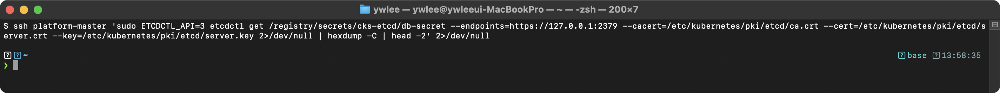

### 4.5 RuntimeClass (gVisor/Kata Containers)

RuntimeClass는 Pod가 어떤 컨테이너 런타임(handler)으로 실행될지 지정하는 리소스이다. 앞 절(4.4)이 etcd에 저장된 데이터를 보호하는 방어였다면, RuntimeClass는 실행 중인 컨테이너가 호스트 커널에 가하는 위협을 줄이는 방어이다.

**등장 배경: runc 공유 커널의 위협 모델:**

기본 런타임인 runc로 실행되는 컨테이너는 호스트 커널을 그대로 공유한다(컨테이너는 namespace·cgroup으로 격리된 프로세스일 뿐, 별도 커널이 없다). 따라서 컨테이너 내부에서 호출한 시스템콜은 호스트 커널이 직접 처리한다. 이 구조에서는 커널 자체에 취약점(예: 권한 상승을 일으키는 시스템콜 버그)이 있으면, 컨테이너 안의 공격자가 그 시스템콜을 호출해 호스트 커널을 장악하고 컨테이너 경계를 탈출(container escape)할 수 있다. seccomp으로 위험 시스템콜을 막을 수 있지만, 허용한 시스템콜에 취약점이 있으면 막을 수 없다는 한계가 있다(§3.4 참조).

**무엇이 나아졌나 — 샌드박스 런타임:**

gVisor(handler `runsc`)는 컨테이너와 호스트 커널 사이에 Sentry라는 사용자 공간 커널을 끼워 넣는다. 컨테이너가 호출한 시스템콜은 호스트 커널이 아니라 먼저 Sentry가 가로채(intercept) 처리하므로, 호스트 커널에 도달하는 시스템콜의 종류와 횟수가 크게 줄어든다. 즉 커널 취약점을 노린 공격이 호스트 커널에 닿기 전에 사용자 공간에서 차단된다. Kata Containers는 다른 접근으로, 각 Pod를 경량 가상머신(VM) 안에서 실행해 하드웨어 가상화 수준의 격리를 제공한다.

**트레이드오프:**

시스템콜을 사용자 공간에서 가로채거나 VM을 띄우는 만큼 성능 오버헤드(특히 시스템콜이 잦은 I/O 집약 워크로드)와 호환성 제약(일부 시스템콜 미지원)이 생긴다. 따라서 모든 Pod가 아니라 신뢰할 수 없는 코드를 실행하는 멀티테넌트 워크로드 등 위험이 높은 대상에만 선택적으로 적용하는 것이 일반적이다.

**RuntimeClass 정의:**
```yaml
apiVersion: node.k8s.io/v1
kind: RuntimeClass
metadata:
  name: gvisor
handler: runsc
```

**Pod에서 RuntimeClass 사용:**
```yaml
apiVersion: v1
kind: Pod
metadata:
  name: sandboxed-pod
spec:
  runtimeClassName: gvisor
  containers:
  - name: app
    image: nginx
```

**실습 검증:**
```bash
# 1. RuntimeClass 생성 확인
kubectl get runtimeclass gvisor

# 2. gVisor Pod에서 커널 정보 확인 (gVisor 커널이 보임)
kubectl exec -it sandboxed-pod -- uname -r
```

기대 출력:
> **예시(참조) — 4.4.0:** CKS 보안 기대 출력(도구/설정/환경 의존). 재현 가능한 핵심은 CKS daily(day01~14) 및 본 문서 캡처 참고.

gVisor의 Sentry는 호스트 커널이 아니라 자신이 구현한 가상 커널 인터페이스를 보고한다. 따라서 `uname -r`의 출력(여기서는 `4.4.0`)은 호스트 커널 버전과 독립적이며, gVisor의 버전에 따라 달라질 수 있으므로 정확히 `4.4.0`이라고 단정할 수는 없다. 판별의 핵심은 "출력값이 호스트의 실제 커널 버전과 다르다"는 점이며, 다르게 나오면 시스템콜이 Sentry에서 가로채지고 있다는, 즉 gVisor가 정상 동작 중이라는 신호다. 같은 명령을 일반 runc Pod에서 실행하면 호스트 커널 버전(예: 6.x)이 그대로 나온다.

참고: 실습 환경에 gVisor(`runsc` 핸들러)가 노드 containerd에 설치·등록되어 있지 않으면 위 Pod는 스케줄 시 런타임 부재로 생성에 실패한다(ContainerCreating에서 멈추거나 `RunContainerError`). 이 저장소의 tart 노드에는 기본적으로 gVisor가 없으므로, 이 검증은 별도 설치 후에만 재현 가능하며 미설치 시 결과를 "(미설치)"로 표기한다.

```bash
# 3. dmesg 실행 시도 (gVisor에서는 제한됨)
kubectl exec -it sandboxed-pod -- dmesg
```

기대 출력:


**CKS 시험에서의 활용:**
- RuntimeClass를 생성하고 Pod에 적용하는 문제가 출제된다
- handler 이름은 노드의 containerd 설정(`/etc/containerd/config.toml`)에 정의된 런타임과 일치해야 한다

### 4.6 mTLS (Istio 서비스 메시)

mTLS(mutual TLS)는 클라이언트와 서버가 상호 인증하는 TLS 통신이다. Istio 서비스 메시를 통해 마이크로서비스 간 mTLS를 자동으로 적용할 수 있다.

**등장 배경: 평문 통신의 위험:**

쿠버네티스 클러스터 내부의 Pod-Pod 통신은 별도 설정이 없으면 평문(HTTP)이다. 즉 클러스터는 "내부 네트워크는 신뢰한다"는 가정 위에 기본적으로 암호화를 켜지 않는다. 이 구간을 강제로 암호화하여 신뢰 가정을 제거하는 것이 mTLS의 목적이다. 동일 노드의 Pod 간 통신도 veth 인터페이스를 통과하므로, 노드에 접근 가능한 공격자가 tcpdump 등으로 패킷을 스니핑하면 애플리케이션 데이터(API 키, 인증 토큰, 개인정보 등)가 그대로 노출된다. 또한 ARP spoofing이나 DNS poisoning을 통한 중간자 공격(MITM)으로 트래픽을 변조할 수 있다.

mTLS는 이러한 위협에 대해 다음을 제공한다:
- **기밀성**: 트래픽을 TLS로 암호화하여 스니핑을 방지한다
- **무결성**: 트래픽 변조를 탐지한다
- **인증**: 양쪽 모두 X.509 인증서로 상호 인증하여 위장(spoofing)을 방지한다

**Istio mTLS 모드:**
- `STRICT`: mTLS만 허용. 평문 트래픽 거부
- `PERMISSIVE`: mTLS와 평문 모두 허용 (마이그레이션 시 사용)
- `DISABLE`: mTLS 비활성화

**PeerAuthentication으로 mTLS 적용:**
```yaml
apiVersion: security.istio.io/v1beta1
kind: PeerAuthentication
metadata:
  name: default
  namespace: istio-system  # 전역 적용
spec:
  mtls:
    mode: STRICT
```

**Istio mTLS 내부 동작:**

Istio는 각 Pod에 Envoy 사이드카 프록시를 자동 주입한다. Envoy 프록시는 iptables 규칙(또는 eBPF)을 통해 Pod의 모든 인/아웃바운드 트래픽을 인터셉트한다. istiod(컨트롤 플레인)는 각 Envoy에 X.509 인증서를 발급하고 주기적으로 갱신한다. 서비스 A가 서비스 B를 호출하면, A의 Envoy와 B의 Envoy 사이에 mTLS 핸드셰이크가 수행된다. 이 과정은 애플리케이션에 투명하게 처리되므로, 애플리케이션 코드 변경 없이 mTLS를 적용할 수 있다.

**mTLS를 구현하는 위치(레이어) 비교:**

mTLS는 반드시 Istio 같은 서비스 메시로만 구현되는 것은 아니다. 어느 레이어에서 암호화를 거느냐에 따라 선택지가 갈린다.

- 애플리케이션 레벨: 애플리케이션 코드가 직접 TLS 클라이언트/서버 인증서를 다룬다. 가장 단순하지만 모든 서비스 코드를 고쳐야 하고 인증서 갱신을 직접 관리해야 한다.
- 사이드카 프록시 레벨(메시 미사용): Pod 옆에 Envoy/nginx 같은 TLS 프록시 컨테이너를 붙여, 평문 애플리케이션 앞단에서 암호화한다. 코드는 안 고쳐도 되지만 프록시 설정·인증서 배포를 직접 해야 한다.
- 서비스 메시 레벨(Istio 등): 사이드카 주입·인증서 발급/갱신을 컨트롤 플레인(istiod)이 자동화한다. 가장 운영 부담이 적지만, 메시 자체를 설치·운영하는 비용이 든다.

즉 mTLS는 "어떤 계층에서 TLS 핸드셰이크를 수행하느냐"의 문제이고, Istio는 그중 사이드카 방식을 자동화한 한 가지 구현일 뿐이다.

**핵심 포인트:**
- Istio는 사이드카 프록시(Envoy)를 Pod에 자동 주입하여 mTLS를 처리한다
- 서비스 간 통신이 자동으로 암호화되므로 애플리케이션 코드 변경 없이 mTLS를 적용할 수 있다
- CKS에서는 Istio 설치/운영보다는 mTLS의 개념과 PeerAuthentication 리소스 이해를 평가한다

---

## 5. Supply Chain Security (20%)

소프트웨어 공급망 보안을 다루는 도메인이다. 컨테이너 이미지의 빌드, 스캔, 서명, 검증 등을 포함한다.

### 5.1 이미지 취약점 스캔 (Trivy)

Trivy는 Aqua Security에서 개발한 오픈소스 취약점 스캐너이다. 컨테이너 이미지, 파일시스템, Git 리포지토리 등을 스캔할 수 있다.

**기본 사용법:**
```bash
# 이미지 스캔
trivy image nginx:1.21

# 심각도 필터링
trivy image --severity CRITICAL,HIGH nginx:1.21

# CI/CD 파이프라인에서 사용 (취약점 발견 시 빌드 실패)
trivy image --exit-code 1 --severity CRITICAL nginx:1.21

# 특정 취약점만 무시
trivy image --ignore-unfixed nginx:1.21

# JSON 출력
trivy image --format json -o result.json nginx:1.21

# 파일시스템 스캔
trivy fs /path/to/project

# SBOM 생성
trivy image --format cyclonedx -o sbom.json nginx:1.21
```

**심각도 레벨:**
| 레벨 | 설명 |
|------|------|
| CRITICAL | 즉시 수정 필요. 원격 코드 실행 등 심각한 위협 |
| HIGH | 빠른 수정 필요 |
| MEDIUM | 계획된 업데이트에서 수정 |
| LOW | 위험도 낮음 |
| UNKNOWN | 심각도 미분류 |

**실습 검증: Trivy 이미지 스캔 결과 확인**

```bash
trivy image --severity CRITICAL,HIGH nginx:1.21
```

기대 출력 (실행 시점에 따라 달라짐):
> **예시(참조) — 2024-01-15T10:00:00.000Z  INFO  Vulnerability sc:** CKS 보안 기대 출력(도구/설정/환경 의존). 재현 가능한 핵심은 CKS daily(day01~14) 및 본 문서 캡처 참고.

```bash
# exit-code 옵션을 사용한 CI/CD 게이트
trivy image --exit-code 1 --severity CRITICAL nginx:1.21
echo "Exit code: $?"
```

기대 출력:
> **예시(참조) — ...:** CKS 보안 기대 출력(도구/설정/환경 의존). 재현 가능한 핵심은 CKS daily(day01~14) 및 본 문서 캡처 참고.

CRITICAL 취약점이 발견되면 exit code 1을 반환하므로, CI/CD 파이프라인에서 빌드를 자동으로 실패시킬 수 있다.

위 출력의 구체적인 CVE 번호(`CVE-2023-0286` 등), 심각도, 총 개수(`Total: 52`)는 예시일 뿐이다. Trivy의 취약점 DB는 정기적으로 갱신되므로, 같은 `nginx:1.21`을 스캔해도 실행 시기·Trivy 버전·DB 버전에 따라 탐지되는 CVE 목록과 심각도 집계가 달라진다. 문서의 숫자와 실제 출력이 일치하지 않는 것은 정상이다. 학습에서 확인할 것은 개별 CVE 번호가 아니라 `--severity CRITICAL,HIGH` 필터가 동작해 HIGH 이상만 표시되고, CRITICAL이 하나라도 있으면 `--exit-code 1`로 빌드를 막을 수 있다는 메커니즘이다.

**CKS 시험에서의 활용:**
- 이미지를 스캔하고 특정 심각도 이상의 취약점이 있는 이미지를 식별하는 문제가 출제된다
- `--severity`와 `--exit-code` 옵션을 사용하는 방법을 알아야 한다

### 5.2 ImagePolicyWebhook

ImagePolicyWebhook은 Admission Controller의 하나로, Pod가 사용하는 컨테이너 이미지를 외부 웹훅 서비스를 통해 검증한다.

**설정 구성 요소:**
1. **AdmissionConfiguration**: 웹훅 설정 파일 경로를 지정한다
2. **ImageReview webhook config**: 웹훅 서비스의 URL, TLS 설정 등을 정의한다
3. **API server 플래그**: `--enable-admission-plugins=ImagePolicyWebhook`과 `--admission-control-config-file`을 설정한다

**AdmissionConfiguration 예시:**
```yaml
apiVersion: apiserver.config.k8s.io/v1
kind: AdmissionConfiguration
plugins:
- name: ImagePolicyWebhook
  configuration:
    imagePolicy:
      kubeConfigFile: /etc/kubernetes/admission-control/imagepolicy-kubeconfig.yaml
      allowTTL: 50
      denyTTL: 50
      retryBackoff: 500
      defaultAllow: false
```

**imagepolicy-kubeconfig.yaml 예시:**
```yaml
apiVersion: v1
kind: Config
clusters:
- name: image-checker
  cluster:
    certificate-authority: /etc/kubernetes/admission-control/webhook-ca.crt
    server: https://image-checker.default.svc:8443/check-image
contexts:
- name: image-checker
  context:
    cluster: image-checker
current-context: image-checker
```

**동작 방식:**
1. Pod 생성 요청이 들어온다
2. API server가 ImagePolicyWebhook을 호출한다
3. 웹훅이 ImageReview 요청을 받아 이미지를 검증한다
4. 검증 결과(allowed: true/false)를 반환한다
5. API server가 결과에 따라 Pod 생성을 허용/거부한다

**핵심 설정:**
- `defaultAllow`: 웹훅이 응답하지 않을 때 기본 동작 (true: 허용, false: 거부)
- 보안 관점에서 `defaultAllow: false`가 권장된다 (fail-closed)

### 5.3 이미지 서명/검증 (Cosign, Notary/TUF)

컨테이너 이미지의 무결성과 출처를 검증하기 위해 이미지에 서명하고, 배포 시 서명을 검증하는 프로세스이다.

**등장 배경: 이미지 레지스트리 변조 공격:**

컨테이너 레지스트리가 침해되거나, 레지스트리와 클러스터 사이의 네트워크에서 중간자 공격이 발생하면, 공격자가 악성 코드가 삽입된 이미지를 정상 이미지로 교체할 수 있다. 이미지 태그(`nginx:1.25`)는 가변적이므로, 같은 태그가 다른 이미지 다이제스트를 가리킬 수 있다. 이미지 서명은 이미지의 빌더(게시자)가 이미지에 암호학적 서명을 부여하고, 배포(pull) 시점에 서명을 검증하여 이미지가 변조되지 않았음을 보장한다.

**Cosign (Sigstore 프로젝트):**

Cosign의 서명 검증 흐름은 다음과 같다:

1. **서명 생성**: 이미지의 digest(SHA256)에 대해 개인키로 서명한다. 서명은 OCI 레지스트리에 이미지와 함께 저장된다 (별도의 태그로 저장됨, 예: `sha256-<digest>.sig`).
2. **서명 검증**: 이미지를 pull할 때 서명을 함께 가져와서 공개키로 검증한다. 서명이 유효하면 이미지 digest가 서명 시점과 동일함이 보장된다.
3. **Keyless signing** (OIDC 기반): 개인키를 관리하지 않고, OIDC 인증(Google, GitHub 등)을 통해 임시 키를 발급받아 서명한다. 서명 이벤트는 투명성 로그(Rekor)에 기록되어 감사 추적이 가능하다.

```bash
# 키 쌍 생성
cosign generate-key-pair

# 이미지 서명
cosign sign --key cosign.key <image-reference>

# 서명 검증
cosign verify --key cosign.pub <image-reference>

# 키 없는 서명 (OIDC 기반, keyless signing)
cosign sign <image-reference>
cosign verify --certificate-identity=email@example.com --certificate-oidc-issuer=https://accounts.google.com <image-reference>
```

**실습 검증: Cosign 서명 검증**

```bash
# 서명된 이미지 검증
cosign verify --key cosign.pub myregistry.io/app:v1.0.0
```

기대 출력 (서명 유효):
> **예시(참조) — Verification for myregistry.io/app:v1.0.0 --:** CKS 보안 기대 출력(도구/설정/환경 의존). 재현 가능한 핵심은 CKS daily(day01~14) 및 본 문서 캡처 참고.

기대 출력 (서명 없거나 무효):
> **예시(참조) — Error: no matching signatures::** CKS 보안 기대 출력(도구/설정/환경 의존). 재현 가능한 핵심은 CKS daily(day01~14) 및 본 문서 캡처 참고.

**Notary/TUF:**
- The Update Framework(TUF) 기반의 이미지 서명 프레임워크이다
- Docker Content Trust(DCT)의 기반 기술이다
- `DOCKER_CONTENT_TRUST=1` 환경변수를 설정하면 서명된 이미지만 pull할 수 있다

**Kubernetes 클러스터에서의 이미지 서명 강제:**

정책 엔진(OPA Gatekeeper, Kyverno 등)과 Cosign을 연동하여, 서명이 유효한 이미지만 Pod에서 사용하도록 강제할 수 있다. Kyverno의 경우 다음과 같은 정책을 적용한다:

```yaml
apiVersion: kyverno.io/v1
kind: ClusterPolicy
metadata:
  name: verify-image-signature
spec:
  validationFailureAction: Enforce
  rules:
  - name: verify-cosign-signature
    match:
      any:
      - resources:
          kinds:
          - Pod
    verifyImages:
    - imageReferences:
      - "myregistry.io/*"
      attestors:
      - entries:
        - keys:
            publicKeys: |-
              -----BEGIN PUBLIC KEY-----
              MFkwEwYHKoZIzj0CAQYIKoZIzj0DAQcDQgAE...
              -----END PUBLIC KEY-----
```

### 5.4 Allowlist 레지스트리 (OPA로 허용된 레지스트리만 허용)

신뢰할 수 있는 컨테이너 레지스트리에서만 이미지를 pull하도록 제한하는 정책이다. OPA Gatekeeper로 구현한다.

**등장 배경: 출처 통제 없는 이미지 pull의 위협:**

쿠버네티스는 기본적으로 어떤 레지스트리에서든 이미지를 가져와 실행한다. 5.1~5.3에서 스캔·서명으로 "이미지 내용"을 검증했다면, 여기서는 "이미지가 어디서 왔는가(출처)"를 통제한다. 출처 통제가 없으면 개발자가 검증되지 않은 공개 레지스트리(예: Docker Hub의 임의 사용자 이미지)나 오타로 잘못 지정한 typosquatting(정식 이름과 비슷한 가짜 이름) 레지스트리에서 이미지를 끌어와, 사내 스캔·서명 파이프라인을 우회한 악성 이미지가 클러스터에 들어올 수 있다. 직전에는 이를 사람이 코드 리뷰로 잡아야 했는데 누락이 잦았다. Allowlist는 이를 admission(요청 입장) 단계에서 자동 강제하는 방식으로 해결한다. OPA Gatekeeper의 정책이 Pod 생성 요청을 가로채 모든 컨테이너 이미지의 레지스트리 접두사가 허용 목록에 드는지 검사하고, 벗어나면 생성을 거부한다. 트레이드오프로는 허용 목록을 운영자가 유지해야 하고, 새 레지스트리를 쓸 때마다 정책을 갱신해야 하며, `containers`·`initContainers`·`ephemeralContainers`까지 빠짐없이 검사하지 않으면(특히 디버깅용 ephemeral 컨테이너) 우회 구멍이 남는다는 점이 있다.

**구현 방식:**
- ConstraintTemplate에서 이미지 레지스트리를 검사하는 Rego 정책을 작성한다
- Constraint에서 허용할 레지스트리 목록을 파라미터로 전달한다
- Pod의 `spec.containers[].image`와 `spec.initContainers[].image`를 모두 검사해야 한다
- `spec.ephemeralContainers[].image`도 검사 대상에 포함해야 한다 (디버깅 컨테이너를 통한 우회 방지)

### 5.5 Dockerfile 보안

Dockerfile을 작성할 때 보안을 고려해야 한다.

**등장 배경: 이미지에 그대로 굳는 위험:**

컨테이너 이미지는 빌드 시점의 상태가 그대로 굳어(immutable layer) 런타임까지 따라간다. 따라서 Dockerfile에서 잘못 만든 결정은 실행 단계에서 늦게 고치기 어렵고, 그 이미지를 쓰는 모든 Pod에 반복 노출된다. 대표적 고통은 세 가지였다. 첫째, 기본값이 root 실행이라 컨테이너가 침해되면 컨테이너 내 root 권한이 그대로 공격자에게 넘어가고, 호스트와 공유하는 커널 표면을 더 크게 노린다. 둘째, 편의를 위해 풀(full) OS 베이스에 `curl`·`vim` 등 도구를 잔뜩 넣으면, 그 패키지마다 CVE가 따라붙어 공격 표면과 스캔 노이즈가 커진다. 셋째, 빌드 도구(컴파일러·패키지 매니저)가 최종 이미지에 남으면 공격자가 컨테이너 안에서 곧장 무기를 손에 쥔다. 아래 모범 사례는 이 고통을 각각 비-root 실행, distroless/scratch 같은 최소 베이스, 멀티스테이지 빌드(빌드 산출물만 최종 이미지에 복사)로 해소한 것이다. 트레이드오프는 distroless에는 셸·디버깅 도구가 없어 장애 시 컨테이너 내부 디버깅이 불편하고(ephemeral 컨테이너 등 별도 수단 필요), 멀티스테이지·버전 고정이 Dockerfile을 길고 관리할 거리가 많게 만든다는 점이다.

**보안 모범 사례:**
1. **non-root USER 사용**: `USER 1000:1000` 또는 `USER appuser`
2. **최소 베이스 이미지**: `scratch`, `distroless`, `alpine` 사용
3. **멀티스테이지 빌드**: 빌드 도구를 최종 이미지에 포함하지 않는다
4. **COPY vs ADD**: `ADD`보다 `COPY`를 사용한다 (`ADD`는 URL 다운로드, tar 해제 등 예상치 못한 동작 가능)
5. **패키지 버전 고정**: `apt-get install -y curl=7.68.0-1` 형태로 버전을 고정한다
6. **HEALTHCHECK 추가**: 컨테이너 상태 확인을 위한 HEALTHCHECK를 정의한다
7. **불필요한 파일 제거**: `.dockerignore`로 민감한 파일을 이미지에 포함시키지 않는다
8. **최신 태그 사용 금지**: `latest` 대신 특정 버전 태그를 사용한다

**안전한 Dockerfile 예시:**
```dockerfile
# 빌드 단계
FROM golang:1.21-alpine AS builder
WORKDIR /app
COPY go.mod go.sum ./
RUN go mod download
COPY . .
RUN CGO_ENABLED=0 go build -o /app/server .

# 실행 단계 (distroless 베이스)
FROM gcr.io/distroless/static-debian12:nonroot
COPY --from=builder /app/server /server
USER 65534:65534
ENTRYPOINT ["/server"]
```

**취약한 Dockerfile 예시 (수정 대상):**
```dockerfile
# 문제점이 포함된 Dockerfile
FROM ubuntu:latest          # latest 태그 사용
RUN apt-get update && apt-get install -y curl wget vim  # 불필요한 패키지
ADD https://example.com/config.tar.gz /app/  # ADD로 원격 파일 다운로드
COPY . /app                 # 모든 파일 복사 (.dockerignore 부재 시 민감 파일 포함 가능)
# USER 미지정 → root로 실행됨
CMD ["./app"]
```

**CKS 시험에서의 활용:**
- 주어진 Dockerfile에서 보안 문제를 식별하고 수정하는 문제가 출제된다
- 주로 root 유저 실행, 불필요한 패키지, 부적절한 베이스 이미지 등을 수정해야 한다

### 5.6 Static Analysis (kubesec, conftest, checkov)

쿠버네티스 매니페스트와 IaC(Infrastructure as Code, 인프라를 코드로 선언하는 방식) 파일의 보안을 정적으로 분석하는 도구들이다.

**등장 배경: 배포 후 적발의 한계:**

이미지 스캔(5.1)이 "컨테이너 안에 든 패키지"를 본다면, 정적 분석은 그보다 앞서 "배포 정의(매니페스트) 자체"가 안전한 설정인지 검사한다. 정적 분석이 없던 시절에는 `privileged: true`, `hostNetwork`, root 실행, 누락된 리소스 제한 같은 위험 설정이 일단 클러스터에 배포된 뒤 admission 정책이나 런타임 탐지로 사후 적발됐다. 이미 떠 버린 워크로드를 되돌리는 비용은 크고, 환경마다 적발 기준이 달라 일관성도 떨어졌다. 정적 분석은 이를 배포 전(좌측 이동, shift-left) 단계로 당겨, 같은 규칙을 CI 파이프라인에서 매니페스트에 자동 적용한다. kubesec은 보안 위험 항목에 점수를 매기고, conftest는 OPA Rego 정책으로 통과/실패를 판정하며, checkov는 다수의 내장 규칙으로 매니페스트와 IaC를 함께 검사한다. 트레이드오프는 정적 분석이 "선언된 설정"만 보므로 런타임에서 일어나는 실제 행위(예: 실행 중 받은 토큰 오용)는 잡지 못하고(런타임 탐지인 6.3 Falco가 보완), 규칙이 과하면 거짓 양성(false positive)으로 빌드를 자주 막아 개발 속도를 떨어뜨린다는 점이다.

**kubesec:**
```bash
# 매니페스트 보안 점수 계산
kubesec scan pod.yaml

# 온라인 스캔
curl -sSX POST --data-binary @pod.yaml https://v2.kubesec.io/scan
```

기대 출력:
> **예시(참조) — [:** CKS 보안 기대 출력(도구/설정/환경 의존). 재현 가능한 핵심은 CKS daily(day01~14) 및 본 문서 캡처 참고.

**conftest:**
```bash
# OPA 기반 정책 테스트
conftest test deployment.yaml --policy policy/
```

**checkov:**
```bash
# 쿠버네티스 매니페스트 스캔
checkov -f deployment.yaml

# 디렉토리 스캔
checkov -d k8s-manifests/
```

### 5.7 SBOM (Software Bill of Materials)

SBOM은 소프트웨어를 구성하는 모든 컴포넌트(라이브러리, 의존성 등)의 목록이다. 공급망 보안의 핵심 요소이다.

**주요 형식:**
- **SPDX**: Linux Foundation에서 관리하는 표준
- **CycloneDX**: OWASP에서 관리하는 표준

**Trivy로 SBOM 생성:**
```bash
trivy image --format spdx-json -o sbom.spdx.json nginx:1.21
trivy image --format cyclonedx -o sbom.cdx.json nginx:1.21
```

**활용:**
- 이미지에 포함된 모든 패키지와 버전을 파악할 수 있다
- 새로운 CVE가 발표되면 SBOM을 기반으로 영향 받는 이미지를 신속하게 식별할 수 있다
- 미국 행정명령(EO 14028)에 따라 연방 정부에 납품하는 소프트웨어는 SBOM 제출이 의무화되었다

---

## 6. Monitoring, Logging and Runtime Security (20%)

런타임 보안 모니터링, 감사 로깅, 이상 탐지를 다루는 도메인이다. Falco와 Audit Policy가 핵심이다.

### 6.1 Audit Policy 설정

쿠버네티스 Audit은 API server를 통과하는 모든 요청을 기록하는 기능이다. 보안 사고 분석, 규정 준수, 이상 탐지에 활용된다.

**왜 Audit이 필요한가:**

Audit이 꺼져 있으면 클러스터에서 일어난 일을 사후에 추적할 수 없다. 예를 들어 어떤 Secret이 외부로 유출됐다는 사실을 나중에 알게 됐을 때, Audit 로그가 없으면 "누가, 언제, 어떤 토큰으로 그 Secret을 `get` 했는가"를 알 방법이 없다. API server는 클러스터의 모든 변경·조회가 거쳐 가는 단일 통로이므로, 여기서 요청을 기록해 두면 사후에 침해 경로를 재구성하고 책임 소재를 가릴 수 있다. 또한 PCI-DSS·SOC2 같은 규정은 권한 있는 접근에 대한 감사 기록을 의무화하므로, 규정 준수를 위해서도 필요하다.

전체 흐름은 세 단계다. ① Audit **Policy**가 "어떤 요청을 어느 상세 수준으로 남길지"를 정한다(아래 4레벨). ② API server가 그 정책에 따라 이벤트를 만들어 **Log Backend**(파일 또는 webhook)로 내보낸다(§6.2). ③ 파일/webhook로 나온 로그를 외부 **SIEM**(Splunk·Elastic 등 보안 이벤트 분석 플랫폼)으로 수집해 장기 보관·상관 분석·알림에 활용한다. 즉 Policy는 "무엇을 남길지", Backend는 "어디로 보낼지", SIEM은 "모아서 분석"의 역할을 맡는다.

**4가지 Audit 레벨:**

| 레벨 | 기록 내용 |
|------|-----------|
| `None` | 기록하지 않는다 |
| `Metadata` | 요청의 메타데이터만 기록 (사용자, 타임스탬프, 리소스, verb 등) |
| `Request` | 메타데이터 + 요청 본문 기록 |
| `RequestResponse` | 메타데이터 + 요청 본문 + 응답 본문 기록 |

**Audit Policy 구조:**
```yaml
apiVersion: audit.k8s.io/v1
kind: Policy
rules:
  # Secret 관련 요청은 RequestResponse 레벨로 기록
  - level: RequestResponse
    resources:
    - group: ""
      resources: ["secrets"]

  # 메타데이터만 기록할 리소스
  - level: Metadata
    resources:
    - group: ""
      resources: ["configmaps", "pods"]

  # 특정 사용자의 요청 제외
  - level: None
    users: ["system:kube-scheduler"]

  # 기본 레벨
  - level: Metadata
```

**규칙 매칭:**
- 규칙은 위에서 아래로 순서대로 평가된다
- 첫 번째로 매칭되는 규칙이 적용된다
- 매칭되는 규칙이 없으면 이벤트가 기록되지 않는다
- 마지막에 catch-all 규칙을 두는 것이 권장된다

**한 규칙 안에서 필터가 결합되는 방식 (AND vs OR):**

하나의 규칙(rule)에는 `users`, `verbs`, `resources`, `namespaces`, `nonResourceURLs` 등 여러 필터를 함께 적을 수 있다. 이때 서로 다른 종류의 필터는 **AND 조건**으로 묶인다. 즉 그 규칙이 매칭되려면 명시된 모든 필터가 동시에 일치해야 한다. 예를 들어 아래 규칙은 "사용자가 `admin`이면서(AND) 동작이 `delete`이면서(AND) 대상이 `secrets`인" 이벤트에만 매칭된다.

```yaml
- level: RequestResponse
  users: ["admin"]
  verbs: ["delete"]
  resources:
  - group: ""
    resources: ["secrets"]
```

반면 한 필터 항목 안의 여러 값(예: `verbs: ["get", "list"]`)은 그 항목 내에서 OR이다(`get` 또는 `list`이면 일치). 규칙과 규칙 사이도 OR 관계로, 어떤 규칙이 이벤트를 처리하면 그 아래 규칙은 평가하지 않는다(위에서 설명한 "첫 매칭" 규칙). 단, `resources`를 가진 규칙과 `nonResourceURLs`만 가진 규칙은 서로 다른 종류의 요청(리소스 API vs `/healthz` 같은 비리소스 경로)을 대상으로 하므로, 한 규칙에 둘을 섞기보다 보통 별도 규칙으로 나눈다.

**필터링 옵션:**
- `users`: 특정 사용자의 요청만 매칭
- `userGroups`: 특정 그룹의 요청만 매칭
- `verbs`: 특정 동작(get, create, delete 등)만 매칭
- `resources`: 특정 리소스 타입만 매칭
- `namespaces`: 특정 네임스페이스의 리소스만 매칭
- `nonResourceURLs`: `/healthz`, `/version` 등 비리소스 URL 매칭

### 6.2 Audit Log Backend 설정

Audit Policy를 작성했으면 API server에 적용해야 한다. 로그를 파일로 저장하는 Log backend를 설정한다.

**API server 설정:**
```yaml
# /etc/kubernetes/manifests/kube-apiserver.yaml
spec:
  containers:
  - command:
    - kube-apiserver
    - --audit-policy-file=/etc/kubernetes/audit-policy.yaml
    - --audit-log-path=/var/log/kubernetes/audit/audit.log
    - --audit-log-maxage=30
    - --audit-log-maxbackup=10
    - --audit-log-maxsize=100
    volumeMounts:
    - name: audit-policy
      mountPath: /etc/kubernetes/audit-policy.yaml
      readOnly: true
    - name: audit-log
      mountPath: /var/log/kubernetes/audit/
  volumes:
  - name: audit-policy
    hostPath:
      path: /etc/kubernetes/audit-policy.yaml
      type: File
  - name: audit-log
    hostPath:
      path: /var/log/kubernetes/audit/
      type: DirectoryOrCreate
```

**실습 검증: Audit Log 확인**

```bash
# Audit log에서 Secret 접근 이벤트 확인
cat /var/log/kubernetes/audit/audit.log | jq 'select(.objectRef.resource == "secrets") | {user: .user.username, verb: .verb, name: .objectRef.name, namespace: .objectRef.namespace}'
```

기대 출력:
> **예시(참조) — {:** CKS 보안 기대 출력(도구/설정/환경 의존). 재현 가능한 핵심은 CKS daily(day01~14) 및 본 문서 캡처 참고.

**주의 사항:**
- volumeMounts와 volumes를 모두 설정해야 한다
- hostPath의 파일/디렉토리가 실제로 존재해야 한다
- audit-policy 파일은 readOnly로 마운트하는 것이 권장된다
- 설정 변경 후 API server가 재시작될 때 오류가 발생하지 않는지 확인해야 한다

### 6.3 Falco 아키텍처, 룰 작성

Falco는 CNCF에서 관리하는 런타임 보안 도구로, 시스템콜을 기반으로 이상 행위를 탐지한다.

**등장 배경과 기존 한계:**

기존 쿠버네티스 Audit Log는 API server를 통과하는 요청만 기록한다. 그러나 컨테이너 내부에서 발생하는 런타임 행위(셸 실행, 민감 파일 접근, 비정상 네트워크 연결 등)는 API server를 거치지 않으므로 Audit Log에 기록되지 않는다. 예를 들어, 공격자가 웹 애플리케이션의 RCE(Remote Code Execution) 취약점을 통해 컨테이너 내부에서 셸을 실행하고, `/etc/shadow`를 읽거나 리버스 셸을 여는 행위는 Audit Log에 전혀 나타나지 않는다.

Falco는 이 격차를 해결하기 위해, 커널 수준에서 시스템콜을 캡처하여 룰 기반으로 이상 행위를 실시간 탐지한다. eBPF 또는 커널 모듈을 통해 시스템콜 이벤트를 수집하므로, 컨테이너 내부의 모든 행위를 가시화할 수 있다.

**아키텍처:**
```
[커널 시스템콜] → [Falco 드라이버 (eBPF/kernel module)] → [Falco 엔진 (룰 매칭)] → [알림 출력]
```

1. **드라이버**: 커널의 시스템콜을 캡처한다. 두 가지 방식이 있다:
   - **커널 모듈(kmod)**: `sys_enter`/`sys_exit` tracepoint에 attach하여 시스템콜을 캡처한다. 커널 버전에 따라 컴파일이 필요하다.
   - **eBPF probe**: BPF 프로그램을 tracepoint에 attach한다. 커널 모듈보다 안전하며, 커널 패닉 위험이 없다. 최신 커널(4.14+)에서 사용 가능하다.
2. **라이브러리(libsinsp/libscap)**: 시스템콜 이벤트를 파싱하고 컨테이너/쿠버네티스 메타데이터를 enrichment한다
3. **엔진**: 사전 정의된 룰과 이벤트를 매칭한다
4. **출력**: 매칭된 이벤트를 stdout, 파일, syslog, HTTP 등으로 출력한다

**룰 구성 요소:**

| 필드 | 설명 |
|------|------|
| `rule` | 룰 이름 |
| `desc` | 설명 |
| `condition` | 이벤트 탐지 조건 (필터 표현식) |
| `output` | 알림 출력 메시지 (변수 치환 가능) |
| `priority` | 우선순위 (EMERGENCY, ALERT, CRITICAL, ERROR, WARNING, NOTICE, INFORMATIONAL, DEBUG) |
| `tags` | 분류 태그 |
| `enabled` | 활성화 여부 (true/false) |

**룰 작성 예시:**
```yaml
- rule: Detect Shell in Container
  desc: 컨테이너 내에서 셸 프로세스가 실행되면 탐지한다
  condition: >
    spawned_process and
    container and
    proc.name in (bash, sh, zsh, ksh, csh)
  output: >
    셸이 컨테이너에서 실행됨
    (user=%user.name container_id=%container.id
    container_name=%container.name
    shell=%proc.name parent=%proc.pname
    cmdline=%proc.cmdline image=%container.image.repository)
  priority: WARNING
  tags: [container, shell, mitre_execution]

- rule: Detect Sensitive File Read
  desc: 컨테이너 내에서 민감한 파일이 읽히면 탐지한다
  condition: >
    open_read and
    container and
    fd.name in (/etc/shadow, /etc/passwd, /etc/pam.conf) and
    not proc.name in (login, passwd, useradd, groupadd)
  output: >
    민감 파일 읽기 탐지
    (user=%user.name file=%fd.name
    container=%container.name image=%container.image.repository
    command=%proc.cmdline)
  priority: CRITICAL
  tags: [container, filesystem, mitre_credential_access]

- rule: Detect Reverse Shell
  desc: 컨테이너에서 외부로 리버스 셸 연결이 시도되면 탐지한다
  condition: >
    spawned_process and
    container and
    ((proc.name = bash and proc.cmdline contains "/dev/tcp") or
     (proc.name in (nc, ncat, nmap) and proc.cmdline contains "-e"))
  output: >
    리버스 셸 시도 탐지
    (user=%user.name command=%proc.cmdline
    container=%container.name image=%container.image.repository
    connection=%fd.name)
  priority: CRITICAL
  tags: [container, network, mitre_execution, mitre_command_and_control]
```

**주요 필터 필드:**

필드는 출처가 두 갈래다. `proc.*`·`fd.*`·`evt.*`처럼 시스템콜 자체에서 바로 뽑히는 값은 **드라이버(커널)** 가 캡처한 raw 이벤트에서 라이브러리가 즉시 추출한다. 반면 `container.*`·`k8s.*`처럼 누가 보냈는지에 대한 맥락(메타데이터)은 시스템콜에는 들어 있지 않으므로, **라이브러리(libsinsp)** 가 커널이 준 cgroup/네임스페이스 정보를 컨테이너 런타임·쿠버네티스 메타데이터와 대조해 붙여 주는 enrichment 단계의 산물이다. 이 차이를 알면 위 "드라이버 → 라이브러리 → 엔진" 계층이 각각 무엇을 채우는지 이해할 수 있다.

- `proc.name`: 프로세스 이름 (드라이버: 시스템콜 캡처에서 직접 추출)
- `proc.pname`: 부모 프로세스 이름 (드라이버)
- `proc.cmdline`: 전체 명령어 (드라이버)
- `fd.name`: 파일 디스크립터 이름 (파일 경로) (드라이버)
- `evt.type`: 이벤트 타입 (open, connect, execve 등) (드라이버: 시스템콜 번호에서 직접)
- `container.id`: 컨테이너 ID (라이브러리: cgroup 정보 → 런타임 메타데이터 매칭 enrichment)
- `container.name`: 컨테이너 이름 (라이브러리: enrichment)
- `container.image.repository`: 컨테이너 이미지 (라이브러리: enrichment)
- `user.name`: 사용자 이름 (라이브러리: 커널의 uid를 `/etc/passwd` 등으로 이름 해석)
- `k8s.pod.name`: Pod 이름 (라이브러리: 커널 정보 + 쿠버네티스 메타데이터 매칭 enrichment)
- `k8s.ns.name`: 네임스페이스 이름 (라이브러리: enrichment)

**주요 매크로:**
- `spawned_process`: 새로운 프로세스가 생성됨 (`evt.type=execve and evt.dir=<`)
- `container`: 컨테이너 내부 이벤트
- `open_write`: 쓰기 모드로 파일 열기
- `open_read`: 읽기 모드로 파일 열기
- `sensitive_files`: 민감한 파일 경로 (/etc/shadow, /etc/passwd 등)

**Falco 설정 파일:**
- `/etc/falco/falco.yaml`: 메인 설정 (출력, 로그 레벨 등)
- `/etc/falco/falco_rules.yaml`: 기본 룰 파일 (수정하지 않아야 한다)
- `/etc/falco/falco_rules.local.yaml`: 커스텀 룰 파일 (**여기에 추가/오버라이드**)

**실습 검증: Falco 룰 적용 후 alert 확인**

```bash
# 1. 커스텀 룰을 falco_rules.local.yaml에 추가
cat >> /etc/falco/falco_rules.local.yaml <<'EOF'
- rule: Detect Shell in Container
  desc: 컨테이너 내에서 셸 실행 탐지
  condition: >
    spawned_process and container and proc.name in (bash, sh, zsh)
  output: >
    Shell spawned in container (user=%user.name container=%container.name shell=%proc.name cmdline=%proc.cmdline image=%container.image.repository)
  priority: WARNING
  tags: [container, shell]
EOF

# 2. Falco 재시작
systemctl restart falco

# 3. 컨테이너에서 셸 실행 (다른 터미널)
kubectl exec -it nginx-pod -- /bin/bash

# 4. Falco 로그에서 alert 확인
journalctl -u falco --since "1 minute ago" --no-pager | grep "Shell spawned"
```

기대 출력:
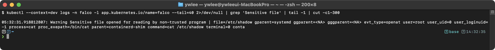

```bash
# 5. Falco가 실행 중인 상태에서 실시간 로그 모니터링
falco -r /etc/falco/falco_rules.local.yaml --dry-run
```

기대 출력 (dry-run으로 룰 문법 검증):


**CKS 시험에서의 활용:**
- Falco 커스텀 룰을 작성하고 `/etc/falco/falco_rules.local.yaml`에 추가하는 문제가 출제된다
- Falco 로그를 분석하여 이상 행위를 식별하는 문제도 출제될 수 있다
- `falco_rules.yaml`을 직접 수정하지 말고, `falco_rules.local.yaml`에 룰을 추가하거나 오버라이드해야 한다

### 6.4 컨테이너 불변성 (Immutable Infrastructure)

컨테이너는 불변(immutable)으로 운영해야 한다. 실행 중인 컨테이너 내부의 파일을 수정하면 안 된다.

**등장 배경: 가변 컨테이너에서의 공격자 지속성:**

전통적 서버 운영은 같은 서버에 패치·설정을 계속 덧칠하는 가변(mutable) 방식이었고, 이 습관이 컨테이너에도 이어져 실행 중인 컨테이너에 셸로 들어가 파일을 고치는 일이 흔했다. 보안 관점에서 이 가변성은 공격자에게 유리하다. 컨테이너를 침해한 공격자는 루트 파일시스템에 악성 바이너리를 내려받아 설치하고, 시스템 디렉터리의 파일을 바꿔 재시작 후에도 살아남는 지속성(persistence)을 확보한다. 또 운영자가 손으로 고친 변경이 이미지에 반영되지 않아, 같은 이미지를 다시 띄우면 상태가 달라지는 재현성 문제도 생긴다. 불변 인프라(immutable infrastructure)는 "컨테이너는 한 번 만들어지면 내부를 바꾸지 않고, 변경이 필요하면 새 이미지로 교체한다"는 원칙으로 이를 막는다. 쿠버네티스에서는 `readOnlyRootFilesystem`으로 루트 파일시스템 쓰기를 커널 수준에서 거부해, 공격자가 바이너리를 떨어뜨리거나 시스템 파일을 변조하는 행위 자체를 차단한다. 트레이드오프는 정상 동작에 쓰기가 필요한 경로(`/tmp`, `/var/run` 등)를 `emptyDir` 볼륨으로 따로 마운트해 줘야 하고(설정 누락 시 앱이 깨진다), emptyDir 데이터는 Pod 삭제 시 사라진다는 점이다.

**구현 방법:**

1. **readOnlyRootFilesystem:**
   ```yaml
   securityContext:
     readOnlyRootFilesystem: true
   ```
   - 컨테이너의 루트 파일시스템을 읽기 전용으로 만든다
   - 쓰기가 필요한 디렉토리는 emptyDir 볼륨으로 마운트한다 (/tmp, /var/run 등)

2. **불변성 강화 조합:**
   ```yaml
   securityContext:
     readOnlyRootFilesystem: true
     runAsNonRoot: true
     allowPrivilegeEscalation: false
     capabilities:
       drop: ["ALL"]
   ```

**실습 검증: 읽기 전용 파일시스템 확인**

```bash
# 1. readOnlyRootFilesystem이 설정된 Pod에서 파일 생성 시도
kubectl exec -it immutable-pod -- touch /test.txt
```

기대 출력:
> **예시(참조) — touch: /test.txt: Read-only file system:** CKS 보안 기대 출력(도구/설정/환경 의존). 재현 가능한 핵심은 CKS daily(day01~14) 및 본 문서 캡처 참고.

```bash
# 2. emptyDir로 마운트된 /tmp에는 쓰기 가능
kubectl exec -it immutable-pod -- touch /tmp/test.txt && echo "write success"
```

기대 출력:
> **예시(참조) — write success:** CKS 보안 기대 출력(도구/설정/환경 의존). 재현 가능한 핵심은 CKS daily(day01~14) 및 본 문서 캡처 참고.

```bash
# 3. 패키지 설치 시도 (악성 소프트웨어 설치 차단 확인)
kubectl exec -it immutable-pod -- apt-get update
```

기대 출력:
> **예시(참조) — E: List directory /var/lib/apt/lists/partial is :** CKS 보안 기대 출력(도구/설정/환경 의존). 재현 가능한 핵심은 CKS daily(day01~14) 및 본 문서 캡처 참고.

**핵심 포인트:**
- readOnlyRootFilesystem만으로는 볼륨 마운트된 경로에 쓸 수 있다
- emptyDir에 기록된 데이터는 Pod가 삭제되면 사라진다
- 컨테이너 불변성은 보안뿐만 아니라 재현성(reproducibility)도 보장한다
- 불변 컨테이너에서는 공격자가 악성 바이너리를 다운로드/설치할 수 없으므로, 침해 후 지속성(persistence) 확보가 어렵다

### 6.5 런타임 이상 탐지

런타임에 발생하는 비정상적인 행위를 탐지하는 것이다. Falco가 주요 도구이다.

**등장 배경: 예방 통제만으로는 못 막는 잔여 위협:**

앞서 다룬 통제들(NetworkPolicy·PSA·이미지 스캔·서명·readOnlyRootFilesystem 등)은 대부분 "허용/거부를 미리 정해 두는" 예방(preventive) 통제다. 그러나 예방 통제는 두 가지 한계가 있다. 첫째, 정책에 빈틈이 있거나(예: 허용한 syscall에 취약점) 제로데이(공개 전 미패치 취약점)가 쓰이면 통과해 버린다. 둘째, 예방 통제는 "일어나기 전"만 보므로, 정당하게 떠 있는 컨테이너가 실행 중에 보이는 비정상 행위(갑자기 셸을 띄움, `/etc/shadow`를 읽음, 외부 IP로 연결)는 포착하지 못한다. 런타임 이상 탐지는 이 잔여 위협을 다루는 탐지(detective) 통제다. Falco는 커널에서 시스템콜 이벤트를 받아(eBPF/커널 모듈) 룰과 대조해 비정상 행위를 실시간 경보한다. 즉 "막지 못한 침해가 실제로 일어나고 있다"는 신호를 준다. 트레이드오프는 탐지는 본질적으로 사후(이미 행위가 발생한 뒤) 신호이며, 룰이 느슨하면 놓치고(거짓 음성) 빡빡하면 정상 운영 작업까지 경보로 쏟아져(거짓 양성·경보 피로) 운영자가 룰을 워크로드에 맞게 계속 튜닝해야 한다는 점이다. 따라서 예방 통제를 대체하는 것이 아니라 그 위에 얹는 마지막 방어선이다.

**탐지 대상 이상 행위:**
- 컨테이너 내에서 예상하지 않은 프로세스 실행 (셸, 패키지 매니저 등)
- 민감한 파일 접근 (/etc/shadow, /etc/passwd, /proc 등)
- 예상하지 않은 네트워크 연결 (외부 IP로의 연결)
- 파일시스템 변경 (바이너리 수정, 새로운 실행 파일 생성)
- 권한 상승 시도 (setuid, setgid)
- 네임스페이스 이스케이프 시도

**탐지 방법:**
1. **Falco 룰**: 위에서 설명한 Falco 룰로 이상 행위를 탐지한다
2. **Audit Log 분석**: API server audit log에서 비정상적인 API 호출을 탐지한다
3. **프로세스 모니터링**: 컨테이너 내 실행 중인 프로세스를 모니터링한다

**MITRE ATT&CK 매핑:**

| 탐지 대상 | MITRE ATT&CK 기법 | Falco 룰 예시 |
|----------|-------------------|--------------|
| 셸 실행 | T1059 - Command and Scripting Interpreter | `spawned_process and container and proc.name in (bash, sh)` |
| 민감 파일 읽기 | T1003 - OS Credential Dumping | `open_read and container and fd.name = /etc/shadow` |
| 외부 네트워크 연결 | T1071 - Application Layer Protocol | `evt.type=connect and container and fd.sip != "10.0.0.0/8"` |
| 패키지 설치 | T1059.004 - Unix Shell | `spawned_process and container and proc.name in (apt, yum, apk)` |
| 바이너리 변경 | T1554 - Compromise Client Software Binary | `open_write and container and fd.name startswith /usr/bin` |

### 6.6 Sysdig를 이용한 시스템콜 분석

Sysdig는 시스템콜을 캡처하고 분석하는 도구이다. Falco의 기반 기술이기도 하다.

**등장 배경: 실시간 탐지와 사후 분석의 역할 분담:**

앞 절(6.3)의 Falco는 시스템콜 스트림을 실시간으로 보며 룰에 걸리는 행위를 즉시 경보하는 도구다. 그러나 사고가 일어난 뒤 "그 컨테이너에서 정확히 무슨 일이 있었나"를 처음부터 끝까지 되짚으려면 실시간 알림만으로는 부족하다. Sysdig는 이 사후 분석(포렌식) 자리를 메운다. tcpdump가 네트워크 패킷을 `.pcap` 파일로 떠 두고 나중에 분석하듯, Sysdig는 한 시점의 시스템콜 흐름 전체를 capture 파일(`.scap`)로 떠 두고, 사고 후에 그 파일을 열어 "어떤 프로세스가 언제 어떤 파일을 열고 어디로 네트워크 연결을 맺었는지"를 재구성한다. 정리하면 Falco는 실시간 탐지(detection), Sysdig는 캡처 파일 기반 사후 분석(investigation)이며, 둘은 같은 시스템콜 수집 엔진(libsinsp)을 공유한다. CKS에서는 주로 제공된 `.scap` 캡처 파일을 `sysdig -r`로 열어 특정 컨테이너의 행위를 추려내는 형태로 출제된다. 이 저장소 tart 노드에는 Sysdig가 기본 설치돼 있지 않으므로, 직접 실습하려면 노드에 별도 설치한 뒤 진행한다.

**기본 사용법:**
```bash
# 모든 시스템콜 캡처
sysdig

# 특정 컨테이너의 시스템콜만 캡처
sysdig container.name=nginx

# 파일 열기 이벤트만 필터링
sysdig evt.type=open

# 네트워크 연결 이벤트만 필터링
sysdig evt.type=connect

# 특정 프로세스의 시스템콜 캡처
sysdig proc.name=bash

# 캡처 결과를 파일로 저장
sysdig -w capture.scap

# 저장된 캡처 파일 분석
sysdig -r capture.scap

# chisel(분석 스크립트) 사용
sysdig -c topprocs_cpu  # CPU 사용량 상위 프로세스
sysdig -c topfiles_bytes  # I/O 상위 파일
sysdig -c spy_users  # 사용자 활동 추적
```

**실습 검증: Sysdig로 컨테이너 시스콜 캡처**

```bash
# 1. 특정 컨테이너에서 실행된 프로세스 확인
sysdig -r capture.scap -c spy_users container.name=nginx
```

기대 출력:
> **예시(참조) — 1234 10:30:15 root) bash:** CKS 보안 기대 출력(도구/설정/환경 의존). 재현 가능한 핵심은 CKS daily(day01~14) 및 본 문서 캡처 참고.

```bash
# 2. 특정 컨테이너에서 열린 파일 확인
sysdig -r capture.scap evt.type=open and container.name=nginx -p "%evt.time %proc.name %fd.name"
```

기대 출력:
> **예시(참조) — 10:30:15.123456 bash /etc/shadow:** CKS 보안 기대 출력(도구/설정/환경 의존). 재현 가능한 핵심은 CKS daily(day01~14) 및 본 문서 캡처 참고.

```bash
# 3. 특정 컨테이너의 네트워크 연결 확인
sysdig -r capture.scap evt.type=connect and container.name=nginx -p "%evt.time %proc.name %fd.name"
```

기대 출력:
> **예시(참조) — 10:30:18.456789 curl 192.168.1.100:443->93.184.2:** CKS 보안 기대 출력(도구/설정/환경 의존). 재현 가능한 핵심은 CKS daily(day01~14) 및 본 문서 캡처 참고.

**CKS 시험에서의 활용:**
- 특정 컨테이너에서 실행된 프로세스나 접근된 파일을 sysdig/Falco로 분석하는 문제가 출제될 수 있다
- `sysdig -r <capture-file>` 형태로 캡처 파일을 분석하는 문제도 출제될 수 있다

---

## 요약: 도메인별 핵심 키워드

| 도메인 | 핵심 도구/개념 | 비율 |
|--------|---------------|------|
| Cluster Setup | NetworkPolicy, kube-bench, Ingress TLS, 바이너리 검증 | 10% |
| Cluster Hardening | RBAC, ServiceAccount, API Server 설정, kubeadm upgrade | 15% |
| System Hardening | AppArmor(LSM 후킹), seccomp(BPF 필터), OS 최소화, IAM/IRSA | 15% |
| Microservice Vuln | Pod Security Standards/Admission(PSP 대체), OPA Gatekeeper(Rego), Secret 암호화, RuntimeClass(gVisor/Kata), mTLS | 20% |
| Supply Chain | Trivy, ImagePolicyWebhook, Cosign/Notary(서명 검증), Allowlist Registry, Dockerfile 보안, SBOM | 20% |
| Runtime Security | Audit Policy(4 레벨), Falco(eBPF 기반 런타임 탐지), readOnlyRootFilesystem, Sysdig | 20% |
