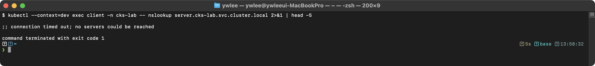

# CKS 실전 보안 실습 예제 모음

> **학습 목표**: CKS 시험 전 도메인에 걸친 실전 예제를 직접 실행해 손 숙련도를 높인다. | **도메인**: CKS 전체 (Cluster Setup & Hardening·System Hardening·Minimize Microservice Vulnerabilities·Supply Chain Security·Monitoring·Logging·Runtime Security) | **예상 소요**: 6~8시간

> **노드 이름 표기:** 본문의 `node01`·`master01` 등은 CKS 시험 환경의 노드 이름이다. 로컬 재현 시 `node01`→`staging-worker1`, `master01`→`staging-master`로 읽고 `ssh staging-worker1`처럼 VM 별칭으로 접속한다(§3 — 파괴 실습은 dev/staging에서만).

**섹션-도메인 매핑표**

| 섹션 | CKS 도메인 | 시험 비중(참고) |
|:--|:--|:--|
| 1. NetworkPolicy | Cluster Hardening | 15% |
| 2. RBAC 최소 권한 | Cluster Hardening | 15% |
| 3. AppArmor | System Hardening | 10% |
| 4. seccomp | System Hardening | 10% |
| 5. Pod Security Admission | Minimize Microservice Vulnerabilities | 20% |
| 6. OPA Gatekeeper | Minimize Microservice Vulnerabilities | 20% |
| 7. Trivy 이미지 스캔 | Supply Chain Security | 20% |
| 8. Falco 커스텀 룰 | Monitoring, Logging and Runtime Security | 20% |
| 9. Audit Policy | Monitoring, Logging and Runtime Security | 20% |
| 10. Secret Encryption at Rest | Cluster Hardening | 15% |
| 11. RuntimeClass (gVisor) | Minimize Microservice Vulnerabilities | 20% |
| 12. kube-bench | Cluster Setup | 10% |
| 13. ImagePolicyWebhook | Supply Chain Security | 20% |
| 14. Dockerfile 보안 | Supply Chain Security | 20% |
| 15. Ingress TLS | Cluster Setup | 10% |
| 16. ServiceAccount 보안 | Cluster Hardening | 15% |
| 17. 컨테이너 불변성 | Minimize Microservice Vulnerabilities | 20% |

> 비중은 CNCF CKS Curriculum 기준 도메인 가중치이며 섹션이 여러 도메인에 걸칠 수 있으므로 합이 100%를 초과한다.

---

CKS는 쿠버네티스 자격증 중 가장 어려운 실기 시험이다. 이 문서에서는 시험에서 자주 출제되는 실전 예제를 도메인별로 정리한다. 모든 예제는 실제 클러스터에서 직접 실습할 수 있도록 완전한 YAML과 명령어를 포함한다. 각 보안 메커니즘의 등장 배경, 내부 동작 원리, 커널 레벨 메커니즘, 공격-방어 매핑, 트러블슈팅까지 다룬다.

---

## 1. NetworkPolicy 고급 예제

### 1.0 등장 배경과 내부 동작 원리

쿠버네티스의 기본 네트워크 모델은 모든 Pod가 클러스터 내 다른 모든 Pod와 제한 없이 통신할 수 있는 flat network 구조이다. 이 설계는 개발 편의성을 높이지만, 공격자가 단 하나의 Pod를 탈취하면 클러스터 내부 전체로 lateral movement가 가능하다는 치명적 약점이 있다.

NetworkPolicy는 이 문제를 해결하기 위해 도입된 쿠버네티스 네이티브 네트워크 접근 제어 메커니즘이다. API server가 NetworkPolicy 리소스를 저장하면, CNI 플러그인(Calico, Cilium, Weave 등)이 이를 감시하고 실제 iptables/eBPF 규칙으로 변환하여 데이터 플레인에 적용한다.

**내부 동작 흐름:**
1. 사용자가 NetworkPolicy YAML을 API server에 제출한다.
2. CNI 플러그인의 컨트롤러가 watch를 통해 변경을 감지한다.
3. 대상 Pod가 실행 중인 노드에서 iptables 체인 또는 eBPF 프로그램이 갱신된다.
4. 커널 레벨에서 패킷 필터링이 수행된다. iptables 기반의 경우 netfilter 프레임워크의 FORWARD 체인에 규칙이 삽입되고, eBPF 기반의 경우 tc(traffic control) 훅 또는 XDP 훅에서 패킷을 검사한다.

**공격-방어 매핑:**
- 공격: 탈취된 Pod에서 클러스터 내부 서비스 스캔 및 접근 → 방어: Default Deny + 명시적 허용
- 공격: 클라우드 메타데이터 API를 통한 credential 탈취 → 방어: Egress CIDR 기반 169.254.169.254 차단
- 공격: DNS 터널링을 통한 데이터 유출 → 방어: Egress DNS 포트를 kube-dns Pod로만 제한

**트러블슈팅 핵심:**
- NetworkPolicy가 적용되지 않는 경우, CNI 플러그인이 NetworkPolicy를 지원하는지 확인한다. Flannel은 NetworkPolicy를 지원하지 않는다.
- podSelector의 라벨이 실제 Pod의 라벨과 정확히 일치하는지 확인한다.
- namespaceSelector와 podSelector가 같은 `- from` 항목에 있으면 AND 조건이고, 별도의 `- from` 항목이면 OR 조건이다. 이 차이를 혼동하면 의도하지 않은 허용/차단이 발생한다.

### 1.1 Default Deny All (Ingress + Egress)

모든 트래픽을 기본적으로 차단하는 정책이다. 이것이 제로 트러스트 네트워크의 출발점이다. 이 정책이 적용되면 해당 네임스페이스의 모든 Pod는 명시적으로 허용된 트래픽 외에는 어떤 인바운드/아웃바운드 통신도 불가능하다.

```yaml
apiVersion: networking.k8s.io/v1
kind: NetworkPolicy
metadata:
  name: default-deny-all
  namespace: secure-ns
spec:
  podSelector: {}  # 네임스페이스의 모든 Pod에 적용
  policyTypes:
  - Ingress
  - Egress
```

```bash
# 네임스페이스 생성 및 테스트 환경 구성
kubectl create namespace secure-ns

# 테스트용 nginx 서비스 배포
kubectl -n secure-ns run nginx --image=nginx:1.25 --port=80
kubectl -n secure-ns expose pod nginx --name=nginx-svc --port=80

# nginx Pod가 Ready 상태가 될 때까지 대기
kubectl -n secure-ns wait --for=condition=Ready pod/nginx --timeout=60s

# 정책 적용 전: 통신이 되는지 확인 (기준선)
kubectl -n secure-ns run test-before --image=busybox --rm -it --restart=Never -- wget -qO- --timeout=3 http://nginx-svc

# 정책 적용
kubectl apply -f default-deny-all.yaml

# 정책 적용 후: Pod 간 통신이 차단되는지 확인
kubectl -n secure-ns run test-after --image=busybox --rm -it --restart=Never -- wget -qO- --timeout=3 http://nginx-svc 2>&1
```


```bash
# 적용된 NetworkPolicy 확인
kubectl -n secure-ns get networkpolicy
kubectl -n secure-ns describe networkpolicy default-deny-all
```

> **예시(참조) — 기대 출력::** CKS 보안 기대 출력(도구/설정/환경 의존). 재현 가능한 핵심은 CKS daily(day01~14) 및 본 문서 캡처 참고.

### 1.2 DNS 허용 + 특정 서비스만 Egress 허용

**시나리오:** 개발팀이 보안을 강화하려고 한다. frontend Pod에서 backend Pod로는 연결되어야 하지만, database나 외부 서비스로는 접근하지 못하도록 막아야 한다. 단순한 발상은 "frontend 의 egress 에서 backend 만 허용하면 끝"이지만, 이렇게 만들면 frontend 가 `backend` 라는 서비스 이름을 IP 로 바꾸지 못해 backend 로의 통신마저 실패한다. 이유는 다음과 같다. Pod 가 `http://backend:8080` 같은 이름으로 접속할 때, 먼저 클러스터 DNS 서버(CoreDNS, kube-system 네임스페이스의 kube-dns 서비스 10.96.0.10)에 `backend.secure-ns.svc.cluster.local` 의 IP 를 묻는 DNS 질의를 보낸다. 이 DNS 질의는 UDP/TCP 53 포트로 나가는 별개의 egress 트래픽이다. Default deny egress 상태에서 53 포트를 열지 않으면 이름 해석 단계에서 멈춰 어떤 서비스에도 도달하지 못한다.

이를 해결하려면 두 가지 egress 규칙이 동시에 필요하다. (1) 모든 대상으로의 DNS(UDP/TCP 53) 허용, (2) backend Pod 의 8080 포트로의 통신 허용. 아래 정책은 이 조합을 구현한다. 첫 번째 egress 항목의 `to: []` 는 "모든 대상"을 의미하며 DNS 포트에만 적용되므로, frontend 가 어떤 이름이든 해석은 할 수 있되 실제 데이터 통신은 backend:8080 으로만 제한된다.

```yaml
apiVersion: networking.k8s.io/v1
kind: NetworkPolicy
metadata:
  name: allow-dns-and-api
  namespace: secure-ns
spec:
  podSelector:
    matchLabels:
      app: frontend
  policyTypes:
  - Egress
  egress:
  # DNS 허용 (TCP/UDP 53)
  - to: []
    ports:
    - protocol: UDP
      port: 53
    - protocol: TCP
      port: 53
  # backend 서비스만 허용
  - to:
    - podSelector:
        matchLabels:
          app: backend
    ports:
    - protocol: TCP
      port: 8080
```

```bash
# 테스트 환경 구성
kubectl -n secure-ns run frontend --image=busybox --labels=app=frontend --command -- sleep 3600
kubectl -n secure-ns run backend --image=nginx:1.25 --labels=app=backend --port=8080
kubectl -n secure-ns run database --image=nginx:1.25 --labels=app=database --port=5432

# 정책 적용
kubectl apply -f allow-dns-and-api.yaml

# 검증 1: frontend → backend 통신 허용 확인
kubectl -n secure-ns exec frontend -- wget -qO- --timeout=3 http://backend:8080 2>&1

# 검증 2: frontend → database 통신 차단 확인
kubectl -n secure-ns exec frontend -- wget -qO- --timeout=3 http://database:5432 2>&1
```


```bash
# DNS 해석이 정상적으로 되는지 확인
kubectl -n secure-ns exec frontend -- nslookup backend
```



### 1.3 Egress CIDR 기반 제한 (메타데이터 API 차단)

클라우드 인스턴스 메타데이터 API(169.254.169.254)로의 접근을 차단하는 정책이다. AWS의 경우 이 API를 통해 IAM Role의 임시 credential을 획득할 수 있으므로, Pod가 탈취되면 클라우드 리소스 전체에 대한 접근 권한이 유출될 수 있다. SSRF(Server-Side Request Forgery) 공격의 대표적 타겟이다.

**공격 시나리오:**
1. 공격자가 웹 애플리케이션의 SSRF 취약점을 발견한다.
2. `http://169.254.169.254/latest/meta-data/iam/security-credentials/` 요청을 통해 IAM Role 이름을 알아낸다.
3. 해당 Role의 임시 credential(AccessKeyId, SecretAccessKey, Token)을 획득한다.
4. 클라우드 리소스(S3, RDS 등)에 무단 접근한다.

```yaml
apiVersion: networking.k8s.io/v1
kind: NetworkPolicy
metadata:
  name: deny-metadata-access
  namespace: secure-ns
spec:
  podSelector: {}
  policyTypes:
  - Egress
  egress:
  # 모든 트래픽 허용하되 메타데이터 IP만 차단
  - to:
    - ipBlock:
        cidr: 0.0.0.0/0
        except:
        - 169.254.169.254/32
```

```bash
# 정책 적용
kubectl apply -f deny-metadata-access.yaml

# 검증 1: 메타데이터 API 접근 차단 확인 (클라우드 환경에서 테스트)
kubectl -n secure-ns run meta-test --image=busybox --rm -it --restart=Never -- wget -qO- --timeout=3 http://169.254.169.254/latest/meta-data/ 2>&1
```


```bash
# 검증 2: 일반 외부 통신은 허용되는지 확인
kubectl -n secure-ns run ext-test --image=busybox --rm -it --restart=Never -- wget -qO- --timeout=3 http://example.com 2>&1 | head -5
```

> **예시(참조) — 기대 출력 (외부 접근 허용)::** CKS 보안 기대 출력(도구/설정/환경 의존). 재현 가능한 핵심은 CKS daily(day01~14) 및 본 문서 캡처 참고.

### 1.4 Namespace 기반 Ingress 허용

특정 네임스페이스의 Pod에서만 인바운드 트래픽을 허용하는 정책이다. 멀티테넌트 환경에서 네임스페이스 간 격리를 구현하는 핵심 패턴이다.

```yaml
apiVersion: networking.k8s.io/v1
kind: NetworkPolicy
metadata:
  name: allow-from-monitoring
  namespace: production
spec:
  podSelector:
    matchLabels:
      app: api-server
  policyTypes:
  - Ingress
  ingress:
  - from:
    # monitoring 네임스페이스의 prometheus Pod만 허용
    - namespaceSelector:
        matchLabels:
          kubernetes.io/metadata.name: monitoring
      podSelector:
        matchLabels:
          app: prometheus
    ports:
    - protocol: TCP
      port: 9090
```

> **주의**: `namespaceSelector`와 `podSelector`가 같은 `- from` 항목에 있으면 AND 조건이다. 별도의 `- from` 항목으로 분리하면 OR 조건이 된다. 이 차이는 CKS 시험에서 빈출 포인트이다.

```bash
# 테스트 환경 구성
kubectl create namespace production
kubectl create namespace monitoring
kubectl -n production run api-server --image=nginx:1.25 --labels=app=api-server --port=9090
kubectl -n monitoring run prometheus --image=busybox --labels=app=prometheus --command -- sleep 3600
kubectl -n monitoring run grafana --image=busybox --labels=app=grafana --command -- sleep 3600

# 정책 적용
kubectl apply -f allow-from-monitoring.yaml

# 검증 1: monitoring/prometheus → production/api-server 허용 확인
kubectl -n monitoring exec prometheus -- wget -qO- --timeout=3 http://api-server.production.svc:9090 2>&1
```


```bash
# 검증 2: monitoring/grafana → production/api-server 차단 확인 (라벨 불일치)
kubectl -n monitoring exec grafana -- wget -qO- --timeout=3 http://api-server.production.svc:9090 2>&1
```


```bash
# AND 조건 vs OR 조건 확인 방법:
# 현재 정책의 from 절을 kubectl describe로 확인
kubectl -n production describe networkpolicy allow-from-monitoring
```

> **예시(참조) — 기대 출력 (AND 조건 - 단일 from 항목)::** CKS 보안 기대 출력(도구/설정/환경 의존). 재현 가능한 핵심은 CKS daily(day01~14) 및 본 문서 캡처 참고.

### 1.5 복합 NetworkPolicy: 다중 규칙 조합

```yaml
apiVersion: networking.k8s.io/v1
kind: NetworkPolicy
metadata:
  name: api-server-policy
  namespace: production
spec:
  podSelector:
    matchLabels:
      app: api-server
  policyTypes:
  - Ingress
  - Egress
  ingress:
  # 프론트엔드에서 HTTP 트래픽 허용
  - from:
    - podSelector:
        matchLabels:
          app: frontend
    ports:
    - protocol: TCP
      port: 443
  # 모니터링 네임스페이스에서 메트릭 수집 허용
  - from:
    - namespaceSelector:
        matchLabels:
          purpose: monitoring
    ports:
    - protocol: TCP
      port: 9090
  egress:
  # DNS 허용
  - to: []
    ports:
    - protocol: UDP
      port: 53
    - protocol: TCP
      port: 53
  # 데이터베이스 Pod로만 egress 허용
  - to:
    - podSelector:
        matchLabels:
          app: database
    ports:
    - protocol: TCP
      port: 5432
  # 외부 API 서버 허용 (특정 CIDR)
  - to:
    - ipBlock:
        cidr: 10.100.0.0/16
    ports:
    - protocol: TCP
      port: 443
```

```bash
# 정책 적용 후 전체 규칙 확인
kubectl -n production describe networkpolicy api-server-policy
```

> **예시(참조) — 기대 출력::** CKS 보안 기대 출력(도구/설정/환경 의존). 재현 가능한 핵심은 CKS daily(day01~14) 및 본 문서 캡처 참고.

```bash
# 복합 정책 AND/OR 규칙 조합 트래픽 검증
# 검증 전 테스트 Pod 준비 (없는 경우)
kubectl -n production run frontend --image=busybox --labels=app=frontend --command -- sleep 3600
kubectl -n production run database --image=busybox --labels=app=database --command -- sleep 3600
kubectl -n production run monitoring-pod --image=busybox --labels=app=prometheus \
  -l "app=prometheus" --command -- sleep 3600

# 검증 1: frontend → api-server HTTPS(443) 허용 확인 (ingress 규칙 첫 번째)
kubectl -n production exec frontend -- wget -qO- --timeout=3 http://api-server:443 2>&1

# 검증 2: database → api-server 차단 확인 (Ingress 허용 라벨 불일치)
kubectl -n production exec database -- wget -qO- --timeout=3 http://api-server:443 2>&1

# 검증 3: api-server → database:5432 egress 허용 확인
kubectl -n production exec api-server -- wget -qO- --timeout=3 http://database:5432 2>&1
```

> **AND/OR 조합 디버깅 팁:** `kubectl -n production describe networkpolicy api-server-policy`의 `Ingress/Egress`블록에서 `- From:` 항목이 **하나의 블록** 안에 `podSelector + namespaceSelector`가 묶이면 AND, 별도 `- From:` 항목으로 나뉘면 OR 조건이다.

---

## 2. RBAC 최소 권한 설정

### 2.0 등장 배경과 내부 동작 원리

RBAC(Role-Based Access Control)가 도입되기 전, 쿠버네티스는 ABAC(Attribute-Based Access Control) 정책 파일을 사용했다. ABAC는 정책 변경 시 API server를 재시작해야 하고, 정책 파일의 관리가 복잡하다는 한계가 있었다. RBAC는 쿠버네티스 1.8에서 GA가 되었으며, API 리소스로서 동적으로 관리할 수 있다.

**ABAC vs RBAC 비교:**

| 항목 | ABAC | RBAC |
|:--|:--|:--|
| 정책 저장 위치 | `/etc/kubernetes/abac-policy.json` (노드 파일) | kubernetes API 오브젝트(etcd에 저장) |
| 정책 변경 반영 | API server **재시작** 필수 | `kubectl apply` 즉시 동적 반영 |
| 정책 문법 | JSON 줄 단위 (`{"user":"alice","namespace":"*","resource":"pods","readonly":true}`) | Role/ClusterRole YAML + RoleBinding으로 선언 |
| 감사·조회 | 파일 직접 열람만 가능 | `kubectl get roles`, `kubectl auth can-i --list`로 조회 |
| 장점 | 속성 조합이 자유로움 | 동적 관리 용이, kubectl로 검증 가능 |
| 단점 | 변경 시 API server 중단 필요, 파일 관리 어려움 | 매우 세밀한 속성 기반 조건 표현이 어려움 |

현재 쿠버네티스 클러스터에서 ABAC를 사용하는 경우는 거의 없다. CKS 시험에서 ABAC가 언급되면 "RBAC 도입 이전의 구식 방식"으로 이해하면 된다.

**내부 동작 흐름:**
1. 클라이언트가 API server에 요청을 보낸다.
2. 인증(Authentication) 단계에서 요청자의 신원을 확인한다 (X.509 인증서, Bearer 토큰, OIDC 등).
3. 인가(Authorization) 단계에서 RBAC authorizer가 요청의 (user/group, verb, resource, namespace) 조합을 Role/ClusterRole의 rules와 대조한다.
4. RoleBinding/ClusterRoleBinding이 주체(subject)와 역할(role)을 연결한다.
5. 매칭되는 규칙이 있으면 허용, 없으면 거부한다. RBAC는 기본적으로 deny-all이며, 명시적 허용만 존재한다.

**공격-방어 매핑:**
- 공격: 과도한 권한의 ServiceAccount를 통한 클러스터 전체 제어 → 방어: 최소 권한 Role + automountServiceAccountToken: false
- 공격: cluster-admin ClusterRoleBinding을 통한 권한 상승 → 방어: cluster-admin 바인딩 주기적 감사
- 공격: Secret 읽기 권한을 통한 credential 탈취 → 방어: resourceNames로 특정 Secret만 접근 허용

**트러블슈팅 핵심:**
- `kubectl auth can-i` 명령으로 실제 권한을 검증한다.
- Role은 네임스페이스 범위이고, ClusterRole은 클러스터 범위이다. 그러나 ClusterRole을 RoleBinding으로 바인딩하면 네임스페이스 범위로 제한된다.
- `escalate` verb가 없으면 자신이 가진 것보다 더 큰 권한의 Role을 생성할 수 없다.

### 2.1 View-Only Role (읽기 전용)

```yaml
apiVersion: rbac.authorization.k8s.io/v1
kind: Role
metadata:
  namespace: production
  name: pod-viewer
rules:
- apiGroups: [""]
  resources: ["pods", "pods/log"]
  verbs: ["get", "list", "watch"]
- apiGroups: [""]
  resources: ["services", "endpoints"]
  verbs: ["get", "list"]
```

```bash
# Role 적용
kubectl apply -f pod-viewer-role.yaml

# 검증: Role의 규칙 확인
kubectl -n production describe role pod-viewer
```

> **예시(참조) — 기대 출력::** CKS 보안 기대 출력(도구/설정/환경 의존). 재현 가능한 핵심은 CKS daily(day01~14) 및 본 문서 캡처 참고.

### 2.2 특정 Verb/Resource만 허용

```yaml
apiVersion: rbac.authorization.k8s.io/v1
kind: Role
metadata:
  namespace: production
  name: deployment-manager
rules:
- apiGroups: ["apps"]
  resources: ["deployments"]
  verbs: ["get", "list", "watch", "create", "update", "patch"]
  # delete는 허용하지 않음
- apiGroups: [""]
  resources: ["configmaps"]
  verbs: ["get", "list"]
  resourceNames: ["app-config", "db-config"]  # 특정 리소스만 허용
```

### 2.3 ServiceAccount에 Role 바인딩

```yaml
apiVersion: v1
kind: ServiceAccount
metadata:
  name: app-sa
  namespace: production
automountServiceAccountToken: false  # 토큰 자동 마운트 비활성화
---
apiVersion: rbac.authorization.k8s.io/v1
kind: RoleBinding
metadata:
  name: app-sa-binding
  namespace: production
subjects:
- kind: ServiceAccount
  name: app-sa
  namespace: production
roleRef:
  kind: Role
  name: pod-viewer
  apiGroup: rbac.authorization.k8s.io
```

```bash
# 적용
kubectl apply -f sa-rolebinding.yaml

# 검증: ServiceAccount의 권한 테스트
kubectl auth can-i get pods --as=system:serviceaccount:production:app-sa -n production
```

> **예시(참조) — yes:** CKS 보안 기대 출력(도구/설정/환경 의존). 재현 가능한 핵심은 CKS daily(day01~14) 및 본 문서 캡처 참고.

```bash
kubectl auth can-i delete pods --as=system:serviceaccount:production:app-sa -n production
```

> **예시(참조) — no:** CKS 보안 기대 출력(도구/설정/환경 의존). 재현 가능한 핵심은 CKS daily(day01~14) 및 본 문서 캡처 참고.

```bash
kubectl auth can-i get pods --as=system:serviceaccount:production:app-sa -n default
```

> **예시(참조) — no:** CKS 보안 기대 출력(도구/설정/환경 의존). 재현 가능한 핵심은 CKS daily(day01~14) 및 본 문서 캡처 참고.

```bash
# ServiceAccount의 전체 권한 목록 확인
kubectl auth can-i --list --as=system:serviceaccount:production:app-sa -n production
```


### 2.4 ClusterRole을 네임스페이스 범위로 제한 (RoleBinding으로 바인딩)

> **주의 — jane 사용자 인증 테스트:** 아래 RoleBinding은 `kind: User name: jane`을 subject로 사용한다. CKS 시험에서 `kubectl auth can-i --as=jane`은 cluster-admin 권한으로 실행하므로 impersonation(사용자 대리 실행)이 가능하다. 실제 jane 사용자로 인증하려면 X.509 인증서를 생성해야 한다. 방법은 CKA 인증서 생성 절차(`kubectl certificate approve` 또는 `openssl x509` 서명)를 참고한다. 시험 외 실습 환경에서 `--as=jane` 플래그를 사용하려면 실행 주체에 `impersonation` 권한이 있어야 한다.

```yaml
apiVersion: rbac.authorization.k8s.io/v1
kind: ClusterRole
metadata:
  name: secret-reader
rules:
- apiGroups: [""]
  resources: ["secrets"]
  verbs: ["get", "list"]
---
# ClusterRole을 RoleBinding으로 바인딩하면 특정 네임스페이스로 범위가 제한된다
apiVersion: rbac.authorization.k8s.io/v1
kind: RoleBinding
metadata:
  name: read-secrets-in-production
  namespace: production
subjects:
- kind: User
  name: jane
  apiGroup: rbac.authorization.k8s.io
roleRef:
  kind: ClusterRole
  name: secret-reader
  apiGroup: rbac.authorization.k8s.io
```

```bash
# RBAC 관련 유용한 명령어

# 특정 사용자의 권한 확인
kubectl auth can-i get pods --as=jane -n production
```

> **예시(참조) — yes:** CKS 보안 기대 출력(도구/설정/환경 의존). 재현 가능한 핵심은 CKS daily(day01~14) 및 본 문서 캡처 참고.

```bash
kubectl auth can-i delete pods --as=jane -n production
```

> **예시(참조) — no:** CKS 보안 기대 출력(도구/설정/환경 의존). 재현 가능한 핵심은 CKS daily(day01~14) 및 본 문서 캡처 참고.

```bash
# jane이 production 네임스페이스에서 secret을 읽을 수 있는지 확인
kubectl auth can-i get secrets --as=jane -n production
```

> **예시(참조) — yes:** CKS 보안 기대 출력(도구/설정/환경 의존). 재현 가능한 핵심은 CKS daily(day01~14) 및 본 문서 캡처 참고.

```bash
# jane이 다른 네임스페이스에서는 secret을 읽을 수 없는지 확인
kubectl auth can-i get secrets --as=jane -n default
```

> **예시(참조) — no:** CKS 보안 기대 출력(도구/설정/환경 의존). 재현 가능한 핵심은 CKS daily(day01~14) 및 본 문서 캡처 참고.

```bash
# ServiceAccount의 권한 확인
kubectl auth can-i get secrets --as=system:serviceaccount:production:app-sa -n production

# 모든 권한 나열
kubectl auth can-i --list --as=jane -n production

# Role/ClusterRole 생성 (dry-run)
kubectl create role pod-reader --verb=get,list,watch --resource=pods -n production --dry-run=client -o yaml

# RoleBinding 생성 (dry-run)
kubectl create rolebinding pod-reader-binding --role=pod-reader --serviceaccount=production:app-sa -n production --dry-run=client -o yaml

# 과도한 권한이 있는 ClusterRoleBinding 찾기
kubectl get clusterrolebindings -o json | \
  jq '.items[] | select(.roleRef.name == "cluster-admin") | .metadata.name'
```

> **예시(참조) — 기대 출력 (cluster-admin 바인딩 목록)::** CKS 보안 기대 출력(도구/설정/환경 의존). 재현 가능한 핵심은 CKS daily(day01~14) 및 본 문서 캡처 참고.

---

## 3. AppArmor 프로파일 작성 + Pod 적용

### 3.0 등장 배경과 내부 동작 원리

컨테이너는 리눅스 커널의 namespace와 cgroup을 사용하여 격리를 구현하지만, 커널은 공유된다. 컨테이너 내부 프로세스가 커널 취약점을 악용하면 호스트에 대한 제어권을 획득할 수 있다. AppArmor는 이 공격 표면을 줄이기 위한 리눅스 커널 보안 모듈(LSM, Linux Security Module)이다.

**내부 동작 원리:**
AppArmor는 리눅스 커널의 LSM 프레임워크에 등록된 보안 모듈이다. 프로세스가 파일 접근, 네트워크 소켓 생성, capability 사용 등의 작업을 수행할 때, 커널은 LSM 훅(hook)을 호출하고 AppArmor 모듈이 해당 작업을 프로파일의 규칙과 대조하여 허용/거부를 결정한다.

**프로파일 모드:**
- `enforce`: 규칙 위반 시 작업을 차단하고 로그를 기록한다.
- `complain`: 규칙 위반 시 차단하지 않고 로그만 기록한다. 프로파일 개발/디버깅에 사용한다.
- `unconfined`: AppArmor 제한 없음.

**커널 레벨 동작:**
1. kubelet이 컨테이너 생성 시 containerd/CRI-O에 AppArmor 프로파일 이름을 전달한다.
2. 컨테이너 런타임이 프로세스 시작 전 `/proc/<pid>/attr/current`에 프로파일을 설정한다.
3. 이후 해당 프로세스의 모든 시스콜이 AppArmor의 LSM 훅을 거친다.
4. 위반 시 커널이 EPERM을 반환하고, audit 서브시스템을 통해 `/var/log/syslog` 또는 `dmesg`에 로그를 기록한다.

**공격-방어 매핑:**
- 공격: 컨테이너에서 호스트 파일시스템 쓰기 → 방어: deny /** w 규칙
- 공격: raw 소켓으로 네트워크 스니핑 → 방어: deny network raw 규칙
- 공격: /proc, /sys를 통한 커널 매개변수 조작 → 방어: deny /proc/** w, deny /sys/** w 규칙

### 3.1 AppArmor 프로파일 작성

파일: `/etc/apparmor.d/k8s-deny-write`
```
#include <tunables/global>

profile k8s-deny-write flags=(attach_disconnected,mediate_deleted) {
  #include <abstractions/base>

  # 기본적으로 파일 읽기 허용
  file,

  # 모든 경로에 대한 쓰기 거부
  deny /** w,

  # /tmp 디렉토리에는 쓰기 허용 (애플리케이션이 필요로 할 수 있음)
  /tmp/** rw,
  /var/tmp/** rw,

  # /proc, /sys 접근 제한
  deny /proc/** w,
  deny /sys/** w,
}
```

파일: `/etc/apparmor.d/k8s-restrict-network`
```
#include <tunables/global>

profile k8s-restrict-network flags=(attach_disconnected,mediate_deleted) {
  #include <abstractions/base>

  file,

  # 네트워크 접근 제한: TCP만 허용, raw 소켓 차단
  network tcp,
  network udp,
  deny network raw,
  deny network packet,
}
```

**프로파일 플래그 설명:**

먼저 마운트 네임스페이스(mount namespace)를 이해해야 한다. 마운트 네임스페이스는 프로세스가 보는 파일시스템 트리(어떤 디렉터리에 무엇이 마운트되어 있는가)를 격리하는 리눅스 커널 기능이다. 컨테이너 런타임(containerd)은 컨테이너 프로세스를 시작할 때 새 마운트 네임스페이스를 만들고 `pivot_root`/`chroot` 로 루트 디렉터리를 컨테이너 이미지 안으로 바꾼다. 이 때문에 같은 파일이라도 호스트가 보는 경로와 컨테이너가 보는 경로가 다르다. AppArmor 는 프로파일의 경로 규칙(`/root/** w` 등)을 평가할 때 어느 시점의 경로를 기준으로 할지 결정해야 하는데, 이 결정이 플래그로 제어된다.

- `attach_disconnected`: 프로세스가 바뀐 루트(`pivot_root`/`chroot`) 환경에 있어 AppArmor 가 파일을 전역 마운트 트리에서 "연결이 끊긴(disconnected)" 상태로 보게 될 때, 그 파일에도 프로파일을 적용하도록 한다. 컨테이너 런타임이 마운트 네임스페이스를 격리하는 과정에서 이 경계를 넘어 파일을 다루므로 컨테이너 환경에서는 사실상 필수다. 이 플래그가 없으면 disconnected path 에 대해 AppArmor 가 프로파일을 부착하지 못해 컨테이너 시작이 실패하고, kubelet 이벤트에 `failed to apply apparmor profile` 또는 사용자 측에서 `profile not found (No such file or directory)` 형태의 에러로 나타나 Pod 가 생성되지 않는다.
- `mediate_deleted`: 이미 삭제되었지만 아직 열려 있는(open) 파일에 대한 접근도 계속 중재한다. 이 플래그가 없으면 프로세스가 파일을 연 뒤 그 파일이 삭제되면 AppArmor 의 규칙 적용에서 누락될 수 있다.

### 3.2 프로파일 로드 및 확인

> **실습 전제:** AppArmor 프로파일은 Pod 가 아니라 **노드의 커널**에 로드되므로, kubectl 이 아니라 노드에 SSH 로 직접 들어가 작업한다. 본 저장소에서는 파괴 실습이 허용된 staging/dev 에서만 수행한다(platform/prod 금지). 전제 조건은 다음과 같다. (1) 대상 클러스터가 가동 중이고 `./scripts/boot.sh` + `./scripts/fix-cluster-ip-drift.sh staging` 으로 정상화되어 있다. (2) `~/sideproejct/IaC_apple_sillicon/kubeconfig/staging.yaml` 로 노드가 모두 Ready 다. (3) 아래 `apparmor_parser`·`aa-status`·`dmesg` 명령은 `ssh staging-master`(또는 `ssh staging-worker1`)로 노드 셸에 접속한 뒤 실행한다. (4) §3.1 의 프로파일 파일(`/etc/apparmor.d/k8s-deny-write` 등)을 해당 노드에 먼저 생성해 두어야 한다. 멀티노드 클러스터에서는 Pod 가 스케줄링될 수 있는 **모든 노드**에 프로파일을 로드해야 한다.

```bash
# (노드에서) 프로파일을 enforce 모드로 로드
apparmor_parser -r /etc/apparmor.d/k8s-deny-write
apparmor_parser -r /etc/apparmor.d/k8s-restrict-network

# 로드된 프로파일 확인
aa-status | grep k8s
```

> **예시(참조) — 기대 출력::** CKS 보안 기대 출력(도구/설정/환경 의존). 재현 가능한 핵심은 CKS daily(day01~14) 및 본 문서 캡처 참고.

```bash
# complain 모드로 로드 (디버깅용)
apparmor_parser -C /etc/apparmor.d/k8s-deny-write

# complain 모드 확인
aa-status | grep k8s-deny-write
```

> **예시(참조) — 기대 출력 (complain 모드)::** CKS 보안 기대 출력(도구/설정/환경 의존). 재현 가능한 핵심은 CKS daily(day01~14) 및 본 문서 캡처 참고.

```bash
# 다시 enforce 모드로 전환
apparmor_parser -r /etc/apparmor.d/k8s-deny-write
```

### 3.3 Pod에 AppArmor 적용 (annotation 방식, K8s 1.29 이하)

```yaml
apiVersion: v1
kind: Pod
metadata:
  name: secure-app
  annotations:
    # 형식: container.apparmor.security.beta.kubernetes.io/<container-name>: localhost/<profile-name>
    container.apparmor.security.beta.kubernetes.io/app: localhost/k8s-deny-write
spec:
  containers:
  - name: app
    image: nginx:1.25
    volumeMounts:
    - name: tmp
      mountPath: /tmp
  volumes:
  - name: tmp
    emptyDir: {}
```

### 3.4 Pod에 AppArmor 적용 (securityContext 방식, K8s 1.30+)

```yaml
apiVersion: v1
kind: Pod
metadata:
  name: secure-app
spec:
  containers:
  - name: app
    image: nginx:1.25
    securityContext:
      appArmorProfile:
        type: Localhost
        localhostProfile: k8s-deny-write
    volumeMounts:
    - name: tmp
      mountPath: /tmp
  volumes:
  - name: tmp
    emptyDir: {}
```

```bash
# Pod 생성
kubectl apply -f secure-app.yaml

# Pod가 Running 상태인지 확인
kubectl get pod secure-app
```

> **예시(참조) — NAME         READY   STATUS    RESTARTS   AGE:** CKS 보안 기대 출력(도구/설정/환경 의존). 재현 가능한 핵심은 CKS daily(day01~14) 및 본 문서 캡처 참고.

```bash
# 검증 1: 파일 쓰기가 차단되는지 확인
kubectl exec secure-app -- touch /root/test.txt
```


```bash
# 검증 2: /tmp에는 쓰기 가능
kubectl exec secure-app -- touch /tmp/test.txt
kubectl exec secure-app -- ls -la /tmp/test.txt
```

> **예시(참조) — -rw-r--r-- 1 root root 0 ... /tmp/test.txt:** CKS 보안 기대 출력(도구/설정/환경 의존). 재현 가능한 핵심은 CKS daily(day01~14) 및 본 문서 캡처 참고.

```bash
# 검증 3: AppArmor 차단 로그 확인 (노드에서 실행)
# dmesg에서 AppArmor DENIED 로그 확인
dmesg | grep "apparmor.*DENIED" | tail -5
```

> **예시(참조) — AppArmor DENIED 커널 감사로그(dmesg/journalctl -k, 환경따라 노출 차이):** 기대 출력: ... (도구/설정 의존, 해당 도구 설치·구성 환경에서 재현).

```bash
# syslog에서도 확인 가능
grep "apparmor.*DENIED" /var/log/syslog | tail -5
```

> **예시(참조) — AppArmor DENIED 커널 감사로그(dmesg/journalctl -k, 환경따라 노출 차이):** 기대 출력: ... (도구/설정 의존, 해당 도구 설치·구성 환경에서 재현).

```bash
# 적용된 AppArmor 프로파일 확인 (Pod describe에서)
kubectl describe pod secure-app | grep -i apparmor
```

> **예시(참조) — K8s 1.29 이하::** CKS 보안 기대 출력(도구/설정/환경 의존). 재현 가능한 핵심은 CKS daily(day01~14) 및 본 문서 캡처 참고.

**트러블슈팅:**
- Pod가 `CrashLoopBackOff` 상태이면 프로파일이 노드에 로드되지 않았을 가능성이 높다. `aa-status`로 확인한다.
- `FailedCreatePodSandBox` 이벤트가 발생하면 프로파일 이름의 오타를 확인한다.
- 멀티노드 클러스터에서는 Pod가 스케줄링될 수 있는 모든 노드에 프로파일이 로드되어 있어야 한다.

---

## 4. seccomp 프로파일 적용

### 4.0 등장 배경과 내부 동작 원리

리눅스 커널은 약 400개 이상의 시스콜을 제공하지만, 일반적인 컨테이너 워크로드는 40-60개 정도만 사용한다. 사용하지 않는 시스콜이 열려 있으면 커널 취약점을 통한 컨테이너 탈출의 공격 표면이 된다. seccomp(Secure Computing Mode)는 프로세스가 사용할 수 있는 시스콜을 커널 레벨에서 필터링하는 메커니즘이다.

**내부 동작 원리:**
seccomp는 리눅스 커널 3.17에서 도입된 seccomp-BPF를 기반으로 동작한다. 프로세스가 `prctl(PR_SET_SECCOMP, SECCOMP_MODE_FILTER, ...)` 시스콜을 호출하면 BPF(Berkeley Packet Filter) 프로그램이 커널에 로드된다. 이후 해당 프로세스의 모든 시스콜 호출 시:

1. 커널의 시스콜 진입점(entry point)에서 seccomp 필터가 먼저 실행된다.
2. BPF 프로그램이 시스콜 번호와 아키텍처를 검사한다.
3. 프로파일에 정의된 action에 따라 허용(SCMP_ACT_ALLOW), 거부(SCMP_ACT_ERRNO), 로그(SCMP_ACT_LOG), 프로세스 종료(SCMP_ACT_KILL) 등의 동작을 수행한다.

**defaultAction의 의미:**
- `SCMP_ACT_ERRNO`: 화이트리스트 방식. 명시적으로 허용된 시스콜만 통과하고 나머지는 EPERM 에러를 반환한다.
- `SCMP_ACT_ALLOW`: 블랙리스트 방식. 명시적으로 차단된 시스콜만 거부하고 나머지는 허용한다. 보안 강도가 낮다.
- `SCMP_ACT_LOG`: 차단하지 않고 로그만 기록한다. 프로파일 개발 단계에서 사용한다.

**공격-방어 매핑:**
- 공격: unshare 시스콜을 이용한 user namespace 탈출 → 방어: unshare 시스콜 차단
- 공격: ptrace 시스콜을 이용한 다른 프로세스 디버깅/조작 → 방어: ptrace 시스콜 차단
- 공격: mount 시스콜을 이용한 파일시스템 마운트 → 방어: mount 시스콜 차단
- 공격: keyctl 시스콜을 이용한 커널 키링 접근 → 방어: keyctl 시스콜 차단

> **실습 전제:** seccomp 프로파일은 kubelet이 실행 중인 노드의 `/var/lib/kubelet/seccomp/profiles/` 디렉토리에 직접 배치해야 한다. kubectl로는 이 파일을 복사할 수 없으므로 노드에 SSH로 접속해 작업한다. 본 저장소에서는 dev/staging 클러스터 한정으로 수행한다(platform/prod 금지). 노드 접속은 `ssh staging-master`(또는 `ssh staging-worker1`)처럼 VM 별칭을 사용한다(`~/.ssh/config` 등록 별칭, §3 클러스터 환경 참조). 아래 명령을 참고하여 프로파일 파일을 노드에 복사한다. 멀티노드 클러스터에서는 Pod가 스케줄링될 수 있는 모든 노드에 복사해야 한다.
>
> ```bash
> # 노드에서 실행: 프로파일 디렉토리 생성 및 파일 복사
> ssh staging-master "sudo mkdir -p /var/lib/kubelet/seccomp/profiles/ && sudo cp /tmp/restricted.json /var/lib/kubelet/seccomp/profiles/"
> # 멀티노드: 워커 노드에도 동일하게 복사
> ssh staging-worker1 "sudo mkdir -p /var/lib/kubelet/seccomp/profiles/ && sudo cp /tmp/restricted.json /var/lib/kubelet/seccomp/profiles/"
> ```

### 4.1 커스텀 seccomp 프로파일 (JSON)

**seccomp 프로파일 설계 방법:** 아래 JSON 은 약 100개의 시스콜을 명시적으로 허용하는 화이트리스트다. 이런 목록을 처음부터 손으로 외워 쓰는 것이 아니라, 다음 절차로 "그 애플리케이션이 실제로 호출하는 시스콜"을 측정해서 만든다.

1. **시스콜 수집:** `strace` 로 애플리케이션을 한 번 실제로 돌려 호출되는 시스콜을 모은다. `strace -f -c -e trace=all <명령>` 의 `-c` 는 시스콜별 호출 횟수를 집계(summary)하고 `-f` 는 자식 프로세스까지 추적한다. 예: `strace -f -c nginx -g 'daemon off;'` 를 잠깐 실행한 뒤 종료하면 사용된 시스콜 목록이 표로 출력된다.
2. **화이트리스트 생성:** 집계 표에 나타난 시스콜 이름을 `syscalls[].names` 배열에 모은다.
3. **defaultAction 을 `SCMP_ACT_ERRNO` 로 설정:** 목록에 없는 시스콜은 전부 EPERM 으로 거부하는 화이트리스트(deny-by-default) 방식이 된다. 반대로 `SCMP_ACT_ALLOW` 로 두면 블랙리스트(allow-by-default) 가 되어 보안 강도가 낮다(§4.0 참조).
4. **테스트:** 프로파일을 Pod 에 적용하고 애플리케이션의 모든 경로(시작·정상 요청·종료)를 실제로 동작시켜 누락된 시스콜이 없는지 확인한다. 누락이 의심되면 `defaultAction` 을 일시적으로 `SCMP_ACT_LOG` 로 바꿔 차단 없이 어떤 시스콜이 더 필요한지 로그로 파악한 뒤(§4.1 트러블슈팅) 목록에 추가한다.

다음은 nginx 류 웹 서버가 일반적으로 사용하는 시스콜만 허용하도록 위 절차로 만든 예시다.

파일: `/var/lib/kubelet/seccomp/profiles/restricted.json`
```json
{
  "defaultAction": "SCMP_ACT_ERRNO",
  "architectures": [
    "SCMP_ARCH_X86_64",
    "SCMP_ARCH_X86",
    "SCMP_ARCH_AARCH64"
  ],
  "syscalls": [
    {
      "names": [
        "accept4",
        "access",
        "arch_prctl",
        "bind",
        "brk",
        "capget",
        "capset",
        "chdir",
        "clone",
        "close",
        "connect",
        "dup",
        "dup2",
        "dup3",
        "epoll_create",
        "epoll_create1",
        "epoll_ctl",
        "epoll_wait",
        "epoll_pwait",
        "execve",
        "exit",
        "exit_group",
        "faccessat",
        "faccessat2",
        "fchmod",
        "fchmodat",
        "fchown",
        "fchownat",
        "fcntl",
        "fstat",
        "fstatfs",
        "futex",
        "getcwd",
        "getdents64",
        "getegid",
        "geteuid",
        "getgid",
        "getpeername",
        "getpgrp",
        "getpid",
        "getppid",
        "getrandom",
        "getsockname",
        "getsockopt",
        "getuid",
        "ioctl",
        "listen",
        "lseek",
        "madvise",
        "memfd_create",
        "mmap",
        "mprotect",
        "munmap",
        "nanosleep",
        "newfstatat",
        "open",
        "openat",
        "pipe",
        "pipe2",
        "poll",
        "ppoll",
        "prctl",
        "pread64",
        "prlimit64",
        "pwrite64",
        "read",
        "readlink",
        "readlinkat",
        "recvfrom",
        "recvmsg",
        "rename",
        "renameat",
        "renameat2",
        "rt_sigaction",
        "rt_sigprocmask",
        "rt_sigreturn",
        "select",
        "sendfile",
        "sendmsg",
        "sendto",
        "set_robust_list",
        "set_tid_address",
        "setgid",
        "setgroups",
        "setsockopt",
        "setuid",
        "sigaltstack",
        "socket",
        "socketpair",
        "stat",
        "statfs",
        "statx",
        "sysinfo",
        "tgkill",
        "uname",
        "unlink",
        "unlinkat",
        "wait4",
        "write",
        "writev"
      ],
      "action": "SCMP_ACT_ALLOW"
    }
  ]
}
```

**주요 차단 시스콜 목록과 이유:**
- `unshare`: 새로운 namespace 생성 → 컨테이너 탈출에 사용 가능
- `mount`, `umount2`: 파일시스템 마운트/언마운트 → 호스트 파일시스템 접근에 사용 가능
- `ptrace`: 프로세스 추적/디버깅 → 다른 프로세스 메모리 읽기/쓰기에 사용 가능
- `keyctl`: 커널 키링 관리 → 커널 메모리 정보 유출에 사용 가능
- `reboot`: 시스템 재부팅
- `init_module`, `finit_module`: 커널 모듈 로드 → 루트킷 설치에 사용 가능

### 4.2 RuntimeDefault seccomp 적용 (Pod 레벨)

RuntimeDefault는 컨테이너 런타임(containerd, CRI-O)이 제공하는 기본 seccomp 프로파일이다. 약 50개의 위험한 시스콜을 차단하며, 대부분의 일반 워크로드에서 문제 없이 동작한다.

```yaml
apiVersion: v1
kind: Pod
metadata:
  name: seccomp-default
spec:
  securityContext:
    seccompProfile:
      type: RuntimeDefault
  containers:
  - name: app
    image: nginx:1.25
    securityContext:
      allowPrivilegeEscalation: false
      runAsNonRoot: true
      runAsUser: 1000
```

```bash
# Pod 생성 및 확인
kubectl apply -f seccomp-default.yaml
kubectl get pod seccomp-default
```

> **예시(참조) — NAME              READY   STATUS    RESTARTS   A:** CKS 보안 기대 출력(도구/설정/환경 의존). 재현 가능한 핵심은 CKS daily(day01~14) 및 본 문서 캡처 참고.

```bash
# 검증: RuntimeDefault에서 차단되는 시스콜 테스트
# unshare 시스콜 차단 확인
kubectl exec seccomp-default -- unshare --user /bin/sh 2>&1
```


```bash
# 검증: 적용된 seccomp 프로파일 확인
kubectl get pod seccomp-default -o jsonpath='{.spec.securityContext.seccompProfile}' | jq .
```

> **예시(참조) — {:** CKS 보안 기대 출력(도구/설정/환경 의존). 재현 가능한 핵심은 CKS daily(day01~14) 및 본 문서 캡처 참고.

### 4.3 Localhost 커스텀 seccomp 프로파일 적용

```yaml
apiVersion: v1
kind: Pod
metadata:
  name: seccomp-custom
spec:
  securityContext:
    seccompProfile:
      type: Localhost
      localhostProfile: profiles/restricted.json
  containers:
  - name: app
    image: nginx:1.25
    securityContext:
      allowPrivilegeEscalation: false
```

```bash
# seccomp 프로파일 파일이 노드에 존재하는지 확인
ssh node01 ls /var/lib/kubelet/seccomp/profiles/restricted.json
```

> **예시(참조) — /var/lib/kubelet/seccomp/profiles/restricted.jso:** CKS 보안 기대 출력(도구/설정/환경 의존). 재현 가능한 핵심은 CKS daily(day01~14) 및 본 문서 캡처 참고.

```bash
# Pod 생성
kubectl apply -f seccomp-custom.yaml

# Pod가 정상적으로 실행되는지 확인
kubectl get pod seccomp-custom
```

> **예시(참조) — NAME             READY   STATUS    RESTARTS   AG:** CKS 보안 기대 출력(도구/설정/환경 의존). 재현 가능한 핵심은 CKS daily(day01~14) 및 본 문서 캡처 참고.

```bash
# 검증 1: 차단된 시스콜 확인 (unshare 시스콜이 화이트리스트에 없음)
kubectl exec seccomp-custom -- unshare --user /bin/sh 2>&1
```


```bash
# 검증 2: 허용된 시스콜은 정상 동작 확인
kubectl exec seccomp-custom -- ls /
```

> **예시(참조) — bin   dev  home  lib64  mnt  proc  run   srv  tm:** CKS 보안 기대 출력(도구/설정/환경 의존). 재현 가능한 핵심은 CKS daily(day01~14) 및 본 문서 캡처 참고.

```bash
# 검증 3: 차단된 시스콜의 커널 로그 확인 (노드에서)
# audit 로그에서 SECCOMP 이벤트 확인
dmesg | grep SECCOMP | tail -5
```

> **예시(참조) — audit 로그/정책(설정 필요):** 기대 출력: ... (도구/설정 의존, 해당 도구 설치·구성 환경에서 재현).

```bash
# syscall 번호 272는 unshare에 해당한다. 확인 방법:
grep 272 /usr/include/asm/unistd_64.h
```

> **예시(참조) — define __NR_unshare 272:** CKS 보안 기대 출력(도구/설정/환경 의존). 재현 가능한 핵심은 CKS daily(day01~14) 및 본 문서 캡처 참고.

**트러블슈팅:**
- Pod가 `CreateContainerError` 상태이면 seccomp 프로파일 파일 경로를 확인한다. kubelet의 `--seccomp-profile-root` 플래그(기본값: `/var/lib/kubelet/seccomp`)가 올바른지 점검한다.
- 프로파일이 너무 제한적이어서 애플리케이션이 정상 동작하지 않으면, `SCMP_ACT_LOG`를 defaultAction으로 설정하여 필요한 시스콜을 먼저 파악한다.
- `strace`로 애플리케이션이 사용하는 시스콜 목록을 수집할 수 있다: `strace -f -c <command>`

---

## 5. Pod Security Admission

### 5.0 등장 배경과 내부 동작 원리

PodSecurityPolicy(PSP)는 쿠버네티스 1.21에서 deprecated되고 1.25에서 제거되었다. PSP는 RBAC와의 결합 방식이 직관적이지 않고, 정책 적용 우선순위가 예측하기 어렵다는 문제가 있었다. Pod Security Admission(PSA)은 PSP를 대체하는 내장 admission controller로, 3단계의 보안 수준(Privileged, Baseline, Restricted)을 네임스페이스 라벨로 간단하게 적용한다.

**내부 동작 원리:**
1. PSA는 API server에 내장된 admission controller이다.
2. Pod 생성/수정 요청이 들어오면 해당 네임스페이스의 라벨을 확인한다.
3. 라벨에 설정된 보안 수준(enforce/audit/warn)에 따라 Pod spec의 보안 설정을 검증한다.
4. enforce 모드에서 위반이 발견되면 요청을 거부한다.
5. audit 모드에서는 audit 로그에 기록하고, warn 모드에서는 클라이언트에 경고 메시지를 반환한다.

**3단계 보안 수준:**
- `Privileged`: 제한 없음. 시스템 워크로드용이다.
- `Baseline`: 알려진 위험한 설정을 차단한다. hostNetwork, hostPID, privileged 등을 금지한다.
- `Restricted`: 최소 권한 원칙을 강제한다. runAsNonRoot, drop ALL capabilities, seccomp RuntimeDefault 등을 필수로 요구한다.

### 5.1 네임스페이스에 라벨로 적용

```bash
# Restricted 레벨을 enforce로 적용
kubectl label namespace production \
  pod-security.kubernetes.io/enforce=restricted \
  pod-security.kubernetes.io/enforce-version=latest \
  pod-security.kubernetes.io/audit=restricted \
  pod-security.kubernetes.io/warn=restricted

# 적용된 라벨 확인
kubectl get namespace production --show-labels
```

> **예시(참조) — audit 로그/정책(설정 필요):** NAME         STATUS   AGE   LABELS ... (도구/설정 의존, 해당 도구 설치·구성 환경에서 재현).

```yaml
# YAML로 직접 적용
apiVersion: v1
kind: Namespace
metadata:
  name: production
  labels:
    pod-security.kubernetes.io/enforce: restricted
    pod-security.kubernetes.io/enforce-version: latest
    pod-security.kubernetes.io/audit: restricted
    pod-security.kubernetes.io/audit-version: latest
    pod-security.kubernetes.io/warn: restricted
    pod-security.kubernetes.io/warn-version: latest
```

**Restricted 정책의 주요 요구사항:** Restricted 레벨이 Pod 에 강제하는 핵심 보안 설정은 다음과 같다. 일반 nginx 이미지는 기본적으로 root(uid 0)로 실행하고 80번 포트를 바인딩하므로, 아래 §5.2 의 예시처럼 securityContext 를 명시적으로 채워야만 통과한다(이 예시에서는 unprivileged 사용자 1000 으로 실행한다).

| 요구사항(설정) | 의미 | 어떤 공격을 막나 | nginx 에서의 구현 |
|:--|:--|:--|:--|
| `runAsNonRoot: true` | Pod/컨테이너를 root(uid 0)로 실행 금지 | 컨테이너 탈출 시 호스트 root 권한 획득 차단 | uid 1000 으로 실행, 1024 미만 포트 바인딩 회피 |
| `allowPrivilegeEscalation: false` | setuid 바이너리 등으로 권한 상승 금지 | sudo·setuid 를 통한 uid 0 승격 차단 | 컨테이너 securityContext 에 명시 |
| `capabilities.drop: ["ALL"]` | 모든 리눅스 capability 제거(필요분만 add) | NET_RAW(스니핑)·SYS_ADMIN(마운트) 등 오남용 차단 | 전부 drop, 추가 capability 불필요 |
| `seccompProfile.type: RuntimeDefault` | 런타임 기본 seccomp 로 위험 시스콜 차단 | unshare·ptrace 등 탈출용 시스콜 차단 | Pod 레벨에 RuntimeDefault 적용 |
| `privileged` 미설정 / hostNamespace 금지 | 특권 모드·hostPID/hostNetwork/hostIPC 불가 | 호스트 디바이스·네트워크·프로세스 네임스페이스 접근 차단 | 해당 필드를 두지 않음 |
| `readOnlyRootFilesystem: true`(권장) | 루트 파일시스템을 읽기 전용으로 | 컨테이너 내 악성 파일 기록·변조 차단 | 쓰기가 필요한 경로(/tmp, /var/cache/nginx, /var/run)만 emptyDir 마운트 |

> capability 는 root 의 전권을 기능 단위로 쪼갠 리눅스 커널 권한이다(예: `NET_RAW`=raw 소켓 생성, `SYS_ADMIN`=마운트 등 광범위 관리 작업). seccomp 는 프로세스가 호출 가능한 시스콜을 커널에서 필터링하는 메커니즘이다(§4.0).

### 5.2 Restricted 네임스페이스에서 실행 가능한 Pod 예시

```yaml
apiVersion: v1
kind: Pod
metadata:
  name: compliant-pod
  namespace: production
spec:
  securityContext:
    runAsNonRoot: true
    seccompProfile:
      type: RuntimeDefault
  containers:
  - name: app
    image: nginx:1.25
    securityContext:
      allowPrivilegeEscalation: false
      runAsUser: 1000
      runAsGroup: 3000
      capabilities:
        drop: ["ALL"]
      readOnlyRootFilesystem: true
    volumeMounts:
    - name: tmp
      mountPath: /tmp
    - name: cache
      mountPath: /var/cache/nginx
    - name: run
      mountPath: /var/run
  volumes:
  - name: tmp
    emptyDir: {}
  - name: cache
    emptyDir: {}
  - name: run
    emptyDir: {}
```

```bash
# 적용 및 확인
kubectl apply -f compliant-pod.yaml
kubectl -n production get pod compliant-pod
```

> **예시(참조) — NAME            READY   STATUS    RESTARTS   AGE:** CKS 보안 기대 출력(도구/설정/환경 의존). 재현 가능한 핵심은 CKS daily(day01~14) 및 본 문서 캡처 참고.

### 5.3 위반하는 Pod 예시 (거부됨)

```yaml
apiVersion: v1
kind: Pod
metadata:
  name: non-compliant-pod
  namespace: production
spec:
  containers:
  - name: app
    image: nginx:1.25
    securityContext:
      privileged: true  # Restricted 위반
      runAsUser: 0      # root 실행, Restricted 위반
```

```bash
# 적용 시도
kubectl apply -f non-compliant-pod.yaml
```


```bash
# dry-run으로 위반 사항 미리 확인 가능
kubectl apply -f non-compliant-pod.yaml --dry-run=server
```

> **예시(참조) — 동일한 에러 메시지가 출력된다. 실제로 리소스가 생성되지는 않는다.:** CKS 보안 기대 출력(도구/설정/환경 의존). 재현 가능한 핵심은 CKS daily(day01~14) 및 본 문서 캡처 참고.

### 5.4 Baseline에서 Restricted로 점진적 전환

```bash
# 1단계: Baseline enforce + Restricted warn
kubectl label namespace production \
  pod-security.kubernetes.io/enforce=baseline \
  pod-security.kubernetes.io/warn=restricted --overwrite

# 이 상태에서 Baseline 위반 Pod는 거부되고, Restricted 위반 Pod는 경고만 출력된다
kubectl -n production run test --image=nginx:1.25
```

> **예시(참조) — Warning: would violate PodSecurity "restricted:l:** CKS 보안 기대 출력(도구/설정/환경 의존). 재현 가능한 핵심은 CKS daily(day01~14) 및 본 문서 캡처 참고.

```bash
# 2단계: 경고를 확인하고 Pod를 수정

# 3단계: Restricted enforce로 전환
kubectl label namespace production \
  pod-security.kubernetes.io/enforce=restricted --overwrite
```

**트러블슈팅:**
- warn 모드의 경고는 kubectl 출력에만 나타나고, CI/CD 파이프라인에서는 놓치기 쉽다. audit 모드를 함께 설정하여 audit 로그에 기록하는 것을 권장한다.
- 기존에 실행 중인 Pod는 enforce 전환 시 영향을 받지 않는다. 새로 생성/수정되는 Pod에만 적용된다.
- `enforce-version`을 `latest`로 설정하면 쿠버네티스 업그레이드 시 새로운 보안 요구사항이 자동 적용될 수 있다. 안정성을 원하면 특정 버전(예: `v1.28`)을 명시한다.

---

## 6. OPA Gatekeeper

### 6.0 등장 배경과 내부 동작 원리

PSA는 3단계 보안 수준만 제공하므로, "특정 라벨 필수", "허용된 레지스트리만 사용", "리소스 제한 필수" 같은 커스텀 정책을 구현할 수 없다. OPA(Open Policy Agent) Gatekeeper는 Rego 언어로 임의의 정책을 작성하고 Kubernetes admission webhook으로 적용하는 프레임워크이다.

**내부 동작 원리:**
1. Gatekeeper는 ValidatingAdmissionWebhook으로 API server에 등록된다.
2. API server가 리소스 생성/수정/삭제 요청을 받으면, webhook 설정에 따라 Gatekeeper의 webhook 서버에 AdmissionReview 요청을 전송한다.
3. Gatekeeper는 ConstraintTemplate에 정의된 Rego 코드를 OPA 엔진에서 실행한다.
4. `input.review.object`에 요청된 리소스가, `input.parameters`에 Constraint의 파라미터가 전달된다.
5. `violation` 규칙이 true를 반환하면 요청을 거부한다.

**Rego 언어 입문:** OPA(Open Policy Agent)는 정책을 Rego 라는 선언형(declarative) 로직 언어로 표현한다. 명령형 코드처럼 "이렇게 하라"가 아니라, "어떤 조건을 만족하는 입력이 무엇인가"를 규칙으로 정의하고 OPA 엔진이 그 조건을 평가한다. Gatekeeper 정책의 핵심은 `violation` 이라는 규칙(rule)이다. `violation[{"msg": msg}] { <조건들> }` 은 "중괄호 안의 조건이 모두 참이면, `violation` 이라는 결과 집합(set)에 `{"msg": msg}` 원소를 추가한다"는 의미다(여러 조건을 줄바꿈으로 나열하면 AND 로 묶인다). admission 요청이 들어오면 OPA 엔진이 이 규칙을 평가해 `violation` 집합에 원소가 하나라도 생기면 "정책 위반"으로 판단하고, ValidatingAdmissionWebhook 이 그 `msg` 를 이유로 요청을 거부한다. 즉 Rego 코드를 작성한다는 것은 "거부해야 할 상황의 조건"을 적는 것이다. 입력은 `input.review.object`(검사 대상 리소스)와 `input.parameters`(Constraint 에 넘긴 파라미터)로 주어진다. 아래 §6.1 의 예가 이 구조를 보여준다.

**ConstraintTemplate vs Constraint:**
- ConstraintTemplate: 정책의 로직(Rego 코드)과 파라미터 스키마를 정의한다. 새로운 CRD를 생성한다.
- Constraint: ConstraintTemplate에서 생성된 CRD의 인스턴스이다. 구체적인 파라미터 값과 적용 대상(match)을 지정한다.

**공격-방어 매핑:**
- 공격: 신뢰할 수 없는 이미지 레지스트리에서 악성 이미지 실행 → 방어: AllowedRepos 정책
- 공격: 라벨/어노테이션 없는 리소스로 추적 회피 → 방어: RequiredLabels 정책
- 공격: 리소스 제한 없는 Pod로 DoS 공격 → 방어: RequiredResources 정책

### 6.1 Required Labels (필수 라벨 검증)

```yaml
# ConstraintTemplate 정의
apiVersion: templates.gatekeeper.sh/v1
kind: ConstraintTemplate
metadata:
  name: k8srequiredlabels
spec:
  crd:
    spec:
      names:
        kind: K8sRequiredLabels
      validation:
        openAPIV3Schema:
          type: object
          properties:
            labels:
              type: array
              items:
                type: string
  targets:
  - target: admission.k8s.gatekeeper.sh
    rego: |
      package k8srequiredlabels

      violation[{"msg": msg, "details": {"missing_labels": missing}}] {
        provided := {label | input.review.object.metadata.labels[label]}
        required := {label | label := input.parameters.labels[_]}
        missing := required - provided
        count(missing) > 0
        msg := sprintf("다음 필수 라벨이 누락되었습니다: %v", [missing])
      }
---
# Constraint 정의 (정책 인스턴스)
apiVersion: constraints.gatekeeper.sh/v1beta1
kind: K8sRequiredLabels
metadata:
  name: require-team-label
spec:
  match:
    kinds:
    - apiGroups: [""]
      kinds: ["Namespace"]
    - apiGroups: ["apps"]
      kinds: ["Deployment"]
  parameters:
    labels:
    - "team"
    - "environment"
```

```bash
# ConstraintTemplate 적용 (CRD가 생성될 때까지 대기)
kubectl apply -f required-labels-template.yaml
kubectl wait --for=condition=Established crd/k8srequiredlabels.constraints.gatekeeper.sh --timeout=60s

# Constraint 적용
kubectl apply -f require-team-label.yaml

# 검증 1: 필수 라벨 없이 Namespace 생성 시도
kubectl create namespace test-ns 2>&1
```


```bash
# 검증 2: 필수 라벨을 포함하면 성공
kubectl create namespace test-ns --dry-run=client -o yaml | \
  kubectl label --local -f - team=backend environment=dev -o yaml | \
  kubectl apply -f -
```

> **예시(참조) — namespace/test-ns created:** CKS 보안 기대 출력(도구/설정/환경 의존). 재현 가능한 핵심은 CKS daily(day01~14) 및 본 문서 캡처 참고.

```bash
# 검증 3: 라벨 없는 Deployment 생성 시도
kubectl -n test-ns create deployment test-app --image=nginx:1.25 2>&1
```


```bash
# Constraint 위반 현황 확인
kubectl describe k8srequiredlabels require-team-label | grep -A 20 "Total Violations"
```

> **예시(참조) — Total Violations:  3:** CKS 보안 기대 출력(도구/설정/환경 의존). 재현 가능한 핵심은 CKS daily(day01~14) 및 본 문서 캡처 참고.

### 6.2 Allowed Repos (허용된 레지스트리만 허용)

```yaml
apiVersion: templates.gatekeeper.sh/v1
kind: ConstraintTemplate
metadata:
  name: k8sallowedrepos
spec:
  crd:
    spec:
      names:
        kind: K8sAllowedRepos
      validation:
        openAPIV3Schema:
          type: object
          properties:
            repos:
              type: array
              items:
                type: string
  targets:
  - target: admission.k8s.gatekeeper.sh
    rego: |
      package k8sallowedrepos

      violation[{"msg": msg}] {
        container := input.review.object.spec.containers[_]
        not startswith_any(container.image, input.parameters.repos)
        msg := sprintf("컨테이너 '%v'의 이미지 '%v'는 허용된 레지스트리에 속하지 않습니다. 허용된 레지스트리: %v", [container.name, container.image, input.parameters.repos])
      }

      violation[{"msg": msg}] {
        container := input.review.object.spec.initContainers[_]
        not startswith_any(container.image, input.parameters.repos)
        msg := sprintf("initContainer '%v'의 이미지 '%v'는 허용된 레지스트리에 속하지 않습니다. 허용된 레지스트리: %v", [container.name, container.image, input.parameters.repos])
      }

      startswith_any(str, prefixes) {
        prefix := prefixes[_]
        startswith(str, prefix)
      }
      # 위 startswith_any 는 OPA 내장 함수가 아닌 사용자 정의 헬퍼 함수다.
      # 같은 파일(package) 안에 정의되어 있으므로 위쪽 violation 규칙에서 호출 가능하다.
      # OPA 내장 함수 startswith(str, prefix) 를 prefixes 배열 원소마다 반복 적용하는
      # 패턴으로, 하나라도 매칭되면 true 를 반환한다(Rego 에서 규칙 여러 개가 OR 로 평가됨).
      # Gatekeeper 는 Rego 0.x 문법을 사용한다. Rego 1.0 에서는 set 반환 방식 등이 달라질 수 있으므로
      # 클러스터에 설치된 Gatekeeper 버전의 지원 Rego 버전을 확인한다(`kubectl get constrainttemplate -o yaml`의 rego 필드 참조).
---
apiVersion: constraints.gatekeeper.sh/v1beta1
kind: K8sAllowedRepos
metadata:
  name: allowed-repos
spec:
  match:
    kinds:
    - apiGroups: [""]
      kinds: ["Pod"]
    - apiGroups: ["apps"]
      kinds: ["Deployment", "StatefulSet", "DaemonSet"]
  parameters:
    repos:
    - "gcr.io/my-company/"
    - "docker.io/library/"
    - "registry.internal.company.com/"
```

```bash
# 검증 1: 허용되지 않은 레지스트리의 이미지 사용 시도
kubectl run test --image=quay.io/malicious/app 2>&1
```


```bash
# 검증 2: 허용된 레지스트리의 이미지는 성공
kubectl run test --image=docker.io/library/nginx:1.25
```

> **예시(참조) — pod/test created:** CKS 보안 기대 출력(도구/설정/환경 의존). 재현 가능한 핵심은 CKS daily(day01~14) 및 본 문서 캡처 참고.

### 6.3 Gatekeeper 상태 확인 명령어

```bash
# Gatekeeper 설치 확인
kubectl get pods -n gatekeeper-system
```


```bash
# ConstraintTemplate 목록
kubectl get constrainttemplates

# Constraint 목록 (특정 종류)
kubectl get k8srequiredlabels
kubectl get k8sallowedrepos

# Constraint 위반 현황 확인
kubectl describe k8srequiredlabels require-team-label
# Status > Violations 섹션에서 현재 위반 중인 리소스를 확인할 수 있다

# 모든 Constraint 종류 나열
kubectl get constraints
```

**트러블슈팅:**
- Gatekeeper webhook이 타임아웃되면 `failurePolicy`에 따라 동작한다. 기본값은 `Ignore`이므로 webhook 장애 시 정책이 무시된다. 보안을 강화하려면 `Fail`로 변경하되, Gatekeeper의 가용성을 확보해야 한다.
- ConstraintTemplate 적용 후 Constraint를 바로 생성하면 CRD가 아직 등록되지 않아 실패할 수 있다. `kubectl wait --for=condition=Established`로 대기한다.
- Rego 코드 디버깅은 `opa eval` CLI 도구로 로컬에서 수행할 수 있다.

---

## 7. Trivy 이미지 스캔

### 7.0 등장 배경과 내부 동작 원리

컨테이너 이미지에는 OS 패키지, 라이브러리, 애플리케이션 바이너리가 포함되어 있다. 이들 중 알려진 취약점(CVE)이 포함된 버전이 있으면 공격에 노출된다. 기존에는 Clair, Anchore 등의 도구가 있었지만, Trivy는 설치와 사용이 간단하고, OS 패키지 외에 애플리케이션 종속성(npm, pip, go.mod 등)까지 스캔한다는 장점이 있다.

**내부 동작 원리:**
1. Trivy가 이미지를 레이어 단위로 다운로드/분석한다.
2. 각 레이어에서 OS 패키지 관리자(dpkg, rpm, apk)의 데이터베이스를 파싱하여 설치된 패키지 목록을 추출한다.
3. 애플리케이션 종속성 파일(package-lock.json, requirements.txt, go.sum 등)을 파싱한다.
4. NVD(National Vulnerability Database), 각 OS 배포판의 보안 어드바이저리 데이터베이스와 대조한다.
5. 매칭되는 CVE를 severity(CRITICAL, HIGH, MEDIUM, LOW, UNKNOWN)와 함께 출력한다.

```bash
# 기본 이미지 스캔
trivy image nginx:1.21
# 취약점 목록과 심각도, CVE ID, 설명이 출력된다

# CRITICAL과 HIGH 심각도만 표시
trivy image --severity CRITICAL,HIGH nginx:1.21

# 취약점이 있으면 exit code 1 반환 (CI/CD 용)
trivy image --exit-code 1 --severity CRITICAL nginx:1.21

# 수정 가능한 취약점만 표시 (패치된 버전이 있는 것만)
trivy image --ignore-unfixed nginx:1.21

# 테이블 형식 출력 (기본값)
trivy image --format table nginx:1.21

# JSON 형식으로 파일 저장
trivy image --format json -o result.json nginx:1.21

# 여러 이미지 스캔 (스크립트)
for img in nginx:1.21 redis:6 postgres:13; do
  echo "=== Scanning $img ==="
  trivy image --severity CRITICAL --exit-code 0 "$img"
done

# 로컬 이미지 스캔 (Docker 빌드 후)
docker build -t myapp:latest .
trivy image myapp:latest

# 특정 취약점 무시 (.trivyignore 파일)
cat > .trivyignore << 'EOF'
CVE-2023-44487
CVE-2023-39325
EOF
trivy image --ignorefile .trivyignore nginx:1.21

# SBOM 생성
trivy image --format cyclonedx -o sbom.cdx.json nginx:1.21

# 파일시스템 스캔 (Dockerfile 프로젝트)
trivy fs --severity HIGH,CRITICAL /path/to/project

# K8s 클러스터 스캔
trivy k8s --report summary cluster
```

```bash
# CKS 시험에서 자주 사용하는 패턴:
# 특정 이미지의 CRITICAL 취약점을 확인하고 결과를 파일에 저장
trivy image --severity CRITICAL --format json -o /root/scan-result.json nginx:1.21

# 결과 확인
cat /root/scan-result.json | jq '.Results[].Vulnerabilities[] | {VulnerabilityID, Severity, PkgName, InstalledVersion, FixedVersion}'
```

> **예시(참조) — 기대 출력 (예시)::** CKS 보안 기대 출력(도구/설정/환경 의존). 재현 가능한 핵심은 CKS daily(day01~14) 및 본 문서 캡처 참고.

---

## 8. Falco 커스텀 룰 작성 예제

> **실습 전제:** 이 섹션의 룰 파일은 노드의 `/etc/falco/falco_rules.local.yaml`에 저장하고 `systemctl restart falco`를 **노드에서 직접** 실행해야 한다. kubectl로는 Falco 서비스를 제어할 수 없다. 본 저장소에서는 dev/staging 클러스터 한정으로 수행한다(platform/prod 금지). 노드 접속은 `ssh dev-master` 또는 `ssh staging-worker1`처럼 VM 별칭을 사용한다(`~/.ssh/config` 등록 별칭, §3 클러스터 환경 참조). Falco 서비스가 실행 중인지 `systemctl status falco`로 먼저 확인한다. 멀티노드 클러스터에서는 룰을 모든 워커 노드에 배포해야 한다.

> 앞 섹션(7. Trivy)은 이미지 빌드/배포 전 정적 취약점 스캔이었다면, Falco는 Pod가 실행 중인 **런타임 시점**의 비정상 행위를 실시간으로 탐지한다. 공급망 보안(정적)과 런타임 보안(동적)은 CKS 시험의 양대 축이다.

### 8.0 등장 배경과 내부 동작 원리

전통적인 보안 도구는 네트워크 패킷 분석이나 파일 무결성 검사에 의존했다. 그러나 컨테이너 환경에서는 프로세스가 동적으로 생성/소멸되고, 네트워크 토폴로지가 수시로 변경되므로 기존 방식의 효과가 제한적이다. Falco는 리눅스 커널의 시스콜을 실시간으로 캡처하여 비정상 행위를 탐지하는 런타임 보안 도구이다.

**내부 동작 원리:**
1. Falco는 커널 모듈(kmod) 또는 eBPF 프로브를 로드하여 시스콜 호출을 캡처한다.
2. 캡처된 시스콜 이벤트는 Falco의 룰 엔진에 전달된다.
3. 룰 엔진은 `condition` 필드의 필터 표현식을 평가한다.
4. 조건이 true이면 `output` 필드의 포맷으로 alert를 생성한다.
5. alert는 stdout, syslog, gRPC 엔드포인트, HTTP webhook 등으로 전송된다.

**커널 레벨 동작:**
- kmod 방식: `/dev/falco0` 디바이스 파일을 통해 커널 모듈이 시스콜 테이블의 진입점에 트레이스포인트를 설정한다.
- eBPF 방식: `raw_tracepoint/sys_enter`, `raw_tracepoint/sys_exit` 등의 커널 트레이스포인트에 BPF 프로그램을 부착한다. 커널 모듈 대비 안전하고 커널 업그레이드에 강건하다.

**공격-방어 매핑:**
- 공격: 컨테이너에서 셸 실행(reverse shell) → 탐지: `spawned_process and container and proc.name in (bash, sh, ...)`
- 공격: 민감한 파일 읽기(/etc/shadow) → 탐지: `open_read and fd.name startswith /etc/shadow`
- 공격: 패키지 설치로 공격 도구 다운로드 → 탐지: `proc.name in (apt, yum, pip, ...)`
- 공격: 외부 C2 서버로 연결 → 탐지: `evt.type = connect and not fd.snet in (내부 대역)`

### 8.1 컨테이너 내 셸 실행 탐지

파일: `/etc/falco/falco_rules.local.yaml`
```yaml
- rule: Shell Spawned in Container
  desc: 컨테이너 내에서 셸 프로세스가 실행되면 탐지한다
  condition: >
    spawned_process and
    container and
    proc.name in (bash, sh, zsh, ksh, csh, dash)
    # spawned_process 는 Falco 기본 매크로로, evt.type in (execve, execveat) and evt.dir=< 와 동일하다.
    # 즉, 새 프로세스가 fork/exec 계열 시스콜로 실행(spawn)될 때의 이벤트를 선택한다.
    # container 도 기본 매크로로, container.id != host 와 동일하다. 호스트 프로세스가 아닌 컨테이너 내부 이벤트만 걸러낸다.
  output: >
    셸이 컨테이너에서 실행됨
    (user=%user.name user_loginuid=%user.loginuid
    container_id=%container.id container_name=%container.name
    shell=%proc.name parent=%proc.pname cmdline=%proc.cmdline
    image=%container.image.repository:%container.image.tag
    pod=%k8s.pod.name ns=%k8s.ns.name)
  priority: WARNING
  tags: [container, shell, mitre_execution]
```

### 8.2 민감한 파일 읽기 탐지

```yaml
- rule: Read Sensitive File in Container
  desc: 컨테이너에서 /etc/shadow, /etc/passwd 등 민감한 파일을 읽으면 탐지한다
  condition: >
    open_read and
    container and
    (fd.name startswith /etc/shadow or
     fd.name startswith /etc/passwd or
     fd.name startswith /etc/pam.d or
     fd.name = /etc/kubernetes/admin.conf or
     fd.name startswith /root/.kube)
  output: >
    민감한 파일이 컨테이너에서 읽힘
    (user=%user.name file=%fd.name
    container_id=%container.id container_name=%container.name
    image=%container.image.repository
    pod=%k8s.pod.name ns=%k8s.ns.name
    cmdline=%proc.cmdline)
  priority: CRITICAL
  tags: [filesystem, sensitive_file, mitre_credential_access]
```

### 8.3 컨테이너에서 패키지 설치 탐지

```yaml
- rule: Package Management in Container
  desc: 컨테이너 내에서 패키지 매니저가 실행되면 탐지한다 (불변성 위반)
  condition: >
    spawned_process and
    container and
    proc.name in (apt, apt-get, yum, dnf, apk, pip, pip3, npm, gem)
  output: >
    패키지 매니저가 컨테이너에서 실행됨 (불변성 위반)
    (user=%user.name package_mgr=%proc.name cmdline=%proc.cmdline
    container_id=%container.id container_name=%container.name
    image=%container.image.repository
    pod=%k8s.pod.name ns=%k8s.ns.name)
  priority: ERROR
  tags: [container, package_management, mitre_persistence]
```

### 8.4 예상하지 않은 네트워크 연결 탐지

```yaml
- rule: Unexpected Outbound Connection from Container
  desc: 컨테이너에서 예상하지 않은 외부 네트워크 연결이 발생하면 탐지한다
  condition: >
    evt.type = connect and
    evt.dir = < and
    container and
    fd.typechar = 4 and
    fd.ip != "0.0.0.0" and
    not fd.snet in (10.0.0.0/8, 172.16.0.0/12, 192.168.0.0/16, 127.0.0.0/8)
  output: >
    컨테이너에서 외부 네트워크 연결 발생
    (user=%user.name connection=%fd.name
    container_id=%container.id container_name=%container.name
    image=%container.image.repository
    pod=%k8s.pod.name ns=%k8s.ns.name)
  priority: WARNING
  tags: [network, container, mitre_command_and_control]
```

### 8.5 컨테이너 내 바이너리 실행 파일 생성 탐지

```yaml
- rule: New Executable Written to Container
  desc: 컨테이너 내에서 새로운 실행 파일이 생성되면 탐지한다
  condition: >
    evt.type in (open, openat) and
    evt.dir = < and
    container and
    fd.typechar = f and
    evt.arg.flags contains O_CREAT and
    (fd.name endswith .sh or
     fd.name endswith .py or
     fd.directory = /usr/bin or
     fd.directory = /usr/local/bin or
     fd.directory = /bin or
     fd.directory = /sbin)
  output: >
    새로운 실행 파일이 컨테이너에서 생성됨
    (user=%user.name file=%fd.name
    container_id=%container.id container_name=%container.name
    image=%container.image.repository
    pod=%k8s.pod.name ns=%k8s.ns.name)
  priority: ERROR
  tags: [filesystem, container, mitre_persistence]
```

```bash
# Falco 룰 문법 검증 (dry-run)
falco -r /etc/falco/falco_rules.local.yaml --dry-run
```


```bash
# Falco 재시작 (systemd 방식)
systemctl restart falco

# Falco 로그 확인 (실시간)
journalctl -u falco -f
```

```bash
# 검증: 컨테이너에서 셸 실행하여 룰 트리거
kubectl exec -it nginx-pod -- /bin/bash

# Falco 로그에서 alert 확인
journalctl -u falco --since "1 minute ago" | grep "Shell Spawned"
```

> **예시(참조) — 기대 출력::** CKS 보안 기대 출력(도구/설정/환경 의존). 재현 가능한 핵심은 CKS daily(day01~14) 및 본 문서 캡처 참고.

```bash
# 검증: 민감한 파일 읽기 탐지
kubectl exec nginx-pod -- cat /etc/shadow

# Falco 로그 확인
journalctl -u falco --since "1 minute ago" | grep "Sensitive File"
```

> **예시(참조) — 기대 출력::** CKS 보안 기대 출력(도구/설정/환경 의존). 재현 가능한 핵심은 CKS daily(day01~14) 및 본 문서 캡처 참고.

```bash
# 검증: 패키지 설치 탐지
kubectl exec nginx-pod -- apt-get update

# Falco 로그 확인
journalctl -u falco --since "1 minute ago" | grep "Package Management"
```

> **예시(참조) — 기대 출력::** CKS 보안 기대 출력(도구/설정/환경 의존). 재현 가능한 핵심은 CKS daily(day01~14) 및 본 문서 캡처 참고.

**트러블슈팅:**
- Falco가 이벤트를 캡처하지 못하면 커널 모듈/eBPF 프로브 로드 여부를 확인한다: `lsmod | grep falco` 또는 `bpftool prog list | grep falco`
- `spawned_process` 매크로는 `evt.type in (execve, execveat) and evt.dir=<`로 정의되어 있다. 커스텀 매크로가 기본 매크로를 오버라이드하지 않았는지 확인한다.
- 높은 이벤트 볼륨으로 인한 성능 저하 시, Falco의 `buffered_outputs`와 `output_timeout` 설정을 조정한다.

---

## 9. Audit Policy YAML 예제

### 9.0 등장 배경과 내부 동작 원리

보안 사고가 발생한 후 "누가, 언제, 무엇을, 어떻게" 했는지 추적할 수 있어야 한다. 쿠버네티스 Audit은 API server를 통과하는 모든 요청을 기록하는 메커니즘이다. 이것은 사후 포렌식뿐 아니라 실시간 이상 행위 탐지, 컴플라이언스 감사에도 사용된다.

**내부 동작 원리:**
1. API server가 요청을 수신하면 audit policy의 규칙을 순서대로 평가한다.
2. 첫 번째로 매칭되는 규칙의 level이 적용된다. 따라서 규칙 순서가 중요하다.
3. level에 따라 기록되는 정보의 범위가 달라진다:
   - `None`: 기록하지 않는다.
   - `Metadata`: 요청의 메타데이터(사용자, 타임스탬프, 리소스, verb 등)만 기록한다.
   - `Request`: 메타데이터 + 요청 본문을 기록한다.
   - `RequestResponse`: 메타데이터 + 요청 본문 + 응답 본문을 기록한다.
4. 기록된 이벤트는 audit backend(로그 파일 또는 webhook)로 전송된다.

**omitStages 설명:**
audit 이벤트는 4단계로 발생한다: `RequestReceived` → `ResponseStarted` → `ResponseComplete` → `Panic`. 대부분의 경우 `RequestReceived` 단계는 중복 정보이므로 생략한다.

**공격-방어 매핑:**
- 공격: Secret을 무단 조회하여 credential 획득 → 탐지: Secret 리소스에 대한 RequestResponse 레벨 기록
- 공격: RBAC 변경으로 권한 상승 → 탐지: Role/ClusterRole 변경에 대한 Metadata 기록
- 공격: Pod exec를 통한 컨테이너 침투 → 탐지: pods/exec 서브리소스에 대한 Metadata 기록

### 9.1 기본 Audit Policy

파일: `/etc/kubernetes/audit-policy.yaml`
```yaml
apiVersion: audit.k8s.io/v1
kind: Policy
rules:
  # RequestResponse 레벨: Secret 접근 기록 (요청+응답 본문 포함)
  - level: RequestResponse
    resources:
    - group: ""
      resources: ["secrets"]

  # Request 레벨: ConfigMap 변경 기록
  - level: Request
    resources:
    - group: ""
      resources: ["configmaps"]
    verbs: ["create", "update", "patch", "delete"]

  # Metadata 레벨: Pod 관련 모든 작업 기록
  - level: Metadata
    resources:
    - group: ""
      resources: ["pods", "pods/log", "pods/exec"]

  # Metadata 레벨: RBAC 관련 변경 기록
  - level: Metadata
    resources:
    - group: "rbac.authorization.k8s.io"
      resources: ["roles", "rolebindings", "clusterroles", "clusterrolebindings"]

  # None: 시스템 컴포넌트의 반복적인 요청 제외 (로그 볼륨 감소)
  - level: None
    users:
    - "system:kube-scheduler"
    - "system:kube-proxy"
    - "system:apiserver"
    verbs: ["get", "list", "watch"]

  # None: 헬스 체크 엔드포인트 제외
  - level: None
    nonResourceURLs:
    - "/healthz*"
    - "/livez*"
    - "/readyz*"
    - "/version"

  # None: 이벤트 리소스 제외 (로그 볼륨 매우 큼)
  - level: None
    resources:
    - group: ""
      resources: ["events"]

  # 기본 catch-all: 나머지 모든 요청은 Metadata 레벨로 기록
  - level: Metadata
    omitStages:
    - "RequestReceived"
```

### 9.2 API Server에 Audit 설정 적용

```bash
# 1. audit-policy.yaml 파일을 노드에 저장
sudo vi /etc/kubernetes/audit-policy.yaml

# 2. 로그 디렉토리 생성
sudo mkdir -p /var/log/kubernetes/audit/

# 3. API server 매니페스트 수정
sudo vi /etc/kubernetes/manifests/kube-apiserver.yaml
```

API server 매니페스트에 추가할 내용:
```yaml
spec:
  containers:
  - command:
    - kube-apiserver
    # 기존 플래그들...
    - --audit-policy-file=/etc/kubernetes/audit-policy.yaml
    - --audit-log-path=/var/log/kubernetes/audit/audit.log
    - --audit-log-maxage=30
    - --audit-log-maxbackup=10
    - --audit-log-maxsize=100
    volumeMounts:
    # 기존 volumeMounts...
    - name: audit-policy
      mountPath: /etc/kubernetes/audit-policy.yaml
      readOnly: true
    - name: audit-log
      mountPath: /var/log/kubernetes/audit/
  volumes:
  # 기존 volumes...
  - name: audit-policy
    hostPath:
      path: /etc/kubernetes/audit-policy.yaml
      type: File
  - name: audit-log
    hostPath:
      path: /var/log/kubernetes/audit/
      type: DirectoryOrCreate
```

```bash
# 4. API server 재시작 대기 및 확인
watch crictl ps | grep kube-apiserver

# 5. 감사 로그가 생성되었는지 확인
ls -la /var/log/kubernetes/audit/audit.log
```

> **예시(참조) — audit 로그/정책(설정 필요):** -rw------- 1 root root 1234567 ... /var/log/kube ... (도구/설정 의존, 해당 도구 설치·구성 환경에서 재현).

```bash
# 6. 감사 로그 확인 (최근 이벤트)
tail -1 /var/log/kubernetes/audit/audit.log | jq .
```

> **예시(참조) — audit 로그/정책(설정 필요):** 기대 출력 (JSON 형식): ... (도구/설정 의존, 해당 도구 설치·구성 환경에서 재현).

```bash
# 7. Secret 접근 이벤트 필터링 (RequestResponse 레벨이므로 요청/응답 본문 포함)
cat /var/log/kubernetes/audit/audit.log | jq 'select(.objectRef.resource == "secrets")' | head -50

# 8. 특정 사용자의 활동 필터링
cat /var/log/kubernetes/audit/audit.log | jq 'select(.user.username == "jane")'

# 9. Pod exec 이벤트 필터링 (컨테이너 침투 탐지)
cat /var/log/kubernetes/audit/audit.log | jq 'select(.objectRef.subresource == "exec")'
```

> **예시(참조) — audit 로그/정책(설정 필요):** 기대 출력 (exec 이벤트): ... (도구/설정 의존, 해당 도구 설치·구성 환경에서 재현).

**트러블슈팅:**
- API server가 재시작되지 않으면 매니페스트 YAML의 문법 오류를 확인한다. `crictl logs <container-id>`로 에러 메시지를 확인한다.
- audit 로그 파일이 생성되지 않으면 hostPath 볼륨 마운트 경로와 audit-log-path 플래그가 일치하는지 확인한다.
- 로그 볼륨이 과도하면 None 규칙을 추가하여 불필요한 이벤트를 제외한다. 특히 events, endpoints, configmaps의 get/list/watch 요청이 대부분을 차지한다.

---

## 10. Secret Encryption at Rest

### 10.0 등장 배경과 내부 동작 원리

쿠버네티스 Secret은 기본적으로 etcd에 base64 인코딩된 평문으로 저장된다. base64는 인코딩이지 암호화가 아니므로, etcd에 대한 접근 권한이 있으면 모든 Secret을 읽을 수 있다. etcd 백업 파일이 유출되거나 etcd 서버가 침해되면 클러스터의 모든 credential이 노출된다.

**구체적 위협 시나리오:** 클러스터 관리자가 점검 목적으로 etcd 데이터베이스를 로컬 파일(`/tmp/etcd-backup.db`)로 스냅샷 백업했다고 가정한다. 이 파일이 실수로 Git 저장소에 커밋되거나 빌드 서버의 아티팩트로 남으면, 파일에 접근한 누구든 다음 명령 한 줄로 클러스터의 모든 Secret을 꺼낼 수 있다. `ETCDCTL_API=3 etcdctl snapshot restore /tmp/etcd-backup.db --data-dir /tmp/etcd-restore && strings /tmp/etcd-restore/member/snap/db | grep -A1 "password"`. base64 디코딩이 공격자의 유일한 "우회 수단"이므로 사실상 평문 노출과 같다. 이를 방지하려면 Secret이 etcd에 기록되는 시점에 암호화해야 하며, 그 구성이 EncryptionConfiguration이다.

**내부 동작 원리:**
1. API server가 Secret 생성/수정 요청을 받으면 EncryptionConfiguration의 providers 목록을 순서대로 확인한다.
2. 첫 번째 provider가 암호화에 사용된다. 이후의 provider들은 복호화에만 사용된다.
3. 암호화된 데이터는 etcd에 `k8s:enc:<provider>:v1:<key-name>:<encrypted-data>` 형식으로 저장된다.
4. Secret 조회 시 API server가 저장된 데이터의 prefix를 보고 해당 provider로 복호화한다.

**provider 종류와 보안 강도:**
- `identity`: 암호화하지 않음. 기존 평문 데이터 읽기용이다.
- `aescbc`: AES-256-CBC 암호화. 키가 API server 매니페스트에 평문으로 저장된다는 한계가 있다.
- `aesgcm`: AES-GCM 암호화. CBC 대비 무결성 검증이 추가되지만, 키 로테이션을 직접 관리해야 한다.
- `kms`: 외부 KMS(AWS KMS, HashiCorp Vault 등)와 연동한다. 암호화 키가 API server 외부에서 관리되므로 가장 안전하다.
- `secretbox`: XSalsa20-Poly1305 암호화. 성능이 우수하고 인증된 암호화를 제공한다.

### 10.1 EncryptionConfiguration YAML

파일: `/etc/kubernetes/encryption-config.yaml`
```yaml
apiVersion: apiserver.config.k8s.io/v1
kind: EncryptionConfiguration
resources:
  - resources:
    - secrets
    providers:
    # aescbc 암호화 (권장)
    - aescbc:
        keys:
        - name: key1
          # 32바이트 랜덤 키 (base64 인코딩)
          secret: dGhpcyBpcyBhIDMyIGJ5dGUga2V5IGZvciBhZXNjYmM=
    # identity는 암호화하지 않음 (기존 데이터 읽기용, 맨 마지막에 위치)
    - identity: {}
```

**EncryptionConfiguration YAML 들여쓰기 주의:** `resources` 아래의 `- resources:`(대상 리소스 목록)와 `providers:`는 동일한 들여쓰기 레벨에서 같은 배열 항목의 형제(sibling) 필드다. 위 YAML에서 `- resources:` 앞의 공백 수와 `providers:` 앞의 공백 수가 다르면 API server가 파싱에 실패한다. 적용 전 아래 명령으로 문법을 검증한다.

```bash
# 문법 검증: API server가 파일을 파싱할 수 있는지 확인 (노드에서 실행)
# Python으로 YAML 파싱 오류 사전 탐지
python3 -c "import yaml,sys; yaml.safe_load(open('/etc/kubernetes/encryption-config.yaml'))" && echo "YAML 파싱 성공"

# 적용 후 실제 암호화 여부 확인: Secret 생성 후 etcd 직접 조회
kubectl create secret generic enc-test --from-literal=val=check123 -n default
ETCDCTL_API=3 etcdctl \
  --cacert=/etc/kubernetes/pki/etcd/ca.crt \
  --cert=/etc/kubernetes/pki/etcd/server.crt \
  --key=/etc/kubernetes/pki/etcd/server.key \
  get /registry/secrets/default/enc-test | hexdump -C | head -5
# 첫 번째 줄에 'k8s:enc:aescbc' 문자열이 보이면 암호화 적용 성공이다.
# 'k8s:enc:identity' 또는 평문이 보이면 providers 순서나 API server 재시작 여부를 확인한다.
```

### 10.2 랜덤 암호화 키 생성

```bash
# 32바이트 랜덤 키 생성 (base64 인코딩)
head -c 32 /dev/urandom | base64
```

> **예시(참조) — 출력 예: aTU0RnE1aEpzMWRRYnhZdDhLUjdYS2JkTXRPeGprWn:** CKS 보안 기대 출력(도구/설정/환경 의존). 재현 가능한 핵심은 CKS daily(day01~14) 및 본 문서 캡처 참고.

### 10.3 API Server에 적용

```bash
# 1. 암호화 설정 파일 저장
sudo vi /etc/kubernetes/encryption-config.yaml

# 2. API server 매니페스트 수정
sudo vi /etc/kubernetes/manifests/kube-apiserver.yaml
```

API server 매니페스트에 추가:
```yaml
spec:
  containers:
  - command:
    - kube-apiserver
    # 기존 플래그들...
    - --encryption-provider-config=/etc/kubernetes/encryption-config.yaml
    volumeMounts:
    # 기존 volumeMounts...
    - name: encryption-config
      mountPath: /etc/kubernetes/encryption-config.yaml
      readOnly: true
  volumes:
  # 기존 volumes...
  - name: encryption-config
    hostPath:
      path: /etc/kubernetes/encryption-config.yaml
      type: File
```

```bash
# 3. API server 재시작 대기
watch crictl ps | grep kube-apiserver

# 4. 테스트용 Secret 생성
kubectl create secret generic my-secret --from-literal=password=supersecret123

# 5. etcd에서 Secret이 암호화되어 저장되었는지 확인
ETCDCTL_API=3 etcdctl \
  --cacert=/etc/kubernetes/pki/etcd/ca.crt \
  --cert=/etc/kubernetes/pki/etcd/server.crt \
  --key=/etc/kubernetes/pki/etcd/server.key \
  get /registry/secrets/default/my-secret | hexdump -C | head -20
```


```bash
# 6. 기존 Secret 재암호화 (모든 Secret을 다시 쓰기)
kubectl get secrets --all-namespaces -o json | kubectl replace -f -

# 7. kubectl을 통한 Secret 조회는 여전히 정상 동작 (API server가 복호화)
kubectl get secret my-secret -o jsonpath='{.data.password}' | base64 -d
```

> **예시(참조) — supersecret123:** CKS 보안 기대 출력(도구/설정/환경 의존). 재현 가능한 핵심은 CKS daily(day01~14) 및 본 문서 캡처 참고.

**키 로테이션 절차:**
1. 새 키를 EncryptionConfiguration의 기존 키 위에 추가한다.
2. API server를 재시작한다.
3. `kubectl get secrets --all-namespaces -o json | kubectl replace -f -`로 모든 Secret을 재암호화한다.
4. 이전 키를 제거한다.

**트러블슈팅:**
- API server가 시작되지 않으면 encryption-config.yaml의 문법을 확인한다. `secret` 필드의 base64 값이 올바른지 점검한다.
- etcd에서 직접 조회 시 `k8s:enc:identity`가 보이면 해당 Secret은 아직 재암호화되지 않은 것이다.
- 암호화 키를 분실하면 해당 키로 암호화된 Secret을 복구할 수 없다. 키 백업을 반드시 수행한다.

---

## 11. RuntimeClass (gVisor)

### 11.0 등장 배경과 내부 동작 원리

**gVisor 한 줄 직관:** gVisor는 "사용자 공간 운영체제"다. 일반 컨테이너는 호스트 커널을 직접 사용하지만, gVisor는 그 대신 자신이 구현한 가짜 커널(Sentry)을 중간에 두어 컨테이너가 호스트 커널에 직접 시스콜을 보내지 못하도록 차단한다. 커널 취약점을 통한 컨테이너 탈출이 훨씬 어려워진다.

기본 컨테이너 런타임(runc)은 리눅스 커널을 호스트와 공유한다. 컨테이너가 커널 시스콜을 직접 호출하므로, 커널 취약점이 발견되면 컨테이너 탈출이 가능하다. gVisor는 사용자 공간에서 리눅스 커널의 시스콜 인터페이스를 재구현한 샌드박스 런타임이다. 컨테이너의 시스콜이 호스트 커널에 직접 도달하지 않고 gVisor의 Sentry 프로세스가 중간에서 처리한다.

**gVisor 아키텍처:**
- `Sentry`: 사용자 공간 커널. 컨테이너의 시스콜을 가로채고 안전하게 에뮬레이션한다. 약 200개의 리눅스 시스콜을 구현한다.
- `Gofer`: 파일시스템 접근을 중재하는 프로세스. 9P 프로토콜을 사용하여 호스트 파일시스템과 통신한다.
- `Platform (ptrace/KVM)`: Sentry가 시스콜을 가로채는 방식. ptrace 방식은 호환성이 높고, KVM 방식은 성능이 우수하다.

**Kata Containers와의 비교:**
- gVisor: 사용자 공간 커널. 경량이지만 일부 시스콜이 미구현되어 호환성 문제가 발생할 수 있다.
- Kata Containers: 경량 VM 내에서 컨테이너를 실행한다. 하드웨어 레벨 격리를 제공하지만 오버헤드가 크다.

**공격-방어 매핑:**
- 공격: 커널 취약점을 이용한 컨테이너 탈출 → 방어: gVisor가 시스콜을 가로채므로 호스트 커널에 직접 도달하지 않음
- 공격: /proc, /sys를 통한 호스트 정보 수집 → 방어: gVisor가 가상의 /proc, /sys를 제공

### 11.1 RuntimeClass 생성

```yaml
apiVersion: node.k8s.io/v1
kind: RuntimeClass
metadata:
  name: gvisor
# handler는 containerd 설정에 정의된 런타임 핸들러 이름과 일치해야 한다
handler: runsc
```

### 11.2 containerd 설정 확인 (노드에서)

```bash
# containerd 설정에서 runsc 핸들러 확인
cat /etc/containerd/config.toml
```

containerd 설정 예시:
```toml
[plugins."io.containerd.grpc.v1.cri".containerd.runtimes.runsc]
  runtime_type = "io.containerd.runsc.v1"
```

### 11.3 Pod에서 RuntimeClass 사용

```yaml
apiVersion: v1
kind: Pod
metadata:
  name: sandboxed-app
spec:
  runtimeClassName: gvisor  # RuntimeClass 이름 지정
  containers:
  - name: app
    image: nginx:1.25
    ports:
    - containerPort: 80
    securityContext:
      allowPrivilegeEscalation: false
      runAsNonRoot: true
      runAsUser: 1000
```

### 11.4 Kata Containers RuntimeClass

```yaml
apiVersion: node.k8s.io/v1
kind: RuntimeClass
metadata:
  name: kata
handler: kata
---
apiVersion: v1
kind: Pod
metadata:
  name: kata-pod
spec:
  runtimeClassName: kata
  containers:
  - name: app
    image: nginx:1.25
```

```bash
# RuntimeClass 적용 확인
kubectl get runtimeclass
```


```bash
kubectl describe pod sandboxed-app | grep "Runtime Class"
```


```bash
# gVisor(runsc)로 실행 중인지 확인 (컨테이너 내부에서)
kubectl exec sandboxed-app -- dmesg 2>&1 | head -3
```

> **예시(참조) — 기대 출력 (gVisor 커널 메시지)::** CKS 보안 기대 출력(도구/설정/환경 의존). 재현 가능한 핵심은 CKS daily(day01~14) 및 본 문서 캡처 참고.

```bash
# gVisor에서 uname 확인 (커널 버전이 호스트와 다름)
kubectl exec sandboxed-app -- uname -r
```

> **예시(참조) — 기대 출력 (gVisor 고유 버전)::** CKS 보안 기대 출력(도구/설정/환경 의존). 재현 가능한 핵심은 CKS daily(day01~14) 및 본 문서 캡처 참고.

```bash
# 비교: runc로 실행된 일반 Pod의 커널 버전
kubectl exec normal-pod -- uname -r
```

> **예시(참조) — 기대 출력 (호스트 커널 버전)::** CKS 보안 기대 출력(도구/설정/환경 의존). 재현 가능한 핵심은 CKS daily(day01~14) 및 본 문서 캡처 참고.

**트러블슈팅:**
- `FailedCreatePodSandBox` 이벤트가 발생하면 RuntimeClass의 handler 이름과 containerd 설정의 런타임 이름이 일치하는지 확인한다.
- gVisor가 미구현 시스콜을 사용하는 애플리케이션은 실행에 실패할 수 있다. `dmesg`에서 `Unimplemented syscall` 메시지를 확인한다.
- gVisor의 네트워크 성능은 runc 대비 약 20-30% 감소할 수 있다. 네트워크 집약적 워크로드에는 적합하지 않을 수 있다.

---

## 12. kube-bench 실행 및 결과 해석

### 12.0 등장 배경과 결과 해석

CIS(Center for Internet Security, 인터넷 보안 센터)는 쿠버네티스 보안 벤치마크를 발행한다. 이 벤치마크는 API server, etcd, kubelet 등의 설정을 점검하는 수백 개의 체크리스트로 구성된다. kube-bench는 이 CIS 벤치마크를 자동으로 점검하는 도구이다. 수동으로 수백 개의 항목을 확인하는 것은 비현실적이므로 자동화 도구가 필수적이다.

**kube-bench 결과 레벨 의미:**

| 레벨 | 의미 | 대응 방법 |
|:--|:--|:--|
| `[PASS]` | CIS 벤치마크 요건을 충족한다 | 변경 불필요 |
| `[FAIL]` | CIS 벤치마크 요건을 충족하지 못한다. 출력의 `Remediation` 항목에 수정 방법이 제시된다 | `Remediation` 지시에 따라 즉시 수정 |
| `[WARN]` | 수동으로 확인이 필요한 항목이다. 자동 판별이 불가하거나 환경에 따라 달라지는 정책 항목이다 | 수동 검토 후 환경에 맞게 적용 여부 결정 |
| `[INFO]` | 권고 사항이지만 점수에 영향을 주지 않는 정보성 항목이다 | 참고만 함 |

**kubeadm 기반 경로 vs 수동 설치 경로 차이:**

kube-bench는 실행 환경에서 설정 파일 경로를 자동 탐지하지만, kubeadm 클러스터와 수동 설치 클러스터의 경로가 다를 수 있다. kubeadm 클러스터에서는 API server 설정이 정적 파드 매니페스트(`/etc/kubernetes/manifests/kube-apiserver.yaml`)에 있지만, 수동 설치 클러스터는 systemd unit 파일(`/etc/systemd/system/kube-apiserver.service`) 형태일 수 있다. kube-bench가 설정 파일을 찾지 못하면 `[WARN]`으로 표시되거나 스킵된다. 이 경우 `--config-dir` 플래그로 kube-bench의 설정 파일 경로를 명시해야 한다. CKS 시험 환경은 kubeadm 기반이므로 위 경로가 기본값으로 동작한다.

**수동 점검 대비 kube-bench의 차이:**
- 수동 점검은 CIS PDF를 보며 하나씩 확인하므로 300개 이상의 항목을 수 시간이 걸린다. kube-bench는 수 초 내에 자동 실행한다.
- kube-bench는 `[WARN]` 항목의 수동 판단 부담이 남는다. 특히 RBAC 정책 검토 항목은 클러스터 구조를 파악한 사람만 올바르게 판단할 수 있다.
- kube-bench 결과의 `Remediation` 필드는 CIS 벤치마크의 해당 수정 지침을 그대로 제시한다. CKS 시험에서 `FAIL` 항목을 수정하는 문제가 나오면 이 `Remediation` 텍스트를 따르면 된다.

**트레이드오프 — FAIL을 기계적으로 수정하면 안 된다:** kube-bench의 `[FAIL]` 항목을 무조건 모두 수정하면 클러스터 기능이 깨질 수 있다. 대표적 예로 `--anonymous-auth=false`(CIS 1.2.2)는 일부 헬스체크 프로브(`/healthz`, `/livez`)와 `kubectl proxy` 동작에 영향을 줄 수 있다. `[WARN]` 항목은 환경 의존적 판단이 필요한 것들로, 클러스터 운영 방식과 무관하게 일괄 적용하면 오히려 가용성을 떨어뜨린다. CKS 시험에서 kube-bench 문제가 나오면 **Remediation 텍스트를 그대로 따르되**, 실제 운영 환경에서는 각 항목의 영향 범위를 검토한 뒤 적용 여부를 결정한다.

```bash
# kube-bench 실행 (마스터 노드)
kube-bench run --targets master
```

> **예시(참조) — kube-bench CIS 점검 — PASS(준수):** 결과 예시: ... (도구/설정 의존, 해당 도구 설치·구성 환경에서 재현).

```bash
# 실패한 항목만 확인
kube-bench run --targets master 2>&1 | grep "\[FAIL\]"

# 특정 항목만 점검
kube-bench run --targets master --check 1.2.1

# 워커 노드 점검
kube-bench run --targets node

# 실패 항목 수정 예시: anonymous-auth 비활성화
# /etc/kubernetes/manifests/kube-apiserver.yaml 수정
# --anonymous-auth=false 추가

# 수정 후 재점검
kube-bench run --targets master --check 1.2.1
```

> **예시(참조) — kube-bench CIS 점검 — PASS(준수):** [PASS] 1.2.1 Ensure that the --anonymous-auth ar ... (도구/설정 의존, 해당 도구 설치·구성 환경에서 재현).

```bash
# kube-bench를 Job으로 실행
kubectl apply -f https://raw.githubusercontent.com/aquasecurity/kube-bench/main/job-master.yaml
kubectl logs job/kube-bench
```

```bash
# JSON 형식으로 결과 출력 (CI/CD 통합용)
kube-bench run --targets master --json | jq '.Controls[].tests[].results[] | select(.status == "FAIL") | {test_number, test_desc, status, remediation}'
```

> **예시(참조) — 기대 출력::** CKS 보안 기대 출력(도구/설정/환경 의존). 재현 가능한 핵심은 CKS daily(day01~14) 및 본 문서 캡처 참고.

**트러블슈팅:**
- kube-bench가 설정 파일을 찾지 못하면 `--config-dir`과 `--config` 플래그로 경로를 명시한다.
- kubeadm이 아닌 방식으로 설치된 클러스터에서는 설정 파일 경로가 다를 수 있다. `--version` 플래그로 CIS 벤치마크 버전을 지정한다.

---

## 13. ImagePolicyWebhook

### 13.0 등장 배경과 내부 동작 원리

컨테이너 이미지의 무결성과 출처를 검증하지 않으면, 공격자가 악성 이미지를 배포하거나 취약한 이미지를 사용할 수 있다. OPA Gatekeeper로 레지스트리 prefix를 검사할 수 있지만, 이미지 서명 검증, 취약점 스캔 결과 기반 판단 등 복잡한 로직은 외부 webhook 서버가 필요하다. ImagePolicyWebhook은 이를 위한 admission controller이다.

**내부 동작 원리:**
1. API server가 Pod 생성 요청을 받으면, ImagePolicyWebhook admission controller가 이미지 목록을 추출한다.
2. 추출된 이미지 정보를 ImageReview API 객체에 담아 외부 webhook 서버에 전송한다.
3. webhook 서버가 이미지를 검증(서명 확인, 스캔 결과 확인 등)하고 허용/거부를 응답한다.
4. `defaultAllow: false`(fail-closed)이면 webhook 서버가 응답하지 않을 때 이미지를 거부한다. `defaultAllow: true`(fail-open)이면 허용한다.

> **실습 전제 — webhook 서버 위치:** kubeconfig가 가리키는 webhook 서버(`https://image-policy-webhook.default.svc:8443`)는 클러스터 내부에 별도로 배포된 서비스다. CKS 시험에서 ImagePolicyWebhook 문제는 webhook 서버가 이미 클러스터에 배포된 상태에서 API server 설정 파일(AdmissionConfiguration + kubeconfig)만 작성하는 것이 일반적이다. 실습 환경에서 webhook 서버를 직접 구축하려면 ImageReview API 스펙(`imagepolicy.k8s.io/v1alpha1/ImageReview`)에 응답하는 HTTPS 서버를 구현하고 Deployment + Service로 배포해야 한다. 시험에서는 webhook 서버의 가용성을 먼저 `kubectl get pods -n default` 또는 `kubectl get svc`로 확인한 뒤 설정 파일 작성을 시작한다.

### 13.1 AdmissionConfiguration

파일: `/etc/kubernetes/admission-control/admission-config.yaml`
```yaml
apiVersion: apiserver.config.k8s.io/v1
kind: AdmissionConfiguration
plugins:
- name: ImagePolicyWebhook
  configuration:
    imagePolicy:
      kubeConfigFile: /etc/kubernetes/admission-control/image-policy-webhook.kubeconfig
      allowTTL: 50
      denyTTL: 50
      retryBackoff: 500
      defaultAllow: false  # fail-closed: 웹훅 실패 시 이미지 거부
```

### 13.2 Webhook kubeconfig

파일: `/etc/kubernetes/admission-control/image-policy-webhook.kubeconfig`
```yaml
apiVersion: v1
kind: Config
clusters:
- name: image-policy-webhook
  cluster:
    server: https://image-policy-webhook.default.svc:8443/image-policy
    certificate-authority: /etc/kubernetes/admission-control/webhook-ca.crt
contexts:
- name: image-policy-webhook
  context:
    cluster: image-policy-webhook
    user: api-server
current-context: image-policy-webhook
users:
- name: api-server
  user:
    client-certificate: /etc/kubernetes/pki/apiserver.crt
    client-key: /etc/kubernetes/pki/apiserver.key
```

### 13.3 API Server 설정

```yaml
# /etc/kubernetes/manifests/kube-apiserver.yaml
spec:
  containers:
  - command:
    - kube-apiserver
    # 기존 플래그들...
    - --enable-admission-plugins=NodeRestriction,ImagePolicyWebhook
    - --admission-control-config-file=/etc/kubernetes/admission-control/admission-config.yaml
    volumeMounts:
    # 기존 volumeMounts...
    - name: admission-control
      mountPath: /etc/kubernetes/admission-control/
      readOnly: true
  volumes:
  # 기존 volumes...
  - name: admission-control
    hostPath:
      path: /etc/kubernetes/admission-control/
      type: DirectoryOrCreate
```

```bash
# 적용 후 API server 재시작 대기
watch crictl ps | grep kube-apiserver

# 검증 1: 이미지 정책 검증이 동작하는지 확인
kubectl run test --image=untrusted-registry.com/malicious:latest 2>&1
```

> **예시(참조) — ImagePolicyWebhook(미구성):** Error from server (Forbidden): pods "test" is fo ... (도구/설정 의존, 해당 도구 설치·구성 환경에서 재현).

```bash
# 검증 2: API server 로그에서 webhook 호출 확인
crictl logs $(crictl ps --name kube-apiserver -q) 2>&1 | grep "ImagePolicyWebhook" | tail -5
```

> **예시(참조) — 기대 출력::** CKS 보안 기대 출력(도구/설정/환경 의존). 재현 가능한 핵심은 CKS daily(day01~14) 및 본 문서 캡처 참고.

**트러블슈팅:**
- API server가 시작되지 않으면 admission-control 디렉토리의 모든 파일 경로와 인증서가 올바른지 확인한다.
- `defaultAllow: false`로 설정했는데 webhook 서버가 다운되면 모든 Pod 생성이 차단된다. 시험 환경에서는 webhook 서버의 가용성을 먼저 확인한다.
- webhook 서버의 TLS 인증서가 만료되면 통신이 실패한다. `openssl s_client -connect <server>:<port>`로 인증서를 확인한다.

---

## 14. Dockerfile 보안 예제

### 14.0 등장 배경과 이미지 레이어 구조

컨테이너 이미지의 보안은 빌드 단계에서 시작된다. 런타임 보안 도구(AppArmor, seccomp, Falco 등)는 이미지 내부의 취약점 자체를 제거하지 못한다. 이미지에 불필요한 패키지, 디버깅 도구, 빌드 도구가 포함되어 있으면 공격 표면이 넓어진다. root 사용자로 실행되면 컨테이너 탈출 시 호스트에 대한 root 접근이 가능하다.

**이미지 레이어 구조와 공격 표면의 관계:**

컨테이너 이미지는 읽기 전용 레이어들의 스택이다. 각 Dockerfile 명령(`FROM`, `RUN`, `COPY` 등)은 새 레이어를 추가한다. 이 레이어는 컨테이너 실행 시 overlay 파일시스템으로 쌓여 하나의 가상 파일시스템을 구성한다. 레이어가 많고 내용이 클수록 공격 표면도 넓어진다.

- `FROM ubuntu:latest`를 베이스로 쓰면 셸(bash), 패키지 매니저(apt), 표준 라이브러리, GNU 유틸리티 전체가 이미지에 포함된다. 공격자가 컨테이너 내부에 진입하면 이 모든 도구를 그대로 사용할 수 있다.
- `RUN apt-get install -y curl wget vim`을 추가하면 해당 레이어에 curl·wget(외부 다운로드 도구)·vim(파일 편집 도구)이 들어간다. `apt-get remove`로 나중 레이어에서 삭제해도 이전 레이어에는 파일이 남아 있어 이미지 크기와 공격 표면이 줄지 않는다. 제거하려면 `RUN apt-get install -y ... && apt-get remove -y ... && rm -rf /var/lib/apt/lists/*` 처럼 한 `RUN` 명령에서 설치·삭제·캐시 정리를 한꺼번에 해야 레이어에 흔적이 남지 않는다.
- 멀티스테이지 빌드는 빌드 레이어 전체를 버리고 최종 스테이지의 레이어만 남기므로, 빌드 도구·소스코드·중간 의존성이 배포 이미지에서 완전히 사라진다.

**distroless 트레이드오프:**

distroless(Google 제공)는 셸, 패키지 매니저, OS 유틸리티를 제거한 최소 실행 환경 이미지이다. 공격자가 컨테이너에 진입해도 쓸 수 있는 도구가 없다는 것이 핵심 이점이다.

| 항목 | distroless 이점 | 단점·제약 |
|:--|:--|:--|
| 공격 표면 | 셸·패키지 매니저 없음 → lateral movement 도구 없음 | — |
| 이미지 크기 | python3-debian12 기준 약 50~60MB (ubuntu 대비 60% 이상 감소) | — |
| 디버깅 | — | `kubectl exec ... -- /bin/sh` 불가. Sidecar 컨테이너나 ephemeral container로 대체해야 함 |
| 호환성 | — | 일부 앱이 셸 스크립트 기반 entrypoint를 요구하면 사용 불가 |
| 빌드 복잡성 | — | 반드시 멀티스테이지 빌드 필요. 단일 스테이지로 사용 불가 |

> distroless의 디버깅 불가 문제는 쿠버네티스 1.23+의 ephemeral container(`kubectl debug -it <pod> --image=busybox --target=<container>`)로 해결할 수 있다. 프로덕션에서는 distroless, 디버깅이 필요할 때만 ephemeral container를 붙이는 패턴이 권장된다.

**보안 원칙:**
- 최소 이미지: 애플리케이션 실행에 필요한 파일만 포함한다. distroless, scratch, alpine을 사용한다.
- 비root 실행: USER 지시어로 non-root 사용자를 지정한다.
- 멀티스테이지 빌드: 빌드 도구와 소스 코드가 최종 이미지에 포함되지 않도록 한다.
- 고정 태그: `latest` 대신 특정 버전 태그를 사용하여 재현성을 보장한다.
- 불필요한 패키지 제거: curl, wget, vim, netcat 등 디버깅 도구를 포함하지 않는다.

### 14.1 보안에 취약한 Dockerfile (BAD)

```dockerfile
# BAD: 큰 베이스 이미지, root 실행, 불필요한 패키지
# ubuntu:latest 약 78MB + curl/wget/vim/netcat 약 50MB + pip 패키지 수십 MB
# → 최종 이미지 150~200MB 이상. 셸·패키지 매니저·컴파일러가 모두 공격자 손에 들어간다.
FROM ubuntu:latest
RUN apt-get update && apt-get install -y curl wget vim netcat
COPY . /app
WORKDIR /app
RUN pip install -r requirements.txt
EXPOSE 8080
CMD ["python", "app.py"]
```

**문제점:**
- `latest` 태그 사용 (재현성 없음)
- `ubuntu` 베이스 이미지 (공격 표면 큼, 약 78MB + 설치 패키지)
- root 사용자로 실행 (USER 미지정)
- 불필요한 패키지 설치 (vim, netcat 등 디버깅 도구 → 공격자가 lateral movement에 활용 가능)
- 멀티스테이지 빌드 미사용 (빌드 도구가 최종 이미지에 포함)
- HEALTHCHECK 없음
- `ADD` 대신 `COPY` 사용 권장 (`ADD`는 URL 다운로드 및 tar 자동 해제 기능이 있어 예상치 못한 동작 가능)

### 14.2 보안이 강화된 Dockerfile (GOOD)

```dockerfile
# GOOD: distroless 베이스, non-root, 멀티스테이지
# Stage 1 builder: python:3.12-slim(약 130MB) + pip 패키지 → 빌드 단계 전체 크기 150~180MB.
# 이 레이어는 최종 이미지에 포함되지 않는다.
# Stage 2 runtime: gcr.io/distroless/python3(약 50~60MB) → 최종 이미지 약 70MB.
# BAD 예 대비 이미지 크기 60% 이상 감소. 셸·패키지 매니저·컴파일러가 없어 공격자가 사용할 도구가 존재하지 않는다.
# Stage 1: 빌드
FROM python:3.12-slim AS builder
WORKDIR /app
COPY requirements.txt .
RUN pip install --no-cache-dir --user -r requirements.txt
COPY . .

# Stage 2: 실행 (최소 이미지)
FROM gcr.io/distroless/python3-debian12:nonroot
WORKDIR /app
COPY --from=builder /root/.local /home/nonroot/.local
COPY --from=builder /app .

# non-root 사용자 (distroless의 기본 nonroot 사용자)
USER 65532:65532

EXPOSE 8080

HEALTHCHECK --interval=30s --timeout=3s --retries=3 \
  CMD ["/app/healthcheck.py"]

ENTRYPOINT ["python", "app.py"]
```

### 14.3 Go 애플리케이션 보안 Dockerfile

```dockerfile
# scratch 베이스 이미지 (최소 공격 표면)
FROM golang:1.22-alpine AS builder
RUN apk add --no-cache git ca-certificates
WORKDIR /app
COPY go.mod go.sum ./
RUN go mod download
COPY . .
RUN CGO_ENABLED=0 GOOS=linux go build -ldflags="-w -s" -o /app/server .

FROM scratch
# CA 인증서 복사 (HTTPS 통신에 필요)
COPY --from=builder /etc/ssl/certs/ca-certificates.crt /etc/ssl/certs/
# 실행 파일만 복사
COPY --from=builder /app/server /server
# non-root UID
USER 65534:65534
EXPOSE 8080
ENTRYPOINT ["/server"]
```

**scratch 이미지의 특성:**
- 셸이 없으므로 `kubectl exec`로 디버깅이 불가능하다. 이것은 보안 관점에서 장점이다.
- libc가 없으므로 `CGO_ENABLED=0`으로 정적 바이너리를 빌드해야 한다.
- DNS 해석을 위해 `/etc/nsswitch.conf`가 필요할 수 있다. Go의 net 패키지는 pure Go resolver를 내장하므로 대부분 문제없다.

### 14.4 CKS 시험에서 Dockerfile 수정 예시

주어진 Dockerfile에서 보안 문제를 수정하라는 문제가 출제될 수 있다:

```bash
# 문제에서 주어진 Dockerfile 확인
cat /path/to/Dockerfile

# 수정 포인트:
# 1. FROM ubuntu:latest → FROM ubuntu:22.04 (또는 alpine, distroless)
# 2. USER root → USER 1000:1000 (또는 appuser)
# 3. 불필요한 패키지 제거 (vim, curl, wget 등)
# 4. ADD → COPY 변경
# 5. COPY . . → .dockerignore로 민감한 파일 제외

# 수정 후 이미지 빌드 및 스캔
docker build -t myapp:secure .
trivy image myapp:secure
```

> **예시(참조) — 기대 출력 (취약점이 감소한 결과)::** CKS 보안 기대 출력(도구/설정/환경 의존). 재현 가능한 핵심은 CKS daily(day01~14) 및 본 문서 캡처 참고.

---

## 15. Ingress TLS 설정 예제

> 앞 섹션(14. Dockerfile 보안)이 이미지 빌드 단계의 공격 표면을 줄이는 내용이었다면, 이 섹션은 트래픽 전송 단계의 도청·변조 위협을 다룬다.

> **실습 전제 — Ingress controller 설치 확인:** Ingress 리소스는 Ingress controller가 클러스터에 설치되어 있어야 실제로 처리된다. controller가 없으면 Ingress 오브젝트가 생성되더라도 ADDRESS가 빈 상태로 남아 TLS 테스트가 불가능하다.
>
> ```bash
> # 설치 여부 확인
> kubectl get pods -n ingress-nginx
> # 미설치 시 아래 명령으로 설치(인터넷 접근이 가능한 환경)
> kubectl apply -f https://raw.githubusercontent.com/kubernetes/ingress-nginx/main/deploy/static/provider/cloud/deploy.yaml
> kubectl wait --namespace ingress-nginx --for=condition=ready pod --selector=app.kubernetes.io/component=controller --timeout=120s
> ```
>
> K8s 1.22+ 에서는 Ingress YAML에 `spec.ingressClassName`을 명시하지 않으면 WARNING이 발생하거나 Ingress가 처리되지 않을 수 있다. 아래 15.2 의 예시에 `ingressClassName: nginx`가 포함되어 있는지 확인한다. 시험 환경에서는 미리 설치된 controller의 class 이름을 `kubectl get ingressclass` 로 확인한다.

### 15.0 등장 배경과 TLS termination 위치

Ingress를 통해 외부에 노출되는 서비스가 HTTP(평문)로 통신하면, 중간자 공격(MITM)에 의해 데이터가 도청되거나 변조될 수 있다. TLS(Transport Layer Security, 전송 계층 보안)를 적용하면 클라이언트와 Ingress controller 간의 통신이 암호화된다. CKS 시험에서는 TLS Secret 생성과 Ingress에 적용하는 문제가 출제된다.

**TLS termination 위치와 트레이드오프:**

TLS 암호화는 어디서 해제(terminate)하느냐에 따라 보호 범위와 복잡도가 달라진다.

| 방식 | 암호화 구간 | 특징 | 트레이드오프 |
|:--|:--|:--|:--|
| **Ingress TLS termination** | 클라이언트 → Ingress controller | Ingress controller가 인증서를 관리. Ingress → Pod 구간은 클러스터 내부 평문(또는 별도 정책 필요) | 구성이 단순. Pod 간 트래픽은 보호되지 않음 |
| **Pod-to-Pod mTLS (상호 TLS)** | 클라이언트 → Pod, Pod → Pod 전체 구간 | Istio·Linkerd 같은 서비스 메시가 sidecar proxy를 통해 자동 처리. 양방향 인증서 검증 | 서비스 메시 운영 복잡도 증가. sidecar 오버헤드(메모리·지연) |
| **End-to-end TLS** | 클라이언트 → Pod 직접 | Ingress가 TLS를 해제하지 않고 TCP 패킷을 그대로 Pod에 전달(passthrough). Pod가 직접 인증서 처리 | Pod마다 인증서 관리 필요. Ingress가 HTTP 레벨 라우팅 불가 |

CKS 시험에서 다루는 것은 주로 **Ingress TLS termination** 방식이다. 이 경우 Ingress → Pod 구간의 트래픽은 클러스터 내부에서 평문으로 흐른다는 점을 이해해야 한다. 클러스터 내부 트래픽까지 암호화하려면 NetworkPolicy(§1)로 접근을 제한하거나 mTLS가 필요하지만, 이는 CKS 시험 범위 밖이다.

### 15.1 TLS Secret 생성

> **CKS 시험 TIP — TLS 관련 문제 유형 두 가지:** (1) 문제에서 인증서 파일(`tls.crt`, `tls.key`)이 `/root/` 또는 지정 경로에 이미 제공되는 경우 → 해당 파일을 그대로 사용해 Secret을 생성한다(`kubectl create secret tls ... --cert=<경로> --key=<경로>`). (2) 인증서를 직접 생성해야 하는 경우 → 아래 `openssl req -x509 ...` 명령을 사용한다. 문제 설명에 파일 경로가 명시돼 있으면 케이스 (1)이고, 도메인 이름만 주어지면 케이스 (2)이다. 파일 경로를 확인하지 않고 바로 `openssl`을 실행하면 시간이 낭비된다.

```bash
# 자체 서명 인증서 생성 (시험에서는 보통 인증서가 제공됨)
openssl req -x509 -nodes -days 365 \
  -newkey rsa:2048 \
  -keyout tls.key \
  -out tls.crt \
  -subj "/CN=myapp.example.com"

# TLS Secret 생성
kubectl create secret tls myapp-tls \
  --cert=tls.crt \
  --key=tls.key \
  -n production
```

```bash
# Secret 확인
kubectl -n production get secret myapp-tls
```

> **예시(참조) — NAME        TYPE                DATA   AGE:** CKS 보안 기대 출력(도구/설정/환경 의존). 재현 가능한 핵심은 CKS daily(day01~14) 및 본 문서 캡처 참고.

### 15.2 Ingress with TLS

```yaml
apiVersion: networking.k8s.io/v1
kind: Ingress
metadata:
  name: myapp-ingress
  namespace: production
  annotations:
    nginx.ingress.kubernetes.io/ssl-redirect: "true"
spec:
  ingressClassName: nginx  # K8s 1.22+ 필수. kubectl get ingressclass 로 클러스터 실제 이름 확인
  tls:
  - hosts:
    - myapp.example.com
    secretName: myapp-tls
  rules:
  - host: myapp.example.com
    http:
      paths:
      - path: /
        pathType: Prefix
        backend:
          service:
            name: myapp-svc
            port:
              number: 443
```

```bash
# 검증
kubectl get ingress -n production
```

> **예시(참조) — NAME             CLASS    HOSTS                A:** CKS 보안 기대 출력(도구/설정/환경 의존). 재현 가능한 핵심은 CKS daily(day01~14) 및 본 문서 캡처 참고.

```bash
kubectl describe ingress myapp-ingress -n production
```

> **예시(참조) — Name:             myapp-ingress:** CKS 보안 기대 출력(도구/설정/환경 의존). 재현 가능한 핵심은 CKS daily(day01~14) 및 본 문서 캡처 참고.

```bash
# TLS 인증서 상세 확인
kubectl get secret myapp-tls -n production -o jsonpath='{.data.tls\.crt}' | base64 -d | openssl x509 -text -noout
```

> **예시(참조) — 기대 출력::** CKS 보안 기대 출력(도구/설정/환경 의존). 재현 가능한 핵심은 CKS daily(day01~14) 및 본 문서 캡처 참고.

```bash
# curl로 TLS 연결 테스트 (클러스터 외부에서)
curl -k https://myapp.example.com
# -k 플래그는 자체 서명 인증서를 무시한다. 프로덕션에서는 CA 서명 인증서를 사용한다.
```

---

## 16. ServiceAccount 보안 설정

### 16.0 등장 배경과 내부 동작 원리

기본적으로 쿠버네티스는 모든 Pod에 `default` ServiceAccount의 토큰을 자동 마운트한다. 이 토큰으로 Pod 내부에서 API server에 인증된 요청을 보낼 수 있다. default ServiceAccount에 과도한 권한이 부여되어 있거나, 공격자가 Pod를 탈취하면 이 토큰을 사용하여 클러스터 내 다른 리소스에 접근할 수 있다.

**내부 동작 원리:**
1. Pod 생성 시 ServiceAccount admission controller가 `spec.serviceAccountName`이 지정되지 않으면 `default` ServiceAccount를 할당한다.
2. `automountServiceAccountToken`이 true(기본값)이면 kubelet이 `/var/run/secrets/kubernetes.io/serviceaccount/` 경로에 토큰, CA 인증서, 네임스페이스 파일을 마운트한다.
3. 쿠버네티스 1.22+에서는 BoundServiceAccountToken 기능이 기본 활성화되어 토큰에 만료 시간이 설정된다. 이전에는 영구 토큰이 사용되어 더 위험했다.

**공격-방어 매핑:**
- 공격: Pod 내 토큰을 탈취하여 API server에 요청 → 방어: automountServiceAccountToken: false
- 공격: default ServiceAccount의 과도한 권한 활용 → 방어: 전용 ServiceAccount + 최소 권한 Role

### 16.1 automountServiceAccountToken 비활성화

```yaml
# ServiceAccount에서 설정
apiVersion: v1
kind: ServiceAccount
metadata:
  name: secure-sa
  namespace: production
automountServiceAccountToken: false
---
# Pod에서도 설정 가능 (Pod 설정이 우선)
apiVersion: v1
kind: Pod
metadata:
  name: secure-pod
  namespace: production
spec:
  serviceAccountName: secure-sa
  automountServiceAccountToken: false
  containers:
  - name: app
    image: nginx:1.25
```

```bash
# Pod 생성
kubectl apply -f secure-pod.yaml

# 검증 1: 토큰이 마운트되지 않았는지 확인
kubectl exec -n production secure-pod -- ls /var/run/secrets/kubernetes.io/serviceaccount/ 2>&1
```


```bash
# 검증 2: API server 접근 불가 확인
kubectl exec -n production secure-pod -- cat /var/run/secrets/kubernetes.io/serviceaccount/token 2>&1
```


```bash
# 검증 3: 토큰이 마운트된 일반 Pod와 비교
kubectl run normal-pod --image=nginx:1.25 -n production
kubectl exec -n production normal-pod -- ls /var/run/secrets/kubernetes.io/serviceaccount/
```

> **예시(참조) — ca.crt:** CKS 보안 기대 출력(도구/설정/환경 의존). 재현 가능한 핵심은 CKS daily(day01~14) 및 본 문서 캡처 참고.

```bash
# 검증 4: 마운트된 볼륨 목록에서 확인
kubectl get pod -n production secure-pod -o jsonpath='{.spec.volumes}' | jq .
```

> **예시(참조) — 기대 출력 (serviceaccount 볼륨이 없음)::** CKS 보안 기대 출력(도구/설정/환경 의존). 재현 가능한 핵심은 CKS daily(day01~14) 및 본 문서 캡처 참고.

---

## 17. 컨테이너 불변성 (Immutable Container) 설정

### 17.0 등장 배경과 내부 동작 원리

컨테이너의 핵심 원칙 중 하나는 불변성(immutability)이다. 컨테이너 내부에서 파일을 수정하거나, 패키지를 설치하거나, 설정을 변경하는 것은 이미지의 무결성을 해치고 재현성을 떨어뜨린다. 공격자가 컨테이너에 침투하면 악성 바이너리를 다운로드하거나, 설정 파일을 변조하거나, 로그를 삭제할 수 있다.

`readOnlyRootFilesystem: true`를 설정하면 컨테이너의 루트 파일시스템이 읽기 전용으로 마운트된다. 애플리케이션이 쓰기가 필요한 디렉토리(/tmp, /var/cache 등)는 emptyDir 볼륨으로 별도 마운트한다.

**커널 레벨 동작:**
containerd/CRI-O가 컨테이너의 overlay 파일시스템의 upper layer를 읽기 전용으로 마운트한다. 쓰기 시도 시 커널이 EROFS(Read-only file system) 에러를 반환한다.

```yaml
apiVersion: v1
kind: Pod
metadata:
  name: immutable-pod
spec:
  securityContext:
    runAsNonRoot: true
    runAsUser: 1000
    runAsGroup: 3000
    fsGroup: 2000
    seccompProfile:
      type: RuntimeDefault
  containers:
  - name: app
    image: nginx:1.25
    securityContext:
      readOnlyRootFilesystem: true
      allowPrivilegeEscalation: false
      capabilities:
        drop: ["ALL"]
    resources:
      limits:
        cpu: "200m"
        memory: "128Mi"
      requests:
        cpu: "100m"
        memory: "64Mi"
    volumeMounts:
    # 쓰기가 필요한 디렉토리만 emptyDir로 마운트
    - name: tmp
      mountPath: /tmp
    - name: var-cache
      mountPath: /var/cache/nginx
    - name: var-run
      mountPath: /var/run
  volumes:
  - name: tmp
    emptyDir:
      sizeLimit: 100Mi
  - name: var-cache
    emptyDir:
      sizeLimit: 50Mi
  - name: var-run
    emptyDir:
      sizeLimit: 10Mi
```

```bash
# Pod 생성
kubectl apply -f immutable-pod.yaml

# 검증 1: 루트 파일시스템에 쓰기 불가
kubectl exec immutable-pod -- touch /root/test.txt 2>&1
```

> **예시(참조) — touch: cannot touch '/root/test.txt': Read-only :** CKS 보안 기대 출력(도구/설정/환경 의존). 재현 가능한 핵심은 CKS daily(day01~14) 및 본 문서 캡처 참고.

```bash
# 검증 2: /usr/bin 등 시스템 디렉토리에 쓰기 불가 (악성 바이너리 배치 방지)
kubectl exec immutable-pod -- touch /usr/bin/malware 2>&1
```

> **예시(참조) — touch: cannot touch '/usr/bin/malware': Read-onl:** CKS 보안 기대 출력(도구/설정/환경 의존). 재현 가능한 핵심은 CKS daily(day01~14) 및 본 문서 캡처 참고.

```bash
# 검증 3: /tmp에는 쓰기 가능 (emptyDir 마운트)
kubectl exec immutable-pod -- touch /tmp/test.txt
kubectl exec immutable-pod -- ls -la /tmp/test.txt
```

> **예시(참조) — -rw-r--r-- 1 1000 2000 0 ... /tmp/test.txt:** CKS 보안 기대 출력(도구/설정/환경 의존). 재현 가능한 핵심은 CKS daily(day01~14) 및 본 문서 캡처 참고.

```bash
# 검증 4: 마운트 상태 확인
kubectl exec immutable-pod -- mount | grep "ro,"
```

> **예시(참조) — 기대 출력 (루트 파일시스템이 ro로 마운트됨)::** CKS 보안 기대 출력(도구/설정/환경 의존). 재현 가능한 핵심은 CKS daily(day01~14) 및 본 문서 캡처 참고.

```bash
# 검증 5: emptyDir 볼륨의 sizeLimit 확인
kubectl describe pod immutable-pod | grep -A 3 "Volumes:"
```

> **예시(참조) — Volumes::** CKS 보안 기대 출력(도구/설정/환경 의존). 재현 가능한 핵심은 CKS daily(day01~14) 및 본 문서 캡처 참고.

**트러블슈팅:**
- 애플리케이션이 시작 시 특정 디렉토리에 쓰기를 시도하면 `CrashLoopBackOff`가 발생한다. 로그에서 "Read-only file system" 메시지를 확인하고 해당 디렉토리를 emptyDir로 마운트한다.
- nginx의 경우 `/var/cache/nginx`, `/var/run`, `/tmp`이 쓰기 필요 디렉토리이다.
- Java 애플리케이션은 `/tmp`에 임시 파일을 쓰므로 반드시 emptyDir 마운트가 필요하다.
