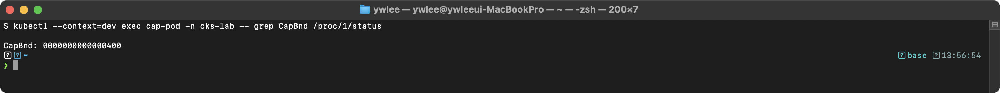

# CKS 모의 실기 문제

> CKS(Certified Kubernetes Security Specialist) 시험 대비 실전 문제 40선이다.
> 각 문제는 실제 시험과 유사한 시나리오 기반으로 구성되어 있다.
> 도메인별 비율: Cluster Setup(4), Cluster Hardening(6), System Hardening(6), Minimize Microservice Vulnerabilities(8), Supply Chain Security(8), Monitoring/Logging/Runtime Security(8)

### 실습 전제 (모든 문제 공통)

CKS 실습은 노드의 API server 매니페스트·kubelet 설정·AppArmor/seccomp 프로파일을 직접 고치는 파괴적 작업이 많다. 따라서 이 문서의 모든 실습은 **dev 또는 staging 클러스터에서만** 수행한다. platform/prod 클러스터(Prometheus·ArgoCD 상주, 데모 프로덕션)에서는 절대 정책·RBAC·네트워크를 부수지 않는다(CLAUDE.md §3 표).

실습 시작 전 다음을 확인한다.

- **클러스터 가동·정상화**: `./scripts/boot.sh` 로 VM 을 기동하고, 재부팅 후라면 `./scripts/fix-cluster-ip-drift.sh staging` 으로 IP 드리프트를 복구한다. `kubectl --kubeconfig kubeconfig/staging.yaml get nodes` 가 전부 `Ready` 인지 확인한다.
- **kubeconfig 경로**: kubeconfig 는 `kubeconfig/<클러스터>.yaml` 에 클러스터 가동 시 생성된다(gitignore). 이 문서의 명령에 나오는 `kubectl config use-context cluster1` 은 실제 CKS 시험 환경의 컨텍스트 전환 흉내이다. 이 저장소에서는 `--kubeconfig kubeconfig/staging.yaml` 또는 `export KUBECONFIG=kubeconfig/staging.yaml` 로 대체해 실행한다. 모든 명령에 대상 클러스터와 `-n <namespace>` 를 항상 명시한다.
- **노드 SSH 접근**: 노드 직접 조작 문제(매니페스트 수정·kubelet·AppArmor·seccomp·Falco)는 SSH 로 노드에 들어가야 한다. 전용 키가 배포돼 있어 `ssh staging-master`, `ssh staging-worker1` 처럼 **VM 이름 별칭으로 비밀번호 없이** 접속된다. 키·config 갱신은 `./scripts/setup-ssh-keys.sh staging`. 문제 본문의 `ssh node01` 은 CKS 시험의 워커 노드 이름이며, 이 저장소에서는 `ssh staging-worker1` 로 읽는다.
- **선행 리소스**: 각 문제는 대상 네임스페이스·Pod·Deployment 가 미리 존재한다고 가정한다. 없으면 `kubectl create namespace <ns>`, `kubectl run`/`kubectl create deployment` 로 먼저 만들고 실습한다. 풀이 머리의 매니페스트가 곧 선행 리소스 생성 명령이다.

---

## Cluster Setup (10%) - 4문제

### 문제 1. [Cluster Setup] NetworkPolicy - Default Deny All

`restricted` 네임스페이스에 default deny all NetworkPolicy를 적용하라. 이 네임스페이스의 모든 Pod에 대해 Ingress와 Egress 트래픽을 모두 차단해야 한다.

<details>
<summary>풀이 확인</summary>

**풀이:**
```bash
kubectl config use-context cluster1
```
```yaml
# deny-all.yaml
apiVersion: networking.k8s.io/v1
kind: NetworkPolicy
metadata:
  name: default-deny-all
  namespace: restricted
spec:
  podSelector: {}
  policyTypes:
  - Ingress
  - Egress
```
```bash
kubectl apply -f deny-all.yaml

# 검증
kubectl get networkpolicy -n restricted
kubectl describe networkpolicy default-deny-all -n restricted
```

**검증 - 공격 시뮬레이션:**
```bash
# 네임스페이스 내 Pod 간 통신 차단 확인
kubectl -n restricted exec test-pod -- wget -qO- --timeout=2 http://other-svc:80
```

```bash
# 외부 Egress 차단 확인
kubectl -n restricted exec test-pod -- wget -qO- --timeout=2 http://google.com
```

```bash
# DNS 조차 차단되므로 nslookup도 실패
kubectl -n restricted exec test-pod -- nslookup kubernetes.default
```
> **예시(참조) — ;; connection timed out; no servers could be rea:** CKS 보안 기대 출력(도구/설정/환경 의존). 재현 가능한 핵심은 CKS daily(day01~14) 및 본 문서 캡처 참고.

`podSelector: {}`는 해당 네임스페이스의 모든 Pod를 선택한다. `policyTypes`에 Ingress와 Egress를 모두 지정하고, 허용 규칙을 비워두면 모든 트래픽이 차단된다.

**출제 의도:** 네임스페이스 레벨의 제로 트러스트 네트워크 정책 수립 능력을 검증한다. 기본 deny 정책 없이는 모든 Pod가 자유롭게 통신할 수 있어 횡적 이동(lateral movement)에 취약하다.

**등장 배경:** Kubernetes 는 초기부터 "flat network" 모델을 택했다. 클러스터 안의 모든 Pod 는 NAT 없이 서로의 IP 로 직접 통신할 수 있고, 기본값은 *all-allow*(전부 허용)이다. 개발 편의는 좋지만, 공격자가 Pod 하나를 장악하면(예: 취약한 웹 애플리케이션 RCE) 같은 클러스터의 데이터베이스·내부 API 로 자유롭게 횡적 이동(lateral movement)할 수 있다. 이전에는 이런 통신을 호스트의 iptables 를 사람이 직접 짜서 막으려 했지만, Pod IP 는 스케줄링마다 바뀌므로 IP 기반 규칙은 유지가 불가능했다. NetworkPolicy 는 IP 가 아니라 **라벨 셀렉터**로 대상을 지정해 이 문제를 풀었다. 정책을 하나라도 붙이면 그 Pod 는 "정책 적용 대상"으로 전환되어, 명시적으로 허용하지 않은 트래픽은 모두 거부되는 deny-by-default 가 성립한다. 트레이드오프는 정책을 빠뜨린 통신까지 끊겨 서비스가 죽을 수 있다는 점, 그리고 NetworkPolicy 를 실제로 집행하는 CNI(아래 풀이 참고)가 깔려 있어야만 효력이 생긴다는 점이다.

**핵심 원리:** NetworkPolicy는 CNI(Container Network Interface, 쿠버네티스 Pod 네트워킹을 담당하는 플러그인 규격) 플러그인(Calico, Cilium 등)이 iptables/eBPF(커널 안에서 패킷·시스템콜을 가로채 처리하는 기술) 규칙으로 변환하여 커널 레벨에서 패킷을 필터링한다. L3/L4(IP 주소·포트 수준)에서 동작한다. `podSelector: {}`는 빈 라벨 셀렉터로, 해당 네임스페이스의 전체 Pod를 대상으로 지정하는 것이다. NetworkPolicy가 하나라도 존재하면 해당 Pod는 "정책 적용 대상"이 되어, 명시적으로 허용되지 않은 트래픽은 모두 차단된다.

**함정과 주의사항:**
- `policyTypes`에 `Egress`를 빠뜨리면 아웃바운드 트래픽은 여전히 허용된다. 시험에서 가장 흔한 실수이다.
- `policyTypes`를 아예 생략하면 `ingress` 필드가 있을 때만 Ingress 정책으로 인식되고, Egress는 정책 대상이 아닌 것으로 처리된다.
- CNI 플러그인이 NetworkPolicy를 지원하지 않으면(flannel 기본 모드 등) 정책이 적용되지 않는다. CKS 시험 환경에서는 지원하는 CNI가 설치되어 있다.

**공격-방어 매핑:**
| 공격 벡터 | 방어 효과 |
|---|---|
| 컨테이너 탈출 후 횡적 이동 | 네임스페이스 내 모든 Pod 간 통신 차단 |
| 데이터 유출(DNS 터널링 포함) | Egress 차단으로 외부 전송 불가 |
| 리버스 셸 연결 | 아웃바운드 연결 차단 |
</details>

---

### 문제 2. [Cluster Setup] NetworkPolicy - DNS 허용 및 특정 Pod 간 통신 허용

`restricted` 네임스페이스에서 `app=frontend` 라벨이 있는 Pod가 DNS(포트 53)와 `app=backend` 라벨이 있는 Pod의 포트 8080으로만 Egress 통신할 수 있도록 NetworkPolicy를 작성하라.

<details>
<summary>풀이 확인</summary>

**풀이:**
```yaml
apiVersion: networking.k8s.io/v1
kind: NetworkPolicy
metadata:
  name: frontend-egress
  namespace: restricted
spec:
  podSelector:
    matchLabels:
      app: frontend
  policyTypes:
  - Egress
  egress:
  - to: []
    ports:
    - protocol: UDP
      port: 53
    - protocol: TCP
      port: 53
  - to:
    - podSelector:
        matchLabels:
          app: backend
    ports:
    - protocol: TCP
      port: 8080
```
```bash
kubectl apply -f frontend-egress.yaml

# 검증: frontend에서 backend로 통신 가능한지 확인
kubectl -n restricted exec frontend-pod -- wget -qO- --timeout=2 http://backend-svc:8080
# (성공)

# frontend에서 외부로 통신 불가 확인
kubectl -n restricted exec frontend-pod -- wget -qO- --timeout=2 http://google.com
# (실패: 타임아웃)
```

**검증 - 공격 시뮬레이션:**
```bash
# 허용된 통신: frontend -> backend:8080
kubectl -n restricted exec frontend-pod -- wget -qO- --timeout=2 http://backend-svc:8080
```

```bash
# 차단된 통신: frontend -> 외부
kubectl -n restricted exec frontend-pod -- wget -qO- --timeout=2 http://malicious-site.com
```

```bash
# 차단된 통신: frontend -> 같은 네임스페이스의 다른 Pod
kubectl -n restricted exec frontend-pod -- wget -qO- --timeout=2 http://database-svc:5432
```

```bash
# DNS는 정상 동작 확인
kubectl -n restricted exec frontend-pod -- nslookup backend-svc.restricted.svc.cluster.local
```
> **예시(참조) — Server:    10.96.0.10:** CKS 보안 기대 출력(도구/설정/환경 의존). 재현 가능한 핵심은 CKS daily(day01~14) 및 본 문서 캡처 참고.

DNS 허용을 위해 `to: []`(모든 대상)에 포트 53을 지정한다. DNS를 허용하지 않으면 서비스명으로 통신할 수 없다. backend로의 통신은 `podSelector`로 대상을 지정하고 포트 8080만 허용한다.

CoreDNS(클러스터 내부 DNS 서버, 서비스명을 IP 로 변환한다)는 `kube-system` 네임스페이스에서 실행된다(`kubectl get pod -n kube-system -l k8s-app=kube-dns`). frontend Pod 가 있는 `restricted` 네임스페이스와는 다른 네임스페이스이다. 그래서 "같은 네임스페이스의 모든 Pod 만 허용" 하는 `to: [{}]` 를 쓰면 frontend 의 DNS 질의가 `kube-system` 의 CoreDNS 에 닿지 못해 이름 해석이 끊긴다. 다른 네임스페이스에 있는 CoreDNS 까지 닿으려면 "모든 대상" 을 뜻하는 `to: []` 가 필요하다 — 이것이 아래 세 표기를 구분해야 하는 이유이다.

세 가지 표기를 정확히 구분해야 한다. `to: []` 는 라벨 셀렉터 없는 빈 배열로 "모든 대상"(클러스터 밖 포함)을 의미하고, `to` 필드 자체를 생략한 것과 같은 효과이다. 반면 `to: [{}]` 는 배열 안에 빈 객체가 든 형태로 "이 NetworkPolicy 가 속한 네임스페이스의 모든 Pod"만 허용한다(외부·타 네임스페이스 제외). DNS 는 CoreDNS 가 어느 네임스페이스(보통 `kube-system`)에 있든 닿아야 하므로 여기서는 `to: []` 를 써야 한다. 혼동해서 `to: [{}]` 를 쓰면 같은 네임스페이스에 CoreDNS 가 없을 때 이름 해석이 끊긴다.

**출제 의도:** 마이크로서비스 간 최소 권한 네트워크 통신 설계 능력을 검증한다. default deny 위에 필요한 통신만 화이트리스트로 허용하는 패턴은 CKS 시험의 핵심이다.

**등장 배경:** 문제 1 의 default-deny 는 *모든* 통신을 끊으므로, 그 위에 "꼭 필요한 통신만" 다시 여는 화이트리스트가 필요하다. default-deny 없이 통신마다 일일이 deny 규칙을 짜던 시절에는 새 통신 경로가 생길 때마다 차단 규칙을 추가해야 했고(blacklist 방식), 하나라도 빠뜨리면 그 경로로 횡적 이동(lateral movement, 침해된 Pod 가 옆 Pod 로 번지는 것)이 일어났다. NetworkPolicy 는 반대로 deny-by-default + allow-list 모델을 택했다 — 기본은 전부 막고, 명시적으로 허용한 것만 통한다. 이 방식이 나은 점은 "빠뜨림" 이 곧 "차단" 으로 안전하게 귀결된다는 것이다(규칙을 빠뜨려도 열리는 게 아니라 막힌다). 이 문제에서 막히기 쉬운 함정이 DNS 다. 통신 대상을 `app=backend` 로만 좁히면 서비스 이름을 IP 로 바꾸는 DNS 질의(포트 53)까지 막혀, "backend 는 허용했는데 backend-svc 라는 이름을 못 찾아" 연결이 실패한다. 그래서 화이트리스트에 DNS(53/UDP·TCP)를 함께 열어야 한다. 트레이드오프는 allow-list 가 길어질수록 규칙 관리 부담이 커지고, 포트·프로토콜(특히 DNS 의 TCP 폴백)을 빠뜨리면 간헐적 장애로 이어진다는 점이다.

**핵심 원리:** Kubernetes NetworkPolicy의 egress 규칙은 `to`(대상)와 `ports`(포트)의 AND 조합이다. 각 egress 배열 항목은 OR 관계이다. DNS 규칙에서 `to: []`는 "모든 대상"을 의미하며, kube-dns(CoreDNS)가 어느 네임스페이스에 있든 53번 포트로의 통신을 허용한다. CNI 플러그인은 이 규칙을 커널의 netfilter/eBPF 규칙으로 변환하여 L3/L4 레벨에서 패킷 필터링을 수행한다.

**함정과 주의사항:**
- DNS에 UDP만 허용하고 TCP를 빠뜨리는 실수가 많다. DNS 응답이 512바이트를 초과하면 TCP 폴백이 발생하므로 TCP 53도 반드시 열어야 한다.
- `to: []`와 `to`를 생략하는 것은 의미가 다르다. `to`를 생략하면 해당 egress 규칙이 모든 대상에 적용되지만, `to: []`도 동일한 효과이다. 그러나 `to: [{}]`는 "같은 네임스페이스의 모든 Pod"를 의미하므로 혼동하면 안 된다.
- 같은 egress 항목에 `to`와 `ports`를 함께 넣으면 AND 조건이다. DNS 규칙과 backend 규칙을 하나의 egress 항목에 합치면 "DNS 대상에게만 8080도 허용"이 되어 의도와 다르게 동작한다.

**공격-방어 매핑:**
| 공격 벡터 | 방어 효과 |
|---|---|
| frontend 침해 후 DB 직접 접근 | backend만 허용되므로 DB 접근 차단 |
| C2 서버로 아웃바운드 연결 | 외부 Egress 차단으로 C2 통신 불가 |
| 내부 서비스 스캔 | 허용된 backend:8080 외 모든 포트/대상 차단 |

---

### 문제 3. [Cluster Setup] CIS Benchmark - kube-bench 실행 및 수정

마스터 노드에서 kube-bench를 실행하고, 다음 항목이 FAIL이면 PASS가 되도록 수정하라:
1. `1.2.1` - anonymous-auth가 false로 설정되어야 한다
2. `1.2.18` - insecure-bind-address가 설정되어 있지 않아야 한다
3. `1.2.20` - audit-log-path가 설정되어야 한다

<details>
<summary>풀이 확인</summary>

**실습 전제:** 이 문제는 마스터 노드에 SSH 로 들어가 작업한다. 이 저장소에서는 `ssh staging-master` 로 접속한 뒤 수행하며, API server 매니페스트를 고치는 파괴 작업이므로 staging(또는 dev)에서만 한다. kube-bench 가 노드에 없으면 `kubectl run kube-bench --image=aquasec/kube-bench:latest ...` 형태의 Job 으로도 실행할 수 있다.

**풀이:**
```bash
# 1. 현재 상태 확인
kube-bench run --targets master --check 1.2.1,1.2.18,1.2.20

# 2. API server 매니페스트 백업
cp /etc/kubernetes/manifests/kube-apiserver.yaml /tmp/kube-apiserver.yaml.bak

# 3. API server 매니페스트 수정
vi /etc/kubernetes/manifests/kube-apiserver.yaml
```

수정할 플래그들:
```yaml
spec:
  containers:
  - command:
    - kube-apiserver
    # 수정/추가할 항목:
    - --anonymous-auth=false
    # --insecure-bind-address 라인이 있으면 삭제
    - --audit-log-path=/var/log/kubernetes/audit/audit.log
    # audit-log 관련 volume mount도 추가 필요
    volumeMounts:
    - name: audit-log
      mountPath: /var/log/kubernetes/audit/
  volumes:
  - name: audit-log
    hostPath:
      path: /var/log/kubernetes/audit/
      type: DirectoryOrCreate
```
```bash
# 4. 로그 디렉토리 생성
mkdir -p /var/log/kubernetes/audit/

# 5. API server 재시작 대기
watch crictl ps | grep kube-apiserver

# 6. 재점검
kube-bench run --targets master --check 1.2.1,1.2.18,1.2.20
# 세 항목 모두 [PASS]로 표시되어야 한다
```

`--insecure-bind-address`는 해당 줄 자체를 삭제해야 한다. `--audit-log-path`를 추가할 때는 반드시 해당 경로에 대한 hostPath volume과 volumeMount도 함께 추가해야 한다.

이 문제는 단계가 8~9개로 많아 하나라도 빠뜨리면 실패한다. 다음을 순서대로 빠짐없이 한다.

- **[함정] 백업 먼저** — `cp ... /tmp/kube-apiserver.yaml.bak` 을 가장 먼저 한다. API server 매니페스트에 오타가 나면 API server 가 기동 불가가 되어 `kubectl` 자체가 막히므로, 롤백 수단이 없으면 복구가 어렵다.
- **[함정] `--audit-log-path` 는 3종 세트** — `command` 의 플래그 한 줄만 추가하면 안 된다. `volumeMounts`(컨테이너 안 경로) + `volumes`(호스트 hostPath) + 호스트의 `mkdir -p /var/log/kubernetes/audit/`(디렉토리 실제 생성) 셋을 모두 해야 한다. 하나라도 빠지면 API server 컨테이너가 `CrashLoop` 으로 시작에 실패한다.
- **[함정] `--insecure-bind-address` 는 "삭제"** — 값을 `0.0.0.0` 등으로 "바꾸는" 게 아니라 그 줄 자체를 지워야 `1.2.18` 이 PASS 된다.
- **재시작은 자동, 확인은 수동** — kubelet 이 매니페스트 변경을 inotify 로 감지해 컨테이너를 자동 교체한다(30초~1분). `watch crictl ps | grep kube-apiserver` 로 새 컨테이너가 떴는지 본 뒤 `kube-bench` 를 재실행해야 한다. 컨테이너가 안 뜨면 `crictl logs <id>` 로 오타를 찾는다.

**검증 - 공격 시뮬레이션:**
```bash
# kube-bench 재점검으로 PASS 확인
kube-bench run --targets master --check 1.2.1,1.2.18,1.2.20
```
> **예시(참조) — kube-bench CIS 점검 — PASS(준수):** [PASS] 1.2.1 Ensure that the --anonymous-auth ar ... (도구/설정 의존, 해당 도구 설치·구성 환경에서 재현).
```bash
# 익명 인증 차단 확인
curl -k https://localhost:6443/api/v1/namespaces
```
> **예시(참조) — {:** CKS 보안 기대 출력(도구/설정/환경 의존). 재현 가능한 핵심은 CKS daily(day01~14) 및 본 문서 캡처 참고.
```bash
# audit 로그 기록 확인
tail -1 /var/log/kubernetes/audit/audit.log | jq '.verb, .user.username'
```
> **예시(참조) — "get":** CKS 보안 기대 출력(도구/설정/환경 의존). 재현 가능한 핵심은 CKS daily(day01~14) 및 본 문서 캡처 참고.

**출제 의도:** CIS Kubernetes Benchmark 기반의 클러스터 보안 점검 및 수정 능력을 검증한다. kube-bench 출력을 읽고 API server 매니페스트를 정확하게 수정하는 실전 능력이 핵심이다.

**등장 배경:** 클러스터 컴포넌트는 설정 항목이 수백 개에 달하고 기본값이 보안에 최적화돼 있지 않다(예: 옛 버전은 `--anonymous-auth` 가 기본 `true`). 관리자마다 "어떤 플래그를 어떻게 둬야 안전한가" 의 기준이 달라 누락이 잦았다. CIS(Center for Internet Security, 비영리 보안 표준 기구) 는 이 합의 부재를 풀기 위해 컴포넌트별 권고 설정을 번호 체계(예: `1.2.1`)로 정리한 *CIS Kubernetes Benchmark* 를 발표했다. 그러나 수백 항목을 사람이 일일이 확인하는 것은 비현실적이다. kube-bench 는 이 Benchmark 를 노드에서 자동으로 점검해 항목별 `[PASS]/[FAIL]/[WARN]` 을 출력하는 도구로, 사람 점검의 한계(시간·일관성·누락)를 메운다. 트레이드오프는 kube-bench 가 권고를 "검사" 만 할 뿐 자동으로 고쳐주지는 않으며, 일부 항목은 환경(매니지드 vs self-hosted)에 따라 FAIL 이 정상일 수도 있어 결과를 사람이 해석해야 한다는 점이다.

**핵심 원리:** kube-bench는 CIS Benchmark 권고사항을 자동 검사하는 도구이다. API server는 Static Pod로 `/etc/kubernetes/manifests/`에 매니페스트가 위치하며, kubelet이 파일 변경을 inotify로 감지하여 컨테이너를 자동 재시작한다. `--anonymous-auth=false`는 인증 헤더 없는 요청을 system:anonymous 대신 거부한다. `--insecure-bind-address`는 TLS 없이 API를 노출하므로 MITM 공격에 취약하다.

**함정과 주의사항:**
- `--audit-log-path` 추가 시 해당 디렉토리에 대한 hostPath volume과 volumeMount를 빠뜨리면 API server가 시작되지 않는다. 매니페스트 수정 전 반드시 백업하라.
- `--insecure-bind-address`는 "값을 변경"하는 것이 아니라 "줄 자체를 삭제"해야 한다.
- API server가 재시작되지 않으면 `crictl logs <container-id>`로 에러 로그를 확인하라. 오타가 있으면 API server가 기동 불가 상태가 된다.
- 백업 파일(`/tmp/kube-apiserver.yaml.bak`)을 반드시 만들어야 롤백이 가능하다.

**공격-방어 매핑:**
| 공격 벡터 | 방어 효과 |
|---|---|
| 익명 API 접근으로 클러스터 정보 수집 | anonymous-auth=false로 인증 없는 접근 차단 |
| 평문 HTTP로 API 도청 | insecure-bind-address 제거로 HTTP 바인딩 차단 |
| 감사 추적 없는 악성 API 호출 | audit-log-path 설정으로 모든 API 호출 기록 |
</details>

---

### 문제 4. [Cluster Setup] 바이너리 검증

워커 노드 `node01`에서 kubelet 바이너리의 무결성을 확인하라. 공식 릴리스의 sha512 해시값과 비교하여 바이너리가 변조되지 않았는지 검증하라. kubelet 버전은 v1.29.0이다.

<details>
<summary>풀이 확인</summary>

**풀이:**
```bash
# 1. 워커 노드에 SSH 접속
ssh node01

# 2. 현재 kubelet 바이너리의 해시값 계산
sha512sum /usr/bin/kubelet

# 3. 공식 해시값 다운로드 (dl.k8s.io 의 정식 경로는 release/<버전>/bin/<os>/<arch>/ 이다)
curl -LO https://dl.k8s.io/release/v1.29.0/bin/linux/amd64/kubelet.sha512

# 4. 해시값 비교
echo "$(cat kubelet.sha512)  /usr/bin/kubelet" | sha512sum --check
# OK 출력 시: 무결성 확인
# FAILED 출력 시: 바이너리 변조 의심

# 만약 변조된 경우, 공식 바이너리로 교체
curl -LO https://dl.k8s.io/release/v1.29.0/bin/linux/amd64/kubelet
chmod +x kubelet
mv kubelet /usr/bin/kubelet
systemctl restart kubelet
```

**검증 - 공격 시뮬레이션:**
```bash
# 정상 바이너리 해시 비교
echo "$(cat kubelet.sha512)  /usr/bin/kubelet" | sha512sum --check
```

```bash
# 변조된 경우 출력
echo "$(cat kubelet.sha512)  /usr/bin/kubelet" | sha512sum --check
```

```bash
# 교체 후 kubelet 정상 동작 확인
systemctl status kubelet
```
> **예시(참조) — ● kubelet.service - kubelet: The Kubernetes Node:** CKS 보안 기대 출력(도구/설정/환경 의존). 재현 가능한 핵심은 CKS daily(day01~14) 및 본 문서 캡처 참고.
```bash
# 노드 상태 확인
kubectl get node node01
```
> **예시(참조) — NAME     STATUS   ROLES    AGE   VERSION:** CKS 보안 기대 출력(도구/설정/환경 의존). 재현 가능한 핵심은 CKS daily(day01~14) 및 본 문서 캡처 참고.

`sha512sum --check` 명령은 파일의 해시값을 계산하여 제공된 해시값과 비교한다. 결과가 `OK`이면 무결성이 확인된 것이고, `FAILED`이면 바이너리가 변조된 것이다.

**[함정] URL 경로** — `dl.k8s.io` 의 정식 바이너리 경로는 `release/<버전>/bin/<os>/<arch>/` 이다(`release/` 가 빠지면 404 가 난다). 실제로 살아 있는지 확인하려면 `curl -I https://dl.k8s.io/release/v1.29.0/bin/linux/amd64/kubelet.sha512` 가 `HTTP/2 200`(또는 302 리다이렉트)을 반환하는지 본다. 아키텍처도 노드에 맞춰야 한다 — `uname -m` 가 `aarch64` 면 `amd64` 가 아니라 `arm64` 경로를 쓴다. 이 저장소의 tart 노드는 Apple Silicon(arm64) 이므로 실측 시 `bin/linux/arm64/` 로 바꿔 받는다.

**출제 의도:** 공급망 공격(supply chain attack, 빌드·배포 경로에 악성 코드를 끼워 넣는 공격)에 의한 바이너리 변조를 탐지하는 능력을 검증한다. 클러스터 컴포넌트의 무결성 검증은 보안 기본 원칙이다.

**등장 배경:** 노드의 kubelet 같은 바이너리는 한 번 설치하면 그대로 두는 경우가 많아, 공격자가 노드에 침투해 kubelet 을 백도어가 박힌 버전으로 *조용히 바꿔치기* 해도 겉으로는 정상 동작해 발견하기 어렵다. 초기에는 "공식 사이트에서 받았으니 괜찮겠지" 하고 다운로드 후 바로 설치했지만, 다운로드 경로의 중간자 변조(MITM)나 설치 후 노드 침투에 의한 교체를 잡을 방법이 없었다. 직전 대응은 파일 크기·수정시각을 보는 정도였는데, 이런 메타데이터는 공격자가 손쉽게 위조한다. 암호학적 해시(여기서는 SHA-512)는 이 한계를 메운다 — 파일 내용이 1비트라도 바뀌면 전혀 다른 해시가 나오므로(avalanche effect, 눈사태 효과), 공식 배포처가 HTTPS 로 제공하는 해시값과 현재 바이너리의 해시를 비교하면 변조 여부가 드러난다. 직전 방식(메타데이터 비교) 대비 나아진 점은 위조가 사실상 불가능한 *내용 기반* 검증이라는 것이다. 트레이드오프는 ⓐ 해시값 자체를 신뢰할 수 있는 경로(공식 HTTPS·서명된 출처)로 받아야 의미가 있고(공격자가 바이너리와 해시를 같이 바꾸면 무력), ⓑ 해시는 "변조 여부" 만 알려줄 뿐 *언제·누가* 바꿨는지는 알려주지 않아 런타임 탐지(Falco 등, 문제 35~)와 병행해야 한다는 점이다.

**핵심 원리:** SHA-512는 암호학적 해시 함수로, 입력 데이터가 1비트만 달라져도 완전히 다른 해시값을 출력한다(avalanche effect). 공격자가 kubelet 바이너리에 백도어를 삽입하면 해시값이 변경되므로 변조 탐지가 가능하다. 공식 릴리스 해시값은 Kubernetes GitHub release 페이지에서 HTTPS로 제공되므로 신뢰할 수 있다.

**함정과 주의사항:**
- `sha512sum`의 입력 포맷은 "해시값  파일경로"이며, 해시값과 파일경로 사이에 공백 2개가 필요하다. 공백 1개이면 검증이 실패한다.
- kubelet 바이너리 교체 후 `systemctl restart kubelet`을 잊으면 기존 프로세스가 계속 실행된다.
- 아키텍처(amd64/arm64)를 확인하라. 잘못된 아키텍처의 바이너리를 다운로드하면 실행 불가이다.
- 바이너리 교체 시 `chmod +x`를 빠뜨리면 실행 권한이 없어 kubelet이 시작되지 않는다.

**공격-방어 매핑:**
| 공격 벡터 | 방어 효과 |
|---|---|
| 공급망 공격으로 kubelet 백도어 삽입 | 해시 비교로 변조 탐지 |
| 노드 침입 후 kubelet 교체 | 정기적 무결성 검사로 탐지 |
| 중간자 공격으로 다운로드 시 바이너리 변조 | HTTPS + 해시 검증으로 이중 보호 |
</details>

---

## Cluster Hardening (15%) - 6문제

### 문제 5. [Cluster Hardening] RBAC - 과도한 권한 축소

`production` 네임스페이스에 `dev-team` Role이 있다. 이 Role은 모든 리소스에 대해 모든 권한(`*`)을 가지고 있다. 이를 수정하여 Pod와 Service에 대한 get, list, watch 권한만 허용하고, Deployment에 대한 get, list, watch, update 권한만 허용하라.

<details>
<summary>풀이 확인</summary>

**풀이:**
```bash
# 현재 Role 확인
kubectl get role dev-team -n production -o yaml
```
```yaml
# 수정된 Role
apiVersion: rbac.authorization.k8s.io/v1
kind: Role
metadata:
  name: dev-team
  namespace: production
rules:
- apiGroups: [""]
  resources: ["pods", "services"]
  verbs: ["get", "list", "watch"]
- apiGroups: ["apps"]
  resources: ["deployments"]
  verbs: ["get", "list", "watch", "update"]
```
```bash
kubectl apply -f dev-team-role.yaml

# 검증
kubectl auth can-i delete pods --as=system:serviceaccount:production:dev-sa -n production
# no
kubectl auth can-i get pods --as=system:serviceaccount:production:dev-sa -n production
# yes
kubectl auth can-i update deployments.apps --as=system:serviceaccount:production:dev-sa -n production
# yes
kubectl auth can-i create deployments.apps --as=system:serviceaccount:production:dev-sa -n production
# no
```

`*` 와일드카드를 제거하고 필요한 verb와 resource만 명시적으로 나열하는 것이 최소 권한 원칙이다. Deployment는 `apps` apiGroup에 속하므로 별도로 지정해야 한다.

**검증 - 공격 시뮬레이션:**
```bash
# 축소된 권한으로 허용된 작업 확인
kubectl auth can-i get pods --as=system:serviceaccount:production:dev-sa -n production
```
> **예시(참조) — yes:** CKS 보안 기대 출력(도구/설정/환경 의존). 재현 가능한 핵심은 CKS daily(day01~14) 및 본 문서 캡처 참고.
```bash
# 차단된 작업 확인: Secret 접근 시도
kubectl auth can-i get secrets --as=system:serviceaccount:production:dev-sa -n production
```
> **예시(참조) — no:** CKS 보안 기대 출력(도구/설정/환경 의존). 재현 가능한 핵심은 CKS daily(day01~14) 및 본 문서 캡처 참고.
```bash
# 차단된 작업 확인: Pod 삭제 시도
kubectl auth can-i delete pods --as=system:serviceaccount:production:dev-sa -n production
```
> **예시(참조) — no:** CKS 보안 기대 출력(도구/설정/환경 의존). 재현 가능한 핵심은 CKS daily(day01~14) 및 본 문서 캡처 참고.
```bash
# 차단된 작업 확인: Deployment 생성 시도
kubectl auth can-i create deployments.apps --as=system:serviceaccount:production:dev-sa -n production
```
> **예시(참조) — no:** CKS 보안 기대 출력(도구/설정/환경 의존). 재현 가능한 핵심은 CKS daily(day01~14) 및 본 문서 캡처 참고.

**출제 의도:** 과도한 RBAC 권한을 식별하고 최소 권한 원칙(Principle of Least Privilege)에 맞게 축소하는 능력을 검증한다. `*` 와일드카드는 모든 리소스/동작을 허용하므로 실질적으로 cluster-admin과 동일한 위험이다.

**등장 배경:** RBAC(Role-Based Access Control, 역할 기반 접근 제어) 이전에 Kubernetes 의 기본 인가 방식은 ABAC(Attribute-Based Access Control, 속성 기반 접근 제어)였다. ABAC 는 정책을 한 줄씩 JSON 파일(`--authorization-policy-file`)에 적고 API server 플래그로 로드하는 방식인데, 정책을 바꿀 때마다 *파일을 고치고 API server 를 재시작* 해야 했고, 정책을 API 로 조회·관리할 수단이 없어 운영이 불투명했다. RBAC 는 권한을 Role/ClusterRole(무엇을 할 수 있나)과 RoleBinding/ClusterRoleBinding(누구에게 줄까)이라는 *일반 API 리소스* 로 만들었다 — `kubectl get/apply` 로 다루고, 재시작 없이 즉시 반영되며, 누가 무슨 권한을 가졌는지 `kubectl auth can-i` 로 점검할 수 있다. 트레이드오프는 권한을 잘게 나눈 만큼 리소스·verb 조합을 일일이 명시해야 해서, 귀찮다는 이유로 `*` 와일드카드를 남발하면 ABAC 시절보다 나을 게 없어진다는 점이다. 이 문제가 바로 그 남발(`*`)을 최소 권한으로 되돌리는 작업이다.

**핵심 원리:** Kubernetes RBAC는 Role(권한 정의)과 RoleBinding(주체에 권한 부여)으로 구성된다. API server의 인가 모듈이 매 요청마다 주체(user/SA)의 Role 규칙을 평가하여 허용/거부를 결정한다. `apiGroups: [""]`는 core API 그룹(Pod, Service 등)이고, `apiGroups: ["apps"]`는 Deployment, ReplicaSet 등이 속하는 그룹이다.

**함정과 주의사항:**
- Deployment의 apiGroup을 `""`(core)로 지정하면 권한이 적용되지 않는다. 반드시 `"apps"`를 지정해야 한다.
- `kubectl auth can-i`로 검증할 때 `--as` 플래그의 SA 형식은 `system:serviceaccount:<namespace>:<sa-name>`이다.
- Role과 ClusterRole을 혼동하면 안 된다. Role은 네임스페이스 스코프, ClusterRole은 클러스터 스코프이다.
- `resources`에 서브리소스(예: `pods/log`, `pods/exec`)를 별도로 지정해야 한다. `pods`만 지정하면 exec 권한은 포함되지 않는다.

**공격-방어 매핑:**
| 공격 벡터 | 방어 효과 |
|---|---|
| SA 토큰 탈취 후 Secret 읽기 | Secret 리소스 접근 권한 제거 |
| SA 토큰으로 Pod 삭제/생성 | delete/create verb 제거 |
| 권한 상승 공격(RoleBinding 생성) | RoleBinding 리소스 접근 권한 없음 |
</details>

---

### 문제 6. [Cluster Hardening] ServiceAccount 보안

`web-app` 네임스페이스에서 실행 중인 `web-pod` Pod가 default ServiceAccount를 사용하고 있다. 다음 작업을 수행하라:
1. `web-sa`라는 새 ServiceAccount를 생성하고 `automountServiceAccountToken: false`를 설정하라
2. `web-pod`가 새 ServiceAccount를 사용하도록 수정하라

<details>
<summary>풀이 확인</summary>

**풀이:**
```bash
# 1. ServiceAccount 생성
kubectl create serviceaccount web-sa -n web-app --dry-run=client -o yaml > web-sa.yaml
```
```yaml
apiVersion: v1
kind: ServiceAccount
metadata:
  name: web-sa
  namespace: web-app
automountServiceAccountToken: false
```
```bash
kubectl apply -f web-sa.yaml

# 2. Pod 수정 (Pod는 직접 수정 불가하므로 삭제 후 재생성)
kubectl get pod web-pod -n web-app -o yaml > web-pod.yaml
```

web-pod.yaml을 수정:
```yaml
spec:
  serviceAccountName: web-sa
  automountServiceAccountToken: false
  containers:
  - name: web
    image: nginx:1.25
```
```bash
kubectl delete pod web-pod -n web-app
kubectl apply -f web-pod.yaml

# 검증: 토큰이 마운트되지 않았는지 확인
kubectl exec web-pod -n web-app -- ls /var/run/secrets/kubernetes.io/serviceaccount/
# No such file or directory
```

**검증 - 공격 시뮬레이션:**
```bash
# 토큰 마운트 경로가 존재하지 않는지 확인
kubectl exec web-pod -n web-app -- ls /var/run/secrets/kubernetes.io/serviceaccount/
```

```bash
# 컨테이너 내부에서 API server 접근 시도 (토큰이 없으므로 실패)
kubectl exec web-pod -n web-app -- curl -sk https://kubernetes.default.svc/api/v1/namespaces
```
> **예시(참조) — {:** CKS 보안 기대 출력(도구/설정/환경 의존). 재현 가능한 핵심은 CKS daily(day01~14) 및 본 문서 캡처 참고.
```bash
# ServiceAccount 확인
kubectl get pod web-pod -n web-app -o jsonpath='{.spec.serviceAccountName}'
```
> **예시(참조) — web-sa:** CKS 보안 기대 출력(도구/설정/환경 의존). 재현 가능한 핵심은 CKS daily(day01~14) 및 본 문서 캡처 참고.

ServiceAccount의 `automountServiceAccountToken: false` 설정은 해당 SA를 사용하는 모든 Pod에 적용된다. Pod 레벨에서도 설정할 수 있으며, Pod 레벨 설정이 SA 레벨 설정보다 우선한다.

**출제 의도:** ServiceAccount 토큰의 자동 마운트가 불필요한 워크로드에서 토큰 노출 위험을 제거하는 능력을 검증한다. API server에 접근할 필요가 없는 애플리케이션에 SA 토큰을 마운트하면 컨테이너 침해 시 클러스터 API 접근 수단을 공격자에게 제공하는 셈이다.

**등장 배경:** 예전(K8s 1.21 이전) ServiceAccount 토큰은 *만료 없는 영구 토큰* 이 Secret 으로 자동 생성되어 Pod 에 마운트됐다. 이 영구 토큰은 한 번 유출되면 회수(revoke)할 방법이 사실상 없고, 어느 Pod 용인지 묶여 있지도 않아 다른 곳에서 그대로 재사용할 수 있었다 — 컨테이너 RCE 한 번이면 클러스터 API 열쇠를 영구히 내주는 셈이었다. 1.22+ 의 *bound service account token*(BoundServiceAccountTokenVolume)은 이를 고쳐, 토큰을 projected volume 으로 발급하면서 **만료시간(exp)·대상(audience)·특정 Pod 바인딩** 을 박았다. 토큰이 짧게 만료되고 kubelet 이 자동 갱신하므로 유출돼도 수명이 짧고, Pod 가 사라지면 토큰도 무효가 된다. 다만 토큰의 *수명* 을 줄였을 뿐, 애초에 API 접근이 필요 없는 Pod 라면 토큰을 *아예 마운트하지 않는* 것이 가장 확실하다. 이 문제의 `automountServiceAccountToken: false` 가 바로 그 "탈취할 대상 자체를 없애는" 방어이다.

**핵심 원리:** Kubernetes는 기본적으로 모든 Pod에 ServiceAccount 토큰을 projected volume으로 마운트한다. 이 토큰은 JWT 형식이며, API server에 대한 인증에 사용된다. `automountServiceAccountToken: false`를 설정하면 kubelet이 Pod 생성 시 토큰 볼륨을 마운트하지 않는다. Pod 레벨 설정 > SA 레벨 설정 순서로 우선순위가 적용된다.

**함정과 주의사항:**
- `serviceAccountName`과 `serviceAccount`(deprecated) 필드를 혼동하면 안 된다. `serviceAccountName`을 사용해야 한다.
- Pod의 `serviceAccountName`은 immutable 필드이므로 직접 수정할 수 없다. 반드시 삭제 후 재생성해야 한다.
- `automountServiceAccountToken`을 SA와 Pod 양쪽 모두에 설정하면, Pod 레벨 설정이 우선한다. Pod에 `true`를 설정하면 SA에 `false`가 있어도 토큰이 마운트된다.
- default SA에 `automountServiceAccountToken: false`를 설정하는 것도 좋은 방어 수단이다.

**공격-방어 매핑:**
| 공격 벡터 | 방어 효과 |
|---|---|
| 컨테이너 RCE 후 SA 토큰 탈취 | 토큰 미마운트로 탈취 대상 자체가 없음 |
| SA 토큰으로 Secret 읽기/Pod 생성 | API server 인증 수단 제거 |
| SSRF를 통한 metadata API 접근 | 토큰이 없으므로 API 호출 불가 |
</details>

---

### 문제 7. [Cluster Hardening] API Server 접근 제한

API Server의 다음 보안 설정을 수정하라:
1. 익명 인증을 비활성화하라 (`--anonymous-auth=false`)
2. 인가 모드를 `Node,RBAC`로 설정하라
3. `NodeRestriction` admission plugin을 활성화하라

<details>
<summary>풀이 확인</summary>

**풀이:**
```bash
# 1. 매니페스트 백업
cp /etc/kubernetes/manifests/kube-apiserver.yaml /tmp/kube-apiserver.yaml.bak

# 2. 매니페스트 수정
vi /etc/kubernetes/manifests/kube-apiserver.yaml
```

수정할 플래그:
```yaml
spec:
  containers:
  - command:
    - kube-apiserver
    - --anonymous-auth=false
    - --authorization-mode=Node,RBAC
    - --enable-admission-plugins=NodeRestriction,PodSecurity
    # ... 기존 플래그들
```
```bash
# 3. API server 재시작 대기
watch crictl ps | grep kube-apiserver

# 4. 정상 동작 확인
kubectl get nodes

# 5. 익명 접근 차단 확인
curl -k https://localhost:6443/api/v1/namespaces
# 401 Unauthorized (익명 접근 차단됨)
```

**검증 - 공격 시뮬레이션:**
```bash
# 익명 인증 차단 확인
curl -sk https://localhost:6443/api/v1/namespaces
```
> **예시(참조) — {:** CKS 보안 기대 출력(도구/설정/환경 의존). 재현 가능한 핵심은 CKS daily(day01~14) 및 본 문서 캡처 참고.
```bash
# NodeRestriction 동작 확인: 노드가 다른 노드의 라벨을 수정할 수 없음
# (node01의 kubelet 인증서로 node02의 라벨 변경 시도 시 차단)
kubectl --kubeconfig=/etc/kubernetes/kubelet.conf label node node02 test=malicious
```
> **예시(참조) — Error from server (Forbidden): nodes "node02" is:** CKS 보안 기대 출력(도구/설정/환경 의존). 재현 가능한 핵심은 CKS daily(day01~14) 및 본 문서 캡처 참고.
```bash
# 인가 모드 확인
kubectl -v=6 get nodes 2>&1 | grep authorization
# RBAC와 Node 인가 모듈이 동작 중
```

API server 매니페스트를 수정하면 kubelet이 변경을 감지하고 자동으로 API server를 재시작한다. 재시작에 30초~1분 정도 소요될 수 있다. `watch crictl ps`로 컨테이너 상태를 모니터링하라.

**출제 의도:** API server의 인증(AuthN)/인가(AuthZ)/어드미션 3단계 보안 체계를 강화하는 능력을 검증한다. 각 단계의 역할과 설정 방법을 정확히 이해해야 한다.

**등장 배경:** Kubernetes 초기에는 API server 가 일단 클러스터를 돌리는 데 집중했고, 기본값이 보안 관점에서 느슨했다. 익명 요청을 허용(`--anonymous-auth=true` 기본)해 인증 없이도 일부 엔드포인트를 조회할 수 있었고, 인가는 ABAC(Attribute-Based Access Control, 정책 파일에 속성 규칙을 나열하는 방식)나 AlwaysAllow 가 흔했다. ABAC 는 규칙을 정적 파일로 관리해 변경할 때마다 API server 를 재시작해야 했고, 누가 무엇을 할 수 있는지 API 로 조회할 방법이 없어 감사가 어려웠다. 또 kubelet 은 자기 노드와 무관한 다른 노드의 오브젝트(다른 노드의 Secret·Pod)까지 읽거나 고칠 수 있어, 워커 한 대만 장악해도 클러스터 전역으로 번질 수 있었다. 이 세 한계를 차례로 메운 것이 ⓐ `--anonymous-auth=false`(미인증 요청을 1단계에서 거부), ⓑ RBAC 인가자(권한을 Role/Binding 오브젝트로 표현해 API 로 조회·감사 가능, 재시작 불필요), ⓒ Node 인가자 + `NodeRestriction` 어드미션(kubelet 이 자기 노드에 스케줄된 리소스만 건드리도록 강제)이다. 트레이드오프는 익명 인증을 끄면 익명에 의존하던 헬스체크·외부 도구가 깨질 수 있고, RBAC 는 규칙이 비어 있으면 기본 거부라 권한을 빠뜨리면 정상 작업까지 막힌다는 점이다. 그래서 매니페스트를 고치기 전 반드시 백업하고(`cp ... /tmp/...bak`) 재시작 후 `kubectl get nodes` 로 회복을 확인한다.

**핵심 원리:** API server의 요청 처리 파이프라인은 Authentication -> Authorization -> Admission Control 순서이다. `--anonymous-auth=false`는 1단계에서 미인증 요청을 거부한다. `--authorization-mode=Node,RBAC`는 2단계에서 Node 인가자(kubelet 전용)와 RBAC 인가자를 순서대로 평가한다. `NodeRestriction` 어드미션 플러그인은 3단계에서 kubelet이 자기 노드에 스케줄된 리소스만 수정할 수 있도록 제한한다.

**함정과 주의사항:**
- `--authorization-mode`의 순서가 중요하다. `Node,RBAC` 순서로 지정하면 Node 인가자가 먼저 평가되고, 판단 불가 시 RBAC로 넘어간다. 순서를 바꾸면 동작은 하지만 권장되지 않는다.
- `--enable-admission-plugins`에 기존 플러그인을 유지하면서 `NodeRestriction`을 추가해야 한다. 기존 목록을 덮어쓰면 필수 플러그인이 빠질 수 있다.
- `--anonymous-auth=false` 설정 후 liveness probe가 익명 인증에 의존하고 있었다면 API server가 비정상으로 판단될 수 있다. 그러나 기본 liveness probe는 localhost에서 동작하므로 보통 문제없다.

**공격-방어 매핑:**
| 공격 벡터 | 방어 효과 |
|---|---|
| 익명 사용자의 API 정보 수집 | anonymous-auth=false로 차단 |
| 침해된 kubelet이 다른 노드 리소스 수정 | NodeRestriction으로 자기 노드만 접근 허용 |
| ABAC 기반 우회 공격 | RBAC 전용 인가로 정밀한 접근 제어 |
</details>

---

### 문제 8. [Cluster Hardening] kubeadm 업그레이드

클러스터의 컨트롤 플레인을 v1.28.5에서 v1.29.0으로 업그레이드하라. 컨트롤 플레인 노드에서 kubeadm, kubelet, kubectl을 모두 업그레이드해야 한다.

<details>
<summary>풀이 확인</summary>

**풀이:**
```bash
# 1. 업그레이드 가능 버전 확인
kubeadm upgrade plan

# 2. kubeadm 업그레이드
apt-get update
apt-cache madison kubeadm | grep 1.29
apt-get install -y kubeadm=1.29.0-1.1

# 3. kubeadm 버전 확인
kubeadm version

# 4. 컨트롤 플레인 업그레이드
kubeadm upgrade apply v1.29.0

# 5. 노드 드레인
kubectl drain controlplane --ignore-daemonsets --delete-emptydir-data

# 6. kubelet, kubectl 업그레이드
apt-get install -y kubelet=1.29.0-1.1 kubectl=1.29.0-1.1

# 7. kubelet 재시작
systemctl daemon-reload
systemctl restart kubelet

# 8. 노드 uncordon
kubectl uncordon controlplane

# 9. 버전 확인
kubectl get nodes
# controlplane이 v1.29.0으로 표시되어야 한다
```

업그레이드는 반드시 한 마이너 버전씩 수행해야 한다. 컨트롤 플레인을 먼저 업그레이드한 후 워커 노드를 업그레이드한다. 워커 노드는 `kubeadm upgrade node` 명령을 사용한다.

**검증 - 공격 시뮬레이션:**
```bash
# 컨트롤 플레인 버전 확인
kubectl get nodes
```
> **예시(참조) — NAME           STATUS   ROLES           AGE   VE:** CKS 보안 기대 출력(도구/설정/환경 의존). 재현 가능한 핵심은 CKS daily(day01~14) 및 본 문서 캡처 참고.
```bash
# API server 버전 확인
kubectl version --short
```
> **예시(참조) — Client Version: v1.29.0:** CKS 보안 기대 출력(도구/설정/환경 의존). 재현 가능한 핵심은 CKS daily(day01~14) 및 본 문서 캡처 참고.
```bash
# 컴포넌트 상태 확인
kubectl get pods -n kube-system | grep -E 'kube-apiserver|kube-controller|kube-scheduler|etcd'
```
> **예시(참조) — etcd-controlplane                      1/1     R:** CKS 보안 기대 출력(도구/설정/환경 의존). 재현 가능한 핵심은 CKS daily(day01~14) 및 본 문서 캡처 참고.

**출제 의도:** 보안 패치가 포함된 Kubernetes 버전 업그레이드를 안전하게 수행하는 능력을 검증한다. CVE 수정은 새 버전에 포함되므로 정기적 업그레이드는 보안의 기본이다.

**등장 배경:** kubeadm 이전에는 클러스터를 손으로(또는 회사마다 다른 스크립트로) 세웠고, 업그레이드도 컴포넌트별 바이너리·인증서·etcd 스키마를 사람이 순서를 지켜 갈아끼우는 작업이었다. 이때 가장 큰 고통은 두 가지였다. 첫째, Kubernetes 는 컨트롤 플레인(apiserver 등)과 노드(kubelet)의 버전이 한 마이너 버전 이상 벌어지면 동작을 보장하지 않는다(version skew 정책). 손 작업에서는 이 규약을 어겨 노드가 통신을 못 하는 사고가 잦았다. 둘째, 보안 CVE 패치는 새 마이너/패치 버전에 실려 나오므로, 업그레이드를 미루면 알려진 취약점에 그대로 노출됐다. kubeadm 은 이 과정을 표준화했다. `kubeadm upgrade plan` 이 안전하게 올라갈 수 있는 버전과 skew 제약을 알려주고, `kubeadm upgrade apply` 가 새 버전의 정적 파드 매니페스트를 배치하고 etcd 스키마 마이그레이션까지 처리한다. 그래서 "kubeadm 먼저 → 컨트롤 플레인 → 한 마이너씩 → 워커" 라는 정해진 순서만 지키면 skew 위반 없이 올릴 수 있게 됐다. 트레이드오프는 절차가 정형화된 대신 단계가 많고(drain·apply·kubelet 재시작·uncordon), 한 단계라도 건너뛰면(예: kubeadm 을 안 올리고 apply, daemon-reload 누락) 실패한다는 점이다. 그래서 손 숙련이 곧 점수다.

**핵심 원리:** kubeadm은 컨트롤 플레인 컴포넌트를 Static Pod로 관리한다. `kubeadm upgrade apply`는 새 버전의 매니페스트를 `/etc/kubernetes/manifests/`에 배치하고, kubelet이 이를 감지하여 컨테이너를 교체한다. etcd 스키마 마이그레이션도 자동으로 수행된다. drain은 노드의 워크로드를 다른 노드로 이동시켜 업그레이드 중 서비스 중단을 방지한다.

**함정과 주의사항:**
- kubeadm을 먼저 업그레이드한 후 `kubeadm upgrade apply`를 실행해야 한다. 순서를 바꾸면 이전 버전의 kubeadm이 새 버전 업그레이드를 지원하지 않는다.
- `kubeadm upgrade apply`와 `kubeadm upgrade node`를 혼동하면 안 된다. 전자는 컨트롤 플레인, 후자는 워커 노드(또는 추가 컨트롤 플레인)용이다.
- drain 시 `--ignore-daemonsets`를 빠뜨리면 DaemonSet Pod 때문에 드레인이 실패한다.
- kubelet/kubectl 업그레이드 후 `systemctl daemon-reload && systemctl restart kubelet`을 반드시 수행해야 한다.

**공격-방어 매핑:**
| 공격 벡터 | 방어 효과 |
|---|---|
| 알려진 CVE 익스플로잇 | 보안 패치가 적용된 버전으로 업그레이드 |
| API server 취약점 공격 | 최신 버전의 보안 수정 반영 |
| kubelet 권한 상승 취약점 | kubelet 바이너리 업그레이드로 패치 |
</details>

---

### 문제 9. [Cluster Hardening] cluster-admin ClusterRoleBinding 감사

클러스터에서 `cluster-admin` ClusterRole에 바인딩된 모든 ClusterRoleBinding을 찾아라. 시스템 컴포넌트(system:으로 시작하는 주체)를 제외하고, 불필요하게 cluster-admin 권한을 가진 사용자나 ServiceAccount를 식별하라.

<details>
<summary>풀이 확인</summary>

**풀이:**
```bash
# 1. cluster-admin에 바인딩된 모든 ClusterRoleBinding 찾기
kubectl get clusterrolebindings -o json | \
  jq -r '.items[] | select(.roleRef.name == "cluster-admin") |
  "\(.metadata.name): \(.subjects // [] | .[] | "\(.kind)/\(.name) (ns: \(.namespace // "cluster-wide"))")"'

# 2. 시스템 컴포넌트 제외하고 확인
kubectl get clusterrolebindings -o json | \
  jq -r '.items[] | select(.roleRef.name == "cluster-admin") |
  .subjects[]? | select(.name | startswith("system:") | not) |
  "\(.kind)/\(.name)"'

# 3. 불필요한 바인딩이 발견되면 삭제
kubectl delete clusterrolebinding <suspicious-binding-name>

# 4. 또는 더 제한적인 Role로 교체
kubectl create clusterrolebinding limited-access \
  --clusterrole=view \
  --user=jane \
  --dry-run=client -o yaml | kubectl apply -f -
```

**검증 - 공격 시뮬레이션:**
```bash
# 비시스템 주체 중 cluster-admin 바인딩 식별
kubectl get clusterrolebindings -o json | \
  jq -r '.items[] | select(.roleRef.name == "cluster-admin") |
  .subjects[]? | select(.name | startswith("system:") | not) |
  "\(.kind)/\(.name)"'
```
> **예시(참조) — User/jane:** CKS 보안 기대 출력(도구/설정/환경 의존). 재현 가능한 핵심은 CKS daily(day01~14) 및 본 문서 캡처 참고.
```bash
# 삭제 전: jane이 Secret을 읽을 수 있는지 확인
kubectl auth can-i get secrets --all-namespaces --as=jane
```
> **예시(참조) — yes:** CKS 보안 기대 출력(도구/설정/환경 의존). 재현 가능한 핵심은 CKS daily(day01~14) 및 본 문서 캡처 참고.
```bash
# 불필요한 바인딩 삭제 후 권한 확인
kubectl delete clusterrolebinding jane-cluster-admin
kubectl auth can-i get secrets --all-namespaces --as=jane
```
> **예시(참조) — no:** CKS 보안 기대 출력(도구/설정/환경 의존). 재현 가능한 핵심은 CKS daily(day01~14) 및 본 문서 캡처 참고.

`cluster-admin`은 모든 리소스에 대한 모든 권한을 가지는 매우 강력한 ClusterRole이다. 실제 운영 환경에서는 극소수의 관리자만 이 권한을 가져야 하며, 정기적으로 감사해야 한다.

**출제 의도:** 과도한 클러스터 관리자 권한이 부여된 주체를 식별하고 제거하는 RBAC 감사 능력을 검증한다. cluster-admin 권한의 무분별한 부여는 보안 사고의 주요 원인이다.

**등장 배경:** 문제 5 가 *새로 만드는* 권한을 최소화하는 작업이라면, 이 문제는 *이미 쌓여버린* 과잉 권한을 사후에 찾아내는 작업이다. cluster-admin 은 "권한 문제로 막히면 일단 cluster-admin 을 붙여 해결" 하는 운영 습관 때문에 시간이 지나며 조용히 늘어난다 — 퇴직자 계정, 임시로 권한을 올린 디버깅용 SA, CI/CD 파이프라인 SA 가 정리되지 않은 채 cluster-admin 을 들고 남는 식이다. 문제는 cluster-admin 이 모든 네임스페이스의 Secret 을 읽고 RBAC 자체를 고칠 수 있어, 그 주체 하나만 탈취당해도 클러스터 전체가 끝난다는 점이다. 권한을 처음 부여할 때 통제하는 것(문제 7 의 NodeRestriction, 문제 5 의 최소 권한)만으로는 이미 부여된 잔존 권한을 못 잡기 때문에, *정기 감사* 라는 별도의 통제가 필요하다. 직전 방식은 `kubectl get clusterrolebindings` 출력을 사람이 눈으로 훑는 것이었는데, 바인딩이 수십~수백 개면 누락이 생긴다. `jq` 로 `roleRef.name == "cluster-admin"` 인 바인딩만 기계적으로 추려내고 `system:` 접두사(쿠버네티스 내장 컴포넌트)를 걸러내면, 사람이 봐야 할 "비시스템 cluster-admin 주체" 만 남아 감사가 정확·반복 가능해진다. 트레이드오프는 자동 추출이 "누가 가졌나" 는 알려줘도 "이 권한이 실제로 필요한가" 는 판단해 주지 못해, 결국 사람이 각 주체의 용도를 확인해 제거 여부를 결정해야 한다는 점이다.

**핵심 원리:** RBAC 인가는 API server 가 매 요청마다 (1) 요청 주체(user/group/SA)를 식별하고, (2) 그 주체에 연결된 RoleBinding·ClusterRoleBinding 을 찾아, (3) 바인딩이 가리키는 Role·ClusterRole 의 규칙(`apiGroups`·`resources`·`verbs`)이 요청을 허용하는지 평가하는 흐름이다. `cluster-admin` ClusterRole 은 모든 API 그룹의 모든 리소스에 모든 verb 를 허용하는 와일드카드(`*`) 규칙을 가지므로, 이 평가에서 항상 "허용" 으로 끝난다. ClusterRoleBinding 은 RoleBinding 과 달리 네임스페이스에 묶이지 않아, 한 번 바인딩되면 *클러스터 전체 스코프* 에서 그 권한이 적용된다(`.subjects[]` 의 각 주체에게). 따라서 감사 대상은 `roleRef.name == "cluster-admin"` 인 ClusterRoleBinding 의 `subjects` 배열이며, `jq` 로 JSON 을 파싱해 추출한다.

**함정과 주의사항:**
- `system:masters` 그룹에 바인딩된 `cluster-admin-binding`은 삭제하면 안 된다. 이것은 kubeadm이 생성한 필수 바인딩이다.
- RoleBinding으로도 ClusterRole을 참조할 수 있다. `kubectl get rolebindings -A`도 함께 확인해야 완전한 감사가 된다.
- ServiceAccount에 cluster-admin이 바인딩된 경우, 해당 SA의 토큰이 탈취되면 클러스터 전체가 침해된다.

**공격-방어 매핑:**
| 공격 벡터 | 방어 효과 |
|---|---|
| 탈취된 사용자 계정으로 전체 클러스터 제어 | 불필요한 cluster-admin 바인딩 제거 |
| CI/CD SA 토큰으로 Secret 전수 탈취 | SA에서 cluster-admin 제거, 최소 권한 Role 부여 |
| 퇴직자 계정의 잔존 권한 악용 | 정기 감사로 미사용 바인딩 정리 |
</details>

---

### 문제 10. [Cluster Hardening] kubeconfig 보안

워커 노드 `node01`에서 `/root/.kube/config`에 저장된 kubeconfig 파일의 보안 문제를 해결하라:
1. 파일 권한을 소유자만 읽기/쓰기할 수 있도록 제한하라
2. 불필요한 context `old-cluster`를 제거하라

<details>
<summary>풀이 확인</summary>

**풀이:**
```bash
# 1. SSH 접속
ssh node01

# 2. 파일 권한 확인 및 수정
ls -la /root/.kube/config
# 644 또는 그보다 느슨한 권한이면 수정 필요

chmod 600 /root/.kube/config
ls -la /root/.kube/config
# -rw------- 확인

# 3. 불필요한 context 확인
kubectl config get-contexts --kubeconfig=/root/.kube/config

# 4. old-cluster context 삭제
kubectl config delete-context old-cluster --kubeconfig=/root/.kube/config

# 5. 관련 cluster/user 정보도 삭제
kubectl config delete-cluster old-cluster --kubeconfig=/root/.kube/config
kubectl config delete-user old-cluster-admin --kubeconfig=/root/.kube/config

# 6. 최종 확인
kubectl config get-contexts --kubeconfig=/root/.kube/config
```

**검증 - 공격 시뮬레이션:**
```bash
# 파일 권한 확인
ls -la /root/.kube/config
```
> **예시(참조) — -rw------- 1 root root 5482 Mar 15 10:30 /root/.:** CKS 보안 기대 출력(도구/설정/환경 의존). 재현 가능한 핵심은 CKS daily(day01~14) 및 본 문서 캡처 참고.
```bash
# 다른 사용자가 읽을 수 없는지 확인
su - testuser -c "cat /root/.kube/config"
```

```bash
# old-cluster context가 제거되었는지 확인
kubectl config get-contexts --kubeconfig=/root/.kube/config
```
> **예시(참조) — CURRENT   NAME       CLUSTER    AUTHINFO   NAMES:** CKS 보안 기대 출력(도구/설정/환경 의존). 재현 가능한 핵심은 CKS daily(day01~14) 및 본 문서 캡처 참고.

kubeconfig 파일에는 클러스터 접근 자격 증명(인증서, 토큰 등)이 포함되어 있으므로, 파일 권한을 600(소유자만 읽기/쓰기)으로 설정해야 한다. 불필요한 context는 공격 표면을 줄이기 위해 제거해야 한다.

**출제 의도:** 자격 증명 파일의 파일시스템 레벨 보안과 불필요한 접근 정보 제거 능력을 검증한다. kubeconfig은 클러스터의 열쇠와 같으므로 철저히 관리해야 한다.

**등장 배경:** kubeconfig 안에는 클러스터 API 에 접근하는 자격 증명(클라이언트 인증서·키·토큰)이 인라인으로 들어 있다 — 즉 이 파일 한 장이 클러스터 출입 열쇠다. 그런데 도구가 만드는 kubeconfig 의 기본 권한이 항상 안전하지는 않다. `kubectl` 이나 일부 설치 스크립트는 파일을 `644`(소유자 외에도 읽기 가능) 같은 느슨한 권한으로 남길 수 있고, 노드에 여러 사용자가 있으면 그 누구나 `cat` 으로 열쇠를 복사할 수 있다. 노드 보안에서 RBAC·인증은 "API server 가 요청을 받은 *뒤*" 를 통제하지만, kubeconfig 파일이 새면 공격자는 *정당한 자격 증명* 을 손에 넣어 RBAC 통제를 정상적으로 통과해 버린다(인증을 우회하는 게 아니라 합법적으로 인증된다). 그래서 자격 증명 파일은 API 레벨 통제와 별개로 *파일시스템 레벨* 에서 막아야 한다. 직전·기본 방식(느슨한 권한 방치) 대비 나아진 점은, 리눅스 커널의 VFS 가 매 접근마다 강제하는 DAC(Discretionary Access Control, 소유자 기반 접근 제어)에 기대 `chmod 600` 으로 "소유자만 읽기/쓰기" 를 강제하면 같은 노드의 다른 사용자가 파일에 손도 못 댄다는 것이다. 함께 다루는 "불필요한 context 제거" 도 같은 맥락이다 — 폐기된 클러스터의 자격 증명이 파일에 남아 있으면 그 클러스터가 살아 있는 한 잔존 열쇠가 되므로 공격 표면을 줄이려 제거한다. 트레이드오프는 권한을 `400`(읽기 전용)까지 조이면 `kubectl` 이 context 전환을 파일에 기록하지 못해 동작이 깨질 수 있어, 600 이 적절한 균형이라는 점이다.

**핵심 원리:** Linux 파일 권한은 소유자(owner)/그룹(group)/기타(others) 3단위로 읽기(r=4)/쓰기(w=2)/실행(x=1)을 조합한다. `chmod 600`은 소유자에게만 읽기+쓰기를 허용하고 그룹/기타의 모든 권한을 제거한다. 커널의 VFS(Virtual File System) 계층이 매 파일 접근 시 DAC(Discretionary Access Control) 검사를 수행한다.

**함정과 주의사항:**
- context만 삭제하고 cluster/user 엔트리를 남기면 자격 증명이 파일에 잔존한다. 반드시 `delete-cluster`와 `delete-user`도 실행하라.
- `chmod 600`이 아닌 `chmod 400`(읽기만)으로 설정하면 kubectl이 context 수정 시 쓸 수 없다. 600이 적절하다.
- kubeconfig에 base64 인코딩된 인증서 키가 인라인으로 포함되어 있을 수 있다. 이 경우 파일 유출 시 즉시 클러스터 접근이 가능하다.

**공격-방어 매핑:**
| 공격 벡터 | 방어 효과 |
|---|---|
| 다른 사용자가 kubeconfig 읽기 | 600 권한으로 소유자만 접근 가능 |
| 폐기된 클러스터 자격 증명 악용 | old-cluster context/credentials 삭제 |
| 파일 유출 시 다중 클러스터 침해 | 불필요한 cluster 정보 제거로 피해 범위 축소 |
</details>

---

## System Hardening (15%) - 6문제

### 문제 11. [System Hardening] AppArmor 프로파일 적용

다음 AppArmor 프로파일을 `node01`에 로드하고, `secure-ns` 네임스페이스의 `nginx-pod` Pod에 적용하라. 프로파일은 모든 파일 쓰기를 거부하되 `/tmp`에만 쓰기를 허용해야 한다.

<details>
<summary>풀이 확인</summary>

**풀이:**
```bash
# 1. node01에 SSH 접속하여 AppArmor 프로파일 생성
ssh node01
cat > /etc/apparmor.d/k8s-deny-write << 'EOF'
#include <tunables/global>

profile k8s-deny-write flags=(attach_disconnected,mediate_deleted) {
  #include <abstractions/base>

  file,

  deny /** w,
  /tmp/** rw,
}
EOF

# 2. 프로파일 로드
apparmor_parser -r /etc/apparmor.d/k8s-deny-write

# 3. 프로파일 확인
aa-status | grep k8s-deny-write

# 4. exit하여 컨트롤 플레인으로 돌아감
exit
```

Pod 정의 (annotation 방식, K8s 1.29 이하):
```yaml
apiVersion: v1
kind: Pod
metadata:
  name: nginx-pod
  namespace: secure-ns
  annotations:
    container.apparmor.security.beta.kubernetes.io/nginx: localhost/k8s-deny-write
spec:
  nodeName: node01  # AppArmor 프로파일이 로드된 노드에 스케줄링
  containers:
  - name: nginx
    image: nginx:1.25
    volumeMounts:
    - name: tmp
      mountPath: /tmp
  volumes:
  - name: tmp
    emptyDir: {}
```

Pod 정의 (securityContext 방식, K8s 1.30+):
```yaml
apiVersion: v1
kind: Pod
metadata:
  name: nginx-pod
  namespace: secure-ns
spec:
  nodeName: node01
  containers:
  - name: nginx
    image: nginx:1.25
    securityContext:
      appArmorProfile:
        type: Localhost
        localhostProfile: k8s-deny-write
    volumeMounts:
    - name: tmp
      mountPath: /tmp
  volumes:
  - name: tmp
    emptyDir: {}
```
```bash
kubectl apply -f nginx-pod.yaml

# 검증
kubectl exec nginx-pod -n secure-ns -- touch /root/test.txt
# Permission denied

kubectl exec nginx-pod -n secure-ns -- touch /tmp/test.txt
# (성공)
```

AppArmor 프로파일은 Pod가 스케줄링되는 노드에 미리 로드되어 있어야 한다. annotation의 컨테이너 이름(`nginx`)이 Pod spec의 컨테이너 이름과 정확히 일치해야 한다.

**검증 - 공격 시뮬레이션:**
```bash
# /root에 파일 쓰기 시도 (차단되어야 함)
kubectl exec nginx-pod -n secure-ns -- touch /root/malicious.sh
```

```bash
# /etc/passwd 수정 시도 (차단)
kubectl exec nginx-pod -n secure-ns -- sh -c 'echo "hacker:x:0:0::/root:/bin/bash" >> /etc/passwd'
```

```bash
# /tmp에 파일 쓰기 (허용)
kubectl exec nginx-pod -n secure-ns -- touch /tmp/allowed.txt
kubectl exec nginx-pod -n secure-ns -- ls /tmp/allowed.txt
```
> **예시(참조) — /tmp/allowed.txt:** CKS 보안 기대 출력(도구/설정/환경 의존). 재현 가능한 핵심은 CKS daily(day01~14) 및 본 문서 캡처 참고.
```bash
# 웹셸 드롭 시도 (차단)
kubectl exec nginx-pod -n secure-ns -- sh -c 'echo "<?php system($_GET[cmd]); ?>" > /var/www/html/shell.php'
```


**출제 의도:** AppArmor MAC(Mandatory Access Control, 관리자가 정한 정책을 사용자가 못 바꾸게 커널이 강제하는 접근 제어)를 사용하여 컨테이너의 파일시스템 접근을 세밀하게 제어하는 능력을 검증한다. 컨테이너 침해 시 파일 쓰기를 제한하면 악성 코드 설치와 설정 변조를 방어할 수 있다.

**등장 배경:** 리눅스의 전통적 접근 제어는 DAC(Discretionary Access Control, 파일 소유자가 자기 권한을 임의로 바꿀 수 있는 모델)이다. 그러나 컨테이너가 루트로 돌면 DAC 만으로는 막을 수 없는 행위가 많고, Linux capabilities 로 권한을 잘게 쪼개도 "이 프로세스는 `/etc` 만 못 건드리고 `/tmp` 는 써도 된다" 같은 *경로 단위* 의 세밀한 제어는 불가능했다. 그래서 커널에 정책을 강제 주입하는 MAC 이 필요해졌고, 이를 꽂는 표준 인터페이스가 LSM(Linux Security Module) 이다. LSM 위에서 도는 MAC 구현으로 SELinux 와 AppArmor 가 있다. SELinux 는 모든 객체에 보안 라벨(context)을 붙여 강력하지만 정책 문법이 복잡하고 라벨 운영이 까다로워 컨테이너 환경에서 진입장벽이 높다. AppArmor 는 라벨 대신 **파일 경로(path) 기반** 으로 규칙을 쓰므로(`deny /** w` 처럼) 사람이 읽고 쓰기 쉽고, Ubuntu·Debian 계열의 기본 LSM 이라 Kubernetes 노드에서 바로 쓸 수 있다. 트레이드오프는 경로 기반이라 심볼릭 링크·마운트 트릭으로 우회될 여지가 SELinux 라벨 방식보다 크고, 프로파일을 *Pod 가 뜨는 노드에 미리 로드* 해 둬야만 적용된다는 점이다.

**모드 개념(이후 문제 15의 선수 지식):** AppArmor 프로파일은 두 모드로 돈다. **complain(불평) 모드** 는 위반을 로그로 *기록만* 하고 동작은 허용한다 — 새 프로파일이 정상 동작을 깨지 않는지 운영 전에 테스트하는 용도이다. **enforce(강제) 모드** 는 위반 시 실제로 거부(EPERM)한다 — 운영에서 쓰는 모드이다. 보통 complain 으로 로그를 모아 규칙을 다듬은 뒤 enforce 로 전환한다.

**핵심 원리:** AppArmor는 Linux LSM(Linux Security Module) 프레임워크에 플러그인되는 MAC 시스템이다. 커널의 LSM 후킹 포인트에서 프로세스의 파일/네트워크/능력 접근을 프로파일 규칙에 따라 허용/거부한다. `deny /** w`는 모든 경로에 대한 쓰기를 거부하고, `/tmp/** rw`는 /tmp 하위에 읽기/쓰기를 허용한다. 규칙은 가장 구체적인 것이 우선한다. `flags=(attach_disconnected,mediate_deleted)`는 컨테이너 환경에서 마운트 네임스페이스 관련 이벤트를 처리하기 위한 필수 플래그이다.

**함정과 주의사항:**
- annotation 키의 컨테이너 이름(`container.apparmor.security.beta.kubernetes.io/<container-name>`)이 Pod spec의 컨테이너 이름과 정확히 일치해야 한다. 오타가 있으면 프로파일이 적용되지 않는다.
- `nodeName`을 지정하지 않으면 프로파일이 로드되지 않은 노드에 스케줄될 수 있다. 그러면 Pod가 `Blocked` 상태가 된다.
- K8s 1.30+에서는 annotation 대신 `securityContext.appArmorProfile`을 사용한다. 시험 환경의 버전을 반드시 확인하라.
- `apparmor_parser -r`에서 `-r`은 replace(기존 프로파일 교체)를 의미한다. 새 프로파일이면 `-r` 없이도 동작하지만, 수정 시에는 `-r`이 필수이다.

**공격-방어 매핑:**
| 공격 벡터 | 방어 효과 |
|---|---|
| 웹셸 드롭 (파일 쓰기) | /tmp 외 모든 경로 쓰기 차단 |
| 크론탭 변조로 지속성 확보 | /etc/crontab 쓰기 차단 |
| 바이너리 교체(Living off the Land) | 실행 파일 경로 쓰기 차단 |
| SSH 키 주입 | /root/.ssh 쓰기 차단 |
</details>

---

### 문제 12. [System Hardening] seccomp 프로파일 적용

`node01`의 `/var/lib/kubelet/seccomp/profiles/` 디렉토리에 커스텀 seccomp 프로파일을 생성하라. 이 프로파일은 `mkdir`과 `chmod` 시스템콜을 차단해야 한다. 그리고 `secure-pod`에 이 프로파일을 적용하라.

<details>
<summary>풀이 확인</summary>

**풀이:**
```bash
# 1. node01에 SSH 접속
ssh node01

# 2. seccomp 프로파일 디렉토리 확인/생성
mkdir -p /var/lib/kubelet/seccomp/profiles

# 3. 커스텀 프로파일 생성
cat > /var/lib/kubelet/seccomp/profiles/no-mkdir-chmod.json << 'EOF'
{
  "defaultAction": "SCMP_ACT_ALLOW",
  "syscalls": [
    {
      "names": ["mkdir", "mkdirat", "chmod", "fchmod", "fchmodat"],
      "action": "SCMP_ACT_ERRNO",
      "errnoRet": 1
    }
  ]
}
EOF

# 4. exit하여 컨트롤 플레인으로 돌아감
exit
```
```yaml
apiVersion: v1
kind: Pod
metadata:
  name: secure-pod
  namespace: default
spec:
  nodeName: node01
  securityContext:
    seccompProfile:
      type: Localhost
      localhostProfile: profiles/no-mkdir-chmod.json
  containers:
  - name: app
    image: nginx:1.25
    securityContext:
      allowPrivilegeEscalation: false
```
```bash
kubectl apply -f secure-pod.yaml

# 검증
kubectl exec secure-pod -- mkdir /tmp/testdir
# mkdir: cannot create directory '/tmp/testdir': Operation not permitted

kubectl exec secure-pod -- chmod 777 /tmp
# chmod: changing permissions of '/tmp': Operation not permitted

# 다른 작업은 정상 동작
kubectl exec secure-pod -- ls /
# (성공)
```

`defaultAction: SCMP_ACT_ALLOW`로 설정하면 기본적으로 모든 시스템콜을 허용하고, 명시적으로 차단할 시스템콜만 `SCMP_ACT_ERRNO`로 지정한다. `localhostProfile`의 경로는 `/var/lib/kubelet/seccomp/` 기준 상대 경로이다.

**검증 - 공격 시뮬레이션:**
```bash
# mkdir 차단 확인
kubectl exec secure-pod -- mkdir /tmp/testdir
```

```bash
# chmod 차단 확인
kubectl exec secure-pod -- chmod 777 /tmp
```

```bash
# mkdirat도 차단 확인 (mkdir의 변형 syscall)
kubectl exec secure-pod -- python3 -c "import os; os.makedirs('/tmp/test')"
```

```bash
# 차단되지 않은 시스템콜은 정상 동작
kubectl exec secure-pod -- ls /
kubectl exec secure-pod -- cat /etc/hostname
```
> **예시(참조) — bin  boot  dev  etc  home  lib  ...:** CKS 보안 기대 출력(도구/설정/환경 의존). 재현 가능한 핵심은 CKS daily(day01~14) 및 본 문서 캡처 참고.

**출제 의도:** seccomp BPF 필터를 사용하여 컨테이너에서 허용되는 시스템콜을 세밀하게 제어하는 능력을 검증한다. 불필요한 시스템콜을 차단하면 커널 익스플로잇의 공격 표면을 줄일 수 있다.

**등장 배경:** 리눅스 커널은 애플리케이션에 약 300~400 개의 시스템콜을 노출한다. 컨테이너가 실제로 쓰는 것은 그중 일부인데, 나머지(예: `keyctl`, `ptrace`, `unshare`)는 평소 안 쓰여도 커널 버그가 있으면 컨테이너 탈출·권한 상승의 통로가 된다. AppArmor 가 *파일·네트워크 접근* 을 막는다면, seccomp 는 한 단계 더 아래인 *시스템콜 호출 자체* 를 막는다 — 즉 "이 프로세스는 애초에 그 커널 진입점을 부를 수 없다". 이전에는 이런 제어를 하려면 LSM 정책을 짜거나 커널을 패치해야 했지만, seccomp 는 BPF 프로그램 형태의 필터를 프로세스에 붙여 사용자 공간에서 정의할 수 있게 했다. 트레이드오프는 애플리케이션이 실제로 쓰는 시스템콜 집합을 정확히 알아야 하며(잘못 막으면 애플리케이션이 죽는다), 하나의 시스템콜에 변형이 여러 개(`mkdir`/`mkdirat`)라 빠짐없이 막아야 우회가 안 된다는 점이다.

**핵심 원리:** seccomp(Secure Computing Mode)는 Linux 커널의 시스템콜 필터링 메커니즘이다. BPF(Berkeley Packet Filter) 프로그램이 커널의 시스템콜 진입점에서 실행되어 각 시스템콜을 허용/거부/로깅한다. `SCMP_ACT_ERRNO`는 seccomp 필터가 해당 시스템콜을 *실행하지 않고* 거부하면서 호출자에게 지정한 에러 번호를 돌려주는 액션이다(프로파일의 `errnoRet` 로 지정하며, 위 예시의 `1` 은 `EPERM`=Operation not permitted 이다. 지정하지 않으면 기본값도 `EPERM`). 참고로 `SCMP_ACT_ALLOW` 는 허용, `SCMP_ACT_LOG` 는 허용하되 로그만 남기는 액션이다. `mkdir`은 단일 시스템콜이 아니라 `mkdir`과 `mkdirat` 두 가지가 있으며, `chmod`도 `chmod`, `fchmod`, `fchmodat`의 변형이 있으므로 모두 차단해야 완전하다.

**함정과 주의사항:**
- `mkdir`만 차단하고 `mkdirat`를 빠뜨리면 glibc가 `mkdirat`로 폴백하여 우회된다. 시스템콜의 모든 변형을 차단해야 한다.
- `localhostProfile`의 경로는 `/var/lib/kubelet/seccomp/` 기준 상대 경로이다. 절대 경로를 쓰면 파일을 찾지 못한다.
- Pod 레벨(`spec.securityContext.seccompProfile`)과 컨테이너 레벨(`spec.containers[].securityContext.seccompProfile`) 모두에서 설정 가능하다. 컨테이너 레벨이 우선한다.
- seccomp 프로파일이 노드에 존재하지 않으면 Pod가 `CreateContainerError` 상태가 된다.

**공격-방어 매핑:**
| 공격 벡터 | 방어 효과 |
|---|---|
| 디렉토리 생성으로 악성 페이로드 스테이징 | mkdir/mkdirat 시스템콜 차단 |
| SUID 비트 설정으로 권한 상승 | chmod/fchmod/fchmodat 시스템콜 차단 |
| 커널 취약점 익스플로잇 | 공격에 필요한 시스템콜 자체를 차단 |
</details>

---

### 문제 13. [System Hardening] RuntimeDefault seccomp 적용

`production` 네임스페이스의 모든 Pod가 RuntimeDefault seccomp 프로파일을 사용하도록 Pod Security Admission을 설정하라.

<details>
<summary>풀이 확인</summary>

**풀이:**
```bash
# 네임스페이스에 restricted 레벨 적용 (seccomp 필수)
kubectl label namespace production \
  pod-security.kubernetes.io/enforce=restricted \
  pod-security.kubernetes.io/enforce-version=latest \
  pod-security.kubernetes.io/warn=restricted \
  --overwrite
```

Restricted 레벨을 적용하면 seccomp 프로파일이 `RuntimeDefault` 또는 `Localhost`로 설정되지 않은 Pod는 생성이 거부된다.

```bash
# 검증: seccomp 미설정 Pod 생성 시도
kubectl run test --image=nginx -n production
# Error: violates PodSecurity "restricted:latest": ...
# seccompProfile.type must be "RuntimeDefault" or "Localhost"

# Restricted 준수 Pod
kubectl apply -f - << 'EOF'
apiVersion: v1
kind: Pod
metadata:
  name: compliant-pod
  namespace: production
spec:
  securityContext:
    runAsNonRoot: true
    seccompProfile:
      type: RuntimeDefault
  containers:
  - name: app
    image: nginx:1.25
    securityContext:
      allowPrivilegeEscalation: false
      runAsUser: 1000
      capabilities:
        drop: ["ALL"]
EOF
# (성공)
```

**검증 - 공격 시뮬레이션:**
```bash
# seccomp 미설정 Pod 생성 시도 (거부)
kubectl run insecure --image=nginx -n production
```

```bash
# privileged Pod 생성 시도 (거부)
kubectl run priv --image=nginx -n production --overrides='{"spec":{"containers":[{"name":"priv","image":"nginx","securityContext":{"privileged":true}}]}}'
```

```bash
# 준수 Pod는 정상 생성
kubectl get pod compliant-pod -n production
```
> **예시(참조) — NAME            READY   STATUS    RESTARTS   AGE:** CKS 보안 기대 출력(도구/설정/환경 의존). 재현 가능한 핵심은 CKS daily(day01~14) 및 본 문서 캡처 참고.

Pod Security Admission의 `restricted` 레벨은 seccomp 프로파일 설정을 필수로 요구한다. 이는 `RuntimeDefault`(컨테이너 런타임 기본 프로파일) 또는 `Localhost`(커스텀 프로파일)를 사용해야 한다는 의미이다.

**출제 의도:** Pod Security Admission(PSA, 네임스페이스 라벨만으로 Pod 보안 수준을 강제하는 내장 어드미션)을 사용하여 네임스페이스 단위로 보안 정책을 강제하는 능력을 검증한다. PSA는 PodSecurityPolicy(PSP)의 후속으로 K8s 1.25부터 GA이다.

**등장 배경:** PSA 이전에는 PSP(PodSecurityPolicy) 가 같은 역할을 했다. 그러나 PSP 는 강제하려면 *그 PSP 를 쓸 수 있는 RBAC 권한* 을 Pod 를 만드는 주체(주로 ServiceAccount)에 일일이 묶어야 했고, 여러 PSP 가 매칭될 때 어느 것이 적용될지 규칙이 직관적이지 않아(가장 관대한 것이 선택되는 등) 운영자가 의도와 다른 결과를 자주 만났다. 이 복잡성·예측불가성 때문에 PSP 는 베타에서 GA 로 못 가고 1.21 에서 deprecated, 1.25 에서 제거됐다. PSA 는 정책을 RBAC 에 엮지 않고 **네임스페이스 라벨**(`pod-security.kubernetes.io/enforce=...`) 하나로 켜는 방식으로 단순화했다. 정책 내용도 직접 작성하는 대신 커뮤니티가 합의한 3단계 프로파일(`privileged`/`baseline`/`restricted`)을 고르기만 한다. 트레이드오프는 단순해진 대신 *세밀한 커스텀 규칙* 을 못 만든다는 것 — "특정 capability 하나만 허용" 같은 맞춤 정책이 필요하면 OPA Gatekeeper(문제 18) 나 Kyverno 같은 외부 정책 엔진을 함께 써야 한다.

**핵심 원리:** Pod Security Admission은 API server의 내장 어드미션 컨트롤러이다. 네임스페이스 라벨을 기반으로 `privileged`(무제한), `baseline`(최소 제한), `restricted`(최대 제한) 3가지 레벨을 적용한다. `restricted` 레벨은 seccomp 필수, non-root 실행, capabilities drop, 권한 상승 비활성화 등을 강제한다. RuntimeDefault seccomp 프로파일은 containerd/CRI-O가 제공하는 기본 프로파일로, 약 300개 이상의 위험한 시스템콜을 차단한다.

**함정과 주의사항:**
- `restricted` 레벨은 seccomp 외에도 `runAsNonRoot`, `allowPrivilegeEscalation: false`, `capabilities.drop: ["ALL"]` 등을 모두 요구한다. seccomp만 설정하면 다른 조건에서 거부된다.
- `enforce-version`을 `latest`로 설정하면 Kubernetes 버전이 올라갈 때 정책이 자동으로 강화된다. 안정성이 중요하면 특정 버전(예: `v1.29`)을 지정하라.
- 기존 Pod는 PSA 라벨을 적용해도 영향받지 않는다. 새로 생성되는 Pod부터 적용된다. 기존 워크로드가 위반하는지 확인하려면 `warn` 모드를 먼저 적용하라.

**공격-방어 매핑:**
| 공격 벡터 | 방어 효과 |
|---|---|
| 컨테이너 탈출 시도(unshare, ptrace 등) | RuntimeDefault가 위험 시스템콜 차단 |
| 권한 상승(setuid, capabilities 추가) | restricted 레벨이 권한 상승 차단 |
| 루트 권한으로 호스트 파일 접근 | runAsNonRoot 강제로 루트 실행 차단 |
</details>

---

### 문제 14. [System Hardening] 불필요한 서비스 비활성화

워커 노드 `node01`에서 보안 점검을 수행하라:
1. 실행 중인 서비스 목록을 확인하고, `rpcbind` 서비스가 실행 중이면 중지하고 비활성화하라
2. 열려 있는 포트를 확인하고, 포트 8888에서 리스닝 중인 프로세스를 찾아 종료하라

<details>
<summary>풀이 확인</summary>

**풀이:**
```bash
# 1. node01에 SSH 접속
ssh node01

# 2. rpcbind 서비스 상태 확인
systemctl status rpcbind

# 3. rpcbind 서비스 중지 및 비활성화
systemctl stop rpcbind
systemctl disable rpcbind

# 4. 확인
systemctl is-active rpcbind
# inactive
systemctl is-enabled rpcbind
# disabled

# 5. 열려 있는 포트 확인
ss -tlnp | grep 8888
# 또는
netstat -tlnp | grep 8888

# 6. 해당 포트에서 리스닝 중인 프로세스 PID 확인
ss -tlnp | grep 8888
# 출력 예: LISTEN 0 128 *:8888 *:* users:(("suspicious-proc",pid=12345,fd=3))

# 7. 프로세스 종료
kill -9 12345

# 8. 확인
ss -tlnp | grep 8888
# (출력 없음)
```

불필요한 서비스를 비활성화하는 것은 공격 표면을 줄이는 기본적인 보안 원칙이다. `systemctl disable`은 부팅 시 자동 시작을 방지하고, `systemctl stop`은 현재 실행 중인 서비스를 즉시 중지한다.

**검증 - 공격 시뮬레이션:**
```bash
# rpcbind 서비스 비활성화 확인
systemctl is-active rpcbind
```
> **예시(참조) — inactive:** CKS 보안 기대 출력(도구/설정/환경 의존). 재현 가능한 핵심은 CKS daily(day01~14) 및 본 문서 캡처 참고.
```bash
systemctl is-enabled rpcbind
```
> **예시(참조) — disabled:** CKS 보안 기대 출력(도구/설정/환경 의존). 재현 가능한 핵심은 CKS daily(day01~14) 및 본 문서 캡처 참고.
```bash
# rpcbind 포트(111)가 더 이상 열려 있지 않은지 확인
ss -tlnp | grep 111
```
> **예시(참조) — (출력 없음):** CKS 보안 기대 출력(도구/설정/환경 의존). 재현 가능한 핵심은 CKS daily(day01~14) 및 본 문서 캡처 참고.
```bash
# 포트 8888의 프로세스 종료 확인
ss -tlnp | grep 8888
```
> **예시(참조) — (출력 없음):** CKS 보안 기대 출력(도구/설정/환경 의존). 재현 가능한 핵심은 CKS daily(day01~14) 및 본 문서 캡처 참고.

**출제 의도:** 노드 레벨의 공격 표면을 최소화하는 능력을 검증한다. 불필요한 서비스와 열린 포트는 공격자에게 추가적인 진입점을 제공한다.

**등장 배경:** "공격 표면 최소화(attack surface reduction)"는 노드에서 실제로 쓰지 않는 데몬·포트·패키지를 모두 끄거나 지워, 공격자가 노려볼 진입점 자체를 줄이는 원칙이다(공격 표면 = 외부에서 건드릴 수 있는 모든 입구의 총합). 이 원칙이 강조된 배경은, 리눅스 배포판이 편의를 위해 여러 서비스를 기본 켜진 상태로 출고했고(rpcbind·기본 SMTP·각종 RPC 데몬 등), 운영자가 "있는지도 몰랐던" 서비스에서 원격 코드 실행 CVE 가 터지는 사고가 반복됐기 때문이다. 쓰지도 않는 rpcbind 하나가 노드 전체를 장악당하는 통로가 되는 식이다. 과거에는 사람이 점검표를 들고 노드마다 수동으로 확인했지만, 노드 수가 늘면 누락이 생긴다. 그래서 CIS Benchmark(문제 3 참고) 같은 표준 점검 항목과 `systemctl`·`ss` 같은 표준 도구로 "켜진 서비스·열린 포트"를 기계적으로 점검·차단하는 절차가 자리 잡았다. 직전 방식(방화벽으로 포트만 막기) 대비 나아진 점은, 서비스 자체를 stop+disable 하면 취약한 코드가 메모리에 올라오지조차 않아 방화벽 규칙 우회·내부망 공격에도 노출되지 않는다는 것이다. 트레이드오프는 의존성을 모르고 끄면 다른 기능이 깨진다는 점(예: rpcbind 는 NFS 의존성)이라, 끄기 전에 그 서비스가 무엇에 쓰이는지 확인해야 한다. 이 문제의 노드 직접 조작은 `ssh node01`(이 저장소에서는 워커 노드 별칭 `ssh staging-worker1` 으로 읽는다)로 들어가 수행한다.

**핵심 원리:** 리눅스 서비스는 systemd가 관리한다. `systemctl stop`은 cgroup을 통해 서비스 프로세스를 종료하고, `systemctl disable`은 `/etc/systemd/system/` 심볼릭 링크를 제거하여 부팅 시 자동 시작을 방지한다. `ss -tlnp`는 커널의 소켓 테이블을 직접 조회하여 리스닝 중인 TCP 소켓과 해당 프로세스를 표시한다.

**함정과 주의사항:**
- `stop`만 하고 `disable`을 빠뜨리면 노드 재부팅 시 서비스가 다시 시작된다.
- `kill -9`은 SIGKILL로 즉시 종료하지만, 프로세스가 자식 프로세스를 생성했을 수 있다. `kill -9` 후 `ss`로 포트가 해제되었는지 반드시 재확인하라.
- rpcbind는 NFS에 필요한 서비스이다. NFS를 사용 중이면 비활성화하면 안 된다. 시험에서는 문제 지시에 따르라.

**공격-방어 매핑:**
| 공격 벡터 | 방어 효과 |
|---|---|
| rpcbind 취약점(CVE)을 통한 원격 코드 실행 | 서비스 비활성화로 취약점 자체가 노출되지 않음 |
| 의심스러운 포트에서 리스닝하는 백도어 | 프로세스 종료로 백도어 제거 |
| 불필요한 서비스를 통한 정보 수집 | 서비스 비활성화로 정보 노출 차단 |
</details>

---

### 문제 15. [System Hardening] AppArmor - complain 모드에서 enforce 모드로 전환

`node01`에 `docker-default` AppArmor 프로파일이 complain 모드로 로드되어 있다. 이를 enforce 모드로 전환하라.

<details>
<summary>풀이 확인</summary>

**풀이:**
```bash
# 1. node01에 SSH 접속
ssh node01

# 2. 현재 프로파일 상태 확인
aa-status
# docker-default (complain)

# 3. enforce 모드로 전환
aa-enforce /etc/apparmor.d/docker-default
# 또는
apparmor_parser -r /etc/apparmor.d/docker-default

# 4. 확인
aa-status | grep docker-default
# docker-default (enforce)
```

**검증 - 공격 시뮬레이션:**
```bash
# enforce 모드 전환 확인
aa-status | grep docker-default
```
> **예시(참조) — docker-default (enforce):** CKS 보안 기대 출력(도구/설정/환경 의존). 재현 가능한 핵심은 CKS daily(day01~14) 및 본 문서 캡처 참고.
```bash
# complain 모드 목록에서 사라졌는지 확인
aa-status
```
> **예시(참조) — apparmor module is loaded.:** CKS 보안 기대 출력(도구/설정/환경 의존). 재현 가능한 핵심은 CKS daily(day01~14) 및 본 문서 캡처 참고.
```bash
# enforce 모드에서 정책 위반 시 차단 확인 (프로파일 규칙에 따라 다름)
# docker-default 프로파일은 /proc 쓰기 등을 차단
```

`complain` 모드는 정책 위반을 로그로 기록하기만 하고 차단하지 않는다. `enforce` 모드는 정책 위반 시 실제로 차단한다. 프로덕션 환경에서는 반드시 enforce 모드를 사용해야 한다.

**출제 의도:** AppArmor 프로파일의 모드를 전환하는 능력을 검증한다. complain 모드는 테스트/개발용이며, 프로덕션에서는 enforce 모드가 필수이다.

**등장 배경:** 문제 11 에서 새 AppArmor 프로파일을 만들었지만, 잘 짠 프로파일도 *바로* enforce(강제) 모드로 올리면 위험하다. 규칙을 너무 좁게 잡아 애플리케이션이 실제로 필요로 하는 파일 접근까지 막아버리면, 프로파일을 켜는 순간 운영 중인 컨테이너가 죽기 때문이다. 그렇다고 프로파일 없이 운영하면 보호가 없다. complain(불평) 모드는 이 딜레마를 푼다 — 위반을 *차단하지 않고 로그로만 기록* 하므로, 실제 트래픽을 흘리면서 "이 애플리케이션이 정상 동작 중에 어떤 파일을 건드리는가" 를 안전하게 수집할 수 있다. 운영자는 그 로그를 보고 프로파일을 다듬은 뒤, 정상 동작을 깨지 않는다는 확신이 서면 enforce 로 올린다. 이 "complain 으로 관찰 → 다듬기 → enforce 로 강제" 흐름은 SELinux 의 permissive→enforcing 전환, seccomp 의 `SCMP_ACT_LOG`→`SCMP_ACT_ERRNO` 와 같은 *관찰 후 강제* 패턴의 AppArmor 판이다. 직전 방식(처음부터 enforce 로 두고 깨지면 되돌리기)에 비해, complain 단계를 거치면 운영 중단 없이 정책을 검증할 수 있다는 게 핵심 개선이다. 트레이드오프는 complain 모드 자체로는 *아무것도 막지 않으므로*, 거기 머물러 있으면 감사에서 "보호 없음" 으로 지적되고 실제 공격도 그대로 통과한다는 점이다 — 그래서 이 문제처럼 결국 enforce 로 전환해야 한다.

**핵심 원리:** AppArmor 프로파일은 두 가지 모드로 동작한다. complain 모드에서는 커널 LSM 후킹 포인트가 정책 위반을 탐지하되 `AUDIT` 로그만 기록하고 동작을 허용한다. enforce 모드에서는 정책 위반 시 `DENIED` 로그를 기록하고 해당 시스템콜을 EPERM으로 거부한다. `aa-enforce` 명령은 프로파일 파일의 플래그를 변경하고 커널에 재로드한다.

**함정과 주의사항:**
- `aa-enforce`와 `apparmor_parser -r`의 차이: `aa-enforce`는 프로파일을 enforce 모드로 전환하는 전용 명령이고, `apparmor_parser -r`은 프로파일 파일에 정의된 모드로 재로드한다. 프로파일 파일에 `flags=(complain)`이 포함되어 있으면 `apparmor_parser -r`로는 enforce로 전환되지 않는다.
- `aa-complain`으로 되돌릴 수 있다. 시험에서 실수로 잘못된 프로파일을 enforce하면 애플리케이션이 동작하지 않을 수 있다.
- AppArmor가 설치되어 있지 않은 노드에서는 이 명령이 실패한다. `aa-status`로 먼저 AppArmor 활성화 여부를 확인하라.

**공격-방어 매핑:**
| 공격 벡터 | 방어 효과 |
|---|---|
| complain 모드에서 정책 위반 동작 수행 | enforce 전환으로 실제 차단 |
| 컨테이너 내 비정상 파일 접근 | enforce 모드가 접근을 EPERM으로 거부 |
| 보안 감사에서 complain 모드 지적 | enforce 전환으로 컴플라이언스 충족 |
</details>

---

### 문제 16. [System Hardening] kubelet 보안 설정

워커 노드 `node01`의 kubelet 설정을 강화하라:
1. 익명 인증을 비활성화하라
2. authorization 모드를 Webhook으로 설정하라
3. readOnlyPort를 비활성화하라 (0으로 설정)

<details>
<summary>풀이 확인</summary>

**실습 전제:** kubelet 설정은 노드 로컬 파일(`/var/lib/kubelet/config.yaml`)이므로 워커 노드에 SSH 로 직접 들어가 고친다. 이 저장소에서는 `ssh staging-worker1`(문제 본문의 `ssh node01` 에 해당)로 접속한다. kubelet 을 잘못 설정하면 노드가 `NotReady` 가 되는 파괴 작업이므로 dev/staging 에서만 한다. 설정 파일 경로는 환경마다 다를 수 있으니 `systemctl cat kubelet` 또는 `/var/lib/kubelet/kubeadm-flags.env` 의 `--config` 값으로 실제 경로를 먼저 확인한다.

**풀이:**
```bash
# 1. node01에 SSH 접속
ssh node01

# 2. kubelet 설정 파일 백업
cp /var/lib/kubelet/config.yaml /var/lib/kubelet/config.yaml.bak

# 3. kubelet 설정 수정
vi /var/lib/kubelet/config.yaml
```

수정할 항목:
```yaml
apiVersion: kubelet.config.k8s.io/v1beta1
kind: KubeletConfiguration
authentication:
  anonymous:
    enabled: false      # 익명 인증 비활성화
  webhook:
    enabled: true
authorization:
  mode: Webhook          # Webhook 인가 모드
readOnlyPort: 0          # 읽기 전용 포트 비활성화
```
```bash
# 4. kubelet 재시작
systemctl restart kubelet

# 5. kubelet 상태 확인
systemctl status kubelet

# 6. 익명 접근 차단 확인
curl -k https://localhost:10250/pods
# 401 Unauthorized

# 7. 읽기 전용 포트 차단 확인
curl http://localhost:10255/pods
# Connection refused (포트가 열리지 않음)
```

**검증 - 공격 시뮬레이션:**
```bash
# 익명 인증 차단: kubelet API에 직접 접근 시도
curl -sk https://localhost:10250/pods
```
> **예시(참조) — Unauthorized:** CKS 보안 기대 출력(도구/설정/환경 의존). 재현 가능한 핵심은 CKS daily(day01~14) 및 본 문서 캡처 참고.
```bash
# 읽기 전용 포트 차단: 인증 없이 Pod 정보 수집 시도
curl -s http://localhost:10255/pods
```
> **예시(참조) — curl: (7) Failed to connect to localhost port 10:** CKS 보안 기대 출력(도구/설정/환경 의존). 재현 가능한 핵심은 CKS daily(day01~14) 및 본 문서 캡처 참고.
```bash
# kubelet exec API를 통한 명령 실행 시도 (인증 없이)
curl -sk -XPOST "https://localhost:10250/run/default/nginx/nginx" -d "cmd=id"
```
> **예시(참조) — Unauthorized:** CKS 보안 기대 출력(도구/설정/환경 의존). 재현 가능한 핵심은 CKS daily(day01~14) 및 본 문서 캡처 참고.

kubelet의 `readOnlyPort: 0`은 인증 없이 접근 가능한 10255 포트를 비활성화한다. `authentication.anonymous.enabled: false`는 인증되지 않은 요청을 거부한다. `authorization.mode: Webhook`은 API server에 인가를 위임한다.

**출제 의도:** kubelet API의 인증/인가를 강화하여 노드 레벨 공격을 방어하는 능력을 검증한다. kubelet API는 Pod 실행, 로그 접근, exec 등 강력한 기능을 제공하므로 반드시 보호해야 한다.

**등장 배경:** API server 를 아무리 단단히 막아도(문제 7), 각 노드에서 도는 kubelet 자체가 또 하나의 강력한 API 엔드포인트라는 사실이 자주 간과됐다. kubelet 은 Pod 목록 조회·로그·exec(컨테이너 안 명령 실행)까지 제공하므로, 노드에 닿을 수 있는 공격자에게 kubelet 은 사실상 "그 노드의 모든 컨테이너를 제어하는 문" 이다. 초기 kubelet 은 인증 없이 접근 가능한 읽기 전용 HTTP 포트 `10255`(`readOnlyPort` 기본값)를 열어 뒀다 — 원래 모니터링 도구가 메트릭·Pod 목록을 손쉽게 긁어가라고 만든 편의 기능이었다. 문제는 이 편의가 인증 장벽이 전혀 없어, 같은 네트워크에 들어온 공격자가 `curl http://<node>:10255/pods` 만으로 그 노드의 모든 Pod 스펙(환경변수에 박힌 비밀, 마운트된 볼륨 등)을 인증 없이 수집할 수 있었다는 점이다. 게다가 인증을 켜도 인가가 기본 `AlwaysAllow` 라, 인증서만 통과하면 누구나 exec 까지 할 수 있었다. 이 세 한계를 메우는 것이 이 문제의 세 설정이다 — ⓐ `anonymous.enabled: false`(미인증 요청 거부), ⓑ `authorization.mode: Webhook`(요청자 권한을 API server 의 SubjectAccessReview 로 위임 검사해 AlwaysAllow 탈피), ⓒ `readOnlyPort: 0`(인증 없는 10255 포트 자체를 닫음). 직전 방식(편의를 위해 열어 둔 비인증 포트) 대비 나아진 점은, 노드 정보 수집·원격 명령 실행이 모두 인증+인가를 거치게 된다는 것이다. 트레이드오프는 Webhook 인가가 API server 에 매번 질의하므로 API server 와의 연결이 끊기면 kubelet 인가가 동작하지 않고, 10255 에 의존하던 옛 모니터링 도구는 인증 가능한 10250 으로 옮겨야 한다는 점이다.

**핵심 원리:** kubelet은 두 개의 포트를 노출한다: 10250(HTTPS, 인증 가능)과 10255(HTTP, 인증 없음). `readOnlyPort: 0`은 10255를 완전히 비활성화한다. `authentication.anonymous.enabled: false`는 클라이언트 인증서 또는 Bearer 토큰이 없는 요청을 거부한다. `authorization.mode: Webhook`은 kubelet이 API server의 SubjectAccessReview API를 호출하여 요청자의 권한을 확인한다. 이 없이는 AlwaysAllow가 기본값이어서 인증만 통과하면 모든 작업이 허용된다.

**함정과 주의사항:**
- `authorization.mode: Webhook`을 설정하면 kubelet이 API server에 접근할 수 있어야 한다. 네트워크 문제로 API server에 연결할 수 없으면 kubelet이 정상 동작하지 않는다.
- 설정 파일 수정 후 `systemctl restart kubelet`을 빠뜨리면 변경이 적용되지 않는다.
- `readOnlyPort`의 기본값은 10255이다. 0이 아닌 다른 값을 설정하면 해당 포트로 읽기 전용 API가 노출된다.
- kubelet 설정 파일 경로는 환경마다 다를 수 있다. `/var/lib/kubelet/config.yaml` 또는 systemd unit 파일의 `--config` 플래그를 확인하라.

**공격-방어 매핑:**
| 공격 벡터 | 방어 효과 |
|---|---|
| 10255 포트로 인증 없이 Pod 목록/메트릭 수집 | readOnlyPort=0으로 포트 자체 비활성화 |
| kubelet API로 컨테이너 내 명령 실행(exec) | 익명 인증 차단 + Webhook 인가 |
| kubelet API를 통한 Secret 데이터 접근 | 인증+인가 강화로 미인가 접근 차단 |
</details>

---

## Minimize Microservice Vulnerabilities (20%) - 8문제

### 문제 17. [Microservice Vulnerabilities] Pod Security Admission - Baseline 적용

`staging` 네임스페이스에 Pod Security Admission을 적용하라:
- enforce 모드: baseline 레벨
- warn 모드: restricted 레벨
- audit 모드: restricted 레벨

<details>
<summary>풀이 확인</summary>

**풀이:**
```bash
kubectl label namespace staging \
  pod-security.kubernetes.io/enforce=baseline \
  pod-security.kubernetes.io/enforce-version=latest \
  pod-security.kubernetes.io/warn=restricted \
  pod-security.kubernetes.io/warn-version=latest \
  pod-security.kubernetes.io/audit=restricted \
  pod-security.kubernetes.io/audit-version=latest \
  --overwrite

# 검증
kubectl get namespace staging --show-labels

# 테스트: privileged Pod (baseline 위반, 거부됨)
kubectl run test --image=nginx -n staging --overrides='{
  "spec": {
    "containers": [{
      "name": "test",
      "image": "nginx",
      "securityContext": {"privileged": true}
    }]
  }
}'
# Error from server (Forbidden): ... violates PodSecurity "baseline:latest"

# 테스트: 일반 Pod (baseline 통과, restricted 경고)
kubectl run test --image=nginx -n staging
# Warning: would violate PodSecurity "restricted:latest": ...
# pod/test created (baseline은 통과하므로 생성됨, restricted 경고만 표시)
```

이 구성은 점진적 보안 강화 전략이다. baseline을 강제하여 명백한 보안 위반을 차단하고, restricted를 warn/audit으로 설정하여 추후 restricted로 전환할 때 영향 받는 워크로드를 사전에 파악할 수 있다.

**검증 - 공격 시뮬레이션:**
```bash
# privileged 컨테이너 생성 시도 (baseline에서 차단)
kubectl run attack --image=nginx -n staging --overrides='{"spec":{"containers":[{"name":"attack","image":"nginx","securityContext":{"privileged":true}}]}}'
```

```bash
# hostNetwork 사용 시도 (baseline에서 차단)
kubectl run hostnet --image=nginx -n staging --overrides='{"spec":{"hostNetwork":true,"containers":[{"name":"hostnet","image":"nginx"}]}}'
```

```bash
# 일반 Pod 생성 (baseline 통과, restricted 경고)
kubectl run normal --image=nginx -n staging
```
> **예시(참조) — Warning: would violate PodSecurity "restricted:l:** CKS 보안 기대 출력(도구/설정/환경 의존). 재현 가능한 핵심은 CKS daily(day01~14) 및 본 문서 캡처 참고.

**출제 의도:** Pod Security Admission의 3가지 모드(enforce/warn/audit)를 조합하여 점진적 보안 강화 전략을 수립하는 능력을 검증한다.

**등장 배경:** 문제 13 에서 PSA 가 PSP 를 대체한 배경을 봤다면, 이 문제의 핵심은 *기존에 돌아가던 클러스터* 에 보안 정책을 도입할 때 생기는 현실적 문제다. 운영 중인 네임스페이스에 갑자기 `enforce=restricted` 를 걸면, 그 정책을 위반하는 기존 워크로드(예: root 로 도는 레거시 앱)의 새 Pod 생성이 전부 거부되어 배포·재시작이 막히고 서비스가 죽는다. 정책을 도입하고 싶지만 무엇이 깨질지 모르는 상태에서 enforce 부터 켜는 것은 도박이다. PSA 가 enforce 하나가 아니라 세 모드를 둔 이유가 여기 있다. `warn`(클라이언트에 경고만 띄우고 허용)과 `audit`(audit 로그에만 남기고 허용)은 *차단하지 않으면서* "지금 이 네임스페이스에 더 엄격한 레벨을 걸면 무엇이 위반하는가" 를 미리 알려준다. 그래서 현장의 표준 전략은 이 문제처럼 `enforce=baseline`(명백한 위험만 막기) + `warn/audit=restricted`(더 강한 레벨로 올릴 때 깨질 것을 미리 관찰)를 동시에 거는 것이다 — 경고 로그를 보고 워크로드를 고친 뒤, 안전해지면 enforce 를 restricted 로 승급한다. 이 흐름은 AppArmor 의 complain→enforce(문제 15)와 같은 *관찰 후 강제* 패턴의 PSA 판이다. 직전 방식(enforce 만 있던 PSP)에 비해, 운영 중단 없이 정책을 단계적으로 도입할 수 있다는 게 핵심 개선이다. 트레이드오프는 warn/audit 단계에 오래 머물면 "경고는 쌓이는데 아무도 안 고치는" 상태가 되어 실효가 없어지므로, 결국 enforce 승급까지 끌고 가야 한다는 점이다.

**핵심 원리:** PSA는 API server의 내장 어드미션 컨트롤러이다. enforce는 위반 시 요청을 거부하고, warn은 클라이언트에 경고 메시지를 반환하되 허용하며, audit은 audit 로그에만 기록한다. baseline 레벨은 privileged, hostNetwork, hostPID, hostIPC 등 명백한 위험 설정을 차단한다. restricted 레벨은 baseline에 추가로 seccomp, non-root, capabilities drop 등을 강제한다.

**함정과 주의사항:**
- `enforce=baseline`과 `warn=restricted`를 동시에 설정하면, baseline을 위반하는 Pod는 거부되고, baseline은 통과하지만 restricted를 위반하는 Pod는 경고와 함께 생성된다. 이 조합의 의미를 정확히 이해해야 한다.
- `enforce-version`을 설정하지 않으면 API server 버전의 최신 정책이 적용된다.
- DaemonSet, Job 등 컨트롤러가 생성하는 Pod도 PSA의 영향을 받는다. 기존 워크로드가 baseline을 위반하면 새 Pod 생성이 실패할 수 있다.

**공격-방어 매핑:**
| 공격 벡터 | 방어 효과 |
|---|---|
| privileged 컨테이너로 호스트 탈출 | baseline에서 privileged=true 차단 |
| hostNetwork으로 노드 네트워크 접근 | baseline에서 hostNetwork 차단 |
| hostPID로 호스트 프로세스 접근 | baseline에서 hostPID 차단 |
</details>

---

### 문제 18. [Microservice Vulnerabilities] OPA Gatekeeper - 필수 라벨 정책

OPA Gatekeeper를 사용하여, 모든 Deployment에 `app` 라벨과 `team` 라벨이 반드시 포함되도록 하는 정책을 작성하고 적용하라.

<details>
<summary>풀이 확인</summary>

**풀이:**
```yaml
# ConstraintTemplate
apiVersion: templates.gatekeeper.sh/v1
kind: ConstraintTemplate
metadata:
  name: k8srequiredlabels
spec:
  crd:
    spec:
      names:
        kind: K8sRequiredLabels
      validation:
        openAPIV3Schema:
          type: object
          properties:
            labels:
              type: array
              items:
                type: string
  targets:
  - target: admission.k8s.gatekeeper.sh
    rego: |
      package k8srequiredlabels

      violation[{"msg": msg, "details": {"missing_labels": missing}}] {
        provided := {label | input.review.object.metadata.labels[label]}
        required := {label | label := input.parameters.labels[_]}
        missing := required - provided
        count(missing) > 0
        msg := sprintf("필수 라벨이 누락되었습니다: %v", [missing])
      }
---
# Constraint
apiVersion: constraints.gatekeeper.sh/v1beta1
kind: K8sRequiredLabels
metadata:
  name: deployment-required-labels
spec:
  match:
    kinds:
    - apiGroups: ["apps"]
      kinds: ["Deployment"]
  parameters:
    labels:
    - "app"
    - "team"
```
```bash
kubectl apply -f constrainttemplate.yaml
kubectl apply -f constraint.yaml

# ConstraintTemplate이 준비될 때까지 잠시 대기
kubectl get constrainttemplate k8srequiredlabels

# 검증: 필수 라벨 없는 Deployment 생성 시도
kubectl create deployment test --image=nginx
# Error: 필수 라벨이 누락되었습니다: {"app", "team"}
# (app 라벨은 create deployment에서 자동 추가되므로 team만 누락될 수 있음)

# 올바른 Deployment
kubectl create deployment test --image=nginx --dry-run=client -o yaml | \
  kubectl label --local -f - team=backend -o yaml | \
  kubectl apply -f -
```

ConstraintTemplate은 Rego 코드로 정책 로직을 정의하고, Constraint는 해당 템플릿을 기반으로 구체적인 파라미터와 적용 범위를 지정한다. `input.review.object`가 검사 대상 쿠버네티스 리소스를 나타낸다.

**핵심 Rego 패턴(처음 보는 문법 풀이):** Rego 는 OPA(Open Policy Agent, CNCF 정책 엔진) 가 쓰는 선언형 정책 언어로, "조건이 모두 참이면 위반(violation)" 형태로 규칙을 쓴다.

- `{label | input.review.object.metadata.labels[label]}` — *set comprehension(집합 내포)* 이다. 현재 객체의 라벨 키들을 모아 집합으로 만든다. `provided`(가진 라벨 집합)가 된다.
- `{label | label := input.parameters.labels[_]}` — Constraint 가 넘긴 파라미터(`["app","team"]`)를 집합으로 만든다. `[_]` 는 "배열의 모든 원소를 순회" 하는 와일드카드 인덱스이다. `required`(있어야 하는 라벨 집합)가 된다.
- `missing := required - provided` — *집합 차집합* 이다. 있어야 하는데 안 가진 라벨만 남는다.
- `count(missing) > 0` — 누락이 1개 이상이면 참 → 이 한 줄이 위반 여부를 결정한다. 한 규칙 안의 여러 줄은 모두 AND(전부 참이어야 위반)로 평가된다.

**검증 - 공격 시뮬레이션:**
```bash
# 라벨이 누락된 Deployment 생성 시도
kubectl create deployment test-no-label --image=nginx
```

```bash
# 올바른 라벨이 있는 Deployment 생성
kubectl create deployment test-labeled --image=nginx --dry-run=client -o yaml | \
  kubectl label --local -f - team=backend -o yaml | kubectl apply -f -
```
> **예시(참조) — deployment.apps/test-labeled created:** CKS 보안 기대 출력(도구/설정/환경 의존). 재현 가능한 핵심은 CKS daily(day01~14) 및 본 문서 캡처 참고.
```bash
# Constraint 위반 현황 확인
kubectl get k8srequiredlabels deployment-required-labels -o jsonpath='{.status.totalViolations}'
```
> **예시(참조) — 0:** CKS 보안 기대 출력(도구/설정/환경 의존). 재현 가능한 핵심은 CKS daily(day01~14) 및 본 문서 캡처 참고.

**출제 의도:** OPA Gatekeeper의 ConstraintTemplate/Constraint 패턴을 이해하고 정책 기반 거버넌스를 구현하는 능력을 검증한다. 라벨 강제는 리소스 관리와 보안 정책 적용의 기반이다.

**등장 배경:** PSA(문제 13) 는 `privileged`/`baseline`/`restricted` 라는 *고정된* 3단계만 강제할 수 있다. 그런데 현장 요구는 "모든 Deployment 에 `team` 라벨 필수", "허용된 레지스트리 이미지만", "`latest` 태그 금지" 처럼 PSA 의 미리 정해진 항목 밖에 있는 경우가 많다. 이런 *임의의 커스텀 규칙* 을 강제하려면 API server 가 요청을 받을 때 외부 로직에 검사를 위임하는 Validating Admission Webhook 이 필요하다. OPA(Open Policy Agent) 는 이 검사 로직을 범용 정책 언어 Rego 로 표현하는 엔진이고, Gatekeeper 는 OPA 를 Kubernetes 어드미션 웹훅으로 감싸 CRD(ConstraintTemplate/Constraint)로 정책을 관리하게 해 주는 통합 계층이다. 트레이드오프는 외부 컴포넌트(Gatekeeper Pod)가 추가로 떠 있어야 하고, 웹훅이 응답 경로에 끼어 API 요청 지연이 늘며, Rego 라는 별도 언어를 배워야 한다는 점이다.

**핵심 원리:** OPA Gatekeeper는 Kubernetes Validating Admission Webhook으로 동작한다. API server가 리소스 생성/수정 요청을 받으면 Gatekeeper에 전달하고, Gatekeeper는 Rego 언어로 작성된 정책을 OPA 엔진에서 평가한다. `input.review.object`는 요청 대상 리소스, `input.parameters`는 Constraint에서 전달한 파라미터이다. 집합 연산(`required - provided`)으로 누락된 라벨을 계산한다.

**함정과 주의사항:**
- ConstraintTemplate을 먼저 apply한 후 Constraint를 apply해야 한다. 순서가 반대이면 CRD가 존재하지 않아 에러가 발생한다.
- ConstraintTemplate이 Ready 상태가 되기까지 수 초가 걸릴 수 있다. `kubectl get constrainttemplate` 상태를 확인 후 Constraint를 적용하라.
- `kubectl create deployment`는 자동으로 `app` 라벨을 추가하므로 `team`만 누락된다. 시험에서 "두 라벨 모두 누락"을 테스트하려면 raw YAML로 생성하라.

**공격-방어 매핑:**
| 공격 벡터 | 방어 효과 |
|---|---|
| 추적 불가능한 익명 워크로드 배포 | 필수 라벨 강제로 모든 워크로드 식별 가능 |
| 팀 소유권 없는 리소스 방치 | team 라벨로 소유 팀 추적 |
| 보안 정책 적용 대상 누락 | 라벨 기반 NetworkPolicy/RBAC 적용 보장 |
</details>

---

### 문제 19. [Microservice Vulnerabilities] OPA Gatekeeper - 허용 레지스트리 제한

OPA Gatekeeper를 사용하여, Pod에서 사용하는 컨테이너 이미지가 `docker.io/library/`와 `gcr.io/company/` 레지스트리에서만 가져올 수 있도록 제한하는 정책을 작성하라.

<details>
<summary>풀이 확인</summary>

**풀이:**
```yaml
apiVersion: templates.gatekeeper.sh/v1
kind: ConstraintTemplate
metadata:
  name: k8sallowedrepos
spec:
  crd:
    spec:
      names:
        kind: K8sAllowedRepos
      validation:
        openAPIV3Schema:
          type: object
          properties:
            repos:
              type: array
              items:
                type: string
  targets:
  - target: admission.k8s.gatekeeper.sh
    rego: |
      package k8sallowedrepos

      violation[{"msg": msg}] {
        container := input.review.object.spec.containers[_]
        satisfied := [good | repo = input.parameters.repos[_]; good = startswith(container.image, repo)]
        not any(satisfied)
        msg := sprintf("이미지 '%v'는 허용된 레지스트리에 속하지 않습니다. 허용: %v", [container.image, input.parameters.repos])
      }

      violation[{"msg": msg}] {
        container := input.review.object.spec.initContainers[_]
        satisfied := [good | repo = input.parameters.repos[_]; good = startswith(container.image, repo)]
        not any(satisfied)
        msg := sprintf("initContainer 이미지 '%v'는 허용된 레지스트리에 속하지 않습니다. 허용: %v", [container.image, input.parameters.repos])
      }
---
apiVersion: constraints.gatekeeper.sh/v1beta1
kind: K8sAllowedRepos
metadata:
  name: allowed-repos-only
spec:
  match:
    kinds:
    - apiGroups: [""]
      kinds: ["Pod"]
  parameters:
    repos:
    - "docker.io/library/"
    - "gcr.io/company/"
```
```bash
kubectl apply -f allowed-repos.yaml

# 검증
kubectl run test --image=quay.io/malicious/app
# Error: 이미지 'quay.io/malicious/app'는 허용된 레지스트리에 속하지 않습니다

kubectl run test --image=docker.io/library/nginx:1.25
# (성공)
```

initContainers도 반드시 검사해야 한다. 공격자가 initContainer에 악성 이미지를 넣어 우회할 수 있기 때문이다.

**핵심 Rego 패턴(처음 보는 문법 풀이):**

- `container := input.review.object.spec.containers[_]` — 컨테이너 배열을 `[_]` 와일드카드로 순회한다. Rego 는 이 한 줄로 컨테이너마다 규칙을 한 번씩 평가한다(컨테이너가 3개면 3번).
- `[good | repo = input.parameters.repos[_]; good = startswith(container.image, repo)]` — *array comprehension(배열 내포)* 이다. 허용 레지스트리 목록을 돌며 각각에 대해 "이미지가 이 접두사로 시작하는가" 를 `startswith()` 로 판정해 true/false 들의 배열 `satisfied` 를 만든다.
- `not any(satisfied)` — `any()` 는 배열에 하나라도 true 가 있으면 참이다. 앞에 `not` 이 붙었으니 "허용 목록 중 어디에도 매칭되지 않으면" 위반이 된다.

`startswith` 로 접두사만 본다는 점이 핵심이다 — 그래서 `docker.io/library/` 까지 정확히 적어야 하고, `containers` 와 `initContainers` 를 *별도 규칙* 으로 두 번 검사한다.

**검증 - 공격 시뮬레이션:**
```bash
# 허용되지 않은 레지스트리 이미지 사용 시도
kubectl run malicious --image=quay.io/attacker/backdoor:latest
```

```bash
# initContainer에 악성 이미지 사용 시도
kubectl apply -f - <<'EOF'
apiVersion: v1
kind: Pod
metadata:
  name: sneaky
spec:
  initContainers:
  - name: init
    image: evil-registry.io/miner:latest
  containers:
  - name: app
    image: docker.io/library/nginx:1.25
EOF
```

```bash
# 허용된 레지스트리 이미지 사용 (성공)
kubectl run safe --image=docker.io/library/nginx:1.25
```
> **예시(참조) — pod/safe created:** CKS 보안 기대 출력(도구/설정/환경 의존). 재현 가능한 핵심은 CKS daily(day01~14) 및 본 문서 캡처 참고.

**출제 의도:** 공급망 보안의 핵심인 신뢰할 수 있는 이미지 레지스트리 제한 능력을 검증한다. 비인가 레지스트리에서 악성 이미지를 pull하는 것을 방지한다.

**등장 배경:** Kubernetes 는 기본적으로 *어느 레지스트리에서든* 이미지를 끌어올 수 있다 — `image: quay.io/...` 든 `image: 임의의호스트/...` 든 노드가 닿을 수만 있으면 그대로 받아 실행한다. 이 개방성은 편하지만, 공격자(또는 실수한 개발자)가 검증되지 않은 외부 레지스트리의 이미지를 클러스터에 올리는 통로가 된다. typosquatting(`docker.io/library/nginx` 와 비슷한 이름의 악성 이미지)이나 침해된 공개 레지스트리의 크립토마이너가 이런 식으로 들어온다. 직전 대응은 "사내 레지스트리만 쓰자" 는 *합의·관행* 이었는데, 강제력이 없어 누군가 `kubectl run --image=외부주소` 한 번이면 깨진다. 이를 강제하려면 어드미션 단계에서 이미지 출처를 검사해야 한다. PSA(문제 13·17)는 레지스트리 제한 같은 커스텀 항목을 다루지 못하므로, OPA Gatekeeper(문제 18)로 "허용 레지스트리 접두사로 시작하는 이미지만 통과" 정책을 만든다. 직전 방식(관행) 대비 나아진 점은 정책이 API server 어드미션에서 *기계적으로 강제* 되어 우회가 불가능하다는 것이다. 트레이드오프는 ⓐ 접두사 매칭이라 허용 목록을 정확히(`docker.io/library/` 까지) 적어야 하고, ⓑ `containers` 만 검사하고 `initContainers`·`ephemeralContainers` 를 빠뜨리면 그쪽으로 악성 이미지가 새어 들어가며(함정 참고), ⓒ 출처가 허용 레지스트리라는 것이 이미지가 *안전* 하다는 뜻은 아니라는 점(취약점 스캔·서명 검증과 병행해야 함)이다.

**핵심 원리:** OPA Gatekeeper의 Rego 정책에서 `startswith()` 함수로 이미지 이름의 접두사를 검사하여 허용된 레지스트리에서 가져온 이미지만 허용한다. `containers`와 `initContainers` 모두를 별도 규칙으로 검사해야 한다. `ephemeralContainers`도 검사 대상에 포함해야 완전한 정책이 된다.

**함정과 주의사항:**
- `nginx:1.25`처럼 레지스트리를 생략하면 Docker Hub의 `docker.io/library/nginx:1.25`로 해석된다. 정책에서 `docker.io/library/`를 허용 목록에 포함해야 이런 이미지를 사용할 수 있다.
- initContainers 검사를 빠뜨리면 공격자가 initContainer에 악성 이미지를 넣어 우회할 수 있다.
- `ephemeralContainers`(디버깅용 임시 컨테이너)도 검사하지 않으면 `kubectl debug`로 우회 가능하다.

**공격-방어 매핑:**
| 공격 벡터 | 방어 효과 |
|---|---|
| 악성 이미지 레지스트리에서 크립토마이너 배포 | 허용 레지스트리 외 이미지 차단 |
| typosquatting(유사 이미지 이름) 공격 | 허용된 레지스트리 접두사만 통과 |
| initContainer를 통한 정책 우회 | initContainers 별도 검사 |
</details>

---

### 문제 20. [Microservice Vulnerabilities] Secret 암호화 (Encryption at Rest)

etcd에 저장되는 Secret을 aescbc 방식으로 암호화하도록 설정하라. 설정 후 기존 Secret을 재암호화하라.

<details>
<summary>풀이 확인</summary>

**풀이:**
```bash
# 1. 암호화 키 생성
head -c 32 /dev/urandom | base64
# 출력 예: aTU0RnE1aEpzMWRRYnhZdDhLUjdYS2JkTXRPeGprWno=

# 2. EncryptionConfiguration 파일 생성
cat > /etc/kubernetes/encryption-config.yaml << 'EOF'
apiVersion: apiserver.config.k8s.io/v1
kind: EncryptionConfiguration
resources:
  - resources:
    - secrets
    providers:
    - aescbc:
        keys:
        - name: key1
          secret: aTU0RnE1aEpzMWRRYnhZdDhLUjdYS2JkTXRPeGprWno=
    - identity: {}
EOF

# 3. API server 매니페스트 백업
cp /etc/kubernetes/manifests/kube-apiserver.yaml /tmp/kube-apiserver.yaml.bak

# 4. API server 매니페스트 수정
vi /etc/kubernetes/manifests/kube-apiserver.yaml
```

추가할 내용:
```yaml
spec:
  containers:
  - command:
    - kube-apiserver
    - --encryption-provider-config=/etc/kubernetes/encryption-config.yaml
    volumeMounts:
    - name: encryption-config
      mountPath: /etc/kubernetes/encryption-config.yaml
      readOnly: true
  volumes:
  - name: encryption-config
    hostPath:
      path: /etc/kubernetes/encryption-config.yaml
      type: File
```
```bash
# 5. API server 재시작 대기
watch crictl ps | grep kube-apiserver

# 6. 기존 Secret 재암호화
kubectl get secrets --all-namespaces -o json | kubectl replace -f -

# 7. 암호화 확인
ETCDCTL_API=3 etcdctl \
  --cacert=/etc/kubernetes/pki/etcd/ca.crt \
  --cert=/etc/kubernetes/pki/etcd/server.crt \
  --key=/etc/kubernetes/pki/etcd/server.key \
  get /registry/secrets/default/my-secret | hexdump -C
# k8s:enc:aescbc:v1:key1 접두어가 보이면 암호화 성공
```

`identity: {}`를 providers 목록의 마지막에 두면 기존 암호화되지 않은 Secret을 읽을 수 있다. 첫 번째 provider(aescbc)가 새로 저장되는 Secret에 사용된다.

**[함정] etcdctl 인증서 경로는 환경마다 다르다** — 위 `--cacert/--cert/--key` 경로(`/etc/kubernetes/pki/etcd/*`)는 kubeadm 기본값이지만, 실제로 살아 있는지는 노드에서 먼저 확인한다. `ETCDCTL_API=3 etcdctl --cacert=... --cert=... --key=... --endpoints=https://127.0.0.1:2379 endpoint health` 가 `is healthy` 를 반환하면 경로가 맞는 것이다. tart 클러스터처럼 cilium·다른 CNI 구성이면 etcd 인증서 위치는 같아도 endpoint 포트·IP 가 다를 수 있으므로 `crictl inspect` 로 etcd 컨테이너의 실제 플래그를 확인한 뒤 그 값을 그대로 쓴다. 이 실습은 API server 매니페스트를 고치는 파괴 작업이므로 staging(또는 dev)에서만 한다.

**검증 - 공격 시뮬레이션:**
```bash
# 테스트 Secret 생성
kubectl create secret generic test-encryption --from-literal=password=s3cret123

# etcd에서 직접 조회하여 암호화 확인
ETCDCTL_API=3 etcdctl \
  --cacert=/etc/kubernetes/pki/etcd/ca.crt \
  --cert=/etc/kubernetes/pki/etcd/server.crt \
  --key=/etc/kubernetes/pki/etcd/server.key \
  get /registry/secrets/default/test-encryption | hexdump -C | head -5
```

```bash
# "k8s:enc:aescbc:v1:key1" 접두어가 보이면 암호화 성공
# "password=s3cret123"이 평문으로 보이지 않아야 함

# kubectl로는 정상 접근 가능 (API server가 복호화)
kubectl get secret test-encryption -o jsonpath='{.data.password}' | base64 -d
```
> **예시(참조) — s3cret123:** CKS 보안 기대 출력(도구/설정/환경 의존). 재현 가능한 핵심은 CKS daily(day01~14) 및 본 문서 캡처 참고.

**출제 의도:** etcd에 저장되는 Secret의 저장 시 암호화(Encryption at Rest)를 설정하는 능력을 검증한다. etcd가 침해되어도 Secret 데이터가 평문으로 노출되지 않도록 보호한다.

**등장 배경:** Kubernetes Secret 은 이름과 달리 *암호화* 가 아니다 — 기본적으로 etcd(클러스터의 모든 상태를 담는 키-값 저장소)에 base64 *인코딩* 만 된 채 평문으로 저장된다(base64 는 누구나 즉시 디코딩할 수 있어 보호가 아니다). 그래서 RBAC 로 API 를 통한 Secret 접근은 막아도, etcd 데이터 파일이나 etcd 백업이 유출되면 모든 Secret 이 그대로 읽힌다 — DB 비밀번호·TLS 키·토큰이 한꺼번에 새는 것이다. 초기에는 이를 "etcd 가 있는 노드만 잘 지키면 된다" 는 *접근 통제* 로만 막으려 했는데, 백업 파일이 다른 스토리지로 복사되거나 디스크가 폐기될 때 따라가는 평문은 통제 밖이었다. Encryption at Rest 는 이 한계를 메운다 — API server 가 Secret 을 etcd 에 *쓰기 직전* 에 대칭키로 암호화하고 *읽을 때* 복호화하므로, etcd 에는 암호문만 남는다. 직전 방식(접근 통제만) 대비 나아진 점은, etcd 디스크·백업이 통째로 유출돼도 암호화 키 없이는 복호화가 불가능하다는 것이다. providers 목록의 순서가 핵심 메커니즘이다 — 첫 provider 가 *쓰기 암호화* 에 쓰이고, 읽기는 목록의 모든 provider 를 차례로 시도하므로, 맨 뒤에 `identity: {}`(평문)를 두면 암호화 적용 *전* 에 저장된 기존 Secret 도 계속 읽을 수 있다(마이그레이션 호환). 트레이드오프는 ⓐ 암호화 키가 EncryptionConfiguration 파일에 평문으로 들어 있어 그 파일·노드를 별도로 강하게 보호해야 하고(키가 유출되면 암호화가 무의미), ⓑ 키를 분실하면 Secret 을 영구히 복구할 수 없으며, ⓒ 더 강한 보호가 필요하면 키를 외부 KMS(Key Management Service)에 맡기는 `kms` provider 로 가야 한다는 점이다.

**핵심 원리:** Kubernetes API server는 EncryptionConfiguration에 정의된 프로바이더를 사용하여 etcd에 쓰기 전에 데이터를 암호화하고, 읽을 때 복호화한다. `aescbc`는 AES-256-CBC 대칭 암호화를 사용한다. providers 목록의 순서가 중요하다: 첫 번째 프로바이더가 암호화에 사용되고, 모든 프로바이더가 복호화에 시도된다. `identity: {}`는 평문 프로바이더로, 암호화 적용 전에 저장된 기존 데이터를 읽기 위해 필요하다.

**함정과 주의사항:**
- `identity: {}`를 providers 목록의 첫 번째에 두면 새 Secret이 평문으로 저장된다. 반드시 `aescbc`가 첫 번째여야 한다.
- `--encryption-provider-config` 플래그와 함께 volume/volumeMount를 추가해야 한다. 파일 경로만 지정하고 마운트를 빠뜨리면 API server가 시작되지 않는다.
- 기존 Secret을 재암호화하려면 `kubectl get secrets --all-namespaces -o json | kubectl replace -f -`를 실행해야 한다. 이 명령은 모든 Secret을 읽어서 다시 쓰므로 첫 번째 프로바이더로 암호화된다.
- 암호화 키를 분실하면 Secret 데이터를 복구할 수 없다. 키를 안전하게 백업하라.

**공격-방어 매핑:**
| 공격 벡터 | 방어 효과 |
|---|---|
| etcd 데이터 파일 직접 접근 | 암호화로 평문 Secret 노출 방지 |
| etcd 백업 파일 탈취 | 암호화 키 없이는 복호화 불가 |
| etcd API를 통한 Secret 직접 조회 | 암호화된 바이너리 데이터만 반환 |
</details>

---

### 문제 21. [Microservice Vulnerabilities] RuntimeClass 생성 및 적용

gVisor(runsc) RuntimeClass를 생성하고, `sandboxed` 네임스페이스의 Pod에 적용하라.

<details>
<summary>풀이 확인</summary>

**풀이:**
```yaml
# RuntimeClass 생성
apiVersion: node.k8s.io/v1
kind: RuntimeClass
metadata:
  name: gvisor
handler: runsc
---
# Pod에서 사용
apiVersion: v1
kind: Pod
metadata:
  name: sandboxed-pod
  namespace: sandboxed
spec:
  runtimeClassName: gvisor
  containers:
  - name: app
    image: nginx:1.25
    ports:
    - containerPort: 80
```
```bash
kubectl apply -f runtimeclass.yaml
kubectl apply -f sandboxed-pod.yaml

# 검증
kubectl get runtimeclass
kubectl get pod sandboxed-pod -n sandboxed

# gVisor 런타임으로 실행되는지 확인
kubectl exec sandboxed-pod -n sandboxed -- dmesg | head -5
# "Starting gVisor" 관련 메시지가 출력되면 성공
```

RuntimeClass의 `handler` 필드는 containerd 설정(`/etc/containerd/config.toml`)에 정의된 런타임 핸들러 이름과 일치해야 한다. 해당 노드에 gVisor가 설치되어 있지 않으면 Pod가 생성되지 않는다.

**검증 - 공격 시뮬레이션:**
```bash
# gVisor 런타임으로 실행 중인지 확인
kubectl exec sandboxed-pod -n sandboxed -- dmesg | head -3
```
> **예시(참조) — [    0.000000] Starting gVisor...:** CKS 보안 기대 출력(도구/설정/환경 의존). 재현 가능한 핵심은 CKS daily(day01~14) 및 본 문서 캡처 참고.
```bash
# gVisor는 호스트 커널 정보를 숨김
kubectl exec sandboxed-pod -n sandboxed -- uname -r
```
> **예시(참조) — 4.4.0:** CKS 보안 기대 출력(도구/설정/환경 의존). 재현 가능한 핵심은 CKS daily(day01~14) 및 본 문서 캡처 참고.
```bash
# 호스트 커널 버전과 다른 것을 확인 (gVisor 가상화 확인)
# 호스트: 5.15.x, gVisor 내부: 4.4.0

# 시스템콜 직접 실행이 제한됨 (gVisor가 필터링)
kubectl exec sandboxed-pod -n sandboxed -- cat /proc/self/status | grep Seccomp
```


**출제 의도:** gVisor 같은 샌드박스 런타임을 사용하여 컨테이너와 호스트 커널 사이에 추가 격리 계층을 도입하는 능력을 검증한다. 신뢰할 수 없는 워크로드를 실행할 때 필수적이다.

**등장 배경:** 일반 컨테이너(runc)는 namespace·cgroup 으로 격리하지만, 결정적 약점이 하나 있다 — 같은 노드의 모든 컨테이너가 *호스트의 단일 리눅스 커널을 공유* 한다. 컨테이너가 시스템콜을 부르면 그 호출은 호스트 커널에 그대로 도달하므로, 커널에 권한 상승 버그(예: dirty-cow 류)가 하나라도 있으면 컨테이너가 그 버그를 찔러 호스트로 탈출(container escape)할 수 있다. AppArmor(문제 11)·seccomp(문제 12)·capabilities(문제 22)는 "부를 수 있는 시스템콜·접근할 수 있는 파일" 을 *줄여* 공격 표면을 좁히지만, 허용한 시스템콜은 여전히 진짜 호스트 커널로 들어간다 — 즉 커널 공유라는 근본 구조는 그대로다. 신뢰할 수 없는 코드(멀티테넌트 환경의 사용자 제출 코드, 외부 출처 이미지)를 돌릴 때는 이 정도로 부족하다. 직전 대안인 완전 VM(가상머신)은 게스트마다 별도 커널을 줘 격리는 확실하지만, 부팅이 느리고 메모리를 많이 먹어 컨테이너의 가벼움을 잃는다. gVisor 는 그 사이를 노린다 — VM 처럼 무겁지 않으면서, 컨테이너의 시스템콜이 호스트 커널에 *직접 닿지 않게* 사용자 공간에 별도의 커널 구현(Sentry)을 끼워 가로챈다. 직전 방식(공유 커널 + 시스템콜 필터) 대비 나아진 점은, 호스트 커널이 컨테이너에 노출하는 시스템콜 표면 자체가 극도로 줄어 커널 취약점을 통한 탈출이 어려워진다는 것이다. 트레이드오프는 ⓐ 모든 시스템콜이 Sentry 를 한 번 더 거치므로 I/O·시스템콜 위주 워크로드의 성능이 떨어지고, ⓑ Sentry 가 일부 시스템콜을 구현하지 않아 호환되지 않는 애플리케이션이 있으며, ⓒ 노드에 gVisor 런타임이 미리 설치돼 있어야 RuntimeClass 가 동작한다는 점이다.

**핵심 원리:** gVisor(runsc)는 사용자 공간에서 Linux 커널 인터페이스를 재구현한 샌드박스 런타임이다. 컨테이너의 시스템콜을 호스트 커널에 직접 전달하지 않고 gVisor의 Sentry(gVisor 의 사용자 공간 커널 구현체 -- 컨테이너의 시스템콜을 가로채 자체 처리하는 Go 프로세스)가 가로채서 처리한다. 이로써 커널 취약점을 통한 컨테이너 탈출을 방지한다. RuntimeClass는 Pod별로 다른 OCI 런타임을 선택할 수 있게 하는 Kubernetes 리소스이다. containerd의 `[plugins."io.containerd.grpc.v1.cri".containerd.runtimes.runsc]` 설정과 매핑된다.

**함정과 주의사항:**
- `runtimeClassName` 필드는 Pod spec에 지정하며, Deployment에서는 `spec.template.spec.runtimeClassName`이다.
- gVisor는 모든 시스템콜을 지원하지 않는다. 일부 애플리케이션이 호환되지 않을 수 있다.
- RuntimeClass가 존재하지 않거나 handler가 containerd 설정에 없으면 Pod가 `Failed` 상태가 된다. 에러 메시지에 "handler not found"가 표시된다.
- 노드에 gVisor가 설치되어 있어야 한다. 특정 노드에만 설치된 경우 `nodeSelector`나 `scheduling` 필드를 사용하라.

**공격-방어 매핑:**
| 공격 벡터 | 방어 효과 |
|---|---|
| 커널 취약점을 통한 컨테이너 탈출 | gVisor가 시스템콜을 가로채어 호스트 커널 노출 최소화 |
| /proc, /sys를 통한 호스트 정보 수집 | gVisor가 가상화된 정보 제공 |
| 권한 상승 익스플로잇 | gVisor의 제한된 시스템콜 인터페이스가 공격 차단 |
</details>

---

### 문제 22. [Microservice Vulnerabilities] 컨테이너 보안 컨텍스트 강화

다음 보안 요구사항을 모두 충족하는 Pod를 생성하라:
1. non-root 사용자로 실행 (UID: 1000)
2. 권한 상승 비활성화
3. 읽기 전용 루트 파일시스템
4. 모든 Linux capabilities drop
5. RuntimeDefault seccomp 프로파일 적용

<details>
<summary>풀이 확인</summary>

**풀이:**
```yaml
apiVersion: v1
kind: Pod
metadata:
  name: hardened-pod
  namespace: default
spec:
  securityContext:
    runAsNonRoot: true
    runAsUser: 1000
    runAsGroup: 3000
    fsGroup: 2000
    seccompProfile:
      type: RuntimeDefault
  containers:
  - name: app
    image: nginx:1.25
    securityContext:
      allowPrivilegeEscalation: false
      readOnlyRootFilesystem: true
      capabilities:
        drop: ["ALL"]
    volumeMounts:
    - name: tmp
      mountPath: /tmp
    - name: cache
      mountPath: /var/cache/nginx
    - name: run
      mountPath: /var/run
    - name: log
      mountPath: /var/log/nginx
  volumes:
  - name: tmp
    emptyDir: {}
  - name: cache
    emptyDir: {}
  - name: run
    emptyDir: {}
  - name: log
    emptyDir: {}
```
```bash
kubectl apply -f hardened-pod.yaml

# 검증
kubectl exec hardened-pod -- id
# uid=1000 gid=3000

kubectl exec hardened-pod -- touch /root/test.txt
# Read-only file system

kubectl exec hardened-pod -- cat /proc/1/status | grep -i cap
# CapBnd: 0000000000000000 (모든 capabilities 제거됨)
```

`readOnlyRootFilesystem: true`를 설정하면 nginx가 쓰기 권한이 필요한 디렉토리(`/var/cache/nginx`, `/var/run`, `/var/log/nginx`)를 emptyDir로 마운트해야 한다. 이렇게 해야 nginx가 정상 동작한다.

**검증 - 공격 시뮬레이션:**
```bash
# 루트 파일시스템 쓰기 차단 확인
kubectl exec hardened-pod -- touch /root/malware
```
> **예시(참조) — touch: /root/malware: Read-only file system:** CKS 보안 기대 출력(도구/설정/환경 의존). 재현 가능한 핵심은 CKS daily(day01~14) 및 본 문서 캡처 참고.
```bash
# 실행 사용자 확인 (non-root)
kubectl exec hardened-pod -- id
```
> **예시(참조) — uid=1000 gid=3000 groups=2000:** CKS 보안 기대 출력(도구/설정/환경 의존). 재현 가능한 핵심은 CKS daily(day01~14) 및 본 문서 캡처 참고.
```bash
# capabilities 전부 제거 확인
kubectl exec hardened-pod -- cat /proc/1/status | grep -i capbnd
```

```bash
# 권한 상승 시도 (실패)
kubectl exec hardened-pod -- su root
```
> **예시(참조) — su: must be suid to work properly:** CKS 보안 기대 출력(도구/설정/환경 의존). 재현 가능한 핵심은 CKS daily(day01~14) 및 본 문서 캡처 참고.
```bash
# 허용된 emptyDir 경로에는 쓰기 가능
kubectl exec hardened-pod -- touch /tmp/allowed
kubectl exec hardened-pod -- ls /tmp/allowed
```
> **예시(참조) — /tmp/allowed:** CKS 보안 기대 출력(도구/설정/환경 의존). 재현 가능한 핵심은 CKS daily(day01~14) 및 본 문서 캡처 참고.

**출제 의도:** defense-in-depth(심층 방어) 원칙에 따라 여러 보안 설정을 조합하여 컨테이너를 최대한 강화하는 능력을 검증한다. CKS 시험에서 가장 빈출되는 패턴이다.

**등장 배경:** 컨테이너는 기본적으로 *호스트의 root(UID 0)로* 프로세스를 띄우고, 광범위한 Linux capabilities 를 들고, 루트 파일시스템에 쓰기가 가능한 상태로 출발한다 — 개발 편의를 위한 관대한 기본값이다. 이 기본값에서는 공격자가 컨테이너 안에서 RCE 를 얻으면 곧바로 강한 권한을 손에 쥔다. 초기에는 "보안 설정 하나만 잘 걸면 되겠지" 하는 식으로 접근했지만, 단일 통제는 우회 경로가 하나씩 남는다. 예컨대 root 실행만 막고(`runAsNonRoot`) 권한 상승을 안 막으면, 컨테이너 안의 setuid 바이너리로 다시 root 가 될 수 있다(`allowPrivilegeEscalation`). 그래서 등장한 사고방식이 *defense-in-depth(심층 방어)* 다 — 한 겹이 뚫려도 다음 겹이 막도록, 서로 다른 커널 레이어를 건드리는 통제를 *겹쳐서* 건다. 이 문제의 다섯 설정이 정확히 서로 다른 레이어를 친다: `runAsNonRoot/runAsUser`(DAC, 사용자 권한) → `capabilities.drop:["ALL"]`(커널 capability) → `allowPrivilegeEscalation:false`(no_new_privs 로 권한 상승 경로 차단) → `readOnlyRootFilesystem`(VFS 쓰기 차단) → `seccompProfile:RuntimeDefault`(시스템콜 표면 축소). 직전 방식(단일 통제) 대비 나아진 점은, 공격자가 한 통제를 우회해도 다른 레이어에서 막혀 *연쇄 우회* 가 매우 어려워진다는 것이다. 이 다섯 조합은 곧 restricted PSA(문제 13·17)가 요구하는 항목과 사실상 같다 — 즉 PSA restricted 를 통과하는 Pod 를 *손으로* 작성하는 연습이기도 하다. 트레이드오프는 설정이 많아진 만큼 애플리케이션이 실제로 필요로 하는 권한·쓰기 경로를 정확히 파악해 예외(emptyDir 마운트 등)를 줘야 하며, 하나라도 과하게 조이면 애플리케이션이 시작조차 못 한다는 점이다(함정 참고).

**핵심 원리:** 각 보안 설정은 서로 다른 레이어를 방어한다. `runAsNonRoot/runAsUser`는 DAC(임의적 접근 제어)로 루트 권한을 제거한다. `capabilities.drop: ["ALL"]`은 커널 capability 시스템에서 모든 특권을 제거한다. `readOnlyRootFilesystem`은 VFS 레이어에서 쓰기를 차단한다. `allowPrivilegeEscalation: false`는 PR_SET_NO_NEW_PRIVS 커널 플래그를 설정하여 execve()를 통한 권한 상승(setuid 바이너리)을 방지한다. `seccompProfile: RuntimeDefault`는 BPF 필터로 위험 시스템콜을 차단한다.

**함정과 주의사항:**
- nginx는 기본적으로 루트로 시작하여 워커 프로세스를 생성한다. `runAsUser: 1000`으로 설정하면 80번 포트 바인딩이 실패할 수 있다. nginx 설정에서 8080 등 비특권 포트를 사용하거나, `nginx-unprivileged` 이미지를 사용하라.
- `readOnlyRootFilesystem`과 emptyDir를 함께 사용할 때, 애플리케이션이 쓰기를 필요로 하는 모든 경로를 빠짐없이 마운트해야 한다. 하나라도 빠지면 애플리케이션이 시작되지 않는다.
- `fsGroup`은 emptyDir 볼륨의 그룹 소유권을 설정한다. 애플리케이션이 특정 GID를 필요로 하면 이 값을 조정하라.

**공격-방어 매핑:**
| 공격 벡터 | 방어 효과 |
|---|---|
| 루트 권한으로 호스트 파일 접근 | runAsNonRoot + runAsUser로 비루트 실행 |
| setuid 바이너리로 권한 상승 | allowPrivilegeEscalation: false + capabilities drop |
| 악성 바이너리/웹셸 설치 | readOnlyRootFilesystem으로 파일 쓰기 차단 |
| 커널 익스플로잇 | seccomp RuntimeDefault로 위험 시스템콜 차단 |
</details>

---

### 문제 23. [Microservice Vulnerabilities] Pod에서 hostPath 볼륨 사용 금지

`app-ns` 네임스페이스에서 실행 중인 Pod 중 hostPath 볼륨을 사용하는 것을 찾아 해당 볼륨을 emptyDir로 교체하라.

<details>
<summary>풀이 확인</summary>

**풀이:**
```bash
# 1. hostPath 볼륨을 사용하는 Pod 찾기
kubectl get pods -n app-ns -o json | \
  jq -r '.items[] | select(.spec.volumes[]? | .hostPath != null) | .metadata.name'

# 2. 해당 Pod의 현재 설정 확인
kubectl get pod <pod-name> -n app-ns -o yaml > pod-original.yaml

# 3. hostPath를 emptyDir로 교체
# 수정 전:
#   volumes:
#   - name: data
#     hostPath:
#       path: /var/data
#       type: Directory
#
# 수정 후:
#   volumes:
#   - name: data
#     emptyDir: {}

# 4. Pod 재생성 (Pod는 직접 수정 불가한 필드가 있으므로 삭제 후 재생성)
kubectl delete pod <pod-name> -n app-ns
kubectl apply -f pod-modified.yaml

# 5. Deployment인 경우 직접 수정 가능
kubectl edit deployment <deployment-name> -n app-ns
# volumes 섹션에서 hostPath를 emptyDir로 교체
```

hostPath 볼륨은 호스트 노드의 파일시스템에 직접 접근할 수 있어 보안 위험이 크다. 컨테이너가 호스트의 민감한 파일에 접근하거나 수정할 수 있기 때문이다. emptyDir는 Pod 내에서만 존재하는 임시 볼륨이므로 안전하다.

**검증 - 공격 시뮬레이션:**
```bash
# hostPath 사용 Pod 찾기
kubectl get pods -n app-ns -o json | \
  jq -r '.items[] | select(.spec.volumes[]? | .hostPath != null) | .metadata.name'
```
> **예시(참조) — data-processor-pod:** CKS 보안 기대 출력(도구/설정/환경 의존). 재현 가능한 핵심은 CKS daily(day01~14) 및 본 문서 캡처 참고.
```bash
# hostPath 제거 전: 호스트 파일시스템 접근 가능 (위험)
kubectl exec data-processor-pod -n app-ns -- ls /host-data/
```
> **예시(참조) — etc  var  root  home  ...:** CKS 보안 기대 출력(도구/설정/환경 의존). 재현 가능한 핵심은 CKS daily(day01~14) 및 본 문서 캡처 참고.
```bash
# hostPath를 emptyDir로 교체 후: 호스트 접근 불가, 빈 디렉토리
kubectl exec data-processor-pod-new -n app-ns -- ls /data/
```
> **예시(참조) — (빈 디렉토리):** CKS 보안 기대 출력(도구/설정/환경 의존). 재현 가능한 핵심은 CKS daily(day01~14) 및 본 문서 캡처 참고.

**출제 의도:** hostPath 볼륨의 보안 위험을 식별하고 안전한 대안(emptyDir)으로 교체하는 능력을 검증한다. hostPath는 컨테이너 탈출의 가장 쉬운 경로 중 하나이다.

**등장 배경:** hostPath 는 노드(호스트)의 특정 경로를 컨테이너 안으로 직접 마운트하는 볼륨이다. 원래는 노드의 로그·디바이스·소켓에 접근해야 하는 정당한 용도(로그 수집 DaemonSet, CNI·CSI 플러그인 등)를 위해 만들어졌다. 문제는 이 기능이 *컨테이너 격리를 정면으로 뚫는다* 는 점이다. 컨테이너는 본래 자기 파일시스템만 봐야 하는데, hostPath 로 `/`(루트)나 `/etc` 를 마운트하면 컨테이너가 호스트의 `/etc/shadow`(비밀번호 해시), `/var/run/docker.sock`·containerd 소켓(이걸 쥐면 새 특권 컨테이너를 띄워 노드를 통째로 장악), `/etc/kubernetes/`(클러스터 인증서)까지 읽고 쓸 수 있다. 특히 컨테이너가 root 로 돌면(흔한 기본값) DAC 통제마저 무력해져, hostPath 는 컨테이너 탈출의 가장 손쉬운 길이 된다. 초기에는 "필요하니까" 하고 hostPath 를 별 통제 없이 허용했지만, 공격자가 이를 악용하는 사례가 쌓이며 위험한 마운트로 분류됐다 — PSA 의 baseline·restricted(문제 13·17)도 hostPath 를 제한한다. 이 문제의 대안인 emptyDir 는 Pod 가 뜰 때 kubelet 이 노드의 임시 디렉토리(또는 tmpfs)에 *Pod 전용으로* 만들어 주는 빈 볼륨으로, 호스트의 기존 파일시스템에 매핑되지 않고 Pod 가 사라지면 함께 지워진다. 직전 방식(통제 없는 hostPath) 대비 나아진 점은, 컨테이너가 *임시 작업 공간* 은 그대로 쓰되 *호스트 파일에는 닿지 못한다* 는 것이다. 트레이드오프는 emptyDir 가 Pod 수명과 함께 사라지는 임시 저장소라 영속 데이터에는 부적합하다는 점 — 노드 재시작 너머로 데이터를 보존해야 하면 PersistentVolume 으로 가야 한다.

**핵심 원리:** hostPath 볼륨은 노드의 파일시스템을 컨테이너에 직접 마운트한다. 컨테이너가 루트로 실행되면 호스트의 `/etc/shadow`, `/var/run/docker.sock`, `/etc/kubernetes/` 등 민감한 파일에 접근할 수 있다. emptyDir는 Pod 수명과 함께하는 임시 볼륨으로, kubelet이 노드의 임시 디렉토리에 생성하며 Pod 삭제 시 함께 제거된다.

**함정과 주의사항:**
- Pod의 volumes 필드는 immutable이므로 직접 수정할 수 없다. 반드시 삭제 후 재생성해야 한다.
- Deployment의 경우 `kubectl edit deployment`로 직접 수정 가능하다. 새 ReplicaSet이 생성되며 롤링 업데이트가 수행된다.
- hostPath 삭제 시 해당 데이터가 필요한 경우 PersistentVolume으로 마이그레이션을 고려하라.
- `type: DirectoryOrCreate` hostPath는 디렉토리가 없으면 생성하므로, 공격자가 임의 경로에 디렉토리를 생성할 수 있다.

**공격-방어 매핑:**
| 공격 벡터 | 방어 효과 |
|---|---|
| hostPath로 /etc/shadow 읽기 | hostPath 제거로 호스트 파일 접근 차단 |
| hostPath로 docker.sock 접근하여 컨테이너 탈출 | emptyDir는 호스트 파일시스템에 매핑되지 않음 |
| hostPath에 crontab 작성하여 지속성 확보 | 호스트 쓰기 경로 자체가 없음 |
</details>

---

### 문제 24. [Microservice Vulnerabilities] mTLS 개념 - Istio PeerAuthentication

Istio가 설치된 클러스터에서 `production` 네임스페이스의 모든 서비스 간 통신에 STRICT mTLS를 적용하라.

<details>
<summary>풀이 확인</summary>

**실습 전제:** 이 문제는 Istio 가 설치되고 `production` 네임스페이스에 사이드카 자동 주입(`istio-injection=enabled`)이 켜진 클러스터를 전제한다. 이 저장소의 기본 클러스터에는 Istio 가 상주하지 않으므로, dev/staging 에서 직접 설치한 뒤 실습한다(파괴 작업이므로 platform/prod 금지). `istioctl` 이 없으면 Istio 릴리스의 `bin/istioctl` 을 PATH 에 추가한다. 처음 설치하는 학생이 가장 많이 막히는 지점은 "사이드카가 아직 주입되지 않았는데 STRICT 를 걸어 놓고 당연히 통신이 안 되는데 원인을 못 찾는" 상황이다. 다음 순서를 지키면 이 함정을 피한다.

1. **설치와 버전 확인:** `istioctl version` 으로 `istioctl` 과 클러스터 컨트롤 플레인(istiod) 버전이 호환되는지 확인한 뒤 `istioctl install --set profile=demo -y` 로 설치한다.
2. **istiod 준비 대기:** 컨트롤 플레인(인증서를 발급하는 istiod)이 떠야 mTLS 가 동작한다. `kubectl --kubeconfig kubeconfig/staging.yaml rollout status deployment/istiod -n istio-system` 이 완료될 때까지 기다린다.
3. **주입 라벨 부여 후 재배포:** `kubectl --kubeconfig kubeconfig/staging.yaml label namespace production istio-injection=enabled` 를 건 뒤, *기존 Pod 는 라벨을 걸어도 자동으로 사이드카가 안 붙으므로* 워크로드를 재배포한다(`kubectl rollout restart deployment -n production`).
4. **사이드카 주입 확인:** Pod 가 `READY 2/2`(앱 컨테이너 1 + injected Envoy 사이드카 1)인지 확인한다 — `kubectl --kubeconfig kubeconfig/staging.yaml get pods -n production`. `1/1` 이면 사이드카가 안 붙은 것이므로 3단계를 다시 확인한다. `kubectl get pod <pod> -n production -o jsonpath='{.spec.containers[*].name}'` 에 `istio-proxy` 가 보여야 정상이다.
5. **PERMISSIVE 로 먼저 검증 후 STRICT 전환:** 사이드카가 모두 붙은 것을 확인하면, 곧장 STRICT 를 걸지 말고 우선 `mtls.mode: PERMISSIVE`(mTLS·평문 둘 다 허용)로 통신이 정상인지 본 다음 STRICT 로 올린다. 이렇게 하면 "통신 실패가 사이드카 미주입 때문인지, STRICT 정책 때문인지" 를 분리해 진단할 수 있다.

**풀이:**
```yaml
apiVersion: security.istio.io/v1beta1
kind: PeerAuthentication
metadata:
  name: default
  namespace: production
spec:
  mtls:
    mode: STRICT
```
```bash
kubectl apply -f peer-auth.yaml

# 검증: mTLS 상태 확인
kubectl get peerauthentication -n production

# 평문 트래픽이 차단되는지 확인 (사이드카가 없는 Pod에서 접근 시도)
kubectl run test --image=busybox -n default --rm -it -- \
  wget -qO- --timeout=2 http://my-service.production.svc:8080
# Connection refused 또는 TLS handshake 에러
```

STRICT 모드에서는 Istio 사이드카 프록시가 없는 클라이언트의 평문 트래픽이 거부된다. PERMISSIVE 모드는 mTLS와 평문 모두 허용하므로 마이그레이션 시 사용한다.

**검증 - 공격 시뮬레이션:**
```bash
# 사이드카가 없는 Pod에서 production 서비스로 평문 접근 시도
kubectl run attacker --image=busybox -n default --rm -it -- \
  wget -qO- --timeout=3 http://my-service.production.svc:8080
```
> **예시(참조) — wget: error getting response: Connection reset b:** CKS 보안 기대 출력(도구/설정/환경 의존). 재현 가능한 핵심은 CKS daily(day01~14) 및 본 문서 캡처 참고.
```bash
# 사이드카가 있는 Pod에서 접근 (mTLS 자동 적용, 성공)
kubectl exec -n production client-pod -- curl -s http://my-service:8080
```
> **예시(참조) — HTTP/1.1 200 OK:** CKS 보안 기대 출력(도구/설정/환경 의존). 재현 가능한 핵심은 CKS daily(day01~14) 및 본 문서 캡처 참고.
```bash
# mTLS 상태 확인
istioctl x describe service my-service -n production
```
> **예시(참조) — Service: my-service:** CKS 보안 기대 출력(도구/설정/환경 의존). 재현 가능한 핵심은 CKS daily(day01~14) 및 본 문서 캡처 참고.

**출제 의도:** 서비스 메시를 활용한 서비스 간 통신 암호화와 상호 인증(mTLS) 설정 능력을 검증한다. 네트워크 도청과 스푸핑 공격을 방지하는 핵심 보안 메커니즘이다.

**등장 배경:** 일반 TLS(HTTPS)는 클라이언트가 서버의 인증서만 검증하는 *단방향* 이다. 서버는 접속해 온 클라이언트가 누구인지 인증서로 확인하지 않는다. 클러스터 내부 Pod-to-Pod 통신은 NetworkPolicy(문제 1·2)로 *연결 가능 여부* 는 막을 수 있어도, 일단 연결되면 트래픽이 평문이라 같은 노드의 다른 컨테이너나 침해된 사이드카가 패킷을 엿보거나(도청) 정상 서비스인 척 위장(스푸핑)할 수 있다. 각 애플리케이션이 직접 mTLS(상호 TLS, 양쪽이 서로의 인증서를 검증)를 구현하면 인증서 발급·갱신·로테이션을 앱마다 떠안아야 해 비현실적이다. 서비스 메시(Istio)는 이 일을 애플리케이션 밖의 사이드카 프록시(Envoy)로 빼낸다 — 앱 코드는 그대로 평문 HTTP 를 보내고, 사이드카가 가로채 TLS handshake(양쪽이 인증서를 교환·검증하고 세션 키를 합의하는 절차)와 암호화를 자동 수행한다. 인증서는 istiod 가 발급·자동 로테이션한다. 트레이드오프는 Pod 마다 프록시가 하나씩 더 붙어 리소스·지연이 늘고, 사이드카가 없는 클라이언트(모니터링 도구 등)는 STRICT 모드에서 통신이 끊긴다는 점이다.

**핵심 원리:** mTLS(mutual TLS)는 클라이언트와 서버가 서로의 인증서를 검증하는 양방향 TLS이다. Istio의 Envoy 사이드카 프록시가 자동으로 인증서를 관리하고 TLS 핸드셰이크를 수행한다. STRICT 모드에서는 사이드카가 없는(평문) 트래픽을 거부하고, PERMISSIVE 모드에서는 mTLS와 평문 모두 허용한다. 인증서는 Istio의 istiod(citadel)가 자동 발급하고 주기적으로 로테이션한다.

**함정과 주의사항:**
- STRICT mTLS를 적용하면 사이드카가 주입되지 않은 Pod(예: 모니터링 도구, 외부 서비스)와의 통신이 차단된다. 먼저 PERMISSIVE로 테스트 후 STRICT로 전환하라.
- 네임스페이스 레벨 PeerAuthentication과 mesh 레벨 PeerAuthentication을 혼동하면 안 된다. 네임스페이스 레벨이 mesh 레벨보다 우선한다.
- `metadata.name`이 `default`여야 네임스페이스 전체에 적용된다. 다른 이름을 사용하면 워크로드별 정책이 된다.

**공격-방어 매핑:**
| 공격 벡터 | 방어 효과 |
|---|---|
| 네트워크 도청(패킷 스니핑) | TLS 암호화로 통신 내용 보호 |
| 서비스 스푸핑(위장) | 상호 인증서 검증으로 신원 확인 |
| 중간자 공격(MITM) | TLS 인증서 검증으로 차단 |
| 사이드카 없는 악성 Pod의 접근 | STRICT 모드가 평문 트래픽 거부 |
</details>

---

## Supply Chain Security (20%) - 8문제

### 문제 25. [Supply Chain Security] Trivy 이미지 스캔

다음 이미지들을 Trivy로 스캔하고, CRITICAL 취약점이 있는 이미지를 식별하라. CRITICAL 취약점이 없는 이미지만 사용하도록 Deployment를 수정하라.
- `nginx:1.19`
- `nginx:1.25`
- `alpine:3.18`

<details>
<summary>풀이 확인</summary>

**풀이:**
```bash
# 1. 각 이미지 스캔
trivy image --severity CRITICAL nginx:1.19
trivy image --severity CRITICAL nginx:1.25
trivy image --severity CRITICAL alpine:3.18

# 2. exit-code를 사용하여 자동 판별
trivy image --exit-code 1 --severity CRITICAL nginx:1.19
echo $?  # 1이면 CRITICAL 취약점 존재

trivy image --exit-code 1 --severity CRITICAL nginx:1.25
echo $?  # 0이면 CRITICAL 취약점 없음

trivy image --exit-code 1 --severity CRITICAL alpine:3.18
echo $?  # 0이면 CRITICAL 취약점 없음

# 3. CRITICAL 취약점이 없는 이미지로 Deployment 수정
kubectl set image deployment/web nginx=nginx:1.25 -n production
# 또는
kubectl edit deployment web -n production
# image를 CRITICAL 취약점이 없는 버전으로 변경
```

`--exit-code 1`은 지정된 심각도의 취약점이 발견되면 종료 코드 1을 반환한다. CI/CD 파이프라인에서 빌드를 중단하는 데 활용할 수 있다. 오래된 이미지일수록 CRITICAL 취약점이 많다.

**검증 - 공격 시뮬레이션:**
```bash
# CRITICAL 취약점이 있는 이미지 스캔
trivy image --severity CRITICAL --exit-code 1 nginx:1.19
echo "Exit code: $?"
```
> **예시(참조) — nginx:1.19 (debian 10.13):** CKS 보안 기대 출력(도구/설정/환경 의존). 재현 가능한 핵심은 CKS daily(day01~14) 및 본 문서 캡처 참고.
```bash
# 안전한 이미지 확인
trivy image --severity CRITICAL --exit-code 1 nginx:1.25
echo "Exit code: $?"
```
> **예시(참조) — nginx:1.25 (debian 12.4):** CKS 보안 기대 출력(도구/설정/환경 의존). 재현 가능한 핵심은 CKS daily(day01~14) 및 본 문서 캡처 참고.
```bash
# Deployment 이미지 변경 후 확인
kubectl get deployment web -n production -o jsonpath='{.spec.template.spec.containers[0].image}'
```
> **예시(참조) — nginx:1.25:** CKS 보안 기대 출력(도구/설정/환경 의존). 재현 가능한 핵심은 CKS daily(day01~14) 및 본 문서 캡처 참고.

**출제 의도:** 컨테이너 이미지의 알려진 취약점(CVE)을 스캔하고 안전한 이미지로 교체하는 능력을 검증한다. 공급망 보안에서 이미지 취약점 관리는 필수 프로세스이다.

**등장 배경:** 컨테이너 이미지는 OS 패키지·언어 런타임·애플리케이션 라이브러리를 한 덩어리로 묶은 것이라, 그 안에 알려진 취약점(CVE, Common Vulnerabilities and Exposures — 공개된 취약점에 부여되는 식별번호)이 들어 있어도 겉으로는 보이지 않는다. 초기에는 "공식 이미지니까 안전하겠지" 하고 그대로 배포했지만, base 이미지(예: `ubuntu`, `debian`)에 깔린 오래된 openssl·glibc 가 CVE 를 품은 채 운영에 올라가는 일이 흔했다. 직전 대응은 사람이 패키지 목록을 뽑아 NVD(National Vulnerability Database) 같은 DB 와 일일이 대조하는 것이었는데, 이미지 한 개에 수백 개 패키지가 들어 현실적으로 불가능했다. Trivy 는 이미지를 풀어 OS 패키지 매니저 메타데이터(dpkg·rpm·apk)와 언어 의존성 파일(package-lock.json·requirements.txt 등)을 자동 추출하고, 내장 취약점 DB 와 대조해 결과를 심각도별로 출력한다. 단발 점검을 넘어 `--exit-code 1` 로 종료 코드를 내보내 CI/CD 파이프라인의 게이트(취약하면 빌드 실패)로 묶을 수 있게 한 것이 핵심 개선이다. 트레이드오프는 ⓐ 스캔이 가능한 건 *이미 공개된* CVE 뿐이라 제로데이는 못 잡고, ⓑ DB 가 매일 갱신되므로 어제 PASS 한 이미지가 오늘 FAIL 날 수 있어(따라서 한 번 통과가 영구 안전을 뜻하지 않음) 정기 재스캔이 필요하다는 점이다.

**핵심 원리:** Trivy는 이미지의 OS 패키지(dpkg, rpm 등)와 애플리케이션 라이브러리(npm, pip 등)를 분석하여 NVD/GitHub Advisory 등의 취약점 데이터베이스와 대조한다. `--severity CRITICAL`은 CVSS 점수 9.0 이상의 취약점만 필터링한다. `--exit-code 1`은 CI/CD 게이트로 활용되어 취약 이미지의 배포를 자동 차단한다.

**함정과 주의사항:**
- `trivy image`는 기본적으로 이미지를 로컬에 pull한다. 시험 환경에서 네트워크가 느리면 시간이 많이 소요될 수 있다. `--skip-update` 옵션으로 DB 업데이트를 건너뛸 수 있다.
- `nginx:1.25`도 시간이 지나면 CRITICAL 취약점이 발견될 수 있다. 특정 패치 버전(예: `nginx:1.25.4`)을 사용하는 것이 더 안전하다.
- `--severity`에 여러 레벨을 쉼표로 구분할 수 있다: `--severity HIGH,CRITICAL`.

**공격-방어 매핑:**
| 공격 벡터 | 방어 효과 |
|---|---|
| 알려진 CVE 익스플로잇(원격 코드 실행) | CRITICAL 취약점이 없는 이미지로 교체 |
| 취약한 라이브러리를 통한 침투 | 취약점 스캔으로 사전 탐지 |
| 오래된 이미지의 누적 취약점 | 최신 이미지 사용으로 패치 적용 |
</details>

---

### 문제 26. [Supply Chain Security] ImagePolicyWebhook 설정

ImagePolicyWebhook Admission Controller를 활성화하고, 이미지 검증 웹훅을 설정하라. 웹훅이 응답하지 않을 때 기본적으로 이미지를 거부(fail-closed)하도록 설정하라.

<details>
<summary>풀이 확인</summary>

**풀이:**
```bash
# 1. Admission 설정 디렉토리 생성
mkdir -p /etc/kubernetes/admission-control
```

AdmissionConfiguration:
```yaml
# /etc/kubernetes/admission-control/admission-config.yaml
apiVersion: apiserver.config.k8s.io/v1
kind: AdmissionConfiguration
plugins:
- name: ImagePolicyWebhook
  configuration:
    imagePolicy:
      kubeConfigFile: /etc/kubernetes/admission-control/image-policy-webhook.kubeconfig
      allowTTL: 50
      denyTTL: 50
      retryBackoff: 500
      defaultAllow: false
```

Webhook kubeconfig:
```yaml
# /etc/kubernetes/admission-control/image-policy-webhook.kubeconfig
apiVersion: v1
kind: Config
clusters:
- name: image-policy-webhook
  cluster:
    server: https://image-policy-webhook.default.svc:443/image-policy
    certificate-authority: /etc/kubernetes/pki/ca.crt
contexts:
- name: image-policy-webhook
  context:
    cluster: image-policy-webhook
    user: api-server
current-context: image-policy-webhook
users:
- name: api-server
  user:
    client-certificate: /etc/kubernetes/pki/apiserver.crt
    client-key: /etc/kubernetes/pki/apiserver.key
```

API server 매니페스트 수정:
```bash
cp /etc/kubernetes/manifests/kube-apiserver.yaml /tmp/kube-apiserver.yaml.bak
vi /etc/kubernetes/manifests/kube-apiserver.yaml
```
```yaml
spec:
  containers:
  - command:
    - kube-apiserver
    - --enable-admission-plugins=NodeRestriction,ImagePolicyWebhook
    - --admission-control-config-file=/etc/kubernetes/admission-control/admission-config.yaml
    volumeMounts:
    - name: admission-control
      mountPath: /etc/kubernetes/admission-control/
      readOnly: true
  volumes:
  - name: admission-control
    hostPath:
      path: /etc/kubernetes/admission-control/
      type: DirectoryOrCreate
```
```bash
# API server 재시작 대기
watch crictl ps | grep kube-apiserver
kubectl get nodes  # 정상 동작 확인
```

`defaultAllow: false`는 fail-closed 정책이다. 웹훅이 응답하지 않거나 에러가 발생하면 이미지 사용을 거부한다. 보안 관점에서 이것이 올바른 설정이다.

> **fail-closed vs fail-open (장애 시 기본 동작)** — 외부 검증 시스템이 무응답·에러일 때 무엇을 기본값으로 삼을지의 선택이다.
> - **fail-closed** (`defaultAllow: false`): 웹훅이 응답하지 않으면 *거부*한다. 검증을 통과하지 못한 것은 막는다는 안전한 기본값으로, 보안 관점의 원칙이다. 대가는 웹훅이 죽으면 정상 Pod 생성도 막혀 가용성이 떨어진다는 점이다.
> - **fail-open** (`defaultAllow: true`): 웹훅이 응답하지 않으면 *허용*한다. 가용성은 지키지만, 공격자가 웹훅 서버를 DDoS 로 죽이는 것만으로 검증을 통째로 우회할 수 있어 보안이 무력화된다.

이 문제는 *세 개의 파일* 을 연결해야 동작하므로 단계가 많다. 순서대로 본다.

- **[함정] 세 파일의 연결 고리** — ① API server 매니페스트의 `--admission-control-config-file` 이 ② `admission-config.yaml`(AdmissionConfiguration)을 가리키고, 그 안의 `kubeConfigFile` 이 ③ webhook kubeconfig 를 가리킨다. 한 단계라도 경로가 어긋나면 API server 가 시작되지 않는다.
- **[함정] volume/volumeMount 누락** — `--admission-control-config-file` 플래그만 추가하고 `/etc/kubernetes/admission-control/` 디렉토리에 대한 hostPath volume·volumeMount 를 빠뜨리면 컨테이너 안에서 설정 파일을 못 읽어 기동 실패한다.
- **[함정] kubeconfig 의 인증서 경로는 컨테이너 내부 기준** — webhook kubeconfig 의 `certificate-authority`·`client-certificate` 경로는 API server *컨테이너 안* 에서 보이는 경로여야 한다(호스트 경로와 혼동 금지).
- **[정확성] 실습 시 deny 가 정상** — 이 랩에는 실제 webhook 백엔드 서버(`image-policy-webhook.default.svc`)가 떠 있지 않다. `defaultAllow: false` 이므로 백엔드에 연결이 안 되면 *모든* Pod 생성이 거부된다. 즉 검증의 `connection refused` 후 `Forbidden` 은 "fail-closed 가 제대로 동작한다" 는 증거이지 설정 오류가 아니다. 정상 Pod 까지 막히는 게 부담이면 실습 후 플래그를 원복하거나 `defaultAllow: true` 로 잠시 바꿔 확인한다.

**검증 - 공격 시뮬레이션:**
```bash
# API server 재시작 후 정상 동작 확인
kubectl get nodes
```
> **예시(참조) — NAME           STATUS   ROLES           AGE   VE:** CKS 보안 기대 출력(도구/설정/환경 의존). 재현 가능한 핵심은 CKS daily(day01~14) 및 본 문서 캡처 참고.
```bash
# ImagePolicyWebhook이 동작하는지 확인: 검증되지 않은 이미지 사용 시도
kubectl run test --image=unknown-registry.io/malicious:latest
```
> **예시(참조) — ImagePolicyWebhook(미구성):** Error from server (Forbidden): pods "test" is fo ... (도구/설정 의존, 해당 도구 설치·구성 환경에서 재현).
```bash
# 웹훅이 다운된 상태에서 Pod 생성 시도 (fail-closed 동작)
# defaultAllow: false이므로 거부됨
```
> **예시(참조) — Error from server (Forbidden): pods "test" is fo:** CKS 보안 기대 출력(도구/설정/환경 의존). 재현 가능한 핵심은 CKS daily(day01~14) 및 본 문서 캡처 참고.

**출제 의도:** ImagePolicyWebhook 어드미션 컨트롤러를 설정하여 이미지 배포 전 외부 검증 시스템과 연동하는 능력을 검증한다. fail-closed vs fail-open의 보안적 의미를 이해해야 한다.

**등장 배경:** 이미지 스캔(문제 25)이나 서명 검증(문제 29)을 "할 수 있다"는 것과, 그 검증을 통과하지 못한 이미지를 클러스터가 "실제로 거부하게 강제한다"는 것은 다르다. 초기 Kubernetes 에는 후자를 위한 진입 통제 지점이 마땅치 않아, 검증은 CI 단계에서만 이뤄지고 누군가 `kubectl run` 으로 검증을 건너뛴 이미지를 직접 올리면 그대로 떠버렸다. 어드미션 컨트롤러(admission controller)는 이 빈틈을 메운다. API server 가 인증·인가를 통과한 요청을 etcd 에 저장하기 *직전* 에 가로채, 정책에 맞지 않으면 거부하는 마지막 관문이다. ImagePolicyWebhook 은 그 판단을 API server 안에 하드코딩하지 않고 *외부 웹훅 서버* 에 위임하는 변형이다. 덕분에 회사마다 다른 이미지 정책(허용 레지스트리·서명 필수·스캔 통과 등)을 API server 재빌드 없이 갈아끼울 수 있다. 직전 대안인 정적 어드미션 플러그인은 정책 로직이 API server 바이너리에 박혀 있어 바꾸려면 업그레이드가 필요했다. 트레이드오프는 외부 의존이 생겼다는 점이다 — 웹훅 서버가 죽으면 클러스터 배포 전체가 멈출 수 있어(위 fail-closed 박스), 가용성과 보안 사이에서 `defaultAllow` 값을 신중히 정해야 한다.

**핵심 원리:** ImagePolicyWebhook은 API server가 Pod 생성 요청을 받으면 설정된 웹훅 서버에 이미지 정보를 전달하고, 서버의 승인/거부 응답에 따라 요청을 처리하는 어드미션 컨트롤러이다. `defaultAllow: false`(fail-closed)는 웹훅 서버가 응답하지 않을 때 안전한 기본값(거부)을 사용한다. `allowTTL/denyTTL`은 승인/거부 결과를 캐시하는 시간이다.

**함정과 주의사항:**
- `--enable-admission-plugins`에 `ImagePolicyWebhook`을 추가할 때 기존 플러그인(NodeRestriction 등)을 유지해야 한다.
- `--admission-control-config-file`의 volume/volumeMount를 빠뜨리면 API server가 시작되지 않는다.
- kubeconfig 파일의 인증서 경로가 API server 컨테이너 내부 경로여야 한다. 호스트 경로와 혼동하면 안 된다.
- `defaultAllow: true`(fail-open)로 설정하면 웹훅 장애 시 모든 이미지가 허용되어 보안이 무력화된다.

**공격-방어 매핑:**
| 공격 벡터 | 방어 효과 |
|---|---|
| 서명되지 않은 악성 이미지 배포 | 웹훅이 서명 검증 후 거부 |
| 취약점이 있는 이미지 배포 | 웹훅이 취약점 스캔 결과 기반 거부 |
| 웹훅 서버 DDoS로 보안 우회 | fail-closed로 웹훅 장애 시에도 거부 |
</details>

---

### 문제 27. [Supply Chain Security] Dockerfile 보안 수정

다음 Dockerfile의 보안 문제를 모두 수정하라:
```dockerfile
FROM ubuntu:latest
RUN apt-get update && apt-get install -y curl wget vim python3 python3-pip
ADD https://example.com/app.tar.gz /app/
WORKDIR /app
RUN pip3 install -r requirements.txt
EXPOSE 8080
CMD ["python3", "app.py"]
```

<details>
<summary>풀이 확인</summary>

**실습 전제:** 검증 단계의 `docker run` 은 노드에 컨테이너 빌드/실행 도구가 있어야 한다. 이 저장소의 노드 런타임은 containerd 이므로 `docker` CLI 가 없을 수 있다 — 그 경우 빌드는 `nerdctl build`(containerd 네이티브) 또는 `buildah bud`, 실행은 `nerdctl run` 으로 대체한다. dev/staging 노드에 SSH(`ssh staging-worker1`)로 들어가 수행하며, 시험에서는 보통 도구가 미리 설치돼 있다. Dockerfile 자체만 고치는 문제라면 빌드 없이 수정 결과만 제출해도 된다.

**풀이:**

수정된 Dockerfile:
```dockerfile
# 1. latest 대신 특정 버전 지정
# 2. ubuntu 대신 slim 베이스 이미지 사용
FROM python:3.12-slim AS builder

WORKDIR /app
COPY requirements.txt .
RUN pip3 install --no-cache-dir --user -r requirements.txt
COPY . .

# 멀티스테이지 빌드
FROM python:3.12-slim

# 3. 불필요한 패키지(curl, wget, vim) 설치하지 않음
WORKDIR /app

# 4. ADD 대신 COPY 사용
COPY --from=builder /root/.local /root/.local
COPY --from=builder /app .

ENV PATH=/root/.local/bin:$PATH

# 5. non-root 사용자로 실행
RUN useradd -r -u 1000 appuser
USER 1000:1000

EXPOSE 8080

HEALTHCHECK --interval=30s --timeout=3s \
  CMD python3 -c "import urllib.request; urllib.request.urlopen('http://localhost:8080/health')" || exit 1

CMD ["python3", "app.py"]
```

수정 사항 정리:
1. `FROM ubuntu:latest` -> `FROM python:3.12-slim`: 특정 버전 지정, 최소 베이스 이미지
2. 불필요한 패키지(curl, wget, vim) 제거: 공격 표면 감소
3. `ADD` -> `COPY`: ADD는 URL 다운로드와 tar 자동 해제 등 예상치 못한 동작이 가능하다
4. `USER 1000:1000` 추가: non-root 실행
5. 멀티스테이지 빌드: 빌드 도구가 최종 이미지에 포함되지 않음
6. HEALTHCHECK 추가

**검증 - 공격 시뮬레이션:**
```bash
# 수정된 이미지에서 공격 도구 사용 불가 확인
docker run --rm secure-app curl http://attacker.com
```
> **예시(참조) — docker: Error response from daemon: OCI runtime :** CKS 보안 기대 출력(도구/설정/환경 의존). 재현 가능한 핵심은 CKS daily(day01~14) 및 본 문서 캡처 참고.
```bash
# non-root 사용자로 실행 확인
docker run --rm secure-app id
```
> **예시(참조) — uid=1000(appuser) gid=1000(appuser) groups=1000(:** CKS 보안 기대 출력(도구/설정/환경 의존). 재현 가능한 핵심은 CKS daily(day01~14) 및 본 문서 캡처 참고.
```bash
# 루트 전환 불가 확인
docker run --rm secure-app su root -c "id"
```
> **예시(참조) — su: must be run from a terminal:** CKS 보안 기대 출력(도구/설정/환경 의존). 재현 가능한 핵심은 CKS daily(day01~14) 및 본 문서 캡처 참고.
```bash
# Trivy로 이미지 크기 및 취약점 감소 확인
trivy image --severity CRITICAL secure-app
```
> **예시(참조) — secure-app (debian 12.4):** CKS 보안 기대 출력(도구/설정/환경 의존). 재현 가능한 핵심은 CKS daily(day01~14) 및 본 문서 캡처 참고.

**출제 의도:** Dockerfile의 보안 안티패턴을 식별하고 수정하는 능력을 검증한다. 이미지 빌드 단계에서 보안을 강화하는 것은 공급망 보안의 첫 단계이다.

**등장 배경:** 공급망 보안의 통제는 대부분 이미지가 *만들어진 뒤* 에 작동한다 — 스캔(문제 25)·서명(문제 29)·레지스트리 제한(문제 19)·다이제스트 고정(문제 32)은 모두 완성된 이미지를 검사하거나 출처를 묶는다. 그런데 이미지의 위험은 상당 부분 *빌드 시점에 Dockerfile 이 어떻게 작성됐는가* 에서 결정된다. 초기 Docker 튜토리얼이 보여 준 관행 — `FROM ubuntu:latest`, root 로 실행, `curl`·`vim` 등 디버깅 도구 잔뜩 설치, `ADD <URL>` 로 원격 파일 받기 — 이 운영 이미지에 그대로 굳어졌고, 이것이 곧 안티패턴이 됐다. 각각이 구체적 고통을 낳는다: `latest` 는 빌드할 때마다 다른 베이스를 끌어와 재현성을 깨고(문제 30), 불필요한 도구는 컨테이너 침해 후 공격자가 그대로 쓸 무기가 되며(curl 로 페이로드 다운로드), root 실행은 침해 시 권한을 최대로 내주고, `ADD <URL>` 은 빌드 중 임의 원격 파일을 끌어와 tar 자동 해제까지 해 주입 공격 표면을 넓힌다. 직전 방식(완성 이미지만 사후 점검)으로는 이런 *구조적* 문제를 못 막는다 — 스캔은 알려진 CVE 는 잡아도 "root 로 도는가", "쓸데없는 도구가 있는가" 는 평가하지 못하기 때문이다. 그래서 *빌드 단계에서* shift-left(보안 점검을 개발·빌드 쪽으로 앞당기기) 하는 것이 등장했다. 이 문제의 수정들은 그 구체적 적용이다 — 버전 고정(`python:3.12-slim`)·최소 베이스·불필요 패키지 제거·`USER` 로 비루트화·멀티스테이지 빌드(빌드 도구를 최종 이미지에서 배제)·`ADD`→`COPY`. 직전 대비 나아진 점은, 위험을 운영에 도달하기 전 *근원* 에서 제거해 이후 모든 사후 통제의 부담을 줄인다는 것이다. 트레이드오프는 멀티스테이지·비루트·최소 베이스가 빌드를 다소 복잡하게 만들고, 비특권 포트 사용 등 애플리케이션 쪽 조정을 요구한다는 점이다.

**핵심 원리:** `FROM`의 `latest` 태그는 빌드 시점에 따라 다른 이미지를 가져오므로 재현성이 없고, 알려진 취약점이 포함될 수 있다. `ADD`는 URL 다운로드와 tar 자동 해제를 수행하므로 원격 파일 주입 공격에 취약하다. `USER` 지시문은 컨테이너의 UID를 변경하여 DAC 보호를 적용한다. 멀티스테이지 빌드는 빌드 의존성(컴파일러, 빌드 도구)을 최종 이미지에서 제외하여 공격 표면을 줄인다.

**함정과 주의사항:**
- `USER 1000`만 지정하면 GID가 root(0)가 될 수 있다. `USER 1000:1000`으로 UID와 GID를 모두 지정하라.
- `COPY --from=builder`에서 빌더 스테이지 이름을 정확히 지정해야 한다.
- `--no-cache-dir`은 pip 캐시를 제거하여 이미지 크기를 줄인다.
- 시험에서 Dockerfile을 "수정"하라고 하면 원본을 기반으로 보안 문제를 하나씩 수정하는 것이 정답이다. 완전히 새로 작성할 필요는 없다.

**공격-방어 매핑:**
| 공격 벡터 | 방어 효과 |
|---|---|
| 컨테이너 내 curl/wget으로 악성 페이로드 다운로드 | 불필요한 패키지 미설치 |
| 루트 권한으로 호스트 파일 접근 | USER 지시문으로 비루트 실행 |
| 빌드 도구(pip, gcc)를 이용한 공격 | 멀티스테이지 빌드로 최종 이미지에서 제거 |
| latest 태그의 이미지 변조 | 특정 버전 태그 사용으로 불변성 보장 |
</details>

---

### 문제 28. [Supply Chain Security] Static Analysis - kubesec

다음 Pod 매니페스트를 kubesec으로 스캔하고, 보안 점수를 높이기 위해 수정하라.

```yaml
apiVersion: v1
kind: Pod
metadata:
  name: insecure-pod
spec:
  containers:
  - name: app
    image: nginx
    securityContext:
      privileged: true
```

<details>
<summary>풀이 확인</summary>

**실습 전제:** `kubesec` 바이너리가 없으면 세 가지로 대체한다. ⓐ 온라인 API: `curl -sSX POST --data-binary @insecure-pod.yaml https://v2.kubesec.io/scan`(풀이에 포함). ⓑ 컨테이너 실행: `kubectl run kubesec --rm -it --image=kubesec/kubesec:v2 --restart=Never -- scan /dev/stdin < insecure-pod.yaml` 형태, 또는 `nerdctl run --rm -i kubesec/kubesec:v2 scan /dev/stdin < insecure-pod.yaml`. ⓒ 바이너리 설치: GitHub 릴리스(`controlplaneio/kubesec`)에서 받아 PATH 에 둔다. 시험 환경에는 보통 설치돼 있으나, 네트워크 제한 시 ⓑ 컨테이너 방식을 우선한다. 실습은 dev/staging 에서 한다.

**풀이:**
```bash
# 1. kubesec으로 스캔
kubesec scan insecure-pod.yaml

# 또는 온라인 스캔
curl -sSX POST --data-binary @insecure-pod.yaml https://v2.kubesec.io/scan

# 출력에서 scoring과 advise를 확인
# Critical: privileged=true (높은 위험)
# Advise: runAsNonRoot, readOnlyRootFilesystem, capabilities drop 등
```

수정된 매니페스트:
```yaml
apiVersion: v1
kind: Pod
metadata:
  name: secure-pod
spec:
  securityContext:
    runAsNonRoot: true
    runAsUser: 1000
    seccompProfile:
      type: RuntimeDefault
  containers:
  - name: app
    image: nginx:1.25
    securityContext:
      privileged: false
      allowPrivilegeEscalation: false
      readOnlyRootFilesystem: true
      capabilities:
        drop: ["ALL"]
    resources:
      limits:
        cpu: "200m"
        memory: "128Mi"
      requests:
        cpu: "100m"
        memory: "64Mi"
    volumeMounts:
    - name: tmp
      mountPath: /tmp
  volumes:
  - name: tmp
    emptyDir: {}
```
```bash
# 재스캔하여 점수 향상 확인
kubesec scan secure-pod.yaml
```

kubesec은 매니페스트의 보안 설정을 점수화한다. `privileged: true`는 가장 높은 감점 요소이다. `runAsNonRoot`, `readOnlyRootFilesystem`, `capabilities.drop: ALL` 등이 점수를 높이는 주요 설정이다.

**검증 - 공격 시뮬레이션:**
```bash
# 취약한 매니페스트 스캔 (낮은 점수)
kubesec scan insecure-pod.yaml | jq '.[0].score'
```
> **예시(참조) — -30:** CKS 보안 기대 출력(도구/설정/환경 의존). 재현 가능한 핵심은 CKS daily(day01~14) 및 본 문서 캡처 참고.
```bash
# 수정된 매니페스트 스캔 (높은 점수)
kubesec scan secure-pod.yaml | jq '.[0].score'
```
> **예시(참조) — 9:** CKS 보안 기대 출력(도구/설정/환경 의존). 재현 가능한 핵심은 CKS daily(day01~14) 및 본 문서 캡처 참고.
```bash
# 상세 scoring 확인
kubesec scan secure-pod.yaml | jq '.[0].scoring'
```
> **예시(참조) — {:** CKS 보안 기대 출력(도구/설정/환경 의존). 재현 가능한 핵심은 CKS daily(day01~14) 및 본 문서 캡처 참고.

**출제 의도:** 정적 분석 도구를 사용하여 Kubernetes 매니페스트의 보안 설정을 점검하고 개선하는 능력을 검증한다. 배포 전 보안 게이트로 활용된다.

**등장 배경:** Trivy(문제 25)가 *이미지 안의 취약점*을 본다면, kubesec 은 *매니페스트의 설정*을 본다. 두 위험은 결이 다르다. 이미지가 깨끗해도 `privileged: true`·`hostNetwork: true`·root 실행 같은 설정 하나가 컨테이너 탈출(컨테이너에서 호스트로 빠져나오는 권한 상승)의 길을 열기 때문이다. 초기에는 이런 위험 설정을 코드 리뷰에서 사람 눈으로 잡으려 했지만, securityContext 필드는 종류가 많고(runAsNonRoot·allowPrivilegeEscalation·capabilities·readOnlyRootFilesystem 등) 리뷰어마다 기준이 달라 일관성이 없었다. kubesec 은 이 판단을 점수 규칙으로 객관화했다 — 위험 설정에는 음수(감점), 강화 설정에는 양수(가점)를 매겨 매니페스트 하나의 총점을 낸다. 직전 방식(사람 리뷰) 대비 나아진 점은, 점수에 임계값을 걸어 CI/CD 에서 "N점 미만이면 배포 거부"로 기계적으로 게이트할 수 있다는 것이다. 트레이드오프는 점수가 절대 기준이 아니라는 점 — kubesec 의 가중치는 일반적 권고일 뿐이라, 프로젝트 특성(예: 로그 수집 DaemonSet 은 hostPath 가 불가피)에 따라 임계값을 조정하지 않으면 정당한 워크로드까지 막을 수 있다.

**핵심 원리:** kubesec은 매니페스트의 securityContext, 볼륨, 리소스 설정 등을 분석하여 보안 점수를 산출한다. 양수 점수(가점)는 보안 강화 설정(readOnlyRootFilesystem, runAsNonRoot 등)에, 음수 점수(감점)는 위험 설정(privileged, hostNetwork 등)에 부여된다. CI/CD 파이프라인에서 최소 점수 임계값을 설정하여 보안이 부족한 매니페스트의 배포를 차단할 수 있다.

**함정과 주의사항:**
- kubesec은 온라인(`v2.kubesec.io/scan`)과 오프라인(바이너리) 두 가지 모드로 사용 가능하다. 시험 환경에서 네트워크가 제한될 수 있으므로 바이너리 방식을 먼저 시도하라.
- `resources.limits`를 설정하지 않으면 advise에 포함된다. 리소스 제한은 DoS 방지를 위한 보안 설정이다.
- kubesec의 점수는 절대적 기준이 아니다. 프로젝트 요구사항에 따라 임계값을 조정해야 한다.

**공격-방어 매핑:**
| 공격 벡터 | 방어 효과 |
|---|---|
| privileged 컨테이너로 호스트 탈출 | privileged=false 강제, 감점 항목 제거 |
| 리소스 제한 없는 Pod로 DoS | resources.limits 설정 |
| 보안 설정 누락 워크로드 배포 | 최소 점수 기반 배포 게이트 |
</details>

---

### 문제 29. [Supply Chain Security] 이미지 서명 및 검증 (Cosign)

Cosign을 사용하여 이미지를 서명하고 검증하는 절차를 수행하라:
1. 키 쌍을 생성하라
2. `registry.example.com/myapp:v1.0` 이미지에 서명하라
3. 서명을 검증하라

<details>
<summary>풀이 확인</summary>

**실습 전제:** `cosign` 바이너리가 있어야 한다. 없으면 노드에서 `go install github.com/sigstore/cosign/v2/cmd/cosign@latest` 로 받거나, 컨테이너로 `nerdctl run --rm gcr.io/projectsigstore/cosign ...` 처럼 실행한다. 서명을 push 하려면 쓰기 가능한 레지스트리가 필요하므로(여기 `registry.example.com` 은 예시 호스트이다), dev/staging 에서는 로컬 레지스트리(`registry:2`)를 띄우거나 시험 환경의 제공 레지스트리를 쓴다. 실습은 dev/staging 에서 한다.

**풀이:**
```bash
# 1. 키 쌍 생성
cosign generate-key-pair
# cosign.key (비밀키)와 cosign.pub (공개키) 생성됨

# 2. 이미지 서명
cosign sign --key cosign.key registry.example.com/myapp:v1.0

# 3. 서명 검증
cosign verify --key cosign.pub registry.example.com/myapp:v1.0

# 출력 예:
# Verification for registry.example.com/myapp:v1.0 --
# The following checks were performed on each of these signatures:
#   - The cosign claims were validated
#   - The signatures were verified against the specified public key

# 4. 서명 정보 확인
cosign triangulate registry.example.com/myapp:v1.0

# 5. Keyless 서명 (OIDC 기반)
cosign sign registry.example.com/myapp:v1.0
# 브라우저에서 OIDC 인증 수행

cosign verify \
  --certificate-identity=user@example.com \
  --certificate-oidc-issuer=https://accounts.google.com \
  registry.example.com/myapp:v1.0
```

Cosign은 Sigstore 프로젝트의 일부로, 컨테이너 이미지에 디지털 서명을 추가하여 무결성과 출처를 검증할 수 있게 한다. 서명은 OCI 레지스트리에 별도의 아티팩트로 저장된다.

위 5단계의 Keyless 서명에 나오는 두 컴포넌트는 다음을 뜻한다. **Fulcio** 는 OIDC(예: Google 계정) 인증을 받은 사용자에게 *짧은 수명의 서명용 인증서*를 발급하는 인증 기관(CA)이다 — 비밀키를 직접 들고 있을 필요가 없어진다. **Rekor** 는 "누가 언제 무엇에 서명했다"를 추가만 가능하고 변경 불가능한 *투명성 로그(transparency log)*에 기록하는 컴포넌트로, 나중에 위조 서명을 사후 탐지할 수 있게 한다. 즉 Keyless 방식은 장기 비밀키 관리(분실·유출 위험)를 Fulcio 의 단기 인증서와 Rekor 의 공개 로그로 대체한 것이다.

**검증 - 공격 시뮬레이션:**
```bash
# 서명된 이미지 검증 성공
cosign verify --key cosign.pub registry.example.com/myapp:v1.0
```
> **예시(참조) — Verification for registry.example.com/myapp:v1.0:** CKS 보안 기대 출력(도구/설정/환경 의존). 재현 가능한 핵심은 CKS daily(day01~14) 및 본 문서 캡처 참고.
```bash
# 서명되지 않은 이미지 검증 실패
cosign verify --key cosign.pub registry.example.com/untrusted:v1.0
```
> **예시(참조) — Error: no matching signatures: failed to verify :** CKS 보안 기대 출력(도구/설정/환경 의존). 재현 가능한 핵심은 CKS daily(day01~14) 및 본 문서 캡처 참고.
```bash
# 변조된 이미지 검증 실패 (이미지가 수정된 경우)
cosign verify --key cosign.pub registry.example.com/myapp:v1.0-tampered
```
> **예시(참조) — Error: no matching signatures: cryptographic sig:** CKS 보안 기대 출력(도구/설정/환경 의존). 재현 가능한 핵심은 CKS daily(day01~14) 및 본 문서 캡처 참고.

**출제 의도:** 이미지 서명/검증 워크플로를 이해하고 Cosign을 사용하여 공급망 무결성을 보장하는 능력을 검증한다. 서명되지 않은 이미지의 배포를 차단하는 것이 목표이다.

**등장 배경:** 취약점 스캔(문제 25)은 "이미지 *안*에 알려진 결함이 있나"를 보지만, "이 이미지를 *우리가 만든 게 맞나*(출처·무결성)"는 답하지 못한다. 레지스트리가 침해당하거나 빌드 파이프라인이 변조되면, 스캔은 통과하지만 내용물은 바뀐 악성 이미지가 들어올 수 있다. 직전 대응은 태그를 믿거나(태그는 가변이라 같은 이름이 다른 이미지를 가리킬 수 있음), Docker Content Trust(Notary v1)를 쓰는 것이었는데, Notary 는 별도 서버 운영과 키 관리가 까다로워 널리 퍼지지 못했다. Cosign(Sigstore 프로젝트)은 이미지 *다이제스트*에 디지털 서명을 붙이고 그 서명을 OCI 레지스트리에 같이 저장해, 검증자가 공개키만으로 "서명한 다이제스트 == 지금 이미지 다이제스트"를 확인하게 했다. 별도 서명 서버가 필요 없어진 것이 직전 대비 핵심 개선이다. 더 나아가 Keyless 방식은 장기 비밀키조차 없애(Fulcio·Rekor, 위 설명) 키 유출 위험을 줄였다. 트레이드오프는 ⓐ 비밀키를 직접 쓰는 방식에서는 그 키가 유출되면 공격자가 악성 이미지에 합법 서명을 붙일 수 있다는 점, ⓑ 서명은 "정상 키로 서명됐다"만 보장할 뿐 이미지가 *안전*하다는 뜻은 아니라는 점(스캔과 병행해야 한다)이다.

**핵심 원리:** Cosign은 ECDSA(타원 곡선 디지털 서명 알고리즘)를 사용하여 이미지 다이제스트에 서명한다. 서명은 OCI 레지스트리에 태그 형식(`sha256-<hash>.sig`)으로 저장된다. 검증 시 공개키로 서명을 검증하고, 서명된 다이제스트와 현재 이미지 다이제스트를 비교한다. Keyless 방식은 Sigstore의 Fulcio(인증서 발급)와 Rekor(투명성 로그)를 사용하여 키 관리 부담을 제거한다.

**함정과 주의사항:**
- `cosign generate-key-pair`로 생성된 비밀키(`cosign.key`)는 안전하게 보관해야 한다. 유출되면 공격자가 악성 이미지에 서명할 수 있다.
- `cosign sign`은 이미지를 태그가 아닌 다이제스트로 서명한다. 태그가 다른 이미지를 가리키도록 변경되면 검증이 실패한다.
- 키 기반 서명과 Keyless 서명을 혼동하면 안 된다. 시험에서 키 기반 방식을 주로 물어본다.

**공격-방어 매핑:**
| 공격 벡터 | 방어 효과 |
|---|---|
| 레지스트리 침해로 이미지 변조 | 서명 검증 실패로 변조 탐지 |
| 악성 이미지를 정상 태그로 위장 | 다이제스트 기반 서명으로 위장 불가 |
| 비인가 빌드 파이프라인의 이미지 배포 | 정상 키로 서명되지 않은 이미지 거부 |
</details>

---

### 문제 30. [Supply Chain Security] 특정 이미지 태그 사용 금지

클러스터에서 `latest` 태그가 사용된 컨테이너 이미지를 가진 모든 Pod를 찾아라. 그리고 해당 이미지를 특정 버전 태그로 수정하라.

<details>
<summary>풀이 확인</summary>

**풀이:**
```bash
# 1. latest 태그 또는 태그 없는 이미지를 사용하는 Pod 찾기
kubectl get pods --all-namespaces -o json | \
  jq -r '.items[] | select(.spec.containers[]? |
    (.image | test(":latest$")) or (.image | test(":") | not)) |
    "\(.metadata.namespace)/\(.metadata.name): \(.spec.containers[].image)"'

# 2. Deployment에서 이미지 태그 수정
kubectl set image deployment/web nginx=nginx:1.25 -n production

# 3. 또는 직접 수정
kubectl edit deployment web -n production
# image: nginx:latest -> image: nginx:1.25

# 4. OPA Gatekeeper로 latest 태그 사용을 금지하는 정책도 적용 가능
```

`latest` 태그는 이미지의 버전을 특정할 수 없어 보안과 재현성 측면에서 위험하다. 항상 구체적인 버전 태그(예: `nginx:1.25.3`) 또는 이미지 다이제스트(예: `nginx@sha256:abc...`)를 사용해야 한다.

**검증 - 공격 시뮬레이션:**
```bash
# latest 태그 사용 Pod 검색
kubectl get pods --all-namespaces -o json | \
  jq -r '.items[] | select(.spec.containers[]? |
    (.image | test(":latest$")) or (.image | test(":") | not)) |
    "\(.metadata.namespace)/\(.metadata.name): \(.spec.containers[].image)"'
```
> **예시(참조) — default/legacy-app: nginx:latest:** CKS 보안 기대 출력(도구/설정/환경 의존). 재현 가능한 핵심은 CKS daily(day01~14) 및 본 문서 캡처 참고.
```bash
# latest 태그 이미지를 특정 버전으로 교체 후 확인
kubectl set image deployment/web nginx=nginx:1.25.4 -n production
kubectl get deployment web -n production -o jsonpath='{.spec.template.spec.containers[0].image}'
```
> **예시(참조) — nginx:1.25.4:** CKS 보안 기대 출력(도구/설정/환경 의존). 재현 가능한 핵심은 CKS daily(day01~14) 및 본 문서 캡처 참고.

**출제 의도:** 이미지 태그 관리를 통한 배포 재현성과 보안 확보 능력을 검증한다. `latest` 태그는 버전 고정이 안 되어 의도치 않은 이미지 변경에 취약하다.

**등장 배경:** Docker 초창기 튜토리얼 대부분이 `image: nginx` 처럼 태그를 생략하거나 `:latest` 를 썼고, 이 습관이 운영까지 흘러왔다. 문제는 `latest` 가 *버전*이 아니라 *움직이는 포인터*라는 점이다 — 누군가 같은 이름으로 새 이미지를 push 하면 `latest` 가 그쪽으로 옮겨가, 어제 배포와 오늘 배포가 "같은 매니페스트인데 다른 이미지"가 된다(tag mutability). 이는 두 가지 고통을 낳았다. ⓐ 재현성: 장애가 나도 그때 뜬 게 정확히 어떤 이미지였는지 특정할 수 없다. ⓑ 보안: 공격자가 침해한 레지스트리에서 같은 태그에 악성 이미지를 덮어쓰면, `imagePullPolicy: Always` 인 Pod 는 재시작 시 그 악성 이미지를 그대로 받아온다. 직전 개선은 `nginx:1.25.4` 처럼 *구체적 버전 태그*로 고정하는 것이고, 더 강한 보장은 변하지 않는 *다이제스트*(`@sha256:...`, 문제 32)다. 정책 수준에서 못 박으려면 OPA Gatekeeper(문제 19)로 `latest` 사용을 아예 거부한다. 트레이드오프는 버전을 고정하면 보안 패치가 자동으로 따라오지 않으므로(스캔·업데이트를 사람이 챙겨야 함), 고정 + 정기 스캔/갱신을 함께 운용해야 한다는 점이다.

**핵심 원리:** 컨테이너 이미지 태그는 레지스트리의 포인터일 뿐이다. `latest` 태그는 새 이미지가 push되면 자동으로 이동한다. 즉, 동일한 태그가 다른 시점에 다른 이미지를 가리킬 수 있다. 이는 "tag mutability" 문제이다. 다이제스트(`@sha256:...`)는 이미지 레이어의 해시이므로 불변이다. `imagePullPolicy: Always`가 설정된 경우 Pod 재시작 시 다른 이미지가 pull될 수 있다.

**함정과 주의사항:**
- 태그 없이 `nginx`만 쓰면 자동으로 `nginx:latest`로 해석된다. jq 필터에서 태그가 없는 경우도 검색해야 한다.
- `kubectl set image`로 이미지를 변경하면 Deployment가 롤링 업데이트를 수행한다.
- OPA Gatekeeper로 `latest` 태그 사용을 정책적으로 금지하는 것이 근본적 해결책이다.

**공격-방어 매핑:**
| 공격 벡터 | 방어 효과 |
|---|---|
| latest 태그 이미지에 악성 코드 주입 | 특정 버전 태그로 이미지 고정 |
| 태그 변조(같은 태그에 다른 이미지 push) | 다이제스트 사용으로 불변성 보장 |
| imagePullPolicy: Always로 인한 의도치 않은 변경 | 고정된 태그로 예측 가능한 배포 |
</details>

---

### 문제 31. [Supply Chain Security] Trivy로 실행 중인 워크로드 스캔

클러스터에서 실행 중인 모든 Pod의 컨테이너 이미지를 Trivy로 스캔하고, HIGH 이상의 취약점이 있는 이미지 목록을 파일로 저장하라.

<details>
<summary>풀이 확인</summary>

**실습 전제:** `trivy` 바이너리가 노드(또는 작업 호스트)에 있어야 한다. 없으면 GitHub 릴리스(`aquasecurity/trivy`)에서 받아 PATH 에 두거나, `nerdctl run --rm aquasec/trivy image <이미지>` 처럼 컨테이너로 실행한다. 첫 실행 시 취약점 DB 를 내려받으므로 시간이 걸리며, 네트워크 제한 시 사전에 `trivy image --download-db-only` 로 받아둔다. 클러스터 전수 스캔이므로 읽기 작업이지만, 안전하게 dev/staging 의 kubeconfig 를 대상으로 한다(`--kubeconfig kubeconfig/staging.yaml`).

**풀이:**
```bash
# 1. 실행 중인 모든 고유 이미지 목록 추출
kubectl get pods --all-namespaces -o jsonpath='{range .items[*]}{range .spec.containers[*]}{.image}{"\n"}{end}{end}' | sort -u > /tmp/all-images.txt

# 2. 각 이미지를 Trivy로 스캔하고 취약한 이미지 목록 작성
> /tmp/vulnerable-images.txt
while read -r image; do
  echo "Scanning: $image"
  if trivy image --exit-code 1 --severity HIGH,CRITICAL --quiet "$image" 2>/dev/null; then
    echo "PASS: $image"
  else
    echo "$image" >> /tmp/vulnerable-images.txt
    echo "FAIL: $image (HIGH/CRITICAL vulnerabilities found)"
  fi
done < /tmp/all-images.txt

# 3. 결과 확인
echo "=== Vulnerable Images ==="
cat /tmp/vulnerable-images.txt

# 4. 상세 리포트 생성 (선택)
while read -r image; do
  echo "=== $image ===" >> /tmp/vulnerability-report.txt
  trivy image --severity HIGH,CRITICAL "$image" >> /tmp/vulnerability-report.txt 2>&1
  echo "" >> /tmp/vulnerability-report.txt
done < /tmp/vulnerable-images.txt
```

이 방법은 클러스터 보안 감사(audit)의 일환으로 수행된다. 주기적으로 스캔하여 새로운 CVE가 영향을 미치는 이미지를 식별하고 업데이트 계획을 수립해야 한다.

**검증 - 공격 시뮬레이션:**
```bash
# 실행 중인 고유 이미지 수 확인
wc -l /tmp/all-images.txt
```
> **예시(참조) — 12 /tmp/all-images.txt:** CKS 보안 기대 출력(도구/설정/환경 의존). 재현 가능한 핵심은 CKS daily(day01~14) 및 본 문서 캡처 참고.
```bash
# 취약 이미지 목록 확인
cat /tmp/vulnerable-images.txt
```
> **예시(참조) — nginx:1.19:** CKS 보안 기대 출력(도구/설정/환경 의존). 재현 가능한 핵심은 CKS daily(day01~14) 및 본 문서 캡처 참고.
```bash
# 특정 이미지의 CRITICAL 취약점 상세 확인
trivy image --severity CRITICAL nginx:1.19 2>/dev/null | head -20
```
> **예시(참조) — nginx:1.19 (debian 10.13):** CKS 보안 기대 출력(도구/설정/환경 의존). 재현 가능한 핵심은 CKS daily(day01~14) 및 본 문서 캡처 참고.

**출제 의도:** 운영 중인 클러스터의 이미지 취약점을 일괄 스캔하고 보안 감사 보고서를 생성하는 능력을 검증한다. 지속적 보안 모니터링의 핵심 프로세스이다.

**등장 배경:** 문제 25 의 단건 스캔은 "배포 *전*"의 게이트다. 하지만 이미 떠 있는 워크로드는 다른 차원의 문제를 안고 있다. 어제까지 깨끗했던 이미지도, 오늘 새 CVE 가 공개되면 *재배포 없이도* 취약해진다(취약점 DB 는 매일 갱신되는데 이미지는 그대로이기 때문). 초기에는 이런 운영 중 자산을 점검할 체계가 없어, 사고가 터진 뒤에야 "그 CVE 에 우리가 노출됐었나"를 사람이 수동으로 뒤졌다. 직전 개선은 클러스터에 떠 있는 이미지 목록을 `kubectl ... -o jsonpath` 로 뽑아 일괄 스캔하는 절차화다. 여기서 한 단계 더 나아간 것이 Trivy Operator 같은 상주형 스캐너로, 클러스터에 들어온 모든 이미지를 주기적으로 자동 재스캔해 결과를 CRD(VulnerabilityReport)로 남긴다. 이 문제는 그 자동화의 수동 원형 — `sort -u` 로 중복 이미지를 제거하고 `--exit-code 1` 의 종료 코드로 PASS/FAIL 을 분기해 목록 파일을 만든다. 트레이드오프는 ⓐ 모든 고유 이미지를 pull·스캔하므로 전수 스캔은 시간과 대역폭을 많이 쓰고, ⓑ initContainers·시스템 네임스페이스(kube-system) 이미지를 빠뜨리면 사각지대가 생긴다는 점이다(함정 참고).

**핵심 원리:** `kubectl get pods -o jsonpath`로 클러스터의 모든 컨테이너 이미지를 추출한 후, `sort -u`로 중복을 제거하고 Trivy로 일괄 스캔한다. `--exit-code 1`은 취약점 발견 시 비정상 종료 코드를 반환하므로 쉘 스크립트에서 조건 분기에 활용된다. `--quiet` 옵션은 진행 상황을 숨기고 결과만 출력한다.

**함정과 주의사항:**
- initContainers의 이미지도 추출해야 완전한 스캔이 된다. jsonpath에 `.spec.initContainers[*].image`도 포함하라.
- `kube-system` 네임스페이스의 시스템 이미지(etcd, kube-apiserver 등)도 스캔 대상에 포함된다.
- Trivy가 이미지를 pull하므로, private registry 이미지는 인증 설정이 필요하다.
- 결과 파일 경로(`/tmp/vulnerable-images.txt`)를 시험 문제가 지정한 경로와 정확히 일치시켜야 한다.

**공격-방어 매핑:**
| 공격 벡터 | 방어 효과 |
|---|---|
| 새로 발견된 CVE의 제로데이 공격 | 정기 스캔으로 영향받는 이미지 조기 식별 |
| 오래된 이미지의 누적 취약점 | 일괄 스캔으로 전수 취약점 파악 |
| 모니터링 사각지대의 워크로드 | 모든 네임스페이스 스캔으로 누락 방지 |
</details>

---

### 문제 32. [Supply Chain Security] 이미지 다이제스트 사용

`web` Deployment의 컨테이너 이미지를 태그 대신 다이제스트(digest)로 지정하여 이미지 변조를 방지하라. 현재 이미지는 `nginx:1.25`이다.

<details>
<summary>풀이 확인</summary>

**실습 전제:** 다이제스트 조회 도구가 필요하다. `crane`(`google/go-containerregistry` 의 CLI)이 없으면 `go install github.com/google/go-containerregistry/cmd/crane@latest` 로 받거나 `nerdctl run --rm gcr.io/go-containerregistry/crane digest nginx:1.25` 로 실행한다. `crane`·`skopeo inspect` 는 이미지를 로컬에 pull 하지 않고 레지스트리에서 다이제스트만 조회하므로 빠르다. 대안으로 노드에 이미 받아둔 이미지가 있으면 `nerdctl image inspect`(containerd) 의 RepoDigests 로도 확인된다. 실습은 dev/staging 에서 한다.

**풀이:**
```bash
# 1. 이미지 다이제스트 확인
# 방법 1: docker/crane/skopeo 사용
crane digest nginx:1.25
# sha256:abc123def456...

# 방법 2: trivy로 확인
trivy image --format json nginx:1.25 | jq '.Results[0].Target'

# 방법 3: 레지스트리에서 직접 확인
docker inspect --format='{{index .RepoDigests 0}}' nginx:1.25

# 2. Deployment의 이미지를 다이제스트로 변경
kubectl set image deployment/web nginx=nginx@sha256:abc123def456... -n production

# 또는
kubectl edit deployment web -n production
# image: nginx:1.25 -> image: nginx@sha256:abc123def456...

# 3. 확인
kubectl get deployment web -n production -o jsonpath='{.spec.template.spec.containers[0].image}'
```

태그는 같은 이름으로 다른 이미지를 가리킬 수 있지만, 다이제스트(SHA256 해시)는 특정 이미지를 불변으로 식별한다. 다이제스트를 사용하면 이미지가 변조되었을 때 pull이 실패하므로 보안이 강화된다.

**검증 - 공격 시뮬레이션:**
```bash
# 다이제스트 확인
crane digest nginx:1.25
```
> **예시(참조) — sha256:6db391d1c0cfb30588ba0bf72ea999404f2764e3d:** CKS 보안 기대 출력(도구/설정/환경 의존). 재현 가능한 핵심은 CKS daily(day01~14) 및 본 문서 캡처 참고.
```bash
# 다이제스트로 이미지 지정 후 Deployment 확인
kubectl get deployment web -n production -o jsonpath='{.spec.template.spec.containers[0].image}'
```
> **예시(참조) — nginx@sha256:6db391d1c0cfb30588ba0bf72ea999404f2:** CKS 보안 기대 출력(도구/설정/환경 의존). 재현 가능한 핵심은 CKS daily(day01~14) 및 본 문서 캡처 참고.
```bash
# 이미지가 변조되면 pull 실패 (다이제스트 불일치)
# 레지스트리에서 이미지가 변경된 경우:
kubectl describe pod web-xxx -n production | grep "Failed"
```
> **예시(참조) — Warning  Failed  1m  kubelet  Failed to pull ima:** CKS 보안 기대 출력(도구/설정/환경 의존). 재현 가능한 핵심은 CKS daily(day01~14) 및 본 문서 캡처 참고.

**출제 의도:** 이미지 다이제스트를 사용하여 이미지 변조를 방지하는 능력을 검증한다. 태그는 mutable이지만 다이제스트는 immutable이다.

**등장 배경:** 문제 30 에서 `latest` 대신 구체적 버전 태그(`nginx:1.25.4`)로 고정하는 법을 봤지만, 버전 태그조차 *가변*이라는 한계가 남는다. 레지스트리 운영자나 침입자는 `nginx:1.25.4` 태그가 가리키는 대상을 다른 이미지로 덮어쓸 수 있다(태그는 내용이 아니라 이름표일 뿐이다). 즉 태그 고정은 "사람이 의도치 않게 바꾸는 것"은 막지만 "악의적으로 같은 태그를 갈아끼우는 공격"은 막지 못한다. 다이제스트(`@sha256:...`)는 이미지 매니페스트(레이어 해시 목록)의 SHA-256 해시라, 내용이 한 비트라도 바뀌면 해시가 달라진다. 레지스트리에 다이제스트로 이미지를 요청하면 정확히 그 해시의 이미지만 돌려주고, 내용이 바뀌었다면 일치하는 게 없어 pull 자체가 실패한다(content-addressable storage — 내용으로 주소를 매기는 저장 방식). 직전(태그 고정) 대비 나아진 점은 이 "내용 기반 불변성" 덕에 레지스트리 침해·중간자 변조를 pull 단계에서 원천 차단한다는 것이다. 트레이드오프는 다이제스트가 사람이 읽기 어렵고, 보안 패치로 새 이미지가 나오면 다이제스트를 *수동으로* 갱신해야 한다는 점이라(태그처럼 자동으로 따라오지 않음), 실무에서는 Renovate·Dependabot 같은 도구로 다이제스트 갱신을 자동화한다.

**핵심 원리:** 이미지 다이제스트는 이미지 매니페스트(레이어 해시 목록)의 SHA-256 해시이다. 이미지의 어떤 레이어라도 변경되면 매니페스트가 변경되고, 따라서 다이제스트도 변경된다. 레지스트리에서 다이제스트로 이미지를 요청하면, 레지스트리는 해당 다이제스트와 정확히 일치하는 이미지만 반환한다. 일치하는 이미지가 없으면 "manifest unknown" 에러를 반환한다.

**함정과 주의사항:**
- `name:tag@digest` 형식(`nginx:1.25@sha256:abc...`)도 유효하다. OCI 이미지 참조 명세와 containerd·kubelet 모두 이 형식을 정상 참조로 처리하며, 태그와 다이제스트가 함께 있으면 다이제스트가 실제 식별자가 되고 태그는 단순 힌트로만 쓰인다. 다만 태그는 변할 수 있어 혼동을 줄 수 있으므로, 다이제스트만 지정하는 `nginx@sha256:abc...` 형식이 "이 이미지로 고정한다"는 의도가 더 명확하다.
- `docker inspect`는 로컬에 이미지가 있어야 한다. `crane digest`나 `skopeo inspect`는 로컬 pull 없이 다이제스트를 확인할 수 있다.
- 다이제스트를 사용하면 이미지 업데이트 시 다이제스트도 함께 변경해야 한다. 자동화 도구(Renovate, Dependabot 등)와 연동하면 관리가 용이하다.
- 멀티 아키텍처 이미지의 경우 매니페스트 리스트 다이제스트와 아키텍처별 다이제스트가 다르다.

**공격-방어 매핑:**
| 공격 벡터 | 방어 효과 |
|---|---|
| 레지스트리 침해 후 같은 태그에 악성 이미지 push | 다이제스트 불일치로 pull 실패 |
| 빌드 파이프라인 변조로 다른 이미지 배포 | 다이제스트 고정으로 변조 탐지 |
| 태그 재사용을 통한 이미지 교체 공격 | 다이제스트는 불변이므로 교체 불가 |
</details>

---

## Monitoring, Logging and Runtime Security (20%) - 8문제

### 문제 33. [Runtime Security] Audit Policy 작성

다음 요구사항을 만족하는 Audit Policy를 작성하고 API server에 적용하라:
1. Secret에 대한 모든 요청을 RequestResponse 레벨로 기록
2. Pod에 대한 create, delete 요청을 Request 레벨로 기록
3. 시스템 컴포넌트(system:nodes 그룹)의 get/list/watch 요청은 기록하지 않음
4. 나머지 모든 요청은 Metadata 레벨로 기록

<details>
<summary>풀이 확인</summary>

**풀이:**

파일: `/etc/kubernetes/audit-policy.yaml`
```yaml
apiVersion: audit.k8s.io/v1
kind: Policy
rules:
  # 1. Secret에 대한 모든 요청 (RequestResponse)
  - level: RequestResponse
    resources:
    - group: ""
      resources: ["secrets"]

  # 2. Pod에 대한 create, delete 요청 (Request)
  - level: Request
    resources:
    - group: ""
      resources: ["pods"]
    verbs: ["create", "delete"]

  # 3. 시스템 컴포넌트의 읽기 요청 제외 (None)
  - level: None
    userGroups: ["system:nodes"]
    verbs: ["get", "list", "watch"]

  # 4. 나머지 모든 요청 (Metadata)
  - level: Metadata
    omitStages:
    - "RequestReceived"
```

API server에 적용:
```bash
# 매니페스트 백업
cp /etc/kubernetes/manifests/kube-apiserver.yaml /tmp/kube-apiserver.yaml.bak

# 로그 디렉토리 생성
mkdir -p /var/log/kubernetes/audit/

vi /etc/kubernetes/manifests/kube-apiserver.yaml
```

추가할 플래그 및 볼륨:
```yaml
spec:
  containers:
  - command:
    - kube-apiserver
    - --audit-policy-file=/etc/kubernetes/audit-policy.yaml
    - --audit-log-path=/var/log/kubernetes/audit/audit.log
    - --audit-log-maxage=30
    - --audit-log-maxbackup=10
    - --audit-log-maxsize=100
    volumeMounts:
    - name: audit-policy
      mountPath: /etc/kubernetes/audit-policy.yaml
      readOnly: true
    - name: audit-log
      mountPath: /var/log/kubernetes/audit/
  volumes:
  - name: audit-policy
    hostPath:
      path: /etc/kubernetes/audit-policy.yaml
      type: File
  - name: audit-log
    hostPath:
      path: /var/log/kubernetes/audit/
      type: DirectoryOrCreate
```
```bash
# API server 재시작 대기
watch crictl ps | grep kube-apiserver

# 검증: audit 로그 확인
tail -1 /var/log/kubernetes/audit/audit.log | jq .
```

Audit Policy의 규칙은 위에서 아래로 순서대로 평가되며, 첫 번째로 매칭되는 규칙이 적용된다(first-match). 따라서 규칙의 순서가 매우 중요하다. **구체적인 규칙을 먼저, catch-all 규칙을 마지막에** 배치해야 한다.

**[함정] 순서가 곧 정책이다** — 위 풀이에서 Secret 규칙(RequestResponse)을 system:nodes 제외 규칙(None) *뒤* 에 두면, system:nodes 가 Secret 을 get 할 때 None 규칙에 먼저 걸려 **Secret 접근이 통째로 안 남는다**. 반대로 지금처럼 Secret 규칙을 맨 위에 두면 누가 접근하든 RequestResponse 로 남는다. 즉 같은 규칙 집합이라도 순서만 바꾸면 보안 가시성이 정반대가 된다.

**[함정] audit 도 매니페스트 수정 = volume 3종 세트** — `--audit-policy-file`(정책 파일 읽기)과 `--audit-log-path`(로그 쓰기) 둘 다 각각 volume/volumeMount 가 필요하고, 로그 디렉토리는 호스트에서 `mkdir -p` 로 미리 만들어야 한다(문제 3·20 과 동일한 함정). 하나라도 빠지면 API server 가 기동 실패한다.

**검증 - 공격 시뮬레이션:**
```bash
# Secret 접근 시 RequestResponse 레벨로 기록되는지 확인
kubectl get secret my-secret -n default
tail -5 /var/log/kubernetes/audit/audit.log | jq 'select(.objectRef.resource == "secrets") | {verb, level: .level, user: .user.username}'
```
> **예시(참조) — {:** CKS 보안 기대 출력(도구/설정/환경 의존). 재현 가능한 핵심은 CKS daily(day01~14) 및 본 문서 캡처 참고.
```bash
# Pod 생성 시 Request 레벨로 기록되는지 확인
kubectl run test-audit --image=nginx
tail -5 /var/log/kubernetes/audit/audit.log | jq 'select(.objectRef.resource == "pods" and .verb == "create") | {verb, level: .level}'
```
> **예시(참조) — {:** CKS 보안 기대 출력(도구/설정/환경 의존). 재현 가능한 핵심은 CKS daily(day01~14) 및 본 문서 캡처 참고.
```bash
# 시스템 컴포넌트의 읽기 요청은 기록되지 않음 확인
cat /var/log/kubernetes/audit/audit.log | jq 'select(.user.groups[]? == "system:nodes" and .verb == "get")' | wc -l
```
> **예시(참조) — 0:** CKS 보안 기대 출력(도구/설정/환경 의존). 재현 가능한 핵심은 CKS daily(day01~14) 및 본 문서 캡처 참고.

**출제 의도:** Kubernetes Audit Policy를 작성하여 보안 관련 API 호출을 체계적으로 기록하는 능력을 검증한다. 감사 로그는 보안 사고 분석의 핵심 데이터이다.

**등장 배경:** RBAC·NetworkPolicy 등은 공격을 *예방* 하지만, 침해가 일어난 뒤 "누가 언제 어떤 Secret 을 읽었나, 어떤 Pod 를 만들었나" 를 *사후 추적* 하려면 별도의 기록이 필요하다. 감사 기능이 자리 잡기 전에는 사고가 터지면 운영자가 `kube-apiserver --v=8` 같은 디버그 로그 수위를 올려 텍스트 로그를 `grep` 으로 뒤졌다. 그러나 이 로그는 사람이 읽으라고 흘리는 *비구조화 디버그 출력* 이라, "특정 ServiceAccount 가 어떤 Secret 에 언제 접근했는가" 같은 보안 질의에 안정적으로 답할 수 없었다 — 필드가 정형화돼 있지 않아 쿼리가 불가능하고, 디버그 수위를 평소에 켜두면 로그가 폭증하며, 요청자·verb·리소스·응답코드가 한 줄에 일관되게 들어 있지도 않았다. API server 의 일반 로그는 이런 보안 질의에 답하기엔 구조화돼 있지 않다. 그래서 Kubernetes 는 모든 API 요청을 구조화된 JSON 이벤트로 남기는 *audit* 기능을 제공한다. 그런데 모든 요청을 전부 상세히 기록하면 로그가 폭증하고(kubelet 의 list/watch 만 해도 초당 수십 건) 디스크가 금세 찬다. Audit Policy 는 "무엇을 얼마나 자세히 남길지" 를 규칙으로 정해 이 비용-가시성 트레이드오프를 조정하는 장치이다 — 민감한 Secret 은 본문까지(RequestResponse), 소음인 시스템 컴포넌트 읽기는 아예 제외(None), 나머지는 메타데이터만(Metadata).

**핵심 원리:** Audit Policy는 API server가 요청을 처리할 때 어떤 이벤트를 어떤 수준으로 기록할지 결정한다. 4가지 레벨이 있다: `None`(기록 안 함), `Metadata`(요청 메타데이터만), `Request`(요청 본문 포함), `RequestResponse`(요청+응답 본문 포함). 규칙은 first-match 방식으로 평가된다. `omitStages: ["RequestReceived"]`는 요청 수신 단계의 중복 로그를 제거한다. Secret은 민감 데이터이므로 RequestResponse로 기록하여 누가 언제 어떤 Secret에 접근했는지 추적한다.

**함정과 주의사항:**
- 규칙 순서가 핵심이다. 시스템 컴포넌트 제외 규칙(None)을 Secret 규칙(RequestResponse) 앞에 두면, 시스템 컴포넌트의 Secret 접근이 기록되지 않는다.
- `--audit-log-path`, `--audit-policy-file` 모두 volume/volumeMount가 필요하다. 하나라도 빠뜨리면 API server가 시작되지 않는다.
- `--audit-log-maxsize`, `--audit-log-maxbackup`, `--audit-log-maxage`를 설정하지 않으면 로그가 무한 증가하여 디스크가 가득 찬다.
- RequestResponse 레벨은 Secret의 데이터가 audit 로그에 평문으로 기록될 수 있다. audit 로그 파일의 보안도 중요하다.

**공격-방어 매핑:**
| 공격 벡터 | 방어 효과 |
|---|---|
| Secret 무단 접근 | RequestResponse 로깅으로 접근자/시간/내용 추적 |
| 무단 Pod 생성(크립토마이너 등) | Pod create/delete 로깅으로 탐지 |
| 감사 로그 우회 | 포괄적 catch-all 규칙으로 모든 요청 기록 |
</details>

---

### 문제 34. [Runtime Security] Audit 로그 분석

API server의 audit 로그(`/var/log/kubernetes/audit/audit.log`)를 분석하여 다음을 찾아라:
1. 지난 1시간 내에 Secret을 삭제한 사용자
2. `kube-system` 네임스페이스에서 Pod를 생성한 요청

<details>
<summary>풀이 확인</summary>

**풀이:**
```bash
# 1. Secret을 삭제한 사용자 찾기
cat /var/log/kubernetes/audit/audit.log | \
  jq -r 'select(.verb == "delete" and .objectRef.resource == "secrets") |
  "\(.requestReceivedTimestamp) - User: \(.user.username), Secret: \(.objectRef.namespace)/\(.objectRef.name)"'

# 2. kube-system에서 Pod를 생성한 요청 찾기
cat /var/log/kubernetes/audit/audit.log | \
  jq -r 'select(.verb == "create" and .objectRef.resource == "pods" and .objectRef.namespace == "kube-system") |
  "\(.requestReceivedTimestamp) - User: \(.user.username), Pod: \(.objectRef.name)"'

# 3. 특정 사용자의 모든 활동 추적
cat /var/log/kubernetes/audit/audit.log | \
  jq -r 'select(.user.username == "suspicious-user") |
  "\(.requestReceivedTimestamp) \(.verb) \(.objectRef.resource)/\(.objectRef.name)"'

# 4. 실패한 요청(403 Forbidden) 찾기
cat /var/log/kubernetes/audit/audit.log | \
  jq -r 'select(.responseStatus.code == 403) |
  "\(.requestReceivedTimestamp) - User: \(.user.username), Action: \(.verb) \(.objectRef.resource)"'
```

Audit 로그는 JSON 형식이며, `jq`를 사용하여 필터링할 수 있다. 주요 필드는 `user.username`, `verb`, `objectRef.resource`, `objectRef.namespace`, `objectRef.name`, `responseStatus.code`, `requestReceivedTimestamp`이다.

**검증 - 공격 시뮬레이션:**
```bash
# Secret 삭제 이벤트 분석
cat /var/log/kubernetes/audit/audit.log | \
  jq -r 'select(.verb == "delete" and .objectRef.resource == "secrets") |
  "\(.requestReceivedTimestamp) - User: \(.user.username), Secret: \(.objectRef.namespace)/\(.objectRef.name)"'
```
> **예시(참조) — 2026-03-30T10:15:30.123456Z - User: suspicious-u:** CKS 보안 기대 출력(도구/설정/환경 의존). 재현 가능한 핵심은 CKS daily(day01~14) 및 본 문서 캡처 참고.
```bash
# kube-system에서 Pod 생성 이벤트 분석
cat /var/log/kubernetes/audit/audit.log | \
  jq -r 'select(.verb == "create" and .objectRef.resource == "pods" and .objectRef.namespace == "kube-system") |
  "\(.requestReceivedTimestamp) - User: \(.user.username), Pod: \(.objectRef.name)"'
```
> **예시(참조) — 2026-03-30T09:30:00.000000Z - User: attacker, Po:** CKS 보안 기대 출력(도구/설정/환경 의존). 재현 가능한 핵심은 CKS daily(day01~14) 및 본 문서 캡처 참고.
```bash
# 403 Forbidden 이벤트 (권한 상승 시도 탐지)
cat /var/log/kubernetes/audit/audit.log | \
  jq -r 'select(.responseStatus.code == 403) |
  "\(.requestReceivedTimestamp) - User: \(.user.username), Action: \(.verb) \(.objectRef.resource)"' | head -5
```
> **예시(참조) — 2026-03-30T10:20:00.000000Z - User: dev-user, Ac:** CKS 보안 기대 출력(도구/설정/환경 의존). 재현 가능한 핵심은 CKS daily(day01~14) 및 본 문서 캡처 참고.

**출제 의도:** Audit 로그를 분석하여 보안 이벤트를 식별하고 침해 지표(IoC)를 추출하는 능력을 검증한다. 사고 대응의 포렌식 단계에서 핵심 기술이다.

**등장 배경:** 문제 33 에서 audit 로그를 *남기도록 설정* 했다면, 이 문제는 그 로그를 *읽어 사건을 재구성* 하는 작업이다. 로그를 켜 두기만 하고 들여다보지 않으면 "기록은 있는데 침해는 못 잡는" 상태가 된다 — 사고는 로그 안에 이미 적혀 있지만 아무도 질의하지 않을 뿐이다. 문제 33 의 등장 배경에서 본 비구조화 디버그 로그(`--v=8` + `grep`)의 한계가 여기서 정확히 해소된다. audit 로그는 한 줄이 하나의 완결된 JSON 이벤트(JSON Lines)이고, `user.username`·`verb`·`objectRef.resource`·`responseStatus.code`·`requestReceivedTimestamp` 같은 필드가 *항상 같은 위치* 에 있다. 그래서 `grep` 의 텍스트 매칭이 아니라 `jq` 의 `select()` 로 "verb=delete 이고 resource=secrets 인 이벤트만" 처럼 *필드 기준 정밀 질의* 가 가능하다 — 이것이 비구조화 로그 대비 결정적 개선이다. 침해 분석의 전형 패턴(위험 동작 추출·반복적 403 으로 권한 상승 시도 탐지·시스템 네임스페이스에 대한 비시스템 사용자 활동)이 모두 이 필드 질의로 구현된다. 트레이드오프는 ⓐ 로그 파일이 거대해 전체를 `jq` 로 파싱하면 느려서 `grep` 으로 1차 축소 후 `jq` 로 정제하는 게 실무적이고, ⓑ 타임스탬프가 UTC 라 "지난 1시간" 같은 시간 질의 시 로컬 시간과의 차이를 의식해야 한다는 점이다(함정 참고).

**핵심 원리:** Audit 로그는 JSON Lines 형식으로, 각 줄이 독립된 JSON 이벤트이다. `jq`의 `select()` 함수로 필드 값을 기반으로 필터링한다. 주요 분석 패턴: (1) 특정 리소스에 대한 위험 동작(delete secrets, create clusterrolebindings), (2) 비정상 시간대의 활동, (3) 반복적 403 에러(권한 상승 시도), (4) 시스템 네임스페이스에 대한 비시스템 사용자의 활동.

**함정과 주의사항:**
- audit 로그 파일이 매우 클 수 있다. `jq`로 전체 파일을 파싱하면 시간이 오래 걸린다. `grep`으로 먼저 필터링한 후 `jq`로 파싱하면 빠르다.
- `requestReceivedTimestamp`는 UTC이다. 로컬 시간과 차이가 있을 수 있다.
- 시험에서 "지난 1시간"을 물어보면 `--since` 또는 시간 비교를 해야 한다. `jq`에서 시간 비교는 문자열 비교로 가능하다(ISO 8601 형식이므로).
- `user.username`이 `system:serviceaccount:<ns>:<name>` 형식이면 SA 토큰이 사용된 것이다.

**공격-방어 매핑:**
| 공격 벡터 | 방어 효과 |
|---|---|
| Secret 무단 삭제 | audit 로그로 삭제 주체 식별 |
| kube-system에 악성 Pod 배포 | 생성 이벤트 로그로 탐지 |
| 권한 상승 시도(반복적 403) | 실패 로그 패턴으로 공격 탐지 |
</details>

---

### 문제 35. [Runtime Security] Falco 룰 작성 - 컨테이너 내 셸 탐지

Falco 커스텀 룰을 작성하여 컨테이너 내에서 셸이 실행될 때 탐지하도록 하라. 룰을 `/etc/falco/falco_rules.local.yaml`에 추가하고 Falco를 재시작하라.

<details>
<summary>풀이 확인</summary>

**풀이:**
```bash
vi /etc/falco/falco_rules.local.yaml
```
```yaml
- rule: Detect Shell in Container
  desc: 컨테이너 내에서 셸 프로세스가 실행되면 탐지한다
  condition: >
    spawned_process and
    container and
    proc.name in (bash, sh, zsh, dash, ksh, csh)
  output: >
    셸이 컨테이너에서 실행됨
    (user=%user.name container_id=%container.id
    container_name=%container.name shell=%proc.name
    parent=%proc.pname cmdline=%proc.cmdline
    image=%container.image.repository:%container.image.tag
    pod=%k8s.pod.name ns=%k8s.ns.name)
  priority: WARNING
  tags: [container, shell, mitre_execution]
```
```bash
# Falco 재시작
systemctl restart falco

# Falco 상태 확인
systemctl status falco

# 검증: 컨테이너에서 셸 실행
kubectl exec -it nginx-pod -- /bin/bash

# Falco 로그에서 탐지 확인
journalctl -u falco --since "1 minute ago" | grep "Shell"
# 또는
tail -f /var/log/syslog | grep falco
```

Falco 룰은 `/etc/falco/falco_rules.local.yaml`에 추가해야 한다. `falco_rules.yaml`(기본 룰 파일)은 직접 수정하지 않는 것이 원칙이다. 업그레이드 시 덮어쓰여질 수 있기 때문이다.

**검증 - 공격 시뮬레이션:**
```bash
# 컨테이너에서 셸 실행 (탐지 대상)
kubectl exec -it nginx-pod -- /bin/bash
exit
```
```bash
# Falco 로그에서 탐지 확인
journalctl -u falco --since "1 minute ago" | grep "Shell"
```

```bash
# sh로 실행해도 탐지
kubectl exec nginx-pod -- sh -c "whoami"
```
```bash
journalctl -u falco --since "1 minute ago" | grep "Shell"
```


**출제 의도:** Falco를 사용하여 런타임 보안 이벤트를 탐지하는 룰을 작성하는 능력을 검증한다. 컨테이너 내 셸 실행은 가장 흔한 초기 침해 지표이다.

**등장 배경:** 지금까지의 통제(RBAC·NetworkPolicy·PSA·seccomp·AppArmor)는 대부분 *예방* 이다 — 위험한 행위가 일어나기 전에 막는다. audit 로그(문제 33·34)는 *사후 추적* 이다 — 이미 처리된 API 요청을 나중에 들여다본다. 그런데 두 축 사이에 빈틈이 있다. 예방을 다 뚫고 컨테이너 안으로 들어온 공격자가 *지금 이 순간* 무슨 짓을 하는지(셸을 띄우고, 비밀 파일을 읽고, 외부로 연결하는지)는 예방으로는 못 막고(이미 들어왔으니까), API audit 로그에도 안 남는다 — 컨테이너 *안* 의 프로세스 실행·파일 읽기는 API server 를 거치지 않는 *커널 레벨* 사건이기 때문이다. 이 사각지대를 메우는 것이 *런타임 위협 탐지* 이고, Falco(CNCF 프로젝트)가 그 표준 도구다. 컨테이너 정상 운영 중에는 거의 일어나지 않는 행위(대표적으로 대화형 셸 실행, `/etc/shadow` 읽기, 예상 밖 네트워크 연결)를 "이상 징후" 로 보고 *실시간* 으로 잡아낸다. 직전 방식인 호스트 IDS(침입 탐지 시스템)나 주기적 파일 무결성 검사는 컨테이너의 짧은 수명·동적 스케줄링을 따라가지 못했고, 컨테이너가 어느 노드에 떴는지·어떤 Pod 인지의 Kubernetes 맥락을 알지 못했다. Falco 는 커널 시스템콜을 eBPF 로 가로채(아래 핵심 원리) 모든 노드에서 실시간 추적하고, 이벤트에 Pod·네임스페이스 메타데이터를 붙여 준다. 직전 대비 나아진 점은 "컨테이너 내부에서 일어나는 일" 을 커널 수준에서 실시간으로 보고 K8s 맥락과 함께 경보한다는 것이다. 트레이드오프는 ⓐ Falco 는 *탐지·경보* 만 할 뿐 행위를 *차단하지는 않으므로*(셸은 이미 떴고 경보만 울린다) 별도 대응 절차(문제 40)가 필요하고, ⓑ 룰이 너무 넓으면 정상 운영(디버깅용 exec 등)까지 잡아 오탐이 쏟아진다는 점이다.

**핵심 원리:** Falco는 Linux 커널의 시스템콜을 eBPF(또는 커널 모듈)로 가로채어 실시간으로 분석한다. `spawned_process`는 `execve` 시스템콜이 성공적으로 호출된 것을 의미하는 Falco 내장 매크로이다. `container`는 `container.id != host`를 의미하여 컨테이너 내 프로세스만 필터링한다. `proc.name in (bash, sh, ...)`는 실행된 프로세스 이름을 셸 목록과 비교한다.

**함정과 주의사항:**
- `falco_rules.local.yaml`에 작성해야 한다. `falco_rules.yaml`을 수정하면 Falco 업그레이드 시 덮어쓰여진다.
- YAML 형식의 `condition` 필드에서 Falco 필터 구문을 사용한다. Rego나 jq 구문과 혼동하면 안 된다.
- Falco 재시작 후 `systemctl status falco`로 에러가 없는지 확인하라. YAML 문법 오류가 있으면 Falco가 시작되지 않는다.
- `output` 필드에 `%k8s.pod.name`과 `%k8s.ns.name`을 포함해야 Kubernetes 컨텍스트를 파악할 수 있다.
- `tags` 필드는 MITRE ATT&CK 프레임워크와 매핑하여 위협 분류에 활용된다.

**공격-방어 매핑:**
| 공격 벡터 | 방어 효과 |
|---|---|
| kubectl exec를 통한 대화형 셸 접근 | Falco가 셸 프로세스 탐지 및 경고 |
| 리버스 셸 연결 후 대화형 접근 | 셸 프로세스 생성 시점에 탐지 |
| 웹셸을 통한 명령 실행 | 셸 프로세스(sh -c ...)가 생성되면 탐지 |
</details>

---

### 문제 36. [Runtime Security] Falco 룰 작성 - 민감 파일 접근 탐지

Falco 커스텀 룰을 작성하여 컨테이너에서 `/etc/shadow` 파일을 읽는 것을 탐지하라. 우선순위는 CRITICAL로 설정하라.

<details>
<summary>풀이 확인</summary>

**풀이:**
```bash
vi /etc/falco/falco_rules.local.yaml
```

기존 룰에 추가:
```yaml
- rule: Read Shadow File in Container
  desc: 컨테이너에서 /etc/shadow 파일을 읽으면 탐지한다
  condition: >
    open_read and
    container and
    fd.name = /etc/shadow
  output: >
    /etc/shadow 파일이 컨테이너에서 읽힘 (매우 위험)
    (user=%user.name container_id=%container.id
    container_name=%container.name
    image=%container.image.repository
    pod=%k8s.pod.name ns=%k8s.ns.name
    proc=%proc.name cmdline=%proc.cmdline)
  priority: CRITICAL
  tags: [filesystem, sensitive_file, mitre_credential_access]
```
```bash
# Falco 재시작
systemctl restart falco

# 검증: 컨테이너에서 /etc/shadow 읽기 시도
kubectl exec nginx-pod -- cat /etc/shadow

# Falco 로그 확인
journalctl -u falco --since "1 minute ago" | grep "shadow"
```

`open_read`는 Falco의 내장 매크로로, 파일을 읽기 모드로 여는 시스템콜을 감지한다. `fd.name`은 열린 파일의 경로를 나타낸다. CRITICAL 우선순위는 즉시 대응이 필요한 보안 이벤트를 의미한다.

**검증 - 공격 시뮬레이션:**
```bash
# 컨테이너에서 /etc/shadow 읽기 시도 (공격 시뮬레이션)
kubectl exec nginx-pod -- cat /etc/shadow
```
> **예시(참조) — root:*:19000:0:99999:7::::** CKS 보안 기대 출력(도구/설정/환경 의존). 재현 가능한 핵심은 CKS daily(day01~14) 및 본 문서 캡처 참고.
```bash
# Falco 로그에서 CRITICAL 탐지 확인
journalctl -u falco --since "1 minute ago" | grep "shadow"
```

```bash
# /etc/passwd 읽기와 구분하여 /etc/shadow만 탐지되는지 확인
kubectl exec nginx-pod -- cat /etc/passwd
journalctl -u falco --since "1 minute ago" | grep "shadow"
# /etc/passwd 읽기는 이 룰에 의해 탐지되지 않음 (fd.name != /etc/shadow)
```

**출제 의도:** 민감 파일 접근을 실시간으로 탐지하는 Falco 룰을 작성하는 능력을 검증한다. `/etc/shadow`는 해시된 비밀번호가 저장된 파일로, 접근 시 credential harvesting 시도로 간주한다.

**등장 배경:** 문제 35 가 *프로세스 실행*(셸 띄우기)을 잡는다면, 이 문제는 *파일 읽기* 를 잡는다 — 침해 단계가 다르기 때문이다. 공격자는 셸을 얻은 뒤 보통 자격 증명 수집(credential harvesting)으로 넘어가는데, `/etc/shadow`(해시된 비밀번호)·SSH 키·클라우드 토큰 같은 민감 파일을 읽어 횡적 이동의 발판을 만든다. 문제는 이런 *읽기* 행위가 파일 권한(DAC)만으로는 잘 안 막힌다는 점이다 — 컨테이너가 root 로 돌면 `/etc/shadow` 를 읽을 권한이 있고, readOnlyRootFilesystem(문제 37)은 *쓰기* 만 막지 *읽기* 는 막지 못한다. AppArmor 로 읽기까지 막을 수도 있지만(예방), 모든 컨테이너에 빈틈없이 프로파일을 거는 것은 운영 부담이 크고, 막는 데 실패한 컨테이너는 사각지대가 된다. 그래서 *탐지* 가 필요하다 — 정상 운영 중인 nginx 컨테이너가 `/etc/shadow` 를 읽을 일은 사실상 없으므로, 그 읽기 한 번이 곧 강한 침해 신호다. 직전 방식(권한·프로파일로 예방만)에 비해, Falco 룰로 "민감 파일 읽기" 를 CRITICAL 경보로 잡으면 예방이 뚫린 뒤에도 즉시 알아챌 수 있다. 핵심은 `fd.name` 으로 *어떤 파일* 을 *어떤 모드*(open_read=읽기)로 열었는지 커널 레벨에서 식별한다는 점이며(아래), 정확 일치(`= /etc/shadow`)로 오탐을 줄인다. 트레이드오프는 ⓐ 경로를 정확히 적어야 해 변형 경로·심볼릭 링크로 우회될 여지가 있고, ⓑ Falco 는 읽기를 *탐지* 할 뿐 *차단하지 않으므로*(이미 읽혔다) 탐지 후 신속한 대응(비밀번호 로테이션·Pod 격리)이 전제돼야 의미가 있다는 점이다.

**핵심 원리:** `open_read`는 `evt.type in (open, openat, openat2) and evt.is_open_read=true` 조건을 포함하는 Falco 내장 매크로이다. 커널의 VFS 계층에서 `open()` 시스템콜을 가로채어 파일 디스크립터(fd)의 이름과 열기 모드를 검사한다. `fd.name = /etc/shadow`는 정확한 경로 일치를 수행한다. CRITICAL 우선순위는 Falco의 출력 채널(syslog, HTTP webhook 등)에서 즉시 알림을 트리거한다.

**함정과 주의사항:**
- `fd.name = /etc/shadow`는 정확 일치이다. `fd.name contains shadow`를 사용하면 `/etc/shadow-` 등 관련 파일도 잡지만 오탐도 증가한다.
- `open_read`는 읽기 모드로 열 때만 탐지한다. 쓰기를 탐지하려면 `open_write`를 사용하라.
- Falco 재시작 시 YAML 구문 에러가 있으면 서비스가 시작되지 않는다. `falco --validate /etc/falco/falco_rules.local.yaml`로 먼저 검증하라.
- `priority: CRITICAL`은 대소문자를 구분하지 않지만, 일관성을 위해 대문자를 사용하라.

**공격-방어 매핑:**
| 공격 벡터 | 방어 효과 |
|---|---|
| /etc/shadow 읽기로 비밀번호 해시 탈취 | Falco CRITICAL 알림으로 즉시 탐지 |
| John the Ripper 등으로 오프라인 크래킹 | 조기 탐지로 비밀번호 변경 시간 확보 |
| 컨테이너 탈출 후 호스트 /etc/shadow 접근 | 호스트 레벨 Falco도 탐지 가능 |
</details>

---

### 문제 37. [Runtime Security] 컨테이너 불변성 적용

`production` 네임스페이스에서 실행 중인 `web` Deployment를 수정하여 컨테이너를 불변(immutable)으로 만들어라:
1. readOnlyRootFilesystem 활성화
2. 필요한 쓰기 디렉토리만 emptyDir로 마운트
3. 권한 상승 비활성화

<details>
<summary>풀이 확인</summary>

**풀이:**
```bash
kubectl edit deployment web -n production
```

수정할 내용:
```yaml
spec:
  template:
    spec:
      containers:
      - name: nginx
        image: nginx:1.25
        securityContext:
          readOnlyRootFilesystem: true
          allowPrivilegeEscalation: false
          runAsNonRoot: true
          runAsUser: 1000
          capabilities:
            drop: ["ALL"]
        volumeMounts:
        - name: tmp
          mountPath: /tmp
        - name: cache
          mountPath: /var/cache/nginx
        - name: run
          mountPath: /var/run
        - name: log
          mountPath: /var/log/nginx
      volumes:
      - name: tmp
        emptyDir: {}
      - name: cache
        emptyDir: {}
      - name: run
        emptyDir: {}
      - name: log
        emptyDir: {}
```
```bash
# 롤아웃 상태 확인
kubectl rollout status deployment web -n production

# 검증
kubectl exec -it $(kubectl get pod -n production -l app=web -o name | head -1) -n production -- touch /root/test
# Read-only file system

kubectl exec -it $(kubectl get pod -n production -l app=web -o name | head -1) -n production -- touch /tmp/test
# (성공)
```

`readOnlyRootFilesystem: true`를 설정하면 컨테이너 내에서 파일을 수정할 수 없다. 이는 악성 코드가 바이너리를 설치하거나 설정 파일을 변조하는 것을 방지한다. nginx는 `/var/cache/nginx`, `/var/run`, `/var/log/nginx` 등에 쓰기 권한이 필요하므로 emptyDir로 마운트해야 한다.

**검증 - 공격 시뮬레이션:**
```bash
# 루트 파일시스템에 악성 파일 생성 시도 (차단)
POD=$(kubectl get pod -n production -l app=web -o name | head -1)
kubectl exec -it $POD -n production -- touch /usr/bin/backdoor
```
> **예시(참조) — touch: /usr/bin/backdoor: Read-only file system:** CKS 보안 기대 출력(도구/설정/환경 의존). 재현 가능한 핵심은 CKS daily(day01~14) 및 본 문서 캡처 참고.
```bash
# 설정 파일 변조 시도 (차단)
kubectl exec -it $POD -n production -- sh -c 'echo "malicious" >> /etc/nginx/nginx.conf'
```

```bash
# 허용된 emptyDir 경로에는 쓰기 가능 (정상 동작)
kubectl exec -it $POD -n production -- touch /tmp/test
kubectl exec -it $POD -n production -- ls /tmp/test
```
> **예시(참조) — /tmp/test:** CKS 보안 기대 출력(도구/설정/환경 의존). 재현 가능한 핵심은 CKS daily(day01~14) 및 본 문서 캡처 참고.
```bash
# Deployment 롤아웃 확인
kubectl rollout status deployment web -n production
```
> **예시(참조) — deployment "web" successfully rolled out:** CKS 보안 기대 출력(도구/설정/환경 의존). 재현 가능한 핵심은 CKS daily(day01~14) 및 본 문서 캡처 참고.

**출제 의도:** 컨테이너 불변성(immutability) 원칙을 적용하여 런타임 변조를 방지하는 능력을 검증한다. 불변 컨테이너는 공격자가 파일을 수정하거나 악성 도구를 설치하는 것을 차단한다.

**등장 배경:** 컨테이너는 원래 *불변 인프라(immutable infrastructure)* 라는 발상에서 출발했다 — 한 번 빌드한 이미지를 그대로 띄우고, 바꿀 게 있으면 컨테이너 안을 고치는 게 아니라 새 이미지를 만들어 교체한다. 그런데 기본 컨테이너의 루트 파일시스템은 *쓰기 가능* 이라, 실행 중에 파일을 얼마든지 바꿀 수 있다 — 발상은 불변인데 실제는 가변인 모순이다. 공격자는 이 가변성을 정확히 노린다. 컨테이너 안에서 RCE 를 얻으면 ⓐ 웹셸·백도어 바이너리를 디스크에 떨구고, ⓑ `nginx.conf`·`resolv.conf` 같은 설정을 변조해 트래픽을 가로채거나, ⓒ 크론·시작 스크립트를 심어 재시작 후에도 살아남는 지속성(persistence)을 확보한다 — 모두 *루트 파일시스템에 쓰기* 가 전제다. 직전 방식인 런타임 탐지(Falco, 문제 35·36)는 이런 쓰기를 *사후에 경보* 하지만 *막지는* 못한다. `readOnlyRootFilesystem: true` 는 한 발 앞서 *원천 차단* 한다 — 루트 파일시스템을 읽기 전용으로 마운트해, 커널 VFS 가 쓰기 시도를 EROFS(Read-only file system) 에러로 거부한다. 발상(불변 인프라)을 런타임에서 강제로 *실현* 하는 셈이다. 직전 대비 나아진 점은, 악성 파일 설치·설정 변조·지속성 확보의 *공통 전제(쓰기)* 를 없애 여러 공격을 한 번에 무력화한다는 것이다. 다만 nginx 처럼 정상 동작에 일부 경로(`/var/cache/nginx`·`/var/run`·로그)에 쓰기가 필요한 애플리케이션이 많으므로, 그 경로만 *Pod 한정* emptyDir(문제 23) 로 따로 마운트해 "필요한 곳만 쓰기 허용, 나머지는 전부 읽기 전용" 으로 만든다. 트레이드오프는 애플리케이션이 쓰는 경로를 *빠짐없이* 찾아 마운트해야 하며(하나라도 빠지면 컨테이너가 시작조차 못 함), 정확한 쓰기 경로 목록을 모르면 도입이 까다롭다는 점이다.

**핵심 원리:** `readOnlyRootFilesystem: true`는 컨테이너의 rootfs를 읽기 전용으로 마운트한다. 커널의 VFS 계층에서 쓰기 시도를 EROFS(Read-only file system) 에러로 거부한다. emptyDir은 tmpfs 또는 노드의 로컬 디스크에 별도로 마운트되므로 읽기 전용 제한을 받지 않는다. `allowPrivilegeEscalation: false`는 `PR_SET_NO_NEW_PRIVS` 커널 플래그를 설정하여 setuid 바이너리의 권한 상승을 차단한다.

**함정과 주의사항:**
- nginx는 `/var/cache/nginx`, `/var/run`, `/var/log/nginx` 등에 쓰기가 필요하다. 이 경로들을 빠짐없이 emptyDir로 마운트해야 nginx가 정상 시작된다.
- Deployment를 수정하면 새 ReplicaSet이 생성되어 롤링 업데이트가 수행된다. `kubectl rollout status`로 완료를 확인하라.
- 일부 애플리케이션은 PID 파일, 소켓 파일 등을 특정 경로에 생성한다. 해당 경로도 emptyDir로 마운트해야 한다.

**공격-방어 매핑:**
| 공격 벡터 | 방어 효과 |
|---|---|
| 웹셸/백도어 바이너리 설치 | readOnlyRootFilesystem으로 파일 쓰기 차단 |
| 설정 파일 변조(nginx.conf, resolv.conf 등) | 읽기 전용이므로 변조 불가 |
| 크론탭/시스템 서비스 추가로 지속성 확보 | 시스템 경로 쓰기 차단 |
| setuid 바이너리로 권한 상승 | allowPrivilegeEscalation: false로 차단 |
</details>

---

### 문제 38. [Runtime Security] Falco 로그 분석

Falco 로그(`/var/log/syslog` 또는 `journalctl -u falco`)를 분석하여 다음을 식별하라:
1. 지난 5분간 컨테이너에서 셸이 실행된 이벤트
2. 해당 이벤트의 컨테이너 이름, Pod 이름, 네임스페이스, 실행된 명령어

<details>
<summary>풀이 확인</summary>

**풀이:**
```bash
# 1. 지난 5분간 Falco 로그에서 셸 관련 이벤트 검색
journalctl -u falco --since "5 minutes ago" | grep -i "shell"

# 또는 syslog에서 검색
grep -i "shell" /var/log/syslog | tail -20

# 2. 상세 정보 추출
journalctl -u falco --since "5 minutes ago" --no-pager | \
  grep -i "shell" | \
  grep -oP 'container_name=\K[^ ]*|pod=\K[^ ]*|ns=\K[^ ]*|cmdline=\K[^ )]*'

# 3. 출력 예시 분석:
# WARNING 셸이 컨테이너에서 실행됨
# (user=root container_id=abc123
#  container_name=nginx shell=bash
#  parent=runc cmdline=bash
#  image=nginx:1.25
#  pod=web-pod-7d8f9 ns=production)

# 4. 결과를 파일로 저장
journalctl -u falco --since "5 minutes ago" | grep -i "shell" > /tmp/falco-shell-events.txt

# 5. 이벤트 수 카운트
journalctl -u falco --since "5 minutes ago" | grep -ci "shell"
```

Falco의 출력에서 `container_name`, `pod`, `ns`(네임스페이스), `cmdline` 필드를 확인할 수 있다. 이 정보를 바탕으로 어떤 Pod에서 누가 셸을 실행했는지 파악하고 대응할 수 있다.

**검증 - 공격 시뮬레이션:**
```bash
# 셸 이벤트 검색 및 상세 정보 추출
journalctl -u falco --since "5 minutes ago" --no-pager | grep -i "shell"
```

```bash
# 이벤트 수 카운트
journalctl -u falco --since "5 minutes ago" | grep -ci "shell"
```
> **예시(참조) — 2:** CKS 보안 기대 출력(도구/설정/환경 의존). 재현 가능한 핵심은 CKS daily(day01~14) 및 본 문서 캡처 참고.
```bash
# 결과를 파일로 저장
journalctl -u falco --since "5 minutes ago" | grep -i "shell" > /tmp/falco-shell-events.txt
cat /tmp/falco-shell-events.txt
```


**출제 의도:** Falco 로그를 분석하여 보안 이벤트의 상세 정보를 추출하고 대응 조치를 수립하는 능력을 검증한다. 로그 분석은 사고 대응의 핵심 기술이다.

**등장 배경:** 문제 35·36 에서 Falco 룰로 셸 실행·민감 파일 접근을 *탐지하도록 설정* 했다면, 이 문제는 그 탐지가 쏟아 낸 로그에서 *실제 사건을 추려 대응 정보를 뽑는* 작업이다. Falco 가 경보를 남기기만 하고 아무도 읽지 않으면, audit 로그를 켜고 안 보는 것(문제 34 배경)과 똑같이 무용하다 — 게다가 Falco 는 모든 노드에서 실시간으로 이벤트를 흘리므로 로그량이 많아, 정작 중요한 셸 실행 경보가 소음에 묻히기 쉽다. 그래서 "지난 5분 같은 시간 창으로 좁히고, 관심 이벤트(shell)만 골라, 대응에 필요한 필드(컨테이너·Pod·네임스페이스·명령어)를 추출" 하는 절차가 필요하다. 직전 방식과의 차이는 *로그가 구조화돼 있다는 점* 을 활용한다는 것이다 — Falco 룰의 `output` 필드가 `container_name=...`·`pod=...`·`ns=...` 같은 *키=값* 형태를 강제하므로, `grep` 으로 1차 필터링한 뒤 `grep -oP` 의 정규식으로 원하는 필드만 정확히 뽑아낼 수 있다(임의 텍스트 로그였다면 위치가 들쭉날쭉해 불가능). 즉 룰을 설계할 때 `output` 에 Kubernetes 맥락 필드를 넣어 둔 것(문제 35)이 여기서 "어느 Pod 의 어느 컨테이너였나" 를 즉시 식별하는 근거가 된다. 직전 대비 나아진 점은, 탐지 → 식별 → 대응(문제 40)으로 이어지는 사고 대응 흐름에서 *대상 특정* 을 로그만으로 빠르게 끝낼 수 있다는 것이다. 트레이드오프는 ⓐ Falco 로그 위치가 실행 방식(systemd면 `journalctl -u falco`, 직접 실행이면 syslog·파일)에 따라 달라 먼저 확인해야 하고, ⓑ `--since` 시간 질의가 시스템 시계에 의존해 NTP 동기화가 안 되면 어긋난다는 점이다(함정 참고).

**핵심 원리:** Falco의 출력은 룰의 `output` 필드에 정의된 형식으로 기록된다. `%container.name`, `%k8s.pod.name`, `%k8s.ns.name` 등은 Falco가 커널 이벤트와 Kubernetes 메타데이터를 매핑하여 제공하는 필드이다. journalctl은 systemd의 저널 로그를 조회하며, `--since`로 시간 범위를 지정할 수 있다. Falco 출력은 syslog, file, HTTP webhook, gRPC 등 다양한 채널로 전송할 수 있다.

**함정과 주의사항:**
- Falco 로그의 위치는 설정에 따라 다르다. systemd 서비스로 실행되면 `journalctl -u falco`, 직접 실행이면 `/var/log/syslog` 또는 Falco 설정의 `file_output.filename`을 확인하라.
- `--since "5 minutes ago"`는 시스템 시간 기준이다. NTP 동기화가 안 되어 있으면 시간이 맞지 않을 수 있다.
- grep의 `-i`(대소문자 무시)를 사용하면 Shell, shell, SHELL 모두 매칭된다.
- 시험에서 결과를 "파일로 저장"하라고 하면 정확한 파일 경로에 저장해야 채점된다.

**공격-방어 매핑:**
| 공격 벡터 | 방어 효과 |
|---|---|
| 다수 컨테이너에 대한 동시 셸 접근 | 로그 분석으로 침해 범위 파악 |
| 특정 네임스페이스 타겟 공격 | ns 필드로 공격 대상 식별 |
| 반복적 셸 접근 패턴 | 이벤트 카운트로 자동화된 공격 탐지 |
</details>

---

### 문제 39. [Runtime Security] Sysdig 시스템콜 분석

Sysdig 캡처 파일 `/root/capture.scap`을 분석하여 다음을 찾아라:
1. `nginx` 컨테이너에서 열린 모든 파일 목록
2. `nginx` 컨테이너에서 실행된 프로세스 목록

<details>
<summary>풀이 확인</summary>

**실습 전제:** 이 문제는 노드에 `sysdig` 바이너리가 있고 `/root/capture.scap` 캡처 파일이 미리 준비됐다고 가정한다. 직접 재현하려면 dev/staging 노드(`ssh staging-worker1`)에서 다음을 먼저 한다. ⓐ 설치: 데비안 계열은 `curl -s https://download.sysdig.com/stable/install-sysdig | sudo bash` 또는 `apt-get install -y sysdig`. 호스트 설치가 부담이면 컨테이너로 `nerdctl run -i --privileged -v /var/run:/host/var/run -v /proc:/host/proc:ro docker.io/sysdig/sysdig` 처럼 실행한다(시스템콜 추적은 커널 접근이 필요해 `--privileged` 와 호스트 마운트가 필수). ⓑ 캡처 생성: `sysdig -w /root/capture.scap`(전체 기록) 또는 대상만 좁혀 `sysdig -w /root/capture.scap container.name=nginx` 로 일정 시간 기록한 뒤 Ctrl-C 로 멈춘다. 그러면 아래 `-r /root/capture.scap` 분석을 그대로 재현할 수 있다.

**풀이:**
```bash
# 1. nginx 컨테이너에서 열린 파일 목록
sysdig -r /root/capture.scap \
  "container.name=nginx and evt.type=open" \
  -p "%evt.time %proc.name %fd.name"

# 2. nginx 컨테이너에서 실행된 프로세스 목록
sysdig -r /root/capture.scap \
  "container.name=nginx and evt.type=execve and evt.dir=<" \
  -p "%evt.time %proc.name %proc.cmdline"

# 3. 특정 파일에 접근한 이벤트 필터링
sysdig -r /root/capture.scap \
  "container.name=nginx and fd.name contains /etc/passwd"

# 4. 네트워크 연결 이벤트
sysdig -r /root/capture.scap \
  "container.name=nginx and evt.type=connect" \
  -p "%evt.time %proc.name %fd.name"

# 5. chisel을 사용한 요약
sysdig -r /root/capture.scap -c topprocs_cpu container.name=nginx
sysdig -r /root/capture.scap -c topfiles_bytes container.name=nginx

# 6. 파일 쓰기 이벤트만 필터링
sysdig -r /root/capture.scap \
  "container.name=nginx and evt.type in (write, writev) and fd.type=file" \
  -p "%evt.time %proc.name %fd.name %evt.buffer"
```

Sysdig의 `-r` 옵션은 미리 캡처된 파일을 읽는다. `-p` 옵션은 출력 형식을 지정한다. 필터 표현식에서 `container.name`, `evt.type`, `proc.name`, `fd.name` 등의 필드를 사용하여 원하는 이벤트만 추출할 수 있다.

**검증 - 공격 시뮬레이션:**
```bash
# nginx 컨테이너에서 열린 파일 목록
sysdig -r /root/capture.scap \
  "container.name=nginx and evt.type=open" \
  -p "%evt.time %proc.name %fd.name" | head -10
```
> **예시(참조) — 10:00:01.123456 nginx /etc/nginx/nginx.conf:** CKS 보안 기대 출력(도구/설정/환경 의존). 재현 가능한 핵심은 CKS daily(day01~14) 및 본 문서 캡처 참고.
```bash
# nginx 컨테이너에서 실행된 프로세스 목록 (의심스러운 프로세스 식별)
sysdig -r /root/capture.scap \
  "container.name=nginx and evt.type=execve and evt.dir=<" \
  -p "%evt.time %proc.name %proc.cmdline"
```
> **예시(참조) — 10:00:05.000000 cat cat /etc/shadow:** CKS 보안 기대 출력(도구/설정/환경 의존). 재현 가능한 핵심은 CKS daily(day01~14) 및 본 문서 캡처 참고.
```bash
# 네트워크 연결 이벤트 (C2 서버 연결 확인)
sysdig -r /root/capture.scap \
  "container.name=nginx and evt.type=connect" \
  -p "%evt.time %proc.name %fd.name"
```
> **예시(참조) — 10:00:06.100000 wget 10.0.0.1:80->203.0.113.50:4:** CKS 보안 기대 출력(도구/설정/환경 의존). 재현 가능한 핵심은 CKS daily(day01~14) 및 본 문서 캡처 참고.

**출제 의도:** Sysdig 캡처 파일을 분석하여 컨테이너의 시스템콜 수준 활동을 조사하는 능력을 검증한다. 포렌식 분석의 핵심 기술이다.

**등장 배경:** Falco(문제 35·36)는 *미리 정의한 룰* 에 걸리는 이벤트만 *실시간* 으로 경보한다 — 빠르지만, 룰에 없는 행위는 그냥 지나간다. 사고가 났을 때 "공격자가 *정확히 무엇을* 했나" 를 처음부터 끝까지 재구성하려면 룰 필터에 의존하지 않고 *모든* 시스템콜을 통째로 들여다봐야 한다. 그런데 사건은 이미 지나갔고, 컨테이너는 짧은 수명에 재시작·재스케줄로 흔적이 금세 사라진다 — 사후에 실시간 추적을 다시 켜 봐야 그 순간을 못 본다. 그래서 일정 구간의 시스템콜 흐름을 *통째로 기록한 캡처 파일*(`.scap`)이 필요하다. Sysdig 는 그 기록·분석 도구다(Falco 와 같은 계열의 시스템콜 추적 엔진에서 출발했다). `tcpdump` 가 네트워크 패킷을 캡처해 나중에 `wireshark` 로 분석하듯, Sysdig 는 시스템콜을 `.scap` 으로 캡처해 나중에 `sysdig -r` 로 *반복 재생·필터링* 한다. 직전 방식(실시간 룰 기반 탐지)에 비해, 캡처 후 분석은 ⓐ 사건이 끝난 뒤에도 같은 데이터를 여러 각도(열린 파일·실행된 프로세스·네트워크 연결·쓰기)로 *몇 번이고* 재질의할 수 있고, ⓑ 미리 룰을 정해 두지 않은 미지의 행위까지 사후에 찾아낼 수 있다는 게 핵심 개선이다. 이 문제의 분석들 — `evt.type=open`(열린 파일), `evt.type=execve`(실행 프로세스), `evt.type=connect`(외부 연결) — 이 곧 침해 재구성의 기본 축이다. 트레이드오프는 ⓐ 모든 시스템콜을 기록하므로 캡처 파일이 빠르게 커지고(장시간·고부하 캡처는 디스크를 압박), ⓑ 시스템콜 추적은 커널 접근이 필요해 권한(또는 `--privileged` 컨테이너)이 요구되며, ⓒ Falco 와 달리 *실시간 차단·경보* 가 아닌 *사후 분석* 도구라는 점이다.

**핵심 원리:** Sysdig는 커널의 시스템콜 인터페이스를 후킹하여 모든 시스템콜과 그 인수를 캡처한다. `.scap` 파일은 캡처된 이벤트의 바이너리 형식이다. `evt.type=open`은 파일 열기 시스템콜을, `evt.type=execve`는 프로세스 실행 시스템콜을, `evt.type=connect`는 네트워크 연결 시스템콜을 필터링한다. `evt.dir=<`는 시스템콜의 반환(종료) 이벤트만 선택하여 성공한 호출만 표시한다. chisel은 사전 정의된 분석 스크립트이다.

**함정과 주의사항:**
- `evt.dir=<`(반환)와 `evt.dir=>`(진입)을 구분해야 한다. execve의 경우 `<`(반환)만 선택해야 성공적으로 실행된 프로세스만 표시된다.
- `-p` 옵션의 필드 이름은 `%` 접두사를 사용한다. 잘못된 필드명을 사용하면 빈 출력이 된다.
- `container.name`은 Docker/containerd 컨테이너 이름이다. Kubernetes Pod 이름과 다를 수 있다. `k8s.pod.name` 필드를 사용하면 Pod 이름으로 필터링할 수 있다.
- 시험에서 `.scap` 파일이 주어지면 `sysdig -r` 명령으로 분석한다. 실시간 캡처가 아닌 사후 분석이다.

**공격-방어 매핑:**
| 공격 벡터 | 방어 효과 |
|---|---|
| 민감 파일 접근(/etc/shadow 읽기) | open 이벤트 분석으로 접근 파일 식별 |
| 악성 도구 다운로드(wget, curl) | execve 이벤트로 실행된 명령 추적 |
| C2 서버 통신 | connect 이벤트로 외부 연결 대상 식별 |
| 파일 변조 | write 이벤트로 변경된 파일 식별 |
</details>

---

### 문제 40. [Runtime Security] 런타임 이상 탐지 및 대응

Falco가 다음 경고를 출력했다:
```
CRITICAL: 민감한 파일이 컨테이너에서 읽힘 (user=root file=/etc/shadow container_name=web pod=web-7d8f9 ns=production)
```

이 보안 이벤트에 대해 다음 대응 조치를 수행하라:
1. 해당 Pod를 식별하고 즉시 격리하라 (NetworkPolicy로 모든 트래픽 차단)
2. Pod의 컨테이너에서 실행 중인 프로세스를 확인하라
3. Pod를 삭제하고, Deployment의 보안 설정을 강화하라

<details>
<summary>풀이 확인</summary>

**풀이:**
```bash
# 1. 해당 Pod 확인
kubectl get pod web-7d8f9 -n production -o wide

# 2. NetworkPolicy로 즉시 격리 (모든 트래픽 차단)
```
```yaml
apiVersion: networking.k8s.io/v1
kind: NetworkPolicy
metadata:
  name: isolate-compromised-pod
  namespace: production
spec:
  podSelector:
    matchLabels:
      # Pod의 라벨을 확인하여 지정
      app: web
      pod-template-hash: 7d8f9  # 특정 Pod만 격리
  policyTypes:
  - Ingress
  - Egress
  # ingress/egress 규칙 없음 = 모든 트래픽 차단
```
```bash
kubectl apply -f isolate-policy.yaml

# 3. 컨테이너에서 실행 중인 프로세스 확인
kubectl exec web-7d8f9 -n production -- ps aux
# 또는
kubectl exec web-7d8f9 -n production -- cat /proc/1/cmdline

# 4. 의심스러운 프로세스 확인
kubectl exec web-7d8f9 -n production -- ls -la /tmp/
kubectl exec web-7d8f9 -n production -- find / -newer /etc/shadow -type f 2>/dev/null

# 5. Pod 삭제 (Deployment가 새 Pod를 자동 생성)
kubectl delete pod web-7d8f9 -n production

# 6. Deployment 보안 설정 강화
kubectl edit deployment web -n production
```

Deployment에 추가/수정할 보안 설정:
```yaml
spec:
  template:
    spec:
      securityContext:
        runAsNonRoot: true
        runAsUser: 1000
        seccompProfile:
          type: RuntimeDefault
      containers:
      - name: web
        securityContext:
          readOnlyRootFilesystem: true
          allowPrivilegeEscalation: false
          capabilities:
            drop: ["ALL"]
        volumeMounts:
        - name: tmp
          mountPath: /tmp
      volumes:
      - name: tmp
        emptyDir: {}
```
```bash
# 7. 격리 정책 정리 (새 Pod에는 적용 필요 없음)
kubectl delete networkpolicy isolate-compromised-pod -n production

# 8. 롤아웃 확인
kubectl rollout status deployment web -n production
```

보안 사고 대응의 핵심 절차: 격리 -> 분석 -> 제거 -> 강화이다. 먼저 NetworkPolicy로 격리하여 추가 피해를 방지하고, 프로세스와 파일을 분석하여 침해 범위를 파악한 뒤, 감염된 Pod를 삭제하고 보안 설정을 강화하여 재발을 방지한다.

> **[정확성] 격리 라벨은 `pod-template-hash` 가 아니라 전용 라벨로** — 위 격리 NetworkPolicy 의 `podSelector` 에 쓴 `pod-template-hash: 7d8f9` 는 *그 Pod 하나*가 아니라 *같은 ReplicaSet 의 모든 Pod*를 선택한다. `pod-template-hash` 는 Deployment 가 ReplicaSet 을 구분하려고 같은 ReplicaSet 의 모든 Pod 에 똑같이 붙이는 라벨이기 때문이다(예: replicas=3 이면 세 Pod 가 같은 해시를 공유). 즉 위 정책은 의도와 달리 정상 Pod 까지 함께 격리한다. 침해된 *단일* Pod 만 떼어내려면 먼저 그 Pod 에만 격리 전용 라벨을 붙인다.
> ```bash
> kubectl label pod web-7d8f9 isolated=true -n production
> ```
> 그런 다음 NetworkPolicy 의 `podSelector` 를 `matchLabels: { isolated: "true" }` 로 지정한다. 이렇게 하면 라벨이 붙은 그 Pod 한 개만 격리되고, 같은 Deployment 의 다른 정상 Pod 는 영향을 받지 않는다. (Pod 에 라벨을 추가해도 Deployment 의 셀렉터는 그대로이므로 Pod 가 ReplicaSet 에서 떨어져 나가지는 않는다 — 단순히 격리 정책의 대상에만 추가로 들어간다.)

**검증 - 공격 시뮬레이션:**
```bash
# 1단계: 격리 확인 - NetworkPolicy 적용 후 통신 차단 확인
kubectl exec web-7d8f9 -n production -- wget -qO- --timeout=2 http://other-svc:80
```

```bash
# 2단계: 프로세스 분석
kubectl exec web-7d8f9 -n production -- ps aux
```
> **예시(참조) — USER       PID %CPU %MEM    VSZ   RSS TTY      S:** CKS 보안 기대 출력(도구/설정/환경 의존). 재현 가능한 핵심은 CKS daily(day01~14) 및 본 문서 캡처 참고.
```bash
# 의심스러운 프로세스 발견: /tmp/xmrig (크립토마이너)
kubectl exec web-7d8f9 -n production -- ls -la /tmp/
```
> **예시(참조) — -rwxr-xr-x 1 root root 5242880 Mar 30 10:14 xmri:** CKS 보안 기대 출력(도구/설정/환경 의존). 재현 가능한 핵심은 CKS daily(day01~14) 및 본 문서 캡처 참고.
```bash
# 3단계: Pod 삭제 후 보안 강화된 Deployment 확인
kubectl delete pod web-7d8f9 -n production
kubectl rollout status deployment web -n production
```
> **예시(참조) — deployment "web" successfully rolled out:** CKS 보안 기대 출력(도구/설정/환경 의존). 재현 가능한 핵심은 CKS daily(day01~14) 및 본 문서 캡처 참고.
```bash
# 4단계: 새 Pod에서 보안 설정 확인
NEW_POD=$(kubectl get pod -n production -l app=web -o name | head -1)
kubectl exec -it $NEW_POD -n production -- touch /tmp/test
```
> **예시(참조) — touch: /tmp/test: Read-only file system:** CKS 보안 기대 출력(도구/설정/환경 의존). 재현 가능한 핵심은 CKS daily(day01~14) 및 본 문서 캡처 참고.
```bash
# 격리 정책 제거 후 정상 통신 확인
kubectl delete networkpolicy isolate-compromised-pod -n production
```

**출제 의도:** 실시간 보안 사고에 대한 완전한 인시던트 대응(IR) 절차를 수행하는 능력을 검증한다. 격리-분석-제거-강화의 4단계 프로세스를 이해해야 한다.

**등장 배경:** 앞의 모든 탐지 통제(Falco 경보·audit 로그·Sysdig 캡처, 문제 33~39)는 "침해가 일어났다" 를 *알려줄* 뿐, 그 자체로 피해를 멈추지는 못한다. 경보가 울린 뒤 사람이(또는 자동화가) *무엇을 어떤 순서로* 하느냐에 따라 결과가 갈린다. 초기 클러스터 운영에서 흔한 잘못된 본능은 "침해된 Pod 를 일단 `kubectl delete` 로 지우는" 것이었다. 그러나 이는 두 가지 문제를 낳는다 — ⓐ Pod 안의 프로세스·임시 파일·메모리 같은 *포렌식 증거가 함께 사라져* 무슨 일이 있었는지 영영 모르게 되고, ⓑ Deployment 가 *똑같이 취약한* 새 Pod 를 즉시 재생성해 공격자가 같은 경로로 곧장 다시 들어온다. 게다가 지우기 전 *그대로 두면* 그 사이 공격자가 데이터를 빼내거나(exfiltration) 옆 서비스로 번질(횡적 이동) 수 있다. 그래서 보안 업계는 *격리 → 분석 → 제거 → 강화* 라는 정해진 순서(NIST SP 800-61 인시던트 대응)를 표준으로 굳혔다. Kubernetes 에서는 이 순서가 구체적 도구에 매핑된다 — 격리는 *Pod 를 죽이지 않고* NetworkPolicy(문제 1)로 통신만 끊어 증거를 보존하면서 확산을 막고, 분석은 `ps`·`ls`·`find` 로 침해 범위를 파악하며, 제거는 그제서야 Pod 를 삭제하고, 강화는 Deployment 에 securityContext(문제 22·37)를 더해 *재생성될 Pod 가 같은 공격에 다시 당하지 않도록* 한다. 직전 방식(즉시 삭제)에 비해, 이 순서는 증거를 지키고 재침해를 끊는다는 게 핵심 개선이다. 트레이드오프는 단계가 많아 시간이 걸린다는 점인데, 시험·실전 모두 시간 제약이 있으므로 각 단계를 *빠르게* 수행하되 순서(격리 먼저, 강화로 마무리)는 절대 건너뛰지 않는 균형이 요구된다(함정 참고).

**핵심 원리:** 보안 사고 대응은 NIST SP 800-61에 따른 절차를 따른다: (1) **격리(Containment)** - NetworkPolicy로 감염된 Pod의 네트워크를 차단하여 데이터 유출과 횡적 이동을 방지한다. (2) **분석(Analysis)** - 프로세스 목록(`ps aux`), 파일 시스템(`ls`, `find`), 네트워크 연결(`ss`, `netstat`)을 조사하여 침해 범위를 파악한다. (3) **제거(Eradication)** - 감염된 Pod를 삭제한다. Deployment가 새 Pod를 자동 생성한다. (4) **강화(Recovery)** - securityContext를 강화하여 동일한 공격 벡터를 차단한다.

**함정과 주의사항:**
- Pod를 즉시 삭제하면 포렌식 증거가 사라진다. 먼저 격리하고 분석한 후에 삭제하라.
- NetworkPolicy로 격리할 때 `pod-template-hash`를 사용하면 해당 ReplicaSet의 특정 Pod만 격리할 수 있다. 그러나 이 라벨은 Deployment가 자동 생성하므로 정확한 값을 확인해야 한다.
- `readOnlyRootFilesystem`을 추가할 때 emptyDir 마운트를 빠뜨리면 새 Pod가 시작되지 않는다. 롤아웃 상태를 반드시 확인하라.
- 격리 정책은 사고 대응 완료 후 반드시 제거해야 한다. 남겨두면 정상 트래픽도 차단된다.
- 시험에서는 시간이 제한되므로, 격리 -> Pod 삭제 -> 강화 순서를 빠르게 수행하되 각 단계의 검증을 빠뜨리지 말라.

**공격-방어 매핑:**
| 공격 벡터 | 방어 효과 |
|---|---|
| 크립토마이너 설치 후 C2 통신 | NetworkPolicy 격리로 외부 통신 차단 |
| 횡적 이동으로 다른 서비스 침해 | 네트워크 격리로 내부 통신 차단 |
| 동일 취약점을 통한 재침해 | readOnlyRootFilesystem + seccomp 강화로 재발 방지 |
| 루트 권한을 이용한 호스트 탈출 | runAsNonRoot + capabilities drop으로 권한 최소화 |
</details>
