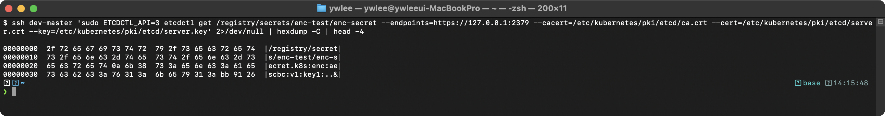

# CKS 최종 재검토 피드백 (개선 후)

> 생성: 2026-06-13 (스크린샷+스토리라인+보안도구 실측 반영 후) · 파일당 1 에이전트 병렬 재검토

- 단독합격 **15/19** · 평균 가독성 **3.9** · 스토리라인 **3.9**
- 스크린샷 활용: 부분 18, 참조과다 1
- 남은 부족분 **173** (HIGH 58) · HIGH 카테고리: 스크린샷부족 32, 정확성오류 10, 실습재현불가 8, 스토리라인누락 6, 구조 1, 맥락점프 1

| 파일 | 합격 | 가독성 | 스토리 | 스샷 | H/M/L |
|:--|:--:|:--:|:--:|:--:|:--:|
| 01-concepts.md | O | 4 | 3 | 부분 | 4/5/2 |
| 02-examples.md | O | 4 | 4 | 부분 | 2/6/3 |
| 03-exam-questions.md | X | 3 | 2 | 부분 | 4/5/2 |
| 04-tart-infra-practice.md | O | 4 | 4 | 부분 | 3/5/3 |
| 05-supplement.md | X | 4 | 5 | 참조과다 | 5/4/2 |
| daily/day01.md | O | 4 | 5 | 부분 | 3/3/2 |
| daily/day02.md | O | 4 | 3 | 부분 | 4/4/2 |
| daily/day03.md | O | 4 | 3 | 부분 | 3/5/2 |
| daily/day04.md | O | 4 | 3 | 부분 | 2/3/1 |
| daily/day05.md | O | 4 | 4 | 부분 | 2/4/3 |
| daily/day06.md | O | 4 | 5 | 부분 | 3/4/2 |
| daily/day07.md | X | 4 | 4 | 부분 | 3/4/3 |
| daily/day08.md | O | 4 | 4 | 부분 | 3/4/2 |
| daily/day09.md | O | 4 | 5 | 부분 | 2/2/2 |
| daily/day10.md | X | 4 | 4 | 부분 | 3/4/2 |
| daily/day11.md | O | 4 | 4 | 부분 | 3/3/0 |
| daily/day12.md | O | 4 | 4 | 부분 | 3/4/2 |
| daily/day13.md | O | 4 | 4 | 부분 | 2/3/2 |
| daily/day14.md | O | 4 | 5 | 부분 | 4/4/2 |

---

### 01-concepts.md
- **HIGH** `스크린샷부족` _4.4 Secret 관리 검증 — 암호화 적용 후 etcd 출력 부재 (line 1299)_ — 암호화 전 평문 저장 스크린샷(cks-etcd.png)만 있고, EncryptionConfiguration 적용 후 etcd 값이 k8s:enc:aescbc:v1:... 로 암호화된 상태를 보여주는 스크린샷이 없다. images/ 에 cks-etcd-encrypted.png 가 존재하지만 본문에서 참조하지 않는다. → 4.4 검증 절에 '기대 출력 (암호화 적용 후)' 항목을 추가하고  을 삽입한다.
- **HIGH** `정확성오류` _1.6 바이너리 검증 — line 397, 400_ — '정상(OK)' 케이스와 '변조됨(FAILED)' 케이스에 동일 이미지 파일 cks-checksum.png 를 사용해, 두 결과가 구별되지 않는다. → FAILED 케이스에는 별도 스크린샷(예: cks-checksum-fail.png)을 캡처해 삽입하거나, 두 케이스가 모두 담긴 단일 이미지를 사용하고 캡션을 'OK / FAILED 비교' 로 수정한다.
- **HIGH** `정확성오류` _3.3 seccomp 및 4.5 RuntimeClass — line 883, 891, 1361_ — 서로 맥락이 다른 세 출력(seccomp unshare 차단, /proc/1/status Seccomp 값, RuntimeClass dmesg 차단)에 동일 파일 cks-seccomp.png 를 사용한다. 특히 RuntimeClass dmesg 차단(4.5)은 seccomp 차단 이미지와 전혀 다른 상황이다. → 각 출력에 맞는 별도 스크린샷을 삽입하거나, 최소한 RuntimeClass 절(line 1361)은 cks-gvisor.png(이미 images/ 에 존재)로 교체한다.
- **HIGH** `스토리라인누락` _1.3 Ingress TLS (line 237), 2.4 kubeadm upgrade (line 570), 3.3 seccomp (line 767)_ — 1.3은 '설정 절차'로 바로 시작해 등장 배경이 없다. 2.4 upgrade는 '주기적으로 보안 패치를 릴리스한다'만 있고 직전 방식(수동 패치) 한계와 트레이드오프가 없다. 3.3 seccomp는 커널 원리(BPF)로 바로 들어가 'AppArmor와 무엇이 다른가, 왜 seccomp가 추가로 필요한가'를 설명하지 않는다. → 각 섹션에 '등장 배경' 단락을 추가한다. 1.3: 노드포트/LoadBalancer 평문 HTTP 노출 문제. 2.4: n-day 취약점과 수동 패치의 일관성 문제. 3.3: AppArmor는 파일 경로 기반이라 커널 syscall 번호 수준 제어 불가 - seccomp 보완 필요성.
- **MED** `스크린샷부족` _1.3 Ingress TLS 검증 — line 285~309_ — 1~2단계(Secret 확인, openssl 인증서 주체 확인)는 Ingress controller 없이 재현 가능하지만 스크린샷이 하나도 없다. 1~2단계만이라도 실제 출력 캡처가 필요하다. → 1단계(kubectl get secret type 출력)와 2단계(openssl x509 -noout -subject -dates 출력)에 대한 스크린샷을 캡처해 삽입한다. 3~4단계는 controller 미설치로 (미캡처)로 남겨도 된다.
- **MED** `스크린샷부족` _6.3 Falco dry-run 검증 — line 1989~1993_ — falco --dry-run 의 '룰 문법 검증' 출력과 실제 alert 탐지 출력이 전혀 다른 결과임에도 동일 이미지(cks-falco-alert.png)를 사용한다. → falco --dry-run 의 검증 성공 출력(룰 로드 완료 메시지)을 별도 스크린샷으로 캡처해 삽입하거나, 두 스텝에 동일 이미지를 쓰는 이유를 명시 혹은 dry-run 스텝 출력을 예시(참조)로 처리한다.
- **MED** `이해난이도` _파일 전체 — 상단 헤더 부재_ — CLAUDE.md §5 daily 양식이 요구하는 '학습 목표 | 도메인·비중 | 예상 소요' 헤더가 없다. 또한 CKS 실기 시험 속도셋업(alias k=kubectl, export do='--dry-run=client -o yaml', KUBECONFIG 병합 등)이 어디에도 나오지 않아 처음 접하는 학생이 실습 명령을 그대로 치다가 막힌다. → 파일 상단에 '> 6개 도메인 | 출제 비중 표 | 예상 통독 4~5시간' 헤더를 추가하고, 실습 전 셋업 블록(alias k=kubectl; export do='--dry-run=client -o yaml'; KC=...)을 '실습 전 필수 셋업' 섹션으로 넣는다.
- **MED** `스토리라인누락` _1.5 Dashboard 보안 (line 361), 2.5 kubeconfig 보안 (line 601), 5.4~5.7 (line 1615~1721), 6.4~6.5 (line 2000~2081)_ — 1.5는 Tesla 사례를 언급했지만 '직전 해결책의 한계 → 현재 권고사항이 나아진 점 → 트레이드오프' 서사가 없다. 5.4(Allowlist Registry), 5.5(Dockerfile), 5.6(Static Analysis), 6.4(Immutable), 6.5(Runtime Anomaly Detection) 섹션은 등장 배경·개선·트레이드오프 없이 절차 목록만 나열된다. → 각 섹션에 1~2문단 분량의 등장 배경 서술을 추가한다. 절차·규칙 목록은 유지하면서 '왜 이 규칙이 생겼나'를 서두에 연결한다.
- **MED** `구조` _파일 전체 — mermaid 다이어그램 부재_ — CLAUDE.md §4②에서 아키텍처·흐름·관계 그림은 mermaid로 그리도록 규정하지만, 전체 파일에 mermaid 블록이 하나도 없다. Falco 아키텍처(line 1861)는 텍스트 ASCII 라인으로만 표현됐고, RBAC 인가 파이프라인, Admission Controller 흐름, 서비스 메시 mTLS 흐름 등 다이어그램이 유용한 지점이 다수 있다. → 최소 3개 다이어그램(RBAC 인가 파이프라인, Admission Controller Mutating->Validating 순서, Falco 드라이버->엔진->출력 흐름)을 CLAUDE.md 규정대로 흑백 mermaid로 삽입한다.
- **LOW** `맥락점프` _4.4 Secret 관리 — line 1256~1299_ — EncryptionConfiguration 적용 후 '기존 Secret을 재암호화해야 한다(kubectl get secrets ... | kubectl replace -f -)' 이유 설명이 없다. providers 배열에서 identity:{} 의 의미(마이그레이션용 fallback)도 설명되지 않아 처음 보는 학생이 왜 두 provider를 병기하는지 모른다. → identity:{} 는 '암호화 전 데이터를 읽기 위한 평문 fallback이며, 완전 마이그레이션 후 제거해야 한다'는 한 문장 주석을 YAML 예시 안에 추가한다. 재암호화 명령 바로 위에 '신규 Secret은 자동 암호화되지만 기존 Secret은 etcd 에 평문으로 남아 있으므로 강제 replace 가 필요하다'는 이유를 한 줄 추가한다.
- **LOW** `용어비약` _3.5 IAM 역할 관리 (line 973)_ — IRSA(IAM Roles for Service Accounts)가 AWS EKS 전용 개념임을 명시하지 않고, GCP Workload Identity나 Azure Workload Identity와의 유사성·차이도 없다. 클라우드 특정 용어(STS, trust policy, OIDC provider)가 풀이 없이 등장한다. → IRSA 단락 앞에 'AWS EKS 전용 메커니즘으로, GCP는 Workload Identity, Azure는 Azure AD Workload Identity 가 같은 역할을 한다'는 한 줄을 추가하고 STS·trust policy 첫 등장 시 한 줄 풀이를 삽입한다.

### 02-examples.md
- **HIGH** `스크린샷부족` _섹션 7 Trivy (줄 1429-1500), 섹션 9 Audit (줄 1697-1860), 섹션 12 kube-bench (줄 2109-2177), 섹션 14 Dockerfile (줄 2280-2421), 섹션 15 Ingress TLS (줄 2423-2523), 섹션 17 불변성 (줄 2599-2700)_ — images/cks-trivy.png, cks-etcd-encrypted.png, cks-etcd-plaintext.png 등 이미지 파일이 images/ 폴더에 존재하지만 02-examples.md 본문에 삽입되지 않았다. 6개 섹션 전체에 실제 스크린샷이 0개이고 모두 '예시(참조)' blockquote로 대체된 상태다. kube-bench PASS/FAIL 결과, trivy 취약점 목록, audit.log jq 출력, Ingress TLS describe, 불변성 touch 거부 결과가 학생 입장에서 '이렇게 나온다'는 증거 없이 설명만 있다. → cks-trivy.png를 섹션 7의 'trivy image --severity CRITICAL,HIGH nginx:1.21' 명령 다음에 삽입한다. cks-etcd-encrypted.png/plaintext.png를 섹션 10 비교 증거로 추가한다. 섹션 9 audit 로그 jq 출력, 섹션 12 kube-bench FAIL 항목, 섹션 15 Ingress describe, 섹션 17 touch Read-only 오류 각 1개씩 실제 터미널 캡처 후 삽입한다.
- **HIGH** `스크린샷부족` _섹션 8 Falco 검증 (줄 1660-1688) - journalctl 로그 3건 모두 '예시(참조)'_ — 룰 파일 dry-run 결과(cks-falco-alert.png)는 1개 삽입되어 있지만, 실제 룰이 트리거된 journalctl 경보 출력(Shell Spawned, Sensitive File, Package Management 3건)은 모두 '예시(참조)' blockquote다. Falco 섹션의 핵심 증거인 '룰 적용 후 alert 발생' 화면이 없다. → kubectl exec로 bash를 실행하고 노드에서 'journalctl -u falco ... | grep Shell Spawned' 결과를 캡처해 삽입한다. 기존 cks-falco-alert.png 아래 cks-falco-shell.png, cks-falco-shadow.png로 별도 삽입하거나 동일 이미지를 재사용하되 캡션을 정확히 구분한다.
- **MED** `스크린샷부족` _섹션 2 RBAC (줄 344-557) - can-i 결과 9건 중 8건이 '예시(참조)', 스크린샷 1개(cks-rbac-list.png)만 존재_ — 'kubectl auth can-i get pods --as=jane'처럼 단순 yes/no 결과는 참조 blockquote가 정당할 수 있으나, 'kubectl get clusterrolebindings | jq cluster-admin 바인딩 목록'처럼 실측이 의미 있는 복합 명령 결과도 전부 참조로 처리됐다. cks-rbac.png 파일이 images/ 폴더에 존재하지만 02-examples.md에는 삽입되지 않았다. → cluster-admin RoleBinding jq 결과와 'kubectl auth can-i --list' 전체 권한 목록에 실제 캡처를 삽입한다. yes/no 단일 행 결과는 참조가 정당하다.
- **MED** `실습재현불가` _섹션 2 RBAC 2.4 (줄 480-556) - User jane_ — RoleBinding subjects에 kind: User name: jane을 사용하지만 jane 사용자의 X.509 인증서를 생성해 kubeconfig에 등록하는 절차가 없다. '--as=jane' 플래그는 시험 환경에서 impersonation 권한이 있어야 작동한다. 학부생이 실제로 'jane'으로 인증 테스트를 하려면 어떻게 해야 하는지 알 수 없다. → 2.4 도입부에 'CKS 시험에서 kubectl auth can-i --as는 cluster-admin으로 실행하므로 impersonation이 가능하다. 실제 jane 사용자 인증이 필요한 경우 CKA 인증서 생성 절차(kubectl certificate approve 또는 openssl x509 서명)를 참고한다'는 한 단락 주의 사항을 추가한다.
- **MED** `실습재현불가` _섹션 4 seccomp (줄 762-1037) - 노드 파일 복사 절차 누락_ — AppArmor(섹션 3)와 Falco(섹션 8)는 섹션 상단에 '실습 전제' blockquote로 SSH 접속 방법과 dev/staging 클러스터 한정 안내를 명시한다. seccomp는 동일하게 노드의 /var/lib/kubelet/seccomp/profiles/ 경로에 파일을 배포해야 하지만 '실습 전제' 블록이 없다. 줄 990의 'ssh node01 ls' 명령만으로는 파일을 어떻게 노드에 복사했는지 알 수 없다. → 섹션 4 시작 부분(줄 786 앞)에 AppArmor 실습 전제와 동일한 형식으로 'seccomp 프로파일 파일은 kubelet이 실행 중인 노드의 /var/lib/kubelet/seccomp/profiles/에 직접 배치해야 한다. ssh staging-master 접속 후 sudo mkdir -p /var/lib/kubelet/seccomp/profiles/ && sudo cp restricted.json /var/lib/kubelet/seccomp/profiles/ 로 복사한다. 멀티노드에서는 Pod가 스케줄링될 모든 노드에 복사한다'는 실습 전제 블록을 추가한다.
- **MED** `실습재현불가` _섹션 15 Ingress TLS (줄 2423-2523) - Ingress controller 전제 조건 누락_ — Ingress 리소스를 생성하려면 ingress-nginx 등 Ingress controller가 클러스터에 설치되어 있어야 한다. 또한 Ingress YAML에 ingressClassName 필드가 없어 K8s 1.22+ 기본 동작에서 WARNING이 발생하거나 Ingress가 처리되지 않는다. 학부생이 그대로 따라하면 Ingress ADDRESS가 빈 상태로 남아 TLS 테스트가 불가능하다. → 섹션 15 시작 부분에 'Ingress controller가 필요하다: kubectl get pods -n ingress-nginx 로 확인한다. 미설치 시 helm 또는 kubectl apply -f https://raw.githubusercontent.com/kubernetes/ingress-nginx/main/deploy/static/provider/cloud/deploy.yaml 로 설치한다'를 한 단락으로 추가한다. Ingress YAML에 spec.ingressClassName: nginx를 추가한다.
- **MED** `맥락점프` _섹션 13 ImagePolicyWebhook (줄 2179-2277) - webhook 서버 실체 설명 누락_ — kubeconfig가 가리키는 webhook 서버(https://image-policy-webhook.default.svc:8443)가 무엇인지, 어떻게 배포하는지 전혀 설명이 없다. 학부생은 '이 서버를 어디서 가져오나'를 알 수 없다. 검증 명령(줄 2261)은 webhook 서버가 존재할 때만 의미 있는데 '미구성' 참조로 처리되어 있다. 시험에서는 webhook 서버가 이미 제공되지만 그 사실이 명시되지 않아 혼란을 준다. → 'CKS 시험에서 ImagePolicyWebhook 문제는 webhook 서버가 이미 클러스터에 배포된 상태에서 API server 설정 파일만 작성하는 것이 일반적이다. 실습 환경에서 webhook 서버를 직접 구축하려면 ImageReview API 스펙에 맞는 HTTPS 서버가 필요하다'는 안내를 섹션 13.0 또는 13.1 앞에 추가한다.
- **MED** `이해난이도` _섹션 6 OPA Gatekeeper 6.2 (줄 1323-1395) - startswith_any 헬퍼 함수_ — Rego의 startswith_any 함수가 사용자 정의 헬퍼인지 OPA 내장 함수인지 설명이 없다. 코드 안에 정의되어 있지만 초보자는 이것이 왜 동작하는지 알기 어렵다. 또한 Gatekeeper가 Rego 1.0 vs 0.x 문법 차이로 실제 적용 시 버전 오류가 발생할 수 있다는 주의사항이 없다. → startswith_any 함수 아래에 '이 함수는 Rego 사용자 정의 헬퍼 함수로, 같은 파일에 정의했으므로 호출 가능하다. OPA 내장 함수 startswith(str, prefix)를 반복 적용한 패턴이다'는 인라인 주석 또는 단락을 추가한다.
- **LOW** `구조` _섹션 1.5 (줄 278-341) - 복합 NetworkPolicy 검증 명령 부재_ — 1.1~1.4는 적용 후 통신 허용/차단을 검증하는 bash 명령과 스크린샷/참조가 있지만, 1.5는 describe 명령 하나뿐이고 실제 트래픽 검증 명령이 없다. 복합 정책의 AND/OR 규칙 조합을 학생이 직접 확인할 수단이 없다. → 1.5 이후에 'frontend -> database 접근 차단 확인', 'monitoring NS -> api-server 허용 확인', 'api-server -> 외부 CIDR 허용 확인' 등 최소 2개 검증 명령을 추가한다.
- **LOW** `용어비약` _섹션 10 Encryption at Rest 10.1 (줄 1883-1901) - EncryptionConfiguration 들여쓰기 오류 가능성_ — YAML에서 resources 아래 - resources와 providers가 같은 수준으로 들여쓰여 있어야 하는데, 줄 1890-1900을 보면 '- resources:'와 'providers:'의 들여쓰기 관계가 시각적으로 모호하다. kubectl apply 검증이 없으므로 오류 여부를 알 수 없다. → EncryptionConfiguration YAML에 'kubectl apply --dry-run=server' 또는 'kubectl create secret ... + etcdctl get ... | hexdump' 순서로 검증 명령을 추가하고 실제 적용 여부를 확인한다.
- **LOW** `스토리라인누락` _섹션 12 kube-bench (줄 2109-2177) - 트레이드오프 항목 없음_ — kube-bench는 등장 배경(CIS 벤치마크 자동화)과 결과 해석은 잘 설명하지만, '트레이드오프'가 명시적으로 없다. kube-bench가 WARN으로 분류하는 항목을 무조건 수정하면 오히려 기능이 깨질 수 있다는 점(예: anonymous-auth 비활성화 시 kubectl proxy, liveness probe 연동 주의)이 누락되어 있다. → 12.0 끝에 '트레이드오프' 단락을 추가한다: kube-bench FAIL을 기계적으로 모두 수정하면 안 된다. 예를 들어 --anonymous-auth=false는 일부 헬스체크와 kubectl proxy 동작에 영향을 줄 수 있다. WARN 항목은 환경 의존 판단이 필요하다.

### 03-exam-questions.md
- **HIGH** `스토리라인누락` _문제 2, 4, 9, 10, 15, 16, 17, 19, 20, 21, 22, 23, 27, 34, 35, 36, 37, 38, 39, 40 (40개 중 20개)_ — 등장 배경 항목이 완전히 빠져 있다. Q2(DNS egress 패턴), Q4(sha512 공급망 검증), Q9(cluster-admin 감사), Q10(kubeconfig 파일 권한), Q15(AppArmor complain->enforce 전환), Q16(kubelet 보안), Q17(PSA baseline), Q19(레지스트리 제한), Q20(etcd 암호화), Q21(gVisor), Q22(security context 조합), Q23(hostPath->emptyDir), Q27(Dockerfile), Q34-Q40(Runtime Security 7문제) 모두 스토리라인이 없다. → 각 문제의 </details> 직전 '핵심 원리' 앞에 **등장 배경:** 단락을 추가한다. 최소 구조: 이 기법이 없던 시절의 고통 -> 직전 해결책의 한계 -> 이 기법이 어떻게 개선했나 -> 트레이드오프. 예: Q16 kubelet은 '10255 포트 기본 개방 -> 공격자가 인증 없이 Pod 목록/exec 가능했던 시절 -> readOnlyPort 기본값이 10255였던 이유와 변천' 형태.
- **HIGH** `정확성오류` _문제 10 검증 섹션 line 825_ — su - testuser -c 명령 결과로 cks-apparmor.png(AppArmor 쓰기 거부 캡처)를 삽입했다. chmod 600 파일 권한 차단은 커널 VFS DAC가 수행하는 것이며 AppArmor와 무관하다. 학생이 이 캡처를 보면 'kubeconfig 권한이 AppArmor로 통제된다'고 오해한다. → 해당 캡처를 제거하고 '> 예시(참조) -- Permission denied' 형태의 참조로 대체하거나, 실제로 chmod 600 후 타 사용자 접근 차단을 보여주는 별도 캡처(cks-kubeconfig-perm.png)를 촬영해 삽입한다.
- **HIGH** `정확성오류` _문제 4 검증 섹션 lines 324-329_ — 정상 해시(sha512sum OK)와 변조 탐지(FAILED) 두 가지 시나리오가 동일한 이미지(cks-checksum.png) 하나로 표현돼 있다. 두 결과가 정반대인데 같은 스크린샷을 쓰므로, 학생이 둘 중 어느 것이 OK이고 어느 것이 FAILED인지 판별할 수 없다. → OK 시나리오와 FAILED 시나리오를 각각 촬영해 cks-checksum-ok.png, cks-checksum-fail.png로 분리한다. images/ 디렉토리에 이미 다른 상세 캡처들이 있으므로 추가 촬영이 가능하다.
- **HIGH** `정확성오류` _문제 37 검증 섹션 line 3429_ — nginx.conf 쓰기 차단(readOnlyRootFilesystem) 결과로 cks-apparmor.png를 삽입했다. 이 문제는 AppArmor를 전혀 사용하지 않으며 VFS 레벨 읽기 전용 마운트로 차단하는 것이다. 캡션도 'AppArmor deny write'로 잘못 표기되어 있어 개념 혼동을 유발한다. → readOnlyRootFilesystem 차단 출력('Read-only file system')을 실제로 촬영하거나 예시(참조) 블록으로 대체하고, AppArmor 캡처와 캡션을 삭제한다.
- **MED** `스크린샷부족` _문제 3(kube-bench), 문제 5(RBAC can-i), 문제 8(kubeadm upgrade), 문제 25(Trivy), 문제 28(kubesec), 문제 29(cosign), 문제 32(crane digest)_ — cks-trivy.png, cks-kubesec.png, cks-rbac.png, cks-rbac-list.png, cks-runtimeclass.png 등 images/ 디렉토리에 이미 촬영된 캡처가 있는데도 문서에 삽입되지 않고 '예시(참조)' 블록만 있다. 특히 Trivy 스캔 출력(색상 표), kubesec 점수표, kube-bench [PASS]/[FAIL] 표는 학생이 실제 출력 형태를 모르면 시험장에서 당황하는 핵심 도구 출력이다. → images/ 디렉토리에 이미 존재하는 cks-trivy.png, cks-kubesec.png, cks-rbac.png, cks-runtimeclass.png를 대응하는 문제의 검증 섹션에 삽입한다. 문제 3의 kube-bench [PASS] 결과는 images/ 에 없으므로 촬영 후 삽입하거나 (미캡처)로 명시한다.
- **MED** `스크린샷부족` _문제 21(gVisor) 검증 섹션 - dmesg, uname -r 결과_ — gVisor가 실제로 뜰 때 dmesg에 'Starting gVisor...' 가 나오고 uname -r이 호스트와 다른 버전(4.4.0)을 보여주는 것이 이 문제의 핵심 증거인데, 두 명령 결과 모두 예시(참조)로만 처리됐다. images/ 에 cks-gvisor.png가 있음에도 미삽입되었다. → cks-gvisor.png를 문제 21 dmesg/uname -r 검증 블록에 삽입한다. gVisor가 tart 클러스터에 설치돼 있지 않으면 (미캡처) 표기 후 cks-gvisor.png의 촬영 환경을 주석으로 안내한다.
- **MED** `맥락점프` _문제 2 DNS egress 패턴 - to: [] 설명 직후_ — to: [] vs to: [{}] vs to 생략의 차이가 본문에 상세히 설명되어 있으나, 이 차이가 왜 CoreDNS 위치와 관련되는지 맥락이 갑자기 등장한다. CoreDNS가 kube-system에 있다는 전제를 처음 접하는 학생은 '왜 to: []가 필요한가'의 논리 흐름을 따라가기 어렵다. → to: [] 설명 앞에 'CoreDNS는 kube-system 네임스페이스에서 실행된다(kubectl get pod -n kube-system -l k8s-app=kube-dns). frontend Pod가 있는 restricted 네임스페이스와 다른 네임스페이스이므로 같은 네임스페이스 Pod만 허용하는 to: [{}]를 쓰면 CoreDNS에 닿지 못한다' 한 단락을 추가한다.
- **MED** `용어비약` _문제 21(gVisor) 핵심 원리 - Sentry 용어 첫 등장_ — 'gVisor의 Sentry가 가로채서 처리한다'에서 Sentry가 무엇인지 풀이 없이 등장한다. gVisor 아키텍처를 모르는 학생은 Sentry가 별도 프로세스인지, 커널 모듈인지 알 수 없다. → Sentry 첫 등장 시 괄호 안에 '(gVisor의 사용자 공간 커널 구현체 -- 시스템콜을 가로채 자체 처리하는 Go 프로세스)'를 추가한다.
- **MED** `실습재현불가` _문제 24(Istio mTLS) 실습 전제 및 검증_ — 이 저장소 클러스터에 Istio가 없어 'istioctl install --set profile=demo -y' 선행이 필요하다고 안내하지만, 설치 후 사이드카 주입이 완료될 때까지의 대기 방법, istioctl 버전 확인, kiali/Envoy 버전 호환 등이 없다. 학생이 처음 설치하면 사이드카 주입 미완료 상태에서 STRICT 설정 후 '당연히 안 됨'을 경험하고 원인 파악이 어렵다. → 실습 전제에 'kubectl rollout status deployment/istiod -n istio-system'으로 istiod 준비 확인, 'kubectl get pods -n production -o jsonpath 으로 사이드카 주입 여부 확인(Ready 2/2 여부), 그리고 PERMISSIVE로 먼저 테스트 후 STRICT 전환' 순서를 명시한다.
- **LOW** `스토리라인누락` _문제 33(Audit Policy) - 등장배경은 있으나 4요소 중 '직전 기술 한계' 누락_ — 등장 배경이 있지만 '감사 로그가 없던 시절 구체적 고통 사례'와 '일반 API server 로그의 한계(비구조화, 쿼리 불가)'에 대한 설명이 약하다. '예방'과 '감사'의 차이만 언급하고, 이전에 사람들이 어떤 방식으로 감사를 했었는지의 직전 기술 설명이 없다. → '이전에는 API server --v=8 로그를 grep으로 뒤졌지만 비구조화 텍스트라 특정 SA가 어떤 Secret에 언제 접근했는지 추적이 불가능했다'와 같은 구체적 전임 방식 사례를 1~2문장 추가한다.
- **LOW** `구조` _문제 9(cluster-admin 감사) - 핵심 원리 섹션_ — 핵심 원리에 '등장 배경' 역할을 하는 내용(cluster-admin 권한의 위험성, 왜 감사가 필요한가)이 일부 포함되어 있어 구조가 중복된다. 등장 배경이 없으니 핵심 원리가 이를 떠맡은 형태인데, 두 섹션의 경계가 불명확하다. → 문제 9에 등장 배경을 별도로 추가하면서 핵심 원리를 '메커니즘(RBAC 평가 흐름, ClusterRoleBinding 구조)'으로만 집중시켜 중복을 제거한다.

### 04-tart-infra-practice.md
- **HIGH** `스크린샷부족` _실습 2.5 etcd 암호화 -- 검증 1(l.1267) '암호화 미설정 시' 블록_ — 암호화 미적용 상태(평문 노출)를 보여야 하는 검증 1이 '예시(참조)' blockquote로 처리되었고, cks-etcd-plaintext.png가 images/ 에 존재하지만 참조되지 않는다. 동시에 암호화 적용 후를 나타내는 스크린샷(l.1278)과 모의시험5 평문 캡처(l.3838)가 둘 다 cks-etcd.png 하나를 공유하여 캡션과 실제 이미지가 충돌할 가능성이 있다. → l.1273-1278 '암호화 미설정 시' 항목을 cks-etcd-plaintext.png 스크린샷으로 교체하고, '암호화 설정 시' 항목은 cks-etcd-encrypted.png로 교체한다. 모의시험 5의 l.3838도 동일하게 분리 적용한다.
- **HIGH** `스크린샷부족` _실습 2.1 RBAC(l.836-931), 실습 2.3 API Server(l.1083-1147), 실습 5.1 Trivy(l.2351-2410), 실습 4.3 mTLS(l.2057-2135)_ — 이 네 실습은 검증 명령마다 '예시(참조)' blockquote만 있고 스크린샷이 전무하다. CLAUDE.md §4① 절대규칙 위반이다. images/ 에 cks-rbac.png, cks-rbac-list.png, cks-trivy.png, cks-istio-pa.png, cks-istio-pods.png, cks-istio-sidecar.png 가 존재하지만 본문에서 참조되지 않는다. → 각 섹션의 핵심 검증 명령(auth can-i --list, kube-apiserver grep 출력, trivy image 결과, kubectl get peerauthentication)에 해당 스크린샷을 삽입한다. 특히 RBAC에 cks-rbac-list.png(auth can-i --list 출력), Trivy에 cks-trivy.png, mTLS에 cks-istio-pa.png/sidecar를 연결한다.
- **HIGH** `스크린샷부족` _실습 1.3 kube-bench(l.454-610), 실습 1.4 바이너리 검증(l.612-688), 실습 3.3 OS 보안 점검(l.1614-1678), 실습 6.1 Audit Policy(l.2637-2720)_ — 상기 4개 실습은 검증 결과 전체가 '예시(참조)' blockquote다. images/cks-checksum.png가 존재하나 실습 1.4에 참조되지 않는다. kube-bench FAIL 목록, audit 로그 tail, ss -tlnp 출력 등 학생이 기대 출력을 확인하려면 반드시 스크린샷이 필요하다. → 실습 1.4 검증 2(sha512sum 출력)에 cks-checksum.png를 삽입한다. kube-bench, audit log, ss 결과는 클러스터에서 실측 캡처하거나 '(미캡처)' 명시로 대체한다.
- **MED** `정확성오류` _실습 3.1 AppArmor -- AppArmor annotation 형식(l.1406)_ — container.apparmor.security.beta.kubernetes.io 어노테이션은 K8s 1.30에서 GA된 securityContext.appArmorProfile 필드로 대체되었다. 현재 문서는 beta 어노테이션만 가르치며, 새 필드에 대한 언급이 없다. 실제 시험 환경이 1.30+ 이면 어노테이션 방식이 deprecated 처리될 수 있다. → AppArmor 섹션에 'K8s 1.30+ 에서는 securityContext.appArmorProfile.type: Localhost / localhostProfile: k8s-deny-write 형식이 권장된다. 1.29 이하에서는 어노테이션 방식을 사용한다'는 주석을 추가한다.
- **MED** `스크린샷부족` _실습 4.2 SecurityContext -- 검증 2(l.2006-2009), 실습 6.3 Immutability -- 검증 1/3(l.2851-2868), 모의시험 2 문제 1 검증 2(l.3532-3534)_ — readOnlyRootFilesystem 시나리오 검증에 AppArmor 스크린샷(cks-apparmor.png)이 재사용된다. 캡션은 'AppArmor deny write'인데 실제 시나리오는 readOnlyRootFilesystem에 의한 EROFS 오류로, 원인 메커니즘이 다르다. 학생이 두 보안 메커니즘을 혼동할 수 있다. → readOnlyRootFilesystem EROFS 시나리오용 별도 스크린샷(cks-readonly-fs.png)을 촬영하여 삽입한다. 또는 기존 cks-apparmor.png 캡션을 '읽기 전용 파일시스템 -- 쓰기 거부(readOnlyRootFilesystem 또는 AppArmor)'로 수정하고 두 메커니즘의 오류 메시지 차이를 본문에서 구분한다.
- **MED** `실습재현불가` _모의 시험 2 문제 5, 실습 2.3 -- anonymous 접근 검증(l.3377)_ — 검증 명령이 curl -sk https://<dev-master-ip>:6443/api/v1/namespaces 로 <dev-master-ip> 플레이스홀더를 그대로 남겨 두었다. 학생이 실제 IP를 채워야 하는데 구하는 방법이 안내되지 않았다. → 플레이스홀더를 kubectl get node dev-master -o jsonpath='{.status.addresses[0].address}' 로 IP를 동적으로 구하는 명령으로 대체하거나, 'tart ip dev-master 로 IP를 확인한 뒤 대입한다'는 한 줄 안내를 삽입한다.
- **MED** `용어비약` _실습 2.5 etcd 암호화 -- provider 비교 표(l.1219)_ — aesgcm '동일 키로 최대 200억 회 제한' 설명이 갑자기 등장하는데, 왜 GCM 모드가 nonce 재사용 한계를 가지는지 원리 설명이 없다. 학부생이 '키를 200억 번 써서는 안 된다'는 사실을 외울 수는 있어도 '왜 그런지'를 모른 채 지나가게 된다. → 한 문장 원리 추가: 'AES-GCM은 96비트 nonce를 사용하며 같은 키-nonce 조합이 재사용되면 기밀성이 깨지기 때문에 암호화 횟수 상한이 존재한다'를 provider 표 주석으로 삽입한다.
- **MED** `맥락점프` _실습 1.5 Ingress 보안 -- 등장 배경(l.692-700)_ — Ingress Controller가 설치되지 않은 환경에서는 TLS Ingress를 생성해도 ADDRESS가 할당되지 않아 검증이 불가능하다. 사전 준비 조건에 'Ingress Controller(예: nginx-ingress) 가동 여부 확인' 명령이 없다. → 실습 1.5 상단에 'kubectl get pods -n ingress-nginx 또는 kubectl get ingressclass 로 Ingress Controller 존재를 먼저 확인한다. 미설치 시 이 실습은 Istio Gateway 방식으로 대체한다'는 사전 점검 블록을 삽입한다.
- **LOW** `구조` _사전 준비 -- 검증 블록(l.39-67)_ — 사전 준비의 검증 1/2/3(cluster-info, nodes, pods) 세 명령 모두 '예시(참조)' blockquote다. 실습 시작 전 환경 확인이라는 가장 기본적인 단계에서도 실제 스크린샷이 없어 학생이 '내 환경이 정상인지'를 판단하는 기준이 없다. → kubectl cluster-info 또는 kubectl get nodes 출력 스크린샷 한 장을 사전 준비 검증 블록에 삽입한다. cks04-cilium-endpoints.png 처럼 실측 캡처가 이미 존재하는 형식을 참고한다.
- **LOW** `구조` _다이어그램 전반(l.90-93, l.220-221, l.811-819, l.971-973, l.1229-1232, l.1348-1353, l.2069-2074)_ — CLAUDE.md §4② 규칙에서 개념/아키텍처 흐름 그림은 반드시 mermaid로 그리고 ASCII 박스 다이어그램은 금지하도록 명시했다. 그러나 파일 내 모든 흐름도가 backtick 블록 안 ASCII 화살표 방식이다(mermaid 블록이 단 한 개도 없다). → eBPF 패킷 처리 흐름(l.90), RBAC 인가 흐름(l.811), mTLS 사이드카 흐름(l.2069) 등 구조적 의미가 있는 다이어그램을 mermaid flowchart 또는 sequenceDiagram으로 교체하고 CLAUDE.md 지정 흑백 themeVariables를 적용한다.
- **LOW** `스크린샷부족` _실습 3.1 AppArmor -- 검증 1 aa-status(l.1393-1396), 검증 5 dmesg(l.1437-1440)_ — aa-status 프로파일 로드 확인과 AppArmor DENIED dmesg 로그가 '예시(참조)' blockquote다. Falco 섹션에는 cks-falco-pods.png가 미사용으로 남아 있듯, AppArmor 섹션도 aa-status 출력 캡처가 없어 학생이 로드 성공 여부를 시각적으로 확인할 수 없다. → aa-status 출력과 dmesg apparmor DENIED 로그 스크린샷을 각각 촬영하여 검증 1/5에 삽입하고, cks-falco-pods.png는 실습 6.2 Falco Pod 상태 검증(l.2761)에 삽입한다.

### 05-supplement.md
- **HIGH** `스크린샷부족` _Part 2 예제 2 (kube-bench, 1324-1422행), 예제 6 (Trivy, 1747-1773행), 예제 8 (Audit Policy, 1808-1858행)_ — 세 예제 전체에 실측 스크린샷이 단 한 장도 없고 모든 명령 출력이 예시(참조) blockquote로만 처리되어 있다. images/ 디렉터리에 cks-trivy.png가 존재함에도 Trivy 예제에 연결되지 않았다. → cks-trivy.png를 예제 6 검증 1 아래에 삽입한다. kube-bench PASS/FAIL 출력과 Audit 로그 JSON 이벤트는 실제 dev-master에서 캡처하여 각 검증 블록에  형식으로 추가한다.
- **HIGH** `스크린샷부족` _Part 1 섹션 5 Sysdig (806-864행) 검증 블록 전체_ — Sysdig 검증 1-4 모두 예시(참조) blockquote이며 실측 스크린샷이 없다. sysdig 출력 형식(타임스탬프 evt.type fd.name)을 학생이 실제로 확인할 방법이 없다. → sysdig -M 5 명령을 dev 클러스터 워커 노드에서 실행하고 캡처한 이미지를 cks-sysdig-capture.png 등으로 저장하여 검증 1 아래에 삽입한다. 설치가 불가하면 '(미캡처)' 표시로 명시한다.
- **HIGH** `정확성오류` _Part 1 섹션 1 검증 4/5 (158, 167행) 및 Q11 검증 3 (5137행)_ — capabilities 차단 동작(NET_ADMIN 없음으로 ip link 실패, CHOWN 없음으로 chown 실패) 증거 이미지로 cks-seccomp.png(캡션: seccomp syscall 차단)가 삽입되어 있다. seccomp과 capability는 다른 메커니즘이므로 이미지가 증거로서 부정확하다. → capability 차단 시의 실측 터미널 화면을 별도 캡처하여 cks-cap-deny.png로 저장하고 해당 위치에 교체 삽입한다. 또는 기존 cks-seccomp.png의 캡션에 '(capability 차단에도 동일 에러 메시지 적용)'라는 설명을 추가하여 혼동을 방지한다.
- **HIGH** `정확성오류` _Part 1 섹션 3 Webhook 검증 1 (501행)_ — kubectl get validatingwebhookconfigurations 출력 자리에 OPA Gatekeeper admission webhook이 레지스트리 제한을 거부하는 cks-gatekeeper-deny.png가 삽입되어 있다. 해당 이미지는 ValidatingWebhookConfiguration 목록 화면이 아니라 Gatekeeper 거부 메시지 화면이다. → kubectl get validatingwebhookconfigurations 실행 결과를 별도 캡처하여 cks-validating-webhook-list.png 등으로 저장하고 교체하거나, 해당 위치를 (미캡처)로 명시한다.
- **HIGH** `정확성오류` _Part 2 예제 19 검증 4 (3469행)_ — kubectl exec secret-mount-test -- cat /etc/secrets/connection-string (마운트 안 된 키 접근) 실행 결과 이미지로 cks-notoken.png(SA 토큰 디렉토리 없음 화면)가 삽입되어 있다. connection-string 파일 부재와 SA 토큰 디렉토리 부재는 전혀 다른 출력이다. → connection-string 키가 마운트되지 않았을 때의 실제 에러 출력(No such file or directory 등)을 캡처하여 별도 이미지로 교체한다.
- **MED** `실습재현불가` _Part 4 Q15 풀이 (5378행)_ — 풀이 전체가 'Part 2 예제 9의 절차를 따른다' 한 줄과 검증 명령 하나만으로 구성되어 있다. CKS 시험에서 이 문제를 처음 만나는 학생이 단독으로 재현할 수 없다. → aescbc 키 생성 명령, EncryptionConfiguration 작성, kube-apiserver.yaml 수정, volumeMount 추가까지의 최소 절차를 인라인으로 기술한다. 또는 'Part 2 예제 9(1860행)를 참고하라'에 실제 앵커 링크를 추가한다.
- **MED** `스크린샷부족` _images/ 디렉터리의 cks-kubesec.png, cks-trivy.png가 존재하나 05-supplement.md에 미사용_ — 문제 25(kubesec)와 예제 6/문제 21(trivy)에서 관련 출력이 모두 예시(참조)로만 처리되는데, 이미 캡처된 이미지가 연결되지 않았다. → cks-kubesec.png를 문제 25 kubesec scan 검증 아래에, cks-trivy.png를 예제 6 및 문제 21 trivy image 검증 아래에 각각 삽입한다.
- **MED** `구조` _Part 1 섹션 3 Webhook 및 섹션 4 etcd 암호화의 API 흐름 다이어그램 (405-420행, 572-580행)_ — API 요청 처리 순서(Auth-Authorization-Mutating-Schema-Validating-etcd)와 Envelope Encryption 흐름(DEK 생성-암호화-KMS 래핑-저장)이 코드블록 텍스트로만 표현되어 있다. 학부생이 계층 구조와 데이터 흐름을 직관적으로 파악하기 어렵다. → 두 흐름을 각각 mermaid flowchart(흑백 테마, CLAUDE.md 규약 적용)로 변환하여 '그림 N. 제목' 캡션을 붙인다.
- **MED** `맥락점프` _Part 2 예제 7 Falco 검증 (1800-1806행)_ — 검증 1 바로 다음에 삽입된 cks-falco-alert.png의 캡션이 '/etc/shadow 읽기 탐지'인데, 예제 7은 크립토마이닝 탐지 규칙을 다루고 있다. 규칙과 캡처 내용이 불일치한다. → 크립토마이닝 프로세스 실행 시 Falco 경보 출력을 별도 캡처하거나, 현재 이미지가 규칙 문법 검증 결과(falco --validate)를 보여주는 것임을 캡션에 명시한다.
- **LOW** `용어비약` _Part 1 섹션 7 KMS Provider 도입부 (1060-1066행)_ — DEK/KEK 용어를 정의한 직후 'Envelope Encryption(봉투 암호화): DEK를 KEK로 보호'라는 설명이 나오는데, aescbc와 달리 KEK가 외부 KMS에만 존재한다는 핵심 보안 이점(노드 디스크에 키 없음)이 문장으로 설명되기 전에 먼저 YAML 설정 예제로 넘어간다. → 봉투 암호화 구조 설명 다음에 'KEK가 API 서버 노드를 떠나지 않으므로, 노드가 침해되더라도 KMS 접근 권한 없이는 DEK를 복호화할 수 없다'는 한 문장을 추가한다.
- **LOW** `이해난이도` _Part 3 문제 26 Falco 규칙 풀이 (3927-3939행)_ — Falco 규칙 YAML 자체만 있고, spawned_process, container 같은 Falco 매크로가 무엇을 의미하는지(어떤 syscall/조건과 매핑되는지) 설명이 없어 학부생이 규칙을 직접 작성할 때 참조할 맥락이 부족하다. → spawned_process(execve syscall 트리거), container(컨테이너 내 이벤트 한정) 등 주요 매크로를 1-2줄 주석 또는 표로 설명하는 짧은 단락을 규칙 YAML 앞에 추가한다.

### daily/day01.md
- **HIGH** `실습재현불가` _1.11절 - kubectl exec attacker -n secure-ns (457번 줄)_ — 1.7절에서 생성하라는 Pod 이름은 'frontend'/'backend'인데, 1.11절 검증 명령은 'attacker'/'web-svc' Pod를 사용한다. 학생이 1.7 지침대로 따라 하면 1.11의 kubectl exec attacker 명령이 Pod not found 오류로 실패한다. → 1.11절 전제 조건에 'attacker'와 'web-svc' Pod 생성 명령을 추가하거나, 1.7절 Pod 이름을 1.11절과 일치시킨다. 또는 1.7절에서 만든 'frontend'/'backend'를 그대로 사용하도록 1.11절 exec 명령을 수정한다.
- **HIGH** `스크린샷부족` _2.5절 - kube-bench FAIL/PASS 검증 (637~644번 줄)_ — kube-bench run 명령 2개(FAIL 확인, 수정 후 PASS 확인)가 '예시(참조)' 블록쿼트로만 처리되어 실제 스크린샷이 없다. day01-03/day01-04 이미지 파일이 존재하지 않는다. CLAUDE.md 절대규칙 4-①에 명시적으로 금지된 '텍스트 출력 대체' 상태다. → staging-master에서 kube-bench run --targets master --check 1.2.1을 실제 실행해 FAIL 출력과 수정 후 PASS 출력을 터미널 스크린샷으로 캡처하고 day01-03-kubebench-fail.png, day01-04-kubebench-pass.png로 삽입한다.
- **HIGH** `스크린샷부족` _tart-infra 과제 1/2/3 전체 (1062~1134번 줄)_ — CiliumNetworkPolicy 목록 확인, 차단 검증(curl exit code 28), 허용 경로 통신 성공, PeerAuthentication 확인, sidecar 목록 확인 등 13개 kubectl 명령의 출력이 모두 코드 주석 '# 예상 출력:' 텍스트로만 제시된다. 실제 스크린샷이 하나도 없다. → dev 클러스터에서 각 명령을 실제 실행하고 최소 3개(CiliumNetworkPolicy 목록, 차단 결과, PeerAuthentication 상태) 핵심 출력을 스크린샷으로 교체한다. 모두 캡처하기 어려우면 가장 학습 임팩트가 큰 '차단 vs 허용' 대조 결과를 우선한다.
- **MED** `구조` _tart-infra 섹션 과제 3 제목 (1107번 줄)_ — '### Part 4 -- 과제 3:' 제목의 'Part 4'가 문서 내 어디에도 Part 1/2/3이 없어 번호 출처가 불분명하다. '과제 1', '과제 2'와 명명 규칙도 일치하지 않는다. → '### 과제 3: Istio mTLS (PeerAuthentication STRICT) 확인 (심화·선택)'으로 제목을 통일하거나, Part 1/2/3에 해당하는 앞 과제 제목도 'Part N' 형식으로 맞춘다.
- **MED** `구조` _1절 NetworkPolicy 전체_ — 섹션 2(kube-bench), 3(TLS), 4(바이너리 검증)은 각각 '직접 해보기' 소절과 시간 목표, 완료 기준이 있지만, 섹션 1(NetworkPolicy)에는 해당 소절이 없다. 1.11절이 실습 검증 역할을 하지만 시간 제약과 완료 기준이 명시되지 않아 시험 속도 훈련 효과가 떨어진다. → '### 1.13 직접 해보기 - Default Deny + DNS 허용 + 허용 정책 적용 (15분)' 소절을 추가한다. attacker/web/web-svc Pod 생성부터 정책 3단계 적용, 차단/허용 확인까지 순서를 명시하고 완료 기준('curl 성공/실패 출력이 스크린샷과 일치하면 성공')을 붙인다.
- **MED** `맥락점프` _1.11절 전제 조건 (442~447번 줄)_ — 1.11절 전제에 'web', 'attacker' Pod가 필요하다고 명시하지만 이 Pod들을 생성하는 명령이 없다. 1.7절에서 만든 frontend/backend와 이름이 달라 학생이 어디서 이 Pod들이 나왔는지 추적할 수 없다. → 1.11절 전제 초기화 bash 블록에 'kubectl run attacker -n secure-ns --image=curlimages/curl -- sleep 3600'과 'kubectl run web -n secure-ns --image=hashicorp/http-echo ... --labels app=web'과 'kubectl expose pod web -n secure-ns --name=web-svc --port=80' 명령을 추가한다.
- **LOW** `이해난이도` _1.1절 'NetworkPolicy 핵심 메커니즘' 코드블록 (40~61번 줄)_ — 언어 태그 없는 plain 코드블록으로 핵심 메커니즘을 설명하는데, 같은 형식이 1.2절 '등장 배경'과 1.4절 '핵심 원칙'에도 반복 사용된다. 개념 설명인지 코드 예제인지 한눈에 구분이 되지 않아 가독성이 떨어진다. → plain 코드블록 대신 일반 산문 + 불릿 리스트(본문 텍스트)로 전환하고, 실제 YAML/bash는 언어 태그 코드블록, 다이어그램은 mermaid로 명확히 역할을 분리한다.
- **LOW** `용어비약` _4.2절 sha512sum 검증 명령 (993~1008번 줄)_ — kubelet --version 출력 예시가 코드 주석으로 '# Kubernetes v1.31.0'처럼 텍스트로 삽입됐다. 실제 어떤 화면이 나오는지 이미지가 없고, 버전 확인 후 URL에 버전을 치환하는 연결 단계를 명시하지 않아 초보자가 URL의 'v1.31.0'을 자기 버전으로 바꿔야 한다는 것을 놓칠 수 있다. → kubelet --version 출력에 '출력된 버전(예: v1.31.0)을 아래 URL의 v1.31.0 부분에 그대로 대입한다'는 한 줄 설명을 추가하고, 버전이 다를 때의 예시(v1.30.x 등)를 병기한다.

### daily/day02.md
- **HIGH** `스크린샷부족` _섹션 6.4 (kube-bench 실행 실습, 932-960행)_ — kube-bench run 명령 실행 결과(FAIL/PASS 목록)와 grep 필터 출력에 스크린샷이 없고, 대체 텍스트나 참조도 없다. 시험에서 가장 빈출되는 kube-bench 출력 형식을 학생이 본 적 없는 상태다. → staging-master 에서 kube-bench run --targets master 2>&1 | grep FAIL 을 실행하고 실제 터미널 캡처 PNG 를 삽입한다. 최소 [FAIL] 라인 형식과 check ID 가 보여야 한다.
- **HIGH** `스크린샷부족` _섹션 6.5 (TLS Secret 실습, 962-984행)_ — openssl x509 -text -noout 출력(Subject·Issuer·Validity) 스크린샷이 없다. TLS 인증서 확인 명령의 결과 형식을 모르면 시험 중 성공 여부 판단 불가. → netpol-lab 에서 kubectl get secret + openssl x509 출력을 캡처해 삽입한다.
- **HIGH** `구조` _섹션 5.1, 5.2 (22-85행) ASCII 박스 다이어그램_ — `═══` 문자 기반 ASCII 박스 두 개가 CLAUDE.md 절대 규칙(mermaid 필수, ASCII 박스 금지)을 위반한다. 한글 더블폭 문자가 섞이면 테두리가 어긋날 수 있다. → 두 ASCII 박스를 각각 mermaid flowchart 로 교체한다. 5.1 은 출제 패턴 분류, 5.2 는 K8s 버전별 진화 타임라인 다이어그램으로 변환하고, 흑백 init 테마 지시자 추가.
- **HIGH** `스토리라인누락` _섹션 5 (문제 3·문제 4·문제 5 풀이)_ — kube-bench, TLS Secret/Ingress, 바이너리 무결성 검증 세 주제 모두 "이전 기술 한계 -> 무엇이 나아졌나 -> 트레이드오프" 4요소 스토리라인이 없다. CLAUDE.md §4④ 가 명시한 4요소 중 등장 배경만 짧게 있고 나머지 세 요소가 없다. → 문제 3 앞에 kube-bench 등장 배경(수동 CIS 감사 한계, CIS Benchmark 자동화 필요성, 트레이드오프: 수정 시 클러스터 중단 위험)을 추가한다. 문제 4 앞에 TLS 배경(평문 HTTP 도청 위협, ingress 컨트롤러에서 TLS 종료 이유, 트레이드오프: 인증서 만료 관리 부담)을 추가한다.
- **MED** `스크린샷부족` _섹션 tart-infra 실습 1 (1119-1128행), 실습 2 (1140-1158행)_ — 두 실습 모두 '예시(참조)' blockquote 로 대체돼 있다. dev 에 데모 스택이 없다는 이유로 미실측 처리했는데, 대신 netpol-lab 실습(6.2~6.3)의 결과 스크린샷으로 연결하거나 '(미캡처)' 명시 없이 '예시(참조)'로 표기해 규약 불명확. → 데모 스택 미배포가 이유라면 '(미실측: demo 스택 미배포)' 로 명시하고 6.2~6.3 의 관련 스크린샷 링크를 걸어 대체 근거를 제시한다. 또는 netpol-lab 에서 동일 CiliumNetworkPolicy 대신 표준 NetworkPolicy 로 같은 결과를 재현해 캡처한다.
- **MED** `맥락점프` _섹션 5.3 문제 풀이 전체 (96-819행)_ — 풀이 내 kubectl 명령에 --kubeconfig 또는 컨텍스트가 없다. 시험 환경에서는 문제마다 kubectl config use-context 로 클러스터를 바꾸는데, 이를 연습하는 기회가 없다. CLAUDE.md §4③ 가 '대상 클러스터 항상 명시' 를 요구한다. → 문제 풀이 섹션 공통 전제로 'kubectl config use-context <시험-context>' 를 한 줄 추가하고, 적어도 문제 1·2·3 의 검증 명령에 -n namespace 와 함께 컨텍스트 스위치 패턴을 보여준다.
- **MED** `이해난이도` _섹션 5 진입부 (87행 직전)_ — 시험 속도전을 위한 alias k=kubectl, export do='--dry-run=client -o yaml' 셋업과 vimrc 설정(expandtab, tabstop=2)이 소개되지 않는다. Day 2 는 실전 문제 섹션이므로 이 셋업 없이 풀면 속도 체감이 안 된다. CLAUDE.md §4③ 이 '첫머리에 안내' 를 명시한다. → 섹션 5 첫머리에 '시험 환경 셋업 (30초)' 블록으로 alias/export/vimrc 3줄을 추가하고, 풀이에서 k apply, k run ... $do 패턴으로 명령형 단축 사용을 보여준다.
- **MED** `구조` _섹션 9 복습 체크리스트 (1085-1099행)_ — CLAUDE.md daily 양식이 요구하는 '<details> 정답 포함 자가점검' 과 '시험 팁', '더 읽을거리' 소절이 없다. 체크리스트 항목에 정답/해설이 없어 자가 확인이 불가능하다. → 체크리스트 각 항목에 <details><summary>힌트</summary>...</details> 를 추가하고, 시험 팁(NetworkPolicy AND/OR 오답 패턴, DNS 빠트리기 등 자주 틀리는 함정) 소절과 더 읽을거리(공식 문서 URL) 소절을 추가한다.
- **LOW** `이해난이도` _섹션 5.3 문제 12 풀이 (777-818행)_ — 문제 12 풀이에 핵심 포인트 블록이 없다. 문제 1~11 은 모두 '핵심 포인트' 가 있는데 12 만 없어 일관성이 깨진다. openssl req 옵션(-x509, -nodes, -newkey) 의미도 설명되지 않는다. → 핵심 포인트 블록을 추가해 -x509(자체 서명), -nodes(키 암호화 없음, 시험 환경용), -days 365(유효 기간), /CN 의미를 한 줄씩 설명한다.
- **LOW** `용어비약` _섹션 6.2~6.3 검증 코드 (844-930행)_ — attacker Pod 의 wget 결과가 '타임아웃' 이라고 주석만 있고 실제 스크린샷이 없다(day02-01-timeout.png 는 섹션 5.3 문제 1 에 있어 다른 맥락). 섹션 6.3 의 검증 명령 두 줄(928-929)도 '성공/실패' 주석만 있다. → 섹션 6.3 검증 결과(성공/차단)를 보여주는 스크린샷 1개를 추가하거나, 기존 day02-01-timeout.png 를 여기에도 재인용해 동일 현상임을 명시한다.

### daily/day03.md
- **HIGH** `실습재현불가` _tart-infra 실습 과제 1, 2, 3 (line 764-854)_ — 세 과제 모두 명령 실행 결과가 실제 스크린샷 없이 코드 블록 내 '# 예상 출력' 주석(텍스트)으로만 제시된다. CLAUDE.md §4①은 '명령 실행 결과는 실제 스크린샷 이미지만' 허용한다. → dev 클러스터에서 세 과제 명령을 실제 실행 후 캡처(capture-shot.sh)하여 images/day03-07-task1.png, day03-08-task2.png, day03-09-task3.png 등을 삽입하고 '# 예상 출력' 주석을 삭제한다.
- **HIGH** `스토리라인누락` _## 2 ServiceAccount 토큰 제한 / ## 3 API Server 보안 설정_ — §2의 ServiceAccount와 §3의 API Server 보안 설정 모두 'CLAUDE.md §4④의 4요소 스토리라인(등장 배경 -> 직전 기술 한계 -> 무엇이 나아졌나 -> 트레이드오프)' 전용 소절이 없다. §2.2에 배경 단락이 있지만 트레이드오프(SA 전용화시 운영 복잡도 증가, 토큰 없는 Pod의 API 호출 불가 등)가 빠졌다. §3에는 배경 소절 자체가 없다(3.1이 바로 아키텍처 설명으로 시작). → §2 첫머리에 '2.0 등장 배경 및 트레이드오프' 소절을 추가해 '직전: 장기 SA 토큰 Secret -> 단점: 만료 없음, 갱신 불가 -> 개선: Bound ServiceAccount Token(v1.22 기본) -> 트레이드오프: 워크로드별 SA 관리 부담 증가'를 서술한다. §3 첫머리에도 'kube-apiserver 보안 설정이 왜 별도로 필요한가(인증/인가/어드미션의 계층 역할)'를 등장 배경 소절로 추가한다.
- **HIGH** `스토리라인누락` _### 1.1 RBAC 등장 배경 (line 21-44)_ — RBAC의 트레이드오프(새로 생긴 비용·제약)가 완전히 누락되어 있다. ABAC 대비 개선만 나열되고 RBAC의 단점(네임스페이스 폭발 시 Role 수 관리 복잡, deny 규칙 불가로 화이트리스트 누락 위험, 집계 ClusterRole의 의도치 않은 권한 합산 등)이 없다. → 1.1 하단에 '트레이드오프' 항목을 추가: Role 수 폭증 문제, 명시적 거부 규칙 부재의 위험, AggregationRule의 의도치 않은 권한 합산, RBAC 자체를 감사하기 위한 추가 도구(rakkess, rbac-tool) 필요성을 짧게 서술한다.
- **MED** `용어비약` _### 2.1 ServiceAccount 토큰 메커니즘 (line 422-424)_ — 'TokenRequest API', 'bound JWT', 'projected volume'이 첫 등장 시 한 줄 풀이 없이 바로 사용된다. 학부생에게 projected volume과 일반 Secret volume의 차이가 자명하지 않다. → 각 용어 옆 괄호 주석으로 한 줄 풀이를 추가한다. 예: 'projected volume(여러 출처의 데이터를 한 디렉터리에 합쳐 마운트하는 볼륨 타입 — 토큰+CA 인증서+네임스페이스를 한 경로에 제공)', 'bound JWT(특정 Pod·대상·만료 시간에 묶인 단기 서명 토큰 — 기존 Secret 기반 영구 토큰과 달리 Pod 삭제 시 무효화됨)'.
- **MED** `실습재현불가` _### 실습 환경 설정 (line 753-762)_ — kubectl get nodes / kubectl get ns 결과가 스크린샷 없이 텍스트 코드블록만 있다. 실습 시작 전 클러스터 정상 상태를 시각적으로 확인하는 기준점(baseline)이 없어 학생이 자신의 환경과 비교하기 어렵다. → dev 클러스터에서 위 두 명령 실행 결과를 캡처해 images/day03-00-env.png로 삽입한다.
- **MED** `구조` _전체 문서 (학습 목표 체크리스트)_ — 학습 목표(line 9-14)에 'Audit Policy 작성(Day 4 수록)', 'kubeadm 업그레이드(Day 4 수록)' 항목이 이 파일에 없는 내용으로 나열되어 있다. 이 파일만 읽는 학생은 두 항목을 학습 목표로 읽고 내용을 찾다가 혼란스러울 수 있다. → 두 항목을 이 파일의 목표에서 삭제하거나, '(Day 4에서 다룸 - 이 파일에는 없음)' 대신 Day 4 링크 참조로 대체하여 Day 3 파일만으로 닫히는 목표 목록을 유지한다.
- **MED** `이해난이도` _## tart-infra 실습 (line 751-854)_ — 세 과제 모두 '시험형 미니랩' 형식(CLAUDE.md §9.3 - 시간 제약 의식, alias k=kubectl, export do= 셋업 안내)이 없다. 과제가 점검 스크립트 나열에 가깝고, 학생이 타이머를 걸고 손으로 풀어보는 구조가 아니다. → 각 과제 앞에 '목표 시간: N분', 과제 도입부에 시험 문제 형식 서술('다음 조건을 만족하도록 설정하라: ...'), 뒤에 검증 명령을 붙인 미니랩 형식으로 재구성한다. 문서 상단 또는 실습 환경 설정에 alias k=kubectl / export do='--dry-run=client -o yaml' 셋업 블록을 추가한다.
- **MED** `스크린샷부족` _### 3.2 핵심 보안 플래그 상세 / ### 3.3 Admission Controller 상세 (line 618-713)_ — API Server 보안 플래그 절(§3.2)과 Admission Controller 절(§3.3)에 실제 클러스터에서의 확인 스크린샷이 전혀 없다. staging 클러스터의 실제 kube-apiserver.yaml 내용이나, kubectl get --raw /readyz, kubectl auth can-i 결과가 있으면 학생이 '내 클러스터에서는 어떻게 보이는가'를 확인하기 어렵다. → staging 클러스터에서 'ssh staging-master cat /etc/kubernetes/manifests/kube-apiserver.yaml' 또는 'kubectl get --raw /readyz' 결과를 캡처해 §3.2 아래에 삽입한다. §3.3에는 NodeRestriction이 실제 요청을 거부하는 kubectl 출력 스크린샷을 추가한다.
- **LOW** `용어비약` _### 2.4 워크로드별 전용 ServiceAccount 패턴 (line 546)_ — resourceNames 필드가 YAML 주석 한 줄(line 546)에만 등장하고, 이 필드의 동작 원리(리소스 이름 기반 화이트리스트 필터링, list/watch verb에는 적용 안 됨 등)와 제약이 설명되지 않는다. → YAML 예시 아래에 'resourceNames 주의사항: get/update/delete 같은 단일 리소스 verb에만 동작하며, list/watch/create에는 적용되지 않는다. 예를 들어 list verb가 있으면 resourceNames 제한과 무관하게 해당 네임스페이스의 모든 ConfigMap 목록이 반환된다'를 한 단락으로 추가한다.
- **LOW** `맥락점프` _### 1.7 권한 확인 명령어와 실습 검증 (line 293-304)_ — jq 명령(line 296)이 별도 설명 없이 등장한다. jq가 설치되지 않은 환경에서는 명령이 실패하고, 학생이 'command not found'를 마주칠 수 있다. 학부생에게 jq는 자명하지 않다. → jq 명령 위에 '# jq: JSON 처리 CLI 도구. 없으면 brew install jq (macOS) / apt install jq (Linux)로 설치'를 주석으로 추가하거나, jq 없이 동일 결과를 얻는 kubectl -o jsonpath 대안 명령을 병기한다.

### daily/day04.md
- **HIGH** `스크린샷부족` _섹션 4.5 Audit Policy 실습 검증(L320-333)_ — Audit 로그 출력(tail audit.log | jq)과 로그 파일 생성 확인이 '예시(참조)' blockquote 텍스트로만 처리됐다. 미실측 이유(dev/staging audit 미적용)는 정당하나, 학생이 실습을 따라가려면 '정책 적용 후 기대 출력 형태'를 최소한 스크린샷 한 장으로 보여줘야 한다. → staging 클러스터에 4.4 절차를 적용한 뒤 tail audit.log | jq 출력을 캡처해 day04-01-audit-log.png 로 삽입하고 '예시(참조)' blockquote 를 이미지+캡션으로 교체한다.
- **HIGH** `스토리라인누락` _섹션 5 kubeadm 클러스터 업그레이드(L364~)_ — 5.1 에서 CVE 예시와 업그레이드 필요성은 설명하나, '직전 기술/방법'(kubeadm 이전 bare-metal 수동 업그레이드 방식 또는 초기 kubeadm 의 한계)과의 비교가 없고, CLAUDE.md 4겹 원칙의 '이전 기술과의 차이'·'무엇이 나아졌나' 두 요소가 빠져 있다. 또한 K8s 공식 정책인 마이너 버전 한 단계씩(예: 1.29->1.30->1.31) 업그레이드 제약이 문서 어디에도 언급되지 않아 학생이 버전을 건너뛰는 실수를 할 수 있다. → 5.1 에 '한 번에 한 마이너 버전씩만 업그레이드 가능(K8s 공식 지원 정책)' 규칙을 박스로 추가하고, kubeadm 이전 수동 절차(바이너리 직접 교체) 대비 kubeadm 의 개선점(upgrade plan 자동 의존성 검증, 컨트롤 플레인 컨트롤러 순서 보장)을 한 단락으로 추가한다.
- **MED** `용어비약` _섹션 5.2 업그레이드 절차 코드블록(L394-440)_ — 'kubeadm upgrade plan' 출력 형태(업그레이드 가능 버전 목록, COMPONENT/CURRENT/TARGET 표)를 보여주는 스크린샷이 없다. 완료 후 노드 상태(day04-03-nodes.png)는 있으나, plan 출력이 어떻게 생겼는지 모르는 학생은 명령이 성공했는지 판단하기 어렵다. → staging 클러스터에서 kubeadm upgrade plan 실행 출력을 day04-02-upgrade-plan.png 로 캡처해 코드블록 바로 아래에 삽입한다.
- **MED** `스토리라인누락` _섹션 6 kubeconfig 보안 관리(L508-561)_ — 배경(평문 저장 위험)과 보안 명령(chmod 600, delete-context)은 있으나 CLAUDE.md 4겹 스토리의 '이전 기술과의 차이'(예: 환경변수·인증서 직접 전달 방식 대비 kubeconfig 통합 파일의 등장 맥락)와 '트레이드오프'(단일 파일 집중화로 인한 단일 유출 지점 위험)가 없다. 스토리 4요소 중 2개 미충족. → 섹션 6 앞에 'kubeconfig 등장 배경' 단락을 추가해 kubeconfig 이전 인증 방법(kubectl 플래그로 --server/--token 매번 전달)의 불편함과 kubeconfig 도입 이유, 그리고 단일 파일 집중화의 트레이드오프(파일 한 장 유출=전체 접근 가능)를 서술한다.
- **MED** `구조` _섹션 8 복습 체크리스트(L1089-1102) 및 파일 전체_ — CLAUDE.md 일별 양식에 명시된 '시험 팁' 섹션(alias k=kubectl, export do=--dry-run=client -o yaml 셋업 등)과 '더 읽을거리' 링크 섹션이 없다. 또한 복습 체크리스트 12개 중 절반이 RBAC/SA(Day 3 내용)를 반복 묻고 있어 Day 4 핵심(Audit Policy 4단계 레벨 작성·적용, 업그레이드 순서)에 대한 체크 항목이 상대적으로 희박하다. → 복습 체크리스트 뒤에 '시험 팁' 섹션을 추가해 CKS 시험장 셸 셋업(alias, export, vim 설정)을 한 블록으로 안내하고, '더 읽을거리'에 공식 Audit Policy 문서 URL과 kubeadm upgrade 공식 문서 링크를 추가한다. 체크리스트는 Audit Policy 규칙 순서 함정, 업그레이드 마이너 버전 제한, 볼륨 마운트 누락 시 apiserver 기동 실패 등 Day 4 고유 항목을 보강한다.
- **LOW** `구조` _파일 전체 코드블록(L23, L47, L53, L71, L94, L111, L117, L214 등 다수)_ — 개념 설명·비교표·흐름 요약을 담은 블록 다수가 언어 태그 없는 plain ``` 펜스로 작성됐다. CLAUDE.md 규칙상 개념/아키텍처 그림은 mermaid(흑백 테마)를 써야 하고, plain 펜스 ASCII 박스 다이어그램은 금지다. 현재 한글이 포함된 ASCII 표/박스가 렌더러에 따라 칸 너비가 어긋날 수 있다. → Audit 레벨 비교표, 규칙 매칭 원리, 업그레이드 8단계 흐름 등 구조 설명 블록은 mermaid flowchart(흑백 테마 지시자 포함)로 교체하거나, 실제 표라면 Markdown 표(|--|) 문법으로 변환한다. 단순 명령 절차 나열은 ```bash 태그로 언어 태그를 붙인다.

### daily/day05.md
- **HIGH** `실습재현불가` _tart-infra 실습 섹션 (과제 1, 2, 3, line 1125-1188)_ — 과제 1/2/3 의 모든 kubectl 명령 결과가 코드블록 내 '# 예상 출력:' 주석으로만 처리되어 있고 실제 스크린샷이 하나도 없다. CLAUDE.md §4① 규칙(출력은 이미지로)에 정면 위배된다. → 과제 1~3 의 kubectl exec / kubectl get pods 결과를 dev 클러스터에서 실제 실행 후 스크린샷으로 교체한다. 이미지 파일명 예시: day05-11-ctx1.png, day05-12-ctx2.png, day05-13-ctx3.png.
- **HIGH** `실습재현불가` _section 3.2 노드 보안 점검 명령어 (line 883-955)_ — systemctl list-units, ss -tlnp, dpkg -l, find / -perm -4000, sysctl 명령 등 노드 보안 점검 명령이 모두 스크린샷 없이 코드블록+주석만 있다. 학생이 '내 노드에서 이렇게 나오는 게 정상인지' 판단할 기준이 없다. → dev-worker1 또는 staging-master에서 systemctl list-units, ss -tlnp 출력을 최소 2개 이상 캡처해 삽입한다.
- **MED** `스토리라인누락` _section 2 seccomp 완전 정복 전체 (line 447-)_ — seccomp 2.0은 'AppArmor의 한계'를 출발점으로 삼아 기술 필요성을 잘 설명하나, K8s 도입 맥락(PodSecurityPolicy 에서 seccompProfile 필드로의 전환, K8s 1.19 beta -> 1.22 GA 이정표)이 빠져 있다. '직전 해결책 비교'(CLAUDE.md §4④ 2번 항목) 부분이 결여됐다. → 2.0 또는 2.1 첫머리에 'K8s에서 seccomp 적용 방식의 변천(PodSecurityPolicy alpha 필드 -> 1.19 beta securityContext.seccompProfile -> 1.22 GA)' 단락을 2-3줄 추가한다.
- **MED** `실습재현불가` _section 4 커널 파라미터 보안 (line 959-1038)_ — sysctl 명령 결과가 전혀 캡처되지 않았다. 학생이 자신의 노드에서 확인했을 때 '정상 값'이 무엇인지 비교 기준이 없다. → 4.1 의 sysctl net.ipv4.ip_forward / kernel.randomize_va_space 2-3개 명령 출력을 staging 노드에서 캡처해 삽입한다.
- **MED** `구조` _tart-infra 실습 섹션 과제 전체 (line 1112-1190)_ — 과제 1~3 모두 '시험형 미니랩' 형식(목표 -> 조건 -> 제한 시간 -> 채점 기준)이 아닌 단순 명령 나열이다. CLAUDE.md §5 daily 양식의 '직접 해보기' 항목과 §4③ '속도와 손 숙련' 강조가 반영되지 않았다. → 각 과제에 '제한 시간: N분', '채점 기준', '실패 시 힌트' 구조를 추가하여 시험 문제 형식으로 재구성한다.
- **MED** `용어비약` _section 1.4 프로파일 1 코드블록 주석 (line 131-175)_ — k8s-deny-write 프로파일의 'flags=(attach_disconnected,mediate_deleted)' 를 각 1줄씩 설명하나, mediate_deleted가 왜 컨테이너 환경에서 중요한지(오버레이 파일시스템에서 파일이 삭제돼도 프로세스가 fd를 열고 있을 수 있음) 맥락 설명이 없어 초심자가 그냥 외울 수밖에 없다. → mediate_deleted 설명에 '컨테이너 이미지 레이어(overlay fs)에서 삭제된 파일에 대한 fd가 열려 있는 경우를 포함한다' 한 문장을 추가한다.
- **LOW** `정확성오류` _tart-infra 실습 과제 3 설명 (line 1170)_ — '환경별 보안 경 hardening 수준' — '경'과 'hardening' 사이에 띄어쓰기/조사 오류로 의미가 불분명하다. → '환경별 보안 hardening 수준' 으로 수정한다.
- **LOW** `스크린샷부족` _section 1.5 프로파일 관리 명령어 aa-status 출력 (line 317-328)_ — aa-status 전체 출력이 코드블록 주석(# 출력:)으로만 제시됐다. 1.7의 실측 스크린샷(day05-01)이 있지만, 1.5 설명 시점에는 아직 스크린샷이 없어 해당 위치에서 단순 텍스트 예시가 규칙 위반 인상을 준다. 1.7 링크 또는 순서 재배치가 필요하다. → 1.5 코드블록의 '# 출력:' 주석 텍스트를 제거하고 '출력 예시는 1.7 실측 검증의 스크린샷을 참조한다' 한 줄로 대체하거나, 해당 스크린샷을 이 위치에서 인라인 삽입한다.
- **LOW** `맥락점프` _section 2.5 커스텀 seccomp 프로파일 작성 직전 (line 634)_ — strict.json 에 등장하는 약 70개 시스템콜 목록을 학생이 처음 보면 압도될 수 있다. '이 목록이 어떻게 선정됐는지(nginx 워크로드 기준 측정값이라는 맥락)' 한 줄도 없이 바로 JSON 코드블록이 시작된다. → strict.json 코드블록 직전에 '아래는 일반적인 HTTP 서버(nginx 등) 워크로드에서 실제 호출되는 시스템콜을 측정해 수집한 예제 목록이다' 한 문장을 추가한다.

### daily/day06.md
- **HIGH** `실습재현불가` _§5.3 Capabilities 실습 검증 (165~194행)_ — cap-pod를 생성하는 kubectl apply 명령이 해당 절에 없다. YAML만 보여주고 바로 kubectl exec cap-pod를 호출해 처음 읽는 학생은 cap-pod가 이미 클러스터에 있어야 한다는 것을 모른다. → kubectl apply -f 명령(또는 kubectl apply 인라인 heredoc)을 스크린샷 직전에 추가하고, kubectl wait --for=condition=ready pod/cap-pod --timeout=60s를 붙인다.
- **HIGH** `스크린샷부족` _§7.1/7.2 실습 (865~924행) — kubectl exec 검증 출력 전체_ — 실제 실습 검증(touch /root/test.txt Permission denied, mkdir /tmp/testdir Operation not permitted) 결과가 스크린샷 없이 주석 텍스트로만 처리돼 있다. CLAUDE.md §4①은 명령 출력을 반드시 실제 터미널 스크린샷으로 요구한다. → dev-worker/dev-master 클러스터에서 §7.1/7.2를 실제 실행한 뒤 캡처해 images/day06-05-apparmor-deny.png, images/day06-06-seccomp-deny.png 등으로 삽입하고 설명을 붙인다.
- **HIGH** `스크린샷부족` _§tart-infra 실습 4 (1044~1049행)_ — '실행 결과: (미캡처)' 표기 후 출력 내용을 텍스트로 서술했다. CLAUDE.md §4①에서 미캡처 시 텍스트로 지어내거나 추정하지 않는다고 명시한다. → 클러스터에서 ss -tlnp 명령을 실행해 스크린샷을 images/day06-07-ports.png로 저장하고 텍스트 서술을 제거한다. 캡처 불가 시 텍스트 서술 없이 '(미캡처)'만 남긴다.
- **MED** `용어비약` _§5.2 appArmorProfile YAML 예시 및 문제 1~11 전체_ — securityContext.appArmorProfile 필드는 K8s 1.30 GA 이후 문법이고, 1.28~1.29에서는 annotations(container.apparmor.security.beta.kubernetes.io/<container>)를 써야 한다. 시험 환경 K8s 버전에 따라 어느 방식을 쓸지 학생이 판단할 근거가 없다. → AppArmor 적용 방식이 K8s 버전에 따라 다름을 한 문단으로 명시한다. 1.30+ : securityContext.appArmorProfile, 1.28~1.29 : annotations 방식. CKS 시험 환경 기준 버전을 안내하고 두 문법을 나란히 보여준다.
- **MED** `구조` _§9 복습 체크리스트 (965~979행)_ — CLAUDE.md 양식은 자가점검을 details 접기로 정답을 숨기는 형식을 요구하지만, 현재는 체크박스 목록만 있고 정답/해설이 없다. '더 읽을거리' 절도 없다. → 체크리스트 항목에 <details><summary>정답</summary>...</details> 형태로 핵심 답변을 추가한다. 문서 말미에 ## 더 읽을거리 절을 추가하고 kernel.org seccomp 문서, AppArmor wiki, CKS 공식 커리큘럼 링크를 넣는다.
- **MED** `스토리라인누락` _§5.5 불필요한 서비스 제거 / §5.5.2 sysctl (230~276행)_ — 불필요한 서비스 제거와 sysctl 절에는 개념 설명과 표만 있고 실측 검증이 없다. systemctl list-units 출력, ss -tlnp 출력, sysctl 변경 전후 비교를 스크린샷으로 보여줘야 하는데 전무하다. → §7에 7.3 불필요한 서비스 확인 및 sysctl 강화 소절을 추가해 실제 dev-worker에서 systemctl list-units / ss -tlnp / sysctl 명령을 실행한 스크린샷을 첨부한다.
- **MED** `맥락점프` _§5.4 seccomp 개념 (198~227행)_ — seccomp 개념 절에 BPF 프로파일 JSON 전체 구조 예시가 없다. §5.4는 액션 테이블과 설명만 있고, 커스텀 JSON이 처음 등장하는 것은 §6.2 문제 7(595행)이다. 개념을 설명할 때 최소한의 JSON 예시가 있어야 학생이 표와 실물을 연결할 수 있다. → §5.4 마지막에 allowlist/denylist 각각 최소 JSON 예시를 한 블록씩 추가한다(10행 이내). 문제 7의 JSON을 참조 링크로 연결한다.
- **LOW** `구조` _파일 전체 — mermaid 다이어그램 없음_ — CLAUDE.md §4②는 개념/흐름/관계 그림에 mermaid(흑백)를 의무화한다. seccomp 검사 체인(seccomp->LSM->capability->DAC)이 현재 ASCII 코드블록(72행)으로만 제시돼 있어 가이드 위반이다. → 5.0.2 심화 절의 보안 검사 체인 ASCII 블록을 mermaid flowchart TD로 교체한다. %%{init:{'theme':'base',...}}%% 헤더와 _그림 1. 커널 시스템콜 보안 검사 체인._ 캡션을 붙인다.
- **LOW** `용어비약` _§7 실습 환경 — 실습 1~3 (998~1040행)_ — 실습 1~3이 'demo' 네임스페이스의 nginx-web Deployment를 전제하지만 이 리소스가 어디에서 생성됐는지 설명이 없다. 학생이 직접 따라하려면 해당 Deployment가 없어 kubectl exec가 실패한다. → tart-infra 실습 도입부에 demo 네임스페이스 및 nginx-web Deployment를 생성하는 kubectl 명령(또는 manifests/ 파일 참조)을 추가한다.

### daily/day07.md
- **HIGH** `스크린샷부족` _315행(day07-01-psa.png), 322행(day07-02-violation.png), 976행(day07-03-etcd-plain.png), 1419행(day07-10-securitycontext.png)_ — 로 참조된 4개 파일이 디스크에 없어 깨진 이미지로 표시된다. PSA 라벨 적용, Restricted 위반 거부, etcd 평문 hexdump, SecurityContext 감사 출력이 모두 누락된 상태다. → dev/staging 클러스터에서 해당 명령을 실제 실행하고 screencapture로 캡처해 images/ 에 저장한다. etcd hexdump는 staging-master에 SSH 후 etcdctl로 캡처한다.
- **HIGH** `스크린샷부족` _섹션 3 전체(674~812행): Gatekeeper 설치, ConstraintTemplate/Constraint apply, 정책 위반 거부 결과_ — Gatekeeper 관련 실측 검증 스크린샷이 단 하나도 없다. Gatekeeper는 설치 선행 조건과 CRD 등록 여부 확인이 실습 재현에 필수인데, 이 과정의 출력을 볼 수 없다. → dev 클러스터에 Gatekeeper helm 설치 후 kubectl get pods -n gatekeeper-system, ConstraintTemplate apply, Constraint apply, 위반 Pod 거부 에러를 각각 캡처해 images/day07-06~09-gatekeeper-*.png 로 삽입한다.
- **HIGH** `스크린샷부족` _1306, 1314, 1331행 mTLS 검증 3곳 모두 cks-istio-sidecar.png 하나를 재사용하고 캡션에 (미캡처) 병기_ — 세 가지 서로 다른 검증(PeerAuthentication 목록, STRICT 거부, 사이드카 있는 Pod 성공)을 동일 파일로 연결해 학생이 각 결과를 구별할 수 없다. 실제 mTLS 거부 증거(Connection reset)와 성공 증거(X-Forwarded-Client-Cert)가 화면으로 제시되지 않아 실습 재현 가능성이 없다. → dev/staging에 Istio가 없으면 istioctl로 설치 후 캡처하거나, 미설치임을 명시하고 (미캡처)로 남겨두되 동일 파일 3중 재사용은 제거한다. 설치 가능하면 3개 결과를 각각 day07-11/12/13-mtls-*.png로 캡처해 삽입한다.
- **MED** `구조` _섹션 1~6 전체 — CLAUDE.md §5 양식 요건_ — CLAUDE.md §5 daily 양식이 각 소주제 아래 '직접 해보기(시험형 미니랩)' 하위 절을 요구하지만, day07에는 6개 섹션 어디에도 이 절이 없다. tart-infra 실습 섹션이 분리되어 있어 각 개념 직후 손으로 풀어보는 연습이 빠져 있다. → 섹션 1, 2, 4, 5 각각 아래에 '### 직접 해보기' 절을 추가한다. 예: 섹션 1은 'restricted-ns 생성 후 위반 Pod/준수 Pod를 각각 만들어 통과/거부를 확인, 3분 목표', 섹션 4는 'staging-master에 EncryptionConfiguration 적용 후 etcdctl로 암호화 확인, 5분 목표' 형식.
- **MED** `구조` _섹션 0.5 방어 계층 지도, 섹션 3.1 Gatekeeper 아키텍처, 섹션 5.2 커널 격리 비교, 섹션 6.1 mTLS handshake 흐름_ — CLAUDE.md §4②가 개념·아키텍처·흐름 그림은 반드시 mermaid로 그리도록 요구하지만, 이 섹션들은 모두 텍스트 또는 ASCII 박스(== 선 등)로만 표현된다. ASCII 박스는 한글 이중폭 문자 때문에 정렬이 어긋나 가독성이 떨어진다. → 섹션 0.5의 4계층 방어 구조, 3.1의 kube-apiserver->Gatekeeper 흐름, 5.2의 runc/gVisor/Kata 시스템콜 경로, 6.1의 mTLS handshake 단계를 흑백 mermaid(flowchart/sequence)로 교체한다. %%{init:{'theme':'base',...}}%% 지시자 필수.
- **MED** `맥락점프` _섹션 4.3 API Server에 적용 — 893~953행_ — kube-apiserver.yaml을 직접 vi로 편집하라는 지시만 있고, 실제 완성된 편집 결과(파일 전체가 아니더라도 명령 배열과 volumes 섹션이 포함된 최소 diff)가 없다. 학부생이 처음 정적 파드 YAML을 편집할 때 어느 위치에 무엇을 넣어야 하는지 명시적 예시 없이 주석으로만 설명되어 있어 재현 난이도가 높다. → command/volumeMounts/volumes 3개 섹션을 포함한 완성된 kube-apiserver.yaml 조각(diff 형식 또는 삽입 위치 주석 포함 YAML)을 제공한다. '실제 편집은 vi로' 다음에 최소한 before/after 예시를 추가한다.
- **MED** `스크린샷부족` _463행 (미캡처) fsGroup 검증, 1156행 (미캡처) crictl runsc 핸들러_ — (미캡처) 텍스트 마커가 있어 정직하게 표시되어 있으나 실제 이미지가 없어 핵심 검증 두 곳(fsGroup chown 실측, runsc 핸들러 등록)의 증거가 없다. → dev 클러스터에서 security-context-demo Pod 실행 후 kubectl exec -- stat 출력을 캡처해 day07-04-fsgroup.png 삽입. runsc 설치 가능 노드에서 crictl info 출력을 day07-05-crictl-runsc.png로 삽입한다.
- **LOW** `구조` _섹션 4 — 815~817행 (4.0 등장 배경 소절 없음)_ — 섹션 1~3, 5~6은 모두 X.0 등장 배경 소절로 시작하는데 섹션 4만 4.0이 없고 바로 4.1 Secret 보안의 중요성으로 시작한다. 4.1이 배경을 일부 포함하지만 구조적 일관성이 깨진다. → '4.0 Encryption at Rest 등장 배경' 소절을 추가한다. 내용: K8s 초기에는 etcd에 Secret이 평문 저장되었고, 이 구조적 문제를 해결하기 위해 --encryption-provider-config 플래그가 도입된 경위를 서술한다.
- **LOW** `정확성오류` _1572~1594행 자가점검, 1579~1583행_ — 자가점검 1581행에서 Restricted 준수 필드 목록에 readOnlyRootFilesystem을 괄호 없이 나열해 필수인 것처럼 보인다. 그러나 135행에서 'readOnlyRootFilesystem 권장(필수는 아님)'으로 정확히 서술했으므로, 자가점검에서도 '(권장)'을 붙여 일관성을 맞춰야 한다. → 1581행의 readOnlyRootFilesystem 뒤에 '(필수 아님, 권장)' 표기를 추가해 1.2절과 일관성을 맞춘다.
- **LOW** `스토리라인누락` _섹션 6.3 mTLS 실습 검증 전체(1293~1346행)_ — 대조 실험(PERMISSIVE vs STRICT) 절차는 있으나, 실습을 마친 뒤 '이 실험이 무엇을 증명했는가'라는 한 줄 결론이 없다. 학생이 mTLS 거부와 허용의 차이를 직접 보는 것이 이 실습의 핵심인데, 그 의미가 명시적으로 맺어지지 않는다. → 1346행 STRICT 원복 뒤에 'STRICT와 PERMISSIVE 대조 결과가 의미하는 것: 사이드카가 없는 호출자는 STRICT에서 항상 차단되므로, 네임스페이스에 sidecar injection을 강제하지 않는 한 외부 침투자가 평문으로 내부 서비스에 접근하는 경로가 열린다는 점을 확인했다'는 1~2문장 결론 절을 추가한다.

### daily/day08.md
- **HIGH** `실습재현불가` _문제 7(L470-493), 문제 8(L495-539), 문제 9(L541-566), 문제 10(L568-638)_ — 문제 7-10에 '**검증:**' 섹션 자체가 없다. 풀이 YAML/명령만 있고 실제 실행 결과 스크린샷이 전무하여 학생이 정답을 확인할 방법이 없다. 특히 문제 7은 warn 경고 메시지가 bash 주석(# Warning: ...) 으로 인라인 처리되어 있어 CLAUDE.md 4-1 규칙(출력은 스크린샷)을 직접 위반한다. → 문제 7: kubectl run test-pod ... -n staging 의 warn 경고 출력을 실제 캡처(day08-09-warn.png). 문제 8: kubectl apply + kubectl get pod debug-pod 결과 캡처(day08-10-debug.png). 문제 9: etcd hexdump에서 k8s:enc:aescbc:v1:key1 접두사가 보이는 '암호화 적용 후' 상태 캡처(day08-11-enc-after.png). 문제 10: kubectl get deployment secure-web -n high-security + kubectl get pods 결과 캡처(day08-12-deploy.png).
- **HIGH** `실습재현불가` _문제 5 OPA Gatekeeper(L370-432)_ — 문제 5에 '**검증:**' 섹션이 없다. Constraint 적용 후 위반 Pod 생성 시 거부 메시지를 확인하는 명령과 스크린샷이 없어서 학생이 적용 여부를 확인하는 절차를 알 수 없다. → kubectl run bad-image --image=bad.registry.io/nginx -n default 실행 후 admission webhook이 거부하는 출력을 캡처(day08-13-gatekeeper-reject.png). cks-gatekeeper-deny.png는 트러블슈팅 섹션(L702)에만 참조되므로 문제 5 검증용 캡처를 별도 삽입한다.
- **HIGH** `맥락점프` _파일 상단 섹션 번호 '## 7.'(L68)_ — 파일을 처음 여는 학생은 '## 7.'로 시작하는 섹션을 보고 이전 1-6절이 어디 있는지 찾게 된다. Day 7 연속이라는 한 줄 설명(L7)만 있을 뿐 Day 7 파일 상대경로 링크가 없어 컨텍스트 없이 섹션 7로 맥락이 점프된다. → L7 'Day 7 연속:' 뒤에 '../day07.md'(또는 실제 경로)를 링크로 추가하고, L68 앞에 '이 파일은 Day 7(1-6절)의 연속이다.' 한 줄 안내를 삽입한다.
- **MED** `실습재현불가` _문제 2 emptyDir 쓰기 테스트(L239-243)_ — kubectl exec immutable-app -- touch /tmp/test && echo 'OK' 의 출력이 '> 예시(참조)' blockquote로 처리되어 있다. 이 명령은 클러스터가 동작 중이라면 즉시 캡처 가능한 명령임에도 참조로 대체되었다. day08-05-emptydir.png 파일이 images/ 에 없다. → 실제 터미널에서 touch /tmp/test 성공 + echo OK 출력 캡처(day08-05-emptydir.png)를 삽입하고 blockquote를 제거한다.
- **MED** `실습재현불가` _문제 4 RuntimeClass (미캡처)(L368)_ — gVisor 미설치 상태에서도 kubectl describe pod sandboxed-pod Events에 'handler runsc not found' 오류 메시지가 찍히므로 캡처 가능하다. '(미캡처)'로만 처리하고 Pending 상태 + Events 출력을 보여주지 않아 학생이 미설치 환경에서 어떤 결과를 기대해야 하는지 모른다. → dev 클러스터에서 kubectl apply -f sandboxed-pod.yaml 후 kubectl describe pod sandboxed-pod 를 실행하여 Pending + 'handler runsc not found' 이벤트가 찍힌 화면을 캡처(day08-pending-gvisor.png)하여 삽입한다. gVisor 미설치가 정상 예상 결과임을 캡션에 명시한다.
- **MED** `스토리라인누락` _문제 6 Istio mTLS (L434-468)_ — mTLS 자체 설명은 있으나 Istio가 CKS 공식 도메인 커버리지에 포함되는지 여부가 불명확하다. Istio는 CKS 커리큘럼에서 선택적 주제이므로 학생이 이 문제에 얼마나 집중해야 하는지 가중치 정보가 없다. 또한 PeerAuthentication 적용 후 검증 명령 결과 스크린샷이 없다. → 문제 6 앞에 'Istio mTLS는 CKS 공식 커리큘럼에서 드물게 출제되며(참고 학습 권장), 핵심 도메인이 아니다'라는 한 줄 가중치 안내를 추가한다. dev 클러스터에 Istio가 없으면 (미캡처) 유지하되 kubectl get peerauthentication -n demo 결과가 빈 화면이라도 캡처하여 미설치 상태를 시각적으로 확인시킨다.
- **MED** `맥락점프` _시험 셋업 명령 누락 (전체 파일)_ — Day 8은 시험 출제 패턴 분석과 실전 문제 풀이에 집중한다고 명시되어 있으나, CLAUDE.md 4-3에서 필수로 요구하는 시험 셋업 단축키(alias k=kubectl, export do='--dry-run=client -o yaml')가 어디에도 없다. CKS 실기 시험에서 속도는 합격/불합격을 가르는 요소이므로 누락이 치명적이다. → 파일 앞부분(오늘의 학습 목표 바로 아래)에 '시험 셋업' 코드블록을 삽입한다: alias k=kubectl, export do='--dry-run=client -o yaml', source <(kubectl completion bash) 등. 실전 문제 풀이 명령에도 k run ... $do 패턴을 적용한다.
- **LOW** `구조` _tart-infra 실습 섹션(L734-815)_ — L734 '## tart-infra 실습' 섹션이 앞에서 이미 다룬 PSA, mTLS, 암호화, RuntimeClass를 동작 원리 4-5줄과 함께 반복하는 구조다. 문제풀이와 심화학습 사이에 끼어 있어 독자가 이미 배운 내용을 다시 읽게 된다. 새로운 정보 없이 분량만 늘어난다. → tart-infra 실습 섹션을 독립된 실습 절차로 재구성하거나(실제 클러스터에서 순서대로 따라할 수 있는 end-to-end 스크립트), 문제풀이와 내용이 중복되는 '동작 원리' 하위 단락을 삭제하고 해당 문제 번호로 상호 참조 링크만 남긴다.
- **LOW** `이해난이도` _문제 3 EncryptionConfiguration YAML 들여쓰기(L262-276)_ — L269-276 YAML에서 resources 블록의 들여쓰기가 실제 스펙과 다르다. '-resources:' 와 '- secrets' 가 같은 수준으로 표기되어 있으나 실제 EncryptionConfiguration 스펙에서 resources는 리스트 아이템이고 그 안의 resources: [secrets]와 providers:가 한 단계 들여쓰기되어야 한다. 이 들여쓰기 오류는 시험장에서 kubectl apply 시 오류를 유발한다. → 문제 3 풀이 YAML과 심화학습 L1041-1057 EncryptionConfiguration YAML을 비교하여 올바른 들여쓰기로 통일한다. resources: 아래 - resources: [secrets]와 providers:가 두 칸 들여쓰기된 것이 정확한 구조다.

### daily/day09.md
- **HIGH** `스크린샷부족` _Section 6.1 kubesec, Section 6.2 conftest — 명령 출력이 bash 블록 내 주석(# {"score": 3 ...}, # FAIL ...)으로만 제시됨_ — kubesec scan pod.yaml 과 conftest test 실행 결과가 bash 코드블록 주석으로 삽입되어 있고 이를 대체할 스크린샷이 없다. images/ 폴더에 cks-kubesec.png 가 존재하는데 day09.md 에서 전혀 참조되지 않는다. → cks-kubesec.png 를 Section 6.1 kubesec scan 명령 바로 아래에 `` 로 삽입한다. conftest 출력도 dev 클러스터에서 실행한 스크린샷을 별도로 캡처하거나 '(미캡처)' 로 명시하고 bash 주석 출력은 삭제한다.
- **HIGH** `스크린샷부족` _실습 4 Step 7 — ImagePolicyWebhook 거부 검증 kubectl run test-reject 명령 결과_ — Step 7 의 kubectl run 명령이 forbidden 에러를 반환해야 한다고 주석으로만 기술되어 있고 실제 스크린샷이나 '(미캡처)' 표기가 없다. 학생이 실습 결과가 정상인지 판단할 근거가 없다. → staging 클러스터에서 실제 실행한 에러 터미널을 캡처해 `` 로 삽입하거나, 캡처 불가 시 '(미캡처)' 를 명시하고 예상 에러 텍스트를 별도 인용 블록으로 분리한다.
- **MED** `스크린샷부족` _트러블슈팅 시나리오 1 — trivy DB 다운로드 실패 진단 명령 아래 cks-trivy.png 배치_ — 시나리오 1 의 진단 명령(`trivy --cache-dir ... --download-db-only`) 직후에 cks-trivy.png(정상 스캔 결과 이미지)가 삽입되어 있어 진단 명령의 출력인 것처럼 보인다. 실제 내용과 캡션이 맥락상 어긋난다. → cks-trivy.png 를 Section 1 기본 스캔 설명부(1.3 또는 1.5 직후)로 이동하고, 시나리오 1 진단 명령 아래에는 별도 캡처를 두거나 '(미캡처)' 로 명시한다.
- **MED** `실습재현불가` _Section 2 Cosign — tart-infra 실습 없음_ — 학습 목표에 'Cosign 이미지 서명/검증'이 포함되어 있고 명령 가이드(cosign generate-key-pair/sign/verify)도 있지만, 실습 섹션(tart-infra 실습 1~4)에 Cosign 을 직접 실행하는 랩이 없다. 학생이 손으로 서명-검증 흐름을 따라갈 수 없다. → 실습 5 를 추가해 cosign generate-key-pair → cosign sign(로컬 빌드 이미지 또는 공개 이미지) → cosign verify 흐름을 단계별로 제시한다. dev 클러스터 없이 로컬 Docker 환경으로도 가능하므로 환경 전제를 명시한다.
- **LOW** `스크린샷부족` _Section 5.3 Dockerfile 보안 검증 — grep/docker inspect 명령 3개 모두 '예시(참조)' blockquote_ — grep -n '^USER' Dockerfile, docker inspect --format Config.User 두 명령의 출력이 모두 '예시(참조)' blockquote 로 처리되어 있다. 이 명령들은 로컬 Dockerfile 과 이미지가 있으면 즉시 실행 가능하므로 참조 처리 사유가 약하다. → GOOD Dockerfile 예시(Section 5.1)를 실제 빌드한 뒤 grep/docker inspect 를 실행한 스크린샷을 삽입하거나, 최소한 '이미지 빌드 환경 미구성으로 미캡처' 라고 명시한다. 현재 표기가 모호해 학생이 '이 명령이 의미 있는 출력을 내는지' 확신하기 어렵다.
- **LOW** `맥락점프` _Section 3.2 Webhook kubeconfig — users[].user.client-certificate 필드_ — kubeconfig 의 users 에 apiserver.crt/apiserver.key 를 client 인증서로 쓰는 이유(mTLS — 웹훅 서비스가 API Server 를 인증하는 방향)가 한 줄 주석(# mTLS)으로만 표시된다. 비대칭 키 방향이 처음 보는 학생에게는 'API Server 가 웹훅을 검증하는 줄 알았는데 왜 apiserver.crt 를 client 로 쓰나' 혼란이 생긴다. → kubeconfig 블록 바로 뒤에 한 문장을 추가한다: 'webhook kubeconfig 에서 users 는 API Server 자신이며, apiserver.crt 로 자신을 증명해 웹훅 서비스(서버)에 인증하는 mTLS 구조다 — 웹훅 서비스는 이 인증서로 요청이 API Server 에서 온 것임을 확인한다.'

### daily/day10.md
- **HIGH** `스크린샷부족` _문제 1 풀이 끝 (line 144) - trivy image --severity CRITICAL 4개 명령_ — 가장 빈출 유형인 Trivy 이미지 스캔 명령의 출력(취약점 표, Total: ... CRITICAL: N 요약 줄)이 '(스크린샷 필요)' 상태로 남아 있다. 학생이 실제 출력 형태를 모른 채 시험장에서 결과를 해석해야 하는 상황이 된다. → dev 클러스터에서 trivy image --severity CRITICAL nginx:1.19 와 redis:6 을 실행해 터미널 캡처 후 images/day10-03-trivy-nginx119.png, day10-04-trivy-redis6.png 로 저장하고 풀이 블록 직후에 삽입한다. cks-trivy.png 가 images/ 에 이미 존재하므로 그 캡처와 비교해 일관성을 확인한다.
- **HIGH** `실습재현불가` _문제 4·11 사전 준비 (line 263) - kubectl create ns production 및 kubectl create deployment web-app -n production_ — CLAUDE.md §3 표에 따르면 tart-infra의 prod 클러스터는 '읽기 위주, 변경 자제' 대상이다. 그런데 문제 4·11에서 production 이라는 네임스페이스를 어느 클러스터에 만들어야 하는지 명시가 없다. 학생은 prod 클러스터에서 실행해야 하는지, dev 클러스터 안에 production 이라는 이름의 네임스페이스를 만드는 것인지 구분하지 못한다. → 사전 준비 blockquote 앞에 'dev 클러스터에서 production 네임스페이스를 시험 환경 시뮬레이션용으로 생성한다(tart-infra prod 클러스터와 무관): export KUBECONFIG=.../kubeconfig/dev.yaml' 한 줄을 추가해 대상 클러스터를 명시한다.
- **HIGH** `스크린샷부족` _트러블슈팅 시나리오 3 (line 622) - kubesec 수정 후 재스캔 결과_ — 수정 전(score -30) 스크린샷(cks-kubesec.png)은 있지만 수정 후 score 가 0 이상으로 올라간 화면이 '(미캡처)' 상태다. Before/After 비교가 없으면 score 변화가 실제로 어떻게 나타나는지 학생이 확인할 수 없다. → pod-fixed.yaml 에 runAsNonRoot, allowPrivilegeEscalation: false, capabilities.drop: [ALL] 을 적용한 뒤 kubesec scan pod-fixed.yaml 을 실행해 캡처 -> images/day10-05-kubesec-fixed.png 로 저장하고 line 622 blockquote 를 삭제하고 이미지로 대체한다.
- **MED** `이해난이도` _문제 8 ValidatingWebhookConfiguration YAML (line 430) - caBundle: <base64-encoded-ca>_ — caBundle 필드에 <base64-encoded-ca> 플레이스홀더만 있고 실제 CA 인증서를 어떻게 추출하는지 설명이 없다. 시험장에서 이 값을 어떻게 채워야 하는지 학생이 알 수 없다. → 풀이 </details> 직전에 'caBundle 얻는 법: kubectl get secret -n security image-validator-tls -o jsonpath="{.data.ca.crt}" 또는 kubectl config view --raw --minify -o jsonpath="{.clusters[0].cluster.certificate-authority-data}" 로 base64 인코딩 값을 추출한다' 한 블록을 추가한다.
- **MED** `용어비약` _심화 학습 Cosign Keyless 서명 원리 (line 476) - Fulcio, Rekor, Sigstore_ — Fulcio(단기 인증서 CA)와 Rekor(투명성 로그)는 본문 처음 등장에 짧게 괄호로 설명되지만 Sigstore 가 무엇인지(이 두 프로젝트를 포함하는 오픈소스 서명 생태계)는 정의 없이 등장한다. 학부생이 이 세 이름의 관계를 파악하기 어렵다. → 'Keyless 서명 원리' 단락 첫 문장 앞에 'Sigstore 는 Fulcio(인증서 CA)·Rekor(감사 로그)·cosign(서명 CLI)을 묶는 오픈소스 공급망 서명 생태계다.' 한 줄을 추가한다.
- **MED** `구조` _섹션 배치 - tart-infra 실습 섹션(line 649)이 복습 체크리스트(line 628) 뒤에 위치_ — 복습 체크리스트(§8)가 '내일 예고' 및 '---' 구분선과 함께 문서를 끝맺는 형식으로 보이는데, 그 뒤에 tart-infra 실습과 심화 학습이 이어진다. 학생 입장에서 체크리스트 이후 내용이 필수인지 선택인지 위계가 불명확하다. → tart-infra 실습 섹션을 §7.2 실전 문제 바로 다음(§8 앞)으로 이동하거나, 현재 위치를 유지하되 '## 9. tart-infra 실습 (선택 — 실제 클러스터 검증)' 처럼 번호와 선택 여부를 명시해 위계를 정리한다.
- **MED** `스크린샷부족` _tart-infra 실습 1·3 (line 666, 700) - kubectl get pods -n demo, kubectl get pod kube-apiserver-dev-master ..._ — 실습 1(demo 네임스페이스 이미지 목록)과 실습 3(dev master API Server 플러그인 목록) 모두 '예상 출력: (미캡처)' 상태다. tart-infra 고유 환경 확인 명령이라 학생이 결과가 맞는지 비교할 기준이 없다. → dev 클러스터 기동 후 두 명령을 실행해 캡처 -> images/day10-06-demo-images.png, day10-07-apiserver-plugins.png 로 저장하고 각 '예상 출력' 줄을 이미지로 대체한다.
- **LOW** `정확성오류` _심화 학습 '스캔 결과 읽는 법' 코드 블록 (line 767-780) - ASCII 박스 테이블_ — CLAUDE.md §4②는 'ASCII 박스 다이어그램 금지(한글은 더블폭이라 테두리가 어긋나 깨진다)'를 명시한다. 이 코드 블록 내 ASCII 박스 테이블(┌─┬─┐ 형식)은 규약 위반이며 렌더러에 따라 정렬이 어긋날 수 있다. → 해당 블록을 GFM Markdown 표(| Library | Vulnerability | ... |)로 변환하거나, 실제 Trivy 출력 터미널 스크린샷으로 대체한다.
- **LOW** `구조` _문서 도입부 (line 18-44) - ImagePolicyWebhook 내부 동작 원리 블록_ — 이 블록이 '## 오늘의 학습 목표' 바로 아래, '## 7. 이 주제가 시험에서 어떻게 나오는가' 섹션 헤딩 이전에 배치되어 있어 어느 섹션에 속하는지 불명확하다. §7 헤딩 아래에서 다뤄야 할 내용이 헤딩 없이 먼저 나온다. → 해당 블록을 '## 7.' 헤딩 아래, '### 7.0 내부 동작 원리: ...' 또는 '### 공급망 보안 개요' 와 같은 하위 헤딩으로 이동시켜 구조를 명확히 한다.

### daily/day11.md
- **HIGH** `스크린샷부족` _1.8절 614번 줄 '기대 출력 (문법 오류 시)' / 4.2절 942, 950번 줄 Sysdig -r 기대 출력 / 트러블슈팅 시나리오 A 976번 줄 / 시나리오 C 1025, 1032번 줄_ — 내용이 전혀 다른 5개 이상의 위치에 cks-falco-alert.png 하나가 재사용되고 있다. '문법 오류 시 출력', 'systemctl status falco', 'journalctl tail', 'sysdig -r 결과' 가 모두 동일한 Falco 경보 이미지로 대체되어 있어 독자가 실제 출력 형태를 알 수 없다. → 각 명령별 실제 터미널 스크린샷을 별도 파일명으로 캡처해 삽입한다. 최소한 (A) falco --dry-run 정상 출력, (B) falco --dry-run 오류 출력, (C) systemctl status falco, (D) sysdig -r 결과 4종은 별도 이미지여야 한다.
- **HIGH** `스크린샷부족` _실습 2, 1236-1251번 줄 '예상 출력' ```json 블록_ — audit log jq 출력이 ```json 텍스트 블록으로 제시됐다. CLAUDE.md §4①에서 명령 실행 결과를 텍스트 블록으로 넣는 것은 금지 사항이다. dev/staging에 Audit Log가 미설정 상태라는 안내도 있지만, 현재 상태에서 텍스트 블록이 그대로 남아 있다. → 미설정 상태임을 명시하고 ```json 블록을 제거한 뒤 '(미캡처 - dev Audit Log 미설정)' 표기로 대체한다. 또는 Audit Log를 설정하고 실측 캡처를 삽입한다.
- **HIGH** `스크린샷부족` _실습 1, 1192-1204번 줄 kubectl exec 쓰기 차단 결과_ — readOnlyRootFilesystem 쓰기 차단 결과(touch: Read-only file system)와 apt-get update 실패 출력이 bash 블록 안의 주석(# ...)으로만 처리됐고 스크린샷이 없다. 이 결과가 핵심 검증 증거인데 실측으로 보여주지 못한다. → kubectl exec -- touch 및 kubectl exec -- apt-get update 실행 결과를 실제 터미널 캡처 PNG로 삽입한다. Falco 미설치와 달리 이 검증은 readOnlyRootFilesystem 설정만 있으면 가능하므로 실측 우선이다.
- **MED** `용어비약` _1.6절 룰 8 'Container Drift Detected', 438-454번 줄_ — known_binaries, proc.is_exe_from_memfd, evt.arg.flags contains clone_vm 등 Falco 커스텀 매크로/내부 필드가 설명 없이 등장한다. 'enabled: false # 사전 준비 필요' 만 있고 무슨 준비가 필요한지(known_binaries 리스트 파일 작성 방법 등)가 전혀 안내되지 않아 학부생이 막힌다. → known_binaries가 list 타입 Falco 선언임을 한 줄 설명하고, 실제 list 선언 예시(- list: known_binaries / items: [nginx, ...])를 짧게 추가한다. proc.is_exe_from_memfd는 'in-memory 실행 파일 여부' 한 줄 풀이를 붙인다. enabled: false 사유도 'known_binaries 리스트를 먼저 정의해야 조건이 컴파일됨'으로 구체화한다.
- **MED** `스토리라인누락` _5절 컨테이너 불변성 1073-1141번 줄_ — readOnlyRootFilesystem이 왜 등장했는지(직전 방식의 한계)와 트레이드오프(쓰기 가능 경로를 emptyDir로 일일이 지정해야 하는 운영 부담, nginx처럼 런타임 쓰기가 필요한 앱에서 에러 발생 가능성)가 누락됐다. CLAUDE.md §4④ 4요소 중 '이전 기술 한계'와 '트레이드오프'가 빠져 있다. → 불변성 섹션 앞에 '기존 방식: mutable 컨테이너에서 apt install로 패치 적용 -> 이미지와 실행 상태가 달라져 재현 불가능' 한 단락을 추가한다. 트레이드오프로 'emptyDir 마운트 경로를 앱별로 파악해 spec에 명시해야 하며, 누락 시 앱 기동 실패' 와 'PID 1이 tmpfs 없이 /run을 쓰는 앱(예: systemd 기반)은 readOnlyRootFilesystem 적용 불가'를 추가한다.
- **MED** `이해난이도` _자가점검 1343-1372번 줄_ — Q1-Q3 세 문항 모두 Falco/Audit/Sysdig 에 집중되어 있다. 5절 컨테이너 불변성과 3절 다층방어(Falco+AuditLog+NetworkPolicy 조합)에 대한 자가점검 문항이 없다. 시험 도메인 20% 중 불변성과 다층방어는 별도 출제 포인트다. → Q4: 컨테이너 불변성 구현을 위한 SecurityContext 세 필드와 각각의 커널 레벨 동작을 서술하라(정답: readOnlyRootFilesystem->rootfs ro mount, allowPrivilegeEscalation->no_new_privs, capabilities.drop->capability bitmask 0). Q5: Falco 탐지 알림이 떴을 때 6단계 인시던트 대응 절차를 순서대로 서술하라 를 추가한다.

### daily/day12.md
- **HIGH** `스크린샷부족` _문제 1 풀이 143~151행: cks-falco-alert.png 동일 이미지를 '셸 탐지' 검증과 'systemctl status' 검증 두 곳에 재사용_ — 캡션이 '/etc/shadow 읽기 탐지'라서 문제 1(셸 탐지)의 기대 출력과 내용이 불일치한다. 또한 같은 이미지를 두 개의 서로 다른 검증 단계에 붙여 학생이 어느 상황의 출력인지 구분할 수 없다. → 문제 1 전용 스크린샷(journalctl | grep Shell 결과)과 systemctl status 전용 스크린샷을 각각 촬영해 day12-01-shell-detect.png, day12-01-falco-status.png로 교체한다.
- **HIGH** `스크린샷부족` _문제 2~10 풀이의 검증 블록 전체(# 기대 출력: 주석만 있음)_ — 문제 2(민감 파일 읽기), 3(오버라이드), 4(Audit Log), 5(격리), 6(/etc 쓰기), 8(403), 9(패키지 매니저), 10(결과 파일)의 검증 결과가 모두 bash 주석 텍스트로만 제시되고 실제 스크린샷이 없다. CLAUDE.md 4①규칙 위반. → platform 또는 dev 클러스터(Falco 설치 후)에서 각 문제의 journalctl/jq 출력을 실제 실행하여 day12-02-shadow.png 등 day12 전용 스크린샷을 촬영해 삽입한다. 실제 실행이 불가한 경우 '(미캡처)' 명시로 대체한다.
- **HIGH** `정확성오류` _880~901행 Sysdig 기본 명령어 예시 블록_ — `sysdig -c container.name=nginx-web` 형태로 4개의 잘못된 명령을 먼저 보여주고, 904행에서야 '정확하지 않다'고 정정한다. 잘못된 예시를 먼저 읽은 학생이 시험장에서 오용할 위험이 있다. → 880~901행의 잘못된 예시 블록 전체를 삭제하고, 904행 이후의 '올바른 형태' 블록만 남긴다. 또는 잘못된 예시 앞에 '아래는 흔한 오류 예시(사용 금지)' 경고 헤더를 추가하고 코드블록을 별도 표기한다.
- **MED** `구조` _파일 전체 상단 — 섹션 1~5 부재와 목차 없음_ — 파일이 섹션 6부터 시작하는데 목차가 없어 처음 읽는 학생이 이 파일이 Day 11의 어느 부분을 이어받는지, 오늘 다루는 범위가 어디서 어디까지인지 한눈에 파악하기 어렵다. → 파일 최상단 '오늘의 학습 목표' 바로 아래에 이 파일의 섹션 목차(6. 시험 출제 패턴 / 6.1 출제 패턴 / 6.2 실전 문제 1~10 / 트러블슈팅 / 7. 복습 체크리스트 / tart-infra 실습 / 심화 학습)를 추가한다.
- **MED** `스크린샷부족` _트러블슈팅 시나리오 1(508행)과 시나리오 2(525~536행)의 '기대 출력' 자리_ — `> **예시(참조) — Falco rules_file 설정:**` blockquote가 실제 falco.yaml 출력 스크린샷 대신 텍스트 설명만 있다. 시나리오 2에도 `> **예시(참조):**` blockquote 2개가 실제 jq type 출력과 audit-policy.yaml 내용 대신 들어가 있다. → 진단 명령(`grep -A5 rules_file /etc/falco/falco.yaml`, `head -1 audit.log | jq type`)을 Falco 설치 노드에서 실행한 스크린샷을 촬영하여 day12-ts1-rules-file.png, day12-ts2-jqtype.png로 삽입한다.
- **MED** `이해난이도` _문제 7 Sysdig 분석(345~363행) — sysdig 설치 여부 안내 없음_ — sysdig는 Falco와 달리 별도 패키지 설치가 필요하지만, 이 문제에서는 설치 명령이나 '미설치 환경에서는 건너뛴다'는 안내가 없다. 학생이 명령을 실행하면 'command not found'에서 막힌다. → 문제 7 첫머리에 'sysdig는 별도 설치가 필요하다(apt install sysdig 또는 krew plugin). CKS 시험에서는 노드에 이미 설치된 상태로 제공된다. 로컬 환경에서 미설치 시 건너뛰거나 설치 후 진행한다'를 한 문단으로 추가한다.
- **MED** `맥락점프` _393행 '불변 인프라(immutable infrastructure) 원칙을 상기한다 — Day 1에서 다룬'_ — 'Day 1에서 다뤘다'고 참조하지만 day1.md 링크가 없고, CKS day01은 RBAC 주제여서 불변 인프라 원칙과 직접 연결이 불명확하다. 학생이 실제로 어느 파일에서 이 개념을 확인할 수 있는지 알 수 없다. → 'Day 1'을 'Day 8(컨테이너 보안 컨텍스트)'로 수정하거나 정확한 파일 링크([day08.md](day08.md)의 컨테이너 불변성 절)를 명시한다.
- **LOW** `구조` _추가 심화 학습 절(682행~) — 문제 9, 문제 5와 중복_ — '추가 심화 학습' 절의 Package Manager in Container 룰(742~754행)이 문제 9 풀이(402~425행)와 거의 동일하고, 연습 문제 3 인시던트 대응(1011~1046행)이 문제 5 풀이(267~301행)와 내용이 겹친다. 분량이 늘어나 보이지만 새로운 정보가 없다. → 심화 학습 절의 중복 룰 예시는 '문제 9 풀이 참조'로 교체하고, 대신 실제 심화 내용(chisel 활용, Falco gRPC output 설정, Webhook Backend 연동 예시 등 문제에 없는 내용)으로 채운다.
- **LOW** `용어비약` _문제 3 풀이 196~210행 — container_entrypoint 매크로_ — condition에 `container_entrypoint`가 등장하지만 이 매크로가 무엇인지(컨테이너의 엔트리포인트 프로세스인지, 아닌지를 구분) 설명이 없다. 문서 내 다른 매크로(spawned_process, container, open_read/write)는 모두 정의가 제시되는데 이것만 누락됐다. → `container_entrypoint` 조건 바로 아래에 '# container_entrypoint: 컨테이너 PID 1의 직계 자식 프로세스인지 확인. proc.pname이 runc 등 컨테이너 런타임인 경우에 참이 된다'를 한 줄 주석으로 추가한다.

### daily/day13.md
- **HIGH** `정확성오류` _문제 6 풀이 — audit-policy.yaml 규칙 순서 (line 880~908)_ — 규칙 2(pods -> Metadata)가 규칙 3(kube-scheduler/kube-proxy의 get/list/watch -> None)보다 앞에 있다. Audit Policy는 첫 번째 매칭 규칙을 적용하므로, kube-scheduler가 pods를 LIST/GET할 때 규칙 2가 먼저 매칭되어 규칙 3이 사실상 적용되지 않는다. 즉 'kube-scheduler의 pods 읽기를 None으로' 라는 요구사항 3번이 달성되지 않는다. → 규칙 3(None for kube-scheduler/kube-proxy)을 규칙 2(pods Metadata) 앞으로 이동한다. 더 구체적인 규칙(user + verb + resource 모두 조건)을 덜 구체적인 규칙(resource만 조건) 위에 배치해야 의도대로 동작한다는 원칙도 함께 명시한다.
- **HIGH** `스크린샷부족` _문제 1~8, 10~11 풀이 검증 단계 전체 (lines 400~1540)_ — 총 12문제 중 9개 문제(1·2·3·4·5·6·7·8·10·11)의 검증 출력이 bash 코드블록 내 # 주석 형태의 인라인 텍스트로만 제공된다. CLAUDE.md §4①은 명령 실행 결과를 반드시 실제 터미널 스크린샷 이미지로 제시하도록 규정하며, 텍스트 출력 블록을 금지한다. 문제 1(get networkpolicy), 문제 5(ls /var/run/.../serviceaccount), 문제 8(get pod seccomp-pod) 등은 클러스터 실행 후 캡처가 가능한 명령이다. → 문제 1(kubectl get networkpolicy + kubectl describe networkpolicy), 문제 2(exec nslookup, exec wget 결과), 문제 4(kubectl auth can-i 결과), 문제 5(kubectl get sa -o yaml + exec ls), 문제 7(aa-status, exec touch 결과), 문제 8(kubectl get pod seccomp-pod), 문제 10(kubectl label ns, kubectl run bad-pod 거부 메시지), 문제 11(kubectl get constrainttemplate, bad Pod 거부 메시지) 각각에 대해 dev/staging 클러스터에서 실행 후 스크린샷을 images/day13-*.png로 삽입한다. 노드 SSH 작업(문제 3·6·9·12)은 현재 '미실행' 표기로 정당화되어 있으므로 그대로 유지한다.
- **MED** `실습재현불가` _문제 11 풀이 — OPA Gatekeeper 전제 (line 1407~1538)_ — 문제 11은 OPA Gatekeeper가 prod 클러스터에 이미 설치되어 있다고 전제하지만, 설치 여부 확인 명령이나 설치 방법이 전혀 언급되지 않는다. 학생이 prod 클러스터에서 kubectl apply -f constrainttemplate.yaml을 실행하면 CRD가 없어 실패한다. 마찬가지로 문제 3의 kube-bench도 staging-master에 사전 설치가 필요하지만 확인 방법이 없다. → 문제 11 선행 개념 직후에 'Gatekeeper 설치 확인: kubectl get pods -n gatekeeper-system' 명령을 추가하고, 미설치 시 설치 명령(kubectl apply -f https://raw.githubusercontent.com/open-policy-agent/gatekeeper/release-3.14/deploy/gatekeeper.yaml) 또는 '시험 환경에는 사전 설치되어 있으므로 설치 불필요'라는 명시적 안내 중 하나를 제공한다. 문제 3에도 'which kube-bench 또는 kube-bench version으로 설치 확인' 한 줄을 추가한다.
- **MED** `맥락점프` _파일 전체 구조 — Supply Chain(20%)·Runtime Security(20%) 도메인 (line 3~14, line 1937)_ — day13은 20문제 모의시험 중 문제 1~12(63점)만 다루고, Supply Chain Security(20%)와 Monitoring/Logging/Runtime Security(20%) 도메인은 문제 13~20(day14)에 배당한다. 파일 상단의 학습 목표에는 '20문제를 종합적으로 풀어본다'고 명시되어 있어 학생이 이 파일을 마치면 모든 문제를 다룬 것으로 오해할 수 있다. day14 예고는 파일 맨 끝 한 줄뿐이다. → 모의시험 섹션(## 4.) 상단에 '이 파일은 문제 1~12(63점)를 다룬다. 문제 13~20(Supply Chain·Runtime Security·Falco·Trivy·ImagePolicyWebhook·Sysdig 등 37점)은 day14.md에서 이어진다'라는 안내 박스를 추가한다. 학습 목표 체크리스트에서 '20문제를 종합적으로'를 '12문제(문제 1~12)를'로 수정한다.
- **MED** `구조` _문제 4, 10, 11 — prod 클러스터 사용 (lines 651, 1289, 1409)_ — CLAUDE.md §3 및 §4③은 CKS 파괴 실습을 dev/staging에서만 하도록 규정하고 prod는 '읽기 위주, 데모 외 변경 자제'라고 명시한다. 그러나 문제 4(Role 수정), 문제 10(ns 생성 + PSA 라벨 적용), 문제 11(ConstraintTemplate/Constraint 생성)은 모두 prod 클러스터에서 리소스를 생성/수정한다. 이는 교재 지침과 충돌하며, 학생이 prod 클러스터를 변경했을 때 다른 실습과 충돌할 수 있다. → 문제 4·10·11의 컨텍스트를 dev 또는 staging으로 변경하거나, 실습 전제 안내에 '문제 4·10·11은 CKS 시험 시나리오 연습이므로 예외적으로 prod를 사용하되, 실습 후 kubectl delete ns restricted-ns, kubectl delete role dev-team -n production 등으로 정리한다'는 안내를 추가한다.
- **LOW** `용어비약` _문제 9 풀이 — rpcbind 설명 (line 1213)_ — rpcbind 서비스가 무엇인지, 왜 Kubernetes 노드에서 불필요한지에 대한 설명이 없다. 'RPC bind portmap service'가 어떤 역할을 하고 왜 보안 위협이 되는지 모르면 '왜 이걸 끄는가'를 이해하지 못한다. → rpcbind 설명을 한 줄 추가한다: 'rpcbind(portmapper)는 RPC(Remote Procedure Call) 서비스의 포트를 동적으로 등록·조회해주는 데몬으로, NFS·NIS 같은 구식 분산 서비스에서 사용한다. Kubernetes 노드에는 이런 서비스가 필요 없으므로 공격 표면 축소를 위해 비활성화한다.'
- **LOW** `이해난이도` _문제 11 — Rego 코드 split 로직 (lines 1472~1476)_ — split(container.image, ":")[count(split(container.image, ":")) - 1] 표현식이 '마지막 원소'를 가져오는 이유가 직관적이지 않다. nginx:1.25의 경우 split은 ["nginx", "1.25"]를 반환하고 count-1=1이므로 "1.25"를 얻는다. 그러나 registry.io/org/image:tag처럼 콜론이 여러 개인 경우(registry URL 포트 포함)에는 잘못된 결과가 나올 수 있다는 엣지 케이스가 언급되지 않는다. → split 로직 다음에 한 줄 주석으로 '단, registry:port/image:tag 형태(예: registry.io:5000/nginx:1.25)에서는 split이 3개 토큰을 반환하므로 마지막 토큰인 "1.25"를 올바르게 얻는다. 그러나 태그 없이 digest(@sha256:...)를 쓰는 경우는 이 로직이 적용되지 않으므로 실제 시험에서는 문제 조건을 확인해야 한다'를 추가한다.

### daily/day14.md
- **HIGH** `스크린샷부족` _문제 13 풀이 - kubectl get runtimeclass / kubectl get pod sandbox-pod -o jsonpath / grep -A3 runsc /etc/containerd/config.toml 세 명령의 기대 출력_ — 세 가지 다른 명령(RuntimeClass 목록, Pod runtimeClassName, containerd config.toml)에 동일한 cks-gvisor.png 한 장을 반복 삽입했다. cks-gvisor.png는 uname -r 커널 버전 비교 화면이므로 나머지 세 명령의 출력과 무관하다. 학생이 'kubectl get runtimeclass' 결과를 확인할 방법이 없다. → kubectl get runtimeclass, kubectl get pod -o jsonpath, grep containerd/config.toml 각각의 실측 스크린샷을 별도 캡처해 day14-13a/b/c.png 등으로 삽입한다. 현재 사용된 cks-gvisor.png는 uname -r 전용으로 한정한다.
- **HIGH** `스크린샷부족` _문제 18(Falco) 풀이 - journalctl + systemctl status 출력_ — journalctl -u falco 검증 출력(WARNING/CRITICAL/ERROR 메시지 3줄)과 systemctl status falco 결과('Active: active (running)')가 bash 코드블록 안의 주석(#...)으로 제시되어 있다. CLAUDE.md §4 절대규칙은 명령 실행 결과를 텍스트 블록으로 넣는 것을 명시적으로 금지한다. → dev-worker 노드에서 실제 Falco 검증 시나리오를 실행하고, journalctl 출력과 systemctl status 화면을 캡처해 day14-18a-falco-journal.png, day14-18b-falco-status.png로 삽입한다.
- **HIGH** `스크린샷부족` _문제 14(Trivy) - trivy image 스캔 결과 및 Pod 삭제 후 상태_ — trivy image --severity CRITICAL 스캔 결과(CRITICAL 개수, exit code), kubectl delete pod 후 남은 Pod 상태가 모두 '(미캡처)' 텍스트 안내만 있다. 기존 images/cks-trivy.png, day09-08-trivy-critical.png 가 존재함에도 day14에 연결되지 않았다. → day09-08-trivy-critical.png를 재사용하거나, 4개 이미지(nginx:1.19/1.25, redis:6/7) 스캔 결과를 실측 캡처해 삽입한다. Pod 삭제 후 kubectl get pods -n scan-ns 결과도 스크린샷으로 추가한다.
- **HIGH** `스크린샷부족` _종합 트러블슈팅 - falco --dry-run 정상/오류 출력(L1629~1638)_ — falco --dry-run 정상 출력과 오류 출력 두 곳 모두에 Falco 런타임 경보 화면(cks-falco-alert.png)이 잘못 삽입되어 있고, 각각 '(미캡처 - 교체 필요)' 안내가 달려 있다. 내용과 무관한 이미지가 제시되어 오히려 혼란을 유발한다. → falco --dry-run 성공 시 'Rules loaded successfully.' 출력과, YAML 파싱 오류 시 에러 메시지 출력을 별도로 캡처해 교체한다. 교체 전까지는 잘못된 이미지를 제거하고 '(미캡처)' 텍스트만 남긴다.
- **MED** `스크린샷부족` _문제 16(Image Digest) - crictl/skopeo 다이제스트 조회 및 kubectl set image 검증_ — crictl images | grep nginx 결과, kubectl set image 적용 후 kubectl get deploy -o jsonpath 검증이 '(미캡처)' 안내만 있다. day09-06-digest.png, day09-09-digests.png 가 존재하나 참조되지 않는다. → 기존 day09-06-digest.png 또는 day09-09-digests.png를 재사용하거나, prod 클러스터에서 실측해 캡처한다.
- **MED** `스크린샷부족` _문제 19(Audit Log) - jq 필터링 결과(삭제 이벤트, Secret 접근 사용자, 403 목록)_ — 세 가지 jq 쿼리 결과가 모두 '(미캡처)' 안내로 대체되어 있다. audit.log 형식을 처음 보는 학생이 출력 형태를 직관적으로 파악하기 어렵다. → platform-master에서 실제 audit.log를 대상으로 jq 명령을 실행해 결과를 캡처한다. audit.log가 비어 있다면 샘플 JSON Lines 데이터를 만들어 검증하고 캡처한다.
- **MED** `스크린샷부족` _문제 15(ImagePolicyWebhook) - webhook 거부 메시지, grep defaultAllow 결과_ — 핵심 검증 포인트인 '비허용 이미지 Pod 거부 에러 메시지'와 'grep defaultAllow' 결과가 모두 같은 예시(참조) blockquote로 3번 반복 제시되어 구분이 안 된다. ImagePolicyWebhook은 배점 7점으로 가장 높고 어려운 문제임에도 실측 증거가 가장 부족하다. → staging에 webhook 서비스를 배포하거나 기존 day10-01-admission.png를 활용해 최소 한 장의 실측 화면(거부 에러 메시지 또는 admission plugin grep 결과)을 삽입한다.
- **MED** `실습재현불가` _문제 15 webhook 서비스 URL 가정_ — imagepolicy-kubeconfig.yaml의 server URL이 'https://image-policy-webhook.default.svc:443/image-policy'로 하드코딩되어 있다. 실제 시험 환경에서 webhook 서비스의 네임스페이스/포트/경로는 다를 수 있으며, '알 수 없으면 kubectl get validatingwebhookconfigurations로 역추적'이라고만 안내한다. 처음 실습하는 학생은 이 URL을 어디서 얻는지 단계적 절차가 없으면 막힌다. → kubectl get svc -A | grep -i image-policy 명령 결과를 스크린샷으로 보여주고, 조회 결과의 어느 필드가 server URL로 들어가는지 명시적으로 연결한다.
- **LOW** `구조` _tart-infra 실습 섹션(L1710~1827) - 실습 1/2/3/4_ — 실습 1~4의 bash 명령 실행 결과가 전혀 없다(스크린샷도 미캡처 안내도 없음). 특히 실습 1(전 도메인 보안 종합 점검) 명령들은 실제 클러스터 상태를 보여주는 핵심 검증이다. → 실습 1의 kubectl get ciliumnetworkpolicies, RBAC, SecurityContext 조회 결과를 캡처해 삽입한다. 실습 2/3는 dry-run 위주라 출력이 덜 중요하지만, 최소 한 장씩의 실측 화면을 추가한다.
- **LOW** `용어비약` _문제 19(Audit Log) - jq select 문법 설명_ — jq 필터 패턴 예시에서 'select(.verb | IN("create", "delete", ...))' 형태가 나오는데, 앞서 본 'select(.verb == "delete")' 패턴과 IN() 함수를 처음 보는 학생이 차이를 파악하기 어렵다. IN()에 대한 한 줄 풀이가 없다. → jq IN() 함수를 '여러 값 중 하나와 일치하는지 확인하는 함수, 예: .verb | IN("create", "delete")는 verb가 create 또는 delete인 경우'로 한 줄 풀이를 추가한다.
