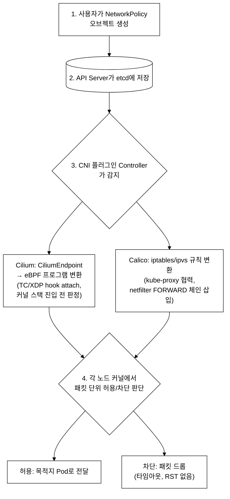
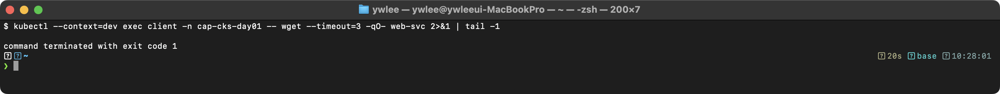
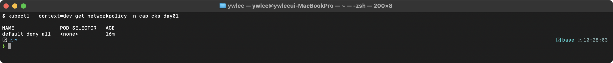
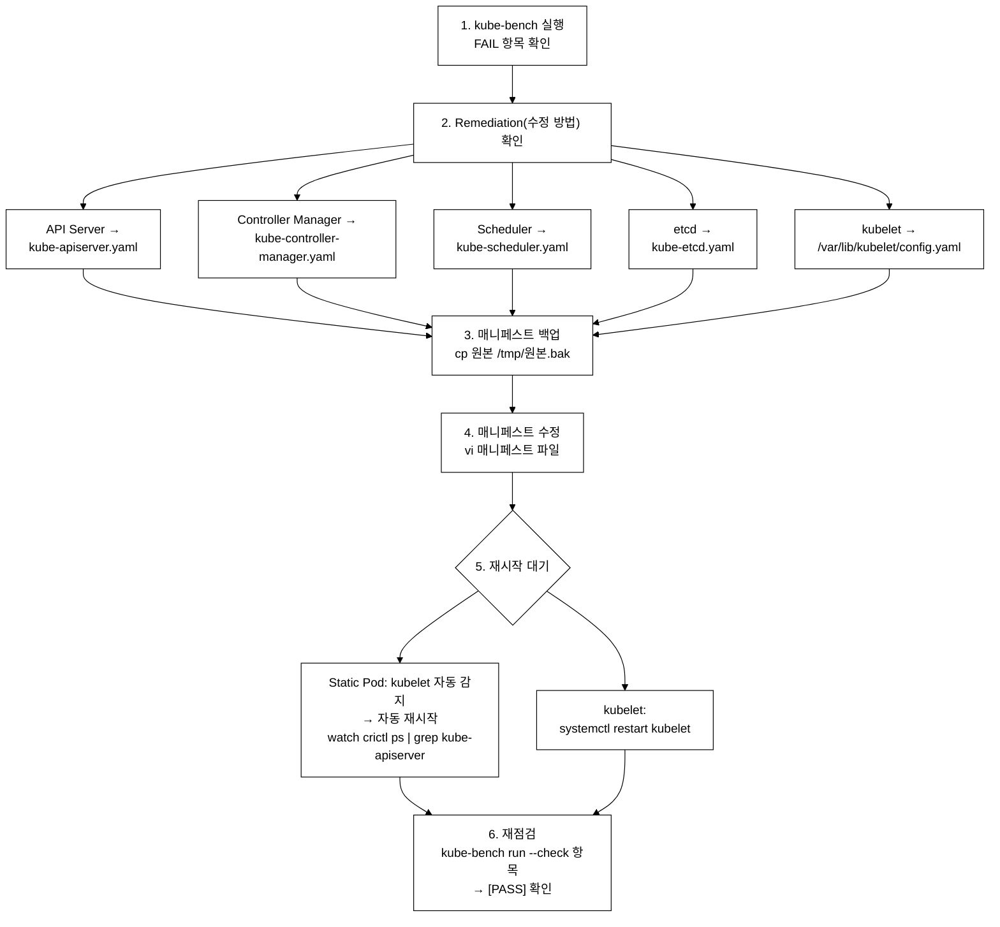
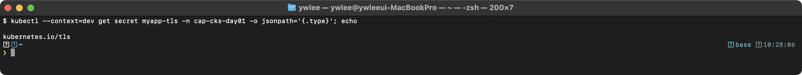
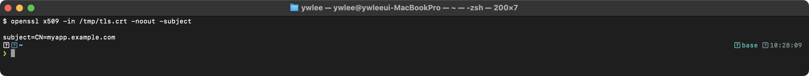
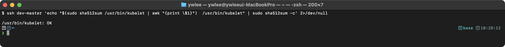
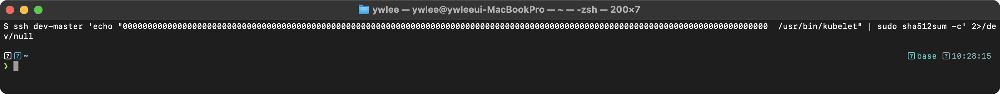

# CKS Day 1: Cluster Setup (1/2) - NetworkPolicy, CIS Benchmark, TLS, 바이너리 검증

> 학습 목표 | CKS 도메인: Cluster Setup (10%) | 예상 소요 시간: 2시간

---

## 오늘의 학습 목표

- NetworkPolicy의 동작 원리를 내부 메커니즘까지 이해한다
- CIS Benchmark와 kube-bench를 사용하여 클러스터 보안 상태를 점검하고 수정한다
- Ingress에 TLS를 설정하여 외부 트래픽을 암호화한다
- 바이너리 무결성 검증으로 변조를 탐지하고 교체한다
- 클라우드 메타데이터 API를 차단하여 정보 유출을 방지한다

> **맥락 안내:** CKS(Certified Kubernetes Security Specialist)는 CKA 취득 후 응시할 수 있는 보안 실기 시험이다. Day 1은 Cluster Setup(10%) 도메인의 전반부를 다루며, NetworkPolicy, CIS Benchmark, TLS, 바이너리 검증을 다룬다. 이 도메인에서 시험에 3~4문제가 출제된다. 5종 자격증 시리즈(KCNA → CKA → CKAD → KCSA → CKS) 중 마지막 단계이며, CKA 실기 합격 경험이 있다는 전제에서 시작한다.

---

## 1. NetworkPolicy 완전 정복

### 1.0 네트워크 계층 기초 (선행 지식)

NetworkPolicy를 이해하려면 OSI 7계층 중 L3·L4와 ACL 개념이 먼저 필요하다.

- **L3(네트워크 계층)**: IP 주소와 CIDR(예: `10.0.0.0/8`)로 호스트를 식별하는 계층이다. "어느 IP에서 어느 IP로 가는가"를 다룬다.
- **L4(전송 계층)**: TCP/UDP 포트(예: TCP 80, UDP 53)로 한 호스트 안의 여러 서비스를 구분하는 계층이다. "어느 포트로 가는가"를 다룬다.
- **ACL(Access Control List, 접근 제어 목록)**: 출발지/목적지 IP와 포트의 조합으로 트래픽을 허용·차단하는 보안 규칙의 목록이다. 방화벽 규칙이 ACL의 대표적 형태다.

즉 **NetworkPolicy는 쿠버네티스 Pod 간 통신을 L3/L4 수준에서 제어하는 ACL**이다. "출발 Pod / 목적 Pod / 포트"의 조합으로 허용 규칙을 선언하면, 나머지는 차단된다.

쿠버네티스 아키텍처를 두 부분으로 나누면 이 동작이 더 명확해진다.

- **컨트롤플레인(Control Plane)**: API Server·etcd 등 클러스터의 정책과 상태를 관리하는 두뇌다. NetworkPolicy 리소스는 여기에 저장된다.
- **데이터플레인(Data Plane)**: 각 노드에서 실제 패킷을 필터링·전달하는 실행부다. NetworkPolicy를 실제로 강제하는 곳이다.

**CNI(Container Network Interface)** 플러그인은 이 데이터플레인의 구현체다. Cilium·Calico 등이 컨트롤플레인에 선언된 NetworkPolicy를 읽어 각 노드 커널의 패킷 필터링 규칙(eBPF 또는 iptables)으로 변환한다. 즉 NetworkPolicy는 "무엇을 허용할지"를 선언만 하고, 실제 패킷 차단은 CNI 데이터플레인이 수행한다.

### 1.1 NetworkPolicy 개요 및 동작 메커니즘

```
NetworkPolicy 핵심 메커니즘
─────────────────────────────
NetworkPolicy는 CNI 플러그인이 해석하는 선언적 L3/L4 ACL(Access Control List) 규칙이다.
Kubernetes API Server에 NetworkPolicy 리소스가 생성되면, CNI 플러그인(Calico, Cilium 등)의
컨트롤러가 이를 watch하여 데이터플레인 규칙으로 변환한다.

- NetworkPolicy가 없는 상태: 기본적으로 모든 Pod 간 통신이 허용된다(default allow).
  CNI 플러그인은 어떤 패킷 필터링 규칙도 적용하지 않는다.

- Default Deny NetworkPolicy: podSelector: {}와 빈 ingress/egress를 선언하면,
  해당 네임스페이스의 모든 Pod에 대해 화이트리스트 모드가 활성화된다.
  명시적으로 허용하지 않은 트래픽은 CNI 데이터플레인에서 DROP된다.

- Explicit Allow NetworkPolicy: 특정 podSelector, namespaceSelector, ipBlock 조합으로
  src/dst IP, port, protocol을 기반으로 FORWARD 판정을 수행하는 규칙을 정의한다.

- DNS(UDP/TCP 53) 허용: CoreDNS가 Service FQDN을 ClusterIP로 해석하므로,
  Egress Default Deny 적용 시 kube-dns 포트를 명시적으로 허용하지 않으면
  DNS resolution이 실패하여 서비스 디스커버리가 작동하지 않는다.
```

### 1.2 등장 배경 — 기존 방식의 한계와 공격-방어 매핑

```
NetworkPolicy 이전의 Kubernetes 네트워크
════════════════════════════════════════

한계:
  - Kubernetes 초기에는 Pod 간 네트워크 격리 기능이 없었다.
  - 모든 Pod는 클러스터 내 다른 Pod에 자유롭게 접근할 수 있었다(flat network).
  - 하나의 Pod가 침해되면 동일 클러스터의 모든 서비스에 lateral movement가 가능했다.

당시 대안과 그 한계:
  - NetworkPolicy 이전에는 호스트 방화벽(각 노드의 iptables 호스트 규칙)에만 의존했다.
  - 그런데 Pod는 수시로 생성·삭제되며 IP가 바뀌므로, Pod가 증감할 때마다 모든
    노드의 방화벽 규칙을 사람이 수동으로 갱신해야 했다(현실적으로 관리 불가).
  - 호스트 방화벽은 노드 단위 규칙이라 같은 노드 안 Pod 간 통신은 격리할 수 없었다.
  - NetworkPolicy는 이를 "Pod 라벨 기준 + 선언적 + CNI 자동 반영"으로 해결했다.
    사람이 IP를 추적하지 않고, app=frontend 같은 라벨로 정책을 쓰면 CNI가 IP 변동을
    자동으로 따라간다.

공격-방어 매핑:
  공격 벡터                         → 방어 수단(NetworkPolicy)
  ──────────────────────────────── → ──────────────────────────────
  침해된 Pod에서 다른 Pod 접근       → Default Deny로 차단
  SSRF로 내부 서비스 스캔            → Egress 제한으로 도달 범위 축소
  메타데이터 API로 클라우드 자격증명  → ipBlock except로 169.254.169.254 차단
  DNS 기반 데이터 유출(exfiltration)  → Egress DNS를 kube-dns만 허용
  크로스 네임스페이스 무단 접근       → namespaceSelector로 출처 제한
```

### 1.3 NetworkPolicy 동작 원리 - 내부 메커니즘


_그림 1. NetworkPolicy 처리 흐름과 CNI별 패킷 필터링 구현._

먼저 eBPF 용어를 푼다. **eBPF(extended Berkeley Packet Filter)**는 리눅스 커널 내부에서 안전하게 실행되는 제한된 프로그램이다. 커널은 이 프로그램을 로드하기 전에 검증기(verifier)로 "무한 루프·메모리 침범이 없는지"를 확인하므로, C처럼 보이지만 커널을 망가뜨리지 않는다. eBPF 프로그램은 패킷이 도착할 때마다 빠르게 "허용/차단"을 판정하는 데 쓰인다.

커널 수준 동작 원리:
  - Cilium(eBPF): 리눅스 커널에서 패킷 하나는 `sk_buff`라는 구조체로 표현된다(패킷 헤더와 본문을 담는 커널 내부 자료구조다). Cilium의 eBPF 프로그램은 이 `sk_buff`에서 출발지·목적지 IP, 포트, 프로토콜을 읽어, 미리 저장해 둔 정책과 비교한다. 이때 정책은 `eBPF map`(커널 안의 키-값 저장소)에 들어 있어, 규칙이 아무리 많아도 해시 룩업으로 O(1)에 "허용/차단"을 판정한다.
  - Calico(iptables): netfilter 프레임워크의 FORWARD 체인에서 -j DROP 또는 -j ACCEPT 규칙으로 패킷을 처리한다. 규칙을 위에서부터 차례로 비교하므로 규칙 수에 비례하는 O(n) 선형 탐색이다(규칙이 많아지면 느려진다).

중요: NetworkPolicy는 "방화벽 규칙"이다. CNI 플러그인이 NetworkPolicy를 지원하지 않으면 아무 효과가 없다(예: Flannel은 NetworkPolicy를 지원하지 않는다).

### 1.4 NetworkPolicy 핵심 원칙

```
NetworkPolicy 규칙 매칭 원리
════════════════════════════

규칙 1: NetworkPolicy가 없으면 → 모든 트래픽 허용 (기본값)
규칙 2: NetworkPolicy가 하나라도 적용되면 → 해당 방향의 미명시 트래픽 차단
규칙 3: 여러 NetworkPolicy가 같은 Pod에 적용되면 → UNION (합집합) 적용
규칙 4: podSelector: {} → 네임스페이스의 모든 Pod 선택
규칙 5: ingress/egress 섹션이 비어있으면 → 해당 방향 모든 트래픽 차단

AND vs OR 조건 (시험 출제 빈도 매우 높음):
────────────────────────────────────────

# OR 조건: 별도의 from 항목 (둘 중 하나만 충족하면 허용)
ingress:
- from:
  - podSelector:        # 조건 A
      matchLabels:
        app: frontend
- from:
  - namespaceSelector:  # 조건 B
      matchLabels:
        env: staging

# AND 조건: 같은 from 항목 안에 (둘 다 충족해야 허용)
ingress:
- from:
  - podSelector:        # 조건 A AND 조건 B
      matchLabels:
        app: frontend
    namespaceSelector:
      matchLabels:
        env: staging
```

AND/OR의 차이는 들여쓰기가 아니라 **`-`(리스트 항목)의 개수**로 갈린다. `from` 아래에 `-` 항목이 둘이면 각각이 독립 조건이라 **OR**(둘 중 하나만 충족해도 허용), `-` 항목 하나 안에 `podSelector`와 `namespaceSelector`를 나란히 두면 **AND**(둘 다 충족해야 허용)다. 위 AND 예제는 곧 "`env=staging` 라벨이 붙은 네임스페이스에 있으면서 동시에 `app=frontend` 라벨을 가진 Pod에서 온 트래픽만 허용"한다는 뜻이다.

### 1.5 Default Deny All - 모든 보안의 시작

```yaml
# Default Deny All NetworkPolicy
# ─────────────────────────────
# 이것은 CKS에서 가장 기본이 되는 정책이다.
# "모든 트래픽을 차단하고, 필요한 것만 명시적으로 허용한다"는 원칙의 구현이다.
apiVersion: networking.k8s.io/v1   # NetworkPolicy API 버전
kind: NetworkPolicy                 # 리소스 종류
metadata:
  name: default-deny-all           # 정책 이름 (시험에서 지정해줌)
  namespace: secure-ns             # 적용할 네임스페이스 (반드시 지정)
spec:
  podSelector: {}                  # {} = 이 네임스페이스의 "모든" Pod에 적용
                                   # 특정 Pod만 선택하려면 matchLabels 사용
  policyTypes:                     # 어떤 방향의 트래픽을 제어할지
  - Ingress                        # 들어오는 트래픽 (이 Pod로 향하는)
  - Egress                         # 나가는 트래픽 (이 Pod에서 나가는)
  # ingress: 와 egress: 섹션이 없으므로 모든 트래픽이 차단된다
  # ingress: [] 와 egress: [] 를 명시해도 같은 효과
```

### 1.6 DNS 허용 패턴 - 반드시 알아야 하는 패턴

```yaml
# DNS 허용 NetworkPolicy
# ─────────────────────
# Egress를 차단하면 DNS(포트 53)도 차단되어 서비스 디스커버리가 안 된다.
# 이 정책을 반드시 함께 적용해야 한다.
apiVersion: networking.k8s.io/v1
kind: NetworkPolicy
metadata:
  name: allow-dns                  # DNS 허용 정책
  namespace: secure-ns
spec:
  podSelector: {}                  # 모든 Pod에 적용
  policyTypes:
  - Egress                         # Egress 방향만 제어
  egress:
  - to: []                         # 모든 대상으로 (kube-dns Pod가 어디에 있든)
    ports:
    - protocol: UDP                # DNS는 주로 UDP 사용
      port: 53
    - protocol: TCP                # DNS over TCP도 허용 (큰 응답, zone transfer)
      port: 53
```

```
왜 DNS를 반드시 허용해야 하는가?
═══════════════════════════════

Pod A에서 "http://backend-svc:8080"에 접속하려면:

1. Pod A → kube-dns(CoreDNS) Pod에 "backend-svc의 IP가 뭐야?" 질의 (UDP 53)
2. kube-dns → "10.96.15.200이야" 응답
3. Pod A → 10.96.15.200:8080으로 TCP 연결

DNS가 차단되면 1단계에서 실패한다.
서비스 이름으로 통신할 수 없고, IP 주소로만 통신해야 한다.
이것은 쿠버네티스의 서비스 디스커버리를 완전히 무력화시킨다.
```

여기서 `backend-svc`의 **Service(줄여서 svc)**는 쿠버네티스 내부 로드밸런서 리소스다. 수시로 바뀌는 Pod 그룹을 안정된 DNS 이름(`backend-svc`)과 고정 가상 IP(ClusterIP)로 추상화해, Pod IP를 몰라도 이름만으로 접근하게 해 준다. Service 리소스 자체는 뒤 일차에서 자세히 다루지만, 지금은 "이름으로 Pod 그룹에 접속하게 해 주는 안정된 진입점"으로 이해하면 된다.

### 1.7 특정 Pod 간 통신 허용 패턴

**전제 조건:** 아래 YAML은 `secure-ns` 네임스페이스에 `app=frontend` Pod와 `app=backend` Pod가 이미 있다고 가정한다. 정책을 적용하기 전에 테스트용 Pod를 먼저 만든다. 파괴 실습이므로 dev 또는 staging 클러스터에서만 한다.

```bash
# 전제: dev 클러스터가 가동 중이고 kubeconfig가 준비됨
export KUBECONFIG=~/sideproejct/IaC_apple_sillicon/kubeconfig/dev.yaml
kubectl create namespace secure-ns

# frontend Pod 생성 (app=frontend 라벨)
kubectl run frontend -n secure-ns --image=curlimages/curl \
  --labels app=frontend -- sleep 3600

# backend Pod 생성 (app=backend 라벨) + 8080 포트 노출용 서비스
kubectl run backend -n secure-ns --image=hashicorp/http-echo \
  --labels app=backend --port 8080 -- -listen=:8080 -text=ok
kubectl expose pod backend -n secure-ns --port 8080
# 이후 아래 NetworkPolicy를 apply하면 frontend→backend:8080만 허용된다
```

```yaml
# Frontend → Backend Egress 허용
# ──────────────────────────────
# frontend Pod가 backend Pod의 8080 포트로만 나갈 수 있도록 허용
apiVersion: networking.k8s.io/v1
kind: NetworkPolicy
metadata:
  name: frontend-to-backend-egress
  namespace: secure-ns
spec:
  podSelector:
    matchLabels:
      app: frontend                # 이 정책은 frontend Pod에만 적용
  policyTypes:
  - Egress
  egress:
  # 규칙 1: DNS 허용
  - to: []
    ports:
    - protocol: UDP
      port: 53
    - protocol: TCP
      port: 53
  # 규칙 2: backend Pod의 8080 포트만 허용
  - to:
    - podSelector:
        matchLabels:
          app: backend             # 같은 네임스페이스의 app=backend Pod로만
    ports:
    - protocol: TCP
      port: 8080                   # 8080 포트만 허용
---
# Backend Ingress 허용 (Egress만으로는 안 됨! 양쪽 모두 허용해야 함)
# ─────────────────────────────────────────────────────────────────
# 중요: Default Deny가 적용된 상태에서는 Egress 허용 + Ingress 허용 둘 다 필요하다!
apiVersion: networking.k8s.io/v1
kind: NetworkPolicy
metadata:
  name: backend-from-frontend-ingress
  namespace: secure-ns
spec:
  podSelector:
    matchLabels:
      app: backend                 # backend Pod에 적용
  policyTypes:
  - Ingress
  ingress:
  - from:
    - podSelector:
        matchLabels:
          app: frontend            # frontend Pod에서 오는 트래픽만 허용
    ports:
    - protocol: TCP
      port: 8080
```

### 1.8 네임스페이스 간 통신 허용

```yaml
# 다른 네임스페이스(monitoring)에서 현재 네임스페이스(production) Pod로 접근 허용
# ──────────────────────────────────────────────────────────────────────────────
apiVersion: networking.k8s.io/v1
kind: NetworkPolicy
metadata:
  name: allow-monitoring-ingress
  namespace: production
spec:
  podSelector:
    matchLabels:
      app: web-app                 # production 네임스페이스의 web-app Pod
  policyTypes:
  - Ingress
  ingress:
  - from:
    - namespaceSelector:           # 다른 네임스페이스에서 오는 트래픽
        matchLabels:
          name: monitoring         # monitoring 네임스페이스 (라벨 필요!)
      podSelector:                 # AND 조건: 해당 네임스페이스의 특정 Pod
        matchLabels:
          app: prometheus          # prometheus Pod만 허용
    ports:
    - protocol: TCP
      port: 9090                   # 메트릭 수집 포트만
```

```
주의: namespaceSelector를 사용하려면 대상 네임스페이스에 라벨이 있어야 한다!
═════════════════════════════════════════════════════════════════════════════

# 네임스페이스에 라벨 추가
kubectl label namespace monitoring name=monitoring

# 확인
kubectl get namespace monitoring --show-labels
```

### 1.9 CIDR 기반 IP 블록 제어

```yaml
# 특정 IP 대역 허용/차단
# ────────────────────────
apiVersion: networking.k8s.io/v1
kind: NetworkPolicy
metadata:
  name: allow-external-api
  namespace: production
spec:
  podSelector:
    matchLabels:
      app: payment                 # payment Pod에 적용
  policyTypes:
  - Egress
  egress:
  # DNS 허용
  - to: []
    ports:
    - protocol: UDP
      port: 53
    - protocol: TCP
      port: 53
  # 특정 외부 API 서버만 허용
  - to:
    - ipBlock:
        cidr: 203.0.113.0/24       # 외부 결제 API 서버 대역
    ports:
    - protocol: TCP
      port: 443                    # HTTPS만 허용
  # 내부 서비스 접근 허용
  - to:
    - ipBlock:
        cidr: 10.0.0.0/8           # 내부 클러스터 네트워크
        except:
        - 10.0.0.1/32              # 특정 IP 제외
```

### 1.10 메타데이터 API 차단 - 클라우드 보안

```yaml
# 클라우드 인스턴스 메타데이터 API 차단
# ───────────────────────────────────
# AWS/GCP/Azure 인스턴스 메타데이터 API(169.254.169.254)를 차단하여
# Pod에서 IAM 자격 증명 등 민감 정보 유출을 방지한다.
#
# IMDS(Instance Metadata Service)에 대한 네트워크 수준 접근 차단
apiVersion: networking.k8s.io/v1
kind: NetworkPolicy
metadata:
  name: deny-metadata-access
  namespace: secure-ns
spec:
  podSelector: {}                  # 모든 Pod에 적용
  policyTypes:
  - Egress
  egress:
  # DNS 허용
  - to: []
    ports:
    - protocol: UDP
      port: 53
    - protocol: TCP
      port: 53
  # 메타데이터 API를 제외한 모든 외부 통신 허용
  - to:
    - ipBlock:
        cidr: 0.0.0.0/0           # 모든 IP 대역
        except:
        - 169.254.169.254/32      # 메타데이터 API IP 차단!
```

```
메타데이터 API가 위험한 이유
══════════════════════════

IMDS(Instance Metadata Service)는 클라우드 VM이 자기 자신에 대한 정보
(인스턴스 ID, 네트워크, 그리고 가장 중요한 IAM 임시 자격증명)를 받아오는
HTTP 엔드포인트다. AWS·GCP·Azure 모두 링크-로컬 주소 169.254.169.254를
공통으로 사용한다(AWS는 IMDSv2, GCP는 Metadata Server, Azure는 Azure IMDS로
부른다). 노드가 이 주소로 요청하면 그 노드(인스턴스)에 부여된 관리 자격증명을
돌려주므로, Pod가 이 주소에 접근하면 노드의 클라우드 권한을 그대로 탈취할 수 있다.

Pod가 169.254.169.254에 접근하면:
  - AWS: IAM Role 임시 자격 증명 획득 → AWS 리소스 무단 접근
  - GCP: Service Account 토큰 획득 → GCP 리소스 무단 접근
  - Azure: Managed Identity 토큰 획득 → Azure 리소스 무단 접근

공격 시나리오:
1. 공격자가 취약한 웹 앱을 통해 Pod에 RCE(원격 코드 실행) 획득
2. curl http://169.254.169.254/latest/meta-data/iam/security-credentials/
3. IAM Role의 AccessKey, SecretKey 탈취
4. 클라우드 리소스 전체 접근 가능 → 대형 보안 사고

→ NetworkPolicy로 차단하면 2단계에서 실패한다
```

### 1.11 NetworkPolicy 실습 검증

> **맥락 연결:** 1.7절에서 frontend/backend Pod를 이미 만들었지만, 이 절의 검증 시나리오는 "공격자(attacker)가 web 서비스를 향해 요청을 보내는 흐름"을 재현하기 위해 별도의 attacker/web/web-svc를 사용한다. 1.7절 Pod와 이름이 다르므로 아래 초기화 블록에서 먼저 생성한다.

**전제:** dev/staging 클러스터가 가동 중이고, `export KUBECONFIG=~/sideproejct/IaC_apple_sillicon/kubeconfig/dev.yaml`이 설정된 상태다. 아래 검증은 `secure-ns`에 `web`/`attacker` Pod가 있고 **다른 정책 없이 `default-deny-all`만 적용된 상태**를 가정한다. 기존 정책이 남아 결과가 오염되지 않도록 먼저 비운다.

```bash
# 전제 초기화: secure-ns의 기존 NetworkPolicy를 모두 제거한 뒤 default-deny만 적용
kubectl delete networkpolicy -n secure-ns --all

# 검증용 Pod/Service 생성 (1.7절의 frontend/backend와 별개, 이름 충돌 없음)
# web Pod: HTTP 응답 서버 역할 (app=web 라벨)
kubectl run web -n secure-ns --image=hashicorp/http-echo \
  --labels app=web --port 5678 -- -listen=:5678 -text=hello
# web-svc: web Pod를 80 포트로 노출
kubectl expose pod web -n secure-ns --name=web-svc --port=80 --target-port=5678
# attacker Pod: curl 요청 발신 역할 (정책 차단 대상)
kubectl run attacker -n secure-ns --image=curlimages/curl -- sleep 3600
# Pod가 Running 상태가 될 때까지 대기
kubectl wait pod -n secure-ns --selector app=web --for=condition=Ready --timeout=60s
kubectl wait pod/attacker -n secure-ns --for=condition=Ready --timeout=60s
```

**실습 전체 흐름** — 1.5의 `default-deny-all.yaml`과 1.7의 허용 정책을 순서대로 적용하며 변화를 관찰한다:
1. `default-deny-all.yaml` apply → 모든 egress 차단 → 아래처럼 DNS 단계에서 먼저 실패한다.
2. `allow-dns` 정책 추가 → 이름은 해석되나 연결은 여전히 타임아웃.
3. `frontend-to-backend-egress` + `backend-from-frontend-ingress` apply → 허용 경로만 성공.

```bash
# Default Deny 적용 후 통신 차단 검증
kubectl apply -f default-deny-all.yaml
kubectl exec attacker -n secure-ns -- wget -qO- --timeout=3 http://web-svc 2>&1
```



Egress까지 차단된 default-deny 상태에서는 DNS(UDP 53) 질의 자체가 막혀 이름 해석 단계에서 먼저 실패한다. 따라서 L4 연결 타임아웃 이전에 `bad address`로 끝난다. allow-dns 정책을 추가하면 이름은 해석되고 그 다음 단계에서 연결이 타임아웃된다.

```bash
# NetworkPolicy가 정상 적용되었는지 확인
kubectl get networkpolicy -n secure-ns
```



```bash
# CNI 플러그인이 정책을 반영했는지 확인 (Cilium 환경)
kubectl exec -n kube-system ds/cilium -- cilium endpoint list | head -10
```

> **예시(참조) — Cilium 엔드포인트 정책:** 노드의 `cilium endpoint list`(cilium CLI/`kubectl exec` cilium-agent) 로 각 엔드포인트의 ingress/egress POLICY(Enabled/Disabled)와 IDENTITY 를 본다. 이 저장소는 Cilium CNI 상주이며, 정책 적용 시 해당 Pod 엔드포인트의 POLICY 가 Enabled 로 바뀐다.

default-deny-all이 적용된 web Pod의 엔드포인트는 ingress/egress 모두 `Enabled`(정책 강제 활성)로 전환된다. 정책이 없으면 `Disabled`로 표시된다.

### 1.12 직접 해보기 — Default Deny + DNS 허용 + 허용 정책 적용 (15분)

**목표:** `secure-ns`에 attacker/web/web-svc Pod를 올리고, 정책을 단계별로 적용하며 차단→DNS 해석→허용 순으로 동작이 바뀌는 것을 확인한다. 1.11절의 초기화 블록을 먼저 실행해 Pod와 Service가 Ready 상태여야 한다.

**작업 절차:**
1. Default Deny 적용 후 차단 확인: `kubectl apply -f default-deny-all.yaml` → `kubectl exec attacker -n secure-ns -- wget -qO- --timeout=3 http://web-svc 2>&1`로 `bad address`(DNS 차단) 또는 타임아웃을 확인한다.
2. DNS 허용 정책 추가: 1.6절의 `allow-dns` NetworkPolicy를 apply한다. 다시 wget을 실행하면 이번에는 이름이 해석되지만 연결 타임아웃이 발생한다(L4는 아직 차단).
3. 허용 정책 적용: web Pod를 대상으로 Ingress 허용 정책(`from: [{podSelector: {matchLabels: {run: attacker}}}]`, 포트 80)을 apply하고, attacker Pod에 Egress 허용 정책(port 80, web-svc 목적)을 apply한다. 다시 wget을 실행하면 `hello`가 출력된다.
4. `kubectl get networkpolicy -n secure-ns`로 적용된 정책 3개를 확인한다.

**완료 기준:** 단계별로 ①`bad address`/타임아웃 ②타임아웃(이름 해석 성공) ③`hello`(연결 성공) 순으로 결과가 바뀌면 성공이다. 완료 후 `kubectl delete networkpolicy -n secure-ns --all`로 초기화한다.

### 1.13 NetworkPolicy 트러블슈팅

```
NetworkPolicy 장애 시나리오와 디버깅
════════════════════════════════════

시나리오 1: NetworkPolicy를 적용했는데 통신이 차단되지 않는다
  원인: CNI 플러그인이 NetworkPolicy를 지원하지 않는다 (Flannel 등)
  디버깅:
    kubectl get pods -n kube-system -l k8s-app=cilium   # Cilium 확인
    kubectl get pods -n kube-system -l k8s-app=calico-node  # Calico 확인
  해결: NetworkPolicy를 지원하는 CNI(Cilium, Calico)로 교체한다

시나리오 2: Default Deny 적용 후 DNS가 실패한다
  원인: Egress Default Deny가 kube-dns(UDP 53)도 차단한다
  디버깅:
    kubectl exec test-pod -- nslookup kubernetes.default 2>&1
    # ;; connection timed out; no servers could be reached
  해결: DNS 허용 NetworkPolicy를 추가한다 (allow-dns)

시나리오 3: Egress를 허용했는데 통신이 안 된다
  원인: 수신 측 Pod에도 Ingress 허용이 필요하다 (Default Deny가 양방향이면)
  디버깅:
    kubectl describe networkpolicy -n <ns> | grep "Allowing ingress"
  해결: 수신 측 Ingress 허용 정책을 추가한다

시나리오 4: namespaceSelector가 동작하지 않는다
  원인: 대상 네임스페이스에 매칭되는 라벨이 없다
  디버깅:
    kubectl get ns monitoring --show-labels
  해결: kubectl label ns monitoring name=monitoring
```

---

## 2. CIS Benchmark와 kube-bench

### 2.0 등장 배경 — 수동 감사의 한계와 컴플라이언스 압박

쿠버네티스 클러스터는 kube-apiserver, kubelet, etcd, kube-scheduler, controller-manager 등 수십 개의 컴포넌트가 각자 수백 가지 플래그와 파일 퍼미션 설정을 갖는다. 초창기에는 이 모든 항목을 보안 담당자가 문서를 뒤지며 **수동**으로 하나씩 확인했다. 문제는 세 가지였다: 첫째, 설정 항목 수가 너무 많아 빠짐없이 점검하는 것이 현실적으로 불가능했다. 둘째, 점검 기준이 조직마다 달랐고, PCI DSS나 SOC 2 같은 컴플라이언스 감사 때마다 "어느 기준으로 검사했느냐"는 질문에 근거를 대기 어려웠다. 셋째, 새 버전이 출시되거나 설정이 바뀌면 체크리스트를 손수 갱신해야 했다.

CIS(Center for Internet Security)가 Kubernetes CIS Benchmark를 내놓으면서 이 세 문제가 한꺼번에 해결됐다. CIS Benchmark는 업계와 커뮤니티 합의로 만든 **표준 체크리스트**다. 감사 때 "CIS Kubernetes Benchmark 1.9 Level 1을 통과했다"고 말하면 구체적인 항목과 근거가 있는 진술이 된다. kube-bench는 이 체크리스트를 코드로 자동화한 도구다. 수동 점검 수십 시간이 수 분짜리 스크립트 실행으로 줄었다.

**트레이드오프:** kube-bench는 오탐(false positive)이 생긴다. 환경 특성상 의도적으로 비활성화한 항목(예: 특정 클라우드 관리형 API Server에서는 일부 플래그 설정이 불가능하다)도 FAIL로 표시된다. FAIL을 모두 맹목적으로 수정하면 클러스터가 깨질 수 있으므로, 각 항목의 Remediation(수정 가이드)을 읽고 환경에 맞게 판단해야 한다. 또한 CIS Benchmark 자체가 버전마다 항목이 달라지므로, 사용하는 쿠버네티스 버전과 Benchmark 버전을 맞추지 않으면 엉뚱한 항목이 FAIL로 나온다.

### 2.1 CIS Benchmark란 무엇인가

```
CIS Benchmark 기술 정의
═══════════════════════

CIS(Center for Internet Security) Benchmark는 쿠버네티스 클러스터의
보안 설정을 체계적으로 평가하는 표준화된 보안 규격(security specification)이다.

각 항목은 컴포넌트별(kube-apiserver, kubelet, etcd 등) 설정 파라미터를
검사하며, 파일 퍼미션, 프로세스 인자(argument), 인증/인가 설정 등을 포함한다.
총 수백 개의 체크 항목이 레벨 1(필수)/레벨 2(심화)로 분류된다.

kube-bench는 CIS Benchmark 규격을 자동으로 평가하는 Go 기반 도구이다.
각 노드에서 실행되어 설정 파일과 프로세스 인자를 파싱하고,
규격 대비 PASS/FAIL/WARN 판정을 출력한다.
```

여기서 **CIS(Center for Internet Security)**는 사이버보안 모범 설정 표준을 개발·배포하는 미국의 비영리 기관이다. NIST 같은 정부 표준 제정 기관과 달리 업계·커뮤니티 합의로 체크리스트를 만든다. Kubernetes CIS Benchmark는 쿠버네티스 커뮤니티와 함께 만든 항목 모음으로, PCI DSS 같은 컴플라이언스 기준처럼 "이 정도는 지켜야 한다"는 업계 사실상 표준으로 통한다.

이때 등장하는 두 검사 대상 용어도 짚어 둔다. **파일 퍼미션**은 `chmod 644`처럼 파일에 누가 읽고 쓸 수 있는지를 정하는 리눅스 접근 권한이다(예: `/etc/kubernetes`의 인증서·설정 파일을 root만 읽도록 제한). **프로세스 인자(argument)**는 프로그램을 기동할 때 넘기는 `--플래그=값` 형태의 옵션이다(예: kube-apiserver를 띄울 때 `--anonymous-auth=false`라는 보안 옵션을 붙이는 것). CIS Benchmark는 이 둘을 함께 검사한다.

### 2.2 kube-bench 명령어 상세

```bash
# 마스터 노드 전체 점검
kube-bench run --targets master

# 워커 노드 점검
kube-bench run --targets node

# 특정 체크 항목만 점검 (시험에서 주로 사용)
kube-bench run --targets master --check 1.2.1,1.2.2

# 실패한 항목만 필터링
kube-bench run --targets master 2>&1 | grep "\[FAIL\]"

# JSON 형식 출력 (자동화용)
kube-bench run --targets master --json

# etcd 점검
kube-bench run --targets etcd

# 전체 점검
kube-bench run --targets master,node,etcd
```

### 2.3 시험 빈출 CIS 체크 항목

```
CKS에서 자주 나오는 kube-bench 수정 항목
══════════════════════════════════════

체크 ID   | 내용                      | 수정 방법
─────────┼───────────────────────────┼──────────────────────────────
1.2.1    | anonymous-auth 비활성화    | --anonymous-auth=false 추가
1.2.2    | basic-auth 비활성화        | --basic-auth-file 라인 삭제
1.2.6    | NodeRestriction 활성화     | --enable-admission-plugins=NodeRestriction
1.2.16   | profiling 비활성화         | --profiling=false
1.2.18   | insecure-bind-address 제거 | --insecure-bind-address 라인 삭제
1.2.19   | insecure-port 비활성화     | --insecure-port=0
1.2.20   | audit-log 활성화           | --audit-log-path=<경로>
1.2.21   | audit-log-maxage          | --audit-log-maxage=30
1.2.22   | audit-log-maxbackup       | --audit-log-maxbackup=10
1.2.23   | audit-log-maxsize         | --audit-log-maxsize=100
4.2.1    | kubelet anonymous auth     | authentication.anonymous.enabled: false
4.2.2    | kubelet authorization      | authorization.mode: Webhook
```

### 2.4 kube-bench FAIL 항목 수정 절차


_그림 2. kube-bench FAIL 항목 수정 흐름._

kubeadm으로 구축한 클러스터에서 control-plane 컴포넌트(API Server·Controller Manager·Scheduler·etcd)는 **Static Pod**로 뜨며, 그 매니페스트는 마스터 노드의 `/etc/kubernetes/manifests/` 디렉터리에 있다(예: `/etc/kubernetes/manifests/kube-apiserver.yaml`). kubelet이 이 디렉터리를 감시하다가 파일이 바뀌면 해당 Pod를 자동으로 재시작한다. 따라서 Deployment나 ConfigMap처럼 `kubectl edit`로 고치는 것이 아니라, 노드에 들어가 `vi`로 파일을 직접 수정하는 노드 로컬 관리 구조다. kubelet 자체 설정은 `/var/lib/kubelet/config.yaml`을 수정하고 `systemctl restart kubelet`으로 반영한다.

### 2.5 kube-bench 실습 검증

**실습 사전 준비:** kube-bench는 마스터 노드의 `/etc/kubernetes/` 설정 파일과 실제 프로세스 인자를 직접 읽으므로, **마스터 노드 위에서 root 권한으로** 실행해야 한다. kubectl로 원격에서 돌리는 것이 아니다. 두 가지 방법이 있다.

- 방법 A — 노드에 SSH 접속(권장, dev/staging만): `ssh staging-master`로 들어가 노드 안에서 아래 명령을 실행한다(필요 시 `sudo`).
- 방법 B — 클러스터 내 Job으로 실행: kube-bench Pod를 `hostPID`와 `/etc/kubernetes` hostPath 마운트로 띄워 그 안에서 점검한다.

```bash
# ssh staging-master 로 마스터 노드에 접속한 뒤 노드 안에서 실행
# kube-bench 실행 후 FAIL 항목 확인
kube-bench run --targets master --check 1.2.1 2>&1 | grep -E "\[FAIL\]|\[PASS\]"
```

> **예시(참조) — kube-bench FAIL:** `kube-bench run --targets master` 결과 `[FAIL] 1.2.1 ... --anonymous-auth ... set to false` 는 CIS 벤치마크 위반이다. 조치: `/etc/kubernetes/manifests/kube-apiserver.yaml` 에 `--anonymous-auth=false` 추가(정적 파드 자동 재시작).

```bash
# 수정 후 재점검
kube-bench run --targets master --check 1.2.1 2>&1 | grep -E "\[FAIL\]|\[PASS\]"
```

> **예시(참조) — kube-bench PASS:** 수정 후 같은 항목이 `[PASS]` 로 바뀐다. kube-bench 는 마스터 노드에서 root 로 실행하며(`ssh staging-master`), 결과는 PASS/FAIL/WARN 로 분류된다.

### 2.6 kube-bench 트러블슈팅

```
kube-bench 수정 시 발생하는 장애 시나리오
════════════════════════════════════════

시나리오 1: API Server 매니페스트 수정 후 API Server가 시작되지 않는다
  원인: YAML 문법 오류, 플래그 오타, 볼륨 마운트 경로 불일치
  디버깅:
    crictl ps -a | grep kube-apiserver   # 컨테이너 상태 확인
    crictl logs <container-id>           # 에러 로그 확인
    journalctl -u kubelet -f             # kubelet 로그에서 static pod 에러 확인
  해결: /tmp/kube-apiserver.yaml.bak에서 백업 복원 후 오류 수정

시나리오 2: kubelet 설정 수정 후 노드가 NotReady 상태가 된다
  원인: config.yaml 문법 오류, 잘못된 필드명
  디버깅:
    systemctl status kubelet              # kubelet 상태 확인
    journalctl -u kubelet --no-pager -n 50  # 최근 로그 확인
  해결: config.yaml 복원 후 systemctl restart kubelet

시나리오 3: audit-log-path 설정 후 API Server CrashLoopBackOff
  원인: 로그 디렉토리가 존재하지 않거나 볼륨 마운트 누락
  디버깅:
    ls -la /var/log/kubernetes/audit/     # 디렉토리 존재 확인
    # 매니페스트에서 volumeMounts/volumes 확인
  해결: mkdir -p /var/log/kubernetes/audit/ 후 볼륨 마운트 설정 확인
```

### 2.7 API Server 매니페스트 수정 예제 (kube-apiserver.yaml)

```yaml
# /etc/kubernetes/manifests/kube-apiserver.yaml
# ─────────────────────────────────────────────
# static pod 매니페스트이다. 수정하면 kubelet이 자동 감지하여 재시작한다.
apiVersion: v1
kind: Pod
metadata:
  name: kube-apiserver
  namespace: kube-system
  labels:
    component: kube-apiserver
    tier: control-plane
spec:
  containers:
  - command:
    - kube-apiserver
    # === 보안 설정 (CIS Benchmark) ===
    - --anonymous-auth=false              # 1.2.1: 익명 인증 비활성화
                                          # true이면 인증 없이 API 접근 가능 → 위험!
    - --authorization-mode=Node,RBAC      # 1.2.8: Node + RBAC 인가
                                          # AlwaysAllow이면 모든 요청 허용 → 위험!
    - --enable-admission-plugins=NodeRestriction,PodSecurity
                                          # 1.2.6: Admission Controller 활성화
                                          # NodeRestriction: kubelet의 권한 제한
                                          # PodSecurity: Pod 보안 표준 적용
    - --profiling=false                   # 1.2.16: 프로파일링 비활성화
                                          # 디버깅 정보 노출 방지
    # --insecure-bind-address 라인 삭제!   # 1.2.18: 비암호화 바인딩 제거
    # --insecure-port=0 또는 라인 삭제      # 1.2.19: 비암호화 포트 비활성화

    # === Audit 로그 설정 ===
    - --audit-policy-file=/etc/kubernetes/audit-policy.yaml
    - --audit-log-path=/var/log/kubernetes/audit/audit.log
    - --audit-log-maxage=30               # 30일간 보관
    - --audit-log-maxbackup=10            # 최대 10개 백업
    - --audit-log-maxsize=100             # 최대 100MB per 파일

    # === kubelet 인증서 검증 ===
    - --kubelet-certificate-authority=/etc/kubernetes/pki/ca.crt
                                          # kubelet과 통신 시 인증서 검증

    # === 기존 필수 설정 (삭제하면 안 됨) ===
    - --advertise-address=192.168.64.10
    - --client-ca-file=/etc/kubernetes/pki/ca.crt
    - --etcd-cafile=/etc/kubernetes/pki/etcd/ca.crt
    - --etcd-certfile=/etc/kubernetes/pki/apiserver-etcd-client.crt
    - --etcd-keyfile=/etc/kubernetes/pki/apiserver-etcd-client.key
    - --etcd-servers=https://127.0.0.1:2379
    - --kubelet-client-certificate=/etc/kubernetes/pki/apiserver-kubelet-client.crt
    - --kubelet-client-key=/etc/kubernetes/pki/apiserver-kubelet-client.key
    - --service-cluster-ip-range=10.96.0.0/12
    - --tls-cert-file=/etc/kubernetes/pki/apiserver.crt
    - --tls-private-key-file=/etc/kubernetes/pki/apiserver.key

    image: registry.k8s.io/kube-apiserver:v1.31.0

    # === 볼륨 마운트 (Audit 관련) ===
    volumeMounts:
    - name: audit-policy              # Audit 정책 파일 마운트
      mountPath: /etc/kubernetes/audit-policy.yaml
      readOnly: true                  # 읽기 전용 (보안)
    - name: audit-log                 # Audit 로그 디렉토리 마운트
      mountPath: /var/log/kubernetes/audit/
    # ... 기존 볼륨 마운트들

  volumes:
  - name: audit-policy
    hostPath:
      path: /etc/kubernetes/audit-policy.yaml
      type: File                      # 파일이 존재해야 함
  - name: audit-log
    hostPath:
      path: /var/log/kubernetes/audit/
      type: DirectoryOrCreate         # 디렉토리 없으면 자동 생성
  # ... 기존 볼륨들
```

### 2.8 직접 해보기 — kube-bench FAIL→PASS (10분)

**목표:** staging 클러스터 마스터 노드에서 kube-bench 1.2.1 항목을 FAIL 상태로 확인한 뒤, 10분 안에 PASS로 수정한다.

**작업 절차:**
1. `ssh staging-master`로 접속한다(~/.ssh/config에 등록된 별칭, ProxyCommand가 IP를 실시간 조회).
2. `kube-bench run --targets master --check 1.2.1 2>&1 | grep -E '\[FAIL\]|\[PASS\]'`로 현재 상태를 확인한다.
3. FAIL이면 `/etc/kubernetes/manifests/kube-apiserver.yaml`을 `/tmp/kube-apiserver.yaml.bak`에 백업한다.
4. `kube-apiserver.yaml`의 `command` 섹션에 `- --anonymous-auth=false`를 추가하고 저장한다.
5. `watch crictl ps | grep kube-apiserver`로 새 컨테이너가 뜨기를 기다린다(약 20~60초).
6. 2번 명령을 다시 실행해 `[PASS]`가 되었는지 확인한다.

**시간 초과 시:** 수정 전 백업(`/tmp/kube-apiserver.yaml.bak`)을 원위치에 복원하고, 오류 원인을 `crictl logs <container-id>`로 확인한 뒤 재시도한다.

### 2.9 kubelet 보안 설정

kubelet은 단순한 에이전트가 아니라, 각 워커 노드에서 **10250 포트로 자체 HTTPS API**를 노출한다. 이 API로 노드 상태·Pod 목록·로그 조회뿐 아니라 컨테이너 안에서 명령 실행(`exec`)까지 가능하다. 그래서 `authentication.anonymous.enabled: true`이면 인증 없이 이 API에 접근할 수 있어, API Server의 RBAC를 우회해 노드의 Pod를 직접 조작당할 수 있다. 아래 설정은 이 익명 접근을 막고(`enabled: false`), 인가는 Webhook으로 API Server에 위임하며, 인증 없는 읽기 전용 포트(10255)도 끈다.

```yaml
# /var/lib/kubelet/config.yaml
# ─────────────────────────────
# kubelet의 설정 파일이다. 수정 후 systemctl restart kubelet으로 반영한다.
apiVersion: kubelet.config.k8s.io/v1beta1
kind: KubeletConfiguration
authentication:
  anonymous:
    enabled: false                    # 4.2.1: kubelet 익명 인증 비활성화
                                      # true이면 kubelet API에 인증 없이 접근 가능
  webhook:
    enabled: true                     # API Server를 통한 인증 활성화
    cacheTTL: 2m0s
  x509:
    clientCAFile: /etc/kubernetes/pki/ca.crt
authorization:
  mode: Webhook                       # 4.2.2: Webhook 인가 모드
                                      # AlwaysAllow이면 모든 요청 허용 → 위험!
readOnlyPort: 0                       # 4.2.4: 읽기 전용 포트 비활성화
                                      # 10255 포트는 인증 없이 접근 가능 → 위험!
protectKernelDefaults: true           # 커널 파라미터 보호
eventRecordQPS: 5
rotateCertificates: true              # 인증서 자동 갱신
```

---

## 3. Ingress TLS 설정

### 3.0 등장 배경 — HTTP 평문 전송의 위험과 TLS 도입

2010년 Firesheep이라는 브라우저 확장이 공개됐다. 공개 Wi-Fi에서 HTTP로 전송되는 Facebook·Twitter 세션 쿠키를 클릭 한 번에 도청해 타인의 계정에 자동 로그인하는 도구였다. 설치에 기술이 필요 없었고, 배포 24시간 만에 수십만 건이 내려받혔다. 이 사건은 "HTTP 평문 전송은 단순한 이론적 위협이 아니다"를 대규모로 증명했다. 쿠버네티스 환경에서도 Ingress가 HTTP로 외부 트래픽을 받으면, 클러스터가 놓인 네트워크(클라우드 VPC 내부 트래픽 포함)에서 패킷을 가로채면 요청 본문과 응답이 그대로 노출된다.

직전 해결책으로는 각 서비스 Pod가 직접 TLS를 처리하게 하는 방식이 있었다. 그러나 이 방법은 인증서 갱신 로직을 서비스마다 개별 구현해야 하고, 인증서 파일을 각 Pod의 컨테이너 이미지나 Secret에 분산 관리해야 해서 운영 부담이 컸다. Ingress TLS Termination은 TLS 처리를 **Ingress Controller 한 곳에 집중**시켜 인증서 관리를 단순화하고, 뒤쪽 Pod는 평문 HTTP만 다루면 되는 구조다.

**트레이드오프:** TLS handshake는 CPU 연산이 필요하다. 트래픽이 많으면 Ingress Controller 파드의 CPU 사용량이 올라간다. 또한 Ingress→Pod 구간이 평문이므로, 클러스터 내부 네트워크까지 암호화가 필요한 규제 환경에서는 Istio mTLS(이 문서 tart-infra 실습 Part 4)를 추가로 적용해야 한다.

**Ingress와 Ingress Controller 선행 개념:** Ingress는 클러스터 외부 HTTP/HTTPS 트래픽을 내부 Service로 라우팅하는 L7(애플리케이션 계층) 규칙이다. NodePort나 LoadBalancer가 단순히 포트를 열어 주는 L4 진입점인 것과 달리, Ingress는 호스트명(`myapp.example.com`)과 URL 경로(`/api`, `/`)를 보고 여러 Service로 분기할 수 있다. 단, Ingress 리소스 자체는 규칙 선언만 하며, 실제로 트래픽을 처리하는 것은 **Ingress Controller**(예: nginx-ingress, Traefik)가 담당한다. 이 문서의 YAML 예제는 `ingressClassName: nginx`를 사용하므로, **nginx Ingress Controller가 클러스터에 미리 설치된 상태**를 전제한다. tart 실습 클러스터에 nginx Ingress Controller가 없으면 3.4 YAML을 apply하기 전에 먼저 설치한다(`kubectl apply -f https://raw.githubusercontent.com/kubernetes/ingress-nginx/controller-v1.10.1/deploy/static/provider/cloud/deploy.yaml`).

### 3.1 TLS의 필요성

```
TLS 종단(Termination) 메커니즘
══════════════════════════════

HTTP 프로토콜은 평문(plaintext)으로 데이터를 전송하므로,
네트워크 경로상의 중간자(MITM)가 패킷을 캡처하면 요청/응답 본문이 노출된다.

TLS(Transport Layer Security)는 X.509 인증서 기반의 비대칭 키 교환(handshake)으로
세션 키를 합의한 뒤, 대칭 암호화(AES-GCM 등)로 페이로드를 암호화하여 기밀성과
무결성을 보장한다.

Ingress TLS Termination 구조:
  외부 클라이언트 ──(TLS 1.2/1.3)──→ Ingress Controller ──(HTTP/HTTPS)──→ Pod
                 TLS handshake 후                     내부 통신
                 암호화된 채널                  (필요 시 re-encrypt 가능)
```

용어를 풀어 본다. **TLS handshake**는 통신을 시작할 때 클라이언트와 서버가 서로의 **인증서(X.509)**를 검증하고 **세션 키**를 합의하는 절차다. X.509는 "이 서버가 정말 myapp.example.com이 맞다"는 신원 증명서의 표준 형식이다(누가 보증했는지, 어떤 공개키를 쓰는지가 담긴다). handshake 단계에서는 느리지만 안전한 **비대칭 암호화**(공개키/개인키 한 쌍, 한쪽으로 잠그면 다른 쪽으로만 풀림)로 세션 키 하나를 안전하게 주고받는다. 그 뒤 실제 데이터는 빠른 **대칭 암호화**(AES-GCM 등, 양쪽이 같은 세션 키 하나로 잠그고 푼다)로 보낸다. 비유하면, 편지를 주고받기 전에 튼튼한 금고로 공용 열쇠(세션 키) 하나를 먼저 교환하고, 이후의 모든 편지는 그 열쇠로 빠르게 잠그는 방식이다.

**왜 Ingress에서 TLS를 끝내는(Termination) 패턴이 일반적인가:** 외부→Ingress 구간만 암호화하고, Ingress→Pod의 클러스터 내부 구간은 평문 HTTP로 두는 구조다. 이유는 (1) 클러스터 내부 네트워크는 관리자가 통제하는 격리 환경이라 신뢰 수준이 높고, (2) 모든 Pod 간 통신에까지 TLS를 걸면 CPU 오버헤드가 크고 트래픽 관찰·디버깅이 어려워지기 때문이다. 내부 구간까지 암호화가 필요하면 CKS 후반의 **mTLS(상호 TLS, 양쪽이 서로 인증서를 제시해 검증)**를 Istio로 적용한다(이 문서 tart-infra 실습 Part 4에서 다룬다).

### 3.2 인증서 생성 및 TLS Secret

```bash
# 자체 서명 인증서 생성 절차
# ────────────────────────
# 1. 개인 키 + 인증서 동시 생성
openssl req -x509 -nodes -days 365 \
  -newkey rsa:2048 \
  -keyout tls.key \                    # 개인 키 파일
  -out tls.crt \                       # 인증서 파일
  -subj "/CN=myapp.example.com"        # Common Name (도메인 이름)

# 옵션 설명:
#   -x509    : 자체 서명 인증서 생성 (CA 불필요)
#   -nodes   : 개인 키 암호화 안 함 (Node가 아니라 No DES)
#   -days    : 인증서 유효 기간
#   -newkey  : 새 키 생성 (RSA 2048비트)
#   -subj    : 인증서 주체 정보

# 2. TLS Secret 생성
kubectl create secret tls myapp-tls \
  --cert=tls.crt \                     # 인증서 파일 경로
  --key=tls.key \                      # 개인 키 파일 경로
  -n production                        # Ingress와 같은 네임스페이스!

# 3. Secret 확인
kubectl get secret myapp-tls -n production -o yaml
# type: kubernetes.io/tls  ← TLS Secret 타입
# data:
#   tls.crt: <base64 인코딩된 인증서>
#   tls.key: <base64 인코딩된 개인 키>

# 4. 인증서 내용 확인
kubectl get secret myapp-tls -n production \
  -o jsonpath='{.data.tls\.crt}' | base64 -d | openssl x509 -text -noout
```

**실습 환경 주의:** `myapp.example.com`은 실제로 인터넷에 등록된 도메인일 필요가 없다. 핵심은 인증서의 CN(또는 SAN)과 Ingress rule의 `host` 값을 **같게 맞추는 것**뿐이다(예: `CN=myapp.example.com`이면 Ingress의 `host`도 `myapp.example.com`). tart 랩에서 로컬 검증을 하려면 `/etc/hosts`에 `<Ingress Controller IP> myapp.example.com`을 추가한 뒤 `curl --resolve myapp.example.com:443:<IP> https://myapp.example.com` 또는 `curl -k`로 접속하면 된다. 자체 서명 인증서라 신뢰된 CA가 아니므로 `curl`은 `-k`(검증 생략) 또는 `--cacert tls.crt`(이 인증서를 신뢰)로 호출한다.

### 3.3 TLS Secret 실습 검증

```bash
# TLS Secret이 정상 생성되었는지 확인
kubectl get secret myapp-tls -n production -o jsonpath='{.type}'
```



```bash
# 인증서의 CN(Common Name)과 유효기간 확인
kubectl get secret myapp-tls -n production \
  -o jsonpath='{.data.tls\.crt}' | base64 -d | openssl x509 -noout -subject -dates
```



위 `jsonpath='{.data.tls\.crt}'`의 `\.`는 키 이름 안의 점(`tls.crt`)을 "구분자가 아닌 글자 그대로"로 처리하라는 이스케이프다(점을 그냥 쓰면 jsonpath가 하위 필드로 오해한다). 이 이스케이프가 헷갈리면 더 단순한 대안을 쓴다. `kubectl get secret myapp-tls -n production -o yaml`로 base64 값을 눈으로 확인하거나, Secret 타입만 빠르게 보려면 `kubectl describe secret myapp-tls -n production`으로 `tls.crt`/`tls.key` 키 존재와 바이트 수만 확인한다. 인증서 본문까지 디코드해 검증할 때만 위의 `base64 -d | openssl x509 ...` 파이프를 쓰면 된다.

### 3.4 Ingress TLS 적용 YAML

```yaml
# Ingress에 TLS 적용
# ──────────────────
apiVersion: networking.k8s.io/v1
kind: Ingress
metadata:
  name: myapp-ingress
  namespace: production                # TLS Secret과 같은 네임스페이스여야 함
  annotations:
    nginx.ingress.kubernetes.io/ssl-redirect: "true"
                                       # HTTP → HTTPS 자동 리다이렉트
    nginx.ingress.kubernetes.io/force-ssl-redirect: "true"
                                       # 강제 SSL 리다이렉트
spec:
  ingressClassName: nginx              # Ingress Controller 종류
  tls:                                 # TLS 설정 섹션
  - hosts:
    - myapp.example.com                # TLS가 적용될 호스트명
    secretName: myapp-tls              # TLS Secret 이름
                                       # → kubernetes.io/tls 타입이어야 함
                                       # → tls.crt, tls.key 키가 있어야 함
  rules:
  - host: myapp.example.com           # 라우팅 규칙
    http:
      paths:
      - path: /
        pathType: Prefix               # 경로 매칭 방식
        backend:
          service:
            name: myapp-svc            # 백엔드 서비스 이름
            port:
              number: 80               # 서비스 포트
```

### 3.5 직접 해보기 — TLS Secret 생성 및 Ingress 적용 (15분)

**목표:** staging 클러스터에서 자체 서명 인증서를 만들고, TLS Secret을 생성해 Ingress에 적용한 뒤 `curl -k`로 HTTPS 응답을 확인한다.

**작업 절차:**
1. `export KUBECONFIG=~/sideproejct/IaC_apple_sillicon/kubeconfig/staging.yaml`로 staging 클러스터를 선택한다.
2. `kubectl create namespace tls-lab`으로 실습용 네임스페이스를 만든다.
3. openssl로 자체 서명 인증서를 생성한다(`-subj "/CN=lab.example.com"`).
4. `kubectl create secret tls lab-tls --cert=tls.crt --key=tls.key -n tls-lab`으로 TLS Secret을 만든다.
5. `kubectl run web -n tls-lab --image=hashicorp/http-echo --port=5678 -- -text=hello`와 `kubectl expose pod web -n tls-lab --port=80 --target-port=5678`로 백엔드를 띄운다.
6. 3.4의 YAML을 참고해 host를 `lab.example.com`으로 Ingress를 apply한다.
7. `kubectl get ingress -n tls-lab`으로 ADDRESS가 할당됐는지 확인한다.
8. `curl -k https://lab.example.com --resolve lab.example.com:443:<ADDRESS>`(또는 `/etc/hosts`에 추가 후 `curl -k https://lab.example.com`)로 HTTPS 응답을 확인한다.

**완료 기준:** `curl -k` 응답에서 `hello`가 나오면 성공이다. 실습 후 `kubectl delete namespace tls-lab`으로 정리한다.

---

## 4. 바이너리 무결성 검증

### 4.0 등장 배경 — 공급망 공격과 무결성 검증 부재

2020년 SolarWinds 침해 사건은 소프트웨어 공급망 공격의 위험성을 전 세계에 각인시켰다. 공격자는 SolarWinds의 빌드 시스템에 침투해 공식 업데이트 패키지에 백도어를 삽입했다. 사용자들은 공식 채널에서 서명된 패키지를 다운받아 설치했지만, 그 안에는 이미 악성 코드가 들어 있었다. 쿠버네티스 환경에서도 같은 시나리오가 성립한다. 노드에 침투한 공격자가 `/usr/bin/kubelet`을 악성 바이너리로 교체하면, 교체된 kubelet은 클러스터 내 모든 Pod 정보에 접근할 수 있다.

이 공격이 위험한 이유는 침투 이전에 이루어진다는 점이다. 기존 런타임 보안(Falco 등)은 컨테이너가 실행된 이후의 이상 행위를 감지하지만, 바이너리 자체가 악성이면 "정상 동작처럼 보이는 악의적 행위"를 탐지하기 어렵다. 배포 채널 자체가 뚫린 경우에는 네트워크 격리나 RBAC도 소용없다.

이전에는 바이너리 무결성을 검증하는 표준 방법이 없었다. 관리자가 직접 공식 릴리스 페이지에서 SHA256/SHA512 체크섬을 눈으로 내려받아 비교하거나, 아예 검증을 생략했다.

**트레이드오프:** SHA-512 해시 검증은 배포 채널(dl.k8s.io)을 신뢰한다는 전제가 있다. 공식 릴리스 서버 자체가 타협되면 해시값도 조작될 수 있다(이 경우 코드 서명 검증이나 Sigstore/cosign 같은 수단이 필요하다). 또한 노드에 배포된 바이너리를 주기적으로 검증하려면 자동화 파이프라인이 필요한데, 이를 구축하지 않으면 수동 점검 주기의 공백이 생긴다.

### 4.1 바이너리 검증이 필요한 이유

```
바이너리 무결성 검증 원리
═════════════════════════

암호학적 해시 함수(SHA-512)의 충돌 저항성(collision resistance)을 이용하여
바이너리 파일의 변조 여부를 검증한다. 동일한 입력에 대해 항상 동일한
512비트 다이제스트를 생성하며, 입력이 1비트라도 변경되면
다이제스트가 완전히 달라지는 눈사태 효과(avalanche effect)를 갖는다.

공격 시나리오:
1. 공격자가 노드에 침투
2. /usr/bin/kubelet을 악성 바이너리로 교체(supply chain 공격)
3. 악성 kubelet이 모든 Pod 정보를 외부로 유출
4. sha512sum으로 해시값을 비교하면 변조를 탐지할 수 있다

검증 흐름:
  sha512sum으로 현재 바이너리의 다이제스트 계산
    → 쿠버네티스 공식 릴리스 체크섬과 비교
    └─ 일치: 무결성 확인 (바이너리가 공식 릴리스와 동일)
    └─ 불일치: 변조 탐지 (공식 바이너리로 교체 필요)
```

### 4.2 검증 명령어

**사전 확인 — 바이너리 경로:** 아래 예제는 kubelet이 `/usr/bin/kubelet`에 있다고 가정하지만, 설치 방식에 따라 경로가 다를 수 있다(kubeadm/패키지 설치는 `/usr/bin`, 일부 배포는 `/usr/local/bin`). 그러므로 노드에 SSH로 들어간 뒤(dev/staging만, 예: `ssh staging-master`) 먼저 실제 경로를 확인하고, 해시 검증 명령의 경로를 그에 맞춘다.

```bash
# 노드 안에서 실제 kubelet 경로 확인 (이 경로로 아래 명령들을 맞춘다)
which kubelet
systemctl status kubelet | grep -i exec   # ExecStart 라인의 바이너리 경로 확인
```

```bash
# 1. 현재 바이너리 버전 확인
kubelet --version
# 출력 예: Kubernetes v1.31.0
# 출력된 버전(예: v1.31.0)을 아래 3번 URL의 v1.31.0 부분에 그대로 대입한다.
# 버전이 다를 경우(예: v1.30.5이면) URL도 dl.k8s.io/v1.30.5/... 로 맞춘다.

# 2. 현재 바이너리 해시값 계산
sha512sum /usr/bin/kubelet

# 3. 공식 해시값 다운로드 (1번에서 확인한 버전으로 URL을 맞출 것)
curl -LO "https://dl.k8s.io/v1.31.0/bin/linux/amd64/kubelet.sha512"

# 4. 비교 검증
echo "$(cat kubelet.sha512)  /usr/bin/kubelet" | sha512sum --check
# 주의: 해시값과 파일경로 사이는 공백 두 칸이 필수다.
# sha512sum --check 입력 형식이 <해시>  <파일경로>(공백 2개)이기 때문이다.
# 공백 한 칸이면 "improperly formatted" 파싱 오류가 나서 체크 자체가 실패한다.
```

무결성 확인 시 기대 출력:


변조 탐지 시 기대 출력:


```bash
# 5. 변조된 경우 교체 절차
curl -LO "https://dl.k8s.io/v1.31.0/bin/linux/amd64/kubelet"
chmod +x kubelet
sudo mv kubelet /usr/bin/kubelet
sudo systemctl restart kubelet

# kubectl도 같은 방식으로 검증
sha512sum /usr/bin/kubectl
curl -LO "https://dl.k8s.io/v1.31.0/bin/linux/amd64/kubectl.sha512"
echo "$(cat kubectl.sha512)  /usr/bin/kubectl" | sha512sum --check
```

### 4.3 직접 해보기 — 바이너리 무결성 검증 (5분)

**목표:** staging 마스터 노드에서 kubelet 바이너리의 SHA-512 해시를 계산하고, 공식 릴리스 체크섬과 비교한다.

**작업 절차:**
1. `ssh staging-master`로 마스터 노드에 접속한다.
2. `which kubelet`으로 실제 바이너리 경로를 확인한다.
3. `kubelet --version`으로 정확한 버전을 확인한다(예: `v1.31.0`).
4. `sha512sum /usr/bin/kubelet`으로 현재 바이너리의 해시값을 계산한다.
5. `curl -LO "https://dl.k8s.io/v1.31.0/bin/linux/amd64/kubelet.sha512"`로 공식 체크섬을 내려받는다.
6. `echo "$(cat kubelet.sha512)  /usr/bin/kubelet" | sha512sum --check`를 실행한다. 공백이 **두 칸**인지 확인한다.
7. `kubelet: OK`가 출력되면 무결성이 확인된 것이다.

**완료 기준:** `sha512sum --check` 결과 `OK`가 나오면 성공이다. 실패(`FAILED`)가 나오면 바이너리가 변조됐거나 버전 불일치가 원인이므로, 3번에서 확인한 버전으로 체크섬 URL을 맞게 수정하고 재시도한다.

---


---

## tart-infra 실습

### 실습 환경 설정

```bash
# dev 클러스터 접속 (Cilium CNI + Istio mTLS 환경)
export KUBECONFIG=~/sideproejct/IaC_apple_sillicon/kubeconfig/dev.yaml

# 클러스터 및 네임스페이스 확인
kubectl get nodes
kubectl get ns
```

### 과제 1: CiliumNetworkPolicy 기반 Zero Trust 정책 확인

**CiliumNetworkPolicy는 표준 Kubernetes NetworkPolicy(1. 섹션)를 확장한 Cilium 전용 리소스(CRD)다.** 표준 NetworkPolicy가 L3/L4(IP·포트)까지만 다루는 데 비해, CiliumNetworkPolicy는 거기에 더해 L7(HTTP method·path, gRPC, DNS 이름 등 애플리케이션 계층)까지 필터링할 수 있다. tart의 dev 클러스터는 CNI로 Cilium을 쓰므로 이 확장 리소스를 활용할 수 있다(여기서 CRD는 Custom Resource Definition으로, 쿠버네티스에 새 리소스 종류를 추가하는 확장 메커니즘이다).

dev 클러스터에는 11개의 CiliumNetworkPolicy가 적용되어 있다. L3/L4/L7 수준의 Zero Trust 네트워크 정책을 확인한다.

```bash
# CiliumNetworkPolicy 전체 목록 확인
kubectl get ciliumnetworkpolicy -A

# 예상 출력:
# NAMESPACE   NAME                          AGE
# demo        allow-dns-egress              3d
# demo        default-deny-all              3d
# demo        frontend-to-backend-egress    3d
# ...  (총 11개)

# 특정 정책의 L7 규칙 확인 (HTTP method/path 기반 필터링)
kubectl get ciliumnetworkpolicy -n demo -o yaml | grep -A 10 "l7"

# Default Deny 정책 상세 확인
kubectl get ciliumnetworkpolicy default-deny-all -n demo -o yaml
```

**동작 원리:** CiliumNetworkPolicy는 표준 NetworkPolicy를 확장한 CRD로, Cilium이 eBPF 프로그램으로 변환하여 커널 레벨에서 L3/L4/L7 필터링을 수행한다. iptables 없이 패킷을 처리하므로 성능 오버헤드가 낮다.

### 과제 2: Pod 간 통신 차단 검증

Default Deny 정책이 적용된 상태에서 허용되지 않은 통신이 실제로 차단되는지 검증한다.

```bash
# demo 네임스페이스의 Pod 확인
kubectl get pods -n demo -o wide

# 허용되지 않은 경로로 통신 시도 (차단되어야 함)
kubectl exec -n demo deploy/frontend -- curl -s --max-time 3 http://backend:8080/blocked-path
# 예상 출력: command terminated with exit code 28 (타임아웃) 또는 403

# 허용된 경로로 통신 시도 (성공해야 함)
kubectl exec -n demo deploy/frontend -- curl -s --max-time 3 http://backend:8080/
# 예상 출력: 정상 응답
```

**동작 원리:** Default Deny 정책으로 모든 트래픽이 차단된 후, 명시적 Allow 정책에 매칭되는 트래픽만 eBPF 데이터플레인에서 FORWARD 판정을 받는다. L7 정책이 있으면 HTTP path/method까지 검사한다.

### 과제 3: Istio mTLS (PeerAuthentication STRICT) 확인 (심화·선택)

**dev 클러스터 Istio 설치 상태:** 이 과제는 dev 클러스터의 `istio-system` 네임스페이스에 istiod(Istio 컨트롤플레인 데몬)가 실행 중이고, `demo` 네임스페이스에 `istio-injection=enabled` 라벨이 붙어 있다는 전제에서 진행한다. 이 상태에서 `demo` 네임스페이스에 Pod를 띄우면 istiod가 Envoy 사이드카 컨테이너를 자동 주입한다. 설치 방법과 원리는 후속 일차(CKS Day 5 이후)에서 별도로 다룬다. 현재 상태를 빠르게 확인하는 명령은 `kubectl get pods -n istio-system`(istiod Running 여부)과 `kubectl get namespace demo --show-labels`(istio-injection 라벨 여부)다.

이 과제는 앞의 NetworkPolicy(과제 1·2)와 **다른 계층의 별개 기술**이므로 혼동하지 않도록 구분한다. **NetworkPolicy는 L3/L4 네트워크 격리(누가 누구에게 연결할 수 있는가)**를 담당하고, **Istio mTLS는 L7 애플리케이션 계층의 암호화·신원 증명(연결된 트래픽을 암호화하고 상대가 진짜인지 검증)**을 담당한다. 두 계층이 함께 작동해 한 겹이 뚫려도 다른 겹이 막는 **심층방어(defense in depth)**를 구성한다. Day 1에서는 개념과 확인 방법만 다루고, 상세는 후속 일차에서 깊이 다룬다.

먼저 용어를 푼다. **mTLS(mutual TLS)**는 일반 TLS가 서버만 인증서를 제시하는 것과 달리 클라이언트·서버 양쪽이 서로 인증서를 제시해 검증하는 방식이다. **Envoy 사이드카**는 각 Pod에 함께 주입되는 프록시 컨테이너로, Pod가 주고받는 모든 트래픽이 이 프록시를 거치며 자동으로 mTLS가 적용된다(애플리케이션 코드 변경 불필요). **PeerAuthentication STRICT**는 "이 범위의 Pod 간 통신은 반드시 mTLS여야 하고 평문은 거부한다"는 Istio 정책이다.

dev 클러스터에는 Istio PeerAuthentication이 STRICT 모드로 설정되어 있어 Pod 간 mTLS가 강제된다.

```bash
# PeerAuthentication 정책 확인
kubectl get peerauthentication -A

# 예상 출력:
# NAMESPACE      NAME      MODE     AGE
# istio-system   default   STRICT   3d

# mTLS 적용 상태 확인 - sidecar가 주입된 Pod 확인
kubectl get pods -n demo -o jsonpath='{range .items[*]}{.metadata.name}{"\t"}{range .spec.containers[*]}{.name}{" "}{end}{"\n"}{end}'
# 예상 출력: 각 Pod에 istio-proxy 사이데카 컨테이너가 포함되어 있음

# TLS 인증서 정보 확인
kubectl exec -n demo deploy/frontend -c istio-proxy -- \
  openssl s_client -connect backend:8080 -showcerts 2>/dev/null | head -5
```

**동작 원리:** Istio의 PeerAuthentication STRICT 모드는 Envoy 사이드카 프록시가 Pod 간 모든 통신에 mTLS를 강제한다. 평문 HTTP 요청은 Envoy에서 거부되므로, NetworkPolicy + mTLS 이중 보안 계층이 구성된다.

---

---

## 자가점검

<details>
<summary>Q1. Default Deny NetworkPolicy를 적용한 뒤 DNS가 동작하지 않는다. 원인과 수정 방법은?</summary>

Egress Default Deny가 kube-dns를 향하는 UDP/TCP 53 포트까지 차단하기 때문이다. `allow-dns` NetworkPolicy를 같은 네임스페이스에 추가해 `to: []`(모든 대상)에 포트 53 UDP·TCP를 허용한다.
</details>

<details>
<summary>Q2. 같은 from 블록 안에 podSelector와 namespaceSelector를 나란히 쓰면 AND인가, OR인가?</summary>

AND다. 한 from 항목(`-`) 안에 두 셀렉터를 함께 쓰면 "두 조건을 모두 충족하는 Pod에서 온 트래픽만" 허용한다. OR로 만들려면 `-` 항목을 두 개로 분리해야 한다.
</details>

<details>
<summary>Q3. namespaceSelector를 썼는데 차단이 풀리지 않는다. 확인해야 할 첫 번째 항목은?</summary>

대상 네임스페이스에 NetworkPolicy의 matchLabels와 일치하는 라벨이 있는지 확인한다. `kubectl get namespace <이름> --show-labels`로 확인하고, 없으면 `kubectl label namespace <이름> <키>=<값>`으로 추가한다.
</details>

<details>
<summary>Q4. kube-bench FAIL 항목을 수정했는데 API Server가 기동되지 않는다. 복구 절차는?</summary>

수정 전에 백업해 둔 `/tmp/kube-apiserver.yaml.bak`을 `/etc/kubernetes/manifests/kube-apiserver.yaml`로 덮어쓴다. kubelet이 변경을 감지해 자동으로 이전 버전으로 재기동한다. 백업이 없으면 `crictl logs <container-id>`로 오류 원인을 파악하고 직접 수정한다.
</details>

<details>
<summary>Q5. Ingress에 TLS를 설정했는데 HTTPS 접속이 되지 않는다. 점검 순서는?</summary>

①  TLS Secret의 타입이 `kubernetes.io/tls`인지 확인(`kubectl get secret <이름> -o yaml`). ② Secret이 Ingress와 같은 네임스페이스에 있는지 확인. ③ Ingress `tls.hosts`의 도메인과 `rules.host`가 일치하는지 확인. ④ 인증서의 CN/SAN이 요청 도메인과 일치하는지 확인(`openssl x509 -noout -subject`).
</details>

<details>
<summary>Q6. sha512sum --check 명령이 `improperly formatted` 오류를 낸다. 원인은?</summary>

sha512sum --check 입력 형식은 `<해시>  <파일경로>`로 **공백 두 개**가 필요하다. 공백이 하나면 파싱 오류가 난다. `echo "$(cat kubelet.sha512)  /usr/bin/kubelet"` 에서 따옴표 안의 두 칸 공백을 확인한다.
</details>

<details>
<summary>Q7. CiliumNetworkPolicy와 표준 Kubernetes NetworkPolicy의 핵심 차이는 무엇인가?</summary>

표준 NetworkPolicy는 L3(IP)/L4(포트) 필터링만 지원한다. CiliumNetworkPolicy는 L7(HTTP method·path, gRPC 메서드, DNS 이름 등 애플리케이션 계층)까지 필터링할 수 있는 Cilium 전용 CRD다. Cilium이 CNI로 설치된 클러스터에서만 사용 가능하다.
</details>

---

## 시험 팁

- **AND/OR 함정:** NetworkPolicy `from`/`to` 리스트에서 `-` 항목 개수로 AND/OR가 갈린다. 시험에서 "특정 네임스페이스의 특정 Pod에서만"이라는 조건이 나오면 반드시 한 `-` 항목 안에 두 셀렉터를 쓴다(AND).
- **네임스페이스 라벨 누락:** `namespaceSelector`를 쓸 때 대상 네임스페이스에 라벨이 없으면 정책이 아무것도 매칭하지 않는다. 시험에서 네임스페이스 라벨 추가 명령(`kubectl label namespace`)까지 실행하는 것을 잊지 않는다.
- **DNS 허용 패턴 암기:** Egress를 제한할 때마다 DNS 허용 정책을 함께 적용해야 한다. 안 하면 이름 해석 단계에서 실패해 정상 동작처럼 보이는 서비스가 모두 끊긴다.
- **kube-bench 수정 전 백업:** `/etc/kubernetes/manifests/kube-apiserver.yaml`은 수정 전에 반드시 `/tmp/`에 복사한다. 오타 하나로 API Server가 죽으면 kubectl 자체가 먹통이 된다.
- **Static Pod 재시작 대기:** kube-apiserver.yaml을 저장한 뒤 변경이 반영되기까지 수십 초가 걸린다. `watch crictl ps | grep kube-apiserver`로 새 컨테이너 ID가 생길 때까지 기다린 뒤 점검 명령을 실행한다.
- **TLS Secret 네임스페이스:** TLS Secret은 Ingress 리소스와 **같은 네임스페이스**에 있어야 한다. 다른 네임스페이스에 만들면 Ingress Controller가 Secret을 찾지 못해 TLS가 적용되지 않는다.
- **sha512sum 두 칸 공백:** `sha512sum --check` 입력 형식에서 해시와 파일경로 사이는 공백 두 칸이다. 한 칸이면 파싱 오류가 나므로 echo 명령 작성 시 주의한다.

---

## 더 읽을거리

- [Kubernetes NetworkPolicy 공식 문서](https://kubernetes.io/docs/concepts/services-networking/network-policies/)
- [CIS Kubernetes Benchmark (Center for Internet Security)](https://www.cisecurity.org/benchmark/kubernetes)
- [kube-bench GitHub](https://github.com/aquasecurity/kube-bench)
- [Kubernetes Ingress TLS 공식 문서](https://kubernetes.io/docs/concepts/services-networking/ingress/#tls)
- [쿠버네티스 바이너리 체크섬 검증 공식 페이지](https://kubernetes.io/releases/download/)
- [Sigstore/cosign — 공급망 서명 검증 도구](https://docs.sigstore.dev/)
- [Cilium NetworkPolicy 문서](https://docs.cilium.io/en/stable/security/policy/)

---

> **내일 예고:** Day 2에서는 Cluster Setup 도메인의 시험 출제 패턴, 실전 문제 12개, NetworkPolicy 검증 실습, CiliumNetworkPolicy 비교를 다룬다.
