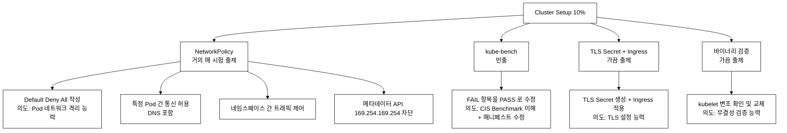
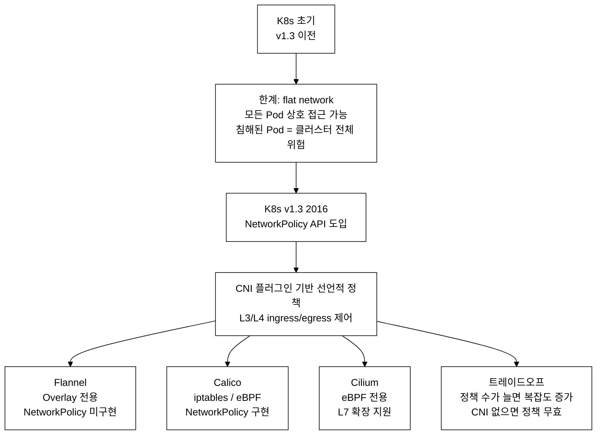
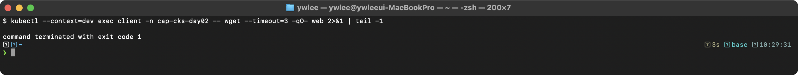
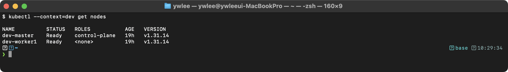
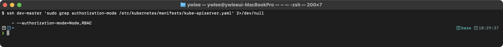
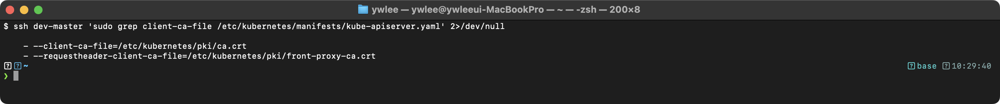

# CKS Day 2: Cluster Setup (2/2) - 시험 패턴, 실전 문제, NetworkPolicy 실습

> 학습 목표 | CKS 도메인: Cluster Setup (10%) | 예상 소요 시간: 2시간

---

## 오늘의 학습 목표

> **Day 1 연결:** Day 1에서는 NetworkPolicy 개념·원리, kube-bench 기초, TLS 인증서 체계, 바이너리 무결성 검증 이론(섹션 1~4)을 다뤘다. Day 2는 그 위에서 시험 출제 패턴 분석·실전 문제 풀이·NetworkPolicy 검증 실습(섹션 5~9) 위주로 진행한다. 섹션 번호가 5부터 시작하는 것은 Day 1의 1~4를 이어받기 때문이다.

- Cluster Setup 도메인의 CKS 시험 출제 패턴을 분석한다
- NetworkPolicy, kube-bench, TLS 관련 실전 문제 12개를 풀어본다
- NetworkPolicy 검증 실습으로 정책 적용과 테스트를 수행한다
- CiliumNetworkPolicy와 표준 NetworkPolicy의 차이를 이해한다

---

## 5. 이 주제가 시험에서 어떻게 나오는가

### 5.1 CKS 시험 출제 패턴 분석



_그림 5.1. Cluster Setup 도메인 출제 유형 분류._

**핵심 전략:**
- NetworkPolicy는 외워서 빠르게 작성할 수 있어야 한다.
- kube-bench 수정은 매니페스트 구조를 잘 이해해야 한다.
- TLS Secret 생성 명령어를 암기한다.

### 5.2 NetworkPolicy 등장 배경과 공격-방어 매핑



_그림 5.2. K8s 버전별 네트워크 보안 진화 타임라인._

**용어 풀이:**
- **CNI(Container Network Interface)**: Pod 생성 시 네트워크 네임스페이스를 연결하고 IP를 할당하는 플러그인 표준이다. NetworkPolicy는 이 CNI 위에서 실제 패킷을 필터링한다. 즉 NetworkPolicy는 API(선언)일 뿐이고, 실제 차단/허용은 설치된 CNI 플러그인이 수행한다. Flannel은 오버레이 네트워크만 제공하고 NetworkPolicy를 구현하지 않으며(별도 플러그인 필요), Calico는 iptables/eBPF로, Cilium은 eBPF로 필터링을 구현한다.
- **L3/L4**: OSI 7계층 중 L3은 네트워크 계층(IP 주소), L4는 전송 계층(TCP/UDP 포트)이다. 표준 NetworkPolicy는 "어떤 IP/Pod가 어떤 포트로"까지만 제어하고, HTTP 메서드·경로 같은 L7은 제어하지 못한다.
- **eBPF(extended Berkeley Packet Filter)**: 커널 코드를 수정하지 않고 커널 공간에서 패킷 처리 프로그램을 안전하게 실행하는 기술이다. iptables 룰 선형 탐색보다 빠르게 필터링한다.

**실제 공격 사례:**
- 2019년 Tesla 사례: 침해된 Pod에서 내부 Kubernetes Dashboard에 접근하여 클러스터 전체를 크립토마이닝에 악용한 사건이다.
- NetworkPolicy Default Deny가 있었다면 lateral movement(횡적 이동 — 공격자가 초기 침해 지점에서 내부 시스템으로 이동하는 기법)가 차단되었을 것이다.

### 5.3 실전 문제 (10개 이상)

> **시험 환경 셋업 (30초) — 문제 풀기 전 반드시 실행**
>
> 시험 시작 직후 아래 3줄을 터미널에 실행하면 명령 입력 속도가 크게 빨라진다.
>
> ```bash
> alias k=kubectl
> export do='--dry-run=client -o yaml'
> # vimrc 설정 (매니페스트 편집 시 탭→공백 2칸 자동 변환)
> echo 'set expandtab tabstop=2 shiftwidth=2' >> ~/.vimrc
> ```
>
> 이후 풀이 예시는 `k apply`, `k run ... $do` 패턴으로 단축 명령을 사용한다.
>
> **컨텍스트 전환 — 문제마다 클러스터가 바뀐다**
>
> CKS 시험은 문제별로 다른 클러스터를 사용한다. 문제 지시문에 컨텍스트 전환 명령이 주어지면 반드시 먼저 실행한다. 빠트리면 다른 클러스터의 오브젝트를 수정하게 되어 감점된다.
>
> ```bash
> # 시험 문제마다 지시문 맨 위에 다음과 같은 명령이 주어진다
> kubectl config use-context <시험-context>
> # 예) kubectl config use-context k8s-cks-6442
> # 실행 후 현재 컨텍스트 확인
> kubectl config current-context
> ```
>
> 아래 문제 1~3의 검증 명령은 `-n <namespace>` 와 컨텍스트 전환 패턴을 함께 보여준다.

### 문제 1. Default Deny All NetworkPolicy

`restricted` 네임스페이스에 default deny all NetworkPolicy를 적용하라. 모든 Pod에 대해 Ingress와 Egress 트래픽을 모두 차단해야 한다. 정책 이름은 `default-deny-all`로 하라.

<details>
<summary>풀이</summary>

```yaml
apiVersion: networking.k8s.io/v1
kind: NetworkPolicy
metadata:
  name: default-deny-all
  namespace: restricted
spec:
  podSelector: {}
  policyTypes:
  - Ingress
  - Egress
```

```bash
kubectl apply -f deny-all.yaml
kubectl get networkpolicy -n restricted
```

검증:
```bash
# 적용 후 통신 차단 확인
kubectl run test --image=busybox:1.36 --restart=Never -n restricted -- sleep 3600
kubectl exec test -n restricted -- wget -qO- --timeout=3 http://any-svc 2>&1
```



**핵심 포인트:**
- `podSelector: {}`는 네임스페이스의 모든 Pod를 선택한다
- ingress/egress 규칙이 없으므로 모든 트래픽이 차단된다
- policyTypes에 Ingress와 Egress 모두 포함해야 양방향 차단

</details>

### 문제 2. DNS 허용 + 특정 Pod 간 Egress 통신

`restricted` 네임스페이스에서 `app=frontend` Pod가 DNS(53)와 `app=backend` Pod의 포트 8080으로만 Egress 통신하도록 NetworkPolicy를 작성하라. 정책 이름은 `frontend-egress`로 하라.

<details>
<summary>풀이</summary>

```yaml
apiVersion: networking.k8s.io/v1
kind: NetworkPolicy
metadata:
  name: frontend-egress
  namespace: restricted
spec:
  podSelector:
    matchLabels:
      app: frontend
  policyTypes:
  - Egress
  egress:
  - to: []
    ports:
    - protocol: UDP
      port: 53
    - protocol: TCP
      port: 53
  - to:
    - podSelector:
        matchLabels:
          app: backend
    ports:
    - protocol: TCP
      port: 8080
```

**핵심 포인트:**
- DNS를 허용하지 않으면 서비스명으로 통신할 수 없다. 서비스명(예: `backend`)을
  IP로 바꾸는 이름 해석 자체가 53번 포트로 나가는 네트워크 요청이기 때문이다.
- `to: []`는 "모든 대상을 허용"이 아니라 "대상 제한(namespaceSelector/
  podSelector/ipBlock)을 두지 않는다"는 뜻이다. 결과적으로 모든 IP 대역으로의
  트래픽이 허용된다. DNS는 kube-dns Service IP(예: `10.96.0.10`)로 쿼리가
  나가므로, IP 대역을 한정하기 어렵고 이 무제한 규칙으로 처리하는 것이 실기에서
  안전하다. 특정 Pod/네임스페이스만 허용하려면 `to:` 아래에
  `namespaceSelector`/`podSelector`를 넣어 제한한다.
- DNS 규칙과 backend 규칙이 별도의 egress 항목이므로 OR 관계
  (둘 중 하나만 매칭해도 통과한다)

</details>

### 문제 3. kube-bench FAIL 항목 수정

> **kube-bench 등장 배경 — "감사에 사람이 필요 없어야 한다"**
>
> **등장 배경:** K8s 1.0 시절 클러스터 보안 감사는 수동이었다. 담당자가 CIS Benchmark PDF(수백 페이지)를 읽으면서 API Server 플래그를 하나씩 손으로 대조했다. 설정 항목이 100개를 넘고 업그레이드마다 바뀌므로 인력 오류가 잦았고, 누락된 항목이 나중에 취약점이 되었다.
>
> **직전 기술의 한계:** 수동 CIS 감사는 ① 시간이 오래 걸리고 ② 항목을 빠트리기 쉬우며 ③ 버전업 때마다 다시 전부 해야 한다. CI/CD 파이프라인에 끼워 넣기도 불가능했다.
>
> **무엇이 나아졌나:** Aqua Security의 kube-bench(2017)는 CIS Kubernetes Benchmark 항목을 자동으로 점검한다. 클러스터의 API Server·etcd·scheduler·kubelet 설정 파일을 직접 읽어 각 항목의 PASS/FAIL/WARN 결과를 즉시 반환한다. CI에 넣으면 업그레이드 후 회귀(regression)를 자동 탐지할 수 있다.
>
> **트레이드오프:** kube-bench는 탐지만 하고 수정은 하지 않는다. 수정은 운영자가 직접 매니페스트를 고쳐야 하는데, kube-apiserver를 재시작하므로 클러스터가 수십 초 동안 응답하지 않는다(프로덕션에서는 중단 위험). 시험에서는 staging/dev에서 수행하고, 실무에서는 배포 전 파이프라인 단계에서 선제 검증하는 방식으로 이 위험을 줄인다.

마스터 노드에서 kube-bench를 실행하고 다음 항목을 PASS로 수정하라:
- 1.2.1: `--anonymous-auth=false`
- 1.2.16: `--profiling=false`
- 1.2.20: `--audit-log-path=/var/log/kubernetes/audit/audit.log`

<details>
<summary>풀이</summary>

> 전제: 이 문제는 마스터 노드에 SSH로 직접 들어가 정적 파드 매니페스트를
> 고치는 파괴적 실습이다. dev 또는 staging 에서만 수행한다(예:
> `ssh staging-master`). platform/prod 에서는 절대 하지 않는다. 매니페스트를
> 잘못 고치면 API Server 가 뜨지 않아 클러스터 제어가 막힐 수 있으므로
> 백업을 반드시 먼저 만든다.

```bash
# 현재 상태 확인
kube-bench run --targets master --check 1.2.1,1.2.16,1.2.20

# 매니페스트 백업
cp /etc/kubernetes/manifests/kube-apiserver.yaml /tmp/kube-apiserver.yaml.bak

# 매니페스트 수정
vi /etc/kubernetes/manifests/kube-apiserver.yaml
```

수정할 내용:
```yaml
spec:
  containers:
  - command:
    - kube-apiserver
    - --anonymous-auth=false           # 추가 또는 true→false 수정
    - --profiling=false                # 추가
    - --audit-log-path=/var/log/kubernetes/audit/audit.log  # 추가
    # 기존 옵션들은 유지...
    volumeMounts:
    - name: audit-log
      mountPath: /var/log/kubernetes/audit/
  volumes:
  - name: audit-log
    hostPath:
      path: /var/log/kubernetes/audit/
      type: DirectoryOrCreate
```

```bash
# 디렉토리 생성 (root 권한 필요. 테스트 클러스터에는 이미 있을 수 있다)
mkdir -p /var/log/kubernetes/audit/

# API Server 재시작 대기 (static pod이므로 kubelet이 자동 감지)
watch crictl ps | grep kube-apiserver

# 재점검
kube-bench run --targets master --check 1.2.1,1.2.16,1.2.20
# 모두 [PASS]
```

**재시작 동작에 대한 보충 설명:**
- kube-apiserver 는 정적 파드(static pod)다. 일반 파드와 달리 API Server 를
  거치지 않고, kubelet 이 `/etc/kubernetes/manifests/` 디렉토리의 YAML 을
  직접 감시·실행·복구한다. 따라서 이 매니페스트를 고치면 kubelet 이 변경을
  감지해 컨테이너를 재생성한다. 감지 주기는 기본 약 20초이지만, 파일 저장
  직후 보통 1~2초 내에 재시작이 시작된다.
- API Server 가 재시작되는 동안 `kubectl` 은 일시적으로 응답하지 않는다
  (connection refused 등). 이는 정상이며 새 컨테이너가 뜨면 자동 복구된다.
- 완전히 떴는지 확인하려면 `kubectl get nodes` 같은 읽기 명령이 성공할
  때까지 기다린다(`until kubectl get nodes; do sleep 2; done`). 정적 파드는
  네임스페이스 `kube-system` 에 `kube-apiserver-<노드명>` 으로 보인다.
- 재점검에서 여전히 FAIL 이면 매니페스트 YAML 문법 오류나 플래그 오타일
  가능성이 높다. `crictl ps -a | grep kube-apiserver` 로 컨테이너가 계속
  재시작(Exited)하는지 보고, 안 뜨면 백업에서 복원한다(트러블슈팅 시나리오 2).

</details>

### 문제 4. Ingress TLS Secret 생성 및 적용

> **TLS Ingress 등장 배경 — "HTTP로 전송되는 크리덴셜은 스니핑 1초"**
>
> **등장 배경:** K8s 초기에 Ingress는 HTTP(80) 트래픽을 그대로 라우팅했다. 클러스터 내부 네트워크가 물리적으로 격리돼 있다고 믿었기 때문이다. 그러나 공유 클라우드 환경에서는 동일 VLAN의 다른 테넌트나 ARP 스푸핑으로 패킷을 도청(eavesdropping)할 수 있다. 로그인 토큰·세션 쿠키가 평문으로 오가면 탈취가 즉시 가능하다.
>
> **직전 기술의 한계:** 애플리케이션마다 TLS를 직접 구현하면 ① 인증서 관리 코드가 분산되고 ② 갱신 시 서비스를 재시작해야 하며 ③ 개발자가 암호학 세부 사항을 알아야 한다.
>
> **무엇이 나아졌나:** Ingress 컨트롤러(nginx-ingress, traefik 등)에서 TLS 종료(termination)를 담당한다. 클라이언트 ↔ Ingress 구간은 TLS로 암호화되고, Ingress ↔ 백엔드 Pod 구간은 클러스터 내부 평문으로 통신한다. 인증서는 `kubernetes.io/tls` 타입의 Secret으로 중앙 관리되므로 갱신을 한 곳에서 처리할 수 있다. cert-manager를 붙이면 Let's Encrypt 인증서 갱신도 자동화된다.
>
> **트레이드오프:** TLS 종료 지점이 Ingress이므로 Ingress ↔ Pod 구간은 암호화되지 않는다(mutual TLS가 아닌 경우). 또한 인증서 만료 시 Ingress가 HTTPS를 서빙하지 못하고 503을 반환하므로, 만료 모니터링과 자동 갱신 설정이 필수다.

`app-namespace`에서 `myapp.example.com` 도메인에 TLS를 적용하라. 인증서 파일 `/tmp/tls.crt`와 키 파일 `/tmp/tls.key`가 제공된다. Secret 이름은 `myapp-tls`, Ingress 이름은 `myapp-ingress`로 하라.

<details>
<summary>풀이</summary>

```bash
# TLS Secret 생성
# kubectl create secret tls <name>은 kubernetes.io/tls 타입 Secret을 만든다.
# --cert와 --key가 가리키는 파일을 자동으로 Base64 인코딩해 각각
# tls.crt / tls.key 키에 저장한다(직접 base64 변환할 필요 없다).
kubectl create secret tls myapp-tls \
  --cert=/tmp/tls.crt \
  --key=/tmp/tls.key \
  -n app-namespace
```

```yaml
apiVersion: networking.k8s.io/v1
kind: Ingress
metadata:
  name: myapp-ingress
  namespace: app-namespace
spec:
  tls:
  - hosts:
    - myapp.example.com
    secretName: myapp-tls
  rules:
  - host: myapp.example.com
    http:
      paths:
      - path: /
        pathType: Prefix
        backend:
          service:
            name: myapp-svc
            port:
              number: 80
```

**핵심 포인트:**
- Secret 타입은 `kubernetes.io/tls`
- Secret과 Ingress는 같은 네임스페이스에 있어야 한다. Ingress 의
  `tls.secretName` 은 자신과 같은 네임스페이스의 Secret 만 참조할 수 있기
  때문이다(네임스페이스를 가로지르는 참조 문법 자체가 없다). 다른
  네임스페이스의 인증서를 쓰려면 그 Secret 을 복사해 같은 네임스페이스에
  두거나, ExternalSecret/Reflector 같은 별도 도구로 동기화한다. 실기에서는
  단순히 Secret 과 Ingress 를 같은 네임스페이스에 만든다.
- Secret에 `tls.crt`와 `tls.key` 키가 필요

</details>

### 문제 5. 바이너리 무결성 검증

워커 노드의 kubelet 바이너리(v1.31.0)가 변조되지 않았는지 확인하라. 변조된 경우 공식 바이너리로 교체하라.

<details>
<summary>풀이</summary>

```bash
ssh node01

# 현재 바이너리 해시값
sha512sum /usr/bin/kubelet

# 공식 해시값 다운로드
curl -LO https://dl.k8s.io/v1.31.0/bin/linux/amd64/kubelet.sha512

# 비교
echo "$(cat kubelet.sha512)  /usr/bin/kubelet" | sha512sum --check
# OK → 무결성 확인
# FAILED → 변조됨, 교체 필요

# 변조된 경우 교체
curl -LO https://dl.k8s.io/v1.31.0/bin/linux/amd64/kubelet
chmod +x kubelet
sudo mv kubelet /usr/bin/kubelet
sudo systemctl restart kubelet

# 재검증
echo "$(cat kubelet.sha512)  /usr/bin/kubelet" | sha512sum --check
# OK
```

</details>

### 문제 6. 메타데이터 API 차단

`cloud-ns` 네임스페이스의 모든 Pod에서 클라우드 인스턴스 메타데이터 API(169.254.169.254)에 접근하는 것을 차단하라. DNS와 그 외 모든 통신은 허용해야 한다. 정책 이름은 `deny-metadata`로 하라.

> 새 문법 등장 — ipBlock: 문제 1~5 에서 쓴 `podSelector`/`namespaceSelector`
> 는 Pod 라벨로 대상을 고르므로 클러스터 안의 Pod 만 가리킬 수 있다. 반면
> 외부 API, 인터넷 IP, 메타데이터 서버(169.254.169.254) 같은 비(非)Pod
> 대상은 IP 대역으로만 지정해야 하고, 이때 쓰는 것이 `ipBlock` 이다.
> `cidr` 로 허용할 대역을, `except` 로 그 안에서 제외할 대역을 적는다.
>
> 배경(왜 차단하는가): 클라우드(AWS/GCP/Azure)에서 `169.254.169.254` 는
> 인스턴스 메타데이터 서버(IMDS, Instance Metadata Service)다. 여기서 그
> 노드에 부여된 IAM 임시 크리덴셜을 받아올 수 있다. 침해된 Pod 가 이 IP 에
> 접근하면 노드가 가진 클라우드 권한(S3 읽기 등)을 그대로 탈취할 수 있다.
> Day 1 의 Tesla 사례와 같은 횡적 이동(lateral movement)·권한 상승의
> 시작점이 되므로, IMDS 로의 egress 를 NetworkPolicy 로 막는 것이 표준
> 방어다.

<details>
<summary>풀이</summary>

```yaml
apiVersion: networking.k8s.io/v1
kind: NetworkPolicy
metadata:
  name: deny-metadata
  namespace: cloud-ns
spec:
  podSelector: {}
  policyTypes:
  - Egress
  egress:
  - to: []
    ports:
    - protocol: UDP
      port: 53
    - protocol: TCP
      port: 53
  - to:
    - ipBlock:
        cidr: 0.0.0.0/0
        except:
        - 169.254.169.254/32
```

**핵심 포인트:**
- `cidr: 0.0.0.0/0`은 모든 IPv4 대역을 의미하고, `except`로 그중 일부만
  뺀다. 즉 "메타데이터 IP만 빼고 어디든 허용"이 된다.
- `except`로 메타데이터 IP만 제외
- DNS는 별도 규칙으로 허용
- `/32`는 단일 IP 주소를 의미 (CIDR 표기에서 `/32`는 호스트 비트가 0개라
  딱 한 개의 IP를 가리킨다)
- `except`에는 여러 CIDR를 배열로 나열할 수 있다. 예를 들어 메타데이터 IP에
  더해 사설 대역까지 막으려면
  `except: [169.254.169.254/32, 10.0.0.0/8, 172.16.0.0/12]` 처럼 쓴다
  (문제 11의 풀이가 이 패턴을 사용한다).
- **RFC 1918 사설 IP 대역:** `10.0.0.0/8`, `172.16.0.0/12`, `192.168.0.0/16`은 IETF RFC 1918에서 사설 네트워크용으로 예약한 IP 대역이다. 인터넷에서 라우팅되지 않으며, K8s 클러스터 내부 Pod·Service·노드 통신에 주로 사용된다. 문제 11처럼 "내부 통신을 막고 외부 443만 허용"하려면 이 세 대역을 `except`에 넣어야 한다. 단순히 `169.254.169.254/32`만 except하면 클러스터 내부(10.x 등)로의 트래픽도 허용돼 목적에 맞지 않는다.

</details>

### 문제 7. 네임스페이스 간 통신 허용

`production` 네임스페이스의 `app=web` Pod에 대해, `monitoring` 네임스페이스(`name=monitoring` 라벨)의 `app=prometheus` Pod에서만 Ingress를 허용하라. 포트 9090만 허용한다.

<details>
<summary>풀이</summary>

```yaml
apiVersion: networking.k8s.io/v1
kind: NetworkPolicy
metadata:
  name: allow-prometheus-ingress
  namespace: production
spec:
  podSelector:
    matchLabels:
      app: web
  policyTypes:
  - Ingress
  ingress:
  - from:
    - namespaceSelector:
        matchLabels:
          name: monitoring
      podSelector:
        matchLabels:
          app: prometheus
    ports:
    - protocol: TCP
      port: 9090
```

**핵심 포인트:**
- `namespaceSelector`와 `podSelector`가 같은 `from` 항목 → AND 조건
- monitoring 네임스페이스에 `name=monitoring` 라벨이 있어야 한다
- 별도의 `from` 항목이면 OR 조건이 된다 (주의!)
- **AND/OR가 결정되는 메커니즘:** K8s는 `from` 배열의 각 원소(element)를 OR로 평가하고, 한 원소 안에 여러 셀렉터가 나열되면 AND로 평가한다. 즉 들여쓰기 위치가 다르면 배열 원소가 달라져 OR가 된다. 예시:
  ```yaml
  # AND: namespaceSelector와 podSelector가 같은 원소(-) 아래
  from:
  - namespaceSelector:
      matchLabels:
        name: monitoring
    podSelector:          # 같은 '-' 원소이므로 AND
      matchLabels:
        app: prometheus

  # OR: 각각 별도의 원소(-)로 분리
  from:
  - namespaceSelector:    # 원소 1
      matchLabels:
        name: monitoring
  - podSelector:          # 원소 2 — OR
      matchLabels:
        app: prometheus
  ```

</details>

### 문제 8. AND 조건과 OR 조건 구분

`production` 네임스페이스의 `app=api` Pod에 대해:
1. `app=frontend` Pod에서 오는 Ingress 허용 (같은 네임스페이스)
2. `monitoring` 네임스페이스에서 오는 Ingress 허용 (모든 Pod)
정책 이름은 `api-ingress-policy`로 하라.

<details>
<summary>풀이</summary>

```yaml
apiVersion: networking.k8s.io/v1
kind: NetworkPolicy
metadata:
  name: api-ingress-policy
  namespace: production
spec:
  podSelector:
    matchLabels:
      app: api
  policyTypes:
  - Ingress
  ingress:
  # 규칙 1: 같은 네임스페이스의 frontend Pod (OR)
  - from:
    - podSelector:
        matchLabels:
          app: frontend
    ports:
    - protocol: TCP
      port: 8080
  # 규칙 2: monitoring 네임스페이스의 모든 Pod (OR)
  - from:
    - namespaceSelector:
        matchLabels:
          name: monitoring
    ports:
    - protocol: TCP
      port: 9090
```

**핵심 포인트:**
- 두 규칙이 별도의 ingress 항목 → OR 관계
- 규칙 1 또는 규칙 2 중 하나만 충족하면 허용
- AND를 원하면 같은 from 항목 안에 넣어야 한다

</details>

### 문제 9. kubelet 보안 설정

워커 노드 `node01`에서 kubelet의 다음 보안 설정을 수정하라:
- 익명 인증 비활성화
- 인가 모드를 Webhook으로 변경
- 읽기 전용 포트 비활성화

<details>
<summary>풀이</summary>

```bash
ssh node01

# 현재 설정 확인
cat /var/lib/kubelet/config.yaml

# 설정 수정
vi /var/lib/kubelet/config.yaml
```

수정 내용:
```yaml
authentication:
  anonymous:
    enabled: false         # 익명 인증 비활성화
  webhook:
    enabled: true
authorization:
  mode: Webhook            # AlwaysAllow → Webhook 변경
readOnlyPort: 0            # 10255 → 0 (비활성화)
```

```bash
# kubelet 재시작
systemctl restart kubelet

# 상태 확인
systemctl status kubelet

# 익명 접근 테스트 (차단되어야 함)
curl -sk https://localhost:10250/pods
# 401 Unauthorized → 성공
```

</details>

### 문제 10. 복합 NetworkPolicy - 3계층 아키텍처

`three-tier` 네임스페이스에 다음 정책을 모두 적용하라:
1. Default Deny All
2. DNS 허용 (모든 Pod)
3. `tier=frontend` Pod → `tier=backend` Pod (포트 8080)만 Egress 허용
4. `tier=backend` Pod → `tier=database` Pod (포트 5432)만 Egress 허용
5. 외부에서 `tier=frontend` Pod (포트 80)만 Ingress 허용

<details>
<summary>풀이</summary>

> 정책이 5개나 되는 이유와 정책 간 관계: 네트워크 통신은 양방향이라, 한
> 방향 통신을 열려면 보내는 쪽 Egress 와 받는 쪽 Ingress 를 둘 다 명시해야
> 한다. 그래서 `frontend → backend` 하나에 정책이 2개(frontend 의 Egress
> 허용 + backend 의 Ingress 허용)로 짝을 이룬다. `backend → database` 도
> 같은 이유로 2개다. 여기에 모든 Pod 가 이름 해석을 위해 필요한 DNS(53)
> 허용 1개와, 외부에서 frontend 로 들어오는 Ingress 1개, 그리고 출발점인
> Default Deny 1개를 더해 총 7개가 된다. 정책을 적용하는 순서는 결과에
> 영향을 주지 않지만(아래 핵심 포인트의 UNION 설명 참고), 읽을 때는
> Default Deny → DNS → 비즈니스 규칙 순으로 보는 것이 논리적이다.

```yaml
# 1. Default Deny
apiVersion: networking.k8s.io/v1
kind: NetworkPolicy
metadata:
  name: default-deny-all
  namespace: three-tier
spec:
  podSelector: {}
  policyTypes:
  - Ingress
  - Egress
---
# 2. DNS 허용
apiVersion: networking.k8s.io/v1
kind: NetworkPolicy
metadata:
  name: allow-dns
  namespace: three-tier
spec:
  podSelector: {}
  policyTypes:
  - Egress
  egress:
  - to: []
    ports:
    - protocol: UDP
      port: 53
    - protocol: TCP
      port: 53
---
# 3. frontend → backend Egress
apiVersion: networking.k8s.io/v1
kind: NetworkPolicy
metadata:
  name: frontend-to-backend
  namespace: three-tier
spec:
  podSelector:
    matchLabels:
      tier: frontend
  policyTypes:
  - Egress
  egress:
  - to:
    - podSelector:
        matchLabels:
          tier: backend
    ports:
    - protocol: TCP
      port: 8080
---
# 3-1. backend Ingress from frontend
apiVersion: networking.k8s.io/v1
kind: NetworkPolicy
metadata:
  name: backend-from-frontend
  namespace: three-tier
spec:
  podSelector:
    matchLabels:
      tier: backend
  policyTypes:
  - Ingress
  ingress:
  - from:
    - podSelector:
        matchLabels:
          tier: frontend
    ports:
    - protocol: TCP
      port: 8080
---
# 4. backend → database Egress
apiVersion: networking.k8s.io/v1
kind: NetworkPolicy
metadata:
  name: backend-to-database
  namespace: three-tier
spec:
  podSelector:
    matchLabels:
      tier: backend
  policyTypes:
  - Egress
  egress:
  - to:
    - podSelector:
        matchLabels:
          tier: database
    ports:
    - protocol: TCP
      port: 5432
---
# 4-1. database Ingress from backend
apiVersion: networking.k8s.io/v1
kind: NetworkPolicy
metadata:
  name: database-from-backend
  namespace: three-tier
spec:
  podSelector:
    matchLabels:
      tier: database
  policyTypes:
  - Ingress
  ingress:
  - from:
    - podSelector:
        matchLabels:
          tier: backend
    ports:
    - protocol: TCP
      port: 5432
---
# 5. 외부 → frontend Ingress
apiVersion: networking.k8s.io/v1
kind: NetworkPolicy
metadata:
  name: frontend-external-ingress
  namespace: three-tier
spec:
  podSelector:
    matchLabels:
      tier: frontend
  policyTypes:
  - Ingress
  ingress:
  - ports:
    - protocol: TCP
      port: 80
```

**핵심 포인트:**
- Default Deny 후 필요한 것만 허용하는 패턴
- Egress와 Ingress 양쪽 모두 허용해야 통신 가능
- 여러 NetworkPolicy는 합집합(UNION)으로 적용됨
- 합집합이 되는 이유 — NetworkPolicy 는 거부 목록(deny list)이 아니라 허용
  목록(allow list) 방식이다. 같은 Pod 에 적용되는 정책이 여러 개면, 그중
  하나라도 어떤 트래픽을 허용하면 그 트래픽은 통과한다(OR / UNION). 즉
  Default Deny 로 일단 전부 막은 뒤 allow-dns·frontend-to-backend 등을
  더하면, 이들 정책이 허용한 트래픽의 합집합만 통신 가능해진다. 평가는
  단락(short-circuit)되지 않고 매칭되는 정책 규칙을 모두 검사한 뒤 "허용한
  규칙이 하나라도 있으면 통과"로 결정된다. 그래서 정책을 추가하는 순서는
  결과에 영향을 주지 않는다.

</details>

### 문제 11. Egress 제한 - 외부 HTTPS만 허용

`secure-ns` 네임스페이스의 `app=payment` Pod가 DNS와 외부 HTTPS(443)로만 Egress 통신하도록 하라. 내부 클러스터 통신은 차단한다.

<details>
<summary>풀이</summary>

```yaml
apiVersion: networking.k8s.io/v1
kind: NetworkPolicy
metadata:
  name: payment-egress-https-only
  namespace: secure-ns
spec:
  podSelector:
    matchLabels:
      app: payment
  policyTypes:
  - Egress
  egress:
  - to: []
    ports:
    - protocol: UDP
      port: 53
    - protocol: TCP
      port: 53
  - to:
    - ipBlock:
        cidr: 0.0.0.0/0
        except:
        - 10.0.0.0/8
        - 172.16.0.0/12
        - 192.168.0.0/16
    ports:
    - protocol: TCP
      port: 443
```

**핵심 포인트:**
- `10.0.0.0/8`, `172.16.0.0/12`, `192.168.0.0/16`은 RFC 1918 사설 IP 대역이다. 클러스터 내부(Pod·Service·노드)는 이 대역에서 IP를 할당받는다. 이 세 대역을 `except`에 넣어야 "내부 통신을 차단하고 외부 443만 열기"라는 목적이 달성된다. 하나라도 빠지면 해당 대역의 내부 주소로 443 포트 통신이 허용된다.
- `cidr: 0.0.0.0/0 except [사설대역 3개]`의 결과: 인터넷(공인 IP) 대역에 대한 443 Egress만 허용되고, 클러스터 내부 IP 대역으로의 443을 포함한 모든 통신이 차단된다.

</details>

### 문제 12. Ingress TLS - 인증서 직접 생성부터

`secure-app` 네임스페이스에서 도메인 `secure.example.com`에 대한 TLS Ingress를 설정하라. 자체 서명 인증서를 직접 생성하고, TLS Secret을 만들고, Ingress에 적용하라.

<details>
<summary>풀이</summary>

```bash
# 인증서 생성
openssl req -x509 -nodes -days 365 \
  -newkey rsa:2048 \
  -keyout /tmp/tls.key \
  -out /tmp/tls.crt \
  -subj "/CN=secure.example.com"

# TLS Secret 생성
kubectl create ns secure-app
kubectl create secret tls secure-tls \
  --cert=/tmp/tls.crt \
  --key=/tmp/tls.key \
  -n secure-app
```

```yaml
apiVersion: networking.k8s.io/v1
kind: Ingress
metadata:
  name: secure-ingress
  namespace: secure-app
  annotations:
    nginx.ingress.kubernetes.io/ssl-redirect: "true"
spec:
  tls:
  - hosts:
    - secure.example.com
    secretName: secure-tls
  rules:
  - host: secure.example.com
    http:
      paths:
      - path: /
        pathType: Prefix
        backend:
          service:
            name: web-svc
            port:
              number: 80
```

**핵심 포인트:**
- `-x509`: 자체 서명(self-signed) 인증서를 생성한다. 일반 `openssl req`는 CSR(Certificate Signing Request)만 만들지만, `-x509` 플래그가 있으면 CA 서명 없이 바로 인증서(.crt)를 출력한다. 시험 환경에서는 공인 CA가 없으므로 자체 서명을 쓴다.
- `-nodes`: No DES의 줄임말이다. 개인 키(.key)를 암호화하지 않는다는 뜻이다. 암호화하면 서버 시작 시마다 비밀번호를 입력해야 하는데, 시험 환경이나 자동화 파이프라인에서는 불편하므로 `-nodes`를 붙인다.
- `-newkey rsa:2048`: RSA 2048비트 키를 새로 생성한다. `rsa:2048`은 현재 일반적으로 안전한 최소 키 길이다.
- `-days 365`: 인증서 유효 기간을 365일로 설정한다. 실제 운영에서는 90일 이하(Let's Encrypt 기본값)를 권장하지만 시험에서는 365일로 충분하다.
- `-subj "/CN=secure.example.com"`: CN(Common Name)에 도메인을 지정한다. 브라우저는 CN 또는 SAN(Subject Alternative Name)이 접속 도메인과 일치해야 인증서를 신뢰한다. 시험에서는 `-subj`로 비대화형(non-interactive)으로 값을 전달한다.

</details>

---

## 6. 실습: NetworkPolicy 검증

### 6.1 테스트 환경 구성

```bash
# 네임스페이스 생성
kubectl create ns netpol-lab

# 테스트 워크로드 배포
kubectl run web --image=nginx:alpine --port=80 -n netpol-lab
kubectl run api --image=nginx:alpine --port=80 -n netpol-lab --labels="role=api"
kubectl run attacker --image=busybox:1.36 --restart=Never \
  -n netpol-lab --labels="role=attacker" -- sleep 3600
kubectl wait --for=condition=ready pod --all -n netpol-lab --timeout=60s

# 정책 적용 전 — 모든 통신 가능
kubectl exec attacker -n netpol-lab -- wget -qO- --timeout=3 http://web
kubectl exec attacker -n netpol-lab -- wget -qO- --timeout=3 http://api
# 모두 성공
```

### 6.2 Default Deny 적용 및 검증

```bash
cat <<'EOF' | kubectl apply -n netpol-lab -f -
apiVersion: networking.k8s.io/v1
kind: NetworkPolicy
metadata:
  name: default-deny-all
spec:
  podSelector: {}
  policyTypes:
    - Ingress
    - Egress
EOF

# 모든 통신 차단 확인
kubectl exec attacker -n netpol-lab -- wget -qO- --timeout=3 http://web 2>&1
# 타임아웃
```

### 6.3 선택적 허용 — DNS + web→api 체인

```bash
# DNS 허용
cat <<'EOF' | kubectl apply -n netpol-lab -f -
apiVersion: networking.k8s.io/v1
kind: NetworkPolicy
metadata:
  name: allow-dns
spec:
  podSelector: {}
  policyTypes:
    - Egress
  egress:
    - to: []
      ports:
        - protocol: UDP
          port: 53
        - protocol: TCP
          port: 53
EOF

# web → api 허용
cat <<'EOF' | kubectl apply -n netpol-lab -f -
apiVersion: networking.k8s.io/v1
kind: NetworkPolicy
metadata:
  name: web-to-api-egress
spec:
  podSelector:
    matchLabels:
      run: web
  policyTypes:
    - Egress
  egress:
    - to:
        - podSelector:
            matchLabels:
              role: api
      ports:
        - protocol: TCP
          port: 80
---
apiVersion: networking.k8s.io/v1
kind: NetworkPolicy
metadata:
  name: api-ingress-from-web
spec:
  podSelector:
    matchLabels:
      role: api
  policyTypes:
    - Ingress
  ingress:
    - from:
        - podSelector:
            matchLabels:
              run: web
      ports:
        - protocol: TCP
          port: 80
EOF

# 검증
kubectl exec -n netpol-lab web -- wget -qO- --timeout=3 http://api     # 성공
kubectl exec -n netpol-lab attacker -- wget -qO- --timeout=3 http://api  # 실패
```

### 6.4 kube-bench 실행 실습

```bash
# kube-bench는 마스터 노드(Linux)에서 실행해야 한다.
# macOS에서 linux/amd64 바이너리를 직접 실행할 수 없으므로
# 반드시 SSH로 노드에 접속한 뒤 설치·실행한다.
# (~/.ssh/config의 ProxyCommand 방식으로 별칭 접속 — setup-ssh-keys.sh로 등록됨)
ssh staging-master

# kube-bench 설치 (없는 경우)
curl -L https://github.com/aquasecurity/kube-bench/releases/download/v0.8.0/kube-bench_0.8.0_linux_amd64.tar.gz | tar xz
sudo mv kube-bench /usr/local/bin/

# 마스터 노드 점검
kube-bench run --targets master

# 실패 항목만 확인
kube-bench run --targets master 2>&1 | grep "\[FAIL\]"

# 특정 항목 점검
kube-bench run --targets master --check 1.2.1,1.2.16,1.2.20

# API Server 매니페스트 확인
cat /etc/kubernetes/manifests/kube-apiserver.yaml

# 주요 보안 설정 확인
grep -E "anonymous-auth|authorization-mode|enable-admission-plugins|profiling" \
  /etc/kubernetes/manifests/kube-apiserver.yaml
```

### 6.5 TLS Secret 실습

```bash
# 자체 서명 인증서 생성
openssl req -x509 -nodes -days 365 \
  -newkey rsa:2048 \
  -keyout /tmp/tls.key \
  -out /tmp/tls.crt \
  -subj "/CN=nginx.tart-infra.local"

# TLS Secret 생성
kubectl create secret tls nginx-tls \
  --cert=/tmp/tls.crt \
  --key=/tmp/tls.key \
  -n netpol-lab

# Secret 확인
kubectl get secret nginx-tls -n netpol-lab -o jsonpath='{.data.tls\.crt}' | \
  base64 -d | openssl x509 -text -noout

# 정리
kubectl delete ns netpol-lab
```

---

## 7. CiliumNetworkPolicy vs 표준 NetworkPolicy

### 7.1 차이점 정리

| 항목 | 표준 NetworkPolicy | CiliumNetworkPolicy |
|:---|:---|:---|
| API 버전 | `networking.k8s.io/v1` | `cilium.io/v2` |
| L3/L4 지원 | O | O |
| L7 (HTTP) 지원 | X | O (GET/POST 등 제어) |
| FQDN 기반 정책 | X | O (도메인 기반 허용) |
| Identity 기반 | X | O (Cilium Identity) |
| TLS 검사 | X | O (투명 프록시) |
| eBPF 기반 | CNI에 따라 다름 | O (항상 eBPF) |
| 클러스터 범위 | X (네임스페이스 범위) | O (CiliumClusterwideNetworkPolicy) |

CKS 시험에서는 표준 NetworkPolicy만 출제된다. 실무에서는 CiliumNetworkPolicy가 더 세밀한 제어를 제공한다.

> 시험 준비 vs 이 저장소 실습의 구분: CKS 자격증은 표준 K8s NetworkPolicy
> (`networking.k8s.io/v1`) 문법만 출제한다. 따라서 시험 합격을 위해서는 위
> §5 의 문제들처럼 표준 문법만 외워도 충분하다. 다만 이 저장소의 tart
> 클러스터(dev/staging)에는 CNI 로 Cilium 이 깔려 있어, 실제로 표준
> NetworkPolicy 를 적용해도 그 차단을 수행하는 주체는 Cilium 이고,
> CiliumNetworkPolicy 라는 확장 리소스(`cilium.io/v2`)도 쓸 수 있다. 이
> 절은 실습 환경에서 무엇이 동작하는지 이해하기 위한 참고일 뿐이며, 시험
> 범위가 아니므로 CiliumNetworkPolicy 문법을 외울 필요는 없다.

### 7.2 CiliumNetworkPolicy L7 예시 (참고)

```yaml
# CiliumNetworkPolicy - L7 HTTP 규칙
# ──────────────────────────────────
apiVersion: cilium.io/v2
kind: CiliumNetworkPolicy
metadata:
  name: allow-get-only
  namespace: demo
spec:
  endpointSelector:
    matchLabels:
      app: httpbin
  ingress:
  - fromEndpoints:
    - matchLabels:
        app: nginx
    toPorts:
    - ports:
      - port: "8080"
        protocol: TCP
      rules:
        http:
        - method: "GET"        # GET 요청만 허용
          path: "/.*"           # 모든 경로
        - method: "HEAD"       # HEAD 요청도 허용
  # POST, PUT, DELETE 등은 차단된다
```

---

## 8. 트러블슈팅 종합

```
Cluster Setup 도메인 트러블슈팅 정리
════════════════════════════════════

시나리오 1: NetworkPolicy 적용 후 정상 트래픽도 차단된다
  디버깅:
    kubectl describe networkpolicy <name> -n <ns>  # 정책 상세 확인
    # podSelector가 의도한 Pod를 선택하는지 라벨 대조
    kubectl get pods -n <ns> --show-labels
  원인: podSelector 라벨이 잘못되었거나 DNS 허용 정책이 누락되었다
  해결: 라벨 수정 또는 allow-dns 정책 추가

시나리오 2: kube-bench 수정 후 kubectl이 응답하지 않는다
  디버깅:
    crictl ps -a | grep kube-apiserver  # API Server 컨테이너 상태
    crictl logs <container-id> 2>&1 | tail -20  # 에러 확인
  원인: 매니페스트 YAML 문법 오류 또는 플래그 값 오타이다
  해결: 백업(/tmp/kube-apiserver.yaml.bak)에서 복원 후 재수정

시나리오 3: TLS Secret을 생성했는데 Ingress가 HTTPS를 서빙하지 않는다
  디버깅:
    kubectl describe ingress <name> -n <ns>  # TLS 섹션 확인
    kubectl get secret <secret-name> -n <ns> -o jsonpath='{.type}'
    # kubernetes.io/tls인지 확인
  원인: Secret과 Ingress가 다른 네임스페이스에 있거나, Secret 타입이 Opaque이다
  해결: 같은 네임스페이스에 kubernetes.io/tls 타입 Secret 생성

시나리오 4: sha512sum 비교에서 FAILED가 나온다
  디버깅:
    kubelet --version   # 현재 바이너리 버전 확인
    cat kubelet.sha512  # 다운로드한 해시의 대상 버전 확인
  원인: 바이너리 버전과 해시 파일의 버전이 불일치하거나, 실제 변조되었다
  해결: 버전이 일치하는 공식 바이너리로 교체한다
```

---

## 9. 복습 체크리스트

<details>
<summary>항목 1: Default Deny All NetworkPolicy YAML을 외우지 않고 작성할 수 있는가?</summary>

`podSelector: {}`(모든 Pod 선택) + `policyTypes: [Ingress, Egress]`(양방향 선언) + 규칙 없음(모두 차단) 세 가지만 기억한다. `spec.egress`, `spec.ingress` 필드 자체를 적지 않으면 해당 방향이 완전 차단된다.
</details>

<details>
<summary>항목 2: DNS 허용 + 특정 Pod만 Egress 허용 패턴을 작성할 수 있는가?</summary>

`egress` 배열에 규칙을 두 개 넣는다. 첫 번째는 `to: []`(대상 무제한) + `ports: [UDP/53, TCP/53]`으로 DNS를 허용하고, 두 번째는 `to: [{podSelector: {matchLabels: {app: backend}}}]` + `ports: [TCP/8080]`으로 특정 Pod를 허용한다. 두 규칙은 OR 관계이므로 둘 중 하나만 매칭해도 통과한다.
</details>

<details>
<summary>항목 3: namespaceSelector와 podSelector의 AND/OR 조건 차이를 설명할 수 있는가?</summary>

`from` 배열의 같은 원소(`-`) 아래에 `namespaceSelector`와 `podSelector`가 있으면 AND(둘 다 충족해야 통과)다. 각각이 별도 원소(`-`)이면 OR(하나만 충족해도 통과)다. 들여쓰기 한 단계 차이가 AND/OR를 바꾸므로 YAML 작성 시 주의한다.
</details>

<details>
<summary>항목 4: Default Deny 후 Egress만 허용하면 왜 통신이 안 되는지 설명할 수 있는가?</summary>

TCP 통신은 요청(클라이언트→서버)과 응답(서버→클라이언트) 양방향이다. Default Deny가 적용된 상태에서 보내는 쪽 Egress만 열면 받는 쪽 Ingress가 차단되어 있어 패킷이 거부된다. Egress를 허용한 Pod와 통신하는 Pod 양쪽에 각각 Egress/Ingress를 열어야 한다.
</details>

<details>
<summary>항목 5: kube-bench 명령어와 결과 해석 방법을 알고 있는가?</summary>

`kube-bench run --targets master`로 마스터 컴포넌트를 전체 점검한다. 결과는 `[PASS]`, `[FAIL]`, `[WARN]`, `[INFO]` 네 가지다. `[FAIL]`은 즉시 수정 대상이고, `[WARN]`은 환경에 따라 판단이 필요하다. `--check 1.2.1,1.2.16`처럼 특정 항목만 지정할 수 있다.
</details>

<details>
<summary>항목 6: FAIL 항목 수정 후 API Server 재시작 절차를 수행할 수 있는가?</summary>

`/etc/kubernetes/manifests/kube-apiserver.yaml`을 편집하면 kubelet이 변경을 감지해 컨테이너를 자동 재생성한다. 재시작 중 `kubectl`이 수십 초 응답하지 않는 것은 정상이다. `watch crictl ps | grep kube-apiserver`로 새 컨테이너가 뜨는 것을 확인하거나 `until kubectl get nodes; do sleep 2; done`으로 복구를 기다린다.
</details>

<details>
<summary>항목 7: kubelet 설정 파일의 보안 항목을 수정할 수 있는가?</summary>

`/var/lib/kubelet/config.yaml`에서 `authentication.anonymous.enabled: false`, `authorization.mode: Webhook`, `readOnlyPort: 0`을 설정한 뒤 `systemctl restart kubelet`으로 재시작한다. `curl -sk https://localhost:10250/pods`가 401을 반환하면 익명 접근이 차단된 것이다.
</details>

<details>
<summary>항목 8: TLS Secret 생성과 Ingress 적용 절차를 수행할 수 있는가?</summary>

`kubectl create secret tls <이름> --cert=<파일>.crt --key=<파일>.key -n <네임스페이스>`로 Secret을 만든다. Ingress의 `spec.tls[].secretName`에 동일 이름을 지정하고, Secret과 Ingress는 반드시 같은 네임스페이스에 있어야 한다.
</details>

<details>
<summary>항목 9: sha512sum으로 바이너리 무결성을 검증할 수 있는가?</summary>

공식 사이트에서 `.sha512` 파일을 다운로드한 뒤 `echo "$(cat kubelet.sha512)  /usr/bin/kubelet" | sha512sum --check`를 실행한다. `OK`가 나오면 무결, `FAILED`가 나오면 변조된 것으로 공식 바이너리를 새로 내려받아 교체하고 `systemctl restart kubelet`한다.
</details>

<details>
<summary>항목 10: 메타데이터 API(169.254.169.254) 차단 NetworkPolicy를 작성할 수 있는가?</summary>

`egress` 규칙에서 `cidr: 0.0.0.0/0, except: [169.254.169.254/32]`로 메타데이터 IP만 빼고 전부 허용하는 ipBlock 규칙을 쓴다. DNS 규칙은 별도 egress 항목으로 추가한다.
</details>

<details>
<summary>항목 11: 네임스페이스 간 통신을 허용하는 NetworkPolicy를 작성할 수 있는가?</summary>

`from` 항목에 `namespaceSelector: {matchLabels: {name: monitoring}}`을 넣어 특정 네임스페이스에서 오는 트래픽을 허용한다. 네임스페이스에 해당 라벨(`name=monitoring`)이 없으면 매칭되지 않으므로, `kubectl label namespace monitoring name=monitoring`으로 먼저 라벨을 붙여야 한다.
</details>

<details>
<summary>항목 12: ipBlock의 cidr과 except를 활용할 수 있는가?</summary>

`cidr`은 허용할 IP 대역을 지정하고, `except`는 그 대역에서 제외할 하위 대역 목록(배열)이다. "내부 통신 차단 + 외부 HTTPS만 허용" 패턴은 `cidr: 0.0.0.0/0` + `except: [10.0.0.0/8, 172.16.0.0/12, 192.168.0.0/16]`으로 RFC 1918 사설 대역 세 개를 제외한다.
</details>

---

## 시험 팁

- **NetworkPolicy AND/OR 함정**: `from` 배열에서 `namespaceSelector`와 `podSelector`를 같은 `-` 원소 아래 쓰면 AND, 각각 별도 `-` 원소로 쓰면 OR다. 시험에서 "monitoring 네임스페이스의 prometheus Pod에서만"이라고 하면 AND여야 하는데 OR로 쓰면 monitoring 네임스페이스 전체 또는 prometheus 라벨이 붙은 아무 Pod나 통과된다.
- **DNS 빠트리기**: Default Deny 후 서비스명으로 통신이 안 될 때 대부분 DNS(UDP/53, TCP/53) 허용 규칙을 빠트린 것이다. 클러스터 내에서 서비스 이름(예: `backend`)을 쓰려면 kube-dns로 나가는 포트 53 Egress가 반드시 있어야 한다.
- **Ingress/Egress 양쪽 열기**: 통신 A→B를 허용하려면 A의 Egress와 B의 Ingress를 둘 다 열어야 한다. 한쪽만 열면 패킷이 거부된다.
- **kube-bench 수정 후 대기**: 매니페스트 저장 후 API Server가 재시작될 때까지 기다리지 않고 바로 kube-bench를 재실행하면 이전 상태로 점검된다. `until kubectl get nodes; do sleep 2; done`으로 확인 후 재실행한다.
- **TLS Secret 네임스페이스**: Secret과 Ingress는 반드시 같은 네임스페이스에 있어야 한다. 다른 네임스페이스의 Secret을 `secretName`으로 참조해도 Ingress가 인증서를 찾지 못한다.
- **컨텍스트 전환 누락**: 문제마다 `kubectl config use-context`를 실행하지 않으면 다른 클러스터에 정책을 적용하게 된다. 각 문제 시작 시 지시문의 컨텍스트 전환 명령을 첫 번째로 실행한다.

## 더 읽을거리

- [NetworkPolicy 공식 문서](https://kubernetes.io/docs/concepts/services-networking/network-policies/) — podSelector, namespaceSelector, ipBlock 전체 문법 레퍼런스
- [CIS Kubernetes Benchmark](https://www.cisecurity.org/benchmark/kubernetes) — kube-bench가 점검하는 항목의 원본 문서
- [kube-bench GitHub](https://github.com/aquasecurity/kube-bench) — 설치 방법, targets 옵션(master/node/etcd/policies), JSON 출력 형식
- [kubectl create secret tls](https://kubernetes.io/docs/reference/kubectl/generated/kubectl_create/kubectl_create_secret_tls/) — TLS Secret 생성 명령 레퍼런스
- [Kubernetes PKI 인증서 관리](https://kubernetes.io/docs/tasks/administer-cluster/certificates/) — kubeadm 인증서 갱신, 수동 발급 절차
- [Binary Verification — Kubernetes 릴리스 체크섬](https://kubernetes.io/releases/download/) — 버전별 sha512 파일 다운로드 위치

---

> **내일 예고:** Day 3에서는 Cluster Hardening 도메인(15%)의 RBAC 인가 모델, ServiceAccount 토큰 제한, API Server 보안 설정을 학습한다.

---

## tart-infra 실습

### 실습 환경 설정

```bash
# dev 클러스터에 접속 (CiliumNetworkPolicy + Zero Trust 적용된 환경)
export KUBECONFIG=~/sideproejct/IaC_apple_sillicon/kubeconfig/dev.yaml
kubectl get nodes
```

**예상 출력:**


### 실습 1: Default Deny NetworkPolicy 확인

```bash
# dev 클러스터에 적용된 CiliumNetworkPolicy 목록
kubectl get ciliumnetworkpolicies -n demo
```

**예상 출력:**
> **예시(참조) — CiliumNetworkPolicy(demo):** demo 네임스페이스(nginx-web/httpbin/postgres) 데모 스택이 배포된 환경에서 `kubectl get ciliumnetworkpolicies -n demo` 로 L7 정책을 확인한다. 현재 dev 에는 데모 스택이 없어 미실측이며, day01·CKA day13 의 NetworkPolicy 실측을 참고한다.

**동작 원리:** Zero Trust 네트워크 구현:
1. `default-deny-all` 정책이 demo 네임스페이스의 모든 ingress/egress를 차단한다
2. 이후 각 서비스 간 필요한 통신만 개별 정책으로 허용한다 (Allow List 방식)
3. Cilium이 eBPF 프로그램으로 커널 공간에서 패킷 필터링을 수행한다
4. 표준 K8s NetworkPolicy보다 L7(HTTP 메서드, 경로)까지 제어 가능하다

```bash
# default-deny-all 정책 내용 확인
kubectl get ciliumnetworkpolicy default-deny-all -n demo -o yaml
```

### 실습 2: NetworkPolicy 통신 테스트

```bash
# 허용된 통신: nginx → httpbin (allow-httpbin-from-nginx 정책)
kubectl exec -n demo deploy/nginx-web -- curl -s -o /dev/null -w "%{http_code}" --max-time 3 http://httpbin:8000/get
echo ""

# 차단된 통신: nginx → postgres (직접 통신 정책 없음)
kubectl exec -n demo deploy/nginx-web -- curl -s -o /dev/null -w "%{http_code}" --max-time 3 http://postgres-svc:5432 2>&1 || echo "BLOCKED"
```

**예상 출력:**
> **예시(참조) — L7 정책 200/BLOCKED:** 데모 스택 배포 환경에서 허용 경로는 HTTP 200, 차단 경로는 BLOCKED 가 반환된다. NetworkPolicy 차단 실측은 위 wget timeout 캡처 참고.

**동작 원리:** NetworkPolicy 매칭 과정:
1. Pod에서 패킷이 나갈 때 Cilium eBPF가 egress 정책을 확인한다
2. 목적지 Pod에 패킷이 도착할 때 ingress 정책을 확인한다
3. 양쪽(egress + ingress) 모두 허용되어야 통신이 성공한다
4. DNS(allow-dns 정책)가 있어야 Service 이름으로 통신 가능하다 (그렇지 않으면 IP 직접 지정 필요)

### 실습 3: kube-bench 스타일 점검

```bash
# API Server 보안 설정 확인 (SSH 없이 Pod YAML로 확인)
kubectl get pod kube-apiserver-dev-master -n kube-system -o yaml | grep -E "(--anonymous-auth|--authorization-mode|--enable-admission-plugins|--audit-log)"
```

**예상 출력 (주요 부분):**


**동작 원리:** CIS Benchmark 주요 점검 항목:
1. `--anonymous-auth=false`: 익명 접근 차단 (기본값은 true)
2. `--authorization-mode=Node,RBAC`: RBAC 인가 활성화
3. `--enable-admission-plugins=NodeRestriction`: kubelet이 자신의 노드 리소스만 수정 가능
4. `--audit-log-path`: 감사 로그 경로 설정 — 미설정 시 감사 불가

### 실습 4: TLS 인증서 확인

```bash
# API Server 인증서 정보 확인
kubectl get pod kube-apiserver-dev-master -n kube-system -o yaml | grep -E "(--tls-cert-file|--tls-private-key-file|--client-ca-file)"
```

**예상 출력:**


**동작 원리:** K8s PKI(Public Key Infrastructure):
1. `/etc/kubernetes/pki/ca.crt`: 클러스터 루트 CA — 모든 컴포넌트의 인증서를 서명한다
2. `apiserver.crt/key`: API Server의 TLS 인증서 — 클라이언트가 이 인증서로 API Server를 검증
3. `client-ca-file`: 클라이언트 인증서를 검증할 CA — kubectl의 인증서를 확인한다
4. kubeadm이 클러스터 생성 시 이 인증서들을 자동으로 생성한다
