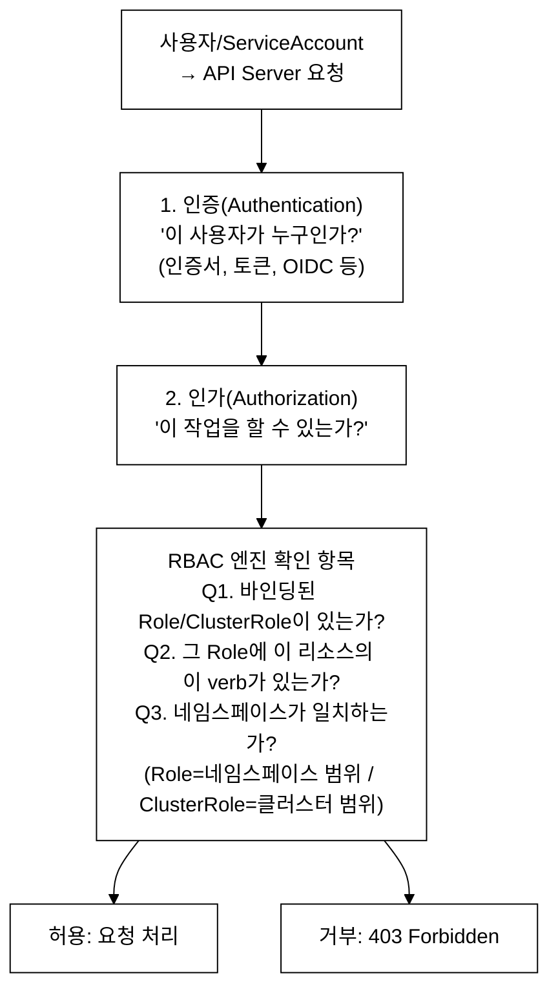
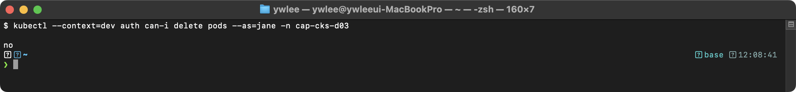
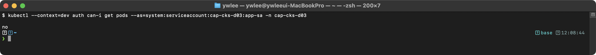
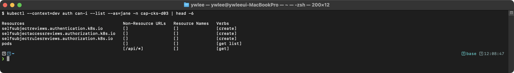
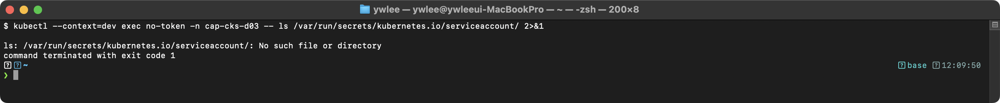
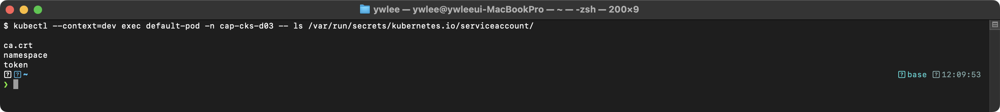
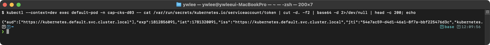
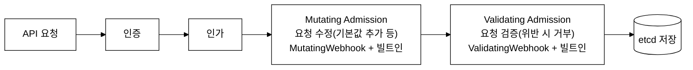

# CKS Day 3: Cluster Hardening (1/2) - RBAC, ServiceAccount, API Server 보안

> 학습 목표 | CKS 도메인: Cluster Hardening (15%) | 예상 소요 시간: 2시간

---

## 오늘의 학습 목표

- RBAC 최소 권한 원칙을 이해하고 과도한 권한을 축소할 수 있다
- ServiceAccount 토큰 자동 마운트를 비활성화하여 공격 표면을 줄인다
- API Server 보안 설정 플래그를 이해하고 매니페스트를 수정할 수 있다
- Audit Policy 작성 및 감사 로그 설정은 → [Day 4](day04.md)에서 다룬다
- kubeadm 클러스터 업그레이드 절차는 → [Day 4](day04.md)에서 다룬다

---

## 1. RBAC 완전 정복

> Day 2에서 다룬 컨테이너 런타임 보안(seccomp, AppArmor)이 Pod 수준 격리라면, Day 3는 클러스터 수준 접근 제어(RBAC, API Server)를 다룬다. CKS 도메인 Cluster Hardening(15%) 1/2에 해당한다.

### 1.1 RBAC 등장 배경

```
RBAC 이전의 Kubernetes 인가 모델
════════════════════════════════

K8s 초기에는 ABAC(Attribute-Based Access Control)를 사용했다.
ABAC는 JSON 파일에 정적 정책을 정의하고, 변경 시 API Server를 재시작해야 했다.
정책 파일이 커질수록 관리가 불가능해졌고, 동적 변경이 불가능했다.

RBAC(K8s v1.6, 2017년 GA)가 도입된 이유:
  - ABAC의 정적 파일 기반 → RBAC는 Kubernetes API 오브젝트로 관리
  - 파일 수정 + 재시작 필요 → kubectl로 동적 생성/수정/삭제
  - 세밀한 권한 제어 불가 → apiGroups/resources/verbs 조합으로 세밀한 제어
  - 감사 불가 → kubectl auth can-i로 권한 검증 가능

공격-방어 매핑:
  공격 벡터                       → 방어 수단(RBAC)
  ─────────────────────────────  → ──────────────────────────────
  SA 토큰 탈취 후 Secret 조회     → Secret 접근 불가한 Role 바인딩
  escalate로 RBAC 자체 변경       → bind/escalate verb 제한
  pods/exec로 셸 접근             → pods/exec 리소스 제외
  와일드카드(*)로 과도한 권한      → 최소 권한 원칙 적용
```

**RBAC 트레이드오프**: ABAC 대비 개선이 명확하지만 RBAC 자체도 비용을 수반한다. 첫째, 네임스페이스가 많아질수록 동일한 역할을 네임스페이스마다 Role + RoleBinding 쌍으로 관리해야 해서 오브젝트 수가 폭증한다(예: 10개 네임스페이스 × 5종 Role = 50개). 둘째, RBAC는 명시적 거부(deny) 규칙이 없는 화이트리스트 모델이라, Role에서 특정 verb를 빠뜨리면 실수가 감지되지 않는다. 셋째, AggregationRule(여러 ClusterRole을 합산해 하나의 ClusterRole을 만드는 기능)을 쓰면 어떤 권한이 최종적으로 합산됐는지 추적하기 어렵고 의도치 않은 권한이 포함될 수 있다. 넷째, RBAC 설정 자체가 올바른지 감사하려면 `rakkess`, `rbac-tool`, `kubectl-who-can` 같은 외부 도구가 추가로 필요하다. 이 도구들 없이는 특정 주체가 어떤 권한을 가지는지 전체 그림을 파악하기 어렵다.

### 1.2 RBAC 인가 모델 개요

```
RBAC(Role-Based Access Control) 인가 모델
══════════════════════════════════════════

RBAC은 주체(Subject)에게 역할(Role)을 바인딩하여 API 리소스에 대한
접근 권한을 제어하는 인가(Authorization) 메커니즘이다.
kube-apiserver의 --authorization-mode=RBAC 플래그로 활성화된다.

구성 요소:
- Subject: User, Group, ServiceAccount — API 요청의 인증된 주체
- Role: 특정 네임스페이스 범위 내에서 apiGroups, resources, verbs 조합으로 권한을 정의
- ClusterRole: 클러스터 전역 범위의 권한 정의 (네임스페이스 비종속 리소스 포함)
- RoleBinding: Subject와 Role을 연결하여 네임스페이스 범위 내 인가를 부여
- ClusterRoleBinding: Subject와 ClusterRole을 연결하여 클러스터 전역 인가를 부여
- Verbs: API 동작 단위 — get(단일 조회), list(목록 조회), watch(실시간 변경 감시), create/update/patch/delete 등. 각 verb의 상세 의미와 위험 조합은 §1.6 참조

인가 판정 흐름:
  API 요청 수신 → 인증(Authentication) → RBAC 인가(Authorization)
  → 해당 Subject에 바인딩된 Role/ClusterRole의 rules를 순회
  → 매칭되는 allow 규칙이 있으면 ALLOW, 없으면 DENY (기본 거부 정책)
```

### 1.3 RBAC 동작 원리


_그림 1. RBAC 인가 흐름(인증 → 인가 → 정책 평가)._

중요: RBAC는 "허용" 모델이다. 명시적으로 허용하지 않은 모든 것은 거부되며, "거부" 규칙은 없다(허용만 있다).

### 1.4 RBAC 4가지 리소스 상세

```yaml
# ═══════════════════════════════════════════
# 1. Role: 네임스페이스 범위의 권한 정의
# ═══════════════════════════════════════════
apiVersion: rbac.authorization.k8s.io/v1  # RBAC API 그룹
kind: Role                                 # 네임스페이스 범위
metadata:
  name: pod-reader                         # Role 이름
  namespace: production                    # 이 네임스페이스 내에서만 유효
rules:
- apiGroups: [""]                          # "" = core API 그룹 (Pod, Service, Secret 등)
                                           # "apps" = Deployment, StatefulSet 등
                                           # "rbac.authorization.k8s.io" = RBAC 리소스
  resources: ["pods", "pods/log"]          # 접근할 리소스 종류
                                           # pods/log = 하위 리소스 (kubectl logs)
                                           # pods/exec = kubectl exec
  verbs: ["get", "list", "watch"]          # 허용할 동작
                                           # get: 단일 조회, list: 목록 조회
                                           # watch: 변경 감시 (실시간)

# ═══════════════════════════════════════════
# 2. ClusterRole: 클러스터 전체 범위의 권한 정의
# ═══════════════════════════════════════════
---
apiVersion: rbac.authorization.k8s.io/v1
kind: ClusterRole                          # 클러스터 전체 범위
metadata:
  name: node-reader                        # ClusterRole 이름
  # namespace 없음! 클러스터 전체에 적용
rules:
- apiGroups: [""]
  resources: ["nodes"]                     # Node는 네임스페이스가 없는 리소스
  verbs: ["get", "list", "watch"]          # 읽기만 허용
- apiGroups: [""]
  resources: ["persistentvolumes"]         # PV도 클러스터 범위 리소스
  verbs: ["get", "list"]

# ═══════════════════════════════════════════
# 3. RoleBinding: Role/ClusterRole을 주체에 바인딩 (네임스페이스 범위)
# ═══════════════════════════════════════════
---
apiVersion: rbac.authorization.k8s.io/v1
kind: RoleBinding
metadata:
  name: read-pods                          # RoleBinding 이름
  namespace: production                    # 이 네임스페이스에서만 유효
subjects:                                  # 권한을 받을 주체 (누구에게)
- kind: User                              # 사용자
  name: jane                               # 사용자 이름
  apiGroup: rbac.authorization.k8s.io
- kind: ServiceAccount                    # 서비스 어카운트
  name: app-sa                             # SA 이름
  namespace: production                    # SA가 속한 네임스페이스
- kind: Group                             # 그룹
  name: dev-team                           # 그룹 이름
  apiGroup: rbac.authorization.k8s.io
roleRef:                                   # 참조할 Role (무엇을)
  kind: Role                               # Role 또는 ClusterRole
  name: pod-reader                         # Role 이름
  apiGroup: rbac.authorization.k8s.io

# ═══════════════════════════════════════════
# 4. ClusterRoleBinding: ClusterRole을 클러스터 전체에 바인딩
# ═══════════════════════════════════════════
---
apiVersion: rbac.authorization.k8s.io/v1
kind: ClusterRoleBinding
metadata:
  name: read-nodes-global                  # ClusterRoleBinding 이름
  # namespace 없음!
subjects:
- kind: User
  name: jane
  apiGroup: rbac.authorization.k8s.io
roleRef:
  kind: ClusterRole                        # ClusterRole만 참조 가능
  name: node-reader
  apiGroup: rbac.authorization.k8s.io
```

### 1.5 최소 권한 원칙 - BAD vs GOOD

```yaml
# ═══════════════════════════════════════════
# BAD: 과도한 권한 (시험에서 "이것을 수정하라"로 출제)
# ═══════════════════════════════════════════
apiVersion: rbac.authorization.k8s.io/v1
kind: Role
metadata:
  name: dev-team-bad
  namespace: production
rules:
- apiGroups: ["*"]       # 모든 API 그룹 → 위험!
  resources: ["*"]       # 모든 리소스 → 위험!
  verbs: ["*"]           # 모든 동작 → 위험!
# 이것은 사실상 namespace-admin이다.
# Secret 조회, Pod exec, RBAC 변경 모두 가능 → 보안 위반

# ═══════════════════════════════════════════
# GOOD: 최소 권한만 명시적으로 지정
# ═══════════════════════════════════════════
---
apiVersion: rbac.authorization.k8s.io/v1
kind: Role
metadata:
  name: dev-team-good
  namespace: production
rules:
- apiGroups: [""]               # core 그룹만
  resources: ["pods", "services"]  # Pod, Service만
  verbs: ["get", "list", "watch"]  # 읽기만
- apiGroups: ["apps"]           # apps 그룹
  resources: ["deployments"]    # Deployment만
  verbs: ["get", "list", "watch", "update"]  # 읽기 + 업데이트
- apiGroups: [""]
  resources: ["configmaps"]     # ConfigMap만
  verbs: ["get", "list"]        # 읽기만
# Secret은 포함하지 않음! → 민감 정보 접근 차단
# delete는 포함하지 않음! → 실수로 삭제 방지
# create는 포함하지 않음! → 무분별한 리소스 생성 방지
```

### 1.6 주요 verb 상세

```
RBAC verb 목록과 설명
════════════════════

verb              | kubectl 명령어       | 설명
──────────────────┼─────────────────────┼──────────────────────────
get               | kubectl get pod X    | 특정 리소스 한 개 조회
list              | kubectl get pods     | 리소스 목록 조회
watch             | kubectl get -w       | 리소스 변경 실시간 감시
create            | kubectl create/apply | 새 리소스 생성
update            | kubectl edit/apply   | 리소스 전체 수정
patch             | kubectl patch        | 리소스 부분 수정
delete            | kubectl delete pod X | 특정 리소스 삭제
deletecollection  | kubectl delete pods  | 리소스 일괄 삭제
bind              |                      | RoleBinding 생성 (특수)
escalate          |                      | RBAC 권한 상승 (특수)
impersonate       | --as=jane            | 다른 사용자로 가장

주의해야 할 위험한 권한 조합:
  - pods/exec + create → 컨테이너 내에서 명령어 실행 가능 → 사실상 root
  - secrets + get/list → 모든 Secret(비밀번호, 토큰) 조회 가능
  - * (와일드카드) → 해당 범위의 모든 권한
  - bind/escalate → RBAC 자체를 변경하여 권한 상승 가능
```

### 1.7 권한 확인 명령어와 실습 검증

준비: 아래 출력을 재현하려면 검증 대상 권한을 먼저 클러스터에 만들어 두어야 한다. 본 절의 `kubectl auth can-i` 출력은 cap-cks-d03 네임스페이스에 jane 사용자가 §1.5의 GOOD Role과 그 RoleBinding을 부여받은 상태를 전제로 한다. CKS 파괴 실습이므로 dev 클러스터에서만 수행한다.

```bash
# 전제: kubeconfig 경로 지정 후 실습 네임스페이스 생성
export KUBECONFIG=~/sideproejct/IaC_apple_sillicon/kubeconfig/dev.yaml
kubectl create namespace cap-cks-d03

# §1.5의 GOOD Role을 cap-cks-d03에 생성 (pods/services 읽기, deployments 읽기+update, configmaps 읽기)
kubectl create role dev-team-good \
  --verb=get,list,watch --resource=pods,services \
  -n cap-cks-d03
kubectl create role dev-team-good-apps \
  --verb=get,list,watch,update --resource=deployments.apps \
  -n cap-cks-d03 -o yaml --dry-run=client | kubectl apply -f -

# jane에게 위 Role을 바인딩
kubectl create rolebinding dev-team-good-binding \
  --role=dev-team-good --user=jane -n cap-cks-d03
```

위 리소스를 apply한 뒤에 아래 검증 명령을 실행하면 동일한 결과를 얻는다. (네임스페이스 이름을 production 대신 cap-cks-d03으로 맞춘다.)

```bash
# 특정 사용자의 권한 확인
kubectl auth can-i create pods --as=jane -n production
```



`no`가 출력된다. §1.5의 GOOD Role에는 `get/list/watch`만 명시되어 있고 `delete`는 포함하지 않았으므로 정상이다. 만약 `yes`가 나오면 다른 Role/ClusterRoleBinding이 jane에게 권한을 추가로 부여하고 있는 것이므로 §4 트러블슈팅 시나리오 1로 이어서 진단한다.

```bash
# ServiceAccount의 권한 확인 (형식: system:serviceaccount:<ns>:<name>)
kubectl auth can-i get secrets \
  --as=system:serviceaccount:production:app-sa -n production
```



`no`가 출력된다. app-sa에 아무 RoleBinding도 걸지 않았으므로 기본 거부(RBAC 허용 모델에서 명시적 허용 없음 = 거부)가 적용된 것이다. 이 SA를 사용하는 Pod가 API Server에 Secret 조회를 요청하면 403이 반환된다.

```bash
# 모든 권한 나열
kubectl auth can-i --list --as=jane -n production
```



목록에서 `pods`, `services`, `deployments` 읽기 권한만 보이고 `secrets`나 `*`가 없으면 §1.5 GOOD Role이 올바르게 반영된 것이다. 시스템이 기본으로 부여하는 일부 self-subject 권한(`selfsubjectaccessreviews` 등)이 함께 나오는 것은 정상이다.

아래 명령은 `jq`(JSON 처리 CLI 도구)를 사용한다. 없으면 `brew install jq`(macOS) 또는 `apt install jq`(Linux)로 설치한다. jq 없이 동일한 정보를 얻으려면 `kubectl get clusterrolebindings -o jsonpath='{range .items[*]}{.metadata.name}: {.roleRef.name}{"\n"}{end}'`로 대체할 수 있다.

```bash

# cluster-admin 바인딩된 주체 찾기 (보안 감사)
kubectl get clusterrolebindings -o json | \
  jq '.items[] | select(.roleRef.name == "cluster-admin") |
  {name: .metadata.name, subjects: .subjects}'

# 특정 네임스페이스의 모든 Role/RoleBinding 확인
kubectl get roles,rolebindings -n production -o wide

# 클러스터 수준 RBAC 확인
kubectl get clusterroles,clusterrolebindings | head -30
```

### 1.8 imperative 명령어로 RBAC 생성 (시험에서 빠르게 작성)

```bash
# Role 생성
kubectl create role pod-reader \
  --verb=get,list,watch \
  --resource=pods \
  -n production

# RoleBinding 생성 (ServiceAccount에 바인딩)
kubectl create rolebinding pod-reader-binding \
  --role=pod-reader \
  --serviceaccount=production:app-sa \
  -n production

# RoleBinding 생성 (User에 바인딩)
kubectl create rolebinding pod-reader-jane \
  --role=pod-reader \
  --user=jane \
  -n production

# ClusterRole 생성
kubectl create clusterrole node-reader \
  --verb=get,list,watch \
  --resource=nodes

# ClusterRoleBinding 생성
kubectl create clusterrolebinding node-reader-binding \
  --clusterrole=node-reader \
  --user=jane

# ClusterRole을 RoleBinding으로 바인딩 (네임스페이스 범위 제한)
# → 이것이 CKS에서 자주 출제되는 패턴!
kubectl create rolebinding secret-reader-in-prod \
  --clusterrole=secret-reader \
  --user=jane \
  -n production
# jane은 production 네임스페이스에서만 secret-reader 권한을 가진다

# dry-run으로 YAML 확인 후 적용
kubectl create role pod-reader \
  --verb=get,list,watch \
  --resource=pods \
  -n production --dry-run=client -o yaml
```

### 1.9 ClusterRole을 RoleBinding으로 범위 제한

```
ClusterRole + RoleBinding = 네임스페이스 범위로 제한
═══════════════════════════════════════════════════

이 패턴은 CKS에서 매우 자주 출제된다!

ClusterRole: "secrets에 대한 get, list 권한"
  ↓
ClusterRoleBinding으로 바인딩 → 모든 네임스페이스의 Secret 접근 가능
  ↓
RoleBinding으로 바인딩 → 특정 네임스페이스의 Secret만 접근 가능

예: jane이 production에서만 Secret을 읽을 수 있게 하고 싶다면?
  → ClusterRole + RoleBinding (namespace: production)
```

메커니즘: "ClusterRole을 RoleBinding으로 바인딩"이 모순처럼 들리는 이유와 실제 동작은 다음과 같다.

- RoleBinding의 roleRef.kind에는 Role 또는 ClusterRole 둘 다 올 수 있다. 즉 RoleBinding이 반드시 Role만 가리키는 것은 아니다.
- RoleBinding 자체는 항상 네임스페이스 범위 객체다(metadata.namespace 필수). 바인딩이 만들어 내는 인가의 효력 범위는 그 RoleBinding이 속한 네임스페이스로 한정된다.
- ClusterRole을 RoleBinding으로 바인딩하면, 권한 규칙의 정의(어떤 리소스에 어떤 verb)는 클러스터 전체에서 재사용 가능한 ClusterRole에서 가져오되, 그 권한이 실제로 통하는 범위는 RoleBinding의 네임스페이스로 좁혀진다.
- 결과적으로 jane은 RoleBinding이 놓인 production 네임스페이스의 Secret에만 접근할 수 있고, other-ns의 Secret에는 접근할 수 없다. ClusterRoleBinding으로 바인딩했다면 모든 네임스페이스의 Secret에 접근 가능했을 것이다.

이 패턴의 가치는 권한 재사용(ClusterRole 하나를 여러 네임스페이스에서 공유)과 스코핑(RoleBinding으로 네임스페이스별 격리)을 동시에 얻는다는 데 있다. secret-reader 같은 공통 권한을 ClusterRole로 한 번 정의해 두고, 네임스페이스마다 RoleBinding만 추가하면 된다.

```yaml
# ClusterRole 정의 (클러스터 전체에서 재사용 가능한 템플릿)
apiVersion: rbac.authorization.k8s.io/v1
kind: ClusterRole
metadata:
  name: secret-reader                     # 이 ClusterRole은 여러 곳에서 재사용 가능
rules:
- apiGroups: [""]
  resources: ["secrets"]
  verbs: ["get", "list"]
---
# RoleBinding으로 바인딩 → production 네임스페이스로 범위 제한!
apiVersion: rbac.authorization.k8s.io/v1
kind: RoleBinding                          # ClusterRoleBinding이 아님!
metadata:
  name: read-secrets-in-production
  namespace: production                    # 이 네임스페이스에서만 유효
subjects:
- kind: User
  name: jane
  apiGroup: rbac.authorization.k8s.io
roleRef:
  kind: ClusterRole                        # ClusterRole을 참조하되
  name: secret-reader
  apiGroup: rbac.authorization.k8s.io
# 결과: jane은 production 네임스페이스의 Secret만 get, list 가능
#       다른 네임스페이스의 Secret은 접근 불가!
```

---

## 2. ServiceAccount 토큰 제한

### 2.0 등장 배경 및 트레이드오프

**직전 방식 — 장기 Secret 토큰**: Kubernetes v1.22 이전에는 ServiceAccount를 생성하면 kube-controller-manager가 만료 시간이 없는(non-expiring) JWT를 자동으로 Secret 오브젝트로 생성하고, 이 Secret이 Pod에 마운트됐다. 이 방식의 한계는 세 가지다. 첫째, 토큰에 만료 기한이 없어서 한 번 탈취되면 Secret을 수동으로 삭제·교체하기 전까지 영구 유효하다. 둘째, 특정 Pod나 대상(audience)에 묶이지 않아, 동일 SA를 사용하는 어떤 주체도 토큰을 재사용할 수 있다. 셋째, 토큰을 갱신하려면 Secret 자체를 삭제하고 재생성해야 해서 운영 부담이 크다.

**개선 — Bound ServiceAccount Token(v1.22 기본 활성화)**: Kubernetes v1.22부터 TokenRequest API(API Server의 `/apis/authentication.k8s.io/v1/namespaces/<ns>/serviceaccounts/<name>/token` 엔드포인트를 통해 시간·대상·Pod에 묶인 단기 JWT를 발급받는 API)가 기본 경로로 사용된다. 발급된 JWT는 `projected volume`(여러 출처의 데이터를 한 디렉터리에 합쳐 마운트하는 볼륨 타입 — 토큰·CA 인증서·네임스페이스를 한 경로에 제공)으로 마운트되며, 기본 만료 시간은 1시간이다. kubelet이 만료 전 자동으로 토큰을 갱신한다. Pod가 삭제되면 그 Pod에 발급된 토큰은 즉시 무효화된다(`bound JWT` — 특정 Pod·대상·만료 시간에 묶인 단기 서명 토큰으로, 기존 Secret 기반 영구 토큰과 달리 Pod 삭제 시 무효화됨).

**트레이드오프**: 개선된 Bound Token이라도 "불필요하게 마운트된 토큰"은 여전히 공격 표면이다. 게다가 워크로드마다 전용 ServiceAccount를 만들고 최소 권한으로 구성하는 패턴(§2.4)을 따르면, SA 오브젝트 수가 네임스페이스 수 × 워크로드 수만큼 증가한다. 운영 팀은 각 SA가 어떤 권한을 가졌는지 지속적으로 감사해야 한다. `automountServiceAccountToken: false`를 기본으로 두면 API 호출이 필요한 워크로드가 토큰 없음으로 인해 의도치 않게 403 오류를 낼 수 있으므로, 신규 워크로드 배포 시 "이 워크로드가 kube-apiserver를 호출하는가"를 설계 단계에서 확인하는 절차가 필수가 된다.

### 2.1 ServiceAccount 토큰 메커니즘

```
ServiceAccount 토큰 발급 및 인증 구조
═════════════════════════════════════

ServiceAccount는 Pod 내 프로세스가 kube-apiserver에 인증할 때 사용하는
Kubernetes 네이티브 인증 주체(identity)이다.

토큰 메커니즘:
- kubelet이 Pod 생성 시 TokenRequest API를 통해 시간 제한(bound) JWT를 발급받는다
- 발급된 JWT는 /var/run/secrets/kubernetes.io/serviceaccount/token에 projected volume으로 마운트된다
- JWT의 payload에는 iss(issuer), sub(subject=SA), aud(audience), exp(expiry) 클레임이 포함된다
- kube-apiserver는 이 JWT의 서명을 검증하여 요청 주체를 인증(Authentication)한다

보안 위험:
- 모든 Pod는 기본적으로 "default" ServiceAccount의 토큰을 자동 마운트한다
- 대부분의 애플리케이션은 kube-apiserver API 호출이 불필요하므로 토큰이 불필요하다
- 토큰이 노출되면 공격자가 해당 SA에 바인딩된 RBAC 권한으로 클러스터 API를 호출할 수 있다
- automountServiceAccountToken: false 설정으로 불필요한 토큰 마운트를 차단해야 한다
```

### 2.2 토큰 자동 마운트 비활성화

배경: 왜 기본값이 자동 마운트(true)이고, 왜 끄는 것이 모범 사례인가

Kubernetes 초기 설계에서는 모든 Pod에 자동으로 default ServiceAccount의 토큰을 마운트했다(automountServiceAccountToken 기본값 true). 이는 "Pod가 언제든 kube-apiserver를 호출할 수도 있다"는 가정에 기반한 편의 기능이었다. 토큰이 미리 /var/run/secrets/kubernetes.io/serviceaccount/token에 준비돼 있으면, in-cluster client 라이브러리가 별도 설정 없이 곧바로 API를 호출할 수 있기 때문이다.

문제는 실제로는 대부분의 워크로드가 kube-apiserver를 호출할 필요가 없다는 데 있다. 웹 서버, 캐시, 배치 작업 같은 일반 애플리케이션은 클러스터 API를 한 번도 부르지 않는다. 그런데도 토큰이 마운트되어 있으면, 공격자가 그 Pod를 침해(예: RCE)했을 때 토큰 파일을 그대로 탈취해 해당 SA에 바인딩된 RBAC 권한으로 클러스터 API를 호출할 수 있다. 즉 쓰지도 않는 자격증명이 공격 표면(attack surface)을 넓힌다.

따라서 모범 사례는 "필요 없으면 끈다"이다. 토큰 자동 마운트는 선택지가 아니라 기본 권장 사항으로, default 비활성화 후 API 호출이 정말 필요한 워크로드에만 전용 SA를 붙여 최소 권한으로 켜준다(§2.4의 패턴이 그 정답이다). 끄는 방법은 SA 수준과 Pod 수준 두 곳에 있으며, 우선순위 규칙은 코드블록 아래에 정리한다.

```yaml
# ═══════════════════════════════════════════
# 방법 1: ServiceAccount에서 설정
# ═══════════════════════════════════════════
apiVersion: v1
kind: ServiceAccount
metadata:
  name: secure-sa
  namespace: production
automountServiceAccountToken: false        # SA 수준에서 비활성화
                                           # 이 SA를 사용하는 모든 Pod에 적용

# ═══════════════════════════════════════════
# 방법 2: Pod에서 설정 (SA 설정보다 우선)
# ═══════════════════════════════════════════
---
apiVersion: v1
kind: Pod
metadata:
  name: secure-pod
  namespace: production
spec:
  serviceAccountName: secure-sa            # 커스텀 SA 사용
  automountServiceAccountToken: false      # Pod 수준에서 비활성화
                                           # Pod 설정이 SA 설정보다 우선!
  containers:
  - name: app
    image: nginx:1.25
```

```
토큰 마운트 우선순위:
══════════════════

1. Pod spec에 automountServiceAccountToken이 있으면 → Pod 설정 적용
2. Pod spec에 없으면 → ServiceAccount 설정 적용
3. 둘 다 없으면 → 기본값 true (토큰 마운트됨)

CKS 시험에서는 둘 다 설정하는 것이 안전하다:
  - SA에 automountServiceAccountToken: false
  - Pod에도 automountServiceAccountToken: false
```

### 2.3 토큰 마운트 검증

```bash
# 토큰이 마운트되지 않았는지 확인
kubectl exec secure-pod -n production -- \
  ls /var/run/secrets/kubernetes.io/serviceaccount/ 2>&1
```



토큰이 마운트되지 않은 것을 확인했다. 이는 automountServiceAccountToken: false 설정이 정상 적용된 것이다.

```bash
# 대조군: 기본 Pod에서 토큰 확인
kubectl run default-pod --image=nginx:alpine -n production
kubectl exec default-pod -n production -- \
  ls /var/run/secrets/kubernetes.io/serviceaccount/
```



기본 Pod에는 토큰이 마운트되어 있다. 이 토큰으로 API Server에 인증이 가능하므로 보안 위험이 존재한다.

```bash
# JWT 토큰의 payload 확인 (디버깅용)
kubectl exec default-pod -n production -- \
  cat /var/run/secrets/kubernetes.io/serviceaccount/token | \
  cut -d'.' -f2 | base64 -d 2>/dev/null | python3 -m json.tool
```



참고: JWT(JSON Web Token — 헤더·페이로드·서명 세 부분을 점으로 이은 서명된 토큰) 클레임의 iss/sub/aud/exp/iat는 클러스터마다 다르다. 위 출력은 특정 시점의 특정 클러스터(cap-cks-d03 네임스페이스, default-pod)에서 캡처한 것이므로, 학생의 환경에서는 aud/iss의 호스트명, exp/iat의 시간 값, namespace/pod 이름이 다르게 나온다. 값 자체가 아니라 "어떤 클레임이 들어 있고 sub가 어떤 형식(system:serviceaccount:<ns>:<name>)인지"의 구조만 참조한다.

### 2.4 워크로드별 전용 ServiceAccount 패턴

```yaml
# 전용 SA + 최소 권한 Role + RoleBinding + Pod
# ─────────────────────────────────────────────
# 모범 사례: default SA 사용 금지, 워크로드별 전용 SA 생성

# 1. 전용 ServiceAccount
apiVersion: v1
kind: ServiceAccount
metadata:
  name: web-app-sa                         # 워크로드 전용 SA
  namespace: production
automountServiceAccountToken: false        # 기본 비활성화
---
# 2. 최소 권한 Role
apiVersion: rbac.authorization.k8s.io/v1
kind: Role
metadata:
  name: web-app-role
  namespace: production
rules:
- apiGroups: [""]
  resources: ["configmaps"]                # ConfigMap만 읽기
  verbs: ["get"]
  resourceNames: ["web-app-config"]        # 특정 리소스 이름만! (최소 권한)
---
# 3. RoleBinding
apiVersion: rbac.authorization.k8s.io/v1
kind: RoleBinding
metadata:
  name: web-app-binding
  namespace: production
subjects:
- kind: ServiceAccount
  name: web-app-sa
  namespace: production
roleRef:
  kind: Role
  name: web-app-role
  apiGroup: rbac.authorization.k8s.io
---
# 4. Pod
apiVersion: v1
kind: Pod
metadata:
  name: web-app
  namespace: production
spec:
  serviceAccountName: web-app-sa           # 전용 SA 사용
  automountServiceAccountToken: false      # 불필요하면 비활성화
  containers:
  - name: web
    image: nginx:1.25
```

`resourceNames` 주의사항: `get`, `update`, `delete` 같이 단일 리소스를 대상으로 하는 verb에만 필터링이 동작한다. `list`, `watch`, `create`에는 `resourceNames` 제한이 적용되지 않는다. 예를 들어 위 Role에 `list` verb를 추가하면, `resourceNames`에 `web-app-config`만 지정했어도 production 네임스페이스의 모든 ConfigMap 목록이 반환된다. 따라서 리소스 이름 기반 최소 권한이 목적이라면 `list`/`watch`를 Role에 포함하지 않거나, 그 필요성을 별도로 검토해야 한다.

---

## 3. API Server 보안 설정

> §1·§2에서 "누가 무엇을 할 수 있는가(RBAC)"와 "SA 토큰을 어떻게 제한하는가"를 다뤘다. §3은 그 인가 체계 자체가 동작하는 API Server 프로세스를 어떻게 굳히는지를 다룬다.

### 3.0 kube-apiserver 보안 설정이 왜 별도로 필요한가

RBAC와 SA 토큰 제어만으로는 불충분한 이유가 있다. RBAC는 "인증된 주체"에 대한 인가만 담당한다. 인증 자체를 통과시켜 주는 관문 — 즉 kube-apiserver 프로세스 자체 — 가 잘못 설정되어 있으면 RBAC가 아무리 정교해도 무력화된다.

구체적으로 세 계층을 구분해야 한다.

- **인증(Authentication)**: "이 요청을 보낸 것이 누구인가?" — 인증서(X.509), 서비스 어카운트 JWT, OIDC 토큰 등 복수의 인증 방식을 API Server가 처리한다. `--anonymous-auth=true`(기본값)는 인증되지 않은 요청을 `system:anonymous` 사용자로 통과시킨다. 명시적으로 끄지 않으면 인증 단계 자체가 우회된다.
- **인가(Authorization)**: "인증된 주체가 이 작업을 할 수 있는가?" — `--authorization-mode`에 지정된 모드(RBAC, Node, ABAC 등)가 순서대로 평가된다. `AlwaysAllow`가 남아 있으면 RBAC 설정과 무관하게 모든 요청이 통과한다.
- **어드미션 컨트롤(Admission Control)**: "인가된 요청이 클러스터 정책에 부합하는가?" — RBAC와 달리 리소스의 내용(spec 필드)을 보고 거부할 수 있다. NodeRestriction, PodSecurity 등이 여기에 해당한다. RBAC 권한이 있어도 어드미션이 거부하면 요청은 403을 받는다(§4 트러블슈팅 시나리오 4 참조).

이 세 계층이 kube-apiserver 단일 프로세스 안에서 순서대로 동작한다. 따라서 kube-apiserver의 기동 플래그를 정확히 설정하는 것이 클러스터 보안의 출발점이다. 플래그가 잘못되면 인증·인가·어드미션 전 계층이 동시에 허물어질 수 있다.

### 3.1 API Server 보안 아키텍처

배경: kube-apiserver는 무엇이고 어떻게 운영되는가

kube-apiserver는 Kubernetes의 모든 상태 변경(Pod 생성, Secret 조회, RBAC 수정 등)이 통과하는 중앙 진입점(gateway)이다. 모든 kubectl 명령, 모든 컨트롤러, 모든 kubelet은 이 한 프로세스에 요청을 보내며, 인증·인가·검증을 거친 뒤에만 etcd에 상태가 기록된다. 따라서 API Server를 어떻게 굳히느냐가 클러스터 전체 보안의 출발점이다.

이 프로세스 자체가 control plane 노드에서 static pod로 운영된다는 점이 보안 설정 절차를 이해하는 열쇠다. 용어를 정리하면 다음과 같다.

- kubelet: 각 노드에서 상주하는 에이전트 데몬. 노드에 어떤 컨테이너를 띄울지 결정하고 컨테이너 런타임(CRI, Container Runtime Interface — kubelet과 containerd 등 런타임을 잇는 표준 인터페이스)에 생성/삭제를 지시한다.
- 일반 Pod: 사용자가 kubectl로 생성하면 kube-apiserver → etcd에 기록되고, 스케줄러가 노드를 정하고, 그 노드의 kubelet이 받아서 실행한다. 즉 API Server를 경유한다.
- static pod: kubelet이 API Server를 거치지 않고, 특정 디렉터리(staticPodPath, 기본값 /etc/kubernetes/manifests)에 놓인 YAML 파일을 직접 읽어 생성/관리하는 Pod이다. control plane이 아직 뜨지 않은 부팅 시점에도 kube-apiserver 자신을 띄워야 하므로, 닭-달걀 문제를 피하기 위해 control plane 컴포넌트(apiserver/controller-manager/scheduler/etcd)는 모두 static pod로 운영된다.
- /etc/kubernetes/manifests가 그 경로인 이유: kubeadm으로 클러스터를 설치할 때 kubelet 설정(--pod-manifest-path 또는 KubeletConfiguration의 staticPodPath)에 이 디렉터리가 지정되며, kubelet이 이 디렉터리를 inotify로 감시한다.

인과관계: kubelet이 staticPodPath를 감시하므로, 이 디렉터리의 매니페스트 파일을 수정하면 kubelet이 변경을 감지해 해당 static pod를 자동으로 재생성한다. 따라서 API Server의 보안 플래그를 바꾸려면 별도의 재시작 명령 없이 kube-apiserver.yaml 파일만 편집하면 된다(아래 §3.1의 수정 절차).

```
kube-apiserver 보안 구성 요소
═════════════════════════════

kube-apiserver는 클러스터의 유일한 API 엔드포인트로, 모든 클러스터 상태 변경이
이 프로세스를 통과한다. 요청 처리 파이프라인은 다음 단계를 거친다:
  Authentication → Authorization → Admission Control → etcd 저장

핵심 보안 플래그:
  - --anonymous-auth=false: 인증되지 않은 요청을 거부 (기본값 true이므로 명시적 비활성화 필요)
  - --authorization-mode=Node,RBAC: Node 인가 + RBAC 인가 모드 활성화
  - --enable-admission-plugins: NodeRestriction, PodSecurity 등 Admission Controller 활성화
  - --audit-log-path: API 요청에 대한 감사 로그 파일 경로 지정
  - --insecure-port=0: 비인증/비암호화 포트 완전 비활성화 (v1.24+에서 제거됨)

API Server Static Pod 수정 절차:
  1. /etc/kubernetes/manifests/kube-apiserver.yaml 수정
  2. kubelet의 staticPodPath watcher가 매니페스트 변경을 감지하여 Pod를 자동 재생성
  3. API Server 프로세스가 재시작될 때까지 대기 (약 30-60초)
  4. kubectl get nodes로 정상 동작 확인
```

### 3.2 핵심 보안 플래그 상세

```yaml
# /etc/kubernetes/manifests/kube-apiserver.yaml
spec:
  containers:
  - command:
    - kube-apiserver

    # ═══ 인증(Authentication) 관련 ═══
    - --anonymous-auth=false               # 익명 요청 거부
                                           # true: 인증 없이 API 접근 가능 → 위험!
                                           # false: 인증 필수 → 권장

    # ═══ 인가(Authorization) 관련 ═══
    - --authorization-mode=Node,RBAC       # 인가 모드
                                           # Node: kubelet의 요청을 인가
                                           #   kubelet은 system:node:<nodeName> 인증서로 인증하며
                                           #   Node 모드는 자기 노드에 스케줄된 Pod/Secret/ConfigMap만
                                           #   읽도록 자동 제한한다. RBAC만으로는 노드마다 Role을
                                           #   일일이 만들어야 하므로 Node 모드가 별도로 존재한다.
                                           # RBAC: 역할 기반 접근 제어
                                           # AlwaysAllow → 절대 사용 금지!

    # ═══ Admission Controller ═══
    - --enable-admission-plugins=NodeRestriction,PodSecurity
                                           # NodeRestriction: kubelet이 자기 노드의
                                           #   Pod/Node만 수정 가능하게 제한
                                           # PodSecurity: Pod Security Standards 적용
                                           # 추가 가능: ImagePolicyWebhook

    # ═══ 비암호화 접근 차단 ═══
    # --insecure-bind-address 라인이 있으면 삭제!
    # --insecure-port=0                    # 비암호화 포트 비활성화

    # ═══ 프로파일링 ═══
    - --profiling=false                    # 프로파일링 비활성화
                                           # true: /debug/pprof/ 엔드포인트 노출

    # ═══ kubelet 통신 보안 ═══
    - --kubelet-certificate-authority=/etc/kubernetes/pki/ca.crt
                                           # API Server가 kubelet에 연결할 때(예: kubectl logs/exec)
                                           #   kubelet이 제시하는 서버 인증서를 이 CA로 검증
                                           # 없으면 API Server가 어떤 인증서든 받아들여
                                           #   가짜 kubelet 위장(MITM) 공격에 노출됨

    # ═══ etcd 통신 보안 ═══
    - --etcd-cafile=/etc/kubernetes/pki/etcd/ca.crt
    - --etcd-certfile=/etc/kubernetes/pki/apiserver-etcd-client.crt
    - --etcd-keyfile=/etc/kubernetes/pki/apiserver-etcd-client.key
                                           # etcd와 TLS로 통신
                                           # 설정 안 하면 평문 통신 → 데이터 탈취 가능
```

--kubelet-certificate-authority가 막는 위협을 구체적으로 풀면 다음과 같다. API Server는 `kubectl logs`, `kubectl exec`, 메트릭 수집 등을 위해 워커 노드의 kubelet(기본 10250 포트)에 직접 TLS 연결을 연다. 이때 이 플래그가 없으면 API Server는 kubelet이 제시하는 서버 인증서를 검증하지 않고 그대로 연결한다. 손상된 워커 노드나 같은 네트워크의 공격자가 가짜 kubelet 엔드포인트를 띄워 자기 인증서를 내밀면, API Server가 이를 진짜 kubelet으로 믿고 연결을 맺어 중간자 공격(MITM, man-in-the-middle)이 성립한다. 이 플래그로 신뢰할 CA(여기서는 클러스터 CA인 ca.crt)를 지정하면, API Server는 그 CA가 서명한 kubelet 인증서만 받아들이므로 가짜 kubelet과의 연결이 차단된다.

### 3.3 Admission Controller 상세


_그림 2. Admission Controller 처리 흐름(Mutating 후 Validating)._

CKS에서 중요한 Admission Controller:

NodeRestriction
  - kubelet이 자기 노드에 할당된 Pod/Node만 수정 가능
  - 어떻게 자기 노드를 식별하나: kubelet은 system:node:<nodeName> 사용자로 인증하며,
    Admission Controller는 그 nodeName과 수정 대상 Node 오브젝트가 일치하는지 검사한다.
    다른 노드의 Node 오브젝트(라벨·에노테이션 포함)를 수정하려 하면 API Server가 거부한다.
  - 특히 node-restriction.kubernetes.io/ 접두사가 붙은 label/annotation은 kubelet이
    자기 노드에 대해서도 수정할 수 없다. 이 접두사는 control plane(스케줄러·운영자)이
    노드를 통제하는 용도로 예약된 것이라, 침해된 kubelet이 스케줄링 결정을 조작하지
    못하게 막는다.
  - 없으면: 침해된 워커 노드의 kubelet이 다른 노드의 라벨을 바꾸거나
    node-restriction.kubernetes.io/ 라벨을 위조해 클러스터 전체를 조작할 수 있다.
  - 예: 손상된 kubelet이 다른 노드에 node-restriction.kubernetes.io/zone=victim 같은
    라벨을 붙이려 해도 NodeRestriction이 거부한다.

PodSecurity
  - Pod Security Standards (Privileged/Baseline/Restricted) 적용
  - PSP(PodSecurityPolicy)의 후속 → K8s 1.25부터 PSP 제거됨

ImagePolicyWebhook
  - Pod가 사용하는 이미지를 외부 웹훅으로 검증
  - 승인된 레지스트리의 이미지만 허용 가능
  - defaultAllow: false → fail-closed (보안 권장)

---

## 4. RBAC/ServiceAccount/API Server 트러블슈팅

```
Cluster Hardening 보안 설정 장애 시나리오
════════════════════════════════════════

시나리오 1 [§1.9 연관]: RBAC 권한 수정 후 사용자가 여전히 Secret에 접근 가능하다
  원인: ClusterRoleBinding이 남아 있어 ClusterRole이 전역 범위로 적용된다
  디버깅:
    kubectl get clusterrolebindings -o json | \
      jq '.items[] | select(.subjects[]?.name == "jane") | .metadata.name'
  해결: 불필요한 ClusterRoleBinding을 삭제한다

시나리오 2 [§2.2 연관]: automountServiceAccountToken: false를 설정했는데 토큰이 여전히 마운트된다
  원인: Pod spec에 명시적으로 automountServiceAccountToken: true가 있으면 SA 설정보다 우선한다
  디버깅:
    kubectl get pod <pod> -o jsonpath='{.spec.automountServiceAccountToken}'
  해결: Pod spec에서도 automountServiceAccountToken: false를 설정한다

시나리오 3 [§3.1·§3.2 연관]: API Server에 --anonymous-auth=false 설정 후 liveness probe가 실패한다
  원인: kubelet의 liveness probe가 인증 없이 /livez 엔드포인트에 접근하기 때문이다
  디버깅:
    crictl logs <apiserver-container-id> 2>&1 | grep "livez"
  해결: --anonymous-auth=false와 함께 kubelet이 인증서 기반으로 API Server에 접근하도록 구성한다.
        또는 liveness probe를 인증 가능한 경로로 변경한다.

시나리오 4 [§3.3 연관]: kubectl auth can-i에서 yes인데 실제 요청은 403 Forbidden이다
  원인: Admission Controller(PodSecurity, OPA Gatekeeper)가 인가 후 추가 검증에서 거부한다
  디버깅:
    kubectl create <resource> --dry-run=server -o yaml 2>&1  # Admission 에러 확인
  해결: RBAC는 인가(Authorization) 단계이고, Admission은 별도 단계이다. Admission 정책을 확인한다.
```

---

## tart-infra 실습

### 실습 환경 설정

```bash
# dev 클러스터 접속
export KUBECONFIG=~/sideproejct/IaC_apple_sillicon/kubeconfig/dev.yaml

# 클러스터 상태 확인
kubectl get nodes
kubectl get ns
```

시험 환경과 동일하게 alias와 환경변수를 설정한다. 아래 두 줄을 터미널에 붙여넣는 것이 첫 번째 습관이어야 한다.

```bash
# CKS 시험 필수 셋업 — 세션 시작 시 항상 실행
alias k=kubectl
export do='--dry-run=client -o yaml'
# 사용 예: k create role pod-reader --verb=get --resource=pods -n demo $do
```

### 과제 1: ServiceAccount 토큰 마운트 상태 점검

**목표 시간: 8분** | 조건: demo 네임스페이스의 Pod들이 불필요한 ServiceAccount 토큰을 마운트하고 있는지 점검하고, frontend Deployment에 전용 SA를 붙여 토큰 자동 마운트를 비활성화하라.

demo 네임스페이스의 Pod들이 불필요한 ServiceAccount 토큰을 마운트하고 있는지 점검한다.

준비: 이 과제는 demo 네임스페이스에 frontend·backend Pod가 떠 있다고 가정한다. 처음 환경에는 demo 네임스페이스가 없을 수 있으므로, 위 "실습 환경 설정"에서 KUBECONFIG를 dev 클러스터로 지정한 뒤 아래로 미리 배포한다. CKS 파괴 실습이므로 dev에서만 수행한다.

```bash
# demo 네임스페이스가 없으면 생성하고 frontend/backend 배포
kubectl get namespace demo || kubectl create namespace demo
kubectl create deployment frontend --image=nginx:1.25 -n demo
kubectl create deployment backend  --image=nginx:1.25 -n demo
# 위 명령만 실행하면 automountServiceAccountToken이 미설정(기본 true) 상태이다.
# 기본값 상태에서 아래 점검 시 automount 필드는 빈 값으로 출력된다(기본 true 적용).
# automount: false 상태로 점검하려면 전용 SA를 만들어 false로 지정한 뒤 Deployment에 붙인다:
#   kubectl create sa secure-frontend-sa -n demo
#   kubectl patch sa secure-frontend-sa -n demo \
#     -p '{"automountServiceAccountToken": false}'
#   kubectl set serviceaccount deployment/frontend secure-frontend-sa -n demo
# (전용 SA + automountServiceAccountToken:false 시나리오를 점검하려면
#  manifests/rbac/ 등 기존 예제를 apply하거나 위처럼 SA를 따로 만들어 붙인다)
```

```bash
# demo 네임스페이스의 모든 Pod에서 automountServiceAccountToken 설정 확인
kubectl get pods -n demo -o jsonpath='{range .items[*]}Pod: {.metadata.name}  automount: {.spec.automountServiceAccountToken}{"\n"}{end}'

# 예상 출력(기본 배포 상태 — 전용 SA 미설정):
# Pod: frontend-xxx  automount:       ← 필드 없음 = 기본값 true(토큰 마운트됨)
# Pod: backend-xxx   automount:       ← 동일
# 전용 SA에 automountServiceAccountToken: false 설정 후 Pod 재생성 시:
# Pod: frontend-xxx  automount: false  ← SA 설정 반영됨

# 토큰 마운트 여부 검증
# (기본 배포 상태 — 토큰 마운트됨)
kubectl exec -n demo deploy/frontend -- \
  ls /var/run/secrets/kubernetes.io/serviceaccount/ 2>&1
# 기본 배포 예상 출력: ca.crt  namespace  token  (토큰이 마운트된 상태 = 보안 위험)
# automountServiceAccountToken: false 적용 후 재생성 시:
# 예상 출력: ls: /var/run/secrets/kubernetes.io/serviceaccount/: No such file or directory
#              (토큰 미마운트 → 보안 양호)

# SecurityContext 설정 확인 (보안 관련 필드)
kubectl get pods -n demo -o jsonpath='{range .items[*]}Pod: {.metadata.name}  SA: {.spec.serviceAccountName}{"\n"}{end}'
```

**동작 원리:** automountServiceAccountToken: false가 설정되면 kubelet이 Pod 생성 시 TokenRequest API를 호출하지 않으므로 projected volume이 마운트되지 않는다. 토큰이 없으면 공격자가 Pod를 침해하더라도 kube-apiserver에 인증할 수 없어 클러스터 API 접근이 차단된다.

### 과제 2: RBAC 권한 감사 - cluster-admin 바인딩 확인

**목표 시간: 6분** | 조건: 클러스터에서 cluster-admin 권한이 바인딩된 주체를 모두 나열하고, demo 네임스페이스의 default ServiceAccount가 실제로 어떤 권한을 가지는지 확인하라.

클러스터에서 cluster-admin 권한이 바인딩된 주체를 식별하고 과도한 권한이 없는지 점검한다.

```bash
# cluster-admin ClusterRoleBinding 확인
kubectl get clusterrolebindings -o json | \
  jq -r '.items[] | select(.roleRef.name == "cluster-admin") | "\(.metadata.name): \(.subjects // [] | map("\(.kind)/\(.name)") | join(", "))"'

# 예상 출력:
# cluster-admin: User/kubernetes-admin
# system:masters: Group/system:masters

# demo 네임스페이스의 Role/RoleBinding 확인
kubectl get roles,rolebindings -n demo

# 특정 ServiceAccount의 실제 권한 범위 확인
kubectl auth can-i --list --as=system:serviceaccount:demo:default -n demo
```

**동작 원리:** RBAC 엔진은 요청마다 Subject에 바인딩된 모든 Role/ClusterRole의 rules를 순회한다. cluster-admin은 모든 리소스에 대한 와일드카드(*) 권한을 가지므로, 이 바인딩이 불필요한 주체에 할당되면 최소 권한 원칙 위반이다.

### 과제 3: 멀티 클러스터 RBAC 비교

**목표 시간: 5분** | 조건: dev·staging·prod 클러스터 각각의 ClusterRoleBinding 수를 출력하고, 어느 환경이 최소 권한 원칙을 더 잘 따르고 있는지 판단하라.

dev/staging/prod 클러스터 간 RBAC 설정 차이를 비교하여 환경별 보안 수준을 점검한다.

```bash
# dev 클러스터의 ClusterRoleBinding 수
export KUBECONFIG=~/sideproejct/IaC_apple_sillicon/kubeconfig/dev.yaml
echo "=== dev ===" && kubectl get clusterrolebindings --no-headers | wc -l

# staging 클러스터
export KUBECONFIG=~/sideproejct/IaC_apple_sillicon/kubeconfig/staging.yaml
echo "=== staging ===" && kubectl get clusterrolebindings --no-headers | wc -l

# prod 클러스터
export KUBECONFIG=~/sideproejct/IaC_apple_sillicon/kubeconfig/prod.yaml
echo "=== prod ===" && kubectl get clusterrolebindings --no-headers | wc -l

# 예상: prod가 가장 적은 바인딩을 가져야 한다 (최소 권한 원칙)
```

**동작 원리:** 프로덕션 환경에서는 최소 권한 원칙을 더 엄격하게 적용해야 한다. ClusterRoleBinding 수가 많을수록 공격 표면이 넓어지며, 특히 cluster-admin 바인딩은 프로덕션에서 최소화해야 한다.

---

> **내일 예고:** Day 4에서는 Cluster Hardening 도메인의 나머지 주제인 감사 로그(Audit Policy), kubeadm 업그레이드, 시험 출제 패턴, 실전 문제를 다룬다.

---

## 자가점검

<details>
<summary>Q1. RBAC는 허용(allow) 모델인가, 거부(deny) 모델인가? "명시적 거부" 규칙을 만들 수 있는가?</summary>

RBAC는 허용 모델이다. 명시적으로 허용한 동작만 가능하며, 나머지는 묵시적으로 거부된다. "거부" 규칙 자체가 존재하지 않는다. 특정 권한을 제거하려면 해당 권한을 부여하는 RoleBinding/ClusterRoleBinding을 삭제하는 방식으로만 가능하다.
</details>

<details>
<summary>Q2. ClusterRole을 RoleBinding으로 바인딩하면 어떤 범위에서 권한이 통용되는가? ClusterRoleBinding과의 차이는?</summary>

ClusterRole을 RoleBinding(네임스페이스 범위 객체)으로 바인딩하면, 권한 규칙은 ClusterRole에서 가져오되 실제 효력 범위는 RoleBinding이 속한 단일 네임스페이스로 한정된다. ClusterRoleBinding으로 바인딩하면 모든 네임스페이스에서 해당 권한이 통용된다. CKS 시험에서 "이 사용자를 특정 네임스페이스에서만 secret을 읽게 하라"는 문제가 나오면 ClusterRole + RoleBinding 조합을 써야 한다.
</details>

<details>
<summary>Q3. automountServiceAccountToken 우선순위: SA와 Pod 양쪽에 설정이 있을 때 어느 쪽이 이기는가?</summary>

Pod spec의 설정이 SA의 설정보다 우선한다. SA에 `false`를 설정해도 Pod spec에 `true`가 명시되어 있으면 토큰이 마운트된다. CKS 시험에서 안전한 답은 SA와 Pod 양쪽 모두에 `automountServiceAccountToken: false`를 지정하는 것이다.
</details>

<details>
<summary>Q4. kube-apiserver의 --authorization-mode에서 Node와 RBAC를 함께 쓰는 이유는? Node 모드가 없으면 어떤 일이 생기는가?</summary>

Node 모드는 kubelet(`system:node:<nodeName>` 인증서)이 자기 노드에 스케줄된 Pod/Secret/ConfigMap만 읽도록 자동으로 제한한다. RBAC만으로는 각 kubelet에 Role을 일일이 생성해야 하고, 침해된 kubelet이 다른 노드의 리소스를 조회하는 것을 막기 어렵다. Node 모드를 빼면 어떤 kubelet이든 클러스터 전체의 Secret을 조회할 수 있게 된다.
</details>

<details>
<summary>Q5. static pod와 일반 Pod의 생명주기 차이는? kube-apiserver.yaml을 수정했을 때 재시작이 자동으로 일어나는 원리는?</summary>

static pod는 kubelet이 staticPodPath(기본 `/etc/kubernetes/manifests`)에 놓인 YAML 파일을 inotify로 직접 감시하여 생성/관리한다. API Server를 거치지 않으므로 API Server 자신(닭-달걀 문제)도 static pod로 운영될 수 있다. `/etc/kubernetes/manifests/kube-apiserver.yaml`을 수정하면 kubelet이 변경을 감지해 기존 컨테이너를 종료하고 새 설정으로 재생성한다. 별도의 `kubectl rollout restart` 명령이 필요 없는 것은 이 때문이다.
</details>

---

## 시험 팁

- **ClusterRole + RoleBinding 패턴**: "특정 네임스페이스에서만 권한 부여"는 이 조합이 정답이다. `--clusterrole` 옵션과 `-n <namespace>`를 함께 지정하면 `kubectl create rolebinding` 한 줄로 완성된다.
- **automount 우선순위 암기**: Pod spec > SA spec > 기본값(true). 시험에서 "토큰이 여전히 마운트된다"는 증상이 나오면 Pod spec에 명시적 `true`가 있는지 먼저 확인한다.
- **`kubectl auth can-i --list --as=<subject>`**: 특정 주체의 전체 권한을 한 번에 나열한다. 시험에서 과도한 권한을 찾을 때 가장 빠른 방법이다.
- **kube-apiserver.yaml 수정 시 주의**: 파일을 편집한 뒤 kubelet이 감지해 재시작하는 데 30~60초가 걸린다. `kubectl get nodes`가 잠시 실패하는 것은 정상이다. 30초 이상 지나도 복구되지 않으면 YAML 문법 오류일 가능성이 높다(`crictl ps`로 컨테이너 상태 확인).
- **`--anonymous-auth=false` 주의**: liveness probe가 인증 없이 `/livez`에 접근하므로, 이 플래그 설정 후 probe 실패가 발생하면 kubelet TLS 인증서 기반 접근을 구성해야 한다.
- **위험한 verb 조합 빠른 암기**: `pods/exec + create` = 사실상 root, `secrets + get/list` = 전체 자격증명 노출, `bind/escalate` = RBAC 자체 변경.

---

## 더 읽을거리

- [Kubernetes 공식 RBAC 문서](https://kubernetes.io/docs/reference/access-authn-authz/rbac/)
- [ServiceAccount 토큰 자동 마운트 비활성화](https://kubernetes.io/docs/tasks/configure-pod-container/configure-service-account/#opt-out-of-api-credential-automounting)
- [kube-apiserver 보안 플래그 레퍼런스](https://kubernetes.io/docs/reference/command-line-tools-reference/kube-apiserver/)
- [Admission Controller 참조](https://kubernetes.io/docs/reference/access-authn-authz/admission-controllers/)
- [NodeRestriction Admission Controller](https://kubernetes.io/docs/reference/access-authn-authz/admission-controllers/#noderestriction)
- [CKS 시험 도메인 공식 커리큘럼](https://training.linuxfoundation.org/certification/certified-kubernetes-security-specialist/)
