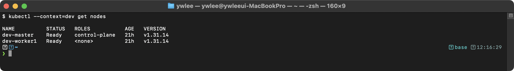
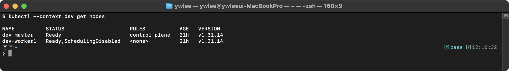
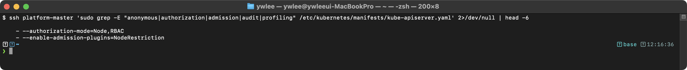

# CKS Day 4: Cluster Hardening (2/2) - Audit Policy, kubeadm 업그레이드, 시험 실전

> 학습 목표 | CKS 도메인: Cluster Hardening (15%) | 예상 소요 시간: 2시간

> 학습 위치 | 이전: Day 3 RBAC 심화 · ServiceAccount 토큰 / 이후: Day 5 AppArmor & seccomp(System Hardening) · CKS 전체 14 day 중 Cluster Hardening 도메인의 두 번째 날(2/2). Day 3 에서 다룬 RBAC·SA 통제 위에, 오늘은 "누가 무엇을 했는지 기록(Audit)" 과 "클러스터를 최신 패치로 유지(kubeadm 업그레이드)" 로 클러스터 강화를 마무리한다. **이 파일의 최상위 섹션 번호는 4~8이다(섹션 1~3은 Day 3에서 다룬 RBAC·ServiceAccount·API Server 보안 기초에 해당하며, Day 3 파일에 있다).**

---

## 오늘의 학습 목표

- Kubernetes Audit Policy를 작성하여 감사 로그를 설정할 수 있다
- kubeadm 클러스터 업그레이드 절차를 수행할 수 있다
- kubeconfig 보안 관리를 이해한다
- Cluster Hardening 도메인의 시험 출제 패턴을 분석하고 실전 문제를 풀어본다

---


## 4. 감사 로그 (Audit Policy)

### 4.0 Audit Policy 등장 배경

```
Kubernetes Audit 도입 배경
══════════════════════════

K8s 초기에는 API 요청에 대한 감사 로깅 메커니즘이 없었다.
클러스터에서 보안 사고가 발생해도 누가, 언제, 어떤 리소스에 접근했는지 추적할 수 없었다.

한계:
  - Secret이 유출되어도 누가 조회했는지 알 수 없었다
  - RBAC 변경 이력을 추적할 수 없었다
  - 침해 사고 대응(incident response) 시 증거가 부족했다

K8s v1.7 (2017): Audit Policy API 도입
  - 규칙 기반 감사 정책으로 API 요청을 선택적으로 기록한다
  - 4단계 기록 수준으로 로그 볼륨을 제어한다
  - kube-apiserver의 파이프라인에 내장되어 모든 요청을 감사한다

공격-방어 매핑:
  공격 벡터                    → 감사(Audit) 방어
  ─────────────────────────── → ──────────────────────────────
  Secret 무단 조회             → RequestResponse로 조회자/값 기록
  kubectl exec으로 셸 접근     → pods/exec Metadata로 접근 기록
  RBAC 변경으로 권한 상승       → roles/rolebindings 변경 기록
  서비스 계정 토큰 남용         → user 필드로 SA 식별
```

Audit Policy API 도입으로 모든 API 요청을 기록할 수 있게 됐지만, 곧바로 다음 문제가 드러났다. 모든 요청을 최고 수준(RequestResponse)으로 기록하면 로그 파일이 초당 수십 MB~GB 단위로 불어난다. kube-scheduler·kube-proxy·kubelet 같은 시스템 컴포넌트는 매 초 수십~수백 건의 읽기 요청(get/list/watch)을 보내는데, 이 노이즈까지 본문째 남기면 디스크가 가득 차고 정작 필요한 보안 사건은 묻혀 버린다. 그래서 "리소스·사용자·verb 조건별로 기록 수준을 따로 정하는" 규칙 기반(rule-based) 정책이 필요해졌다. 다음 4단계 기록 수준(None/Metadata/Request/RequestResponse, 4.2)은 바로 이 로그 볼륨 제어를 위해 존재한다. 민감한 Secret 은 값까지(RequestResponse), 일반 변경은 메타데이터만(Metadata), 시스템 노이즈는 아예 기록 안 함(None) 으로 차등을 두는 것이다.

### 4.1 Kubernetes Audit 메커니즘

```
Audit Policy 기반 API 요청 기록 메커니즘
════════════════════════════════════════

Kubernetes Audit은 kube-apiserver를 경유하는 모든 API 요청에 대해
구조화된 감사 이벤트(audit event)를 생성하는 메커니즘이다.
--audit-policy-file 플래그로 정책을 지정하고, --audit-log-path로 출력 경로를 설정한다.

4단계 기록 수준(audit level):
  - None: 해당 요청에 대해 감사 이벤트를 생성하지 않는다
  - Metadata: 요청 메타데이터(사용자, 타임스탬프, 리소스, verb)만 기록한다
  - Request: 메타데이터 + 요청 본문(request body)을 기록한다
  - RequestResponse: 메타데이터 + 요청 본문 + 응답 본문(response body)을 모두 기록한다

보안 관점의 설정 원칙:
  - Secret 리소스 접근은 RequestResponse로 기록 (데이터 유출 추적)
  - Pod/Deployment 관련은 Metadata로 기록 (변경 이력 추적)
  - system:nodes 등 시스템 컴포넌트의 반복 요청은 None (로그 볼륨 최적화)
```

**감사 이벤트 형식** — "구조화된 감사 이벤트" 라는 표현이 추상적이므로 실제 결과물을 본다. 감사 이벤트는 JSON 객체 하나이며, `--audit-log-path` 로 지정한 파일에 한 줄에 하나씩(JSON Lines 형식) 줄단위로 추가된다. Secret 을 조회(list)했을 때 기록되는 이벤트 한 줄을 가독성 있게 펼치면 아래와 같다.

```json
{
  "kind": "Event",
  "level": "Metadata",
  "auditID": "8f1c...",
  "stage": "ResponseComplete",
  "requestURI": "/api/v1/namespaces/kube-system/secrets",
  "verb": "list",
  "user": { "username": "kubernetes-admin", "groups": ["system:masters"] },
  "objectRef": { "resource": "secrets", "namespace": "kube-system", "apiVersion": "v1" },
  "responseStatus": { "code": 200 },
  "requestReceivedTimestamp": "2026-06-12T03:21:55.123456Z"
}
```

여기서 `verb` 는 무슨 동작인지, `user` 는 누가 했는지, `objectRef` 는 어떤 리소스를 대상으로 했는지, `stage` 는 요청 처리의 어느 시점에 찍힌 이벤트인지를 나타낸다. `stage` 값은 `RequestReceived` / `ResponseStarted` / `ResponseComplete` / `Panic` 네 가지이며 상세 설명은 4.3 을 참고한다. 정책의 level 이 Request·RequestResponse 이면 여기에 `requestObject`(요청 본문)·`responseObject`(응답 본문) 필드가 추가로 붙는다. 검증 단계(4.5)에서 `jq` 로 이 JSON 의 일부 필드만 뽑아 보는 이유가 이 구조 때문이다.

### 4.2 4가지 Audit 레벨

```
Audit 레벨 비교
═══════════════

레벨             | 기록 내용                          | 로그 크기
─────────────────┼───────────────────────────────────┼──────────
None             | 기록하지 않음                       | 0
Metadata         | 사용자, 타임스탬프, 리소스, verb    | 작음
Request          | Metadata + 요청 본문               | 중간
RequestResponse  | Metadata + 요청 본문 + 응답 본문   | 큼

CKS 시험에서의 사용:
  Secret → RequestResponse (누가 어떤 Secret을 조회했는지 값까지)
  Pod/exec/log → Metadata (셸 접근 기록)
  RBAC 변경 → Metadata (권한 변경 기록)
  시스템 컴포넌트 → None (노이즈 제거)
  기본 → Metadata (catch-all)
```

### 4.3 Audit Policy 작성 상세

본격적인 정책 파일을 보기 전에, Audit Policy YAML 의 구조를 먼저 정리한다. 정책 파일은 다음 필드로 구성된다.

```
Audit Policy YAML 구조 개요
═══════════════════════════

apiVersion: audit.k8s.io/v1   # Audit API 버전. v1 이 안정 버전이다.
kind: Policy                  # 리소스 종류. 항상 Policy 이다.
rules:                        # 규칙 배열. 위에서 아래로 순서대로 평가된다(4.3 매칭 원리 참고).
  - level: <레벨>             # None/Metadata/Request/RequestResponse 중 하나(4.2 표).
    resources:               # (선택) 이 규칙이 매칭할 리소스 묶음.
    - group: ""              #   API 그룹. ""(빈 문자열)은 core 그룹(pod, secret, configmap 등).
      resources: [...]       #   리소스 이름 목록. pods/exec 처럼 서브리소스도 지정 가능.
    verbs: [...]             # (선택) 매칭할 동작. get/list/watch/create/update/patch/delete.
                             #   생략하면 모든 verb 에 매칭된다.
    users: [...]             # (선택) 매칭할 사용자 이름(예: system:kube-scheduler).
    userGroups: [...]        # (선택) 매칭할 사용자 그룹(예: system:nodes).
    nonResourceURLs: [...]   # (선택) 리소스가 아닌 URL 경로(/healthz, /metrics 등).
    omitStages: [...]        # (선택) 기록에서 제외할 요청 처리 단계.
```

- 리소스(resources)는 `pods` 처럼 객체에 매핑되는 대상이고, nonResourceURLs 는 `/healthz` 처럼 객체가 아닌 엔드포인트이다. 같은 규칙에 둘을 함께 쓰지 않는다.
- omitStages 의 단계(stage)란 하나의 API 요청이 거치는 처리 시점이다. `RequestReceived`(요청 도착), `ResponseStarted`(응답 시작), `ResponseComplete`(응답 완료), `Panic`(처리 중 패닉) 의 네 단계가 있고, 각 단계마다 감사 이벤트가 한 번씩 생성될 수 있다. `RequestReceived` 를 제외하면 도착 시점 중복 기록을 줄일 수 있다.

아래는 이 필드들을 조합한 실제 정책 파일이다.

```yaml
# /etc/kubernetes/audit-policy.yaml
# ─────────────────────────────────
apiVersion: audit.k8s.io/v1        # Audit API 버전
kind: Policy                        # Audit 정책
rules:
  # ═══ 규칙 1: Secret에 대한 모든 요청을 최고 수준으로 기록 ═══
  # Secret은 비밀번호, 토큰 등 민감 정보를 담고 있으므로
  # 누가, 언제, 어떤 Secret을, 어떤 값으로 변경했는지 모두 기록
  - level: RequestResponse           # 요청 + 응답 본문 모두 기록
    resources:
    - group: ""                      # core API 그룹
      resources: ["secrets"]         # Secret 리소스

  # ═══ 규칙 2: Pod 관련 활동 기록 ═══
  # kubectl exec, kubectl logs 등 보안에 민감한 활동 기록
  - level: Metadata                  # 메타데이터만 기록 (본문은 불필요)
    resources:
    - group: ""
      resources: ["pods", "pods/log", "pods/exec", "pods/portforward"]
                                     # pods/exec = kubectl exec
                                     # pods/log = kubectl logs
                                     # pods/portforward = kubectl port-forward

  # ═══ 규칙 3: RBAC 변경 기록 ═══
  # 권한 변경은 보안에 직결되므로 반드시 기록
  - level: Metadata
    resources:
    - group: "rbac.authorization.k8s.io"
      resources: ["roles", "rolebindings", "clusterroles", "clusterrolebindings"]

  # ═══ 규칙 4: ConfigMap 변경만 기록 ═══
  # 조회는 기록하지 않고, 생성/수정/삭제만 기록
  - level: Request                   # 요청 본문까지 기록
    resources:
    - group: ""
      resources: ["configmaps"]
    verbs: ["create", "update", "patch", "delete"]
                                     # get, list, watch는 제외

  # ═══ 규칙 5: 시스템 컴포넌트의 반복 요청 제외 ═══
  # kube-scheduler, kube-proxy 등은 매 초마다 API 요청을 보내므로
  # 이것을 모두 기록하면 로그 볼륨이 폭발한다
  - level: None                      # 기록하지 않음
    users:
    - "system:kube-scheduler"
    - "system:kube-proxy"
    - "system:apiserver"
    verbs: ["get", "list", "watch"]  # 읽기 요청만 제외

  # ═══ 규칙 6: 헬스 체크 엔드포인트 제외 ═══
  - level: None
    nonResourceURLs:
    - "/healthz*"                    # 헬스 체크
    - "/livez*"                      # 라이브니스
    - "/readyz*"                     # 레디니스
    - "/api"                         # API 디스커버리
    - "/api/*"

  # ═══ 규칙 7: 이벤트 제외 ═══
  # 이벤트는 매우 많이 생성되므로 제외
  - level: None
    resources:
    - group: ""
      resources: ["events"]

  # ═══ 규칙 8: 기본 catch-all ═══
  # 위 규칙에 매칭되지 않은 모든 요청을 Metadata로 기록
  - level: Metadata
    omitStages:
    - "RequestReceived"              # 요청 수신 단계는 제외 (중복 방지)
```

```
규칙 매칭 원리 (중요!)
═════════════════════

1. 위에서 아래로 순서대로 평가된다
2. 첫 번째로 매칭되는 규칙이 적용된다
3. 나머지 규칙은 무시된다

예: Secret GET 요청
  → 규칙 1 매칭 (resources: secrets) → RequestResponse 레벨로 기록
  → 규칙 5는 평가되지 않음 (이미 매칭됨)

예: kube-scheduler의 Pod GET 요청
  → 규칙 2 매칭? → resources: pods → 매칭! → Metadata 레벨로 기록
  ※ 규칙 5보다 규칙 2가 먼저이므로 기록됨!

→ 시스템 컴포넌트를 제외하려면 더 위에 배치해야 한다!
```

순서가 왜 중요한지 위 예제로 더 풀어 본다. 규칙 2는 "리소스가 pods 이면 Metadata" 라는 조건이고, 규칙 5는 "사용자가 system:kube-scheduler 이고 verb 가 get/list/watch 이면 None" 이라는 조건이다. kube-scheduler 가 보내는 Pod GET 요청은 두 조건을 모두 만족한다. 정책은 첫 매칭에서 멈추므로, 규칙 2가 위에 있으면 규칙 2(Metadata)로 확정되고 규칙 5는 아예 평가되지 않는다. 즉 시스템 컴포넌트 제외 의도가 무력화되어 노이즈가 그대로 기록된다.

반대로 규칙 5(시스템 컴포넌트 제외, None)를 규칙 2보다 위에 배치하면 kube-scheduler 의 Pod GET 은 규칙 5에서 먼저 매칭되어 None 으로 처리되고 로그에 남지 않는다. 따라서 일반적 원칙은 다음과 같다. 구체적인 리소스 기록 규칙(이 파일의 규칙 1~4)보다 **노이즈를 제거하는 None 규칙(규칙 5~7)을 더 위에 두어야** 의도대로 동작한다. 단, 이 파일처럼 "Secret 은 반드시 RequestResponse 로 남긴다" 같이 절대 누락하면 안 되는 기록 규칙은 None 규칙보다도 위에 두어, 시스템 사용자가 Secret 에 접근하더라도 빠짐없이 기록되게 한다. 즉 배치 우선순위는 "반드시 남길 보안 핵심 기록 → 노이즈 제거(None) → 일반 기록" 순으로 잡는다.

### 4.4 API Server에 Audit 적용

Audit 정책을 실제로 동작시키려면 두 가지를 kube-apiserver 정적 파드(static pod, kubelet 이 `/etc/kubernetes/manifests/` 의 매니페스트를 직접 감시·기동하는 파드)에 연결해야 한다. 첫째는 정책 파일과 로그 디렉토리를 컨테이너 안으로 넣어주는 hostPath 볼륨이고, 둘째는 그 경로를 가리키는 `--audit-*` 플래그이다.

hostPath 볼륨 타입에 주의한다. 아래 정책 파일 볼륨은 `type: File` 로, 호스트의 단일 파일 `/etc/kubernetes/audit-policy.yaml` 을 컨테이너의 동일 경로에 그대로 마운트한다. hostPath 는 디렉토리뿐 아니라 `type: File` 로 단일 파일도 마운트할 수 있으나, 이때 호스트에 그 파일이 **반드시 미리 존재해야** 한다(없으면 API Server 가 기동에 실패한다). 로그 볼륨은 `type: DirectoryOrCreate` 로 디렉토리를 마운트하며 없으면 생성된다. 두 경우 모두 컨테이너 안 mountPath 가 `--audit-policy-file`·`--audit-log-path` 플래그가 가리키는 경로와 정확히 일치해야 한다.

```yaml
# /etc/kubernetes/manifests/kube-apiserver.yaml에 추가
spec:
  containers:
  - command:
    - kube-apiserver
    # === Audit 플래그 추가 ===
    - --audit-policy-file=/etc/kubernetes/audit-policy.yaml
                                           # Audit 정책 파일 경로
    - --audit-log-path=/var/log/kubernetes/audit/audit.log
                                           # 로그 파일 경로
    - --audit-log-maxage=30                # 로그 보관 기간 (일)
    - --audit-log-maxbackup=10             # 최대 백업 파일 수
    - --audit-log-maxsize=100              # 최대 파일 크기 (MB)

    # === 볼륨 마운트 추가 ===
    volumeMounts:
    - name: audit-policy                   # Audit 정책 파일 마운트
      mountPath: /etc/kubernetes/audit-policy.yaml
      readOnly: true                       # 읽기 전용 (보안)
    - name: audit-log                      # 로그 디렉토리 마운트
      mountPath: /var/log/kubernetes/audit/

  # === 볼륨 추가 ===
  volumes:
  - name: audit-policy
    hostPath:
      path: /etc/kubernetes/audit-policy.yaml
      type: File                           # 파일이 존재해야 함!
  - name: audit-log
    hostPath:
      path: /var/log/kubernetes/audit/
      type: DirectoryOrCreate              # 디렉토리 없으면 생성
```

```bash
# 적용 절차
# 1. Audit Policy 파일 생성
sudo vi /etc/kubernetes/audit-policy.yaml

# 2. 로그 디렉토리 생성
sudo mkdir -p /var/log/kubernetes/audit/

# 3. API Server 매니페스트 수정
sudo vi /etc/kubernetes/manifests/kube-apiserver.yaml

# 4. API Server 재시작 대기
watch crictl ps | grep kube-apiserver

# 5. 정상 동작 확인
kubectl get nodes

# 6. Audit 로그 확인
tail -f /var/log/kubernetes/audit/audit.log | jq .
```

위 명령을 단계로 정리하면 적용부터 검증까지가 하나의 흐름으로 이어진다. 4.4 와 4.5 는 끊어진 두 절이 아니라 같은 절차의 앞뒤이다.

```
Audit Policy 적용 → 검증 8단계
══════════════════════════════

1. 정책 파일 생성     : /etc/kubernetes/audit-policy.yaml 작성(4.3 의 YAML)
2. 로그 디렉토리 생성 : mkdir -p /var/log/kubernetes/audit/
3. apiserver 매니페스트 수정 : --audit-* 플래그 + 볼륨/볼륨마운트 추가(4.4 YAML)
4. apiserver 재기동 확인     : watch crictl ps | grep kube-apiserver
                               (정적 파드라 매니페스트 저장 즉시 kubelet 이 재기동한다)
5. 클러스터 정상성 확인      : kubectl get nodes 가 응답하면 apiserver 가 살아 있다
6. 검증용 요청 발생          : kubectl get secret -n kube-system (Secret 조회 이벤트 유발)
7. 로그 확인                 : tail -1 .../audit.log | jq 로 마지막 이벤트 추출(4.5)
8. 기대 출력 형태 대조       : verb/user/resource/level 이 정책대로 찍혔는지 확인(4.5 예시)
```

전제 — 이 교재용 dev/staging 클러스터의 apiserver 에는 audit-policy 가 기본 적용돼 있지 않다. 따라서 4.5 의 검증을 실제로 재현하려면 학생이 먼저 위 1~5단계(4.4 절차)를 staging 클러스터에서 수행해 정책을 적용한 뒤, 6~8단계(4.5)를 실행해야 한다. apiserver 매니페스트를 수정하는 파괴적 작업이므로 platform/prod 가 아닌 dev/staging 에서만 한다. 작업 전 `ssh staging-master` 로 노드에 접속하고, `cp /etc/kubernetes/manifests/kube-apiserver.yaml /tmp/` 로 원본을 백업해 두면 실패 시 즉시 복구할 수 있다.

### 4.5 Audit Policy 실습 검증

```bash
# Audit 적용 후 Secret 조회 이벤트가 기록되는지 확인
kubectl get secret -n kube-system
tail -1 /var/log/kubernetes/audit/audit.log | jq '{verb, user: .user.username, resource: .objectRef.resource, namespace: .objectRef.namespace, level: .level}'
```

> **예시(참조) — Audit 로그:** apiserver 에 `--audit-policy-file`+`--audit-log-path` 적용 환경에서 audit.log 에 JSON Lines 이벤트가 기록된다. 현재 dev/staging 은 audit 미적용이라 미실측이며, CKS day04 본문의 정책 YAML 을 적용하면 재현된다.

```bash
# Audit 로그 파일 크기 확인
ls -lh /var/log/kubernetes/audit/audit.log
```

> **예시(참조) — Audit 로그 파일:** audit 적용 시 `/var/log/kubernetes/audit/audit.log`(권한 600)가 생성된다. 미적용 환경에서는 파일이 없다.

### 4.6 Audit Policy 트러블슈팅

```
Audit Policy 설정 시 발생하는 장애 시나리오
════════════════════════════════════════════

시나리오 1: Audit Policy 적용 후 API Server가 시작되지 않는다
  원인: audit-policy.yaml 파일이 존재하지 않거나 YAML 문법 오류이다
  디버깅:
    crictl logs <apiserver-container-id> 2>&1 | grep "audit"
    # "failed to read file: /etc/kubernetes/audit-policy.yaml"
  해결: 파일 경로 확인, YAML 문법 검증, hostPath 볼륨 마운트 확인

시나리오 2: Audit 로그 파일이 생성되지 않는다
  원인: 로그 디렉토리의 볼륨 마운트가 누락되었다
  디버깅:
    grep "audit-log" /etc/kubernetes/manifests/kube-apiserver.yaml
    # volumeMounts와 volumes 모두 있는지 확인
  해결: audit-log 볼륨 + 볼륨마운트를 매니페스트에 추가한다

시나리오 3: Audit 로그가 너무 빠르게 증가한다
  원인: system:nodes 등 시스템 컴포넌트의 반복 요청이 기록되고 있다
  디버깅:
    tail -100 /var/log/kubernetes/audit/audit.log | jq '.user.username' | sort | uniq -c | sort -rn
  해결: 시스템 컴포넌트를 level: None으로 제외하는 규칙을 상위에 배치한다
```

---

## 5. kubeadm 클러스터 업그레이드

### 5.1 업그레이드가 보안에 중요한 이유

```
보안 업데이트의 중요성
═════════════════════

쿠버네티스는 정기적으로 보안 취약점(CVE)이 발견된다.
구버전을 사용하면 알려진 취약점에 노출된다.

예: CVE-2021-25741 (심각도: HIGH)
  - 심볼릭 링크를 통한 호스트 파일시스템 접근
  - 컨테이너에서 호스트 파일시스템의 파일을 읽고 수정 가능
  - v1.22.2, v1.21.5, v1.20.11에서 패치됨

→ 최신 패치 버전으로 업그레이드해야 안전하다
→ CKS에서는 업그레이드 절차를 실제로 수행해야 할 수 있다
```

> **[K8s 공식 정책] 반드시 마이너 버전 한 단계씩만 업그레이드한다.**
> 예를 들어 현재 버전이 1.29이면 1.30을 거쳐야 1.31로 갈 수 있다. 1.29 → 1.31처럼 건너뛰는 것은 K8s 공식 지원 범위 밖이며, kubeadm upgrade plan 도 이를 강제한다. 패치 버전(1.31.0 → 1.31.1)은 한 단계 제약 없이 이동 가능하다. CKS 시험에서 "v1.31.0에서 v1.32.0으로 업그레이드하라"는 문제가 나오면 중간에 1.31.x 최신 패치를 거칠 필요 없이 바로 1.32.x로 올려도 되지만, 마이너를 두 단계 이상 뛰어넘는 것(1.30 → 1.32)은 허용되지 않는다.

**kubeadm 이전 방식 대비 개선점** — kubeadm 이 나오기 전, 클러스터 업그레이드는 다음 수작업으로 진행했다. 컨트롤 플레인 서버에 SSH 로 들어가 kube-apiserver·kube-controller-manager·kube-scheduler·etcd 바이너리를 각각 직접 교체하고, 각 컴포넌트의 systemd 유닛을 하나씩 재시작했다. 이 방식에는 세 가지 문제가 있었다. 첫째, 컴포넌트 간 버전 호환성을 사람이 직접 계산해야 했고 실수하면 클러스터가 기동 불가 상태가 됐다. 둘째, 재시작 순서(etcd → apiserver → controller-manager → scheduler)를 틀리면 leader election(리더선출, 컴포넌트 간 조율을 위해 분산 잠금으로 리더를 뽑는 과정)이 실패해 클러스터가 멈췄다. 셋째, 업그레이드 전에 어떤 버전으로 올릴 수 있는지 확인할 표준 방법이 없었다. kubeadm upgrade 는 이 세 문제를 해결한다. `kubeadm upgrade plan` 은 현재 버전과 설치 가능한 대상 버전을 자동으로 비교해 업그레이드 가능 경로를 표로 보여 주고, `kubeadm upgrade apply` 는 컴포넌트 재시작 순서와 버전 의존성을 내부적으로 검증·보장하며 진행한다. 트레이드오프는 kubeadm 자체의 버전도 대상 K8s 버전과 맞게 먼저 업그레이드해야 한다는 점, 그리고 kubeadm 이 관리하지 않는 컴포넌트(예: Cilium·CoreDNS 애드온, etcd 데이터 스키마)는 별도로 호환성을 확인해야 한다는 점이다.

### 5.2 업그레이드 절차

업그레이드 절차에 drain 과 uncordon 이 끼어드는 이유를 먼저 이해한다. 노드를 업그레이드하려면 kubelet 을 재시작하거나 노드 자체를 재부팅해야 하고, 그동안 그 노드 위의 파드는 잠시 동작이 멈출 수 있다. K8s 초기에는 이런 작업을 무중단으로 처리하는 표준 절차가 없어, 노드를 손대는 순간 그 위의 서비스가 같이 끊겼다.

`kubectl drain` 은 이 문제를 해결한다. drain 은 두 가지를 한다. 첫째, 노드를 cordon(스케줄링 차단) 상태로 만들어 새 파드가 그 노드에 배치되지 않게 한다. 둘째, 노드 위의 기존 파드를 gracefully terminate(정상 종료 신호 후 유예 시간을 주고 종료)하여 컨트롤러가 다른 정상 노드에 같은 파드를 다시 띄우게 한다. 즉 워크로드를 미리 다른 노드로 옮겨 놓고 빈 노드를 안전하게 손보는 것이다. DaemonSet 파드는 노드마다 하나씩 떠야 하므로 옮길 수 없어 `--ignore-daemonsets` 로 예외 처리한다. 업그레이드가 끝나면 `kubectl uncordon` 으로 cordon 을 풀어 스케줄링을 다시 허용한다. uncordon 이후 새 파드가 그 노드에 다시 배치될 수 있다.

트레이드오프 — drain 중에는 해당 노드의 용량이 빠지므로, 남은 노드에 그만큼의 여유 자원이 있어야 옮겨진 파드가 정상 기동한다. 여유가 없으면 파드가 Pending 에 머문다. 또한 단일 복제본(replica 1) 워크로드는 옮겨지는 동안 잠깐 중단되므로, 무중단이 필요하면 복제본을 2 이상으로 두고 PodDisruptionBudget 으로 동시 축출 수를 제한한다.

주의(버전 표기) — 아래 명령의 `kubeadm=1.31.x-*` 에서 `1.31.x` 와 `*` 는 그대로 입력하는 값이 아니라 자리표시자(placeholder)이다. 패키지 매니저는 `*` 같은 와일드카드로 버전을 해석하지 못하므로, 그대로 복사하면 "패키지를 찾을 수 없음" 오류가 난다. 실행 전에 먼저 대상 버전을 확정한다. `apt-cache madison kubeadm | head` 로 설치 가능한 정확한 버전 문자열을 조회한 뒤, 그 값으로 치환해 입력한다. 예를 들어 현재 클러스터가 1.31 계열이면 `apt-get install -y kubeadm=1.31.14-1.1` 처럼 구체적 버전·패키지 리비전을 명시한다(배포판·apt 저장소에 따라 접미사가 `-00` 또는 `-1.1` 형태로 다르다). 아래 `kubeadm upgrade apply v1.31.x` 의 `v1.31.x` 도 마찬가지로 `v1.31.14` 같은 실제 버전으로 바꿔 실행한다.

```bash
# ═══ 컨트롤 플레인 업그레이드 ═══

# 1. 업그레이드 가능 버전 확인
kubeadm upgrade plan

# 2. kubeadm 업그레이드
apt-get update
apt-get install -y kubeadm=1.31.x-*

# 3. 클러스터 업그레이드 적용
kubeadm upgrade apply v1.31.x

# 4. 노드 드레인 (워크로드 이동)
kubectl drain <node-name> --ignore-daemonsets --delete-emptydir-data

# 5. kubelet, kubectl 업그레이드
apt-get install -y kubelet=1.31.x-* kubectl=1.31.x-*
systemctl daemon-reload
systemctl restart kubelet

# 6. 노드 uncordon (워크로드 스케줄링 재개)
kubectl uncordon <node-name>

# ═══ 워커 노드 업그레이드 ═══
# 워커 노드마다 반복:

# 1. 드레인
kubectl drain <worker-node> --ignore-daemonsets --delete-emptydir-data

# 2. 워커 노드에서 kubeadm 업그레이드
ssh <worker-node>
apt-get update
apt-get install -y kubeadm=1.31.x-*
kubeadm upgrade node

# 3. kubelet 업그레이드
apt-get install -y kubelet=1.31.x-*
systemctl daemon-reload
systemctl restart kubelet

# 4. uncordon
kubectl uncordon <worker-node>

# 5. 확인
kubectl get nodes
```

업그레이드 완료 후 기대 출력:


```bash
# 업그레이드 과정에서 drain 상태 확인
kubectl get nodes
```



cordon/drain 상태에서 SchedulingDisabled가 표시된다. uncordon 후 정상 복귀한다.

### 5.3 업그레이드 트러블슈팅

업그레이드 도중 발생하는 주요 실패 시나리오와 복구 명령을 정리한다.

```
kubeadm 업그레이드 트러블슈팅
══════════════════════════════

시나리오 1: kubeadm upgrade apply 실패 — etcd 버전 불일치
  원인: 설치된 kubeadm 버전이 제어하는 etcd 이미지 태그와 현재 클러스터
        etcd 버전이 호환되지 않을 때 발생한다. 예를 들어 kubeadm 1.31.1이
        기대하는 etcd 3.5.15 이미지가 레지스트리에 없거나 pullPolicy가
        다른 버전을 고정하는 경우이다.
  진단:
    kubeadm upgrade apply v1.31.1 --dry-run 2>&1 | grep -i etcd
    kubectl get pod etcd-<master-node> -n kube-system -o yaml | grep image:
  해결:
    apt-cache madison kubeadm | head          # 정확한 패키지 버전 확인
    apt-get install -y kubeadm=1.31.1-1.1     # 패키지 리비전까지 명시
    kubeadm upgrade apply v1.31.1             # 재실행

시나리오 2: drain 후 파드 Pending — 남은 노드 자원 부족
  원인: drain 이후 이동할 파드들이 남은 노드의 CPU/메모리를 초과하면
        Pending 상태에 머문다. 단일 워커 클러스터(dev처럼 master+worker1)
        에서 특히 빈번하다.
  진단:
    kubectl get pods -A | grep Pending
    kubectl describe pod <pending-pod> | grep -A5 Events:
    # "Insufficient cpu" 또는 "Insufficient memory" 메시지 확인
  해결:
    # 방법 1: 자원 여유가 생길 때까지 대기(다른 파드 종료 후)
    kubectl delete pod <non-critical-pod>
    # 방법 2: 업그레이드 완료 후 uncordon, Pending 파드는 자동 스케줄링
    kubectl uncordon <node>
    # 방법 3: 단발 실습이면 --force --grace-period=0 로 강제 drain
    kubectl drain <node> --ignore-daemonsets --delete-emptydir-data --force

시나리오 3: kubelet CrashLoop — 버전 조합 오류 또는 설정 충돌
  원인: kubelet을 업그레이드했으나 kubeadm upgrade node 미실행으로
        `/var/lib/kubelet/config.yaml` 이 구 버전 설정을 참조하거나,
        systemd 재로드 없이 바이너리만 교체된 경우 발생한다.
  진단:
    ssh staging-master      # 노드에 직접 접속
    systemctl status kubelet
    journalctl -u kubelet --since "5 min ago" | tail -30
  해결:
    kubeadm upgrade node    # 설정 갱신(컨트롤 플레인은 apply, 워커는 node)
    systemctl daemon-reload
    systemctl restart kubelet
    systemctl status kubelet  # active (running) 확인
```

---

## 6. kubeconfig 보안 관리

### 6.0 kubeconfig 등장 배경

kubeconfig 가 없던 시절 `kubectl` 은 클러스터에 접근할 때마다 다음처럼 플래그를 직접 입력해야 했다.

```bash
kubectl --server=https://192.168.64.10:6443 \
        --certificate-authority=/etc/kubernetes/pki/ca.crt \
        --client-certificate=/etc/kubernetes/pki/admin.crt \
        --client-key=/etc/kubernetes/pki/admin.key \
        get nodes
```

이 방식은 세 가지 문제가 있었다. 첫째, 인증 정보를 명령줄에 직접 노출해 셸 히스토리(`~/.bash_history`)에 인증서 경로와 토큰이 그대로 남는다. 둘째, 클러스터가 여러 개면(dev/staging/prod) 매번 서버 주소·인증서 경로를 모두 다르게 입력해야 하므로 오타·혼동 위험이 크다. 셋째, CI/CD 파이프라인이나 스크립트에서 인증 정보를 파라미터로 넘기면 로그에 노출되기 쉽다.

kubeconfig 는 이 문제를 해결하기 위해 도입된 **인증 정보 집중 파일**이다. 클러스터 주소, CA 인증서, 클라이언트 인증서/키·토큰을 하나의 YAML 파일로 묶고, `context`(어느 클러스터에 어느 사용자로 접속할지를 연결하는 쌍)를 정의해 `kubectl config use-context` 한 줄로 대상을 전환할 수 있게 했다. `kubectl` 은 기본적으로 `~/.kube/config` 를 읽으므로 플래그 없이도 동작한다.

**트레이드오프** — 인증 정보를 한 파일에 집중시킨 대가로, 파일 하나가 유출되면 그 안에 담긴 모든 클러스터·사용자 자격이 한 번에 노출된다. 특히 `cluster-admin` 권한을 가진 kubeconfig 한 장이 유출되면 해당 클러스터의 전체 리소스를 즉시 조작할 수 있다. 분산 저장(여러 파일로 쪼개기, `KUBECONFIG=a.yaml:b.yaml`)이나 파일 권한 600 강제가 이 위험을 완화하는 주요 수단이다.

배경 — kubeconfig 파일은 클러스터 접속에 필요한 정보를 평문(암호화되지 않은 텍스트)으로 담고 있다. API Server 주소와 CA 인증서뿐 아니라, 사용자를 인증하는 비밀값인 `client-key-data`(클라이언트 개인키), `token`(서비스 계정/베어러 토큰) 까지 들어 있다. 즉 kubeconfig 한 장만 손에 넣으면 그 안에 박힌 권한 그대로 클러스터를 조작할 수 있다. cluster-admin 자격이 담긴 파일이라면 클러스터 전체 장악으로 이어진다.

**kubeconfig 파일 구조** — 파일은 세 블록(`clusters` / `users` / `contexts`)으로 구성된다. 아래는 `~/.kube/config` 의 발췌(민감 필드 마스킹)이다.

```yaml
# ~/.kube/config 구조 발췌 (실제 값은 마스킹)
apiVersion: v1
kind: Config
clusters:
- name: dev
  cluster:
    server: https://192.168.64.X:6443   # API Server 주소
    certificate-authority-data: LS0t... # Base64 인코딩된 CA 인증서
users:
- name: kubernetes-admin
  user:
    client-certificate-data: LS0t...    # Base64 인코딩된 클라이언트 인증서
    client-key-data: LS0t...            # ← 이 필드가 클라이언트 개인키(평문 Base64)
contexts:
- name: dev
  context:
    cluster: dev
    user: kubernetes-admin
    namespace: default
current-context: dev
```

`client-key-data` 는 TLS 클라이언트 인증에 쓰이는 개인키를 Base64 로 인코딩한 것이다. Base64 는 암호화가 아니라 단순 인코딩이므로 `base64 -d` 한 줄로 원문이 복원된다. 파일 권한이 644(기타 사용자 읽기 가능)이면 같은 호스트의 다른 계정이 이 키를 그대로 읽어 클러스터에 접속할 수 있다.

> **CKS 시험 연관성**: kubeconfig 보안은 CKS 출제 패턴 직접 문항보다는 "API Server 보안 설정"·"최소 권한 점검" 문제의 **사전 작업**으로 등장한다. 시험 환경에서 `/root/.kube/config` 권한이 600 미만이면 kubectl 명령 자체가 차단될 수 있으므로, 노드에 SSH 접속한 후 `chmod 600 ~/.kube/config` 를 습관적으로 확인한다. 또한 `grep -c "client-key-data\|token" ~/.kube/config` 로 민감 필드 존재 여부를 점검하는 패턴이 감사 문제에서 체크리스트로 쓰인다.

그래서 파일 권한을 600(소유자만 read/write, 그룹·기타 사용자 접근 0)으로 제한해야 한다. 같은 머신을 여러 사용자가 쓰거나 다른 프로세스가 도는 환경에서, 읽기 권한이 열려 있으면 옆 계정·프로세스가 파일을 읽어 자격을 탈취할 수 있기 때문이다. 추가로 더 이상 쓰지 않는 context/cluster/user 항목은 정리한다. 폐기된 클러스터의 자격이 파일에 남아 있으면 공격 표면(노출되어 악용될 수 있는 지점)이 그만큼 넓어지고, 실수로 엉뚱한 클러스터에 명령을 보낼 위험도 생긴다. 아래 명령을 순서대로 적용한다.

```bash
# kubeconfig 파일 권한 제한 (소유자만 읽기/쓰기)
chmod 600 ~/.kube/config

# 불필요한 context 제거
kubectl config delete-context old-cluster

# 불필요한 클러스터/사용자 정보 제거
kubectl config delete-cluster old-cluster
kubectl config delete-user old-user

# 현재 context 확인
kubectl config current-context
kubectl config get-contexts

# kubeconfig에 민감 정보가 있는지 확인
# (client-key-data, token 등이 포함되어 있으면 파일 보안 중요)
grep -c "client-key-data\|token" ~/.kube/config
```

---

## 7. 이 주제가 시험에서 어떻게 나오는가

### 7.1 출제 패턴 분석

```
Cluster Hardening 도메인 출제 패턴 (15%)
════════════════════════════════════════

1. RBAC 과도한 권한 축소 (매우 빈출)
   - "Role의 * 와일드카드를 제거하고 최소 권한으로 수정하라"
   - "불필요한 ClusterRoleBinding을 삭제하라"
   - "ClusterRole을 RoleBinding으로 네임스페이스에 제한하라"
   의도: 최소 권한 원칙 이해도 평가

2. ServiceAccount 토큰 비활성화 (빈출)
   - "SA를 생성하고 토큰 자동 마운트를 비활성화하라"
   - "기존 Pod의 토큰 마운트를 비활성화하라"
   의도: 공격 표면 줄이기 능력 평가

3. API Server 보안 설정 (빈출)
   - "anonymous-auth, authorization-mode 등을 수정하라"
   의도: API Server 매니페스트 수정 능력 평가

4. Audit Policy (가끔 출제, 배점 높음)
   - "요구사항에 맞는 Audit Policy를 작성하고 적용하라"
   의도: Audit 레벨 이해도와 볼륨 마운트 설정 능력 평가

5. kubeadm 업그레이드 (가끔 출제)
   - "클러스터를 특정 버전으로 업그레이드하라"
   의도: 업그레이드 절차 숙지도 평가
```

### 7.2 실전 문제 (10개 이상)

실습 클러스터 — 아래 문제들은 RBAC·SA·매니페스트를 직접 수정·삭제하는 파괴적 작업을 포함하므로 모두 **dev 클러스터**(파괴 실험 허용)를 기준으로 푼다. 단, apiserver 정적 파드 매니페스트를 건드리는 문제(문제 3 API Server 보안 설정, 문제 4·문제 8 Audit Policy 적용)는 잘못 적용 시 apiserver 가 기동에 실패할 수 있으므로 **staging 클러스터**에서 수행하고, 작업 전 `cp /etc/kubernetes/manifests/kube-apiserver.yaml /tmp/` 로 백업한다. platform/prod 에서는 절대 풀지 않는다. 각 문제 시작 시 `kubectl config use-context <대상>` 으로 컨텍스트를 맞추고, kubeconfig 는 `~/sideproejct/IaC_apple_sillicon/kubeconfig/<클러스터>.yaml` 을 사용한다(노드 직접 작업은 `ssh dev-master`·`ssh staging-master`).

### 문제 1. RBAC 과도한 권한 축소  (dev 클러스터)

`production` 네임스페이스의 `dev-team` Role이 모든 리소스에 대해 `*` 권한을 가지고 있다. 다음과 같이 수정하라:
- Pod, Service: get, list, watch
- Deployment: get, list, watch, update
- ConfigMap: get, list

<details>
<summary>풀이</summary>

> 전제: `production` 네임스페이스와 `dev-sa` ServiceAccount가 이미 존재해야 한다. 없으면 먼저 생성한다.
> ```bash
> kubectl create ns production
> kubectl create sa dev-sa -n production
> ```

```bash
kubectl edit role dev-team -n production
```

```yaml
apiVersion: rbac.authorization.k8s.io/v1
kind: Role
metadata:
  name: dev-team
  namespace: production
rules:
- apiGroups: [""]
  resources: ["pods", "services"]
  verbs: ["get", "list", "watch"]
- apiGroups: ["apps"]
  resources: ["deployments"]
  verbs: ["get", "list", "watch", "update"]
- apiGroups: [""]
  resources: ["configmaps"]
  verbs: ["get", "list"]
```

검증:
```bash
kubectl auth can-i delete pods --as=system:serviceaccount:production:dev-sa -n production  # no
kubectl auth can-i get pods --as=system:serviceaccount:production:dev-sa -n production     # yes
kubectl auth can-i get secrets --as=system:serviceaccount:production:dev-sa -n production  # no
```

</details>

### 문제 2. ServiceAccount 토큰 비활성화

`webapp` 네임스페이스에 `api-sa` ServiceAccount를 생성하되, 토큰 자동 마운트를 비활성화하라. 이 SA를 사용하는 Pod `api-pod`(nginx:1.25)를 생성하고 토큰이 마운트되지 않았는지 확인하라.

<details>
<summary>풀이</summary>

```yaml
apiVersion: v1
kind: ServiceAccount
metadata:
  name: api-sa
  namespace: webapp
automountServiceAccountToken: false
---
apiVersion: v1
kind: Pod
metadata:
  name: api-pod
  namespace: webapp
spec:
  serviceAccountName: api-sa
  automountServiceAccountToken: false
  containers:
  - name: app
    image: nginx:1.25
```

검증:
```bash
kubectl apply -f sa-pod.yaml
kubectl exec api-pod -n webapp -- ls /var/run/secrets/kubernetes.io/serviceaccount/ 2>&1
# No such file or directory → 성공
```

</details>

### 문제 3. API Server 보안 설정  (staging 클러스터: apiserver 매니페스트 수정, 사전 백업)

API Server에 다음 보안 설정을 적용하라:
- 익명 인증 비활성화
- authorization-mode를 Node,RBAC으로 설정
- NodeRestriction Admission Controller 활성화
- profiling 비활성화

<details>
<summary>풀이</summary>

```bash
cp /etc/kubernetes/manifests/kube-apiserver.yaml /tmp/kube-apiserver.yaml.bak
vi /etc/kubernetes/manifests/kube-apiserver.yaml
```

```yaml
spec:
  containers:
  - command:
    - kube-apiserver
    - --anonymous-auth=false
    - --authorization-mode=Node,RBAC
    - --enable-admission-plugins=NodeRestriction
    - --profiling=false
    # 기존 플래그들 유지...
```

```bash
watch crictl ps | grep kube-apiserver
kubectl get nodes
```

</details>

### 문제 4. Audit Policy 작성 및 적용  (staging 클러스터: apiserver 매니페스트 수정, 사전 백업)

다음 요구사항에 맞는 Audit Policy를 작성하고 API Server에 적용하라:
- Secret에 대한 모든 요청: RequestResponse 레벨
- ConfigMap 변경(create, update, delete): Request 레벨
- 나머지: Metadata 레벨

<details>
<summary>풀이</summary>

```yaml
# /etc/kubernetes/audit-policy.yaml
apiVersion: audit.k8s.io/v1
kind: Policy
rules:
  - level: RequestResponse
    resources:
    - group: ""
      resources: ["secrets"]
  - level: Request
    resources:
    - group: ""
      resources: ["configmaps"]
    verbs: ["create", "update", "delete"]
  - level: Metadata
```

API Server에 적용:
```yaml
# 매니페스트에 추가
- --audit-policy-file=/etc/kubernetes/audit-policy.yaml
- --audit-log-path=/var/log/kubernetes/audit/audit.log
- --audit-log-maxage=30
- --audit-log-maxbackup=10
- --audit-log-maxsize=100
```

볼륨:
```yaml
volumeMounts:
- name: audit-policy
  mountPath: /etc/kubernetes/audit-policy.yaml
  readOnly: true
- name: audit-log
  mountPath: /var/log/kubernetes/audit/
volumes:
- name: audit-policy
  hostPath:
    path: /etc/kubernetes/audit-policy.yaml
    type: File
- name: audit-log
  hostPath:
    path: /var/log/kubernetes/audit/
    type: DirectoryOrCreate
```

```bash
mkdir -p /var/log/kubernetes/audit/
watch crictl ps | grep kube-apiserver
tail -f /var/log/kubernetes/audit/audit.log | jq .
```

</details>

### 문제 5. ClusterRole을 네임스페이스 범위로 제한

`secret-reader` ClusterRole(secrets에 대한 get,list 권한)을 `production` 네임스페이스에서만 사용자 `jane`에게 바인딩하라. 다른 네임스페이스에서는 접근 불가해야 한다.

<details>
<summary>풀이</summary>

```yaml
apiVersion: rbac.authorization.k8s.io/v1
kind: ClusterRole
metadata:
  name: secret-reader
rules:
- apiGroups: [""]
  resources: ["secrets"]
  verbs: ["get", "list"]
---
apiVersion: rbac.authorization.k8s.io/v1
kind: RoleBinding
metadata:
  name: read-secrets-in-production
  namespace: production
subjects:
- kind: User
  name: jane
  apiGroup: rbac.authorization.k8s.io
roleRef:
  kind: ClusterRole
  name: secret-reader
  apiGroup: rbac.authorization.k8s.io
```

검증:
```bash
kubectl auth can-i get secrets --as=jane -n production  # yes
kubectl auth can-i get secrets --as=jane -n default     # no
kubectl auth can-i get secrets --as=jane -n kube-system  # no
```

핵심: ClusterRole을 RoleBinding으로 바인딩하면 네임스페이스 범위로 제한된다.

</details>

### 문제 6. cluster-admin 바인딩 감사

클러스터에서 `cluster-admin` ClusterRole에 바인딩된 모든 주체를 찾아라. 시스템 컴포넌트 외의 불필요한 바인딩이 있으면 삭제하라.

<details>
<summary>풀이</summary>

```bash
# cluster-admin 바인딩 찾기
kubectl get clusterrolebindings -o json | \
  jq '.items[] | select(.roleRef.name == "cluster-admin") |
  {name: .metadata.name, subjects: .subjects}'

# 시스템 컴포넌트 확인 (삭제하면 안 됨)
# - system:masters 그룹
# - kubeadm:cluster-admins

# 불필요한 바인딩 삭제 (예: dev-admin이 cluster-admin인 경우)
kubectl delete clusterrolebinding dev-admin-binding
```

</details>

### 문제 7. 복합 RBAC - 여러 리소스 권한 설정

`monitoring` 네임스페이스에 `monitor-sa` ServiceAccount를 생성하라. 이 SA에 다음 권한을 부여하라:
- 모든 네임스페이스의 pods: get, list, watch (ClusterRole + ClusterRoleBinding)
- monitoring 네임스페이스의 configmaps: get, create, update (Role + RoleBinding)

<details>
<summary>풀이</summary>

```bash
kubectl create ns monitoring
kubectl create sa monitor-sa -n monitoring

# ClusterRole: pods 읽기 (클러스터 전체)
kubectl create clusterrole pod-watcher \
  --verb=get,list,watch \
  --resource=pods

# ClusterRoleBinding
kubectl create clusterrolebinding monitor-pod-watcher \
  --clusterrole=pod-watcher \
  --serviceaccount=monitoring:monitor-sa

# Role: configmaps 관리 (monitoring 네임스페이스만)
kubectl create role cm-manager \
  --verb=get,create,update \
  --resource=configmaps \
  -n monitoring

# RoleBinding
kubectl create rolebinding monitor-cm-manager \
  --role=cm-manager \
  --serviceaccount=monitoring:monitor-sa \
  -n monitoring

# 검증
kubectl auth can-i get pods --as=system:serviceaccount:monitoring:monitor-sa -n default     # yes
kubectl auth can-i get pods --as=system:serviceaccount:monitoring:monitor-sa -n production   # yes
kubectl auth can-i get configmaps --as=system:serviceaccount:monitoring:monitor-sa -n monitoring  # yes
kubectl auth can-i get configmaps --as=system:serviceaccount:monitoring:monitor-sa -n default    # no
```

</details>

### 문제 8. Audit Policy - 복잡한 요구사항  (staging 클러스터: apiserver 매니페스트 수정, 사전 백업)

다음 요구사항에 맞는 Audit Policy를 작성하라:
1. Secret에 대한 get, list, delete 요청: RequestResponse
2. Namespace 생성/삭제: Request
3. system:nodes 그룹의 모든 요청: None
4. /healthz, /readyz 엔드포인트: None
5. 기본: Metadata (RequestReceived 단계 제외)

<details>
<summary>풀이</summary>

```yaml
apiVersion: audit.k8s.io/v1
kind: Policy
rules:
  - level: RequestResponse
    resources:
    - group: ""
      resources: ["secrets"]
    verbs: ["get", "list", "delete"]
  - level: Request
    resources:
    - group: ""
      resources: ["namespaces"]
    verbs: ["create", "delete"]
  - level: None
    userGroups: ["system:nodes"]
  - level: None
    nonResourceURLs: ["/healthz*", "/readyz*"]
  - level: Metadata
    omitStages: ["RequestReceived"]
```

</details>

### 문제 9. ServiceAccount에 RBAC 바인딩 후 Pod 배포

`app-ns` 네임스페이스에:
1. `app-sa` SA 생성 (토큰 자동 마운트 비활성화)
2. configmaps에 대한 get,list 권한을 가진 `config-reader` Role 생성
3. `app-sa`에 바인딩
4. `app-sa`를 사용하는 Pod `app-pod` 생성 (토큰은 마운트하되, automount 사용하지 않고 projected volume으로)

<details>
<summary>풀이</summary>

```yaml
apiVersion: v1
kind: ServiceAccount
metadata:
  name: app-sa
  namespace: app-ns
automountServiceAccountToken: false
---
apiVersion: rbac.authorization.k8s.io/v1
kind: Role
metadata:
  name: config-reader
  namespace: app-ns
rules:
- apiGroups: [""]
  resources: ["configmaps"]
  verbs: ["get", "list"]
---
apiVersion: rbac.authorization.k8s.io/v1
kind: RoleBinding
metadata:
  name: app-sa-config-reader
  namespace: app-ns
subjects:
- kind: ServiceAccount
  name: app-sa
  namespace: app-ns
roleRef:
  kind: Role
  name: config-reader
  apiGroup: rbac.authorization.k8s.io
---
apiVersion: v1
kind: Pod
metadata:
  name: app-pod
  namespace: app-ns
spec:
  serviceAccountName: app-sa
  automountServiceAccountToken: false   # SA 수준 자동 마운트 비활성화
  containers:
  - name: app
    image: nginx:1.25
    volumeMounts:
    - name: sa-token                    # projected volume 마운트 경로
      mountPath: /var/run/secrets/kubernetes.io/serviceaccount
      readOnly: true
  volumes:
  - name: sa-token
    projected:                          # projected volume: 여러 소스를 단일 경로에 합산
      sources:
      - serviceAccountToken:
          expirationSeconds: 3607       # 토큰 만료 시간(초). 최소 3607(~1시간), 기본 3600
          path: token                   # 마운트 경로 내 파일명
      - configMap:
          items:
          - key: ca.crt
            path: ca.crt
          name: kube-root-ca.crt
      - downwardAPI:
          items:
          - fieldRef:
              apiVersion: v1
              fieldPath: metadata.namespace
            path: namespace
```

> projected volume을 쓰는 이유: `automountServiceAccountToken: false`로 자동 마운트를 끄면 `/var/run/secrets/kubernetes.io/serviceaccount/` 경로가 생성되지 않는다. 애플리케이션이 SA 토큰을 명시적으로 필요로 한다면, projected ServiceAccountToken volume을 직접 정의하여 마운트한다. 이 방식은 K8s v1.20+의 **Bound Token**(시간 제한·audience 제한이 적용된 단기 토큰, 실습2 동작 원리 3번 참고)을 사용하므로 영구 시크릿 기반 구 토큰보다 안전하다.

검증:
```bash
kubectl apply -f app-pod.yaml -n app-ns
kubectl exec app-pod -n app-ns -- cat /var/run/secrets/kubernetes.io/serviceaccount/token | cut -c1-20
# 토큰 앞자리가 출력되면 projected volume 마운트 성공
kubectl exec app-pod -n app-ns -- ls /var/run/secrets/kubernetes.io/serviceaccount/
# 출력: ca.crt  namespace  token
```

</details>

### 문제 10. kubeadm 업그레이드  (staging 클러스터: 노드 직접 작업, ssh staging-master)

컨트롤 플레인을 v1.31.0에서 v1.31.1로 업그레이드하라.

<details>
<summary>풀이</summary>

```bash
# 1. kubeadm 업그레이드
apt-get update
apt-get install -y kubeadm=1.31.1-*

# 2. 업그레이드 계획 확인
kubeadm upgrade plan

# 3. 업그레이드 적용
kubeadm upgrade apply v1.31.1

# 4. 노드 드레인
kubectl drain <master-node> --ignore-daemonsets --delete-emptydir-data

# 5. kubelet, kubectl 업그레이드
apt-get install -y kubelet=1.31.1-* kubectl=1.31.1-*
systemctl daemon-reload
systemctl restart kubelet

# 6. uncordon
kubectl uncordon <master-node>

# 7. 확인
kubectl get nodes
```

</details>

### 문제 11. 불필요한 ClusterRoleBinding 제거

`qa-team` 사용자가 `cluster-admin` ClusterRole에 바인딩되어 있다. 이를 `production` 네임스페이스에서만 pods, deployments에 대한 get, list, watch 권한을 가지도록 변경하라.

<details>
<summary>풀이</summary>

```bash
# 1. 기존 ClusterRoleBinding 삭제
kubectl delete clusterrolebinding qa-team-admin

# 2. 새 Role 생성
kubectl create role qa-viewer \
  --verb=get,list,watch \
  --resource=pods,deployments.apps \
  -n production

# 3. RoleBinding 생성
kubectl create rolebinding qa-team-viewer \
  --role=qa-viewer \
  --user=qa-team \
  -n production

# 검증
kubectl auth can-i get pods --as=qa-team -n production    # yes
kubectl auth can-i delete pods --as=qa-team -n production # no
kubectl auth can-i get pods --as=qa-team -n default       # no
```

</details>

---

## 8. 복습 체크리스트

- [ ] Role과 ClusterRole의 차이, RoleBinding과 ClusterRoleBinding의 차이를 설명할 수 있는가?
- [ ] `kubectl auth can-i` 명령어를 사용하여 권한을 확인할 수 있는가?
- [ ] 과도한 RBAC 권한을 식별하고 최소 권한으로 수정할 수 있는가?
- [ ] ClusterRole을 RoleBinding으로 네임스페이스 범위로 제한하는 방법을 아는가?
- [ ] `automountServiceAccountToken: false`를 SA와 Pod 모두에 설정할 수 있는가?
- [ ] default SA에 추가 권한을 부여하면 안 되는 이유를 설명할 수 있는가?
- [ ] API Server 매니페스트의 주요 보안 플래그를 알고 있는가?
- [ ] 매니페스트 수정 후 API server 재시작 절차를 수행할 수 있는가?
- [ ] Audit Policy의 4가지 레벨(None/Metadata/Request/RequestResponse)을 구분하고 각각 언제 쓰는지 설명할 수 있는가?
- [ ] Audit Policy 규칙 매칭이 위에서 아래로 첫 번째 매칭에서 멈춘다는 것을 이해하고, None 규칙을 잘못 배치하면 의도와 달리 기록될 수 있음을 아는가?
- [ ] Audit Policy를 작성하고 API Server 매니페스트에 볼륨 + 볼륨마운트를 모두 추가할 수 있는가? (플래그만 추가하고 볼륨 마운트를 빠뜨리면 apiserver 기동 실패)
- [ ] kubeadm upgrade 절차를 순서대로(plan → kubeadm 업그레이드 → apply → drain → kubelet 업그레이드 → uncordon) 수행할 수 있는가?
- [ ] K8s 마이너 버전 업그레이드는 한 단계씩만 가능하다는 공식 정책을 알고 있는가? (1.29 → 1.31 불가, 반드시 1.30 경유)
- [ ] imperative 명령어로 Role, RoleBinding을 빠르게 생성할 수 있는가?
- [ ] kubeconfig 파일의 권한을 600으로 제한하고 불필요한 context를 삭제하는 이유를 설명할 수 있는가?

---

## 9. 시험 팁

CKS 시험 시작 직후 터미널에서 다음 셋업을 먼저 입력하면 풀이 속도가 크게 오른다.

```bash
# 자주 쓰는 명령 단축
alias k=kubectl
export do='--dry-run=client -o yaml'
export now='--force --grace-period=0'

# vim 들여쓰기 설정 (YAML 편집 시 필수)
echo 'set tabstop=2 shiftwidth=2 expandtab' >> ~/.vimrc

# 자동완성 활성화
source <(kubectl completion bash)
complete -F __start_kubectl k
```

**Day 4 특화 팁:**

- Audit Policy 문제에서 볼륨 마운트를 빠뜨리면 apiserver 가 기동에 실패한다. 매니페스트를 수정할 때 `--audit-policy-file` 플래그뿐 아니라 `volumeMounts`와 `volumes` 두 블록 모두 추가했는지 반드시 확인한다.
- Audit Policy 규칙 순서 함정: "시스템 컴포넌트(kube-scheduler 등) 제외(None)" 규칙을 "pods Metadata" 규칙보다 위에 두지 않으면, kube-scheduler의 Pod 읽기 요청이 None 이 아니라 Metadata 로 기록된다. 규칙 배치 순서는 "반드시 남길 핵심(Secret RequestResponse) → 노이즈 제거(None) → 일반(Metadata)" 순이다.
- 업그레이드 문제에서 마이너 버전을 두 단계 이상 올리는 것은 지원하지 않는다. 문제가 "1.30에서 1.32로 업그레이드하라"고 하면 1.31을 반드시 경유해야 한다. `kubeadm upgrade plan` 이 오류로 알려 주므로 plan을 먼저 실행하는 것이 안전하다.
- `kubectl drain` 후 `uncordon` 을 잊으면 해당 노드가 영구 SchedulingDisabled 상태로 남는다. 업그레이드 직후 `kubectl get nodes` 로 STATUS·VERSION 을 확인하는 것을 습관화한다.
- kubeconfig 파일 경로는 시험 환경에서 `/root/.kube/config` 이다. 노드에 SSH 접속 후 작업할 때도 이 경로를 확인하고 권한이 600 인지 체크한다.

---

## 10. 더 읽을거리

- [Kubernetes 공식 — Audit Policy 레퍼런스](https://kubernetes.io/docs/tasks/debug/debug-cluster/audit/) — 레벨 정의, `omitStages`, `omitManagedFields` 등 전체 필드 목록
- [Kubernetes 공식 — kubeadm upgrade 가이드](https://kubernetes.io/docs/tasks/administer-cluster/kubeadm/kubeadm-upgrade/) — 컨트롤 플레인 및 워커 노드 업그레이드 단계별 공식 절차
- [Kubernetes 공식 — 버전 스큐(version skew) 정책](https://kubernetes.io/releases/version-skew-policy/) — 컴포넌트 간 허용 버전 차이(kubelet·apiserver·etcd 등) 정의
- [Kubernetes 공식 — kubeconfig 구성](https://kubernetes.io/docs/concepts/configuration/organize-cluster-access-kubeconfig/) — `contexts`·`clusters`·`users` 구조, 다중 kubeconfig 병합 방법

---

> **내일 예고:** Day 5에서는 System Hardening 도메인(15%)의 AppArmor와 seccomp 프로파일을 학습한다.

---

## tart-infra 실습

### 실습 환경 설정

```bash
# platform 클러스터에서 RBAC, SA, API Server 보안 확인
export KUBECONFIG=~/sideproejct/IaC_apple_sillicon/kubeconfig/platform.yaml
kubectl get nodes
```

### 실습 1: RBAC 최소 권한 원칙 점검

```bash
# ClusterRoleBinding 중 cluster-admin에 바인딩된 Subject 확인
kubectl get clusterrolebindings -o json | python3 -c "
import json, sys
data = json.load(sys.stdin)
for item in data['items']:
    if item.get('roleRef', {}).get('name') == 'cluster-admin':
        subjects = item.get('subjects', [])
        for s in subjects:
            print(f\"{item['metadata']['name']}: {s.get('kind')} {s.get('name')} (ns: {s.get('namespace', 'N/A')})\")" 2>/dev/null || \
kubectl get clusterrolebindings -o custom-columns=NAME:.metadata.name,ROLE:.roleRef.name | grep cluster-admin
```

**동작 원리:** cluster-admin 남용 확인:
1. `cluster-admin` ClusterRole은 모든 리소스에 대한 모든 동작을 허용한다
2. 이 권한에 바인딩된 Subject가 많을수록 보안 위험이 증가한다
3. CKS 시험에서 "과도한 권한을 가진 바인딩을 찾아 수정하라"는 문제가 자주 출제된다
4. 최소 권한 원칙: 필요한 리소스에 대해 필요한 verb만 허용하는 Role을 생성해야 한다

### 실습 2: ServiceAccount 보안 점검

```bash
# 모든 네임스페이스의 ServiceAccount automount 설정 확인
kubectl get serviceaccount -A -o custom-columns=\
NS:.metadata.namespace,\
NAME:.metadata.name,\
AUTOMOUNT:.automountServiceAccountToken
```

**동작 원리:** ServiceAccount 보안 모범 사례:
1. `automountServiceAccountToken: false`를 기본으로 설정하여 불필요한 토큰 마운트를 방지한다
2. default SA에 추가 권한을 부여하면 안 된다 — 전용 SA를 생성해야 한다
3. K8s v1.24+에서는 **Bound Token**(시간 제한·audience 제한이 적용된 단기 토큰)이 기본이다. 구 방식은 Secret 에 저장된 영구 토큰이었고, 유출 시 만료 없이 계속 사용 가능한 문제가 있었다. Bound Token 은 `expirationSeconds` 로 유효 기간을 제한하고 특정 audience(API Server) 에만 수락되도록 발급한다. `automountServiceAccountToken: false` + projected ServiceAccountToken volume(문제 9 풀이 참고) 조합이 Bound Token 을 명시적으로 활용하는 패턴이다.
4. SA 토큰이 유출되면 해당 SA의 RBAC 권한으로 클러스터에 접근 가능하다

### 실습 3: API Server 보안 플래그 확인

```bash
# API Server 매니페스트의 보안 관련 플래그 확인
kubectl get pod kube-apiserver-platform-master -n kube-system -o yaml | grep -E "(--anonymous|--authorization|--admission|--audit|--profiling|--insecure)"
```

**예상 출력:**


**동작 원리:** API Server 보안 강화 항목:
1. `--anonymous-auth=false`: 인증되지 않은 요청 차단
2. `--authorization-mode=Node,RBAC`: Node 인가 + RBAC 인가 활성화
3. `--enable-admission-plugins=NodeRestriction`: kubelet이 자신의 노드 리소스만 수정 가능
4. `--profiling=false`: 프로파일링 엔드포인트 비활성화 (정보 노출 방지)
5. `--audit-log-path`: 감사 로그 활성화 — 누가, 언제, 무엇을 했는지 기록

### 실습 4: Audit Policy 확인

```bash
# API Server의 audit 관련 설정 확인
kubectl get pod kube-apiserver-platform-master -n kube-system -o yaml | grep -E "(--audit-)" || echo "Audit logging이 설정되지 않았습니다"
```

**동작 원리:** Audit Policy의 4가지 레벨:
1. **None**: 이벤트 기록하지 않음
2. **Metadata**: 요청 메타데이터(사용자, 리소스, verb 등)만 기록
3. **Request**: 메타데이터 + 요청 본문 기록
4. **RequestResponse**: 메타데이터 + 요청 본문 + 응답 본문 기록

```bash
# Audit Policy 적용 시 필요한 API Server 플래그:
# --audit-policy-file=/etc/kubernetes/audit-policy.yaml
# --audit-log-path=/var/log/kubernetes/audit.log
# --audit-log-maxage=30
# --audit-log-maxsize=100
# --audit-log-maxbackup=10
```
