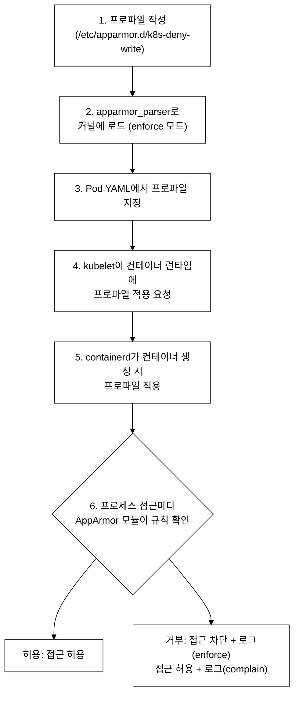
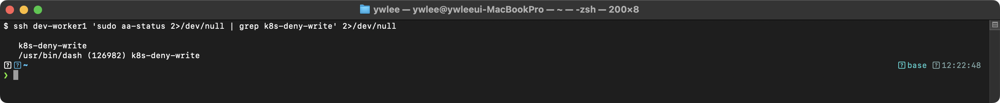
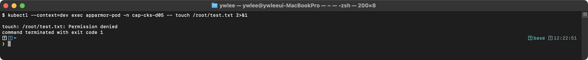
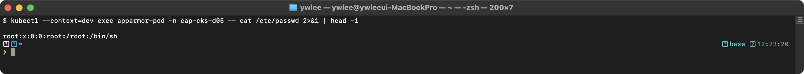
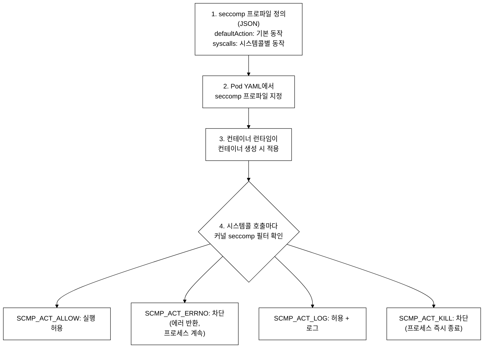
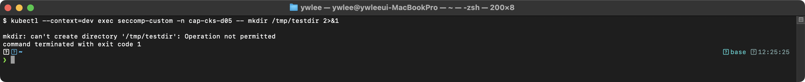
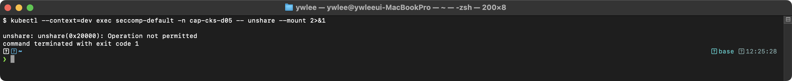
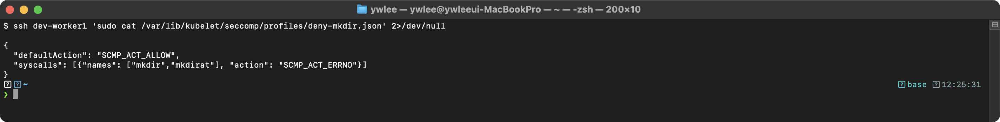
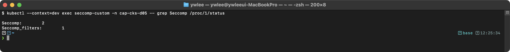
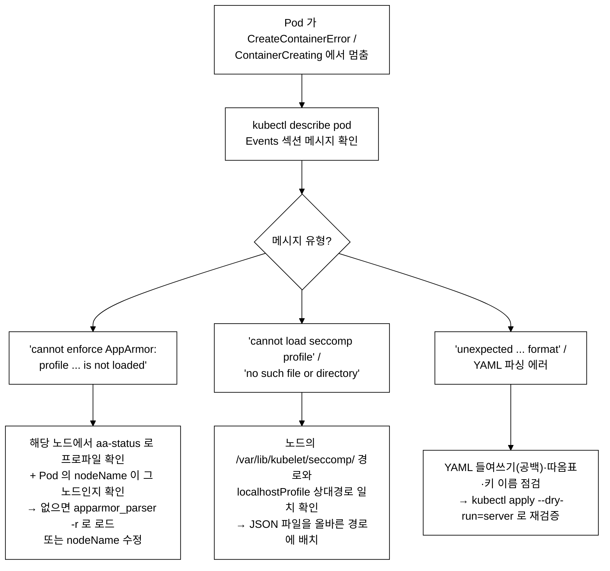

# CKS Day 5: System Hardening (1/2) - AppArmor, seccomp 프로파일

> 학습 위치 | 이전: Day 4 Audit Policy & kubeadm 업그레이드(Cluster Hardening) / 이후: Day 6 System Hardening(2/2) — Falco, capabilities

> 학습 목표 | CKS 도메인: System Hardening (15%) | 예상 소요 시간: 2시간

---

## 오늘의 학습 목표

- AppArmor 프로파일을 작성하고 Pod에 적용할 수 있다
- seccomp 프로파일(RuntimeDefault, Localhost)을 이해하고 Pod에 적용할 수 있다
- 불필요한 패키지/서비스를 식별하고 제거하여 공격 표면을 줄인다
- 커널 파라미터(sysctl) 보안 설정을 이해한다
- Pod에서 위험한 시스템콜을 차단하는 방법을 안다

---

## 1. AppArmor 완전 정복

### 1.0 AppArmor 등장 배경

```
AppArmor가 필요한 이유 - DAC의 한계
════════════════════════════════════

기존 방식의 한계 (DAC만 사용하는 경우):
  - 전통적 UNIX DAC(Discretionary Access Control)는 파일 소유자가 퍼미션을 결정한다
  - root(UID 0)는 모든 DAC 검사를 우회하므로, 컨테이너가 root로 실행되면
    파일시스템 전체에 접근 가능하다
  - 컨테이너 런타임 취약점이나 커널 exploit으로 root 권한을 획득하면
    DAC만으로는 방어할 수 없다

공격-방어 매핑:
  공격 벡터                         → AppArmor 방어
  ──────────────────────────────── → ──────────────────────────────
  /proc/sysrq-trigger 쓰기로 패닉   → deny /proc/** w로 차단
  /etc/shadow 읽기                  → deny /etc/shadow rw로 차단
  raw 소켓으로 ARP spoofing          → deny network raw로 차단
  악성 바이너리 /usr/bin 드롭         → deny /usr/bin/** w로 차단
  커널 모듈 로드                     → deny capability sys_admin으로 차단

SELinux와의 비교:
  - SELinux: 라벨(label) 기반, 정밀하지만 정책 작성이 복잡하다. RHEL/CentOS 기본.
  - AppArmor: 경로(path) 기반, 정책이 직관적이다. Ubuntu/Debian 기본.
  - CKS 시험에서는 AppArmor만 출제된다.
```

### 1.1 AppArmor 아키텍처 및 MAC 모델

```
AppArmor - LSM 기반 강제 접근 제어(MAC) 메커니즘
═════════════════════════════════════════════════

AppArmor는 Linux Security Module(LSM) 프레임워크에 등록된 커널 모듈로,
DAC(Discretionary Access Control)를 보완하는 MAC(Mandatory Access Control) 정책을 구현한다.

LSM(Linux Security Module)이란:
  커널에 보안 정책(AppArmor, SELinux 등)을 플러그인 형태로 끼워 넣는 프레임워크다.
  프로세스가 시스템콜(open, write, mount 등)을 호출할 때마다 커널 내부의 "LSM hook"
  지점을 지나가는데, 이 지점에서 등록된 보안 모듈이 해당 프로세스의 프로파일 규칙을
  조회하여 허용/차단을 판정한다. 즉 LSM은 "보안 모듈을 꽂을 수 있는 콘센트",
  AppArmor는 "그 콘센트에 꽂힌 보안 모듈"에 해당한다.

동작 원리:
  프로세스가 시스템콜을 호출하면 → 커널의 LSM hook 지점에서 AppArmor 모듈이
  해당 프로세스에 연결된 프로파일(profile)을 참조하여 접근 판정을 수행한다.

프로파일이 제어하는 리소스 유형:
  - 파일 접근: 경로 기반으로 read(r), write(w), execute(x) 퍼미션을 정의
  - 네트워크: socket type(inet, inet6, raw 등) 및 프로토콜(tcp, udp) 제어
  - Capabilities: CAP_NET_RAW, CAP_SYS_ADMIN 등 POSIX capability 제어
    (Capability = root의 전능한 권한을 잘게 쪼갠 단위. 예: CAP_NET_RAW는 raw 소켓
     생성 권한, CAP_SYS_ADMIN은 마운트·커널 모듈 같은 시스템 관리 권한이다.
     프로세스가 root여도 특정 capability만 갖도록 제한하면 권한 범위를 좁힐 수 있다.)
  - Mount/Umount: 파일시스템 마운트 작업 제어

AppArmor는 경로 기반(path-based) 정책 모델을 사용하며,
프로세스별로 프로파일을 작성하여 enforce(위반 시 차단) 또는
complain(위반 시 로깅만) 모드로 동작한다.
```

### 1.2 AppArmor 동작 원리


_그림 1. AppArmor 프로파일 작성부터 커널 적용까지의 동작 흐름._

중요 사항:
  - 프로파일은 Pod가 스케줄링되는 "노드"에 로드되어 있어야 한다.
  - 프로파일이 없는 노드에서 Pod가 실행되면 에러 발생
  - K8s 1.30+: securityContext 방식 (GA)
  - K8s 1.29-: annotation 방식 (beta)

### 1.3 AppArmor 모드

```
AppArmor 세 가지 모드
════════════════════

모드         | 동작                       | 사용 사례
─────────────┼───────────────────────────┼─────────────────────
enforce      | 정책 위반 시 차단 + 로그    | 프로덕션 환경
complain     | 정책 위반 시 로그만 기록    | 테스트/디버깅
unconfined   | AppArmor 미적용            | 기본 상태

명령어:
  enforce 모드로 로드:  apparmor_parser -r <파일>
  complain 모드로 로드: apparmor_parser -C <파일>
  프로파일 제거:        apparmor_parser -R <파일>
  상태 확인:           aa-status
```

### 1.4 AppArmor 프로파일 작성 상세

```
# ═══════════════════════════════════════════
# 프로파일 1: 파일 쓰기 제한 (가장 기본적인 패턴)
# ═══════════════════════════════════════════
# 파일: /etc/apparmor.d/k8s-deny-write
```

```
#include <tunables/global>
# ↑ 전역 변수/매크로 포함 (시스템 경로 등 정의)

profile k8s-deny-write flags=(attach_disconnected,mediate_deleted) {
# ↑ 프로파일 이름: k8s-deny-write
# ↑ flags:
#   attach_disconnected = 부모 없는 프로세스에도 적용
#   mediate_deleted = 삭제된 파일에 대한 접근도 중재
#     (컨테이너 이미지 레이어(overlay fs)에서 파일이 삭제돼도 프로세스가
#      해당 파일의 fd를 열고 있을 수 있다. mediate_deleted가 없으면 이런 경우
#      AppArmor가 접근 판정을 건너뛰어 정책 우회로 이어질 수 있다.)

  #include <abstractions/base>
  # ↑ 기본 라이브러리, /dev/null 등 기본 접근 허용

  file,
  # ↑ 기본 파일 접근 허용 (아래 deny 규칙이 우선)

  # === 쓰기 제한 규칙 ===
  deny /** w,
  # ↑ 모든 경로(/**)에 대해 쓰기(w) 거부
  # deny = 명시적 거부 (로그에도 기록됨)
  # ** = 재귀적 (하위 디렉토리 포함)
  # w = write (쓰기)
  #
  # ⚠️ 규칙 평가 순서 주의: AppArmor에서 deny 규칙은 allow 규칙보다 우선한다.
  #    따라서 위의 deny /** w 가 있으면, 아래 /tmp/** rw 로도 /tmp 쓰기를
  #    되살릴 수 없다(전역 deny 가 이긴다). 이 프로파일은 "모든 쓰기 차단"을
  #    보여주는 예제이며, /tmp 만 허용하려면 1.4.1의 수정 버전을 사용한다.

  # === 예외: 쓰기 허용 경로 (위 deny /** w 때문에 실제로는 무력화됨) ===
  /tmp/** rw,
  # ↑ /tmp와 하위 경로에 읽기(r)+쓰기(w) 허용 (단, 위 deny /** w 가 우선하여 차단됨)
  /var/tmp/** rw,

  # === 커널 인터페이스 보호 ===
  deny /proc/** w,
  # ↑ /proc (프로세스 정보) 쓰기 거부
  deny /sys/** w,
  # ↑ /sys (커널 파라미터) 쓰기 거부
}
```

#### 1.4.1 프로파일 1의 실습용 수정 — /tmp만 쓰기 허용

프로파일 1을 그대로 적용하면 `deny /** w`가 모든 경로의 쓰기를 차단하므로 `/tmp/** rw`예외도 무력화되어 /tmp에도 쓸 수 없다(1.7에서 실측으로 확인). /tmp만 쓰기를 허용하려면
전역 `deny`를 쓰지 말고, 필요한 경로만 명시적으로 rw를 부여하고 나머지는 아무 규칙도
주지 않는 방식으로 작성한다. 규칙이 없는 경로는 AppArmor 기본 정책(이 프로파일에서는
`file,`로 열려 있으나, deny를 추가한 경로만 차단)에 따른다.

```
#include <tunables/global>

profile k8s-deny-write-fixed flags=(attach_disconnected,mediate_deleted) {
  #include <abstractions/base>

  # 읽기/실행은 전역 허용, 쓰기는 명시한 경로에만 부여한다
  /** r,
  # ↑ 모든 경로 읽기 허용 (deny 가 아니므로 아래 개별 허용과 충돌 없음)

  # === 쓰기 허용 경로 (전역 deny 없이 필요한 곳만) ===
  /tmp/** rw,
  /var/tmp/** rw,

  # === 명시적으로 막을 위험 경로만 deny ===
  deny /proc/** w,
  deny /sys/** w,
  deny /etc/** w,
  deny /usr/bin/** w,
  deny /bin/** w,
  # ↑ 위 경로는 deny 로 명시했으므로 쓰기 차단된다.
  #   /tmp, /var/tmp 는 deny 가 없고 rw 를 줬으므로 쓰기 가능하다.
}
```

요점: AppArmor에서 "전역 deny + 부분 allow"는 deny가 우선하여 의도대로 동작하지 않는다.
"필요한 경로만 allow + 위험 경로만 deny" 패턴으로 작성해야 예외가 살아난다. 프로파일 3
(k8s-hardened)도 이 패턴을 따라 `deny /** w` 없이 위험 경로만 개별 deny한다.

```
# ═══════════════════════════════════════════
# 프로파일 2: 네트워크 제한 (raw 소켓 차단)
# ═══════════════════════════════════════════
# 파일: /etc/apparmor.d/k8s-restrict-network
```

```
#include <tunables/global>

profile k8s-restrict-network flags=(attach_disconnected,mediate_deleted) {
  #include <abstractions/base>

  file,

  # === 허용할 네트워크 프로토콜 ===
  network tcp,
  # ↑ TCP 소켓 허용 (HTTP, HTTPS 등)
  network udp,
  # ↑ UDP 소켓 허용 (DNS 등)

  # === 차단할 네트워크 프로토콜 ===
  deny network raw,
  # ↑ raw 소켓 차단 (ping, 패킷 캡처 등)
  # raw 소켓 = 커널을 우회하여 직접 패킷 조작
  # 공격자가 네트워크 스니핑에 사용 가능 → 차단!
  deny network packet,
  # ↑ packet 소켓 차단 (tcpdump 등)
}
```

```
# ═══════════════════════════════════════════
# 프로파일 3: 종합 보안 프로파일
# ═══════════════════════════════════════════
# 파일: /etc/apparmor.d/k8s-hardened
```

```
#include <tunables/global>

profile k8s-hardened flags=(attach_disconnected,mediate_deleted) {
  #include <abstractions/base>

  # === 파일 접근 규칙 ===
  file,

  # 쓰기 가능 경로 (최소한)
  /tmp/** rw,
  /var/tmp/** rw,
  /var/log/** rw,

  # 읽기만 가능
  /etc/** r,
  /usr/** r,
  /lib/** r,

  # 쓰기 거부 (중요 경로)
  deny /proc/** w,
  deny /sys/** w,
  deny /etc/shadow rw,
  deny /etc/passwd w,

  # 바이너리 디렉토리 쓰기 거부
  deny /usr/bin/** w,
  deny /usr/sbin/** w,
  deny /usr/local/bin/** w,
  deny /bin/** w,
  deny /sbin/** w,

  # === 네트워크 규칙 ===
  network tcp,
  network udp,
  deny network raw,
  deny network packet,

  # === capability 제한 ===
  deny capability sys_admin,
  # ↑ sys_admin = 시스템 관리 능력 (마운트, 커널 모듈 등)
  deny capability sys_ptrace,
  # ↑ sys_ptrace = 다른 프로세스 추적 (디버깅)
  deny capability net_raw,
  # ↑ net_raw = raw 소켓 생성
}
```

### 1.5 프로파일 관리 명령어

```bash
# ═══ 프로파일 로드/관리 ═══

# enforce 모드로 로드 (프로덕션)
sudo apparmor_parser -r /etc/apparmor.d/k8s-deny-write
# -r = replace (기존 프로파일 교체)

# complain 모드로 로드 (디버깅)
sudo apparmor_parser -C /etc/apparmor.d/k8s-deny-write
# -C = complain mode

# 프로파일 제거
sudo apparmor_parser -R /etc/apparmor.d/k8s-deny-write
# -R = remove

# 로드된 프로파일 확인
sudo aa-status
# 출력:
# 42 profiles are loaded.
# 40 profiles are in enforce mode.
#   k8s-deny-write
#   k8s-restrict-network
#   ...
# 2 profiles are in complain mode.

# 특정 프로파일 확인
sudo aa-status | grep k8s
```

### 1.6 Pod에 AppArmor 적용

```yaml
# ═══════════════════════════════════════════
# K8s 1.30+ (securityContext 방식 - GA)
# CKS 시험에서는 이 방식을 사용한다
# ═══════════════════════════════════════════
apiVersion: v1
kind: Pod
metadata:
  name: apparmor-pod
spec:
  nodeName: worker-node              # 프로파일이 로드된 노드를 지정해야 함!
  containers:
  - name: app
    image: nginx:1.25
    securityContext:
      appArmorProfile:               # AppArmor 프로파일 설정
        type: Localhost              # Localhost = 노드에 로드된 프로파일
        localhostProfile: k8s-deny-write
                                     # 프로파일 이름 (aa-status에서 확인)
    volumeMounts:
    - name: tmp
      mountPath: /tmp                # 쓰기 가능 경로 마운트
  volumes:
  - name: tmp
    emptyDir: {}

# ═══════════════════════════════════════════
# K8s 1.29 이하 (annotation 방식 - beta)
# ═══════════════════════════════════════════
---
apiVersion: v1
kind: Pod
metadata:
  name: apparmor-pod-legacy
  annotations:
    # 형식: container.apparmor.security.beta.kubernetes.io/<컨테이너이름>: localhost/<프로파일이름>
    container.apparmor.security.beta.kubernetes.io/app: localhost/k8s-deny-write
spec:
  nodeName: worker-node
  containers:
  - name: app                       # annotation의 컨테이너 이름과 일치해야!
    image: nginx:1.25
```

```
AppArmor Profile 타입:
═════════════════════

type: RuntimeDefault   → 컨테이너 런타임의 기본 AppArmor 프로파일
type: Localhost        → 노드에 로드된 커스텀 프로파일
type: Unconfined       → AppArmor 미적용 (비권장)

CKS에서는 Localhost를 사용하여 커스텀 프로파일을 적용하는 문제가 나온다.
```

### 1.7 AppArmor 실습 검증

```bash
# 1. 프로파일이 커널에 로드되었는지 확인
sudo aa-status | grep k8s-deny-write
```



enforce mode 목록에 프로파일 이름이 표시되면 정상이다.

```bash
# 2. Pod 생성 후 쓰기 차단 검증
kubectl exec apparmor-pod -- touch /root/test.txt 2>&1
```



AppArmor가 deny /** w 규칙에 의해 쓰기를 차단한 것이다.

```bash
# 3. 허용된 경로 쓰기 확인
kubectl exec apparmor-pod -- touch /tmp/test.txt && echo "SUCCESS"
```


주의: AppArmor의 `deny` 규칙은 무조건적이라, 뒤에 오는 `/tmp/** rw` allow 규칙으로 덮을 수 없다. 즉 `deny /** w`가 있으면 `/tmp/** rw`를 적어도 /tmp 쓰기는 차단된다(실측으로 확인). /tmp만 허용하려면 `deny /** w` 대신 `audit deny`를 쓰지 않거나, 전역 deny 없이 필요한 경로만 명시적으로 rw 부여하고 나머지는 allow하지 않는 방식으로 작성해야 한다.

```bash
# 4. 읽기 확인
kubectl exec apparmor-pod -- cat /etc/passwd | head -1
```



읽기는 file, 규칙에 의해 허용된다. deny 규칙은 w(쓰기)만 차단한다.

```bash
# 5. /etc 쓰기 차단 확인
kubectl exec apparmor-pod -- sh -c "echo test > /etc/test" 2>&1
```


```bash
# 6. 커널 로그에서 AppArmor 차단 이벤트 확인 (노드에서)
dmesg | grep "apparmor.*DENIED" | tail -3
```

> **예시(참조) — AppArmor DENIED 로그:** 위반 시 노드 dmesg 링버퍼/`journalctl -k` 에 `apparmor="DENIED"` 감사 로그가 남는다(환경에 따라 노출 안 될 수 있음). dev-worker1 에서는 링버퍼에 노출되지 않아 형식 참고용으로만 둔다.

위 한 줄은 실제 출력을 캡처한 것이 아니라 **필드 구조를 보여주기 위한 형식 예시**다.
커널의 LSM hook에서 AppArmor 모듈이 차단한 이벤트는 이처럼 audit 로그에 기록되며,
operation, profile, name, requested_mask 필드로 차단 원인을 파악한다. 실제 차단 라인을
확인하려면 노드에서 `journalctl -k | grep apparmor` 또는 `ausearch -m avc,fanotify`로
직접 조회한다(메인 작성자가 해당 노드의 실제 화면을 별도 캡처한다).

---

## 2. seccomp 완전 정복

### 2.0 seccomp가 필요한 이유 — AppArmor의 한계

```
AppArmor만으로는 막을 수 없는 것
═══════════════════════════════════

AppArmor는 "파일 경로"와 "네트워크 타입"을 기준으로 접근을 제어한다. 그러나 일부
위험한 시스템콜은 경로 기반으로는 막을 수 없다.

예시: mount 시스템콜
  - mount 시스템콜은 임의의 경로를 인자로 받아 파일시스템을 마운트한다.
  - 공격자가 어떤 경로를 마운트할지 미리 알 수 없으므로
    deny /path/** 같은 경로 규칙으로는 mount 행위 자체를 차단할 수 없다.
  - ptrace(프로세스 메모리 접근), unshare(네임스페이스 생성) 등도 마찬가지로
    "경로"가 아니라 "행위 자체"가 위험하다.

seccomp의 접근법:
  - seccomp는 경로가 아니라 "시스템콜 번호" 자체를 필터링한다.
  - 따라서 mount 시스템콜 호출 자체를 차단할 수 있다(어떤 인자를 주든 무관).

결론: 두 계층이 함께 필요하다.
  AppArmor  → 파일/네트워크 접근(어떤 경로에 무엇을 할 수 있나)
  seccomp   → 시스템콜 자체(어떤 행위를 호출할 수 있나)
  두 메커니즘은 경쟁 관계가 아니라 서로 다른 계층을 막는 보완 관계다.
```

AppArmor와 seccomp 비교:

| 구분 | AppArmor | seccomp |
|:--|:--|:--|
| 제어 기준 | 파일 경로 / 네트워크 타입 | 시스템콜 번호 |
| 막는 대상 | 어떤 경로에 read/write/execute 가능한가 | 어떤 시스템콜을 호출 가능한가 |
| mount/ptrace 차단 | 불가(인자 경로를 예측 못 함) | 가능(시스템콜 자체 차단) |
| 적용 단위 | 프로세스별 프로파일 | Pod/Container별 프로파일 |

### 2.0.1 K8s에서 seccomp 적용 방식의 변천

K8s는 seccomp를 도입하는 과정에서 API 표현 방식을 세 번 바꿨다.

1. **PodSecurityPolicy(PSP) 시절 alpha 필드** — K8s 1.10 이전: `PodSecurityPolicy.spec.seccomp` 필드를 annotation 형태로 제안했으나, PSP 자체가 복잡하고 권한 모델이 비직관적이어서 실무 도입이 저조했다.
2. **K8s 1.19 beta — `securityContext.seccompProfile`** — PSP와 분리하여 Pod/Container의 `securityContext`에 `seccompProfile` 필드를 독립적으로 beta 제공했다. 이때부터 `type: RuntimeDefault | Localhost | Unconfined` 구조가 확정됐다.
3. **K8s 1.22 GA** — `securityContext.seccompProfile`이 정식(GA) 필드로 승격됐다. 이 버전 이후 annotation 방식(`seccomp.security.alpha.kubernetes.io/pod`)은 deprecated 처리됐다. CKS 시험 환경은 1.22 이후 버전이므로 `securityContext.seccompProfile`을 표준으로 쓴다.

PSP는 2021년(K8s 1.21)에 deprecated, 1.25에서 제거됐으므로 현재는 seccomp를 PSP를 통해 제어하는 방법 자체가 없다.

### 2.1 seccomp 커널 메커니즘

```
seccomp(Secure Computing Mode) - 시스템콜 필터링 메커니즘
═════════════════════════════════════════════════════════

seccomp은 리눅스 커널의 시스템콜 필터링 메커니즘으로,
prctl(PR_SET_SECCOMP) 또는 seccomp(2) 시스템콜을 통해 활성화된다.
BPF(Berkeley Packet Filter) 프로그램을 사용하여 시스템콜 번호를
검사하고 ALLOW, KILL, ERRNO, TRACE, LOG 등의 액션을 수행한다.

BPF란:
  커널 안에서 안전하게 실행되는 작은 가상 머신(VM)이다. 사용자가 작성한 필터 규칙을
  BPF 바이트코드로 컴파일해 커널에 등록하면, 커널은 시스템콜이 호출될 때마다 이 바이트코드를
  실행하여 빠르게 허용/차단을 판정한다. seccomp가 BPF를 쓰는 이유는, 시스템콜마다 무거운
  검사를 하면 성능이 떨어지므로 커널 내부에서 경량 바이트코드로 즉시 판정하기 위함이다.
  (원래 네트워크 패킷 필터링용으로 만들어졌으나 seccomp가 같은 메커니즘을 시스템콜 필터에 차용했다.)

리눅스 커널에는 약 400개의 시스템콜이 있다:
  - read, write, openat → 정상적인 파일 I/O에 필수
  - execve → 프로세스 생성에 필수
  - mount → 파일시스템 마운트 (컨테이너에서 대부분 불필요, 권한 상승에 악용 가능)
  - ptrace → 프로세스 메모리 접근/디버깅 (컨테이너 이스케이프에 악용 가능)
  - reboot → 시스템 재부팅 (컨테이너에서 절대 불필요)

seccomp-bpf 프로파일은 JSON 형식으로 defaultAction과 syscalls 배열을 정의한다.
Kubernetes에서는 securityContext.seccompProfile로 Pod/Container에 적용하며,
RuntimeDefault 프로파일은 containerd/CRI-O가 제공하는 기본 화이트리스트를 사용한다.
```

seccomp의 트레이드오프:

allowlist(허용 목록) 방식은 강력한 제어를 제공하지만 다음 비용이 따른다.

1. **allowlist 유지보수 부담**: 애플리케이션이 업데이트되어 새 시스템콜을 사용하면 프로파일도 함께 갱신해야 한다. 누락된 시스템콜 하나가 앱 장애로 이어질 수 있다.
2. **SCMP_ACT_KILL 사용 시 앱 중단 위험**: defaultAction을 `SCMP_ACT_KILL`로 설정하면 허용 목록에 없는 시스템콜이 호출되는 즉시 프로세스가 SIGKILL로 종료된다. 허용 목록이 불완전하면 정상적인 앱 요청에도 컨테이너가 죽는다. 이 때문에 실무에서는 먼저 `SCMP_ACT_LOG`로 충분히 관측한 뒤 목록을 확정하고 KILL로 전환한다.
3. **아키텍처별 시스템콜 번호 차이**: 동일한 시스템콜 이름도 x86_64와 ARM64(AARCH64)에서 번호가 다르다. 이 때문에 strict.json에 `architectures` 배열(`SCMP_ARCH_X86_64`, `SCMP_ARCH_AARCH64`)이 있으며, 다른 아키텍처로 이식할 때 프로파일을 그대로 쓰면 차단 범위가 달라질 수 있다.

### 2.2 seccomp 동작 원리


_그림 2. seccomp 프로파일 적용 흐름과 시스템콜 액션._

### 2.3 seccomp 프로파일 타입

```
seccomp 프로파일 타입 비교
═════════════════════════

타입           | 설명                              | 사용 시기
───────────────┼──────────────────────────────────┼──────────────────
RuntimeDefault | 컨테이너 런타임의 기본 프로파일      | 대부분의 워크로드 (권장)
               | containerd/CRI-O가 제공            |
               | 약 60개 시스템콜 차단               |
               | mount, ptrace, reboot 등 차단      |
Localhost      | 노드의 로컬 커스텀 프로파일           | 특별한 보안 요구사항
               | /var/lib/kubelet/seccomp/ 하위      |
               | 사용자가 직접 작성                   |
Unconfined     | seccomp 미적용                      | 절대 비권장!
               | 모든 시스템콜 허용                   | 레거시 호환용
```

### 2.4 RuntimeDefault 적용

seccompProfile은 두 위치에 쓸 수 있고, 어디에 쓰느냐로 적용 범위가 달라진다.
아래 2.4a는 Pod 레벨(모든 컨테이너 일괄 적용), 그 다음 2.4b는 컨테이너 레벨
(특정 컨테이너만 적용)이다.

#### 2.4a Pod 레벨 — 모든 컨테이너에 일괄 적용

```yaml
# ═══════════════════════════════════════════
# RuntimeDefault 적용 (가장 기본적인 seccomp 보안)
# ═══════════════════════════════════════════
apiVersion: v1
kind: Pod
metadata:
  name: seccomp-default
spec:
  securityContext:
    seccompProfile:
      type: RuntimeDefault           # 컨테이너 런타임의 기본 프로파일
                                     # containerd: 약 60개 위험 시스템콜 차단
                                     # mount, ptrace, reboot 등 차단
  containers:
  - name: app
    image: nginx:1.25
    securityContext:
      allowPrivilegeEscalation: false  # 권한 상승 방지
                                       # RuntimeDefault와 함께 사용 권장

# Pod 레벨 vs 컨테이너 레벨:
#   - seccompProfile은 Pod 레벨에서 설정하면 모든 컨테이너에 적용
#   - 컨테이너 레벨에서도 설정 가능 (컨테이너 설정이 우선)
```

#### 2.4b 컨테이너 레벨 — 선택적 적용

```yaml
apiVersion: v1
kind: Pod
metadata:
  name: seccomp-container-level
spec:
  securityContext:
    seccompProfile:
      type: RuntimeDefault           # Pod 레벨 기본값(모든 컨테이너에 우선 적용)
  containers:
  - name: app
    image: nginx:1.25
    # 별도 지정 없음 → Pod 레벨의 RuntimeDefault 상속
  - name: sidecar
    image: busybox:1.36
    securityContext:
      seccompProfile:
        type: Localhost              # 이 컨테이너만 다른 프로파일로 override
        localhostProfile: profiles/deny-mkdir.json
```

적용 우선순위와 권장 패턴:

```
적용 우선순위
═══════════
컨테이너 레벨 seccompProfile  >  Pod 레벨 seccompProfile
(컨테이너에 값이 있으면 그것이 Pod 레벨 값을 덮어쓴다)

어디에 써야 하나:
  - 클러스터 전체 일관성을 위해 Pod 레벨에서 기본값(RuntimeDefault)을 정한다.
  - 특이한 요구가 있는 컨테이너만 컨테이너 레벨에서 override 한다(위 sidecar).
  - 이렇게 하면 "기본은 안전, 예외만 명시"가 되어 누락으로 인한 Unconfined 컨테이너가
    생기지 않는다.
```

### 2.5 커스텀 seccomp 프로파일 작성

```json
// ═══════════════════════════════════════════
// 차단 목록 방식 (denylist): 특정 시스템콜만 차단
// ═══════════════════════════════════════════
// 파일: /var/lib/kubelet/seccomp/profiles/deny-mkdir.json
{
  "defaultAction": "SCMP_ACT_ALLOW",     // 기본: 모든 시스템콜 허용
  "syscalls": [
    {
      "names": ["mkdir", "mkdirat"],       // mkdir, mkdirat 시스템콜
      "action": "SCMP_ACT_ERRNO",          // 차단 (에러 반환)
      "errnoRet": 1                        // EPERM 에러
    }
  ]
}
```

아래는 일반적인 HTTP 서버(nginx 등) 워크로드에서 실제 호출되는 시스템콜을 측정해 수집한 예제 목록이다. 애플리케이션마다 필요한 시스템콜이 다르므로, 이 목록은 참고용이며 자신의 워크로드에서 직접 측정(2.5 실무 워크플로우 참조)하여 확정해야 한다.

```json
// ═══════════════════════════════════════════
// 허용 목록 방식 (allowlist): 특정 시스템콜만 허용 (더 안전)
// ═══════════════════════════════════════════
// 파일: /var/lib/kubelet/seccomp/profiles/strict.json
{
  "defaultAction": "SCMP_ACT_ERRNO",      // 기본: 모든 시스템콜 차단!
  "architectures": [
    "SCMP_ARCH_X86_64",                    // x86_64 아키텍처
    "SCMP_ARCH_AARCH64"                    // ARM64 아키텍처
  ],
  "syscalls": [
    {
      "names": [
        // === 파일 시스템 ===
        "access", "close", "dup", "dup2", "dup3",
        "faccessat", "faccessat2", "fchmod", "fchown", "fcntl",
        "fstat", "fstatfs", "getcwd", "getdents64",
        "lseek", "newfstatat", "open", "openat",
        "read", "readlink", "readlinkat", "rename",
        "stat", "statfs", "statx", "unlink", "unlinkat",
        "write", "writev", "pread64", "pwrite64",
        "sendfile",

        // === 프로세스 관리 ===
        "arch_prctl", "brk", "clone", "execve",
        "exit", "exit_group", "futex",
        "getegid", "geteuid", "getgid", "getpid",
        "getppid", "getuid", "kill", "tgkill",
        "prctl", "prlimit64", "set_robust_list",
        "set_tid_address", "wait4",
        "capget", "capset",
        "setgid", "setgroups", "setuid",
        "sigaltstack", "rt_sigaction", "rt_sigprocmask", "rt_sigreturn",

        // === 메모리 관리 ===
        "mmap", "mprotect", "munmap", "madvise",

        // === 네트워크 ===
        "accept4", "bind", "connect", "listen",
        "getsockname", "getsockopt", "setsockopt",
        "recvfrom", "recvmsg", "sendmsg", "sendto",
        "socket", "socketpair",

        // === 기타 ===
        "epoll_create1", "epoll_ctl", "epoll_pwait",
        "getrandom", "ioctl", "nanosleep",
        "pipe", "pipe2", "poll", "ppoll", "select",
        "sysinfo", "uname"
      ],
      "action": "SCMP_ACT_ALLOW"           // 위 목록만 허용
    }
  ]
}
// 위 목록에 없는 시스템콜(mount, ptrace, reboot, unshare 등)은
// defaultAction에 의해 차단된다
```

실무 워크플로우 — allowlist는 외우는 게 아니라 측정해서 만든다:

위 strict.json의 약 70개 시스템콜을 처음부터 다 외워서 쓰는 것이 아니다. 애플리케이션마다
필요한 시스템콜이 다르므로, 실무에서는 다음 반복 과정으로 목록을 좁혀 간다.

```
1. RuntimeDefault(또는 SCMP_ACT_LOG 기본)로 시작 — 일단 넓게 열어 둔다.
2. 애플리케이션을 정상 부하로 실행한다.
3. 차단/호출된 시스템콜을 로그(audit/dmesg)에서 수집한다.
4. 수집한 시스템콜만 allowlist에 추가하고 defaultAction을 SCMP_ACT_ERRNO로 좁힌다.
5. 다시 실행하여 누락된 콜이 없는지 확인(2~4 반복).
```

차단된 시스템콜을 audit 로그에서 추출하는 명령(노드에서 실행):

```bash
# auditd 가 동작 중이고 seccomp 액션이 SCMP_ACT_LOG 인 경우,
# 거부(DENIED)된 시스템콜 이름을 중복 없이 뽑아낸다
sudo ausearch -m seccomp 2>/dev/null \
  | grep -i 'DENIED\|comm=' \
  | grep -o 'syscall=[0-9]*' | sort -u
# syscall 번호 → 이름 변환: ausyscall <번호>  (예: ausyscall 83 → mkdir)
```

strict.json은 일반적인 웹 애플리케이션을 위한 참고 예제일 뿐이며, 각 애플리케이션마다
위 절차로 측정한 목록을 사용해야 한다.

### 2.6 Localhost 프로파일 적용

```yaml
# ═══════════════════════════════════════════
# Localhost 커스텀 seccomp 프로파일 적용
# ═══════════════════════════════════════════
apiVersion: v1
kind: Pod
metadata:
  name: seccomp-custom
spec:
  nodeName: worker-node              # 프로파일 파일이 있는 노드!
  securityContext:
    seccompProfile:
      type: Localhost                # 로컬 커스텀 프로파일
      localhostProfile: profiles/deny-mkdir.json
      # ↑ /var/lib/kubelet/seccomp/ 기준 상대 경로
      # 전체 경로: /var/lib/kubelet/seccomp/profiles/deny-mkdir.json
  containers:
  - name: app
    image: nginx:1.25
    securityContext:
      allowPrivilegeEscalation: false
```

```
중요: 파일 경로 규칙
════════════════════

localhostProfile의 기준 경로: /var/lib/kubelet/seccomp/

localhostProfile: profiles/custom.json
→ 실제 경로: /var/lib/kubelet/seccomp/profiles/custom.json

localhostProfile: my-profile.json
→ 실제 경로: /var/lib/kubelet/seccomp/my-profile.json

프로파일 파일이 해당 경로에 없으면 Pod 생성 실패!
```

### 2.7 seccomp 실습 검증

```bash
# mkdir 차단 검증
kubectl exec seccomp-custom -- mkdir /tmp/testdir 2>&1
```



seccomp BPF 필터가 mkdir 시스템콜(번호 83)을 인터셉트하여 SCMP_ACT_ERRNO를 반환한 것이다.

```bash
# RuntimeDefault로 차단되는 것들 검증
kubectl exec seccomp-default -- unshare --user /bin/sh 2>&1
```



RuntimeDefault 프로파일은 unshare 시스템콜을 차단한다. 이 시스템콜은 새 user namespace를 생성하여 권한 상승에 악용될 수 있다.

```bash
# Pod의 seccomp 상태 확인
kubectl get pod seccomp-custom -o jsonpath='{.spec.securityContext.seccompProfile}' | python3 -m json.tool
```



```bash
# 커널 수준에서 seccomp 상태 확인 (노드에서)
# 컨테이너의 PID를 찾아서 /proc/<pid>/status 확인
crictl inspect <container-id> | jq '.info.pid'
cat /proc/<pid>/status | grep Seccomp
```



Seccomp 값 의미: 0=SECCOMP_MODE_DISABLED, 1=SECCOMP_MODE_STRICT, 2=SECCOMP_MODE_FILTER(BPF 사용). 값이 2이면 seccomp-bpf 필터가 적용된 것이다.

### 2.8 seccomp 액션 상세

```
seccomp 액션 비교
════════════════

액션              | 동작                    | 프로세스 상태
──────────────────┼────────────────────────┼──────────────
SCMP_ACT_ALLOW    | 시스템콜 허용            | 정상 실행
SCMP_ACT_ERRNO    | 시스템콜 차단, 에러 반환  | 계속 실행 (에러 처리)
SCMP_ACT_LOG      | 시스템콜 허용, 로그 기록  | 정상 실행
SCMP_ACT_KILL     | 시스템콜 차단, SIGKILL    | 즉시 종료!
SCMP_ACT_KILL_PROCESS | 프로세스 전체 종료   | 즉시 종료!

CKS 시험에서:
  - SCMP_ACT_ERRNO가 가장 많이 사용된다 (차단하되 프로세스는 유지)
  - SCMP_ACT_ALLOW는 허용 목록에서 사용
  - SCMP_ACT_KILL은 극단적인 보안이 필요한 경우
```

---

## 3. 불필요한 패키지/서비스 제거

### 3.0 왜 노드 강화도 필요한가 — 계층적 방어(defense in depth)

```
컨테이너 레벨 제어와 노드 레벨 강화의 관계
═══════════════════════════════════════════

앞에서 배운 AppArmor/seccomp 는 "컨테이너·Pod 레벨" 제어다. 즉 컨테이너 안에서
무엇을 할 수 있는지를 제한한다. 그러나 노드(호스트 OS) 자체가 변조되면 이 제어는
무의미해진다. 예를 들어 노드에서 불필요한 cups(프린터 데몬)가 돌고 있으면,
그 데몬이 여는 네트워크 포트의 취약점을 통해 노드 자체가 장악될 수 있고,
일단 노드가 장악되면 AppArmor 프로파일이든 seccomp 필터든 공격자가 해제할 수 있다.

따라서 방어는 한 계층만으로 끝나지 않고 여러 계층으로 쌓는다(계층적 방어):
  계층 1: 노드 강화      — 불필요한 서비스/패키지/모듈 제거(이 섹션, 공격 표면 축소)
  계층 2: 컨테이너 제어  — AppArmor/seccomp/capabilities(앞 섹션)
  계층 3: 클러스터 정책  — RBAC/NetworkPolicy/PSA(다른 날 다룸)
어느 한 계층이 뚫려도 다음 계층이 피해를 막는다.

학습 우선순위(시험 관점):
  이 섹션(노드 강화)은 CKS System Hardening 도메인(전체 15%) 안에서도 출제 비중이
  낮은 편이다. 시간이 부족하면 AppArmor/seccomp 의 완벽한 숙달을 먼저 끝낸 뒤
  이 섹션을 보강한다.
```

### 3.1 원칙

```
공격 표면 최소화(Attack Surface Reduction) 원칙
═══════════════════════════════════════════════

공격 표면(attack surface)은 시스템에서 외부 입력을 수신하거나
권한 있는 작업을 수행하는 모든 인터페이스(네트워크 포트, IPC, 파일 등)의
총합이다. 공격 표면이 클수록 취약점이 존재할 확률과 공격 벡터가 증가한다.

최소화 원칙: 시스템에서 불필요한 서비스와 패키지를 제거하여
노출된 인터페이스 수를 줄이고, 잠재적 취약점을 사전에 제거한다.

쿠버네티스 노드에서 필수적인 프로세스만 유지한다:
  필수: kubelet, containerd, kube-proxy, sshd (관리용)
  불필요: cups (프린터 데몬), avahi-daemon (mDNS), bluetoothd, snapd 등
  → 각 불필요 서비스는 네트워크 리스닝 소켓 또는 로컬 권한 상승 경로를 제공할 수 있다
```

### 3.2 노드 보안 점검 명령어

```bash
# ═══ 실행 중인 서비스 확인 ═══
systemctl list-units --type=service --state=running

# 필수 서비스:
#   kubelet.service        - 컨테이너 오케스트레이션
#   containerd.service     - 컨테이너 런타임
#   sshd.service          - 원격 관리
#   systemd-* 관련        - 시스템 필수

# 불필요한 서비스 (있으면 제거):
#   cups.service          - 프린터 서비스
#   avahi-daemon.service  - 네트워크 디스커버리
#   bluetooth.service     - 블루투스
#   snapd.service         - Snap 패키지 매니저
#   apache2.service       - 웹 서버 (노드에서 불필요)

# ═══ 서비스 중지 및 비활성화 ═══
sudo systemctl stop snapd
sudo systemctl disable snapd
# stop: 즉시 중지
# disable: 부팅 시 자동 시작 비활성화

# 상태 확인
systemctl status snapd
# ● snapd.service
#    Active: inactive (dead)

# ═══ 열려 있는 포트 확인 ═══
ss -tlnp
# -t: TCP
# -l: LISTEN 상태
# -n: 포트 번호 (이름 변환 안 함)
# -p: 프로세스 정보

# 예상 필수 포트:
#   6443    - API Server (마스터)
#   10250   - kubelet
#   10256   - kube-proxy health check
#   2379    - etcd (마스터)
#   2380    - etcd peer (마스터)
#   30000-32767 - NodePort 범위

# 불필요한 포트가 열려 있으면 해당 서비스를 중지한다

# ═══ 불필요한 패키지 확인/제거 ═══
dpkg -l | grep -E "vim|curl|wget|netcat|nmap|tcpdump"
# 보안 관련 불필요한 도구:
#   netcat, nmap, tcpdump → 네트워크 스캔/스니핑 도구
#   telnet → 비암호화 원격 접속

sudo apt-get remove --purge netcat nmap tcpdump
sudo apt-get autoremove

# ═══ SUID 바이너리 검색 ═══
find / -perm -4000 -type f 2>/dev/null
# SUID = Set User ID
# SUID 비트가 설정된 바이너리는 소유자(보통 root) 권한으로 실행됨
# 공격자가 이를 악용하여 권한 상승 가능

# ═══ 불필요한 사용자 확인 ═══
cat /etc/passwd | grep -v "nologin\|false"
# 셸 접근이 가능한 사용자 목록
# 불필요한 사용자가 있으면 셸을 /usr/sbin/nologin으로 변경

# ═══ 불필요한 커널 모듈 비활성화 ═══
# /etc/modprobe.d/k8s-security.conf
echo "install cramfs /bin/true" | sudo tee -a /etc/modprobe.d/k8s-security.conf
echo "install freevxfs /bin/true" | sudo tee -a /etc/modprobe.d/k8s-security.conf
echo "install udf /bin/true" | sudo tee -a /etc/modprobe.d/k8s-security.conf
```

---

## 4. 커널 파라미터 보안 (sysctl)

### 4.1 주요 보안 커널 파라미터

```bash
# ═══ 커널 파라미터 확인 ═══

# IP 포워딩 (K8s에서는 1 필요)
sysctl net.ipv4.ip_forward
# 값: 1 (쿠버네티스 노드에서는 1이어야 한다)

# ICMP 리다이렉트 수신 (0 권장)
sysctl net.ipv4.conf.all.accept_redirects
# 값: 0 (MITM 공격 방지)

# ICMP 리다이렉트 전송 (0 권장)
sysctl net.ipv4.conf.all.send_redirects
# 값: 0

# SYN Cookie (1 권장)
sysctl net.ipv4.tcp_syncookies
# 값: 1 (SYN 플러드 공격 방어)

# ASLR (2 권장)
sysctl kernel.randomize_va_space
# 값: 2 (메모리 주소 무작위화 → 버퍼 오버플로우 공격 방어)

# 하드링크 보호 (1 권장)
sysctl fs.protected_hardlinks
# 값: 1 (하드링크를 통한 권한 상승 방지)

# 심볼릭링크 보호 (1 권장)
sysctl fs.protected_symlinks
# 값: 1 (심볼릭링크를 통한 접근 우회 방지)

# 설정 변경 (영구 적용)
echo "net.ipv4.conf.all.accept_redirects = 0" | sudo tee -a /etc/sysctl.d/99-security.conf
sudo sysctl -p /etc/sysctl.d/99-security.conf
```

### 4.2 Pod에서 sysctl 설정

```yaml
# ═══════════════════════════════════════════
# Pod에서 sysctl 설정
# ═══════════════════════════════════════════
apiVersion: v1
kind: Pod
metadata:
  name: sysctl-pod
spec:
  securityContext:
    sysctls:
    - name: net.ipv4.ip_unprivileged_port_start
      value: "0"
      # ↑ safe sysctl: 별도 설정 없이 사용 가능
      # 비특권 사용자가 0번 포트부터 바인딩 가능
    # - name: net.ipv4.ip_forward
    #   value: "1"
    #   # ↑ unsafe sysctl: kubelet에서 --allowed-unsafe-sysctls로 허용 필요
  containers:
  - name: app
    image: nginx:1.25
```

safe와 unsafe의 구분 기준은 커널 네임스페이스 격리 여부다. 리눅스는 네트워크 스택을 net namespace 단위로 격리하므로, net namespace 안에서만 유효한 파라미터(예: `net.ipv4.ip_unprivileged_port_start`)는 Pod별로 독립적으로 설정해도 다른 Pod나 호스트에 영향을 주지 않는다. 이런 파라미터가 safe sysctl이다. 반면 `net.ipv4.ip_forward`는 호스트 네트워크 스택 전체의 라우팅 동작을 제어하므로, 한 Pod에서 값을 바꾸면 같은 노드의 모든 Pod와 호스트에 영향을 준다. 이처럼 네임스페이스로 격리되지 않는 파라미터가 unsafe sysctl이다.

```
safe sysctl vs unsafe sysctl
═════════════════════════════

safe sysctl: 네임스페이스가 분리되어 다른 Pod에 영향 없음
  - net.ipv4.ip_unprivileged_port_start
  - kernel.shm_rmid_forced

unsafe sysctl: 호스트나 다른 Pod에 영향을 줄 수 있음
  - net.ipv4.ip_forward
  - net.core.somaxconn
  → kubelet의 --allowed-unsafe-sysctls 플래그로 허용 필요
```

---

## 5. AppArmor/seccomp 트러블슈팅

```
System Hardening 보안 설정 장애 시나리오
════════════════════════════════════════

시나리오 1: AppArmor 프로파일을 적용한 Pod가 생성 실패한다
  에러: "cannot enforce AppArmor: profile k8s-deny-write is not loaded"
  원인: Pod가 스케줄링된 노드에 프로파일이 로드되어 있지 않다
  디버깅:
    kubectl describe pod <pod-name>  # Events 섹션에서 에러 확인
    ssh <node> && aa-status | grep k8s-deny-write
  해결: 해당 노드에서 apparmor_parser -r로 프로파일을 로드하거나, nodeName으로 프로파일이 있는 노드를 지정한다

시나리오 2: seccomp Localhost 프로파일을 적용했는데 Pod가 CreateContainerError 상태이다
  에러: "failed to generate security options: cannot load seccomp profile"
  원인: /var/lib/kubelet/seccomp/ 경로에 프로파일 파일이 없다
  디버깅:
    kubectl describe pod <pod-name>  # Events에서 정확한 에러 확인
    ssh <node> && ls -la /var/lib/kubelet/seccomp/profiles/
  해결: 올바른 경로에 JSON 프로파일 파일을 생성한다. localhostProfile은 /var/lib/kubelet/seccomp/ 기준 상대 경로이다.

시나리오 3: AppArmor 프로파일을 enforce 모드로 로드했는데 아무것도 차단되지 않는다
  원인: 프로파일 문법 오류로 기본 허용(file, 규칙)만 적용되었다
  디버깅:
    sudo apparmor_parser -p /etc/apparmor.d/<profile>  # 문법 검증
    dmesg | grep apparmor  # 커널 로그에서 에러 확인
  해결: 프로파일 문법을 수정하고 apparmor_parser -r로 재로드한다

시나리오 4: seccomp 프로파일로 특정 시스템콜을 차단했는데 애플리케이션이 죽는다
  원인: SCMP_ACT_KILL 액션이 프로세스를 SIGKILL로 종료시킨다
  디버깅:
    kubectl logs <pod>  # 애플리케이션 로그 확인
    dmesg | grep seccomp  # 커널에서 차단된 시스템콜 확인
  해결: SCMP_ACT_KILL 대신 SCMP_ACT_ERRNO를 사용하면 프로세스는 유지되고 에러만 반환한다
```

실전 디버깅 결정 트리 — 실제 시험 문제는 원인이 여러 개 섞여 있다(프로파일 미로드 +
nodeName 누락 + YAML 문법 오류가 동시에 나는 식). 단일 시나리오 암기로는 부족하므로,
아래 순서로 에러 메시지부터 좁혀 들어간다.


_그림 3. AppArmor/seccomp Pod 생성 실패 시 에러 메시지 기반 디버깅 결정 트리._

실전 예제 — 멀티컨테이너 Pod에서 일부 컨테이너만 프로파일을 적용하려는데 누락되는 경우:
appArmorProfile은 컨테이너별 `securityContext`에 각각 지정해야 한다. 한 컨테이너에만
적으면 나머지 컨테이너는 unconfined로 남는다. annotation 방식(K8s 1.29 이하)에서는
`container.apparmor.security.beta.kubernetes.io/<컨테이너이름>`의 컨테이너 이름이
실제 컨테이너 이름과 한 글자라도 다르면 그 annotation은 무시되어 프로파일이 적용되지
않으므로, `describe`의 Events에 경고가 없더라도 `aa-status`나 `/proc/<pid>/attr/current`로
실제 적용 여부를 확인한다.

---

## tart-infra 실습

### 실습 환경 설정

```bash
# dev 클러스터 접속
export KUBECONFIG=kubeconfig/dev.yaml

# 클러스터 및 demo 네임스페이스 확인
kubectl get nodes
kubectl get pods -n demo
```

### 과제 1: SecurityContext 보안 설정 점검

**목표:** demo 네임스페이스의 Pod들에 적용된 SecurityContext를 점검하여 seccomp, capabilities, 권한 상승 방지 설정 상태를 확인한다.

| 항목 | 내용 |
|:--|:--|
| 제한 시간 | 5분 |
| 채점 기준 | seccompProfile, allowPrivilegeEscalation, capabilities.drop 값을 명령 하나로 출력하면 합격 |
| 실패 시 힌트 | `kubectl get pods -n demo -o json \| jq '.items[].spec.securityContext'`부터 시작한 뒤 jsonpath 쿼리를 좁혀 나간다 |

```bash
# 모든 Pod의 SecurityContext 확인
kubectl get pods -n demo -o jsonpath='{range .items[*]}=== {.metadata.name} ==={"\n"}  runAsNonRoot: {.spec.securityContext.runAsNonRoot}{"\n"}  seccompProfile: {.spec.securityContext.seccompProfile.type}{"\n"}{range .spec.containers[*]}  container[{.name}] allowPrivilegeEscalation: {.securityContext.allowPrivilegeEscalation}{"\n"}  container[{.name}] readOnlyRootFilesystem: {.securityContext.readOnlyRootFilesystem}{"\n"}{end}{"\n"}{end}'

# 예상 출력:
# === frontend-xxx ===
#   runAsNonRoot: true
#   seccompProfile: RuntimeDefault
#   container[frontend] allowPrivilegeEscalation: false
#   container[frontend] readOnlyRootFilesystem: true

# capabilities 확인 (drop ALL이 권장)
kubectl get pods -n demo -o jsonpath='{range .items[*]}{.metadata.name}: {range .spec.containers[*]}drop={.securityContext.capabilities.drop} add={.securityContext.capabilities.add}{end}{"\n"}{end}'
# 예상 출력: drop=["ALL"] add=[] (모든 capability 제거, 필요한 것만 추가)
```

**동작 원리:** SecurityContext의 seccompProfile: RuntimeDefault는 containerd 기본 seccomp 프로파일을 적용하여 mount, ptrace 등 약 60개 위험 시스템콜을 차단한다. allowPrivilegeEscalation: false는 커널의 no_new_privs 비트를 설정하여 setuid/setgid 바이너리를 통한 권한 상승을 방지한다.

### 과제 2: 권한 상승 시도 검증

**목표:** SecurityContext가 올바르게 적용되었을 때 실제로 권한 상승이 차단되는지 검증한다.

| 항목 | 내용 |
|:--|:--|
| 제한 시간 | 5분 |
| 채점 기준 | 파일시스템 쓰기 거부 · UID 비root 확인 · raw 소켓 거부 세 가지를 모두 실측으로 확인하면 합격 |
| 실패 시 힌트 | `kubectl describe pod -n demo <pod>` 의 SecurityContext 필드를 먼저 확인하고, 설정이 없으면 Deployment에 securityContext를 추가하거나 다른 Pod를 대상으로 한다 |

```bash
# 컨테이너 내에서 권한 있는 작업 시도
# 1) 파일시스템 쓰기 시도 (readOnlyRootFilesystem: true인 경우)
kubectl exec -n demo deploy/frontend -- touch /etc/test 2>&1
# 예상 출력: touch: /etc/test: Read-only file system

# 2) 프로세스 UID 확인 (runAsNonRoot: true인 경우)
kubectl exec -n demo deploy/frontend -- id
# 예상 출력: uid=1000(appuser) gid=1000(appgroup) → root가 아님

# 3) raw 소켓 생성 시도 (capabilities drop ALL인 경우)
kubectl exec -n demo deploy/frontend -- ping -c 1 127.0.0.1 2>&1
# 예상 출력: ping: permission denied (raw socket requires CAP_NET_RAW)
```

**동작 원리:** readOnlyRootFilesystem은 컨테이너의 rootfs를 읽기 전용으로 마운트하여 악성코드 드롭/설정 변조를 방지한다. capabilities drop ALL은 POSIX capability를 모두 제거하므로, CAP_NET_RAW가 없어 raw 소켓(ping)을 생성할 수 없다.

### 과제 3: 멀티 클러스터 보안 수준 비교

**목표:** dev와 prod 클러스터의 SecurityContext 적용률을 비교하여 환경별 보안 hardening 수준을 점검한다.

| 항목 | 내용 |
|:--|:--|
| 제한 시간 | 8분 |
| 채점 기준 | dev/prod 양쪽의 전체 Pod 수와 seccomp 적용 Pod 수를 수치로 출력하면 합격 |
| 실패 시 힌트 | `jq`가 없으면 `kubectl get pods -A -o jsonpath='{range .items[*]}{.spec.securityContext.seccompProfile.type}{"\n"}{end}' \| grep -v '^$' \| wc -l`로 대체한다 |

```bash
# dev 클러스터: seccomp 적용 Pod 비율
export KUBECONFIG=kubeconfig/dev.yaml
echo "=== dev 클러스터 ==="
TOTAL=$(kubectl get pods -A --no-headers --field-selector=metadata.namespace!=kube-system 2>/dev/null | wc -l)
SECCOMP=$(kubectl get pods -A -o json --field-selector=metadata.namespace!=kube-system 2>/dev/null | jq '[.items[] | select(.spec.securityContext.seccompProfile.type != null)] | length')
echo "전체 Pod: $TOTAL, seccomp 적용: $SECCOMP"

# prod 클러스터
export KUBECONFIG=kubeconfig/prod.yaml
echo "=== prod 클러스터 ==="
TOTAL=$(kubectl get pods -A --no-headers --field-selector=metadata.namespace!=kube-system 2>/dev/null | wc -l)
SECCOMP=$(kubectl get pods -A -o json --field-selector=metadata.namespace!=kube-system 2>/dev/null | jq '[.items[] | select(.spec.securityContext.seccompProfile.type != null)] | length')
echo "전체 Pod: $TOTAL, seccomp 적용: $SECCOMP"
```

**동작 원리:** seccomp 프로파일이 적용되지 않은 Pod(Unconfined)는 약 400개 시스템콜을 모두 사용할 수 있어 컨테이너 이스케이프 공격에 취약하다. 프로덕션 환경에서는 모든 Pod에 최소 RuntimeDefault를 적용하여 공격 표면을 줄여야 한다.

---

> **내일 예고:** Day 6에서는 System Hardening 도메인의 나머지 주제인 위험한 시스템콜과 capabilities, 불필요한 서비스 제거, 커널 파라미터 보안, 시험 실전 문제를 다룬다.

---

## 자가점검

<details>
<summary>Q1. AppArmor 프로파일을 K8s 1.30 이상에서 Pod에 적용할 때 사용하는 YAML 필드는?</summary>

`spec.containers[*].securityContext.appArmorProfile.type: Localhost` + `localhostProfile: <프로파일이름>`. K8s 1.29 이하에서는 `metadata.annotations`의 `container.apparmor.security.beta.kubernetes.io/<컨테이너이름>: localhost/<프로파일이름>` 방식을 쓴다. 시험 문제가 어떤 K8s 버전인지 확인 후 올바른 방식을 선택한다.
</details>

<details>
<summary>Q2. AppArmor에서 `deny /** w` 규칙이 있을 때 `/tmp/** rw`를 추가해도 /tmp 쓰기가 안 되는 이유는?</summary>

AppArmor에서 `deny` 규칙은 `allow`(rw) 규칙보다 항상 우선한다. 전역 `deny /** w`가 모든 경로의 쓰기를 무조건 차단하므로, 이후에 명시한 `/tmp/** rw`는 쓰기 부분이 무력화된다. /tmp만 허용하려면 전역 deny를 사용하지 않고, 위험 경로만 개별 `deny`하고 /tmp에만 rw를 부여하는 "필요한 경로만 allow + 위험 경로만 deny" 패턴으로 작성해야 한다.
</details>

<details>
<summary>Q3. seccomp Localhost 프로파일 파일을 노드의 어떤 경로에 두어야 하는가?</summary>

`/var/lib/kubelet/seccomp/` 하위에 두어야 한다. YAML의 `localhostProfile` 값은 이 디렉토리 기준 상대 경로다. 예를 들어 `localhostProfile: profiles/deny-mkdir.json`이면 실제 경로는 `/var/lib/kubelet/seccomp/profiles/deny-mkdir.json`이다. 파일이 없으면 Pod가 `CreateContainerError` 상태로 실패한다.
</details>

<details>
<summary>Q4. seccomp RuntimeDefault와 Localhost 프로파일의 차이는?</summary>

`RuntimeDefault`는 컨테이너 런타임(containerd/CRI-O)이 기본으로 제공하는 화이트리스트 프로파일로, mount·ptrace·reboot 등 약 60개 위험 시스템콜을 차단한다. 별도 파일 없이 `type: RuntimeDefault`만 지정하면 된다. `Localhost`는 사용자가 직접 JSON 파일로 작성한 커스텀 프로파일로, `/var/lib/kubelet/seccomp/` 경로에 파일이 있어야 하며 `localhostProfile`에 상대 경로를 지정한다. 특수한 보안 요구가 없으면 RuntimeDefault가 권장 기본값이다.
</details>

<details>
<summary>Q5. `apparmor_parser -r`, `-C`, `-R` 플래그의 의미를 각각 설명하라.</summary>

- `-r` (replace): 프로파일을 enforce 모드로 커널에 로드하거나 기존 프로파일을 교체한다.
- `-C` (complain): 프로파일을 complain 모드로 로드한다. 규칙 위반 시 차단하지 않고 로그만 남긴다. 테스트·디버깅용.
- `-R` (remove): 커널에서 프로파일을 제거한다.
- 로드 상태 확인: `aa-status` 명령으로 enforce/complain 목록과 적용 중인 프로파일을 확인한다.
</details>

<details>
<summary>Q6. `/proc/<pid>/status`의 `Seccomp` 필드 값 0·1·2의 의미는?</summary>

- `0`: SECCOMP_MODE_DISABLED — seccomp 미적용 (Unconfined).
- `1`: SECCOMP_MODE_STRICT — 시스템콜 4개(read/write/exit/sigreturn)만 허용하는 엄격 모드.
- `2`: SECCOMP_MODE_FILTER — seccomp-bpf 필터가 적용된 상태. RuntimeDefault 또는 Localhost 프로파일이 적용된 컨테이너는 이 값을 가진다.
</details>

<details>
<summary>Q7. unsafe sysctl을 Pod에서 사용하려면 어떻게 해야 하는가?</summary>

unsafe sysctl은 kubelet의 `--allowed-unsafe-sysctls` 플래그에 해당 파라미터를 명시적으로 허용해야 한다. 예: `--allowed-unsafe-sysctls=net.ipv4.ip_forward,net.core.somaxconn`. 허용 설정 없이 Pod YAML의 `sysctls`에 unsafe 항목을 넣으면 Pod 생성이 실패한다. safe sysctl(예: `net.ipv4.ip_unprivileged_port_start`)은 별도 kubelet 설정 없이 사용 가능하다.
</details>

---

## 시험 팁

**annotation vs securityContext 구분**
K8s 1.30 이상이면 `securityContext.appArmorProfile`(GA), 1.29 이하이면 `metadata.annotations`의 annotation 방식을 사용한다. 시험 문제 상단에 K8s 버전이 명시되므로 반드시 확인하고 방식을 결정한다. 두 방식을 혼용하면 1.30+에서는 securityContext가 우선하고 annotation은 무시된다.

**localhostProfile 경로 함정**
`localhostProfile`의 값은 `/var/lib/kubelet/seccomp/`를 기준으로 한 상대 경로다. `profiles/deny-mkdir.json`이라고 쓰면 실제 파일 위치는 `/var/lib/kubelet/seccomp/profiles/deny-mkdir.json`이어야 한다. 절대 경로(`/var/lib/kubelet/seccomp/profiles/...`)를 쓰면 오류가 발생한다.

**AppArmor 프로파일 로드 명령**
`apparmor_parser -r <파일경로>` — enforce 모드로 로드/교체. `-r`은 "replace"이고 enforce가 기본이다. complain 테스트 후 실제 적용으로 전환할 때는 반드시 `-r`로 재로드해야 enforce가 된다.

**프로파일이 로드된 노드 지정**
AppArmor와 seccomp Localhost 프로파일은 모두 Pod가 스케줄링되는 노드에 파일/프로파일이 있어야 한다. 시험에서 특정 노드에만 프로파일이 있을 때는 `nodeName`으로 명시적으로 지정해야 프로파일 미로드 오류를 피할 수 있다.

**seccomp SCMP_ACT_KILL vs SCMP_ACT_ERRNO**
`SCMP_ACT_KILL`은 금지된 시스템콜 호출 시 프로세스를 SIGKILL로 즉시 종료한다. `SCMP_ACT_ERRNO`는 에러 코드를 반환하되 프로세스는 계속 실행된다. 시험에서 "애플리케이션이 계속 실행되면서 특정 시스템콜만 차단"이면 `SCMP_ACT_ERRNO`, "즉시 종료"가 요구되면 `SCMP_ACT_KILL`을 선택한다. defaultAction에 `SCMP_ACT_KILL`을 쓰면 허용 목록에 없는 시스템콜 하나만 빠져도 앱 전체가 죽으므로 주의한다.

**aa-status로 프로파일 이름 확인**
`aa-status`의 출력에서 프로파일 이름은 파일 이름이 아니라 프로파일 파일 내부의 `profile <이름>` 선언부에 적힌 이름이다. YAML의 `localhostProfile`에는 이 이름을 그대로 써야 한다. 파일 이름과 다를 수 있으므로 `aa-status | grep <키워드>`로 실제 이름을 확인한다.

---

## 더 읽을거리

- [Linux Kernel seccomp documentation](https://www.kernel.org/doc/html/latest/userspace-api/seccomp_filter.html) — BPF 필터 구조, 액션 종류, prctl(PR_SET_SECCOMP) 인터페이스를 커널 공식 문서에서 확인한다.
- [AppArmor Ubuntu man page — apparmor.d(5)](https://manpages.ubuntu.com/manpages/noble/man5/apparmor.d.5.html) — 프로파일 문법(파일 규칙·네트워크 규칙·capability·flags) 전체 레퍼런스.
- [Kubernetes docs — Restrict a Container's Syscalls with seccomp](https://kubernetes.io/docs/tutorials/security/seccomp/) — RuntimeDefault·Localhost 적용 튜토리얼, 프로파일 파일 경로 규칙.
- [Kubernetes docs — Restrict a Container's Access to Resources with AppArmor](https://kubernetes.io/docs/tutorials/security/apparmor/) — K8s 1.30 GA securityContext 방식과 annotation 방식 비교.
- [OCI Runtime Spec — Linux Security](https://github.com/opencontainers/runtime-spec/blob/main/config-linux.md#seccomp) — containerd/CRI-O가 seccomp 프로파일을 컨테이너에 적용하는 방식의 하위 스펙.
