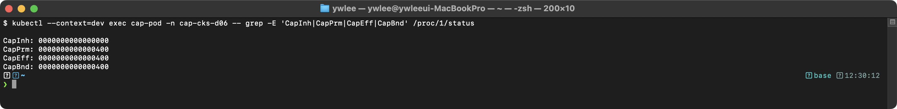
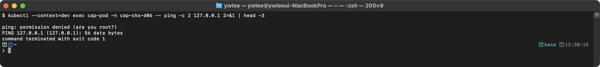
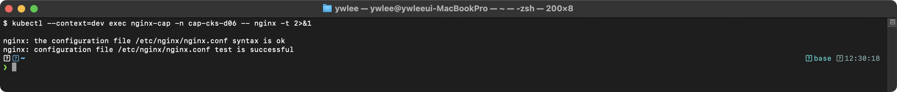
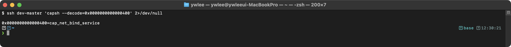

# CKS Day 6: System Hardening (2/2) - 시스템콜, capabilities, 서비스 강화, 시험 실전

> 학습 목표 | CKS 도메인: System Hardening (15%) | 예상 소요 시간: 2시간

> **노드 이름 표기:** 본문의 `node01`·`master01` 등은 CKS 시험 환경의 노드 이름이다. 로컬 재현 시 `node01`→`staging-worker1`, `master01`→`staging-master`로 읽고 `ssh staging-worker1`처럼 VM 별칭으로 접속한다(§3 — 파괴 실습은 dev/staging에서만).

---

## 선수조건 (Day 05와의 연결)

Day 05에서 AppArmor 프로파일의 기초(프로파일 작성 문법, enforce/complain 모드 전환, `apparmor_parser`로 노드에 로드하는 절차)를 학습했다고 가정한다. 본 Day는 그 위에 seccomp(시스템콜 필터링), Linux capabilities(root 특권 세분화), 불필요한 서비스 제거, 커널 파라미터(sysctl) 강화를 추가로 다룬다. 핵심은 이 네 기제를 단독이 아니라 **조합해 다층 방어(defense-in-depth)**를 구성하는 것이다. AppArmor 프로파일 작성이 아직 낯설면 Day 05를 먼저 복습한다.

이 문서의 실습은 이 저장소의 tart 멀티클러스터(platform/dev/staging/prod 4개)를 전제한다. CKS 파괴 실습은 **dev 또는 staging에서만** 수행한다(platform/prod는 상주 서비스가 있어 금지). 실습에 들어가기 전 아래 "실습 환경 준비"를 먼저 확인한다.

### 실습 환경 준비

```bash
# 1. kubeconfig 지정 (dev 클러스터 기준)
export KUBECONFIG=kubeconfig/dev.yaml
kubectl get nodes   # 노드가 Ready 인지 확인

# 2. 노드 SSH 접근 — VM 이름 별칭으로 비밀번호 없이 접속된다
#    (전용 키가 전 노드에 배포됨, scripts/setup-ssh-keys.sh 로 관리)
ssh dev-master      # 또는 ssh dev-worker

# 3. 재부팅 직후라면 IP 드리프트 복구를 먼저 실행한다
#    (tart 는 재부팅마다 VM IP 를 재할당하므로 클러스터가 깨진다)
./scripts/boot.sh
./scripts/fix-cluster-ip-drift.sh dev
```

본 문서의 풀이에 등장하는 `node01`, `admin@dev-worker` 등의 노드 이름은 자신의 환경에 맞는 별칭(예: `dev-worker`, `staging-worker`)으로 바꿔 읽는다. 상세한 클러스터·SSH 환경 규약은 [CKS 상위 지침](../../CLAUDE.md#3-실행-환경--기존-tart-멀티클러스터만)을 참조한다.

---

## 오늘의 학습 목표

- 위험한 시스템콜과 Linux capabilities를 이해한다
- 불필요한 패키지/서비스를 식별하고 제거하여 공격 표면을 줄인다
- 커널 파라미터(sysctl) 보안 설정을 이해한다
- System Hardening 도메인의 시험 출제 패턴을 분석하고 실전 문제를 풀어본다

---


## 5. 위험한 시스템콜과 capabilities

### 5.0 등장 배경 — 왜 시스템콜 필터와 capabilities가 필요한가

**문제: 컨테이너는 호스트 커널을 공유한다.** 컨테이너는 VM과 달리 별도 게스트 커널이 없고, 호스트의 단일 리눅스 커널을 모든 컨테이너가 함께 쓴다(시스템콜 = 사용자 프로세스가 커널에 작업을 요청하는 진입점). 따라서 컨테이너 안의 프로세스가 커널 취약점을 건드리는 시스템콜을 호출하면, 격리를 깨고 호스트나 다른 컨테이너로 빠져나가는 **컨테이너 이스케이프(container escape)**가 가능하다. 대표 사례:

- **Dirty COW (CVE-2016-5195)**: 커널의 copy-on-write 메모리 처리 결함을 `madvise`/`ptrace` 등의 시스템콜 조합으로 악용해, 컨테이너 안의 일반 사용자가 호스트의 읽기 전용 파일(예: `/etc/passwd`)을 덮어쓰고 root 권한을 탈취했다.
- **ptrace 악용**: `ptrace(2)`는 다른 프로세스의 메모리를 읽고 쓸 수 있다. 같은 호스트의 인접 프로세스에 붙어 비밀번호·토큰을 훔치거나 코드를 주입하는 데 쓰인다.
- **mount/unshare 악용**: `mount(2)`로 호스트 파일시스템을 컨테이너 안에 끌어오거나, `unshare(2)`로 새 네임스페이스를 만들어 권한 상승 경로를 연다.

**직전 기술의 한계.** 과거 PSP(PodSecurityPolicy, Pod 생성 단계에서 보안 필드를 강제하던 어드미션 컨트롤러)는 "이 Pod는 privileged 금지" 같은 **정책 선언**만 했을 뿐, 실행 중인 컨테이너가 실제로 어떤 시스템콜을 호출하는지는 막지 못했다. 또 seccomp을 `RuntimeDefault`(런타임 기본 프로파일)로만 켜는 것은 흔히 위험한 시스템콜 다수를 막아 주지만, 특정 애플리케이션이 필요로 하는 좁은 범위를 정밀하게 통제하지는 못한다.

**무엇이 나아졌나 — 세 기제의 계층화.** 그래서 세 가지를 조합한다. 각각이 막는 지점이 다르기 때문이다.

- **seccomp**: 시스템콜 *번호* 자체를 차단한다. 예) `mount` 시스템콜을 아예 거부.
- **AppArmor(LSM)**: 시스템콜이 *접근하려는 리소스(경로·네트워크)*를 차단한다. 예) `/etc/shadow` 경로 쓰기 거부.
- **capabilities**: 시스템콜 수행에 필요한 *특권 비트*를 제거한다. 예) `CAP_SYS_ADMIN`을 빼서 mount 류 특권 작업 자체를 불가하게.

같은 `mount`라도 seccomp은 "그 시스템콜을 부르지 마라", AppArmor는 "그 경로엔 손대지 마라", capability는 "그 특권이 너에겐 없다"로 서로 다른 층에서 막는다. 한 층이 뚫려도 다른 층이 남으므로 다층 방어가 된다. **트레이드오프**: 층이 늘수록 설정·디버깅 복잡도가 오른다. 규칙이 과하면 정상 앱이 죽고(예: 필요한 시스템콜까지 막아 컨테이너가 시작 실패), 너무 느슨하면 보안 이득이 없다. 그래서 "필요한 최소만 허용"을 어떻게 찾느냐가 실무의 핵심이다(§8 트러블슈팅 참조).

### 5.0.1 보안 검사 흐름 (먼저 직관으로)

복잡한 커널 내부를 보기 전에 한 문장으로 큰 그림을 잡는다: **프로세스가 시스템콜을 호출하면, 커널은 그것을 실제로 실행하기 전에 여러 보안 검사(seccomp → LSM → capability → DAC)를 차례로 통과시킨다. 하나라도 막으면 거부하고, 전부 통과해야 실행한다.** 아래 심화 설명은 이 흐름이 커널 안에서 구체적으로 어떻게 일어나는지를 보여 줄 뿐, 시험에 꼭 외워야 하는 것은 "검사 순서와 각 층의 역할"이다.

### 5.0.2 심화: 커널 수준 동작 원리 (선택 학습)

> 아래 SYSCALL 인스트럭션·`sys_call_table`·핸들러 함수 등은 컴퓨터구조/운영체제 강좌의 선수지식이다. 처음 보면 "커널이 시스템콜을 받아 보안 검사부터 한다" 정도만 이해하고 넘어가도 시험에는 충분하다. 더 깊이 알고 싶으면 OS 교재의 "시스템콜과 모드 전환" 단원을 참조한다.

```
Linux 커널의 시스템콜 처리 과정
══════════════════════════════

1. 사용자 공간 프로세스가 시스템콜을 호출한다 (예: mount(2))
2. CPU가 syscall 명령어로 커널 모드로 전환한다 (x86_64: SYSCALL 인스트럭션)
3. 커널의 sys_call_table에서 시스템콜 번호로 핸들러 함수를 찾는다
4. 핸들러 실행 전, 보안 검사 체인이 순서대로 수행된다:
   a) seccomp BPF 필터 검사 — 시스템콜 번호 기반으로 ALLOW/DENY 판정
   b) LSM(AppArmor/SELinux) 검사 — 경로/라벨 기반 접근 제어
   c) capability 검사 — 해당 작업에 필요한 capability 비트 확인
   d) DAC(파일 퍼미션) 검사 — uid/gid 기반 접근 제어
5. 모든 검사를 통과하면 핸들러 함수가 실행된다

컨테이너 보안에서의 의미:
  - seccomp: 시스템콜 자체를 차단하므로 가장 먼저 검사된다 (최소 오버헤드)
  - AppArmor: 시스템콜이 접근하려는 리소스(파일, 네트워크)를 검사한다
  - capabilities: 특권 작업에 필요한 capability가 프로세스에 있는지 검사한다
  - 3가지를 조합하면 다층 방어(defense-in-depth)가 구성된다
```

위 흐름에서 seccomp 검사는 "BPF 필터"라고 부른다. BPF(Berkeley Packet Filter)는 커널 안의 작은 가상머신에서 실행되는 특수 바이트코드 형식이다. seccomp은 이 BPF를 이용해 시스템콜 진입 시점에 (사용자 공간으로 빠져나갔다 돌아오는 비용 없이) **커널 안에서 곧바로** "이 시스템콜 번호를 허용할지 거부할지"를 판정한다. 사용자 공간 스위치가 없어 오버헤드가 매우 낮고, 그래서 모든 시스템콜마다 검사해도 성능 부담이 작다.

### 5.1 위험한 시스템콜

```
CKS에서 알아야 할 위험한 시스템콜
═══════════════════════════════

시스템콜    | 위험성                              | seccomp으로 차단
───────────┼─────────────────────────────────────┼─────────────────
ptrace     | 다른 프로세스 디버깅/추적              | RuntimeDefault 차단
           | 컨테이너 이스케이프에 악용 가능          |
mount      | 파일시스템 마운트                      | RuntimeDefault 차단
           | 호스트 파일시스템 접근 악용 가능          |
reboot     | 시스템 재부팅                         | RuntimeDefault 차단
sethostname| 호스트명 변경                         | RuntimeDefault 차단
unshare    | 새 네임스페이스 생성                    | RuntimeDefault 차단
           | 권한 상승에 악용 가능                   |
init_module| 커널 모듈 로드                        | RuntimeDefault 차단
           | 커널 수준 악성코드 설치 가능             |
clone      | 새 프로세스/스레드 생성                  | 기본 허용 (필요)
           | CLONE_NEWUSER 플래그와 함께 사용 시 위험  |
```

### 5.2 리눅스 capabilities

**등장 배경 — root는 너무 많은 것을 한 번에 가진다.** 전통적 UNIX 권한 모델에서 UID 0(root)은 "전부 가능, 아니면 전부 불가"의 이진(all-or-nothing) 구조였다. 그래서 "1024번 미만 포트에 bind만 하면 되는" 웹 서버조차 그 한 가지 특권을 얻으려고 root 전체를 가져야 했고, 일단 그 프로세스가 탈취되면 공격자도 root 전체를 손에 넣었다. Linux capabilities는 이 한 덩어리 root 특권을 약 40개의 개별 비트로 쪼개, 프로세스에 **꼭 필요한 특권만** 주는 최소권한 원칙(principle of least privilege)을 실현한다.

**트레이드오프.** 실무에서는 `drop: ["ALL"]`로 모든 capability를 버린 뒤 필요한 것만 `add`로 되돌리는 패턴을 쓴다. 대신 그 애플리케이션이 정확히 어떤 capability를 요구하는지 미리 알아야 한다. 부족하면 앱이 실행되지 않고(예: nginx가 80번 포트 bind에 실패 → `Permission denied`), 과하게 add하면 보안 이득이 사라진다. 즉 "정확히 무엇이 필요한가"를 찾는 비용이 안전의 대가다.

```
Linux Capabilities - POSIX 권한 세분화 메커니즘
═══════════════════════════════════════════════

전통적 UNIX 권한 모델은 UID 0(root)에 모든 특권을 부여하는 이진적 구조이다.
Linux capabilities(7)는 이 특권을 약 40개의 개별 capability 비트로 분리하여,
프로세스에 필요한 최소 특권만 부여하는 세분화된 권한 모델을 제공한다.
커널은 특권 작업 수행 시 해당 capability 비트를 검사한다.

주요 capabilities:
  CAP_NET_BIND_SERVICE - 1024 미만 포트 bind(2) 허용 (nginx 80/443 등)
  CAP_NET_RAW          - AF_PACKET raw 소켓 생성 허용 (ping, tcpdump)
  CAP_SYS_ADMIN        - mount, bpf, namespace 등 광범위한 특권 → 컨테이너 이스케이프 경로
  CAP_SYS_PTRACE       - ptrace(2) 시스템콜 허용 → 프로세스 메모리 접근 가능
  CAP_DAC_OVERRIDE     - 파일 DAC 퍼미션 검사 우회 → 임의 파일 접근 가능
  CAP_SYS_CHROOT       - chroot(2) 시스템콜 허용

CKS 보안 모범 사례:
  1. capabilities.drop: ["ALL"]  → effective/permitted 셋에서 모든 capability 제거
  2. capabilities.add: ["NET_BIND_SERVICE"]  → 필요한 capability만 선택적 추가
  3. CAP_SYS_ADMIN, CAP_SYS_PTRACE는 컨테이너 이스케이프 경로이므로 절대 추가하지 않는다
```

**AppArmor 적용 방식의 K8s 버전별 차이(시험 환경 확인 필수).** `securityContext.appArmorProfile` 필드는 K8s 1.30에서 GA(General Availability, 정식 지원)된 문법이다. CKS 시험 환경이 1.30 이상인지, 1.28~1.29인지에 따라 적용 방법이 다르므로 시험 시작 직후 `kubectl version`으로 반드시 확인한다.

| K8s 버전 | AppArmor 적용 방식 | 예시 |
|:--|:--|:--|
| **1.30 이상** (GA) | `spec.containers[].securityContext.appArmorProfile` 필드 | `type: Localhost`, `localhostProfile: <프로파일명>` |
| **1.28~1.29** (베타) | Pod `metadata.annotations` | `container.apparmor.security.beta.kubernetes.io/<컨테이너명>: localhost/<프로파일명>` |

두 방식을 모두 알아 두어야 한다. K8s 1.30 이상(securityContext 방식):

```yaml
# 1.30+ 방식 — securityContext.appArmorProfile 필드 사용
securityContext:
  appArmorProfile:
    type: Localhost
    localhostProfile: k8s-deny-write
```

K8s 1.28~1.29 방식(annotations):

```yaml
# 1.28~1.29 방식 — metadata.annotations 사용
metadata:
  annotations:
    container.apparmor.security.beta.kubernetes.io/app: localhost/k8s-deny-write
```

CKS 공식 커리큘럼은 시험 환경 버전을 `https://training.linuxfoundation.org/certification/certified-kubernetes-security-specialist/`에서 확인할 수 있다. 검토일(2026-06-15) 기준 공식 페이지는 시험이 **Kubernetes v1.34** 기반이라고 안내한다. 시험 환경은 새 minor 릴리스 후 약 4~8주 내 최신 버전에 맞춰 갱신되므로, 응시 직전 공식 페이지와 시험 시작 시 `kubectl version`으로 실제 minor를 확인한다. v1.30(appArmorProfile GA) 이상에서는 `securityContext.appArmorProfile` 방식이 주 출제 대상이며, 구버전 annotations 방식도 legacy 문제로 나올 수 있다.

```yaml
# capabilities 설정 예제
apiVersion: v1
kind: Pod
metadata:
  name: cap-pod
spec:
  containers:
  - name: app
    image: nginx:1.25
    securityContext:
      capabilities:
        drop: ["ALL"]                # 모든 capability 제거
        add: ["NET_BIND_SERVICE"]    # 80번 포트 바인딩에 필요한 것만 추가
      # 결과: 이 컨테이너는 NET_BIND_SERVICE만 가지고 있다
      # ping(NET_RAW 필요)도, mount(SYS_ADMIN 필요)도 할 수 없다
```

### 5.3 Capabilities 실습 검증

위 §5.2의 YAML로 `cap-pod`를 생성한 뒤 실행한다. Pod가 Running 상태가 될 때까지 기다렸다가 exec를 수행해야 한다.

```bash
# cap-pod 생성 (§5.2 YAML을 파일로 저장했거나 인라인으로 적용)
kubectl apply -f - <<'EOF'
apiVersion: v1
kind: Pod
metadata:
  name: cap-pod
spec:
  containers:
  - name: app
    image: nginx:1.25
    securityContext:
      capabilities:
        drop: ["ALL"]
        add: ["NET_BIND_SERVICE"]
EOF

# Pod 가 Running 상태가 될 때까지 대기 (최대 60초)
kubectl wait --for=condition=ready pod/cap-pod --timeout=60s
```

```bash
# 컨테이너의 현재 capabilities 확인
kubectl exec cap-pod -- cat /proc/1/status | grep -i cap
```



0x400은 10진수 1024이며, CAP_NET_BIND_SERVICE(비트 10, 2^10 = 1024)만 설정된 것이다. 이 16진수→capability 이름 변환을 손으로 비트 계산할 필요는 없다. 실무에서는 §5.3 끝의 `capsh --decode=0x400`처럼 `capsh`가 자동으로 이름을 풀어 주므로, 시험에서도 이 도구로 확인하는 편이 빠르고 안전하다.

```bash
# ping 시도 (CAP_NET_RAW 필요 → 차단)
kubectl exec cap-pod -- ping -c 1 127.0.0.1 2>&1
```



```bash
# 80번 포트 바인딩 (CAP_NET_BIND_SERVICE → 허용)
kubectl exec cap-pod -- nginx -t 2>&1
```



```bash
# capsh로 capabilities 해독 (노드에서)
capsh --decode=0000000000000400
```



---

### 5.4 seccomp — 시스템콜 필터링 개념

**등장 배경 — 컨테이너가 호스트의 모든 시스템콜을 호출할 수 있었던 문제.** seccomp(secure computing mode)가 등장하기 전에는 컨테이너 안의 프로세스가 호스트 커널에 존재하는 수백 개의 시스템콜 전부를 제한 없이 호출할 수 있었다. capabilities로 특권 비트를 제거하더라도, 커널 버그를 건드리는 시스템콜 자체를 막는 수단이 없었기 때문에 Dirty COW 같은 취약점이 컨테이너 이스케이프 경로가 됐다. seccomp은 시스템콜 번호 수준에서 "이 프로세스는 이 시스템콜 목록만 호출할 수 있다"는 BPF 필터를 커널에 등록해, 허가되지 않은 시스템콜이 커널에 도달하기 전에 차단한다.

**직전 기술의 한계.** capabilities는 `mount`·`ptrace` 같은 특권 작업을 수행하는 데 필요한 비트를 제거하지만, 비특권 시스템콜을 통해 커널 취약점을 건드리는 경우는 막지 못한다. seccomp은 비특권 시스템콜까지 포함한 모든 시스템콜 번호를 화이트리스트/블랙리스트로 제어하므로 커버 범위가 더 넓다.

**세 가지 프로파일 타입(CKS에서 가장 중요).** Pod의 `securityContext.seccompProfile.type`에 세 값 중 하나를 지정한다.

| 타입 | 의미 | 언제 쓰나 |
|:--|:--|:--|
| `RuntimeDefault` | 컨테이너 런타임(containerd)이 제공하는 기본 프로파일 사용. 알려진 위험 시스템콜 약 40여 개를 차단. | 대부분의 Pod에 권장. 별도 JSON 파일 불필요. |
| `Localhost` | 노드 파일시스템의 `/var/lib/kubelet/seccomp/` 아래에 직접 작성한 JSON 프로파일 사용. `localhostProfile`에 해당 디렉터리 기준 상대 경로 지정. | 애플리케이션에 맞게 정밀 제어가 필요할 때. |
| `Unconfined` | seccomp 미적용 — 모든 시스템콜 허용. | 개발·디버깅 목적 외에는 사용하지 않는다. |

**커스텀 프로파일 JSON 구조와 액션 타입.** Localhost 프로파일은 JSON으로 작성한다. 핵심 필드는 `defaultAction`(명시적 규칙에 없는 시스템콜에 적용할 기본 처리)과 `syscalls` 배열이다.

| 액션 상수 | 동작 | 용도 |
|:--|:--|:--|
| `SCMP_ACT_ALLOW` | 시스템콜 허용. 커널이 정상 처리한다. | allowlist 방식에서 허용 목록에 사용. |
| `SCMP_ACT_ERRNO` | 시스템콜을 거부하고 `errno`(에러 코드)를 프로세스에 반환. 프로세스는 `Operation not permitted` 등의 에러로 실패한다. 프로세스는 계속 실행. | denylist 방식에서 차단 목록, 또는 allowlist에서 `defaultAction`으로 사용. |
| `SCMP_ACT_LOG` | 시스템콜을 허용하지만 커널 로그(`dmesg`)에 기록. 차단은 하지 않으므로 프로세스는 정상 실행. | 프로파일 개발 초기에 어떤 시스템콜이 호출되는지 관찰할 때. |
| `SCMP_ACT_KILL` | 시스템콜을 호출한 스레드를 즉시 종료(SIGSYS). 프로세스 자체는 살아 있을 수 있음. | 절대 허용할 수 없는 시스템콜에 대해 즉각 종료가 필요할 때(운영 환경에서는 신중하게). |

**allowlist 방식 vs denylist 방식.** 두 설계 방향이 있으며 보안 강도가 다르다.

- **allowlist(화이트리스트)**: `defaultAction: SCMP_ACT_ERRNO` + `syscalls` 배열에 `SCMP_ACT_ALLOW`로 필요한 목록만 허용. 명시하지 않은 시스템콜은 전부 차단된다. 보안 강도가 높지만, 어떤 시스템콜이 필요한지 미리 파악해야 하므로 설정 비용이 크다. 잘못 설정하면 컨테이너가 시작조차 못 한다.
- **denylist(블랙리스트)**: `defaultAction: SCMP_ACT_ALLOW` + `syscalls` 배열에 `SCMP_ACT_ERRNO`로 위험 목록만 차단. 명시하지 않은 시스템콜은 전부 허용된다. 문제 7의 예제처럼 특정 시스템콜만 막고 싶을 때 쓴다. 알려진 위험만 막는 것이므로 미지의 취약점에는 취약하다.

**트레이드오프.** RuntimeDefault는 별도 파일 없이 바로 적용할 수 있어 편리하지만, 런타임이 업그레이드되면 프로파일이 바뀔 수 있다(안정성보다 편의성). Localhost allowlist는 가장 강하지만 애플리케이션이 어떤 시스템콜을 쓰는지 `strace`로 추적하거나 `SCMP_ACT_LOG`로 관찰하는 선행 작업이 필요하다. CKS 시험에서는 보통 이미 완성된 JSON을 노드에 배치하고 Pod에 연결하는 절차를 요구하므로, JSON 내용보다 경로 규칙(`/var/lib/kubelet/seccomp/` + 상대 경로)을 정확히 외우는 것이 더 중요하다.

**커스텀 프로파일 JSON 최소 예시.** 아래 두 예시는 개념 설명의 액션 표와 실제 JSON 구조를 연결하기 위한 최소 형태다. 실제 시험 문제에서 사용하는 JSON은 §6.2 문제 7의 `deny-fs-ops.json`을 참조한다.

allowlist 방식(명시된 syscall만 허용, 나머지 전부 차단):

```json
{
  "defaultAction": "SCMP_ACT_ERRNO",
  "syscalls": [
    { "names": ["read", "write", "open", "close", "exit_group"], "action": "SCMP_ACT_ALLOW" }
  ]
}
```

denylist 방식(명시된 syscall만 차단, 나머지 전부 허용):

```json
{
  "defaultAction": "SCMP_ACT_ALLOW",
  "syscalls": [
    { "names": ["ptrace", "mount", "unshare"], "action": "SCMP_ACT_ERRNO", "errnoRet": 1 }
  ]
}
```

`defaultAction`이 `SCMP_ACT_ERRNO`이면 allowlist 방식, `SCMP_ACT_ALLOW`이면 denylist 방식임을 JSON 첫 줄에서 즉시 판별할 수 있다.

---

## 5.5 불필요한 서비스 제거 및 커널 파라미터(sysctl) 강화

### 5.5.1 공격 표면 최소화 원칙

**등장 배경 — 실행 중인 모든 서비스는 잠재적 침입 경로다.** "공격 표면(attack surface)"이란 공격자가 시스템에 접근하거나 취약점을 악용할 수 있는 진입점의 총합이다. K8s 워커 노드는 Ubuntu/Debian 베이스 이미지로 구성되는 경우가 많은데, OS 설치 시 기본으로 포함된 서비스 중 K8s 운영과 무관한 것들이 열린 소켓, 파일 접근 권한, 네트워크 포트를 가지고 있어 공격자가 악용할 수 있다.

대표적인 위험 서비스 예시:
- **snapd**: Ubuntu의 snap 패키지 관리자 데몬. `/run/snapd.socket` Unix 소켓을 열어 두고 있다. CVE-2019-7304(dirty_sock)는 이 소켓을 통해 root 셸을 얻는 취약점이었다. K8s 노드에서는 snap을 쓸 이유가 없다.
- **cups**: 프린트 서비스. 포트 631을 열어 두며, 컨테이너 워크로드 노드에서는 완전히 불필요하다.
- **avahi-daemon**: mDNS/DNS-SD 서비스 검색 데몬. 로컬 네트워크에 노드 정보를 브로드캐스트하므로 정보 노출 위험이 있다.
- **rpcbind**: NFS 원격 마운트용 포트 매퍼. K8s 노드에서 NFS를 직접 쓰지 않는다면 불필요하다.

**불필요한 서비스를 판별하는 방법.** `systemctl list-units --type=service --state=running`으로 현재 실행 중인 서비스 목록을 본다. K8s 노드에서 **반드시 실행 중이어야 하는** 서비스는 다음과 같다:

| 서비스 | 역할 | 비고 |
|:--|:--|:--|
| `kubelet.service` | 노드 에이전트 — 절대 중지하면 안 됨 | NotReady 즉시 발생 |
| `containerd.service` | 컨테이너 런타임 — 절대 중지하면 안 됨 | Pod 생성 불가 |
| `sshd.service` | 노드 관리용 SSH — 유지 필요 | 설정 강화는 별도 |
| `systemd-*` 시리즈 | 시스템 기본 인프라 | 건드리지 않는다 |

이 목록에 없는 서비스가 실행 중이라면 제거 또는 비활성화 대상으로 검토한다. `ss -tlnp`로 열린 TCP 포트를 확인해 예상치 못한 포트가 LISTEN 상태라면 그 포트를 소유한 서비스(출력의 `users:(("프로세스명",...))`)를 특정해 판단한다.

### 5.5.2 K8s 노드에서의 sysctl 보안 설정

**sysctl(system control)**은 커널 런타임 파라미터를 읽고 쓰는 인터페이스다(`/proc/sys/` 가상 파일시스템을 직접 쓰거나 `sysctl -w` 명령으로 변경한다). 네트워킹·메모리·보안에 관련된 수백 개의 파라미터가 있다. K8s 노드에서 보안을 강화하기 위해 일부 파라미터를 변경할 수 있지만, **잘못 설정하면 K8s 네트워킹 자체가 망가진다**는 점에서 주의가 필요하다.

**절대 변경하면 안 되는 파라미터 — K8s가 의존하는 커널 설정:**

| 파라미터 | 필수값 | 이유 |
|:--|:--|:--|
| `net.ipv4.ip_forward` | `1` | Pod 간 패킷 라우팅에 필수. `0`으로 설정하면 노드 내 Pod끼리 통신 불가. CNI(Cilium 등)가 의존. |
| `net.bridge.bridge-nf-call-iptables` | `1` | 브리지 트래픽이 iptables/Cilium BPF를 통과하게 함. `0`이면 NetworkPolicy 미적용. |
| `net.bridge.bridge-nf-call-ip6tables` | `1` | 위와 동일, IPv6 버전. |

**강화 대상 파라미터 (변경 권장):**

| 파라미터 | 권장값 | 보안 효과 |
|:--|:--|:--|
| `net.ipv4.conf.all.accept_redirects` | `0` | ICMP 리다이렉트 수신 차단 — 라우팅 테이블 조작 공격 방지 |
| `net.ipv4.conf.all.send_redirects` | `0` | ICMP 리다이렉트 전송 차단 — 라우터가 아닌 노드가 리다이렉트를 보내지 않게 함 |
| `net.ipv4.tcp_syncookies` | `1` | SYN flood DDoS 완화 — SYN 큐가 가득 찼을 때 SYN 쿠키로 응답 |
| `net.ipv4.conf.all.rp_filter` | `1` | 역방향 경로 필터 — 위조 소스 IP 패킷 차단 |
| `kernel.dmesg_restrict` | `1` | 비특권 사용자의 `dmesg` 접근 차단 — 커널 주소 정보 노출 방지 |

**영구 적용.** `sysctl -w`는 런타임에만 적용되고 재부팅 후 초기화된다. 영구적으로 유지하려면 `/etc/sysctl.d/99-security.conf` 파일을 작성하고 `sysctl -p <파일>`로 로드한다. CKS 시험에서는 영구 적용까지 요구하는 경우가 많으므로 두 단계(런타임 적용 + 파일 작성)를 모두 수행한다.

---

## 6. 이 주제가 시험에서 어떻게 나오는가

### 6.1 출제 패턴 분석

```
System Hardening 도메인 출제 패턴 (15%)
════════════════════════════════════════

1. AppArmor 프로파일 작성 및 Pod 적용 (매우 빈출)
   - "노드에 AppArmor 프로파일을 작성하고 Pod에 적용하라"
   - "특정 디렉토리에 대한 쓰기를 차단하라"
   의도: AppArmor 프로파일 문법과 Pod 적용 능력 평가

2. seccomp 프로파일 적용 (빈출)
   - "RuntimeDefault seccomp을 Pod에 적용하라"
   - "커스텀 seccomp 프로파일을 Pod에 적용하라"
   의도: seccomp 타입과 경로 규칙 이해도 평가

3. 불필요한 서비스 제거 (가끔 출제)
   - "노드에서 불필요한 서비스를 찾아서 비활성화하라"
   의도: 공격 표면 줄이기 능력 평가

4. 커널 파라미터 (드물게 출제)
   - "특정 sysctl 값을 수정하라"

핵심 전략:
  → AppArmor 프로파일 문법을 암기하라 (deny /** w 패턴)
  → seccomp RuntimeDefault 적용 YAML을 외워라
  → Localhost 프로파일 경로 규칙을 확실히 이해하라
```

**시험 전략 — 시간 배분.** CKS 실기는 120분에 15~20문제이므로 문제당 약 6~8분이다. 위 네 유형의 실측 소요는 대략 다음과 같다: AppArmor 프로파일은 SSH 접속 + 파일 작성 + `apparmor_parser` 실행 + Pod 적용까지 약 3~4분, seccomp는 JSON 배치 + Pod 적용으로 약 2~3분, 서비스 비활성화(`systemctl disable`)는 약 1분, sysctl 변경도 1분 안쪽이다. 한 문제 안에서 AppArmor와 seccomp를 둘 다 요구하는 경우는 드물고 보통 하나만 출제된다. 실습 단계에서는 두 기제를 모두 능숙하게 익히되, 시험에서는 손 속도와 오타 없는 매니페스트를 우선한다. SSH 접속 후 노드를 빠져나오는 것을 잊지 말고, 작성한 프로파일을 노드에 실제로 로드했는지(`aa-status` / 파일 존재 확인)를 Pod 적용 전에 점검한다.

### 6.2 실전 문제 (10개 이상)

#### 문제 1. AppArmor 프로파일 작성 및 적용

노드 `node01`에 AppArmor 프로파일 `k8s-deny-proc-write`를 생성하라. 이 프로파일은 `/proc` 디렉토리에 대한 쓰기를 거부하고, 나머지 파일은 허용해야 한다. 이 프로파일을 `secure-app` Pod의 `app` 컨테이너에 적용하라.

<details>
<summary>풀이</summary>

```bash
ssh node01

sudo tee /etc/apparmor.d/k8s-deny-proc-write > /dev/null <<'EOF'
#include <tunables/global>

profile k8s-deny-proc-write flags=(attach_disconnected,mediate_deleted) {
  #include <abstractions/base>
  file,
  deny /proc/** w,
}
EOF

sudo apparmor_parser -r /etc/apparmor.d/k8s-deny-proc-write
aa-status | grep k8s-deny-proc-write
```

프로파일 헤더의 `flags=(attach_disconnected,mediate_deleted)`는 컨테이너 환경에서 프로파일을 제대로 강제하기 위한 플래그다. `attach_disconnected`는 chroot/namespace로 파일시스템이 분리(disconnected)된 뒤에도 프로파일을 계속 적용하게 하고(이 플래그가 없으면 컨테이너 안에서 일부 경로가 프로파일 밖으로 빠질 수 있다), `mediate_deleted`는 이미 삭제됐지만 아직 프로세스가 열어 둔 파일에 대한 접근도 검사 대상에 포함시킨다. CKS의 컨테이너용 AppArmor 프로파일에서는 사실상 관용적으로 이 두 플래그를 붙인다.

```yaml
apiVersion: v1
kind: Pod
metadata:
  name: secure-app
spec:
  nodeName: node01
  containers:
  - name: app
    image: nginx:1.25
    securityContext:
      appArmorProfile:
        type: Localhost
        localhostProfile: k8s-deny-proc-write
```

검증:
```bash
kubectl exec secure-app -- touch /proc/test 2>&1
# 차단됨 (Permission denied 류)
kubectl exec secure-app -- touch /tmp/test
# 성공
```

검증 시 정확한 에러 문구는 환경에 따라 다를 수 있다. AppArmor가 막을 때는 보통 `Permission denied`로 나오지만, 같은 경로가 다른 이유로도 막힐 수 있다. 예를 들어 `/proc` 일부가 읽기 전용 마운트면 `Read-only file system`, 시스템콜 자체가 막히면 `Operation not permitted`가 나온다. 핵심은 "쓰기가 거부됐다"는 점이고, 어느 계층이 막았는지는 노드에서 `dmesg | grep -i apparmor`로 AppArmor의 DENIED 로그가 찍히는지 확인해 구분한다. 따라서 화면에 뜬 문구가 위와 글자까지 같지 않더라도 차단 자체가 됐다면 정상이다.

</details>

#### 문제 2. seccomp RuntimeDefault 적용

`secure-ns` 네임스페이스의 모든 Pod에 seccomp RuntimeDefault 프로파일이 적용되도록 Pod Security Admission을 설정하라.

<details>
<summary>풀이</summary>

```bash
kubectl label namespace secure-ns \
  pod-security.kubernetes.io/enforce=restricted \
  pod-security.kubernetes.io/enforce-version=latest \
  pod-security.kubernetes.io/warn=restricted
```

또는 개별 Pod에 직접 적용:

```yaml
apiVersion: v1
kind: Pod
metadata:
  name: secure-pod
  namespace: secure-ns
spec:
  securityContext:
    seccompProfile:
      type: RuntimeDefault
    runAsNonRoot: true
  containers:
  - name: app
    image: nginx:1.25
    securityContext:
      allowPrivilegeEscalation: false
      runAsUser: 1000
      capabilities:
        drop: ["ALL"]
```

**주의 — PSA는 seccompProfile을 자동 주입하지 않는다.** `kubectl label namespace ... pod-security.kubernetes.io/enforce=restricted` 명령은 네임스페이스에 PSA(Pod Security Admission) 정책을 붙이는 것이다. `restricted` 표준은 새로 생성되는 Pod가 `seccompProfile`을 명시하지 않으면 거부(enforce)하거나 경고(warn)한다. 즉 PSA는 비준수 Pod를 **거부하는 게이트**일 뿐, 기존 Pod나 새 Pod의 PodTemplate에 `seccompProfile.type: RuntimeDefault` 필드를 자동으로 주입하지 않는다. 네임스페이스의 모든 Pod에 RuntimeDefault를 실제로 적용하려면 각 Deployment/DaemonSet의 PodTemplate에 `securityContext.seccompProfile.type: RuntimeDefault`를 직접 명시하거나 Admission Webhook(예: OPA Gatekeeper 뮤테이팅 훅)을 사용해야 한다.

</details>

#### 문제 3. 커스텀 seccomp 프로파일 적용

노드의 `/var/lib/kubelet/seccomp/profiles/custom.json`에 커스텀 seccomp 프로파일이 있다. 이 프로파일을 `seccomp-pod` Pod에 적용하라.

<details>
<summary>풀이</summary>

```yaml
apiVersion: v1
kind: Pod
metadata:
  name: seccomp-pod
spec:
  securityContext:
    seccompProfile:
      type: Localhost
      localhostProfile: profiles/custom.json
  containers:
  - name: app
    image: nginx:1.25
    securityContext:
      allowPrivilegeEscalation: false
```

경로 규칙(혼동 주의):
- seccomp 프로파일 JSON은 **노드 파일시스템**의 `/var/lib/kubelet/seccomp/` 디렉터리 아래에 둔다.
- Pod YAML의 `localhostProfile`에는 그 디렉터리를 기준으로 한 **상대 경로**만 적는다(예: `profiles/custom.json`). 절대 경로(`/var/lib/kubelet/seccomp/profiles/custom.json`)나 앞에 `/`를 붙이면 안 된다.
- 따라서 위 예제가 동작하려면 노드에 `/var/lib/kubelet/seccomp/profiles/custom.json` 파일이 실제로 존재해야 한다. Pod가 `ContainerCreating`에서 멈추면 십중팔구 파일 경로가 어긋난 것이다. 노드에서 다음으로 확인한다:

```bash
ssh dev-worker    # 또는 해당 Pod가 스케줄된 노드
ls -l /var/lib/kubelet/seccomp/profiles/custom.json
```

</details>

#### 문제 4. 불필요한 서비스 제거

워커 노드 `node01`에서 `snapd` 서비스가 실행 중이다. 이 서비스를 중지하고 비활성화하라. 불필요한 포트가 열려 있는지 확인하라.

<details>
<summary>풀이</summary>

```bash
ssh node01

# 서비스 중지 및 비활성화
sudo systemctl stop snapd
sudo systemctl disable snapd

# 확인
systemctl status snapd
# inactive (dead)

# 열린 포트 확인
ss -tlnp

# 필수 포트만 남아있는지 확인:
# 10250 - kubelet
# 10256 - kube-proxy
# 30000-32767 - NodePort
```

</details>

#### 문제 5. AppArmor 네트워크 제한

raw 소켓 사용을 차단하는 AppArmor 프로파일 `k8s-restrict-network`를 작성하고 Pod에 적용하라.

<details>
<summary>풀이</summary>

```bash
ssh node01

sudo tee /etc/apparmor.d/k8s-restrict-network > /dev/null <<'EOF'
#include <tunables/global>

profile k8s-restrict-network flags=(attach_disconnected,mediate_deleted) {
  #include <abstractions/base>
  file,
  network tcp,
  network udp,
  deny network raw,
  deny network packet,
}
EOF

sudo apparmor_parser -r /etc/apparmor.d/k8s-restrict-network
```

```yaml
apiVersion: v1
kind: Pod
metadata:
  name: network-restricted
spec:
  nodeName: node01
  containers:
  - name: app
    image: nginx:1.25
    securityContext:
      appArmorProfile:
        type: Localhost
        localhostProfile: k8s-restrict-network
```

검증:
```bash
kubectl exec network-restricted -- ping -c 1 8.8.8.8 2>&1
# Permission denied (raw 소켓 차단)

kubectl exec network-restricted -- wget -qO- --timeout=3 http://example.com
# 성공 (TCP 허용)
```

</details>

#### 문제 6. AppArmor + seccomp 복합 적용

노드에 AppArmor 프로파일 `k8s-hardened`를 작성하라. /proc, /sys 쓰기 거부, /tmp만 쓰기 허용. 이 프로파일과 seccomp RuntimeDefault를 동시에 적용한 `hardened-pod`를 생성하라.

<details>
<summary>풀이</summary>

```bash
ssh node01

sudo tee /etc/apparmor.d/k8s-hardened > /dev/null <<'EOF'
#include <tunables/global>

profile k8s-hardened flags=(attach_disconnected,mediate_deleted) {
  #include <abstractions/base>
  file,
  deny /** w,
  /tmp/** rw,
  deny /proc/** w,
  deny /sys/** w,
  network tcp,
  network udp,
  deny network raw,
}
EOF

sudo apparmor_parser -r /etc/apparmor.d/k8s-hardened
```

```yaml
apiVersion: v1
kind: Pod
metadata:
  name: hardened-pod
spec:
  nodeName: node01
  securityContext:
    runAsNonRoot: true
    runAsUser: 1000
    seccompProfile:
      type: RuntimeDefault
  containers:
  - name: app
    image: nginx:1.25
    securityContext:
      appArmorProfile:
        type: Localhost
        localhostProfile: k8s-hardened
      allowPrivilegeEscalation: false
      readOnlyRootFilesystem: true
      capabilities:
        drop: ["ALL"]
    volumeMounts:
    - name: tmp
      mountPath: /tmp
  volumes:
  - name: tmp
    emptyDir: {}
```

**AppArmor 규칙 우선순위 — 경로 구체성이 순서보다 우선한다.** 위 프로파일에서 `deny /** w`(모든 경로 쓰기 거부)와 `/tmp/** rw`(tmp 쓰기 허용)가 함께 있다. AppArmor는 규칙 등장 순서가 아니라 **경로 패턴의 구체성(specificity)**이 우선한다. `/tmp/**`는 `/**`보다 더 구체적인 경로(더 긴 접두사 매칭)이므로, `deny /** w`가 먼저 선언돼 있더라도 `/tmp/**` 규칙이 이기고 `/tmp` 아래 쓰기는 허용된다. 따라서 두 규칙의 순서를 바꿔도 결과는 동일하다. 이를 이해하지 않으면 "deny가 먼저니까 /tmp도 막히지 않을까"라는 오해로 시험에서 오답을 낸다.

**주의 — nginx:1.25 공식 이미지는 기본적으로 root로 시작한다.** `runAsNonRoot: true` + `runAsUser: 1000`과 함께 nginx:1.25를 쓰면 kubelet이 "container has runAsNonRoot and image will run as root (user UID 0)" 오류로 Pod 시작을 거부한다. 실제 운영에서는 `nginx:unprivileged` 또는 `bitnami/nginx`(non-root로 설계된 이미지)를 사용한다. CKS 시험에서는 문제에서 이미지가 지정돼 있으면 그대로 쓰되, `runAsNonRoot: true`를 붙이기 전에 그 이미지가 non-root를 지원하는지 확인한다.

</details>

#### 문제 7. seccomp 프로파일 작성 (denylist 방식)

노드에 seccomp 프로파일을 작성하라. `mkdir`, `mkdirat`, `unlink` 시스템콜을 차단하고 나머지는 허용한다. 이 프로파일을 `restricted-ops` Pod에 적용하라.

<details>
<summary>풀이</summary>

```bash
ssh node01

sudo mkdir -p /var/lib/kubelet/seccomp/profiles

sudo tee /var/lib/kubelet/seccomp/profiles/deny-fs-ops.json > /dev/null <<'EOF'
{
  "defaultAction": "SCMP_ACT_ALLOW",
  "syscalls": [
    {
      "names": ["mkdir", "mkdirat", "unlink"],
      "action": "SCMP_ACT_ERRNO",
      "errnoRet": 1
    }
  ]
}
EOF
```

```yaml
apiVersion: v1
kind: Pod
metadata:
  name: restricted-ops
spec:
  nodeName: node01
  securityContext:
    seccompProfile:
      type: Localhost
      localhostProfile: profiles/deny-fs-ops.json
  containers:
  - name: app
    image: busybox
    command: ["sleep", "3600"]
    securityContext:
      allowPrivilegeEscalation: false
```

검증:
```bash
kubectl exec restricted-ops -- mkdir /tmp/test 2>&1
# Operation not permitted

kubectl exec restricted-ops -- touch /tmp/test
# 성공 (touch는 open+close, mkdir 아님)
```

</details>

#### 문제 8. 노드 보안 감사

노드 `node01`에서 다음을 수행하라:
1. SUID 비트가 설정된 바이너리를 모두 찾아라
2. 불필요한 서비스를 식별하고 비활성화하라
3. SSH 설정에서 root 로그인이 허용되어 있는지 확인하라

<details>
<summary>풀이</summary>

```bash
ssh node01

# 1. SUID 바이너리 검색
# 전체 파일시스템 스캔(find /)은 시간이 오래 걸려 시험에서 비현실적이다.
# 자주 쓰는 바이너리 경로로 범위를 좁히면 수초 안에 끝난다.
find /usr/bin /usr/sbin /bin /sbin -perm -4000 -type f 2>/dev/null
# 전체를 봐야 하면 head 로 잘라 빠르게 훑는다:
# find / -perm -4000 -type f 2>/dev/null | head -20
# /usr/bin/sudo, /usr/bin/passwd 등은 정상
# 비정상적인 SUID 바이너리가 있으면 조사 필요
# 평시에는 aide 등으로 SUID 바이너리 목록 변화를 모니터링한다

# 2. 불필요한 서비스 식별
systemctl list-units --type=service --state=running
# 불필요한 서비스 비활성화
sudo systemctl stop cups.service 2>/dev/null
sudo systemctl disable cups.service 2>/dev/null

# 3. SSH root 로그인 확인
grep "PermitRootLogin" /etc/ssh/sshd_config
# PermitRootLogin no → 안전
# PermitRootLogin yes → 위험! → no로 변경
sudo sed -i 's/PermitRootLogin yes/PermitRootLogin no/' /etc/ssh/sshd_config
sudo systemctl restart sshd
```

</details>

#### 문제 9. AppArmor 프로파일 모드 변경

현재 `k8s-deny-write` 프로파일이 complain 모드로 동작하고 있다. enforce 모드로 변경하라.

<details>
<summary>풀이</summary>

```bash
ssh node01

# 현재 모드 확인
aa-status | grep k8s-deny-write
# k8s-deny-write (complain)

# enforce 모드로 변경
sudo apparmor_parser -r /etc/apparmor.d/k8s-deny-write
# -r = replace (enforce 모드가 기본)

# 또는
sudo aa-enforce /etc/apparmor.d/k8s-deny-write

# 확인
aa-status | grep k8s-deny-write
# k8s-deny-write (enforce)
```

</details>

#### 문제 10. 커널 파라미터 보안 설정

노드 `node01`에서 다음 커널 파라미터를 보안 설정으로 변경하라:
- ICMP 리다이렉트 수신 비활성화
- ICMP 리다이렉트 전송 비활성화
- SYN Cookie 활성화

<details>
<summary>풀이</summary>

```bash
ssh node01

# 현재 값 확인
sysctl net.ipv4.conf.all.accept_redirects
sysctl net.ipv4.conf.all.send_redirects
sysctl net.ipv4.tcp_syncookies

# 변경
sudo sysctl -w net.ipv4.conf.all.accept_redirects=0
sudo sysctl -w net.ipv4.conf.all.send_redirects=0
sudo sysctl -w net.ipv4.tcp_syncookies=1

# 영구 적용
cat <<'EOF' | sudo tee /etc/sysctl.d/99-security.conf
net.ipv4.conf.all.accept_redirects = 0
net.ipv4.conf.all.send_redirects = 0
net.ipv4.tcp_syncookies = 1
EOF

sudo sysctl -p /etc/sysctl.d/99-security.conf
```

</details>

#### 문제 11. 종합 문제 - 완전히 보안 강화된 Pod

다음 요구사항을 모두 만족하는 Pod `ultra-secure-pod`를 생성하라:
- AppArmor: k8s-deny-write 프로파일 적용
- seccomp: RuntimeDefault
- runAsNonRoot: true, runAsUser: 1000
- readOnlyRootFilesystem: true
- allowPrivilegeEscalation: false
- capabilities: ALL drop
- /tmp에만 emptyDir 마운트

<details>
<summary>풀이</summary>

```yaml
apiVersion: v1
kind: Pod
metadata:
  name: ultra-secure-pod
spec:
  nodeName: node01
  securityContext:
    runAsNonRoot: true
    runAsUser: 1000
    runAsGroup: 3000
    fsGroup: 2000
    seccompProfile:
      type: RuntimeDefault
  containers:
  - name: app
    image: nginx:1.25
    securityContext:
      appArmorProfile:
        type: Localhost
        localhostProfile: k8s-deny-write
      readOnlyRootFilesystem: true
      allowPrivilegeEscalation: false
      capabilities:
        drop: ["ALL"]
    volumeMounts:
    - name: tmp
      mountPath: /tmp
  volumes:
  - name: tmp
    emptyDir: {}
```

**주의 — nginx:1.25 공식 이미지는 기본적으로 root로 시작한다.** `runAsNonRoot: true` + `runAsUser: 1000` 조합은 nginx:1.25와 함께 쓰면 Pod가 "container has runAsNonRoot and image will run as root" 오류로 시작 실패한다. 실제 환경에서 이 조합을 쓰려면 `nginx:unprivileged` 또는 `bitnami/nginx`처럼 non-root 실행을 지원하는 이미지로 교체해야 한다. 시험에서는 이미지가 문제에 명시돼 있으므로 그대로 따르되, non-root + readOnlyRootFilesystem을 동시에 요구하면 이미지 지원 여부를 먼저 확인한다.

</details>

---

## 7. 실습

### 7.1 AppArmor 프로파일 생성 및 적용

```bash
# 워커 노드에서 프로파일 작성
ssh dev-worker   # ~/.ssh/config 에 등록된 VM 별칭 (setup-ssh-keys.sh 로 관리)

# AppArmor 상태 확인
aa-status
aa-enabled  # Yes 출력 확인

# 프로파일 작성
sudo tee /etc/apparmor.d/k8s-deny-write > /dev/null <<'EOF'
#include <tunables/global>

profile k8s-deny-write flags=(attach_disconnected,mediate_deleted) {
  #include <abstractions/base>
  file,
  deny /** w,
  /tmp/** rw,
  /var/tmp/** rw,
  deny /proc/** w,
  deny /sys/** w,
}
EOF

# enforce 모드로 로드
sudo apparmor_parser -r /etc/apparmor.d/k8s-deny-write
aa-status | grep k8s-deny-write
```

```bash
# 마스터에서 Pod 생성
ssh dev-master

cat <<'EOF' | kubectl apply -f -
apiVersion: v1
kind: Pod
metadata:
  name: apparmor-test
spec:
  nodeName: dev-worker
  containers:
  - name: app
    image: nginx:alpine
    securityContext:
      appArmorProfile:
        type: Localhost
        localhostProfile: k8s-deny-write
    volumeMounts:
    - name: tmp
      mountPath: /tmp
  volumes:
  - name: tmp
    emptyDir: {}
EOF

kubectl wait --for=condition=ready pod/apparmor-test --timeout=60s

# 검증
kubectl exec apparmor-test -- touch /root/test.txt 2>&1
# Permission denied

kubectl exec apparmor-test -- touch /tmp/test.txt
# 성공
```

### 7.2 seccomp 프로파일 생성 및 적용

```bash
# 워커 노드에서 seccomp 프로파일 작성
ssh dev-worker

sudo mkdir -p /var/lib/kubelet/seccomp/profiles

sudo tee /var/lib/kubelet/seccomp/profiles/deny-mkdir.json > /dev/null <<'EOF'
{
  "defaultAction": "SCMP_ACT_ALLOW",
  "syscalls": [
    {
      "names": ["mkdir", "mkdirat"],
      "action": "SCMP_ACT_ERRNO",
      "errnoRet": 1
    }
  ]
}
EOF
```

```bash
# 마스터에서 Pod 생성
ssh dev-master

# Localhost seccomp 적용
cat <<'EOF' | kubectl apply -f -
apiVersion: v1
kind: Pod
metadata:
  name: seccomp-custom
spec:
  nodeName: dev-worker
  securityContext:
    seccompProfile:
      type: Localhost
      localhostProfile: profiles/deny-mkdir.json
  containers:
  - name: app
    image: nginx:alpine
    securityContext:
      allowPrivilegeEscalation: false
EOF

kubectl wait --for=condition=ready pod/seccomp-custom --timeout=60s

# 검증
kubectl exec seccomp-custom -- mkdir /tmp/testdir 2>&1
# Operation not permitted

# 정리
kubectl delete pod apparmor-test seccomp-custom --ignore-not-found
```

---

## 8. System Hardening 트러블슈팅

```
시스템 강화 시 발생하는 장애 시나리오
════════════════════════════════════

시나리오 1: capabilities drop ALL 후 nginx가 시작되지 않는다
  에러: "bind() to 0.0.0.0:80 failed (13: Permission denied)"
  원인: 80번 포트 바인딩에 CAP_NET_BIND_SERVICE가 필요한데 drop ALL로 제거되었다
  디버깅:
    kubectl logs <pod>  # nginx 에러 확인
  해결: capabilities.add: ["NET_BIND_SERVICE"]를 추가한다

시나리오 2: 불필요한 서비스를 disable했는데 노드가 NotReady가 된다
  원인: kubelet.service 또는 containerd.service를 잘못 중지한 것이다
  디버깅:
    systemctl status kubelet containerd
  해결: 필수 서비스(kubelet, containerd)는 절대 중지하지 않는다

시나리오 3: sysctl 변경 후 Pod 네트워크가 안 된다
  원인: net.ipv4.ip_forward=0으로 설정하여 Pod 간 IP 포워딩이 비활성화되었다
  디버깅:
    sysctl net.ipv4.ip_forward  # 값이 0이면 문제
  해결: K8s 노드에서 net.ipv4.ip_forward는 반드시 1이어야 한다

시나리오 4: AppArmor enforce 모드에서 정상 애플리케이션이 동작하지 않는다
  원인: deny 규칙이 너무 광범위하여 애플리케이션이 필요한 파일 접근도 차단된다
  디버깅:
    # complain 모드로 전환하여 차단 로그 수집
    sudo aa-complain /etc/apparmor.d/<profile>
    dmesg | grep "apparmor.*ALLOWED"  # complain 모드에서 허용된 접근 확인
  해결: complain 모드 로그를 분석하여 필요한 경로를 허용 규칙에 추가한 뒤 enforce로 전환한다
```

---

## 9. 복습 체크리스트

<details>
<summary>1. AppArmor 프로파일의 enforce/complain/unconfined 모드를 구분할 수 있는가?</summary>

- **enforce**: 프로파일 규칙을 실제로 강제한다. 위반 시 작업이 차단되고 커널 로그에 DENIED가 기록된다. 운영 환경 기본값.
- **complain**: 차단 없이 허용하되 위반을 로그에 기록한다. 프로파일을 개발하거나 기존 앱에 적용 전 영향 파악용.
- **unconfined**: 프로파일 미적용 상태. 아무것도 검사하지 않는다. `aa-status`에서 해당 프로세스가 제약 없음을 의미.
- 확인: `aa-status | grep <프로파일명>`으로 현재 모드를 본다. 전환: `aa-enforce`/`aa-complain` 또는 `apparmor_parser -r`(기본 enforce).

</details>

<details>
<summary>2. AppArmor 프로파일을 작성하고 노드에 로드할 수 있는가?</summary>

1. 노드에 SSH 접속: `ssh dev-worker` (또는 `dev-master`)
2. `/etc/apparmor.d/<이름>` 파일 작성 (`tee` 또는 `vim`)
3. `sudo apparmor_parser -r /etc/apparmor.d/<이름>` — `-r`(replace)로 enforce 모드 로드
4. `aa-status | grep <이름>`으로 enforce 목록에 등장하면 성공

</details>

<details>
<summary>3. `deny /** w` 패턴의 의미를 이해하고 변형할 수 있는가?</summary>

- `/**`: 루트(`/`)를 포함한 모든 경로 재귀 매칭 (`*`는 단일 경로 구성요소, `**`는 다단계 포함)
- `w`: 쓰기 권한 거부. `r`=읽기, `x`=실행, `k`=locking, `l`=링크, `m`=mmap executable
- `deny /** w` = 모든 경로 쓰기 차단. `/tmp/** rw`처럼 더 구체적인 경로 규칙이 있으면 그것이 이긴다(구체성 우선).

</details>

<details>
<summary>4. Pod에 AppArmor 프로파일을 securityContext 방식으로 적용할 수 있는가?</summary>

K8s 1.30+ (GA):
```yaml
containers:
- name: app
  securityContext:
    appArmorProfile:
      type: Localhost
      localhostProfile: <프로파일명>  # /etc/apparmor.d/<프로파일명> 의 profile 이름
```
K8s 1.28~1.29 (annotations):
```yaml
metadata:
  annotations:
    container.apparmor.security.beta.kubernetes.io/<컨테이너명>: localhost/<프로파일명>
```
적용 전 노드에 프로파일이 로드(enforce)돼 있어야 한다.

</details>

<details>
<summary>5. seccomp의 RuntimeDefault, Localhost, Unconfined 타입을 구분할 수 있는가?</summary>

| 타입 | 프로파일 소스 | 별도 파일 필요 | 보안 강도 |
|:--|:--|:--|:--|
| `RuntimeDefault` | containerd 내장 기본 프로파일 | 불필요 | 중(알려진 위험 syscall ~40개 차단) |
| `Localhost` | 노드 `/var/lib/kubelet/seccomp/` 내 JSON | 필요 | 설계 따라 가장 강하거나 낮을 수 있음 |
| `Unconfined` | 없음(미적용) | 불필요 | 없음 — 모든 syscall 허용 |

YAML 위치: `spec.securityContext.seccompProfile.type` (Pod 수준) 또는 `spec.containers[].securityContext.seccompProfile.type` (컨테이너 수준).

</details>

<details>
<summary>6. 커스텀 seccomp 프로파일 JSON을 작성할 수 있는가?</summary>

핵심 필드: `defaultAction`(기본 처리)과 `syscalls`(예외 규칙 배열).
- allowlist: `defaultAction: SCMP_ACT_ERRNO` + `syscalls`에 `SCMP_ACT_ALLOW` 목록
- denylist: `defaultAction: SCMP_ACT_ALLOW` + `syscalls`에 `SCMP_ACT_ERRNO` 목록
- 파일은 노드의 `/var/lib/kubelet/seccomp/` 아래에 배치, Pod YAML의 `localhostProfile`에 그 기준 상대 경로 지정.

</details>

<details>
<summary>7. `/var/lib/kubelet/seccomp/` 경로의 의미와 상대 경로 규칙을 알고 있는가?</summary>

- kubelet이 Localhost 타입 seccomp 프로파일을 찾는 루트 디렉터리가 `/var/lib/kubelet/seccomp/`이다.
- Pod YAML의 `localhostProfile` 값은 이 디렉터리를 기준으로 한 **상대 경로**만 허용한다.
- 예: 파일이 `/var/lib/kubelet/seccomp/profiles/custom.json`이면 → `localhostProfile: profiles/custom.json`
- 앞에 `/`를 붙이거나 절대 경로를 적으면 Pod가 `ContainerCreating`에서 멈춘다.

</details>

<details>
<summary>8. SCMP_ACT_ALLOW, SCMP_ACT_ERRNO, SCMP_ACT_LOG, SCMP_ACT_KILL의 차이를 아는가?</summary>

| 액션 | 동작 | 프로세스 계속 실행 여부 |
|:--|:--|:--|
| `SCMP_ACT_ALLOW` | syscall 정상 처리 | 예 |
| `SCMP_ACT_ERRNO` | syscall 거부, errno 반환(`Operation not permitted`) | 예 (오류만 받음) |
| `SCMP_ACT_LOG` | syscall 허용 + 커널 로그 기록 | 예 (차단 없음) |
| `SCMP_ACT_KILL` | syscall 호출 스레드 즉시 SIGSYS로 종료 | 스레드 종료 |

</details>

<details>
<summary>9. 불필요한 서비스를 systemctl로 식별하고 비활성화할 수 있는가?</summary>

1. `systemctl list-units --type=service --state=running` — 현재 실행 중인 서비스 목록 확인
2. K8s 노드 필수 서비스(`kubelet`, `containerd`, `sshd`, `systemd-*`)가 아닌 서비스 식별
3. `sudo systemctl stop <서비스>` — 즉시 중지
4. `sudo systemctl disable <서비스>` — 부팅 시 자동 시작 비활성화
5. `systemctl status <서비스>` — `inactive (dead)` 확인

</details>

<details>
<summary>10. `ss -tlnp`로 열린 포트를 확인할 수 있는가?</summary>

- `ss`: 소켓 통계 도구 (`netstat`의 현대적 대체품)
- 플래그: `-t`(TCP만), `-l`(LISTEN 상태만), `-n`(이름 대신 번호), `-p`(프로세스 정보)
- 출력 예: `LISTEN 0 128 0.0.0.0:10250 0.0.0.0:* users:(("kubelet",...))` — 10250 포트를 kubelet이 열고 있음
- K8s 노드에서 예상치 못한 포트가 보이면 `users:(("프로세스명",...))` 컬럼으로 소유 프로세스를 특정한다.

</details>

<details>
<summary>11. 위험한 시스템콜(ptrace, mount, unshare)을 나열할 수 있는가?</summary>

| syscall | 위험성 | RuntimeDefault 차단 여부 |
|:--|:--|:--|
| `ptrace` | 다른 프로세스 메모리 접근 → 토큰 탈취, 코드 주입 | 차단 |
| `mount` | 호스트 파일시스템을 컨테이너에 마운트 → 탈출 경로 | 차단 |
| `unshare` | 새 네임스페이스 생성 → 권한 상승 | 차단 |
| `reboot` | 시스템 재부팅 | 차단 |
| `init_module` | 커널 모듈 로드 → 커널 루트킷 | 차단 |
| `clone` (CLONE_NEWUSER 포함) | 새 user namespace → 권한 상승 경로 | 플래그 조합에 따라 다름 |

</details>

<details>
<summary>12. capabilities drop ALL + add 패턴을 적용할 수 있는가?</summary>

```yaml
securityContext:
  capabilities:
    drop: ["ALL"]                  # effective/permitted 셋에서 모든 capability 제거
    add: ["NET_BIND_SERVICE"]      # 꼭 필요한 것만 되돌림
```
순서: `drop` 먼저 처리 후 `add`가 적용된다. `drop: ALL` 이후에도 `add`로 되돌릴 수 있다. `CAP_SYS_ADMIN`, `CAP_SYS_PTRACE`는 컨테이너 이스케이프 경로이므로 절대 add하지 않는다.

</details>

---

## 시험 팁

- **AppArmor 프로파일 로드 순서**: 노드 SSH → 파일 작성 → `apparmor_parser -r` → `aa-status` 확인 → Pod 적용. Pod 적용 전 로드가 안 돼 있으면 `Pending` 또는 `CreateContainerError`가 발생한다.
- **seccomp 경로 함정**: `localhostProfile`은 `/var/lib/kubelet/seccomp/` 기준 상대 경로. 절대 경로나 앞에 `/`를 붙이면 오류.
- **K8s 버전 확인 습관**: 시험 시작 즉시 `kubectl version`으로 마이너 버전 확인 → AppArmor 적용 방식(1.30+ securityContext vs 1.28~1.29 annotations) 결정.
- **서비스 비활성화 순서**: `stop` → `disable` 두 단계 모두 실행. `disable`만 하면 현재 세션에서는 여전히 실행 중이다.
- **sysctl 영구 적용**: `sysctl -w`는 재부팅 시 초기화. 영구 적용은 `/etc/sysctl.d/99-security.conf` 파일 작성 + `sysctl -p <파일>` 두 단계.
- **필수 sysctl 절대 변경 금지**: `net.ipv4.ip_forward=1`은 Pod 간 통신에 필수. `0`으로 바꾸면 전체 Pod 네트워킹이 중단된다.

---

## 더 읽을거리

- **seccomp 공식 문서**: [kernel.org — Seccomp BPF](https://www.kernel.org/doc/html/latest/userspace-api/seccomp_filter.html) — BPF 필터 JSON 구조와 액션 상수 원본 정의
- **AppArmor 공식 위키**: [AppArmor Wiki](https://apparmor.net/) — 프로파일 문법, 모드 전환, 추상화(abstraction) 라이브러리 상세
- **Linux capabilities(7) 매뉴얼**: `man 7 capabilities` (노드에서 직접 실행) — 모든 capability 비트의 정의와 적용 범위
- **CKS 공식 커리큘럼**: [Linux Foundation CKS](https://training.linuxfoundation.org/certification/certified-kubernetes-security-specialist-cks/) — 도메인별 출제 비중 및 시험 환경 K8s 버전 확인
- **K8s 공식 문서 — seccomp**: [Restrict a Container's Syscalls with seccomp](https://kubernetes.io/docs/tutorials/security/seccomp/) — RuntimeDefault·Localhost 적용 절차 공식 튜토리얼
- **K8s 공식 문서 — AppArmor**: [Restrict a Container's Access to Resources with AppArmor](https://kubernetes.io/docs/tutorials/security/apparmor/) — 버전별 필드 변경 내역 포함

---

> **예시(참조) — Istio mTLS/sidecar:** Istio 서비스메시 환경에서 PeerAuthentication(STRICT mTLS)·istio-proxy 사이드카 주입(2/2)을 확인한다(설치 환경 의존).

---

## tart-infra 실습

이 절은 §7 실습(AppArmor·seccomp 프로파일 생성·적용)을 완료한 뒤, 클러스터 상태를 관찰하는 심화 단계다. 실습 1~3은 이미 배포된 Pod에서 SecurityContext·capabilities·seccomp 설정을 확인하는 개념 검증용이며, 실습 4는 노드 포트 현황을 직접 점검해 §5.5.1의 공격 표면 최소화 원칙이 실제 클러스터에 어떻게 반영되는지 확인한다.

### 실습 환경 설정

```bash
# dev 클러스터에 접속
export KUBECONFIG=kubeconfig/dev.yaml
kubectl get nodes
```

실습 1~3은 `demo` 네임스페이스의 `nginx-web` Deployment를 전제한다. 아직 생성되지 않았다면 아래 명령으로 먼저 배포한다.

```bash
# demo 네임스페이스 및 nginx-web Deployment 생성 (없을 경우에만 실행)
kubectl get namespace demo &>/dev/null || kubectl create namespace demo
kubectl -n demo get deployment nginx-web &>/dev/null || \
  kubectl -n demo create deployment nginx-web --image=nginx:alpine --replicas=1
kubectl -n demo wait --for=condition=available deployment/nginx-web --timeout=60s
```

### 실습 1: SecurityContext 기반 강화 확인

```bash
# demo 네임스페이스 Pod의 SecurityContext 확인
kubectl get pods -n demo -o custom-columns=\
NAME:.metadata.name,\
RUN_AS_USER:.spec.securityContext.runAsUser,\
RUN_AS_NON_ROOT:.spec.securityContext.runAsNonRoot,\
READ_ONLY_FS:.spec.containers[0].securityContext.readOnlyRootFilesystem
```

**동작 원리:** SecurityContext 보안 강화 항목:
1. `runAsNonRoot: true` — 컨테이너가 root(UID 0)로 실행되면 kubelet이 시작을 거부한다
2. `readOnlyRootFilesystem: true` — 파일시스템을 읽기 전용으로 설정 (쓰기 필요 시 emptyDir 사용)
3. `allowPrivilegeEscalation: false` — setuid 등으로 권한 상승을 방지한다
4. `capabilities.drop: ["ALL"]` — 모든 Linux capability를 제거하고 필요한 것만 add한다

### 실습 2: Capabilities 확인

```bash
# Pod에서 현재 capabilities 확인
kubectl exec -n demo deploy/nginx-web -- cat /proc/1/status | grep -i cap 2>/dev/null || echo "capabilities 확인 (노드 SSH 접속 필요할 수 있음)"
```

**동작 원리:** Linux Capabilities:
1. 전통적 root 권한을 세분화한 것이다 (예: NET_BIND_SERVICE, SYS_PTRACE)
2. `capabilities.drop: ["ALL"]` + `capabilities.add: ["NET_BIND_SERVICE"]` 패턴이 권장된다
3. drop ALL 없이 특정 capability만 add하면 기본 capability가 유지된다
4. 위험한 capability: SYS_ADMIN, SYS_PTRACE, NET_ADMIN → 반드시 제거해야 한다

### 실습 3: seccomp 프로파일 확인

```bash
# Pod의 seccomp 설정 확인
kubectl get pod -n demo -l app=nginx-web -o jsonpath='{.items[0].spec.securityContext.seccompProfile}' && echo ""
```

**동작 원리:** seccomp 프로파일 타입:
1. **RuntimeDefault**: 컨테이너 런타임(containerd)의 기본 프로파일 사용 — 대부분의 위험한 syscall 차단
2. **Localhost**: 커스텀 프로파일 사용 — `/var/lib/kubelet/seccomp/` 디렉터리에 JSON 파일 배치
3. **Unconfined**: seccomp 미적용 — 모든 syscall 허용 (보안 취약)
4. CKS 시험에서는 Localhost 타입의 커스텀 프로파일을 작성하고 Pod에 적용하는 문제가 출제된다

### 실습 4: 노드 보안 상태 확인

```bash
# 노드의 열린 포트 확인 (SSH 접속 후)
# ssh dev-master
# ss -tlnp | grep -E "(6443|2379|2380|10250|10257|10259)"
```

실행 결과: (미캡처) — 메인 캡처 파이프라인에서 실제 터미널 스크린샷으로 교체 예정. 출력에는 6443(API Server), 2379/2380(etcd), 10250(kubelet), 10257/10259(controller-manager/scheduler)가 보인다.

**동작 원리:** K8s 컴포넌트 포트:
1. 6443: API Server (HTTPS) — 유일하게 외부 노출이 필요한 포트
2. 2379/2380: etcd 클라이언트/피어 — Control Plane 내부에서만 접근
3. 10250: kubelet (HTTPS) — API Server가 Pod exec/logs에 사용
4. 10255: kubelet (HTTP, 읽기전용) — 비활성화 권장 (`--read-only-port=0`)
5. 10257/10259: controller-manager/scheduler — localhost에서만 접근 가능해야 안전
